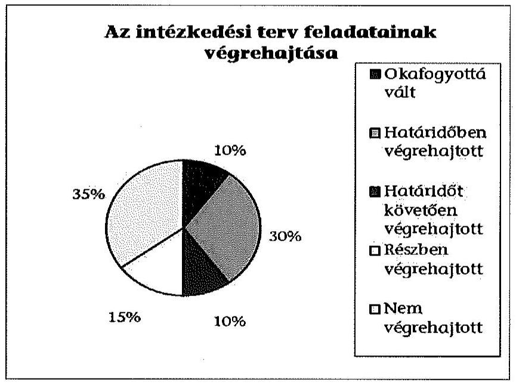
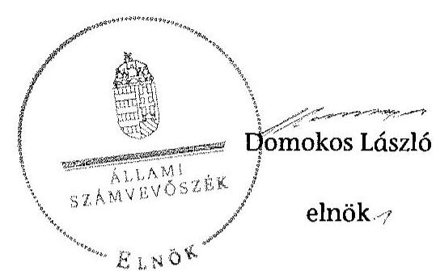

# ÁLLAMI
SZÁMVEVŐSZÉK

## JELENTÉS

Utóellenőrzések - az önkormányzatok pénzügyi gazdálkodási helyzetének, szabályszerűségének utóellenőrzése

Battonya

---

# Állami Számvevőszék

Iktatószám: V-0606-034/2015.
Témaszám: 1640
Vizsgálat-azonosító szám: V069306

## Az ellenőrzést felügyelte:

## Renkó Zsuzsanna

felügyeleti vezető
Az ellenőrzést vezette és az ellenőrzés végrehajtásáért felelős:
Mohl Anna
ellenőrzésvezető
A számvevőszéki jelentés összeállításában közreműködött:
Baksa Anikó
számvevő főtanácsos
Dr. Mezei Imréné
számvevő főtanácsos
Az ellenőrzést végezték:
Szalontai Miklós
Ungár Ervin
Krüzselyi Attila
számvevő tanácsos
számvevő
számvevő tanácsos

## A témához kapcsolódó eddig készített számvevőszéki jelentések:

## címe

Jelentés Battonya Város Önkormányzata pénzügyi gazdálkodási helyzetének, szabályosságának ellenőrzéséről
sorszáma
13064

---

# TARTALOMJEGYZÉK

BEVEZETÉS ..... 3
I. ÖSSZEGZŐ MEGÁLLAPÍTÁSOK, KÖVETKEZTETÉSEK ..... 6
II. RÉSZLETES MEGÁLLAPÍTÁSOK ..... 7

1.  Az önkormányzat a pénzügyi gazdálkodási helyzetének, szabályszerűségének ellenőrzéséről készült ÁSZ jelentésben foglalt javaslatokra készített-e intézkedési tervet, illetve teljesítette-e az abban foglaltakat? ..... 7
MELLÉKLETEK
2.  számú Az ÁSZ 13064 számú jelentéséhez kapcsolódó intézkedési terv végrehajtása
FÜGGELÉKEK
3.  számú Rövidítések jegyzéke
4.  számú Fogalomtár

---

.

---

# JELENTÉS

## Utóellenőrzések - az önkormányzatok pénzügyi gazdálkodási helyzetének, szabályszerűségének utóellenőrzése Battonya

## BEVEZETÉS

Az Állami Számvevőszék 2011-2015. évekre szóló stratégiája a helyi önkormányzatok ellenőrzésében a pénzügyi-gazdasági helyzete értékelésére, kockázatai feltárására helyezte a fő hangsúlyt. A 2011-2013. években az ÁSZ által ellenőrzött önkormányzatok esetében a működési, beruházási és a hosszú lejáratú pénzintézeti kötelezettségeinek teljesítésével kapcsolatos pénzügyi kockázatokat mutattuk be. Az ÁSZ megállapította, hogy az önkormányzatok pénzügyi egyensúlyi helyzete az ellenőrzött időszakban romlott, a pénzügyi kockázatok fokozódtak, a pénzügyi egyensúlyi helyzetet jellemző mutatószámok kedvezőtlenül változtak. Az önkormányzati alrendszerben 2012. év végétől 2014. évelejéig lezajlott adósságkonszolidáció és feladat-ellátási-, finanszírozási-rendszer változtatás következtében a települési önkormányzatok pénzügyi helyzete jelentős mértékben megváltozott, amely a jóváhagyott intézkedési tervek végrehajtását is befolyásolta.

Az ellenőrzött szervezet vezetője az ÁSZ tv. 33. § (1)-(2) bekezdésében foglaltak alapján a jelentések intézkedést igénylő megállapításaihoz kapcsolódóan köteles intézkedési tervet benyújtani, amelyet az ÁSZ-nak kell elfogadni. Amennyiben az ellenőrzött által vállalt intézkedések hiányosak, vagy más okból nem elfogadhatók az ÁSZ indoklással és póthatáridő tűzésével visszaküldi azt kijavításra, kiegészítésre. Az elfogadásról szóló tájékoztatásban az Állami Számvevőszék elnöke valamennyi ellenőrzött szervezet vezetőjének figyelmét felhívta arra, hogy az intézkedési tervben foglaltak megvalósítását - az ÁSZ tv. 33. § (7) bekezdésében foglaltak alapján - utóellenőrzés keretében ellenőrizheti.

Az ellenőrzés célja: annak megállapítása, hogy az ellenőrzött önkormányzatok pénzügyi gazdálkodási helyzetének, szabályszerűségének ellenőrzéséről készült ÁSZ jelentésben foglalt javaslatokra készítettek-e intézkedési terveket, illetve az ellenőrzött által összeállított intézkedési tervben meghatározott feladatokat végrehajtották-e. Ennek keretében ellenőrizzük, hogy:

- a polgármester az ÁSZ törvény értelmében az intézkedési tervet határidőben megküldte-e az ÁSZ részére, szükség volt-e az elfogadást megelőzően kiegészítésre, azt az előírt póthatáridőn belül megtették-e, a Képviselő-testület a kiegészített intézkedési tervet elfogadta-e;

---

- az önkormányzat az elfogadott (kiegészített) intézkedési tervében foglaltak megtételéről, az abban előírt határidők betartásával gondoskodott-e;
- az elfogadott intézkedések esetleges késedelme, végrehajtásának elmaradása milyen szintű kockázatot jelez a pénzügyi gazdálkodásra és annak szabályszerűségére.

Az utóellenőrzés várható hasznosulása: az ellenőrzés megállapításai segítséget nyújthatnak a közpénzügyi helyzet javításához. Az utóellenőrzés, jellegéből adódóan fokozza közbizalmat, fegyelmet, a társadalom, az ellenőrzöttek, a helyi döntéshozók vonatkozásában erősíti az ÁSZ tekintélyét és igazolja, hogy lejárt a következmények nélküli ellenőrzések időszaka. Az ÁSZ intézményén belül lehetőség nyílik arra, hogy az utóellenőrzés, mint ellenőrzési kategória a szervezet tevékenységében stabilizálódjék, a megállapítások visszacsatolása segítse és erősítse az ÁSZ hozzáadott értéket teremtő elemző tevékenységét és tanácsadó szerepét.

Az intézkedési tervek olyan típusú feladatokat határoztak meg az önkormányzatok számára, amelyek a működőképesség jövőbeni zavarainak elkerülését, a felelős fenntartható gazdálkodás követelményeinek érvényesülését, a pénzügyi műveletek racionális keretek közt tartását tűzték ki célul. Az utóellenőrzés által e területeken érzékelt mulasztások még megfelelő irányba terelhetik az intézkedési tervekben foglalt feladatok végrehajtását.

Az ÁSZ az elfogadott intézkedési terveket kockázatelemzésnek veti alá. Ennek során elvégezzük az ÁSZ által elfogadott intézkedési tervben előírt/vállalt feladatok végrehajtásának értékelését, amelynek során alkalmazandó besorolási kategóriák:

- okafogyottá vált feladat: ha végrehajtására - meghatározott esemény bekövetkezése, továbbá külső körülmény, a működést érintő feltétel változása miatt - már nincs szükség, illetve lehetőség, és egyértelműen megállapítható, hogy az intézkedést szükségessé tevő körülmény a jövőben nem fordulhat elő;
- nem időszerű (nem esedékes) feladat: amelynek ellenőrzési időszakon belüli végrehajtására azért nem került (kerülhetett) sor, mert az intézkedés alapjául szolgáló esemény nem következett be, de annak jövőbeni előfordulása lehetséges;
- határidőben végrehajtott feladat: ha teljesítése dokumentáltan az intézkedési tervben előírt határidőben és tartalommal, módon megtörtént;
- határidőn túl végrehajtott feladat: ha annak teljesítése az intézkedési tervben meghatározott módon, de az előírt határidőn túl történt meg;
- részben végrehajtott feladat: amelynek végrehajtása teljes körűen az intézkedési tervben előírt tartalommal/módon nem történt meg, vagy a feladatot nem az előírt gyakorisággal hajtották végre;
- végre nem hajtott feladat: ha a végrehajtásért felelősként megjelölt személy(ek)nek felróhatóan a teljesítés elmaradt, vagy a teljesítést nem dokumentálták.

---

Az ellenőrzést a számvevőszéki ellenőrzés szakmai szabályai szerint, szabályszerűségi ellenőrzés módszerével, a vonatkozó nemzetközi standardok figyelembevételével végeztük. Az ellenőrzésre az önkormányzatok elektronikus adatszolgáltatása alapján került sor, helyszíni ellenőrzést nem végeztünk. A megállapítások rögzítése az önkormányzatok által rendelkezésre bocsátott dokumentumok, tanúsítványok alapján történt, melyek valódiságát és teljes körűségét a polgármester, valamint a jegyző teljességi nyilatkozata igazolja.

A jóváhagyott intézkedési tervben előírt feladatok végrehajtásának ellenőrzését egységes szempontok, illetve értékelési kritériumok alapján végeztük. Figyelembe vettük az intézkedési terv jóváhagyását követően hatályba lépett jogszabályi előírások változásából következő események - kiemelten az önkormányzati alrendszerben lezajlott adósságkonszolidációs intézkedések, továbbá a feladat-ellátási és finanszírozási rendszer változásának - hatásait.

Az alkalmazott rövidítések jegyzékét az 1. számú függelék, az egyes fogalmak magyarázatát a 2. számú függelék tartalmazza.

Az ellenőrzött szervezet: Battonya Város Önkormányzata
Az ellenőrzött időszak: az intézkedési terv ÁSZ-nak történő benyújtásától az utóellenőrzés megkezdéséig tartó időszak.

Az ellenőrzés végrehajtásának jogszabályi alapját az ÁSZ tv. 1. § (3) bekezdése, az 5. § (2) és (6) bekezdései, a 33. § (7) bekezdése, valamint az Áht. 61. § (2) bekezdésének előírásai képezték.

Az ÁSZ tv. 29. § (1) bekezdése szerint a jelentéstervezetet észrevételezésre megküldtük az Önkormányzat polgármesterének, aki az ÁSZ tv. 29. § (2) bekezdésében foglalt észrevételezési jogával nem élt, a jelentéstervezetre észrevételt nem tett.

Az ÁSZ a 2013. évben zárta le az Önkormányzat pénzügyi gazdálkodási helyzetének, szabályosságának ellenőrzését. Az ellenőrzés tapasztalatairól készített 13064 számú jelentés az interneten, a www.asz.hu címen olvasható.

---

# I. ÖSSZEGZŐ MEGÁLLAPÍTÁSOK, KÖVETKEZTETÉSEK

Az ÁSZ utóellenőrzés keretében értékelte az Önkormányzat pénzügyi gazdálkodási helyzetének, szabályszerűségének ellenőrzéséről szóló jelentés javaslatainak hasznosítására elfogadott intézkedési terv végrehajtását.

Az előző ÁSZ ellenőrzés megállapította, hogy az Önkormányzat pénzügyi egyensúlya rövid távon nem volt biztosított. A feltárt hiányosságok alapján megfogalmazott ÁSZ javaslatok hasznosítására az Önkormányzat intézkedési tervet készített, melyet az ÁSZ kiegészítése nélkül elfogadott.

Az utóellenőrzés megállapította, hogy az ellenőrzött időszakban időszerűvé vált feladatait az Önkormányzat teljeskörűen nem hajtotta végre, ezáltal az ÁSZ javaslatai maradéktalanul nem hasznosultak.

Az utóellenőrzés megállapítása alapján a határidőt követően végrehajtott, valamint a részben illetve a nem teljesített feladatok magas kockázatot jelentenek a pénzügyi gazdálkodásra, annak szabályszerűségére.

---

# II. RÉSZLETES MEGÁLLAPÍTÁSOK

## 1. Az önkormányzat a pénzügyi gazdálkodási helyzetének, szabályszerűségének ellenőrzéséről készült ÁSZ jelentésben foglalt javaslatokra készített-e intézkedési tervet, illetve teljesítette-e az abban foglaltakat?

Az utóellenőrzés - a 2014. szeptember 16-ig végrehajtott intézkedéseket figyelembe véve - az Önkormányzat pénzügyi gazdálkodási helyzetének, szabályosságának ellenőrzéséről készült ÁSZ jelentés javaslatai hasznosítására elfogadott intézkedési terv végrehajtására irányult. A pénzügyi helyzet ellenőrzését az ÁSZ a 2009. január 1. - 2012. június 30. közötti időszakra végezte el, amelynek alapján megállapította, hogy az Önkormányzat pénzügyi egyensúlya rövid távon nem volt biztosított.

A polgármester a Képviselő-testületet tájékoztatta az ÁSZ jelentéséről. A jelentésben foglalt megállapításokhoz kapcsolódó intézkedési tervet ${ }^{1}$ az ÁSZ tv. 33. § (1) bekezdésében foglalt határidőn túl küldték meg az ÁSZ részére. Az ÁSZ az intézkedési tervet javítás és kiegészítés nélkül elfogadta.

Az ÁSZ által elfogadott intézkedési tervben meghatározott feladatokat, az ÁSZ jelentés javaslatainak címzettjét és a feladatok végrehajtását az 1. számú melléklet mutatja be.

Az ÁSZ által elfogadott intézkedési terv 20 tervezett intézkedést tartalmazott, felelősként a polgármestert és a jegyzőt megjelölve.

Az utóellenőrzés megállapításai alapján kettő feladat okafogyottá vált, hat feladat határidőben, kettő feladat határidőt követően, három feladat részben került végrehajtásra, hét feladat pedig nem került végrehajtásra. Az intézkedési tervben előírt feladatok között nem volt olyan, amelynek végrehajtása nem volt időszerű.

## Okafogyottá vált:

- a korábban el nem számolt gazdasági eseményekre vonatkozó könyvviteli elszámolás (a teljesség elvének érvényesítése érdekében), mert a 2009-2011. években el nem számolt pénzforgalom nélküli támogatási bevételek és kiadások 2012-ben már nem voltak elszámolhatóak az Áhsz. 9. § és 38. § rendelkezései szerint;
- a korábban el nem számolt gazdasági eseményekre vonatkozó könyvviteli elszámolás (a bruttó elszámolás elvének érvényesítése érdekében), mert a

[^0]
[^0]: ${ }^{1}$ A Képviselő-testület az intézkedési tervet a 128/2013. (IX. 12.) számú határozatával fogadta el.

---

2009-2011. években el nem számolt pénzforgalom nélküli támogatási bevételek és kiadások 2012-ben már nem voltak elszámolhatóak az Áhsz. 9. § és 38. § rendelkezései szerint.

# Határidőben végrehajtották:

- a hitelfelvételkor a törzsvagyonba tartozó ingatlanok és a támogatások biztosítékként, illetve fedezetként történő jogszerűtlen felajánlására vonatkozó korlátozás érvényesítését;
- a feladat átadás-átvételre vonatkozó döntések előkészítése során a döntésnek a kötelező és önként vállalt feladatok arányára, ezáltal a pénzügyi egyensúlyi helyzetre gyakorolt hatása vizsgálatának előírását;
- a fejlesztések döntés-előkészítési folyamatában a lebonyolítás és a működtetés kockázatai feltárására, kezelésére vonatkozó kötelezettség előírását;
- az Önkormányzat által nyújtott működési és felhalmozási célú pénzeszközátadásokkal kapcsolatosan a kedvezményezett számadási kötelezettsége ellenőrzési rendjének szabályozását;
- a pénzügyi kötelezettségek teljesítésének, a szállítói tartozások rendezésének szabályozását;
- a pénzintézeti kötelezettségvállalások kockázatainak döntés-előkészítő szakaszban történő feltárásának, a futamidő egyes éveit terhelő kötelezettség költségvetési egyensúlyra gyakorolt hatása vizsgálatának előírását.

## Határidőt követően hajtották végre:

- a pénzintézeti kötelezettségvállalással kapcsolatos jogi biztosítékok kiváltására vonatkozó döntését a Képviselő-testület 2013. november 30-ai határidő helyett 2013. december 19-én hozta meg;
- a közbeszerzési értékhatár alatti esetekben a pályáztatási kötelezettséggel kapcsolatos kontrolltevékenységek meghatározását, amelyre a 2013. december 31-i határidővel szemben 2014. szeptember 1-jén került sor.

Az ÁSZ által elfogadott intézkedési tervben meghatározott feladatok közül az alábbiakat részben teljesítették:

- a feladatellátás teljesítéséről a beszámolási kötelezettséget, valamint a szerződések minimum tartalmi követelményei meghatározásával összefüggő kontrolltevékenységeket előírták, azonban az önkormányzati feladatellátáshoz kapcsolódó támogatási rendszer feltételeit nem határozták meg. A feladat végrehajtásának felelőse a jegyző volt;
- a fejlesztésekhez kapcsolódó külső források, támogatások figyelési rendszerével összefüggő kontrolltevékenységeket előírták, azonban a pályázat készítés feltételeivel kapcsolatos kontrolltevékenységeket nem határozták meg. A feladat végrehajtásának felelőse a jegyző volt;
- a belső ellenőrzési terv tartalmazta a pénzügyi egyensúlyi helyzetet befolyásoló döntésekkel kapcsolatos kockázatok ellenőrzését, azonban a belső ellen-

---

őrzési tervet kockázatelemzéssel nem támasztották alá, nem mérték fel a gazdálkodásban rejlő kockázatokat.
 A feladat végrehajtásának felelőse a jegyző volt.

Az ÁSZ által elfogadott intézkedési tervben meghatározott feladatok közül az alábbiakat nem hajtották végre:

- nem vizsgálták meg a további bevételszerző, kiadáscsökkentő intézkedések lehetőségét, arra vonatkozó javaslatot a Képviselő-testület elé nem terjesztettek. A feladat végrehajtásának felelőse a polgármester volt;
- nem terjesztettek a Képviselő-testület elé jóváhagyásra az Önkormányzat gazdasági helyzetének elemzésén alapuló, a pénzügyi egyensúlyi helyzet gyors helyreállítását, hosszú távú fenntartását, valamint az adósságállomány újratermelődésének elkerülését biztosító intézkedéseket tartalmazó reorganizációs programot. A feladat végrehajtásának felelőse a polgármester volt;
- nem terjesztettek a Képviselő-testület elé olyan döntési javaslatot, amelyben a Képviselő-testület kötelezettséget vállal arra, hogy előre meghatározott összegben és módon a realizált többletbevételeket, a jövőben képződő tartalékokat mindaddig a kötelezettségek rendezésére fordítja, azt nem használja más célra, amíg az Önkormányzat pénzügyi egyensúlya rövid távon veszélyeztetett. A feladat végrehajtásának felelőse a polgármester volt;
- a szállítói kitettség és az adósságrendezési eljárás megindításának elkerülése érdekében nem számoltak be a Képviselő-testületnek az Önkormányzat lejárt szállítói állományának alakulásáról, illetve nem intézkedtek az esedékes szállítói számlák kiegyenlítéséről, valamint a lejárt tartozások átütemezéséről. A feladat végrehajtásának felelőse a polgármester volt;
- nem intézkedtek a devizában fennálló önkormányzati kötelezettségek 2012. év végi értékeléséről és az árfolyam különbözet elszámolásáról. A feladat végrehajtásának felelőse a jegyző volt;
- nem biztosították a 2012. évet megelőző évek vonatkozásában feltárt jelentős összegű hiba részletes bemutatását a 2012. évi beszámoló kiegészítő melléklete szöveges részében. Az előző éveket érintő hibákat a 2012. évben nem számolták el. A feladat végrehajtásának felelőse a jegyző volt;
- nem működtettek a pénzügyi egyensúlyt befolyásoló kockázatok kezelésére alkalmas kockázatkezelési rendszert. A feladat végrehajtásának felelőse a jegyző volt.

---

Az utóellenőrzés megállapítása alapján a határidőt követően végrehajtott, valamint a részben illetve a nem teljesített feladatok magas kockázatot jelentenek a pénzügyi gazdálkodásra, annak szabályszerűségére.

Budapest, 2015. 08 hónap 0h. nap

Melléklet: $\quad 1 \mathrm{db}$
Függelék: $\quad 2 \mathrm{db}$

---

# Az ÁSZ 13064 számú jelentéséhez kapcsolódó intézkedési terv végrehajtása

| Sorszám | Intézkedési terv alapján elvégzen-
dő feladat | Az intézkedési
tervben me-
határozott ha-
táridő | Az ÁSZ
13064 számú
jelentése ja-
vaslatának
címzettje | Az intézkedés végrehajtása |
| --- | --- | --- | --- | --- |
| | 1. | 2. | 3. | 4. |
| Okafogyottá vált intézkedések | | | | |
| 1. | A könyvvezetési és a beszámoló készítési
kötelezettség szabályszerű teljesítése érdeké-
ben a jegyző intézkedjen, hogy a könyvveze-
tés során a Sztv. 15. § (2) bekezdésében, va-
lamint az Áhsz. 9. § (2) bekezdésében előírt
teljesség elvének érvényesítése érdekében az
adott költségvetési év valamennyi gazdasági
eseményét számolják el, amelyek eszközökre,
forrásokra és a pénzmaradvány alakulására
gyakorolt hatását a beszámolóban be kell
mutatni. | „a 2012. évi be-
számolóban javít-
va" | jegyző | A 2012. évi ÁSZ ellenőrzés során feltárt, a 2009-
2011. években összesen 295,9 millió Ft összegű
el nem számolt támogatási bevétel és az ezzel
azonos összegű felhalmozási kiadás - mint
pénzforgalom nélküli tétel - a 2012. évben a
pénzforgalmi szemléletű kettős könyvvitelben
nem volt elszámolható az Áhsz. 9. § és a 38. §
rendelkezései szerint. |
| 2. | A könyvvezetési és a beszámoló készítési
kötelezettség szabályszerű teljesítése érdeké-
ben a jegyző biztosítsa, hogy a Sztv. 15. § (9)
bekezdésében előírt bruttó elszámolás elvé-
nek érvényesítése érdekében a könyvviteli
nyilvántartásokban a bevételek és kiadások
egymással szembeni elszámolására ne kerül-
jön sor. | „a 2012. évi be-
számolóban javít-
va" | jegyző | A 2012. évi ÁSZ ellenőrzés során feltárt, a 2009-
2011. években összesen 295,9 millió Ft összegű
el nem számolt támogatási bevétel és az ezzel
azonos összegű felhalmozási kiadás - mint
pénzforgalom nélküli tétel - a 2012. évben a
pénzforgalmi szemléletű kettős könyvvitelben
nem volt elszámolható az Áhsz. 9. § és a 38. §
rendelkezései szerint. |

---

| | Intézkedési terv alapján elvégzen-   dő feladat | Az intézkedési   tervben meg-   határozott ha-   táridő | Az ÁSZ   13064 számú   jelentése ja-   vaslatának   címzettje | Az intézkedés végrehajtása |
| :-- | :--: | :--: | :--: | :--: |
| | 1. | 2. | 3. | 4. |
| Határidőben végrehajtott intézkedések | | | | |
| 1. | A pénzintézeti kötelezettségvállalásokkal   kapcsolatos jogszerű biztosítékok, illetve fe-   dezet felajánlása érdekében a polgármester   intézkedjen, hogy jövőbeni hitelfelvétel és   kötvénykibocsátás fedezeteként az Áht. 84. §   (4) bekezdésében előírtak szerint a törzsv-   agyon körébe tartozó ingatlan, továbbá az   Önkormányzat általános működésének és   ágazati feladatainak támogatása és a költségvetési támogatás ne kerüljön felhasználásra; az Ávr. 145. § (2) bekezdésében előírtak szerint a költségvetési támogatások folyósítására szolgáló elkülönített bankszámláról hiteltörlesztést ne teljesítsenek. | 2013. november   30. | polgármester | Az Önkormányzat az intézkedési terv jóváhagyását követően a 2014. évi munkabér és folyószámla hitelek igénybevételét érintően hozott döntést (195/2013. (XII. 19.) és 196/2013. (XII. 19.) számú képviselő-testületi határozatok). Ingatlanfedezetként az önkormányzat törzsvagyonát nem képező ingatlanokat ajánlottak fel. Az önkormányzati bevételek felhasználhatóságával, elkülönített bankszámla terhelhetőségével kapcsolatban a hitelszerződésekben rögzítették, hogy biztosítékként történő érvényesítésre csak a vonatkozó jogszabályok figyelembevételével kerülhet sor. |
| 2. | Alakítsa ki a Bkr. 8. § (1)-(2) bekezdései alapján azokat a belső kontrolltevékenységeket, amelyek biztosítják a pénzügyi-gazdálkodási folyamatok szabályosságát, a pénzügyi egyensúlyi helyzet alakulását befolyásoló döntések kockázatainak kezelését. Ennek keretében:   írja elő a feladat átadás-átvételre vonatkozó döntések előkészítése során a döntés kötelező | 2013. november   30. | polgármester | A jegyző a 2013. november 1-jétől hatályos FEUVE szabályzat 3.3. pontjában előírta a feladat átadás-átvételre vonatkozó döntések előkészítése során a döntés kötelező és önként vállalt feladatok arányára, ezáltal a pénzügyi egyensúlyi helyzetre gyakorolt hatásának vizsgálatát. |

---

| Sorszám | Intézkedési terv alapján elvégzen-
dő feladat | Az intézkedési
tervben me-
határozott ha-
táridő | Az ÁSZ
13064 számú
jelentése ja-
vaslatának
címzettje | Az intézkedés végrehajtása |
| --- | --- | --- | --- | --- |
| | 1. | 2. | 3. | 4. |
| | és önként vállalt feladatok arányára, ezáltal
a pénzügyi egyensúlyi helyzetre gyakorolt
hatásának vizsgálatát. | | | |
| 3. | Alakítsa ki a Bkr. 8. § (1)-(2) bekezdései alap-
ján azokat a belső kontrolltevékenységeket,
amelyek biztosítják a pénzügyi-gazdálkodási
folyamatok szabályosságát, a pénzügyi
egyensúlyi helyzet alakulását befolyásoló
döntések kockázatainak kezelését. Ennek
keretében:
határozza meg a fejlesztések döntés-
előkészítés folyamatában a lebonyolítás és a
működtetés kockázatai feltárásának, kezelé-
sének kötelezettségét. | 2013. december
31. | jegyző | A jegyző által 2013. november 1-jétől hatályba
léptetett „Szabályzat az egyes önkormányzati köte-
lezettségvállalások előkészítésének és a szállítói
tartozások kezelésének rendjéről" elnevezésű do-
kumentum 3. pontjában meghatározásra ke-
rült a fejlesztések döntés-előkészítő szakaszában
a lebonyolítás és működtetés kockázatai feltár-
rásának, kezelésének kötelezettsége. |
| 4. | Alakítsa ki a Bkr. 8. § (1)-(2) bekezdései alap-
ján azokat a belső kontrolltevékenységeket,
amelyek biztosítják a pénzügyi-gazdálkodási
folyamatok szabályosságát, a pénzügyi
egyensúlyi helyzet alakulását befolyásoló
döntések kockázatainak kezelését. Ennek
keretében:
szabályozza az Önkormányzat által nyújtott
működési és felhalmozási célú pénzeszközát-
adásokkal kapcsolatosan a kedvezményezett | 2013. december
31. | jegyző | A jegyző az általa 2013. november 1-jétől ha-
tályba léptetett „A közpénzek felhasználásáról és
a közpénzből nyújtott támogatás rendjéről szóló
szabályzat" II.3. pontjában szabályozta a
számadás ellenőrzésének rendjét. |

---

| | Intézkedési terv alapján elvégzen-   dő feladat | Az intézkedési tervben meghatározott határidő | $\begin{gathered} \text { Az ÁSZ } \\ 13064 \text { számú } \\ \text { jelentése ja- } \\ \text { vaslatának } \\ \text { címzettje } \end{gathered}$ | Az intézkedés végrehajtása |
| :--: | :--: | :--: | :--: | :--: |
| | 1. | 2. | 3. | 4. |
| | számadási kötelezettsége ellenőrzésével ösz-   szefüggő kontrolltevékenységeket. | | | |
| 5. | Alakítsa ki a Bkr. 8. § (1)-(2) bekezdései alap-   ján azokat a belső kontrolltevékenységeket,   amelyek biztosítják a pénzügyi-gazdálkodási   folyamatok szabályosságát, a pénzügyi   egyensúlyi helyzet alakulását befolyásoló   döntések kockázatainak kezelését. Ennek   keretében:   készítsen szabályzatot a pénzügyi kötelezetts-   ségek teljesítésére, a szállítói tartozások ren-   dezésének helyi szabályaira. | 2013. december   31. | jegyző | A jegyző az általa 2013. november 2-án ha-   tályba léptetett „Szabályzat az egyes önkormány-   zati kötelezettségvállalások előkészítésének és a   szállítói tartozások kezelésének rendjéről" 4. pont-   jában szabályozta a szállítói tartozások és az   egyéb kiadás elmaradások kezelésének rendjét. |
| 6. | Alakítsa ki a Bkr. 8. § (1)-(2) bekezdései alap-   ján azokat a belső kontrolltevékenységeket,   amelyek biztosítják a pénzügyi-gazdálkodási   folyamatok szabályosságát, a pénzügyi   egyensúlyi helyzet alakulását befolyásoló   döntések kockázatainak kezelését. Ennek   keretében:   írja elő a pénzintézeti kötelezettségvállalások   kockázatainak döntés-előkészítő szakaszban   történő feltárását, a futamidő egyes éveit   terhelő kötelezettség költségvetési egyensúly-   ra gyakorolt hatásának vizsgálatát. | 2013. december   31. | jegyző | A jegyző az általa 2013. november 2-án ha-   tályba léptetett „Szabályzat az egyes önkormány-   zati kötelezettségvállalások előkészítésének és a   szállítói tartozások kezelésének rendjéről" 2. pont-   jában előírta a pénzintézeti kötelezettségválla-   lások kockázatainak feltárását a döntés-   előkészítés során és a futamidő egyes éveit ter-   helő kötelezettség költségvetési egyensúlyra   gyakorolt hatásának vizsgálatát. |

---

| Sorszám | Intézkedési terv alapján elvégzen-
dő feladat | Az intézkedési
tervben me-
határozott ha-
táridő | Az ÁSZ
13064 számú
jelentése ja-
vaslatának
címzettje | Az intézkedés végrehajtása |
| --- | --- | --- | --- | --- |
| | 1. | 2. | 3. | 4. |
| Határidőt követően végrehajtott intézkedések | | | | |
| 1. | A pénzintézeti kötelezettségvállalásokkal kapcsolatos jogszerű biztosíték, illetve fedezet felajánlás érdekében:
a jogellenes állapot megszüntetése érdekében vizsgálják meg a jogi biztosíték, valamint a megterhelt korlátozottan forgalomképes törzsvagyonba tartozó ingatlanok kiváltásának lehetőségét, és a polgármester terjesszen javaslatot a Képviselő-testület elé a jogszerűen biztosítékba adható önkormányzati bevételekkel és vagyontárgyakkal való kiváltásról. | 2013. november 30. | polgármester | A jogi biztosítékokra (keretbiztosítéki jelzálog) és a felajánlható bevételekre vonatkozó döntését a Képviselő-testület a 195/2013. (XII. 19.) és 196/2013. (XII. 19.) határozatokkal hozta meg a 2014. évi munkabér és folyószámla hitelek igénybevétele esetében. A hitelszerződésekben kikötötték a biztosítékok körét képező önkormányzati bevételek felhasználhatóságával kapcsolatban, hogy azok biztosítékként történő érvényesítése - nemfizetés esetén - csak a vonatkozó jogszabályok figyelembevételével történhet. A 2013. november 12-én módosított jelzálogszerződés szerint az Önkormányzat kizárólag üzleti vagyonát képező ingatlanvagyonára alapított keretbiztosítéki jelzálogjogot (szerződésmódosításra a korábbi döntések szerint már kivezetett jelzálogjogok alapján került sor).  |
|  2. | Alakítsa ki a Bkr. 8. § (1)-(2) bekezdései alapján azokat a belső kontrolltevékenységeket, amelyek biztosítják a pénzügyi-gazdálkodási folyamatok szabályosságát, a pénzügyi egyensúlyi helyzet alakulását befolyásoló | 2013. december 31. | jegyző | A jegyző az általa 2014. szeptember 1-jén hatályba léptetett „Beszerzések lebonyolításának szabályzata"-ban határozta meg a közbeszerzési értékhatár alatti pályáztatási kötelezettséggel kapcsolatos kontrolltevékenységeket.  |

---

|  Sorszám | Intézkedési terv alapján elvégzendő feladat | Az intézkedési
tervben me-
határozott ha-
táridő | Az ÁSZ
13064 számú
jelentése ja-
vaslatának
címzettje | Az intézkedés végrehajtása  |
| --- | --- | --- | --- | --- |
|   | 1. | 2. | 3. | 4.  |
|   | döntések kockázatainak kezelését. Ennek
keretében:
határozza meg a közbeszerzési értékhatár
alatti esetekben a pályáztatási kötelezettséggel kapcsolatos kontrolltevékenységeket. |  |  |   |
|  |   |   |   |   |

# Részben végrehajtott intézkedések

| 1. | Alakítsa ki a Bkr. 8. § (1)-(2) bekezdései alap-
ján azokat a belső kontrolltevékenységeket,
amelyek biztosítják a pénzügyi-gazdálkodási
folyamatok szabályosságát, a pénzügyi
egyensúlyi helyzet alakulását befolyásoló
döntések kockázatainak kezelését. Ennek
keretében:
írja elő az önkormányzati feladatellátáshoz
kapcsolódó támogatási rendszer feltételeit, a
feladatellátás teljesítéséről a beszámolási
kötelezettséget, valamint a szerződések mi-
nimum tartalmi követelményeinek megha-
tározásával összefüggő kontrolltevékenysé-
geket. | 2013. december
31. | jegyző | A jegyző az általa 2013. november 1-jén ha-
tályba léptetett FEUVE szabályzat 6. oldal 4.
pontjában szabályozta a feladatellátás teljesíté-
séről a beszámolási kötelezettséget. A 2013.
november 1-jétől hatályba léptetett „A közpén-
zek felhasználásáról és a közpénzből nyújtott ta-
mogatás rendjéről szóló szabályzat" II. fejezet 1)
pontjában előírta a szerződések minimum tar-
talmi követelményeinek meghatározásával
összefüggő kontrolltevékenységeket. Az önkor-
mányzati feladatellátáshoz kapcsolódó támogatási rendszer feltételeinek szabályozására
azonban nem került sor. | | :--: | :--: | :--: | :--: | :--: |

---

|  Sorszám | Intézkedési terv alapján elvégzendő feladat | Az intézkedési
tervben me-
határozott ha-
táridő | Az ÁSZ
13064 számú
jelentése ja-
vaslatának
címzettje | Az intézkedés végrehajtása  |
| --- | --- | --- | --- | --- |
|   | 1. | 2. | 3. | 4.  |
|  2. | Alakítsa ki a Bkr. 8. § (1)-(2) bekezdései alap-
ján azokat a belső kontrolltevékenységeket,
amelyek biztosítják a pénzügyi-gazdálkodási
folyamatok szabályosságát, a pénzügyi
egyensúlyi helyzet alakulását befolyásoló
döntések kockázatainak kezelését. Ennek
keretében:
határozza meg a fejlesztésekhez kapcsolódó
külső források, támogatások figyelési rendszerével, a pályázat készítés feltételeivel ösz-
szefüggő kontrolltevékenységeket. | 2013. december
31. | jegyző | A jegyző az általa 2013. november 1-jén ha-
tályba léptetett FEUVE szabályzat 9. oldalán a
bevételek beszedése körében kiemelt fontosá-
gúnak sorolta be a pályázati lehetőségek ki-
használásának ellenőrzését. Nem határozta
meg azonban a pályázat készítése feltételeivel
összefüggő kontrolltevékenységeket.  |
|  3. | A jegyző intézkedjen a belső ellenőrzés veze-
tője felé, hogy a Bkr. 7. § (2) bekezdésében
foglaltak szerint mérjék fel a gazdálkodás-
ban rejlő kockázatokat, a 29. § (1) bekezdé-
sében és a 31. § (2)-(4) bekezdésekben foglalt
előírások szerint az éves belső ellenőrzési
tervek tartalmazzák a pénzügyi egyensúlyi
helyzetet befolyásoló döntésekkel kapcsol-
atos feltárt kockázati tényezők ellenőrzését,
valamint biztosítsa az ellenőrzési tervek vég-
rehajtását. | 2013. november
30. | jegyző | A Képviselő-testület által jóváhagyott 2014. évi
belső ellenőrzési terv (163/2013. (X. 31.) hatá-
rozat) tartalmazta a pénzügyi egyensúlyi hely-
zetet befolyásoló döntésekkel kapcsolatos koc-
kázatok ellenőrzését, azonban a belső ellenő-
rzési tervet kockázatelemzéssel nem támasztot-
ták alá, nem mérték fel a gazdálkodásban rejlő
kockázatokat. A jegyző gondoskodott a 2014.
évi belső ellenőrzési terv végrehajtásáról, már-
cius 28-án elkészült a normatíva igénybevételét
megalapozó adatszolgáltatás belső ellenőrzésé-
ről szóló 4/2014. azonosítószámú jelentés (a
kockázati tényezőket és hatásukat magasnak
minősítették).  |

---

|  | Intézkedési terv alapján elvégzendő feladat | Az intézkedési   tervben meg-   határozott ha-   táridő | Az ÁSZ   13064 számú   jelentése ja-   vaslatának   címzettje | Az intézkedés végrehajtása |
| :-- | :--: | :--: | :--: | :--: |
|  | 1. | 2. | 3. | 4. |
|  | Nem végrehajtott intézkedések |  |  |  |
| 1. | A működési jövedelemtermelő képesség és a   feladatellátás összhangja, valamint az Önkormányzat pénzügyi egyensúlyának helyreállítása és hosszú távú fenntarthatósága érdekében - a 2013. évi kormányzati adósságkonszolidációt, valamint a 2013. évtől változó feladat-ellátási kötelezettséget és feladatfinanszírozási rendszert figyelembe véve:   a polgármester vizsgáltassa meg és terjessze a Képviselő-testület elé a további bevételszerző, kiadáscsökkentő intézkedések bevezetésének lehetőségét, és a döntés függvényében járjon el a bevezetésre kerülő bevételnövelő, kiadáscsökkentő intézkedések végrehajtása érdekében. | 2013. november   30. |  | polgármester | A polgármester nem vizsgáltatta meg, illetve nem terjesztette a Képviselő-testület elé a további bevételszerző, kiadáscsökkentő intézkedések bevezetésének lehetőségét.   Az Önkormányzat részéről a pénzügyi csoportvezető 2014. július 14-án tett nyilatkozata alapján „az önkormányzat az ellenőrzött időszakban bevételnövelést, valamint kiadási megtakarítást célzó intézkedéseket nem tett", illetve a 2014. augusztus 28-i nyilatkozata alapján „az önkormányzat az ellenőrzött időszakban a fizetőképesség megőrzését célzó stratégiákkal, koncepciókkal, egyéb dokumentációkkal nem rendelkezett". |
| 2. | A működési jövedelemtermelő képesség és a feladatellátás összhangja, valamint az Önkormányzat pénzügyi egyensúlyának helyreállítása és hosszú távú fenntarthatósága érdekében - a 2013. évi kormányzati adósságkonszolidációt, valamint a 2013. évtől változó feladatellátási kötelezettséget és fel- | 2013. november   30. |  | polgármester | A polgármester nem terjesztett a Képviselőtestület elé jóváhagyásra az Önkormányzat gazdasági helyzetének elemzésén alapuló, a pénzügyi egyensúlyi helyzet gyors helyreállítását, hosszú távú fenntartását, valamint az adósságállomány újratermelődésének elkerülését biztosító intézkedéseket tartalmazó reorga- |

---

|  Sorszám | Intézkedési terv alapján elvégzendő feladat | Az intézkedési
tervben me-
határozott ha-
táridő | Az ÁSZ
13064 számú
jelentése ja-
vaslatának
címzettje | Az intézkedés végrehajtása  |
| --- | --- | --- | --- | --- |
|   | 1. | 2. | 3. | 4.  |
|   | adatfinanszírozási rendszert figyelembe véve:
a polgármester terjesszen a Képviselő-testület
elé jóváhagyásra - a Htv. 140. § (1) bekezdés
a) pontja alapján a jegyző által elkészített -
az Önkormányzat gazdasági helyzetének
elemzésén alapuló, a pénzügyi egyensúlyi
helyzet gyors helyreállítását, hosszú távú
fenntartását, valamint az adósságállomány
újratermelődésének elkerülését biztosító intézkedéseket tartalmazó reorganizációs programot. |  |  | nizációs programot. Az Önkormányzat részéről
a pénzügyi csoportvezető 2014. augusztus 28-
án tett nyilatkozata alapján „az önkormányzat
az ellenőrzött időszakban a fizetőképesség megőrzését célzó stratégiákkal, koncepciókkal, egyéb dokumentációkkal nem rendelkezett".  |
|  3. | A működési jövedelemtermelő képesség és a feladatellátás összhangja, valamint az Önkormányzat pénzügyi egyensúlyának helyreállítása és hosszú távú fenntarthatósága érdekében - a 2013. évi kormányzati adósságkonszolidációt, valamint a 2013. évtől változó feladatellátási kötelezettséget és feladatfinanszírozási rendszert figyelembe véve:
a polgármester az adósságkonszolidációt követően fennmaradó kötelezettségek teljesítése, a fizetőképesség megőrzése érdekében terjesszen a Képviselő-testület elé - a Htv. 140. § (1) bekezdés a) pontja alapján a jegyző által elkészített - döntési javaslatot, | 2013. november 30. | polgármester | A polgármester nem terjesztett a Képviselőtestület elé olyan döntési javaslatot, amelyben a Képviselő-testület arra vállal kötelezettséget, hogy előre meghatározott összegben és módon a realizált többletbevételeket, a jövőben képződő tartalékokat mindaddig a kötelezettségek rendezésére fordítja, azt nem használja más célra, amíg az Önkormányzat pénzügyi egyensúlya rövid távon veszélyeztetett.  |

---

|  | Intézkedési terv alapján elvégzendő feladat | Az intézkedési tervben meghatározott határidő | $\begin{gathered} \text { Az ÁSZ } \\ 13064 \text { számú } \\ \text { jelentése ja- } \\ \text { vaslatának } \\ \text { címzettje } \end{gathered}$ | Az intézkedés végrehajtása |
| :--: | :--: | :--: | :--: | :--: |
|  | 1. | 2. | 3. | 4. |
|  | amelyben a Képviselő-testület kötelezettséget vállal arra, hogy előre meghatározott összegben és módon a realizált többletbevételeket, a jövőben képződő tartalékokat mindaddig a kötelezettségek rendezésére fordítja, azt nem használja más célra, amíg az Önkormányzat pénzügyi egyensúlya rövid távon veszélyeztetett. |  |  |  |
| 4. | A működési jövedelemtermelő képesség és a feladatellátás összhangja, valamint az Önkormányzat pénzügyi egyensúlyának helyreállítása és hosszú távú fenntarthatósága érdekében - a 2013. évi kormányzati adósságkonszolidációt, valamint a 2013. évtől változó feladatellátási kötelezettséget és feladatfinanszírozási rendszert figyelembe véve: a polgármester a szállítói kitettség és az Adósságrendezési tv. 4-9. §-aiban szabályozott adósságrendezési eljárás megindításának elkerülése érdekében meghatározott gyakorisággal számoljon be a Képviselőtestületnek az Önkormányzat lejárt szállítói állománya alakulásáról. Intézkedjen a szállítói számlák esedékesség szerinti kiegyenlítéséről vagy a lejárt tartozások átütemezéséről. | 2013. november   30. |  | polgármester | A szállítói kitettség és az adósságrendezési eljárás megindításának elkerülése érdekében a polgármester nem számolt be a Képviselőtestületnek az Önkormányzat lejárt szállítói állománya alakulásáról, illetve nem intézkedett az esedékes szállítói számlák kiegyenlítéséről, illetve a lejárt tartozások átütemezéséről. (Az Önkormányzat adatszolgáltatása szerint a 2013. év végén a 61-90 nap közötti lejárt esedékességű számlák összege 5,4 millió Ft, a 90 napon túli számláké 29,5 millió Ft volt. A 2014. év I. negyedév végén a 61-90 nap közötti lejárt esedékességű számlák összege 12,6 millió Ft, a 90 napon túli számláké 14,1 millió Ft volt.) |

---

|  | Intézkedési terv alapján elvégzendő feladat | Az intézkedési tervben meghatározott határidő | $\begin{gathered} \text { Az ÁSZ } \\ 13064 \text { számú } \\ \text { jelentése ja- } \\ \text { vaslatának } \\ \text { címzettje } \end{gathered}$ | Az intézkedés végrehajtása |
| :--: | :--: | :--: | :--: | :--: |
|  | 1. | 2. | 3. | 4. |
| 5. | A devizában fennálló kötelezettségek jogszabályi előírásoknak megfelelő számviteli nyilvántartása, illetve az ellenőrzés során feltárt jelentős összegű hiba rendezése érdekében: a jegyző intézkedjen, hogy a Sztv. 60. § (2) bekezdésében, valamint az Áhsz. 33. § (1) bekezdésében és a (2) bekezdés c) pontjában foglalt előírásoknak megfelelően végezzék el a devizában fennálló kötelezettségek év végi értékelését és az árfolyamkülönbözet elszámolását. | „a 2012. évi beszámolóban javítva" | jegyző | A 2014. szeptember 19-én tett nyilatkozat alapján a jegyző nem intézkedett a devizában fennálló önkormányzati kötelezettségek 2012. év végi értékeléséről és az árfolyam-különbözet elszámolásáról. |
| 6. | A devizában fennálló kötelezettségek jogszabályi előírásoknak megfelelő számviteli nyilvántartása, illetve az ellenőrzés során feltárt jelentős összegű hiba rendezése érdekében: a jegyző biztosítsa, hogy az Áhsz. 40. § (5) bekezdésében foglalt előírásnak megfelelően, amennyiben az ellenőrzés jelentős összegű hibá(ka)t állapított meg, az előző év(ek)re vonatkozó módosításokat a kiegészítő melléklet szöveges részében részletesen, a könyvviteli mérleg és a pénzmaradvány-kimutatás minden érintett tételéhez kapcsolódóan az előző év adatainak feltüntetése mellett mutassák be. Az előző év(ek)et érintő hibákat függetlenül attól, hogy azok jelentős össze- | „a 2012. évi beszámolóban javítva” | jegyző | A jegyző nem biztosította az ÁSZ ellenőrzés során megállapított, 2012. évet megelőző évek vonatkozásában feltárt jelentős összegű hiba (2010-ben 142,3 millió Ft, 2011-ben 208,3 millió Ft) részletes bemutatását a 2012. évi beszámolóban. A 2012. évben az előző éveket érintő jelentős összegű hibát nem számolták el a jegyző által 2014. szeptember 19-én tett nyilatkozat alapján. |

---

|  | Intézkedési terv alapján elvégzen-   dő feladat | Az intézkedési tervben meghatározott határidő | $\begin{gathered} \text { Az ÁSZ } \\ 13064 \text { számú } \\ \text { jelentése ja- } \\ \text { vaslatának } \\ \text { címzettje } \end{gathered}$ | Az intézkedés végrehajtása |
| :--: | :--: | :--: | :--: | :--: |
|  | 1. | 2. | 3. | 4. |
|  | gűek vagy sem, a hiba megállapításának évében számolják el a folyó évi könyvelésben. |  |  |  |
| 7. | A jegyző működtessen a Bkr. 7. § (1)-(2) bekezdéseiben foglalt előírásoknak megfelelő, a pénzügyi egyensúlyt befolyásoló kockázatok kezelésére alkalmas kockázatkezelési rendszert. | 2013. december   31. | jegyző | A jegyző nem működtetett a pénzügyi egyensúlyt befolyásoló kockázatok kezelésére alkalmas kockázatkezelési rendszert. A 2013. november 1-jétől hatályos Polgármesteri hivatal Kockázatkezelési szabályzata nem tartalmazott a pénzügyi egyensúlyt befolyásoló tényezőkre vonatkozó konkrét kockázati térképet. Az Önkormányzat adatszolgáltatása alapján megállapítható, hogy az Önkormányzat pénzügyi egyensúlyi helyzetét érintő kockázatok továbbra is fennállnak:   A bevételi kitettség növekedett, a működőképesség megőrzésére a 2013. évben kapott támogatás ( 78,8 millió Ft) a 2012. évi támogatást $40,9 \%$-kal haladta meg.   A 2013. év végén a 61-90 nap közötti lejárt esedékességű számlák összege 5,4 millió Ft, a 90 napon túli számláké 29,5 millió Ft volt. A 2014. év I. negyedév végén a 61-90 nap közötti lejárt esedékességű számlák összege 12,6 millió Ft, a 90 napon túli számláké 14,1 millió Ft volt. A lejárt szállítói tartozás |

---

|  | Intézkedési terv alapján elvégzen-   dő feladat | Az intézkedési   tervben meg-   határozott ha-   táridő | Az ÁSZ   13064 számú   jelentése ja-   vaslatának   címzettje | Az intézkedés végrehajtása |
| :--: | :--: | :--: | :--: | :--: |
|  | 1. | 2. | 3. | 4. |
|  |  |  |  | állományán belül a 90 napon túli lejárt számlák 2012. évi összege ( 24,1 millió Ft) 2013-ra 22,3\%-kal növekedett.   Az Önkormányzat likviditása megőrzése érdekében 2014. év elején munkabér- és folyószámla-hitelt vett fel. A Képviselő-testület 196/2013. (XII. 19.) határozata alapján 2014. január 30-án megkötött szerződések szerint a munkabérhitel keretösszege 20,0 millió Ft, a folyószámlahitelé 17,5 millió Ft volt.   A Képviselő-testület 2014. május 29-én a 69/2014. (V. 29.) számú határozattal döntött 6,5 millió Ft összegű kezességvállalásról külső gazdasági szervezet részére, amely az Önkormányzat pénzügyi egyensúlyi helyzetét befolyásoló további kockázati tényezőt jelentett. |

---

.

---

# RÖVIDÍTÉSEK JEGYZÉKE 

## Törvények

Adósságrendezési tv.

Áht.

ÁSZ tv.

Htv.

Sztv.

## Kormány rendeletek

Áhsz.

Ávr.

Bkr.

## Szórövidítések

ÁSZ
FEUVE
jegyző
Képviselő-testület
Önkormányzat
polgármester
a helyi önkormányzatok adósságrendezési eljárásáról szóló 1996. évi XXV. törvény (hatályos: 1996. június 11-től)
az államháztartásról szóló 2011. évi CXCV. törvény (hatályos 2011. december 31-étől)
az Állami Számvevőszékről szóló 2011. évi LXVI. törvény (hatályos 2011. július 1-jétől)
a helyi önkormányzatok és szerveik, a köztársasági megbízottak, valamint egyes centrális alárendeltségű szervek feladat- és hatásköreiről szóló 1991. évi XX. törvény (hatályos 1991. július 23-tól)
a számvitelről szóló 2000. évi C. törvény (hatályos 2001. január 1-jétől)

## az államháztartás szervezetei beszámolási és könyvvezetési kötelezettségének sajátosságairól szóló 249/2000. (XII. 24.) Korm. rendelet (hatályos 2001. január 1-jétől, hatálytalan 2014. január 1-jétől)
az államháztartásról szóló törvény végrehajtásáról szóló 368/2011. (XII. 31.) Korm. rendelet (hatályos 2012. január 1-jétől)
a költségvetési szervek belső kontrollrendszeréről és belső ellenőrzéséről szóló 370/2011. (XII. 31.) Korm. rendelet (hatályos 2012. január 1-jétől)

Állami Számvevőszék
folyamatba épített, előzetes és utólagos vezetői ellenőrzések
Battonya Város Önkormányzatának jegyzője
Battonya Város Önkormányzatának Képviselő-testülete
Battonya Város Önkormányzata
Battonya Város Önkormányzatának polgármestere

---

.

---

# FOGALOMTÁR 

adósságkonszolidáció
adósságszolgálat
árfolyamkockázat
banki kitettség
bevételi kitettség
felhalmozási kockázat
garanciavállalás
kezességvállalás
mérlegen kívüli tétel
működési kockázat

Több ütemben lezajlott központi intézkedés, amely a helyi önkormányzatok adósságállományának a magyar állam által történő átvállalására irányult. Az adósságkonszolidációs csomag releváns rendelkezéseit a 2012-2014. évi központi költségvetésről szóló törvények tartalmazták.
Az adósság tőkerészének és az esedékes kamat együttes összegének törlesztése.
Annak kockázata, hogy a külföldi devizában fennálló pénzügyi eszközök hazai fizetőeszközben kifejezett értéke az árfolyam elmozdulásával megváltozik.
Olyan függőségi viszony, ahol egy szervezet pénzügyi helyzete olyan külső körülmények hatására változhat, amely kizárólag a bank egyoldalú döntésén múlik.
Olyan függőségi viszony, ahol egy szervezet pénzügyi helyzetét meghatározó bevételek nagysága külső körülmények hatására azonnal és kedvezőtlen irányba változhat.
Annak kockázata, hogy a folyamatban lévő felhalmozási feladatok finanszírozásához szükséges pénzügyi forrás nem fog rendelkezésre állni.
Olyan kötelezettségvállalás, ahol a garanciát vállaló valamely jövőbeni esemény bekövetkezésekor, a szerződésben meghatározott feltételek beálltakor a garancia kedvezményezettje számára meghatározott összegig, meghatározott időpontig, felszólításra azonnal fizet.
A tárgyi eszközállomány állagának elemzéséhez használt mutató, számításakor a tárgyi eszköz könyv szerinti nettó értékét viszonyítják a tárgyi eszköz bruttó (beszerzési/létesítési) értékéhez.
Annak kockázata, hogy a változó kamatozású forint vagy a devizahitel futamideje alatt kedvezőtlen irányban változhat a hitel kamata.
Szerződésben vállalt olyan kötelezettség, amelyben a kezes arra vállal kötelezettséget, hogy ha a szerződés kötelezettje nem teljesít, a kezes maga fog helyette teljesíteni a jogosultnak.
Olyan szerződés alapján fennálló mérlegen kívüli [függő vagy biztos (jövőbeni)] kötelezettség, illetve követelés, amely a mérleg fordulónapján már fennáll, de mérlegtételkénti szerepeltetése egy jövőbeni esemény bekövetkezésétől vagy a szerződés teljesítésétől függ.
Annak kockázata, hogy nem megfelelő működésből, emberi hibákból, rendszerhibákból vagy külső eseményekből adódik veszteség.

---

nemfizetési kockázat
nettó működési jövedelem

ÖNHIKI támogatás
önkormányzat folyó költségvetési egyenlege
önkormányzat többségi tulajdonában lévő gazdasági társaságok
önkormányzat gazdasági társasága miatti kockázatot jelentő tényezők

Annak kockázata, hogy a kötelezett fennálló kötelezettségét átmenetileg vagy véglegesen nem tudja határidőre megfizetni.
A nettó működési jövedelem (pénzügyi kapacitás) a jövedelemtermelő képességet méri. Megmutatja a működési bevételekből a működési kiadások és a hitelek tőketörlesztésének kifizetése után fennmaradó jövedelmet.
Az önkormányzatok működőképességét szolgáló, önhibájukon kívül hátrányos helyzetben levő települési önkormányzatok támogatása.
A folyó költségvetés egyenlege, azaz a működési jövedelem megmutatja, hogy az önkormányzat éves folyó bevétele fedezetet biztosít-e a kötelező és önként vállalt feladatellátáshoz kapcsolódó éves folyó kiadására. A működési jövedelem negatív értéke pénzügyileg fenntarthatatlan helyzetet jelez. A mutató pozitív értéke megtakarítást mutat, amely forrásul szolgálhat az önkormányzat fennálló kötelezettségei megfizetéséhez, valamint fejlesztéseihez.
Azok a gazdasági társaságok, amelyekben az önkormányzat a szavazatok több mint ötven százalékával vagy jogszabályban rögzített meghatározó befolyással rendelkezik. A befolyással rendelkező akkor rendelkezik egy jogi személyben meghatározó befolyással, ha annak tagja, illetve részvényese, és jogosult e jogi személy vezető tisztségviselői vagy felügyelő bizottsága tagjai többségének megválasztására, illetve visszahívására, vagy a jogi személy más tagjaival, illetve részvényeseivel kötött megállapodás alapján egyedül rendelkezik a szavazatok több mint ötven százalékával.
Az önkormányzat gazdasági társaságának kedvezőtlen pénzügyi döntései következtében az önkormányzat pénzügyi egyensúlyi helyzetét veszélyeztető tényezők: az önkormányzat az önként vállalt és/vagy a kötelező feladatot ellátó társaságának a tevékenység ellátásához pénzeszközt ad át;
az önkormányzat nem vizsgálja a feladatellátás választott szervezeti megoldásának hatékonyságát;
a kötelező feladatellátást biztosító gazdasági társaság tevékenységének ágazati szabályozása változik (vízi közművagyon üzemeltetése);
a kizárólagos vagy többségi tulajdonú társaságok pénzügyi helyzete nem stabil, amely az alapítóra kötelezettségeket háríthat;
az önkormányzat a társaságok tevékenységét nem kísérte figyelemmel, nem élt az alapítói (irányítói) jogok gyakorlásával, a társaságok gazdálkodásának önkormányzati szintű konszolidálása nem biztosított;

---

pénzügyi kockázat

PPP
szállítói kockázat
szállítói kitettség
az önkormányzat garanciát vagy kezességet vállal a gazdasági társaság kötelezettségeire;
a társaságoknak átadott pénzeszköz uniós elvárásoknak megfelelő kezelése.
A pénzügyi kockázat magában foglalja mindazon kockázatokat, amelyek a szervezet pénzügyi helyzetére hatással vannak. Pl.: az adósságszolgálat miatti kockázatot, árfolyamkockázatot, felhalmozási kockázatot, fizetőképességi kockázatot, jövőbeni kötelezettségek kifizethetőségének kockázatát, kamatkockázatot, kezességvállalás kockázatát, likviditási kockázat, mérlegen kívüli tételek kockázata, nemfizetési kockázat, stb.
A köz- és a magánszféra együttműködésén alapuló fejlesztési konstrukció. Az állami és a magánszféra együttműködésének egyik formáját jelöli a PPP. A rövidítés a „köz- és magánszféra partnersége" angol nyelvű megfelelője. A PPP keretében a közcél a magánszféra jelentős mértékű közreműködésével valósul meg.
Annak kockázata, hogy a kötelezett a szállítókkal szemben fennálló, már elismert kötelezettségét átmenetileg vagy véglegesen nem tudja határidőre teljesíteni.
Olyan függőségi viszony, ahol egy szervezet pénzügyi helyzete a szállítói tartozások rendezése érdekében foganatosított intézkedések hatására azonnal és kedvezőtlen irányba változhat.