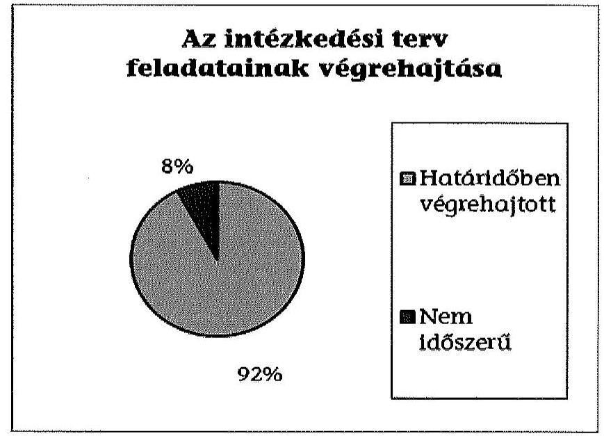
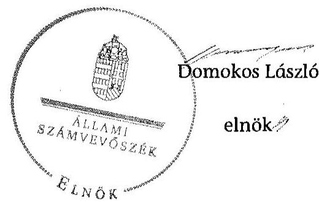

# ÁLLAMI   SZÁMVEVŐSZÉK 

## JELENTÉS

Utóellenőrzések - az önkormányzatok pénzügyi gazdálkodási helyzetének, szabályszerűségének utóellenőrzése

Bábolna

---

# Állami Számvevőszék 

Iktatószám: V-0618-029/2015.
Témaszám: 1652
Vizsgálat-azonosító szám: V069318

## Az ellenőrzést felügyelte:

## Renkó Zsuzsanna

felügyeleti vezető
Az ellenőrzést vezette és az ellenőrzés végrehajtásáért felelős:
Mohi Anna
ellenőrzésvezető
A számvevőszéki jelentés összeállításában közremúködött:
Baksa Anikó
számvevő főtanácsos
Dr. Mezei Imréné
számvevő főtanácsos
Az ellenőrzést végezték:
Bartolák Márta Gelencsér Zoltán Unger Ferenc
számvevő főtanácsos számvevő főtanácsos számvevő
Tóth Anita
számvevő

A témához kapcsolódó eddig készített számvevőszéki jelentések:
címe
sorszáma
Jelentés Bábolna Város Önkormányzata pénzügyi gazdálkodási 13028
helyzetének, szabályosságának ellenőrzéséről

---

# TARTALOMJEGYZÉK 

BEVEZETÉS ..... 3
I. ÖSSZEGZŐ MEGÁLLAPÍTÁSOK, KÖVETKEZTETÉSEK ..... 6
II. RÉSZLETES MEGÁLLAPÍTÁSOK ..... 7

1. Az önkormányzat a pénzügyi gazdálkodási helyzetének, szabályszerűségének ellenőrzéséről készült ÁSZ jelentésben foglalt javaslatokra készített-e intézkedési tervet, illetve teljesítette-e az abban foglaltakat? ..... 7
MELLÉKLETEK
2. számú Az ÁSZ 13028 számú jelentéséhez kapcsolódó intézkedési terv végrehajtá- sa
FÜGGELÉKEK
3. számú Rövidítések jegyzéke
4. számú Fogalomtár

---

.

---

# JELENTÉS 

## Utóellenőrzések - az önkormányzatok pénzügyi gazdálkodási helyzetének, szabályszerűségének utóellenőrzése Bábolna

## BEVEZETÉS

Az Állami Számvevőszék 2011-2015. évekre szóló stratégiája a helyi önkormányzatok ellenőrzésében a pénzügyi-gazdasági helyzete értékelésére, kockázatai feltárására helyezte a fő hangsúlyt. A 2011-2013. években az ÁSZ által ellenőrzött önkormányzatok esetében a múködési, beruházási és a hosszú lejáratú pénzintézeti kötelezettségeinek teljesítésével kapcsolatos pénzügyi kockázatokat mutattuk be. Az ÁSZ megállapította, hogy az önkormányzatok pénzügyi egyensúlyi helyzete az ellenőrzött időszakban romlott, a pénzügyi kockázatok fokozódtak, a pénzügyi egyensúlyi helyzetet jellemző mutatószámok kedvezőtlenül változtak. Az önkormányzati alrendszerben 2012. év végétől 2014. évelejéig lezajlott adósságkonszolidáció és feladat-ellátási-, finanszírozási-rendszer változtatás következtében a települési önkormányzatok pénzügyi helyzete jelentős mértékben megváltozott, amely a jóváhagyott intézkedési tervek végrehajtását is befolyásolta.

Az ellenőrzött szervezet vezetője az ÁSZ tv. 33. § (1)-(2) bekezdésében foglaltak alapján a jelentések intézkedést igénylő megállapításaihoz kapcsolódóan köteles intézkedési tervet benyújtani, amelyet az ÁSZ-nak kell elfogadni. Amennyiben az ellenőrzött által vállalt intézkedések hiányosak, vagy más okból nem elfogadhatók az ÁSZ indoklással és póthatáridő tűzésével visszaküldi azt kijavításra, kiegészítésre. Az elfogadásról szóló tájékoztatásban az Állami Számvevőszék elnöke valamennyi ellenőrzött szervezet vezetőjének figyelmét felhívta arra, hogy az intézkedési tervben foglaltak megvalósítását - az ÁSZ tv. 33. § (7) bekezdésében foglaltak alapján - utóellenőrzés keretében ellenőrizheti.

Az ellenőrzés célja: annak megállapítása, hogy az ellenőrzött önkormányzatok pénzügyi gazdálkodási helyzetének, szabályszerűségének ellenőrzéséről készült ÁSZ jelentésben foglalt javaslatokra készítettek-e intézkedési terveket, illetve az ellenőrzött által összeállított intézkedési tervben meghatározott feladatokat végrehajtották-e. Ennek keretében ellenőrizzük, hogy:

- a polgármester az ÁSZ törvény értelmében az intézkedési tervet határidőben megküldte-e az ÁSZ részére, szükség volt-e az elfogadást megelőzően kiegészítésre, azt az előírt póthatáridőn belül megtették-e, a Képviselő-testület a kiegészített intézkedési tervet elfogadta-e;

---

- az önkormányzat az elfogadott (kiegészített) intézkedési tervében foglaltak megtételéről, az abban előírt határidők betartásával gondoskodott-e;
- az elfogadott intézkedések esetleges késedelme, végrehajtásának elmaradása milyen szintű kockázatot jelez a pénzügyi gazdálkodásra és annak szabályszerűségére.

Az utóellenőrzés várható hasznosulása: az ellenőrzés megállapításai segítséget nyújthatnak a közpénzügyi helyzet javításához. Az utóellenőrzés, jellegéből adódóan fokozza közbizalmat, fegyelmet, a társadalom, az ellenőrzöttek, a helyi döntéshozók vonatkozásában erősíti az ÁSZ tekintélyét és igazolja, hogy lejárt a következmények nélküli ellenőrzések időszaka. Az ÁSZ intézményén belül lehetőség nyílik arra, hogy az utóellenőrzés, mint ellenőrzési kategória a szervezet tevékenységében stabilizálódjék, a megállapítások visszacsatolása segítse és erősítse az ÁSZ hozzáadott értéket teremtő elemző tevékenységét és tanácsadó szerepét.

Az intézkedési tervek olyan típusú feladatokat határoztak meg az önkormányzatok számára, amelyek a múködőképesség jövőbeni zavarainak elkerülését, a felelős fenntartható gazdálkodás követelményeinek érvényesülését, a pénzügyi műveletek racionális keretek közt tartását tűzték ki célul. Az utóellenőrzés által e területeken érzékelt mulasztások még megfelelő irányba terelhetik az intézkedési tervekben foglalt feladatok végrehajtását.

Az ÁSZ az elfogadott intézkedési terveket kockázatelemzésnek veti alá. Ennek során elvégezzük az ÁSZ által elfogadott intézkedési tervben előírt/vállalt feladatok végrehajtásának értékelését, amelynek során alkalmazandó besorolási kategóriák:

- okafogyottá vált feladat: ha végrehajtására - meghatározott esemény bekövetkezése, továbbá külső körülmény, a működést érintő feltétel változása miatt - már nincs szükség, illetve lehetőség, és egyértelműen megállapítható, hogy az intézkedést szükségessé tevő körülmény a jövőben nem fordulhat elő;
- nem időszerű (nem esedékes) feladat: amelynek ellenőrzési időszakon belüli végrehajtására azért nem került (kerülhetett) sor, mert az intézkedés alapjául szolgáló esemény nem következett be, de annak jövőbeni előfordulása lehetséges;
- határidőben végrehajtott feladat: ha teljesítése dokumentáltan az intézkedési tervben előírt határidőben és tartalommal, módon megtörtént;
- határidőn túl végrehajtott feladat: ha annak teljesítése az intézkedési tervben meghatározott módon, de az előírt határidőn túl történt meg;
- részben végrehajtott feladat: amelynek végrehajtása teljes körűen az intézkedési tervben előírt tartalommal/módon nem történt meg, vagy a feladatot nem az előírt gyakorisággal hajtották végre;
- végre nem hajtott feladat: ha a végrehajtásért felelősként megjelölt személy(ek)nek felróhatóan a teljesítés elmaradt, vagy a teljesítést nem dokumentálták.

---

Az ellenőrzést a számvevőszéki ellenőrzés szakmai szabályai szerint, szabályszerűségi ellenőrzés módszerével, a vonatkozó nemzetközi standardok figyelembevételével végeztük. Az ellenőrzésre az önkormányzatok elektronikus adatszolgáltatása alapján került sor, helyszíni ellenőrzést nem végeztünk. A megállapítások rögzítése az önkormányzatok által rendelkezésre bocsátott dokumentumok, tanúsítványok alapján történt, melyek valódiságát és teljes körüségét a polgármester, valamint a jegyző teljességi nyilatkozata igazolja.

A jóváhagyott intézkedési tervben előírt feladatok végrehajtásának ellenőrzését egységes szempontok, illetve értékelési kritériumok alapján végeztük. Figyelembe vettük az intézkedési terv jóváhagyását követően hatályba lépett jogszabályi előírások változásából következő események - kiemelten az önkormányzati alrendszerben lezajlott adósságkonszolidációs intézkedések, továbbá a fel-adat-ellátási és finanszírozási rendszer változásának - hatásait.

Az alkalmazott rövidítések jegyzékét az 1. számú függelék, az egyes fogalmak magyarázatát a 2. számú függelék tartalmazza.

Az ellenőrzött szervezet: Bábolna Város Önkormányzata
Az ellenőrzött időszak: az intézkedési terv ÁSZ-nak történő benyújtásától az utóellenőrzés megkezdéséig tartó időszak.

Az ellenőrzés végrehajtásának jogszabályi alapját az ÁSZ tv. 1. § (3) bekezdése, az 5. § (2) és (6) bekezdései, a 33. § (7) bekezdése, valamint az Áht. 61. § (2) bekezdésének előírásai képezték.

Az ÁSZ tv. 29. § (1) bekezdése szerint a jelentéstervezetet észrevételezésre megküldtük az Önkormányzat polgármesterének, aki az ÁSZ tv. 29. § (2) bekezdésében foglalt észrevételezési jogával nem élt, a jelentéstervezetre észrevételt nem tett.

Az ÁSZ a 2013. évben zárta le az Önkormányzat pénzügyi gazdálkodási helyzetének, szabályosságának ellenőrzését. Az ellenőrzés tapasztalatairól készített 13028 számú jelentés az interneten, a www.asz.hu címen olvasható.

---

# I. ÖSSZEGZŐ MEGÁLLAPÍTÁSOK, KÖVETKEZTETÉSEK 

Az ÁSZ utóellenőrzés keretében értékelte az Önkormányzat pénzügyi gazdálkodási helyzetének, szabályszerűségének ellenőrzéséről szóló jelentés javaslatainak hasznosítására elfogadott intézkedési terv végrehajtását.

Az előző ÁSZ ellenőrzés megállapította, hogy az Önkormányzat pénzügyi egyensúlya középtávon részben volt biztosított. A feltárt hiányosságok alapján megfogalmazott ÁSZ javaslatok hasznosítására az Önkormányzat intézkedési tervet készített, melyet az ÁSZ kiegészítés kérése nélkül elfogadott.

Az utóellenőrzés megállapította, hogy az ellenőrzött időszakban időszerűvé vált feladatait az Önkormányzat végrehajtotta, ezáltal az ÁSZ javaslatai maradéktalanul hasznosultak.

Az utóellenőrzés az intézkedési tervben előírt feladatok végrehajtásának elmaradásából vagy késedelmes teljesítésből adódó kockázatot nem tárt fel. Az intézkedések végrehajtásának hatására a pénzügyi stabilitás kialakulásának és fenntartásának feltételei javultak.

---

# II. RÉSZLETES MEGÁLLAPÍTÁSOK 

## 1. Az önkORMÁNYZAT a PÉNZÜGYI GAZDÁlKODÁSI HELYZETÉNEK, SZABÁLYSZERŰSÉGÉNEK ELLENŐRZÉSÉRŐL KÉSZÜLT ÁSZ JELENTÉSBEN FOGLALT JAVASLATOKRA KÉSZÍTETT-E INTÉZKEDÉSI TERVET, ILLETVE TELJESÍTETTE-E AZ ABBAN FOGLALTAKAT?

Az utóellenőrzés - a 2014. szeptember 16-ig végrehajtott intézkedéseket figyelembe véve - az Önkormányzat pénzügyi gazdálkodási helyzetének, szabályosságának ellenőrzéséről készült ÁSZ jelentés javaslatai hasznosítására elfogadott intézkedési terv végrehajtására irányult. A pénzügyi gazdálkodási helyzet ellenőrzését az ÁSZ a 2009. január 1. - 2012. június 30. közötti időszakra végezte el, amelynek alapján megállapította, hogy az Önkormányzat pénzügyi egyensúlya középtávon részben volt biztosított.

A polgármester a Képviselő-testületet tájékoztatta az ÁSZ jelentéséről. A jelentésben foglalt megállapításokhoz kapcsolódó intézkedési tervet ${ }^{1}$ az ÁSZ tv. 33. § (1) bekezdésében foglalt határidőn túl küldték meg az ÁSZ részére. Az ÁSZ az intézkedési tervet javítás és kiegészítés nélkül elfogadta.

Az ÁSZ által elfogadott intézkedési tervben meghatározott feladatokat, az ÁSZ jelentés javaslatainak címzettjét és a feladatok végrehajtását az 1. számú melléklet mutatja be.

Az ÁSZ által elfogadott intézkedési terv 13 tervezett intézkedést tartalmazott, felelősként a polgármestert, a jegyzőt és a pénzügyi csoportvezetőt megjelölve.

Az utóellenőrzés megállapítása alapján az intézkedési tervben előírt feladatokból egy végrehajtása nem volt időszerű, tizenkét feladatot határidőben végrehajtottak. Az intézkedési tervben előírt feladatok közül nem volt olyan, amelynek végrehajtása okafogyottá vált volna, illetve határidőt követően, részben vagy nem hajtottak volna végre.

## Nem volt időszerű:

- a hitelfelvétel és kötvénykibocsátás esetén az Önkormányzat általános múködésének és ágazati feladatainak támogatása fedezetként történő felhasználás elrendelésének tilalma, mivel hitelfelvételre, kötvénykibocsátásra nem került sor az ellenőrzött időszakban.

[^0]
[^0]:    ${ }^{1}$ A Képviselő-testület az intézkedési tervet a 78/2013. (VI. 27.) számú határozattal fogadta el.

---

# Határidőben végrehajtották: 

- a költségvetési rendelettervezet előterjesztését megelőzően a bevételszerző, kiadáscsökkentő lehetőségek felmérését, azok alkalmazásának szükségességét;
- az Önkormányzat adósságállománya újratermelődésének elkerülését biztosító intézkedéseket tartalmazó stabilizációs program elkészítését;
- az Önkormányzat vagyonáról, a vagyongazdálkodás szabályairól szóló rendelet kiegészítését a követelésekről való lemondás eseteinek és módjának meghatározásával;
- a zárszámadási rendeletben a költségvetési bevételek és kiadások az Áht. előírásai szerinti meghatározását;
- a kötelezettségeknek a Sztv.-ben, valamint az Áhsz-ben foglalt előírásoknak megfelelő kimutatását;
- az Önkormányzat kockázatkezelési rendszerének kiegészítését a pénzügyi egyensúlyt befolyásoló kockázatok azonosítására, feltárására és kezelésére vonatkozó előírásokkal;
- az ellenőrzési nyomvonal kiegészítését a közbeszerzési értékhatár alatti beszerzések esetén a pályáztatási kötelezettséghez, valamint a múködési és felhalmozási célú pénzeszközátadások feltételrendszeréhez kapcsolódó kontrolltevékenységekkel;
- a kockázatkezelési szabályzat kiegészítését a kizárólagos önkormányzati tulajdonban lévő gazdasági társaságok múködésével, pénzügyi helyzetével kapcsolatos döntések kockázatainak feltárására és kezelésére vonatkozó előírásokkal;
- a kockázatkezelési szabályzat kiegészítését a fejlesztések döntés-előkészítő folyamatában a lebonyolítás és a működtetés kockázatainak feltárására és kezelésére vonatkozó előírásokkal;
- a kockázatkezelési szabályzat kiegészítését a pénzintézeti kötelezettségvállalások kockázatainak feltárására, elemzésére, kezelésére vonatkozó előírásokkal;
- a felhalmozási kiadások eredeti és módosított előirányzatának Ávr. szerinti meghatározását;
- a 2013. évi intézményi pénzmaradványok Ávr. szerinti meghatározását.

A Képviselő-testület az intézkedési tervben foglaltak végrehajtásáról beszámolási kötelezettséget nem írt elő, azonban a 2013. októberi testületi ülésén a 151/2013. (X. 31.) számú képviselő-testületi határozattal az intézkedési terv végrehajtásáról szóló beszámolót elfogadta.

Az utóellenőrzés az intézkedési tervben előírt feladatok végrehajtásának elmaradásából vagy késedelmes teljesítésből adódó kockázatot nem tárt fel. Az Önkormányzat a nem időszerű (nem esedékes) feladat kivételével az intéz-

---

kedési tervben előírt, valamennyi feladatot az előírt határidőben, tartalommal és módon végrehajtotta. A nem időszerű (nem esedékes) feladat aránya nem haladja meg az intézkedési tervben előírt feladatok 10\%-át. A Képviselő-testület az intézkedési tervben foglalt feladatok végrehajtásáról szóló beszámolót elfogadta.

Az intézkedések végrehajtásának hatására a pénzügyi stabilitás kialakulásának és fenntartásának feltételei javultak.

Budapest, 2015. 08. hónap 0h. nap

| Melléklet: | 1 db |
| :-- | :-- |
| Függelék: | 2 db |

---

.

---

# Az ÁSZ 13028 számú jelentéséhez kapcsolódó intézkedési terv végrehajtása

|  Sorszám | Intézkedési terv alapján elvégzendő feladat | Az intézkedési tervben meghatározott határidő | Az ÁSZ 13028 számú jelentése javaslatának címzettje | Az intézkedés végrehajtása  |
| --- | --- | --- | --- | --- |
|   | 1. | 2. | 3. | 4.  |
|  Nem időszerű intézkedés |  |  |  |   |
|  1. | A hitelfelvétel és kötvénykibocsátás fedezeteként tilos az Önkormányzat általános múködésének és ágazati feladatainak támogatását felhasználni. | hitelfelvétel és kötvénykibocsátás esetén, illetve folyamatos | polgármester | A polgármester és a jegyző 2014. szeptember 17-én kelt nyilatkozata, valamint az Önkormányzat adatszolgáltatása alapján nem került sor hitelfelvételre, kötvénykibocsátásra. (Az intézkedés minősítése a polgármester és a jegyző közös nyilatkozata alapján történt.)  |
|  Határidőben végrehajtott intézkedések |  |  |  |   |
|  1. | A költségvetési rendelettervezet, valamint annak módosítása előterjesztését megelőzően fel kell mérni a bevételszerző, kiadáscsökkentő lehetőségeket és ennek érdekében meghozandó intézkedések bevezetéséhez szükséges javaslatokat az előterjesztésbe bele kell foglalni. | a költségvetési rendelet tervezet, valamint annak évközi módosításait megalapozó előterjesztés leadásának időpontja, illetve folyamatos | polgármester | Az Önkormányzat a bevételszerző és kiadáscsökkentő lehetőségek figyelembevételével összehasonlító elemzést készített a Képviselő-testület 2014. január 23-i rendkívüli ülésére a 2014. évi költségvetési rendelettervezet első fordulós előterjesztése és megvitatása keretében a gazdálkodási döntések megalapozása érdekében. Ebben bemutatták a 2013-ban realizált és a 2014. évben várható bevételek és kiadások alakulását a bevételek növelé-  |

---

|  1. | Intézkedési terv alapján elvégzendő feladat | Az intézkedési tervben meghatározott határidő | Az ÁSZ 13028 számú jelentése javaslatának címzettje | Az intézkedés végrehajtása  |
| --- | --- | --- | --- | --- |
|   | 1. | 2. | 3. | 4.  |
|   |  |  |  | sének és a kiadások csökkentésének figyelembevételével.
Az anyagot a Képviselő-testület megtárgyalta (6/2014. (I. 23.) számú kép-viselő-testületi határozat) és úgy ítélte meg, hogy az Önkormányzat pénzügyi helyzete 2014. évben is stabil, ezért egyéb bevételszerző, kiadáscsökkentő intézkedések meghozatalára nincs szükség, javaslatokat nem fogalmaztak meg.  |
|  2. | El kell készíteni az Önkormányzat adósságállománya újratermelődésének elkerülését biztosító intézkedéseket tartalmazó stabilizációs programot. | 2013. szeptember 30. | polgármester | A 151/2013. (X. 31.) számú képviselőtestületi határozattal elfogadott Gazdasági stabilizációs program 20132014 - külső pénzügyi szakértő közreműködésével - 2013. szeptember 23án elkészült.  |
|  3. | A 10/2013. (I. 24.) számú, az Önkormányzat vagyonáról, a vagyongazdálkodás szabályairól szóló rendeletet ki kell egészíteni a követelésekről való lemondás eseteinek és módjának meghatározásával, összhangban az Áht. 97. § (2) bekezdésében foglalt előírásokkal. | 2013. szeptember 30. | polgármester | Az Önkormányzat vagyonáról, a vagyongazdálkodás szabályairól szóló rendeletet módosították a 22/2013. (IX. 26.) számú önkormányzati rendelettel, amely alapján az kiegészült (16/A. §) az Önkormányzat követeléseiről történő lemondásra jogosultak, illetve a lemondás eseteinek meghatározásával.  |

---

|  1. SZÁMÚ MELLÉKLET A V-0618-029/2015. SZÁMÚ JELENTÉSHEZ |  |  |  |   |
| --- | --- | --- | --- | --- |
|  Sorszám | Intézkedési terv alapján elvégzendő feladat | Az intézkedési tervben meghatározott határidő | Az ÁSZ 13028 számú jelentése javaslatának címzettje | Az intézkedés végrehajtása  |
|   | 1. | 2. | 3. | 4.  |
|  4. | A zárszámadási rendeletben a költségvetési bevételeket és kiadásokat az Áht. 5. § (1)-(2) bekezdésében foglalt előírások szerint kell meghatározni. | 2013. évi zárszámadási rendelet előterjesztése, illetve folyamatos | jegyző | Az Önkormányzat 4/2014. (IV. 24.) számú 2013. évi zárszámadási rendelete az Áht-ban előírtak szerint - finanszírozási bevételek és kiadások nélkül - tartalmazta a költségvetési bevételeket és költségvetési kiadásokat. A bevételek főösszege a költségvetési bevételektől elkülönítve mutatta be a finanszírozási bevételeket, a kiadások főösszege a költségvetési kiadásoktól elkülönítve tartalmazta a finanszírozási kiadások összegét.  |
|  5. | A könyvviteli mérlegben a kötelezettségeket a Sztv. 15. § (2) bekezdésében és az Áhsz. 26. § (3) bekezdés d) pontjában és a 26. § (5) b) pontjában foglalt előírásoknak megfelelően kell kimutatni. | 2013. évi költségvetési beszámoló, illetve folyamatos | jegyző | Az Önkormányzat a rövid és hosszúlejáratú kötelezettségeket a 2013. évi költségvetési beszámolóban a Sztv-ben valamint az Áhsz-ben foglalt előírásoknak megfelelően mutatta ki.
Az Önkormányzat a 2013. évi költségvetési beszámolójában a hosszú lejáratú kötelezettség 8,4 millió Ft összegét az egyéb hosszú lejáratú kötelezettség - a Győr-Szol. Zrt. részére fizetendő összeg éven túli törlesztésének összege - tette ki. Egyéb hosszú lejáratú kötelezettsége az Önkormányzatnak a 2013. évben nem volt.
Az Önkormányzatnak a 2013. évi költségvetési beszámolója szerint nem  |

---

|  ㄷ   2015 | Intézkedési terv alapján elvégzendő feladat | Az intézkedési tervben meghatározott határidő | $\begin{gathered} \text { Az ÁSZ } 13028 \\ \text { számú jelentése } \\ \text { javaslatának } \\ \text { címzettje } \end{gathered}$ | Az intézkedés végrehajtása  |
| --- | --- | --- | --- | --- |
|   | 1. | 2. | 3. | 4.  |
|   |  |  |  | volt rövid lejáratú hitele. A rövid lejáratú kötelezettségek 48,4 millió Ft öszszegét a szállítók, a helyi adó túlfizetés, a térítési díjak túlfizetései, ÁFA hozzájárulás és a Győr-Szol. Zrt. részére 2014. évben fizetendő törlesztés összegei tették ki.  |
|  6. | Az Önkormányzat kockázatkezelési rendszerét ki kell egészíteni a pénzügyi egyensúlyt befolyásoló kockázatok felmérésére és kezelésére alkalmas előírásokkal. | 2013. szeptember 30. | jegyző | A 2013. szeptember 30-i hatállyal kiadott Bábolnai Közös Önkormányzati Hivatal Kockázatkezelési Szabályzatát kiegészítették (2.3. pont (1) bekezdés a)-e) pontok) a pénzügyi egyensúlyt befolyásoló kockázatok azonosítására, feltárására és kezelésére vonatkozó előírásokkal.  |
|  7. | Az Önkormányzat ellenőrzési nyomvonalát ki kell egészíteni a közbeszerzési értékhatár alatti beszerzések esetén a pályáztatási kötelezettség teljesítésével, valamint a múködési és felhalmozási célú pénzeszközátadások feltételrendszerével kapcsolatos kontrolltevékenységgel. | 2013. szeptember 30. | jegyző | A 2013. szeptember 30-i hatállyal kiadott Bábolnai Közös Önkormányzati Hivatal Ellenőrzési Nyomvonala tartalmazta a közbeszerzési értékhatár alatti beszerzésekre vonatkozó pályáztatás (ellenőrzési nyomvonal táblázat 4-5. oldal), valamint a múködési és felhalmozási célú pénzeszközátadások (ellenőrzési nyomvonal táblázat 1516. oldal) kontrolltevékenységeit.  |

---

|  Sorszám | Intézkedési terv alapján elvégzendő feladat | Az intézkedési tervben meghatározott határidő | Az ÁSZ 13028 számú jelentése javaslatának címzettje | Az intézkedés végrehajtása  |
| --- | --- | --- | --- | --- |
|   | 1. | 2. | 3. | 4.  |
|  8. | Felül kell vizsgálni és ki kell egészíteni az Önkormányzat kockázatkezelési szabályzatát:
elő kell írni a kizárólagos Önkormányzati tulajdonban lévő gazdasági társaságok müködésével, pénzügyi helyzetével kapcsolatos képviselő-testületi döntések kockázatainak feltárását és kezelését. | 2013. szeptember 30. | jegyző | A 2013. szeptember 30-i hatállyal kiadott Bábolnai Közös Önkormányzati Hivatal Kockázatkezelési Szabályzatában (2.3. pont (2) bekezdés) rögzítették a kizárólagos önkormányzati tulajdonban lévő gazdasági társaságok müködésével, pénzügyi helyzetével kapcsolatos döntések kockázatainak feltárására és kezelésére vonatkozó előírásokat.  |
|  9. | Felül kell vizsgálni és ki kell egészíteni az Önkormányzat kockázatkezelési szabályzatát:
meg kell határozni a fejlesztések döntéselőkészítés folyamatában a lebonyolítás és a müködtetés kockázatainak feltárását és kezelésének kötelezettségét. | 2013. szeptember 30. | jegyző | A 2013. szeptember 30-i hatállyal kiadott Bábolnai Közös Önkormányzati Hivatal Kockázatkezelési Szabályzatában (2.3. pont (3) bekezdés) rögzítették a fejlesztések döntés-előkészítés folyamatában a lebonyolítás és a müködtetés kockázatainak feltárására és kezelésére vonatkozó előírásokat.  |
|  10. | Felül kell vizsgálni és ki kell egészíteni az Önkormányzat kockázatkezelési szabályzatát:
elő kell írni a pénzintézeti kötelezettségvállalások kockázatainak döntés-előkészítő szakaszban történő feltárását, a futamidő egyes éveit terhelő kötelezettségek költségvetési egyensúlyra gyakorolt hatásának vizsgálatát. | 2013. szeptember 30. | jegyző | A 2013. szeptember 30-i hatállyal kiadott Bábolnai Közös Önkormányzati Hivatal Kockázatkezelési Szabályzatában (2.3. pont (4) bekezdés) rögzítették a pénzintézeti kötelezettségvállalások kockázatainak feltárására, elemzésére, kezelésére vonatkozó előírásokat.  |

---

|  1. SZAMÚ MELLÉKLET A V-0618-029/2015. SZAMÚ JELENTÉSHEZ |  |  |  |  |  |  |   |
| --- | --- | --- | --- | --- | --- | --- | --- |
|  1. SZAMÚ MELLÉKLET |  |  |  |  |  |  |   |
|  1. SZAMÚ JELENTÉSHEZ |  |  |  |  |  |  |   |
|  Intézkedési terv alapján elvégzendő feladat | Az intézkedési tervben meghatározott határidő | Az ÁSZ 13028 számú jelentése javaslatának címzettje | Az intézkedés végrehajtása |  |  |  |   |
|  11. | 1. | 2. | 3. | 4. |  |  |   |
|  11. | A felhalmozási kiadások eredeti előirányzatát az Ávr. 24. § (1) bekezdés ba) pontjában foglalt előírásnak megfelelően kell meghatározni. | 2014. évi költségvetési rendelettervezet előterjesztése, illetve folyamatos | jegyző | Az Önkormányzat a 2014. évi költségvetéséről szóló 2/2014. (II. 5.) számú rendeletében, valamint annak 11/2014. (VI. 26.) számú módosításában (3. számú mellékletek) a beruházásokat és felújításokat az Ávr-ben foglalt előírásnak megfelelően – a teljes bekerülési költség figyelembevételével – határozta meg. |  |  |  |   |
|  12. | Az intézmények pénzmaradványát az Ávr. 155. § (1)-(2) bekezdéselben előírt szabályok szerint kell meghatározni. | 2013. évi költségvetési beszámoló elkészítése, illetve folyamatos | jegyző | Az Önkormányzat 4/2014. (IV. 24.) számú 2013. évi zárcsámadási rendelete, valamint a 2013. évi költségvetési beszámolója az Ávr-ben foglaltak szerint meghatározta az intézmények költségvetési maradványát és annak elszámolási módját (ennek keretében figyelembe vették az Önkormányzatot, mint irányító szervet megillető elvonásokat). |  |  |  |   |

---

# RÖVIDÍTÉSEK JEGYZÉKE 

## Törvények

Áht.
Az államháztartásról szóló 2011. évi CXCV. törvény (hatályos 2011. december 31-étől)
ÁSZ tv.
az Állami Számvevőszékről szóló 2011. évi LXVI. törvény (hatályos 2011. július 1-jétől)
Sztv.
a számvitelről szóló 2000 . évi C. törvény (hatályos 2001. január 1-jétől)

## Kormány rendeletek

Áhsz.
az államháztartás szervezetei beszámolási és könyvvezetési kötelezettségének sajátosságairól szóló 249/2000. (XII. 24.) Korm. rendelet (hatályos 2001. január 1-jétől, hatálytalan 2014. január 1-jétől)
Ávr.
az államháztartásról szóló törvény végrehajtásáról szóló 368/2011. (XII. 31.) Korm. rendelet (hatályos 2012. január 1-jétől)

## Szórövidítések

áfa
ÁSZ
jegyzó
Képviselö-testület
Önkormányzat
polgármester
általános forgalmi adó
Állami Számvevőszék
Bábolna Város Önkormányzatának jegyzője
Bábolna Város Önkormányzatának Képviselő-testülete
Bábolna Város Önkormányzata
Bábolna Város Önkormányzatának polgármestere

---

# **Chemistry**

## **Chemical Reactions**

### **Balancing Chemical Equations**

1. **Write the unbalanced equation:**
   - Example: $$C_3H_8 + O_2 \rightarrow CO_2 + H_2O$$

2. **Balance the equation:**
   - Example: $$2C_3H_8 + 7O_2 \rightarrow 6CO_2 + 8H_2O$$

3. **Balance the equation:**
   - Example: $$2C_3H_8 + 7O_2 \rightarrow 6CO_2 + 8H_2O$$

### **Types of Reactions**

1. **Combination Reaction:**
   - Example: $$2H_2 + O_2 \rightarrow 2H_2O$$

2. **Decomposition Reaction:**
   - Example: $$2H_2O_2 \rightarrow 2H_2O + O_2$$

3. **Single Displacement Reaction:**
   - Example: $$Zn + 2HCl \rightarrow ZnCl_2 + H_2$$

4. **Double Displacement Reaction:**
   - Example: $$AgNO_3 + NaCl \rightarrow AgCl + NaNO_3$$

5. **Combustion Reaction:**
   - Example: $$CH_4 + 2O_2 \rightarrow CO_2 + 2H_2O$$

## **Stoichiometry**

### **Mole Concept**

- **Mole (mol):** The amount of substance containing as many particles (atoms, molecules, ions) as there are atoms in exactly 12 grams of carbon-12.
- **Avogadro's Number:** $$6.022 \times 10^{23}$$ particles per mole.

### **Molar Mass**

- **Molar Mass:** The mass of one mole of a substance.
- Example: The molar mass of water ($$H_2O$$) is 18.015 g/mol.

### **Calculations**

1. **Moles to Mass:**
   - Formula: $$n = \frac{m}{M}$$
   - Example: Calculate the number of moles of $$H_2O$$ in 18 grams of water.
     - $$n = \frac{18.015 \, \text{g}}{18.015 \, \text{g/mol}} = 18.015 \, \text{g/mol}$$

2. **Moles to Mass:**
   - Formula: $$m = n \times M$$
   - Example: Calculate the mass of 2 moles of $$H_2O$$.
     - $$m = 2 \, \text{mol} \times 48.015 \, \text{g/mol} = 24.015 \, \text{g/mol}$$

## **Gas Laws**

### **Ideal Gas Law**

- **Equation:** $$PV = nRT$$
  - P = Pressure (atm)
  - V = Volume (L)
  - n = Number of moles (mol)
  - R = Ideal gas constant (0.0821 L·atm/mol·K)
  - T = Temperature (K)

### **Boyle's Law**

- **Equation:** $$P_1V_1 = P_2V_2$$
  - P₁ = Pressure (atm)
  - V₁ = Volume (L)
  - n = Number of moles (mol)
  - R = Ideal gas constant (0.0821 L·atm/mol·K)
  - T = Temperature (K)

### **Boyle's Law**

- **Equation:** $$\frac{P_1V_1}{T_1} = \frac{P_2V_2}{T_2}$$

## **Thermochemistry**

### **Enthalpy (H)**

- **Definition:** The heat content of a system at constant pressure.
- **Equation:** $$\Delta H = q_p$$
  - qₚ = Heat transferred at constant pressure.

### **Hess's Law**

- **Statement:** The enthalpy change for a reaction is the same whether it occurs in one step or multiple steps.
- **Equation:** $$\Delta H_{\text{reaction}} = \Delta H - Q_p$$
  - Qₚ = Heat transferred at constant pressure.

### **Hess's Law1**

- **Statement:** The enthalpy change for a reaction is the same whether it occurs in one step or multiple steps.
- **Equation:** $$\Delta H_{\text{reaction1}} = \Delta H - Q_p$$
  - Qₚ = Heat transferred at constant pressure.

## **Electrochemistry**

### **Oxidation and Reduction**

- **Oxidation:** Loss of electrons.
- **Reduction:** Gain of electrons.

### **Galvanic Cells**

- **Definition:** A cell that converts chemical energy into electrical energy.
- **Components:**
  - Anode: Oxidation occurs.
  - Cathode: Reduction occurs.
  - Salt Bridge: Connects the two half-cells.

### **Nernst Equation**

- **Equation:** $$E = E^\circ - \frac{RT}{nF} \ln Q$$
  - E = Cell potential
  - R = Ideal gas constant
  - T = Temperature (K)
  - n = Number of moles of electrons transferred
  - F = Faraday constant
  - Q = Reaction quotient

## **Acids and Bases**

### **Arrhenius Theory**

- **Acid:** Substance that dissociates in water to produce H⁺ ions.
- **Base:** Substance that dissociates in water to produce OH⁻ ions.
- **Acid:** Proton donor.
- **Base:** Proton acceptor.

### **Brønsted-Lowry Theory**

- **Acid:** Proton acceptor.
- **Base:** Proton donor.

### **Lewis Theory**

- **Acid:** Electron pair acceptor.
- **Base:** Electron pair donor.

## **Organic Chemistry**

### **Functional Groups**

- **Alkanes:** -C=O -C=18 -C=18 -C=18 -C=18 -C=18 -C=18 -C=18 -C=18 -C=18 -C=18 -C=18 -C=18 -C=18 -C=18 -C=18 -C=18 -C=18 -C=18 -C=18 -C=18 -C=18 -C=18 -C=18 -C=18 -C=18 -C=18 -C=18 -C=18 -C=18 -C=18 -C=18 -C=18 -C=18 -C=18 -C=18 -C=18 -C=18 -C=18 -C=18 -C=18 -C

---

# FOGALOMTÁR 

adósságkonszolidáció
adósságszolgálat
árfolyamkockázat
banki kitettség
bevételi kitettség
felhalmozási kockázat
garanciavállalás
készségvállalás
mérlegen kívüli tétel
működési kockázat

Több ütemben lezajlott központi intézkedés, amely a helyi önkormányzatok adósságállományának a magyar állam által történő átvállalására irányult. Az adósságkonszolidációs csomag releváns rendelkezéseit a 2012-2014. évi központi költségvetésről szóló törvények tartalmazták.
Az adósság tőkerészének és az esedékes kamat együttes összegének törlesztése.
Annak kockázata, hogy a külföldi devizában fennálló pénzügyi eszközök hazai fizetőeszközben kifejezett értéke az árfolyam elmozdulásával megváltozik.
Olyan függőségi viszony, ahol egy szervezet pénzügyi helyzete olyan külső körülmények hatására változhat, amely kizárólag a bank egyoldalú döntésén múlik.
Olyan függőségi viszony, ahol egy szervezet pénzügyi helyzetét meghatározó bevételek nagysága külső körülmények hatására azonnal és kedvezőtlen irányba változhat.
Annak kockázata, hogy a folyamatban lévő felhalmozási feladatok finanszírozásához szükséges pénzügyi forrás nem fog rendelkezésre állni.
Olyan kötelezettségvállalás, ahol a garanciát vállaló valamely jövőbeni esemény bekövetkezésekor, a szerződésben meghatározott feltételek beálltakor a garancia kedvezményezettje számára meghatározott összegig, meghatározott időpontig, felszólításra azonnal fizet.
A tárgyi eszközállomány állagának elemzéséhez használt mutató, számításakor a tárgyi eszköz könyv szerinti nettó értékét viszonyítják a tárgyi eszköz bruttó (beszerzési/létesítési) értékéhez.
Annak kockázata, hogy a változó kamatozású forint vagy a devizahitel futamideje alatt kedvezőtlen irányban változhat a hitel kamata.
Szerződésben vállalt olyan kötelezettség, amelyben a kezes arra vállal kötelezettséget, hogy ha a szerződés kötelezettje nem teljesít, a kezes maga fog helyette teljesíteni a jogosultnak.
Olyan szerződés alapján fennálló mérlegen kívüli [függő vagy biztos (jövőbeni)] kötelezettség, illetve követelés, amely a mérleg fordulónapján már fennáll, de mérlegtételkénti szerepeltetése egy jövőbeni esemény bekövetkezésétől vagy a szerződés teljesítésétől függ.
Annak kockázata, hogy nem megfelelő múködésből, emberi hibákból, rendszerhibákból vagy külső eseményekből adódik veszteség.

---

nemfizetési kockázat
nettó múködési jövedelem

ÖNHIKI támogatás
önkormányzat folyó költségvetési egyenlege
önkormányzat többségi tulajdonában lévő gazdasági társaságok
önkormányzat gazdasági társasága miatti kockázatot jelentő tényezők

Annak kockázata, hogy a kötelezett fennálló kötelezettségét átmenetileg vagy véglegesen nem tudja határidőre megfizetni.
A nettó múködési jövedelem (pénzügyi kapacitás) a jövedelemtermelő képességet méri. Megmutatja a múködési bevételekből a múködési kiadások és a hitelek tőketörlesztésének kifizetése után fennmaradó jövedelmet.
Az önkormányzatok múködőképességét szolgáló, önhibájukon kívül hátrányos helyzetben levő települési önkormányzatok támogatása.
A folyó költségvetés egyenlege, azaz a múködési jövedelem megmutatja, hogy az önkormányzat éves folyó bevétele fedezetet biztosít-e a kötelező és önként vállalt feladatellátáshoz kapcsolódó éves folyó kiadására. A múködési jövedelem negatív értéke pénzügyileg fenntarthatatlan helyzetet jelez. A mutató pozitív értéke megtakarítást mutat, amely forrásul szolgálhat az önkormányzat fennálló kötelezettségei megfizetéséhez, valamint fejlesztéséhez.
Azok a gazdasági társaságok, amelyekben az önkormányzat a szavazatok több mint ötven százalékával vagy jogszabályban rögzített meghatározó befolyással rendelkezik. A befolyással rendelkező akkor rendelkezik egy jogi személyben meghatározó befolyással, ha annak tagja, illetve részvényese, és jogosult e jogi személy vezető tisztségviselői vagy felügyelő bizottsága tagjai többségének megválasztására, illetve visszahívására, vagy a jogi személy más tagjaival, illetve részvényeseivel kötött megállapodás alapján egyedül rendelkezik a szavazatok több mint ötven százalékával.
Az önkormányzat gazdasági társaságának kedvezőtlen pénzügyi döntései következtében az önkormányzat pénzügyi egyensúlyi helyzetét veszélyeztető tényezők: az önkormányzat az önként vállalt és/vagy a kötelező feladatot ellátó társaságának a tevékenység ellátásához pénzeszközt ad át;
az önkormányzat nem vizsgálja a feladatellátás választott szervezeti megoldásának hatékonyságát;
a kötelező feladatellátást biztosító gazdasági társaság tevékenységének ágazati szabályozása változik (vízi közművagyon üzemeltetése);
a kizárólagos vagy többségi tulajdonú társaságok pénzügyi helyzete nem stabil, amely az alapítóra kötelezettségeket háríthat;
az önkormányzat a társaságok tevékenységét nem kísérte figyelemmel, nem élt az alapítói (irányítói) jogok gyakorlásával, a társaságok gazdálkodásának önkormányzati szintű konszolidálása nem biztosított;

---

pénzügyi kockázat

PPP
szállítói kockázat
szállítói kitettség
az önkormányzat garanciát vagy kezességet vállal a gazdasági társaság kötelezettségeire; a társaságoknak átadott pénzeszköz uniós elvárásoknak megfelelő kezelése.
A pénzügyi kockázat magában foglalja mindazon kockázatokat, amelyek a szervezet pénzügyi helyzetére hatással vannak. Pl.: az adósságszolgálat miatti kockázatot, árfolyamkockázatot, felhalmozási kockázatot, fizetőképességi kockázatot, jövőbeni kötelezettségek kifizethetőségének kockázatát, kamatkockázatot, kezességvállalás kockázatát, likviditási kockázat, mérlegen kívüli tételek kockázata, nemfizetési kockázat, stb.
A köz- és a magánszféra együttmúködésén alapuló fejlesztési konstrukció. Az állami és a magánszféra együttmúködésének egyik formáját jelöli a PPP. A rövidítés a „köz- és magánszféra partnersége" angol nyelvű megfelelője. A PPP keretében a közcél a magánszféra jelentős mértékű közremúködésével valósul meg.
Annak kockázata, hogy a kötelezett a szállítókkal szemben fennálló, már elismert kötelezettségét átmenetileg vagy véglegesen nem tudja határidőre teljesíteni.
Olyan függőségi viszony, ahol egy szervezet pénzügyi helyzete a szállítói tartozások rendezése érdekében foganatosított intézkedések hatására azonnal és kedvezőtlen irányba változhat.