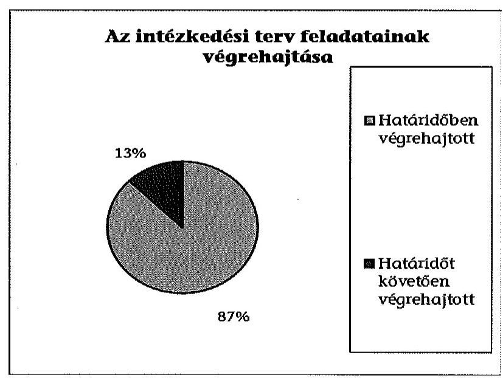
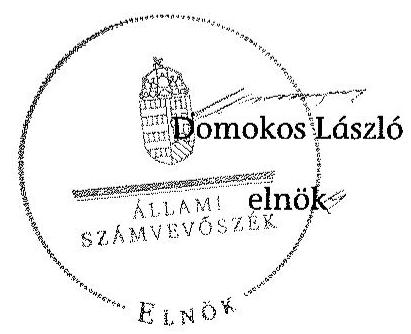

# ÁLLAMI   SZÁMVEVŐSZÉK 

## JELENTÉS

Utóellenőrzések - az önkormányzatok pénzügyi gazdálkodási helyzetének, szabályszerűségének utóellenőrzése

Berhida

---

# Állami Számvevőszék 

Iktatószám: V-0620-032/2015.
Témaszám: 1654
Vizsgálat-azonosító szám: V069320

## Az ellenőrzést felügyelte:

## Renkó Zsuzsanna

felügyeleti vezető
Az ellenőrzést vezette és az ellenőrzés végrehajtásáért felelős:
Mohl Anna
ellenőrzésvezető
A számvevőszéki jelentés összeállításában közremúködött:
Baksa Anikó
számvevő főtanácsos
Dr. Mezei Imréné
számvevő főtanácsos
Az ellenőrzést végezték:
Fodor Edit Szabó Leonóra Ildikó Klinger Zoltán számvevő számvevő
Pető Krisztina
számvevő tanácsos

A témához kapcsolódó eddig készített számvevőszéki jelentések:
címe
sorszáma
Jelentés az önkormányzatok pénzügyi gazdálkodási helyzetének, 13083 szabályosságának ellenőrzéséről BERHIDA

---

# TARTALOMJEGYZÉK 

BEVEZETÉS ..... 3
I. ÖSSZEGZŐ MEGÁLLAPÍTÁSOK, KÖVETKEZTETÉSEK ..... 6
II. RÉSZLETES MEGÁLLAPÍTÁSOK ..... 7

1. Az önkormányzat a pénzügyi gazdálkodási helyzetének, szabályszerűségének ellenőrzéséről készült ÁSZ jelentésben foglalt javaslatokra készített-e intézkedési tervet, illetve teljesítette-e az abban foglaltakat? ..... 7
MELLÉKLETEK
2. számú Az ÁSZ 13083 számú jelentéséhez kapcsolódó intézkedési terv végrehajtá- sa
FÜGGELÉKEK
3. számú Rövidítések jegyzéke
4. számú Fogalomtár

---

.

---

# JELENTÉS 

## Utóellenőrzések - az önkormányzatok pénzügyi gazdálkodási helyzetének, szabályszerűségének utóellenőrzése Berhida

## BEVEZETÉS

Az Állami Számvevőszék 2011-2015. évekre szóló stratégiája a helyi önkormányzatok ellenőrzésében a pénzügyi-gazdasági helyzete értékelésére, kockázatai feltárására helyezte a fő hangsúlyt. A 2011-2013. években az ÁSZ által ellenőrzött önkormányzatok esetében a múködési, beruházási és a hosszú lejáratú pénzintézeti kötelezettségeinek teljesítésével kapcsolatos pénzügyi kockázatokat mutattuk be. Az ÁSZ megállapította, hogy az önkormányzatok pénzügyi egyensúlyi helyzete az ellenőrzött időszakban romlott, a pénzügyi kockázatok fokozódtak, a pénzügyi egyensúlyi helyzetet jellemző mutatószámok kedvezőtlenül változtak. Az önkormányzati alrendszerben 2012. év végétől 2014. évelejéig lezajlott adósságkonszolidáció és feladat-ellátási-, finanszírozási-rendszer változtatás következtében a települési önkormányzatok pénzügyi helyzete jelentős mértékben megváltozott, amely a jóváhagyott intézkedési tervek végrehajtását is befolyásolta.

Az ellenőrzött szervezet vezetője az ÁSZ tv. 33. § (1)-(2) bekezdésében foglaltak alapján a jelentések intézkedést igénylő megállapításaihoz kapcsolódóan köteles intézkedési tervet benyújtani, amelyet az ÁSZ-nak kell elfogadni. Amennyiben az ellenőrzött által vállalt intézkedések hiányosak, vagy más okból nem elfogadhatók az ÁSZ indoklással és póthatáridő tűzésével visszaküldi azt kijavításra, kiegészítésre. Az elfogadásról szóló tájékoztatásban az Állami Számvevőszék elnöke valamennyi ellenőrzött szervezet vezetőjének figyelmét felhívta arra, hogy az intézkedési tervben foglaltak megvalósítását - az ÁSZ tv. 33. § (7) bekezdésében foglaltak alapján - utóellenőrzés keretében ellenőrizheti.

Az ellenőrzés célja: annak megállapítása, hogy az ellenőrzött önkormányzatok pénzügyi gazdálkodási helyzetének, szabályszerűségének ellenőrzéséről készült ÁSZ jelentésben foglalt javaslatokra készítettek-e intézkedési terveket, illetve az ellenőrzött által összeállított intézkedési tervben meghatározott feladatokat végrehajtották-e. Ennek keretében ellenőrizzük, hogy:

- a polgármester az ÁSZ törvény értelmében az intézkedési tervet határidőben megküldte-e az ÁSZ részére, szükség volt-e az elfogadást megelőzően kiegészítésre, azt az előírt póthatáridőn belül megtették-e, a Képviselő-testület a kiegészített intézkedési tervet elfogadta-e;

---

- az önkormányzat az elfogadott (kiegészített) intézkedési tervében foglaltak megtételéről, az abban előírt határidők betartásával gondoskodott-e;
- az elfogadott intézkedések esetleges késedelme, végrehajtásának elmaradása milyen szintű kockázatot jelez a pénzügyi gazdálkodásra és annak szabályszerűségére.

Az utóellenőrzés várható hasznosulása: az ellenőrzés megállapításai segítséget nyújthatnak a közpénzügyi helyzet javításához. Az utóellenőrzés, jellegéből adódóan fokozza közbizalmat, fegyelmet, a társadalom, az ellenőrzöttek, a helyi döntéshozók vonatkozásában erősíti az ÁSZ tekintélyét és igazolja, hogy lejárt a következmények nélküli ellenőrzések időszaka. Az ÁSZ intézményén belül lehetőség nyílik arra, hogy az utóellenőrzés, mint ellenőrzési kategória a szervezet tevékenységében stabilizálódjék, a megállapítások visszacsatolása segítse és erősítse az ÁSZ hozzáadott értéket teremtő elemző tevékenységét és tanácsadó szerepét.

Az intézkedési tervek olyan típusú feladatokat határoztak meg az önkormányzatok számára, amelyek a múködőképesség jövőbeni zavarainak elkerülését, a felelős fenntartható gazdálkodás követelményeinek érvényesülését, a pénzügyi műveletek racionális keretek közt tartását tűzték ki célul. Az utóellenőrzés által e területeken érzékelt mulasztások még megfelelő irányba terelhetik az intézkedési tervekben foglalt feladatok végrehajtását.

Az ÁSZ az elfogadott intézkedési terveket kockázatelemzésnek veti alá. Ennek során elvégezzük az ÁSZ által elfogadott intézkedési tervben előírt/vállalt feladatok végrehajtásának értékelését, amelynek során alkalmazandó besorolási kategóriák:

- okafogyottá vált feladat: ha végrehajtására - meghatározott esemény bekövetkezése, továbbá külső körülmény, a múködést érintő feltétel változása miatt - már nincs szükség, illetve lehetőség, és egyértelműen megállapítható, hogy az intézkedést szükségessé tevő körülmény a jövőben nem fordulhat elő;
- nem időszerű (nem esedékes) feladat: amelynek ellenőrzési időszakon belüli végrehajtására azért nem került (kerülhetett) sor, mert az intézkedés alapjául szolgáló esemény nem következett be, de annak jövőbeni előfordulása lehetséges;
- határidőben végrehajtott feladat: ha teljesítése dokumentáltan az intézkedési tervben előírt határidőben és tartalommal, módon megtörtént;
- határidőn túl végrehajtott feladat: ha annak teljesítése az intézkedési tervben meghatározott módon, de az előírt határidőn túl történt meg;
- részben végrehajtott feladat: amelynek végrehajtása teljes körűen az intézkedési tervben előírt tartalommal/módon nem történt meg, vagy a feladatot nem az előírt gyakorisággal hajtották végre;
- végre nem hajtott feladat: ha a végrehajtásért felelősként megjelölt személy(ek)nek felróhatóan a teljesítés elmaradt, vagy a teljesítést nem dokumentálták.

---

Az ellenőrzést a számvevőszéki ellenőrzés szakmai szabályai szerint, szabályszerűségi ellenőrzés módszerével, a vonatkozó nemzetközi standardok figyelembevételével végeztük. Az ellenőrzésre az önkormányzatok elektronikus adatszolgáltatása alapján került sor, helyszíni ellenőrzést nem végeztünk. A megállapítások rögzítése az önkormányzatok által rendelkezésre bocsátott dokumentumok, tanúsítványok alapján történt, melyek valódiságát és teljes körüségét a polgármester, valamint a jegyző teljességi nyilatkozata igazolja.

A jóváhagyott intézkedési tervben előírt feladatok végrehajtásának ellenőrzését egységes szempontok, illetve értékelési kritériumok alapján végeztük. Figyelembe vettük az intézkedési terv jóváhagyását követően hatályba lépett jogszabályi előírások változásából következő események - kiemelten az önkormányzati alrendszerben lezajlott adósságkonszolidációs intézkedések, továbbá a fel-adat-ellátási és finanszírozási rendszer változásának - hatásait.

Az alkalmazott rövidítések jegyzékét az 1. számú függelék, az egyes fogalmak magyarázatát a 2. számú függelék tartalmazza.

Az ellenőrzött szervezet: Berhida Város Önkormányzata
Az ellenőrzött idöszak: az intézkedési terv ÁSZ-nak történő benyújtásától az utóellenőrzés megkezdéséig tartó időszak.

Az ellenőrzés végrehajtásának jogszabályi alapját az ÁSZ tv. 1. § (3) bekezdése, az 5. § (2) és (6) bekezdései, a 33. § (7) bekezdése, valamint az Áht. 61. § (2) bekezdésének előírásai képezték.

Az ÁSZ tv. 29. § (1) bekezdése szerint a jelentéstervezetet észrevételezésre megküldtük az Önkormányzat polgármesterének, aki az ÁSZ tv. 29. § (2) bekezdésében foglalt észrevételezési jogával nem élt, a jelentéstervezetre észrevételt nem tett.

Az ÁSZ a 2013. évben zárta le az Önkormányzat pénzügyi gazdálkodási helyzetének, szabályosságának ellenőrzését. Az ellenőrzés tapasztalatairól készített 13083 számú jelentés az interneten, a www.asz.hu címen olvasható.

---

# I. ÖSSZEGZŐ MEGÁLLAPÍTÁSOK, KÖVETKEZTETÉSEK 

Az ÁSZ utóellenőrzés keretében értékelte az Önkormányzat pénzügyi gazdálkodási helyzetének, szabályszerűségének ellenőrzéséről szóló jelentés javaslatainak hasznosítására elfogadott intézkedési terv végrehajtását.

Az előző ÁSZ ellenőrzés megállapította, hogy az Önkormányzat pénzügyi egyensúlya középtávon nem volt biztosított. A feltárt hiányosságok alapján megfogalmazott ÁSZ javaslatok hasznosítására az Önkormányzat intézkedési tervet készített, melyet az ÁSZ kiegészítés kérése nélkül elfogadott.

Az utóellenőrzés megállapította, hogy az ellenőrzött időszakban időszerűvé vált feladatait az Önkormányzat végrehajtotta, ezáltal az ÁSZ javaslatai maradéktalanul hasznosultak.

Az utóellenőrzés megállapítása alapján a határidőt követően végrehajtott feladat alacsony kockázatot jelent a pénzügyi gazdálkodásra, annak szabályszerűségére. Az intézkedések végrehajtásának hatására a pénzügyi stabilitás kialakulásának és fenntartásának feltételei javultak.

---

# II. RÉSZLETES MEGÁLLAPÍTÁSOK 

## 1. Az önkORMÁNYZAT a PÉNZÜGYI GAZDÁlKODÁSI HELYZETÉNEK, SZABÁLYSZERÜSÉGÉNEK ELLENÖRZÉSÉRŐL KÉSZÜLT ÁSZ JELENTÉSBEN FOGLALT JAVASLATOKRA KÉSZÍTETT-E INTÉZKEDÉSI TERVET, ILLETVE TELJESÍTETTE-E AZ ABBAN FOGLALTAKAT?

Az utóellenőrzés - a 2014. augusztus 1-jéig végrehajtott intézkedéseket figyelembe véve - az Önkormányzat pénzügyi gazdálkodási helyzetének, szabályosságának ellenőrzéséről készült ÁSZ jelentés javaslatai hasznosítására elfogadott intézkedési terv végrehajtására irányult. A pénzügyi helyzet ellenőrzését az ÁSZ a 2009. január 1. - 2012. december 31. közötti időszakra végezte el, amelynek eredményeként megállapította, hogy az Önkormányzat pénzügyi egyensúlya középtávon nem volt biztosított.

A polgármester a Képviselő-testületet tájékoztatta az ÁSZ jelentéséről. A jelentésben foglalt megállapításokhoz kapcsolódó intézkedési tervet ${ }^{1}$ az ÁSZ tv. 33. § (1) bekezdésében foglalt határidőre megküldték az ÁSZ részére. Az ÁSZ az intézkedési tervet javítás és kiegészítés nélkül elfogadta.

Az ÁSZ által elfogadott intézkedési tervben meghatározott feladatokat, az ÁSZ jelentés javaslatainak címzettjét és a feladatok végrehajtását az 1. számú melléklet mutatja be.

Az ÁSZ által elfogadott intézkedési terv 8 tervezett intézkedést tartalmazott, felelősként a polgármestert és a jegyzőt megjelölve.

Az utóellenőrzés megállapításai alapján az intézkedési tervben előírt feladatokból hét határidőben, egy pedig határidőt követően került végrehajtásra. A feladatok között nem volt olyan, amely okafogyottá vagy időszerűtlenné vált volna, továbbá részben, illetve nem hajtották volna végre.

## Határidőre végrehajtották:

- a kiadáscsökkentő és bevételnövelő intézkedések felmérését;
- a számlarend módosítását annak érdekében, hogy az tartalmazza a szállítói finanszírozással kapcsolatos bevételekre és kiadásokra vonatkozó előírásokat;
- a kockázatkezelési rendszer keretében a kockázatkezelés rendjének újraszabályozását;

[^0]
[^0]:    ${ }^{1}$ A Képviselő-testület az intézkedési tervet a 158/2013. (X. 10.) számú határozatával fogadta el.

---

- a kockázatkezelési szabályzatban a feladat átadás-átvétellel kapcsolatban a döntés előkészítés folyamata során vizsgálandó területek szabályozását;
- a kockázatkezelési szabályzatban az önkormányzati fejlesztések esetében a döntés előkészítés folyamatában az előkészítés, a lebonyolítás és a működtetési kockázatok feltárása és kezelése kötelezettségének szabályozását;
- a kockázatkezelési szabályzatban a szállítói tartozások és egyéb kiadás elmaradások rendezése szabályozását;
- a 2014. évi belső ellenőrzési terv tartalmazta a pénzügyi egyensúlyi helyzetet befolyásoló döntésekkel kapcsolatban feltárt kockázati tényezők szabályszerűségi ellenőrzését.

# Határidőt követően hajtották végre: 

- az Önkormányzat gazdasági helyzetének elemzésén alapuló, a pénzügyi egyensúlyi helyzet hosszú távú megőrzését és az adósságállomány újratermelődésének elkerülését biztosító intézkedéseket tartalmazó stabilizációs programot a 2014. január 31-i határidőt követően, 2014. június 26-án fogadta el a Képviselő-testület.

A Képviselő-testület az intézkedési terv elfogadásával egyidejűleg felkérte a polgármestert, a jegyzőt és a pénzügyi iroda vezetőjét, hogy az intézkedési tervben meghatározott utolsó határidőt követő soros testületi ülésen számoljanak be ${ }^{2}$ az előírt feladatok végrehajtásáról. Az utóellenőrzés időpontjáig a felelősök beszámolási kötelezettségüknek nem tettek eleget ${ }^{3}$.

Az utóellenőrzés megállapítása alapján a határidőt követően végrehajtott feladat alacsony kockázatot jelent a pénzügyi gazdálkodásra, annak szabályszerűségére. Az intézkedések végrehajtásának hatására a pénzügyi stabilitás kialakulásának és fenntartásának feltételei javultak.

Budapest, 2015. O8. hónap 04 . nap

Melléklet: $\quad 1 \mathrm{db}$
Függelék: $\quad 2 \mathrm{db}$

[^0]
[^0]:    ${ }^{2}$ Határidőként 2014. február 28-át jelölték meg.
    ${ }^{3}$ A polgármester és a jegyző 2014. augusztus 6-án kelt közös nyilatkozata szerint a stabilizációs programot a Képviselő-testület a 2014. június 26-i ülésén fogadta el, ezért a végrehajtásról szóló beszámoló megtárgyalására a következő soros (munkaterv szerinti) ülésen, 2014. szeptember 28-án kerül sor.

---

# Az ÁSZ 13083 számú jelentéséhez kapcsolódó intézkedési terv végrehajtása

|  Sorszám | Intézkedési terv alapján elvégzendő feladat | Az intézkedési tervben meghatározott határidő | Az ÁSZ 13083
sz. jelentése
javaslatának
címzettje | Az intézkedés végrehajtása  |
| --- | --- | --- | --- | --- |
|   | 1. | 2. | 3. | 4.  |
|  Határidőben végrehajtott intézkedések |  |  |  |   |
|  1. | A költségvetési rendelettervezet elkészítését, illetve annak évközi módosítását megelőzően döntési javaslatot kell készíteni a Képviselő-testület részére a bevételszerző és kiadáscsökkentő lehetőségek felméréséről. | 2014. január 1-jétől folyamatos | polgármester | A kiadáscsökkentő és bevételnövelő intézkedéseket a Képviselő-testület a 166/2013. (X. 31.) számú határozatával elfogadott „Tájékoztató a 2014. évi költségvetési tervről" dokumentum 6. és 11. oldalai tartalmazták. A főbb intézkedések: helyi adóbevétel-növelés, közterületi díjemelés, helyiség és lakbéremelés, valamint az étkezési térítési díj, a béren kívüli juttatások vizsgálata. A Képviselő-testület a 83/2014. (VI. 26.) számú határozatában további intézkedéseket tett, amelyek a követeléseket érintő behajtási tevékenység fokozására irányultak (inkasszók, fizetési felszólítások, letiltások). Az 5/2014. (II. 28.) számú önkormányzati rendelettel elfogadott 2014. évi költségvetési előterjesztésbe beépítésre kerültek a koncepcióban elfogadott kiadáscsökkentő és bevételnövelő intézkedések.
A 2014. évi költségvetés I. negyedévi alakulásáról készített tájékoztatóban (2-5. oldal) számszerúsítve kimutatták a bevételi többletekkel, illetve a kiadási megtakarításokkal  |

---

|  Sorszám | Intézkedési terv alapján elvégzendő feladat | Az intézkedési tervben meghatározott határidő | $\begin{gathered} \text { Az ÁSZ } 13083 \\ \text { sz. jelentése } \\ \text { javaslatának } \\ \text { címzettje } \end{gathered}$ | Az intézkedés végrehajtása  |
| --- | --- | --- | --- | --- |
|   | 1. | 2. | 3. | 4.  |
|   |  |  |  | kapcsolatos előirányzat módosításokat. A 2014. évi költségvetést egy alkalommal a 9/2014. (VI. 2.) számú önkormányzati rendelettel módosították, amelyben a bevételi előirányzatot 13,5 millió Ft-tal megemelték. A bevételi többletet és a kiadási megtakarítást bérleti díjak, szolgáltatási díjak emelésével, felújítások módosításával, tiszteletdíjról való lemondással, intézményi és polgármesteri hivatali kifizetések átcsoportosításával, beruházási tevékenység újragondolásával, stb. érték el.  |
|  2. | Módosítani kell a Berhidai Közös Önkormányzati Hivatal számlarendjét a szállítói finanszírozással megvalósuló fejlesztések támogatási bevételének és kiadásainak kimutatására vonatkozó előírásokat illetően. | 2013. november 30. | jegyző | A jegyző 2013. november 15-től léptette hatályba a módosított számlarendet, melynek a IV. fejezet 2.1. pontja (14. oldal) és az V. fejezet 1.2.3. pontja (37. oldal), valamint a 2014. január 1-jétől hatályos számlarend VI. fejezet N.) pontja (25. oldal) és a XIII. fejezet B.) pontja (82-83. oldal) tartalmazták a szállítói finanszírozással kapcsolatos bevételekre és kiadásokra vonatkozó előírásokat.  |

---

|  Sorszám | Intézkedési terv alapján elvégzendő feladat | Az intézkedési tervben meghatározott határidő | Az ÁSZ 13083 sz. jelentése javaslatának címzettje | Az intézkedés végrehajtása  |
| --- | --- | --- | --- | --- |
|   | 1. | 2. | 3. | 4.  |
|  3. | Módosítani, vagy újraszabályozni szükséges a Közös Önkormányzati Hivatal kockázatkezelési rendszere keretében a kockázatkezelés rendjét. | 2014. január 31. | jegyző | A jegyző újraszabályozta Berhida Közös Önkormányzati Hivatal kockázatkezelési rendszere keretében a kockázatkezelés rendjét. Az új szabályzat 2014. január 1-jétől lépett hatályba.  |
|  4. | Szabályzatban rögzíteni kell - a feladat átadás-átvétellel kapcsolatban - a döntés előkészítés folyamata során vizsgálandó területeket. | 2014. január 1. | jegyző | A jegyző által 2014. január 1-jétől hatályba léptetett kockázatkezelési szabályzat XII. fejezet 1-6. pontjaiban szabályozták a feladat át-adás-átvétellel kapcsolatban, a döntés előkészítés folyamata során vizsgálandó területeket.  |
|  5. | Szabályzatban rögzíteni kell - az önkormányzati fejlesztések esetében - a döntés előkészítés folyamatában az előkészítés, a lebonyolítás és a müködtetési kockázat feltárásának és kezelésének kötelezettségét. | 2014. január 1. | jegyző | A jegyző által 2014. január 1-jétől hatályba léptetett kockázatkezelési szabályzat XII. fejezet 7-8. pontjaiban szabályozták - az önkormányzati fejlesztések esetében - a döntés előkészítés folyamatában az előkészítés, a lebonyolítás és a müködtetési kockázatok feltárásának és kezelésének kötelezettségét.  |
|  6. | Szabályzatban rögzíteni kell a szállítói tartozások és egyéb kiadás-elmaradások rendezésének helyi szabályait. | 2014. január 1. | jegyző | A jegyző által 2014. január 1-jétől hatályba léptetett kockázatkezelési szabályzat XII. fejezet 9. pontjában határozták meg a szállítói tartozások és egyéb kiadás elmaradások rendezésének szabályait.  |

---

|  Sorszám | Intézkedési terv alapján elvégzendő feladat | Az intézkedési tervben meghatározott határidő | Az ÁSZ 13083
sz. jelentése
javaslatának
címzettje | Az intézkedés végrehajtása  |
| --- | --- | --- | --- | --- |
|   | 1. | 2. | 3. | 4.  |
|  7. | Módosítani, vagy újraszabályozni szükséges a Közös Önkormányzati Hivatal kockázatkezelési rendszere keretében a kockázatkezelés rendjét. Az ellenőrzési tervbe kerüljön beépítésre a pénzügyi egyensúlyi helyzetet befolyásoló döntésekkel kapcsolatban feltárt kockázati tényezők ellenőrzése. | ellenőrzési terv
2013. december 31.
szabályzat módosítása
2014. január 31. | jegyző | A jegyző újraszabályozta Berhida Közös Önkormányzati Hivatal kockázatkezelési rendszere keretében a kockázatkezelés rendjét. Az új szabályzat 2014. január 1-jétől lépett hatályba. A Képviselő-testület a 185/2013. (XI. 28.) számú határozatával fogadta el az Önkormányzat 2014. évi belső ellenőrzési tervét. A 2014. évi ellenőrzési terv 6.) pontja tartalmazta a pénzügyi egyensúlyi helyzetet befolyásoló döntésekkel kapcsolatban feltárt kockázati tényezők szabályszerűségi ellenőrzését.  |
|  Határidőt követően végrehajtott intézkedés |  |  |  |   |
|  1. | El kell készíteni és a Képviselő-testület elé kell terjeszteni jóváhagyásra az önkormányzati szintű stabilizációs programot. | 2014. január 31. | polgármester | Az előírt határidőn túl, a polgármester 2014. június 10-i előterjesztése alapján a Képviselőtestület a 83/2014. (VI. 26.) számú határozatával hagyta jóvá a jegyző által elkészített stabilizációs programot.  |

---

# RÖVIDÍTÉSEK JEGYZÉKE 

## Törvények

Áht.
Az államháztartásról szóló 2011. évi CXCV. törvény (hatályos 2011. december 31-étől)
ÁSZ tv. az Állami Számvevőszékről szóló 2011. évi LXVI. törvény (hatályos 2011. július 1-jétől)

## Szórövidítések

ÁSZ
jegyzó
Képviselő-testület
Közös Önkormányzati Hivatal
Önkormányzat
polgármester

Állami Számvevőszék
Berhida Város Önkormányzatának jegyzője
Berhida Város Önkormányzatának Képviselő-testülete
Berhida Közös Önkormányzati Hivatal
Berhida Város Önkormányzata
Berhida Város Önkormányzatának polgármestere

---

.

---

# FOGALOMTÁR 

adósságkonszolidáció
adósságszolgálat
árfolyamkockázat
banki kitettség
bevételi kitettség
felhalmozási kockázat
garanciavállalás
kezességvállalás
mérlegen kívüli tétel
múködési kockázat

Több ütemben lezajlott központi intézkedés, amely a helyi önkormányzatok adósságállományának a magyar állam által történő átvállalására irányult. Az adósságkonszolidációs csomag releváns rendelkezéseit a 2012-2014. évi központi költségvetésről szóló törvények tartalmazták.
Az adósság tőkerészének és az esedékes kamat együttes összegének törlesztése.
Annak kockázata, hogy a külföldi devizában fennálló pénzügyi eszközök hazai fizetőeszközben kifejezett értéke az árfolyam elmozdulásával megváltozik.
Olyan függőségi viszony, ahol egy szervezet pénzügyi helyzete olyan külső körülmények hatására változhat, amely kizárólag a bank egyoldalú döntésén múlik.
Olyan függőségi viszony, ahol egy szervezet pénzügyi helyzetét meghatározó bevételek nagysága külső körülmények hatására azonnal és kedvezőtlen irányba változhat.
Annak kockázata, hogy a folyamatban lévő felhalmozási feladatok finanszírozásához szükséges pénzügyi forrás nem fog rendelkezésre állni.
Olyan kötelezettségvállalás, ahol a garanciát vállaló valamely jövőbeni esemény bekövetkezésekor, a szerződésben meghatározott feltételek beálltakor a garancia kedvezményezettje számára meghatározott összegig, meghatározott időpontig, felszólításra azonnal fizet.
A tárgyi eszközállomány állagának elemzéséhez használt mutató, számításakor a tárgyi eszköz könyv szerinti nettó értékét viszonyítják a tárgyi eszköz bruttó (beszerzési/létesítési) értékéhez.
Annak kockázata, hogy a változó kamatozású forint vagy a devizahitel futamideje alatt kedvezőtlen irányban változhat a hitel kamata.
Szerződésben vállalt olyan kötelezettség, amelyben a kezes arra vállal kötelezettséget, hogy ha a szerződés kötelezettje nem teljesít, a kezes maga fog helyette teljesíteni a jogosultnak.
Olyan szerződés alapján fennálló mérlegen kívüli [függő vagy biztos (jövőbeni)] kötelezettség, illetve követelés, amely a mérleg fordulónapján már fennáll, de mérlegtételkénti szerepeltetése egy jövőbeni esemény bekövetkezésétől vagy a szerződés teljesítésétől függ.
Annak kockázata, hogy nem megfelelő működésből, emberi hibákból, rendszerhibákból vagy külső eseményekből adódik veszteség.

---

nemfizetési kockázat
nettó múködési jövedelem

ÖNHIKI támogatás
önkormányzat folyó költségvetési egyenlege
önkormányzat többségi tulajdonában lévő gazdasági társaságok
önkormányzat gazdasági társasága miatti kockázatot jelentő tényezők

Annak kockázata, hogy a kötelezett fennálló kötelezettségét átmenetileg vagy véglegesen nem tudja határidőre megfizetni.
A nettó múködési jövedelem (pénzügyi kapacitás) a jövedelemtermelő képességet méri. Megmutatja a múködési bevételekből a múködési kiadások és a hitelek tőketörlesztésének kifizetése után fennmaradó jövedelmet.
Az önkormányzatok múködőképességét szolgáló, önhibájukon kívül hátrányos helyzetben levő települési önkormányzatok támogatása.
A folyó költségvetés egyenlege, azaz a múködési jövedelem megmutatja, hogy az önkormányzat éves folyó bevétele fedezetet biztosít-e a kötelező és önként vállalt feladatellátáshoz kapcsolódó éves folyó kiadására. A múködési jövedelem negatív értéke pénzügyileg fenntarthatatlan helyzetet jelez. A mutató pozitív értéke megtakarítást mutat, amely forrásul szolgálhat az önkormányzat fennálló kötelezettségei megfizetéséhez, valamint fejlesztéseihez.
Azok a gazdasági társaságok, amelyekben az önkormányzat a szavazatok több mint ötven százalékával vagy jogszabályban rögzített meghatározó befolyással rendelkezik. A befolyással rendelkező akkor rendelkezik egy jogi személyben meghatározó befolyással, ha annak tagja, illetve részvényese, és jogosult e jogi személy vezető tisztségviselői vagy felügyelő bizottsága tagjai többségének megválasztására, illetve visszahívására, vagy a jogi személy más tagjaival, illetve részvényeseivel kötött megállapodás alapján egyedül rendelkezik a szavazatok több mint ötven százalékával.
Az önkormányzat gazdasági társaságának kedvezőtlen pénzügyi döntései következtében az önkormányzat pénzügyi egyensúlyi helyzetét veszélyeztető tényezők: az önkormányzat az önként vállalt és/vagy a kötelező feladatot ellátó társaságának a tevékenység ellátásához pénzeszközt ad át;
az önkormányzat nem vizsgálja a feladatellátás választott szervezeti megoldásának hatékonyságát;
a kötelező feladatellátást biztosító gazdasági társaság tevékenységének ágazati szabályozása változik (vízi közmúvagyon üzemeltetése);
a kizárólagos vagy többségi tulajdonú társaságok pénzügyi helyzete nem stabil, amely az alapítóra kötelezettségeket háríthat;
az önkormányzat a társaságok tevékenységét nem kísérte figyelemmel, nem élt az alapítói (irányítói) jogok gyakorlásával, a társaságok gazdálkodásának önkormányzati szintű konszolidálása nem biztosított;

---

pénzügyi kockázat

PPP
szállítói kockázat
szállítói kitettség
az önkormányzat garanciát vagy kezességet vállal a gazdasági társaság kötelezettségeire;
a társaságoknak átadott pénzeszköz uniós elvárásoknak megfelelő kezelése.
A pénzügyi kockázat magában foglalja mindazon kockázatokat, amelyek a szervezet pénzügyi helyzetére hatással vannak. Pl.: az adósságszolgálat miatti kockázatot, árfolyamkockázatot, felhalmozási kockázatot, fizetőképességi kockázatot, jövőbeni kötelezettségek kifizethetőségének kockázatát, kamatkockázatot, kezességvállalás kockázatát, likviditási kockázat, mérlegen kívüli tételek kockázata, nemfizetési kockázat, stb.
A köz- és a magánszféra együttmúködésén alapuló fejlesztési konstrukció. Az állami és a magánszféra együttmúködésének egyik formáját jelöli a PPP. A rövidítés a „köz- és magánszféra partnersége" angol nyelvű megfelelője. A PPP keretében a közcél a magánszféra jelentős mértékú közremúködésével valósul meg.
Annak kockázata, hogy a kötelezett a szállítókkal szemben fennálló, már elismert kötelezettségét átmenetileg vagy véglegesen nem tudja határidőre teljesíteni.
Olyan függőségi viszony, ahol egy szervezet pénzügyi helyzete a szállítói tartozások rendezése érdekében foganatosított intézkedések hatására azonnal és kedvezőtlen irányba változhat.