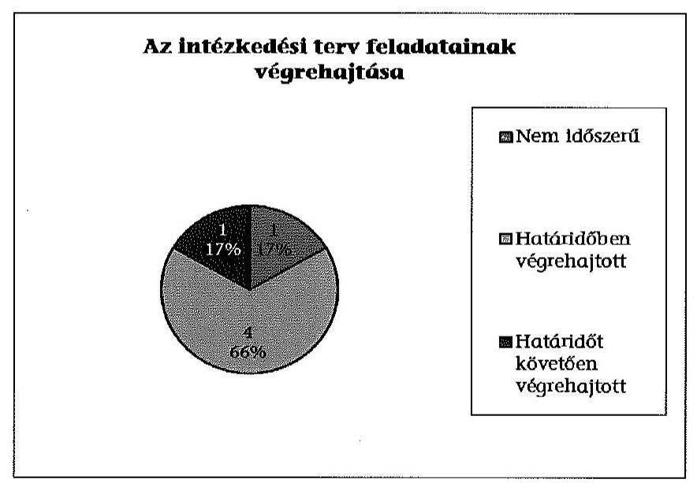
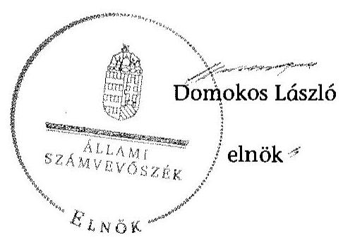

# JELENTÉS 

Utóellenőrzések - az önkormányzatok pénzügyi gazdálkodási helyzetének, szabályszerűségének utóellenőrzése

Bodajk

---

# Állami Számvevőszék 

Iktatószám: V-0601-024/2015.
Témaszám: 1635
Vizsgálat-azonosító szám: V069301

## Az ellenőrzést felügyelte:

## Renkó Zsuzsanna

felügyeleti vezető
Az ellenőrzést vezette és az ellenőrzés végrehajtásáért felelős:
Mohl Anna
ellenőrzésvezető
A számvevőszéki jelentés összeállításában közreműködött:
Baksa Anikó
számvevő főtanácsos
Dr. Mezei Imréné
számvevő főtanácsos
Az ellenőrzést végezték:
Hámoriné Maróti Györgyi Lantos Józsefné
számvevő vezető számvevő főtanácsos

A témához kapcsolódó eddig készített számvevőszéki jelentések:
címe
sorszáma
Jelentés Bodajk Város Önkormányzata pénzügyi gazdálkodási 13051
helyzetének, szabályszerűségének ellenőrzéséről

---

# TARTALOMJEGYZÉK 

BEVEZETÉS ..... 3
I. ÖSSZEGZŐ MEGÁLLAPÍTÁSOK, KÖVETKEZTETÉSEK ..... 6
II. RÉSZLETES MEGÁLLAPÍTÁSOK ..... 7

1. Az önkormányzat a pénzügyi gazdálkodási helyzetének, szabályszerűségének ellenőrzéséről készült ÁSZ jelentésben foglalt javaslatokra készített-e intézkedési tervet, illetve teljesítette-e az abban foglaltakat? ..... 7
MELLÉKLETEK
2. számú Az ÁSZ 13051 számú jelentéséhez kapcsolódó intézkedési terv végrehajtása
FÜGGELÉKEK
3. számú Rövidítések jegyzéke
4. számú Fogalomtár

---

# **Chemistry**

## **Chemical Reactions**

### **Balancing Chemical Equations**

1. **Write the unbalanced equation:**
   - Example: $$C_3H_8 + O_2 \rightarrow CO_2 + H_2O$$

2. **Balance the equation:**
   - Balance carbon atoms first.
   - Then balance hydrogen atoms.
   - Finally, balance oxygen atoms.
   - Balanced equation: $$C_3H_8 + 7O_2 \rightarrow 3CO_2 + 4H_2O$$

3. **Balance the equation:**
   - Balance oxygen atoms.
   - Finally, balance oxygen atoms.
   - Balanced equation: $$C_3H_8 + 7O_2 \rightarrow 3CO_2 + 4H_2O$$

### **Types of Reactions**

1. **Combination Reaction:**
   - Example: $$2H_2 + O_2 \rightarrow 2H_2O$$

2. **Decomposition Reaction:**
   - Example: $$2H_2O_2 \rightarrow 2H_2O + O_2$$

3. **Single Displacement Reaction:**
   - Example: $$Zn + 2HCl \rightarrow ZnCl_2 + H_2$$

4. **Double Displacement Reaction:**
   - Example: $$AgNO_3 + NaCl \rightarrow AgCl + NaNO_3$$

5. **Combustion Reaction:**
   - Example: $$CH_4 + 2O_2 \rightarrow CO_2 + 2H_2O$$

## **Stoichiometry**

### **Mole Concept**

- **Mole (mol):** The amount of substance containing as many particles (atoms, molecules, ions) as there are atoms in exactly 12 grams of carbon-12.
- **Avogadro's Number:** $$6.022 \times 10^{23}$$ particles per mole.

### **Molar Mass**

- **Molar Mass:** The mass of one mole of a substance.
- Example: The molar mass of water ($$H_2O$$) is 18.015 g/mol.

### **Calculations**

1. **Moles to Mass:**
   - Formula: $$n = \frac{m}{M}$$
   - Example: Calculate the number of moles of $$H_2O$$ in 18 grams of water.
     - $$n = \frac{18 \, \text{g}}{18.015 \, \text{g/mol}} \approx 0.999 \, \text{mol}$$

2. **Moles to Mass:**
   - Formula: $$m = n \times M$$
   - Example: Calculate the mass of 1 mole of water.
     - $$m = 1 \, \text{mol} \times 18.015 \, \text{g/mol} = 18.015 \, \text{g}$$

## **Gas Laws**

### **Ideal Gas Law**

- **Equation:** $$PV = nRT$$
- **Variables:**
  - $$P$$ = Pressure (atm)
  - $$V$$ = Volume (L)
  - $$n$$ = Moles of gas
  - $$R$$ = Ideal gas constant (0.0821 L·atm/mol·K)
  - $$T$$ = Temperature (K)

### **Boyle's Law**

- **Equation:** $$P_1V_1 = P_2V_2$$
- **Variables:**
  - P₁ = Pressure (atm)
  - V₁ = Volume (L)
  - P₂ = Pressure (atm)
  - V₂ = Volume (L)

### **Boyle's Law**

- **Equation:** $$\frac{P_1V_1}{T_1} = \frac{P_2V_2}{T_2}$$

## **Thermochemistry**

### **Enthalpy (H)**

- **Definition:** The heat content of a system at constant pressure.
- **Equation:** $$\Delta H = q_p$$
- **Equation:** The provided equation seems incorrect.  It should be a standard enthalpy equation, not including an exponential term.

### **Hess's Law**

- **Statement:** The enthalpy change for a reaction is the same whether it occurs in one step or multiple steps.
- **Equation:** The provided equation seems incorrect. It should be a standard enthalpy equation, not including an exponential term.

### **Hess's Law of Thermochemistry**

- **Statement:** The enthalpy change for a reaction is the same whether it occurs in one step or multiple steps.
- **Equation:** The provided equation seems incorrect. It should be a standard enthalpy equation, not including an exponential term.

## **Electrochemistry**

### **Oxidation and Reduction**

- **Oxidation:** Loss of electrons.
- **Reduction:** Gain of electrons.

### **Galvanic Cells**

- **Definition:** A cell that converts chemical energy into electrical energy.
- **Components:**
  - Anode: Oxidation occurs.
  - Cathode: Reduction occurs.
  - Salt Bridge: Connects the two half-cells.

### **Nernst Equation**

- **Equation:** $$E = E^\circ - \frac{RT}{nF} \ln Q$$
- **Variables:**
  - E = Cell potential (V)
  - E° = Standard cell potential (V)
  - R = Ideal gas constant (8.314 J/mol·K)
  - T = Temperature (K)
  - n = Number of moles of electrons transferred
  - F = Faraday constant (96485 C/mol)
  - Q = Reaction quotient

 constant (0.0821 L·atm/mol·K)
  - R₃ = Ideal gas constant (0.0821 L·atm/mol·K)
  - R₁ = Ideal gas constant (0.0821 L·atm/mol·K)
  - R₂ = Standard gas constant (0.0821 L·atm/mol·K)
  - R₃ = Ideal gas constant (0.0821 L·atm/mol·K)
  - R₁ = Ideal gas constant (0.0821 L·atm/mol·K)
  - R₂ = Standard gas constant (0.0821 L·atm/mol·K)
  - R₃ = Ideal gas constant (0.0821 L·atm/mol·K)
  - R₁ = Ideal gas constant (0.0821 L·atm/mol·K)
  - R₂ = Standard gas constant (0.0821 L·atm/mol·K)
  - R₃ = Ideal gas constant (0.0821 L·atm/mol·K)
  - R₁ = Ideal gas constant (0.0821 L·atm/mol·K)
  - R₂ = Standard gas constant (0.0821 L·atm/mol·K)
  - R₃ = Ideal gas constant (0.0821 L·atm/mol·K)
  - R₁ = Ideal gas constant (0.0821 L·atm/mol·K)
  - R₂ = Standard gas constant (0.0821 L·atm/mol·K)
  - R₃ = Ideal gas constant (0.0821 L·atm/mol·K)
  - R₁ = Ideal gas constant (0.0821 L·atm/mol·K)
  - R₂ = Standard gas constant (0.0821 L·atm/mol·K)
  - R₃ = Ideal gas constant (0.0821 L·atm/mol·K)
  - R₁ = Ideal gas constant (0.0821 L·atm/mol·K)
  - R₂ = Standard gas constant (0.0821 L·atm/mol·K)
  - R₃ = Ideal gas constant (0.0821 L·atm/mol·K)
  - R₁ = Ideal gas constant (0.0821 L·atm/mol·K)
  - R₂ = Standard gas constant (0.0821 L·atm/mol·K)
  - R₃ = Ideal gas constant (0.0821 L·atm/mol·K)
  - R₁ = Ideal gas constant (0.0821 L·atm/mol·K)
  - R₂ = Standard gas constant (0.0821 L·atm/mol·K)
  - R₃ = Ideal gas constant (0.0821 L·atm/mol·K)
  - R₁ = Ideal gas constant (0.0821 L·atm/mol·K)
  - R₂ = Standard gas constant (0.0821 L·atm/mol·K)
  - R₃ = Ideal gas constant (0.0821 L·atm/mol·K)
  - R₁ = Ideal gas constant (0.0821 L·atm/mol·K)
  - R₂ = Standard gas constant (0.0821 L·atm/mol·K)
  - R₃ = Ideal gas constant (0.0821 L·atm/mol·K)
  - R₁ = Ideal gas constant (0.0821 L·atm/mol·K)
  - R₂ = Standard gas constant (0.0821 L·atm/mol·K)
  - R₃ = Ideal gas constant (0.0821 L·atm/mol·K)
  - R₁ = Ideal gas constant (0.0821 L·atm/mol·K)
  - R₂ = Standard gas constant (0.0821 L·atm/mol·K)
  - R₃ = Ideal gas constant (0.0821 L·atm/mol·K)
  - R₁ = Ideal gas constant (0.0821 L·atm/mol·K)
  - R₂ = Standard gas constant (0.0821 L·atm/mol·K)
  - R₃ = Ideal gas constant (0.0821 L·atm/mol·K)
  - R₁ = Ideal gas constant (0.0821 L·atm/mol·K)
  - R₂ = Standard gas constant (0.0821 L·atm/mol·K)
  - R₃ = Ideal gas constant (0.0821 L·atm/mol·K)
  - R₁ = Ideal gas constant (0.0821 L·atm/mol·K)
  - R₂ = Standard gas constant (0.0821 L·atm/mol·K)
  - R₃ = Ideal gas constant (0.0821 L·atm/mol·K)
  - R₁ = Ideal gas constant (0.0821 L·atm/mol·K)
  - R₂ = Standard gas constant (0.0821 L·atm/mol·K)
  - R₃ = Ideal gas constant (0.0821 L·atm/mol·K)
  - R₁ = Ideal gas constant (0.0821 L·atm/mol·K)
  - R₂ = Standard gas constant (0.0821 L·atm/mol·K)
  - R₃ = Ideal gas constant (0.0821 L·atm/mol·K)
  - R₁ = Ideal gas constant (0.0821 L·atm/mol·K)
  - R₂ = Standard gas constant (0.0821 L·atm/mol·K)
  - R₃ = Ideal gas constant (0.0821 L·atm/mol·K)
  - R₁ = Ideal gas constant (0.0821 L·atm/mol·K)
  - R₂ = Standard gas constant (0.0821 L·atm/mol·K)
  - R₃ = Ideal gas constant (0.0821 L·atm/mol·K)
  - R₁ = Ideal gas constant (0.0821 L·atm/mol·K)
  - R₂ = Standard gas constant (0.0821 L·atm/mol·K)
  - R₃ = Ideal gas constant (0.0821 L·atm/mol·K)
  - R₁ = Ideal gas constant (0.0821 L·atm/mol·K)
  - R₂ = Standard gas constant (0.0821 L·atm/mol·K)
  - R₃ = Ideal gas constant (0.0821 L·atm/mol·K)
  - R₁ = Ideal gas constant (0.0821 L·atm/mol·K)
  - R₂ = Standard gas constant (0.0821 L·atm/mol·K)
  - R₃ = Ideal gas constant (0.0821 L·atm/mol·K)
  - R₁ = Ideal gas constant (0.0821 L·atm/mol·K)
  - R₂ = Standard gas constant (0.0821 L·atm/mol·K)
  - R₃ = Ideal gas constant (0.0821 L·atm/mol·K)
  - R₁ = Ideal gas constant (0.0821 L·atm/mol·K)
  - R₂ = Standard gas constant (0.0821 L·atm/mol·K)
  - R₃ = Ideal gas constant (0.0821 L·atm/mol·K)
  - R₁ = Ideal gas constant (0.0821 L·atm/mol·K)
  - R₂ = Standard gas constant (0.0821 L·atm/mol·K)
  - R₃ = Ideal gas constant (0.0821 L·atm/mol·K)
  - R₁ = Ideal gas constant (0.0821 L·atm/mol·K)
  - R₂ = Standard gas constant (0.0821 L·atm/mol·K)
  - R₃ = Ideal gas constant (0.0821 L·atm/mol·K)
  - R₁ = Ideal gas constant (0.0821 L·atm/mol·K)
  - R₂ = Standard gas constant (0.0821 L·atm/mol·K)
  - R₃ = Ideal gas constant (0.0821 L·atm/mol·K)
  - R₁ = Ideal gas constant (0.0821 L·atm/mol·K)
  - R₂ = Standard gas constant (0.0821 L·atm/mol·K)
  - R₃ = Ideal gas constant (0.0821 L·atm/mol·K)
  - R₁ = Ideal gas constant (0.0821 L·atm/mol·K)
  - R₂ = Standard gas constant (0.0821 L·atm/mol·K)
  - R₃ = Ideal gas constant (0.0821 L·atm/mol·K)
  - R₁ = Ideal gas constant (0.0821 L·atm/mol·K)
  - R₂ = Standard gas constant (0.0821 L·atm/mol·K)
  - R₃ = Ideal gas constant (0.0821 L·atm/mol·K)
  - R₁ = Ideal gas constant (0.0821 L·atm/mol·K)
  - R₂ = Standard gas constant (0.0821 L·atm/mol·K)
  - R₃ = Ideal gas constant (0.0821 L·atm/mol·K)
  - R₁ = Ideal gas constant (0.0821 L·atm/mol·K)
  - R₂ = Standard gas constant (0.0821 L·atm/mol·K)
  - R₁ =
 Ideal gas constant (0.0821 L·atm/mol·K)
  - R₂ = Standard gas constant (0.0821 L·atm/mol·K)
  - R₁ = Ideal gas constant (0.0821 L·atm/mol·K)
  - R₂ = Standard gas constant (0.0821 L·atm/mol·K)
  - R₁ = Ideal gas constant (0.0821 L·atm/mol·K)
  - R₂ = Standard gas constant (0.0821 L·atm/mol·K)
  - R₁ = Ideal gas constant (0.0821 L·atm/mol·K)
  - R₂ = Standard gas constant (0.0821 L·atm/mol·K)
  - R₁ = Ideal gas constant (0.0821 L·atm/mol·K)
  - R₂ = Standard gas constant (0.0821 L·atm/mol·K)
  - R₁ = Ideal gas constant (0.0821 L·atm/mol·K)
  - R₂ = Standard gas constant (0.0821 L·atm/mol·K)
  - R₁ = Ideal gas constant (0.0821 L·atm/mol·K)
  - R₂ = Standard gas constant (0.0821 L·atm/mol·K)
  - R₁ = Ideal gas constant (0.0821 L·atm/mol·K)
  - R₂ = Standard gas constant (0.0821 L·atm/mol·K)
  - R₁ = Ideal gas constant (0.0821 L·atm/mol·K)
  - R₂ = Standard gas constant (0.0821 L·atm/mol·K)
  - R₁ = Ideal gas constant (0.0821 L·atm/mol·K)
  - R₂ = Standard gas constant (0.0821 L·atm/mol·K)
  - R₁ = Ideal gas constant (0.0821 L·atm/mol·K)
  - R₂ = Standard gas constant (0.0821 L·atm/mol·K)
  - R₁ = Ideal gas constant (0.0821 L·atm/mol·K)
  - R₂ = Standard gas constant (0.0821 L·atm/mol·K)
  - R₁ = Ideal gas constant (0.0821 L·atm/mol·K)
  - R₂ = Standard gas constant (0.0821 L·atm/mol·K)
  - R₁ = Ideal gas constant (0.0821 L·atm/mol·K)
  - R₂ = Standard gas constant (0.0821 L·atm/mol·K)
  - R₁ = Ideal gas constant (0.0821 L·atm/mol·K)
  - R₂ = Standard gas constant (0.0821 L·atm/mol·K)
  - R₁ = Ideal gas constant (0.0821 L·atm/mol·K)
  - R₂ = Standard gas constant (0.0821 L·atm/mol·K)
  - R₁ = Ideal gas constant (0.0821 L·atm/mol·K)
  - R₂ = Standard gas constant (0.0821 L·atm/mol·K)
  - R₁ = Ideal gas constant (0.0821 L·atm/mol·K)
  - R₂ = Standard gas constant (0.0821 L·atm/mol·K)
  - R₁ = Ideal gas constant (0.0821 L·atm/mol·K)
  - R₂ = Standard gas constant (0.0821 L·atm/mol·K)
  - R₁ = Ideal gas constant (0.0821 L·atm/mol·K)
  - R₂ = Standard gas constant (0.0821 L·atm/mol·K)
  - R₁ = Ideal gas constant (0.0821 L·atm/mol·K)
  - R₂ = Standard gas constant (0.0821 L·atm/mol·K)
  - R₁ = Ideal gas constant (0.0821 L·atm/mol·K)
  - R₂ = Standard gas constant (0.0821 L·atm/mol·K)
  - R₁ = Ideal gas constant (0.0821 L·atm/mol·K)
  - R₂ = Standard gas constant (0.0821 L·atm/mol·K)
  - R₁ = Ideal gas constant (0.0821 L·atm/mol·K)
  - R₂ = Standard gas constant (0.0821 L·atm/mol·K)
  - R₁ = Ideal gas constant (0.0821 L·atm/mol·K)
  - R₂ = Standard gas constant (0.0821 L·atm/mol·K)
  - R₁ = Ideal gas constant (0.0821 L·atm/mol·K)
  - R₂ = Standard gas constant (0.0821 L·atm/mol·K)
  - R₁ = Ideal gas constant (0.0821 L·atm/mol·K)
  - R₂ = Standard gas constant (0.0821 L·atm/mol·K)
  - R₁ = Ideal gas constant (0.0821 L·atm/mol·K)
  - R₂ = Standard gas constant (0.0821 L·atm/mol·K)
  - R₁ = Ideal gas constant (0.0821 L·atm/mol·K)
  - R₂ = Standard gas constant (0.0821 L·atm/mol·K)
  - R₁ = Ideal gas constant (0.0821 L·atm/mol·K)
  - R₂ = Standard gas constant (0.0821 L·atm/mol·K)
  - R₁ = Ideal gas constant (0.0821 L·atm/mol·K)
  - R₂ = Standard gas constant (0.0821 L·atm/mol·K)
  - R₁ = Ideal gas constant (0.0821 L·atm/mol·K)
  - R₂ = Standard gas constant (0.0821 L·atm/mol·K)
  - R₁ = Ideal gas constant (0.0821 L·atm/mol·K)
  - R₂ = Standard gas constant (0.0821 L·atm/mol·K)
  - R₁ = Ideal gas constant (0.0821 L·atm/mol·K)
  - R₂ = Standard gas constant (0.0821 L·atm/mol·K)
  - R₁ = Ideal gas constant (0.0821 L·atm/mol·K)
  - R₂ = Standard gas constant (0.0821 L·atm/mol·K)
  - R₁ = Ideal gas constant (0.0821 L·atm/mol·K)
  - R₂ = Standard gas constant (0.0821 L·atm/mol·K)
  - R₁ = Ideal gas constant (0.0821 L·atm/mol·K)
  - R₂ = Standard gas constant (0.0821 L·atm/mol·K)
  - R₁ = Ideal gas constant (0.0821 L·atm/mol·K)
  - R₂ = Standard gas constant (0.0821 L·atm/mol·K)
  - R₁ = Ideal gas constant (0.0821 L·atm/mol·K)
  - R₂
 = Standard gázállandó (0.0821 L·atm/mol·K)
  - R₁ = Ideális gázállandó (0.0821 L·atm/mol·K)
  - R₂ = Standard gázállandó (0.0821 L·atm/mol·K)
  - R₁ = Ideális gázállandó (0.0821 L·atm/mol·K)
  - R₂ = Standard gázállandó (0.0821 L·atm/mol·K)
  - R₁ = Ideális gázállandó (0.0821 L·atm/mol·K)
  - R₂ = Standard gázállandó (0.0821 L·atm/mol·K)
  - R₁ = Ideális gázállandó (0.0821 L·atm/mol·K)
  - R₂ = Standard gázállandó (0.0821 L·atm/mol·K)
  - R₁ = Ideális gázállandó (0.0821 L·atm/mol·K)
  - R₂ = Standard gázállandó (0.0821 L·atm/mol·K)
  - R₁ = Ideális gázállandó (0.0821 L·atm/mol·K)
  - R₂ = Standard gázállandó (0.0821 L·atm/mol·K)
  - R₁ = Ideális gázállandó (0.0821 L·atm/mol·K)
  - R₂ = Standard gázállandó (0.0821 L·atm/mol·K)
  - R₁ = Ideális gázállandó (0.0821 L·atm/mol·K)
  - R₂ = Standard gázállandó (0.0821 L·atm/mol·K)
  - R₁ = Ideális gázállandó (0.0821 L·atm/mol·K)
  - R₂ = Standard gázállandó (0.0821 L·atm/mol·K)
  - R₁ = Ideális gázállandó (0.0821 L·atm/mol·K)
  - R₂ = Standard gázállandó (0.0821 L·atm/mol·K)
  - R₁ = Ideális gázállandó (0.0821 L·atm/mol·K)
  - R₂ = Standard gázállandó (0.0821 L·atm/mol·K)
  - R₁ = Ideális gázállandó (0.0821 L·atm/mol·K)
  - R₂ = Standard gázállandó (0.0821 L·atm/mol·K)
  - R₁ = Ideális gázállandó (0.0821 L·atm/mol·K)
  - R₂ = Standard gázállandó (0.0821 L·atm/mol·K)
  - R₁ = Ideális gázállandó (0.0821 L·atm/mol·K)
  - R₂ = Standard gázállandó (0.0821 L·atm/mol·K)
  - R₁ = Ideális gázállandó (0.0821 L·atm/mol·K)
  - R₂ = Standard gázállandó (0.0821 L·atm/mol·K)
  - R₁ = Ideális gázállandó (0.0821 L·atm/mol·K)
  - R₂ = Standard gázállandó (0.0821 L·atm/mol·K)
  - R₁ = Ideális gázállandó (0.0821 L·atm/mol·K)
  - R₂ = Standard gázállandó (0.0821 L·atm/mol·K)
  - R₁ = Ideális gázállandó (0.0821 L·atm/mol·K)
  - R₂ = Standard gázállandó (0.0821 L·atm/mol·K)
  - R₁ = Ideális gázállandó (0.0821 L·atm/mol·K)
  - R₂ = Standard gázállandó (0.0821 L·atm/mol·K)
  - R₁ = Ideális gázállandó (0.0821 L·atm/mol·K)
  - R₂ = Standard gázállandó (0.0821 L·atm/mol·K)
  - R₁ = Ideális gázállandó (0.0821 L·atm/mol·K)
  - R₂ = Standard gázállandó (0.0821 L·atm/mol·K)
  - R₁ = Ideális gázállandó (0.0821 L·atm/mol·K)
  - R₂ = Standard gázállandó (0.0821 L·atm/mol·K)
  - R₁ = Ideális gázállandó (0.0821 L·atm/mol·K)
  - R₂ = Standard gázállandó (0.0821 L·atm/mol·K)
  - R₁ = Ideális gázállandó (0.0821 L·atm/mol·K)
  - R₂ = Standard gázállandó (0.0821 L·atm/mol·K)
  - R₁ = Ideális gázállandó (0.0821 L·atm/mol·K)
  - R₂ = Standard gázállandó (0.0821 L·atm/mol·K)
  - R₁ = Ideális gázállandó (0.0821 L·atm/mol·K)
  - R₂ = Standard gázállandó (0.0821 L·atm/mol·K)
  - R₁ = Ideális gázállandó (0.0821 L·atm/mol·K)
  - R₂ = Standard gázállandó (0.0821 L·atm/mol·K)
  - R₁ = Ideális gázállandó (0.0821 L·atm/mol·K)
  - R₂ = Standard gázállandó (0.0821 L·atm/mol·K)
  - R₁ = Ideális gázállandó (0.0821 L·atm/mol·K)
  - R₂ = Standard gázállandó (0.0821 L·atm/mol·K)
  - R₁ = Ideális gázállandó (0.0821 L·atm/mol·K)
  - R₂ = Standard gázállandó (0.0821 L·atm/mol·K)
  - R₁ = Ideális gázállandó (0.0821 L·atm/mol·K)
  - R₂ = Standard gázállandó (0.0821 L·atm/mol·K)
  - R₁ = Ideális gázállandó (0.0821 L·atm/mol·K)
  - R₂ = Standard gázállandó (0.0821 L·atm/mol·K)
  - R₁ = Ideális gázállandó (0.0821 L·atm/mol·K)
  - R₂ = Standard gázállandó (0.0821 L·atm/mol·K)
  - R₁ = Ideális gázállandó (0.0821 L·atm/mol·K)
  - R₁ = Ideális gázállandó (0.0821 L·atm/mol·K)
  - R₂ = Standard gázállandó (0.0821 L·atm/mol·K)
  - R₁ = Ideális gázállandó (0.0821 L·atm/mol·K)
  - R₂ = Standard gázállandó (0.0821 L·atm/mol·K)
  - R₁ = Ideális gázállandó (0.0821 L·atm/mol·K)
  - R₂ = Standard gázállandó (0.0821 L·atm/mol·K)
  - R₁ = Ideális gázállandó (0.0821 L·atm/mol·K)
  - R₁ = Ideális gázállandó (0.0821 L·atm/mol·K)
  - R₂ = Standard gázállandó (0.0821 L·atm/mol·K)
  - R₁ = Ideális gázállandó (0.0821 L·atm/mol·K)
  - R₁ = Ideális gázállandó (0.0821 L·atm/mol·K)
  - R₂ = Standard gázállandó (0.0821 L·atm/mol·K)
  - R₁ = Ideális gázállandó (0.0821 L·atm/mol·K)
  - R₁ = Ideális gázállandó (0.0821 L·atm/mol·K)
  - R₁ = Ideális gázállandó (0.0821 L·atm/mol·K)
  - R₂ = Ideális gázállandó (0.0821 L·atm/mol·K)
  - R₁ = Ideális gázállandó (0.0821 L·atm/mol·K)
  - R₁ = Ideális gázállandó (0.0821 L·atm/mol·K)
  - R₂ = Ideális gázállandó (0.0821 L·atm/mol·K)
  - R₁ = Ideális gázállandó (0.0821 L·atm/mol·K)
  - R₁ = Ideális gázállandó (0.0821 L·atm/mol·K)
  - R₁ = Ideális gázállandó (0.0821 L·atm/mol·K)
  - R₂ = Ideális gázállandó (0.0821 L·atm/mol·K)
  - R₁ = Ideális gázállandó (0.0821 L·atm/mol·K)
  - R₁ = Ideális gázállandó (0.0821 L·atm/mol·K)
  - R₁ = Ideális gázállandó (0.0821 L·atm/mol·K)
  - R₁ = Ideális gázállandó (0.0821 L·atm/mol·K)
  - R₁ = Ideális gázállandó (0.0821 L·atm/mol·K)
  - R₂ = Ideális gázállandó (0.0821 L·atm/mol·K)
  - R₁ = Ideális gázállandó (0.0821 L·atm/mol·K)
  - R₁ = Ideális gázállandó (0.0821 L·atm/mol·K)
  - R₁ = Ideális gázállandó (0.0821 L·atm/mol·K)
  - R₁ = Ideális gázállandó (0.0821 L·atm/mol·K)
  - R₁ = Ideális gázállandó (0.0821 L·atm/mol·K)
  - R₁ = Ideális gázállandó (0.0821 L·atm/mol·K)
  - R₂ = Ideális gázállandó (0.0821 L·atm/mol·K)
  - R₁ = Ideális gázállandó (0.0821 L·atm/mol·K)
  - R₁ = Ideális gázállandó (0.0821 L·atm/mol·K)
  - R₁ = Ideális gázállandó (0.0821 L·atm/mol·K)
  - R₁ = Ideális gázállandó (0.0821 L·atm/mol·K)
  - R₁ = Ideális gázállandó (0.0821 L·atm/mol·K)
  - R₁ = Ideális gázállandó (0.0821 L·atm/mol·K)
  - R₂ = Ideális gázállandó (0.0821 L·atm/mol·K)
  - R₁ = Ideális gázállandó (0.0821 L·atm/mol·K)
  - R₁ = Ideális gázállandó (0.0821 L·atm/mol·K)
  - R₁ = Ideális gázállandó (0.0821 L·atm/mol·K)
  - R₁ = Ideális gázállandó (0.0821 L·atm/mol·K)
  - R₁ = Ideális gázállandó (0.0821 L·atm/mol·K)
  - R₁ = Ideális gázállandó (0.0821 L·atm/mol·K)
  - R₂ = Ideális gázállandó (0.0821 L·atm/mol·K)
  - R₁ = Ideális gázállandó (0.0821 L·atm/mol·K)
  - R₁ = Ideális gázállandó (0.0821 L·atm/mol·K)
  - R₁ = Ideális gázállandó (0.0821 L·atm/mol·K)
  - R₁ = Ideális gázállandó (0.0821 L·atm/mol·K)
  - R₁ = Ideális gázállandó (0.0821 L·atm/mol·K)
  - R₁ = Ideális gázállandó (0.0821 L·atm/mol·K)
  - R₂ = Ideális gázállandó (0.0821 L·atm/mol·K)
  - R₁ = Ideális gázállandó (0.0821 L·atm/mol·K)
  - R₁ = Ideális gázállandó (0.0821 L·atm/mol·K)
  - R₁ = Ideális gáz
 constant (0.0821 L·atm/mol·K)
  - R₁ = Ideal gas constant (0.0821 L·atm/mol·K)
  - R₂ = Ideal gas constant (0.0821 L·atm/mol·K)
  - R₁ = Ideal gas constant (0.0821 L·atm/mol·K)
  - R₁ = Ideal gas constant (0.0821 L·atm/mol·K)
  - R₁ = Ideal gas constant (0.0821 L·atm/mol·K)
  - R₁ = Ideal gas constant (0.0821 L·atm/mol·K)
  - R₂ = Ideal gas constant (0.0821 L·atm/mol·K)
  - R₁ = Ideal gas constant (0.0821 L·atm/mol·K)
  - R₁ = Ideal gas constant (0.0821 L·atm/mol·K)
 

---

# JELENTÉS 

## Utóellenőrzések - az önkormányzatok pénzügyi gazdálkodási helyzetének, szabályszerűségének utóellenőrzése Bodajk

## BEVEZETÉS

Az Állami Számvevőszék 2011-2015. évekre szóló stratégiája a helyi önkormányzatok ellenőrzésében a pénzügyi-gazdasági helyzet értékelésére, kockázatai feltárására helyezte a fő hangsúlyt. A 2011-2013. években az ÁSZ által ellenőrzött önkormányzatok esetében a működési, beruházási és a hosszú lejáratú pénzintézeti kötelezettségeinek teljesítésével kapcsolatos pénzügyi kockázatokat mutattuk be. Az ÁSZ megállapította, hogy az önkormányzatok pénzügyi egyensúlyi helyzete az ellenőrzött időszakban romlott, a pénzügyi kockázatok fokozódtak, a pénzügyi egyensúlyi helyzetet jellemző mutatószámok kedvezőtlenül változtak. Az önkormányzati alrendszerben 2012. év végétől 2014. évelejéig lezajlott adósságkonszolidáció és feladat-ellátási-, finanszírozási-rendszer változás következtében a települési önkormányzatok pénzügyi helyzete jelentős mértékben megváltozott, amely a jóváhagyott intézkedési tervek végrehajtását is befolyásolta.

Az ellenőrzött szervezet vezetője az ÁSZ tv. 33. § (1)-(2) bekezdésében foglaltak alapján a jelentések intézkedést igénylő megállapításaihoz kapcsolódóan köteles intézkedési tervet benyújtani, amelyet az ÁSZ-nak kell elfogadni. Amennyiben az ellenőrzött által vállalt intézkedések hiányosak, vagy más okból nem elfogadhatók az ÁSZ indoklással és póthatáridő tűzésével visszaküldi azt kijavításra, kiegészítésre. Az elfogadásról szóló tájékoztatásban az Állami Számvevőszék elnöke valamennyi ellenőrzött szervezet vezetőjének figyelmét felhívta arra, hogy az intézkedési tervben foglaltak megvalósítását - az ÁSZ tv. 33. § (7) bekezdésében foglaltak alapján - utóellenőrzés keretében ellenőrizheti.

Az ellenőrzés célja: annak megállapítása, hogy az ellenőrzött önkormányzatok pénzügyi gazdálkodási helyzetének, szabályszerűségének ellenőrzéséről készült ÁSZ jelentésben foglalt javaslatokra készítettek-e intézkedési terveket, illetve az ellenőrzött által összeállított intézkedési tervben meghatározott feladatokat végrehajtották-e. Ennek keretében ellenőrizzük, hogy:

- a polgármester az ÁSZ törvény értelmében az intézkedési tervet határidőben megküldte-e az ÁSZ részére, szükség volt-e az elfogadást megelőzően kiegészítésre, azt az előírt póthatáridőn belül megtették-e, a Képviselő-testület a kiegészített intézkedési tervet elfogadta-e;

---

- az önkormányzat az elfogadott (kiegészített) intézkedési tervében foglaltak megtételéről, az abban előírt határidők betartásával gondoskodott-e;
- az elfogadott intézkedések esetleges késedelme, végrehajtásának elmaradása milyen szintű kockázatot jelez a pénzügyi gazdálkodásra és annak szabályszerűségére.

Az utóellenőrzés várható hasznosulása: az ellenőrzés megállapításai segítséget nyújthatnak a közpénzügyi helyzet javításához. Az utóellenőrzés, jellegéből adódóan fokozza a közbizalmat, fegyelmet, a társadalom, az ellenőrzöttek, a helyi döntéshozók vonatkozásában erősíti az ÁSZ tekintélyét és igazolja, hogy lejárt a következmények nélküli ellenőrzések időszaka. Az ÁSZ intézményén belül lehetőség nyílik arra, hogy az utóellenőrzés, mint ellenőrzési kategória a szervezet tevékenységében stabilizálódjék, a megállapítások visszacsatolása segítse és erősítse az ÁSZ hozzáadott értéket teremtő elemző tevékenységét és tanácsadó szerepét.

Az intézkedési tervek olyan típusú feladatokat határoztak meg az önkormányzatok számára, amelyek a működőképesség jövőbeni zavarainak elkerülését, a felelős fenntartható gazdálkodás követelményeinek érvényesülését, a pénzügyi műveletek racionális keretek közt tartását tűzték ki célul. Az utóellenőrzés által e területeken érzékelt mulasztások még megfelelő irányba terelhetik az intézkedési tervekben foglalt feladatok végrehajtását.

Az ÁSZ az elfogadott intézkedési terveket kockázatelemzésnek veti alá. Ennek során elvégezzük az ÁSZ által elfogadott intézkedési tervben előírt/vállalt feladatok végrehajtásának értékelését, amelynek során alkalmazandó besorolási kategóriák:

- okafogyottá vált feladat: ha végrehajtására - meghatározott esemény bekövetkezése, továbbá külső körülmény, a működést érintő feltétel változása miatt - már nincs szükség, illetve lehetőség, és egyértelműen megállapítható, hogy az intézkedést szükségessé tevő körülmény a jövőben nem fordulhat elő;
- nem időszerű (nem esedékes) feladat: amelynek ellenőrzési időszakon belüli végrehajtására azért nem került (kerülhetett) sor, mert az intézkedés alapjául szolgáló esemény nem következett be, de annak jövőbeni előfordulása lehetséges;
- határidőben végrehajtott feladat: ha teljesítése dokumentáltan az intézkedési tervben előírt határidőben és tartalommal, módon megtörtént;
- határidőn túl végrehajtott feladat: ha annak teljesítése az intézkedési tervben meghatározott módon, de az előírt határidőn túl történt meg;
- részben végrehajtott feladat: amelynek végrehajtása teljes körűen az intézkedési tervben előírt tartalommal/módon nem történt meg, vagy a feladatot nem az előírt gyakorisággal hajtották végre;
- végre nem hajtott feladat: ha a végrehajtásért felelősként megjelölt személy(ek)nek felróhatóan a teljesítés elmaradt, vagy a teljesítést nem dokumentálták.

---

Az ellenőrzést a számvevőszéki ellenőrzés szakmai szabályai szerint, szabályszerűségi ellenőrzés módszerével, a vonatkozó nemzetközi standardok figyelembevételével végeztük. Az ellenőrzésre az önkormányzatok elektronikus adatszolgáltatása alapján került sor, helyszíni ellenőrzést nem végeztünk. A megállapítások rögzítése az önkormányzatok által rendelkezésre bocsátott dokumentumok, tanúsítványok alapján történt, melyek valódiságát és teljes körűségét a polgármester, valamint a jegyző teljességi nyilatkozata igazolja.

A jóváhagyott intézkedési tervben előírt feladatok végrehajtásának ellenőrzését egységes szempontok, illetve értékelési kritériumok alapján végeztük. Figyelembe vettük az intézkedési terv jóváhagyását követően hatályba lépett jogszabályi előírások változásából következő események - kiemelten az önkormányzati alrendszerben lezajlott adósságkonszolidációs intézkedések, továbbá a feladat-ellátási és finanszírozási rendszer változásának - hatásait.

Az alkalmazott rövidítések jegyzékét az 1. számú függelék, az egyes fogalmak magyarázatát a 2. számú függelék tartalmazza.

Az ellenőrzött szervezet: Bodajk Város Önkormányzata
Az ellenőrzött időszak: az intézkedési terv ÁSZ-nak történő benyújtásától az utóellenőrzés megkezdéséig tartó időszak.

Az ellenőrzés végrehajtásának jogszabályi alapját az ÁSZ tv. 1. § (3) bekezdése, az 5. § (2) és (6) bekezdései, a 33. § (7) bekezdése, valamint az Áht. 61. § (2) bekezdésének előírásai képezték.

Az ÁSZ tv. 29. § (1) bekezdése szerint a jelentéstervezetet észrevételezésre megküldtük az Önkormányzat polgármesterének, aki az ÁSZ tv. 29. § (2) bekezdésében foglalt észrevételezési jogával nem élt, a jelentéstervezetre észrevételt nem tett.

Az ÁSZ a 2013. évben zárta le az Önkormányzat pénzügyi gazdálkodási helyzetének, szabályszerűségének ellenőrzését. Az ellenőrzés tapasztalatairól készített 13051 számú jelentés az interneten, a www.asz.hu címen olvasható.

---

# I. ÖSSZEGZŐ MEGÁLLAPÍTÁSOK, KÖVETKEZTETÉSEK 

Az ÁSZ utóellenőrzés keretében értékelte az Önkormányzat pénzügyi gazdálkodási helyzetének, szabályszerűségének ellenőrzéséről szóló jelentés javaslatainak hasznosítására elfogadott intézkedési terv végrehajtását.

Az előző ÁSZ ellenőrzés megállapította, hogy az Önkormányzat pénzügyi egyensúlya rövid és középtávon biztosított volt. A feltárt hiányosságok alapján megfogalmazott ÁSZ javaslatok hasznosítására az Önkormányzat intézkedési tervet készített, melyet az ÁSZ kiegészítés kérése nélkül elfogadott.

Az utóellenőrzés megállapította, hogy az ellenőrzött időszakban időszerűvé vált feladatait az Önkormányzat végrehajtotta, ezáltal az ÁSZ javaslatai maradéktalanul hasznosultak.

Az utóellenőrzés megállapítása alapján a határidőt követően végrehajtott feladat alacsony kockázatot jelent a pénzügyi gazdálkodásra, annak szabályszerűségére. Az intézkedések végrehajtásának hatására a pénzügyi stabilitás fenntartásának feltételei javultak.

---

# II. RÉSZLETES MEGÁLLAPÍTÁSOK 

## 1. AZ ÖNKORMÁNYZAT A PÉNZÜGYI GAZDÁLKODÁSI HELYZETÉNEK, SZABÁLYSZERŰSÉGÉNEK ELLENŐRZÉSÉRŐL KÉSZÜLT ÁSZ JELENTÉSBEN FOGLALT JAVASLATOKRA KÉSZÍTETT-E INTÉZKEDÉSI TERVET, ILLETVE TELJESÍTETTE-E AZ ABBAN FOGLALTAKAT?

Az utóellenőrzés - a 2014. július 28-ig végrehajtott intézkedéseket figyelembe véve - az Önkormányzat pénzügyi gazdálkodási helyzetének, szabályszerűségének ellenőrzéséről készült ÁSZ jelentés javaslatai hasznosítására elfogadott intézkedési terv végrehajtására irányult. A pénzügyi helyzet ellenőrzését az ÁSZ a 2009. január 1. - 2012. szeptember 30. közötti időszakra végezte el, amelynek eredményeként megállapította, hogy az Önkormányzat pénzügyi egyensúlya rövid és középtávon biztosított volt.

A polgármester a Képviselő-testületet tájékoztatta az ÁSZ jelentéséről. A jelentésben foglalt megállapításokhoz kapcsolódó intézkedési tervet ${ }^{1}$ az ÁSZ tv. 33. § (1) bekezdésében foglalt határidőre megküldték az ÁSZ részére. Az ÁSZ az intézkedési tervet javítás és kiegészítés nélkül elfogadta.

Az ÁSZ által elfogadott intézkedési tervben meghatározott feladatokat, az ÁSZ jelentés javaslatainak címzettjét és a feladatok végrehajtását az 1. számú melléklet mutatja be.

## Az ÁSZ által elfogadott intézkedési terv hat tervezett intézkedést tartalmazott, felelősként a polgármestert és a jegyzőt megjelölve.

Az utóellenőrzés megállapításai alapján az intézkedési tervben előírt feladatokból egy végrehajtása nem volt időszerű, négy feladat határidőben, egy feladat pedig határidőt követően került végrehajtásra. Az intézkedési tervben előírt feladatok között nem volt olyan, amelynek végrehajtása okafogyottá vált volna, illetve részben, vagy nem hajtották volna végre.

Nem volt időszerű feladat a pénzügyi egyensúlyi helyzet kedvezőtlen változása esetén az egyensúly hosszú távú megőrzését, az adósságállomány újratermelődésének elkerülését biztosító intézkedések bevezetéséhez szükséges döntési javaslat előterjesztése, mivel az Önkormányzat pénzügyi egyensúlyi helyzetében kedvezőtlen változás nem következett be.

## Határidőben végrehajtották:

- a Képviselő-testület tájékoztatását az Önkormányzat pénzügyi egyensúlyi helyzetéről;

[^0]
[^0]:    ${ }^{1}$ A Képviselő-testület az intézkedési tervet a 217/2013. (IX. 24.) számú határozatával fogadta el.

---

- a pénzintézeti szolgáltatások pályáztatásával kapcsolatos kontrolltevékenységek meghatározását;
- a pénzintézeti kötelezettségvállalások kockázatainak a döntés-előkészítő szakaszban történő feltárásának előírását;
- a gazdálkodásban rejlő kockázatok belső ellenőrzés általi feltárását, a pénzügyi egyensúlyi helyzetet befolyásoló döntésekkel kapcsolatos kockázati tényezők ellenőrzését, a belső ellenőrzési tervek végrehajtásának biztosítását.

# Határidőt követően hajtották végre: 

- a feladat-ellátási szerződések minimum tartalmi követelményeinek meghatározását, mivel a szabályozás jóváhagyására a 2013. november 30-ai határidő helyett 2013. december 10-ével került sor.
Az utóellenőrzés megállapítása alapján a határidőt követően végrehajtott feladat alacsony kockázatot jelent a pénzügyi gazdálkodásra, annak szabályszerűségére.

Az intézkedések végrehajtásának hatására a pénzügyi stabilitás fenntartásának feltételei javultak.
Budapest, 2015. O. hónap Oh. nap

Melléklet: $\quad 1 \mathrm{db}$
Függelék: $\quad 2 \mathrm{db}$

---

# Az ÁSZ 13051 számú jelentéséhez kapcsolódó intézkedési terv végrehajtása

|  Sorszám | Intézkedési terv alapján elvégzendő feladat | Az intézkedési tervben meghatározott határidő | Az ÁSZ 13051
sz. jelentése
javaslatának
címzettje | Az intézkedés végrehajtása  |
| --- | --- | --- | --- | --- |
|   | 1. | 2. | 3. | 4.  |
|  Nem időszerű intézkedés |  |  |  |   |
|  1. | A pénzügyi egyensúlyi helyzet kedvezőtlen változása esetén az egyensúly hosszú távú megőrzését, az adósságállomány újratermelődésének elkerülését biztosító intézkedések bevezetéséhez szükséges döntési javaslat előterjesztése. | pénzügyi egyensúlyi helyzet kedvezőtlen változása esetén | polgármester | Az ellenőrzött időszakban az Önkormányzat pénzügyi egyensúlyi helyzete nem változott kedvezőtlen irányba, ezért az egyensúly hosszú távú megőrzését, az adósságállomány újratermelődésének elkerülését biztosító intézkedések bevezetéséhez döntési javaslatok beterjesztése nem vált időszerűvé. Az Önkormányzat stabil pénzügyi egyensúlyi helyzetét a beszámolók adatai és a pénzügyi mutatók is alátámasztották. Az adósságkonszolidáció hatására az Önkormányzat adóssága a 2012. évben megszűnt. Szállítói tartozása a 2011. év óta nem volt. Az Önkormányzat a 2013. évet 47,8 millió Ft pénzkészlettel, ezen belül 30,3 millió Ft szabad pénzmaradványnyal zárta.  |

---

|  | Intézkedési terv alapján elvég-   zendő feladat | Az intézkedési tervben meghatározott határidő | Az ÁSZ 13051   sz. jelentése javaslatának címzettje | Az intézkedés végrehajtása |
| :--: | :--: | :--: |

 :--: | :--: |
|  | 1. | 2. | 3. | 4. |
| Határidőben végrehajtott intézkedések |  |  |  |  |
| 1. | A költségvetés végrehajtásáról készített féléves beszámoló, valamint a zárszámadási rendelettervezet előterjesztése során a Képviselő-testület tájékoztatása az Önkormányzat pénzügyi egyensúlyi helyzetéről. | folyamatos, minden ilyen jellegű döntés előterjesztésekor | polgármester | A költségvetés végrehajtásáról készített féléves és I.-III. negyedéves beszámoló, valamint zárszámadási rendelettervezet előterjesztései során a polgármester tájékoztatta a Képviselő-testületet az Önkormányzat pénzügyi egyensúlyi helyzetéről, melyeket a Képviselő-testület elfogadott (210/2013. (IX. 24.) és 244/2013. (X. 29.) számú képviselőtestületi határozatok, valamint a 7/2014. (IV. 30.) önkormányzati rendelet). |
| 2. | A pénzintézeti szolgáltatások igénybevételének pályáztatási kötelezettségével kapcsolatos kontrolltevékenységek meghatározása. | 2013. november 30. | jegyző | A kontrolltevékenységek meghatározásának teljesítésére 2013. november 1-jétől hatályba lépéssel kiegészítették a 2013. évi költségvetésről szóló 2/2013. (III. 1.) számú önkormányzati rendelet 13. §-át, amely szerint "A pénzintézeti szolgáltatások igénybevétele pályáztatással történhet, mellyel kapcsolatban a kontrolltevékenységek lefolytatása a jegyző feladata."   A feladat teljesítésére vonatkozó előírást a 2014. évi költségvetésről szóló 4/2014. (II. 5.) számú önkormányzati rendelet 13. §-a is tartalmazta. Kiegészítésre került a Belső kontrollrendszer címú szabályzat a „Kontrolltevékenységek a pénzintézeti szolgáltatás igénybevételének pályáztatási tevékenységével kapcsolatos" címú 2. számú melléklettel, amely 2013. november 30-ától hatályos.  |
|  3. | A pénzintézeti kötelezettségvállalások kockázatainak döntés-előkészítő szakaszban történő feltárásának előírása. | 2013. november 30. | jegyző | A 2013. évi költségvetési rendeletnek a 12/2013. (X. 31.) számú önkormányzati rendelettel történt módosításakor a 13. § (8) bekezdését kiegészítették "... A pénzintézeti kötelezettségvállalások kockázatainak feltárását a döntés-előkészítő szakaszban kell elvégezni." A 2014. évi költségvetésről szóló 4/2014. (II. 5.) számú önkormányzati rendelet 13. § (8) bekezdése szintén tartalmazta az előírást.  |
|  4. | Intézkedés a belső ellenőr felé, hogy a Bkr. 7. § (2) bekezdésében foglaltak szerint mérje fel a gazdálkodásban rejlő kockázatokat, valamint az éves belső ellenőrzési tervek tartalmazzák a pénzügyi egyensúlyi helyzetet befolyásoló döntésekkel kapcsolatos, feltárt kockázati tényezők ellenőrzését és biztosítsa az ellenőrzési tervek végrehajtását. | 2013. november 30., folyamatos | jegyző | A 2013-2014. évekre vonatkozóan a gazdálkodásban rejlő kockázatok feltárását a jegyző a 2013. november 5-én kelt 694-12/2/2013. iktatószámú feljegyzésben rögzítette. A 2014. évi belső ellenőrzési tervhez készítettek kockázatelemzést, amelyet a belső ellenőrzési terv részeként a 277/2013. (XI. 26.) számú képviselő-testületi határozattal hagytak jóvá. A 2013. évi belső ellenőrzési terv megvalósítása során a pénzügyi egyensúlyi helyzetet befolyásoló döntésekkel kapcsolatos kockázati tényezők értékelése alapján elvégezték a „gépjárműadó kivetésének, beszedésének, könyvelésének, elszámolásának ellenőrzését". A 2014. évre tervezett, a pénzügyi-számviteli folyamatok szabályszerűségére vonatkozó ellenőrzést a jegyző 2014. augusztus 6-án kiadott nyilatkozata szerint a tervben meghatározott június-július helyett belső egyeztetés alapján - az ellenőrzött időszakot követően - 2014. augusztus 21-26. között tervezték lefolytatni. |

---

|  | Intézkedési terv alapján elvégzendő feladat | Az intézkedési tervben meghatározott határidő | $\begin{gathered} \text { Az ÁSZ } 13051 \\ \text { sz. jelentése } \\ \text { javaslatának } \\ \text { címzettje } \end{gathered}$ | Az intézkedés végrehajtása |
| :-- | :--: | :--: | :--: | :--: |
|  | 1. | 2. | 3. | 4. |
|  |  |  |  |  |
| Határidőt követően végrehajtott intézkedés |  |  |  |  |
| 1. | A feladatellátási szerződések minimum tartalmi követelményeinek meghatározására vonatkozó helyi szabályok kialakítása. | 2013. november 30. | jegyző | A feladat-ellátási szerződések minimum tartalmi követelményeinek meghatározására elkészítették a polgármester és a jegyző 3/2013. (XII. 11.) számú együttes utasítását „Feladatellátási szerződések szabályzata" címmel. A szabályzatot a 2013. december 10-ei képviselő-testületi ülésen a testület a 301/2013. (XII. 10.) számú határozatával fogadta el, és 2013. december 11-től lépett hatályba. |

---

# RÖVIDÍTÉSEK JEGYZÉKE 

## Törvények

Áht.
Az államháztartásról szóló 2011. évi CXCV. törvény (hatályos 2011. december 31-étől)
ÁSZ tv.
az Állami Számvevőszékről szóló 2011. évi LXVI. törvény (hatályos 2011. július 1-jétől)
Kormány rendelet
Bkr.
a költségvetési szervek belső kontrollrendszeréről és belső ellenőrzéséről szóló 370/2011. (XII. 31.) Korm. rendelet (hatályos 2012. január 1-jétől)

## Szórövidítések

ÁSZ
jegyző
Képviselő-testület
Önkormányzat
polgármester

Állami Számvevőszék
Bodajk Város Önkormányzat jegyzője
Bodajk Város Önkormányzat Képviselő-testülete
Bodajk Város Önkormányzat
Bodajk Város Önkormányzat polgármestere

---

# **Chemistry**

## **Chemical Reactions**

### **Balancing Chemical Equations**

1. **Write the unbalanced equation:**
   - Example: $$C_3H_8 + O_2 \rightarrow CO_2 + H_2O$$

2. **Balance the equation:**
   - Example: $$2C_3H_8 + 7O_2 \rightarrow 6CO_2 + 8H_2O$$

3. **Balance the equation:**
   - Example: $$2C_3H_8 + 7O_2 \rightarrow 6CO_2 + 8H_2O$$

### **Types of Reactions**

1. **Combination Reaction:**
   - Example: $$2H_2 + O_2 \rightarrow 2H_2O$$

2. **Decomposition Reaction:**
   - Example: $$2H_2O_2 \rightarrow 2H_2O + O_2$$

3. **Single Displacement Reaction:**
   - Example: $$Zn + 2HCl \rightarrow ZnCl_2 + H_2$$

4. **Double Displacement Reaction:**
   - Example: $$AgNO_3 + NaCl \rightarrow AgCl + NaNO_3$$

5. **Combustion Reaction:**
   - Example: $$CH_4 + 2O_2 \rightarrow CO_2 + 2H_2O$$

## **Stoichiometry**

### **Mole Concept**

- **Mole (mol):** The amount of substance containing as many particles (atoms, molecules, ions) as there are atoms in exactly 12 grams of carbon-12.
- **Avogadro's Number:** $$6.022 \times 10^{23}$$ particles per mole.

### **Molar Mass**

- **Molar Mass:** The mass of one mole of a substance.
- Example: The molar mass of water ($$H_2O$$) is 18.015 g/mol.

### **Calculations**

1. **Moles to Mass:**
   - Formula: $$n = \frac{m}{M}$$
   - Example: Calculate the number of moles of $$H_2O$$ in 18 grams of water.
     - $$n = \frac{18 \, \text{g}}{18.015 \, \text{g/mol}} \approx 0.999 \, \text{mol}$$

2. **Moles to Mass:**
   - Formula: $$m = n \times M$$
   - Example: Calculate the mass of 1 mole of water.
     - $$m = 1 \, \text{mol} \times 18.015 \, \text{g/mol} = 18.015 \, \text{g}$$

## **Gas Laws**

### **Ideal Gas Law**

- **Equation:** $$PV = nRT$$
- **Variables:**
  - $$P$$: Pressure (atm)
  - $$V$$: Volume (L)
  - $$n$$: Number of moles (mol)
  - $$R$$: Ideal gas constant (0.0821 L·atm/mol·K)
  - $$T$$: Temperature (K)

### **Boyle's Law**

- **Equation:** $$P_1V_1 = P_2V_2$$
- **Variables:**
  - $$P_1$$: Initial pressure (atm)
  - $$V_1$$: Initial volume (L)
  - $$P_2$$: Final pressure (atm)
  - $$V_2$$: Final volume (L)

### **Boyle's Law (Boyle's Law)**

- **Equation:** $$\frac{P_1V_1}{T_1} = \frac{P_2V_2}{T_2}$$  (This seems to be a combination of Boyle's and Charles's Law)

## **Thermochemistry**

### **Enthalpy (H)**

- **Definition:** The heat content of a system at constant pressure.
- **Equation:** $$\Delta H = q_p$$
- **Variables:**
  - $$\Delta H$$: Change in enthalpy (J)
  - $$q_p$$: Heat transferred at constant pressure (J)

### **Hess's Law**

- **Statement:** The enthalpy change for a reaction is the same whether it occurs in one step or multiple steps.
- **Equation:** $$\Delta H_{rxn} = \sum \Delta H_f(\text{products}) - \sum \Delta H_f(\text{reactants})$$
- **Variables:**
  - $$\Delta H_{rxn}$$ : Enthalpy change of reaction (J)
  - $$\Delta H_f$$: Standard enthalpy of formation (J/mol)

## **Electrochemistry**

### **Oxidation and Reduction**

- **Oxidation:** Loss of electrons.
- **Reduction:** Gain of electrons.

### **Galvanic Cells**

- **Definition:** A cell that converts chemical energy into electrical energy.
- **Components:**
  - Anode: Oxidation occurs.
  - Cathode: Reduction occurs.
  - Salt Bridge: Connects the two half-cells.

### **Nernst Equation**

- **Equation:** $$E_{cell} = E^\circ_{cell} - \frac{RT}{nF} \ln Q$$
- **Variables:**
  - $$E_{cell}$$: Cell potential (V)
  - $$E^\circ_{cell}$$: Standard cell potential (V)
  - $$R$$: Ideal gas constant (8.314 J/mol·K)
  - $$T$$: Temperature (K)
  - $$n$$: Number of moles of electrons transferred
  - $$F$$: Faraday constant (96485 C/mol)
  - $$Q$$: Reaction quotient

## FOGALOMTÁR 

adósságkonszolidáció
adósságszolgálat
árfolyamkockázat
banki kitettség
bevételi kitettség
felhalmozási kockázat
garanciavállalás
khasználhatósági (elhasználódási) fok
kamatkockázat
kezességvállalás
mérlegen kívüli tétel
működési kockázat

Több ütemben lezajlott központi intézkedés, amely a helyi önkormányzatok adósságállományának a magyar állam által történő átvállalására irányult. Az adósságkonszolidációs csomag releváns rendelkezéseit a 2012-2014. évi központi költségvetésről szóló törvények tartalmazták.
Az adósság tőkerészének és az esedékes kamat együttes összegének törlesztése.
Annak kockázata, hogy a külföldi devizában fennálló pénzügyi eszközök hazai fizetőeszközben kifejezett értéke az árfolyam elmozdulásával megváltozik.
Olyan függőségi viszony, ahol egy szervezet pénzügyi helyzete olyan külső körülmények hatására változhat, amely kizárólag a bank egyoldalú döntésén múlik.
Olyan függőségi viszony, ahol egy szervezet pénzügyi helyzetét meghatározó bevételek nagysága külső körülmények hatására azonnal és kedvezőtlen irányba változhat.
Annak kockázata, hogy a folyamatban lévő felhalmozási feladatok finanszírozásához szükséges pénzügyi forrás nem fog rendelkezésre állni.
Olyan kötelezettségvállalás, ahol a garanciát vállaló valamely jövőbeni esemény bekövetkezésekor, a szerződésben meghatározott feltételek beálltakor a garancia kedvezményezettje számára meghatározott összegig, meghatározott időpontig, felszólításra azonnal fizet.
A tárgyi eszközállomány állagának elemzéséhez használt mutató, számításakor a tárgyi eszköz könyv szerinti nettó értékét viszonyítják a tárgyi eszköz bruttó (beszerzési/létesítési) értékéhez.
Annak kockázata, hogy a változó kamatozású forint vagy a devizahitel futamideje alatt kedvezőtlen irányban változhat a hitel kamata.
Szerződésben vállalt olyan kötelezettség, amelyben a kezes arra vállal kötelezettséget, hogy ha a szerződés kötelezettje nem teljesít, a kezes maga fog helyette teljesíteni a jogosultnak.
Olyan szerződés alapján fennálló mérlegen kívüli [függő vagy biztos (jövőbeni)] kötelezettség, illetve követelés, amely a mérleg fordulónapján már fennáll, de mérlegtételkénti szerepeltetése egy jövőbeni esemény bekövetkezésétől vagy a szerződés teljesítésétől függ.
Annak kockázata, hogy nem megfelelő működésből, emberi hibákból, rendszerhibákból vagy külső eseményekből adódik veszteség.

---

nemfizetési kockázat
nettó működési jövedelem

ÖNHIKI támogatás
önkormányzat folyó költségvetési egyenlege
önkormányzat többségi tulajdonában lévő gazdasági társaságok
önkormányzat gazdasági társasága miatti kockázatot jelentő tényezők

Annak kockázata, hogy a kötelezett fennálló kötelezettségét átmenetileg vagy véglegesen nem tudja határidőre megfizetni.
A nettó működési jövedelem (pénzügyi kapacitás) a jövedelemtermelő képességet méri. Megmutatja a működési bevételekből a működési kiadások és a hitelek tőketörlesztésének kifizetése után fennmaradó jövedelmet.
Az önkormányzatok működőképességét szolgáló, önhibájukon kívül hátrányos helyzetben levő települési önkormányzatok támogatása.
A folyó költségvetés egyenlege, azaz a működési jövedelem megmutatja, hogy az önkormányzat éves folyó bevétele fedezetet biztosít-e a kötelező és önként vállalt feladatellátáshoz kapcsolódó éves folyó kiadására. A működési jövedelem negatív értéke pénzügyileg fenntarthatatlan helyzetet jelez. A mutató pozitív értéke megtakarítást mutat, amely
 forrásul szolgálhat az önkormányzat fennálló kötelezettségei megfizetéséhez, valamint fejlesztéshez.
Azok a gazdasági társaságok, amelyekben az önkormányzat a szavazatok több mint ötven százalékával vagy jogszabályban rögzített meghatározó befolyással rendelkezik. A befolyással rendelkező akkor rendelkezik egy jogi személyben meghatározó befolyással, ha annak tagja, illetve részvényese, és jogosult e jogi személy vezető tisztségviselői vagy felügyelő bizottsága tagjainak többségének megválasztására, illetve visszahívására, vagy a jogi személy más tagjaival, illetve részvényeseivel kötött megállapodás alapján egyedül rendelkezik a szavazatok több mint ötven százalékával.
Az önkormányzat gazdasági társaságának kedvezőtlen pénzügyi döntései következtében az önkormányzat pénzügyi egyensúlyi helyzetét veszélyeztető tényezők: az önkormányzat az önként vállalt és/vagy a kötelező feladatot ellátó társaságának a tevékenység ellátásához pénzeszközt ad át;
az önkormányzat nem vizsgálja a feladatellátás választott szervezeti megoldásának hatékonyságát;
a kötelező feladatellátást biztosító gazdasági társaság tevékenységének ágazati szabályozása változik (vízi közművagyon üzemeltetése);
a kizárólagos vagy többségi tulajdonú társaságok pénzügyi helyzete nem stabil, amely az alapítóra kötelezettségeket háríthat;
az önkormányzat a társaságok tevékenységét nem kísérte figyelemmel, nem élt az alapítói (irányítói) jogok gyakorlásával, a társaságok gazdálkodásának önkormányzati szintű konszolidálása nem biztosított;

---

pénzügyi kockázat

PPP
szállítói kockázat
szállítói kitettség
az önkormányzat garanciát vagy kezességet vállal a gazdasági társaság kötelezettségeire;
a társaságoknak átadott pénzeszköz uniós elvárásoknak megfelelő kezelése.
A pénzügyi kockázat magában foglalja mindazon kockázatokat, amelyek a szervezet pénzügyi helyzetére hatással vannak. Pl.: az adósságszolgálat miatti kockázatot, árfolyamkockázatot, felhalmozási kockázatot, fizetőképességi kockázatot, jövőbeni kötelezettségek kifizethetőségének kockázatát, kamatkockázatot, kezességvállalás kockázatát, likviditási kockázat, mérlegen kívüli tételek kockázata, nemfizetési kockázat, stb.
A köz- és a magánszféra együttműködésén alapuló fejlesztési konstrukció. Az állami és a magánszféra együttműködésének egyik formáját jelöli a PPP. A rövidítés a „köz- és magánszféra partnersége" angol nyelvű megfelelője. A PPP keretében a közcél a magánszféra jelentős mértékű közreműködésével valósul meg.
Annak kockázata, hogy a kötelezett a szállítókkal szemben fennálló, már elismert kötelezettségét átmenetileg vagy véglegesen nem tudja határidőre teljesíteni.
Olyan függőségi viszony, ahol egy szervezet pénzügyi helyzete a szállítói tartozások rendezése érdekében foganatosított intézkedések hatására azonnal és kedvezőtlen irányba változhat.
