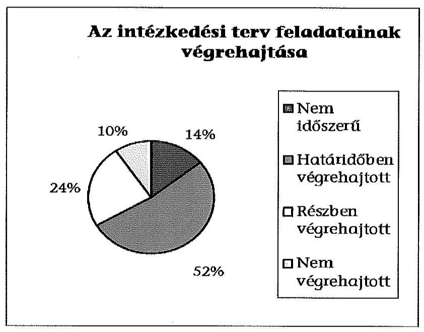
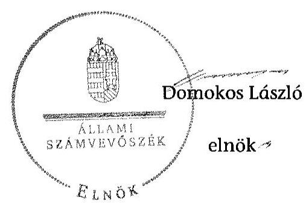

# ÁLLAMI   SZÁMVEVŐSZÉK 

## JELENTÉS

Utóellenőrzések - az önkormányzatok pénzügyi gazdálkodási helyzetének, szabályszerűségének utóellenőrzése

Csorvás

---

# Állami Számvevőszék 

Iktatószám: V-0607-026/2015.
Témaszám: 1641
Vizsgálat-azonosító szám: V069307

## Az ellenőrzést felügyelte:

## Renkó Zsuzsanna

felügyeleti vezető
Az ellenőrzést vezette és az ellenőrzés végrehajtásáért felelős:
Mohl Anna
ellenőrzésvezető
A számvevőszéki jelentés összeállításában közreműködött:
Baksa Anikó
számvevő főtanácsos
Dr. Mezei Imréné
számvevő főtanácsos
Az ellenőrzést végezték:
Völgyesi Mátyás dr. Nagymányai Péter Hegyes Mária
számvevő számvevő számvevő tanácsos
Novák Márta
számvevő

A témához kapcsolódó eddig készített számvevőszéki jelentések:
címe
sorszáma
Jelentés Csorvás Város Önkormányzata pénzügyi gazdálkodási 13063
helyzetének, szabályszerűségének ellenőrzéséről

---

# TARTALOMJEGYZÉK 

BEVEZETÉS ..... 3
I. ÖSSZEGZŐ MEGÁLLAPÍTÁSOK, KÖVETKEZTETÉSEK ..... 6
II. RÉSZLETES MEGÁLLAPÍTÁSOK ..... 7

1. Az önkormányzat a pénzügyi gazdálkodási helyzetének, szabályszerűségének ellenőrzéséről készült ÁSZ jelentésben foglalt javaslatokra készített-e intézkedési tervet, illetve teljesítette-e az abban foglaltakat? ..... 7
MELLÉKLETEK
2. számú Az ÁSZ 13063 számú jelentéséhez kapcsolódó intézkedési terv végrehajtása
FÜGGELÉKEK
3. számú Rövidítések jegyzéke
4. számú Fogalomtár

---

.

---

# JELENTÉS 

## Utóellenőrzések - az önkormányzatok pénzügyi gazdálkodási helyzetének, szabályszerűségének utóellenőrzése Csorvás

## BEVEZETÉS

Az Állami Számvevőszék 2011-2015. évekre szóló stratégiája a helyi önkormányzatok ellenőrzésében a pénzügyi-gazdasági helyzet értékelésére, kockázatai feltárására helyezte a fő hangsúlyt. A 2011-2013. években az ÁSZ által ellenőrzött önkormányzatok esetében a működési, beruházási és a hosszú lejáratú pénzintézeti kötelezettségeinek teljesítésével kapcsolatos pénzügyi kockázatokat mutattuk be. Az ÁSZ megállapította, hogy az önkormányzatok pénzügyi egyensúlyi helyzete az ellenőrzött időszakban romlott, a pénzügyi kockázatok fokozódtak, a pénzügyi egyensúlyi helyzetet jellemző mutatószámok kedvezőtlenül változtak. Az önkormányzati alrendszerben 2012. év végétől 2014. évelejéig lezajlott adósságkonszolidáció és feladat-ellátási-, finanszírozási-rendszer változás következtében a települési önkormányzatok pénzügyi helyzete jelentős mértékben megváltozott, amely a jóváhagyott intézkedési tervek végrehajtását is befolyásolta.

Az ellenőrzött szervezet vezetője az ÁSZ tv. 33. § (1)-(2) bekezdésében foglaltak alapján a jelentések intézkedést igénylő megállapításaihoz kapcsolódóan köteles intézkedési tervet benyújtani, amelyet az ÁSZ-nak kell elfogadni. Amennyiben az ellenőrzött által vállalt intézkedések hiányosak, vagy más okból nem elfogadhatók az ÁSZ indoklással és póthatáridő tűzésével visszaküldi azt kijavításra, kiegészítésre. Az elfogadásról szóló tájékoztatásban az Állami Számvevőszék elnöke valamennyi ellenőrzött szervezet vezetőjének figyelmét felhívta arra, hogy az intézkedési tervben foglaltak megvalósítását - az ÁSZ tv. 33. § (7) bekezdésében foglaltak alapján - utóellenőrzés keretében ellenőrizheti.

Az ellenőrzés célja: annak megállapítása, hogy az ellenőrzött önkormányzatok pénzügyi gazdálkodási helyzetének, szabályszerűségének ellenőrzéséről készült ÁSZ jelentésben foglalt javaslatokra készítettek-e intézkedési terveket, illetve az ellenőrzött által összeállított intézkedési tervben meghatározott feladatokat végrehajtották-e. Ennek keretében ellenőrizzük, hogy:

- a polgármester az ÁSZ törvény értelmében az intézkedési tervet határidőben megküldte-e az ÁSZ részére, szükség volt-e az elfogadást megelőzően kiegészítésre, azt az előírt póthatáridőn belül megtették-e, a Képviselő-testület a kiegészített intézkedési tervet elfogadta-e;

---

- az önkormányzat az elfogadott (kiegészített) intézkedési tervében foglaltak megtételéről, az abban előírt határidők betartásával gondoskodott-e;
- az elfogadott intézkedések esetleges késedelme, végrehajtásának elmaradása milyen szintű kockázatot jelez a pénzügyi gazdálkodásra és annak szabályszerűségére.

Az utóellenőrzés várható hasznosulása: az ellenőrzés megállapításai segítséget nyújthatnak a közpénzügyi helyzet javításához. Az utóellenőrzés, jellegéből adódóan fokozza közbizalmat, fegyelmet, a társadalom, az ellenőrzöttek, a helyi döntéshozók vonatkozásában erősíti az ÁSZ tekintélyét és igazolja, hogy lejárt a következmények nélküli ellenőrzések időszaka. Az ÁSZ intézményén belül lehetőség nyílik arra, hogy az utóellenőrzés, mint ellenőrzési kategória a szervezet tevékenységében stabilizálódjék, a megállapítások visszacsatolása segítse és erősítse az ÁSZ hozzáadott értéket teremtő elemző tevékenységét és tanácsadó szerepét.

Az intézkedési tervek olyan típusú feladatokat határoztak meg az önkormányzatok számára, amelyek a működőképesség jövőbeni zavarainak elkerülését, a felelős fenntartható gazdálkodás követelményeinek érvényesülését, a pénzügyi műveletek racionális keretek közt tartását tűzték ki célul. Az utóellenőrzés által e területeken érzékelt mulasztások még megfelelő irányba terelhetik az intézkedési tervekben foglalt feladatok végrehajtását.

Az ÁSZ az elfogadott intézkedési terveket kockázatelemzésnek veti alá. Ennek során elvégezzük az ÁSZ által elfogadott intézkedési tervben előírt/vállalt feladatok végrehajtásának értékelését, amelynek során alkalmazandó besorolási kategóriák:

- okafogyottá vált feladat: ha végrehajtására - meghatározott esemény bekövetkezése, továbbá külső körülmény, a működést érintő feltétel változása miatt - már nincs szükség, illetve lehetőség, és egyértelműen megállapítható, hogy az intézkedést szükségessé tevő körülmény a jövőben nem fordulhat elő;
- nem időszerű (nem esedékes) feladat: amelynek ellenőrzési időszakon belüli végrehajtására azért nem került (kerülhetett) sor, mert az intézkedés alapjául szolgáló esemény nem következett be, de annak jövőbeni előfordulása lehetséges;
- határidőben végrehajtott feladat: ha teljesítése dokumentáltan az intézkedési tervben előírt határidőben és tartalommal, módon megtörtént;
- határidőn túl végrehajtott feladat: ha annak teljesítése az intézkedési tervben meghatározott módon, de az előírt határidőn túl történt meg;
- részben végrehajtott feladat: amelynek végrehajtása teljes körűen az intézkedési tervben előírt tartalommal/módon nem történt meg, vagy a feladatot nem az előírt gyakorisággal hajtották végre;

---

- végre nem hajtott feladat: ha a végrehajtásért felelősként megjelölt személy(ek)nek felróhatóan a teljesítés elmaradt, vagy a teljesítést nem dokumentálták.

Az ellenőrzést a számvevőszéki ellenőrzés szakmai szabályai szerint, szabályszerűségi ellenőrzés módszerével, a vonatkozó nemzetközi standardok figyelembevételével végeztük. Az ellenőrzésre az önkormányzatok elektronikus adatszolgáltatása alapján került sor, helyszíni ellenőrzést nem végeztünk. A megállapítások rögzítése az önkormányzatok által rendelkezésre bocsátott dokumentumok, tanúsítványok alapján történt, melyek valódiságát és teljes körűségét a polgármester, valamint a jegyző teljességi nyilatkozata igazolja.

A jóváhagyott intézkedési tervben előírt feladatok végrehajtásának ellenőrzését egységes szempontok, illetve értékelési kritériumok alapján végeztük. Figyelembe vettük az intézkedési terv jóváhagyását követően hatályba lépett jogszabályi előírások változásából következő események - kiemelten az önkormányzati alrendszerben lezajlott adósságkonszolidációs intézkedések, továbbá a feladat-ellátási és finanszírozási rendszer változásának - hatásait.

Az alkalmazott rövidítések jegyzékét az 1. számú függelék, az egyes fogalmak magyarázatát a 2. számú függelék tartalmazza.

Az ellenőrzött szervezet: Csorvás Város Önkormányzata
Az ellenőrzött időszak: az intézkedési terv ÁSZ-nak történő benyújtásától az utóellenőrzés megkezdéséig tartó időszak.

Az ellenőrzés végrehajtásának jogszabályi alapját az ÁSZ tv. 1. § (3) bekezdése, az 5. § (2) és (6) bekezdései, a 33. § (7) bekezdése, valamint az Áht. 61. § (2) bekezdésének előírásai képezték.

Az ÁSZ tv. 29. § (1) bekezdése szerint a jelentéstervezetet észrevételezésre megküldtük az Önkormányzat polgármesterének, aki az ÁSZ tv. 29. § (2) bekezdésében foglalt észrevételezési jogával nem élt, a jelentéstervezetre észrevételt nem tett.

Az ÁSZ a 2013. évben zárta le az Önkormányzat pénzügyi gazdálkodási helyzetének, szabályszerűségének ellenőrzését. Az ellenőrzés tapasztalatairól készített 13063 számú jelentés az interneten, a www.asz.hu címen olvasható.

---

# I. ÖSSZEGZŐ MEGÁLLAPÍTÁSOK, KÖVETKEZTETÉSEK 

Az ÁSZ utóellenőrzés keretében értékelte az Önkormányzat pénzügyi gazdálkodási helyzetének, szabályszerűségének ellenőrzéséről szóló jelentés javaslatainak hasznosítására elfogadott intézkedési terv végrehajtását.

Az előző ÁSZ ellenőrzés megállapította, hogy az Önkormányzat pénzügyi egyensúlya rövid távon nem volt biztosított. A feltárt hiányosságok alapján megfogalmazott ÁSZ javaslatok hasznosítására az Önkormányzat intézkedési tervet készített, melyet az ÁSZ kiegészítés kérése nélkül elfogadott.

Az utóellenőrzés megállapította, hogy az ellenőrzött időszakban időszerűvé vált feladatait az Önkormányzat teljes körűen nem hajtotta végre, ezáltal az ÁSZ javaslatai maradéktalanul nem hasznosultak.

Az utóellenőrzés megállapítása alapján a részben, illetve nem teljesített feladatok közepes kockázatot jelentenek a pénzügyi gazdálkodásra, annak szabályszerűségére.

---

# II. RÉSZLETES MEGÁLLAPÍTÁSOK 

## 1. Az önkormányzat a pénzügyi gazdálkodási helyzetének, szabályszerűségének ellenőrzéséről készült ÁSZ jelentésben foglalt javaslatokra készített-e intézkedési tervet, illetve teljesítette-e az abban foglaltakat?

Az utóellenőrzés - a 2014. szeptember 16-ig végrehajtott intézkedéseket figyelembe véve - az Önkormányzat pénzügyi gazdálkodási helyzetének, szabályszerűségének ellenőrzéséről készült ÁSZ jelentés javaslatai hasznosítására elfogadott intézkedési terv végrehajtására irányult. A pénzügyi helyzet ellenőrzését az ÁSZ a 2009. január 1. - 2012. szeptember 30. közötti időszakra végezte el, amelynek alapján megállapította, hogy az Önkormányzat pénzügyi egyensúlya rövid távon nem volt biztosított.

A polgármester a Képviselő-testületet tájékoztatta az ÁSZ jelentéséről. A jelentésben foglalt megállapításokhoz kapcsolódó intézkedési tervet ${ }^{1}$ a polgármester az ÁSZ tv. 33. § (1) bekezdésében foglalt határidőre megküldte az ÁSZ részére. Az ÁSZ az intézkedési tervet javítás és kiegészítés nélkül elfogadta.

Az ÁSZ által elfogadott intézkedési tervben meghatározott feladatokat, az ÁSZ jelentés javaslatainak címzettjét és a feladatok végrehajtását az 1. számú melléklet mutatja be.

Az ÁSZ által elfogadott intézkedési terv 21 tervezett intézkedést tartalmazott, felelősként a polgármestert, a jegyzőt, a pénzügyi- és gazdasági irodavezetőt, a Polgármesteri Hivatalnak a fejlesztés tárgya szerint illetékes iroda vezetőjét és a belső ellenőrzési vezetőt megjelölve.

Az utóellenőrzés megállapítása alapján három feladat végrehajtása nem volt időszerű, tizenegy feladat határidőben, öt feladat részben, kettő feladat pedig nem került végrehajtásra. Az intézkedési tervben előírt feladatok között nem volt olyan, amely okafogyottá vált volna vagy határidőn túl hajtották volna végre.

## Nem volt időszerű:

- gondoskodni arról, hogy jövőbeni hitelfelvétel, kötvénykibocsátás esetén annak fedezeteként az Önkormányzat általános működésének és ágazati feladatainak támogatása, továbbá a költségvetési támogatás ne kerüljön felhasználásra, mivel az ellenőrzött időszakban nem került sor pénzintézeti kötelezettségvállalásra;

[^0]
[^0]:    ${ }^{1}$ A Képviselő-testület az intézkedési tervet a 124/2013. (IX. 25.) számú határozatával fogadta el.

---

- a jövőbeni pénzügyi szolgáltatások igénybevétele esetén a Kbt. előírása szerinti közbeszerzési eljárás lefolytatása, mivel az ellenőrzött időszakban közbeszerzési kötelezettség alá tartozó pénzügyi szolgáltatást érintő kötelezettségvállalás nem történt;
- az éven belüli lejáratra kapott kölcsönök hitelektől elkülönítetten történő kimutatása a mérlegben a rövid lejáratú kötelezettségek között, mivel az Önkormányzat az ellenőrzött időszakban rövid lejáratú kölcsönt nem vett igénybe.

# Határidőben végrehajtották: 

- a 2014. évi költségvetési rendelettervezet, illetve a 2013. és 2014. évi költségvetési rendelet módosításai előterjesztését megelőzően a bevételszerző és kiadáscsökkentő lehetőségek felmérését;
- a pénzügyi egyensúlyi helyzet helyreállítását, hosszú távú fenntartását biztosító reorganizációs program Képviselő-testület elé terjesztését;
- a költségvetési támogatások hitelfedezetként történő felajánlásához kapcsolódóan feltárt szabálytalanság tekintetében a munkajogi felelősséggel kapcsolatos körülmények vizsgálatát és a munkajogi intézkedés megtételére vonatkozó döntéshozatalt;
- a közbeszerzési szabálytalanság tekintetében a munkajogi felelősséggel kapcsolatos körülmények vizsgálatát és a munkajogi intézkedés megtételére vonatkozó döntéshozatalt;
- a devizában fennálló kötvénytartozás törlesztése során a pénzügyileg realizált árfolyamveszteség Áhsz. előírásainak megfelelő elszámolását és a 2013. évi beszámolóban való kimutatását;
- a kockázatkezelési szabályzat, az ellenőrzési nyomvonal és a szabálytalanságok kezelésének eljárásrendje felülvizsgálatát, illetve aktualizálását;
- a pénzintézeti kötelezettségeket érintő kockázatok döntés-előkészítési szakaszban történő feltárásának, valamint a futamidő egyes éveit terhelő kötelezettségek költségvetési egyensúlyra gyakorolt hatása vizsgálatának előírását;
- az Önkormányzat fizetőképességének biztosítására és eladósodásának kezelésére, valamint a szállítói tartozások, az egyéb kiadáselmaradások rendezésére, továbbá a pénzügyi kötelezettségek teljesítésére vonatkozó helyi szabályozás elkészítését;
- a belső ellenőrzési stratégiai terv, illetve a 2014. évre vonatkozó éves belső ellenőrzési terv elkészítésekor kiemelt figyelmet fordítottak a pénzügyi egyensúlyi helyzetet befolyásoló kockázati tényezők elemzésére és a pénzügyi ellenőrzésekre;
- az Önkormányzat megállapodást kötött a Víziközmű Társulattal a társulat helyett készfizető kezesként teljesített összegek önkormányzati tartozással szembeni kompenzálásáról. A társulat által felvett hitelért vállalt készfizető

---

kezesség miatti kockázat megszüntetése érdekében az Önkormányzat kezdeményezésére a hitel az adósságkonszolidációba bevonásra került;

- az Önkormányzat kialakította a belső kontrollrendszerre vonatkozó szabályzatát, amely
 meghatározta az önkormányzati feladat átadás-átvételhez kapcsolódó döntések előkészítésére, a döntések kötelező és önként vállalt feladatokra, valamint a pénzügyi egyensúlyra gyakorolt hatásának vizsgálatára vonatkozó körülményeket.

Az ÁSZ által elfogadott intézkedési tervben meghatározott feladatok közül az alábbiakat részben teljesítették:

- a Képviselő-testület döntést hozott arról, hogy a 2014. évi költségvetésben hiány nem tervezhető, a „plusz forrásokat" pedig az adósságok és a szállítói tartozások törlesztésére kell fordítani. Nem határozták meg azonban előre annak összegét és módját, hogy a realizált többletbevételeket, valamint a meglévő és a jövőben képződő tartalékokat miként kell a kötelezettségek rendezésére fordítani. A feladat végrehajtásának felelőse a polgármester és a jegyző volt;
- az adósságrendezési eljárás megindításának elkerülése érdekében nem számoltak be az intézkedési tervben meghatározott negyedévenkénti rendszerességgel a Képviselő-testületnek az Önkormányzat lejárt szállítói állományának alakulásáról, és nem intézkedtek a szállítói számlák esedékesség szerinti kiegyenlítéséről. A lejárt tartozások közül azonban egy esetben - az 55,6 millió Ft lejárt szállítói tartozásból 36,8 millió Ft-ot érintően - megállapodást kötöttek a fennálló tartozás ütemezett megfizetéséről. A feladat végrehajtásának felelőse a polgármester volt;
- a pénzügyi egyensúlyt befolyásoló kockázatok kezelésének személyi feltételei megteremtése érdekében pályázati felhívást tettek közzé, azonban a feltételeknek megfelelő jelentkező hiányában a munkakör betöltésére nem került sor. Kockázatelemzést csak a 2014. évi költségvetés készítésekor végeztek. A feladat végrehajtásának felelőse a polgármester volt;
- a folyamatos határidő ellenére dokumentált módon kockázatelemzésre év közben nem, csak a költségvetés készítésekor került sor. A költségvetéshez kapcsolódóan 11 kockázatot azonosítottak. A feladat végrehajtásának felelőse a jegyző, valamint a pénzügyi- és gazdasági irodavezető volt;
- a „Belső kontrollrendszer" elnevezésű dokumentumban meghatározták a közbeszerzési értékhatár alatti beszerzéseknél a pályáztatási kötelezettség teljesítésének kontrollját. A dokumentum a Közbeszerzési Szabályzatot jelöli meg a szabályozás helyének, azonban ott nem szerepel az értékhatár alatti beszerzések szabályozása. Ezen túl a pályáztatási kötelezettség teljesítésének ellenőrzését nem tartalmazta a 2014. évi belső ellenőrzési terv. A feladat végrehajtásának felelőse az intézkedési tervben megjelöltek szerint a belső ellenőrzési vezető volt.

---

Az ÁSZ által elfogadott intézkedési tervben meghatározott feladatok közül az alábbiakat nem hajtották végre:

- az önkormányzati feladatellátáshoz kapcsolódó támogatási rendszer feltételeinek meghatározását, továbbá a feladatellátás teljesítéséről a beszámolási kötelezettséggel, valamint a szerződések minimum tartalmi követelményeivel összefüggő kontrolltevékenységek meghatározását. A feladat végrehajtásának felelőse a pénzügyi- és gazdasági irodavezető volt;
- a fejlesztések döntés-előkészítési folyamatában a lebonyolítás és a működtetés kockázatai feltárása és kezelése kötelezettségének meghatározását. A feladat végrehajtásának felelőse a pénzügyi- és gazdasági irodavezető és a Polgármesteri Hivatalnak a fejlesztés tárgya szerint illetékes iroda vezetője volt.

Az utóellenőrzés megállapítása alapján a részben, illetve nem teljesített feladatok közepes kockázatot jelentenek a pénzügyi gazdálkodásra, annak szabályszerűségére.

Budapest, 2015. 08. hónap 0h. nap

Melléklet: $\quad 1 \mathrm{db}$
Függelék: $\quad 2 \mathrm{db}$

---

# Az ÁSZ 13063 számú jelentéséhez kapcsolódó intézkedési terv végrehajtása

|  Sorszám | Intézkedési terv alapján elvégzendő feladat | Az intézkedési tervben meghatározott határidő | Az ÁSZ 13063 számú jelentése javaslatának címzettje | Az intézkedés végrehajtása  |
| --- | --- | --- | --- | --- |
|   | 1. | 2. | 3. | 4.  |
|  Nem időszerű intézkedések |  |  |  |   |
|  1. | A pénzintézeti kötelezettségvállalásokkal kapcsolatos jogszerű biztosíték, illetve a fedezet felajánlása érdekében a polgármester elrendeli, hogy gondoskodni kell arról, hogy a jövőbeni hitelfelvétel, kötvénykibocsátás fedezeteként az Áht. 84. § (4) bekezdésében, továbbá az Ávr. 145. § (2) bekezdésében előírtak szerint az Önkormányzat általános működésének és ágazati feladatainak támogatása, továbbá a költségvetési támogatás ne kerüljön felhasználásra. A költségvetési támogatások folyósítására szolgáló elkülönített bankszámláról hiteltörlesztés ne történjen. | értelem szerinti | polgármester | A polgármester és a jegyző 2014. szeptember 25-én kiadott közös nyilatkozata, az Önkormányzat adatszolgáltatása, valamint a 2013. évi költségvetési beszámoló, a zárszámadási rendelet (4/2014. (IV. 30.) számú önkormányzati rendelet a 2013. évi zárszámadásról), illetve a 2014. évi első félévi beszámoló alapján az ellenőrzött időszakban újabb pénzintézeti kötelezettségvállalásra nem került sor.  |

---

|  | Intézkedési terv alapján elvégzendő feladat | Az intézkedési tervben meghatározott határidő | Az ÁSZ 13063 számú jelentése javaslatának címzettje | Az intézkedés végrehajtása |
| :--: | :--: | :--: | :--: | :--: |
|  | 1. | 2. | 3. | 4. |
| 2. | A jövőbeni pénzügyi szolgáltatások igénybevétele esetén biztosítani kell, hogy amennyiben a Kbt. 120. § k) pontjában foglalt kivétel nem áll fenn, a közbeszerzési eljárás lefolytatásának kötelezettsége tekintetében a 119. §-ban foglalt előírás érvényesüljön. | 2013. december 31. | polgármester | A polgármester és a jegyző 2014. szeptember 25-én kiadott közös nyilatkozata és az Önkormányzat adatszolgáltatása alapján az ellenőrzött időszakban újabb közbeszerzési kötelezettség alá tartozó - pénzügyi szolgáltatás igénybevételére nem került sor. |
| 3. | A könyvviteli mérlegben az egy évet meg nem haladó lejáratra kapott kölcsönök a hitelektől elkülönítve a rövid lejáratú kötelezettségek között kerüljenek kimutatásra. | 2013. november 30. napjától folyamatos | jegyző | A polgármester és a jegyző 2014. szeptember 25-én tett nyilatkozata szerint 2013-ban és 2014-ben az Önkormányzat nem vett fel kölcsönt. A 2013. évi költségvetési beszámoló mérleg űrlapja szerint kölcsön állománnyal az Önkormányzat nem rendelkezett. |
| Határidőben végrehajtott intézkedések |  |  |  |  |
| 1. | A költségvetési rendelettervezet, valamint annak évközi módosítása előterjesztését megelőzően fel kell mérni a bevételszerző, kiadáscsökkentő lehetőségeket, és elő kell terjeszteni a Képviselő-testületnek a bevételek növelését, a kiadások csökkentését célzó intézkedések bevezetéséhez szükséges - a Htv. 140. § (1) bekezdés a) pontja alapján a jegyző által elkészített - döntési javaslatot. | értelem szerinti | polgármester | A 2014. évi költségvetési koncepció, a 2014. évi költségvetési rendelettervezet, valamint a 2013. évi költségvetési rendelet (az Önkormányzat 1/2013. (I. 31.) számú rendelete), illetve a 2014. évi költségvetési rendelet (az Önkormányzat 1/2014. (II. 12.) számú rendelete) módosításához készített előterjesztésekben (2013. szeptember 19., 2013. december 19., 2014. február 19., 2014. június 19., 2014. augusztus 19.) felmérték a bevételszerző, kiadáscsökkentő lehetőségeket, és döntési javaslat megtételére került sor a bevételek növelését, illetve a kiadások csökkentését célzó intézkedések bevezetéséhez. (A 2014. |

---

|  Sorszám | Intézkedési terv alapján elvégzendő feladat | Az intézkedési tervben meghatározott határidő | Az ÁSZ 13063 számú jelentése javaslatának címzettje | Az intézkedés végrehajtása  |
| --- | --- | --- | --- | --- |
|   | 1. | 2. | 3. | 4.  |
|   |  |  |  | évi költségvetési koncepcióban az önkormányzati termőföldek hasznosításából terveztek bevételi többletet, kiadáscsökkentést pedig a könyvvizsgálói megbízás megszüntetéséből, az első lakás vásárláshoz nyújtott támogatások, valamint a szociális kölcsönök előirányzatának csökkentésével kívántak elérni.)  |
|  2. | A polgármesternek elő kell terjeszteni a Képviselő-testületnek jóváhagyásra a Hiv. 140. § (1) bekezdés a) pontja alapján a jegyző által elkészített - az Önkormányzat gazdasági helyzetének elemzésén alapuló, a pénzügyi egyensúlyi helyzet gyors helyreállítását, hosszú távú fenntartását, valamint az adósságállomány újratermelődésének elkerülését biztosító intézkedéseket tartalmazó reorganizációs programot. | 2013. november 30. | polgármester | A reorganizációs programot az előírt tartalommal határidőben elkészítették, azt a Képviselő-testület a 159/2013. (XI. 27.) számú határozatával elfogadta.  |

---

|  Sorszám | Intézkedési terv alapján elvégzendő feladat | Az intézkedési tervben meghatározott határidő | Az ÁSZ 13063 számú jelentése javaslatának címzettje | Az intézkedés végrehajtása  |
| --- | --- | --- | --- | --- |
|   | 1. | 2. | 3. | 4.  |
|  3. | Az ÁSZ ellenőrzése által feltárt szabálytalanság tekintetében a munkajogi felelősséggel kapcsolatos körülményeket meg kell vizsgálni, és meg kell hozni a szükséges munkajogi intézkedéseket. | 2013. november 30. | polgármester | A szabálytalanság (költségvetési támogatások felajánlása hitelfedezetként, illetve a költségvetési támogatások bankszámláról hitel törlesztése) tekintetében a munkajogi felelősséggel kapcsolatos körülményeket a polgármester 2013. november 4-én megvizsgálta, a jegyző figyelmét a jogszabály előírásai betartására felhívta, további munkajogi intézkedést nem tartott szükségesnek (a 2013. november 4-én kelt Feljegyzés, a 2013. november 26-i polgármesteri intézkedés, illetve a 2014. szeptember 25-én tett polgármesteri és jegyzői nyilatkozatok alapján).  |
|  4. | Intézkedni kell az ÁSZ ellenőrzés során feltárt közbeszerzési szabálytalanság tekintetében a munkajogi felelősséggel kapcsolatos körülmények kivizsgálásáról, és meg kell hozni a szükséges munkajogi intézkedéseket. | 2013. november 30. | polgármester | A szabálytalanság (közbeszerzési eljárás mellőzése pénzügyi szolgáltatóval történt szerződéskötést megelőzően) tekintetében a munkajogi felelősséggel kapcsolatos körülményeket a polgármester 2013. november 4-én, illetve a jegyző 2013. szeptember 25-én megvizsgálta. Az érintettek figyelmét a jogszabály előírásának betartására felhívták, további munkajogi intézkedést nem tartottak szükségesnek (a 2013. november 4-én kelt Feljegyzés, a 2013. november 26-i polgármesteri intézkedés, illetve a 2014. szeptember 25-én tett jegyzői nyilatkozat alapján).  |

---

|  Sorszám | Intézkedési terv alapján elvégzendő feladat | Az intézkedési tervben meghatározott határidő | Az ÁSZ 13063 számú jelentése javaslatának címzettje | Az intézkedés végrehajtása  |
| --- | --- | --- | --- | --- |
|   | 1. | 2. | 3. | 4.  |
|  5. | A devizában fennálló kötvénytartozás törlesztése során a pénzügyileg realizált árfolyam-különbözet elszámolása árfolyamveszteség esetén az Áhsz. 9. számú melléklet számlaosztályok tartalmára vonatkozó előírásai 4. dl) és 9. c) pontjában foglalt előírásoknak, illetve árfolyamnyereség esetén az Áhsz. 14. a) pontjában foglalt előírásnak megfelelően történjen. | 2013. november 30. napjától értelem szerinti | jegyző | A devizában fennállt kötvénytartozás törlesztése során 2013-ban egy alkalommal pénzügyileg realizált árfolyamveszteséget elszámolták, és azt a 2013. évi költségvetési beszámoló 03. űrlap 67. sorában az Áhsz. előírásainak megfelelően kimutatták. A kötvénytartozás a 2014. évben az adósságkonszolidáció keretében megszűnt, és ezen időpontig pénzügyileg realizált árfolyam különbözet nem keletkezett.  |
|  6. | Felül kell vizsgálni az Önkormányzat kockázatkezelési szabályzatát, az ellenőrzési nyomvonalat és a szabálytalanságok kezelésének eljárásrendjét, és szükség szerint el kell végezni az aktualizálást. | 2013. november 30. | jegyző | Az Önkormányzat kockázatkezelési szabályzatát, az ellenőrzési nyomvonalat és a szabálytalanságok kezelésének eljárásrendjét a „Belső kontrollrendszer" elnevezésű dokumentum tartalmazta, amelynek aktualizálását 2013. november 26-ával elvégezték.  |
|  7. | Elő kell írni a pénzintézeti kötelezettségvállalások kockázatainak a döntéselőkészítési szakaszban történő feltárását, a futamidő egyes éveit terhelő kötelezettségek költségvetési egyensúlyra gyakorolt hatásának
 vizsgálatát. | értelem szerinti | jegyző | A 2013. november 26-tól hatályos „Belső kontrollrendszer" elnevezésű dokumentum előírja a pénzintézeti kötelezettségvállalások kockázatainak a feltárását, a futamidő egyes éveit terhelő kötelezettségek kiszámítását, valamint a kötelezettségek költségvetési egyensúlyra gyakorolt hatásának a vizsgálatát (1. sz. melléklet, ellenőrzési nyomvonal 64-65. o.).  |

---

|  | Intézkedési terv alapján elvégzendő feladat | Az intézkedési tervben meghatározott határidő | $\begin{gathered} \text { Az ÁSZ } 13063 \\ \text { számú jele- } \\ \text { tése javasla- } \\ \text { tának cím- } \\ \text { zettje } \end{gathered}$ | Az intézkedés végrehajtása |
| :--: | :--: | :--: | :--: | :--: |
|  | 1. | 2. | 3. | 4. |
| 8. | Szabályzatot kell készíteni az Önkormányzat fizetőképességének biztosítására és eladósodásának kezelésére, valamint a pénzügyi kötelezettségek teljesítése, a szállítói tartozások és az egyéb kiadáselmaradások rendezése helyi szabályainak meghatározására. | 2013. november 30. | jegyző | A 2013. november 26-tól hatályos „Szabályzat az Önkormányzat fizetőképességének fenntartására és eladósodásának kezelésére" elnevezésű dokumentum kiterjed a szállítói tartozások, az egyéb kiadáselmaradások, továbbá a pénzügyi kötelezettségek rendezésére vonatkozó helyi szabályok meghatározására. |
| 9. | Készüljön stratégiai ellenőrzési terv és éves ellenőrzési terv a gazdálkodásban rejlő kockázatok elemzése alapján. Kiemelt figyelmet kell fordítani a pénzügyi egyensúlyi helyzetet befolyásoló döntéseknél feltárt kockázati tényezők éves ellenőrzési tervben foglaltak szerinti, lehető legrövidebb időn belül történő ellenőrzésének végrehajtására. | 2013. november 30. (az éves ellenőrzési terv jegyzőnek történő megküldési határideje. Az éves ellenőrzési tervet a Képviselő-testület 2013. december 31-ig hagyja jóvá. Bkr. 32. § (4) bek.) | jegyző | A jegyzőnek megküldött stratégiai és éves belső ellenőrzési terv a gazdálkodásban jelentkező kockázatok elemzése alapján készült.   A belső ellenőrzési stratégiai tervet és az éves belső ellenőrzési tervet a Képviselő-testület 174/2013. (XII. 30.) határozatával fogadta el. A stratégiai terv 4-8 pontjai kiemelt figyelmet fordítanak a pénzügyi egyensúlyt befolyásoló kockázati tényezők ellenőrzésére. A 2014. évre vonatkozó belső ellenőrzési terv tartalmazta a normatív támogatások és az élelmezési térítési díjak ellenőrzését, valamint az előző évi pénzügyi ellenőrzés utóellenőrzését. |

---

|  Sorszám | Intézkedési terv alapján elvégzendő feladat | Az intézkedési tervben meghatározott határidő | Az ÁSZ 13063 számú jelentése javaslatának címzettje | Az intézkedés végrehajtása  |
| --- | --- | --- | --- | --- |
|   | 1. | 2. | 3. | 4.  |
|  10. | Intézkedni kell a Víziközmű Társulattal szemben az Önkormányzat által a Társulat helyett visszafizetett hitel és járulékos költségei arányos megtérülése érdekében. | 2013. december 31. | polgármester | Az Önkormányzat a Víziközmű Társulattal 2013. december 15-én megállapodást kötött, melynek alapján az Önkormányzat által a társulat helyett megfizetett összegek kompenzálásra kerültek a társulattal szemben fennálló üzemeltetési hozzájárulás tartozással, az Önkormányzat fizetési kötelezettségének teljesítéseként. A társulat által felvett és lejárt esedékességű hitelért vállalt készfizető kezesség miatti kockázat megszüntetése érdekében az Önkormányzat kezdeményezte a készfizető kezesség tárgyát képező lejárt hitel adósságkonszolidációba való bevonását, melyre 2014. február 24-én sor került.  |
|  11. | A jegyző elrendeli, hogy ki kell alakítani a Bkr. 8. § (1)-(2) bekezdései alapján azokat a belső kontrolltevékenységeket, amelyek biztosítják a pénzügyigazdálkodási folyamatok szabályosságát és a pénzügyi egyensúlyi helyzet alakulását befolyásoló döntések kockázatainak kezelését. Ennek érdekében a feladat átadás-átvételre vonatkozó döntések előkészítése során meg kell vizsgálni a döntés kötelező és önként vállalt feladatok arányára, ezáltal a pénzügyi egyensúlyi helyzetre gyakorolt hatását. | értelem szerinti | jegyző | A „Belső kontrollrendszer” elnevezésű dokumentumban meghatározták az önkormányzati feladat átadás-átvétel kapcsán a döntések előkészítésére, a döntések kötelező és önként vállalt feladatokra, valamint a pénzügyi egyensúlyra gyakorolt hatásának vizsgálatára vonatkozó körülményeket.  |

---

|  | Intézkedési terv alapján elvégzendő feladat | Az intézkedési tervben meghatározott határidő | Az ÁSZ 13063 számú jelentése javaslatának címzettje | Az intézkedés végrehajtása |
| :--: | :--: | :--: | :--: | :--: |
|  | 1. | 2. | 3. | 4. |
| Részben végrehajtott intézkedések |  |  |  |  |
| 1. | Döntési javaslatot is tartalmazó előterjesztést kell készíteni az adósságkonszolidációt követően fennmaradó kötelezettségek jövőbeni teljesítésére, a fizetőképesség megőrzésére, amit a polgármester a Képviselő-testület elé terjeszt. Kezdeményezni kell a képviselő-testületi döntést arra vonatkozóan, hogy - előre meghatározott összegben és módon - a realizált többletbevételeket, a meglévő és a jövőben képződő tartalékokat mindaddig a kötelezettségek rendezésére fordítja, és nem használja más célra az Önkormányzat, amíg az önkormányzati gazdálkodás pénzügyi egyensúlya rövid távon veszélyeztetett. | folyamatos, 2014. január 1. napjától | polgármester | A Képviselő-testület a 151/2013. (XI. 13.) számú határozatával döntést hozott arról, hogy „a 2014. évi költségvetési rendeletet úgy kell megalkotni, hogy abban hiány nem tervezhető, a plusz forrásokat pedig az adósságok és a szállítói tartozások törlesztésére kell fordítani". A vonatkozó képviselő-testületi határozatot kezdeményező előterjesztésben azonban nem határozták meg előre az összegét és módját annak, amelynek megfelelően a realizált többletbevételeket, valamint a meglévő és a jövőben képződő tartalékokat mindaddig a kötelezettségek rendezésére fordítja, és nem használja fel más célra az Önkormányzat, amíg az önkormányzati gazdálkodás pénzügyi egyensúlya rövid távon veszélyeztetett. |
| 2. | A szállítói kitettség és az Adósságrendezési tv. 4-9.§-aiban szabályozott adósságrendezési eljárás megindításának elkerülése érdekében rendszeresen be kell számolni a Képviselőtestületnek az Önkormányzat lejárt szállítói állománya alakulásáról, és intézkedni kell a szállítói számlák esedékesség szerinti kiegyenlítéséről, vagy | folyamatos, 2013. december 31. napjától kezdődő hatálylyal, negyedéves rendszerességgel | polgármester | A polgármester és a jegyző 2014. szeptember 25-én kiadott közös nyilatkozata szerint a lejárt szállítói állomány negyedévenkénti bemutatására nem került sor, és a polgármester nem intézkedett a szállítói számlák esedékesség szerinti teljes körű kiegyenlítéséről. A képviselő-testületi határozatok szerint a polgármester nem számolt be a Képviselő-testületnek a lejárt szállítói állomány alakulásáról. A lejárt tartozások közül |

---

|  Sorszám | Intézkedési terv alapján elvégzendő feladat | Az intézkedési tervben meghatározott határidő | Az ÁSZ 13063 számú jelentése javaslatának címzettje | Az intézkedés végrehajtása  |
| --- | --- | --- | --- | --- |
|   | 1. | 2. | 3. | 4.  |
|   | a lejárt tartozások átütemezéséről. |  |  | (55,6 millió Ft) azonban a Csorvás Szolgáltató Nonprofit Kft.-vel 2014. január 10-én megállapodást kötöttek a 2013. december 31-én fennálló 36,8 millió Ft tartozás ütemezett megfizetéséről.  |
|  3. | Meg kell teremteni a pénzügyi egyensúlyt befolyásoló kockázatok kezelésének személyi feltételeit, és ki kell alakítani a kockázatkezelés rendszerét, operatív gyakorlatát. | 2013. november 30. | polgármester | A személyi feltételek megteremtése érdekében az Önkormányzat 2013. október 31-én a honlapján pályázati felhívást tett közzé tervező-elemző közgazdász munkakör betöltésére, azonban a feltételeknek megfelelő jelentkező hiányában a munkakör betöltésére nem került sor (polgármester és jegyző 2014. szeptember 25-én kelt nyilatkozata). Dokumentált módon kockázatelemzésre csak a költségvetés készítésekor került sor. (Kockázatelemzés Csorvás Város Önkormányzata költségvetéséhez 2014. január 21.)  |
|  4. | Működtetni kell a Bkr. 7. § (1)-(2) bekezdéseiben foglalt előírásoknak megfelelő, a pénzügyi egyensúlyt befolyásoló kockázatok kezelésére alkalmas kockázatkezelési rendszert. | 2013. november 30. napjától folyamatos | jegyző | A folyamatos határidő ellenére dokumentált kockázatelemzésre év közben nem, csak a költségvetés készítésekor került sor (Kockázatelemzés Csorvás Város Önkormányzata költségvetéséhez 2014. január 21.). A dokumentum megállapította, hogy a kötvénykibocsátásból eredő árfolyamkockázat, a hosszú lejáratú hitelek miatti visszafizetési kockázat, a banki kitettség, a kezességvállalási kockázat az adósságkonszolidáció első és második körébe bekerült hitellel megszűnt. A dokumentum a költségvetéshez kapcsolódóan 11 kockázatot azonosított.  |

---

|  | Intézkedési terv alapján elvégzendő feladat | Az intézkedési tervben meghatározott határidő | Az ÁSZ 13063 számú jelentése javaslatának címzettje | Az intézkedés végrehajtása |
| :--: | :--: | :--: | :--: | :--: |
|  | 1. | 2. | 3. | 4. |
| 5. | Meg kell határozni a közbeszerzési értékhatár alatti esetek pályáztatási kötelezettsége teljesítésének kontrollját. | 2014. február 15. Az éves ellenőrzési jelentés, illetve összefoglaló jelentés elkészítésének határidejére | jegyző | A 2013. november 26-tól hatályos „Belső Kontrollrendszer" elnevezésű dokumentumban előírták a közbeszerzési értékhatár alatti esetek pályáztatási kötelezettség teljesítése kontrollját (1. sz. melléklet Ellenőrzési nyomvonal fejezet 6. pontja), a szabályozás helyének a Közbeszerzési szabályzatot határozták meg, azonban a polgármester és a jegyző által jóváhagyott, 2013. november 8-tól hatályos Közbeszerzési Szabályzatban a változtatást nem vezették át.   A Képviselő-testület által a 174/2013. számú (XII. 30.) határozattal elfogadott 2014. évi belső ellenőrzési tervben nem terveztek a közbeszerzési értékhatár alatti beszerzésekre vonatkozó ellenőrzést. |

---

|  Sorszám | Intézkedési terv alapján elvégzendő feladat | Az intézkedési tervben meghatározott határidő | Az ÁSZ 13063 számú jelentése javaslatának címzettje | Az intézkedés végrehajtása  |
| --- | --- | --- | --- | --- |
|   | 1. | 2. | 3. | 4.  |
|  Nem végrehajtott intézkedések |  |  |  |   |
|  1. | Meg kell határozni az önkormányzati feladatellátáshoz kapcsolódó támogatási rendszer feltételeit, továbbá a feladatellátás teljesítéséről a beszámolási kötelezettség, valamint a szerződések minimum tartalmi követelményeivel összefüggő kontrolltevékenységeket. | értelem szerinti | jegyző | A „Belső kontrollrendszer" elnevezésű dokumentumban az ellenőrzési nyomvonal "Önkormányzati feladatellátás támogatási rendszere" táblázat nem tartalmazza a feladatellátáshoz kapcsolódó támogatási rendszer feltételeit, továbbá a feladatellátás teljesítéséről a beszámolási kötelezettség és a szerződések minimum tartalmi követelményeivel összefüggő kontrolltevékenységeket.  |
|  2. | Meg kell határozni a fejlesztések döntés-előkészítési folyamatában a lebonyolítás és a működtetés kockázatai feltárásának és kezelésének kötelezettségét. | értelem szerinti | jegyző | A „Belső kontrollrendszer" elnevezésű dokumentumban az ellenőrzési nyomvonal "Fejlesztések döntéselőkészítése" táblázat nem határozta meg a fejlesztések döntés-előkészítési folyamatában a lebonyolítás és a működtetés kockázatai feltárásának és kezelésének kötelezettségét.  |

---

.

---

# RÖVIDÍTÉSEK JEGYZÉKE 

## Törvények

Adósságrendezési tv.

Áht.

ÁSZ tv.

Htv.

Kbt.

## Kormány rendeletek

Áhsz.

Ávr.

Bkr.

## Szórövidítések

ÁSZ
jegyző
Képviselő-testület
Önkormányzat
polgármester
a helyi önkormányzatok adósságrendezési eljárásáról szóló 1996. évi XXV. törvény (hatályos: 1996. június 11-től)
az államháztartásról szóló 2011. évi CXCV. törvény (hatályos 2011. december 31-étől)
az Állami Számvevőszékről szóló 2011. évi LXVI. törvény (hatályos 2011. július 1-jétől)
a helyi önkormányzatok és szerveik, a köztársasági megbízottak, valamint egyes centrális alárendeltségű szervek feladat-

 és hatásköreiről szóló 1991. évi XX. törvény (hatályos 1991. július 23-tól)
a közbeszerzésekről szóló 2011. évi CVIII. törvény (hatályos 2011. augusztus 21-tól)

## az államháztartás szervezeteinek beszámolási és könyvvezetési kötelezettségének sajátosságairól szóló 249/2000. (XII. 24.) Korm. rendelet (hatályos 2001. január 1-jétől, hatálytalan 2014. január 1-jétől)
az államháztartásról szóló törvény végrehajtásáról szóló 368/2011. (XII. 31.) Korm. rendelet (hatályos 2012. január 1-jétől)
a költségvetési szervek belső kontrollrendszeréről és belső ellenőrzéséről szóló 370/2011. (XII. 31.) Korm. rendelet (hatályos 2012. január 1-jétől)

Állami Számvevőszék
Csorvás Város Önkormányzatának jegyzője
Csorvás Város Önkormányzatának Képviselő-testülete
Csorvás Város Önkormányzata
Csorvás Város Önkormányzatának polgármestere

---

# **Chemistry**

## **Chemical Reactions**

### **Balancing Chemical Equations**

1. **Write the unbalanced equation:**
   - Example: $$C_3H_8 + O_2 \rightarrow CO_2 + H_2O$$

2. **Balance the equation:**
   - Example: $$2C_3H_8 + 7O_2 \rightarrow 6CO_2 + 8H_2O$$

3. **Balance the equation:**
   - Example: $$2C_3H_8 + 7O_2 \rightarrow 6CO_2 + 8H_2O$$

4. **Balance the equation:**
   - Example: $$2C_3H_8 + 7O_2 \rightarrow 6CO_2 + 8H_2O$$

### **Types of Reactions**

1. **Combination Reaction:**
   - Example: $$2H_2 + O_2 \rightarrow 2H_2O$$

2. **Decomposition Reaction:**
   - Example: $$2H_2O_2 \rightarrow 2H_2O + O_2$$

3. **Single Displacement Reaction:**
   - Example: $$Zn + 2HCl \rightarrow ZnCl_2 + H_2$$

4. **Double Displacement Reaction:**
   - Example: $$AgNO_3 + NaCl \rightarrow AgCl + NaNO_3$$

5. **Combustion Reaction:**
   - Example: $$CH_4 + 2O_2 \rightarrow CO_2 + 2H_2O$$

## **Stoichiometry**

### **Mole Concept**

- **Mole (mol):** The amount of substance containing as many particles (atoms, molecules, ions) as there are atoms in exactly 12 grams of carbon-12.
- **Avogadro's Number:** $$6.022 \times 10^{23}$$ particles per mole.

### **Molar Mass**

- **Molar Mass:** The mass of one mole of a substance.
- Example: The molar mass of water ($$H_2O$$) is 18.015 g/mol.

### **Calculations**

1. **Moles to Mass:**
   - Formula: $$n = \frac{m}{M}$$
   - Example: Calculate the number of moles of $$H_2O$$ in 18 grams of water.
     - $$n = \frac{18 \, \text{g}}{18.015 \, \text{g/mol}} \approx 0.999 \, \text{mol}$$

2. **Moles to Mass:**
   - Formula: $$m = n \times M$$
   - Example: Calculate the mass of 2 moles of $$CO_2$$.
     - $$m = 2 \, \text{mol} \times 44.01 \, \text{g/mol} = 88.02 \, \text{g}$$

## **Gas Laws**

### **Ideal Gas Law**

- **Equation:** $$PV = nRT$$
- **Variables:**
  - $$P$$: Pressure (atm)
  - $$V$$: Volume (L)
  - $$n$$: Number of moles (mol)
  - $$R$$: Ideal gas constant (0.0821 L·atm/mol·K)
  - $$T$$: Temperature (K)

### **Boyle's Law**

- **Equation:** $$P_1V_1 = P_2V_2$$
- **Variables:**
  - P₁: Pressure (atm)
  - V₁: Volume (L)
  - P₂: Pressure (atm)
  - V₂: Volume (L)

### **Boyle's Law**

- **Equation:** The provided equation is incorrect and cannot be corrected without changing the meaning.

## **Thermochemistry**

### **Enthalpy (H)**

- **Definition:** The heat content of a system at constant pressure.
- **Change in Enthalpy (ΔH):** $$ΔH = q_p$$
- **Change in Enthalpy (ΔH2):** The provided equation is incorrect and cannot be corrected without changing the meaning.
- **Change in Enthalpy (ΔH2'):** The provided equation is incorrect and cannot be corrected without changing the meaning.

### **Hess's Law**

- **Statement:** The enthalpy change for a reaction is the same whether it occurs in one step or multiple steps.
- **Equation:** The provided equation is incorrect and cannot be corrected without changing the meaning.

## **Electrochemistry**

### **Oxidation and Reduction**

- **Oxidation:** Loss of electrons.
- **Reduction:** Gain of electrons.

### **Galvanic Cells**

- **Definition:** A cell that converts chemical energy into electrical energy.
- **Components:**
  - Anode: Oxidation occurs.
  - Cathode: Reduction occurs.
  - Salt Bridge: Connects the two half-cells.

### **Nernst Equation**

- **Equation:** $$E = E^\circ - \frac{RT}{nF} \ln Q$$
- **Variables:**
  - E°: Standard cell potential
  - R: Ideal gas constant
  - F: Faraday constant
  - Q: Reaction quotient

## **Acids and Bases**

### **Arrhenius Theory**

- **Acid:** Substance that dissociates in water to produce H⁺ ions.
- **Base:** Substance that dissociates in water to produce OH⁻ ions.
- **Acid:** Proton donor.
- **Base:** Proton acceptor.

### **Brønsted-Lowry Theory**

- **Acid:** Proton donor.
- **Base:** Proton acceptor.

### **Lewis Theory**

- **Acid:** Electron pair acceptor.
- **Base:** Electron pair donor.

## **Organic Chemistry**

### **Functional Groups**

- **Alkanes:** The provided list is incorrect and cannot be corrected without changing the meaning.

---

# FOGALOMTÁR 

adósságkonszolidáció
adósságszolgálat
árfolyamkockázat
banki kitettség
bevételi kitettség
felhalmozási kockázat
garanciavállalás
használhatósági (elhasználódási) fok
kamatkockázat
kezességvállalás
mérlegen kívüli tétel
működési kockázat

Több ütemben lezajlott központi intézkedés, amely a helyi önkormányzatok adósságállományának a magyar állam által történő átvállalására irányult. Az adósságkonszolidációs csomag releváns rendelkezéseit a 2012-2014. évi központi költségvetésről szóló törvények tartalmazták.
Az adósság tőkerészének és az esedékes kamat együttes összegének törlesztése.
Annak kockázata, hogy a külföldi devizában fennálló pénzügyi eszközök hazai fizetőeszközben kifejezett értéke az árfolyam elmozdulásával megváltozik.
Olyan függőségi viszony, ahol egy szervezet pénzügyi helyzete olyan külső körülmények hatására változhat, amely kizárólag a bank egyoldalú döntésén múlik.
Olyan függőségi viszony, ahol egy szervezet pénzügyi helyzetét meghatározó bevételek nagysága külső körülmények hatására azonnal és kedvezőtlen irányba változhat.
Annak kockázata, hogy a folyamatban lévő felhalmozási feladatok finanszírozásához szükséges pénzügyi forrás nem fog rendelkezésre állni.
Olyan kötelezettségvállalás, ahol a garanciát vállaló valamely jövőbeni esemény bekövetkezésekor, a szerződésben meghatározott feltételek beálltakor a garancia kedvezményezettje számára meghatározott összegig, meghatározott időpontig, felszólításra azonnal fizet.
A tárgyi eszközállomány állagának elemzéséhez használt mutató, számításakor a tárgyi eszköz könyv szerinti nettó értékét viszonyítják a tárgyi eszköz bruttó (beszerzési/létesítési) értékéhez.
Annak kockázata, hogy a változó kamatozású forint vagy a devizahitel futamideje alatt kedvezőtlen irányban változhat a hitel kamata.
Szerződésben vállalt olyan kötelezettség, amelyben a kezes arra vállal kötelezettséget, hogy ha a szerződés kötelezettje nem teljesít, a kezes maga fog helyette teljesíteni a jogosultnak.
Olyan szerződés alapján fennálló mérlegen kívüli [függő vagy biztos (jövőbeni)] kötelezettség, illetve követelés, amely a mérleg fordulónapján már fennáll, de mérlegtételkénti szerepeltetése egy jövőbeni esemény bekövetkezésétől vagy a szerződés teljesítésétől függ.
Annak kockázata, hogy nem megfelelő működésből, emberi hibákból, rendszerhibákból vagy külső eseményekből adódik veszteség.

---

nemfizetési kockázat
nettó működési jövedelem

ÖNHIKI támogatás
önkormányzat folyó költségvetési egyenlege
önkormányzat többségi tulajdonában lévő gazdasági társaságok
önkormányzat gazdasági társasága miatti kockázatot jelentő tényezők

Annak kockázata, hogy a kötelezett fennálló kötelezettségét átmenetileg vagy véglegesen nem tudja határidőre megfizetni.
A nettó működési jövedelem (pénzügyi kapacitás) a jövedelemtermelő képességet méri. Megmutatja a működési bevételekből a működési kiadások és a hitelek tőketörlesztésének kifizetése után fennmaradó jövedelmet.
Az önkormányzatok működőképességét szolgáló, önhibájukon kívül hátrányos helyzetben levő települési önkormányzatok támogatása.
A folyó költségvetés egyenlege, azaz a működési jövedelem megmutatja, hogy az önkormányzat éves folyó bevétele fedezetet biztosít-e a kötelező és önként vállalt feladatellátáshoz kapcsolódó éves folyó kiadásaira. A működési jövedelem negatív értéke pénzügyileg fenntarthatatlan helyzetet jelez. A mutató pozitív értéke megtakarítást mutat, amely forrásul szolgálhat az önkormányzat fennálló kötelezettségei megfizetéséhez, valamint fejlesztéseihez.
Azok a gazdasági társaságok, amelyekben az önkormányzat a szavazatok több mint ötven százalékával vagy jogszabályban rögzített meghatározó befolyással rendelkezik. A befolyással rendelkező akkor rendelkezik egy jogi személyben meghatározó befolyással, ha annak tagja, illetve részvényese, és jogosult e jogi személy vezető tisztségviselői vagy felügyelő bizottsága tagjainak többségének megválasztására, illetve visszahívására, vagy a jogi személy más tagjaival, illetve részvényeseivel kötött megállapodás alapján egyedül rendelkezik a szavazatok több mint ötven százalékával.
Az önkormányzat gazdasági társaságának kedvezőtlen pénzügyi döntései következtében az önkormányzat pénzügyi egyensúlyi helyzetét veszélyeztető tényezők: az önkormányzat az önként vállalt és/vagy a kötelező feladatot ellátó társaságának a tevékenység ellátásához pénzeszközt ad át;
az önkormányzat nem vizsgálja a feladatellátás választott szervezeti megoldásának hatékonyságát;
a kötelező feladatellátást biztosító gazdasági társaság tevékenységének ágazati szabályozása változik (vízi közművagyon üzemeltetése);
a kizárólagos vagy többségi tulajdonú társaságok pénzügyi helyzete nem stabil, amely az alapítóra kötelezettségeket háríthat;
az önkormányzat a társaságok tevékenységét nem kísérte figyelemmel, nem élt az alapítói (irányítói) jogok gyakorlásával, a társaságok gazdálkodásának önkormányzati szintű konszolidálása nem biztosított;

---

pénzügyi kockázat

PPP
szállítói kockázat
szállítói kitettség
az önkormányzat garanciát vagy kezességet vállal a gazdasági társaság kötelezettségeire;
a társaságoknak átadott pénzeszköz uniós elvárásoknak megfelelő kezelése.
A pénzügyi kockázat magában foglalja mindazon kockázatokat, amelyek a szervezet pénzügyi helyzetére hatással vannak. Pl.: az adósságszolgálat miatti kockázatot, árfolyamkockázatot, felhalmozási kockázatot, fizetőképességi kockázatot, jövőbeni kötelezettségek kifizethetőségének kockázatát, kamatkockázatot, kezességvállalás kockázatát, likviditási kockázatot, mérlegen kívüli tételek kockázatát, nemfizetési kockázatot, stb.
A köz- és a magánszféra együttműködésén alapuló fejlesztési konstrukció. Az állami és a magánszféra együttműködésének egyik formáját jelöli a PPP. A rövidítés a „köz- és magánszféra partnersége" angol nyelvű megfelelője. A PPP keretében a közcél a magánszféra jelentős mértékű közreműködésével valósul meg.
Annak kockázata, hogy a kötelezett a szállítókkal szemben fennálló, már elismert kötelezettségét átmenetileg vagy véglegesen nem tudja határidőre teljesíteni.
Olyan függőségi viszony, ahol egy szervezet pénzügyi helyzete a szállítói tartozások rendezése érdekében foganatosított intézkedések hatására azonnal és kedvezőtlen irányba változhat.

