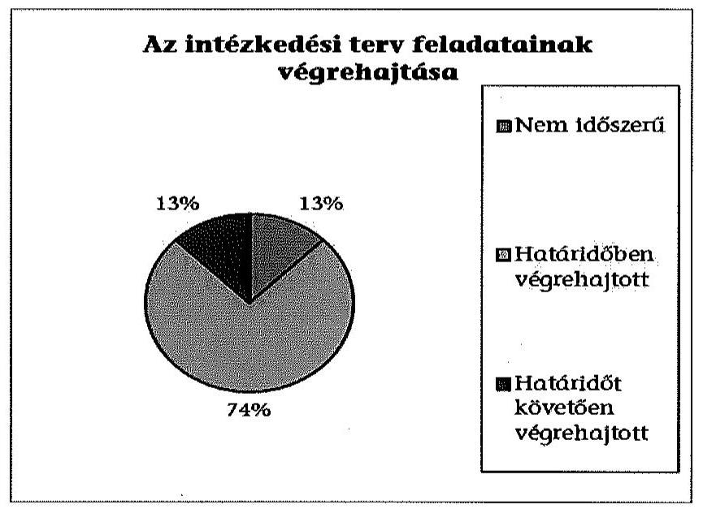
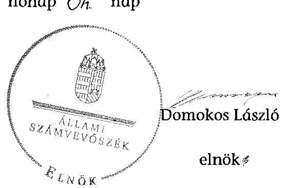

# JELENTÉS 

Utóellenőrzések - az önkormányzatok pénzügyi gazdálkodási helyzetének, szabályszerűségének utóellenőrzése

Dombóvár

---

# Állami Számvevőszék 

Iktatószám: V-0608-024/2015.
Témaszám: 1642
Vizsgálat-azonosító szám: V069308

## Az ellenőrzést felügyelte:

## Renkó Zsuzsanna

felügyeleti vezető
Az ellenőrzést vezette és az ellenőrzés végrehajtásáért felelős:
Mohl Anna
ellenőrzésvezető
A számvevőszéki jelentés összeállításában közremüködött:
Baksa Anikó
számvevő főtanácsos
Dr. Mezei Imréné
számvevő főtanácsos
Az ellenőrzést végezték:

| Baki István | Farkas László | Macsik János |
| :-- | :-- | :-- |
| számvevő tanácsos | számvevő tanácsos | számvevő |

A témához kapcsolódó eddig készített számvevőszéki jelentések:
címe
sorszáma
Jelentés Dombóvár Város Önkormányzata pénzügyi gazdálkodási 13034
helyzetének, szabályosságának ellenőrzéséről

---

# TARTALOMJEGYZÉK 

BEVEZETÉS ..... 3
I. ÖSSZEGZŐ MEGÁLLAPÍTÁSOK, KÖVETKEZTETÉSEK ..... 6
II. RÉSZLETES MEGÁLLAPÍTÁSOK ..... 7

1. Az önkormányzat a pénzügyi gazdálkodási helyzetének, szabályszerűségének ellenőrzéséről készült ÁSZ jelentésben foglalt javaslatokra készített-e intézkedési tervet, illetve teljesítette-e az abban foglaltakat? ..... 7
MELLÉKLETEK
2. számú Az ÁSZ 13034 számú jelentéséhez kapcsolódó intézkedési terv végrehajtá- sa
FÜGGELÉKEK
3. számú Rövidítések jegyzéke
4. számú Fogalomtár

---

.

---

# JELENTÉS 

## Utóellenőrzések - az önkormányzatok pénzügyi gazdálkodási helyzetének, szabályszerűségének utóellenőrzése Dombóvár

## BEVEZETÉS

Az Állami Számvevőszék 2011-2015. évekre szóló stratégiája a helyi önkormányzatok ellenőrzésében a pénzügyi-gazdasági helyzete értékelésére, kockázatai feltárására helyezte a fő hangsúlyt. A 2011-2013. években az ÁSZ által ellenőrzött önkormányzatok esetében a múködési, beruházási és a hosszú lejáratú pénzintézeti kötelezettségeinek teljesítésével kapcsolatos pénzügyi kockázatokat mutattuk be. Az ÁSZ megállapította, hogy az önkormányzatok pénzügyi egyensúlyi helyzete az ellenőrzött időszakban romlott, a pénzügyi kockázatok fokozódtak, a pénzügyi egyensúlyi helyzetet jellemző mutatószámok kedvezőtlenül változtak. Az önkormányzati alrendszerben 2012. év végétől 2014. évelejéig lezajlott adósságkonszolidáció és feladat-ellátási-, finanszírozási-rendszer változtatás következtében a települési önkormányzatok pénzügyi helyzete jelentős mértékben megváltozott, amely a jóváhagyott intézkedési tervek végrehajtását is befolyásolta.

Az ellenőrzött szervezet vezetője az ÁSZ tv. 33. § (1)-(2) bekezdésében foglaltak alapján a jelentések intézkedést igénylő megállapításaihoz kapcsolódóan köteles intézkedési tervet benyújtani, amelyet az ÁSZ-nak kell elfogadni. Amennyiben az ellenőrzött által vállalt intézkedések hiányosak, vagy más okból nem elfogadhatók az ÁSZ indoklással és póthatáridő tüzésével visszaküldi azt kijavításra, kiegészítésre. Az elfogadásról szóló tájékoztatásban az Állami Számvevőszék elnöke valamennyi ellenőrzött szervezet vezetőjének figyelmét felhívta arra, hogy az intézkedési tervben foglaltak megvalósítását - az ÁSZ tv. 33. § (7) bekezdésében foglaltak alapján - utóellenőrzés keretében ellenőrizheti.

Az ellenőrzés célja: annak megállapítása, hogy az ellenőrzött önkormányzatok pénzügyi gazdálkodási helyzetének, szabályszerűségének ellenőrzéséről készült ÁSZ jelentésben foglalt javaslatokra készítettek-e intézkedési terveket, illetve az ellenőrzött által összeállított intézkedési tervben meghatározott feladatokat végrehajtották-e. Ennek keretében ellenőrizzük, hogy:

- a polgármester az ÁSZ törvény értelmében az intézkedési tervet határidőben megküldte-e az ÁSZ részére, szükség volt-e az elfogadást megelőzően kiegészítésre, azt az előírt póthatáridőn belül megtették-e, a Képviselő-testület a kiegészített intézkedési tervet elfogadta-e;

---

- az önkormányzat az elfogadott (kiegészített) intézkedési tervében foglaltak megtételéről, az abban előírt határidők betartásával gondoskodott-e;
- az elfogadott intézkedések esetleges késedelme, végrehajtásának elmaradása milyen szintű kockázatot jelez a pénzügyi gazdálkodásra és annak szabályszerűségére.

Az utóellenőrzés várható hasznosulása: az ellenőrzés megállapításai segítséget nyújthatnak a közpénzügyi helyzet javításához. Az utóellenőrzés, jellegéből adódóan fokozza közbizalmat, fegyelmet, a társadalom, az ellenőrzöttek, a helyi döntéshozók vonatkozásában erősíti az ÁSZ tekintélyét és igazolja, hogy lejárt a következmények nélküli ellenőrzések időszaka. Az ÁSZ intézményén belül lehetőség nyílik arra, hogy az utóellenőrzés, mint ellenőrzési kategória a szervezet tevékenységében stabilizálódjék, a megállapítások visszacsatolása segítse és erősítse az ÁSZ hozzáadott értéket teremtő elemző tevékenységét és tanácsadó szerepét.

Az intézkedési tervek olyan típusú feladatokat határoztak meg az önkormányzatok számára, amelyek a működőképesség jövőbeni zavarainak elkerülését, a felelős fenntartható gazdálkodás követelményeinek érvényesülését, a pénzügyi műveletek racionális keretek közt tartását tűzték ki célul. Az utóellenőrzés által e területeken érzékelt mulasztások még megfelelő irányba terelhetik az intézkedési tervekben foglalt feladatok végrehajtását.

Az ÁSZ az elfogadott intézkedési terveket kockázatelemzésnek veti alá. Ennek során elvégezzük az ÁSZ által elfogadott intézkedési tervben előírt/vállalt feladatok végrehajtásának értékelését, amelynek során alkalmazandó besorolási kategóriák:

- okafogyottá vált feladat: ha végrehajtására - meghatározott esemény bekövetkezése, továbbá külső körülmény, a múködést érintő feltétel változása miatt - már nincs szükség, illetve lehetőség, és egyértelműen megállapítható, hogy az intézkedést szükségessé tevő körülmény a jövőben nem fordulhat elő;
- nem időszerű (nem esedékes) feladat: amelynek ellenőrzési időszakon belüli végrehajtására azért nem került (kerülhetett) sor, mert az intézkedés alapjául szolgáló esemény nem következett be, de annak jövőbeni előfordulása lehetséges;
- határidőben végrehajtott feladat: ha teljesítése dokumentáltan az intézkedési tervben előírt határidőben és tartalommal, módon megtörtént;
- határidőn túl végrehajtott feladat: ha annak teljesítése az intézkedési tervben meghatározott módon, de az előírt határidőn túl történt meg;
- részben végrehajtott feladat: amelynek végrehajtása teljes körűen az intézkedési tervben előírt tartalommal/módon nem történt meg, vagy a feladatot nem az előírt gyakorisággal hajtották végre;
- végre nem hajtott feladat: ha a végrehajtásért felelősként megjelölt személy(ek)nek felróhatóan a teljesítés elmaradt, vagy a teljesítést nem dokumentálták.

---

Az ellenőrzést a számvevőszéki ellenőrzés szakmai szabályai szerint, szabályszerűségi ellenőrzés módszerével, a vonatkozó nemzetközi standardok figyelembevételével végeztük. Az ellenőrzésre az önkormányzatok elektronikus adatszolgáltatása alapján került sor, helyszíni ellenőrzést nem végeztünk. A megállapítások rögzítése az önkormányzatok által rendelkezésre bocsátott dokumentumok, tanúsítványok alapján történt, melyek valódiságát és teljes körüségét a polgármester, valamint a jegyző teljességi nyilatkozata igazolja.

A jóváhagyott intézkedési tervben előírt feladatok végrehajtásának ellenőrzését egységes szempontok, illetve értékelési kritériumok alapján végeztük. Figyelembe vettük az intézkedési terv jóváhagyását követően hatályba lépett jogszabályi előírások változásából következő események - kiemelten az önkormányzati alrendszerben lezajlott adósságkonszolidációs intézkedések, továbbá a fel-adat-ellátási és finanszírozási rendszer változásának - hatásait.

Az alkalmazott rövidítések jegyzékét az 1. számú függelék, az egyes fogalmak magyarázatát a 2. számú függelék tartalmazza.

Az ellenőrzött szervezet: Dombóvár Város Önkormányzata
Az ellenőrzött időszak: az intézkedési terv ÁSZ-nak történő benyújtásától az utóellenőrzés megkezdéséig tartó időszak.

Az ellenőrzés végrehajtásának jogszabályi alapját az ÁSZ tv. 1. § (3) bekezdése, az 5. § (2) és (6) bekezdései, a 33. § (7) bekezdése, valamint az Áht. 61. § (2) bekezdésének előírásai képezték.

Az ÁSZ tv. 29. § (1) bekezdése szerint a jelentéstervezetet észrevételezésre megküldtük az Önkormányzat polgármesterének, aki az ÁSZ tv. 29. § (2) bekezdésében foglalt észrevételezési jogával nem élt, a jelentéstervezetre észrevételt nem tett.

Az ÁSZ a 2013. évben zárta le az Önkormányzat pénzügyi gazdálkodási helyzetének, szabályosságának ellenőrzését. Az ellenőrzés tapasztalatairól készített 13034 számú jelentés az interneten, a www.asz.hu címen olvasható.

---

# I. ÖSSZEGZŐ MEGÁLLAPÍTÁSOK, KÖVETKEZTETÉSEK 

Az ÁSZ utóellenőrzés keretében értékelte az Önkormányzat pénzügyi gazdálkodási helyzetének, szabályszerűségének ellenőrzéséről szóló jelentés javaslatainak hasznosítására elfogadott intézkedési terv végrehajtását.

Az előző ÁSZ ellenőrzés megállapította, hogy az Önkormányzat pénzügyi egyensúlya rövid távon nem volt biztosított. A feltárt hiányosságok alapján megfogalmazott ÁSZ javaslatok hasznosítására az Önkormányzat intézkedési tervet készített, melyet az ÁSZ kiegészítés kérése nélkül elfogadott.

Az utóellenőrzés megállapította, hogy az ellenőrzött időszakban időszerűvé vált feladatait az Önkormányzat végrehajtotta, ezáltal az ÁSZ javaslatai maradéktalanul hasznosultak.

Az utóellenőrzés megállapítása alapján a határidőt követően végrehajtott feladat alacsony kockázatot jelent a pénzügyi gazdálkodásra, annak szabályszerűségére. Az intézkedések végrehajtásának hatására a pénzügyi stabilitás kialakulásának és fenntartásának feltételei javultak.

---

# II. RÉSZLETES MEGÁLLAPÍTÁSOK 

## 1. Az önkORMÁNYZAT a PÉNZÜGYI GAZDÁlKODÁSI HELYZETÉNEK, SZABÁLYSZERŰSÉGÉNEK ELLENŐRZÉSÉRŐL KÉSZÜLT ÁSZ JELENTÉSBEN FOGLALT JAVASLATOKRA KÉSZÍTETT-E INTÉZKEDÉSI TERVET, ILLETVE TELJESÍTETTE-E AZ ABBAN FOGLALTAKAT?

Az utóellenőrzés - a 2014. július 28-ig végrehajtott intézkedéseket figyelembe véve - az Önkormányzat pénzügyi gazdálkodási helyzetének, szabályosságának ellenőrzéséről készült ÁSZ jelentés javaslatai hasznosítására elfogadott intézkedési terv végrehajtására irányult. A pénzügyi helyzet ellenőrzését az ÁSZ a 2009. január 1. - 2012. június 30. közötti időszakra végezte el, amelynek eredményeként megállapította, hogy az Önkormányzat pénzügyi egyensúlya rövid távon nem volt biztosított.

A polgármester a Képviselő-testületet tájékoztatta az ÁSZ jelentéséről. A jelentésben foglalt megállapításokhoz kapcsolódó intézkedési tervet ${ }^{1}$ az ÁSZ tv. 33. § (1) bekezdésében foglalt határidőre megküldték az ÁSZ részére. Az ÁSZ az intézkedési tervet javítás és kiegészítés nélkül elfogadta.

Az ÁSZ által elfogadott intézkedési tervben meghatározott feladatokat, az ÁSZ jelentés javaslatainak címzettjét és a feladatok végrehajtását az 1. számú melléklet mutatja be.

Az ÁSZ által elfogadott intézkedési terv nyolc tervezett intézkedést tartalmazott, felelősként a polgármestert és a jegyzőt megjelölve.

Az utóellenőrzés megállapításai alapján egy feladat végrehajtása nem volt időszerű, hat feladat határidőben, egy feladat határidőt követően került végrehajtásra. Az intézkedési tervben előírt feladatok között nem volt olyan, amelynek végrehajtása okafogyottá vált volna, illetve részben, vagy nem hajtották volna végre.

Nem volt időszerű a gazdálkodó szervezetek részére nyújtott kölcsönök esetében a kölcsönszerződésben kamatfizetés és biztosítékok alkalmazásának előírása, mivel az ellenőrzött időszakban - a jegyző nyilatkozata alapján - gazdálkodó szervezeteknek kölcsönt nem nyújtott az Önkormányzat

## Határidőre végrehajtották:

- a bevételszerző és a kiadáscsökkentő lehetőségek felmérését, annak döntési javaslatainak előkészítését, és az adórendelet módosításának az előterjesztését;

[^0]
[^0]:    ${ }^{1}$ A Képviselő-testület a tájékoztatást és az intézkedési tervet a 223/2013. (VI. 20.) számú határozatával elfogadta.

---

- a reorganizációs program készítését;
- az egyensúlyi tartalékképzésre vonatkozó döntési javaslat beterjesztését, elkülönített számla nyitását, és az esedékes törlesztő-részlet számlára utalását;
- az önként vállalt feladatok finanszírozásának áttekintését;
- a Képviselő-testület tájékoztatását az Önkormányzat lejárt szállítói állománya és ezen belül a 60 napon túli elismert szállítói tartozások alakulásáról;
- a kockázatkezelési rendszer múködtetését, az előterjesztésekben a kockázatok bemutatását és értékelését.

# Határidőt követően hajtották végre: 

- az Önkormányzat fizetőképességének és eladósodásának kezelésére vonatkozó szabályozás elkészítését, mert azt a 2013. szeptember 30-ai határidővel szemben 2013. október 31-ével léptette hatályba a jegyző.

A Képviselő-testület az intézkedési tervet jóváhagyó határozatában felkérte „a polgármestert, hogy a megtett intézkedésekről a 2013. szeptember végi rendes ülésen számoljon be". A polgármester a beszámolót összeállította és a 2013. szeptember 26-ai ülésre beterjesztette. A Képviselő-testület a polgármester előterjesztését a 328/2013. (X. 10.) számú határozattal fogadta el.

Az utóellenőrzés megállapítása alapján a határidőt követően végrehajtott feladat alacsony kockázatot jelent a pénzügyi gazdálkodásra, annak szabályszerűségére.

Az intézkedések végrehajtásának hatására a pénzügyi stabilitás kialakulásának és fenntartásának feltételei javultak.

Budapest, 2015.

Melléklet: $\quad 1 \mathrm{db}$
Függelék: $\quad 2 \mathrm{db}$

---

# Az ÁSZ 13034 számú jelentéséhez kapcsolódó intézkedési terv végrehajtása

|  Sorszám | Intézkedési terv alapján elvégzendő feladat | Az intézkedési tervben meghatározott határidő | Az ÁSZ 13034 sz. jelentése javaslatának címzettje | Az intézkedés végrehajtása  |
| --- | --- | --- | --- | --- |
|   | 1. | 2. | 3. | 4.  |
|  **Nem időszerű intézkedés** |  |  |  |   |
|  1. | A gazdálkodó szervezetek részére nyújtott kölcsönök esetében kölcsönszerződés akkor köthető, ha kamatot és a követelés biztosítására fedezetet, illetve egyéb jogi biztosítékot tartalmaz. | azonnal | polgármester | A jegyző 2014. július 29-én kelt nyilatkozata alapján az Önkormányzat az ellenőrzött időszakban gazdálkodó szervezeteknek kölcsönt nem nyújtott.  |
|  **Határidőben végrehajtott intézkedések** |  |  |  |   |
|  1. | Az önkormányzat bevételszerző, kiadáscsökkentő lehetőségének felmérése, az intézkedésekhez szükséges döntési javaslat előterjesztése. Helyi adórendelet módosításának előterjesztése az adó növelésére, kedvezmények csökkentésére. | 2013. szeptember 30. | polgármester
jegyző | Az adóbevételek növelése és a kedvezmények csökkentése érdekében a polgármester 2013. szeptember 26-án előterjesztést nyújtott be a helyi adókról szóló önkormányzati rendelet módosítására, amelyet – többszöri tárgyalás után – a Képviselő-testület a 40/2013. (X. 14.) számú önkormányzati rendelettel elfogadott. Ebben az építményadó tárgyi köre bővült. A polgármester 2013. szeptember 26ára elkészítette és a Képviselő-testület elé terjesztette a reorganizációs programot (328/2013. (X. 10.) számú képviselő-testületi határozat), amelyben bevételnövelő és kiadáscsökkentő intézkedésekre tett javaslatot.  |

---

|  Sorszám | Intézkedési terv alapján elvégzendő feladat | Az intézkedési tervben meghatározott határidő | Az ÁSZ 13034 sz. jelentése javaslatának címzettje | Az intézkedés végrehajtása  |
| --- | --- | --- | --- | --- |
|   | 1. | 2. | 3. | 4.  |
|   |  |  |  | Javasolta az ingatlanok takarékos üzemeltetése érdekében azok energetikai fejlesztését, a funkció nélküli ingatlanok értékesítését, hasznosítását, a bérleti díjak inflációkövető emelését, az adó és ingatlanbérleti hátralékbehajtás hatékonyságának növelését, a kisebbségi részesedések eladását, a szervezeti folyamatok korszerűsítését, a társulásokban az önkormányzati hozzájárulás csökkentését, a létszámgazdálkodás és a juttatások minimum szinten tartását, a helyi tömegközlekedés racionalizálását, a közlekedési jegyek és bérletek árának növelését. A civil szervezetek részére átadott pénzeszközök csökkentését a Képviselő-testület a 376/2013. (XI. 28.) számú határozattal és a 4/2014. (III. 4.) számú önkormányzati rendelettel hagyta jóvá. A polgármester a 2014. évi költségvetési koncepció előterjesztésében javasolta (388/2013. (XI. 28.) számú képviselő-testületi határozat) a gyermekétkeztetés térítési díjainak felülvizsgálatát, a gazdasági társaságban lévő részesedés eladását, a lakás kezelésére vonatkozó alapszerződés felülvizsgálatát.  |

---

|  Sorszám | Intézkedési terv alapján elvégzendő feladat | Az intézkedési tervben meghatározott határidő | Az ÁSZ 13034 sz. jelentése javaslatának címzettje | Az intézkedés végrehajtása  |
| --- | --- | --- | --- | --- |
|   | 1. | 2. | 3. | 4.  |
|  2. | Reorganizációs program készítése. | 2013. szeptember 30. | polgármester
jegyző | A polgármester 2013. szeptember 26-ára elkészítette és a Képviselő-testület elé terjesztette a reorganizációs programot, az ÁSZ ellenőrzés alapján készült intézkedési terv végrehajtásáról szóló beszámoló 2. számú mellékleteként. A Képviselő-testület a reorganizációs programot a 329/2013. (X. 10.) számú határozatával elfogadta.  |
|  3. | Egyensúlyi (elkülönített) tartalékképzésre döntési javaslat beterjesztése, elkülönített számla nyitása, a helyi adóbevételekből minden év március 31-ig az adott év szeptember 30-áig esedékes törlesztések összegének megfelelő összeg átutalása az elkülönített számlára, minden év szeptember 30-ig az adott év december 31-élg esedékes törlesztő részletnek megfelelő összeg átutalása az elkülönített számlára. | 2013. szeptember 30. majd folyamatosan | polgármester
jegyző | A polgármester által a 2013. szeptember 26-ára készített, az ÁSZ ellenőrzés alapján összeállított intézkedési terv végrehajtásáról szóló beszámoló alapján az egyensúlyi tartalékképzésre az elkülönített bankszámlát megnyitották és arra a 2013. december 31éig esedékes törlesztési összeget a helyi adóbevételekből átutalták. A bankszámlára a banki értesítő alapján 2013. szeptember 19én 46,0 millió Ft került átutalásra, amely megegyezett a 2013. december 31-ei törlesztési kötelezettséggel. Az Önkormányzat pénzintézettel szembeni kötelezettségei a 2014. februári adósságkonszolidációt követően megszűntek, emiatt az egyensúlyi tartalék képzésére a 2014. év I. negyedévében már nem volt szükség. Az Önkormányzat a számlát megszüntette és a rajta lévő összeget felhasználta.  |

---

|  Sorszám | Intézkedési terv alapján elvégzendő feladat | Az intézkedési tervben meghatározott határidő | Az ÁSZ 13034 sz. jelentése javaslatának címzettje | Az intézkedés végrehajtása  |
| --- | --- | --- | --- | --- |
|   | 1. | 2. | 3. | 4.  |
|  4. | Önként vállalt feladatok finanszírozásának áttekintése, javaslat a feladatellátás racionalizálására. | 2013. szeptember 30. | polgármester | Az Önkormányzat a 2013. évi költségvetési rendelet (16/2013. (III. 27.) számú önkormányzati rendelet) és annak módosítása (28/2013. (VI. 28.) számú rendelet) során az önként vállalt feladatok finanszírozását áttekintette. Az önként vállalt feladatok áttekintése alapján hozott döntések eredményeként a kiadások már a 2013. évben jelentősen csökkentek.
Az Önkormányzat az intézkedési tervben előírt határidőt követően is folytatta az e kiadások mérséklésére vonatkozó intézkedéseit (a 2013. évi költségvetési rendelet 41/2013. (X. 28.) számú módosítása, valamint a 2014. évi költségvetési rendelet (4/2014. (III. 4.) számú önkormányzati rendelet) elfogadása és annak módosítása során (5/2014. (III. 10.) számú rendelet). Az Önkormányzat a 2014. évi költségvetéséről szóló 4/2014. (III. 4.) számú rendeletében csökkentette az önként vállalt feladatok kiadásait. Így a dologi kiadásokon belül a helyi tömegközlekedés kiadásait a 2013. évhez képest 15,1 millió Ft-tal, az államháztartáson kívülre nyújtott működési kiadásokat 1,6 millió Ft-tal csökkentette.  |

---

|  Sorszám | Intézkedési terv alapján elvégzendő feladat | Az intézkedési tervben meghatározott határidő | Az ÁSZ 13034 sz. jelentése javaslatának címzettje | Az intézkedés végrehajtása  |
| --- | --- | --- | --- | --- |
|   | 1. | 2. | 3. | 4.  |
|   |  |  |  | Az Önkormányzat adatszolgáltatása alapján - a törvényi szabályozás és a helyi döntések együttes eredményeként - a folyó kiadásokon belül az önként vállalt feladatokra fordított kiadások aránya a 2011. évi 46,0\%-ról 2013-ra 11,8\%-ra, majd a 2014. évi költségvetési rendeletben 10,2\%-ra csökkent.  |
|  5. | A lejárt szállítói állomány alakulásáról a polgármester a negyedévet követő hónapban tájékoztatja a képviselő-testületet, a 60 napon túli elismert tartozások esetében átütemezést kell kezdeményezni. | minden negyedévet követő havi testületi ölés | polgármester | A polgármester az intézkedési tervnek megfelelően az Önkormányzat lejárt szállítói állományának alakulásáról a Képviselőtestületet a 2013. október 10-ére készült beszámolója 1. számú, valamint a 2013. december 19-ére készült beszámolója 2. számú mellékletében tájékoztatta. A 60 napon túli, november 30-án fennállt elismert tartozásállomány ( 0,6 millió Ft) rendezése megtörtént, az Önkormányzat december 30-ától csak 30 napon belül lejárt állománnyal rendelkezett. A 2014. év I. negyedévben, a 2014. évi adósságkonszolidáció után az Önkormányzatnak lejárt szállítói kötelezettsége nem volt, átütemezéseket nem kellett kezdeményezni.  |

---

|  Sorszám | Intézkedési terv alapján elvégzendő feladat | Az intézkedési tervben meghatározott határidő | Az ÁSZ 13034   sz. jelentése   javaslatának   címzettje | Az intézkedés végrehajtása  |
| --- | --- | --- | --- | --- |
|   | 1. | 2. | 3. | 4.  |
|  6. | Előírásoknak megfelelő kockázatkezelési rendszer múködtetése, előterjesztésekben a kockázatok bemutatása, értékelése. | folyamatosan | jegyző | A jegyző az intézkedési tervben foglaltaknak megfelelően működtette a kockázatkezelési rendszert, és az előterjesztésekben bemutatta és értékelte a kockázatokat. A folyószámlahitel éven túli hitellé alakításáról szóló 281/2013. (VIII. 26.) számú képviselőtestületi határozat előterjesztése tartalmazta a várható kamatmértékek és a fizetendő kamat összegét, a hitelképességi korlát és a hitel fedezetének a bemutatását. Az önkormányzati bérlakások értékesítéseire készített előterjesztésben (380/2013. (XI. 28.) számú képviselő-testületi határozat) bemutatta a ráfordítási igényeket figyelembe véve az értékesítés előnyeit, a bevétel növelése érdekében a kedvezőbb feltételek/körülmények elérését. A kezességvállalásról szóló 369/2013. (XI. 28.) számú képviselő-testületi határozat előterjesztésében ismertette a hozzájárulás részletes szabályait és javaslatokat tett a fedezetre és a kezességvállalási díjra. A 406/2013. (XII. 5.) számú képviselő-testületi határozat előterjesztése tartalmazta a részvényvásárlás kockázatát és a gazdasági szempontból esetlegesen kedvezőtlen hatásait. A 231/2013. (V. 29.) számú és a 322/2014. (VI. 26.) képviselő-testületi határozatok elő-  |

---

|  Sorszám | Intézkedési terv alapján elvégzendő feladat | Az intézkedési tervben meghatározott határidő | Az ÁSZ 13034 sz. jelentése javaslatának címzettje | Az intézkedés végrehajtása  |
| --- | --- | --- | --- | --- |
|   | 1. | 2. | 3. | 4.  |
|   |  |  |  | terjesztései tartalmazták az ingatlanok és a részvények értékesítésére vonatkozóan az Önkormányzat számára jelentkező kockázati tényezőket.
A jegyző 2013. április 2-án jóváhagyta a FEUVE szabályzatot, 2013. november 14-én a kockázatelemzési táblázatot, amelyben a kockázati tényezőket rögzítette (a pénzügyi szabálytalanság valószínüsége, az elöirányzaton belüli gazdálkodás, a legutóbbi ellenőrzéstől eltelt idő, a munkatársak végzettsége, tapasztalata és az adott szakterületen a helyi szabályozás).  |
|   | Határidőt követően végrehajtott intézkedés |  |  |   |
|  1. | Belső kontrolltevékenység kialakítása, szabályzat készítése az önkormányzat fizetőképességének és eladósodásának kezelésére. | 2013. szeptember 30. | jegyző | A jegyző az Önkormányzat fizetőképességének és eladósodásának kezelésére vonatkozó szabályzatot az intézkedési tervben rögzített - 2013. szeptember 30-i - határidőt követően, 2013. október 31-én hagyta jóvá és léptette hatályba.  |

---

$$
\because
$$

---

# RÖVIDÍTÉSEK JEGYZÉKE 

## Törvények

Áht.
Az államháztartásról szóló 2011. évi CXCV. törvény (hatályos 2011. december 31-étől)
ÁSZ tv.
az Állami Számvevőszékről szóló 2011. évi LXVI. törvény (hatályos 2011. július 1-jétől)

## Szórövidítések

ÁSZ
FEUVE
jegyzö
Képviselő-testület
Önkormányzat
polgármester
folyamatba épített, előzetes és utólagos vezetői ellenőrzések
Dombóvár Város Önkormányzatának jegyzője
Dombóvár Város Önkormányzatának Képviselő-testülete
Dombóvár Város Önkormányzata
Dombóvár Város Önkormányzatának polgármestere

---

.

---

# FOGALOMTÁR 

adósságkonszolidáció
adósságszolgálat
árfolyamkockázat
banki kitettség
bevételi kitettség
felhalmozási kockázat
garanciavállalás
kezességvállalás
mérlegen kívüli tétel
működési kockázat

Több ütemben lezajlott központi intézkedés, amely a helyi önkormányzatok adósságállományának a magyar állam által történő átvállalására irányult. Az adósságkonszolidációs csomag releváns rendelkezéseit a 2012-2014. évi központi költségvetésről szóló törvények tartalmazták.
Az adósság tőkerészének és az esedékes kamat együttes összegének törlesztése.
Annak kockázata, hogy a külföldi devizában fennálló pénzügyi eszközök hazai fizetőeszközben kifejezett értéke az árfolyam elmozdulásával megváltozik.
Olyan függőségi viszony, ahol egy szervezet pénzügyi helyzete olyan külső körülmények hatására változhat, amely kizárólag a bank egyoldalú döntésén múlik.
Olyan függőségi viszony, ahol egy szervezet pénzügyi helyzetét meghatározó bevételek nagysága külső körülmények hatására azonnal és kedvezőtlen irányba változhat.
Annak kockázata, hogy a folyamatban lévő felhalmozási feladatok finanszírozásához szükséges pénzügyi forrás nem fog rendelkezésre állni.
Olyan kötelezettségvállalás, ahol a garanciát vállaló valamely jövőbeni esemény bekövetkezésekor, a szerződésben meghatározott feltételek beálltakor a garancia kedvezményezettje számára meghatározott összegig, meghatározott időpontig, felszólításra azonnal fizet.
A tárgyi eszközállomány állagának elemzéséhez használt mutató, számításakor a tárgyi eszköz könyv szerinti nettó értékét viszonyítják a tárgyi eszköz bruttó (beszerzési/létesítési) értékéhez.
Annak kockázata, hogy a változó kamatozású forint vagy a devizahitel futamideje alatt kedvezőtlen irányban változhat a hitel kamata.
Szerződésben vállalt olyan kötelezettség, amelyben a kezes arra vállal kötelezettséget, hogy ha a szerződés kötelezettje nem teljesít, a kezes maga fog helyette teljesíteni a jogosultnak.
Olyan szerződés alapján fennálló mérlegen kívüli [függő vagy biztos (jövőbeni)] kötelezettség, illetve követelés, amely a mérleg fordulónapján már fennáll, de mérlegtételkénti szerepeltetése egy jövőbeni esemény bekövetkezésétől vagy a szerződés teljesítésétől függ.
Annak kockázata, hogy nem megfelelő működésből, emberi hibákból, rendszerhibákból vagy külső eseményekből adódik veszteség.

---

nemfizetési kockázat
nettó múködési jövedelem

ÖNHIKI támogatás
önkormányzat folyó költségvetési egyenlege
önkormányzat többségi tulajdonában lévő gazdasági társaságok
önkormányzat gazdasági társasága miatti kockázatot jelentő tényezők

Annak kockázata, hogy a kötelezett fennálló kötelezettségét átmenetileg vagy véglegesen nem tudja határidőre megfizetni.
A nettó múködési jövedelem (pénzügyi kapacitás) a jövedelemtermelő képességet méri. Megmutatja a müködési bevételekből a múködési kiadások és a hitelek tőketörlesztésének kifizetése után fennmaradó jövedelmet.
Az önkormányzatok müködőképességét szolgáló, önhibájukon kívül hátrányos helyzetben levő települési önkormányzatok támogatása.
A folyó költségvetés egyenlege, azaz a müködési jövedelem megmutatja, hogy az önkormányzat éves folyó bevétele fedezetet biztosít-e a kötelező és önként vállalt feladatellátáshoz kapcsolódó éves folyó kiadására. A müködési jövedelem negatív értéke pénzügyileg fenntarthatatlan helyzetet jelez. A mutató pozitív értéke megtakarítást mutat, amely forrásul szolgálhat az önkormányzat fennálló kötelezettségei megfizetéséhez, valamint fejlesztéseihez.
Azok a gazdasági társaságok, amelyekben az önkormányzat a szavazatok több mint ötven százalékával vagy jogszabályban rögzített meghatározó befolyással rendelkezik. A befolyással rendelkező akkor rendelkezik egy jogi személyben meghatározó befolyással, ha annak tagja, illetve részvényese, és jogosult e jogi személy vezető tisztségviselői vagy felügyelő bizottsága tagjai többségének megválasztására, illetve visszahívására, vagy a jogi személy más tagjaival, illetve részvényeseivel kötött megállapodás alapján egyedül rendelkezik a szavazatok több mint ötven százalékával.
Az önkormányzat gazdasági társaságának kedvezőtlen pénzügyi döntései következtében az önkormányzat pénzügyi egyensúlyi helyzetét veszélyeztető tényezők: az önkormányzat az önként vállalt és/vagy a kötelező feladatot ellátó társaságának a tevékenység ellátásához pénzeszközt ad át;
az önkormányzat nem vizsgálja a feladatellátás választott szervezeti megoldásának hatékonyságát;
a kötelező feladatellátást biztosító gazdasági társaság tevékenységének ágazati szabályozása változik (vízi közművagyon üzemeltetése);
a kizárólagos vagy többségi tulajdonú társaságok pénzügyi helyzete nem stabil, amely az alapítóra kötelezettségeket háríthat;
az önkormányzat a társaságok tevékenységét nem kísérte figyelemmel, nem élt az alapítói (irányítói) jogok gyakorlásával, a társaságok gazdálkodásának önkormányzati szintű konszolidálása nem biztosított;

---

pénzügyi kockázat

PPP
szállítói kockázat
szállítói kitettség
az önkormányzat garanciát vagy kezességet vállal a gazdasági társaság kötelezettségeire;
a társaságoknak átadott pénzeszköz uniós elvárásoknak megfelelő kezelése.
A pénzügyi kockázat magában foglalja mindazon kockázatokat, amelyek a szervezet pénzügyi helyzetére hatással vannak. Pl.: az adósságszolgálat miatti kockázatot, árfolyamkockázatot, felhalmozási kockázatot, fizetőképességi kockázatot, jövőbeni kötelezettségek kifizethetőségének kockázatát, kamatkockázatot, kezességvállalás kockázatát, likviditási kockázat, mérlegen kívüli tételek kockázata, nemfizetési kockázat, stb.
A köz- és a magánszféra együttmúködésén alapuló fejlesztési konstrukció. Az állami és a magánszféra együttmúködésének egyik formáját jelöli a PPP. A rövidítés a „köz- és magánszféra partnersége" angol nyelvű megfelelője. A PPP keretében a közcél a magánszféra jelentős mértékű közreműködésével valósul meg.
Annak kockázata, hogy a kötelezett a szállítókkal szemben fennálló, már elismert kötelezettségét átmenetileg vagy véglegesen nem tudja határidőre teljesíteni.
Olyan függőségi viszony, ahol egy szervezet pénzügyi helyzete a szállítói tartozások rendezése érdekében foganatosított intézkedések hatására azonnal és kedvezőtlen irányba változhat.