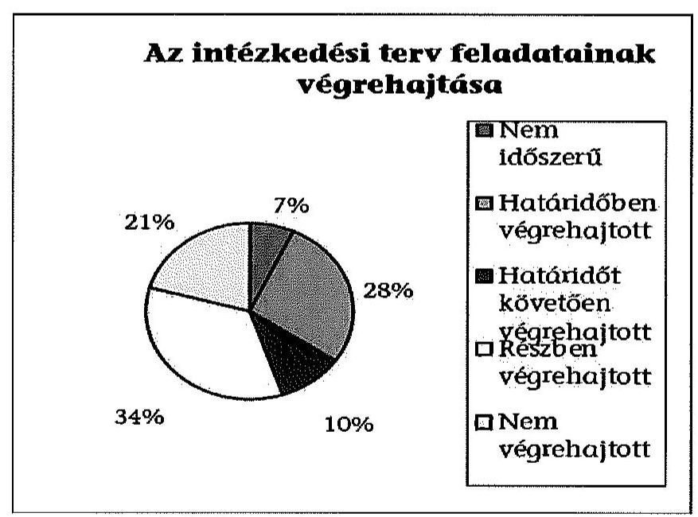

# ÁLLAMI
SZÁMVEVŐSZÉK

## JELENTÉS

Utóellenőrzések - az önkormányzatok pénzügyi gazdálkodási helyzetének, szabályszerűségének utóellenőrzése

Enying

---

# Állami Számvevőszék

Iktatószám: V-0609-029/2015.
Témaszám: 1643
Vizsgálat-azonosító szám: V069309

## Az ellenőrzést felügyelte:

## Renkó Zsuzsanna

felügyeleti vezető
Az ellenőrzést vezette és az ellenőrzés végrehajtásáért felelős:
Mohl Anna
ellenőrzésvezető
A számvevőszéki jelentés összeállításában közreműködött:
Baksa Anikó
számvevő főtanácsos
Dr. Mezei Imréné
számvevő főtanácsos
Az ellenőrzést végezték:

| Szabó Tamás | Polyák Ferenc | Pogány Kinga Beatrix |
| :-- | :-- | :-- |
| számvevő tanácsos | számvevő tanácsos | számvevő |

A témához kapcsolódó eddig készített számvevőszéki jelentések:
címe
sorszáma
Jelentés Enying Város Önkormányzata pénzügyi gazdálkodási 13026 helyzetének, szabályosságának ellenőrzéséről

---

# TARTALOMJEGYZÉK

BEVEZETÉS ..... 3
I. ÖSSZEGZŐ MEGÁLLAPÍTÁSOK, KÖVETKEZTETÉSEK ..... 6
II. RÉSZLETES MEGÁLLAPÍTÁSOK ..... 7

1. Az önkormányzat a pénzügyi gazdálkodási helyzetének, szabályszerűségének ellenőrzéséről készült ÁSZ jelentésben foglalt javaslatokra készített-e intézkedési tervet, illetve teljesítette-e az abban foglaltakat? ..... 7
MELLÉKLETEK
2. számú Az ÁSZ 13026 számú jelentéséhez kapcsolódó intézkedési terv végrehajtása
FÜGGELÉKEK
3. számú Rövidítések jegyzéke
4. számú Fogalomtár

---

.

---

# JELENTÉS

## Utóellenőrzések - az önkormányzatok pénzügyi gazdálkodási helyzetének, szabályszerűségének utóellenőrzése Enying

## BEVEZETÉS

Az Állami Számvevőszék 2011-2015. évekre szóló stratégiája a helyi önkormányzatok ellenőrzésében a pénzügyi-gazdasági helyzete értékelésére, kockázatai feltárására helyezte a fő hangsúlyt. A 2011-2013. években az ÁSZ által ellenőrzött önkormányzatok esetében a működési, beruházási és a hosszú lejáratú pénzintézeti kötelezettségeinek teljesítésével kapcsolatos pénzügyi kockázatokat mutattuk be. Az ÁSZ megállapította, hogy az önkormányzatok pénzügyi egyensúlyi helyzete az ellenőrzött időszakban romlott, a pénzügyi kockázatok fokozódtak, a pénzügyi egyensúlyi helyzetet jellemző mutatószámok kedvezőtlenül változtak. Az önkormányzati alrendszerben 2012. év végétől 2014. évelejéig lezajlott adósságkonszolidáció és feladat-ellátási-, finanszírozási-rendszer változtatás következtében a települési önkormányzatok pénzügyi helyzete jelentős mértékben megváltozott, amely a jóváhagyott intézkedési tervek végrehajtását is befolyásolta.

Az ellenőrzött szervezet vezetője az ÁSZ tv. 33. § (1)-(2) bekezdésében foglaltak alapján a jelentések intézkedést igénylő megállapításaihoz kapcsolódóan köteles intézkedési tervet benyújtani, amelyet az ÁSZ-nak kell elfogadni. Amennyiben az ellenőrzött által vállalt intézkedések hiányosak, vagy más okból nem elfogadhatók az ÁSZ indoklással és póthatáridő tűzésével visszaküldi azt kijavításra, kiegészítésre. Az elfogadásról szóló tájékoztatásban az Állami Számvevőszék elnöke valamennyi ellenőrzött szervezet vezetőjének figyelmét felhívta arra, hogy az intézkedési tervben foglaltak megvalósítását - az ÁSZ tv. 33. § (7) bekezdésében foglaltak alapján - utóellenőrzés keretében ellenőrizheti.

Az ellenőrzés célja: annak megállapítása, hogy az ellenőrzött önkormányzatok pénzügyi gazdálkodási helyzetének, szabályszerűségének ellenőrzéséről készült ÁSZ jelentésben foglalt javaslatokra készítettek-e intézkedési terveket, illetve az ellenőrzött által összeállított intézkedési tervben meghatározott feladatokat végrehajtották-e. Ennek keretében ellenőrizzük, hogy:

- a polgármester az ÁSZ törvény értelmében az intézkedési tervet határidőben megküldte-e az ÁSZ részére, szükség volt-e az elfogadást megelőzően kiegészítésre, azt az előírt póthatáridőn belül megtették-e, a Képviselő-testület a kiegészített intézkedési tervet elfogadta-e;

---

- az önkormányzat az elfogadott (kiegészített) intézkedési tervében foglaltak megtételéről, az abban előírt határidők betartásával gondoskodott-e;
- az elfogadott intézkedések esetleges késedelme, végrehajtásának elmaradása milyen szintű kockázatot jelez a pénzügyi gazdálkodásra és annak szabályszerűségére.

Az utóellenőrzés várható hasznosulása: az ellenőrzés megállapításai segítséget nyújthatnak a közpénzügyi helyzet javításához. Az utóellenőrzés, jellegéből adódóan fokozza a közbizalmat, fegyelmet, a társadalom, az ellenőrzöttek, a helyi döntéshozók vonatkozásában erősíti az ÁSZ tekintélyét és igazolja, hogy lejárt a következmények nélküli ellenőrzések időszaka. Az ÁSZ intézményén belül lehetőség nyílik arra, hogy az utóellenőrzés, mint ellenőrzési kategória a szervezet tevékenységében stabilizálódjék, a megállapítások visszacsatolása segítse és erősítse az ÁSZ hozzáadott értéket teremtő elemző tevékenységét és tanácsadó szerepét.

Az intézkedési tervek olyan típusú feladatokat határoztak meg az önkormányzatok számára, amelyek a működőképesség jövőbeni zavarainak elkerülését, a felelős fenntartható gazdálkodás követelményeinek érvényesülését, a pénzügyi műveletek racionális keretek közt tartását tűzték ki célul. Az utóellenőrzés által e területeken érzékelt mulasztások még megfelelő irányba terelhetik az intézkedési tervekben foglalt feladatok végrehajtását.

Az ÁSZ az elfogadott intézkedési terveket kockázatelemzésnek veti alá. Ennek során elvégezzük az ÁSZ által elfogadott intézkedési tervben előírt/vállalt feladatok végrehajtásának értékelését, amelynek során alkalmazandó besorolási kategóriák:

- okafogyottá vált feladat: ha végrehajtására - meghatározott esemény bekövetkezése, továbbá külső körülmény, a működést érintő feltétel változása miatt - már nincs szükség, illetve lehetőség, és egyértelműen megállapítható, hogy az intézkedést szükségessé tevő körülmény a jövőben nem fordulhat elő;
- nem időszerű (nem esedékes) feladat: amelynek ellenőrzési időszakon belüli végrehajtására azért nem került (kerülhetett) sor, mert az intézkedés alapjául szolgáló esemény nem következett be, de annak jövőbeni előfordulása lehetséges;
- határidőben végrehajtott feladat: ha teljesítése dokumentáltan az intézkedési tervben előírt határidőben és tartalommal, módon megtörtént;
- határidőn túl végrehajtott feladat: ha annak teljesítése az intézkedési tervben meghatározott módon, de az előírt határidőn túl történt meg;
- részben végrehajtott feladat: amelynek végrehajtása teljes körűen az intézkedési tervben előírt tartalommal/módon nem történt meg, vagy a feladatot nem az előírt gyakorisággal hajtották végre;
- végre nem hajtott feladat: ha a végrehajtásért felelősként megjelölt személy(ek)nek felróhatóan a teljesítés elmaradt, vagy a teljesítést nem dokumentálták.

---

Az ellenőrzést a számvevőszéki ellenőrzés szakmai szabályai szerint, szabályszerűségi ellenőrzés módszerével, a vonatkozó nemzetközi standardok figyelembevételével végeztük. Az ellenőrzésre az önkormányzatok elektronikus adatszolgáltatása alapján került sor, helyszíni ellenőrzést nem végeztünk. A megállapítások rögzítése az önkormányzatok által rendelkezésre bocsátott dokumentumok, tanúsítványok alapján történt, melyek valódiságát és teljes körűségét a polgármester, valamint a jegyző teljességi nyilatkozata igazolja.

A jóváhagyott intézkedési tervben előírt feladatok végrehajtásának ellenőrzését egységes szempontok, illetve értékelési kritériumok alapján végeztük. Figyelembe vettük az intézkedési terv jóváhagyását követően hatályba lépett jogszabályi előírások változásából következő események - kiemelten az önkormányzati alrendszerben lezajlott adósságkonszolidációs intézkedések, továbbá a feladat-ellátási és finanszírozási rendszer változásának - hatásait.

Az alkalmazott rövidítések jegyzékét az 1. számú függelék, az egyes fogalmak magyarázatát a 2. számú függelék tartalmazza.

# Az ellenőrzött szervezet: Enying Város Önkormányzata

Az ellenőrzött időszak: az intézkedési terv ÁSZ-nak történő benyújtásától az utóellenőrzés megkezdéséig tartó időszak.

Az ellenőrzés végrehajtásának jogszabályi alapját az ÁSZ tv. 1. § (3) bekezdése, az 5. § (2) és (6) bekezdései, a 33. § (7) bekezdése, valamint az Áht. 61. § (2) bekezdésének előírásai képezték.

Az ÁSZ tv. 29. § (1) bekezdése szerint a jelentéstervezetet észrevételezésre megküldtük az Önkormányzat polgármesterének, aki az ÁSZ tv. 29. § (2) bekezdésében foglalt észrevételezési jogával nem élt, a jelentéstervezetre észrevételt nem tett.

Az ÁSZ a 2013. évben zárta le az Önkormányzat pénzügyi gazdálkodási helyzetének, szabályosságának ellenőrzését. Az ellenőrzés tapasztalatairól készített 13026 számú jelentés az interneten, a www.asz.hu címen olvasható.

---

# I. ÖSSZEGZŐ MEGÁLLAPÍTÁSOK, KÖVETKEZTETÉSEK

Az ÁSZ utóellenőrzés keretében értékelte az Önkormányzat pénzügyi gazdálkodási helyzetének, szabályszerűségének ellenőrzéséről szóló jelentés javaslatainak hasznosítására elfogadott intézkedési terv végrehajtását.

Az előző ÁSZ ellenőrzés megállapította, hogy az Önkormányzat pénzügyi egyensúlya rövid távon nem volt biztosított. A feltárt hiányosságok alapján megfogalmazott ÁSZ javaslatok hasznosítására az Önkormányzat intézkedési tervet készített, melyet az ÁSZ kiegészítés kérése nélkül elfogadott.

Az utóellenőrzés megállapította, hogy az ellenőrzött időszakban időszerűvé vált feladatait az Önkormányzat teljeskörűen nem hajtotta végre, ezáltal az ÁSZ javaslatai maradéktalanul nem hasznosultak.

Az utóellenőrzés megállapítása alapján a határidőt követően végrehajtott, a részben, illetve nem teljesített feladatok magas kockázatot jelentenek a pénzügyi gazdálkodásra, annak szabályszerűségére.

---

# II. RÉSZLETES MEGÁLLAPÍTÁSOK

## 1. Az önkormányzat a pénzügyi gazdálkodási helyzetének, szabályszerűségének ellenőrzéséről készült ÁSZ jelentésben foglalt javaslatokra készített-e intézkedési tervet, illetve teljesítette-e az abban foglaltakat?

Az utóellenőrzés - a 2014. szeptember 16-áig végrehajtott intézkedéseket figyelembe véve - az Önkormányzat pénzügyi gazdálkodási helyzetének, szabályosságának ellenőrzéséről készült ÁSZ jelentés javaslatai hasznosítására elfogadott intézkedési terv végrehajtására irányult. A pénzügyi helyzet ellenőrzését az ÁSZ a 2009. január 1. - 2012. június 30. közötti időszakra végezte el, amelynek alapján megállapította, hogy az Önkormányzat pénzügyi egyensúlya rövid távon nem volt biztosított.

A polgármester a Képviselő-testületet tájékoztatta az ÁSZ jelentéséről. A jelentésben foglalt megállapításokhoz kapcsolódó intézkedési tervet ${ }^{1}$ az ÁSZ tv. 33. § (1) bekezdésében foglalt határidőn túl küldték meg az ÁSZ részére. Az ÁSZ az intézkedési tervet javítás és kiegészítés nélkül elfogadta.

Az ÁSZ által elfogadott intézkedési tervben meghatározott feladatokat, az ÁSZ jelentés javaslatainak címzettjét és a feladatok végrehajtását az 1. számú melléklet mutatja be.

Az ÁSZ által elfogadott intézkedési terv 29 tervezett intézkedést tartalmazott, felelősként a polgármestert, a jegyzőt megjelölve.

Az utóellenőrzés megállapítása alapján kettő feladat nem volt időszerű, nyolc feladat határidőben, három feladat határidőt követően, tíz feladat részben, hat pedig nem került végrehajtásra. Az intézkedési tervben előírt feladatok között nem volt olyan, amelynek végrehajtása okafogyottá vált.

## Nem volt időszerű feladat:

- a pénzintézeti kötelezettségvállalásokkal kapcsolatos jogszerű biztosíték felajánlása jövőbeni hitelfelvétel, kötvénykibocsátás fedezeteként, mert az ellenőrzött időszakban az Önkormányzat nem vett fel hitelt, és kötvénykibocsátásra nem került sor;
- a pénzügyi szolgáltatások igénybevételénél a közbeszerzési eljárás lefolytatásának kötelezettsége nem állt fenn, mert a Kbt. hatálya alá tartozó pénzügyi szolgáltatás igénybevétele nem történt.

[^0]
[^0]:    ${ }^{1}$ A Képviselő-testület az intézkedési tervet a 144/2013. (V. 30.) számú határozatával fogadta el.

---

# Határidőre végrehajtották:

- a Képviselő-testület számára döntési javaslat elkészítését a bevételek növelését, kiadások csökkentését célzó intézkedések bevezetéséről;
- a lakossági kommunális adónak az ingatlanok értékéhez, illetve méretéhez történő differenciált adónemmel való kiváltása lehetőségének, illetve a kommunális adó jogszabályban megengedett magasabb adómértékének bevezetése, továbbá új adónemek bevezetése lehetőségének vizsgálatát;
- az egyéb kiadási kötelezettségek teljes körű felülvizsgálatát;
- a 2014. évi költségvetés előkészítése keretében az adósságszolgálat szerkezetének átvizsgálását és a likviditási terv elkészítését;
- a követelésbehajtás jelenlegi rendjének felülvizsgálatát és intézkedések meghozatalát;
- a pénzügyi gazdálkodási folyamatok szabályosságát, a pénzügyi egyensúlyi helyzet alakulását befolyásoló döntések kockázatainak kezelését biztosító, a jogszabályi előírásoknak megfelelő belső kontrolltevékenységek kialakítását;
- az adósságot keletkeztető kötelezettségvállaláskor a visszafizetés pénzügyi forrásainak bemutatását;
- évenként a belső ellenőrzés keretében az Önkormányzat pénzügyi egyensúlyi helyzetét befolyásoló döntések kockázati tényezői feltárásának ellenőrzését.

## Határidőt követően hajtották végre:

- a reorganizációs programot tartalmazó előterjesztést a jegyző 2013. július 31. helyett 2013. december 15-én készítette el, amelyet a Képviselő-testület 2014. január 29-én fogadott el;
- a közbeszerzési szabálytalanság tekintetében a munkajogi intézkedések megtételét 2013. július 31-ei határidő helyett 2014. február 5-én hajtotta végre a jegyző. A közbeszerzések lebonyolítására eseti, illetve a 2014. évtől közbeszerzési tanácsadót alkalmaznak;
- a fejlesztések döntés-előkészítési folyamatában a lebonyolítás és a működtetés kockázatai feltárásának és kezelésének kötelezettségét, mivel azt a 2013. október 31-i határidőt követően a 2014. február 6-án kiadott jegyzői utasítás rendelte el.

Az ÁSZ által elfogadott intézkedési tervben meghatározott feladatok közül az alábbiakat részben teljesítették:

- a lejárt szállítói állomány alakulásáról a negyedéves tájékoztatási kötelezettséget a Képviselő-testületnek, mivel a 2013. év negyedik negyedévben és a 2014. évben a lejárt szállítói tartozásról nem történt meg a tájékoztatás, továbbá a lejárt tartozások átütemezésére intézkedések nem történtek. A feladat végrehajtásának felelőse a polgármester volt;

---

- a beszedett bérleti díjak és térítési díjak reálértékének megőrzése mellett az üresen álló bérlemények számának csökkentéséről és hasznosításáról döntési javaslatot készítettek, de az önként vállalt feladatok vonatkozásában nem vizsgálták, hogy a bevételek fedezik-e a felmerülő kiadásokat. A feladat végrehajtásának felelőse a jegyző volt;
- a Polgármesteri hivatal megvizsgálta a hitelek biztosítékául felajánlott önkormányzati törzsvagyon cseréjének lehetőségét, újabb ingatlanfedezet felajánlása tekintetében. A Képviselő-testület elé döntési javaslat nem készült, azonban a polgármester megkezdte az érintett bankkal a tárgyalásokat. A biztosíték cseréjétől a hitelintézet az adósságkonszolidáció miatt elzárkózott, amelyről a Képviselő-testület tájékoztatása elmaradt. A feladat végrehajtásának felelőse a polgármester volt;
- a pénzügyi egyensúlyt befolyásoló kockázatok kezelésére a jegyző által elkészített Kockázatkezelési szabályzatot a Képviselő-testület elfogadta, azonban nem szabályozták a kezességvállalás, a banki kitettség, a jövedelemtermelő képesség, a lejárt szállítói állomány miatti nem fizetés kockázatát és a jövőbeni várható kötelezettségek teljesíthetőségének kockázatát. A belső ellenőr vizsgálta a pénzügyi egyensúly érdekében tett intézkedéseket. A feladat végrehajtásának felelőse a jegyző volt;
- az informatikai rendszer katasztrófa-elhárítási tervének tesztelését a Polgármesteri hivatalban 2013. július 10-én elvégezték, de a további évenkénti tesztelési kötelezettségnek az ellenőrzött időszak kezdetéig nem tettek eleget. A feladat végrehajtásának felelőse a polgármester volt;
- a pénzügyi számviteli rendszerben elvégzett műveletek nyomon követésére alkalmas integrált gazdálkodási rendszer bevezetése 2014. január 1-jén történt meg. A 2013. évben a könyvelési program használatáról nyilvántartást azonban nem vezettek. A feladat végrehajtásának felelőse a polgármester volt;
- a 2013. évi zárszámadási rendeletről szóló előterjesztésben az eszközök értékcsökkenését bemutatták, de nem vetették össze az elhasználódott eszközök pótlására fordított tényleges kiadásokkal, továbbá a Képviselő-testületnek nem mutatták be az eszközök elhasználódási fokának alakulását. A feladat végrehajtásának felelőse a jegyző volt;
- a folyamatban lévő és tervezett beruházások, valamint az elkészült létesítmények működtetését és jövőbeni fenntarthatóságát biztosító finanszírozási források bemutatását, mivel a jövőbeni fenntarthatóság forrásait nem értékelték. A feladat végrehajtásának felelőse a jegyző volt;
- a folyamatban lévő és a tervezett beruházások felülvizsgálatát teljes körűen nem végezték el, de a 2014. évi költségvetési koncepcióban meghatároztak két kiemelt, 100\%-ban támogatott fejlesztést. A feladat végrehajtásának felelőse a polgármester volt;
- a fizetőképesség megőrzése érdekében a szállítói számlák és tartozások kezelésére készített belső szabályzat nem tartalmazta a pénzügyi kötelezettségek teljesítéséről és az egyéb kiadás elmaradások rendezéséről szóló szabályokat. A feladat végrehajtásának felelőse a jegyző volt.

---

Az ÁSZ által elfogadott intézkedési tervben meghatározott feladatok közül az alábbiakat nem teljesítették:

- a pénzintézeti kötelezettségvállalások kockázatainak döntés-előkészítő szakaszban történő feltárását, a futamidő egyes éveit terhelő kötelezettségek költségvetési egyensúlyra gyakorolt hatásának vizsgálatát nem szabályozták. A feladat végrehajtásának felelőse a jegyző volt;
- a meglévő pénzügyi kötelezettségvállalások tekintetében a jövőben várható pénzügyi kockázatokról nem tájékoztatták a Képviselő-testületet. A feladat végrehajtásának felelőse a jegyző volt;
- az egyensúlyi (elkülönített) tartalékképzésre vonatkozó döntési javaslatot nem terjesztettek a Képviselő-testület elé. A 2014. évi költségvetésről szóló önkormányzati rendeletben és annak módosításaiban erre tartalékot céltartalékként nem különítettek el. A feladat végrehajtásának felelőse a polgármester volt;
- az egyéb sajátos bevételek alakulását és növelésük lehetőségét dokumentáltan nem tekintették át. A feladat végrehajtásának felelőse a polgármester volt;
- dokumentumokkal alátámasztottan nem tekintették át a jövőbeni új fejlesztési célokat. A feladat végrehajtásának a felelőse a jegyző volt;
- a tételes helyi adók reálértékének megőrzését célzó döntést a Képviselőtestület nem hozott. A feladat végrehajtásának felelőse a polgármester volt.

Az utóellenőrzés megállapítása alapján a határidőt követően végrehajtott, a részben, illetve nem teljesített feladatok magas kockázatot jelentenek a pénzügyi gazdálkodásra, annak szabályszerűségére.

Budapest, 2015. 01. hónap 08. nap

Melléklet: $\quad 1 \mathrm{db}$
Függelék: $\quad 2 \mathrm{db}$

---

# Az ÁSZ 13026 számú jelentéséhez kapcsolódó intézkedési terv végrehajtása

|  Sorszám | Intézkedési terv alapján elvégzendő feladat | Az intézkedési tervben meghatározott határidő | Az ÁSZ 13026 sz. jelentése javaslatának címzettje | Az intézkedés végrehajtása  |
| --- | --- | --- | --- | --- |
|   | 1. | 2. | 3. | 4.  |
|  Nem időszerű intézkedések |  |  |  |   |
|  1. | A jövőbeni hitelfelvétel, kötvénykibocsátás fedezeteként nem kerülhet megjelölésre az Önkormányzat általános működésének és ágazati feladatainak támogatása és a költségvetés támogatás. | Tudomásra jutástól azonnal és folyamatosan | polgármester | Az ellenőrzött időszakban az Önkormányzat adatszolgáltatása alapján nem került sor hitelfelvételre, kötvénykibocsátásra.  |
|  2. | A jövőben biztosítani kell a pénzügyi szolgáltatások igénybevétele esetén a közbeszerzési eljárás lefolytatásának kötelezettségére a Kbt. előírásait. | Azonnal és folyamatos | polgármester | A Kbt. hatálya alá tartozó pénzügyi szolgáltatás igénybevételére nem került sor az Önkormányzat adatszolgáltatása alapján.  |

---

|  Sorszám | Intézkedési terv alapján elvégzendő feladat | Az intézkedési tervben meghatározott határidő | Az ÁSZ 13026 sz. jelentése javaslatának címzettje | Az intézkedés végrehajtása  |
| --- | --- | --- | --- | --- |
|   | 1. | 2. | 3. | 4.  |
|  Határidőben végrehajtott intézkedések |  |  |  |   |
|  1. | A költségvetési rendelettervezet, valamint annak évközi módosítása előterjesztését megelőzően fel kell mérni a bevételszerző, kiadáscsökkentő lehetőségeket. A Képviselő-testület elé kell terjeszteni a bevételek növelését, kiadások csökkentését célzó intézkedések bevezetéséhez szükséges jegyző által elkészített döntési javaslatot. | 2013. október 31. | polgármester | A jegyző által elkészített, a polgármester által 2013. október 24-én a Képviselőtestület elé terjesztett, a 2014. évi költségvetésről szóló koncepcióban (Képviselő-testület 281/2013. (XI. 27.) számú határozata) felmérték a bevételszerző, kiadáscsökkentő lehetőségeket és meghatározták a bevételek növelését, kiadások csökkentését célzó intézkedések bevezetéséhez szükséges döntési javaslatokat (helyi adók bevezetése, adómérték emelése, bérleti és térítési díjak reálértékének megőrzése, követelések behajtásának hatékonyabbá tétele, kiadási kötelezettségek felülvizsgálata).
A bevételek növelése és kiadások csökkentése érdekében a Képviselő-testület a 2013. évi költségvetési rendelet módosításában a bevételek növeléseként földterület értékesítéséről döntött 5,6 millió Ft értékben, továbbá a szociális feladatok ellátására társulást hozott létre. A Képviselő-testület a 2/2014. (II. 10.) számú, az Önkormányzat 2014. évi költségvetéséről szóló rendelete szerint az iparűzési adó és a gépjárműadó bevétel növelését az adóellenőrzés, adóvégrehajtás megerősítésével tervezte elérni  |

---

|  Sorszám | Intézkedési terv alapján elvégzendő feladat | Az intézkedési tervben meghatározott határidő | $\begin{gathered} \text { Az ÁSZ } 13026 \\ \text { sz. jelentése } \\ \text { javaslatának } \\ \text { címzettje } \end{gathered}$ | Az intézkedés végrehajtása  |
| --- | --- | --- | --- | --- |
|   | 1. | 2. | 3. | 4.  |
|   |  |  |  | (15,7 millió Ft bevétel növekedéssel számol), illetve a központi ügyeleti feladatok kiszervezését tervezték. A 2014. évi költségvetésről szóló 2/2014. (II. 10.) számú önkormányzati rendelet módosításáról 14/2014. (VIII. 28.) önkormányzati rendeletben további intézkedések nem történtek.  |
|  2. | 2013. évben meg kell vizsgálni - a 2014. évi költségvetés elkészítéséhez - a lakossági kommunális adó az ingatlanok értékéhez, illetve méretéhez történő differenciált adónemmel történő kiváltásának lehetőségét, illetve a kommunális adó jogszabály által megengedett magasabb adómértékének bevezetését és az önkormányzatnál jelenleg be nem vezetett adónemek bevezetésének lehetőségét, annak költségvetésre gyakorolt hatását. | 2013. október 31. | polgármester | A Képviselő-testület elé 2013. október 24-én előterjesztett, a 2014. évi költségvetésről szóló koncepcióban megvizsgálták (1-2. oldal) a bevezethető új adónemeket (építményadó, telekadó, idegenforgalmi adó) és azok költségvetésre gyakorolt hatását, illetve az adómérték emelés hatását a magánszemélyek kommunális adója tekintetében.
A Képviselő-testület a 281/2013. (XI. 27.) számú határozatban új adók bevezetését, illetve az adómérték emelését elvetette és helyette az adóellenőrzés és a végrehajtási tevékenység hatékonyabbá tételét tartotta szükségesnek.  |
|  3. | A 2014. évi költségvetés előkészítése, illetve tárgyalása során el kell végezni az egyéb kiadási kötelezettségek teljes körű felülvizsgálatát. | 2013. október 31. | polgármester | A 2013. október 24-én beterjesztett, a 2014. évi költségvetésről szóló koncepcióban (5. oldal) áttekintették az egyéb kiadási kötelezettségeket, meghatározták azok tervezésének alapelveit (pl. a dologi kiadások szintje nem emelkedhet a 2013. évi eredeti elő-  |

---

|  Sorszám | Intézkedési terv alapján elvégzendő feladat | Az intézkedési tervben meghatározott határidő | Az ÁSZ 13026 sz. jelentése javaslatának címzettje | Az intézkedés végrehajtása  |
| --- | --- | --- | --- | --- |
|   | 1. | 2. | 3. | 4.  |
|   |  |  |  | irányzathoz viszonyítva, karbantartási kiadás csak költségvetés alapján tervezhető, előre nem látható kiadásokra általános tartalékot kell tervezni).  |
|  4. | A 2014. évi költségvetés előkészítése, illetve tárgyalása során át kell tekinteni az adósságszolgálat szerkezetét, a költségvetés elfogadásával egy időben likviditási terv készítésével, biztosítani kell a likviditás fenntartását. Elsődleges cél a már meglévő kötelezettségek teljesítése. | 2013. október 31. | polgármester | A 2014. évi költségvetésről szóló koncepcióban (5. oldal) rögzítették, hogy az adósságszolgálat szerkezetének bemutatása az adósságkonszolidáció miatt a 2014. évre vonatkozóan már nem volt aktuális. A 2014. évi költségvetésről szóló 2/2014. (II. 10.) számú önkormányzati rendelet tartalmazta a likviditási tervet (7. sz. melléklet), illetve a polgármester bemutatta az önkormányzat hiteleinek (cél és feladat szerinti bontásban) 2014. évi tervadatait, valamint kormány által átvállalt összegeit (9. sz. melléklet).  |
|  5. | Át kell tekinteni a követelések behajtásának jelenlegi rendjét, meg kell hozni a behajtás hatékonyságának növelését szolgáló lehetséges intézkedéseket. | Azonnal és folyamatos | polgármester | A 2014. évi költségvetésről szóló koncepcióban (6. oldal) áttekintették a követelések behajtásának - már 2013-ban bevezetett rendjét (külső végrehajtó, két végrehajtó munkatárs és jogász alkalmazása, elektronikus fizetési meghagyás bevezetése) és a tervezett intézkedéseket (adózók körének felülvizsgálata, adatok összevetése az adóhatósággal).  |

---

|  Sorszám | Intézkedési terv alapján elvégzendő feladat | Az intézkedési tervben meghatározott határidő | Az ÁSZ 13026 sz. jelentése javaslatának címzettje | Az intézkedés végrehajtása  |
| --- | --- | --- | --- | --- |
|   | 1. | 2. | 3. | 4.  |
|  6. | A jogszabályi előírásoknak megfelelő belső kontrolltevékenységek kialakítása, amelyek biztosítják a pénzügyi gazdálkodási folyamatok szabályosságát, a pénzügyi egyensúlyi helyzet alakulását befolyásoló döntések kockázatainak kezelését. | 2013. október 31. | jegyző | A Képviselő-testület a 257/2013. (X. 30.) számú határozatával új ellenőrzési nyomvonalat hagyott jóvá. A Képviselő-testület a 196/2013. (VIII. 28.) számú határozatával módosította a 2013. évi belső ellenőrzési tervet és új feladatként határozta meg a pénzügyi egyensúlyi helyzetet befolyásoló döntések kockázati tényezőinek feltárását, azok ellenőrzését. A tervezett ellenőrzést a belső ellenőr elvégezte, a 2013. november 22-én elkészített jelentést a Képviselőtestület a 20/2014. (I. 29.) számú határozatával elfogadta. A Képviselő-testület a 258/2013. (X. 30.) számú határozatával elfogadta a Kockázatkezelési szabályzatot.  |

---

|  | Intézkedési terv alapján elvég-   zendő feladat | Az intézkedési tervben meghatározott határidő | Az ÁSZ 13026   sz. jelentése javaslatának címzettje | Az intézkedés végrehajtása |
| :--: | :--: | :--: | :--: | :--: |
|  | 1. | 2. | 3. | 4. |
| 7. | Az adósságot keletkeztető kötelezettségvállalásokról szóló képviselő-testületi előterjesztéseknek tételesen be kell mutatniuk a visszafizetés forrásait, valamint legalább három éves kitekintéssel a kamat és árfolyamkockázat várható kihatásait. | 2013. október 31. | jegyző | Az ellenőrzött időszakban az Önkormányzat egy adósságot keletkeztető kötelezettséget vállalt, 2013. december 2-án lízingszerződést kötött egy éves futamidővel, egy fogászati röntgengép beszerzésére (233/2013. (IX. 25.) képviselő-testületi határozat). A kötelezettségvállalást megelőzően a Polgármesteri hivatal 2013. augusztus 22-én a Kockázatkezelési szabályzatban foglaltaknak megfelelően kockázatelemzést végzett a fogászati röntgengép beszerzéséhez kapcsolódóan, illetve 2013. szeptember 16-án összehasonlító pénzügyi elemzést készített a pénzintézet ajánlatára. A Pénzügyi, Humán és Településfejlesztési Bizottság 2013. szeptember 17-ei ülésén megtárgyalta a finanszírozásával kapcsolatos előterjesztéseket, és a 120/2013. (IX. 17.) számú bizottsági határozatával felkérte a polgármestert a szerződés megkötésére. |

---

|  Sorszám | Intézkedési terv alapján elvégzendő feladat | Az intézkedési tervben meghatározott határidő | Az ÁSZ 13026   sz. jelentése javaslatának címzettje | Az intézkedés végrehajtása  |
| --- | --- | --- | --- | --- |
|   | 1. | 2. | 3. | 4.  |
|  8. | A belső ellenőrzés kialakítása és működtetése a jogszabályi előírásoknak megfelelően. A belső ellenőrzési tervnek tartalmaznia kell a pénzügyi egyensúlyi helyzetet befolyásoló döntések kockázati tényezőinek feltárását és a kockázati tényezők ellenőrzését. | 2013. július 31. a 2013. évi belső ellenőrzési munkaterv módosítása. Minden évben készülő belső ellenőrzési éves munkatervnek tartalmaznia kell. | jegyző | A Képviselő-testület a 196/2013. (VIII. 28.) számú határozattal elfogadta a 2013. évi ellenőrzési terv módosítását, amely tartalmazta a pénzügyi-egyensúlyi helyzetet érintő ellenőrzést. Az ellenőrzést az éves beszámoló szerint elvégezték.
A 2014. évi belső ellenőrzési tervben nem szerepelt a pénzügyi egyensúlyi helyzetet befolyásoló döntések kockázati tényezőinek feltárására irányuló ellenőrzés. A Képviselőtestület által a 68/2014. (II. 26.) számú határozatban elfogadott 2014. évi módosított ellenőrzési terv azonban már tartalmazta az ellenőrzést.  |
|  Határidőt követően végrehajtott intézkedések |  |  |  |   |
|  1. | A Képviselő-testület elé előterjesztésre kerül a jegyző által elkészített, az Önkormányzat gazdasági helyzetének elemzésén alapuló, a pénzügyi egyensúlyi helyzet gyors helyreállítását, hosszú távú fenntartását, valamint az adósságállomány újratermelődésének elkerülését biztosító intézkedéseket tartalmazó reorganizációs program. | 2013. július 31. | polgármester | A jegyző 2013. december 15-én elkészítette és a Képviselő-testület 14/2014. (I. 29.) számú határozattal elfogadta a reorganizációs programot. Ebben határozták meg az Önkormányzat gazdasági helyzetének elemzésén alapuló, a pénzügyi egyensúlyi helyzet gyors helyreállítását, hosszú távú fenntartását célzó intézkedéseket.  |

---

|  | Intézkedési terv alapján elvég-   zendő feladat | Az intézkedési tervben meghatározott határidő | Az ÁSZ 13026   sz. jelentése javaslatának címzettje | Az intézkedés végrehajtása |
| :--: | :--: | :--: | :--: | :--: |
|  | 1. | 2. | 3. | 4. |
| 2. | Az Állami Számvevőszék intézkedés megtételét kérte az ellenőrzés során feltárt közbeszerzési szabálytalanság tekintetében a munkajogi felelősséggel kapcsolatos körülmények kivizsgálására, a szükséges munkajogi intézkedések megtételére.   A polgármester megbízza a jegyzőt, hogy vizsgálja felül van-e lehetőség a munkajogi felelősség megállapítására. A jövőben kiemelt figyelmet kell fordítani a Kbt. előírásainak betartására. Ennek érdekében a Képviselő-testületnek javasolni fogja közbeszerzési szakértő eseti vagy átalánydíjas alkalmazását. | Azonnal és folyamatos a Kbt. előírásainak betartására 2013. július 31. Közbeszerzési szakértő és a vizsgálat lefolytatására. | polgármester | A jegyző kivizsgálta a munkajogi felelősséget, a megállapításairól feljegyzést készített 2014. február 5-én. Ebben megállapította, hogy munkaügyi felelősséget nem lehet érvényesíteni a munkavállalók munkaviszonyának megszűnése miatt.   A polgármester és a jegyző 2014. szeptember 29-én kelt nyilatkozata szerint a 2014. évben lezajlott két közbeszerzés (közvilágítás korszerűsítése és a napelemes rendszer kiépítése) esetén eseti jelleggel közbeszerzési tanácsadó került kiválasztásra.   A polgármester és a jegyző 2014. október 9-én kelt nyilatkozata szerint 2014. január 1-jétől alkalmaz közbeszerzési tanácsadót. |

---

|  Sorszám | Intézkedési terv alapján elvégzendő feladat | Az intézkedési tervben meghatározott határidő | Az ÁSZ 13026
sz. jelentése
javaslatának
címzettje | Az intézkedés végrehajtása  |
| --- | --- | --- | --- | --- |
|   | 1. | 2. | 3. | 4.  |
|  3. | Meghatározásra kerül a fejlesztések dön-tés-előkészítés folyamatában a lebonyolítás és a működtetés kockázati feltárásnak és kezelésének kötelezettsége. | 2013. október 31. | jegyző | A Kockázatkezelési szabályzat a 258/2013. (X. 30.) számú képviselő-testületi határozattal került elfogadásra, azonban a fejlesztésekre vonatkozó kockázatok feltárásának és kezelésének kötelezettségét nem szabályozta. Ezt a hiányosságot a Kockázatkezelési szabályzat kiegészítéseként pótolták a 3/2014. (II. 6.) számú jegyzői utasítással. (A jegyzői utasítás 1. fejezet Általános rendelkezések.)  |
|  Részben végrehajtott intézkedések |  |  |  |   |
|  1. | A szállítói kitettség és a helyi önkormányzatok adósságrendezési eljárásáról szóló 1996. évi XXV. törvény 4-9. §-aiban szabályozott adósságrendezési eljárás megindításának elkerülése érdekében negyedéves gyakorisággal be kell számolni a Képvise-lő-testületnek az Önkormányzat lejárt szállítói állománya alakulásáról. A szállítói számlák esedékesség szerinti kiegyenlítése, a 60 napon túli tartozások haladéktalanul kiegyenlítésre kerülnek, illetve lehetőség szerint a lejárt tartozások átütemezésére megállapodások megkötése. | Az első alkalommal 2013. július 31., azt követően a negyedévet követő hó utolsó napjáig. | polgármester | Az Önkormányzat polgármestere beszámolt a lejárt szállítói állomány alakulásáról, amelyet a Képviselő-testület a 145/2013. (V. 30.) és a 201/2013. (VIII. 28.) számú határozataival elfogadott, azonban elmaradt a 2013. negyedik negyedévi beszámolás. A 2014. évben a Képviselő-testület felé tájékoztatás nem történt annak ellenére, hogy 30 napon belüli tartozással az Önkormányzat rendelkezett. A lejárt tartozások átütemezésére intézkedések nem történtek. (A polgármester és a jegyző 2014. szeptember 24-én közösen adott nyilatkozata szerint az  |

---

|  ㄱ   2. | Intézkedési terv alapján elvégzendő feladat | Az intézkedési tervben meghatározott határidő | $\begin{gathered} \text { Az ÁSZ } 13026 \\ \text { sz. jelentése } \\ \text { javaslatának } \\ \text { címzettje } \end{gathered}$ | Az intézkedés végrehajtása  |
| --- | --- | --- | --- | --- |
|   | 1. | 2. | 3. | 4.  |
|   |  |  |  | Önkormányzat 2013. december 31-től az ellenőrzés megkezdéséig 30 napnál régebbi lejárt határidejű szállítói tartozással nem rendelkezett.)  |
|  2. | Az Önkormányzat által szedett bérleti díjak és térítési díjak reálértékének megőrzése mellett törekedni kell az üresen álló bérlemények számának csökkentésére, hasznosítására, valamint az önként vállalt feladatok vonatkozásában törekedni kell arra, hogy bevételeik fedezzék kiadásaikat. Erre vonatkozóan vizsgálatokat és számításokat kell végezni. | 2013. október 31. | polgármester | A polgármester által 2013. október 24-én a Képviselő-testület elé terjesztett, a 2014. évi költségvetésről szóló koncepcióban bemutatták (3-4. oldal) az Önkormányzat által szedett bérleti díjak várható infláció értékével történő növelésének lehetőségét, illetve javaslatot tett a polgármester az üresen álló bérlemények kiadására. Számításokat végeztek a térítési díjak alakulására vonatkozóan. Az önként vállalt feladatok vonatkozásában azonban nem vizsgálták, hogy a bevételek fedezik-e a felmerülő kiadásokat.  |
|  3. | A jogellenes állapot megszüntetésének érdekében - az állami adósságkonszolidációt és hitelátstrukturálást követően amennyiben szükséges - meg kell vizsgálni a jogszerű biztosíték cseréjének lehetőségét. Ennek érdekében biztosítékként ingatlanfedezetet kell felajánlani. Ehhez meg kell vizsgálni a tehermentes (felajánlható) ingatlanok állományát, azok értékét. A Képviselő-testület elé javaslatot kell terjeszteni a biztosíték cseréről. A javaslat elfogadása után meg kell kezdeni a tárgyalá- | 2013. augusztus 31. | polgármester | A jogellenes állapot megszüntetése érdekében a Polgármesteri hivatal megvizsgálta a jogszerű biztosíték cseréjének lehetőségét, mindhárom hitelfelvétel esetében fedezetként ingatlan felajánlás tekintetében. A Képviselő-testület elé döntési javaslat nem került, azonban a polgármester megkezdte az érintett bankkal a szerződésmódosítási tárgyalásokat, de a hitelintézet az adósságkonszolidáció miatt elzárkózott a biztosítékok cseréjétől. A pénzügyi bizottság 2013. augusztus 15-én megtárgyalta az esetet, de  |

---

|  | Intézkedési terv alapján elvég-   zendő feladat | Az intézkedési tervben meghatározott határidő | Az ÁSZ 13026   sz. jelentése javaslatának címzettje | Az intézkedés végrehajtása |
| :--: | :--: | :--: | :--: | :--: |
|  | 1. | 2. | 3. | 4. |
|  | sokat az érintett bankokkal a cserére vonatkozóan. |  |  | a biztosítékcserére vonatkozóan nem hozott döntést, ezért a Képviselő-testület elé tájékoztatás nem került. |
| 4. | A jogszabályi előírásoknak megfelelő, a pénzügyi egyensúlyt befolyásoló kockázatok kezelésére alkalmas kockázatkezelési rendszer működtetése. Ezen belül különös figyelmet kell fordítani az Állami Számvevőszék által feltárt kockázatokra: a működési jövedelemtermelő képesség miatti kockázatra, a fejlesztések jövőbeni üzemeltetési kockázatára, a kezességvállalás és magas fedezetbevonás miatti kockázatra, az állandósult folyószámlahitel miatti banki kitettség és a lejárt szállítói állomány miatti nemfizetési kockázatra, a jövőbeni várható kötelezettségek teljesíthetőségének kockázatára. | 2013. október 31. | jegyző | A jogszabályi előírásoknak megfelelően a pénzügyi egyensúlyt befolyásoló kockázatok kezelésére a jegyző elkészítette a Kockázatkezelési szabályzatot és a Képviselőtestület a 258/2013. (X. 30.) számú határozatában elfogadta, de a szabályzatban nem határozták meg a kezességvállalási, banki kitettség, jövedelemtermelő képesség, a lejárt szállítói állomány miatti nem fizetési kockázatot és a jövőbeni várható kötelezettségek teljesíthetőségének kockázatát. A Polgármesteri hivatal belső ellenőre az 5029/3/2013. számú ellenőrzési jelentésben a pénzügyi egyensúly javítása érdekében tett intézkedéseket és a jövőbeli pénzügyi helyzetet befolyásoló kötelezettségek fennállását ellenőrizte. |
| 5. | Az informatikai rendszer katasztrófaelhárítási tervének tesztelése. A tesztelést évente egy alkalommal kell elvégezni. | 2013. július 31. első alkalommal | polgármester | Az informatikai rendszer katasztrófaelhárítási tervének tesztelését elvégezte a Polgármesteri hivatal, amelyről 2013. július 10-én készült jegyzőkönyv. Az ellenőrzött időszak kezdetéig az intézkedési tervben vállalt évenkénti tesztelésre nem került sor. |

---

|  | Intézkedési terv alapján elvég-   zendő feladat | Az intézkedési tervben meghatározott határidő | Az ÁSZ 13026   sz. jelentése javaslatának címzettje | Az intézkedés végrehajtása |
| :--: | :--: | :--: | :--: | :--: |
|  | 1. | 2. | 3. | 4. |
| 6. | A főkönyvi rendszerben tárolt hozzáférési jogosultságok ellenőrzésére, a pénzügyi számviteli rendszerben elvégzett műveletek nyomon követésének rögzítésére meg kell vizsgálni annak a lehetőségét, hogy 2014. január 1-jétől olyan informatikai rendszer kerüljön kialakításra, mely a fentiek rögzítését automatikusan elvégzi. 2013. évben a könyvelési program használatáról erre kialakított nyilvántartást kell vezetni. | 2013. évre vonatkozóan 2013. június 01-jétől vezetés folyamatos | polgármester | A Képviselő-testület a 238/2013. (IX. 25.) számú határozatában elfogadta egy Kft. ajánlatát, integrált gazdálkodási rendszer kiépítésére, amelynek a bevezetésére 2014. január 1-jétől került sor. A rendszer alkalmas a pénzügyi számviteli rendszerben elvégzett műveletek nyomon követésére. A polgármester és a jegyző által 2014. október 9-én adott közös nyilatkozat szerint a 2013. évben a könyvelési program használatáról nyilvántartást nem vezettek. |
| 7. | A zárszámadási rendeletről szóló előterjesztésekben be kell mutatni az értékcsökkenés összegét, összevetve az elhasználódott eszközök pótlására fordított tényleges kiadásokkal, valamint az eszközök elhasználódási fokának alakulását. | 2014. április 30. | jegyző | A 2013. évi zárszámadásról szóló 7/2014. (V. 12.) számú önkormányzati rendelet 8. számú mellékletében bemutatták az eszközök értékcsökkenését (mérleg soronként: bruttó érték, értékcsökkenés, nettó érték), de nem vetették össze az elhasználódott eszközök pótlására fordított tényleges kiadásokkal, továbbá nem mutatták be az eszközök elhasználódási fokának alakulását. |

---

|  | Intézkedési terv alapján elvég-   zendő feladat | Az intézkedési tervben meghatározott határidő | Az ÁSZ 13026   sz. jelentése javaslatának címzettje | Az intézkedés végrehajtása |
| :--: | :--: | :--: | :--: | :--: |
|  | 1. | 2. | 3. | 4. |
| 8. | A Képviselő-testületnek be kell mutatni az Önkormányzat beruházásainak értékelését, figyelemmel a folyamatban lévő és tervezett önkormányzati fejlesztésekhez szükséges belső és külső források rendelkezésre állására. A költségvetési rendeletekben biztosítani kell a beruházásokkal létrehozott létesítmények működtetését és jövőbeni fenntarthatóságát finanszírozó, kellően megalapozott források tervezését. | 2013. október 31. | jegyző | A 2014. évi költségvetésről szóló koncepcióban (5. oldal) meghatározták a kiemelten kezelendő beruházásokat. Rögzítették továbbá, hogy amennyiben a 2014. évben a tervezetten felül realizálódott fejlesztési többletbevétel lehetővé teszi, a keletkezett bevételi többletet fejlesztési céltartalékként elkülönítik.   A Képviselő-testület 103/2013. (IV. 24.) számú határozatával elfogadott, a 2014. évi költségvetésről szóló koncepcióhoz készített előzetes tájékoztatóban (8. pont) rögzítették, hogy az Önkormányzat a csatorna beruházáson kívül csak olyan beruházások megvalósításába kezd, amely 100,0\%-os támogatottságú. A beruházások jövőbeni fenntarthatóságát finanszírozó forrásokat azonban nem mutatták be.   A Képviselő-testület a 2/2014. (II. 10.) számú, az Önkormányzat 2014. évi költségvetéséről szóló rendeletében a tárgyévi beruházásokhoz, illetve az üzembehelyezést követő működtetéshez szükséges kiadási előirányzatokat betervezte, amelyre a források a költségvetésben rendelkezésre álltak. |

---

|  | Intézkedési terv alapján elvégzendő feladat | Az intézkedési tervben meghatározott határidő | Az ÁSZ 13026   sz. jelentése javaslatának címzettje | Az intézkedés végrehajtása |
| :--: | :--: | :--: | :--: | :--: |
|  | 1. | 2. | 3. | 4. |
| 9. | A 2014. évi költségvetés előkészítése, illetve tárgyalása során el kell végezni folyamatban lévő és a tervezett beruházások teljes körű felülvizsgálatát. | 2013. október 31. | polgármester | A folyamatban lévő és a tervezett beruházásokat az Önkormányzat nem vizsgálta felül teljes körűen (pl.: óvoda energetikai felújítás, napelemes rendszer kiépítése, központi orvosi ügyelet). A polgármester által 2013. október 24-én a Képviselő-testület elé terjesztett, a 2014. évi költségvetésről szóló koncepcióban (5. oldal) azonban megjelölte a két kiemelt, elsődleges fejlesztést (100,0 \%-ban támogatott). |
| 10. | Az Önkormányzat fizetőképességének és eladósodásának kezelésére, valamint a pénzügyi kötelezettségek teljesítésének, a szállítói tartozások és az egyéb kiadás elmaradások rendezésének helyi szabályaira vonatkozóan szabályzat készítése. | 2013. október 31. | jegyző | A polgármester által jóváhagyott "Belső szabályzat a szállítói számlák és tartozások kezelésére" 2013. október 1-jével hatályba lépett, amely tartalmazza a szállítói számlák és tartozások kezelésére vonatkozó szabályokat. A szabályzat azonban nem rendelkezett a pénzügyi kötelezettségek teljesítésének és az egyéb kiadás elmaradások rendezésének eljárási szabályairól. |

---

|  Sorszám | Intézkedési terv alapján elvégzendő feladat | Az intézkedési tervben meghatározott határidő | Az ÁSZ 13026   sz. jelentése javaslatának címzettje | Az intézkedés végrehajtása  |
| --- | --- | --- | --- | --- |
|   | 1. | 2. | 3. | 4.  |
|  Nem végrehajtott intézkedések |  |  |  |   |
|  1. | Elő kell írni a pénzintézeti kötelezettségvállalások kockázatainak döntés-előkészítő szakaszban történő feltárását, a futamidő egyes éveit terhelő kötelezettségek költségvetési egyensúlyra gyakorolt hatásának vizsgálatát. | 2013. október 31. | jegyző | A jegyző elkészítette és a Képviselő-testület a 258/2013. (X. 30.) számú határozatával elfogadta a Kockázatkezelési szabályzatot, de abban nem szabályozta a pénzintézeti kötelezettségvállalások kockázatainak döntés-előkészítő szakaszban történő feltárásának módját, valamint nem írta elő a futamidő egyes éveit terhelő kötelezettségek költségvetési egyensúlyra gyakorolt hatásának vizsgálatát.  |
|  2. | A már meglévő pénzügyi kötelezettségvállalások tekintetében folyamatosan figyelemmel kell kísérni és elemezni a jövőben várható - árfolyam-, kamat-, valamint visszafizetési - kockázatokat, továbbá a mérlegen kívüli tételek (kezességvállalás, garancia és helytállási kötelezettségvállalás) kockázatait és azok alakulásáról a Képviselő-testületet a zárszámadás, illetve féléves beszámoló keretében tájékoztatni kell. | 2013. október 31. | jegyző | Az ellenőrzött időszakban az Önkormányzatnál fennálló kötelezettség nem az ellenőrzött időszakban keletkezett. 2011. június 20-án az Önkormányzat készfizető kezességet vállalt (526,5 millió Ft értékben, 2021. június 19-el lejárattal) az Enyingi Szenny-vízcsatorna-építő Viziközmű Társulat által felvett hitel biztosítékaként. A kötelezettség az intézkedési tervben megjelölt határidőben fennállt. A Képviselő-testületet a zárszámadás és a féléves beszámoló keretében nem tájékoztatták a kockázatokról.  |

---

| 5   Sorszám | Intézkedési terv alapján elvégzendő feladat | Az intézkedési tervben meghatározott határidő | $\begin{gathered} \text { Az ÁSZ } 13026 \\ \text { sz. jelentése } \\ \text { javaslatának } \\ \text { címzettje } \end{gathered}$ | Az intézkedés végrehajtása |
| :--: | :--: | :--: | :--: | :--: |
|  | 1. | 2. | 3. | 4. |
| 3. | Jegyző által elkészített döntési javaslatot kell a Képviselő-testület elé terjeszteni, mely az adósságkonszolidációt követően fennmaradó kötelezettségek tekintetében az egyensúlyi (elkülönített) tartalék képzésére vonatkozik, a döntési javaslat alapján a Képviselő-testület meghatározza annak összegét és kötelezettséget vállal arra, hogy a törlesztési időszak alatt ezt a tartalékot a költségvetési rendeleteiben minden évben betervezi az adósságszolgálat teljesítésére. | 2013. október 31. | polgármester | A jegyző az egyensúlyi (elkülönített) tartalékképzésre vonatkozóan a javaslatot nem terjesztett be a Képviselő-testületnek. A 2/2014. (II. 10.) számú az Önkormányzat 2014. évi költségvetéséről szóló rendeletben csak általános tartalékot képeztek és nem rögzítették, hogy azt az adósságszolgálatra fordítják. A tartalékot nem céltartalékként különítették el. |
| 4. | Át kell tekinteni az egyéb sajátos bevételek alakulását, növelésük lehetőségét. | 2013. október 31. | polgármester | Az egyéb sajátos bevételek alakulásáról, növelésük lehetőségeikről dokumentált módon nem készült áttekintés, mivel a polgármester által 2013. október 24-én a Kép-viselő-testület elé terjesztett, a 2014. évi költségvetésről szóló koncepcióban rögzítették (5. oldal), hogy az Önkormányzat és intézményei vállalkozási tevékenységet nem folytatnak, így szabad kapacitásaik kihasználásából keletkezik egyéb bevételük, melyek egyszeri jellegűek, „ezért előre tervezni őket nehéz." |

---

|  Sorszám | Intézkedési terv alapján elvégzendő feladat | Az intézkedési tervben meghatározott határidő | Az ÁSZ 13026   sz. jelentése   javaslatának   címzettje | Az intézkedés végrehajtása  |
| --- | --- | --- | --- | --- |
|   | 1. | 2. | 3. | 4.  |
|  5. | A Képviselő-testület az adósságállomány nagyságára és kötelezettségvállalásaira tekintettel áttekinti jövőbeni fejlesztési céljait, melynek során, illetve az új fejlesztési döntések meghozatalakor elsőbbséget a kötelező feladatellátáshoz kapcsolódó fejlesztéseknek biztosít. | Azonnal | jegyző | Az Önkormányzat a jövőbeni, új fejlesztési célokat dokumentáltan nem tekintette át. Nem nyomon követhető, hogy az Önkormányzat mit tekint a jövőbeni fejlesztések során elsődlegesnek a kötelező feladatellátás szempontjából.  |
|  6. | Évente biztosítani kell a tételes helyi adók mértéke reálértékének megőrzését. | 2013. november 30. | polgármester | A Képviselő-testület a 281/2013. (XI. 27.) számú határozatával elfogadott 2014. évi költségvetési koncepcióban döntött, hogy a helyi adó mértékek nem változnak, új adónem nem kerül bevezetésre. Az adók mértéke reálértékének megőrzését az adóellenőrzés és a végrehajtási tevékenység hatékonyabbá tételével tervezték elérni. (A 2014. évi koncepcióhoz mellékelt táblázat: Közhatalmi bevételek.)  |

---

.

---

# RÖVIDÍTÉSEK JEGYZÉKE 

## Törvények

Áht.
Az államháztartásról szóló 2011. évi CXCV. törvény (hatályos 2011. december 31-étől)
ÁSZ tv.
az Állami Számvevőszékről szóló 2011. évi LXVI. törvény (hatályos 2011. július 1-jétől)
Kbt. a közbeszerzésekről szóló 2011. évi CVIII. törvény (hatályos 2011. augusztus 21-től)

## Szórövidítések

ÁSZ
Állami Számvevőszék
jegyző
Enying Város Önkormányzatának jegyzője
Képviselő-testület
Enying Város Önkormányzatának Képviselő-testülete
Kft.
Korlátolt felelősségű társaság
Önkormányzat
Enying Város Önkormányzata
polgármester
Polgármesteri Hivatal
Enying Város Önkormányzatának polgármestere
Enying Város Önkormányzata Polgármesteri Hivatal

---

.

---

# FOGALOMTÁR 

adósságkonszolidáció
adósságszolgálat
árfolyamkockázat
banki kitettség
bevételi kitettség
felhalmozási kockázat
garanciavállalás
kezességvállalás
mérlegen kívüli tétel
működési kockázat

Több ütemben lezajlott központi intézkedés, amely a helyi önkormányzatok adósságállományának a magyar állam által történő átvállalására irányult. Az adósságkonszolidációs csomag releváns rendelkezéseit a 2012-2014. évi központi költségvetésről szóló törvények tartalmazták.
Az adósság tőkerészének és az esedékes kamat együttes összegének törlesztése.
Annak kockázata, hogy a külföldi devizában fennálló pénzügyi eszközök hazai fizetőeszközben kifejezett értéke az árfolyam elmozdulásával megváltozik.
Olyan függőségi viszony, ahol egy szervezet pénzügyi helyzete olyan külső körülmények hatására változhat, amely kizárólag a bank egyoldalú döntésén múlik.
Olyan függőségi viszony, ahol egy szervezet pénzügyi helyzetét meghatározó bevételek nagysága külső körülmények hatására azonnal és kedvezőtlen irányba változhat.
Annak kockázata, hogy a folyamatban lévő felhalmozási feladatok finanszírozásához szükséges pénzügyi forrás nem fog rendelkezésre állni.
Olyan kötelezettségvállalás, ahol a garanciát vállaló valamely jövőbeni esemény bekövetkezésekor, a szerződésben meghatározott feltételek beálltakor a garancia kedvezményezettje számára meghatározott összegig, meghatározott időpontig, felszólításra azonnal fizet.
A tárgyi eszközállomány állagának elemzéséhez használt mutató, számításakor a tárgyi eszköz könyv szerinti nettó értékét viszonyítják a tárgyi eszköz bruttó (beszerzési/létesítési) értékéhez.
Annak kockázata, hogy a változó kamatozású forint vagy a devizahitel futamideje alatt kedvezőtlen irányban változhat a hitel kamata.
Szerződésben vállalt olyan kötelezettség, amelyben a kezes arra vállal kötelezettséget, hogy ha a szerződés kötelezettje nem teljesít, a kezes maga fog helyette teljesíteni a jogosultnak.
Olyan szerződés alapján fennálló mérlegen kívüli [függő vagy biztos (jövőbeni)] kötelezettség, illetve követelés, amely a mérleg fordulónapján már fennáll, de mérlegtételkénti szerepeltetése egy jövőbeni esemény bekövetkezésétől vagy a szerződés teljesítésétől függ.
Annak kockázata, hogy nem megfelelő működésből, emberi hibákból, rendszerhibákból vagy külső eseményekből adódik veszteség.

---

nemfizetési kockázat
nettó működési jövedelem

ÖNHIKI támogatás
önkormányzat folyó költségvetési egyenlege
önkormányzat többségi tulajdonában lévő gazdasági társaságok
önkormányzat gazdasági társasága miatti kockázatot jelentő tényezők

Annak kockázata, hogy a kötelezett fennálló kötelezettségét átmenetileg vagy véglegesen nem tudja határidőre megfizetni.
A nettó működési jövedelem (pénzügyi kapacitás) a jövedelemtermelő képességet méri. Megmutatja a működési bevételekből a működési kiadások és a hitelek tőketörlesztésének kifizetése után fennmaradó jövedelmet.
Az önkormányzatok működőképességét szolgáló, önhibájukon kívül hátrányos helyzetben levő települési önkormányzatok támogatása.
A folyó költségvetés egyenlege, azaz a működési jövedelem megmutatja, hogy az önkormányzat éves folyó bevétele fedezetet biztosít-e a kötelező és önként vállalt feladatellátáshoz kapcsolódó éves folyó kiadásaira. A működési jövedelem negatív értéke pénzügyileg fenntarthatatlan helyzetet jelez. A mutató pozitív értéke megtakarítást mutat, amely forrásul szolgálhat az önkormányzat fennálló kötelezettségei megfizetéséhez, valamint fejlesztéseihez.
Azok a gazdasági társaságok, amelyekben az önkormányzat a szavazatok több mint ötven százalékával vagy jogszabályban rögzített meghatározó befolyással rendelkezik. A befolyással rendelkező akkor rendelkezik egy jogi személyben meghatározó befolyással, ha annak tagja, illetve részvényese, és jogosult e jogi személy vezető tisztségviselői vagy felügyelő bizottsága tagjai többségének megválasztására, illetve visszahívására, vagy a jogi személy más tagjaival, illetve részvényeseivel kötött megállapodás alapján egyedül rendelkezik a szavazatok több mint ötven százalékával.
Az önkormányzat gazdasági társaságának kedvezőtlen pénzügyi döntései következtében az önkormányzat pénzügyi egyensúlyi helyzetét veszélyeztető tényezők: az önkormányzat az önként vállalt és/vagy a kötelező feladatot ellátó társaságának a tevékenység ellátásához pénzeszközt ad át;
az önkormányzat nem vizsgálja a feladatellátás választott szervezeti megoldásának hatékonyságát;
a kötelező feladatellátást biztosító gazdasági társaság tevékenységének ágazati szabályozása változik (vízi közművagyon üzemeltetése);
a kizárólagos vagy többségi tulajdonú társaságok pénzügyi helyzete nem stabil, amely az alapítóra kötelezettségeket háríthat;
az önkormányzat a társaságok tevékenységét nem kísérte figyelemmel, nem élt az alapítói (irányítói) jogok gyakorlásával, a társaságok gazdálkodásának önkormányzati szintű konszolidálása nem biztosított;

---

pénzügyi kockázat

PPP
szállítói kockázat
szállítói kitettség
az önkormányzat garanciát vagy kezességet vállal a gazdasági társaság kötelezettségeire;
a társaságoknak átadott pénzeszköz uniós elvárásoknak megfelelő kezelése.
A pénzügyi kockázat magában foglalja mindazon kockázatokat, amelyek a szervezet pénzügyi helyzetére hatással vannak. Pl.: az adósságszolgálat miatti kockázatot, árfolyamkockázatot, felhalmozási kockázatot, fizetőképességi kockázatot, jövőbeni kötelezettségek kifizethetőségének kockázatát, kamatkockázatot, kezességvállalás kockázatát, likviditási kockázat, mérlegen kívüli tételek kockázata, nemfizetési kockázat, stb.
A köz- és a magánszféra együttműködésén alapuló fejlesztési konstrukció. Az állami és a magánszféra együttműködésének egyik formáját jelöli a PPP. A rövidítés a „köz- és magánszféra partnersége" angol nyelvű megfelelője. A PPP keretében a közcél a magánszféra jelentős mértékű közreműködésével valósul meg.
Annak kockázata, hogy a kötelezett a szállítókkal szemben fennálló, már elismert kötelezettségét átmenetileg vagy véglegesen nem tudja határidőre teljesíteni.
Olyan függőségi viszony, ahol egy szervezet pénzügyi helyzete a szállítói tartozások rendezése érdekében foganatosított intézkedések hatására azonnal és kedvezőtlen irányba változhat.