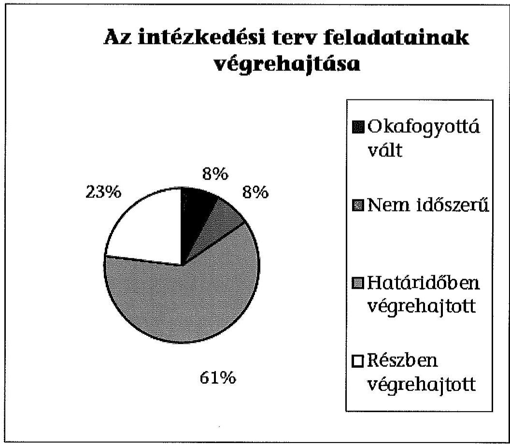

# ÁLLAMI   SZÁMVEVŐSZÉK 

## JELENTÉS

Utóellenőrzések - az önkormányzatok pénzügyi gazdálkodási helyzetének, szabályszerűségének utóellenőrzése

Felsőzsolca

---

# Állami Számvevőszék 

Iktatószám: V-0610-036/2015.
Témaszám: 1644
Vizsgálat-azonosító szám: V069310

## Az ellenőrzést felügyelte:

## Renkó Zsuzsanna

felügyeleti vezető
Az ellenőrzést vezette és az ellenőrzés végrehajtásáért felelős:
Mohl Anna
ellenőrzésvezető
A számvevőszéki jelentés összeállításában közremüködött:
Baksa Anikó
számvevő főtanácsos
Dr. Mezei Imréné
számvevő főtanácsos
Az ellenőrzést végezték:

| Marton Katalin | Ősiné Kárpáti Ágnes | Gácsi Györgyi Ivett |
| :-- | :-- | :-- |
| számvevő | számvevő | számvevő |
| Vámos Rita | Mészáros Ildikó Éva |  |
| számvevő | számvevő |  |

A témához kapcsolódó eddig készített számvevőszéki jelentések:
címe
sorszáma
Jelentés Felsőzsolca Város Önkormányzata pénzügyi gazdálkodási 13031
helyzetének, szabályosságának ellenőrzéséről

---

# TARTALOMJEGYZÉK 

BEVEZETÉS ..... 3
I. ÖSSZEGZŐ MEGÁLLAPÍTÁSOK, KÖVETKEZTETÉSEK ..... 6
II. RÉSZLETES MEGÁLLAPÍTÁSOK ..... 7

1. Az önkormányzat a pénzügyi gazdálkodási helyzetének, szabályszerűségének ellenőrzéséről készült ÁSZ jelentésben foglalt javaslatokra készített-e intézkedési tervet, illetve teljesítette-e az abban foglaltakat? ..... 7
MELLÉKLETEK
2. számú Az ÁSZ 13031 számú jelentéséhez kapcsolódó intézkedési terv végrehajtá- sa
FÜGGELÉKEK
3. számú Rövidítések jegyzéke
4. számú Fogalomtár

---

.

---

# JELENTÉS 

## Utóellenőrzések - az önkormányzatok pénzügyi gazdálkodási helyzetének, szabályszerűségének utóellenőrzése Felsőzsolca

## BEVEZETÉS

Az Állami Számvevőszék 2011-2015. évekre szóló stratégiája a helyi önkormányzatok ellenőrzésében a pénzügyi-gazdasági helyzete értékelésére, kockázatai feltárására helyezte a fő hangsúlyt. A 2011-2013. években az ÁSZ által ellenőrzött önkormányzatok esetében a múködési, beruházási és a hosszú lejáratú pénzintézeti kötelezettségeinek teljesítésével kapcsolatos pénzügyi kockázatokat mutattuk be. Az ÁSZ megállapította, hogy az önkormányzatok pénzügyi egyensúlyi helyzete az ellenőrzött időszakban romlott, a pénzügyi kockázatok fokozódtak, a pénzügyi egyensúlyi helyzetet jellemző mutatószámok kedvezőtlenül változtak. Az önkormányzati alrendszerben 2012. év végétől 2014. évelejéig lezajlott adósságkonszolidáció és feladat-ellátási-, finanszírozási-rendszer változtatás következtében a települési önkormányzatok pénzügyi helyzete jelentős mértékben megváltozott, amely a jóváhagyott intézkedési tervek végrehajtását is befolyásolta.

Az ellenőrzött szervezet vezetője az ÁSZ tv. 33. § (1)-(2) bekezdésében foglaltak alapján a jelentések intézkedést igénylő megállapításaihoz kapcsolódóan köteles intézkedési tervet benyújtani, amelyet az ÁSZ-nak kell elfogadni. Amennyiben az ellenőrzött által vállalt intézkedések hiányosak, vagy más okból nem elfogadhatók az ÁSZ indoklással és póthatáridő tüzésével visszaküldi azt kijavításra, kiegészítésre. Az elfogadásról szóló tájékoztatásban az Állami Számvevőszék elnöke valamennyi ellenőrzött szervezet vezetőjének figyelmét felhívta arra, hogy az intézkedési tervben foglaltak megvalósítását - az ÁSZ tv. 33. § (7) bekezdésében foglaltak alapján - utóellenőrzés keretében ellenőrizheti.

Az ellenőrzés célja: annak megállapítása, hogy az ellenőrzött önkormányzatok pénzügyi gazdálkodási helyzetének, szabályszerűségének ellenőrzéséről készült ÁSZ jelentésben foglalt javaslatokra készítettek-e intézkedési terveket, illetve az ellenőrzött által összeállított intézkedési tervben meghatározott feladatokat végrehajtották-e. Ennek keretében ellenőrizzük, hogy:

- a polgármester az ÁSZ törvény értelmében az intézkedési tervet határidőben megküldte-e az ÁSZ részére, szükség volt-e az elfogadást megelőzően kiegészítésre, azt az előírt póthatáridőn belül megtették-e, a Képviselő-testület a kiegészített intézkedési tervet elfogadta-e;

---

- az önkormányzat az elfogadott (kiegészített) intézkedési tervében foglaltak megtételéről, az abban előírt határidők betartásával gondoskodott-e;
- az elfogadott intézkedések esetleges késedelme, végrehajtásának elmaradása milyen szintű kockázatot jelez a pénzügyi gazdálkodásra és annak szabályszerűségére.

Az utóellenőrzés várható hasznosulása: az ellenőrzés megállapításai segítséget nyújthatnak a közpénzügyi helyzet javításához. Az utóellenőrzés, jellegéből adódóan fokozza közbizalmat, fegyelmet, a társadalom, az ellenőrzöttek, a helyi döntéshozók vonatkozásában erősíti az ÁSZ tekintélyét és igazolja, hogy lejárt a következmények nélküli ellenőrzések időszaka. Az ÁSZ intézményén belül lehetőség nyílik arra, hogy az utóellenőrzés, mint ellenőrzési kategória a szervezet tevékenységében stabilizálódjék, a megállapítások visszacsatolása segítse és erősítse az ÁSZ hozzáadott értéket teremtő elemző tevékenységét és tanácsadó szerepét.

Az intézkedési tervek olyan típusú feladatokat határoztak meg az önkormányzatok számára, amelyek a működőképesség jövőbeni zavarainak elkerülését, a felelős fenntartható gazdálkodás követelményeinek érvényesülését, a pénzügyi műveletek racionális keretek közt tartását tűzték ki célul. Az utóellenőrzés által e területeken érzékelt mulasztások még megfelelő irányba terelhetik az intézkedési tervekben foglalt feladatok végrehajtását.

Az ÁSZ az elfogadott intézkedési terveket kockázatelemzésnek veti alá. Ennek során elvégezzük az ÁSZ által elfogadott intézkedési tervben előírt/vállalt feladatok végrehajtásának értékelését, amelynek során alkalmazandó besorolási kategóriák:

- okafogyottá vált feladat: ha végrehajtására - meghatározott esemény bekövetkezése, továbbá külső körülmény, a múködést érintő feltétel változása miatt - már nincs szükség, illetve lehetőség, és egyértelműen megállapítható, hogy az intézkedést szükségessé tevő körülmény a jövőben nem fordulhat elő;
- nem időszerű (nem esedékes) feladat: amelynek ellenőrzési időszakon belüli végrehajtására azért nem került (kerülhetett) sor, mert az intézkedés alapjául szolgáló esemény nem következett be, de annak jövőbeni előfordulása lehetséges;
- határidőben végrehajtott feladat: ha teljesítése dokumentáltan az intézkedési tervben előírt határidőben és tartalommal, módon megtörtént;
- határidőn túl végrehajtott feladat: ha annak teljesítése az intézkedési tervben meghatározott módon, de az előírt határidőn túl történt meg;
- részben végrehajtott feladat: amelynek végrehajtása teljes körűen az intézkedési tervben előírt tartalommal/módon nem történt meg, vagy a feladatot nem az előírt gyakorisággal hajtották végre;
- végre nem hajtott feladat: ha a végrehajtásért felelősként megjelölt személy(ek)nek felróhatóan a teljesítés elmaradt, vagy a teljesítést nem dokumentálták.

---

Az ellenőrzést a számvevőszéki ellenőrzés szakmai szabályai szerint, szabályszerűségi ellenőrzés módszerével, a vonatkozó nemzetközi standardok figyelembevételével végeztük. Az ellenőrzésre az önkormányzatok elektronikus adatszolgáltatása alapján került sor, helyszíni ellenőrzést nem végeztünk. A megállapítások rögzítése az önkormányzatok által rendelkezésre bocsátott dokumentumok, tanúsítványok alapján történt, melyek valódiságát és teljes körüségét a polgármester, valamint a jegyző teljességi nyilatkozata igazolja.

A jóváhagyott intézkedési tervben előírt feladatok végrehajtásának ellenőrzését egységes szempontok, illetve értékelési kritériumok alapján végeztük. Figyelembe vettük az intézkedési terv jóváhagyását követően hatályba lépett jogszabályi előírások változásából következő események - kiemelten az önkormányzati alrendszerben lezajlott adósságkonszolidációs intézkedések, továbbá a fel-adat-ellátási és finanszírozási rendszer változásának - hatásait.

Az alkalmazott rövidítések jegyzékét az 1. számú függelék, az egyes fogalmak magyarázatát a 2. számú függelék tartalmazza.

Az ellenőrzött szervezet: Felsőzsolca Város Önkormányzata
Az ellenőrzött időszak: az intézkedési terv ÁSZ-nak történő benyújtásától az utóellenőrzés megkezdéséig tartó időszak.

Az ellenőrzés végrehajtásának jogszabályi alapját az ÁSZ tv. 1. § (3) bekezdése, az 5. § (2) és (6) bekezdései, a 33. § (7) bekezdése, valamint az Áht. 61. § (2) bekezdésének előírásai képezték.

Az ÁSZ tv. 29. § (1) bekezdése szerint a jelentéstervezetet észrevételezésre megküldtük az Önkormányzat polgármesterének, aki az ÁSZ tv. 29. § (2) bekezdésében foglalt észrevételezési jogával nem élt, a jelentéstervezetre észrevételt nem tett.

Az ÁSZ a 2013. évben zárta le az Önkormányzat pénzügyi gazdálkodási helyzetének, szabályosságának ellenőrzését. Az ellenőrzés tapasztalatairól készített 13031 számú jelentés az interneten, a www.asz.hu címen olvasható.

---

# I. ÖSSZEGZŐ MEGÁLLAPÍTÁSOK, KÖVETKEZTETÉSEK 

Az ÁSZ utóellenőrzés keretében értékelte az Önkormányzat pénzügyi gazdálkodási helyzetének, szabályszerűségének ellenőrzéséről szóló jelentés javaslatainak hasznosítására elfogadott intézkedési terv végrehajtását.

Az előző ÁSZ ellenőrzés megállapította, hogy az Önkormányzat pénzügyi egyensúlya rövid távon nem volt biztosított. A feltárt hiányosságok alapján megfogalmazott ÁSZ javaslatok hasznosítására az Önkormányzat intézkedési tervet készített, melyet az ÁSZ kiegészítés kérése nélkül elfogadott.

Az utóellenőrzés megállapította, hogy az ellenőrzött időszakban időszerűvé vált feladatait az Önkormányzat már részben, illetve az intézkedési tervben előírtaknak megfelelően végrehajtotta, ezáltal az ÁSZ javaslatai hasznosultak.

Az utóellenőrzés megállapítása alapján a részben teljesített feladatok közepes kockázatot jelentenek a pénzügyi gazdálkodásra, annak szabályszerűségére.

---

# II. RÉSZLETES MEGÁLLAPÍTÁSOK 

## 1. Az önkORMÁNYZAT a PÉNZÜGYI GAZDÁlKODÁSI HELYZETÉNEK, SZABÁLYSZERŰSÉGÉNEK ELLENÖRZÉSÉRŐL KÉSZÜLT ÁSZ JELENTÉSBEN FOGLALT JAVASLATOKRA KÉSZÍTETT-E INTÉZKEDÉSI TERVET, ILLETVE TELJESÍTETTE-E AZ ABBAN FOGLALTAKAT?

Az utóellenőrzés - a 2014. szeptember 16-ig végrehajtott intézkedéseket figyelembe véve - az Önkormányzat pénzügyi gazdálkodási helyzetének, szabályosságának ellenőrzéséről készült ÁSZ jelentés javaslatai hasznosítására elfogadott intézkedési terv végrehajtására irányult. A pénzügyi helyzet ellenőrzését az ÁSZ a 2009. január 1. - 2012. június 30. közötti időszakra végezte el, amelynek alapján megállapította, hogy az Önkormányzat pénzügyi egyensúlya rövid távon nem volt biztosított.

A polgármester a Képviselő-testületet tájékoztatta az ÁSZ jelentéséről. A jelentésben foglalt megállapításokhoz kapcsolódó intézkedési tervet ${ }^{1}$ az ÁSZ tv. 33. § (1) bekezdésében foglalt határidőre megküldték az ÁSZ részére. Az ÁSZ az intézkedési tervet javítás és kiegészítés nélkül elfogadta.

Az ÁSZ által elfogadott intézkedési tervben meghatározott feladatokat, az ÁSZ jelentés javaslatainak címzettjét és a feladatok végrehajtását az 1. számú melléklet mutatja be.

Az ÁSZ által elfogadott intézkedési terv 13 tervezett intézkedést tartalmazott, felelősként a polgármestert és a jegyzőt megjelölve.

Az utóellenőrzés megállapítása alapján az intézkedési tervben előírt feladatok közül egy okafogyottá vált, egy nem volt időszerű, nyolcat határidőben végrehajtottak, három feladatot részben teljesítettek. Az intézkedési tervben előírt feladatok között nem volt olyan, amelyet határidőn túl, vagy nem hajtottak volna végre.

Okafogyottá vált az önkormányzati kötvénytartozás adósságszolgálata után egyensúlyi tartalék képzése, mivel a Magyar Állam teljes mértékben átvállalta az Önkormányzat 2013. december 31-én fennálló kötvénytartozását.

Nem volt időszerű: a lejárt szállítói állományokról a Képviselő-testület felé történő beszámolás, mivel az Önkormányzat az ellenőrzött időszakban lejárt szállítói állománnyal nem rendelkezett.

[^0]
[^0]:    ${ }^{1}$ A Képviselő-testület az intézkedési tervet a 127/2013. (VI. 19.) számú, az ÁSZ által nem kért pontosítást tartalmazó kiegészített intézkedési tervet a 134/2013. (VII. 17.) számú határozatával fogadta el.

---

# Határidőre végrehajtották: 

- a reorganizációs program készítésére vonatkozó feladatot, továbbá azt, hogy kizárólag $90 \%$, illetve annál magasabb támogatási intenzitású pályázatot nyújtottak be;
- a fejlesztési célú hitelek költségvetési egyensúlyra gyakorolt hatása vizsgálatának szabályozását;
- több éves kihatással járó kötelezettségvállalások teljes körű bemutatása kötelezettségének előírását;
- az Önkormányzat fennálló kötelezettségállományának mérlegben történő teljes körű bemutatását;
- a kötelezettségállomány következő évi törlesztő részleteinek a mérlegben a rövid lejáratú kötelezettségek közötti kimutatását;
- a kockázatkezelési rendszer Bkr. szerinti felülvizsgálatát és kiegészítését;
- a fejlesztések döntés-előkészítési folyamatában a lebonyolítás és a múködtetés kockázatai feltárásának, kezelésének meghatározását;
- az EU-s támogatási programokkal kapcsolatban felhasznált saját költségvetési források éves beszámolók szöveges indoklásában történő bemutatását.

Az ÁSZ által elfogadott intézkedési tervben meghatározott feladatok közül az alábbiakat részben teljesítették:

- a bevételszerző és kiadáscsökkentő lehetőségek feltárását, mivel a 2014. évi költségvetési rendelet elfogadásakor és annak módosításakor a bevételszerző és kiadáscsökkentő lehetőségekhez kapcsolódó gazdasági elemzés nem készült, továbbá a pénzügyi kihatással járó előterjesztéseknél nem minden esetben jelölték meg az adott többletkiadás finanszírozásának forrását. A feladat végrehajtásának felelőse a polgármester volt;
- a pénzintézeti kötelezettségvállalások döntés-előkészítő szakaszában a kockázatok feltárásának előírását, mivel az elkészített szabályozás a hitelfelvételen túl nem terjedt ki az egyéb pénzintézeti kötelezettségvállalásokra. A feladat végrehajtásának felelőse a jegyző volt;
- az Önkormányzat fizetőképességének és eladósodásának kezelésére vonatkozó szabályozás kidolgozását, mivel szabályozás csak a pályázati kötelezettségvállalásokra készült, azonban más, a pénzügyi helyzet alakulását befolyásoló döntéseket érintő szabályozást nem készítettek. A feladat végrehajtásának felelőse a jegyző volt.

---

Az utóellenőrzés megállapítása alapján a részben teljesített feladatok közepes kockázatot jelentenek a pénzügyi gazdálkodásra, annak szabályszerűségére.

Budapest, 2015. 08 . hónap 0h. nap

Melléklet: $\quad 1 \mathrm{db}$
Függelék: $\quad 2 \mathrm{db}$

---

.

---

# Az ÁSZ 13031 számú jelentéséhez kapcsolódó intézkedési terv végrehajtása

|  Sorszám | Intézkedési terv alapján elvégzendő feladat | Az intézkedési tervben meghatározott határidő | Az ÁSZ 13031 számú jelentése javaslatának címzettje | Az intézkedés végrehajtása  |
| --- | --- | --- | --- | --- |
|   | 1. | 2. | 3. | 4.  |
|  Okafogyottá vált intézkedés |  |  |  |   |
|  1. | A múködési jövedelemtermelő képesség és a feladatellátás összhanga, valamint az Önkormányzat pénzügyi egyensúlyának helyredilítása, hosszú távú fenntarthatósága érdekében - figyelembe véve a 2013. évi állam általi részbeni adósságkonszolidációt, valamint a 2013. évtől változó feladat ellátási kötelezettséget - szükséges:
az Állam a "Felsózsolca Fejlődéséét" kötvényre vonatkozóan részbeni adósságkonszolidációt hajt végre. Jelenleg nem ismert, hogy az adósságkonszolidációt követően a futamidő végéig negyedévente milyen összegű tőke- és kamatfizetés terheli az Önkormányzatot. Egyéb más hosszú lejáratú kötelezettség nem terheli az Önkormányzatot, a kötvényre vonatkozóan pedig a koncepció és az adott évi költségvetés készítésekor kiemelt figyelmet fordítanak és elsődlegesen kezelik a tőke és kamatfizetés össze- | 2013. november 30. | polgármester | A Kormány 2013. november 12-én, az 1808/2013. (XI. 12.) számú határozatával döntött a helyi önkormányzatok 2014. évi adósságkonszolidációjáról. Ennek keretében a Magyar Állam teljes mértékben átvállalta Felsózsolca Város Önkormányzata 2013. december 31-én fennálló kötvénytartozását, így az intézkedés végrehajtása okafogyottá vált.  |

---

|  Sorszám | Intézkedési terv alapján elvégzendő feladat | Az intézkedési tervben meghatározott határidő | Az ÁSZ 13031 számú jelentése javaslatának címzettje | Az intézkedés végrehajtása  |
| --- | --- | --- | --- | --- |
|   | 1. | 2. | 3. | 4.  |
|   | gének elkülönítését. Az adósság mértékének ismeretében lehetséges az, hogy meghatározzák az egyensúlyi tartalék összegét, mely a Képviselő-testület elé kerül beterjesztésre. A döntést követően a törlesztési időszakra vonatkozóan lehet elkülöníteni az adósságszolgálat teljesítésére fordítandó összeget. |  |  |   |
|  |   |   |   |   |
|  |   |   |   |   |
|  |   |   |   |   |
|  |   |   |   |   |
|  |   |   |   |   |
|  Nem időszerű intézkedés |  |  |  |   |
|  1. | A működési jövedelemtermelő képesség és a feladatellátás összhangja, valamint az Önkormányzat pénzügyi egyensúlyának helyreállítása, hosszú távú fenntarthatósága érdekében - figyelembe véve a 2013. évi állam általi részbeni adósságkonszolidációt, valamint a 2013. évtől változó feladat ellátási kötelezettséget - szükséges:
a PPP konstrukcióban létrejött beruházásból felhalmozott szolgáltatási díj hátralék és a 2013. évre még esedékes díj rendezése megtörtént. A szállítói számlák esedékesség szerinti kiegyenlítése folyamatosan történik. Szükség esetén intézkedés történik a szállítói számlák átütemezésére. Az esetlegesen | folyamatos | polgármester | A PPP konstrukcióban létrejött beruházásból felhalmozott szolgáltatási díj hátralékot a Nemzeti Fejlesztési Minisztérium közvetlenül rendezte a 2012. december 28-i szerződés alapján (KSZVF/972/2012-NFM szerződés). Az Önkormányzatnak az ellenőrzött időszakban (2013. II., III. és a IV. negyedévi, valamint a 2014. I. és II. negyedévi mérlege szerint) nem volt lejárt szállítói kötelezettsége, ezért a Képvi-selő-testület felé történő beszámolás nem volt időszerű.  |

---

|  Sorszám | Intézkedési terv alapján elvégzendő feladat | Az intézkedési tervben meghatározott határidő | Az ÁSZ 13031 számú jelentése javaslatának címzettje | Az intézkedés végrehajtása  |
| --- | --- | --- | --- | --- |
|   | 1. | 2. | 3. | 4.  |
|   | felmerülő lejárt szállítói állomány alakulásáról a helyi önkormányzatok adósságrendezési eljárásáról szóló 1996. évi XXV. törvény 4-9. §-aiban szabályozott adósságrendezési eljárás megindításának elkerülése érdekében a féléves, három negyedéves és a zárszámadás alkalmával megtörténik a Képviselőtestület felé a beszámolás. |  |  |   |
|  Határidőre végrehajtott intézkedések |  |  |  |   |
|  1. | A múködési jövedelemtermelő képesség és a feladatellátás összhangja, valamint az Önkormányzat pénzügyi egyensúlyának helyreállítása, hosszú távú fenntarthatósága érdekében - figyelembe véve a 2013. évi állam általi részbeni adósságkonszolidációt, valamint a 2013. évtől változó feladat ellátási kötelezettséget - szükséges:
a vizsgálat lezárását követően megtörtént a PPP tornacsarnok állam általi kivásárlása, valamint jelenleg történik a 2008. évben kibocsátott kötvény részbeni adósságkonszolidációja. Az állam által átvállalt összeg 463,7 millió Ft. Az Önkormányzat hosszú távú gazdasági, | 2013. szeptember 30. | polgármester | Az Önkormányzat az intézkedési tervvel egyidejúleg, annak mellékleteként 2013. június 19-én, a 127/2013. (VI. 19.) számú határozatával elfogadta a reorganizációs programot. Az Önkormányzat a polgármester nyilatkozata szerint 2013. szeptember 30-át követően nem nyújtott be és nem is kötött 90\%-osnál alacsonyabb támogatás intenzitású pályázatot.  |

---

|  Sorszám | Intézkedési terv alapján elvégzendő feladat | Az intézkedési tervben meghatározott határidő | Az ÁSZ 13031 számú jelentése javaslatának címzettje | Az intézkedés végrehajtása  |
| --- | --- | --- | --- | --- |
|   | 1. | 2. | 3. | 4.  |
|   | pénzügyi egyensúlyi helyzetének gyors helyreállítása érdekében, az adósságállomány újratermelődésének elkerülése érdekében az Önkormányzat csak olyan pályázaton vesz részt, amely $90 \%$ vagy annál magasabb összegű finanszírozással támogatott. Az Önkormányzat reorganizációs programot készített, melynek keretében jár el az adósságállomány újratermelődésének megakadályozása érdekében, mely az Intézkedési terv 1. sz. melléklete. |  |  |   |
|  2. | Felül kell vizsgálni a belső kontroll tevékenységek müködésének szabályozását, meg kell feleljen a Bkr. 8. § (1)-(2) bekezdésében foglaltaknak. Ki kell alakítani a belső kontrolltevékenységeket, amelyek biztosítják a pénzügyi gazdálkodási folyamatok szabályosságát, a pénzügyi egyensúlyi helyzet alakulását befolyásoló döntések kockázatainak kezelését:
fejlesztési célú hitel esetén a futamidő egyes éveit terhelő kötelezettségek költségvetési egyensúlyra vonatkozó hatását vizsgálni kell, müködési célra hitel nem vehető fel. | 2013. november 30. | jegyző | Az Önkormányzat Belső kontroll szabályzatának 43. és 91. oldala tartalmaz előírásokat arra vonatkozóan, hogy fejlesztési célú hitel felvétele esetén a futamidő egyes éveit terhelő kötelezettségek költségvetési egyensúlyra vonatkozó hatását vizsgálni kell, továbbá azt, hogy müködési célra hitel nem vehető fel.  |

---

|  Sorszám | Intézkedési terv alapján elvégzendő feladat | Az intézkedési tervben meghatározott határidő | Az ÁSZ 13031 számú jelentése javaslatának címzettje | Az intézkedés végrehajtása  |
| --- | --- | --- | --- | --- |
|   | 1. | 2. | 3. | 4.  |
|  3. | Intézkedés történik arra vonatkozóan, hogy a költségvetési és zárszámadási rendelettervezetek készítése során teljes körűen be kell mutatni a többéves kihatással járó kötelezettségvállalásokat, az Áht. 24. § (4) bekezdés b) és 91. § (2) bekezdés a) pontjában előírtak szerint. | 2013. szeptember 30. | jegyző | A jegyző az Önkormányzat költségvetési, illetve zárszámadási rendeleteinek tartalmi előírásairól szóló 1/2012. (XI. 1.) számú jegyzői utasítást 2013. augusztus 30-án módosította, melynek I.16, illetve II. 10 pontjaiban előírta a többéves kihatással járó kötelezettségvállalások bemutatási kötelezettségét mind a költségvetési, mind pedig a zárszámadási rendelettervezetek készítése során.  |
|  4. | A könyvvezetési és beszámoló készítési kötelezettség szabályszerű teljesítése érdekében intézkedés történik, hogy:
az Önkormányzat fennálló kötelezettségeit teljes körűen mutassa be a mérlegkészítés során a Sztv. 15. § (2) bekezdés és az Áhsz. 23. §-ában foglaltak szerint. | 2013. szeptember 30. | jegyző | A jegyző az Önkormányzat költségvetési, illetve zárszámadási rendeleteinek tartalmi előírásairól szóló 1/2012. (XI. 1.) számú jegyzői utasítást 2013. augusztus 30-án módosította, melynek II.11. pontjában előírta, hogy az Önkormányzat fennálló kötelezettségeit a mérlegkészítés során - a Sztv. és az Áhsz. előírásai szerint - teljes körűen be kell mutatni. Az Önkormányzat - a polgármester és a jegyző 2014. szeptember 17-i együttes nyilatkozata alapján - a fennálló kötelezettségeit teljes körűen bemutatta a mérlegkészítés során.  |
|  5. | A könyvvezetési és beszámoló készítési kötelezettség szabályszerű teljesítése érdekében intézkedés történik, hogy:
a könyvviteli mérlegben a fennálló hosszú lejáratú kötelezettségekből a | 2013. szeptember 30. | jegyző | Az Önkormányzat 2013. II. negyedéves mér-leg-jelentésében a „rövid lejáratú tartozások kötvénykibocsátásból" mérlegsoron szerepeltette az egy éven belül esedékes törlesztő részleteket.  |

---

|  Sorszám | Intézkedési terv alapján elvégzendő feladat | Az intézkedési tervben meghatározott határidő | Az ÁSZ 13031 számú jelentése javaslatának címzettje | Az intézkedés végrehajtása  |
| --- | --- | --- | --- | --- |
|   | 1. | 2. | 3. | 4.  |
|   | fordulónapot követő év törlesztő részletelt, az Áhsz. 26. § (5) bekezdés b) pontjában és a 26. § (6) bekezdésében foglalt előírások szerint rövid lejáratú kötelezettségek között kell kimutatni. |  |  |   |
|  6. | A kockázatkezelési rendszert szükséges felülvizsgálni a Bkr. 7. § (1)-(2) bekezdésében foglaltak figyelembevételével. Ki kell egészíteni a pénzügyi egyensúly biztosítása érdekében az adott munkaterületeken felmerülhető kockázatokkal, azok feltárásának módjával, beazonosításával, minősítésével, illetve a kockázati nagyságok alapján ki kell dolgozni azok kezelését. | 2013. november 30. | jegyző | A jegyző által kiadott, 2013. november 1-jétől hatályos Belső Kontrollrendszerről szóló szabályzatban a Bkr-ben foglaltaknak megfelelően az Önkormányzat feltárta a költségvetési szerv tevékenységében, gazdálkodásában rejlő kockázatokat, valamint az egyes kockázatokkal kapcsolatosan szükséges intézkedéseket. Az intézkedések teljesítésének folyamatos nyomon követését a szabályzat I. fejezet 1.6 pontja, illetve 1. számú melléklete tartalmazza. A pénzügyi egyensúly biztosításával kapcsolatos kockázatkezelési tevékenységet a 91. oldalon szabályozták.  |
|  7. | Felül kell vizsgálni a belső kontroll tevékenységek müködésének szabályozását, meg kell feleljen a Bkr. 8. § (1)-(2) bekezdésében foglaltaknak. Ki kell alakítani a belső kontrolltevékenységeket, amelyek biztosítják a pénzügyi gazdálkodási folyamatok szabályosságát, a pénzügyi egyensúlyi helyzet alakulását befolyásoló döntések kockázatainak | 2013. november 30. | jegyző | A jegyző által kiadott, 2013. november 1-jétől hatályos Belső Kontrollrendszerről szóló szabályzatban az Önkormányzat szabályozta a fejlesztések döntés-előkészítés folyamatában a lebonyolítás és a müködtetés kockázatait, a kockázatok kezelését. A szabályzat 66. oldalán a pályázatokkal kapcsolatos munkafolyamatot, a 83. oldalán a kötelezettségvállalást, a pályázat elutasítási folyamatot, a 91. oldalon  |

---

|  Sorszám | Intézkedési terv alapján elvégzendő feladat | Az intézkedési tervben meghatározott határidő | Az ÁSZ 13031 számú jelentése javaslatának címzettje | Az intézkedés végrehajtása  |
| --- | --- | --- | --- | --- |
|   | 1. | 2. | 3. | 4.  |
|   | kezelését:
meg kell határozni a fejlesztések döntéselőkészítési folyamatában a lebonyolítás és a múködtetés kockázatainak feltárását, kezelésének kötelezettségét. |  |  | a múködéshez és a fejlesztések előkészítéséhez kapcsolódó pénzügyi egyensúly biztosításának kockázatait és a kockázatok kezelését szabályozták.  |
|  8. | Az Áhsz. 40. § (7) bekezdése előírásainak megfelelően az EU-s támogatási programokkal kapcsolatban felhasznált saját költségvetési források alakulása az éves beszámolók szöveges indoklásában bemutatásra kerül. | 2012. évi zárazámadás, azt követően folyamatos | jegyző | A jegyző az Önkormányzat költségvetési, illetve zárazámadási rendeleteinek tartalmi előírásairól szóló 1/2012. (XI. 1.) számú jegyzői utasítást 2013. augusztus 30-án módosította, melynek II. 12 pontjában előírta, hogy az Önkormányzat zárazámadásában az EU-s támogatási programokkal kapcsolatban a saját költségvetési forrásokat be kell mutatni.
A 2012. évi költségvetés végrehajtásáról szóló beszámoló szöveges indoklásában, illetve a 2012. évi költségvetés végrehajtásáról szóló 10/2013. (IV. 22.) számú rendelet 32. számú mellékletében az EU-s pályázatokkal kapcsolatban felhasznált költségvetési források bemutatásra kerültek.
A 2013. évi költségvetés végrehajtásáról szóló 10/2014. (V. 19.) számú önkormányzati rendelettel elfogadott beszámoló 17. számú mellékletében bemutatták az EU-s pályázatokat, illetve az azokhoz kapcsolódó költségvetési kiadásokat, továbbá a kiadások fedezetét biztosító források alakulását.  |

---

|  Sorszám | Intézkedési terv alapján elvégzendő feladat | Az intézkedési tervben meghatározott határidő | Az ÁSZ 13031 számú jelentése javaslatának címzettje | Az intézkedés végrehajtása  |
| --- | --- | --- | --- | --- |
|   | 1. | 2. | 3. | 4.  |
|  Részben végrehajtott intézkedések |  |  |  |   |
|  1. | A múködési jövedelemtermelő képesség és a feladatellátás összhangja, valamint az Önkormányzat pénzügyi egyensúlyának helyreállítása, hosszú távú fenntarthatósága érdekében - figyelembe véve a 2013. évi Magyar Állam általi részbeni adósságkonszolidációt, valamint a 2013. évtől változó feladat ellátási kötelezettséget - szükséges:
a költségvetési rendelettervezet, illetve annak évközi módosítási előterjesztését megelőzően a bevételszerző és kiadáscsökkentő lehetőség feltárása, gazdasági elemzés, illetve hatástanulmány készítése. Az egyes pénzügyi kihatással járó előterjesztésnél szükséges megjelölni, hogy az adott többletkiadást milyen forrásból finanszírozza az Önkormányzat. | Előirányzat-módosítások alkalmával, koncepció, illetve költségvetési rendelettervezetek elkészítésekor, illetve folyamatos | polgármester | A bevételszerző lehetőségeket a 193/2013. (IX. 20.) számú képviselő-testületi határozattal elfogadott, 2014. évi költségvetési koncepció 1. és 2. számú mellékletében feltárták. A kiadások csökkentéséről a Képviselő-testület a 127/2013. (VI. 19.) számú határozatával elfogadott Intézkedési terv 1. b) pontjában döntött, valamint a 10/2014. (II. 26.) számú határozatával. A 2013. évi költségvetési rendelet módosítások során a bevételszerző és kiadáscsökkentő lehetőségeket feltárták, a többletkiadás forrását az előterjesztések javaslati részében megjelölték (17/2013. (VI. 24.), 20/2013. (VIII. 6.), 25/2013. (IX. 30.), 30/2013. (XI. 25.), 37/2013. (XII. 18.), (4/2014. (III. 3.) és a 9/2014. (IV. 24.) számú önkormányzati rendeletek).
Ezen túlmenően takarékossági intézkedéseket adtak ki a 22/2013. számú körlevéllel.
A 2014. évi költségvetés elfogadásakor (5/2014. (III. 3.) számú önkormányzati rendelet) és annak módosításakor (17/2014. (VI. 23.) számú önkormányzati rendelet) benyújtott előterjesztésekben a bevételszerző és kiadáscsökkentő lehetőségek feltárása elmaradt, gazdasági elemzés nem készült.  |

---

|  Sorszám | Intézkedési terv alapján elvégzendő feladat | Az intézkedési tervben meghatározott határidő | Az ÁSZ 13031 számú jelentése javaslatának címzettje | Az intézkedés végrehajtása  |
| --- | --- | --- | --- | --- |
|   | 1. | 2. | 3. | 4.  |
|   |  |  |  | A pénzügyi kihatással járó döntések előterjesztésénél az adott többletkiadás finanszírozási forrását az előterjesztés javaslati részében nem minden esetben jelölték meg (83/2014. (VI. 18.) számú képviselő-testületi határozat).  |
|  2. | Felül kell vizsgálni a belső kontroll tevékenységek müködésének szabályozását, meg kell feleljen a Bkr. 8. § (1)-(2) bekezdésében foglaltaknak. Ki kell alakítani a belső kontrolltevékenységeket, amelyek biztosítják a pénzügyi gazdálkodási folyamatok szabályosságát, a pénzügyi egyensúlyi helyzet alakulását befolyásoló döntések kockázatainak kezelését:
a pénzintézeti kötelezettségvállalásokra vonatkozó döntés-előkészítés során elő kell írni a kötelezettségvállalások kockázatainak feltárását. | 2013. november 30. | jegyző | A jegyző által kiadott, 2013. november 1-jétől hatályos Belső Kontrollrendszerről szóló szabályzatban a pénzügyi egyensúly kockázatait csak részben tárták fel (91. old.). Előírták, hogy a hitelfelvétel pénzügyi kockázatainak megelőzése érdekében a futamidőre vonatkozóan hatástanulmányt kell készíteni, de a szabályzatban egyéb pénzintézeti szolgáltatásokat, mint lehetséges kockázat (pl. kötvénykibocsátás) nem azonosítottak, nem írták elő ezek feltárásának kötelezettségét, módját.  |
|  3. | Felül kell vizsgálni a belső kontroll tevékenységek müködésének szabályozását, meg kell feleljen a Bkr. 8. § (1)-(2) bekezdésében foglaltaknak. Ki kell alakítani a belső kontrolltevékenységeket, amelyek biztosítják a pénzügyi gazdálkodási folyamatok szabályosságát, a | 2013. szeptember 30. | jegyző | A pályázatok vonatkozásában a jegyző és a polgármester új közös szabályzatot adott ki (2013. augusztus 1-jétől hatályos Pályázati szabályzat az EU-s, hazai és egyéb pályázati források felhasználási rendjéről), melynek IV. Egyéb kötelezettségek fejezetében (8. oldal) rögzítették azokat a szabályokat, melyek a  |

---

|  Sorszám | Intézkedési terv alapján elvégzendő feladat | Az intézkedési tervben meghatározott határidő | Az ÁSZ 13031 számú jelentése javaslatának címzettje | Az intézkedés végrehajtása  |
| --- | --- | --- | --- | --- |
|   | 1. | 2. | 3. | 4.  |
|   | pénzügyi egyensúlyi helyzet alakulását befolyásoló döntések kockázatainak kezelését:
az Önkormányzat fizetőképességének és eladósodásának kezelésére és a pénzügyi kötelezettségek teljesítésére vonatkozóan helyi szabályozás kerül kidolgozásra. |  |  | pályázatokkal kapcsolatban a fizetőképesség megőrzését, az eladósodás kezelését biztosítják. Azonban más a pénzügyi helyzet alakulását befolyásoló döntéseket érintő szabályozás nem készült.  |

---

# RÖVIDÍTÉSEK JEGYZÉKE 

## Törvények

Áht.
Az államháztartásról szóló 2011. évi CXCV. törvény (hatályos 2011. december 31-étől)
ÁSZ tv.
az Állami Számvevőszékről szóló 2011. évi LXVI. törvény (hatályos 2011. július 1-jétől)
Sztv.
a számvitelről szóló 2000 . évi C. törvény (hatályos 2001. január 1-jétől)

## Kormány rendeletek

Áhsz.
az államháztartás szervezetei beszámolási és könyvvezetési kötelezettségének sajátosságairól szóló 249/2000. (XII. 24.) Korm. rendelet (hatályos 2001. január 1-jétől, hatálytalan 2014. január 1-jétől)
Bkr.
a költségvetési szervek belső kontrollrendszeréről és belső ellenőrzéséről szóló 370/2011. (XII. 31.) Korm. rendelet (hatályos 2012. január 1-jétől)

## Szórövidítések

ÁSZ
Állami Számvevőszék
EU
Európai Unió
jegyzó
Felsőzsolca Város Önkormányzatának jegyzője
Képviselő-testület
Felsőzsolca Város Önkormányzatának Képviselőtestülete
Önkormányzat
Felsőzsolca Város Önkormányzata
polgármester
Felsőzsolca Város Önkormányzatának polgármestere

---

.

---

# FOGALOMTÁR 

adósságkonszolidáció
adósságszolgálat
árfolyamkockázat
banki kitettség
bevételi kitettség
felhalmozási kockázat
garanciavállalás
kezességvállalás
mérlegen kívüli tétel
múködési kockázat

Több ütemben lezajlott központi intézkedés, amely a helyi önkormányzatok adósságállományának a magyar állam által történő átvállalására irányult. Az adósságkonszolidációs csomag releváns rendelkezéseit a 2012-2014. évi központi költségvetésről szóló törvények tartalmazták.
Az adósság tőkerészének és az esedékes kamat együttes összegének törlesztése.
Annak kockázata, hogy a külföldi devizában fennálló pénzügyi eszközök hazai fizetőeszközben kifejezett értéke az árfolyam elmozdulásával megváltozik.
Olyan függőségi viszony, ahol egy szervezet pénzügyi helyzete olyan külső körülmények hatására változhat, amely kizárólag a bank egyoldalú döntésén múlik.
Olyan függőségi viszony, ahol egy szervezet pénzügyi helyzetét meghatározó bevételek nagysága külső körülmények hatására azonnal és kedvezőtlen irányba változhat.
Annak kockázata, hogy a folyamatban lévő felhalmozási feladatok finanszírozásához szükséges pénzügyi forrás nem fog rendelkezésre állni.
Olyan kötelezettségvállalás, ahol a garanciát vállaló valamely jövőbeni esemény bekövetkezésekor, a szerződésben meghatározott feltételek beálltakor a garancia kedvezményezettje számára meghatározott összegig, meghatározott időpontig, felszólításra azonnal fizet.
A tárgyi eszközállomány állagának elemzéséhez használt mutató, számításakor a tárgyi eszköz könyv szerinti nettó értékét viszonyítják a tárgyi eszköz bruttó (beszerzési/létesítési) értékéhez.
Annak kockázata, hogy a változó kamatozású forint vagy a devizahitel futamideje alatt kedvezőtlen irányban változhat a hitel kamata.
Szerződésben vállalt olyan kötelezettség, amelyben a kezes arra vállal kötelezettséget, hogy ha a szerződés kötelezettje nem teljesít, a kezes maga fog helyette teljesíteni a jogosultnak.
Olyan szerződés alapján fennálló mérlegen kívüli [függő vagy biztos (jövőbeni)] kötelezettség, illetve követelés, amely a mérleg fordulónapján már fennáll, de mérlegtételkénti szerepeltetése egy jövőbeni esemény bekövetkezésétől vagy a szerződés teljesítésétől függ.
Annak kockázata, hogy nem megfelelő működésből, emberi hibákból, rendszerhibákból vagy külső eseményekből adódik veszteség.

---

nemfizetési kockázat
nettó múködési jövedelem

ÖNHIKI támogatás
önkormányzat folyó költségvetési egyenlege
önkormányzat többségi tulajdonában lévő gazdasági társaságok
önkormányzat gazdasági társasága miatti kockázatot jelentő tényezők

Annak kockázata, hogy a kötelezett fennálló kötelezettségét átmenetileg vagy véglegesen nem tudja határidőre megfizetni.
A nettó múködési jövedelem (pénzügyi kapacitás) a jövedelemtermelő képességet méri. Megmutatja a múködési bevételekből a múködési kiadások és a hitelek tőketörlesztésének kifizetése után fennmaradó jövedelmet.
Az önkormányzatok múködőképességét szolgáló, önhibájukon kívül hátrányos helyzetben levő települési önkormányzatok támogatása.
A folyó költségvetés egyenlege, azaz a múködési jövedelem megmutatja, hogy az önkormányzat éves folyó bevétele fedezetet biztosít-e a kötelező és önként vállalt feladatellátáshoz kapcsolódó éves folyó kiadására. A múködési jövedelem negatív értéke pénzügyileg fenntarthatatlan helyzetet jelez. A mutató pozitív értéke megtakarítást mutat, amely forrásul szolgálhat az önkormányzat fennálló kötelezettségei megfizetéséhez, valamint fejlesztéseihez.
Azok a gazdasági társaságok, amelyekben az önkormányzat a szavazatok több mint ötven százalékával vagy jogszabályban rögzített meghatározó befolyással rendelkezik. A befolyással rendelkező akkor rendelkezik egy jogi személyben meghatározó befolyással, ha annak tagja, illetve részvényese, és jogosult e jogi személy vezető tisztségviselői vagy felügyelő bizottsága tagjai többségének megválasztására, illetve visszahívására, vagy a jogi személy más tagjaival, illetve részvényeseivel kötött megállapodás alapján egyedül rendelkezik a szavazatok több mint ötven százalékával.
Az önkormányzat gazdasági társaságának kedvezőtlen pénzügyi döntései következtében az önkormányzat pénzügyi egyensúlyi helyzetét veszélyeztető tényezők: az önkormányzat az önként vállalt és/vagy a kötelező feladatot ellátó társaságának a tevékenység ellátásához pénzeszközt ad át;
az önkormányzat nem vizsgálja a feladatellátás választott szervezeti megoldásának hatékonyságát;
a kötelező feladatellátást biztosító gazdasági társaság tevékenységének ágazati szabályozása változik (vízi közmúvagyon üzemeltetése);
a kizárólagos vagy többségi tulajdonú társaságok pénzügyi helyzete nem stabil, amely az alapítóra kötelezettségeket háríthat;
az önkormányzat a társaságok tevékenységét nem kísérte figyelemmel, nem élt az alapítói (irányítói) jogok gyakorlásával, a társaságok gazdálkodásának önkormányzati szintű konszolidálása nem biztosított;

---

pénzügyi kockázat

PPP
szállítói kockázat
szállítói kitettség
az önkormányzat garanciát vagy kezességet vállal a gazdasági társaság kötelezettségeire;
a társaságoknak átadott pénzeszköz uniós elvárásoknak megfelelő kezelése.
A pénzügyi kockázat magában foglalja mindazon kockázatokat, amelyek a szervezet pénzügyi helyzetére hatással vannak. Pl.: az adósságszolgálat miatti kockázatot, árfolyamkockázatot, felhalmozási kockázatot, fizetőképességi kockázatot, jövőbeni kötelezettségek kifizethetőségének kockázatát, kamatkockázatot, kezességvállalás kockázatát, likviditási kockázat, mérlegen kívüli tételek kockázata, nemfizetési kockázat, stb.
A köz- és a magánszféra együttmúködésén alapuló fejlesztési konstrukció. Az állami és a magánszféra együttmúködésének egyik formáját jelöli a PPP. A rövidítés a „köz- és magánszféra partnersége" angol nyelvű megfelelője. A PPP keretében a közcél a magánszféra jelentős mértékű közremúködésével valósul meg.
Annak kockázata, hogy a kötelezett a szállítókkal szemben fennálló, már elismert kötelezettségét átmenetileg vagy véglegesen nem tudja határidőre teljesíteni.
Olyan függőségi viszony, ahol egy szervezet pénzügyi helyzete a szállítói tartozások rendezése érdekében foganatosított intézkedések hatására azonnal és kedvezőtlen irányba változhat.