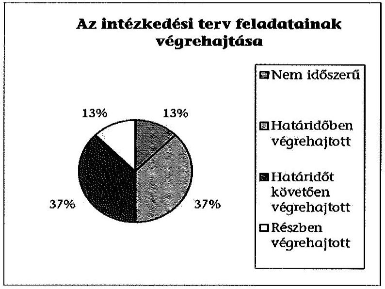
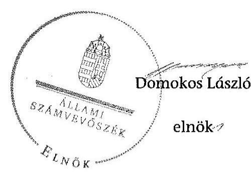

ÁLLAMI
SZÁMVEVŐSZÉK

# JELENTÉS 

Utóellenőrzések - az önkormányzatok pénzügyi gazdálkodási helyzetének, szabályszerűségének utóellenőrzése

Fót

---

# Állami Számvevőszék 

Iktatószám: V-0602-031/2015.
Témaszám: 1636
Vizsgálat-azonosító szám: V069302

## Az ellenőrzést felügyelte:

## Renkó Zsuzsanna

felügyeleti vezető
Az ellenőrzést vezette és az ellenőrzés végrehajtásáért felelős:
Mohl Anna
ellenőrzésvezető
A számvevőszéki jelentés összeállításában közreműködött:
Baksa Anikó
számvevő főtanácsos
Dr. Mezei Imréné
számvevő főtanácsos
Az ellenőrzést végezték:
Lődiné Cser Zsuzsanna Tóth Richard Fátrainé Zsebedics Katalin számvevő főtanácsos számvevő számvevő tanácsos

A témához kapcsolódó eddig készített számvevőszéki jelentések:
címe
sorszáma
Jelentés az önkormányzatok pénzügyi gazdálkodási helyzetének, 13092 szabályszerűségének ellenőrzéséről Fót

---

# TARTALOMJEGYZÉK 

BEVEZETÉS ..... 3
I. ÖSSZEGZŐ MEGÁLLAPÍTÁSOK, KÖVETKEZTETÉSEK ..... 6
II. RÉSZLETES MEGÁLLAPÍTÁSOK ..... 7

1. Az önkormányzat a pénzügyi gazdálkodási helyzetének, szabályszerűségének ellenőrzéséről készült ÁSZ jelentésben foglalt javaslatokra készített-e intézkedési tervet, illetve teljesítette-e az abban foglaltakat? ..... 7
MELLÉKLETEK
2. számú Az ÁSZ 13092 számú jelentéséhez kapcsolódó intézkedési terv végrehajtása
FÜGGELÉKEK
3. számú Rövidítések jegyzéke
4. számú Fogalomtár

---

.

---

# JELENTÉS 

## Utóellenőrzések - az önkormányzatok pénzügyi gazdálkodási helyzetének, szabályszerűségének utóellenőrzése Fót

## BEVEZETÉS

Az Állami Számvevőszék 2011-2015. évekre szóló stratégiája a helyi önkormányzatok ellenőrzésében a pénzügyi-gazdasági helyzet értékelésére, kockázatai feltárására helyezte a fő hangsúlyt. A 2011-2013. években az ÁSZ által ellenőrzött önkormányzatok esetében a működési, beruházási és a hosszú lejáratú pénzintézeti kötelezettségeinek teljesítésével kapcsolatos pénzügyi kockázatokat mutattuk be. Az ÁSZ megállapította, hogy az önkormányzatok pénzügyi egyensúlyi helyzete az ellenőrzött időszakban romlott, a pénzügyi kockázatok fokozódtak, a pénzügyi egyensúlyi helyzetet jellemző mutatószámok kedvezőtlenül változtak. Az önkormányzati alrendszerben 2012. év végétől 2014. évelejéig lezajlott adósságkonszolidáció és feladat-ellátási-, finanszírozási-rendszer változás következtében a települési önkormányzatok pénzügyi helyzete jelentős mértékben megváltozott, amely a jóváhagyott intézkedési tervek végrehajtását is befolyásolta.

Az ellenőrzött szervezet vezetője az ÁSZ tv. 33. § (1)-(2) bekezdésében foglaltak alapján a jelentések intézkedést igénylő megállapításaihoz kapcsolódóan köteles intézkedési tervet benyújtani, amelyet az ÁSZ-nak kell elfogadni. Amennyiben az ellenőrzött által vállalt intézkedések hiányosak, vagy más okból nem elfogadhatók az ÁSZ indoklással és póthatáridő tűzésével visszaküldi azt kijavításra, kiegészítésre. Az elfogadásról szóló tájékoztatásban az Állami Számvevőszék elnöke valamennyi ellenőrzött szervezet vezetőjének figyelmét felhívta arra, hogy az intézkedési tervben foglaltak megvalósítását - az ÁSZ tv. 33. § (7) bekezdésében foglaltak alapján - utóellenőrzés keretében ellenőrizheti.

Az ellenőrzés célja: annak megállapítása, hogy az ellenőrzött önkormányzatok pénzügyi gazdálkodási helyzetének, szabályszerűségének ellenőrzéséről készült ÁSZ jelentésben foglalt javaslatokra készítettek-e intézkedési terveket, illetve az ellenőrzött által összeállított intézkedési tervben meghatározott feladatokat végrehajtották-e. Ennek keretében ellenőrizzük, hogy:

- a polgármester az ÁSZ törvény értelmében az intézkedési tervet határidőben megküldte-e az ÁSZ részére, szükség volt-e az elfogadást megelőzően kiegészítésre, azt az előírt póthatáridőn belül megtették-e, a Képviselő-testület a kiegészített intézkedési tervet elfogadta-e;

---

- az önkormányzat az elfogadott (kiegészített) intézkedési tervében foglaltak megtételéről, az abban előírt határidők betartásával gondoskodott-e;
- az elfogadott intézkedések esetleges késedelme, végrehajtásának elmaradása milyen szintű kockázatot jelez a pénzügyi gazdálkodásra és annak szabályszerűségére.

Az utóellenőrzés várható hasznosulása: az ellenőrzés megállapításai segítséget nyújthatnak a közpénzügyi helyzet javításához. Az utóellenőrzés, jellegéből adódóan fokozza a közbizalmat, fegyelmet, a társadalom, az ellenőrzöttek, a helyi döntéshozók vonatkozásában erősíti az ÁSZ tekintélyét és igazolja, hogy lejárt a következmények nélküli ellenőrzések időszaka. Az ÁSZ intézményén belül lehetőség nyílik arra, hogy az utóellenőrzés, mint ellenőrzési kategória a szervezet tevékenységében stabilizálódjék, a megállapítások visszacsatolása segítse és erősítse az ÁSZ hozzáadott értéket teremtő elemző tevékenységét és tanácsadó szerepét.

Az intézkedési tervek olyan típusú feladatokat határoztak meg az önkormányzatok számára, amelyek a működőképesség jövőbeni zavarainak elkerülését, a felelős fenntartható gazdálkodás követelményeinek érvényesülését, a pénzügyi műveletek racionális keretek közt tartását tűzték ki célul. Az utóellenőrzés által e területeken érzékelt mulasztások még megfelelő irányba terelhetik az intézkedési tervekben foglalt feladatok végrehajtását.

Az ÁSZ az elfogadott intézkedési terveket kockázatelemzésnek veti alá. Ennek során elvégezzük az ÁSZ által elfogadott intézkedési tervben előírt/vállalt feladatok végrehajtásának értékelését, amelynek során alkalmazandó besorolási kategóriák:

- okafogyottá vált feladat: ha végrehajtására - meghatározott esemény bekövetkezése, továbbá külső körülmény, a működést érintő feltétel változása miatt - már nincs szükség, illetve lehetőség, és egyértelműen megállapítható, hogy az intézkedést szükségessé tevő körülmény a jövőben nem fordulhat elő;
- nem időszerű (nem esedékes) feladat: amelynek ellenőrzési időszakon belüli végrehajtására azért nem került (kerülhetett) sor, mert az intézkedés alapjául szolgáló esemény nem következett be, de annak jövőbeni előfordulása lehetséges;
- határidőben végrehajtott feladat: ha teljesítése dokumentáltan az intézkedési tervben előírt határidőben és tartalommal, módon megtörtént;
- határidőn túl végrehajtott feladat: ha annak teljesítése az intézkedési tervben meghatározott módon, de az előírt határidőn túl történt meg;
- részben végrehajtott feladat: amelynek végrehajtása teljes körűen az intézkedési tervben előírt tartalommal/módon nem történt meg, vagy a feladatot nem az előírt gyakorisággal hajtották végre;
- végre nem hajtott feladat: ha a végrehajtásért felelősként megjelölt személy(ek)nek felróhatóan a teljesítés elmaradt, vagy a teljesítést nem dokumentálták.

---

Az ellenőrzést a számvevőszéki ellenőrzés szakmai szabályai szerint, szabályszerűségi ellenőrzés módszerével, a vonatkozó nemzetközi standardok figyelembevételével végeztük. Az ellenőrzésre az önkormányzatok elektronikus adatszolgáltatása alapján került sor, helyszíni ellenőrzést nem végeztünk. A megállapítások rögzítése az önkormányzatok által rendelkezésre bocsátott dokumentumok, tanúsítványok alapján történt, melyek valódiságát és teljes körűségét a polgármester, valamint a jegyző teljességi nyilatkozata igazolja.

A jóváhagyott intézkedési tervben előírt feladatok végrehajtásának ellenőrzését egységes szempontok, illetve értékelési kritériumok alapján végeztük. Figyelembe vettük az intézkedési terv jóváhagyását követően hatályba lépett jogszabályi előírások változásából következő események - kiemelten az önkormányzati alrendszerben lezajlott adósságkonszolidációs intézkedések, továbbá a feladat-ellátási és finanszírozási rendszer változásának - hatásait.

Az alkalmazott rövidítések jegyzékét az 1. számú függelék, az egyes fogalmak magyarázatát a 2. számú függelék tartalmazza.

Az ellenőrzött szervezet: Fót Város Önkormányzata
Az ellenőrzött időszak: az intézkedési terv ÁSZ-nak történő benyújtásától az utóellenőrzés megkezdéséig tartó időszak.

Az ellenőrzés végrehajtásának jogszabályi alapját az ÁSZ tv. 1. § (3) bekezdése, az 5. § (2) és (6) bekezdései, a 33. § (7) bekezdése, valamint az Áht. 61. § (2) bekezdésének előírásai képezték.

Az ÁSZ tv. 29. § (1) bekezdése szerint a jelentéstervezetet észrevételezésre megküldtük az Önkormányzat polgármesterének, aki az ÁSZ tv. 29. § (2) bekezdésében foglalt észrevételezési jogával nem élt, a jelentéstervezetre észrevételt nem tett.

Az ÁSZ a 2013. évben zárta le az Önkormányzat pénzügyi gazdálkodási helyzetének, szabályszerűségének ellenőrzését. Az ellenőrzés tapasztalatairól készített 13092 számú jelentés az interneten, a www.asz.hu címen olvasható.

---

# I. ÖSSZEGZŐ MEGÁLLAPÍTÁSOK, KÖVETKEZTETÉSEK 

Az ÁSZ utóellenőrzés keretében értékelte az Önkormányzat pénzügyi gazdálkodási helyzetének, szabályszerűségének ellenőrzéséről szóló jelentés javaslatainak hasznosítására elfogadott intézkedési terv végrehajtását.

Az előző ÁSZ ellenőrzés megállapította, hogy az Önkormányzat pénzügyi egyensúlya rövid és középtávon biztosított volt. A feltárt hiányosságok alapján megfogalmazott ÁSZ javaslatok hasznosítására az Önkormányzat intézkedési tervet készített, melyet az ÁSZ kiegészítés kérése nélkül elfogadott.

Az utóellenőrzés megállapította, hogy az ellenőrzött időszakban időszerűvé vált feladatait az Önkormányzat már részben, illetve az intézkedési tervben előírtaknak megfelelően végrehajtotta, ezáltal az ÁSZ javaslatai hasznosultak.

Az utóellenőrzés megállapítása alapján a határidőn túl, illetve a részben végrehajtott feladatok alacsony kockázatot jelentenek a pénzügyi gazdálkodásra, annak szabályszerűségére.

---

# II. RÉSZLETES MEGÁLLAPÍTÁSOK 

## 1. Az önkormányzat a pénzügyi gazdálkodási helyzetének, szabályszerűségének ellenőrzéséről készült ÁSZ jelentésben foglalt javaslatokra készített-e intézkedési tervet, illetve teljesítette-e az abban foglaltakat?

Az utóellenőrzés - a 2014. szeptember 16-ig végrehajtott intézkedéseket figyelembe véve - az Önkormányzat pénzügyi gazdálkodási helyzetének, szabályszerűségének ellenőrzéséről készült ÁSZ jelentés javaslatai hasznosítására elfogadott intézkedési terv végrehajtására irányult. A pénzügyi helyzet ellenőrzését az ÁSZ a 2009. január 1. - 2012. december 31. közötti időszakra végezte el, amelynek alapján megállapította, hogy az Önkormányzat pénzügyi egyensúlya rövid és középtávon biztosított volt.

A polgármester a Képviselő-testületet tájékoztatta az ÁSZ jelentéséről. A jelentésben foglalt megállapításokhoz kapcsolódó intézkedési tervet ${ }^{1}$ az ÁSZ tv. 33. § (1) bekezdésében foglalt határidőre megküldték az ÁSZ részére. Az ÁSZ az intézkedési tervet javítás és kiegészítés nélkül elfogadta.

Az ÁSZ által elfogadott intézkedési tervben meghatározott feladatokat, az ÁSZ jelentés javaslatainak címzettjét és a feladatok végrehajtását az 1. számú melléklet mutatja be.

Az ÁSZ által elfogadott intézkedési terv 8 tervezett intézkedést tartalmazott, felelősként a polgármestert és a jegyzőt megjelölve.

Az utóellenőrzés megállapítása alapján az intézkedési tervben előírt feladatokból egy feladat nem volt időszerű, három feladat határidőben, három feladat határidőt követően, egy feladat pedig részben került végrehajtásra. A feladatok között nem volt olyan, amely okafogyottá vált volna, vagy amelyet nem hajtottak volna végre.

## Nem volt időszerű:

- az Önkormányzat pénzügyi egyensúlyi helyzetének kedvezőtlen változása esetén a bevételnövelő, valamint kiadáscsökkentő lehetőségek felmérése, az önkormányzati rendeletek felülvizsgálata alapján az intézkedésekhez szükséges döntési javaslat előterjesztése, mivel az Önkormányzat pénzügyi helyzete nem változott kedvezőtlenül.

[^0]
[^0]:    ${ }^{1}$ A Képviselő-testület az intézkedési tervet a 480/2013. (X. 30.) számú határozatával fogadta el.

---

# Határidőre végrehajtották: 

- az Önkormányzat pénzügyi egyensúlyi helyzetének alakulásáról a Képviselő-testület tájékoztatását;
- a Belső Kontroll Kézikönyv felülvizsgálatát és kiegészítését a feladatellátási szerződések minimum tartalmi követelményeinek meghatározásával összefüggő kontrolltevékenységekkel;
- az ellenőrzési nyomvonal kiegészítését a hitelfelvételről és kötvénykibocsátásról szóló döntés előkészítése során vizsgálandó területek szabályozásával, a hatásvizsgálati kontrollpontok beépítésével.

## Határidőt követően hajtották végre:

- a Képviselő-testület tájékoztatását a lejárt szállítói állomány alakulásáról, a szállítói számlák esedékesség szerinti kiegyenlítéséről, mivel a 2013. október 30-ai határidő helyett a tájékoztatásra első alkalommal 2014. január 22-én került sor;
- a kizárólagos önkormányzati tulajdonban álló gazdasági társaság pénzügyi helyzetének stabilitására intézkedési terv készítését, mert az intézkedési terv előterjesztése a 2013. december 31-ei határidővel szemben 2014. január 22-én történt meg, amit a kiegészítését követően a Képviselő-testület 2014. február 19-én hagyott jóvá;
- a szállítói tartozások és egyéb kiadás elmaradások rendezésének szabályozását, melyre 2013. december 31-et követően 2014. március 3-án került sor.

Az ÁSZ által elfogadott intézkedési tervben meghatározott feladatok közül részben teljesítették:

- a pénzügyi egyensúlyt befolyásoló kockázatok kockázatkezelési rendszerének újraszabályozását biztosították, továbbá a képviselő-testületi előterjesztésekben a pénzügyi kockázatok bemutatását, értékelését megvalósították, azonban a kockázatkezelési rendszer működtetéséről nem minden esetben gondoskodtak. A feladat végrehajtásának felelőse a jegyző volt.

A Képviselő-testület az intézkedési terv elfogadásával egyidejűleg felkérte a polgármester útján a jegyzőt, hogy az intézkedési tervben meghatározott feladatok végrehajtására vonatkozó utóvizsgálat kerüljön be a 2014. évi belső ellenőrzési tervbe ${ }^{2}$.

[^0]
[^0]:    ${ }^{2}$ A Képviselő-testület az 519/2013. (XI. 20.) számú határozatával fogadta el az Önkormányzat 2014. évi belső ellenőrzési tervét, amelyben az intézkedési terv végrehajtásának ellenőrzése a 6. sorszámon szerepelt.

---

Az utóellenőrzés megállapítása alapján a határidőn túl, illetve a részben végrehajtott feladatok alacsony kockázatot jelentenek a pénzügyi gazdálkodásra, annak szabályszerűségére.

Budapest, 2015. 08 . hónap 0h. nap

Melléklet: $\quad 1 \mathrm{db}$
Függelék: $\quad 2 \mathrm{db}$

---

.

---

# Az ÁSZ 13092 számú jelentéséhez kapcsolódó intézkedési terv végrehajtása

|  Sorszám | Intézkedési terv alapján elvégzendő feladat | Az intézkedési tervben meghatározott határidő | $\begin{gathered} \text {
 Az ÁSZ 13092 sz. jelentése javaslatának címzettje | Az intézkedés végrehajtása  |
| --- | --- | --- | --- | --- |
|   | 1. | 2. | 3. | 4.  |
|  Nem időszerű intézkedés |  |  |  |   |
|  1. | A pénzügyi egyensúlyi helyzet kedvezőtlen változása esetén a Képviselőtestület elé kell terjeszteni az egyensúly hosszú távú megőrzését, az adósságállomány újratermelődésének elkerülését biztosító intézkedések bevezetéséhez az Önkormányzat bevételnövelő, valamint kiadáscsökkentő lehetőségeinek felmérése, az önkormányzati rendeletek felülvizsgálata alapján az intézkedésekhez szükséges előterjesztést/döntési javaslatot. (Reorganizációs program) | szükség esetén | polgármester | Az ellenőrzött időszakban az Önkormányzat stabil pénzügyi egyensúlyi helyzete a 2013. évi zárszámadási rendeletben (14/2014. (IV. 18.) számú önkormányzati rendelet) foglaltak szerint kedvezőtlenül nem változott, mivel az elért költségvetési bevételek fedezetet nyújtottak a feladatellátásra fordított költségvetési kiadásokra. Az adósságkonszolidációt követően az Önkormányzat pénzintézeti kötelezettségeinek összege 57,7 millió Ft-ra csökkent a 2014. év I. negyedévére. A Képviselő-testület 2014. szeptember 17-i ülésére beterjesztett I. félévi tájékoztató (a Képviselő-testület 377/2014. (IX. 17.) számú határozata) szerint a felhalmozási költségvetés többlete 667,5 millió Ft, a működési költségvetés többlete pedig 436,7 millió Ft volt.  |

---

|  Sorszám | Intézkedési terv alapján elvégzendő feladat | Az intézkedési tervben meghatározott határidő | $\begin{gathered} \text { Az ÁSZ } \\ 13092 \text { sz. je- } \\ \text { lentése ja- } \\ \text { vaslatának } \\ \text { címzettje } \end{gathered}$ | Az intézkedés végrehajtása  |
| --- | --- | --- | --- | --- |
|   | 1. | 2. | 3. | 4.  |
|  Határidőben végrehajtott intézkedések |  |  |  |   |
|  1. | A működési jövedelemtermelő képesség összhangja, valamint az Önkormányzat hosszú távú fenntarthatósága érdekében az Önkormányzat egyensúlyi helyzetének alakulásáról a Képviselő-testületet tájékoztatni kell a költségvetés végrehajtásáról szóló féléves beszámoló, valamint a zárszámadási rendelettervezet előterjesztése keretében. | féléves beszámoló, zárszámadási rendelettervezet | polgármester | A polgármester az előírt beszámolási kötelezettségének eleget tett. A Képviselő-testület a 2013. évi költségvetés végrehajtásáról szóló beszámolót a zárszámadási rendelettervezet előterjesztése keretében a 216/2014. (IV. 16.) számú, a 2014. I. félévi beszámolót a 377/2014. (IX. 17.) számú határozattal fogadta el. A beszámolókban bemutatták az Önkormányzat pénzügyi egyensúlyi helyzetének alakulását.  |
|  2. | Felül kell vizsgálni a Belső Kontroll Kézikönyvet és a feladatellátási szerződések minimum tartalmi követelményeinek meghatározásával összefüggő kontrolltevékenységekkel kell kiegészíteni. | 2013. december 31. | jegyző | A jegyző a Belső Kontroll Kézikönyvet, a Polgármesteri Hivatal belső kontrollrendszeréről szóló 17/2012. (VI. 25.) számú jegyzői utasítást felülvizsgálta és a 23BK/2013. (XI. 7.) számú utasítással módosította. Az egységes szerkezetben kiadott, 2013. november 15-től hatályos jegyzői utasítás a feladatellátási szerződések minimum tartalmi követelményeinek meghatározásával összefüggő kontrolltevékenységekkel kiegészült (II. fejezet 3.A. A feladat-ellátási szerződések kontrolltevékenysége).  |

---

|  Sorszám | Intézkedési terv alapján elvégzendő feladat | Az intézkedési tervben meghatározott határidő | $\begin{gathered} \text { Az ÁSZ } \\ 13092 \text { sz. je- } \\ \text { lentése ja- } \\ \text { vaslatának } \\ \text { címzettje } \end{gathered}$ | Az intézkedés végrehajtása  |
| --- | --- | --- | --- | --- |
|   | 1. | 2. | 3. | 4.  |
|  3. | A hitelfelvételről és a kötvénykibocsátásról szóló döntés előkészítése során a futamidő egyes éveit terhelő kötelezettségek költségvetési egyensúlyra gyakorolt hatását vizsgálni kell. A hatásvizsgálat kontrollpontjait a Hivatal ellenőrzési nyomvonalában rögzíteni kell. | 2013. december 31. | jegyző | A jegyző az ellenőrzési nyomvonal szabályozásáról szóló 34/2012. (XII. 1.) számú jegyzői utasítást módosította a 25/2013. (XII. 31.) számú jegyzői utasítással. Az 1. számú melléklet 10.1. pontjában a hatásvizsgálat kontrollját előírta, ami 2013. december 31-től hatályos. Hitelfelvételre, kötvénykibocsátásra az ellenőrzött időszakban nem került sor.  |
|  Határidőt követően végrehajtott intézkedések |  |  |  |   |
|  1. | A szállítói számlák esedékesség szerinti kiegyenlítését a szabad pénzmaradvány rendelkezésre állása esetén kell végrehajtani. A lejárt szállítói állomány alakulásáról, a szállítói számlák esedékesség szerinti kiegyenlítéséről a negyedévet követő hónapban a Képviselő-testületnek be kell számolni, és a 60 napot meghaladó elismert tartozások tekintetében átütemezést kell kezdeményezni. | 2013. október 30., szükség esetén | polgármester | A polgármester a 2013. október 30-ai határidőig nem tájékoztatta a Képviselő-testületet a lejárt szállítói állomány alakulásáról, a szállítói számlák esedékesség szerinti kiegyenlítéséről.
A Képviselő-testület 2014. január 22-ei ülésén a polgármester a 2013. IV. negyedév végén fennálló szállítói állományról szóbeli tájékoztatást adott („Tájékoztató a lejárt esedékességű szállítói állományról"). A polgármester a 2014. I. negyedévi lejárt szállítói állomány alakulásáról a 2014. április 16-ai ülés meghívója szerint napirend előtt számolt be („Polgármesteri beszámoló, a két ülés közötti eseményekről"). A 2014. szeptember 17-ei ülésen a 2014. évi gazdálkodás I. féléves helyzetéről adott tájékoztatás tartalmazta a kimutatást az Önkormányzat és intézményei le-  |

---

|  Sorszám | Intézkedési terv alapján elvégzendő feladat | Az intézkedési tervben meghatározott határidő | $\begin{gathered} \text { Az ÁSZ } \\ 13092 \text { sz. je- } \\ \text { lentése ja- } \\ \text { vaslatának } \\ \text { címzettje } \end{gathered}$ | Az intézkedés végrehajtása  |
| --- | --- | --- | --- | --- |
|   | 1. | 2. | 3. | 4.  |
|   |  |  |  | járt esedékességű szállítói tartozásairól is. A jegyző 2014. október 7-én kelt nyilatkozata alapján a lejárt szállítói számlák tekintetében átütemezésre azért nem került sor, mert „A szállítói finanszírozáson felüli 90 napon túli lejárt esedékességű tartozás ... vagy késve érkezett és a számlaiktatás időpontjában fennállt a késedelem, vagy az Önkormányzat által vitatott és még nem rendezett (ki nem vezetett) számlákból keletkezett."  |
|  2. | A kizárólagos önkormányzati tulajdonban álló, a feladatellátásban résztvevő gazdasági társaság pénzügyi helyzetének stabilizálására intézkedési tervet kell készíteni, amelyet jóváhagyásra a Képviselő-testület elé kell terjeszteni. | 2013. december 31. | polgármester | A polgármester a kizárólagos önkormányzati tulajdonban álló gazdasági társaság - Fóti Közszolgáltató Közhasznú Nonprofit Kft. - pénzügyi helyzetének stabilitására vonatkozó intézkedési tervet először a Képviselő-testület 2014. január 22-ei ülésére terjesztette elő, de az előterjesztés nem volt teljes körű, mert nem tartalmazta a társaság Felügyelő Bizottságának véleményét. A 2014. február 19-ei ülésen ismét előterjesztett intézkedési terv elfogadásáról a Képviselőtestület a 67/2014. (II. 19.), illetve a 68/2014. (II. 19.) számú határozataival döntött.  |
|  3. | A szállítói tartozások és egyéb kiadás elmaradások rendezésének helyi szabályait meg kell határozni. | 2013. december 31. | jegyző | A jegyző 2014. március 3-án határozta meg a szállítói tartozások és egyéb kiadás elmaradások rendezésének helyi szabályait. A kötelezettségvállalások előkészítésének és a szállítói tartozások kezelésének rendjéről szóló 4/2014. (III. 3.)  |

---

|  Sorszám | Intézkedési terv alapján elvégzendő feladat | Az intézkedési tervben meghatározott határidő | $\begin{gathered} \text { Az ÁSZ } \\ 13092 \text { sz. je- } \\ \text { lentése ja- } \\ \text { vaslatának } \\ \text { címzettje } \end{gathered}$ | Az intézkedés végrehajtása  |
| --- | --- | --- | --- | --- |
|   | 1. | 2. | 3. | 4.  |
|   |  |  |  | jegyzői utasítás (677-4/2014. iktatószámú szabályzat) 4. pontja tartalmazza az előírásokat.  |
|  Részben végrehajtott intézkedés |  |  |  |   |
|  1. | A belső szabályozásnak megfelelően a pénzügyi rendszer egyensúlyát befolyásoló kockázatok kezelésére alkalmas kockázatkezelési rendszer gyakorlati működtetését, valamint a testületi előterjesztésekben a pénzügyi kockázatok bemutatását, értékelését biztosítani kell. | 2013. október 30-tól folyamatosan, felülvizsgálati kontroll félévente | jegyző | A Polgármesteri Hivatal belső kontrollrendszeréről szóló 17/2012. (VI. 25.) számú jegyzői utasítást a 23BK/2013. (XI. 7.) számú utasítással módosították, a kontrolltevékenységek között nevesítették a II. (3) 14) d) pontban „a pénzügyi kihatású döntések célszerűségi, gazdaságossági, hatékonysági és eredményességi szempontú megalapozottságát".
A képviselő-testületi előterjesztésekben - a képviselő-testületi határozatok 2013. és 2014. évi jegyzékei szerint - a döntések pénzügyi hatását bemutatták és értékelték a pénzügyi kockázatokat a jogalkotásról szóló törvény 17. §-a alapján. A 2013. évi kockázatok kezelésére és a kockázatok felülvizsgálatára vonatkozó nyilvántartások és a kapcsolódó nyilvántartólapok tartalmazzák a kockázatok felmérését, a szükséges intézkedéseket. Azok teljesítésének folyamatos nyomon követése azonban nem minden esetben volt biztosított. Annak ellenére, hogy az „Új projektek létesítmény/bővítés" megnevezésű kockázat az Önkormányzatnál magas minősítésű, a kockázatkezelés 2014. május 14-ei felülvizsgálata so-  |

---

|  | Intézkedési terv alapján elvégzendő feladat | Az intézkedési tervben meghatározott határidő | $\begin{gathered} \text { Az ÁSZ } \\ 13092 \text { sz. je- } \\ \text { lentése ja- } \\ \text { vaslatának } \\ \text { címzettje } \end{gathered}$ | Az intézkedés végrehajtása |
| :--: | :--: | :--: | :--: | :--: |
|  | 1. | 2. | 3. | 4. |
|  |  |  |  | rán a Városfejlesztési és Városüzemeltetési Osztály azt állapította meg, hogy a projekteknek a pénzügyi egyensúlyra gyakorolt hatását „nem minden esetben" vizsgálták a 18/2012. (VI. 25.) számú jegyzői utasítás 10. § (1) és (3) bekezdéseiben foglaltak ellenére. |

---

# RÖVIDÍTÉSEK JEGYZÉKE 

## Törvények

Áht.
Az államháztartásról szóló 2011. évi CXCV. törvény (hatályos 2011. december 31-étől)
ÁSZ tv. az Állami Számvevőszékről szóló 2011. évi LXVI. törvény (hatályos 2011. július 1-jétől)
Jogalkotásról szóló törvény a jogalkotásról szóló 2010. évi CXXX. törvény (hatályos 2011. január 1-jétől)
Szórövidítések
ÁSZ
Állami Számvevőszék
jegyző
Fót Város Önkormányzatának jegyzője
Képviselő-testület
Fót Város Önkormányzatának Képviselő-testülete
Önkormányzat
Fót Város Önkormányzata
polgármester
Fót Város Önkormányzatának polgármestere

---

.

---

# FOGALOMTÁR 

adósságkonszolidáció
adósságszolgálat
árfolyamkockázat
banki kitettség
bevételi kitettség
felhalmozási kockázat
garanciavállalás
kezességvállalás
mérlegen kívüli tétel
működési kockázat

Több ütemben lezajlott központi intézkedés, amely a helyi önkormányzatok adósságállományának a magyar állam által történő átvállalására irányult. Az adósságkonszolidációs csomag releváns rendelkezéseit a 2012-2014. évi központi költségvetésről szóló törvények tartalmazták.
Az adósság tőkerészének és az esedékes kamat együttes összegének törlesztése.
Annak kockázata,

 hogy a külföldi devizában fennálló pénzügyi eszközök hazai fizetőeszközben kifejezett értéke az árfolyam elmozdulásával megváltozik.
Olyan függőségi viszony, ahol egy szervezet pénzügyi helyzete olyan külső körülmények hatására változhat, amely kizárólag a bank egyoldalú döntésén múlik.
Olyan függőségi viszony, ahol egy szervezet pénzügyi helyzetét meghatározó bevételek nagysága külső körülmények hatására azonnal és kedvezőtlen irányba változhat.
Annak kockázata, hogy a folyamatban lévő felhalmozási feladatok finanszírozásához szükséges pénzügyi forrás nem fog rendelkezésre állni.
Olyan kötelezettségvállalás, ahol a garanciát vállaló valamely jövőbeni esemény bekövetkezésekor, a szerződésben meghatározott feltételek beálltakor a garancia kedvezményezettje számára meghatározott összegig, meghatározott időpontig, felszólításra azonnal fizet.
A tárgyi eszközállomány állagának elemzéséhez használt mutató, számításakor a tárgyi eszköz könyv szerinti nettó értékét viszonyítják a tárgyi eszköz bruttó (beszerzési/létesítési) értékéhez.
Annak kockázata, hogy a változó kamatozású forint vagy a devizahitel futamideje alatt kedvezőtlen irányban változhat a hitel kamata.
Szerződésben vállalt olyan kötelezettség, amelyben a kezes arra vállal kötelezettséget, hogy ha a szerződés kötelezettje nem teljesít, a kezes maga fog helyette teljesíteni a jogosultnak.
Olyan szerződés alapján fennálló mérlegen kívüli [függő vagy biztos (jövőbeni)] kötelezettség, illetve követelés, amely a mérleg fordulónapján már fennáll, de mérlegtételkénti szerepeltetése egy jövőbeni esemény bekövetkezésétől vagy a szerződés teljesítésétől függ.
Annak kockázata, hogy nem megfelelő működésből, emberi hibákból, rendszerhibákból vagy külső eseményekből adódik veszteség.

---

nemfizetési kockázat
nettó működési jövedelem

ÖNHIKI támogatás
önkormányzat folyó költségvetési egyenlege
önkormányzat többségi tulajdonában lévő gazdasági társaságok
önkormányzat gazdasági társasága miatti kockázatot jelentő tényezők

Annak kockázata, hogy a kötelezett fennálló kötelezettségét átmenetileg vagy véglegesen nem tudja határidőre megfizetni.
A nettó működési jövedelem (pénzügyi kapacitás) a jövedelemtermelő képességet méri. Megmutatja a működési bevételekből a működési kiadások és a hitelek tőketörlesztésének kifizetése után fennmaradó jövedelmet.
Az önkormányzatok működőképességét szolgáló, önhibájukon kívül hátrányos helyzetben levő települési önkormányzatok támogatása.
A folyó költségvetés egyenlege, azaz a működési jövedelem megmutatja, hogy az önkormányzat éves folyó bevétele fedezetet biztosít-e a kötelező és önként vállalt feladatellátáshoz kapcsolódó éves folyó kiadására. A működési jövedelem negatív értéke pénzügyileg fenntarthatatlan helyzetet jelez. A mutató pozitív értéke megtakarítást mutat, amely forrásul szolgálhat az önkormányzat fennálló kötelezettségei megfizetéséhez, valamint fejlesztéséhez.
Azok a gazdasági társaságok, amelyekben az önkormányzat a szavazatok több mint ötven százalékával vagy jogszabályban rögzített meghatározó befolyással rendelkezik. A befolyással rendelkező akkor rendelkezik egy jogi személyben meghatározó befolyással, ha annak tagja, illetve részvényese, és jogosult e jogi személy vezető tisztségviselői vagy felügyelő bizottsága tagjainak többségének megválasztására, illetve visszahívására, vagy a jogi személy más tagjaival, illetve részvényeseivel kötött megállapodás alapján egyedül rendelkezik a szavazatok több mint ötven százalékával.
Az önkormányzat gazdasági társaságának kedvezőtlen pénzügyi döntései következtében az önkormányzat pénzügyi egyensúlyi helyzetét veszélyeztető tényezők: az önkormányzat az önként vállalt és/vagy a kötelező feladatot ellátó társaságának a tevékenység ellátásához pénzeszközt ad át;
az önkormányzat nem vizsgálja a feladatellátás választott szervezeti megoldásának hatékonyságát;
a kötelező feladatellátást biztosító gazdasági társaság tevékenységének ágazati szabályozása változik (vízi közművagyon üzemeltetése);
a kizárólagos vagy többségi tulajdonú társaságok pénzügyi helyzete nem stabil, amely az alapítóra kötelezettségeket háríthat;
az önkormányzat a társaságok tevékenységét nem kísérte figyelemmel, nem élt az alapítói (irányítói) jogok gyakorlásával, a társaságok gazdálkodásának önkormányzati szintű konszolidálása nem biztosított;

---

az önkormányzat garanciát vagy kezességet vállal a gazdasági társaság kötelezettségeire;
a társaságoknak átadott pénzeszköz uniós elvárásoknak megfelelő kezelése.
pénzügyi kockázat

PPP
szállítói kockázat
szállítói kitettség

A pénzügyi kockázat magában foglalja mindazon kockázatokat, amelyek a szervezet pénzügyi helyzetére hatással vannak. Pl.: az adósságszolgálat miatti kockázatot, árfolyamkockázatot, felhalmozási kockázatot, fizetőképességi kockázatot, jövőbeni kötelezettségek kifizethetőségének kockázatát, kamatkockázatot, kezességvállalás kockázatát, likviditási kockázat, mérlegen kívüli tételek kockázata, nemfizetési kockázat, stb.
A köz- és a magánszféra együttműködésén alapuló fejlesztési konstrukció. Az állami és a magánszféra együttműködésének egyik formáját jelöli a PPP. A rövidítés a „köz- és magánszféra partnersége" angol nyelvű megfelelője. A PPP keretében a közcél a magánszféra jelentős mértékű közreműködésével valósul meg.
Annak kockázata, hogy a kötelezett a szállítókkal szemben fennálló, már elismert kötelezettségét átmenetileg vagy véglegesen nem tudja határidőre teljesíteni.
Olyan függőségi viszony, ahol egy szervezet pénzügyi helyzete a szállítói tartozások rendezése érdekében foganatosított intézkedések hatására azonnal és kedvezőtlen irányba változhat.
