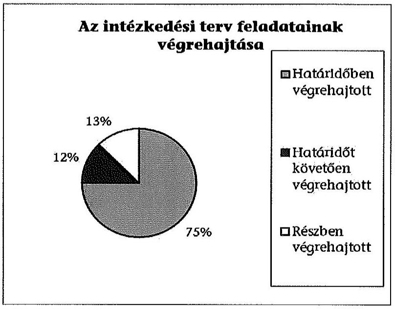
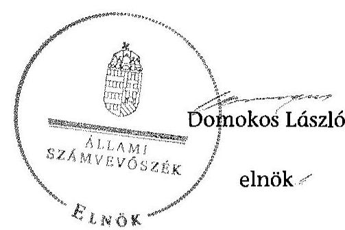

# ÁLLAMI   SZÁMVEVŐSZÉK 

## JELENTÉS

Utóellenőrzések - az önkormányzatok pénzügyi gazdálkodási helyzetének, szabályszerűségének utóellenőrzése
Újszász

---

# Állami Számvevőszék 

Iktatószám: V-0604-025/2015.
Témaszám: 1638
Vizsgálat-azonosító szám: V069304

## Az ellenőrzést felügyelte:

## Renkó Zsuzsanna

felügyeleti vezető
Az ellenőrzést vezette és az ellenőrzés végrehajtásáért felelős:
Mohl Anna
ellenőrzésvezető
A számvevőszéki jelentés összeállításában közremüködött:
Baksa Anikó
számvevő főtanácsos
Dr. Mezei Imréné
számvevő főtanácsos
Az ellenőrzést végezték:

| Molcsánné Márta | Szabó Balázsné | Dr. Zelei Andrásné |
| :-- | :-- | :-- |
| Tünde | Zsíros Andrea | számvevő |
| számvevő tanácsos | számvevő |  |

A témához kapcsolódó eddig készített számvevőszéki jelentések:
címe
sorszáma
Jelentés Újszász Város Önkormányzata pénzügyi gazdálkodási 13005
helyzetének, szabályosságának ellenőrzéséről

---

# TARTALOMJEGYZÉK 

BEVEZETÉS ..... 3
I. ÖSSZEGZŐ MEGÁLLAPÍTÁSOK, KÖVETKEZTETÉSEK ..... 6
II. RÉSZLETES MEGÁLLAPÍTÁSOK ..... 7

1. Az önkormányzat a pénzügyi gazdálkodási helyzetének, szabályszerűségének ellenőrzéséről készült ÁSZ jelentésben foglalt javaslatokra készített-e intézkedési tervet, illetve teljesítette-e az abban foglaltakat? ..... 7
MELLÉKLETEK
2. számú Az ÁSZ 13005 számú jelentéséhez kapcsolódó intézkedési terv végrehajtá- sa
3. számú Újszász Városi Önkormányzat polgármesterének nemleges észrevétele
FÜGGELÉKEK
4. számú Rövidítések jegyzéke
5. számú Fogalomtár

---

.

---

# JELENTÉS 

## Utóellenőrzések - az önkormányzatok pénzügyi gazdálkodási helyzetének, szabályszerűségének utóellenőrzése Újszász

## BEVEZETÉS

Az Állami Számvevőszék 2011-2015. évekre szóló stratégiája a helyi önkormányzatok ellenőrzésében a pénzügyi-gazdasági helyzete értékelésére, kockázatai feltárására helyezte a fő hangsúlyt. A 2011-2013. években az ÁSZ által ellenőrzött önkormányzatok esetében a múködési, beruházási és a hosszú lejáratú pénzintézeti kötelezettségeinek teljesítésével kapcsolatos pénzügyi kockázatokat mutattuk be. Az ÁSZ megállapította, hogy az önkormányzatok pénzügyi egyensúlyi helyzete az ellenőrzött időszakban romlott, a pénzügyi kockázatok fokozódtak, a pénzügyi egyensúlyi helyzetet jellemző mutatószámok kedvezőtlenül változtak. Az önkormányzati alrendszerben 2012. év végétől 2014. évelejéig lezajlott adósságkonszolidáció és feladat-ellátási-, finanszírozási-rendszer változtatás következtében a települési önkormányzatok pénzügyi helyzete jelentős mértékben megváltozott, amely a jóváhagyott intézkedési tervek végrehajtását is befolyásolta.

Az ellenőrzött szervezet vezetője az ÁSZ tv. 33. § (1)-(2) bekezdésében foglaltak alapján a jelentések intézkedést igénylő megállapításaihoz kapcsolódóan köteles intézkedési tervet benyújtani, amelyet az ÁSZ-nak kell elfogadni. Amennyiben az ellenőrzött által vállalt intézkedések hiányosak, vagy más okból nem elfogadhatók az ÁSZ indoklással és póthatáridő tüzésével visszaküldi azt kijavításra, kiegészítésre. Az elfogadásról szóló tájékoztatásban az Állami Számvevőszék elnöke valamennyi ellenőrzött szervezet vezetőjének figyelmét felhívta arra, hogy az intézkedési tervben foglaltak megvalósítását - az ÁSZ tv. 33. § (7) bekezdésében foglaltak alapján - utóellenőrzés keretében ellenőrizheti.

Az ellenőrzés célja: annak megállapítása, hogy az ellenőrzött önkormányzatok pénzügyi gazdálkodási helyzetének, szabályszerűségének ellenőrzéséről készült ÁSZ jelentésben foglalt javaslatokra készítettek-e intézkedési terveket, illetve az ellenőrzött által összeállított intézkedési tervben meghatározott feladatokat végrehajtották-e. Ennek keretében ellenőrizzük, hogy:

- a polgármester az ÁSZ törvény értelmében az intézkedési tervet határidőben megküldte-e az ÁSZ részére, szükség volt-e az elfogadást megelőzően kiegészítésre, azt az előírt póthatáridőn belül megtették-e, a Képviselő-testület a kiegészített intézkedési tervet elfogadta-e;

---

- az önkormányzat az elfogadott (kiegészített) intézkedési tervében foglaltak megtételéről, az abban előírt határidők betartásával gondoskodott-e;
- az elfogadott intézkedések esetleges késedelme, végrehajtásának elmaradása milyen szintű kockázatot jelez a pénzügyi gazdálkodásra és annak szabályszerűségére.

Az utóellenőrzés várható hasznosulása: az ellenőrzés megállapításai segítséget nyújthatnak a közpénzügyi helyzet javításához. Az utóellenőrzés, jellegéből adódóan fokozza közbizalmat, fegyelmet, a társadalom, az ellenőrzöttek, a helyi döntéshozók vonatkozásában erősíti az ÁSZ tekintélyét és igazolja, hogy lejárt a következmények nélküli ellenőrzések időszaka. Az ÁSZ intézményén belül lehetőség nyílik arra, hogy az utóellenőrzés, mint ellenőrzési kategória a szervezet tevékenységében stabilizálódjék, a megállapítások visszacsatolása segítse és erősítse az ÁSZ hozzáadott értéket teremtő elemző tevékenységét és tanácsadó szerepét.

Az intézkedési tervek olyan típusú feladatokat határoztak meg az önkormányzatok számára, amelyek a működőképesség jövőbeni zavarainak elkerülését, a felelős fenntartható gazdálkodás követelményeinek érvényesülését, a pénzügyi műveletek racionális keretek közt tartását tűzték ki célul. Az utóellenőrzés által e területeken érzékelt mulasztások még megfelelő irányba terelhetik az intézkedési tervekben foglalt feladatok végrehajtását.

Az ÁSZ az elfogadott intézkedési terveket kockázatelemzésnek veti alá. Ennek során elvégezzük az ÁSZ által elfogadott intézkedési tervben előírt/vállalt feladatok végrehajtásának értékelését, amelynek során alkalmazandó besorolási kategóriák:

- okafogyottá vált feladat: ha végrehajtására - meghatározott esemény bekövetkezése, továbbá külső körülmény, a múködést érintő feltétel változása miatt - már nincs szükség, illetve lehetőség, és egyértelműen megállapítható, hogy az intézkedést szükségessé tevő körülmény a jövőben nem fordulhat elő;
- nem időszerű (nem esedékes) feladat: amelynek ellenőrzési időszakon belüli végrehajtására azért nem került (kerülhetett) sor, mert az intézkedés alapjául szolgáló esemény nem következett be, de annak jövőbeni előfordulása lehetséges;
- határidőben végrehajtott feladat: ha teljesítése dokumentáltan az intézkedési tervben előírt határidőben és tartalommal, módon megtörtént;
- határidőn túl végrehajtott feladat: ha annak teljesítése az intézkedési tervben meghatározott módon, de az előírt határidőn túl történt meg;
- részben végrehajtott feladat: amelynek végrehajtása teljes körűen az intézkedési tervben előírt tartalommal/módon nem történt meg, vagy a feladatot nem az előírt gyakorisággal hajtották végre;
- végre nem hajtott feladat: ha a végrehajtásért felelősként megjelölt személy(ek)nek felróhatóan a teljesítés elmaradt, vagy a teljesítést nem dokumentálták.

---

Az ellenőrzést a számvevőszéki ellenőrzés szakmai szabályai szerint, szabályszerűségi ellenőrzés módszerével, a vonatkozó nemzetközi standardok figyelembevételével végeztük. Az ellenőrzésre az önkormányzatok elektronikus adatszolgáltatása alapján került sor, helyszíni ellenőrzést nem végeztünk. A megállapítások rögzítése az önkormányzatok által rendelkezésre bocsátott dokumentumok, tanúsítványok alapján történt, melyek valódiságát és teljes körűségét a polgármester, valamint a jegyző teljességi nyilatkozata igazolja.

A jóváhagyott intézkedési tervben előírt feladatok végrehajtásának ellenőrzését egységes szempontok, illetve értékelési kritériumok alapján végeztük. Figyelembe vettük az intézkedési terv jóváhagyását követően hatályba lépett jogszabályi előírások változásából következő események - kiemelten az önkormányzati alrendszerben lezajlott adósságkonszolidációs intézkedések, továbbá a fel-adat-ellátási és finanszírozási rendszer változásának - hatásait.

Az alkalmazott rövidítések jegyzékét az 1. számú függelék, az egyes fogalmak magyarázatát a 2. számú függelék tartalmazza.

Az ellenőrzött szervezet: Újszász Városi Önkormányzat
Az ellenőrzött időszak: az intézkedési terv ÁSZ-nak történő benyújtásától az utóellenőrzés megkezdéséig tartó időszak.

Az ellenőrzés végrehajtásának jogszabályi alapját az ÁSZ tv. 1. § (3) bekezdése, az 5. § (2) és (6) bekezdései, a 33. § (7) bekezdése, valamint az Áht. 61. § (2) bekezdésének előírásai képezték.

Az ÁSZ tv. 29. § (1) bekezdése szerint a jelentéstervezetet észrevételezésre megküldtük az Önkormányzat polgármesterének, aki az ÁSZ tv. 29. § (2) bekezdésében foglalt észrevételezési jogával élve a jelentéstervezetre nemleges észrevételt tett.

Az ÁSZ a 2013. évben zárta le az Önkormányzat pénzügyi gazdálkodási helyzetének, szabályosságának ellenőrzését. Az ellenőrzés tapasztalatairól készített 13005 számú jelentés az interneten, a www.asz.hu címen olvasható.

---

# I. ÖSSZEGZŐ MEGÁLLAPÍTÁSOK, KÖVETKEZTETÉSEK 

Az ÁSZ utóellenőrzés keretében értékelte az Önkormányzat pénzügyi gazdálkodási helyzetének, szabályszerűségének ellenőrzéséről szóló jelentés javaslatainak hasznosítására elfogadott intézkedési terv végrehajtását.

Az előző ÁSZ ellenőrzés megállapította, hogy az Önkormányzat pénzügyi egyensúlya rövid és hosszú távon veszélyeztetett volt. A feltárt hiányosságok alapján megfogalmazott ÁSZ javaslatok hasznosítására az Önkormányzat intézkedési tervet készített, melyet az ÁSZ kiegészítés kérése nélkül elfogadott.

Az utóellenőrzés megállapította, hogy az ellenőrzött időszakban időszerűvé vált feladatait az Önkormányzat már részben, illetve az intézkedési tervben előírtaknak megfelelően végrehajtotta, ezáltal az ÁSZ javaslatai hasznosultak.

Az utóellenőrzés megállapítása alapján a határidőt követően, illetve a részben végrehajtott feladatok alacsony kockázatot jelentenek a pénzügyi gazdálkodásra, annak szabályszerűségére. Az intézkedések végrehajtásának hatására a pénzügyi stabilitás kialakulásának és fenntartásának feltételei javultak.

---

# II. RÉSZLETES MEGÁLLAPÍTÁSOK 

## 1. Az önkORMÁNYZAT a PÉNZÜGVI GAZDÁlKODÁSI HELYZETÉNEK, SZABÁLYSZERÜSÉGÉNEK ELLENÖRZÉSÉRŐL KÉSZÜLT ÁSZ JELENTÉSBEN FOGLALT JAVASLATOKRA KÉSZÍTETT-E INTÉZKEDÉSI TERVET, ILLETVE TELJESÍTETTE-E AZ ABBAN FOGLALTAKAT?

Az utóellenőrzés - a 2014. július 28 -áig végrehajtott intézkedéseket figyelembe véve - az Önkormányzat pénzügyi gazdálkodási helyzetének, szabályosságának ellenőrzéséről készült ÁSZ jelentés javaslatai hasznosítására elfogadott intézkedési terv végrehajtására irányult. A pénzügyi gazdálkodási helyzet ellenőrzését az ÁSZ a 2009. január 1. - 2012. június 30. közötti időszakra végezte el, amelynek eredményeként megállapította, hogy az Önkormányzat pénzügyi egyensúlyi helyzete rövid és hosszú távon veszélyeztetett volt.

A polgármester a Képviselő-testületet az intézkedési terv jóváhagyásakor tájékoztatta az ÁSZ jelentéséről. A jelentésben foglalt megállapításokhoz kapcsolódó intézkedési tervet ${ }^{1}$ az ÁSZ tv. 33. § (1) bekezdésében foglalt határidőn belül küldték meg. Az ÁSZ az intézkedési tervet javítás és kiegészítés nélkül elfogadta.

Az ÁSZ által elfogadott intézkedési tervben meghatározott feladatokat, az ÁSZ jelentés javaslatainak címzettjét és a feladatok végrehajtását az 1. számú melléklet mutatja be.

Az ÁSZ jelentés a polgármester részére öt, a jegyző részére kettő javaslatot fogalmazott meg, melynek hasznosítására az Önkormányzat az intézkedési tervében nyolc feladatot határozott meg, felelősként a polgármestert és a jegyzőt megjelölve.

Az utóellenőrzés megállapításai alapján hat feladat határidőben, egy feladat határidőt követően, egy feladat pedig részben került végrehajtásra. Az intézkedési tervben előírt feladatok között nem volt olyan, amelynek végrehajtása okafogyottá vált, vagy nem volt időszerű, illetve nem hajtottak volna végre.

## Határidőre végrehajtották:

- a bevételek növelése lehetőségének felmérését az intézményi térítési díjak és az üzleti vagyon tekintetében, illetve felmérték és minősítették az önkormányzati követeléseket, valamint megtették a szükséges behajtási intézkedéseket;

[^0]
[^0]:    ${ }^{1}$ A Képviselő-testület az intézkedési tervet a 9/2013. (II. 12.) számú határozattal fogadta el.

---

- a kiadások csökkentése érdekében szükséges döntéseket, illetve a bölcsődei ellátás felülvizsgálatát;
- az adósságszolgálat teljesítése érdekében céltartalék képzését;
- a szállítói kitettség csökkentését az Önkormányzat irányítása alá tartozó költségvetési szervek gazdálkodási besorolásának megváltoztatásával és a szállítói állományuk Polgármesteri hivatalban való kezelésével;
- az Önkormányzat fizetőképességét, eladósodását, a pénzügyi egyensúlyi helyzetét befolyásoló döntések kockázatainak kezelésére vonatkozó szabályozás készítését;
- a pénzügyi egyensúlyi helyzetet befolyásoló döntésekkel kapcsolatos kockázati tényezők elemzését tartalmazó éves ellenőrzési tervek jóváhagyását és azok végrehajtását.

# Határidőt követően hajtották végre: 

- a kedvezőtlen pénzügyi folyamatok megállítására, a pénzügyi helyzet stabilitására vonatkozó reorganizációs program elkészítését, melyet 2013. augusztus 31-e helyett szeptember 24-én fogadott el a Képviselő-testület.

Az ÁSZ által elfogadott intézkedési tervben meghatározott feladatok közül részben teljesítették:

- az Önkormányzat a 2012. és a 2013. évi zárszámadási előterjesztéseiben és rendeleteiben az eszközök elhasználódási fokát bemutatta, azonban elmaradt az elszámolt értékcsökkenés és az eszközök pótlására fordított tényleges kiadások összevetésének bemutatása. A feladat végrehajtásának felelőse a polgármester volt.

Az ÁSZ jelentésben foglaltakon túlmenően a szabályszerű, rendeltetésszerű és felelős gazdálkodás érdekében a polgármester felé figyelemfelhívással élt az ÁSZ elnöke. Az abban foglaltaknak megfelelően a polgármester intézkedett a hitel felvételéhez biztosított keretjelzálog más önkormányzati üzleti vagyon körébe tartozó ingatlanra történő bejegyzéséről. A Képviselő-testület megtárgyalta a figyelemfelhívással kapcsolatos polgármesteri intézkedést és elfogadta a 10/2013. (II. 12.) számú képviselő-testületi határozatot. Az ÁSZ elnöke a figyelemfelhívására adott tájékoztatást az intézkedési tervvel együtt elfogadta.

Az utóellenőrzés megállapítása alapján a határidőt követően, illetve a részben végrehajtott feladatok alacsony kockázatot jelentenek a pénzügyi gazdálkodásra, annak szabályszerűségére.

---

Az intézkedések végrehajtásának hatására a pénzügyi stabilitás kialakulásának és fenntartásának feltételei javultak.

Budapest, 2015. O8. hónap Oh. nap

Melléklet: $\quad 2 \mathrm{db}$
Függelék: $\quad 2 \mathrm{db}$

---

.

---

# Az ÁSZ 13005 számú jelentéséhez kapcsolódó intézkedési terv végrehajtása

|  Sorszám | Intézkedési terv alapján elvégzendő feladat | Az intézkedési tervben meghatározott határidő | Az ÁSZ 13005
sz. jelentés
javaslatának
címzettje | Az intézkedés végrehajtása  |
| --- | --- | --- | --- | --- |
|   | 1. | 2. | 3. | 4.  |
|  Határidőben végrehajtott intézkedések |  |  |  |   |
|  1. | Bevételek növelése érdekében:
- fel kell mérni az intézményi térítési díjak növelésének (figyelemmel az ellátást igény-bevevők teherbíró képességére), valamint az önkormányzat üzleti vagyonába tartozó nemzeti vagyon értékesítésének lehetőségét,
- fel kell mérni és behajthatósági szempontból minősíteni az önkormányzati követeléseket, az követően intézkedni kell azok behajtásáról. | 2013. június 30. | polgármester | Az előírt felméréseket határidőben elvégezték, azok eredményét 2013. március 3 -ai dátummal feljegyzésekben rögzítették. A feljegyzésekben meghatározott intézkedések végrehajtása érdekében a helyiségek bérleti díjának emelése a Képviselő-testület 19/2013. (III. 12.) számú határozata, két ingatlan eladása a Képviselőtestület 45/2013. (IV. 23.) számú és a 46/2013. (IV. 26.) számú határozata alapján történt meg. Az intézményi térítési díjak emelésére a 29/2011. (XII. 21.) számú rendelet 14/2013. (IX. 25.) számú rendelettel történt módosításával került sor. Az önkormányzati követeléseket a 2013. június 2-i feljegyzés alapján minősítették. A polgármester és az aljegyzó 2014. július 31-én adott nyilatkozata alapján a 2013. évben a 22,0 millió Ft összegű kintlévőség behajtására tett intézkedésből (ügyvédi behajtások, munkabér letiltások, azonnali beszedési megbízá-  |

---

|  Sorszám | Intézkedési terv alapján elvégzendő feladat | Az intézkedési tervben meghatározott határidő | Az ÁSZ 13005 sz. jelentés javaslatának címzettje | Az intézkedés végrehajtása  |
| --- | --- | --- | --- | --- |
|   |  |  |  | sok) 7,9 millió Ft, a 2014. évben a 3,3 millió Ft összegű kintlévőséget érintő intézkedések eredményeként 1,1 millió Ft bevétel folyt be.  |
|  2. | Kiadások csökkentése érdekében:
- a 115/2012. (XII.13) képviselő-testületi határozat alapján a Zagyvapart Idősek Otthona gazdasági besorolása önállóan működő intézményre változott.
- a 116/2012.(XII.13) képviselő-testületi határozat alapján a Városi Művelődési Ház és Könyvtár feladatait 2013. január 1-jétől az önkormányzat látja el, így mint önállóan működő intézmény megszűnt,
- a 114/2012. (XII.13) képviselő-testületi határozat alapján az Újszászi Nevelési Központ új névvel átalakult, mint Újszász Városi Óvoda és Bölcsőde, valamint önállóan működő intézmény lett. Ebből 2013. évi költségvetésben jelentkező megtakarítás 9,3 millió Ft-ot jelent.
Az önként vállalt feladatként jelentkező bölcsődei ellátást felül kell vizsgálni annak érdekében, hogy a 2013. évi feladatalapú támogatással nem biztosított önkormányzati saját forrás ne veszélyeztesse a kötelező önkormányzati feladatok ellátását. | 2013. augusztus 31. | polgármester | A kiadások csökkentését célzó és elősegítő - az intézmények és egyéb feladatok átadásáról, valamint az intézményi átszervezésekről, feladatátrendezésről szóló - döntéseket határidőben (az ÁSZ helyszíni ellenőrzése után, az intézkedési terv elfogadása előtt) a Kép-viselő-testület meghozta. Az átszervezéssel megváltozott az önként vállalt bölcsődei ellátás helyzete. Annak érdekében, hogy a 2013. évi feladatalapú támogatás biztosításának bizonytalansága miatt az önkormányzati saját forrás ne veszélyeztesse a kötelező feladatok ellátását, a bölcsődei ellátást a polgármester felülvizsgálta, megállapításait 2013. július 22-én feljegyzésben rögzítette. A felülvizsgálatban meghatározottak a 2014. évi költségvetés előterjesztésének 26. oldalán kerültek számszerűsítésre. A Képviselő-testület döntése (2/2014. (II. 19.) számú önkormányzati rendelet) alapján 4,1 millió Ft-tal csökkent a bölcsőde önkormányzati saját bevételből történő finanszírozása.  |

---

|  Sorszám | Intézkedési terv alapján elvégzendő feladat | Az intézkedési tervben meghatározott határidő | Az ÁSZ 13005 sz. jelentés javaslatának címzettje | Az intézkedés végrehajtása  |
| --- | --- | --- | --- | --- |
|  3. | A 2013. évi költségvetési rendeletben céltartalék képzése az adósságszolgálat teljesítésére. | első ízben a 2013. évi költségvetési rendeletben, a továbbiakban folyamatos | polgármester | Az adósságszolgálat teljesítésére a 2013. évi költségvetésről szóló 1/2013. (III. 13.) számú önkormányzati rendelet 28,8 millió Ft, a 2014. évi költségvetésről szóló 2/2014. (II. 19.) számú önkormányzati rendelet 117,7 millió Ft céltartalékot tartalmazott.  |
|  4. | Az önkormányzat költségvetési szerveinek szállítói állományát összevontan, a Polgármesteri Hivatalban kell kezelni annak érdekében, hogy csökkenjen a szállítói kitettség és a jogszabályi következmények kockázata. | folyamatos | polgármester | Az Önkormányzat költségvetési szerveinek szállítói állományát összevontan, a Polgármesteri hivatal kezeli. Az évenkénti folyamatosság biztosítása érdekében a Képviselő-testület - az ÁSZ helyszíni ellenőrzése után, az intézkedési terv elfogadása előtt - 2012 decemberében az irányítása alá tartozó költségvetési szervek gazdálkodási besorolását önállóan működőre változtatta, a pénzügyi-gazdasági feladataik ellátására pedig a Polgármesteri hivatalt jelölte ki.  |

---

|  ㄱ | Intézkedési terv alapján elvég-   zendő feladat | Az intézkedési tervben   meghatározott határ-   idó | Az ÁSZ 13005   sz. jelentés   javaslatának   címzettje | Az intézkedés végrehajtása  |
| --- | --- | --- | --- | --- |
|  |   |   |   |   |
|   |  |  |  | A megtett intézkedéseket követően a  |
|   |  |  |  | lejárt szállítói állomány csökkent  |
|   |  |  |  | (2012. december 31-én 25,2 millió Ft,  |
|   |  |  |  | 2013. december 31-én 1,9 millió Ft,  |
|   |  |  |  | 2014. év I. negyedév végén  |
|   |  |  |  | 0,9 millió Ft volt). Ezen túl a lejárt tar-  |
|   |  |  |  | tozások összetétele is változott. Míg  |
|   |  |  |  | 2012. december 31-én a 30 napon be-  |
|   |  |  |  | lüli tartozás 13,5 millió Ft, a 30 napon  |
|   |  |  |  | túli 9,9 millió Ft, a 60 napon túl lejárt  |
|   |  |  |  | tartozás 1,8 millió Ft volt, addig 2013.  |
|   |  |  |  | december 31-én és 2014. év I. negyedév  |
|   |  |  |  | végén csak 30 napon belül lejárt ese-  |
|   |  |  |  | dékességű kötelezettséget tartottak  |
|   |  |  |  | nyilván.  |
|  5. | El kell készíteni az önkormányzat fizetőképességét, eladósodását, a pénzügyi egyensúlyi helyzetet befolyásoló döntések kockázatainak kezelését biztosító szabályzatokat és szabályozásokat. | 2013. május 31. | jegyző | Az Önkormányzat fizetőképességét, eladósodását, a pénzügyi egyensúlyi helyzetet befolyásoló döntések kockázatainak kezelését szabályozó 1966-9/2013. számú jegyzői utasítás 2013. március 1-jei hatállyal elkészült.  |

---

|  | Intézkedési terv alapján elvég-   zendő feladat | Az intézkedési tervben   meghatározott határ-   idő | Az ÁSZ 13005   sz. jelentés   javaslatának   címzettie | Az intézkedés végrehajtása |
| :--: | :--: | :--: | :--: | :--: |
| 6. | Az éves ellenőrzési terv kockázatelemzésé-   nek tartalmaznia kell a pénzügyi egyensú-   lyi helyzetet befolyásoló döntésekkel kap-   csolatos feltárt kockázati tényezők elemze-   sét és gondoskodni kell az ellenőrzési terv   végrehajtásáról. | első ízben a 2013. évi ellen-   örzési terv elfogadásakor, -   126/2012. (XII. 18.) számú   képviselő-testületi határozat -   és végrehajtásakor, a továb-   biakban folyamatos | jegyző | A Képviselő-testület - az ÁSZ 2012. évi   helyszíni ellenőrzése után, az intézke-   dési terv elfogadása előtt - a 126/2012.   (XII. 18.) számú határozatában döntött   a 2013. évi belső ellenőrzési tervről,   amely tartalmazta a feltárt kockázati   tényezők elemzését. A 2013. évi ellen-   örzési tervben foglaltak szerint - 2013.   év december 23-án - elkészült „a pénz-   ügyi egyensúlyi helyzet elemzéséről" szóló   21/2/3013/Bev. számú belső ellenőrzési   jelentés. A feltárt kockázati tényezők   elemzését tartalmazó 2014. évi ellenő-   zési tervet a Képviselő-testület a   158/2013. (XII. 17.) számú határozat-   ban fogadta el. Végrehajtása az ellen-   örzési tervben meghatározott ütemezés   szerint, az utóellenőrzést követő idő-   pontban várható. |

---

|  ㄷ
sorszám | Intézkedési terv alapján elvég-
zendő feladat | Az intézkedési tervben
meghatározott határ-
idő | Az ÁSZ 13005
sz. jelentés
javaslatának
címzettje | Az intézkedés végrehajtása  |
| --- | --- | --- | --- | --- |
|  Határidőt követően végrehajtott intézkedés |  |  |  |   |
|  1. | Magyarország 2013. évi központi költség-
vetéséről szóló 2012. évi CCIV. törvény 72-
74. §-ainak figyelembevételével, az ÁKK
Zrt. útján, a legkésőbb 2013. június 28-ig
megkötendő megállapodás ismeretében el
kell készíteni a kedvezőtlen pénzügyi fo-
lyamatok megállítására, a pénzügyi hely-
zet stabilitására vonatkozó reorganizációs
programot. | 2013. augusztus 31. | polgármester | A reorganizációs program előterjeszté-
sére 2013. szeptember 17-én, határidőt
követően került sor, melyet a Képvise-
lő-testület a 113/2013. (IX. 24.) számú
határozatával fogadott el.  |
|  Részben végrehajtott intézkedés |  |  |  |   |
|  1. | A zárszámadási rendelettervezet előterjesz-
tésében be kell mutatni az értékcsökkenés
összegét, és ezzel összevetve az elhasználó-
dott eszközök pótlására fordított tényleges
kiadásokat, az eszközök elhasználódási
fokának alakulását. | első ízben a 2012. évi zár-
számadási rendelettervezet-
ben, a továbbiakban folya-
matos. | polgármester | Az Önkormányzat a 2012. és a 2013.
évi zárszámadási előterjesztésekben és
rendeletekben (7/2013. (IV. 10.) számú,
valamint a 4/2014. (IV. 30.) számú
önkormányzati rendeletek 23., illetve
19. oldalán) az eszközök elhasználódá-
si fokát bemutatta. Az elszámolt érték-
csökkenés eszközök pótlására fordított
tényleges kiadásokkal való összevetését
azonban nem mutatták be.  |

---

Iktatószám: 337-2/2015.

Hivatkozási szám: V-0604-019/2014.

ÁLLAMI SZÁMVEVŐSZÉK

Budapest
Apáczai Csere János utca 10.
1052

Tisztelt Állami Számvevőszék!

Hivatkozott számon Újszász Város Önkormányzatánál végzett „Utóellenőrzések – az önkormányzatok pénzügyi gazdálkodási helyzetének, szabályszerűségének utóellenőrzése” című jelentéstervezet megállapításaira

észrevételt nem kívánok tenni.

Újszás 2., 2015. február 10.

Tisztelettel:

Molnár Péter
polgármester

---

.

---

# RÖVIDÍTÉSEK JEGYZÉKE 

## Törvények

Áht.
Az államháztartásról szóló 2011. évi CXCV. törvény (hatályos 2011. december 31-étől)
ÁSZ tv.
az Állami Számvevőszékről szóló 2011. évi LXVI. törvény (hatályos 2011. július 1-jétől)

## Szórövidítések

ÁKK
ÁSZ
aljegyzó
Képviselő-testület
Önkormányzat
polgármester

Államadósság Kezelő Központ Zrt.
Állami Számvevőszék
Újszász Városi Önkormányzat aljegyzője
Újszász Városi Önkormányzat Képviselő-testülete
Újszász Városi Önkormányzat
Újszász Városi Önkormányzat polgármestere

---

.

---

# FOGALOMTÁR 

adósságkonszolidáció
adósságszolgálat
árfolyamkockázat
banki kitettség
bevételi kitettség
felhalmozási kockázat
garanciavállalás
kezességvállalás
mérlegen kívüli tétel
működési kockázat

Több ütemben lezajlott központi intézkedés, amely a helyi önkormányzatok adósságállományának a magyar állam által történő átvállalására irányult. Az adósságkonszolidációs csomag releváns rendelkezéseit a 2012-2014. évi központi költségvetésről szóló törvények tartalmazták.
Az adósság tőkerészének és az esedékes kamat együttes összegének törlesztése.
Annak kockázata, hogy a külföldi devizában fennálló pénzügyi eszközök hazai fizetőeszközben kifejezett értéke az árfolyam elmozdulásával megváltozik.
Olyan függőségi viszony, ahol egy szervezet pénzügyi helyzete olyan külső körülmények hatására változhat, amely kizárólag a bank egyoldalú döntésén múlik.
Olyan függőségi viszony, ahol egy szervezet pénzügyi helyzetét meghatározó bevételek nagysága külső körülmények hatására azonnal és kedvezőtlen irányba változhat.
Annak kockázata, hogy a folyamatban lévő felhalmozási feladatok finanszírozásához szükséges pénzügyi forrás nem fog rendelkezésre állni.
Olyan kötelezettségvállalás, ahol a garanciát vállaló valamely jövőbeni esemény bekövetkezésekor, a szerződésben meghatározott feltételek beálltakor a garancia kedvezményezettje számára meghatározott összegig, meghatározott időpontig, felszólításra azonnal fizet.
A tárgyi eszközállomány állagának elemzéséhez használt mutató, számításakor a tárgyi eszköz könyv szerinti nettó értékét viszonyítják a tárgyi eszköz bruttó (beszerzési/létesítési) értékéhez.
Annak kockázata, hogy a változó kamatozású forint vagy a devizahitel futamideje alatt kedvezőtlen irányban változhat a hitel kamata.
Szerződésben vállalt olyan kötelezettség, amelyben a kezes arra vállal kötelezettséget, hogy ha a szerződés kötelezettje nem teljesít, a kezes maga fog helyette teljesíteni a jogosultnak.
Olyan szerződés alapján fennálló mérlegen kívüli [függő vagy biztos (jövőbeni)] kötelezettség, illetve követelés, amely a mérleg fordulónapján már fennáll, de mérlegtételkénti szerepeltetése egy jövőbeni esemény bekövetkezésétől vagy a szerződés teljesítésétől függ.
Annak kockázata, hogy nem megfelelő múködésből, emberi hibákból, rendszerhibákból vagy külső eseményekből adódik veszteség.

---

nemfizetési kockázat
nettó múködési jövedelem

ÖNHIKI támogatás
önkormányzat folyó költségvetési egyenlege
önkormányzat többségi tulajdonában lévő gazdasági társaságok
önkormányzat gazdasági társasága miatti kockázatot jelentő tényezők

Annak kockázata, hogy a kötelezett fennálló kötelezettségét átmenetileg vagy véglegesen nem tudja határidőre megfizetni.
A nettó múködési jövedelem (pénzügyi kapacitás) a jövedelemtermelő képességet méri. Megmutatja a múködési bevételekből a múködési kiadások és a hitelek tőketörlesztésének kifizetése után fennmaradó jövedelmet.
Az önkormányzatok múködőképességét szolgáló, önhibájukon kívül hátrányos helyzetben levő települési önkormányzatok támogatása.
A folyó költségvetés egyenlege, azaz a múködési jövedelem megmutatja, hogy az önkormányzat éves folyó bevétele fedezetet biztosít-e a kötelező és önként vállalt feladatellátáshoz kapcsolódó éves folyó kiadására. A múködési jövedelem negatív értéke pénzügyileg fenntarthatatlan helyzetet jelez. A mutató pozitív értéke megtakarítást mutat, amely forrásul szolgálhat az önkormányzat fennálló kötelezettségei megfizetéséhez, valamint fejlesztéséhez.
Azok a gazdasági társaságok, amelyekben az önkormányzat a szavazatok több mint ötven százalékával vagy jogszabályban rögzített meghatározó befolyással rendelkezik. A befolyással rendelkező akkor rendelkezik egy jogi személyben meghatározó befolyással, ha annak tagja, illetve részvényese, és jogosult e jogi személy vezető tisztségviselői vagy felügyelő bizottsága tagjai többségének megválasztására, illetve visszahívására, vagy a jogi személy más tagjaival, illetve részvényeseivel kötött megállapodás alapján egyedül rendelkezik a szavazatok több mint ötven százalékával.
Az önkormányzat gazdasági társaságának kedvezőtlen pénzügyi döntései következtében az önkormányzat pénzügyi egyensúlyi helyzetét veszélyeztető tényezők: az önkormányzat az önként vállalt és/vagy a kötelező feladatot ellátó társaságának a tevékenység ellátásához pénzeszközt ad át;
az önkormányzat nem vizsgálja a feladatellátás választott szervezeti megoldásának hatékonyságát;
a kötelező feladatellátást biztosító gazdasági társaság tevékenységének ágazati szabályozása változik (vízi közművagyon üzemeltetése);
a kizárólagos vagy többségi tulajdonú társaságok pénzügyi helyzete nem stabil, amely az alapítóra kötelezettségeket háríthat;
az önkormányzat a társaságok tevékenységét nem kísérte figyelemmel, nem élt az alapítói (irányítói) jogok gyakorlásával, a társaságok gazdálkodásának önkormányzati szintű konszolidálása nem biztosított;

---

pénzügyi kockázat

PPP
szállítói kockázat
szállítói kitettség
az önkormányzat garanciát vagy kezességet vállal a gazdasági társaság kötelezettségeire;
a társaságoknak átadott pénzeszköz uniós elvárásoknak megfelelő kezelése.
A pénzügyi kockázat magában foglalja mindazon kockázatokat, amelyek a szervezet pénzügyi helyzetére hatással vannak. Pl.: az adósságszolgálat miatti kockázatot, árfolyamkockázatot, felhalmozási kockázatot, fizetőképességi kockázatot, jövőbeni kötelezettségek kifizethetőségének kockázatát, kamatkockázatot, kezességvállalás kockázatát, likviditási kockázat, mérlegen kívüli tételek kockázata, nemfizetési kockázat, stb.
A köz- és a magánszféra együttmúködésén alapuló fejlesztési konstrukció. Az állami és a magánszféra együttmúködésének egyik formáját jelöli a PPP. A rövidítés a „köz- és magánszféra partnersége" angol nyelvű megfelelője. A PPP keretében a közcél a magánszféra jelentős mértékű közreműködésével valósul meg.
Annak kockázata, hogy a kötelezett a szállítókkal szemben fennálló, már elismert kötelezettségét átmenetileg vagy véglegesen nem tudja határidőre teljesíteni.
Olyan függőségi viszony, ahol egy szervezet pénzügyi helyzete a szállítói tartozások rendezése érdekében foganatosított intézkedések hatására azonnal és kedvezőtlen irányba változhat.