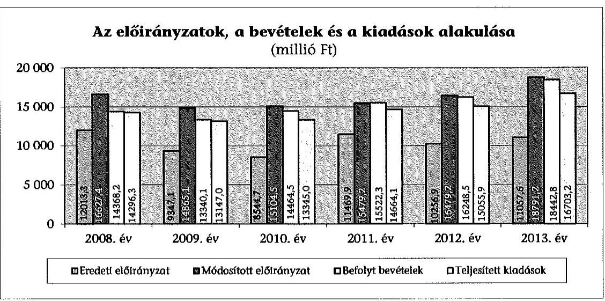
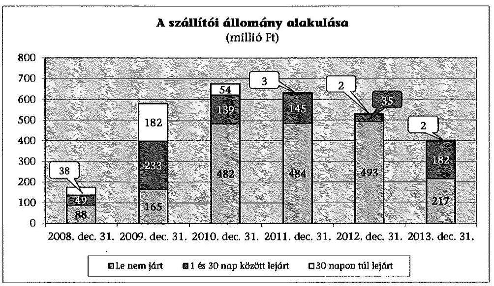
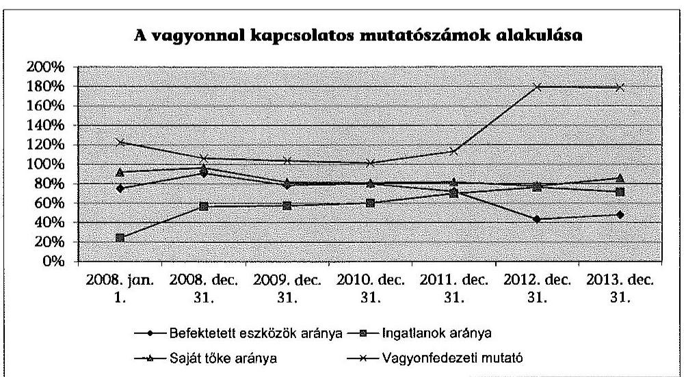
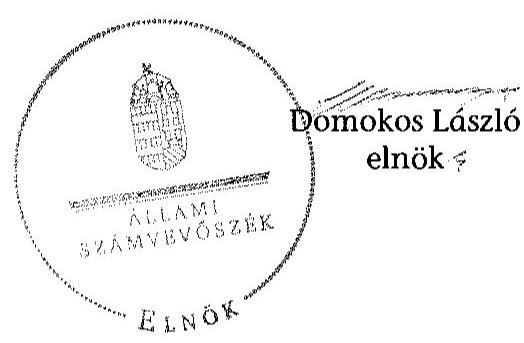
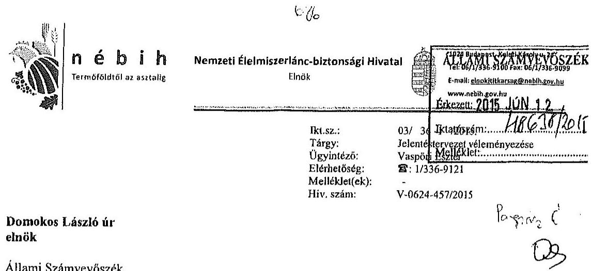
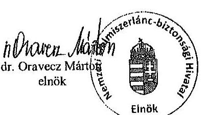
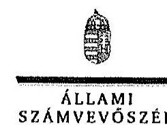
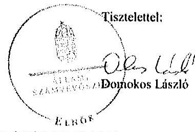
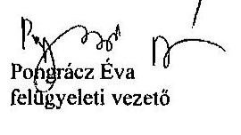

# ÁLLAMI   SZÁMVEVŐSZÉK 

## JELENTÉS

a központi alrendszer egyes intézményei pénzügyi és vagyongazdálkodásának ellenőrzéséről
Nemzeti Élelmiszerlánc-biztonsági Hivatal

---

# Állami Számvevőszék 

Iktatószám: V-0624-449/2015.
Témaszám: 1658
Vizsgálat-azonosító szám: V0679

## Az ellenőrzést felügyelte:

## Pongrácz Éva

felügyeleti vezető

## Az ellenőrzés végrehajtásáért felelős:

## Pats Regina

ellenőrzésvezető

## A számvevői munkaanyagok feldolgozását és a Jelentéstervezet összeállítását végezték:

## Pats Regina

ellenőrzésvezető

## Vacsora Erika

számvevő tanácsos

## Teski Norbert

számvevő asszisztens

## Az ellenőrzést végezték:

## Boros Attila

számvevő tanácsos

## Dr. Elek László

számvevő

## Zachár Péterné

számvevő tanácsos

## Bozsik Tamás

számvevő

## Egri Zoltán

számvevő

## Dobos András Csaba

egyedi ügyek gazdája

## Weigert Ágnes

számvevő

## A témához kapcsolódó eddig készített számvevőszéki jelentés:

## címe

Jelentés Magyarország 2013. évi költségvetése végrehajtásának 14207 ellenőrzéséről

---

# TARTALOMJEGYZÉK 

BEVEZETÉS ..... 3
I. ÖSSZEGZŐ MEGÁLLAPÍTÁSOK, KÖVETKEZTETÉSEK, JAVASLATOK ..... 8
II. RÉSZLETES MEGÁLLAPÍTÁSOK ..... 12

1. A Minisztérium Intézményre vonatkozó feladatellátása ..... 12
2. Az Intézmény átalakítása, átszervezése ..... 14
2.1. A Minisztérium döntéseinek és tevékenységének szabályszerűsége ..... 14
2.2. A végrehajtás szabályszerűsége az Intézménynél ..... 15
3. A belső kontrollrendszer és az integritás kontrollok kialakítása és működtetése az Intézménynél ..... 15
4. Az Intézmény pénzügyi gazdálkodása ..... 19
4.1. Az előirányzatok megállapítása és módosítása ..... 19
4.2. A kiadási előirányzatok felhasználása és a bevételi előirányzatok teljesítése ..... 20
4.3. Az előirányzat-maradványok kezelése ..... 22
4.4. A fizetőképesség alakulása ..... 22
5. Az Intézmény vagyongazdálkodása ..... 24
5.1. A vagyongazdálkodás szabályozottsága ..... 24
5.2. Az eszközök és források értékének kimutatása, az eszközök visszapótlása ..... 24
5.3. A vagyonátadás, a vagyonelemek hasznosítása ..... 26
5.4. Az eredményszemléletű számvitel bevezetésével kapcsolatos feladatok végrehajtása ..... 26
MELLÉKLETEK
6. számú A belső kontrollrendszer kialakítása és működtetése szabályszerűségének alakulása az Intézménynél
7. számú Az Intézmény kiadásainak, bevételeinek és létszámának alakulása
8. számú Az Intézmény fizetőképességét és vagyoni helyzetét jellemző mutatók
9. számú Az Intézmény eszközeinek és forrásainak alakulása
10. számú Az Intézmény tárgyi eszközeivel kapcsolatos mutatószámok alakulása
11. számú A Nemzeti Élelmiszerlánc-biztonsági Hivatal elnökének észrevétele
12. számú A Nemzeti Élelmiszerlánc-biztonsági Hivatal elnökének észrevételére adott válasz

---

# FÜGGELÉKEK 

1. számú Rövidítések jegyzéke
2. számú Értelmező szótár
3. számú A gazdaságossági, hatékonysági és eredményességi követelmények kialakítása és működtetése a gazdálkodás folyamatában, valamint a vezetői nyilatkozat helytállósága

---

# JELENTÉS 

## a központi alrendszer egyes intézményei pénzügyi és vagyongazdálkodásának ellenőrzéséről   Nemzeti Élelmiszerlánc-biztonsági Hivatal

## BEVEZETÉS

A közpénzek felhasználásában és az állami vagyonnal való gazdálkodásban a központi alrendszer egyes intézményei meghatározó súlyt képviselnek. Pénzügyi- és vagyongazdálkodásuk rendszeres ellenőrzésével az ÁSZ hozzájárul a hatékony közigazgatás megteremtéséhez. Az ÁSZ Stratégiával összhangban a közvagyon védelme, a közpénzügyek átláthatóságának előmozdítása érdekében került sor az Intézmény ellenőrzésére.

Az Intézményt 2007. január 1-jei hatállyal - a Magyar Köztársaság Kormányának megbízásából - a földművelésügyi és vidékfejlesztési miniszter alapította. A Kormány kijelölése alapján az Intézmény az ellenőrzött időszak egészében növénytermesztési, talajvédelmi, tenyésztési, erdészeti, vadászati, halászati és borászati hatósági, valamint mezőgazdasági igazgatási szervi feladatokat látott el. 2008. január 1-je és 2008. augusztus 31-e között állategészségügyi és takarmányozási hatóságként, valamint növényvédelmi, élelmiszer-biztonsági és zöldség-gyümölcs minőség-ellenőrzési szervként is tevékenykedett, az élelmiszerlánc-felügyeleti szervként történt kijelölés 2008. szeptember 1-jétől lépett hatályba. A Kormány az Intézményt 2008. december 15-ével jelölte ki pálinkaellenőrző hatóságként, a 2009. február 3-ától 2010. december 31-éig tartó időszakra agrárkár-megállapító szervként, valamint 2013. szeptember 1-jei hatállyal halgazdálkodási hatóságként. Az Intézmény közigazgatási hatósági ügyekben országos illetékességgel járt el.

Az Intézmény az ellenőrzött időszakban önálló jogi személyiséggel rendelkező, önállóan működő és gazdálkodó, az előirányzatok felett teljes jogkörrel rendelkező központi költségvetési szerv volt. Az irányító szervi feladatok ellátása a Minisztérium kizárólagos felelősségi körébe tartozott.

Az Intézményt elnök vezette, munkáját a javaslata alapján az ágazati miniszter által kinevezett, a különböző szakterületekért felelős elnökhelyettesek segítették. Az elnök személyében a 2008., a 2010. és a 2011. évben változás történt.

Az Intézmény átalakítására az ellenőrzött időszakban két alkalommal került sor. A NÖDIK 2010-ben vált ki az Intézményből a teljes körű növényi génmegőrzési feladatok ellátására. A MÉBIH 2012-ben olvadt be az Intézménybe, melynek kapcsán megváltozott az Intézmény neve, valamint az élelmiszerlánc-

---

cot érintő összes felügyeleti tevékenység az Intézmény feladatellátásába koncentrálódott.

Az Intézmény előirányzatainak, bevételeinek és kiadásainak alakulását az alábbi diagram mutatja be:

Az Intézmény a 2008-2013 közötti időszakban összesen 92759,5 millió Ft bevételt realizált. A 2013. évi 16447,6 millió Ft 2186,4 millió Ft-tal, 15,3%-kal haladta meg a 2008. évi összeget. A központi, irányító szervi támogatás és az Intézmény saját bevételeinek aránya a 2008. évi 42,4%-57,6%-ról a 2013. évre 26,4%-73,6%-ra a saját bevételek javára változott az Éltv. módosításával a 2012. évben bevezetett élelmiszerlánc-felügyeleti díj hatására. A 2008. évről a 2013. évre a központi, irányító szervi támogatás összege 1220,5 millió Ft-tal, 20,0%-kal csökkent, a befolyt saját bevételek összege 5295,1 millió Ft-tal, 64,0%-kal emelkedett.

Az ellenőrzött időszakban az Intézmény összesen 87380,6 millió Ft kiadást teljesített. A kiadások a 2008. évről a 2013. évre 2480,8 millió Ft-tal, 17,3%-kal emelkedtek. A változást a személyi juttatások és járulékai 1282,4 millió Ft összegű csökkenése mellett a dologi kiadások és dologi jellegű (egyéb folyó) kiadások 1907,3 millió Ft, a támogatásértékű kiadások 704,9 millió Ft, valamint a felhalmozási kiadások 1179,9 millió Ft összegű emelkedése határozta meg.

Az Intézmény 2013. december 31-i 20047,6 millió Ft-os könyvviteli mérleg szerinti vagyona 8469,9 millió Ft-tal, 73,2%-kal haladta meg a 2008. január 1-jei összeget. A befektetett eszközök mérlegértéke 909,3 millió Ft-tal, 10,5%-kal emelkedett. A forgóeszközök értéke 7560,6 millió Ft-tal két és félszeresére nőtt, meghatározóan a követelések 5266,9 millió Ft összegű emelkedéséből adódóan. A követelésállomány emelkedésének oka az volt, hogy az élelmiszerláncfelügyeleti díj esetében a tárgyévre előírt, két részletben teljesítendő összeg második részletének befizetési határideje az előírást követő évre esett. A saját tőke 6496,7 millió Ft-tal, 61,0%-kal emelkedett. A tartalékok értéke a 2008. január 1-jei 59,5 millió Ft-ról 2013. december 31-ére 1765,4 millió Ft-ra nőtt. A kötelezettségek 267,3 millió Ft-tal, 30,9%-kal növekedtek, a rövid lejáratú kötelezettségek 136,4 millió Ft-os csökkenéséből és az egyéb passzív pénzügyi elszámolások 403,7 millió Ft-os emelkedéséből adódóan.

---

Az Intézmény engedélyezett létszámkerete a 2008. évi 1198-ról a 2013. évre 6,3%-kal, 1123 státuszra csökkent az átszervezések miatti, egyenlegében 113 fős növekedés és a központilag elrendelt 188 fős csökkentés hatására.

Az ellenőrzés célja annak megállapítása volt, hogy az Intézményre vonatkozó irányító szervi feladatellátás a jogszabályi előírások betartásával történt-e; az Intézménynél a belső kontrollrendszer kialakítása és működtetése szabályszerű volt-e; kialakították-e az erőforrásokkal való szabályszerű és hatékony gazdálkodáshoz szükséges követelményeket, megvalósították-e azok számon kérését, ellenőrzését; az Intézmény pénzügyi és vagyongazdálkodása megfelelt-e a jogszabályi előírásoknak és belső szabályzatainak; az Intézmény átalakításának vagy átszervezésének lebonyolítása szabályszerűen történt-e; az integritási kontrollokat kialakították-e, szabályszerűen működtették-e.

Az ÁSZ az Intézményt önálló ellenőrzés keretében a 2008-2013 közötti időszakban nem vizsgálta, ezért utóellenőrzésre nem került sor.

Az ellenőrzés várható hasznosulása: a központi alrendszerbe tartozó intézmények jelentős hatást gyakorolhatnak a költségvetés egyensúlyának fenntartására, az állami vagyonnal való gazdálkodás minőségére, a kormányzati (szak)politikák végrehajtására, illetve közfeladat ellátásuk vonatkozásában az állampolgárok életminőségére, jogaik és kötelezettségeik gyakorlására. Az ellenőrzés az Intézmény pénzügyi és vagyongazdálkodása szabályosságának javításával előmozdítja a közpénzügyek átláthatóságát, rendezettségét. Eredményeként átfogó képet kaphatunk az Intézmény gazdálkodásának hiányosságairól és a jó gyakorlatokról is.

A közintézmények integritás alapú kultúrája meghatározó a belső kontrollrendszer működése szempontjából. Hozzájárulhat az elszámoltathatóság és átláthatóság érvényesítéséhez, egyben támogathatja a szervezet védettségét a korrupciós kitettséggel szemben. Az integritási kontrollok ellenőrzése az integritási szemlélet terjedését, az integritás kultúra erősítését támogatja.

A belső kontrollrendszer államháztartási törvényben rögzített célja a működés és gazdálkodás során a tevékenységek szabályszerű, gazdaságos, hatékony és eredményes végrehajtása. Az ÁSZ a központi intézmények ellenőrzését teljesítményellenőrzési modullal egészítette ki.

Az Intézmény teljesítményellenőrzésének célja annak értékelése volt, hogy a gazdálkodás folyamatában a gazdaságossági, hatékonysági és eredményességi követelmények kialakítása megtörtént-e és azokat működtették-e; a költségvetési szerv belső kontrollrendszerének minőségéről kiadott vezetői nyilatkozatban az Intézmény tevékenységében a hatékonyság, eredményesség, gazdaságosság követelményeinek érvényesítése helytálló volt-e. A teljesítményellenőrzés a gazdálkodási feladatokra terjedt ki, a szakmai feladatellátást nem értékelte.

A teljesítményellenőrzés várható hasznosulása: a törvényalkotás számára támogatást nyújt a nemzeti kulcsindikátorok rendszerének kialakításához. A döntéshozók, ellenőrzöttek, irányító szervek, a társadalom számára objektív visszajelzést ad a közfeladat-ellátásnak keretet adó pénzügyi és vagyon-

---

gazdálkodásban mérhető teljesítménykövetelmények kialakításáról. Az ÁSZ értékteremtő elemzéseivel, tanácsadó szerepét erősítve támogatja a szervezetek önértékelő, alkalmazkodó (öntanuló) tevékenységét. Irányt mutat az ellenőrzött intézmények gazdálkodási és kapcsolódó adminisztratív folyamatainak optimalizációjához. Segíti a központi költségvetési szervek átláthatóságát, felügyelhetőségét, a „jó gyakorlatok" elterjesztésével támogatja a „jó kormányzást".

Az ellenőrzés típusa szabályszerűségi ellenőrzés, amelyet az Intézményre vonatkozó teljesítményellenőrzés egészített ki.

Az ellenőrzött időszak: 2008. január 1. - 2013. december 31.
Az ellenőrzésre a szabályszerűségi ellenőrzés tekintetében az Intézménynél és az Intézmény irányító szervi feladatait ellátó Minisztériumnál került sor. A teljesítményellenőrzés vonatkozásában az ellenőrzésre az Intézménynél került sor.

Az ellenőrzés jogszabályi alapját az ÁSZ tv. 1. § (3) bekezdés, 5. § (2)(6) bekezdései, valamint Áht. 2 61. § (2) bekezdésének előírásai képezték.

A központi alrendszer intézményeinek ellenőrzése során a belső kontrollrendszer tekintetében a hangsúlyt az egyes kontrollterületek (kontrollkörnyezet, kockázatkezelési rendszer, kontrolltevékenységek, információs és kommunikációs rendszer, monitoring rendszer) kialakításának és az intézmény működési folyamataiba való beépülésének szabályszerűségére helyeztük, amelyet kizárólag jogszabályokból és intézményi belső szabályozásokból levezethető kritériumrendszer alapján ítéltünk meg.

A belső kontrollrendszer jogszabályi előírások szerinti kialakításának és működtetésének szabályszerűségét az erre irányuló ellenőrzési kérdésekre adott válaszok összesítése alapján kontrollterületenként egyedileg és összesítetten is értékeltük. A belső kontrollrendszer egyes kontrollterületei kialakítása és működtetése „szabályszerű volt", tehát a feltárt hiányosságok nem gyakoroltak lényeges hatást a kontrollok kialakítására és működtetésére, amennyiben az értékelt területen az elért és elérhető pontok százalékban kifejezett hányadosa elérte a 85%-ot, „nem volt szabályszerű", ha nem haladta meg a 60%-ot, és „részben szabályszerű volt", ha 61-84% között volt.

A belső kontrollrendszer összesített értékelése megegyezett a kontrollterületenként alkalmazott %-os értékelésekkel, a következő kiegészítéssel. A kontrollrendszer egésze esetében a „szabályszerű" értékelésnek a %-os értéken felül további feltétele volt, hogy egyik kontrollterületen sem kaphatott „nem volt szabályszerű" értékelést. A „részben szabályszerű" értékelés további feltétele volt, hogy legfeljebb egy ellenőrzött kontrollterület lehetett „nem volt szabályszerű" értékelésű. Az összesített értékelés a %-os kiértékelés eredményétől függetlenül „nem volt szabályszerű", ha az ellenőrzött kontrollterületek közül több mint egynek „nem volt szabályszerű" az értékelése.

A dologi kiadások és dologi jellegű (egyéb folyó) kiadások, a támogatásértékű kiadások, az átadott pénzeszközök és a felhalmozási kiadások előirányzatai felhasználásának, valamint a vagyonhasznosítási bevételi előirányzatok teljesítésének szabályszerűségét és a gazdálkodási jogkörök gyakorlását mintavétellel ellenőriztük. A gazdálkodási jogkörök gyakorlásának ellenőrzése a személyi juttatásokra is kiterjedt. A jogszabályoknak és a belső előírásoknak megfelelőnek, azaz szabályszerűnek tekintettük az ellenőrzött kiadási előirányzatok felhasználását, illetve bevételi előirányzatok teljesítését, amennyiben a minta ellenőrzésének eredménye alapján 95%-os bizonyossággal
 a teljes sokaságban a hibás tételek aránya kisebb volt, mint 10%, nem megfelelőnek értékeltük, ha a hibás tételek aránya a 10%-ot meghaladta. A 2008-2011. éveket érintően a szakmai teljesítésigazolás és az utalvány ellenjegyzése kulcskontrollok, a 2012-2013. éveket érintően a teljesítésigazolás és az érvényesítés kulcskontrollok működését értékeltük. Megfelelőnek értékeltük a gazdálkodási jogkörök gyakorlását, amennyiben 95%-os bizonyossággal a teljes sokaságban a hibás tételek aránya legfeljebb 10% volt, részben megfelelőnek, ha a hibás tételek arányának felső határa legfeljebb 30% volt, nem megfelelőnek, ha a hibás tételek sokaságbeli arányának felső határa meghaladta a 30%-ot.

Az ellenőrzés az INTOSAI által kiadott nemzetközi standardok (ISSAI) figyelembe vételével, az ellenőrzési programban foglalt értékelési szempontok szerint történt.

Az ÁSZ a 2011. évi LXVI. törvény 29. §-a szerint megküldte a jelentéstervezetet a Nemzeti Élelmiszerlánc-biztonsági Hivatal elnöke és a földművelésügyi miniszter részére. A földművelésügyi miniszter az ÁSZ tv. 29. § (2) bekezdésében foglalt határidőn belül észrevételt nem küldött. A NÉBIH elnökétől beérkezett észrevételt és az arra adott választ a jelentés 6-7. számú mellékletei tartalmazzák.

---

# I. ÖSSZEGZŐ MEGÁLLAPÍTÁSOK, KÖVETKEZTETÉSEK, JAVASLATOK 

A Minisztérium alapító, illetve irányító szervi feladatellátásának szabályszerűsége megfelelő volt. Az ellenőrzés szabálytalanságot az Intézmény jóváhagyott Szervezeti és Működési Szabályzatának tartalmában, valamint a Minisztérium törzskönyvi nyilvántartásba való bejelentési kötelezettsége határidejének túllépése kapcsán tárt fel. A Minisztérium az erőforrásokkal való szabályszerű gazdálkodáshoz szükséges követelményeket kialakította, megvalósította a számonkérést és az ellenőrzést. Az erőforrásokkal való hatékony gazdálkodáshoz azonban az Intézmény részére nem határozott meg mérhető teljesítménykövetelményeket. Az ellenőrzési jogosultságait részben gyakorolta, mert nem végzett az erőforrásokkal való hatékony gazdálkodásra irányuló ellenőrzést, valamint a közérdekű és közérdekből nyilvános adatok kötelező közzétételének, illetve igényre történő szolgáltatásának végrehajtásával kapcsolatos ellenőrzést. Az Intézmény átalakítása, átszervezése szabályszerű volt.

Az Intézmény belső kontrollrendszerének kialakítása és működtetése az ellenőrzött időszakban összességében szabályszerű volt. Az erőforrásokkal való szabályszerű gazdálkodáshoz szükséges követelményeket kialakították, a feltárt hibák nem gyakoroltak lényeges hatást a kontrollok működésére. Az Intézmény a 2008., a 2010., illetve a 2011. évi vezetőváltáshoz kapcsolódóan a távozó vezetők nyilatkozatával nem rendelkezett. Az Intézmény nem határozta meg az etikai elvárásokat a szervezet minden szintjén, valamint a közérdekű adatokkal kapcsolatos szabályozási kötelezettségeinek nem tett eleget. Ezen túlmenően további belső szabályozásokban, a kockázatkezelési rendszer kialakításában és működtetésében, a belső és külső ellenőrzések által tett megállapításokra és javaslatokra készült intézkedési terveknek és azok realizálásának nyomon követésében, valamint a belső és külső ellenőrzésekhez kapcsolódó nyilvántartások tartalmában voltak hiányosságok. A gazdálkodás folyamatában a gazdaságossági, hatékonysági és eredményességi követelményeket nem alakították ki és nem alkalmazták. Az Intézmény kialakította és működtette a kontrollrendszert az integritás érvényesítése érdekében.

Az Intézmény pénzügyi és vagyongazdálkodásának szabályszerűsége megfelelő volt. A fizetőképesség biztosított volt, lehetővé tette a feladatok ellátását, a szállítói számlák fizetési határidejét azonban az Intézmény részben tartotta be. A kiadások teljesítésénél az ellenőrzés összeférhetetlenséget, jogosulatlan kifizetést nem tárt fel, a kulcskontrollok működésének szabályszerűsége 2008 és 2011 között részben megfelelő, 2012-ben és 2013-ban megfelelő volt. Az operatív gazdálkodási jogkörök működése mellett az ellenőrzés az intézményi hatáskörű előirányzat-változtatásoknál, a leltározás szabályozásában és végrehajtásában, az eszközök üzemeltetésre, kezelésre történt átadásánál, valamint a bérbeadási folyamatnál tárt fel hiányosságot.

---

Az ellenőrzés intézkedést igénylő megállapításai és javaslatai:

# a földművelésügyi miniszternek: 

1. A Minisztérium az Intézménynél a jogszabályi előírások ellenére nem végzett az Áht. 1 2009. január 1-jétől hatályba lépett 49. § (5) bekezdés f) pontjában, illetve az Áht. 2 9. § (1) bekezdés f) pontjában foglalt, az erőforrásokkal való hatékony gazdálkodásra irányuló ellenőrzést (a szabályozás az ellenőrzött időszakban 2009 és 2013 között volt érvényben);

Javaslat
Intézkedjen az erőforrásokkal való hatékony gazdálkodásra irányuló ellenőrzések elvégzése érdekében.

## a NÉBIH elnökének

1. A 2013. évről szóló nyilatkozat tartalma eltért a Bkr. 1. számú melléklete szerinti nyilatkozattól, mert nem tért ki a belső kontrollrendszer kialakítására.

Javaslat
Intézkedjen a jogszabályi előírásoknak megfelelő tartalmú vezetői nyilatkozat kiadása érdekében.
2. A kontrollkörnyezet tekintetében:
a) a 2009-2013 közötti időszakban hatályos gazdasági szervezeti ügyrend$_{1-5}$ az Ámr. 17. § (5) bekezdését, az Ámr. 2 15. § (6) bekezdését és 20. § (7) bekezdését, valamint az Ávr. 9. § (5) bekezdését és 13. § (5) bekezdését figyelmen kívül hagyva nem tartalmazta az értékhatárt elérő kötelezettségvállalások Kincstárhoz történő bejelentésével kapcsolatos feladatokat, és azokról az Ámr. 2 20. § (3) bekezdése, illetve az Ávr. 13. § (2) bekezdése szerint kiadott szabályzatok sem rendelkeztek;
b) a közbeszerzési szabályzat$_{1}$ - a Kbt. 1 59. § (1) bekezdésében és 6. §-ában foglaltak ellenére - nem tartalmazta az ajánlati biztosíték kezelésével, nyilvántartásával, illetőleg visszaadásával kapcsolatos feladatokat. A közbeszerzési szabályzat$_{2}$ a már említett hiányosságon túlmenően, a Kbt. 1 10. §-ában foglaltak ellenére nem tartalmazta továbbá a Kbt. $_{1}$ hatálya alá nem tartozó beszerzések lebonyolítási rendjét, valamint a közbeszerzési eljárásban résztvevők összeférhetetlenségére vonatkozó nyilatkozattételi kötelezettség előírását. A közbeszerzési szabályzat$_{3}$ a Kbt. 2 22. §-ában, 24. §-ában, 59. §-ában és 62. §-ában foglaltak ellenére nem tartalmazta a közbeszerzési eljárásban résztvevők összeférhetetlenségére vonatkozó nyilatkozattételi kötelezettség előírását, az ajánlati biztosíték kezelésével, nyilvántartásával, illetőleg visszaadásával kapcsolatos feladatokat, valamint az ajánlatok felbontásáról készített jegyzőkönyv elküldésének rendjét;
c) a 2009. szeptember 24-étől hatályos ellenőrzési nyomvonal Ámr. 2 156. § (2) bekezdése és a Bkr. 6. § (3) bekezdése szerinti aktualizálását nem végezték el;

---

d) az Intézmény figyelmen kívül hagyta az Áhsz. 37. §-ának 2010. január 1-jétől hatályba lépő (4) és (5) bekezdésében foglaltakat, mert a leltározási szabályzatát az üzemeltetésre, kezelésre átadott eszközök kapcsán nem módosította, így a leltározási szabályzata 2010. január 1-jét követően csak részben felelt meg az előírásoknak;
e) az Intézmény nem vette figyelembe az Ámr. 1 2009. január 1-jétől hatályba lépő 145/D. § c) pontjában, az Ámr. $_{2}$ 156. § (1) bekezdés c) pontjában, valamint a Bkr. 6. § (1) bekezdés c) pontjában foglaltakat, mert a 2009-2013 közötti időszakban nem határozta meg az etikai elvárásokat a szervezet minden szintjén;
f) az Intézmény a közérdekű adatokkal kapcsolatos szabályozási kötelezettségeinek nem tett eleget, mert az Ámr. $_{2}$ 20. § (3) bekezdés i) pontjában, illetve az Ávr. 13. § (2) bekezdés h) pontjában foglaltak ellenére a közérdekű adatok megismerésére irányuló kérelmek intézésének, továbbá a kötelezően közzéteendő adatok nyilvánosságra hozatalának rendjét nem szabályozta. A közérdekű adatok megismerésére irányuló igények teljesítésének rendjét rögzítő szabályzat hiánya miatt az Intézmény az Info tv. 2012. január 1-jétől hatályba lépett 30. § (6) bekezdésében foglaltaknak sem tett eleget.

Javaslat
Intézkedjen a kontrollkörnyezettel összefüggésben feltárt hiányosságok megszüntetése érdekében a belső szabályozás és a jogszabályok közötti összhang megteremtése céljából.
3. A 2013. évben az Intézmény vezetőjének döntése alapján előírt kockázat felmérésről készített jelentés szerint a szakmai tevékenységek kockázatkezelése a 2013. évben megvalósult, de a vezetői tevékenységekből származó kockázatkezelés nem működött megfelelően. Az igazgatóságok a vezetői tevékenységből adódó kockázatkezelést, értékelést nem a tevékenységi körüknek megfelelően végezték el, és az indikátorokon alapuló értékelést nem készítették el.

Javaslat
Intézkedjen a kockázatkezelés jogszabályoknak és a belső szabályzatnak megfelelő működtetése érdekében.
4. A 2012. és 2013. évi belső ellenőrzésekre vonatkozó nyilvántartások - a Bkr. 50. § (2) bekezdés d), e) és f) pontjait megsértve - nem tartalmaztak az ellenőrzések kezdetének és lezárásának időpontjára, az ellenőrzések lefolytatásában részt vett vizsgálatvezetők és a belső ellenőr nevére, valamint a vizsgált időszakra vonatkozó információkat.

Javaslat
Intézkedjen a belső ellenőrzésekre vonatkozó nyilvántartások jogszabályokkal való összhangjának megteremtése érdekében.

---

5. A kiadási előirányzatok felhasználásához kapcsolódó kulcskontrollok működése területén a jogszabályi előírások nem érvényesültek maradéktalanul:
a) a kötelezettségvállalás pénzügyi ellenjegyzése (a 2009. december 31-éig hatályos jogszabály szerint az ellenjegyzés) egyes esetekben nem történt meg a kifizetések alapját képező kinevezési okiratokat érintően; a pénzügyi ellenjegyzés megtörténtét az érvényesítő nem ellenőrizte az ellenőrzött időszakban, és így annak hiányát a 2010-2013 közötti időszakban az akkor hatályos rendelkezések ellenére az utalványozónak nem jelezte. Az Intézmény figyelmen kívül hagyta az Ámr. 134. § (8) bekezdésében és 135. § (3) bekezdésében, az Ámr. 7 74. § (1) bekezdésében és 77. § (1)-(2) bekezdéseiben, illetve az Áht. 2 37. § (1) bekezdésében és Ávr. 58. § (1)-(2) bekezdéseiben meghatározott szabályokat;
b) a pénzügyi ellenjegyző egyes kifizetéseknél nem vette figyelembe a 2012. január 1-jétől hatályba lépő jogszabályi változást, mert - az Ávr. 55. § (1) bekezdésében foglaltakat megsértve - nem a kötelezettségvállalás dokumentumán (az ellenőrzött kifizetések alapját képező, 2012. január 1-jét követően kelt kinevezési okiraton) végezte el a pénzügyi ellenjegyzést. A pénzügyi ellenjegyzésre jogosult aláírása az „Előzetes felvételi engedély" nevű dokumentumon volt fellelhető. A pénzügyi ellenjegyzés szabályszerűségét az érvényesítő nem ellenőrizte és az utalványozónak nem jelezte. Így az adott gazdálkodási jogkörök gyakorlói az Ávr. 55. § (1) bekezdésében foglaltakon túlmenően az Áht. 2 37. § (1) bekezdésében és az Ávr. 58. § (1)-(2) bekezdéseiben lévő rendelkezéseket sem tartották be.

Javaslat
Intézkedjen a kulcskontrollok működése során a gazdálkodási jogkörök jogszabályi rendelkezéseknek megfelelő gyakorlásáról.

Intézkedjen a feltárt hiányosságok és szabálytalanságok tekintetében a munkajogi felelősség kivizsgálására irányuló eljárás megindítása iránt, és az eljárás eredményének ismeretében tegye meg a szükséges intézkedéseket.
6. A 2012-2013. években a bérbeadási folyamat során az Intézmény nem győződött meg az átláthatóság követelményének érvényesüléséről, mert az Nvtv. 3. § (2) bekezdés szerinti nyilatkozatot nem kérte be a szerződő felektől.

Javaslat
Intézkedjen a nyilatkozat szerződő felektől történő bekéréséről.
7. Az Intézmény vezetője nem gondoskodott arról, hogy tevékenységében és céljaiban a gazdaságosság, a hatékonyság és az eredményesség követelményei érvényesüljenek, mivel azokat az Áht. 1 94. § (1) bekezdés b) pontjában, az Áht. 2 61. § (1) bekezdésben, az Áht. 2 69. § (1) bekezdés a) pontjában és a Bkr. 4. § a) pontjában foglaltak ellenére nem alakította ki és nem alkalmazta.

Javaslat
Intézkedjen az Intézmény tevékenységére és céljára vonatkozó hatékonysági, eredményességi és gazdaságossági mérhető követelmények kialakítására és érvényesítésére.

---

# II. RÉSZLETES MEGÁLLAPÍTÁSOK 

## 1. A MINISZTÉRIUM INTÉZMÉNYRE VONATKOZÓ FELADATELLÁTÁSA

A Minisztérium az Intézménnyel kapcsolatos alapítói jogosultságait a jogszabályi előírásoknak megfelelően gyakorolta. A 2008-2013 közötti időszakban a Minisztérium a jogszabályi rendelkezéseknek $^{1}$ megfelelő tartalmú alapító okiratokat adott ki és azokban a változásokat átvezette. A módosító okirathoz csatolt, egységes szerkezetbe foglalt alapító okiratok tartalma megfelelő volt. A jogszabályi előírásoknak azonban a Minisztérium nem tett teljes mértékben eleget, mert két esetben határidőn túl teljesítette a törzskönyvi nyilvántartásba való bejelentési kötelezettségét. Az Intézmény vezetőjének 2011. január 5-ei kinevezésével kapcsolatos bejelentést a Minisztérium késedelmesen, a 25/2009. (XI. 18.) PM rendelet 9. §-ában
 foglalt 8 napos határidőn túl teljesítette, mert az 2011. február 23-án érkezett be a Kincstárba. A Minisztérium késedelmesen teljesítette továbbá az Intézmény alapító okiratának KGF/68/1/2013. számú, 2013. február 8-án kelt módosításával kapcsolatos bejelentési kötelezettségét, mert az a 6/2012. (III. 1.) NGM rendelet 4. § (1) bekezdésében foglalt 8 napos határidő ellenére 2013. március 28-án érkezett be a Kincstárba; a késedelem miatt a Minisztériumot a Kincstár által az Áht. 2 105. § (7) bekezdése szerint kiszabható bírság nem terhelte.

A Minisztérium Intézménnyel kapcsolatos irányító szervi hatáskörei gyakorlásának szabályszerűsége megfelelő volt. Az Intézmény az ellenőrzött időszak egészében rendelkezett SZMSZ-szel. Az Intézmény SZMSZ 1-6-ának jóváhagyása szabályos volt, melyeket az ágazati miniszter utasításban adott ki. Az Intézmény SZMSZ-ei, illetve azok módosításai az alapító okirat módosításával, a szervezeten belüli korszerűsítésekkel és az Intézmény átalakításával összhangban voltak. Az Intézmény SZMSZ 1-ének tartalma megfelelt a jogszabályi előírásoknak2. Az Intézmény vezetőjét3 és gazdasági vezetőjét4 az előírásoknak5 megfelelően az ágazati miniszter nevezte ki, illetve bízta meg. A Minisztérium az ellenőrzött időszak minden egyes évében a jogszabályi előírások6 szerint beszámoló készítésre kötelezte az Intézményt, meghatározta annak határidejét, a felülvizsgálathoz szükséges további adatszolgáltatási kötele-

[^0]
[^0]:    1 Áht. 188. § (3) bekezdés (hatálytalan 2010. augusztus 15-étől), Áht. 190. § (hatályos 2010. augusztus 15-étől), Ávr. 5. § (1)-(2) bekezdés.
    2 Ámr. 1 2008. december 31-éig hatályos 10. § (5) bekezdése.
    3 2007. január 1-jei, 2008. január 10-ei, 2010. június 1-jei és 2011. július 5-ei hatállyal történt kinevezések.
    4 2007. április 1-jei és 2010. július 6-ai hatállyal történt kinevezések, illetve megbízások.
    5 Ámr. 1 2003. január 1-jétől 2008. december 31-éig hatályos 18. § (1) bekezdés, Kt. 8. § (2) bekezdés b) és c) pont, Áht. 1 2010. augusztus 15-étől hatályos 93. § (1) bekezdés b) és c) pont.
    6 Áht. 1 2010. augusztus 14-éig hatályos 49. § a) pont, Áht. 1 2010. augusztus 15-étől hatályos 49. § (5) bekezdés j) pont, Áht. 2 9. § (1) bekezdés i) pont.

---

zettséget, valamint a szakmai feladatellátásról történő beszámolást. A jogszabályi előírások azonban nem érvényesültek maradéktalanul, mert az Intézmény SZMSZ 2-6 - az Ámr. 1 2009. január 1-jétől hatályba lépő 13/A. § (3) bekezdés e) pontjában, az Ámr. 2 20. § (2) bekezdés e) pontjában és az Ávr. 13. § (1) bekezdés e) pontjában foglalt rendelkezéseket figyelmen kívül hagyva nem mutatta be az Intézmény szervezeti egységeinek engedélyezett létszámát.

A Minisztérium az Intézményt érintően az erőforrásokkal való szabályszerű gazdálkodáshoz szükséges követelményeket kialakította, megvalósította a számonkérést és az ellenőrzést. A hatékony gazdálkodáshoz azonban nem alakított ki mérhető teljesítménykövetelményeket. A szabályszerű gazdálkodáshoz szükséges követelmények kialakítása és számonkérése a költségvetés tervezésének és a beszámoltatás rendjének biztosításával, ellenőrzése a Minisztérium Ellenőrzési Főosztálya által lefolytatott megbízhatósági és szabályszerűségi ellenőrzésekkel valósult meg. A Minisztérium azonban az Áht. 1 2008. évben hatályos 49. § b) pontjában, az Áht. 1 2009-2011 között hatályos 49. § (5) bekezdés f) pontjában, illetve az Áht. 2 9. § (1) bekezdés f) pontjában foglaltak ellenére nem érvényesítette az Intézménynél az előirányzatokkal, létszámokkal és vagyonnal való hatékony gazdálkodás követelményeit, mert az Intézmény részére mérhető teljesítménykövetelményeket nem határozott meg.

A Minisztérium az Intézménnyel kapcsolatos ellenőrzési jogosultságait részben gyakorolta. A Minisztérium az Intézmény éves elemi költségvetési beszámolóinak felülvizsgálatát elvégezte, azokat jóváhagyta, melyről az Intézményt a beszámoló aláírt példányának visszaküldésével értesítette. A 2008-2010. években a Minisztérium három alkalommal ellenőrizte az Intézmény éves elemi költségvetési beszámolójának megbízhatóságát. A 2011-2013 közötti időszakban a Minisztérium az Intézmény közbeszerzési eljárásait, valamint a bormarketing és az egyes állatbetegségek fejezeti kezelésű előirányzatok felhasználásának szabályszerűségét ellenőrizte. Az ellenőrzések javaslataira kidolgozott intézkedési tervek megvalósulását nyomon követték. A Minisztérium a jóváhagyási jogkörét szabályszerűen gyakorolta, melyre a közbeszerzések, a többletbevételek, a fejezeti kezelésű előirányzatok előirányzatmaradványa, valamint a tárgyévi előirányzat-maradványok vonatkozásában került sor. A Minisztérium azonban az Intézménynél a jogszabályi előírások ellenére nem végzett7:

- a Kt. 8. § (2) bekezdés d) pontjában foglalt teljesítmény-ellenőrzést (a szabályozás 2009. január 1-jétől 2010. augusztus 14-éig volt hatályban);
- az Áht. 1 2009. január 1-jétől hatályba lépett 49. § (5) bekezdés f) pontjában, illetve az Áht. 2 9. § (1) bekezdés f) pontjában foglalt, az erőforrásokkal való hatékony gazdálkodásra irányuló ellenőrzést (a szabályozás az ellenőrzött időszakban 2009 és 2013 között volt érvényben);
- az Áht. 1 2009. január 1-jétől hatályos 49. § (5) bekezdés e) pontja szerinti, az államháztartással összefüggő közérdekű és közérdekből nyilvános adatok kötelező közzétételének, illetve igényre történő szolgáltatásának végrehajtá-

[^0]
[^0]:    7 A 2008. évet érintően nem voltak kapcsolódó jogszabályi előírások.

---

sával kapcsolatos ellenőrzést (a szabályozás a 2009-2011 közötti időszakban volt hatályban).

A Minisztérium által irányító szervi hatáskörben, az Intézmény költségvetését érintően végrehajtott előirányzat-változtatások szabályszerűek voltak. Az ellenőrzött időszakban 8760,0 millió Ft összegű előirányzat-változtatásra került sor, melyek dokumentálása teljes körűen megtörtént. Az Intézmény központi, irányító szervi támogatásának összege az évközi módosítások hatására a 2008-2011 közötti időszakban összesen 1331,9 millió Fttal emelkedett, a 2012. évben 298,5 millió Ft-tal csökkent, a 2013. évben nem változott.

# 2. Az Intézmény átalakítása, átszervezése 

Az Intézmény az ellenőrzött időszakban az addig telephelyeként működő NÖDIK kiválása és a MÉBIH beolvadása folytán alakult át. A NÖDIK 2010. november 1-jén vált ki az Intézményből a teljes körű növényi génmegőrzési feladatok ellátására, a MÉBIH 2012. március 15-én a NÉBIH rendelet 33. §-a alapján olvadt be az Intézménybe.

A 2008-2013 közötti időszakban az alábbi feladatok átadására, illetve átvételére került sor:

- illetmény számfejtési feladatok átadása a Kincstárnak (2009-ben);
- a Minisztérium konyhája üzemeltetésének átvétele a Központi Szolgáltatási Főigazgatóságtól (2010-ben);
- a Pünkösdfürdői Oktatási Központ és Apartman-ház üzemeltetésének átvétele a Minisztériumtól (2010-ben);
- a 330/2010. (XII. 27.) Korm. rendelet 13. § (1) bekezdése alapján álláshelyek és eszközök átadása a Nemzeti Államigazgatási Központnak az általa a központi hivataloktól átvett, a területi szervekkel kapcsolatban végzett funkcionális feladat- és hatáskörök tekintetében (2011-ben).

### 2.1. A Minisztérium döntéseinek és tevékenységének szabályszerűsége

A Minisztériumnak az Intézmény átalakításához kapcsolódó alapítói, irányító szervi döntései, valamint tevékenysége megfeleltek a jogszabályi előírásoknak. A NÖDIK kiválása az Áht. 1 előírásainak megfelelően történt. Az Intézmény és a NÖDIK a költségvetési előirányzatok megosztását, a vagyonleltárt, a vagyon átadását, a vagyonkezelői szerződésekkel kapcsolatos teendőket, a folyamatban lévő szerződéses partnerek értesítését, a pályázati iratanyagokat, valamint a továbbiakban érkező források átadását megállapodásban rögzítette, amelyet a Minisztérium jóváhagyott. A feladatok ütemezéséről intézkedési tervben gondoskodtak. A MÉBIH beolvadása is szabályszerű volt. A szervezeti átalakuláshoz a Minisztérium az Áht. 2. 8. §-ának (7) bekezdése alapján a nemzetgazdasági miniszter előzetes egyetértését megkérte és megkapta. A MÉBIH megszüntető okirata tartalmazta a megszűnés

---

időpontját, a jogszabályban meghatározott közfeladatai ellátásának jövőbeli módját, a jogutód szervezet megnevezését és a jogutódlással kapcsolatos feladatokat. A Minisztérium a kiadási, bevételi és létszám előirányzatok módosításáról a jogszabályi előírásoknak megfelelően rendelkezett, a Kincstárnál kezdeményezte a MÉBIH előirányzat-felhasználási keretszámláján lévő egyenleg átutalását az Intézmény számlájára, a törzskönyvi nyilvántartásba való bejegyzést, illetve törlést az alapító, illetve megszüntető okiratok megküldésével.

# 2.2. A végrehajtás szabályszerűsége az Intézménynél 

Az Intézmény szabályszerűen hajtotta végre és dokumentálta az átalakítással, átszervezéssel kapcsolatos feladatokat. Az Intézmény eleget tett a jogszabályi és bejelentési kötelezettségeinek, a szakmai és számviteli feladatainak, továbbá a vagyonátadás-átvételi és elszámolási feladatainak. Az átalakításokat és átszervezéseket szabályszerűen hajtották végre és megfelelően dokumentálták.

## 3. A belső kontrollrendszer és az integritás kontrollok kialakítása és működtetése az Intézménynél

A belső kontrollrendszer kialakítása és működtetése az ellenőrzött időszakban összességében szabályszerű, a 2008. évben részben szabályszerű, 2009 és 2013 között szabályszerű volt. Az erőforrásokkal való szabályszerű gazdálkodáshoz szükséges követelményeket kialakították, a feltárt hibák nem gyakoroltak lényeges hatást a kontrollok működésére. Az Intézmény vezetője évente értékelte a belső kontrollrendszer kialakítását és működését. A 2008-2012 közötti időszakot érintő nyilatkozatok szerint gondoskodott a belső kontrollrendszer kialakításáról, valamint szabályszerű, gazdaságos, hatékony és eredményes működtetéséről. A 2013. évről szóló nyilatkozat tartalma azonban eltért a Bkr. 1. számú melléklete szerinti nyilatkozattól, mert nem tért ki a belső kontrollrendszer kialakítására. Az Intézmény vezetőjének személyében 2008 januárjában, 2010 júniusában és 2011 júliusában bekövetkezett változáshoz kapcsolódó, az Ámr. 1 149. § (2) bekezdés c) pont, (10) bekezdés, valamint 23. számú melléklet, illetve az Ámr. 2 217. § c) pont, 226. § (3) bekezdés, valamint 21. számú melléklet előírása szerinti, a távozó vezető által tett vezetői nyilatkozattal az Intézmény nem rendelkezett. A belső kontrollrendszer kialakításának és működtetésének szabályszerűségével kapcsolatos részletes információkat az 1. számú melléklet tartalmazza.

A kontrollkörnyezet kialakítása és működtetése szabályszerű volt. A feltárt, alábbiakban felsorolt hiányosságok nem gyakoroltak lényeges hatást a kontrollkörnyezet kialakítására és működésére:

- az Intézmény gazdasági szervezete az Ámr. 1 17. § (5) bekezdésében foglaltak ellenére a 2008. január 1-je és 2009. január 14-e közötti időszakban nem rendelkezett ügyrenddel. A 2009-2013 közötti időszakban hatályos gazdasági szervezeti ügyrend 1.5 az Ámr. 1 17. § (5) bekezdését, az Ámr. 2 15. § (6) bekezdését és 20. § (7) bekezdését, valamint az Ávr. 9. § (5) bekezdését és 13. § (5) bekezdését figyelmen kívül hagyva nem tartalmazta az értékhatárt

---

elérő kötelezettségvállalások Kincstárhoz történő bejelentésével kapcsolatos feladatokat, és azokról az Ámr. 2 20. § (3) bekezdése, illetve az Ávr. 13. § (2) bekezdése szerint kiadott szabályzatok sem rendelkeztek;

- az Intézmény a 2008. év első félévében nem rendelkezett közbeszerzési szabályzattal. A közbeszerzési szabályzat 1 - a Kbt. 1 59. § (1) bekezdésében és 6. §-ában foglaltak ellenére - nem tartalmazta az ajánlati biztosíték kezelésével, nyilvántartásával, illetőleg visszaadásával kapcsolatos feladatokat. A közbeszerzési szabályzat 2 a már említett hiányosságon túlmenően, a Kbt. 1 10. §-ában foglaltak ellenére nem tartalmazta továbbá a Kbt. 1 hatálya alá nem tartozó beszerzések lebonyolítási rendjét, valamint a közbeszerzési eljárásban résztvevők összeférhetetlenségére vonatkozó nyilatkozattételi kötelezettség előírását. A közbeszerzési szabályzat 3 a Kbt. 2 22. §-ában, 24. §-ában, 59. §-ában és 62. §-ában foglaltak ellenére nem tartalmazta a közbeszerzési eljárásban résztvevők összeférhetetlenségére vonatkozó nyilatkozattételi kötelezettség előírását, az ajánlati biztosíték kezelésével, nyilvántartásával, illetőleg visszaadásával kapcsolatos feladatokat, valamint
 az ajánlatok felbontásáról készített jegyzőkönyv elküldésének rendjét;
- az Intézmény az Ámr. ${ }_{1}$ 145/B. § (1) bekezdésében foglaltakat megsértve a 2008. január 1-jétől 2009. szeptember 23-áig terjedő időszakban nem rendelkezett ellenőrzési nyomvonallal. A 2009. szeptember 24-étől hatályos ellenőrzési nyomvonal Ámr. ${ }_{2}$ 156. § (2) bekezdése és a Bkr. 6. § (3) bekezdése szerinti aktualizálását nem végezték el;
- az Intézmény figyelmen kívül hagyta az Áhsz. 37. §-ának 2010. január 1-jétől hatályba lépő (4) és (5) bekezdésében foglaltakat, mert a leltározási szabályzatát az üzemeltetésre, kezelésre átadott eszközök kapcsán nem módosította, így a leltározási szabályzata 2010. január 1-jét követően csak részben felelt meg az előírásoknak;
- az Intézmény nem vette figyelembe az Ámr. ${ }_{1}$ 2009. január 1-jétől hatályba lépő 145/D. § c) pontjában, az Ámr. ${ }_{2}$ 156. § (1) bekezdés c) pontjában, valamint a Bkr. 6. § (1) bekezdés c) pontjában foglaltakat, mert a 2009-2013 közötti időszakban nem határozta meg az etikai elvárásokat a szervezet minden szintjén;
- az Intézmény a közérdekű adatokkal kapcsolatos szabályozási kötelezettségeinek nem tett eleget, mert az Ámr. ${ }_{2}$ 20. § (3) bekezdés i) pontjában, illetve az Ávr. 13. § (2) bekezdés h) pontjában foglaltak ellenére a közérdekű adatok megismerésére irányuló kérelmek intézésének, továbbá a kötelezően közzéteendő adatok nyilvánosságra hozatalának rendjét nem szabályozta. A közérdekű adatok megismerésére irányuló igények teljesítésének rendjét rögzítő szabályzat hiánya miatt az Intézmény az Info tv. 2012. január 1-jétől hatályba lépett 30. § (6) bekezdésében foglaltaknak sem tett eleget.

A kockázatkezelési rendszer kialakítása és működtetése részben volt szabályszerű. Az Intézmény 2009. szeptember 24-étől rendelkezett kockázatkezelési szabályzattal, kockázatkezelési rendszer Ámr. ${ }_{1}$ 145/C. § (1) bekezdésében, Ámr. ${ }_{2}$ 157. § (1) bekezdésében, valamint a Bkr. 7. §-ában meghatározott működtetéséről 2010. április 1-jét követően gondoskodott. A 2013. évben az Intézmény vezetőjének döntése alapján előírt kockázat felmérésről készített jelen-

---

tés szerint a szakmai tevékenységek kockázatkezelése a 2013. évben megvalósult, de a vezetői tevékenységekből származó kockázatkezelés nem működött megfelelően. Az igazgatóságok a vezetői tevékenységből adódó kockázatkezelést, értékelést nem a tevékenységi körüknek megfelelően végezték el, és az indikátorokon alapuló értékelést nem készítették el.

A kontrolltevékenység keretében a pénzügyi és vagyongazdálkodási folyamatokhoz kapcsolódó jogosultságok és jogkörök kialakítása és működtetése részben volt szabályszerű. A kötelezettségvállalást, az ellenjegyzést, a szakmai teljesítésigazolást, illetve teljesítésigazolást, a Kbt. 1, 2 előírásainak betartását, a számviteli előírások betartását és az informatikai területet támogató kontrollokat a jogszabályi előírásokban foglaltak szerint alakították ki. A gazdálkodási jogkörök gyakorlása során az összeférhetetlenségre vonatkozó követelményeket érvényesítették. A számítástechnikai rendszerben (Forrás SQL) az analitikus nyilvántartás és a főkönyv kapcsolata - az előirányzat módosítások kivételével - automatikus, a program a főkönyvi és az analitikus könyvelés egyezőségének biztosítását támogatta. A jogszabályi előírások azonban nem érvényesültek maradéktalanul, mert a FEUVE szabályzatot - az Áht. ${ }_{1}$ 121. § (2) bekezdés c) pontjában, illetve a Bkr. 8. § (2) bekezdés d) pontjában foglaltak ellenére - nem aktualizálták. A kulcskontrollok működésében is voltak hiányosságok, melyről a 4.2. pont tartalmaz részletes információkat.

Az információs és kommunikációs folyamatok kialakítása szabályszerű volt. Az Intézmény a jogszabályi előírásoknak ${ }^{8}$ megfelelően szabályozta az információhoz való hozzáférés formáit. A döntés-előkészítésben és döntéshozatalban a szükséges információk a megfelelő időben álltak rendelkezésre. Az alkalmazottak a munkavégzéshez szükséges információhoz időben hozzájuthattak.

A monitoring-rendszer kialakítása és működése szabályszerű volt, melyre a feltárt hiányosságok nem gyakoroltak lényeges hatást. A monitoring rendszer keretében:

- a vezetői információs rendszer kialakítása és működtetése szabályszerű volt. Biztosította az operatív tevékenységek keretében megvalósuló folyamatos nyomon követést. A belső kommunikáció keretében a szak-feladat-ellátás és a gazdálkodás minden területéről az EVIR (Egységes Vezetői Információs Rendszer) szoftver átfogó támogatást nyújtott a vezetők részére. A szakmai tevékenység ellenőrzését, monitorozását szakmai alrendszerek biztosították. A szakmai munkákat havi feladat meghatározásokban bontották le, értékelésüket, korrigálásukat elektronikus úton biztosították;
- az Intézmény a belső ellenőrzési rendszer kialakítása és működtetése során a jogszabályi előírásokat betartotta. A belső ellenőrzéssel szemben támasztott funkcionális (szervezeti és feladatköri) függetlenségi feltételeket biztosították, mert a belső ellenőrzési szervezet (2008-2012 között: MGSZH Ellenőrzési Önálló Osztálya, 2013-ban Belső Ellenőrzési Igazgatóság)

[^0]
[^0]:    ${ }^{8}$ Ámr. ${ }_{1}$ 2009. január 1-jétől hatályos 145/E. § (2) bekezdés b) pont, Ámr. ${ }_{2}$ 158. § (2) bekezdés b) pont, Bkr. 8. § (4) bekezdés b) pont.

---

közvetlenül az Intézmény vezetőjének alárendelve látta el a feladatait. A belső ellenőrök előírt iskolai végzettséggel, szakmai képesítéssel és regisztrációval rendelkeztek, megbízásaiknál az összeférhetetlenségi előírások érvényesültek. Feladataikat elnöki jóváhagyással kiadott, a Minisztérium részére is megküldött éves ellenőrzési tervek alapján, az Ellenőrzési kézikönyvben és az Intézmény SZMSZ ${ }_{1-6}$-ében előírt szabályok betartásával végezték. Az ellenőrzések lefolytatása a jogszabályi előírásokban meghatározottak szerinti ellenőrzési program alapján, megbízólevéllel történt, melynek eredményeként belső ellenőrzési jelentéseket készítettek. A belső ellenőröket megillető betekintési és hozzáférési jogosultságokat biztosították. Az ellenőrzött időszakban az Intézmény vezetője - a 2008. évet leszámítva - a Ber. 31. § (1) bekezdésében foglalt előírások alapján gondoskodott az éves ellenőrzési jelentés elkészítéséről;

- az Intézmény a belső és külső ellenőrzések által tett megállapításokra és javaslatokra készült intézkedési terveket és azok realizálódását részben követte nyomon. A belső és külső ellenőrzésekről vezetett nyilvántartások részben feleltek meg a jogszabályi előírásoknak. A 2008. évi külső ellenőrzésekről készült nyilvántartás a Ber. 29/A. § (2) bekezdésében foglaltak ellenére nem tartalmazott információt az intézkedések végrehajtásáról. A belső ellenőrzésekről vezetett nyilvántartások a 2008-2011 közötti időszakban - a Ber. 32. § (2) bekezdés c) és d) pontjában foglaltak ellenére - nem tartalmazták az ellenőrzések kezdetének és lezárásának időpontját, valamint az ellenőrök nevét. A 2012. és 2013. évi belső ellenőrzésekre vonatkozó nyilvántartások - a Bkr. 50. § (2) bekezdés d), e) és f) pontjait megsértve - nem tartalmaztak az ellenőrzések kezdetének és lezárásának időpontjára, az ellenőrzések lefolytatásában részt vett vizsgálatvezetők és a belső ellenőr nevére, valamint a vizsgált időszakra vonatkozó információkat.

Az Intézmény vezetője nem gondoskodott arról, hogy tevékenységében és céljaiban a gazdaságosság, a hatékonyság és az eredményesség követelményei érvényesüljenek, mivel azokat az Áht. 94. § (1) bekezdés b) pontjában, az Áht. 61. § (1) bekezdésben, az Áht. 69. § (1) bekezdés a) pontjában és a Bkr. 4. § a) pontjában foglaltak ellenére nem alakította ki és nem alkalmazta.

Az Intézmény kialakította és működtette a kontrollrendszert az integritás érvényesítése érdekében. Az integritás szemlélet érvényesülésének ellenőrzéséhez az Intézmény tanúsítványon szolgáltatott adatokat. Ezen adatok értékelése alapján az eredendő veszélyeztetettségi szint és a kockázatokat növelő tényező szintje is magas. Emellett az Intézménynél kiépült, kockázatok kezelésére hivatott kontrollok szintje is magas. A kockázatok és a kontrollok szintje alapján megállapítható, hogy az Intézménynél jelenlévő korrupciós kockázatok, valamint az azok kezelésére kiépült kontrollok szintje között egyensúly van. Így a kiépült kontrollok képesek kezelni a kockázatokat, valamint hatékonyan támogatni a szervezet feladatellátását. Az Intézmény vezetője az integritási és korrupciós kockázatok kezelése érdekében 2013. december 2-án integritási tanácsadót jelölt ki.

---

# 4. Az INTÉZMÉNY PÉNZÜGYI GAZDÁLKODÁSA 

## Az ellenőrzött időszakban az Intézmény pénzügyi gazdálkodásának szabályszerűsége megfelelő volt.

### 4.1. Az előirányzatok megállapítása és módosítása

## Az Intézmény elemi költségvetésének, az előirányzatok megállapításának és módosításának szabályszerűsége megfelelő volt.

Az Intézmény a költségvetési tervezéssel kapcsolatos feladatokat munkaköri leírásokban határozta meg, valamint a 2009. évtől kezdődően ügyrendben szabályozta, ellenőrzési nyomvonalát elnöki utasításban ${ }^{9}$ adta ki. Az éves költségvetési javaslathoz szükséges adatszolgáltatásokat minden évben az előírt határidőre készítette el és azokat mellékszámításokkal alátámasztotta. Az Intézmény éves keretszámainak levezetésénél a Minisztérium az Intézményt érintő szervezeti átalakításból, átszervezésből, illetve évközben újként belépő feladatellátásból adódó szerkezeti változások és szintre hozások hatásait a költségvetési javaslat elkészítése során figyelembe vette. Az Intézmény az éves elemi költségvetéseit a Minisztérium által meghatározott keretszámok visszabontásával készítette el. A kincstári és az elemi költségvetések adatai közötti egyezőség az ellenőrzött időszakban biztosított volt. Az Intézmény azonban a 2011. évi elemi költségvetésében - az Áhsz. 10. § (3) bekezdésében hivatkozott Módszertani átmutatóban és űrlapgarnitúrában foglaltak ellenére - 3000,0 millió Ft összegű közhatalmi bevételt tévesen az intézményi működési bevételek között szerepeltetett; a hibát saját hatáskörű előirányzat-módosítással kijavította.

Országgyűlési hatáskörben végrehajtott előirányzat-módosításra az ellenőrzött időszakban a 2011. évben került sor. Az 1454,2 millió Ft összegű költségvetési támogatás elvonásból 754,2 millió Ft a személyi juttatások, 700,0 millió Ft a munkaadót terhelő járulékok kiemelt előirányzatot érintette. A kapcsolódó kormányhatározat rendelkezéseit végrehajtották, az Intézmény által tett intézkedések azzal összhangban voltak.

Kormány hatáskörben az Intézmény előirányzatai az ellenőrzött időszakban összesen 1328,9 millió Ft-tal növekedtek. Az előirányzat-módosításokat elrendelő kormányhatározatok egyedi elszámolási kötelezettséget nem írtak elő.

Az Intézmény az ellenőrzött időszakban összesen 26 025,5 millió Ft saját hatáskörű előirányzat-módosítást hajtott végre, meghatározóan célhoz kötött támogatásértékű bevételekhez és az előző évi előirányzat-maradványok felhasználásához kapcsolódóan. Az Intézmény előirányzat-módosításaihoz kapcsolódó intézkedései alátámasztottak voltak, melyekről a Kincstárt és a Minisztériumot a jogszabályi határidőben ${ }^{10}$ értesítették. Az Intézmény az ellenőrzött időszak minden egyes évét érintően rendelkezett előirányzat-nyilvántartással. Az alapdokumentumok, az előirányzat-nyilvántartás és az éves költségvetési beszámolók adatai megegyeztek, az előirányzat-változtatások átvezetése a számviteli nyilvántartásokon megtörtént. A Kormány által elrendelt zárolási, illetve előirányzat-csökkentési kötelezettséget teljesítették. Az előírásoknak megfelelően a zárolt bevételi és kiadási előirányzat számlának év végén nem maradt egyenlege. A jogszabályokban foglaltak azonban nem érvényesültek maradéktalanul, mert:

- az Intézmény a 2008-2010 és a 2012-2013 közötti időszakban történt bevételi elmaradás miatt - az Áht. 12. § (3) bekezdésében és az Áht. ${ }_{2}$ 30. § (3) bekezdésében foglaltakat megsértve - nem csökkentette a bevételi és a kiadási előirányzatokat;
- a 2010. évben a felújítások kiemelt előirányzaton, a 2011. évben a felújítások, az intézményi beruházások és az egyéb felhalmozási kiadások ${ }^{11}$ kiemelt előirányzatokon a teljesítés az előirányzat-módosítás elmaradása miatt - az Áht. ${ }_{1}$ 24. § (2) és (3) bekezdésében, valamint az Ámr. ${ }_{2}$ 60. § (1) bekezdésében foglalt rendelkezések ellenére - meghaladta a módosított előirányzatot ${ }^{12}$.

# 4.2. A kiadási előirányzatok felhasználása és a bevételi előirányzatok teljesítése 

## Az Intézmény a kiadási előirányzatok felhasználása során a kulcskontrolloknál feltárt hiányosságok miatt a jogszabályi előírásokat részben tartotta be.

A személyi juttatások, dologi kiadások és dologi

 jellegű (egyéb folyó) kiadások, támogatásértékű kiadások, átadott pénzeszközök és felhalmozási kiadások előirányzatai felhasználásának szabályszerűsége az ellenőrzött tételek alapján minden egyes évben megfelelő volt. A Kbt. ${ }_{1,2}$ hatálya alá tartozó kiadásoknál a közbeszerzési eljárást lefolytatták. A beruházások, felújítások esetén az üzembe helyezés megtörtént, a bekerülési érték meghatározása szabályos volt, az állományba vétel megtörtént, az eszközök besorolása megfelelő volt, az értékcsökkenés elszámolása szabályos volt. A dologi, illetve felhalmozási előirányzatok terhére beszerzett eszközök a leltárakban megtalálhatóak voltak. A pénzeszközátadások és támogatásértékű kiadások esetében megállapodásban rögzítették a kiadás jogcímeit, előírták az elszámolási kötelezettséget, az elszámolás megtörtént, a felhasználás a megállapodásban rögzített jogcímeken valósult meg.

A kiadási előirányzatok felhasználásához kapcsolódó kulcskontrollok működésének szabályszerűsége a 2008-2011 közötti időszakban részben megfelelő, a 2012. és a 2013. évben megfelelő volt. Jelen ellenőrzés összeférhetetlenséget, illetve jogosulatlan kifizetést nem tárt fel. A jogszabályi előírások azonban nem érvényesültek maradéktalanul, mert

[^0]
[^0]:    ${ }^{11}$ A 2011. évi éves elemi költségvetési beszámoló 98 űrlapján kimutatott adatok szerint a módosított előirányzat 7193 ezer Ft, a teljesítés 31497 ezer Ft volt.
    ${ }^{12}$ A részletes adatokat a 2. számú melléklet tartalmazza.

---

- a kötelezettségvállalás pénzügyi ellenjegyzése (a 2009. december 31-éig hatályos jogszabály szerint az ellenjegyzés) egyes esetekben nem történt meg a kifizetések alapját képező kinevezési okiratokat érintően. A pénzügyi ellenjegyzés megtörténtét az érvényesítő nem ellenőrizte az ellenőrzött időszakban, és így annak hiányát a 2010-2013 közötti időszakban az akkor hatályos rendelkezések ellenére az utalványozónak nem jelezte. Az Intézmény figyelmen kívül hagyta az Ámr. ${ }_{1}$ 134. § (8) bekezdésében és 135. § (3) bekezdésében, az Ámr. ${ }_{2}$ 74. § (1) bekezdésében és 77. § (1)-(2) bekezdéseiben, illetve az Áht. 2 37. § (1) bekezdésében és Ávr. 58. § (1)-(2) bekezdéseiben meghatározott szabályokat;
- a pénzügyi ellenjegyző egyes kifizetéseknél nem vette figyelembe a 2012. január 1-jétől hatályba lépő jogszabályi változást, mert - az Ávr. 55. § (1) bekezdésében foglaltakat megsértve - nem a kötelezettségvállalás dokumentumán (az ellenőrzött kifizetések alapját képező, 2012. január 1-jét követően kelt kinevezési okiraton) végezte el a pénzügyi ellenjegyzést. A pénzügyi ellenjegyzésre jogosult aláírása az „Előzetes felvételi engedély" nevű dokumentumon volt fellelhető. A pénzügyi ellenjegyzés szabályszerűségét az érvényesítő nem ellenőrizte és az utalványozónak nem jelezte. Így az adott gazdálkodási jogkörök gyakorlói az Ávr. 55. § (1) bekezdésében foglaltakon túlmenően az Áht. 2 37. § (1) bekezdésében és az Ávr. 58. § (1)-(2) bekezdéseiben lévő rendelkezéseket sem tartották be;
- egyes rendszeres személyi juttatás körébe tartozó kifizetéseknél nem történt meg a szakmai teljesítésigazolás. Az érvényesítés a 2008-2011 közötti időszakban nem a szakmai teljesítésigazoláson alapult és az utalvány ellenjegyzője nem ellenőrizte a szakmai teljesítésigazolás megtörténtét. A 2010. és a 2011. évben hatályban lévő rendelkezést figyelmen kívül hagyva az érvényesítő a szakmai teljesítésigazolás megtörténtét nem ellenőrizte és így annak hiányát nem jelezte az utalványozónak. Az Intézmény megsértette az Ámr. ${ }_{1}$ 135. § (2) és (3) bekezdésében, 137. § (3) bekezdésében, valamint az Ámr. 2 76. § (1) és (3) bekezdésében, 77. § (1)-(2) bekezdéseiben és 79. § (1) bekezdésében foglalt előírásokat.

A kormányzati létszámcsökkentésről szóló 1004/2012. (I. 11.) Korm. határozattal elrendelt 188 fős létszámcsökkentés miatti 271,7 millió Ft többletkiadásból 269,2 millió Ft-ot költségvetési támogatásból finanszíroztak, a fennmaradó 2,5 millió Ft-ot az Intézmény biztosította. A létszámcsökkentés következtében a 2012. évi Élelmiszerlánc-felügyeleti összefoglaló jelentés alapján a 2012. évben megvalósult tervezett és nem tervezett ellenőrzések száma az előző évhez képest csökkent. Az Intézmény az államigazgatási szervezetrendszer átalakításáról szóló 1007/2013. (I. 10.) Korm. határozatban foglaltakat - mely szerint a vezetői munkakörök aránya nem haladhatja meg a 10%-ot, a funkcionális létszám pedig a 15%-ot - betartotta.

A vagyonhasznosítási bevételi előirányzatok teljesítésének szabályszerűsége megfelelő volt. Az Intézmény az ellenőrzött időszakban az összes bevétele (92759,5 millió Ft) 1,1%-át kitevő, 971,0 millió Ft összegű vagyonhasznosítási bevételt realizált. A részletes adatokat a 2. számú melléklet tartalmazza. Az Intézmény vagyonhasznosítási bevételi előirányzatai teljesítésének, valamint a kapcsolódó pénzgazdálkodási belső kontrollok működésének

---

szabályszerűsége megfelelő volt. A Minisztérium engedélyéhez kötött értékesítés megfelelt az előírásoknak.

Az évközi korlátozó intézkedések végrehajtása, valamint a költségvetési törvényekben meghatározott befizetési kötelezettségek teljesítése szabályszerű volt. A kormányzati egyensúlyjavító intézkedések keretében az Intézményt a 2009-2012 közötti években érintette zárolás, összesen 2072,1 millió Ft összegben, melyből 137,9 millió Ft feloldásra, 1934,2 millió Ft elvonásra került. Maradványtartási kötelezettség a 2011. évben jelentkezett, 250,0 millió Ft összegben, mely nem került feloldásra. Az Intézmény az egyes eszközcsoportokra vonatkozó beszerzési tilalmakat betartotta, a költségvetési törvényekben meghatározott befizetési kötelezettségeket teljesítette.

# 4.3. Az előirányzat-maradványok kezelése 

Az Intézmény a tárgyévi előirányzat-maradvány megállapítása és az előző évi előirányzat-maradvány felhasználása során a jogszabályi előírásokat betartotta. A felhasználható előirányzat-maradvány összege 2008-ban 71,9 millió Ft, 2009-ben 108,6 millió Ft, 2010-ben 1124,9 millió Ft, 2011-ben 892,2 millió Ft, 2012-ben 1224,0 millió Ft, 2013-ban 1765,4 millió Ft volt. A főkönyvi számlák, az analitikus nyilvántartások és az éves beszámolók között az adategyezőség fennállt. Az előirányzat-maradvány mindegyik évben teljes összegében szabályszerű kötelezettségvállalással terhelt volt. Az előirány-zat-maradványról az adatszolgáltatási kötelezettséget határidőben és az előírt tartalommal teljesítették a Minisztérium felé. Az Intézmény rendelkezett az elő-irányzat-maradvány jóváhagyásáról ${ }^{13}$ a Minisztériumtól kapott értesítéssel. A Kincstár felé az előirányzat-módosítást és az annak terhére vállalt, értékhatárt elérő kötelezettségeket határidőben bejelentették. Az Intézmény az előirányzatmaradvány terhére vállalt, a kötelezettségvállalás évét követő év június 30-áig pénzügyileg nem teljesült tételekről, továbbá a meghiúsult kötelezettségvállalás miatt szabaddá váló összegről az előírt adatszolgáltatási kötelezettséget teljesítette. A pénzügyileg nem teljesült tételekkel kapcsolatban az előirányzat visszahagyását a jogszabályi előírások betartásával kérelmezte, a pénzügyi teljesítések határidejének meghosszabbítására az engedélyt megkapta. Kötelezettségvállalás meghiúsulása a 2011. évben történt, az Intézmény az 57,8 millió Ft-ot határidőben befizette a Kincstár Fejezeti maradvány elszámolási számlájára.

### 4.4. A fizetőképesség alakulása

Az Intézmény fizetőképessége biztosított volt, lehetővé tette a feladatok zavartalan ellátását. A likviditási mutató I. és a likviditási mutató II. értéke minden évben meghaladta a 100%-ot, ezért a fizetőképesség az ellenőrzött időszak egészében biztosított volt. A pénzhányad mutató alapján a pénzeszközök a 2009. évtől kezdődően nyújtottak teljes mértékben fedezetet a rövid lejáratú kötelezettségek teljesítésére. A likviditási mutatók ${ }^{14}$ értékének 2012. év-

[^0]
[^0]:    ${ }^{13}$ A 2009. évi előirányzat-maradványt érintően a Minisztérium önrevízióra kérte az Intézményt, a jóváhagyásra a korrekciót követően került sor.
    ${ }^{14}$ A részletes adatokat és információkat a 3. számú melléklet tartalmazza.

---

től bekövetkezett emelkedésében az abban az évben bevezetett élelmiszerláncfelügyeleti díj játszott meghatározó szerepet.

Az Intézmény készített előirányzat-felhasználási tervet és a 2012. évtől kezdődően likviditási tervet, azokban az évközi korlátozó intézkedéseket (zárolás, maradványtartás) figyelembe vette. A foganatosított zárolásokat és a maradványtartást követően az Intézmény intézkedett a pénzügyi folyamatok nyomon követésére és az esetleges túlköltekezés megakadályozására.

A 2012. évtől a likviditási terv alapján biztosítottak voltak a szállítói számlák és egyéb kötelezettségek határidőben történő kiegyenlítésének feltételei. A szállítói számlák fizetési határidejét azonban az Intézmény részben tartotta be. A 2012. és a 2013. évben a lejárt szállítói állomány meghatározó részét az 1-30 nap között lejárt tartozások tették ki. Az Intézmény a szállítóknál fizetési átütemezést nem kezdeményezett, mert a megállapodás előkészítésének várható időigényén belül a szállítók kifizetése megoldható volt. A részletes adatokat az alábbi diagram szemlélteti:

A fizetőképesség érdekében az Intézmény az ellenőrzött időszakban az alábbi intézkedéseket tette:

- a 2009. évben három alkalommal, összesen 877,5 millió Ft összegben, a 2010. évben egyszer, 416,4 millió Ft összegben kért előirányzat-keret előrehozást;
- fizetési felszólításokat küldött a nem fizető ügyfeleknek;
- a nem adók módjára történő kinnlevőségek behajtására a Magyar Közjegyzői Kamarát vonta be partnerként.

A követelések állománya a 2008. január 1-jei 2391,8 millió Ft-ról 2013. december 31-ére 7658,7 millió Ft-ra emelkedett. Ennek oka meghatározóan az volt,

---

hogy a tárgyévre előírt, két részletben teljesítendő élelmiszerlánc-felügyeleti díj második részletének befizetési határideje az előírást követő évre esett ${ }^{15}$.

# 5. Az Intézmény vagyongazdálkodása 

Az Intézmény vagyongazdálkodásának szabályszerűsége az ellenőrzött időszakban megfelelő volt.

### 5.1. A vagyongazdálkodás szabályozottsága

Az Intézmény vagyongazdálkodási tevékenységének szabályozottsága részben felelt meg a követelményeknek, a kapcsolódó pénzgazdálkodási belső kontrollok kialakításának szabályszerűsége megfelelő volt. Az Intézmény az állami vagyon kezelését az MNV Zrt.-vel kötött szerződés alapján látta el. A vagyongazdálkodással kapcsolatos szabályzatokat elkészítették, a közbeszerzés és a leltározás szabályozása azonban a 3. pontban felsoroltak miatt hiányos volt.

### 5.2. Az eszközök és források értékének kimutatása, az eszközök visszapótlása

Az Intézmény vagyoni helyzetét jellemző főbb mutatók alakulását az alábbi diagram szemlélteti ${ }^{16}$:

A befektetett eszközök aránya, a saját tőke aránya és az ingatlanok aránya meghatározóan az Intézmény átalakításával, illetve a feladatátadásokkal-átvételekkel kapcsolatos vagyoni mozgás következtében változott. A vagyonfedezeti mutató alapján az Intézménynél a saját tőke az ellenőrzött időszak egé-

[^0]
[^0]:    ${ }^{15}$ Az élelmiszerlánc felügyeleti díj bevallási határideje az adott év május 31-e, a bevalláshoz kapcsolódó befizetési határidő a fizetési kötelezettség 50%-át érintően az adott év július 31-e, a fennmaradó 50%-ot érintően a következő év január 31-e.
    ${ }^{16}$ A részletes adatokat és információkat a 3. számú melléklet tartalmazza.

---

szében teljes mértékben biztosította a fedezetet a tárgyi eszközökre és az immateriális javakra.

A mérlegben ${ }^{17}$ kimutatott eszközök és források értékének megállapítása, nyilvántartása megfelelt az előírásoknak. A tárgyi eszközök besorolása, az elszámolt értékcsökkenés felülvizsgálata eredményeként a 2012. évben megállapított, előző éveket érintő 23,2 millió Ft összegű hibát a könyvelésben helyesbítették. A hiba hatása - az Áhsz. 5. § 8-9. pontjai alapján - nem volt jelentős. A beazonosítatlan bevételek tisztázása érdekében szükséges intézkedéseket megtették. A függő bevételek a 2012. évben jelentősen növekedtek, melynek az volt az oka, hogy a 63/2012. (VII. 2.) VM rendelet alapján az igazgatási szolgáltatási díjat az ügyfelek előre, a kérelem benyújtásával egyidejűleg, a követelés előírása nélkül fizették be. Az Intézmény vezetője a 03.1/13541/2012. ügyiratszámú elnöki utasításban rendelkezett az azonosítatlan bevételek rövid határidőn belüli beazonosítása, a követelések előírásának a kérelem befogadásához történő kapcsolása érdekében. Ez alapján a költségvetési igazgató a 03.1/1643-1/2012. számú levelében felhívta az érintett területek vezetőit a 2008-2012 évi azonosítatlan bevételi állomány felülvizsgálatára, illetve az elnöki utasítás 7. pontjának jövőbeli maradéktalan betartására.

# A beszámolóban és a számviteli nyilvántartásokban kimutatott eszközök és források állományának valódiságát mennyiségben és értékben kimutatott leltárral támasztották alá. 

A leltározás végrehajtása az előírásoknak részben megfelelően,
 a selejtezés végrehajtása megfelelően történt. A leltározást a gazdasági elnökhelyettes által kiadott Leltározási utasítás és Ütemterv szerint végezték el, az összeférhetetlenségi szabályokat betartották. A leltározás és a könyvviteli adatok egyeztetése, a kiértékelés megfelelt a belső szabályozásoknak, az eltérések könyvviteli rendezése a mérlegkészítés időpontjáig – vezetői engedély alapján megtörtént. Az üzemeltetésre, kezelésre átadott eszközök leltározásának végrehajtása a belső szabályozások alapján történt, azonban a leltározási szabályzat 3. pontban jelzett hiányosságai miatt a jogszabályi előírásoknak részben felelt meg. Az Intézmény a 2008–2013. években a felesleges, vagy rendeltetésszerű használatra alkalmatlan vagyontárgyak, készletek folyamatos feltárása, kezelése, selejtezése, hasznosítása, dokumentálása és ellenőrzése során a selejtezési szabályzat rendelkezései szerint járt el.

A beszerzett, létesített immateriális javak és tárgyi eszközök bekerülési értékének megállapítása, állományba vétele, év végi értékelése, az értékcsökkenés elszámolása szabályos volt, a kapcsolódó belső kontrollok működtek. Az analitikus nyilvántartásokban az eszközöket a jogszabályi előírásoknak megfelelően eszközcsoportokba sorolták be. Az eszközök üzembe helyezésének ügymenete, nyilvántartásba vételük módja, annak dokumentálása, az állománynövekedések elszámolása megfelelt az előírásoknak. Az értékcsökkenési leírás elszámolása szabályos volt. A belső kontrollok a jogszabályi előírásoknak és a belső szabályzatoknak megfelelően működtek.

[^0]
[^0]:    ${ }^{17}$ A részletes adatokat a 4. számú melléklet tartalmazza.

---

2008-ról 2013-ra az eszközök használhatósági foka és átlagos életkora kedvezőtlenül változott. Az Intézmény a 2008–2013 közötti időszakban összesen 6779,3 millió Ft módosított előirányzattal rendelkezett a felújítások és intézményi beruházások jogcímeken, melyből 5332,9 millió Ft-ot felhasznált, a 2013. évi felhalmozási célú kötelezettségvállalással terhelt maradvány 725,3 millió Ft-ot tett ki, a fel nem használt előirányzat 721,1 millió Ft volt. 2008. január 1-jétől 2013. december 31-éig az eszközök használhatósági foka a járművek kivételével csökkent, a nullára leírt eszközök aránya – az épületek és kapcsolódó vagyoni értékű jogok kivételével – emelkedett, az átlagos életkor – a járművek kivételével – emelkedett. Ennek ellenére az ellenőrzött időszakban a működésben, illetve a jogszabályok által előírt feladatok ellátásában nem történt fennakadás. Nem történt továbbá olyan rendkívüli esemény, káresemény, vagy munkavédelmi esemény, amely valamelyik eszköz elavultságára lett volna visszavezethető.

# 5.3. A vagyonátadás, a vagyonelemek hasznosítása 

Az üzemeltetésre, kezelésre átadott vagyon átadása részben felelt meg, a vagyonelemek tulajdonjogának térítésmentes átadása megfelelt a jogszabályi előírásoknak, a közfeladatok ellátásának változásával összhangban történt. Az Intézmény a 2008–2009 közötti időszakban 9,7 millió Ft, a 2010. és a 2011. évben összesen 6,4 millió Ft értékű eszközt adott át vagyonkezelésbe, üzemeltetésre. A térítésmentes átadás-átvételek a 2. pont szerinti átalakításokhoz, illetve feladat átadás-átvételekhez kapcsolódtak. A 2010. és 2011. évben történt átadások során az Intézmény nem vette figyelembe a 2010-től bekövetkezett jogszabályi változást, mert az átadásokra – az ellenőrzés részére átadott dokumentumok alapján – az Áhsz. 2010. január 1-jétől hatályos 37. § (4) bekezdésének rendelkezése ellenére Megállapodás helyett Tárolási nyilatkozat, illetve Átadás-átvételi bizonylat alapján került sor.

A vagyonelemek hasznosítása részben volt szabályszerű. A vagyon hasznosításával kapcsolatos döntések, valamint az értékesítések megfeleltek a jogszabályokban és a belső szabályozásoknak. A vagyonhasznosítási bevételekhez kapcsolódó belső kontrollok szabályosan működtek. A 2012–2013. években a bérbeadási folyamat során az Intézmény nem győződött meg az átláthatóság követelményének érvényesüléséről, mert az Nvtv. 3. § (2) bekezdés szerinti nyilatkozatot nem kérte be a szerződő felektől.

### 5.4. Az eredményszemléletű számvitel bevezetésével kapcsolatos feladatok végrehajtása

Az eredményszemléletű számvitel bevezetésével kapcsolatos feladatok végrehajtása megfelelt a jogszabályi előírásoknak. Az Intézmény az eszközeit és forrásait 2013. december 31-ei fordulónappal leltározta. A rendező mérleget elkészítették és a Kincstár felé a kapcsolódó elektronikus adatszolgáltatást határidőben ${ }^{18}$ teljesítették. A befejezetlen beruházásoknál selejtezésre nem került sor, a raktáron lévő elfekvő készletek beazonosítását, feltárását elvégezték. A pénzügyileg nem rendezett függő, átfutó tételeket bevételként elszámolták és az egyéb rövid lejáratú kötelezettségek között kimutatták. Kiadással kapcsolatos azonosítatlan tétel nem volt. A kötelezettségvállalásokat a jogszabályi előírásoknak megfelelő bontásban mutatták ki. A támogatási program előlegeket és az előfinanszírozás miatti követeléseket, azok értékvesztését, illetve a kötelezettségeket kivezették. A rendező mérleg készítésekor kimutatták azokat a követeléseket, amelyeket a 2014. évtől hatályos számviteli szabályok alapján a mérlegben szerepeltetni kell.

Budapest, 2015. július 24. nap

| Melléklet: | 7 db |
| :-- | :-- |
| Függelék: | 3 db |

---

.

---

A belső kontrollrendszer kialakítása és működtetése szabályszerűségének alakulása az Intézménynél

|  Ssz. | Megnevezés | 2008. év | 2009. év | 2010. év | 2011. év | 2012. év | 2013. év | 2008-2013. évek együttesen  |
| --- | --- | --- | --- | --- | --- | --- | --- | --- |
|  1. | Kontrollkörnyezet | részben szabályszerű volt | szabályszerű volt | szabályszerű volt | szabályszerű volt | szabályszerű volt | szabályszerű volt | szabályszerű volt  |
|  2. | Kockázatkezelési rendszer | nem volt szabályszerű | szabályszerű volt | szabályszerű volt | szabályszerű volt | szabályszerű volt | szabályszerű volt | részben szabályszerű volt  |
|  3. | Kontrolltevékenységek | részben szabályszerű volt | részben szabályszerű volt | részben szabályszerű volt | részben szabályszerű volt | szabályszerű volt | szabályszerű volt | részben szabályszerű volt  |
|  4. | Információs és kommunikációs rendszer | szabályszerű volt | szabályszerű volt | szabályszerű volt | szabályszerű volt | szabályszerű volt | szabályszerű volt | szabályszerű volt  |
|  5. | Monitoring rendszer | szabályszerű volt | szabályszerű volt | szabályszerű volt | szabályszerű volt | szabályszerű volt | szabályszerű volt | szabályszerű volt  |
|  A belső kontrollrendszer összevont értékelése |  | részben szabályszerű volt | szabályszerű volt | szabályszerű volt | szabályszerű volt | szabályszerű volt | szabályszerű volt | szabályszerű volt  |

---

.

---

Az intézmény kiadásainak, bevételének és létesítményeinek alakulása

|  |   |   |   |   |   |   |   |   |   |   |   |   |   |   |   |   |   |   |   |   |   |   |   |
| --- | --- | --- | --- | --- | --- | --- | --- | --- | --- | --- | --- | --- | --- | --- | --- | --- | --- | --- | --- | --- | --- | --- | --- |
|   |  |  |  |  |  |  |  |  |  |  |  |  |  |  |  |  |  |  |  |  |  |  | 2010. év  |
|   |  |  |  |  |  |  |  |  |  |  |  |  |  |  |  |  |  |  |  |  |  |  | 2011. év  |
|  Ssz. | Megnevezés |  |  |  |  |  |  |  |  |  |  |  |  |  |  |  |  |  |  |  |  |  | 2012. év  |
|   |  |  |  |  |  |  |  |  |  |  |  |  |  |  |  |  |  |  |  |  |  |  | 2013. év  |
|   |  |  |  |  |  |  |  |  |  |  |  |  |  |  |  |  |  |  |  |  |  |  | 2014. év  |
|   |  |  |  |  |  |  |  |  |  |  |  |  |  |  |  |  |  |  |  |  |  |  | 2015. év  |
|   |  |  |  |  |  |  |  |  |  |  |  |  |  |  |  |  |  |  |  |  |  |  | 2016. év  |
|   |  |  |  |  |  |  |  |  |  |  |  |  |  |  |  |  |  |  |  |  |  |  | 2017. év  |
|   |  |  |  |  |  |  |  |  |  |  |  |  |  |  |  |  |  |  |  |  |  |  | 2018. év  |
|   |  |  |  |  |  |  |  |  |  |  |  |  |  |  |  |  |  |  |  |  |  |  | 2019. év  |
|   |  |  |  |  |  |  |  |  |  |  |  |  |  |  |  |  |  |  |  |  |  |  | 2020. év  |

[^0]:    ${ }^{18}$ 36/2013. (IX. 13.) NGM rendelet 8. § (2) bekezdés b) pontban foglaltak szerint 2014. március 31-éig.
 |  | 2021. év  |
|   |  |  |  |  |  |  |  |  |  |  |  |  |  |  |  |  |  |  |  |  |  |  | 2022. év  |
|   |  |  |  |  |  |  |  |  |  |  |  |  |  |  |  |  |  |  |  |  |  |  | 2023. év  |
|   |  |  |  |  |  |  |  |  |  |  |  |  |  |  |  |  |  |  |  |  |  |  | 2024. év  |
|   |  |  |  |  |  |  |  |  |  |  |  |  |  |  |  |  |  |  |  |  |  |  | 2025. év  |
|   |  |  |  |  |  |  |  |  |  |  |  |  |  |  |  |  |  |  |  |  |  |  | 2026. év  |
|   |  |  |  |  |  |  |  |  |  |  |  |  |  |  |  |  |  |  |  |  |  |  | 2027. év  |
|   |  |  |  |  |  |  |  |  |  |  |  |  |  |  |  |  |  |  |  |  |  |  | 2028. év  |
|   |  |  |  |  |  |  |  |  |  |  |  |  |  |  |  |  |  |  |  |  |  |  | 2029. év  |
|   |  |  |  |  |  |  |  |  |  |  |  |  |  |  |  |  |  |  |  |  |  |  | 2030. év  |
|   |  |  |  |  |  |  |  |  |  |  |  |  |  |  |  |  |  |  |  |  |  |  | 2031. év  |
|   |  |  |  |  |  |  |  |  |  |  |  |  |  |  |  |  |  |  |  |  |  |  | 2032. év  |
|   |  |  |  |  |  |  |  |  |  |  |  |  |  |  |  |  |  |  |  |  |  |  | 2033. év  |
|   |  |  |  |  |  |  |  |  |  |  |  |  |  |  |  |  |  |  |  |  |  |  | 2034. év  |
|   |  |  |  |  |  |  |  |  |  |  |  |  |  |  |  |  |  |  |  |  |  |  | 2035. év  |
|   |  |  |  |  |  |  |  |  |  |  |  |  |  |  |  |  |  |  |  |  |  |  | 2036. év  |
|   |  |  |  |  |  |  |  |  |  |  |  |  |  |  |  |  |  |  |  |  |  |  | 2037. év  |
|   |  |  |  |  |  |  |  |  |  |  |  |  |  |  |  |  |  |  |  |  |  |  | 2038. év  |
|   |  |  |  |  |  |  |  |  |  |  |  |  |  |  |  |  |  |  |  |  |  |  | 2039. év  |
|   |  |  |  |  |  |  |  |  |  |  |  |  |  |  |  |  |  |  |  |  |  |  | 2040. év  |
|   |  |  |  |  |  |  |  |  |  |  |  |  |  |  |  |  |  |  |  |  |  |  | 2041. év  |
|   |  |  |  |  |  |  |  |  |  |  |  |  |  |  |  |  |  |  |  |  |  |  | 2042. év  |
|   |  |  |  |  |  |  |  |  |  |  |  |  |  |  |  |  |  |  |  |  |  |  | 2043. év  |
|   |  |  |  |  |  |  |  |  |  |  |  |  |  |  |  |  |  |  |  |  |  |  | 2044. év  |
|   |  |  |  |  |  |  |  |  |  |  |  |  |  |  |  |  |  |  |  |  |  |  | 2045. év  |
|   |  |  |  |  |  |  |  |  |  |  |  |  |  |  |  |  |  |  |  |  |  |  | 2046. év  |
|   |  |  |  |  |  |  |  |  |  |  |  |  |  |  |  |  |  |  |  |  |  |  | 2047. év  |
|   |  |  |  |  |  |  |  |  |  |  |  |  |  |  |  |  |  |  |  |  |  |  | 2048. év  |
|   |  |  |  |  |  |  |  |  |  |  |  |  |  |  |  |  |  |  |  |  |  |  | 2049. év  |
|   |  |  |  |  |  |  |  |  |  |  |  |  |  |  |  |  |  |  |  |  |  |  | 2050. év  |
|   |  |  |  |  |  |  |  |  |  |  |  |  |  |  |  |  |  |  |  |  |  |  | 2051. év  |
|   |  |  |  |  |  |  |  |  |  |  |  |  |  |  |  |  |  |  |  |  |  |  | 2052. év  |
|   |  |  |  |  | 

 |  |  |  |  |  |  |  |  |  |  |  |  |  |  |  |  |  | 2053. év  |
|   |  |  |  |  |  |  |  |  |  |  |  |  |  |  |  |  |  |  |  |  |  |  | 2054. év  |
|   |  |  |  |  |  |  |  |  |  |  |  |  |  |  |  |  |  |  |  |  |  |  | 2055. év  |
|   |  |  |  |  |  |  |  |  |  |  |  |  |  |  |  |  |  |  |  |  |  |  | 2056. év  |
|   |  |  |  |  |  |  |  |  |  |  |  |  |  |  |  |  |  |  |  |  |  |  | 2057. év  |
|   |  |  |  |  |  |  |  |  |  |  |  |  |  |  |  |  |  |  |  |  |  |  | 2058. év  |
|   |  |  |  |  |  |  |  |  |  |  |  |  |  |  |  |  |  |  |  |  |  |  | 2059. év  |
|   |  |  |  |  |  |  |  |  |  |  |  |  |  |  |  |  |  |  |  |  |  |  | 2060. év  |
|   |  |  |  |  |  |  |  |  |  |  |  |  |  |  |  |  |  |  |  |  |  |  | 2061. év  |
|   |  |  |  |  |  |  |  |  |  |  |  |  |  |  |  |  |  |  |  |  |  |  | 2062. év  |
|   |  |  |  |  |  |  |  |  |  |  |  |  |  |  |  |  |  |  |  |  |  |  | 2063. év  |
|   |  |  |  |  |  |  |  |  |  |  |  |  |  |  |  |  |  |  |  |  |  |  | 2064. év  |
|   |  |  |  |  |  |  |  |  |  |  |  |  |  |  |  |  |  |  |  |  |  |  | 2065. év  |
|   |  |  |  |  |  |  |  |  |  |  |  |  |  |  |  |  |  |  |  |  |  |  | 2066. év  |
|   |  |  |  |  |  |  |  |  |  |  |  |  |  |  |  |  |  |  |  |  |  |  | 2067. év  |
|   |  |  |  |  |  |  |  |  |  |  |  |  |  |  |  |  |  |  |  |  |  |  | 2068. év  |
|   |  |  |  |  |  |  |  |  |  |  |  |  |  |  |  |  |  |  |  |  |  |  | 2069. év  |
|   |  |  |  |  |  |  |  |  |  |  |  |  |  |  |  |  |  |  |  |  |  |  | 2070. év  |
|   |  |  |  |  |  |  |  |  |  |  |  |  |  |  |  |  |  |  |  |  |  |  | 2071. év  |
|   |  |  |  |  |  |  |  |  |  |  |  |  |  |  |  |  |  |  |  |  |  |  | 2072. év  |
|   |  |  |  |  |  |  |  |  |  |  |  |  |  |  |  |  |  |  |  |  |  |  | 2073. év  |
|   |  |  |  |  |  |  |  |  |  |  |  |  |  |  |  |  |  |  |  |  |  |  | 2074. év  |
|   |  |  |  |  |  |  |  |  |  |  |  |  |  |  |  |  |  |  |  |  |  |  | 2075. év  |
|   |  |  |  |  |  |  |  |  |  |  |  |  |  |  |  |  |  |  |  |  |  |  | 2076. év  |
|   |  |  |  |  |  |  |  |  |  |  |  |  |  |  |  |  |  |  |  |  |  |  | 2077. év  |
|   |  |  |  |  |  |  |  |  |  |  |  |  |  |  |  |  |  |  |  |  |  |  | 2078. év  |
|   |  |  |  |  |  |  |  |  |  |  |  |  |  |  |  |  |  |  |  |  |  |  | 2079. év  |
|   |  |  |  |  |  |  |  |  |  |  |  |  |  |  |  |  |  |  |  |  |  |  | 2080. év  |
|   |  |  |  |  |  |  |  |  |  |  |  |  |  |  |  |  |  |  |  |  |  |  | 2081. év  |
|   |  |  |  |  |  |  |  |  |  |  |  |  |  |  |  |  |  |  |  |  |  |  | 2082. év  |
|   |  |  |  |  |  |  |  |  |  |  |  |  |  |  |  |  |  |  |  |  |  |  | 2083. év  |
|   |  |  |  |  |  |  |  |  |  |  |  |  |  |  |

 |  |  |  |  |  |  |  | 2084. év  |
|   |  |  |  |  |  |  |  |  |  |  |  |  |  |  |  |  |  |  |  |  |  |  | 2085. év  |
|   |  |  |  |  |  |  |  |  |  |  |  |  |  |  |  |  |  |  |  |  |  |  | 2086. év  |
|   |  |  |  |  |  |  |  |  |  |  |  |  |  |  |  |  |  |  |  |  |  |  | 2087. év  |
|   |  |  |  |  |  |  |  |  |  |  |  |  |  |  |  |  |  |  |  |  |  |  | 2088. év  |
|   |  |  |  |  |  |  |  |  |  |  |  |  |  |  |  |  |  |  |  |  |  |  | 2089. év  |
|   |  |  |  |  |  |  |  |  |  |  |  |  |  |  |  |  |  |  |  |  |  |  | 2090. év  |
|   |  |  |  |  |  |  |  |  |  |  |  |  |  |  |  |  |  |  |  |  |  |  | 2091. év  |
|   |  |  |  |  |  |  |  |  |  |  |  |  |  |  |  |  |  |  |  |  |  |  | 2092. év  |
|   |  |  |  |  |  |  |  |  |  |  |  |  |  |  |  |  |  |  |  |  |  |  | 2093. év  |
|   |  |  |  |  |  |  |  |  |  |  |  |  |  |  |  |  |  |  |  |  |  |  | 2094. év  |
|   |  |  |  |  |  |  |  |  |  |  |  |  |  |  |  |  |  |  |  |  |  |  | 2095. év  |
|   |  |  |  |  |  |  |  |  |  |  |  |  |  |  |  |  |  |  |  |  |  |  | 2096. év  |
|   |  |  |  |  |  |  |  |  |  |  |  |  |  |  |  |  |  |  |  |  |  |  | 2097. év  |
|   |  |  |  |  |  |  |  |  |  |  |  |  |  |  |  |  |  |  |  |  |  |  | 2098. év  |
|   |  |  |  |  |  |  |  |  |  |  |  |  |  |  |  |  |  |  |  |  |  |  | 2099. év  |
|   |  |  |  |  |  |  |  |  |  |  |  |  |  |  |  |  |  |  |  |  |  |  | 2100. év  |
|   |  |  |  |  |  |  |  |  |  |  |  |  |  |  |  |  |  |  |  |  |  |  | 2101. év  |
|   |  |  |  |  |  |  |  |  |  |  |  |  |  |  |  |  |  |  |  |  |  |  | 2102. év  |
|   |  |  |  |  |  |  |  |  |  |  |  |  |  |  |  |  |  |  |  |  |  |  | 2103. év  |
|   |  |  |  |  |  |  |  |  |  |  |  |  |  |  |  |  |  |  |  |  |  |  | 2104. év  |
|   |  |  |  |  |  |  |  |  |  |  |  |  |  |  |  |  |  |  |  |  |  |  | 2105. év  |
|   |  |  |  |  |  |  |  |  |  |  |  |  |  |  |  |  |  |  |  |  |  |  | 2106. év  |
|   |  |  |  |  |  |  |  |  |  |  |  |  |  |  |  |  |  |  |  |  |  |  | 2107. év  |
|   |  |  |  |  |  |  |  |  |  |  |  |  |  |  |  |  |  |  |  |  |  |  | 2108. év  |
|   |  |  |  |  |  |  |  |  |  |  |  |  |  |  |  |  |  |  |  |  |  |  | 2109. év  |
|   |  |  |  |  |  |  |  |  |  |  |  |  |  |  |  |  |  |  |  |  |  |  | 2110. év  |
|   |  |  |  |  |  |  |  |  |  |  |  |  |  |  |  |  |  |  |  |  |  |  | 2111. év  |
|   |  |  |  |  |  |  |  |  |  |  |  |  |  |  |  |  |  |  |  |  |  |  | 2112. év  |
|   |  |  |  |  |  |  |  |  |  |  |  |  |  |  |  |  |  |  |  |  |  |  | 2113. év  |
|   |  |  |  |  |  |  |  |  |  |  |  |  |  |  |  |  |  |  |  |  |  |  | 2114. év  |
|   |  |  |  |  |  |  |  |  |

 |  |  |  |  |  |  |  |  |  |  |  |  |  |  | 2115. év  |
|   |  |  |  |  |  |  |  |  |  |  |  |  |  |  |  |  |  |  |  |  |  |  |  | 2116. év  |
|   |  |  |  |  |  |  |  |  |  |  |  |  |  |  |  |  |  |  |  |  |  |  |  | 2117. év  |
|   |  |  |  |  |  |  |  |  |  |  |  |  |  |  |  |  |  |  |  |  |  |  |  | 2118. év  |
|   |  |  |  |  |  |  |  |  |  |  |  |  |  |  |  |  |  |  |  |  |  |  |  | 2119. év  |
|   |  |  |  |  |  |  |  |  |  |  |  |  |  |  |  |  |  |  |  |  |  |  |  | 21110. év  |
|   |  |  |  |  |  |  |  |  |  |  |  |  |  |  |  |  |  |  |  |  |  |  |  | 2112. év  |
|   |  |  |  |  |  |  |  |  |  |  |  |  |  |  |  |  |  |  |  |  |  |  |  | 2113. év  |
|   |  |  |  |  |  |  |  |  |  |  |  |  |  |  |  |  |  |  |  |  |  |  |  | 2114. év  |
|   |  |  |  |  |  |  |  |  |  |  |  |  |  |  |  |  |  |  |  |  |  |  |  | 2115. év  |
|   |  |  |  |  |  |  |  |  |  |  |  |  |  |  |  |  |  |  |  |  |  |  |  | 2116. év  |
|   |  |  |  |  |  |  |  |  |  |  |  |  |  |  |  |  |  |  |  |  |  |  |  | 2117. év  |
|   |  |  |  |  |  |  |  |  |  |  |  |  |  |  |  |  |  |  |  |  |  |  |  | 2118. év  |
|   |  |  |  |  |  |  |  |  |  |  |  |  |  |  |  |  |  |  |  |  |  |  |  | 2119. év  |
|   |  |  |  |  |  |  |  |  |  |  |  |  |  |  |  |  |  |  |  |  |  |  |  | 2111. év  |
|   |  |  |  |  |  |  |  |  |  |  |  |  |  |  |  |  |  |  |  |  |  |  |  | 2112. év  |
|   |  |  |  |  |  |  |  |  |  |  |  |  |  |  |  |  |  |  |  |  |  |  |  | 2113. év  |
|   |  |  |  |  |  |  |  |  |  |  |  |  |  |  |  |  |  |  |  |  |  |  |  | 2114. év  |
|   |  |  |  |  |  |  |  |  |  |  |  |  |  |  |  |  |  |  |  |  |  |  |  | 2115. év  |
|   |  |  |  |  |  |  |  |  |  |  |  |  |  |  |  |  |  |  |  |  |  |  |  | 2116. év  |
|   |  |  |  |  |  |  |  |  |  |  |  |  |  |  |  |  |  |  |  |  |  |  |  | 2117. év  |
|   |  |  |  |  |  |  |  |  |  |  |  |  |  |  |  |  |  |  |  |  |  |  |  | 2118. év  |
|   |  |  |  |  |  |  |  |  |  |  |  |  |  |  |  |  |  |  |  |  |  |  |  | 2119. év  |
|   |  |  |  |  |  |  |  |  |  |  |  |  |  |  |  |  |  |  |  |  |  |  |  | 2111. év  |
|   |  |  |  |  |  |  |  |  |  |  |  |  |  |  |  |  |  |  |  |  |  |  |  | 2111. év  |
|   |  |  |  |  |  |  |  |  |  |  |  |  |  |  |  |  |  |  |  |  |  |  |  | 2112. év  |
|   |  |  |  |  |  |  |  |  |  |  |  |  |  |  |  |  |  |  |  |  |  |  |  | 2113. év  |
|   |  |  |  |  |  |  |  |  |  |  |  |  |  |  |  |  |  |  |  |  |  |  |  | 2114. év  |
|   |  |  |  |  |  |  |  |  |  |  |  |  |  |  |  |  |  |  |  |  |  |  |  |

 |  |  |  |  |  |  |  |  |  |  |  |  |  |  |  |  |  |  |  |  | 2115. év  |
|   |  |  |  |  |  |  |  |  |  |  |  |  |  |  |  |  |  |  |  |  |  |  |  |  |  |  |  |  |  | 2116. év  |
|   |  |  |  |  |  |  |  |  |  |  |  |  |  |  |  |  |  |  |  |  |  |  |  |  |  |  |  |  |  | 2117. év  |
|   |  |  |  |  |  |  |  |  |  |  |  |  |  |  |  |  |  |  |  |  |  |  |  |  |  |  |  |  |  | 2118. év  |
|   |  |  |  |  |  |  |  |  |  |  |  |  |  |  |  |  |  |  |  |  |  |  |  |  |  |  |  |  |  | 2119. év  |
|   |  |  |  |  |  |  |  |  |  |  |  |  |  |  |  |  |  |  |  |  |  |  |  |  |  |  |  |  |  |  | 21110. év  |
|   |  |  |  |  |  |  |  |  |  |  |  |  |  |  |  |  |  |  |  |  |  |  |  |  |  |  |  |  |  |  | 21111. év  |
|   |  |  |  |  |  |  |  |  |  |  |  |  |  |  |  |  |  |  |  |  |  |  |  |  |  |  |  |  |  |  | 2112. év  |
|   |  |  |  |  |  |  |  |  |  |  |  |  |  |  |  |  |  |  |  |  |  |  |  |  |  |  |  |  |  |  | 2113. év  |
|   |  |  |  |  |  |  |  |  |  |  |  |  |  |  |  |  |  |  |  |  |  |  |  |  |  |  |  |  |  |  | 2114. év  |
|   |  |  |  |  |  |  |  |  |  |  |  |  |  |  |  |  |  |  |  |  |  |  |  |  |  |  |  |  |  |  | 2115. év  |
|   |  |  |  |  |  |  |  |  |  |  |  |  |  |  |  |  |  |  |  |  |  |  |  |  |  |  |  |  |  |  | 2116. év  |
|   |  |  |  |  |  |  |  |  |  |  |  |  |  |  |  |  |  |  |  |  |  |  |  |  |  |  |  |  |  |  | 2117. év  |
|   |  |  |  |  |  |  |  |  |  |  |  |  |  |  |  |  |  |  |  |  |  |  |  |  |  |  |  |  |  |  | 2118. év  |
|   |  |  |  |  |  |  |  |  |  |  |  |  |  |  |  |  |  |  |  |  |  |  |  |  |  |  |  |  |  |  | 2119. év  |
|   |  |  |  |  |  |  |  |  |  |  |  |  |  |  |  |  |  |  |  |  |  |  |  |  |  |  |  |  |  |  | 21110. év  |
|   |  |  |  |  |  |  |  |  |  |  |  |  |  |  |  |  |  |  |  |  |  |  |  |  |  |  |  |  |  |  | 21111. év  |
|   |  |  |  |  |  |  |  |  |  |  |  |  |  |  |  |  |  |  |  |  |  |  |  |  |  |  |  |  |  |  | 2112. év  |
|   |  |  |  |  |  |  |  |  |  |  |  |  |  |  |  |  |  |  |  |  |  |  |  |  |  |  |  |  |  |  | 2113. év  |
|   |  |  |  |  |  |  |  |  |  |  |  |  |  |  |  |  |  |  |  |  |  |  |  |  |  |  |  |  |  |  | 2114. év  |
|   |  |  |  |  |  |  |  |  |  |  |  |  |  |  |  |  |  |  |  |  |  |  |  |  |  |  |  |  |  |  | 2115. év  |
|   |  |  |  |  |  |  |  |  |  |  |  |  |  |  |  |  |  |  |  |  |  |  |  |  |  |  |  |  |  |  |

  |  |  |  |  |  |  |  |  |  |  |  | 2116. év  |
|   |  |  |  |  |  |  |  |  |  |  |  |  |  |  |  |  |  |  |  |  |  |  |  |  |  |  |  |  |  |  |  |  |  |  |  |  |  |  |  |  |  |  |  |  | 2117. év  |
|   |  |  |  |  |  |  |  |  |  |  |  |  |  |  |  |  |  |  |  |  |  |  |  |  |  |  |  |  |  |  |  |  |  |  |  |  |  |  |  |  |  |  |  | 2118. év  |
|   |  |  |  |  |  |  |  |  |  |  |  |  |  |  |  |  |  |  |  |  |  |  |  |  |  |  |  |  |  |  |  |  |  |  |  |  |  |  |  |  |  |  |  | 2119. év  |
|   |  |  |  |  |  |  |  |  |  |  |  |  |  |  |  |  |  |  |  |  |  |  |  |  |  |  |  |  |  |  |  |  |  |  |  |  |  |  |  | 2120. év  |
|   |  |  |  |  |  |  |  |  |  |  |  |  |  |  |  |  |  |  |  |  |  |  |  |  |  |  |  |  |  |  |  |  |  |  |  |  |  | 2121. év  |
|   |  |  |  |  |  |  |  |  |  |  |  |  |  |  |  |  |  |  |  |  |  |  |  |  |  |  |  |  |  |  |  |  |  |  | 2122. év  |
|   |  |  |  |  |  |  |  |  |  |  |  |  |  |  |  |  |  |  |  |  |  |  |  |  |  |  |  |  |  |  |  |  |  |  | 2123. év  |
|   |  |  |  |  |  |  |  |  |  |  |  |  |  |  |  |  |  |  |  |  |  |  |  |  |  |  |  |  |  |  |  |  |  |  | 2124. év  |
|   |  |  |  |  |  |  |  |  |  |  |  |  |  |  |  |  |  |  |  |  |  |  |  |  |  |  |  |  |  |  |  |  |  |  | 2125. év  |
|   |  |  |  |  |  |  |  |  |  |  |  |  |  |  |  |  |  |  |  |  |  |  |  |  |  |  |  |  |  |  |  |  |  |  | 2126. év  |
|   |  |  |  |  |  |  |  |  |  |  |  |  |  |  |  |  |  |  |  |  |  |  |  |  |  |  |  |  |  |  |  |  | 2127. év  |
|   |  |  |  |  |  |  |  |  |  |  |  |  |  |  |  |  |  |  |  |  |  |  |  |  |  |  |  |  |  |  |  |  |  | 2128. év  |
|   |  |  |  |  |  |  |  |  |  |  |  |  |  |  |  |  |  |  |  |  |  |  |  |  |  |  |  |  |  |  |  |  |  | 2129. év  |
|   |  |  |  |  |  |  |  |  |  |  |  |  |  |  |  |  |  |  |  |  |  |  |  |  |  |  |  |  |  |  |  |  |  | 2130. év  |
|   |  |  |  |  |  |  |  |  |  |  |  |  |  |  |  |  |  |  |  |  |  |  |  |  |  |  |  |  |  |  |  |  |  | 2131. év  |
|   |  |  |  |  |  |  |  |  |  |  |  |  |  |  |  |  |  |  |  |  |  |  |  |  |  |  |  |  |  |  |  |  |  | 2132. év  |
|   |  |  |  |  |  |  |  |  |  |  |  |  |  |  |  |  |  |  |  |  |  |  |  |  |  |  |  |  |  |  |  |  |  | 2133. év  |
|   |  |  |  |  |  |  |  |  |  |  |  |  |  |  |  |  |  |  |  |  |  |  |  |  |  |  |  |  |  |  |  |  |  | 2134. év  |
|   |  |  |  |  |  |  |  |  |  |  |  |  |  |  |  |  |  |  |  |  |  |  |  |  |  |  |  |  |  |  |  |  |  | 2135. év  |
|   |  |  |  |  |  |  |  |  |  |  |  |  |  |  |  |  |  |  |  |  |  |  |  |  |  |  |  |  |  |  |  |  |  | 2136. év  |
|   |  |  |  |  |  |  |  |  |  |  |  |  |  |  |  |  |  |  |  |  |  |  |  |

  |  |  |  | 2137.   |   |
|   |  |  |  |  |  |  |  |  |  |  |  |  |  |  |  |  |  |  |  |  |  |  |  |  |  |  |  |  |  | 214.   |   |
|   |  |  |  |  |  |  |  |  |  |  |  |  |  |  |  |  |  |  |  |  |  |  |  |  |  |  |  |  | 214.   |   |
|   |  |  |  |  |  |  |  |  |  |  |  |  |  |  |  |  |  |  |  |  |  |  |  |  |  |  |  | 215.   |   |
|   |  |  |  |  |  |  |  |  |  |  |  |  |  |  |  |  |  |  |  |  |  |  |  |  |  | 215.   |   |
|   |  |  |  |  |  |  |  |  |  |  |  |  |  |  |  |  |  |  |  |  |  |  |  |  |  |  | 216.   |   |
|   |  |  |  |  |  |  |  |  |  |  |  |  |  |  |  |  |  |  |  |  |  |  |  |  |  |  |  |  |  | 216.   |   |
|   |  |  |  |  |  |  |  |  |  |  |  |  |  |  |  |  |  |  |  |  |  |  |  |  |  |  |  | 217.   |   |
|   |  |  |  |  |  |  |  |  |  |  |  |  |  |  |  |  |  |  |  |  |  |  |  |  |  |  |  |  |  | 217.   |   |
|   |  |  |  |  |  |  |  |  |  |  |  |  |  |  |  |  |  |  |  |  |  |  |  |  |  | 218.   |   |
|   |  |  |  |  |  |  |  |  |  |  |  |  |  |  |  |  |  |  |  |  |  |  | 218.   |   |
|   |  |  |  |  |  |  |  |  |  |  |  |  |  |  |  |  |  |  |  |  |  |  |  |  |  |  |  |  | 219.   |   |
|   |  |  |  |  |  |  |  |  |  |  |  |  |  |  |  |  |  |  |  |  |  |  |  |  |  |  |  |  |  |  |  |  |  |  |  |  |  |  |  |  |  |  |  |  |  |  |  |  |  |  |  |  |  |  |  |  |  |  |  |  |  |  |  |  |  |  |  |  |  |  |  |  |  |  |  |  |  |  |  |  |  |  |  |  |  |  |  |  |  |  |  |  |  |  |  |  |  |  |  | 

---

.

---

Az Intézmény fizetőképességét és vagyoni helyzetét jellemző mutatók

|  Fizetőképesség |  |  |  |  |  |  |  |  |   |
| --- | --- | --- | --- | --- | --- | --- | --- | --- | --- |
|  A mutató |  |  |  |  |  |  |  |  |   |
|  megnevezése | számítási módja |  | értéke |  |  |  |  |  | változása a 2008. évről a 2013. évre (százalékpont)  |
|   |  |  | 2008. év | 2009. év | 2010. év | 2011. év | 2012. év | 2013. év |   |
|  Likviditási mutató I. | (Forgóeszközök átlagos állománya/Rövid lejáratú kötelezettségek átlagos állománya)*100 |  | 435,3% | 358,2% | 358,0% | 376,1% | 901,7% | 1831,0% | 1395,7%  |
|  Likviditási mutató II. | ((Forgóeszközök átlagos állománya - Követelések átlagos állománya)/Rövid lejáratú kötelezettségek átlagos állománya)*100 |  | 108,0% | 222,5% | 266,2% | 233,0% | 353,7% | 579,4% | 471,4%  |
|  Pénzhányad mutató | (Pénzeszközök átlagos állománya/Rövid lejáratú kötelezettségek átlagos állománya)*100 |  | 70,9% | 186,0% | 243,8% | 210,8% | 329,8% | 522,8% | 451,9%  |
|  Vagyoni helyzet |  |  |  |  |  |  |  |  |   |
|  A mutató |  |  |  |  |  |  |  |  |   |
|  megnevezése | számítási módja |  |  |  |  |  |  |  | változása 2008. I. 1.-ről 2013. XII. 31-re (százalékpont)  |
|   |  |  | 2008. I. 1. | 2008. XII. 31. | 2009. XII. 31. | 2010. XII. 31. | 2011. XII. 31. | 2012. XII. 31. | 2013. XII. 31.  |
|  Befektetett eszközök aránya | Befektetett eszközök aránya=(Befektetett eszközök összesen/Eszközök mindösszesen)*100 |  | 75,0% | 90,7% | 78,4% | 79,8% | 72,1% | 43,3% | -27,1%  |
|  Saját tőke aránya | Saját tőke aránya=(Saját tőke összesen/Források mindösszesen)*100 |  | 24,3% | 56,5% | 57,4% | 60,1% | 69,8% | 76,2% | 71,4%  |
|  Ingatlanok aránya | Ingatlanok aránya=(Ingatlanok/Befektetett eszközök összesen)*100 |  | 92,0% | 96,3% | 81,4% | 80,8% | 81,6% | 77,5% | 85,6%  |
|  Vagyonfedezeti mutató | Vagyonfedezeti mutató=(Saját tőke összesen/Befektetett eszközök összesen)*100 |  | 122,6% | 106,2% | 103,8% | 101,3% | 113,1% | 179,1% | 178,7%  |

---

.

---

Az Intézmény eszközeinek és forrásainak alakulása

|  Megnevezés | Állományi érték |  |  |  |  |  |  |  | Változás 2008. I. 1-ről 2013. XII. 31-re  |
| --- | --- | --- | --- | --- | --- | --- | --- | --- | --- |
|   | 2008. I. 1. | 2008. XII. 31. | 2009. XII. 31. | 2010. XII. 31. | 2011. XII. 31. | 2012. XII. 31. | 2013. XII. 31. |  |   |
|   | (millió Ft) |  |  |  |  |  |  |  | %  |
|  I. Immateriális javak összesen | 506,5 | 752,7 | 901,8 | 2011,2 | 1356,9 | 866,2 | 885,4 | 378,9 | 74,8%  |
|  II. Tárgyi eszközök összesen | 7932,6 | 8130,1 | 7254,9 | 9502,6 | 8202,8 | 7488,1 | 8509,1 | 576,5 | 7,3%  |
|  III. Befektetett pénzügyi eszközök összesen | 246,0 | 243,4 | 193,6 | 180,6 | 156,8 | 196,0 | 203,2 | -42,8 | -17,4%  |
|  IV. Üzemeltetésre, kezelésre átadott, koncesszióba, vagyonkezelésbe adott, illetve vagyonkezelésbe vett eszközök | 3,3 | 0,9 |  |  |  |  |  |  |   |

 | 0,0 | 0,1 | 0,0 | 0,0 | 0,0 | $-3,3$ | $-100,0 \%$  |
|  Befektetett eszközök összesen | 8688,4 | 9127,1 | 8350,3 | 11694,5 | 9716,5 | 8550,3 | 9597,7 | 909,3 | 10,5\%  |
|  I. Készletek összesen | 133,0 | 152,2 | 95,0 | 109,0 | 121,5 | 123,6 | 308,0 | 175,0 | 131,6\%  |
|  II. Követelések összesen | 2391,8 | 486,3 | 740,0 | 610,3 | 1947,2 | 7151,8 | 7658,7 | 5266,9 | 220,2\%  |
|  III. Értékpapírok összesen | 0,0 | 0,0 | 0,0 | 0,0 | 0,0 | 0,0 | 0,0 | 0,0 | -  |
|  IV. Pénzeszközök összesen | 360,7 | 262,7 | 1416,8 | 2168,4 | 1599,9 | 3876,8 | 2310,2 | 1949,5 | 540,5\%  |
|  V. Egyéb aktív pénzügyi elszámolások összesen | 3,8 | 37,3 | 45,0 | 79,6 | 85,3 | 65,5 | 173,0 | 169,2 | 4452,6\%  |
|  Forgóeszközök összesen | 2889,3 | 938,5 | 2296,8 | 2967,3 | 3753,9 | 11217,7 | 10449,9 | 7560,6 | 261,7\%  |
|  ESZKÖZÖK ÖSSZESEN | 11577,7 | 10065,6 | 10647,1 | 14661,8 | 13470,4 | 19768,0 | 20047,6 | 8469,9 | 73,2\%  |
|  I. Tartós tőke | 10336,3 | 10336,3 | 10336,3 | 10336,3 | 10336,3 | 10346,2 | 10346,2 | 9,9 | 0,1\%  |
|  II. Tőkeváltozások | 318,2 | $-641,8$ | $-1664,6$ | 1505,2 | 654,0 | 4964,9 | 6805,0 | 6486,8 | 2038,6\%  |
|  III. Értékelési tartalék | 0,0 | 0,0 | 0,0 | 0,0 | 0,0 | 0,0 | 0,0 | 0,0 | -  |
|  Saját tőke összesen | 10654,5 | 9694,5 | 8671,7 | 11841,5 | 10990,3 | 15311,1 | 17151,2 | 6496,7 | 61,0\%  |
|  I. Költségvetési tartalékok összesen | 59,5 | 71,9 | 193,1 | 1124,9 | 892,2 | 1224,0 | 1765,4 | 1705,9 | 2867,1\%  |
|  II. Vállalkozási tartalékok összesen | 0,0 | 0,0 | 0,0 | 0,0 | 0,0 | 0,0 | 0,0 | 0,0 | -  |
|  Tartalékok összesen | 59,5 | 71,9 | 193,1 | 1124,9 | 892,2 | 1224,0 | 1765,4 | 1705,9 | 2867,1\%  |
|  I. Hosszú lejáratú kötelezettségek összesen | 0,0 | 0,0 | 0,0 | 0,0 | 0,0 | 0,0 | 0,0 | 0,0 | -  |
|  II. Rövid lejáratú kötelezettségek összesen | 668,7 | 210,7 | 692,4 | 777,9 | 1009,3 | 651,1 | 532,3 | $-136,4$ | $-20,4 \%$  |
|  III. Egyéb passzív pénzügyi elszámolások összesen | 195,0 | 88,5 | 1089,9 | 917,5 | 578,6 | 2581,8 | 598,7 | 403,7 | 207,0\%  |
|  Kötelezettségek összesen | 863,7 | 299,2 | 1782,3 | 1695,4 | 1587,9 | 3232,9 | 1131,0 | 267,3 | 30,9\%  |
|  FORRÁSOK ÖSSZESEN | 11577,7 | 10065,6 | 10647,1 | 14661,8 | 13470,4 | 19768,0 | 20047,6 | 8469,9 | 73,2\%  |

---

.

---

Az Intézmény tárgyi eszközeivel kapcsolatos mutatószámok alakulása

|  Ssz. | Megnevezés | Számitási mód | A mutató értéke |  |  |  |  |  | Változás 2008. 1. 1-ről 2013. XII. 31-re  |
| --- | --- | --- | --- | --- | --- | --- | --- | --- | --- |
|   |  |  | 2008. I. 1. | 2008. XII. 31. | 2009. XII. 31. | 2010. XII. 31. | 2011. XII. 31. | 2012. XII. 31. |   |
|  1. | Eszközök használhatósági foka |  |  |  |  |  |  |  |   |
|  2. | - épületek és kapcsolódó vagyoni értékű jogok | (Nettó érték / Bruttó érték) *100 | 79,2\% | 77,4\% | 76,7\% | 74,9\% | 72,5\% | 70,8\% | 71,7\%  |
|  3. | - építmények és kapcsolódó vagyoni értékű jogok |  | 76,5\% | 71,5\% | 69,0\% | 67,0\% | 65,5\% | 63,8\% | 64,2\%  |
|  4. | - számítástechnikai és ügyviteli technikai eszközök |  | 15,7\% | 22,3\% | 20,9\% | 16,0\% | 7,0\% | 0,9\% | 3,8\%  |
|  5. | - járművek |  | 27,5\% | 23,4\% | 17,0\% | 10,7\% | 7,4\% | 16,9\% | 30,5\%  |
|  6. | - egyéb gépek, berendezések és felszerelések |  | 28,6\% | 28,0\% | 24,8\% | 16,0\% | 11,2\% | 8,2\% | 12,1\%  |
|  7. | Eszközök elhasználódási szintje |  |  |  |  |  |  |  |   |
|  8. | - épületek és kapcsolódó vagyoni értékű jogok | 100\% - | 20,8\% | 22,6\% | 23,3\% | 25,1\% | 27,5\% | 29,2\% | 28,3\%  |
|  9. | - építmények és kapcsolódó vagyoni értékű jogok | Elhasználódási fok %-a | 23,5\% | 28,5\% | 31,0\% | 33,0\% | 34,5\% | 36,2\% | 35,8\%  |
|  10. | - számítástechnikai és ügyviteli technikai eszközök |  | 84,3\% | 77,7\% | 79,1\% | 84,0\% | 93,0\% | 99,1\% | 96,2\%  |
|  11. | - járművek |  | 72,5\% | 76,6\% | 83,0\% | 89,3\% | 92,6\% | 83,1\% | 69,5\%  |
|  12. | - egyéb gépek, berendezések és felszerelések |  | 71,4\% | 72,0\% | 75,2\% | 84,0\% | 88,8\% | 91,8\% | 87,9\%  |
|  13. | 0-ra leírt eszközök aránya | (0-ra leírt immateriális javak és tárgyi eszközök |  |  |  |  |  |  |   |
|  14. | - épületek és kapcsolódó vagyoni értékű jogok |  | 0,2\% | 0,1\% | 0,1\% | 0,1\% | 0,1\% | 0,1\% | 0,1\%  |
|  15. | - építmények és kapcsolódó vagyoni értékű jogok |  | 3,2\% | 3,2\% | 3,2\% | 3,4\% | 4,1\% | 4,2\% | 4,1\%  |
|  16. | - számítástechnikai és ügyviteli technikai eszközök |  | 42,1\% | 39,3\% | 36,9\% | 39,2\% | 42,6\% | 49,3\% | 48,3\%  |
|  17. | - járművek |  | 35,0\% | 34,5\% | 38,9\% | 40,6\% | 44,6\% | 41,1\% | 37,1\%  |
|  18. | - egyéb gépek, berendezések és felszerelések |  | 27,9\% | 30,4\% | 33,9\% | 38,3\% | 39,8\% | 42,9\% | 42,6\%  |
|  19. | Átlagos életkor (év) |  |  |  |  |  |  |  |   |
|  20. | - épületek és kapcsolódó vagyoni értékű jogok | Eszközök elhasználódási szintje (\%) / | 10,4 | 11,3 | 11,7 | 12,6 | 13,8 | 14,6 | 14,1  |
|  21. | - építmények és kapcsolódó vagyoni értékű jogok |  | 7,8 | 9,5 | 10,3 | 11,0 | 11,5 | 12,1 | 11,9  |
|  22. | - számítástechnikai és ügyviteli technikai eszközök | Értékcsökkenési leírási kulcs (\%) | 2,6 | 2,4 | 2,4 | 2,5 | 2,8 | 3,0 | 2,9  |
|  23. | - járművek |  | 3,6 | 3,8 | 4,1 | 4,5 | 4,6 | 4,2 | 3,5  |
|  24. | - egyéb gépek, berendezések és felszerelések |  | 4,9 | 5,0 | 5,2 | 5,8 | 6,1 | 6,3 | 6,1  |

---

.

---

Domokos László úr
elnök

Állami Számvevőszék

Budapest
Apáczai Csere János utca 10.
1052
Postacím: 1364 Budapest 4. Pf. 54.

Tisztelt Elnök Úr!
Köszönettel megkaptam a NÉBIH pénzügyi és vagyongazdálkodásának ellenőrzéséről készített jelentéstervezetet. A Hivatal működése tekintetében nagyon fontos eredményeknek tartom, hogy a pénzügyi és vagyongazdálkodás legtöbb dimenzióját szabályszerűnek ítélte a Számvevőszék, illetve értékelte a javuló tendenciákat. Természetesen vannak hiányosságaink, hiszen a folyamatosan változó jogszabályok és a gyakori szervezeti változások között nem jutott mindig elegendő személyi erőforrásunk a napi működés mellett minden feltételnek megfelelni, belső eljárásrendjeinket, kontrolljainkat aktualizálni, de a Számvevőszék jelentését követendő iránymutatónak tartjuk a továbbiakban. Ennek jele, hogy a helyszíni ellenőrzés során kérdései, tapasztalatai alapján, még a jelentéstervezet megismerése előtt korrigálni tudtuk egyes belső eljárásainkat.

Szeretném egyúttal megköszönni a helyszíni ellenőrzésben résztvevő munkatársainak - nemcsak jelen vizsgálat, hanem a 2013-as és a 2014-es zárszámadás vizsgálata során tapasztalt - őszinte érdeklődését, hogy megismerhessék a magyar közigazgatási rendszer egyik legnagyobb központi hivatalának sajátosságait, az élelmiszer-biztonság és mezőgazdaság felügyeletében játszott szerepét, hiszen ez egyértelmű kihatással van pénzügyi és vagyongazdálkodási folyamatainkra, lehetőségeinkre és problémáinkra is.

A megküldött jelentéstervezettel kapcsolatosan négy kisebb, pontosító-kiegészítő észrevételt szeretnénk tenni, melyet kérem, hogy egyetértésük esetén a végleges jelentésben átvezetni szíveskedjenek:

A NÉBIH elnökének szóló 1. sz. javaslat esetében valóban fennáll, hogy a vizsgált időszakban az Intézmény SZMSZ-e nem tartalmazta a szervezeti egységek létszámkeretét, azt elnöki utasítás szabályozta. A helyszíni ellenőrzés lezárása óta azonban 2015. január 1-jétől az Áht.-ből és az Ávr.-ből törlésre kerültek a létszám-előirányzat központi, illetve irányító szervi meghatározását előíró szakaszok, ennek következményeként az Ávr. 13. § (1) bekezdés e) pontja sem írja már elő, hogy az SZMSZ-nek tartalmaznia kell a szervezeti egységek létszámkeretét. Így annak kiegészítése a felügyeleti szerv felé irányuló SZMSZ-módosítási javaslattal jelenleg már nem szükséges.

---

A 6.sz. javaslat esetében a hivatkozott „Előzetes felvételi engedély" formátumot és eljárásrendet a Hivatal belső szabályzata (MgSzH Elnökének 2/2010. számú elnöki utasítása a munkaerő-felvétel eljárásrendjéről, illetve MgSzH Elnökének 5/2009. sz. utasítása a munkaerő-felvétel eljárásrendjéről) írta elő, amely meghatározta, hogy a kinevezés elnöki engedélyezése előtt a felvételi engedélyt milyen ellenjegyzésekkel, köztük pénzügyi ellenjegyzéssel kell ellátni a megfelelő kontroll érdekében. Az előzetes felvételi engedély elhelyezésre került a kinevezési okiratot tartalmazó ügyiratban. Munkatársaim e belső eljárásrend szerint jártak el. Mindenesetre a helyszíni ellenőrzés tapasztalatai alapján belső eljárásrendünkön már változtattunk.

A 8. sz. pont megállapításához a jelentéstervezet függeléke
 szövegezésével összhangban kezdeményezni kívánom, hogy a megállapítás és a javaslat kiegészítésre kerüljön azzal, hogy az Intézmény „pénzügyi és vagyongazdálkodási” tevékenységében és céljaiban kell kialakítani a gazdaságosság, a hatékonyság és eredményesség követelményeit, hogy a megtett intézkedések ne csak egyedi döntéseken alapuljanak, hanem dokumentáltan és nevesítve e követelmények javítására irányuljanak. Az intézmény szakmai működését tekintve a Hivatal rendelkezik a szakmai elvárások és azok értékelésének dokumentációjával a Kormány által jóváhagyott Élelmiszerlánc-biztonsági Stratégia és az élelmiszerlánc-felügyeleti törvényben előírt jelentések révén. A NÉBIH pénzügyi és vagyongazdálkodási tevékenységének e szakmapolitikai célokat kell támogatni, figyelembe véve egyúttal az államháztartási gazdálkodási és vagyongazdálkodási szabályozókat.

A részletes megállapítások 4.1. pontjának második bekezdésében az olvasható, hogy az Intézmény a 2011. évi elemi költségvetésben 3000,0 millió Ft közhatalmi bevételt tévesen az intézményi működési bevételek között szerepeltetett. Jelezni kívánom, hogy az eltérés oka az volt, hogy az irányító szerv a kincstári költségvetésben a közhatalmi és működési bevétel előirányzatot rosszul határozta meg, az Intézmény viszont az elemi költségvetésében jogszabály szerint nem térhetett el a kincstári költségvetéstől. 2011 folyamán az eltérést a NÉBIH tudta javítani saját hatáskörű előirányzat-módosítás benyújtásával, a további években pedig a probléma nem lépett fel, mivel az irányító szerv és a NÉBIH előzetesen egyeztetett a két bevételi előirányzat tervezhető nagyságrendjéről.

A Hivatal célja a továbbiakban, hogy a végleges jelentés megismerését követően a még fennálló hiányosságokat is kezelje. Úgy vélem, hogy e szempontból a legnagyobb kihívást a teljesítményellenőrzés kapcsán megfogalmazott javaslat fogja okozni. Ezért az Elnök Úrral történt korábbi egyeztetésen elhangzottak alapján megerősítem, hogy a NÉBIH nyitott az ÁSZ által feltárt „jó gyakorlatok” megismerésére és átvételére. Amennyiben e tárgyban konferencia vagy oktatás megszervezésre kerül sor, munkatársaim érdeklődő részvételére feltétlenül számíthatnak.

Szíves együttműködésüket az elmúlt időszak során köszönöm.

Budapest, 2015. június 4. ${ }^{\circ}$."

Üdvözlettel:

---

Ikt szám: V-0624-465/2015.

Dr. Oravecz Márton úr
elnök
Nemzeti Élelmiszerlánc-biztonsági Hivatal

# Budapest 

## Tisztelt Elnök Úr!

A ,,Jelentéstervezet a központi alrendszer egyes intézményei pénzügyi és vagyongazdálkodásának ellenőrzéséről - Nemzeti Élelmiszerlánc-biztonsági Hivatal" című jelentéstervezetre tett észrevételeit köszönettel megkaptam.
Az Állami Számvevőszék észrevételekre vonatkozó álláspontjáról a felügyeleti vezető által készített részletes tájékoztatást csatoltan megküldöm.

Tájékoztatom Elnök urat, hogy az ÁSZ. tv. 29. § (3) bekezdése alapján a számvevőszéki jelentések mellékleteként szerepeltetjük a jelentéstervezethez tett, figyelembe nem vett észrevételeket az elutasítás indokának feltüntetésével.

Budapest, 2015. július
hó 62. nap

Melléklet: Tájékoztatás az elfogadott és az el nem fogadott észrevételekről

---

# Tájékoztatás   az elfogadott és az el nem fogadott észrevételekről 

A ,,Jelentéstervezet a központi alrendszer egyes intézményei pénzügyi és vagyongazdálkodásának ellenőrzéséről - Nemzeti Élelmiszerlánc-biztonsági Hivatal" című jelentéstervezetre tett észrevételeit köszönettel megkaptuk.

A jelentéstervezetre tett észrevételeket áttekintettük, azok kezeléséről a következő tájékoztatást adom:

A NÉBIH elnökének szóló 1. sz. javaslat esetében, mint az észrevétel is tartalmazza, ,,valóban fennáll, hogy a vizsgált időszakban az Intézmény SZMSZ-e nem tartalmazta a szervezeti egységek létszámkeretét”, ami ellentétes volt az ellenőrzött időszakban hatályos szabályozással. Tekintettel azonban a szabályozásban 2015-ben bekövetkezett változásra a javaslatot a jelentéstervezetből töröljük.

A 6. sz. javaslatot és az azt megalapozó megállapítást az észrevételekben foglaltak ellenére fenntartjuk, tekintettel arra, hogy a kiadási előirányzatok felhasználásához kapcsolódó kulcskontrollok működésének területén több esetben nem érvényesültek maradéktalanul a jogszabályi előírások. A pénzügyi ellenjegyző az egyes kifizetéseknél nem a kötelezettségvállalás dokumentumán végezte el a pénzügyi ellenjegyzést. Mindemellett a 6. sz. javaslat részbeni hasznosulására vonatkozó tájékoztatását köszönettel vettük, mely szerint belső eljárásrendjükön már változtattak.

A 8. sz. javaslathoz kapcsolódóan a megállapítás és a javaslat kiegészítését nem tartom indokoltnak tekintettel arra, hogy azt a 19. oldal 3. bekezdésében foglalt megállapítás alapozza meg. Emellett a jelentéstervezet címe egyértelműen tartalmazza, hogy az ellenőrzés a Hivatal pénzügyi és vagyongazdálkodására és nem a szakmai feladatellátására irányult.

A részletes megállapítások 4.1. pontjának második bekezdésében foglaltak az ellenőrzött időszakban fennálltak. Az észrevételben foglaltakkal való kiegészítést - erre való tekintettel - nem tartom indokoltnak. Köszönettel vettük arra vonatkozó tájékoztatását, hogy az eltérés időközben javításra került és a további években a jelzett probléma már nem állt fenn.

Köszönettel vettük továbbá tájékoztatásukat a fennálló hiányosságok kezelésére vonatkozóan.
Kérem a válaszlevelemben foglaltak szíves tudomásulvételét. Tájékoztatom Elnök urat, hogy a számvevőszéki jelentésben az ÁSZ. tv. 29. § (3) bekezdése alapján szerepeltetjük a figyelembe nem vett észrevételeket az elutasítás indokának feltüntetésével együtt.

Budapest, 2015. év júliusi hó 02. nap
Tisztelettel:

---

# RÖVIDÍTÉSEK JEGYZÉKE 

| Törvények |  |
| :--: | :--: |
| Áht. 1 | Az államháztartásról szóló 1992. évi XXXVIII. törvény (hatálytalan 2012. január 1-jétől) |
| Áht. 2 | Az államháztartásról szóló 2011. évi CXCV. törvény (hatályos 2012. január 1-jétől) |
| Alaptörvény | Magyarország Alaptörvénye (2011. április 25.) (hatályos 2012. január 1-jétől) |
| ÁSZ tv. | Az Állami Számvevőszékről szóló 2011. évi LXVI. törvény (hatályos 2011. július 1-jétől) |
| Éltv. | Az élelmiszerláncról és a hatósági felügyeletéről szóló 2008. évi XLVI. törvény (hatályos 2008. szeptember 1-jétől) |
| Info tv. | Az információs önrendelkezési jogról és az információszabadságról szóló 2011. évi CXII. törvény (hatályos 2011. július 27-étől) |
| Kbt. $_{1}$ | A közbeszerzésekről szóló 2003. évi CXXIX. törvény (hatálytalan 2012. január 1-jétől) |
| Kbt. 2 | A közbeszerzésekről szóló 2011. évi CVIII. törvény (hatályos 2012. január 1-jétől) |
| Kt. | A költségvetési szervek jogállásáról és gazdálkodásáról szóló 2008. évi CV. törvény (hatályos 2009. január 1-jétől 2010. augusztus 14-éig) |
| Nvtv. | A nemzeti vagyonról szóló 2011. évi CXCVI. törvény (hatályos 2012. január 1-jétől) |
| Vtv. | Az állami vagyonról szóló 2007. évi CVI. törvény |
| Kormányrendeletek |  |
| Áhsz. | Az államháztartás szervezetei beszámolási és könyvvezetési kötelezettségének sajátosságairól szóló 249/2000. (XII. 24.) Korm. rendelet |
| Ámr. $_{1}$ | Az államháztartás működési rendjéről szóló 217/1998. (XII. 30.) Korm. rendelet (hatálytalan 2010. január 1-jétől) |
| Ámr. 2 | Az államháztartás működési rendjéről szóló 292/2009. (XII. 19.) Korm. rendelet (hatályos 2010. január 1-jétől 2011. december 31-éig) |
| Ávr. | Az államháztartásról szóló törvény végrehajtásáról szóló 368/2011. (XII. 31.) Korm. rendelet (hatályos 2012. január 1-jétől) |
| Ber. | A költségvetési szervek belső ellenőrzéséről szóló 193/2003. (XI. 26.) Korm. rendelet (hatálytalan 2012. január 1-jétől) |

---

Bkr.
integritásirányítási rendelet

MGSZH rendelet ${ }_{1}$

MGSZH rendelet ${ }_{2}$

NÉBIH rendelet

Vtvr.
330/2010. (XII. 27.)
Korm. rendelet

## Miniszteri rendeletek

25/2009. (XI. 18.) PM rendelet

6/2012. (III. 1.) NGM rendelet

36/2013. (IX. 13.) NGM rendelet

63/2012. (VII. 2.) VM rendelet

## Szórövidítések

ÁFA
ÁSZ
FEUVE szabályzat ellenőrzési nyomvonal kockázatkezelési szabályzat

A költségvetési szervek belső kontrollrendszeréről és belső ellenőrzésről szóló 370/2011. (XII. 31.) Korm. rendelet (hatályos 2012. január 1-jétől)
Az államigazgatási szervek integritásirányítási rendszeréről és az érdekérvényesítők fogadásának rendjéről szóló 50/2013. (II. 25.) Korm. rendelet (hatályos 2013. március 27-étől)
A Mezőgazdasági Szakigazgatási Hivatal létrehozásáról és működéséről szóló 274/2006. (XII. 23.) Korm. rendelet (hatályos 2007. január 1-jétől 2010. december 31-éig)
A Mezőgazdasági Szakigazgatási Hivatalról szóló 327/2010. (XII. 27.) Korm. rendelet (hatályos 2011. január 1-jétől 2012. március 14-éig)
A Nemzeti Élelmiszerlánc-biztonsági Hivatalról szóló 22/2012. (II. 29.) Korm. rendelet (hatályos 2012. március 1-jétől)
Az állami vagyonnal való gazdálkodásról szóló 254/2007. (X. 4.) Korm. rendelet
A Nemzeti Államigazgatási Központról szóló 330/2010. (XII. 27.) Korm. rendelet (hatályos 2011. január 1-jétől, hatálytalan 2013. március 1-jétől)

A törzskönyvi nyilvántartásról szóló 25/2009. (XI. 18.) PM rendelet (hatályos 2009. november 23-ától, hatálytalan 2012. március 2-ától)
A törzskönyvi nyilvántartásról szóló 6/2012. (III. 1.) NGM rendelet (hatályos 2012. március 2-ától, hatálytalan 2013. augusztus 19-étől)
Az államháztartás számvitelének 2014. évi megváltozásával kapcsolatos feladatokról szóló 36/2013. (IX. 13.) NGM rendelet (hatályos 2013. szeptember 14-étől)
A Nemzeti Élelmiszerlánc-biztonsági Hivatal, valamint a megyei kormányhivatalok mezőgazdasági szakigazgatási szervei előtt kezdeményezett eljárásokban fizetendő igazgatási szolgáltatási díjak mértékéről, valamint az igazgatási szolgáltatási díj fizetésének szabályairól szóló 63/2012. (VII. 2.) VM rendelet
általános forgalmi adó
Állami Számvevőszék
11/2009. számú elnöki utasítás a Mezőgazdasági Szakigazgatási Hivatal folyamatba épített, előzetes, utólagos és vezetői ellenőrzéséről, ellenőrzési nyomvonaláról és kockázatkezelési szabályzatáról (hatályos 2009. szeptember 24-étől)

---

gazdasági szervezet ügyrendje ${ }_{1}$
gazdasági szervezet ügyrendje ${ }_{2}$
gazdasági szervezet ügyrendje ${ }_{3}$
gazdasági szervezet ügyrendje ${ }_{4}$
gazdasági szervezet ügyrendje ${ }_{5}$

Intézmény

Intézmény SZMSZ ${ }_{1}$-e

Intézmény SZMSZ ${ }_{2}$-e

Intézmény SZMSZ ${ }_{3}$-e

Intézmény SZMSZ ${ }_{4}$-e

Intézmény SZMSZ ${ }_{5}$-e

Intézmény SZMSZ ${ }_{6}$-e

Kincstár
közbeszerzési szabály$\mathrm{zat}_{1}$
közbeszerzési szabály$\mathrm{zat}_{2}$

Az MGSZH Központ Költségvetési Igazgatóság Ügyrendje (kelt. 2009. január 15-én)
Az MGSZH Központ Költségvetési Igazgatóság Ügyrendje (kelt. 2010. január 4-én)
Az Mezőgazdasági Szakigazgatási Hivatal Költségvetési Igazgatóságának Ügyrendje (kelt. 2011. szeptember 6.)
Nemzeti Élelmiszerlánc-biztonsági Hivatal Költségvetési Igazgatóság Ügyrend (kelt. 2013. június 27.)
Nemzeti Élelmiszerlánc-biztonsági Hivatal Vagyongazdálkodási és Üzemeltetési Igazgatóság Ügyrend (kelt. 2013. október 15.)

MGSZH Központ (2008. január 1-jétől 2012. március 14-éig)
NÉBIH (2012. március 15-étől 2013. december 31-éig)
A Mezőgazdasági Szakigazgatási Hivatal Központja Szervezeti és Működési Szabályzatának kiadásáról szóló 11/2006. (FVÉ 2007/1.) FVM utasítás (hatályos 2007. január 1-jétől, hatálytalan 2008. október 27-étől)
A Mezőgazdasági Szakigazgatási Hivatal Központja Szervezeti és Működési Szabályzatának kiadásáról szóló 11/2008. (FVÉ 2008/17.) FVM utasítás (hatályos 2008. október 27-étől, hatálytalan 2009. augusztus 1-jétől)
A Mezőgazdasági Szakigazgatási Hivatal Központ Szervezeti és Működési Szabályzatának kiadásáról szóló 11/2009. (VIII. 12.) FVM utasítás (hatályos 2009. augusztus 1-jétől, hatálytalan 2010. szeptember 1-jétől)
A Mezőgazdasági Szakigazgatási Hivatal Szervezeti és Működési Szabályzatának kiadásáról szóló 7/2010. (IX. 24.) VM utasítás (hatályos 2010. szeptember 1-jétől, hatálytalan 2011. augusztus 5-étől)
A Mezőgazdasági Szakigazgatási Hivatal Szervezeti és Működési Szabályzatának kiadásáról szóló 13/2011. (VIII. 4.) VM utasítás (hatályos 2011. augusztus 5-étől 2013. január 8-áig)

A Nemzeti Élelmiszerlánc-biztonsági Hivatal Szervezeti és Működési Szabályzatának kiadásáról szóló 1/2013. (I. 8.) VM utasítás (hatályos 2013. január 9-étől)

Magyar Államkincstár
8/2008. számú elnöki utasítással kiadott Közbeszerzési szabályzat (hatályos: 2008. július 3-ától)
14/2009. számú elnöki utasítással kiadott Mezőgazdasági Szakigazgatási Hivatal Központ közbeszerzési szabályzata (hatályos: 2009. október 27-étől)

---

| közbeszerzési szabály-   zat $_{3}$ | 9/2012. számú elnöki utasítással kiadott Nemzeti Élelmiszerlánc-biztonsági Hivatal beszerzési és közbeszerzési szabályzata (hatályos: 2012. szeptember 14-étől) |
| :--: | :--: |
| leltározási szabályzat | 12/2007. számú elnöki utasítással kiadott Eszközök, források leltározási és leltárkészítési szabályzata |
| MÉBIH | Magyar Élelmiszerbiztonsági Hivatal |
| MGSZH | Mezőgazdasági Szakigazgatási Hivatal |
| Minisztérium | Földművelésügyi és Vidékfejlesztési Minisztérium (2010. május 28-áig) |
|  | Vidékfejlesztési Minisztérium (2010. május 29-étől 2014. június 5-éig) |
|  | Földművelésügyi Minisztérium (2014. június 6-ától) |
| MNV Zrt. | Magyar Nemzeti Vagyonkezelő Zrt. |
| NÉBIH | Nemzeti Élelmiszerlánc-biztonsági Hivatal |
| NÖDIK | Növényi Diverzitás Központ |
| selejtezési szabályzat | 14/2007. számú elnöki utasítással kiadott Felesleges vagyontárgyak hasznosításának, selejtezésének szabályzata |
| SZMSZ | Szervezeti és Működési Szabályzat |

---

# ÉRTELMEZŐ SZÓTÁR 

átalakítás
átlátható szervezet
előirányzat-
átcsoportosítás
előirányzat-maradvány
előirányzat-módosítás
előirányzat-változás
eredményesség

Költségvetési szervek egyesítése (beolvadás, illetve összeolvadás) vagy különválása.
(Forrás: Kt. 11. § (1) bekezdés, Áht. ${ }_{1}$ 95. § (1) bekezdés, Áht. ${ }_{2}$ 11. § (2) bekezdés.)
Az állam, a költségvetési szerv,

 a köztestület, a helyi önkormányzat, a nemzetiségi önkormányzat, a társulás, az egyházi jogi személy, az olyan gazdálkodó szervezet, amelyben az állam vagy a helyi önkormányzat különkülön vagy együtt 100%-os részesedéssel rendelkezik, a nemzetközi szervezet, a külföldi állam, a külföldi helyhatóság, a külföldi állami vagy helyhatósági szerv és az Európai Gazdasági Térségről szóló megállapodásban részes állam szabályozott piacára bevezetett nyilvánosan működő részvénytársaság, továbbá az olyan belföldi vagy külföldi jogi személy vagy jogi személyiséggel nem rendelkező gazdálkodó szervezet, civil szervezet és vízitársulat, amely megfelel az Nvtv.-ben foglalt feltételeknek.
(Forrás: Nvtv. 3. § (1) bekezdés 1. pont.)
A kiadási előirányzatok főösszegének változatlansága mellett, a kiadási előirányzatok egyidejű csökkentésével és növelésével végrehajtott előirányzat-módosítás.
(Forrás: Áht. ${ }_{2}$ 2. § (1) bekezdés e) pont.)
A módosított bevételi és kiadási előirányzatok és azok teljesítésének a Kormány rendeletében meghatározott tételekkel korrigált különbözete.
(Forrás: Áht. ${ }_{2} 2$. § (1) bekezdés m) pont.)
A megállapított kiadási előirányzat növelése vagy csökkentése, a bevételi előirányzatok egyidejű növelése vagy csökkentése mellett.
(Forrás: Áht. 2 2. § (1) bekezdés f) pont.)
Az előirányzat-módosítás és az előirányzat-átcsoportosítás együttvéve.
Annak követelménye, hogy a kitűzött célok - az elfogadott módosításokat, változó körülményeket figyelembe véve - megvalósuljanak, a tevékenység tervezett és tényleges hatása közötti különbség a lehető legkisebb mértékű legyen, vagy a tényleges hatás a tervezettnél kedvezőbb legyen.
(Forrás: Áht. 1 91. § (1) bekezdés c) pont, Bkr. 2. § g) pont.)

---

gazdaságosság

hatékonyság
integritás
integritási kockázat
irányító szerv
irányító szervi hatáskör
kincstári költségvetés
korrupciós kockázat
közfeladat
közhatalmi bevételek

Annak követelménye, hogy az erőforrások felhasználásához kapcsolódó kiadás vagy ráfordítás az elérhető legkisebb legyen, a jogszabályban meghatározott vagy általánosan elvárható minőség mellett.
(Forrás: Áht. ${ }_{1}$ 91. § (1) bekezdés a) pont, Bkr. 2. § i) pont.) Az előállított termékek, nyújtott szolgáltatások, az ellátott feladat más eredményének értéke, vagy az azokból származó bevétel a lehető legnagyobb mértékben haladja meg a felhasznált erőforrásokhoz kapcsolódó kiadásokat vagy ráfordításokat.
(Forrás: Áht. ${ }_{1}$ 91. § (1) bekezdés b) pont, Bkr. 2. § j) pont.)
Az államigazgatási szerv működésére vonatkozó szabályoknak, valamint a hivatali szervezet vezetője és az irányító szerv által meghatározott célkitűzéseknek, értékeknek és elveknek megfelelő működés.
(Forrás: integritásirányítási rendelet 2. § a) pont.)
Az államigazgatási szerv integritása sérülésének lehetősége.
(Forrás: integritásirányítási rendelet 2. § c) pont.)
Felügyeleti szerv (2008. évben hatályos Áht. ${ }_{1}$ alapján), irányító szerv (2009. január 1-jétől 2011. december 31-éig hatályos Áht.,, valamint a Kt. és az Áht. ${ }_{2}$ alapján).
Az Áht. 1 2008. évben hatályos 49. §-ában, 2009. január 1-jétől 2011. december 31-éig hatályos 49. § (5) bekezdésében, a Kt. 8. § (2) bekezdésében és az Áht. ${ }_{2}$ 9. § (1) bekezdésében meghatározott hatáskörök, a Kt. 8. § (3) bekezdése, valamint az Áht. ${ }_{2}$ 9. § (7) bekezdése szerinti hatásköröket is beleértve.
Az államháztartás központi alrendszerébe tartozó költségvetési szerv jogszabályi előírás szerinti bevételeit és kiadásait tartalmazó költségvetés, melyet a központi költségvetésről szóló törvény elfogadását követően a fejezetet irányító szerv ad ki.
(Forrás: Áht. ${ }_{1}$ 24. § (3) bekezdés, Áht. ${ }_{2}$ 28. § (2) bekezdés.)
A jogtalan előny nyújtásának vagy megszerzésének lehetősége.
(Forrás: integritásirányítási rendelet 2. § d) pont.)
Az a feladat, amit az arra kötelezett közérdekből, jogszabályban meghatározott követelményeknek és feltételeknek megfelelve végez.
(Forrás: Nvtv. 3. § (1) bekezdés 7. pont.)
Az igazgatási szolgáltatási díj, a felügyeleti díj és a bírságbevétel.
(Forrás: Ámr. ${ }_{2}$ 3/A. § (1) bekezdés bac) pont, hatályos 2011. január 1-jétől.)

---

monitoring
monitoring-rendszer
teljesítményellenőrzés
vagyonhasznosítási bevételek
vezetői nyilatkozat

A különböző szintű szervezeti célok megvalósítása folyamatának figyelemmel kísérése, melynek vezetőinek információhoz juttatása.
(Forrás: NGM Útmutató a költségvetési szervek monitoring rendszeréhez 2011. november.)
A szervezet tevékenységének, a célok megvalósításának nyomon követését lehetővé tevő rendszer, mely a folyamatos és eseti nyomon követésből, valamint a belső ellenőrzésből áll.
(Forrás: Ámr. ${ }_{1}$ 145/G. §, Ámr. ${ }_{2}$ 160. §, Bkr. 10. §.)
Annak megállapítása, hogy az adott szervezet által végzett tevékenységek, programok egy jól körülhatárolható területén a működés, illetve a forrásfelhasználás gazdaságosan, hatékonyan és eredményesen valósul-e meg.
(Forrás: Ber. 2. § d) pont, Bkr. 21. § (3) bekezdés d) pont.)
A bérleti és lízingdíj bevételek, valamint a tárgyi eszközök és immateriális javak értékesítéséből származó bevételek együttes összege, ÁFA-val.
A költségvetési szerv vezetője által a költségvetési szerv belső kontrollrendszere minőségének nyilatkozatban történő értékelése.
(Forrás: Ámr. ${ }_{1}$ 149. § (2) bekezdés c) pont, (11) bekezdés, 23. számú melléklet; Ámr. ${ }_{2}$ 217. § c) pont, 226. § (3) bekezdés, 21. számú melléklet; Bkr. 11. § (1)-(2) és (4) bekezdés, 1. számú melléklet.)

---

.

---

# A GAZDASÁGOSSÁGI, HATÉKONYSÁGI ÉS EREDMÉNYESSÉGI KÖVETELMÉNYEK KIALAKÍTÁSA ÉS MŰKÖDTETÉSE A GAZDÁLKODÁS FOLYAMATÁBAN, VALAMINT A VEZETŐI NYILATKOZAT HELYTÁLLÓSÁGA 

Az Intézménynél a pénzügyi és vagyongazdálkodás folyamatában dokumentumokkal igazoltan - teljesítményméréssel kapcsolatos célokat nem tűztek ki, teljesítménymérésre alkalmas gazdaságossági, hatékonysági és eredményességi követelményeket nem határoztak meg.

A vezetői nyilatkozat ellenőrizhetősége részben volt biztosított, mert az Intézmény vezetője évente, minden ellenőrzött évet követően az adott évről tett nyilatkozatot, az Intézmény azonban a 2008., a 2010., illetve a 2011. évi vezetőváltáshoz kapcsolódóan a távozó vezető nyilatkozatával nem rendelkezett.

Az évente kiadott vezetői nyilatkozat szerint az Intézmény elnöke gondoskodott a „költségvetési szerv tevékenységében a hatékonyság, eredményesség és a gazdaságosság követelményeinek érvényesítéséről", ugyanakkor a gyakorlatban a hivatkozott teljesítménykövetelmények meghatározása, dokumentumokkal, számításokkal való alátámasztása nem történt meg, így a vezetői nyilatkozat helytállósága nem volt biztosított.

Az ellenőrzött időszakban a pénzügyi és vagyongazdálkodás folyamatában az Intézmény által tett intézkedések nem támasztották alá a nyilatkozatban foglaltakat, mert azok az egyedi döntések alapján születtek, és nem kimondottan - dokumentáltan és nevesítve - az eredményesség, gazdaságosság és hatékonyság követelményeinek javítására irányultak.
