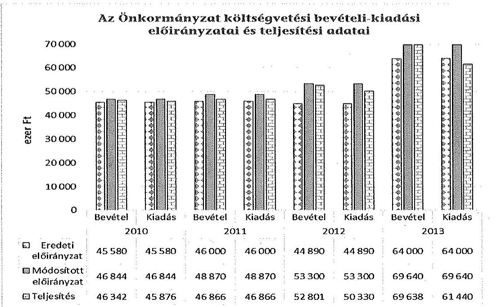
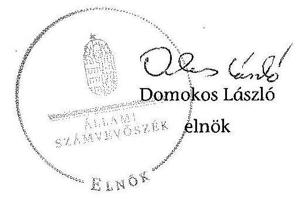

# ÁLLAMI   SZÁMVEVÔSZÉK 

## JELENTÉS

Az Országos Nemzetiségi Önkormányzatok gazdálkodásának ellenőrzéséról
Országos Ruszin Önkormányzat

---

# Állami Számvevőszék 

Iktatószám: V-0697-070/2015.
Témaszám: 1731
Vizsgálat-azonosító szám: V068009

## Az ellenőrzést felügyelte:

Kisgergely István
felügyeleti vezető

## Az ellenőrzést vezette:

Schósz Attila Ferencné
ellenőrzésvezető
A számvevői jelentések feldolgozásában és a jelentés összeállításában
közremüködtek:
Schósz Attila Ferencné
ellenőrzésvezető
Molnár Gyula Mihály
számvevő főtanácsos
Az ellenőrzést végezték:
Molnár Gyula Mihály Fekete Győr László
számvevő főtanácsos számvevő

---

# TARTALOMJEGYZÉK 

BEVEZETÉS ..... 3
I. ÖSSZEGZŐ MEGÁLLAPÍTÁSOK, KÖVETKEZTETÉSEK, JAVASLATOK ..... 7
II. RÉSZLETES MEGÁLLAPÍTÁSOK ..... 15

1. a belső kontrollrendszer kialakításának és működtetésének megfelelősége ..... 15
1.1. A kontrollkörnyezet kialakítása ..... 15
1.2. A kockázatkezelési rendszer kialakításának és működtetésének megfelelősége ..... 16
1.3. A kontrolltevékenységek múködésének megfelelősége ..... 17
1.4. Információs és kommunikációs rendszer kialakításának és múködtetésének megfelelősége ..... 18
1.5. Monitoring-rendszer kialakításának és működtetésének megfelelősége ..... 19
2. A gazdálkodás szabályszerűsége ..... 21
2.1. Pénzügyi gazdálkodás megfelelősége ..... 21
2.2. Vagyongazdálkodással kapcsolatos feladatellátás szabályszerűsége ..... 25
3. Ingyenesen juttatott vagyon kezelésének megfelelősége ..... 27
4. Egyéb feladat- és hatáskör ellátás szabályszerűsége ..... 28
5. Integritás kontrollok ..... 28
6. ÁSZ javaslatok hasznosulása ..... 28
FÜGGELÉKEK
7. számú Rövidítések jegyzéke
8. számú Az integritás kontrollok kialakítása és működtetése

---

.

---

# JELENTÉS 

## Az Országos Nemzetiségi Önkormányzatok gazdálkodásának ellenőrzéséről - Országos Ruszin Önkormányzat

## BEVEZETÉS

Az Országos Ruszin Önkormányzat (továbbiakban: Önkormányzat) az 1999. évben alakult, jelenlegi Elnöke a 2014. évi országos nemzetiségi választások óta, Hivatalvezetője 2009 júniusától látja el feladatát. A 15 tagú Közgyűlés a munkája segítésére egy bizottságot (Pénzügyi bizottságot) hozott létre. Az ellenőrzött időszakban a Hivatalban lévő Hivatalvezetőt megbízási szerződés alapján, a Hivatalvezető-helyettest 2012 februárjától és a Gazdasági vezetőt 2010 márciusától munkaviszony keretében foglalkoztatták. A Hivatalban 2014. június 30 -án öszszesen kettő főt teljes-, egy főt részmunkaidőben, egy főt megbízási szerződéssel foglalkoztattak. Az Önkormányzat az ellenőrzött időszakban a Hivatal mellett kettő önállóan működő intézményt (Könyvtár, Múzeum) működtetett, gazdasági társaságot és más szervezetet nem alapított, illetve ezek társulásában nem vett részt. Az Önkormányzat nem adott és nem vett át üzemeltetésre, kezelésbe, koncesszióba eszközöket. Térítésmentesen átadás-átvétel nem történt.

Az Önkormányzat költségvetési beszámolója szerint a 2013. évben a módosított költségvetési bevételi és kiadási előirányzat 64000 ezer Ft, a teljesített költségvetési bevétel 69638 ezer Ft, a teljesített költségvetési kiadás 61440 ezer Ft volt. Az Önkormányzat a 2013. évben 50241 ezer Ft államháztartásból származó támogatásban részesült.

Az Alaptörvény XXIX. cikk (1) bekezdése szerint a Magyarországon élő nemzetiségek államalkotó tényezők. Minden, valamely nemzetiséghez tartozó magyar állampolgárnak joga van önazonossága szabad vállalásához és megőrzéséhez. A hazánkban élő nemzetiségek helyi (települési és területi), valamint országos önkormányzatokat hozhatnak létre.

Az országos nemzetiségi önkormányzatok gazdálkodási feladatait az önállóan működő és gazdálkodó költségvetési szerve, a Hivatal látja el. Az országos nemzetiségi önkormányzatok a 2008. évtől tartoznak az államháztartás önkormányzati alrendszerébe, azóta hivatalaik költségvetési szervként működnek. Az Alaptörvény hatálybalépését követően a 2012. évtől további jelentős jogszabályi változások határozzák meg múködésüket, gazdálkodásukat.

A nemzetiségek helyzete, támogatása mind hazai, mind EU-s szinten kiemelt figyelmet kap napjainkban. Az állam az országos nemzetiségi önkormányzatok müködéséhez, a médiaszolgáltatáshoz kapcsolódó jogaik érvényesítéséhez, va-

---

lamint a kulturális önigazgatásuk érdekében alapított - közművelődési, közgyűjteményi, tudományos - intézmények fenntartásához az éves költségvetési törvényekben nevesítetten költségvetési támogatást biztosít. Ezen kívül az országos nemzetiségi önkormányzatok közfeladataik ellátásához támogatást kapnak a fejezeti kezelésű előirányzatokból, valamint hazai és uniós pályázati forrásokat szerezhetnek.

Az ellenőrzés célja annak értékelése volt, hogy az Önkormányzat gazdálkodása, a belső kontrollrendszer kialakítása és múködése, az államháztartásból nyújtott támogatás, illetve az államháztartásból meghatározott célra ingyenesen juttatott vagyon felhasználása a jogszabályi előírásoknak megfelelően tör-tént-e; az Önkormányzat a Nek. tv.-ben és az Njtv.-ben előírt feladat- és hatásköröket ellátta-e; intézkedett-e az ÁSZ által a 2008-2010. évek között végzett ellenőrzések javaslatainak végrehajtásáról.

Az Önkormányzat korrupcióval szembeni veszélyeztetettségének csökkentése érdekében felmértük az integritási szemlélet érvényesülését a gazdálkodási folyamatokban.

Értékeltük az Önkormányzat gazdálkodása során a belső kontrollrendszer kialakítását és múködését mind az öt pillére tekintetében, ellenőriztük a gazdálkodással összefüggő feladat- és hatásköröknek, a Hivatal működési, gazdálkodási rendjének jogszabályi előírásoknak való megfelelőségét; a belső kontrollok múködésének megfelelőségét az éves költségvetés, a költségvetési beszámoló és a zárszámadás készítés folyamatában; a gazdálkodás pénzügyi folyamatában a kulcskontroll tevékenységek, (szakmai) teljesítésigazolás és 2011-ig utalvány ellenjegyzés, 2012-től érvényesítés múködésének megfelelőségét; az Önkormányzat belső ellenőrzése kialakításának és múködésének megfelelőségét.

Értékeltük továbbá az Önkormányzat gazdálkodása, ezen belül pénzügyi gazdálkodása keretében a tervezés, beszámolási, zárszámadás-készítési folyamat, az előirányzatok betartása, a könyvvezetés, a közzétételek, adatszolgáltatások, valamint az államháztartás rendszeréből jogszabály vagy megállapodás alapján céljelleggel kapott támogatások felhasználásának, elszámolásának szabályszerűségét. A vagyonnal kapcsolatos feladatellátás ellenőrzése keretében értékeltük a vagyongazdálkodás szabályozottságát, a mérleg alátámasztottságát, a leltározás, az eszközbeszerzések, a vagyonhasznosítás, a tulajdonosi joggyakorlás szabályszerűségét. Értékeltük az államháztartásból ingyenesen juttatott vagyon felhasználásának szabályszerűségét. Ellenőriztük az előírt feladat- és hatáskörök közül a vélemény-nyilvánítási, egyetértési jog gyakorlásával, a hatáskör átruházásokkal, az ideiglenes vagyonkezeléssel kapcsolatos feladatok ellátásának szabályszerűségét, az integritás kontrollok múködését; továbbá az előző ÁSZ ellenőrzés javaslatainak hasznosulását.

Az ellenőrzés várható hasznosulása: Az ellenőrzés eredményeként nemcsak az ellenőrzött szerv gazdálkodása javulhat, hanem átfogó képet kaphatunk az önkormányzati alrendszerbe tartozó országos nemzetiségi önkormányzatok gazdálkodásának hiányosságairól, de a jó gyakorlatokról is. Az ellenőrzés megállapításait és javaslatait más szervezetek is hasznosíthatják a rendezett gazdálkodási keretek kialakításához. Az ellenőrzés hozadékát képezi a 2008-2010. években elvégzett ÁSZ ellenőrzés javaslatai hasznosulásának értékelése. Mind a 13 országos nemzetiségi önkormányzat ellenőrzésével teljes körűen megvalósul az

---

országos nemzetiségi önkormányzatok ellenőrzése a megváltozott jogszabályi környezetben. Az ellenőrzés tapasztalatai alapján a jogszabályi ellentmondások, hiányosságok feltárásával, azok megszüntetésére vonatkozó javaslatokkal segítjük a jó kormányzást. Az ellenőrzéssel lehetővé tesszük, hogy az országos nemzetiségi önkormányzatok gazdálkodásáról, müködéséről a társadalom objektív képet alkothasson.

Az Önkormányzat gazdálkodásának ellenőrzéséről szóló számvevőszéki jelentés I. fejezetének összegző része az ellenőrzés céljára adott rövid, szintetizáló összefoglalót és következtetéseket tartalmazza a II. fejezet részletes megállapításain alapulóan.

A jelentés intézkedést igénylő megállapításait és javaslatait az ellenőrzés során feltárt, a jelentés II. fejezetében rögzített részletes megállapítások alapozzák meg.

Az ellenőrzés típusa: szabályszerűségi ellenőrzés.
Az ellenőrzött időszak: 2010. január 1. - 2014. június 30.
Ellenőrzött szervezet: az Önkormányzat és Hivatala, továbbá azon intézmények, amelyek gazdálkodási feladatait a Hivatal látja el.

Az ellenőrzés végrehajtásának jogszabályi alapját az Állami Számvevőszékről szóló 2011. évi LXVI. törvény 1. § (3) bekezdése, az 5. § (2)-(3) és (6) bekezdései, valamint az államháztartásról szóló 2011. évi CXCV. törvény 61. § (2) bekezdésének előírásai képezik.

Az ellenőrzés módszertana az ÁSZ hivatalos honlapján (www.asz.hu) közzétett szakmai szabályokon alapul, amely a Legfőbb Ellenőrző Intézmények Nemzetközi Szervezete által kiadott nemzetközi standardok figyelembevételével készült.

Az ellenőrzés lefolytatásához az Önkormányzat a kimutatások és a tanúsítványok elektronikus kitöltésével, valamint az ÁSZ által kért dokumentumok elektronikus megküldésével szolgáltatott adatokat. Az így rendelkezésre bocsátott adatok, információk kontrollja és a munkalapok kitöltése az ellenőrzöttnél végzett ellenőrzés keretében történt.

A pénzügyi folyamatokban a kulcskontrollok, (szakmai) teljesítésigazolás és érvényesítés (2011-ig utalvány ellenjegyzése) múködésének megfelelősége értékeléséhez az egyszerű véletlen mintavétellel kiválasztott tételek ellenőrzését megfelelőségi tesztek útján végeztük. A személyi juttatások, a dologi és felhalmozási kiadások, valamint a pénzeszközátadások felhasználásának szabályszerűségét, a céljelleggel kapott támogatások felhasználásának és elszámolásának szabályszerűségét és a kiadások esetében a gazdálkodási jogkörök gyakorlását mintavétellel ellenőriztük. Megfelelőnek értékeltük a gazdálkodási jogkörök gyakorlását, amennyiben $95 \%$-os bizonyossággal a teljes sokaságban a hibaarány legfeljebb $10 \%$, részben megfelelőnek értékeltük, ha a hibaarány felső határa 10-30\% volt, nem megfelelőnek pedig akkor, ha a hibaarány felső határa a teljes sokaságban meghaladta a $30 \%$-ot. A céljelleggel kapott támogatások felhasználását megfelelőnek értékeltük, amennyiben a minta ellenőrzésének eredménye alapján $95 \%$-os bizonyossággal a teljes sokaságban a hibaarány kisebb volt, mint 10\%, nem megfelelőnek értékeltük, ha a hibaarány a $10 \%$-ot meghaladta. Az egyéb

---

szabályszerúségi (nem pénzgazdálkodási jogkörökre vonatkozó) ellenőrzés során a mintatételek alacsony minta elemszáma miatt az eredmények nem voltak kivetíthetőek a teljes sokaságra, ezáltal a konkrét mintatételek (dologi és felhalmozási kiadások, pénzeszköz átadások felhasználásának) értékelését végeztük el. A vagyonhasznosítási bevételek alacsony száma miatt tételes ellenőrzés történt.

Az ÁSZ a 2011. évi LXVI. törvény 29. §-a szerint a jelentéstervezetet megküldte az Országos Ruszin Önkormányzat elnökének egyeztetésre. Az Országos Ruszin Önkormányzat elnöke az ÁSZ tv. 29. § (2) bekezdésében foglalt észrevételezési jogával nem élt, a törvényes határidőn belül észrevételt nem tett.

---

# I. ÖSSZEGZŐ MEGÁLLAPÍTÁSOK, KÖVETKEZTETÉSEK, JAVASLATOK 

Az ellenőrzött időszakban az Önkormányzatnál a belső kontrollrendszer kialakítása és múködtetése összességében nem volt szabályszerű.

A kontrollkörnyezet kialakítása az Önkormányzat múködését meghatározó jogszabályokkal részben volt összhangban. Az Önkormányzat rendelkezett a Nek. tv. és az Njtv. előírásainak megfelelő SzMSz-szel, míg a hivatali SzMSz hiányosan tartalmazta az Ámr.-ben, illetve Ávr.-ben előírtakat. A gazdasági szervezet ügyrendje ${ }_{1,2}$ az előírások ellenére nem tartalmazta a munkavállalók helyettesítési rendjét, valamint a gazdasági szervezet belső és külső kapcsolattartásának szabályait. Az Önkormányzat rendelkezett gazdálkodási, számviteli szabályzatokkal, azonban azokat - az Áht.,,„-ben, a Bkr.-ben és az Áhsz.-ben foglaltakkal szemben - az arra hatáskörrel rendelkező Hivatalvezető helyett az Elnök hagyta jóvá.

A kockázatkezelési rendszer kialakítása és múködtetése nem felelt meg a jogszabályi előírásoknak, mivel a Hivatalvezető - az Ámr., valamint a Bkr. előírása ellenére - nem mérte fel és nem állapította meg a Hivatal tevékenységében, gazdálkodásában rejlő kockázatokat, nem határozta meg az egyes kockázatokkal kapcsolatban a szükséges intézkedéseket, valamint azok teljesítésének folyamatos nyomon követési módját. Az Önkormányzat rendelkezett kockázatkezelési szabályzat ${ }_{1,2}$-vel, azonban azokat az Elnök hagyta jóvá, annak ellenére, hogy - a jogszabályi előírások alapján - a kockázatkezelési rendszert a Hivatalvezetőnek kellett volna kialakítani és múködtetni.

A költségvetés és zárszámadás készítés folyamatában a 2010-2014. I. félév között a belső kontrollok nem múködtek megfelelően, míg a gazdálkodási jogkörök gyakorlása során a kulcskontrollok (teljesítésigazolás, utalvány ellenjegyzés, érvényesítés) múködése folyamatosan javult, a 2014. I. félévében már megfelelően múködtek. Az egyetlen érvényesítő kijelölése a 2012-2013. évek között összeférhetetlenséghez vezetett, az érvényesítő a maga javára végezte el a személyi juttatások esetében az érvényesítést.

Az ellenőrzött időszakban az információs és kommunikációs rendszer kialakítása részben megfelelt, múködtetése nem felelt meg a jogszabályi előírásoknak. Az Önkormányzat rendelkezett a kötelezően közzéteendő adatok nyilvánosságra hozatalának és a közérdekú adatok megismerésére irányuló igények teljesítésének rendjére vonatkozó szabályzatokkal, illetve 2012-től adatvédelmi és adatbiztonsági szabályzattal. A Hivatal az Eisztv.-ben, illetve az Info tv.-ben meghatározott kötelezettségének nem tett eleget, mivel nem tett közzé az Önkormányzat múködésére vonatkozóan több adatot. Nem tették közzé továbbá a 2011-2012. és 2014. évi költségvetést, a 2011. évi zárszámadást, egyszerúsített éves költségvetési beszámolót. Az Önkormányzat nem gondoskodott a 20122014. 1. félév között kapott céljellegú támogatásoknak a közzétételéről a 28/2012. (II. 6.) Korm. rendeletben, illetve 428/2012. (XII. 19.) Korm. rendeletben

---

foglalt előírás ellenére. Az Önkormányzat az Áht. ${ }_{1}$ és az Info. tv. előírásai ellenére nem biztosította a közpénzek felhasználásának átláthatóságát az általa céljelleggel nyújtott támogatások közzétételének elmaradása miatt.

Az Önkormányzat az ellenőrzött időszakban rendelkezett iratkezelési szabályzattal. Az Önkormányzat az ösztöndíj támogatásokra vonatkozó iratok egy részét nem őrizte meg, nem tartotta be az Ikr. és az iratkezelési szabályzatban foglaltakat, az iratkezelési és iktatási rendszere ezáltal nem biztosította teljes körűen az ügyintézési folyamatok nyomon követését, az adatok védelmét.

Az Önkormányzat monitoring rendszerének kialakítása és múködtetése nem volt szabályszerű. A Hivatalvezető - a jogszabályi előírások ellenére - nem alakította ki és nem múködtette a Hivatal tevékenységének, a célok megvalósításának nyomon követését biztosító rendszert.

A belső ellenőrzés kialakítása és működtetése részben volt megfelelő, mivel az ellenőrzött időszakban gondoskodtak ugyan a belső ellenőrzés kialakításáról és működtetéséről, azonban a belső ellenőrzési kézikönyv ${ }_{1,2}$-t a Ber. és a Bkr. előírásai ellenére az Elnök, és nem az arra hatáskörrel rendelkező Hivatalvezető hagyta jóvá. A belső ellenőrzést ellátó külső szervezettel kötött megbízási szerződésekben nem került rögzítésre - a jogszabályi előírások ellenére - a tevékenységek ellátási módja. A belső ellenőrzési vezető a 2012. évtől nem vezetett nyilvántartást az intézkedési tervek végrehajtásának nyomon követéséről. Az éves ellenőrzési terveket - a 2011. évi kivételével - a Ber., illetve a Bkr. előírása ellenére nem támasztották alá kockázatelemzéssel.

Az Önkormányzat pénzügyi gazdálkodása részben felelt meg az előírásoknak. A Pénzügyi bizottság a 2010-2014. évi költségvetési és zárszámadási hatá-rozat-tervezeteket az előírásoknak megfelelően véleményezte. A 2013-2014. évi költségvetési határozat-tervezetek nem az Áht. ${ }_{2}$-ben meghatározott tartalommal készültek. A 2010. évi zárszámadás előterjesztésekor az Ámr. előírása ellenére a Közgyűlés részére tájékoztatásul nem mutatták be a vagyonkimutatást és a 2011. évben a vagyonkimutatás nem tartalmazott szöveges indokolást. A 2012. és 2013. évi zárszámadás előterjesztése és tartalma megfelelt az Áht. ${ }_{2}$-ben előírtaknak. Az Önkormányzat az Áhsz. előírásai ellenére a 2010. évi féléves, valamint a 2012-2013. évi és félévi költségvetési beszámolót határidőn túl nyújtotta be a kisebbségpolitikáért/nemzetiségpolitikáért felelős miniszternek.

Az Önkormányzat az államháztartás rendszeréből jogszabály, illetve megállapodás alapján kapott támogatások felhasználása és elszámolása során alapvetően betartotta a jogszabályi és a szerződéses előírásokat. A központi költségvetésből kapott működési támogatásról, illetve annak felhasználásáról nyilvántartást az előírások ellenére nem vezettek.

Az Önkormányzat - feladatai ellátása érdekében - támogatásokat folyósított pályázat, illetve egyedi kérelmek alapján, melyek elbírálása, felhasználása és elszámoltatása összességében nem felelt meg a jogszabályi és a szerződéses követelményeknek. A 2010. évi pályázati kiírásra a döntéseket az arra hatáskörrel rendelkező Közgyűlés hozta meg, a pályázati kiírásban szereplő felső (100 ezer Ft-os) összeghatár betartásával. Néhány esetben azonban a Közgyűlés annak ellenére ítélt oda támogatást, hogy a pályázati kiírásban előírtak ellenére a pályázók nem nyújtották be a település jegyzőjének igazolását arról, hogy a

---

helyi önkormányzat nem biztosított kiegészítő támogatást. Egy támogatott a megkötött szerződésben foglaltaknak nem tett eleget, mivel nem számolt el az Önkormányzattól kapott 2013. évi támogatással. Az Önkormányzat annak ellenére, hogy - a szerződés szerint - ez kizáró ok volt a következő évi támogatásra, 2014. év I. félévében további támogatást adott. Az Önkormányzat a 2010-2014. I. félévben - az Áht. ${ }_{1,2}$-ben és az Ávr.-ben előírtak ellenére - a támogatások felhasználását, számadását, elszámolását nem ellenőrizte, illetve a támogatás rendeltetésszerú felhasználásáról nem győződött meg.

Az Önkormányzat vagyongazdálkodási tevékenysége részben felelt meg a jogszabályi előírásoknak. Az önkormányzati SzMSz-ben meghatározták, hogy csak a Közgyűlés dönthet gazdálkodó szervezet vagy más szervezet létrehozásáról, megszüntetéséről és az azokban való részvételről, valamint a vagyongazdálkodás kérdéseiről. A Közgyűlés 2014. május 1-jei hatállyal fogadta el a vagyongazdálkodási szabályzatot. Az Önkormányzatnál ezen időpontig nem kerültek meghatározásra a törzsvagyona körébe tartozó vagyonelemek, azon belül a forgalomképtelen és korlátozottan forgalomképes vagyonelemek, amellyel az Önkormányzat nem tett eleget a Nek. tv.-ben, illetve az Njtv.-ben foglaltaknak. Az Önkormányzat az éves zárszámadáshoz készített vagyonkimutatásként a 20102011. években a könyvviteli mérleget alkalmazta, ami nem felelt meg az Ötv.ben meghatározottaknak.

Az Önkormányzatnál a mérlegtételek év végi értékelése részben felelt meg a jogszabályi előírásoknak. Az ellenőrzött időszak minden évében leltároztak, ami azonban az Áhsz.-ben foglaltak ellenére nem volt teljes körű. A 2010. évben - az Áhsz.-ben és a leltározási szabályzat ${ }_{1}$-ben foglaltak ellenére - a mennyiségi leltározást alátámasztó leltárívek a nyilvántartott tárgyi eszközökről nem tartalmaztak értéket, ezért a főkönyvi kivonattal, illetve a mérleggel való egyezőségük nem volt megítélhető. Az Áhsz.-ben foglaltak ellenére a 2011-2013. években három tárgyi eszköz mennyiségi leltározása nem történt meg, ezért a leltárívek ezen eszközök esetében nem támasztották alá a főkönyvi kivonaton szereplő összeget, illetve a mérleg tárgyi eszköz sorának összegét. Az Önkormányzatnál az ellenőrzött időszakban beszerzett tárgyi eszközök és immateriális javak üzembe helyezése az Áhsz.-ben foglaltak ellenére nem, míg az állományba vétele, bekerülési értékének meghatározása, valamint az értékcsökkenési leírás időarányos elszámolása megtörtént.

Az Önkormányzat tulajdonába ingyenes vagyonjuttatásként a székhelyként funkcionáló ingatlan került, melyből az épület és a garázs a Nek. tv.-ben és az Njtv.-ben foglalt előírások ellenére korlátozottan forgalomképes vagyonként volt nyilvántartva, míg a telek helyesen forgalomképtelen törzsvagyonként.

A Közgyűlés a Nek. tv.-ben és az Njtv.-ben meghatározott vélemény-nyilvánítási, egyetértési, közreműködési feladatait az ONÖSZ tagjaként látta el.

Az ÁSZ tv. 33. § (1) bekezdésében foglaltak értelmében a jelentésben foglalt megállapításokhoz kapcsolódó intézkedési tervet köteles az ellenőrzött szervezet vezetője összeállítani, és azt a jelentés kézhezvételétől számított 30 napon belül az ÁSZ részére megküldeni. Amennyiben az intézkedési tervet határidőben nem küldi meg a szervezet, vagy az nem elfogadható, az ÁSZ elnöke a hivatkozott törvény 33. § (3) bekezdés a)-b) pontjaiban foglaltakat érvényesítheti.

---

A helyszíni ellenőrzés megállapításainak hasznosítása mellett javasoljuk:

# az Elnöknek 

1. A hivatalvezetői feladatokat ellátó személy a teljes ellenőrzött időszakban - az Ámr. 105. § (2) bekezdésében, illetve az Áht. 2 10. § (2) bekezdésben foglaltakkal ellentétesen - az Országos Horvát Önkormányzatnál is ellátott hivatalvezetői feladatokat.

Javaslat:
Intézkedjen, hogy a hivatalvezető foglalkoztatása a jogszabályi előírásoknak megfelelően történjen, különös tekintettel a költségvetési szerv vezetőkre vonatkozó azon előírásra, hogy a költségvetési szerv vezetője - helyettesítés kivételével - más költségvetési szervnél nem lehet vezető.

## a Hivatalvezetőnek

## A belső kontrollrendszeren belül:

1. A Hivatal számviteli-gazdálkodási szabályzatait az Elnök hagyta jóvá - az Áht. 1 121/A. § (1) bekezdésében, az Áhsz. 8. § (12) bekezdésében, 37. § (5) bekezdésében, és az Áht. 2 69. § (2) bekezdésében foglaltakkal ellentétben - az arra hatáskörrel rendelkező Hivatalvezető helyett.

Javaslat:
Intézkedjen a számviteli-gazdálkodási szabályzatok jóváhagyása tekintetében a jogszabályi előírások betartása érdekében.
2. A kontrollkörnyezet kialakítása részben volt megfelelő, mivel a hivatali SzMSz az Ámr. 20. § (2) bekezdés c), e), h), j), k), az Ávr. 13. § (1) bekezdés c), e), g), h), i) pontjának előírásai ellenére - nem tartalmazta az ellátandó, és a szakfeladat rend szerint (szakfeladat számmal és megnevezéssel, illetve a kormányzati funkció szerint) besorolt alaptevékenységek megjelölését, a gazdasági szervezet létszámát, a nevesített munkakörökhöz tartozó hatásköröket, a hatáskörök gyakorlásának módját, a helyettesítés rendjét, az ezekhez kapcsolódó felelősségi szabályokat, a munkáltatói jogok gyakorlásának - ideértve az átruházott munkáltatói jogokat is - rendjét, a Hivatalhoz rendelt más költségvetési szervek felsorolását.

Javaslat:
Intézkedjen a hivatali SzMSz jogszabályban előírt tartalommal való kiegészítéséről.
3. A gazdasági szervezet ügyrendje1,2 részben felelt meg a jogszabályi előírásoknak, mivel nem tartalmazta a munkavállalók helyettesítési rendjét, valamint a gazdasági szervezet belső és külső kapcsolattartásának szabályait az Ámr. 20. § (7), illetve az Ávr. 13. § (5) bekezdésében előírtakkal ellentétben.

Javaslat:
Intézkedjen a gazdasági szervezet ügyrendje jogszabályi előírásnak megfelelő kiegészítéséről.

---

4. A kockázatkezelési rendszer kialakítása és múködtetése nem felelt meg a jogszabályi előírásoknak, mivel a Hivatalvezető - az Ámr. 157. § (2)-(3) bekezdéseiben, valamint a Bkr. 7. § (2) bekezdésében foglalt előírás ellenére - nem mérte fel és nem állapította meg a Hivatal tevékenységében, gazdálkodásában rejlő kockázatokat, nem határozta meg az egyes kockázatokkal kapcsolatban a szükséges intézkedéseket és megtételük módját, valamint (a 2012. évtől) azok teljesítésének folyamatos nyomon követési módját. A kockázatkezelési szabályzat1,2-t az Elnök hagyta jóvá, annak ellenére, hogy - az Áht. 1 121/A. § (1) bekezdése, az Ámr. 155. § (1) bekezdése, az Áht. 2 69. § (2) bekezdésében, a Bkr. 3. § b) pontjában foglaltak alapján - a belső kontrollrendszer részeként a kockázatkezelési rendszert a Hivatalvezetőnek, mint a költségvetési szerv vezetőjének kellett volna kialakítania és működtetnie.

Javaslat:
Tegyen eleget a kockázatkezelési rendszer kialakítására és működtetésére vonatkozó jogszabályi kötelezettségének.
5. Az információs és kommunikációs rendszer kialakítása részben, működtetése nem volt megfelelő, mivel a szervezeten belüli és a szervezeten kívüli információáramlás rendszerét részben alakították ki, a gazdasági szervezet ügyrendje1,2-ben - az Ámr. 159. § (2) bekezdése és a Bkr. 9. § (2) bekezdésben foglaltak ellenére - a beszámolási határidőket nem határozták meg.

Javaslat:
Intézkedjen a gazdasági szervezet ügyrendje jogszabályi előírásoknak megfelelő kiegészítéséről.
6. A Hivatal az Eisztv. 6. § (1) bekezdésében, illetve az Info tv. 37. § (1) bekezdésében meghatározott kötelezettségének nem tett eleget, mivel nem tette közzé az Önkormányzat müködésére vonatkozó egyes adatait, valamint az Önkormányzat 20112012. és 2014. évi költségvetését. Elmaradt továbbá - a 28/2012. (II. 6.) Korm. rendelet 12. § (5) bekezdésében, illetve 428/2012. (XII. 19.) Korm. rendelet 13. § (2) bekezdésében foglalt előírás ellenére - az Önkormányzat 2012-2014. I. félévek között kapott támogatásainak, valamint az Áht. 1 15/A. § (1) bekezdésében, az Info tv. 37. § (1) bekezdésében és 1. mellékletében foglalt előírás ellenére az Önkormányzat által céljelleggel nyújtott támogatások adatainak a közzététele.

Javaslat:
Intézkedjen az Önkormányzat müködésére vonatkozó adatok, az éves költségvetések, valamint az Önkormányzat által kapott és nyújtott támogatások adatainak közzétételéről.
7. Az Önkormányzat az ösztöndíj támogatásokra vonatkozó iratok egy részét nem őrizte meg, nem tartotta be az lkr. 5. §-ában, illetve 59. §-ában és az iratkezelési szabályzatban foglaltakat. Az Önkormányzat iratkezelési és iktatási rendszere ezáltal nem biztosította teljes körűen az ügyintézési folyamatok nyomon követését, az iratok hollétének naprakész megállapítását, az adatok védelmét az lkr. 8. § (1)-(2) bekezdései, valamint a 14. § (4) bekezdése előírásaitól eltérően.

---

Javaslat:
Biztosítsa az ügyintézési folyamatok nyomon követését, az adatok védelmét, valamint az iratok, bizonylatok biztonságos megőrzését.
8. A monitoring rendszer kialakítása és müködtetése nem volt szabályszerű, mert a Hivatalvezető az Áht. 1 121. § (2) bekezdés e) pontjában ${ }^{1,}$ az Ámr. 160. §-ában és a Bkr. 3. § e) pontjában, a 10. §-ában foglaltak ellenére nem alakította ki, illetve nem müködtette a Hivatal tevékenységének, a célok megvalósításának nyomon követését biztosító rendszert.

Javaslat:
Alakítsa ki a Hivatal tevékenységének, a célok megvalósításának nyomon követését biztosító rendszert és gondoskodjon annak müködtetéséről.
9. A belső ellenőrzés kialakítása és működtetése részben felelt meg a jogszabályi előírásoknak, a belső ellenőrzési kézikönyv1,2-t - a Ber. 5. § (1) bekezdése és a Bkr. 17. § (1) bekezdésében foglalt előírás ellenére - az Elnök hagyta jóvá és nem az arra hatáskörrel rendelkező Hivatalvezető. A belső ellenőrzést ellátó külső szervezettel kötött megbízási szerződésekben - a Ber. 4/A. § (2) bekezdésének, illetve a Bkr. 16. § (4) bekezdésének előírása ellenére - nem került rögzítésre a Ber. 12. §-ában, illetve a Bkr. 22. § (1)-(2) bekezdéseiben foglalt tevékenységek ellátási módja.

Javaslat:
Hagyja jóvá a belső ellenőrzési kézikönyvet és intézkedjen a belső ellenőrzést ellátó külső szervezettel kötött megbízási szerződés módosításáról.
10. Az intézkedési tervek végrehajtásának nyomon követéséről a belső ellenőrzési vezető - a Bkr. 47. § (1)-(2) bekezdéseiben előírtak ellenére - a 2012. évtől nyilvántartást nem vezetett.

Javaslat:
Intézkedjen, hogy a belső ellenőrzési vezető vezessen nyilvántartást az intézkedési tervek végrehajtásának nyomon követéséről.

# A pénzügyi- és vagyongazdálkodás területén 

11. A 2013. évi költségvetés nem tartalmazta a kötelező és az önként vállalt feladatok bontását, amely nem felelt meg az Áht. 2 23. § (2) bekezdés a) pontjában leírtaknak, továbbá a 2014. évi költségvetés előterjesztése az Áht. 2 24. § (4) bekezdés a) pontjában foglaltak ellenére nem tartalmazott szöveges indokolást a költségvetési mérlegről és az előirányzat felhasználási tervről.
${ }^{1}$ 2010. december 31-ig az Áht.; 120/B. § (2) bekezdés e) pontja szabályozta.

---

Javaslat:
Intézkedjen, hogy a költségvetési határozat-tervezeteket a jogszabályban meghatározottak szerint készítsék el.
12. A Hivatalvezető - az Áhsz. 10. § (8) bekezdésben foglaltakkal ellentétesen - a 2010. évi féléves beszámolót, a 2012-2013. évi féléves és éves beszámolót határidőn túl nyújtotta be a kisebbségpolitikáért/nemzetiségpolitikáért felelős miniszternek.

Javaslat:
Intézkedjen a féléves és az éves beszámolók határidőben való megküldéséről a hatályos jogszabályoknak megfelelően.
13. A 2011-2013. években három tárgyi eszköz mennyiségi leltározása nem történt meg az Áhsz. 37. § (3) bekezdésében foglaltak ellenére, ezért ezen eszközök esetében a leltárívek nem támasztották alá a főkönyvi kivonaton szereplő összeget, illetve a mérleg tárgyi eszköz sorának összegét az Áhsz. 37. § (2) bekezdésének előírásaival ellentétben.

Javaslat:
Intézkedjen a mérleg tételeit alátámasztó leltár elkészítése érdekében, amely az eszközök állományát tételesen és ellenőrizhető módon tartalmazza.
14. A Hivatal részben tartotta be a tárgyi eszköz és immateriális javak üzembe helyezésére vonatkozó előírásokat, mivel az üzembe helyezés az Áhsz. 28. § (5) bekezdésében foglaltak ellenére egyetlen esetben sem történt meg.

Javaslat:
Intézkedjen a jogszabályokban előírt üzembe helyezési kötelezettség teljesítése érdekében.

Az országos nemzetiségi önkormányzat részére adott, illetve az által nyújtott támogatások tekintetében:
15. Nem vezettek elkülönített nyilvántartást a központi költségvetésből kapott múködési támogatásokról a 342/2010. (XII. 28.) Korm. rendelet 10. § (2) bekezdésében, a 28/2012. (III. 6.) Korm. rendelet 11. § (2) bekezdésében, illetve a 428/2012. (XII. 29.) Korm. rendelet 10. § (3) bekezdésében, valamint 2013. november 20-ától azok felhasználásáról a 428/2012. (XII. 29.) Korm. rendelet 10. § (4) bekezdésében foglalt előírás ellenére.

Javaslat:
Intézkedjen, hogy az Önkormányzat a múködési támogatások felhasználásáról elkülönített nyilvántartást vezessen.
16. A ruszin települési önkormányzatok és társadalmi szervezetek hagyományápoló programok, nyelvi konferencia támogatására meghirdetett pályázat során 9 esetben a Közgyűlés annak ellenére ítélt oda támogatást, hogy a pályázati kiírásban előírtak ellenére a pályázók nem nyújtották be a település jegyzőjének igazolását arról, hogy a helyi

---

önkormányzat nem biztosított kiegészítő támogatást a központi költségvetési támogatáshoz. A „Ruszinokért Alapítvány" a 2013. december 15-én megkötött szerződés 9. pontjában foglaltaknak nem tett eleget, mivel nem számolt el az Önkormányzattól kapott 230 ezer Ft támogatásról a szerződésben rögzített határidőig. Az Önkormányzat annak ellenére, hogy - a hivatkozott szerződés szerint - ez kizáró ok volt a következő évi támogatásra, a 2014. év I. félévében további 200 ezer Ft-ot ítélt oda a „Ruszinokért Alapítvány"-nak.

Javaslat:
Intézkedjen, hogy a támogatási pályázatok elbírálása során az előírt igazolások megléte, az előzőleg kapott támogatásokról az elszámolás megtörténte ellenőrzésre kerüljön.
17. Az Önkormányzat a 2010-2014. I. félév között az Áht. 1 13/A. § (2) bekezdésében foglaltak ellenére az általa nyújtott támogatások felhasználását, számadását, elszámolását nem ellenőrizte, illetve az Áht. 2 53. § (1) bekezdésében és az Ávr. 80. § (3) bekezdésében előírtak ellenére a támogatás rendeltetésszerű felhasználásáról nem győződött meg.

Javaslat:
Intézkedjen az Önkormányzat által nyújtott támogatások felhasználásának ellenőrzéséről.

---

# II. RÉSZLETES MEGÁLLAPÍTÁSOK 

## 1. A BELSŐ KONTROLLRENDSZER KIALAKÍTÁSÁNAK ÉS MŰKÖDTETÉSÉNEK MEGFELELŐSÉGE

Az ellenőrzött időszakban az Önkormányzatnál a belső kontrollrendszer (a kontrollkörnyezet, a kockázatkezelési rendszer, a kontrolltevékenységek, az információs és kommunikációs rendszer, valamint a monitoring rendszer) kialakítása és múködtetése összességében nem volt szabályszerű az alábbiakban részletezett szabályozásbeli és múködésbeli hibák, hiányosságok miatt.

### 1.1. A kontrollkörnyezet kialakítása

A kontrollkörnyezet kialakítása az Önkormányzat múködését meghatározó jogszabályokkal részben volt összhangban.

Az Önkormányzat - a 2010-2014. I. félév között - a Nek. tv. és az Njtv. előírásainak megfelelő SzMSz-szel rendelkezett, melyet a Közgyűlés az ellenőrzött időszakban a 2011. évben módosított. Az önkormányzati SzMSz 2011. évi módosítását - a Nek. tv. 39/G. § (4) bekezdésében foglalt előírás ellenére - sem 45 napon belül, sem azt követően nem tették közzé a Magyar Közlönyben, illetve az internetes honlapon.

A Közgyűlés a Vnytv. előírásainak megfelelően a képviselők vagyonnyilatkozattételi kötelezettségét az önkormányzati SzMSz-ben szabályozta. A szabályozásban foglaltaknak megfelelően a képviselők az ellenőrzött időszak minden évében vagyonnyilatkozatot tettek.

A Hivatal múködését az alapító okirat mellékleteként jóváhagyott hivatali SzMSz szabályozta, amely azonban - az Ámr. 20. § (2) bekezdés c), e), h), j), k), az Ávr. 13. § (1) bekezdés c), e), g), h), i) pontjának előírásai ellenére - nem tartalmazta az ellátandó, és a szakfeladat rend szerint (szakfeladat számmal és megnevezéssel) (illetve a kormányzati funkció szerint) besorolt alaptevékenységek megjelölését, a nevesített munkakörökhöz tartozó hatásköröket, a hatáskörök gyakorlásának módját, a helyettesítés rendjét, az ezekhez kapcsolódó felelősségi szabályokat, a munkáltatói jogok gyakorlásának - ideértve az átruházott munkáltatói jogokat is - rendjét, a Hivatalhoz rendelt más költségvetési szervek felsorolását.

A Hivatal dolgozói - a Munka tv. ${ }_{1,2}$ előírásaival összhangban - rendelkeztek megfelelő munkaköri leírásokkal. Az Önkormányzatnál az ellenőrzött időszakban a hivatalvezetői és a gazdasági vezetői feladatokat ellátó személy rendelkezett a Nek. tv., az Ámr. és az Ávr. előírásainak megfelelő végzettséggel. A hivatalvezetői feladatokat ellátó személy a teljes ellenőrzött időszakban - az Ámr. 105. § (2) bekezdésében, illetve az Áht. ${ }_{2} 10 . \S$ (2) bekezdésben foglaltakkal ellentétesen - az Országos Horvát Önkormányzatnál is ellátott hivatalvezetői feladatokat.

---

Az Önkormányzat gazdálkodásának szabályozottsága az ellenőrzött években részben felelt meg az előírásoknak.

A Hivatal a 2010-2014. I. félév között - az Ámr.-ben, valamint az Ávr.-ben foglaltaknak megfelelően - rendelkezett gazdasági szervezettel, a gazdasági szervezete pedig az előírt ügyrenddel. A gazdasági szervezet ügyrendje ${ }_{1,2}$ részben felelt meg a jogszabályi előírásoknak, mivel nem tartalmazta a munkavállalók helyettesítési rendjét, valamint a gazdasági szervezet belső és külső kapcsolattartásának szabályait az Ámr. 20. § (7), illetve az Ávr. 13. § (5) bekezdésében előírtakkal ellentétben.

A kontrollkörnyezet részét képező belső szabályzatokkal az Önkormányzat a 2010-2014. I. félév közötti időszakban rendelkezett. Ezen szabályzatokat az Elnök hagyta jóvá - az Áht. ${ }_{1}$ 121/A. § (1) bekezdésében², az Áhsz. 8. § (12) bekezdésében, 37. § (5) bekezdésében, az Áht. ${ }_{2} 69$. § (2) bekezdésében, illetve a Bkr. 3-4. §okban foglaltakkal ellentétben - az arra hatáskörrel rendelkező Hivatalvezető helyett:

- a Számv. tv.-ben, az Áhsz.-ben és a 4/2013. (I. 11.) Korm. rendeletben előírtaknak megfelelően számviteli politika ${ }_{1-3}$, számlarend ${ }_{1-3}$, leltározási szabályzat ${ }_{1-3}$, értékelési szabályzat ${ }_{1-3}$, önköltségszámítási szabályzat ${ }_{1,2}$, valamint pénzkezelési szabályzat ${ }_{1-4}$, illetve selejtezési szabályzat ${ }_{1,2}$, bizonylati szabály$\mathrm{zat}_{1-3}$;
- az Ámr.-ben, valamint az Ávr.-ben előírtaknak megfelelően gazdálkodási jogkörök szabályzata ${ }_{1-3}$, beszerzési szabályzat ${ }_{1-3}$, valamint a Hivatal múködéséhez kapcsolódó, pénzügyi kihatással bíró, jogszabályban nem szabályozott kérdéseket szabályozó (gépjármú üzemeltetési szabályzat ${ }_{1,2}$, helység használati szabályzat, eszközhasználati szabályzat, mobiltelefon használati szabályzat) szabályzatok;
- az Ámr.-ben és a Bkr.-ben előírtaknak megfelelően ellenőrzési nyomvonal és szabálytalanságok kezelésének eljárásrendje.

Az Önkormányzatnál a kontrollkörnyezet kialakításának keretében - az Ámr.ben és a Bkr.-ben foglaltaknak megfelelően - a 2010-2014. I. félévi időszakra vonatkozóan meghatározták az etikai elvárásokat.

Az önállóan működő Könyvtárral és Múzeummal a 2010-2011. években az Ámr. 16. § (4) bekezdésében foglaltak ellenére nem rögzítették megállapodásban a gazdálkodással kapcsolatosan a Hivatallal való munkamegosztás és felelősségvállalás rendjét. A megállapodásokat az Ávr. előírásának megfelelően 2012. január 1-jén megkötötték.

# 1.2. A kockázatkezelési rendszer kialakításának és müködtetésének megfelelősége 

A kockázatkezelési rendszer kialakítása és müködtetése nem felelt meg a jogszabályi előírásoknak. A Hivatalvezető - az Ámr. 157. § (2)-(3) bekezdéseiben, valamint a Bkr. 7. § (2) bekezdésében foglalt előírás ellenére -

[^0]
[^0]:    ${ }^{2}$ 2010. december 31-éig az Áht. ${ }_{1}$ 121. § (1) bekezdése szabályozta.

---

nem mérte fel és nem állapította meg a Hivatal tevékenységében, gazdálkodásában rejlő kockázatokat, nem határozta meg az egyes kockázatokkal kapcsolatban a szükséges intézkedéseket és megtételük módját, valamint (a 2012. évtől) azok teljesítésének folyamatos nyomon követési módját.

Az Önkormányzat a 2010-2014. I. félév közötti időszakban rendelkezett az Ámr.ben, illetve a Bkr.-ben előírtaknak megfelelően kockázatkezelési szabályzat ${ }_{1,2}$ vel, azonban azokat az Elnök hagyta jóvá, annak ellenére, hogy - az Áht. 1 121/A. § (1) bekezdése, az Ámr. 155. § (1) bekezdése, illetve az Áht. 2 69. § (2) bekezdésében, a Bkr. 3. § b) pontjában foglaltak alapján - a belső kontrollrendszer részeként a kockázatkezelési rendszert a Hivatalvezetőnek, mint a költségvetési szerv vezetőjének kellett volna kialakítania és működtetnie.

# 1.3. A kontrolltevékenységek múködésének megfelelősége 

A költségvetés és zárszámadás készítés folyamatában a 2010-2014. I. félév között a belső kontrollok nem múködtek megfelelően, míg a gazdálkodási jogkörök gyakorlása során a kulcskontrollok múködése folyamatosan javult, a 2014. I. félévében már megfelelően múködtek.

Az Önkormányzat a FEUVE biztosítása érdekében 2010. január 1-jével FEUVE szabályzatot, 2012. január 1-jétől belső kontroll szabályzatot adott ki, azonban azokat az Elnök hagyta jóvá és nem az arra hatáskörrel rendelkező Hivatalvezető, aki az Áht. 121. § (2) bekezdés e) pontjában, és a Bkr. 3. § e) pontjában előírtak alapján felelős a költségvetési szerv belső kontrollrendszeréért, a monitoring rendszer kialakításáért.

Az éves költségvetés, a költségvetési beszámoló és a zárszámadás készítésének folyamatában a belső kontrollok az Önkormányzat ellenőrzési nyomvonalában kerültek szabályozásra.

A folyamatok belső kontrolljai - az ellenőrzött időszakban - a szabályozás ellenére nem működtek megfelelően, mivel azok nem minden évben biztosították, hogy az éves költségvetési határozatok tervezetei és a zárszámadási határozattervezetei a jogszabályokban előírt tartalommal és határidőben kerüljenek a Közgyűlés elé előterjesztésre.

A költségvetési beszámoló elkészítésével megbízott személy rendelkezett a Számv. tv. és az Ávr. által előírt képesítéssel.

A szakmai teljesítésigazolás és az utalvány ellenjegyzés kulcskontrollok múködése a 2010-2011. évben (a rendszeres és nem rendszeres, a külső személyi juttatások, a dologi és felhalmozási kiadások, valamint a pénzeszköz átadások esetében) nem volt megfelelő, mivel

- az utalvány ellenjegyzésére a 2010. évben kijelölt személy nem rendelkezett az Ámr. 19. § (1) bekezdésében előírt végzettséggel, illetve pénzügyi-számviteli képzettséggel;
- az utalvány ellenjegyzésére jogosult személy a 2011. évben az Ámr. 79. § (2) bekezdésében foglaltak ellenére nem győződött meg arról, hogy a szakmai

---

teljesítésigazolást nem a gazdálkodási jogkörök szabályzata ${ }_{2}$-ben kijelölt személy látta el;

- az utalvány ellenjegyzésére jogosult személy az Ámr. 80. § (2) bekezdésében foglaltak ellenére a 2011. május havi rendszeres és nem rendszeres bér kifizetése során az ellenjegyzést a maga javára látta el.
A teljesítésigazolás és az érvényesítés kulcskontrollok múködése a 20122013. évben (a rendszeres és nem rendszeres, a külső személyi juttatások, a dologi és felhalmozási kiadások, valamint a pénzeszköz átadások esetében) részben volt megfelelő, az alábbi hiányosságok mellett:
- a teljesítésigazolás hat támogatás esetében az Ávr. 57. § (1) bekezdésében foglaltak ellenére nem történt meg, így elmaradt a kiadás jogosságának, összegszerűségének és a teljesítésnek az igazolása;
- az érvényesítő az Ávr. 58. § (1) bekezdésében előírtak ellenére 38 kiadás esetében a kötelezettségvállalás nyilvántartásának vezetése hiányában nem végezte el a fedezet meglétének ellenőrzését, 46 kiadás esetében nem végezte el a - gazdálkodási jogkörök szabályzata ${ }_{3}$-ban - előírtak betartásának ellenőrzését;
- az egyetlen érvényesítő kijelölése összeférhetetlenséghez vezetett, az érvényesítő az Ávr. 60. § (2) bekezdésében foglaltak ellenére a 2012. június és november havi, valamint a 2013. április és november havi rendszeres és nem rendszeres bér, valamint a 2013. július 30-i és október 31-i megbízási díj kifizetése során az érvényesítést a maga javára látta el.
A teljesítésigazolás és az érvényesítés kulcskontrollok múködése 2014. I. félévben (a rendszeres és nem rendszeres, a külső személyi juttatások, a dologi és felhalmozási kiadások, valamint a pénzeszköz átadások esetében) - eseti hibák kivételével - megfelelő volt.

Hat kiadás esetében az érvényesítő az Ávr. 58. § (1) bekezdésében előírtak ellenére nem végezte el a belső szabályzatokban foglaltak betartásának ellenőrzését.

A kulcskontrollok 2010-2011. évi gyenge múködése folyamatosan javult, emiatt csökkent a hibák bekövetkezésének kockázata.

# 1.4. Információs és kommunikációs rendszer kialakításának és múködtetésének megfelelősége 

Az ellenőrzött időszakban az információs és kommunikációs rendszer kialakítása részben megfelelt, működtetése azonban nem felelt meg jogszabályi előírásoknak.

Az Önkormányzat rendelkezett - az 1992. évi LXIII. tv.-ben, az Info tv.-ben és az Ávr.-ben foglalt kötelezettségei teljesítéséhez - informatikai biztonsági szabály-zat ${ }_{1,2}$-vel, kötelezően közzéteendő adatok nyilvánosságra hozatalának rendje ${ }_{1,2}$ vel, valamint a közérdekú adatok megismerésére irányuló igények teljesítésének rendje ${ }_{1,2}$-vel.

A szervezeten belüli és szervezeten kívüli információáramlás rendszerét csak részben alakították ki, mivel a gazdasági szervezet ügyrendje ${ }_{1,2}$-ben - az Ámr. 159. §

---

(2) és a Bkr. 9. § (2) bekezdésben foglaltak ellenére - a beszámolási határidőket nem határozták meg. Az adatvédelmi és adatbiztonsági szabályzatot a 20102011. évekre az 1992. évi LXIII. tv. 31/A. § (3) bekezdésében foglaltak ellenére nem készítették el, azonban 2012. január 1-jétől az Info tv. előírásainak megfelelően az Elnök jóváhagyta az erre vonatkozó eljárásrendet.

Az Eisztv. 6. § (1) bekezdésében meghatározott közzétételi kötelezettség ellenére a 2010-2011. években nem tették közzé az Önkormányzat feladatellátásának teljesítményére, kapacitásának jellemzésére, hatékonyságának és teljesítményének mérésére szolgáló mutatókat és értéküket, időbeli változásukat.

A Hivatal - a 2010-2014. I. félév között - az Eisztv. 6. § (1) bekezdésében, illetve az Info tv. 37. § (1) bekezdésben meghatározott közzétételi kötelezettségének nem tett eleget, mivel nem tette közzé az Önkormányzat múködésére vonatkozó adatok közül:

- az általa alapított lapra (Ruszin Világ) vonatkozó adatokat;
- a törvényességi ellenőrzést gyakorló szerv adatait;
- a foglalkoztatottak létszámára és személyi juttatásaira vonatkozó összesített adatokat, a vezetők és vezető tisztségviselők illetményét, munkabérét, és rendszeres juttatásait, valamint költségtérítését, az egyéb alkalmazottaknak nyújtott juttatások fajtáját és mértékét összesítve.
Az Önkormányzat - 2010-2014. I. félév közötti időszakra - rendelkezett az Ltv.ben foglaltaknak megfelelő iratkezelési szabályzattal. Az Önkormányzat az ösztöndíj támogatásokra vonatkozó iratok egy részét nem őrizte meg, nem tartotta be az Ikr. 5. §-ában, illetve 59. §-ában és az iratkezelési szabályzatban foglaltakat. Az Önkormányzat iratkezelési és iktatási rendszere ezáltal nem biztosította teljes körűen az ügyintézési folyamatok nyomon követését, az iratok hollétének naprakész megállapítását, az adatok védelmét az Ikr. 8. § (1)-(2) bekezdései, valamint a 14. § (4) bekezdése előírásaitól eltérően.

# 1.5. Monitoring-rendszer kialakításának és múködtetésének megfelelősége 

Az Önkormányzat monitoring rendszerének kialakítása és múködtetése nem volt szabályszerü, mert a Hivatalvezető az Áht. ${ }_{1}$ 121. § (2) bekezdés e) pontjában ${ }^{3}$, az Ámr. 160. §-ában és a Bkr. 3. § e) pontjában, a 10. §-ában foglaltak ellenére nem alakította ki, illetve nem működtette a Hivatal tevékenységének, a célok megvalósításának nyomon követését biztosító rendszert.

A FEUVE rendszer a szabályozás ellenére a költségvetési tervezés, a beszámolás, a kötelezettségvállalások nyilvántartása, az Önkormányzat által céljelleggel nyújtott támogatások területén nem múködött megfelelően, míg a kulcskontrollok múködésében a 2014. I. félévére javulás következett be.

[^0]
[^0]:    ${ }^{3}$ 2010. december 31-ig az Áht. ${ }_{1}$ 120/B. § (2) bekezdés e) pontja szabályozta.

---

A Hivatalvezető és az önállóan működő költségvetési szervek vezetői a 20102013. évekre a belső kontrollrendszer minőségét az Ámr.-ben és a Bkr.-ben foglaltak szerinti nyilatkozatban értékelték, mely szerint gondoskodtak a belső kontrollrendszer működéséről, fejlesztéssel kapcsolatos javaslatokat nem fogalmaztak meg. Mindez ellentmond a jelen ÁSZ ellenőrzés - belső kontroll rendszerrel kapcsolatos - hiányosságokat rögzítő megállapításaival.

A belső ellenőrzés kialakítása és múködtetése részben felelt meg a jogszabályi előírásoknak.

Az Önkormányzatnál a belső ellenőrzés feladatkörét a Ber. és a Bkr. előírásainak megfelelően a hivatali SzMSz-ben, valamint a belső ellenőrzési kézikönyv ${ }_{1,2}$-ben szabályozták. A belső ellenőrzési kézikönyv ${ }_{1,2}$-t a Ber. és a Bkr. előírásainak megfelelően a belső ellenőrzési vezető készítette el, amiket azonban az Elnök hagyott jóvá - a Ber. 5. § (1) bekezdése és a Bkr. 17. § (1) bekezdésében foglalt előírás ellenére - és nem az arra hatáskörrel rendelkező Hivatalvezető. A belső ellenőrzést külső szervezet, egyéni vállalkozó megbízásával biztosították. A megbízási szerződésekben - a Ber. 4/A. § (2) bekezdésének, illetve a Bkr. 16. § (4) bekezdésének előírása ellenére - nem került rögzítésre a Ber. 12. §-ában, illetve a Bkr. 22. § (1)-(2) bekezdéseiben foglalt tevékenységek ellátási módja.

Az ellenőrzött időszakban az éves ellenőrzési tervek alapján 27 ellenőrzést végzett el a belső ellenőr.

Az elvégzett belső ellenőrzésekről a belső ellenőrzési vezető a Ber. és a Bkr. előírásainak megfelelően a nyilvántartást vezette, illetve a meghatározott határidőben kidolgozta a tárgyévet követő évre vonatkozó éves ellenőrzési tervet. Az éves ellenőrzési terveket - a 2011. évi kivételével - a Ber. 12. § b) pontjában, illetve a Bkr. 22. § (1) bekezdés b) pontjában foglalt előírás ellenére nem támasztotta alá kockázatelemzéssel.

A tárgyévre vonatkozó éves ellenőrzési jelentés minden évben megküldésre került az Elnöknek a Ber. és a Bkr. előírásainak megfelelően a tárgyévet követő év március 15 -ig.

Az ellenőrzési megállapításokkal, javaslatokkal kapcsolatban készített intézkedési terveket a Ber. és a Bkr. előírásainak megfelelően a belső ellenőrzési vezető véleményezte. Az intézkedési tervek végrehajtását a belső ellenőr a 2011. és a 2012. évben utóellenőrzés keretében ellenőrizte.

A belső ellenőrzésekről készített jelentésekben javasolták a Hivatalvezető kinevezésére vonatkozó előírások betartását, a pénzügyi, számviteli szabályzatok aktualizálását, kiegészítését, módosítását, a pénztárellenőrzés gyakoriságának meghatározását. Javasolták továbbá az előírt számú közgyűlési ülés megtartását, a külső szolgáltatókkal a szerződések hiánytalan megkötését, a kötelezettségvállalások nyilvántartásának folyamatos, szabályszerű vezetését, a képviselői költségtérítésre vonatkozó szabályozás kiegészítését, betartását. Javaslatot tettek a szabadságra vonatkozó munkaügyi nyilvántartások folyamatos vezetésére, a festmény beszerzés dokumentálására.

Az intézkedési tervek végrehajtásának nyomon követéséről a belső ellenőrzési vezető - a Bkr. 47. §-ában előírtak ellenére - a 2012. évtől nyilvántartást nem vezetett.

---

Az Önkormányzatnál a 2010. január 1-e és 2014. június 30-a közötti időszakban egy külső ellenőrzés volt, amit Budapest Főváros Kormányhivatala végzett 2014. május hónapban.

Az ellenőrzés hiányosságként állapította meg, hogy a belső ellenőrzési kézikönyv ${ }_{2}$ t a Hivatalvezető helyett az Elnök írta alá. A belső ellenőrzési kézikönyv ${ }_{2}$ nem felelt meg az államháztartásért felelős miniszter által közzétett belső ellenőrzési kézikönyv mintának, továbbá elmulasztották a Bkr. 17. § (4) bekezdésében előírt kétéves felülvizsgálati kötelezettség teljesítését. A külső szolgáltatóval kötött, belső ellenőrzésre vonatkozó megbízási szerződés nem tartalmazta a Bkr. 16. § (4) bekezdésének előirása ellenére a 22. § (1)-(2) bekezdéseiben foglalt tevékenységek ellátási módját, ezért nem felelt meg az államháztartásért felelős miniszter által közzétett belső ellenőrzési kézikönyv mintában foglaltaknak.

Az ellenőrzési megállapításokkal kapcsolatos intézkedések megtételéről szóló tájékoztatási kötelezettséget az ÁSZ által ellenőrzött időszakot követő határidőre írták elő.

# 2. A GAZDÁLKODÁS SZABÁLYSZERŰSÉGE 

### 2.1. Pénzügyi gazdálkodás megfelelősége

Az Önkormányzat költségvetés tervezésének, jóváhagyásának folyamata, illetve közzététele részben felelt meg a jogszabályi előírásoknak.

Az Elnök a 2010-2014. évi költségvetési koncepciót az Áht. ${ }_{1,2}$-ben és az Ámr.-ben foglaltak alapján, a meghatározott határidőn belül a Közgyűlés elé terjesztette, azok elfogadásáról a határozathozatal az előírásoknak megfelelően megtörtént. A Pénzügyi bizottság a 2010-2014. évi költségvetési határozat-tervezeteket - a Nek. tv.-ben, illetve az Njtv.-ben foglaltak betartásával - határidőben véleményezte és a Közgyűlés részére elfogadásra javasolta.

A költségvetési határozat-tervezeteket a Hivatalvezető az Ámr.-ben és az Ávr.ben előírtak alapján a költségvetési szervek vezetőivel egyeztette, és ennek eredményét írásban rögzítette.

A költségvetési határozat-tervezetet a 2010-2012. években az Áht. ${ }_{1,2}$ előírásainak megfelelő tartalommal és határidőben terjesztették a Közgyűlés elé. A 20132014. évi költségvetési határozat-tervezet előterjesztése az Áht. ${ }_{2} 24 . \S$ (2) bekezdésében ${ }^{4}$ foglaltakkal ellentétben az előírt határidőnél hat, illetve kilenc nappal később történt meg. A 2013. évi jóváhagyott költségvetés nem tartalmazta a kötelező és önként vállalt feladatok bontását, amely nem felelt meg az Áht. ${ }_{2} 23$. § (2) bekezdés a) pontjában leírtaknak. A 2014. évi költségvetés előterjesztése nem tartalmazott szöveges indokolást a költségvetési mérlegről, előirányzat felhasználási tervről az Áht. ${ }_{2} 24 . \S$ (4) bekezdés a) pontjában foglaltak ellenére.

A Hivatalvezető a Közgyűlés által jóváhagyott - az Önkormányzat és költségvetés szervei - 2010-2011. és 2013. évi költségvetését az Ámr. 52. § (4) bekezdésében, illetve az Ávr. 33. § (2) bekezdésében foglaltak ellenére, a határidőhöz képest öt, illetve 44 nappal később küldte meg a kisebbségpolitikáért felelős állami

[^0]
[^0]:    ${ }^{4}$ 2013. december 21-től az Áht. ${ }_{2} 24 . \S$ (3) bekezdése szabályozza.

---

szervnek, illetve a Kincstár területileg illetékes szervének. A 2012. és a 2014. évi költségvetés megküldése az előírásoknak megfelelően történt meg.

Az Önkormányzat a 2011-2012. és a 2014. évi költségvetését nem tette közé, amely nem felelt meg a Nek. tv. 39/G. § (4) bekezdésében, az Eisztv. 6. § (1) bekezdésében és az Info tv. 37. § (1) bekezdésében előírtaknak. A 2010. és a 2013. évi költségvetés közzététele a törvényi előírásoknak megfelelően megtörtént.

Az Önkormányzat az ellenőrzött években a költségvetés módosított bevé-teli-kiadási főösszegét nem lépte túl, a módosított kiemelt előirányzatokat a 2011. év kivételével betartotta.
„Az egyéb müködési célú kiadások" kiemelt előirányzatának összegét a 2011. évben (351,0 ezer Ft-tal) meghaladta a teljesítés összege. Az eltérést a „Támogatási kölcsönök nyújtása és törlesztése" előirányzat nélküli teljesítése ( 900,0 ezer Ft) okozta. Az Önkormányzat ezzel megsértette az Áht.; 12/A. § (1) bekezdésében előírtakat, mivel kifizetések csak a jóváhagyott előirányzat mértékéig rendelhetőek el.

Az Önkormányzat 2011. szeptember 27-én és 2011. október 5-én likviditási problémái áthidalására kamatmentes kölcsönt vett fel a Sajópetri Ruszin Kisebbségi Önkormányzattól (500 ezer Ft) és a Sárospataki Ruszin Kisebbségi Önkormányzattól ( 400 ezer Ft). A fenti előirányzat nélküli teljesítés a kölcsönök visszafizetését jelenítette meg, melyet a bevételi többletéből tudott finanszírozni.

Az Önkormányzat költségvetési bevételi-kiadási főösszegének eredeti, módosított előirányzatait és teljesítési adatait a következő ábra szemlélteti:

Az Önkormányzatnál - az ellenőrzött években - a zárszámadás és a költségvetési beszámolás készítésének folyamata, a zárszámadási határozat-tervezetek és a Közgyűlés által elfogadott zárszámadási határozatok részben feleltek meg a jogszabályi előírásoknak.

---

A Pénzügyi bizottság - az ellenőrzött időszakban - a zárszámadási határozattervezeteket a Nek. tv.-ben, illetve az Njtv.-ben foglaltak alapján véleményezte és elfogadásra javasolta. Az Elnök a zárszámadáshoz az Önkormányzat és intézményei adatait összevontan tartalmazó egyszerűsített éves beszámolót az Áhsz.ben meghatározott határidőben a Közgyűlés elé terjesztette, amihez csatolták a könyvvizsgálói jelentést.

A 2010. évi zárszámadás előterjesztésekor - az Ámr. 40. § (6) bekezdés d) pontjában foglalt előírást figyelmen kívül hagyva - a Közgyűlés részére tájékoztatásul nem mutatták be a vagyonkimutatást, illetve 2011-ben a vagyonkimutatás nem tartalmazott szöveges indokolást. A 2012. és 2013. évi zárszámadás előterjesztése és tartalma megfelelt az Áht. ${ }_{2}$-ben előírtaknak.

Az Önkormányzat a 2011. évi és féléves elemi költségvetési beszámolót határidőben, míg - az Áhsz. 10. § (8) bekezdésben foglaltakkal ellentétesen - a 2010. évi féléves beszámolót, a 2012-2013. évi féléves és éves beszámolót határidőn túl nyújtotta be a kisebbségpolitikáért/nemzetiségpolitikáért felelős miniszternek.

Az Önkormányzat nem tett eleget az Áhsz. 45/A. § (2) bekezdésében foglalt letétbe helyezési kötelezettségének, mivel a 2010-2013. évi beszámolókat nem küldte meg az ÁSZ-nak.

Az Önkormányzat a 2011. évi egyszerűsített éves költségvetési beszámolóját - a könyvvizsgálati záradékot is tartalmazó könyvvizsgálói jelentéssel együtt - és zárszámadását nem tette közzé, ezzel nem tett eleget az Áhsz. 45/B. §-ban, 10. § (9) bekezdésében, illetve az Info tv. 37. § (1) bekezdésében foglaltaknak. A 2010., 2012. és 2013. évi zárszámadás közzététele megtörtént.

Az Önkormányzatnál az államháztartás rendszeréből kapott támogatások felhasználása az ellenőrzött időszakban alapvetően megfelelt a jogszabályi, illetve a szerződéses előírásoknak.

A 2010-2014. I. félév között a központi költségvetésből az Önkormányzat, az intézmények és a nemzetiségi sajtó (média) működési támogatására összesen 175577 ezer Ft-ot kaptak.

Nem vezettek elkülönített nyilvántartást a központi költségvetésből kapott múködési támogatásokról a 342/2010. (XII. 28.) Korm. rendelet 10. § (2) bekezdésében, a 28/2012. (III. 6.) Korm. rendelet 11. § (2) bekezdésében, illetve a 428/2012. (XII. 29.) Korm. rendelet 10. § (3) bekezdésében, valamint 2013. november 20-ától azok felhasználásáról a 428/2012. (XII. 29.) Korm. rendelet 10. § (4) bekezdésében foglalt előírás ellenére.

A központi költségvetésből kapott működési támogatás ellenőrzött eseteiben (médiatámogatás) a cél szerinti felhasználás megvalósult. A ráfordítások meghatározó részét a központi költségvetésből kapott támogatások fedezték.

Az újság kiadását az Önkormányzat szervezte. Nyomdai cégekkel szerződést kötött tördelési, nyomdai előkészítési, és kivitelezési munkákra, újságírókkal szerződést kötött főszerkesztői feladat ellátására, szakmai cikk írására, fotó kidolgozására, fordításra, nyelvi lektorálásra. A Ruszin Világ kiadását és terjesztését az Önkormányzat a belső ellenőrzés keretében évente ellenőrizte.

---

Az Önkormányzat az ellenőrzött időszakban a központi költségvetésből kapott támogatás mellett pályázatok révén is forrásokhoz jutott. Ezen összegek a múködésre kapott támogatásnak 2010-ben 1,6\%-át, 2011-ben 6,4\%-át, 2012-ben $5,0 \%$-át, 2013-ban $14,4 \%$-át, 2014 I. félévében $17,8 \%$-át tették ki.

Az Önkormányzat a pályázatai révén elnyert támogatásokat nem jelentette meg, ami nem felelt meg a 28/2012. (III. 6.) Korm. rendelet ${ }^{5}$ 12. § (5) bekezdésében, illetve a 428/2012. (XII. 29.) Korm. rendelet 13. § (2) bekezdésében foglaltaknak. A támogatások elszámolása megfelelit az Áht.,-ben, az Ávr.-ben, illetve a 342/2010. (XII. 28.) Korm. rendeletben, a 28/2012. (III. 6.) Korm. rendeletben előírtaknak.

Az Önkormányzat 2010-ben a MEH-től a „Ruszin Nemzeti Ünnep" című program megvalósítására 612,5 ezer Ft támogatásban részesült. Az Önkormányzat a támogatási szerződésben meghatározott időponton belül nyújtotta be a támogatás rendeltetésszerű felhasználásáról szóló beszámolóját, aminek elfogadásáról a MEH nem értesítette az Önkormányzatot, azonban a támogatási összeg utalása megtörtént.

Az Önkormányzat 2011-ben a KIM-től és a MEH-től - az Önkormányzat székházának tető felújítására, regionális vagy helyi anyanyelvi elektronikus médiára, ruszin nemzeti ünnepre - 3367,4 ezer Ft támogatást nyert.

Az Önkormányzat a 2012. évben az EMMI-től „Ruszin Anyanyelvü Ifjúsági Müvészeti Tábor" programra 280 ezer Ft, a „Ruszin Nemzeti Ünnep" megvalósítására 500 ezer Ft támogatást kapott.

Az Önkormányzat 2013-ban 564,5 ezer Ft-ot nyert az EMMI-től informatikai eszközbeszerzésre, székház felújítására, nemzetiségi programok megvalósítására. A 2014. évben összesen 3900 ezer Ft támogatást kaptak székhelyének, és intézményeinek belső berendezés cseréjére, valamint nemzetiségi programok megvalósítására.

Az Önkormányzat az ellenőrzött időszakban egy európai uniós támogatásban részesült 2012. évi döntés alapján 61361 ezer Ft összegben, a ruszin nyelvoktatás feltételeinek megteremtésére az iskola rendszerú tanítás keretein belül, mely az ÁSZ helyszíni ellenőrzésének ideje alatt is folyamatban volt.

Az Önkormányzat feladatai ellátása érdekében pályázat, illetve egyedi kérelmek alapján nyújtott támogatásokat, melyek elbírálása, felhasználása és elszámoltatása összességében nem felelt meg a jogszabályi és a szerződéses követelményeknek. A támogatásokat az Önkormányzat minden esetben előfinanszírozással nyújtotta.

Az Önkormányzat a 2010. évben pályázatot hirdetett a ruszin települési önkormányzatok és társadalmi szervezetek hagyományápoló programok, nyelvi konferencia támogatására. A döntéseket az arra hatáskörrel rendelkező Közgyűlés hozta meg, a pályázati kiírásban szereplő felső ( 100 ezer Ft-os) összeghatár betartásával. 9 esetben a Közgyűlés annak ellenére ítélt oda támogatást, hogy a pályázati kiírásban előírtak ellenére a pályázók nem nyújtották be a település

[^0]
[^0]:    ${ }^{5}$ A 28/2012. (III. 6.) Korm. rendelet hatályba lépését megelőzően nem írta elő jogszabály a közzétételt.

---

jegyzőjének igazolását arról, hogy a helyi önkormányzat nem biztosított kiegészítő támogatást a központi költségvetési támogatáshoz.

A „Ruszinokért Alapítvány" a 2013. december 15-én megkötött szerződés 9. pontjában foglaltaknak nem tett eleget, mivel nem számolt el az Önkormányzattól kapott 230 ezer Ft támogatásról a szerződésben rögzített határidőig. Az Önkormányzat annak ellenére, hogy - a hivatkozott szerződés szerint - ez kizáró ok volt a következő évi támogatásra, a 2014. év I. félévében további 200 ezer Ft-ot ítélt oda a „Ruszinokért Alapítvány"-nak.

Az Önkormányzat az ellenőrzött időszakban pályáztatás eredményeként tanulmányi és ifjúsági művészeti ösztöndíj támogatást nyújtott. A pályázati kiírások tartalmáról az arra hatáskörrel rendelkező döntött. A 2011. évtől évente kiadott szabályzatban biztosították a pályázatok benyújtásának egységes feltételeit és elbírálását.

Az ellenőrzött években összesen 18 tanuló részesült 885 ezer Ft összegű tanulmányi ösztöndíjban. Az Önkormányzatnál az ösztöndíj támogatások során nem tartották be az Ikr. 14. § (4) bekezdésében előírtakat, miszerint az iratok iktatásával és az iratforgalom dokumentálásával biztosítani kell, hogy az ügyintézés folyamata, és az iratok szervezeten belüli útja pontosan követhető és ellenőrizhető, az iratok holléte naprakészen megállapítható legyen. 8 tanuló jelentkezési lapja, 10 tanuló iskolalátogatási igazolása, 8 tanuló nyelvtudásról szóló igazolása vagy ruszin nyelvű kézzel írt bemutatkozása, 4 tanuló esetében a helyi, illetve megyei önkormányzat ajánlása volt csak az Önkormányzatnál fellelhető, a többi irat hiányzott.

Egyedi kérelmek alapján az Önkormányzat az ellenőrzött időszakban összesen 1231 ezer Ft támogatást nyújtott. A támogatott szervezetek a támogatási szerződésben és az Áht. ${ }_{1}$ 13/A. § (2) bekezdésében, illetve az Áht. ${ }_{2}$ 53. § (1), az Ávr. 80. § (1) bekezdésében foglaltak ellenére nem készítettek az elốrt határidőre számadást/ beszámolót.

Az Önkormányzat a 2010-2014. I. félév között az Áht. ${ }_{1}$ 13/A. § (2) bekezdésében foglaltak ellenére az általa nyújtott támogatások felhasználását, számadását, elszámolását nem ellenőrizte, illetve az Áht. ${ }_{2}$ 53. § (1) bekezdésében és az Ávr. 80. § (3) bekezdésében előírtak ellenére a támogatás rendeltetésszerű felhasználásáról nem győződött meg.

Az Önkormányzat az Áht. ${ }_{1}$ 15/A. § (1) bekezdésében, továbbá az Info tv. 37. § (1) bekezdésében és 1. számú mellékletében előírtak ellenére a céljelleggel nyújtott támogatások adatait nem tette közzé, ezáltal nem biztosította a közpénzek felhasználásának átláthatóságát.

# 2.2. Vagyongazdálkodással kapcsolatos feladatellátás szabályszerűsége 

Az Önkormányzat vagyongazdálkodásának szabályozottsága részben felelt meg a jogszabályi előírásoknak.

Az önkormányzati SzMSz-ben meghatározták, hogy csak a Közgyűlés dönthet gazdálkodó szervezet vagy más szervezet létrehozásáról, megszüntetéséről és az

---

azokban való részvételről, valamint a vagyongazdálkodás kérdéseiről. Az Önkormányzat vagyonát, vagyonleltárát, az azzal kapcsolatos gazdálkodás szabályait külön határozat szabályozta.

A Közgyűlés 2014. április 26-án - 2014. május 1-i hatállyal - fogadta el a vagyongazdálkodási szabályzatot. Az Önkormányzatnál a fenti időpontig nem kerültek meghatározásra a törzsvagyona körébe tartozó vagyonelemek, azon belül a forgalomképtelen és korlátozottan forgalomképes vagyonelemek, amellyel az Önkormányzat nem tett eleget a Nek. tv. 60/A. § (3)-(5) bekezdéseiben, illetve az Njtv. 113. § c) pontjában foglaltaknak. Az Önkormányzat az éves zárszámadáshoz készített vagyonkimutatásaként 2010-ben és 2011-ben a könyvviteli mérleget alkalmazta, ami nem felelt meg az Ötv. 78. § (2) bekezdésében meghatározottaknak.

Az Önkormányzat vagyona 2010. január elsejéhez viszonyítva 2013. december 31-re 10628 ezer Ft-tal növekedett, amiben meghatározó szerepet játszott a befektetett eszközök állományának 3667 ezer Ft-os növekedése, amit a pályázatok révén megvalósított 2011. és 2013. évi tetőtér felújítások, valamint informatikai eszközbeszerzések eredményeztek. Jelentős, 6961 ezer Ft volt a növekedés a forgóeszközök állományában is, melyet döntően az ESZA által kiutalt - még el nem költött - 5463,6 ezer Ft-os támogatási összeg okozott. A források között a saját tőke összege 4008 ezer Ft-tal csökkent a kötelezettségek növekedése miatti tőkeváltozás csökkenése miatt. A tartalékok összege 6961 ezer Ft-tal, illetve a kötelezettségek állománya 7675 ezer Ft-os növekedett, az európai uniós támogatásra és az ingatlan felújításra kiutalt előlegek terhére vállalt kötelezettséggel terhelt pénzmaradvány miatt.

# Az Önkormányzatnál a mérlegtételek év végi értékelése részben felelt meg a jogszabályi előírásoknak. 

Az Önkormányzat az ellenőrzött időszak minden évében leltározott, ami azonban az Áhsz. 37. § (1)-(3) bekezdésében foglaltak ellenére nem volt teljes körű. A 2010. évben - az Áhsz. 37. § (2) bekezdésében és a leltározási szabályzat ${ }_{1}$-ben foglaltak ellenére - a mennyiségi leltározást alátámasztó leltárívek a nyilvántartott tárgyi eszközökről nem tartalmaztak értéket, ezért a főkönyvi kivonattal, illetve a mérleggel való egyezőségük nem volt megítélhető.

Kettő festmény és egy temetői szobor mennyiségi leltározása 2011-2013-ban nem történt meg az Áhsz. 37. § (3) bekezdésében foglaltak ellenére, ezért ezen eszközök esetében a leltárívek nem támasztották alá a főkönyvi kivonaton szereplő összeget, illetve a mérleg tárgyi eszköz sorának összegét az Áhsz. 37. § (2) bekezdésének előírásaival ellentétben.

Az Önkormányzat az éves leltározás előtt felülvizsgálta a használaton kívüli immateriális javak, tárgyi eszközök állományát, melynek eredményeként került sor a selejtezésekre. A selejtezési szabályzat ${ }_{1,2}$-ben foglaltaknak megfelelően - a selejtezési bizottság javaslata alapján - a döntést az Elnök hozta meg.

Az Önkormányzatnál a 2010., 2012-2013. években végeztek selejtezést, amelyről jegyzőkönyvet vettek fel. A selejtezési szabályzat ${ }_{1}$-ben foglaltak ellenére a 2010. évben nem készítették el a selejtezett tárgyi eszközök jegyzékét, ezért a tárgyi eszköz bruttó értéke és elszámolt értékcsökkenése nem volt megállapítható.

---

Az Önkormányzatnál az eredményszemléletú számvitelre való áttérés feladat ellátása összességében megfelelt a jogszabályoknak. Az NGM rendeletben foglaltaknak megfelelően készítették el a rendező mérleget, leltározták az eszközöket, forrásokat és a kötelezettségvállalásokat. A függő, átfutó kiadások azonosításra és dologi kiadásként elszámolásra kerültek. Az NGM rendelet 4. § (1) bekezdésében foglalt előírás ellenére a 41. és 42. számlacsoport egyenlege nem került átvezetésre a 4922. Egyéb mérlegrendezési számlára.

Az Önkormányzatnál 2010. január 1. és 2014. június 30. között nem voltak olyan beszerzések (tárgyi eszközök és immateriális javak), melyek a Kbt. hatálya alá tartoztak.

Az Önkormányzatnál és a Hivatalnál számítástechnikai eszközök, emlékmú makett, síremlék, video kamera, fényképezőgép, ingatlan felújítás szerepelt az ellenőrzött beszerzések között.

A beszerzett tárgyi eszközök és immateriális javak állományba vétele, bekerülési értékének meghatározása, valamint az értékcsökkenési leírás időarányos elszámolása az Áhsz. és a számlarend ${ }_{1,2}$ előírásainak megfelelően minden esetben megtörtént. Az üzembe helyezést azonban az Áhsz. 28. § (5) bekezdésében foglalt előírások ellenére egyetlen esetben sem végezték el. A 2010. és 2011. évben beszerzett tárgyi eszközök és immateriális javak közül hármat az Áhsz. 37. § (3) bekezdésében előírtak ellenére nem leltároztak.

Az Önkormányzat a 2010-2014. I. félévben nem végzett vagyonértékesítést. Az Önkormányzatnál az ellenőrzött időszakban a vagyonhasznosítási tevékenységet a tulajdonában lévő garázs bérbeadása jelentette.

Az Önkormányzat az ellenőrzött időszakban nem rendelkezett tulajdonosi részesedésekkel. Az Önkormányzat nem adott és nem vett át üzemeltetésre, kezelésbe, koncesszióba eszközöket. Térítésmentesen átadás-átvétel nem történt a 2010. január 1-e és 2014. június 30-a közötti időszakban.

# 3. INGYENESEN JUTTATOTT VAGYON KEZELÉSÉNEK MEGFELELŐSÉGE 

A Nek. tv. 59/A. § (1) bekezdés előírásai alapján a székhelyként funkcionáló ingatlan a 2006. évben egyszeri ingyenes vagyonjuttatásként, bruttó 5624 ezer Ft értéken került az Önkormányzat tulajdonába. Az ingatlan az Önkormányzat nyilvántartásaiban három részre bontva:

- a telek bruttó értéke 4216 ezer Ft,
- az épület bruttó értéke 1258 ezer Ft,
- a garázs bruttó értéke 150 ezer Ft szerepelt.

A telek a Nek. tv. és az Njtv. előírásának megfelelően forgalomképtelen vagyonként, azonban az épület és a garázs a Nek. tv. 59/A. § (3) bekezdése és az Njtv. 137. § (2) bekezdésének előírásait megsértve korlátozottan forgalom képes vagyonként szerepelt a nyilvántartásokban.

---

Az Önkormányzat az ellenőrzött időszakban intézmény fenntartói jog átvállalása keretében, illetve egyéb jogcímen nem részesült ingyenes vagyonjuttatásban, mivel köznevelési, nemzetiségi kulturális intézményt nem alapított és nem tartott fenn.

# 4. EGYÉB FELADAT- ÉS HATÁSKÖR ELLÁTÁS SZABÁLYSZERŰSÉGE 

Az Önkormányzat a Nek. tv.-ben és az Njtv.-ben foglalt vélemény-nyilvánítási, egyetértési, közreműködési feladatait az (országos kisebbségi önkormányzatok érdekvédelme, érdekképviselete céljából alapított) ONÖSZ tagjaként látta el.

Az ellenőrzött időszakban az önkormányzati SzMSz-ben a Nek. tv.-ben és az Njtv.-ben foglaltaknak megfelelően rögzítették a Közgyűlést megillető feladat- és hatásköröket, valamint az átruházható és át nem ruházható hatásköröket. Előírták továbbá, hogy az átruházott feladat és hatáskörök gyakorlásáról és eredményeiről a Közgyűlés felé kell beszámolni. Az ellenőrzött időszakban nem történt az önkormányzati SzMSz-ben meghatározott feladatokra és hatáskörökre vonatkozóan átruházás az Elnökre, illetve egyéb szerveire.
2012. december 1-jétől az ellenőrzött időszak végéig megszűnt helyi ruszin önkormányzatok nem rendelkeztek vagyonnal, ezáltal az Önkormányzat az Njtv.ben foglalt ideiglenes vagyonkezelői feladatokat nem látott el.

## 5. INTEGRITÁS KONTROLLOK

Az ÁSZ a 2011. évtől kezdődően évente lefolytatja a közszféra intézményeit érintő, önkéntességen alapuló integritás felmérését. Az Önkormányzatot az ÁSZ az ellenőrzéssel érintett időszakban nem kérte fel az integritás felmérésben történő részvételre. Jelen ellenőrzés során a 2013. évre vonatkozóan az Önkormányzat által kitöltött tanúsítványi adatszolgáltatás alapján értékeltük a korrupciós kockázatait és az azok kezelésére kiépült kontrolltényezőket, amelynek eredményét a 2. számú függelék tartalmazza.

## 6. ÁSZ JAVASLATOK HASZNOSULÁSA

Az ÁSZ a 2008-2010. években ellenőrzést az Önkormányzatnál nem végzett.
Budapest, 2015. 00 . hó 24. nap

Függelék: $\quad 2 \mathrm{db}$

---

# RÖVIDÍTÉSEK JEGYZÉKE 

## Törvények

Áht.,
Áht. 2
Alaptörvény
ÁSZ tv.
Eisztv.
Info tv.

Kbt.
Ltv.
Munka tv. 1
Munka tv. 2
Nek. tv.
Njtv.
Ötv.
Ptk.
Számv. tv.
Vnytv.
1992. évi LXIII. tv.
az államháztartásról szóló 1992. évi XXXVIII. törvény (hatályos 2011. december 31-ig)
az államháztartásról szóló 2011. évi CXCV. törvény (hatályos 2011. december 31-étől)

Magyarország Alaptörvénye, hatályos 2012. január 1-jétől az Állami Számvevőszékről szóló 2011. évi LXVI. törvény, hatályos 2011. július 1-jétől
az elektronikus információszabadságról szóló 2005. évi XC. törvény (hatályon kívül 2012. január 1-jétől)
az információs önrendelkezési jogról és az információszabadságról szóló 2011. évi CXII. törvény (hatályos 2012. január 1jétől)
a közbeszerzésekről szóló 2011. évi CVIII. törvény (hatályos 2012. január 1-jétől)
1995. évi LXVI. törvény a köziratokról, a közlevéltárakról és a magánlevéltári anyag védelméről
a Munka Törvénykönyvéről szóló 1992. évi XXII. törvény (hatályon kívül 2013. január 1-jétől)
a munka törvénykönyvéről szóló 2012. évi I. törvény
a nemzeti és etnikai kisebbségek jogairól szóló 1993. évi LXXVII. törvény (hatályos 2011. december 31-ig)
a nemzetiségek jogairól szóló 2011. évi CLXXIX. törvény (hatályos 2011. december 20-tól)
a helyi önkormányzatokról szóló 1990. évi LXV. törvény
a Polgári Törvénykönyvről szóló 1959. évi IV. törvény
a számvitelről szóló 2000. évi C. törvény
az egyes vagyonnyilatkozat-tételi kötelezettségekről szóló 2007. évi CLII. törvény
a személyes adatok védelméről és a közérdekú adatok nyilvánosságáról szóló 1992. évi LXIII. törvény

---

# Rendeletek 

Áhsz.
Ámr.
Ávr.

Ber.

Bkr.

Ikr.
NGM rendelet

342/2010. (XII. 28) Korm. rendelet

28/2012. (III. 6.) Korm. rendelet

428/2012. (XII. 29.)
Korm. rendelet
4/2013. (I. 11.) Korm. rendelet

## Egyéb rövidítések

adatvédelmi és adatbiztonsági szabályzat

ÁSZ
belső ellenőrzési kézikönyv ${ }_{1}$
belső ellenőrzési kézikönyv ${ }_{2}$
belső kontroll szabályzat
beszerzési szabályzat ${ }_{1}$
beszerzési szabályzat ${ }_{2}$
az államháztartás szervezetei beszámolási és könyvvezetési kötelezettségének sajátosságairól szóló 249/2000. (XII. 24.) Korm. rendelet (hatályos 2013. december 31-ig)
az államháztartás múködési rendjéről szóló 292/2009. (XII. 19.) Korm. rendelet (hatályos 2011. december 31-ig)
az államháztartásról szóló törvény végrehajtásáról szóló 368/2011. (XII. 31.) Korm. rendelet (hatályos 2012. január 1jétől)
a költségvetési szervek belső ellenőrzéséről szóló 193/2003. (XI. 26.) Korm. rendelet (hatályos 2011. december 31-ig)
a költségvetési szervek belső kontrollrendszeréről és belső ellenőrzésről szóló 370/2011. (XII. 31.) Korm. rendelet (hatályos 2012. január 1-jétől)
335/2005. (XII. 29.) Korm. rendelet a közfeladatot ellátó szervek iratkezelésének általános követelményeiről
Az államháztartás számvitelének 2014. évi megváltozásával kapcsolatos feladatokról szóló 36/2013. (IX. 13.) NGM rendelet
a kisebbségi önkormányzatoknak a központi költségvetésből, valamint fejezeti kezelésű előirányzatból nyújtott támogatások feltételrendszeréről és elszámolásának rendjéről (hatályon kívül 2012. március 7 -től)
a nemzetiségi célú előirányzatokból nyújtott támogatások feltételrendszeréről és elszámolásának rendjéről (hatályon kívül 2013. január 1-jétől)
a nemzetiségi célú előirányzatokból nyújtott támogatások feltételrendszeréről és elszámolásának rendjéről
az államháztartás számviteléről (hatályos 2014. január 1jétől)

Az Országos Ruszin Önkormányzat és intézményei Adatvédelmi és Adatbiztonsági Szabályzata (hatályos 2012. január 1-től)
Állami Számvevőszék
Az Országos Ruszin Kisebbségi Önkormányzat Belső Ellenőrzési Kézikönyve (hatályos 2010. január 1-től)
Az Országos Ruszin Önkormányzat és intézményei Belső Ellenőrzési Kézikönyve (hatályos 2012. január 1-től)
Az Országos Ruszin Önkormányzat és intézményei Belső Kontrollrendszere (hatályos 2012. január 1-től)
Az Országos Ruszin Kisebbségi Önkormányzat Közbeszerzési szabályzata (hatályos 2010. január 1-től)
Az Országos Ruszin Önkormányzat Beszerzések lebonyolításának szabályzata (hatályos 2012. január 1-től)

---

| beszerzési szabályzat ${ }_{3}$ | Az Országos Ruszin Önkormányzat Közbeszerzési szabály- |
| :--: | :--: |
| bizonylati szabályzat ${ }_{1}$ | az Országos Ruszin Kisebbségi Önkormányzat Bizonylati Sza- |
| bizonylati szabályzat ${ }_{2}$ | bia lalyzata (hatályos 2010. január 1-től) |
| bizonylati szabályzat ${ }_{3}$ | Az Országos Ruszin Önkormányzat és intézményei Bizonylati Rendje (hatályos 2012. január 1-től 2014. január 1-ig) |
| Elnök | Az Országos Ruszin Önkormányzat és intézményei Bizonylati Rendje (hatályos 2014. január 1-től) |
| EMMI | Az Országos Ruszin Önkormányzat elnöke |
| ESZA | Emberi Eröforrások Minisztériuma |
| eszközhasználati szabály- | Európai Szociális Alap |
| zat | Az Országos Ruszin Kisebbségi Önkormányzat és Hivatala Személyi számítógépek, Internet és Faxkészülékek Használatának Szabályzata (hatályos 2010. január 1-től) |
| EU | Európai Unió |
| értékelési szabályzat ${ }_{1}$ | Az Országos Ruszin Kisebbségi Önkormányzat Eszközök és források értékelési szabályzata (hatályos 2010. január 1-től 2011. december 31-ig) |
| értékelési szabályzat ${ }_{2}$ | Az Országos Ruszin Önkormányzat és intézményei Eszközök és források értékelési szabályzata (hatályos 2012. január 01-től 2013. december 31-ig) |
| értékelési szabályzat ${ }_{3}$ | Az Országos Ruszin Önkormányzat és intézményei Eszközök és források értékelési szabályzata (hatályos 2014. január 1-   től) |
| FEUVE | folyamatba épített, előzetes, utólagos és vezetői ellenőrzés |
| FEUVE szabályzat | Az Országos Ruszin Kisebbségi Önkormányzat a Folyamatba Épített, Előzetes, Utólagos és Vezetői ellenőrzés rendszere (hatályos 2010. január 1-től) |
| gazdasági szervezet ügyrendje ${ }_{1}$ | Az Országos Ruszin Önkormányzat hivatala gazdasági szervezetének ügyrendje (hatályos 2010. január 1-től) |
| gazdasági szervezet ügyrendje ${ }_{2}$ | Az Országos Ruszin Önkormányzat hivatala gazdasági szervezetének ügyrendje (hatályos 2012. január 1-től) |
| gazdálkodási jogkörök   szabályzata ${ }_{1}$ | Országos Ruszin Önkormányzat Kötelezettségvállalás, utalványozás, ellenjegyzés, érvényesítés bankszámla feletti rendelkezés rendjének szabályzata (hatályos 2010. január 1-től) |
| gazdálkodási jogkörök   szabályzata ${ }_{2}$ | Országos Ruszin Önkormányzat Kötelezettségvállalás, utalványozás, ellenjegyzés, érvényesítés bankszámla feletti rendelkezés rendjének szabályzata (hatályos 2011. február 6-tól) |
| gazdálkodási jogkörök   szabályzata ${ }_{3}$ | Országos Ruszin Önkormányzat és intézményei Gazdálkodási szabályzata (hatályos 2012. január 1-től) |
| gépjármú üzemeltetési   szabályzat ${ }_{1}$ | Az Országos Ruszin Kisebbségi Önkormányzat Gépjármú Üzemeltetési Szabályzata (hatályos 2010. január 1-től) |
| gépjármú üzemeltetési   szabályzat ${ }_{2}$ | Az Országos Ruszin Önkormányzat és intézményei Gépjármúvek Igénybevételének és Használatának Szabályzata (hatályos 2012. január 1-től) |
| helység használati sza- | Az Országos Ruszin Kisebbségi Önkormányzat és Hivatala Helységek és Berendezések Használatának Szabályzata (hatályos 2010. január 1-től) |

---

Hivatal
hivatali SzMSz

Hivatalvezető
informatikai biztonsági szabályzat ${ }_{1}$
informatikai biztonsági szabályzat ${ }_{2}$
iratkezelési szabályzat

Kincstár
kockázatkezelési szabály$\mathrm{zat}_{1}$
kockázatkezelési szabály$\mathrm{zat}_{2}$
Könyvtár
Közyyülés
kötelezően közzéteendő adatok nyilvánosságra hozatalának rendje ${ }_{1}$
kötelezően közzéteendő adatok nyilvánosságra hozatalának rendje ${ }_{2}$
közérdekú adatok megismerésére irányuló igények teljesítésének rendje ${ }_{1}$
közérdekú adatok megismerésére irányuló igények teljesítésének rendje ${ }_{2}$
kulcskontroll
leltározási szabályzat ${ }_{1}$
leltározási szabályzat ${ }_{2}$
leltározási szabályzat ${ }_{3}$

MEH

Az Országos Ruszin Önkormányzat Hivatala
Az Országos Ruszin Önkormányzat Hivatalának Szervezeti és Müködési Szabályzata (hatályos 2009. június 22-től)
Az Országos Ruszin Önkormányzat Hivatalának vezetője
Az Országos Ruszin Kisebbségi Önkormányzat Informatikai Biztonsági Szabályzata (hatályos 2010. január 1-től)
Az Országos Ruszin Önkormányzat és intézményei Informatikai biztonsági szabályzata (hatályos 2012. január 1-től)
Az Országos Ruszin Kisebbségi Önkormányzat Iratkezelési Szabályzata (hatályos 2010. január 1-től)
Magyar Államkincstár
Az Országos Ruszin Kisebbségi Önkormányzat a Folyamatba Épített, Előzetes, Utólagos és Vezetői ellenőrzés rendszere III. fejezet (hatályos 2010. január 1-től)
Az Országos Ruszin Önkormányzat és intézményei Belső Kontrollrendszer II. fejezet (hatályos 2012. január 1-től)
Magyarországi Ruszinok Könyvtára
Az Országos Ruszin Önkormányzat közgyűlése
Az Országos Ruszin Kisebbségi Önkormányzat Szabályzat a közérdekú adatok közzétételi kötelezettségének teljesítéséről (hatályos 2010. január 1-től)
Az Országos Ruszin Önkormányzat és intézményei Szabályzat a közérdekú adatok közzétételi kötelezettségének teljesítéséről (hatályos 2012. január 1-től)
Az Országos Ruszin Kisebbségi Önkormányzat A közérdekú adatok megismerésére irányuló igények teljesítésének rendjére vonatkozó szabályzat (hatályos 2010. január 1-től)

Az Országos Ruszin Önkormányzat és intézményei A közérdekú adatok megismerésére irányuló igények teljesítésének rendjére vonatkozó szabályzat (hatályos 2012. január 1-től)

Az operatív gazdálkodási jogkörök közül kulcskontroll 2011ig a szakmai teljesítésigazolás és az utalvány ellenjegyzése, 2012-től a teljesítésigazolás és az érvényesítés
Az Országos Ruszin Kisebbségi Önkormányzat Leltározási és leltárkészittési szabályzata (hatályos 2010. január 1-től 2011. december 31-ig)
Az Országos Ruszin Önkormányzat és intézményei Leltározási és leltárkészítési szabályzata (hatályos 2012. január 1-től 2013. december 31-ig)

Az Országos Ruszin Önkormányzat és intézményei Leltározási és leltárkészítési szabályzata (hatályos 2014. január 1től)
Miniszterelnöki Hivatal, 2010. május 29-től jogutódja a Közigazgatási és Igazságügyi Minisztérium

---

mobiltelefon használati szabályzat

Múzeum
NGM
ONÖSZ
Önkormányzat
önkormányzati SzMSz
önköltségszámítási szabályzat ${ }_{1}$
önköltségszámítási szabályzat ${ }_{2}$
Pénzügyi bizottság
pénzkezelési szabályzat ${ }_{1}$
pénzkezelési szabályzat ${ }_{2}$
pénzkezelési szabályzat ${ }_{3}$
pénzkezelési szabályzat ${ }_{4}$
selejtezési szabályzat ${ }_{1}$
selejtezési szabályzat ${ }_{2}$
számlarend $_{1}$
számlarend $_{2}$
számlarend $_{3}$
számviteli politika $_{1}$
számviteli politika $_{2}$
számviteli politika $_{3}$

Az Országos Ruszin Önkormányzatnak és intézményeinek A vezetékes és mobiltelefon használati szabályzata (hatályos 2012. január 1-től)

Magyarországi Ruszinok Közérdekú Muzeális Gyüjteménye és kiállítóhelye
Nemzetgazdasági Minisztérium
Országos Nemzetiségi Önkormányzatok Szövetsége
A 2010-2011. években Országos Ruszin Kisebbségi Önkormányzat, a 2012-2013. években és 2014. év I. félévében Országos Ruszin Önkormányzat
1/2008. (III. 12.) Közgyűlési határozat az Országos Ruszin Kisebbségi Önkormányzat Szervezeti és Müködési Szabályzata (hatályos 2008. március 8-tól, módosítva 2011. február 9-től)
Az Országos Ruszin Kisebbségi Önkormányzat Önköltségszámítási szabályzata (hatályos 2010. január 1-től 2011. december 31-ig)
Az Országos Ruszin Önkormányzat Önköltségszámítási szabályzata (hatályos 2012. január. 1-től)
az Országos Ruszin Önkormányzat Pénzügyi Ellenőrző Bizottsága
Az Országos Ruszin Kisebbségi Önkormányzat Pénzkezelési szabályzata (hatályos 2010. január 1-től)
Az Országos Ruszin Kisebbségi Önkormányzat Pénzkezelési Szabályzata (hatályos 2010. március 2-től)
Az Országos Ruszin Önkormányzat és intézményei Pénzkezelési Szabályzata (hatályos 2012. január 1-től)
Az Országos Ruszin Önkormányzat és intézményei pénzkezelési szabályzata (hatályos 2014. január 1-től)
Az Országos Ruszin Kisebbségi Önkormányzat Felesleges Vagyontárgyak Hasznosításának, Selejtezésének Szabályzata (hatályos 2010. május 1-től 2011. december 31-ig)
Az Országos Ruszin Önkormányzat és intézményei Felesleges Vagyontárgyak Hasznosításának és Selejtezésének Szabályzata (hatályos 2012. január 1-től)
Az Országos Ruszin Kisebbségi Önkormányzat Számlarendje (hatályos 2010. január 1-től 2011. december 31-ig)
Az Országos Ruszin Önkormányzat és intézményei Számlarendje (hatályos 2012. január 1-től 2014. március 9-ig)
Az Országos Ruszin Önkormányzat és intézményei Számlarendje (hatályos 2014. március 9-től)
Az Országos Ruszin Kisebbségi Önkormányzat Számviteli politikája (hatályos 2009. november 1-től 2011. december 31ig)
Az Országos Ruszin Önkormányzat és intézményei Számviteli politikája (hatályos 2012. január 1-től 2013. december 31-ig)
Az Országos Ruszin Önkormányzat és intézményei Számviteli politikája (hatályos 2014. január 1-től)

---

1. SZÁMÚ FÜGGELÉK
V-0697-070/2015. SZÁMÚ SZÁMVEVŐSZÉKI JELENTÉSHEZ
vagyongazdálkodási sza- A Közgyűlés 48/2014. (IV. 26.) számú határozata az Önkormányzat vagyongazdálkodásáról bályzat

---

# Az integritás kontrolLok kialakítáSA És MúkÖdtetése 

Az Önkormányzat az ellenőrzés során az integritás szemlélet érvényesülésének értékeléséhez a 2013. évi múködésével (európai uniós támogatásokkal, közbeszerzésekkel, a közvagyonnal és a közpénzekkel, valamint a humán erőforrással való gazdálkodással, a belső szabályozottsággal, a korrupció ellenes rendszerekkel) kapcsolatos információkat, adatokat szolgáltatott.
Ezen adatok értékelése alapján az eredendő veszélyeztetettségi szint és a kockázatokat növelő tényező szintje is alacsony. Emellett a szervezetnél kiépült, kockázatok kezelésére hivatott kontrollok szintje közepes.
A kockázatok és a kontrollok szintje alapján a szervezetnél jelenlévő korrupciós kockázatok, valamint az azok kezelésére kiépült kontrollok szintje között egyensúly van. Így a kiépült kontrollok kiválóan képesek kezelni a kockázatokat, valamint hatékonyan támogatni a szervezet feladatellátását.

Az eredendő veszélyeztetettségi tényező alacsony szintjét befolyásolta, hogy közvagyonnal való gazdálkodás, illetve a közpénzek kezelése vonatkozásában a Hivatal gazdálkodási tevékenysége során önállóan múködő és gazdálkodó költségvetési szerv jogosítványokat gyakorolt, és nem nyújtott közszolgáltatást.
A korrupciós veszélyeztetettséget növelő tényező alacsony szintjét befolyásolta, hogy az Önkormányzatnál az elmúlt három évben egyszer sem volt olyan közbeszerzési eljárás, amelyben háromnál kevesebb ajánlattevő volt, továbbá gazdasági társaságban nem rendelkezett tulajdoni részesedéssel. Fegyelmi ügyek és munkaügyi jogviták nem voltak, az elmúlt három évben az Önkormányzat, illetve a Hivatal egyetlen munkatársával szemben sem indult munkájával kapcsolatban büntető eljárás. Ugyanakkor korrupciós kockázati tényezőként volt jelen, hogy az Önkormányzat az elmúlt három évben európai uniós támogatásban részesült, közbeszerzési eljárás előkészítésében, lebonyolításában részt vett, hogy a garázs ingatlanát bérbeadás útján hasznosította.
A kockázatokat mérséklő kontrolltényező szintjét növelte, azaz a kockázatokat csökkentette, hogy a Hivatal rendelkezett SzMSz-szel, a hivatali munkatársak mindegyikének volt munkaköri leírása, az összeférhetetlenség kérdéskörét szabályozták. A kockázatokat mérséklő kontrolltényező szintjét csökkentette, azaz a kockázatokat növelte, hogy a hivatal alapító okiratát az elmúlt három évben módosították.