# ÁLLAMI   SZÁMVEVŐSZÉK 

## JELENTÉS

a központi alrendszer egyes intézményei pénzügyi és vagyongazdálkodásának ellenőrzéséről
Nemzeti Információs Infrastruktúra Fejlesztési Intézet

---

# Állami Számvevőszék 

Iktatószám: V-0723-299/2015.
Témaszám: 1757
Vizsgálat-azonosító szám: V067905

## Az ellenőrzést felügyelte:

Holman Magdolna Julianna
felügyeleti vezető
Az ellenőrzés végrehajtásáért felelős:
Laki Dóra
ellenőrzésvezető
A számvevői munkaanyagok feldolgozását és a Jelentéstervezet összeállítását végezték:

Laki Dóra
ellenőrzésvezető
Fülöp Istvánné
számvevő vezető főtanácsos
Az ellenőrzést végezték:
Fórián Erika
számvevő tanácsos

## Molnár-Sipos Judit

számvevő

## Tóth Richárd

számvevő

Fülöp Istvánné
számvevő vezető főtanácsos

## Szöllősiné Hrabóczki Etelka

számvevő tanácsos

Vitányi István
számvevő tanácsos

A témához kapcsolódó eddig készített számvevőszéki jelentés:
címe
sorszáma
Jelentés a Magyar Köztársaság 2008. évi költségvetése végrehajtásának ellenőrzéséről
Jelentés a 2013. évi zárszámadásról - Magyarország 2013. évi költségvetése végrehajtásának ellenőrzéséről

---

# TARTALOMJEGYZÉK 

BEVEZETÉS ..... 3
I. ÖSSZEGZŐ MEGÁLLAPÍTÁSOK, KÖVETKEZTETÉSEK, JAVASLATOK ..... 7
II. RÉSZLETES MEGÁLLAPÍTÁSOK ..... 11

1. Az irányító szervek Intézetre vonatkozó feladatellátása ..... 11
2. Az Intézet átalakítása, átszervezése ..... 12
3. A belső kontrollrendszer és az integritás kontrollok kialakítása és működése az Intézetnél ..... 13
3.1. A kontrollkörnyezet kialakítása és működtetése ..... 13
3.2. A kockázatkezelési rendszer kialakítása és működtetése ..... 15
3.3. A kontrolltevékenység kialakítás és működtetése ..... 16
3.4. Az információs és kommunikációs rendszer kialakítása és működtetése ..... 16
3.5. A monitoring rendszer kialakítása és működtetése ..... 17
3.6. Az integritás kontrollok kialakítása és működtetése ..... 18
4. Az Intézet pénzügyi gazdálkodása ..... 18
4.1. Az előirányzatok tervezése és módosítása ..... 18
4.2. A kiadási előirányzatok felhasználása, a bevételi előirányzatok teljesítése ..... 21
4.3. A belső kontrollok működése a kiadási előirányzatok felhasználása során ..... 22
4.4. Az előirányzat maradvány megállapítása és az előző évi előirányzat-maradvány felhasználása ..... 24
4.5. A fizetőképesség alakulása ..... 25
5. Az Intézet vagyongazdálkodása ..... 27
5.1. A vagyongazdálkodás szabályozottsága ..... 27
5.2. Az eszközök források értékének kimutatása ..... 28
5.3. A beszerzett, létesített immateriális javak és tárgyi eszközök bekerülési értékének megállapítása, nyilvántartása ..... 29
5.4. A vagyonelemek hasznosítási gyakorlata ..... 31
5.5. Az eredmény szemléletű számvitel bevezetésével kapcsolatos feladatok végrehajtása ..... 31
6. Az Intézet korábbi ÁSZ ellenőrzései során tett javaslatok hasznosulása érdekében meghozott intézkedések ellenőrzése ..... 31

---

# MELLÉKLETEK 

1. számú A belső kontrollrendszer kialakításának és működtetésének alakulása az Intézetnél
2. számú Az Intézet kiadásainak és bevételeinek alakulása
3. számú Az Intézet eszközeinek és forrásainak alakulása
4. számú Az Intézet tárgyi eszközeivel kapcsolatos mutatószámok alakulása
5. számú A Nemzeti Információs Infrastruktúra Fejlesztési Intézet igazgatójának jelentéstervezethez tett észrevétele
6. számú Az ÁSZ válasza a Nemzeti Információs Infrastruktúra Fejlesztési Intézet igazgatójának jelentéstervezethez tett észrevételéhez

## FÜGGELÉKEK

1. számú Rövidítések jegyzéke
2. számú Értelmező szótár
3. számú A gazdaságossági, hatékonysági és eredményességi követelmények kialakítása, a vezetői nyilatkozat helytállósága

---

# JELENTÉS 

## a központi alrendszer egyes intézményei pénzügyi és vagyongazdálkodásának ellenőrzéséről   Nemzeti Információs Infrastruktúra Fejlesztési Intézet

## BEVEZETÉS

A közpénzek felhasználásában és az állami vagyonnal való gazdálkodásban a központi alrendszer egyes intézményei meghatározó súlyt képviselnek. Pénzügyi- és vagyongazdálkodásuk rendszeres ellenőrzésével az ÁSZ hozzájárul a hatékony közigazgatás megteremtéséhez. Az ÁSZ Stratégiával összhangban a közvagyon védelme, a közpénzügyek átláthatóságának előmozdítása érdekében került sor a Nemzeti Információs Infrastruktúra Fejlesztési Intézet (továbbiakban: Intézet) ellenőrzésére.
Az Intézet a Nemzeti Információs Infrastruktúra Fejlesztési Programmal kapcsolatos fejlesztési és működtetési feladatok ellátásáért felelős központi intézet, amelyet a Művelődési és Közoktatási Minisztérium a 11/1996. (X. 9.) MKM rendeletével, 1996. november 1-én alapított. Feladatait a 346/2010. (XII. 28.) Korm. rendelet és az 5/2011. (II. 3.) Korm. rendelet állapította meg. Meghatározó szerepet tölt be a legújabb hálózati technológiák magyarországi fejlesztésében és alkalmazásában, az informatikai infrastruktúra országos fejlődésében. Az Intézet célja a magyarországi kutatói hálózat fejlesztése és működtetése, mivel a teljes magyarországi kutatási, felsőoktatási és közgyűjteményi közösség számára biztosít országos, nagysebességű számítógép-hálózati infrastruktúrát, szuper-számítástechnikai, valamint multimédia alapú kollaborációs szolgáltatásokat, elosztott, szövetségi alapú azonosítási és jogosultságkezelési környezetet, valamint egyéb kommunikációs és információs szolgáltatásokat.
Az ellenőrzött időszakban feladatstruktúrája három alkalommal változott. A 2011. év februárjától a Sulinet program működtetését, 2013. július 1-től a PTA megszűnése miatti feladatokat (a „PTA EU csoport" feladatait, a „TÁMOP 2.1.2 Idegen nyelvi és informatikai kompetenciák fejlesztése kiemelt projekt"-et és az „eMagyarország Program"), 2013 decemberétől a „Miskolc és agglomerációja digitális közösség" című program végrehajtását kapta feladatul.
Az Intézet előirányzatai felett önálló jogkörrel rendelkező, önállóan működő és gazdálkodó költségvetési szerv. Költségvetése önálló költségvetési fejezetet nem képzett. Az irányító szervi feladatok ellátása a 2008. év első négy hónapjában a GKM, és jogutódja a KHEM, 2008. május 1-től 2009. év végéig a MeH, 2010. január 1-től június 30-ig az MTA elnöke, 2010. július 1-től 2013. december 31-ig az NFM felelősségi körébe tartozott.
Az Intézet szerkezetében, szervezeti felépítésében változás nem történt. Az Intézetet az ellenőrzéssel érintett időszakban az igazgató vezette, munkáját a gazdasági igazgató és funkcionális igazgatóhelyettesek (hálózati-, műszaki-, projektkoordinációs, ügyfélkapcsolati-, nemzetközi kapcsolati igazgatóhelyettes) segítették.
Az intézeti költségvetés volumenének alakulását a következő diagram szemlélteti (az adatok a függő és átfutó tételeket nem tartalmazzák):
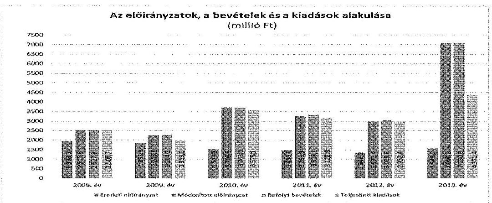

Az Intézet könyvviteli mérleg szerinti vagyona, a befektetett eszközök mérlegértéke az ellenőrzött időszakban 243,2 M Ft-ról 1441,0 M Ft-ra, 492,5%-kal változott. A saját tőke és a tartalékok értéke, a kötelezettségek összege 582,5 M Ft-ról 4 282,6 M Ft-ra, 635,2%-kal módosult. Az Intézet engedélyezett létszáma közel a duplájára emelkedett, mivel a 2008. évben 37, a 2013. évben 71 fő volt.
Az ellenőrzés célja annak megállapítása volt, hogy az Intézetre vonatkozó irányító szervi feladatellátás a jogszabályi előírások betartásával történt-e; az Intézetnél a belső kontrollrendszer kialakítása és működtetése szabályszerű volt-e; kialakították-e az erőforrásokkal való szabályszerű és hatékony gazdálkodáshoz szükséges követelményeket, megvalósították-e azok számon kérését, ellenőrzését, továbbá, hogy az Intézet pénzügyi és vagyongazdálkodása megfelelt-e a jogszabályi előírásoknak és belső szabályzatainak; az integritási kontrollokat kialakították és szabályszerűen működtetik-e. Az ÁSZ korábbi ellenőrzései során megfogalmazott javaslatok, megállapítások vonatkozásában az ellenőrzés célja annak megítélése volt, hogy azok végrehajtása érdekében az Intézet a szükséges intézkedéseket megtette-e.
Az Intézetet az ÁSZ a 2008. és a 2013. évi zárszámadási ellenőrzések keretében ellenőrizte.
Az ellenőrzés várható hasznosulása: A központi alrendszerbe tartozó intézmények jelentős hatást gyakorolhatnak a költségvetés egyensúlyának fenntartására, az állami vagyonnal való gazdálkodás minőségére, a kormányzati (szak)politikák végrehajtására, illetve közfeladat-ellátásuk vonatkozásában az állampolgárok életminőségére, jogaik és kötelezettségeik gyakorlására. Az ellenőrzés az Intézet pénzügyi és vagyongazdálkodása szabályosságának javításával előmozdítja a közpénzügyek átláthatóságát, rendezettségét. Eredményeként átfogó képet kaphatunk az Intézet gazdálkodásának hiányosságairól és a jó gyakorlatokról is.
A közintézmények integritás alapú kultúrája meghatározó a belső kontrollrendszer működése szempontjából. Hozzájárulhat az elszámoltathatóság és átláthatóság érvényesítéséhez, egyben támogathatja a szervezet védettségét a 

---

korrupciós kitettséggel szemben. Az integritási kontrollok ellenőrzése az integritási szemlélet terjedését, az integritás kultúra erősítését támogatja.
Az ellenőrzés egyben hozzájárul az eredmény szemléletű számvitel bevezetésével összefüggő feladatok végrehajtásához.
A belső kontrollrendszer államháztartási törvényben rögzített célja a működés és gazdálkodás során a tevékenységek szabályszerű, gazdaságos, hatékony és eredményes végrehajtása. Az ÁSZ a központi intézmények ellenőrzését teljesítményellenőrzési modullal egészítette ki.
Az Intézet teljesítmény-ellenőrzésének célja annak értékelése volt, hogy a gazdálkodás folyamatában a gazdaságossági, hatékonysági és eredményességi követelmények kialakítása megtörtént-e és azokat működtették-e; a költségvetési szerv belső kontrollrendszerének minőségéről kiadott vezetői nyilatkozatban a költségvetési szerv tevékenységében a hatékonyság, eredményesség, gazdaságosság követelményeinek érvényesítése helytálló volt-e. A teljesítményellenőrzés a gazdálkodási feladatokra terjedt ki, a szakmai feladatellátást nem értékelte.
A teljesítményellenőrzés várható hasznosulása: A törvényalkotás számára támogatást nyújt a nemzeti kulcsindikátorok rendszerének kialakításához. A döntéshozók, ellenőrzöttek, irányító szervek, a társadalom számára az összehasonlítási, összemérési lehetőségek kihasználásával objektív visszajelzést ad a gazdálkodás területén végrehajtott szervezeti, szervezési, takarékossági és bürokráciacsökkentő intézkedések hatásairól, a közfeladat-ellátásnak keretet adó pénzügyi és vagyongazdálkodásban mérhető teljesítménykövetelmények kialakításáról, azok alkalmazásáról. Az ÁSZ értékteremtő elemzéseivel, tanácsadó szerepét erősítve támogatja a szervezetek önértékelő, alkalmazkodó (öntanuló) tevékenységét. Irányt mutat az ellenőrzött intézmények gazdálkodási és kapcsolódó adminisztratív folyamatainak optimalizációjához. Segíti a központi költségvetési szervek átláthatóságát, felügyelhetőségét, a „jó gyakorlatok" elterjesztésével támogatja a „jó kormányzást".
Az ellenőrzés típusa szabályszerűségi ellenőrzés, amelyet az Intézetre vonatkozó teljesítmény-ellenőrzés egészített ki.
Az ellenőrzött időszak 2008. január 1-jétől 2013. december 31-ig tartott.
A helyszíni ellenőrzésre a szabályszerűségi ellenőrzés tekintetében az Intézetnél, és az Intézet irányító szervi feladatait ellátó minisztériumnál került sor. A teljesítményellenőrzés vonatkozásában helyszíni ellenőrzésre az Intézetnél került sor.
Az ellenőrzés jogszabályi alapját az ÁSZ tv. 1. § (3) bekezdés, 5. § (2)(6) bekezdései, valamint az Áht. 61. § (2) bekezdésének előírásai képezik.

A központi alrendszer intézményeinek ellenőrzése során a belső kontrollrendszer tekintetében a hangsúlyt az egyes kontrollterületek (kontrollkörnyezet, kockázatkezelési rendszer, kontrolltevékenységek, információs és kommunikációs rendszer, monitoring rendszer) kialakításának és az intézmény működési folyamataiba való beépülésének szabályszerűségére helyeztük, amelyet kizárólag jogszabályokból és intézményi belső szabályozásokból levezethető kritériumrendszer alapján ítéltünk meg.

---

A belső kontrollrendszer jogszabályi előírások szerinti kialakításának és működtetésének szabályszerűségét az erre irányuló ellenőrzési kérdésekre adott válaszok összesítése alapján kontrollterületenként egyedileg és összesítetten is értékeltük. A belső kontrollrendszer egyes kontrollterületei kialakítása és működtetése „szabályszerű volt", tehát a feltárt hiányosságok nem gyakoroltak lényeges hatást a kontrollok kialakítására és működtetésére, amennyiben az értékelt területen az elért és elérhető pontok százalékban kifejezett hányadosa elérte a 85%-ot, „nem volt szabályszerű", ha nem haladta meg a 60%-ot, és „részben szabályszerű volt", ha 61-84% között volt.
A belső kontrollrendszer összesített értékelése megegyezett a kontrollterületenként alkalmazott %-os értékelésekkel, a következő kiegészítéssel. A kontrollrendszer egésze esetében a „szabályszerű" értékelésnek a %-os értéken felül további feltétele volt, hogy egyik kontrollterületen sem kaphatott „nem volt szabályszerű" értékelést. A „részben szabályszerű" értékelés további feltétele volt, hogy legfeljebb egy ellenőrzött kontrollterület lehetett „nem volt szabályszerű" értékelésű. Az összesített értékelés a %-os kiértékelés eredményétől függetlenül „nem volt szabályszerű", ha az ellenőrzött kontrollterületek közül több mint egynek „nem volt szabályszerű" az értékelése.
A jogszabályoknak és a belső előírásoknak megfelelőnek, azaz szabályszerűnek tekintettük a vagyonhasznosítási bevételek, az előirányzat-módosítások és a kötelezettségvállalással terhelt maradványok megállapítását és felhasználását, amennyiben a minta ellenőrzésének eredménye alapján 95%-os bizonyossággal a teljes sokaságban a hibaarány kisebb volt, mint 10%, nem megfelelőnek értékeltük, ha a hibaarány a 10%-ot meghaladta. Kockázatot, illetve magas kockázatot jeleztünk, amennyiben egy adott terület vonatkozásában a minta alapján a teljes sokaságban nem volt teljes körűen biztosított a jogszabályoknak és a belső szabályzatoknak megfelelő működés.
A személyi juttatások, a dologi és felhalmozási kiadások, valamint a pénzeszközátadások előirányzatai felhasználásánál a gazdálkodási jogkörök gyakorlását mintavétellel ellenőriztük. A 2008-2011. éveket érintően a szakmai teljesítésigazolás és az utalvány ellenjegyzése kulcskontrollok, a 2012-2013. éveket érintően a teljesítésigazolás és az érvényesítés kulcskontrollok működését értékeltük. Megfelelőnek értékeltük a gazdálkodási jogkörök gyakorlását, amennyiben 95%-os bizonyossággal a teljes sokaságban a hibaarány legfeljebb 10%, részben megfelelőnek értékeltük, ha a hibaarány felső határa legfeljebb 30%, nem megfelelőnek pedig akkor, ha a sokaságbeli hibaarány felső határa meghaladta a 30%-ot.
 %-ot.
Az ellenőrzés az INTOSAI által kiadott nemzetközi standardok (ISSAI) figyelembe vételével, az ellenőrzési programban foglalt értékelési szempontok szerint történt.
Az Állami Számvevőszékről szóló 2011. évi LXVI. törvény 29. §-a szerint a jelentéstervezetet megküldtük egyeztetésre a Nemzeti Fejlesztési Minisztérium és a Nemzeti Információs Infrastruktúra Fejlesztési Intézet részére. A beérkezett észrevételt és az erre adott választ, és azok indokolását a jelentés 5-6. számú mellékletei tartalmazzák.

---

# I. ÖSSZEGZŐ MEGÁLLAPÍTÁSOK, KÖVETKEZTETÉSEK, JAVASLATOK 

Az Irányító szerv - alapítói, irányító szervi, illetve ellenőrzési - feladatait részben gyakorolta szabályszerűen az Intézettel kapcsolatban, mely az ellenőrzött időszakban öt irányító szervvel ${ }^{1}$ rendelkezett. Az ellenőrzés szabálytalanságot az Intézet SZMSZ-ének jóváhagyásával kapcsolatban, és az Irányító szerv által a törzskönyvi nyilvántartásba való bejelentési kötelezettsége határidejének túllépése miatt tárt fel. A gazdálkodás hatékonyságára vonatkozó ellenőrzést az Áht. ${ }_{1,2}$-ben előírtaknak megfelelően az Irányító szerv nem végzett, az erőforrásokkal való szabályszerű és hatékony gazdálkodáshoz szükséges követelmények kialakítására, azok számonkérésének feltételeinek kidolgozására 2013 tavaszán sor került, azok alapján azonban ellenőrzés nem történt.
Az Intézetnél az ellenőrzött időszakban átalakítás/átszervezés nem történt, de jogutódlással - négy feladatot vettek át, míg egy új feladat ellátását kormányhatározat írta elő számukra. A jogutódlásokról, a feladatok ellátásának biztosításáról, a jogosultságokról és kötelezettségekről, a vagyon és forrás átcsoportosításokról átadás-átvételi megállapodások készültek, melyeket az infokommunikációért felelős államtitkár ellenjegyezett. Az átadás-átvételek szabályszerűek voltak.
Az Intézet belső kontrollrendszerének kialakítása és működtetése összességében annak ellenére szabályszerű volt, hogy az ellenőrzött kontrollpillérek közül kettő - a kontrolltevékenység és a monitoring rendszer - részben működött szabályszerűen az ellenőrzött időszakban. A kontrollkörnyezet a 2011-2012. években részben szabályszerűen került kialakításra, a többi ellenőrzött évben szabályszerű volt. Az Intézet szabályzatai, a kapcsolódó ellenőrzési nyomvonalak - a jogszabályi és a szervezeti változásokat követő aktualizálások elmaradása ellenére - az ellenőrzött évek többségében alkalmasak voltak a működés megfelelő szabályozására. A kockázatkezelés mindvégig szabályszerű kialakítású és működésű volt. A szakmai tevékenység magas színvonalú és biztonságos ellátása érdekében a kockázatok azonosítását és kezelését kiemelten fontosnak tartották az Intézetnél, ezért 2009-ben, 2010-ben és 2013-ban informatikai rendszereikre kockázatmenedzsment módszertanokat is kidolgoztak. A kontrolltevékenység a 2008-2011. években részben szabályszerűen, 2012-2013-ban szabályszerűen működött. Az ellenőrzött mintatételeknél leggyakrabban az írásbeli kötelezettségvállalás elmaradása, a „Kötelezettségvállalás kísérő" dokumentum és a jogi ellenjegyzés hiánya, továbbá a kötelezettségvállalás pénzügyi ellenjegyzésének a hiánya fordult elő. A 2013. évben az Intézet megsértette a Kvtv. ${ }_{6}$-t, mivel az egy foglalkoztatottnak éves szinten kifizetett béren kívüli juttatások együttes összege személyenként 860000 Ft-tal meghaladta a 200000 Ft-os összeghatárt. Az információs és kommunikációs rendszer a 2008. évben részben működött szabályszerűen, az azt követő években sza-

[^0]
[^0]:    ${ }^{1}$ Az irányítószervi változásokat kormányrendeletek írták elő. A 2008. év első négy hónapjában a GKM, és jogutódja a KHEM, 2008. május 1-től 2009. év végéig a MeH, 2010. január 1-től június 30-ig az MTA, 2010. július 1-től 2013. december 31-ig az NFM volt az Intézet irányító és felügyeleti szerve.

---

bályszerű volt. Az Intézet a közérdekű adatok nyilvánosságra hozatalának szabályairól megfelelően rendelkezett, azonban hiányosan, nem az Info tv.-nek és a szabályzatnak megfelelő tartalommal és rendszerességgel tette közzé honlapján az előírt adatokat. A monitoring rendszer a 2008-2009. években részben szabályszerűen, a 2010-2013. években szabályszerűen működött. A belső ellenőr belső ellenőrzési terv alapján látta el feladatát, de a tervek nem teljesültek maradéktalanul. (A tervhez viszonyítottan, az el nem végzett belső ellenőrzések aránya 14-50\% között mozgott.) A belső és külső ellenőrzések javaslataira készített intézkedési tervekben foglaltak - az ÁSZ ellenőrzés tapasztalatai szerint - több esetben nem kerültek végrehajtásra, holott az Intézet (ellenőrzésekről vezetett) nyilvántartásában azok végrehajtottként szerepeltek.
Az Intézet pénzügyi gazdálkodása részben volt szabályszerű, mivel a kiadási előirányzatok felhasználásához kapcsolódó kulcskontrollok működése a 2008-2011 években csupán részben volt szabályszerű. A kulcskontrollok nem szabályszerű működése a folyamatba épített, és a vezetői ellenőrzés hiányosságát jelzi. A számviteli elszámolás tekintetében nem került sor szabálytalanság megállapítására. A vagyongazdálkodás szabályszerűsége részben volt szabályszerű, mivel a Vagyongazdálkodási, a Leltározási és az Eszközök és források értékelési szabályzataik hiányosak voltak, továbbá a leltározás végrehajtása az előírásoknak csak részben felelt meg. Szabálytalan volt, hogy a tárgyi eszközöket és a készleteket a 2008-2012. években nem tényleges mennyiségi felvétellel, hanem adategyeztetés útján leltározták. Az üzemeltetésre átadott eszközök mérlegben kimutatott értékét a 2009-2013. években nem az üzemeltetést végző intézmények által készített leltárral támasztották alá. A leltárak adattartalma a 2008-2011. években szabálytalan volt, mert nem szigorú számadás alá vont nyomtatványokat alkalmaztak, továbbá a leltárfelvételi ívekről hiányzott a leltározott eszköz leltári száma, értéke. A 2009-2013. évekre megállapított leltártöbbletek okait tételesen nem vizsgálták, mivel azok a számítástechnikai eszközök perifériáinak megbontásából adódtak. A fellelt eszközök lekönyvelése elmaradt, de ez értékben nem jelentett eltérést.
Az Intézet az ÁSZ integritás felmérési projektjében nem vett részt, az önkéntes integritási kérdőívet nem töltötte ki. Az Intézet tanúsítványi önértékelése alapján bemutatott eredendő veszélyeztetettségi szintje alacsony, a korrupciós veszélyeztetettséget növelő tényezők magasak, de a kontrollok mérsékelték a kockázatokat.
A 2008-2013. években az Intézetnél a gazdálkodás folyamatában a gazdaságossági, eredményességi és hatékonysági követelményeket a vagyongazdálkodás területén nem alakították ki és nem működtették. A kiadott vezetői nyilatkozatok a NIIFI pénzügyi és vagyongazdálkodási folyamataira vonatkozóan részben voltak helytállóak és a nyilatkozatok valóságtartalmának ellenőrizhetősége csupán kis részben volt biztosított. 2014. január 1-től hatályos az a 2013. év végén kialakított a „Feladat-és teljesítménymutatók alkalmazása" című dokumentum, melyben pénzügyi gazdálkodási területre és a vagyongazdálkodásra határoztak meg mutatószámokat.

---

A helyszíni ellenőrzés megállapításainak hasznosítása mellett javasoljuk:

# a nemzeti fejlesztési miniszternek 

1. Az irányító szerv vezetője az ellenőrzött időszakban nem határozta meg, nem érvényesítette, nem kérte számon és nem ellenőrizte az erőforrásokkal való szabályszerű és hatékony gazdálkodáshoz szükséges, 2008. december 31-ig az Áht. 1 49. § b) pontjában, 2012. január 1-ig a 49. § (5) bekezdés f) pontjában, majd azt követően az Áht. 2 9. § (1) bekezdés f) pontjában foglalt követelményeket.

Javaslat:
Intézkedjen az Intézet által ellátandó közfeladatok ellátására vonatkozó, erőforrásokkal való szabályszerű és hatékony gazdálkodáshoz szükséges követelmények kialakítására, számonkérésére és ellenőrzésére.
2. Az Intézet 2013-ban nem tartotta be a Kvtv. 6 53. § (2) bekezdésében meghatározott 200 ezer Ft-os összeghatárt a béren kívüli juttatások kifizetése során. A 2013. évben a munkáltatói nyugdíjpénztári hozzájárulás, a munkáltatói egészségpénztári hozzájárulás, és az Erzsébet étkezési utalvány bruttó 1060000 Ft volt személyenként.

Javaslat:
Intézkedjen a feltárt jogszabálysértés tekintetében a munkajogi felelősség kivizsgálására irányuló eljárás megindítása iránt, és ennek eredményének ismeretében a szükséges intézkedéseket tegye meg.

## a Nemzeti Információs Infrastruktúra Fejlesztési Intézet igazgatójának

1. Az Intézet hiányosan, nem a jogszabályoknak és szabályzatának megfelelő tartalommal és rendszerességgel tette közzé honlapján az előírt adatokat. Ezzel megsértette az Einfotv. 6. §-ban és az Info tv. 35.§ és 37. §-ban foglaltakat.

Javaslat:
Intézkedjen, hogy az Intézet honlapján megjelenő adatok feleljenek meg a jogszabályi előírásoknak.
2. Az Intézetnél a 2013. évben az egy foglalkoztatottnak éves szinten kifizetett - az Szjatv. 71. § (1) bekezdésének a)-f) pontjában és (3) bekezdésében meghatározott béren kívüli juttatások együttes összege meghaladta a 200000 Ft-os összeghatárt, ezzel megsértette a Kvtv. 6 53. § (2) bekezdésében foglalt előírást. Az egy munkavállaló részére éves szinten kifizetett munkáltatói nyugdíjpénztári hozzájárulás, egészségpénztári hozzájárulás, és Erzsébet étkezési utalvány összesen bruttó 1060000 Ft-ot tett ki.

Javaslat:
Intézkedjen, hogy a költségvetési szerv által foglalkoztatottak béren kívüli juttatása ne haladja meg a törvényben előírt mértéket.

---

3. A kötelezettségvállalás pénzügyi ellenjegyzésének elmaradásával az Intézet megsértette az Ámr. 134. (8) bekezdésében, az Ámr. 74 § (1)-(3) bekezdésében, illetve az Ávr. 50. § (1) bekezdés d) pontjában az ellenjegyzésre vonatkozó előírásokat.
A 2008-2013. években a teljesítésigazolásra vonatkozó Ámr.135. § (1)-(2) bekezdés, és az Ámr. 2 76. (1), (3) bekezdés, valamint az utalványozás ellenjegyzésére vonatkozó Ámr.1137. (3) bekezdés, és az Ámr. 2 79. § (2) bekezdés szabályait nem, vagy nem szabályszerűen hajtották végre. A teljesítésigazolásra vonatkozó - az Áht. 2 38. §-ában és az Ávr. 57. §-ában meghatározottak - előírásoknak nem minden esetben tettek eleget.

Javaslat:
Intézkedjen, hogy a kontrollok működése feleljen meg a jogszabályi előírásoknak.
4. Az ellenőrzött években az előzetes írásbeli kötelezettségvállalást nem igénylő kifizetések rendjét nem szabályozták, ezzel megsértették az Ámr. 134. § (3) bekezdésének, az Ámr. 2 72. § (14) bekezdésének, valamint az Ávr. 53. § (2) bekezdésének előírásait.

Javaslat:
Intézkedjen az előzetes írásbeli kötelezettségvállalást nem igénylő kifizetések rendjének szabályozására.
5. Az Intézet vezetője nem gondoskodott arról, hogy tevékenységében és céljaiban a gazdaságosság, a hatékonyság és az eredményesség követelményei érvényesüljenek, mivel azokat az Áht. 1 94. § (1) bekezdés b) pontjában, az Áht. 2 61. § (1) bekezdésben, az Áht. 2 69. § (1) bekezdés a) pontjában és a Bkr. 4. § a) pontjában foglaltak ellenére nem alakította ki és nem alkalmazta.

Javaslat:
Intézkedjen az Intézet tevékenységére és céljára vonatkozó hatékonysági, eredményességi és gazdaságossági mérhető követelmények kialakítására és érvényesítésére.

---

# II. RÉSZLETES MEGÁLLAPÍTÁSOK 

## 1. AZ IRÁNYÍTÓ SZERVEK INTÉZETRE VONATKOZÓ FELADATELLÁTÁSA

## Az irányító szervek az Intézettel kapcsolatos alapítói jogosultságaikat a jogszabályi előírások alapján részben szabályszerűen gyakorolták.

A 2008-2013. években - alapítási dátumának kivételével ${ }^{2}$ - a jogszabályi rendelkezéseknek ${ }^{3}$ megfelelő tartalmú hat alapító okirattal rendelkezett az Intézet, melyekben az ellátott tevékenységek szakágazati és gazdálkodási besorolása megfelelt a jogszabályi előírásoknak. A vezetők megbízási rendje és a foglalkoztatottakra vonatkozó jogviszonyok megjelölése szabályosan történt. Az egységes szerkezetbe foglalt alapító okiratok tartalma megfelelő volt, de a változásokat az irányító szerv ${ }^{4}$ nem a jogszabályban ${ }^{5}$ előírt nyolc napos határidővel jelentette be a Kincstárnak a törzskönyvi nyilvántartásban való átvezetéshez.

## Az irányító szerv részben gyakorolta szabályosan az Intézettel kapcsolatos irányító szervi hatásköreit.

Az Intézet az ellenőrzött időszak egészében a 2006. június 6-án hatályba léptetett - az Áht. 93. § (1) bekezdés a) pontja előírásának megfelelő - az irányító szerve által jóváhagyott SZMSZ-szel rendelkezett. A NIIFI vezetése évente módosította és benyújtotta jóváhagyásra irányító szervének az SZMSZ-ét, ${ }^{6}$ jóváhagyás azonban egyetlen alkalommal sem született. Az SZMSZ tartalma - a 2008-2013. évek alatti aktualizálásának elmaradása miatt - nem felelt meg a jogszabályi előírásoknak ${ }^{7}$.
Az Intézet igazgatójának, a gazdasági igazgatónak a pályáztatása, kinevezése, a vezetői megbízások adása, az illetményük változtatásai szabályosan történtek. Az Intézet igazgatóját és gazdasági igazgatóját a miniszter az Áht. ${ }_{1,2}$ -

[^0]
[^0]:    ${ }^{2}$ A 2006., a 2008., a 2010. és a 2011. évi Alapító okiratokban hibásan került feltüntetésre az Intézet alapításának ideje, melynek szerepeltetését az Áht.

 88. § (5) és 88/A. § (1) bekezdés c) pontja, illetve az Áht. ${ }_{2} 105. \S$ (1) bekezdése írta elő.
    ${ }^{3}$ Áht. 88. § (3) bekezdés Áht. 90. § Ávr. 5. § (1)-(2) bekezdés.
    ${ }^{4}$ 2009-ben a MeH, 2010-ben az MTA, 2011-2013-ban két esetben az NFM
    ${ }^{5}$ 25/2009. (XI. 18.) PM rendelet 9. § b) pont, 6/2012. (III. 1.) NGM rendelet 4. § (1) bekezdés d) pont, valamint a 307/2013. (VIII. 14.) Korm. rendelet 16/C § (1) bekezdés d) pont.
    ${ }^{6}$ 2008-ban P-113-1/08. iktatószámon, 2008. 01. 15-én, 2009-ben P-1183-5/09. iktatószámon 2009. 12. 8-án, 2010-ben P-1375-3/10. iktatószámon, míg 2011-2013-ban emailben nyújtotta be az Intézet vezetése módosított SZMSZ-eit jóváhagyásra.
    ${ }^{7}$ Az Ámr. ${ }_{1}$ 13/A. § (3) bekezdés e) pontja, az Ámr. ${ }_{2}$ 20. § (2) bekezdés e) pontja és az Ávr. 13. § (1) bekezdés e) pontja értelmében az Intézet szervezeti egységeinek engedélyezett létszámát a 2009. évtől kezdődően be kellett volna mutatni. Az Áht. 91. § (2) bekezdése, és az Áht. ${ }_{2}$ 10. § (5) bekezdése szerint a szervezeti egységekre vonatkozó szabályokat is tartalmaznia kellett volna az SZMSZ-nek.

---

ben ${ }^{8}$ foglaltaknak megfelelően nevezte ki. Az igazgató és a gazdasági igazgató személye az ellenőrzött időszakban nem változott.
Az éves elemi költségvetések készítésére vonatkozó irányító szervi körlevelek/utasítások az ellenőrzött időszakban minden évben tartalmazták a kiadási, a bevételi, a költségvetési támogatási előirányzatokat, valamint az engedélyezett létszámokat.

# Az ellenőrzött időszakban az irányító szerv az Intézettel kapcsolatos ellenőrzési jogosultságait részben gyakorolta szabályszerűen. 

Ellenőrzési tevékenység csupán az MTA és az NFM irányítása idején valósult meg. Az irányító szerv az ellenőrzött időszakban minden évben beszámoló készítésre kötelezte az Intézetet, az Áht ${ }_{11}$, illetve az Áht ${ }_{2}$ előírása szerint, meghatározva annak határidejét, valamint a szakmai feladatellátásról történő beszámolást. Az Intézet éves elemi költségvetési beszámolóinak felülvizsgálatát és jóváhagyását elvégezték. Az előirányzat módosítási, átcsoportosítási, zárolási jogköröket szabályszerűen gyakorolták, az Intézet kincstári költségvetését és pénzmaradványát szabályszerűen jóváhagyták, minden évben beszámoltatták az Intézet vezetőjét a belső kontrollrendszer működéséről.
Az Áht. ${ }_{1}$ 49. § (5) bekezdés f) pontjában, illetve az Áht. ${ }_{2}$ 9. § (1) bekezdés f) pontjában előírtaknak megfelelő, a gazdálkodás hatékonyságára vonatkozó ellenőrzést az irányító szerv nem végzett az ellenőrzött időszakban. Az NFM az ellenőrzési időszakban nem alakította ki az Áht ${ }_{2}$ 9. § (1) bekezdésének f) pontjában jelzettek szerinti erőforrásokkal való szabályszerű és hatékony gazdálkodáshoz szükséges követelményeket, így azok számonkérésére, ellenőrzésére sem került sor.

## 2. Az Intézet átalakítása, átszervezése

Az Intézetnél az ellenőrzött időszakban átalakítás/átszervezés nem történt, de - jogutódlással - a PTA-tól három feladatot, az NGM-től egy feladatot vettek át, egy új feladat ellátását pedig kormányhatározat írta elő.
A PTA megszüntetése miatt az 1284/2013. (V. 27.) Korm. határozat (és annak módosítása ${ }^{9}$ ) 2013. július 1-ével az alábbi tevékenységeket helyezte a NIIFI-hez:

A „PTA EU csoport" feladatainak átvétele miatt 4 fő került a NIIFI állományába. A feladat finanszírozását 6,0 M Ft személyi és 1,2 M Ft dologi előirányzat volt hivatott fedezni. A feladathoz kapcsolódóan az eszközök 122,0 M Ft-tal növekedtek, a kötelezettségek 6,0 M Ft-ot tettek ki ${ }^{10}$.
Az NT Nkft. által megvalósítandó tevékenységek közül a „TÁMOP 2.1.2 Idegen nyelvi és informatikai kompetenciák fejlesztése kiemelt projekt" miatt 800 fő határozott munkaidejű (részmunkaidős) eTanácsadó és kilenc fő egyéb munkavállaló

[^0]
[^0]:    ${ }^{8}$ Áht. ${ }_{1}$ 93. § (1) bekezdés b) - c) pontjai, Áht. ${ }_{2}$ 9. § (1) bekezdés c) pontjai.
    ${ }^{9}$ A Nemzeti Információs Infrastruktúra Fejlesztési Intézet információs társadalomfejlesztéssel kapcsolatos feladataival összefüggő egyes feladatokról és kormányhatározatok módosításáról szóló 1387/2013. (VI. 30.) Korm. határozattal módosított, a Puskás Tivadar Közalapítvány megszüntetésével kapcsolatos feladatokról szóló 1284/2013. (V. 27.) Korm. határozat
    ${ }^{10}$ PTA vagyonfelosztási javaslat („PTA-vagyonfelosztási_javaslat_20140227")

---

(részben határozott idejű munkaviszonyban), került az Intézethez. Az előirányzatok 216,3 M Ft-tal növekedtek a személyi és 166,9 M Ft-tal a dologi előirányzatok terén. A befektetett eszközök 122,2 M Ft-tal növekedtek meg, az átvett feladat miatt.

Az „eMagyarország Centrum által működtetett eMagyarország Program" a végrehajtásához (a 2013. szeptember 3. - 2014. április 30. közötti időszakra) 25 M Ft egyszeri dologi kiadási előirányzat az NFM és a NIIFI között létrejött külön megállapodás ${ }^{11}$ keretében, szabályszerűen került átadásra, a Kincstáron keresztül.
A jogutódlásról, a feladatok ellátásának biztosításáról, a jogosultságokról és kötelezettségekről, a vagyon és forrás átcsoportosításról átadás-átvételi megállapodás ${ }^{12}$ készült. A szakmai megállapodást az NFM info-kommunikációért felelős államtitkára ellenjegyezte. Az átadás-átvételek szabályszerűek voltak. ${ }^{13}$
A "Sulinet" rendszer működtetését az NFM-től került az Intézet tevékenységi körébe, a NIIF Programról szóló 5/2011. (II. 3.) Korm. rendelet előírásainak megfelelően. Az átvett feladatok végzését az NFM/9141/1/2012. iktatószámú NFM helyettes államtitkári levél rendelte el. A szükséges 839,0 M Ft forrás NGM általi jóváhagyása és bázisba épülően biztosított átcsoportosítása szabályszerű volt.

A Miskolc és agglomerációja digitális közösség című programmal kapcsolatos egyes kérdésekről és az ehhez szükséges rendkívüli kormányzati intézkedésekre szolgáló tartalékból történő előirányzat-átcsoportosításról szóló 1025/2013. (I. 25.) Korm. határozat alapján a digitális írástudás fejlesztési feladatainak megvalósítását kapta feladatul az Intézet 2013 januárjától. A projekthez kapcsolódó 3000,0 M Ft forrásszükségletet a kormányzati rendkívüli tartalék terhére biztosította (és folyósította) a Kormány.

# 3. A belső kontrollrendszer és az integritás kontrollok kialakítása és működése az Intézetnél 

Az Intézet belső kontrollrendszerének kialakítása és működtetése az ellenőrzött időszakban összességében szabályszerű volt.

### 3.1. A kontrollkörnyezet kialakítása és működtetése

A kontrollkörnyezet kialakítása és működtetése a 2008-2010. és a 2013. években szabályszerű, a 2011. és 2012. években részben volt szabályszerű.
Az Intézet szabályzatai, a kapcsolódó ellenőrzési nyomvonalak - a jogszabályi és a szervezeti változásokat követő aktualizálások elmaradása ellenére az ellenőrzött évek többségében alkalmasak voltak a működés megfelelő szabályozására. A szabályzatok lefedték azokat a pénzügyi, gazdálkodási területeket,

[^0]
[^0]:    ${ }^{11}$ Megállapodás előirányzat átadásra (ikt. sz.: „IPF/755/2013-NFM_SZERZ") (file név: „IPF_755_2013 NIIFI-NFM_szerz_aláírt_infokorm_ágazat")
    ${ }^{12}$ A megállapodás fájl neve: P_1006_1_1
    ${ }^{13}$ A PTA EU csoport feladatok átadása 2013. június 28-án, a „TÁMOP 2.1.2 Idegen nyelvi és informatikai kompetenciák fejlesztése kiemelt projekt" és az „eMagyarország Program"-hoz kapcsolódó feladatok átadása 2013. szeptember 2-án megtörtént.

---

amelyekre jogszabályok ${ }^{14}$ szabályzat készítését írták elő. Az Intézet a jogszabályi előírásoknak ${ }^{15}$ megfelelően meghatározta a pénzügyi és a vagyongazdálkodása szabályszerűségét biztosító folyamatokat, feladat- és hatásköröket, a felelősségi viszonyokat.
Az ellenőrzött időszak alatt az SZMSZ és az Ügyrend ${ }_{1,2}$ a vonatkozó jogszabályok ellenére nem tartalmazták a helyettesítés rendjét, csupán a szervezeti egységek feladatait, hatásköreit, a kapcsolattartás szabályait.
Az Intézetben foglalkoztatottak rendelkeztek a törvényben előírtaknak ${ }^{16}$ megfelelő munkaköri leírásokkal. A munkavállalóknak adható juttatásokról szóló szabályozás ${ }^{17}$ 2010-ben, majd 2012-ben kiadott módosításai megfeleltek a jogszabályi előírásoknak, de a 2012-ben kiadott szabályzat hatályba lépésének időpontja - a kiadmányozás dátumának és a dokumentum iktatószámának hiánya miatt - nem volt megállapítható.
A pénzügyi és vagyongazdálkodásra vonatkozó szabályzatok 2008-tól rendelkezésre álltak, azonban a jogszabályváltozásokat követő aktualizálásának elmaradása/késői bekövetkezése a belső kontrollok működése során a hibalehetőségek kockázatát növelte.
A Számviteli Politika ${ }_{1,2,3}$ az Áhsz. 8. § (7) bekezdésében foglaltak ellenére nem írta elő az immateriális javak és tárgyi eszközök üzembe helyezése dokumentálásának rendjét. A Számviteli Politika ${ }_{4}$-ben a jogszabályi hivatkozások és az Intézetben bekövetkezett munkaköri változások nem kerültek aktualizálásra. Az Intézet 2008-ban rendelkezett a számviteli előírásoknak ${ }^{18}$ megfelelő Számlarenddel és Számlatükörrel. Az Áhsz. 48-49. §-ai és a 9. sz. mellékletének módosításait követően a Számlatükröt évente átdolgozták, a Számlarend aktualizálására csak 2013-ban került sor, de ebből eredő hibát - a könyvvezetésben és a beszámoló készítésében - az ellenőrzés nem tárt fel.
A Leltározási szabályzat ${ }_{1,2}$ részben felelt meg a Számv. tv. 14. §-a és az Áhsz. 8. §-a, valamint 37. §-a (6) bekezdésében foglaltaknak. A könyvviteli mérlegben értékkel nem szereplő, használt és használatban levő készletek, kis értékű immateriális javak, tárgyi eszközök, valamint a 0-ra leírt eszközök leltározási módját nem tartalmazta a szabályzat. A Leltározási szabályzat ${ }_{3}$-ban a korábbi leltározási szabályzatokkal kapcsolatban feltárt hiányosságok megszüntetésre kerültek. A 2006-tól hatályos Eszközök és források értékelési szabályzata ${ }_{1}$ nem rendezte a jogszabályon alapuló jogerős követelések minősítési szempontjait és a dokumentálás, a követeléskezelés rendjét, ezért nem fe-

[^0]
[^0]:    ${ }^{14}$ Ámr. ${ }_{1}$ 145/A. §, Ámr. ${ }_{2}$ 20. § (3), illetve Ávr. 13. § (2) bekezdés
    ${ }^{15}$ Számv. tv. 4. § (8), 161. § (1); Áht. ${ }_{1}$ 121. § (1), 121/A. § (1); Áht. ${ }_{2}$ 69. § (1); Kbt. ${ }_{1}$ 6. § (1) és (3); Kbt. ${ }_{2}$ 22. §; Ámr. ${ }_{1}$ 13/A. §, 17. § (5), 134-137. §-ai, 157/C. § (1)-(2); Ámr. ${ }_{2}$ 15. § (6), 20. § (3)-(4), 72. § (3), (6)-(7), (13)-(14), 74. §, 76. § (1)-(4), 77. § (3), 78. § (1), 79. § (1), 80. § (1), 156. §, 158. §; Ávr. 13. § (2)-(3), 45. § (1)-(2), (4), 46. § (1)-(2), (4), 52. § (1) a), (2), 53. §, 55. § (1)-(3), 57. §, 58. §; Áhsz. 8. § (3), (4), (11), (12), (13), (14), (22), (23), 37. § (5), (7), 47. § (1)-(2), 48. §, 49. § (1), (4), (6), 51. § (2), 9. sz. melléklet; Bkr. 6. § (3); PM/NGM módszertani útmutatói.
    ${ }^{16}$ Mt. ${ }_{1}$ 76. §, Mt. ${ }_{2}$ 46. §
    ${ }^{17}$ 2008-ban: Elismerések, juttatások és költségtérítések szabályzata, 2010-12-ben: Közalkalmazotti és Munkaügyi szabályzat ${ }_{1,2}$
    ${ }^{18}$ Számv. tv. 161. §, Áhsz. 48-49. §, 9. sz. melléklet

---

lelt meg az Áhsz. 8. § (17) bekezdés előírásainak. A szabályzat a 2013. évi aktualizálását ${ }^{19}$ követően eleget tett a jogszabályi előírásoknak.
A Pénzkezelési szabályzat ${ }_{1,2}$ a 2013. évi módosításig nem tartalmazta a kincstári kártya használatának eljárásrendjét, ezért nem felelt meg a 46/2009. (XII. 30.) PM rendelet 23. § (9) bekezdésében és 26-29. §-aiban foglaltaknak, illetve az Áht ${ }_{2}$ 80. § (2) bekezdésének g) pontja alapján a MÁK által kiadott, a kincstári kártya használatára vonatkozó

 előírásnak ${ }^{20}$. A Pénzkezelési szabályzat ${ }_{2}$-ban a Pénzkezelési szabályzat ${ }_{1,2}$ hiányosságait megszüntették.
A gazdálkodási szabályok előírásait az Intézet 2008. évben Kötelezettségvállalási szabályzatban, a 2013. évtől a Gazdálkodási szabályzat ${ }_{1,2}$-ban határozta meg. Az aláírásmintákat és jogosultságokat évente igazgatói utasítások mellékleteiben aktualizálták. A jogszabályokban előírt, ${ }^{21}$ többször módosított egyedi értékhatárt elérő kötelezettségvállalások Kincstárhoz történő bejelentésével kapcsolatos feladatokat a 2013. évtől hatályos Gazdálkodási szabályzatban ${ }_{2}$ írták elő. Az ellenőrzött években az előzetes írásbeli kötelezettségvállalást nem igénylő kifizetések rendjét nem szabályozták, ezzel megsértették az Ámr. ${ }_{1}$ 134. § (3) bekezdésének az Ámr. ${ }_{2}$ 72. § (14) bekezdésének, valamint az Ávr. 53. § (2) bekezdésének előírásait.
Az Intézet Közbeszerzési szabályzata ${ }_{1,2,3,4}$ - az eredményhirdetésre vonatkozó, a Kbt. ${ }_{1}$ 94. § (1)-(2) bekezdés, valamint a Kbt. ${ }_{2}$ 30. § (2) bekezdése szerinti eljárásrend kivételével - tartalmazta a Kbt. ${ }_{1,2}$ előírásainak megfelelő rendelkezéseket.
Az intézet vezetője a jogszabályoknak megfelelően ${ }^{22}$ határozta meg az ellenőrzési nyomvonalakat, azonosította a tevékenységcsoportokat és folyamatokat, az információs, és a felelősségi szinteket és azok kapcsolatait, az irányítási és ellenőrzési folyamatokat. A költségvetési szerv vezetője nem tett eleget a Bkr. 6. § (3) bekezdésében foglaltaknak, mert az ellenőrzési nyomvonal rendszeres aktualizálásáról az ellenőrzött időszakban nem gondoskodott, arra csak 2013-ban került sor.
A Szabálytalanságok kezelése szabályzat ${ }_{1}$-et 2008-ban helyezték hatályba, amellyel az Ámr ${ }_{1}$ 145/A. § (5) bekezdésében foglaltaknak eleget tett az intézet.

# 3.2. A kockázatkezelési rendszer kialakítása és működtetése 

A kockázatkezelési rendszer kialakítása és működtetése - valamennyi ellenőrzött évben - szabályszerű volt. A Kockázatkezelési szabályzatokat ${ }_{1,2}$ a jogszabályoknak és a PM, illetve az államháztartásért felelős miniszter által ki-

[^0]
[^0]:    ${ }^{19}$ Eszközök és források értékelési szabályzata ${ }_{2}$
    ${ }^{20}$ „Azoknak a kincstári ügyfeleknek, amelyek a kiadások teljesítésére, illetve bevételeik befizetésére részben kincstári kártyát használnak, rögzíteniük kell belső szabályzataikban a kártya alkalmazásával összefüggő, a jogszabályokban, a bankkártya szerződésben és a Kincstár által kiadott szabályzatban foglalt követelményeket, belső előírásokat."
    ${ }^{21}$ Ámr ${ }_{1}$ 162/B. § 2008. december 31-ig 25 M Ft, 2009. január 1-től 10 M Ft, Ámr ${ }_{2}$ 235. §, 2010. január 1-től augusztus 14-ig 1 M Ft, 2010. augusztus 15-től 2011. decemberig 5 M Ft, az Ávr. 7-es melléklete 2012. januárjától 5 M Ft.
    ${ }^{22}$ Ámr. ${ }_{1}$ 145/B. § (1), illetve Ámr. ${ }_{2}$ 156. § (2) bekezdés

---

adott útmutatóknak ${ }^{23}$ megfelelően alakították ki. A szakmai tevékenységének magas színvonalú és biztonságos ellátása érdekében a kockázatok azonosítását és kezelését kiemelten fontosnak tartották, ezért 2009-ben, 2010-ben és 2013-ban informatikai rendszereikre kockázatmenedzsment módszertanokat is kidolgoztak.

# 3.3. A kontrolltevékenység kialakítása és működtetése 

A kontrolltevékenység keretében a pénzügyi és vagyongazdálkodási folyamatokhoz kapcsolódó jogosultságok és jogkörök kialakítása és működtetése az ellenőrzött időszakban összességében részben volt szabályszerű.
A 2008-2011. években részben szabályszerű, a 2012-2013. években szabályszerű volt a kontrolltevékenységek működése. A kötelezettségvállalásra, az ellenjegyzésre, a szakmai teljesítésigazolásra, illetve a teljesítésigazolásra, az utalványozásra és az érvényesítésre vonatkozó jogköröket és kontrollokat, az ellenőrzési nyomvonalakat a jogszabályi előírásokban foglaltak szerint alakították ki. A pénzügyi jogkörgyakorlásra feljogosított személyek aláírás mintája rendelkezésre állt, a bizonylatokon lévő aláírások megegyeztek az aláírás mintákkal, de a gazdálkodási jogkörökkel kapcsolatos kontrollok működése több évben is hiányos volt. A kulcskontrollok működésében feltárt hiányosságokat a 4.3. fejezet tartalmazza.

### 3.4. Az információs és kommunikációs rendszer kialakítása és működtetése

Az ellenőrzött időszakban a belső információs és kommunikációs rendszer kialakítása és működtetése szabályszerű volt. A döntéshozatalhoz szükséges információk a megfelelő módon és időben a vezetők rendelkezésére álltak. Az alkalmazottak részére a munkavégzéshez szükséges információk - az SZMSZ 6.5. pontja értelmében - igazgatói utasítások, szabályzatok és egyéb tájékoztatók ${ }^{24}$ formájában jutottak el.
Az Intézet az Ltv. 9. § (4) bekezdésében és a közfeladatot ellátó szervek iratkezelésének általános követelményeiről szóló 335/2005. (XII. 29.) Korm. rendelet 3. § (2) bekezdésében foglaltak ellenére 2008-ban nem rendelkezett hatályos iratkezelési szabályzattal és irattári tervvel. A 2009. január 2-tól hatályos Iratkezelési szabályzatot és irattári tervet a jogszabályváltozásokat követően az ellenőrzött időszak végéig nem módosították. ${ }^{25}$ Az informatikai rendszerekhez való hozzáférés jogosultsági szintjeit a 2007-ben kiadott MIR ${ }_{1}$ Kézikönyv, majd a 2009-ben közzétett Információvédelmi folyamatleírás szabályozta. A NIIFI 2013-tól az információk védelmének biztosítása érdekében Integrált Menedzsment Rendszert vezetett be, melynek működtetését és folyamatos fejlesztését a $\mathrm{MIR}_{2}$-ben dokumentálta.

[^0]
[^0]:    ${ }^{23}$ Ámr. ${ }_{1}$ 145/C. §, Ámr. ${ }_{2}$ 157. §, Bkr. 7. §
    ${ }^{24}$ összmunkatársi értekezlet, körlevél, belső weblapon történő közzététel
    ${ }^{25}$ 1995. évi LXVI. törvény 2006. január 1-től hatályos 9. § (4) bekezdése, 335/2005. (XII. 29.) Korm. rendelet 3. § (1)-(2) bekezdése.

---

A szervezet a közérdekű adatok nyilvánosságra hozatalának szabályairól a 2004. évtől kezdődően az Üvegzseb Szabályzatában, majd 2011-től a Közérdekű adatok kezelésének szabályzatában rendelkezett. Az Intézet azonban hiányosan, nem az Info tv.-nek és a szabályzatnak megfelelő tartalommal és rendszerességgel tette közzé honlapján az előírt adatokat. Ezzel megsértette az Einfo tv. 6. §-át, az Info tv. 35. és 37. §-ait, a Kbt. 2 31. § (1) bekezdésében előírt közzétételi kötelezettségét.
A 2012-ben kiadott Minőségirányítási és információvédelmi Kézikönyv, az SZMSZ és a belső ellenőrzési kézikönyv tartalmazott a foglalkoztatottakra vonatkozó etikai elvárásokat, de a Bkr. 6. § (1) c pont szerinti, a szervezet minden szintjére vonatkozó etikai elvárások nem kerültek meghatározásra.

# 3.5. A monitoring rendszer kialakítása és működtetése 

## Az Intézetnél kialakították a tevékenységgel kapcsolatos monitoring rendszert, melynek működése részben volt szabályszerű.

A NIIFI-nél a belső ellenőrzési rendszer kialakítása során a jogszabályi előírásokat betartották, működtetését az ellenőrzött időszakban külső szolgáltatóval kötött szerződésen alapulóan látták el, függetlenségét a jogszabályoknak ${ }^{26}$ megfelelően biztosították. Az SZMSZ-ben és a belső ellenőrzési kézikönyvekben rögzítették a belső ellenőrzés szervezeti és funkcionális függetlenségét, a belső ellenőr tevékenységét közvetlenül az igazgató felügyelte. A belső ellenőr rendelkezett az előírt végzettséggel, regisztrációval, és továbbképzési kötelezettségének eleget tett. A belső ellenőr - minden ellenőrzött évben a jogszabályi előírásoknak ${ }^{27}$ megfelelő, kockázatelemzéssel alátámasztott, az igazgató által jóváhagyott, a felügyeleti szervnek megküldött - belső ellenőrzési terv alapján látta el feladatát, de a belső ellenőri tervek nem teljesültek ${ }^{28}$ maradéktalanul. A belső és külső ellenőrzések javaslataira készített intézkedési tervekben foglaltak - az ÁSZ ellenőrzés tapasztalatai szerint - több esetben nem kerültek végrehajtásra, holott az Intézet (ellenőrzésekről vezetett) nyilvántartásában azok végrehajtottként szerepeltek.
A belső ellenőrzés a 2009-ben elvégzett ellenőrzésének alapján javasolta a FEUVE nyomvonalak, a kockázatkezelési és a szabálytalanságkezelési szabályzatok átdolgozását. A belső ellenőrzések nyilvántartása szerint ennek végrehajtása 2009-ben megtörtént. A 2011. évben végrehajtott belső ellenőrzés a bizonylati rend és a 2006-os Eszközök és források szabályzat aktualizálását javasolta. Az Intézet nyilatkozata szerint ezt 2011-ben elvégezték. Az MTA 2010-ben végzett ellenőrzése az Ügyrend, a Pénzkezelési, a Leltározási és az Értékelési szabályzat átdolgozását javasolta. A külső ellenőrzések nyilvántartása szerint ennek végrehajtása 2010-ben megtörtént. Mindezekkel kapcsolatban azonban az ÁSZ ellenőrzése azt állapította meg, hogy szabályzatok átdolgozására csak 2013-ban került sor.

[^0]
[^0]:    ${ }^{26}$ Ber. 6. §, Bkr. 15. §
    ${ }^{27}$ Ber., Bkr.
    ${ }^{28}$ A betervezett ellenőrzéseknek - az évek sorrendjében - 50, 17, 14, 43, 33, 33%-át nem végezték el.

---

# 3.6. Az integritás kontrollok kialakítása és működtetése 

Az Intézet 2013-ban az ÁSZ integritás felmérési projektjében nem vett részt, az önkéntes integritási kérdőívet nem töltötte ki. Az Intézet tanúsítványi önértékelése alapján bemutatott eredendő veszélyeztetettségi szintje alacsony, a korrupciós veszélyeztetettséget növelő tényezők magasak, de a kontrollok mérsékelték a kockázatokat.
Az Intézetnél a 2008-2013. években nem alakítottak ki mérhető követelményeket a működéshez szükséges gazdaságossági, hatékonysági és eredményességi követelmények érvényesítése érdekében, így a Bkr. 4. § a) pontjában foglaltak nem érvényesültek. 2014. január 1-től hatályos az a 2013. év végén kialakított „Feladat-és teljesítménymutatók alkalmazása" címú dokumentum, melyben pénzügyi gazdálkodási területre és a vagyongazdálkodásra határoztak meg mutatószámokat.

## 4. Az Intézet pénzügyi gazdálkodása

### 4.1. Az előirányzatok tervezése és módosítása

Az Intézet elemi költségvetése, az előirányzatok megállapítása és módosításainak végrehajtása - a 2008. évi jutalom előirányzat kivételével - megfelelt a jogszabályi előírásoknak és a belső szabályzatokban foglaltaknak.

Az ellenőrzött időszakban a NIIFI SZMSZ-e és az Ügyrend ${ }_{1,2,3}$ a jogszabályoknak ${ }^{29}$ megfelelően tartalmazták az előzetes költségvetési javaslat, az elemi költségvetés készítése, valamint az előirányzatok módosításával összefüggő feladatokat, felelősségi köröket. Az ellenőrzési nyomvonal ${ }^{30}$ megfelelő részletezettséggel - a felelősök és határidők megjelölésével - határozta meg a költségvetés tervezésének folyamatát, a kapcsolódó tevékenységeket, amelyek megfeleltek a jogszabályi előírásoknak. ${ }^{31}$
Az előirányzat-módosítások analitikus és főkönyvi könyvelésének rendjét a Számlarendben ${ }_{1,2}{ }^{32}$ szabályozták. Az ellenőrzött időszakban a Gazdasági Igazgatóság vezetőinek és munkatársainak munkaköri leírásai tartalmazták a költségvetés tervezésével, az előirányzat módosításával és a beszámoló készítésével kapcsolatos feladatokat és jogköröket.
Az Intézet vezetése a 2008. évi költségvetési tervjavaslat dokumentumait nem tudta bemutatni az ellenőrzés részére, ezért az ellenőrzés megállapítása szerint megsértette a számviteli fegyelemre vonatkozóan a Számv. tv. 169. § (1) bekezdésében foglaltakat. A 2008-2013. években az Intézet elemi költségvetéseinek elkészítése során a jogszabályi előírásokat ${ }^{33}$ és a szabályzatokban

[^0]
[^0]:    ${ }^{29}$ Áht. 1 12. §-18. §, Ámr. 1 21. §-27. §, Ámr. 2 24. §, 28. §-30. §, 32. §., Áht. 2 12. §-21. §, Ávr. 32. § (1) bek.
    ${ }^{30}$ NIIFI igazgatója által 2008. január 15-én jóváhagyott ellenőrzési nyomvonal
    ${ }^{31}$ Ámr. 1 145/B. § (1) bekezdés, Ámr. 2 156. § (2) bekezdés
    ${ }^{32}$ Iktatószám: P-747-1/08, és a P-1953-18/2013.
    ${ }^{33}$ Ámr. 1 36. §-38. §, 42. § (1) bekezdés, Ámr. 2 46. § (1)-(2) bekezdés, Áht. 2 28. § (2) bekezdés, Ávr. 32. § (1) bekezdés

---

foglaltakat - a 2008. évi normatív jutalom eredeti előirányzatának tervezése kivételével - betartották. Az Ámr. 58. § (5) bekezdése szerint a jutalom eredeti előirányzata nem haladhatta volna meg a rendszeres személyi juttatások előirányzatának 8%-át. A NIIFI-nél ennek ellenére normatív jutalomként 32,4 M Ft eredeti előirányzatot terveztek, ami a rendszeres személyi juttatások előirányzatának 18%-át tette ki. Az Ámr. 59. § (2)
 bekezdése értelmében jutalom kifizetése „az e rendelet 58. §-ának (5) bekezdésében említett mértéken felül a rendszeres személyi juttatási előirányzat további 10%-os mértékéig terjedhet." A 2012. évi egyensúlyjavító intézkedések miatt a kiadási és támogatási előirányzat szerkezeti változtatását elvégezték, a szintre hozást végrehajtották. A 2012. évben a 2011. évi 941,7 M Ft támogatás összegét az intézkedések hatásaként 105,8 M Ft-tal csökkentették 835,9 M Ft-ra, a kiadás javasolt előirányzata 1349,2 M Ft-ra csökkent.
A 2008-2013. évekre jóváhagyott eredeti kiadási, bevételi és támogatási előirányzatok alakulását a következő diagram szemlélteti:
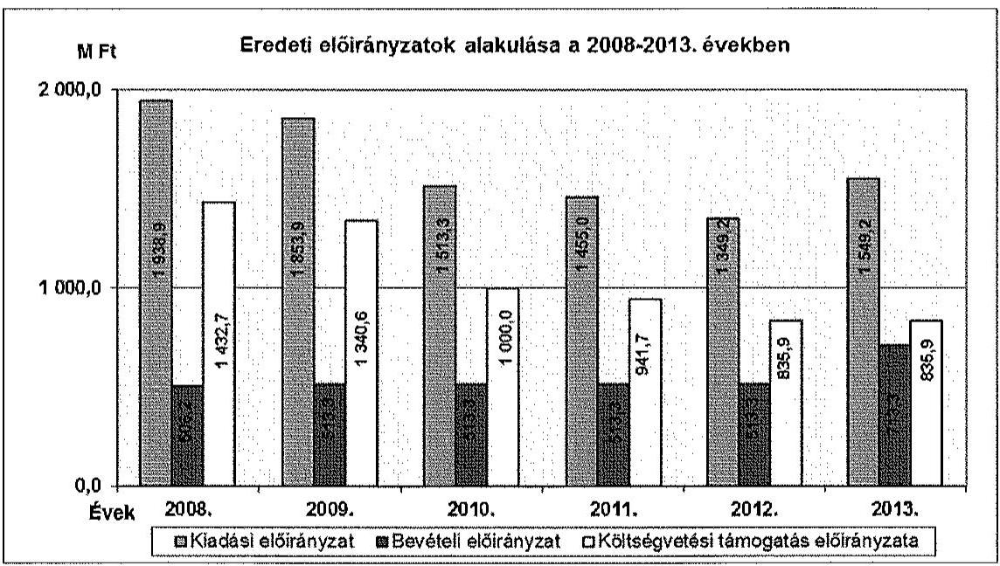

A NIIFI költségvetési támogatása folyamatosan csökkent, 2013-ban a 2008. évi előirányzatnak az 58,3%-át tette ki. A támogatási előirányzatok csökkenése miatt a NIIFI a gazdálkodás egyensúlyát a saját bevételei növelésével tartotta fenn.
Az ellenőrzött időszakban a kincstári költségvetés és az elemi költségvetés adatai között az egyezőség kiemelt előirányzati szinten fennállt. ${ }^{34}$ Az Intézet az előirányzat-módosítások hatásköri szabályait betartotta. Az előirányzatok módosításainak főkönyvi könyvelése szabályszerűen ${ }^{35}$ történt. Az éves beszámolóban szereplő előirányzat-módosítások megegyeztek ${ }^{36}$ a főkönyvi könyvelés szerinti előirányzat-változásokkal. Kormányhatáskörben 2008-ban ${ }^{37}$ a személyi juttatások és a kapcsolódó munkaadói járulékok előirányzatának emelésére került sor, valamint 300,0 M Ft-tal emelkedett a dologi kiadások előirányzata a forráshiány pótlására. 2009-ben ${ }^{38}$ 59,0 M Ft-tal, 2011-ben ${ }^{39}$ 30,0 M Ft-tal csökkent a dologi kiadások előirányzata kormányzati zárolás következtében. A 2012. évi költségvetési egyenleg tartását biztosító zárolás összege 47,4 M Ft volt, melyet a 1428/2012. (X. 8.) Korm. határozat írt elő. A 2013. évben ${ }^{40}$ 9,0 M Ft került zárolásra, melynek összegével a dologi kiadások előirányzatát csökkentették. A zárolás összege az 1968/2013. (XII. 7) Korm. határozat szerint elvonásra került. A kormányhatározatok által zárolt, majd elvont bevételi és kiadási előirányzatokat a szabályszerűen átvezették év végén a zárolt bevételi és kiadási előirányzat számlának nem maradt egyenlege ${ }^{41}$. Az elrendelt előirányzatok zárolása, maradványtartási kötelezettség előírása, a szerződéskötési és beszerzési tilalom elrendelése a szakmai feladatellátásra nem jelentettek kockázatot. Saját hatáskörben 2009-ben egy alkalommal a dologi kiadások előirányzatából 52,3 M Ft-tal emelték a személyi juttatások és kapcsolódóan a munkaadói járulékok előirányzatát, ami ellentétes volt az Ámr. 51. § (2) bekezdésében foglaltakkal. Az egyéb intézeti hatáskörű előirányzat-változtatások megfeleltek az előírásoknak ${ }^{42}$.
Az Intézet többletbevételként realizálta a nemzetközi programokból származó közvetlen EU-s támogatásokat és a hazai uniós programokból származó bevételeket. A többletbevételekből irányító szervi hatáskörben engedélyezett előirányzat-módosítások szabályszerűen történtek meg ${ }^{43}$. A 2012. évben a kiadási és bevételi előirányzatok jelentős mértékben 220,3%-kal, 1349,2 M Ft-ról 2972,4 M Ft-ra, 1623,2 M Ft-tal emelkedtek meg az eredeti előirányzatokhoz képest. A 2013. évben 457,0%-kal, 1549,2 M Ft-ról 7080,2 M Ft-ra, 5531,1 M Ft-tal növekedett a NIIFI módosított kiadási és bevételi előirányzata az eredeti előirányzatokhoz képest.
Az év közben átvett feladatok finanszírozási szükséglete az előirányzatok növelését idézte elő.

A NIIFI eredeti előirányzata kiegészült a Sulinet hálózat 839,0 M Ft támogatásával, az eMagyarország hálózat ${ }^{44}$ szakmai koordinációjához szükséges 25,0 M Ft-tal, valamint a Miskolci digitális közösség projekthez kapcsolódó 3000,0 M Ft irányító szervi támogatással. Az engedélyezett létszám 29 fővel bővült, melyhez az 1159/2013. (III. 28.) Korm. határozat 206,0 M Ft-ot biztosított. A személyi juttatások és járulékok előirányzatát év közben, intézeti hatáskörben 703,1 M Ft-tal megemelték, melynek forrását projektbevételek biztosították.

Az Intézet az előirányzat-módosításokról hatáskörönként és kiemelt előirányzatonként analitikus nyilvántartást vezetett, ami a főkönyvvel és a beszámolóval egyezőséget mutatott. A 2010-2011. évi nyilvántartásban azonban az Ámr. 2 70. § (2) bekezdése szerinti tartalmi követelmények közül az előirányzatok egyszeri vagy tartós jellegét nem rögzítették, egyéb tekintetben az analitika megfelelt a hivatkozott előírásoknak.

# 4.2. A kiadási előirányzatok felhasználása, a bevételi előirányzatok teljesítése 

Az Intézet a bevételi és kiadási előirányzatok felhasználása során - a 2010. év kivételével - betartotta a jogszabályi előírásokat. A kiemelt kiadási előirányzatokat egyik évben sem lépték túl. ${ }^{45}$

A kiadások és bevételek alakulásának grafikonja:
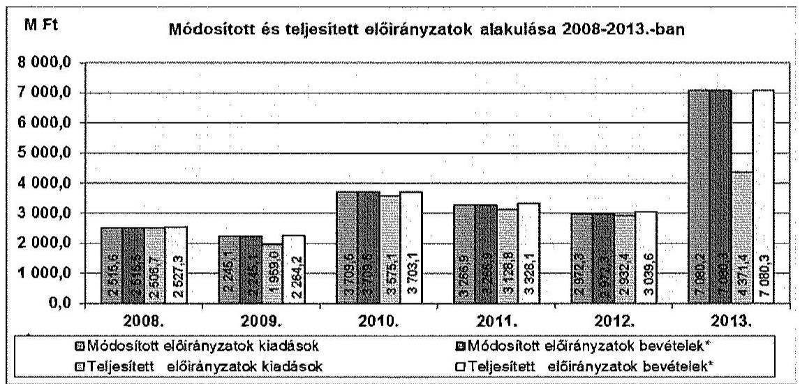

* A bevételek a költségvetési támogatásokkal együtt szerepelnek az értékekben.

A 2010. évtől a kiadási/saját bevételi előirányzatokat és a teljesítést jelentősen növelték az ÚMFT (TÁMOP, TIOP, KMOP), és az EU támogatású nemzetközi projektek bevételei illetve kiadásai.

Míg a pénzeszközátvétel és támogatásértékű bevétel 2008-ban 81,4 M Ft, 2009-ben 186,1 M Ft volt, a projektbevételek 2010-ben 1642,7 M Ft-tal, 2011-ben 1712,8 M Ft-tal, 2012-ben 1470,8 M Ft-tal, 2013-ban 1557,5 M Ft-tal növelték az Intézet bevételi/kiadási előirányzatait.
A módosított előirányzat eredeti előirányzattól való eltérése 2008-ban és 2009-ben a dologi kiadások esetében volt a legnagyobb összegű. A módosítás az összes előirányzat-módosítás 64,7%-át, illetve 35,9%-át tette ki. 2010-2011-ben az intézeti beruházások előirányzata emelkedett a legnagyobb mértékben, ami az összes előirányzat-módosítás 64,3%-át, illetve 85,2%-át ${ }^{46}$ tette ki. Az előirányzat növelésének forrásai az uniós projektek többletbevételei voltak. A 2012. évben a módosított előirányzat 39,5%-a intézeti beruházások, 41,4%-a

dologi kiadások emelését szolgálta. 2013-ban a módosított előirányzat összegének 69,6%-a dologi kiadás, 15,7%-a - a foglalkoztatottak létszámának növekedésével összefüggő - személyi juttatások növekménye volt, amit az év közben átvett feladatok végrehajtására kapott az Intézet.
A költségvetési támogatás módosított előirányzata az eredeti előirányzathoz képest 2008-ban még 21,9%-kal nőtt, 2009-ben azonban 96,5%-ra csökkent, 2010-ben 0,2%-kal emelkedett, 2011-ben 97,0%-ra, 2012-ben 94,4%-ra csökkent az eredeti előirányzathoz képest, azonban 2013-ban több mint 5 és félszeresére növekedett.

A kiemelt kiadási előirányzatok alakulását szemlélteti a következő grafikon:
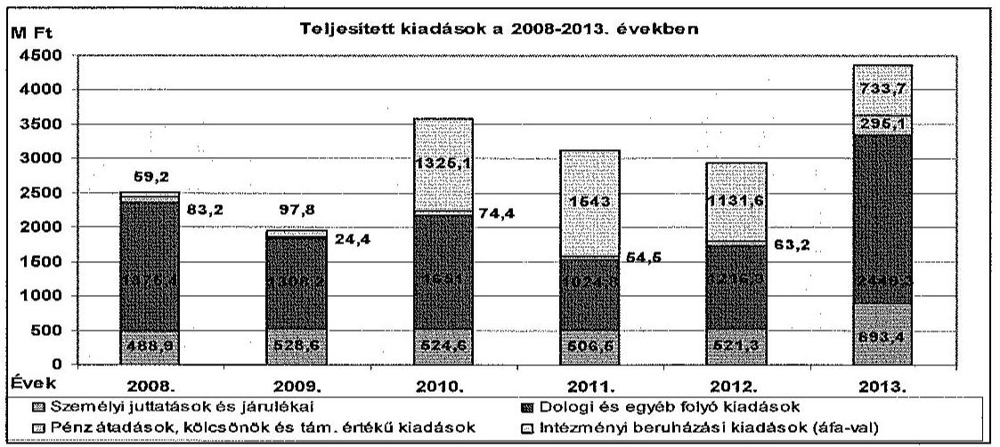

A kiemelt előirányzatok teljesítése a 2008. évi 2506,7 M Ft-ról 2013-ra 4371,5 M Ft-ra, 74,4%-kal emelkedett. A dologi kiadások legjelentősebb tételét minden ellenőrzött évben a kutatói hálózat vonalainak bérleti díja tette ki. A személyi juttatások kiadásai emelkedő trendet jeleztek, mely nagyobbrészt az EU-s projektek megvalósításával, kisebb részben a Kormány által jóváhagyott illetményemeléssel és kereset-kiegészítéssel függött össze. A személyi juttatások módosított előirányzatának és teljesítésének jelentős mértékű növekedését (170,9%) 2013-ban az átvett feladatok okozták. Az ellenőrzött időszakban a NIIFI jóváhagyott költségvetése beruházásra eredeti előirányzatot nem tartalmazott. A 2010-2011. években a beruházási kiadások teljesítési aránya 37,1%-ot, illetve 49,3%-ot ért el, mely az elnyert projektekből befolyt bevételekből származott. A 2013. évben a dologi kiadások teljesítése a módosított előirányzathoz képest csupán 49,7% volt, melyet a digitális írástudás fejlesztése programból származó, év végéig fel nem használt forrás okozott.
Az Intézet az ellenőrzött időszakban vállalkozási tevékenységet nem folytatott.

# 4.3. A belső kontrollok működése a kiadási előirányzatok felhasználása során 

A kiadási előirányzatok felhasználásához kapcsolódó kulcskontrollok működése a 2008-2011. években nem megfelelő, a 2012. és 2013. években részben megfelelő volt.
A személyi juttatások, a dologi és egyéb folyó kiadások, valamint az átadott pénzeszközök felhasználása során a pénzgazdálkodással kapcsolatos gazdálkodási jogkörökhöz előírt belső kontrollok a 2008-2011. években nem működ-

tek szabályszerűen sem a jogszabályi ${ }^{47}$ sem belső szabályzatuk ${ }^{48}$ szempontjából. A 2012-2013. években részben működtek szabályszerűen ${ }^{49}$. Az ellenőrzött mintatételek közül a felhalmozási kiadásoknál a kulcskontrollok működése a 2008., a 2010. és a 2012. évben szabályszerű, a 2013. évben részben szabályszerű volt, míg a 2009. és a 2011. években nem volt szabályszerű. A kulcskontrollok nem szabályszerű működése a folyamatba épített, és a vezetői ellenőrzési hiányosságát jelzi. A számviteli elszámolás tekintetében nem került sor szabálytalanság megállapítására. Az Ámr. 1 134. § (8) bekezdésében foglaltak szerinti írásbeli kötelezettségvállalás elmaradása két esetben fordult elő az ellenőrzött mintatételeknél, és előfordult, hogy jogosulatlan pénzügyi jogkörgyakorlást is tárt fel az ellenőrzés. A jogkörök gyakorlása során összeférhetetlenség nem került megállapításra ${ }^{50}$. Kötelezettséget - egy mintatétel kivételével - a jogszabályi előírásoknak ${ }^{51}$ megfelelően az arra jogosultak vállaltak. A pénzügyi jogkörgyakorlásra feljogosított személyek aláírás-mintája rendelkezésre állt, a bizonylatokon lévő aláírások megegyeztek az aláírás-mintákkal. Az ellenőrzés nem tárt fel jogosulatlan kifizetést.

A 2011. évben 87882,0 ezer Ft összegben vásárolt szuperszámítógép tételnél a teljesítés igazolója nem a 3/2009. számú igazgatói utasítás által, a TIOP 1.3.2.KMOP 4.2.1. projektekre kijelölt személy volt.
A NIIFI nem tartotta be a Gazdálkodási szabályzatában 1,2 előírtakat, mely szerint a kötelezettségvállalás folyamatait a „Kötelezettségvállalás kísérő" dokumentumnak kell kísérnie, a szerződéseket az előkészítő(k)nek kézjegyükkel kell ellátniuk, továbbá a kötelezettségvállalónak történő átadást megelőzően az Intézet jogi tanácsadójának véleményeznie kell, és jogi ellenjegyzéssel kell ellátnia. A mintatételekben szereplő kötelezettségvállalásokhoz kísérő dokumentumot egy esetben csatoltak, jogi ellenjegyzésre pedig nem került sor.
A kötelezettségvállalás pénzügyi ellenjegyzésének elmaradásával az Intézet megsértette az Ámr. 1 134. (8) bekezdésében, az Ámr. 2 74. § (1)-(3) bekezdésében, illetve az Ávr. 50. § (1) bekezdés d) pontjában az ellenjegyzésre vonatkozó előírásokat. A kifizetésekhez szükséges előirányzatokkal és fedezettel az Intézet rendelkezett.

A kötelezettségvállalás pénzügyi ellenjegyzésének hiánya a rendszeres személyi juttatások és a külföldi kiküldetések engedélyezésének eredeti dokumentumain 42 esetben utólagosan - a helyszíni ellenőrzés idején - került pótlásra, ami
 miatt a helyszínen jegyzőkönyv került felvételre.
A 2008-2013. években a teljesítésigazolásra vonatkozó Ámr. ${ }_{1} 135 . \S$ (1)-(2) bekezdés, és az Ámr. ${ }_{2} 76$. (1), (3) bekezdés, valamint az utalványozás ellenjegyzésére vonatkozó Ámr. ${ }_{1} 137$. (3) bekezdés, és az Ámr. ${ }_{2} 79$. § (2) bekezdés

[^0]
[^0]:    ${ }^{47}$ Ámr. ${ }_{1}$ 134. § (1), (3)-(4), (8)-(12) bekezdés, 135. §,136. § (1), (3)-(6) bekezdés, 137. § (1), (3)-(6) bekezdés, 138. § (1)-(3) bekezdés, Ámr. ${ }_{2}$ 72. § (3),(7),(13),(14) bekezdés, 74. § (1) bekezdés, (2) bekezdés a) pont, (3)-(6) bekezdés, 75. § (2)-(5) bekezdés, 76. §-80. §.
    ${ }^{48}$ Kötelezettségvállalási szabályzat.
    ${ }^{49}$ Ávr. 55. § (1) bekezdés, (2) bekezdés a) pont, (3) bekezdés, 56 § (2),(3), (5) bekezdés, 57.§,60.§ Kötelezettségvállalási- és szerződéskötési, Gazdálkodási szabályzat ${ }_{1}$, 1/2012 számú és 1/2013. számú igazgatói utasítás.
    ${ }^{50}$ Ámr. ${ }_{1}$ 135. § (6), 138. § (1)-(3) bekezdés, Ámr. ${ }_{2}$ 80. §, Ávr. 60. §.
    ${ }^{51}$ Ámr. ${ }_{1} 134 . \S$ (1) bekezdés, Ámr. ${ }_{2} 72 . \S$ (3) bekezdés a) pont, Ávr. 2. § (1) bekezdés a) pont

---

szabályait nem, vagy nem szabályszerűen hajtották végre. A teljesítésigazolásra vonatkozó - az Áht ${ }_{2}$. 38. §-ában és az Ávr. 57. §-ában meghatározottak előírásoknak nem minden esetben tettek eleget. Az érvényesítésre vonatkozó kontroll nem volt szabályszerű, mert az érvényesítés nem a jogszabályi előírásoknak ${ }^{52}$ megfelelően történt. Az érvényesítő által a hiányosság jelzése az utalványozó felé nem történt meg az Ámr. ${ }_{2}$ 77. § (2) bekezdése értelmében.
A nem rendszeres személyi juttatások felhasználását reprezentáló mintatételeknél 2010-től, a rendszeres személyi juttatásoknál 2012-től a kötelezettségvállalás, a teljesítések igazolása és az ellenjegyzés a jogszabályokban és a belső szabályzatban ${ }^{53}$ előírtak szerint történt. A mintában szereplő közalkalmazottak kinevezési okiratai, átsorolásai, az alapilletmények és a pótlékok megállapítása a Kjt. előírásai ${ }^{54}$, és a Közalkalmazotti és munkaügyi szabályzatban foglaltak alapján szabályszerű volt. A megbízási szerződéseket a tárgyévi előirányzatok terhére kötötték meg. A külső személyi juttatásoknál betartották a jogszabályi ${ }^{55}$ előírásokat.
Az ellenőrzött munkavállalói kifizetéseik esetében az Intézet megsértette a Kvtv. 53. § (2) bekezdését, mivel a 2013. évben az egy foglalkoztatottnak éves szinten kifizetett - az Szjatv. 71. § (1) bekezdésének a)-f) pontjában és (3) bekezdésében meghatározott - béren kívüli juttatások együttes összege meghaladta a 200000 Ft-os összeghatárt. Az egy munkavállaló részére éves szinten kifizetett munkáltatói nyugdíjpénztári hozzájárulás, egészségpénztári hozzájárulás, és Erzsébet étkezési utalvány összesen bruttó 1060000 Ft-ot tett ki.

# 4.4. Az előirányzat maradvány megállapítása és az előző évi előirányzat-maradvány felhasználása 

A NIIFI-nél az előirányzat-maradvány megállapítása és az előző évi maradvány felhasználása során a jogszabályi előírásokat betartották. ${ }^{56}$

Az előirányzat maradványok megfelelő mérleg űrlapokon kerültek feltüntetésre. ${ }^{57}$ A 2008-2009. és a 2011-2012. években az előirányzat-maradvány kiadási megtakarításból és bevételi túlteljesítésből, a 2013. évben túlnyomórészt a Miskolci digitális közösség programból származó forrásból keletkezett. Bevételi lemaradás (minimális) -0,2%-os - a 2010. évben volt.

[^0]
[^0]:    ${ }^{52}$ Ámr. ${ }_{1}$ 135. § (3), (5) bekezdése, és az Ámr. ${ }_{2}$ 77. § (1), (3) bekezdés illetve az Áht ${ }_{2}$. 38. §, valamint az Ávr. 58. §.
    ${ }^{53}$ Áht. 1 100/B. § (3) bekezdés, 2010. augusztus 15-től Áht. 1 100/C. § (3) bekezdés, Ámr. ${ }_{1}$ 135. § (3),(5), Ámr. ${ }_{2}$ 77. § (1), (3) bekezdés, Áht. ${ }_{2}$ 37. § - 38. § és Ávr. 57. § - 58. §, valamint a Gazdálkodási szabályzat ${ }_{1,2}$
    ${ }^{54} 20 . \S, 60 . \S-74 . \S$.
    ${ }^{55}$ Áht. 2 37. § (1), Ámr. 1 59. § (9) bekezdés, Ámr. 2 90. § (6) bekezdés.
    ${ }^{56}$ Áht. 1 24/B. §, 100/B. §, Ámr. 1 65. § (2) bekezdés, 67. § (1) bekezdés, 98. § (5) bekezdés, 149. § (5) bekezdés, 162. § (1) bekezdés, Ámr. 2 207. §, 208. §, 210. §, 214. §, Áht. 2 86. §, Ávr. 149. §-154. § és a Számlarend ${ }_{1,2}$.
    ${ }^{57}$ Áhsz. 9. § (4) bekezdés, 25. § (1)-(2) bekezdés, 38. § (2), (11) bekezdés, 39. § (1)-(3), (6) bekezdés, 51. § (2) bekezdés.

---

A keletkezett előirányzat-maradványokat elvonandó maradvány nem terhelte, azokat a jogszabályoknak ${ }^{58}$ és a belső szabályzatoknak ${ }^{59}$ megfelelő kötelezettségvállalásokkal támasztották alá. Az irányító szerv a kötelezettségvállalással terhelt maradványokat jóváhagyta, mely maradványok későbbi felhasználása megfelelt a jogszabályi előírásoknak ${ }^{60}$, így azok elvonására nem került sor.

Meghiúsult kötelezettségvállalás a 2008-2011. években nem volt. Az Ámr. ${ }_{1}$ 162. §-ában, illetve az Ámr. ${ }_{2}$ 235. § (1) bekezdésében előírt összegű kötelezettségeket az Intézet az előírt határidőn belül bejelentette a Kincstárnak.

# 4.5. A fizetőképesség alakulása 

A 2008-2013. években a NIIFI folyamatos fizetőképessége biztosított volt, az Intézet központi költségvetési támogatása és a saját bevételek együttesen biztosították a fizetőképesség fenntartását.
Az Intézet 2011-ig évente havi bontású előirányzat-felhasználási tervet, majd a 2012. évtől likviditási tervet készített, melyek megfeleltek a jogszabályi ${ }^{61}$ előírásoknak, s melyek alapján a kötelezettségek határidőre történő kiegyenlítése biztosított volt. E tervekben figyelembe vették a zárolásra és maradványtartási kötelezettségre vonatkozó kormányzati előírásokat. Zárolás miatt lejárt szállítói tartozás egyik évben sem keletkezett, az a fizetőképességet nem befolyásolta.
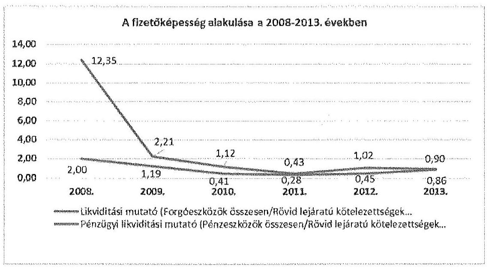

Rendkívüli kormányzati intézkedésekre szolgáló tartalékból a NIIFI nem részesült. A Kormány által a 2012. és 2013. évi költségvetési hiánycél biztosítása érdekében elrendelt beszerzési tilalmak alól az Intézet két informatikai tárgyú beszerzés esetében kapott felmentést. A tilalmak nem vonatkoztak az

[^0]
[^0]:    ${ }^{58}$ Ámr. ${ }_{1}$ 134. § (1) bekezdés, Ámr. ${ }_{2}$ 72. § (3) bekezdés, Ávr. 52. § (1) bekezdés a) pont ${ }^{59}$ Kötelezettségvállalási szabályzat, Kötelezettségvállalási és szerződéskötési szabályzat. ${ }^{60}$ Ámr. ${ }_{1}$ 67. § (1),(3),(4) bekezdés, Ámr. ${ }_{2}$ 214. §, Ávr. 36. § (1) bekezdés és (2) bekezdés b) pont
    ${ }^{61}$ Ámr. ${ }_{1}$ 138/B. §, Ámr. ${ }_{2}$ 200. § (1) bekezdés, valamint az Áht. ${ }_{2}$. 78. § (2) és Ávr. 122. § (1) és (3) bekezdés

---

EU-s forrást tartalmazó előirányzatokra. A kormányzati intézkedések végrehajtása során figyelembe vették a pénzügyi helyzetet.
A NIIFI pénzügyi helyzete folyamatosan változott. A pénzeszköz likviditási mutató ${ }^{62}$ az ellenőrzött időszak első két évében kedvező volt, mely után romló tendencia következett. A 2008. és 2009. években a pénzeszközök állománya fedezetet biztosított a rövid lejáratú kötelezettségek egészére, 2010-ben kevesebb, mint a felére, 2011-ben pedig a negyedére. A tendenciaváltozást a forgóeszközök értékének csökkenése és a rövid lejáratú kötelezettségek állományának növekedése okozta. A 2012-2013. években a pénzeszközök év végi állománya nem nyújtott fedezetet a rövid lejáratú kötelezettségekre, ez azonban likviditási problémát nem okozott.
A likviditási mutató ${ }^{63}$ értéke a 2008-2009. években meghaladta az „1" értéket, mivel a pénzeszközök és a követelések együttes összege fedezetet nyújtott a rövid lejáratú kötelezettségek teljesítésére. A likviditási mutató értéke 2010-re „1" alá esett, és a csökkenés 2011-ben is folytatódott. A likviditási mutató romlását a szállítói állomány folyamatos és jelentős mértékű növekedése ${ }^{64}$ okozta.
A NIIFI kötelezettségállománya ${ }^{65}$ az ellenőrzött években folyamatosan emelkedett, a 2013. évi állomány a 2008. évi érték 115-szörösét tette ki. Hosszú lejáratú kötelezettsége az Intézetnek a 2008-2013. években nem volt. A 2008. és 2011. években a teljes kötelezettségállomány szállítói tartozásból adódott, míg a rövid lejáratú kötelezettségeken belül 2009-ben, 2010-ben és 2012-ben a legnagyobb értéket a szállítói tartozások tették ki. A 2013-ban meglévő jelentős összegű egyéb kötelezettségállomány a 2014-ben elszámolandó EU-s projektelőlegek és a Miskolci digitális közösség programból még fel nem használt összeg miatt keletkezett. ${ }^{66}$ A tartozásállományban 30 napon belül lejárt határidejú szállítói tartozás csak a 2013. évben volt. A szállítói tartozás átütemezésére egyik évben sem került sor. Az Intézet fizetőképessége külön intézkedés nélkül is biztosított volt. A folyamatos fizetőképesség biztosításához előirányzatkeret előrehozást egyik évben sem igényeltek. Kincstári biztos kirendelésére nem került sor ${ }^{67}$, mert az Intézet elismert, az esedékességet követő hatvan na-

[^0]
[^0]:    ${ }^{62}$ A pénzeszköz likviditási mutató azt fejezi ki, hogy a pénzeszközök év végi állománya milyen arányban nyújt fedezetet a rövid lejáratú kötelezettségekre.
    ${ }^{63}$ A likviditási mutató azt fejezi ki, hogy az aktív pénzügyi elszámolások nélkül számított forgóeszköz érték milyen arányban nyújt fedezetet a rövid lejáratú kötelezettségek kiegyenlítésére.
    ${ }^{64}$ A szállítói állomány mérleg szerinti záró értéke 2008-ban $27,5 \mathrm{MFt}, 2009$-ben 144,5 M Ft, 2010-ben 256,1 M Ft, 2011-ben 692,0 M Ft, 2012-ben 254,2 M Ft, 2013-ban 476,8 M Ft volt. A szállítói kötelezettségeken belül lejárt tartozás nem volt.
    ${ }^{65}$ A kötelezettségállomány a 2008. évben 27,5 M Ft, a 2009. évben 256,6 M Ft, a 2010. évben 368,3 M Ft, a 2011. évben 692,0 M Ft, 2012-ben 254,2 M Ft, 2013-ban 3160,6 M Ft volt.
    ${ }^{66}$ A 23,9 M Ft-os összeg teljes egészében pályázati projekthez kapcsolódó, szállítói finanszírozásos számlákból adódott, melyeknél a kiegyenlítést a közreműködő szervezet végezte a szállító részére, a NIIFI gazdasági igazgatójának nyilatkozata szerint.
    ${ }^{67}$ Áht. 1 100/F. § (3) bekezdés, Áht. 2 71. § (1) bekezdés, Ávr. 116-117. §.

---

pon túli tartozásállománya nem haladta meg a jogszabályban meghatározott mértéket ${ }^{68}$.
A NIIFI követelésállománya az éves beszámoló mérlegadatai alapján a 2008. évi 284,4 M Ft-ról 2013-ra 117,7 M Ft-ra csökkent. A követelésállományon belül a vevőállomány 2008-ban 92,6 M Ft, 2013-ban 105,4 M Ft volt. A 2008-2013. években a vevőkövetelések korösszetétele folyamatosan változott. A határidőn túli vevőkövetelések állományának lejárat szerinti megoszlása az alábbiak szerint alakult:
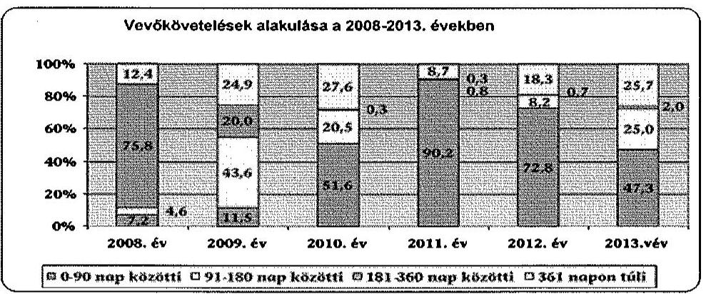

A NIIFI az ellenőrzött időszakban a követelései behajtása érdekében két alkalommal ${ }^{69}$ küldött fizetési felszólításokat a lejárt határidejú, kiegyenlítetlen tartozással rendelkező partnereinek. Behajthatatlan követelés 2013. év december 31-én nem volt, bírósági intézkedés hatására követelés kielégítése nem történt, jogi behajtásra követelést nem kellett kiadniuk. Kis összegű követelés elengedésére nem került sor.

# 5. AZ Intézet VAGYONGAZDÁLKODÁSA 

Az Intézet vagyongazdálkodása
 az ellenőrzött időszakban részben szabályszerű volt.

### 5.1. A vagyongazdálkodás szabályozottsága

Az Intézet vagyongazdálkodási tevékenységének szabályozottsága az ellenőrzött időszakban - részben megfelelt a Számv. tv. ${ }^{70}$, a Vtv. ${ }^{71}$, az Ámr. ${ }_{1},{ }^{72}$ az Ámr. ${ }_{2}{ }^{73}$ és az Áhsz. ${ }^{74}$ vonatkozó előírásainak. A vagyongazdálkodással kapcsolatos döntési hatásköröket az SZMSZ-ben és a Gazdálkodási szabályzatban megfelelően rögzítették. A Vagyongazdálkodási szabályzat tartalmazta a kincstári vagyonnal való gazdálkodás, a bérbeadás, a térítés-

[^0]
[^0]:    ${ }^{68}$ E korlát az éves eredeti kiadási előirányzatának 3,5\%-a vagy az ötvenmillió Ft volt. ${ }^{69} 2011$. március hónapban, és 2013. májusában.
    ${ }^{70}$ Számv. tv. 14. § (3), (4), (5), (8), (9) bekezdései, 161. § (1), (2) bekezdés d) pontja
    ${ }^{71}$ Vtv. 27-28. §-ai, Vtvr. 3-19. §-ai, 24-53. §-ai
    ${ }^{72}$ Ámr. ${ }_{1}$ 17. § (5) bekezdés, 134-137. §-ai
    ${ }^{73}$ Ámr. ${ }_{2}$ 15. § (6) bekezdése, 72-76. §-ai
    ${ }^{74}$ Áhsz. 8. § 14-32. §, 37. §, 47. § (1)-(2) bekezdései, 48. §, 49. § (1), (4), (6), 51. § (2) bekezdése

---

mentes átadás szabályait, de nem tartalmazta az állami vagyon elidegenítésére vonatkozó - a Vtv. 33.-37. §-aiban előírt - eljárásrendet. Olyan jogszabályra is hivatkozott a szabályzat, amely a vizsgált időszakban nem volt hatályban ${ }^{75}$, mivel a Vtv. 27. §-28. §-aiban, valamint a Vtvr. 3. -19. § és a 24. §-43. §-aiban történt változásokat követően az ellenőrzött időszak végéig nem aktualizálták. Mindez kockázatot jelentett a vagyongazdálkodási feladatok szabályszerű végrehajtásában ${ }^{76}$, de ebből eredő hibát - az ellenőrzött időszakra vonatkozóan az ellenőrzés nem tárt fel. A beszerzések szabályozása biztosított volt. A Kbt. ${ }_{1,2}$ hatálya alá tartozó beszerzések eljárási rendjét a Közbeszerzési szabályzat${ }_{1,2,3,4}$, a közbeszerzési értékhatár alatti beszerzésekét a Beszerzési szabályzat${ }_{1,2}$ tartalmazta.

# 5.2. Az eszközök források értékének kimutatása 

A mérlegben kimutatott eszközök és források értékének megállapítása, nyilvántartása - a követelések értékelésének kivételével - megfelelt az előírásoknak.
A NIIFI a vagyoni és pénzügyi helyzetére kiható gazdasági eseményekről a kettős könyvvitel rendszerében módosított teljesítés szemléletű nyilvántartást vezetett. A könyvviteli számlák tagolásával ${ }^{77}$ - melyet Számlarendben határoztak meg - illetve a könyvviteli számlákhoz kapcsolódó analitikus nyilvántartások vezetésével gondoskodtak költségvetési beszámolóik adatainak a valóságnak megfelelő, áttekinthető alátámasztásáról. Az Intézet a számviteli politikája keretében az Áhsz. 5. § 8. pontja szerinti jelentős összeg értékhatárt szabályozta, továbbá meghatározta a kisértékű tárgyi eszközök, vagyoni értékű jogok és szellemi termékek minősítésének, és a terven felüli értékcsökkenés elszámolásának szempontjait. Az Intézet az értékcsökkenés elszámolása során nem élt az Áhsz. 30. § (5) bekezdés szerint a lineáris leírási kulcs kisebb mértékű meghatározásának lehetőségével. Az Áhsz. 30. § (1) bekezdése értelmében - a 2008. év kivételével - meghatározták a beszerzett immateriális jószágok, tárgyi eszközök üzembe helyezése dokumentálásának szabályait. Az Intézet az ellenőrzött időszakban saját kivitelezésben beruházási tevékenységet nem végzett.
A mérleg alátámasztó leltárt ${ }^{78}$ december 31-i fordulónappal az eszközök és források mérlegsorainak részletes számbavételével az ellenőrzött évek mindegyikére elkészítették. A követelések értékelése dokumentumokkal nem volt alátámasztott, a követelések értékkülönbözetét azonban negyedévente lekönyvelték. A dokumentumok/bizonylatok hiányával megsértették az Sztv. 165. § (1)-(2) bekezdésében foglaltakat. A tárgyévi illetve a tárgyévet követő kötelezettségek elkülönítése az Áhsz. ${ }^{79}$-ben foglaltak szerint történt, de a 2008. évben a kötelezettségvállalások analitikus nyilvántartása az Áhsz. ${ }^{80}$ előírásai ellenére nem tartalmazta a kötelezettség fajtáját, keletkezésének, illetve teljesítésének időpontját. Negyedévente - a belső szabályzatuknak megfelelően - a kötelezett-

[^0]
[^0]:    ${ }^{75}$ Az 58/2005. (IV. 4.) Korm. rendelet 2007. év október 3-áig volt hatályban.
    ${ }^{76}$ Áht. ${ }_{1-2}$, Ámr. ${ }_{1-2}$, Ávr., Áhsz.
    ${ }^{77}$ Áhsz. 9. számú melléklete
    ${ }^{78}$ Az Áhsz. 37. § (1) bekezdése szerint.
    ${ }^{79}$ Áhsz. 9. számú melléklet
    ${ }^{80}$ Áhsz. 9. számú melléklet 4. d. pontja

---

ségek állományához kapcsolódó analitikus nyilvántartások alapján feladást készítettek. Az egyéb passzív pénzügyi elszámolások mérlegsorait ${ }^{81}$ főkönyvi számlákkal, analitikus nyilvántartással, leltárral szabályszerűen alátámasztották, előző éveket érintő hibák ${ }^{82}$ miatti helyesbítésre nem került sor. Egy évnél régebbi tételek nem voltak. Az Intézet 2008-2011. évi leltárai a Számv. tv. ${ }^{83}$ előírásai ellenére a mérleg fordulónapján meglévő eszközöket értékben nem, csak mennyiségben mutatták be. A 2012-2013. években a CT-EcoSTAT program alkalmazásával tértek át az elektronikus leltározásra, ezt követően a leltár mennyiségben és értékben is felvételre került.
A leltározás végrehajtása az előírásoknak csak részben felelt meg, mert az Áhsz. ${ }^{84}$ és a Leltározási szabályzat${ }_{1,2}$-ben foglaltaktól eltérően a tárgyi eszközöket és a készleteket a 2008-2012. években nem tényleges mennyiségi felvétellel, hanem munkavállalónként adategyeztetés útján leltározták. Az üzemeltetésre átadott eszközök leltározása a 2009-2013. években nem felelt meg az Áhsz. ${ }^{85}$ előírásainak, mert a mérleget nem az üzemeltetést végző intézmények által készített leltárral támasztották alá, hanem az Intézet által végzett speciális elektronikus eljárással készített leltárral. A leltárak adattartalma a 2008-2011. években nem felelt meg az Áhsz. 37. § (2) bekezdésében foglaltaknak, illetve a Leltározási szabályzat${ }_{1,2}$-nek, mert nem szigorú számadás alá vont nyomtatványokat használtak, továbbá a leltárfelvételi ívekről hiányzott a leltározott eszköz leltári száma, értéke. Leltáreltérés a 2008. évben nem volt, leltártöbbleteket a 2009-2013. évekre állapítottak meg. A leltárak kiértékelése az eltérések kimutatása megtörtént, de azok okainak kivizsgálása, a fellelt eszközök lekönyvelése elmaradt, ami ellentétes az Áhsz. 32. § (4) bekezdésében foglaltakkal.
Az eszközök selejtezésének, hasznosításának előkészítése és végrehajtása a jogszabályoknak és a belső szabályzatnak megfelelően történt. A selejtezett eszközöket az Intézet a nyilvántartásából kivezette. A selejtezésekről keletkezett jegyzőkönyvek alapján, az eszközöket megsemmisítésre átadták a hálózati szolgáltatásokat igénybe vevő intézményeknek, de a megsemmisítés megtörténtét nem követték nyomon.

# 5.3. A beszerzett, létesített immateriális javak és tárgyi eszközök bekerülési értékének megállapítása, nyilvántartása 

A beszerzett immateriális javak és tárgyi eszközök bekerülési értékének megállapítása, állományba vétele, értékcsökkenésének elszámolása az ellenőrzött mintatételek esetében megfelelően történt.
A befektetett eszközök aktiválása, valamint az értékcsökkenési leírásaik negyedévenkénti elszámolása ${ }^{86}$ az egyedi nyilvántartó kartonokon dokumentált

[^0]
[^0]:    ${ }^{81}$ Számv. tv. 161. § (3) bekezdése, Áhsz. 49. § (1) bekezdése, a 9. számú melléklet 4h). pontja, leltár Számv. tv. 69. § (1) bekezdése, Áhsz. 37. § (1)-(5) bekezdése
    ${ }^{82}$ Áhsz. 5. § 8-10. pont, 40.§ (5) bekezdés előírásai
    ${ }^{83}$ Számv. tv. 69. § (1) bekezdése
    ${ }^{84}$ Áhsz. 37. § (6) bekezdése
    ${ }^{85}$ Áhsz. 37. § (4) bekezdése
    ${ }^{86}$ Áhsz. 30-31/A. §

---

volt. A Beszerzési szabályzat${ }_{1,2}$-ban foglaltaktól eltérően a beszerzést megelőzően nem minden előírt esetben kértek be három árajánlatot. Az üzembe helyezéseket - a kialakított belső szabályozás szerint - hitelt érdemlően dokumentálták. A mintavételezés alapján ellenőrzött, a Kbt${ }_{1,2}$ hatálya alá tartozó közbeszerzéseknél az eljárásokat lefolytatták. A szerződés szerinti és a pénzügyi teljesítés szerinti összegek megegyeztek. Az Áhsz. ${ }^{87}$ előírásának megfelelően kis értékű eszközök és a vagyoni értékű jogok, a szellemi termékek bekerülési értékét beszerzéskor dologi kiadásként egy összegben elszámolták. A befektetett eszközöket az Áhsz.-ben ${ }^{88}$ foglaltak szerint bekerülési értéken értékelték, csökkentve az értékcsökkenési leírásokkal.
Az NIIFI befektetett eszközeinek összege a 2008. január 1-jei 243,2 M Ft-ról 2013. év végére 1441,0 M Ft-ra, mintegy hatszorosára növekedett, elsősorban a gépek, berendezések, felszerelések értékének közel ötszörösére történt emelkedése miatt. Annak ellenére volt kiemelkedő az eszközérték növekedése, hogy az üzemeltetésre átadott informatikai eszközök avultsága miatt 2010-2011-ben jelentős selejtezéseket hajtottak végre. Eszközbeszerzésre az EU-s projektek bevételeiből került sor, mely kompenzálta a selejtezések értékét. A NIIFI-nek ingatlanjai és kapcsolódó vagyoni értékű jogai nem voltak az ellenőrzött években.
A pénzeszközátadások, a támogatás értékű kiadások, a kölcsönök nyújtása, az ellátottak juttatásai jogcímű kiadások esetén megállapodásokban rögzítették a kiadás jogcímét, elszámolási kötelezettséget írtak elő, melyek alapján az elszámolások megtörténtek.
A forgóeszközök aránya - a 2011. évi mélypontot kivéve - növekedést mutatott, mivel a 2008. évi 58,2 %-ról 2013. évre 66,4 %-ra nőtt. A saját tőke aránya mutató a 2008. évi 91,7 %-ról 2013-ra 37,0 %-ra csökkent. A mutató évről évre történő csökkenése a kezelésbe vett eszközök tőkeváltozása miatt negatív tendenciát jelez. A használhatósági fok alakulását szemlélteti a következő grafikon:
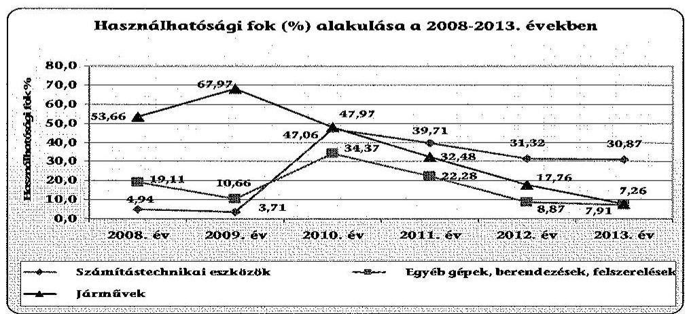

A használhatósági fok értékei a reálfolyamatokat tükrözik. Míg a 2008-2010. években a mutatók javulása is bekövetkezett, addig a 2010. év után minden eszközcsoportban romlottak a használhatósági értékek.

[^0]
[^0]:    ${ }^{87}$ Áhsz. 17. § (3) bekezdése
    ${ }^{88}$ Áhsz. 32. § (1) bekezdése

---

# 5.4. A vagyonelemek hasznosítási gyakorlata 

Az MNV Zrt. engedélyéhez kötött értékesítés a 2008-2013. években nem történt. Az ellenőrzött időszakban egyetlen vagyonelem értékesítésére került sor, amely az Ámr., ${ }^{89}$, illetve a Gazdálkodási szabályzat előírásai alapján szabályszerű volt. A 2008-2013. években bérleti díj megállapítására nem került sor, vagyonelemek tulajdonjogának térítésmentes átadása nem történt. Az üzemeltetésre átadott eszközöket a 2008. évben az Áhsz. ${ }^{90}$ előírásai ellenére nem elkülönítetten tartották nyilván.

### 5.5. Az eredmény szemléletű számvitel bevezetésével kapcsolatos feladatok végrehajtása

## Az eredményszemléletű államháztartási információs rendszer kialakításának előkészületei megtörténtek.

Az Intézetben az eredményszemléletű számvitel bevezetésével kapcsolatos feladatokat a jogszabályoknak megfelelően végrehajtották. Az Intézetben az államháztartás számvitelének 2014. évi megváltozásával kapcsolatos feladatokról szóló 36/2013. (IX. 13.) NGM rendelet ${ }^{91}$ előírásainak megfelelően a rendező mérleg elkészítéséhez - 2013. december 31-ei mérlegforduló nappal valamennyi eszközt és forrást, illetve a kötelezettségvállalásokat teljes körűen felleltározták. A rendező mérleg elkészítését megelőző feladatokat elvégezték, a rendező, és a technikai tételeket elszámolták. A rendező mérleget határidőre, a 36/2013. (IX. 13.) NGM rendelet szerinti formában elkészítették.

## 6. Az Intézet korábbi ÁSZ ellenőrzései során tett javaslatok hasznosulása érdekében meghozott intézkedések ellenőrzése

A zárszámadások ellenőrzése keretében az ÁSZ kétszer, 2008-ban és 2013-ban ellenőrizte az Intézetet, de javaslatok megfogalmazására csak a 2008. évi ellenőrzés alkalmával került sor.
„A Nemzeti Információs Infrastruktúra Fejlesztési Intézet 2008. évi költségvetése végrehajtásának ellenőrzése”-kor 12 javaslat került megfogalmazásra, melyek közül a NIIFI az ÁSZ részére megküldött intézkedési tervében ${ }^{92}$ az első 10 javaslatra intézkedett. Az intézkedési terv egy intézkedése kivételével ${ }^{93}$ az intézkedések teljesítésre kerültek. Hat intézkedés

 teljesítése az intézkedési tervben előírt határidőhöz képest később${ }^{94}$ valósult meg. A későbbiek során arra a két ÁSZ javaslatra is született intézkedés, melyre a NIIFI intézkedési terve nem tért ki. ${ }^{95,96}$
Budapest, 2015. 07. hó 24. nap

| Melléklet: | 6 db |
| :-- | :-- |
| Függelék: | 3 db |

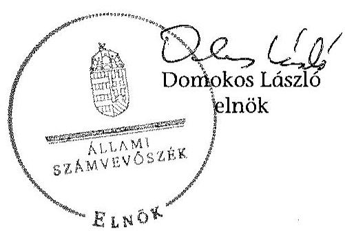

[^0]
[^0]:    ${ }^{94}$ A késedelmek két héttől két éves időintervallum közöttiek voltak.
    ${ }^{95}$ Az Intézet a 2006-ban létrehozott gazdasági társasága működését és annak hatékonyságát felülvizsgálta, melynek eredményeként az ÁSZ javaslatának megfelelően (2010. február 22-én) üzletrészét eladta.
    ${ }^{96}$ A NIIFI 2009. január 1-től áttért az Ecostat ügyviteli rendszer használatára, s ezzel az utalványrendelettel kapcsolatos, - az ÁSZ által kifogásolt - szabálytalanságok megszüntetésre kerültek.

---

| Belső kontrollrendszer kialakításának és működtetésének alakulása az Intézetnél |  |  |  |  |  |  |
| :--: | :--: | :--: | :--: | :--: | :--: | :--: |
|  |  |  |  |  |  |  |
| Kontroll pillérek / Évek | Kontroll-   környezet | Kockázatkezelés | Kontroll-   tevékenység | Információs és kommunikációs rendszer | Monitoring rendszer | Éves átlag értékek |
| 2008 | szabályszerű | szabályszerű | részben   szabályszerű | részben   szabályszerű | részben   szabályszerű | szabályszerű |
| 2009 | szabályszerű | szabályszerű | részben   szabályszerű | szabályszerű | részben   szabályszerű | szabályszerű |
| 2010 | szabályszerű | szabályszerű | részben   szabályszerű | szabályszerű | szabályszerű | szabályszerű |
| 2011 | részben   szabályszerű | szabályszerű | részben   szabályszerű | szabályszerű | szabályszerű | részben   szabályszerű |
| 2012 | részben   szabályszerű | szabályszerű | szabályszerű | szabályszerű | szabályszerű | szabályszerű |
| 2013 | szabályszerű | szabályszerű | szabályszerű | szabályszerű | szabályszerű | szabályszerű |
| Átlag értékek pillérenként | szabályszerű | szabályszerű | részben   szabályszerű | szabályszerű | részben   szabályszerű | szabályszerű |

---

### 2. SZÁMÚ MELLÉKLET A V-0723-299/2015. SZÁMÚ JELENTÉSHEZ

#### Az Intézet kiadásainak és bevételeinek alakulása

|   |  |  |  |  |  |  |  |  |  |  |  |  |  |  |  |  |  |  |  |  |  |  |  |  |  |  |  |  |  |   |
| --- | --- | --- | --- | --- | --- | --- | --- | --- | --- | --- | --- | --- | --- | --- | --- | --- | --- | --- | --- | --- | --- | --- | --- | --- | --- | --- | --- | --- | --- | --- |
|   |  |  |  |  |  |  |  |  |  |  |  |  |  |  |  |  |  |  |  |  |  |  |  |  |  |  |  |  |  |   |
|   |  |  |  |  |  |  |  |  |  |  |  |  |  |  |  |  |  |  |  |  |  |  |  |  |  |  |  |  |  |   |
|   |  |  |  |  |  |  |  |  |  |  |  |  |  |  |  |  |  |  |  |  |  |  |  |  |  |  |  |  |  |   |
|   |  |  |  |  |  |  |  |  |  |  |  |  |  |  |  |  |  |  |  |  |  |  |  |  |  |  |  |  |  |   |
|   |  |  |  |  |  |  |  |  |  |  |  |  |  |  |  |  |  |  |  |  |  |  |  |  |  |  |  |  |  |   |
|   |  |  |  |  |  |  |  |  |  |  |  |  |  |  |  |  |  |  |  |  |  |  |  |  |  |  |  |  |  |   |
|   |  |  |  |  |  |  |  |  |  |  |  |  |  |  |  |  |  |  |  |  |  |  |  |  |  |  |  |  |  |   |
|   |  |  |  |  |  |  |  |  |  |  |  |  |  |  |  |  |  |  |  |  |  |  |  |  |  |  |  |  |  |   |
|   |  |  |  |  |  |  |  |  |  |  |  |  |  |  |  |  |  |  |  |  |  |  |  |  |  |  |  |  |  |   |
|   |  |  |  |  |  |  |  |  |  |  |  |  |  |  |  |  |  |  |  |  |  |  |  |  |  |  |  |  |  |   |
|   |  |  |  |  |  |  |  |  |  |  |  |  |  |  |  |  |  |  |  |  |  |  |  |  |  |  |  |  |  |   |
|   |  |  |  |  |  |  |  |  |  |  |  |  |  |  |  |  |  |  |  |  |  |  |  |  |  |  |  |  |  |   |
|   |  |  |  |  |  |  |  |  |  |  |  |  |  |  |  |  |  |  |  |  |  |  |  |  |  |  |  |  |  |   |
|   |  |  |  |  |  |  |  |  |  |  |  |  |  |  |  |  |  |  |  |  |  |  |  |  |  |  |  |  |  |   |
|   |  |  |  |  |  |  |  |  |  |  |  |  |  |  |  |  |  |  |  |  |  |  |  |  |  |  |  |  |  |   |
|   |  |  |  |  |  |  |  |  |  |  |  |  |  |  |  |  |  |  |  |  |  |  |  |  |  |  |  |  |  |   |
|   |  |  |  |  |  |  |  |  |  |  |  |  |  |  |  |  |  |  |  |  |  |  |  |  |  |  |  |  |  |   |
|   |  |  |  |  |  |  |  |  |  |  |  |  |  |  |  |  |  |  |  |  |  |  |  |  |  |  |  |  |  |   |

  |  |  |  |  |   |
|   |  |  |  |  |  |  |  |  |  |  |  |  |  |  |  |  |  |  |  |  |  |  |  |  |  |  |  |  |  |   |
|   |  |  |  |  |  |  |  |  |  |  |  |  |  |  |  |  |  |  |  |  |  |  |  |  |  |  |  |  |  |   |
|   |  |  |  |  |  |  |  |  |  |  |  |  |  |  |  |  |  |  |  |  |  |  |  |  |  |  |  |  |  |   |
|   |  |  |  |  |  |  |  |  |  |  |  |  |  |  |  |  |  |  |  |  |  |  |  |  |  |  |  |  |  |   |
|   |  |  |  |  |  |  |  |  |  |  |  |  |  |  |  |  |  |  |  |  |  |  |  |  |  |  |  |  |  |   |
|   |  |  |  |  |  |  |  |  |  |  |  |  |  |  |  |  |  |  |  |  |  |  |  |  |  |  |  |  |  |   |
|   |  |  |  |  |  |  |  |  |  |  |  |  |  |  |  |  |  |  |  |  |  |  |  |  |  |  |  |  |  |   |
|   |  |  |  |  |  |  |  |  |  |  |  |  |  |  |  |  |  |  |  |  |  |  |  |  |  |  |  |  |  |   |
|   |  |  |  |  |  |  |  |  |  |  |  |  |  |  |  |  |  |  |  |  |  |  |  |  |  |  |  |  |  |   |
|   |  |  |  |  |  |  |  |  |  |  |  |  |  |  |  |  |  |  |  |  |  |  |  |  |  |  |  |  |  |   |
|   |  |  |  |  |  |  |  |  |  |  |  |  |  |  |  |  |  |  |  |  |  |  |  |  |  |  |  |  |  |   |
|   |  |  |  |  |  |  |  |  |  |  |  |  |  |  |  |  |  |  |  |  |  |  |  |  |  |  |  |  |  |   |
|   |  |  |  |  |  |  |  |  |  |  |  |  |  |  |  |  |  |  |  |  |  |  |  |  |  |  |  |  |  |   |
|   |  |  |  |  |  |  |  |  |  |  |  |  |  |  |  |  |  |  |  |  |  |  |  |  |  |  |  |  |  |   |
|   |  |  |  |  |  |  |  |  |  |  |  |  |  |  |  |  |  |  |  |  |  |  |  |  |  |  |  |  |  |   |
|   |

---

# Az Intézet eszközeinek és forrásainak alakulása az ellenőrzött időszakban

|  Megnevezés | 2008. év | 2009. év | 2010. év | 2011. év | 2012. év | 2013. év  |
| --- | --- | --- | --- | --- | --- | --- |
|  Immateriális javak | 9551 | 66109 | 355851 | 321815 | 246466 | 216443  |
|  Tárgyi eszközök | 214750 | 117656 | 1411171 | 968191 | 742762 | 949191  |
|  Befektetett pénzügyi eszközök | 18878 | 33208 | 35899 | 46570 | 40787 | 27157  |
|  Üzemeltetésre kezelésre átadott, vagyonkezelésbe vett eszközök | 0 | 29062 | 797 | 1301404 | 998630 | 248209  |
|  Befektetett eszközök összesen | 243189 | 246035 | 1803718 | 2637980 | 2028645 | 1441000  |
|  Készletek összesen | 0 | 0 | 0 | 0 | 0 | 0  |
|  Követelések összesen | 284462 | 260044 | 260420 | 94623 | 143904 | 117720  |
|  Értékpapírok összesen | 0 | 0 | 0 | 0 | 0 | 0  |
|  Pénzeszközök összesen | 54928 | 306289 | 150105 | 196271 | 114971 | 2724531  |
|  Egyéb aktív pénzügyi elszámolások összesen | 0 | 15433 | 2433 | 3592 | 175 | 1997  |
|  Forgóeszközök összesen | 339390 | 581766 | 412958 | 294486 | 259050 | 2844248  |
|  Eszközök összesen | 582579 | 827801 | 2216676 | 2932466 | 2287695 | 4285248  |
|  Tartós tőke | 10990 | 10990 | 265984 | 265984 | 265984 | 265984  |
|  Tőkeváltozások | 523486 | 254994 | 1442029 | 1774927 | 1658780 | -1852666  |
|  Értékelési tartalék | 0 | 0 | 0 | 0 | 0 | 0  |
|  Saját tőke összesen | 534476 | 265984 | 1708013 | 2040911 | 1924764 | -1586682  |
|  Költségvetési tartalékok | 20598 | 305125 | 127919 | 199242 | 107283 | 2708690  |
|  Vállalkozási tartalékok | 0 | 0 | 0 | 0 | 0 | 0  |
|  Tartalékok összesen | 20598 | 305125 | 127919 | 199242 | 107283 | 2708690  |
|  Hosszú lejáratú kötelezettségek | 0 | 0 | 0 | 0 | 0 | 0  |
|  Rövid lejáratú kötelezettségek | 27474 | 256649 | 368264 | 692037 | 254248 | 3160556  |
|  Egyéb passzív pénzügyi elszámolások | 31 | 43 | 12480 | 276 | 1400 | 2684  |
|  Kötelezettségek összesen | 27474 | 256649 | 368264 | 692037 | 254248 | 3160556  |
|  Források összesen | 582579 | 827801 | 2216676 | 2932466 | 2287695 | 4285248  |

---

# Az Intézet tárgyi eszközeivel kapcsolatos mutatószámok alakulása

|  Ssz. | Vagyoni helyzet elemzésének mutatói | 2008. év | 2009. év | 2010. év | 2011. év | 2012. év | 2013. év  |
| --- | --- | --- | --- | --- | --- | --- | --- |
|  1. | Befektetett eszközök aránya (Befektetett eszközök/Eszközök Összesen) | $3,24 \%$ | $4,01 \%$ | $1,62 \%$ | $1,59 \%$ | $1,78 \%$ | $0,63 \%$  |
|  2. | Ingatlanok aránya (Ingatlanok/Befektetett eszközök összesen) | - | - | - | - | - | -  |
|  3. | Forgóeszközök aránya (Forgóeszközök/Eszközök összesen) | $58,26 \%$ | $70,28 \%$ | $18,63 \%$ | $10,04 \%$ | $11,32 \%$ | $66,37 \%$  |
|  4. | Saját tőke aránya mutató (Saját tőke összesen/Források összesen) | $91,74 \%$ | $32,13 \%$ | $77,05 \%$ | $69,60 \%$ | $84,14 \%$ | $-37,03 \%$  |
|  5. | Kötelezettségek és a saját tőke aránya mutató (Kötelezettségek összesen/Saját tőke összesen) | $5,14 \%$ | $96,49 \%$ | $21,56 \%$ | $33,91 \%$ | $13,21 \%$ | $-199,19 \%$  |
|  6. | Használhatósági fok (\%)* = Tárgyi eszközök nettó értéke x 100 / Tárgyi eszközök bruttó értéke |  |  |  |  |  |

   |
|   | Épületek és kapcsolódó vagyonértékű jogok | - | - | - | - | - | -  |
|   | Építmények és kapcsolódó vagyonértékű jogok | - | - | - | - | - | -  |
|   | Számítástechnikai eszközök | $4,94 \%$ | $3,71 \%$ | $47,06 \%$ | $39,71 \%$ | $31,32 \%$ | $30,87 \%$  |
|   | Egyéb gépek, berendezések, felszerelések | $19,11 \%$ | $10,66 \%$ | $34,37 \%$ | $22,28 \%$ | $8,87 \%$ | $7,26 \%$  |
|   | Járművek | $53,66 \%$ | $67,97 \%$ | $47,97 \%$ | $32,48 \%$ | $17,76 \%$ | $7,91 \%$  |
|  7. | Elhasználódási szint (\%) = Tárgyi eszközök elszámolt értékcsökkenése x 100 / Tárgyi eszközök záró bruttó értéke |  |  |  |  |  |   |
|   | Épületek és kapcsolódó vagyonértékű jogok | - | - | - | - | - | -  |
|   | Építmények és kapcsolódó vagyonértékű jogok | - | - | - | - | - | -  |
|   | Számítástechnikai eszközök | $95,06 \%$ | $96,29 \%$ | $52,94 \%$ | $60,29 \%$ | $60,07 \%$ | $69,13 \%$  |
|   | Egyéb gépek, berendezések, felszerelések | $80,89 \%$ | $89,34 \%$ | $65,63 \%$ | $77,72 \%$ | $91,13 \%$ | $92,74 \%$  |
|   | Járművek | $46,34 \%$ | $32,03 \%$ | $52,03 \%$ | $67,52 \%$ | $82,24 \%$ | $92,09 \%$  |
|  8. | Átlagos életkor (év)= Elhasználódási szint százaléka / Értékcsökkenési leírási kulcs százaléka |  |  |  |  |  |   |
|   | Épületek és kapcsolódó vagyonértékű jogok (é.cs. 2\%) | - | - | - | - | - | -  |
|   | Építmények és kapcsolódó vagyonértékű jogok (é.cs. 3\%) | - | - | - | - | - | -  |
|   | Számítástechnikai eszközök (é.cs. 33\%) | 2,9 | 2,9 | 1,6 | 1,8 | 1,8 | 2,1  |
|   | Egyéb gépek, berendezések, felszerelések (é.cs. 14,5\%) | 5,6 | 6,2 | 4,5 | 5,4 | 6,3 | 6,4  |
|   | Járművek (é.cs. 20\%) | 2,3 | 1,6 | 2,6 | 3,4 | 4,1 | 4,6  |

---

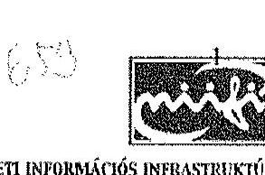

# Állami Számvevőszék 

## Domokos László

## Elnök Úr részére

Iktatási szám: P-838-2/15
Előzmény: P-838-1/15
Hivatkozási szám: V-0723-288/2015
Úgyintéző: Császár Péter gazdasági igazgatóhelyettes
Tel: $450-3060$
Tárgy: számvevőszéki jelentéstervezet észrevételezése

Tisztelt Elnök Úr

Mindenekelőtt szeretném megköszönni az ÁSZ munkatársainak az NIIF Intézet pénzügyi és vagyongazdálkodásának javítását célzó igen mélyreható, közel három hónapos helyszíni szakmai munkáját. Az NIIF Intézet érintett munkatársai már az ellenőrzés folyamán is sokat tanultak és profitáltak a számvevő kollégák munkájából és tovább tudták növelni munkájuk hatékonyságát.

Az Állami Számvevőszékről szóló 2011. évi LXVI. tv. (továbbiakban ÁSZ tv.) 29. § (2) bekezdése szerint, a Nemzeti Információs Infrastruktúra Fejlesztési Intézetről (a továbbiakban: NIIF Intézet) a központi alrendszer egyes intézményei pénzügyi és vagyon gazdálkodásának ellenőrzéséről szóló jelentéstervezethez az alábbi észrevételt tesszük:

A 9. oldalon a nemzeti fejlesztési miniszternek tett 2. javaslat, az intézet igazgatójának tett 2. javaslat és a 24. oldal alján leírtak szerint az Intézet megsértette a Magyarország 2013. évi központi költségvetéséről szóló 2012. évi CCIV. törvény 6. § (2) bekezdését, mivel „a 2013. évben az egy foglalkoztatottra éves szinten kifizetett ... béren kívüli juttatások együttes összege meghaladta a 200000 Ft-os összeghatárt". A béren kívüli juttatások - és nem cafetéria juttatások (ahogy az a javaslatban szerepel, ugyanis az Intézetnek nincs cafetéria szabályzata) - éves összege valóban meghaladta a Ktv-ben meghatározott összeghatárt, a számvevő kollégák azonban nem vizsgálták a kifizetések forrását. Az Intézet 2013. évi elemi költségvetéséből látszik, hogy az eredeti előirányzatok személyenként összesen csak bruttó 200000 Ft összegű

---

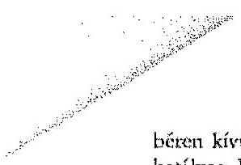
béren kívüli juttatást tartalmaztak, az ezen felüli juttatásokat az Intézet a 2013-ban hatályos Közalkalmazotti Szabályzata szerint többletbevételből, EU-s pályázati és kiemelt projektek költségvetéséből finanszírozta, nem pedig költségvetési támogatásból és eredeti előirányzat szerinti saját bevételből. Álláspontunk szerint (és a 2013-as elemi költségvetés összeállítása során a Nemzeti Fejlesztési Minisztérium Intézményfelügyeleti Főosztályával történt szóbeli egyeztetések alapján is) az Intézet szabályosan járt el.

Kérem a fentiek alapján a jelentéstervezetet javítani szíveskedjenek.
Budapest, 2015. június 3.
Tisztelettel:
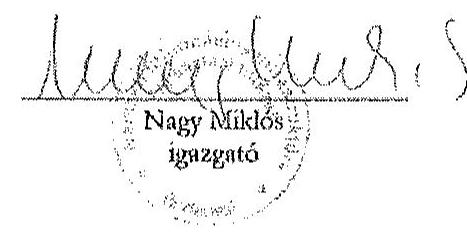

---

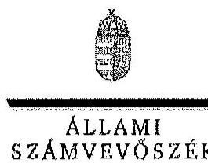

ELHOK

Ikt.szám: V-0723-294/2015.

# Nagy Miklós úr 

igazgató
Nemzeti Információs Infrastruktúra Fejlesztési Intézet

## Budapest

## Tisztelt Igazgató Úr!

A Nemzeti Információs Infrastruktúra Fejlesztési Intézet pénzügyi és vagyongazdálkodásának ellenőrzéséről készített számvevőszéki jelentéstervezetre tett észrevételét köszönettel megkaptam.

Az Állami Számvevőszék észrevételekre vonatkozó álláspontjáról a felügyeleti vezető által készített részletes tájékoztatást csatoltan megküldöm.

Tájékoztatom Igazgató urat, hogy a jelentésben - az Állami Számvevőszékről szóló 2011. évi LXVI. törvény 29. § (3) bekezdése alapján - az el nem fogadott észrevételt szerepeltetjük az elutasítás indokának feltüntetésével együtt.

Budapest, 2015. 06. hó 5. nap
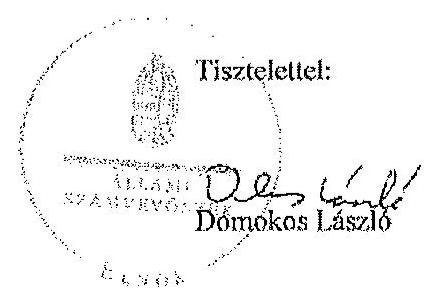

Melléklet: Tájékoztatás az el nem fogadott észrevételről

---

# Tájékoztatás az el nem fogadott észrevételről 

A Nemzeti Információs Infrastruktúra Fejlesztési Intézet (Intézet) pénzügyi és vagyongazdálkodásának ellenőrzéséről készített jelentéstervezetre a P-838-2/15. iktatószámú levelében tett észrevételét áttekintettük, annak kezeléséről az alábbi tájékoztatást adom.
Nem fogadjuk el a béren kívüli juttatásokra tett észrevételét. Magyarország 2013. évi központi költségvetéséről szóló 2012. évi CCIV. törvény 53. § (2) bekezdése azt rögzíti, hogy „a költségvetési szervek által foglalkoztatottak éves kafetériakerete illetve kafetéria rendszert nem alkalmazó szervek esetében az egy foglalkoztatottra éves szinten - az Önkéntes Kölcsönös Biztosító Pénztárakról szóló 1993. évi XCVI. törvényre is figyelemmel, a személyi jövedelemadóról szóló 1995. évi CXVII. törvény 71. § (1) bekezdés a)-f) pontjában és (3) bekezdésében meghatározott juttatások - együttes összege a 2013. évben nem haladhatja meg a bruttó 200000 forintot, amely összeg fedezetet biztosít az egyes juttatásokhoz kapcsolódó, a juttatást teljesítő munkáltatót terhelő közterhek megfizetésére is."
A kafetéria rendszert nem alkalmazó költségvetési szervek által foglalkoztatottak juttatásainak felső határát a törvény függetlenül azok forrásától határozza meg. A juttatások jogcímeinél törvényi előírás alapján - az SZJA tv. 71. § (1) a)-f) pontjában és 3. bekezdésében meghatározott juttatásokat kell figyelembe venni. Az Intézet által 2013-ban a foglalkoztatottaknak kifizetett munkáltatói nyugdíjpénztári hozzájárulás, egészségpénztári hozzájárulás és Erzsébet utalvány éves bruttó összege a 200000 Ft-ot meghaladta, ezért a 2013. évi kifizetések kapcsán megállapítható a költségvetési törvény megsértése. Tájékoztatom Igazgató urat, hogy a jelentésben a „kafetériakeret" kifejezés helyett a „béren kívüli juttatások" kifejezést szerepeltetjük.

Budapest, 2015. 06. hó 30. nap
Holman Magdolna
felügyeleti vezető

---

# RÖVIDÍTÉSEK JEGYZÉKE 

| Törvények |  |
| :--: | :--: |
| Áht. 1 | 1992. évi XXXVIII. törvény az államháztartásról (hatálytalan: 2012. január 1-jétől) |
| Áht. 2 | 2011. évi CXCV. törvény az államháztartásról |
| ÁSZ tv. ${ }_{1}$ | 1989. évi XXXVIII. törvény az Állami Számvevőszékről (hatályos: 2011. június 30-áig) |
| ÁSZ tv. ${ }_{2}$ | 2011. évi LXVI. törvény az Állami Számvevőszékről (hatályos 2011. július 1-jétől) |
| Einfo tv. | Az elektronikus információszabadságról szóló 2005. évi XC. törvény (hatálytalan 2012. január 1-jétől) |
| Info tv. | 2011. évi CXII. törvény az információs önrendelkezési jogról és az információszabadságról |
| Kbt. $_{1}$ | 2003. évi CXXIX. törvény a közbeszerzésekről (hatálytalan: 2012. január 1-jétől) |
| Kbt. 2 | 2011. évi CVIII. törvény a közbeszerzésekről 1992. évi XXXIII. törvény a közalkalmazottak jogállásáról |
| Kt. | 2008. évi CV. törvény a költségvetési szervek jogállásáról és gazdálkodásáról (hatálytalan 2010. augusztus 15-étől) |
| Kvtv. $_{1}$ | 2007. évi CLXIX. törvény a Magyar Köztársaság 2008. évi költségvetéséről |
| Kvtv. 2 | 2008. évi CII. törvény a Magyar Köztársaság 2009. évi költségvetéséről |
| Kvtv. 3 | 2009. évi CXXX. törvény a Magyar Köztársaság 2010. évi költségvetéséről |
| Kvtv. 4 | 2010. évi CLXIX. törvény a Magyar Köztársaság 2011. évi költségvetéséről |
| Kvtv. 5 | 2011. évi CLXXXVIII. törvény Magyarország 2012. évi központi költségvetéséről |
| Kvtv. 6 | 2012. évi CCIV. törvény Magyarország 2013. évi központi költségvetéséről |
| Ltv. | 1995. évi LXVI. törvény a köziratokról, a közlevéltárakról és a magánlevéltári anyag védelméről |
| Mt. $_{1}$ | 1992. évi XXII. törvény a Munka Törvénykönyvéről   2012. évi I. törvény a Munka Törvénykönyvéről |

---

| Nvtv. | 2011. évi CXCVI. törvény a nemzeti vagyonról |
| :--: | :--: |
| Számv. tv. | 2000. évi C. törvény a számvitelről |
| Szjatv. | 1995. évi CXVII. törvény a személyi jövedelemadóról |
| Vtv. | 2007. évi CVI. törvény az állami vagyonról |
| Korm. rendeletek |  |
| Áhsz. | 249/2000. (XII. 24.) Korm. rendelet az államháztartás szervezetei beszámolási és könyvvezetési kötelezettségének sajátosságairól |
| Ámr. 1 | 217/1998. (XII. 30.) Korm. rendelet az államháztartás működési rendjéről (hatályos 2009. december 31-ig) |
| Ámr. 2 | 292/2009. (XII. 19.) Korm. rendelet az államháztartás működési rendjéről (hatályos 2010. január 1-jétől) |
| Ávr. | 368/2011. (XII. 31.) Korm. rendelet az államháztartásról szóló törvény végrehajtásáról |
| Ber. | 193/2003. (XI. 26.) Korm. rendelet a költségvetési szervek belső ellenőrzéséről |
| Bkr. | 370/2011. (XII. 31.) Korm. rendelet a költségvetési szervek belső kontrollrendszeréről és belső ellenőrzésről |
| integritásirányítási kormányrendelet | Az államigazgatási szervek integritásirányítási rendszeréről és az érdekérvényesítők fogadásának rendjéről szóló 50/2013. (II. 25.) Korm. rendelet (hatályos 2013. március 27-étől) |
| Vtvr. | 254/2007. (X. 4.) Korm. rendelet az állami vagyonnal való gazdálkodásról |
| 335/2005. (XII. 29.) Korm. rendelet | 335/2005. (XII. 29.) Korm. rendelet a közfeladatot ellátó szervek iratkezelésének általános követelményeiről |
| 5/2011. (II. 3.) Korm. rendelet | A Nemzeti Információs Infrastruktúra Fejlesztési Programról szóló 5/2011. (II. 3.) Korm. rendelet |
| 307/2013. (VIII. 14.) Korm. rendelet | A 307/2013. (VIII. 14.) Korm. rendelet az államháztartás szabályozásával összefüggő egyes rendeletek módosításáról |
| 240/2013. (VI. 30.) Korm. rendelet | A Nemzeti Információs Infrastruktúra Fejlesztési Programról szóló 5/2011. (II. 3.) Korm. rendelet módosításáról szóló 240/2013. (VI. 30.) Korm. rendelet |

---

# Miniszteri rendeletek 

25/2009. (XI. 18.) PM rendelet

46/2009. (XII. 30.) PM rendelet

6/2012. (III. 1.) NGM rendelet

## Határozatok

1159/2013. (III. 28.) Korm. határozat

1284/2013. (V. 27.) Korm. határozat

1387/2013. (VI. 30.) Korm. határozat

## Egyéb rövidítések

ÁFA
ÁSZ
EU
FEUVE

GKM
Intézet
INTOSAI

A 25/2009. (XI. 18.) PM rendelet a törzskönyvi nyilvántartásról
46/2009. (XII. 30.) PM

 rendelet a kincstári számlavezetés és finanszírozás, a feladatfinanszírozási körbe tartozó előirányzatok felhasználása, valamint egyes államháztartási adatszolgáltatások rendjéről
A 6/2012. (III. 1.) NGM rendelet a törzskönyvi nyilvántartásról

1159/2013. (III. 28.) Korm. határozat a központi költségvetési szerveknél foglalkoztatottak 2013. évi kompenzációjáról
A Puskás Tivadar Közalapítvány megszüntetésével kapcsolatos feladatokról szóló 1284/2013. (V. 27.) Korm. határozat
A Nemzeti Információs Infrastruktúra Fejlesztési Intézet információs társadalomfejlesztéssel kapcsolatos feladataival összefüggő egyes feladatokról és kormányhatározatok módosításáról szóló 1387/2013. (VI. 30.) Korm. határozat

Általános Forgalmi Adó
Állami Számvevőszék
Európai Unió
a) folyamatba épített, előzetes és utólagos vezetői ellenőrzés (2004. január 1-jétől 2008. december 31-éig: Áht. 121. §, Ámr. 1. 2. § 62. pont)
b) folyamatba épített, előzetes, utólagos és vezetői ellenőrzés (2009. január 1-jétől: Áht. 121. §, Ámr. 1. 2. § 62. pont, 2010. január 1-jétől 2011. december 31-ig: Ámr. 2. 155. § (1) bekezdés, 2012. január 1-jétől: Bkr. 8. § (2) bekezdés)
Gazdasági és Közlekedési Minisztérium
Nemzeti Információs Infrastruktúra Fejlesztési Intézet
International Organisation of Supreme Audit Institutions (Legfőbb Ellenőrző Intézmények Nemzetközi Szervezete)

---

| irányító szerv | 2008. év első négy hónapjában a GKM és jogutódja a KHEM, 2008. május 1-től 2009. év végéig a MeH, 2010. január 1-től június 30-ig az MTA, 2010. július 1-től 2013. december 31-ig az NFM |
| :--: | :--: |
| ISSAI | International Standards of Supreme Audit Institutions (A legfőbb ellenőrző intézmények nemzetközi standardjai) |
| Kézikönyv | A NIIFI 2013. március 11-től hatályos P-195312/2013. iktatószámú Belső Kontroll Kézikönyve |
| KHEM | Közlekedési, Hírközlési és Energiaügyi Minisztérium |
| KMOP | Közép-Magyarországi Operatív Program |
| Kincstár | Magyar Államkincstár |
| Korm. rendelet | kormányrendelet |
| MÁK | Magyar Államkincstár |
| MNV Zrt. | Magyar Nemzeti Vagyonkezelő Zrt. |
| NFM | Nemzeti Fejlesztési Minisztérium |
| NGM | Nemzetgazdasági Minisztérium |
| ME | Miniszterelnökség |
| MeH | Miniszterelnöki Hivatal |
| MTA | Magyar Tudományos Akadémia |
| NIIFI | Nemzeti Információs Infrastruktúra Fejlesztési Intézet |
| NIIF Program | Országos kutatási, felsőoktatási és közgyűjteményi információs infrastruktúra fejlesztési célprogram, amely központi költségvetési támogatással valósul meg. |
| NT Nkft. | NT Nemzeti Technológiai Nonprofit Közhasznú Kft. |
| PM | Pénzügyminisztérium |
| PTA | Puskás Tivadar Közalapítvány |
| OGY | Országgyűlés |
| SZMSZ | Szervezeti Működési Szabályzat |
| TÁMOP | Társadalmi Megújulás Operatív Program |
| TIOP | Társadalmi Infrastruktúra Operatív Program |
| ÚMFT | Új Magyarország Fejlesztési Terv |
| Szabályzatok |  |
| Alapító okirat ${ }_{1}$ | Alapító okirat ${ }_{1}$ hatályos 2006.12.11-étől isz.: P-1869-1/06, |
| Alapító okirat ${ }_{2}$ | Alapító okirat iktatószáma: P-268-2/08, hatályos: 2008.04.14. |
| Alapító okirat ${ }_{3}$ | Alapító okirat iktatószáma: P-1183-2/09, hatályos: 2009.09.18. |

---

| Alapító okirat ${ }_{4}$ | Alapító okirat iktatószáma: P-1375-1/10, hatályos: 2010.04.27. |
| :--: | :--: |
| Alapító okirat ${ }_{5}$ | Alapító okirat iktatószáma: P-586-1/11, hatályos: 2011.03.07. |
| Alapító okirat ${ }_{6}$ | Alapító okirat iktatószáma: NFM/8180/2012, hatályos: 2012.04.27. |
| Alapító okirat ${ }_{7}$ | Alapító okirat iktatószáma: ISZF/15720-9/2013-NFM, hatályos: 2013.10.30. |
| Beszerzési szabályzat ${ }_{1}$ | Beszerzési szabályzat iktatószáma: P-1953-21 hatályos 2007. év január 1-től. |
| Beszerzési szabályzat ${ }_{2}$ | Beszerzési szabályzat iktatószáma: P-195321/2013 hatályos 2013. április 1-től. |
| Bizonylati rend szabályzat ${ }_{1}$ | Bizonylati rend Szabályzata, hatályos 2008. július 1-től isz.: P-747-6/08. |
| Bizonylati rend szabályzat ${ }_{2}$ | Bizonylati rend Szabályzata iktatószáma: P-1953-7/2013 hatályos: 2013.04.05. |
| Ellenőrzési nyomvonal ${ }_{1}$ | Ellenőrzési nyomvonal iktatószáma: P-2672/08, hatályos: 2008.01.15. |
| Belső kontroll szabályzat és Ellenőrzési nyomvonal ${ }_{2}$ | Belső kontroll szabályzat és Ellenőrzési nyomvonal iktatószáma: P-1953-12/2013, hatályos: 2013.03.11. |
| Elismerések, juttatások és költségtérítések szabályzata | Elismerések, juttatások és költségtérítések szabályzata iktatószáma: P-747-9/08 |
| Eszközök és források értékelési szabályzata ${ }_{1}$ | Eszközök és források értékelési szabályzata iktatószáma: P-654-3/06 |
| Eszközök és források értékelési szabályzata ${ }_{2}$ | Eszközök és források értékelési szabályzata iktatószáma: P-1953-5/2013 |
| Feladat és teljesítménymutatók alkalmazása szabályzat | Feladat és teljesítménymutatók alkalmazása szabályzat iktatószáma: P-1953/22/2013 hatályos: 2013.11.25. |
| Gazdálkodási szabályzat ${ }_{1}$ | P-267-4/08. sz. Gazdálkodási szabályzat, hatályos 2008. január 1-jétől |
| Gazdálkodási szabályzat ${ }_{2}$ | P-1953-14/2013 sz. Gazdálkodási szabályzat, hatályos 2013. január 2-től |
| Iratkezelési szabályzat | P-722-2/09. sz. Iratkezelési Szabályzat, hatályos 2009. január 1-jétől |
| Információvédelmi folyamatleírás | Információvédelmi folyamatleírás iktatószáma: P-722-10/09 |
| Kiküldetési szabályzat ${ }_{1}$ | Kiküldetési szabályzat iktatószáma: P-74720/08 hatályos: 2008.01.05 |
| Kiküldetési szabályzat ${ }_{2}$ | Kiküldetési szabályzat iktatószáma P-195310/2013 hatályos: 2013.01.01 |
| Kockázatkezelési szabályzat ${ }_{1}$ | Kockázatkezelési szabályzat iktatószáma: P-267-1/08 hatályos: 2008.01.30-tól |
| Kockázatkezelési szabályzat ${ }_{2}$ | Kockázatkezelési szabályzat iktatószáma: P-1953-15/2013 hatályos: 2013.03.11-től |

---

Kockázatmenedzsment módszertana ${ }_{1}$
Kockázatmenedzsment módszertana ${ }_{2}$
Kommunikációs Stratégia
Kötelezettségvállalási szabályzat
Kötelezettségvállalási és szerződéskötési szabályzat
Közalkalmazotti és Munkaügyi szabályzat ${ }_{1}$
Közalkalmazotti és Munkaügyi szabályzat ${ }_{2}$
Közbeszerzési szabályzat ${ }_{1}$
Közbeszerzési szabályzat ${ }_{2}$
Közbeszerzési szabályzat ${ }_{3}$
Közbeszerzési szabályzat ${ }_{4}$
Középtávú Stratégia

Közérdekű adatok kezelésének szabályzata

Leltározási szabályzat ${ }_{1}$
Leltározási szabályzat ${ }_{2}$
Leltározási szabályzat ${ }_{3}$

MIR $_{1}$
MIR $_{2}$
Monitoring stratégia

Munkaügyi szabályzat
1/2012 sz. igazgatói utasítás

Kockázatmenedzsment módszertana iktatószáma: P-722-11/09
Kockázatmenedzsment módszertana iktatószáma: P-1565-1/2010
PR és Kommunikációs Szabályzat 2005
Kötelezettségvállalási szabályzat iktatószáma: P-267-4/08. sz. 2008. január 1-jétől hatályos
Kötelezettségvállalás szerződés-, előkészítés, kötésről szóló U0402 szabályzat
Közalkalmazotti és Munkaügyi szabályzat 2010. iktatószáma: P-1565-3/2010
Közalkalmazotti és Munkaügyi szabályzat 2012. iktatószáma: nincs

Közbeszerzési szabályzat iktatószáma: P-6445/06 hatályos: 2006.03.01.
Közbeszerzési szabályzat iktatószáma: P-7728/09 hatályos: 2008.12.15.
Közbeszerzési szabályzat iktatószáma: P-5081/2011 hatályos: 2011.04.04.
Közbeszerzési szabályzat iktatószáma: P-19538/2013 hatályos: 2013.05.01.
Az erőforrásokkal való szabályszerű és hatékony gazdálkodásának stratégiája 2010-2015
Közérdekű adatok kezelésének szabályozása, iktatószáma: P-508-8/11 hatályos: 2011.12.15.

Leltár és leltározási szabályzat iktatószáma: P-654-4/06. hatályos: 2006.04.15-től
Leltár és leltározási szabályzat iktatószáma: P-722-3/09. hatályos: 2009.04.10-től
Leltár és leltárkészítési szabályzat iktatószáma: P-1953-3/2013. hatályos: 2013.04.05-től
Minőségirányítási Kézikönyv iktatószáma: P-1374-1/07
Minőségirányítási és információvédelmi Kézikönyv iktatószáma: P-1123-1/2012. XII.20.
Az erőforrások felhasználásának monitoring rendszere iktatószáma: P-1953/20/2013. hatályos: 2013.02.01.
Közalkalmazotti és Munkaügyi szabályzat iktatószáma: P-1953-21/2013
A kötelezettségvállalók, utalványozók, ellenjegyzők és teljesítés igazolók megbízásáról szóló 1/2012 sz. igazgatói utasítás

---

| 1/2013 sz. igazgatói utasítás | A kötelezettségvállalók, utalványozók, ellenjegyzők és teljesítés igazolók megbízásáról szóló 1/2013 sz. igazgatói utasítás |
| :--: | :--: |
| Pénzkezelési szabályzat ${ }_{1}$ | Pénzkezelési szabályzat iktatószáma: P-6545/06, hatályos: 2006.03.05-től |
| Pénzkezelési szabályzat ${ }_{2}$ | Pénzkezelési szabályzat iktatószáma: P-7474/08 hatályos: 2008.07. |
| Pénzkezelési szabályzat ${ }_{3}$ | Pénzkezelési szabályzat iktatószáma: P-195317/2013 hatályos: 2013.01.05-től |
| Selejtezési szabályzat ${ }_{1}$ | Feleslegessé vált Vagyontárgyak Hasznosításának és Selejtezésének szabályzata, iktatószáma: P-747-2/08 hatályos: 2008.01.30. |
| Selejtezési szabályzat ${ }_{2}$ | Feleslegessé vált Vagyontárgyak Hasznosításának és Selejtezésének szabályzata, iktatószáma: P-1565-4/08 hatályos: 2010.01.15. |
| Selejtezési szabályzat ${ }_{3}$ | Feleslegessé vált Vagyontárgyak Hasznosításának és Selejtezésének szabályzata, iktatószáma: P-1953-1/2013 hatályos: 2013.01.01. |
| Stratégia | A NIIFI 2007-2010. évek közötti időszakra vonatkozó 2007. év decemberében lezárt stratégiája |
| Szabálytalanságok kezelése   szabályzat ${ }_{1}$ | Szabálytalanságok kezelése szabályzat iktatószáma: P-267-3/08 hatályos: 2008.01.30-tól |
| Szabálytalanságok kezelése   szabályzat ${ }_{2}$ | Szabálytalanságok kezelése szabályzat iktatószáma: P-1953-4/2013 hatályos: 2013.01.07-től |
| Számlarend $_{1}$ | A Nemzeti Információs Infrastruktúra Fejlesztési Intézet Számlarendje, iktatószáma: P-747-1/08., hatályos 2008. 01.01-től. |
| Számlarend $_{2}$ | A Nemzeti Információs Infrastruktúra Fejlesztési Intézet Számlarendje, iktatószáma: 1953-18/2013 hatályos 2013. 01.01-től |
| Számlarend $_{3}$ | A Nemzeti Információs Infrastruktúra Fejlesztési Intézet Számlarendje, iktatószáma: 1953-18/2013 hatályos 2013. 01.01-től |
| Számviteli politika ${ }_{1}$ | A Nemzeti Információs Infrastruktúra Fejlesztési Intézet Számviteli politikája iktatószáma: P-124-3/07., P-747-3, P-772-1/08. |
| Számviteli politika ${ }_{2}$ | A Nemzeti Információs Infrastruktúra Fejlesztési Intézet Számviteli politikája iktatószáma: P-1565-10/2010., P-1565-21/2010. |
| Számviteli politika ${ }_{3}$ | A Nemzeti Információs Infrastruktúra Fejlesztési Intézet Számviteli politikája iktatószáma: P-1565-21/2010. hatályos 2011. 01.01-től. |

---

| Számviteli politika $_{4}$ | A Nemzeti Információs Infrastruktúra Fejlesztési Intézet Számviteli politikája iktatószáma: P-508-12/2011. hatályos 2012. 01.01-től. |
| :--: | :--: |
| Számviteli politika $_{5}$ | A Nemzeti Információs Infrastruktúra Fejlesztési Intézet Számviteli politikája iktatószáma: P-1953-13/2013. hatályos 2013. 01.05-től. |
| Szervezeti és működési szabályzat | Szervezeti és működési szabályzat iktatószáma: P-532-4/06 hatályos: 2006.06.06. |
| Ügyrend | Gazdasági Igazgatóság Ügyrendje ${ }_{1}$ isz.: P-654-6/06, hatályos 2006. január 1-jétől. |
| Ügyrend $_{2}$ | Gazdasági Igazgatóság Ügyrendje ${ }_{2}$ isz.: P-747-5/08 hatályos 2008. július 1-jétől |
| Ügyrend $_{3}$ | Gazdasági Igazgatóság Ügyrendje ${ }_{3}$ isz.: P-1953-6/2013 hatályos 2013. július 1-jétől. |
| Üvegzseb Szabályzat | Üvegzseb Szabályzat iktatószáma: P-1457-/04 |
| Vagyongazdálkodási szabályzat | Vagyongazdálkodási szabályzat iktatószáma: P-747-10/08 hatályos: 2008.01.01-től |

---

# ÉRTELMEZŐ SZÓTÁR 

állami vagyon
„Állami vagyonnak minősül:
a) az állami tulajdonban lévő ingó dolog, valamint a dolog módjára hasznosítható természeti erő,
b) az állami tulajdonban lévő termőföldekből álló, külön törvényben szabályozott Nemzeti Földalap,
c) az állami tulajdonban lévő - a b) pont hatálya alá nem tartozó - ingatlan,
d) az állami tulajdonban lévő értékpapír,
e) az államot megillető társasági részesedés és más vagyoni értékű jog."
(Forrás: Vtv. 1. § (2) bekezdése, hatályos 2010. június 16-ig)
„a) az állam tulajdonában lévő dolog, valamint a dolog módjára hasznosítható természeti erő,
b) az a) pont hatálya alá nem tartozó mindazon vagyon, amely vonatkozásában törvény az állam kizárólagos tulajdonjogát nevesíti,
c) az állam tulajdonában lévő tagsági jogviszonyt megtestesítő értékpapír, illetve az államot megillető egyéb társasági részesedés,
d) az államot megillető olyan immateriális, vagyoni értékkel rendelkező jogosultság, amelyet jogszabály vagyoni értékű jogként nevesít"
(Forrás: Vtv. 1. § (2) bekezdése, hatályos 2010. június 17-től)
állami vagyon értékesítése
«Állami vagyon tulajdonjogának bármely jogcímen történő, visszterhes átruházása"
(Forrás: Vtvr. 1. § (7) bek. d) pont)
„Az a természetes személy, jogi személy, illetve jogi személyiséggel nem rendelkező szervezet, amely, illetve aki törvény vagy szerződés alapján, bármely jogcímen (pl. bérlet, haszonbérlet, vagyonkezelési szerződés, használat stb.) állami vagyont birtokol, használ, szedi annak hasznait, hasznosít, ide nem értve a tulajdonosi jogok gyakorlóját". (Forrás: Vtvr. 2011. január 1-jétől, hatályos 2011. december 31-ig)
„Az a természetes vagy jogi személy, jogi személyiséggel nem rendelkező szervezet, aki, vagy amely törvény vagy szerződés alapján, bármely jogcímen (bérlet, haszonbérlet, használat stb.) állami vagyont birtokol, használ, szedi annak hasznait, hasznosít, ide nem értve a haszonélvezőt, a vagyonkezelőt és a tulajdonosi jogok gyakorlóját". (Forrás: Vtvr. 2012. január 1-jétől, hatályos 1. § (7) bekezdés a) pontja)

---

állami vagyon hasznosítása
„Az állami vagyont az MNV Zrt. maga kezeli, vagy szerződés - így különösen bérlet, haszonbérlet, szerződésen alapuló haszonélvezet, vagyonkezelés, megbízás - alapján központi költségvetési szervnek, természetes vagy jogi személynek, vagy jogi személyiséggel nem rendelkező gazdálkodó szervezetnek hasznosításra átengedi."
(Forrás: Vtv. 2011. december 31-éig hatályos 23. § (1) bekezdése)
„Az állami vagyont az MNV Zrt. maga kezeli, vagy szerződés - így különösen bérlet, haszonbérlet, megbízás alapján központi költségvetési szervnek, természetes vagy jogi személynek, vagy jogi személyiséggel nem rendelkező gazdálkodó

 szervezetnek hasznosításra átengedi."
(Forrás: Vtv. 2012. január 1-jétől hatályos 23. § (1) bekezdése)
Az állami vagyonnal a tulajdonosi joggyakorló maga gazdálkodik, vagy szerződés - így különösen bérlet, haszonbérlet, megbízás - alapján hasznosításra átengedi, illetőleg vagyonkezelésbe, haszonélvezetbe adja.
(Forrás: Vtv. 2013. június 28-ától hatályos 23. § (1) bekezdése)
„Az állami vagyon hasznosítására kötött szerződés
„Az állami vagyon hasznosítására kötött szerződések elsődleges célja az állami vagyon hatékony működtetése, állagának védelme, értékének megőrzése, illetve gyarapítása, az állami és közfeladatok ellátásának elősegítése." (Forrás: Vtv. 23. § (2) bekezdése)
„Az állami vagyont az MNV Zrt. maga kezeli, vagy szerződés - így különösen bérlet, haszonbérlet, szerződésen alapuló haszonélvezet, vagyonkezelés, megbízás - alapján központi költségvetési szervnek, természetes vagy jogi személynek, illetőleg jogi személyiséggel nem rendelkező gazdasági társaságnak hasznosításra átengedi" (Forrás: Vtv. 23. § (1) bekezdése, hatályos 2010. január 01-2011. december 31-ig)
„az állami vagyont az MNV Zrt. maga kezeli, vagy szerződés - így különösen bérlet, haszonbérlet, megbízás alapján központi költségvetési szervnek, természetes vagy jogi személynek, vagy jogi személyiséggel nem rendelkező gazdálkodó szervezetnek hasznosításra átengedi." Az állami vagyonra vonatkozóan az MNV Zrt. kizárólag az Nvtv-ben meghatározott személyekkel köthet vagyonkezelési szerződést. (Forrás: Vtv. 27. § (1), hatályos 2012. január 1-jétől)
átalakítás
Az általános jogutódlással történő megszüntetés átalakítással történhet. Az átalakítás lehet egyesítés vagy különválás. Az egyesítés lehet beolvadás vagy összeolvadás. (Forrás: Áht., 95. §-a, Áht. 2 11. §-a)

---

CT-EcoSTAT program
előirányzat-maradvány
eTanácsadó
gazdaságosság
hatékonyság
eredményesség
integritás
kincstári biztos

A költségvetés szerint gazdálkodó szervezetek részére készült gazdasági és gazdálkodási szoftver rendszer.
Az államháztartás központi alrendszerébe tartozó költségvetési szerveknél a módosított bevételi és kiadási előirányzatok és azok teljesítésének a Kormány rendeletében meghatározott tételekkel korrigált különbözete az előirányzat-maradvány. (Forrás: Áht. 2. § (1) bekezdés m) pontja).
Az eMagyarország Pontokon, illetve egyéb közösségi szolgáltató terekben az Internet, az elektronikus ügyintézés, elektronikus közszolgáltatás előnyeinek megismertetését végző személy.
annak követelménye, hogy az erőforrások felhasználásához kapcsolódó kiadás vagy ráfordítás az elérhető legkisebb legyen, a jogszabályban meghatározott vagy általánosan elvárható minőség mellett;
(Forrás: Áht. ${ }_{1}$ 91. § (1) bek. a) pontja, Bkr. 2. § i) pontja)
annak követelménye, hogy az előállított termékek, nyújtott szolgáltatások, az ellátott feladat más eredményének értéke, vagy az azokból származó bevétel a lehető legnagyobb mértékben haladja meg a felhasznált erőforrásokhoz kapcsolódó kiadásokat vagy ráfordításokat; (Forrás: Áht. 1 91. § (1) bek. b) pontja, Bkr. 2. § j) pontja)
annak követelménye, hogy a kitűzött célok - az elfogadott módosításokat, változó körülményeket figyelembe véve - megvalósuljanak, a tevékenység tervezett és tényleges hatása közötti különbség a lehető legkisebb mértékű legyen, vagy a tényleges hatás legyen kedvezőbb a tervezettnél; (Forrás: Áht. 1 91. § (1) bek. c) pontja, Bkr. 2. § g) pontja)
Az integritás az elvek, értékek, cselekvések, módszerek, intézkedések konzisztenciáját jelenti, vagyis olyan magatartásmódot, amely meghatározott értékeknek megfelel.
(Forrás: Nemzetgazdasági Minisztérium: Magyarországi államháztartási belső kontroll standardok Útmutató 1.6.1. pontja, 2012. december)

A kincstári biztos kijelölését az államháztartásért felelős miniszternél a Kincstár kezdeményezi. A kincstári biztos köteles figyelemmel kísérni megbízatásának időpontjától kezdve a költségvetési szerv tervezését, gazdálkodását, beszámolását, a jogszabályokban előírt feladatainak ellátását, feltárni azokat az okokat, amelyek a tartós fizetésképtelenséghez vezettek, a szükséges intézkedések azonnali végrehajtására irányuló intézkedési tervet készíteni, azonnali intézkedéseket kezdeményezni és írásbeli utasításokat kiadni a tartozásállomány felszámolására, a gazdálkodás egyensúlyának biztosítására, a követelések behajtására. (Forrás: Ávr. 116-117. §, hatályos 2013. augusztus 18-ig)

---

kincstári költségvetés

A központi költségvetésről szóló törvény elfogadását követően a fejezetet irányító szerv az államháztartás központi alrendszerébe tartozó költségvetési szerv és a fejezeti kezelésű előirányzat kiemelt előirányzatait, valamint az elkülönített állami pénzalapok és a társadalombiztosítás pénzügyi alapjai jogszabályi előírás szerinti bevételeit és kiadásait kincstári költségvetés kiadásával állapítja meg.
(Forrás: Áht. ${ }_{1}$ 24. § (3) bekezdés, Áht. ${ }_{2}$ 28. § (2) bekezdés)
monitoring
monitoring-rendszer
saját bevétel

Sulinet hálózat
Sulinet program
teljesítmény ellenőrzés
vezetői nyilatkozat

A monitoring általánosságban a különböző szintű szervezeti célok megvalósításának folyamatát kíséri figyelemmel, melynek során a releváns eseményekről és tevékenységekről (együtt: folyamatokról) rendszeres jelleggel, strukturált, döntéstámogató információkhoz jutnak a szervezet vezetői. (Forrás: NGM Útmutató a költségvetési szervek monitoring rendszeréhez 2011. november)
A költségvetési szerv vezetője köteles olyan monitoring rendszert működtetni, mely lehetővé teszi a szervezet tevékenységének, a célok megvalósításának nyomon követését. A költségvetési szerv monitoring rendszere az operatív tevékenységek keretében megvalósuló folyamatos és eseti nyomon követésből, valamint az operatív tevékenységektől függetlenül működő belső ellenőrzésből áll. (Forrás: Ámr. ${ }_{2} 160 . \S$, Bkr. 10. §)
az államháztartáson kívüli források - beleértve minden olyan, az Európai Uniótól származó támogatást - amelyhez nem az állami költségvetésen keresztül jut az intézmény.
A közoktatási intézmények országos adathálózata.
Az informatika oktatási célú felhasználására 1997-ben indított program, melynek működtetése és fejlesztése 2013. január 1-től NIIFI feladata.
a teljesítmény-ellenőrzés célja annak megállapítása, hogy az adott szervezet által végzett tevékenységek, programok egy jól körülhatárolható területén a működés, illetve a forrásfelhasználás gazdaságosan, hatékonyan és eredményesen valósul-e meg;
(Forrás: Bkr. 21. § (3) bekezdés d) pontja)
a költségvetési szerv vezetője köteles - az előírt tartalmú nyilatkozatban értékelni a költségvetési szerv belső kontrollrendszerének minőségét és azt az éves költségvetési beszámolóval együtt megküldeni az irányító szervnek. Ha a költségvetési szervnél év közben változás történik a szerv vezetője személyében, vagy a költségvetési szerv átalakul, megszűnik, a távozó vezető, illetve az átalakuló, megszűnő költségvetési szerv vezetője köteles az előírt tartalmú nyilatkozatot az addig eltelt időszak vonatkozásában kitölteni, és az új vezetőnek, illetve a jogutód költségvetési szerv vezetőjének átadni, aki azt saját nyilatko-

---

zatához mellékeli. Jelen ellenőrzés során vezetői nyilatkozaton a fentebb említett nyilatkozatokban tett következő résznyilatkozatot értjük, ennek helytállóságát értékeljük a pénzügyi és vagyongazdálkodási folyamatok tekintetében: „gondoskodtam ... a költségvetési szerv tevékenységében a hatékonyság, eredményesség és a gazdaságosság követelményeinek érvényesítéséről, ... ${ }^{\circ}$.
(Forrás: Ámr. 149. § (1) bek. c) pontja, (11) bek., 23. számú melléklete; Ámr. 217 . § c) pontja, 226. § (3) bek., 21. számú melléklete; Bkr. 11. § (1) és (4) bek., 1. számú melléklete)

---

.

---

# A GAZDASÁGOSSÁGI, HATÉKONYSÁGI ÉS EREDMÉNYESSÉGI KÖVETELMÉNYEK KIALAKÍTÁSA, A VEZETŐI NYILATKOZAT HELYTÁLLÓSÁGA 

## 1. A PÉNZÜGYI ÉS A VAGYONGAZDÁLKODÁS FOLYAMATÁBAN A GAZDASÁGOSSÁGI, HATÉKONYSÁGI ÉS EREDMÉNYESSÉGI KÖVETELMÉNYEK KIALAKÍTÁSA ÉS MŰKÖDTETÉSE

Az Intézetnél a 2008-2013. években nem alakítottak ki mérhető követelményeket a működéshez szükséges gazdaságossági, hatékonysági és eredményességi követelmények érvényesítése érdekében.
Az Intézet az ellenőrzött időszakban rendelkezett ugyan célkitűzéseket rögzítő középtávú stratégiákkal, de az azokban meghatározott célhoz a pénzügyi gazdálkodási területen csak eszközöket rendeltek (pl. megtakarítás lehetőségek feltérképezése), mérhető mutatókat nem határoztak meg, azaz nem alakított ki cél- és indikátorrendszert. A célok teljesítésének nyomon követésére monitoring- és beszámolási követelményeket nem dolgoztak ki és nem működtettek. A NIIFI 2013. február 1-től rendelkezik Monitoring Stratégiával, azonban ez a dokumentum a pénzügyi- és vagyongazdálkodási területeket érintően nem rögzít feladatokat.
A 2013-ban jóváhagyott, de 2014. január 1-től hatályos „Feladat-és teljesítménymutatók alkalmazása"1 ${ }^{11}$ címú dokumentumban a pénzügyi gazdálkodási területre hat db, a vagyongazdálkodásra három db mutatót határoztak meg.

A pénzügyi gazdálkodás mutatószámai

| Sorszám | Mutató meanevezése | Számítás | Célérték |
| :--: | :--: | :--: | :--: |
| 1. | Immateriális javak elhasználódási mutatója | Immateriális javak nettó értéke/bruttó értéke | $70 \%$ |
| 2. | Likviditási probléma miatt határidőn túli pénzügyi teljesítések aránya (db és Ft) | Fizetési határidőn túl kiegyenlített számlák száma, összege | $0(\mathrm{db}, \mathrm{Ft})$ |
| 3. | Selejtezett eszközök értéke | Selejtezett eszközök értéke/Összes tárgyi eszköz értéke | $10 \%$ |
| 4. | Megállapított leltáreltérések | Leltáreltérések összege | 50 e Ft |
| 5. | Egy főre jutó képzési költség | Képzési költség/létszám | $25 \mathrm{eFt} / \mathrm{fő}$ |
| 6. | Visszautasított kincstári előirányzat módosítások aránya | Kincstár által elutasított előirányzatmódosítások száma / összes előirányzat módosítás száma | $10 \%$ |

Az immateriális javak elhasználódása a 2008-2013. évekre vonatkozó szöveges beszámolókban kiszámításra került, azonban a mutató értékét nem elemezték.

[^0]
[^0]:    ${ }^{1}$ 2013. XI. 25-én kelt P-1953-22/2013. sz. dokumentum, érvényes 2014. január 1-től

---

# A vagyongazdálkodás mutatószámai 

| Sorszám | Mutató megnevezése | Számítás | Célérték |
| :--: | :-- | :-- | :--: |
| 1. | Gépek, berendezések, járművek elhasználódási szintjének mutatója | Gépek, berendezések, járművek nettó értéke/bruttó értéke | $70 \%$ |
| 2. | Gépjármű túlfogyasztás ellenőrzés | A NAV által előírt átlagfogyasztás - az autó átlagfogyasztása | 0 |
| 3. | Menetlevél vezetésének ellenőrzése | Útnyilvántartásban megjelenő km óra állás/ az autó km óra állás | $100 \%$ |

A gépek, berendezések, járművek elhasználódása a 2008-2013. évekre vonatkozó szöveges beszámolókban kiszámításra került - külön a gépekre és berendezésekre és külön a járművekre - azonban a mutatók értékét nem elemezték. Az 1. sorszámú mutató értéke 2012-ben és 2013-ban is meghaladta a 70%-ot.

A gazdasági szervezetnél alkalmazott dolgozók aránya az összes alkalmazotthoz viszonyítva a 2013. évben megfelelt a 1007/2013. (I. 10.) Korm. határozatban előírt 15%-os referenciaértéknek.
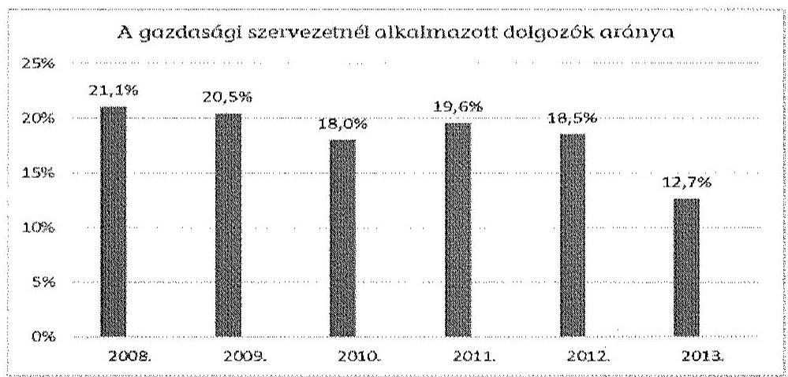

Az ellenőrzött időszakban a NIIFI-nél nem alakították ki és nem működtettek a pénzügyi- és vagyongazdálkodás értékelésére vonatkozó monitoring- és beszámolási rendszert, nem gondoskodtak a mutatók, mérőszámok számításához szükséges adatok gyűjtési, szolgáltatási rendjének kialakításáról.

## 2. A GAZDASÁGOSSÁG, HATÉKONYSÁG ÉS EREDMÉNYESSÉG KÖVETELMÉNYEINEK ÉRVÉNYESÍTÉSÉRŐL KIADOTT VEZETŐI NYILATKOZAT ÉRTÉKELÉSE

A 2008-2013. évekre vonatkozó vezetői nyilatkozatok tartalmazták, hogy a NIIFI vezetője gondoskodott a belső kontroll rendszerek szabályszerű, hatékony, eredményes és gazdaságos működéséről, valamint a költségvetési szerv tevékenységében a hatékonyság, eredményesség és a gazdaságosság követelményeinek érvényesítéséről. A kiadott vezetői nyilatkozatokban foglaltakat az Intézmény által tett intézkedések nem támasztották alá a NIIFI pénzügyi és vagyongazdálkodási folyamataira vonatkozóan, mivel nem alakították ki és nem működtették az cél- és indikátorrendszert.
