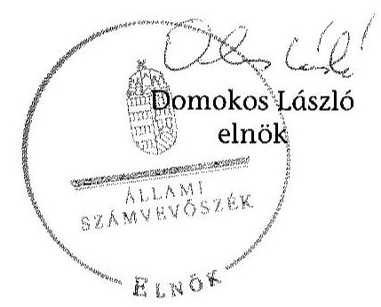

# ÁLLAMI   SZÁMVEVÔSZÉK 

## JELENTÉS

a helyi nemzetiségi önkormányzatok gazdálkodásának ellenőrzéséről

Német Nemzetiségi Önkormányzat Kompolt 15125

---

# Állami Számvevőszék 

Iktatószám: V-0832-039/2015.
Témaszám: 1866
Vizsgálat-azonosító szám: V067647

## Az ellenőrzést felügyelte:

Horváthné Herbáth Mária
felügyeleti vezető

## Az ellenőrzést vezette és az ellenőrzés végrehajtásáért felelős:

Zakar László
ellenőrzésvezető

## A számvevőszéki jelentést készítették:

Zakar László
ellenőrzésvezető
Szeibel Gáborné
számvevő tanácsos
Szöllősiné Hrabóczki Etelka
számvevő tanácsos

## Az ellenőrzést végezték:

Luhály Matild
Vánczku István
számvevő

---

# TARTALOMJEGYZÉK 

BEVEZETÉS ..... 9
I. ÖSSZEGZŐ MEGÁLLAPÍTÁSOK, KÖVETKEZTETÉSEK, JAVASLATOK ..... 12
II. RÉSZLETES MEGÁLLAPÍTÁSOK ..... 17

1. A Nemzetiségi Önkormányzat és a Települési Önkormányzat együttmúködésének szabályozása, a múködési feltételek biztosítása ..... 17
2. A Gazdálkodási feladatok ellátásának szabályszerűsége ..... 18
2.1. A költségvetésre és zárszámadásra, valamint a kincstári adatszolgáltatás rendjére vonatkozó jogszabályi előírások betartása ..... 18
2.2. A Nemzetiségi Önkormányzat gazdálkodásának szabályozottsága ..... 19
2.3. Az operatív gazdálkodási jogkörök kialakítása, gyakorlása ..... 20
3. A Nemzetiségi Önkormányzattal összefüggő gazdálkodási feladatok belső ellenőrzése ..... 21
MELLÉKLETEK
4. számú A Nemzetiségi Önkormányzat 2013. évi gazdálkodási adatai

---

.

---

# RÖVIDÍTÉSEK JEGYZÉKE 

## Törvények

Alaptörvény
Áht.
ÁSZ tv.
Kttv.
Nek. tv.
Számv. tv.
Rendeletek
Áhsz.

Ávr.
Bkr.

## Szórövidítések

ÁSZ
együttmúködési megállapodás
elnök
EU
gazdálkodási szabályzat
jegyzó
Képviselő-testület

Kincstár
Kormányhivatal
Nemzetiségi Önkormányzat
Nemzetiségi Önkormányzat elnöke
Önkormányzati Hivatal
Önkormányzati Hivatal
Ügyrendje
szabálytalanságok kezelésének eljárásrendje
számlarend
SZMSZ

Magyarország Alaptörvénye
az államháztartásról szóló 2011. évi CXCV. törvény
az Állami Számvevőszékről szóló 2011. évi LXV. törvény
a közszolgálati tisztviselőkről szóló CXCIX. törvény
a nemzetiségek jogairól szóló 2011. évi CLXXIX. törvény
a számvitelről szóló 2000 . évi C. törvény
az államháztartás szervezetei beszámolási és könyvvezetési kötelezettségének sajátosságairól szóló 249/2000. (XII. 24.) Korm. rendelet
az államháztartási törvény végrehajtásáról szóló 368/2011. (XII.31.) Korm. rendelet
a költségvetési szervek belső kontrollrendszeréről és belső ellenőrzéséről szóló 370/2011. (XII.31.) Korm. rendelet

Állami Számvevőszék
Kompolt Községi Önkormányzat Képviselő-testülete 11/2012. (VI. 27.) számú határozatával és Német Nemzetiségi Önkormányzat Kompolt Képviselő-testülete 6/2012. (X. 12.) számú határozatával elfogadott együttmúködési megállapodás
Német Nemzetiségi Önkormányzat Kompolt elnöke
Európai Unió
Kampolti Közös Önkormányzati Hivatal Gazdálkodási szabályzata (hatályos 2013. január 1-jétől)
Kampolti Közös Önkormányzati Hivatal jegyzője
Német Nemzetiségi Önkormányzat Kompolt Képviselốtestülete
Magyar Államkincstár
Heves Megyei Kormányhivatal
Német Nemzetiségi Önkormányzat Kompolt
Német Nemzetiségi Önkormányzat Kompolt elnöke
Kampolti Közös Önkormányzati Hivatal Ügyrendje, Kompolt Község Önkormányzata Szervezeti és Müködési Szabályzatának 3. számú melléklete
Kampolti Közös Önkormányzati Hivatal Szabálytalanságok kezelésének eljárásrendje (hatályos 2006. január 1jétől)
Kampolti Közös Önkormányzati Hivatal Számlarendje (hatályos 2013. január 1-jétől)
Szervezeti és Müködési Szabályzat

---

Társulás
Társulás belső ellenőrzése
Települési Önkormányzat
2013. évi költségvetési határozat

Füzesabonyi Kistérség Többcélú Társulása
Füzesabonyi Kistérség Többcélú Társulása belső ellenőrzése

Kompolt Község Önkormányzata
1/2013. (II. 07.) NNÖ határozat a Német Nemzetiségi Önkormányzat Kompolt, 2013. évi költségvetéséről

---

# ÉRTELMEZŐ SZÓTÁR 

belső ellenőrzés
belső kontrollrendszer
együttműködési megállapodás
integritás
költségvetési szerv vezetője

A Bkr. 2. § b) pont meghatározásában független, tárgyilagos bizonyosságot adó és tanácsadó tevékenység, amelynek célja, hogy az ellenőrzött szervezet múködését fejlessze és eredményességét növelje, az ellenőrzött szervezet céljai elérése érdekében rendszerszemléletű megközelítéssel és módszeresen értékeli, illetve fejleszti az ellenőrzött szervezet irányítási és belső kontrollrendszerének hatékonyságát.
A Bkr. 2. § d) pont és az Áht. 69. § (1) bekezdése alapján a belső kontrollrendszer a kockázatok kezelése és tárgyilagos bizonyosság megszerzése érdekében kialakított folyamatrendszer, amely azt a célt szolgálja, hogy a múködés és gazdálkodás során a tevékenységeket szabályszerűen, gazdaságosan, hatékonyan, eredményesen hajtsák végre, az elszámolási kötelezettségeket teljesítsék, megvédjék az erőforrásokat a veszteségektől, károktól és nem rendeltetésszerű használattól.
Az Áht. 27. § (2) bekezdése és a Nek. tv. 80. § (1) bekezdése értelmében a helyi önkormányzat a helyi nemzetiségi önkormányzat részére - annak székhelyén - biztosítja az önkormányzati múködés személyi és tárgyi feltételeit, továbbá gondoskodik a múködéssel kapcsolatos végrehajtási feladatok ellátásáról. Az önkormányzati múködés feltételei és az ezzel kapcsolatos végrehajtási feladatok. A Nek. tv. 80. § (2) bekezdés szerinti a fenti kötelezettségének teljesítése érdekében a helyi önkormányzat harminc napon belül biztosítja a rendeltetésszerú helyiséghasználatot, valamint a helyiséghasználatra, a további feltételek biztosítására és a feladatok ellátására vonatkozóan megállapodást köt a helyi nemzetiségi önkormányzattal. A megállapodást minden év január 31. napjáig, általános vagy időközi választás esetén az alakuló ülést követő harminc napon belül felül kell vizsgálni. A helyi önkormányzat és a nemzetiségi önkormányzat szervezeti és múködési szabályzatában rögzíti a megállapodás szerinti múködési feltételeket, a megállapodás megkötését, módosítását követő harminc napon belül. A Nek. tv. 80. § (3) bekezdés írja elő a megállapodásban rögzítendőket.
Az integritás elvek, értékek, cselekvések, módszerek, intézkedések konzisztenciáját jelenti: olyan magatartásmódot, amely meghatározott értékeknek felel meg. Az integritás a közszféra esetében a társadalom által elvárt nyilvánossági, átláthatósági, illetve jogi/etikai normáknak történő megfelelést jelenti. (Forrás: a http://integritas.asz.hu honlapon közzétett „A 2012. évi integritás felmérés eredményeinek összefoglalója" dokumentum 3. oldal 1. bekezdése)
A Bkr. 2. § nd) pont meghatározásában a helyi önkormányzat, helyi nemzetiségi önkormányzat esetén a

---

korrupció
kulcskontroll
lényegesség
megfelelőségi teszt
nemzetiség
nemzetiségi önkormányzat
jegyzö, illetve a Bkr. 2. § ne) pontja alapján a fővárosi kerületi önkormányzat esetén a jegyző, körjegyző, főjegyző. Azok a cselekmények, amelyek során a köz érdekében való eljárással megbízott és döntéshozatali felelősséggel felruházott személy a köz érdeke helyett önös vagy részérdekeket követve, mástól jogtalan vagy etikátlan előnyt elfogadva és őt jogtalan vagy etikátlan előnyhöz juttatva jár el, illetve amikor valaki a köz érdekében való eljárással megbízott és döntéshozatali felelősséggel felruházott személynek jogtalan vagy etikátlan előnyt nyújtva vagy felajánlva jogtalan vagy etikátlan előnyt kér. (Forrás: A Kormány korrupció megelőzési programja 2012-2014.)
Az azonosított kockázatok mérséklése érdekében kialakított kontrollok közül azok, amelyek elégtelen múködése esetén a szervezetet jelentős veszteség érheti, vagy a múködésükben bekövetkező hiba/hiányosság más kontrollok eredményességét csökkenti. Ezek ellenőrzése, értékelése elegendő bizonyítékot szolgáltat adott területen a kontrollrendszer értékeléséhez. Az önkormányzatok kontrollrendszere kialakításának ellenőrzése során a pénzügyi folyamatokban kulcsszerepet betöltő belső kontrollok a teljesítésigazolás és érvényesítés.
Egy információ akkor lényeges, ha hiánya vagy téves állítása befolyásolhatja ezen információkat felhasználók döntéseit, véleményét. Az ellenőrzés során a lényegesség három szempontból értelmezhető: érték, jelleg és összefüggés szerint.
Az ellenőrzés során alkalmazott módszer - a számvevő egy adatállomány, statisztikai sokaság összes tételének vizsgálata helyett a kiválasztott tételek meghatározott jellemzőinek elemzése és kiértékelése útján szerezhet a teljes állományra vonatkozó következtetések levonására alkalmas ellenőrzési bizonyítékokat - a mennyiségileg elegendő és a minőségileg megfelelő bizonyíték megszerzésére az ellenőrzött kulcskontroll (teljesítésigazolás, érvényesítés) múködésének megfelelő, vagy nem megfelelő voltáról. (A számvevőszéki ellenőrzés általános alapelvei 4.1.2, és 4.2 pontjai).

A Nek tv. 1. § (1) bekezdése alapján nemzetiség minden olyan Magyarország területén legalább egy évszázada honos népcsoport, amely az állam lakossága körében számszerú kisebbségben van, tagjai magyar állampolgárok és a lakosság többi részétől saját nyelve és kultúrája, hagyományai különböztetik meg, egyben olyan összetartozástudatról tesz bizonyságot, amely mindezek megőrzésére, történelmileg kialakult közösségeik érdekeinek kifejezésére és védelmére irányul.
A Nek tv. 2. § 2. pontja szerint törvényben meghatározott nemzetiségi közszolgáltatási feladatokat ellátó, testületi

---

formában múködő, jogi személyiséggel rendelkező, demokratikus választások útján e törvény alapján létrehozott szervezet, amely a nemzetiségi közösséget megillető jogosultságok érvényesítésére, a nemzetiségek érdekeinek védelmére és képviseletére, a feladat- és hatáskörébe tartozó nemzetiségi közügyek települési, területi vagy országos szinten történő önálló intézésére jön létre.
operatív gazdálkodási jogkör
kötelezettségvállalás; pénzügyi ellenjegyzés; utalványozás; érvényesítés; teljesítésigazolás jogkör

---

.

---

# JELENTÉS   a helyi nemzetiségi önkormányzatok gazdálkodásának ellenőrzésérőlNémet Nemzetiségi Önkormányzat Kompolt 

## BEVEZETÉS

A Nemzetiségi Önkormányzat a 2002. évben alakult. A 2013. évben hivatalban lévő elnök a 2002. évi helyhatósági választásoktól töltötte be hivatalát. A Nemzetiségi Önkormányzat intézményt, gazdasági társaságot és más szervezetet nem alapított, illetve társulásban nem vett részt. A háromtagú Képviselő-testület bizottságot nem hozott létre. A Nemzetiségi Önkormányzat költségvetési beszámolója szerint a 2013. évben a módosított költségvetési bevételi és kiadási előirányzata 517,0 ezer Ft, a teljesített költségvetési bevétele 527,0 ezer Ft, a teljesített költségvetési kiadása 505,0 ezer Ft volt. A Nemzetiségi Önkormányzat a 2013. évben 295,0 ezer Ft feladatalapú támogatásban részesült. A 2013. évi gazdálkodási adatokat részletesen az 1. számú mellékletben mutatjuk be.

Az Alaptörvény Szabadság és felelősség rész XXIX. cikk (1) bekezdése szerint a Magyarországon élő nemzetiségek államalkotó tényezők. Minden, valamely nemzetiséghez tartozó magyar állampolgárnak joga van önazonossága szabad vállalásához és megőrzéséhez. A hazánkban élő nemzetiségek helyi (települési és területi) valamint országos önkormányzatokat hozhatnak létre ${ }^{1}$. A helyi nemzetiségi önkormányzatok gazdálkodási feladatait jogszabályi előírás alapján a székhely szerinti helyi önkormányzat polgármesteri hivatala látja el.

A nemzetiségek helyzete, támogatása mind hazai, mind EU-s szinten kiemelt figyelmet kap napjainkban. A helyi nemzetiségi önkormányzatok gazdálkodására és támogatási rendszerére vonatkozó jogszabályok a 2010-2012. években jelentős változásokon mentek át. A helyi nemzetiségi önkormányzatok gazdálkodásának, a részükre juttatott költségvetési támogatások felhasználásának ellenőrzését az ÁSZ 2012-ben sorozatjellegű ellenőrzés keretében indította el.

Az ellenőrzés célja annak értékelése volt, hogy a helyi nemzetiségi önkormányzat gazdálkodási kereteinek kialakítása, gazdálkodása megfelelt-e a jogszabályoknak.

[^0]
[^0]:    ${ }^{1}$ A 2010. évben megtartott nemzetiségi önkormányzati választásokat követően 2304 települési, 58 területi és 13 országos nemzetiségi önkormányzat alakult meg.

---

Ennek keretében értékeltük, hogy:

- a helyi nemzetiségi önkormányzat és a helyi (települési) önkormányzat együttműködésének szabályozása, a működési feltételek biztosítása megfelelte a jogszabályi előírásoknak;
- a felek együttműködése megfelelt-e a megállapodásban foglaltaknak a gazdálkodási feladatok szabályszerű ellátása során, betartották-e vonatkozó jogszabályi előírásokat;
- biztosított volt-e a helyi nemzetiségi önkormányzat gazdálkodásának belső ellenőrzése.

Az ellenőrzés várható hasznosulása: a nemzetiségi önkormányzatok testületi döntéseinek tapasztalatait összegezve következtetés vonható le a törvényalkotás számára a jogszabályi környezet esetleges módosításának indokoltságára vonatkozóan. Az ellenőrzés az ellenőrzött számára visszajelzést ad a rendezett gazdálkodási keretek kialakításáról, a működésbeli hiányosságokról. Az ellenőrzés megállapításai és javaslatai, a jó gyakorlat bemutatása tanulságul szolgálhatnak más nemzetiségi önkormányzatok, szervezetek számára a rendezett gazdálkodási keretek kialakításához. A társadalom számára jelzi, hogy közpénz nem maradhat ellenőrizetlenül, az ÁSZ értékteremtő rend kialakításához és megőrzéséhez hozzájáruló tevékenysége pozitív hatással lesz a szervezetről kialakított összkép formálásában. Az ÁSZ szervezetén belül lehetőség nyílik arra, hogy a megállapítások szintetizálásával az intézmény a hozzáadott értéket teremtő elemző tevékenységét és tanácsadó szerepét erősítse.

A helyi nemzetiségi önkormányzatok gazdálkodásának ellenőrzéséről szóló jelentés I. fejezetének összegző része az ellenőrzés céljára adott rövid, szintetizáló összefoglalót és következtetéseket tartalmazza a II. fejezet részletes megállapításain alapulóan. A jelentés intézkedést igénylő megállapításait és javaslatait - az összegzőben foglaltak mellett - az ellenőrzés során feltárt, a jelentés II. fejezetében rögzített részletes megállapítások alapozzák meg, illetve támasztják alá.

Az ellenőrzés típusa: szabályszerűségi ellenőrzés.
Az ellenőrzött időszak: a helyi nemzetiségi önkormányzat és a települési önkormányzat együttműködésének, valamint a helyi nemzetiségi önkormányzat gazdálkodásának szabályozása megfelelőségét 2013. évre vonatkozóan (a 2013. december 31-i állapotnak megfelelően), a helyi nemzetiségi önkormányzat gazdálkodásának szabályszerűségét, a működési feltételek, valamint a belső ellenőrzés biztosítását a 2013. január 1. - december 31-e közötti időszakot figyelembe véve értékeltük.

Ellenőrzött szervezet: a Német Nemzetiségi Önkormányzat Kompolt és a gazdálkodási feladatait ellátó Kompolti Közös Önkormányzati Hivatal.

Az ellenőrzés szakmai módszertana az ÁSZ hivatalos honlapján (www.asz.hu) közzétett szakmai szabályokon alapult, amely a Legfőbb Ellenőrző Intézmények Nemzetközi Szervezete (INTOSAI) által kiadott nemzetközi standardok (ISSAI) figyelembevételével készült.

---

A gazdálkodás folyamatában kulcsszerepet betöltő két kulcskontroll - teljesítésigazolás, érvényesítés - múködésének megfelelőségét teljes körűen, azaz minden, a személyi juttatásokkal, a dologi és felhalmozási kiadásokkal, müködési és felhalmozási célú pénzeszköz átadásokkal, ellátottak pénzbeli juttatásaival kapcsolatos kifizetések esetében ellenőriztük. „Megfelelőnek" értékeltük a gazdálkodási jogkörök gyakorlását, amennyiben a hibaarány legfeljebb $10 \%$, „részben megfelelőnek" értékeltük, ha a hibaarány 10-30\% között volt, „nem megfelelőnek" pedig akkor, ha az eredmények alapján a hibaarány meghaladta a 30\%ot.

Az ellenőrzés végrehajtásának jogszabályi alapját az ÁSZ tv. 5. § (2)-(3) és (6) bekezdéseiben foglaltak képezik.

Az ÁSZ tv. 29. § (1) bekezdése szerint a jelentéstervezetet megküldtük egyeztetésre a jegyzőnek és a Nemzetiségi Önkormányzat elnökének. Az ellenőrzött szervezetek vezetői az ÁSZ tv. 29. § (2) bekezdésében foglalt észrevételezési jogukkal nem éltek, a jelentéstervezetre nem tettek észrevételt.

---

# I. ÖSSZEGZŐ MEGÁLLAPÍTÁSOK, KÖVETKEZTETÉSEK, JAVASLATOK 

A Nemzetiségi Önkormányzat és a Települési Önkormányzat együttmúködésének szabályozása részben felelt meg a jogszabályi előírásoknak. A Nemzetiségi Önkormányzat rendelkezett az ellenőrzött időszakban a Nek. tv.-ben előírt együttműködési megállapodással, melyet a Nemzetiségi Önkormányzat és a Települési Önkormányzat Képviselő-testülete határozattal jóváhagyott és azt az arra jogosultak aláírták.

A 2012-ben kötött és 2013-ban is hatályos együttmúködési megállapodás felülvizsgálata a Nek. tv.-ben előírt határidőre és azt követően sem történt meg. Az együttműködési megállapodás az Áht.-ban előírt ellenőrzési feladatok ellátásának részletes szabályait nem a 2013. évi állapotnak megfelelően tartalmazta. Az együttműködési megállapodásban - a Nek. tv.-ben foglaltak ellenére - nem rögzítették, hogy a Települési Önkormányzat megbízásából és képviseletében a jegyző/vagy a jegyzővel azonos képesítési előírásoknak megfelelő megbízottja részt vesz a Nemzetiségi Önkormányzat testületi üléseln és jelzi, amennyiben törvénysértést észlel. Az együttműködési megállapodás az Áht. és a Nek. tv. előírásainak megfelelően tartalmazta a Nemzetiségi Önkormányzat múködésével és gazdálkodásával kapcsolatos előírásokat. Az együttműködési megállapodás szerinti müködési feltételeket a Nek. tv.-ben foglaltak ellenére nem rögzítették a Települési Önkormányzat és a Nemzetiségi Önkormányzat SZMSZ-ében. A Települési Önkormányzat a 2013. évben biztosította a Nemzetiségi Önkormányzat múködéséhez szükséges személyi és tárgyi feltételeket.

A Nemzetiségi Önkormányzat 2013. évi költségvetésének és zárszámadásának tartalma, jóváhagyása, valamint a kapcsolódó 2013. évi adatszolgáltatás szabályszerűsége megfelelt a jogszabályi előírásoknak. A jegyző nem készítette elő, a Nemzetiségi Önkormányzat elnöke az Áht.-ben előírtaktól eltérően, nem nyújtotta be határidőben és azt követően sem a Nemzetiségi Önkormányzat Képviselő-testülete részére az ellenőrzött évre vonatkozó költségvetési koncepciót. A Nemzetiségi Önkormányzat elnöke az Áht.-ban előírtaknak megfelelően határidőben benyújtotta a Nemzetiségi Önkormányzat Képviselő-testülete részére a jegyző által szabályszerűen előkészített költségvetési határozat tervezetét. A Nemzetiségi Önkormányzat 2013. évi költségvetési határozata az Áht. előírásainak megfelelően tartalmazta a Nemzetiségi Önkormányzat költségvetési bevételeit és költségvetési kiadásait előirányzat-csoportok, kiemelt előirányzatok, nem tartalmazta azonban - az előírások ellenére - kötelező és önként vállalt feladatok szerinti bontásban. A 2013. évi költségvetés előterjesztésekor a Nemzetiségi Önkormányzat Képviselő-testülete részére, az Áht. előírásának megfelelően tájékoztatásul bemutatásra került - szöveges indoklással együtt - a Nemzetiségi Önkormányzat költségvetési mérlege közgazdasági tagolásban és elő-irányzat-felhasználási terve. A jegyző az Áht. előírásainak megfelelően határidőre előkészítette a Nemzetiségi Önkormányzat 2013. évi zárszámadási határo-zat-tervezetét, amelyet a Nemzetiségi Önkormányzat elnöke az előírt határidőben beterjesztett a Képviselő-testületnek. A zárszámadási határozat tervezetének előterjesztésekor a Nemzetiségi Önkormányzat Képviselő-testülete részére tájé-

---

koztatásul - szöveges indoklással együtt - bemutatták az Áht.-ban előírt mérleget közgazdasági tagolásban, valamint az előirányzat-felhasználási tervet. A Képviselő-testület a 2013. évi zárszámadásról határidőben hozott határozatot. A jegyző a Nemzetiségi Önkormányzat részére jogszabályban előírt kincstári adatszolgáltatási kötelezettséget - az Ávr. előírása ellenére az elemi költségvetés kivételével - a 2013. évben határidőben teljesítette.

A Nemzetiségi Önkormányzat gazdálkodásának szabályozottsága az ellenőrzött időszakban részben felelt meg a jogszabályi előírásoknak és az együttműködési megállapodásnak. A gazdálkodási feladatok végrehajtását ellátó Önkormányzati Hivatal a Számv. tv. és az Áhsz. által előírt szabályzatainak hatálya - a számlarend kivételével - kiterjedt a Nemzetiségi Önkormányzat gazdálkodására. A jegyző az együttmúködési megállapodásban foglaltak ellenére nem alakította ki a Nemzetiségi Önkormányzat elemi költségvetési beszámolójának készítését biztosító, jogszabályi előírásoknak megfelelő számlarendet. A jegyző az Áht.-ban előírtak ellenére nem készítette el az Önkormányzati Hivatal SZMSZ-ét. Az Önkormányzati Hivatal rendelkezett a Bkr.-ben előírt ellenőrzési nyomvonallal, a szabálytalanságok kezelésének eljárásrendjével, valamint a folyamatba épített, előzetes, utólagos és vezetői ellenőrzés szabályozását biztosította.

A Nemzetiségi Önkormányzat gazdálkodása tekintetében az operatív gazdálkodási jogkörök kialakítása a 2013. évben megfelelő volt. A Nemzetiségi Önkormányzat a 2013. évben dologi kiadással és múködési célú pénzeszköz átadással kapcsolatos kifizetéseket teljesített. A kiadások teljesítése során az operatív gazdálkodási jogkörökön belül kulcsszerepet betöltő teljesítésigazolás és érvényesítés belső kontrollok múködtetése megfelelt a jogszabályi előírásoknak. A teljesítésigazolás a jogszabályi előírásoknak és a belső szabályzatban foglaltaknak teljes körűen megfelelt. Az érvényesítő jelzése az utalványozónak az Ávr.-ben előírtak ellenére elmaradt, mivel az érvényesítő nem jelezte, hogy a kötelezettségvállalás nyilvántartása az Ávr. előírásával ellenétben nem tartalmazta a jogosult azonosító adatait. A kulcskontrollok müködtetése, a nyilvántartási hiányosságon kívül, biztosította a hibák megelőzését, feltárását és kijavítását. A számvevőszéki ellenőrzés a kifizetések bizonylatainak ellenőrzése során összeférhetetlenséget, illetve jogosulatlan kifizetést nem tárt fel.

A 2013. évben a Nemzetiségi Önkormányzat gazdálkodásával összefüggő végrehajtási feladatokra vonatkozó belső ellenőrzés nem volt megfelelő. A 2013. december 31-én hatályos együttműködési megállapodás felülvizsgálat hiányában az ellenőrzési feladatok részletes szabályait nem a 2013. évi állapotnak megfelelően tartalmazta. A Nemzetiségi Önkormányzat gazdálkodásával összefüggő végrehajtási feladatokra vonatkozóan belső ellenőrzést a 2013. évben nem terveztek és nem végeztek.

Az ÁSZ tv. 33. § (1) bekezdésében foglaltak értelmében a jelentésben foglalt megállapításokhoz kapcsolódó intézkedési tervet köteles az ellenőrzött szervezet vezetője összeállítani, és azt a jelentés kézhezvételétől számított 30 napon belül az ÁSZ részére megküldeni. Amennyiben az intézkedési tervet határidőben nem küldi meg a szervezet, vagy az nem elfogadható, az ÁSZ elnöke a hivatkozott törvény 33. § (3) bekezdés a)-b) pontjaiban foglaltakat érvényesítheti.

---

A helyszíni ellenőrzés megállapításainak hasznosítása mellett javasoljuk

# a jegyzönek 

1. Az együttműködés szabályozásával kapcsolatban

Az együttműködési megállapodás felülvizsgálata a Nek. tv. 80. § (2) bekezdésében előírt határidőre és azt követően sem történt meg. Így az együttműködési megállapodás nem tartalmazta az Áht. 27. § (2) bekezdésében előírt ellenőrzési feladatok ellátásának részletes szabályait a 2013. évi állapotnak megfelelően.

Az együttműködési megállapodás - a Nek. tv. 80. § (4) bekezdésében foglaltak ellenére - nem tartalmazta, hogy a települési önkormányzat megbízásából és képviseletében a jegyző/vagy a jegyzővel azonos képesítési előírásoknak megfelelő megbízottja részt vesz a Nemzetiségi Önkormányzat testületi ülésein és jelzi, amennyiben törvénysértést észlel.

Az együttműködési megállapodás szerinti működési feltételeket - a Nek. tv. 80. § (2) bekezdésében foglaltaknak megfelelően - a Települési Önkormányzat és a Nemzetiségi Önkormányzat SZMSZ-ében 30 napon belül és azt követően sem rögzítették

Javaslat
a) Kezdeményezze az együttműködési megállapodás felülvizsgálatát, e tekintetben a továbbiakban biztosítsa a Nek. tv-ben előírt határidő betartását.
b) A felülvizsgálatot követően készítse elő az együttműködési megállapodás Nek. tv. előírásainak megfelelő módosítását, aktualizálását és kezdeményezze annak a Települési Önkormányzat Képviselő-testülete elé terjesztését.
c) Készítse elő a Települési Önkormányzat és a Nemzetiségi Önkormányzat SZMSZeinek - a Nek. tv. előírásainak megfelelő - kiegészítését az együttműködési megállapodás módosításához kapcsolódóan és kezdeményezze azok képviselő-testületi előterjesztését.
2. A költségvetés és zárszámadás szabályszerűségével kapcsolatban

A Nemzetiségi Önkormányzat 2013. évi költségvetési határozata - az Áht. 23. § (2) bekezdése a) pontjának és a 26. § (1) bekezdés a) pontjának előírásai ellenére - nem tartalmazta a Nemzetiségi Önkormányzat költségvetési bevételeit és költségvetési kiadásait kötelező és önként vállalt feladatok szerinti bontásban.

A jegyző az Ávr. 33. § (1)-(2) bekezdése ellenére késve szolgáltatott adatot a Nemzetiségi Önkormányzat 2013. évi elemi költségvetéséről.

Javaslat
a) Intézkedjen, hogy költségvetési határozat tartalmilag teljes körűen feleljen meg a hatályos jogszabályi előírásoknak.

---

b) Intézkedjen a továbbiak a Nemzetiségi Önkormányzatra vonatkozó költségvetési adatszolgáltatás határidőben történő teljesítéséről.
3. A Nemzetiségi Önkormányzat gazdálkodásának szabályozottságával kapcsolatban

Az együttműködési megállapodás -a számviteli szabályzatok készítésére vonatkozó hatáskörök meghatározása nélkül - rögzítette, hogy a Nemzetiségi Önkormányzat beszámolási feladatainak ellátásával kapcsolatos jogosultságokat és kötelezettségeket a nemzetiségi önkormányzatra vonatkozóan az Önkormányzati Hivatal elkülönülten szabályozza. A Nemzetiségi Önkormányzatra vonatkozóan - a Számv. tv. 161. § (1)(2) bekezdései és az Áhsz. 49.§ (1) bekezdései alapján - az elemi költségvetési beszámoló elkészítését biztosító számlarend készítéséről az együttműködési megállapodásban foglaltak ellenére az Önkormányzati Hivatal nem gondoskodott.

Az Önkormányzati Hivatal - az Áht. 10. § (5) bekezdésében előírtak ellenére - nem rendelkezett SZMSZ-szel.

Javaslat
a) Intézkedjen a Nemzetiségi Önkormányzat elemi költségvetési beszámolójának elkészítését biztosító számlarend készítéséről.
b) Intézkedjen az Önkormányzati Hivatal SZMSZ-ének jogszabályi előírásoknak megfelelő elkészítéséről és kezdeményezze annak előterjesztését a Települési Önkormányzat Képviselő-testülete részére.
4. Az operatív gazdálkodási jogkörök gyakorlásával kapcsolatban

Az érvényesítő - az Ávr. 58. § (2) bekezdésében foglaltak ellenére - nem jelezte az utalványozónak, hogy a kötelezettségvállalás nyilvántartása nem tartalmazta az Ávr. 56. § (1) bekezdése szerint a jogosult azonosító adatait.

Javaslat
Az operatív gazdálkodás működési hibáinak megelőzése, feltárása és kijavítása érdekében intézkedjen az érvényesítéshez kapcsolódó jelzési feladatok szabályszerű ellátásáról.

# a Nemzetiségi Önkormányzat elnökének 

1. Az együttműködési megállapodás - a Nek. tv. 80. § (4) bekezdésében foglaltak ellenére - nem tartalmazta, hogy a települési önkormányzat megbízásából és képviseletében a jegyző/vagy a jegyzővel azonos képesítési előírásoknak megfelelő megbízottja részt vesz a Nemzetiségi Önkormányzat testületi ülésein és jelzi, amennyiben törvénysértést észlel.

Az együttműködési megállapodás felülvizsgálata a Nek. tv. 80. § (2) bekezdésében előírt határidőre és azt követően sem történt meg. Így az együttműködési megállapodás nem tartalmazta az Áht. 27. § (2) bekezdésében előírt ellenőrzési feladatok ellátásának részletes szabályait a 2013. évi állapotnak megfelelően.

---

Az együttműködési megállapodás szerinti működési feltételeket a Nek. tv. 80. § (2) bekezdésében foglaltaknak megfelelően nem rögzítették a Települési Önkormányzat és a Nemzetiségi Önkormányzat SZMSZ-ében.

Javaslat
a) Végezze el az együttműködési megállapodás felülvizsgálatát, és a továbbiakban, e tekintetben biztosítsa a Nek. tv-ben előírt határidő betartását.
b) Terjessze a Nemzetiségi Önkormányzat Képviselő-testülete elé jóváhagyásra az együttműködési megállapodás jegyző által előkészített, jogszabályi előírásoknak megfelelő módosítását.
c) Intézkedjen a Nemzetiségi Önkormányzat SZMSZ-ének a Képviselő-testület elé terjesztéséről.

---

# II. RÉSZLETES MEGÁLLAPÍTÁSOK 

## 1. A Nemzetiségi Önkormányzat És a Települési Önkormányzat EGYÜTTMÜKÖDÉSÉNEK SZABÁLYOZÁSA, A MÜKÖDÉSI FELTÉTELEK BIZTOSÍTÁSA

A Nemzetiségi Önkormányzat és a Települési Önkormányzat együttmüködésének szabályozása részben felelt meg a jogszabályi előírásoknak.

A Nemzetiségi Önkormányzat rendelkezett a 2013. év folyamán hatályban lévő, a Települési Önkormányzattal kötött együttműködési megállapodással melyet a Nemzetiségi Önkormányzat és a Települési Önkormányzat képviselő-testületei határozattal ${ }^{2}$ jóváhagytak és az arra jogosult személyek aláírták.

A 2012. évben kötött és 2013. évben is hatályos együttműködési megállapodás felülvizsgálata a Nek. tv. 80. § (2) bekezdésében előírt határidőre és azt követően sem történt meg. Így az együttműködési megállapodás az Áht. 27. § (2) bekezdésében előírt ellenőrzési feladatok ellátásának részletes szabályait nem a 2013. évi állapotnak megfelelően tartalmazta ${ }^{3}$.

A 2013. december 31-én hatályos együttműködési megállapodás az Áht. 27. § (2) bekezdésében foglaltaknak megfelelően tartalmazta a tervezési, gazdálkodási, finanszírozási adatszolgáltatási és beszámolási feladatok ellátásának részletes szabályait. Tartalmazta továbbá a Nek. tv. 80. § (3) bekezdésben foglaltaknak megfelelően a Nemzetiségi Önkormányzat müködésével és gazdálkodásával kapcsolatos előírásokat.

A 2013. december 31-én hatályos együttműködési megállapodás a Nek. tv. 80. § (4) bekezdésében foglaltak ellenére nem tartalmazta azt, hogy a Települési Önkormányzat megbízásából és képviseletében a jegyző/vagy a jegyzővel azonos képesítési előírásoknak megfelelő megbízottja részt vesz a Nemzetiségi Önkormányzat testületi ülésein és jelzi, amennyiben törvénysértést észlel.

Az együttműködési megállapodás szerinti működési feltételeket - a Nek. tv. 80. § (2) bekezdésében foglaltak ellenére - nem rögzítették sem a Települési Önkormányzat sem a Nemzetiségi Önkormányzat SZMSZ-ében.

A Települési Önkormányzat a Nek. tv. 159. § (3) bekezdésében előírtaknak megfelelően biztosította a Nemzetiségi Önkormányzat müködéséhez szükséges személyi és tárgyi feltételeket.

[^0]
[^0]:    ${ }^{2}$ Az együttműködési megállapodást a Települési Önkormányzat Képviselő-testülete a 11/2012. (VI. 27.) számú, a Nemzetiségi Önkormányzat Képviselő-testülete a 7/2012. (VI. 28.) számú határozatával fogadta el.
    ${ }^{3}$ Az együttműködési megállapodásban rögzített ellenőrzést végző Társulás 2012. december 31-én megszűnt.

---

# 2. A GAZDÁLKODÁSI FELADATOK ELLÁTÁSÁNAK SZABÁLYSZERÚSÉGE 

### 2.1. A költségvetésre és zárszámadásra, valamint a kincstári adatszolgáltatás rendjére vonatkozó jogszabályi előírások betartása

A Nemzetiségi Önkormányzat 2013. évi költségvetésének és zár-számadásának tartalma, jóváhagyása, valamint a kapcsolódó adatszolgáltatás megfelelt a jogszabályi előírásoknak.

A jegyző nem készítette elő, a Nemzetiségi Önkormányzat elnöke az Áht.-ban előírtaktól eltérően, nem nyújtotta be határidőben, és azt követően sem a Nemzetiségi Önkormányzat Képviselő-testülete részére az ellenőrzött évre vonatkozó költségvetési koncepciót.

A jegyző az Áht. 26. § (1) bekezdésében, illetve az Áht. 24. § (2) bekezdésében előírtaknak megfelelően előkészítette, a Nemzetiségi Önkormányzat elnöke az Áht. 26. § (1) bekezdésében, illetve az Áht. 24. § (2) bekezdésében előírtaknak megfelelően határidőre ${ }^{4}$ benyújtotta a Nemzetiségi Önkormányzat Képviselőtestülete részére a költségvetési határozat tervezetét. A Nemzetiségi Önkormányzat Képviselő-testülete az 1/2013. (II. 7.) számú határozatával fogadta el a 2013. évi költségvetését.

A Nemzetiségi Önkormányzat 2013. évi költségvetési határozata az Áht. 23. § (2) bekezdése a) pontjának megfelelően tartalmazta a Nemzetiségi Önkormányzat költségvetési bevételeit és költségvetési kiadásait előirányzat-csoportok, kiemelt előirányzatok, nem tartalmazta azonban - a hivatkozott előírás ellenére - kötelező és önként vállalt feladatok szerinti bontásban. A 2013. évi költségvetési határozat az Ávr. 24. § (1) bekezdése a) és b) pontjainak megfelelően tartalmazta a Nemzetiségi Önkormányzat bevételeit és kiadásait. A 2013. évi költségvetés előterjesztésekor a Nemzetiségi Önkormányzat Képviselő-testülete részére, az Áht. 24. § (4) bekezdés a) pontjának megfelelően tájékoztatásul bemutatásra került - szöveges indoklással együtt - a Nemzetiségi Önkormányzat költségvetési mérlege közgazdasági tagolásban és előirányzat-felhasználási terve ${ }^{5}$.

A jóváhagyott 2013. évi költségvetési határozat az Áht. 23. § (3) bekezdése és az Ávr. 24. § (1) bekezdés bc) pontja alapján az előző évi pénzmaradvány terhére tartalmazott 1471,0 ezer Ft-ot tartalék címen.

A jegyző az Áht. 91. § (1) és (3) bekezdésében előírt határidőre ${ }^{6}$ előkészítette a Nemzetiségi Önkormányzat 2013. évi zárszámadási határozat-tervezetét, ame-

[^0]
[^0]:    ${ }^{4}$ a központi költségvetésről szóló törvény hatálybalépését követő 45 napig
    ${ }^{5}$ Előirányzat-felhasználási terven a pénzeszközök változását kell érteni.
    ${ }^{6}$ 2013. április 30-ig

---

lyet a Nemzetiségi Önkormányzat elnöke a törvényben meghatározott határidőre ${ }^{7}$ a Képviselő-testület elé terjesztett. A Nemzetiségi Önkormányzat az Áht. 26. § (1) bekezdés b) pontjában és 91 . § (1) és (3) bekezdésében foglaltaknak megfelelően a zárszámadásról határozatot ${ }^{8}$ alkotott.

A 2013. évi zárszámadás előterjesztésekor az Áht. 91. § (2) bekezdés a) pontjában foglaltaknak megfelelően a Képviselő-testület részére tájékoztatásul - szöveges indokolással együtt - bemutatták a Nemzetiségi Önkormányzat Áht. 24. § (4) bekezdése szerinti költségvetési mérlegét közgazdasági tagolásban, valamint pénzeszközeinek változását.

Az Áht. 89. § (1) bekezdés előirása alapján biztosított volt a 2013. évi zárszámadási határozat összehasonlíthatósága az elfogadott költségvetéssel. A Nemzetiségi Önkormányzat a 2013. évi zárszámadási határozatban az Áht. 89. § (2) bekezdésnek megfelelően valamennyi bevételéről és kiadásáról elszámolt.

A jegyző a Nemzetiségi Önkormányzat részére - az Ávr. 33. § (1)-(2) bekezdésében előírt - a költségvetéshez és a zárszámadáshoz kapcsolódó kincstári adatszolgáltatási kötelezettségét a 2013. évben - az elemi költségvetés kivételével - határidőben teljesítette. A jegyző a Nemzetiségi Önkormányzat 2013. évi elemi költségvetéséről az Ávr. 33. § (1)-(2) bekezdése ellenére késve szolgáltatott adatot, mivel a költségvetési határozat-tervezet Nemzetiségi Önkormányzat Kép-viselő-testülete elé terjesztésének határidejét követő 30 napon túl nyújtotta be ${ }^{9}$ a Kincstárnak.

# 2.2. A Nemzetiségi Önkormányzat gazdálkodásának szabályozottsága 

A Nemzetiségi Önkormányzat gazdálkodásának szabályozottsága az ellenőrzött időszakban részben felelt meg a jogszabályi előírásoknak és az együttmúködési megállapodásnak.

Az együttműködési megállapodás - a számviteli szabályzatok készítésére vonatkozó hatáskörök meghatározása nélkül - rögzítette, hogy a Nemzetiségi Önkormányzat beszámolási feladatainak ellátásával kapcsolatos jogosultságokat és kötelezettségeket a nemzetiségi önkormányzatra vonatkozóan az Önkormányzati Hivatal elkülönülten szabályozza.

A gazdálkodási feladatok végrehajtását ellátó Önkormányzati Hivatal a 2013. évben a Számv. tv. 14. § (3) és (5) bekezdésében, valamint a 161. § (1) bekezdésében előírt számviteli szabályzatokkal ${ }^{10}$ rendelkezett, amelyek hatálya Nemzetiségi Önkormányzat gazdálkodási feladataira is kiterjedt. A Nemzetiségi

[^0]
[^0]:    ${ }^{7}$ 2013. április 30-ig
    ${ }^{8}$ a Képviselő-testület 3/2014. (IV. 23.) határozata
    ${ }^{9}$ A Magyarország központi költségvetéséről szóló 2012. évi CCIV. törvény hatályba lépését követő 45. nap 2013. február 14-e volt, az adatszolgáltatás teljesítése 2013. március 18 -án történt meg.
    ${ }^{10}$ számviteli politika, gazdálkodási szabályzat, pénzkezelési szabályzat, eszközök és források értékelési szabályzata, eszközök és források leltározási és leltárkészítési szabályzata

---

Önkormányzatra vonatkozóan - a Számv. tv. 161. § (1)-(2) bekezdései és az Áhsz. 49.§ (1) bekezdései alapján - az elemi költségvetési beszámoló elkészítését biztosító számlarend készítéséről az együttmúködési megállapodásban foglaltak ellenére az Önkormányzati Hivatal nem gondoskodott.

A jegyző az Áht. 10. § (5) bekezdésében előírtak ellenére nem készítette el az Önkormányzati Hivatal SZMSZ-ét.

A gazdálkodási, a pénzkezelési szabályzatban és az együttmúködési megállapodásban rögzítetteknek megfelelően meghatározták a Nemzetiségi Önkormányzat gazdálkodásával kapcsolatos, az Ávr. 13. § (2) bekezdés a) pontjában előírt a tervezéssel, gazdálkodással, így különösen a kötelezettségvállalással, pénzügyi ellenjegyzéssel, teljesítés igazolásával, az érvényesítéssel, utalványozás gyakorlatának módjával kapcsolatos eljárási és dokumentációs részletszabályokat, valamint az ezeket végző személyek kijelölésének rendjét, és az ellenőrzési, adatszolgáltatási, beszámolási feladatok teljesítésével kapcsolatos belső előírásokat, feltételeket.

Az Önkormányzati Hivatalnál a gazdálkodási feladatot ellátó köztisztviselők munkaköri leírásai - a Kttv. 75. § (1) bekezdés d) pontjában foglaltaknak megfelelően - tartalmazták a Nemzetiségi Önkormányzat gazdálkodásával kapcsolatos feladatokat.

Az Önkormányzati Hivatal rendelkezett a Bkr. 6. § (3), (4) bekezdésében előírt ellenőrzési nyomvonallal és a szabálytalanságok kezelésének eljárásrendjével. A jegyző a Bkr. 8. § (2)-(4) bekezdésében foglaltaknak megfelelve a Nemzetiségi Önkormányzat gazdálkodásának végrehajtásával kapcsolatos feladataira vonatkozóan szabályozta a folyamatba épített, előzetes, utólagos és vezetői ellenőrzést.

# 2.3. Az operatív gazdálkodási jogkörök kialakítása, gyakorlása 

A Nemzetiségi Önkormányzat gazdálkodása tekintetében az operatív gazdálkodási jogkörök kialakítása a jogszabályi előírásoknak, valamint az együttműködési megállapodásban foglaltaknak megfelelt.

A jegyző a kötelezettségvállalás, a kötelezettségvállalás pénzügyi ellenjegyzése, a teljesítés igazolása, az érvényesítés és utalványozás gyakorlásának módjával, eljárási és dokumentációs szabályaival, valamint az ezeket végző személyek kijelölésének rendjével kapcsolatos feltételeket az Ávr. 13. § (2) bekezdés a) pontjának megfelelően a gazdálkodási és a pénzkezelési szabályzatban, valamint az együttműködési megállapodásban szabályozta.

A Nemzetiségi Önkormányzat az Ávr. 53. § (1) bekezdés a) pontjában foglaltaknak megfelelően élt azzal a lehetőséggel, hogy a 100 ezer Ft-ot el nem érő kifizetések esetében nem szükséges az előzetes írásbeli kötelezettségvállalás, amelyet az Ávr. 53. § (2) bekezdésében foglaltak alapján a gazdálkodási szabályzatban rögzítettek.

---

A Nemzetiségi Önkormányzat elnöke írásban felhatalmazott más képviselőt az az Ávr. 52. § (7) bekezdése, valamint az Ávr. 59. § (1) bekezdése alapján kötelezettségvállalásra, illetve utalványozásra.

Az Önkormányzati Hivatal nem rendelkezett az Áht. 10. § (4) bekezdése és az Ávr. 9. § (1) bekezdése szerinti gazdasági szervezettel. A jegyző által a pénzügyi ellenjegyzésre kijelölt személy rendelkezett az Ávr. 55. § (3) bekezdésben előírt pénzügyi-számviteli képesítéssel.

A jegyző - az Ávr. 55. § (2) bekezdésének g) pontjában és az Ávr. 58. § (4) bekezdésében meghatározottak szerint - kijelölt két fő köztisztviselőt az érvényesítés feladatainak ellátására.

A Nemzetiségi Önkormányzatnak a 2013. évben a dologi kiadásokkal és a múködési célú pénzeszköz átadásokkal kapcsolatos kiadásai voltak. A kiadások teljesítése során az operatív gazdálkodási jogkörökön belül kulcsszerepet betöltő teljesítésigazolás és érvényesítés belsó kontrollok múködtetése megfelelit a jogszabályi előírásoknak.

A dologi kiadások és a múködési célú pénzeszköz átadások ${ }^{11}$ ellenőrzése alapján a teljesítésigazolás minden esetben megfelel az Áht. 38. § (1)-(2) bekezdésében és az Ávr. 57. § (1), (3) bekezdésében foglalt előírásoknak és a belső szabályzatban foglaltaknak, mivel ellenőrizhető okmányok alapján ellenőrizték és igazolták a kiadások teljesítésének jogosságát, összegszerűségét, az ellenszolgáltatás teljesítését.

Az érvényesítő az utalványozónak az Ávr. 58. § (2) bekezdésében előírtak ellenére nem jelezte, hogy a kötelezettségvállalás nyilvántartása az Ávr. 56. § (1) bekezdésével ellenétben nem tartalmazta a jogosult azonosító adatait. A számvevőszéki ellenőrzés a kifizetések bizonylatainak ellenőrzése során összeférhetetlenséget, illetve jogosulatlan kifizetést nem tárt fel.

Az integritás szemlélet érvényesülésének ellenőrzéséhez az Önkormányzat tanúsítványon szolgáltatott adatokat. Ezen adatok értékelése alapján az eredendő veszélyeztetettségi szint és a kockázatokat növelő tényező szintje is alacsony. Emellett a szervezetnél kiépült, kockázatok kezelésére hivatott kontrollok szintje is alacsony.

A kockázatok és a kontrollok szintje alapján megállapítható, hogy a szervezetnél jelenlévő eredendő korrupciós kockázatok, valamint a kockázatokat növelő tényezők szintjén nem haladja meg az azok kezelésére kiépült kontrollok szintjét.

# 3. A Nemzetiségi Önkormányzattal összefüggő gazdálkodási feladatok belső elLENŐRZÉSE 

A 2013. évben a Nemzetiségi Önkormányzat gazdálkodásával összefüggő végrehajtási feladatokra vonatkozó belső ellenőrzés nem volt megfelelő.

[^0]
[^0]:    ${ }^{11} 34$ darab, illetve 4 darab

---

A Települési Önkormányzat a 2013. évben rendelkezett belső ellenőrzési kézikönyvvel. Az együttmúködési megállapodás felülvizsgálata a Nek. tv. 80. § (2) bekezdésében előírt határidőre és azt követően sem történt meg. Így a 2013. december 31 -én hatályos együttműködési megállapodás az ellenőrzési feladatok részletes szabályait nem a 2013. évi állapotnak megfelelően tartalmazta. Az együttműködési megállapodásban rögzített ellenőrzést végző Társulás 2012. december 31 -ével megszűnt. A Települési Önkormányzatnál 2013. november 1-jétől külső szakértő bevonásával történt a belső ellenőrzés.

A Nemzetiségi Önkormányzat gazdálkodásával összefüggő végrehajtási feladatokra vonatkozóan belső ellenőrzést a 2013. évben nem terveztek és nem végeztek.

Budapest, 2015. év

Melléklet: $\quad 1 \mathrm{db}$

---

# A NEMZETISÉGI ÖNKORMÁNYZAT 2013. ÉVI GAZDÁLKODÁSI ADATAI 

## A) Bevételek

| Megnevezés | Eredeti elöirányzat |  | Módosított   ezer Ft | Teljesités |  |
| :--: | :--: | :--: | :--: | :--: | :--: |
|  |  |  |  |  | megoszlás |
| Intézményi múködési bevételek | 0,0 | 0,0 |  | 10,0 | $1,9 \%$ |
| Felhalmozási saját bevételek | 0,0 | 0,0 |  | 0,0 | $0,0 \%$ |
| Általános múködési támogatás | 222,0 | 222,0 |  | 222,0 | $42,1 \%$ |
| Feladatalapú támogatás | 0,0 | 295,0 |  | 295,0 | $56,0 \%$ |
| Települési Önkormányzat által nyújtott támogatás | 0,0 | 0,0 |  | 0,0 | $0,0 \%$ |
| Megyei Nemzetiségi Alapítványtól támogatás | 0,0 | 0,0 |  | 0,0 | $0,0 \%$ |
| Pénzforgalmi bevételek összesen | 222,0 | 517,0 |  | 527,0 | 100,0\% |
| Előző évi pénzmaradvány felhasználás | 0,0 | 0,0 |  | 0,0 | $0,0 \%$ |
| Bevételek összesen | 222,0 | 517,0 |  | 527,0 | 100,0\% |

## B) Kiadások

| Megnevezés | Eredeti elöirányzat | Módosított | Teljesités |  |
| :--: | :--: | :--: | :--: | :--: |
|  |  |  |  | megoszlás |
| Személyi juttatások | 0,0 |  | 0,0 | $0,0 \%$ |
| Munkaadókat terhelő járulékok és szocális hozzájárulási adó összesen | 0,0 | 0,0 | 0,0 | $0,0 \%$ |
| Dologi kiadások | 222,0 | 303,0 | 291,0 | $57,6 \%$ |
| Támogatásértékủ múködési kiadások | 0,0 | 214,0 | 214,0 | $42,4 \%$ |
| Müködési célú pénzeszkózatadások államháztartáson kívülre | 0,0 | 0,0 | 0,0 | $0,0 \%$ |
| Múködési kiadások összesen | 222,0 | 517,0 | 505,0 | 100,0\% |
| Felhalmozási kiadások | 0,0 | 0,0 | 0,0 | $0,0 \%$ |
| Kiadások összesen | 222,0 | 517,0 | 505,0 | 100,0\% |