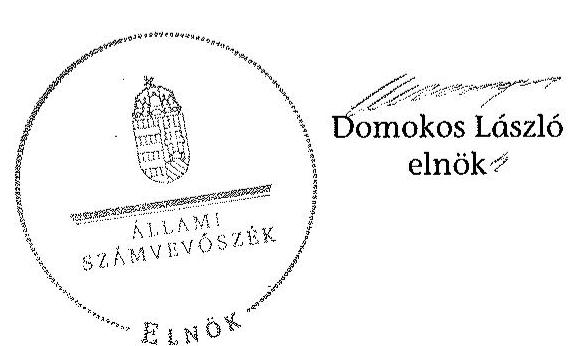

# ÁLLAMI   SZÁMVEVŐSZÉK 

## JELENTÉS

a helyi nemzetiségi önkormányzatok gazdálkodásának ellenőrzéséről
Baktalórántházi Roma Nemzetiségi Önkormányzat

---

# Állami Számvevőszék 

Iktatószám: V-0796-051/2015.
Témaszám: 1830
Vizsgálat-azonosító szám: V067623

## Az ellenőrzést felügyelte:

Horváthné Herbáth Mária
felügyeleti vezető
Az ellenőrzés végrehajtásáért felelős és az ellenőrzést vezette:
Páncsics Judit
ellenőrzésvezető
A számvevői munkaanyagok feldolgozásában és a számvevőszéki jelentéstervezet összeállításában közreműködött:

Baki István
számvevő tanácsos
Az ellenőrzést végezték:

| Baki István | Csényi István | dr. Eke-Pekács Tibor |
| :-- | :-- | :-- |
| számvevő tanácsos | számvevő főtanácsos | számvevő tanácsos |

---

# TARTALOMJEGYZÉK 

BEVEZETÉS ..... 7
I. ÖSSZEGZŐ MEGÁLLAPÍTÁSOK, KÖVETKEZTETÉSEK, JAVASLATOK ..... 10
II. RÉSZLETES MEGÁLLAPÍTÁSOK ..... 18

1. A Nemzetiségi Önkormányzat és a Települési Önkormányzat együttműködésének szabályozása, a működési feltételek biztosítása ..... 18
2. A gazdálkodási feladatok ellátásának szabályszerűsége ..... 19
2.1. A költségvetésre és a zárszámadásra, valamint a kincstári adatszolgáltatás rendjére vonatkozó jogszabályi előírások betartása ..... 19
2.2. A Nemzetiségi Önkormányzat gazdálkodásának szabályozottsága ..... 21
2.3. Az operatív gazdálkodási jogkörök kialakítása, gyakorlása ..... 22
3. A Nemzetiségi Önkormányzattal összefüggő gazdálkodási feladatok belső ellenőrzése ..... 24
MELLÉKLET
4. számú A Baktalórántházi Roma Nemzetiségi Önkormányzat 2013. évi gazdálkodási adatai

---

.

---

# RÖVIDÍTÉSEK JEGYZÉKE 

Törvények
Alaptörvény
Áht.
ÁSZ tv.
Kttv.
Nek tv.
Számv. tv.
Rendeletek
Áhsz. 1

Áhsz. 2
Ávr.
Bkr.
Szórövidítések
ÁSZ
együttműködési megállapodás ${ }_{1}$
együttműködési megállapodás ${ }_{2}$
jegyző
Kincstár
Kormányhivatal
Önkormányzati Hivatal

Nemzetiségi Önkormányzat
Nemzetiségi Önkormányzat elnöke
Nemzetiségi Önkormányzat Képviselőtestülete
Nemzetiségi Önkormányzat SZMSZ-e

SZMSZ

Magyarország Alaptörvénye
az államháztartásról szóló 2011. évi CXCV. törvény
az Állami Számvevőszékről szóló 2011. évi LXVI. törvény
a közszolgálati tisztviselőkről szóló 2011. évi CXCIX. törvény
a nemzetiségek jogairól szóló 2011. évi CLXXIX. törvény
a számvitelről szóló 2000. évi C. törvény
az államháztartás szervezetei beszámolási és könyvvezetési kötelezettségének sajátosságairól szóló 249/2000. (XII. 24.) Korm. rendelet (hatálytalan 2014. január 1-jétől)
az államháztartás számviteléről szóló 4/2013. (I. 11.) Korm. rendelet (hatályos 2014. január 1-jétől)
a 368/2011. (XII. 31.) Korm. rendelet az államháztartásról szóló törvény végrehajtásáról (hatályos 2012. január 1-jétől)
a költségvetési szervek belső kontrollrendszeréről és belső ellenőrzéséről szóló 370/2011. (XII. 31.) Korm. rendelet

Állami Számvevőszék
a Baktalórántházi Roma Nemzetiségi Önkormányzat Képviselő-testülete és Baktalórántháza Város Önkormányzatának Képviselő-testülete által jóváhagyott együttműködési megállapodás (hatályos: 2012. június 15-től 2013. augusztus 31-ig)
a Baktalórántházi Roma Nemzetiségi Önkormányzat Képviselő-testülete és Baktalórántháza Város Önkormányzatának Képviselő-testülete által jóváhagyott együttműködési megállapodás (hatályos: 2013. szeptember 1-jétől)
a Baktalórántházai Közös Önkormányzati Hivatal jegyzője
Magyar Államkincstár
Szabolcs-Szatmár-Bereg Megyei Kormányhivatal
Baktalórántháza Város Önkormányzata Képviselő-testületének a 148/2012. (XII. 20.) számú határozatával, 2013. január 1-jével megalapított Baktalórántházai Közös Önkormányzati Hivatal
Baktalórántházi Roma Nemzetiségi Önkormányzat
Baktalórántházi Roma Nemzetiségi Önkormányzat Elnöke
Baktalórántházi Roma Nemzetiségi Önkormányzat Képviselőtestülete

Baktalórántházi Roma Nemzetiségi Önkormányzat Képviselőtestületének 13/2010. (XI. 25.) számú határozatával jóváhagyott szervezeti és működési szabályzat
Szervezeti és Működési Szabályzat

---

Települési Önkormányzat
Települési Önkormányzat Képviselőtestülete
Települési Önkormányzat SZMSZ-e

Baktalórántháza Város Önkormányzata
Baktalórántháza Város Önkormányzatának Képviselő-testülete

Baktalórántháza Város Önkormányzata Képviselő-testületének szervezeti és működési szabályzatáról szóló 7/2013. (V. 3.) számú rendelet

---

# ÉRTELMEZŐ SZÓTÁR 

belső ellenőrzés
belső kontrollrendszer
együttműködési megállapodás
integritás
költségvetési szerv vezetője
korrupció

A Bkr. 2. § b) pont meghatározásában független, tárgyilagos bizonyosságot adó és tanácsadó tevékenység, amelynek célja, hogy az ellenőrzött szervezet működését fejlessze és eredményességét növelje, az ellenőrzött szervezet céljai elérése érdekében rendszerszemléletű megközelítéssel és módszeresen értékeli, illetve fejleszti az ellenőrzött szervezet irányítási és belső kontrollrendszerének hatékonyságát.
A Bkr. 2. § d) pont és az Áht. 69. § (1) bekezdése alapján a belső kontrollrendszer a kockázatok kezelése és tárgyilagos bizonyosság megszerzése érdekében kialakított folyamatrendszer, amely azt a célt szolgálja, hogy a működés és gazdálkodás során a tevékenységeket szabályszerűen, gazdaságosan, hatékonyan, eredményesen hajtsák végre, az elszámolási kötelezettségeket teljesítsék, megvédjék az erőforrásokat a veszteségektől, károktól és nem rendeltetésszerű használattól.
Az Áht. 27. § (2) bekezdése és Nek tv. 80. § (1) bekezdése értelmében a helyi önkormányzat a helyi nemzetiségi önkormányzat részére - annak székhelyén - biztosítja az önkormányzati működés személyi és tárgyi feltételeit, továbbá gondoskodik a működéssel kapcsolatos végrehajtási feladatok ellátásáról. Az önkormányzati működés feltételei és az ezzel kapcsolatos végrehajtási feladatok. Az Nek tv. 80. § (2) bekezdés szerinti a fenti kötelezettségének teljesítése érdekében a helyi önkormányzat harminc napon belül biztosítja a rendeltetésszerű helyiséghasználatot, valamint a helyiséghasználatra, a további feltételek biztosítására és a feladatok ellátására vonatkozóan megállapodást köt a helyi nemzetiségi önkormányzattal. A megállapodást minden év január 31. napjáig, általános vagy időközi választás esetén az alakuló ülést követő harminc napon belül felül kell vizsgálni. A helyi önkormányzat és a nemzetiségi önkormányzat szervezeti és működési szabályzatában rögzíti a megállapodás szerinti működési feltételeket, a megállapodás megkötését, módosítását követő harminc napon belül. Az Nek tv. 80. § (3) bekezdés írja elő a megállapodásban rögzítendőket.
Az integritás elvek, értékek, cselekvések, módszerek, intézkedések konzisztenciáját jelenti: olyan magatartásmódot, amely meghatározott értékeknek felel meg. Az integritás a közszféra esetében a társadalom által elvárt nyilvánossági, átláthatósági, illetve jogi/etikai normáknak történő megfelelést jelenti. (Forrás: a http://integritas.asz.hu honlapon közzétett „A 2012. évi integritás felmérés eredményeinek összefoglalója" dokumentum 3. oldal 1. bekezdése)
A Bkr. 2. § nd) pont meghatározásában a helyi önkormányzat, helyi nemzetiségi önkormányzat, illetve a fővárosi kerületi önkormányzat esetén a jegyző, körjegyző, főjegyző.
Azok a cselekmények, amelyek során a köz érdekében való eljárással megbízott és döntéshozatali felelősséggel felruházott személy a köz érdeke helyett önös vagy részérdekeket követve, mástól

---

kulcskontroll
lényegesség
megfelelőségi teszt
nemzetiség
nemzetiségi önkormányzat
operatív gazdálkodási jogkör
jogtalan vagy etikátlan előnyt elfogadva és őt jogtalan vagy etikátlan előnyhöz juttatva jár el, illetve amikor valaki a köz érdekében való eljárással megbízott és döntéshozatali felelősséggel felruházott személynek jogtalan vagy etikátlan előnyt nyújtva vagy felajánlva jogtalan vagy etikátlan előnyt kér. (Forrás: A Kormány korrupció megelőzési programja 2012-2014.)
Az azonosított kockázatok mérséklése érdekében kialakított kontrollok közül azok, amelyek elégtelen működése esetén a szervezetet jelentős veszteség érheti, vagy a működésükben bekövetkező hiba/hiányosság más kontrollok eredményességét csökkenti. Ezek ellenőrzése, értékelése elegendő bizonyítékot szolgáltat adott területen a kontrollrendszer értékeléséhez. Az önkormányzatok kontrollrendszere kialakításának ellenőrzése során a pénzügyi folyamatokban kulcsszerepet betöltő belső kontrollok a teljesítésigazolás és érvényesítés.
Egy információ akkor lényeges, ha hiánya vagy téves állítása befolyásolhatja ezen információkat felhasználók döntéseit, véleményét. Az ellenőrzés során a lényegesség három szempontból értelmezhető: érték, jelleg és összefüggés szerint.
Az ellenőrzés során alkalmazott módszer - a számvevő egy adatállomány, statisztikai sokaság összes tételének vizsgálata helyett a kiválasztott tételek meghatározott jellemzőinek elemzése és kiértékelése útján szerezhet a teljes állományra vonatkozó következtetések levonására alkalmas ellenőrzési bizonyítékokat - a mennyiségileg elegendő és a minőségileg megfelelő bizonyíték megszerzésére az ellenőrzött kulcskontroll (teljesítésigazolás, érvényesítés) működésének megfelelő, vagy nem megfelelő voltáról. (A számvevőszéki ellenőrzés általános alapelvei 4.1.2, és 4.2 pontjai)
A Nek tv. 1. § (1) bekezdése alapján nemzetiség minden olyan Magyarország területén legalább egy évszázada honos népcsoport, amely az állam lakossága körében számszerű kisebbségben van, tagjai magyar állampolgárok és a lakosság többi részétől saját nyelve és kultúrája, hagyományai különböztetik meg, egyben olyan összetartozás-tudatról tesz bizonyságot, amely mindezek megőrzésére, történelmileg kialakult közösségeik érdekeinek kifejezésére és védelmére irányul.
Az Nek tv. 2. § 2. pontja szerint törvényben meghatározott nemzetiségi közszolgáltatási feladatokat ellátó, testületi formában működő, jogi személyiséggel rendelkező, demokratikus választások útján e törvény alapján létrehozott szervezet, amely a nemzetiségi közösséget megillető jogosultságok érvényesítésére, a nemzetiségek érdekeinek védelmére és képviseletére, a feladat- és hatáskörébe tartozó nemzetiségi közügyek települési, területi vagy országos szinten történő önálló intézésére jön létre.
a kötelezettségvállalás, a pénzügyi ellenjegyzés, az utalványozás, az érvényesítés és a teljesítésigazolás jogkörök

---

# JELENTÉS   a helyi nemzetiségi önkormányzatok gazdálkodásának ellenőrzéséről Baktalórántházi Roma Nemzetiségi Önkormányzat 

## BEVEZETÉS

A Nemzetiségi Önkormányzat a 2002. évben alakult. A 2013-ban hivatalban volt elnök a 2010. évtől a 2014. évi helyhatósági választásokig látta el a feladatát. A Nemzetiségi Önkormányzat intézményt, gazdasági társaságot és más szervezetet nem alapított, illetve társulásban nem vett részt. A négytagú Képviselőtestület a munkája segítésére a 2010-2014. évek között bizottságot nem hozott létre. A Nemzetiségi Önkormányzatnak a költségvetési beszámolója szerint a 2013. évben a módosított költségvetési bevételi és kiadási előirányzata 786,0 ezer Ft, a teljesített költségvetési bevétele 1040,0 ezer Ft, a teljesített költségvetési kiadása 1143,0 ezer Ft volt. A Nemzetiségi Önkormányzat a 2013. évben 221,8 ezer Ft általános működési célú állami támogatást kapott, feladatalapú támogatásban nem részesült. A 2013. évi gazdálkodási adatokat részletesen az 1. számú melléklet tartalmazza.

Az Alaptörvény Szabadság és felelősség rész XXIX. cikk (1) bekezdése szerint a Magyarországon élő nemzetiségek államalkotó tényezők. Minden, valamely nemzetiséghez tartozó magyar állampolgárnak joga van önazonossága szabad vállalásához és megőrzéséhez. A hazánkban élő nemzetiségek helyi (települési és területi) valamint országos önkormányzatokat hozhatnak létre ${ }^{1}$. A helyi nemzetiségi önkormányzatok gazdálkodási feladatait jogszabályi előírás alapján a székhely szerinti helyi önkormányzat polgármesteri hivatala látja el.

A nemzetiségek helyzete, támogatása mind hazai, mind EU-s szinten kiemelt figyelmet kap napjainkban. A helyi nemzetiségi önkormányzatok gazdálkodására és támogatási rendszerére vonatkozó jogszabályok a 2010-2012. években jelentős változásokon mentek át. A helyi nemzetiségi önkormányzatok gazdálkodásának, a részükre juttatott költségvetési támogatások felhasználásának ellenőrzését az ÁSZ 2012-ben sorozatjellegű ellenőrzés keretében indította el.

[^0]
[^0]:    ${ }^{1}$ A 2010. évben megtartott nemzetiségi önkormányzati választásokat követően 2304 települési, 58 területi és 13 országos nemzetiségi önkormányzat alakult meg.

---

Az ellenőrzés célja annak értékelése volt, hogy a helyi nemzetiségi önkormányzat gazdálkodási kereteinek kialakítása, gazdálkodása megfelelt-e a jogszabályoknak.

Ennek keretében értékeltük, hogy:

- a helyi nemzetiségi önkormányzat és a helyi (települési) önkormányzat együttműködésének szabályozása, a működési feltételek biztosítása megfelelte a jogszabályi előírásoknak;
- a felek együttműködése megfelelt-e a megállapodásban foglaltaknak a gazdálkodási feladatok szabályszerű ellátása során, betartották-e a vonatkozó jogszabályi előírásokat;
- biztosított volt-e a helyi nemzetiségi önkormányzat gazdálkodásának belső ellenőrzése.

Az ellenőrzés várható hasznosulása: a nemzetiségi önkormányzatok testületi döntéseinek tapasztalatait összegezve következtetés vonható le a törvényalkotás számára a jogszabályi környezet esetleges módosításának indokoltságára vonatkozóan. Az ellenőrzés az ellenőrzött számára visszajelzést ad a rendezett gazdálkodási keretek kialakításáról, a működésbeli hiányosságokról. Az ellenőrzés megállapításai és javaslatai, a jó gyakorlat bemutatása tanulságul szolgálhatnak más nemzetiségi önkormányzatok, szervezetek számára a rendezett gazdálkodási keretek kialakításához. A társadalom számára jelzi, hogy közpénz nem maradhat ellenőrizetlenül, az ÁSZ értékteremtő rend kialakításához és megőrzéséhez hozzájáruló tevékenysége pozitív hatással lesz a szervezetről kialakított összkép formálásában. Az ÁSZ szervezetén belül lehetőség nyílik arra, hogy a megállapítások szintetizálásával az intézmény a hozzáadott értéket teremtő elemző tevékenységét és tanácsadó szerepét erősítse.

A helyi nemzetiségi önkormányzatok gazdálkodásának ellenőrzéséről szóló jelentés I. fejezetének összegző része az ellenőrzés céljára adott rövid, szintetizáló összefoglalót és következtetéseket tartalmazza a II. fejezet részletes megállapításai alapján.

A jelentés intézkedést igénylő megállapításait és javaslatait - az összegzőben foglaltak mellett - az ellenőrzés során feltárt, a jelentés II. fejezetében rögzített részletes megállapítások alapozzák meg, illetve támasztják alá.

# Az ellenőrzés típusa: szabályszerűségi ellenőrzés. 

Az ellenőrzött időszak: a helyi nemzetiségi önkormányzat és a települési önkormányzat együttműködésének, valamint a helyi nemzetiségi önkormányzat gazdálkodásának szabályozása megfelelőségét a 2013. évre vonatkozóan (a 2013. december 31-i állapotnak megfelelően), a
 helyi nemzetiségi önkormányzat gazdálkodásának szabályszerűségét, a működési feltételek, valamint a belső ellenőrzés biztosítását a 2013. január 1. - december 31-e közötti időszakot figyelembe véve értékeltük.

---

Ellenőrzött szervezet: a Baktalórántházi Roma Nemzetiségi Önkormányzat és a gazdálkodási feladatait ellátó Baktalórántházai Közös Önkormányzati Hivatal.

Az ellenőrzés szakmai módszertana az ÁSZ hivatalos honlapján (www.asz.hu) közzétett szakmai szabályokon alapult, amely a Legfőbb Ellenőrző Intézmények Nemzetközi Szervezete (INTOSAI) által kiadott nemzetközi standardok (ISSAI) figyelembevételével készült.

A gazdálkodás folyamatában kulcsszerepet betöltő két kulcskontroll - a teljesítésigazolás és az érvényesítés - működésének megfelelőségét teljes körűen, azaz minden, a személyi juttatásokkal, dologi és felhalmozási kiadásokkal, működési és felhalmozási célú pénzeszköz átadásokkal, ellátottak pénzbeli juttatásaival kapcsolatos kifizetés esetében ellenőriztük. A gazdálkodási jogkörök gyakorlását „megfelelőnek" értékeltük, ha a hibaarány legfeljebb $10 \%$ volt, „részben megfelelőnek" értékeltük, ha a hibaarány 10-30% között alakult, „nem megfelelőnek" értékeltük akkor, ha a hibaarány meghaladta a $30 \%$-ot.

Az ellenőrzés végrehajtásának jogszabályi alapját az ÁSZ tv. 5. § (2)-(3) és (6) bekezdéseiben foglaltak képezik.

Az ÁSZ tv. 29. § (1) bekezdése szerint a jelentéstervezetet megküldtük a jegyző és a Nemzetiségi Önkormányzat elnöke részére, akik az ÁSZ tv. 29. § (2) bekezdésében foglalt észrevételezési jogukkal nem éltek, a jelentéstervezetre észrevételt nem tettek.

---

# I. ÖSSZEGZŐ MEGÁLLAPÍTÁSOK, KÖVETKEZTETÉSEK, JAVASLATOK 

A Nemzetiségi Önkormányzat és a Települési Önkormányzat együttműködésének szabályozása a feltárt hiányosságok ellenére megfelelt a jogszabályi előírásoknak.

A Nemzetiségi Önkormányzat és a Települési Önkormányzat között 2013. augusztus 31-ig hatályban volt együttműködési megállapodás ${ }_{1}$ felülvizsgálatára a Nek. tv.-ben előírt határidőt követően, 2013. augusztusában került sor. A 2013. szeptember 1-jétől hatályos együttműködési megállapodás ${ }_{2}$ az Áht.-ban előírtak ellenére nem tartalmazta, hogy az Önkormányzati Hivatal gondoskodik a Nemzetiségi Önkormányzat bevételeivel és kiadásaival kapcsolatban az ellenőrzési és a finanszírozási feladatok ellátásáról, így ezen feladatok ellátásának részletes szabályait nem rendezték. Az együttműködési megállapodás ${ }_{2}$ - a Nek tv.-ben foglaltak ellenére - nem tartalmazta a Nemzetiségi Önkormányzat kötelezettségvállalásának SZMSZ-ben meghatározott szabályait, az összeférhetetlenségi, nyilvántartási kötelezettségeket.

A Települési Önkormányzat a Nek tv.-ben előírtaknak megfelelően biztosította az Önkormányzati Hivatal részére a Nemzetiségi Önkormányzat működéséhez szükséges személyi és tárgyi feltételeket, valamint az önkormányzati működéssel kapcsolatos végrehajtási feladatok ellátását, amelyet az együttműködési megállapodás ${ }_{1,2}$-ben rögzítettek. Az Önkormányzati Hivatal a Nemzetiségi Önkormányzat működéséhez szükséges személyi feltételeket az együttműködési megállapodás ${ }_{1,2}$-ben előírtak ellenére részben biztosította, mivel a jegyző a Kttv.-ben előírtak ellenére az érintett hivatali dolgozók munkaköri leírásában nem rögzítette a nemzetiségi önkormányzati feladatok ellátását. Az Önkormányzati Hivatal a Nemzetiségi Önkormányzat működésének tárgyi feltételeiről gondoskodott.

A Nemzetiségi Önkormányzat SZMSZ-e az együttműködési megállapodás ${ }_{1,2}$ szerinti működési feltételeket - a Nek tv. rendelkezése ellenére - nem tartalmazta. A Települési Önkormányzat SZMSZ-ét az együttműködési megállapodás ${ }_{2}$ megkötését követő 30 napon belül a Nek tv.-ben előírtak ellenére a megállapodás szerinti működési feltételekkel nem módosították.

A Nemzetiségi Önkormányzat 2013. évi költségvetésének és zárszámadásának tartalma, jóváhagyása, valamint a kapcsolódó adatszolgáltatás a feltárt hiányosságok miatt nem felelt meg a jogszabályi előírásoknak.

A jegyző a Nemzetiségi Önkormányzat 2013. és 2014. évi költségvetési koncepcióját - az Áht.-ban, valamint az együttműködési megállapodás ${ }_{1,2}$-ben foglaltak ellenére - nem készítette el.

A Nemzetiségi Önkormányzat elnöke a 2013. évi költségvetési határozattervezetet az Áht.-ban előírt határidőn túl nyújtotta be a Nemzetiségi Önkormányzat Képviselő-testületének. A költségvetési határozat az Áht. előírásai ellenére nem tartalmazta a Nemzetiségi Önkormányzat költségvetési bevételeit és költségvetési kiadásait kötelező és önként vállalt feladatok szerinti, a költségvetési egyenleg összegét működési és felhalmozási cél szerinti bontásban, a költségvetési hiány belső finanszírozására szolgáló előző évi maradvány igénybevételét működési és felhalmozási cél szerinti tagolásban. A költségvetési bevételek között - az Ávr.-ben előírtak ellenére - nem mutatták ki a helyi nemzetiségi önkormányzatok általános működéséhez kapcsolódó támogatást. A költségvetési határozat előterjesztésekor - az Áht. rendelkezése ellenére - tájékoztatásul nem mutatták be a költségvetési mérleget közgazdasági tagolásban és az előirányzat felhasználási tervet, mivel azokat a jegyző nem készítette el.

A 2013. évi zárszámadási határozat-tervezetet a Nemzetiségi Önkormányzat elnöke az Áht.-ban rögzített határidőn túl terjesztette a Képviselő-testület elé. A vagyonkimutatást a jegyző nem készítette el, ezért a zárszámadási határozat-tervezet előterjesztésekor - az Áht.-ban előírtak ellenére - tájékoztatásul nem mutatták be. A 2013. évi zárszámadási határozat a 2013. évi elemi költségvetési beszámoló adatai alapján készült, de az utóbbi tartalma nem felelt meg maradéktalanul az Áhsz. ${ }_{1}$-ben előírtaknak. A Nemzetiségi Önkormányzat 2013. évi éves elemi költségvetési beszámolójában az intézményi működési bevételek jogcímen helytelenül Települési Önkormányzat által nyújtott támogatást is elszámoltak, a 2012. évi pénzmaradvány igénybevételét pénzforgalom nélküli bevételként nem mutatták ki.

A jegyző az együttműködési megállapodás ${ }_{1,2}$ alapján nem gondoskodott arról, hogy a Nemzetiségi Önkormányzat adatszolgáltatását - a költségvetési jelentéseket és az időközi mérlegjelentést az Ávr.-ben, valamint az éves elemi költségvetési beszámolót az Áhsz. ${ }_{1}$-ben előírt határidőre - a Kincstár részére megküldjék. A jegyző az Áhsz. ${ }_{1}$-ben előírtak ellenére a Nemzetiségi Önkormányzat 2013. évi I. féléves és az éves elemi költségvetési beszámolójának elkészítési határidejét nem tartotta be.

A Nemzetiségi Önkormányzat gazdálkodásának szabályozottsága a 2013. évben nem volt biztosított. A jegyző az Önkormányzati Hivatal 2013. január 1-jei megalapítását követő 90 napon belül a Számv. tv.-ben előírtak ellenére nem készítette el az Önkormányzati Hivatal Nemzetiségi Önkormányzatra is kiterjedő számviteli politikáját, valamint a számlarendet. A Nemzetiségi Önkormányzat az Áhsz. ${ }_{1}$ előírása alapján számviteli politikával és számlarenddel önállóan sem rendelkezett. Az Önkormányzati Hivatal a 2013. évben az Áht.-ban előírtak ellenére nem rendelkezett a Képviselő-testület által jóváhagyott SZMSZ-szel. A jegyző a 2013. évben az Ávr.-ben előírtak ellenére a tervezéssel, a gazdálkodással, a kötelezettségvállalással, az ellenjegyzéssel, a teljesítésigazolással, az érvényesítéssel és az utalványozással kapcsolatos feladatok ellátását, a joggyakorló személyek kijelölésének módját, eljárási és dokumentációs szabályait, az ellenőrzési és az adatszolgáltatási feladatokat és feltételeket nem szabályozta. A jegyző a Kttv.-ben előírtak ellenére az érintett hivatali dolgozók munkaköri leírásában nem rögzítette a Nemzetiségi Önkormányzat gazdálkodásával kapcsolatos feladatok ellátását. A jegyző 2013-ban a Bkr.-ben előírtak ellenére az Önkormányzati Hivatal működési folyamataira vonatkozó ellenőrzési nyomvonalat és a szabálytalanságok kezelésének eljárásrendjét nem készítette el, valamint

---

kontrolltevékenység részeként nem biztosította a folyamatba épített előzetes, utólagos és vezetői ellenőrzést.

A Nemzetiségi Önkormányzat gazdálkodása során az operatív gazdálkodási jogkörök kialakítása részben felelt meg a jogszabályi előírásoknak. Az együttműködési megállapodás ${ }_{1,2}$ szerint a kötelezettségvállalásra, az utalványozásra és a teljesítésigazolásra a Nemzetiségi Önkormányzat elnöke volt jogosult. A Nemzetiségi Önkormányzat elnöke kötelezettségvállalásra, utalványozásra és teljesítésigazolásra más nemzetiségi önkormányzati képviselőnek írásban nem adott felhatalmazást, ezáltal az Ávr.-ben előírt összeférhetetlenségi kötelezettség érvényesülési feltételét nem biztosította.

Az együttműködési megállapodás ${ }_{1,2}$ tartalmazta a Nemzetiségi Önkormányzat gazdálkodásával kapcsolatban a pénzügyi ellenjegyzés és az érvényesítés gyakorlására a jegyző által kijelölt köztisztviselők írásbeli felhatalmazását.

A Nemzetiségi Önkormányzatnál 2013-ban az operatív gazdálkodási jogkörökön belül a teljesítésigazolás és az érvényesítés kulcskontrollok működése nem felelt meg a jogszabályi előírásoknak a teljes körűen ellenőrzött személyi juttatásokkal és a dologi kiadásokkal kapcsolatos kifizetések esetében.

A teljesítésigazolás a személyi juttatások és a dologi kiadások kifizetését megelőzően az Ávr.-ben előírtak ellenére több esetben nem történt meg, illetve a teljesítést több tételnél nem az arra jogosult igazolta. A Nemzetiségi Önkormányzat elnöke több alkalommal - az Ávr.-ben előírtak ellenére - a teljesítést a maga javára igazolta.

Az érvényesítő a személyi juttatások és a dologi kiadások kifizetését megelőzően nem kifogásolta, hogy - az Áht.-ban és az Ávr.-ben előírtak ellenére - a teljesítésigazolás nem történt meg. Az érvényesítő az Ávr.-ben előírtak ellenére nem végezte el a feladatát, nem ellenőrizte, hogy a megelőző ügymenetben a gazdálkodásra vonatkozó jogszabályok előírásait betartották-e. Nem jelezte, hogy a Nemzetiségi Önkormányzat elnöke a teljesítést a maga javára igazolta. Nem kifogásolta, hogy a kötelezettségvállalás az együttműködési megállapodás ${ }_{1,2}$-ben előírtak ellenére nem minden esetben történt meg írásban. Az érvényesítő nem jelezte, hogy 2013 júniusáig nem vezették az Ávr.-ben, valamint az együttműködési megállapodás ${ }_{1,2}$-ben előírtak ellenére a kötelezettségvállalások nyilvántartását. Nem kifogásolta azt sem, hogy 2013 júniusa utáni kötelezettségvállalások esetében a pénzügyi ellenjegyző az Áht.-ban előírtak ellenére nem győződött meg arról, hogy kötelezettségvállalásra a költségvetés szabad előirányzata rendelkezésre áll-e, tekintettel arra, hogy a 2013. évi költségvetés dologi kiadási előirányzata már a 2013. év I. félévében felhasználásra került.

A 2013. évben a Nemzetiségi Önkormányzat gazdálkodásával összefüggő végrehajtási feladatokra vonatkozó belső ellenőrzés nem volt megfelelő. Az együttműködési megállapodás ${ }_{1,2}$ a belső ellenőrzés ellátására vonatkozó rendelkezéseket nem tartalmazott. A Nemzetiségi Önkormányzat gazdálkodására vonatkozóan a 2013. évben belső ellenőrzést nem terveztek és nem végeztek.

Az ÁSZ tv. 33. § (1) bekezdésében foglaltak értelmében a jelentésben foglalt megállapításokhoz kapcsolódó intézkedési tervet köteles az ellenőrzött szervezet vezetője összeállítani, és azt a jelentés kézhezvételétől számított 30 napon belül az

---

ÁSZ részére megküldeni. Amennyiben az intézkedési tervet határidőben nem küldi meg a szervezet, vagy az nem elfogadható, az ÁSZ elnöke a hivatkozott törvény 33. § (3) bekezdés a)-b) pontjaiban foglaltakat érvényesítheti.

A helyszíni ellenőrzés megállapításainak hasznosítása mellett javasoljuk:

# a jegyzőnek 

1. Az együttműködés szabályozásával kapcsolatban

A Nemzetiségi Önkormányzat és a Települési Önkormányzat között 2013. augusztus 31-ig hatályban levő együttműködési megállapodás, felülvizsgálatára a Nek. tv. 80. § (2) bekezdésében előírt határidőt követően került sor. A 2013. szeptember 1-jétől hatályos együttműködési megállapodás ${ }_{2}$ - az Áht. 27. § (2) bekezdésében előírtak ellenére - nem tartalmazta, hogy az Önkormányzati Hivatal gondoskodik a Nemzetiségi Önkormányzat bevételeivel és kiadásaival kapcsolatban az ellenőrzési és a finanszírozási feladatok ellátásáról, továbbá ezen feladatok ellátásának részletes szabályait nem rendezték.

Az együttműködési megállapodás ${ }_{2}$ - a Nek. tv 80. § (3) bekezdés c) pontjában foglaltak ellenére - nem tartalmazta a Nemzetiségi Önkormányzat kötelezettségvállalásának SZMSZ-ben meghatározott szabályait, az összeférhetetlenségi, nyilvántartási kötelezettségeket.

A Nemzetiségi Önkormányzat 2010. november 25-től hatályos SZMSZ-ét- a Nek. tv. 80. § (2) bekezdésében és 113. § a) pontjában foglaltak ellenére - nem módosították. A Nemzetiségi Önkormányzat SZMSZ-e - a Nek. tv. 80. § (2) bekezdésében előírtak ellenére - az együttműködési megállapodás ${ }_{1,2}$ szerinti működési feltételeket 2013. évben nem tartalmazta.

A Települési Önkormányzat SZMSZ-ét - a Nek. tv. 80. § (2) bekezdésében előírtak ellenére - az együttműködési megállapodás ${ }_{2}$ megkötését követően nem módosították.

Javaslat
a) Készítse elő az együttműködési megállapodás az Áht. és Nek. tv. előírásainak megfelelő módosítását, majd kezdeményezze annak a Települési Önkormányzat Képviselő-testülete elé terjesztését.
b) A továbbiakban kezdeményezze az együttműködési megállapodás évenkénti felülvizsgálatát oly módon, hogy az biztosítsa a jogszabályban rögzített határidő
 betartását.
c) Készítse elő a Nemzetiségi Önkormányzat SZMSZ-ének Nkt. tv. előírásainak megfelelő kiegészítését és kezdeményezze annak a Nemzetiségi Önkormányzat képviselő-testülete elé terjesztését.
d) Intézkedjen - a Nkt. tv. előírásai szerint - a Települési Önkormányzat SZMSZ-ében a Nemzetiségi Önkormányzat részére biztosított működési feltételek rögzítéséről a módosított együttműködési megállapodással összhangban, majd kezdeményezze annak képviselő-testületi előterjesztését.

---

2. A költségvetés és a zárszámadás szabályszerűségével kapcsolatban

A Nemzetiségi Önkormányzat 2013. évi költségvetési határozata - az Áht. 23. § (2) bekezdés a) pontjában előírtak ellenére - nem tartalmazta a költségvetési bevételeket és költségvetési kiadásokat kötelező és önként vállalt feladatok szerinti bontásban, továbbá az Áht. 23. § (2) bekezdés c) és d) pontjában előírtakat. A költségvetési bevételek között - az Ávr. 24. § (1) bekezdés a) pontjában előírtak ellenére - nem mutatták ki a helyi nemzetiségi önkormányzat általános működéséhez kapcsolódó támogatásokat.

A Nemzetiségi Önkormányzat elnöke a költségvetési határozat-tervezet a Nemzetiségi Önkormányzat Képviselő-testülete részére történő előterjesztésekor - az Áht. 24. § (4) bekezdés a) pontjának rendelkezése ellenére - tájékoztatásul nem mutatta be a költségvetési mérleget közgazdasági tagolásban, valamint az előirányzat felhasználási tervet, mivel azokat a jegyző nem készítette el.

A vagyonkimutatást a jegyző nem készítette el, így a Nemzetiségi Önkormányzat elnöke a zárszámadási határozat-tervezet előterjesztésekor - az Áht. 91. § (2) bekezdés c) pontjában előírtak ellenére - a Nemzetiségi Önkormányzat Képviselő-testületének tájékoztatásul nem mutatta be.

A jegyző - az együttműködési megállapodás ${ }_{1,2}$-ben rögzítettek ellenére - a jogszabályban előírt időközi adatszolgáltatásokat több esetben nem az Ávr. 169. § (2) bekezdésében, illetve nem az Ávr. 170. § (5) bekezdésében előírt határidőre juttatta el a Kincstárnak. A jegyző a 2013. évi éves elemi költségvetési beszámolót az Áhsz. 110. § (5a) bekezdésében előírt határidőn túl küldte meg a Kincstár részére.

Javaslat
Intézkedjen, hogy:
a) a Nemzetiségi Önkormányzat Képviselő-testülete részére tájékoztatásul teljes körűen, szöveges indoklással együtt kerüljenek bemutatásra a jogszabályban előírt mérlegek, kimutatások a költségvetési és a zárszámadási határozat-tervezetek előterjesztésekor;
b) a költségvetési határozat tartalmilag teljes körűen feleljen meg a hatályos jogszabályi előírásoknak;
c) a Nemzetiségi Önkormányzatra vonatkozóan a kincstári adatszolgáltatás teljesítése a jogszabályokban előírt határidőre megtörténjen.
3. A gazdálkodás szabályozottságával kapcsolatban

A jegyző az Önkormányzati Hivatal a 2013. évi megalapítását követően - a Számv. tv. 14. § (3)-(4) bekezdéseiben, továbbá az Áhsz. 18. § (3) bekezdésében előírtak ellenére - nem készítette el a Nemzetiségi Önkormányzat gazdálkodási feladataira kiterjedő számviteli politikát, továbbá az annak részét képező a Számv. tv. 14. § (5) bekezdésében előírt szabályzatokat. A jegyző - a Számv. tv. 161. (1)-(2) valamint (5) bekezdésében foglaltak ellenére nem készítette el az Önkormányzati Hivatal Nemzetiségi Önkormányzat gazdálkodásával összefüggő végrehajtási feladatokra kiterjedő számlarendet. A Nemzetiségi Önkormányzat az Áhsz. 18. § (13) bekezdése alapján számviteli politikával és számlarenddel önállóan nem rendelkezett.

---

A gazdasági szervezettel nem rendelkező Önkormányzati Hivatalban - az Ávr. 10. § (3a) bekezdését figyelembe véve - az Ávr. 13. § (2) bekezdés a) pontjában előírt gazdálkodási feladatokat és azok ellátásának feltételeit nem szabályozták.

A jegyző a Nemzetiségi Önkormányzat gazdálkodásával kapcsolatos feladatok ellátását a feladatokat ellátó hivatali dolgozók munkaköri leírásaiban a Kttv. 75. § (1) bekezdés d) pontjában előírtak ellenére nem rögzítette.

A jegyző 2013. évben - a Bkr. 6. § (3)-(4) bekezdések rendelkezései ellenére - az Önkormányzati Hivatal működési folyamataira vonatkozó ellenőrzési nyomvonalat, valamint a szabálytalanságok kezelésének eljárásrendjét nem készítette el, továbbá a Bkr. 8. § (2) bekezdésében előírtak ellenére a kontrolltevékenység részeként nem biztosította a folyamatba épített, előzetes, utólagos és vezetői ellenőrzést.

Javaslat
Intézkedjen:
a) a Nemzetiségi Önkormányzat gazdálkodási feladataira kiterjedően a jogszabályban előírt számviteli szabályzatok teljes körű elkészítése érdekében;
b) a gazdasági szervezettel nem rendelkező Önkormányzati Hivatalnál a Nemzetiségi Önkormányzat gazdálkodása részletes rendjének szabályozásáról Ávr. előírásainak figyelembe vételével;
c) a Nemzetiségi Önkormányzat gazdálkodásával kapcsolatos feladatokat ellátó köztisztviselők munkaköri leírásainak kiegészítéséről;
d) a Nemzetiségi Önkormányzat gazdálkodásával összefüggő feladatok ellátását biztosító Önkormányzati Hivatalnál az ellenőrzési nyomvonal, a szabálytalanságkezelési eljárásrend kialakítása, valamint a folyamatba épített, előzetes, utólagos és vezetői ellenőrzés biztosítása érdekében.
4. Az operatív gazdálkodási jogkörök kialakításával, gyakorlásával kapcsolatban

A teljesítésigazolás - az Ávr. 57. § (1) és (3) bekezdéseiben előírtak ellenére több esetben nem történt meg. A teljesítési igazolást - az Ávr. 57. § (4) bekezdésében foglaltak ellenére- több tételnél nem az arra jogosult személy végezte. Nem minden esetben volt beazonosítható a teljesítést igazoló személye, mivel a gazdálkodási jogkörök gyakorlóiról és aláírás-mintáikról - az Ávr. 60. § (3) bekezdésében foglaltakkal ellentétben - nem vezettek nyilvántartást.

Az érvényesítő az Áht. 38. § (1) és az Ávr. 58. § (1) és (3) bekezdésében előírtak ellenére - több esetben nem végezte el feladatát. Az érvényesítő nem tartotta be az Ávr. 58. § (1)-(2) bekezdésében előírtakat, mert nem ellenőrizte és jelezte, hogy a megelőző ügymenetben a gazdálkodásra vonatkozó jogszabályok előírásait betartották-e. Az érvényesítő nem kifogásolta, hogy a teljesítésigazolás több esetben nem történt meg. Nem jelezte az együttműködési megállapodás ${ }_{1,2}$ IV. Fejezet 4. pontjában rögzített szabályok megszegését, amely szerint kötelezettségvállalás minden gazdasági eseményre vonatkozóan csak írásban történhet. Az érvényesítő nem kifogásolta,

---

hogy a 2013. július 1-ét követő kötelezettségvállalások esetében a pénzügyi ellenjegyző - az Áht. 37. § (1) bekezdésének előírása ellenére - nem győződött meg a szabad előirányzat rendelkezésre állásáról.

Javaslat
Az operatív gazdálkodás működési hibáinak megelőzése, feltárása és kijavítása érdekében intézkedjen:
a) a teljesítésigazolás jogszabályi előírásoknak megfelelő elvégzéséről;
b) az érvényesítéshez kapcsolódó ellenőrzési és jelzési feladatok szabályszerű ellátásáról.
5. A Nemzetiségi Önkormányzat gazdálkodásának belső ellenőrzésével kapcsolatban

Az együttműködési megállapodás ${ }_{1,2}$ az Áht. 27. § (2) bekezdésében előírtak ellenére nem tartalmazta a Nemzetiségi Önkormányzat bevételeivel és kiadásaival kapcsolatban az ellenőrzési feladat ellátásának részletes szabályait. Az együttműködési megállapodás ${ }_{1,2}$ a belső ellenőrzés ellátására vonatkozó rendelkezéseket nem tartalmazott. A Nemzetiségi Önkormányzat gazdálkodására vonatkozóan a 2013. évben belső ellenőrzést nem terveztek és nem végeztek.

Javaslat
Az együttműködési megállapodás módosításának előkészítése során kezdeményezze annak kiegészítését a belső ellenőrzés ellátására vonatkozó részletszabályok meghatározásával.

# a Nemzetiségi Önkormányzat elnökének 

1. Az együttműködés szabályozásával kapcsolatban

Az együttműködési megállapodás ${ }_{2}$ - az Áht. 27. § (2) bekezdésében előírtak ellenére - nem tartalmazta, hogy az Önkormányzati Hivatal gondoskodik a Nemzetiségi Önkormányzat bevételeivel és kiadásaival kapcsolatban az ellenőrzési -kiemelten a belső ellenőrzési - és a finanszírozási feladatok ellátásáról, továbbá ezen feladatok ellátásának részletes szabályait nem rendezték. Az együttműködési megállapodás ${ }_{2}$ - a Nkt. tv. 80. § (3) bekezdés c) pontjában foglaltak ellenére - nem tartalmazta a Nemzetiségi Önkormányzat kötelezettségvállalásának SZMSZ-ben meghatározott szabályait, az összeférhetetlenségi, nyilvántartási kötelezettségeket.

A Nemzetiségi Önkormányzat 2010. november 25-től hatályos SZMSZ-ét - a Nkt. tv. 80. § (2) bekezdésében és 113. § a) pontjában foglaltak ellenére - nem módosították. A Nemzetiségi Önkormányzat SZMSZ-e - a Nkt. tv. 80. § (2) bekezdésében előírtak ellenére - az együttműködési megállapodás ${ }_{1,2}$ szerinti működési feltételeket a 2013. évben nem tartalmazta.

Javaslat
Terjessze a Nemzetiségi Önkormányzat Képviselő-testülete elé

---

a) az együttműködési megállapodás jegyző által előkészített - jogszabályi előírásoknak megfelelő - módosítását, amely tartalmazza a belső ellenőrzési feladatok ellátására vonatkozó részletes szabályokat is;
b) a Nemzetiségi Önkormányzat aktualizált - és az együttműködési megállapodással összhangban lévő - SZMSZ-ét a Nkt. tv.-ben előírt határidő figyelembevételével.
2. A költségvetés és a zárszámadás szabályszerűségével kapcsolatban

A Nemzetiségi Önkormányzat elnöke a költségvetési határozat-tervezet a Nemzetiségi Önkormányzat Képviselő-testülete részére történő előterjesztésekor - az Áht 24. § (4) bekezdés a) pontjának rendelkezése ellenére - tájékoztatásul nem mutatta be a költségvetési mérleget közgazdasági tagolásban, valamint az előirányzat felhasználási tervet. A vagyonkimutatást a jegyző nem készítette el, így a Nemzetiségi Önkormányzat elnöke a zárszámadási határozat-tervezet előterjesztésekor - az Áht. 91. § (2) bekezdés c) pontjában előírtak ellenére - a Nemzetiségi Önkormányzat Képviselő-testületének tájékoztatásul nem mutatta be.

A Nemzetiségi Önkormányzat elnöke a 2013. évi költségvetési határozat-tervezetet az Áht. 24. § (3) bekezdés és a 26. § (1) bekezdés a) és c) pontjaiban foglalt előírások ellenére - határidőn túl terjesztette a Nemzetiségi Önkormányzat Képviselő-testülete elé. A Nemzetiségi Önkormányzat elnöke a 2013. évi zárszámadási határozat-tervezetet az Áht. 91. § (1) bekezdésében előírt határidőre nem terjesztette a Nemzetiségi Önkormányzat Képviselő-testülete elé.

Javaslat
a) A költségvetési és a zárszámadási határozat-tervezet előterjesztésekor a Nemzetiségi Önkormányzat Képviselő-testülete részére tájékoztatásul teljes körűen mutassa be a jogszabályban előírt mérlegeket, kimutatásokat.
b) A költségvetési és a zárszámadási határozat-tervezeteket a jogszabályban meghatározott határidők betartásával terjessze a Nemzetiségi Önkormányzat Képviselőtestülete elé.
3. Az operatív gazdálkodási jogkörök kialakításával kapcsolatban

A Nemzetiségi Önkormányzat elnöke nem biztosította az Ávr. 60. § (2) bekezdésében meghatározott összeférhetetlenségi kötelezettség érvényesülési feltételeit.

Javaslat
Összeférhetetlenség fennállása esetére jelöljön ki írásban további kötelezettségvállalásra, utalványozásra és a teljesítésigazolásra jogosult személyeket a jogszabályi követelmények érvényesülése érdekében.

---

# II. RÉSZLETES MEGÁLLAPÍTÁSOK 

## 1. A Nemzetiségi Önkormányzat és a Települési Önkormányzat együttműködésének szabályozása, a működési feltételek biztosítása

A Nemzetiségi Önkormányzat és a Települési Önkormányzat együttműködésének szabályozása a feltárt hiányosságok ellenére megfelelt a jogszabályi előírásoknak.

A Nemzetiségi Önkormányzat és a Települési Önkormányzat között 2013. augusztus 31-ig hatályban levő együttműködési megállapodás ${ }_{1}$ felülvizsgálatára a Nkt. tv. 80. § (2) bekezdésében előírt határidőt követően került sor.

Az együttműködési megállapodás ${ }_{1}$ felülvizsgálatát a Nkt. tv.-ben előírt kötelezettség mellett indokolttá tette az is, hogy a Települési Önkormányzat a Nemzetiségi Önkormányzat működéséhez szükséges személyi és tárgyi feltételeket 2013. január 1-jétől az újonnan alapított Önkormányzati Hivatal útján biztosította.

Az együttműködési megállapodás ${ }_{1}$ 2013. augusztus 1. felülvizsgálatának eredményeként a Nemzetiségi Önkormányzat és a Települési Önkormányzat között létrejött ${ }^{2}$ az együttműködési megállapodás ${ }_{2}$, amely 2013. szeptember 1-jével lépett hatályba.

A 2013. december 31-én hatályos együttműködési megállapodás ${ }_{2}$ - az Áht. 27. § (2) bekezdésében ${ }^{3}$ foglaltaknak megfelelően - tartalmazta, hogy az Önkormányzati Hivatal látja el a Nemzetiségi Önkormányzat bevételeivel és kiadásaival kapcsolatban a tervezési, gazdálkodási, adatszolgáltatási és beszámolási feladatokat, és rögzítették ezen feladatok ellátásának részletes rendjét, a felelősöket és a teljesítési határidőket.

Az együttműködési megállapodás ${ }_{2}$ - az Áht. 27. § (2) bekezdésében előírtak ellenére - nem tartalmazta, hogy az Önkormányzati Hivatal gondoskodik a Nemzetiségi Önkormányzat bevételeivel és kiadásaival kapcsolatban az ellenőrzési és a finanszírozási feladatok ellátásáról, továbbá ezen feladatok ellátásának részletes szabályait nem rendezték. Az együttműködési megállapodás ${ }_{2}$ - a Nkt. tv. 80. § (3) bekezdés c) pontjában foglaltak ellenére - nem tartalmazta a Nemzetiségi Önkormányzat kötelezettségvállalásának SZMSZ-ben meghatározott szabályait, az összeférhetetlenségi, nyilvántartási kötelezettségeket.

[^0]
[^0]:    ${ }^{2}$ Az együttműködési megállapodás ${ }_{2}$-őt a Települési Önkormányzat a 78/2013. (VIII. 29.) számú határozatával, a Nemzetiségi Önkormányzat az 5/2013. (IX. 12.) számú határozatával hagyta jóvá.
 

 ${ }^{3}$ az Áht. 27. §-a 2015. január 1-jétől hatálytalan, attól kezdődően a rendelkezéseket az Áht. 6/C. § (2) bekezdés b) pontja tartalmazza

---

Az együttműködési megállapodás ${ }_{2}$ a Nek tv. 80. § (4) bekezdésében előírtaknak megfelelően rögzítette, hogy a jegyző, vagy - a jegyzővel azonos képesítési előírásoknak megfelelő - megbízottja a Települési Önkormányzat megbízásából és képviseletében részt vesz a Nemzetiségi Önkormányzat testületi ülésein és jelzéssel él, amennyiben törvénysértést tapasztal.

A Települési Önkormányzat a Nek tv. 80. § (1) bekezdésében előírtaknak megfelelően biztosította az Önkormányzati Hivatal részére a Nemzetiségi Önkormányzat működéséhez szükséges személyi és tárgyi feltételeket, valamint az önkormányzati működéssel kapcsolatos végrehajtási feladatok ellátását, melyeket az együttműködési megállapodás ${ }_{1,2}$-ben rögzítettek. Az Önkormányzati Hivatal a Nemzetiségi Önkormányzat működéséhez szükséges személyi feltételeket az együttműködési megállapodás ${ }_{1,2}$-ben előírtak ellenére részben biztosította, mivel a jegyző a nemzetiségi önkormányzati feladatok ellátását az érintett hivatali dolgozók munkaköri leírásában a Kttv. 75. § (1) bekezdés d) pontjában előírtak ellenére nem rögzítette. Az Önkormányzati Hivatal a Nemzetiségi Önkormányzat működésének tárgyi feltételeiről gondoskodott.

A Nemzetiségi Önkormányzat Képviselő-testülete a 2010. november 25-től hatályos SZMSZ-ét - a névváltozás, a jogszabályi változások, valamint az együttműködési megállapodások változása miatt - a Nek tv. 113. § a) pontjában előírtak ellenére nem módosította. A Nemzetiségi Önkormányzat SZMSZ-e - a Nek tv. 80. § (2) bekezdésében előírtak ellenére - az együttműködési megállapodás ${ }_{1,2}$ szerinti működési feltételeket a 2013. évben nem tartalmazta.

A Települési Önkormányzat SZMSZ-ének 49. § (2) bekezdése 2013. májustól rögzítette, hogy a Nemzetiségi Önkormányzat részére a működési feltételeket az Önkormányzati Hivatal biztosítja, azonban a Települési Önkormányzat SZMSZ-ét - a Nek tv. 80. § (2) bekezdésében előírtak ellenére - az együttműködési megállapodás ${ }_{2}$ megkötését követő 30 napon belül a megállapodás szerinti működési feltételekkel nem módosították.

# 2. A GAZDÁLKODÁSI FELADATOK ELLÁTÁSÁNAK SZABÁLYSZERŰSÉGE 

### 2.1. A költségvetésre és a zárszámadásra, valamint a kincstári adatszolgáltatás rendjére vonatkozó jogszabályi előírások betartása

A Nemzetiségi Önkormányzat 2013. évi költségvetésének és zárszámadásának tartalma, jóváhagyása, valamint a kapcsolódó adatszolgáltatás a feltárt hiányosságok miatt nem felelt meg a jogszabályi előírásoknak.

A jegyző a Nemzetiségi Önkormányzat 2013. és 2014. évi költségvetési koncepcióját - az Áht. 24. § (1) bekezdésében, valamint az együttműködési megállapodás ${ }_{1,2}$ II. Fejezet 1., 2. és 3. pontjaiban foglaltak ellenére - nem készítette el. A Nemzetiségi Önkormányzat elnöke ennek következtében az Áht. 24. § (1) bekezdésében ${ }^{4}$ és a 26. § (1) bekezdés c) pontjában előírtak ellenére a 2013. és 2014.

[^0]
[^0]:    ${ }^{4}$ hatálytalan 2014. szeptember 30-tól

---

évi költségvetési koncepciót nem nyújthatta be a Nemzetiségi Önkormányzat Képviselő-testületének.

A jegyző - az Áht.-ban és az együttműködési megállapodás ${ }_{1}$-ben foglaltaknak megfelelően - a Nemzetiségi Önkormányzat 2013. évi költségvetési határozattervezetét határidőben elkészítette. A Nemzetiségi Önkormányzat elnöke azonban a költségvetési határozat-tervezetet - az Áht. 24. § (2) bekezdésében ${ }^{5}$ és a 26. § (1) bekezdés a) és c) pontjaiban előírtak ellenére - határidőn túl, 2013. március 4-én terjesztette a Nemzetiségi Önkormányzat Képviselő-testülete elé, amelyet az, az 1/2013. (III. 7.) számú határozattal elfogadott.

A Nemzetiségi Önkormányzat 2013. évi költségvetési határozata - az Áht. 23. § (2) bekezdés a) pontjában előírtak ellenére - nem tartalmazta a költségvetési bevételeket és költségvetési kiadásokat kötelező és önként vállalt feladatok szerinti bontásban, nem tartalmazta továbbá - az Áht. 23. § (2) bekezdés c) pontjának rendelkezése ellenére - a költségvetési egyenleg összegét működési és felhalmozási cél szerinti bontásban, valamint - az Áht. 23. § (2) bekezdés d) pontjában előírtak ellenére - a költségvetési hiány belső finanszírozására szolgáló előző évi maradvány igénybevételét működési és felhalmozási cél szerinti tagolásban. A költségvetési bevételek között - az Ávr. 24. § (1) bekezdés a) pontjában előírtak ellenére - nem mutatták ki a helyi nemzetiségi önkormányzatok általános működéséhez kapcsolódó támogatásokat.

A Nemzetiségi Önkormányzat elnöke a költségvetési határozat-tervezet előterjesztésekor - az Áht. 24. § (4) bekezdés a) pontjának rendelkezése ellenére - tájékoztatásul nem mutatta be a Nemzetiségi Önkormányzat Képviselő-testületének a költségvetési mérleget közgazdasági tagolásban, valamint az előirányzat felhasználási tervet, mivel azokat a jegyző nem készítette el.

A Nemzetiségi Önkormányzat elnöke - a jegyző által elkészített - 2013. évi zárszámadási határozat-tervezetet az Áht. 91. § (1) bekezdésében előírt határidőre a költségvetési évet követő negyedik hónap utolsó napjáig - nem terjesztette a Nemzetiségi Önkormányzat Képviselő-testülete elé. A Nemzetiségi Önkormányzat Képviselő-testülete a 2013. évi zárszámadást a 3/2014. (V. 14.) számú határozattal fogadta el.

A jegyző a Nemzetiségi Önkormányzat 2013. évi zárszámadási határozat-tervezetét 2014. áprilisában készítette el, de a dokumentumról a pontos dátum hiányzott. A Nemzetiségi Önkormányzat elnöke a tervezetet 2014. május 7-én küldte meg a nemzetiségi önkormányzati képviselőknek.

A Nemzetiségi Önkormányzat elnöke a zárszámadási határozat-tervezet előterjesztésekor a Nemzetiségi Önkormányzat Képviselő-testületének tájékoztatásul szöveges indokolással - bemutatta a költségvetési mérleget közgazdasági tagolásban és a pénzeszközök változását. A jegyző nem készítette el a vagyonkimutatást, emiatt a Nemzetiségi Önkormányzat elnöke a 2013. évi zárszámadási ha-

[^0]
[^0]:    ${ }^{5}$ 2013. december 21-től az Áht. 24. § (3) bekezdése írja elő

---

tározat-tervezet előterjesztésekor - az Áht. 91. § (2) bekezdés c) pontjában előírtak ellenére - a Nemzetiségi Önkormányzat Képviselő-testületének tájékoztatásul nem mutatta be.

A zárszámadási határozatot - az Áht.-ban előírtaknak megfelelően - az elfogadott költségvetéssel összehasonlítható módon készítették el. A 2013. évi zárszámadási határozat a 2013. évi elemi költségvetési beszámoló adatai alapján készült, de az utóbbi tartalma nem felelt meg maradéktalanul az Áhsz. ${ }_{1}$-ben előírtaknak. A Nemzetiségi Önkormányzat 2013. évi éves elemi költségvetési beszámolója az intézményi működési bevételek jogcímen 14 ezer Ft helyett tévesen 136 ezer Ft-ot tartalmazott, mivel az Áhsz. ${ }_{1} 9$. számú melléklete 4. f) pontjában előírtak ellenére 122 ezer Ft összegű, a Települési Önkormányzat által nyújtott támogatást helytelenül számolták el. A Nemzetiségi Önkormányzat 2012. évi 104 ezer Ft összegű pénzmaradványának igénybevételét az Áhsz. 19. számú mellékletének 9. d) pontjában előírtak ellenére pénzforgalom nélküli bevételként nem mutatták ki.

A jegyző az együttműködési megállapodás ${ }_{1,2}$ III. Fejezetében foglalt feladata ellenére a kincstári adatszolgáltatások során nem gondoskodott az Ávr.-ben és az Áhsz. ${ }_{1}$-ben előírt határidők maradéktalan betartásáról. A jegyző az I. és a II. negyedéves és az éves időközi költségvetési jelentéseket az Ávr. 169. § (2) bekezdésben ${ }^{6}$ meghatározott határidőkön túl küldte meg a Kincstárnak. A 2013. évi I-VI. havi időközi mérlegjelentést ${ }^{7}$ az Ávr. 170. § (5) bekezdésében előírt határidőn túl juttatta el a Kincstárnak. A 2013. évi éves elemi költségvetési beszámolót az Áhsz. ${ }_{1} 10 . \S$ (5a) bekezdésében foglalt határidőt követő napon, 2014. március 11-én továbbították a Kincstárnak. A jegyző a 2013. évi I. félévi elemi költségvetési beszámolót és a 2013. évi éves elemi költségvetési beszámolót az Áhsz. ${ }_{1} 10 . \S$ (1) bekezdésében ${ }^{8}$ előírt határidő után készítette el ${ }^{9}$.

# 2.2. A Nemzetiségi Önkormányzat gazdálkodásának szabályozottsága 

A Nemzetiségi Önkormányzat gazdálkodásának szabályozottsága a 2013. évben a jogszabályi előírások ellenére nem volt biztosított.

A Települési Önkormányzat Képviselő-testülete a 148/2012. (XII. 20.) számú határozatával, 2013. január 1-jével alapította meg az Önkormányzati Hivatalt. A jegyző 2013. január 1-jét követő 90 napon belül a Számv. tv. 14. § (11) bekezdésében előírtak ellenére nem készítette el az Önkormányzati Hivatalra vonatkozó, a Nemzetiségi Önkormányzat gazdálkodási feladataira kiterjedő - a Számv. tv. 14. § (3)-(4) bekezdésében és az Áhsz. ${ }_{1} 8 . \S$ (3) bekezdésében előírt szempontoknak megfelelő - számviteli politikát és annak részét képező leltározási és leltár-

[^0]
[^0]:    ${ }^{6}$ 2015. január 1-jétől az Ávr. 169. § (3) bekezdése szabályozza
    ${ }^{7}$ A 2013. évi I-VI. havi időközi mérlegjelentést 2013. július 25. helyett július 31-én küldték meg a Kincstárnak.
    ${ }^{8}$ 2014. január 1-jétől az Áhsz. ${ }_{2} 32 . \S$ (1) bekezdése szabályozza
    ${ }^{9}$ A 2013. évi I. félévi elemi költségvetési beszámolót a jegyző 2013. július 31. helyett augusztus 12-én, az éves elemi költségvetési beszámolót 2014. február 28-a helyett március 11-én készítette el.

---

készítési szabályzatot, az értékelési, az önköltség számítási és a pénzkezelési szabályzatot. A jegyző 2013. január 1-jét követő 90 napon belül a Számv. tv. 161. § (5) bekezdésében előírtak ellenére nem készítette el - a Számv. tv. 161. § (1)-(2) bekezdéseiben meghatározott szempontoknak megfelelő - az Önkormányzati Hivatalnak a Nemzetiségi Önkormányzat gazdálkodásával összefüggő végrehajtási feladatokra kiterjedő számlarendjét. A Nemzetiségi Önkormányzat az Áhsz., 8. § (13) bekezdése alapján számviteli politikával és számlarenddel önállóan sem rendelkezett.

Az Önkormányzati Hivatalnak az Áht. 9. § (1) bekezdés a) pontja, illetve a 10. § (5) bekezdés rendelkezései ellenére a 2013. évben nem volt a Települési Önkormányzat Képviselő-testülete által jóváhagyott hivatali SZMSZ-e. Az Önkormányzati Hivatal elkülönített gazdasági szervezettel nem rendelkezett, a jegyző az Önkormányzati Hivatalban - az Ávr. 10. § (3a) bekezdésében és az Ávr. 13. § (2) bekezdés a) pontjában előírtak ellenére - a tervezéssel, a gazdálkodással, a kötelezettségvállalással, az ellenjegyzéssel, a teljesítésigazolással, az érvényesítéssel, az utalványozással kapcsolatos feladatok ellátását, a jogkörgyakorlók kijelölésének módját, eljárási és dokumentációs szabályait, az ellenőrzési és adatszolgáltatási feladatokat és feltételeket nem szabályozta.

A Kormányhivatal 2014-ben megállapította a hivatali SZMSZ hiányát és törvényességi felhívást tett. A hivatali SZMSZ-t, és annak 4. számú mellékleteként a hivatali ügyrendet a Települési Önkormányzat Képviselő-testülete az 59/2014. (VIII. 29.) számú határozatával jóváhagyta.

A 2013. évben hatályos együttműködési megállapodás ${ }_{1,2}$ IV. Fejezete tartalmazott rendelkezéseket az operatív gazdálkodási jogkörök gyakorlására, a joggyakorlókra, jegyzői felhatalmazást pénzügyi ellenjegyzésre és érvényesítésre, a felhatalmazások átvételére. A jegyző a Nemzetiségi Önkormányzat gazdálkodásával kapcsolatos feladatok ellátását a feladatokat ellátó hivatali dolgozók munkaköri leírásaiban a Kttv. 75. § (1) bekezdés d) pontjában előírtak ellenére nem rögzítette.

A jegyző a 2013. évben - a Bkr. 6. § (3)-(4) bekezdések rendelkezései ellenére - az Önkormányzati Hivatal működési folyamataira vonatkozó ellenőrzési nyomvonalat, valamint a szabálytalanságok kezelésének eljárásrendjét nem készítette el, továbbá a Bkr. 8. § (2) bekezdésében előírtak ellenére a kontrolltevékenység részeként nem biztosította a folyamatba épített előzetes, utólagos és vezetői ellenőrzést.

# 2.3. Az operatív gazdálkodási jogkörök kialakítása, gyakorlása 

A Nemzetiségi Önkormányzat gazdálkodása során az operatív gazdálkodási jogkörök kialakítása részben felelt meg a jogszabályi előírásoknak.

Az együttműködési megállapodás ${ }_{1,2}$ IV. Fejezete tartalmazta, hogy kötelezettségvállalásra, utalványozásra és teljesítésigazolásra a Nemzetiségi
 Önkormányzat elnöke vagy az általa írásban felhatalmazott nemzetiségi önkormányzati képviselő jogosult. A Nemzetiségi Önkormányzat elnöke az Ávr. 52. § (7) bekezdése alapján kötelezettségvállalásra, az 59. § (1) bekezdése alapján utalványozásra,

---

az 57. § (4) bekezdése alapján teljesítésigazolásra más nemzetiségi önkormányzati képviselőnek írásban nem adott felhatalmazást. A Nemzetiségi Önkormányzat elnöke ezáltal nem biztosította az Ávr. 60. § (2) bekezdésében meghatározott összeférhetetlenségi kötelezettség érvényesülési feltételét.

Az együttműködési megállapodás ${ }_{1,2}$ tartalmazta a Nemzetiségi Önkormányzat gazdálkodásával kapcsolatban az operatív gazdálkodási jogkörök közül a pénzügyi ellenjegyzés és az érvényesítés gyakorlására a jegyző által kijelölt köztisztviselők írásbeli felhatalmazását. A pénzügyi ellenjegyzési és érvényesítési feladatok ellátására kijelölt személyek rendelkeztek az Ávr.-ben előírt végzettséggel, illetve pénzügyi-számviteli képesítéssel.

A Nemzetiségi Önkormányzatnál az operatív gazdálkodási jogkörökön belül a teljesítésigazolás és az érvényesítés kulcskontrollok működése - a teljes körűen ellenőrzött személyi juttatások és dologi kiadások kifizetését megelőzően - nem megfelelőnek minősült.

A személyi juttatások kifizetései esetében több alkalommal a teljesítésigazolás az Ávr. 57. § (1) és (3) bekezdéseiben előírtak ellenére nem történt meg, a teljesítést igazoló személye nem volt beazonosítható, mivel az Ávr. 60. § (3) bekezdésében előírtak ellenére a jogkörgyakorlókról és aláírás mintáikról a nyilvántartást nem vezették. Több esetben előfordult, hogy - az Ávr. 60. § (2) bekezdése ellenére - az elnök a teljesítést a maga javára igazolta.

A dologi kiadások kifizetései közül több tételnél a teljesítésigazolás az Ávr. 57. § (1) és (3) bekezdésében előírtak ellenére nem történt meg, továbbá az Ávr. 57. § (4) bekezdésében foglaltak ellenére a teljesítésigazolást nem az arra jogosult végezte el. A teljesítést igazoló személye nem minden esetben volt beazonosítható, mivel a gazdálkodási jogkörgyakorlókról és aláírás mintáikról az Ávr. 60. § (3) bekezdésében előírtak ellenére nem vezettek nyilvántartást.

Az érvényesítő a személyi juttatások kifizetései közül több esetben nem kifogásolta, hogy - az Áht. 38. § (1) és az Ávr. 57. § (1) és (3) bekezdésében előírtak ellenére - a teljesítésigazolás nem történt meg.

A dologi kiadások kifizetései közül több esetben az érvényesítő az Ávr. 58. § (1) és (3) bekezdéseinek előírásai ellenére nem végezte el a feladatát. Az érvényesítő a feladatát egy esetben sem az Ávr. 58. § (1)-(2) bekezdése alapján látta el, ugyanis nem ellenőrizte, hogy a megelőző ügymenetben a gazdálkodásra vonatkozó jogszabályok előírásait betartották-e. Az érvényesítő nem jelezte az együttműködési megállapodás ${ }_{1,2}$ IV. Fejezet 4. pontjában rögzített szabály megszegését, amely szerint kötelezettségvállalás minden gazdasági eseményre vonatkozóan csak írásban történhet. Az érvényesítő nem észrevételezte, hogy 2013 júniusáig nem vezették az Ávr. 56. § (1) bekezdésében, valamint az együttműködési megállapodás ${ }_{1,3}$ IV. fejezet 5. pontjában előírtak ellenére a kötelezettségvállalások nyilvántartását. Az érvényesítő nem kifogásolta, hogy a 2013. július 1-jét követő kötelezettségvállalások esetében a pénzügyi ellenjegyző - az Áht. 37. § (1) bekezdésének előírása ellenére - nem győződött meg arról, hogy a jóváhagyott költségvetés dologi kiadási előirányzatán belül a szabad előirányzat rendelkezésre állt-e, ugyanis a Nemzetiségi Önkormányzatnál a jóváhagyott 2013. évi költségvetés dologi kiadási előirányzatát már a 2013. év I. félévében felhasználták és év közben az előirányzatot nem módosították.

---

A Nemzetiségi Önkormányzatnál a 2013. évben felhalmozási kiadásokkal, működési és felhalmozási célú pénzeszköz átadásokkal, ellátottak pénzbeli juttatásaival kapcsolatos kifizetések nem fordultak elő.

Az ellenőrzés a kiadásokkal kapcsolatos dokumentumok ellenőrzése során jogosulatlan kifizetést nem tárt fel. A kulcskontrollok szabályozásának és gyakorlásának hiányosságai miatt nem volt biztosított a hibák megelőzése, feltárása és kijavítása.

# 3. A Nemzetiségi ÖNKORMÁNYZATTAL ÖSSZEFÜGGŐ GAZDÁLKODÁSI FELADATOK BELSŐ ELLENŐRZÉSE 

A 2013. évben a Nemzetiségi Önkormányzat gazdálkodásával összefüggő végrehajtási feladatokra vonatkozó belső ellenőrzés nem volt megfelelő. Az együttműködési megállapodás ${ }_{1,2}$ az Áht. 27. § (2) bekezdésében előírtak ellenére nem tartalmazta a Nemzetiségi Önkormányzat bevételeivel és kiadásaival kapcsolatban az ellenőrzési feladatok ellátásának részletes szabályait. Az együttműködési megállapodás ${ }_{1,2}$ a belső ellenőrzés ellátására vonatkozó rendelkezéseket nem tartalmazott.

A Nemzetiségi Önkormányzat gazdálkodására vonatkozóan a 2013. évben belső ellenőrzést nem terveztek és nem végeztek.

A Települési Önkormányzatnál a belső ellenőrzést 2013. január 1-jétől az Önkormányzati Hivatal állományába tartozó belső ellenőrök látták el. A belső ellenőrzés szervezeti és funkcionális függetlenségét - a Bkr. 18. §-ban előírtak ellenére - a Települési Önkormányzat SZMSZ-ének 1. számú mellékletét képező Önkormányzati Hivatal szervezeti felépítése alapján nem biztosították. A hivatali SZMSZ hiányában - a Bkr. 15. § (2) bekezdésében rögzítettek ellenére - a belső ellenőrzést végző személyek, illetve szervezeti egység jogállását, feladatait részletesen nem szabályozták.

Budapest, 2015. év

Melléklet: $\quad 1 \mathrm{db}$

---

# A BAKTALÓRÁNTHÁZI ROMA NEMZETISÉGI ÖNKORMÁNYZAT 2013. ÉVI GAZDÁLKODÁSI ADATAI*

A) Bevételek

|  Megnevezés | Eredeti előirányzat | Módosított | Teljesítés  |
| --- | --- | --- | --- |
|   | ezer Ft |  | $\begin{gathered} \text { megoszlás } \% \text {-ban } \end{gathered}$  |
|  Intézményi működési bevételek | 0,0 | 0,0 | 14,0  |
|  Felhalmozási saját bevételek | 0,0 | 0,0 | 0,0  |
|  Általános működési támogatás | 222,0 | 222,0 | 221,8  |
|  Feladatalapú támogatás | 0,0 | 0,0 | 0,0  |
|  Települési Önkormányzat által nyújtott támogatás | 564,0 | 564,0 | 804,2  |
|  Költségvetési bevételek összesen | 786,0 | 786,0 | 1040,0  |
|  Előző évi pénzmaradvány működési célú igénybevétele** | 0,0 | 0,0 | 104,0  |
|  Tárgyévi bevételek összesen | 786,0 | 786,0 | 1144,0  |

B) Kiadások

|  Megnevezés | Eredeti előirányzat | Módosított | Teljesítés  |
| --- | --- | --- | --- |
|   | ezer Ft |  | megoszlás
\%-ban  |
|  Személyi juttatások | 540,0 | 540,0 | 540,0  |
|  Munkaadókat terhelő járulékok és szociális hozzájárulási adó összesen | 146,0 | 146,0 | 327,0  |
|  Dologi kiadások | 100,0 | 100,0 | 276,0  |
|  Támogatásértékű működési kiadások | 0,0 | 0,0 | 0,0  |
|  Működési célú pénzeszközátadások állomháztartáson kívülre | 0,0 | 0,0 | 0,0  |
|  Működési kiadások összesen | 786,0 | 786,0 | 1143,0  |
|  Felhalmozási kiadások | 0,0 | 0,0 | 0,0  |
|  Költségvetési kiadások összesen | 786,0 | 786,0 | 1143,0  |
|  Tüggő, átutalt, kiegyenlítő kiadások | 0 | 0 | $-37$  |
|  Tárgyévi kiadások összesen | 786,0 | 786,0 | 1106,0  |

*A kimutatás a 2013. évi költségvetési beszámoló adataiból, valamint az Önkormányzati Hivatal - ÁSZ ellenőrzés során nyújtott - adatszolgáltatása alapján készült.* *a 2012. évi pénzmaradvány igénybevételét (104,0 ezer Ft) nem mutatták ki a 2013. évi beszámolóban pénzforgalom nélküli bevételként

