# ÁLLAMI
SZÁMVEVŐSZÉK

## JELENTÉS

A 2014. évi választásokra fordított pénzeszközök felhasználásának ellenőrzése - Az országgyűlési képviselők 2014. évi választására fordított pénzeszközök felhasználásának ellenőrzése

---

# Állami Számvevőszék

Iktatószám: V-0779-465/2015.
Témaszám: 1813
Vizsgálat-azonosító szám: 070501

## Az ellenőrzést felügyelte:

## Renkó Zsuzsanna

felügyeleti vezető
Az ellenőrzést vezette és az ellenőrzés végrehajtásáért felelős:
dr. Győri Gabriella Márta
ellenőrzésvezető
A számvevőszéki jelentés összeállításában közreműködött:
Baksa Anikó
számvevő főtanácsos
Dr. Mezei Imréné
számvevő főtanácsos
Az ellenőrzést végezték:

| Bertalan Rudolf | Bozsik Tamás | Dombóvári Nóra |
| :-- | :-- | :-- |
| Gyula | számvevő | számvevő tanácsos |
| számvevő |  |  |
| Fias Kálmánné | Gyulafalvi Enikő | Joó Erika |
| számvevő | számvevő | számvevő tanácsos |
| Kakas Sándor | dr. Kelemen F. Balázs | Papp József |
| számvevő | számvevő tanácsos | számvevő tanácsos |
| Takácsné Gönczi | Uram Ferenc | Várkonyi Zsolt Kristóf |
| Ildikó | számvevő tanácsos | számvevő tanácsos |
| számvevő tanácsos |  |  |

A témához kapcsolódó eddig készített számvevőszéki jelentés:
címe
sorszáma
Jelentés a 2010. évi országgyűlési, valamint önkormányzati és 1272
nemzeti, etnikai kisebbségi képviselő-választások lebonyolításához
felhasznált pénzeszközök ellenőrzéséről

---

# TARTALOMJEGYZÉK

BEVEZETÉS ..... 3
I. ÖSSZEGZŐ MEGÁLLAPÍTÁSOK, KÖVETKEZTETÉSEK ..... 6
II. RÉSZLETES MEGÁLLAPÍTÁSOK ..... 8

1. A választás előkészítéséhez és lebonyolításához szükséges pénzeszközök tervezése ..... 8
1.1. A választás pénzügyi tervezése ..... 8
1.2. A választás informatikai rendszerének kialakítása, a közbeszerzései eljárások lebonyolítása ..... 10
2. A költségvetésből biztosított finanszírozási források elosztása, az előirányzatok kezelése ..... 12
3. A választás előkészítéséhez, lebonyolításához rendelkezésre álló pénzeszközök felhasználása ..... 14
3.1. A választási pénzeszközök nyilvántartása, a felhasználás szabályozottsága ..... 14
3.2. A választással kapcsolatos kiadások teljesítésének szabályszerűsége ..... 15
4. A választási feladatokra felhasznált pénzeszközök elszámolása ..... 20
5. A választásra fordított pénzeszközök felhasználásának és elszámolásának ellenőrzése ..... 23
6. A választással kapcsolatban végzett korábbi ÁSZ ellenőrzés javaslatainak hasznosulása ..... 24

## MELLÉKLETEK

1. számú Elnöki hatáskör átruházása
2. számú Az ellenőrzött szervezetek jegyzéke
3. számú A 2014. évi OGY választáshoz kapcsolódó közbeszerzési értékhatárt elérő beszerzési eljárások
4. számú A gazdálkodási jogkörök gyakorlása az ellenőrzött helyi és területi választási irodáknál
5. számú Bács-Kiskun Megyei Önkormányzat Hivatalának főjegyzőjétől érkezett nemleges észrevétel
6. számú Budapest Főváros XVII. kerület Rákosmenti Polgármesteri Hivatal jegyzőjétől érkezett nemleges észrevétel

---

7. számú Budapest Főváros Főpolgármesteri Hivatal főjegyzőjétől érkezett észrevétel, és az ÁSZ észrevételre adott válasza
8. számú Győr-Moson-Sopron Megyei Önkormányzati Hivatal megyei címzetes főjegyzőjétől érkezett nemleges észrevétel
9. számú A Bevándorlási és Állampolgársági Hivatal főigazgatójától érkezett észrevétel, és az ÁSZ észrevételre adott válasza
10. számú Dégi Közös Önkormányzati Hivatal jegyzőjétől érkezett nemleges észrevétel
11. számú Kaposvár Megyei Jogú Város Polgármesteri Hivatal címzetes főjegyzőjétől érkezett észrevétel, és az ÁSZ észrevételre adott válasza
12. számú Budapest Főváros XII. kerület Hegyvidéki Polgármesteri Hivatal jegyzőjétől érkezett észrevétel, és az ÁSZ észrevételre adott válasza
13. számú A Közigazgatási és Igazságügyi Hivatal megbízott elnökétől érkezett észrevétel, és az ÁSZ észrevételre adott válasza
14. számú Fejér Megyei Önkormányzati Hivatal megyei jegyzőjétől érkezett észrevétel, és az ÁSZ észrevételre adott válaszlevele
15. számú Hajdú-Bihar Megyei Önkormányzati Hivatal jegyzőjétől érkezett nemleges észrevétel
16. számú A Nemzeti Választási Iroda elnökétől érkezett észrevétel, és az ÁSZ észrevételre adott válasza
17. számú Az igazságügyi minisztertől érkezett nemleges észrevétel

# FÜGGELÉKEK

1. számú Rövidítések jegyzéke
2. számú Értelmező szótár

---

# JELENTÉS

## A 2014. évi választásokra fordított pénzeszközök felhasználásának ellenőrzése Az országgyűlési képviselők 2014. évi választására fordított pénzeszközök felhasználásának ellenőrzése

## BEVEZETÉS

Magyarország Köztársasági Elnöke a 2014. évi országgyűlési képviselők választását (OGY választás) április 6-ra tűzte ki. A 2014. évi országgyűlési választás 1990 óta sorban a hetedik volt, amely - a korábbiakhoz képest - megújult jogszabályi környezetben zajlott.

A Nemzeti Választási Iroda (NVI) elnöke az Országgyűlés (OGY) részére készített, a 2014. évi országgyűlési képviselők választásáról szóló május 6-i beszámolója szerint „az országgyűlési választások 3176 településen 10386 szavazókörben, valamint 97 külképviseleten történő lebonyolításában több mint húszezer választási irodai, és mintegy 76000 választási bizottsági tag vett részt".

A 2012. január 1-jén hatályba lépett Alaptörvény - Magyarország legmagasabb szintű jogi normája - alkotmányos szinten deklarálta a közjogi választásokra vonatkozó legfontosabb alapvetéseket és magával hozta az egyes alapvető jogok gyakorlására, valamint a legfontosabb közjogi intézményekre vonatkozó szabályok megváltozását is. Ennek keretében sor került előbb a választási anyagi jog (az országgyűlési képviselők választásáról szóló 2011. évi CCIII. törvény), majd az eljárásjog (a választási eljárásról szóló 2013. évi XXXVI. törvény, Ve.) előírásainak újraszabályozására. A Ve. 346. §-ában előírt OGY választással kapcsolatos végrehajtási rendeleteket a Közigazgatási és Igazságügyi Minisztérium (KIM) a 2013. év második felében adta ki.

A 2013. évben megújult a választások előkészítését és lebonyolítását végző intézményrendszer is. A 2013. május 24-én alakult, autonóm államigazgatási szervként működő NVI fejezeti jogosítványokkal felruházott központi költségvetési szerv. A központi költségvetés szerkezeti rendjében I. Országgyűlés fejezet alatt önálló címet képez. Az NVI feladatai között szerepel többek között a központi névjegyzék vezetése, az OGY választás lebonyolításához szükséges közbeszerzési eljárások lefolytatása, az informatikai rendszer kialakítása és biztonságos működtetése, az OGY választás központi logisztikai feladatainak ellátása, az OGY választás pénzügyi lebonyolítása.

Az NVI feladata volt elkészíteni az OGY választás pénzügyi feladat- és költségtervét. A választási irodák vezetői feleltek az OGY választás pénzügyi tervezésé-

---

ért, lebonyolításáért, elszámolásáért, a pénzeszközök célhoz kötött felhasználásáért és ellenőrzéséért. Az OGY választás céljára biztosított pénzeszközöket a többi választásra biztosított pénzeszközöktől elkülönítetten kellett kezelni (legyen az kapott támogatás vagy saját forrás) és felhasználásukról részletező nyilvántartást kellett vezetni, amely feladatok ellátását a választási irodák részére a Ve. szerint az illetékes önkormányzatok hivatalai biztosították. A támogatásokról a részletező nyilvántartásokkal összhangban kellett elszámolni (feladattípusú elszámolás). Az NVI-nek az elszámolások alapján, a választás napját követő kilencven napon belül összesítő elszámolást kellett készíteni.

A Ve. 12. §-a alapján a választások előkészítésével és lebonyolításával kapcsolatos állami feladatok végrehajtásának költségeit, valamint a választási szervek tevékenységével összefüggő egyéb költségeket - az Országgyűlés által megállapított mértékben - a központi költségvetésből kell biztosítani. E pénzeszközök felhasználásáról az Állami Számvevőszék tájékoztatja az Országgyűlést.

A 2014. évi választási feladatok előkészítésének és lebonyolításának pénzügyi fedezetéül a 2013. évi költségvetési törvény 2300,0 M Ft-ot, a 2014. évi költségvetési törvény 10000,0 M Ft-ot irányzott elő. A költségvetési törvények választásonkénti bontást nem tartalmaztak, így a törvényekben megjelölt összegek a 2014. évben lezajlott három választás lebonyolítását szolgálták. A választások zavartalan lebonyolítása érdekében a Kormány a 2014. évi választások lebonyolításához kapcsolódó kötelezettségvállalásról és forrás biztosításáról szóló 1157/2014. (III. 20.) számú határozatában felkérte a nemzetgazdasági minisztert, hogy gondoskodjon a szükséges források rendelkezésre bocsátásáról. Az előirányzatokból az NVI a 2014. évi OGY választásra 2013-ban 299,5 M Ft-ot, 2014-ben 7213,3 M Ft-ot - összesen 7512,8 M Ft-ot - használt fel.

Az ellenőrzés célja annak megállapítása volt, hogy az országgyűlési képviselők 2014. évi választására fordított pénzeszközök tervezése, felhasználása, elszámolása és annak ellenőrzése szabályszerű volt-e, valamint hasznosultak-e az előző ÁSZ ellenőrzés javaslatai.

Ellenőrzésünk eredményeként átfogó képet kívánunk adni az OGY választás előkészítése és lebonyolítása során a választások lebonyolításában résztvevő szervezeteknél felhasznált pénzeszközök jogszabályokban előírtaknak megfelelő tervezéséről, felhasználásáról, elszámolásáról és ellenőrzéséről. Az ellenőrzéssel rámutathatunk a felhasznált pénzeszközökkel kapcsolatos esetleges szabályozási problémákra, így ellenőrzésünk hozzájárulhat az OGY választások előkészítése és lebonyolítása során felhasznált pénzeszközök feletti kontrollok erősítéséhez. Kapcsolódó megállapításainkkal elősegíthetjük, támogathatjuk a jogalkotói és a szabályozói munkát. Ellenőrzésünk elősegítheti a joggyakorlásban résztvevő szervezeteknél a választások előkészítésére és lebonyolítására fordított pénzeszközök felhasználásával kapcsolatos tevékenységek esetleg hiányzó szabályossági feltételeinek megteremtését, a központi költségvetésből biztosított pénzeszközök hosszútávon való szabályos felhasználása érdekében foganatosítandó intézkedések meghozatalát. Az esetlegesen feltárt szabályozási és kontroll hiányosságok bemutatásával ellenőrzésünk hozzájárul azok kijavításához, támogatva a jó kormányzást, valamint közvetetten a választások előkészítése és lebonyolítása során a közpénzek felhasználásával kapcsolatos közbizalom erősítését. Az ellenőrzés szélesebb összefüggéseket bemutató általános

---

tájékozottságot adhat a társadalom részére az OGY választás előkészítése és lebonyolítása során felhasznált közpénzek helyzetéről, amely hozzájárulhat a civil kontroll erősítéséhez és javíthatja az átláthatóságot.

Az utóellenőrzés tapasztalatai alapján bemutatjuk az ÁSZ által korábban javasolt intézkedések megvalósulását, amellyel alátámaszthatjuk, illetve elősegíthetjük korábbi ellenőrzéseink hasznosulását.

Az ellenőrzést a számvevőszéki ellenőrzés szakmai szabályai szerint, szabályszerűségi ellenőrzés módszerével, a vonatkozó nemzetközi standardok figyelembevételével végeztük.

Az ellenőrzött időszak a választások előkészítésére jóváhagyott költségvetési előirányzat 2013. június 21-ei rendelkezésre állásától az országgyűlési választásokat követő elszámolási időszak végéig terjed.

Az ellenőrzött szervezetek felsorolását az 1. számú melléklet tartalmazza.
Az ellenőrzés végrehajtásának jogszabályi alapját az ÁSZ tv. 5. § (2) bekezdése, továbbá a Ve. 12. §-a képezte.

Az ellenőrzés az INTOSAI által kiadott nemzetközi standardok figyelembe vételével, az ellenőrzési programban foglalt szempontok szerint történt.

Az OGY választásra fordított pénzeszközök szabályszerű felhasználásának ellenőrzése során a gazdálkodási és ellenőrzési jogkörök gyakorlásának megfelelőségét a személyi juttatásokkal, a dologi kiadásokkal, valamint a felhalmozási kiadásokkal kapcsolatos kifizetések esetében mintavétellel ellenőriztük${ }^{1}$. Megfelelőnek értékeltük a jogkörök gyakorlását, amennyiben 95\%-os megbízhatósággal a sokaságban az átlagos megfelelőségi százalék legalább 85\%, részben megfelelőnek értékeltük, ha a sokaságban az átlagos megfelelőségi százalék alsó határa 60 és 85\% között van, nem megfelelőnek pedig akkor, ha a mintavételi eredmények alapján a sokaságban az átlagos megfelelőségi százalék alsó határa 60\% vagy kisebb volt.

Az alkalmazott rövidítéseket az 1. számú függelék, az egyes fogalmak magyarázatát a 2. számú függelék tartalmazza.

Az ÁSZ tv. 29. § (1) bekezdése szerint a jelentéstervezetet megküldtük az ellenőrzött szervezetek vezetői részére, akik közül az ÁSZ tv. 29. § (2) bekezdésében foglalt észrevételezési jogával élt, a jelentéstervezetre észrevételt tett: Budapest Főváros Főpolgármesteri Hivatal főjegyzője, a Bevándorlási és Állampolgársági Hivatal főigazgatója, Kaposvár Megyei Jogú Város Polgármesteri Hivatal címzetes főjegyzője, Budapest Főváros XII. kerület Hegyvidéki Polgármesteri Hivatal jegyzője, a Közigazgatási és Igazságügyi Hivatal megbízott elnöke, Fejér Megyei Önkormányzati Hivatal megyei jegyzője és a Nemzeti Választási Iroda elnöke.

[^0]
[^0]: ${ }^{1} 14 \mathrm{db}$ ellenőrzött szervezetnél a kiadási tételek alacsony száma miatt teljes körű ellenőrzést végeztünk.

---

# I. ÖSSZEGZŐ MEGÁLLAPÍTÁSOK, KÖVETKEZTETÉSEK

A 2014. évi OGY választás pénzügyi tervezése, a választásra biztosított források elosztása és az előirányzatok kezelése a jogszabályokban foglalt előírásoknak megfelelően történt. A pénzeszközöket - a gazdálkodási és ellenőrzési jogkörök gyakorlásánál több választási szervet érintően is feltárt hiányosságok ellenére - többségében célhoz kötötten használták fel. Az elszámolásokat a választási szervek elkészítették, azonban a jogszabályban előírt tartalmi követelményeket és elszámolási határidőt nem minden esetben tartották be. A pénzeszközök felhasználásának és elszámolásának utólagos - szervezeten belüli - ellenőrzéséről a választási szervek többsége gondoskodott. Az előző ÁSZ ellenőrzés javaslataiból négy okafogyottá vált, egy javaslat hasznosult, egy javaslatot nem hasznosítottak.

Az NVI a 2014. évi OGY választás pénzügyi feladat- és költségtervét a jogszabályi előírásoknak megfelelően elkészítette, a 8922,9 M Ft tervezett kiadáshoz képest az összes elszámolt kiadás $7512,8 \mathrm{M}$ Ft, közel $16 \%$-kal volt alacsonyabb.

AZ OGY VÁLASZTÁS ELSZÁMOLT KIADÁSAI
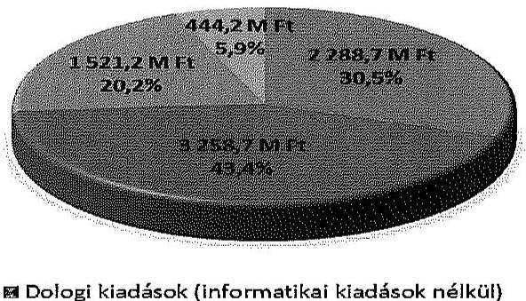

- Dologi kiadások (informatikai kiadások nélkül)
- Informatikai kiadások (felhalmozási és dologi)
- Személyi juttatások
- Munkaadót terhelő járulékok

A Pvr. előírásai alapján az NVI elnöke a választás lebonyolítására rendelkezésre álló összegből megállapodás alapján biztosította a KüM valamint az egyéb szervek (BÁH, KIH, KEKKH) részére a feladataik végrehajtásának pénzügyi fedezetét. Az ellenőrzött TVI-k, HVI-k és egyéb szervezetek ellátták a pénzügyi tervezéssel kapcsolatos feladatokat.

Az NVI és a KEKKH a közbeszerzési értékhatárt elérő beszerzések, szolgáltatásvásárlások során a Kbt. előírásait betartotta.

A központi költségvetésből biztosított finanszírozási források elosztása, az előirányzatok kezelése szabályszerű volt. Az NVI fejezeti kezelésű előirányzat felhasználási keretszámláján határidőben, ütemezetten rendelkezésre állt a szükséges forrás. Az NVI az indokolt előirányzat módosításokat a jogszabályi előírások szerint végrehajtotta. A választás kiadásainak teljesítésére rendelkezésre álló normatívák szerinti összegeket az NVI a jogszabályi előírásnak meg-

---

felelően előlegként átutalta a TVI-k részére. A KIH, a KEKKH és a BÁH intézmények részére a pénzügyi forrás a megállapodások alapján, az OGY választást követően került folyósításra, míg a KüM részére az OGY választásokat megelőzően biztosították. Az előirányzat módosításokat az ellenőrzött szervezetek szabályszerűen végrehajtották.

Az NVI, a KüM és az egyéb szervezetek - a KIH kivételével - a Pvr.-ben foglaltakra tekintettel kialakították a választás céljára biztosított pénzeszközök elkülönített számviteli kezelését és a tényleges pénzforgalomról a választási feladatokkal kapcsolatos részletező nyilvántartást vezettek. Az ellenőrzött TVI-k a választás céljára szolgáló pénzeszközök Pvr.-ben előírt elkülönített számviteli kezelését biztosították. A HVI-k 68,4\%-a gondoskodott a választás céljára biztosított pénzeszközök elkülönített kezeléséről és a tényleges pénzforgalomról az előírásoknak megfelelő részletező nyilvántartást vezettek.

Az ellenőrzött szervezetek rendelkeztek a gazdálkodási és ellenőrzési jogkörök gyakorlását meghatározó szabályozással. Az OGY választáshoz kapcsolódó ellenőrzött kiadások esetében a gazdálkodási jogkörök gyakorlása az NVI-nél és a KEKKH-nál összességében megfelelt, a BÁH-nál részben felelt meg, a KüM-nél és a KIH-nél nem felelt meg az Áht.-ban és az Ávr.-ben, valamint a szervezetek belső szabályozóiban foglalt előírásoknak. A gazdálkodási jogkörök gyakorlása az ellenőrzött választási irodák 50\%-ánál megfelelt, 34,6\%-ánál részben felelt meg, $15,4 \%$-ánál nem felelt meg a jogszabályok és a belső szabályzatok előírásainak.

Az ellenőrzött szervezeteknél az OGY választás lebonyolítására rendelkezésre álló pénzeszközök felhasználása összességében célhoz kötötten történt. Az ellenőrzés összesen 9,3 M Ft összegben állapította meg, hogy annak felhasználására nem az OGY választás lebonyolításával összefüggésben került sor. Az ellenőrzött szervezetek az elszámolási kötelezettségüknek az előírt formában és tartalommal - hat HVI, kettő TVI, a BÁH, a KIH és a KüM kivételével - a jogszabályban meghatározott határidőben eleget tettek. Az NVI a teljesítési adatokat tartalmazó összesítő elszámolást a Pvr.-ben rögzített határidőn túl készítette el.

Az NVI a TVI-k elszámolásának elfogadásáról azok ellenőrzését követően döntött. A jogszabályban előírt ellenőrzési kötelezettségének az NVI, a KEKKH, a KüM és valamennyi ellenőrzött TVI eleget tett. Az ellenőrzött 19 HVI közül a Pvr. előírásainak megfelelően 11 HVI vezetője adott megbízást az ellenőrzés lefolytatására.

A választási rendszer és jogszabályi környezetének teljes megújulása miatt az előző ÁSZ ellenőrzés által tett hat javaslatból négy okafogyottá vált, egy javaslat hasznosult, egy javaslatot nem hasznosítottak. Hasznosult a HVI vezetők által készítendő tanúsítvány kötelező tartalmának előírására és a valótlan adatszolgáltatás szankcionálására vonatkozó javaslat. A pénzügyi tervezés egységes elveinek meghatározására vonatkozó javaslatot az új szabályozás kialakítása során sem hasznosították.

---

# II. RÉSZLETES MEGÁLLAPÍTÁSOK 

## 1. A VÁLASZTÁS ELŐKÉSZÍTÉSÉHEZ ÉS LEBONYOLÍTÁSÁHOZ SZÜKSÉGES PÉNZESZKÖZÖK TERVEZÉSE

### 1.1. A választás pénzügyi tervezése

2014. március 3-án az NVI elkészítette a 2014. évi OGY választás feladat- és költségtervét. A költségterv a 2014. évi OGY választással kapcsolatban 8922,9 M Ft várható kiadást tartalmazott, melyből $6503,2 \mathrm{M}$ Ft volt központi kiadás, $2419,7 \mathrm{M}$ Ft a helyi és területi kiadás összege. A 2014. évi országgyűlési képviselőválasztás feladatsoros költségterve részletesen tartalmazta a tervezett kiadásokat, illetve a normatívák alapján számított költségeket. Az NVI által készített feladatsoros költségterv adatait az alábbi ábra szemlélteti:
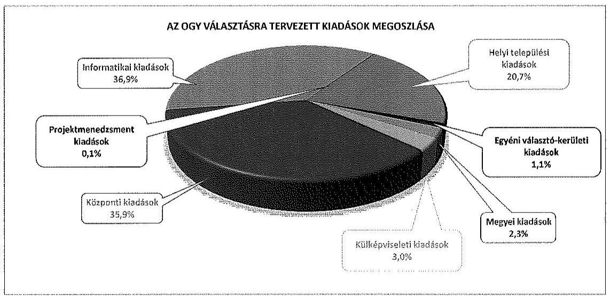

A 2014. évi OGY választás kiadásainak tervezését előíró végrehajtási rendelet (Pvr.) a 2013. év végén lépett hatályba. A Pvr. előkészítésében az NVI közreműködött, így a választás feladat- és költségtervét a normatívák és a választást érintő létszámadatok (szavazópolgárok várható száma, területi eloszlása) előzetes ismerete alapján készítették el.

A Pvr. előírásai alapján az NVI elnöke a választás lebonyolítására rendelkezésre álló összegből megállapodás alapján biztosítja a külpolitikáért felelős miniszter által kijelölt szerv, illetve az egyéb szerv részére feladatai végrehajtásának pénzügyi fedezetét.

## A Pvr. nem tartalmaz előírást a megállapodások megkötésének határidejére vonatkozóan.

Az OGY választási feladatok pénzügyi fedezetének biztosítására az NVI megállapodásokat kötött a KüM-mel és a választás lebonyolításában résztvevő egyéb szervezetekkel (BÁH, KIH, KEKKH).

---

A megállapodások főbb adatait a következő táblázat mutatja be:

| Szerződött partner | Megállapodás   kelte | Megállapodás tárgya | Megállapodás összege (M Ft) |
| :--: | :--: | :--: | :--: |
| KIM-   KEKKH | 2013. 08. 30. | Háromoldalú megállapodás fejezetek közötti átcsoportosításról a KEKKH által üzemeltetett Integrált Választási Infokommunikációs Rendszer bővítésével kapcsolatos kiadások fedezetének rendezése | 45,5 |
| KEKKH | 2013. 11. 05. | Keretszerződés a választásokkal kapcsolatos együttműködés részét képező feladatok általános meghatározása | - |
| KüM | 2014. 03. 17. | A 2014. évi OGY választás külképviseleti lebonyolításához kapcsolódó választásszakmai feladatok meghatározása | 151,5 |
| KIH | 2014. május | A 2014. évi OGY választás lebonyolításában való közreműködés céljából 20 fő kormánytisztviselő kirendelése | 9,3 |
| KEKKH | 2014. május | A 2014. évi OGY választás előkészítésében és lebonyolításában való közreműködés | 417,6 |
| BÁH | 2014. június | A 2014. évi OGY választással kapcsolatos feladatok ellátásához 25 fő kormánytisztviselő kirendelése | 3,7 |

A pénzügyi teljesítés vonatkozásában a megállapodások különböző módon rendelkeztek, de az NVI a támogatás összegének utalását valamennyi esetben a megállapodások felek általi aláírásához kötötte.

Az NVI a jogszabályi előírásoknak megfelelően kialakította a választás céljára biztosított pénzeszközök választásonkénti elkülönített kezelését és a választási feladatokkal kapcsolatos részletező nyilvántartást.

Az NVI elnöke a Számv. tv. 14. § (11) bekezdésében meghatározott 90 napos határidőn túl, 2013. október 1-jén határozta meg az NVI számviteli politikáját². A választásokkal összefüggésben felmerülő kötelezettségvállalások fedezetei a fejezeti kezelésű előirányzaton biztosított forrásokból - előirányzat-módosítással - az intézményi költségvetésbe kerültek átadásra. A személyi juttatások, a dologi és felhalmozási kiadások ${ }^{3}$ kötelezettségei az intézményi költségvetésbe átcsoportosított, ott TEA kódonként elkülönítetten kezelt források terhére kerültek kifizetésre. A számviteli nyilvántartásban a TEA kódokon mutatták ki az OGY választáshoz kapcsolódó kiadásokat, biztosítva ezzel a választásonként elkülönített nyilvántartást.

[^0]
[^0]:    ${ }^{2}$ 10/2013. számú (10. 01.) Elnöki Utasítás „a Nemzeti Választási Iroda Számviteli politikája"
    ${ }^{3}$ NVB tagok tiszteletdíjai, céljuttatások, megbízási díjak, informatikai rendszerek fejlesztése, üzemeltetése, szavazólapok, urnák és azok szállítási költsége

---

A 2014. évi OGY választáshoz kapcsolódóan a KEKKH ellátta a választás pénzügyi tervezésével kapcsolatos feladatokat, a választás pénzügyi tervét a jogszabályoknak megfelelően elkészítette. A pénzügyi terv fejlesztési és választási szakaszonként, jogcímenként, feladatsoros bontásban tartalmazta a kiadásokat. A KEKKH a költségvetésében nem tervezett az OGY választásra eredeti előirányzatot.

Az NVI és KEKKH között létrejött megállapodásban foglaltak szerint az első utalást követően fennmaradó összeg pénzügyi rendezésére a tényleges költségelszámolás alapján, az elszámolás elfogadását követően kerül sor, azzal, hogy az esetlegesen felmerült többletigényt az NVI a KEKKH részére az Európai Parlamenti képviselők 2014. évi választása feladatellátásához megkötendő megállapodásban rendezi ${ }^{4}$.

A BÁH és a KIH az OGY választásra fordított kiadásaival kapcsolatosan a Pvr. szerinti pénzügyi tervezési kötelezettségének eleget tett, a választás lebonyolításában kizárólag kormánytisztviselők kirendelésével vett részt. A kormánytisztviselők juttatásaival kapcsolatos részletes pénzügyi adatokat az NVI és a BÁH, illetve az NVI és a KIH között létrejött megállapodások tartalmazták. A KüM és az NVI a 2014. évi OGY választás lebonyolításában való közreműködés céljából megállapodást kötött, melynek melléklete tartalmazta az OGY választásra fordítható költségek jogcímkód szerinti tételes tervezését. A BÁH, a KIH és a KüM eredeti előirányzatokat nem tervezett.

Az ellenőrzött FVI, a TVI-k és a HVI-k a Pvr.-ben foglaltaknak megfelelően végrehajtották a 2014. évi OGY választás lebonyolításának pénzügyi tervezésével kapcsolatos feladatokat, elkészítették a választás pénzügyi tervét.

Az OGY választással összefüggésben az FVI és négy HVI irányító szerve tervezett a 2014. évi költségvetésében eredeti előirányzatot. Nyolc HVI pénzügyi tervében az Áht. $12 \S$ (1) bekezdésében foglaltakkal ellentétben a bevételeket nem teljes körűen tervezte meg.

# 1.2. A választás informatikai rendszerének kialakítása, a közbeszerzései eljárások lebonyolítása 

Az NVI a 28/2013. (XI. 15.) KIM rendelet előírásainak megfelelően kialakította a választások informatikai rendszerét.

A rendelet előírásai szerint a kormányhivatal a TVI illetve a HVI részére rendelkezésre bocsátja a választási informatikai hálózat eléréséhez szükséges informatikai eszközöket, amelyek körének meghatározását az NVI és a kormányhivatal a szavazás napját megelőző hatvanadik napig írásos megállapodásban rögzíti. Az NVI a kormányhivatalokkal 2014. március 18-án - a választást megelőző tizenkilencedik napon - kötötte meg a megállapodásokat,

[^0]
[^0]:    ${ }^{4}$ A megállapodásban foglaltak alapján - a Pvr.-ben foglaltaknak megfelelően - a választás céljára biztosított pénzeszközök választásonként elkülönített kezelése biztosított volt.

---

amellyel megsértette a 28/2013. (XI. 15.) KIM rendelet 7/A. § (3) bekezdésében foglaltakat.

A 28/2013. (XI. 15.) KIM rendelet előírásai szerint az NVI elnöke legkésőbb a választás kitűzését ${ }^{5}$ követő ötödik napon utasítást ad ki a választási irodák részére, hogy a kormányhivataltól mely szolgáltatások vehetők igénybe. Az NVI elnöke az előírásoknak megfelelő határidőben az 1/2014. (I. 23.) NVI utasításban határozta meg a kormányhivataloktól igénybe vehető szolgáltatások körét.

Az NVI az informatikai rendszer részeként a 2014. évi OGY választás során a Nemzeti Választási Rendszert, a Választási Ügyviteli Rendszert, valamint a választási pénzügyi-logisztikai rendszert működtette. Az NVI az OGY választást megelőzően utasításokat adott ki a 2014. évi OGY választás kapcsán a választási végpontok biztonságos működésére vonatkozó feladatokról valamint az informatikai incidens esetére kidolgozott eljárásrendről ${ }^{6}$.

Az NVI gondoskodott az informatikai rendszerbe történt bejelentkezés, betekintés, adatlekérés, adatmódosítás naplózásáról és a napló adatainak öt évig történő megőrzéséről. A 17/2013. (VII. 17.) KIM rendelet előírásai szerint a KEKKH biztosítja az informatikai rendszer működtetési környezetének infrastrukturális hátterét és annak elérhetőségét a választási irodák részére a Ve.-ben foglalt feladatok végrehajtásához. Az informatikai rendszert biztonsági szempontból a Nemzeti Biztonsági Felügyelet a választásokat megelőzően ellenőrizte.

Az NVI 2013. augusztus 30-án háromoldalú megállapodást kötött a KIM-mel és a KEKKH-val, a KEKKH által üzemeltetetett Integrált Választási Infokommunikációs Rendszer bővítésével kapcsolatos - halaszthatatlan jellegére tekintettel elvégzett fejlesztési feladatok miatti - kiadások fedezetének rendezése érdekében. A megállapodás alapján 2013. január 1-jétől 2013. december 31-ig tartó felhasználási időszak meghatározásával a KIM fejezeti általános tartaléka terhére összesen $45,5 \mathrm{M} \mathrm{Ft}$ (ebből működési kiadásokra $7,5 \mathrm{M} \mathrm{Ft}$, felhalmozási jellegű kiadásokra $38,0 \mathrm{M} \mathrm{Ft}$ ) előirányzatot csoportosított át a KIM KEKKH előirányzatai javára. A felek megállapodtak abban is, hogy az NVI a 2014. évi választások előkészítése előirányzata terhére és a KIM fejezeti általános tartalék előirányzata javára 45,5 M Ft-ot csoportosít át. A felhasználásról a KEKKH-nak elkülönített nyilvántartás vezetése mellett pénzügyi elszámolási kötelezettsége volt 2014. február 15-ei határidővel. Az elszámolást a KEKKH a megállapodásnak megfelelően teljesítette.

A közbeszerzési értékhatárt elérő beszerzések, szolgáltatásvásárlások során a Kbt. és a 218/2011. (X. 19.) Korm. rendelet előírásait betartották. Az OGY választás lebonyolításához kapcsolódó közbeszerzési értékhatárt elérő beszerzési eljárásokat a 2. számú melléklet ismerteti.

[^0]
[^0]:    ${ }^{5}$ 2014. január 18-án tűzte ki a Köztársasági elnök a választás napját
    ${ }^{6}$ 8/2014. számú (III.28.) elnöki utasítás az informatikai incidensről, 11/2014. számú (IV. 04.) elnöki utasítás az országgyűlési képviselők 2014. évi választása kapcsán a választási végpontok biztonságos működésére vonatkozó feladatokról

---

# 2. A KÖLTSÉGVETÉSBŐL BIZTOSÍTOTT FINANSZÍROZÁSI FORRÁSOK ELOSZTÁSA, AZ ELŐIRÁNYZATOK KEZELÉSE 

A 2014. évi választások előkészítésére és lebonyolítására a 2013. évi költségvetési törvény szerint $2300,0 \mathrm{M} \mathrm{Ft}$, a 2014. évi költségvetési törvény szerint 10000,0 M Ft támogatás állt az NVI rendelkezésére a fejezeti kezelésű előirányzatok között. A költségvetési törvények választásonkénti bontást nem tartalmaztak, így a törvényekben megjelölt összegek a 2014. évben lezajlott három választás lebonyolítását szolgálták. A Pvr. előírásai szerinti, valamint a választási eljárásban részt vevő egyéb szervekkel kötött megállapodásokban rögzített határidőben a szükséges pénzügyi fedezet az NVI rendelkezésére állt.

Az NVI meghatározta az intézményi és fejezeti kezelésű előirányzatok felhasználásának részletes szabályait.

Az NVI 2013-ban az OGY választás előkészítésével és lebonyolításával kapcsolatos kiadásaira eredeti előirányzatot nem tervezett.

Az NVI előirányzat-módosítással az intézmény dologi kiadásainak előirányzatát 480,0 M Ft-tal, a felhalmozási kiadásainak előirányzatát 547,9 M Ft-tal, a személyi juttatások előirányzatát $4,7 \mathrm{M}$ Ft-tal, a munkaadót terhelő járulékok előirányzatát 1,2 M Ft-tal emelte meg a költségvetés terhére. A módosított, összesen 1033,7 M Ft kiadási előirányzat terhére 2013-ban 167,6 M Ft teljesítést számoltak el. A fejezeti kezelésű dologi kiadásainak előirányzatát az NVI 1018,6 M Ft-tal, a felhalmozási kiadásainak előirányzatát 54,6 M Ft-tal emelte meg a költségvetési támogatás terhére. A módosított, összesen 1073,2 M Ft kiadási előirányzat terhére 2013-ban 131,8 M Ft teljesítést számoltak el.

2014-ben a fejezeti kezelésű előirányzaton az OGY választással kapcsolatos összes eredeti előirányzat $7238,1 \mathrm{M} \mathrm{Ft}$, a módosított előirányzat $5700,8 \mathrm{M} \mathrm{Ft}$, a teljesítés 2859,5 M Ft volt. Az intézményi előirányzatok között 2014-ben az OGY választással kapcsolatban az NVI eredeti előirányzatot nem tervezett, a módosított előirányzat és a teljesítés $4353,9 \mathrm{M}$ Ft volt. A fejezeti kezelésű és intézményi előirányzatok módosításairól az NVI folyamatos, részletező nyilvántartást vezetett. Az NVI a 2013-2014. években a főkönyvi könyvelésben és a részletező nyilvántartások adatai szerint 10354,1 M Ft kiadást teljesített a 2014. évi OGY választásokkal kapcsolatban. Az így kimutatott kiadási összegben szerepeltek olyan tételek, amelyek ún. belső technikai utalásként tényleges pénzmozgással nem jártak, de megjelentek a fejezeti kezelésű előirányzatokról teljesített kiadások és az intézményi kiadások között is. A pénzeszközök átadása ezekben az esetekben nem jelentett tényleges kiadást, azok kizárólag az intézményi kiadások teljesítésekor realizálódtak.

Az NVI fejezeti kezelésű előirányzatok terhére az intézmény részére így átadott pénzeszközök a fejezeti kezelésű előirányzatok 941,4 M Ft összegű 2013. évi maradványából, 400,0 M Ft összegű póttámogatásból, valamint az intézmény likviditásának fenntartása érdekében 1500,0 M Ft összegű pénzeszköz átadásból tevődtek össze. Az átutalt 2841,4 M Ft-tal a könyvelésben kimutatott kiadási összeg csökkentendő.

---

Az NVI a 2014. évi OGY választással kapcsolatban - a tervezettnél közel 16%-kal alacsonyabb összegű - 7512,8 M Ft kiadást teljesített.

Az NVI a választásban résztvevő szervezeteknek a megállapodásoknak megfelelően - a választásokat követően - biztosította a feladataik ellátásához szükséges fedezetet.

A nem normatív kiadások tekintetében az előleg utalásának határidejéről a Pvr. nem tartalmaz előírást, így a KIH, a KEKKH és a BÁH intézmények részére a pénzügyi forrás a megállapodások alapján, az OGY választást követően került folyósításra. A KIH számára 9,31 M Ft-ot, a KEKKH-nak 334,1 M Ft-ot, a BÁH részére 3,7 M Ft-ot utalt át a megállapodásoknak megfelelően előlegként az NVI.

Az NVI-KüM megállapodás megkötésére 2014. március 17-én került sor, a megállapodásban rögzített összeg 151,5 M Ft átutalása az OGY választást megelőzően, 2014. március 18-án megtörtént.

A KEKKH a költségvetésében a választással kapcsolatban eredeti előirányzatot, illetve az OGY választás kiadásaira saját forrás felhasználást nem tervezett. A KIM-től és az NVI-től kapott támogatási összegekkel a szervezet a bevételi előirányzatait megemelte és a kiadási előirányzatait módosította.

Az NVI a Pvr. rendelkezéseinek megfelelően a választás napját megelőző harmincadik napig valamennyi TVI részére határidőben folyósította a választás kiadásainak pénzügyi fedezeteként a normatívák szerinti előlegeket, összesen 2108,3 M Ft-ot. Az átutalások 2014. március 6-án megtörténtek. Az ellenőrzött TVI-k közül hat a választás pénzügyi fedezetének HVI-t megillető részét a Pvr. előírásainak megfelelően a választás napját megelőző huszadik napig a települési önkormányzat polgármesteri hivatalának fizetési számlájára folyósította. A Somogy megyei TVI a Pvr. 4. § (2) bekezdésében foglalt előírások ellenére - adminisztrációs hiba következtében - az ellenőrzött három település közül a Berzencei és a Kaposmérői HVI-k esetében a választást megelőző huszadik napig a HVI-ket megillető normatíva összegének 50,95\%-át, illetve 67,67\%-át folyósította. A fennmaradó normatíva összegeket a Berzencei HVI számára három nappal a választást megelőzően, a Kaposmérői HVI számára a választás előtt 16 nappal utalta át.

A TVI-k és HVI-k a választások előkészítésére és lebonyolítására biztosított központi költségvetési támogatások összegét, a támogatás beérkezését követően év közben, illetve legkésőbb a beszámoló elkészítését megelőzően beépítették az irányító szerv költségvetési rendeletébe.

A TVI-k a Pvr. rendelkezéseinek megfelelően összesítették a saját, valamint a HVI-k többletkiadásait, majd továbbították a többlettámogatás iránti igényeket az NVI felé. A többlettámogatási igényeket az NVI elfogadta, a többletköltségeket a Pvr. szerinti határidőben megtérítette.

---

# 3. A VÁLASZTÁS ELŐKÉSZÍTÉSÉHEZ, LEBONYOLÍTÁSÁHOZ RENDELKEZÉSRE ÁLLÓ PÉNZESZKÖZÖK FELHASZNÁLÁSA 

### 3.1. A választási pénzeszközök nyilvántartása, a felhasználás szabályozottsága

Az NVI a 2014. évi OGY választás pénzügyi forrásainak felhasználását a vonatkozó jogszabályoknak megfelelően kialakított szabályozott rendszerben végezte. Az Áht. és az Ávr. előírásainak megfelelően a gazdálkodási szabályzat részletesen meghatározta a gazdálkodási jogkörök gyakorlásának rendjét.

A KüM a 2014. évi OGY választással kapcsolatos feladatokra vonatkozóan az általánosan érvényes belső szabályozók mellett, speciálisan a választási feladatra vonatkozó belső utasítást is hatályba helyezett.

Az általános érvényű belső szabályozók körében a „Külügyminisztérium gazdálkodásának egyes kérdéseiről szóló 22/2011. (X. 14.) KüM utasítás" - Kötelezettségvállalási szabályzat -, valamint a „Külügyminisztérium pénzkezelési szabályzatáról szóló 3/2010. (I. 29.) KüM utasítás" az Áht. és az Ávr. vonatkozó előírásainak megfelelően rögzítette a pénzügyi ellenjegyzés, a kötelezettségvállalás, a teljesítésigazolás, az érvényesítés és az utalványozás eljárási és összeférhetetlenségi szabályait, illetve az Számv. tv. irányadó rendelkezéseire tekintettel a készpénzkezelés eljárási szabályait.

A speciális belső szabályozó vonatkozásában a 2/2014. (III. 31.) KüM utasítás az Áht. és Ávr. előírásainak megfelelően - meghatározta a 2014. évi OGY választással kapcsolatosan a KüM-re háruló gazdálkodási (pénzügyi tervezési, elszámolási) és logisztikai feladatokat, azok szabályszerű végrehajtásának előírásait. Az utasítás rögzítette a választás vonatkozásában a gazdálkodási jogkörök általánostól eltérő gyakorlásának rendjét és meghatározta, hogy a Kötelezettségvállalási szabályzatban foglaltakat ezen utasításban előírt eltérésekkel kell alkalmazni. Az utasítás előírta továbbá a választási kiadások tervezése, a választás előkészítése és lebonyolítása feladatait, valamint a választáshoz felhasznált költségvetési források nyilvántartási és ellenőrzési kötelezettségeit.

A KEKKH, a BÁH, és a KIH esetében a 2014. évi OGY választással kapcsolatos gazdálkodási feladatok végrehajtásához szükséges szabályokat a szervezetek kötelezettségvállalási és pénzkezelési szabályzatai tartalmazták. A kötelezettségvállalási szabályzatok az Áht. és az Ávr. előírásainak megfelelően rögzítették a gazdálkodási jogkörök gyakorlásának eljárási és összeférhetetlenségi szabályait. A pénzkezelési szabályzatok az Áht. és az Ávr. előírásainak megfelelően meghatározták a számlák feletti rendelkezési jogosultság, az előirányzatok kezelése, felhasználása, valamint a Számv. tv. irányadó rendelkezéseire tekintettel a készpénzkezelés eljárási szabályait.

Az ellenőrzött FVI, TVI-k és HVI-k vezetői szabályozták a 2014. évi OGY választás pénzeszközei feletti gazdálkodási jogkörök gyakorlásának rendjét, figyelemmel az Áht.-ban, az Ávr.-ben és a Pvr.-ben foglaltakra. Jellemző volt, hogy a választás pénzeszközei feletti gazdálkodási jogkörök gyakorlására a hivatalok

---

egyéb általánosan kialakított szabályozását alkalmazták a Pvr.-ben megfogalmazott eltérésekkel.

Több HVI belső szabályozásában az Ávr. rendelkezései szerinti kötelező tartalmi elemek hiányoztak. Négy ellenőrzött $\mathrm{HVI}^{7}$ esetében belső szabályozásban lehetővé tették a 100 E Ft alatti kifizetések előzetes írásbeli kötelezettségvállalás nélküli teljesítését, azonban az Ávr. 53. § (2) bekezdésében foglaltak ellenére az előzetes írásbeli kötelezettségvállalást nem igénylő kifizetések rendjét belső szabályzatban nem rögzítették. Három $\mathrm{HVI}^{8}$ esetében az Ávr. 60. § (3) bekezdésben foglaltak ellenére a gazdálkodási jogkörök gyakorlására jogosultak nyilvántartását nem vezették naprakészen.

# 3.2. A választással kapcsolatos kiadások teljesítésének szabályszerűsége 

Az NVI a választások pénzeszközeinek számviteli elkülönítését a COFOG kódon belül TEA kódok alkalmazásával biztosította és a tényleges pénzforgalomról részletező nyilvántartást vezetett. A választásokkal összefüggésben felmerülő kötelezettségvállalások fedezetei - a jogszabályoknak és a belső szabályozásokban foglaltaknak megfelelően - fejezeti kezelésű előirányzaton biztosított forrásokból a választások lebonyolításában közreműködő intézmények részére előirányzat-módosítással kerültek átadásra. A személyi juttatások, a dologi és felhalmozási kiadások ${ }^{9}$ az intézményi költségvetésbe átcsoportosított, elkülönítetten kezelt források terhére kerültek kifizetésre.

Az NVI 13/2014. számú (IV. 11.) elnöki utasítása szabályozta az országgyűlési képviselők választása forrásainak pénzügyi elszámolási rendjét.

A KEKKH, a BÁH és a KüM az OGY választás költségeit és bevételeit nem a 68/2013. (XII. 29.) NGM rendelet 1. mellékletében kijelölt kormányzati funkciókód alkalmazásával tartotta nyilván, azonban a Pvr. rendelkezéseinek megfelelő elkülönített számviteli nyilvántartással és a tényleges pénzforgalomról vezetett részletező nyilvántartással rendelkeztek.

A KEKKH a nyilvántartások elkülönítését a TEA kódok alkalmazásával teljesítette. A BÁH szakfeladat kódon tartotta nyilván elkülönítetten a kirendelt kormánytisztviselők személyi juttatásait. A KüM a tranzakciókat külön ügyletkódonként rögzítette, a főkönyvi számlák és a könyvelés részletes analitikus nyilvántartáson alapult. A pénzeszközök felhasználását a 2/2014. (III. 31.) KüM utasítás VII. fejezet 1-2. pontja előírásai alapján a Forrás Költségvetési és Pénzügyi Nyilvántartó Programban, valamint az OrganP VPIR rendszerben jogcímenként - szakfeladat részletező kódon - elkülönítetten tartották nyilván a Pvr. előírásainak megfelelően.

[^0]
[^0]:    ${ }^{7}$ Bácsbokodi HVI, Nagyhegyesi
 HVI, Sárosdi HVI, Kalocsai HVI
    ${ }^{8}$ Berzencei HVI, Penci HVI, Sárosdi HVI
    ${ }^{9}$ NVB tagok tiszteletdíjai, céljuttatások, megbízási díjak, informatikai rendszerek fejlesztése, üzemeltetése, szavazólapok, urnák és azok szállítási költségei

---

A KIH a 2014. évi OGY választással összefüggésben a kirendelt kormánytisztviselők illetményének elszámolását és elkülönített számviteli kezelését önálló szakfeladat kódon a 68/2013. (XII. 29.) NGM rendelet 3. § (1) bekezdésében és 1. mellékletében, a Pvr. 1. § (2) bekezdés d) pontjában, valamint 6. § (1) bekezdésében foglaltakkal ellentétesen nem tartotta nyilván. Továbbá a Pvr. 6. § (2) bekezdésében foglaltakkal ellentétesen nem alakította ki a választási feladatokra vonatkozó részletező nyilvántartás vezetésének feltételeit.

Az FVI-nél a választások pénzeszközeinek kormányzati funkciók ${ }^{10}$ szerinti elkülönítése a 68/2013. (XII. 29.) NGM rendelet 3. § (1) bekezdésében és 1. mellékletében foglaltaknak megfelelően biztosított volt. A Pvr. rendelkezéseinek megfelelő elkülönített számviteli nyilvántartással és a tényleges pénzforgalomról vezetett részletező nyilvántartással rendelkeztek, a PIR (Forrás) rendszerben rögzített COFOG kóddal, illetve az ügylet- és pénzforrás kóddal biztosították a választásonként és forrásonként előírt számviteli elkülönítést. A részletező nyilvántartást a Pvr. előírásainak megfelelően feladattípusonként vezették.

A választás céljára szolgáló pénzeszközök jogszabályi előírásoknak megfelelő elkülönített kezelését valamennyi ellenőrzött TVI biztosította és az ezzel kapcsolatos részletező nyilvántartást kialakították. Hat ellenőrzött HVI esetében ${ }^{11}$ a 68/2013. (XII. 29.) NGM rendelet 3. § (1) bekezdésében és 1. mellékletében, a Pvr. 1. § (2) bekezdés d) pontjában, illetve 6. § (1)-(2) bekezdésében rögzítettekkel ellentétesen nem biztosították a pénzeszközök választásonkénti elkülönített számviteli kezelésének feltételeit, a részletező nyilvántartások vezetésének körülményeit nem teremtették meg és önálló nyilvántartást sem vezettek.

A gazdálkodási és ellenőrzési jogkörök gyakorlása az ellenőrzött szervezetek 48,4%-nál megfelelt, 32,3%-nál részben megfelelt és 19,3%-nál nem felelt meg az Áht.-ban és az Ávr.-ben, valamint a szervezetek belső szabályozóiban foglalt előírásoknak.

Az NVI-nél az OGY választás előkészítése, lebonyolítása érdekében felmerülő kiadások teljesítése során - az ellenőrzésre kiválasztott mintatételek alapján - a gazdálkodási jogkörök gyakorlása összességében megfelelt a jogszabályok és a belső szabályzatok előírásainak. Az NVI-nél egy kifizetés esetében - az Ávr. 57. § (1) és (3) bekezdésében foglaltak ellenére - nem készült teljesítésigazolás. Ennek hiányát az érvényesítő - az Ávr. 58. § (1)-(2) bekezdésében foglaltak ellenére - nem jelezte az utalványozónak.

A KüM esetében a külképviseleti választásokkal kapcsolatos kiadások teljesítése során - az ellenőrzésre kiválasztott mintatételek alapján - a gazdálkodási jogkörök gyakorlása összességében nem felelt meg a jogszabályok és a belső szabályzatok előírásainak. A KüM-nél a pénzügyi ellenjegyzéssel összefüggésben jellemző hiba volt, hogy a kötelezettségvállalás dokumentumán - az Ávr. 55. § (1) bekezdésében foglaltak ellenére - nem rögzítették a pénzügyi ellenjegyzés tényére történő utalást, valamint annak dátumát, továbbá egyes

[^0]
[^0]:    ${ }^{10}$ A 68/2013. (XII. 29.) NGM rendeletben meghatározott kormányzati funkció száma megegyezik a COFOG kóddal
    ${ }^{11}$ Bácsbokod, Berzence, Dég, Kalocsa, Penc, Sárosd

---

esetekben az ellenjegyzés keltezésére nem került sor és az ellenjegyző aláírása nem volt beazonosítható. A kötelezettségvállalás - négy eset kivételével - megtörtént, de a kötelezettségvállaló személye nem minden esetben volt beazonosítható, mert az Ávr. 60. § (3) bekezdése szerint vezetett nyilvántartás (aláírás-minta) alapján nem volt megállapítható, hogy a keltezéssel ellátott aláírás a kötelezettségvállalásra jogosult személytől származott. A teljesítésigazolást nem az Ávr. 57. § (1) és (3) bekezdésében foglaltaknak megfelelően végezték, mert nem az arra jogosult személy, illetve nem szabályszerűen igazolta, mert a teljesítésigazolás dátumát nem tüntette fel. Az érvényesítés nem felelt meg az Ávr. 58. § (1)-(2) és (4) bekezdésében foglaltaknak, mert kijelölés hiányában nem az arra jogosult személy hajtotta végre az érvényesítést, továbbá nem jelezte az utalványozónak a megelőző ügymenet hiányosságait és egyes esetekben nem került sor az érvényesítésre. Az utalványozásra az Ávr. 59. § (1) bekezdésében foglaltak ellenére nem minden esetben került sor, valamint az utalványozás során a keltezést az Ávr. 59. § (3) bekezdés g) pontjában foglaltak ellenére nem tüntették fel.

A KEKKH-nál az OGY választás előkészítése, lebonyolítása érdekében felmerülő kiadások teljesítése során - az ellenőrzésre kiválasztott mintatételek alapján - a gazdálkodási jogkörök gyakorlása összességében megfelelt a jogszabályok és a belső szabályzatok előírásainak. A KEKKH-nál a pénzügyi ellenjegyzés egyes esetekben nem volt szabályszerű, mert - az Ávr. 55. § (1) bekezdésének előírása ellenére - nem tartalmazta annak dátumát. A teljesítésigazolás dátuma több esetben nem került feltüntetésre, amely ellentétes volt az Ávr. 57. § (3) bekezdésében foglaltakkal. Az érvényesítés során az arra felhatalmazott személy a feladatát nem az Ávr. 58. § (1)-(2) bekezdésében foglaltaknak megfelelően végezte, mert nem jelezte az utalványozónak a megelőző ügymenet hiányosságait.

Az OGY választás előkészítése, lebonyolítása érdekében felmerülő kiadások teljesítése során - az ellenőrzésre kiválasztott mintatételek alapján - a gazdálkodási jogkörök gyakorlása a BÁH-nál összességében részben felelt meg, a KIH-nél nem felelt meg a jogszabályok és a belső szabályzatok előírásainak. A BÁH-nál és a KIH-nél a kirendelt kormánytisztviselők személyi juttatásának kifizetése esetében - az Áht. 38. § (1) bekezdésében foglaltak ellenére - nem került sor teljesítésigazolásra. A KIH-nél és a BÁH-nál az érvényesítő a feladatát - az Ávr. 58. § (2) bekezdésében foglaltak ellenére - nem szabályszerűen végezte, mert nem jelezte az utalványozónak a megelőző ügymenet hiányosságait.

Az ellenőrzött helyi és területi választási irodáknál a gazdálkodási jogkörök gyakorlása megfelelőségének minősítését, és a jogkörgyakorlás során feltárt jellemző hiányosságokat a 3. számú melléklet tartalmazza.

Az ellenőrzött TVI-k esetében az alábbi hiányosságok fordultak elő:

- a pénzügyi ellenjegyzés az Áht. 37. § (1) bekezdésében foglaltak ellenére nem előzte meg a kötelezettségvállalást;

---

- a kötelezettségvállalási dokumentumokban az Ávr. 50. § (1) bekezdés b) pontjában foglaltak ellenére a kötelezettségvállalás összegét nem tüntették fel;
- a teljesítésigazolásra az Ávr. 57. § (1) bekezdésében foglaltak ellenére nem minden esetben került sor;
- az érvényesítés tekintetében nem érvényesültek maradéktalanul az Ávr. 60. § (1)-(2) bekezdésében rögzített összeférhetetlenségi szabályok, valamint egyes esetekben az érvényesítésre - az Áht. 38. § (1) bekezdésében foglaltak ellenére - a kifizetést követően került sor;
- az utalványozás egyes esetekben - az Áht. 38. § (1) bekezdésében foglaltak ellenére - nem történt meg, illetve az utalványozás a kifizetést követően valósult meg, valamint nem érvényesültek teljes körűen az Ávr. 60. § (2) bekezdésében rögzített összeférhetetlenség követelményei, mert az utalványozó saját maga javára utalványozott.

A HVI-k ellenőrzése során a következő hiányosságokat tárta fel az ellenőrzés:

- a pénzügyi ellenjegyzésre - az Ávr. 55. § (1) bekezdésében foglaltak ellenére - nem vagy nem szabályszerűen került sor, mert a pénzügyi ellenjegyzés nem tartalmazta annak dátumát, továbbá a pénzügyi ellenjegyzés - az Áht. 37. § (1) bekezdésében foglaltak ellenére - nem előzte meg a kötelezettségvállalást;
- a kötelezettségvállalási dokumentumokban az Ávr. 50. § (1) bekezdés b) pontjában foglaltak ellenére a kötelezettségvállalás összegét nem tüntették fel;
- a teljesítésigazolást - az Ávr. 57. § (1) és (3) bekezdésében foglaltak ellenére - nem vagy nem szabályszerűen végezték, mert a teljesítésigazolás nem tartalmazta annak dátumát, továbbá az összeférhetetlenségi követelmények az Ávr. 60. § (2) bekezdésében foglaltak ellenére - nem érvényesültek teljes körűen, mert a teljesítésigazoló feladatát saját maga javára látta el;
- az érvényesítést az Ávr. 58. § (4) bekezdésében meghatározott kijelölés hiányában nem az arra jogosult személy végezte, valamint az érvényesítő feladatát nem az Ávr. 58. § (1) bekezdésében foglaltaknak megfelelően látta el, mert nem ellenőrizte, hogy a megelőző ügymenetben az Áht., az Áhsz., az Ávr. előírásait, továbbá a belső szabályozókban foglaltakat betartották-e;
- az utalványozást - az Ávr. 59. § (1) és (3) bekezdésében foglaltak ellenére - nem vagy nem szabályszerűen, továbbá az Ávr. 60. § (2) bekezdésében rögzített összeférhetetlenségi követelményeket megsértve végezték, mert az utalványozó a maga javára utalványozott;
- a gazdálkodási jogkörök gyakorlására jogosult személyekről és aláírás mintájukról - az Ávr. 60. § (3) bekezdésében foglaltak ellenére - nem vezettek naprakész nyilvántartást.

Az ellenőrzött szervezeteknél az OGY választás lebonyolítására rendelkezésre álló pénzeszközök felhasználása összességében célhoz kötötten történt. Az ellenőrzés összesen 9,3 M Ft összegben állapította meg, hogy annak

---

felhasználására nem a Pvr. rendelkezéseivel összhangban került sor. A benyújtott elszámolások ezeket a tételeket is tartalmazták, az elszámolások korrekciójára nem került sor.

Az NVI-nél az EP választással összefüggésben kifizetett tiszteletdíj kivételével a 2014. évi OGY választásra biztosított pénzeszközök felhasználása célhoz kötötten, a választás előkészítése és lebonyolítása érdekében, szabályszerűen történt.

Egy fő, a Nemzeti Választási Bizottságban való részvétellel az EP választáshoz kapcsolódóan megbízott tag tiszteletdíját az OGY választás kiadásai között számolták el, megsértve ezzel a Pvr. 6. § (1) bekezdésében foglalt választásonkénti elkülönítés előírásait. A nem szabályszerű elszámolás összege 245,9 E Ft volt.

A KüM-nél az elszámolt kiadások az NVI-KüM Megállapodásnak megfelelően - a napidíjak alapján elszámolt járulék különbözet kivételével - célhoz kötöttek voltak és az OGY választással összefüggésben merültek fel, tiszteletdíjakról, napidíjakról, szállás és utazási költségekről, továbbá irodaszerekről, valamint kis értékű tárgyi eszközökről - választási fülke, közlekedő rámpa, függöny stb. szóltak. Nem valósult meg a célhoz kötött felhasználás a külföldi napidíjak alapján elszámolt összesen 858,3 E Ft járulékkülönbözet esetében.

A KüM helytelenül az Szja tv. 3. számú melléklet 11. fejezet 7. b) pontjában, valamint a Tbj. 4. § k) pontjában előírt rendelkezésekkel ellentétesen az NVI felé a teljes napidíj utáni járulékkal, míg a Kincstár felé a vonatkozó jogszabályi előírásoknak megfelelően a napidíjak 70\%-a után felszámított járulékkal számolt el.

A KEKKH-nál a választással kapcsolatosan elszámolt egyes szoftverlicencek kivételével a 2014. évi OGY választásra biztosított pénzeszközök felhasználása célhoz kötötten, szabályszerűen történt.

Az érintett szoftverlicenceket az OGY választást követően szerezték be. A beszerzési szerződés megkötése 2014. április 22-én történt, a teljesítésigazolás dátuma egyezően a számlán feltüntetett teljesítés keltével - 2014. április 25. volt. Az üzembe helyezés 2014. április 25-én valósult meg. Az elszámolásban szabálytalanul szereplő, nem célhoz kötött felhasználás összege 6,2 M Ft volt.

A BÁH-nál az elszámolt kiadásokat a Pvr. előírásainak, illetve az NVI-BÁH Megállapodásban rögzítetteknek megfelelően célhoz kötötten a 2014. évi OGY választás érdekében használták fel.

A KIH-nél az ellenőrzés megállapította, hogy a 2014. évi OGY választás lebonyolításában való közreműködésre az NVI-től rendelkezésre bocsátott 9,3 M Ft pénzügyi forrásból, összesen 1,7 M Ft felhasználása nem felelt meg a Pvr. 1. § (2) bekezdés b) pontjában és az NVI-KIH Megállapodás 1. pontjában foglalt rendelkezéseknek.

Az NVI-KIH Megállapodás 1. pontja rögzíti, hogy az NVI által rendelkezésre bocsátott pénzügyi forrás kizárólag az OGY választással összefüggő feladatellátásra használható fel.
 Az NVI és a KIH, valamint a 18 fő kirendelt kormánytisztviselő között létrejött - Megállapodás Kirendelés Módosításáról elnevezésű - a kirendelés meghosszabbításáról szóló háromoldalú megállapodások 2. pontjában rögzítették, hogy a megállapodást az Európai Parlament tagjainak 2014. évi választá-

---

sához kapcsolódó egyes adminisztrációs feladatok ellátására figyelemmel hosszabbították meg.

Az FVI-nél és az ellenőrzött TVI-knél a választáshoz kapcsolódó pénzeszközök felhasználása célhoz kötötten, a választás előkészítése és lebonyolítása érdekében történt és nem számoltak el a választáshoz nem kapcsolódó kiadást.

Az ellenőrzött HVI-k 68,4\%-ánál megállapítottuk, hogy az OGY választás lebonyolítására rendelkezésre álló pénzeszközök felhasználása a Pvr. előírásaival összhangban célhoz kötötten történt, a kifizetések elrendelése indokoltan és a választással összefüggésben valósult meg. Az érintett HVI-knél a kiadások jogcímei nyomon követhetőek és ellenőrizhetőek, analitikus nyilvántartással alátámasztottak voltak, továbbá a kifizetéseket megalapozó számlákkal és egyéb dokumentumokkal egyezőek voltak.

A Szentendrei HVI-nél hét esetben összesen 42,6 E Ft összegben nem a HVI szavazásnapi működésével kapcsolatos reprezentációs költséget számoltak el. Gyakorlatuk nem felelt meg a Pvr. 1. mellékletében foglaltaknak, amely ilyen költség elszámolását a támogatás terhére nem teszi lehetővé.

Öt HVI esetében ${ }^{12}$ megállapítottuk, hogy a kiküldetéseknél - 200,3 E Ft összegben - nem csak a választásnapi kiadásokat számolták el. Eljárásuk nem felelt meg a Pvr. 1. mellékletében foglaltaknak, amely csak a HVI-k szavazásnapi működésével összefüggő gépkocsi használat elszámolását teszi lehetővé.

A Csornai HVI-nél egy esetben előfordult, hogy a HVI tag részére történő 40 E Ft személyi juttatás kifizetése nem felelt meg az Ávr. 51. § (2) bekezdésében előírtaknak, mert a HVI tag munkaköri leírásában szerepelt az OGY választással kapcsolatos feladatok ellátása, ezért megbízási szerződés alapján díj ezen feladat ellátására nem volt kifizethető.

# 4. A VÁLASZTÁSI FELADATOKRA FELHASZNÁLT PÉNZESZKÖZÖK ELSZÁMOLÁSA 

Az NVI elnöke a 13/2014. számú (IV. 11.) elnöki utasításban határozta meg az országgyűlési képviselők választása forrásainak pénzügyi elszámolási rendjét.

Négy HVI ${ }^{13}$ esetében a pénzügyi elszámolás nem volt teljes körű, mert a TVI-k által befogadott elszámolások - a Pvr. 6. § (2) bekezdésében foglaltak ellenére a saját forrás felhasználását nem tartalmazták.

[^0]
[^0]:    ${ }^{12}$ Bősárkány, Csorna, Dég, Kalocsa, Martonvásár
    ${ }^{13}$ Bácsbokod, Kalocsa, Sárosd, Szank

---

A Kalocsai HVI tévesen, személyi kiadás helyett dologi kiadásként számolta el a reprezentációs költségeket, megsértve ezzel az Áhsz. 15. mellékletében meghatározott egységes rovatrend alkalmazására vonatkozó előírásokat ${ }^{14}$. A Kalocsai HVI a helytelenül elszámolt költségeket utólag, saját forrásból rendezte 97,1 E Ft értékben. A Bácsbokodi HVI 23 E Ft saját forrás felhasználását nem rögzítette az elszámolásában. A Szanki HVI 2575 Ft - szja-t és eho-t - nem mutatott ki az elszámolásában. A Sárosdi HVI 51 E Ft saját forrás felhasználásáról nem számolt be.

Két HVI ${ }^{15}$ a Pvr. 7. § (1) bekezdésében meghatározott 15 napos határidőt meghaladva nyújtotta be elszámolását a TVI részére. Két HVI esetében keletkezett visszafizetési kötelezettség, melynek határidőben eleget tettek.

A Kalocsai HVI elszámolásban 22 E Ft visszafizetési kötelezettséget mutattak ki, amelyből 18 E Ft dologi és 4 E Ft munkaadót terhelő járulék maradványából adódott. A Kaposmérői HVI-nél 14 E Ft visszafizetési kötelezettség keletkezett.

Az FVI és TVI vezetők a Pvr. előírásaival összhangban döntöttek a HVI elszámolások elfogadásáról.

A TVI-k és a HVI-k a Pvr. alapján többlettámogatást igényelhettek. A Pvr.-ben meghatározott jogcímek vonatkozásában az összesített igényeket a TVI terjesztette fel az NVI felé. A többletigényeket az NVI elnöke bírálta el és fogadta el az abban megjelölt összegben, majd azokat a TVI-k útján a Pvr. szerinti határidőben folyósították az érintett HVI-k részére.

A TVI vezetők és tagok személyi juttatásai fedezetének biztosítása a Pvr.-ben foglaltaknak megfelelően történt.

Az NVI elnöke 2014. május 22-én döntött a TVI vezetők, helyetteseik és a TVI tagok díjazásának módjáról és nem engedélyezte a TVI vezetők és tagok részére a Pvr. 1. melléklete TVI/HVI vezető díja jogcímen meghatározott normatíva összegét meghaladó díjazás kifizetését.

A Somogy megyei TVI kivételével, a TVI-knél a választási iroda tagok díjainak kifizetésére a Pvr. vonatkozó rendelkezéseinek megfelelően a pénzügyi elszámolás NVI általi jóváhagyását követően került sor. A HVI vezetők személyi juttatásainak kifizetésére - a Somogy megyei TVI kivételével - a Pvr. rendelkezéseivel összhangban került sor.

A Somogy megyei TVI a Pvr. 4. § (3) bekezdés a) pontjában foglalt rendelkezéssel ellentétesen a HVI vezetők személyi juttatását 2014. május 19. és 23. között fizette ki, a HVI-k elszámolásainak elfogadását megelőzően. Ellentétesen járt el továbbá a Pvr. 4. § (3) bekezdés b) pontjában foglalt rendelkezésekkel, mert a TVI vezetőjének, helyettesének, valamint a TVI tagok személyi juttatásainak kifizetésére

[^0]
[^0]:    ${ }^{14}$ K123 Egyéb külső személyi juttatások rovaton kell elszámolni az f) pontban foglaltak szerint az Szja tv. szerinti reprezentáció és üzleti ajándék kiadásait, ide értve azt az esetet is, ha azok megfelelnek a reprezentáció, üzleti ajándék feltételeinek, de az Szja tv.-ben meghatározott értékhatárt meghaladják
    ${ }^{15}$ Budapest XII. kerület, Penc

---

2014. május 26-án, 29-én a TVI elszámolásának NVI általi elfogadását megelőzően került sor.

Az FVI és a TVI-k - a Fejér megyei és a Győr-Moson-Sopron megyei TVI kivételével - a Pvr. előírásainak megfelelően elkészítették a pénzeszközök felhasználásáról, ezen belül a többletköltségekről a feladatonkénti elszámolást, továbbá az összesítő elszámolást. Az NVI a TVI-k elszámolását elfogadta.

A Fejér megyei TVI vezetője nem tett eleget határidőben a feladattípusú elszámolási kötelezettségének, amely ellentétes volt a Pvr. 7. § (2) bekezdésében foglaltakkal. Az elszámolás az előírt ötvennapos határidőn túl, 2014. július 9-én készült. Az NVI az elszámolást elfogadta.

A Győr-Moson-Sopron megyei TVI elszámolása a Pvr. 6. § (2) bekezdésében foglalt előírásoknak nem felelt meg, mert az előleg vonatkozásában nem feladatonként (jogcímenként) számolt el. Az NVI az elszámolást elfogadta.

A TVI-k feladattípusú elszámolásainak elfogadására 2014. július 9-én került sor. Ezt követően az NVI elnöke a többletigények utalásáról intézkedett. Az utalás a TVI-k részére határidőben 2014. július 11-én megtörtént.

A KüM az elszámolását - a Pvr. 7. § (3) bekezdésében foglaltak ellenére - az ötvennapos határidőt túllépve, 2014. június 24-én késedelmesen teljesítette és 120,0 M Ft felhasználásáról számolt el. A késedelmesen benyújtott elszámolást az NVI elfogadta.

Az NVI-KüM Megállapodásban rögzített előirányzatoktól a tényleges pénzügyi teljesítés eltért. Ennek alapján 31,5 M Ft egyéb működési célú kiadásokra folyósított támogatás 2014. július 2-án visszafizetésre került. Az elszámolásban kimutatott 120,0 M Ft összes kiadásból, a tényleges felhasználás csak 118,9 M Ft volt. Az 1,1 M Ft eltérés három tényezőre volt visszavezethető.

Az elszámolás nem tartalmazta a 196,6 E Ft összegben keletkezett árfolyamkülönbözetet. Nem rögzítette továbbá a 858,3 E Ft járulékkülönbözetet, amely külföldi kiküldetés napidíjának helytelen adóalapja miatt keletkezett. Az elszámolás továbbá a dologi kiadások között nem mutatott ki egy 17,4 E Ft összegű ki nem fizetett számlát.

A KEKKH elszámolását 2014. május 26-án nyújtotta be és 390,8 M Ft összegben mutatott ki kiadást, amelyet az NVI 381,1 M Ft végösszeggel fogadott el. Az el nem fogadott tételek esetében az NVI részletesen ismertette az elutasítás okát. A KEKKH elszámolásából az NVI 9,7 M Ft kiadást nem fogadott el.

Az NVI a megbízási díjak kifizetésével összefüggésben több esetben tapasztalt ugyanazon személy vonatkozásában ismételt költségelszámolást, továbbá több esetben a közüzemi díjak megosztását nem fogadta el.

A BÁH és a KIH a Pvr. 7. § (4) bekezdésében foglaltak ellenére nem készített elszámolást az NVI részére. A BÁH-nál a 2014. évi OGY választás lebonyolításában való közreműködésre az NVI-től kapott pénzügyi forrás tekintetében visszafizetési kötelezettség nem merült fel. A KIH a Pvr. 9. § (5) bekezdésének előírásával ellentétesen a fel nem használt 275,8 E Ft összegű pénzügyi forrást az NVI-nek nem fizette vissza.

---

A visszafizetési kötelezettség az NVI-hez kirendelt kormánytisztviselők cafetéria juttatásának, munkába járási költségtérítésének és munkaadói járulék kötelezettségének tervezettől történt kevesebb felhasználásából következett.

Az NVI elnöke a Pvr.-ben foglaltakra tekintettel 2014. április 30-án benyújtotta az Országgyűlés számára készített beszámolóját az OGY választással kapcsolatos állami feladatok megszervezéséről és lebonyolításáról. A TVI-k, HVI-k és egyéb szervezetek kiadásait ekkor még nem összesítették, ezért a beszámoló az OGY választásra tervezett 8922,9 M Ft összeget tartalmazta. A teljesített kiadást - 7512,8 M Ft - tartalmazó összesítő elszámolást a Pvr. 7. § (5) bekezdésében meghatározott 90 napos határidőn túl, 2014. július 25-én készítette el az NVI.

# 5. A VÁLASZTÁSRA FORDÍTOTT PÉNZESZKÖZÖK FELHASZNÁLÁSÁNAK ÉS ELSZÁMOLÁSÁNAK ELLENŐRZÉSE 

Az NVI valamennyi TVI esetében ellenőrizte a folyósított támogatások felhasználásáról szóló elszámolásokat, az NVI elnöke az ellenőrzést követően döntött azok elfogadásáról.

Az NVI a 2014. évi OGY választással kapcsolatban a Pvr. alapján 2014. július és augusztus hónapokban helyszíni ellenőrzéseket folytatott le, amelyekről jegyzőkönyvek készültek. Az ezek alapján összeállított összefoglaló jelentést az NVI elnöke jóváhagyta.

Az összefoglaló szerint a NVI Gazdálkodási Főosztály a Pvr. alapján végezte el az előzetesen elfogadott ütemtervnek megfelelően a 2014. évi OGY választás ellenőrzését az EP választás folyamatba épített ellenőrzése mellett. Az NVI helyszíni ellenőrzések a bizonylatok szúrópróbaszerű ellenőrzése során lényeges és jelentős hibát nem tártak fel. Megállapították, hogy a feladattípusú elszámolások elkészítésének alapjául szolgáló bizonylatok teljes körűek voltak, a bizonylatok megfeleltek a kötelező tartalmi és formai előírásoknak és az elszámolások számviteli szempontból szabályosan történtek meg. Néhány esetben a jegyzőkönyvek javaslatokat fogalmaztak meg a további választások pénzügyi lebonyolításához kapcsolódóan.

A KEKKH a 2014. évi OGY választással kapcsolatban a Pvr., az Áht. és a Bkr. előírásainak megfelelően, belső ellenőrzés útján teljesítette ellenőrzési kötelezettségét.

A belső ellenőrzési jelentés megállapította, hogy „a 2013. novemberben az NVI-vel megkötött keretszerződés csak általánosan tartalmazta a feladatokat, így a KEKKH részletes feladat meghatározás hiányában minden lehetséges feladat végrehajtására kénytelen volt felkészülni, ami jelentős többletterhelést okozott. A jelentés tartalmazta, hogy a KEKKH kizárólag olyan tevékenységeket finanszírozott az OGY választással kapcsolatban, amelyeket jogszabály a feladatai közé utalt".

A KüM Ellenőrzési Főosztály a 2/2014. (III. 31.) KüM utasítás VII. fejezet 6. pontjának megfelelően 2014. április 10. és június 30. között szabályszerűségi ellenőrzést végzett a 2014. évi OGY választás külképviseleti lebonyolításának, valamint az átvett előirányzatok felhasználásának tárgyában.

---

A KüM ellenőrzése feltárta, hogy az NVI-KüM Megállapodásban a KüM részéről történt pénzügyi ellenjegyzés során nem tartották be a 22/2011. (X. 14.) KüM utasítás IV. fejezet 13. pontjában az összeghatárokra vonatkozó előírást, valamint megállapította azt, hogy a Pvr. 7. § (3) bekezdésében foglaltakkal ellentétesen a KÜVI-nkénti, valamint az összesítő elszámolás nem készült el a választás napját követő ötven napon belül. A belső ellenőrzés megállapításai alapján a KüM
 intézkedett, és 2014. június 24-én eljuttatta - a 2014. évi OGY választásra felhasznált pénzügyi forrásokról szóló - elszámolását az NVI részére.

A KIH elnöke és a BÁH főigazgatója a Pvr. 1. § (2) bekezdés b) pontjával ellentétesen a 2014. évi OGY választással kapcsolatos kifizetésekkel összefüggésben utólagos ellenőrzést a szervezeten belül nem rendelt el, a KIH, illetve a BÁH belső ellenőrzése vizsgálatot nem végzett.

A hét ellenőrzött TVI közül hat TVI vezetője adott - a Pvr. előírásainak megfelelően - ellenőrzésre megbízást a TVI tagjának a 2014. évi OGY választással kapcsolatban. Mind a hét ellenőrzött TVI elvégezte az illetékességi területén működő HVI-k ellenőrzését. A Somogy megyei TVI esetében a Pvr. 8. § (3) bekezdésében foglaltakat figyelmen kívül hagyva az ellenőrzést írásos megbízás hiányában és a Pvr. 8. § (1) bekezdésében meghatározott határidőn túl végezték el.

Az ellenőrzött 19 HVI közül a Pvr. előírásainak megfelelően 11 HVI vezetője adott megbízást az ellenőrzés lefolytatására. Az ellenőrzéseket lefolytatták, az ellenőrzések során szabálytalanságot nem tártak fel. Négy HVI vezetője - Sárosd, Kaposvár, Kaposmérő és Szentendre - a Pvr. 8. § (3) bekezdésének előírásaival ellentétesen nem adott megbízást a 2014. évi OGY választással kapcsolatos ellenőrzés lefolytatására a HVI tagjának. Három HVI vezetője - Penc, Kalocsa, Budapest XVII. kerület - esetében az ellenőrzéseket lefolytatták, de nem a Pvr. 8. § (3) bekezdésében foglaltaknak megfelelően, mert az ellenőrzéseket nem a Pvr. rendelkezései szerinti HVI tag, hanem a belső ellenőr végezte. A Berzencei HVI esetében az ellenőrzéssel megbízott személy a megbízás időpontjában a Pvr. 8. § (3) bekezdésétől eltérően még nem volt a választási iroda tagja és az ellenőrzési feladatot nem végezte el.

# 6. A VÁLASZTÁSSAL KAPCSOLATBAN VÉGZETT KORÁBBI ÁSZ ELLENŐRZÉS JAVASLATAINAK HASZNOSULÁSA 

A 2010. évi országgyűlési, valamint önkormányzati és nemzeti, etnikai kisebbségi képviselő-választások lebonyolításához felhasznált pénzeszközök ellenőrzéséről szóló 1272 számú ÁSZ jelentés megállapításai alapján az ÁSZ a Közigazgatási és Igazságügyi ${ }^{16}$ miniszternek összesen hat javaslatot fogalmazott meg. Három javaslat a miniszteri rendeletben foglaltak érvényre juttatására, három a szabályozás kiegészítésére vonatkozott.

[^0]
[^0]:    ${ }^{16}$ Magyarország minisztériumainak felsorolásáról szóló 2014. évi XX. tv. 1. § (2) bekezdés e) pontja alapján 2014. június 6-ától a minisztérium elnevezése Igazságügyi Minisztérium

---

A javaslatok alapján a miniszter intézkedési tervet készített. Az intézkedési tervben konkrét határidők nem szerepeltek, a végrehajtási határidőt „az új választási törvény elfogadását követően, a végrehajtási miniszteri rendeletek felülvizsgálatával egyidejűleg" határozta meg. Az intézkedési tervben felelősként az OVI (Országos Választási Iroda) vezetőjét és a KEKKH elnökét jelölte meg a miniszter. A választás intézményrendszerének átalakulása (OVI megszűnése) és a KEKKH feladatkörének megváltozása miatt, az intézkedési tervben felelősként megjelölt személyek már nem rendelkeztek hatáskörrel a javaslatok végrehajtására.

A választás intézményrendszerének és jogszabályi környezetének teljes körű megújulása miatt a korábbi szabályozásban foglaltak érvényre juttatására, és a szabályozás kiegészítésére vonatkozó következő négy javaslat okafogyottá vált:
„Szerezzen érvényt a miniszteri rendeletben előírtak megvalósulásának:

- a megalapozott pénzügyi finanszírozás érdekében a pénzügyi feladat- és költségterv jóváhagyásával;
- a választások lebonyolításához tervezett pénzeszközök határidőben történő rendelkezésre bocsátásával;
- a választás lebonyolítására felhasznált pénzeszközök KIM által történő ellenőrzésével

Szabályozza a következő választásnál az összesítő elszámolás miniszteri elfogadásának határidejét."

Hasznosult a HVI vezetők által készítendő tanúsítvány kötelező tartalmának és a valótlan adatszolgáltatás szankcionálásának előírására vonatkozó javaslat. A HVI vezetők által készítendő tanúsítvány kötelező tartalmát NVI utasításban meghatározták, a valótlan adatszolgáltatás szankcionálását a költségvetési támogatás ellenőrzésére vonatkozó szabályok alkalmazásának előírásával biztosították.

Nem hasznosult a pénzügyi tervezés egységes elveinek meghatározására vonatkozó javaslat, mivel ennek részletes szabályait a Pvr. sem tartalmazza.

Budapest, 2015. július hó 21. nap
az elnök nevében eljárva

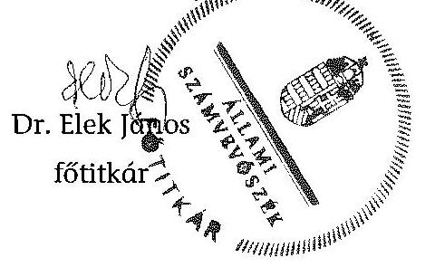

Héltéklet: $\quad 17 \mathrm{db}$
Függelék: $\quad 2 \mathrm{db}$

---

.

---

# ÁLLAMI SZÁMVEVŐSZÉK 

Iktatószám: ETIO-0147-002/2014.

## MEGHATALMAZÁS

Az Állami Számvevőszékről szóló 2011. évi LXVI. törvény 32. § (2) bekezdése, valamint az Állami Számvevőszék Szervezeti és Működési Szabályzatáról szóló 1/2013. (XII. 31.) ÁSZ utasítás 33. § (7) bekezdésében és (8) bekezdés a) pontjában foglaltak alapján visszavonásig a
2014. évi választásokra fordított pénzeszközök felhasználásának ellenőrzése:

- az országgyűlési képviselők 2014. évi választására fordított pénzeszközök felhasználásának ellenőrzése,
- az Európai Parlament tagjainak 2014. évi választására fordított pénzeszközök felhasználásának ellenőrzése,
- a helyi önkormányzati képviselők és polgármesterek, valamint a nemzetiségi önkormányzati képviselők 2014. évi választására fordított pénzeszközök felhasználásának ellenőrzése, valamint
az ellenőrzésekkel kapcsolatos nyilvántartási feladatok ellátása tekintetében

Dr. Elek János, főtitkárt az Elnököt megillető feladat- és hatáskörök teljes jogkörű gyakorlására feljogosítom.

Budapest, 2014 ... év ...júl. 2015 ......... hó ... 16. nap
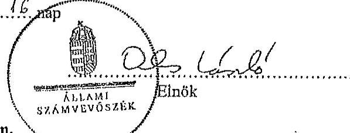

A teljes jogkörű feljogosítást elfogadom.
Budapest, 2014 ..... év ...júl. 2015 ...... hó ... 16. nap

---

.

---

# AZ ELLENŐRZÖTT SZERVEZETEK JEGYZÉKE 

| Központi szervek | Nemzeti Választási Iroda |
| :--: | :--: |
|  | Közigazgatási és Elektronikus Közszolgáltatások Központi Hivatala |
|  | Igazságügyi Minisztérium |
|  | Bevándorlási és Állampolgársági Hivatal |
|  | Közigazgatási és Igazságügyi Hivatal |
|  | Külgazdasági és Külügyminisztérium |
| Területi választási szervek (TVI) | Bács-Kiskun Megyei Önkormányzat Hivatala |
|  | Fejér Megyei Önkormányzati Hivatal |
|  | Pest Megyei Önkormányzati Hivatal |
|  | Budapest Főváros Főpolgármesteri Hivatala |
|  | Hajdú-Bihar Megyei Önkormányzati Hivatal |
|  | Győr-Moson-Sopron Megyei Önkormányzati Hivatal |
|  | Somogy Megyei Önkormányzati Hivatal |
| Helyi választási szervek (HVI) | Bagaméri Polgármesteri Hivatal |
|  | Bácsbokodi Polgármesteri Hivatal |
|  | Berzencei Polgármesteri Hivatal |
|  | Biharkeresztesi Közös Önkormányzati Hivatal |
|  | Bősárkányi Közös Önkormányzati Hivatal |
|  | Budapest Főváros XII. kerület Hegyvidéki Polgármesteri Hivatal |
|  | Budapest Főváros XVII. kerület Rákosmenti Polgármesteri Hivatal |
|  | Csornai Polgármesteri Hivatal |
|  | Dégi Közös Önkormányzati Hivatal |
|  | Kalocsai Polgármesteri Hivatal |
|  | Kaposmérői Közös Önkormányzati Hivatal |
|  | Kaposvár Megyei Jogú Város Polgármesteri Hivatala |
|  | Martonvásári Polgármesteri Hivatal |
|  | Nagyhegyesi Polgármesteri Hivatal |
|  | Öttevényi Polgármesteri Hivatal |
|  | Penci Közös Önkormányzati Hivatal |
|  | Sárosdi Polgármesteri Hivatal |
|  | Szanki Polgármesteri Hivatal |
|  | Szentendrei Közös Önkormányzati Hivatal |

---

.

---

# A 2014. ÉVI OGY VÁLASZTÁSHOZ KAPCSOLÓDÓ KÖZBESZERZÉSI ÉRTÉKHATÁRT ELÉRŐ BESZERZÉSI ELJÁRÁSOK 

Adatok M Ft-ban

| Közbeszerzési eljárás tárgya | Eljárás   fajtája | NBB   határozat | Szerződés   OGY vá-   lasztásra   elszámolt   összege | Teljesítés ösz-   szege   2014.   dec.31-   ig |
| :--: | :--: | :--: | :--: | :--: |
| NVI által lefolytatott beszerzési eljárások |  |  |  |  |
| Egyetemes postai szolgáltatás igénybevétele a magyarországi lakcímmel nem rendelkező választópolgároknak a 2014. évi országgyűlési választásokkal kapcsolatos központi névjegyzékbe vételére vonatkozó tájékoztatás és névjegyzékbe vételi kérelem formanyomtatvány kiküldéséhez | Kbt., nemzeti, hirdetmény nélküli tárgyalásos | - | 44,9 | 44,9 |
| A 2014. évi országgyűlési képviselő választás lebonyolításához szükséges alkalmazások rendszertervezése, a Nemzeti Választási Rendszer kifejlesztése, tesztelése, a meglévő hálózathoz és a rendszerelemekhez történő illesztése, az alkalmazások üzemeltetése és közvetlenül kapcsolódó szolgáltatások nyújtása | Kbt., közösségi, hirdetmény nélküli tárgyalásos | - | 375,0 | 375,0 |
| Vállalkozási szerződés a 2014. évi országgyűlési képviselők választásának és az Európai Parlament tagjai választásának pénzügyi, logisztikai lebonyolításához és az ezzel összefüggésben a Nemzeti Választási Iroda alapfeladatainak ellátásához szükséges szoftverek továbbfejlesztése, valamint ezek működtetéséhez szükséges, egyes szoftverkomponensek és speciális szakértői tevékenység biztosítása | hirdetmény nélküli tárgyalásos | $\begin{aligned} & 19 / 2013 . \\ & \text { (VII.2.) } \end{aligned}$ | 250,4 | 250,4,0 |
| VUR rendszer azonnali fejlesztése és telepítése | hirdetmény nélküli tárgyalásos | $\begin{aligned} & 23 / 2013 . \\ & \text { (VII.15.) } \end{aligned}$ | 73,4 | 73,4 |
| A névjegyzékbe vételi kérelmekkel kapcsolatos azonnali feladatok ellátása | hirdetmény nélküli tárgyalásos | $\begin{aligned} & 20 / 2013 . \\ & \text { (VII.2.) } \end{aligned}$ | 208,1 | 208,1 |

---

| Közbeszerzési eljárás tárgya | Eljárás   fajtája | NBB   határozat | Szerződés   OGY vá-   lasztásra   elszámolt   összege | Teljesítés össz-   szege 2014. dec.31-ig |
| :--: | :--: | :--: | :--: | :--: |
| A 2014. évi választásokhoz adatlapok és kapcsolódó termékek, továbbá a Nemzeti Választási Irodához beérkező levélszavazatok összeszámlálásához optimális informatikai támogatás biztosítása a Nemzeti Választási Iroda számára. | hirdetmény nélküli tárgyalásos | $\begin{aligned} & 25 / 2013 . \\ & \text { (VII.15.) } \end{aligned}$ | 116,0 | 116,0 |
| Nyomdai szolgáltatások beszerzése | könnyített eljárás | $\begin{aligned} & 37 / 2013 . \\ & \text { (XI.5.) } \end{aligned}$ | 899,1 | 899,1 |
| Adatmonitoring egység kifejlesztése | hirdetmény nélküli tárgyalásos | $\begin{aligned} & 24 / 2013 . \\ & \text { (VII.15.) } \end{aligned}$ | 100,0 | 100,0 |
| KEKKH által lefolytatott beszerzési eljárások |  |  |  |  |
| A 2014. évi országgyűlési választások kapcsán ellátandó informatikai szakmai támogató tevékenységek ellátása | könnyített eljárás | saját hatáskörben minősített | 30,0 | 30,0 |
| A 2014. évi országgyűlési választás informatikai rendszerének minőségbiztosítása | könnyített eljárás | saját hatáskörben minősített | 30,0 | 30,0 |
| A 2014. évi országgyűlési választási nyomtatási feladatok ellátásához szükséges nyomdagépek működésének biztosítása | könnyített eljárás | saját hatáskörben minősített | 6,2 | 6,2 |
| Kiemelt rendelkezésre állású bérelt vonali internet-szolgáltatás létesítése és üzemeltetése | Kbt., saját hatáskörben lefolytatott beszerzési eljárás | $-$ | 12,7 | 12,7 |
| A 2014. évi választáshoz szükséges Microsoft vagy azzal egyenértékű szoftverlicencek beszerzése | keret megállapodásos eljárás második részének a verseny újbóli megnyitásával | $-$ | 6,2 | 6,2 |

---

# A GAZDÁLKODÁSI JOGKÖRÖK GYAKORLÁSA AZ ELLENŐRZÖTT HELYI ÉS TERÜLETI VÁLASZTÁSI IRODÁKNÁL 

| Megnevezés | A gazdálkodási jogkörök gyakorlásának összesítő értékelése | Kötelezettségvállalás, pénzügyi ellenjegyzés, teljesítésigazolás, érvényesítés során feltárt jellemző, rendszerszerű hiányosságok |
| :--: | :--: | :--: |
| Bács-Kiskun Megyei Önkormányzat Hivatala (TVI) | megfelelő | Rendszerszerű hiányosság nem volt. |
| Kalocsai Közös Önkormányzati Hivatal (HVI) | nem megfelelő | Hat esetben a pénzügyi ellenjegyzés nem történt meg (Áht. 37. § (1) bekezdés, Ávr. 55. § (1) bekezdés), az előzetes írásbeli kötelezettségvállalást nem igénylő kifizetések rendjét belső szabályzatban nem rögzítették (39 esetet érintett) (Ávr. 53. § (2) bekezdés), 31 esetben nem tüntették fel a teljesítésigazolás dátumát (Ávr. 57. § (3) bekezdés), 28 esetben a teljesítésigazolást nem a belső szabályozásban meghatározott módon végezték (Gazdálkodási Szabályzat 1,2 IV. fejezet), 46 esetben az érvényesítés dátumát nem tüntették fel, illetve az érvényesítő a megelőző ügymenet szabályszerűségét nem ellenőrizte (Ávr. 58. § (1)-(3) bekezdés), 22 esetben az utalványozás dátumát nem tüntették fel (Ávr. 59. § (3) bek. g) pont, Gazd. Szab. 1.2 VI. fejezet), egy esetben az utalványozott számla keltezése az OGY választás időpontjánál korábbi volt (Ávr. 59. § (3) bek. g) pont). |
|  | nem megfelelő | 16 esetben a pénzügyi ellenjegyzés nem történt meg (Áht. 37. § (1) bek., Ávr. 55. § (1) bek.), 21 esetben nem készült teljesítésigazolás, illetve a teljesítésigazolás dátumát nem tüntették fel (Áht. 38. § (1) bek., Ávr. 57. § (3) bek.), 24 esetben az érvényesítés nem történt meg, illetve az érvényesítő a megelőző ügymenet szabályszerűségét nem ellenőrizte, továbbá az érvényesítés dátumát nem tüntették fel (Áht. 38. § (1) bek., Ávr. 58. § (1)-(3) bek.), 23 esetben az utalványozás érvényesítés nélkül történt, illetve az utalványozás nem történt meg (Áht. 38. § (1) bek., Ávr. 59. § (1) és (3) bek. g) pont), az előzetes írásbeli kötelezettségvállalást nem igénylő kifizetések rendjét belső szabályzatban nem rögzítették (Ávr. 53. § (2) bekezdés). |
| Szanki Polgár-   mesteri Hivatal   (HVI) | megfelelő | Rendszerszerű hiányosság nem volt. |
| Fejér Megyei   Önkormányzati   Hivatal (TVI) | megfelelő | Rendszerszerű hiányosság nem volt. |

---

| Megnevezés | A gazdálko-   dási jogkörök   gyakorlásának   összesítő érté-   kelése | Kötelezettségvállalás, pénzügyi ellenjegyzés,   teljesítésigazolás, érvényesítés során feltárt   jellemző, rendszerszerű hiányosságok |
| :--: | :--: | :--: |
| Martonvásár   Város Polgár-   mesteri Hiva-   tala (HVI) | megfelelő | Rendszerszerű hiányosság nem volt. |
| Sárosdi Polgár-   mesteri Hivatal   (HVI) | nem megfelelő | 22 esetben a kifizetés a gazdálkodási jogkörök gyakor-   lása nélkül valósult meg, a pénzügyi ellenjegyzés, a kö-   telezettségvállalás, a teljesítésigazolás, az érvényesítés   és az utalványozás nem történt meg (Áht. 37-38. §., Avr.   53-60. §.) az előzetes írásbeli kötelezettségvállalást nem   igénylő kifizetések rendjét belső szabályzatban nem rög-   zítették (Ávr. 53. § (2) bekezdés). |
| Dégi Közös Ön-   kormányzati   Hivatal (HVI) | megfelelő | Rendszerszerű hiányosság nem volt. |
| Pest Megyei Ön-   kormányzati   Hivatal (TVI) | megfelelő | Rendszerszerű hiányosság nem volt. |
| Budapest Fővá-   ros Főpolgár-   mesteri Hivatal   (FVI) | megfelelő | Rendszerszerű hiányosság nem volt. |
| Budapest Fővá-   ros XII. kerület   Hegyvidéki Pol-   gár-mesteri Hi-   vatal (HVI) | részben   megfelelő | 29 esetben a pénzügyi ellenjegyzés a kifizetési bizonylaton és nem a kötelezettségvállalás dokumentumán került feltüntetésre (Ávr. 55. § (1) bek.), 29 esetben a kötelezettségvállalás összegét nem tüntették fel (Áht. 37. § (1) bek., Ávr. 55. § (1) bek.), 13 esetben a teljesítésigazolás nem történt meg, illetve 15 esetben a teljesítésigazolás a belső szabályzattól eltérően történt (Áht. 38. § (1) bek és Ávr. 57. § (3) bek., Pénzkezelési-, pénzgazdálkodási és kötelezettségvállalási szabályzata III/A. fejezet c) pont), négy esetben az érvényesítést nem a kötelezettségvállalási szabályzatában kijelölt személy végezte (Áht. 37. § (1) bek., 13/2014. jegyzői utasítás), 29 esetben az érvényesítő a megelőző ügymenet szabályszerűségét nem ellenőrizte (Ávr. 58. § (1) bek.). 35 esetben az utalványozási jogot eredetileg a Pvr. 1. § (2) bekezdés c) pontjában foglalt előírás ellenére nem a jegyző gyakorolta. A jegyzői aláírásra utólag, az FVI ellenőrzését követően került sor, ezáltal a kifizetések elrendelése nem szabályszerű - az 38. § (1) bekezdésében foglaltaknak megfelelő - utalványozás alapján történt). |
| Budapest Fővá-   ros XVII. kerü-   let Rákosmenti   Polgármesteri   Hivatal (HVI) | részben   megfelelő | 50 esetben a teljesítésigazolást a jegyző végezte, a telje-   sítés igazolására jogosultak nyilvántartásában a jegyző   nevét és aláírás-mintáját nem tüntették fel (Ávr. 57. §   (3) bek., 60. § (3) bek., Gazd. Szab. 1. sz. melléklet). |

---

| Megnevezés | A gazdálkodási jogkörök gyakorlásának összesítő értékelése | Kötelezettségvállalás, pénzügyi ellenjegyzés, teljesítésigazolás, érvényesítés során feltárt jellemző, rendszerszerű hiányosságok |
| :--: | :--: | :--: |
| Szentendrei Közös Önkormányzati Hivatal (HVI) | megfelelő | Rendszerszerű hiányosság nem volt. |
| Penci Közös Önkormányzati Hivatal (HVI) | részben megfelelő | 23 esetben az egyes jogkörök gyakorlói tekintetében nem vezették naprakészen az aláírás mintákról a nyilvántartást (Ávr. 60. § (3) bek.). |
| Hajdú-Bihar Megyei Önkormányzati Hivatal (TVI) | megfelelő | Rendszerszerű hiányosság nem volt. |
| Biharkeresztesi Közös Önkormányzati Hiva-   tal (HVI) | megfelelő | Rendszerszerű hiányosság nem volt. |
| Bagaméri Polgármesteri Hivatal (HVI) | megfelelő | Rendszerszerű hiányosság nem volt. |
| Nagyhegyesi Polgármesteri Hivatal (HVI) | részben megfelelő | 21 esetben a kötelezettségvállalást nem előzte meg a pénzügyi ellenjegyzés (Áht. 37. § (1) bek., Ávr. 55. § (1) bek.), 15 esetben az érvényesítés dátumát nem tüntették fel (Ávr. 58. § (3) bek.), az előzetes írásbeli kötelezettségvállalást nem igénylő kifizetések rendjét belső szabályzatban nem rögzítették (Ávr. 53. § (2) bekezdés). |
| Győr-Moson-   Sopron Megyei   Önkormányzati   Hivatal (TVI) | megfelelő | Rendszerszerű hiányosság nem volt. |
| Csornai Polgármesteri Hivatal (HVI) | részben   megfelelő | 22 esetben a pénzügyi ellenjegyzés dátumát nem tüntették fel, illetve a pénzügyi ellenjegyzés nem a kötelezettségvállalás dokumentumán történt (Ávr. 55. § (1) bek.), 15 esetben a kötelezettségvállaláson a kötelezettségvállalás összegét nem tüntették fel, illetve 1 fő HVI tag munkaköri leírásában szerepelt az OGY választással kapcsolatos feladatok ellátása (Áht. 37. § (1) bek., Ávr. 55. § (1)-(2) bek., továbbá Ávr. 51. § (2) bek.), egy esetben a teljesítésigazolás nem történt meg (Áht. 38. § (1) bek., Ávr. 57. §), 50 esetben az érvényesítés dátumát nem tüntették fel, illetve az érvényesítő a megelőző ügymenet szabályszerűségét nem ellenőrizte (Ávr. 58. § (1) és (3) bek.), 25 esetben az utalványozás a készpénzes kifizetések során nem a pénztárbizonylaton történt (Ávr. 59. § (2) bek.). |

---

| Megnevezés | A gazdálko-   dási jogkörök   gyakorlásának   összesítő érté-   kelése | Kötelezettségvállalás, pénzügyi ellenjegyzés,   teljesítésigazolás, érvényesítés során feltárt   jellemző, rendszerszerű hiányosságok |
| :--: | :--: | :--: |
| Bősárkányi Kö-   zös Önkormány-   zati Hivatal   (HVI) | részben megfelelő | Három esetben a kifizetés a gazdálkodási jogkörök gya-   korlása nélkül valósult meg, a pénzügyi ellenjegyzés, a   kötelezettségvállalás, a teljesítésigazolás, az érvényesí-   tés és az utalványozás nem történt meg (Áht. 37-38. §,   Ávr. 53-60. §). |
| Öttevényi Pol-   gármesteri Hi-   vatal (HVI) | megfelelő | Rendszerszerű hiányosság nem volt. |
| Somogy Megyei   Önkormányzati   Hivatal (TVI) | részben   megfelelő | Kettő esetben a kötelezettségvállalás a pénzügyi ellen-   jegyzést megelőzően történt (Áht. 37. § (1) bek.), egy   esetben a teljesítésigazolásra nem került sor (Áht. 38. §   (1) bek.), 13 esetben az érvényesítés később történt, mint   a kifizetés (Áht. 38. § (1) bek.), illetve az érvényesítő nem   teljesítette az összeférhetetlenség követelményeit, mert a   saját részére számfejtett járandóság kifizetését érvény-   sítette (Ávr. 60. § (2) bek.), továbbá az érvényesítő a   megelőző ügymenet szabályszerűségét nem ellenőrizte   (Ávr. 58. § (1) bek.), egy esetben az utalványozó nem   teljesítette az összeférhetetlenség követelményeit, mert   az utalványozást a saját részére teljesítette (Ávr. 60. § (2)   bek.). |
| Kaposvár Me-   gyei Jogú Város   Polgármesteri   Hivatala (HVI) | nem megfelelő | 32 esetben a kötelezettségvállalásra a pénzügyi ellen-   jegyzés hiányában került sor (Áht. 37. § (1) bek., Ávr.   55. § (1) bek.), 49 esetben az érvényesítő a megelőző ügy-   menet szabályszerűségét nem ellenőrizte (Ávr. 58. § (1)   bek.). |
| Berzencei Pol-   gármesteri Hi-   vatal (HVI) | részben   megfelelő | 12 esetben a kötelezettségvállalásra pénzügyi ellenjegyz-   zés hiányában került sor (Áht. 37. § (1) bek. Ávr. 55. §   (1) bek.), egy esetben a teljesítést igazoló nem teljesítette   az összeférhetetlenség követelményeit, mert a teljesítés-   igazolást maga javára látta el (Ávr. 60. § (2) bek.), 12   esetben az érvényesítés nem történt meg (Áht. 38. § (1)   bek.), illetve az érvényesítő nem ellenőrizte a megelőző   ügymenet szabályszerűségét (Ávr. 58. § (1) bek.), négy   esetben az utalványozó nem teljesítette az összeférhetet-   lenség követelményeit, mert az utalványozást a maga   javára látta el (Ávr. 60. § (2) bek.). |
| Kaposmérői Kö-   zös Önkormány-   zati Hivatal   (HVI) | részben   megfelelő | 34 esetben a kötelezettségvállalás pénzügyi ellenjegyzése nem történt meg (Áht. 37. § (1) bek., Ávr. 55. § (1) bek.), 34 esetben az érvényesítő nem ellenőrizte a megelőző ügymenet szabályszerűségét (Ávr. 58. § (1) bek.). |

---

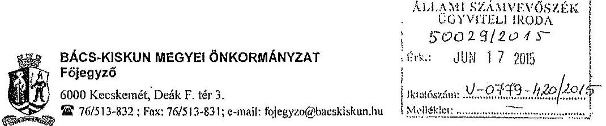

Tárgy: Észrevétel megküldése
Ikt.sz:5086-4/2015

Dr Elek János Főtitkár Úr
részére
Állami Számvevőszék
Budapest
Apáczai Csere János u 10.

Rush Luevics
C. 14.
TV Pás
106 JUN 17.

Tisztelt Főtitkár Úr!

Köszönettel megkaptuk az országgyűlési képviselők, az Európai Parlament tagjai és a helyi önkormányzati képviselők és polgármesterek, valamint a nemzetiségi önkormányzati képviselők választására fordított pénzeszközök felhasználásának ellenőrzése tárgyában készült vizsgálati jelentések tervezeteit, melyre az alábbi észrevételt kívánom tenni.

Az országgyűlési képviselők 2014. évi választására vonatkozó jelentés tervezetet elfogadjuk, ugyanakkor az Európai Parlamenti képviselők, valamint a helyi önkormányzati képviselők és polgármesterek választásával összefüggésben önkormányzatunkra vonatkozóan tett megállapításokat nem tudjuk elfogadni.

Az Európai Parlamenti választások esetében a jelentés 3. számú mellékletében a Bács-Kiskun Megyei Önkormányzat Hivatala gazdálkodási jogkörök gyakorlásának minősítése nem megfelelő, míg a helyi önkormányzati képviselők
 választása esetében ez a minősítés részben megfelelő.

Kérem szíveskedjenek a tett megállapításokat tételesen alátámasztani, mivel a leírásból számunkra nem beazonosíthatóak a jelzett hiányosságok, emellett az általunk folytatott gazdálkodási gyakorlat alapján is teljességgel érthetetlen, hogy a minősítés milyen tények alapján került megállapításra.

Hivatalunk az érvényes szabályozás alapján egységes gazdálkodási gyakorlatot folytat, aminek során kiemelt figyelmet fordítunk a szabályosság betartására, amit tanúsít az a tény is, hogy az országgyűlési képviselők választásával kapcsolatosan készült jelentés tervezet nem tárt fel rendszerszintű hiányosságot a gazdálkodási jogkörök gyakorlásában.

Az eltérő megítélés okát mi abban látjuk, hogy az utóbbi két vizsgálatot végző revizor Hivatallal való együttműködése nem volt megfelelő.

Válaszát előre is köszönöm.

Kecskemét, 2015. június 16.

Tisztelettel:

Dr Szegyi László

---

.

---

Állami Számvevőszék

Iktatószám: 15-1/7/2015
Hivatkozási szám: V-0779-415/2015
V-0780-276/2015
V-0781-182/2015

Dr. Elek János
Főtitkár részére

Ügyintéző: Némethné Sári Irén
Telefon: +36 1 253-3380

1052. Budapest
Apáczai Csere János u. 10.

Tárgy: Észrevétel

2015 JÚN 17.

Tisztelt Főtitkár Úr!

A 2014. évi választásokra fordított pénzeszközök felhasználásának ellenőrzésére
- Az országgyűlési képviselők 2014. évi választására fordított pénzeszközök felhasználásának ellenőrzése;
- Az Európai Parlament tagjainak 2014. évi választására fordított pénzeszközök felhasználásának ellenőrzése;
- A helyi önkormányzati képviselők és polgármesterek, valamint a nemzetiségi önkormányzati képviselők 2014. évi választására fordított pénzeszközök felhasználásának ellenőrzése

Címmel készített számvevői jelentéstervezeteket megkaptuk.

Az Állami Számvevőszékről szóló 2011. évi LXVI. törvény 29. § (2) bekezdése alapján az ellenőrzések megállapításaira a jegyző 15 napon belül írásban észrevételt tehet.

Az ellenőrzésekről készült jelentéstervezeteket megismertük, a V-0779-415/2015 és a V-0781-182/2015 jelentésekben tett megállapításokkal kapcsolatban észrevételt nem kívánunk tenni.

A V-0780-276/2015 számú jelentéstervezetben tett megállapításokkal kapcsolatban két észrevételt teszek:

1. A jelentéstervezet 18 oldalán tévesen az szerepel, hogy a XVII. kerület késedelmesen számolt el a választások lebonyolításához biztosított pénzeszközök felhasználásáról.

Ittestem
BUDAPEST FŐVÁROS XVII. KERÜLET
RÁKOSMENTE ÖNKORMÁNYZATA

1173 Budapest, Pesti út 165.; Levelezési cím: 1656 Budapest, Pf. 110.; Tel.: +36 1 253-3319; Fax: +36 1 253-3323; E-mail: onkormanyzati@rakosmente.hu

---

Mellékelem a Fővárosi Választási Iroda elszámolásra vonatkozó levelét, mely szerint a kerület ki volt jelölve helyszíni ellenőrzésre, a dokumentumokat csak a megadott időben kellett a TVI-nek benyújtani.

# Álláspontom szerint így a XVII. kerületi HVI nem számolt el késedelmesen. 

2. A jelentéstervezet 3. számú mellékletének 3. oldalán Budapest Főváros XVII. kerület Rákosmenti Polgármesteri Hivatalt érintő összesítő megállapítások között álláspontom szerint tévesen szerepel a hivatkozott 36 esetbeli személyi juttatások kifizetésénél elmaradt írásbeli kötelezettségvállalás és ellenjegyzés, mivel a személyi juttatásokra kifizetett összeg egyik esetben sem érte el a 100.000 Ft-ot, így az államháztartásról szóló törvény végrehajtásáról szóló 368/2011.(XII.31.) Korm. rendelet 53. § (1) bekezdés alapján nem szükséges írásbeli kötelezettségvállalás a kifizetéshez, így pénzügyi ellenjegyzés sem.

Kérem észrevételeim elfogadását.

Budapest, 2015. június 11.

Tisztelettel:
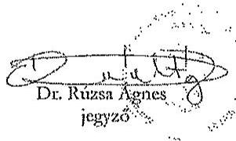

1173 Budapest, Pesti út 165.; Levelezési cím: 1656 Budapest, Pf.: 110.; Tel.: +36 1 253-3319; Fax: +36 1 253-3323; E-mail: onkormanyzat@rakosmente.hu

---

# BUDAPEST

Fővárosi Választási Iroda

# BUDAPEST

Ikt. szám: FPH071/4 - 25/2015

dr. Elek János úr
főtitkár
Állami Számvevőszék

Budapest

Tisztelt Főtitkár Úr!

ÁLLAMI SZÁMVEVŐSZÉK
ÜGYVITELI IRODA
50124/2015
Érk.: JÚN 17 2015

Bundszáma: V-0779-421/2015
Melléklet: 3.000

FV RcsZi: 26.250.000
24
FV 2015 JÚN 18

A 2014. évi választások számvevőszéki vizsgálatainak jelentéstervezetét köszönettel megkaptuk.

Tájékoztatom, hogy az Európai Parlament tagjainak 2014. évi választására fordított pénzeszközök felhasználásának ellenőrzéséről szóló V-0780-276/2015. számú és a helyi önkormányzati képviselők és polgármesterek, valamint a nemzetiségi önkormányzati képviselők 2014. évi választására fordított pénzeszközök felhasználásának ellenőrzéséről szóló V-0781-182/2015. számú jelentéstervezetekre észrevételt nem teszek.

Az országgyűlési képviselők 2014. évi választására fordított pénzeszközök felhasználásáról készült V-0779-415/2015. számú jelentéstervezet esetében az alábbiak szerinti pontosítást szíveskedjenek elfogadni.

A jelentés tervezet 3.2. A választással kapcsolatos kiadások teljesítésének szabályszerűsége pontban (16. oldal, második bekezdés):
„Az FVI a választások pénzeszközeinek kormányzati funkciók szerinti elkülönítését a 68/2013. (XII. 29.) NGM rendelet 3.§ (1) bekezdésében és 1. mellékletében foglaltak ellenére nem biztosította"

Pontosítva: „Az FVI a választások pénzeszközeinek kormányzati funkciók szerinti elkülönítését a 68/2013. (XII. 29.) NGM rendelet 3.§ (1) bekezdésében és 1. mellékletének megfelelően biztosította"

Indoklás: A Fővárosi Önkormányzat és a Főpolgármesteri Hivatal számviteli rendszerében kiállított valamennyi utalványon szerepel a kormányzati funkció száma és elnevezése, ami lehetővé teszi a választások pénzeszközeinek kormányzati funkciók szerinti elkülönítését. A bizonylatokat az ellenőrök rendelkezésére bocsátottuk, továbbá elektronikus formában átadtuk részükre. (A levélhez 3 db bizonylat másolatot csatoltunk.)

---

Pontosítási kérésünket alátámasztja az is, hogy az Európai Parlament tagjainak 2014. évi választása és a helyi önkormányzati képviselők és polgármesterek, valamint a nemzetiségi önkormányzati képviselők 2014. évi választása idején is ugyanezt a számviteli rendszert használtuk (PIR - Forrás), s ezekben az esetekben a kód használatával kapcsolatos észrevétel nem fogalmazódott meg.

Budapest, 2015. június, 16..."

Tisztelettel

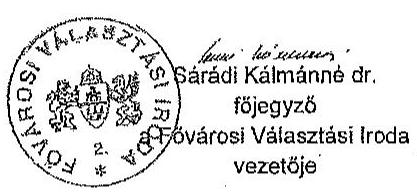

Melléklet: 3 db kiadási utalvány másolata

---

Budapest Főváros Önkormányzatának Főpolgármesteri Hivatala

1052 Budapest Városház u. 9-11.

1052 Budapest Városház u. 9-11.

KIADÁSI UTALVÁNY

KIADÁSI UTALVÁNY

A 11784009-15735636-00000000 elnevezésű számlája terhére a mellékelt dokumentumok alapján a kiadást a következők szerint érvényesíteni / utalványozom:

1/1. oldal

2014 JÚN 12

Kiadási kötelezettségvállalás és számla adatok

Partner megnevezése: CKC Vendéglátóipari és Rendezvény Szolgáltató St. (101441)

2014 JÚN 04

1/1. oldal

Partner címe: 1076 Budapest Garay tér 12. I/12 (Adóig. sz.: 28303275-2-42)

Partner bankszámlája: 11707024-20309820-00000000

Partner bevételi ERA kódja: Köt.váll.nyilvántartási száma: Pénzeszköz számla: 3311 Közbesz.tip.:

|  |   |   |   |   |   |   |   |   |   |
| --- | --- | --- | --- | --- | --- | --- | --- | --- | --- |
|  1 | 3493 72 Egyéb külső személyi juttatáson költségei |  |  |  |  |  |  |  |   |
|   |  |  |  |  |  |  |  |  | 2014.04.07  |
|   |  |  |  |  |  |  |  |  | 2014  |
|   |  |  |  |  |  |  |  |  | 2014  |
|   |  |  |  |  |  |  |  |  | 2014  |
|   |  |  |  |  |  |  |  |  | 2014  |
|   |  |  |  |  |  |  |  |  | 2014  |
|   |  |  |  |  |  |  |  |  | 2014  |
|   |  |  |  |  |  |  |  |  | 2014  |
|   |  |  |  |  |  |  |  |  | 2014  |
|   |  |  |  |  |  |  |  |  | 2014  |
|   |  |  |  |  |  |  |  |  | 2014  |
|   |  |  |  |  |  |  |  |  | 2014  |
|   |  |  |  |  |  |  |  |  | 2014  |
|   |  |  |  |  |  |  |  |  | 2014  |
|   |  |  |  |  |  |  |  |  | 2014  |
|   |  |  |  |  |  |  |  |  | 2014  |
|   |  |  |  |  |  |  |  |  | 2014  |
|   |  |  |  |  |  |  |  |  | 2014  |
|   |  |  |  |  |  |  |  |  | 2014  |
|   |  |  |  |  |  |  |  |  | 2014  |
|   |  |  |  |  |  |  |  |  | 2014  |
|   |  |  |  |  |  |  |  |  | 2014  |
|   |  |  |  |  |  |  |  |  | 2014  |
|   |  |  |  |  |  |  |  |  | 2014  |
|   |  |  |  |  |  |  |  |  | 2014  |
|   |  |  |  |  |  |  |  |  | 2014  |
|   |  |  |  |  |  |  |  |  | 2014  |
|   |  |  |  |  |  |  |  |  | 2014  |
|   |  |  |  |  |  |  |  |  | 2014  |
|   |  |  |  |  |  |  |  |  | 2014  |
|   |  |  |  |  |  |  |  |  | 2014  |
|   |  |  |  |  |  |  |  |  | 2014  |

---

Budapest Főváros Önkormányzatának Főpolgármesteri Hivatala

1052 Budapest Városház u. 9-11.

12/14 JÚL 22 10:57

1/1

# KIADÁSI UTALVÁNY

A 11784009-15735636-00000000 KÖLTSÉGVETÉSI ELSZ.SZÁMLA elnevezésű számlája terhére a mellékelt dokumentumok alapján a kiadást a következők szerint érvényesíteni/utalványozom:

Kiadási kötelezettségvállalás és számla adatok

Partner megnevezése: OTP Csoportos átutalás Költség (108897)

Partner címe: Budapest (Adóig.az.:)

Partner bankszámlája: 11769006-00198116

Partner bevételi ERA kódja: Kötelezettségnyilvántartási száma: Pénzeszköz számla: 3311 Kötelezés: Kötelezettség: 3311

Csoportos bizonyítás szám:

|  Fizetési mód: | Csoportos utalás  |
| --- | --- |
|  Külsőbiz. száma: | 5EVK4-00793  |
|  Nyilvántartási száma: | 2014.07.25 | |
|  Fizetési határideje: | 2014.07.25  |
|  Kötszálló, száma: |   |
|  Banki kiegyenlítés dátuma: |   |
|  Kötelezettségi év: | 2014  |

|  Főkönyvi szám (megnevezéssel) | ERA kód | Pénzforráskód | Ügyletkód | Szervezeti egység | Egyedi gyűjtő követi gyűjtő 2 | Keretegészés | Szakfeledet részletesít | Összeg HUF | Áfa (%)  |
| --- | --- | --- | --- | --- | --- | --- | --- | --- | --- |
|  1 36014 Foglalkoztatottaknak adott előleges | 2K3201 Adott előlegek | 503008 Kötőg.ás igazságlapj | 713401 Országgyűlési képviselője | 4306 I Szegedési év: 1141141111111111111111111111111111111111111111111111111111111111111111111111111111111111111111111111111111111111111111111111111111111111111111111111111111111111111111111111111111111111111111111111111111111111111111111111111111111111111111111111111111111111111111111111111111111111111111111111111111111111111111111111111111111111111111111111111111111111111111111111111111111111111111111111111111111111111111111111111111111111111111111111111111111111111111111111111111111111111111111111111111111111111111111111111111111111111111111111111111111111111111111111111111111111111111111111111111111111111111111111111111111111111111111111111111111111111111111111111111111111111111111111111111111111111111111111111111111111111111111111111111111111111111111111111111111111111111111111111111111111111111111111111111111111111111111111111111111111111111111111111111111111111111111111111111111111111111111111111111111111111111111111111111111111111111111111111111111111111111111111111111111111111111111111111111111111111111111111111111111111111111111111111111111111111111111111111111111111111111111111111111111111111111111111111111111111111111111111111111111111111111111111111111111111111111111111111111111111111111111111111111111111111111111111111111111111111111111111111111111111111111111111111111111111111111111111111111111111111111111111111111111111111111111111111111111111111111111111111111111111111111111111111111111111111111111111111111111111111111111111111111111111111111111111111111111111111111111111111111111111111111111111111111111111111111111111111111111111111111111111111111111111111111111111111111111111111111111111111111111111111111111111111111111111111111111111111111111111111111111111111111111111111111111111111111111111111111111111111111111111111111111111111111111111111111111111111111111111111111111111111111111111111111111111111111111111111111111111111111111111111111111111111111111111111111111111111111111111111111111111111111111111111111111111111111111111111111111111111111111111111111111111111111111111111111111111111111111111111111111111111111111111111111111111111111111111111111111111111111111111111111111111111111111111111111111111111111111111111111111111111111111111111111111111111111111111111111111111111111111111111111111111111111111111111111111111111111111111111111111111111111111111111111111111111111111111111111111111111111111111111111111111111111111111111111111111111111111111111111111111111111111111111111111111111111111111111111111111111111111111111111111111111111111111111111111111111111111111111111111111111111111111111111111111111111111111111111111111111111111111111111111111111111111111111111111111111111111111111111111111111111111111111111111111111111111111111111111111111111111111111111111111111111111111111111111111111111111111111111111111111111111111111111111111111111111111111111111111111111111111111111111111111111111111111111111111111111111111111111111111111111111111111111111111111111111111111111111111111111111111111111111111111111111111111111111111111111111111111111111111111111111111111111111111111111111111111111111111111111111111111111111111111111111111111111111111111111111111111111111111111111111111111111111111111111111111111111111111111111111111111111111111111111111111111111111111111111111111111111111111111111111111111111111111111111111111111111111111111111111111111111111111111111111111111111111111111111111111111111111111111111111111111111111111111111111111111111111111111111111111111111111111111111111111111111111111111111111111111111111111111111111111111111111111111111111111111111111111111111111111111111111111111111111111111111111111111111111111111111111111111111111111111111111111111111111111111111111111111111111111111111111111111111111111111111111111111111111111111111111111111111111111111111111111111111111111111111111111111111111111111111111111111111111111111111111111111111111111111111111111111111111111111111111111111111111111111111111111111111111111111111111111111111111111111111111111111111111111111111111111111111111111111111111111111111111111111111111111111111111111111111111111111111111111111111111111111111111111111111111111111111111111111111111111111111111111111111111111111111111111111111111111111111111111111111111111111111111111111111111111111111111111111111111111111111111111111111111111111111111111111111111111111111111111111111111111111111111111111111111111111111111111111111111111111111111111111111111111111111111111111111111111111111111111111111111111111111111111111111111111111111111111111111111111111100000000000000000000000000000000000000000000000000000000000000000000000000000000000000000000000000000000000000000000000000000000000000000000000000000000000000000000000000000000000000000000000000000000000000000000000000000000000000000000000000000000000000000000000000000000000000000000000000000000000000000000000000000000000000000000000000000000000000000000000000000000000000000000000000000000000000000000000000000000000000000000000000000000000000000000000000000000000000000000000000000000000000000000000000000000000000000000000000000000000000000000000000000000000000000000000000000000000000000000000000000000000000000000000000000000000000000000000000000000000000000000000000000000000000000000000000000000000000000000000000000000000000000000000000000000000000000000000000000000000000000000000000000000000000000000000000000000000000000000000000000000000000000000000000000000000000000000000000000000000000000000000000000000000000000000000000000000000000000000000000000000000000000000000000000000000000000000000000000000000000000000000000000000000000000000000000000000000000000000000000000000000000000000000000000000000000000000000000000000000000000000000000000000000000000000000000000000000000000000000000000000000000000000000000000000000000000000000000000000000000000000000000000000000000000000000000000000000000000000000000000000000000000000000000000000000000000000000000000000000000000000000000000000000000000000000000000000000000000000000000000000000000000000000000000000000000000000000000000000000000000000000000000000000000000000000000000000000000000000000000000000000000000000000000000000000000000000000000000000000000000000000000000000000000000000000000000000000000000000000000000000000000000000000000000000000000000000000000000000000000000000000000000000000000000000000000000000000000000000000000000000000000000000000000000000000000000000000000000000000000000000000000000000000000000000000000000000000000000000000000000000000000000000000000000000000000000000000000000000000000000000000000000000000000000000000000000000000000000000000000000000000000000000000000000000000000000000000000000000000000000000000000000000000000000000000000000000000000000000000000000000000000000000000000000000000000000000000000000000000000000000000000000000000000000000000000000000000000000000000000000000000000000000000000000000000000000000000000000000000000000000000000
 Országgyűlési képviselők | K008 Igazgatási és Hatósági Főosztály | 84100005 Egyéb kötelező jelölte |  | 8411141 Civil képviselőválasztást |  | 0  |
|  Kerekítésből adódó Ft nyereség |  |  | Kormányzati funkció: 519010 Orszgy-l,önkorm-i, eu pariví képe:vál: Szakfeladat: 9990001 |  |  |  |  |  |   |
|  Összesen HUF | 40 032 ÁFA: 10 058 |  |  |  | (szac Övencesi-egyezéshözés) |  |  |  | 50 128  |
|  Megjegyzés: Reprezentáció - OGy képviselők választás |  |  |  |  |  |  |  |  |   |
|  11 5235 10 Szűzlőle |  |  |  |  |  |  |  |  |   |
|  Előzetes érvényesítő |  |  |  |  |  |  |  |  |   |
|  Elő. dátuma: 2011 APR 11 |  |  |  |  |  |  |  |  |   |
|  10 5493 17 |  |  |  |  |  |  |  |  |   |
|  11 5235 10 |  |  |  |  |  |  |  |  |   |
|  11 5235 11 |  |  |  |  |  |  |  |  |   |
|  11 5235 11 |  |  |  |  |  |  |  |  |   |
|  11 5235 11 |  |  |  |  |  |  |  |  |   |
|  11 5235 11 |  |  |  |  |  |  |  |  |   |
|  11 5235 11 |  |  |  |  |  |  |  |  |   |
|  11 5235 11 |  |  |  |  |  |  |  |  |   |
|  11 5235 11 |  |  |  |  |  |  |  |  |   |
|  11 5235 11 |  |  |  |  |  |  |  |  |   |
|  11 5235 11 |  |  |  |  |  |  |  |  |   |
|  11 5235 11 |  |  |  |  |  |  |  |  |   |
|  11 5235 11 |  |  |  |  |  |  |  |  |   |
|  11 5235 11 |  |  |  |  |  |  |  |  |   |
|  11 5235 11 |  |  |  |  |  |  |  |  |   |
|  11 5235 11 |  |  |  |  |  |  |  |  |   |
|  11 5235 11 |  |  |  |  |  |  |  |  |   |
|  11 5235 11 |  |  |  |  |  |  |  |  |   |
|  11 5235 11 |  |  |  |  |  |  |  |  |   |
|  11 5235 11 |  |  |  |  |  |  |  |  |   |
|  11 5235 11 |  |  |  |  |  |  |  |  |   |
|  11 5235 11 |  |  |  |  |  |  |  |  |   |
|  11 5235 11 |  |  |  |  |  |  |  |  |   |
|  11 5235 11 |  |  |  |  |  |  |  |  |   |
|  11 5235 11 |  |  |  |  |  |  |  |  |   |
|  11 5235 11 |  |  |  |  |  |  |  |  |   |
|  11 5235 11 |  |  |  |  |  |  |  |  |   |
|  11 5235 11 |  |  |  |  |  |  |  |  |   |
|  11 5235 11 |  |  |  |  |  |  |  |  |   |
|  

---

# 7. SZÁMÚ MELLÉKLET A V-0779-465/2015. SZÁMÚ JELENTÉSHEZ 

## Sárád Kálmánné dr. úrhölgy főjegyző

Budapest Főváros Főpolgármesteri Hivatal

## Budapest

## Tisztelt Főjegyző Úrhölgy!

Köszönettel megkaptam „Az országgyűlési képviselők 2014. évi választására fordított pénzeszközök felhasználásának ellenőrzése" című jelentéstervezet megállapításaira tett észrevételét.
Az ellenőrzési megállapításokra vonatkozó észrevételét az Állami Számvevőszékről szóló 2011. évi LXVI. törvény 29. § (2) bekezdésében meghatározott tizenöt napos határidőn belül küldte meg. Az Állami Számvevőszék észrevétellel kapcsolatos álláspontját a mellékletként csatolt, a felügyeleti vezető által készített indokolás tartalmazza.

Budapest, 2015. 06. hó 30 , nap

Tisztelettel:
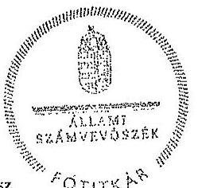
az elnök nevében eljárva
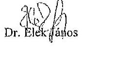

Dr. Elek János

Melléklet: Észrevételre adott válasz

---

# 7. SZÁMÚ MELLÉKLET A V-0779-465/2015. SZÁMÚ JELENTÉSHEZ 

I. számú melléklet a V-0779-422/2015. számú levélhez

Az országgyűlési képviselők 2014. évi választására fordított pénzeszközök felhasználásának ellenőrzéséről szóló jelentéstervezetre tett észrevételre adott válasz

| Észrevétel: | Jelentéstervezet 3.2. A választással kapcsolatos kiadások teljesítésének szabályszerűsége (16. oldal 2. bekezdésében szereplő megállapítás):   „Az FVI a választások pénzeszközeinek kormányzati funkciók szerinti elkülönítését a 68/2013. (XII. 29.) NGM rendelet 3. § (1) bekezdésében és 1. mellékletében foglaltak ellenére nem biztosította, azonban a Pvr. rendelkezéseinek megfelelő elkülönített számviteli nyilvántartással és a tényleges pénzforgalomról vezetett részletező nyilvántartással rendelkezett, a PIR (Forrás) rendszerben ügylet-és pénzforrás kóddal biztosították a választásonként és forrásonként előírt számviteli elkülönítést. A részletező nyilvántartást a Pvr. előírásainak megfelelően feladattipusonként vezették."   Az észrevétel szerint a Fővárosi Önkormányzat és a Főpolgármesteri Hivatal számviteli rendszerében kialakított valamennyi utalványon szerepel a kormányzati funkció száma és elnevezése, ami lehetővé teszi a választások pénzeszközeinek kormányzati funkciók szerinti elkülönítését. |
| :--: | :--: |
| Válasz: | Az Állami Számvevőszék az észrevételt elfogadja. |
| Indoklás: | Az észrevétel mellékleteként átadott dokumentumok alapján megállapítható, hogy az egyes kiadási tételekhez kapcsolódóan a nyilvántartásokban megjelenik a 68/2013. (XII. 29.) NGM rendelet 1. melléklete szerinti (016010 Országgyűlési, önkormányzati és európai parlamenti képviselőválasztásokhoz kapcsolódó tevékenységek) kormányzati funkciókód. A jelentéstervezetben lévő megállapítás ennek megfelelően módosításra került. |

Tájékoztatom Főjegyző úrhölgyet, hogy a számvevőszéki jelentés mellékleteként szerepeltetjük a jelentéstervezethez tett észrevételét, valamint az arra adott válaszunkat.

Budapest, 2015. 06.
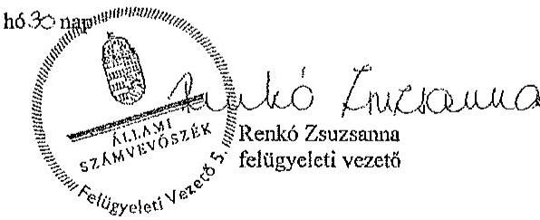

---

.

---

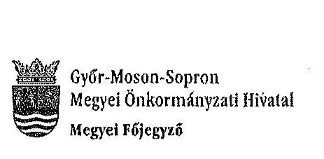

Ügyszám: 50-3/2015.

Tárgy: Észrevétel az ÁSZ jelentés megállapításaira

Állami Számvevőszék
Dr. Elek János
főtitkár úr

Budapest
Apáczai Csere János u. 10.

Tisztelt Főtitkár Úr!

A 2014. évi választásokra fordított pénzeszközök felhasználásának ellenőrzése tárgyában az Állami Számvevőszék által végzett ellenőrzésekről készített munkaanyagot kézhez kaptam. Az egyes ellenőrzési jelentésekben foglalt megállapításokkal egyetértek; észrevételt nem teszek.
Ezúton szeretném megköszönni a vizsgálat teljes körében és a helyszíni ellenőrzés során a számvevőszéki munkatársak részéről tanúsított segítő együttműködést.

Győr, 2015. június 15.
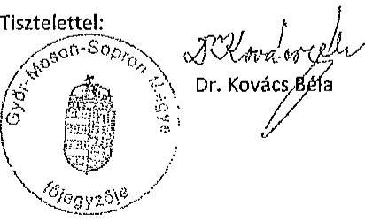

---

.

---

# BEVÁNDORLÁSI ÉS ÁLLAMPOLGÁRSÁGI HIVATAL 

Szám: 106-Ti-1364/1/2015.

## Domokos László részére   elnök

Állami Számvevőszék

## Budapest

## Tisztelt Elnök Úr!

A „2014. évi választásokra fordított pénzeszközök felhasználásának ellenőrzése - Az országgyűlési képviselők 2014. évi választására fordított pénzeszközök felhasználásának ellenőrzése" című jelentés tervezetével kapcsolatban az alábbi észrevételeket teszem.

Az összegző megállapítások (7. oldal), illetve részletező megállapítások (17. oldal) szerint a „gazdálkodási jogkörök gyakorlása" a Bevándorlás és Állampolgársági Hivatalnál (a továbbiakban: BÁH) részben felett meg, mert nem került sor teljesítés igazolásra.
Az országgyűlési választásokkal kapcsolatban a BÁH kizárólag személyi juttatást és bért számolt el. Az államháztartási törvény végrehajtásáról szóló 368/2011. (XII.31.) Kormányrendelet (a továbbiakban: Ávr.) 62/B.§ (3) bekezdése szerint „A tényleges munkateljesítés szerint járó személyi juttatások a tárgyhónapot követő hónapban teljesített távollétjelentés figyelembevételével utólag kerülnek elszámolásra." Ebből következően a bérekhez kapcsolódóan a kifizetés nem a teljesítés igazolásához kapcsolódik, hanem a távollétéket kell jelenteni. Tekintettel arra, hogy a választások ideje alatt a dolgozókra vonatkozóan távollét jelentés nem került megküldésre, a dolgozók teljesítése ezzel került igazolásra, illetve számfejtésre. Véleményünk szerint ezzel a BÁH az Ávr. előírásait maradéktalanul betartotta.

Az összegző megállapítások (7. oldal), illetve a részletező megállapítások (23. oldal) szerint, az „elszámolási kötelezettség" kapcsán „a BÁH a Pvr. 7. § (4) bekezdésében foglaltak ellenére nem készített elszámolást az NVI részére".

Az országgyűlési választásokkal összefüggésben a dolgozók kirendelésére 2014. április 04. és 2014. április 25. között került sor. A dolgozók kiválasztása a tervezet időpont előtt időben nem sokkal történt, mindenki vállalta az adott időszakban a munkavégzését, a költségek ez alapján kerültek tervezésre. A BÁH és az NVI között a megállapodás a pénzügyi fedezet biztosítására 2014. június végén került megkötésre. (Mint ahogy ezt a jelentés is tartalmazza) Ekkor már a tényleges kifizetések adatai is ismertek voltak, a BÁH nem előleget - amivel utólag el kellene számolnia - kapott, hanem a ténylegesen kifizetett bérek alapján került sor a pénzügyi fedezet biztosítására. Fentiek alapján nem értek egyet azzal a megállapítással, miszerint a BÁH az elszámolási kötelezettségének nem tett eleget.

Budapest, 2015. június 14.
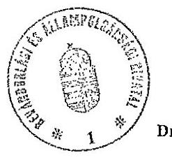

Üdvözlettel
dr. Vég. 1
Dr. Végh Zsuzsanna
igazgató

Készült: 1 pld-ban
Kapja: 1 pld. - címzett, utána irattár

---

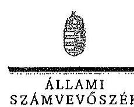

FŐTITKÁR

Ikt.szám:V-0779-426/2015.

Dr. Végh Zsuzsanna úrhölgy
igazgató
Bevándorlási és Állampolgársági Hivatal

# Budapest

## Tisztelt Főigazgató Úrhölgy!

Köszönettel megkaptam „Az országgyűlési képviselők 2014. évi választására fordított pénzeszközök felhasználásának ellenőrzése" című jelentéstervezet megállapításaira tett észrevételét.

Az ellenőrzési megállapításokra vonatkozó észrevételét az Állami Számvevőszékről szóló 2011. évi LXVI. törvény 29. § (2) bekezdésében meghatározott tizenöt napos határidőn belül küldte meg. Az Állami Számvevőszék észrevétellel kapcsolatos álláspontját a mellékletként csatolt, a felügyeleti vezető által készített indokolás tartalmazza.

Budapest, 2015. 04. hó 01. nap

Tisztelettel:
az elnök nevében eljárva
Dr. Elek János
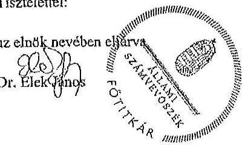

Melléklet: Észrevételre adott válasz (1 darab)

---

Az országgyűlési képviselők 2014. évi választására fordított pénzeszközök felhasználásának ellenőrzése című jelentéstervezetre tett észrevételre adott válasz

| Észrevétel: | Jelentéstervezet 3.2. A választással kapcsolatos kiadások teljesítésének szabályszerűsége (az összegző megállapítások 7. oldal 2. bekezdésében és a részletes megállapítások 17. oldal 3. bekezdésében szereplő megállapítás):   Az OGY választás előkészítése, lebonyolítása érdekében felmerülő kiadások teljesítése során - az ellenőrzésre kiválasztott mintatételek alapján - a gazdálkodási jogkörök gyakorlása a BÁH-nál összességében részben felelt meg. A BÁH-nál a kirendelt kormánytisztviselők személyi juttatásának kifizetése esetében az Áht. 38. § (1) bekezdésében foglaltak ellenére - nem került sor teljesítésigazolásra. A BÁH-nál az érvényesítő a feladatát - az Ávr. 58. § (2) bekezdésében foglaltak ellenére - nem szabályszerűen végezte, mert nem jelezte az utalványozónak a megelőző ügymenet hiányosságait.   Az észrevétel szerint Az országgyűlési választásokkal kapcsolatban a BÁH kizárólag személyi juttatást és bért számolt el. Az államháztartási törvény végrehajtásáról szóló 368/2011. (XII:31.) Kormányrendelet (a továbbiakban: Ávr) 62/B. § (3) bekezdése szerint „A tényleges munkateljesítés szerint járó személyi juttatások a tárgyhónapot követő hónapban teljesített távollétjelentés figyelembevételével utólag kerülnek elszámolásra." Ebből következően a bérekhez kapcsolódóan a kifizetés nem a teljesítés igazolásához kapcsolódik, hanem a távolléteket kell jelenteni. Tekintettel arra, hogy a választások ideje alatt a dolgozókra vonatkozóan távollét jelentés nem került megküldésre, a dolgozók teljesítése ezzel került igazolásra, illetve számfejtésre. Véleményünk szerint ezzel a BÁH az Ávr. előírásait maradéktalanul betartotta. |
| :--: | :--: |
| Válasz: | Az Állami Számvevőszék az észrevételt nem fogadja el. |
| Indoklás: | Az észrevételben hivatkozott Ávr.-beli szabályozás a központosított illetményszámfejtés lebonyolításának rendjére vonatkozik, amely a mintatételek ellenőrzése során a teljesítés igazolás és az érvényesítés vonatkozásában megállapított hiányosságok tekintetében irreleváns.   Az országgyűlési választásokkal összefüggésben a BÁH dolgozók kirendelésére 2014. április 04. és 2014. április 25. között került sor. A kirendelt dolgozók vonatkozásában a BÁH nem bocsátott az ellenőrzés részére a dolgozók munkateljesítményének teljesítés igazolására alkalmas dokumentumot (jelenléti ívet, erre alapozottan nemleges távollétjelentést). Így - az Áht. 38. § (1) bekezdése és az Ávr. 57. § (1) ellenére - nem volt biztosítható, hogy a teljesítés igazolása, a kiadások teljesítésének jogossága és összességszerűsége tekintetében ellenőrizhető okmányok alapján történjen. Az érvényesítő - az Ávr. 58. § (2) ellenére az nem jelezte a megelőző ügymenetben feltárt hiányosságot. |

---

|  Észrevétel: | Jelentéstervezet 4. A választást feladatokra felhasznált pénzeszközök elszámolása (összegző megállapítások 7. oldal 3. bekezdésében és a részletes megállapítások 23. oldal 1. bekezdésében szereplő megállapítás).  |
| --- | --- |
|   | A BÁH a Pvr. 7. § (4) bekezdésében foglaltak ellenére nem készített elszámolást az NVI részére.  |
|   | Az észrevétel szerint:  |
|   | Az országgyűlési választásokkal összefüggésben a dolgozók kirendelésére 2014. április 04. és 2014. április 25. között került sor. A dolgozók kiválasztása a tervezett időpont előtt időben nem sokkal történt, mindenki vállalta az adott időszakban a munkavégzést, a költségek ez alapján kerültek tervezésre. A BÁH és az NVI között kötött megállapodás a pénzügyi fedezet biztosítására 2014. június végén került megkötésre. (Mint ahogy a jelentés is tartalmazza) Ekkor már a tényleges kifizetések adatai is ismertek voltak, a BÁH nem előleget -amivel utólag el kellene számolnia - kapott, hanem a ténylegesen kifizetett bérek alapján került sor a pénzügyi fedezet biztosítására. Fentiek alapján nem értek egyet azzal a megállapítással, miszerint a BÁH az elszámolási kötelezettségének nem tett eleget.  |
|  Válasz: | Az Állami Számvevőszék az észrevételt nem fogadja el.  |
|  Indoklás: | A 38/2013. (XII. 30.) KIM rendelet (továbbiakban Pvr.) 7. § (4) bekezdése tételesen rendelkezik a választásokban közreműködő szervezet vezetőjének feladattípusú elszámolási kötelezettségéről. Eszerint az egyéb szerv vezetője elszámolást készít az NVI elnöke részére a választás napját követő ötven napon belül. A Pvr.-ben foglalt elszámolás készítés kötelezettségét nem befolyásolja az a tény, hogy a BÁH és az NVI között kötött megállapodás megkötésére utólagosan, a ténylegesen felmerülő kiadások ismeretében, nem előleg jelleggel került sor.  |

Tájékoztatom Főigazgató Úrhölgyet, hogy a számvevőszéki jelentés mellékleteként szerepeltetjük a jelentéstervezethez tett észrevételét, valamint az arra adott válaszunkat.

Budapest, 2015. 04. hó 01. nap

Rajkó Zsuzsanna felügyeleti vezető

---

# Dégi Közös Önkormányzati Hivatal Jegyzője 8135 Dég, Kossuth Lajos utca 17. Tel: 25/505-250*137

Szám: D/108-10/2015.

Állami Számvevőszék
Dr. Elek János főtitkár úr részére

Budapest
Pf. 54.
1364

Tisztelt Főtitkár Úr!

Tájékoztatom, hogy az Állami Számvevőszéknek az országgyűlési képviselők, az Európai Parlament tagjainak és a helyi önkormányzati képviselők és polgármesterek, valamint a nemzetiségi önkormányzati képviselők 2014. évi választására fordított pénzeszközök felhasználásának ellenőrzésével kapcsolatban érkezett jelentéstervezetek alapján az ellenőrzés megállapítására nem kívánok észrevételt tenni.

Dég, 2015.június 22.

Tisztelettel:
Szanyi-Nagy Józsefné
címzetes főjegyző

---

.

---

# Kaposvár Megyei Jogú Város Címzetes Főjegyzője

**K. Szám Árpád**

**11. SZÁMÚ MELLEKLET**

**A V-0779-465/2015. SZÁMÚ JELENTÉSHEZ**

- 7400 Kaposvár, Kossuth tér 1, Telefon: (36) 82/501-508 Fax: (36) 82/501-500
- E-mail: jegyzo@kaposvar.hu

**Ügyiratszám:** T/236/2015.

**Állami Számvevőszék**

**Elek János főtitkár úr részére**

**Tisztelt Főtitkár Úr!**

**ÁLLAMI SZÁMVEVŐSZÉK**

**ÜGYVITELI IRODA**

**53441/2015**

**Értt.: JUN 25 2015**

**Iktatószám: V-0448-438/04**

**Melléklet:**

Az Állami Számvevőszéknek a 2014. évi választásokra fordított pénzeszközök felhasználásának ellenőrzéséről szóló három jelentéstervezethez (országgyűlési, európai parlamenti, önkormányzati választások) a következő észrevételt teszem:

Az ÁSZ jelentéstervezetei Kaposvár vonatkozásában nem tartalmi, hanem formai előírások vélt hiányosságait tartalmazzák.

Kaposvár Megyei Jogú Város Polgármesteri Hivatalában az ÁSZ jelentéseken kifogásolt kötelezettségvállalások a felhasznált választási pénzek kis hányadát érintették, azok kizárólag a százezer forint alatti kifizetésekre vonatkoztak, amelyek az államháztartásról szóló törvény végrehajtásáról szóló 368/2011. (XII. 31.) Korm. rendelet 53. § (1) bekezdés a) pontja alapján előzetes írásbeli kötelezettségvállalást nem igényelnek. A százezer forint alatti kifizetésekre vonatkozó észrevételek a polgármesteri hivatal belső szabályzatára hivatkoztak, ugyanakkor a vizsgált időszakban a polgármesteri hivatal kötelezettségvállalási szabályzata a százezer forint alatti kifizetésekre vonatkozó előzetes írásbeli kötelezettségvállalásra előírást nem tartalmazott.

Az országgyűlési képviselők választása, valamint az Európai Parlament tagjainak választása költségeinek normatíváiról, tételeiről, elszámolási és belső ellenőrzési rendjéről, valamint egyes választási tárgyú miniszteri rendeletek módosításáról szóló 38/2013. (XII. 30.) KIM rendelet 8. § (1) bekezdése szerint a HVI és az OEVI tekintetében a támogatás felhasználását a TVI ellenőrzi a választás napját követő negyvenöt napon belül. A helyi önkormányzati képviselők és a polgármesterek választásán a megismételt szavazás, a helyi önkormányzati képviselők és a polgármesterek időközi választása, a nemzetiségi önkormányzati képviselők választásán a megismételt szavazás és a nemzetiségi önkormányzati képviselők időközi választása költségeinek normatíváiról, tételeiről, elszámolási és belső ellenőrzési rendjéről szóló 7/2014. (XI. 6.) IM rendelet 8. § (2) bekezdése alapján a HVI tekintetében az elszámolások megalapozottságát a TVI ellenőrzi a szavazás napját követő huszonöt napon belül. A TVI ellenőrzések megtörténtek, azok problémát nem tártak fel.

Összességében a megállapításokkal nem értünk egyet, hiszen Kaposvár Megyei Jogú Város Polgármesteri Hivatalában az ÁSZ ellenőrzés olyan hiányosságot nem tárt fel, amely a jelentéstervezetekben szereplő minősítéseket indokolná. Kérem, szíveskedjenek a jelentéstervezetek megállapításait a rendelkezésekre álló dokumentumok alapján korrigálni.

Kaposvár. 2015. június 24.

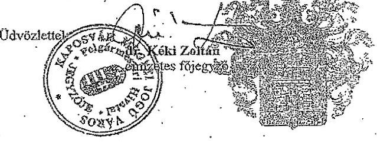

---

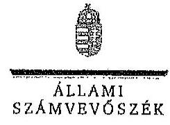

Ikt.szám:V-0779-433/2015.
V-0780-293/2015.
V-0781-194/2015.

Dr. Kéki Zoltán
címzetes főjegyző
Kaposvár Megyei Jogú Város Polgármesteri Hivatala

# Kaposvár

## Tisztelt Címzetes Főjegyző Úr!

Köszönettel megkaptam „Az országgyűlési képviselők 2014. évi választására fordított pénzeszközök felhasználásának ellenőrzése, Az Európai Parlament tagjainak 2014. évi választására fordított pénzeszközök felhasználásának ellenőrzése és a A helyi önkormányzati képviselők és polgármesterek, valamint a nemzetiségi önkormányzati képviselők 2014. évi választására fordított pénzeszközök felhasználásának ellenőrzése" című jelentéstervezetek megállapításain tett észrevételét.
Az ellenőrzési megállapításokra vonatkozó észrevételét az Állami Számvevőszékről szóló 2011. évi LXVI. törvény 29. § (2) bekezdésében meghatározott tizenöt napos határidőn belül küldte meg. Az Állami Számvevőszék észrevétellel kapcsolatos álláspontját a mellékletként csatolt, a felügyeleti vezető által készített indokolás tartalmazza.

Budapest, 2015. 04. hó 01. nap
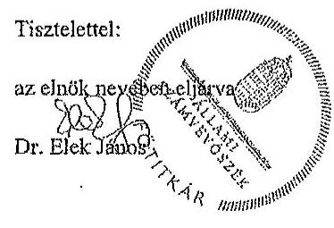

Melléklet: Észrevételre adott válasz (1 darab)

---

1. számú melléklet a V-0779-433/2015. számú, a V-0780-292/2015. számú, a V-0781-194/2015. számú
levélhez
„Az országgyűlési képviselők 2014. évi választására fordított pénzeszközök felhasználásának ellenőrzése,
Az Európai Parlament tagjainak 2014. évi választására fordított pénzeszközök felhasználásának ellenőrzése,
A helyi önkormányzati képviselők és polgármesterek, valamint a nemzetiségi önkormányzati képviselők 2014. évi választására fordított pénzeszközök felhasználásának ellenőrzése"
című jelentéstervezetekre tett észrevételre adott válasz

| Észrevétel: | Az országgyűlési képviselők 2014. évi választására fordított pénzeszközök felhasználásának ellenőrzése című jelentéstervezet 3.2. A választással kapcsolatos kiadások teljesítésének szabályszerűsége, 3. számú melléklet megállapítása:   A gazdálkodási jogkörök gyakorlásának összesítő értékelése: nem megfelelő   Kötelezettségvállalás, pénzügyi ellenjegyzés, teljesítésigazolás, érvényesítés során feltárt jellemző, rendszerszerű hiányosságok:   32 esetben a kötelezettségvállalásra a pénzügyi ellenjegyzés hiányában került sor (Áht. 37. § (1) bek., Ávr. 55. § (1) bek.), 49 esetben az érvényesítő a megelőző ügymenet szabályszerűségét nem ellenőrizte (Ávr. 58. § (1) bek.)   Az Európai Parlament tagjainak 2014. évi választására fordított pénzeszközök felhasználásának ellenőrzése című jelentéstervezet 3.2. A választással kapcsolatos kiadások teljesítésének szabályszerűsége, 3. számú melléklet megállapítása:   A gazdálkodási jogkörök gyakorlásának összesítő értékelése: nem megfelelő   Kötelezettségvállalás, pénzügyi ellenjegyzés, teljesítésigazolás, érvényesítés során feltárt jellemző, rendszerszerű hiányosságok:   A kötelezettségvállalás dokumentuma az Áht. 37. § (1) bekezdésének előírását megsértve 27 esetben nem tartalmazott pénzügyi ellenjegyzést. A 100 E Ft alatti kifizetéseknél 17 esetben nem tartották be a belső szabályzatban előírtakat.   A helyi önkormányzati képviselők és polgármesterek, valamint a nemzetiségi önkormányzati képviselők 2014. évi választására fordított pénzeszközök felhasználásának ellenőrzése 3.2. A választással kapcsolatos kiadások teljesítésének szabályszerűsége, 3. számú melléklet megállapítása:   A gazdálkodási jogkörök gyakorlásának összesítő értékelése: részben megfelelő   Kötelezettségvállalás, pénzügyi ellenjegyzés, teljesítésigazolás, érvényesítés során feltárt jellemző, rendszerszerű hiányosságok:   A 100,0 E Ft alatti kifizetésekre (23 esetben) az Áht. 37. § (1) bekezdés előírása ellenére előzetes írásbeli kötelezettségvállalás, illetve a belső szabályzatban előírt engedély nélkül került sor. Az érvényesítő az Ávr. 58. § (2) bekezdés előírása ellenére nem jelezte az utalványozónak, hogy a megelőző ügymenetben nem tartották be a jogszabályi előírásokat. |
| --- | --- |

---

# Az észrevétel szerint: 

Az ÁSZ jelentéstervezetei Kaposvár vonatkozásában nem tartalmi, hanem formai előírásnak vélt hiányosságait tartalmazzák.
Kaposvár Megyei Jogú Város Polgármesteri Hivatalában az ÁSZ jelentésekben kifogásolt kötelezettségvállalások a felhasznált választási pénzek kis hányadát érintették, azok kizárólag a százezer forint alatti kifizetésekre vonatkoztak, amelyek az államháztartásról szóló törvény végrehajtásáról szóló 368/2011. (XII. 31.) Korm. rendelet 53. § (1) bekezdés a) pontja alapján előzetes írásbeli kötelezettségvállalást nem igényelnek. A százezer forint alatti kifizetésekre vonatkozó észrevételek a polgármesteri hivatal belső szabályzatára hivatkoznak, ugyanakkor a vizsgált időszakban a polgármesteri hivatal kötelezettségvállalási szabályzata a százezer forint alatti kifizetésekre vonatkozó előzetes írásbeli kötelezettségvállalásra előírást nem tartalmazott.
A 38/2013. (XII. 30.) KIM rendelet 8. § (1) bekezdése, a 7/2014. IM rendelet 8. §. (2) bekezdésében előírt TVI ellenőrzések megtörténtek, azok problémát nem tártak fel.
Összességében a megállapításokkal nem értünk egyet, hiszen Kaposvár Megyei Jogú Város Polgármesteri Hivatalában az ÁSZ ellenőrzés olyan hiányosságot nem tárt fel, amely a jelentéstervezetekben szereplő minősítéseket indokolná. Kérem, szíveskedjenek a jelentéstervezetek megállapításait a rendelkezésre álló dokumentumok alapján korrigálni.

| Válasz: | Az Állami Számvevőszék az észrevételt nem fogadja el. |
| :--: | :--: |
| Indoklás: | Az indoklásban hivatkozott 368/2011. (XII. 31.) Korm. rendelet 53. § (1) bekezdése mellett az 53. § (2) bekezdése előírja, hogy az (1) bekezdés szerinti kifizetésre e rendeletnek a kötelezettségvállalások teljesítésére (érvényesítés, utalványozás) és nyilvántartására vonatkozó szabályait alkalmazni kell. Az előzetes írásbeli kötelezettségvállalást nem igénylő kifizetések rendjét a kötelezettséget vállaló szerv belső szabályzatában rögzíti. A polgármesteri hivatal 2013. július 1-től hatályos kötelezettségvállalási szabályzatának 2. pontja szerint: „A gazdasági eseményekhez bruttó 100.000 Ft-ot el nem érő kifizetések esetében nem szükséges előzetes, írásbeli kötelezettségvállalás. Ezen gazdasági események vonatkozásában megrendelést megelőzően a pénzügyi fedezetet biztosító költségvetési előirányzat felett kötelezettségvállalásra jogosult írásbeli engedélye szükséges, melynek 1 példányát az aláírását követően át kell adni a Gazdasági Igazgatóság részére, 1 példányát pedig a pénzügyi bizonyítékhoz kell csatolni. Az írásbeli engedélynek tartalmaznia kell a terhelt előirányzat megnevezését és az előirányzat felett érvényesítési jogosultsággal rendelkező gazdasági ügyintéző által igazolt kötelezettségvállalással nem terhelt szabad keret összegét."   A polgármesteri hivatalnál a fentiekben előírt írásbeli engedélyt az ellenőrzést végzők részére nem mutatták be. Írásbeli nyilatkozatot tettek arról, hogy a szabályzat szerint írásbeli engedélyek nem készültek, a kis összegű beszerzésekre előzetes szóbeli egyeztetést követően került sor.   A választásokkal kapcsolatos kiadások teljesítésének szabályszerűségének minősítésére - az egyes ellenőrzésekhez kijelölt mintatételek esetében feltárt különböző hiányosságokból matematikai, statisztikai módszerrel számítottan - a hatályos jogszabályi előírások és a polgármesteri hivatal belső szabályzatainak való megfelelés együttes megítélése alapján került sor. |

---

Az ÁSZ ellenőrzés megállapításaira a TVI által lefolytatott ellenőrzések nincsenek befolyással.
Mindezek alapján a jelentéstervezetekben a gazdálkodási jogkörök összesítő értékelésének módosítására nincs lehetőség.

Tájékoztatom Címzetes Főjegyző Urat, hogy a számvevőszéki jelentés mellékleteként szerepeltetjük a jelentéstervezethez tett észrevételét, valamint az arra adott válaszunkat.

Budapest, 2015. 04 hó 15. nap
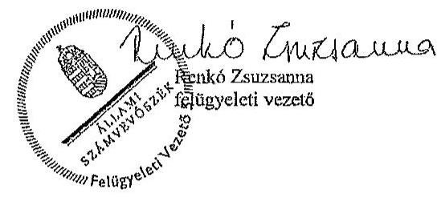

---

.

---

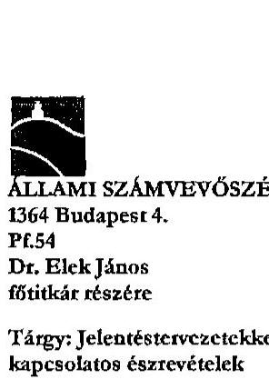

ÁLLAMI SZÁMVEVŐSZÉK
1364 Budapest 4.
Pf. 54
Dr. Elek János
főtitkár részére
Tárgy: Jelentéstervezetekkel kapcsolatos észrevételek

|  |  |
| :--: | :--: |
|  |  |
|  |  |
|  |  |
|  |  |
|  |  |
|  | 1126 Budapest, Köszönnémgi út 23-25. Telefonszám: 2245900 Faxszám: 2245951 |
|  |  |
|  |  |
|  |  |
|  |  |
|  |  |
|  |  |
|  |  |
|  |  |
|  |  |
|  |  |
|  |  |
|  |  |
|  |  |
|  |  |
|  |  |
|  |  |
|  |  |
|  |  |
|  |  |
|  |  |
|  |  |
|  |  |
|  |  |
|  |  |
|  |  |
|  |  |
|  |  |
|  |  |
|  |  |
|  |  |
|  |  |
|  |  |
|  |  |
|  |  |
|  |  |
|  |  |
|  |  |
|  |  |
|  |  |
|  |  |

---

# Észrevétel: 

Feltételezésünk szerint ezek a kifogások a személyi juttatások mintatételeivel kapcsolatosak. A 30 fős mintában szereplő személyek 13 esetben jutalomként, 15 esetben tiszteletdíjként és két esetben megbízási szerződésként részesültek személyi juttatásban. Ezek kötelezettségvállalási dokumentuma a jutalmazottak esetében a „Jutalom lista a 2014. április 6-i Országgyűlési képviselő választásokon nyújtott teljesítményekért" volt, amelyen 2014. április 16-i dátummal szerepel a kötelezettségvállalás és a pénzügyi ellenjegyzés is. A tiszteletdíjak kötelezettségvállalási dokumentuma a „Szavazatszámláló Bizottság tagjainak tiszteletdíja" című táblázat volt, amelynek dátuma egyezően a pénzügyi ellenjegyzés dátumával 2014. április 16. volt. A kormányhivatali megbízottak esetében önálló megbízási szerződések készültek február 25-i dátummal, és a pénzügyi ellenjegyzés is ezen a napon történt.

Az érvényesítő ezen dokumentumok alapján végezte el munkáját.
b) „35 esetben az utalványozás a kifizetések után valósult meg."

## Észrevétel:

Feltételezésünk szerint ebben az előző pontban említett 29 tétel is szerepel. Ezzel kapcsolatosan általánosságban jelezzük, hogy a bérszámfejtési dokumentumokon szereplő dátumok és a tényleges banki utalás dátuma minden személyi juttatás esetében eltérő volt, ugyanis a bérszámfejtés a választások időpontjában a Gazdasági Ellátó Szolgálatnál történt, és a belső ügymenet szerint ehhez képest a tényleges kifizetés egy-két nappal ezt követően valósult meg. Az utalványozás minden esetben megelőzte a pénzügyi kifizetést, amit az általunk bemutatott utalványrendeletek és a banki kivonatok is alátámasztanak. A további 6 kifogásolt esetet nem tudtuk beazonosítani.

## c) 15 esetben a teljesítésigazolás a belső szabályzattól eltérően történt

## Észrevétel:

A 13/2014. számú jegyzői utasítás szerint a személyi juttatások teljesítésének igazolására a Jegyző jogosult. A hivatkozott 15 fő valószínűleg az SzSzB tagokra vonatkozik, Esetükben a teljesítés igazolása a már hivatkozott kötelezettségvállalási dokumentumon történt, „Az SzSzB jegyzőkönyvek alapján a feladatellátás megtörtént" szöveggel, alatta jegyzői aláírással és 2014. 04.16-i dátummal.

---

# Európai parlament tagjainak választása 

a.) „A jegyzőkönyvvezetők jutalmának (12 tétel) és az SZSZB tagok tiszteletdíjának (15 tétel) kifizetésére írásbeli kötelezettségvállalás nélkül került sor. Az érvényesítő nem ellenőrizte a megelőző ügymenetben a jogszabályokban és a belső szabályzatokban foglaltak betartását."

## Észrevétel:

A jegyzőkönyvvezetők jutalmának kötelezettségvállalási dokumentuma a Dokumentumjegyzék 18. pontjában szereplő „Jutalomlista a 2014. május 25-i EP választásokon nyújtott teljesítményekért" 2014. június 3 -án a Jegyző által aláírt és ugyanezen a napon pénzügyileg ellenjegyzett táblázatos dokumentum volt. Az SZSZB tagok tiszteletdíjának kötelezettségvállalási dokumentuma a Dokumentumjegyzék 17. pontjában szereplő „SzSzB tagok tiszteletdíja szavazókörönként" 2014. június 11 -én a Jegyző által aláírt és ugyanezen a napon pénzügyileg ellenjegyzett táblázatos dokumentum volt.

Az érvényesítő ezen dokumentumok alapján végezte az érvényesítést, amit a kapcsolódó utalványrendeleteken 2014. június 12 -én aláírásával igazolt.
b.) „Az utalványozást nem a belső szabályzatban meghatározott személy végezte."

## Észrevétel:

A 13/2014. Jegyzői utasítás szerint a választásokkal kapcsolatos utalványozási feladatokat a gazdasági vezető végzi. Ennek megfelelően az utalványrendeleteken az ő aláírása szerepelt. Az Európai parlamenti választások Fővárosi Választási Irodán történt ellenőrzése során (Dokumentumjegyzék 6. pont) kiderült, hogy a szabályzatban helytelenül szerepelt a hatáskör átruházás, mivel a 38/2013.(XII.30) KIM rendelet 1.§ c) pontja szerint a Jegyző jogosult az utalványozásra. Erre tekintettel a Dokumentumjegyzék 8. pontjában szereplő „Jegyzői intézkedés ellenőrzés után" alapján bekértem az összes hibásan utalványozott dokumentumot, és azokat saját kézjegyemmel is elláttam.

## Önkormányzati választások

a.) „A 9 HVI tag személyi juttatásai kifizetésére írásbeli kötelezettségvállalás nélkül került sor."

## Észrevétel:

Nem tudtuk beazonosítani a tételeket, mivel jutalom jogcímen 12 fő egy közös listán, tiszteletdíj jogcímen pedig 15 fő ugyancsak közös listán kapott juttatást, 3 fő megbízási díjához pedig egyedi megbízási szerződések kapcsolódtak.

---

# b.) „A pénzügyi ellenjegyzésre 3 tétel esetén kötelezettségvállalás után került sor." 

## Észrevétel:

Sajnálatos módon egy írásbeli kötelezettségvállaláson - vélhetőleg figyelmetlenségből - egy nappal későbbi dátummal szerepel a pénzügyi ellenjegyzés, ami három számlát, azaz három mintatételt érintett.

Az előzőekben leírtak alapján kérem, szíveskedjenek észrevételeinket mérlegelni, elfogadni, és az ehhez kapcsolódó értékelést, minősítést lehetőség szerint kedvezőbben megállapítani.

Budapest Hegyvidék, 2015. június 22.
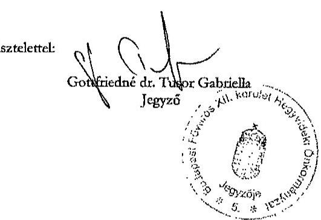

---

# FŐTITKÁR 

ÁLLAMI
SZÁMVEVŐSZÉK

Ikt.szám:V-0779-436/2015.
V-0780-294/2015.
V-0781-195/2015.

## Gottfriedné dr. Tusor Gabriella úrhölgy

jegyző
Budapest Főváros XII. kerület Hegyvidéki Polgármesteri Hivatal

## Budapest

Tisztelt Jegyző Úrhölgy!

Köszönettel megkaptam „Az országgyűlési képviselők 2014. évi választására fordított pénzeszközök felhasználásának ellenőrzése", „Az Európai Parlament tagjainak 2014. évi választására fordított pénzeszközök felhasználásának ellenőrzése", valamint „A helyi önkormányzati képviselők és polgármesterek, valamint a nemzetiségi önkormányzati képviselők 2014. évi választására fordított pénzeszközök felhasználásának ellenőrzése" című jelentéstervezetek megállapításaira tett észrevételét.
Az ellenőrzési megállapításokra vonatkozó észrevételét az Állami Számvevőszékről szóló 2011. évi LXVI. törvény 29. § (2) bekezdésében meghatározott észrevételként kezeljük. Az Állami Számvevőszék észrevétellel kapcsolatos álláspontját a mellékletként csatolt, a felügyeleti vezető által készített indokolás tartalmazza.

Budapest, 2015. 04. hó 15. nap
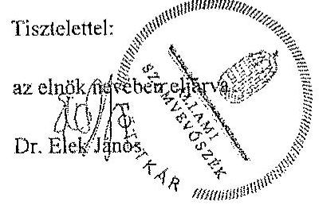

Melléklet: Észrevételre adott válasz (1 darab)

---

1. számú melléklet a V-0779-456/2015. számú, a V-0780-294/2015. számú, a V-0781-195/2015. számú levélhez
„Az országgyűlési képviselők 2014. évi választására fordított pénzeszközök felhasználásának ellenőrzése,
Az Európai Parlament tagjainak 2014. évi választására fordított pénzeszközök felhasználásának ellenőrzése,
A helyi önkormányzati képviselők és polgármesterek, valamint a nemzetiségi önkormányzati képviselők 2014. évi választására fordított pénzeszközök felhasználásának ellenőrzése"
című jelentéstervezetekre tett észrevételre adott válasz

| Észrevétel: | Az országgyűlési képviselők 2014. évi választására fordított pénzeszközök felhasználásának ellenőrzése című jelentéstervezet |
| :--: | :--: |
|  | A 4. A választási feladatokra felhasznált pénzeszközök elszámolása fejezet 21. oldal 3. bekezdés, illetve a 15 . számú lábjegyzet megállapítása: |
|  | Két HVI (köztük a 15. számú lábjegyzetbeli hivatkozásban szereplő Budapest XII. kerület) a Pvr. 7. § (1) bekezdésében meghatározott 15 napos határidőt meghaladva nyújtotta be elszámolását a TVI részére. |
|  | Az Európai Parlament tagjainak 2014. évi választására fordított pénzeszközök felhasználásának ellenőrzése című jelentéstervezet |
|  | A 4. A választási feladatokra felhasznált pénzeszközök elszámolása fejezet 18. oldal 8. bekezdés, illetve a 23. számú lábjegyzet megállapítása: |
|  | Négy HVI (köztük a 22. számú lábjegyzetbeli hivatkozásban szereplő Budapest XII. kerület) a Pvr. 7. § (1) bekezdésében meghatározott 15 napos határidőn túl, 1-8 napos késedelemmel | készítette el az elszámolását. |
|  | A helyi önkormányzati képviselők és polgármesterek, valamint a nemzetiségi önkormányzati képviselők 2014. évi választására fordított pénzeszközök felhasználásának ellenőrzése |
|  | A 4. A választási feladatokra felhasznált pénzeszközök elszámolása fejezet 19. oldal, 3. bekezdés, illetve a 20. számú lábjegyzet megállapítása: |
|  | Az ellenőrzött HVI-k 52,6\%-a határidőre elszámolt a választások lebonyolításához biztosított pénzeszközök felhasználásáról, kilenc választási iroda (köztük a 20. számú lábjegyzetbeli hivatkozásban szereplő: Budapest XII. kerület) a 3/2014. (VII. 24.) IM rendelet 7. § (1) bekezdésében előírt 15 napos határidőt 1-10 nappal túllépve készítette el és továbbította a TVI vezetője felé az elszámolását. |
|  | Az észrevétel szerint: |
|  | A Budapest Főváros XII. kerületi HVI tevékenységével kapcsolatosan mindhárom Jelentés szöveges részében csupán a 4. pont alatt taglalt, a „választási feladatokra felhasznált pénzeszközök elszámolása" keretében szerepel megállapítás amiatt, hogy a XII. kerületi HVI nem számolt el időben az állami feladatfinanszírozással. Ezzel kapcsolatban azt az észrevételt teszik, hogy mindhárom választás esetén az FVI által adott határidőt betartva készítették el és nyújtották be az elszámolást, az |

---

|  | ezzel kapcsolatos dokumentációt mindhárom esetben rendelkezésre bocsátották, így ezt a megállapítást nem tartják indokoltnak. |
| :--: | :--: |
| Válasz: | Az Állami Számvevőszék az észrevételt nem fogadja el. |
| Indoklás: | Az országgyűlési képviselők választása, valamint az Európai Parlament tagjainak választása költségeinek normatíváiról, tételeiről, elszámolási és belső ellenőrzési rendjéről, valamint egyes választási tárgyú miniszteri rendeletek módosításáról szóló 38/2013. (XII. 30.) KIM rendelet (továbbiakban: Pvr) 7. § (1) bekezdése, valamint a helyi önkormányzati képviselők és a polgármesterek választása, valamint a nemzetiségi önkormányzati képviselők választása költségeinek normatíváiról, tételeiről, elszámolási és belső ellenőrzési rendjéről szóló 3/2014. (VII. 24.) számú IM rendelet 7. § (1) bekezdése tételesen rendelkezik arról, hogy a HVI vezetője feladattípusú elszámolást készít a TVI vezetője részére a választás napját követő tizenöt napon belül. Az elszámolás készítés kötelezettségének hivatkozott jogszabályi előírásokban foglalt határidejét a TVI (az Önök esetében az FVI) elszámolást érintő, ettől eltérő eljárása nem befolyásolja. |
| Észrevétel | Az országgyűlési képviselők 2014. évi választására fordított pénzeszközök felhasználásának ellenőrzése című jelentéstervezet   3.2. A választással kapcsolatos kiadások teljesítésének szabályszerűsége fejezethez kapcsolódóan a 3. számú melléklet megállapítása:   A gazdálkodási jogkörök gyakorlásának összesítő értékelése: részben megfelelő   Kötelezettségvállalás, pénzügyi ellenjegyzés, teljesítésigazolás, érvényesítés során feltárt jellemző, rendszerszerű hiányosságok:   „29 esetben a pénzügyi ellenjegyzés a kifizetési bizonylaton és nem a kötelezettségvállalás dokumentumán került feltüntetésre (Ávr. 53. § (1) bek.), 29 esetben a kötelezettségvállalás összegét nem tüntették fel (Áht. 37. § (1) bek., Ávr. 55. § (1) bek.), 13 esetben a teljesítésigazolás nem történt meg, illetve 15 esetben a teljesítésigazolás a belső szabályzattól eltérően történt (Áht. 38. § (1) bek és Ávr. 57. § (3) bek.. Pénzkezelési-, pénzgazdálkodási és kötelezettségvállalási szabályzata III/A. fejezet c) pont), négy esetben az érvényesítést nem a kötelezettségvállalási szabályzatában kijelölt személy végezte (Áht. 37. § (1) bek., 13/2014. jegyzői utasítás), 29 esetben az érvényesítő a megelőző ügymenet szabályszerűségét nem ellenőrizte (Ávr. 58. § (1) bek.), 33 esetben az utalványozás a kifizetések után valósult meg (Áht. 38. § (1) bek.)."   Az Európai Parlament tagjainak 2014. évi választására fordított pénzeszközök felhasználásának ellenőrzése című jelentéstervezet   3.2. A választással kapcsolatos kiadások teljesítésének szabályszerűsége fejezethez kapcsolódóan a 3. számú melléklet megállapítása:   A gazdálkodási jogkörök gyakorlásának összesítő értékelése: nem megfelelő Kötelezettségvállalás, pénzügyi ellenjegyzés, teljesítésigazolás, érvényesítés során feltárt jellemző, rendszerszerű hiányosságok:   „A jegyzőkönyvvezetők jutalmának (12 tétel) és az SZSZB tagok tiszteletdíjának (15 tétel) kifizetésére az Áht. 37. § (1) bekezdésének előírását megsértve írásbeli kötelezettségvállalás nélkül került sor. Az érvényesítő az Ávr. 58. § (1) bekezdésének előírása ellenére nem ellenőrizte a megelőző ügymenetben |

---

| a jogszabályokban és a belső szabályzatokban foglaltak betartását. Az utalványozást az Ávr. 59. § (1) bekezdésének előírásával ellentétesen nem a belső szabályzatban meghatározott személy végezte."   A helyi önkormányzati képviselők és polgármesterek, valamint a nemzetiségi önkormányzati képviselők 2014. évi választására fordított pénzeszközök felhasználásának ellenőrzése   3.2. A választással kapcsolatos kiadások teljesítésének szabályszerűsége fejezethez kapcsolódóan a 3. számú melléklet megállapítása:   A gazdálkodási jogkörök gyakorlásának összesítő értékelése: részben megfelelő   Kötelezettségvállalás, pénzügyi ellenjegyzés, teljesítésigazolás, érvényesítés során feltárt jellemző, rendszerszerű hiányosságok:   „A 9 HVI tag személyi juttatása kifizetésére az Áht. 37. § (1) bekezdés előírását megsértve, írásbeli kötelezettségvállalás nélkül került sor. A pénzügyi ellenjegyzésre 3 tétel esetében az Áht. 37. § (1) bekezdés előírása ellenére kötelezettségvállalás után került sor. Az érvényesítő az Ávr. 58. § (2) bekezdés előírása ellenére a 12 személyi juttatást tétel esetében nem jelezte az utalványozónak, hogy a megelőző ügymenetben a jogszabályokban és a belső szabályzatokban foglaltakat nem tartották be."   Az észrevétel szerint:   A jelentések 3. számú mellékleteiben a gazdálkodási jogkörök gyakorlásának összesítő értékelése az országgyűlési, illetve a helyi önkormányzati képviselők és polgármesterek, valamint a nemzetiségi önkormányzati képviselők 2014. évi választásai vonatkozásában „részben megfelel" volt, az Európai Parlament tagjainak 2014. évi választása esetében nem megfelelő minősítést kapott. Az észrevételek a 3. számú mellékletben hivatkozott ellenőrzés alá vont mintatételek beazonosításához, illetve a gazdálkodási jogkörök gyakorlásának bizonylatonkénti áttekintéséhez kapcsolódnak. Az egyes bizonylatokat érintő észrevételek alapján a kapcsolódó értékelés, minősítés lehetőség szerinti kedvezőbb elbírálását kérték. |  |
| :--: | :--: |
| Válasz | Az Állami Számvevőszék az észrevételeket részben elfogadja. |
| Indoklás | Az Európai Parlament tagjainak 2014. évi választására fordított pénzeszközök ellenőrzésénél az utalványozást végző személy vonatkozásában tett észrevételét elfogadom, a megállapításokat ennek megfelelően módosítom. Az utalványozás során nem a belső szabályzatban foglalt előírást sértették meg, mivel az utalványozást az észrevételeiben hivatkozott belső szabályzatban megjelölt gazdasági vezető végezte. Ez a gyakorlat azonban nem felelt meg a Pvr. 1. § (2) bekezdés c) pontjában foglalt előírásnak, mely szerint a helyi választási iroda vezetője (a jegyző) gyakorolja a választás pénzeszközei feletti kötelezettségvállalási és utalványozási jogot.   Az utalványozási jog nem megfelelő gyakorlására tett megállapítást az országgyűlési képviselők 2014. évi választására fordított pénzeszközök ellenőrzéséről szóló jelentés 3. számú mellékletében pontosítom. Az itt szereplő megállapítás szerint 35 esetben az utalványozás a kifizetések után történt meg. Minderre azért került sor, mert eredetileg az utalványozási jogot a Pvr. 1. § (2) bekezdés c) pontjában foglalt előírás ellenére nem a jegyző gyakorolta. A jegyzői aláírásra utólag, a Fővárosi Választási Iroda ellenőrzését követően került sor, ezáltal a kifizetések elrendelése nem szabályszerű - az államháztartásról szóló 2011. évi CXCV. törvény (továbbiakban: Áht.) 38. § (1) bekezdésében foglaltaknak megfelelő - utalványozás alapján történt. |

---

A fentieken túl az észrevételben foglaltakat nem fogadom el.

- Az ellenőrzés megállapította, hogy a személyi juttatások tekintetében a kötelezettségvállalás a jelentéstervezetekben megjelölt esetszámban nem felelt meg az Áht. 37. § (1) bekezdésében foglalt előírásnak. A belső szabályzat III/A. a) Kötelezettségvállalás pont 2. számú alpontjában meghatározott előzetes írásbeli kötelezettségvállalást nem igénylő esetek ( 50 ezer Ft összeghatárt el nem érő tételek) vonatkozásában a szabályzat II. e) pontja kizárólag az elszámolásra kiadott előlegek tekintetében tartalmaz rendelkezést. Az Önkormányzatnál ezáltal nem rögzítették az államháztartásról szóló törvény végrehajtásáról szóló 368/2011. (XII. 31.) Korm. rendelet (továbbiakban: Ávr.) 53. § (2) bekezdésének megfelelően ezen kifizetések rendjét, így a kötelezettségvállalási jogkör gyakorlásának minősítése során az Áht. 37. § (1) bekezdésében foglalt előírásoknak való megfelelés vehető alapul. Egyebekben a 2014. évi választások helyi előkészítésére és lebonyolítására felhasználandó pénzeszközök feletti kötelezettségvállalás rendjéről 2014. február 1-jén kiadott 13/2014. számú jegyzői utasítás a Pvr. 1. § (2) bekezdés c) pontjában foglalt előírással ellentétes rendelkezést tartalmazott. A hivatkozott jogszabály szerint a helyi választási iroda vezetője (a jegyző) gyakorolja a választás pénzeszközei feletti kötelezettségvállalási jogot, ennek ellenére a jegyző utasításban az aljegyző, illetve a Fenntartási Iroda vezetője részére e jogkör gyakorlására felhatalmazást adtak. A jegyzői utasítás jogszabályi előírásnak megfelelő módosítására csak 2014. június 20-án került sor.
Az ellenőrzés során a kötelezettségvállalás dokumentumaként a HVI tagok esetében a HVI vezető által kiadott megbízást, az EZSZB tagok esetében a megbízólevelet mutatták be, amelyek nem tartalmazták a kötelezettségvállalás összegét és az Ávr. 55.§ (1) bekezdésének rendelkezésétől eltérően a pénzügyi ellenjegyzést. Az érvényesítés ebből kifolyóan azért nem volt teljes körűen megfelelő, mert a megelőző ügymenetet nem ellenőrizte az érvényesítő és a szabálytalanságot nem jelezte az utalványozó felé. Az észrevételben hivatkozott jutalomlották, tiszteletdíjról készített táblázatokon a választás lebonyolítása napját követő dátummal szerepel a jegyző (kötelezettségvállaló) és a pénzügyi ellenjegyző aláírása.
- A 15 fő szavazatszámláló bizottsági tag részére történt kifizetés esetében a teljesítés igazolása a 2008 óta hatályos Pénzkezelési-, pénzgazdálkodási és kötelezettségvállalási szabályzat III/A. fejezet c) pont 3. alpont előírásaitól eltérően nem a számlán vagy az utalványrendelkezésen történt, az ellenőrzés erre való tekintettel állapította meg, hogy az a belső szabályozásnak nem felelt meg.
- A helyi önkormányzati képviselők és polgármesterek, valamint a nemzetiségi önkormányzati képviselők 2014. évi választása tekintetében 9 HVI tag személyi juttatása (jutalma) tekintetében - a belső szabályzatban meghatározott értékhatár túllépése ellenére - az Áht. 37. § (1) bekezdésében foglalt előírásnak megfelelő, előzetes írásbeli kötelezettségvállalásra nem került sor, mivel a kérdéses személyek vonatkozásában kiállított dokumentumokban (megbízólevelekben) a díjazás összege nem szerepelt. Ezen túl az észrevételben Önök is elismerik az ellenőrzés által feltárt további hibát, mely szerint a dokumentumok alapján a pénzügyi ellenjegyzésre a kötelezettségvállalás után került sor.

---

A választásokkal kapcsolatos kiadások teljesítésének szabályszerűségének minősítésére - az egyes ellenőrzésekhez külön-külön kijelölt mintatételek esetében feltárt különböző hiányosságokból matematikai, statisztikai módszerrel számítottan - a hatályos jogszabályi előírások és a polgármesteri hivatal belső szabályzatainak való megfelelés együttes megítélése alapján került sor.
Mindezek alapján a jelentéstervezetekben a gazdálkodási jogkörök összesítő értékelésének módosítása nem indokolt.

Tájékoztatom Jegyző úrhölgyet, hogy a számvevőszéki jelentés mellékleteként szerepeltetjük a jelentéstervezethez tett észrevételét, valamint az arra adott válaszunkat.

Budapest, 2015. 07 hó. 13 . nap
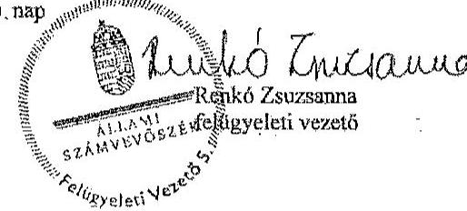

---

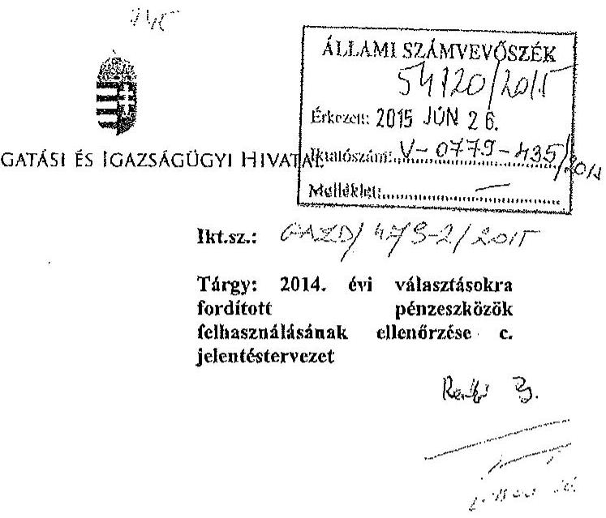

Tisztelt Elnök Úr!

Az Állami Számvevőszék 2015. június 8-án kelt és 2015. június 11-én kézhez vett V-0779-415/2015. iktatószámú levelével megküldött, a 2014. évi választásokra fordított pénzeszközök felhasználásának ellenőrzése - Az országgyűlési képviselők 2014. évi választására fordított pénzeszközök felhasználásának ellenőrzése című jelentéstervezetre az alábbi észrevételt teszem:

Jelentéstervezet 17. oldal 3. bek
„...a KIH-nél a kirendelt kormánytisztviselők személyi juttatásának kifizetése esetében - az Áht. 38. § (1) bekezdésében foglaltak ellenére - nem került sor teljesítésigazolásra."

A megállapításhoz megjegyzem, hogy a kirendelt kormánytisztviselők foglalkoztatója a kirendelés időtartamára a Nemzeti Választási Iroda volt így, a munkavégzés teljesítésének igazolására a Nemzeti Választási Iroda által vezetett és a KIH részére megküldött hiteles nyilvántartás szolgált. Ebből kifolyólag külön teljesítés igazolás kiállítása nem volt indokolt.

# 19. oldal 4.bek

„A KIH-nél az ellenőrzés megállapította, hogy a 2014. évi OGY választás lebonyolításában való közreműködésre az NVI-től rendelkezésre bocsátott 9,3 MFt pénzügyi forrásból, összesen 1,7 MFt felhasználása nem felelt meg a Pvr. 1. § (2) bekezdés b) pontjában és az NVI-KIH Megállapodás 1. pontjában foglalt rendelkezéseknek."

A megállapításhoz megjegyzem, hogy a hivatkozott, az NVI-KIH Megállapodás utólag, a feladatok elvégzését követően került aláírásra, azaz a felek között létrejött Megállapodás tévesen nem a tényleges állapotot lekövetve került megkötésre, azaz nem került rögzítésre az Európai Parlament tagjainak 2014. évi választásához kapcsolódó adminisztrációs feladatok elvégzése, miközben a kirendelés módosításáról szóló megállapodás módosítások rendre tartalmazzák azt.

---

Ez egyrészről annak is betudható, hogy a releváns információk késve jutottak el az NVI-től a KIH felé, illetve a Megállapodás egyeztetése, véglegesítése is késedelmet szenvedett. Fentiek miatt javaslom annak a ténynek a rögzítését, hogy nem kizárólagosan a KIH hibájából tér el a forrásfelhasználás a hivatkozott megállapodás 1. pontjában foglalt rendelkezésektől.

Kérem észrevételeim szíves elfogadását.

Budapest, 2015. június

Tisztelettel:
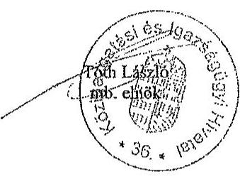

---

# 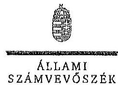

## Tóth László úr

megbízott elnök

Közigazgatási és Igazságügyi Hivatal

## Budapest

## Tisztelt Megbízott Elnök Úr!

Köszönettel megkaptam „Az országgyűlési képviselők 2014. évi választására fordított pénzeszközök felhasználásának ellenőrzése" című jelentéstervezet megállapításaira tett észrevételét.
Az ellenőrzési megállapításokra vonatkozó észrevételét az Állami Számvevőszékről szóló 2011. évi LXVI. törvény 29. § (2) bekezdésében meghatározott tizenöt napos határidőn belül küldte meg. Az Állami Számvevőszék észrevétellel kapcsolatos álláspontját a mellékletként csatolt, a felügyeleti vezető által készített indokolás tartalmazza.

Budapest, 2015. 04. hó 13. nap

Tisztelettel:
az elnök nevében eljárva,
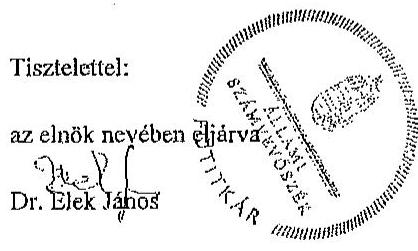

Melléklet: Észrevételre adott válasz (1 darab)

---

# Az országgyűlési képviselők 2014. évi választására fordított pénzeszközök felhasználásának ellenőrzése című jelentéstervezetre tett észrevételre adott válasz

| Észrevétel: | Jelentéstervezet 3.2. A választással kapcsolatos kiadások teljesítésének szabályszerűsége fejezet 17. oldal 3. bekezdésében szereplő megállapítás szerint:   Az OGY választás előkészítése, lebonyolítása érdekében felmerül kiadások teljesítése során - az ellenőrzésre kiválasztott mintatételek alapján - a gazdálkodási jogkörök gyakorlása a KIH-nél nem felelt meg a jogszabályok és a belső szabályzatok előírásainak. A KIH-nél a kirendelt kormánytisztviselők személyi juttatásának kifizetése esetében - az Ált. 38. § (1) bekezdésében foglaltak ellenére - nem került sor teljesítésigazolásra.   Az észrevétel szerint:   Megjegyezni kívánják, hogy a kirendelt kormánytisztviselők foglalkoztatója a kirendelés időtartamára a Nemzeti Választási Iroda volt, így a munkavégzés teljesítésének igazolására a Nemzeti Választási Iroda által vezetett és a KIH részére megküldött hiteles nyilvántartás szolgált. Ebből kifolyólag külön teljesítés igazolás kiállítását nem tartották indokoltaknak. |
| :--: | :--: |
| Válasz: | Az Állami Számvevőszék az észrevételt nem fogadja el. |
| Indoklás: | A kirendelt KIH kormánytisztviselők vonatkozásában a Nemzeti Választási Iroda által kiállított - észrevételben hivatkozott - dokumentumok birtokában a KIH feladatát képezte volna annak biztosítása, hogy az Ávr. 57. § (1) bekezdésében foglaltak szerint a teljesítés igazolása során ellenőrizzék és igazolják a kiadások teljesítésének jogosságát és összegszerűségét. Ennek hiányában az Ált. 38. § (1) bekezdésében foglalt előírást megsértve a kiadási előirányzatok terhére történő utalványozásra a teljesítés igazolása nélkül került sor. Erre való tekintettel a megállapítás módosítása nem indokolt. |
| Észrevétel: | Jelentéstervezet 4. A választási feladatokra felhasznált pénzeszközök elszámolása fejezet 19. oldal 8. bekezdésében szereplő megállapítás:   A KIH-nél az ellenőrzés megállapította, hogy a 2014. évi OGY választás lebonyolításában való közreműködésre az NVI-től rendelkezésre bocsátott 9,3 M Ft pénzügyi forrásból, összesen 1,7 M Ft felhasználása nem felelt meg a Pvr. 1. § (2) bekezdés b) pontjában és az NVI-KIH Megállapodás 1. pontjában foglalt rendelkezéseknek.   Az NVI-KIH Megállapodás 1. pontja rögzíti, hogy az NVI által rendelkezésre bocsátott pénzügyi forrás kizárólag az OGY választással összefüggő feladatellátásra használható fel. Az NVI és a KIH, valamint a 18 fő kirendelt kormánytisztviselő között létrejött - Megállapodás Kirendelés Módosításáról elnevezésű-a kirendelés meghosszabbításáról szóló háromoldalú megállapodások 2. pontjában rögzítették, hogy a megállapodást az Európai Parlament tagjainak 2014. évi választásához kapcsolódó egyes adminisztrációs feladatok ellátására figyelemmel hosszabbították meg. |

---

|  | Az észrevétel szerint:   A hivatkozott NVI-KIH Megállapodást utólag, a feladatok elvégzését követően írták alá. A felek között létrejött Megállapodás tévesen nem a tényleges állapotot lekövetve került megkötésre, mivel nem rögzítették benne az Európai Parlament tagjainak 2014. évi választásához kapcsolódó adminisztrációs feladatok elvégzését, miközben a kirendelés módosításáról szóló megállapodás módosítások rendre tartalmazták azt. Ez egyfelől annak is betudható, hogy a releváns információk késve jutottak el az NVI-től a KIH felé, illetve a Megállapodás egyeztetése, véglegesítése is késedelmet szenvedett. Fentiek miatt javasolják annak rögzítését, hogy nem kizárólagosan a KIH hibájából tér el a forrásfelhasználás a hivatkozott megállapodás 1. pontjában foglalt rendelkezésektől. |
| :--: | :--: |
| Válasz: | Az Állami Számvevőszék az észrevételt nem fogadja el. |
| Indoklás: | Az NVI és a választásban közreműködő szervezetek között létrejött Megállapodásokkal kapcsolatos hiányosságokat, kiemelten azok megkötésének késedelmét a jelentéstervezet valamennyi érintett ellenőrzött szervezet vonatkozásában tartalmazta. A megkötött Megállapodások tartalmának valódiságáért az érintett felek egyaránt felelősek. Kellő körültekintés mellett a KIH-nek jeleznie kellett volna, hogy a Megállapodásban az Európai Parlament tagjainak 2014. évi választásához kapcsolódó adminisztrációs feladatok nem a tényleges állapotot lekövetve kerültek rögzítésre. E jelzés elmulasztása hozzájárult ahhoz, hogy nem érvényesült a Pvr. 1. § (2) bekezdés b) pontjában és az NVI-KIH Megállapodás 1. pontjában foglalt előírás. Erre való tekintettel a megállapítás módosítása nem indokolt. |

Tájékoztatom Megbízott elnök urat, hogy a számvevőszéki jelentés mellékleteként szerepeltetjük a jelentéstervezethez tett észrevételét, valamint az arra adott válaszunkat.

Budapest, 2015. 04.
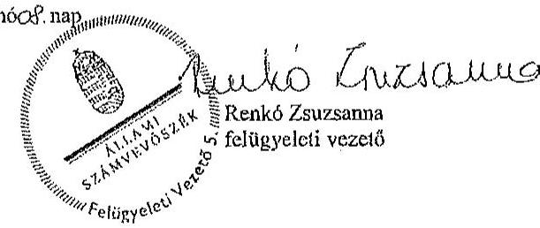

---

.

---

# FEJÉR MEGYE JEGYZŐJE

Fejér Megyei Önkormányzati Hivatal
Székesfehérvár, Szent István tér 9.

## 2 (+36-22) 312-144

@ dr.kovacs.zoltan@fejer.hu

Szám: 25-26/2015.
ÜL: Galler Nándor

## Dr. Elek János

főtitkár

## Állami Számvevőszék

Budapest
Apáczai Csere János u. 10
1364

Tárgy: észrevétel ellenőrzés megállapításaira

## 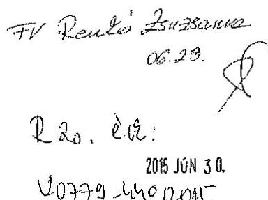

Tisztelt Főtitkár Úr!

Hivatkozva a 2014. évi választásokra fordított pénzeszközök felhasználásának ellenőrzése kapcsán részemre megküldött jelentéstervezetekre, „Az országgyűlési képviselők 2014. évi választására fordított pénzeszközök felhasználásának ellenőrzése" című jelentéstervezet kapcsán az alábbi észrevételt teszem.

A jelentéstervezet 20. oldalán az alábbi szövegrész szerepel.
„Az FVI-nél és az ellenőrzött TVI-knél - a Fejér megyei TVI kivételével - a választáshoz kapcsolódó pénzeszközök célhoz kötötten, a választás előkészítése és lebonyolítása érdekében történt és nem számoltak el a választáshoz nem kapcsolódó kiadást.

A Fejér megyei TVI-nél két esetben összesen 37,5 E Ft összegben a kiküldetéseknél nem csak választásnapi költségeket számoltak el. A Fejér megyei TVI eljárása nem felelt meg a Pvr. 1. mellékletében foglaltaknak, amely a szavazásnapi működéssel összefüggő gépkocsi használat elszámolását teszi lehetővé."

A jelentéstervezetben szereplő fent idézett, a Fejér megyei TVI-re vonatkozó megállapítással nem értünk egyet az alábbiak miatt.

Az országgyűlési képviselők 2014. évi választására fordított pénzeszközök felhasználása során a Fejér megyei TVI is csak a választáshoz kapcsolódó kiadást számolt el. Az idézetben szereplő, pontosan 37.503 forint összegű költség a 2014. évi országgyűlési választások iratanyagainak helyi választási irodák részére történő kiszállítása kapcsán felmerült költséget jelenti.

---

A Fejér Megyei Önkormányzati Hivatal tulajdonában és üzemeltetésében lévő MOX001 forgalmi rendszámú gépkocsival történt a választási iratanyagok (hirdetmények, plakátok, választási egységcsomagok, szavazólapok, jegyzőkönyvek, urnazáró címkék stb.) helyi választási irodák részére történő kiszállítása. A hivatal fenntartásában lévő gépkocsik üzemanyaggal való folyamatos ellátása Mol kártyák használatával történik, így ilyen jellegű közvetlen költség elszámolása a választás lebonyolítása kapcsán nem állt módunkban. Ugyanakkor a Fejér megyei TVI a személygépkocsi menetleveleiben rögzített, kizárólag csak a választási feladatok, fent említett iratanyag szállítási feladatai kapcsán felmerült km-re jutó, a mellékelt feljegyzésben rögzített, közvetett módon számított költség elszámolás lehetőségével élve, elszámolta a feladat elvégzése kapcsán felmerült választási költségeket.

A jelentéstervezetben szereplő azon megállapítással sem értünk egyet, miszerint a Pvr. 1. mellékletében foglaltak a szavazásnapi működéssel összefüggő gépkocsi használat elszámolását teszi lehetővé, ugyanis ilyen megállapítást a Pvr. 1. melléklete a TVI-kre vonatkozóan nem tesz.

Fentiekben rögzítettek alapján kérem, hogy a levelemben idézett, a Fejér megyei TVI-re tett megállapítást szíveskedjenek a végleges jelentésből törölni.

Székesfehérvár, 2015. június 23.

Tisztelettel:
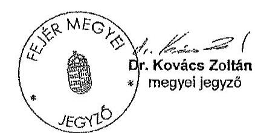

---

# Feljegyzés a 2014. évi országgyűlési képviselők választása kapcsán elszámolandó üzemanyag-költségről

A MOX-001 rendszámú gépkocsi

- BC 0297025 és BC 0297026 sorszámú menetlevelei alapján 464 km figyelembevételével 426 Ft/l üzemanyagárral, 7,6 l/100 km fogyasztási normával, 9 Ft/km amortizációs költséggel számolva bruttó 19.198 Ft összegű üzemeltetési költség;
- BC 0297033 és BC 0297034 sorszámú menetlevelei alapján 436 km figyelembevételével 434 Ft/l üzemanyagárral, 7,6 l/100 km fogyasztási normával, 9 Ft/km amortizációs költséggel számolva bruttó 18.305 Ft összegű üzemeltetési költség,
a választási iratanyagok szállítása kapcsán a 2014. évi országgyűlési képviselők választására biztosított központi támogatás terhére számolandó el.

Székesfehérvár, 2014. május 5.
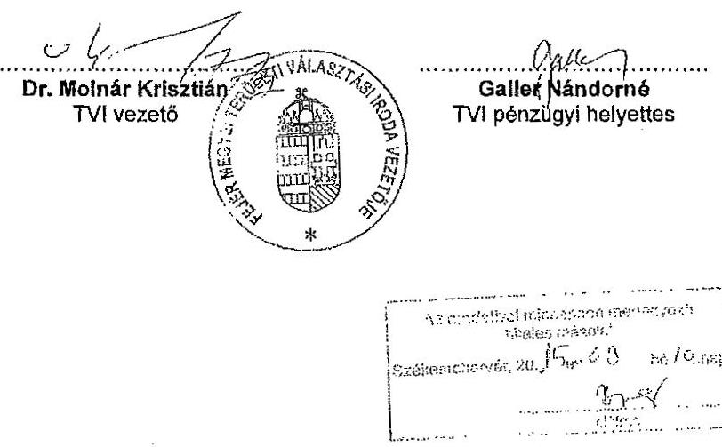

---

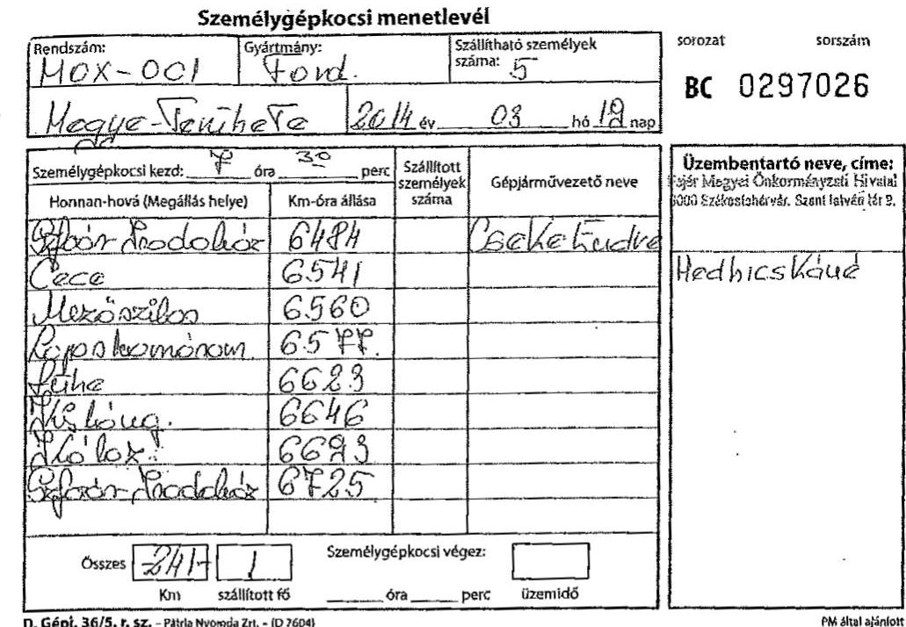

# Személygépkocsi menetlevél

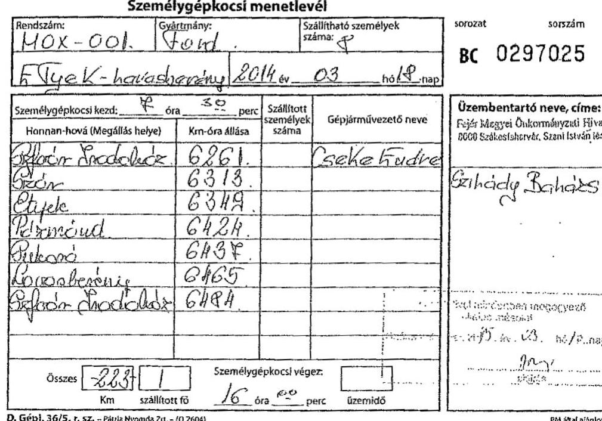

---

# Személygépkocsi menetlevél

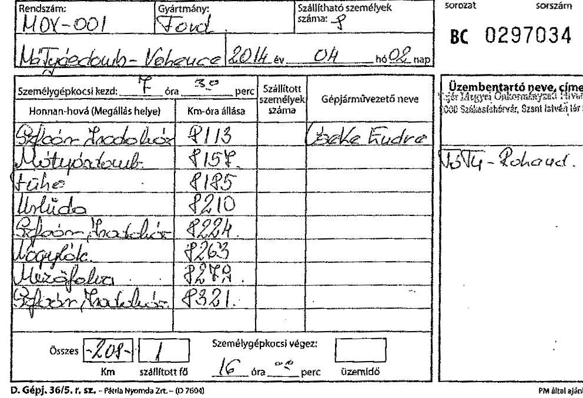

D. Gépj. 36/5. r. sz. - Fénix Nyomás 2rt.- (D 7604)

Pitt által ajánlott

Személygépkocsi menetlevél
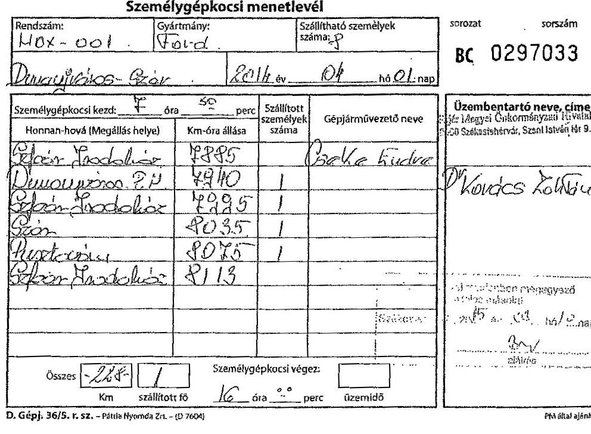

---

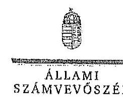

FŐTITKÁR

Ikt.szám: V-0779-441/2015.

Dr. Kovács Zoltán úr
megyei jegyző

Fejér Megyei Önkormányzati Hivatal

Székesfehérvár

Tisztelt Megyei Jegyző Úr!

Köszönettel megkaptam „Az országgyűlési képviselők 2014. évi választására fordított pénzeszközök felhasználásának ellenőrzése" című jelentéstervezet megállapítására tett észrevételét.

Az ellenőrzési megállapításokra vonatkozó észrevételét az Állami Számvevőszékről szóló 2011. évi LXVI. törvény 29. § (2) bekezdésében meghatározott tizenöt napos határidőn belül küldte meg. Az Állami Számvevőszék észrevétellel kapcsolatos álláspontját a mellékletként csatolt, a felügyeleti vezető által készített indokolás tartalmazza.

Budapest, 2015. 04. hó 13. nap

Tisztelettel:

az elnök nevében eljáró:

Dr. Elek János

Melléklet: Észrevételre adott válasz

1052 BUDAPEST, APÁCZAI CSERE JÁNOS UTCA 10. 1364 Budapest 4. Pf. 54 telefon: 484 9104 fax: 484 9212

---

# Az országgyűlési képviselők 2014. évi választására fordított pénzeszközök felhasználásának ellenőrzéséről szóló jelentéstervezetre tett észrevételre adott válasz

| Észrevétel: | Jelentéstervezet 5.2. A választással kapcsolatos kiadások teljesítésének szabályszerűsége fejezet 20. oldal 2-3. bekezdéseiben szereplő megállapítás:   „Az FVI-nél és az ellenőrzött TVI-knél - a Fejér megyei TVI kivételével - a választáshoz kapcsolódó pénzeszközök felhasználása célhoz kötötten, a választás előkészítése és lebonyolítása érdekében történt és nem számoltak el a választáshoz nem kapcsolódó kiadást.   A Fejér megyei TVI-nél két esetben összesen 37,5 E Ft összegben a kiküldetéseknél nem csak választásnapi költségeket számoltak el. A Fejér megyei TVI eljárása nem felelt meg a Pvr. 1. mellékletében foglaltaknak, amely a szavazásnapi működéssel összefüggő gépkocsi használat elszámolását teszi lehetővé."   Az észrevétel szerint az országgyűlési képviselők 2014. évi választására fordított pénzeszközök felhasználása során a Fejér Megyei TVI is csak a választáshoz kapcsolódó kiadást számolt el. A megállapításban szereplő 37503 forint összegű költség a 2014. évi országgyűlési választások iratanyagának helyi választási irodák részére történő kiszállítása kapcsán merült fel.   A Fejér Megyei Önkormányzati Hivatal tulajdonában és üzemeltetésében lévő gépkocsival történt a választási iratanyagok helyi választási irodák részére történő kiszállítása. A hivatal fenntartásában lévő gépkocsik üzemanyaggal való folyamatos ellátása MOL kártyák használatával történik, így ilyen jellegű közvetlen költség elszámolására a választás lebonyolítása kapcsán nem állt módjukban. Ugyanakkor a Fejér megyei TVI a személygépkocsi menetleveleiben rögzített, kizárólag a választási feladatok, fent említett iratanyag szállítási feladatai kapcsán felmerült km-re jutó, az észrevételhez mellékletként csatolt feljegyzésben rögzített, közvetett módon számított költség elszámolás lehetőségével élve, elszámolta a felmerült választási költségeket.   Nem értenek egyet a jelentéstervezet hivatkozott megállapításával, mely szerint a Pvr. 1. számú mellékletében foglaltak a szavazásnapi működéssel összefüggő gépkocsi használat elszámolását teszik lehetővé, mivel a TVI-k vonatkozásában a Pvr. 1. számú melléklete ilyen előírást nem tartalmaz. |
| :--: | :--: |
| Válasz: | Az Állami Számvevőszék az észrevételt elfogadja. |
| Indoklás: | Az észrevételben hivatkozott - és az annak mellékleteként átadott dokumentumok alapján elszámolt - gépjárműhasználat költségét az országgyűlési képviselők választása, valamint az Európai Parlament tagjainak választása költségeinek normatíváiról, tételeiről, elszámolási és belső ellenőrzési rendjétől, valamint egyes választási tárgyú miniszteri rendeletek módosításáról szóló 38/2013. (XII. 30.) KJM rendelet 1. számú melléklet Megyei kiadások, azon belül a dologi kiadások 131 TVI választások előkészítésével és folyamatos működésével összefüggő kiadási jogcímek körébe tartozóként elfogadom. A jelentéstervezetben lévő megállapítás ennek megfelelően módosításra került. |

---

Tájékoztatom Megyei jegyző urat, hogy a számvevőszéki jelentés mellékleteként szerepeltetjük a jelentéstervezethez tett észrevételét, valamint az arra adott válaszunkat.

Budapest, 2015. C7. hó /3 nap
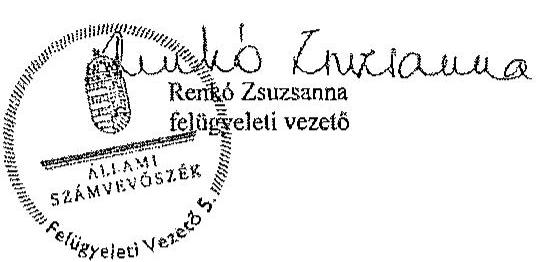

---

# Hajdú-Bihar Megyei Önkormányzat Közgyűlésének JEGYZŐJE

594024 Debrecen, Piac u. 54., 52/507-524, e-mail: jegyzo@hbmo.hu

|  Ikt.szám: | ÖH: 80-11/2015  |
| --- | --- |
|  Hivatkozási szám: | V-0779-415/2015  |
|  K20 01. | V-0780-276/2015  |
|   | V-0781-182/2015  |

Dr. Elek János úr főtitkár

Állami Számvevőszék

Budapest Apáczai Csere János utca 10.

2015 JÚN 30

ÁLLAMI SZÁMVEVŐSZÉK ÜGYVITELI IRODA 54855/2015

Érkezett: JÚN 29 2015

Iktatószám: V-0779-439/2015

Tisztelt Főtitkár Úr!

A 2014. évi választásokra fordított pénzeszközök felhasználásának ellenőrzéséről készített V-0779-415/2015, V-0780-276/2015, V-0781-182/2015 számú számvevői ellenőrzési jelentéstervezet Hajdú-Bihar Megyei Önkormányzati Hivatalt érintő megállapításaira észrevételt nem kívánok tenni.

Debrecen, 2015. június 17.

Tisztelettel:

Dr. Dobi Csaba

---

.

---

Nemzeti Választási Iroda
elnök

Ikt.sz.: NVL/0581/2015

Dr. Elek János
főtitkár

Állami Számvevőszék
1052 Budapest
Apáczai Csere János utca 10.

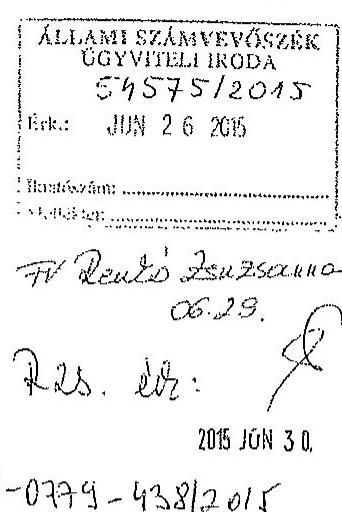

Tárgy: Észrevételek a megküldött jelentéstervezetekhez

Tisztelt Főtitkár Úr!

A Nemzeti Választási Iroda részére megküldött, a 2014. évi választásokra fordított pénzeszközök felhasználásának ellenőrzéseiről készült jelentéstervezetekhez az alábbi észrevételeket teszem.

I. A 2014. évi országgyűlési képviselőválasztásra fordított pénzeszközök
felhasználásának ellenőrzése - V-0779-415/2015. számú
jelentéstervezet

1. A tervezet 4. oldalán a 4. bekezdésben „Az ellenőrzés célja annak megállapítása volt,
hogy a helyi önkormányzati képviselők és polgármesterek, valamint a nemzetiségi
önkormányzati képviselők 2014. évi választására fordított pénzeszközök
tervezésére..." szövegrész helyett: „Az ellenőrzés célja annak megállapítása volt,
hogy a 2014. évi országgyűlési képviselőválasztására fordított pénzeszközök
tervezésére..." a helyes.

2. A tervezet 9. oldalának 3. bekezdéséhez megjegyezni kívánom, hogy az NVI elnöke a
Számv. tv. 14. § (11) bekezdésében meghatározott 90 napos határidőt azért nem
tudta tartani, mert az NVI 2013. május 24-ei alapítását követően a gazdálkodás
szervezeti egysége 2014. október 1-én került felállításra, a gazdasági vezető
kinevezése is ekkor történt meg.

3. A tervezet 13. oldalának 3. bekezdéséhez megjegyzem, hogy a Pvr. a nem normatív
kiadások tekintetében azért nem tartalmaz előírást az előlegek utalásának
határidejére vonatkozólag, mert azok minden esetben az ellátandó feladatok jellegét,
a résztvevő szervezetek tevékenységét meghatározó megállapodásokban kerülnek
rögzítésre, és erre vonatkozólag a korábbi választások végrehajtási rendeletei sem
írtak elő határidőt.

4. A tervezet 15. oldal 5. bekezdés utolsó mondatában a „KEKKH pénzügyi nyilvántartó
rendszerében" helyett az „OrganP VPIR rendszerében" megnevezés a helyes.

---

Nemzeti Választási Iroda
elnök
II. Az Európai Parlament tagjainak 2014. évi választására fordított pénzeszközök felhasználásának ellenőrzése - V-0780-276/2015. számú jelentéstervezet

1. A tervezet 7. oldal 5. bekezdés utolsó mondatát nem áll módomban elfogadni, tekintettel arra, hogy az NVI a választási irodák és az egyéb szervezetek elfogadott elszámolásai alapján a Pvr.-ben előírt határidőn belül, 2014. augusztus 22. napján készítette el az összesítő beszámolóját. (Beszámoló a 2014. évi Európai Parlament tagjainak választásáról).
2. A tervezet 14. oldal 1. bekezdésében a „010201 TEA kódon" szöveg helyett „1010201 TEA kódon" szöveg a helyes.
3. A tervezet 18. oldal utolsó bekezdéséhez megjegyezni kívánom, hogy a Pvr. 6.§ (2) bekezdésében a HVI-k részére előírt feladattípusú elszámolás jogcímenkénti részletezése a jogalkotási szándék szerint kizárólag a többletköltségekre és a feladattelmaradásra vonatkozott volna. Az elszámolások elkészítésére vonatkozó 19/2014. (VI.04.) NVI utasítás formanyomtatványa rendelkezett ennek kezeléséről. Amennyiben minden HVI esetében minden kiadásnem vonatkozásában a jogcímenkénti részletező kimutatást kértük volna be, az rendkívüli adatmennyiséget keletkeztetett volna, és jelentős munkaterhet jelentett volna a HVI-kre és TVI-kre nézve.
A helyi önkormányzati képviselők és polgármesterek, továbbá a nemzetiségi önkormányzati képviselők választásáról szóló Pvr.-ben (3/2014. (VII. 24.) IM rendelet) már pontosításra került a jogcímenkénti részletező kimutatásra vonatkozó előírás.
4. A tervezet 22. oldalának utolsó bekezdését az 1. pontban említettek alapján nem áll módomban elfogadni. A lábjegyzetben szereplő 27. számú megjegyzésben feltüntetett végleges elszámoláson szereplő 2015. március 12. dátum a dokumentum nyomtatásának dátuma. A választásról készített beszámoló készítésének dátuma 2014. augusztus 22. (Beszámoló a 2014. évi Európai Parlament tagjainak választásáról).
III. A helyi önkormányzati képviselők és polgármesterek, valamint a nemzetiségi önkormányzati képviselők 2014. évi választására fordított pénzeszközök felhasználásának ellenőrzése - V-0781-1825/2015. számú jelentéstervezet
5. A tervezet 3. oldal 1. bekezdésében javaslom javítani, hogy a nemzetiségi önkormányzati képviselők választását nem Magyarország Köztársaság! Elnöke, hanem a Nemzeti Választási Bizottság tűzte ki.
6. A tervezet 12. oldal utolsó bekezdéséhez megjegyezni kívánom, hogy az NVI a 2014. évi költségvetésében az önkormányzati és nemzetiségi választásokra azért nem

---

Nemzeti Választási Iroda
elnök
tervezett eredeti előirányzatot, mert - összhangban a tervezet 11. oldal 2. pontjának első bekezdésében leírtakkal - az eredeti előirányzat az önkormányzati és nemzetiségi választásokra már nem biztosított fedezetet. A közgazdaságilag megalapozott tervezés biztosított volt az NVI által 2014. március 3-án elkészített, majd a forrás biztosítását követő módosított előirányzat könyvviteli rendszerben történő rögzítésével.
3. A tervezet 17. oldal utolsó bekezdéséhez és a lábjegyzet 18. pontjához megjegyezni kívánom, hogy a választások összesítő elszámolása 2015. február 12-én készült el, a megjelölt 2015. március 9. napja a dokumentum nyomtatásának napját jelenti. A Pvr. által megadott 90 napos elszámolási határidő ebben az esetben két országos választás teljes körű ellenőrzését és adatainak feldolgozására vonatkozott, vagyis ezzel indokolható a határidőn túli elszámolás elkészítése.

Mindhárom jelentéshez általánosságban megjegyezni kívánom, hogy az NVI által nem a megfelelő választás kiadásai terhére elszámolt tételek - számosságát tekintve öt darab nagyságrendje és összege is elenyésző a négy országos választás vonatkozásában. Az érintett tételek mindegyike a választások érdekében felmerült, szabályszerűen, a megfelelő kiadásnemen elszámolt kiadást jelentett. Az NVI jelenleg és a jövőben is kiemelt figyelmet fordít a feladattípusú elszámolás során a pénzeszközök felhasználásának pontos kimutatására.

Kérem Tisztelt Főtitkár Urat, hogy az NVI részéről tett észrevételeket és kért módosításokat a végleges jelentésekben elfogadni és érvényesíteni szíveskedjenek.

Budapest, 2015. június, 17.
Üdvözlettel:
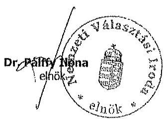

---

# 16. SZÁMÚ MELLÉKLET A V-0779-465/2015. SZÁMÚ JELENTÉSHEZ 

## FÜGGELÉK

## 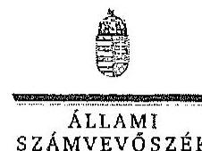

Ikt.szám:V-0779-445/2015.
V-0780-297/2015.
V-0781-196/2015.

## Dr. Pálffy Ilona úrhölgy

elnök

Nemzeti Választási Iroda

## Budapest

## Tisztelt Elnök Úrhölgy!

Köszönettel megkaptam „Az országgyűlési képviselők 2014. évi választására fordított pénzeszközök felhasználásának ellenőrzése", „Az Európai Parlament tagjainak 2014. évi választására fordított pénzeszközök felhasználásának ellenőrzése", valamint „A helyi önkormányzati képviselők és polgármesterek, valamint a nemzetiségi önkormányzati képviselők 2014. évi választására fordított pénzeszközök felhasználásának ellenőrzése" című jelentéstervezetek megállapításaira tett észrevételét.
Az ellenőrzési megállapításokra vonatkozó észrevételét az Állami Számvevőszékről szóló 2011. évi LXVI. törvény 29. § (2) bekezdésében meghatározott észrevételként kezeljük. Az Állami Számvevőszék észrevétellel kapcsolatos álláspontját a mellékletként csatolt, a felügyeleti vezető által készített indokolás tartalmazza.

Budapest, 2015. 07. hó 15 nap

Tisztelettel:
az elnök nevében eljárva
Dr. Elek János

Melléklet: Észrevételre adott válasz (3 darab)

---

# 16. SZÁMÚ MELLÉKLET A V-0779-465/2015. SZÁMÚ JELENTÉSHEZ

1. számú melléklet a V-0779-465/2015. számú levélben

„Az országgyűlési képviselők 2014. évi választására fordított pénzeszközök felhasználásának ellenőrzése" című jelentéstervezetre tett észrevételre adott válasz

|  Észrevétel: | A jelentéstervezet Bevezetés fejezet 4. oldal 4. bekezdése szerint az ellenőrzés célja: „Az ellenőrzés célja annak megállapítása volt, hogy a helyi önkormányzati képviselők és polgármesterek, valamint a nemzetiségi önkormányzati képviselők 2014. évi választására fordított pénzeszközök tervezése, felhasználása, elszámolása és annak ellenőrzése szabályszerű volt-e, valamint hasznosultak-e az előző ÁSZ ellenőrzés javaslatai.  |
| --- | --- |
|   | Az észrevétel szerint:  |
|   | A jelentéstervezetben az ellenőrzés célja tévesen szerepel.  |
|  Válasz: | Az Állami Számvevőszék az észrevételt elfogadja.  |
|  Indoklás: | Az ellenőrzés célját tartalmazó bekezdés a téves megfogalmazás miatt módosításra kerül.  |
|  Észrevétel: | A jelentéstervezet Részletes megállapítások 1.1 A választás pénzügyi tervezése fejezet 9. oldal 3. bekezdés megállapítása: „Az NVI elnöke a Számv. tv. 14. § (11) bekezdésében meghatározott 90 napos határidőn túl, 2013. október 1-jén határozta meg az NVI számviteli politikáját.  |
|   | Az észrevétel szerint:  |
|   | A megállapításhoz megjegyezni kívánják, hogy a jogszabályban előírt 90 napos határidőt azért nem tudták tartani, mert az NVI 2013. május 24-i alapítását követően a gazdálkodás szervezeti egysége 2014. október 1-jén került felállításra, a gazdasági vezető kinevezése is ekkor történt meg.  |
|  Válasz: | Az Állami Számvevőszék az észrevételt nem fogadja el.  |
|  Indoklás: | Az észrevételben a megállapítás megalapozottságát nem vitatják, a késedelem körülményeinek magyarázata alapján a megállapítás módosítása nem indokolt.  |
|  Észrevétel: | A jelentéstervezet Részletes megállapítások 2. A költségvetésből biztosított finanszírozási források elosztása, az előirányzatok kezelése fejezet 13. oldal 3. bekezdés megállapítása: „A nem normatív kiadások tekintetében az előleg utalásának határidejéről a Per. nem tartalmaz előírást, így a KIH, a KEKKH és a BÁH intézmények részére a pénzügyi forrás a megállapodások alapján, az OGT választást követően került folyósításra. A KIH számára 9,31 M Ft-ot, a KEKKH-nak 334,1 M Ft-ot, a BÁH részére 3,7 M Ft-ot utalt át a megállapodásoknak megfelelően előlegként az NVI.  |
|   | Az észrevétel szerint:  |
|   | A megállapításhoz megjegyzik, hogy az országgyűlési képviselők választása, valamint az Európai Parlament tagjainak választása költségeinek normatíváiról, tételei-  |

---

|  | ről, elszámolási és belső ellenőrzési rendjéről, valamint egyes választási tárgyú miniszteri rendeletek módosításáról szóló 38/2013. (XII. 30.) KIM rendelet (Pvr.) a nem normatív kiadások tekintetében azért nem tartalmaz előírást az előlegek utalásának határidejére vonatkozólag, mert azok minden esetben az ellátandó feladatok jellegét, a résztvevő szervezetek tevékenységét meghatározó megállapodásban kerülnek rögzítésre, és erre vonatkozólag a korábbi választások végrehajtási rendeletei sem írtak elő határidőt. |
| :--: | :--: |
| Válasz: | Az Állami Számvevőszék az észrevételt nem fogadja el. |
| Indoklás: | Az észrevétellel érintett megállapítás nem szabálytalanság feltárására vonatkozik, tényként került rögzítésre, hogy a választás lebonyolításában résztvevő - a választási irodákon kívüli - egyéb szervezetek esetében a feladatellátás érdekében felmerült kiadások finanszírozására szolgáló előleg biztosításáról a jogszabály nem rendelkezik. A Nemzeti Választási Iroda az érintett szervezetek részére a választás napját követően folyósította a megállapodásban szereplő támogatási összegeket.   Az észrevételben ezen megállapítás megalapozottságát nem vitatják, erre tekintettel annak módosítása nem indokolt.   Az ellenőrzés a választási eljárás lebonyolításában résztvevő szervezeteknél működő eltérő finanszírozási gyakorlatra hívta fel a figyelmet. A Pvr. 4. § (2) bekezdése alapján ugyanis garantált volt, hogy a választás kiadásainak fedezetére rendelkezésre álló normatívák szerint meghatározott összegek a területi választási irodák számára a választás napját megelőző harmincadik, a helyi választási irodák részére a választás napját megelőző harmadik napig folyósításra kerüljenek. A választási irodáknál ezáltal „előfinanszírozás", míg az egyéb szervezetek tekintetében az ellenőrzés megállapításai szerint utófinanszírozás működött. Az NVI - a KúM kivételével - az egyéb szervezetekkel a választás napját követően kötött megállapodást, illetve a választást követően biztosította a feladatellátás kiadásaihoz szükséges fedezetet. A költségvetési fedezet biztosítása módjában kialakult fenti gyakorlat indokoltsága, megfelelősége kérdéseket vet fel (például az egyéb szervezetek tekintetében a megállapodás megkötését megelőzően a választási feladatok előkészítése és lebonyolítása céljából szükséges kötelezettségvállalások szabályszerűsége, a fizetőképesség biztosítása tekintetében). |
| Észrevétel: | A jelentéstervezet Részletes megállapítások 3.2 A választással kapcsolatos kiadások teljesítésének szabályszerűsége fejezet 15. oldal 5. bekezdés megállapítása:   „A pénzeszközök felhasználását a 2/2014. (III. 31.) KúM utasítás VII. fejezet 1-2. pontja előírásai alapján a Forrás Költségvetési és Pénzügyi Nyilvántartó Programban, valamint a KEKKH pénzügyi nyilvántartó rendszerében jogcímenként - szakfeladat részletező kódon - elkülönítetten tartották nyilván a Pvr. előírásainak megfelelően."   Az észrevétel szerint:   A hivatkozott bekezdés utolsó mondatában a KEKKH pénzügyi nyilvántartó rendszerében helyett az OrganP VPIR rendszerében megnevezés a helyes. |
| Válasz: | Az Állami Számvevőszék az észrevételt elfogadja. |
| Indoklás: | A megállapítás a téves megfogalmazás miatt módosításra kerül. |

---

| Észrevétel: | A jelentéstervezet Részletes megállapítások 3.2. A választással kapcsolatos kiadások teljesítésének szabályszerűsége fejezet 19. oldal 2-3. bekezdésének megállapítási:   „Az NVI-nél az EP választással összefüggésben kifizetett tiszteletdíj kivételével a 2014. évi OGY választásra biztosított pénzeszközök felhasználása célhoz kötötten, a választás előkészítése és lebonyolítása érdekében, szabályszerűen történt."   „Egy fő, a Nemzeti Választási Bizottságban való részvétellel az EP választáshoz kapcsolódóan megbízott tag tiszteletdíját az OGY választás kiadásai között számolták el, megtérve ezzel a Pvr. 6. § (1) bekezdésében foglalt választásonkénti elkülönítés előírásait. A nem szabályszerű elszámolás összege 245,9 E Ft volt." |
| :--: | :--: |
|  | Az észrevétel szerint:   Az NVI által nem a megfelelő választás kiadásai terhére elszámolt tételek - a három jelentéstervezetben számosságát tekintve öt darab - nagyságrendje és összege is elenyésző volt a négy országos választás vonatkozásában. Az érintett tételek mindegyike a választások érdekében felmerült, szabályszerűen, a megfelelő kiadástemen elszámolt kiadást jelentett. Az NVI jelenleg és a jövőben is kiemelt figyelmet fordít a feladattípusú elszámolás során a pénzeszközök felhasználásának pontos kimutatására. |
| Válasz: | Az Állami Számvevőszék az észrevételt nem fogadja el. |
| Indoklás: | Az észrevételben foglaltak a megállapítás megalapozottságát nem érintik. Az ellenőrzés értékelve az e téren feltárt hiányosságot a jelentéstervezetben összességében a kifizetések célhoz kötött, indokolt voltát emelte ki, és ezzel egyidejűleg kivételként került említésre a tévesen, nem a megfelelő választási feladatra elszámolt egy tétel. |

Tájékoztatom Elnök urat, hogy a számvevőszéki jelentés mellékleteként szerepeltetjük a jelentéstervezethez tett észrevételét, valamint az arra adott válaszunkat.

Budapest, 2015.
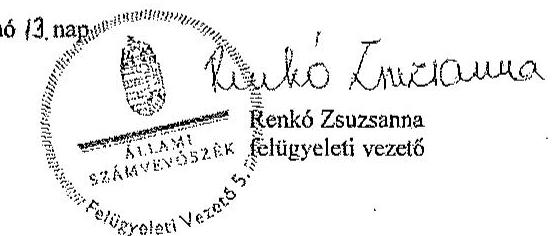

---

# 2. számú melléklet 

a V-0780-297/2013. számú levélhez
„Az Európai Parlament tagjainak 2014. évi választására fordított pénzeszközök felhasználásának ellenőrzése" című jelentéstervezetre tett észrevételre adott válasz

| Észrevétel: | A jelentéstervezet Összegző megállapítások, következtetések fejezet 7. oldal 5. bekezdés megállapítása:   „Az NVI a választási irodák és az egyéb szervezetek elfogadott elszámolásai alapján a Pvr.-ben előírt határidőn túl elkészítette a választási kiadások összesítő elszámolását." |
| :--: | :--: |
|  | A jelentéstervezet Részletes megállapítások 4. A választási feladatokra felhasznált pénzeszközök elszámolása fejezet 22. oldal 5. bekezdés megállapítása, illetve a kapcsolódó 27. számú lábjegyzet:   „A helyi és területi választási irodák, valamint a választásban részt vevő egyéb szervek elszámolásai alapján az NVI az összesítő elszámolást a Pvr. 7. § (5) bekezdésében előírt határidőn, a választás napját követő kilencven napon túl készítette el."   „Az ellenőrzés rendelkezésére bocsátott végleges elszámolás dátuma 2015. március 12."   Az észrevétel szerint:   A megállapítást nem fogadják el, mivel az NVI az országgyűlési képviselők választása, valamint az Európai Parlament tagjainak választása költségeinek normatíváiról, tételeiről, elszámolási és belső ellenőrzési rendjéről, valamint egyes választási tárgyú miniszteri rendeletek módosításáról szóló 38/2013. (XII. 30.) KIM rendeletben (továbbiakban: Pvr) előírt határidőn belül, 2014. augusztus 22. napján készítette el összesítő beszámolóját (Beszámoló a 2014. évi Európai Parlament tagjainak választásáról). A 27. számú lábjegyzetben feltüntetett végleges elszámoláson szereplő 2015. március 12-i dátum a dokumentum nyomtatásának a napja. |
| Válasz: | Az Állami Számvevőszék az észrevételt nem fogadja el. |
| Indoklás: | Az észrevételben foglaltak a megállapítás megalapozottságát nem érintik. Az ellenőrzés során bemutatták az észrevételben hivatkozott, 2014. augusztus 22-én kelt beszámolót, illetve az annak 2014. december 2-án módosított példányát. A Pvr. 7. § (5) bekezdése szerinti összesítő elszámolás elkészítésére a Nemzeti Választási Iroda a helyi és területi választási irodák, a KúM, illetve a választásban résztvevő egyéb szervek) elszámolásai alapján a választás napját követő 90 napon belül kötelezett, amely esetünkben 2014. augusztus 23-ig történő elszámolást jelent. Az ellenőrzés során rendelkezésre bocsátott dokumentumok szerint a területi választási irodák elszámolásainak elfogadásáról szóló döntést a 2014. augusztus 25. és 2014. szeptember 1. közötti keltezésű levelezés igazolja. A KEKKH elszámolását 2014. augusztus 29-én nyújtotta be, melynek NVI általi elfogadásáról a 2014. október 9-én kelt levél tanúskodik. A KúM elszámolását az NVI 2014. október 21-én kelt dokumentum alapján fogadta el. Mindezekre tekintettel a 2014. augusztus 22-én kelt előzetes beszámoló nem felel meg a hivatkozott jogszabályi előírásnak megfelelő összesítő elszámolásként, mivel a választás lebonyolításában résztvevő választási irodák és egyéb szervek elszámolásai dokumentált módon a Pvr.-ben előírt 90 napos határidőn belül nem készültek el, illetve nem kerültek az NVI által elfogadásra. Az ellenőrzés során rendelkezésre bocsátott, az NVI elnökhelyettese által aláírt és az aláírás mellett |

---

|  | kézzel írt keltezést tartalmazó összesítő elszámolások alapján (2015. március 9-én kelt összesítő elszámolás az NVI központi kiadásai nélkül, 2015. március 12-én kelt összesítő elszámolás a mindösszesen kiadásokról) az ellenőrzés megállapításainak módosítása nem indokolt. |
| :--: | :--: |
| Észrevétel: | A jelentéstervezet 3.1. A választási pénzeszközök nyilvántartása, a felhasználás szabályozottsága fejezet 14. oldal 1. bekezdés megállapítása:   „Az NVI kialakította a választások céljára biztosított pénzeszközök elkülönített számviteli kezelését. A főkönyvi könyvelésben, a jogszabályban előírt 016010 COFOG kódon belül a választásonként elkülönített kezelést külön tervezési és elszámolási alapegység kódokon - az EP választásra biztosított pénzeszközökre vonatkozóan a 010201 TEA kódon - biztosította."   Az észrevétel szerint:   A megállapításban szereplő 010201 TEA kód nem megfelelő, a 1010201 TEA kód a helyes meghatározás. |
| Válasz: | Az Állami Számvevőszék az észrevételt elfogadja. |
| Indoklás: | A megállapítás a TEA kódban történt elírás miatt módosításra került. |
| Észrevétel: | A jelentéstervezet 4. A választási feladatokra felhasznált pénzeszközök elszámolása fejezet 18. oldal 9. bekezdés megállapítása:   „A Pvr. 7. § (1) bekezdése a HVI vezetők számára feladattípusú elszámolás készítését írta elő. Az elszámolásokat a 19/2014. (VI. 04.) NVI utasításnak megfelelően készítették el, azonban az előírt és alkalmazott formanyomtatványok nem teljes körűen feleltek meg a Pvr. 6. § (2) bekezdésében előírtoknak, mivel a kiadásnemen belüli jogcím kód szerinti részletezést nem tartalmazzák, jogcímenként csak a többletköltséget és feladatelmaradás miatti visszafizetési kötelezettséget kérte részletezni."   Az észrevétel szerint:   A Pvr. 6. § (2) bekezdésében a HVI-k részére előírt feladattípusú elszámolás jogcímenkénti részletezése a jogalkotói szándék szerint kizárólag a többletköltségekre és a feladatelmaradásra vonatkozott volna. Az elszámolások elkészítésére vonatkozó 19/2014. (VI. 04.) NVI utasítás formanyomtatványa rendelkezett ennek kezeléséről. Amennyiben minden HVI esetében minden kiadásnem vonatkozásában a jogcímenkénti részletező kimutatást kérték volna be, az rendkívüli adatmennyiséget keletkeztetett volna a HVI-kre és TVI-kre nézve.   A helyi önkormányzati képviselők és polgármesterek, továbbá a nemzetiségi önkormányzati képviselők választásáról szóló 3/2014. (VII. 24.) IM rendeletben már pontosításra került a jogcímenkénti részletező kimutatásra vonatkozó előírás. |
| Válasz: | Az Állami Számvevőszék az észrevételt nem fogadja el. |
| Indoklás: | Az észrevételben foglaltak a megállapítás megalapozottságát nem érintik. Az Európai Parlament tagjainak 2014. évi választása tekintetében a Pvr. 6. § (2) bekezdése a pénzeszközök felhasználásáról - ezen belül a többletköltségekről és a feladatelmaradásról - feladatonkénti (jogcímenkénti) elszámolás készítését írta elő. A jogcímenkénti részletezés az összes pénzeszköz felhasználásra - nem csupán a többletköltségekre és feladatelmaradásra - vonatkozott, ezáltal az észrevételben szereplő NVI utasítás a hivatkozott jogszabályi előírásnak nem felelt meg. |

---

| Észrevétel: | A jelentéstervezet Részletes megállapítások 3.2. A választással kapcsolatos kiadások teljesítésének szabályszerűsége fejezet 16. oldal 3-4. bekezdéseinek megállapítása: „Az NVI-nél az ellenőrzött kiadások esetében a pénzeszközök felhasználása - egy tétel kivételével - a Pvr.-ben foglaltaknak megfelelően, az EP választás előkészítése és lebonyolítása érdekében, célhoz kötötten történt." „A dologi kiadások között egyéb szakmai szolgáltatások teljesítéseként egy, az önkormányzati választások előkészítéséhez kapcsolódó üzletviteli tanácsadást tartalmazó, 6,3 M Ft összegű számlát a Pvr. 6. § (1) bekezdésében foglaltak ellenére az EP választás 1010201 tervezési és elszámolási alapegység kódon számoltak el."
Az észrevétel szerint:
Az NVI által nem a megfelelő választás kiadásai terhére elszámolt tételek - a három jelentéstervezetben számosságát tekintve öt darab - nagyságrendje és összege is elenyésző volt a négy országos választás vonatkozásában. Az érintett tételek mindegyike a választások érdekében felmerült, szabályszerűen, a megfelelő kiadástemen elszámolt kiadást jelentett. Az NVI jelenleg és a jövőben is kiemelt figyelmet fordít a feladattípusú
 elszámolás során a pénzeszközök felhasználásának pontos kimutatására. |
| :--: | :--: |
| Válasz: | Az Állami Számvevőszék az észrevételt nem fogadja el. |
| Indoklás: | Az észrevételben foglaltak a megállapítás megalapozottságát nem érintik. Az ellenőrzés értékelve az e téren feltárt hiányosságot a jelentéstervezetben összességében a kifizetések célhoz kötött, indokolt voltát emelte ki, és ezzel egyidejűleg kivételként került említésre a tévesen, nem a megfelelő választási feladatra elszámolt egy tétel. |

Tájékoztatom Elnök úrhölgyet, hogy a számvevőszéki jelentés mellékleteként szerepeltetjük a jelentéstervezethez tett észrevételét, valamint az arra adott válaszunkat.

Budapest, 2015.
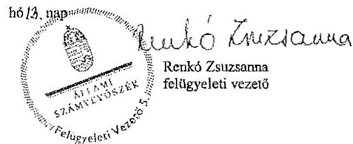

---

# 16. SZÁMÚ MELLÉKLET A V-0779-465/2015. SZÁMÚ JELENTÉSHEZ 

3. számú melléklet
a V-0781-196/2015. számú levélhez
„A helyi önkormányzati képviselők és polgármesterek, valamint a nemzetiségi önkormányzati képviselők 2014. évi választására fordított pénzeszközök felhasználásának ellenőrzése" című jelentéstervezetre tett észrevételre adott válasz

| Észrevétel: | A jelentéstervezet Bevezetés fejezet 3. oldal 1. bekezdés megállapítása:   „Magyarország Köztársasági Elnöke a 2014. évi helyi önkormányzati képviselők és polgármesterek, valamint a nemzetiségi önkormányzati képviselők választását október 12-re tűzte ki."   Az észrevétel szerint:   A megfogalmazás pontosítása indokolt, mivel a nemzetiségi önkormányzati képviselők választását nem Magyarország Köztársasági Elnöke, hanem a Nemzeti Választási Bizottság tűzte ki. |
| :--: | :--: |
| Válasz: | Az Állami Számvevőszék az észrevételt elfogadja. |
| Indoklás: | A megállapítás a téves megfogalmazás miatt, a Nemzeti Választási Bizottság 1128/2014. számú határozatában foglaltak alapján módosításra került. |
| Észrevétel: | A jelentéstervezet Részletes megállapítások 2. A költségvetésből biztosított finanszírozási források elosztása, az előirányzatok kezelése fejezet 12. oldal 7. bekezdés megállapítása:   „Az NVI az önkormányzati és a nemzetiségi választásokra a választás évében, a 2014. évi költségvetésében eredeti előirányzatot nem tervezett, a költségvetés tervezése során az Áht. 12. § (1) bekezdése szerinti közgazdaságilag megalapozott tervezés nem érvényesült. Az önkormányzati választásokkal kapcsolatban a módosított előirányzat az intézményi költségvetésben 2. 952,7 M Ft, a fejezeti kezelésű előirányzaton 3.578,6 M Ft, összesen 6531,3 M Ft volt. (A kapcsolódó lábjegyzet szerint a végleges pénzügyi terv szerinti kiadások összesen 101,2 M Ft-tal meghaladják a módosított előirányzatok összegét.) A módosított előirányzat 1,2\%-át (77,4 M Ft) a személyi juttatások és járulékai, 36,3\%-át (2369,3 M Ft) a dologi kiadások, 7,9\%át (516,0 M Ft) a beruházások, 54,6\%-át (3568,6 M Ft) a működési célú pénzeszközátadások tették ki.   A nemzetiségi választások esetében a módosított előirányzat az intézményi költségvetésben 47,3 M Ft, a fejezeti kezelésű előirányzaton 409,4 M Ft, összesen 456,7 M Ft volt. (A kapcsolódó lábjegyzet szerint a módosított előirányzatok összege 4,3 M Ft-tal több volt, mint a jóváhagyott pénzügyi terv szerinti kiadások összege.) A nemzetiségi választások módosított előirányzatának 10,4\%-át (47,3 M Ft) a dologi kiadások, 89,6\%-át (409,4 M Ft) a működési célú pénzeszközátadások tették ki. A fejezeti kezelésű előirányzaton a 2014. évi megismételt önkormányzati választásokkal kapcsolatban a 12,0 M Ft módosított előirányzat szerepelt."   Az észrevétel szerint:   A hivatkozott bekezdésbeli megállapításhoz megjegyezni kívánják, hogy az NVI a 2014. évi költségvetésében az önkormányzati és nemzetiségi választásokra azért nem tervezett eredeti előirányzatot, mert összhangban a jelentéstervezet 11. oldal 2. pontjának első bekezdésében leírtakkal - az eredeti előirányzat az önkormányzati és |

---

|  | nemzetiségi választásokra már nem biztosított fedezetet. A közgazdaságilag megalapozott tervezés biztosított volt az NVI által 2014. március 3-án elkészített, majd a forrás biztosítását követő módosított előirányzat könyvviteli rendszerben történő rögzítésével. |
| :--: | :--: |
| Válasz: | Az Állami Számvevőszék az észrevételt nem fogadja el. |
| Indoklás: | Az észrevételben foglaltak a megállapítás megalapozottságát nem befolyásolják. Az észrevételben leírtak azt támasztják alá, hogy az eredeti előirányzatok megállapításakor nem, csupán utólag érvényesült a közgazdaságilag megalapozott tervezés elve. |
| Észrevétel: | A jelentéstervezet Részletes megállapítások 4. A választási feladatokra felhasznált pénzeszközök elszámolása fejezet 17. oldal 6. bekezdés megállapítása, valamint a kapcsolódó 18. számú lábjegyzet:   „Az NVI a 3/2014. (VII. 24.) IM rendelet 7. § (4) bekezdésében foglaltak ellenére a szavazás napját követő kilencven napon túl készítette el a TVI-k, valamint a KEKKH elszámolása alapján az önkormányzati és a nemzetiségi választások összeaitó elszámolását."   „A nemzetiségi választások összeaitó elszámolása 2015. március 9-én, az önkormányzati választásoké 2015. március 20-án készült el."   Az észrevétel szerint:   A hivatkozott megállapításhoz megjegyezni kívánják, hogy a választások összeaitó elszámolása 2015. február 12-én készült el, a jelentéstervezetben megjelölt 2015. március 9-e a dokumentum nyomtatásának napját jelenti. A jogszabály által megadott 90 napos elszámolási határidő ebben az esetben két országos választás teljes körű ellenőrzését és adatainak feldolgozására vonatkozott, vagyis ezzel indokolható a határidőn túli elszámolás elkészítése. |
| Válasz: | Az Állami Számvevőszék az észrevételt nem fogadja el. |
| Indoklás: | Az észrevételben foglaltak nem befolyásolják az ellenőrzés megállapítását, mely szerint a helyi önkormányzati képviselők és a polgármesterek választása, valamint a nemzetiségi önkormányzati képviselők választása költségeinek normatíváiról, tételeiről, elszámolási és belső ellenőrzési rendjéről szóló 3/2014. (VII. 24.) számú IM rendelet 7. § (4) bekezdése szerinti határidőt követően készült el az összeaitó elszámolás.   Az észrevételben hivatkozott dátummal készült elszámolást az ellenőrzést végzők számára nem adtak át. A rendelkezésre bocsátott dokumentumok közül az önkormányzati képviselők és polgármesterek választása összeaitó dokumentumán az aláírás mellett a kézzel rájegyzett dátum: 2014. március 20. volt. Az ellenőrzés során átadott nemzetiségi választások NVI kiadásai nélküli összeaitó elszámoláson az NVI gazdasági elnökhelyettese aláírása mellett kézzel rájegyzett dátum 2014. február 16. volt. Az NVI kiadásait is tartalmazó, a nemzetiségi választások kiadásai összegzését tartalmazó elszámoláson kézzel írt dátumozás nem található, a géppel nyomtatott dátum 2014. március 9. volt. Az NVI elnökhelyettese a 2015. március 20-án kelt nyilatkozatában az ellenőrzést végzők részére azt a tájékoztatást adta, hogy a nemzetiségi választások esetében a 2015. február 16-án készült PV011_KIS, valamint a 2015. március 9-én készült PV037_KIS nevű adatállományok tartalmazzák a végleges összeaitó adatokat. Mindezekre tekintettel az észrevételben jelzett dátum helyesbítését nem fogadom el. |

---

Észrevétel: A jelentéstervezet Részletes megállapítások 3.2. A választással kapcsolatos kiadások teljesítésének szabályszerűsége fejezet 16. oldal 2-3. bekezdéseinek megállapítása:
„Az ellenőrzött kifizetések - három, összesen 33,2 M Ft összegű kifizetés kivételével - a 2014. évi önkormányzati és nemzetiségi választások előkészítése és lebonyolítása érdekében merültek fel, célhoz kötöttek és indokoltak voltak."
„A 3/2014. (VII. 24.) IM rendelet. 6. § (1) bekezdésében foglaltak ellenére az önkormányzati választások fejezeti kezelésű előirányzata terhére utalták át és számolták el a KEKKH részére 2014. december 13-én folyósított, az OGY választásokkal kapcsolatban felmerült 31,0 M Ft-ot, valamint a megismételt önkormányzati választások érdekében felmerült 2,2 M Ft kiadást."

# Az észrevétel szerint: 

Az NVI által nem a megfelelő választás kiadásai terhére elszámolt tételek - a három jelentéstervezetben számosságát tekintve öt darab - nagyságrendje és összege is elenyésző volt a négy országos választás vonatkozásában. Az érintett tételek mindegyike a választások érdekében felmerült, szabályszerűen, a megfelelő kiadásnemen elszámolt kiadást jelentett. Az NVI jelenleg és a jövőben is kiemelt figyelmet fordít a feladattípusú elszámolás során a pénzeszközök felhasználásának pontos kimutatására.

Válasz: Az Állami Számvevőszék az észrevételt nem fogadja el.
Indoklás: Az észrevételben foglaltak a megállapítás megalapozottságát nem érintik. Az ellenőrzés értékelve az e téren feltárt hiányosságokat a jelentéstervezetben összességében a kifizetések célhoz kötött, indokolt voltát emelte ki, és ezzel egyidejűleg kivételként kerültek említésre a tévesen, nem a megfelelő választási feladatra elszámolt tételek.

Tájékoztatom Elnök úrhölgyet, hogy a számvevőszéki jelentés mellékleteként szerepeltetjük a jelentéstervezethez tett észrevételét, valamint az arra adott válaszunkat.

Budapest, 2015.
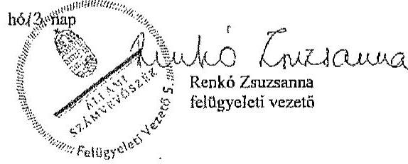

---

.

---

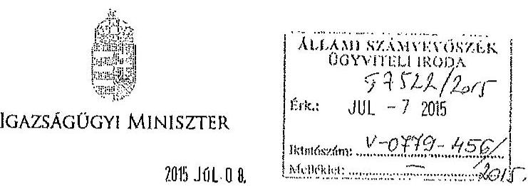

Iktaz.: IX-15/46/1/2015
Hivaz.: V-0779-415/2015, V-0781-82/2015
Ügyisstzá: Szabó Mária
Telefon: 795-4223

Dr. Elek János úr
Főtitkár

Állami Számvevőszék

Budapest

Tárgy: A 2014. évi választásokra fordított pénzeszközök felhasználásának ellenőrzése c. jelentés tervezete

Tisztelt Főtitkár Úr!

A részemre megküldött, „A 2014. évi választásokra fordított pénzeszközök felhasználásának ellenőrzése —

- Az országgyűlési képviselők 2014. évi választására fordított pénzeszközök felhasználásának ellenőrzése;
- A helyi önkormányzati képviselők és polgármesterek, valamint a nemzetiségi önkormányzati képviselők 2014. évi választására fordított pénzeszközök felhasználásának ellenőrzése” című jelentéstervezeteket tisztelettel megkaptam.

A jelentéstervezetekben foglaltakhoz észrevételt nem teszek.

Budapest, 2015. június „20 „.

Piszerk: 1002 Budapest, Pf. 2. Telefon: (06 1) 795 9512 E-mail: info@pustan.gyu.hu

---

.

---

# RÖVIDÍTÉSEK JEGYZÉKE 

## Törvények

Alaptörvény
Áht.
ÁSZ tv.
EHO tv.
Kbt.
Számv. tv.
Szja tv.
Tbj.

Ve.
2013. évi költségvetési törvény
2014. évi költségvetési törvény

## Kormányrendeletek

Áhsz.
Ávr.
Bkr.

218/2011. (X. 19.)
Korm. rendelet

## Miniszteri rendeletek

17/2013. (VII. 17.)
KIM rendelet
28/2013. (XI. 15.) KIM rendelet

Magyarország Alaptörvénye
az államháztartásról szóló 2011. évi CXCV. törvény az Állami Számvevőszékről szóló 2011. évi LXVI. törvény
az egészségügyi hozzájárulásról szóló 1998. évi LXVI. törvény
a közbeszerzésről szóló 2011. évi CVIII. törvény
a számvitelről szóló 2000. évi C. törvény
a személyi jövedelemadóról szóló 1995. évi CXVII. törvény
a társadalombiztosítás ellátásaira és a magánnyugdíjra jogosultakról, valamint e szolgáltatások fedezetéről szóló 1997. évi LXXX. törvény
a választási eljárásról szóló 2013. évi XXXVI. törvény
Magyarország 2013. évi központi költségvetéséről szóló 2012. évi CCIV. törvény
Magyarország 2014. évi központi költségvetéséről szóló 2013. évi CCXXX. törvény
az államháztartás számviteléről szóló 4/2013. (I. 11.) Korm. rendelet
az államháztartásról szóló törvény végrehajtásáról szóló 368/2011. (XII. 31.) Korm. rendelet
a költségvetési szervek belső kontrollrendszeréről és belső ellenőrzéséről szóló 370/2011. (XII. 31.) Korm. rendelet
a minősített adatot, az ország alapvető biztonsági, nemzetbiztonsági érdekeit érintő vagy a különleges biztonsági intézkedést igénylő beszerzések sajátos szabályairól
a központi névjegyzék, valamint egyéb választási nyilvántartások vezetéséről
az országgyűlési képviselők és az Európai Parlament tagjainak választásán a választási irodák hatáskörébe tartozó feladatok végrehajtásának részletes szabályairól, a választási eljárásban használandó nyomtatványokról, valamint a választási eredmény országosan összesített adatai körének megállapításáról

---

Pvr.
68/2013. (XII. 29.) NGM rendelet

## Közjogi szervezetszabályozó eszközök

1157/2014. (III. 20.) Korm. határozat
3/2010. (I. 29.) KüM utasítás
22/2011. (X. 14.) KüM utasítás
2/2014. (III. 31.) KüM utasítás

## Szórövidítések

1/2014. (I. 23.) NVI utasítás
13/2014. számú (IV. 11.) elnöki utasítás

ÁSZ
BÁH
COFOG
eho
EP választás
FVI
HVI

KEKKH
KIH
KIM/IM
az országgyűlési képviselők választása, valamint az Európai Parlament tagjainak választása költségeinek normatíváiról, tételeiről, elszámolási és belső ellenőrzési rendjéről, valamint egyes választási tárgyú miniszteri rendeletek módosításáról szóló 38/2013. (XII. 30.) KIM rendelet
a kormányzati funkciók, államháztartási szakfeladatok és szakágazatok osztályozási rendjéről
a 2014. évi választások lebonyolításához kapcsolódó kötelezettségvállalásról és forrásbiztosításról
Külügyminisztérium pénzkezelési szabályzatáról
Külügyminisztérium gazdálkodásának egyes kérdéseiről
Magyarország külképviseletein lefolytatandó 2014. évi országgyűlési választás pénzügyi tervezésének, lebonyolításának, valamint elszámolásának rendjéről, valamint a külképviseleteken lefolytatandó választás lebonyolításának speciális feladatairól
a kormányhivataloktól igénybe vehető szolgáltatásokról
az országgyűlési képviselők választása forrásainak pénzügyi elszámolási rendjéről
Állami Számvevőszék
Bevándorlási és Állampolgársági Hivatal
Classification of the Functions of Government (kormányzati funkciók besorolása)
egészségügyi hozzájárulás
az Európai Parlament tagjainak 2014. évi választása
Fővárosi Választási Iroda
Helyi Választási Iroda (beleértve az országgyűlési egyéni választókerület székhely településén működő választási irodát)
Közigazgatási és Elektronikus Közszolgáltatások Központi Hivatala
Közigazgatási és Igazságügyi Hivatal
Közigazgatási és Igazságügyi Minisztérium / Igazságügyi Minisztérium (Magyarország minisztériumainak felsorolásáról szóló 2014. évi XX. tv. 1 § (2) bekezdés e) pontja alapján 2014. június 6-ától a minisztérium elnevezése Igazságügyi Minisztérium)

---

| KKM / KüM | Külgazdasági és Külügyminisztérium / Külügyminisztérium (Magyarország minisztériumainak felsorolásáról szóló 2014. évi XX. tv. 1 § (2) bekezdés f) pontja alapján 2014. június 6-ától a minisztérium elnevezése Külgazdasági és Külügyminisztérium) |
| :--: | :--: |
| KÜVI | Külképviseleti Választási Iroda |
| NBB | Országgyűlés Nemzetbiztonsági Bizottsága |
| NVB | Nemzeti Választási Bizottság |
| NVI | Nemzeti Választási Iroda |
| NVR | Nemzeti Választási Rendszer |
| OGY | Országgyűlés |
| OGY választás | az Országgyűlési képviselők 2014. évi választása |
| PIR | Pénzügyi Információs Rendszer |
| szja | személyi jövedelemadó |
| TEA kód | tervezési és elszámolási alapegység kód |
| TVI | Területi Választási Iroda |
| VLOG | Választási Logisztikai Rendszer |
| VPIR | Választási Pénzügyi Információs Rendszer |
| VÜR | Választási Ügyviteli Rendszer |

---

.

---

# ÉRTELMEZŐ SZÓTÁR 

COFOG kód

A kormányzati funkciók mérésére több nemzetközi intézmény az ún. COFOG (Classification of the Functions of Government) szabványt alkalmazza, amely összehasonlíthatóvá teszi különböző országok kormányzati szektorának terjedelmét és összetételét. A funkcionális osztályozás négy kategóriát különböztet meg. (1) Az állami működési funkciók csoportjába az igazgatás, a külügyek, a védelem, a rend- és jogbiztonság, az igazságszolgáltatás tartoznak. (2) A jóléti funkciók körébe a kormányzat által szervezett vagy támogatott oktatási, egészségügyi, társadalombiztosítási, szociális és jóléti szolgáltatások, a lakásügyek és egyéb szolgáltatások tartoznak, (3) a gazdasági funkciókba pedig a kormányzat által szervezett és támogatott gazdasági tevékenységek, és azok fejlesztése (például energiaellátás, mezőgazdaság, közlekedés, távközlés). (4) Az államadósság kezelés kategóriába az államadósság finanszírozásához kapcsolódó kamatkiadások tartoznak. (forrás: Budapest Intézet) A Nemzeti és Regionális Számlák Európai Rendszere (European System of Accounts, ESA95) alkalmazza a kormányzati tevékenységek osztályozását (COFOG), amely használata kötelező a tagállamok számára. A 68/2013. (XII. 29.) NGM rendeletben meghatározott kormányzati funkció kódok megegyeznek az ESA95 osztályozási rendszerében alkalmazott COFOG kódokkal.
informatikai rendszer

A választási informatikai rendszer a Ve.-ben meghatározott választási feladatok végrehajtásában részt vevő és azokat kiszolgáló szervezetek által működtetett informatikai infrastruktúra és alkalmazói rendszerelemek összessége. A választási informatikai infrastruktúra elemei lehetnek különösen: az anyakönyvi szolgáltató rendszer, a fővárosi és megyei kormányhivatalok és járási hivatalaik, kiemelten az okmányirodák, a helyi önkormányzatok és a külképviseletek informatikai eszközei, valamint a választási célú dedikált informatikai eszközök. A választási alkalmazói rendszerek elemei lehetnek különösen: a névjegyzékek vezetését, az ajánlás-ellenőrzést, jelöltek és jelölő szervezetek nyilvántartását, a szavazatösszesítést, az eredmény-megállapítást, a logisztikai lebonyolítást támogató alkalmazói szoftverrendszerek. (forrás: 28/2013. (XI. 15.) KIM rendelet 2. §)
külképviselet
Magyarországnak a Kormány döntése alapján létrehozott, külföldön működő diplomáciai és konzuli képviselete (forrás: Ve. 3. § 5a. pontja)

---

| NVR | Nemzeti Választási Rendszer. A választások előkészítésével és lebonyolításával kapcsolatos alkalmazások összetett informatikai rendszere. Egyes moduljai a Ve.-ben foglalt alapfeladatok - pl. névjegyzék vezetése, szavazatösszesítés, jogorvoslatok kezelése - ellátását biztosítják. (forrás: NVI összefoglaló az általuk üzemeltetett informatikai rendszerekről, 2015. február 20.) |
| :--: | :--: |
| TEA kód | A Tervezési és Elszámolási Alapegység (a továbbiakban: TEA) a Hivatal bevételeinek és kiadásainak gyűjtésére, valamint rendszerezésére szolgáló, a Hivatal teljes tevékenységét átfogó kódrendszer, egyben tartalmazza az önköltségszámítása alapját képező kalkulációs egységeket is. A TEA kódok segítségével a költségek a gazdálkodás bármelyik fázisában elkülöníthetőek. (forrás: KEKKH Önköltségszámítási Szabályzat) |
| VLOG | Választási Logisztikai Rendszer. A választások előkészítési szakaszában a választáshoz szükséges nyomtatványok, egyéb kellékanyagok felmérését, a költségek tervezését, a közbeszerzések előkészítését, a választások lebonyolításakor és azok ellenőrzésének időszakában a szállítások, megrendelések koordinálását, nyomon követését, a szállítmányok logisztikai kezelését és az információszolgáltatást biztosító rendszer. (forrás: NVI összefoglaló az általuk üzemeltetett informatikai rendszerekről, 2015. február 20.) |
| VPIR | Választási Pénzügyi Információs Rendszer. A választásokkal összefüggő költségvetési gazdálkodást - költségvetési tervezés, kötelezettségvállalás, pénzügyi, számviteli elszámolások -, valamint a választási szervek adatainak kezelését, támogatásaik tervezését, finanszírozását, pénzügyi elszámoltatását biztosító rendszer. (forrás: NVI összefoglaló az általuk üzemeltetett informatikai rendszerekről, 2015. február 20.) |
| VÜR | Választási Ügyviteli Rendszer. Zárt rendszerben biztosítja a választási szervek egymás közötti kommunikációját és információközvetítését, eljárásrendek, értesítések, tájékoztatók küldését. (forrás: NVI összefoglaló az általuk üzemeltetett informatikai rendszerekről, 2015. február 20.) |