# ÁLLAMI   SZÁMVEVŐSZÉK 

## JELENTÉS

A 2014. évi választásokra fordított pénzeszközök felhasználásának ellenőrzése - Az Európai Parlament tagjainak 2014. évi választására fordított pénzeszközök felhasználásának ellenőrzése

---

# Állami Számvevôszék 

Iktatószám: V-0780-300/2015.
Témaszám: 1814
Vizsgálat-azonosító szám: V070502

## Az ellenőrzést felügyelte:

## Renkó Zsuzsanna

felügyeleti vezető
Az ellenőrzést vezette és az ellenőrzés végrehajtásáért felelős:
Moder Beatrix
ellenőrzésvezető
A számvevőszéki jelentés összeállításában közremúködött:
Baksa Anikó
számvevő főtanácsos
Dr. Mezei Imréné
számvevő főtanácsos
Az ellenőrzést végezték:

| Belovai Sándorné | Béres László | Czeglédi Dénes |
| :-- | :-- | :-- |
| számvevő főtanácsos | számvevő főtanácsos | számvevő tanácsos |
| Eigner György Zoltán | Farkas László | Federics Adrienn |
| számvevő tanácsos | számvevő tanácsos | számvevő tanácsos |
| Fórián Erika | Jakab Laura | dr. Lajos Béla |
| számvevő tanácsos | számvevő | számvevő főtanácsos |
| Némethné Nagy Mária | Novák Márta | Papp Sándor |
| számvevő | számvevő főtanácsos | számvevő főtanácsos |
| Péntek László | dr. Sinka Zoltán | Tamás László |
| számvevő főtanácsos | számvevő tanácsos | számvevő tanácsos |
| Varsányiné Dudás | Vertkovczi Mária | Vicze Klára |
| Eleonóra | számvevő | számvevő tanácsos |
| számvevő tanácsos |  |  |

## Villányi Antal

számvevő tanácsos
A témához kapcsolódó eddig készített számvevőszéki jelentések:
címe
sorszáma
Jelentés a 2009. június 7 -én megtartott Európai Parlament tagjai 1005
választásának lebonyolításához felhasznált pénzeszközök elszámolásának ellenőrzéséről

---

# TARTALOMJEGYZÉK 

BEVEZETÉS ..... 3
I. ÖSSZEGZŐ MEGÁLLAPÍTÁSOK, KÖVETKEZTETÉSEK ..... 6
II. RÉSZLETES MEGÁLLAPÍTÁSOK ..... 9

1. A választás előkészítéséhez és lebonyolításához szükséges pénzeszközök tervezése ..... 9
1.1. A választás pénzügyi tervezése ..... 9
1.2. A választás informatikai rendszerének kialakítása, a közbeszerzési eljárások lebonyolítása ..... 12
2. A költségvetésből biztosított finanszírozási források elosztása, az előirányzatok kezelése ..... 13
3. A választás előkészítéséhez, lebonyolításához rendelkezésre álló pénzeszközök felhasználása ..... 15
3.1. A választási pénzeszközök nyilvántartása, a felhasználás szabályozottsága. ..... 15
3.2. A választással kapcsolatos kiadások teljesítésének szabályszerűsége ..... 17
4. A választási feladatokra felhasznált pénzeszközök elszámolása ..... 20
5. A választásra fordított pénzeszközök felhasználásának és elszámolásának ellenőrzése ..... 24

## MELLÉKLETEK

1. számú Elnöki hatáskör átruházása
2. számú Az ellenőrzött szervezetek jegyzéke
3. számú A 2014. évi EP választásokhoz kapcsolódó, közbeszerzési értékhatárt elérő beszerzési eljárások
4. számú A gazdálkodási jogkörök gyakorlása az ellenőrzött helyi és területi választási irodáknál
5. számú Bács-Kiskun Megyei Önkormányzat Hivatalának főjegyzőjétől érkezett észrevétel, és az ÁSZ észrevételre adott válasza
6. számú Budapest Főváros XVII. kerület Rákosmenti Polgármesteri Hivatal jegyzőjétől érkezett észrevétel, és az ÁSZ észrevételre adott válasza
7. számú Budapest Főváros Főpolgármesteri Hivatal főjegyzőjétől érkezett nemleges észrevétel

---

8. számú Győr-Moson-Sopron Megyei Önkormányzati Hivatal megyei címzetes főjegyzöjétől érkezett nemleges észrevétel
9. számú Dégi Közös Önkormányzati Hivatal jegyzöjétől érkezett nemleges észrevétel
10. számú Kaposvár Megyei Jogú Város Polgármesteri Hivatal címzetes főjegyzöjétől érkezett észrevétel, és az ÁSZ észrevételre adott válasza
11. számú Budapest Főváros XII. kerület Hegyvidéki Polgármesteri Hivatal jegyzöjétől érkezett észrevétel, és az ÁSZ észrevételre adott válasza
12. számú Hajdú-Bihar Megyei Önkormányzati Hivatal jegyzöjétől érkezett nemleges észrevétel
13. számú A Nemzeti Választási Iroda elnökétől érkezett észrevétel, és az ÁSZ észrevételre adott válasza

# FÜGGELÉKEK 

1. számú Rövidítések jegyzéke
2. számú Értelmező szótár

---

# JELENTÉS 

## A 2014. évi választásokra fordított pénzeszközök felhasználásának ellenőrzése Az Európai Parlament tagjainak 2014. évi választására fordított pénzeszközök felhasználásának ellenőrzése

## BEVEZETÉS

Magyarország 2004. május 1 -jén történt Európai Uniós csatlakozása óta harmadik alkalommal került sor az Európai Parlamentben Magyarország képviselői részére fenntartott parlamenti helyeket betöltő tagok megválasztására. Magyarország köztársasági elnöke az Európai Parlament tagjainak megválasztását (EP választás) 2014. május 25. napjára tűzte ki.

A 2009. évi EP választáshoz képest a 2014-ben esedékes választások jogszabályi háttere és szervezeti keretei alapvetően megváltoztak. A 2011 áprilisában elfogadott Alaptörvény, Magyarország legmagasabb szintű jogi normája, alkotmányos szinten deklarálta a közjogi választásokra vonatkozó legfontosabb alapvetéseket, amelynek keretében a választási eljárásról új törvény (Ve.) megalkotására került sor. A 2013. május 3 -án hatályba lépett Ve. felhatalmazása alapján a közigazgatási és igazságügyi miniszter közzétette a 2014. évi választásokkal kapcsolatos végrehajtási rendeleteket, szabályozta a választási irodák hatáskörébe tartozó feladatok végrehajtásának részletes szabályait ${ }^{1}$. Az Európai Parlament tagjai választásának anyagi jogi szabályairól a többször módosított 2003. évi CXIII. törvény rendelkezett, amely biztosította a szavazás napján külföldön tartózkodó, magyarországi lakóhellyel rendelkező választópolgárok számára, hogy Magyarország külképviseletén adják le szavazatukat. E feladatellátással összefüggően a Külügyminisztériumra háruló pénzügyi, tervezési, elszámolási feladatok szabályszerű végrehajtása érdekében a külügyminiszter utasításban szabályozta a külképviseleteken lefolytatandó EP választás pénzügyi tervezésének, lebonyolításának, valamint elszámolásának rendjét².

A törvény erejével 2013. május 24 -én létrejött az autonóm államigazgatási szervként múködő Nemzeti Választási Iroda (NVI). Az NVI fejezeti jogosítványokkal felruházott központi költségvetési szerv, amelynek költségvetése az Országgyűlés fejezetén belül önálló címet képez. A Ve. előírásai alapján az NVI feladata volt a választások lebonyolításával összefüggő központi feladatok ellátása, a választási irodák szakmai tevékenységének irányítása, valamint a vá-

[^0]
[^0]:    ${ }^{1} 38 / 2013$. (XII. 30.) KIM rendelet
    ${ }^{2} 6 / 2014$. (IV. 30.) Küll utasítás

---

lasztások lebonyolításához szükséges tárgyi és technikai feltételek megteremtése. Feladata volt továbbá a választások lebonyolításához szükséges informatikai rendszer kialakítása és biztonságos múködtetése, valamint a választás központi logisztikai feladatainak ellátása.

A Ve. az NVI feladataként írta elő a választások pénzügyi lebonyolítását. A Pvr. előírása alapján az NVI feladata volt az EP választás pénzügyi feladat- és költségtervének elkészítése. A Pvr. szerint a választási irodák vezetői feleltek az EP választás pénzügyi tervezéséért, lebonyolításáért, elszámolásáért, a pénzeszközök célhoz kötött felhasználásáért és ellenőrzéséért. A választási irodák EP választások céljára biztosított pénzeszközeinek a többi választásra biztosított pénzeszközöktől elkülönített kezelését, a felhasználás részletező nyilvántartásainak vezetését, az elszámolások elkészítését a Pvr. szerint az illetékes önkormányzatok hivatalainak feladatkörébe utalta. A választások előkészítésével és lebonyolításával kapcsolatos pénzeszközök felhasználásáról az NVI-nek a választás napját követő 90 napon belül összesítő elszámolást kellett készítenie.

A Ve. 12. §-a alapján a választások előkészítésével és lebonyolításával kapcsolatos állami feladatok végrehajtásának költségeit, valamint a választási szervek tevékenységével összefüggő egyéb költségeket - az Országgyűlés által megállapított mértékben - a központi költségvetésből kell biztosítani. E pénzeszközök felhasználásáról az Állami Számvevőszék tájékoztatja az Országgyűlést.

A 2014. évi választási feladatok előkészítésének és lebonyolításának pénzügyi fedezetéül a 2013. évi költségvetési törvény 2300 M Ft-ot, a 2014. évi költségvetési törvény 10000 M Ft-ot irányzott elő. A választások zavartalan lebonyolítása érdekében a Kormány az 1157/2014. (III. 20.) számú határozatában felkérte a nemzetgazdasági minisztert, hogy gondoskodjon a szükséges források rendelkezésre bocsátásáról. Az előirányzatokból a 2014. évi EP választásra az NVI a 2013. évben kiadást nem teljesített, 2014-ben 3886,9 M Ft-ot fordított.

Az ellenőrzés célja annak megállapítása volt, hogy az Európai Parlament tagjainak 2014. évi választására fordított pénzeszközök tervezése, felhasználása, elszámolása és annak ellenőrzése szabályszerű volt-e.

Az ellenőrzés alapvető hozadéka az ÁSZ törvényi kötelezettségének teljesítésével az Országgyűlés munkájának segítése, továbbá hogy tájékoztatást nyújtson az ellenőrzésben érintett szervezetek és a szélesebb közvélemény számára az EP választás előkészítésére és lebonyolítására biztosított költségvetési források felhasználásának szabályszerűségéről. Az ellenőrzés rámutathat a vonatkozó jogszabályok, a belső szabályozás, a szabályszerű pénzfelhasználás hiányosságaira, ami segítheti a döntéshozókat az indokolt jogszabály-módosításokra vonatkozó javaslatok kidolgozásában. Az ellenőrzésben érintett szervezetek vonatkozásában az ellenőrzés megállapításai és javaslatai hozzájárulhatnak az EP választás előkészítéséhez és lebonyolításához biztosított költségvetési források felhasználása során esetlegesen előforduló szabályozási hiányosságok megszüntetéséhez, ezáltal a belső kontrollrendszer múködtetésének javításához. Az ellenőrzés szélesebb összefüggéseket bemutató általános tájékozoitságot nyújthat a társadalom számára az EP választás előkészítése és lebonyolítása során felhasznált közpénzekről, hozzájárulhat a civil kontroll erősítéséhez és a közpénzek felhasználásával kapcsolatos közbizalom erősítéséhez. Az ellenőrzés erősíti

---

az ÁSZ hozzáadott értéket teremtő tevékenységét és tanácsadó szerepét, az ÁSZ szervezetén belül pedig az ellenőrzési tapasztalatok gyarapításában, az ellenőrzési programok és a kommunikációs tervek összeállításában hasznosul.

Az ellenőrzést a számvevőszéki ellenőrzés szakmai szabályai szerint, szabályszerűségi ellenőrzés módszerével, a vonatkozó nemzetközi standardok figyelembevételével végeztük.

Az ellenőrzött időszak a választások előkészítésére jóváhagyott költségvetési előirányzat 2013. június 21 -ei rendelkezésre állásától az EP választásokat követő elszámolási időszak végéig terjed.

Az ellenőrzött szervezetek felsorolását az 1. számú melléklet tartalmazza.
Az ellenőrzés végrehajtásának jogszabályi alapját az ÁSZ tv. 5. § (2) bekezdése, valamint a Ve. 12. §-a képezte.

Az ellenőrzés az INTOSAI által kiadott nemzetközi standardok figyelembe vételével, az ellenőrzési programban foglalt szempontok szerint történt.

A választásra fordított pénzeszközök szabályszerű felhasználásának ellenőrzése során a gazdálkodási és ellenőrzési jogkörök gyakorlásának megfelelőségét a személyi juttatásokkal, a dologi kiadásokkal, valamint a felhalmozási kiadásokkal kapcsolatos kifizetések esetében mintavétellel ellenőriztük. ${ }^{3}$ Megfelelőnek értékeltük a jogkörök gyakorlását, amennyiben 95\%-os megbízhatósággal a sokaságban az átlagos megfelelőségi százalék legalább 85\%, részben megfelelőnek értékeltük, ha a sokaságban az átlagos megfelelőségi százalék alsó határa 60 és $85 \%$ között volt, nem megfelelőnek pedig akkor, ha a mintavételi eredmények alapján a sokaságban az átlagos megfelelőségi százalék alsó határa $60 \%$ vagy kisebb volt.

Az alkalmazott rövidítéseket az 1. számú függelék, az egyes fogalmak magyarázatát a 2. számú függelék tartalmazza.

Az ÁSZ tv. 29. § (1) bekezdése szerint a jelentéstervezetet megküldtük az ellenőrzött szervezetek vezetői részére, akik közül az ÁSZ tv. 29. § (2) bekezdésében foglalt észrevételezési jogával élt, a jelentéstervezetre észrevételt tett: BácsKiskun Megyei Önkormányzat Hivatalának főjegyzője, Budapest Főváros XVII. kerület Rákosmenti Polgármesteri Hivatal jegyzöje, Kaposvár Megyei Jogú Város Polgármesteri Hivatal címzetes főjegyzöje, Budapest Főváros XII. kerület Hegyvidéki Polgármesteri Hivatal jegyzöje és a Nemzeti Választási Iroda elnöke.

[^0]
[^0]:    ${ }^{3} 13$ ellenőrzött helyi választási irodánál a kiadási tételek alacsony száma miatt teljes körű ellenőrzést végeztünk.

---

# I. ÖSSZEGZŐ MEGÁLLAPÍTÁSOK, KÖVETKEZTETÉSEK 

A 2014. évi EP választások pénzügyi tervezése, a választásra biztosított források elosztása, az előirányzatok kezelése szabályszerű volt. A pénzeszközök felhasználása - a gazdálkodási és ellenőrzési jogkörök gyakorlásánál feltárt hiányosságok ellenére - döntörészt célhoz kötötten történt. Az elszámolásokat az ellenőrzött szervezetek az előírt tartalommal - a jogszabályi határidőt néhány esetben túllépve - elkészítették, a pénzeszközök felhasználásának és elszámolásának utólagos ellenőrzéséről többségükben gondoskodtak.

Az NVI az EP választás pénzügyi feladat- és költségtervét a jogszabályi előírásoknak megfelelően elkészítette, a 4973,3 M Ft tervezett kiadáshoz képest az összes elszámolt kiadás 3886,9 M Ft, közel 22\%-kal volt alacsonyabb.

## AZ EP VÁLASZTÁSOK ELSZÁMOLT KIADÁSAI

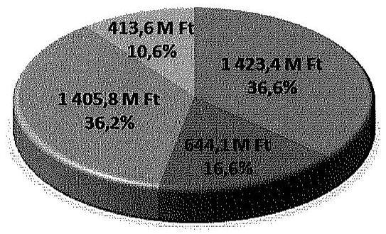

Dologi kiadások (informatikai kiadások nélkül)
$\square$ Informatikai kiadások (felhalmozási és dologi)
$\square$ Személyi juttatások
$\square$ Munkaadót terhelő járulékok

Az NVI a választással kapcsolatos feladatok ellátása érdekében a KüM-vel, illetve a KEKKH-val az előzetesen egyeztetett pénzügyi tervek alapján $73,7 \mathrm{M} \mathrm{Ft}$, illetve $150,8 \mathrm{M}$ Ft összegben megállapodást kötött. Az ellenőrzött választási irodák - egy kivételével - elkészítették a választás pénzügyi tervét, amelyben a központi támogatás mellett saját forrás igénybevételét is tervezték.

Az NVI és a KEKKH a közbeszerzési értékhatárt elérő beszerzések, szolgáltatásvásárlások során a jogszabályi előírásokat betartotta. A KüM és a választási irodák közbeszerzési értékhatárt elérő beszerzést, szolgáltatásvásárlást nem hajtottak végre.

A központi költségvetésből biztosított finanszírozási források elosztása, az előirányzatok kezelése szabályszerű volt. Az NVI fejezeti kezelésű előirányzat felhasználási keretszámláján határidőben, ütemezetten rendelkezésre állt a szükséges forrás. Az NVI az indokolt előirányzat módosításokat a jogszabályi előírások szerint végrehajtotta. Az NVI a választásban részt vevő szervezeteknek - a KEKKH kivételével - a választásokat megelőzően biztosította a feladataik ellátáshoz szükséges fedezetet. A választási irodákat megillető támogatáselőleg

---

folyósítása a jogszabályi előírással összhangban megtörtént. A választásokra biztosított költségvetési támogatás alapján indokolt előirányzat módosításokat az ellenőrzött szervezetek szabályszerűen végrehajtották.

Az NVI, a KEKKH, és a KüM a választások céljára biztosított pénzeszközök elkülönített számviteli kezelését kialakította, a tényleges pénzforgalomról megfelelő tartalommal vezették a választási feladatokkal kapcsolatos részletezö nyilvántartást. Az ellenőrzött választási irodák $80,8 \%$-a biztosította a választás céljára biztosított pénzeszközök elkülönített kezelését, a tényleges pénzforgalomról $73,1 \%$-uk vezetett az előírásoknak megfelelő részletező nyilvántartást.

Az ellenőrzött szervezetek rendelkeztek a gazdálkodási és ellenőrzési jogkörök gyakorlását meghatározó szabályozással. Az EP választáshoz kapcsolódó ellenőrzött kiadások esetében a gazdálkodási jogkörök gyakorlása az NVI-nél összességében megfelelt, a KEKKH-nál részben felelt meg, a KüM-nél nem felelt meg a jogszabályok és a belső szabályzatok előírásainak. A KEKKH-nál a pénzügyi ellenjegyzés és az érvényesítés, a. KüM-nél valamennyi gazdálkodási jogkör gyakorlásánál tárt fel hiányosságokat az ellenőrzésünk. A gazdálkodási jogkörök gyakorlása az ellenőrzött választási irodák 30,8\%-ánál megfelelt, $19,2 \%$-ánál részben felelt meg, $50 \%$-ánál nem felelt meg a jogszabályok és a belső szabályzatok előírásainak.

Az EP választásra biztosított pénzeszközök felhasználása az NVI-nél egy tétel kivételével, a KüM-nél és a KEKKH-nál minden esetben célhoz kötötten történt. Az NVI egy 6,5 M Ft összegű, az önkormányzati választás előkészítése érdekében felmerült kiadást szabálytalanul az EP választások kiadásaként számolt el. Az ellenőrzött választási irodák 88,5\%-ánál az EP választáshoz biztosított támogatás felhasználása célhoz kötött volt. Három HVI teljesített - összesen 91,6 E Ft összegben - olyan kiadást, amelyek esetében a cél szerinti felhasználást dokumentumokkal nem támasztották alá.

Az ellenőrzött szervezetek az elszámolási kötelezettségüknek az előírt formában, - négy HVI, egy TVI, a KEKKH és a KüM kivételével - a jogszabályban meghatározott határidőben tettek eleget. A TVI vezetők szabályszerűen döntöttek a HVI elszámolások és a többletköltség igények elfogadásáról. A HVI vezetők személyi juttatásainak kifizetése az elszámolások elfogadását követően, a TVI vezetők és tagok személyi juttatásainak kifizetése, a többlettámogatások utalása szabályszerűen, határidőben megtörtént.

Az NVI által elfogadott elszámolás alapján a KEKKH-t a folyósított előlegen felül 15,9 M Ft illette meg, amelyet az NVI - az OGY választás elszámolása alapján még pénzügyileg nem rendezett összeg beszámításával - utalt át a szervezet számlájára. Az elszámolás alapján járó különbözetet a KEKKH a bruttó elszámolás számviteli alapelv megsértésével rögzítette a nyilvántartásaiba. A KüM 63,7 M Ft összegű elszámolását az NVI elfogadta. A folyósított előlegből visszatérítendő összeg rendezése megtörtént. Az ellenőrzés megállapítása szerint a KüM által elszámolható összeg 63,2 M Ft volt. Az eltérés az elszámolásban nem érvényesített árfolyam-különbözetből, és a külföldi napidíjak után téves összegben kimutatott járulékokból adódott. Az NVI a választási irodák és az

---

egyéb szervezetek elfogadott elszámolásai alapján a Pvr.-ben előírt határidőn túl elkészítette a választási kiadások összesítő elszámolását.

A jogszabályban előírt ellenőrzési kötelezettségnek az NVI, a KEKKH, a KüM, valamennyi TVI és a HVI-k 78,4\%-a szabályszerűen eleget tett. Négy HVI-nél a Pvr.-ben foglaltak ellenére a támogatás felhasználásának és elszámolásának ellenőrzését nem végezték el.

---

# II. RÉSZLETES MEGÁLLAPÍTÁSOK 

## 1. A VÁlasztÁs elökészítéséhez és lebonyolítÁsÁhoz szüksÉGES PÉNZESZKÖZÖK TERVEZÉSE

### 1.1. A választás pénzügyi tervezése

Az NVI 2014. március 3-án elkészítette az EP választás pénzügyi fel-adat- és költségtervét.

A pénzügyi feladat- és költségtervet a választás kiadásaira helyi, területi, és központi, valamint külképviseleti kiadásokra, kiemelt előirányzatonként, ezen belül feladatonkénti bontásban készítették el. A tervezés során figyelembe vették a jogszabályban meghatározott normatív tételeket továbbá a választás lebonyolításában közreműködő egyéb szervezetekkel kötendő megállapodások alapján várható kiadásokat. A pénzügyi feladat- és költségtervet nem módosították.

Az EP választásra az NVI összesen 4973,3 M Ft kiadást tervezett. A kiadások 40,9\%-át, 2033,6 M Ft-ot helyi és területi kiadásként, 55,1\%-át, 2739,7 M Ft-ot központi kiadásként, 4\%-át, 200,0 M Ft-ot a külképviseleti választások lebonyolítására tervezte.

AZ EP VÁLASZTÁSOKRA TERVEZETT KIADÁSOK MEGOSZLÁSA
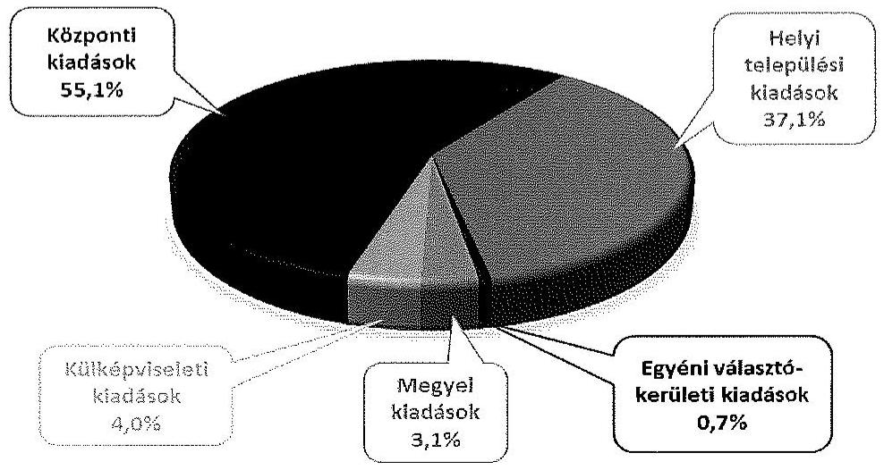

Az NVI elnöke a választások előkészítése keretében kiadta az 1/2014. (I. 23.) NVI utasítást a kormányhivataloktól igénybe vehető szolgáltatások köréről. A 28/2013. (XI. 15.) KIM rendelet előírása alapján a megyei kormányhivatalokkal 2014 márciusában megkötötték a megállapodást az EP választással kapcsolatos feladatok ellátása érdekében.

---

Az NVI az EP választás lebonyolításával kapcsolatos informatikai és külképviseleti feladatok ellátása érdekében megállapodásokat kötött a KEKKH-val és a KüM-mel.

Az NVI 2013. november 5-én keretszerződést kötött a KEKKH-val, a 2014. évi választások előkészítésével és lebonyolításával kapcsolatos informatikai feladatok ellátására.

A 2014. évi EP választásokhoz kapcsolódóan a KEKKH ellátta a választás pénzügyi tervezésével kapcsolatos feladatokat, a választás pénzügyi terve feladatonként tartalmazta a kiadásokat.

A költségvetési javaslat 4 fő részből állt: 1. IT bérjellegủ költségek, 2. Helpdesk, 3. Kiemelt rendelkezésre állás, és 4. Egyéb költségek. A fejezeteket tervsorokra bontották. A dologi (a 3-4) fejezetekben egy tervsor egy-egy szolgáltatásvásárlást, beszerzést tartalmazott, a bekért ajánlatok és a piaci információkból készült kalkuláció alapján.

A 2014. március 26-án az NVI-hez eljuttatott előzetes költségvetési javaslat 186,0 M Ft volt. A megállapodást - a feladatok ütemezéséről és a finanszírozás mértékéről történő egyeztetések elhúzódása miatt - a választást követően, 2014 júliusában kötötték meg. A Pvr.-ben az egyéb szervezetekkel (KEKKH, KüM) kötendő megállapodások megkötésének határidejét nem rögzítették.

A megállapodás részét képező végleges költségvetés 150,8 M Ft költségvetési támogatást irányzott elő a választás kiadásaira. A megállapodás 1. pontjában rögzítették, hogy a támogatás $80 \%$-át a megállapodás mindkét fél általi aláírását követő 8 munkanapon belül folyósítja az NVI a KEKKH részére. Az NVI a megállapodásban előírta a költségek tételes elkülönített nyilvántartását, és a megállapodás melléklete szerinti, kiadási jogcím-mélységủ elszámolási kötelezettséget 2014. július 14-ei határidővel.

Az NVI a támogatás $80 \%$-ának megfelelő összeget (120,6 M Ft-ot) a megállapodás mindkét fél általi aláírásának napján, 2014. július 8-án átutalta a KEKKH-nak. A megállapodásban foglaltak szerint a fennmaradó összeg pénzügyi rendezésére a tényleges költségelszámolás alapján, az elszámolás elfogadását követően került sor.

A külpolitikáért felelős miniszter a 6/2014. (IV. 30.) KüM utasításban rendelkezett Magyarország külképviseletein lefolytatandó 2014. évi EP választás pénzügyi tervezésének, lebonyolításának, elszámolásának rendjéről, valamint a külképviseleteken lefolytatandó választás lebonyolításának speciális feladatairól.

A KüM az EP választás külképviseleti feladatainak végrehajtásához elkészítette a részletes pénzügyi tervet. A tervezés során 98 külképviseleti szavazóhellyel számoltak.

A személyi juttatások tervezésekor a KÜVI elnökök és tagok díjai esetében a Pvr. 2. sz. mellékletében szereplő normatív tételeket a KüM figyelembe vette. Ezen felül a személyi juttatások között megtervezték a külképviseleti választási irodák kiutazó vezetőinek, tagjainak, egyéb munkatársainak napidíját, a dologi kiadá-

---

sok között az utazási és szállás költségeket, valamint tartalékot a le nem zárt külképviseleti jelentkezésekre tekintettel.

A KüM-nek - a választási rendszer változása miatt - nehézséget okozott a várható kiadások becslése, ezért elhúzódott a felek közötti egyeztetés, az NVI-KüM közötti megállapodás aláírása. A 2014 májusában létrejött megállapodás tartalmazta a KüM által ellátandó feladatokat, a végleges - 73,7 M Ft összegű pénzügyi terv a megállapodás mellékletét képezte. A megállapodás szerint a támogatás utalására a megállapodás aláírását követően 3 munkanapon belül kerül sor, mely a 2014. május 23 -i utalással teljesült.

Az NVI a megállapodásban előírta a költségek tételes, elkülönített nyilvántartását, valamint az NVI által biztosított pénzügyi informatikai rendszerben történő elszámolási kötelezettséget, a Pvr.-ben foglalt 50 napos elszámolási határidővel összhangban.

A Pvr. előírásainak megfelelően, az ellenőrzött 26 választási iroda közül 25 elkészítette az EP választás pénzügyi tervét, melyek 68,0\%-a a támogatásról szóló értesítés megküldését, illetve a támogatás előleg átutalását követő időpontban készült. Kaposmérő HVI vezetője a Pvr. 1. § (2) bekezdés a) pontján alapuló pénzügyi tervezési kötelezettségének nem tett eleget, a TVI által részére megküldött, a támogatásról szóló értesítést tekintette pénzügyi tervnek. A pénzügyi terv elkészítésének határidejét, és a tervezéssel szemben támasztott követelményeket (pénzügyi terv tartalma, felépítése) a jogszabályban nem határozták meg, ezért a tervezés az ellenőrzött választási irodáknál nem egységes elvek mentén történt.

A Pvr. által biztosított jogszabályi lehetőség alapján a pénzügyi tervek 32,0\%-ában (8 pénzügyi tervben) - az állami támogatáson kívül - önkormányzati saját forrás igénybevételét is előirányozták ${ }^{4}$.

A pénzügyi tervet készítő választási irodák 44,0\%-a (11 választási iroda) módosította a pénzügyi tervét, melyre 9 esetben az EP választást követő időpontban, a tényleges kiadások figyelembe vételével került sor.

A pénzügyi tervek módosítása elsősorban a többletköltségek kimutatására irányult, illetve az egyes kiemelt kiadási előirányzatok közötti átcsoportosításokat tartalmazta. A Pvr. 2. mellékletében a dologi kiadások között szerepelt - 10204 jogcímen - a választásnapi ellátás költsége, ezzel szemben annak nettó összege a 2014. január 1-jétől hatályos számviteli előírások ${ }^{5}$ alapján személyi juttatásnak minősült. Azok a választási irodák, amelyek a rendelettel azonosan, a dologi kiadások között tervezték a választásnapi ellátás költségeit, a pénzügyi terv módosításakor - Kalocsa HVI kivételével - a hatályos számviteli előírásoknak megfelelően átcsoportosították e kiadások nettó összegét a személyi juttatások közé.

[^0]
[^0]:    ${ }^{4}$ A saját források igénybevétele elsősorban a személyi juttatásokra biztosított normatív összegek kiegészítését célozta.
    ${ }^{5}$ Áhsz. 15. mellékletének K123. Egyéb külső személyi juttatások f) pontja

---

# 1.2. A választás informatikai rendszerének kialakítása, a közbeszerzési eljárások lebonyolítása 

Az NVI a 2014. évi választásokhoz kialakította és üzemeltette az informatikai rendszereit, amelynek részei az NVR, a VÜR, a VLOG és a VPIR. A rendszerek kialakítása az OGY választás előtt megtörtént, az EP választáshoz azok egyes moduljainak bővítését, a pénzügyi, logisztikai szoftverek módosítását végezték el.

Az NVI elnöke a választási irodák közti kommunikáció, az adatszolgáltatás és az operatív irányítás érdekében a VÜR müködtetéséről és használatáról intézkedést ${ }^{6}$ adott ki. Az egyes informatikai alkalmazásokhoz kapcsolódó felhasználói kézikönyveket a választási irodák és egyéb szervek számára a VÜR-ben elérhetővé tette.

Az NVI számára - a 17/2013. (VII. 17.) KIM rendelet 1. § (3) bekezdése szerint a központi informatikai rendszer múködtetési környezetének infrastrukturális hátterét és annak elérhetőségét a KEKKH biztosította.

A KEKKH - az informatikai rendszer üzemeltetőjeként - keret-szerződés ${ }^{7}$ alapján gondoskodott az informatikai rendszerekbe történő bejelentkezés, betekintés, adatlekérés, adatmódosítás naplózásáról, a napló adatainak megőrzéséről. Az informatikai rendszert biztonsági szempontból a Nemzeti Biztonsági Felügyelet a választásokat megelőzően ellenőrizte.

Az NVI elnöke 2014. május 20 -án kiadta az EP választással kapcsolatos esetleges internetes támadás, a választási alkalmazásokat érintő illetéktelen behatolási kísérlet, egyéb nem várt informatikai esemény esetén követendő eljárásrendet ${ }^{8}$. A választási végpontok biztonságos múködésére vonatkozó utasítás hatálya kiterjedt a választások előkészítése, lebonyolítása, elszámolása során használt valamennyi alkalmazásra ${ }^{9}$.

A közbeszerzési értékhatárt elérő beszerzések, szolgáltatásvásárlások során a jogszabályok előírásait betartották. Az EP választás lebonyolításához kapcsolódó, közbeszerzési értékhatárt elérő beszerzési eljárásokat a 2. számú melléklet ismerteti.

Az NVI az EP választás előkészítéséhez és lebonyolításához kapcsolódó informatikai fejlesztések, a meglévő rendszerek üzemeltetése, továbbá nyomdai szolgáltatások beszerzése, valamint a választási eredmény auditjához - összesen négy beszerzési eljárás esetében - a 218/2011. (X. 19.) Korm. rendelet 3. § (1) bekezdése alapján kérte az NBB-től a Kbt. hatálya alóli mentesítést, amelyet minden esetben megkapott. A hirdetmény nélküli tárgyalásos beszerzési eljárásokat, illetve a nyomdai szolgáltatások esetében a könnyített eljárást a Kbt. és

[^0]
[^0]:    ${ }^{6}$ 2/2013. (X. 8.) NVI intézkedés
    ${ }^{7}$ Az NVI a KEKKH-val 2013. november 5-én kötött keret-szerződést.
    ${ }^{8} 18 / 2014$. (V. 20.) elnöki utasítás
    ${ }^{9}$ NVR, VÜR, VPIR, VLOG informatikai rendszerek.

---

a 218/2011. (X. 19.) Korm. rendelet előírásainak megfelelően folytatták le. Az így megkötött szerződések alapján az EP választásra összesen 951,1 M Ft-ot számoltak el, ebből 194,4 M Ft-ot a felhalmozási, 756,7 M Ft-ot a dologi kiadások között. A felhalmozási célú kiadásokat az NVI az Áhsz.-ben és az intézményi számviteli politikájában előírtaknak megfelelően - szellemi termékként (147,9 M Ft összegben), illetve vagyoni értékű jogként (46,5 M Ft összegben) aktiválta.

Az NVI a Nemzeti Távközlési Gerinchálózat és alrendszereihez csatlakozó végpontok közötti adatátviteli hálózat használatához 2013. november 1-jétől 2014. december 31-éig terjedő időszakra, valamennyi 2014. évi választás lebonyolítása érdekében felhasználói szerződést kötött a - szolgáltatásra a 346/2010. (XII. 28.) Korm. rendelet ${ }^{10}$ 3. § (2) bekezdése alapján kizárólagosan jogosult - NISZ Zrt.-vel.

A KEKKH az EP választást is érintően három közbeszerzési értékhatárt elérő beszerzést hajtott végre a jogszabályi előírásoknak megfelelően. A beszerzések összesen 96,4 M Ft szolgáltatási értékben valósultak meg, amelyből az EP választásra $78,0 \mathrm{M}$ Ft-ot számoltak el.

Az EP választás lebonyolítása érdekében a KüM, a helyi és területi választási irodák közbeszerzési értékhatárt elérő beszerzést, szolgáltatásvásárlást, beruházást, felújítást nem hajtottak végre.

# 2. A KÖLTSÉGVEtÉSBŐL BIZTOSÍTOTT FINANszírozÁSI FORRÁSOK ELOSZTÁSA, AZ ELŐIRÁNYZATOK KEZELÉSE 

A 2014. évi választások előkészítésére és lebonyolítására a 2013. évi költségvetési törvény szerint 2300,0 M Ft, a 2014. évi költségvetési törvény szerint 10000,0 M Ft támogatás állt az NVI rendelkezésére a fejezeti kezelésű előirányzatok között. Az 1316/2014. (V. 22.) Korm. határozat 400,0 M Ft-tal növelte a választásokra biztosított költségvetési támogatás összegét. A szükséges pénzügyi fedezet az NVI fejezeti kezelésű előirányzat felhasználási keretszámláján határidőben, ütemezetten rendelkezésre állt.

Az NVI a számviteli politikájában, a fejezeti kezelésű előirányzatok szabályzatában és a gazdálkodásra vonatkozó egyéb belső szabályzataiban meghatározta az intézményi és fejezeti kezelésű előirányzatok felhasználásának részletes szabályait.

Az NVI 2013-ban az EP választás előkészítésével és lebonyolításával kapcsolatos kiadásaira eredeti előirányzatot nem tervezett. Előirányzat-módosítással az intézmény dologi kiadásainak előirányzatát $72,0 \mathrm{M}$ Ft-tal, a felhalmozási kiadásainak előirányzatát $75,6 \mathrm{M}$ Ft-tal megemelte a költségvetési támogatás terhére. A módosított, összesen 147,6 M Ft kiadási előirányzat terhére 2013-ban teljesítést nem számoltak el.

[^0]
[^0]:    ${ }^{10}$ 346/2010. (XII. 28.) Korm. rendelet a kormányzati célú hálózatokról

---

2014-ben a fejezeti kezelésű előirányzaton az EP választással kapcsolatos összes eredeti előirányzat $2761,9 \mathrm{M}$ Ft, a módosított előirányzat $2981,8 \mathrm{M}$ Ft, a teljesítés $2374,5 \mathrm{M}$ Ft volt.

A fejezeti kezelésű előirányzatok között az egyéb működési célú pénzeszközátadás 2761,9 M Ft eredeti előirányzata 2971,4 M Ft-ra módosult és 2366,4 M Ft-ra teljesült. A dologi kiadásokra eredeti előirányzatot nem terveztek, módosított előirányzata $10,4 \mathrm{M}$ Ft, teljesítése $8,1 \mathrm{M}$ Ft volt ${ }^{11}$.

Az intézményi előirányzatok között 2014-ben az EP választással kapcsolatban az NVI eredeti előirányzatot nem tervezett, a módosított előirányzat 2159,9 M Ft, a teljesítés 1494,9 M Ft volt.

A személyi juttatások módosított előirányzata és a teljesítés $11,8 \mathrm{M}$ Ft volt, a munkaadót terhelő járulékok és szociális hozzájárulási adó $3,2 \mathrm{M}$ Ft-ra módosult és ugyanilyen összegben teljesült. A dologi kiadások módosított előirányzata 1592,2 M Ft volt és 1233,0 M Ft-ra teljesült, a felhalmozási kiadásoké $552,7 \mathrm{M}$ Ftra módosult és $246,9 \mathrm{M}$ Ft-ban teljesült.

A választási források biztosítása érdekében a fejezeti hatáskörű előirányzatmódosításokat az NVI elnöke ${ }^{12}$, a saját hatáskörű intézményi előirányzat módosításokat a gazdasági főosztályvezető kezdeményezésére, a jogszabályi előírásoknak megfelelően, szabályszerűen hajtották végre.

Az NVI a fejezeti kezelésű előirányzatokból a KüM-mel kötött megállapodás szerinti teljes összeget, 73,7 M Ft-ot egyéb múködési célú pénzeszköz-átadásként 2014. május 23-án átutalta a KüM számlájára. A KEKKH-val kötött megállapodás szerinti $150,8 \mathrm{M}$ Ft összegű egyéb múködési célú támogatás $80 \%$-át, 120,6 M Ft-ot, az NVI „előlegként" 2014. július 8-án, a választást követően utalta a KEKKH számlájára, így a KEKKH kiadásainak fedezetére a támogatás előzetesen nem állt rendelkezésre. A választási feladatok finanszírozására szolgáló központi költségvetési forrás választás napját követő folyósítása jogszabályi előírásba nem ütközött, mivel a választásban részt vevő egyéb szervezeteket megillető támogatás folyósításának határidejéről a jogszabályok nem rendelkeznek.

Az NVI a választási irodáknak a Pvr. előírásának megfelelően a választásokat megelőzően biztosította a feladataik ellátásához szükséges fedezetet, a TVI-k részére a normatíva előlegeket, összesen 1982,1 M Ft-ot a választás napját megelőző harmincadik napig, 2014. április 25 -én kiutalta. A HVI-ket megillető támogatáselőleget az ellenőrzött TVI-k - a jogszabály szerinti határidőben - a választás napját megelőző 20. napig ${ }^{13}$ folyósították az önkormányzati hivatalok fizetési számlájára. A választással kapcsolatban felmerülő kiadások teljesítésekor a szükséges fedezet a választási irodák rendelkezésére állt.

[^0]
[^0]:    ${ }^{11}$ A fejezeti kezelésű előirányzaton a dologi kiadásokat a pénzeszközátadások (átutalások) tranzakciós költsége jelentette.
    ${ }^{12}$ A 2014. évi költségvetési törvény 48. § (1) bekezdés a) pontja és 48. § (2) bekezdése alapján.
    ${ }^{13}$ 2014. április 29 - május 5. között

---

A KEKKH a költségvetésében a választással kapcsolatban eredeti előirányzatot, illetve az EP választás kiadásaira saját forrás felhasználást nem tervezett. A megállapodás szerint az NVI-től két részletben kapott támogatási összegekkel azonos mértékben a szervezet a bevételi és kiadási előirányzatait megemelte.

A KüM az EP választással kapcsolatban eredeti előirányzatot, illetve a kiadásokra saját forrást nem tervezett. Az előirányzat módosításokat a kapott támogatással azonos összegben a Központi Igazgatás címen 2014. november 28-án, utólag, végrehajtotta. Az EP választásra biztosított pénzeszköz felhasználása és elszámolása a KüM Központi Igazgatás címen történt, a külképviseleteken felmerülő kiadásokat a Központi Igazgatás cím pénzeszköz átadással megtérítette a Külképviseletek Igazgatása címnek.

Az ellenőrzött helyi és területi választási irodák irányító szerveinek 15,4\%-a tervezett a 2014. évi költségvetésében az EP választással kapcsolatos eredeti előirányzatot. A választásra biztosított támogatásokat az önkormányzatok évközi előirányzat-módosítással beépítették a költségvetési rendeletükbe.

# 3. A VÁlasztÁs elöKészítéséHez, lebonyolítÁsához RENDELKEZÉSRE ÁLLÓ PÉNZESZKÖZÖK FELHASZNÁLÁSA 

### 3.1. A választási pénzeszközök nyilvántartása, a felhasználás szabályozottsága.

Az NVI kialakította a választások céljára biztosított pénzeszközök elkülönített számviteli kezelését. A főkönyvi könyvelésben, a jogszabályban előírt 016010 COFOG kódon ${ }^{14}$ belül a választásonként elkülönített kezelést külön tervezési és elszámolási alapegység kódokon - az EP választásra biztosított pénzeszközökre vonatkozóan a 1010201 TEA kódon - biztosította. A tényleges pénzforgalomról a Pvr. előírásának megfelelő tartalmú részletezö nyilvántartást vezetett.

A KEKKH az EP választások költségeit és bevételeit nem a 68/2013. (XII. 29.) NGM rendelet 1. számú mellékletében kijelölt kormányzati funkción ${ }^{15}$ tartotta nyilván, azonban a Pvr. szerinti elkülönített nyilvántartás a TEA kódok alkalmazásával megvalósult. A KEKKH a tényleges pénzforgalomról a Pvr.-ben meghatározott tartalommal részletezö nyilvántartást vezetett.

A 68/2013. (XII. 29.) NGM rendelet 1. számú mellékletében foglaltaktól eltérően az EP választási pénzeszközöket nem a 016010 COFOG kódon, hanem a 011120 (Kormányzati Igazgatási tevékenység) kódon tartották nyilván. Ugyanakkor a kialakított TEA kódok biztosították a főkönyvi rendszerben a saját, illetve központi forrásból finanszírozott kiadások elkülönített kezelését. ${ }^{16}$

[^0]
[^0]:    ${ }^{14}$ Országgyűlési, önkormányzati és Európai Parlamenti képviselőválasztáshoz kapcsolódó tevékenységek
    ${ }^{15} 016010$ COFOG kódon
    ${ }^{16} 1011911$ kódon a kapott támogatást és abból teljesített kiadásokat, a 1011912 kódon a saját forrásból teljesített kiadásokat.

---

A támogatás felhasználásának nyomon követése és az elszámolás megalapozása érdekében emellett nyilvántartást vezettek a költségvetési tervsorokhoz kapcsolódó aktuális tényadatokról.

A 6/2014. (IV. 30.) KüM utasítás előírta az EP választás céljára biztosított pénzeszközök elkülönített kezelését, a tényleges pénzforgalomról a Pvr.-nek megfelelő, részletező nyilvántartás vezetését. A KüM az EP választással kapcsolatos bevételeket és kiadásokat az előírásoknak megfelelően, a kijelölt COFOG kódon tartotta nyilván. Az OGY választástól történő elkülönítést külön szakfeladat alkalmazásával biztosította, valamint a külképviseleteken felmerülő kiadásokat külön ügyletkódon tartotta nyilván.

A választás céljára biztosított pénzeszközök számviteli nyilvántartásban történő elkülönített kezelését az ellenőrzött választási irodák 80,8\%-ánál (21 választási irodánál) biztosították. Öt HVI-nél ${ }^{17}$ a választásonkénti elkülönítést a Pvr. 1. § (2) bekezdés d) pontja és a 6. § (1) bekezdés előírása ellenére nem biztosították.

Az EP választással összefüggő tényleges pénzforgalomról az ellenőrzött választási irodák 73,1\%-a (19 választási iroda) vezetett az előírásoknak megfelelő részletező nyilvántartást. Valamennyi ellenőrzött TVI részletező nyilvántartása megfelelő volt. Két HVI a Pvr. 6. § (2) bekezdés előírása ellenére a pénzforgalomról nem vezetett részletező nyilvántartást, öt HVI részletező nyilvántartása nem, vagy csak részben felelt meg a jogszabályi előírásnak.

A Berzencei, Sárosdi HVI részletező nyilvántartást nem vezetett. A Szentendrei HVI a részletező nyilvántartást a választást követően, csak a személyi juttatásokra készítette el, azonban az így elkészített nyilvántartás sem tartalmazta valamennyi, a választással kapcsolatban felmerült személyi kiadást. A Bősárkányi és a Kalocsai HVI részletező nyilvántartása hiányos volt, nem tartalmazta teljes körűen a személyi és dologi kiadásokat, az nem volt alkalmas a támogatással való elszámolás alátámasztására.

Az Öttevényi és a Bácsbokodi HVI nyilvántartása a teljesített kiadásokat teljes körűen tartalmazta, azonban Öttevény HVI a bevételeket a részletező nyilvántartásban nem mutatta be, Bácsbokod HVI részletező nyilvántartásában pedig a kiadásokat nem bontották meg saját forrás, illetve a támogatás terhére teljesített kiadás szerint.

Az NVI rendelkezett - a jogszabályi előírásokkal összhangban elkészített - a gazdálkodásra vonatkozó belső szabályzatokkal.

A KEKKH a jogszabályi előírásoknak megfelelően elkészítette a gazdálkodásra - köztük a gazdálkodási jogkörök gyakorlására - vonatkozó szabályzatait. A KEKKH SZMSZ-e részletesen meghatározta a választási projektek tervezését összefogó Projektiroda tevékenységét. Az Önköltség-számítási Szabályzatban rendelkeztek az általános költségeknek a választási feladatok és a Hivatal alapfeladatai közötti megosztásának módjáról.

[^0]
[^0]:    ${ }^{17}$ Berzence, Bősárkány, Kalocsa, Kaposmérő és Penc HVI-nél a 2014. évi (OGY, EP, önkormányzati és nemzetiségi) választások pénzeszközeit együttesen kezeltek.

---

A KüM az EP választás lebonyolítását, pénzügyi elszámolását megfelelően szabályozta. Az SZMSZ-e értelmében a közigazgatási államtitkár felügyeli a Ve.-ben meghatározott, a minisztérium számára előírt feladatok végrehajtását. Az EP választás előkészítése és lebonyolítása szakmai koordinációja a külképviseleti választások lebonyolításáért felelős miniszteri biztos feladata volt. A KüM gazdálkodásának egyes kérdéseiről szóló 22/2011. (X. 14.) KüM utasítás (Kötelezettségvállalási szabályzat) tartalmazta a gazdálkodási jogkörök gyakorlására vonatkozó általános, a 6/2014. (IV. 30.) KüM utasítás az EP választás lebonyolításával kapcsolatos speciális szabályokat.

Az ellenőrzött helyi és területi választási irodák rendelkeztek a gazdálkodási és ellenőrzési jogkörök gyakorlásának rendjét meghatározó belső szabályzattal, melyben figyelembe vették az összeférhetetlenségi követelményekre vonatkozó előírásokat is. A választási irodák 65,4\%-a esetében (17 választási irodánál) külön szabályzatban rendelkeztek az EP választással kapcsolatban a gazdálkodási, ellenőrzési jogkörök gyakorlásáról, 9 választási iroda az önkormányzati-, illetve a polgármesteri hivatal hatályos gazdálkodási (kötelezettségvállalási) szabályzatát alkalmazta a választásokkal kapcsolatos pénzügyi feladatok ellátása során. A belső szabályzatokban meghatározták a kötelezettségvállalás, az ellenjegyzés, a teljesítésigazolás, az érvényesítés és az utalványozás rendjét, és megtörtént a gazdálkodási, ellenőrzési jogköröket gyakorló személyek kijelölése és a felhatalmazása.

Tekintettel arra, hogy a választási irodáknál felmerülő kiadások jelentős részét a tiszteletdíjak, megbízási díjak, jutalmak tették ki, melyek egyedi összege jellemzően nem érte el a 100,0 E Ft-ot, e kifizetésekkel kapcsolatban a jogszabályban rögzített értékhatárt el nem érő kifizetésekre vonatkozó belső szabályozásoknak kiemelt jelentőségük volt. Öt HVI-nél ${ }^{18}$ a belső szabályzat az Ávr. 53. § (1) bekezdésével összhangban tartalmazta azokat az eseteket, mikor nem szükséges előzetes írásbeli kötelezettségvállalás, azonban ezen kifizetések rendjét a HVI vezetője - az Ávr. 53. § (2) bekezdésének előírása ellenére - nem szabályozta. Egyes választási irodák ${ }^{19}$ a belső szabályzataikban rögzítették, hogy értékhatártól függetlenül kötelezettséget vállalni csak írásban lehet.

# 3.2. A választással kapcsolatos kiadások teljesítésének szabályszerüsége 

Az NVI-nél - az ellenőrzésre kiválasztott mintatételek alapján - a gazdálkodási jogkörök gyakorlása összességében megfelelt a jogszabályok és a belső szabályzatok előírásainak. Kötelezettségvállalásra minden esetben az arra jogosult által írásban, pénzügyi ellenjegyzést követően került sor. A kifizetések - egy tétel kivételével, ahol az Ávr. 57. § (3) bekezdése ellenére a teljesítésigazolás dátumát nem tüntették fel - szabályszerű teljesítésigazoláson alapuló érvényesítést és utalványozást követően történtek.

[^0]
[^0]:    ${ }^{18}$ Bácsbokod, Kalocsa, Martonvásár, Penc, Sárosd
    ${ }^{19}$ Hajdú-Bihar Megyei TVI, Dég, Kaposmérő, Nagyhegyes HVI

---

Az NVI-nél az ellenőrzött kiadások esetében a pénzeszközök felhasználása - egy tétel kivételével - a Pvr.-ben foglaltaknak megfelelően, az EP választás előkészítése és lebonyolítása érdekében, célhoz kötötten történt.

A dologi kiadások között egyéb szakmai szolgáltatások teljesítéseként egy, az önkormányzati választások előkészítéséhez kapcsolódó üzletviteli tanácsadást tartalmazó, 6,5 M Ft összegű számlát a Pvr. 6. § (1) bekezdésében foglaltak ellenére az EP választás 1010201 tervezési és elszámolási alapegység kódon számoltak el.

A KEKKH-nál- az ellenőrzésre kiválasztott mintatételek alapján - a gazdálkodási jogkörök gyakorlása összességében részben felelt meg a jogszabályok és a belső szabályzatok előírásainak. Az ellenőrzésünk a pénzügyi ellenjegyzési jogkör gyakorlásánál és a teljesítésigazolásnál tárt fel hiányosságokat.

Valamennyi kifizetésre az arra jogosult által vállalt, írásbeli kötelezettségvállalás alapján került sor. A választásra biztosított költségvetési támogatás választás napját követő folyósítása miatt, és saját forrás betervezésének hiányában a központi forrás terhére teljesített kiadások esetében azonban a pénzügyi ellenjegyzés - az Áht. 37. § (1) bekezdésének előírása ellenére - jóváhagyott előirányzat nélkül történt. A célfeladat-megállapodások alapján fizetett céljuttatások esetében az Ávr. 55. § (1) bekezdése előírásaitól eltérően a pénzügyi ellenjegyzés nem a kötelezettségvállalás dokumentumán, hanem - a KEKKH elnöke részére készített - dátum nélküli összesítő kimutatáson történt. A teljesítésigazolást az arra jogosult személy - két kifizetés kivételével, amelyeknél a belső szabályzat előírása ellenére a teljesítésigazolás elvégzéséhez nem csatolták a szolgáltató által készítendő szakmai beszámolót - az Ávr. 57. §-ában, és a belső szabályzatban előírtaknak megfelelően végezte. Az utalványozás minden esetben megfelelő volt.

A KüM által a külképviseleti választásokkal kapcsolatos kiadások teljesítése és az azt megelőző ügymenetek során - az ellenőrzésre kiválasztott mintatételek alapján - a gazdálkodási jogkörök gyakorlása összességében nem felelt meg a jogszabályok és a belső szabályzatok előírásainak. Az ellenőrzésünk valamennyi gazdálkodási jogkör gyakorlásánál tárt fel hiányosságokat.

A 100,0 E Ft-ot meghaladó kifizetések egyharmadánál a kötelezettségvállalás nem volt szabályszerű, mivel az Áht. 37. § (1) bekezdésében foglaltak ellenére, a pénzügyi ellenjegyzés a kötelezettségvállalást nem előzte meg, illetve egy esetben a kötelezettségvállalás az érvényesítés, utalványozás után történt. A KÜVI-ket érintő dologi kiadások esetében az Ávr. 57. § (1) bekezdés előírása ellenére teljesítésigazolásra nem került sor, továbbá az ellenőrzött kiadások 64\%-ánál a teljesítésigazoló aláírása nem volt beazonosítható, ezáltal a teljesítésigazolást végző személy Ávr. 57. § (3) bekezdése szerinti jogosultsága nem volt igazolható. Az érvényesítés nem felelt meg az Ávr. 58. § (1)-(2) bekezdésében foglaltaknak a teljesítésigazolás hiányában, illetve a szabálytalan teljesítésigazoláson alapuló érvényesítések esetében, továbbá az érvényesítést végző aláírása az ellenőrzött tételek 16\%-ánál nem volt beazonosítható, így az nem felelt meg az Ávr. 58. § (3)-(4) bekezdései előírásának. Az utalványozás az ellenőrzött tételek 70\%-ánál nem felelt meg az Ávr. 59. § (1) bekezdésében és (3) bekezdése e), g) pontjaiban előírtaknak, mivel az utalványozást végző aláírása, illetve a KÜVI-k kiadásainál az elvégzett feladatkör ${ }^{20}$ nem volt beazonosítható.

[^0]
[^0]:    ${ }^{20}$ A bizonylatokon „gazdasági felelős" és „pénztár ellenőr" aláírások szerepelnek.

---

A KüM-nél, a KEKKH-nál, a költségvetési forrásból biztosított pénzeszközök felhasználása - a gazdálkodási jogkörök gyakorlásánál feltárt hiányosságok ellenére - célhoz kötötten történt, valamennyi kiadás az EP választás lebonyolítása érdekében merült fel.

Az EP választás előkészítésével, lebonyolításával összefüggő kiadásokhoz kapcsolódóan a gazdálkodási és ellenőrzési jogkörök gyakorlásának szabályszerűségét 13 választási iroda esetében a kiadások teljes körére, 13 választási iroda esetében 50-es elemszámú minta alapján ellenőriztük. A gazdálkodási jogkörök gyakorlása - az ellenőrzött kiadások alapján - az ellenőrzött választási irodák 30,8\%-ánál (nyolc választási irodánál) megfelel, 19,2\%-ánál (öt választási irodánál) részben felelt meg, 50,0\%-ánál (13 választási irodánál) nem felelt meg a jogszabályok és a belső szabályzatok előírásainak.

A legtöbb hiányosság az egyedileg 100,0 E Ft alatti kifizetések rendjére vonatkozó, az Ávr. 53. § (2) bekezdésben előírt szabályozás elmulasztásából, illetve a szabályozás megléte esetén az abban foglaltak be nem tartásából eredt, és elsősorban az írásbeli kötelezettségvállalás, illetve a pénzügyi ellenjegyzés elmaradásában, valamint a szabálytalanul elvégzett érvényesítésben nyilvánult meg. Gyakori hiányosság volt a 100,0 E Ft összeget el nem érő személyi jellegű kiadásoknál ${ }^{21}$, hogy az Áht. 37. § (1) bekezdésének előírását megsértve elmaradt az írásbeli kötelezettségvállalás, annak ellenére, hogy az értékhatárt el nem érő kifizetések rendjét az Ávr. 53. § (2) bekezdésben előírtak ellenére belső szabályzatban nem rögzítették, illetve az írásba foglalt kötelezettségvállalásokra pénzügyi ellenjegyzés nélkül került sor. Ezen esetekben az érvényesítő - az Ávr. 58. § (1) bekezdésének előírása ellenére - nem ellenőrizte, hogy a megelőző ügymenetben betartották-e az Áht., az Ávr. előírásait és a belső szabályzatokban foglaltakat. Az ellenőrzött helyi és területi választási irodáknál a gazdálkodási jogkörök gyakorlása megfelelőségének minősítését, és a jogkörgyakorlás során feltárt jellemző hiányosságokat a 3. számú melléklet tartalmazza.

Az ellenőrzött választási irodák 88,5\%-ánál (23 választási irodánál) az EP választáshoz biztosított támogatás teljes összegének felhasználása - a gazdálkodási, ellenőrzési jogkörök gyakorlásánál feltárt hiányosságok mellett is - célhoz kötött, indokolt volt. A választási irodák közül három HVI teljesített olyan kiadást, melyek esetében a- Pvr. 1. § (2) bekezdés b) pontjában előírt - cél szerinti felhasználást az Sztv. 165. § (2) bekezdésének megfelelő, szabályszerű bizonylattal nem támasztották alá.

A Kalocsai HVI a szolgáltatók számlájára (3 db) a HVI vezetője által rávezetett igazolás alapján az EP választáshoz biztosított támogatás terhére dologi kiadásként elszámolt 72,3 E Ft megosztott költséget. Az elszámolt összegek meghatározását számításokkal, költségmegosztásokkal nem dokumentálták. A benyújtott számlák szerint két beszerzésre (üzemanyag, irodaszer) az EP választást követő időpontokban került sor. A telefonhasználat átalány költségének alátámasztására benyújtott számla az EP választást megelőző időszakra vonatkozott, és lejárt számlatartozást is tartalmazott.

[^0]
[^0]:    ${ }^{21}$ SZSZB tagok tiszteletdija, jegyzőkönyvvezetők díja, HVI tagok díja

---

A Nagyhegyesi HVI vezetőjének nyilatkozata szerint sem költségfelosztási szabályzat, sem költségfelosztást megalapozó belső bizonylat nem készült a költségmegosztással elszámolt dologi kiadásokhoz, amelyek összesen 13,7 E Ft-ot tettek ki.

A Szentendrei HVI-nél egy nettó 5,6 E Ft összegű dologi kiadás teljes dokumentációja hiányzott, azt nem tudták az ellenőrzés rendelkezésére bocsátani.

# 4. A VÁlasztÁsi feladatokra felhasZnÁlt PÉNZESZKÖzÖK elsZámolása 

Az NVI a választási irodák számára az EP választás pénzügyi elszámolását segítő informatikai alkalmazás igénybevételéről kiadta a 19/2014. (VI. 4.) NVI utasítást, amelyet a VÜR-ben közzétett.

Az utasítás és mellékletei tartalmazták a választási irodák és egyéb szervek által a VPIR-ben elkészítendő feladattípusú elszámolásokra vonatkozóan az elszámolás során alkalmazandó nyomtatványokat, tanúsítványokat, iránymutatást azok kitöltéséhez, a VPIR használatához.

Az ellenőrzött HVI-k vezetöinek 79,0\%-a határidőre elszámolt a választás lebonyolításához biztosított pénzeszközök felhasználásáról. Négy $\mathrm{HVI}^{22}$ a Pvr. 7. § (1) bekezdésében meghatározott 15 napos határidőn túl, 1-8 napos késedelemmel készítette el az elszámolását.

A Pvr. 7. § (1) bekezdése a HVI vezetők számára feladattípusú elszámolás készítését írta elő. Az elszámolásokat a 19/2014. (VI. 04.) NVI utasításnak megfelelően készítették el, azonban az előírt és alkalmazott formanyomtatványok nem teljes körűen feleltek meg a Pvr. 6. § (2) bekezdésében előírtaknak, mivel a kiadás nemeken belüli jogcím kód szerinti részletezést nem tartalmazták, jogcímenként csak a többletköltséget és feladatelmaradás miatti visszafizetési kötelezettséget kérte részletezni.

Az ellenőrzött HVI-k 42,1\%-ának elszámolásában szerepelt többletköltség megtérítésére vonatkozó igény, melyek fedezetét az elszámolások elfogadását követően a TVI-k a jogszabályban foglalt 8 napos határidőn belül átutalták a HVI-k részére. A választáshoz biztosított pénzeszközökkel kapcsolatosan az ellenőrzött HVI-knek az elszámolás keretében feladatelmaradás vagy egyéb ok miatti viszszafizetési kötelezettsége nem keletkezett.

Az ellenőrzött HVI-k által készített és a TVI-k által elfogadott elszámolások nem minden esetben feleltek meg maradéktalanul a Pvr. 6. § (2)-(3) bekezdésében előírtaknak.

A Kalocsai HVI-nél a Pvr. 2. számú melléklete alapján a dologi kiadások között szerepelt a választásnapi ellátásra fordított bruttó 154,0 E Ft kiadás. A reprezentáció nettó összegét (121,3 E Ft-ot) az Áhsz. 15. melléklet K123. Egyéb külső személyi juttatások f) pontja alapján a személyi juttatások között kellett volna el-

[^0]
[^0]:    ${ }^{22}$ A XII. kerületi, a XVII. kerületi, az Öttevényi és a Penci HVI

---

számolni és kimutatni. A reprezentációs költség után munkaadót terhelő adó- és járulékfizetési kötelezettséget nem állapítottak meg.

A TVI vezetők a Pvr. előírásának megfelelően döntöttek a HVI-k által benyújtott elszámolások elfogadásáról. A HVI vezetők személyi juttatásainak kifizetése a Pvr.-nek megfelelően, az elszámolások elfogadását követően történt.

Az ellenőrzött TVI-k a választási pénzeszközökkel való elszámolási kötelezettségüknek - egy TVI kivételével - a Pvr.-ben előírt határidőre eleget tettek.

A Bács-Kiskun Megyei TVI az elszámolási kötelezettségének a Pvr. 7. § (2) bekezdésében előírt, a választás napját követő 50 napos határidőhöz viszonyítva egy nap késedelemmel, 2014. július 15 -én tett eleget.

A TVI-k - egy kivétellel - a jogszabály, valamint a vonatkozó NVI elnöki utasítás előírásai alapján készítették el a választási pénzeszközök felhasználásáról kiadás-nemenként, ezen belül a többletköltségekről és a feladatelmaradásokról feladatonként az elszámolást, továbbá az összesítő elszámolást.

A Pest Megyei TVI a többletköltségekről és a feladatelmaradásról - a Pvr. 6. § (2) bekezdésében foglaltak ellenére - nem jogcímenként számolt el, hanem a HVI-k többletköltség igényeit a visszafizetési kötelezettséggel csökkentett összegben, nettó módon szerepeltette az összesítő elszámolásban.

A TVI-k az EP választás során a HVI-knél felmerült többlettámogatási igények felülvizsgálatánál és érvényesítésénél szabályszerűen jártak el. A HVI-k többlettámogatási igényeit a jogszabálynak megfelelően továbbították az NVI elnökének. A HVI-k elszámolásaiban szereplő többlettámogatási igények jogszerűek voltak, elsősorban az átlagbér megtérítésekhez, valamint a személyi jellegű kifizetésekhez (SZSZB póttagok bevonása miatt) és azok járulékaihoz kapcsolódtak. A TVI-k a HVI-k részére jóváhagyott többlettámogatások átutalásáról a Pvr.-ben meghatározott 8 munkanapos határidőn belül gondoskodtak.

Az ellenőrzött TVI-knek az EP választáshoz biztosított támogatásokkal való elszámolás során visszafizetési kötelezettsége nem keletkezett.

A TVI-k által a VÜR-ben benyújtott elszámolásokat az NVI felülvizsgálta, az egyeztetések után elkészített végleges elszámolások elfogadásáról az NVI elnöke döntött, amiről 2014. augusztus 25 -e és szeptember 1-je között levélben tájékoztatta a TVI-k vezetőit. A döntés tartalmazta az elfogadott öszszeget és az engedélyt a TVI vezető, helyettes és tagok díjainak kifizetéséhez. A TVI vezetők és tagok személyi juttatásainak kifizetése, azok fedezetének biztosítása szabályszerűen történt.

A választási irodák által az elszámolásokban érvényesített többletköltségeket az NVI az elszámolásokkal elfogadta. A jogszabály alapján indokolt kifizetések, és a pénzügyileg még nem rendezett kötelezettségvállalásoknak az elszámolásban való érvényesítése szabályszerű volt. Az indokolt kifizetések utalása, az elfoga-

---

dott elszámolások és a kiutalt előlegek különbözetének rendezése határidőben megtörtént.

Az NVI adatszolgáltatása szerint a TVI-k összesen 61,6 M Ft többlettámogatást igényeltek a Pvr. 5. § (2) bekezdése alapján, amelyből a szavazatszámláló bizottságba bevont póttagok tiszteletdíja $29,4 \mathrm{M} \mathrm{Ft}$, a Ve. 15. § (1) bekezdése szerint a választási bizottságok tagjainak távolléti díja $29,6 \mathrm{M} \mathrm{Ft}$, a Ve. 78. §-a szerint kijelölt szavazókörökben plusz jegyzőkönyvvezetői díj $1,3 \mathrm{M} \mathrm{Ft}$, a nem állami vagy nem önkormányzati tulajdonú szavazóhelyiségek bérlete $1,3 \mathrm{M} \mathrm{Ft}$ volt.

Az egyéb szervezetek számára a jogszabály a választásokat követő 50 napon belül - 2014. július 14-éig - írta elő a feladattípusú elszámolások elkészítési határidejét.

A KEKKH - a megállapodás aláírásának késedelme, valamint a támogatás előlegének 2014. július 8 -ai folyósítása miatt - a Pvr. 7. § (4) bekezdésében foglalt határidőn túl, 2014. augusztus 29 -én nyújtotta be az EP választásról készített, 138,1 M Ft összegű elszámolását az NVI felé.

A KEKKH a jogszabályban előírt, az alapbizonylatok másolatával alátámasztott tételes elszámolás kötelezettségének eleget tett, az elszámolás időpontjáig nem teljesült kifizetésekről jogszerűen, a kötelezettségvállalások alapján számolt el.

A jogszabályban előírt tételes elszámoláson kívül a KEKKH az NVI-vel kötött megállapodásban előírt, összegző jellegű elszámolást is készített, amely az NVI-KEKKH megállapodás mellékleteként elfogadott költségvetés struktúrájához igazodott.

A KEKKH-nak az EP választással kapcsolatosan összesen 138,1 M Ft kiadása keletkezett, melyből $1,6 \mathrm{M} \mathrm{Ft}$ - NVI által el nem fogadott kiadás - fedezete saját forrás volt.

Az elszámolás felülvizsgálatakor az NVI nem hagyott jóvá egy olyan - az EP választás hétvégéjén rendkívüli anyagmozgatási és takarítási feladatokról szóló, $0,2 \mathrm{M}$ Ft összegű - kiadási tételt, amely a megállapodás mellékletét képező, az NVI által előzetesen elfogadott költségvetési tervben is szerepelt. Az NVI elutasította továbbá a KEKKH elfogadott költségvetési tervében nem szereplő reprezentációs kiadások, illetve az abban szintén nem szabályozott általános költségek arányosított részének a megtérítését, összesen 1,4 M Ft összegben.

Az elszámolás elfogadása 2014. október 9-én történt meg ${ }^{23}, 136,5 \mathrm{M}$ Ft összegben. Az elfogadott elszámolás alapján a KEKKH-t a részére kiutalt előlegen felül 15,9 M Ft illette meg. Az NVI 2014. október 13-án 9,95 M Ft-ot átutalt a KEKKH számlájára. Az utalás és a jóváhagyott összeg különbözete az OGY választás elszámolása után az NVI-nek visszautalandó $5,95 \mathrm{M}$ Ft támogatás összege volt, amelyet a KEKKH az EP választás elszámolásakor pénzügyileg még nem rendezett. Az NVI az elszámolás elfogadásakor előírta a pénzmozgások bruttó módon történő könyvelését, a KEKKH azonban a pénzmozgást - a

[^0]
[^0]:    ${ }^{23}$ NVI/978-8/2014 iktatószámú levél

---

Számv. tv. 15. § (9) bekezdésében foglalt bruttó elszámolás elvét figyelmen kívül hagyva - nettó módon vette nyilvántartásba.

A KüM 15 nappal a Pvr. 7. § (3). bekezdésben előírt határidőn túl, 2014. július 29-én nyújtotta be az NVI felé az EP választásról készített, 63,7 M Ft öszszegű feladattípusú elszámolását. Az elszámolási munkalap a pénzügyi tervnek megfelelő szerkezetben, jogcímkódonként tartalmazta a kiadásokat. A KüM az EP választások lebonyolítására saját forrást nem használt fel, többlettámogatást nem igényelt. Az elszámolás elfogadása egyeztetés, felülvizsgálat után 2014. október 21-én történt meg az NVI részéről, 63,7 M Ft összegben. Az elszámolás alapján a folyósított $73,7 \mathrm{M}$ Ft előlegből visszatérítendő támogatási különbözetet, 10,0 M Ft-ot a KüM két részletben visszautalta ${ }^{24}$ az NVI fejezeti kezelésű előirányzat-felhasználási keretszámlájára.

Az ellenőrzés megállapítása szerint a KüM által az EP választásra ténylegesen elszámolható összeg - a könyvviteli adatok, és az alapbizonylatok alapján 63,2 M Ft volt.

Az eltérés okai:

- A KüM az NVI-vel az előleg folyósításakor érvényes devizaárfolyamon számolt el. A fókönyvi könyvelésében a számviteli politikájának megfelelően, a könyvelés idején érvényes devizaárfolyamot alkalmazta. Az árfolyamkockázattal a pénzügyi terv készítésénél nem számoltak, illetve az NVI és a KüM közötti megállapodásban sem rendelkeztek az árfolyam-különbözet elszámolásáról, annak viseléséről. Az árfolyam különbözet a KüM-nél ténylegesen 23,1 E Ft többletköltséget okozott, amelyet az elszámolásában nem érvényesített.
- A napidíjaknál adó-, illetve járulékalapot a díjak 70\%-a képez, ${ }^{25}$ a kifizetések és a Kincstár felé a járulék elszámolása ennek megfelelően történt. Az NVI felé teljesített elszámolásban azonban tévesen, a napidíj teljes összege után felszámított járulékkal számoltak el. Az elszámolásban helytelenül szerepeltetett járulékból eredő különbözet 523,0 E Ft, amellyel a KüM-nek az NVI-vel el kell számolnia.

Az NVI a helyi és területi választási irodák és az egyéb szervezetek elfogadott elszámolásai alapján elkészítette a választási kiadások összesítő elszámolását, amely szerint a választási irodák, a KEKKH és a KüM összesen 2366,4 M Ft-ot használtak fel az EP választás lebonyolítása során.

Az elszámolt kiadásokra 2176,4 M Ft-ot előlegként, 190,0 M Ft-ot az elszámolások elfogadása után utalt ki az NVI.

Az NVI központi kiadásként 2014-ben pénzügyileg teljesített 1503,0 M Ft-ot, 2015. évi pénzügyi teljesítésként 17,5 M Ft-ot ${ }^{26}$, összesen 1520,5 M Ft-ot számolt

[^0]
[^0]:    ${ }^{24}$ 2014. augusztus 5-én 9342,2 E Ft-ot, 2014. október 29-én 660,4 E Ft-ot
    ${ }^{25}$ Szja tv. 3. számú melléklet II. fejezet 7. b) pontjában, illetve a Tbj. 4. § k) pontjában 2012. január 1-jétől előírt rendelkezés, a külföldi kiküldetés esetén a 285/2011. (XII. 22.) Korm. rendeletre is tekintettel.
    ${ }^{26}$ 2014. március 23-ai nyilatkozat, NISZ Zrt. két, 2015. január 10-én kiegyenlített számlája miatt

---

el. Az EP választás lebonyolítása érdekében a 2014-ben elszámolt, pénzügyileg teljesített összes kiadás 3869,4 M Ft, a teljes elszámolt kiadás összege 3886,9 M Ft volt.

Az elszámolt kiadás 1402,4 M Ft-tal maradt el az EP választásra a 2013. és 2014. évben biztosított, 5289,3 M Ft-os módosított előirányzattól, és 31,9 M Fttal, $0,8 \%$-kal kevesebb volt a 2009. évi EP választásra elszámolt összes kiadásnál.

Az EP választás tervezett és elszámolt kiadásainak alakulása (M Ft)
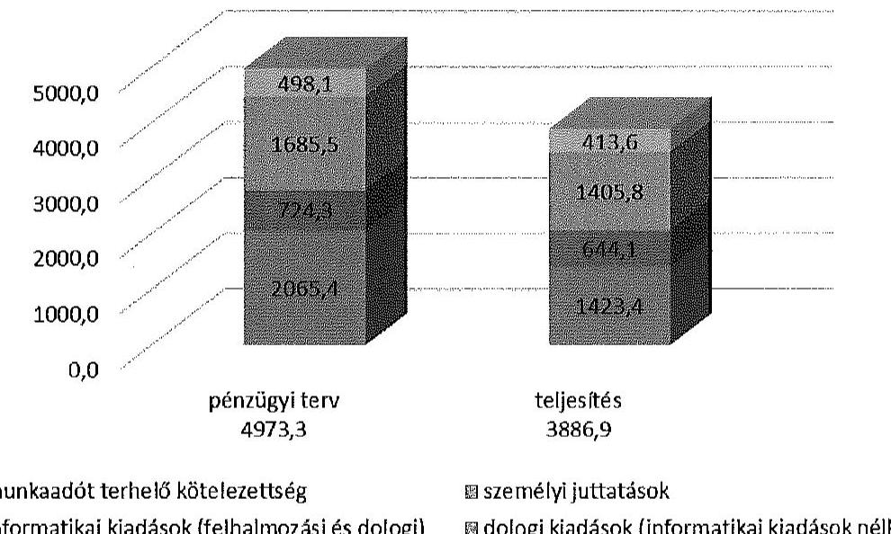

Az összes elszámolt kiadás 1086,4 M Ft-tal, 21,8\%-kal alacsonyabb volt a pénzügyi terv szerinti, 4973,3 M Ft tervezett összegnél. A teljesített dologi kiadások $31,1 \%$-kal, az informatikai kiadások $11,1 \%$-kal, a személyi juttatások 16,6\%-kal, a munkaadót terhelő járulékok 17,0\%-kal maradtak el a tervezettől.

A helyi és területi választási irodák, valamint a választásban részt vevő egyéb szervek elszámolásai alapján az NVI az összesítő elszámolást a Pvr. 7. § (5) bekezdésében előírt határidőn, a választás napját követő kilencven napon túl készítette el ${ }^{27}$.

# 5. A VÁLASZTÁSRA FORDÍTOTT PÉNZESZKÖZÖK FELHASZNÁLÁSÁNAK ÉS ELSZÁMOLÁSÁNAK ELLENŐRZÉSE 

Az NVI a jogszabályi kötelezettségének eleget téve, az EP választásra fordított támogatás felhasználását ellenőrizte. Az elszámolások dokumentum alapú ellenőrzésén felül, ellenőrzési terv szerint ${ }^{28}$, véletlen mintavétellel kivá-

[^0]
[^0]:    ${ }^{27}$ Az ellenőrzés rendelkezésére bocsátott végleges elszámolás dátuma 2015. március 12.
    ${ }^{28}$ 2014. július 11-ei keltű, NVI/1241-1/2014 iktatószámú

---

lasztott öt-öt TVI és HVI helyszíni ellenőrzését végezte el 2014. július 28-a és augusztus 15-e között. A helyszíni ellenőrzésekről készített összefoglaló jelentés ${ }^{29}$ szerint lényeges és jelentős hibát az ellenőrzések során nem tártak fel.

Az NVI elnöke az ellenőrzési tervet és a helyszíni ellenőrzések tapasztalatairól készített összefoglalót jóváhagyta. Az ellenőrzéseket végzők a tételes bizonylati ellenőrzésekről jegyzőkönyveket vettek fel, amelyekben a kisebb - jellemzően a reprezentációs kiadások áfa-elszámolása miatt - szabálytalanságok számviteli javítását kérték.

# A Pvr.-ben ${ }^{30}$ előírt ellenőrzési kötelezettséget a KEKKH teljesítette. 

A szervezet elnöke 2014. szeptember 10-én megbízást adott a Belső Ellenőrzési Főosztálynak az EP választási projekt ellenőrzésére.

A belső ellenőrzés javaslatot fogalmazott meg a célfeladatokra vonatkozó megállapodások előkészítésére és megkötésére vonatkozó végrehajtási eljárásrend kiegészítésére; az előzetes kötelezettségvállalás jóváhagyása folyamatában kontroll előírására; az EP választások kapcsán meg nem térített költség NVI-vel történő elismertetése és a pénzügyi rendezés érdekében a bruttó követelések és kötelezettségek kimutatására választási projektenként.

Az ellenőrzési jelentés javaslatai alapján az érintett szakterületek vezetői a szükséges intézkedéseket megtették.

## A KüM belső ellenőrzése a 2014. évi EP választások lebonyolításának

szabályszerúségét - a 6/2014. (IV. 30.) KüM utasításnak megfelelően ${ }^{31}$ - ellenőrizte. A belső ellenőrzés az EP választás előkészítésével és lebonyolításával kapcsolatos tevékenységét eredményesnek és jogszerűnek minősítette. A 2014 augusztusában készült ellenőrzési jelentés ${ }^{32}$ hiányosságként megállapította az elszámolási kötelezettség határidőn túli teljesítését, a fizetési határidőt követő késedelmes pénzügyi teljesítéseket. A feltárt hiányosságok megszüntetésére a szabályozásokat érintően tett javaslatot. Javasolta továbbá a minisztérium szervezeti struktúrájának változása okán a Külgazdasági és Külügyminisztérium belső utasításainak jogszabályokhoz való igazítását.

Az ellenőrzött TVI-k a Pvr.-ben előírt ellenőrzési kötelezettségüknek öszszességében eleget tettek, a TVI-k saját felhasználásának, valamint a HVI-k által felhasznált támogatások elszámolásának ellenőrzését, és a többletköltség igények indokoltságának tételes ellenőrzését elvégezték. A HVI-k elszámolásainak ellenőrzése elsősorban a bekért bizonylatok alapján történt.

[^0]
[^0]:    ${ }^{29}$ 2014. szeptember 17-ei keltű, NVI/1240-2/2014 iktatószámú
    ${ }^{30}$ Pvr. 1. § (2) bekezdés b) pontja
    ${ }^{31}$ A választás napját (május 25.) követő 80 napon belül.
    ${ }^{32}$ KKM/10754-6/2014/Adm, 386/EFO/2014. számú Összefoglaló ellenőrzési jelentés a Magyarország külképviseletein lefolytatott 2014. évi EP választás pénzügyi tervezésének, lebonyolításának, valamint elszámolásának szabályszerűségi ellenőrzéséről

---

A HVI-k elszámolásának megalapozottságát helyszíni ellenőrzés keretében a Bács-Kiskun Megyei TVI, a Fejér Megyei TVI, a Fővárosi Választási Iroda, a Pest Megyei TVI hét-hét, a Győr-Moson-Sopron Megyei TVI hat, a Hajdú-Bihar Megyei TVI öt helyi választási irodánál ellenőrizte.

A TVI-k vezetője az előírt ellenőrzési kötelezettség teljesítése érdekében 5 TVI-nél írásban, egy TVI-nél (Somogy Megyei TVI) pedig szóban adott megbízást a választási iroda tagjainak a támogatások felhasználásának ellenőrzésére. A Pest Megyei TVI-nél a saját támogatás felhasználásának ellenőrzését az önkormányzati hivatal alkalmazásában álló, TVI tagsággal megbízott munkatársak munkakörükből adódóan, folyamatba építetten végezték, melyről külön jegyzőkönyv, illetve jelentés nem készült.

A Pvr. 1. § (2) bekezdés b) pontjában előírt - a 8. § (3) bekezdés értelmében HVI tag által ellátandó - ellenőrzési kötelezettség teljesítése érdekében az ellenőrzött HVI-k vezetőinek 84,2\%-a ( 16 választási irodánál) adott megbízást ${ }^{33}$ a választási iroda tagjának a választáshoz biztosított támogatás felhasználásának ellenőrzésére. A támogatás felhasználásának ellenőrzését - dokumentáltan - 15 HVI-nél végrehajtották, négy választási irodánál ${ }^{34}$ az ellenőrzési kötelezettségnek a Pvr. 1. § (2) bekezdés b) pontjában, és a 8. § (3) bekezdésében foglaltak ellenére nem tettek eleget.

A választási irodák tagjai által végzett ellenőrzések a pénzeszközök nyilvántartását, felhasználását, elszámolását megfelelőnek ítélték, nem tárták fel a pénzeszközök kezelésénél, nyilvántartásánál, a gazdálkodási, ellenőrzési jogkörök gyakorlásánál, valamint a támogatás elszámolásánál jelentkező, jelen ÂSZ ellenőrzés által megállapított hibákat, hiányosságokat.

Budapest, 2015. jü 2015 hónap 21 . nap
az elnök nevében eljárva

Melléklet: $\quad 13 \mathrm{db}$
Függelék: $\quad 2 \mathrm{db}$
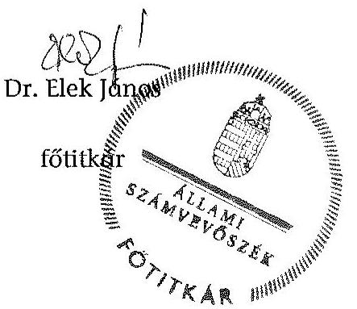

[^0]
[^0]:    ${ }^{33}$ A Kaposmérői, Kaposvári és Penci HVI vezetője e kötelezettségének nem tett eleget.
    ${ }^{34}$ Berzence, Kaposmérő, Kaposvár, és Szentendre HVI az ellenőrzési kötelezettségnek nem tett eleget.

---

# ÁLLAMI SZÁMVEVŐSZÉK 

Iktatószám: ETIO-0147-002/2014.

## MEGHATALMAZÁS

Az Állami Számvevőszékről szóló 2011. évi LXVI. törvény 32. § (2) bekezdése, valamint az Állami Számvevőszék Szervezeti és Müködési Szabályzatáról szóló 1/2013. (XII. 31.) ÁSZ utasítás 33. § (7) bekezdésében és (8) bekezdés a) pontjában foglaltak alapján visszavonásig a
2014. évi választásokra fordított pénzeszközök felhasználásának ellenőrzése:

- az országgyűlési képviselők 2014. évi választására fordított pénzeszközök felhasználásának ellenőrzése,
- az Európai Parlament tagjainak 2014. évi választására fordított pénzeszközök felhasználásának ellenőrzése,
- a helyi önkormányzati képviselők és polgármesterek, valamint a nemzetiségi önkormányzati képviselők 2014. évi választására fordított pénzeszközök felhasználásának ellenőrzése, valamint
az ellenőrzésekkel kapcsolatos nyilvántartási feladatok ellátása tekintetében

Dr. Elek János, fötitkárt az Elnőköt megillető feladat- és hatáskörök teljes jogkörü gyakorlására feljogositom.
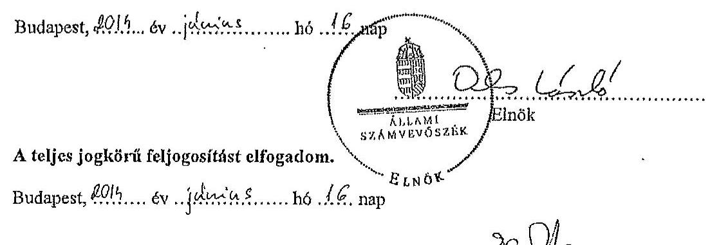

---

.

---

# AZ ELLENŐRZÖTT SZERVEZETEK JEGYZÉKE 

| Központi szervek | Nemzeti Választási Iroda |
| :--: | :--: |
|  | Közigazgatási és Elektronikus Közszolgáltatások Központi Hivatala |
|  | Külgazdasági és Külügyminisztérium |
| Területi választási szervek (TVI) | Bács-Kiskun Megyei Önkormányzat Hivatala |
|  | Fejér Megyei Önkormányzati Hivatal |
|  | Pest Megyei Önkormányzati Hivatal |
|  | Budapest Fôváros Fôpolgármesteri Hivatal |
|  | Hajdú-Bihar Megyei Önkormányzati Hivatal |
|  | Győr-Moson-Sopron Megyei Önkormányzati Hivatal |
|  | Somogy Megyei Önkormányzati Hivatal |
| Helyi választási szervek (HVI) | Bagaméri Polgármesteri Hivatal |
|  | Bácsbokodi Polgármesteri Hivatal |
|  | Berzencei Polgármesteri Hivatal |
|  | Biharkeresztesi Közös Önkormányzati Hivatal |
|  | Bôsárkányi Közös Önkormányzati Hivatal |
|  | Budapest Fôváros XII. kerület Hegyvidéki Polgármesteri Hivatal |
|  | Budapest Fôváros XVII. kerület Rákosmenti Polgármesteri Hivatal |
|  | Csornai Polgármesteri Hivatal |
|  | Dégi Közös Önkormányzati Hivatal |
|  | Kalocsai Polgármesteri Hivatal |
|  | Kaposmérői Közös Önkormányzati Hivatal |
|  | Kaposvár Megyei Jogú Város Polgármesteri Hivatala |
|  | Martonvásári Polgármesteri Hivatal |
|  | Nagyhegyesi Polgármesteri Hivatal |
|  | Öttevényi Polgármesteri Hivatal |
|  | Penci Közös Önkormányzati Hivatal |
|  | Sárosdi Polgármesteri Hivatal |
|  | Szanki Polgármesteri Hivatal |
|  | Szentendrei Közös Önkormányzati Hivatal |

---

.

---

# A 2014. ÉVI EP VÁLASZTÁSHOZ KAPCSOLÓDÓ KÖZBESZERZÉSI ÉRTÉKHATÁRT ELÉRŐ BESZERZÉSI ELJÁRÁSOK 

Adatok M Ft-ban

| Beszerzési eljárás tárgya | Eljárás   fajtája | NBB   határo-   zat | Szerződés   EP válasz-   tásra el-   számolt   összege | Teljesí-   tés ösz-   szege   2014.   dec.31-   ig |
| :--: | :--: | :--: | :--: | :--: |
| NVI által lefolytatott beszerzési eljárások |  |  |  |  |
| A 2014. évi OGY képviselők választásának és az EP tagjai 2014. évi választásának pénzügyi, logisztikai lebonyolításához és az ezzel összefüggésben az NVI alapfeladatainak ellátásához szükséges szoftverek továbbfejlesztése, valamint ezek múködtetéséhez szükséges, egyes szoftverkomponensek és speciális szakértői tevékenység biztosítása | hirdetmény nélküli tárgyalásos eljárás | $\begin{aligned} & 19 / 2013 . \\ & \text { (VII. 2.) } \end{aligned}$ | 145,7 | 145,7 |
| Az EP tagjai 2014. évi választásának és a helyi önkormányzati képviselők és polgármesterek, valamint a nemzetiségi önkormányzati képviselők 2014. évi választásának lebonyolításához szükséges alkalmazások rendszertervezése, az NVR továbbfejlesztése, tesztelése, a meglévő rendszerelemekhez történő illesztése, az alkalmazások üzemeltetése és a közvetlenül kapcsolódó szolgáltatások nyújtása. | hirdetmény nélküli tárgyalásos eljárás | $\begin{aligned} & 21 / 2013 . \\ & \text { (VII. 2.) } \end{aligned}$ | 222,7 | 222,7 |
| Nyomdai szolgáltatások | könnyített eljárás | $\begin{aligned} & 37 / 2013 . \\ & \text { (XI. 5.) } \end{aligned}$ | 572,7 | 572,7 |
| Adatmonitoring egység kifejlesztése | hirdetmény nélküli tárgyalásos eljárás | $\begin{aligned} & 24 / 2013 . \\ & \text { (VII. 15.) } \end{aligned}$ | 10,0 | 10,0 |

---

| Beszerzési eljárás tárgya | Eljárás   fajtája | NBB   határo-   zat | Szerződés   EP választásra el-   számolt   összege | Teljesítés ösz-   szege   2014.   dec.31-   ig |
| :--: | :--: | :--: | :--: | :--: |
| Felhasználói szerződés a Nemzeti Távközlési Gerinchálózat és alrendszereihez csatlakozó végpontok közötti adatátviteli hálózat használatára, a 2014. évi választások lebonyolításához. (A szolgáltatás mindhárom választáshoz kapcsolódó nettó értéke $439,9 \mathrm{M} \mathrm{Ft}$ ) | a Kbt. hatálya alól a 9. § (1) bekezdés f) pontja alapján mente-sülő, a 346/2010. (XII. 28.) Korm. rendelet alapján a szolgáltatásra kizárólagosan jogosulttól történő beszerzés | - | 127,6 | 127,6 |
| KEKKH által lefolytatott beszerzési eljárások |  |  |  |  |
| „Kiemelt szintü rendelkezésre állás"   szolgáltatás | beszerzés az ellenőrzött időszakot megelőzően kötött, érvényes keretszerződés szerint | - | 16,7 | 16,7 |
| Választási informatikai hálózat kiemelt támogatása (2013. augusztus 21-én kötött, érvényes keretszerződés alapján) | könnyített eljárás | $\begin{aligned} & 1 / 2012 . \\ & \text { (III. 6.) } \end{aligned}$ | 58,6 | 58,6 |
| Kiemelt rendelkezésre állású, bérelt vonalú internet szolgáltatás (5 GB) létesítése és üzemeltetése a 2014. évi választások lebonyolítása érdekében (Szolgáltatás szerződés szerinti teljes ellenértéke $21,1 \mathrm{M} \mathrm{Ft}$ ) | a Kbt. hatálya alól a 9. § (1) bekezdés f) pontja alapján mente-sülő, belső szabályozás szerint lefolytatott beszerzés | - | 2,7 | 2,7 |

---

# A GAZDÁLKODÁSI JOGKÖRÖK GYAKORLÁSA AZ ELLENŐRZÖTT HELYI ÉS TERÜLETI VÁLASZTÁSI IRODÁKNÁL 

| Megnevezés | A gazdálkodási jogkörök gyakorlásának összesitő értékelése | Kötelezettségvállalás, pénzügyi ellenjegyzés, teljesítésigazolás, érvényesités során feltárt jellemző, rendszerszerú hiányosságok |
| :--: | :--: | :--: |
| Bács-Kiskun Megyei Önkormányzat Hivatala | nem megfelelő | A saját szabályzatban foglaltak ellenére 13 esetben a kifizetést követően történt a beszerzések engedélyezése, és a pénzügyi ellenjegyzés. Az érvényesitő az Ávr. 58. § (1) bekezdésében előírtak ellenére nem ellenőrizte a megelőző ügymenetben a jogszabályokban és a belső szabályzatokban foglaltak betartását, illetve 26 esetben az érvényesítés az Ávr. 58. § (3) bekezdésének előírása ellenére nem előzte meg az utalványozást. |
| Kalocsai Közös Önkormányzati Hivatal | nem megfelelő | Az Ávr. 53. § (2) bekezdésének előírása ellenére a 100 E Ft alatti kifizetések rendjét nem szabályozták. A saját szabályozás hiányában az Áht. 37. § (1) bekezdésének előírását megsértve 28 esetben (tiszteletdíjak, jutalmak) nem volt írásbeli kötelezettségvállalás. Az érvényesítő az Ávr. 58. § (1) bekezdésében előírtak ellenére nem ellenőrizte a megelőző ügymenetben a jogszabályokban és a belső szabályzatokban foglaltak betartását. |
| Bácsbokodi Polgármesteri Hivatal | nem megfelelő | Az Ávr. 53. § (2) bekezdésének előírása ellenére a 100 E Ft alatti kifizetések rendjét nem szabályozták. A saját szabályozás hiányában az Áht. 37. § (1) bekezdésének előírását megsértve előzetes írásbeli kötelezettségvállalás a személyi juttatások kivételével nem volt. Az írásba foglalt megbízási szerződések esetében az Áht. 37. § (1) bekezdésének és a saját szabályzat előírását megsértve elmaradt a pénzügyi ellenjegyzés. Az érvényesítő az Ávr. 58. § (2) bekezdésében előírtak ellenére nem jelezte az utalványozónak, hogy a megelőző ügymenetben nem tartották be a jogszabályokban és a belső szabályzatokban foglaltakat. |
| Szanki Polgármesteri Hivatal | megfelelő | Rendszerszerú hiányosság nem volt. |
| Fejér Megyei Önkormányzati Hivatal | megfelelő | Rendszerszerü hiányosság nem volt. |

---

| Megnevezés | A gazdálkodási jogkörök gyakorlásának összesitő értékelése | Kötelezettségvállalás, pénzügyi ellenjegyzés, teljesítésigazolás, érvényesités során feltárt jellemző, rendszerszerú hiányosságok |
| :--: | :--: | :--: |
| Martonvásár Város Polgármesteri Hivatala | részben megfelelő | Az SZSZB tagokkal ( 15 fő) megbízási szerződést kötöttek a pénzügyi éllenjegyzés mellőzésével, mellyel megsértették az Áht. 37. § (1) bekezdés, az Ávr. 55. § (1) bekezdés, valamint a saját szabályzatok előírásait. A kötelezettségvállalás dokumentumán 11 esetben (HVI tagok, jegyzőkönyvvezetők) az Ávr. 55. § (1) bekezdés, valamint a saját szabályzat előirása ellenére nem szerepelt a pénzügyi ellenjegyzés dátuma. Az érvényesítő az Ávr. 58. § (1) bekezdésében előírtak ellenére nem ellenőrizte a megelőző ügymenetben a jogszabályokban és a belső szabályzatokban foglaltak betartását. |
| Sárosdi Polgármesteri Hivatal | nem megfelelő | Az Ávr. 53. § (2) bekezdésének előirása ellenére a 100 E Ft alatti kifizetések rendjét nem szabályozták. A kötelezettségvállalás, illetve annak pénzügyi ellenjegyzése nem felelt meg az Áht. 37. § (1) bekezdésében elöírtaknak. Az SZSZB tagok megbízási szerződései nem tartalmazták a megbízási díj összegét. A HVI tagok és a Jegyzőkönyvvezetők megbízásáról és díjazásáról szerződés nem állt rendelkezésre. Az írásbeli kötelezettségvállalások pénzügyi ellenjegyzése nem történt meg.   Az érvényesítő az Ávr. 58. § (1) bekezdésének előírása ellenére nem ellenőrizte, hogy a megelőző ügymenetben a jogszabályokban és a belső szabályzatokban foglaltak betartották-e. |
| Dégi Közös Önkormányzati Hivatal | nem megfelelő | Az EP szabályzat alapján a kötelezettségvállalásra csak írásban kerülhet sor, ennek ellenére a dologi kifizetésekre - megsértve az Áht. 37. § (1) bekezdésének előírását - írásbeli kötelezettségvállalás nem készült. A személyi juttatásokkal kapcsolatos kötelezettségvállalásokra az Áht. 37. § (1) bekezdésének előírását megsértve pénzügyi ellenjegyzés nélkül került sor. Az érvényesítő az Ávr. 58. § (1) bekezdésének előírása ellenére nem ellenőrizte a megelőző ügymenetben a jogszabályokban és a belső szabályzatokban foglaltak betartását. |
| Pest Megyei Önkormányzati Hivatal | megfelelő | Rendszerszerú hiányosság nem volt. |
| Budapest Főváros Főpolgármesteri Hivatal | megfelelő | Rendszerszerú hiányosság nem volt. |

---

| Megnevezés | A gazdálkodási jogkörök gyakorlásának összesitő értékelése | Kötelezettségvállalás, pénzügyi ellenjegyzés, teljesítésigazolás, érvényesítés során feltárt jellemző, rendszerszerű hiányosságok |
| :--: | :--: | :--: |
| Budapest Főváros XII. kerület Hegyvidéki Polgármesteri Hivatal | nem megfelelő | A jegyzőkönyvvezetők jutalmának (12 tétel) és az SZSZB tagok tiszteletdíjának ( 15 tétel) kifizetésére az Áht. 37. § (1) bekezdésének előírását megsértve írásbeli kötelezettségvállalás nélkül került sor. Az érvényesítő az Ávr. 58. § (1) bekezdésének előírása ellenére nem ellenőrizte a megelőző ügymenetben a jogszabályokban és a belső szabályzatokban foglaltak betartását. Az utalványozást a Pvr. 1. § (2) bekezdés c) pontjának előírásával ellentétesen a helyi választási iroda vezetője (a jegyző) helyett a gazdasági vezető végezte. |
| Budapest Főváros XVII. kerület Rákosmenti Polgármesteri Hivatal | részben megfelelő | A személyi juttatásoknál 36 esetben elmaradt az írásbeli kötelezettségvállalás, megsértve az Áht. 37. § (1) bekezdésében előírtakat. Az írásbeli kötelezettségvállalások esetében az Áht. 37. § (1) bekezdésének előírását megsértve nem volt pénzügyi ellenjegyzés. |
| Szentendrei Közös Önkormányzati Hivatal | részben megfelelő | Egy dologi kiadási tételhez nem állt rendelkezésre dokumentáció, mellyel megsértették a Számv. tv. 169. §-ának előírását. 5 dologi kiadási tételhez kapcsolódó kötelezettségvállalásra az Áht. 37. § (1) bekezdésének előírását megsértve pénzügyi ellenjegyzés nélkül került sor.   A személyi jellegú kiadásoknál az Áht. 38. § (1) bekezdésében, valamint az Ávr. 57. § (1) bekezdésében előírt teljesítésigazolás minden esetben hiányzott.   A személyi jellegú kiadásoknál az Ávr. 58. § (3) bekezdésének előírása ellenére 6 esetben elmaradt az érvényesítés és 14 esetben nem tüntették fel az érvényesítés dátumát. |
| Penci Közös Önkormányzati Hivatal | nem megfelelő | Az Ávr. 53. § (2) bekezdésének előírása ellenére a 100 E Ft alatti kifizetések rendjét nem szabályozták. A dologi kiadásoknál az Áht. 37. § (1) bekezdésének előírását megsértve nem volt előzetes írásbeli kötelezettségvállalás.   Az írásba foglalt megbízási szerződéseknél az Áht. 37. § (1) bekezdésének előírását megsértve a pénzügyi ellenjegyzés minden esetben elmaradt. Az érvényesítő az Ávr. 58. § (1) bekezdésének előírása ellenére nem ellenőrizte a megelőző ügymenet szabályszerűségét. |
| Hajdú-Bihar Megyei Önkormányzati Hivatal | megfelelő | Rendszerszerű hiányosság nem volt. |
| Biharkeresztesi   Közös Önkormányzati Hiva-   tal | megfelelő | Rendszerszerű hiányosság nem volt. |

---

| Megnevezés | A gazdálkodási jogkörök gyakorlásának összesitő értékelése | Kötelezettségvállalás, pénzügyi ellenjegyzés, teljesítésigazolás, érvényesités során feltárt jellemző, rendszerszerű hiányosságok |
| :--: | :--: | :--: |
| Bagaméri Polgármesteri Hivatal | részben megfelelő | A saját szabályzat 100 E Ft alatt is előirta az írásbeli kötelezettségvállalást, azonban az 4 esetben elmaradt, mellyel megsértették az Áht. 37. § (1) bekezdésének előírását. A kiküldetési rendelvényekről 4 esetben hiányzott a kiküldetést elrendelő aláírása. A kötelezettségvállalás pénzügyi ellenjegyzésére 9 esetben nem, illetve nem az előírásoknak megfelelően került sor, mellyel megsértették az Áht. 37. § (1) bekezdésének, valamint a saját szabályzatuknak az előírását. A fenti esetekben az érvényesitő az Ávr. 58. § (1) bekezdésének előírása ellenére nem ellenőrizte a megelőző ügymenet szabályszerűségét. |
| Nagyhegyesi Polgármesteri Hivatal | nem megfelelő | A Gazdálkodási szabályzat alapján kötelezettségvállalásra csak írásban kerülhetett sor, ami 2 esetben elmaradt, megsértve az Áht. 37. § (1) bekezdésének előírását. Az Áht. 37. § (1) bekezdésének előírását megsértve 17 esetben a pénzügyi ellenjegyzést a kötelezettségvállalást követően végezték el. A 19 ellenőrzött tétel esetében az érvényesitő az Ávr. 58. § (1) bekezdésének előírása ellenére nem ellenőrizte az előző ügymenet szabályszerűségét. |
| Győr-Moson-Sopron Megyei Önkormányzati Hivatal | megfelelő | Rendszerszerü hiányosság nem volt. |
| Csornai Polgármesteri Hivatal | részben   megfelelő | Az SZSZB tagok megbízólevelei ( 17 db ) nem voltak szabályszerű kötelezettségvállalások, mivel nem tartalmazták a dijazás összegét, így nem feleltek meg az Áht. 37. § (1) bekezdésében elöírtaknak. A kötelezettségvállalásokra 14 esetben az Áht. 37. § (1) bekezdésében előírtakat megsértve pénzügyi ellenjegyzés nélkül került sor. |
| Bősárkányi Közös Önkormányzati Hivatal | nem megfelelő | A HVI tagok jutalmának kifizetését megalapozó kötelezettségvállalás (megbízási szerződés vagy célfeladat kitüzés) az Áht. 37. § (1) bekezdésében elöírtakat megsértve nem volt. Az SZSZB tagok megbízólevelei nem tartalmazták a tiszteletdíj összegét. Az érvényesitő az Ávr. 58. § (1) bekezdésének előírása ellenére nem ellenőrizte az előző ügymenet szabályszerűségét. |
| Öttevényi Polgármesteri Hivatal | nem megfelelő | A személyi jellegú kifizetések esetében a kötelezettségvállalások az Áht. 37. § (1) bekezdésének előírását megsértve pénzügyi ellenjegyzés mellőzésével történtek. Az érvényesitő az Ávr. 58. § (1) bekezdésének előírása ellenére nem ellenőrizte az előző ügymenet szabályszerűségét. |
| Somogy Megyei Önkormányzati Hivatal | megfelelő | Rendszerszerü hiányosság nem volt. |

---

| Megnevezés | A gazdálkodási   jogkörök gyakor-   lásának összesitő   értékelése | Kötelezettségvállalás, pénzügyi ellenjegyzés,   teljesítésigazolás, érvényesités során feltárt jel-   lemző, rendszerszerü hiányosságok |
| :-- | :-- | :-- |

| Kaposvár Megyei   Jogú Város Pol-   gármesteri Hiva-   tala | nem megfelelő | A kötelezettségvállalás dokumentuma az Áht. 37. §   (1) bekezdésének előírását megsértve 27 esetben nem   tartalmazott pénzügyi ellenjegyzést. A 100 E Ft alatti   kifizetéseknél 17 esetben nem tartották be a belső sza-   bályzatban elöírtakat. |
| :--: | :--: | :--: |
| Berzencei Pol-   gármesteri Hiva-   tal | nem megfelelő | A személyi jellegú kifizetésekkel kapcsolatos kötelezetts-   ségvállalásokra az Áht. 37. § (1) bekezdésének előírását   megsértve pénzügyi ellenjegyzés nélkül került sor. |
| Kaposmérői Kö-   zös Önkormány-   zati Hivatal | nem megfelelő | A Jegyzői intézkedés alapján kötelezettséget vállalni   csak írásban lehetett. A hivatali dolgozóknak kifizetett   jutalmat az Áht. 37. § (1) bekezdésének előírását meg-   sértve nem alapozta meg szabályszerű kötelezettség-   vállalás, arra összeget nem tartalmazó "teljesítmény   célkitúzés"   alapján   került   sor.   Az érvényesítő az Ávr. 58. § (2) bekezdésének előírása   ellenére nem jelezte az utalványozónak, hogy a meg-   előző ügymenetben nem tartották be a jogszabályok-   ban és a belső szabályzatban foglaltakat. |

---

.

---

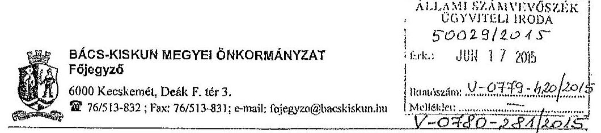

Tárgy: Észrevétel megküldése
Ikt.sz:5086-4/2015

Dr Élek János Fötitkár Úr
részére
Állami Számvevőszék
Budapest
Apáczai Csere János u 10.

Rudzi Lomus
cc. 17.
FV 1200
2015 JÜN 17.

Tisztelt Fötitkár Úr!

Köszönettel megkapituk az országgyűlési képviselők, az Európai Parlament tagjai és a helyi önkormányzati képviselők és polgármesterek, valamint a nemzetiségi önkormányzati képviselők választására fordított pénzeszközök felhasználásának ellenőrzése tárgyában készült vizsgálati jelentések tervezeteit, melyre az alábbi észrevételt kívánom tenni.

Az országgyűlési képviselők 2014. évi választására vonatkozó jelentés tervezetet elfogadjuk, ugyanakkor az Európai Parlamenti képviselők, valamint a helyi önkormányzati képviselők és polgármesterek választásával összefüggésben önkormányzatunkra vonatkozóan tett megállapításokat nem tudjuk elfogadni.

Az Európai Parlamenti választások esetében a jelentés 3. számú mellékletében a Bács-Kiskun Megyei Önkormányzat Hivatala gazdálkodási jogkörök gyakorlásának minősítése nem megfelelő, míg a helyi önkormányzati képviselők választása esetében ez a minősítés részben megfelelő.

Kérem szíveskedjenek a tett megállapításokat tételesen alátámasztani, mivel a leírásból számunkra nem beazonosíthatóak a jelzett hiányosságok, emellett az általunk folytatott gazdálkodási gyakorlat alapján is teljességgel érthetetlen, hogy a minősítés milyen tények alapján került megállapításra.

Hivatalunk az érvényes szabályozás alapján egységes gazdálkodási gyakorlatot folytat, aminek során kiemelt figyelmet fordítunk a szabályosság betartására, amit tanúsít az a tény is, hogy az országgyűlési képviselők választásával kapcsolatosan készült jelentés tervezet nem tért fel rendszerezintű hiányosságot a gazdálkodási jogkörök gyakorlásában.

Az eltérő megítélés okát mi abban látjuk, hogy az utóbbi két vizsgálatot végző revizor Hivatallal való együttműködése nem volt megfelelő.

Válaszát előre is köszönöm.

Kecskemét, 2015. június 16.

Tisztelettel:

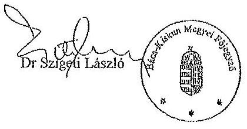

---

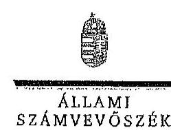

Ikt.szám: V-0780-283/2015.
V-0781-189/2015.

Dr. Szigeti László úr
főjegyzö
Bács-Kiskun Megyei Önkormányzat Hivatala

# Kecskemét 

## Tisztelt Föjegyzö Úr!

Köszönettel megkaptam „Az Európai Parlament tagjainak 2014. évi választására forditott pénzeszközök felhasználásának ellenörzése", illetve „A helyi önkormányzati képviselők és polgármesterek, valamint a nemzetiségi önkormányzati képviselők 2014. évi választására forditott pénzeszközök felhasználásának ellenörzése" chnủ jelentéstervezetek megállapításaira tett észrevételét.
Az ellenőrzési megállapításokra vonatkozó észrevételét az Állami Számvevőszékről szóló 2011. évi LXVI. törvény 29. § (2) bekezdésében meghatározott tizenöt napos határidőn belül küldte meg. Az Állami Számvevőszék észrevétellel kapcsolatos álláspontját a mellékletként csatolt, a felügyeleti vezető által készített indokolás tartalmazza.

Budapest, 2015. 07. hóO. nap
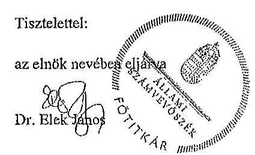

Melléklet: Észrevételre adott válasz

---

# Az észrevételre adott válasz 

| Észrevétel: | Az Európai Parlament tagjainak 2014. évi választására fordított pénzeszközök felhasználásának ellenőrzéséről szóló jelentéstervezet 3. számú mellékletében szereplő megállapítás szerint:
„Bács-Kiskun Megyei Önkormányzat Hivatalánál a gazdálkodási jogkörök gyakorlásának öszzesitő értékelése nem megfelelő.
A saját szabályzatban foglaltak ellenére 13 esetben a kifizetést követően történt a bezserzésck engedélyezése, és a pénzügyi ellenjegyzés. Az érvényesitő az Ávr. 58. § (1) bekezdésében elöírak ellenére nem ellenöritzie a megelöző ügymenetben a jogszabályokban és a belzö szabályzatokban foglaltak betartását, illetve 26 esetben az érvényesités az Ávr. 58. § (3) bekezdésének elöirása ellenére nem elözte meg az utalványozást."
A helyi önkormányzati képviselők és polgármesterek, valamint a nemzetiségi önkormányzati képviselők 2014. évi választására fordított pénzeszközök felhasználásának ellenőrzéséről szóló jelentéstervezet 3. számú mellékletében szereplő megállapítás szerint:
„Bács-Kiskun Megyei Önkormányzat Hivatalánál a gazdálkodási jogkörök gyakorlásának öszzesitő értékelése részben megfelelő.
A kötelezettségvállalás 9 esetben nem volt szabályszerű: 7 esetben az Áht. 37. § (1) bekezdés elöirása ellenére a pénzügyi teljesités esedékességét követöen, utólag történt; 1 esetben az Ávr. 52. § (1) elöirása ellenére nem történt meg; 1 esetben az Áht. 37. § (1) elöirása ellenére pénzügyi ellenjegyzés nélkül történt. A pénzügyi ellenjegyzés 9 esetben nem volt szabályszerű: 2 esetben az Áht. 37. § (1) és Ávr. 55. § (1) ellenére nem történt meg a pénzügyi ellenjegyzés; 7 esetben arra az Áht. 37. § (1) elöirása ellenére a pénzügyi teljesités esedékessége után került sor. A teljesitésigazolást 17 esetben Ávr. 57. § (3)-(4) bekezdés elöirása ellenére nem az arra jogosult személy látta el. Az érvényesitő 17 esetben az Ávr. 58. § (2) bekezdés elöirása ellenére nem jelezte az utalványozónak, hogy a megelöző ügymenetben a jogszabályokban és a belzö szabályzatokban foglaltakat nem tartották be. A kifizetés elrendelésére 8 esetben érvényesitett okmány hiányában került sor az Ávr. 59. § (1) bekezdés elöirása ellenére."
Az észrevétel szerint a megállapítások alátámasztását, a jelzett hiányosságok beazonosítását kifogásolják. A gazdálkodási gyakorlatuk alapján nem értik, hogy a minősítés milyen tények alapján került megállapításra. Az észrevétel szerint a Hivatal az érvényes szabályozás alapján egységes gazdálkodási gyakorlatot folytatott, ennek ellenére a három jelentéstervezetben szereplő megítélés eltér, annak oka nem tisztázott. |
| :--: | :--: |
| Válasz: | Az Állami Számvevőszék az észrevételt nem fogadja el. |
| Indoklás: | A 2014. évi választások lebonyolításához kapcsolódó kiadási tételek vonatkozásában a gazdálkodási jogkörök gyakorlásának értékelése választásonként különkülön elvégzett mintavétel alapján került értékelésre. Az elszámolt kiadási tétes |

---

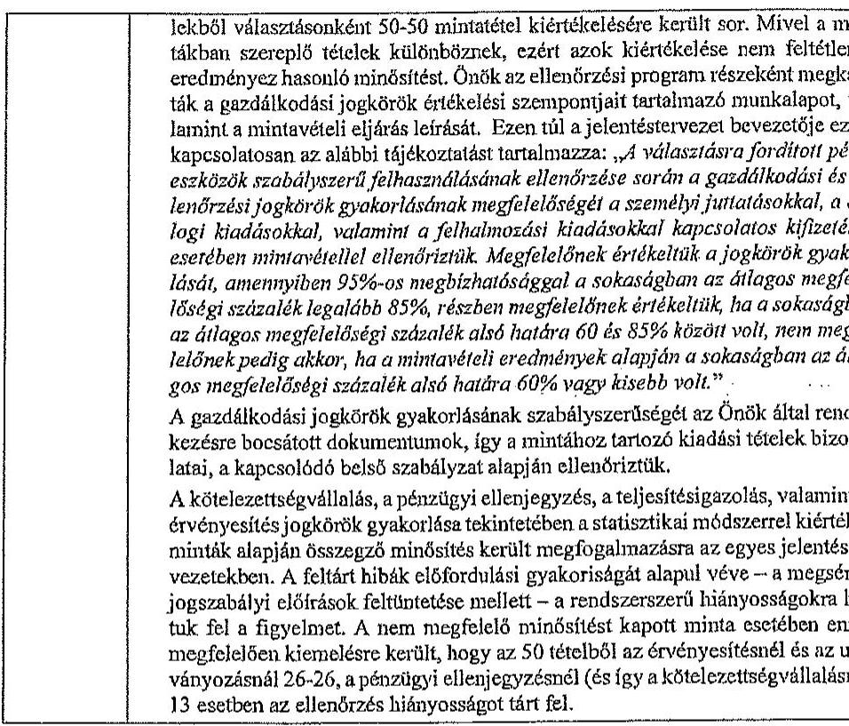

Tájékoztatom Főjegyzö urat, hogy a számvevőszaki jelentés mellékleteként szerepeltetjük a jelentéstervezethez tett észrevételét, valamint az arra adott válaszunkat.

Budapest, 2015.
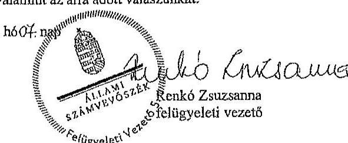

---

Állami Számvevőszék

Iktatószám: 15-1/7/2015
Hivatkozási szám: V-0779-415/2015
V-0780-276/2015
V-0781-182/2015

Dr. Elek János
Pótitkár részére

Ügyintéző: Némethné Sári Irén
Telefon: +36 1 253-3380

1052. Budapest
Apáczai Csere János u. 10.

Tárgy: Észrevétel

2015 JÚN 17, 2015

Tisztelt Pótitkár Úz!

Ügyintéző: Némethné Sári Irén
Telefon: +36 1 253-3380

2015 JÚN 17, 2015

A 2014. évi válaszázatára fordított pénzeszközök felhasználásának ellenőrzésére
- Az országpótitkár képviselőik 2014. évi válaszázatára fordított pénzeszközök felhasználásának ellenőrzése;
- Az Európai Parlament tagjainak 2014. évi válaszázatára fordított pénzeszközök felhasználásának ellenőrzése;
- A helyi önkormányzati képviselők és polgármesterek, valamint a nemzettségi önkormányzati képviselőik 2014. évi válaszázatára fordított pénzeszközök felhasználásának ellenőrzése

címmel készített számvevői jelentéstervezeteket megkaptuk.

Az Állami Számvevőszékről szóló 2011. évi LXVI. törvény 29. § (2) bekezdése alapján az ellenőrzések megállapítására a Jegyző 15 napon belül írásban észrevételt tehet.

Az ellenőrzésekről készült jelentéstervezeteket megismertük, a V-0779-415/2015 és a V-0781-182/2015 jelentésekben tett megállapításokkal kapcsolatban észrevételt nem kívánunk tenni.

A V-0780-276/2015 számú jelentéstervezetben tett megállapításokkal kapcsolatban két észrevételt teszek:

1. A jelentéstervezet 18 oldalán tévesen az szerepel, hogy a XVII. kerület késedelmesen számolt el a válaszrások lebonyolításához biztosított pénzeszközök felhasználásáról.

SZÁMOST FÉVÉRÜLKVILATZÓLET
BÁROIMÉNES ÖNKORMÁNÝZATA

1173 Budapest, Porti út 165.; Levékaur 1656 Budapest, Pf.: 110.; Tel.: +36 1 253-3319; Fax: +36 1 253-3323;
E-mail: onkromanyszell@akromenre.hu

---

Mellékelem a Fővárosi Választási Iroda elszámolásra vonatkozó levelét, mely szerint a kerület ki volt jelölve helyszíni ellenőrzésre, a dokumentumokat csak a megadott időben kellett a TVI-nek benyújteni.

# Álláspontom szerint így a XVII. kerületi HVI nem számolt el késedelmesen. 

2. A jelentéstervezet 3. számú mellékletének 3. oldalán Budapest Főváros XVII. kerület Rákosmenti Polgármesteri Hivatalt érintő összezitő megállapítások között álláspontom szerint tévesen szerepel a hivatkozott 36 esetbeli személyi juttatások kifizetésénél elmaradt írásbeli kötelezettségvállalás és ellenjegyzés, mivel a személyi juttatásokra kifizetett összeg egyik esetben sem érte el a 100.000 Ft-ot, így az államháztartásról szóló törvény végrehajtásáról szóló 368/2011(XII.31.) Korm. rendelet 53-\$ (1) bekezdés alapján nem szükséges írásbeli kötelezettségvállalás a kifizetéshez, így pénzügyi ellenjegyzés sem.

Kérem észrevételeim elfogadását.

Budapest, 2015. június 11.

Tisztelettel:
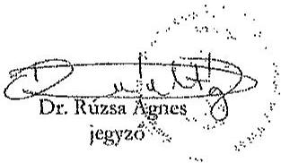

1173 Budapest, Pesti út 165.; Levekdőrz 1656 Budapest, Pf: 110; Tel.: +36 1 253-3319; Fax: +36 1 253-3323; E-mail: onkomanyza@rakosmente.hu

---

FŐVÁROSI VÁLASZTÁSI IRODA
1052 Budapest V. kerület, Városház utca 9-11.
Telefon: 327-1177, Fax: 327-1855

| 1000062841400* | ikt. szám: FPH071/45 - 12/2014 |
| :-- | :-- |

II-V., VII-VIII., X-XVIII., XX-XXII., kerületi Önkormányzat Jegyzöje, mint OEVI
vezető, valamint
I., VI., IX., XIX., XXIII. kerületi Önkormányzat Jegyzöje, mint

Helyi Választási Iroda vezető
részére

# Budapest 

## Tisztelt Jegyzö Asszony/Űr!

Értesítem, hogy az Európai Parlament tagjai választás pénzügyi elszámolásának ellenőrzését az 1. sz. mellékletben található tájékoztatás szerint bonyolítjuk le.

Valamennyi OEVI / HVI részéről kötelezően beküldendő dokumentumok: kcari!

- VPIR rendszerböl kinyomtatott, aláirt feladattípusủ elszámolás.
- Tanúsítvány helyi választási irodák részére (2. sz. melléklet)
- Részletező adatlapok a feladattípusú elszámoláshoz (3. sz. melléklet)
- Dologi kiadások többletigényeihez számla / kötelezettség vállalás másolata - postsköltség kivételével
- 25301 SzSzB pótlagok jogcím többletigényéhez: szavazóköri jegyzőkönyv jelenlétet igazoló oldalának másolata jhiv. ua'iofci

Az ellenőrzésekről további információkat nyújt: Altsachné Müller Zsuzsanna, a Fővárosi Választási Iroda pénzügyi felelőse, ellenőre (tel: 999-93-09)

Budapest, 2014. május , 20.
Tisztelettel:
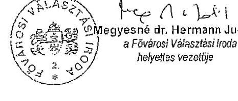

---

FÖVÁNOSI VÁLASZTÁSI IRODA
1052 Budapest V. kerület, Városház utca 9-11.
Telefon: 327-1177, Fax: 327-1855

1. sz.melléklet

# Tájékoztatás 

A 2014. évi Európai Parlament tagjai választás pénzügyi elszámolásának ellenôrzéséről

Dokumentumokon alapuló ellenôrzésre kijelölt CEVI-k / HVI-k:

- I. kerület
- IV. kerület,
- V. kerület,
- VI. kerület,
- VII. kerület,
- VIII. kerület,
- IX. kerület,
- X. kerület,
- XI. kerület,
- XIII. kerület,
- XIV. kerület,
- XV. Kerület,
- XVI. Kerület,
- XVIII. kerület,
- XXI. kerület,
- XXIII. kerület
(Ellenőrzéshez szükséges dokumentumok: lásd értesítésben)
A borítékra írják rá:
2014. évi Európai Parlament tagjai választás pénzügyi elszámolása

Beküldési határidő: 2014. június 12. (csütörtök) 16 óráig
Budapest Föpolgármesteri Hivatal - iktató II. 201.

---

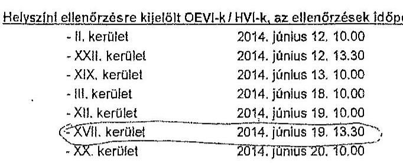

# Ellenörzés helye: Föpolgármesteri Hivatal, 

Budapest, V. Városház utca 9-11. 234/C (Antos terem mellett)
Ellenőrzéshez szükséges átadandó dokumentumok; lásd értesítésben

## A helyszini ellenörzés alkalmával bemutatásra kerülő dokumentumok

- Pénzügyi terv és módosítása (központi és saját forrás felhasználására)
- Személyi juttatások esetén a számlejtést elrendelő és teljesítést igazoló bizonylatok (választott bizottsági tagok, jegyzőkönyvvezetők, bizottsági és iroda tagok, egyéb személyi juttatások) Személyenként készült megbízásokból típusonként 1 - 1 db.
- Számfejtés összesitő kimutatása(i)
- dologi kladások közül 3 db: a részletező adatlapon szereplő 3 legnagyobb összegű létel bizonylatal - kivéve Posta - (megrendelő, szerződés, teljesítésigazolás, számla, kiegyenlités - amennyiben megtörtént - bizonylata)
- kötelezettségvállalásra, utalványozásra, ellenjegyzésre, érvényesítésre vonatkozó jogkörök szabályozásának kivonata
- pénzügyi ellenőrzést végző iroda tag megbízó levelének másolata
- ellenőrzési jelentés $\checkmark$

Budapest, 2014. május 26.

Altsachné Müller Zsuzsanna Fővárosi Választási Iroda pénzügyi felelőse

---

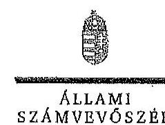

# Dr. Rózsa Ágnes úrhölgy 

jegyzó

Budapest Főváros XVII. kerület Rákosmenti Polgármesteri Hivatal

## Budapest

## Tisztelt Jegyző Úrhölgy!

Köszönettel megkaptam „Az Európai Parlament tagjainak 2014. évi választására fordított pénzeszközök felhasználásának ellenörzése" címủ jeleméstervezet megállapításaira tett észrevételét.

Az ellenőrzési megállapításokra vonatkozó észrevételét az Állami Számvevőszékről szóló 2011. évi LXVI. törvény 29. § (2) bekezdésében meghatározott tizenöt napos határidőn belül küldte meg. Az Állami Számvevőszék észrevétellel kapcsolatos álláspontját a mellékletként csatolt, a felügyeleti vezető által készített indokolás tartalmazza.

Budapest, 2015. 06. hó 30. nap

Tisztelettel:
az elnökneveben eljárva
Dr. Elex Ángy

Melléklet: Észrevételve adott válasz (1 darab)

---

# Az Európai Parlament tagjainak 2014. évi választására forditott pénzeszközök felhasználásának ellenörzése címú jelentéstervezetre tett észrevételre adott válasz 

| Észrevétel: | Jelentéstervezet 4. A választási feladatokra felhasznált pénzeszközök elszámolása (18. oldal 3. bekezdésében szereplő, 22. lábjegyzet szerinti megállapítás):   A XVII. kerület késedelmesen számolt el a választások lebonyolításához biztositott pénzeszközök felhasználásáról.   Az észrevétel szerint A XVII. kerületi HVI nem számolt el késedelmesen, mert a Fővárosi Választási Iroda a HVI-t helyszíni ellenőrzésre jelölte ki, amelynek időpontját 2014. június 19. napjában határozta meg. A dokumentumokat csak a megadott idöben kellett a TVI-nek benyújtani. |
| :--: | :--: |
| Válasz: | Az Állami Számvevöszék az észrevételt nem fogadja el. |
| Indoklás: | A Pvr. 7. § (1) bekezdése tételesen rendelkezik arról, hogy a HVI vezetője feladattípusú elszámolást készít a TVI vezetője részére a választás napját (2014. május 25.) követő tizenöt napon belül. Az elszámolás készités kötelezettségének KIM rendeletben foglalt határidejét a TVI ellenőrzése a jogszabály szerint nem befolyásolja. |
| Észrevétel: | Jelentéstervezet 3. számú melléklet:   A személyi juttatásoknál 36 esetben elmaradt az írásbeli kötelezettségvállalás, megsértve az Abt. 37. § (1) bekezdésében elölrtakat.   Az észrevétel szerint Budapest Főváros XVII. kerület Rákosmenti Polgármesteri Hivatalt érintő összestő megállapítások között álláspontom szerint tévesen szerepel a hivatkozott 36 esetbeli személyi juttatások kifizetésénél elmaradt írásbeli kötelezettségvállalás és ellenjegyzés, mivel a személyi juttatásokra kifizetett összeg egyik esetben sem érte el a 100.000 Ft -ot, így az államháztartásról szóló törvény végrehajtásáról szóló 368/2011. (XII. 31.) Korm. rendelet 53. § (1) bekezdés alapján nem szükséges írásbeli kötelezettségvállalás a kifizetéshez, így pénzügyi ellenjegyzés sem. |
| Válasz: | Az Állami Számvevőszék az észrevételt nem fogadja el. |
| Indoklás: | Az indoklásban hivatkozott 368/2011. (XII. 31.) Korm. rendelet 53. § (1) bekezdése mellett az 53. § (2) bekezdése előírja, hogy az (1) bekezdés szerinti kifizetésre e rendeletnek a kötelezettségvállalások teljesitésére (érvényesités, utalványozás) és nyilvántartására vonatkozó szabályait alkalmazni kell. Az elözetes írásbeli kötelezettségvállalást nem igénylő kifizetések rendjét a kötelezettséget vállaló szerv belső szabályzatában rögzíti.   A Polgármesteri Hivatal a választások pénzügyi lebonyolításának és belső ellenőrzési rendjére vonatkozóan (2014. január 1-től érvényes) külön szabályzatot készített, amelyben az elözetes írásbeli kötelezettségvállalást nem igénylő kifizetések rendjét nem szabályozta, kifejezetten azt rögzítette, hogy „A kötelezettségvállalásra csak az ellenjegyzés megtörténte után, írásban kerülhet sor." |

---

Tájékoztatom Jegyző Úrhölgyet, hogy a számvevőszéki jelentés mellékleteként szerepeltetjük a jelentéstervezethez tett észrevételét, valamint az arra adott válaszunkat.

Budapest, 2015.
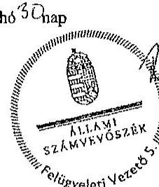
ho 5 chap
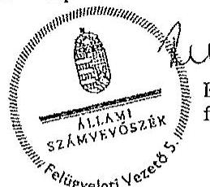
Renkó Zsuzsanna felügyeleti vezető

---

# BUDA 

## PEST

Fővárosi Választási Iroda
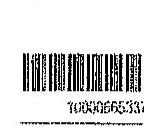
Jut. szám: FPH071/4-25/2015
dr. Elek János úr
fő́tükár
Állami Számvevőszék
Budapest

Tisztelt Fötitkár Úr!
A 2014. évi választások számvevőszéki vizsgálatainak jelentéstervezetelt köszönettel megkaptuk.
Tájékoztatom, hogy az Európai Parlament tagjainak 2014. évi választására forditott pénzeszközök felhasználásának ellenőrzéséről szóló V-0780-276/2015. számú és a helyi önkormányzati képviselők és polgármesterek, valamint a nemzetiségi önkormányzati képviselők 2014. évi választására fordított pénzeszközök felhasználásának ellenőrzéséről szóló V-0781-182/2015. számú jelentéstervezetekre észrevételt nem teszek.

Az országgyűlési képviselők 2014. évi választására fordított pénzeszközök felhasználásáról készült V-0779-415/2015. számú jelentéstervezet esetében az alábbiak szerinti pontositást szíveskedjenek elfogadni.

A jelentés tervezet 3.2. A választással kapcsolatos kiadások teljesítésének szabályszerűsége pontban (16. oldal, második bekezdés):
„Az FVI a választások pénzeszközeinek kormányzati funkciók szerinti elkülönítését a 68/2013. (XII. 29.) NGM rendelet $3 . \S$ (1) bekezdésében és 1. mellékletében foglaltak ellenére nem biztosította".

Pontosítva: „Az FVI a választások pénzeszközeinek kormányzati funkciók szerinti elkülönítését a 68/2013. (XII. 29.) NGM rendelet 3.§ (1) bekezdésében és 1. mellékletének megfelelően biztosította".

Indoklás: A Fővárosi Önkormányzat és a Főpolgármesteri Hivatal számviteli rendszerében kiállított valamennyi utalványon szerepel a kormányzati funkció száma és elnevezése, ami lehetővé teszi a választások pénzeszközeinek kormányzati funkciók szerinti elkülönítését. A bizonylatokat az ellenőrök rendelkezésére bocsátottuk, továbbá elektronikus formában átadtuk részükre. (A levélhez 3 db bizonylat másolatot csatoltunk.)

---

Pontosítási kérésünket alátámasztja az is, hogy az Európai Parlament tagjainak 2014.évi választása és a helyi önkormányzati képviselők és polgármesterek, valamint a nemzetiségi önkormányzati képviselők 2014. évi választása idején is ugyanezt a számviteli rendszert használtuk (PIR - Forrás), s ezekben az esetekben a kód használatával kapcsolatos észrevétel nem fogalmazódott meg.

Budapest, 2015. június, 16..."

Tisztelettel

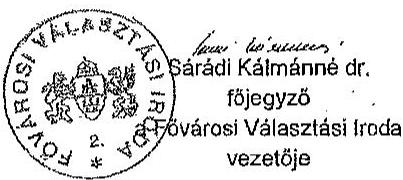

Melléklet: 3 db kiadási utalvány másolata

---

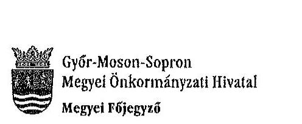

Ügyszám: 50-3/2015.

Tárgy: Észrevétel az ÁSZ jelentés megállapításaira

Állami Számvevőszék
Dr. Elek János
főtitkár úr

Budapest
Apáczal Csere János u. 10.

Tisztelt Főtitkár Úr!

A 2014. évi választásokra fordított pénzeszközök felhasználásának ellenőrzése tárgyában az Állami Számvevőszék által végzett ellenőrzésekről készített munkaanyagot kézhez kaptam. Az egyes ellenőrzési jelentésekben foglalt megállapításokkal egyetértek; észrevételt nem teszek.
Ezúton szeretném megköszönni a vizsgálat teljes körében és a helyszíni ellenőrzés során a számvevőszéki munkatársak részéről tanúsított segítő együttműködést.

Győr, 2015. június 15.
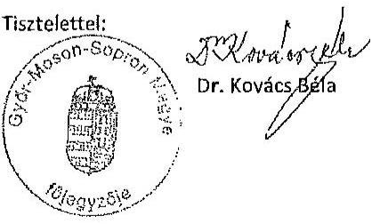

---

.

---

# Dégi Közös Önkormányzati Hivatal Jegyzője 8135 Dég, Kossuth Lajos utca 17. Tel: 25/505-250*137 

Szám: D/108-10/2015.

Állami Számvevőszék
Dr. Elek János főtitkár úr részére

Budapest
Pf. 54.
1364

Tisztelt Fötitkár Úr!

Tájékoztatom, hogy az Állami Számvevőszéknek az országgyűlési képviselők, az Európai Parlament tagjainak és a helyi önkormányzati képviselők és polgármesterek, valamint a nemzetiségi önkormányzati képviselők 2014. évi választására fordított pénzeszközök felhasználásának ellenőrzésével kapcsolatban érkezett jelentéstervezetek alapján az ellenőrzés megállapítására nem kívánok észrevételt tenni.

Dég, 2015.június 22.

Tisztelettel:
Szanyi-Nagy Józsefné
címzetes föjegyzo

---

.

---

# Kaposvár Megyei Jogú Város Címzetes Főjegyzője

**R. K. K. S. S. 2015**

**R. K. K. S. 2015**

**10. SZÁMÚ MELLEKLET**

**A V-0780-300/2015. SZÁMÚ JELENTÉSHEZ**

**E-mail:** ksposv@kaposvar.hu

**Ogyiratszám:** T/236/2015.

**Állami Számvevőszék**

**Elek János főtitkár úr részére**

**Tisztelt Főülkár Úr!**

**Állami Számvevőszéknek a 2014. évi választásokra fordított pénzeszközök felhasználásának ellenőrzéséről szóló három jelentéstervezethez (országgyűlési, európai parlamenti, önkormányzati választások) a következő észrevételt teszem:**

**Az ÁSZ jelentéstervezetei Kaposvár vonatkozásában nem tartalmi, hanem formai előírások vét hiányosságait tartalmazzák.**

**Kaposvár Megyei Jogú Város Polgármesteri Hivatalában az ÁSZ jelentésekben kifogásolt kötelezettségvállalások a felhasznált választási pénzek kis hányadát érintettek, azok kizárólag a százezer forint alatti kifizetésekre vonatkoztak, amelyek az államháztartóiról szóló törvény végrehajtásáról szóló 368/2011. (XII. 31.) Korm. rendelet 53. § (1) bekezdés a) pontja alapján előzetes írásbeli kötelezettségvállalást nem igényelnek. A százezer forint alatti kifizetésekre vonatkozó észrevételek a polgármesteri hivatal belső szabályzatára hivatkoztak, ugyanakkor a vizsgált időszakban a polgármesteri hivatal kötelezettségvállalási szabályzata a százezer forint alatti kifizetésekre vonatkozó előzetes írásbeli kötelezettségvállalásra előírást nem tartalmazott.**

**Az országgyűlési képviselők választása, valamint az Európai Parlament tagjainak választása költségeinek normatíváiról, tételeiről, elszámolási és belső ellenőrzési rendjéről, valamint egyes választási tárgyú miniszteri rendeletek módosításáról szóló 38/2013. (XII. 30.) KIM rendelet 8. § (1) bekezdése szerint a HVI és az OSVI tekintetében a támogatás felhasználását a TVI ellenőrzi a választás napját követő megnehet napon belül. A helyi önkormányzati képviselők és polgármesterek választásán a megismételt szavazás, a helyi önkormányzati képviselők és a polgármesterek időközi választása, a nemzetiségi önkormányzati képviselők választásán a megismételt szavazás és a nemzetiségi önkormányzati képviselők időközi választása költségeinek normatíváiról, tételeiről, elszámolási és belső ellenőrzési rendjéről szóló 7/2014. (XI. 6.) IM rendelet 8. § (2) bekezdése alapján a HVI tekintetében az elszámolások megalapozottságát a TVI ellenőrzi a szavazás napját követő huszonöt napon belül. A TVI ellenőrzések megtörténtek, azok problémát nem tettek fel.**

**Összességében a megállapításokkal nem értünk egyet, hiszen Kaposvár Megyei Jogú Város Polgármesteri Hivatalában az ÁSZ ellenőrzés olyan hiányosságot nem tért fel, amely a jelentéstervezetekben szereplő minősítéseket indokolná. Kérem, szíveskedjenek a jelentéstervezetek megállapításait a rendelkezésre álló önkormontumok alapján korrigálni.**

**Kaposvár. 2015. június 24.**

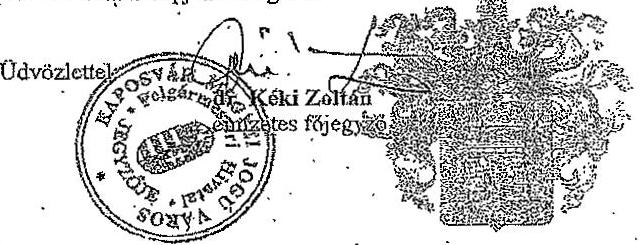

---

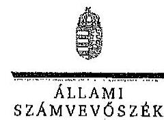

Ikt.szám:V-0779-433/2015.
V-0780-292/2015.
V-0781-194/2015.

Dr. Kéki Zoltán úr
címzetes fïjegyzü

Kaposvár Megyei Jogü Város Polgármesteri Hivatala

# Kaposvár 

## Tisztelt Címzetes Föjegyzö Úr!

Köszönettel megkaptam „Az országgyülési képviselők 2014. évi választására fordított pénzeszközök felhasználásának ellenörzése, Az Európai Parlament tagjainak 2014. évi választására forditott pénzeszközök felhasználásának ellenörzése és a A helyi önkormányzati képviselők és polgármesterek, valamint a nemzetiségi önkormányzati képviselők 2014. évi választására forditott pénzeszközök felhasználásának ellenörzése" címú jelentéstervezetek megállapításaira tett észrevételét.
Az ellenőrzési megállapításokra vonatkozó észrevételét az Állami Számvevőszékről szóló 2011. évi LXVI. törvény 29. § (2) bekezdésében meghatározott üzenőt napos határidőn belül küldte meg. Az Állami Számvevőszék észrevétellel kapcsolatos álláspontját a mellékletként csatolt, a felügyeleti vezető által készített indokolás tartalmazza.

Budapest, 2015. OY. hóCf. nap
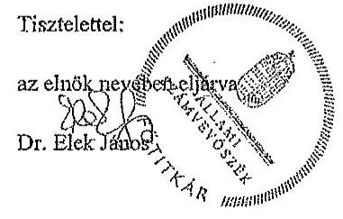

Melléklet: Észrevételre adott válasz (1 darab)

---

1. számú melléklet a V-0779-433/2015. számú, a V-0780-293/2015. számú, a V-0781-194/2015. számú levélhez
„Az országgyúlési képviselők 2014. évi választására forditott pénzeszközök felhasználásának ellenörzése,
Az Európai Parlament tagjainak 2014. évi választására fordított pénzeszközök felhasználásának ellenörzése,
A helyi önkormányzati képviselők és polgármesterek, valamint a nemzetiségi önkormányzati képviselők 2014. évi választására fordított pénzeszközök felhasználásának ellenörzése"
címú jelentéstervezetekre tett észrevételre adott válasz

| Észrevétel: | Az országgyúlési képviselők 2014. évi választására fordított pénzeszközök felhasználásának ellenörzése címú jelentéstervezet 3.2. A választással kapcsolatos kiadások teljesítésének szabályszerűsége, 3. számú melléklet megállapítása: |
| :--: | :--: |
|  | A gazdálkodási jogkörök gyakorlásának ässzestió értékelése: nem megfelelő |
|  | Kötelezettségvállalás, pénzügyi ellenjegyzés, teljesitésigazolás, érvényesités során feltárt jellemző, rendszerszerü hiányosságok: |
|  | 32 esetben a kötelezettségvállalásra a pénzügyi ellenjegyzés hiányában került sor (Ált. 37. § (1) bek., Ávr. 55. § (1) bek.), 49 esetben az érvényesitő a megelözö ügymenst szabályszerüségét nem ellenöriste (Ávr. 58. § (1) bek.) |
|  | Az Európai Parlament tagjainak 2014. évi választására fordított pénzeszközök felhasználásának ellenörzése címú jelentéstervezet 3.2. A választással kapcsolatos kiadások teljesítésének szabályszerűsége, 3. számú melléklet megállapítása: |
|  | A gazdálkodási jogkörök gyakorlásának ässzestió értékelése: nem megfelelő |
|  | Kötelezettségvállalás, pénzügyi ellenjegyzés, teljesitésigazolás, érvényesités során feltárt jellemző, rendszerszerü hiányosságok: |
|  | A kötelezettségvállalás dokumentuma az Ált. 37. § (1) bekezdésének elöirását megsértve 27 esetben nem tartalmazott pénzügyi ellenjegyzést. A 100 E Ft alatti kifizetéseknél 17 esetben nem tartották be a helsö szabálysstban elöirtakat. |
|  | A helyi önkormányzati képviselők és polgármesterek, valamint a nemzetiségi önkormányzati képviselők 2014. évi választására fordított pénzeszközök felhasználásának ellenörzése 3.2. A választással kapcsolatos kiadások teljesítésének szabályszerűsége, 3. számú melléklet megállapítása: |
|  | A gazdálkodási jogkörök gyakorlásának ässzestió értékelése: részben megfelelő |
|  | Kötelezettségvállalás, pénzügyi ellenjegyzés, teljesitésigazolás, érvényesités során feltárt jellemző, rendszerszerü hiányosságok: |
|  | A 100,0 E Ft alatti kifizetésekre (23 esetben) az Ált. 37. § (1) bekezdés elöirása ellenére elösstes írásbeli kötelezettségvállalás, illetve a helső szabálysstban elöirt engedély nélkül került sor. Az érvényesitő az Ávr. 58. § (2) bekezdés elöirása ellenére nem jelezte az utolványozónak, hogy a megelözö ügymenstben nem tartották be a jogszabályi elöirásokat. |

---

# Az észrevétel szerint: 

Az ÁSZ jelentéstervezetei Kaposvár vonatkozásában nem tartalmi, hanem formal elöíráznak vélt hiányosságait tartalmazzák.
Kaposvár Megyei Jogô Város Polgármesteri Hivatalában az ÁSZ jelentésekben kifogásolt kötelezettségvállalások a felhasznált választási pénzek kis hányadát érintették, azok kizárólag a százezer forint alatti kifizetésekre vonatkoztak, amelyek az államháztartásról szóló törvény végrehajtásáról szóló 368/2011. (XII. 31.) Korm. rendelet 53. § (1) bekezdés a) pontja alapján előzetes írásbeli kötelezettségvállalást nem igényelnek. A százezer forint alatti kifizetésekre vonatkozó észrevételek a polgármesteri hivatal belsö szabályzatára hivatkoznak, ugyanakkor a vizsgált időszakban a polgármesteri hivatal kötelezettségvállalási szabályzata a százezer forint alatti kifizetésekre vonatkozó előzetes írásbeli kötelezettségvállalásra elöirást nem tartalmazott.
A 28/2013. (XII: 30.) KIM rendelet 8. § (1) bekezdése, a 7/2014. IM rendelet 8. §. (2) bekezdésében elöirt TVI ellenörzések megtörténtek, azok problémát nem tártak fel.
Összességében a megállapításokkal nem értünk egyet, hiszen Kaposvár Megyei Jogó Város Polgármesteri Hivatalában az ÁSZ ellenőrzés olyan hiányosságot nem tárt fel, amely a jelentéstervezetekben szereplő minősítéseket indokolná. Kérem, szíveskedjenek a jelentéstervezetek megállapításait a rendelkezésre álló dokumentumok alapján korrigálni.

| Válasz: | Az Állami Számvevőszék az észrevételt nem fogadja el. |
| :--: | :--: |
| Indoklás: | Az indoklásban hivatkozott 368/2011. (XII. 31.) Korm. rendelet 53. § (1) bekezdése mellett az 53. § (2) bekezdése elöírja, hogy az (1) bekezdés szerinti kifizetésre e rendeletnek a kötelezettségvállalások teljesitésére (érvényesités, utalványozás) és nyilvántartására vonatkozó szabályait alkalmazni kell. Az elözetes írásbeli kötelezettségvállalást nem igénylő kifizetések rendjét a kötelezettséget vállaló szerv belsö szabályzatában rögzíti. A polgármesteri hivatal 2013. július 1-60 hatályos kötelezettségvállalási szabályzatának 2. pontja szerint: „A gazdasági eseményekhez bruttó 100.000 Ft-ot el nem érö kifizetések esetében nem szükséges elözetes, írásbeli kötelezettségvállalás. Ezen gazdasági események vonatkozásában megrendelést megelözően a pénzügyi fedezetet biztosító költségvetést elöirányzat felett kötelezettségvállalásra jogosult írásbeli engedélye szükséges, melynek 1 példányát az aláirást követöen át kell adni a Gazdasági Igazgatóság részére, 1 példányát pedig a pénzügyi bizonylathoz kell csatolni. Az írásbeli engedélynek tartalmaznia kell a terhelt elöirányzat megnevezését és az elöirányzat felett érvényesitést jogosultsággal rendelkező gazdasági ugyintésó által igazolt kötelezettségvállalással nem terhelt szabad keret összegét."   A polgármesteri hivatalnál a fentiekben elöirt írásbeli engedélyt az ellenőrzést végzők részére nem mutatták be. Írásbeli nyilatkozatot tettek arról, hogy a szabályzat szerint írásbeli engedélyek nem készültek, a kis összegủ beszerzésekre elözetes szóbeli egyeztetést követöen került sor.   A választásokkal kapcsolatos kiadások teljesitésének szabályszerűségének minösitésére - az egyes ellenőrzésekhez kijelölt mintatételek esetében feltárt különböző hiányosságokból matematikai, statisztikai módszerrel számítottan - a hatályos jogszabályi előírások és a polgármesteri hivatal belsö szabályzatainak való megfelelés együttes megitélése alapján került sor. |

---

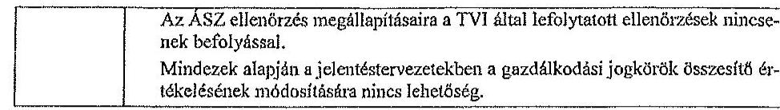

Tájékoztatom CImzetes Főjegyzö Urat, hogy a számvevőszéki jelentés mellékleteként szerepeltetjük a jelentéstervezethez tett észrevételé, valamint az arra adott válaszunkat.

Budapest, 2015. 04 hóct. nap

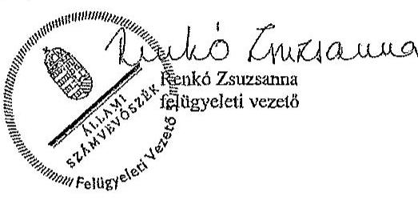

---

.

---

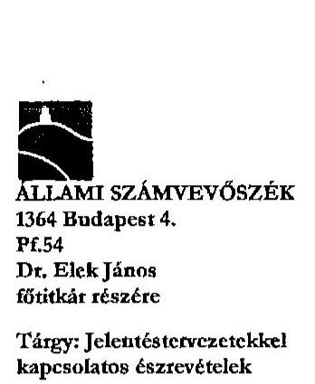

ÁLLAMI SZÁMVEVŐSZÉK
1364 Budapest 4.
PL54
Dr. Elek János
főtitkár részére

Tárgy: Jelentéstervezetekkel kapcsolatos észrevételek

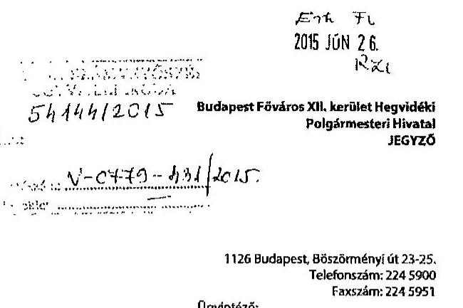

1126 Budapest, Bőszörményi út 23-25. Telefonszám: 224 5900
Faxszám: 224 5951
Ügyintéző:

Iktatási szám: IV- 27671/2

Kirch. Sorszám: 0176

Tisztelt Főtitkár Úr!

Köszönettel megkaptuk a 2014. évi választásokra fordított pénzeszközök felhasználásának ellenőrzése tárgyú „Jelentések" tervezetét.

Elsőként köszönetemet fejezem ki a vizsgálatban részt vevő számvevők segítő együttműködéséért és hasznos szakmai útmutatásaikért.

Örömmel tapasztaltuk, hogy a Budapest XII. kerületi HVI tevékenységével kapcsolatosan mindhárom Jelentés szöveges részében csupán a 4. pont alatt taglalt, a „választási feladatokra felhasznált pénzeszközök elszámolása" keretében szerepel megállapítás amiatt, hogy a XII. kerületi HVI nem számolt el időben az állami feladatfinanszírozással.

Ezzel kapcsolatban azt az észrevételt teszem, hogy mindhárom választás esetén az FVI által adott határidőt betartva készítettük el és nyújtottuk be az elszámolást, az ezzel kapcsolatos dokumentációt mindhárom esetben rendelkezésre bocsátottuk, így ezt a megállapítást nem tartjuk indokoltnak.

A Jelentések 3. számú mellékleteiben a „gazdálkodási jogkörök gyakorlásának összezítő értékelése" szerint HVI-nk az országgyűlési képviselők és a helyi önkormányzati képviselők és polgármesterek, valamint a nemzetiségi önkormányzati képviselők 2014. évi választására vonatkozó értékelése „részben megfelelt" volt, az Európai Parlament tagjainak 2014. évi választása esetében „nem megfelelő" minősítést kapott.

Az ezzel kapcsolatos indoklásokban felsorolják a kifogásra okot adó tételek számát, ezekkel kapcsolatosan az alábbi észrevételeket tesszük:

Országgyűlési képviselő választások:

a) „29 esetben a pénzügyi ellenjegyzés a kifizetési bizonylaton és nem a kötelezettségvállalás dokumentumán került feltüntetésre. 29 esetben a kötelezettségvállalás összegét nem tüntették fel, 29 esetben az érvényesítő a megelőző ügymenet szabályszerűségét nem ellenőrizte."

---

# Észrevétel: 

Feltételezésünk szerint ezek a kifogások a személyi juttatások mintatételeivel kapcsolatosak. A 30 fös mintában szereplő személyek 13 esetben jutalomként, 15 esetben tiszteletdíjként és két esetben megbízási szerződésként részesültek személyi juttatásban. Ezek kötelezettségvállalási dokumentuma a jutalmazottak esetében a „Jutalom lista a 2014. április 6-i Országgyúlési képviselő választásokon nyújtott teljesítményekért" volt, amelyen 2014. április 16-i dátummal szerepel a kötelezettségvállalás és a pénzügyi ellenjegyzés is. A tiszteletdíjak kötelezettségvállalási dokumentuma a „Szavazatszámláló Bizottság tagjainak tiszteletdíja" című táblázat volt, amelynek dátuma egyezően a pénzügyi ellenjegyzés dátumával 2014. április 16. volt. A kormányhivatali megbízottak esetében önálló megbízási szerződések készültek február 25-i dátummal, és a pénzügyi ellenjegyzés is ezen a napon történt.

Az érvényesítő ezen dokumentumok alapján végezte el munkáját.
b) „35 esetben az utalványozás a kifizetések után valósult meg."

## Észrevétel:

Feltételezésünk szerint ebben az előző pontban említett 29 tétel is szerepel. Ezzel kapcsolatosan általánosságban jelezzük, hogy a bérszámfejtési dokumentumokon szerepő dátumok és a tényleges banki utalás dátuma minden személyi juttatás esetében eltérő volt, ugyanis a bérszámfejtés a választások időpontjában a Gazdasági Ellátó Szolgálatnál történt, és a belső tégmenet szerint ehhez képest a tényleges kifizetés egy-két nappal ezt követően valósult meg. Az utalványozás minden esetben megelőzte a pénzügyi kifizetést, amit az általunk bemutatott utalványrendeletek és a banki kivonatok is alátámasztanak. A további 6 kifogásolt esetet nem tudtuk beszonosítani.

## c) 15 esetben a teljesítésigazolás a belső szabályzattól eltérően történt

## Észrevétel:

A 13/2014. számú jegyzői utasítás szerint a személyi juttatások teljesítésének igazolására a Jegyző jogosult. A hivatkozott 15 fő valószínűleg az SzSzB tagokra vonatkozik, Esetükben a teljesítés igazolása a már hivatkozott kötelezettségvállalási dokumentumon történt, „Az SzSzB jegyzőkönyvek alapján a feladatellátás megtörtént" szöveggel, alatta jegyzői aláirással és 2014. 04.16-i dátummal.

---

# Európai parlament tagjainak választása 

a.) „A jegyzőkönyvvezetők jutalmának (12 tétel) és az SZSZB tagok tiszteletdijának (15 tétel) kifizetésére írásbeli kötelezettségvállalás nélkül került sor. Az érvényesitő nem ellenőrizte a megelőző ügymenetben a jogszabályokban és a belső szabályzatokban foglaltak betartását."

## Észrevétel:

A jegyzőkönyvvezetők jutalmának kötelezettségvállalási dokumentuma a Dokumentumjegyzék 18. pontjában szereplő „Jutalomlista a 2014. május 25 -i EP választásokon nyújtott teljesítményekért" 2014. június 3 -án a Jegyzö által aláirt és ugyanezen a napon pénzügyileg ellenjegyzett táblázatos dokumentum volt. Az SZSZB tagok tiszteletdijának kötelezettségvállalási dokumentuma a Dokumentumjegyzék 17. pontjában szerepelő „SzSzB tagok tiszteletdija szavazókövönként" 2014. június 11-én a Jegyzö által aláirt és ugyanezen a napon pénzügyileg ellenjegyzett táblázatus dokumentum volt.

Az érvényesitő ezen dokumentumok alapján végezte az érvényesitést, amit a kapcsolódó utalványrendeleteken 2014. június 12-én aláírásával igazolt.
b.) „Az utalványozást nem a belső szabályzatban meghatározott személy végezte."

## Észrevétel:

A 13/2014. Jegyzöi utasítás szerint a választásokkal kapcsolatos utalványozási feladatokat a gazdasági vezető végzi. Ennek megfelelően az utalványrendeleteken az ő aláírása szerepelt. Az Európai parlamenti választások Fővárosi Választási Irodán történt ellenőrzése során (Dokumentumjegyzék 6. pont) kiderült, hogy a szabályzatban helytelenül szerepelt a hatáskör átruházás, mivel a 38/2013.(XII.30) KIM rendelet 1.§ c) pontja szerint a Jegyzö jogosult az utalványozásra. Erre tekintettel a Dokumentumjegyzék 8. pontjában szereplő „Jegyzöi intézkedés ellenőrzés után" alapján bekértem az összes hibásan utalványozott dokumentumot, és azokat saját kézjegyemmel is elláttam.

## Önkormányzati választások

a.) „A 9 HVI tag személyi juttatásai kifizetésére írásbeli kötelezettségvállalás nélkül került sor."

## Észrevétel:

Nem tudtuk beazonosítani a tételeket, mivel jutalom jogcímen 12 fő egy közös listán, tiszteletdij jogcímen pedig 15 fő ugyancsak közös listán kapott juttatást, 3 fő megbízási díjához pedig egyedi megbízási szerződések kapcsolódtak.

---

# b.) „A pénzügyi ellenjegyzésre 3 tétel esetén kötelezettségvállalás után került sor." 

## Észrevétel:

Sajnálatos módon egy írásbeli kötelezettségvállaláson - vélhetöleg figyelmetlenségből - egy nappal későbbi dátummal szerepel a pénzügyi ellenjegyzés, ami három számlát, azaz három mintatételt érintett.

Az előzőekben leírtak alapján kérem, szíveskedjenek észrevételeinket mérlegelni, elfogadni, és az ehhez kapcsolódó értékelést, minősítést lehetőség szerint kedvezőbben megállapítani.

Budapest Hegyvidék, 2015. június 22.
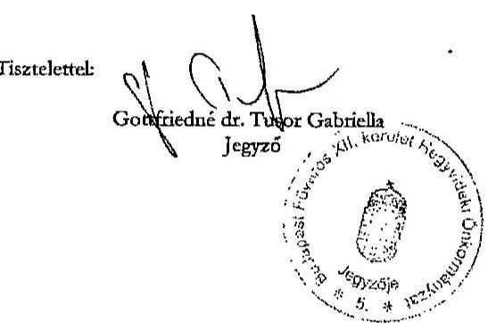

---

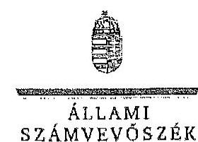

# Gottfriedné dr. Tusor Gabriella úrhölgy 

jegyzó

Budapest Főváros XII. kerület Hegyvidéki Polgármesteri Hivatal

## Budapest

## Tisztelt Jegyzó Ürhölgy!

Köszönettel megkaptam „Az országgyölési képviselők 2014. évi választására forditott pénzeszközök felhasználásának ellenörzése", „Az Európai Parlament tagjainak 2014. évi választására forditott pénzeszközök felhasználásának ellenörzése", valamint „, A helyi önkormányzati képviselők és polgármesterek, valamint a nemzetiségi önkormányzati képviselők 2014. évi választására forditott pénzeszközök felhasználásának ellenörzése" címü jelentéstervezetek megállapításaira tett észrevételét.
Az ellenőrzési megállapításokra vonatkozó észrevételét az Állami Számvevőszékről szóló 2011. évi LXVI. törvény 29. § (2) bekezdésében meghatározott észrevételként kezeljük. Az Állami Számvevőszék észrevétellel kapcsolatos álláspontját a mellékletként csatolt, a felügyeleti vezető által készített indokolás tartalmazza.

Budapest, 2015. 54. hóls, nap
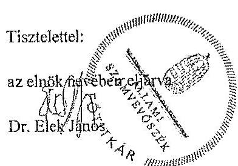

Melléklet: Észrevételre adott válasz (1 darab)

---

# 11. SZÁMÚ MELLÉKLET A V-0780-300/2015. SZÁMÚ JELENTÉSHEZ 

1. számú melléklet a V-0779-430/2015. számú, a V-0780-294/2015. számú, a V-0781-195/2015. számú levülhez
„Az országgyúlési képviselők 2014. évi választására forditott pénzeszközök felhasználásának ellenörzése,
Az Európai Parlament tagjainak 2014. évi választására fordított pénzeszközök felhasználásának ellenörzése,
A helyi önkormányzati képviselők és polgármesterek, valamint a nemzetiségi önkormányzati képviselők 2014. évi választására fordított pénzeszközök felhasználásának ellenörzése"
címú jelentéstervezetekre tett észrevételre adott válasz

| Észrevétel: | Az országgyúlési képviselők 2014. évi választására fordított pénzeszközök felhasználásának ellenörzése címú jelentéstervezet |
| :--: | :--: |
|  | A 4. A választási feladatokra felhasznált pénzeszközök elszámolása fejezet 21. oldal 3. bekezdés, illetve a 15 . számú lábjegyzet megállapítása: |
|  | Két HVI (köztük a 15. számú lábjegyzetbeli hivatkozásban szereplő Budapest XII. kerület) a Pvr. 7. § (1) bekezdésében meghatározott 15 napos határidőt meghaladva nyújtotta be elszámolását a TVI részére. |
|  | Az Európai Parlament tagjainak 2014. évi választására fordított pénzeszközök felhasználásának ellenörzése címú jelentéstervezet |
|  | A 4. A választási feladatokra felhasznált pénzeszközök elszámolása fejezet 18. oldal 8. bekezdés, illetve a 22 . számú lábjegyzet megállapítása: |
|  | Négy HVI (köztük a 22. számú lábjegyzetbeli hivatkozásban szereplő Budapest XII. kerület) a Pvr. 7. § (1) bekezdésében meghatározott 15 napos határidőn túl, 1-8 napos késedelemmel készítette el az elszámolását. |
|  | A helyi önkormányzati képviselők és polgármesterek, valamint a nemzetiségi önkormányzati képviselők 2014. évi választására fordított pénzeszközök felhasználásának ellenörzése |
|  | A 4. A választási feladatokra felhasznált pénzeszközök elszámolása fejezet 19. oldal, 3. bekezdés, illetve a 20 . számú lábjegyzet megállapítása: |
|  | Az ellenőrzött HVI-k 52,6\%-a határidőre elszámolt a választások lebonyolításához biztosított pénzeszközök felhasználásáról, kilenc választási iroda (köztük a 20. számú lábjegyzetbeli hivatkozásban szereplő: Budapest XII. kerület) a 3/2014. (VII. 24.) IM rendelet 7. § (1) bekezdésében elöírt 15 napos határidőt 1-10 nappal túllépve készítette el és továbbította a TVI vezetője felé az elszámolását. |
|  | Az észrevétel szerint:   A Budapest Főváros XII. kerületi HVI tevékenységével kapcsolatosan mindhárom Jelentés szöveges részében csupán a 4. pont alatt taglalt, a „választási feladatokra felhasznált pénzeszközök elszámolása" keretében szerepel megállapítás amiatt, hogy a XII. kerületi HVI nem számolt el időben az állami feladatfimenzározással. Ezzel kapcsolatban azt az észrevételt teszik, hogy mindhárom választás esetén az FVI által adott határidőt betartva készítették el és nyújtották be az elszámolást, az |

---

|  | ezzel kapcsolatos dokumentációt mindhárom esetben rendelkezésre bocsátották, igy ezt a megállapítást nem tartják indokoltnak. |
| :--: | :--: |
| Válasz: | Az Állami Számvevőszék az észrevételt nem fogadja el. |
| Indoklás: | Az országgyúlési képviselők választása, valamint az Európai Parlament tagjainak választása költségeinek normativáiról, tételeiről, elszámolási és belső ellenőrzési rendjéről, valamint egyes választási tárgyú miniszteri rendeletek módosításáról szóló 38/2013. (XII. 30.) KIM rendelet (továbbiakban: Pvr) 7. § (1) bekezdése, valamint a helyi önkormányzati képviselők és a polgármesterek választása, valamint a nemzetiségi önkormányzati képviselők választása költségeinek normativáiról, tételeiről, elszámolási és belső ellenőrzési rendjéről szóló 3/2014. (VII. 24.) számú IM rendelet 7. § (1) bekezdése tételesen rendelkezik arról, hogy a HVI vezetője feladattípusú elszámolást készít a TVI vezetője részére a választás napját követő tizenöt napon belül. Az elszámolás készítés kötelezettségének hivatkozott jogszabályi előírásokban foglalt határidejét a TVI (az Önök esetében az FVI) elszámolást érintő, ettől eltérő eljárása nem befolyásolja. |
| Eszrevétel | Az országgyúlési képviselők 2014. évi választására fordított pénzeszközök felhasználásának ellenőrzése címú jelentéstervezet   3.2. A választással kapcsolatos kiadások teljesítésének szabályszerűsége fejezethez kapcsolódóan a 3. számú melléklet megállapítása:   A gazdálkodási jogkörök gyakorlásának äszzesitő értékelése: részben megfelelő   Kötelezettségvállalás, pénzügyi ellenjegyzés, teljesitésigazolás, érvényesités során feltárt jellemző, rendszerszerü hiányosságok:   „29 esetben a pénzügyi ellenjegyzés a kifizetési bizonylaton és nem a kötelezettségvállalás dokumentumán került feltüntetésre (Ávr. 55. § (1) bek.), 29 esetben a kötelezettségvállalás összegét nem tüntettek fel (Áht. 37. § (1) bek., Avr. 55. § (1) bek.), 13 esetben a teljesitésigazolás nem történt meg, illetve 15 esetben a teljesitésigazolás a belsö szabályzattól eltérően történt (Áht. 38. § (1) bek és Avr. 57. § (3) bek., Pénzkezelési-, pénzgazdálkodási és kötelezettségvállalási szabályzata III/A. fejezet c) pont), négy esetben az érvényesitést nem a kötelezettségvállalási szabályzatában kijelölt személy végezte (Áht. 37. § (1) bek., 13/2014. jegyzői utasítás), 29 esetben az érvényesitő a megelőző ügynenet szabályszerűségét nem ellenőrizte (Ávr. 58. § (1) bek.), 35 esetben az utalványozás a kifizetések után valósult meg (Áht. 38. § (1) bek.)."   Az Európai Parlament tagjainak 2014. évi választására fordított pénzeszközök felhasználásának ellenőrzése címú jelentéstervezet   3.2. A választással kapcsolatos kiadások teljesítésének szabályszerűsége fejezethez kapcsolódóan a 3. számú melléklet megállapítása:   A gazdálkodási jogkörök gyakorlásának äszzesitő értékelése: nem megfelelő Kötelezettségvállalás, pénzügyi ellenjegyzés, teljesitésigazolás, érvényesités során feltárt jellemző, rendszerszerü hiányosságok:   „A jegyzőkönyvvezetők jutalmának (12 tétel) és az SZSZB tagok tiszteletdijának (15 tétel) kifizetésére az Áht. 37. § (1) bekezdésének elöírását megsértve írásbeli kötelezettségvállalás nélkül került sor. Az érvényesitő az Ávr. 58. § (1) bekezdésének elöírása ellenére nem ellenőrizte a megelöző ügynenetben |

---

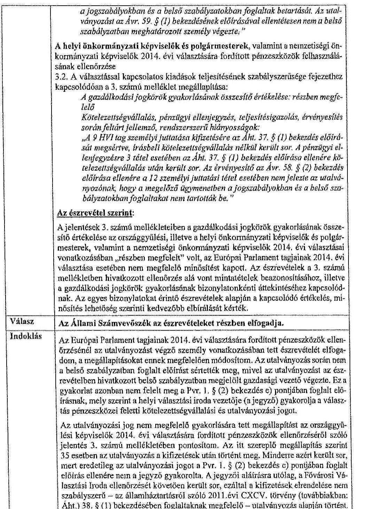
a jogszabályokban és a belsö szabályzatokban foglaltak betartását. Az utalványozást az Av̉r. 59. § (1) bekezdésének elöírásával ellentétesen nem a belsö szabályzatban meghatározott személy végezte."
A helyi önkormányzati képviselők és polgármesterek, valamint a nemzetiségi önkormányzati képviselők 2014. évi választására fordított pénzeszközök felhasználásának ellenőrzése
3.2. A választással kapcsolatos kiadások teljesitésének szabályszentésége fejezethez kapcsolódóan a 3. számú melléklet megállapítása:

A gazdálkodási jogkörök gyakorlásának összestió értékelése: részben megfelelő
Kötelezettségvállalás, pénzügyi ellenjegyzés, teljesitésigazolás, érvényesités során feltárt jellemző, rendszerszerü hiányosságok:
„A 9 HV1 tag személyi juttatása kifizetésére az Aht. 37. § (1) bekezdés elöirását megsértve, írásbeli kötelezettségvállalás nélkül került sor. A pénzügyi ellenjegyzéere 3 tétel esetében az Aht. 37. § (1) bekezdés elöirása ellenére kötelezettségvállalás után került sor. Az érvényesitő az Av̉r. 58. § (2) bekezdés elöirása ellenére a 12 személyi juttatási tétel esetében nem jelezte az utalványozónak, hogy a megelözö ügymenetben a jogszabályokban és a belsö szabályzatokban foglaltakat nem tartották be."

# Az észrevétel szerint: 

A jelentések 3. számú mellékletében a gazdálkodási jogkörök gyakorlásának összestió értékelése az országgyúlési, illetve a helyi önkormányzati képviselők és polgármesterek, valamint a nemzetiségi önkormányzati képviselők 2014. évi választásai vonatkozásában „részben megfelelt" volt, az Európai Parlament tagjainak 2014. évi választása esetében nem megfelelő minősítést kapott. Az észrevételek a 3. számú mellékletben hivatkozott ellenőrzés alá vont mintatételek beazonosításához, illetve a gazdálkodási jogkörök gyakorlásának bizonylatonkénti áttekintéséhez kapcsolódnak. Az egyes bizonylatokat érintő észrevételek alapján a kapcsolódó értékelés, minősítés lehetőség szerinti kedvezőbb elbírálását kérték.

| Válasz | Az Állami Számvevőszék az észrevételeket részben elfogadja. |
| :--: | :--: |
| Indoklás | Az Európai Parlament tagjainak 2014. évi választására fordított pénzeszközök ellenőrzésénél az utalványozást végző személy vonatkozásában tett észrevételét elfogadom, a megállapításokat ennek megfelelően módosítom. Az utalványozás során nem a belső szabályzatban foglalt elöirást sértették meg, mivel az utalványozást az észrevételben hivatkozott belső szabályzatban megjelölt gazdasági vezető végezte. Ez a gyakorlat azonban nem felelt meg a Pvr. 1. § (2) bekezdés c) pontjában foglalt elöírásnak, mely szerint a helyi választási iroda vezetője (a jegyző) gyakorolja a választás pénzeszközei feletti kötelezettségvállalási és utalványozási jogot.   Az utalványozási jog nem megfelelő̉ gyakorlására tett megállapítást az országgyúlési képviselők 2014. évi választására fordított pénzeszközök ellenőrzéséről szóló jelentés 3. számú mellékletében pontosítom. Az itt szereplő megállapítás szerint 35 esetben az utalványozás a kifizetések után történt meg. Minderre azért került sor, mert eredetileg az utalványozási jogot a Pvr. 1. § (2) bekezdés c) pontjában foglalt elöírás ellenére nem a jegyző gyakorolta. A jegyzői aláírásra utólag, a Fővárosi Választási Iroda ellenőrzését követően került sor, ezáltal a kifizetések elrendelése nem szabályszerű - az államháztartásról szóló 2011. évi CXCV. törvény (továbbiakban: Aht.) 38. § (1) bekezdésében foglaltaknak megfelelő - utalványozás alapján történt. |

---

A fentieken túl az észrevételben foglaltakat nem fogadom el.

- Az ellenőrzés megállapította, hogy a személyi juttatások tekintetében a kötelezettségvállalás a jelentéstervezetekben megjelölt esetszámban nem felelt meg az Áht. 37. § (1) bekezdésében foglalt előírásnak. A belső szabályzat III/A. a) Kötelezettségvállalás pont 2. számú alpontjában meghatározott előzetes írásbeli kötelezettségvállalást nem igénylő esetek ( 50 ezer Ft összeghatárt el nem érő tételek) vonatkozásában a szabályzat II. c) pontja kizárólag az elszámolásra kiadott előlegek tekintetében tartalmaz rendelkezési. Az Önkormányzatnál esáltal nem rögzítették az államháztartásról szóló törvény végrehajtásáról szóló 368/2011. (XII. 31.) Korn. rendelet (továbbiakban: Ávr.) 53. § (2) bekezdésének megfelelően ezen kifizetések rendjét, így a kötelezettségvállalási jogkör gyakorlásának minősítése során az Áht. 37. § (1) bekezdésében foglalt előírásoknak való megfelelés vehető alapul. Egyebekben a 2014. évi választások helyi előkészitésére és lebonyolítására felhasználandó pénzeszközök feletti kötelezettségvállalás rendjéről 2014. február 1-jén kiadott 13/2014. számú jegyzői utasítás a Pvr. 1. § (2) bekezdés c) pontjában foglalt előirással ellentétes rendelkezést tartalmazott. A hivatkozott jogszabály szerint a helyi választási iroda vezetője (a jegyző) gyakorolja a választás pénzeszközei feletti kötelezettségvállalási jogot, ennek ellenére a jegyzői utasításban az aljegyző, illetve a Fenntartási Iroda vezetője részére e jogkör gyakorlására felhatalmazást adtak. A jegyzői utasítás jogszabályi előírásnak megfelelő módosítására csak 2014. június 20 -án került sor.
Az ellenőrzés során a kötelezettségvállalás dokumentumaként a HVI tagok esetében a HVI vezető által kiadott megbízást, az SZSZB tagok esetében a megbizölevelet mutatták be, amelyek nem tartalmazták a kötelezettségvállalás összeget és az Ávr. 55.§ (1) bekezdésének rendelkezésétől eltérően a pénzügyi ellenjegyzést. Az érvényesítés ebből kifolyóan azért nem volt teljes körűen megfelelő, mert a megelőző ügymenetet nem ellenőrizte az érvényesitő és a szabálytalanságot nem jelezte az utalványozó felé. Az észrevételben hivatkozott jutalomlisták, tiszteletdíjról készített táblázatokon a választás lebonyolítása napját követő dátummal szerepel a jegyző (kötelezettségvállaló) és a pénzügyi ellenjegyzó aláírása.
- A 15 fő szavazatszámláló bizottsági tag részére történt kifizetés esetében a teljesítés igazolása a 2008 óta hatályos Pénzkezelési-, pénzgazdálkodási és kötelezettségvállalási szabályzat III/A. fejezet c) pont 3. alpont előírásaitól eltérően nem a számlán vagy az utalványrendelkezésen történt, az ellenőrzés erre való tekintettel állapította meg, hogy az a belső szabályozásnak nem felelt meg.
- A helyi önkormányzati képviselők és polgármesterek, valamint a nemzetiségi önkormányzati képviselők 2014. évi választása tekintetében 9 HVI tag személyi juttatása (jutalma) tekintetében - a belső szabályzatban meghatározott értékhatár túllépése ellenére - az Áht. 37. § (1) bekezdésében foglalt előírásnak megfelelő, előzetes írásbeli kötelezettségvállalásra nem került sor, mivel a kérdéses személyek vonatkozásában kiállított dokumentumokban (megbizölevelekben) a díjazás összege nem szerepelt. Ezen túl az észrevételben Önök is elismerik az ellenőrzés által feltárt további hibát, mely szerint a dokumentumok alapján a pénzügyi ellenjegyzésre a kötelezettségvállalás után került sor.

---

A választásokkal kapcsolatos kiadások teljesítésének szabályszerűségének minősítésére - az egyes ellenőrzésekhez külön-külön kijelölt mintatételek esetében feltárt különböző hiányosságokból matematikai, statisztikai módszerrel számítottan - a hatályos jogszabályi előírások és a polgármesteri hivatal belső szabályzatainak való megfelelés együttes megítélése alapján kerül sor.
Mindezek alapján a jelentéstervezetekben a gazdálkodási jogkörök üsszesítő értékelésének módosítása nem indokolt.

Tájékoztatom Jegyző úrhölgyet, hogy a számvevőszéki jelentés mellékleteként szerepelhetjük a jelentéstervezethez tett észrevételét, valamint az arra adott válaszunkat.

Budapest, 2015.
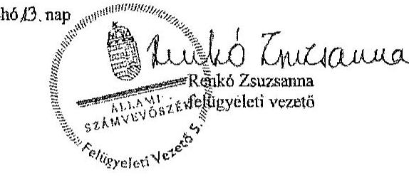

---

Haidū-Bihar Megyei Önkormányzat Közgyűlésének JEGYZŐJE

53 4024 Debrecen, Pise u. 54., 33/507-524, e-mail: jegyzo@hfemo.hu

|  Ikt.szám: | ÖH: 80-11/2015  |
| --- | --- |
|  Hivatkozási szám: | V-0779-415/2015  |
|  820 07. | V-0780-276/2015  |
|   | V-0781-182/2015  |

Dr. Elek János úr titkár

Állami Számvevőszék

Budapest

Apáczai Csere János utca 10.

2015 JUN 30

V-0743-433/2015

ÁLLAMI SZÁMVEVŐSZÉK ÜGYVITELI IRGDA 54855/2015

ÖTE.: JUN 29 2015

Hivatkozzat: V-0740-430/2015

Tisztelt Titkár Úr!

A 2014. évi választásokra fordított pénzeszközök felhasználásának ellenőrzéséről készített V-0779-415/2015, V-0780-276/2015, V-0781-182/2015 számú számvevői ellenőrzési jelentéstervezet Hajdú-Bihar Megyei Önkormányzati Hivatalt érintő megállapításaira észrevételt nem kívánok tenni.

Debrecen, 2015. június 17.

Tisztelettel:

Dr. Dobi Csaba

---

.

---

Nemzeti Választási Iroda
elnök

Ikt.sz.: NVI/057/2015

Dr. Elek János
fűtitkár

Állami Számvevőszék
1052 Budapest
Apáczai Csere János utca 10.

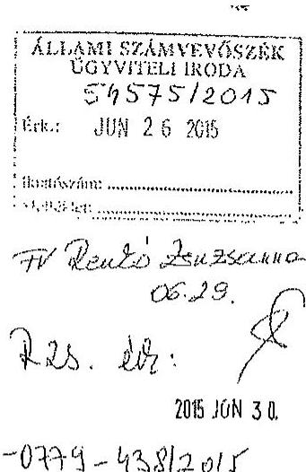

Tárgy: Észrevételek a megküldött jelentéstervezetekhez

Tisztelt Fűtitkár Úr!

A Nemzeti Választási Iroda részére megküldött, a 2014. évi választásokra fordított pénzeszközök felhasználásának ellenőrzéseiről készült jelentéstervezetekhez az alábbi észrevételeket teszem.

I. A 2014. évi országgyűlési képviselőválasztásra fordított pénzeszközök
felhasználásának ellenőrzése - V-0779-415/2015. számú
jelentéstervezet

1. A tervezet 4. oldalán a 4. bekezdésben „Az ellenőrzés célja annak megállapítása volt,
hogy a helyi önkormányzati képviselők és polgármesterek, valamint a nemzettségi
önkormányzati képviselők 2014. évi választására fordított pénzeszközök
tervezésére..." szövegrész helyett: „Az ellenőrzés célja annak megállapítása volt,
hogy a 2014. évi országgyűlési képviselőválasztására fordított pénzeszközök
tervezésére..." a helyes.

2. A tervezet 9. oldalának 3. bekezdéséhez megjegyezni kívánom, hogy az NVI elnöke a
Számv. tv. 14. § (11) bekezdésében meghatározott 90 napos határidőt azért nem
tudta tartani, mert az NVI 2013. május 24-ei alapítását követően a gazdálkodás
szervezeti egysége 2014. október 1-én került felállításra, a gazdasági vezető
kinevezése is ekkor történt meg.

3. A tervezet 13. oldalának 3. bekezdéséhez megjegyzem, hogy a Pvr. a nem normatív
kladások tekintetében azért nem tartalmaz előírást az előlegek utalásának
határidejére vonatkozólag, mert azok minden esetben az ellátandó feladatok jellegét,
a résztvevő szervezetek tevékenységét meghatározó megállapodásokban kerülnek
rögzítésre, és erre vonatkozólag a korábbi választások végrehajtási rendeletei sem
írtak elő határidőt.

4. A tervezet 15. oldal 5. bekezdés utolsó mondatában a „KEKKH pénzügyi nyilvántartó
rendszerében" helyett az „OrganP VPJR rendszerében" megnevezés a helyes.

---

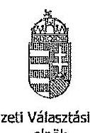
Nemzeti Választási Iroda
elnök
II. Az Európai Parlament tagjainak 2014. évi választására fordított pénzeszközök felhasználásának ellenörzése - V-0780-276/2015. számú jelentéstervezet

1. A tervezet 7. oldal 5. bekezdés utolsó mondatát nem áll módomban elfogadni, tekintettel arra, hogy az NVI a választási irodák és az egyéb szervezetek elfogadott elszámolásai alapján a Pvr.-ben elöírt határidőn belül, 2014. augusztus 22. napján készítette el az összesítő beszámolóját. (Beszámoló a 2014. évi Európai Parlament tagjainak választásáról).
2. A tervezet 14. oldal 1. bekezdésében a „010201 TEA kódon" szöveg helyett „1010201 TEA kódon" szöveg a helyes.
3. A tervezet 18. oldal utolsó bekezdéséhez megjegyezni kívánom, hogy a Pvr. 6.§ (2) bekezdésében a HVI-k részére elöírt feladattípusú elszámolás jogcímenkénti részletezése a jogalkotási szándék szerint kizárólag a többletköltségekre és a feladatolmaradásra vonatkozott volna. Az elszámolások elkészitésére vonatkozó 19/2014. (VI.04.) NVI utasítás formanyomtatványa rendelkezett ennek kezeléséröl. Amennyiben minden HVI esetében minden kiadásnem vonatkozásában a jogcímenkénti részletező kimutatást kértük volna be, az rendkívüli adatmennyiséget keletkeztetett volna, és jelentős munkaterhet jelentett volna a HVI-kre és TVI-kre nézve.
A helyi önkormányzati képviselők és polgármesterek, továbbá a nemzetiségi önkormányzati képviselők választásáról szóló Pvr.-ben (3/2014. (VII. 24.) IM rendelet) már pontositásra került a jogcímenkénti részletező kimutatásra vonatkozó elöírás.
4. A tervezet 22. oldalának utolsó bekezdését az 1. pontban említettek alapján nem áll módomban elfogadni. A lábjegyzetben szereplő 27. számú megjegyzésben feltüntetett végleges elszámoláson szereplő 2015. március 12. dátum a dokumentum nyomtatásának dátuma. A választásról készített beszámoló készítésének dátuma 2014. augusztus 22. (Beszámoló a 2014. évi Európai Parlament tagjainak választásáról).
III. A helyi önkormányzati képviselők és polgármesterek, valamint a nemzetiségi önkormányzati képviselők 2014. évi választására fordított pénzeszközök felhasználásának ellenörzése - V-0781-1825/2015. számú jelentéstervezet
5. A tervezet 3. oldal 1. bekezdésében javaslom javítani, hogy a nemzetiségi önkormányzati képviselők választását nem Magyarország Köztársasági Elnöke, hanem a Nemzeti Választási Bizottság tűzte ki.
6. A tervezet 12. oldal utolsó bekezdéséhez megjegyezni kívánom, hogy az NVI a 2014. évi költségvetésében az önkormányzati és nemzetiségi választásokra azért nem

---

Nemzeti Választási Iroda
elnök
tervezett eredeti előirányzatot, mert - összhangban a tervezet 11. oldal 2. pontjának első bekezdésében leírtakkal - az eredeti előirányzat az önkormányzati és nemzetiségi választásokra már nem biztosított fedezetet. A közgazdaságilag megalapozott tervezés biztosított volt az NVI által 2014. március 3-án elkészített, majd a forrás biztosítását követő módosított előirányzat könyvviteli rendszerben történő rögzítésével.
3. A tervezet 17. oldal utolsó bekezdéséhez és a lábjegyzet 18. pontjához megjegyezni kívánom, hogy a választások összesítő elszámolása 2015. február 12-én készült el, a megjelölt 2015. március 9. napja a dokumentum nyomtatásának napját jelenti. A Pvr. által megadott 90 napos elszámolási határidő ebben az esetben két országos választás teljes körű ellenőrzését és adatainak feldolgozására vonatkozott, vagyis ezzel indokolható a határidőn túli elszámolás elkészítése.

Mindhárom jelentéshez általánosságban megjegyezni kívánom, hogy az NVI által nem a megfelelő választás kiadásai terhére elszámolt tételek - számosságát tekintve öt darab nagyvágrendje és összege is elenyésző a négy országos választás vonatkozásában. Az érintett tételek mindegyike a választások érdekében felmerült, szabályszerűen, a megfelelő kiadásnemen elszámolt kiadást jelentett. Az NVI jelenleg és a jövőben is kiemelt figyelmet fordít a feladattípusú elszámolás során a pénzeszközök felhasználásának pontos kimutatására.

Kérem Tisztelt Főtitkár Urat, hogy az NVI részéről tett észrevételeket és kért módosításokat a végleges jelentésekben elfogadni és érvényesíteni szíveskedjenek.

Budapest, 2015. június, 17.
Üdvözlettel:
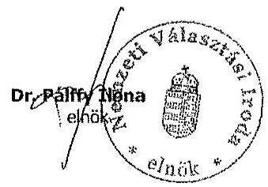

---

# 13. SZAMÚ MELLÉKLET A V-0780-300/2015. SZAMÚ JELENTÉSHEZ 

## FÖTTELÉ

## ÁLLAMI   SZÁMVEVÖSZÉK

Ikt.szám:V-0779-445/2015.
V-0780-297/2015.
V-0781-196/2015.

## Dr. Pálffy Ilona úrhölgy elnök

Nemzeti Választási Iroda

## Budapest

## Tisztelt Elnök Ürhölgy!

Köszönettel megkaptam „Az országgyûlési képviselők 2014. évi választására forditott pénzeszközök felhasználásának ellenörzése", „Az Európai Parlament tagjainak 2014. évi választására forditott pénzeszközök felhasználásának ellenörzése", valamint „A helyi önkormányzati képviselők és polgármesterek, valamint a nemzetiségi önkormányzati képviselők 2014. évi választására forditott pénzeszközök felhasználásának ellenörzése" című jelentéstervezetek megállapításaira tett észrevételét.
Az ellenőrzési megállapításokra vonatkozó észrevételét az Állami Számvevőszékről szóló 2011. évi LXVI. törvény 29. § (2) bekezdésében meghatározott észrevételként kezeljük. Az Állami Számvevőszék észrevétellel kapcsolatos álláspontját a mellékletként csatolt, a felügyeleti vezető által készített indokolás tartalmazza.

Budapest, 2015. 01 hó 12 . nap

Tisztelettel:
az elnök nevében eljárva
Dr. Elék Jóna

Melléklet: Észrevételre adott válasz (3 dacok)

1052 BUDAPEST, APACZN: CSTRÉ 50050 UTEA 10, 1364 Budapest 4. Pf. 54 Isközn. 4849104 inc. 4849213

---

„Az országgyúlési képviselők 2014. évi választására forditott pénzeszközök felhasználásának ellenörzése" címú jelentéstervezetre tett észrevételre adott válasz.

| Észrevétel: | A jelentéstervezet Bevezetés fejezet 4. oldal 4. bekezdése szerint az ellenőrzés célja: „Az ellenörzés célja annak megállapítása volt, hogy a helyi önkormányzati képviselők és polgármesterek, valamint a nemzetiségi önkormányzati képviselők 2014. évi választására fordított pénzessközök tervezése, felhasználása, elszámolása és annak ellenörzése szabályszerű volt-e, valamint hasznosultak-e az előző $A S Z$ ellenörzés javaslatai. " |
| :--: | :--: |
|  | Az észrevétel szerint:   A jelentéstervezetben az ellenőrzés célja tévesen szerepel. |
| Válasz: | Az Állami Számvevőszék az észrevételt elfogadja. |
| Indoklás: | Az ellenőrzés célját tartalmazó bekezdés a téves megfogalmazás miatt módosításra kerül. |
| Észrevétel: | A jelentéstervezet Részletes megállapítások 1.1 A választás pénzügyi tervezése fejezet 9. oldal 3. bekezdés megállapítása:   „Az NVI elnöke a Számv. tv. 14. § (11) bekezdésében meghatározott 90 napos határidőn túl, 2015. október 1-jén határozta meg az NVI számviteli politikáját."   Az észrevétel szerint:   A megállapításhoz megjegyezni kivánják, hogy a jogszabályban elöirt 90 napos határidőt azért nem tudták tartani, mert az NVI 2013. május 24-i alapítását követően a gazdálkodás szervezeti egysége 2014. október 1-jén került felállitásra, a gazdasági vezető kinevezése is ekkor történt meg. |
| Válasz: | Az Állami Számvevőszék az észrevételt nem fogadja el. |
| Indoklás: | Az észrevételben a megállapítás megalapozottságát nem vitatják, a késedelem körülményeinek magyarázata alapján a megállapítás módosítása nem indokolt. |
| Észrevétel: | A jelentéstervezet Részletes megállapítások 2. A költségvetéshől biztosított finanszírozási források elosztása, az előirányzatok kezelése fejezet 13. oldal 3. bekezdés megállapítása:   „A nem normativ kiadások tekintetében az elöleg utalásának határidejéről a Pvr. nem tartalmaz elöirást, igy a KIH, a KEKKH és a BÁH intézmények részére a pénzügyi forrás a megállapodások alapján, az OGY választást követően került folyósitásra. A KIH számára 9,51 M Ft-ot, a KEKKH-nak 334,1 M Ft-ot, a BÁH részére 3,7 M Ft-ot utalt át a megállapodásoknak megfelelően elölegként az NVI."   Az észrevétel szerint:   A megállapításhoz megjegyzik, hogy az országgyúlési képviselők választása, valamint az Európai Parlament tagjainak választása költségeinek normatíváiról, tételei- |

---

|  | röl, elszámolási és belső ellenőrzési rendjéről, valamint egyes választási tárgyú miniszteri rendeletek módosításáról szóló 38/2013. (XII. 30.) KIM rendelet (Pvr.) a nem normatív kiadások tekintetében azért nem tartalmaz előirást az előlegek utalásának határidejére vonatkozólag, mert azok minden esetben az ellátandó feladatok jellegét, a résztvevő szervezetek tevékenységét meghatározó megállapodásban kerülnek rögzítésre, és erre vonatkozólag a korábbi választások végrehajtási rendeletei sem írtak elő határidőt. |
| :--: | :--: |
| Válasz: | Az Állami Számvevőszék az észrevételt nem fogadja el. |
| Indoklás: | Az észrevétellel érintett megállapítás nem szabálytalanság feltárására vonatkozik, tényként került rögzítésre, hogy a választás lebonyolításában résztvevő - a választási irodákon kívüli - egyéb szervezetek esetében a feladatellátás érdekében felmerült kiadások finanszírozására szolgáló előleg biztosításáról a jogszabály nem rendelkezik. A Nemzeti Választási Iroda az érintett szervezetek részére a választás napját követően folyósitotta a megállapodásban szereplő támogatási összegeket.   Az észrevételben ezen megállapítás megalapozottságát nem vitatják, erre tekintettel annak módosítása nem indokolt.   Az ellenőrzés a választási eljárás lebonyolításában résztvevő szervezeteknél múködő eltérő finanszírozási gyakorlatra hívta fel a figyelmet. A Pvr. 4. § (2) bekezdése alapján ugyanis garantált volt, hogy a választás kiadásainak fedezetére rendelkezésre álló normatívák szerint meghatározott összegek a területi választási irodák számára a választás napját megelőző harmincadik, a helyi választási irodák részére a választás napját megelőző húszadik napig folyósiására kerüljenek. A választási irodáknál ezáltal „előfinanszírozás", míg az egyéb szervezetek tekintetében az ellenőrzés megállapításai szerint utófinanszírozás múködött. Az NVI - a KúM kivételével - az egyéb szervezetekkel a választás napját követően kötött megállapodást, illetve a választást követően biztosította a feladatellátás kiadásaihoz szükséges fedezetet. A költségvetési fedezet biztosítása módjában kialakult fenti gyakorlat indokoltsága, megfelelősége kérdéseket vet fel (például az egyéb szervezetek tekintetében a megállapodás megkötését megelőzően a választási feladatok előkészítése és lebonyolítása céljából szükséges kötelezettségvállalások szabályzzerűsége, a fizetőképesség biztosítása tekintetében). |
| Észrevétel: | A jelentéstervezet Részletes megállapítások 3.2 A választással kapcsolatos kiadások teljesítésének szabályszcrűsége fejezet 15 . oldal 5 . bekezdés megállapítása:   „A pénzesskösök felhasználását a 2/2014. (III. 31.) KúM utasitás VII. fejezet 1-2. pontja elöirásai alapján a Forrás Kültségvetési és Pénzügyi Nyilvántartó Programban, valamint a KEKKH pénzügyi nyilvántartó rendszerében jogcímenként - szakfeladat részletezö kódon - elkülönítetten tartották nyilván a Pvr. elöirásainak megfelelöen."   Az észrevétel szerint:   A hivatkozott bekezdés utolsó mondatában a KEKKH pénzügyi nyilvántartó rendszerében helyett az OrganP VPIR rendszerében megnevezés a helyes. |
| Válasz: | Az Állami Számvevőszék az észrevételt elfogadja. |
| Indoklás: | A megállapítás a téves megfogalmazás miatt módosításra kerül. |

---

| Észrevétel: | A jelentéstervezet Részletes megállapítások 3.2. A választással kapcsolatos kiadások teljesitésének szabályszertisége fejezet 19. oldal 2-3. bekezdéseinek megállapítása:   „Az NVI-nél az EP választással összefüggésben kifizetett tiszteletdij kivételével a 2014. évi OGY választásra biztositott pénzeszközök felhasználása célhoz kötötten, a választás elókészitése és lebonyolítása érdekében, szabályszerüen történt."   „Egy fö, a Nemzeti Választási Bizottságban való részvétellel az EP választáshoz kapcsolódóan megbizott tag tiszteletdiját az OGY választás kiadásai között számolták el, megsérive ezzel a Pvr. 6. § (1) bekezdésében foglalt választásonkénti elkülönités elölrásait. A nem szabályszertï elszámolás összege 245,9 E Ft volt." |
| :--: | :--: |
|  | Az észrevétel szerint:   Az NVI által nem a megfelelő választás kiadásai terhére elszámolt tételek - a három jelentéstervezetben számosságát tekintve öt darab - nagyságrendje és összege is elenyészô volt a négy országos választás vonatkozásában. Az érintett tételek mindegyike a választások érdekében felmerült, szabályszorúen, a megfelelő kiadásnemen elszámolt kiadást jelentett. Az NVI jelenleg és a jövőben is kiemelt figyelmet fordít a feladattípusú elszámolás során a pénzeszközök felhasználásának pontzo kimutatására. |
| Válasz: | Az Állami Számvevöszék az észrevételt nem fogadja el. |
| Indoklás: | Az észrevételben foglaltak a megállapítás megalapozottságát nem érintik. Az ellenőrzés értékelve az e téren feltárt hiányosságot a jelentéstervezetben örszességében a kifizetések célhoz kötött, indokolt voltát emelte ki, és ezzel egyidejűleg kivételként került említésre a tévesen, nem a megfelelő választási feladatra elszámolt egy tétel. |

Tájékoztatom Elnök örhölgyet, hogy a számvevőszéki jelentés mellékletekést szerepeltetjük a jelentéstervezethez tett észrevételét, valamint az arra adott válaszunkat.

Budapest, 2015.
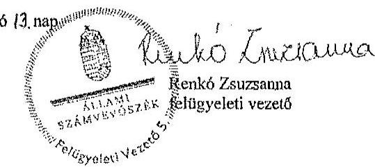

---

# 2. számú melléklet 

a V-0780-297/2015. számú levélhez
„Az Európai Parlament tagjainak 2014. évi választására forditott pénzeszközök felhasználásának ellenörzése" címủ jelentéstervezetre tett észrevételre adott válasz

Észrevétel: A jelentéstervezet Összegző megállapítások, következtetések fejezet 7. oldal 5. bekezdés megállapítása:
„Az NVI a választási irodák és az egyéb szervezetek elfogadott elszámolásai alapján a Pvr.-ben elöirt határidőn túl elkészitette a választási kiadások öszszessitő elszámolását."
A jelentéstervezet Részletes megállapítások 4. A választási feladatokra felhasznált pénzeszközök elszámolása fejezet 22. oldal 5. bekezdés megállapítása, illetve a kapcsolódó 27. számú lábjegyzet:
„A helyi és területi választási irodák, valamint a választásban részt vevő egyéb szervek elszámolásai alapján az NVI az összezitő elszámolást a Pvr. 7. § (5) bekezdésében elöirt határidőn, a választás napját követő kilencven napon túl készítette el."
„Az ellenörzés rendelkezésére bocsátott végleges elszámolás dátuma 2015. március 12."

## Az észrevétel szerint:

A megállapítást nem fogadják el, mivel az NVI az országgyilási képviselők választása, valamint az Európai Parlament tagjainak választása költségeinek normatíváiról, tételeiről, elszámolási és belső ellenőrzési rendjéről, valamint egyes választási tárgyú miniszteri rendeletek módosításáról szóló 38/2013. (XII. 30.) KIM rendeletben (továbbiakban: Pvr) elöirt határidőn belül, 2014. augusztus 22. napján készítette el összezitő beszámolóját (Beszámoló a 2014. évi Európai Parlament tagjainak választásáról). A 27. számú lábjegyzetben feltüntetett végleges elszámoláson szereplő 2015. március 12-i dátum a dokumentum nyomtatásának a napja.

Válasz: Az Állami Számvevőszék az észrevételt nem fogadja el.
Indoklás: Az észrevételben foglaltak a megállapítás megalapozottságát nem érintik. Az ellenőrzés során bemutatták az észrevételben hivatkozott, 2014. augusztus 22 -én kelt beszámolót, illetve az annak 2014. december 2-én módosított példányát. A Pvr. 7. § (5) bekezdése szerinti összesítő elszámolás elkészítésére a Nemzeti Választási Iroda a helyi és területi választási irodák, a KúM, illetve a választásban résztvevő egyéb szerv(ek) elszámolásai alapján a választás napját követő 90 napon belül kötelezett, amely esetünkben 2014. augusztus 23 -ig történő elszámolást jelent. Az ellenőrzés során rendelkezésre bocsátott dokumentumok szerint a területi választási irodák elszámolásainak elfogadásáról szóló döntést a 2014. augusztus 25. és 2014. szeptember 1. közötti keltezésű levelezés igazolja. A KEKKH elszámolását 2014. augusztus 29-én nyújtotta be, melynek NVI általi elfogadásáról a 2014. október 9-én kelt levél tanúskodik. A KúM elszámolását az NVI 2014. október 21-én kelt dokumentum alapján fogadta el. Mindezekre tekintettel a 2014. augusztus 22-én kelt elözetes beszámoló nem felel meg a hivatkozott jogszabályi előírásnak megfelelő összesítő elszámolásként, mivel a választás lebonyolításában résztvevő választási irodák és egyéb szervek elszámolásai dokumentált módon a Pvr.-ben elöirt 90 napos határidőn belül nem készültek el, illetve nem kerültek az NVI által elfogadásra. Az ellenőrzés során rendelkezésre bocsátott, az NVI elnökhelyettese által aláírt és az aláírás mellett

---

|  | kézzel írt keltezést tartalmazó összesítő elszámolások alapján (2015. március 9-én kelt összesítő elszámolás az NVI központi kiadásai nélkül, 2015. március 12-én kelt összesítő elszámolás a mindösszesen kiadásokról) az ellenőrzés megállapításainak módosítása nem indokolt. |
| :--: | :--: |
| Észrevétel: | A jelentéstervezet 3.1. A választási pénzeszközök nyilvántartása, a felhasználás szabályozottsága fejezet 14 . oldal 1 . bekezdés megállapítása:   „Az NVI kialakította a választások céljára biztositott pénzeszközök elkülönitett számviteli kezelését. A fäkonyvi könyvelésben, a jogszabályban elöirt 016010 COFOG kódon belül a választásonként elkülönitett kezelést külön tervezési és elszámolási alapegység kódokon - az EP választásra biztositott pénzeszközökre vonatkozóan a 010201 TEA kódon - biztositotta."   Az észrevétel szerint:   A megállapításban szereplő 010201 TEA kód nem megfelelő, a 1010201 TEA kód a helyes meghatározás. |
| Válasz: | Az Állami Számvevőszék az észrevételt elfogadja. |
| Induklás: | A megállapítás a TEA kódban történt elírás miatt módosításra került. |
| Észrevétel: | A jelentéstervezet 4. A választási feladatokra felhasznált pénzeszközök elszámolása fejezet 18. oldal 9. bekezdés megállapítása:   „A Pvr. 7. § (1) bekezdése a HVI vezetők számára feladattípusú elszámolás készitését írta elö. Az elszámolásokat a 19/2014. (VI. 04.) NVI utasításnak megfélelően készítették el, azonban az elöirt és alkalmazott formanyomtatványok nem teljes körüen feleltek meg a Pvr. 6. § (2) bekezdésében elöirraknak, mivel a kiadás nemeken belüli jogcím kód szerinti részletezést nem tartalmazzák, jogcímenként csak a többletköltséget és feladatelmaradás miatti visszafizetési kötelezettséget kérte részletezni."   Az észrevétel szerint:   A Pvr. 6. § (2) bekezdésében a HVI-k részére elölrt feladattípusú elszámolás jogcímenkénti részletezése a jogalkotói szándék szerint kizárólag a többletköltségekre és a feladatelmaradásra vonatkozott volna. Az elszámolások elkészítésére vonatkozó 19/2014. (VI. 04.) NVI utasítás formanyomtatványa rendelkezett ennek kezeléséről. Amennyiben minden HVI esetében minden kiadásnem vonatkozásában a jogcímenkénti részletező kimutatást kérték volna be, az rendkívüli adatmennyiséget keletkeztetett volna a HVI-kre és TVI-kre nézve.   A helyi önkormányzati képviselők és polgármesterek, továbbá a nemzetiségi önkormányzati képviselők választásáról szóló 3/2014. (VII. 24.) IM rendeletben már pontositásra került a jogcímenkénti részletező kimutatásra vonatkozó előírás. |
| Válasz: | Az Állami Számvevőszék az észrevételt nem fogadja el. |
| Induklás: | Az észrevételben foglaltak a megállapítás megalapozottságát nem érintik. Az Európai Parlament tagjainak 2014. évi választása tekintetében a Pvr. 6. § (2) bekezdése a pénzeszközök felhasználásáról - ezen belül a többletköltségekről és a feladatelmaradásról - feladatonkénti (jogcímenkénti) elszámolás készitését írta elő. A jogcímenkénti részletezés az összes pénzeszköz felhasználásra - nem csupán a többletköltségekre és feladatelmaradásra - vonatkozott, ezáltal az észrevételben szereplő NVI utasítás a hivatkozott jogszabályi előírásnak nem felelt meg. |

---

| Észrevétel: | A jelentéstervezet Részletes megállapítáask 3.2. A választással kapcsolatos kiadások teljesitésének szabályszerűsége fejezet 16. oldal 3-4. bekezdéseinek megállapítása: „Az NVI-nél az ellenőrzött kiadások esetében a pénzessközök felhasználása - egy tétel kivételével - a Pvr.-ben foglaltaknak megfelelően, az EP választás elökészitése és lebonyolítása érdekében, célhoz kötötten történt." „A dologt kiadások között egyéb szakmai szolgáltatások teljesitéséként egy, az önkormányzati választások elökészitéséhez kapcsolódó üzletviteli tanácsadást tartalmazó, 6,5 M Fi összegü számlát a Pvr. 6. § (1) bekezdésében foglaltak ellenére az EP választás 1010201 tervezési és elszámolási alapegység kódon számoltak el."   Az észrevétel szerint:   Az NVI által nem a megfelelő választás kiadásai terhére elszámolt tételek - a három jelentéstervezetben számosságát tekintve öt darab - nagyságrendje és összege is elenyézzó volt a négy országos választás vonatkozásában. Az érintett tételek mindegyike a választások érdekében felmerült, szabályszerűen, a megfelelő kiadásnemen elszámolt kiadást jelentett. Az NVI jelenleg és a jövőben is kiemelt figyelmet fordít a feladattípusú elszámolás során a pénzessközök felhasználásának pontos kimutatására. |
| :--: | :--: |
| Válasz: | Az Állami Számvevőszék az észrevételt nem fogadja el. |
| Indoklás: | Az észrevételben foglaltak a megállapítás megalapozottságát nem érintik. Az ellenőrzés értékelve az e téren feltárt hiányosságot a jelentéstervezetben összességében a kifizetések célhoz kötött, indokolt voltát emelte ki, és ezzel egyidejűleg kivételként került említésre a tévesen, nem a megfelelő választási feladatra elszámolt egy tétel. |

Tájékoztatom Elnök ürhölgyet, hogy a számvevőszéki jelentés mellékleteként szerepeltetjük a jelentéstervezethez tett észrevételét, valamint az arra adott válaszunkat.

Budapest, 2015.
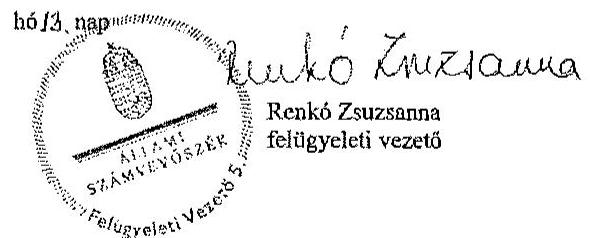

---

# 3. számú melléklet 

a V-0781-196/2015. számú levélhez
„A helyi önkormányzati képviselők és polgármesterek, valamint a nemzetiségi önkormányzati képviselők 2014. évi választására fordított pénzeszközök felhasználásának ellenőrzése" című jelentéstervezetre tett észrevételm adott válasz.

| Észrevétel: | A jelentéstervezet Bevezetés fejezet 3. oldal 1. bekezdés megállapítása:   „Magyarország Köztáraszági Elnöke a 2014. évi helyi önkormányzati képviselők és polgármesterek, valamint a nemzetiségi önkormányzati képviselők választását október 12-re tủze ki." |
| :--: | :--: |
|  | Az észrevétel szerint:   A megfogalmazás pontosítása indokolt, mivel a nemzetiségi önkormányzati képviselők választását nem Magyarország Köztársasági Elnöke, hanem a Nemzeti Választási Bizottság tűzte ki. |
| Válasz: | Az Állami Számvevőszék az észrevételt elfogadja. |
| Indoklás: | A megállapítás a téves megfogalmazás miatt, a Nemzeti Választási Bizottság 1128/2014. számú határozatában foglaltak alapján módosításra került. |
| Észrevétel: | A jelentéstervezet Részletes megállapítások 2. A költségvetésből biztosított finanszírozási források elosztása, az előirányzatok kezelése fejezet 12. oldal 7. bekezdés megállapítása:   „Az NVI az önkormányzati és a nemzetiségi választásokra a választás évében, a 2014. évi költségvetésében eredeti elöirányzatot nem tervezett, a költségvetés tervezése során az Áht. 12. § (1) bekezdése szerinti közgazdaságling megalapozott tervezés nem érvényesült. Az önkormányzati választásokkal kapcsolatban a módositott elöirányzat az intézményi költségvetésben 2 952,7 M Ft, a fejezeti kezelésü elöirányzaton 3 578,6 M Ft, összesen 6 531,3 M Ft volt. (A kapcsolódó lábjegyzet szerint a végleges pénzügyi terv szerinti kiadások összesen 101,2 M Ft-tal meghaladták a módositott elöirányzatok összegét.) A módositott elöirányzat 1,2\%-át (77,4 M Ft) a személyi juttatások és járulékai, 36,3\%-át (2369,3 M Ft) a dologí kiadások, 7,9\%át (516,0 M Ft) a beruházások, $54,6 \%$-át (3568,6 M Ft) a müködési célú pénzeszközátadások tették ki.   A nemzetiségi választások esetében a módositott elöirányzat az intézményi költségvetésben 47,3 M Ft, a fejezeti kezelésü elöirányzaton 409,4 M Ft, összesen 456,7 M Ft volt. (A kapcsolódó lábjegyzet szerint a módositott elöirányzatok összege 4,3 M Ft-tal több volt, mint a jóváhagyott pénzügyi terv szerinti kiadások összege.) A nemzetiségi választások módositott elöirányzatának 10,4\%-át (47,3 M Ft) a dologí kiadások, 89,6\%-át (409,4 M Ft) a müködési célú pénzeszközátadások tették ki. A fejezeti kezelésü elöirányzaton a 2014. évi megismételt önkormányzati választásokkal kapcsolatban a 12,0 M Ft módositott elöirányzat szerepelt." |
|  | Az észrevétel szerint:   A hivatkozott bekezdésbeli megállapításhoz megjegyezni kivánják, hogy az NVI a 2014. évi költségvetésében az önkormányzati és nemzetiségi választásokra azért nem tervezett eredeti elöirányzatot, mert összhangban a jelentéstervezet 11. oldal 2. pontjának első bekezdésében leírtakkal - az eredeti elöirányzat az önkormányzati és |

---

|  | nemzetiségi választásokra már nem biztosított fedezetet. A közgazdaságilag megalapozott tervezés biztosított volt az NVI által 2014. március 3-án elkészített, majd a forrás biztosítását követő módosított előirányzat könyvviteli rendszerben történő rögzitésével. |
| :--: | :--: |
| Válasz: | Az Állami Számvevöszék az észrevételt nem fogadja el. |
| Indoklás: | Az észrevételben foglaltak a megállapítás megalapozottságát nem befolyásolják. Az észrevételben leírtak azt támasztják alá, hogy az eredeti elöirányzatok megállapításakor nem, csupán utólag érvényesült a közgazdaságilag megalapozott tervezés elve. |
| Észrevétel: | A jelentéstervezet Részletes megállapítások 4. A választási feladatokra felhasznált pénzeszközök elszámolása fejezet 17. oldal 6. bekezdés megállapítása, valamint a kapcsolódó 18. számú lábjegyzet:   „Az NVI a 3/2014. (VII. 24.) IM rendelet 7. § (4) bekezdésében foglaltak ellenére a szavazás napját követő kilencven napon túl készítette el a TVI-k, valamint a KEKKH elszámolása alapján az önkormányzati és a nemzetiségi választások összestió elszámolását."   „A nemzetiségi választások összestió elszámolása 2015. március 9-én, az önkormányzati választásoké 2015. március 20-án készült el."   Az észrevétel szerint:   A hivatkozott megállapításhoz megjegyezni kívánják, hogy a választások összestió elszámolása 2015. február 12-én készült el, a jelentéstervezetben megjelölt 2015. március 9-e a dokumentum nyomtatásának napját jelenti. A jogszabály által megadott 90 napos elszámolási határidő ebben az esetben két országos választás teljes körü ellenőrzését és adatainak feldolgozására vonatkozott, vagyis ezzel indokolható a határidőn túli elszámolás elkészítése. |
| Válasz: | Az Állami Számvevőszék az észrevételt nem fogadja el. |
| Indoklás: | Az észrevételben foglaltak nem befolyásolják az ellenőrzés megállapítását, mely szerint a helyi önkormányzati képviselők és a polgárnesterek választása, valamint a nemzetiségi önkormányzati képviselők választása költségeinek normatíváiról, tételeiről, elszámolási és belső ellenőrzési rendjéről szóló 3/2014. (VII. 24.) számú IM rendelet 7. § (4) bekezdése szerinti határidőt követően készült el az összesítő elszámolás.   Az észrevételben hivatkozott dátummal készült elszámolást az ellenőrzést végzők számára nem adtak át. A rendelkezésre bocsátott dokumentumok közül az önkormányzati képviselők és polgármesterek választása összesitő dokumentumán az alárás mellett a kézzel rájegyzett dátum: 2014. március 20. volt. Az ellenőrzés során átadott nemzetiségi választások NVI kiadásai nélküli összesitő elszámoláson az NVI gazdasági elnökhelyettese aláírása mellett kézzel rájegyzett dátum 2014. február 16. volt. Az NVI kiadásait is tartalmazó, a nemzetiségi választások kiadásai összegzését tartalmazó elszámolóson kézzel írt dátumozás nem található, a gépileg nyomtatott dátum 2014. március 9. volt. Az NVI elnökhelyettese a 2015. március 20-án kelt nyilatkozatában az ellenőrzést végzők részére azt a tájékoztatást adta, hogy a nemzetiségi választások esetében a 2015. február 16-án készült PV011_KIS, valamint a 2015. március 9-én készült PV037_KIS nevü adatállományok tartalmazzák a végleges összesitő adatokat. Mindezekre tekintettel az észrevételben jelzett dátum bélyesbítését nem fogadom el. |

---

| Észrevétel: | A jelentéstervezet Részletes megállapítások 3.2. A választással kapcsolatos kiadások teljesitésének szabályszersisége fejezet 16. oldal 2-3. bekezdéseinek megállapítása:   „Az ellenôrzött kifizetések - három, összesen 33,2 M Fi összege kifizetés kivételével - a 2014. évi önkormányzati és nemzetiségi választások elökészitére és lebonyolítása érdekében merültek fel, célhoz kötöttek és indokoltak voltak."   „A 3/2014. (VII. 24.) IM rendelet. 6. § (1) bekezdésében foglaltak ellenére az önkormányzati választások fejezeti kezelésũ elöirányzata terhére utalták át és számolták el a KEKKH részére 2014. december 15 -én folyósitatt, az OGY választásokkal kapcsolatban felmerült 31,0 M Ft-ot, valamint a megismételi önkormányzati választások érdekében felmerült 2,2 M Ft kiadást."   Az észrevétel szerint:   Az NVI által nem a megfelelő választás kiadásai terhére elszámolt tételek - a három jelentéstervezetben számosságát tekintve öt darab - nagyságrendje és összege is elenyészô volt a négy országos választás vonatkozásában. Az érintett tételek mindegyike a választások érdekében felmerült, szabályszerűen, a megfelelő kiadástemen elszámolt kiadást jelentett. Az NVI jelenleg és a jövőben is kiemelt figyelmet fordít a feladattípusủ elszámolás során a pénzeszközök felhasználásának pontos kimutatására. |
| :--: | :--: |
| Válasz: | Az Állami Számvevőszék az észrevételt nem fogadja el. |
| Indoklás: | Az észrevételben foglaltak a megállapítás megalapozottságát nem érintik. Az ellenörzés értékelve az e téren feltárt hiányosságokat a jelentéstervezetben összességében a kifizetések célhoz kötött, ludokolt voltát emelte ki, és ezzel egyidejűleg kivételként kerültek említésre a tévesen, nem a megfelelő választási feladatra elszámolt tételek. |

Tájékoztatom Elnök üthölgyet, hogy a számvevőszéki jelentés mellékleteként szerepeltetjük a jelentéstervezethez tett észrevételét, valamint az arra adott válaszunkat.

Budapest, 2015. OY
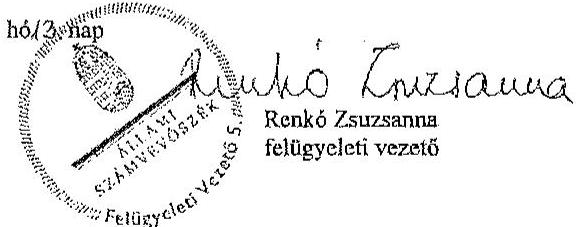

---

.

---

# RÖVIDÍTÉSEK JEGYZÉKE 

| Törvények |  |
| :--: | :--: |
| Alaptörvény | Magyarország Alaptörvénye |
| Áht. | az államháztartásról szóló 2011. évi CXCV. törvény |
| ÁSZ tv. | az Állami Számvevőszékről szóló 2011. évi LXVI. törvény |
| EHO tv. | az egészségügyi hozzájárulásról szóló 1998. évi LXVI. törvény |
| Kbt. | a közbeszerzésről szóló 2011. évi CVIII. törvény |
| Sztv. | a számvitelről szóló 2000 . évi C. törvény |
| Ve. | a választási eljárásról szóló 2013. évi XXXVI. törvény |
| Szja tv. | a személyi jövedelemadóról szóló 1995. évi CXVII. törvény |
| Tbj. | a társadalombiztosítás ellátásaira és a nyugdíjra jogosultakról, valamint e szolgáltatások fedezetéről szóló 1997. évi LXXX. törvény |
| 1993. évi LV. törvény | a magyar állampolgárságról szóló 1993. évi LV. törvény |
| 2003. évi CXIII. törvény | az Európai Parlament tagjainak választásáról szóló 2003. évi CXIII. törvény |
| 2013. évi költségvetési törvény | Magyarország 2013. évi központi költségvetéséről szóló 2012. évi CCIV. törvény |
| 2014. évi költségvetési törvény | Magyarország 2014. évi központi költségvetéséről szóló 2013. évi CCXXX. törvény |
| Korm. rendeletek |  |
| Áhsz. | az államháztartás számviteléről szóló 4/2013. (I. 11.) Korm. rendelet |
| Ávr. | az államháztartásról szóló törvény végrehajtásáról szóló 368/2011. (XII. 31.) Korm. rendelet |
| Bkr. | a költségvetési szervek belső kontrollrendszeréről és a belső ellenőrzésről szóló 370/2011. (XII. 31.) Korm. rendelet |
| 288/2010. (XII. 21.)   Korm. rendelet | a fövárosi és megyei kormányhivatalokról szóló 288/2010. (XII. 21.) Korm. rendelet |
| 218/2011. (X. 19.)   Korm. rendelet | a minősített adatot, az ország alapvető biztonsági, nemzetbiztonsági érdekeit érintő vagy a különleges biztonsági intézkedést igénylő beszerzések sajátos szabályairól szóló 218/2011. (X. 19.) Korm. rendelet |
| Miniszteri rendeletek |  |
| 17/2013. (VII. 17.)   KIM rendelet | a központi névjegyzék, valamint egyéb választási nyilvántartások vezetéséről szóló 17/2013. (VII. 17.) KIM rendelet |

---

28/2013. (XI. 15.) KIM rendelet

Pvr.

13/2014. (III. 10.) KIM rendelet

68/2013. (XII. 29.) NGM rendelet

## Közjogi szervezetszabályozó eszközök

1157/2014. (III. 20.) Korm. határozat

1316/2014. (V. 22.) Korm. határozat

6/2014. (IV. 30.) KüM utasítás

## Szórövidítések

1/2014. (I. 23.) NVI utasítás

19/2014. (VI. 4.) NVI utasítás

ÁSZ
COFOG
EP választás
az országgyúlési képviselők és az Európai Parlament tagjainak választásán a választási irodák hatáskörébe tartozó feladatok végrehajtásának részletes szabályairól, a választási eljárásban használandó nyomtatványokról, valamint a választási eredmény országosan összesített adatai körének megállapításáról szóló 28/2013. (XI. 15.) KIM rendelet
az országgyúlési képviselők választása, valamint az Európai Parlament tagjainak választása költségeinek normatíváiról, tételeiről, elszámolási és belső ellenőrzési rendjéről, valamint egyes választási tárgyú miniszteri rendeletek módosításáról szóló 38/2013. (XII. 30.) KIM rendelet
az Európai Parlament tagjainak 2014. május 25. napjára kitűzött választása eljárási határidőinek és határnapjainak megállapításáról szóló 13/2014. (III. 10.) KIM rendelet
a kormányzati funkciók, államháztartási szakfeladatok és szakágazatok osztályozási rendjéről szóló 68/2013. (XII. 29.) NGM rendelet
a 2014. évi választások lebonyolításához kapcsolódó kötelezettségvállalásról és forrásbiztosításról szóló 1157/2014. (III. 20.) Korm. határozat
a 2013. évi kötelezettségvállalással nem terhelt költségvetési maradványok egy részének felhasználásáról szóló 1316/2014. (V. 22.) Korm. határozat
a Magyarország külképviseletein lefolytatandó 2014. évi EP választás pénzügyi tervezésének, lebonyolításának, valamint elszámolásának rendjéről, valamint a külképviseleteken lefolytatandó választás lebonyolításának speciális feladatairól szóló 6/2014. (IV. 30.) KüM utasítás

Az NVI Elnökének 1/2014. (I. 23.) számú utasítása a kormányhivataloktól igénybe vehető szolgáltatásokról
Az NVI Elnökének 19/2014. (VI. 4.) számú utasítása az EP képviselők 2014. évi választása pénzügyi elszámolási rendjéről
Állami Számvevőszék
Classification of the Functions of Government (kormányzati funkciók besorolása)
Az Európai Parlament tagjainak 2014. évi választása

---

| HVI | Helyi Választási Iroda (beleértve az országgyưlési   egyéni választókerület székhely településén múködő   választási irodát) |
| :--: | :--: |
| INTOSAI | Legfőbb Ellenőrző Intézmények Nemzetközi Szervezete |
| KEKKH | Közigazgatási és Elektronikus Közszolgáltatások Köz-   ponti Hivatala |
| KIM | Közigazgatási és Igazságügyi Minisztérium |
| KüM | Külügyminisztérium (2014. június 6-ától Külgazda-   sági és Külügyminisztérium) |
| KÜVI | Külképviseleti Választási Iroda |
| NBB | Az Országgyúlés Nemzetbiztonsági bizottsága |
| NISZ Zrt. | Nemzeti Infokommunikációs Szolgáltató Zártkörűen   Müködő Részvénytársaság |
| OGY | Országgyúlés |
| OGY választás | Az Országgyúlési képviselők 2014. évi választása |
| NVI | Nemzeti Választási Iroda |
| NVR | Nemzeti Választási Rendszer |
| TEA kód | tervezési és elszámolási alapegység kód |
| TVI | Területi Választási Iroda |
| SZMSZ | Szervezeti és Müködési Szabályzat |
| VLOG | Választási Logisztikai Rendszer |
| VPIR | Választási Pénzügyi Információs Rendszer |
| VÜR | Választási Ügyviteli Rendszer |
| VPIR | Választási Pénzügyi Információs Rendszer |
| VÜR | Választási Ügyviteli Rendszer |

---

.

---

# ÉRTELMEZŐ SZÓTÁR 

COFOG kód

A kormányzati funkciók mérésére több nemzetközi intézmény az ún. COFOG (Classification of the Functions of Government) szabványt alkalmazza, amely összehasonlíthatóvá teszi különböző országok kormányzati szektorának terjedelmét és összetételét. A funkcionális osztályozás négy kategóriát különböztet meg. (1) Az állami múködési funkciók csoportjába az igazgatás, a külügyek, a védelem, a rend- és jogbiztonság, az igazságszolgáltatás tartoznak. (2) A jóléti funkciók körébe a kormányzat által szervezett vagy támogatott oktatási, egészségügyi, társadalombiztosítási, szociális és jóléti szolgáltatások, a lakásügyek és egyéb szolgáltatások tartoznak, (3) a gazdasági funkciókba pedig a kormányzat által szervezett és támogatott gazdasági tevékenységek, és azok fejlesztése (például energiaellátás, mezőgazdaság, közlekedés, távközlés). (4) Az államadósság kezelés kategóriába az államadósság finanszírozásához kapcsolódó kamatkiadások tartoznak (Budapest Intézet). A Nemzeti és Regionális Számlák Európai Rendszere (European System of Accounts, ESA95) alkalmazza a kormányzati tevékenységek osztályozását (COFOG), amely használata kötelező a tagállamok számára. A 68/2013. (XII. 29.) NGM rendeletben meghatározott kormányzati funkció kódok megegyeznek az ESA95 osztályozási rendszerében alkalmazott COFOG kódokkal.
informatikai rendszer
külképviselet

A választási informatikai rendszer (a továbbiakban: informatikai rendszer) a Ve.-ben meghatározott választási feladatok végrehajtásában részivevő és azokat kiszolgáló szervezetek által múködtetett informatikai infrastruktúra és alkalmazói rendszerelemek összessége. A választási informatikai infrastruktúra elemei lehetnek különösen: az anyakönyvi szolgáltató rendszer, a fövárosi és megyei kormányhivatalok és járási hivatalaik, kiemelten az okmányirodák, a helyi önkormányzatok és a külképviseletek informatikai eszközei, valamint a választási célú dedikált informatikai eszközök. A választási alkalmazói rendszerek elemei lehetnek különösen: a névjegyzékek vezetését, az ajánlás-ellenőrzést, jelöltek és jelölő szervezetek nyilvántartását, a szavazatösszesítést, az ered-mény-megállapítást, a logisztikai lebonyolítást támogató alkalmazói szoftverrendszerek (forrás: 28/2013. (XI. 15.) KIM rendelet 2. §).
Magyarországnak a Kormány döntése alapján létrehozott, külföldön múködő diplomáciai és konzuli képviselete (forrás: Ve. 3. § 5a. pontja).

---

| NVR | Nemzeti Választási Rendszer. A választások előkészítésével és lebonyolításával kapcsolatos alkalmazások összetett informatikai rendszere. Egyes moduljai a Ve.-ben foglalt alapfeladatok - pl. névjegyzék vezetése, szavazatöszszesítés, jogorvoslatok kezelése - ellátását biztosítják (forrás: NVI összefoglaló az általuk üzemeltetett informatikai rendszerekről, 2015. február 20.). |
| :--: | :--: |
| VLOG | Választási Logisztikai Rendszer. A választások előkészítési szakaszában a választáshoz szükséges nyomtatványok, egyéb kellékanyagok felmérését, a költségek tervezését, a közbeszerzések előkészítését, a választások lebonyolításakor és azok ellenőrzésének időszakában a szállítások, megrendelések koordinálását, nyomon követését, a szállítmányok logisztikai kezelését és az információszolgáltatást biztosító rendszer (forrás: NVI összefoglaló az általuk üzemeltetett informatikai rendszerekről, 2015. február 20.). |
| VPIR | Választási Pénzügyi Információs Rendszer. A választásokkal összefüggő költségvetési gazdálkodást - költségvetési tervezés, kötelezettségvállalás, pénzügyi, számviteli elszámolások -, valamint a választási szervek adatainak kezelését, támogatásaik tervezését, finanszírozását, pénzügyi elszámoltatását biztosító rendszer (forrás: NVI összefoglaló az általuk üzemeltetett informatikai rendszerekröl, 2015. február 20.). |
| VÜR | Választási Ügyviteli Rendszer. Zárt rendszerben biztosítja a választási szervek egymás közötti kommunikációját és információközvetítését, eljárásrendek, értesítések, tájékoztatók küldését (forrás: NVI összefoglaló az általuk üzemeltetett informatikai rendszerekről, 2015. február 20.). |
| TEA kód | A Tervezési és Elszámolási Alapegység (a továbbiakban: TEA) a Hivatal bevételeinek és kiadásainak gyüjtésére, valamint rendszerezésére szolgáló, a Hivatal teljes tevékenységét átfogó kódrendszer, egyben tartalmazza az önköltségszámítás alapját képező kalkulációs egységeket is. A TEA kódok segítségével a költségek a gazdálkodás bármelyik fázisában elkülöníthetőek (forrás: KEKKH Önköltségszámítási Szabályzat). |