# ÁLLAMI   SZÁMVEVŐSZÉK 

## JELENTÉS

A 2014. évi választásokra fordított pénzeszközök felhasználásának ellenőrzése - A helyi önkormányzati képviselők és polgármesterek, valamint a nemzetiségi önkormányzati képviselők 2014. évi választására fordított pénzeszközök felhasználásának ellenőrzése 15129

---

# Állami Számvevőszék 

Iktatószám: V-0781-200/2015.
Témaszám: 1815
Vizsgálat-azonosító szám: V070503

## Az ellenőrzést felügyelte:

## Renkó Zsuzsanna

felügyeleti vezető
Az ellenőrzést vezette és az ellenőrzés végrehajtásáért felelős:
Moder Beatrix
ellenőrzésvezető
A számvevőszéki jelentés összeállításában közremüködött:
Baksa Anikó
számvevő főtanácsos
Dr. Mezei Imréné
számvevő főtanácsos
Az ellenőrzést végezték:

| Belovai Sándorné | Béres László | Czeglédi Dénes |
| :-- | :-- | :-- |
| számvevő főtanácsos | számvevő főtanácsos | számvevő tanácsos |
| Eigner György Zoltán | Farkas László | Federics Adrienn |
| számvevő tanácsos | számvevő tanácsos | számvevő tanácsos |
| Fórián Erika | Jakab Laura | dr. Lajos Béla |
| számvevő tanácsos | számvevő | számvevő főtanácsos |
| Novák Márta | Papp Sándor | Péntek László |
| számvevő főtanácsos | számvevő főtanácsos | számvevő főtanácsos |
| Robák Ferencné | dr. Sinka Zoltán | Tamás László |
| számvevő tanácsos | számvevő tanácsos | számvevő tanácsos |
| Vojcsekné Szabó Ágnes | Vertkovczi Mária | Villányi Antal |
| számvevő tanácsos | számvevő | számvevő tanácsos |

A témához kapcsolódó eddig készített számvevőszéki jelentések:
címe
sorszáma
Jelentés a 2010. évi országgyűlési, valamint önkormányzati és 1272
nemzeti, etnikai kisebbségi képviselő-választások lebonyolításához
felhasznált pénzeszközök ellenőrzéséről

---

# TARTALOMJEGYZÉK 

BEVEZETÉS ..... 3
I. ÖSSZEGZŐ MEGÁLLAPÍTÁSOK, KÖVETKEZTETÉSEK ..... 6
II. RÉSZLETES MEGÁLLAPÍTÁSOK ..... 9

1. A választás előkészítéséhez és lebonyolításához szükséges pénzeszközök tervezése ..... 9
1.1. A választás pénzügyi tervezése ..... 9
1.2. A választás informatikai rendszerének kialakítása, a közbeszerzési eljárások lebonyolítása ..... 11
2. A költségvetésből biztosított finanszírozási források elosztása, az előirányzatok kezelése ..... 13
3. A választás előkészítéséhez, lebonyolításához rendelkezésre álló pénzeszközök felhasználása ..... 15
3.1. A választási pénzeszközök nyilvántartása, a felhasználás szabályozottsága ..... 15
3.2. A választással kapcsolatos kiadások teljesítésének szabályszerűsége ..... 17
4. A választási feladatokra felhasznált pénzeszközök elszámolása ..... 19
5. A választásra fordított pénzeszközök felhasználásának és elszámolásának ellenőrzése ..... 24
6. A választással kapcsolatban végzett korábbi ÁSZ ellenőrzés javaslatainak hasznosulása ..... 25

## MELLÉKLETEK

1. számú Elnöki hatáskör átruházása
2. számú Az ellenőrzött szervezetek jegyzéke
3. számú A 2014. évi önkormányzati és nemzetiségi választásokhoz kapcsolódó, közbeszerzési értékhatárt elérő beszerzési eljárások
4. számú A gazdálkodási jogkörök gyakorlása az ellenőrzött helyi és területi választási irodáknál
5. számú Bács-Kiskun Megyei Önkormányzat Hivatalának főjegyzőjétől érkezett észrevétel, és az ÁSZ észrevételre adott válasza
6. számú Budapest Főváros XVII. kerület Rákosmenti Polgármesteri Hivatal jegyzöjétől érkezett nemleges észrevétel

---

7. számú Budapest Főváros Főpolgármesteri Hivatal főjegyzőjétől érkezett nemleges észrevétel
8. számú Győr-Moson-Sopron Megyei Önkormányzati Hivatal megyei címzetes főjegyzöjétől érkezett nemleges észrevétel
9. számú Dégi Közös Önkormányzati Hivatal jegyzőjétől érkezett nemleges észrevétel
10. számú Kaposvár Megyei Jogú Város Polgármesteri Hivatal címzetes főjegyzöjétől érkezett észrevétel, és az ÁSZ észrevételre adott válasza
11. számú Budapest Főváros XII. kerület Hegyvidéki Polgármesteri Hivatal jegyzőjétől érkezett észrevétel, és az ÁSZ észrevételre adott válasza
12. számú Hajdú-Bihar Megyei Önkormányzati Hivatal jegyzőjétől érkezett nemleges észrevétel
13. számú A Nemzeti Választási Iroda elnökétől érkezett észrevétel, és az ÁSZ észrevételre adott válasza
14. számú Az igazságügyi minisztertől érkezett nemleges észrevétel

# FÜGGELÉKEK 

1. számú Rövidítések jegyzéke
2. számú Értelmező szótár

---

# JELENTÉS 

## A 2014. évi választásokra fordított pénzeszközök felhasználásának ellenőrzése A helyi önkormányzati képviselők és polgármesterek, valamint a nemzetiségi önkormányzati képviselők 2014. évi választására fordított pénzeszközök felhasználásának ellenőrzése

## BEVEZETÉS

Magyarország Köztársasági Elnöke a 2014. évi helyi önkormányzati képviselők és polgármesterek általános választását, valamint a Nemzeti Választási Bizottság a nemzetiségi önkormányzati képviselők 2014, évi általános választását október 12-re tűzte ki.

A 2012. január 1-jén hatályba lépett Alaptörvény - Magyarország legmagasabb szintű jogi normája - alkotmányos szinten deklarálta a közjogi választásokra vonatkozó legfontosabb alapvetéseket és magával hozta az egyes alapvető jogok gyakorlására, valamint a legfontosabb közjogi intézményekre vonatkozó szabályok megváltozását is. Ennek keretében sor került előbb a választási anyagi jog (a 2010. évi L. törvény, valamint a 2011. évi CLXXIX. törvény), majd az eljárásjog (a Ve.) előírásainak újraszabályozására. A Ve. 346. §-ában előírt önkormányzati választásokkal kapcsolatos végrehajtási rendeleteket az Igazságügyi Minisztérium 2014. július 24 -én adta ki.

A helyi önkormányzati képviselők és polgármesterek választásának (helyi önkormányzati választások) anyagi jogi szabályai már 2010-ben átalakultak, azokat az OGY újrakodifikálta, és megalkotta a helyi önkormányzati képviselők és polgármesterek választásáról szóló 2010. évi L. törvényt, így az már a 2010. évi általános helyhatósági választáskor alkalmazásra került.

Szintén az Alaptörvény hívta életre a nemzetiségi önkormányzati képviselők választásának (nemzetiségi választások) anyagi jogi szabályait tartalmazó 2011. évi CLXXIX. törvényt ${ }^{1}$, amely - a korábbiakhoz képest - a nemzetiségi önkormányzati választási rendszert gyökeresen új alapokra helyezte.

[^0]
[^0]:    ${ }^{1}$ Korábban erről két törvény rendelkezett: a kisebbségi önkormányzati képviselők választásáról, valamint a nemzeti és etnikai kisebbségekre vonatkozó egyes törvények módosításáról szóló 2005. évi CXIV. törvény, valamint a nemzeti és etnikai kisebbségek jogairól szóló 1993. évi LXXVII. törvény.

---

A Ve. 12. §-a alapján a választások előkészítésével és lebonyolításával kapcsolatos állami feladatok végrehajtásának költségeit, valamint a választási szervek tevékenységével összefüggő egyéb költségeket - az Országgyűlés által megállapított mértékben - a központi költségvetésből kell biztosítani. E pénzeszközök felhasználásáról az Állami Számvevőszék tájékoztatja az Országgyűlést.

A 2014. évi választási feladatok előkészítésének és lebonyolításának pénzügyi fedezetéül a 2013. évi költségvetési törvény 2300 M Ft-ot, a 2014. évi költségvetési törvény 10000 M Ft-ot irányzott elő. A költségvetési törvények az előirányzott összegek tekintetében nem tartalmaztak választásonkénti megbontást. A választások zavartalan lebonyolítása érdekében a Kormány a 1157/2014. (III. 20.) számú Korm. határozatában felkérte a nemzetgazdasági minisztert, hogy gondoskodjon a szükséges források rendelkezésre bocsátásáról. A költségvetési törvények által biztosított 12300 M Ft a 2014. évi önkormányzati és nemzetiségi választásra nem nyújtott fedezetet. A Kormány az 1426/2014. (VII. 28.) számú Korm. határozatában döntött arról, hogy a rendkívüli kormányzati intézkedésekre szolgáló tartalékból 7000,0 M Ft-ot biztosít az önkormányzati és nemzetiségi választás lebonyolítása érdekében. Az NVI a 2014. évi önkormányzati és nemzetiségi választásokra 2014-ben 5429,8 M Ftot, 2015-ben 444,5 M Ft-ot használt fel.

Az ellenőrzés célja annak megállapítása volt, hogy a helyi önkormányzati képviselők és polgármesterek, valamint a nemzetiségi önkormányzati képviselők 2014. évi választására fordított pénzeszközök tervezése, felhasználása, elszámolása és annak ellenőrzése szabályszerű volt-e, valamint hasznosultak-e az előző ÁSZ ellenőrzés javaslatai.

Ellenőrzésünk eredményeként átfogó képet kívánunk adni az önkormányzati választások előkészítése és lebonyolítása során a választások lebonyolításában részivevő szervezeteknél felhasznált pénzeszközök jogszabályokban előírtaknak megfelelő tervezéséről, felhasználásáról, elszámolásáról és ellenőrzéséről. Az ellenőrzéssel rámutathatunk a felhasznált pénzeszközökkel kapcsolatos esetleges szabályozási problémákra, így ellenőrzésünk hozzájárulhat az önkormányzati választások előkészítése és lebonyolítása során felhasznált pénzeszközök feletti kontrollok erősítéséhez. Kapcsolódó megállapításainkkal elősegíthetjük, támogathatjuk a jogalkotói és a szabályozói munkát. Ellenőrzésünk elősegítheti a joggyakorlásban részivevő szervezeteknél a választások előkészítésére és lebonyolítására fordított pénzeszközök felhasználásával kapcsolatos tevékenységek esetleg hiányzó szabályossági feltételeinek megteremtését, a központi költségvetésből biztosított pénzeszközök hosszútávon való szabályos felhasználása érdekében foganatosítandó intézkedések meghozatalát. Az esetlegesen feltárt szabályozási és kontroll hiányosságok bemutatásával ellenőrzésünk hozzájárul azok kijavításához, támogaiva a jó kormányzást, valamint közvetetten a választások előkészítése és lebonyolítása során a közpénzek felhasználásával kapcsolatos közbizalom erősítését. Az ellenőrzés szélesebb összefüggéseket bemutató általános tájékozottságot adhat a társadalom részére az önkormányzati választások előkészítése és lebonyolítása során felhasznált közpénzek helyzetéről, amely hozzájárulhat a civil kontroll erősítéséhez és javíthatja az átláthatóságot.

---

Az utóellenőrzés tapasztalatai alapján bemutatjuk az ÁSZ által korábban javasolt intézkedések megvalósulását, amellyel alátámaszthatjuk, illetve elősegíthetjük korábbi ellenőrzéseink hasznosulását.

Az ellenőrzést a számvevőszéki ellenőrzés szakmai szabályai szerint, a szabályszerűségi ellenőrzés módszerével, a vonatkozó nemzetközi standardok figyelembevételével végeztük.

Az ellenőrzött időszak a választások előkészítésére jóváhagyott költségvetési előirányzat 2013. június 21-i rendelkezésre állásától az önkormányzati választásokat követő elszámolási időszak végéig terjedt.

Az ellenőrzött szervezetek felsorolását az 1. sz. melléklet tartalmazza.
Az ellenőrzés végrehajtásának jogszabályi alapját az ÁSZ tv. 5. § (2) bekezdése, továbbá a Ve. 12. §-a képezték.

A választásra fordított pénzeszközök szabályszerű felhasználásának ellenőrzése során a gazdálkodási és ellenőrzési jogkörök gyakorlásának megfelelőségét a személyi juttatásokkal, a dologi kiadásokkal, valamint a felhalmozási kiadásokkal kapcsolatos kifizetések esetében mintavétellel ellenőriztük. ${ }^{2}$ Megfelelőnek értékeltük a jogkörök gyakorlását, amennyiben 95\%-os megbízhatósággal a sokaságban az átlagos megfelelőségi százalék legalább $85 \%$, részben megfelelőnek értékeltük, ha a sokaságban az átlagos megfelelőségi százalék alsó határa 60 és $85 \%$ között volt, nem megfelelőnek pedig akkor, ha a mintavételi eredmények alapján a sokaságban az átlagos megfelelőségi százalék alsó határa $60 \%$ vagy kisebb volt.

Az alkalmazott rövidítéseket az 1. számú függelék, az egyes fogalmak magyarázatát a 2. számú függelék tartalmazza.

Az ÁSZ tv. 29. § (1) bekezdése szerint a jelentéstervezetet megküldtük az ellenőrzött szervezetek vezetői részére, akik közül az ÁSZ tv. 29. § (2) bekezdésében foglalt észrevételezési jogával élt, a jelentéstervezetre észrevételt tett: BácsKiskun Megyei Önkormányzat Hivatalának főjegyzője, Kaposvár Megyei Jogú Város Polgármesteri Hivatal címzetes főjegyzője, Budapest Főváros XII. kerület Hegyvidéki Polgármesteri Hivatal jegyzöje és a Nemzeti Választási Iroda elnöke.

[^0]
[^0]:    ${ }^{2}$ Tíz ellenőrzött helyi választási irodánál a kiadási tételek alacsony száma miatt teljes körű ellenőrzést végeztünk.

---

# I. ÖSSZEGZŐ MEGÁLLAPÍTÁSOK, KÖVETKEZTETÉSEK 

A 2014. évi önkormányzati és nemzetiségi választások pénzügyi tervezése, a választásra biztosított források elosztása, az előirányzatok kezelése szabályszerűen történt. A pénzeszközök felhasználása - a gazdálkodási és ellenőrzési jogkörök gyakorlásánál feltárt hiányosságok ellenére - döntörészt célhoz kötötten történt. Az elszámolásokat az ellenőrzött szervezetek az előírt tartalommal elkészítették, a jogszabályban előírt elszámolási határidőt azonban nem minden esetben tartották be. A pénzeszközök felhasználásának és elszámolásának utólagos ellenőrzéséről a választási szervek többsége gondoskodott. Az előző ÁSZ ellenőrzés javaslataiból négy okafogyottá vált, egy javaslat hasznosult, egy javaslatot nem hasznosítottak.

Az önkormányzati és a nemzetiségi választás pénzügyi feladat- és költségtervét az NVI a jogszabályi előírásoknak megfelelően elkészítette, a választásokra összesen 7084,9 M Ft kiadást tervezett, melynek 93,6\%-át, 6632,5 M Ft-ot az önkormányzati, $6,4 \%$-át, 452,4 M Ft-ot a nemzetiségi választásokra tervezett összeg tette ki. A önkormányzati választásokra a tervezettnél közel 20\%-kal kevesebbet, 5532,1 M Ft-ot, a nemzetiségi választásokra közel negyedével kevesebbet, 342,2 M Ft-ot, összesen 5874,3 M Ft-ot fordítottak.
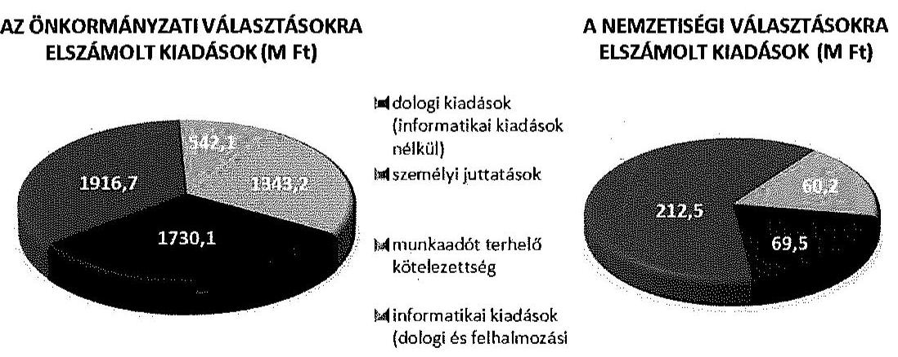

Az NVI a választással kapcsolatos feladatok ellátása érdekében a KEKKH-val, az előzetesen egyeztetett pénzügyi terv alapján, 195,1 M Ft összegben megállapodást kötött. Az ellenőrzött választási irodák - egy kivételével - elkészítették a választások pénzügyi terveit.

Az NVI és a KEKKH a közbeszerzési értékhatárt elérő beszerzések, szolgáltatásvásárlások során a jogszabályi előírásokat betartotta. Az ellenőrzött választási irodák közbeszerzési értékhatárt elérő beszerzést, szolgáltatásvásárlást nem hajtottak végre.

A központi költségvetésből biztosított finanszírozási források elosztása, az előirányzatok kezelése szabályszerű volt. A Kormány döntése alapján a vá-

---

lasztások pénzügyi fedezetének biztosítására az NVI 7000,0 M Ft-ot kapott a rendkívüli kormányzati intézkedésekre szolgáló tartalékból. Az NVI az indokolt előirányzat módosításokat a jogszabályi előírások szerint végrehajtotta. Az NVI a választásban részt vevő szervezeteknek - a KEKKH kivételével - a választásokat megelőzően biztosította a feladataik ellátáshoz szükséges fedezetet. A HVI-ket megillető támogatáselőleget a TVI-k - egy kivételével - a jogszabályban előírt határidőben folyósították. A választásokra biztosított költségvetési támogatás alapján indokolt elöirányzat módosításokat az ellenőrzött szervezetek szabályszerűen végrehajtották.

Az NVI és a KEKKH kialakította a választások céljára biztosított pénzeszközök elkülönített számviteli kezelését, a tényleges pénzforgalomról megfelelő tartalommal vezették az előírt részletező nyilvántartást. Az ellenőrzött választási irodák 69,2\%-a biztosította a választási pénzeszközök elkülönített számviteli kezelését, a tényleges pénzforgalomról a választási irodák 57,7\%-a megfelelő tartalmú részletező nyilvántartást vezetett.

Az ellenőrzött szervek rendelkeztek a gazdálkodási és ellenőrzési jogkörök gyakorlását meghatározó szabályozással. Az önkormányzati választások előkészítése, lebonyolítása érdekében felmerülő kiadások teljesítése során a gazdálkodási jogkörök gyakorlása az NVI-nél összességében megfelelt, a KEKKH-nál részben felelt meg a jogszabályok előírásainak. A KEKKH-nál a pénzügyi ellenjegyzés és az érvényesítés során tárt fel az ellenőrzésünk hiányosságokat. A gazdálkodási jogkörök gyakorlása az ellenőrzött választási irodák $34,6 \%$-ánál megfelelt, $34,6 \%$-ánál részben felelt meg, $30,8 \%$-ánál nem felelt meg a jogszabályok és a belső szabályzatok előírásainak.

A választásra biztosított pénzeszközök felhasználása az NVI-nél három tétel kivételével, a KEKKH-nál minden esetben célhoz kötötten történt. Az NVI összesen 33,2 M Ft összegű, az OGY választás és a megismételt önkormányzati választás érdekében felmerült kiadást tévesen az általános önkormányzati választások kiadásaként számolt el. Az ellenőrzött választási irodák 96,2\%-ánál az önkormányzati és nemzetiségi választáshoz biztosított támogatás felhasználása célhoz kötött volt. Két HVI teljesített összesen 316,4 E Ft összegben olyan kiadást, amely esetében a cél szerinti felhasználást dokumentumokkal nem támasztották alá.

Az ellenőrzött szervezetek az elszámolási kötelezettségüknek eleget tettek, azonban kilenc HVI és két TVI határidőn túl készítette el az elszámolását. A többlettámogatási igények felülvizsgálatánál és érvényesítésénél, valamint a HVI-k elszámolásainak elfogadása, a szükséges pénzügyi rendezés és a HVI vezetők személyi juttatásainak kifizetése során az ellenőrzött TVI-k szabályszerűen jártak el. Az NVI elnöke - felülvizsgálat és egyeztetés után - döntött a TVI-k és a KEKKH elszámolásainak, és az azokban érvényesített többletköltségek elfogadásáról. Az elfogadott elszámolások alapján az NVI - a jogszabályban előírt határidőn túl - elkészítette a választások összesítő elszámolásait.

A jogszabályban előírt ellenőrzési kötelezettségnek az NVI, a KEKKH, valamennyi TVI és a HVI-k 78,9\%-a szabályszerűen eleget tett, négy HVI-nél a támogatás felhasználásának és elszámolásának ellenőrzését nem végezték el.

---

A választási rendszer és jogszabályi környezetének teljes megújulása miatt az előző ÁSZ ellenőrzés által tett hat javaslatból négy okafogyottá vált, egy javaslat hasznosult, egy javaslatot nem hasznosítottak. Hasznosult a HV1 vezetők által készítendő tanúsítvány kötelező tartalmának előírására és a valótlan adatszolgáltatás szankcionálására vonatkozó javaslat. A pénzügyi tervezés egységes elveinek meghatározására vonatkozó javaslatot az új szabályozás kialakítása során sem hasznosították.

---

# II. RÉSZLETES MEGÁLLAPÍTÁSOK 

## 1. A VÁlasztÁs elöKészítéséHez És lebonyolítÁsÁhoz szüksÉGES PÉNZESZKÖZÖK TERVEZÉSE

### 1.1. A választás pénzügyi tervezése

Az NVI elnöke az önkormányzati, valamint a nemzetiségi választások végrehajtásához 2014. március 3-án hagyta jóvá az első költségtervet. A terv készítésénél figyelembe vették a szavazópolgárok és a szavazókörök várható számát, valamint - a rendeletalkotás előkészítési munkáiban való NVI közremúködés miatt - már a 3/2014. (VII. 24.) IM rendelet normatíváit is. A kiadások tervezett összege az első költségterv szerint az önkormányzati választások esetében 5663,3 M Ft, a nemzetiségi választások vonatkozásában 755,2 M Ft volt. Az első jóváhagyott költségterv készítése során a várható kiadások pontos feladatonkénti számbavétele még nem történt meg, az a kiadásokat kiemelt előirányzatonként tartalmazta.

Az NVI a költségterveket az önkormányzati és a nemzetiségi választásokat szabályozó rendeletek hatályba lépése és részletes értelmezése után, a feladatok pontos megismerését követően, továbbá a feladatok ellátása érdekében folyamatosan megkötésre kerülő szerződések ismeretében, többször módosította. Az NVI a 3/2014. (VII. 24.) IM rendelet előírásának megfelelően 2014. október 1-jén elkészítette az önkormányzati és a nemzetiségi választások végleges pénzügyi feladat- és költségterveit. A választási feladatok kiadásainak tervezésekor a jogszabályok által meghatározott feladatok és normatívák, a nem normatív kiadások tervezésekor az érvényes szolgáltatási szerződések, megrendelések figyelembe vételével határozták meg a várható kiadásokat. A pénzügyi feladat- és költségterveket területi bontásban ${ }^{3}$ kiemelt előirányzatonként, azon belül feladatonkénti részletezésben készítették el.

AZ ÖNKORMÁNYZATIÉS NEMZETISÉGI VÁLASZTÁSOKRA TERVEZETT KIADÁSOK
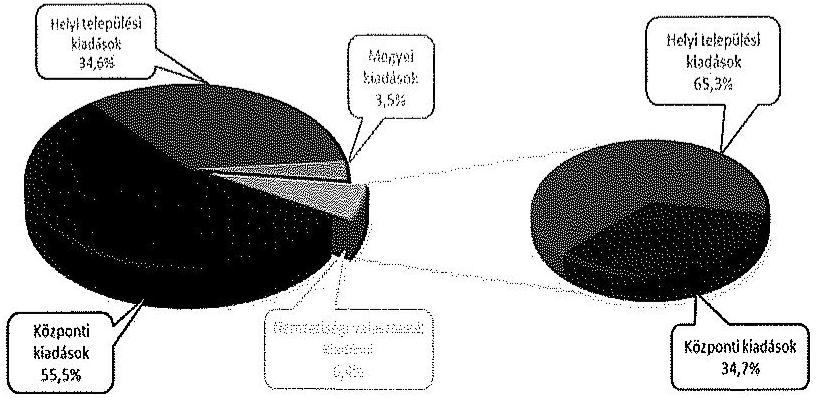

[^0]
[^0]:    ${ }^{3}$ Helyi települési kiadások, megyei kiadások, központi kiadások.

---

Az önkormányzati választások kiadásainak tervezett összege 6632,5 M Ft volt, amelyből a központi kiadásokra (az NVI-re háruló központi lebonyolítási, informatikai és finanszírozási feladatokra, valamint a KEKKH tervezett kiadásaira) 3934,8 M Ft-ot, a helyi települési kiadásokra 2451,3 M Ft-ot, a megyei kiadásokra 246,4 M Ft-ot terveztek. A nemzetiségi választások kiadásainak tervezett összege 452,4 M Ft volt, amelyből 157,0 M Ft az NVI, 295,4 M Ft a helyi települési kiadásokat jelentette.

Az önkormányzati választások pénzügyi feladat- és költségtervében a központi kiadások között 100,0 M Ft, a nemzetiségi választásokéban 10,0 M Ft tartalékot képeztek a vészhelyzeti működés biztosítására.

Az NVI az önkormányzati és a nemzetiségi választások lebonyolítása érdekében a KEKKH-val kötött megállapodást ${ }^{4}$. A megállapodást - a feladatok ütemezéséről és a finanszírozás mértékéről történő egyeztetések elhúzódása miatt - a választásokat követően, 2014. november 25 -én írták alá. A megállapodás választásokat követő megkötése jogszabályba nem ütközött, mivel a megállapodás megkötésének határidejére a 3/2014. (VII. 24.) IM rendelet nem tartalmaz elöírást. A megállapodásban rögzítették, hogy az I. részlet (a támogatás $50 \%$-a) folyósítására a megállapodás aláírását követő 8 munkanapon belül, míg a fennmaradó rész folyósítására az elszámolás - amelynek határidejét december 1-jében határozták meg - elfogadását követően kerül sor.

A KEKKH elkészítette az önkormányzati és nemzetiségi választások költségtervét, amelyet az NVI-vel folytatott egyeztetések során véglegezett. A kölcsönösen elfogadott „költségvetés" az NVI-vel kötött megállapodás mellékletét képezte, amelyben a KEKKH által ellátandó feladatok kiadásainak összege 195,1 M Ft volt. A költségvetés szerinti kiadások 79,2\%-át (154,5 M Ft) a dologi, $18,1 \%$-át ( $35,4 \mathrm{MFt}$ ) a személyi, $2,7 \%$-át ( $5,2 \mathrm{MFt}$ ) pedig az egyéb ráosztott kiadások (általános költségek) tették ki.

A megállapodás szerinti költségvetés a személyi kiadások között az informatikai fejlesztés, a kormányzati ügyfélvonal, az informatikai üzemeltetés- és szolgáltatásmenedzsment, a minőségirányítás és a hatósági feladatok személyi költségeinek részletezését tartalmazta. Dologi kiadásként többek között helpdesk szolgáltatás, kiemelt rendelkezésre állás, megerősített portaszolgálat, IT szakmai támogatás, 5 GB internet szolgáltatás tervezett költségeivel számoltak.

A KEKKH ellátmánnyal, étkezéssel, valamint segédmunkaerő biztosításával kapcsolatban felmerült 2,4 M Ft összegű számlát nem tudott a megállapodásban érvényesíteni, amelyeket a saját forrása terhére számolta el.

A 3/2014. (VII. 24.) IM rendelet előírásainak megfelelően, az ellenőrzött 26 választási iroda közül 25 elkészítette az önkormányzati és nemzetiségi választások pénzügyi terveit. Kaposmérő HVI vezetője a 3/2014. (VII. 24.) IM rendelet 1. § (2) bekezdés a) pontján alapuló pénzügyi tervezési kötelezettségének nem tett eleget. A pénzügyi terv elkészítésének határidejét, és a tervezéssel szemben támasztott követelményeket (pénzügyi terv tartalma, fel-

[^0]
[^0]:    ${ }^{4}$ A megállapodás iktatószáma: NVI/1756-1/2014.

---

építése) a jogszabályban nem határozták meg, ezért a tervezés az ellenőrzött választási irodáknál nem egységes elvek mentén történt.

A pénzügyi terv elkészítéséhez a választási irodák számára gyakorlati segítséget jelentett az NVI által - a VPIR integrált rendszer adatai (a települések választópolgárainak és szavazóköreinek száma) alapján - elkészített támogatáselőleg közlő, amely tartalmazta a választás előkészítésével, lebonyolításával kapcsolatos feladatokat és az azokhoz kapcsolódó normatív támogatás összegét.

A 3/2014. (VII. 24.) IM rendelet által biztosított jogszabályi lehetőség alapján az ellenőrzött választási irodák $34,6 \%$-a ( 9 választási iroda ${ }^{5}$ ) a választási feladatok előkészítésére és végrehajtására biztosított központi támogatáson felül eltérő mértékben - saját forrás igénybevételt is tervezett ${ }^{6}$.

A pénzügyi tervet készítő választási irodák 44,0\%-a (11 választási iroda) a pénzügyi tervét módosította. A pénzügyi tervek módosítása elsősorban a többletköltségek kimutatására irányult, illetve az egyes kiemelt kiadási előirányzatok közötti átcsoportosításokat tartalmazta.

# 1.2. A választás informatikai rendszerének kialakítása, a közbeszerzési eljárások lebonyolítása 

Az NVI gondoskodott az önkormányzati és a nemzetiségi választások előkészítését és lebonyolítását segítő informatikai rendszerek, az NVR, a VÜR, a VPIR, valamint VLOG folyamatos müködtetéséről, és a szükséges fejlesztések végrehajtásáról.

A KEKKH biztosította a választási informatikai rendszer működésének infrastrukturális hátterét és annak elérhetőségét a választási irodák részére. A KEKKH - az informatikai rendszer üzemeltetőjeként - keretszerződés ${ }^{7}$ alapján gondoskodott az informatikai rendszerekbe történő bejelentkezés, betekintés, adatlekérés, adatmódosítás naplózásáról, a napló adatainak megőrzéséről. Az informatikai rendszert biztonsági szempontból a Nemzeti Biztonsági Felügyelet a választásokat megelőzően ellenőrizte.

Az NVI az önkormányzati és nemzetiségi választást megelőzően, 2014. október 8 -ai hatályba lépéssel utasításokat adott ki a választási végpontok biztonságos múködésére vonatkozó feladatokról valamint az esetleges internetes támadások, az informatikai incidens esetére alkalmazandó eljárásrendről. ${ }^{8}$ A választási végpontok biztonságos múködésére vonatkozó utasítás hatálya kiterjedt a

[^0]
[^0]:    ${ }^{5}$ Budapest XII. kerület, Bácsbokod, Bagamér, Csorna, Fejér megye, Hajdú-Bihar megye, Martonvásár, Szank, Szentendre
    ${ }^{6}$ A saját források igénybevétele elsősorban a személyi juttatásokra biztosított normatív összegek kiegészítését célozta.
    ${ }^{7}$ Az NVI a KEKKH-val 2013. november 5-én kötött keret-szerződést.
    ${ }^{8}$ Az NVI Elnökének 30. és 31. számú utasítása.

---

választások előkészítése, lebonyolítása, elszámolása során használt valamenynyi alkalmazásra ${ }^{9}$.

Az NVI az informatikai rendszerek használatának választási szervekkel történő megismertetéséről, a VÜR rendszerben az utasítások közzétételéről gondoskodott.

A közbeszerzési értékhatárt elérő beszerzések, szolgáltatásvásárlások során a Kbt., illetve a 218/2011. (X. 19.) Korm. rendelet elöírásait betartották. Az önkormányzati és nemzetiségi választások lebonyolításához kapcsolódó, közbeszerzési értékhatárt elérő beszerzési eljárásokat a 2. számú melléklet ismerteti.

Az NVI az önkormányzati és a nemzetiségi választás előkészítéséhez és lebonyolításához kapcsolódó informatikai fejlesztések, a meglévő rendszerek üzemeltetése, továbbá nyomdai szolgáltatások beszerzése - összesen öt beszerzési eljárás - esetében a 218/2011. (X. 19.) Korm. rendelet 3. § (1) bekezdése alapján kérte az NBB-től a Kbt. hatálya alóli mentesítést, amelyet a Kbt. 9. § (1) bekezdés a) pontja alapján minden esetben megkapott. Az egy Kbt. és az öt, a 218/2011. (X. 19.) Korm. rendelet hatálya alá tartozó beszerzési eljárást az NVI szabályszerűen folytatta le. A 218/2011. (X. 19.) Korm. rendelet hatálya alá tartozó beszerzéseknél 1586,3 M Ft nettó összegű, a Kbt. hatálya alá tartozó beszerzés során 282,5 M Ft nettó összegű szerződést kötöttek.

Az NVI adatszolgáltatása alapján az informatikai fejlesztések céljára megkötött szerződések nettó értéke összesen 1076,0 M Ft, a pénzügyi teljesítése 2014. december 31-éig 624,4 M Ft volt. Az informatikai fejlesztések alapvetően a VÜR, az NVR, a SzeNvi rendszer és az adat monitoring további - az önkormányzati és nemzetiségi választások igényeihez igazodó - fejlesztésére irányultak. A nyomdai szolgáltatások beszerzésére $792,8 \mathrm{M}$ Ft nettó összegű szerződés alapján a pénzügyi teljesítés 2014. december 31-ig nettó $735,8 \mathrm{M}$ Ft volt.

A KEKKH az önkormányzati választások lebonyolításához kapcsolódóan egy könnyített beszerzési eljárást folytatott le. A beszerzés - a KEKKH elnöke döntésének megfelelően - a 218/2011. (X. 19.) Korm. rendelet 3. § (1) bekezdése alapján mentesült a közbeszerzési eljárás lefolytatásának kötelezettsége alól. A keretszerződés nettó összege $30,0 \mathrm{M}$ Ft, a pénzügyi teljesítés $10,0 \mathrm{M}$ Ft volt.

A beszerzés tárgya az önkormányzati választáshoz kapcsolódóan műszakiszakmai támogató tevékenység ellátása volt, ezen belül rendszerkomponensek tesztelése, valamint annak eredményeként a feltárt hiányosságok javítása.

Az ellenőrzött helyi és területi választási irodák az önkormányzati és a nemzetiségi választások előkészítése és lebonyolítása érdekében közbeszerzési értékhatárt elérő beszerzést, szolgáltatásvásárlást, beruházást, felújítást nem hajtottak végre.

[^0]
[^0]:    ${ }^{9}$ NVR, VÜR, VPIR, VLOG informatikai rendszerek.

---

# 2. A KÖLTSÉGVETÉSBŐL BIZTOSÍTOTT FINANSZÍROZÁSI FORRÁSOK ELOSZTÁSA, AZ ELŐIRÁNYZATOK KEZELÉSE 

A 2013. és a 2014. évi költségvetési törvényben a 2014. évi választások előkészítésére és lebonyolítására biztosított, összesen 12300 M Ft az önkormányzati és a nemzetiségi választásokra már nem biztosított fedezetet. Az NVI az önkormányzati és a nemzetiségi választásokra tervezett összeg biztosítása érdekében 2014. június 24 -én az NGM-hez fordult, és egyeztetést folytatott az NGM közigazgatási államtitkárával. Július 4 -én tájékoztatta a közigazgatási államtitkárt a választás előkészítéséhez és lebonyolításához szükséges pénzeszközök ütemezéséről. A Kormány az 1426/2014. (VII. 28.) számú Korm. határozatában döntött arról, hogy a rendkívüli kormányzati intézkedésekre szolgáló tartalékból 7000,0 M Ft-ot biztosít az intézményi költségvetés javára. A Kormány az 1457/2014. (VIII. 14.) számú Korm. határozatában további döntést hozott, amely szerint a 7000,0 M Ft-ot a fejezeti kezelésű előirányzatok alcím „2014. évi választások elökészítése" jogcímcsoport terhére kell felhasználni és elszámolni.

A Kormány a 2014 második féléves keretösszegből a Rendkívüli Kormányzati Tartalék terhére egy összegben biztosította az önkormányzati és nemzetiségi választások forrásigényét, az NVI a részére jóváhagyott 7000,0 M Ft összeget az előirányzat-felhasználási terv szerint, a szerződések pénzügyi teljesítéséhez igazodva hívta le.

Az NVI a „2014. évi választások előkészítése" fejezeti kezelésű előirányzat felhasználásának szabályait meghatározta.

Az NVI elnöke a 9/2013. (X. 1) számú és a 12/2013. (X. 1.) számú Elnöki utasításban, valamint a gazdálkodási szabályzatban és a számviteli politikában szabályozta a fejezeti kezelésű előirányzatok felhasználását és a számviteli elszámolási szabályait.

Az NVI az önkormányzati és a nemzetiségi választások forrásainak biztosítása érdekében a szükséges előirányzat módosításokat végrehajtotta. Az előirányzatok módosítása, átcsoportosítása, valamint azok dokumentálása a jogszabályi előirásoknak megfelelt, az előirányzat nyilvántartáson az előirányzat változásokat átvezették.

Az NVI az 1426/2014. (VII. 28.) Korm. határozatnak megfelelően az intézményi költségvetés kiemelt előirányzatait 7000,0 M Ft-tal megemelte. A Kormány 1457/2014. (VIII. 14.) számú határozatát végrehajtva 7000,0 M Ft előirányzat átcsoportosítást hajtott végre a „2014. évi választások elökészitése" fejezeti kezelésű előirányzatra. A választások előkészítéséhez és lebonyolításához szükséges előirányzat biztosítása érdekében előirányzat átcsoportosítást hajtott végre saját hatáskörben az önkormányzati választások előirányzatára 6590,6 M Ft, a nemzetiségi választások előirányzatra 409,4 M Ft nagyságrendben. Az NVI továbbá saját hatáskörben végrehajtotta az előirányzat visszarendezését az OGY és az EP választások előirányzatai javára 16,9 M Ft, illetve 23,2 M Ft összegben, mivel a Kormány döntését megelőzően az önkormányzati és a nemzetiségi választások lebonyolításához az OGY és az EP választások szabad előirányzatainak terhére vállalt kötelezettséget.

---

Az NVI az önkormányzati és a nemzetiségi választásokra a választás évében, a 2014. évi költségvetésében eredeti előirányzatot nem tervezett, a költségvetés tervezése során az Áht. 12. § (1) bekezdése ${ }^{10}$ szerinti közgazdaságilag megalapozott tervezés nem érvényesült. Az önkormányzati választásokkal kapcsolatban a módosított előirányzat az intézményi költségvetésben $2952,7 \mathrm{M}$ Ft, a fejezeti kezelésű előirányzaton $3578,6 \mathrm{M}$ Ft, összesen $6531,3 \mathrm{M}$ Ft volt. ${ }^{11}$ A módosított előirányzat $1,2 \%$-át $(77,4 \mathrm{MFt})$ a személyi juttatások és járulékai, $36,3 \%$-át ( $2369,3 \mathrm{M}$ Ft) a dologi kiadások, $7,9 \%$-át ( $516,0 \mathrm{M}$ Ft) a beruházások, $54,6 \%$-át ( $3568,6 \mathrm{M}$ Ft) a múködési célú pénzeszközátadások tették ki. A nemzetiségi választások esetében a módosított előirányzat az intézményi költségvetésben $47,3 \mathrm{MFt}$, a fejezeti kezelésű előirányzaton $409,4 \mathrm{MFt}$, összesen $456,7 \mathrm{M}$ Ft volt. ${ }^{12}$ A nemzetiségi választások módosított előirányzatának 10,4\%át ( $47,3 \mathrm{M}$ Ft) a dologi kiadások, $89,6 \%$-át ( $409,4 \mathrm{M}$ Ft) a múködési célú pénzeszközátadások tették ki. A fejezeti kezelésű előirányzaton a 2014. évi megismételt önkormányzati választásokkal kapcsolatban a $12,0 \mathrm{M}$ Ft módosított előirányzat szerepelt.

Az NVI - a közöttük létrejött megállapodás alapján - biztosította a KEKKH részére a feladatai ellátásának pénzügyi fedezetét. Az NVI a megállapodás szerinti összeg felét, $97,6 \mathrm{M}$ Ft-ot, 2014. december 2-án utalta a KEKKH részére, valamint az elszámolás elfogadását követően 2015. február 3-án további 92,6 M Ft-ot. Mivel az NVI a KEKKH által ellátott feladatok kiadásait csak a választásokat követően térítette meg, a KEKKH az önkormányzati és a nemzetiségi választások előkészítésével és lebonyolításával kapcsolatos feladataihoz szükséges forrást megelőlegezte, azt saját forrásból fedezte.

Az NVI az önkormányzati és a nemzetiségi választások kiadásainak fedezetére a 3/2014. (VII. 24.) IM rendeletben rögzített normatív tételek szerinti öszszeget az önkormányzati választásokra kettő ütemben - 2014. szeptember 12-én és október 2-án, - a nemzetiségi választások vonatkozásában 2014. október 2-án utalta át a TVI-k részére. Az önkormányzati választásokra összesen 2593,4 M Ft-ot, a nemzetiségi választásokra 304,0 M Ft-ot utaltak át előlegként.

Az ellenőrzött TVI-k - egy kivételével - az önkormányzati és nemzetiségi választás pénzügyi fedezetének HVI-ket megillető részét az önkormányzati hivatalok pénzforgalmi számláira határidőben továbbutalták.

A Somogy Megyei TVI a nemzetiségi választásra az NVI által 2014. október 2-án utalt fedezetet 2014. október 15-én, a 3/2014. (VII.24.) IM rendelet 4. § (5) bekezdésében előírt határidőt egy nappal meghaladva utalta tovább a HVI-k részére. A 68 HVI-t érintően az összeg 20,2 M Ft volt.

[^0]
[^0]:    ${ }^{10}$ 2015. január 1-jétől az Áht. 4. § (2) bekezdése
    ${ }^{11}$ A végleges pénzügyi terv szerinti kiadások összesen 101,2 M Ft-tal meghaladták a módosított előirányzatok összegét.
    ${ }^{12}$ A módosított előirányzatok összege 4,3 M Ft-tal több volt, mint a jóváhagyott pénzügyi terv szerinti kiadások összege.

---

Az ellenőrzött választási irodák irányítószerveinek 11,5\%-a (3 db) tervezett a 2014. évi költségvetésében az önkormányzati és nemzetiségi választásokkal összefüggésben eredeti előirányzatokat. A választások előkészítésére és lebonyolítására biztosított központi költségvetési támogatások összegét, a támogatás beérkezését követően év közben, illetve legkésőbb a beszámoló elkészítését megelőzően beépítették a költségvetési rendeletükbe.

# 3. A VÁlasztÁs elŐKészítéséHez, LEBONYOLítÁsÁhoz RENDELKEZÉSRE ÁLLÓ PÉNZESZKÖZÖK FELHASZNÁLÁSA 

### 3.1. A választási pénzeszközök nyilvántartása, a felhasználás szabályozottsága

Az NVI kialakította a választás céljára rendelkezésre álló pénzeszközök elkülönített kezelését. A számviteli nyilvántartásában biztosította az önkormányzati és a nemzetiségi választások bevételeinek és kiadásainak a megfelelő kormányzati funkción, a 016010 COFOG kódon való elszámolását. A 2014. évi választásokra biztosított pénzeszközök választásonként elkülönített kezelése érdekében - az NVI Igazgatáson és az NVI Fejezeti kezelésű előirányzatokon belül - külön TEA kódokat alkalmaztak. ${ }^{13}$

Az NVI megfelelően kialakította az önkormányzati és a nemzetiségi választások pénzforgalmának részletezö nyilvántartását. Az önkormányzati és a nemzetiségi választások pénzforgalmáról olyan részletező nyilvántartást vezettek, amely TEA kódonként és tervsoronként részletezve mutatta be a pénzforgalmi bevételeket és kiadásokat.

A KEKKH és az NVI között létrejött megállapodás tartalmazta a KEKKH által átvett pénzeszköz nyilvántartására vonatkozó szabályokat. A megállapodásban és a 68/2013. (XII. 29.) NGM rendelet 1. számú mellékletében foglaltaktól eltérően a KEKKH az önkormányzati és nemzetiségi választási pénzeszközöket nem a 016010, hanem a 011120 (Kormányzati Igazgatási tevékenység) COFOG kódon tartotta nyilván. Ugyanakkor a kialakított TEA kódok biztosították a főkönyvi rendszerben az önkormányzati és a nemzetiségi választáshoz kapcsolódó, a saját, illetve központi forrásból finanszírozott kiadások elkülönített kezelését. ${ }^{14}$

A KEKKH a tényleges pénzforgalomról - az alkalmazott TEA kódok alapján - részletező nyilvántartást vezetett. A részletező nyilvántartás az NVI felé benyújtott elszámolás összesítő táblájával azonos szerkezetben készült, tartalmazta a tételek azonosító adatait, a terv-tény eltérést, a kötelezettségvállalás összegét, és a pénzügyi teljesítés időpontját.

[^0]
[^0]:    ${ }^{13}$ Az önkormányzati választás kiadásait a 1010301, a nemzetiségi választásét a 1010401 TEA kódon különítették el.
    ${ }^{14}$ A 1011913 kódon a kapott támogatást és abból teljesített kiadásokat, a 1011914 kódon a saját forrásból teljesített kiadásokat különítették el.

---

A választási irodák 69,2\%-a (18 választási iroda) biztosította a választások céljára biztosított pénzeszközök választásonkénti elkülönített kezelését. A választási pénzeszközöket az előírt kormányzati funkciókódon (a 016010 COFOG kódon) tartották nyilván, az önkormányzati és a nemzetiségi választás pénzeszközeinek a többi 2014. évi választástól való elkülönítésére további szervezeti, vagy ügylet kódokat, illetve tervezési alapegységeket alkalmaztak. Nyolc választási iroda az önkormányzati és a nemzetiségi választással kapcsolatos pénzeszközök elkülönített kezelését a 3/2014. (VII.24.) IM rendelet 1. § (2) bekezdés d) pontjában előírtak ellenére nem, illetve csak részben biztosította.

A Bács-Kiskun Megyei TVI, és a Martonvásári HVI az OGY és EP választásra biztosított pénzeszközöktől elkülönítve, de az önkormányzati és a nemzetiségi választás céljára biztosított pénzeszközöket együtt kezelte.

A Berzencei, Bősárkányi, Kalocsai, Kaposmérői és Penci HVI a 2014. évi (EP, OGY, önkormányzati és nemzetiségi) választás pénzeszközeinek választásonkénti elkülönítését nem biztosította.

A Szentendrei HVI az önkormányzati és a nemzetiségi választások esetében a választásonkénti elkülönítést csak a dologi kiadások esetében biztosította.

A választásokkal kapcsolatban teljesített tényleges pénzforgalomról a jogszabályi előírásnak megfelelő részletező nyilvántartást az ellenőrzött választási irodák $57,7 \%$-a ( 15 választási iroda) vezetett.

Kaposmérő, Berzence, Martonvásár, Nagyhegyes, Penc, Sárosd, Szentendre, Dég, és Kalocsa helyi választási irodái a tényleges pénzforgalomról a 3/2014. (VII.24.) IM rendelet 6. § (2) bekezdésében előírt részletező nyilvántartást nem vezettek. A Bősárkányi és Öttevényi HVI részletező nyilvántartása nem felelt meg a jogszabályi előírásnak, mert abban - a 3/2014. (VII. 24.) IM rendelet 6. § (2) bekezdés előírása ellenére - a kapott támogatásokat nem jelenítették meg.

Az NVI - az Ávr. és a 3/2014. (VII. 24.) IM rendelet előírásaival összhangban megalkotta a gazdálkodására és a választások előkészítéséhez és lebonyolításához rendelkezésre álló pénzeszközök felhasználására vonatkozó belsö szabályzatokat.

A KEKKH az Ávr. és a 3/2014. (VII. 24.) IM rendelet előírásainak megfelelően elkészítette a gazdálkodásra - köztük a gazdálkodási jogkörök gyakorlására - vonatkozó szabályzatait, a választásokra az általánostól eltérő, speciális szabályozást nem készítettek. A kötelezettségvállalási szabályzat tartalmazta az egyes jogkörökhöz kapcsolódó értékhatárokat, a kijelöléseket, valamint az aláírás mintákat tartalmazó nyilvántartásokat.

Az ellenőrzött választási irodák rendelkeztek a gazdálkodási és ellenőrzési jogkörök gyakorlásának rendjét meghatározó belső szabályzattal. Az ellenőrzött választási irodák vezetői a választási pénzeszközök feletti gazdálkodási (kötelezettségvállalás, utalványozás) és ellenőrzési (pénzügyi ellenjegyzés, teljesítésigazolás, érvényesítés) jogkörök gyakorlásának rendjét a jogszabályok előírásainak figyelembe vételével szabályozták. A választási irodák $65,4 \%$-a ( 17 választási iroda) külön - választási - szabályzatot alkotott,

---

míg 9 választási iroda az önkormányzati-, illetve a polgármesteri hivatal hatályos gazdálkodási szabályzatát alkalmazta a választásokkal kapcsolatos pénzügyi feladatok ellátása során. A szabályozás és a kijelölések során biztosították az összeférhetetlenség követelményeinek betartását.

Penc HVI-nél, és Berzence HVI-nél az aláírás nyilvántartás - az érvényesítésre jogosult személyek aláírás-mintájának hiánya miatt - nem felelt meg az Ávr. 60. § (3) bekezdése előírásának.

Az ellenőrzött választási irodák gazdálkodási szabályzatai a választásokkal kapcsolatos kiadások tekintetében a kötelezettségvállalási és utalványozási jogkört - egy kivétellel - a jogszabályi előírásnak megfelelően, a választási iroda vezetőjének jogkörébe utalták.

Sárosd HVI vezetője az utalványozási jog gyakorlására más személynek felhatalmazást adott, mely nem felel meg a 3/2014. (VII.24.) IM rendelet 1. § (2) bekezdés c) pontjában előírtaknak.

Az önkormányzati és nemzetiségi választásokkal összefüggésben a választási irodáknál felmerült kiadások egyedi összege jellemzően nem érte el a 100,0 E Ft-ot. Az ellenőrzött HVI-k 26,3\%-ánál (5 választási irodánál ${ }^{15}$ ) tapasztalt hiányosság volt, hogy az Ávr. 53. § (1) bekezdés a) pontja szerinti - kisöszszegű - kifizetések rendjét az Ávr. 53. § (2) bekezdés előírása ellenére nem szabályozták, annak ellenére, hogy a belső szabályzatukban foglaltak szerint éltek az írásbeli kötelezettségvállalás mellőzésével.

# 3.2. A választással kapcsolatos kiadások teljesítésének szabályszerűsége 

Az önkormányzati választások előkészítése, lebonyolítása érdekében felmerülő kiadások teljesítése során az NVI-nél a gazdálkodási jogkörök gyakorlása összességében megfelelt a jogszabályok és a belső szabályzatok előírásainak. Kötelezettségvállalásra minden esetben az arra jogosult által írásban, pénzügyi ellenjegyzést követően került sor. A kifizetések két tétel kivételével amelyeknél a teljesítésigazolás és az érvényesítés végrehajtásánál tártunk fel az Ávr. 57. § (1) illetve az Ávr. 58. § (1)-(2) bekezdéseibe ütköző eseti hiányosságot -, szabályszerű teljesítésigazoláson alapuló érvényesítést és utalványozást követően történtek.

Az ellenőrzött kifizetések - három, összesen 33,2 M Ft összegű kifizetés kivételével - a 2014. évi önkormányzati és nemzetiségi választások előkészítése és lebonyolítása érdekében merültek fel, célhoz kötöttek és indokoltak voltak.

[^0]
[^0]:    ${ }^{15}$ Bácsbokod HVI, Kalocsa HVI, Martonvásár HVI, Penc HVI, Sárosd HVI

---

A 3/2014. (VII. 24.) IM rendelet. 6. § (1) bekezdésében foglaltak ellenére az önkormányzati választások fejezeti kezelésű előirányzata terhére utalták át és számolták el a KEKKH részére 2014. december 15 -én folyósitott, az OGY választásokkal kapcsolatban felmerült $31,0 \mathrm{M}$ Ft-ot, valamint a megismételt önkormányzati választások érdekében felmerült $2,2 \mathrm{M}$ Ft kiadást ${ }^{16}$.

A KEKKH-nál az önkormányzati és nemzetiségi választások előkészítése, lebonyolítása érdekében felmerülő kiadások teljesítése során - az ellenőrzésre kiválasztott mintatételek alapján - a gazdálkodási jogkörök gyakorlása összességében részben felelt meg a jogszabályok és a belső szabályzatok előírásainak.

Valamennyi kifizetésre az arra jogosult által vállalt, írásbeli kötelezettségvállalás alapján került sor. A pénzügyi ellenjegyzés azonban nem volt szabályszerű, mivel - az Ávr. 55. § (1) bekezdésében foglaltak ellenére - a kötelezettségvállalás dokumentumán nem tüntették fel a pénzügyi ellenjegyzés dátumát, továbbá a személyi juttatásokkal kapcsolatos kifizetéseket megelőzően a pénzügyi ellenjegyzést nem a kötelezettségvállalás dokumentumán igazolták. Az érvényesítő a kifizetést megelőzőén - az Ávr. 58. § (1) bekezdésében foglaltak ellenére - nem ellenőrizte, hogy a megelőző ügymenetben a pénzügyi ellenjegyzésre vonatkozó előírásokat betartották-e. A teljesítésigazolás és az utalványozás szabályszerűen, az arra jogosult által minden esetben megtörtént.

A választás céljára biztosított pénzeszközöket a KEKKH - a gazdálkodási és ellenőrzési jogkörök gyakorlásánál feltárt hiányosságok ellenére - az önkormányzati és a nemzetiségi választások előkészítése és lebonyolítása érdekében, célhoz kötötten használta fel.

A gazdálkodási és ellenőrzési jogkörök gyakorlása - az ellenőrzött kiadások alapján - a TVI-k 71,4\%-ánál (5 TVI-nél) összességében megfelelt, két TVI esetében részben felelt meg a jogszabályok és a belső szabályzatok előírásainak.

A gazdálkodási és ellenőrzési jogkörök gyakorlása - az ellenőrzött kiadások alapján - az ellenőrzött HVI-k 21,1\%-ánál (4 HVI-nél) összességében megfelelő volt, $36,8 \%$-ánál ( 7 HVI-nél) részben felelt meg, $42,1 \%$-ánál ( 8 HVI-nél) nem felelt meg a jogszabályokban és a belső szabályzatokban előírt követelményeknek. A legtöbb hiányosság az egyedileg 100,0 E Ft alatti kifizetések rendjére vonatkozó, az Ávr. 53. § (2) bekezdésben előírt szabályozás elmulasztásából eredt. A leggyakrabban előforduló hiányosság a 100,0 E Ft összeget el nem érő személyi jellegű kiadásoknál ${ }^{17}$ az volt, hogy az Áht. 37. § (1) bekezdésének előírását megsértve elmaradt az írásbeli kötelezettségvállalás, annak ellenére, hogy az értékhatárt el nem érő kifizetések rendjét az Ávr. 53. § (2) bekezdésben előírtak ellenére belső szabályzatban nem rögzítették, illetve az írásba foglalt kötelezettségvállalásokra pénzügyi ellenjegyzés nélkül került sor. További hiányosságként megállapítottuk, hogy több esetben az Ávr. 50. § (1) bekezdés b) pontjában foglaltak ellenére a megbízási szerződésekben nem rögzítették a megbízási díj összegét, ezért e megbízási szerződések nem tekinthetőek az Áht. 37. § (1)

[^0]
[^0]:    ${ }^{16}$ szavazóköri dobozok szállítása, postal szolgáltatás
    ${ }^{17}$ SZSZB tagok tiszteletdíja, jegyzőkönyvvezetők díja, HVI tagok díja

---

bekezdés előírásának megfelelő, szabályszerű kötelezettségvállalásnak. Ezen esetekben az érvényesítő - az Ávr. 58. § (2) bekezdésének előírása ellenére nem jelezte az utalványozónak, hogy a megelőző ügymenetben az Áht., az Ávr., és a belső szabályzatok előírásait nem tartották be. Az ellenőrzött helyi és területi választási irodáknál a gazdálkodási jogkörök gyakorlása megfelelőségének minősítését, és a jogkörgyakorlás során feltárt jellemző hiányosságokat a 3. számú melléklet tartalmazza.

Az ellenőrzött választási irodáknál - kettő kivételével - a pénzeszközök felhasználása - a gazdálkodási és ellenőrzési jogkörök gyakorlásánál feltárt hiányosságok ellenére - az önkormányzati és nemzetiségi választás előkészítése és lebonyolítása érdekében, célhoz kötötten történt. Kettő HVI teljesített olyan kiadásokat, amelyek esetében a - 3/2014. (VII. 24.) IM rendelet 1. § (2) bekezdés b) pontjában előírt - cél szerinti felhasználást az Sztv. 165. § (2) bekezdésének megfelelő, szabályszerű bizonylatokkal nem támasztották alá.

Kalocsa és Nagyhegyes HVI a megosztott költségek (286,1 E Ft, illetve 33,3 E Ft) elszámolását számításokkal, költségmegosztásokkal nem dokumentálta, az ellenőrzés rendelkezésére bocsátott dokumentumok a pénzeszközök választás céljára történt felhasználását nem támasztják alá.

# 4. A VÁlasztÁsi feladatokra felhasZnÁlt PÉNZESZKÖZÖK ELSZÁMOLÁSA 

Az NVI a választási irodák számára az önkormányzati és nemzetiségi választás pénzügyi elszámolását segítő informatikai alkalmazás igénybevételéről kiadta a 33/2014. (X. 20.) NVI utasítást, amelyet a VÜR-ben közzétett.

Az utasítás és mellékletei tartalmazták a választási irodák és egyéb szervek által a VPIR-ben elkészítendő feladattípusú elszámolás során alkalmazandó nyomtatványokat, tanúsítványokat, iránymutatást azok kitöltéséhez, és a VPIR használatához.

Az NVI a 3/2014. (VII. 24.) IM rendelet 7. § (4) bekezdésében foglaltak ellenére a szavazás napját követő kilencven napon túl ${ }^{18}$ készítette el a TVI-k, valamint a KEKKH elszámolása alapján az önkormányzati és a nemzetiségi választások összesítő elszámolását. ${ }^{19}$

A feladattípusú elszámolás országosan összesített adatai szerint az önkormányzati választásokra 5 532,1 M Ft kiadást teljesítettek. A tényleges kiadás közel $20 \%$-kal ( $1100,4 \mathrm{M}$ Ft-tal) kevesebb a pénzügyi feladat és költségtervben jóváhagyott kiadásokhoz képest.

[^0]
[^0]:    ${ }^{18}$ A nemzetiségi választások összesítő elszámolása 2015. március 9-én, az önkormányzati választásoké 2015. március 20 -án készült el.
    ${ }^{19}$ Az NVI Gazdasági Főosztályvezetőjének 2015. március 23-án tett nyilatkozata értelmében az összesítő elszámolások elkészítésének határideje a kezelendő adatállomány nagyságrendje miatt nem volt tartható.

---

# Az önkormányzati választás tervezett és elszámolt kiadásainak alakulása (M Ft) 

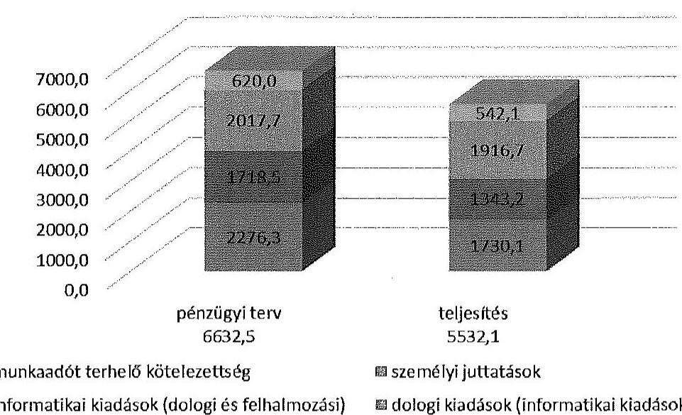

A nemzetiségi választások kiadásaira 342,2 M Ft-ot, a pénzügyi tervben jóváhagyott kiadásokhoz viszonyítva közel negyedével ( $110,2 \mathrm{M}$ Ft-tal) kevesebbet teljesítettek és számoltak el.

A nemzetiségi választás tervezett és elszámolt kiadásainak alakulása (M Ft)
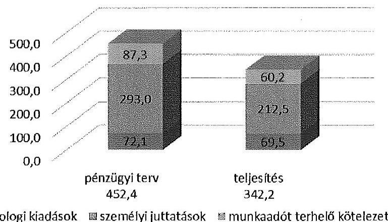

A 2014. évben az önkormányzati és a nemzetiségi választásokra a 2014. évi intézményi költségvetésben rendelkezésre állt előirányzati keret 79,3\%-át, illetve $74,3 \%$-át, a fejezeti kezelésű előirányzat $77,0 \%$-át, illetve $64,9 \%$-át használták fel. A 2015. évre áthúzódó pénzügyi teljesítés az önkormányzati választások esetében $437,0 \mathrm{M} \mathrm{Ft}$, a nemzetiségi választások vonatkozásában $7,5 \mathrm{M} \mathrm{Ft}$ volt.

Az NVI az önkormányzati választásokra a 2014. évben a főkönyvi nyilvántartás adatai szerint az intézményi költségvetésből $2341,1 \mathrm{M}$ Ft-ot, a fejezeti kezelésű előirányzat terhére $2754,0 \mathrm{M}$ Ft-ot, összesen $5095,1 \mathrm{M}$ Ft-ot fordított. Az intézményi kiadások $76,9 \%$-át dologi kiadásokra, $19,9 \%$-át felhalmozási kiadásokra,

---

3,2\%-át személyi juttatásokra és járulékaira használták fel. A nemzetiségi választásokra a főkönyv adatai szerint a 2014. évben az intézményi költségvetésből dologi kiadásokra 30,7 M Ft-ot ( $9,2 \%$ ), a fejezeti kezelésú előirányzatból egyéb múködési célú pénzeszköz átadásra 304,0 M Ft-ot, ( $90,8 \%$ ), összesen 334,7 M Ft-ot fordítottak.

Az ellenőrzött választási irodák a jogszabályi előírásnak és a 33/2014. NVI utasításnak megfelelően elkészítették az önkormányzati és nemzetiségi választás pénzeszközeinek felhasználásáról az elszámolásokat. Az ellenőrzött HVI-k 52,6\%-a határidőre elszámolt a választások lebonyolításához biztosított pénzeszközök felhasználásáról, kilenc választási iroda ${ }^{20}$ a 3/2014. (VII. 24.) IM rendelet 7. § (1) bekezdésében előírt 15 napos határidőt 1-10 nappal túllépve készítette el és továbbította a TVI vezetője felé az elszámolását.

Az NVI a VPIR rendszer integrációs eredményére alapozva előkészített, és részben adatokkal (a választási szerv alapadataival, a főbb normatíva tételekkel és a támogatás összegével) feltöltött elszámolásokkal segítette a választási irodák elszámolással kapcsolatos feladatait.

Az elszámolásokban az ellenőrzött HVI-k 42,1\%-a (8 választási iroda) jelzett többletköltség-igényt. A többletköltség-igények jogszerủek voltak, jellemzően a szavazatszámláló bizottságba bevont póttagok, és a választási bizottsági tagok munkáltatói által megtéríteni kért átlagbérigény miatt merültek fel.

Az ellenőrzött TVI-k az önkormányzati és nemzetiségi választás során a HVIknél felmerült többlettámogatási igények felülvizsgálatánál és érvényesítésénél szabályszerűen jártak el. A többletköltség-igények fedezetét a TVI-k az elszámolások elfogadását és a többletköltségek NVI általi megtérítését követően, - egy kivétellel - a jogszabályban foglalt 8 munkanapos határidőn belül átutalták az érintett választási irodák részére.

A Pest Megyei TVI-hez tartozó HVI-k többletköltségeinek fedezetét az NVI 2014. december 18-án átutalta, a jogosult 93 HVI számlájára történő utalás a 3/2014. (VII. 24.) IM rendelet 9. § (3) bekezdés előirása ellenére a beérkezéstől számított nyolc munkanapon belül nem valósult meg, a 2014. december 21 - 2015. január 6. között elrendelt igazgatási szünet miatt.

Feladatelmaradásról (és az ezzel járó visszafizetési kötelezettségről) három ellenőrzött HVI számolt be.

Kaposmérő HVI a nemzetiségi választással kapcsolatban - dokumentumokkal alátámasztott - kiadást nem teljesített, ezért a TVI az elszámolást 0 E Ft teljesítéssel fogadta el, és a nemzetiségi választásra kapott támogatás visszafizetését írta elő. Nagyhegyes HVI esetében az 5 HVB tagra a nemzetiségi választáshoz kapott normatívából 2 fő után járó támogatás összeget (mivel nem kellett mozgóurnás szavazást bonyolítani) visszafizették. Martonvásár HVI-nél a nemzetiségi választás során a HVB létszáma 3 választott taggal és a megbízott tagokkal elérte az 5 fôt, így az 5 fôre biztosított normatívából 2 fó után járó támogatást visz. szafizették.

[^0]
[^0]:    ${ }^{20}$ Bagamér HVI, Biharkeresztes HVI, Bősárkány HVI, BP XII HVI, Csoma HVI, Nagyhegyes HVI, Öttevény HVI, Penc HVI, Szank HVI

---

Az ÁSZ ellenőrzés megállapításai szerint a HVI-k által készített és a TVI-k által elfogadott elszámolások nem minden esetben feleltek meg a 3/2014. (VII. 24.) IM rendelet 6. § (2)-(3) bekezdés előírásainak.

Nagyhegyes és Kalocsa HVI 33,3 E Ft, illetve 286,1 E Ft megosztott költséget számolt el dologi kiadásként, melynek meghatározását számításokkal, költségmegosztásokkal, az Sztv. 165. § (2) bekezdésének megfelelő, szabályszerű bizonylattal nem dokumentálták.

Kalocsa HVI-nél bruttó 175,2 E Ft összegű személyi juttatást - a 3/2014. (VII. 24.) IM rendelet 1-2. melléklete, és az Áhsz. 15. mellékletében foglaltakkal ellentétesen - a dologi kiadások között számoltak el, e kiadások után munkaadót terhelő adó- és járulékfizetési kötelezettséget nem állapítottak meg.

Az ellenőrzött TVI-k vezetői - egy kivételével - a jogszabályi előírásoknak megfelelően döntöttek a HVI-k által benyújtott elszámolások elfogadásáról.

A Somogy Megyei TVI a 3/2014. (VII.24.) IM rendelet 8. § (2) előírása ellenére a választást követő 45 . napot meghaladóan ellenőrizte és fogadta el a Berzencei, valamint Kaposmérői HVI elszámolását.

A HVI vezetők személyi juttatásainak kifizetésére a jogszabályi előírásoknak megfelelően, az elszámolások elfogadását követően került sor.

Az ellenőrzött TVI-k a jogszabályi előírásnak megfelelően elkészítették a választási pénzeszközök felhasználásáról kiadás-nemenként, ezen belül a többletköltségekről és a feladatelmaradásokról feladatonként az elszámolásaikat, továbbá az összesítő elszámolásokat. Az elszámolási kötelezettségüknek kettő TVI kivételével - a jogszabályban előírt határidőre tettek eleget.

A 3/2014. (VII. 24.) IM rendelet 7. § (2) bekezdésben előírt 50 napos határidőt túllépve, a Pest Megyei TVI vezetője a HVI-k elszámolásának ellenőrzését követően a 61. napon, a Somogy Megyei TVI az önkormányzati választásokról az 54. napon, a nemzetiségi választásokról az 53. napon készítette el a feladattípusú elszámolást.

Az önkormányzati és a nemzetiségi választások során a TVI vezetők a jogszerűen igényelhető többlettámogatási igényeket a feladatsoros elszámolásban szerepeltették. Az önkormányzati választásokkal kapcsolatban az NVI - az adatszolgáltatása szerint - összesen 65,8 M Ft, a nemzetiségi választásokkal kapcsolatban 7,3 M Ft többlettámogatást ismert el, és folyósított a TVI-k részére.

Az önkormányzati választással kapcsolatban a szavazatszámláló bizottságba bevont póttagok tiszteletdíja 30,6 M Ft, a választási bizottság tagjainak távolléti díja $33,7 \mathrm{M} \mathrm{Ft}$, a nem állami és önkormányzati tulajdonú szavazó helyiségek bérleti díja $1,5 \mathrm{M} \mathrm{Ft}$ volt.

A nemzetiségi választásokkal kapcsolatban a legjelentősebb összegű többletköltség-igény a választási bizottság tagjainak távolléti díja ( $2,2 \mathrm{M} \mathrm{Ft}$ ), valamint a HVB előtt történő szavazással kapcsolatos költségek ( $4,5 \mathrm{M} \mathrm{Ft}$ ) miatt merült fel. További három jogcímmel összefüggésben (értesítőkkel kapcsolatos feladatok, határozathozatallal, döntésekkel kapcsolatos postaköltségek, munkaadókat terhelő fizetési kötelezettségek) összesen 0,6 M Ft többlettámogatást folyósitottak.

---

A Somogy Megyei TVI-nél a nemzetiségi választásra vonatkozó összesítő elszámolásban a feladatelmaradás miatti visszafizetési kötelezettség összege meghaladta a többletköltség-igényt, így összességében 61,8 E Ft visszautalási kötelezettsége keletkezett. ${ }^{21}$

A TVI-k által a VÜR-ben benyújtott elszámolásokat az NVI felülvizsgálta, a többletköltségek fedezetét az önkormányzati és a nemzetiségi választások esetében egyaránt határidőben, az elszámolás elfogadását követő nyolc munkanapon belül átutalta a TVI-k részére.

Az NVI elnöke - a 3/2014. (VII. 24.) IM rendelet előírásának megfelelően - a TVI vezetők személyi juttatásainak kifizetéséről az önkormányzati és a nemzetiségi választások elszámolásának elfogadásával együtt döntött. A TVI vezetők személyi juttatásaira az NVI az önkormányzati és a nemzetiségi választásokra összesen 10,0 M Ft-ot fizetett ki.

A KEKKH az előírásoknak megfelelően elkészítette a feladattípusú elszámolását és a választásokat követő 50. napon, 2014. december 1-jén megküldte az NVI részére. A KEKKH által készített elszámolás tartalmazta az alapbizonylatok másolatát is. Az elszámolásban a személyi juttatások a várható összeggel szerepeltek, mert a számfejtés az elszámoláskor még folyamatban volt. 2014. december 1. után hiánypótlások keretében megküldték az NVI részére a hiányzó tételek dokumentumait.

Az NVI 2015. január 26-án levélben tájékoztatta a KEKKH-t, hogy 190,2 M Ft összegben fogadta el az elszámolását, amely személyi juttatásra $27,8 \mathrm{M}$ Ft-ot, munkaadókat terhelő járulékra 7,6 M Ft-ot, dologi kiadásra 149,7 M Ft-ot, valamint egyéb ráosztott kiadásként 5,1 M Ft-ot tartalmazott. Az NVI az elszámolás és a december 2-án kiutalt előleg közötti különbözetet, 92,6 M Ft-ot 2015. február 3-án átutalta a KEKKH részére.

A KEKKH a megállapodás melléklete szerinti költségvetésben foglaltakhoz képest 4,1 M Ft-tal kevesebb összegre nyújtotta be elszámolását. Az NVI a személyi kiadások és járulékok vonatkozásában a megállapodásnál alacsonyabb összeget, a dologi kiadásoknál a KEKKH által benyújtott elszámolás szerinti összeget fogadta el. Az egyéb ráosztott kiadásokból 1,3 M Ft-tal kevesebbet fogadott el a megállapodásban foglaltaknál, a dologi kiadások alacsonyabb összegben teljesülése miatt.

Az NVI elnöke - az elszámolások felülvizsgálatát követően - a jogszabályi előírásnak megfelelően döntött az önkormányzati és a nemzetiségi választások TVI elszámolásainak, valamint a KEKKH elszámolásának elfogadásáról.

Az önkormányzati választások esetében az ellenőrzésre kiválasztott hét TVI esetében a benyújtott elszámolások felülvizsgálatának megállapításairól az NVI 2014. december 14-én tételes tájékoztatást küldött a TVI-k részére. A KEKKH-t az elszámolásának elfogadásáról 2015. január 26-án tájékoztatták².

[^0]
[^0]:    ${ }^{21}$ A visszafizetési kötelezettséget a Kaposmérő HVI nemzetiségi választással kapcsolatos elszámolásának 0 Ft-tal történő elfogadása okozta.
    ${ }^{22}$ Az NVI 1756-3/2014. iktatószámú levél.

---

A nemzetiségi választások elszámolásainak felülvizsgálatát az NVI-vel létrejött szerződés alapján megbízott gazdasági társaság. végezte. A felülvizsgálat megállapításairól 2015. január 19-én tájékoztatták az ellenőrzött TVI-k vezetöit, az NVI elnöke az elszámolások elfogadásáról szóló döntéséről 2015. február 2-án a tájékoztatta a szervezeteket ${ }^{23}$.

# 5. A VÁLASZTÁSRA FORDÍTOTT PÉNZESZKÖZÖK FELHASZNÁLÁSÁNAK ÉS ELSZÁMOLÁSÁNAK ELLENŐRZÉSE 

Az NVI a jogszabályban foglalt ellenőrzési kötelezettségének eleget tett. Az önkormányzati és a nemzetiségi választásokra biztosított támogatás felhasználását, és az elszámolások megalapozottságát - az elszámolások dokumentum alapú ellenőrzésén felül - tíz település esetében - a Bkr. előírásait is figyelembe véve - helyszínen ellenőrizte.

Az ellenőrzési feladattervet az NVI elnöke 2015. január 10-én fogadta el. Az ellenőrzés tíz település ${ }^{24}$ választási szerveinek ellenőrzését ütemezte elő 2015. fẹbruár 23-a és március 6-a között. Az ellenőrzések lefolytatásához ellenőrzési terv készült. Az ellenőrzések kiterjedtek többek között a gazdálkodási és ellenőrzési jogkörök szabályozására és múködésére, az elkülönített nyilvántartás biztosítására, a személyi kifizetésekre, a többletköltségekre, a feladattípusú elszámolás bizonylati szintű ellenőrzésére.

Hiányosságot három szervezet ${ }^{25}$ vonatkozásában tártak fel. Egy esetben az ellenőrzött választási szerv nem biztosította a főkönyvi nyilvántartásban a választások elkülönített kezelését, kettő esetben az ellenőrzés a költségek szabálytalan elszámolását tárta fel.

A KEKKH vezetője - a 3/2014. (VII.24.) IM rendelet 1. § (2) bekezdés b) pontja előírásának megfelelően - gondoskodott a támogatás felhasználásának utólagos ellenőrzéséről. A KEKKH elnöke 2014. november 29-én adott megbízást a Belső Ellenőrzési Főosztálynak a jóváhagyott vizsgálati program lefolytatására. Az ellenőrzési jelentés 2015. január 20-án készült el.

A belső ellenőrzési jelentés az alábbi főbb megállapításokat tette: a KEKKH feladatait az elvárt szolgáltatási szinteken maradéktalanul ellátta. Költségek csak célszerűen és a szükséges feladatok kapcsán kerültek elszámolásra. A nyilvántartások tételesen és összegszerűen is egyezőséget mutattak. A beszerzések indokoltok voltak. Két javaslatot tett a jelentés, ezek a célfeladat szabályzatban kontrollok előírására, valamint íratsablonok alkalmazására vonatkozó kontroll tevékenység előírására vonatkoztak. A KEKKH elnöke 2015. január 21-én intézkedési javaslatot készített az ellenőrzés megállapításaira.

Az ellenőrzött választási irodák a jogszabályi előírás szerint az önkormányzati és nemzetiségi választás pénzügyi ellenőrzését a választási iroda egy tagjának adott megbízása útján voltak kötelesek teljesíteni.

[^0]
[^0]:    ${ }^{23}$ Az NVI elnökének 86-1/2015. iktatószámú levele.
    ${ }^{24}$ Tatabánya, Szentendre, Dunakeszi, Gödöllő, Martonvásár, Kecskemét, Dunaújváros, Esztergom, Rétság, Dunaharaszti.
    ${ }^{25}$ Komárom-Esztergom megyei TVI, Szentendrei, Esztergomi HVI

---

Az ellenőrzött TVI-k vezetői - a TVI tagjának adott megbízással - gondoskodtak az ellenőrzési kötelezettség teljesítéséről. A TVI-k ellenőrzési kötelezettsége egyrészt saját részre megállapított támogatás felhasználásának ellenőrzésére, másrészt a HVI-k elszámolásainak megalapozottságára, és a több-letköltség-igények indokoltságának tételes ellenőrzésére vonatkozott.

Az ellenőrzött TVI-k a HVI többletköltség-igények tételes ellenőrzését bekért dokumentumok alapján, a HVI elszámolások megalapozottságát nagyobbrészt a bekért dokumentumok alapján, illetve 39 HVI-nél helyszíni ellenőrzés keretében végezték el.

A HVI elszámolások ellenőrzése során az SZSZB, illetve a HVB tagok részére kifizetett díjakkal, valamint a reprezentációs kiadások és járulékaik könyvelésével kapcsolatban tettek megállapításokat.

Az ellenőrzött HVI-k 68,4\%-a (13 választási iroda) az ellenőrzési kötelezettségének megfelelően eleget tett. A választási irodák 21,1\%-a (4 HVI) az ellenőrzési kötelezettségének a 3/2014. (VII.24.) IM rendelet 1. § (2) bekezdés b) pontjában, és a 8. § (1) bekezdésében foglaltak ellenére nem tett eleget.

Kaposmérő, Sárosd és Kaposvár HVI vezetője ellenőrzés végrehajtására a HVI tagjának megbízást nem adott, és ellenőrzést nem hajtottak végre. Szentendre HVI vezetője megbízást adott az ellenőrzési feladat végrehajtására, de azt a megbizás ellenére nem végezték el.

A választási irodák tagjai által végzett ellenőrzések a pénzeszközök nyilvántartását, felhasználását, elszámolását jellemzően megfelelőnek ítélték, nem tárták fel a választások pénzügyi tervezésével, a pénzeszközök elkülönített kezelésével, a részletező nyilvántartás vezetésével, a gazdálkodási és ellenőrzési jogkörök gyakorlásával, a támogatás elszámolásával kapcsolatos, jelen ÁSZ ellenőrzés által megállapított hiányosságokat.

# 6. A VÁlasztÁssal KAPCSOLatban VÉGZETT KORÁbbi ÁSZ ELLENÖRZÉS JAVASLATAINAK HASZNOSULÁSA 

A 2010. évi országgyűlési, valamint önkormányzati és nemzeti, etnikai kisebbségi képviselő-választások lebonyolításához felhasznált pénzeszközök ellenőrzéséről szóló 1272 számú ÁSZ jelentés megállapításai alapján az ÁSZ a Közigazgatási és Igazságügyi ${ }^{26}$ miniszternek összesen hat javaslatot fogalmazott meg. Három javaslat a miniszteri rendeletben foglaltak érvényre juttatására, három a szabályozás kiegészítésére vonatkozott.

A javaslatok alapján a miniszter intézkedési tervet készített. Az intézkedési tervben konkrét határidők nem szerepeltek, a végrehajtási határidőt „az új választási törvény elfogadását követően, a végrehajtási miniszteri rendeletek felülvizsgálatával egyidejüleg" határozta meg. Az intézkedési tervben felelősként az OVI (Országos Választási Iroda) vezetőjét és a KEKKH elnökét jelölte meg a minisz-

[^0]
[^0]:    ${ }^{26}$ Az utóellenőrzés időpontjában - Magyarország minisztériumainak felsorolásáról szóló 2014. évi XX. törvény alapján - a jogutód szervezet az Igazságügyi Minisztérium

---

ter. A választás intézményrendszerének átalakulása (OVI megszűnése), és a KEKKH feladatkörének megváltozása miatt, az intézkedési tervben felelősként megjelölt személyek már nem rendelkeztek hatáskörrel a javaslatok végrehajtására.

A választás intézményrendszerének, és jogszabályi környezetének teljes körű megújulása miatt a korábbi szabályozásban foglaltak érvényre juttatására, és a szabályozás kiegészítésére vonatkozó következő négy javaslat okafogyottá vált:
„Szerezzen érvényt a miniszteri rendeletben elöirtak megvalósulásának:

- a megalapozott pénzügyi finanszírozás érdekében a pénzügyi feladat- és költségterv jóváhagyásával;
- a választások lebonyolításához tervezett pénzeszközök határidőben történő rendelkezésre bocsátásával;
- a választás lebonyolítására felhasznált pénzeszközök KIM által történő ellenőrzésével

Szabályozza a következő választásnál az összesitő elszámolás miniszteri elfogadásának határidejét."

Hasznosult a HVI vezetők által készítendő tanúsítvány kötelező tartalmának és a valótlan adatszolgáltatás szankcionálásának előírására vonatkozó javaslat. A HVI vezetők által készítendő tanúsítvány kötelező tartalmát NVI utasításban meghatározták, a valótlan adatszolgáltatás szankcionálását a költségvetési támogatás ellenőrzésére vonatkozó szabályok alkalmazásának előírásával biztosították.

Nem hasznosult a pénzügyi tervezés egységes elveinek meghatározására vonatkozó javaslat. Az önkormányzati és nemzetiségi választás költségeinek normatíváiról, tételeiről, elszámolási és belső ellenőrzési rendjéről alkotott új jogszabály (3/2014. (VII.24.) IM. rendelet) a pénzügyi tervezés egységes elveit nem tartalmazza.
Budapest, 2015. julius hónap 21. nap
az elnök nevében eljárva

Melléklet: $\quad 14 \mathrm{db}$
Függelék: $\quad 2 \mathrm{db}$
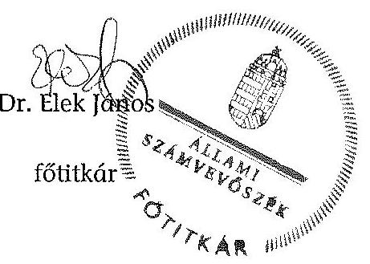

---

# ÁLLAMI SZÁMVEVÖSZÉK 

Iktatószám: ETIO-0147-002/2014.

## MEGHATALMAZÁS

Az Állami Számvevőszékről szóló 2011. évi LXVI. törvény 32. § (2) bekezdése, valamint az Állami Számvevőszék Szervezeti és Müködési Szabályzatáról szóló 1/2013. (XII. 31.) ÁSZ utasítás 33. § (7) bekezdésében és (8) bekezdés a) pontjában foglaltak alapján visszavonásig a
2014. évi választásokra fordított pénzeszközök felhasználásának ellenőrzése:

- az országgyűlési képviselők 2014. évi választására fordított pénzeszközök felhasználásának ellenőrzése,
- az Európai Parlament tagjainak 2014. évi választására fordított pénzeszközök felhasználásának ellenőrzése,
- a helyi önkormányzati képviselők és polgármesterek, valamint a nemzetiségi önkormányzati képviselők 2014. évi választására fordított pénzeszközök felhasználásának ellenőrzése, valamint
az ellenőrzésckkel kapcsolatos nyilvántartási feladatok ellátása tekintetében

Dr. Elek János, fötitkárt az Elnököt megillető feladat- és hatáskörök teljes jogkörü gyakorlására feljogosítom.

Budapest, 2014 ... év ...jóniná...... hó .. 16. nap
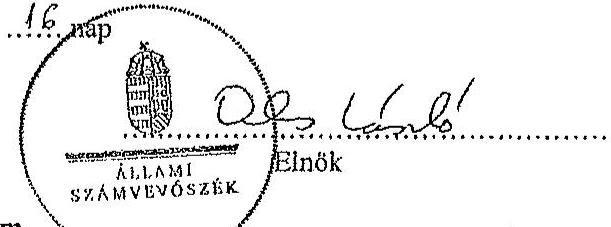

A teljes jogkörü feljogosítást elfogadom.
Budapest, 2014 .... év ...jóniná...... hó .. 16. nap
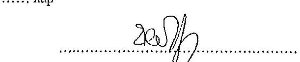

---

.

---

# AZ ELLENŐRZÖTT SZERVEZETEK JEGYZÉKE 

| Központi szervek | Nemzeti Választási Iroda |
| :-- | :-- |
|  | Közigazgatási és Elektronikus Közszolgáltat |
|  | tások Központi Hivatala |
|  | Igazságügyi Minisztérium |
| Területi választási | Bács-Kiskun Megyei Önkormányzat Hiva- |
| szervek (TVI) | tala |
|  | Fejér Megyei Önkormányzati Hivatal |
|  | Pest Megyei Önkormányzati Hivatal |
|  | Budapest Főváros Főpolgármesteri Hivatal |
|  | Hajdú-Bihar Megyei Önkormányzati Hiva- |
|  | tal |
|  | Győr-Moson-Sopron Megyei Önkormány- |
|  | zati Hivatal |
|  | Somogy Megyei Önkormányzati Hivatal |
| Helyi választási | Bagaméri Polgármesteri Hivatal |
| szervek (HVI) | Bácsbokodi Polgármesteri Hivatal |
|  | Berzencei Polgármesteri Hivatal |
|  | Biharkeresztesi Közös Önkormányzati Hiva- |
|  | tal |
|  | Bősárkányi Közös Önkormányzati Hivatal |
|  | Budapest Főváros XII. kerület Hegyvidéki |
|  | Polgármesteri Hivatal |
|  | Budapest Főváros XVII. kerület Rákosmenti |
|  | Polgármesteri Hivatal |
|  | Csornai Polgármesteri Hivatal |
|  | Dégi Közös Önkormányzati Hivatal |
|  | Kalocsai Polgármesteri Hivatal |
|  | Kaposmérői Közös Önkormányzati Hivatal |
|  | Kaposvár Megyei Jogú Város Polgármesteri |
|  | Hivatala |
|  | Martonvásári Polgármesteri Hivatal |
|  | Nagyhegyesi Polgármesteri Hivatal |
|  | Öttevényi Polgármesteri Hivatal |
|  | Penci Közös Önkormányzati Hivatal |
|  | Sárosdi Polgármesteri Hivatal |
|  | Szanki Polgármesteri Hivatal |
|  | Szentendrei Közös Önkormányzati Hivatal |

---

.

---

# A 2014. ÉVI ÖNKORMÁNYZATI ÉS NEMZETISÉGI VÁLASZTÁSOKHOZ KAPCSOLÓDÓ, KÖZBESZERZÉSI ÉRTÉKHATÁRT ELÉRŐ BESZERZÉSI ELJÁRÁSOK 

Adatok M Ft-ban

| Beszerzési eljárás tárgya | Eljárás   fajtája | NBB   határo-   zat | Szerződés   önkor-   mányzati   választásra el-   számolt   összege | Teljesítés ösz-   szege   2014.   dec.31-   ig |
| :--: | :--: | :--: | :--: | :--: |
| NVI által lefolytatott beszerzési eljárások |  |  |  |  |
| „Az Európai Parlament tagjai 2014. évi választásának és a helyi önkormányzati képviselők és polgármesterek, valamint a nemzetiségi önkormányzati képviselők 2014. évi választásának lebonyolításához szükséges alkalmazások rendszertervezése, a Nemzeti Választási Rendszer továbbfejlesztése, tesztelése, a meglévő rendszerelemekhez történő illesztése, az alkalmazások üzemeltetése és a közvetlenül kapcsolódó szolgáltatások nyújtása" | hirdetmény nélküli tárgyalásos eljárás | $\begin{aligned} & 21 / 2013 . \\ & \text { (VII. 2.) } \end{aligned}$ | 272,8 | 243,1 |
| „SzeNvi rendszer fejlesztői támogatása, szükség szerinti módosítása, továbbfejlesztése, üzemeltetése és a rendszerhez közvetlenül kapcsolódó egyéb szolgáltatások nyújtása." | hirdetmény nélküli tárgyalásos eljárás | $\begin{aligned} & 5 / 2014 . \\ & \text { (VII. 2.) } \end{aligned}$ | 433,1 | 96,7 |
| „A Választás Ügyviteli Rendszer továbbfejlesztése, üzemeltetése és a rendszerhez közvetlenül kapcsolódó egyéb szolgáltatások nyújtása" | hirdetmény nélküli tárgyalásos eljárás | $\begin{aligned} & 23 / 2013 . \\ & \text { (VII.15.) } \end{aligned}$ | 48,6 | 43,7 |
| „Adatmonitoring egység fejlesztése és egyéb szolgáltatás nyújtása a 2014. évi helyi önkormányzati képviselők és polgármesterek általános választásához" | könnyített eljárás | $\begin{aligned} & 6 / 2014 . \\ & \text { (VII. 2.) } \end{aligned}$ | 39,0 | 39,0 |
| Nyomdai szolgáltatások beszerzése | könnyített eljárás | $\begin{gathered} 37 / 2013 . \\ \text { (XI. 5.) } \end{gathered}$ | 792,8 | 735,8 |

---

| Beszerzési eljárás tárgya | Eljárás   fajtája | NBB   határo-   zat | Szerződés   önkor-   mányzati   válasz-   tásra el-   számolt   összege | Teljesi-   tés ösz-   szege   2014.   dec.31-   ig |
| :--: | :--: | :--: | :--: | :--: |
| „2014. évi helyi önkormányzati képviselők és polgármesterek, valamint a helyi nemzetiségi önkormányzati képviselők választása pénzügyi, logisztikai lebonyolításához, és az NVR szoftver teszteléséhez, országos próbáihoz szükséges alkalmazások, illetve az ezek múködéséhez szükséges, velük funkcionális, adatbázis és technológiai szinten integrált, az NVI folyamatos ügyviteli és gazdálkodási tevékenységéhez használt alkalmazások továbbfejlesztése, módosítása, forráskód ismeretét és módosítását is igénylő támogatása, speciális szakértői tevékenység" | Kbt., hirdetmény nélküli tárgyalásos eljárás | - | 282,5 | 201,9 |
| KEKKH által lefolytatott beszerzési eljárás |  |  |  |  |
| Az önkormányzati választások lebonyolításához szükséges múszakiszakmai támogató tevékenység, rendszerkomponensek tesztelése, feltárt hiányosságok javítása. | könnyített eljárás |  | 30,0 | 10,0 |

---

# A GAZDÁLKODÁSI JOGKÖRÖK GYAKORLÁSA AZ ELLENÖRZÖTT HELYI ÉS TERÜLETI VÁLASZTÁSI IRODÁKNÁL 

| Megnevezés | A gazdálkodási jogkörök gyakorlásának öszszesítő értékelése | Kötelezettségvállalás, pénzügyi ellenjegyzés, teljesítésigazolás, érvényesítés során feltárt jellemző, rendszerszerű hiányosságok |
| :--: | :--: | :--: |
| Bács-Kiskun Megyei Önkormányzat Hivatala | részben megfelelő | A kötelezettségvállalás 9 esetben nem volt szabályszerű: 7 esetben az Áht. 37. § (1) bekezdés előírása ellenére a pénzügyi teljesítés esedékességét követően, utólag történt; 1 esetben az Ávr. 52. § (1) előírása ellenére nem történt meg; 1 esetben az Áht. 37. § (1) előírása ellenére pénzügyi ellenjegyzés nélkül történt. A pénzügyi ellenjegyzés 9 esetben nem volt szabályszerű: 2 esetben az Áht. 37. § (1) és Ávr. 55. § (1) ellenére nem történt meg a pénzügyi ellenjegyzés; 7 esetben arra az Áht. 37. § (1) előírása ellenére a pénzügyi teljesítés esedékessége után került sor. A teljesítésigazolást 17 esetben Ávr. 57. § (3)-(4) bekezdés előírása ellenére nem az arra jogosult személy látta el. Az érvényesítő 17 esetben az Ávr. 58. § (2) bekezdés előírása ellenére nem jelezte az utalványozónak, hogy a megelőző ügymenetben a jogszabályokban és a belső szabályzatokban foglaltakat nem tartották be. A kifizetés elrendelésére 8 esetben érvényesített okmány hiányában került sor az Ávr. 59. § (1) bekezdés előírása ellenére. |
| Kalocsai Közös Önkormányzati Hivatal | nem megfelelő | Az Ávr. 53. § (2) bekezdés előírása ellenére a 100,0 E Ft alatti kifizetések rendjét nem szabályozták, annak ellenére, hogy lehetővé tették azt. Ennek hiányában az Áht. 37. § (1) bekezdés előírását megsértve 17 esetben (tiszteletdíjak, jutalmak) nem volt írásbeli kötelezettségvállalás. A teljesítésigazolásra 49 esetben a saját szabályozás ellenére nem az eredeti dokumentumon, hanem külön bizonylaton került sor.   Az érvényesítő az Ávr. 58. § (2) bekezdés előírása ellenére nem jelezte az utalványozónak, hogy a megelőző ügymenetben a kötelezettségvállalás és a teljesítésigazolás során a jogszabályok és a belső szabályzat előírásait nem tartották be.   10 esetben az érvényesítés időpontja az Ávr. 59. § (3) bekezdés h) pontja előírása ellenére nem szerepelt az utalványon. Az utalványon 9 esetben az Ávr. 59. § (3) bekezdés g) pontja előírása ellenére nem tüntették fel az utalványozás dátumát. |

---

| Megnevezés | A gazdálkodási jogkörök gyakorlásának ösz- szesítő értékelése | Kötelezettségvállalás, pénzügyi ellenjegyzés, tel- jesítésigazolás, érvényesítés során feltárt jel- lemző, rendszerszerű hiányosságok |
| :--: | :--: | :--: |
| Bácsbokod Pol-gármesteri Hi-vatal | nem megfelelő | Az Ávr. 53. § (2) bekezdés előirása ellenére a 100,0 E Ft alatti kifizetések rendjét nem szabályozták, annak elle- nére, hogy lehetővé tették azt. Ennek hiányában, az Áht. 37. § (1) bekezdés előírását megsértve előzetes írásbeli kö- telezettségvállalás a személyi juttatások kivételével nem volt.   Az írásba foglalt megbízási szerződések közül 27 esetben az Áht. 37. § (1) bekezdés ellenére elmaradt a pénzügyi ellenjegyzés.   Az érvényesítő az Ávr. 58. § (2) bekezdés előírása ellenére nem jelezte az utalványozónak, hogy a személyi juttatás- sok esetében a megelőző ügymenetben megsértették az Áht. előírását. A reprezentációs és a dologi kiadások ese- tében - egy kivételével - az Ávr. 58. § (1) és (3) bekezdés előírásai ellenére nem történt meg az érvényesítés. |
| Szanki Polgár-   mesteri Hivatal | megfelelő | Rendszerszerü hiányosság nem volt. |
| Fejér Megyei Önkormány-   zati Hivatal | megfelelő | Rendszerszerü hiányosság nem volt. |
| Martonvásár Város Polgár-   mesteri Hiva-   tala | részben megfelelő | Az Ávr. 53. § (2) bekezdés előirása ellenére a 100,0 E Ft alatti kifizetések rendjét nem szabályozták, annak elle- nére, hogy lehetővé tették azt.   Kötelezettségvállalásra 2 esetben az Áht. 37. § (1) bekezdés előírása ellenére pénzügyi ellenjegyzés nélkül került sor. A kötelezettségvállalás dokumentumán 12 esetben az Ávr. 55. § (1) bekezdés és a saját szabályzat előirása elle- nére nem szerepelt a pénzügyi ellenjegyzés dátuma.   Az érvényesítő az Ávr. 58. § (2) bekezdés előírása ellenére nem jelezte az utalványozónak, hogy a megelőző ügyme- netben a jogszabályokban és a belső szabályzatokban fog- laltakat nem tartották be. |
| Sárosdi Polgár-   mesteri Hivatal | nem megfelelő | Az Ávr. 53. § (2) bekezdés előírása ellenére a 100,0 E Ft alatti kifizetések rendjét nem szabályozták, annak elle- nére, hogy lehetővé tették azt.   A személyi juttatások esetében az Áht. 37. § (1) bekezdés előírása ellenére nem volt kötelezettségvállalás. A HVl ta- gok és a leggyőkönyvvezetők megbízásáról és díjazásáról kötelezettségvállalás (szerződés) nem állt rendelkezésre. Az írásbeli kötelezettségvállalások pénzügyi ellenjegyzése az Áht. 37. § (1) bekezdés előírása ellenére nem történt meg.   Az érvényesítő az Ávr. 58. § (2) bekezdés előírása ellenére nem jelezte az utalványozónak, hogy a megelőző ügyme- netben a jogszabályokban és a belső szabályzatokban fog- laltakat nem tartották be. |

---

| Megnevezés | A gazdálkodási jogkörök gyakorlásának ösz- szesítő értékelése | Kötelezettségvállalás, pénzügyi ellenjegyzés, tel- jesítésigazolás, érvényesítés során feltárt jel- lemzö, rendszerszerü hiányosságok |
| :--: | :--: | :--: |
| Dégi Közös Önkormányzati Hivatal | részben megfelelő | A saját szabályzat alapján a kötelezettségvállalásra csak írásban kerülhet sor, ennek ellenére a dologi kiadások pénzügyi teljesítésére az Áht. 37. § (1) bekezdés előírását megsértve írásbeli kötelezettségvállalás nélkül került sor. A személyi juttatásokkal kapcsolatos kötelezettségvállalásokra az Áht. 37. § (1) bekezdés előírását megsértve pénzügyi ellenjegyzés nélkül került sor. Az érvényesítő az Ávr. 58. § (2) bekezdés előírása ellenére nem jelezte az utalványozónak, hogy a megelőző ügymenetben a jogszabályokban és a belső szabályzatokban foglaltakat nem tartották be. |
| Pest Megyei Önkormányzati Hivatal | megfelelő | Rendszerszerű hiányosság nem volt. |
| Budapest Főváros Főpolgármesteri Hivatal | megfelelő | Rendszerszerű hiányosság nem volt. |
| Budapest Főváros XII. kerület Hegyvidéki Polgármesteri Hivatal | részben megfelelő | A 9 HVI tag személyi juttatása kifizetésére az Áht. 37. § (1) bekezdés előírását megsértve, írásbeli kötelezettségvállalás nélkül került sor. A pénzügyi ellenjegyzésre 3 tétel esetében az Áht. 37. § (1) bekezdés előírása ellenére kötelezettségvállalás után került sor. Az érvényesítő az Ávr. 58. § (2) bekezdés előírása ellenére a 12 személyi juttatási tétel esetében nem jelezte az utalványozónak, hogy a megelőző ügymenetben a jogszabályokban és a belső szabályzatokban foglaltakat nem tartották be. |
| Budapest Főváros XVII. kerület Rákosmenti Polgármesteri Hivatal | megfelelő | Rendszerszerű hiányosság nem volt. |
| Szentendrei Közös Önkormányzati Hivatal | részben megfelelő | Egy 100 E Ft feletti kiadás és a 10 hivatali dolgozó személyi juttatása esetében - az Áht. 37. § (1) bekezdés előírása ellenére - nem volt kötelezettségvállalás.   Az SZSZB és HVB tagok megbízására az Áht. 37. § (1) bekezdés előírása ellenére pénzügyi ellenjegyzés nélkül került sor.   24 személyi juttatási tétel esetében az Áht. 38. § (1) bekezdés és az Ávr. 57. § (1) bekezdésben előírt teljesítésigazolás nem történt meg.   Az érvényesítő az Ávr. 58. § (2) bekezdés előírása ellenére nem jelezte az utalványozónak, hogy a megelőző ügymenetben nem tartották be a jogszabályok és a belső szabályzat előírásait. |

---

| Megnevezés | A gazdálkodási jogkörök gyakorlásának öszszesítő értékelése | Kötelezettségvállalás, pénzügyi ellenjegyzés, teljesítésigazolás, érvényesítés során feltárt jellemző, rendszerszerű hiányosságok |
| :--: | :--: | :--: |
| Penci Közös Önkormányzati Hivatal | részben megfelelő | Az Ávr. 53. § (2) bekezdés előirása ellenére a 100,0 E Ft alatti kifizetések rendjét nem szabályozták. A dologi kiadásoknál az Áht. 37. § (1) bekezdés előirása ellenére nem volt előzetes írásbeli kötelezettségvállalás. Az írásba foglalt megbízási szerződéseknél ( 16 db ) az Áht. 37. § (1) bekezdés előirása ellenére a pénzügyi ellenjegyzés nem történt meg. Az érvényesítő az Ávr. 58. § (2) bekezdés előirása ellenére nem jelezte az utalványozónak, hogy a megelőző ügymenetben nem tartották be az Áht. 37. § (1) bekezdésének előírását.   A kifizetés elrendelése során 3 tétel esetében nem tartották be az Ávr. 60. § (2) bekezdésben előírt összeférhetetlenségi szabályokat. |
| Hajdá-Bihar Megyei Önkormányzati Hivatal | megfelelő | Rendszerszerü hiányosság nem volt. |
| Biharkeresztesi   Közös Önkormányzati Hiva-   tal | megfelelő | Rendszerszerű hiányosság nem volt. |
| Bagaméri Polgármesteri Hivatal | megfelelő | Rendszerszerű hiányosság nem volt. |
| Nagyhegyesi   Polgármesteri   Hivatal | nem megfelelő | A Gazdálkodási szabályzat alapján kötelezettségvállalásra csak írásban kerülhetett sor, ami 8 esetben az Áht. 37. § (1) bekezdés előirása ellenére elmaradt. 25 esetben a pénzügyi ellenjegyzést az Áht. 37. § (1) bekezdés előírása ellenére a kötelezettségvállalást követően végezték el. Az érvényesítést - az Ávr. 58. § (4) bekezdés előírása ellenére - a feladatra felhatalmazással nem rendelkező személy végezte el. |
| Győr-Moson-   Sopron Megyei   Önkormány-   zati Hivatal | megfelelő | Rendszerszerű hiányosság nem volt. |
| Csornai Polgármesteri Hivatal | nem megfelelő | Az SZSZB tagok megbízásai ( 14 db ) nem tekinthetőek az Áht. 37. § (1) bekezdés előírásának megfelelő, szabályszerű kötelezettségvállalásnak, mivel az Ávr. 50. § (1) bekezdés b) pontja ellenére nem tartalmazták a dijazás öszszegét.   A kötelezettségvállalások pénzügyi ellenjegyzése 13 esetben - az Ávr. 55. § (1) bekezdés előírása ellenére - nem tartalmazta a pénzügyi ellenjegyzés dátumát.   Az Áht. 38. § (1) bekezdés és az Ávr. 57. § (1) bekezdésben előírt teljesítésigazolás 13 esetben nem történt meg. 32 tétel esetében az érvényesítés - az Ávr. 58. § (3) bekezdés előírása ellenére - nem tartalmazta a dátumot. |

---

| Megnevezés | A gazdálkodási jogkörök gyakorlásának öszszesítő értékelése | Kötelezettségvállalás, pénzügyi ellenjegyzés, teljesítésigazolás, érvényesítés során feltárt jellemző, rendszerszerű hiányosságok |
| :--: | :--: | :--: |
| Bősárkányi Közös Önkormányzati Hivatal | nem megfelelő | A HVI tagok jutalmának pénzügyi teljesítését megalapozó kötelezettségvállalás az Áht. 37. § (1) bekezdés előirása ellenére nem volt.   Az SZSZB tagok megbízásai nem tekinthetőek az Áht. 37. § (1) bekezdés előírásának megfelelő, szabályszerű kötelezettségvállalásnak, mivel az Ávr. 50. § (1) bekezdés b) pont ellenére nem tartalmazták a tiszteletdij összegét. Az érvényesítő az Ávr. 58. § (2) bekezdés előírása ellenére nem jelezte az utalványozónak, hogy a megelőző ügymenetben nem tartották be az Áht. és Ávr. előírását. |
| Öttevényi Polgármesteri Hivatal | nem megfelelő | A személyi jellegű kiadások pénzügyi teljesítését megalapozó kötelezettségvállalások az Áht. 37. § (1) bekezdés előirása ellenére pénzügyi ellenjegyzés mellőzésével történtek.   Az érvényesítő az Ávr. 58. § (2) bekezdés előírása ellenére nem jelezte az utalványozónak, hogy a megelőző ügymenetben nem tartották be az Áht. előírását. |
| Somogy Megyei Önkormányzati Hivatal | részben megfelelő | A kötelezettségvállalásra egy esetben - az Áht. 37. § (1) bekezdés előírása ellenére - a pénzügyi teljesítés esedékessége után került sor. A pénzügyi ellenjegyző 7 esetben az Áht. 37. § (1) bekezdés előírása ellenére nem győződött meg a szabad előirányzat rendelkezésre állásáról, mivel a támogatás megérkezése, és az ez alapján indokolt előirányzat módosítás előtt igazolta az előirányzat rendelkezésre állását. Az Ávr. 58. § (3) bekezdés előírása ellenére 3 esetben az érvényesítés nem előzte meg a kifizetés elrendelését, 3 esetben az érvényesítésre a pénzügyi teljesítés után került sor. |
| Kaposvár Megyei Jogú Város Polgármesteri Hivatala | részben megfelelő | A 100,0 E Ft alatti kifizetésekre ( 23 esetben) az Áht. 37. § (1) bekezdés előírása ellenére előzetes írásbeli kötelezettségvállalás, illetve a belső szabályzatban előírt engedély nélkül került sor.   Az érvényesítő az Ávr. 58. § (2) bekezdés előírása ellenére nem jelezte az utalványozónak, hogy a megelőző ügymenetben nem tartották be a jogszabályi előírásokat. |
| Berzencei Polgármesteri Hivatal | részben megfelelő | A személyi jellegú kiadások pénzügyi teljesítését megalapozó kötelezettségvállalásokra az Áht. 37. § (1) bekezdés és a belső szabályzat előírása ellenére pénzügyi ellenjegyzés nélkül került sor. |
| Kaposmérői Közös Önkormányzati Hiva-   tal | nem megfelelő | A személyi juttatások kötelezettségvállalásaira az Áht. 37. § (1) bekezdés ellenére pénzügyi ellenjegyzés nélkül került sor. Az érvényesítő az Ávr. 58. § (2) bekezdés előírása ellenére nem jelezte az utalványozónak, hogy a megelőző ügymenetben megsértették az Áht. előírását és a belső szabályzatban foglaltakat. |

---

.

---

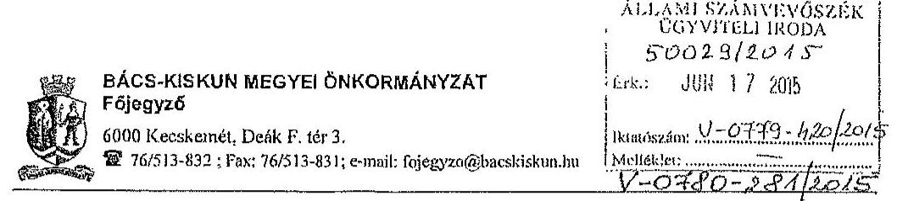

Tárgy: Észrevétel megküldése
Ikt.sz:5086-4/2015

Dr Élek János Főtitkár Úr
részére
Állami Számvevőszék
Budapest
Apáczai Csere János u 10.

Curb Leisure
OC. 17.
TV P.O.
206 JUN 17.

Tisztelt Főtitkár Úr!

Köszönettel megkaptuk az országgyűlési képviselők, az Európai Parlament tagjai és a helyi önkormányzati képviselők és polgármesterek, valamint a nemzetiségi önkormányzati képviselők választására fordított pénzeszközök felhasználásának ellenőrzése tárgyában készült vizsgálati jelentések tervezeteit, melyre az alábbi észrevételt kívánom tenni.

Az országgyűlési képviselők 2014. évi választására vonatkozó jelentés tervezetet elfogadjuk, ugyanakkor az Európai Parlamenti képviselők, valamint a helyi önkormányzati képviselők és polgármesterek választásával összefüggésben önkormányzatunkra vonatkozóan tett megállapításokat nem tudjuk elfogadni.

Az Európai Parlamenti választások esetében a jelentés 3. számú mellékletében a Bács-Kiskun Megyei Önkormányzat Hivatala gazdálkodási jogkörök gyakorlásának minősítése nem megfelelő, míg a helyi önkormányzati képviselők választása esetében ez a minősítés részben megfelelő.

Kérem szíveskedjenek a tett megállapításokat tételesen alátámasztani, mivel a leírásból számunkra nem beazonosíthatóak a jelzett hiányosságok, emellett az általunk folytatott gazdálkodási gyakorlat alapján is teljességgel érthetetlen, hogy a minősítés milyen tények alapján került megállapításra.

Hivatalunk az érvényes szabályozás alapján egységes gazdálkodási gyakorlatot folytat, aminek során kiemelt figyelmet fordítunk a szabályosság betartására, amit tanúsít az a tény is, hogy az országgyűlési képviselők választásával kapcsolatosan készült jelentés tervezet nem tárt fel rendszerszintű hiányosságot a gazdálkodási jogkörök gyakorlásában.

Az eltérő megítélés okát mi abban látjuk, hogy az utóbbi két vizsgálatot végző revizor Hivatallal való együttműködése nem volt megfelelő.

Váluszát előre is köszönöm.

Kecskemét, 2015. június 16.

Tisztelettel:

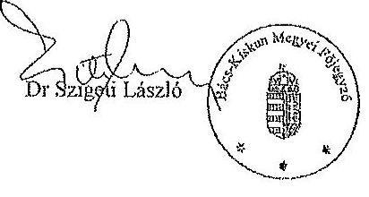

---

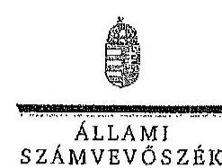

Ikt.szám: V-0780-283/2015.
V-0781-189/2015.

Dr. Szigeti László úr
főjegyzö
Bács-Kiskun Megyei Önkormányzat Hivatala

# Kecekiemét 

Tisztelt Föjegyzö Úr!

Köszönettel megkaptam „Az Európai Parlament tagjainak 2014. évi választására forditott pénzeszközök felhasználásának ellenörzése", illetve „A helyi önkormányzati képviselők és polgármesterek, valamint a nemzetiségi önkormányzati képviselők 2014. évi választására forditott pénzeszközök felhasználásának ellenörzése" elmủ jelentéstervezetek megállapításaira tett észrevételét.
Az ellenőrzési megállapításokra vonatkozó észrevételét az Állami Számvevőszékről szóló 2011. évi LXVI. törvény 29. § (2) bekezdésében meghatározott tizenöt napos határidőn belül küldte meg. Az Állami Számvevőszék észrevétellel kapcsolatos álláspontját a mellékletként csatolt, a felügyeleti vezető által készített indokolás tartalmazza.

Budapest, 2015. 07. h607. nap
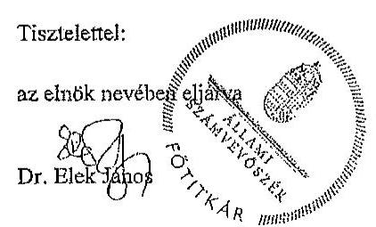

Melléklet: Észrevételre adott válasz

---

# Az észrevételre adott válasz 

| Észrevétel: | Az Európai Parlament tagjainak 2014. évi választására forditott pénzeszközök felhasználásának ellenőrzéséről szóló jelentéstervezet 3. számú mellékletében szereplő megállapítás szerint:   „Bács-Kiskun MegyeI Önkormányzat Hivatalánál a gazdálkodási jogkörök gyakorlásának összesttő értékelése nem megfelelő.   A saját szabályzatban foglaltak ellenére 13 esetben a kifizetést követően történt a beszerzések engedélyezése, és a pénzügyi ellenjegyzés. Az érvényesitő az Ávr. 58. § (1) bekezdésében elöírtak ellenére nem ellenöriste a megelöső ügymenetben a jogszabályokban és a belső szabályzatokban foglaltak betartását, illetve 26 esetben az érvényesités az Ávr. 58. § (3) bekezdésének elöirása ellenére nem elözte meg az utalványozást."   A helyi önkormányzati képviselők és polgármesterek, valamint a nemzetiségi önkormányzati képviselők 2014. évi választására fordított pénzeszközök felhasználásának ellenőrzéséről szóló jelentéstervezet 3. számú mellékletében szereplő megállapítás szerint:   „Bács-Kiskun MegyeI Önkormányzat Hivatalánál a gazdálkodási jogkörök gyakorlásának összesttő értékelése részben megfelelő.   A kötelezettségvállalás 9 esetben nem volt szabályszertï: 7 esetben az Äht. 37. § (1) bekezdés elöirása ellenére a pénzügyi teljesités esedékezzégét követöen, utalag történt; 1 esetben az Ávr. 52. § (1) elöirása ellenére nem történt meg; 1 esetben az Äht. 37. § (1) elöirása ellenére pénzügyi ellenjegyzés nélkül történt. A pénzügyi ellenjegyzés 9 esetben nem volt szabályszertü: 2 esetben az Äht. 37. § (1) és Ávr. 55. § (1) ellenére nem történt meg a pénzügyi ellenjegyzés; 7 esetben arra az Äht. 37. § (1) elöirása ellenére a pénzügyi teljesités esedékezzége után került sor. A teljesitésigazolást 17 esetben Ávr. 57. § (3)-(4) bekezdés elöirása ellenére nem az arra jogosult személy látta el. Az érvényesitő 17 esetben az Ávr. 58. § (2) bekezdés elöirása ellenére nem jelezte az utalványozónak, hogy a megelöső ügymenetben a jogszabályokban és a belső szabályzatokban foglaltakat nem tartották be. A kifizetés elrendelésére 8 esetben érvényesitett okmány hiányában került sor az Ávr. 59. § (1) bekezdés elöirása ellenére."   Az észrevétel szerint a megállapítások alátámasztását, a jelzett hiányosságok beazonosítását kifogásolják. A gazdálkodási gyakorlatok alapján nem értik, hogy a minősités milyen tények alapján került megállapításra. Az észrevétel szerint a Hivatal az érvényes szabályozás alapján egységes gazdálkodási gyakorlatot folytatott, ennek ellenére a három jelentéstervezetben szereplő megítélés eltér, annak oka nem tisztázott. |
| :--: | :--: |
| Válasz: | Az Állami Számvevőszék az észrevételt nem fogadja el. |
| Indoklás: | A 2014. évi választások lebonyolításához kapcsolódó kiadási tételek vonatkozásában a gazdálkodási jogkörök gyakorlásának értékelése választásonként különkülön elvégzett mintavétel alapján került értékelésre. Az elszámolt kiadási téte- |

---

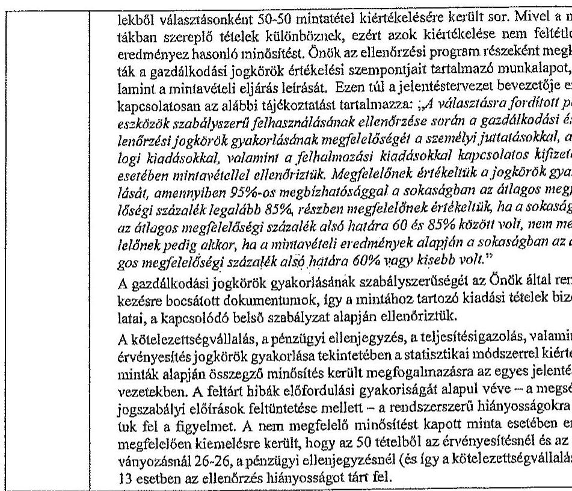

Tájékoztatom Föjegyzö urat, hogy a számvevőszéki jelentés mellékleteként szerepeltetjük a jelentéstervezethez tett észrevételét, valamint az arra adott válaszunkat.

Budapest, 2015.
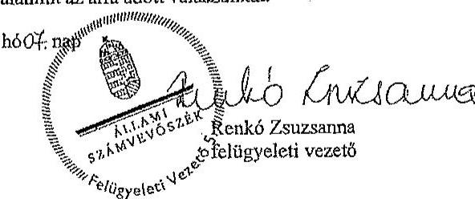

---

Állami Számvevőszék

Iktatószám: 15-1/7/2015
Hivatkozási szám: V-0779-415/2015
V-0780-276/2015
V-0781-182/2015
Ügyintéző: Némethné Sári Irén
Telefon: +36 1 253-3380

1052. Budapest
Apáczai Csere János u. 10.

Tárgy: Ézarevétel

Tisztelt Főütkiú Ús!

2015 JÚN 17, TV P.21.

A 2014. évi választásokra fordított pénzeszközök felhasználásának ellenőrzésére

- Az országpótlési képviselők 2014. évi választására fordított pénzeszközök felhasználásának ellenőrzése;
- Az Európai Parlament tagjainak 2014. évi választására fordított pénzeszközök felhasználásának ellenőrzése;
- A helyi önkormányzati képviselők és polgármesterek, valamint a morgottsági önkormányzati képviselők 2014. évi választására fordított pénzeszközök felhasználásának ellenőrzése

címmel készített számvevői jelentéstervezeteket meghaptuk.

Az Állami Számvevőszékről szóló 2011. évi LXVI. törvény 29. § (2) bekezdése alapján az ellenőrzések megállapításaira a Jegyző 15 napon belül írásban észrevételt tehet.

Az ellenőrzésekről készült jelentéstervezeteket megismertük, a V-0779-415/2015 és a V-0781-182/2015 jelentésekben tett megállapításokkal kapcsolatban észrevételt nem kívánunk tenni.

A V-0780-276/2015 számú jelentéstervezetben tett megállapításokkal kapcsolatban két észrevételt teszek:

1. A jelentéstervezet 18 oldalán tévesen az szerepel, hogy a XVII. kerület késedelmesen számolt el a választások lebonyolításához biztosított pénzeszközök felhasználásáról.

IJASAPEST FÖVÁRISZ EVEL KERÜLET
BÁRODISZNIUÓNKORMÁNYZATA

1173 Budapest, Pesti út 165.; Levékére 1656 Budapest, Pf.: 110.; Tel.: +36 1 253-3319; Fax: +36 1 253-3323;
E-mail: onkormanyzati@rakosmcore.hu

---

Mellékelem a Fővárosi Választási Iroda elszámolásra vonatkozó levelét, mely szerint a kerület ki volt jelölve helyszíni ellenőrzésre, a dokumentumokat csak a megadott időben kellett a TVI-nek benyújtani.

# Álláspontom szerint így a XVII. kerületi HVI nem számolt el késedelmesen. 

2. A jelentéstervezet 3. számú mellékletének 3. oldalán Budapest Főváros XVII. kerület Rákosmenti Polgármesteri Hivatalt érintő összeolró megállapítások között álláspontom szerint tévesen szezepel a hivatkozott 36 esetbeli személyi juttatások kifizetésénél elmaradt írásbeli kötelezettségvállalás és ellenjegyzés, mivel a személyi juttatásokra kifizetett összeg egyik esetben sem érte el a 100.000 Ft-ot, így az államháztartástól szóló törvény végrehajtásáról szóló 368/2011(XII.31.) Kom. rendelet 53. § (1) bekezdés alapján nem szükséges írásbeli kötelezettségvállalás a kifizetéshez, így pénzügyi ellenjegyzés sem.

Kérem észrevételeim elfogadását.

Budapest, 2015. június 11.

Tisztelettel:
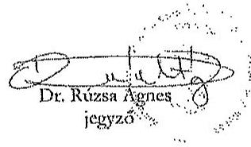

1173 Budapest, Petsi út 165.; Levekére 1656 Budapest, Pf: 110.; Tel.: +36 1 253-3319; Fax: +36 1 253-3323; E-mail: cokormanyzat@rakosmentc.hu

---

# BUDA 

## PEST

Fővárosi Választási Iroda
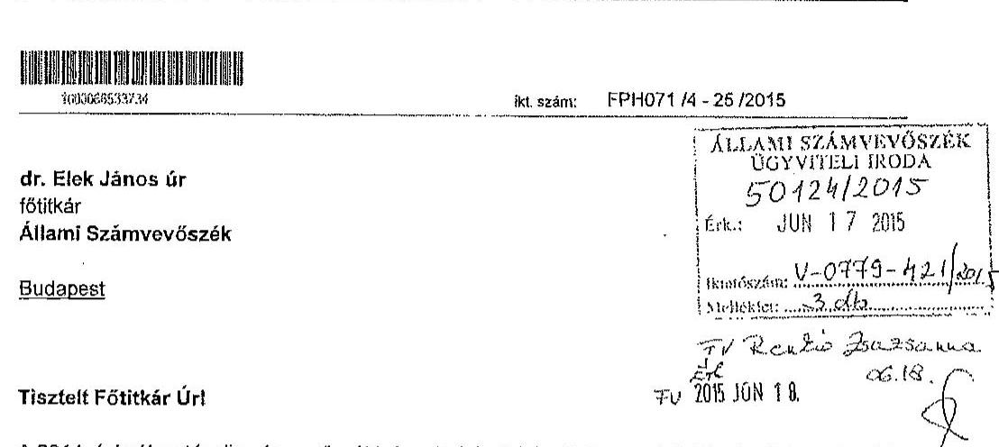

A 2014. évi választások számvevőszéki vizsgálatainak jelentéstervezetelt köszönettel megkaptuk.
Tájékoztatom, hogy az Európai Parlament tagjainak 2014. évi választására forditott pénzeszközök felhasználásának ellenőrzéséről szóló V-0780-276/2015. számú és a helyi önkormányzati képviselők és polgármesterek, valamint a nemzetiségi önkormányzati képviselők 2014. évi választására fordított pénzeszközök felhasználásának ellenőrzéséről szóló V-0781-182/2015. számú jelentéstervezetekre észrevételt nem teszek.

Az országgyűlési képviselők 2014. évi választására fordított pénzeszközök felhasználásáról készült V-0779-415/2015. számú jelentéstervezet esetében az alábbiak szerinti pontositást szíveskedjenek elfogadni.

A jelentés tervezet 3.2. A választással kapcsolatos kiadások teljesítésének szabályszerűsége pontban (10. oldal, második bekezdés):
„Az FVI a választások pénzeszközeinek kormányzati funkciók szerinti elkülönítését a 68/2013. (XII. 29.) NGM rendelet 3.§ (1) bekezdésében és 1. mellékletében foglaltak ellenére nem biztosította"

Pontositva: „Az FVI a választások pénzeszközeinek kormányzati funkciók szerinti elkülönítését a 68/2013. (XII. 29.) NGM rendelet 3.§ (1) bekezdésében és 1. mellékletének megfelelően biztosította"

Indoklás: A Fővárosi Önkormányzat és a Főpolgármesteri Hivatal számviteli rendszerében kiállított valamennyi utalványon szerepel a kormányzati funkció száma és elnevezése, ami lehetővé teszi a választások pénzeszközeinek kormányzati funkciók szerinti elkülönítését. A bizonylatokat az ellenőrök rendelkezésére bocsátottuk, továbbá elektronikus formában átadtuk részükre. (A levélhez 3 db bizonylat másolatot csatoltunk.)

---

Pontosítási kérésünket alátámasztja az is, hogy az Európai Parlament tagjainak 2014.évi választása és a helyi önkormányzati képviselők és polgármesterek, valamint a nemzetiségi önkormányzati képviselők 2014. évi választása idején is ugyanezt a számviteli rendszert használtuk (PIR - Forrás), s ezekben az esetekben a kód használatával kapcsolatos észrevétel nem fogalmazódott meg.

Budapest, 2015. június, 16..."

Tisztelettel

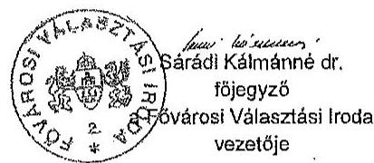

Melléklet: 3 db kiadási utalvány másolata

---

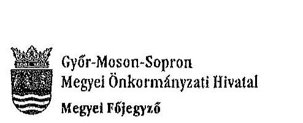

Ügyszám: 50-3/2015.

Tárgy: Észrevétel az ÁSZ jelentés megállapításaira

Állami Számvevőszék
Dr. Elek János
főtitkár úr

Budapest
Apáczai Csere János u. 10.

Tisztelt Főtitkár Úr!

A 2014. évi választásokra fordított pénzeszközök felhasználásának ellenőrzése tárgyában az Állami Számvevőszék által végzett ellenőrzésekről készített munkaanyagot kézhez kaptam. Az egyes ellenőrzési jelentésekben foglalt megállapításokkal egyetértek; észrevételt nem teszek.
Erúton szeretném megköszönni a vizsgálat teljes körében és a helyszíni ellenőrzés során a számvevőszéki munkatársak részéről tanúsított segítő együttműködést.

Győr, 2015. június 15.
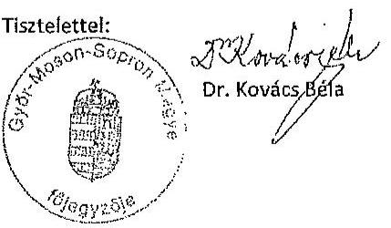

---

.

---

# Dėgi Közüs Önkormányzati Hivatal Jegyzője 8135 Dég, Kossuth Lajos utca 17. Tel: 25/505-250*137 

Szám: D/108-10/2015.

Állami Számvevőszék
Dr. Elek János főtitkár úr részére

Budapest
Pf. 54.
1364

Tisztelt Fötitkár Úr!

Tájékoztatom, hogy az Állami Számvevőszéknek az országgyúlési képviselők, az Európai Parlament tagjainak és a helyi önkormányzati képviselők és polgármesterek, valamint a nemzetiségi önkormányzati képviselők 2014. évi választására fordított pénzeszközök felhasználásának ellenőrzésével kapcsolathan érkezett jelentéstervezetek alapján az ellenőrzés megállapítására nem kívánok észrevételt tenni.

Dég, 2015.június 22.

Tisztelettel:
Szanyi-Nagy Józsefné
címzetes föjegyzó

---

.

---

# Kaposvár Megyei Jogú Város Címzetes Föjegyzöje

**K. Szabó**

- 7400 Kaposvár, Kossuth tér 1, Telefon: (36) 82/501-508 Fax: (36) 82/501-500 E-mail: jegyzol@kaposvar.hu

**Ögyiratszám:** T/236/2015.

**Állami Számvevőszék Elek János főtitkár úr részére**

**Tisztelt Főtitkár Úr!**

**ALLAMI SZÁSÍVEVŐSZÉK ÜGYVÍTELI JÓDA 5344/2015**

**Érk.: JUN 25 2015**

**Intorászám:** V-0449-428/015

**Módéklet:**

Az Állami Számvevőszéknek a 2014. évi választásokra fordított pénzeszközök felhasználásának ellenőrzéséről szóló három jelentéstervezethez (országgyűlési, európai parlamenti, önkormányzati választások) a következő észrevételt tezezen:

Az ÁSZ jelentéstervezetei Kaposvár vonatkozásában nem tartalmi, hanem formai előírások véli hiányosságait tartalmazzák.

Kaposvár Megyei Jogú Város Polgármesteri Hivatalában az ÁSZ jelentésekben kifogásolt kötelezettségvállalások a felhasznált választási pénzek kis bányádát érintették, azok kizárólag a százezer forint alatti kifizetésekre vonatkoztak, amelyek az államháztartásról szóló törvény végrehajtásáról szóló 368/2011. (XII. 31.) Korm. rendelet 53. § (1) bekezdés a) pontja alapján előzetes írásbeli kötelezettségvállalást nem igényelnek. A százezer forint alatti kifizetésekre vonatkozó észrevétellek a polgármesteri hivatal belső szabályzatára hivatkoznak, ugyanakkor a vizsgált időszakban a polgármesteri hivatal kötelezettségvállalási szabályzata a százezer forint alatti kifizetésekre vonatkozó előzetes írásbeli kötelezettségvállalásra előírást nem tartalmazott.

Az országgyűlési képviselők választása, valamint az Európai Parlament tagjainak választása költségeinek normatíváiról, tételeiről, elszámolási és belső ellenőrzési rendjéről, valamint egyes választási tárgyú miniszteri rendeletek módosításáról szóló 38/2013. (XII. 30.) KIM rendelet 8. § (1) bekezdése szerint a HVI és az ORVI tekintetében a támogatás felhasználását a TVI ellenőrzi a választás napját követő negyvenöt napon belül. A helyi önkormányzati képviselők és a polgármesterek választásán a megismételt szavazás, a helyi önkormányzati képviselők és a polgármesterek időközi választása, a nemzetiségi önkormányzati képviselők választásán a megismételt szavazás és a nemzetiségi önkormányzati képviselők időközi választása költségeinek normatíváiról, tételeiről, elszámolási és belső ellenőrzési rendjéről szóló 7/2014. (XI. 6.) IM rendelet 8. § (2) bekezdése alapján a HVI tekintetében az elszámolások megalapozottságát a TVI ellenőrzi a szavazás napját követő huszonöt napon belül. A TVI ellenőrzések megtörténtek, azok problémát nem tártak fel.

Összességében a megállapítátokkal nem értünk egyet, hiszen Kaposvár Megyei Jogú Város Polgármesteri Hivatalában az ÁSZ ellenőrzés olyan hiányosságot nem tárt fel, amely a jelentéstervezetekben szereplő minősítéseket indokolná. Kérem, szíveskedjenek a jelentéstervezetek megállapításait a rendelkezésekre álló dokumentumok alapján korrigálni.

Kaposvár. 2015. június 24.

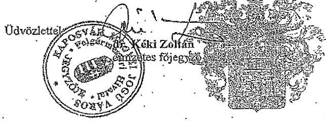

---

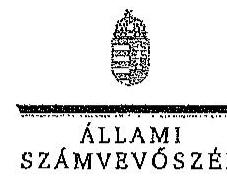

Fötrtérás

Ikt.szám:V-0779-433/2015,
V-0780-292/2015.
V-0781-194/2015.

Dr. Kéki Zoltán úr
címzetes föjegyzö

Kaposvár Megyei Jogú Város Polgármesteri Hivatala

Kaposvár

# Tisztelt Címzetes Föjegyzö Úr! 

Köszönettel megkaptam „Az országgyálési képviselők 2014. évi választására forditott pénzezközök felhasználásának ellenörzése, Az Európai Parlament tagjainak 2014. évi választására forditott pénzezközök felhasználásának ellenörzése és a A helyi önkormányzati képviselők és polgármesterek, valamint a nemzetiségi önkormányzati képviselők 2014. évi választására forditott pénzezközök felhasználásának ellenörzése" című jelentéstervezetek megállapításaira tett észrevételét.
Az ellenőrzési megállapításokra vonatkozó észrevételét az Állami Számvevőszékről szóló 2011. évi LXVI. törvény 29. § (2) bekezdésében meghatározott tizenöt napos határidőn belül küldte meg. Az Állami Számvevőszék észrevétellel kapcsolatos álláspontját a mellékletként csatolt, a felügyeleti vezető által készített indokolás tartalmazza.

Budapest, 2015. 04. hóOł. nap
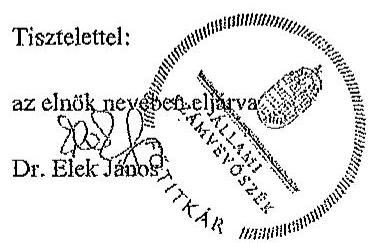

Melléklet: Észrevételre adott válasz (1 darab)

---

1. számú melléklet a V-0779-433/2015. számú, a V-0780-293/2015. számú, a V-0781-194/2015. számú
levélhez
„Az országgyúlési képviselők 2014. évi választására forditott pénzeszközök felhasználásának ellenörzése,
Az Európai Parlament tagjainak 2014. évi választására fordított pénzeszközök felhasználásának ellenörzése,
A helyi önkormányzati képviselők és polgármesterek, valamint a nemzetiségi önkormányzati képviselők 2014. évi választására fordított pénzeszközök felhasználásának ellenörzése"
címú jelentéstervezetekre tett észrevételre adott válasz

| Exzrevétel: | Az országgyúlési képviselők 2014. évi választására fordított pénzeszközök felhasználásának ellenörzése címú jelentéstervezet 3.2. A választással kapcsolatos kiadások teljesítésének szabályszerűsége, 3. számú melléklet megállapítása:   A gazdálkodási jogkörök gyakorlásának ässzesitő értékelése: nem megfelelő   Kötelezettségvállalás, pénzügyi ellenjegyzés, teljesitésigazolás, érvényesités során feltárt jellemző, rendszerszerü hiányosságok:   32 esetben a kötelezettségvállalásra a pénzügyi ellenjegyzés hiányában került sor (Áht. 37. § (1) bek., Avr. 55. § (1) bek.), 49 esetben az érvényesitő a megelöső ügymenet szabályszerűségét nem ellenöriste (Avr. 58. § (1) bek.)   Az Európai Parlament tagjainak 2014. évi választására fordított pénzeszközök felhasználásának ellenörzése címú jelentéstervezet 3.2. A választással kapcsolatos kiadások teljesítésének szabályszerűsége, 3. számú melléklet megállapítása:   A gazdálkodási jogkörök gyakorlásának ässzesitő értékelése: nem megfelelő   Kötelezettségvállalás, pénzügyi ellenjegyzés, teljesitésigazolás, érvényesités során feltárt jellemző, rendszerszerü hiányosságok:   A kötelezettségvállalás dokumentuma az Áht. 37. § (1) bekezdésének elöirását megszérive 27 esetben nem tartalmazott pénzügyi ellenjegyzést. A 100 E Fi alatti kifizetéseknél 17 esetben nem tartották be a belsö szabályzatban elöirtakat.   A helyi önkormányzati képviselők és polgármesterek, valamint a nemzetiségi önkormányzati képviselők 2014. évi választására fordított pénzeszközök felhasználásának ellenörzése 3.2. A választással kapcsolatos kiadások teljesítésének szabályszerűsége, 3. számú melléklet megállapítása:   A gazdálkodási jogkörök gyakorlásának ässzesitő értékelése: réesben megfelelő   Kötelezettségvállalás, pénzügyi ellenjegyzés, teljesitésigazolás, érvényesités során feltárt jellemző, rendszerszerü hiányosságok:   A 100,0 E Fi alatti kifizetésekre (33 esetben) az Áht. 37. § (1) bekezdés elöirása ellenére elözetes irásbeli kötelezettségvállalás, illetve a belsö szabályzatban elöirt engedély nélkül került sor. Az érvényesitő az Ávr. 58. § (2) bekezdés elöirása ellenére nem jelezte az utalványozónak, hogy a megelöső ügymenetben nem tartották be a jogszabályi elöirásokat. |
| --- | --- |

---

# Az észrevétel szerint: 

Az ÁSZ jelentéstervezetei Kaposvár vonatkozásában nem tartalmi, hanem formai elöírásnak vélt hiányosságait tartalmazzák.
Kaposvár Megyei Jogú Város Polgármesteri Hivatalában az ÁSZ jelentésekben kifogásolt kötelezettségvállalások a felhasznált választási pénzek kis hányadát érintették, azok kizárólag a százezer forint alatti kifizetésekre vonatkoztak, amelyek az államháztartásról szóló törvény végrehajtásáról szóló 368/2011. (XII. 31.) Korm. rendelet 53. § (1) bekezdés a) pontja alapján előzetes írásbeli kötelezettségvállalást nem igényelnek. A százezer forint alatti kifizetésekre vonatkozó észrevételek a polgármesteri hivatal belső szabályzatára hivatkoznak, ugyanakkor a vizsgált időszakban a polgármesteri hivatal kötelezettségvállalási szabályzata a százezer forint alatti kifizetésekre vonatkozó előzetes írásbeli kötelezettségvállalásra elöirást nem tartalmazott.
A 38/3013. (XII: 30.) KIM rendelet 8. § (1) bekezdése, a 7/2014. IM rendelet 8. §. (2) bekezdésében elöírt TVI ellenőrzések megtörténtek, azok problémát nem tártak fel.
Összességében a megállapításokkal nem értünk egyet, hiszen Kaposvár Megyei Jogú Város Polgármesteri Hivatalában az ÁSZ ellenőrzés olyan hiányosságot nem tárt fel, amely a jelentéstervezetekben szereplő minősítéseket indokolná. Kérem, szíveskedjenek a jelentéstervezetek megállapításait a rendelkezésre álló dokumentumok alapján korrigálni.

| Válasz: | Az Állami Számvevőszék az észrevétolt nem fogadja el. |
| :--: | :--: |
| Indoklás: | Az indoklásban hivatkozott 368/2011. (XII. 31.) Korm. rendelet 53. § (1) bekezdése mellett az 53. § (2) bekezdése elöirja, hogy az (1) bekezdés szerinti kifizetésre e rendeletnek a kötelezettségvállalások teljesítésére (érvényesítés, utalványozás) és nyilvántartására vonatkozó szabályait alkalmazni kell. Az elözetes írásbeli kötelezettségvállalást nem igénylő kifizetések rendjét a kötelezettséget vállaló szerv belső szabályzatában rögzíti. A polgármesteri hivatal 2013. július 1-től hatályos kötelezettségvállalási szabályzatának 2. pontja szerint: „A gazdasági eseményekhez bruttó 100.000 Ft-ot el nem érő kifizetések esetében nem szükséges elözetes, írásbeli kötelezettségvállalás. Ezen gazdasági események vonatkozásában megrendelést megelőzöen a pénzügyi fedezetet biztosító költségvetést elöiránysat felett kötelezettségvállalásra jogosult írásbeli engedélye szükséges, melynek 1 példányát az alátrást követöen át kell adni a Gazdasági Igazgatóság részére, 1 példányát pedig a pénzügyi bizonylathoz kell csatolni. Az írásbeli engedélynek tartalmaznia kell a terhelt elöiránysat megnevezését és az elöiránysat felett érvényesitési jogosultsággal rendelkező gazdasági ügyintéző által igazolt kötelezettségvállalással nem terhelt szabad keret öszsegét."   A polgármesteri hivatalnál a fentiekben elöirt írásbeli engedélyt az ellenőrzést végzők részére nem mutatták be. Írásbeli nyilatkozatot tettek arról, hogy a szabályzat szerint írásbeli engedélyek nem készültek, a kis öszzegủ beszerzésekre elözetes szóbeli egyeztetést követően került sor.   A választásokkal kapcsolatos kiadások teljesítésének szabályszerűségének minősítésére - az egyes ellenőrzésekhez kijelölt mintatételek esetében feltárt különböző hiányosságokból matematikai, statisztikai módszerrel számítottan - a hatályos jogszabályi előirások és a polgármesteri hivatal belső szabályzatainak való megfelelés együttes megítélése alapján került sor. |

---

| Az ASZ ellenôrzés megállapításaira a TVI által lefolytatott ellenôrzések nincsenek befolyással. |
| :-- |
| Mindezek alapján a jelentéstervezetekben a gazdálkodási jogkörök összezitő értékelésének módosítására nincs lehetőség. |

Tájékoztatoni Címzetes Főjegyzö Urat, hogy a számverőszéki jelentés mellékleteként szerepeltetjük a jelentéstervezethez tett észrevételei, valamint az arra adott válaszunkat.

Budapest, 2015. 04 hóct. nap
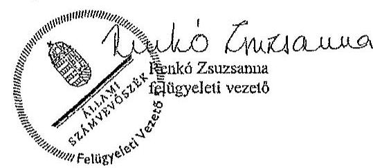

---

.

---

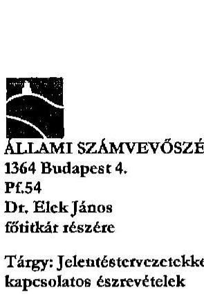

ÁLLAMI SZÁMVEVŐSZÉK
1364 Budapest 4.
PC54
Dr. Elek János
főtitkár részére
Tárgy: Jelentéstervezetekkel kapcsolatos észrevételek

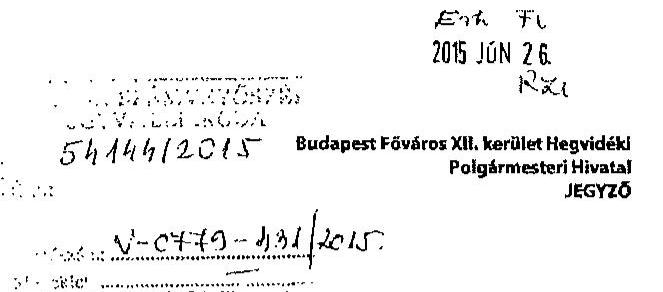

1126 Budapest, Köszöntényi út 23-25. Teleforszám: 2245900 Faxszám: 2245951

Ogyintéző:

|  |   |
| --- | --- |
|  2454/2 |   |
|  Lelekszámv |   |
|  000 |   |

Tisztelt Főtitkár Úr!

Köszönettel megkaptuk a 2014. évi választásokra fordított pénzeszközök felhasználásának ellenőrzése tárgyú „Jelentések" tervezetét.

Elsőként köszönetemet fejezem ki a vizsgálatban részt vevő számvevők segítő együttműködéséért és hasznos szakmai útmutatásaikért.

Örömmel tapasztaltuk, hogy a Budapest XII. kerületi HVI tevékenységével kapcsolatosan mindhárom Jelentés szöveges részében csupán a 4. pont alatt taglalt, a „választási feladatokra felhasznált pénzeszközök elszámolása" keretében szerepel megállapítás amiatt, hogy a XII. kerületi HVI nem számolt el időben az állami feladatfinanszírozással.

Ezzel kapcsolatban azt az észrevételt teszem, hogy mindhárom választás esetén az FVI által adott határidőt betartva készítettük el és nyújtottuk be az elszámolást, az ezzel kapcsolatos dokumentációt mindhárom esetben rendelkezésre bocsátottuk, így ezt a megállapítást nem tartjuk indokoltnak.

A Jelentések 3. számú mellékleteiben a „gazdálkodási jogkörök gyakorlásának összesítő értékelése" szerint HVI-nk az országgyűlési képviselők és a helyi önkormányzati képviselők és polgármesterek, valamint a nemzetiségi önkormányzati képviselők 2014. évi választására vonatkozó értékelése „részben megfelelő" volt, az Európai Parlament tagjainak 2014. évi választása esetében „nem megfelelő" minősítést kapott.

Az ezzel kapcsolatos indoklásokban felsorolják a kifogásra okot adó tételek számát, ezekkel kapcsolatosan az alábbi észrevételeket tesszük:

# Országgyűlési képviselő választások:

a) „29 esetben a pénzügyi ellenjegyzés a kifizetési bizonylaton és nem a kötelezettségvállalás dokumentumán került feltüntetésre. 29 esetben a kötelezettségvállalás összegét nem tüntették fel, 29 esetben az érvényesítő a megelőző ügymenet szabályszerűségét nem ellenőrizte."

---

# Észrevétel: 

Feltételezésünk szerint ezek a kifogások a személyi juttatások mintatételeivel kapcsolatosak. A 30 fös mintában szereplő személyek 13 esetben jutalomként, 15 esetben tiszteletdíjként és két esetben megbízási szerződésként részesültek személyi juttatásban. Ezek kötelezettségvállalási dokumentuma a jutalmazottak esetében a „Jutalom lista a 2014. április 6-i Országgyűlési képviselő választásokon nyújtott teljesítményekért" volt, amelyen 2014. április 16-i dátummal szerepel a kötelezettségvállalás és a pénzügyi ellenjegyzés is. A tiszteletdíjak kötelezettségvállalási dokumentuma a „Szavazatszámláló Bizottság tagjainak tiszteletdíja" című táblázat volt, amelynek dátuma egyezően a pénzügyi ellenjegyzés dátumával 2014. április 16. volt. A kormányhivatali megbízottak esetében önálló megbízási szerződések készültek február 25-i dátummal, és a pénzügyi ellenjegyzés is ezen a napon történt.

Az érvényesítő ezen dokumentumok alapján végezte el munkáját.
b) „35 esetben az utalványozás a kifizetések után valósult meg."

## Észrevétel:

Feltételezésünk szerint ebben az előző pontban említett 29 tétel is szerepel. Ezzel kapcsolatosan általánosságban jelezzük, hogy a bérszámfejtési dokumentumokon szereplő dátumok és a tényleges banki utalás dátuma minden személyi juttatás esetében eltérő volt, ugyanis a bérszámf́títés a választások időpontjában a Gazdasági Ellátó Szolgálatnál történt, és a belső ơgymenet szerint ehhez képest a tényleges kifizetés egy-két nappal ezt követően valósult meg. Az utalványozás minden esetben megelőzte a pénzügyi kifizetést, amit az általunk bemutatott utalványrendeletek és a banki kivonatok is alátámasztanak. A további 6 kifogásolt esetet nem tudtuk beszoncsítani.

## c) 15 esetben a teljesítésigazolás a belső szabályzattól eltérően történt

## Észrevétel:

A 13/2014. számú jegyzői utasítás szerint a személyi juttatások teljesítésének igazolására a Jegyző jogosult. A hivatkozott 15 fő valószínűleg az SzSzB tagokra vonatkozik, Esetükben a teljesítés igazolása a már hivatkozott kötelezettségvállalási dokumentumon történt, „Az SzSzB jegyzőkönyvek alapján a feladatellátás megtörtént" szöveggel, alatta jegyzői aláirással és 2014. 04.16-i dátummal.

---

# Európai parlament tagjainak választása 

a.) „A jegyzőkönyvvezetők jutalmának (12 tétel) és az SZSZB tagok tiszteletdijának (15 tétel) kifizetésére írásbeli kötelezettségvállalás nélkül került sor. Az érvényesitő nem ellenőrizte a megelőző ügymenetben a jogszabályokban és a belső szabályzatokban foglaltak betartását."

## Észrevétel:

A jegyzőkönyvvezetők jutalmának kötelezettségvállalási dokumentuma a Dokumentumjegyzék 18. pontjában szereplő „Jutalomlista a 2014. május 25 -i EP választásokon nyújtott teljesítményekért" 2014. június 3 -én a Jegyző által aláirt és ugyanczan a napon pénzügyileg ellenjegyzett táblázatos dokumentum volt. Az SZSZB tagok tiszteletdijának kötelezettségvállalási dokumentuma a Dokumentumjegyzék 17. pontjában szerepelő „SzSzB tagok tiszteletdija szavazökörönként" 2014. június 11 -én a Jegyző által aláirt és ugyanczen a napon pénzügyileg ellenjegyzett táblázatos dokumentum volt.

Az érvényesitő ezen dokumentumok alapján végezte az érvényesítést, amit a kapcsolódó utalványrendeleteken 2014. június 12 -én aláírásával igazolt.
b.) „Az utalványozást nem a belső szabályzatban meghatározott személy végezte."

## Észrevétel:

A 13/2014. Jegyrői utasítás szerint a választásokkal kapcsolatos utalványozási feladatokat a gazdasági vezető végzi. Ennek megfelelően az utalványrendeleteken az ő aláírása szerepelt. Az Európai parlamenti választások Fővárosi Választási Irodán történt ellenőrzése során (Dokumentumjegyzék 6. pont) kiderült, hogy a szabályzatban helytelenül szerepelt a hatáskör átruházás, mivel a 38/2013.(XII.30) KIM rendelet 1.§ c) pontja szerint a Jegyző jogosult az utalványozásra. Erre tekintettel a Dokumentumjegyzék 8. pontjában szereplő „Jegyzői intézkedés ellenőrzés után" alapján bekértem az összes hibásan utalványozott dokumentumot, és azokat saját kézjegyemmel is elláttam.

## Önkormányzati választások

a.) „A 9 HVI tag személyi juttatásai kifizetésére írásbeli kötelezettségvállalás nélkül került sor."

## Észrevétel:

Nem tudtuk beazonosítani a tételeket, mivel jutalom jogcímen 12 fő egy közös listán, tiszteletdij jogcímen pedig 15 fő ugyancsak közös listán kapott juttatást, 3 fő megbízási díjához pedig egyedi megbízási szerződések kapcsolódtak.

---

# b.) „A pénzügyi ellenjegyzésre 3 tétel esetén kötelezettségvállalás után került sor." 

## Észrevétel:

Sajnálatos módon egy írásbeli kötelezettségvállaláson - vélhetöleg figyelmetlenségből - egy nappal későbbi dátummal szerepel a pénzügyi ellenjegyzés, ami három számlát, azaz három mintatételt érintett.

Az előzőekben leírtak alapján kérem, szíveskedjenek észrevételeinket mérlegelni, elfogadni, és az ehhez kapcsolódó értékelést, minősítést lehetőség szerint kedvezőbben megállapítani.

Budapest Hegyvidék, 2015. június 22.
Tiszteltet:

---

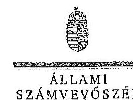

# Guttfriedné dr. Tusor Gabriella úrhölgy 

jegyzó

Budapest Főváros XII. kerület Hegyvidéki Polgármesteri Hivatal

## Budapest

Tisztelt Jegyzó Úrhölgy!

Köszönettel megkaptam „Az országgyülési képviselők 2014. évi választására forditott pénzeszközök felhasználásának ellenörzése", „Az Európai Parlament tagjainak 2014. évi választására forditott pénzeszközök felhasználásának ellenörzése", valamint „, A helyi önkormányzati képviselők és polgármesterek, valamint a nemzetiségi önkormányzati képviselők 2014. évi választására forditott pénzeszközök felhasználásának ellenörzése" címü jelentéstervezetek megállapításaira tett észrevételét.
Az ellenőrzési megállapításokra vonatkozó észrevételét az Állami Számvevőszékről szóló 2011. évi LXVI. törvény 29. § (2) bekezdésében meghatározott észrevételként kezeljük. Az Állami Számvevőszék észrevétellel kapcsolatos álláspontját a mellékletként csatolt, a felügyeleti vezető által készített indokolás tartalmazza.

Budapest, 2015. 54. hó 13. nap
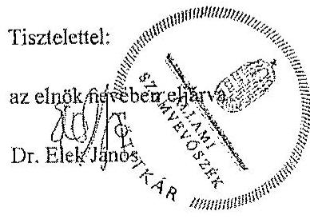

Melléklet: Észrevételre adott válasz (1 darab)

---

# 11. SZÁMÚ MELLÉKLET 

A V-0781-200/2015. SZÁMÚ JELENTÉSHEZ

1. számú melléklet

a V-0779-436/2015. számú,
a V-0780-294/2015. számú,
a V-0781-195/2015. számú
levélhez
„Az országgyúlési képviselők 2014. évi választására forditott pénzeszközök felhasználásának ellenörzése,
Az Európai Parlament tagjainak 2014. évi választására fordított pénzeszközök felhasználásának ellenörzése,
A helyi önkormányzati képviselők és polgármesterek, valamint a nemzetiségi önkormányzati képviselők 2014. évi választására fordított pénzeszközök felhasználásának ellenörzése"
címủ jelentéstervezetekre telt észrevételre adott válasz

| Észrevétel: | Az országgyúlési képviselők 2014. évi választására fordított pénzeszközök felhasználásának ellenörzése címú jelentéstervezet |
| :--: | :--: |
|  | A 4. A választási feladatokra felhasznált pénzeszközök elszámolása fejezet 21. oldal 3. bekezdés, illetve a 15 . számú lábjegyzet megállapítása:   Két HVI (köztük a 15. számú lábjegyzetbeli hivatkozásban szereplő Budapest XII. kerület) a Pvr. 7. § (1) bekezdésében meghatározott 15 napos határidőt meghaladva nyújtotta be elszámolását a TVI részére. |
|  | Az Európai Parlament tagjainak 2014. évi választására fordított pénzeszközök felhasználásának ellenörzése címú jelentéstervezet |
|  | A 4. A választási feladatokra felhasznált pénzeszközök elszámolása fejezet 18. oldal 8. bekezdés, illetve a 22 . számú lábjegyzet megállapítása:   Négy HVI (köztük a 22. számú lábjegyzetbeli hivatkozásban szereplő Budapest XII. kerület) a Pvr. 7. § (1) bekezdésében meghatározott 15 napos határidőn túl, 1-8 napos késedelemmel készítette el az elszámolását. |
|  | A helyi önkormányzati képviselők és polgármesterek, valamint a nemzetiségi önkormányzati képviselők 2014. évi választására fordított pénzeszközök felhasználásának ellenörzése |
|  | A 4. A választási feladatokra felhasznált pénzeszközök elszámolása fejezet 19. oldal, 3. bekezdés, illetve a 20 . számú lábjegyzet megállapítása:   Az ellenőrzött HVI-k 52,6\%-a határidőre elszámolt a választások lebonyolításához biztositott pénzeszközök felhasználásáról, kilenc választási troda (köztük a 20. számú lábjegyzetbeli hivatkozásban szereplő. Budapest XII. kerület) a 3/2014. (VII. 24.) IM rendelet 7. § (1) bekezdésében elöírt 15 napos határidőt 1-10 nappal túllépve készítette el és továbbitotta a TVI vezetője felé az elszámolását. |
|  | Az észrevétel szerint:   A Budapest Főváros XII. kerületi HVI tevékenységével kapcsolatosan mindhárom Jelentés szöveges részében csupán a 4. pont alatt taglalt, a „választási feladatokra felhasznált pénzeszközök elszámolása" keretében szerepel megállapítás amiatt, hogy a XII. kerületi HVI nem számolt el időben az állami feladatfinanszírozással. Ezzel kapcsolatban azt az észrevételt teszik, hogy mindhárom választás esetén az FVI által adott határidőt betartva készítették el és nyújtották be az elszámolást, az |

---

|  | ezzel kapcsolatos dokumentációt mindhárom esetben rendelkezésre bocsátották, igy ezt a megállapítást nem tartják indokoltnak. |
| :--: | :--: |
| Válasz: | Az Állami Számvevőszék az észrevételt nem fogadja el. |
| Indoklás: | Az országgyülési képviselők választása, valamint az Európai Parlament tagjainak választása költségeinek normatíváiról, tételeiről, elszámolási és belső ellenőrzési rendjéről, valamint egyes választási tárgyú miniszteri rendeletek módosításáról szóló 38/2013. (XII. 30.) KIM rendelet (továbbiakban: Pvr) 7. § (1) bekezdése, valamint a helyi önkormányzati képviselők és a polgármesterek választása, valamint a nemzetiségi önkormányzati képviselők választása költségeinek normativáiról, tételeiről, elszámolási és belső ellenőrzési rendjéről szóló 3/2014. (VII. 24.) számú IM rendelet 7. § (1) bekezdése tételesen rendelkezik arról, hogy a HVI vezetője feladattípusú elszámolást készít a TVI vezetője részére a választás napját követő tizenöt napon belül. Az elszámolás készítés kötelezettségének hivatkozott jogszabályi előírásokban foglalt határidejét a TVI (az Önök esetében az FVI) elszámolást érintő, ettől eltérő eljárása nem befolyásolja. |
| Észrevétel | Az országgyülési képviselők 2014. évi választására fordított pénzeszközök felhasználásának ellenőrzése címú jelentéstervezet   3.2. A választással kapcsolatos kiadások teljesítésének szabályszerűsége fejezethez kapcsolódóan a 3. számú melléklet megállapítása:   A gazdálkodási jogkörök gyokorlásának összesitő értékelése: részben megfelelő   Kötelezettségvállalás, pénzügyi ellenjegyzés, teljesitésigazolás, érvényesités során feltárt jellemző, rendszerszerü hiányosságok:   „29 esetben a pénzügyi ellenjegyzés a kifizetési bizonylaton és nem a kötelezettségvállalás dokumentumán került feltüntetésre (Ávr. 55. § (1) bek.), 29 esetben a kötelezettségvállalás összegét nem tüntettek fel (Áht. 37. § (1) bek., Avr. 55. § (1) bek.), 13 esetben a teljesitésigazolás nem történt meg, illetve 15 esetben a teljesitésigazolás a belső szabályzattól eltérően történt (Áht. 38. § (1) bek és Avr. 57. § (3) bek., Pénzkezelési-, pénzgazdálkodási és kötelezettségvállalási szabályzata III/A. fejezet c) pont), négy esetben az érvényesitést nem a kötelezettségvállalási szabályzatában kijelölt személy végezte (Áht. 37. § (1) bek., 13/2014. jegyzői utasítás), 29 esetben az érvényesitő a megelőző ügymenet szabályszerüségét nem ellenőrizte (Ávr. 58. § (1) bek.), 35 esetben az utalványozás a kifizetések után valósult meg (Áht. 38. § (1) bek.)."   Az Európai Parlament tagjainak 2014. évi választására fordított pénzeszközök felhasználásának ellenőrzése címú jelentéstervezet   3.2. A választással kapcsolatos kiadások teljesítésének szabályszerűsége fejezethez kapcsolódóan a 3. számú melléklet megállapítása:   A gazdálkodási jogkörök gyokorlásának összesitő értékelése: nem megfelelő Kötelezettségvállalás, pénzügyi ellenjegyzés, teljesitésigazolás, érvényesités során feltárt jellemző, rendszerszerü hiányosságok:   „A jegyzőkönyvvezetők jutalmának (12 tétel) és az SZSZB tagok tiszteletdijának (15 tétel) kifizetésére az Áht. 37. § (1) bekezdésének elölrását megsértve írásbeli kötelezettségvállalás nélkül került sor. Az érvényesitő az Ávr. 58. § (1) bekezdésének elöírása ellenére nem ellenơrizte a megelöző ügymetében |

---

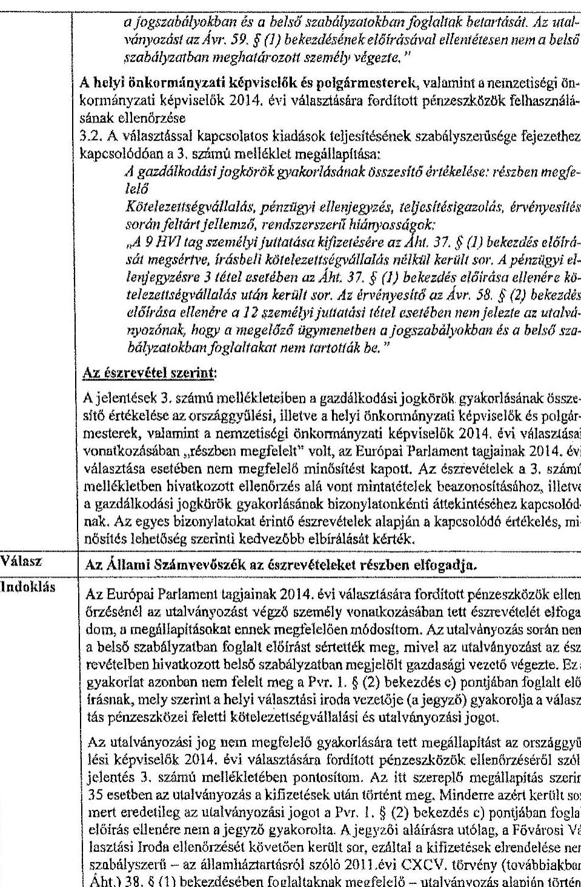

# 11. SZÁMÚ MELLÉKLET A V-0781-200/2015. SZÁMÚ JELENTÉSHEZ

a jogszabályokban és a belső szabályzatokban foglaltak betartását. Az utalványozást az Ávr. 59. § (1) bekezdésének elöírásával ellentétesen nem a belső szabályzatban meghatározott személy végezte."

A helyi önkormányzati képviselők és polgármesterek, valamint a nemzetiségi önkormányzati képviselők 2014. évi választására fordított pénzeszközök felhasználásának ellenőrzése.

A 3.2. A választással kapcsolatos kiadások teljesítésének szabályszerűsége fejezethez kapcsolódóan a 3. számú melléklet megállapítása:

A gazdálkodási jogkörök gyakorlásának összesítő értékelése: részben megfelelő

Kötelezettségvállalás, pénzügyi ellenjegyzés, teljesítésigazolás, érvényesítés során feltárt jellemző, rendszerszerű hiányosságok:

"A 9 HVT tag személyi juttatása kifizetésére az Áht. 37. § (1) bekezdés elöírását megsértve, írásbeli kötelezettségvállalás nélkül került sor. A pénzügyi ellenjegyzésre 3 tétel esetében az Áht. 37. § (1) bekezdés elöírása ellenére kötelezettségvállalás után került sor. Az érvényesítő az Ávr. 58. § (2) bekezdés elöírása ellenére a 12 személyi juttatási tétel esetében nem jelezte az utalványozónak, hogy a megelőző ügymenetben a jogszabályokban és a belső szabályzatokban foglaltakat nem tartották be."

## Az észrevétel szerint:

A jelentések 3. számú mellékleteiben a gazdálkodási jogkörök gyakorlásának összesítő értékelése az országgyűlési, illetve a helyi önkormányzati képviselők és polgármesterek, valamint a nemzetiségi önkormányzati képviselők 2014. évi választásai vonatkozásában "részben megfelelő" volt, az Európai Parlament tagjainak 2014. évi választása esetében nem megfelelő minősítést kapott. Az észrevételek a 3. számú mellékletben hivatkozott ellenőrzés alá vont mintatételek beazonosításához, illetve a gazdálkodási jogkörök gyakorlásának bizonylatonkénti áttekintéséhez kapcsolódnak. Az egyes bizonylatokat érintő észrevételek alapján a kapcsolódó értékelés, minősítés lehetőség szerinti kedvezőbb elbírálását kérték.

|  Válasz | Az Állami Számvevőszék az észrevételeket részben elfogadja.  |
| --- | --- |
|  Indoklás | Az Európai Parlament tagjainak 2014. évi választására fordított pénzeszközök ellenőrzéséről az utalványozást végző személy vonatkozásában tett észrevételek elfogadom, a megállapításokat ennek megfelelően módosítom. Az utalványozás során nem a belső szabályzatban foglalt elöírást sértették meg, mivel az utalványozást az észrevételben hivatkozott belső szabályzatban megjelölt gazdasági vezető végezte. Ez a gyakorlat azonban nem felelt meg a Pvr. 1. § (2) bekezdés c) pontjában foglalt elöírásnak, mely szerint a helyi választási iroda vezetője (a jegyző) gyakorolja a választás pénzeszközei feletti kötelezettségvállalási és utalványozási jogot.

Az utalványozási jog nem megfelelő gyakorlására tett megállapítást az országgyűlési képviselők 2014. évi választására fordított pénzeszközök ellenőrzéséről szóló jelentés 3. számú mellékletében pontosítom. Az itt szereplő megállapítás szerint 35 esetben az utalványozás a kifizetések után történt meg. Minderre azért került sor, mert eredetileg az utalványozási jogot a Pvr. 1. § (2) bekezdés c) pontjában foglalt elöírás ellenére nem a jegyző gyakorolta. A jegyzői aláírásra utólag, a Fővárosi Választási Iroda ellenőrzését követően került sor, ezáltal a kifizetések elrendelése nem szabályszerű – az államháztartásról szóló 2011. évi CXCV. törvény (továbbiakban: Áht.) 38. § (1) bekezdésében foglaltaknak megfelelő – utalványozás alapján történt.  |

---

A fentieken túl az észrevételben foglaltakat nem fogadom el.

- Az ellenőrzés megállapította, hogy a személyi juttatások tekintetében a kötelezettségvállalás a jelentéstervezetekben megjelölt esctszámban nem felelt meg az Áht. 37. § (1) bekezdésében foglalt előírásnak. A belső szabályzat III/A. a) Kötelezettségvállalás pont 2. számú alpontjában meghatározott előzetes írásbeli kötelezettségvállalást nem igénylő esetek ( 50 ezer Ft összeghatárt el nem érő tételek) vonatkozásában a szabályzat II. c) pontja kizárólag az elszámolásra kiadott előlegek tekintetében tartalmaz rendelkezési. Az Önkormányzatnál ezáltal nem rögzítették az állambáztartásról szóló törvény végrehajtásáról szóló 368/2011. (XII. 31.) Korm. rendelet (továbbiakban: Ávr.) 53. § (2) bekezdésének megfelelően ezen kifizetések rendjét, így a kötelezettségvállalási jogkör gyakorlásának minősítése során az Áht. 37. § (1) bekezdésében foglalt előírásoknak való megfelelés vehető alapul. Egyebekben a 2014. évi választások helyi előkészítésére és lebonyolítására felhasználandó pénzeszközök feletti kötelezettségvállalás rendjéről 2014. február 1-jén kiadott 13/2014. számú jegyzői utasítás a Pvr. 1. § (2) bekezdés c) pontjában foglalt előírásal ellentétes rendelkezést tartalmazott. A hivatkozott jogszabály szerint a helyi választási troda vezetője (a jegyző) gyakorolja a választás pénzeszközei feletti kötelezettségvállalási jogot, ennek ellenére a jegyzői utasításban az aljegyző, illetve a Fenntartási Iroda vezetője részére e jogkör gyakorlására felhatalmazást adtak. A jegyzői utasítás jogszabályi előírásnak megfelelő módosítására csak 2014. június 20 -án került sor.
Az ellenőrzés során a kötelezettségvállalás dokumentumaként a HVI tagok esetében a HVI vezető által kiadott megbízást, az SZSZB tagok esetében a megbízólevelet mutatták be, amelyek nem tartalmazzák a kötelezettségvállalás összeget és az Ávr. 55.§ (1) bekezdésének rendelkezésétől eltérően a pénzügyi ellenjegyzést. Az érvényesítés ebből kifolyóan azért nem volt teljes körűen megfelelő, mert a megelőző ügymenetet nem ellenőrizte az érvényesítő és a szabálytalanságot nem jelezte az utalványozó felé. Az észrevételben hivatkozott jutalomlisták, tiszteletúljról készített táblázatokon a választás lebonyolítása nupját követő dátummal szerepel a jegyző (kötelezettségvállaló) és a pénzügyi ellenjegyzó aláírása.
- A 15 fő szavazatszámláló bizottsági tag részére történt kifizetés esetében a teljesítés igazolása a 2008 óta hatályos Pénzkezelési-, pénzgazdálkodási és kötelezettségvállalási szabályzat III/A. fejezet c) pont 3. alpont előírásaitól eltérően nem a számlán vagy az utalványrendelkezésen történt, az ellenőrzés erre való tekintettel állapította meg, hogy az a belső szabályozásnak nem felelt meg.
- A helyi önkormányzati képviselők és polgármesterek, valamint a nemzetiségi önkormányzati képviselők 2014. évi választása tekintetében 9 HVI tag személyi juttatása (jutalma) tekintetében - a belső szabályzatban meghatározott értékhatár túllépése ellenére - az Áht. 37. § (1) bekezdésében foglalt előírásnak megfelelő, előzetes írásbeli kötelezettségvállalásra nem került sor, mivel a kérdéses személyek vonatkozásában kiállított dokumentumokban (megbízólevelekben) a díjazás összege nem szerepelt. Ezen túl az észrevételben Önök is elismerik az ellenőrzés által feltárt további hibát, mely szerint a dokumentumok alapján a pénzügyi ellenjegyzésre a kötelezettségvállalás után került sor.

---

A választásokkal kapcsolatos kiadások teljesitésének szabályszerűségének minősitésére - az egyes ellenőrzésekhez külön-külön kijelölt mintatételek esetében feltárt különböző hiányosságokból matematikai, statisztikai módszerrel számítottan - a hatályos jogszabályi előírások és a polgármesteri hivatal belső szabályzatainak való megfelelés együttes megítélése alapján került sor.
Mindezek alapján a jelentéstervezetekben a gazdálkodási jogkörök összesitő értékefésének módosítása nem indokolt.

Téjékoztatom Jegyző úrhölgyet, hogy a számvevőszéki jelentés mellékleteként szerepeltetjük a jelentéstervezethez tett észrevétulét, valamint az arra adott válaszunkat.

Budapest, 2015. ơ. hó. 8 . nap
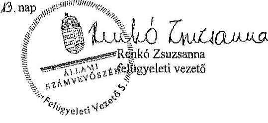

---

HaJdú-Bihar Megyei Önkormányzat Közgyűlésének JEGYZŐJE

ES 4024 Debrecen, Pinc u. 54., 32/507-524, e-mail: jegyzo@bihran.hu

|  Ikt.szám: | ÖH: 80-11/2015  |
| --- | --- |
|  Hivatkozási szám: | V-0779-415/2015  |
|  V-0780-276/2015 |   |
|  K20 ČR. | V-0781-182/2015  |

Dr. Elek János úr titkár

Állami Számvevőszék

Budapest Apáczai Csere János utca 10.

2015 JUN 31.

V-0779-439/2015

ÁLLAMI SZÁMVEVŐSZÉK ÖGYVITELI IRÓDA 5485512015 Ért.: JUN 29 2015

Iktasúsztat: V-0779-439/2015

Tisztelt Titkár Úr!

A 2014. évi választásokra fordított pénzeszközök felhasználásának ellenőrzéséről készített V-0779-415/2015, V-0780-276/2015, V-0781-182/2015 számú számvevői ellenőrzési jelentés-tervezet Hajdú-Bihar Megyei Önkormányzati Hivatalt érintő megállapításaira észrevételt nem kívánok tenni.

Debrecen, 2015. június 17.

Tisztelettel:

Dr. Dobi Csaba

---

.

---

Nemzeti Választási Iroda elnök

Ikt.sz.: NVI/057/2015

Dr. Elek János
Főtitkár

Állami Számvevőszék
1052 Budapest
Apáczal Csere János utca 10.

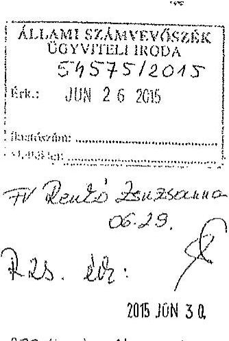

Tárgy: Észrevételek a megküldött jelentéstervezetekhez

Tisztelt Főtitkár Úr!

A Nemzeti Választási Iroda részére megküldött, a 2014. évi választásokra fordított pénzeszközök felhasználásának ellenőrzéseiről készült jelentéstervezetekhez az alábbi észrevételeket teszem.

I. A 2014. évi országgyűlési képviselőválasztásra fordított pénzeszközök felhasználásának ellenőrzése - V-0779-415/2015. számú jelentéstervezet

1. A tervezet 4. oldalán a 4. bekezdésben „Az ellenőrzés célja annak megállapítása volt, hogy a helyi önkormányzati képviselők és polgármesterek, valamint a nemzetbégi önkormányzati képviselők 2014. évi választására fordított pénzeszközök tervezésére..." szövegrész helyett: „Az ellenőrzés célja annak megállapítása volt, hogy a 2014. évi országgyűlési képviselőválasztására fordított pénzeszközök tervezésére..." a helyes.
2. A tervezet 9. oldalának 3. bekezdéséhez megjegyezni kívánom, hogy az NVI elnöke a Számv. tv. 14. § (11) bekezdésében meghatározott 90 napos határidőt azért nem tudta tartani, mert az NVI 2013. május 24-ei alapítását követően a gazdálkodás szervezeti egysége 2014. október 1-én került felállításra, a gazdasági vezető kinevezése is ekkor történt meg.
3. A tervezet 13. oldalának 3. bekezdéséhez megjegyzem, hogy a Pvr. a nem normatív kiadások tekintetében azért nem tartalmaz előírást az előlegek utalásának határidejére vonatkozólag, mert azok minden esetben az ellátandó feladatok jellegét, a résztvevő szervezetek tevékenységét meghatározó megállapodásokban kerülnek rögzítésre, és erre vonatkozólag a korábbi választások végrehajtási rendeletei sem írtak elő határidőt.
4. A tervezet 15. oldal 5. bekezdés utolsó mondatában a „KEKKH pénzügyi nyilvántartó rendszerében" helyett az „OrganP VPIR rendszerében" megnevezés a helyes.

---

Nemzeti Választási Iroda
elnök

## II. Az Európai Parlament tagjainak 2014. évi választására fordított pénzeszközök felhasználásának ellenőrzése - V-0780-276/2015. számú jelentéstervezet

1. A tervezet 7. oldal 5. bekezdés utolsó mondatát nem áll módomban elfogadni, tekintettel arra, hogy az NVI a választási irodák és az egyéb szervezetek elfogadott elszámolásai alapján a Pvr.-ben előírt határidőn belül, 2014. augusztus 22. napján készítette el az összesítő beszámolóját. (Beszámoló a 2014. évi Európai Parlament tagjainak választásáról).

2. A tervezet 14. oldal 1. bekezdésében a „010201 TEA kódon” szöveg helyett „1010201 TEA kódon” szöveg a helyes.

3. A tervezet 18. oldal utolsó bekezdéséhez megjegyezni kívánom, hogy a Pvr. 6.§ (2) bekezdésében a HVI-k részére előírt feladattípusú elszámolás jogcímenkénti részletezése a jogalkotási szándék szerint kizárólag a többletköltségekre és a feladatelmaradásra vonatkozott volna. Az elszámolások elkészítésére vonatkozó 19/2014. (VI.04.) NVI utasítás formanyomtatványa rendelkezett ennek kezeléséről. Amennyiben minden HVI esetében minden kiadásnem vonatkozásában a jogcímenkénti részletező kimutatást kértük volna be, az rendkívüli adatmennyiséget keletkeztetett volna, és jelentős munkaterhet jelentett volna a HVI-kre és TVI-kre nézve.

A helyi önkormányzati képviselők és polgármesterek, továbbá a nemzetiségi önkormányzati képviselők választásáról szóló Pvr.-ben (3/2014. (VII. 24.) IM rendelet) már pontosításra került a jogcímenkénti részletező kimutatásra vonatkozó előírás.

4. A tervezet 22. oldalának utolsó bekezdését az 1. pontban említettek alapján nem áll módomban elfogadni. A lábjegyzetben szereplő 27. számú megjegyzésben feltüntetett végleges elszámoláson szereplő 2015. március 12. dátum a dokumentum nyomtatásának dátuma. A választásról készített beszámoló készítésének dátuma 2014. augusztus 22. (Beszámoló a 2014. évi Európai Parlament tagjainak választásáról).

## III. A helyi önkormányzati képviselők és polgármesterek, valamint a nemzetiségi önkormányzati képviselők 2014. évi választására fordított pénzeszközök felhasználásának ellenőrzése - V-0781-1825/2015. számú jelentéstervezet

1. A tervezet 3. oldal 1. bekezdésében javaslom javítani, hogy a nemzetiségi önkormányzati képviselők választását nem Magyarország Köztársasági Elnöke, hanem a Nemzeti Választási Bizottság tűzte ki.

2. A tervezet 12. oldal utolsó bekezdéséhez megjegyezni kívánom, hogy az NVI a 2014. évi költségvetésében az önkormányzati és nemzetiségi választásokra azért nem

---

Nemzeti Választási Iroda
elnök
tervezett eredeti elöirányzatot, mert - összhangban a tervezet 11. oldal 2. pontjának első bekezdésében leírtakkal - az eredeti előirányzat az önkormányzati és nemzetiségi választásokra már nem biztosított fedezetet. A közgazdaságilag megalapozott tervezés biztosított volt az NVI által 2014. március 3-án elkészített, majd a forrás biztosítását követő módosított előirányzat könyvviteli rendszerben történő rögzítésével.
3. A tervezet 17. oldal utolsó bekezdéséhez és a lábjegyzet 18. pontjához megjegyezni kívánom, hogy a választások összesitő elszámolása 2015. február 12-én készült el, a megjelölt 2015. március 9. napja a dokumentum nyomtatásának napját jelenti. A Pvr. által megadott 90 napos elszámolási határidő ebben az esetben két országos választás teljes körű ellenőrzését és adatainak feldolgozására vonatkozott, vagyis ezzel indokolható a határidőn túli elszámolás elkészítése.

Mindhárom jelentéshez általánosságban megjegyezni kívánom, hogy az NVI által nem a megfelelő választás kiadásai terhére elszámolt tételek - számosságát tekintve öt darab nagyságrendje és összege is elenyésző a négy országos választás vonatkozásában. Az érintett tételek mindegyike a választások érdekében felmerült, szabályszerűen, a megfelelő kiadásnemen elszámolt kiadást jelentett. Az NVI jelenleg és a jövőben is kiemelt figyelmet fordít a feladattípusú elszámolás során a pénzeszközök felhasználásának pontos kimutatására.

Kérem Tisztelt Fö́tükár Urat, hogy az NVI részéről tett észrevételeket és kért módosításokat a végleges jelentésekben elfogadni és érvényesíteni szíveskedjenek.

Budapest, 2015. június, 15.
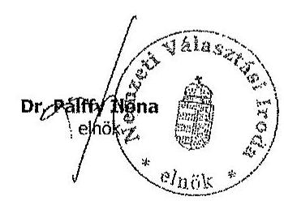

---

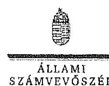

Ikt.szám:V-0779-445/2015.
V-0780-297/2013.
V-0781-196/2015.

Dr. Pálffy Ilona úrhölgy
elnök

Nemzeti Választási Iroda

# Budapest 

## Tisztelt Elnök Ürhölgy!

Köszönettel megkaptam „Az országgyölési képviselők 2014. évi választására forditott pénzeszközök felhasználásának ellenörzése", „Az Európai Parlament tagjainak 2014. évi választására fordított pénzeszközök felhasználásának ellenörzése", valamint „, A helyi önkormányzati képviselők és polgármesterek, valamint a nemzetiségi önkormányzati képviselők 2014. évi választására forditott pénzeszközök felhasználásának ellenörzése" címü jelentéstervezetek megállapításaira tett észrevételét.
Az ellenőrzési megállapításokra vonatkozó észrevételét az Állami Számvevőszékről szóló 2011. évi LXVI. törvény 29. § (2) bekezdésében meghatározott észrevételként kezeljük. Az Állami Számvevőszék észrevétellel kapcsolatos álláspontját a mellékletként csatolt, a felügyeleti vezető által készített indokolás tartalmazza.

Budapest, 2015. 0 hó $\underline{\underline{\underline{l}}}$ nap

Tisztelettel:
az elnök nevében eljárva
Dr. EIÉK Jäabs

Melléklet: Észrevételes adott válasz (3 darab)

---

„Az országgyúlési képviselők 2014. évi választására forditott pénzeszközök felhasználásának ellenörzése" című jelentéstervezetre tett észrevételre adott válasz

| Észrevétel: | A jelentéstervezet Bevezetés fejezet 4. oldal 4. bekezdése szerint az ellenőrzés célja: „Az ellenörzés célja annak megállapítása volt, hogy a helyi önkormányzati képviselők és polgármesterek, valamint a nemzetiségi önkormányzati képviselők 2014. évi választására forditott pénzeszközök tervezése, felhasználása, elszámolása és annak ellenörzése szabályszerű volt-e, valamint hasznosul-tak-e az előző ÁsZ ellenőrzés javaslatai."   Az észrevétel szerint:   A jelentéstervezetben az ellenőrzés célja tévesen szerepel. |
| :--: | :--: |
| Válasz: | Az Állami Számvevőszék az észrevételt elfogadja. |
| Indoklás: | Az ellenőrzés célját tartalmazó bekezdés a téves megfogalmazás miatt módosításra kerül. |
| Észrevétel: | A jelentéstervezet Részletes megállapítások 1.1 A választás pénzügyi tervezése fejezet 9. oldal 3. bekezdés megállapítása:   „Az NVl elnöke a Számv. tv. 14. § (11) bekezdésében meghatározott 90 napos határidőn túl, 2013. október 1-jén határozat meg az NVl számviteli politikáját."   Az észrevétel szerint:   A megállapításhoz megjegyezni kívánják, hogy a jogszabályban előírt 90 napos határidőt azért nem tudták tartani, mert az NVI 2013. május 24 -i alapítását követően a gazdálkodás szervezeti egysége 2014. október 1 -jén került felállítása, a gazdasági vezető kinevezése is ekkor történt meg. |
| Válasz: | Az Állami Számvevőszék az észrevételt nem fogadja el. |
| Indoklás: | Az észrevételben a megállapítás megalapozottságát nem vitatják, a késedelem körülményeinek magyarázata alapján a megállapítás módosítása nem indokolt. |
| Észrevétel: | A jelentéstervezet Részletes megállapítások 2. A költségvetésből biztosított finanszírozási források elosztása, az előirányzatok kezelése fejezet 13. oldal 3. bekezdés megállapítása:   „A nem normativ kiadások tekintetében az elöleg utalásának határidejéről a Pvr. nem tartalmaz elöirást, igy a KtH, a KEKKH és a BÁH intézmények részére a pénzügyi forrás a megállapodások alapján, az OGY választást követően került folyósitásra. A KtH számára 9,31 M Fi-at, a KEKKH-nok 334,1 M Fi-at, a BÁH részére 3,7 M Fi-at utalt át a megállapodásoknak megfelelően elölegként az NVL."   Az észrevétel szerint:   A megállapításhoz megjegyzik, hogy az országgyűlési képviselők választása, valamint az Európai Parlament tagjainak választása költségeinek normatíváiról, tételei- |

---

|  | röl, elszámolási és belső ellenőrzési rendjéről, valamint egyes választási tárgyú miniszteri rendeletek módosításáról szóló 38/2013. (XII. 30.) KIM rendelet (Pvr.) a nem normatív kiadások tekintetében azért nem tartalmaz előirást az előlegek utalásának határidejére vonatkozólag, mert azok minden esetben az ellátandó feladatok jellegét, a részrvevő szervezetek tevékenységét meghatározó megállapodásban kerülnek rögzítésre, és erre vonatkozólag a korábbi választások végrehajtási rendeletei sem írtak elő határidőt. |
| :--: | :--: |
| Válasz: | Az Állami Számvevőszék az észrevételt nem fogadja el. |
| Indoklás: | Az észrevétellel érintett megállapítás nem szabálytalanság feltárására vonatkozik, tényként került rögzítésre, hogy a választás lebonyolításában résztvevő - a választási irodákon kívüli - egyéb szervezetek esetében a feladatellátás érdekében felmerült kiadások finanszírozására szolgáló előleg biztosításáról a jogszabály nem rendelkezik. A Nemzeti Választási Iroda az érintett szervezetek részére a választás napját követően folyósiította a megállapodásban szereplő támogatási összegeket.   Az észrevételben ezen megállapítás megalapozottságát nem vitatják, erre tekintettel annak módosítása nem indokolt.   Az ellenőrzés a választási eljárás lebonyolításában résztvevő szervezeteknél múködő eltérő finanszírozási gyakorlatra hívta fel a figyelmet. A Pvr. 4. § (2) bekezdése alapján ugyanis garantált volt, hogy a választás kiadásainak fedezetére rendelkezésre álló normatívák szerint meghatározott összegek a területi választási irodák számára a választás napját megelőző harmincadik, a helyi választási irodák részére a választás napját megelőző huszadik napig folyósitásra kerüljenek. A választási irodáknál ezáltal „előfinanszírozás", míg az egyéb szervezetek tekintetében az ellenőrzés megállapításai szerint utófinanszírozás múködött. Az NVI - a KúM kivételével - az egyéb szervezetekkel a választás napját követően kötött megállapodást, illetve a választást követően biztosította a feladatellátás kiadásaihoz szükséges fedezetet. A költségvetési fedezet biztosítása módjában kialakult fenti gyakorlat indokoltsága, megfelelősége kérdéseket vet fel (például az egyéb szervezetek tekintetében a megállapodás megkötését megelőzően a választási feladatok előkészítése és lebonyolítása céljából szükséges kötelezettségvállalások szabályszerűsége, a fizetőképesség biztosítása tekintetében). |
| Észrevétel: | A jelentéstervezet Részletes megállapítások 3.2 A választással kapcsolatos kiadások teljesítésének szabályszerűsége fejezet 15 . oldal 5 . bekezdés megállapítása:   „A pénzeszközök felhasználását a 2/2014. (III. 31.) KúM utasitás VII. fejezet 1-2. pontja elöirásai alapján a Forrás Költségvetési és Pénzügyi Nyilvántartó Programban, valamint a KEKKH pénzügyi nyilvántartó rendszerében jogcímenként - szakfeladat részletezö kódon - elkülönítetten tartották nyilván a Pvr. elöirásainak megfelelően."   Az észrevétel szerint:   A hivatkozott bekezdés utolsó mondatában a KEKKH pénzügyi nyilvántartó rendszerében helyett az OrganP VPIR rendszerében megnevezés a helyes. |
| Válasz: | Az Állami Számvevőszék az észrevételt elfogadja. |
| Indoklás: | A megállapítás a téves megfogalmazás miatt módosításra kerül. |

---

| Észrevétel: | A jelentéstervezet Részletes megállapítások 3.2. A választással kapcsolatos kiadások teljesítésének szabályszerűsége fejezet 19. oldal 2-3. bekezdéseinek megállapítása:   „Az NVI-nél az EP választással összefüggésben kifizetett tiszteletdij kivételével a 2014. évi OGY választásra biztositott pénzeszközök felhasználása célhoz kötötten, a választás elökészitése és lebonyolítása érdekében, szabályszerüen történt. "   „Egy fó. a Nemzeti Választási Bizottsághon való részvétellel az EP választáshoz kapcsolódóan megbizott tag tiszteletdiját az OGY választás kiadásai között számolták el, megsértve ezzel a Pvr. 6. § (1) bekezdésében foglalt választásonkénti elkülönités elölrásait. A nem szabályszerü elszámolás összege 245,9 E Ft volt."   Az észrevétel szerint:   Az NVI által nem a megfelelő választás kiadásai terhére elszámolt tételek - a három jelentéstervezetben számosságát tekintve öt darab - nagyságrendje és összege is elenyésző volt a négy országos választás vonatkozásában. Az érintett tételek mindegyike a választások érdekében felmerült, szabályszerűen, a megfelelő kiadásnemen elszámolt kiadást jelentett. Az NVI jelenleg és a jövőben is kiemelt figyelmet fordít a feladattípusú elszámolás során a pénzeszközök felhasználásának pontos kimutatására. |
| :--: | :--: |
| Válasz: | Az Állami Számvevöszék az észrevételt nem fogadja el. |
| Indoklás: | Az észrevételben foglaltak a megállapítás megalapozottságát nem érintik. Az ellenőrzés értékelve az e téren feltárt hiányosságot a jelentéstervezetben összességében a kifizetések célhoz kötött, indokolt voltát emelte ki, és ezzel egyidejűleg kivételként került említtésre a tévesen, nem a megfelelő választási feladatra elszámolt egy tétel. |

Tájékoztatton Elnök úrhölgyet, hogy a számvevőszéki jelentés mellékleteként szerepeltetjük a jelentéstervezethez tett észrevételét, valamint az arra adott válaszunkat.

Budapest, 2015.
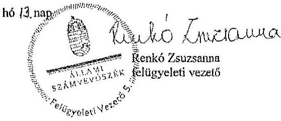

---

„Az Európai Parlament tagjainak 2014. évi választására fordított pénzeszközök felhasználásának ellenörzése" címú jelentéstervezetre tett észrevételre adott válasz

| Észrevétel: | A jelentéstervezet Összegző megállapítások, következtetések fejezet 7. oldal 5. bekezdés megállapítása:   „Az NVI a választási irodák és az egyéb szervezetek elfogadott elszámolásai alapján a Pvr.-ben elöirt határidőn túl elkészitette a választási kiadások öszszesitő elszámolását. " |
| :--: | :--: |
|  | A jelentéstervezet Részletes megállapítások 4. A választási feladatokra felhasznált pénzeszközök elszámolása fejezet 22. oldal 5. bekezdés megállapítása, illetve a kapcsolódó 27. számú lábjegyzet:   „A helyi és területi választási irodák, valamint a választásban részt vevő egyéb szervek elszámolásai alapján az NVI az összestö elszámolást a Pvr. 7. § (5) bekezdésében elöirt határidőn, a választás napját követő kilencven napon túl készítette el. "   „Az ellenörzés rendelkezésére bocsátott végleges elszámolás dátuma 2015. március 12."   Az észrevétel szerint:   A megállapítást nem fogadják el, mivel az NVI az országgyűlési képviselők választása, valamint az Európai Parlament tagjainak választása költségeinek normatíváiról, tételeiről, elszámolási és belső ellenőrzési rendjéről, valamint egyes választási tárgyú miniszteri rendeletek módosításáról szóló 38/2013. (XII. 30.) KIM rendeletben (továbbiakban: Pvr) elöirt határidőn belül, 2014. augusztus 22. napján készítette el összestitő beszámolóját (Beszámoló a 2014. évi Európai Parlament tagjainak választásáról). A 27. számú lábjegyzetben feltüntetett végleges elszámoláson szereplő 2015. március 12-i dátum a dokumentum nyomtatásának a napja. |
| Válasz: | Az Állami Számvevőszék az észrevételt nem fogadja el. |
| Indoklás: | Az észrevételben foglaltak a megállapítás megalapozottságát nem érintik. Az ellenőrzés során bemutatták az észrevételben hivatkozott, 2014. augusztus 22 -én kelt beszámolót, illetve az annak 2014. december 2 -án módosított példányát. A Pvr. 7. § (5) bekezdése szerinti öszzesítő elszámolás elkészítésére a Nemzeti Választási Iroda a helyi és területi választási irodák, a KtIM, illetve a választásban résztvevő egyéb szerv(ek) elszámolásai alapján a választás napját követő 90 napon belül kötelezett, amely esetünkben 2014. augusztus 23 -ig történő elszámolást jelent. Az ellenőrzés során rendelkezésre bocsátott dokumentumok szerint a területi választási irodák elszámolásainak elfogadásáról szóló döntést a 2014. augusztus 25. és 2014. szeptember 1. közötti keltezésú levelezés igazolja. A KEKKH elszámolását 2014. augusztus 29-én nyújtotta be, melynek NVI általi elfogadásáról a 2014. október 9-én kelt levél tanúskodik. A KtIM elszámolását az NVI 2014. október 21-én kelt dokumentum alapján fogadta el. Mindezekre tekintettel a 2014. augusztus 22-én kelt előzetes beszámoló nem felel meg a hivatkozott jogszabályi előírásnak megfelelő összestitő elszámolásként, mivel a választás lebonyolításában résztvevő választási irodák és egyéb szervek elszámolásai dokumentált módon a Pvr.-ben elöirt 90 napos határidőn belül nem készültek el, illetve nem kerültek az NVI által elfogadásra. Az ellenőrzés során rendelkezésre bocsátott, az NVI elnökhelyettese által aláirt és az aláírás mellett |

---

|  | kézzel irt keltezést tartalmazó összestió elszámolások alapján (2015. március 9-én kelt összestió elszámolás az NVI központi kiadásai nélkül, 2015. március 12-én kelt összestió elszámolás a mindösszesen kiadásokról) az ellenőzzés megállapításainak módositása nem indokolt. |
| :--: | :--: |
| Észrevétel: | A jelentéstervezet 3.1. A választási pénzeszközök nyilvántartása, a felhasználás szabályozottsága fejezet 14 . oldal 1 . bekezdés megállapítása:   „Az NVI kialakította a választások céljára biztositott pénzeszközök elkülönitett számviteli kezelését. A fökönyvi könyvelésben, a jogszabályban elöirt 016010 COFOG kódon belül a választásonként elkülönitett keselést külön tervezési és elszámolási alapegység kódokon - az EP választásra biztositott pénzeszközökre vonatkozóan a 010201 TEA kódon - biztositotta."   Az észrevétel szerint:   A megállapításban szereplő 010201 TEA kód nem megfelelő, a 1010201 TEA kód a helyes meghatározás. |
| Válasz: | Az Állami Számvevöszék az észrevételt elfogadja. |
| Indoklás: | A megállapítás a TEA kódban történt elírás miatt módositásra került. |
| Észrevétel: | A jelentéstervezet 4. A választási feladatokra felhasznált pénzeszközök elszámolása fejezet 18. oldal 9. bekezdés megállapítása:   „A Pvr. 7. § (1) bekezdése a HVI vezetők számára feladatúpusú elszámolás készitését irta elö. Az elszámolásokat a 19/2014. (VI. 04.) NVI utasitásnak megfelelöen készitették el, azonban az elöirt és alkalmazott formanyomtatványok nem teljes körüen feleltek meg a Pvr. 6. § (2) bekezdésében elöirtaknak, mivel a kiadás nemeken belüli jogcím kód szerinti részletezést nem tartalmazták, jogcímenként csak a többletköltséget és feladatelnaradás miatti visszafizetési kötelezettséget kérte részletezni."   Az észrevétel szerint:   A Pvr. 6. § (2) bekezdésében a HVI-k részére elöírt feladatúpusú elszámolás jogcímenkénti részletezése a jogalkotói szándék szerint kizárólag a többletköltsségekre és a feladatelnaradásra vonatkozott volna. Az elszámolások elkészitésére vonatkozó 19/2014. (VI. 04.) NVI utasitás formanyomtatványa rendelkezett ennek kezeléséről. Amennyiben minden HVI esetében minden kiadásnem vonatkozásában a jogcímenkénti részletező kimutatást kérték volna be, az rendkívüli adatmennyiséget keletkeztetett volna a HVI-kre és TVI-kre nézve.   A helyi önkormányzati képviselők és polgármesterek, továbbá a nemzetiségi önkormányzati képviselők választásáról szóló 3/2014. (VII. 24.) IM rendeletben már pontositásra került a jogcímenkénti részletező kimutatásra vonatkozó elöírás. |
| Válasz: | Az Állami Számvevőszék az észrevételt nem fogadja el. |
| Indoklás: | Az észrevételben foglaltak a megállapítás megalapozottságát nem érintik. Az Európai Parlament tagjainak 2014. évi választása tekintetében a Pvr. 6. § (2) bekezdése a pénzeszközök felhasználásáról - ezen belül a többletköltsségekről és a feladatelnaradáeról - feladatonkénti (jogcímenkénti) elszámolás készitését írta elő. A jogcímenkénti részletezés az összes pénzeszköz felhasználásra - nem csupán a többletköltssé gekre és feladatelnaradásra - vonatkozott, ezáltal az észrevételben szereplő NVI utasitás a hivatkozott jogszabályi elöírásnak nem felelt meg. |

---

| Észrevétel: | A jelentéstervezet Részletes megállapítások 3.2. A választással kapcsolatos kiadások teljesitésének szabályszerűsége fejezet 16. oldal 3-4. bekezdéseinek megállapítása:   „Az NVI-nél az ellenőrzött kiadások esetében a pénzeszközök felhasználása -egy tétel kivételével -a Pvr.-ben foglaltaknak megfelelően, az $E P$ választás előkészitése és lebonyolítása érdekében, célhoz kötötten történt."   „A dologi kiadások között egyéb szakmai szolgáltatások teljesitéseként egy, az önkormányzati választások elökészitécéhez kapcsolódó üzletviteli tanácsadást tartalmazó, 6,5 M Ft összegü számlát a Pvr. 6. § (1) bekezdésében foglaltak ellenére az $E P$ választás 1010201 tervezési és elszámolási alapegység kódon számoltak el."   Az észrevétel szerint:   Az NVI által nem a megfelelő választás kiadásai terhére elszámolt tételek - a három jelentéstervezetben számosságát tekintve öt darab - nagyságrendje és összege is elenyészó volt a négy országos választás vonatkozásában. Az érintett tételsk mindegyike a választások érdekében felmerült, szabályszerűen, a megfelelő kiadásnemen elszámolt kiadást jelentett. Az NVI jelenleg és a jövőben is kiemelt figyelmet fordít a feladattípusú elszámolás során a pénzeszközök felhasználásának pontos kimutatására. |
| :--: | :--: |
| Válasz: | Az Állami Számvevőszék az észrevételt nem fogadja el. |
| Indoklás: | Az észrevételben foglaltak a megállapítás megalapozottságát nem érintik. Az ellenőrzés értékelve az e téren feltárt hiányosságot a jelentéstervezetben összességében a kiffzetések célhoz kötött, indokolt voltát emelte ki, és ezzel egyidejűleg kivételként került említésre a tévesen, nem a megfelelő választási feladatra elszámolt egy tétel. |

Tájékoztatom Elnök úrhölgyet, hogy a számvevőszéki jelentés mellékleteként szerepeltetjük a jelentéstervezethez tett észrevételét, valamint az arra adott válaszunkat.

Budapest, 2015. 04. ból3. nap

---

# 3. számú melléklet   a V-0781-196/2015. számú levélhez 

„A helyi önkormányzati képviselők és polgármesterek, valamint a nemzetiségi önkormányzati képviselők 2014. évi választására fordított pénzeszközök felhasználásának ellenörzése" című jelentéstervezetre tett észrevételre adott válasz.

| Észrevétel: | A jelentéstervezet Bivezetés fejezet 3. oldal 1. bekezdés megállapítása:   „Magyarország Köztársaságti Elnöke a 2014. évi helyi önkormányzati képviselők és polgármesterek, valamint a nemzetiségi önkormányzati képviselők választását október 12-re tüzte ki."   Az észrevétel szerint:   A megfogalmazás pontositása indokolt, mivel a nemzetiségi önkormányzati képviselők választását nem Magyarország Köztársaságti Elnöke, hanem a Nemzeti Választási Bizottság tüzte ki. |
| :--: | :--: |
| Válasz: | Az Állami Számvevőszék az észrevételt elfogadja. |
| Indoklás: | A megállapítás a téves megfogalmazás miatt, a Nemzeti Választási Bizottság 1128/2014. számú határozatában foglaltak alapján módosításra került. |
| Észrevétel: | A jelentéstervezet Részletes megállapítások 2. A költségvetésből biztosított finanszírozási források elosztása, az előirányzatok kezelése fejezet 12. oldal 7. bekezdés megállapítása:   „Az NVl az önkormányzati és a nemzetiségi választásokra a választás évében, a 2014. évi költségvetésében eredeti elöirányzatot nem tervezett, a költségvetés tervezése során az Áht. 12. § (1) bekezdése szerinti közgazdaságilag megalapozott tervezés nem érvényesült. Az önkormányzati választásokkal kapcsolatban a módosittott elöirányzat az intézményi költségvetésben 2 952,7 M Ft, a fejezeti kezelésü elöirányzaton 3 378,6 M Ft, összesen 6 531,3 M Ft volt. (A kapcsolódó lábjegyzet szerint a végleges pénzügyi terv szerinti kiadások összesen 101,2 M Ft-tal meghaladták a módosított elöirányzatok összegét.) A módosított elöirányzat 1,2\%-át (77,4 M Ft) a személyi juttatások és járulékai, 56,3\%-át (2369,3 M Ft) a dologi kiadások, 7.9\%át ( $316,0 \mathrm{M}$ Ft) a beruházások, $54,6 \%$-át (3568,6 M Ft) a müködési célú pénzeszközútadások tették ki.   A nemzetiségi választások esetében a módosított elöirányzat az intézményi költségvetésben 47,3 M Ft, a fejezeti kezelésü elöirányzaton 409,4 M Ft, összesen 456,7 M Ft volt. (A kapcsolódó lábjegyzet szerint a módosított elöirányzatok összege 4,3 M Ft-tal több volt, mint a jóváhagyott pénzügyi terv szerinti kiadások összege.) A nemzetiségi választások módosított elöirányzatának 10,4\%-át (47,3 M Ft) a dologi kiadások, 89,6\%-át (409,4 M Ft) a müködési célú pénzeszközútadások tették ki. A fejezeti kezelésü elöirányzaton a 2014. évi megismételt önkormányzati választásokkal kapcsolatban a 12,0 M Ft módosított elöirányzat szerepelt."   Az észrevétel szerint:   A hivatkozott bekezdésbeli megállapításhoz megjegyezni kívánják, hogy az NVl a 2014. évi költségvetésében az önkormányzati és nemzetiségi választásokra azért nem tervezett eredeti elöirányzatot, mert összhangban a jelentéstervezet 11. oldal 2. pontjának első bekezdésében leírtakkal - az eredeti elöirányzat az önkormányzati és |

---

|  | nemzetiségi választásokra már nem biztosított fedezetet. A közgazdaságilag megalapozott tervezés biztosított volt az NVI által 2014. március 3-án elkészített, majd a forrás biztosítását követő módosított előirányzat könyvviteli rendszerben történő rögzitésével. |
| :--: | :--: |
| Válasz: | Az Állami Számvevöszék az észrevételt nem fogadja el. |
| Indoklás: | Az észrevételben foglaltak a megállapítás megalapozottságát nem befolyásolják. Az észrevételben leírtak azt támasztják alá, hogy az eredeti előirányzatok megállapításakor nem, csupán utólag érvényesült a közgazdaságilag megalapozott tervezés elve. |
| Észrevétel: | A jelentéstervezet Részletes megállapítások 4. A választási feladatokra felhasznált pénzeszközök elszámolása fejezet 17. oldal 6. bekezdés megállapítása, valamint a kapcsolódó 18. számú lábjegyzet:   ,,Az NVI a 3/2014. (VII. 24.) IM rendelet 7. § (4) bekezdésében foglaltak ellenére a szavazés napját követő kilencven napon túl készítette el a TVI-k, valamint a KEKKH elszámolása alapján az önkormányzati és a nemzetiségi választások összestió elszámolását."   ,,A nemzetiségi választások összestió elszámolása 2015. március 9-én, az önkormányzati választásoké 2015. március 20-án készïlt el."   Az észrevétel szerint:   A hivatkozott megállapításhoz megjegyezni kívánják, hogy a választások összestió elszámolása 2015. február 12-én készült el, a jelentéstervezetben megjelölt 2015. március 9-e a dokumentum nyomtatásának napját jelenti. A jogszabály által megadott 90 napos elszámolási határidő ebben az esetben két országos választás teljes körű ellenőrzését és adatainak feldolgozására vonatkozott, vagyis ezzel indokolható a határidőn túli elszámolás elkészítése. |
| Válasz: | Az Állami Számvevőszék az észrevételt nem fogadja el. |
| Indoklás: | Az észrevételben foglaltak nem befolyásolják az ellenőrzés megállapítását, mely szerint a helyi önkormányzati képviselők és a polgármesterek választása, valamint a nemzetiségi önkormányzati képviselők választása költségeinek normatíváiról, tételeiről, elszámolási és belső ellenőrzési rendjéről szóló 3/2014. (VII. 24.) számú IM rendelet 7. § (4) bekezdése szerinti határidőt követően készült el az összestió elszámolás.   Az észrevételben hivatkozott dátummal készült elszámolást az ellenőrzést végzők számára nem adtak át. A rendelkezésre bocsátott dokumentumok közül az önkormányzati képviselők és polgármesterek választása összestió dokumentumán az aláírás mellett a kézzel rájegyzett dátum: 2014. március 20. volt. Az ellenőrzés során átadott nemzetiségi választások NVI kiadásai nélküli összestió elszámoláson az NVI gazdasági elnökhelyetlese aláírása mellett kézzel rájegyzett dátum 2014. február 16. volt. Az NVI kiadásait is tartalmazó, a nemzetiségi választások kiadásai összegzését tartalmazó elszámoláson kézzel írt dátumozás nem található, a gépileg nyomtatott dátum 2014. március 9. volt. Az NVI elnökhelyetlese a 2015. március 20-án kelt nyilatkozatában az ellenőrzést végzők részére azt a tájékoztatást adta, hogy a nemzetiségi választások esetében a 2015. február 16-án készült PV011_KIS, valamint a 2015. március 9-én készült PV037_KIS nevű adatállományok tartalmazzák a végleges összestió adatokat. Mindezekre tekintettel az észrevételben jelzett dátum helyesbítését nem fogadom el. |

---

| Észrevétel: | A jelentéstervezet Részletes megállapítások 3.2. A választással kapcsolatos kiadások teljesítésének szabályszertisége fejezet 16. oldal 2-3. bekezdéseinek megállapítása:   „Az ellenörzött kifizetések - három, összesen 33,2 M Ft összege kifizetés kivételével - a 2014. évt önkormányzati és nemzetiségi választások elökészítése és lebonyolítása érdekében merültek fel, célhoz kötöttek és indokoltok voltak."   „A 3/2014. (VII. 24.) IM rendelet. 6. § (1) bekezdésében foglaltak ellenére az önkormányzati választások fejezeti kezelésú elöirányzata terhére utalták át és számolták el a KEKKH részére 2014. december 15-én folyósított, az OGT választásokkal kapcsolatban felmerült 31,0 M Ft-ot, valamint a megismételt önkormányzati választások érdekében felmerült 2,2 M Ft kiadást." |
| :--: | :--: |

# Az észrevétel szerint: 

Az NVI által nem a megfelelő választás kiadásai terhére elszámolt tételek - a három jelentéstervezetben számosságát tekintve öt darab - nagyságrendje és összege is elenyésző volt a négy országos választás vonatkozásában. Az érintett tételek mindegyike a választások érdekében felmerült, szabályszerűen, a megfelelő kiadásnemen elszámolt kiadást jelentett. Az NVI jelenleg és a jövőben is kiemelt figyelmet fordít a feladattípusú elszámolás során a pénzeszközök felhasználásának pontos kimutatására.

| Válasz: | Az Állami Számvevőszék az észrevételt nem fogadja el. |
| :-- | :-- |
| Indoklás: | Az észrevételben foglaltak a megállapítás megalapozottságát nem érintik. Az ellen-   örzés értékelve az e téren feltárt hiányosságokat a jelentéstervezetben összességében   a kifizetések célhoz kötött, indokolt voltát emelte ki, és ezzel egyidejüleg kivételként   kerültek említésre a tévesen, nem a megfelelő választási feladatra elszámolt tételek. |

Tájékoztatom Elnök úrhölgyet, hogy a számvevőszéki jelentés mellékleteként szerepelhetjük a jelentéstervezethez tett észrevételét, valamint az arra adott válaszunkat.

Budapest, 2015. OY
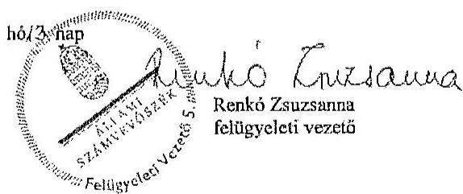

---

.

---

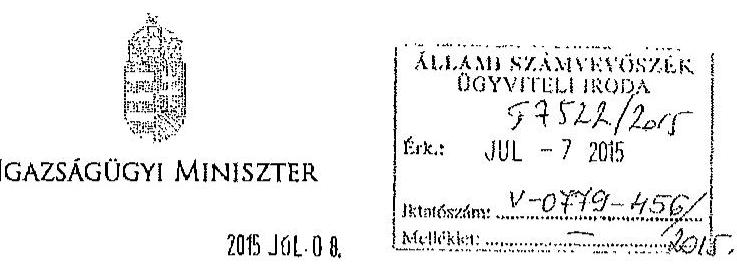

Iktaz.: IX-15/46/1/2015
Hiv.zz.: V-0779-415/2015, V-0781-82/2015
Ügyintézh: Szabó Máté
Telefon: 795-4223

Dr. Elek János úr
főfirkár

Állami Számvevőszék

Budapest

Tárgy: A 2014. évi választásokra fordított pénzeszközök felhasználásának ellenőrzése c. jelentés tervezete

Tisztelt Főfirkár Úr!

A részemre megküldött, „A 2014. évi választásokra fordított pénzeszközök felhasználásának ellenőrzése –
Az országgyűlési képviselők 2014. évi választására fordított pénzeszközök felhasználásnak ellenőrzése;
A helyi önkormányzati képviselők és polgármesterek, valamint a nemzetiségi önkormányzati képviselők 2014. évi választására fordított pénzeszközök felhasználásának ellenőrzése" című jelentéstervezeteket tisztelettel megkaptam.

A jelentéstervezetekben foglaltakhoz észrevételt nem teszek.

Budapest, 2015. június „²" ...

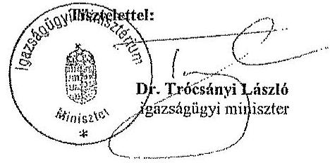

Postkó: 1357 Budapest, Pl. 2. Telefon: (36 1) 795 6512 E-mail: reklazser@im.gov.hu

---

.

---

# RÖVIDÍTÉSEK JEGYZÉKE 

## Törvények

Alaptörvény
Áht.
ÁSZ tv.

Kbt.
Sztv.
Ve.
2010. évi L. törvény
2011. évi CLXXIX. törvény
2013. évi költségvetési törvény
2014. évi költségvetési törvény

## Korm. rendeletek

Áhsz.
Ávr.
Bkr.

218/2011. (X. 19.)
Korm. rendelet

## Miniszteri rendeletek

68/2013. (XII. 29.)
NGM rendelet
3/2014. (VII. 24.) IM rendelet

Magyarország Alaptörvénye
az államháztartásról szóló 2011. évi CXCV. törvény az Állami Számvevőszékről szóló 2011. évi LXVI. törvény
a közbeszerzésről szóló 2011. évi CVIII. törvény
a számvitelről szóló 2000 . évi C. törvény
a választási eljárásról szóló 2013. évi XXXVI. törvény
a helyi önkormányzati képviselők és polgármesterek választásáról szóló 2010 . évi L. törvény
a nemzetiségek jogairól szóló 2011. évi CLXXIX. törvény
Magyarország 2013. évi központi költségvetéséről szóló 2012. évi CCIV. törvény
Magyarország 2014. évi központi költségvetéséről szóló 2013. évi CCXXX. törvény
az államháztartás számviteléről szóló 4/2013. (I. 11.) Korm. rendelet
az államháztartásról szóló törvény végrehajtásáról szóló 368/2011. (XII. 31.) Korm. rendelet
a költségvetési szervek belső kontrollrendszeréről és a belső ellenőrzésről szóló 370/2011. (XII. 31.) Korm. rendelet
a minősített adatot, az ország alapvető biztonsági, nemzetbiztonsági érdekeit érintő vagy a különleges biztonsági intézkedést igénylő beszerzések sajátos szabályairól szóló 218/2011. (X. 19.) Korm. rendelet
a kormányzati funkciók, államháztartási szakfeladatok és szakágazatok osztályozási rendjéről szóló 68/2013. (XII. 29.) NGM rendelet
a helyi önkormányzati képviselők és polgármesterek választása, valamint a nemzetiségi önkormányzati képviselők választása költségeinek normatíváiról, tételeiről, elszámolási és belső ellenőrzési rendjéről szóló 3/2014. (VII. 24.) IM rendelet

---

# Közjogi szervezetszabályozó eszközök 

1157/2014. (III. 20.) Korm. határozat

1426/2014. (VII. 28.) Korm. határozat

1457/2014. (VIII. 14.) Korm. határozat

## Szórövidítések

9/2013. (X. 1.) Elnöki utasítás

12/2013. (X. 1.) Elnöki utasítás

33/2014. (X. 20.) NVI utasítás

ÁSZ
EP választás
HVI

HVB
INTOSAI
KEKKH

NBB
nemzetiségi választás

NGM
NVI
NVR
OGY
a 2014. évi választások lebonyolításához kapcsolódó kötelezettségvállalásról és forrásbiztosításról szóló 1157/2014. (III. 20.) Korm. határozat
a rendkívüli kormányzati intézkedésekre szolgáló tartalékból történő előirányzat-átcsoportosításról, a 2013. évi kötelezettségvállalással terhelt költségvetési maradványok rendkívüli visszahagyásáról és egyes kormányhatározatok módosításáról szóló 1426/2014. (VII. 28.) Korm. határozat
a rendkívüli kormányzati intézkedésekre szolgáló tartalékból történő előirányzat-átcsoportosításról, egyes kormányhatározatok módosításáról, a pártalapítványok tartalékának átcsoportosításáról, valamint a 2013. évi költségvetési maradványok egy részének felhasználásáról szóló 1457/2014. (VIII. 14.) Korm. határozat
a fejezeti kezelésű előirányzatok felhasználásáról szóló 9/2013. (X. 1.) Elnöki utasítás (hatályos: 2013. október 1-jétől)
a fejezeti kezelésű előirányzatok számviteli szabályzatáról szóló 12/2013. (10. 01.) Elnöki utasítás (hatályos: 2013. október 1-jétől)
a helyi önkormányzati képviselők és polgármesterek, valamint a nemzetiségi önkormányzati képviselők 2014. évi választása pénzügyi elszámolási rendjéről szóló 33/2014. (X. 20.) NVI utasítás
Állami Számvevőszék
Az Európai Parlament tagjainak 2014. évi választása
Helyi Választási Iroda (beleértve az országgyúlési egyéni választókerület székhely településén múködő választási irodát)
Helyi Választási Bizottság
Legfőbb Ellenőrző Intézmények Nemzetközi Szervezete
Közigazgatási és Elektronikus Közszolgáltatások Központi Hivatala
Az Országgyúlés Nemzetbiztonsági bizottsága
nemzetiségi önkormányzati képviselők 2014. évi választása
Nemzetgazdasági Minisztérium
Nemzeti Választási Iroda
Nemzeti Választási Rendszer
Országgyúlés

---

OGY választás önkormányzati választás
SZSZB
TEA kód
TVI
SZMSZ
VLOG
VPIR
VÜR
az Országgyúlési képviselők 2014. évi választása
helyi önkormányzati képviselők és polgármesterek 2014. évi választása

Szavazatszámláló Bizottság
tervezési és elszámolási alapegység kód
Területi Választási Iroda
Szervezeti és Müködési Szabályzat
Választási Logisztikai Rendszer
Választási Pénzügyi Információs Rendszer
Választási Ügyviteli Rendszer

---

.

---

# ÉRTELMEZŐ SZÓTÁR 

COFOG kód

A kormányzati funkciók mérésére több nemzetközi intézmény az ún. COFOG (Classification of the Functions of Government) szabványt alkalmazza, amely összehasonlíthatóvá teszi különböző országok kormányzati szektorának terjedelmét és összetételét. A funkcionális osztályozás négy kategóriát különböztet meg. (1) Az állami múködési funkciók csoportjába az igazgatás, a külügyek, a védelem, a rend- és jogbiztonság, az igazságszolgáltatás tartoznak. (2) A jóléti funkciók körébe a kormányzat által szervezett vagy támogatott oktatási, egészségügyi, társadalombiztosítási, szociális és jóléti szolgáltatások, a lakásügyek és egyéb szolgáltatások tartoznak, (3) a gazdasági funkciókba pedig a kormányzat által szervezett és támogatott gazdasági tevékenységek, és azok fejlesztése (például energiaellátás, mezőgazdaság, közlekedés, távközlés). (4) Az államadósság kezelés kategóriába az államadósság finanszírozásához kapcsolódó kamatkiadások tartoznak (Budapest Intézet). A Nemzeti és Regionális Számlák Európai Rendszere (European System of Accounts, ESA95) alkalmazza a kormányzati tevékenységek osztályozását (COFOG), amely használata kötelező a tagállamok számára. A 68/2013. (XII. 29.) NGM rendeletben meghatározott kormányzati funkció kódok megegyeznek az ESA95 osztályozási rendszerében alkalmazott COFOG kódokkal.
informatikai rendszer
A választási informatikai rendszer (a továbbiakban: informatikai rendszer) a Ve.-ben meghatározott választási feladatok végrehajtásában résztvevő és azokat kiszolgáló szervezetek által múködtetett informatikai infrastruktúra és alkalmazói rendszerelemek összessége. A választási informatikai infrastruktúra elemei lehetnek különösen: az anyakönyvi szolgáltató rendszer, a fövárosi és megyei kormányhivatalok és járási hivatalaik, kiemelten az okmányirodák, a helyi önkormányzatok és a külképviseletek informatikai eszközei, valamint a választási célú dedikált informatikai eszközök. A választási alkalmazói rendszerek elemei lehetnek különösen: a névjegyzékek vezetését, az ajánlás-ellenőrzést, jelöltek és jelölő szervezetek nyilvántartását, a szavazatösszesítést, az ered-mény-megállapítást, a logisztikai lebonyolítást támogató alkalmazói szoftverrendszerek (forrás: 28/2013. (XI. 15.) KIM rendelet 2. §).

---

NVR

SzeNvi rendszer

VLOG

VPIR

VÜR

TEA kód

Nemzeti Választási Rendszer. A választások előkészítésével és lebonyolításával kapcsolatos alkalmazások összetett informatikai rendszere. Egyes moduljai a Ve.-ben foglalt alapfeladatok - pl. névjegyzék vezetése, szavazatöszszesítés, jogorvoslatok kezelése - ellátását biztosítják (forrás: NVI összefoglaló az általuk üzemeltetett informatikai rendszerekről, 2015. február 20.).
A helyi önkormányzati képviselők és polgármesterek, a nemzetiségi önkormányzati képviselők és a várható időközi választások lebonyolításához szükséges nyomdai termékek és szolgáltatások biztosítása, továbbá nyomtatványok regisztrálásához szükséges érkeztetők, szkenneló és adatrögzítő modulok fejlesztési és üzemeltetési szolgáltatásai, központ névjegyzékkel kapcsolatos kérelmek kezelésére szolgáló rendszer.
Választási Logisztikai Rendszer. A választások előkészítési szakaszában a választáshoz szükséges nyomtatványok, egyéb kellékanyagok felmérését, a költségek tervezését, a közbeszerzések előkészítését, a választások lebonyolításakor és azok ellenőrzésének időszakában a szállítások, megrendelések koordinálását, nyomon követését, a szállítmányok logisztikai kezelését és az információszolgáltatást biztosító rendszer (forrás: NVI összefoglaló az általuk üzemeltetett informatikai rendszerekről, 2015. február 20.).

Választási Pénzügyi Információs Rendszer. A választásokkal összefüggő költségvetési gazdálkodást - költségvetési tervezés, kötelezettségvállalás, pénzügyi, számviteli elszámolások -, valamint a választási szervek adatainak kezelését, támogatásaik tervezését, finanszírozását, pénzügyi elszámoltatását biztosító rendszer (forrás: NVI összefoglaló az általuk üzemeltetett informatikai rendszerekről, 2015. február 20.).
Választási Ugyviteli Rendszer. Zárt rendszerben biztosítja a választási szervek egymás közötti kommunikációját és információközvetítését, eljárásrendek, értesítések, tájékoztatók küldését (forrás: NVI összefoglaló az általuk üzemeltetett informatikai rendszerekről, 2015. február 20.).
A Tervezési és Elszámolási Alapegység (a továbbiakban: TEA) a Hivatal bevételeinek és kiadásainak gyüjtésére, valamint rendszerezésére szolgáló, a Hivatal teljes tevékenységét átfogó kódrendszer, egyben tartalmazza az önköltségszámítás alapját képező kalkulációs egységeket is. A TEA kódok segítségével a költségek a gazdálkodás bármelyik fázisában elkülöníthetőek (forrás: KEKKH Önköltségszámítási Szabályzat).