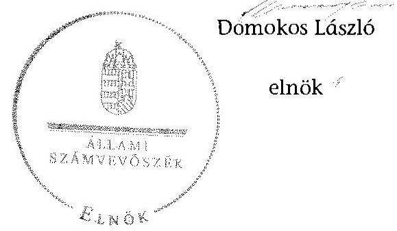

# ÁLLAMI   SZÁMVEVŐSZÉK 

## JELENTÉS

a helyi nemzetiségi önkormányzatok gazdálkodásának ellenőrzéséről
Pári Község Német Nemzetiségi Önkormányzata

---

# Állami Számvevőszék 

Iktatószám: V-0792-065/2015.
Témaszám: 1826
Vizsgálat-azonosító szám: V067640

## Az ellenőrzést felügyelte:

## Brebán Andrea

felügyeleti vezető
Az ellenőrzést vezette és az ellenőrzés végrehajtásáért felelős:
Gál Magdolna
ellenőrzésvezető
A számvevőszéki jelentés összeállításában közreműködött:
Dr. Halmné Harsányi Zsuzsanna
számvevő tanácsos
Az ellenőrzést végezték:
Dr. Halmné Harsányi Zsuzsanna Vámos Rita
számvevő tanácsos számvevő

---

# TARTALOMJEGYZÉK 

BEVEZETÉS ..... 3
I. ÖSSZEGZŐ MEGÁLLAPÍTÁSOK, KÖVETKEZTETÉSEK, JAVASLATOK ..... 6
II. RÉSZLETES MEGÁLLAPÍTÁSOK ..... 13

1. A Nemzetiségi Önkormányzat és a Települési Önkormányzat együttműködésének szabályozása, a működési feltételek biztosítása ..... 13
2. A gazdálkodási feladatok ellátásának szabályszerűsége ..... 14
2.1. A költségvetésre és zárszámadásra, valamint a kincstári adatszolgáltatás rendjére vonatkozó jogszabályi előírások betartása ..... 14
2.2. A Nemzetiségi Önkormányzat gazdálkodásának szabályozottsága ..... 16
2.3. Az operatív gazdálkodási jogkörök kialakítása, gyakorlása ..... 17
3. A Nemzetiségi Önkormányzattal összefüggő gazdálkodási feladatok belső ellenőrzése ..... 19
MELLÉKLET
4. számú A Nemzetiségi Önkormányzat 2013. évi gazdálkodási adatai
FÜGGELÉKEK
5. számú Rövidítések jegyzéke
6. számú Értelmező szótár

---

.

---

# JELENTÉS   a helyi nemzetiségi önkormányzatok gazdálkodásának ellenőrzéséről Pári Község Német Nemzetiségi Önkormányzata 

## BEVEZETÉS

A Nemzetiségi Önkormányzat a 2010. évben alakult, elnöke a 2010. évi helyhatósági választások óta látja el feladatát. A Nemzetiségi Önkormányzat intézményt, gazdasági társaságot és más szervezetet nem alapított, illetve társulásban nem vett részt. A négytagú Képviselő-testület a munkája segítésére bizottságot nem hozott létre. A Nemzetiségi Önkormányzat költségvetési beszámolója szerint a 2013. évben a módosított költségvetési bevételi és kiadási előirányzat 1564 ezer Ft, a teljesített költségvetési bevétel 795 ezer Ft, a teljesített költségvetési kiadás 1171 ezer Ft volt. A Nemzetiségi Önkormányzat a 2013. évben 562 ezer Ft feladatalapú támogatásban részesült. A 2013. évi gazdálkodási adatokat részletesen az 1. számú mellékletben mutatjuk be.

Az Alaptörvény Szabadság és felelősség rész XXIX. cikk (1) bekezdése szerint a Magyarországon élő nemzetiségek államalkotó tényezők. Minden, valamely nemzetiséghez tartozó magyar állampolgárnak joga van önazonossága szabad vállalásához és megőrzéséhez. A hazánkban élő nemzetiségek helyi (települési és területi) valamint országos önkormányzatokat hozhatnak létre ${ }^{1}$. A helyi nemzetiségi önkormányzatok gazdálkodási feladatait jogszabályi előírás alapján a székhely szerinti helyi önkormányzat polgármesteri hivatala látja el.

A nemzetiségek helyzete, támogatása mind hazai, mind EU-s szinten kiemelt figyelmet kap napjainkban. A helyi nemzetiségi önkormányzatok gazdálkodására és támogatási rendszerére vonatkozó jogszabályok a 2010-2012. években jelentős változásokon mentek át. A helyi nemzetiségi önkormányzatok gazdálkodásának, a részükre juttatott költségvetési támogatások felhasználásának ellenőrzését az ÁSZ 2012-ben sorozatjellegű ellenőrzés keretében indította el. A 2014. évi ellenőrzések az önkormányzati ellenőrzésekre ráépülő (egyablakos) ellenőrzésként valósulnak meg.

Az ellenőrzés célja annak értékelése volt, hogy a Nemzetiségi Önkormányzat gazdálkodási kereteinek kialakítása, gazdálkodása megfelelt-e a jogszabályoknak.

[^0]
[^0]:    ${ }^{1}$ A 2010. évben megtartott nemzetiségi önkormányzati választásokat követően 2304 települési, 58 területi és 13 országos nemzetiségi önkormányzat alakult meg.

---

Ennek keretében értékeltük, hogy:

- a Nemzetiségi Önkormányzat és a Települési Önkormányzat együttműködésének szabályozása, a működési feltételek biztosítása megfelelt-e a jogszabályi előírásoknak;
- a felek együttműködése megfelelt-e a megállapodásban foglaltaknak a gazdálkodási feladatok szabályszerű ellátása során, betartották-e a vonatkozó jogszabályi előírásokat;
- biztosított volt-e a Nemzetiségi Önkormányzat gazdálkodásának belső ellenőrzése.

Az ellenőrzés várható hasznosulása: a nemzetiségi önkormányzatok testületi döntéseinek tapasztalatait összegezve következtetés vonható le a törvényalkotás számára a jogszabályi környezet esetleges módosításának indokoltságára vonatkozóan. Az ellenőrzés az ellenőrzött számára visszajelzést ad a rendezett gazdálkodási keretek kialakításáról, a működésbeli hiányosságokról. Az ellenőrzés megállapításai és javaslatai, a jó gyakorlat bemutatása tanulságul szolgálhatnak más nemzetiségi önkormányzatok, szervezetek számára a rendezett gazdálkodási keretek kialakításához. A társadalom számára jelzi, hogy közpénz nem maradhat ellenőrizetlenül, az ÁSZ értékteremtő rend kialakításához és megőrzéséhez hozzájáruló tevékenysége pozitív hatással lesz a szervezetről kialakított összkép formálásában. Az ÁSZ szervezetén belül lehetőség nyílik arra, hogy a megállapítások szintetizálásával az intézmény a hozzáadott értéket teremtő elemző tevékenységét és tanácsadó szerepét erősítse.

A helyi nemzetiségi önkormányzatok gazdálkodásának ellenőrzéséről szóló jelentés I. fejezetének összegző része az ellenőrzés céljára adott rövid, szintetizáló összefoglalót és következtetéseket tartalmazza a II. fejezet részletes megállapításain alapulóan. A jelentés intézkedést igénylő megállapításait és javaslatait - az összegzőben foglaltak mellett - az ellenőrzés során feltárt, a jelentés II. fejezetében rögzített részletes megállapítások alapozzák meg, illetve támasztják alá.

Az ellenőrzés típusa: szabályszerűségi ellenőrzés.
Az ellenőrzött időszak: a Nemzetiségi Önkormányzat és a Települési Önkormányzat együttműködésének, valamint a Nemzetiségi Önkormányzat gazdálkodásának szabályozása megfelelőségét a 2013. évre vonatkozóan (a 2013. december 31-i állapotnak megfelelően), a Nemzetiségi Önkormányzat gazdálkodásának szabályszerűségét, a működési feltételek, valamint a belső ellenőrzés biztosítását a 2013. január 1. - december 31-e közötti időszakot figyelembe véve értékeltük.

Ellenőrzött szervezet: a Nemzetiségi Önkormányzat és a gazdálkodási feladatait ellátó Hivatal.

Az ellenőrzés szakmai módszertana az ÁSZ hivatalos honlapján (www.asz.hu) közzétett szakmai szabályokon alapult, amely a Legfőbb Ellenőrző Intézmények Nemzetközi Szervezete (INTOSAI) által kiadott nemzetközi standardok (ISSAI) figyelembevételével készült.

---

A gazdálkodás folyamatában kulcsszerepet betöltő két kulcskontroll - teljesítésigazolás, érvényesítés - működésének megfelelőségét teljes körűen, azaz minden, a személyi juttatásokkal, dologi és felhalmozási kiadásokkal, működési és felhalmozási célú pénzeszköz átadásokkal, ellátottak pénzbeli juttatásaival kapcsolatos kifizetés esetében ellenőriztük. „Megfelelőnek" értékeltük a gazdálkodási jogkörök gyakorlását, amennyiben a hibaarány legfeljebb 10\%, „részben megfelelőnek" értékeltük, ha a hibaarány 10-30\% között volt, „nem megfelelőnek" pedig akkor, ha az eredmények alapján a hibaarány meghaladta a 30\%-ot.

Az ellenőrzés végrehajtásának jogszabályi alapját az ÁSZ tv. 5. § (2)-(3) és (6) bekezdéseiben foglaltak képezik.

Az ÁSZ tv. 29. § (1) bekezdése szerint a jelentéstervezetet megküldtük a jegyző és a Nemzetiségi Önkormányzat elnöke részére, akik az ÁSZ tv. 29. § (2) bekezdésében foglalt észrevételezési jogukkal nem éltek, a jelentéstervezetre észrevételt nem tettek.

---

# I. ÖSSZEGZŐ MEGÁLLAPÍTÁSOK, KÖVETKEZTETÉSEK, JAVASLATOK 

A Nemzetiségi Önkormányzat és a Települési Önkormányzat együttműködésének szabályozása részben felelt meg a jogszabályi előírásoknak. A Nemzetiségi Önkormányzat az ellenőrzött időszakban rendelkezett hatályban lévő, a Települési Önkormányzattal történő együttműködésre vonatkozó együttműködési megállapodással. Az együttműködési megállapodást a Nek. tv.-ben foglaltak ellenére 2013. január 31-éig, illetve az ellenőrzött időszakon belül nem vizsgálták felül. Az együttműködési megállapodás az Áht. és a Nek. tv. előírása ellenére nem rögzítette a Nemzetiségi Önkormányzathoz kapcsolódó beszámolási feladatok ellátásának részletes szabályait, a Nemzetiségi Önkormányzat önálló fizetési számla nyitásával, törzskönyvi nyilvántartásba vételével és adószám igénylésével kapcsolatos határidőket és együttműködési kötelezettségeket, a felelősök konkrét kijelölésével. Az együttműködési megállapodás a Nek. tv. rendelkezése ellenére továbbá nem rögzítette, hogy a jegyző vagy annak - a jegyzővel azonos képesítési előírásoknak megfelelő - megbízottja a Települési Önkormányzat megbízásából és képviseletében részt vesz a Nemzetiségi Önkormányzat ülésein és jelzi, amennyiben törvénysértést észlel. A nemzetiségi önkormányzati SZMSZ a jogszabályi előírásoknak megfelelően tartalmazta az együttműködési megállapodás szerinti működési feltételeket, amelyeket a települési önkormányzati SZMSZ-ben a Nek. tv.-ben foglaltak ellenére nem rögzítettek. A Települési Önkormányzat - a szabályozási hiányosságok ellenére - a Nemzetiségi Önkormányzat működéséhez a 2013. évben a személyi és tárgyi feltételeket biztosította.

A Nemzetiségi Önkormányzat 2013. évi költségvetésének és zárszámadásának tartalma, jóváhagyása, valamint a kapcsolódó kincstári adatszolgáltatás nem felelt meg a jogszabályi előírásoknak. A Nemzetiségi Önkormányzat elnöke az Áht.-ban előírtak ellenére nem nyújtotta be a Képviselő-testület részére a 2013. évre vonatkozó költségvetési koncepciót, mert azt a jegyző nem készítette el. A Nemzetiségi Önkormányzat elnöke az Áht.-ban előírtak ellenére a központi költségvetésről szóló törvény hatálybalépését követő 45. napig nem nyújtotta be a Képviselő-testületnek a 2013. évi költségvetési határozat-tervezetet, mert azt a jegyző nem a határidőre figyelemmel készítette elő. A költségvetési határozattervezetének előterjesztésekor a Képviselő-testület részére az Áht.-ban előírtaktól eltérően tájékoztatásul nem mutatták be szöveges indokolással együtt a Nemzetiségi Önkormányzat költségvetési mérlegét közgazdasági tagolásban, előirányzat felhasználási tervét. A jóváhagyott költségvetési határozat az Áht.-ban foglaltak ellenére nem tartalmazta a Nemzetiségi Önkormányzat költségvetési bevételeit és költségvetési kiadásait előirányzat-csoportok, kiemelt előirányzatok, illetve kötelező és önként vállalt feladatok szerinti bontásban, továbbá a költségvetés végrehajtásával kapcsolatos hatásköröket, így különösen a Mötv. szerinti értékhatárt.

A jegyző által elkészített zárszámadási határozat-tervezetet a Nemzetiségi Önkormányzat elnöke az Áht.-ban előírt határidőn túl terjesztette a Képviselő-testület elé. A zárszámadási határozat-tervezet előterjesztésekor - a jegyző mulasztása miatt - az Áht.-ban foglaltaktól eltérően a Képviselő-testület részére nem

---

mutatták be tájékoztatásul szöveges indokolással együtt a mérlegek és kimutatások közül a költségvetési mérleget közgazdasági tagolásban és a pénzeszközök változását. Az Áht.-ban előírtak ellenére nem mutatták be a vagyonkimutatást. A zárszámadási határozatnak az elfogadott költségvetéssel való összehasonlíthatósága az Áht.-ban előírtak ellenére nem volt biztosított. A zárszámadási határozatban a Nemzetiségi Önkormányzat az Áht.-ban foglaltak ellenére nem számolt el valamennyi bevételéről és kiadásáról.

A bevételi és kiadási előirányzatokat az év közben folyósított feladatalapú támogatás összegével a beszámoló elkészítésének határidejéig az Áht. rendelkezése ellenére nem módosították, arról határozatot nem hoztak. A zárszámadási határozatban, valamint a Kincstárhoz benyújtott éves elemi költségvetési beszámolóban a módosított előirányzat összege a feladatalapú támogatás összegét is tartalmazta, emiatt a Nemzetiségi Önkormányzat éves elemi költségvetési beszámolójában sérült a Számv. tv. szerinti valódiság elve. A Nemzetiségi Önkormányzat éves elemi költségvetési beszámolóját az Áhsz.-ben foglaltakkal ellentétben nem teljes körűen támasztotta alá főkönyvi kivonat. A Nemzetiségi Önkormányzat 2013. évi könyvviteli nyilvántartása nem felelt meg a Számv. tv.ben foglaltaknak. A teljesített kiadások összege az Áht.-ban foglalt előírások ellenére a jóváhagyott előirányzatot meghaladó volt, ezáltal nem tartották be az Áht.-ban foglalt kötelezettségvállalásra vonatkozó előírásokat.

A jegyző a Nemzetiségi Önkormányzatra vonatkozó kincstári adatszolgáltatást nem minden esetben teljesítette határidőben, mert a 2013. év első három hónapjáról és az első hat hónapjáról készített időközi költségvetési jelentést nem az Ávr. szerinti, továbbá a 2013. év első negyedévéről készített időközi mérlegjelentést nem az Ávr. szerinti határidőre küldte meg a Kincstárnak.

A Nemzetiségi Önkormányzat gazdálkodásának szabályozottsága az ellenőrzött időszakban nem felelt meg a jogszabályi előírásoknak. A Hivatal rendelkezett a Számv. tv. szerinti belső szabályzatokkal, azonban azok hatálya nem terjedt ki a Nemzetiségi Önkormányzat gazdálkodásával összefüggő végrehajtási feladatokra. Az előírt szabályzatokkal a Nemzetiségi Önkormányzat önállóan sem rendelkezett. A Nemzetiségi Önkormányzat gazdálkodás feladatait ellátó Hivatal az Áht.-ban előírtak ellenére nem rendelkezett szervezeti és működési szabályzattal. SZMSZ hiányában nem szabályozták az Ávr.-ben előírtak ellenére a Nemzetiségi Önkormányzat gazdálkodásával összefüggő feladat- és hatásköröket, azok gyakorlásának módját, a helyettesítés rendjét, illetve az ezekhez kapcsolódó felelősségi szabályokat. A Hivatalban a gazdálkodási feladatokat ellátó köztisztviselők munkaköri leírásaiban a Kttv. ellenére nem rögzítették a Nemzetiségi Önkormányzat gazdálkodásával kapcsolatos feladatokat.

A gazdasági szervezettel nem rendelkező Hivatalban a jegyző az Ávr. alapján nem jelölt ki írásban a Hivatal állományába tartozó köztisztviselőt a pénzügyi ellenjegyzés gyakorlására, továbbá az érvényesítési feladatok ellátására a Nemzetiségi Önkormányzat kiadási előirányzata terhére vállalt kötelezettség esetére. A
 2013. évben a Nemzetiségi Önkormányzat gazdálkodásával kapcsolatos végrehajtási feladatok munkafolyamatainak leírásáról, az azokat ellátó személyek feladat- és hatásköréről, valamint a helyettesítés rendjéről - az Ávr.-ben előírtak ellenére - belső szabályzatban nem rendelkeztek.

---

A Nemzetiségi Önkormányzat gazdálkodása tekintetében az operatív gazdálkodási jogkörök kialakítása nem felelt meg a jogszabályi előírásoknak. A Nemzetiségi Önkormányzatnál a 2013. évben a dologi és felhalmozási kiadásokkal kapcsolatos kifizetések teljesítése során az operatív gazdálkodási jogkörökön belül kulcsszerepet betöltő teljesítésigazolás és érvényesítés kulcskontrollok működése nem felelt meg a jogszabályi előírásoknak, emiatt azok nem biztosították a hibák megelőzését és feltárását. A számvevőszéki ellenőrzés az ellenőrzött kifizetésekkel összefüggésben a rendelkezésre bocsátott dokumentumok alapján kár bekövetkeztére utaló adatot, tényt nem állapított meg, azonban a gazdálkodásban kulcsszerepet betöltő kontrollok működésében feltárt hiányosságok miatt fennáll a hibák, szabálytalanságok bekövetkezésének kockázata. A nem megfelelően működtetett belső kontrollok korrupciós kockázatot hordoznak.

A Nemzetiségi Önkormányzattal összefüggő gazdálkodási feladatok belső ellenőrzése nem felelt meg a jogszabályi előírásoknak. A Nemzetiségi Önkormányzat gazdálkodásával összefüggő végrehajtási feladatokra vonatkozóan belső ellenőrzést a 2013. évben nem terveztek. A jegyző a Bkr.-ben foglalt előírások ellenére az ellenőrzött időszakban nem gondoskodott a Hivatalnál a Nemzetiségi Önkormányzat gazdálkodásával összefüggő végrehajtási feladatok belső ellenőrzésének kialakításáról és megfelelő működtetéséről.

Az ÁSZ tv. 33. § (1) bekezdésében foglaltak értelmében az ellenőrzött szervezet vezetője köteles a jelentésben foglalt megállapításokhoz kapcsolódó intézkedési tervet összeállítani és azt a jelentés kézhezvételétől számított 30 napon belül az ÁSZ részére megküldeni. Amennyiben az intézkedési tervet határidőre nem küldi meg a szervezet, vagy az ÁSZ tv. 33. § (2) bekezdésében foglalt póthatáridő elteltével megküldött intézkedési terv továbbra sem elfogadható, az ÁSZ elnöke a hivatkozott törvény 33. § (3) bekezdés a)-b) pontjaiban foglaltakat érvényesítheti.

A helyszíni ellenőrzés megállapításainak hasznosítása mellett javasoljuk:

# a jegyzőnek 

1. Az együttműködés szabályozásával kapcsolatban

A Nemzetiségi Önkormányzat és a Települési Önkormányzat együttműködését meghatározó együttműködési megállapodás tartalma nem felelt meg a Nek. tv. 80. § (3) bekezdés a) pontjában és Nek. tv. 80. § (4) bekezdésben foglaltaknak. A Nek. tv. 80. § (2) bekezdésében foglaltak ellenére 2013. január 31-éig, és ezt követően sem végezték el az együttműködési megállapodás felülvizsgálatát.

Az együttműködési megállapodás szerinti működési feltételeket a Nek. tv. 80. § (2) bekezdésében előírtak ellenére a Települési Önkormányzat SZMSZ-ében nem rögzítették.

---

Javaslat
Az együttműködés szabályszerűsége érdekében:
a) készítse elő az együttműködési megállapodás módosítását, hogy az feleljen meg a Nek. tv-ben foglalt előírásoknak és terjessze a módosítást a Települési Önkormányzat Képviselő-testülete elé;
b) gondoskodjon a Nek. tv-ben előírt határidőre az együttműködési megállapodás évenkénti felülvizsgálatáról;
c) készítse elő a Települési Önkormányzat SZMSZ-ének kiegészítését a Nek. tv-ben foglalt előírás alapján és terjessze a kiegészítést a Települési Önkormányzat Képviselő-testülete elé.
2. A költségvetés és zárszámadás szabályszerűségével kapcsolatban

A jóváhagyott költségvetési határozat az Áht. 23. § (2) bekezdés a) és h) pontjaiban foglaltak ellenére nem tartalmazta a Nemzetiségi Önkormányzat költségvetési bevételeit és költségvetési kiadásait előirányzat-csoportok, kiemelt előirányzatok, illetve kötelező és önként vállalt feladatok szerinti bontásban, továbbá a költségvetés végrehajtásával kapcsolatos hatásköröket, így különösen a Mótv. 68. § (4) bekezdése szerinti értékhatárt.

A 2013. évi költségvetési határozat-tervezetet a jegyző nem az Áht. 24. § (2) bekezdésében foglalt határidőre figyelemmel készítette elő.

A 2013. évi zárszámadási határozat-tervezet előterjesztésekor - a jegyző mulasztása miatt - a Képviselő-testület részére tájékoztatásul nem mutatták be szöveges indokolással együtt az Áht. 91. § (2) bekezdés a) pontja alapján az Áht. 24. § (4) bekezdés a) pontjában előírt költségvetési mérlegét közgazdasági tagolásban, a pénzeszközök változását, továbbá az Áht. 91. § (2) bekezdés c) pontja szerinti vagyonkimutatást.

A bevételi és kiadási előirányzatokat az év közben folyósított feladatalapú támogatás összegével az éves költségvetési beszámoló elkészítésének határidejéig az Áht. 34. § (5) bekezdése ellenére nem módosították, az előirányzat-módosításról az Áht. 34. § (1) bekezdése szerinti határozatot nem hoztak. A kiadások teljesítése az Áht. 6. § (1) bekezdésében foglalt előírások ellenére a megállapított előirányzatot meghaladó volt, ezáltal nem tartották be az Áht. 36. § (1) bekezdésében foglalt kötelezettségvállalásra vonatkozó előírásokat.

Javaslat
a) Intézkedjen a jövőben arról, hogy a költségvetési határozat az Áht.-ban előírtaknak tartalmilag maradéktalanul feleljen meg;
b) Intézkedjen a jövőben a költségvetési határozat-tervezet előkészítése során az Áht.-ban foglalt határidő betartásáról;
c) Intézkedjen a jövőben arról, hogy a zárszámadási határozat-tervezet előterjesztésekor a Képviselő-testületnek tájékoztatásul maradéktalanul bemutatásra kerüljenek szöveges indoklással együtt az Áht.-ban előírt mérleg és kimutatások;

---

d) Intézkedjen a jövőben arról, hogy az előirányzat módosításra - az ellenőrzött időszak óta bekövetkezett esetleges jogszabályi változásokra figyelemmel - az Áht. előírásai szerinti határozatok mellett és legkésőbb az éves költségvetési beszámoló elkészítésének határidejéig kerüljön sor;
e) Intézkedjen a megállapított előirányzaton belüli gazdálkodásra, illetve indokolt esetben készítse el a jövőben az előirányzatok szükséges mértékű módosítására vonatkozó határozat-tervezetet az Áht. előírásának betartása érdekében.
3. A kincstári adatszolgáltatási kötelezettséggel kapcsolatban

A jegyző a Nemzetiségi Önkormányzatra vonatkozó kincstári adatszolgáltatási kötelezettsége teljesítése során a 2013. év első három hónapjáról és az első hat hónapjáról készített időközi költségvetési jelentést nem az Ávr. 169. § (2) bekezdése szerinti, továbbá a 2013. év első negyedévéről készített időközi mérlegjelentést nem az Ávr. 170. § (5) bekezdése szerinti határidőre küldte meg a Kincstárnak.

Javaslat
Tegyen eleget a kincstári adatszolgáltatási kötelezettségének - az ellenőrzött időszak óta bekövetkezett esetleges jogszabályi változásokra figyelemmel - az Ávr.-ben foglalt határidők betartásával.
4. A gazdálkodási feladatok szabályozottságával kapcsolatban

A gazdálkodási feladatok végrehajtását ellátó Polgármesteri Hivatal a Számv. tv. 14. § (3) és (5) bekezdéseiben és 161. § (1) bekezdésében előírt számviteli szabályzatokkal rendelkezett, de azok hatálya nem terjedt ki a Nemzetiségi Önkormányzat gazdálkodásának végrehajtási feladataira. A Nemzetiségi Önkormányzat önállóan sem rendelkezett az előírt számviteli szabályzatokkal.

A Nemzetiségi Önkormányzat gazdálkodási feladatait ellátó Hivatal - az Áht. 10. § (5) bekezdésében előírtak ellenére - nem rendelkezett szervezeti és működési szabályzattal. SZMSZ hiányában nem szabályozták - az Ávr. 13. § (1) bekezdés g) pontja előírásától eltérően az SZMSZ-ben nevesített munkakörökhöz tartozó - a Nemzetiségi Önkormányzat gazdálkodásával kapcsolatos - a hatáskörök gyakorlásának módját, a helyettesítés rendjét, az ezekhez kapcsolódó felelősségi szabályokat.

Javaslat
A Nemzetiségi Önkormányzat gazdálkodásának végrehajtásával kapcsolatos feladataira:
a) kiterjedően készítse el a Számv. tv. 14. § (3) és (5) bekezdéseiben és 161. § (1) bekezdésében előírt számviteli szabályzatokat;
b) készítse el a Hivatal SZMSZ-ét, hogy az teljes körűen feleljen meg az Ávr.-ben foglalt előírásnak és kezdeményezze annak jóváhagyását.
5. A kulcskontrollok működésével kapcsolatban

A gazdasági szervezettel nem rendelkező Hivatalban a jegyző az Ávr. 55. § (2) bekezdés g) pontja, valamint az Ávr. 58. § (4) bekezdése alapján nem jelölt ki írásban a

---

Hivatal állományába tartozó köztisztviselőt a pénzügyi ellenjegyzés gyakorlására, továbbá az érvényesítési feladatok ellátására a Nemzetiségi Önkormányzat kiadási előirányzata terhére vállalt kötelezettség esetére.

A teljesítésigazolást az Ávr. 57. § (3) bekezdésében foglaltak ellenére nem szabályszerűen végezték, mivel a teljesítésigazolás nem tartalmazta a teljesítésigazolás dátumát és a teljesítésigazoló személy a teljesítésigazolást belső szabályozás hiányában jogosulatlanul végezte.

A kifizetéseket megelőzően — az Ávr. 58. § (1) bekezdésében foglalt előírások ellenére - az érvényesítő a fedezet meglétét nem ellenőrizte. Az érvényesítő nem jelezte az Ávr. 58. § (2) bekezdésében foglaltak ellenére, hogy a megelőző ügymenetben a teljesítésigazolást nem szabályszerűen végezték. Az érvényesítő nem jelezte továbbá, hogy a megelőző ügymenetben a pénzügyi ellenjegyzés nem volt szabályszerű, mivel azt - az Ávr. 55. § (2) bekezdése g) pontja ellenére - kijelöléssel nem rendelkező személy jogosulatlanul végezte; valamint nem jelezte, hogy a százezer forintot el nem érő kötelezettségvállalások esetében a belső szabályozás ellenére nem történt előzetes írásbeli kötelezettségvállalás. Az érvényesítést az Ávr. 58. § (4) bekezdés szerinti kijelöléssel nem rendelkező személy végezte.

Javaslat
a) Jelöljön ki írásban az Ávr. szerinti jogkörében eljárva a Hivatal állományába tartozó köztisztviselőt a pénzügyi ellenjegyzés gyakorlására, valamint az Ávr. előírása alapján az érvényesítési feladatok ellátására a Nemzetiségi Önkormányzat kiadási előirányzata terhére vállalt kötelezettség esetére;
b) Intézkedjen a teljesítésigazolás és az érvényesítés Ávr.-ben foglalt előírásoknak megfelelő elvégzéséről.
6. A belső ellenőrzéssel kapcsolatban

A belső ellenőrzés Nemzetiségi Önkormányzatot érintő javaslatainak végrehajtása érdekében a jegyző - a Bkr. 28 § c) pontjában foglaltak ellenére - intézkedési tervet nem készített.

Javaslat
Intézkedjen a belső ellenőrzés megállapításai, javaslatai alapján az intézkedési terv elkészítéséről.

# a Nemzetiségi Önkormányzat elnökének 

1. A Nemzetiségi Önkormányzat és a Települési Önkormányzat együttműködését meghatározó együttműködési megállapodás tartalma nem felelt meg a 80. § (3) bekezdés a) pontjában és Nek. tv. 80. § (4) bekezdésben foglaltaknak.

Javaslat
Terjessze a Képviselő-testület elé jóváhagyásra a jegyző által a Nek. tv-ben foglaltaknak megfelelően előkészített együttműködési megállapodás módosítását.

---

2. A Nemzetiségi Önkormányzat elnöke az Áht. 24. § (2) bekezdésében előírtak ellenére a központi költségvetésről szóló törvény hatálybalépését követő 45. napig nem nyújtotta be a Képviselő-testületnek a 2013. évi költségvetési határozat-tervezetet, mert azt a jegyző az Áht. 24. § (2) bekezdésében foglaltak ellenére határidőn túl készítette elő. A 2013. évi zárszámadási határozat-tervezet előterjesztésekor - a jegyző mulasztása miatt - a Képviselő-testület részére tájékoztatásul nem mutatták be szöveges indokolással együtt az Áht. 91. § (2) bekezdés a) pontja alapján az Áht. 24. § (4) bekezdés a) pontjában előírt költségvetési mérlegét közgazdasági tagolásban, a pénzeszközök változását, továbbá az Áht. 91. § (2) bekezdés c) pontja szerinti vagyonkimutatást.

A bevételi és kiadási előirányzatokat az év közben folyósított feladatalapú támogatás összegével az éves költségvetési beszámoló elkészítésének határidejéig az Áht. 34. § (5) bekezdése ellenére nem módosították, az előirányzat-módosításról az Áht. 34. § (1) bekezdése szerinti határozatot nem hoztak. A kiadások teljesítése az Áht. 6. § (1) bekezdésében foglalt előírások ellenére a megállapított előirányzatot meghaladó volt, ezáltal nem tartották be az Áht. 36. § (1) bekezdésében foglalt kötelezettségvállalásra vonatkozó előírásokat.

Javaslat
A Képviselő-testület részére:
a) történő előterjesztésekor gondoskodjon az Áht-ban meghatározott határidő betartásáról a jegyző által megküldött költségvetési határozat-tervezet esetében;
b) tájékoztatásul mutassa be a jegyző által megküldött zárszámadási határozat-tervezet előterjesztésekor szöveges indoklással együtt az Áht.-ban előírt valamennyi mérleget, kimutatásokat;
c) terjessze be a jegyző által elkészített, az előirányozatok szükséges módosítására vonatkozó határozat-tervezetet.

---

# II. RÉSZLETES MEGÁLLAPÍTÁSOK 

## 1. A Nemzetiségi Önkormányzat és a Települési Önkormányzat együttműködésének szabályozása, a működési feltételek biztosítása

A Nemzetiségi Önkormányzat és a Települési Önkormányzat együttműködésének szabályozása részben felelt meg a jogszabályi előírásoknak.

A Nemzetiségi Önkormányzat az ellenőrzött időszakban rendelkezett hatályban lévő, a Települési Önkormányzattal történő együttműködésre vonatkozó együttműködési megállapodással. Az együttműködési megállapodást a Képviselő-testület és a Települési Önkormányzat Képviselő-testülete határozattal hagyta jóvá és az arra jogosult személyek írták alá.

Az együttműködési megállapodást a Települési Önkormányzat a 41/2012. (VII. 26.) számú, a Nemzetiségi Önkormányzat a 9/2012. (VII. 26.) számú
 határozatával hagyta jóvá.

Az együttműködési megállapodást a Nek. tv. 80. § (2) bekezdésében² foglaltak ellenére 2013. január 31-éig, illetve az ellenőrzött időszakban nem vizsgálták felül.

A nemzetiségi önkormányzati SZMSZ a jogszabályi előírásoknak megfelelően tartalmazta az együttműködési megállapodás szerinti működési feltételeket, amelyeket a települési önkormányzati SZMSZ-ben a Nek. tv. 80. § (2) bekezdésében foglaltak ellenére nem rögzítettek ${ }^{3}$.

A Kormányhivatal a 2013. március 18-ai törvényességi felhívásában mulasztásos törvénysértést állapított meg és felszólította a Képviselő-testületet az SZMSZ felülvizsgálatára, illetve abban az együttműködési megállapodás szerinti működési feltételek rögzítésére. A Nemzetiségi Önkormányzat a 10/2013. (IV. 26.) számú határozatával fogadta el a működési feltételeket tartalmazó SZMSZ-t.

A 2013. december 31-én hatályos együttműködési megállapodás nem rögzítette az Áht. 27. § (2) bekezdésében ${ }^{4}$, valamint a Nek. tv. 80. § (3) bekezdésében foglaltak közül az alábbiakat:

- az Áht. 27. § (2) bekezdésének rendelkezésében nevesített feladatok közül a Nemzetiségi Önkormányzathoz kapcsolódó beszámolási feladatok - Hivatal általi - ellátásának részletes szabályait;

[^0]
[^0]:    ${ }^{2}$ Módosította: 2014. évi XCIX. tv. 362. § 2. pontja, hatályos 2015. január 1-jétől.
    ${ }^{3}$ A települési önkormányzati SZMSZ 8. § (6) bekezdésében foglaltak alapján előterjesztés benyújtására jogosult a jegyző.
    ${ }^{4}$ 2015. január 1-jétől hatálytalan.

---

- a Nek. tv. 80. § (3) bekezdés a) pontja előírása ellenére a Nemzetiségi Önkormányzat önálló fizetési számla nyitásával, törzskönyvi nyilvántartásba vételével és adószám igénylésével kapcsolatos határidőket és együttműködési kötelezettségeket, a felelősök konkrét kijelölésével;
- a Nek. tv. 80. § (4) bekezdésének rendelkezése ellenére azt, hogy a jegyző vagy annak - a jegyzővel azonos képesítési előírásoknak megfelelő - megbízottja a Települési Önkormányzat megbízásából és képviseletében részt vesz a Nemzetiségi Önkormányzat ülésein és jelzi, amennyiben törvénysértést észlel.

A Települési Önkormányzat - a szabályozási hiányosságok ellenére - a Nemzetiségi Önkormányzat működéséhez a 2013. évben a személyi és tárgyi feltételeket biztosította.

# 2. A GAZDÁLKODÁSI FELADATOK ELLÁTÁSÁNAK SZABÁLYSZERŰSÉGE 

### 2.1. A költségvetésre és zárszámadásra, valamint a kincstári adatszolgáltatás rendjére vonatkozó jogszabályi előírások betartása

A Nemzetiségi Önkormányzat 2013. évi költségvetésének és zárszámadásának tartalma, jóváhagyása, valamint a kapcsolódó kincstári adatszolgáltatás nem felelt meg a jogszabályi előírásoknak.

A Nemzetiségi Önkormányzat elnöke az Áht. 24. § (1) bekezdésében ${ }^{5}$ előírtak ellenére nem nyújtotta be a Képviselő-testület részére a 2013. évre vonatkozó költségvetési koncepciót, mert azt a jegyző nem készítette el.

A Nemzetiségi Önkormányzat elnöke az Áht. 24. § (2) bekezdésében ${ }^{6}$ előírtak ellenére a központi költségvetésről szóló törvény hatálybalépését követő 45. napig nem nyújtotta be a Képviselő-testületnek a 2013. évi költségvetési határozattervezetet, mert azt a jegyző az Áht. 24. § (2) bekezdésében foglaltak ellenére nem a határidőre figyelemmel készítette elő. A 2013. évi költségvetési javaslatot a Nemzetiségi Önkormányzat elnöke 2013. február 21-én nyújtotta be. ${ }^{7}$

A költségvetési határozattervezet előterjesztésekor a Képviselő-testület részére - az Áht. 24. § (4) bekezdés a) pontjában előírtaktól eltérően - tájékoztatásul nem mutatták be szöveges indokolással együtt a Nemzetiségi Önkormányzat költségvetési mérlegét közgazdasági tagolásban, előirányzat felhasználási tervét. A Nemzetiségi Önkormányzat a 2013. évben több éves kihatású döntést nem hozott.

[^0]
[^0]:    ${ }^{5}$ 2014. szeptember 30-tól hatálytalan.
    ${ }^{6}$ 2013. december 21-étől az Áht. 24. § (3) bekezdése szabályozza.
    ${ }^{7}$ A Képviselő-testület a 2013. évi költségvetést a 1/2013. (II. 28.) számú NNÖ határozatával fogadta el.

---

A jóváhagyott költségvetési határozat az Áht. 23. § (2) bekezdés a) és h) pontjaiban ${ }^{8}$ foglaltak ellenére nem tartalmazta a Nemzetiségi Önkormányzat költségvetési bevételeit és költségvetési kiadásait előirányzat-csoportok, kiemelt előirányzatok, illetve kötelező és önként vállalt feladatok szerinti bontásban, továbbá a költségvetés végrehajtásával kapcsolatos hatásköröket, így különösen a Mötv. 68. § (4) bekezdése szerinti értékhatárt.

A jegyző által elkészített zárszámadási határozattervezetet a Nemzetiségi Önkormányzat elnöke az Áht. 91. § (1) bekezdésében ${ }^{9}$ előírt határidőn túl ${ }^{10}$ terjesztette a Képviselő-testület elé ${ }^{11}$. A zárszámadási határozattervezet előterjesztésekor a jegyző mulasztása miatt - az Áht. 24. § (4) bekezdés a) pontjában és az Áht. 91. § (2) bekezdés a) pontjában foglaltaktól eltérően - a Képviselőtestület részére nem mutatták be tájékoztatásul szöveges indokolással együtt a mérlegek és kimutatások közül a költségvetési mérleget közgazdasági tagolásban és a pénzeszközök változását. Az Áht. 91. § (2) bekezdés c) pontjában előírtak ellenére nem mutatták be a vagyonkimutatást. A zárszámadási határozatnak az elfogadott költségvetéssel való összehasonlíthatósága az Áht. 89. § (1) bekezdés ${ }^{12}$ előírása ellenére nem volt biztosított, mivel a 2013. évi eredeti előirányzat összegéből a kiadások és bevételek részletezettsége eltérő volt.

A 2013. évi zárszámadási határozatban a Nemzetiségi Önkormányzat - az Áht. 89. § (2) bekezdésében ${ }^{13}$ foglaltak ellenére nem számolt el valamennyi bevételéről és kiadásáról, mivel a Nemzetiségi Önkormányzat a 2012. évi zárszámadási határozatával egyidejűleg a jóváhagyott pénzmaradvány összegével a 2013. évi költségvetésében feltüntetett előző évi pénzmaradvány felhasználás előirányzatát - 770 ezer Ft-ról 870 ezer Ft-ra - határozattal nem módosította, továbbá a bemutatott költségvetési hiány belső finanszírozására szolgáló előző évi költségvetési maradvány igénybevételét a zárszámadásban a pénzforgalom nélküli bevételek között nem szerepeltette.

A bevételi és kiadási előirányzatokat az év közben folyósított feladatalapú támogatás összegével az éves költségvetési beszámoló elkészítésének határidejéig az Áht. 34. § (5) bekezdése ${ }^{14}$ ellenére nem módosították, az előirányzat-módosításról az Áht. 34. § (1) bekezdése szerinti határozatot nem hoztak. A Nemzetiségi Önkormányzat zárszámadási határozatában, valamint a Kincstárhoz benyújtott éves elemi költségvetési beszámolójában - az előirányzat-módosításról szóló határozat nélkül - a módosított előirányzat összege a feladatalapú támogatás

[^0]
[^0]:    ${ }^{8}$ 2015. január 1-jétől a 2014. évi XCIX. törvény 20. §-a módosította.
    ${ }^{9}$ 2015. január 1-jétől a 2014. évi XCIX. törvény 42. §-a módosította.
    ${ }^{10}$ Az Áht. 91. §(1) bekezdése szerinti határidő 2014. április 30. volt.
    ${ }^{11}$ A 2013. évi zárszámadást a Képviselő-testület május 27-én tárgyalta és fogadta el 6/2014. (V. 27.) számú határozatával.
    ${ }^{12}$ 2015. január 1-jétől hatálytalan.
    ${ }^{13}$ 2015. január 1-jétől hatálytalan.
    ${ }^{14}$ 2015. január 1-jétől a 2014. évi XCIX. törvény 26. §-a módosította.

---

összegét is tartalmazta, emiatt a Nemzetiségi Önkormányzat éves elemi költségvetési beszámolójában sérült a Számv. tv. 15. § (3) bekezdés szerinti valódiság elve.

A Nemzetiségi Önkormányzat éves elemi költségvetési beszámolóját az Áhsz. 50. § (1) bekezdésében ${ }^{15}$ foglaltakkal ellentétben nem teljes körűen támasztotta alá főkönyvi kivonat, mivel a zárás előtti főkönyvi kivonaton és a beszámolóban kimutatott teljesítési adatok eltértek egymástól.

A teljesített kiadások összege az Áht. 6. § (1) bekezdésében ${ }^{16}$ foglalt előírások ellenére a jóváhagyott előirányzatot meghaladó volt, ezáltal nem tartották be az Áht. 36. § (1) bekezdésében foglalt kötelezettségvállalásra vonatkozó előírásokat.

A Nemzetiségi Önkormányzat 2013. évi könyvviteli nyilvántartása nem felelt meg a Számv. tv. 159. §-ában foglaltaknak, mivel a Hivatal a Nemzetiségi Önkormányzat főkönyvi és analitikus adataira vonatkozóan nem biztosította az adatok államháztartás szervezetei szerinti elkülönült nyilvántartását, amelyre a fent felsorolt hiányosságok visszavezethetőek.

A jegyző a Nemzetiségi Önkormányzatra vonatkozó kincstári adatszolgáltatást nem minden esetben teljesítette határidőben, mert a 2013. év első három hónapjáról és az első hat hónapjáról készített időközi költségvetési jelentést nem az Ávr. 169. § (2) bekezdése ${ }^{17}$ szerinti ${ }^{18}$, továbbá a 2013. év első negyedévéről készített időközi mérlegjelentést nem az Ávr. 170. § (5) bekezdése ${ }^{19}$ szerinti ${ }^{20}$ határidőre küldte meg a Kincstárnak.

# 2.2. A Nemzetiségi Önkormányzat gazdálkodásának szabályozottsága 

A Nemzetiségi Önkormányzat gazdálkodásának szabályozottsága az ellenőrzött időszakban nem felelt meg a jogszabályi előírásoknak.

A Hivatal rendelkezett a Számv. tv. 14. § (3) és (5) bekezdései, valamint a 161. § (1) bekezdése szerinti belső szabályzatokkal (hivatali számviteli politika, hivatali leltározási és leltárkészítési szabályzat, hivatali értékelési szabályzat, hivatali pénzkezelési szabályzat, hivatali számlarend), azonban azok hatálya nem terjedt ki - a Hivatal által ellátott - a Nemzetiségi Önkormányzat gazdálkodásával összefüggő végrehajtási feladatokra. Az előírt szabályzatokkal a Nemzetiségi Önkormányzat önállóan sem rendelkezett.
${ }^{15}$ 2014. január 1-jétől hatálytalan.
${ }^{16}$ 2015. január 1-jétől a 2014. évi CXCV. törvény 12. §-a módosította.
${ }^{17}$ 2015. január 1-jétől az Ávr. 169. § (3) bekezdése szabályozza.
${ }^{18}$ A Nemzetiségi Önkormányzat időközi költségvetési jelentését a költségvetési év első három hónapjáról április 22. helyett április 23-án, az első hat hónapról július 22. helyett július 23-án küldték meg.
${ }^{19}$ 2015. január 1-jétől az Ávr. 170. § (2) bekezdése szabályozza.
${ }^{20}$ A Nemzetiségi Önkormányzat első negyedévi mérlegjelentését az első negyedévet követő hónap 25. napja helyett április 26-án küldték meg.

---

A Nemzetiségi Önkormányzat gazdálkodási feladatait ellátó Hivatal - az Áht. 10. § (5) bekezdésében előírtak ellenére - nem rendelkezett szervezeti és működési szabályzattal. SZMSZ hiányában nem szabályozták - az Ávr. 13. § (1) bekezdés g) pontjában előírtak ellenére - a Nemzetiségi Önkormányzat gazdálkodásával összefüggő feladat- és hatásköröket, azok gyakorlásának módját, a helyettesítés rendjét, illetve az ezekhez kapcsolódó felelősségi szabályokat.

A Hivatalban a gazdálkodási feladatokat ellátó köztisztviselők munkaköri leírásaiban - a Kttv. 75. § (1) bekezdés d) pontja ellenére - nem rögzítették a Nemzetiségi Önkormányzat gazdálkodásával kapcsolatos feladatokat.

A nemzetiségi önkormányzati SZMSZ, valamint az együttműködési megállapodás tartalmazta a tervezéssel, gazdálkodással, különösen az operatív gazdálkodási jogkörök gyakorlásának módjával, eljárási és dokumentációs részletszabályaival, valamint az ezeket végző személyek kijelölési rendjével és az adatszolgáltatási feladatok teljesítésével kapcsolatos belső előírásokat.

A belső kontrollrendszer szabályzat tartalmazta az ellenőrzési nyomvonalat, a szabálytalanságok kezelésének eljárásrendjét, valamint a folyamatba épített előzetes, utólagos és vezetői ellenőrzés szabályozását, amelynek hatályát kiterjesztették a Nemzetiségi Önkormányzat gazdálkodásával összefüggő végrehajtási feladatokra is.

# 2.3. Az operatív gazdálkodási jogkörök kialakítása, gyakorlása 

A Nemzetiségi Önkormányzat gazdálkodása tekintetében az operatív gazdálkodási jogkörök kialakítása nem felelt meg a jogszabályi előírásoknak.

A gazdasági szervezettel nem rendelkező Hivatalban a jegyző az Ávr. 55. § (2) bekezdés g) pontja, valamint az Ávr. 58. § (4) bekezdése alapján nem jelölt ki írásban a Hivatal állományába tartozó köztisztviselőt a pénzügyi ellenjegyzés gyakorlására, továbbá az érvényesítési feladatok ellátására a Nemzetiségi Önkormányzat kiadási előirányzata terhére vállalt kötelezettség esetére.

A 2013. évben a Nemzetiségi Önkormányzat gazdálkodásával kapcsolatos végrehajtási feladatok munkafolyamatainak leírásáról, az azokat ellátó személyek feladat- és hatásköréről, valamint a helyettesítés rendjéről - az Ávr. 13. § (5) bekezdésében előírtak ellenére - belső szabályzatban nem rendelkeztek.

Az együttműködési megállapodásban és a nemzetiségi önkormányzati
 SZMSZ-ben előzetes írásbeli kötelezettségvállaláshoz kötötték a százezer forintot el nem érő kifizetéseket.

A Nemzetiségi Önkormányzatnál a 2013. évben a dologi és felhalmozási kiadásokkal kapcsolatos kifizetések teljesítése során az operatív gazdálkodási jogkörökön belül kulcsszerepet betöltő teljesítésigazolás és érvényesítés kulcskontrollok működése nem felelt meg a jogszabályi előírásoknak, emiatt azok nem biztosították a hibák megelőzését és feltárását.

---

A dologi kiadásokkal kapcsolatos kifizetések során a 2013. évben a teljesítésigazolás és az érvényesítés kulcskontrollok működésével kapcsolatban az alábbi hiányosságok, szabálytalanságok fordultak elő:

- a teljesítésigazolás - az Ávr. 57. § (3) bekezdésében foglalt előírás ellenére - nem tartalmazta a teljesítésigazolás dátumát;
- a kifizetéseket megelőzően - az Ávr. 58. § (4) bekezdésében foglaltak ellenére - az érvényesítés nem volt szabályszerű, mivel az érvényesítést kijelöléssel nem rendelkező személy jogosulatlanul végezte;
- az érvényesítő az - Ávr. 58. § (1) bekezdésében előírtak ellenére - a fedezet meglétét nem ellenőrizte, mivel a kötelezettségvállalásokról vezetett nyilvántartásból nem volt megállapítható a szabad előirányzat összege;
- a kifizetéseket megelőzően az érvényesítő - az Ávr. 58. § (2) bekezdésében foglaltak ellenére - nem jelezte az utalványozónak, hogy a megelőző ügymenetben a teljesítésigazolást nem szabályszerűen végezték el; nem jelezte továbbá, hogy a pénzügyi ellenjegyzés nem volt szabályszerű, mivel azt - az Ávr. 55. § (2) bekezdése g) pontja ellenére - kijelöléssel nem rendelkező személy jogosulatlanul végezte; valamint nem jelezte, hogy a százezer forintot el nem érő kötelezettségvállalások esetében a belső szabályozás ellenére nem történt előzetes írásbeli kötelezettségvállalás.

A felhalmozási kiadásokkal kapcsolatos kifizetések során a 2013. évben a teljesítésigazolás és az érvényesítés kulcskontrollok működésével kapcsolatban az alábbi hiányosságok, szabálytalanságok fordultak elő:

- a kifizetéseket megelőzően - az Ávr. 57. § (3) bekezdésében foglaltak ellenére - a teljesítésigazolás nem volt szabályszerű, mivel a teljesítésigazoló személy a teljesítésigazolást belső szabályozás hiányában jogosulatlanul végezte;
- a kifizetéseket megelőzően a teljesítésigazoló - az Ávr. 57. § (3) bekezdésében foglalt előírás ellenére - nem jelölte meg a teljesítésigazolás dátumát;
- a kifizetéseket megelőzően az - Ávr. 58. § (4) bekezdésében foglaltak ellenére - az érvényesítés nem volt szabályszerű, mivel az érvényesítést kijelöléssel nem rendelkező személy jogosulatlanul végezte;
- az érvényesítő az - Ávr. 58. § (1) bekezdésében előírtak ellenére - a fedezet meglétét nem ellenőrizte, mivel a kötelezettségvállalásokról vezetett nyilvántartásból nem volt megállapítható a szabad előirányzat összege;
- a kifizetéseket megelőzően az érvényesítő - az Ávr. 58. § (2) bekezdésében foglaltak ellenére - nem jelezte az utalványozónak, hogy a megelőző ügymenetben a teljesítésigazolást nem szabályszerűen végezték el; nem jelezte továbbá, hogy a pénzügyi ellenjegyzés nem volt szabályszerű, mivel azt - az Ávr. 55. § (2) bekezdése g) pontja ellenére - kijelöléssel nem rendelkező személy jogosulatlanul végezte; valamint nem jelezte, hogy a százezer forintot el nem érő kötelezettségvállalások esetében a belső szabályozás ellenére nem történt előzetes írásbeli kötelezettségvállalás.

---

A Nemzetiségi Önkormányzatnál személyi juttatásokkal, működési és felhalmozási célú pénzeszköz átadással és ellátottak pénzbeli juttatásaival kapcsolatos kifizetéseket a 2013. évben nem teljesítettek.

A számvevőszéki ellenőrzés az ellenőrzött kifizetésekkel összefüggésben a rendelkezésre bocsátott dokumentumok alapján kár bekövetkeztére utaló adatot, tényt nem állapított meg, azonban a gazdálkodásban kulcsszerepet betöltő kontrollok működésében feltárt hiányosságok miatt fennáll a hibák, szabálytalanságok bekövetkezésének kockázata. A nem megfelelően működtetett belső kontrollok korrupciós kockázatot hordoznak.

# 3. A Nemzetiségi Önkormányzattal összefüggő gazdálkodási feladatok Belső ellenőrzése 

A Nemzetiségi Önkormányzattal összefüggő gazdálkodási feladatok belső ellenőrzése nem felelt meg a jogszabályi előírásoknak.

A Nemzetiségi Önkormányzat gazdálkodásával összefüggő végrehajtási feladatokra vonatkozóan belső ellenőrzést a 2013. évben nem terveztek. A jegyző - az együttműködési megállapodásban ${ }^{21}$ és a Bkr. 15. § (1) bekezdésében foglalt előírások ellenére - az ellenőrzött időszakban nem gondoskodott a Hivatalnál a Nemzetiségi Önkormányzat gazdálkodásával összefüggő végrehajtási feladatok belső ellenőrzésének kialakításáról és megfelelő működtetéséről. A 2013. évben a Települési Önkormányzatnál a pénzkezelésre irányuló belső ellenőrzés során elvégezték a Nemzetiségi Önkormányzat pénzkezelésének szabályszerűségi ellenőrzését is, amelyről a Nemzetiségi Önkormányzat elnökét nem tájékoztatták. A belső ellenőrzési jelentés - a Bkr. 39. § (3) bekezdés b), l) pontjaiban foglaltak ellenére - nem tartalmazta a Nemzetiségi Önkormányzatot, mint ellenőrzött szervezetet, továbbá az ellenőrzött időszakban az ellenőrzött területért felelős vezetők között a Nemzetiségi Önkormányzat elnökét. A belső ellenőrzés Nemzetiségi Önkormányzatot érintő javaslatainak végrehajtása érdekében a jegyző - a Bkr. 28 § c) pontjában foglaltak ellenére - intézkedési tervet nem készített.

Budapest, 2015.

[^0]
[^0]:    ${ }^{21}$ Az együttműködési megállapodás VI. pontjában foglaltak alapján a Hivatal - megbízás útján - ellátja a belső ellenőrzési feladatot.

---

.

---

# A Nemzetiségi Önkormányzat 2013. évi gazdálkodási adatai 

## A) Bevételek

| Megnevezés | Eredeti | Módosított | Teljesítés |  |
| :--: | :--: | :--: | :--: | :--: |
|  | előirányzat |  |  |  |
|  | ezer Ft |  |  | megoszlás |
| Intézményi működési bevételek | 0,0 | 10,0 | 11,0 | $1,4 \%$ |
| Általános működési támogatás | 222,0 | 222,0 | 222,0 | $27,9 \%$ |
| Feladatalapú támogatás | 0,0 | 562,0 | 562,0 | $70,7 \%$ |
| Költségvetési bevételek összesen | 222,0 | 794,0 | 795,0 | 100,0\% |
| Előző évi pénzmaradvány felhasználás | 770,0 | 770,0 | 0,0 | $0,0 \%$ |
| Bevételek összesen | 992,0 | 1564,0 | 795,0 | 100,0\% |

## B) Kiadások

| Megnevezés | Eredeti | Módosított | Teljesítés |  |
| :--: | :--: | :--: | :--: | :--: |
|  | előirányzat |  |  |  |
|  |  | ezer Ft |  | megoszlás |
| Dologi kiadások | 992,0 | 1564,0 | 589,0 | $50,3 \%$ |
| Költségvetési kiadások összesen | 992,0 | 1564,0 | 589,0 | 50,3\% |
| Felhalmozási kiadások | 0,0 | 0,0 | 682,0 | 58,2\% |
| Függő, kiegyenlítő, átfutó kiadások | 0,0 | 0,0 | $-100,0$ | $-8,5 \%$ |
| Kiadások összesen | 992,0 | 1564,0 | 1171,0 | 100,0\% |

---

.

---

# RÖVIDÍTÉSEK JEGYZÉKE 

## Törvények

Alaptörvény
Áht.
ÁSZ tv.
Kttv.
Mötv.
Nek. tv.
Számv. tv.

## Rendeletek

Áhsz.

Ávr.
Bkr.
települési önkormányzati SZMSZ

## Szórövidítések

ÁSZ
belső kontrollrendszer szabályzat
együttműködési megállapodás
ellenőrzési jelentés
ellenőrzési nyomvonal
EU
folyamatba épített előzetes, utólagos és vezetői ellenőrzési szabályzat Hivatal
hivatali értékelési szabályzat
hivatali leltározási és leltárkészítési szabályzat
hivatali pénzkezelési szabályzat

Magyarország Alaptörvénye
az államháztartásról szóló 2011. évi CXCV. törvény
az Állami Számvevőszékről szóló 2011. évi LXVI. törvény
a közszolgálati tisztviselőkről szóló 2011. évi CXCIX. törvény
Magyarország helyi önkormányzatairól szóló 2011. évi CLXXXIX. törvény
a nemzetiségek jogairól szóló 2011. évi CLXXIX. törvény
a számvitelről szóló 2000. évi C. törvény
az államháztartás szervezeti beszámolási és könyvvezetési kötelezettségének sajátosságairól szóló 249/2000. (XII. 24.) Korm. rendelet
az államháztartásról szóló törvény végrehajtásáról szóló 368/2011. (XII. 31.) Korm. rendelet
a költségvetési szervek belső kontrollrendszeréről és belső ellenőrzéséről szóló 370/2011. (XII. 31.) Korm. rendelet
Pári Község Önkormányzata Szervezeti és Működési Szabályzatáról szóló 1/2006. (X. 14.) számú rendelet (hatályos: 2006. október 14-től)

Állami Számvevőszék
Belső kontrollrendszer (hatályos 2013. február 1-től)
Együttműködési megállapodás Pári Község Önkormányzati Képviselő-testülete és Pári Község Német Nemzetiségi Önkormányzati Képviselő-testülete között
Belső ellenőri 2013. éves összefoglaló jelentés (2014. február 12.)
Regölyi Közös Önkormányzati Hivatal, Belső kontrollrendszer, 1. fejezet (hatályos 2013. február 1-től)
Európai Unió
folyamatba épített előzetes, utólagos és vezetői ellenőrzési szabályzat Regölyi Közös Önkormányzati Hivatal
Regölyi Közös Önkormányzati Hivatal, Belső kontrollrendszer, 2. fejezet (hatályos 2013. február 1-től)

Regölyi Közös Önkormányzati Hivatal
Regölyi Közös Önkormányzati Hivatal eszközök és források értékelési szabályzata (hatályos: 2013. január 1-től)
Regölyi Közös Önkormányzati Hivatal leltározási és leltárkészítési szabályzata (hatályos: 2013. január 1-től)
Regölyi Közös Önkormányzati Hivatal pénzkezelési szabályzata (hatályos: 2013. január 1-től)

---

hivatali számlarend
hivatali számviteli politika
INTOSAI
ISSAI
jegyző
Képviselő-testület

Kincstár
Kormányhivatal
kulcskontroll

Nemzetiségi Önkormányzat
Nemzetiségi Önkormányzat elnöke
nemzetiségi önkormányzati SZMSZ
operatív gazdálkodási jogkör
szabálytalanságok kezelésének eljárásrendje
Települési Önkormányzat
Települési Önkormányzat Képviselő-testülete

Regölyi Közös Önkormányzati Hivatal számlarendje (hatályos: 2013. január 1-től)
Regölyi Közös Önkormányzati Hivatal számviteli politikája (hatályos: 2013. január 1-től)
International Organization of Supreme Audit Institutions (Legfőbb Ellenőrző Intézmények Nemzetközi Szervezete) International Standards of Supreme Audit Institutions (Legfőbb Ellenőrző Intézmények Nemzetközi Standardjai) Regölyi Közös Önkormányzati Hivatal jegyzője
Pári Község Német Nemzetiségi Önkormányzata Képviselő-testülete
Magyar Államkincstár
Tolna Megyei Kormányhivatal
az operatív gazdálkodási jogkörök közül kulcskontroll a teljesítésigazolás és az érvényesítés
Pári Község Német Nemzetiségi Önkormányzata
Pári Község Német Nemzetiségi Önkormányzata elnöke
Pári Község Német Nemzetiségi Önkormányzata Szervezeti és Működési Szabályzatáról szóló 4/2012. (II. 16.) NNÖ határozat (hatályos 2012. február 16-tól 2013. április 26-ig)
Pári Község Német Nemzetiségi Önkormányzata Szervezeti és Működési Szabályzatáról szóló 10/2013. (IV. 26.) NNÖ határozat (hatályos 2013. április 27-től)
kötelezettségvállalás; pénzügyi ellenjegyzés; utalványozás; érvényesítés; teljesítésigazolás
Regölyi Közös Önkormányzati Hivatal, Belső kontrollrendszer, 2. fejezet (hatályos 2013. február 1-től)
Pári Község Önkormányzata
Pári Község Önkormányzatának Képviselő-testülete

---

# ÉRTELMEZŐ SZÓTÁR 

belső ellenőrzés
belső kontrollrendszer
együttműködési megállapodás
költségvetési szerv vezetője

A Bkr. 2. § b) pont meghatározásában független, tárgyilagos bizonyosságot adó és tanácsadó tevékenység, amelynek célja, hogy az ellenőrzött szervezet működését fejlessze és eredményességét növelje, az ellenőrzött szervezet céljai elérése érdekében rendszerszemléletű megközelítéssel és módszeresen értékeli, illetve fejleszti az ellenőrzött szervezet irányítási és belső kontrollrendszerének hatékonyságát.
A Bkr. 2. § d) pont és az Áht. 69. § (1) bekezdése alapján a belső kontrollrendszer a kockázatok kezelése és tárgyilagos bizonyosság megszerzése érdekében kialakított folyamatrendszer, amely azt a célt szolgálja, hogy a működés és gazdálkodás során a tevékenységeket szabályszerűen, gazdaságosan, hatékonyan, eredményesen hajtsák végre, az elszámolási kötelezettségeket teljesítsék, megvédjék az erőforrásokat a veszteségektől, károktól és nem rendeltetésszerű használattól.
Az Áht. 27. § (2) bekezdése és a Nek. tv. 80. § (1) bekezdése értelmében a helyi önkormányzat a helyi nemzetiségi önkormányzat részére - annak székhelyén - biztosítja az önkormányzati működés személyi és tárgyi feltételeit, továbbá gondoskodik a működéssel kapcsolatos végrehajtási feladatok ellátásáról. Az önkormányzati működés feltételei és az ezzel kapcsolatos végrehajtási feladatok. A Nek. tv. 80. § (2) bekezdés szerinti a fenti kötelezettségének teljesítése érdekében a helyi önkormányzat harminc napon belül biztosítja a rendeltetésszerű helyiséghasználatot, valamint a helyiséghasználatra, a további feltételek biztosítására és a feladatok ellátására vonatkozóan megállapodást köt a helyi nemzetiségi önkormányzattal. A megállapodást minden év január 31. napjáig, általános vagy időközi választás esetén az alakuló ülést követő harminc napon belül felül kell vizsgálni. A helyi önkormányzat és a nemzetiségi önkormányzat szervezeti és működési szabályzatában rögzíti a megállapodás szerinti működési feltételeket, a megállapodás megkötését, módosítását követő harminc napon belül. A Nek. tv. 80. § (3) bekezdés írja elő a megállapodásban rögzítendőket.

A Bkr. 2. § nd) pont meghatározásában a helyi önkormányzat, helyi nemzetiségi önkormányzat esetén a jegyző, illetve a Bkr. 2. § ne) pontja alapján a fővárosi kerületi önkormányzat esetén a jegyző, körjegyző, főjegyző.

---

korrupció
kulcskontroll
lényegesség
megfelelőségi teszt
nemzetiség

Azok a cselekmények, amelyek során a köz érdekében való eljárással megbízott és döntéshozatali felelősséggel felruházott személy a köz érdeke helyett önös vagy részérdekeket követve,
 mástól jogtalan vagy etikátlan előnyt elfogadva és őt jogtalan vagy etikátlan előnyhöz juttatva jár el, illetve amikor valaki a köz érdekében való eljárással megbízott és döntéshozatali felelősséggel felruházott személynek jogtalan vagy etikátlan előnyt nyújtva vagy felajánlva jogtalan vagy etikátlan előnyt kér. (Forrás: A Kormány korrupció megelőzési programja 2012-2014.)
Az azonosított kockázatok mérséklése érdekében kialakított kontrollok közül azok, amelyek elégtelen működése esetén a szervezetet jelentős veszteség érheti, vagy a működésükben bekövetkező hiba/hiányosság más kontrollok eredményességét csökkenti. Ezek ellenőrzése, értékelése elegendő bizonyítékot szolgáltat adott területen a kontrollrendszer értékeléséhez. Az önkormányzatok kontrollrendszere kialakításának ellenőrzése során a pénzügyi folyamatokban kulcsszerepet betöltő belső kontrollok a teljesítésigazolás és érvényesítés.
Egy információ akkor lényeges, ha hiánya vagy téves állítása befolyásolhatja ezen információkat felhasználók döntéseit, véleményét. Az ellenőrzés során a lényegesség három szempontból értelmezhető: érték, jelleg és összefüggés szerint.
Az ellenőrzés során alkalmazott módszer - a számvevő egy adatállomány, statisztikai sokaság összes tételének vizsgálata helyett a kiválasztott tételek meghatározott jellemzőinek elemzése és kiértékelése útján szerezhet a teljes állományra vonatkozó következtetések levonására alkalmas ellenőrzési bizonyítékokat - a mennyiségileg elegendő és a minőségileg megfelelő bizonyíték megszerzésére az ellenőrzött kulcskontroll (teljesítésigazolás, érvényesítés) működésének megfelelő, vagy nem megfelelő voltáról. (A számvevőszéki ellenőrzés általános alapelvei 4.1.2, és 4.2 pontjai)

A Nek. tv. 1. § (1) bekezdése alapján nemzetiség minden olyan Magyarország területén legalább egy évszázada honos népcsoport, amely az állam lakossága körében számszerű kisebbségben van, tagjai magyar állampolgárok és a lakosság többi részétől saját nyelve és kultúrája, hagyományai különböztetik meg, egyben olyan összetartozás-tudatról tesz bizonyságot, amely mindezek megőrzésére, történelmileg kialakult közösségeik érdekeinek kifejezésére és védelmére irányul.

---

nemzetiségi önkormányzat

Az Nek. tv. 2. § 2. pontja szerint törvényben meghatározott nemzetiségi közszolgáltatási feladatokat ellátó, testületi formában működő, jogi személyiséggel rendelkező, demokratikus választások útján e törvény alapján létrehozott szervezet, amely a nemzetiségi közösséget megillető jogosultságok érvényesítésére, a nemzetiségek érdekeinek védelmére és képviseletére, a feladat- és hatáskörébe tartozó nemzetiségi közügyek települési, területi vagy országos szinten történő önálló intézésére jön létre.
