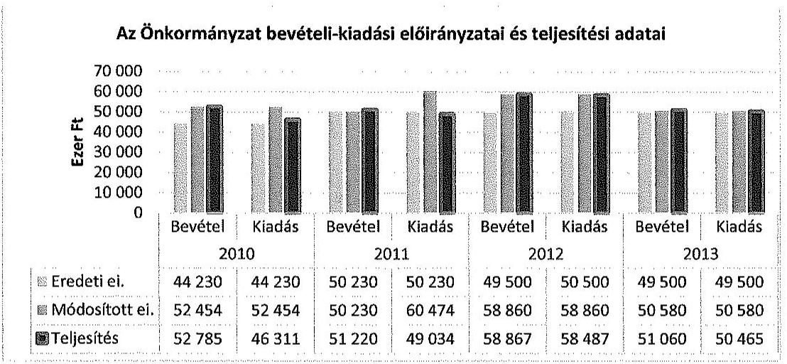
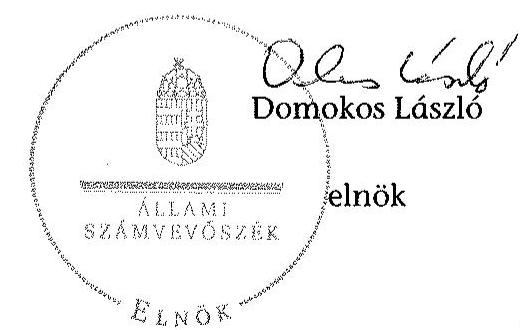
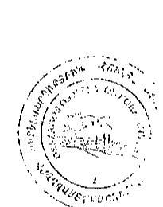

# ÁLLAMI   SZÁMVEVŐSZÉK 

## JELENTÉS

Az Országos Nemzetiségi Önkormányzatok gazdálkodásának ellenőrzéséről
Országos Örmény Önkormányzat

---

# Állami Számvevőszék 

Iktatószám: V-0695-073/2015.
Témaszám: 1729
Vizsgálat-azonosító szám: V0680

## Az ellenőrzést felügyelte:

## Kisgergely István

felügyeleti vezető

## Az ellenőrzést vezette:

Schósz Attila Ferencné
ellenőrzésvezető
A számvevői jelentések feldolgozásában és a jelentés összeállításában közremüködtek:

Schósz Attila Ferencné
ellenőrzésvezető
Szabó Tamás
számvevő tanácsos
Az ellenőrzést végezték:

| Solymár Ágnes | Szabó Tamás | Perlusz Krisztina |
| :-- | :-- | :-- |
| számvevő főtanácsos | számvevő főtanácsos | számvevő |

A témához kapcsolódó eddig készített számvevőszéki jelentés:
címe
sorszáma
Jelentés az Országos Örmény Önkormányzat 2003-2006. évi pénz- 0814 ügyi-gazdasági tevékenységének ellenőrzéséről

---

# TARTALOMJEGYZÉK 

BEVEZETÉS ..... 3
I. ÖSSZEGZŐ MEGÁLLAPÍTÁSOK, KÖVETKEZTETÉSEK, JAVASLATOK ..... 7
II. RÉSZLETES MEGÁLLAPÍTÁSOK ..... 16

1. A belső kontrollrendszer kialakításának és működtetésének megfelelősége ..... 16
1.1. A kontrollkörnyezet kialakítása ..... 16
1.2. A kockázatkezelési rendszer kialakításának és működtetésének megfelelősége ..... 18
1.3. A kontrolltevékenységek múködésének megfelelősége ..... 18
1.4. Információs és kommunikációs rendszer kialakításának és múködtetésének megfelelősége ..... 21
1.5. Monitoring-rendszer kialakításának és működtetésének megfelelősége ..... 22
2. A gazdálkodás szabályszerűsége ..... 23
2.1. Pénzügyi gazdálkodás megfelelősége ..... 23
2.2. Vagyongazdálkodással kapcsolatos feladatellátás szabályszerűsége ..... 29
3. Ingyenesen juttatott vagyon kezelésének megfelelősége ..... 30
4. Egyéb feladat- és hatáskör ellátás szabályszerűsége ..... 30
5. Integritás kontrollok ..... 31
6. ÁSZ javaslatok hasznosulása ..... 31

## MELLÉKLETEK

1. számú Az Országos Örmény Önkormányzat észrevétele
2. számú Az Országos Örmény Önkormányzat észrevételére válasz

## FÜGGELÉKEK

1. számú Rövidítések jegyzéke
2. számú Az integritás kontrollok kialakítása és működtetése

---

.

---

# JELENTÉS 

## Az Országos Örmény Önkormányzat gazdálkodásának ellenőrzéséről

## BEVEZETÉS

Az Országos Örmény Önkormányzat (továbbiakban: Önkormányzat) az 1995. évben alakult, Elnöke 2011. április 2-ától, jelenlegi Hivatalvezetője 2012 januárjától látja el feladatát. A 15 tagú Közgyűlés a munkája segítésére egy bizottságot (Pénzügyi bizottság) hozott létre. Az ellenőrzött időszakban a Hivatalban lévő Hivatalvezetőket munkaviszonyban, illetve vállalkozási szerződés alapján, a gazdasági vezetőket megbízási, illetve vállalkozási szerződéssel foglalkoztatták. Az Önkormányzat a 2010-2014. I. félév között egy intézménnyel, a kulturális központtal rendelkezett. Az Önkormányzat 2014. évi költségvetésében sem a Hivatalra, sem a kulturális központra nem tervezett létszámot. Az Önkormányzat az ellenőrzött időszakban intézményt, gazdasági társaságot és más szervezetet nem alapított, illetve ezek társulásában nem vett részt. Az Önkormányzat nem adott és nem vett át üzemeltetésre, kezelésbe, koncesszióba eszközöket. Térítésmentesen átadás-átvétel nem történt.

Az Önkormányzat költségvetési beszámolója szerint a 2013. évben a módosított költségvetési bevételi és kiadási előirányzat 50580 ezer Ft, a teljesített költségvetési bevétel 51060 ezer Ft, a teljesített költségvetési kiadás 50465 ezer Ft volt. Az Önkormányzat a 2013. évben 49500 ezer Ft államháztartásból származó támogatásban részesült.

Az Alaptörvény XXIX. cikk (1) bekezdése szerint a Magyarországon élő nemzetiségek államalkotó tényezők. Minden, valamely nemzetiséghez tartozó magyar állampolgárnak joga van önazonossága szabad vállalásához és megőrzéséhez. A hazánkban élő nemzetiségek helyi (települési és területi), valamint országos önkormányzatokat hozhatnak létre.

Az országos nemzetiségi önkormányzat gazdálkodási feladatait az önállóan múködő és gazdálkodó költségvetési szerve, a hivatal látja el. Az országos nemzetiségi önkormányzatok a 2008. évtől tartoznak az államháztartás önkormányzati alrendszerébe, azóta hivatalaik költségvetési szervként működnek. Az Alaptörvény hatálybalépését követően a 2012. évtől további jelentős jogszabályi változások határozzák meg múködésüket, gazdálkodásukat.

A nemzetiségek helyzete, támogatása mind hazai, mind EU-s szinten kiemelt figyelmet kap napjainkban. Az állam az országos nemzetiségi önkormányzatok múködéséhez, a médiaszolgáltatáshoz kapcsolódó jogaik érvényesítéséhez, valamint a kulturális önigazgatásuk érdekében alapított - közművelődési, közgyűjteményi, tudományos - intézmények fenntartásához az éves költségvetési törvényekben nevesítetten költségvetési támogatást biztosít. Ezen kívül az országos

---

nemzetiségi önkormányzatok közfeladataik ellátásához támogatást kapnak a fejezeti kezelésű előirányzatokból, valamint hazai és uniós pályázati forrásokat szerezhetnek.

Az ellenőrzés célja annak értékelése volt, hogy az Önkormányzat gazdálkodása, a belső kontrollrendszer kialakítása és múködése, az államháztartásból nyújtott támogatás, illetve az államháztartásból meghatározott célra ingyenesen juttatott vagyon felhasználása a jogszabályi előírásoknak megfelelően tör-tént-e; az Önkormányzat a Nek. tv.-ben és az Njtv.-ben előírt feladat- és hatásköröket ellátta-e; intézkedett-e az ÁSZ által a 2008-2010. évek között végzett ellenőrzések javaslatainak végrehajtásáról.

Az Önkormányzat korrupcióval szembeni veszélyeztetettségének csökkentése érdekében felmértük az integritási szemlélet érvényesülését a gazdálkodási folyamatokban.

Értékeltük az Önkormányzat gazdálkodása során a belső kontrollrendszer kialakítását és múködését mind az öt pillére tekintetében, ellenőriztük a gazdálkodással összefüggő feladat- és hatásköröknek, a Hivatal múködési, gazdálkodási rendjének jogszabályi előírásoknak való megfelelőségét; a belső kontrollok múködésének megfelelőségét az éves költségvetés, a költségvetési beszámoló és a zárszámadás készítés folyamatában; a gazdálkodás pénzügyi folyamatában a kulcskontrollok - (szakmai) teljesítésigazolás és 2011-ig utalvány ellenjegyzés, 2012-től érvényesítés - múködésének megfelelőségét; az Önkormányzat belső ellenőrzése kialakításának és múködésének megfelelőségét.

Értékeltük továbbá az Önkormányzat gazdálkodása, ezen belül pénzügyi gazdálkodása keretében a tervezés, beszámolási, zárszámadás-készítési folyamat, az előirányzatok betartása, a könyvvezetés, a közzétételek, adatszolgáltatások, valamint az államháztartás rendszeréből jogszabály vagy megállapodás alapján céljelleggel kapott támogatások felhasználásának, elszámolásának szabályszerűségét. A vagyonnal kapcsolatos feladatellátás ellenőrzése keretében értékeltük a vagyongazdálkodás szabályozottságát, a mérleg alátámasztottságát, a leltározás, az eszközbeszerzések, a vagyonhasznosítás, a tulajdonosi joggyakorlás szabályszerűségét. Értékeltük az államháztartásból ingyenesen juttatott vagyon felhasználásának szabályszerűségét. Ellenőriztük az előírt feladat- és hatáskörök közül a vélemény-nyilvánítási, egyetértési jog gyakorlásával, a hatáskör átruházásokkal, az ideiglenes vagyonkezeléssel kapcsolatos feladatok ellátásának szabályszerűségét, az integritás kontrollok múködését, továbbá az előző ÁSZ ellenőrzés javaslatainak hasznosulását.

Az ellenőrzés várható hasznosulása: Az ellenőrzés eredményeként nemcsak az ellenőrzött szerv gazdálkodása javulhat, hanem átfogó képet kaphatunk az önkormányzati alrendszerbe tartozó országos nemzetiségi önkormányzatok gazdálkodásának hiányosságairól, de a jó gyakorlatokról is. Az ellenőrzés megállapításait és javaslatait más szervezetek is hasznosíthatják a rendezett gazdálkodási keretek kialakításához. Az ellenőrzés hozadékát képezi a 2008-2010. években elvégzett ÁSZ ellenőrzés javaslatai hasznosulásának értékelése. Mind a 13 országos nemzetiségi önkormányzat ellenőrzésével teljes körűen megvalósul az országos nemzetiségi önkormányzatok ellenőrzése a megváltozott jogszabályi környezetben. Az ellenőrzés tapasztalatai alapján a jogszabályi ellentmondások, hiányosságok feltárásával, azok megszüntetésére vonatkozó javaslatokkal

---

segítjük a jó kormányzást. Az ellenőrzéssel lehetővé tesszük, hogy az országos nemzetiségi önkormányzatok gazdálkodásáról, múködéséről a társadalom objektív képet alkothasson.

Az Önkormányzat gazdálkodásának ellenőrzéséről szóló számvevőszéki jelentés I. fejezetének összegző része az ellenőrzés céljára adott rövid, szintetizáló összefoglalót és következtetéseket tartalmazza a II. fejezet részletes megállapításain alapulóan.

A jelentés intézkedést igénylő megállapításait és javaslatait az ellenőrzés során feltárt, a jelentés II. fejezetében rögzített részletes megállapítások alapozzák meg.

Az ellenőrzés típusa: szabályszerűségi ellenőrzés.
Az ellenőrzött időszak: 2010. január 1 - 2014. június 30.
Ellenőrzött szervezet: az Önkormányzat és Hivatala, továbbá azon intézmények, amelyek gazdálkodási feladatait a Hivatal látja el.

Az ellenőrzés végrehajtásának jogszabályi alapját az Állami Számvevőszékről szóló 2011. évi LXVI. törvény 1. § (3) bekezdése, az 5. § (2)-(3) és (6) bekezdései, valamint az államháztartásról szóló 2011. évi CXCV. törvény 61. § (2) bekezdésének előírásai képezik.

Az ellenőrzés módszertana az ÁSZ hivatalos honlapján (www.asz.hu) közzétett szakmai szabályokon alapul, amely a Legfőbb Ellenőrző Intézmények Nemzetközi Szervezete által kiadott nemzetközi standardok figyelembevételével készült.

Az ellenőrzés lefolytatásához az Önkormányzat a kimutatások és a tanúsítványok elektronikus kitöltésével, valamint az ÁSZ által kért dokumentumok elektronikus megküldésével szolgáltatott adatokat. Az így rendelkezésre bocsátott adatok, információk kontrollja és a munkalapok kitöltése az ellenőrzöttnél végzett ellenőrzés keretében történt.

A pénzügyi folyamatokban a kulcskontrollok (szakmai) teljesítésigazolás és érvényesítés (2011-ig utalvány ellenjegyzése) múködésének megfelelősége értékeléséhez az egyszerű véletlen mintavétellel kiválasztott tételek ellenőrzését megfelelőségi tesztek útján végeztük. A személyi juttatások, a dologi és felhalmozási kiadások, valamint a pénzeszközátadások felhasználásának szabályszerűségét, és a kiadások esetében a gazdálkodási jogkörök gyakorlását mintavétellel ellenőriztük. Megfelelőnek értékeltük a gazdálkodási jogkörök gyakorlását, amennyiben $95 \%$-os bizonyossággal a teljes sokaságban a hibaarány legfeljebb $10 \%$, részben megfelelőnek értékeltük, ha a hibaarány felső határa 10-30\% volt, nem megfelelőnek pedig akkor, ha a hibaarány felső határa a teljes sokaságban meghaladta a $30 \%$-ot. Az egyéb szabályszerűségi (nem pénzgazdálkodási jogkörökre vonatkozó) ellenőrzés során a mintatételek alacsony elemszáma miatt az eredmények nem voltak kivetíthetőek a teljes sokaságra, ezáltal a konkrét mintatételek (dologi és felhalmozási kiadások, pénzeszköz átadások felhasználásának) értékelését végeztük el. Az önkormányzat vagyonhasznosítási bevétellel nem rendelkezett, a céljelleggel kapott támogatások a mintatételek alacsony elemszáma teljes körűen kerültek ellenőrzésre.

---

Az ÁSZ a 2011. évi LXVI. törvény 29. §-a szerint a jelentéstervezetet megküldte az Országos Örmény Önkormányzat elnökének egyeztetésre. A beérkezett észrevételt és az arra adott választ a jelentés 1-2. sz. mellékletei tartalmazzák.

---

# I. ÖSSZEGZŐ MEGÁLLAPÍTÁSOK, KÖVETKEZTETÉSEK, JAVASLATOK 

A 2010-2014. I. félév között az Önkormányzatnál a belső kontrollrendszer kialakítása és múködtetése összességében nem volt szabályszerű.

A kontrollkörnyezet kialakítása nem az Önkormányzat múködését meghatározó jogszabályokkal összhangban történt, mivel a Hivatal nem rendelkezett az Áht. ${ }_{1,2}$ előírása ellenére - a teljes ellenőrzött időszakban SzMSz-szel, továbbá 2014. január 1-ig - az Áhsz.-ben foglaltakkal szemben - a Hivatalvezető által aláírt leltározási és leltárkészítési, értékelési, selejtezési és pénzkezelési szabályzattal, melyeket az előző időszakban az Elnök írt alá. A jogszabályi előírásoktól eltérően nem rendelkeztek a szabálytalanságok kezelésének eljárásrendjével, valamint nem határoztak meg etikai elvárásokat. A Hivatal - a Számv. tv. előírásaiban foglaltak ellenére - nem rendelkezett bizonylati renddel. A gazdálkodási szabályzat ${ }_{1-3}$, és más belső szabályzat - az Ámr. és az Ávr. előírásaitól eltérően nem tartalmazta a kis összegű kifizetések rendjét, továbbá a gazdálkodási szabályzat ${ }_{1}$-t - a jogszabályi előírások ellenére - az arra jogosult Hivatalvezető helyett az Elnök írta alá.

A Hivatal az Ámr. és a Bkr. előírásai ellenére nem alakított ki és nem múködtetett kockázatkezelési rendszert.

A kontrolltevékenységek kialakítása és múködtetése nem felelt meg az előírásoknak. Az éves költségvetés, beszámoló és zárszámadás készítésének folyamatában a belső kontrollokat a 2014. évig nem szabályozták, majd ezen időponttól a szabályozás ellenére sem múködtették.

A kulcskontrollok múködése a 2012. évtől javuló tendenciát mutatott, azonban a teljes ellenőrzött időszakban nem volt megfelelő. Az ellenőrzött támogatások közül egy nem felelt meg az átláthatóságról szóló törvény előírásának, mivel a támogatásban részesülő szervezet elnökének és az Önkormányzat Elnökének személye megegyezett. A 2013. évben a Kbt. előírása ellenére az egybeszámítási szabályokat mellőzték, mivel egy szolgáltatás megrendelésénél közbeszerzési eljárás lefolytatása nélkül kötötték meg a szerződéseket.

Az információs és kommunikációs rendszer kialakítása és múködtetése nem volt megfelelő, mivel a jogszabályi előírásoktól eltérően nem szabályozták a kötelezően közzéteendő adatok nyilvánosságra hozatalának és a közérdekú adatok megismerésére irányuló igények teljesítésének rendjét. Nem készítették el továbbá a jogszabályi előírások ellenére a Hivatal adatvédelmi és adatbiztonsági szabályzatát. A Hivatal az Eisztv.-ben, illetve az Info tv.-ben meghatározott kötelezettségének nem tett eleget, mivel nem tett közzé az Önkormányzat tevékenységére, múködésére vonatkozó néhány adatot. Nem tették közzé továbbá a 2010-2012. és 2014. évi költségvetését, a 2010-2011. és 2013. évi zárszámadását, költségvetési beszámolóját, egyszerűsített éves költségvetési beszámolóját. Az Önkormányzat nem gondoskodott a 2012-2014. I. félév között kapott céljellegú támogatásoknak a 28/2012. (II. 6.) Korm. rendeletben, illetve 428/2012.

---

(XII. 19.) Korm. rendeletben foglalt előírás ellenére honlapján történő közzétételéről. Az Önkormányzat nem biztosította a közpénzek felhasználásának átláthatóságát az általa céljelleggel nyújtott támogatások közzétételének elmaradása miatt.

Az Önkormányzat a 2011. évtől rendelkezett iratkezelési szabályzattal. Az Önkormányzat iratkezelési és iktatási rendszere a szabályozás ellenére sem biztosította az ügyintézési folyamatok nyomon követését, az adatok védelmét az lkr. és a Számv. tv. előírásaitól eltérően. Egy támogatásokra kötött szerződés, a közgyűlési ülésekről készült jegyzőkönyvek eredeti példányának, a 2013. évi összevont költségvetési beszámolónak a biztonságos megőrzése nem volt biztosított.

Az Önkormányzat monitoring rendszerének kialakítása és múködtetése nem volt szabályszerű. A Hivatalvezető - a jogszabályban foglaltak ellenére - nem alakította ki a Hivatal tevékenységének, a célok megvalósításának nyomon követését biztosító rendszert, nem gondoskodott ellenőrzési nyomvonal elkészítéséről.

A belső ellenőrzés kialakítása és működtetése összességében nem volt megfelelő, mivel a Hivatalvezető a belső ellenőrzés kialakításáról és működtetéséről csak a 2010-2011. években gondoskodott, 2012-2014. I. félévében - az Áht. ${ }_{2}$-ben és a Bkr.-ben előírtak ellenére - mindezeket nem biztosította. A Ber.-ben és a Bkr.ben foglaltakkal szemben nem gondoskodtak a belső ellenőrzés jogállásának, feladatainak meghatározásáról, továbbá a belső ellenőrzési kézikönyvet az arra jogosult Hivatalvezető helyett az Elnök írta alá. A 2010-2011. évi ellenőrzésekhez nem készítettek ellenőrzési tervet, az elvégzett belső ellenőrzések ellenére a Hivatalvezető nem küldte meg az Elnök részére az éves összefoglaló ellenőrzési jelentést. Nem vezettek továbbá nyilvántartást a belső ellenőrzési jelentésekben tett megállapításokról, javaslatokról és azok végrehajtásának nyomon követéséről. A belső ellenőrzés és a Budapest Főváros Kormányhivatal ellenőrzése által feltárt hiányosságokra a Ber. és a Bkr. vonatkozó előírásai ellenére intézkedési tervet nem készítettek. Az ellenőrzések nem járultak hozzá az Önkormányzat előírásoknak megfelelő gazdálkodásának megvalósításához.

Az Önkormányzat pénzügyi gazdálkodása részben felelt meg az előírásoknak. A Pénzügyi bizottság a 2010-2014. évi költségvetési határozat-tervezeteket az előírások betartásával véleményezte. A 2010-2014. évi költségvetési határo-zat-tervezetek, határozatok nem az Ámr.-ben, illetve az Áht. ${ }_{2}$-ben meghatározott szerkezetben és tartalommal készültek. A beterjesztett 2010-2014. évi költségvetési határozat-tervezetet az Áht. ${ }_{1,2}$-ben foglalt határidőn belül fogadta el a Közgyűlés.

Az Önkormányzat a 2010. évi elemi beszámolónak a bevételek és kiadások előirányzatát és teljesítését bemutató űrlapját nem készítette el, a 2011. évi beszámoló űrlapján nem töltötte ki az eredeti előirányzat oszlopát. A költségvetési beszámolók hiányosan kitöltött adatai miatt az Elnök és a Hivatalvezető nem tartotta be az (adatok teljes körűségére, valódiságára és tartalmi egyezőségére vonatkozó) Ámr.-ben foglaltakat. A 2010-2013. évi zárszámadási határozat-tervezeteket a Pénzügyi bizottság az előírások szerint véleményezte. Az Elnök a zárszámadási határozat-tervezeteket határidőben a Közgyűlés elé terjesztette. A zárszámadás előterjesztésekor a 2010-2011. évekre az Ámr. előírása ellenére nem mutatta be a pénzeszköz változásokat, nem mellékelte az összevont könyvviteli

---

mérleget, vagyonkimutatást és a 2012-2013. évekre az Áht. ${ }_{2}$-ben foglaltak ellenére a pénzeszköz változásokat és a vagyonkimutatást.

A Hivatalvezető a 2010., 2013-2014. évi elemi költségvetéseket az Ámr.-ben, Ávr.-ben foglaltak ellenére nem küldte meg a kisebbségpolitikáért felelős állami szervnek, illetve a Kincstárnak. Az Önkormányzat a 2010, 2013. és 2014. évben nem teljesítette a jogszabályban előírt időközi költségvetési jelentésre és mérlegjelentésre vonatkozó adatszolgáltatási kötelezettségét, továbbá a 2010-2013. évi elemi költségvetési beszámolót nem nyújtották be a kisebbségpolitikáért/nemzetiségpolitikáért felelős miniszternek.

Az Önkormányzat az államháztartás rendszeréből jogszabály, illetve megállapodás alapján kapott támogatások felhasználása és elszámolása során részben tartotta be a jogszabályi és a szerződéses előírásokat. A központi költségvetésből kapott múködési támogatásról, illetve azok felhasználásáról elkülönített nyilvántartást az előírások ellenére nem vezettek. Az Önkormányzat a 20102011. években az Áht. ${ }_{1}$-ben előírtak ellenére - a 2011. III. negyedéves támogatás elszámolásának bizonylatai kivételével - a támogatások felhasználását, számadását nem ellenőrizte. A 2012-2014. I. félévében az Önkormányzat ellenőrzést nem végzett, melynek hiányában nem állapított meg az Áht. ${ }_{2}$-ben foglaltak szerinti jogosulatlan igénybevételt, jogszabálysértő vagy nem rendeltetésszerű felhasználást.

Az Önkormányzat az általa nyújtott támogatási lehetőségeket - a Nek. tv.-ben foglalt előírás ellenére - az érintettek számára nem hozta nyilvánosságra, ezáltal a támogatás odaítélésekor a jogosultak számára az egyenlő bánásmód követelményét nem biztosította. A támogatások felhasználása összhangban volt a Nek. tv.-ben foglalt nemzetiségi feladatokkal. A támogatottak beszámolási kötelezettségüknek (egy kivételével) eleget tettek. Az Önkormányzat a benyújtott számadásokat - egy kivételével - nem ellenőrizte, mely nem felelt meg az Áht. ${ }_{1}$-ben foglalt előírásoknak. Az ellenőrzés elmaradása következtében nem tárta fel, hogy egy támogatott szervezet a számadásban a támogatási szerződésben foglaltaktól eltérően beruházási költséget is elszámolt. A támogatási céllal történő ellentétes felhasználás miatt - az Áht. ${ }_{1}$-ben foglalt előírás ellenére - a visszafizetés iránti intézkedés sem történt meg.

Az Önkormányzat vagyongazdálkodási tevékenysége összességében nem volt szabályszerű. Nem határozták meg a jogszabályi előírások ellenére a vagyongazdálkodás szabályait. A 2010-2013. évi beszámolók mérlegsorait a Számv. tv. és az Áhsz. előírásai ellenére leltárral nem támasztották alá, a könyvviteli mérlegadatok valódisága nem igazolható. Az Önkormányzat az ellenőrzött időszakban egy alkalommal szerzett be tárgyi eszközt és immateriális javakat, melynek során az üzembe helyezés, értékelés, állományba vétel az Áhsz., továbbá a Hivatal és a kulturális központ között hatályos együttműködési megállapodás előírásától eltérően nem történt meg. A 2010-2014. I. félévben nem volt vagyonértékesítés, illetve bérbeadás.

Az Önkormányzat tulajdonába ingyenes vagyonjuttatásként a székhelyként funkcionáló ingatlan került, mely az ellenőrzött időszakban az előírásoknak előírásának megfelelően forgalomképtelen vagyonként szerepelt a nyilvántartásban, annak kezelése szabályszerű volt.

---

Az Önkormányzat a jogszabályokban és az SzMSz-ben meghatározott véle-mény-nyilvánítási, egyetértési, közremüködési feladatainak eleget tett.

A 2008. évi ÁSZ ellenőrzés során tett javaslatok összességében nem hasznosultak. Az ÁSZ az Önkormányzat 2003-2006. évi pénzügyi-gazdasági tevékenységének ellenőrzése során hét javaslatot fogalmazott meg. Az intézkedési tervben meghatározott határidőre egyet hasznosítottak. Kettő - a belső ellenőrzési rendszer múködésével és a szabályzatok felülvizsgálatával kapcsolatos javaslat részben hasznosult. Az intézményalapításra és céltámogatás elszámolására, valamint a közzétételi kötelezettségre vonatkozó kettő javaslat nem teljesült. Egy javaslatot határidőn túl részben valósítottak meg, mivel az önellenőrzésre tett javaslat közül a telefon költségtérítés személyi jövedelemadó, és járulék vonzata került csak bevallásra. Egy javaslat okafogyottá vált, mivel az Önkormányzat a 2008. évtől nem társadalmi szervezet, hanem a költségvetési gazdálkodás szabályai vonatkoznak rá.

Az ÁSZ tv. 33. § (1) bekezdésében foglaltak értelmében a jelentésben foglalt megállapításokhoz kapcsolódó intézkedési tervet köteles az ellenőrzött szervezet vezetője összeállítani, és azt a jelentés kézhezvételétől számított 30 napon belül az ÁSZ részére megküldeni. Amennyiben az intézkedési tervet határidőben nem küldi meg a szervezet, vagy az nem elfogadható, az ÁSZ elnöke a hivatkozott törvény 33. § (3) bekezdés a)-b) pontjaiban foglaltakat érvényesítheti.

A helyszíni ellenőrzés megállapításainak hasznosítása mellett javasoljuk:

# az Elnöknek 

1. Az Elnök a Közgyűlésnek nem mutatta be a 2010-2013. évekre az Ámr. 40. § (6) bekezdés a), c) és d) pontjaiban, valamint az Áht. 2 91. § (2) bekezdés a) és c) pontjában foglaltak ellenére a pénzeszközváltozásokat és a vagyonkimutatást.

Javaslat:
Intézkedjen, hogy a jövőben a Közgyűlés részére kerüljenek bemutatásra a zárszámadási határozat beterjesztésekor a jogszabályban előírt mérlegek és a kimutatások.
2. A Hivatal, mint önállóan működő és gazdálkodó költségvetési szerv - az Áht. 91. § (2) bekezdésében, valamint az Áht. 2 10. § (5) bekezdésében foglaltaktól eltérően nem rendelkezett SzMSz-szel.

Javaslat:
Terjessze a Közgyűlés elé a hivatalvezető által előkészített, a Hivatalra vonatkozó SzMSz-t.

## a Hivatalvezetőnek

1. A belső kontrollrendszeren belül:
a) A kontrollkörnyezet kialakítása részben volt megfelelő, mivel a Hivatal, mint önállóan működő és gazdálkodó költségvetési szerv - az Áht. 1 91. § (2) bekezdésében, valamint az Áht. 2 10. § (5) bekezdésében foglaltaktól eltérően - nem rendelkezett SzMSz-

---

szel. A Hivatal a Számv. tv. 161. § (2) bekezdés d) pontjában foglaltak ellenére nem rendelkezett bizonylati renddel. A Hivatalvezető az Ámr. 161. §, az Ámr. 156. § (3) bekezdés (2011. január 1-étől hatályos) és a Bkr. 6. § (4) bekezdés előírásaitól eltérően nem alakította ki a szabálytalanságok kezelésének eljárásrendjét, illetve az Ámr. 156. (1) bekezdés c) pontjában, a Bkr. 6. § (1) bekezdés c) pontjában foglaltak ellenére nem határozta meg az etikai elvárásokat. Az Ámr. 156. § (2) bekezdése és a Bkr. 6. § (3) bekezdése előírásaitól eltérően nem gondoskodott az ellenőrzési nyomvonal elkészítéséről. A gazdálkodási szabályzat1-3, és más belső szabályzat - az Ámr. 72. § (13)-(14) bekezdéseiben és az Ávr. 53. § (1)-(2) bekezdéseiben foglalt előírásoktól eltérően - nem tartalmazta a gazdasági eseményenként 100 ezer Ft-ot el nem érő (kis összegű), előzetes írásbeli kötelezettségvállalást nem igénylő kifizetések rendjét.
Javaslat:
Intézkedjen a Hivatal SzMSz-ének, a bizonylati rend, a gazdasági eseményenként 100 ezer Ft-ot el nem érő (kis összegű), előzetes írásbeli kötelezettségvállalást nem igénylő kifizetések rendje, az ellenőrzési nyomvonal, valamint a szabálytalanságok kezelésének eljárásrendje elkészítésére és az etikai elvárások meghatározására.
b) A kockázatkezelési rendszer kialakítása és működtetése az ellenőrzött időszakban az Ámr. 155. § (1) bekezdése, a 157. § (1) bekezdése, valamint a Bkr. 3. § b) pontja és 7. § (1) bekezdése előírásától eltérően nem történt meg.
Javaslat:
Alakítsa ki és múködtesse a kockázatkezelési rendszert.
c) A kontrolltevékenységek kialakítása és múködtetése tekintetében az ellenőrzött időszakban a gazdálkodási jogkörök gyakorlása (teljesítésigazolás, érvényesítés és 2011. december 31-ig az utalvány ellenjegyzés) nem felelt meg az Ámr. 76. § (3) bekezdése, a 79. § (2) bekezdése, továbbá az Ávr. 57. § (1) és (3) bekezdései és az 58. § (1)-(2) és (4) bekezdései előírásainak.

Javaslat:
Intézkedjen a gazdálkodási jogkörök szabályszerű gyakorlásának érvényesítéséről.
d) Az információs és kommunikációs rendszer működtetése nem volt megfelelő, mivel a Hivatalvezető - az Info tv. 35. § (3) bekezdésében, az Ámr. 20. § (3) bekezdés i) pontjában és az Ávr. 13. § (2) bekezdés h) pontjában foglalt előírás ellenére - a kötelezően közzéteendő adatok nyilvánosságra hozatalának rendjét nem alakította ki. Nem szabályozta a közérdekú adatok megismerésére irányuló igények teljesítésének rendjét, ezáltal nem tett eleget az 1992. évi LXIII. törvény 20. § (8) bekezdésében, az Info tv. 30. § (6) bekezdésében, az Ámr. 20. § (3) bekezdés i) pontjában és az Ávr. 13. § (2) bekezdés h) pontjában foglalt előírásoknak.
Javaslat:
Alakítsa ki a kötelezően közzéteendő adatok nyilvánosságra hozatalának és megismerésére irányuló igények teljesítésének rendjét.

---

A Hivatalvezető - az 1992. évi LXIII. törvény 31/A. § (3) bekezdésében és az Info tv. 24. § (3) bekezdésében foglaltak ellenére - nem készítette el a Hivatal adatvédelmi és adatbiztonsági szabályzatát.

Javaslat:
Intézkedjen a Hivatal adatvédelmi és adatbiztonsági szabályzatának elkészítésére.
A Hivatal az Eisztv. 6. § (1) bekezdésében, illetve az Info tv. 37. § (1) bekezdésében meghatározott kötelezettségének nem tett eleget, mivel nem tette teljes körűen közzé az Önkormányzat tevékenységére, müködésére vonatkozó adatait, valamint az Önkormányzat 2010-2012. és 2014. évi költségvetését, a 2010-2011. és 2013. évi zárszámadását, költségvetési beszámolóját, egyszerűsített éves költségvetési beszámolóját. Elmaradt továbbá - a 28/2012. (II. 6.) Korm. rendelet 12. § (5) bekezdésében, illetve 428/2012. (XII. 19.) Korm. rendelet 13. § (2) bekezdésében foglalt előírás ellenére - az Önkormányzat 2012-2014. I. félévek között kapott céljellegú támogatásainak, illetve az Áht. 1 15/A. § (1) bekezdésében foglalt előírás ellenére az Önkormányzat által céljelleggel nyújtott támogatások adatainak közzététele.

Javaslat:
Gondoskodjon az Önkormányzat tevékenységére, müködésére vonatkozó adatok, az éves költségvetések, zárszámadások, költségvetési beszámolók, egyszerűsített éves költségvetési beszámolók, valamint az Önkormányzat által kapott és nyújtott céljellegű támogatások adatainak közzétételéről.

Az Önkormányzat iratkezelési és iktatási rendszere nem biztosította az ügyintézési folyamatok nyomon követését, az adatok védelmét az lkr. 8. § (1)-(2) bekezdései, a 14. § (4) bekezdése előírásaitól eltérően.

Javaslat:
Biztosítsa az ügyintézési folyamatok nyomon követését, az adatok védelmét.
e) A monitoring rendszer kialakítása és müködtetése nem volt megfelelő, mivel a Hivatalvezető - az Áht. 1 121. § (2) bekezdés e) pontja, valamint a Bkr. 3. § e) pontjában foglalt előírások ellenére - nem alakította ki a Hivatal tevékenységének, a célok megvalósításának nyomon követését biztosító rendszert.
Javaslat:
Alakítsa ki a Hivatal tevékenységének, a célok megvalósításának nyomon követését biztosító rendszert és gondoskodjon annak müködtetéséről.

A Hivatalvezető a belső ellenőrzés kialakításáról és müködtetéséről - az Áht. 2 70. § (1) bekezdésében, és a Bkr. 15. § (1) bekezdésében előírtak ellenére - 2012-2014. I. félévében nem gondoskodott. Nem írta elő továbbá - a Ber. 4. § (2) bekezdésében és a Bkr. 15. § (2) bekezdésében előírtak ellenére - hivatali SzMSz hiányában a belső ellenőrzés jogállását, feladatait.

---

Javaslat:
Alakítsa ki és múködtesse a belső ellenőrzést és gondoskodjon a belső ellenőrzés jogállásának, feladatainak meghatározásáról.

A Hivatal - a Ber. 5. § (1) bekezdése és a Bkr. 17. § (1) bekezdése előírásától eltérően - nem rendelkezett a Hivatalvezető által jóváhagyott belső ellenőrzési kézikönyvvel, mivel azt az Elnök írta alá. A belső ellenőrzési vezető a Ber. 32/A. § (2) bekezdése előírásától eltérően nem dolgozott ki a 2010-2011. évekre vonatkozóan éves ellenőrzési tervet. A Hivatalvezető a belső ellenőrzés kialakításáról és múködtetéséről a 20122014. I. félévében nem gondoskodott, ezért ezen időszakra vonatkozóan az éves ellenőrzési tervek kidolgozása sem történt meg.

Javaslat:
Intézkedjen, hogy az Önkormányzat rendelkezzen jóváhagyott belső ellenőrzési kézikönyvvel, valamint gondoskodjon, hogy a belső ellenőrzési vezető készítse el éves ellenőrzési tervet.

Az Önkormányzatnál lefolytatott belső és külső ellenőrzések által feltárt hiányosságokra a Ber. 29. § (1) bekezdésben és a Bkr. 45. § (1) bekezdésében előírtak ellenére az ellenőrzött szerv vezetője intézkedési tervet nem készített, valamint a belső ellenőrzési vezető - a Ber. 32. § (1)-(2) bekezdéseiben, a Bkr. 47. § (1) bekezdésében foglaltak ellenére - nem vezetett nyilvántartást a belső ellenőrzési jelentésekben tett megállapításokról, javaslatokról, továbbá a 2012. évtől azok végrehajtásának nyomon követéséről.

Javaslat:
Intézkedjen annak érdekében, hogy a belső és külső ellenőrzések által feltárt hiányosságokra készítsenek intézkedési tervet, valamint gondoskodjon arról, hogy a belső ellenőrzési vezető vezessen nyilvántartást a belső ellenőrzési jelentésekben tett megállapításokról, javaslatokról és azok végrehajtásának nyomon követéséről.
f) A belső kontrollrendszer minőségét a Hivatalvezető az Ámr. 217. § c) pontja alapján az Ámr. 21. számú mellékletében, illetve a Bkr. 11. § (1) bekezdése alapján a Bkr. 1. számú mellékletében foglaltak szerinti nyilatkozatban a 2010-2013. évekre nem értékelte.

Javaslat:
Értékelje a belső kontrollrendszer minőségét a jogszabályban előírt nyilatkozatban.
2. A pénzügyi- és vagyongazdálkodás területén
a) A Hivatalvezető a költségvetési határozat-tervezeteket - az Ámr. 36. § (3) bekezdés és az Ávr. 27. § (1) bekezdése ellenére - a költségvetési szerv vezetőjével nem egyeztette, eredményét írásban nem rögzítette.

Javaslat:
Egyeztesse a költségvetési határozat-tervezeteket a költségvetési szerv vezetőjével és annak eredményét írásban rögzítse.

---

b) A 2012-2014. évi költségvetési határozatok nem az Áht. 2 23. § (2) bekezdés b), c), h) pontjaiban meghatározott szerkezetben és tartalommal készültek, továbbá a 2014. évi költségvetés előterjesztésekor az Áht. 2 24. § (4) bekezdés a) pontjában foglaltak ellenére nem mellékelték az előirányzat felhasználási tervet.
Javaslat:
Intézkedjen, hogy a költségvetési határozat-tervezeteket a jogszabályban meghatározott szerkezetben és tartalommal készítsék el és mellékeljék az előirányzat felhasználási tervet.
c) A Hivatalvezető nem küldte meg a 2010. évi elemi költségvetését az Ámr. 52. § (4) bekezdésében foglaltak ellenére a kisebbségpolitikáért felelős állami szervnek, a 20132014. évi elemi költségvetését az Ávr. 33. § (2) bekezdésében előírtak ellenére a Kincstárnak. Az Önkormányzat és az irányítása alá tartozó költségvetési szervek 2010-2013. évi elemi költségvetési beszámolóját az Áhsz. 10. § (8) bekezdésben foglaltak ellenére a nemzetiségpolitikáért felelős miniszternek nem nyújtották be.
Javaslat:
Küldje meg az elemi költségvetéseket, továbbá beszámolókat az előírásoknak megfelelően a Kincstárnak.
d) Az Önkormányzat a 2010, 2013. és 2014. évben nem teljesítette az Ámr. 205. § (1), valamint az Ávr. 169. § (2) bekezdésben előírt, az Önkormányzat és az irányítása alá tartozó költségvetési szervek időközi költségvetési jelentésre és időközi mérlegjelentésre vonatkozó adatszolgáltatási kötelezettségét.
Javaslat:
Tegyen eleget az Önkormányzat és az irányítása alá tartozó költségvetési szervek tekintetében az időközi költségvetési jelentésre és időközi mérlegjelentésre vonatkozó adatszolgáltatási kötelezettségnek.
e) Az Önkormányzat a Nek. tv. 37. § (1) bekezdés b) pontjában, illetve az Njtv. 113. § c) pontjában előírtak ellenére nem határozta meg vagyonleltárát.

Javaslat:
Készítse el az önkormányzat vagyonleltárát és terjessze jóváhagyásra a Közgyűlés elé.
f) Az Önkormányzat, a Hivatal és az intézményei 2010-2013. évi beszámolók eszköz és forrás mérlegsorait leltárral nem támasztották alá, amely nem felelt meg a Számv. tv. 69. § (1) bekezdésében és az Áhsz. 37. § (1) és (3) bekezdéseiben foglaltaknak.

Javaslat:
Intézkedjen a mérleg tételeinek alátámasztására szolgáló leltár elkészíttetéséről, amely az eszközök és források állományát tételesen és ellenőrizhető módon tartalmazza.
g) Az Önkormányzat az örmény kőkereszt készítésére közbeszerzési eljárás lefolytatása nélkül kötött szerződéseket, megsértve a Kbt. 18. §-ában meghatározott egybeszámítási szabályokat.

---

Javaslat:
Közbeszerzési értékhatár elérése esetén gondoskodjon a közbeszerzési eljárás lefolytatásáról.
h) A beszerzett tárgyi eszköz és immateriális javak üzembe helyezése, értékelése és állományba vétele - az Áhsz. 28. § (5) bekezdése előírásától, továbbá a Hivatal és a kulturális központ között hatályos együttmüködési megállapodás II. fejezet 5. pontjának előírásától eltérően - sem a gazdasági esemény megtörténte után, sem azt követően az ellenőrzött időszakban nem történt meg.
Javaslat:
Végezzék el az előírások szerint a beszerzett tárgyi eszköz és immateriális javak üzembe helyezését és értékelését.
3. Az országos nemzetiségi önkormányzat részére adott, illetve az által nyújtott támogatások tekintetében:
a) A Kulturális Egyesület támogatása esetében a szerződés megkötése nem felelt meg az átláthatóságáról szóló törvény 6. § (1) bekezdés e) pontjában előírtaknak, mivel a támogatásban részesülő szervezet elnökének személye és az Önkormányzat Elnökének személye megegyezett.
Javaslat:
Intézkedjen, hogy a támogatási szerződés esetén az átláthatóságról szóló törvény előírása betartásra kerüljön.
b) Az Önkormányzat a központi költségvetésből kapott támogatásokról a 342/2010. (XII. 28.) Korm. rendelet 10. § (2) bekezdésében, illetve a 28/2012. (III. 6.) Korm. rendelet 11. § (2) bekezdésében, illetve azok felhasználásáról a 428/2012. (XII. 29.) Korm. rendelet 10. § (4) bekezdésében foglalt előírás ellenére elkülönített nyilvántartást nem vezetett.
Javaslat:
Intézkedjen, hogy az Önkormányzat a müködési támogatások felhasználásáról elkülönített nyilvántartást vezessen.
c) Az Önkormányzat - a 2011. III. negyedéves támogatás elszámolásának bizonylatai kivételével - az ellenőrzött évek a nemzetiségi sajtó müködésére nyújtott támogatásainak felhasználását az Áht. 2 54. §-ban előírtak ellenére, továbbá az Önkormányzat az általa nyújtott egyedi támogatások felhasználását az Áht. 1 13/A. § (2) bekezdésében foglalt előírás ellenére nem ellenőrizte.
Javaslat:
Intézkedjen az Önkormányzat által nyújtott támogatások felhasználásának ellenőrzéséről.

---

# II. RÉSZLETES MEGÁLLAPÍTÁSOK 

## 1. A BELSŐ KONTROLLRENDSZER KIALAKÍTÁSÁNAK ÉS MŰKÖDTETÉSÉNEK MEGFELELŐSÉGE

Az ellenőrzött időszakban az Önkormányzatnál a belső kontrollrendszer (a kontrollkörnyezet, a kockázatkezelési rendszer, a kontrolltevékenységek, az információs és kommunikációs rendszer, valamint a monitoring rendszer) kialakítása és múködtetése összességében nem volt szabályszerű az alábbiakban részletezett szabályozásbeli és múködésbeli hibák, hiányosságok miatt.

### 1.1. A kontrollkörnyezet kialakítása

A kontrollkörnyezet kialakítása nem az Önkormányzat múködését meghatározó jogszabályokkal összhangban történt.

Az Önkormányzat - a 2010-2014. I. félév között - a Nek. tv. és az Njtv. előírásainak megfelelő SzMSz-szel rendelkezett, melyet a Közgyűlés az ellenőrzött időszakban a 2011. és a 2013. évben módosított. Az Önkormányzat az SzMSz 2011. évi módosítását - a Nek. tv. 39/G. § (4) bekezdésében foglalt előírás ellenére - a Magyar Közlönyben, illetve internetes honlapján nem tette közzé, a 2013. évi SzMSz módosítást a honlapján közzé tette.

A Közgyűlés - a Vnytv. 4. § a) és d) pontjaiban foglaltak ellenére - a vagyonnyi-latkozat-tételre kötelezettek körét az SzMSz-ben nem szabályozta. A szabályozás hiánya ellenére a képviselők, a Nek. tv. és az Njtv. előírásainak eleget téve, az ellenőrzött időszak minden évében megtették vagyonnyilatkozatukat.

A Hivatal múködésének szabályait az SzMSz a Nek. tv.-ben és az Njtv.-ben foglaltakkal összhangban, teljes körűen tartalmazta. A Hivatal azonban, mint önállóan működő és gazdálkodó költségvetési szerv - az Áht. ${ }_{1} 91 . \S$ (2) bekezdésében, valamint az Áht. ${ }_{2} 10 . \S$ (5) bekezdésében foglaltaktól eltérően - nem rendelkezett SzMSz-szel.

Az Önkormányzat ellenőrzött időszakra kinevezett Hivatalvezetői és gazdasági vezetői rendelkeztek a Nek. tv., az Ámr. és az Ávr. előírásainak megfelelő végzettséggel. A Hivatal dolgozói - a Munka tv. ${ }_{1,2}$ előírásaival összhangban - rendelkeztek megfelelő munkaköri leírásokkal.

Az Önkormányzat gazdálkodásának szabályozottsága az ellenőrzött években az előírásoknak részben felelt meg. A Hivatal - a Számv. tv., az Áhsz. és a 4/2013. (I. 11.) Korm. rendelet előírásaival összhangban - rendelkezett hatályos, Hivatalvezető által aláírt számviteli politika ${ }_{1,2}$-vel. A 2010-2013. években - a Számv. tv. 161. § (1) bekezdésében, az Áhsz. 49. § (1bekezdésében foglaltaktól eltérően - nem rendelkeztek számlarenddel. A hiányosságot 2014. I. félévében pótolták. A Hivatalnak a teljes ellenőrzött időszakban - a Számv. tv. 161. § (2) bekezdés d) pontjában foglaltak ellenére - nem volt bizonylati rendje.

---

A Hivatal rendelkezett továbbá az ellenőrzött időszakban - a Számv. tv., az Áhsz., és a 4/2013. (I. 11.) Korm. rendelet előírásaival összhangban - leltározási és leltárkészítési szabályzattal, értékelési szabályzattal, pénzkezelési szabályzattal, valamint selejtezési szabályzattal. A leltározási és leltárkészítési szabályzat ${ }_{1}$ et, az értékelési szabályzat ${ }_{1}$-et, a selejtezési szabályzat ${ }_{1}$-et, a pénzkezelési szabály-zat ${ }_{1,2}$-t, azonban - az Áhsz. 8. § (12) bekezdés és 37. § (5) bekezdés előírása ellenére - az arra jogosult Hivatalvezető helyett az Elnök írta alá. 2014. január 1jétől rendelkeztek a Hivatalvezető által aláírt leltározási és leltárkészítési sza-bályzat ${ }_{2}$-vel, értékelési szabályzat ${ }_{2}$-vel, selejtezési szabályzat ${ }_{2}$-vel, a pénzkezelési szabályzat ${ }_{3}$-mal.

A Hivatalvezető - az Ámr. 156. § (2) bekezdése és a Bkr. 6. § (3) bekezdése előírásaitól eltérően - nem gondoskodott a Hivatal működésének irányítási és ellenőrzési folyamatai, a felelősségi és információs szintek, kapcsolatok leírását tartalmazó ellenőrzési nyomvonal elkészítéséről.

A Hivatal - az Ámr. és az Ávr. előírásaival összhangban - rendelkezett a kötelezettségvállalás, pénzügyi ellenjegyzés, teljesítésigazolás, érvényesítés és utalványozás gyakorlására vonatkozó eljárásrendjét tartalmazó gazdálkodási szabály-zat ${ }_{1-2}$-mal. A gazdálkodási szabályzat ${ }_{1}$-et - az Áht ${ }_{1}$ 121/A. § (1) bekezdésének, illetve az Áht ${ }_{2}$ 69. § (2) bekezdésének előírása ellenére - az arra jogosult Hivatalvezető helyett az Elnök írta alá.

A gazdálkodási szabályzat ${ }_{1}$ az Ámr. előírásainak megfelelően tartalmazta a kötelezettségvállalásra és az utalványozásra jogosultak körét és feladatait. Ugyanakkor 2011. december 31-ig a kötelezettségvállalás ellenjegyzésére, az érvényesítésre és az utalvány ellenjegyzésére jogosultak körét nem az Ámr. 74. § (2) bekezdése j) pontjában, az Ámr. 77. § (4) bekezdésében, és az Ámr. 79. § (1) bekezdésében foglaltaknak megfelelően határozták meg, mert a Hivatalvezető helyett a gazdasági vezetőt jelölték ki. Az Ámr. 20. § (3) bekezdés a) pontjában foglaltaktól eltérően belső szabályzatban nem rendelkeztek a szakmai teljesítésigazolás, ellenjegyzés gyakorlásának módjáról, az eljárási és dokumentációs részletszabályokról.

A gazdálkodási szabályzat ${ }_{2,3}$ (2012. június 1-jétől) az Ávr. előírásainak megfelelően tartalmazta a kötelezettségvállalásra, az ellenjegyzésre, a teljesítésigazolásra, az érvényesítésre és az utalványozásra jogosultak körét, feladatait, és részletszabályait, továbbá a kötelezettségvállalásokhoz kapcsolódó analitikus nyilvántartás vezetésének módját. A gazdálkodási szabályzat ${ }_{1-3}$, és más belső szabályzat - az Ámr. 72. § (13)-(14) bekezdéseiben és az Ávr. 53. § (1)-(2) bekezdéseiben foglalt előírásoktól eltérően - nem tartalmazta a gazdasági eseményenként 100 ezer Ft-ot el nem érő (kis összegű), előzetes írásbeli kötelezettségvállalást nem igénylő kifizetések rendjét.

A Hivatal - az Ámr. 20. § (3) bekezdés b)-c), f)-h) pontjainak és az Ávr. 13. § (2) bekezdés b)-c), e)-g) pontjainak előírásaitól eltérően - nem rendelkezett a beszerzések lebonyolításának, a belföldi és külföldi kiküldetések elszámolásának, a reprezentációs kiadások elszámolásának, a gépjárművek igénybevételének és használatának, valamint a vezetékes és rádiótelefonok használatának rendjére vonatkozó szabályozással.

---

A Hivatalvezető - az Ámr. 156. § (3) bekezdés ${ }^{1}$ és a Bkr. 6. § (4) bekezdés előírásaitól eltérően - nem alakította ki a szabálytalanságok kezelésének eljárásrendjét, ezáltal nem került meghatározásra a szabálytalanság fogalma, a szabálytalanságok észlelésének, az intézkedések (eljárások) meghatározásának, nyomon követésének és nyilvántartásának rendje. A Hivatalnál a kontrollkörnyezet kialakításának keretében - az Ámr. 156. § (1) bekezdés c) pontjában, a Bkr. 6. § (1) bekezdés c) pontjában foglaltak ellenére - a 2010-2014. I. félévére vonatkozóan nem határoztak meg etikai elvárásokat.

Az ellenőrzött időszakban a Hivatal nem rendelkezett gazdasági szervezettel, amely gyakorlat 2014. évre vonatkozóan nem felelt meg az Ávr. 8. § (1) bekezdés c) pontjában foglalt előírásnak.

A Hivatal és az önállóan múködő kulturális központ - az Ámr. és az Ávr. előírásának megfelelően, a 2008. június 21 -én kelt - megállapodásban rögzítették a gazdálkodással kapcsolatos munkamegosztás és felelősségvállalás rendjét.

# 1.2. A kockázatkezelési rendszer kialakításának és múködtetésének megfelelősége 

A Hivatalvezető - az Ámr. 157. § (2) bekezdésben és a Bkr. 7. § (2) bekezdésében foglalt előírás ellenére - nem mérte fel és nem állapította meg a Hivatal tevékenységében, gazdálkodásában rejlő kockázatokat és nem határozta meg az egyes kockázatokkal kapcsolatban a szükséges intézkedéseket, valamint azok teljesítésének folyamatos nyomon követési módját.

A kockázatkezelési rendszer kialakítása és múködtetése az ellenőrzött időszakban az Ámr. 155. § (1) bekezdése, a 157. § (1) bekezdése, valamint a Bkr. 3. § b) pontja és 7. § (1) bekezdése előírásától eltérően nem történt meg.

### 1.3. A kontrolltevékenységek múködésének megfelelősége

Az éves költségvetés, a költségvetési beszámoló és a zárszámadás készítésének folyamatában a belső kontrollok nem kerültek szabályozásra a 2014. évig. A gazdálkodási szabályzat ${ }_{1,2}$ az Ámr. 156. § (2) bekezdésében és a Bkr. 6. § (3) bekezdésében foglalt előírástól eltérően nem tartalmazta a folyamatok felelősségi és információs szintjeit, kapcsolatait, az irányítási és ellenőrzési folyamatokat, ezáltal nem volt lehetséges azok nyomon követése és utólagos ellenőrzése. A Hivatalvezető belső szabályzatban nem határozta meg az Ámr. 158. § (2) bekezdésében foglaltak ellenére az információkhoz való hozzáférést, illetve a Bkr. 8. § (4) bekezdés b) pontjában foglaltak ellenére a dokumentumokhoz és információkhoz való hozzáférésre vonatkozó felelősségi köröket. A gazdálkodási szabályzat ${ }_{3}$ (2014. január 1-jétől) már tartalmazta az adatszolgáltatási és elemi beszámoló készítési feladatokat, azok elvégzésének határidőit, a felelősök megnevezését.

[^0]
[^0]:    ${ }^{1}$ 2010. december 31-ig az Ámr. § 161. §-a szabályozta.

---

Az Áht. ${ }_{1}$ 121/A. § (4) bekezdése ${ }^{2}$ és a Bkr. 8. § (2) bekezdése előírásától eltérően a Hivatalvezető nem biztosította a folyamatba épített előzetes, utólagos és vezetői ellenőrzést a pénzügyi döntések dokumentumainak elkészítése, a költségvetési gazdálkodás pénzügyi ellenőrzése, valamint a gazdasági események szabályszerű elszámolása során. A FEUVE nem megfelelő kialakítása és múködtetése hozzájárult a költségvetési tervezés, a beszámolás, a kötelezettségvállalások, a szerződések, a támogatások, továbbá a kulcskontrollok múködésében feltárt szabálytalanságokhoz, hiányosságokhoz.

A folyamatok belső kontrolljai - 2010-2013. években a belső szabályozás hiányából adódóan, 2014. évtől pedig a gazdálkodási szabályzat ${ }_{3}$-ban előírtak ellenére - nem működtek megfelelően. Nem minden évben biztosították, hogy az éves költségvetési határozatok tervezetei és zárszámadási határozat-tervezetei a jogszabályokban előírt tartalommal és határidőben kerüljenek a Közgyűlés elé előterjesztésre.

A költségvetési beszámoló elkészítésével megbízott személy rendelkezett a Számv. tv. és az Ávr. által előírt képesítéssel.

A 2010-2011. években a szakmai teljesítésigazolás és utalvány ellenjegyzés kulcskontrollok múködése (rendszeres és nem rendszeres, külső személyi juttatások, dologi és felhalmozási kiadások, valamint a pénzeszköz átadások esetében) nem volt megfelelő, az alábbi hiányosságok miatt:

- az arra jogosult kötelezettségvállaló által elvégzett szakmai teljesítésigazolás során nem az Ámr. 76. § (3) bekezdésében foglalt előírás szerint történt a teljesítés igazolása, mivel az igazolás dátuma, a teljesítés tényére való utalás hiányzott;
- ezen túl a szakmai teljesítésigazolást az Ámr. 76. § (1) bekezdésében foglaltaktól eltérően nem végezték el, mivel a kifizetés bizonylatáról az aláírás hiányzott.

Mindezek következtében az Ámr. 76. § (1) bekezdésében foglaltaktól eltérően a kifizetéseket megelőzően nem győződtek meg a kiadások teljesítésének jogosságáról, összegszerűségéről.

- az utalvány ellenjegyzését nem, vagy nem az arra jogosult végezte, ezáltal az Ámr. 79. § (2) bekezdésében foglaltaktól eltérően - nem győződtek meg a szakmai teljesítésigazolás elvégzéséről, valamint az érvényesítés megtörténtéről.

A 2010-2011. években nyújtott és ellenőrzött 22 támogatással kapcsolatosan az alábbi hiányosságok kerültek megállapításra:

- a megállapodás előírása ellenére három esetben írásos beszámolás nem készült, csak a pénzügyi elszámolás történt meg;

[^0]
[^0]:    ${ }^{2}$ 2010. december 31-ig az Áht. 1 121. § (1) bekezdése szabályozta.

---

- Az Önkormányzat 2011. augusztus 26-án megbízási szerződést kötött az örmény köztársaság 20. évfordulója alkalmából rendezett ünnepségre, azonban a megbízási szerződés keretében támogatást nyújtott a Kulturális Egyesületnek 3100 ezer Ft megbízási díj ellenében, azt nyilvántartásaiban ennek megfelelően támogatásként szerepeltette. A Kulturális Egyesület támogatása esetében a szerződés megkötése nem felelt meg az átláthatóságáról szóló törvény 6. § (1) bekezdés e) pontjában előírtaknak, mivel a támogatásban részesülő szervezet elnökének személye és az Önkormányzat Elnökének személye megegyezett. Nem felelt meg továbbá a kötelezettségvállalás - az Ámr. 74. § (1) bekezdése előírásának - az ellenjegyzés hiánya miatt.

A 2012-2014. I. félévében a kulcskontrollok múködése (rendszeres és nem rendszeres, külső személyi juttatások, dologi és felhalmozási kiadások, valamint a pénzeszköz átadások esetében) javuló tendenciát mutatott, de egyik évben sem volt megfelelő, mivel:

- a kifizetéseket megelőzően a teljesítésigazolást - az Áht. 2 38. § (1) bekezdésében és az Ávr. 57. § (1), (3) bekezdéseiben foglaltak ellenére - nem végezték el, ezért nem történt meg a kifizetés jogosságának, összegszerűségének és a szerződésszerű teljesítésnek az igazolása;
- a kifizetéseket megelőzően az érvényesítést - az Ávr. 58. § (3)-(4) bekezdéseiben előírtak ellenére - nem, vagy nem az arra jogosult végezte;
- az érvényesítő - az Ávr. 58. § (1)-(2) bekezdéseiben foglaltak ellenére - feladatát nem látta el, mert nem ellenőrizte a jogszabályi előírások betartását a megelőző ügymenetben, nem jelezte, hogy az Áht. 2 37. § (1) bekezdésében foglaltaktól eltérően nem történt meg az írásbeli kötelezettségvállalás, illetve a kötelezettségvállalás pénzügyi ellenjegyzése. Nem jelezte továbbá, hogy a kötelezettségvállalások nyilvántartásáról az Ávr. 56. § (1) bekezdésében előírtakkal szemben nem gondoskodtak.

A 2012-2014. I. félévében kifizetett dologi kiadások mintatételeinek ellenőrzése során megállapításra került, hogy az Önkormányzat örmény kőkereszt készítésére és felállítására, az ezzel kapcsolatos szervezési feladatra összesen 12300 ezer Ft összegű megrendelést adott a Kulturális Egyesület részére közbeszerzési eljárás lefolytatása nélkül. A szolgáltatások igénybevétele a Kbt. 5. §-ában előírt közbeszerzés lefolytatásának kötelezettsége alá esett. A beszerzés értéke a Kbt. 18. §ában meghatározott egybeszámítási szabályok figyelembevételével - Magyarország 2013. évi központi költségvetéséről szóló 2012. évi CCIV. törvényben - meghatározott 8 millió Ft-os értékhatárt meghaladta, emiatt a szerződéseket a közbeszerzés mellőzésével kötötték meg.

A 2012-2014. I. félévében az Önkormányzat támogatást nem nyújtott.
A nem megfelelően múködtetett belső kontrollok korrupciós kockázatot hordoznak.

---

# 1.4. Információs és kommunikációs rendszer kialakításának és müködtetésének megfelelősége 

A Hivatal vezetője az ellenőrzött években az információs és kommunikációs folyamatokat nem alakította ki és nem müködtette. A Hivatalvezető - az Info tv. 35. § (3) bekezdésében, az Ámr. 20. § (3) bekezdés i) pontja és az Ávr. 13. § (2) bekezdés h) pontjában foglalt előírás ellenére - a kötelezően közzéteendő adatok nyilvánosságra hozatalának rendjét nem alakította ki. Nem szabályozta továbbá a közérdekú adatok megismerésére irányuló igények teljesítésének rendjét, ezáltal nem tett eleget az 1992. évi LXIII. törvény 20. § (8) bekezdésében, az Info tv. 30. § (6) bekezdésében, az Ámr. 20. § (3) bekezdés i) pontjában és az Ávr. 13. § (2) bekezdés h) pontjában foglalt előírásoknak.

A Hivatal az Eisztv. 6. § (1) bekezdésében meghatározott kötelezettségének nem tett eleget, mivel nem tette közzé az Önkormányzat feladatellátásának teljesítményére, kapacitásának jellemzésére, hatékonyságának és teljesítményének mérésére szolgáló mutatókat és értéküket, időbeli változásukat.

A Hivatal az Eisztv. 6. § (1) bekezdésében és az Info tv. 37. § (1) bekezdésében meghatározott kötelezettségének nem tett eleget, mivel nem tette közzé az Önkormányzat tevékenységére, müködésére vonatkozó adatai közül:

- az általa alapított lapok (Armenia; Diaszpora), valamint nyilvános kiadványainak adatait;
- a törvényességi ellenőrzést gyakorló szerv adatait;
- a foglalkoztatottak létszámára és személyi juttatásaira vonatkozó összesített adatokat, a vezetők és vezető tisztségviselők illetményét, munkabérét és rendszeres juttatásait, valamint költségtérítését, az egyéb alkalmazottaknak nyújtott juttatások fajtáját és mértékét összesítve.

Az ellenőrzött időszakban az Önkormányzat 2011. január 1-jétől rendelkezett iratkezelési szabályzattal. A Hivatalvezető - az 1992. évi LXIII. törvény 31/A. § (3) bekezdésében és az Info tv. 24. § (3) bekezdésében foglaltak ellenére - nem készítette el a Hivatal adatvédelmi és adatbiztonsági szabályzatát.

A 2010. évben a szabályozás hiánya, 2011-től a szabályozás ellenére nem biztosította az Önkormányzat iratkezelési és iktatási rendszere az ügyintézési folyamatok nyomon követését, az iratok (bizonylatok) hollétének naprakész megállapítását, az adatok védelmét a Számv. tv. 169. § (1)-(2) bekezdései, az Ikr. 8. § (1)-(2) bekezdései, valamint a 14. § (4) bekezdés előírásaitól eltérően. Az iratkezelési és iktatási rendszer nem megfelelő müködtetéséből adódott, hogy egy támogatásra kötött szerződésnek, a közgyűlési ülésekről készült jegyzőkönyvek eredeti példányának, a 2013. évi összevont költségvetési beszámolónak a biztonságos megőrzése az lkr. 5. §-ának előírása ellenére nem volt biztosított.

---

# 1.5. Monitoring-rendszer kialakításának és múködtetésének megfelelősége 

Az Önkormányzat monitoring rendszerének kialakítása és múködtetése az ellenőrzött időszakban nem volt szabályszerű.

A Hivatalvezető - az Áht. ${ }_{1}$ 121. § (2) bekezdés e) pontja ${ }^{3}$, valamint a Bkr. 3. § e) pontjában foglalt előírások ellenére - nem alakította ki a Hivatal tevékenységének, a célok megvalósításának nyomon követését biztosító rendszert.

A belső kontrollrendszer minőségét a Hivatalvezető, illetve az önállóan működő költségvetési szerv (kulturális központ) vezetője az Ámr. 217. § c) pontja alapján az Ámr. 21. számú mellékletében, illetve a Bkr. 11. § (1) bekezdése alapján a Bkr. 1. számú mellékletében foglaltak szerinti nyilatkozatban a 2010-2013. évekre nem értékelték. A 2010. évre vonatkozóan az arra jogosult Hivatalvezető helyett - az Ámr. 217. § c) pontjában foglalt előírás ellenére - az Elnök tett nyilatkozatot a belső kontrollrendszer minőségéről.

Az ellenőrzött időszakban a belső ellenőrzés kialakítása és múködtetése összességében nem felelt meg a jogszabályi előírásoknak. A Hivatalvezető a belső ellenőrzés kialakításáról és múködtetéséről csak a 2010-2011. években gondoskodott, azonban - az Áht. ${ }_{2}$ 70. § (1) bekezdésében, és a Bkr. 15. § (1) bekezdésében előírtak ellenére - 2012-2014. I. félévében mindezeket nem biztosította. Nem írta elő továbbá - a Ber. 4. § (2) bekezdésében és a Bkr. 15. § (2) bekezdésében előírtak ellenére - hivatali SzMSz hiányában a belső ellenőrzés jogállását, feladatait.

A Hivtal - a Ber. 5. § (1) bekezdése és a Bkr. 17. § (1) bekezdése előírásától eltérően - nem rendelkezett a Hivatalvezető által jóváhagyott belső ellenőrzési kézikönyvvel, mivel azt az Elnök írta alá.

Az Önkormányzatnál a 2010-2011. években a Ber. előírásainak megfelelően a belső ellenőrzést külső szervezet (gazdasági társaság) bevonásával látták el.

A 2010-2011. években az Önkormányzatnál hat belső ellenőrzést végeztek, azonban a belső ellenőrzési vezető - a Ber. 32/A. § (2) bekezdése előírásától eltérően - nem dolgozott ki a 2010-2011. évekre vonatkozóan éves ellenőrzési tervet.

A 2010-ben elvégzett ellenőrzések a 2009. évi leltározási tevékenység vizsgálatára, létszám és bérgazdálkodásra, pénzgazdálkodási feladat lebonyolítására irányultak. A 2011. évben a kulturális központ 2009. évi múködése szabályozottságának, gazdálkodásának utóellenőrzésére, az Önkormányzat 2010. évi beszámolója megalapozottságának és a 2010. évben átadott, illetve átvett pénzeszközök ellenőrzésére került sor.

A Hivatalvezető - a Ber. 32/A. § (7) bekezdésében foglaltak ellenére - 2010-2011. évekre nem küldte meg (annak hiánya miatt) az Elnök részére az éves összefoglaló ellenőrzési jelentést.

[^0]
[^0]:    ${ }^{3}$ 2010. december 31-ig az Áht. 1 120/B. § (2) bekezdés e) pontja szabályozta.

---

A belső ellenőrzésen kívül az Elnök két megbízási szerződést kötött egy gazdasági társasággal 2012-ben a 2011. évi beszámoló, 2014-ben a 2012. és 2013. évi beszámolókat alátámasztó dokumentációk, analitikus nyilvántartások és a számviteli fegyelem átvilágítására. Az átvilágításokról készített jelentések a kifizetések teljesítésigazolásának, ellenjegyzésének, utalványozásának hiányát állapította meg.

Az ellenőrzött időszakban az Önkormányzatnál lefolytatott belső és külső ellenőrzések által feltárt hiányosságokra - a Ber. 29. § (1) bekezdésben és a Bkr. 45. § (1) bekezdésében előírtak ellenére - az ellenőrzött szerv vezetője intézkedési tervet nem készített, a feltárt hibák, hiányosságok kijavítására intézkedéseket nem tett.

A belső ellenőrzésekről készített jelentések a valuta és devizakészletek forintértékének meghatározására választott eljárás, valamint a telefon, útiköltség, gépkocsi költségtérítés, étkezési utalványok kifizetési rendjének szabályozási hiányára, a pénztáros munkaköri leírásának, a teljesítés-igazolások és utalványozások hiányosságaira, továbbá a szerződésekben előírt elszámolás készítés kritériumainak hiányára tettek megállapításokat és javaslatokat.

A Budapest Főváros Kormányhivatala által lefolytatott ellenőrzés is megállapította, hogy az ellenőrzési kézikönyvet a Hivatalvezető helyett az Elnök hagyta jóvá, és a jogszabályban előírt felülvizsgálati kötelezettségnek nem tettek eleget, valamint a belső ellenőrzési feladatokra külső szolgáltatóval kötött szerződések nem tartalmazták a Bkr.-ben felsorolt szerződéses elemeket.

A belső ellenőrzési vezető - a Ber. 32. § (1)-(2) bekezdéseiben, a Bkr. 47. § (1) bekezdésében foglaltak ellenére - nem vezetett nyilvántartást a belső ellenőrzési jelentésekben tett megállapításokról, javaslatokról, továbbá a 2012. évtől azok végrehajtásának nyomon követéséről.

A belső ellenőrzés nem tárta fel a belső kontrollrendszer kialakításának, valamint a pénzügyi folyamatokban az ellenjegyzés és érvényesítés belső kontrollok múködésének hiányosságait, ezáltal az ellenőrzések nem járultak hozzá az Önkormányzat jogszabályi előírásoknak megfelelő gazdálkodásának megvalósításához.

Az átvilágításról szóló külső jelentések javaslatokat nem fogalmaztak meg, de a megállapítások hasznosulásaként az Önkormányzatnál a kifizetésekre vonatkozó kontrollok múködése a 2014. I. félévére javulást mutatott.

# 2. A GAZDÁLKODÁs SZABÁLYSZERÜSÉGE 

### 2.1. Pénzügyi gazdálkodás megfelelősége

Az Önkormányzat költségvetés tervezésének, jóváhagyásának folyamata, illetve közzététele részben felelt meg a jogszabályi követelményeknek.

Az Elnök a 2010-2013. évi költségvetési koncepciót - az Áht. ${ }_{1,2}$-ben foglalt határidőn belül - a Közgyűlésnek beterjesztette. A 2013. évben az Elnök kettő költségvetési koncepciót készített, ebből az elsőt (az április 30-i) határidőn belül, a másodikat az Áht. ${ }_{2}$ 24. § (1) bekezdésben foglaltak ellenére október 31. helyett 2013.

---

november 29-én terjesztette be a Közgyűlés elé. A beterjesztett költségvetési koncepciókat a Közgyűlés elfogadta.

A Hivatalvezető a költségvetési határozat-tervezeteket - az Ámr. 36. § (3) bekezdés és az Ávr. 27. § (1) bekezdése ellenére - a költségvetési szerv vezetőjével nem egyeztette, ennek eredményét írásban nem rögzítette. A Pénzügyi bizottság a 2010-2014. évi költségvetési határozat-tervezeteket a Nek. tv.-ben, illetve a Njtv. tv-ben foglaltak betartásával véleményezte és a Közgyűlés részére elfogadásra javasolta.

Az Elnök által beterjesztett 2010-2014. évi költségvetési határozat-tervezetet az Áht. ${ }_{1,2}$-ben foglalt határidőn belül fogadta el a Közgyűlés.

A 2010-2011. évi költségvetési határozat-tervezet nem az Ámr. 36. § (1) bekezdés ea)-eb) és k) pontjában meghatározott szerkezetben és tartalommal készült, mivel a tartalék nem került megbontásra általános és céltartalékra, illetve a várható bevételi és kiadási előirányzatok teljesítéséről nem készítettek felhasználási ütemtervet. Az Elnök - az Ámr.-ben foglaltakat betartva - a 2011-2012. évi költségvetési határozat-tervezetéhez csatolta a könyvvizsgáló írásos véleményét.

A 2012-2014. évi költségvetési határozat nem az Áht. ${ }_{2}$ 23. § (2) bekezdés b), c), h) pontjaiban meghatározott szerkezetben és tartalommal készült, mivel nem tartalmazták a költségvetési szervek kötelezö és önként vállalt feladatok, államigazgatási feladatok ${ }^{4}$ szerinti bontását, a költségvetési egyenleg összegét, valamint a költségvetés végrehajtásával kapcsolatos hatásköröket. A 2014. évi költségvetés előterjesztésekor az Áht. ${ }_{2}$ 24. § (4) bekezdés a) pontjában foglaltak ellenére nem mellékelték az előirányzat felhasználási tervet.

A Hivatalvezető a Közgyűlés által jóváhagyott - az Önkormányzat és költségvetési szervei - 2010. évi elemi költségvetését az Ámr. 52. § (4) bekezdésében foglaltak ellenére nem küldte meg a kisebbségpolitikáért felelős állami szervnek, míg a 2013-2014. évi elemi költségvetését az Ávr. 33. § (2) bekezdésében előírtak ellenére a Kincstárnak.

Az Önkormányzat a 2010-2012. és 2014. évi költségvetését nem tette közzé, amely nem felelt meg az Eisztv. 6. § (1) bekezdésében, illetve az Info tv. 37. § (1) bekezdésében foglaltaknak. Az Önkormányzat a 2012. év végéig üzemeltette a www.orszagosormeny.hu internetes honlapot, ezt követően a www.orszagosormeny.atw.hu honlapot, amelyen a 2013. évi költségvetést közzétették.

Az Önkormányzat a 2010. évi elemi beszámolónak (a bevételek és kiadások előirányzatát, illetve azok teljesítését bemutató) 80. úrlapját nem készítette el, a 2011. évi elemi beszámoló 80. úrlapján nem töltötte ki az eredeti előirányzat oszlopát. A költségvetési beszámolók hiányosan kitöltött adatai miatt az Elnök és a Hivatalvezető nem tartotta be az (adatok teljes körűségére, valódiságára és

[^0]
[^0]:    ${ }^{4}$ 2013. január 1-jétől előírás az államigazgatási bontás.

---

tartalmi egyezőségére vonatkozó) Ámr. 230. § (1) bekezdés h) pontja és a (2) bekezdés d) pontjában foglaltakat. A 2013. évi összevont költségvetési beszámolót ${ }^{5}$ nem tudták az ÁSZ ellenőrzés rendelkezésére bocsátani, az lkr. 5. §-ának előirása ellenére nem gondoskodtak annak biztonságos megőrzéséről.

A 2012. évi előirányzatokon belüli gazdálkodás a beszámoló űrlapadatai alapján került ellenőrzésre. A 2010-2011. és a 2013. évekre a 80. űrlapok hiányában az éves előirányzatok betartásának ellenőrzése az éves zárszámadási adatok alapján volt lehetséges.

Az Önkormányzat a 2010-2013. években a költségvetés módosított kiadási fóöszszegét, a módosított kiemelt előirányzatokat betartotta. Az Önkormányzat a bevételi és a kiadási főösszeg eredeti előirányzatát év közben az előző évi pénzmaradvány összegével módosította. A módosított előirányzathoz viszonyítva a 2010-2011. években a személyi juttatások és a dologi kiadások, a 2012-2013. években a dologi kiadások alulteljesítése járult hozzá a módosított előirányzatokon belüli teljesítéshez. Az Önkormányzat a többletbevételek előirányzatosítását (2 769 ezer Ft tartósan lekötött betét és nyolc ezer Ft kamatbevétel, valamint az intézményi múködési bevételek esetében) nem végezte el, amely ellentétes az Áht. 1 100/8. § (1) bekezdés és az Áht. 2 34. §-ban foglaltakkal.

Az Önkormányzat 2010-2013. évi zárszámadás és költségvetési beszámoló készítésének folyamata, a zárszámadási határozat-tervezetek és Közgyűlés által elfogadott zárszámadási határozatok összességében nem feleltek meg a jogszabályi követelményeknek.

Az Önkormányzat 2010-2013. évi zárszámadási határozat-tervezetét a Pénzügyi bizottság a Nek. tv.-ben és a Njtv.-ben foglaltak szerint véleményezte és a Közgyűlésnek elfogadásra javasolta. A 2010-2013. évi zárszámadási határozat-tervezethez az Áhsz.-ben foglalt határidőben elkészítették az egyszerűsített éves beszámolót. Az Elnök a zárszámadási határozat-tervezeteket az Áhsz.-ben és az Áht. ${ }_{2}$-ben rögzített határidőben a Közgyűlés elé terjesztette.

[^0]
[^0]:    ${ }^{5}$ A 4/2013. (I. 11.) Korm. rendelet 37. § (1) bekezdés a) pontja szerint a Kincstár készíti az összevont költségvetési beszámolót.

---

Az Elnök a zárszámadás előterjesztésekor a 2010-2011. évek vonatkozásában nem tett eleget az Ámr. 40. § (6) bekezdés a), c) és d) pontjaiban foglaltaknak, mivel nem mutatta be a pénzeszköz változásokat, nem mellékelte az összevont könyvviteli mérleget és a vagyonkimutatást. Ezen hiányosságok ellenére a 20102011. évi zárszámadást a könyvvizsgáló elfogadó záradékkal látta el. A 20122013. évekre nem mutatták be az Áht. 2 91. § (2) bekezdés a) és c) pontjában foglaltak ellenére a pénzeszköz változásokat és a vagyonkimutatást. A Közgyűlés minden évben az Áhsz.-ben és az Áht.2-ben foglalt határidőn belül elfogadta a zárszámadási határozat-tervezetet. A 2012-2013. évi zárszámadások elfogadásakor nem éltek könyvvizsgáló alkalmazásával.

Az Önkormányzat és az irányítása alá tartozó költségvetési szervek 2010-2013. évi elemi költségvetési beszámolóját az Áhsz. 10. § (8) bekezdésben foglaltak ellenére a kisebbségpolitikáért/nemzetiségpolitikáért felelős miniszternek nem nyújtották be.

Az Önkormányzat az éves beszámolókat az Áhsz. 45/A. §. (2) bekezdésében foglaltak ellenére az ÁSZ-nak nem küldte meg, ennek elmulasztásával nem tett eleget letétbe helyezési kötelezettségének.

Az Önkormányzat a 2010, 2013. és 2014. évben nem teljesítette az Ámr. 205. § (1), valamint az Ávr. 169. § (2) bekezdésben előírt, az Önkormányzat és az irányítása alá tartozó költségvetési szervek időközi költségvetési jelentésre és időközi mérlegjelentésre vonatkozó adatszolgáltatási kötelezettségét. A 2011. és 2012. években az Önkormányzat a mérlegjelentési kötelezettségét teljesítette.

Az Önkormányzat a 2010., 2011. és 2013. évi zárszámadását, költségvetési beszámolóját, egyszerűsített éves költségvetési beszámolóját - a 2010-2011. évekre vonatkozóan könyvvizsgálói záradékot is tartalmazó könyvvizsgálói jelentéssel együtt - nem tette közzé, amely nem felelt meg az Áhsz. 45/B. §-ban és az Info tv. 37. § (1) bekezdésében foglaltaknak. Az Önkormányzat a 2012. évi költségvetési beszámolót a honlapján közzétette.

A fenti hiányosságok kialakulásához hozzájárult az is, hogy az Önkormányzatnál az ellenőrzött években négy gazdasági vezető látta el a feladatot, míg a könyvelési feladatok ellátását más, külső cégekkel végeztették. Az Önkormányzat belső szabályzatban, szerződésben nem határozta meg a dokumentumok átadásának rendjét, és nem hangolta össze a gazdasági feladatok ellátását.

Az Önkormányzat az államháztartás rendszeréből jogszabály, illetve megállapodás alapján kapott müködési támogatások felhasználása és elszámolása során részben tartotta be a jogszabályi és a szerződéses előírásokat.

A 2010-2014. I. félév között a központi költségvetésből az Önkormányzat, az intézmények és a nemzetiségi sajtó (média) múködési támogatására összesen 210750 ezer Ft-ot kaptak.

Nem vezettek elkülönített nyilvántartást a központi költségvetésből kapott múködési támogatásokról a 342/2010. (XII. 28.) Korm. rendelet 10. § (2) bekezdésében, a 28/2012. (III. 6.) Korm. rendelet 11. § (2) bekezdésében, illetve a

---

428/2012. (XII. 29.) Korm. rendelet 10. § (3) bekezdésében, valamint 2013. november 20-ától azok felhasználásáról a 428/2012. (XII. 29.) Korm. rendelet 10. § (4) bekezdésében foglalt előírás ellenére.

Az Önkormányzat a nemzetiségi sajtó múködésének támogatására az Örmény Kultúráért Alapítvánnyal a 2011. évtől kezdődően évente támogatási szerződést kötött az Arménia és a Diaszpóra újságok kiadására (az ellenőrzött időszakban összesen 18000 ezer Ft értékben). Az Örmény Kultúráért Alapítvány a támogatás felhasználásáról a szakmai beszámolókat, a pénzügyi elszámolásokat benyújtotta.

Az Önkormányzat a 2010-2011. években az Áht. ${ }_{1}$ 13/A. § (2) bekezdésében előírtak ellenére - a 2011. III. negyedéves támogatás elszámolásának bizonylatai kivételével - a támogatások felhasználását, számadását nem ellenőrizte. A 2012-2014. I. félévében az Önkormányzat a támogatások tekintetében ellenőrzést nem végzett, az Áht. 2 53. § (1) bekezdésében és az Ávr. 80. § (3) bekezdésében foglaltak ellenére.

Az Önkormányzat a kapott működési támogatással az éves beszámolók keretében számolt el. A támogató nem állapított meg szabálytalan kifizetést és nem írt elő visszafizetési kötelezettséget.

Az Önkormányzat a múködési támogatásokon kívül az államháztartásból pályázat útján kapott ( 11477,1 ezer Ft) céljellegú támogatásokat, melyek felhasználása és elszámolása során részben tartotta be a jogszabályi követelményeket.

Az Önkormányzat - a Nek. tv. 39/D. § (3) bekezdésben foglalt előírások ellenére - a 2010-2011. évi céljelleggel kapott támogatások felhasználásáról elkülönített nyilvántartást nem vezetett ${ }^{6}$. Az Örmény Köztársaság Függetlenségének 19. és 20. évfordulójára, az Örmény Genocídiumra való megemlékezésre, valamint a 2014. évi országgyűlési választások lebonyolításának költségeire kapott támogatások utófinanszírozottak voltak, a támogatók a kifizetési igényléseket elfogadták.

A teljesített kiadásoknak a támogatási célokkal való összhangját az ÁSZ ellenőrzés - a szerződés rendelkezésre állásának hiányában - nem tudta megállapítani az Örmény Köztársaság Függetlenségének 20. évfordulója alkalmából rendezett ünnepségre kapott 443,5 ezer Ft támogatás esetében, mivel a Hivatal nem biztosította - a Számv. tv. 169. § (1)-(2) bekezdés, az Ikr. 59. §-ában foglalt előírások ellenére - az iratok (bizonylatok) kezelésének dokumentálását és visszakereshetőségét.

Az Önkormányzat részére a 2012. évben támogatási megállapodás alapján a Nemzetiségi támogatások terhére - örmény óvodai, nyelv, irodalom történelem, hittan és művészeti oktatásra - 700 ezer Ft támogatást biztosítottak, mellyel az Önkormányzat elszámolt. A támogató az elszámolást elfogadta, annak felhasználását a helyszínen nem ellenőrizte, visszafizetési kötelezettséget nem írt elő.

[^0]
[^0]:    ${ }^{6}$ 2012. január 1-jétől nem írta elő jogszabály az elkülönített nyilvántartás vezetését.

---

Az Önkormányzat az ellenőrzött időszakban európai uniós támogatásban nem részesült.

Az Önkormányzat a 2012-2014. I. félév között kapott céljellegű támogatásokat a 28/2012. (II. 6.) Korm. rendelet 12. § (5) bekezdésében, illetve 428/2012. (XII. 19.) Korm. rendelet 13. § (2) bekezdésében foglalt előírás ellenére honlapján nem tette közzé7.

Az Önkormányzat a 2010-2011. években 8100 ezer Ft összegben nyújtott céljellegű támogatást. Az Önkormányzat által -államháztartási forrás terhére - nyújtott támogatások elbírálása, felhasználása és elszámoltatása részben felelt meg a jogszabályi és szerződéses követelményeknek.

Az Önkormányzatnál a rendelkezésre álló források elosztása - a nemzetiségi feladatok elvégzésére - egyedi támogatási kérelmek alapján történt, pályáztatást nem alkalmaztak. Az Önkormányzat - a Nek. tv. 39/D. § (4) bekezdésében foglalt előírás ellenére - a támogatási lehetőségeket az érintettek számára nem hozta nyilvánosságra, ezáltal a támogatás odaítélésekor a jogosultak számára az egyenlő bánásmód követelményét nem biztosította.

A támogatások felhasználása összhangban volt a Nek. tv.-ben foglalt nemzetiségi feladatokkal. A támogatások odaítéléséről minden esetben az arra hatáskörrel rendelkező Közgyűlés döntött. A támogatott szervezetekkel megállapodást kötöttek, melyben határidő megjelölésével számadási kötelezettséget (szakmai beszámolót és számlákkal való elszámolást) írtak elő.

Az Önkormányzat a 2010. évben az Örmény Kultúráért Alapítványt fotókiállítás céljából 300 ezer Ft, a kulturális központot számítógép beszerzésére és karácsonyi rendezvény lebonyolítására 400 ezer Ft támogatásban részesítette. A 2011. évben az Erdélyi Örmény Egyesületnek a kisebbségi, kulturális és közéleti folyóirat megjelentetésére 3000 ezer Ft, a Kulturális Egyesületnek programokra és múködési kiadásokra 2400 ezer Ft támogatást ítéltek oda.

A támogatottak beszámolási kötelezettségüknek (a kulturális központ karácsonyi rendezvénye kivételével) eleget tettek. Az Önkormányzat a benyújtott számadásokat - az Erdélyi Örmény Egyesületnek nyújtott támogatás kivételével - nem ellenőrizte le, mely nem felelt meg az Áht.: 13/A. § (2) bekezdésében foglalt előírásoknak. Az Önkormányzat az ellenőrzés hiányában nem tárta fel, hogy a Kulturális Egyesület által benyújtott számadásban szerepelt 200 ezer Ft nettó értékben egy hangosító berendezés, amely a Számv. tv. 3. § (4) bekezdés 7. pontja értelmében beruházási költség, ezáltal a támogatás felhasználása ellentétes volt a támogatási szerződés 3. pontjában foglalt célokkal, miszerint a támogatást múködési célokra lehetett fordítani. A támogatási céllal történő ellentétes felhasználás miatt, az ellenőrzés elmaradása következtében - az Áht.: 13/A. § (1)(2) bekezdéseiben foglalt előírás ellenére - a visszafizetés iránti intézkedés sem történt meg. A támogatott nem tett továbbá eleget a támogatási szerződés 4. pontjában foglaltaknak, mivel - a támogatási szerződésben foglaltaktól eltérően

[^0]
[^0]:    ${ }^{7}$ A 28/2012. (II. 6.) Korm. rendelet hatályba lépését megelőzően nem írta elő jogszabály a honlapon történő közzétételt.

---

- az elszámoláshoz benyújtott számlákon nem vezette fel az „Országos Örmény Önkormányzat 2011. évi támogatásához elszámolva" szöveget.

Az Önkormányzat az Áht-1 15/A. § (1) bekezdésében foglalt előírás ellenére az általa céljelleggel nyújtott támogatások adatait nem tett közzé, ezáltal nem biztosította a közpénzek felhasználásának átláthatóságát.

# 2.2. Vagyongazdálkodással kapcsolatos feladatellátás szabályszerűsége 

Az Önkormányzat az ellenőrzött időszakban nem határozta meg a vagyongazdálkodás szabályait. A Nek. tv. 37. § (1) bekezdés c) pontjában és az Njtv. 125. § (2) bekezdés a) pontjában foglalt előírás ellenére az Önkormányzat nem döntött törzsvagyona köréről. A szabályozási hiányosság ellenére - a Nek. tv. 60/A. § (4) bekezdés a) pontjában foglalt előírásnak megfelelően - az Önkormányzat egyetlen ingatlan vagyona (a székháza) forgalomképtelen törzsvagyonként szerepelt a nyilvántartásában. A Nek. tv. 37. § (1) bekezdés b) pontjában, illetve az Njtv. 113. § c) pontjában előírtak ellenére nem határozta meg vagyonleltárát.

Az Önkormányzat 2013. évi összevont elemi beszámolójának hiányában a mérleg szerinti eszköz és forrás állomány változását a 2010-2012. évek viszonylatában elemeztük. Az Önkormányzat vagyona a 2010. január 1-jei 93953 ezer Ftról a 2012. év végére 81269 ezer Ft-ra csökkent. A vagyon csökkenését az ingatlanok értékének 6,3\%-os ( 5273 ezer Ft-os), a pénzeszközök 78,1\%-os ( 3648 ezer Ft-os) mérséklődése okozta.

Az Önkormányzat nem az Áhsz. 37. § (2) bekezdésben és a 4/2013. (I. 11.) Korm. rendelet 22. § (1) bekezdésében foglaltak szerint járt el, mivel az éves költségvetési beszámoló elkészítéséhez, a mérleg tételeinek alátámasztásához nem állított össze leltárt, amely tételesen, ellenőrizhető módon tartalmazza a mérlegben szereplő eszközöket és forrásokat. Az Önkormányzat, a Hivatal és az intézménye a 2010-2013. évi beszámolók eszköz és forrás mérlegsorait leltárral nem támasztották alá, amely nem felelt meg a Számv. tv. 69. § (1) bekezdésében és az Áhsz. 37. § (1) és (3) bekezdéseiben foglaltaknak. Mindezek következtében sérült a Számv. tv. 15. § (3) bekezdésében foglalt valódiság elve, a könyvviteli mérlegadatok valódisága nem igazolható.

Az Önkormányzatnál az eredményszemléletű számvitelre való áttérés feladatellátása részben felelt meg a jogszabályi követelményeknek. Az átrendezést az Áhsz. és a 4/2013. (I. 11.) Korm. rendelet szerinti mérlegek összevetése alapján elvégezték. A rendező mérlegeket azonban leltárral nem támasztottak alá a 36/2013. (IX. 13.) NGM rendelet 2. § (1)-(2) bekezdéseiben foglaltak ellenére, hanem a főkönyvi számlák év végi egyenlegét vették figyelembe.

Az Önkormányzatnak a 2013. év végén kötelezettségvállalás, valamint befejezetlen beruházása állománya nem volt, a függő, átfutó kiadások és bevételek év végi záró egyenlege 0 Ft volt. A rendező, technikai tételek könyvelése keretében a 36/2013. (IX. 13.) NGM rendeletben foglaltak alapján átvezették a 41. és 42. számlacsoport könyvviteli számláinak egyenlegét a 4922. Egyéb mérlegrendezési számlára.

---

Az Önkormányzatnál az ellenőrzött időszakban tárgyi eszköz és immateriális javak beszerzése egy alkalommal történt. A beszerzett tárgyi eszköz és immateriális javak üzembe helyezése, értékelése és állományba vétele - az Áhsz. 28. § (5) bekezdése előírásától, továbbá a Hivatal és a kulturális központ között hatályos együttműködési megállapodás II. fejezet 5. pontjának előírásától eltérően - sem a gazdasági esemény megtörténte után, sem azt követően az ellenőrzött időszakban nem történt meg. A kulturális központ a 2010-2013. években év végi menynyiségi leltárfelvételt az Áhsz. 37. § (3) bekezdése előírásától eltérően nem végzett, ezáltal nem került feltárásra a nyilvántartásba vétel hiánya.

Az Önkormányzat által önállóan működő költségvetési szervként létrehozott kulturális központ és az Önkormányzat között 2010. december 6-án létrejött megállapodás értelmében a kulturális központ részére 2010. december 15 -én beszerzésre került egy notebook nettó 156 ezer Ft értékben, valamint egy software nettó 60 ezer Ft értékben.

Az Önkormányzat és a Hivatal az ellenőrzött években - a 2010-2014. I. félévben - nem végzett vagyonértékesítést, illetve nem adott bérbe eszközöket.

Az Önkormányzat az ellenőrzött időszakban tulajdoni részesedéssel gazdasági társaságban nem rendelkezett, gazdasági társaságot nem alapított. Az Önkormányzat vagyonkezelésbe, üzemeltetésre, koncesszióba és térítésmentesen tulajdonba nem adott át és nem vett át vagyont.

# 3. INGYENESEN JUTTATOTT VAGYON KEZELÉSÉNEK MEGFELELŐSÉGE 

A Nek. tv. 59/A. § (1) bekezdés előírása alapján a székhelyként funkcionáló ingatlan 2006. december 29-én egyszeri ingyenes vagyonjuttatásként (bruttó 95000 ezer Ft értéken) az Önkormányzat tulajdonába került. Az ingatlan az Önkormányzat nyilvántartásaiban az ellenőrzött időszakban a Nek. tv. és az Njtv. előírásának megfelelően forgalomképtelen vagyonként szerepelt, annak kezelése szabályszerű volt.

Az Önkormányzat az ellenőrzött időszakban intézmény fenntartói jog átvállalása keretében, illetve egyéb jogcímen nem részesült ingyenes vagyonjuttatásban, mivel köznevelési, nemzetiségi kulturális intézményt nem alapított és nem tartott fenn.

## 4. EGYÉB FELADAT- ÉS HATÁSKÖR ELLÁTÁS SZABÁLYSZERŰSÉGE

Az Önkormányzat SzMSz-ében - a Nek. tv.-ben és az Njtv.-ben foglaltaknak megfelelően - rögzítette vélemény-nyilvánítási, egyetértési, közreműködési feladatait. Az ellenőrzött időszakban a jogszabályokban és az SzMSz-ben meghatározott feladatait az Önkormányzat önállóan, de 2012. április 20-ig az ONŐSZ tagjaként látta el.

Vélemény-nyilvánítási, egyetértési, és közreműködési jogosultságát a közgyűlési határozatok szerint az Önkormányzat gyakorolta. Állást foglalt az örményeket érintő hazai és nemzetközi kérdésekben, az örmény történelmi hagyományok és építészeti emlékek megőrzésével és ápolásával kapcsolatosan.

---

Az Önkormányzat az SzMSz-ben - a Nek. tv.-ben és az Njtv.-ben foglaltaknak megfelelően - szabályozta a Közgyűlést megillető feladat- és hatásköröket, valamint az átruházható és át nem ruházható hatásköröket. Előírta továbbá, hogy az átruházható feladat és hatáskörök (kitüntetések odaítélése, rádió és televízió csatorna és műsoridő felhasználása, sajtóközlemény közzététele) gyakorlásáról és eredményeiről a Közgyűlés felé kell beszámolni.

A Közgyűlés az ellenőrzött időszakban egyedi határozatokban nem ruházott át feladat- és hatáskört az Elnökre, illetve egyéb szerveire.
2012. december 1-jétől az ellenőrzött időszak végéig nem szűnt meg helyi örmény önkormányzat, amely vagyonának ideiglenes vagyonkezelői feladatát az Njtv. 139. § (1) bekezdésében foglalt előírás alapján az Önkormányzatnak kellett volna ellátnia.

# 5. INTEGRITÁS KONTROLLOK 

Az ÁSZ a 2011. évtől kezdődően évente lefolytatja a közszféra intézményeit érintő, önkéntességen alapuló integritás felmérését. Az Önkormányzatot az ÁSZ az ellenőrzéssel érintett időszakban nem kérte fel az integritás felmérésben történő részvételre. Jelen ellenőrzés során a 2013. évre vonatkozóan az Önkormányzat által kitöltött tanúsítványi adatszolgáltatás alapján értékeltük a korrupciós kockázatait és az azok kezelésére kiépült kontrolltényezőket, amelynek eredményét a 2. számú függelék tartalmazza.

## 6. ÁSZ JAVASLATOK HASZNOSULÁSA

Az ÁSZ a 2008. évben, az Önkormányzat 2003-2006. évi pénzügyi-gazdasági tevékenységének ellenőrzése során a Közgyűlésnek címezve három, az Elnöknek címezve négy javaslatot fogalmazott meg, melyekre az Elnök intézkedési tervet készített. Az intézkedési tervben meghatározott határidőre az Önkormányzatnál a hét javaslatból egyet hasznosítottak, kettő részben és kettő nem teljesült. Egy javaslatot határidőn túl részben valósítottak meg, míg egy javaslat okafogyottá vált.

Az intézkedési tervben meghatározott határidőre a Közgyűlés az Ámr. előírásainak megfelelően meghatározta a Hivatalra háruló fenntartói feladatokat, a felelősségvállalás és munkamegosztás rendjét, valamint az éves költségvetés tervezésével összefüggő feladatokat.

Az intézkedési tervben meghatározott határidőre a Közgyűlés részben hasznosította a belső ellenőrzési rendszer összehangolt szabályozására, eredményes és törvényes múködésére tett javaslatot. A 2008-2009. években megbízási szerződést kötöttek a belső ellenőrzési feladatok lebonyolítására és biztosították a belső ellenőrzés funkcionális függetlenségét. Az összeférhetetlenség elvének érvényesítése érdekében a Pénzügyi bizottság elnöke a 2008. évben és azt követően a végrehajtásban nem működött közre, csak ellenőrzési feladatokat látott el. Az Önkormányzat nem rendelkezett a Hivatalvezető által jóváhagyott belső ellenőrzési kézikönyvvel, amely nem felelt meg a Ber. 5. § (1) bekezdésében foglaltaknak. Az Elnök részben hasznosította a szabályzatok felülvizsgálatára tett javaslatot,

---

mivel a számviteli politikát módosították, azonban a számlarendnek - a Számv. tv. 161. § szempontjai alapján történő - felülvizsgálatára nem került sor.

Az intézkedési tervben meghatározott határidő után az Elnök részben hasznosította az adózás rendjéről szóló törvény rendelkezéseinek megfelelő önellenőrzésre tett javaslatot, mivel bevallásra és befizetésre került a 2005. és 2006. évre vonatkozó telefon költségtérítés személyi jövedelemadó, és járulék vonzata. Nem kerültek azonban bevallásra és befizetésre a 2003-2006. időszakra vonatkozó bérlet, kiadvány és szakfolyóirat költségtérítésekkel, valamint a 2003-2004. évre vonatkozó telefon költségtérítésekkel kapcsolatos személyi jövedelemadó és járulékai.

Nem vizsgálta ki a Közgyűlés az intézményalapítással és a céltámogatás elszámolásával kapcsolatos mulasztást, az Elnök nem gondoskodott - a Nek. tv. 39/G. § (3)-(4) bekezdés előírása ellenére - a gazdálkodással összefüggő közzétételi kötelezettség teljesítéséről, a határidők betartásáról.

Okafogyottá vált az előző ÁSZ jelentés egy javaslata, mivel a 2005. évi CXIV. törvény előírása alapján az Önkormányzat 2008. évtől már nem társadalmi szervezet. Gazdálkodására a költségvetési gazdálkodás szabályai vonatkoznak, így nem lehet számon kérni az eredmény kimutatásra, veszteségre, negatív tartalékra, és az időbeli elhatárolásra vonatkozó javaslatokat.

Az Önkormányzatnál nem valósult meg az intézkedési terv végrehajtásának nyomon követése, a korábbi ÁSZ ellenőrzés során tett javaslatok öszszességében nem hasznosultak.

Budapest, 2015. 05. hónap 17. nap

Melléklet: $\quad 2 \mathrm{db}$
Függelék: $\quad 2 \mathrm{db}$

---

# ORSZÁGOS ÖRMÉNY ÖNKORMÁNYZAT   4NFL4UPMUBH 4U8 U84U8FL F4JFU-U-UUHJH88NF4 1025 Budapest, Palatinus u. 4.   Tel.: 00-361-332-4970, Mobil: 00-3670-944-1609 orszagosormeny@t-online.hu, www.orszagosormeny.atv.hu 

Állami Számvevőszék
Domokos László Elnök Úr
részére
Iktatószám: V-0695-055/2015
Vizsgálat-azonosító szám: V0680

Tisztelt Elnök Úrl

Köszönettel vettük mind a helyszínen, mind a küldött anyagok feldolgozása során kifejezt munkájukat, bár a tempót hajszoltnak éreztük, de munkatársaik és kollegáink együttmüködése harmonikus és eredményes volt.
Az alábbiakban röviden véleményeznénk a számunkra megküldött munkaanyagot, annak reményében, hogy álláspontunk a végleges szöveg kialakításakor figyelembe vételre kerül.

## A kökereszt állítással kapcsolatban

elmondható, hogy a hatályos közbeszerzési törvény alapján azok ( 2 db ) beszerzése nem tartozik a Kbt. hatálya alá. A Kbt. 20 §. ugyanis így rendelkezik, minthogy a „kulturális javak" körébe sorolja .
Az, hogy mégis eljárás indulhatott, tévesen „rendezvényszervezés" ( ÁSZ által minősítve ), mint szolgáltatás ( körbeszerzési tárgy ljogcímén annak köszönhető, hogy a Kbt.120. § csak 9 nappal a szerződés aláírása után 2013 július 1-én lépett hatályba, így nem véletlen,hogy az ügy súlyához igazodva, a lehetséges 1.800.000,- Ft marasztalás helyett mindössze 200.000,- Ft bírságot szabtak ki ránk.

## Kulturális Egyesülettel kapcsolatban

felhívjuk a figyelmet arra, hogy semmilyen tételes jogszabályt nem sért ha két szervezet vezetőjének személye egybeesik. Ez nem zárja ki nem teszi összeférhetetlenné az együttmüködésüket, sőt oly annyira nem immorális, ( amennyiben nem titkolt ), hogy kifejezetten erősíti az átláthatóságot, hiszen fokozottan magára vonja a figyelmet és ez által még inkább óvatosságra, a szabályok betartására készült az ügylet szereplőit.
Jelen esetben is visszaléphetett volna az Országos Örmény Önkormányzat elnöke az egyesület elnöki posztjáról, ezt éppen ezért nem tette meg holott akkor most nem lenne "ügy". Nem az Országos Örmény Önkormányzat elnöke ítélte oda a támogatást hanem a testület, az egyesület pedig annak elnökének nem tulajdona. Az adott Önkormányzati ciklusban csak az a támogatás sorozat volt amely megítélésre került. Ennek keretében 2011-ben valamennyi az Országos Örmény Önkormányzatba képviselőt bejuttató szervezet kapott támogatást, beleértve az ellenzékbe került képviselöket bejuttatót is. (Erdélyi Örmény Gyökerek Kulturális Egyesület 3.000.000,- Ft )

---

A KILIKIA Kulturális Egyesület indította a nyertes oldal képviselőinek zömét, és sok budapesti és a legtöbb vidéki önkormányzatot is ez az egyesület hozta létre. Nem véletlen, hogy az egyesület elnöke lett az Országos Örmény Önkormányzat elnöke is. Természetesen minden szentnek maga felé hajlik a keze, de attól azok még szentek maradnak. Ugyanez megtörténik nem csak a nemzetiségi politikában hanem a „nagy" politika küzdőterén is. Számtalan példája van annak, hogy legyen az kormányfő vagy „egyszerű" parlamenti képviselő igyekszik azt a helyi lokalitást ahonnan indult helyzetbe hozni. Ez nem hála vagy korrupció, hanem ez maga a feladat ellátása, azok képviselete, akik odaküldtek, illetve a posztra jelöltek. A demokratikus választás eredménye ez a helyzet és a politikai profit a siker mércéje, nem azonos a személyes gazdagodással. A demokrácia a többség méltányos uralma a kisebbség felett, annak minden következményével.

# „Korrupció" 

Elfogadhatatlan és visszautasítjuk annak sejtetését, hogy az önkormányzatunknál korrupció veszélye állna fent. Az önök vizsgálatának épp az lenne az egyik elsődleges célja, hogyha a korrupció veszélye felmerül akkor annak a végére járjanak, vagy úgy, hogy kizárják azt, vagy úgy, hogy tetten érik. Ha pedig nincs alapos indok a gyanúra akkor kérjük, ne tegyenek ilyen általános, de egyben lejáratásunkra alkalmas megállapítást, hiszen ezt bármikor akár az Önök szervezetére vonatkozóan is ki lehet jelenteni. Kérjük, vagy mellőzzék az idézett mondatokat, vagy folytassák tovább a vizsgálatot célirányosan a gyanújuk alapján.

## Az Elnöknek és a hivatalvezetőnek tett javaslatukhoz

Ahhoz, hogy egyáltalán saját munkánkat értékeljük, vagy az önök elvárása alapján kritikusan szemléljük, elvárható igény, hogy konkrétabban, világosabban fogalmazzanak, vagy egy-egy esetre utaljanak: „Egy támogotásokra kötött szerződés, a közgyűlési ülésekről készült jegyzőkönyvek eredeti példájának, a 2013. évi összevont költségvetési beszámolónak a biztonságos megőrzése nem volt biztosított" (lásd: I. Összegző megállapítások, következtetések, javaslutok 7. oldal)
A kifogásolt átláthatóságot ( vagyis - ha jól értelmezzük munkánk nyilvánossá tételét?) nem egyszer ellehetetlenítette a honlapunkkal szembeni hekker támadás - idegen behatolás -, amely a Szafarov úgy kapcsán sorozatossá vált. Erről rendszeresen tájékoztattuk a Kormányhivatalt, a szolgáltatót, kérve segítségüket.

Sok esetben a megfogalmazott kritikát csak részben tudjuk elfogadni, hiszen amennyiben az iratokat nem elnevezésük, hanem tartalmuk szerint minősítjük,ügy a hiányolt szabályozás, valamilyen teljes vagy kevésbé kielégítő formáját megtalálják.

A jelentésből kizárólag az elnök és a hivatalvezető felelősségére lehet következtetni, holott az elnök esetében semmilyen pozíciójához kapcsolódó képesítési előfeltétel nincs meghatározza, míg a hivatalvezető az államigazgatási területhez kapcsolódó képesítéssel kell, hogy rendelkezzen. Ennek alapján a tőlük elvárható lelkiismeretes szerepfelfogás ellenére is csak a gazdasági szakapparátus ( gazdasági vezető, belső ellenőr, és könyvvizsgáló ) adatait használhatják, illetve kénytelenek használni, bízza annak hitelességében. Ugyanez vonatkozik az adatszolgáltatás körére is a - mítmikor és hova kérdésre. Amikor ez a bizalom elfogyott a maga részéről az elnök és a hivatalvezető elmozdította pozíciójából az alkalmatlanokat.
(Lásd gazdasági vezetők gyakori cseréje 4, alkalommal. )

---

# 1. SZÁMÚ MELLÉKLET A V-0695-073/2015. SZÁMÚ SZÁMVEVŐSZÉKI JELENTÉSHEZ

Számunkra a vizsgálat alapvető tanúsága, hogy a folyamatosan változó, szerteágadó jogszabályt környezetnek (mind számában, mind tartalmában) kőszónhetően a mi illetve hozzánk hasonló, méretű szervezet apparátusa - szándéka ellenére is - csak részben tud megfelelni.

A kellő felkészültséget csak sok-sok év ezen sajátos szakterületen eltöltött gyakorlata biztosíthatja a hivatalban kialakított nagyfokú szervezettség mellett.

Szeretnénk, ha az elvárásokat a nemzetiségi önkormányzat fizikai lehetőségéhez igazítanák. Klalakítanák, szakembereink képezését illetve azért, hogy a szakmai színvonal eleve biztosított legyen célszerű lenne előírni, hogy a szakterületen tevékenykedők egy minősített körből (szaknévjegyzék) kerülhetnek alkalmazásra.

Várva szíves válaszukat.

Budapest, 2015. június 18.

Tisztelettel:

dr. Serkistan Szeván
elnők

Ellenjegyezte:

Zárainé Gressal Éva
hivatalvezető

---

.

---

# 2. SZÁMÚ MELLÉKLET A V-0695-073/2015. SZÁMÚ SZÁMVEVÓSZÉKI JELENTÉSHEZ 

## Dr. Serkistan Szeván

elnök
Országos Örmény Önkormányzat

## Budapest

## Tisztelt Elnök Úr!

„Az Országos Nemzetizégi Önkormányzatok gazdálkodásának ellenőrzéséről - Országos Örmény Önkormányzat" ellenőrzéséről készített jelentéstervezetre tett észrevételeit köszönettel megkaptam.

Az Állami Számvevőszék észrevételekre vonatkozó álláspontjáról a feltigyeleti vezető által készített részletes tájékoztatást csatoltan megküldőm.

Tájékoztatom Elnök urat, hogy az ÁSZ. tv. 29. § (3) bekezdése alapján a számvevőszéki jelentés mellékleteként szerepeltetjük a jelentéstervezethez tett figyelembe nem vett észrevételeket az elutasítás indokainak feltüntetésével.

Budapest, 2015. év ... hó : 1 nap
Tisztelettel:

Dömokos László *

Melléklet: Tájékoztatás a figyelembe nem vett észrevételekről

---

# Tájékoztatás   a figyelembe nem vett észrevételekről 

Az Országos Örmény Önkormányzat ellenőrzéséről készített számvevőszéki jelentéstervezethez 2015. június 18 -án kelt levélben tett észrevételeit köszönettel megkaptok.

A jelentéstervezetre tett észrevételeket áttekintettük, azok kezeléséről a következő tájékoztatást adom:

1. sz. észrevétel a kőkereszt állítással kapcsolatban:

Elnök úr tájékoztatása szerint „elmondható, hogy a hatályos Közbeszerzési törvény alapján azok (2 db) beszerzése nem tartozik a Kbt. hatálya alá. A Kbt. 20 § ugyanis igy rendelkezik, minthogy a "kulturális javak" körébe sorolja. ,,

Az, hogy mégis eljárás indulhatott, tévesen "rendezvényszervezés" (ÁSZ által minősitre), mint szolgáltatás (közbesszerzési tárgy) jogcímén annak köszönhetö, hogy Kbt.120. § csak 9 nappal a szerzödés aláírása után 2013 július 1- én lépett hatályba, igy nem véletlen, hogy az ügy súlyához igazodva, a lehetséges 1,800,000,- Ft marasztalás helyett mindössze 200,000,- Ft bírságot szabtak ki ránk.

Az Állami Számvevőszék, mint jogorvoslati kezdeményező járt el az említett kőkereszt állításával kapcsolatosan. A Kbt. megsértését és azt, hogy ezt mi alapozza meg, nem az Állami Számvevőszék állapította meg, hanem a Közbeszerzési Hatóság az eljárása során. A Közbeszerzési Hatóság Közbeszerzési Döntöbizottságának határozata nyilvános, amely szervezet honlapján megtekinthető. A megállapításunk helyezségét - a közbeszerzés jogtalan mellőzését - a Közbeszerzési Hatóság Közbeszerzési Döntöbizottságának döntése alátámasztja, ezért megállapításunk módosítása nem indokolt.
2. sz. észrevétel a Kulturális Egyesülettel kapcsolatosan:

Elnök Úr megállapítását nem vitatjuk arra vonatkozóan, hogy két szervezetnek lehet ugyanaz a vezetője és ezáltal lehetséges a szorosabb együttmüködés. Azonban az Önkormányzat által 2011. augusztus 26 -án kötött szerződés a Kulturális Egyesülettel a két szervezet ugyanazon vezetője miatt a hatályos jogrend szerint törvénysértő volt, nem felelt meg az átláthatóságról szóló törvény 6. § (1) bekezdés e) pontjában előirtsának, mivel a támogatásban részesülő szervezet elnökének személye és az Önkormányzat elnökének személye megegyezett. A megállapításunkat ezért fenntartjuk, annak módosítása nem indokolt.

---

Korrupcióval kapcsolatos megjegyzésére reagálva nem azt írtuk, hogy az Önkormányzatnál korrupció veszélye állna fenn. A jelentéstervezet bevezetőjében közöltük, hogy az Önkormányzat korrupcióval szembeni veszélyeztetettségének csökkentése érdekében felmérjük az integritás szemlélet érvényesülését a gazdálkodási folyamatokban. Nem a korrupciót mérjük tehát, hanem az integritás szemlélet érvényesülését. Az ellenőrzésünk egyik célja, hogy a korrupciós veszélynek való kitettséget csökkentsük, amely nem azt jelenti, hogy van is korrupció, hanem azt, hogy kialakulását is megalözzük, és ennek érdekében végezzük a felmérést. A megállapításainkat az integritásra vonatkozóan ezért nem módosítjuk. Az integritási szemlélet érvényesülése az Állami Számvevőszék egyik kiemelt projektje, amely nyilvános, a honlapunkon is tájékozódhat róla és több ezer közigazgatésban résztvevőt érint.

Az Elnöknek és hivatalvezetőnek tett javaslatokhoz kapcsolódó észrevétel kapcsán megjegyzi:
„Ahhoz, hogy egyáltalán saját munkánkat értékeljük, vagy az önök elvárása alapján kritikusan szemléljük, elvárható igény, hogy konkrétabban, világosabban fogalmazzanak, vagy egy-egy esetre utaljanak. "hogy Egy támogatásokra kötött szerződés, a közgyillési ülésekről készült jegyzőkönyvk eredeti példájának, a 2013. évi összevont költségvetési beszámolónak a biztonságos megőrzése nem volt biztosított" (lásd: 1. Összegző megállapítások, következtetések, javaslatok 7. oldal).

A 2013. évi összevont költségvetési beszámolónak a hiányát konkrétan fogalmazza meg a jelentéstervezet. Egy támogatásra kötött szerződés, valamint a közgyűlési ülésekről készült jegyzőkönyvk eredeti példányának a hiánya elég támpontot nyújt arra vonatkozóan, amit a jelentéstervezet 1.4 pontja kifejt, hogy az iratkozelési és iktatási rendszer nem megfelelően működött, ezért adódtak a kifejtett hiányosságok és ez alapján kell az iratkozelési és iktatási rendszert kijavítani. Ezért nem indokolt a jelentéstervezetben a hivatkozott bekezdés módosítása.
„A kifogásolt átláthatóságot (vagyis - ha jól értelmezzük munkánk nyilvánosáa tételét?) nem egyszer ellehetetlenitette a honlapunkkal szembeni hekker támadás - idegen behatolás -, amely a Szafarov úgy kapcsán sorosztossá vált. Erről rendszeresen tájékoztattuk a Kormányhivatalt, a szolgáltatót, kérve segitségüket."

Az átláthatósággal, és a nyilvánossá tétellel kapcsolatosan jelezzük, hogy a kifogásolt dokumentumok a helyszíni ellenőrzés ideje alatt sem voltak közzétéve. Továbbá nyilatkozatot adtak, amelyben elismerték a jelzett hiányosságokat és az ellenőrzés ideje alatt az említett informatikai támadásokról nem tettek írásban emlílést, erre vonatkozóan dokumentumot nem adtak át. Ezért megállapítást és kapcsolódó javaslatot nem módosítjuk.
„Sok esetben a megfogalmazott kritikát csak részben tudjuk elfogadni, hiszen amennyiben az iratokat nem elnevezésük, hanem tartalmuk szerint minősítjük, úgy a hiányalt szabályozás, valamilyen teljes vagy kevésbé kielégitő formáját megtalálják"

---

Az iratokat, szabályozási hiányosságokat a jelentéstervezet részletes megállapítások 1.1 pontja tételesen felsorolja közte megnevezve a hiányolt szabályzatukat is. Ezért a megállapítást fenntartjuk.
„A jelentéshöl kizárólog az elnök és a hivatal/vezető felelősségére lehet következtetni, halott az elnök esetében semmilyen pozíciójához kapcsolódó képesitési elöfeltétel nincs meghatározva, míg a hivatalvezető az állomigazgatási területec kapcsolódó képesitéssel kell, hogy rendelkezzem. Ennek alapján a tölük elvárható lelkiismeretes szerepeljogás ellenére is csak a gazdasági szakapporátus (gazdasági vezető, belső ellenőr, és könyvvizsgáló) adatait használhatják, illetve kénytelenek használni, bízva annak kitelességében. Ugyanez vonatkozik az adatszolgáltatás kivére is a _mítmékor és hova kérdésre. Amikor ez a bizalom elfogyott a maga részéről az elnök és a hivatalvezető elmondította pozíciójából az alkalmatlanokat."

Elismerve azt a tényt, hogy az elnöknek nincs semmilyen képesités előírva, azonban a 2011. évi CLXXIX. törvény a nemzetiségek jogairól úgy fogalmaz, hogy „a nemzetiségi önkormányzati feladat- és hatáskörök a nemzetiségi önkormányzat testületét illetik meg, a nemzetiségi önkormányzatot az elnök képviselt." ezért került többek között javaslat megfogalmazása az elnöknek abban a tekintetben, amelyben a hivatkozott törvény az elnök felelősségét megállapítja. A hivatal tekintetében pedig a hivatalvezető - mint költségvetési szerv vezetője - felelős a hivatal szabályszerű működésért beleértve a belső kontrollok kialakítását és müködtetését, valamint a gazdálkodással kapcsolatosan a költségvetéssel, zárszámolással és a pénzügyi beszámolókkal kapcsolatos feladatokat. Ezért kerültek megállapítások és hozzájuk kapcsolódó javaslatok megfogalmazásra az elnöknek és hivatalvezetőnek, amelyeket továbbra is fenntartunk.

Kérem a válaszlevelemben foglaltak szíves tudomásulvételét. Tájékoztatom elnök urat, hogy a számvevőszéki jelentés mellékleteként szerepelhetjük a jelentéstervezethez tett észrevételeit, valamint az ÁSZ tv. 29. § (3) bekezdése alapján a figyelembe nem vett észrevételeket az elutasítás indokának feltüntetésével együtt.

Budapest, 2015. év 17. hó 13 nap

Kisgergely István
felügyeleti vezető

---

# RÖVIDÍTÉSEK JEGYZÉKE 

## Törvények

| Áht. 1 | az államháztartásról szóló 1992. évi XXXVIII. törvény (hatályos 2011. december 31-ig) |
| :--: | :--: |
| Áht. 2 | az államháztartásról szóló 2011. évi CXCV. törvény (hatályos 2011. december 31-étől) |
| ÁSZ tv. | az Állami Számvevőszékről szóló 2011. évi LXVI. törvény (hatályos 2011. július 1-jétől) |
| Eisztv. | az elektronikus információszabadságról szóló 2005. évi XC. törvény (hatályon kívül: 2012. január 1-jétől) |
| Info tv. | az információs önrendelkezési jogról és az információszabadságról szóló 2011. évi CXII. törvény (hatályos 2012. január 1jétől) |
| Kbt. | a közbeszerzésekről szóló 2011. évi CVIII. törvény (hatályos 2012. január 1-jétől) |
| Munka tv. ${ }_{1}$ | a Munka Törvénykönyvéről szóló 1992. évi XXII. törvény (hatályon kívül: 2013. január 1-jétől) |
| Munka tv. 2 | a munka törvénykönyvéről szóló 2012. évi I. törvény |
| Nek. tv. | a nemzeti és etnikai kisebbségek jogairól szóló 1993. évi LXXVII. törvény (hatályos 2011. december 31-ig) |
| Njtv. | a nemzetiségek jogairól szóló 2011. évi CLXXIX. törvény (hatályos 2011. december 20-tól) |
| Számv. tv. | a számvitelről szóló 2000 . évi C. törvény |
| Vnytv. | az egyes vagyonnyilatkozat-tételi kötelezettségekről szóló 2007. évi CLII. törvény |
| 1992. évi LXIII. törvény | a személyes adatok védelméről és a közérdekú adatok közzétételéről szóló 1992. évi LXIII. törvény (hatályon kívül: 2012. január 1-jétől) |
| 2005. évi CXIV. törvény | a kisebbségi önkormányzati képviselők választásáról, valamint a nemzeti és etnikai kisebbségekre vonatkozó egyes törvények módosításáról szóló 2005. évi CXIV. törvény (hatályon kívül: 2012. január 1-jétől) |
| átláthatóságról szóló törvény | a közpénzekből nyújtott támogatások átláthatóságáról szóló 2007. évi CLXXXI. törvény |
| Kormányrendeletek Áhsz. | az államháztartás szervezetei beszámolási és könyvvezetési kötelezettségének sajátosságairól szóló 249/2000. (XII. 24.) Korm. rendelet (hatályos 2013. december 31-ig) |
| Ámr. | az államháztartás múködési rendjéről szóló 292/2009. (XII. 19.) Korm. rendelet (hatályos 2011. december 31-ig) |
| Ávr. | az államháztartásról szóló törvény végrehajtásáról szóló 368/2011. (XII. 31.) Korm. rendelet (hatályos 2012. január 1jétől) |

---

Ber.

Bkr.

Ikr.
342/2010. (XII. 28.)
Korm. rendelet

28/2012. (III. 6.)
Korm. rendelet

428/2012. (XII. 29.)
Korm. rendelet
4/2013. (I. 11.) Korm. rendelet
Egyéb rövidítések
ÁSZ
Elnök
Erdélyi Örmény
Egyesület
értékelési szabályzat ${ }_{1}$
értékelési szabályzat ${ }_{2}$
FEUVE
gazdálkodási sza-
bályzat ${ }_{1}$
gazdálkodási szabályzat ${ }_{2}$
gazdálkodási szabályzat ${ }_{3}$
Hivatal
Hivatalvezető
iratkezelési szabályzat
Kincstár
Közgyűlés
Kulturális Egyesület
kulturális központ
kulcskontroll
a költségvetési szervek belső ellenőrzéséről szóló 193/2003. (XI. 26.) Korm. rendelet (hatályos 2011. december 31-ig)
a költségvetési szervek belső kontrollrendszeréről és belső ellenőrzésről szóló 370/2011. (XII. 31.) Korm. rendelet (hatályos 2012. január 1-jétől)
335/2005. (XII. 29.) Korm. rendelet a közfeladatot ellátó szervek iratkezelésének általános követelményeiről
a kisebbségi önkormányzatoknak a központi költségvetésből, valamint fejezeti kezelésű előirányzatból nyújtott támogatások feltételrendszeréről és elszámolásának rendjéről (hatályon kívül: 2012. március 7-től)
a nemzetiségi célú előirányzatokból nyújtott támogatások feltételrendszeréről és elszámolásának rendjéről (hatályon kívül: 2013. január 1-jétől)
a nemzetiségi célú előirányzatokból nyújtott támogatások feltételrendszeréről és elszámolásának rendjéről
az államháztartás számviteléről (hatályos 2014. január 1jétől)

Állami Számvevőszék
Országos Örmény Önkormányzat közgyűlésének elnöke
Erdélyi Örmény Gyökerek Kulturális Egyesület
Eszközök és Források Értékelési Szabályzata (hatályos 2009. július 1-jétől)
Eszközök és Források Értékelési Szabályzata (hatályos 2014. január 1-jétől)
folyamatba épített, előzetes, utólagos és vezetői ellenőrzés
Gazdálkodási Jogkörök Szabályzata (hatályos 2008. június 21-étől)
Gazdálkodási szabályzat a kötelezettségvállalás, pénzügyi ellenjegyzés, teljesítés igazolása, érvényesítés, utalványozás és adatszolgáltatás rendjéről (hatályos 2012. június 1-jétől)
Gazdálkodási szabályzat (hatályos 2014. január 1-jétől)
Az Országos Örmény Önkormányzat hivatala
Az Országos Örmény Önkormányzat hivatalának vezetője.
Az Országos Örmény Önkormányzat iratkezelési szabályzata (hatályos 2011. január 1-jétől)
Magyar Államkincstár
Az Országos Örmény Önkormányzat Közgyűlése
Kilikia Örmény Kulturális Egyesület
Örmény Kulturális, Dokumentációs és Információs Központ
Az operatív gazdálkodási jogkörök közül kulcskontroll 2011ig a szakmai teljesítésigazolás és az utalvány ellenjegyzése, 2012-től a teljesítésigazolás és az érvényesítés

---

leltározási és leltárkészítési szabályzat ${ }_{1}$
leltározási és leltárkészítési szabályzat ${ }_{2}$
ONÖSZ
Önkormányzat
pénzkezelési szabály-$z a t_{1}$
pénzkezelési szabály$z a t_{2}$
pénzkezelési szabály$z a t_{3}$
Pénzügyi bizottság
selejtezési szabály$z a t_{1}$
selejtezési szabály$z a t_{2}$
számviteli politika $_{1}$
számviteli politika $_{2}$
SzMSz

Az Országos Örmény Önkormányzat Eszközeinek és Forrásainak Leltározási és Leltárkészítési Szabályzata (hatályos 2008. november 10-étől)

Az Országos Örmény Önkormányzat Eszközeinek és Forrásainak Leltározási és Leltárkészítési Szabályzata (hatályos 2014. január 1-jétől)

Országos Nemzetiségi Önkormányzatok Szövetsége
Országos Örmény Önkormányzat
Az Országos Örmény Önkormányzat Pénzkezelési Szabályzata (hatályos 2008. november 10-étől)
Az Országos Örmény Önkormányzat Pénzkezelési Szabályzata (hatályos 2011. április 19-étől)
Az Országos Örmény Önkormányzat Pénzkezelési Szabályzata (hatályos 2014. január 1-jétől)
Az Országos Örmény Önkormányzat Pénzügyi Bizottsága
Az Országos Örmény Önkormányzat Felesleges vagyontárgyai hasznosításának és selejtezésének szabályzata (hatályos 2008. október 30-tól)

Felesleges vagyontárgyak hasznosításának, selejtezésének szabályzata (hatályos 2014. január 1-jétől)
Az Országos Örmény Önkormányzat számviteli politikája (hatályos 2008. december 12-étől)
Az Országos Örmény Önkormányzat számviteli politikája (hatályos 2014. január 1-jétől)
Az Országos Örmény Önkormányzat többször módosított Szervezeti és Müködési Szabályzata (hatályos 2008. október. 4-től)

---

.

---

# AZ INTEGRITÁS KONTROLLOK KIALAKÍTÁSA ÉS MÜKÖDTETÉSE 

Az Önkormányzat az ellenőrzés során az integritás szemlélet érvényesülésének értékeléséhez a 2013. évi múködésével (európai uniós támogatásokkal, közbeszerzésekkel, a közvagyonnal és a közpénzekkel, valamint a humán erőforrással való gazdálkodással, a belső szabályozottsággal, a korrupció ellenes rendszerekkel) kapcsolatosan tanúsítványon szolgáltatott információkat, adatokat. A tanúsítványon béküldött adatok értékelése szerint az eredendő veszélyeztetettségi szint és a kockázatokat növelő tényező szintje is alacsony. Ez azt mutatja, hogy az Önkormányzatnál a korrupciós veszélyeztetettség és a kockázatokat növelő tényezők jelenléte az átlagosnál kisebb.
A szervezetnél kiépült, a kockázatok kezelésére hivatott kontrollok szintje is alacsony, amely azt jelzi, hogy a kontrollok még az átlagosnál kisebb kockázatokat sem képesek kezelni, valamint támogatni az Önkormányzat szabályszerű gazdálkodását.

Az eredendő veszélyeztetettségi és a korrupciós veszélyeket növelő tényezők alacsony szintjét befolyásolta, hogy az Önkormányzat uniós támogatásban nem részesült, egyedi hatósági jogkörrel nem rendelkezett, és nem nyújtott közszolgáltatást. A tényezők szintjét csökkentette, hogy az Önkormányzat ingatlanát nem hasznosította, valamint gazdasági társaságban nem rendelkezett tulajdoni részesedéssel. Ugyanakkor korrupciós kockázati tényezőként volt jelen a szervezeti struktúra elmúlt hat hónapon belüli változása.
A kockázatokat mérséklő kontrolltényező szintjét csökkentette, azaz a kockázatokat növelte, hogy a hivatal SzMSz-ét nem készítették el. Az Önkormányzatnál a kontrollkörnyezet kialakítása során az etikai elvárásokat nem határozták meg. Nem szabályozták a különféle ajándékok, meghívások, utaztatás elfogadásának feltételeit, a költségtérítések kifizetésének rendjét, továbbá nem végeztek rendszeres kockázatelemzést. A belső ellenőrzés kialakításának és múködtetésének hiánya szintén növelte a szabálytalan múködés kockázatát.
A tanúsítványon szolgáltatott adatok nem voltak teljes összhangban jelen ÁSZ ellenőrzés megállapításaival. A korrupciós veszélyeztetettség meglétét mutatták a közbeszerzési eljárás mellőzésével és az átláthatóságról szóló törvény figyelmen kívül hagyásával megkötött szerződések. Mindezek alapján az Önkormányzat nem megfelelően alakította ki és múködtette az integritás kontrollokat.