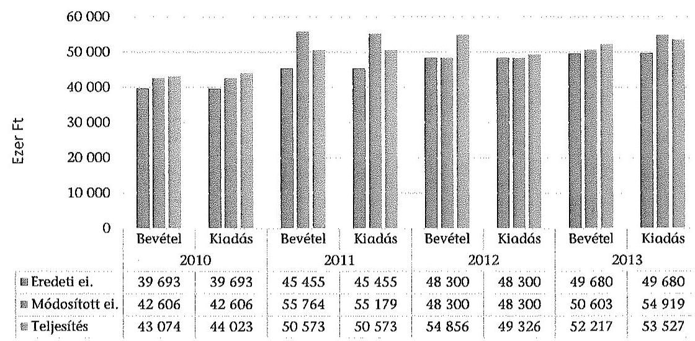
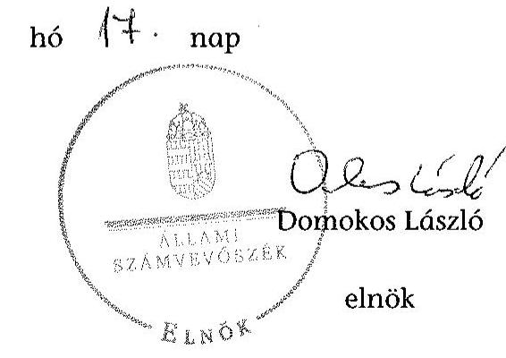
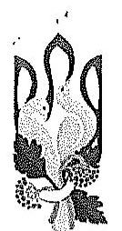
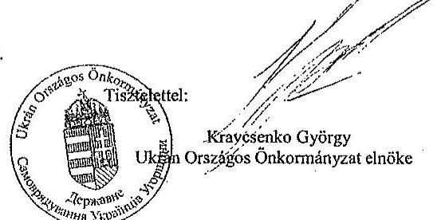
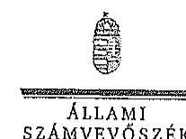

# ÁLLAMI   SZÁMVEVŐSZÉK 

## JELENTÉS

Az Országos Nemzetiségi Önkormányzatok gazdálkodásának ellenőrzéséről Ukrán Országos Önkormányzat

---

# Állami Számvevőszék 

Iktatószám: V-0701-063/2015.
Témaszám: 1735
Vizsgálat-azonosító szám: V0680

## Az ellenőrzést felügyelte:

Kisgergely István
felügyeleti vezető

## Az ellenőrzést vezette:

Dr. Láng Ágnes Krisztina
ellenőrzésvezető
A számvevői jelentések feldolgozásában és a jelentés összeállításában
közremüködtek:
Dr. Láng Ágnes Krisztina
ellenőrzésvezető
Dr. Lőrincz Zoltán
számvevő főtanácsos
Az ellenőrzést végezték:
Czékus Balázs Imre Dr. Lőrincz Zoltán
számvevő számvevő főtanácsos

A témához kapcsolódó eddig készített számvevőszéki jelentés:
címe
sorszáma
Jelentés az Ukrán Országos Önkormányzat 2003-2006. évi pénz- 0806
ügyi-gazdasági tevékenységének ellenőrzéséről

---

# TARTALOMJEGYZÉK 

BEVEZETÉS ..... 3
I. ÖSSZEGZŐ MEGÁLLAPÍTÁSOK, KÖVETKEZTETÉSEK, JAVASLATOK ..... 7
II. RÉSZLETES MEGÁLLAPÍTÁSOK ..... 14

1. A belső kontrollrendszer kialakításának és működtetésének megfelelősége ..... 14
1.1. A kontrollkörnyezet kialakítása ..... 14
1.2. A kockázatkezelési rendszer kialakításának és működtetésének megfelelősége ..... 16
1.3. A kontrolltevékenységek müködésének megfelelősége ..... 16
1.4. Információs és kommunikációs rendszer kialakításának és működtetésének megfelelősége ..... 18
1.5. Monitoring-rendszer kialakításának és működtetésének megfelelősége ..... 18
2. A gazdálkodás megfelelősége ..... 20
2.1. Pénzügyi gazdálkodás megfelelősége ..... 20
2.2. Vagyongazdálkodással kapcsolatos feladatellátás szabályszerűsége ..... 25
3. Ingyenesen juttatott vagyon kezelésének megfelelősége ..... 27
4. Egyéb feladat- és hatáskör ellátás szabályszerűsége ..... 28
5. Integritás kontrollok ..... 28
6. ÁSZ javaslatok hasznosulása ..... 28

## MELLÉKLETEK

1. számú Az Ukrán Országos Önkormányzat észrevétele
2. számú Az Ukrán Országos Önkormányzat észrevételére válasz

## FÜGGELÉKEK

1. számú Rövidítések jegyzéke
2. számú Az integritás kontrollok kialakítása és működtetése

---

.

---

# JELENTÉS 

## Az Ukrán Országos Önkormányzat gazdálkodásának ellenőrzéséről

## BEVEZETÉS

Az Ukrán Országos Önkormányzat 1999 évben alakult, jelenlegi elnöke a 2014. évi országos nemzetiségi választások óta látja el feladatát. Az Önkormányzat 2007-ben megalapította önállóan működő költségvetési szervként a Magyarországi Ukrán Kulturális és Dokumentációs Központot, 2009-ben pedig létrehozta önkormányzati Hivatalát. A Közgyűlés a munkája segítésére Pénzügyi Ellenőrző Bizottságot, Vagyonnyilatkozatokat Vizsgáló és Ugyrendi Bizottságot, Kulturális és Oktatási Bizottságot, valamint Ifjúsági, Média és Informatikai Bizottságot hozott létre. Az ellenőrzött időszakban az Önkormányzat Hivatalában egy fő teljesés egy fő részmunkaidőben foglalkoztatott munkavállaló volt. A hivatalvezetői feladatok ellátását megbízási jogviszony keretében biztosították. A Hivatal gazdasági szervezettel nem rendelkezett, a pénzügyi-számviteli ügyintéző megbízási szerződés alapján látta el feladatát.

Az Önkormányzat gazdasági társaságot nem alapított, önkormányzati társulásban nem vett részt. Az Önkormányzat nem adott és nem vett át üzemeltetésre, kezelésbe, koncesszióba eszközöket, térítésmentes átadás-átvétel nem történt.

Az Önkormányzat költségvetési beszámolója szerint a 2013. évben a módosított költségvetési bevételi előirányzat 50603 ezer Ft a módosított költségvetési kiadási előirányzat 54919 ezer Ft, a teljesített költségvetési bevétel 52217 ezer Ft, a teljesített költségvetési kiadás 53527 ezer Ft volt. Az Önkormányzat a 2013. évben 44200 ezer Ft államháztartásból származó támogatásban részesült.

Az Alaptörvény XXIX. cikk (1) bekezdése szerint a Magyarországon élő́ nemzetiségek államalkotó tényezők. Minden, valamely nemzetiséghez tartozó magyar állampolgárnak joga van önazonossága szabad vállalásához és megőrzéséhez. A hazánkban élő́ nemzetiségek helyi (települési és területi), valamint országos önkormányzatokat hozhatnak létre.

Az országos nemzetiségi önkormányzatok gazdálkodási feladatait az önállóan működő és gazdálkodó költségvetési szerve, a hivatal látja el. Az országos nemzetiségi önkormányzatok a 2008. évtől tartoznak az államháztartás önkormányzati alrendszerébe, azóta hivatalaik költségvetési szervként müködnek. Az Alaptörvény hatálybalépését követően a 2012. évtől további jelentős jogszabályi változások határozzák meg müködésüket, gazdálkodásukat.

A nemzetiségek helyzete, támogatása mind hazai, mind EU-s szinten kiemelt figyelmet kap napjainkban. Az állam az országos nemzetiségi önkormányzatok

---

működéséhez, a médiaszolgáltatáshoz kapcsolódó jogaik érvényesítéséhez, valamint a kulturális önigazgatásuk érdekében alapított - közművelődési, közgyűjteményi, tudományos - intézmények fenntartásához az éves költségvetési törvényekben nevesítetten költségvetési támogatást biztosít. Ezen kívül az országos nemzetiségi önkormányzatok közfeladataik ellátásához támogatást kapnak a fejezeti kezelésű előirányzatokból, valamint hazai és uniós pályázati forrásokat szerezhetnek.

Az ellenőrzés célja annak értékelése volt, hogy az országos nemzetiségi önkormányzat gazdálkodása, a belső kontrollrendszer kialakítása és múködése, az államháztartásból nyújtott támogatás, illetve az államháztartásból meghatározott célra ingyenesen juttatott vagyon felhasználása a jogszabályi előírásoknak megfelelően történt-e; az önkormányzat a Nek. tv.-ben és az Njtv.-ben előírt fel-adat- és hatásköröket ellátta-e; intézkedett-e az ÁSZ által 2008-ban végzett ellenőrzés javaslatainak végrehajtásáról.

Az országos nemzetiségi önkormányzat korrupcióval szembeni veszélyeztetettségének csökkentése érdekében felmértük az integritási szemlélet érvényesülését a gazdálkodási folyamatokban.

Értékeltük az országos nemzetiségi önkormányzat gazdálkodása során a belső kontrollrendszer kialakítását és múködését mind az öt pillére tekintetében, ellenőriztük a gazdálkodással összefüggő feladat- és hatásköröknek, a hivatal múködési, gazdálkodási rendjének jogszabályi előírásoknak való megfelelőségét; a belső kontrollok múködésének megfelelőségét az éves költségvetés, a költségvetési beszámoló és a zárszámadás készítés folyamatában; a gazdálkodás pénzügyi folyamatában kulcsszerepet betöltő (szakmai) teljesítésigazolás és 2011-évig utalvány ellenjegyzés, 2012-évtől érvényesítés kontrolltevékenységek múködésének megfelelőségét; az önkormányzat belső ellenőrzése kialakításának és múködésének megfelelőségét.

Értékeltük továbbá az országos nemzetiségi önkormányzat gazdálkodása, ezen belül pénzügyi gazdálkodása keretében a tervezési, beszámolási, zárszámadáskészítési folyamat, az előirányzatok betartása, a könyvvezetés, a közzétételek, adatszolgáltatások, valamint az államháztartás rendszeréből jogszabály vagy megállapodás alapján céljelleggel kapott támogatások felhasználásának, elszámolásának szabályszerűségét. A vagyonnal kapcsolatos feladatellátás ellenőrzése keretében értékeltük a vagyongazdálkodás szabályozottságát, a mérleg alátámasztottságát, a leltározás, az eszközbeszerzések, a vagyonhasznosítás, a tulajdonosi joggyakorlás szabályszerűségét, kiemelten az országos nemzetiségi önkormányzat gazdasági társasága részére a vagyon tulajdonba, illetve kezelésbe, üzemeltetésbe adása, a tőkeemelés és a juttatott támogatások szabályszerűségét. Értékeltük az államháztartásból ingyenesen juttatott vagyon felhasználásának szabályszerűségét. Ellenőriztük az előírt feladat- és hatáskörök közül a véleménynyilvánítási, egyetértési jog gyakorlásával, a hatáskör átruházásokkal, az ideiglenes vagyonkezeléssel kapcsolatos feladatok ellátásának szabályszerűségét, az integritás kontrollok múködését, továbbá az előző ÁSZ ellenőrzés javaslatainak hasznosulását.

Az ellenőrzés várható hasznosulása: Az ellenőrzés eredményeként nemcsak az ellenőrzött szerv gazdálkodása javulhat, hanem átfogó képet kaphatunk az

---

önkormányzati alrendszerbe tartozó országos nemzetiségi önkormányzatok gazdálkodásának hiányosságairól, de a jó gyakorlatokról is. Az ellenőrzés megállapításait és javaslatait más szervezetek is hasznosíthatják a rendezett gazdálkodási keretek kialakításához. Az ellenőrzés hozadékát képezi a 2008-2010. években elvégzett ÁSZ ellenőrzés javaslatai hasznosulásának értékelése. Mind a 13 országos nemzetiségi önkormányzat ellenőrzésével teljes körűen megvalósul az országos nemzetiségi önkormányzatok ellenőrzése a megváltozott jogszabályi környezetben. Az ellenőrzés tapasztalatai alapján a jogszabályi ellentmondások, hiányosságok feltárásával, azok megszüntetésére vonatkozó javaslatokkal segítjük a jó kormányzást. Az ellenőrzéssel lehetővé tesszük, hogy az országos nemzetiségi önkormányzatok gazdálkodásáról, múködéséről a társadalom objektív képet alkothasson.

Az országos nemzetiségi önkormányzatok gazdálkodásának ellenőrzéséről szóló számvevőszéki jelentés I. fejezetének összegző része az ellenőrzés céljára adott rövid, szintetizáló összefoglalót és következtetéseket tartalmazza a II. fejezet részletes megállapításain alapulóan. A jelentés intézkedést igénylő megállapításait és javaslatait az ellenőrzés során feltárt, a jelentés II. fejezetében rögzített részletes megállapítások alapozzák meg.

Az ellenőrzés típusa: szabályszerűségi ellenőrzés.
Az ellenőrzött időszak: 2010. január 1. - 2014. június 30.
Ellenőrzött szervezet: az országos nemzetiségi önkormányzat és hivatala, továbbá azon intézmény, amelyek gazdálkodási feladatait a hivatal látja el.

Az ellenőrzés végrehajtásának jogszabályi alapját az Állami Számvevőszékről szóló 2011. évi LXVI. törvény 1. § (3) bekezdése, az 5. § (2)-(3) és (6) bekezdései, valamint az államháztartásról szóló 2011. évi CXCV. törvény 61. § (2) bekezdésének előírásai képezik.

Az ellenőrzés módszertana az ÁSZ hivatalos honlapján (www.asz.hu) közzétett szakmai szabályokon alapul, amely a Legfőbb Ellenőrző Intézmények Nemzetközi Szervezete (INTOSAI) által kiadott nemzetközi standardok (ISSAI) figyelembevételével készült.

Az ellenőrzés lefolytatásához az országos nemzetiségi önkormányzat a kimutatások és a tanúsítványok elektronikus kitöltésével, valamint az ÁSZ által kért dokumentumok elektronikus megküldésével szolgáltatott adatokat. Az így rendelkezésre bocsátott adatok, információk kontrollja és a munkalapok kitöltése az ellenőrzöttnél végzett ellenőrzés keretében történt. A pénzügyi folyamatokban kulcsszerepet betöltő (szakmai) teljesítésigazolás és érvényesítés (2011-ig utalvány ellenjegyzése) kontrollok múködésének megfelelősége értékeléséhez az egyszerű véletlen mintavétellel kiválasztott tételek ellenőrzését megfelelőségi tesztek útján végeztük.

A személyi juttatások, a dologi és felhalmozási kiadások, valamint a pénzeszközátadások felhasználásának szabályszerűségét mintavétellel ellenőriztük.

A jogszabályoknak és a belső előírásoknak megfelelőnek, azaz szabályszerűnek tekintettük az ellenőrzött kiadási előirányzatok felhasználását, amennyiben a

---

minta ellenőrzésének eredménye alapján 95\%-os bizonyossággal a teljes sokaságban a hibaarány kisebb volt, mint $10 \%$, nem megfelelőnek értékeltük, ha a hibaarány a 10\%-ot meghaladta. Megfelelőnek értékeltük a gazdálkodási jogkörök gyakorlását, amennyiben 95\%-os bizonyossággal a teljes sokaságban a hibaarány legfeljebb $10 \%$, részben megfelelőnek értékeltük, ha a hibaarány felső határa 10-30\% volt, nem megfelelőnek pedig akkor, ha a hibaarány felső határa a teljes sokaságban meghaladta a $30 \%$-ot.

Az ÁSZ a 2011. évi LXVI. törvény 29. §-a szerint a jelentéstervezetet megküldte az Ukrán Országos Önkormányzat elnökének egyeztetésre. A beérkezett észrevételt és az arra adott választ a jelentés 1-2. sz. mellékletei tartalmazzák.

---

# I. ÖSSZEGZŐ MEGÁLLAPÍTÁSOK, KÖVETKEZTETÉSEK, JAVASLATOK 

Az Önkormányzatnál a 2010-2014. I. félév között a belső kontrollrendszer kialakítása és múködtetése összességében nem volt megfelelő.

A kontrollkörnyezet kialakítása részben felelt meg az Önkormányzat múködését meghatározó jogszabályokban foglaltaknak, mivel a Hivatal Úgyrendje nem felelt meg az Ámr.-ben előírtaknak. A Hivatalvezető az Ámr., illetve a Bkr. előírását figyelmen kívül hagyva a szabálytalanságok kezelésének eljárásrendjét nem alakította ki, az Ámr. és a Bkr. előírásai ellenére nem gondoskodott a Hivatal múködésének irányítási és ellenőrzési folyamatai, a felelősségi és információs szintek és kapcsolatok leírását tartalmazó ellenőrzési nyomvonal elkészítéséről. Az operatív gazdálkodási jogkörökre vonatkozó belső szabályozás 2010-től 2012. június 30 -ig nem felelt meg az Ámr., illetve az Ávr. előírásainak, mert nem határozták meg az operatív gazdálkodási jogkörök gyakorlásának módját, eljárásrendjét, dokumentációs részletszabályait, az előzetes írásbeli kötelezettségvállaláshoz nem kötött kis összegű kifizetések eljárásrendjét. A belső szabályozás a kötelezettségvállalás ellenjegyzésére, az érvényesítésre és az utalvány ellenjegyzésre az Ámr.-ben foglaltak ellenére nem a Hivatalvezetőt jogosította fel.

A Hivatalvezető az Ámr. és a Bkr. előírásai ellenére nem alakított ki és nem múködtetett kockázatkezelési rendszert.

A kontrolltevékenységek kialakítása és múködtetése nem felelt meg az előírásoknak. Az éves költségvetés, a költségvetési beszámoló és a zárszámadás készítésének folyamatában a belső kontrolleljárásokat az Ámr. és a Bkr. rendelkezéseitől eltérően nem alakították ki és nem múködtették. A 2010-2011. években a szakmai teljesítésigazolás és az utalvány ellenjegyzés, a 2012. évben és 2014. I. félévben a teljesítésigazolás és az érvényesítés gyakorlata nem felelt meg az Ámr., illetve az Ávr. előírásainak. Az Önkormányzat a 2010. évben nem a Nek. tv.-ben meghatározott feladatainak ellátását szolgáló támogatást nyújtott. A 2013. évben az Ávr.-ben meghatározott összeférhetetlenségi szabályokat figyelmen kívül hagyva került sor személyi juttatás, illetve költségtérítés kifizetésére.

Az információs és kommunikációs rendszer kialakítása és múködtetése nem volt megfelelő, mivel az Avtv., az Info tv. és az Ávr. előírásától eltérően nem szabályozták a kötelezően közzéteendő adatok nyilvánosságra hozatalának, valamint a közérdekú adatok megismerésére irányuló igények teljesítésének rendjét, és nem készítették el a Hivatal adatvédelmi és adatbiztonsági szabályzatát. A Hivatalvezető az Eisztv.-ben, illetve az Info tv.-ben előírtak ellenére nem intézkedett az Önkormányzat és a Hivatal gazdálkodására vonatkozó adatok honlapon történő közzétételére. Nem gondoskodott továbbá -- a 28/20112. (II. 6.) Korm. rendeletben, illetve 428/2012 (XII. 19.) Korm. rendeletben foglalt előírás ellenére - a 2012-2014. I. félévek között kapott céljellegú támogatásoknak az Önkormányzat honlapján történő közzétételéről.

---

Az Iratkezelési szabályzatot továbbá -- a 64/2010. (III. 18.) Korm. rendelet és az Ikr. szabályait figyelmen kívül hagyva továbbá -- nem vizsgálták felül és nem módosították. A Hivatalnál készülő iratok nyilvántartásba vételéről az Ltv.-ben foglaltak ellenére nem gondoskodtak.

Az Önkormányzat monitoring rendszerének kialakítása és működtetése nem volt szabályszerű. A Hivatalvezető - az Áht. ${ }_{1}$ és a Bkr. előírásaival szemben nem alakította ki a Hivatal tevékenységének, a célok megvalósításának nyomon követését biztosító rendszert. Az ellenőrzött időszakban a belső ellenőrzési feladatok ellátásáról külső szolgáltató megbízása útján gondoskodtak. A Belső Ellenőrzési Kézikönyvet a Ber.-ben foglaltaktól eltérően nem a Hivatalvezető, hanem az Elnök hagyta jóvá, az abban foglaltakat a Bkr. előírásait figyelmen kívül hagyva nem vizsgálták felül és nem aktualizálták. A belső ellenőr az éves ellenőrzési terveket határidőn túl készítette el, az ellenőrzési tervek megalapozására kockázatelemzés nem készült. A belső ellenőr az ellenőrzésekről nyilvántartást nem vezetett, éves összefoglaló jelentést nem készített. A belső ellenőr szabálytalanságot, hibát, hiányosságot nem állapított meg, érdemi javaslatokat nem tett. Az ellenőrzések az önkormányzati gazdálkodás szabályszerűségét nem mozdították elő.

Az Önkormányzat pénzügyi gazdálkodása részben felelt meg az előírásoknak. A Hivatalvezető a költségvetési határozat-tervezetek intézményvezetővel történő egyeztetését az Ámr. és az Ávr. előírása ellenére írásban nem rögzítette. A Pénzügyi Bizottság a 2010-2014. évi költségvetési határozat-tervezeteket véleményezte, azonban az Elnök az Áht. ${ }_{1,2}$-ben meghatározott határidőn túl terjesztette a Közgyűlés elé. A 2010-2014. évi költségvetési határozat-tervezetek nem az Ámr.-ben, illetve az Áht. ${ }_{2}$-ben meghatározott szerkezetben és tartalommal készültek. Az Önkormányzat a 2010, a 2012, és a 2013. években a bevételi előirányzatánál több bevételt teljesített, de az Ámr. és az Áht. ${ }_{2}$ előírását figyelmen kívül hagyva az előirányzat módosításáról nem hozott határozatot. A 2010. és a 2012. években az Önkormányzat teljesített kiadásai is meghaladták a Közgyűlés által jóváhagyott előirányzatokat, mellyel sérültek az Áht. ${ }_{1,2}$ előirányzatokon belüli gazdálkodásra vonatkozó előírásai. Az Önkormányzatnál az aláírt támogatási szerződések áthúzódó tételeivel a költségvetés készítése során nem terveztek. A Közgyűlés a 2010. és a 2013. évről szóló éves elemi költségvetési beszámolókat az Áhsz. ${ }_{1}$ szerinti határidőn túl fogadta el. Az Elnök a zárszámadási hatá-rozat-tervezeteket az egyszerűsített éves költségvetési beszámolóval és a könyvvizsgálói jelentéssel együtt határidőben terjesztette a Közgyűlés elé. Az Elnök a 2010-2013. évi zárszámadási határozat-tervezetének előterjesztésekor - az Ámr., illetve az Áht. ${ }_{2}$ rendelkezéseit figyelmen kívül hagyva - nem mutatta be tájékoztatásul a Közgyűlésnek a vagyonkimutatást.

Az önkormányzat az államháztartás rendszeréből jogszabály, illetve megállapodás alapján kapott támogatások felhasználása és elszámolása során - a nyilvántartási és a közzétételi kötelezettség kivételével - betartotta a jogszabályi és szerződéses előírásokat. A kapott pénzeszközökkel szakmai és pénzügyi beszámoló keretében határidőn belül elszámoltak.

Az ellenőrzött időszakban az Önkormányzat által államháztartási forrás terhére pályázat, vagy kérelem alapján nyújtott céltámogatások odaítéléséről - egy kivétellel - az arra hatáskörrel rendelkező szerv, a Közgyűlés döntött. A támogatási szerződésekben megfogalmazott célok - egy kivétellel - összhangban voltak

---

a Nek. tv-ben, illetve az Njtv.-ben meghatározott nemzetiségi feladatokkal. Az Önkormányzat előírta az elszámolási kötelezettséget és a támogatott szervezeteket beszámoltatták a támogatás felhasználásáról.

Az Önkormányzat vagyongazdálkodási tevékenysége részben volt szabályszerű. Az Önkormányzat az Nvtv. hatályba lépését követően nem vizsgálta felül a forgalomképtelennek minősülő törzsvagyonát, a Nek. tv., illetve az Njtv. előírásai ellenére nem határozta meg vagyonleltárát, nem szabályozták az egyes vagyonelemek hasznosítási módját, feltételeit. Az Önkormányzat és intézményei a 2010-2013. évek között beszámolóikat az Áhsz. ${ }_{1,2}$ előírásainak megfelelően leltárral alátámasztották, az értékeléseket a mérlegsorokhoz kapcsolódóan elvégezték. Az Önkormányzatnál az Áhsz. ${ }_{1}$ rendelkezéseit figyelmen kívül hagyva a beruházásokhoz aktiválási jegyzőkönyvet - a pincefelújítás kivételével - nem készítettek, a beruházási-, tárgyi eszköz- és immateriális javak nyilvántartó kartonjait hiányosan vezették.

Az Önkormányzat az ellenőrzött időszakban ingyenes vagyonjuttatásban nem részesült, az alakulásakor egyszeri vagyonjuttatásként kapott ingatlant az előírásoknak megfelelően forgalomképtelen vagyonként tartotta nyilván.

Az ellenőrzött időszakban a Közgyűlés a szerveire feladat- és hatáskört nem ruházott át. Az Elnök és a Hivatalvezető - a Nek. tv., illetve az Njtv. előírásai ellenére - a Közgyűlés felhatalmazása nélkül gondoskodtak a vélemény-nyilvánítási, egyetértési és közreműködési jogosultság ellátásáról.

Az Önkormányzat a 2008. évi ÁSZ ellenőrzés során tett 14 javaslatából 11-et hasznosított, egyet részben valósított meg, kettő javaslat nem hasznosult.

Az ÁSZ tv. 33. § (1) bekezdésében foglaltak értelmében a jelentésben foglalt megállapításokhoz kapcsolódó intézkedési tervet köteles az ellenőrzött szervezet vezetője összeállítani, és azt a jelentés kézhezvételétől számított 30 napon belül az ÁSZ részére megküldeni. Amennyiben az intézkedési tervet határidőben nem küldi meg a szervezet, vagy az nem elfogadható, az ÁSZ elnöke a hivatkozott törvény 33. § (3) bekezdés a)-b) pontjaiban foglaltakat érvényesítheti.

A helyszíni ellenőrzés megállapításainak hasznosítása mellett javasoljuk:

# az Elnöknek 

1. A Hivatal mint önállóan működő és gazdálkodó költségvetési szerv - az Áht. 1 91. § (2) bekezdésében, valamint az Áht. 2 10. § (5) bekezdésében foglaltaktól eltérően - nem rendelkezett SzMSz-szel.

Javaslat:
Intézkedjen a Hivatalvezető által elkészített SZMSZ Közgyűlés elé történő terjesztéséről.
2. Az Elnök 2013. és a 2014. évi költségvetési koncepciót - az Áht. 2 24. § (1) bekezdésében és 26. § (1) bekezdésében előírt -, valamint a 2010-2014. évi költségvetési

---

határozat-tervezeteket - az Áht. 71. § (1) bekezdésben és az Ámr. 40. § (1) bekezdésében, valamint az Áht. 2 24. § (2) bekezdésében és 26. § (1) bekezdésében előírt határidőn túl terjesztette a Közgyűlés elé.

Javaslat:
Gondoskodjon a költségvetési koncepció, valamint a költségvetési határozat-tervezetek határidőben történő Közgyűlés elé terjesztéséről.
3. Az Elnök - a Nek. tv. 39/A. § (1) bekezdésében, illetve az Njtv. 119. § (1) bekezdésében foglaltakat figyelmen kívül hagyva - a Közgyűlés felhatalmazása nélkül, a Közgyűlés hatáskörét elvonva gondoskodott a vélemény-nyilvánítási, egyetértési és közreműködési jogosultság ellátásáról.

Javaslat:
Biztosítsa, hogy a jövőben az Önkormányzat vélemény-nyilvánítási, egyetértési és közreműködési jogosultság szabályszerű ellátása érdekében a feladatellátással összefüggő hatáskört - beszámolási kötelezettség előírásával - Közgyűlési felhatalmazás alapján lássa el.

# a Hivatalvezetőnek 

1. A kontrollkörnyezet kialakítása részben volt megfelelő, mivel a Hivatal mint önállóan működő és gazdálkodó költségvetési szerv - az Áht. 1 91. § (2) bekezdésében, valamint az Áht. 2 10. § (5) bekezdésében foglaltaktól eltérően - nem rendelkezett SzMSz-szel, valamint az Ávr. 8. § (1) bekezdése ellenére gazdasági szervezettel.

A Hivatalvezető - az Ámr. 156. § (2) bekezdése és a Bkr. 6. § (3) bekezdése előírásaitól eltérően - nem gondoskodott a felelősségi és információs szintek és kapcsolatok leírását tartalmazó ellenőrzési nyomvonal elkészítéséről.

Az Önkormányzat és intézményei az ellenőrzött időszakban nem rendelkeztek az Ámr. 20. § (3) bekezdés b) pontjában és az Ávr. 13. § (2) bekezdés b) pontjában előírt beszerzési/közbeszerzési szabályzattal, továbbá az Ámr. 20. § (3) bekezdés c), f)-h) pontjaiban, illetve az Ávr. 13. § (2) bekezdés c) és e)-g) pontjaiban előírt kiküldetési szabályzattal, reprezentációs kiadások szabályozásával, telefon- és gépjárműhasználatra vonatkozó szabályzattal.

A Hivatalvezető az Ámr. 161. §-a (2011-től a 156. § (3) bekezdése), illetve a Bkr. 6. § (4) bekezdése előírását figyelmen kívül hagyva a szabálytalanságok kezelésének eljárásrendjét nem alakította ki. Az ilyen tartalmú, 2013. március 1-jén kiadott szabályzatot az arra jogosult Hivatalvezető helyett az Elnök és a belső ellenőr írta alá.

Javaslat:
Intézkedjen a Hivatal SzMSz-ének, az ellenőrzési nyomvonal, a beszerzési/közbeszerzési, a kiküldetési, a reprezentációs kiadások, a telefon- és gépjármú használatra vonatkozó szabályzatok, valamint a szabálytalanságok kezelése eljárásrendjének elkészítésére és szabályszerű kiadmányozására.

---

2. A kockázatkezelési rendszer kialakítása és müködtetése nem felelt meg a jogszabályi előírásoknak, mivel a Hivatalvezető - az Ámr. 157. § (1) bekezdésében, illetve a Bkr. 7. § (1) bekezdésében foglalt előírás ellenére - nem alakította ki és nem működtette a kockázatkezelési rendszert.

Javaslat:
Alakítsa ki és müködtesse a kockázatkezelési rendszert.
3. A kontrolltevékenységek kialakítása és működtetése nem volt megfelelő. A Hivatalvezető - az Ámr. 158. § (2) bekezdésében, illetve a Bkr. 8. § (4) b) és c) pontjaiban foglaltak ellenére - nem határozta meg a dokumentumokhoz és információkhoz való hozzáféréssel és a beszámolási eljárásokkal kapcsolatos felelősségi köröket. A személyi juttatások, a dologi és felhalmozási kiadások, valamint a pénzeszközátadások teljesítése során a gazdálkodási jogkörök (szakmai teljesítésigazolás, érvényesítés és utalvány ellenjegyzés) gyakorlása nem felelt meg az Ámr. 76. §-a, 79-80. §-ai, illetve az Ávr. 55-58. §-ai és a 60. § (2) bekezdés előírásainak.

Javaslat:
a) Intézkedjen a dokumentumokhoz és információkhoz való hozzáféréssel és a beszámolási eljárásokkal kapcsolatos felelősségi körök meghatározásáról.
b) Intézkedjen a gazdálkodási jogkörök szabályszerű gyakorlásának érvényesítéséről.
4. A Hivatalvezető az ellenőrzött években - az Áht. ${ }_{1}$ 121. § (2) bekezdés d) pontjában, illetve a Bkr. 9. § (1) bekezdésében foglalt előírások ellenére - az információs és kommunikációs rendszert nem alakította ki és nem működtette. Az Avtv. 20. § (8) bekezdése és 31/A. § (3) bekezdése, az Info tv. 24. § (3) bekezdése és 30. § (6) bekezdése, illetve az Ávr. 13. § (2) bekezdés h) pontja előírásától eltérően nem szabályozták a kötelezően közzéteendő adatok nyilvánosságra hozatalának, valamint a közérdekű adatok megismerésére irányuló igények teljesítésének rendjét, és nem készítették el a Hivatal adatvédelmi és adatbiztonsági szabályzatát. A Hivatalvezető az Eisztv. 6. § (1) bekezdésében, illetve az Info tv. 37. § (1) bekezdésében előírtak ellenére nem intézkedett az Önkormányzat és a Hivatal gazdálkodására vonatkozó adatok honlapon történő közzétételére. Az Iratkezelési szabályzatot - a 64/2010. (III. 18.) Korm. rendelet 34. §-ában és az lkr. 3. § (1) bekezdésében foglaltaktól eltérően - nem vizsgálták felül és nem módosították. A Hivatalnál készülő iratok nyilvántartásba vételéről az Ltv. 9. § (1) bekezdés a) pontjában foglaltak ellenére nem gondoskodtak.

Javaslat:
a) Alakítsa ki a kötelezően közzéteendő adatok nyilvánosságra hozatalának és megismerésére irányuló igények teljesítésének rendjét.
b) Intézkedjen a Hivatal adatvédelmi és adatbiztonsági szabályzatának elkészítésére.
c) Gondoskodjon az Önkormányzat és a Hivatal gazdálkodására vonatkozó adatok közzétételéről.
d) Intézkedjen az Iratkezelési szabályzat felülvizsgálatára, és biztosítsa a Hivatalnál készülő iratok nyilvántartásba vételét.

---

5. Az Önkormányzat monitoring rendszerének kialakítása és működtetése nem volt megfelelő. A Hivatalvezető - a 2010. évben az Áht. 1 120/B.§ (2) bekezdés e) pontjában, a 2011. évben az Áht. 1 121.§ (2) bekezdés e) pontjában, a 2012-2014. I. félévben a Bkr. 3. § e) pontjában és a 10. §-ában foglaltak ellenére - nem alakította ki a Hivatal tevékenységének, a célok megvalósításának nyomon követését biztosító rendszert.

A belső ellenőrzés kialakítása és működtetése összességében nem volt megfelelő. A Belső Ellenőrzési Kézikönyvet a Ber. 5. § (1) bekezdésében foglaltaktól eltérően nem a Hivatalvezető hagyta jóvá, valamint nem aktualizálták a Bkr. 17. § (2) bekezdésében foglalt tartalmi követelményeknek megfelelően.

A belső ellenőr az éves ellenőrzési terveket a Ber. 32/A. § (2) bekezdésében, illetve a Bkr. 55. § (1) bekezdésében szereplő határidőn túl készítette el, és azokat nem alapozta meg - a Ber. 18. §-ában, illetve a Bkr. 29. § (1) bekezdésében előírt - kockázatelemzéssel.

Javaslat:
a) Alakítsa ki és múködtesse a Hivatal tevékenységének, a célok megvalósításának nyomon követését biztosító rendszert.
b) Gondoskodjon Belső Ellenőrzési Kézikönyv jóváhagyásáról, valamint biztosítsa, hogy annak jogszabályban előírt felülvizsgálatát elvégezzék.
c) Intézkedjen a belső ellenőrzés jogszabályoknak megfelelő kialakításáról és működtetéséről.
6. A Közgyűlés elé terjesztett költségvetési határozat tervezetek tartalma nem felelt meg teljes körűen az Ámr. 36. § (1) bekezdésében, illetve az Áht. 2 23. § (2) bekezdésében előírt követelményeknek.

Javaslat:
Intézkedjen, hogy a Közgyűlés elé terjesztett költségvetési határozat tervezetek feleljenek meg a jogszabályi előírásoknak.
7. Az Önkormányzat az Ámr. 68. § (3) bekezdése és 69. §-a, valamint az Áht. 1 100/C. § (1) és (4) bekezdése, illetve az Áht. 2 34. § (5) bekezdése és 36. § (1) bekezdése előírásaitól eltérően a szükséges előirányzat-módosításokat nem hajtotta végre, nem a Közgyűlés által elfogadott előirányzatokon belül gazdálkodott.

Javaslat:
Intézkedjen, hogy az Önkormányzat a jóváhagyott költségvetés keretei között gazdálkodjon, és szükség szerint gondoskodjon az előirányzatok módosításáról.
8. Az Elnök a 2010-2013. évi zárszámadási határozat-tervezetének előterjesztésekor - az Ámr. 40. § (6) bekezdés d) pontjában, illetve az Áht. 2 91. § (2) bekezdés c) pontjában foglalt előírást figyelmen kívül hagyva - nem mutatta be tájékoztatásul a Közgyűlésnek az Áhsz. 1 44/A. § (2)-(3) bekezdésében foglaltaknak megfelelő tartalmú vagyonkimutatást.

---

Javaslat:
Gondoskodjon a zárszámadási határozat-tervezettel bemutatandó kimutatások előkészítéséről.
9. Az Önkormányzat a törzsvagyonba tartozó vagyonelemek körét, a vagyon használatának és hasznosításának szabályait nem az Nvtv. 11. § (16) bekezdése, 18. § (1) bekezdése, a Nek. tv. 37. § (1) bekezdés b) pontja, az Njtv. 113. § c) pontja és 124. § (2) bekezdése, illetve az Áht. 1 108. §-a, Áht. 2 97. § (1) bekezdése szerinti előírásoknak megfelelően határozta meg.

Javaslat:
Gondoskodjon a törzsvagyonba tartozó vagyonelemek körének, a vagyon használatának és hasznosításának szabályai jogszabályok előírásainak megfelelő elkészítéséről és kezdeményezze azok Közgyűlés elé terjesztését.
10. Az Önkormányzatnál a beruházási-, tárgyi eszköz- és immateriális javak nyilvántartó kartonjait hiányosan vezették, azokon a Számv. tv. 165. § (2) bekezdésének a hibák előírásszerű javítására vonatkozó előírásait megsértve végeztek módosításokat.

Javaslat:
Gondoskodjon a beruházási-, tárgyi eszköz- és immateriális javak nyilvántartásainak szabályszerű vezetéséről

---

# II. RÉSZLETES MEGÁLLAPÍTÁSOK 

## 1. A BELSŐ KONTROLLRENDSZER KIALAKÍTÁSÁNAK ÉS MŰKÖDTETÉSÉNEK MEGFELELŐSÉGE

Az ellenőrzött időszakban az Önkormányzatnál a belső kontrollrendszer (a kontrollkörnyezet, a kockázatkezelési rendszer, a kontrolltevékenységek, az információs és kommunikációs rendszer, valamint a monitoring rendszer) kialakítása és múködtetése összességében nem volt megfelelő az alábbiakban részletezett szabályozásbeli és múködésbeli hibák, hiányosságok miatt.

### 1.1. A kontrollkörnyezet kialakítása

A kontrollkörnyezet kialakítása részben felelt meg az Önkormányzat múködését meghatározó jogszabályokban foglaltaknak.

Az Önkormányzat - 2010-2014. I. félév között - a Nek. tv. és az Njtv. előírásai alapján rendelkezett SzMSz-szel, melyet a Közgyűlés 2011. évben módosított. Az SzMSz aktualizálása - az Njtv. 117. § (1) bekezdésében és a 113. § a) pontjában foglalt előírásokat figyelmen kívül hagyva - nem történt meg, annak ellenére, hogy 2012. évben az Önkormányzat múködését és gazdálkodását érintő új jogszabályok (Njtv., Áht. ${ }_{2}$, Ávr., Bkr.) léptek hatályba.

Az Önkormányzat SzMSz-ét a 2011. évi módosítását követő 45 napon belül az internetes honlapján közzétették, azonban - a Nek. tv. 39/G. § (4) bekezdésében foglalt előírás ellenére - a Magyar Közlönyben történő közzétételére nem intézkedtek.

Az SzMSz tartalmazta a képviselők vagyonnyilatkozat-tételi kötelezettségére vonatkozó előírást. E kötelezettségüknek a képviselők az ellenőrzött időszakban eleget tettek, azonban a vagyonnyilatkozatokról a Nek. tv. 39/H. § (3) bekezdésében, illetve az Njtv. 103. § (3) bekezdésében foglaltak ellenére nyilvántartást nem vezettek.

A Hivatal múködésének szabályait az SzMSz mellékletét képező Hivatali Ügyrend a Nek. tv.-ben és az Njtv.-ben foglaltakkal összhangban tartalmazta. A Hivatali Ügyrend azonban nem felelt meg teljes körűen a költségvetési szervek SzMSz-ére vonatkozó tartalmi követelményeknek, mert a Hivatal engedélyezett létszámát, a nevesített munkakörökhöz tartozó feladat- és hatáskörök gyakorlásának módját, a helyettesítés rendjét, az ezekhez kapcsolódó felelősségi szabályokat, valamint a szervezeti ábrát - az Ámr. 20. § (2) bekezdés e), h) és i) pontja, illetve az Ávr. 13. § (1) bekezdés g) és e) pontja előírásától eltérően -nem tartalmazta.

Az ellenőrzött időszakban a Hivatal nem rendelkezett gazdasági szervezettel, amely gyakorlat 2014. I. félévre vonatkozóan nem felelt meg az Ávr. 8. § (1) bekezdés c) pontjában foglalt előírásnak.

---

Az Önkormányzat által alapított önállóan múködő Kulturális intézmény és a Hivatal - az Ámr., illetve az Ávr. előírásának megfelelően, a 2009. szeptember 24-én kelt - megállapodásban rögzítették a gazdálkodással kapcsolatos munkamegosztás és felelősségvállalás rendjét.

Az Önkormányzat gazdálkodásának szabályozottsága az ellenőrzött években részben felelt meg az előírásoknak.

Az ellenőrzött időszakban a Hivatal és a Kulturális intézmény - a Számv. tv. és az Áhsz.1,2 előírásaival összhangban - rendelkezett hatályos, a Hivatalvezető által aláírt Számviteli politika ${ }_{1,2}$-vel, Számlarend ${ }_{1,2}$-vel és Bizonylati rend ${ }_{1,2}$-vel. A Számviteli politika ${ }_{1,2}$ keretében elkészítették a Leltározási szabályzat ${ }_{1,2}$-ot, az Értékelési szabályzat ${ }_{1,2}$-ot és a Pénzkezelési szabályzat ${ }_{1,2}$-ot. A Hivatal 2010-2012. I. félévben - a Számv. tv. 14. § (5) bekezdés c) pontjában és az Áhsz. ${ }_{1} 8 . \S$ (4) c) pontjában foglaltaktól eltérően - nem rendelkezett önköltségszámítási szabályzattal. A hiányosságot 2012. II. félévben pótolták. A selejtezés rendjét a Selejtezési szabályzat ${ }_{1,2}$-ban határozták meg.

Az operatív gazdálkodási jogkörökre vonatkozó belső szabályozás (Kötelezettségvállalási szabályzat ${ }_{1}$, Hivatali Ügyrend, SzMSz vonatkozó rendelkezései) 2010 évtől 2012. június 30 -ig nem felelt meg a jogszabályi előírásoknak. Az Ámr. 20. § (3) bekezdés a) pontjában, illetve az Ávr. 13. § (2) bekezdés a) pontjában foglaltak ellenére belső szabályzatban nem határozták meg az operatív gazdálkodási jogkörök gyakorlásának módját, eljárásrendjét, dokumentálásának részletszabályait. Belső szabályzatban - az Ámr. 72. § (14) bekezdésében foglaltak ellenére - nem határozták meg az előzetes írásbeli kötelezettségvállaláshoz nem kötött 100 ezer Ft alatti kifizetések eljárásrendjét. A 2010. és 2011. években az Ámr. 74. § (2) bekezdése j) pontjában, a 77. § (4) bekezdésében és a 79. § (1) bekezdésében foglaltak ellenére a kötelezettségvállalás ellenjegyzésére, az érvényesítésre és az utalvány ellenjegyzésre a belső szabályozás nem a Hivatalvezetőt, hanem a Pénzügyi Bizottság egyik tagját jogosította fel.

A 2012. július 1-jétől hatályos Kötelezettségvállalási szabályzat ${ }_{2}$ az Ávr. előírásainak megfelelően tartalmazta az operatív gazdálkodási jogkörök gyakorlására vonatkozó eljárásrendet, az összeférhetetlenségi előírásokat. Pénzügyi ellenjegyzésre és az érvényesítésre az Ávr.-ben előírt pénzügyi-számviteli képesítéssel rendelkező gazdálkodási-számviteli ügyintéző kapott kijelölést. A Kötelezettségvállalási szabályzat ${ }_{2}$ rendelkezett a kötelezettségvállalások nyilvántartásáról, amelynek vezetését 2012. év elejétől kezdték meg.

A Hivatalvezető - az Ámr. 156. § (2) bekezdése és a Bkr. 6. § (3) bekezdése előírásaitól eltérően - nem gondoskodott a költségvetési tervezés és a beszámolás folyamatában a felelősségi és információs szintek és kapcsolatok leírását tartalmazó ellenőrzési nyomvonal elkészítéséről.

Az Önkormányzat és intézményei az ellenőrzött időszakban nem rendelkeztek az Ámr. 20. § (3) bekezdés b) pontjában és az Ávr. 13. § (2) bekezdés b) pontjában előírt beszerzési/közbeszerzési szabályzattal, továbbá az Ámr. 20. § (3) bekezdés c), f)-h) pontjaiban, illetve az Ávr. 13. § (2) bekezdés c) és e)-g) pontjaiban előírt kiküldetési szabályzattal, reprezentációs kiadások szabályozásával, telefon- és gépjármúhasználatra vonatkozó szabályzattal.

---

A Hivatalvezető a 2010. évben az Ámr. 161. §-a, 2011. évben az Ámr. 156. § (3) bekezdése, 2012-2014. év I. félévben a Bkr. 6. § (4) bekezdése előírását figyelmen kívül hagyva a szabálytalanságok kezelésének eljárásrendjét nem alakította ki. A 2013. március 1-jén kiadott szabályzatot - a Bkr. 6. § (4) bekezdésben foglaltak ellenére - az arra jogosult Hivatalvezető helyett az Elnök és a belső ellenőr írta alá.

A Hivatalnál a kontrollkörnyezet kialakításának keretében a Bkr.-ben foglaltaknak megfelelően meghatározták az etikai elvárásokat.

# 1.2. A kockázatkezelési rendszer kialakításának és múködtetésének megfelelősége 

A kockázatkezelési rendszer kialakítása és múködtetése nem felelt meg a jogszabályok előírásainak.

A Hivatalvezető az ellenőrzött időszakban - az Ámr. 157. § (1)-(2) bekezdéseiben, illetve a Bkr. 7. § (1)-(2) bekezdéseiben foglaltak ellenére - kockázatkezelési rendszert nem működtetett, nem mérte fel és nem állapította meg a Hivatal tevékenységében, gazdálkodásában rejlő kockázatokat, nem határozta meg az egyes kockázatokkal kapcsolatban a szükséges intézkedéseket, valamint azok teljesítésének folyamatos nyomon követési módját.

A 2013. március 1-jén kiadott Kockázatkezelési Szabályzatot a Hivatalvezető helyett az Elnök és a belső ellenőr írták alá, ami nem felel meg a Bkr. 6. § (2) bekezdésében és 7. § (1) bekezdésében foglaltaknak.

### 1.3. A kontrolltevékenységek múködésének megfelelősége

A kontrolltevékenységek kialakítása és működtetése nem felelt meg az előírásoknak.

Az éves költségvetés, a költségvetési beszámoló és a zárszámadás készítésének folyamatában a belső kontroll-eljárásokat nem alakították ki, és nem működtették. A Hivatalvezető - az Ámr. 156. § b) és d) pontjaiban, valamint a Bkr. 8. § (4) bekezdés b) és c) pontjaiban foglaltak ellenére - belső szabályzatban nem határozta meg a dokumentumokhoz és információkhoz való hozzáféréssel és a beszámolási eljárásokkal kapcsolatos felelősségi köröket.

A 2010. évben az Áht. 121. § (1) bekezdése, a 2011. évben az Áht. ${ }_{1} 121 /$ A. § (4) bekezdése, 2012-2014. I. félévben a Bkr. 8. § (2) bekezdése előírásától eltérően a Hivatalvezető nem biztosította a folyamatba épített előzetes, utólagos és vezetői ellenőrzést a pénzügyi döntések dokumentumainak elkészítése, a költségvetési gazdálkodás pénzügyi ellenőrzése, valamint a gazdasági események szabályszerű elszámolása vonatkozásában. A FEUVE nem megfelelő kialakítása és múködtetése hozzájárult a költségvetési tervezés, a beszámolás, a támogatásokkal való elszámolások hiányosságaihoz, valamint a kulcskontrollok múködése területén feltárt szabálytalanságokhoz.

A költségvetési beszámoló elkészítésével megbízott személy rendelkezett a Számv. tv. és az Ávr. által előírt képesítéssel.

---

A 2010-2011. években a személyi juttatások, a dologi és a felhalmozási kiadások, valamint a pénzeszközátadások kifizetései során a pénzügyi folyamatokban kulcsszerepet betöltő szakmai teljesítésigazolás és utalvány ellenjegyzés kontrollok működése - összefoglalóan értékelve - nem volt megfelelő, mert

- az Ámr. 80. § (3) bekezdésben előírt nyilvántartásban szereplő mintától eltérő aláírás miatt a teljesítésigazoló jogosultsága nem volt megállapítható;
- a kötelezettségvállalás valamint az utalvány ellenjegyzését az Ámr. 74. § (2) bekezdés j) pontjában és a 79. § (1) bekezdésben foglaltaktól eltérően nem a Hivatalvezető végezte.
A 2012. és a 2014. év I. félévben a személyi juttatások, a dologi és a felhalmozási kiadások, valamint a pénzeszközátadások kifizetései során a pénzügyi folyamatokban kulcsszerepet betöltő teljesítésigazolás és érvényesítés kontrollok múködése - összefoglalóan értékelve - nem volt megfelelő.

A 2012. és a 2014. év I. félévben a mintatételek ellenőrzése alapján a teljesítésigazolás és érvényesítés gyakorlása során az alábbi hiányosságok, szabálytalanságok fordultak elő:

- 2012. év I. félévben az Ávr. 60. § (3) bekezdésben előírt nyilvántartásban szereplő mintától eltérő aláírás miatt a teljesítésigazoló jogosultsága nem volt megállapítható;
- a 2014. I. félévben a teljesítésigazolásra az Ávr. 57. § (3) bekezdésben foglaltaktól eltérően a dátum megjelölése nélkül került sor, így nem megállapítható, hogy a teljesítésigazolás az Áht. 2 38. § (1) bekezdés előírásának megfelelően megelőzte-e a kifizetést;
- a 2014. I. félévben a személyi juttatások kifizetését és a felhalmozási kiadás teljesítését megelőzően a teljesítésigazolás az Ávr. 57. § (1) bekezdésében foglaltak ellenére elmaradt;
- 2012. év I. félévben az Ávr. 60. § (3) bekezdésében előírt nyilvántartás vezetésének hiányossága miatt az érvényesítést gyakorló személy jogosultsága nem volt megállapítható;
- az érvényesítő az Ávr. 58. § (2) bekezdésben foglaltaktól eltérően nem jelezte az utalványozónak, hogy a személyi kifizetések alapjául szolgáló megbízási szerződéseket nem az arra jogosult Hivatalvezető írta alá;
- az érvényesítő az Ávr. 58. § (2) bekezdésben foglaltaktól eltérően nem jelezte az utalványozónak, hogy a kötelezettségvállalás dokumentumán annak pénzügyi ellenjegyzése az Ávr. 55. § (1) bekezdésében foglaltaktól eltérően nem igazolt.
A 2013. évben a személyi juttatások, a dologi és a felhalmozási kiadások, valamint a pénzeszközátadások kifizetései során a pénzügyi folyamatokban kulcsszerepet betöltő teljesítésigazolás és érvényesítés kontrollok müködése összefoglalóan értékelve -megfelelő volt.

A mintatételek ellenőrzése során feltárt további szabálytalanságok:

- A Közgyűlés a 45/2009. (11. 28.) számú határozattal Magyarország határain túlra, az ukrajnai Sosztka város leégett templomának újjáépítésére 100 ezer Ft

---

összegű támogatásról döntött. Tekintettel arra, hogy a Nek tv. által meghatározott önkormányzati feladatok nem terjednek ki egy külföldi városban épülő templom építésének támogatására, a határozat ellentétes a Nek. tv. 39/D. § (4) bekezdésében foglalt előírásokkal.

- A 2013. évben - az Ávr. 60. § (2) bekezdésében foglalt összeférhetetlenségi szabályok ellenére - az Elnök 3,7 ezer Ft összegű belföldi kiküldetési költségtérítést a saját javára, 109,5 ezer Ft összegű megbízási díjat a közeli hozzátartozója javára utalványozta.
A nem megfelelően múködtetett belső kontrollok korrupciós kockázatot hordoztak.

# 1.4. Információs és kommunikációs rendszer kialakításának és müködtetésének megfelelősége 

A Hivatalvezető az ellenőrzött években - az Áht. ${ }_{1}$ 121. § (2) bekezdés d) pontjában, illetve a Bkr. 9. § (1) bekezdésében foglalt előírások ellenére - az információs és kommunikációs folyamatokat nem alakította ki és nem müködtette.

A Hivatalvezető nem szabályozta az Info tv. 35. § (3) bekezdésében, illetve az Ávr. 13. § (2) bekezdés h) pontjában előírtaknak megfelelően a kötelezően közzéteendő adatok nyilvánosságra hozatalának rendjét. Nem szabályozta a közérdekű adatok megismerésére irányuló igények teljesítésének rendjét, ezáltal nem tett eleget az Avtv. 20. § (8) bekezdésében, az Info tv. 30. § (6) bekezdésében, valamint az Ávr. 13. § (2) bekezdés h) pontjában foglalt előírásoknak. A Hivatalvezető az Eisztv. 6. § (1) bekezdésében, illetve az Info tv. 37. § (1) bekezdésében meghatározott kötelezettségének nem tett eleget, mivel nem gondoskodott az Önkormányzat és a Hivatal gazdálkodására vonatkozó adatok honlapon történő közzétételéről.

A Hivatalvezető nem készítette el az Avtv. 31/A. § (3) bekezdése, illetve az Info tv. 24. § (3) bekezdése előírásának megfelelően az adatvédelmi és adatbiztonsági szabályzatot.

A Hivatalvezető által 2009. február 17-én kiadott Iratkezelési Szabályzatot - a 64/2010. (III. 18.) Korm. rendelet 34. §-ában előírtakat figyelmen kívül hagyva - nem módosították, a szabályzat felülvizsgálata - az Ikr. 3. § (1) bekezdésében foglalt előírás ellenére - az ellenőrzött időszakban nem történt meg. A Hivatalvezető a Hivatalnál készülő iratok nyilvántartásba vételéről az Ltv. 9. § (1) bekezdés a) pontja szerinti előírás ellenére nem gondoskodott.

A müködési hiányosság ellenére az ellenőrzés tapasztalatai alapján az Önkormányzat és intézményel tevékenységével, gazdálkodásával kapcsolatos iratok és dokumentumok visszakereshetőek és megtalálhatók voltak.

### 1.5. Monitoring-rendszer kialakításának és müködtetésének megfelelősége

Az Önkormányzat monitoring rendszerének kialakítása és müködtetése nem volt szabályszerü.

---

A Hivatalvezető - a 2010. évben az Áht. ${ }_{1}$ 120/B.§ (2) bekezdés e) pontjában, a 2011. évben az Áht. ${ }_{1}$ 121.§ (2) bekezdés e) pontjában, a 2012-2014. I. félévben a Bkr. 3. § e) pontjában és a 10. §-ában foglaltak ellenére - nem alakította ki a Hivatal tevékenységének, a célok megvalósításának nyomon követését biztosító rendszert. A 2012. április 1-jén kiadott FEUVE Szabályzatot a Bkr. 8. § (1) bekezdésében foglaltaktól eltérően, nem az arra jogosult Hivatalvezető, hanem az Elnök és a belső ellenőr írta alá, a szabályzatban foglaltak végrehajtásáról nem gondoskodtak.

A belső kontrollrendszer minőségét a Hivatalvezető az Ámr. 217. § c) pontjában előírt, az Ámr. 21. számú melléklete szerinti, illetve a Bkr. 11. § (1) bekezdésében előírt, a Bkr. 1. számú melléklete szerinti nyilatkozatban a 2010-2013. években nem értékelte.

Az Önkormányzat évenként meghosszabbított megbízási szerződéssel belső ellenőrt foglalkoztatott. A belső ellenőrzési feladatok, a belső ellenőr jogaira és kötelezettségére, felelősségére, függetlenségének biztosítására és eljárás rendjére vonatkozó előírások az SzMSz-ben és a 2011. május 1. napján kiadott Belső Ellenőrzési Kézikönyvben szerepeltek. A Belső Ellenőrzési Kézikönyvet a Ber. 5. § (1) bekezdésében foglaltaktól eltérően nem a Hivatalvezető, hanem az Elnök hagyta jóvá. A belső ellenőrzési kézikönyvet a Bkr. 17. § (2) bekezdésében foglalt tartalmi követelményeknek megfelelően nem aktualizálták, nem tettek eleget a Bkr. 17. § (4) bekezdésében szereplő kétéves felülvizsgálati kötelezettségnek.

A belső ellenőr az éves ellenőrzési terveket a Ber. 32/A. § (2) bekezdésében, a Bkr. 55. § (1) bekezdésében szereplő határidőn túl készítette el. Az ellenőrzési tervek megalapozására kockázatelemzés - a Ber. 18. §-ában, illetve a Bkr. 29. § (1) bekezdésében foglaltak ellenére - nem készült. A belső ellenőr éves összefoglaló jelentést a Ber. 32/A. § (6) bekezdésének, valamint a Bkr. 55. § (6) bekezdésének előírása szerint nem készített.

A belső ellenőr az elvégzett belső ellenőrzésekről a Ber. 32. § (1)-(2) bekezdései, illetve a Bkr. 50. § (1)-(2) bekezdései szerinti nyilvántartásokat nem vezetett.

A belső ellenőr az Önkormányzatnál évente négy szabályszerűségi ellenőrzést tervezett és folytatott le, szabálytalanságot, hibát, hiányosságot nem állapított meg, érdemi javaslatokat nem tett.

Az iratkezelés szabályozottságát és rendjét az ellenőrzött időszakban sem belső, sem külső ellenőrzés nem vizsgálta, szabálytalanság megállapítására nem került sor.

A belső ellenőrzés nem tárta fel a belső szabályozások hiányosságait, aktualizálásuk elmaradását, a belső kontrollrendszer múködésének és a kulcskontrollok teljesítésigazolás, ellenjegyzés, érvényesítés - gyakorlatának hibáit.

A belső ellenőrzési jelentéseket a Közgyűlés tárgyalta, javaslatok hiányában végrehajtandó intézkedési tervek nem készültek.

A Kormányhivatal - éves munkaterve alapján - 2014. év első félévében az Önkormányzat belső ellenőrzésének helyzetéről célellenőrzést végzett.

---

A Kormányhivatal a célellenőrzés alapján hiányosságként állapította meg, hogy a Belső Ellenőrzési Kézikönyvet a Hivatalvezető helyett az Elnök írta alá, elmulasztották a Kézikönyv Bkr. 17. § (4) bekezdése szerinti kétéves felülvizsgálatát. Az ellenőrzési megállapításokkal kapcsolatos intézkedések megtételéről szóló tájékoztatási kötelezettséget az ÁSZ által ellenőrzött időszakot követő határidőre írták elő.

Az ellenőrzött időszakban egyéb külső ellenőrzésre nem került sor.
Az Önkormányzat és intézményei adatait összevontan tartalmazó éves pénzforgalmat, a könyvviteli mérleget és a pénzmaradványt a 2010-2013. évekre független könyvvizsgáló felülvizsgálta és megállapította, hogy a költségvetési beszámoló az Önkormányzat vagyoni, pénzügyi és jövedelmi helyzetéről megbízható és valós képet ad.

# 2. A GAZDÁlKODÁs MEGFELELŐSÉGE 

### 2.1. Pénzügyi gazdálkodás megfelelősége

Az Önkormányzat költségvetés tervezésének és jóváhagyásának folyamata, a költségvetési előterjesztések, határozat-tervezetek és határozatok tartalma részben felelt meg a jogszabályi követelményeknek.

A Pénzügyi Bizottság a 2010-2014. években az Önkormányzat és intézményei által készített költségvetési koncepciót a Közgyűlés elé terjesztés előtt véleményezte. Az Elnök a 2010., a 2011., és a 2012. évi költségvetési koncepciót az Áht. ${ }_{1,2}$-ben előírt határidőben, a 2013. és a 2014. évi költségvetési koncepciót az Áht. ${ }_{2} 24$. § (1) bekezdésében és a 26 . § (1) bekezdésében előírt határidőn túl terjesztette a Közgyűlés elé.

A Hivatalvezető az ellenőrzött időszakban a költségvetési határozat-tervezetek a Kulturális intézmény vezetőjével történő egyeztetésének eredményét az Ámr. 36. § (3) bekezdése és 40. § (1) bekezdése, illetve az Ávr. 27. § (1) bekezdése és 29. § (2) bekezdése rendelkezései ellenére írásban nem rögzítette. A Pénzügyi Bizottság a költségvetési határozat-tervezeteket a Nek. tv.-ben, illetve az Njtv.ben foglaltak betartásával a Közgyűlés elé terjesztést megelőzően megtárgyalta, véleményezte és határozatban döntött a tervezet Közgyűlés elé terjesztésre alkalmasságáról. Az Elnök a 2010-2014. évi költségvetési határozat-tervezeteket - az Áht. ${ }_{1} 71 . \S$ (1) bekezdésben és az Ámr. 40. § (1) bekezdésében, valamint az Áht. ${ }_{2} 24$. § (2) bekezdésében és 26 . § (1) bekezdésében előírt - határidőn túl terjesztette a Közgyűlés elé.

A Közgyűlés az Önkormányzat 2012-2014. évi költségvetéséről az Áht. ${ }_{2}$ szerinti határidőben hozott határozatot. A 2010. és a 2011. évi költségvetés elfogadása előtt a Közgyűlés élt az Áht. ${ }_{1} 76 . \S$ (1) bekezdésében és az Ámr. 40. § (2) bekezdésében foglalt lehetőséggel és határozatot hozott az átmeneti gazdálkodás szabályairól.

A 2010. és a 2011. évi költségvetési határozatok előterjesztésekor - az Ámr. 40. § (5) bekezdésében foglaltak ellenére - nem mellékelték a könyvvizsgáló költségvetési tervről alkotott írásos véleményét.

---

Az Önkormányzat 2010-2014. évi költségvetéseinek közzététele és az előírt adatszolgáltatási kötelezettsége részben felelt meg a jogszabályi követelményeknek.

A Hivatalvezető az Önkormányzat és az általa alapított költségvetési szervek 2010-2011. évi elemi költségvetését az Ámr. 52. § (4) bekezdésében foglalt határidőn túl küldte meg a kisebbségpolitikáért felelős állami szervnek.

A Hivatalvezető a 2010. évben és a 2011. évben is intézkedett az adatszolgáltatásról közvetlenül a Kincstár területileg illetékes szerve felé.

A Hivatalvezető a 2012. és a 2013. évi jóváhagyott elemi költségvetésről az Ávr. 33. §-ában foglalt határidőn túl szolgáltatott adatot a Kincstár területileg illetékes szervének, a 2014. évi elemi költségvetése esetében a határidőt betartotta.

A 2010-2011. évi költségvetési határozat-tervezetek az Ámr. 36. § (1) bekezdés e), f), h), i) és k) pontjaiban előírtak ellenére nem tartalmazták:

- az Önkormányzat hivatali költségvetését feladatonkénti bontásban;
- az éves létszám-előirányzatot költségvetési szervenként;
- a működési és a felhalmozási célú bevételi és kiadási előirányzatok bemutatását tájékoztató jelleggel mérlegszerűen, egymástól elkülönítetten;
- a több évre áthúzódó feladatok előirányzatát (aláírt pályázatok előirányzatai). Az Önkormányzat az eredeti költségvetésében csak az ismert fejezeti kezelésű, az adott évi költségvetési törvényben elfogadott normatív támogatásokat és a múködési kiadásokat tervezte meg, a kiadásokat ehhez igazították, az aláírt támogatási szerződések áthúzódó tételeivel a költségvetés készítése során nem terveztek,
- az év várható bevételi és kiadási előirányzatainak teljesüléséről készített elő-irányzat-felhasználási ütemtervet.
Az Önkormányzat 2012-2014. évi költségvetési határozatai az Áht. ${ }_{2}$ 23. § (2) bekezdés a), b) és h) pontjaiban előírtak ellenére nem tartalmazták:
- a 2013. évben az Önkormányzat költségvetési bevételeit és kiadásait kötelező és önként vállalt feladatok szerinti bontásban;
- az Önkormányzat által irányított költségvetési szervek engedélyezett létszámát;
- a költségvetés végrehajtásával kapcsolatos hatásköröket.

Az Önkormányzat a 2010-2012. és a 2014. évi költségvetését egyensúlyban tervezte, hiányt, többletet nem tervezett. A 2013. évi költségvetésbe 3288 ezer Ft költségvetési hiányt terveztek, amelynek belső finanszírozására az Áht. ${ }_{2}$ 23. § (2) bekezdés d) pontja alapján az előző évek pénzmaradványának igénybevételét beleértve az Áht. ${ }_{2} 73 . \S$ (1) bekezdés ac) alpontja szerinti betét visszavonását vették figyelembe.

Az Önkormányzat a 2010, a 2012, és a 2013. években a Közgyűlése által elfogadott bevételi előirányzatánál több bevételt teljesített, de az Ámr. 68. § (3) bekezdés és 69. §-a, illetve az Áht. ${ }_{2} 34 . \S$ (4)-(5) bekezdései előírását figyelmen kívül

---

hagyva a zárszámadást elfogadó közgyűlési döntést megelőzően az előirányzat módosításáról nem hozott határozatot. A 2010. és a 2012. években a teljesített kiadásai is meghaladták a Közgyűlés által jóváhagyott előirányzatokat, mellyel megsértette az Áht. ${ }_{1} 100 /$ C. § (1) és (4) bekezdés, valamint az Áht. ${ }_{2} 36 . \S$ (1) bekezdés előirányzatokon belüli gazdálkodásra vonatkozó előírásait.

# Az Önkormányzat bevételi-kiadási előirányzatai és teljesítési adatai 

A Közgyűlés a 2010., a 2011. és a 2013. években döntött évközi előirányzatmódosításról, ahol az előterjesztések és az előirányzat-módosító határozatok mellékletei az Áht. ${ }_{1,2}$ előírásainak megfelelően tartalmazták, hogy a módosítások az egyes kiemelt előirányzatokat milyen mértékben érintették.

Egyéb forrásból származó, a hazai pályázatokon elnyert pénzeszközökből származó bevételi és kiadási előirányzatok nyilvántartásba vételére évközben, előirányzat módosító határozat-hozatalt követően került sor. Az év közbeni módosított költségvetésben a befolyt bevételekkel és a teljesített kiadásokkal módosították a költségvetést, a többlet kiadások fedezetéül a pénzmaradványból állították be a szükséges összeget.

Az Önkormányzat 2010-2013. évi zárszámadása és a költségvetési beszámolója készítésének folyamata, a zárszámadási határozat-tervezetek és a Közgyűlés által elfogadott zárszámadási határozatok és a kapcsolódó adatszolgáltatási kötelezettségek részben feleltek meg a jogszabályi követelményeknek.

A Pénzügyi Bizottság a 2011-2013. évi zárszámadási határozat-tervezeteket minden évben véleményezte és határozattal elfogadásra javasolta.

A Közgyűlés az Önkormányzat és az irányítása alá tartozó költségvetési szervek a 2011. és a 2012. évről szóló éves elemi költségvetési beszámolóit határidőben,

---

a 2010. és a 2013. évről szóló éves elemi költségvetési beszámolókat az Áhsz. ${ }_{1} 10 . \S$ (1) bekezdésben foglalt határidőn túl ${ }^{1}$ fogadta el.

Az Elnök az ellenőrzött időszakban a zárszámadási határozat-tervezeteket az egyszerűsített éves költségvetési beszámolóval és a könyvvizsgálói jelentéssel együtt az Áhsz. ${ }_{1}$ és az Áht. ${ }_{2}$ előírásainak megfelelő határidőben terjesztette a Közgyűlés elé.

Az Elnök a 2010-2013. évi zárszámadási határozat-tervezetének előterjesztésekor - az Ámr. 40. § (6) bekezdés d) pontjában, illetve az Áht. ${ }_{2}$ 91. § (2) bekezdés c) pontjában foglalt előírást figyelmen kívül hagyva - nem mutatta be tájékoztatásul a Közgyűlésnek az Áhsz. ${ }_{1}$ 44/A. § (2)-(3) bekezdésében foglaltaknak megfelelő tartalmú vagyonkimutatást.

Az Önkormányzat a 2010-2012. évi elemi költségvetési beszámolókat Áhsz. ${ }_{1} 10 . \S$ (8) bekezdésében előírt határidőn túl, a 2013. évi elemi költségvetési beszámolót határidőben nyújtotta be a kisebbség-/nemzetiségpolitikáért felelős miniszternek.

Az Önkormányzat a 2010-2013. éves költségvetési beszámolóját az Eisztv. 6. § (1) bekezdésében, illetve az Info tv. 37. § (1) bekezdésében foglalt előírásokat figyelmen kívül hagyva nem tette közzé az általa üzemeltetett honlapon.

Az Önkormányzat a 2011-2012. évi egyszerűsített éves költségvetési beszámolóját az Áhsz. ${ }_{1} 10 . \S$ (9) bekezdésében foglaltak ellenére nem küldte meg az Állami Számvevőszéknek, így az Áhsz. ${ }_{1} 45 /$ A. § (2) bekezdésében előírt letétbe helyezési kötelezettségének nem tett eleget.

A Magyar Közlönyben történő közzétételnek a KIM-en keresztül tettek eleget.
Az Önkormányzat a 2010-2014. években az időközi költségvetési jelentését rendszeresen feltöltötte a Kincstár által múködtetett elektronikus adatszolgáltató rendszerbe.

Az Önkormányzat és intézményei a 2010-2014. években összesen 170400 ezer Ft múködési és média támogatásban részesültek a központi költségvetésből.

Az Intézményi múködési támogatás összegéből a Kulturális intézmény gazdálkodott.

A nemzetiségi sajtó támogatás összegére az Önkormányzat támogatási megállapodást kötött a MUKE-val. A MUKE az ellenőrzött időszakban az általa alapított és múködtetett „Hromada" című folyóiratot adta ki.

Nem vezettek elkülönített nyilvántartást a központi költségvetésből kapott múködési támogatásokról a 342/2010. (XII. 28.) Korm. rendelet 10. § (2) bekezdésében, a 28/2012. (III. 6.) Korm. rendelet 11. § (2) bekezdésében, illetve a

[^0]
[^0]:    ${ }^{1}$ A 2010. évi elemi költségvetési beszámolót 2011. 03.06-án, a 2013. évi elemi költségvetési beszámolót 2014. 04.09-én fogadta el a Közgyűlés.

---

428/2012. (XII. 29.) Korm. rendelet 10. § (3) bekezdésében, valamint 2013. november 20 -ától azok felhasználásáról a 428/2012. (XII. 29.) Korm. rendelet 10. § (4) bekezdésében foglalt előírás ellenére.

A kapott pénzeszközökkel szakmai és pénzügyi beszámoló keretében határidőn belül elszámoltak.

A támogató szervezet (OGY, KIM, illetve EMMI) a 2011-2013. évek támogatásának elszámolását - az éves beszámoló jóváhagyásával - elfogadta. A 2010. évről minisztériumi jóváhagyás nem állt rendelkezésre. A támogató egyik évben sem állapított meg szabálytalan kifizetést, nem írt elő támogatás visszafizetési kötelezettséget.

Az Önkormányzat által az államháztartásból pályázatok, egyedi kérelmek alapján elnyert céljellegú támogatások felhasználása és elszámolása során - a nyilvántartási és a közzétételi kötelezettség kivételével - betartották a jogszabályi és szerződéses előírásokat. Az Önkormányzat az ellenőrzött években rendezvényekre, eszközbeszerzésekre, felújításokra, honlap fejlesztésre, kampányfinanszírozásra stb. kapott támogatást.

Az évente kiválasztott két legmagasabb összegű támogatási szerződés alapján került értékelésre a támogatások cél szerinti felhasználása.

Az Önkormányzat a 2010-2011. években a céltámogatások és felhasználásuk elkülönített nyilvántartását a Nek. tv.-ben foglaltaknak megfelelően biztosította. A 2012-2014. években a céltámogatásokra vonatkozó támogatási szerződések a céltámogatás felhasználására elkülönített számviteli nyilvántartás vezetését írták elő, mely szerződéses kötelezettségének az Önkormányzat nem tett eleget².

Az ellenőrzött támogatások pályázott célja összhangban volt az ukrán kisebbség nemzetiségi céljaival. A támogatások felhasználása során teljesített kiadási tételek, számlák tartalma összhangban volt a pályázati, vagy a támogatott célokkal.

A támogatással való elszámolási kötelezettségét tételes elszámolással teljesítette az Önkormányzat. A jellemzően utófinanszírozású támogatások elszámolását a támogató elfogadta, a támogatási összeget az Önkormányzatnak átutalta. A támogató az egy helyszíni ellenőrzés során hiányosságot nem állapított meg. Az ellenőrzött támogatások felhasználását más külső szerv nem ellenőrizte az Önkormányzatnál.

Az Önkormányzat a 2012-2014. években ${ }^{3}$ - a 28/2012. (III. 6.) Korm. rendelet 12. § (5) bekezdésében, illetve a 428/2012. (XII. 29.) Korm. rendelet 13. § (2) bekezdésében előírtak ellenére - a támogatás tényét a honlapján nem tette közzé.

[^0]
[^0]:    ${ }^{2}$ A céltámogatások elkülönített számviteli nyilvántartását a 2012-2014. években nem írta elő jogszabály.
    ${ }^{3}$ A támogatás tényének honlapon történő közzétételi kötelezettségét a 28/2012. (III. 6.) Korm. rendelet hatályba lépése előtt nem írta elő jogszabály.

---

Az Önkormányzat 2014. március 13-án 10283 ezer Ft összegű kampányfinanszírozásban részesült, amelyből 4657 ezer Ft összeget használt fel. A támogatást az Önkormányzat - a 2013. évi LXXXVII. törvény előírásának megfelelően - kampánytevékenységgel összefüggő kiadásokra fordította. A fel nem használt 5626 ezer Ft-ot 2014. június 6-án visszautalta a Kincstárnak.

Az Önkormányzat az ellenőrzött időszakban Európai Uniós támogatásban nem részesült.

Az ellenőrzött időszakban az Önkormányzat által államháztartási forrás terhére pályázat, vagy kérelem alapján nyújtott céltámogatások odaítéléséről - egy kivétellel - az arra hatáskörrel rendelkező szerv, a Közgyűlés döntött.

Az Önkormányzat a 2014. február 14-én kelt és az Elnök által aláírt támogatási szerződés alapján 100 ezer Ft támogatásban részesítette Nyíregyháza MJV Ukrán Nemzetiségi Önkormányzatát. Az Elnök a támogatási szerződés aláírásával - az Njtv. 119. § (1) bekezdésében és a Közgyűlés 40/2013. (11. 23.) számú határozatában foglaltak ellenére - Közgyűlési felhatalmazás nélkül vállalt kötelezettséget.

A Közgyűlés 40/2013. (11.23.) számú határozata szerint az Önkormányzatnak a 2014. évi költségvetésének elfogadásáig az érvényes átmeneti gazdálkodás szabályai értelmében az átmeneti gazdálkodás keretében pénzeszköz átadásra (támogatásra) nem volt lehetősége.

Az ellenőrzött támogatási szerződésekben megfogalmazott célok - az 1.3.2. pontban jelzett, külföldre nyújtott támogatás kivételével - összhangban voltak a Nek. tv-ben, illetve az Njtv.-ben meghatározott nemzetiségi feladatokkal. Az Önkormányzat minden esetben határidő megjelölésével előírta a támogatással történő elszámolási kötelezettséget. A támogatott szervezetet minden évben beszámoltatták a támogatás felhasználásáról, egyes szakmai beszámolókat a Pénzügyi Bizottság és a belső ellenőr is ellenőrzött.

Az Önkormányzat az államháztartási forrás terhére általa nyújtott támogatások közzétételére vonatkozó kötelezettségének - az Eisztv. 6. § (1) bekezdésében, illetve az Info tv. 37. § (1) bekezdésében foglaltakat figyelmen kívül hagyva - nem tett eleget az ellenőrzött időszakban.

# 2.2. Vagyongazdálkodással kapcsolatos feladatellátás szabályszerűsége 

Az Önkormányzat a vagyongazdálkodás körébe tartozó hatáskörökről, az azok gyakorlásához kapcsolódó döntéshozatal rendjéről az SzMSz-ben rendelkezett.

A Közgyűlés sem az SzMSz-ben, sem egyedi határozatban nem ruházott át szerveire vagyongazdálkodási hatáskört.

---

Az Önkormányzat a törzsvagyonba tartozó vagyonelemek körét, a vagyon használatának és hasznosításának szabályait nem a jogszabályi előírásoknak megfelelően határozta meg, mert:

- az Njtv. 124. § (2) bekezdés és az Nvtv. 18. § (1) bekezdés alapján az Nvtv. hatályba lépését követő 60 napon belül nem vizsgálta felül a forgalomképtelennek minősülő törzsvagyonát a nemzetgazdasági szempontból kiemelt jelentőségű nemzeti vagyonná történő átminősítés céljából;

A Közgyűlés döntése hiányától függetlenül az államtól ingyenes vagyonjuttatásként kapott, az Önkormányzat székhelyéül szolgáló ingatlant - amely az Önkormányzat forgalomképtelennek minősülő törzsvagyonát képezi - a főkönyvi nyilvántartásban elkülönítetten sorolták be, továbbá 2013 évtől a főkönyvi könyvelésben számlaszám szinten nemzeti vagyonként szerepelt.

- a Nek. tv. 37. § (1) bekezdés b) pontjában, illetve az Njtv. 113. § c) pontjában előírtak ellenére nem határozta meg vagyonleltárát;
- az Áht. 1 108. §-a, a Htv. 138. § (1) bekezdés j) pontja, illetve az Njtv. 113. § c) pontja figyelmen kívül hagyásával nem szabályozták az egyes vagyonelemek hasznosítási módját;
- az Nvtv. 9. § (1) bekezdésében4 előírt közép- és hosszú távú vagyongazdálkodási tervet a 2014. június 30 -ig nem fogadott el;
- az Áht. 1 108. § (1) bekezdése és az Nvtv. 11. § (16) bekezdése előírásának ellenére nem határozta meg azt az értékhatárt, amely felett a 2010-2013. évben és a 2014. év I. félévében csak nyilvános pályázat útján lehet a vagyont értékesíteni, kezelésbe adni, a használat jogát átadni.
Az Önkormányzat mérlegadataiban az ellenőrzött időszak beszámolóval lezárt éveiben (2010-2013 években) a kötelezettségek mérlegsoron következett be jelentős változás. A kötelezettségek 2013. év végére mutatkozó $97,5 \%$-os csökkenését az okozta, hogy a 2014. évi eredményszemléletű számvitelre történő áttérést megelőzően a kötelezettségek rendezésére törekedtek.

Az Önkormányzat és intézményei a 2010-2013. évek között beszámolóikat az Áhsz. ${ }_{1,2}$ előírásainak megfelelően leltárral alátámasztották. Az értékeléseket az Értékelési szabályzat ${ }_{1,2}$ alapján a mérlegsorokhoz kapcsolódóan elvégezték.

Az ellenőrzött időszakban, a mennyiségben és értékben nyilvántartott eszközök mennyiségi leltározását minden évben elvégezték. A leltározásban az irányításáért, végrehajtásáért, ellenőrzéséért felelős személyek a Leltározási szabályzat ${ }_{1,2}$ -ban foglaltakkal szemben nem kaptak írásban megbízást és végrehajtási utasítást (leltárutasítás, ütemterv) feladataik elvégzésére, ennek ellenére a szükséges munkálatokat elvégezték. A leltár kiértékelés megtörtént, erről jegyzőkönyv készült, leltáreltérést nem állapítottak meg.

Az eredményszemléletú számvitelre való áttérés keretében a 36/2013. (IX. 13.) NGM rendelet előírásainak megfelelően elvégezték az eszközök

[^0]
[^0]:    ${ }^{4}$ Az Nvtv. nem tartalmaz konkrét határidőt a közép- és hosszú távú vagyongazdálkodási terv elkészítésére vonatkozóan.

---

és források, valamint a kötelezettségvállalások teljes körű leltározását, a 2013. évi zárás előtti, a rendezőtételek könyvelésére és az átfordításra vonatkozó feladatokat.

Az ellenőrzött időszakban az Önkormányzatnál audiovizuális berendezéseket, projektort, fotóeszközöket és szoftvereket szereztek be, valamint felújították a székhelyül szolgáló ingatlan alatti pincét.

Az ellenőrzött tételek alapján a beszerzések szabályszerűsége - a bekerülési érték, az állományba vétel és az értékcsökkenés meghatározása - tekintetében a következő hiányosságokat állapítottuk meg:

- a beruházásokhoz aktiválási jegyzőkönyvet - a 2012-2013. évi pincefelújítás, szigetelés kivételével - nem készítettek, mellyel sérült az Áhsz1 30. § (1) bekezdésének előírása;
- a beruházási-, tárgyi eszköz- és immateriális javak nyilvántartó kartonjait hiányosan vezették, azokon a Számv. tv. 165. § (2) bekezdésének a hibák előírásszerű javítására vonatkozó előírásait megsértve végeztek módosításokat.
A beszerzett eszközök a tárgyévi leltárban megtalálhatók voltak. A leltározási tevékenység megfelelt a jogszabályban és a vonatkozó belső szabályzatban foglalt előírásoknak.

A vizsgált időszakban az Önkormányzatnál vagyon értékesítése, bérbeadása nem történt, vagyon értékesítésével és bérbeadásával kapcsolatos döntések nem születtek.

Az Önkormányzat az ellenőrzött időszakban tulajdoni részesedéssel gazdasági társaságban nem rendelkezett. Gazdasági társaság részére térítésmentesen eszközt, illetve vagyonkezelésbe, üzemeltetésre vagyont nem adott át, támogatást nem nyújtott.

# 3. INGYENESEN JUTTATOTT VAGYON KEZELÉSÉNEK MEGFELELŐSÉGE 

A Nek. tv. 59/A. § (1) bekezdés előírásai alapján a székhelyként funkcionáló ingatlan 2006. december 29-én egyszeri ingyenes vagyonjuttatásként, bruttó 85015 ezer Ft értéken az önkormányzat tulajdonába került. Az ingatlan az önkormányzat nyilvántartásaiban a Nek. tv. és az Njtv. előírásának megfelelően forgalomképtelen vagyonként szerepelt.

Az Önkormányzat az ellenőrzött időszakban sem intézmény fenntartói jog átvállalása keretében, sem egyéb jogcímen nem részesült ingyenes vagyonjuttatásban.

---

# 4. EGYÉB FELADAT- ÉS HATÁSKÖR ELLÁTÁS SZABÁLYSZERŰSÉGE 

Az Önkormányzat a Nek. tv.-ben és az Njtv.-ben előírt vélemény-nyilvánítási, egyetértési és közremüködési jogosultságának gyakorlása során az alábbi feladatokat látta el:

2010. évben részt vettek a KIM és a KSH 2011. évi népszámlálást előkészítő munkálataiban;
2011. évben több munkafázisban észrevételezték - két alkalommal norma-szöveg-véleményezéssel - az új nemzetiségi törvényt;
2012. évben a KIM felkérésére véleményezést és információs anyagot készítettek az ET Nyelvi Karta ötödik ország-jelentéséhez;
2013. évben normaszöveg-véleményezéssel, a nemzetiségi érdekekre vonatkozó javaslatok tételével vettek részt a választási törvény előkészítésében;
az Önkormányzat folyamatosan részt vett a Magyar-Ukrán Vegyes Bizottság munkájában.
A Közgyűlés a 2010-2014. I. félév között sem az SzMSz-ben, sem egyedi határozatban nem ruházta át a vélemény-nyilvánítási, egyetértési és közreműködési jogosultságának hatáskörét, sem az Elnökre, sem más szervére. Az ellenőrzött időszakban az Elnök és a Hivatalvezető - a Nek. tv. 39/A. § (1) bekezdésében, illetve az Njtv. 119. § (1) bekezdésében foglaltakat figyelmen kívül hagyva - a Közgyűlés hatáskörét elvonva, annak felhatalmazása nélkül gondoskodtak a vé-lemény-nyilvánítási, egyetértési és közreműködési jogosultságának ellátásáról.

Az ellenőrzött időszakban a Közgyűlés a szerveire feladat- és hatáskört nem ruházott át.

Az ellenőrzött időszakban nem szűnt meg helyi ukrán nemzetiségi önkormányzat, átvett vagy idegen vagyon kezelésével kapcsolatos feladatok nem adódtak.

## 5. INTEGRITÁS KONTROLLOK

Az ÁSZ a 2011. évtől kezdődően évente lefolytatja a közszféra intézményeit érintő, önkéntességen alapuló integritás felmérését. Az Önkormányzatot az ÁSZ az ellenőrzéssel érintett időszakban nem kérte fel az integritás felmérésben történő részvételre. Jelen ellenőrzés során a 2013. évre vonatkozóan az Önkormányzat által kitöltött tanúsítványi adatszolgáltatás alapján értékeltük a korrupciós kockázatait és az azok kezelésére kiépült kontrolltényezőket, amelynek eredményét a 2. számú függelék tartalmazza.

## 6. ÁSZ JAVASLATOK HASZNOSULÁSA

Az ÁSZ az Önkormányzat gazdálkodási tevékenységének 2008. évi ellenőrzése során a Közgyűlésnek és az Elnöknek címezve 7-7 javaslatot fogalmazott meg. Az ÁSZ 14 javaslatából 11-et hasznosítottak, egyet részben valósítottak meg, kettő javaslat nem hasznosult.

---

Hasznosultak a Közgyűlésnek címzett, az SzMSz kiegészítésére tett javaslatok. Az SzMSz-t kiegészítették a Hivatal múködési rendjére vonatkozó szabályokkal, a költségvetés és zárszámadás elfogadásának folyamatában érintett bizottságok feladataival és jogaival, a beszámolás rendjének, a számviteli beszámoló, a költségvetés és a zárszámadás határidejének meghatározásával. A javaslat alapján módosított SzMSz tartalmazta a belső ellenőr, valamint a könyvvizsgáló jogaira és kötelezettségeire vonatkozó rendelkezéseket, a Pénzügyi Bizottság jelentéseinek megtárgyalásával kapcsolatos eljárásrendet, az intézményalapítás, -átvétel és felügyelet szabályait, valamint a bizottságok feladat- és hatáskörét. Az ÁSZ javaslatára a Közgyűlés az Önkormányzat által ingyenes vagyonjuttatásként kapott és a székhelyéül szolgáló ingatlant besorolta a forgalomképtelen törzsvagyona körébe.

Az Elnöknek címzett javaslatok közül hasznosult a belső ellenőr foglalkoztatására, a számviteli politikában a beszámolási és könyvvezetési kötelezettségnek az Áhsz. ${ }_{1}$ előírásaival összhangban álló meghatározására tett javaslata. Az Elnök intézkedett a Számviteli Politiká ${ }_{1,2}$-ban a lényeges és a jelentős összegű hiba, továbbá a Számlarendben az alkalmazott számláknak a hozzájuk kapcsolódó analitikus nyilvántartásoknak és azok ellenőrzési pontjainak meghatározására. A javaslatnak megfelelően Pénzkezelési szabályzat ${ }_{1,2}$-ban meghatározták a záró pénzkészlet mértékét.

Nem hasznosították az ÁSZ Közgyűlésnek címzett azon javaslatát, hogy önálló SzMSz-ben szabályozza a Pénzügyi Bizottság működési rendjét, és nem valósult meg az Önkormányzat költségvetésének, zárszámadásának és számviteli beszámolójának a Nek. tv. 39/G. §-ában meghatározott módon történő közzététele. Így a közzétételi kötelezettséggel kapcsolatos javaslat csak részben, az SzMSz önkormányzati honlapon történő megjelentetése tekintetében teljesült.

Budapest, 2015.

Melléklet: $\quad 2 \mathrm{db}$
Függelék: $\quad 2 \mathrm{db}$

---

.

---

# 231 

## ДЕРЖАВНЕ САМОВРЯДУВАННЯ УКРАЙНЦІВ УГОРЩИНИ

UKRÁN ORSZÁGOS ÖNKORMÁNYZAT
H-1065 Budapest,Hajós u.1. HUNGARY Tel: (+36-1)-4610111, fax/4610112
e-mail: ukrcentz@t-online.hu

Ügyiratszám: 61-2/2015
Ügyintézés helye: Ukrán Országos Önkormányzat

## Ugyiratszám: 61-2/2015

Ügyintézés helye: Ukrán Országos Önkormányzat

Válaszában hivatknczék
ügyiratszámunkral
Hivatkozásí szám: V-0701-045/2015.
Tárgy: Észrevétel az Országos
Nemzetiségi Önkormányzatok
gazdálkodásának ellenörzése - Ukrán
Országos Önkormányzat címü
számvevöszéki jelentéstervezetére

Domokos László úrnak
Elnök
Állami Számvevőszék
Budapest
Apáczai Csere János u. 10
1052

## Tisztelt Elnök Úr!

ÁLLAMI SZÁMVEVÖSZÉK
$52029 / 2015$
Éde.nt.: 2015 JUN 23
Ittunócsán: 12-0701-05212212
Mellékki: $\qquad$
$3 \mathrm{~s}_{2015} \quad \because \because \because \because \because \because \because \because \because \because \because \because \because \because \sim$

Hivatkozással a V-0701-045/2015. számon megküldött és „Az Országos Nemzetiségi Önkormányzatok gazdálkodásának ellenőrzése - Ukrán Országos Önkormányzat" címmel készített számvevőszéki jelentéstervezetére, valamint az Állami Számvevőszékről szóló 2011. évi LXVI. törvény 29. § (2) bekezdésében foglaltakra tájékoztatom, hogy a részletes megállapítások 1.3. pont utolsó két megállapítását (17-18. oldal) nem fogadjuk el, indoklásul esetelve külsijük az előző elnök, Hartyányi Jaroszlava Asszony által írt levelet, melyben foglaltakkal egyetértünk és kérjük ezen két megállapításukat, valamint „A nem megfelelően müködtetett belső kontrollok korrupciós kockázatot hordoztak" következtetést törölni a jelentéstervezetből, mert sértő a szervezetünk számára és külső szemlélő számára téves következtetésre adhat okot, amire nem szolgáltunk rá.
A jelentéstervezetbe foglalt egyéb megállapításokat elfogadjuk, arra észrevételt nem kívánunk tenni.

Kérem a tájékoztatás tudomásul vételét.

Budapest, 2015. június 15.

---

# Ukrán Országos Önkormányzat 

1065 Budapest, Hajós u. 1.

## ÁLLAMI SZÁMVEVŐSZÉK

Dr. Láng Ágnes Krisztina
ellenőrzésvezető részére

Tárgy: Észrevételek az Ukrán Országos Önkormányzat 2010-2014. I. félévi gazdálkodásának ellenőrzéséről készített Jelentéstervezethez. (Vizsgálat-azonosító szám: V0680)

## Tisztelt Ellenőrzésvezető Asszony !

Köszönettel vettük a tárgyi témakörben végzett vizsgálatuk eredményét összefoglaló jelentés tervezetüket. Észrevétefünk elsősorban abból következik, hogy a nemzetiségi vélemények figyelembe vétele nélkül elfogadott Nemzetiségek jogairól szóló törvény, valamint az Ábi., az Ámr. és egyéb számtalan jogszabály rendre figyelmen kívül hagyják a nemzetiségek önszerveződésének és kulturális automómiájának sajátosságait. Nincsenek tekintettel a rendelkezésükre álló pénzeszközök nagyságrendjére, ebből tesdően - az államháznatás rendszerébe beerölletve - olyan müködést kívánnak meg tőlük, melyhez szükséges apparátus fenntartása indokolatlan és akár a részükre biztosított költségvetési támogatás egészét is felemésztheti. Betartásuk követelménye csak a bürokratikus szervezet fenntartására irányul és elvész az igazi cél, amiért létrejöttek.

Fentiekre és arra tekintettel, hogy a megállapítások jogosságát - mivel azok a függelék szerinti 26 különböző törvény, kormányrendelet és egyéb jogszabály alapján készültek - nem tudjuk és nincs is okunk (időnk, energiánk) vitatni, nem kívánunk részletes észrevételeket tenni. Inkább okolói fogunk elkövetett hibáinkból.

A Részletes megállapítások 1.3. utolsó két megállapítására (17-18. oldal) azonban mindenképpen reagálnunk kell!

1. 2008. nyarán Bosztka városban az oroszok leégették az ukrán templomot, mely nagy felháborodást váltott ki világszerte az ukrán közösségek körében. Az egyházközség támogatásért fordult felhívással az új templom megépítésének támogatása érdekében. Az egész ukrán diaszpórához csatlakozva hozta meg döntését és ítél meg jelképes összegű támogatást a Közgyűlés. Nem gondoljuk, hogy helytelenül cselekedtünk.
2. 2012. évben az önkormányzat pályázati tevékenységét (elökészítés, pályázat készítés, szerződéskötés előkészítése, dokumentálás, elszámolás, helyszíni ellenőrzésben közremüködés, dokumentáció archiválása) az elnök közeli hozzátartozója végezte, megbízási szerződés alapján, melyet az elnökhelyettes írt alá. Az éves pályázati munka ( 5 db pályázat, 6.150 eFt támogatás eleyerése) lezárását követő beszámoló alapján tett javaslatot az elnökhelyettes a Közgyűlésnek a megbízási díj kifizetésére, melyet az 22/2013. (04.19.) UOÖ sz. határozatával jóváhagyott.

Ezt a kifizetést, valamint a saját javára kifizetett 3.700,- Ft összegű belföldi kiküldetést is, az elnök utalványozta az előírt ellenjegyzések mellett. Az Önkormányzati SZMSZ és a belső szabályzatok értelmében, minden pénztári kifizetés és banki átutalás felett csak az elnök rendelkezik utalványozási jogkörrel, a szükséges ellenjegyzések és a Pénzügyi Bizottság ellenőrzése mellett.

---

Nagyobb összegű kifizetés a Közgyűlés jóváhagyásával történik. Így biztosított a gazdálkodás és a pénzügyi folyamatok átláthatósága. A mostani és a korábbi ellenőrzés sem kifogásolta.

Fentiekre vonatkozó két megállapításukat, valamint „A nem megfelelően müködtetett belső kontrollok korrupsiós kockázatot hordoztak" következtetést kérjük törölni a jelentéstervezetből, mert sértő a szervezetünk számára és külső szemlélő számára téves következtetésre adhat okot, amire nem szolgáltunk rá.

Eddigi müködésünk 16 éve során, mindig ügyeltünk arra, hogy minden forintot a célok érdekében hasznosítsunk és jogszerűen, nyomon követhetően dokumentálva fizessünk ki. A megalakuláskor kapott egyszeri vagyonjuttatásból sem költöttünk, inkább gyarapítottuk.

Köszönjük a vizsgálati jelentéstervezetbe foglalt megállapításokat, melyek tükrözik az eljárás során is tapasztalt segítő szándékot. Kérjük, hogy összefoglaló jelentésükben szíveskedjenek a bevezetőben rögzített véleményünkre is tekintettel lenni.

Tisztelettel:
Budapest, 2015. június 45.

---

.

---

ELEK

Bozzám: V-0701-053/2015.

Kravesenka György úr
elsük
Ukrán Országos Önkormányzat

Budapest

Tisztelt Elnök Úr!

Az Ukrán Országos Önkormányzat gazdálkodásának ellenőrzéséről készített jelentés-tervezetre
tett észrevételeit köszönettel megkaptam.

Az Állami Számvevőszék észrevételekre vonatkozó álláspontjáról a felügyeleti vezető által
készített részletes tájékoztatást csatoltan megküldöm.

Tájékoztatom Elnök urat, hogy az ÁSZ. tv. 29. § (3) bekezdése alapján a számvevőszéki
jelentés mellékleteként szerepeltetjük a jelentés-tervezethez tett figyelembe nem vett
észrevételeket az elutasítás indokainak feltüntetésével.

Budapest, 2015. év 03. hó 13. nap

Tisztelettel:

*De Lel*

Domokos László

Melléklet: Tájékoztatás a figyelembe nem vett észrevételekről

1853 BUSSEYEZ, MÓZZIÁTESZÉK JÁRÓS UTÓA 59. 1204 Budapest K, Pl. 54 Utócsai 486 9581 Szn. 486 2031

---

# Tájékoztatás   a figyelembe nem vett észrevételekről 

Az Ukrán Országos Önkormányzat gazdálkodásának ellenőrzéséről készült számvevőszéki jelentéstervezethez a 2015. június 15-i keltezésű levélben - valamint az ahhoz csatolt, az Önkormányzat korábbi Elnökének az ellenőrzésvezetőjének címzett levelét - tett észrevételeit köszönettel megkaptuk.

A jelentéstervezetre tett észrevételeket áttekintettük, azok kezeléséről a következő tájékoztatást adom:

1. sz. észrevétel, a külföldi városban található templom részére juttatott anyagi támogatás (II. Részletes megállapítások 1.3. pont 17-18. oldal.):
„2008 nyarán Sozztka városban az oroszok lcégették az ukrán templomot, mely nagy felháborodást váltott ki világzzerte az ukrán közözségek körében. Az egyházközzég támogatásért fordult felhívással az új templom megépitésének támogatása érdekében. Az egész ukrán diazzpórához csatlakozva hozta meg döntését és ítélt meg jelképes összegü támogatást a Közgyülés. Nem gondoljuk, hogy helytelenül cselekedtünk."
A megállapítás nem a cselekedet erkölcsi helyességét vitatta, hanem azt a tényt rögzíti, hogy a nemzetiségi önkormányzatok törvényben megfogalmazott elsődleges célja a Magyarországon élő kisebbséghez tartozók segítése. Ezt megerősíti a nemzeti és etnikai kisebbségek jogairól szóló 1993. évi LXXVII. törvény (továbbiakban: Nektv.) Preambulum része, valamint a Nektv. 6/A. § 1. pont a) alpontja is, amely szerint: "az e törvényben biztosított egyéni és közösségi jogok érvényesülése, a kisebbséghez tartozók érdekeinek kifejezésre juttatása különösen az anyanyelv ápolása, örzése és gyarapítása, továbbá a kisebbségek kulturális autonómiájának a kisebbségi önkormányzatok által történő megvalósítása és megőrzése érdekében a kisebbségekhez tartozók meghatározott közszolgáltatásokkal való ellátásával, ezen ügyek önálló vitelével és az ehhez szükséges szervezeti, személyi és anyagi feltételek megteremtésével összefüggő ügy". A Nektv. 39/D. § (4) bekezdése alapján, "az országos önkormányzat csak a törvényi feladatainak végrehajtására juttathat támogatást külső szervezeteknek, személyeknek". A Nektv. 36-39/H. §-ai között nem lelhető fel olyan jellegű feladat, melybe beletartozna a külföldi városban található templom részére juttatott anyagi támogatás.
Fentiek alapján megállapítható, hogy az Önkormányzat nem nyújthatott volna közpénzből támogatást Magyarország határain túlra, Ukrajna Sozztka városába, annak teropłoma építésére.
Mindezekre tekintettel a külföldi városban található templom részére juttatott anyagi támogatásra vonatkozó, a jelentéstervezetben rögzített megállapításunkat fenntartjuk.
2. sz. észrevétel, összeférhetetlenségi helyzet (II. Részletes Megállapítások: 1.3. pont 18. oldal):

---

„2012. évben az önkormányzat pályázati tevékenységét (előkészités, pályázat készités, szerződéskötés előkészitéses, dokumentálás, elszámolás, helyszíni ellenőrzésben közremüködés, dokumentáció archiválása) az elsök közeli hozzátartozója végezte, megbízási szerződés alapján, melyet az elnökhelyettes irt alá. Az éves pályázati munka (5 db pályázat, 6.150 eFt támogatás elnyerése) lezárását követő beszámoló alopjón tett javaslatot az elnökhelyettes a Közgyülésnek a megbizási dij kifizetésére, melyet az 3212013. (04.19.) UGÓ sz. határozatával jóváhagyott. Ezt a kifizetést, valamint a saját javára kifizetett 3700,- Ft összegủ belföldi kiküldetést is, az elnök utalványozta az elöirt ellenjegyzések mellett. Az Önkormányzati SZMSZ és a belső szabályzatok értetésében, minden pénztári kifizetés és banki átutalás felett csak az elnök rendelkezik utalványozási jogkörrel, a szükséges ellenjegyzések és a Pénzügyi Bizottság ellenőrzése mellett. Nagyobb összegü kifizetés a Közgyülés jóváhagyásával történik. Így biztosított a gazdálkodás és a pénzügyi folyamatok átláthatósága. A mostani és a korábbi ellenőrzés nem kifogásolta."

Az észrevételben Önök is elismerik, hogy az Önkormányzat előző elnöke saját maga, illetve közeli hozzátartozója részére utalványozta az ÁSZ jelentésben kifogásolt kifizetéseket. Az Ávr. 60. § (2) bekezdésében foglalt összeférhetetlenségi szabályok kógens módon rögzítik, hogy utalványozási feladatot nem végezheti az a személy, aki ezt a tevékenységét a Felgári Törvénykönyv szerinti közeli hozzátartozója, vagy maga javára látná el. Az Önök által a belső szabályozásaikra történő azon hivatkozás, hogy minden pénztári kifizetés és banki átutalás felett csak az elnök rendelkezik utalványozási jogkörrel, nem ad lehetőséget a jogszobályi kógens előírás be nem tartására. Az Önkormányzat belső szabályozásban szükséges meghatározni az összeférhetetlenségi helyzet bekövetkezése esetére annak kiküszöbölésére vonatkozó megoldást (felhatalmazás más személynek az utalványozásra összeférhetetlenség esetére).

Az észrevételt elfogadni nem tudjuk, a jelentéstervezetben leírtakat továbbra is fenn tartjuk.
3. sz. észrevétel, a nem megfelelően müködtetett belső kontrollok korrupciós kockázata (II. Részletes megállapítások 1.3. pont 18. oldal.):
„,„A nem megfelelően müködtetett belső kontrollok korrupciós kockázatot hordoztak" következtetést kérjük törölni a jelentéstervezetböl, mert sértő a szervezetünk számára és külső szemlélő számára téves következtetésre adhat okot, amire nem zseögültunk rá."

A korrupciós kockázat nem a korrupciót jelenti és nem arra vonatkozott a megállapításunk, hogy az Önkormányzat korrupt lenne, hanem arra, hogy ha nem megfelelően müködnek a belső kontrollok, akkor kialakulhatnak a korrupciós kockázatok. Az Állami Számvevőszék 2009 -évben kezdte meg az integritás alapú közigazgatási kultúra terjesztését, melynek keretében 2014. évtől kezdődően az ellenőrzéseink során - közte az országos nemzetiségi önkormányzat - korrupcióval szembeni vezeflyeztetettzégeinek csökkentése érdekében felmérjük az integritási szemlélet érvényesülését a közszféra szereplőinek gazdálkodási folyamatában. A jelentéstervezetben leírt, az Önök által kifogásolt megállapítást megalapozottan tette az ÁSZ, mivel a belső kontrollok nem megfelelő müködését a jelentéstervezetben a következöre vonatkozóan rögzítettük:

---

- A FEUVE nem megfelelő kialakítása és müködtetése hozzájárult a költségvetési tervezés, a beszámolás, a támogatásokkal való elszámolások hiányoszágaiboz, valamint a kulcskontrollok müködése területén feltárt szabálytalanságokhoz,
- a 2010-2011. években a személyi juttatások, a dologi és a felhalmozési kiadások, valamint a pénzeszközátadások kifizetései során a pénzügyi folyamatokban kulcszzerepet betöltő szakmai teljesítésigazolás és utalvány ellenjegyzés kontrollok nem megfelelő müködése,
- a 2012. és a 2014. év 1. félévben a személyi juttatások, a dologi és a felhalmozási kiadások, valamint a pénzeszközátadások kifizetései során a pénzügyi folyamatokban kulcszzerepet betöltő teljesítésigazolás és érvényesítés kontrollok nem megfelelő müködése.

A fentiekre tekintettel nem tartjuk indokoltnak a jelentéstervezet módosítását, a felsorolt esetek konkrét, a pénzügyi kontrollok területén jelentkező hibákat sorolnak fel, amelyek kijavításával az Önkormányzat gazdálkodásának jövőbeni szabályszerű müködése elősegíthető.

Kérem a válaszlevelemben foglaltak szíves tudomásulvételét. Tájékoztatom Elnök urat, hogy a számverőszéki jelentés mellékleteként szerepeltetjük a jelentéstervezethez tett észrevételeit, valamint az ÁSZ iv. 29. § (3) bekezdése alapján a figyelembe nem vett észrevételeket az elutasítás indokának feltüntetésével együtt.

Budapest, 2015. év Cf. hó 13. nap

Kisgergely István
felügyeleti vezető

---

# RÖVIDÍTÉSEK JEGYZÉKE 

## Törvények

Avtv.

Áht. 1
Áht. 2
Alaptörvény
ÁSZ tv.
Elsztv.
Htv.

Info tv.

Ltv.
Nek. tv.
Nitv.

Nitv.

Számv. tv.
2013. évi LXXXVII. tv.

## Rendeletek

Áhsz. 1

Áhsz. 2
Ámr.
Ávr.

Ber.
a személyes adatok védelméről és a közérdekú adatok nyilvánosságáról szóló 1992. évi LXIII. törvény, hatályos 2012. január 1-jéig
az államháztartásról szóló 1992. évi XXXVIII. törvény, hatályos 2011. december 31-ig
az államháztartásról szóló 2011. évi CXCV. törvény, hatályos 2011. december 31-étől
Magyarország Alaptörvénye, hatályos 2012. január 1-jétől az Állami Számvevőszékről szóló 2011. évi LXVI. törvény, hatályos 2011. július 1-jétől
az elektronikus információszabadságról szóló 2005. évi XC. törvény, hatályon kívül 2012. január 1-jétől
a helyi önkormányzatok és szerveik, a köztársasági megbízottak, valamint egyes centrális alárendeltségú szervek feladat- és hatásköréről szóló 1991. évi XX. törvény
az információs önrendelkezési jogról és az információszabadságról szóló 2011. évi CXII. törvény, hatályos 2012. január 1-jétől
a köziratokról, a közlevéltárakról és a magánlevéltári anyag védelméről szóló 1995. évi LXVI. törvény
a nemzeti és etnikai kisebbségek jogairól szóló 1993. évi LXXVII. törvény, hatályos 2011. december 31-ig
a nemzetiségek jogairól szóló 2011. évi CLXXIX. törvény, hatályos 2011. december 20-tól
a nemzeti vagyonról szóló 2011. évi CXCVI. törvény, hatályos 2011. december 31-től
a számvitelről szóló 2000. évi C. törvény
az országgyúlési képviselők választása kampányköltségeinek átláthatóvá tételéről szóló 2013. évi LXXXVII. törvény
az államháztartás szervezetei beszámolási és könyvvezetési kötelezettségének sajátosságairól szóló 249/2000. (XII. 24.) Korm. rendelet, hatályos 2013. december 31-ig
az államháztartás számviteléről szóló 4/2013. (I. 11.) Korm. rendelet, hatályos 2014. január 1-jétől
az államháztartás múködési rendjéről szóló 292/2009. (XII. 19.) Korm. rendelet, hatályos 2011. december 31-ig
az államháztartásról szóló törvény végrehajtásáról szóló 368/2011. (XII. 31.) Korm. rendelet, hatályos 2012. január 1-jétől
a költségvetési szervek belső ellenőrzéséről szóló 193/2003. (XI. 26.) Korm. rendelet, hatályos 2011. december 31-ig

---

Bkr.

Ikr.
64/2010. (III. 18.) Korm. rendelet

342/2010. (XII. 28.) Korm. rendelet

28/2012. (III. 6.) Korm. rendelet

428/2012. (XII. 29.) Korm. rendelet

36/2013. (IX. 13.) NGM rendelet

## Egyéb rövidítések

ÁSZ
Bizonylati rend $_{1}$

Bizonylati rend $_{2}$
Elnök
EMMI
ET Nyelvi Karta

EU
Értékelési szabályzat ${ }_{1}$

Értékelési szabályzat ${ }_{2}$
FEUVE
FEUVE Szabályzat
a költségvetési szervek belső kontrollrendszeréről és belső ellenőrzésről szóló 370/2011. (XII. 31.) Korm. rendelet, hatályos 2012. január 1-jétől
a közfeladatot ellátó szervek iratkezelésének általános követelményeiről szóló 335/2005. (XII. 29.) Korm. rendelet a közfeladatot ellátó szervek iratkezelésének általános követelményeiről szóló 335/2005. (XII. 29.) Korm. rendelet módosításáról szóló 64/2010. (III. 18.) Korm. rendelet a kisebbségi önkormányzatoknak a központi költségvetésből, valamint fejezeti kezelésű előirányzatból nyújtott támogatások feltételrendszeréről és elszámolásának rendjéről szóló 342/2010. (XII. 28.) Korm. rendelet, hatályos 2012. március 6-ig
a nemzetiségi célú előirányzatokból nyújtott támogatások feltételrendszeréről és elszámolásának rendjéről szóló 28/2012. (III. 6.) Korm. rendelet, hatályos 2012. március 7 -től 2012. december 31-ig
a nemzetiségi célú előirányzatokból nyújtott támogatások feltételrendszeréről és elszámolásának rendjéről szóló 428/2012. (XII. 29.) Korm. rendelet, hatályos 2013. január 1-jétől
az államháztartás számvitelének 2014. évi megváltozásával kapcsolatos feladatokról szóló 36/2013. (IX. 13.) NGM rendelet, hatályos 2014. május 1-jétől 2014. december 31ig

Állami Számvevőszék
az Ukrán Országos Önkormányzat által 2008. szeptember 26-án kiadott Önkormányzati bizonylati rend és az alkalmazandó nyomtatványok
az Ukrán Országos Önkormányzat által 2012. július 1-jén kiadott Bizonylati rend és album
az Ukrán Országos Önkormányzat elnöke
Emberi Erőforrások Minisztériuma
a regionális vagy kisebbségi nyelvek európai kartája, amelyet az Európa Tanács Miniszteri Bizottsága 1992. június 22-én fogadott el Strasbourgban
Európai Unió
az Ukrán Országos Önkormányzat által 2008. szeptember 26-án kiadott Önkormányzatok és költségvetési szervek eszközeinek és forrásainak értékelési szabályzata
az Ukrán Országos Önkormányzat által 2012. július 1-jén kiadott Értékelési szabályzat
folyamatba épített, előzetes, utólagos és vezetői ellenőrzés az Ukrán Országos Önkormányzat által 2012. április 1-jén kiadott „Folyamatba épített előzetes, utólagos vezetői ellenőrzés rendszere" szabályzat

---

Hivatal
Hivatali Ügyrend

Hivatalvezető
INTOSAI

ISSAI

KIM
Kincstár
Kormányhivatal
Kötelezettségvállalási szabályzat ${ }_{1}$

Kötelezettségvállalási szabályzat ${ }_{2}$
Közgyülés
KSH
kulcskontroll

Kulturális intézmény
Leltározási szabályzat ${ }_{1}$

Leltározási szabályzat ${ }_{2}$
MUKE
NGM
OGY
operatív gazdálkodási jogkör
Önkormányzat
Pénzkezelési szabálzat ${ }_{1}$

Pénzkezelési szabálzat ${ }_{2}$
az Ukrán Országos Önkormányzat hivatala
az Ukrán Országos Önkormányzat Hivatalának - az önkormányzati $\mathrm{SzMSz}_{-1,2} 5$. számú mellékletében (A hivatal ügyrendje" címmel) szabályozott - Ügyrendje
az Ukrán Országos Önkormányzat hivatalának vezetője.
„International Organization of Supreme Audit Institutions", Legfőbb Ellenőrző Intézmények Nemzetközi Szervezete
„International Standards of Supreme Audit Institutions", a Legfőbb Ellenőrző Intézmények Nemzetközi Szervezete által kiadott ellenőrzési standardok
Közigazgatási és Igazságügyi Minisztérium
Magyar Államkincstár
Fővárosi Kormányhivatal
az Ukrán Országos Önkormányzat által 2007. április 15én kiadott Pénzgazdálkodással kapcsolatos kötelezettségvállalás, utalványozás, érvényesítés és ellenjegyzés hatásköri jegyzéke
az Ukrán Országos Önkormányzat által 2012. július 1-jén kiadott Kötelezettségvállalási szabályzat
az Ukrán Országos Önkormányzat közgyűlése
Központi Statisztikai Hivatal
az operatív gazdálkodási jogkörök közül kulcskontroll 2011-ig a szakmai teljesítésigazolás és az utalvány ellenjegyzése, 2012-től a teljesítésigazolás és az érvényesítés hatásköri jegyzéke
Magyarországi Ukrán Kulturális és Dokumentációs Központ
az Ukrán Országos Önkormányzat által 2008. szeptember 26-án kiadott Leltározási és leltárkészítési, valamint a felesleges vagyontárgyak hasznosítási és selejtezési szabályzata
az Ukrán Országos Önkormányzat által 2012. július 1-jén kiadott Leltározási Szabályzata (2011. szeptember 30.)
Magyarországi Ukránok Kulturális Egyesülete
Nemzetgazdasági Minisztérium
Országgyűlés
kötelezettségvállalás; pénzügyi ellenjegyzés; utalványozás; érvényesítés; teljesítésigazolás jogkör
Ukrán Országos Önkormányzat
az Ukrán Országos Önkormányzat által 2008. szeptember 30-án hatályba léptetett Önkormányzati és költségvetési szerve pénzkezelési szabályzata
az Ukrán Országos Önkormányzat 2012. július 1-jén kiadott Pénzkezelési Szabályzata

---

| Pénzügyi Bizottság | Az Ukrán Országos Önkormányzat Pénzügyi Ellenőrző Bizottsága |
| :--: | :--: |
| Selejtezési szabályzat ${ }_{1}$ | az Ukrán Országos Önkormányzat által 2008. szeptember 26-án kiadott Leltározási és leltárkészítési, valamint a felesleges vagyontárgyak hasznosítási és selejtezési szabály. |
| Selejtezési szabályzat ${ }_{2}$ | az Ukrán Országos Önkormányzat által 2012. július 1-jén kiadott Felesleges vagyontárgyak selejtezésének és hasznosításának szabályzata |
| Számlarend $_{1}$ | az Ukrán Országos Önkormányzat által 2008. szeptember 26-án kiadott „Az ukrán Országos Önkormányzat, valamint a Magyarországi Ukrán Kulturális és Dokumentációs Központ számlarendje" |
| Számlarend $_{2}$ | az Ukrán Országos Önkormányzat által 2012. július 1-jén kiadott Számlarendje |
| Számviteli Politika $_{1}$ | az Ukrán Országos Önkormányzat által 2008. szeptember 26-án kiadott „Az ukrán Országos Önkormányzat, valamint a Magyarországi Ukrán Kulturális és Dokumentációs Központ Számviteli politikája" |
| Számviteli Politika $_{2}$ | az Ukrán Országos Önkormányzat által 2012. július 1-jén kiadott Számviteli Politika |
| SzMSz | az Ukrán Országos Önkormányzat - 2011. augusztus 12én a 43/2011. (08. 12.) UOÖ határozat szerint módosított - a 36/2009. (09. 24.) UOÖ határozattal 2009. október 1jén hatályba léptetett Szervezeti és Müködési Szabályzata |

---

# Az integritás kontrolioK kialakítáSA És MúkÖdtetése 

Az integritás szemlélet érvényesülésének értékeléséhez az Önkormányzat tanúsítványon szolgáltatott adatokat. Ezen adatok érvényesítése alapján az eredendő veszélyeztetettségi szint $(18,57)$ és a kockázatokat növelő tényező szintje $(16,89)$ is alacsony. Emellett a szervezetnél kiépült, kockázatok kezelésére hivatott kontrollok szintje $(44,64)$ is alacsony.
A kockázatok és a kontrollok szintje alapján megállapítható, hogy a szervezetnél jelenlévő eredendő korrupciós kockázatok, valamint a kockázatokat növelő tényezők szintje nem haladja meg az azok kezelésére kiépült kontrollok szintjét. Így a kontrollok megfelelő szinten képesek kezelni a kockázatokat, illetve kellő mértékben hozzá tudnak járulni a szervezet feladatellátásához. Az Önkormányzat adatszolgáltatása alapján nem volt megállapítható kockázat, azonban az ellenőrzés során tett megállapítások, kockázatot jeleznek.

A kockázatokat mérséklő körülmény volt, hogy az Önkormányzat és a Hivatal személyi állománya kicsi és stabil, az ellenőrzött időszakban az Elnök és gazdálko-dási-számviteli ügyintéző személye nem változott. A Közgyűlés döntési hatásköröket nem adott le. Gazdálkodásában jelentős vagyonmozgások nem voltak, EU-s pályázatok, támogatások nem jelentek meg, közbeszerzésre nem került sor. Az önkormányzati SzMSz rendelkezései szavatolják a múködés alapvető rendezettségének feltételeit. Az elvárt magatartásformákat, illetve az összeférhetetlenség szabályait a 2012-ben kiadott Etikai Kódex tartalmazza.
Kockázatot jelentett, hogy a Hivatalnak az ellenőrzött időszakban tartósan nem volt kinevezett, főállású Hivatalvezetője, továbbá a gazdálkodási-számviteli ügyintézői feladatokat külső, megbízott szolgáltató látta el. Gazdálkodási kockázat a beszerzés/közbeszerzési szabályzat hiánya. Adatvédelmi kockázatot jelentett a vonatkozó belső szabályozások, továbbá az iratkezelési szabályzat aktualizálásának hiánya. További kockázati tényező, hogy a 2013-ban kiadott Kockázatkezelési Szabályzatban előírt folyamatos kockázatelemzési, kezelési és felülvizsgálati feladatok végrehajtása elmaradt.