# ÁLLAMI   SZÁMVEVŐSZÉK 

## JELENTÉS

Az állami tulajdonban (résztulajdonban) lévő gazdálkodó szervezetek vagyonmegőrzési és gazdálkodási tevékenységének ellenőrzése
Nemzeti Útdíjfizetési Szolgáltató Zártkörűen Működő Részvénytársaság

---

# Állami Számvevőszék 

Iktatószám: V-0646-202/2015.
Témaszám: 1680
Vizsgálat-azonosító szám: V-066605

## Az ellenőrzést felügyelte:

## Makkai Mária

felügyeleti vezető

## Az ellenőrzést vezette és a végrehajtásáért felelős:

## Sali Sándorné

ellenőrzésvezető

## A jelentéstervezet összeállításában közreműködött:

## Kányáné Murvai Tünde

számvevő főtanácsos

## Az ellenőrzést végezték:

| Vassné Sebők Anna | dr. Pálffy Imre Péter | Pretzl Gábor |
| :-- | :-- | :-- |
| okleveles könyvvizsgáló | okleveles könyvvizsgáló | okleveles könyvvizsgáló |
| külső szakértő | külső szakértő | külső szakértő |

---

# TARTALOMJEGYZÉK 

BEVEZETÉS ..... 3
I. ÖSSZEGZŐ MEGÁLLAPÍTÁSOK, KÖVETKEZTETÉSEK, JAVASLATOK ..... 8
II. RÉSZLETES MEGÁLLAPÍTÁSOK ..... 13

1. Az MNV Zrt. NÚSZ Zrt.-vel kapcsolatos vagyongazdálkodási tevékenysége ..... 13
1.1. A szabályszerű vagyongazdálkodás feltételeinek a kialakítása ..... 13
1.2. A gazdálkodáshoz szükséges követelmények rögzítése ..... 15
1.3. Az MNV Zrt. vagyonnyilvántartás szabályozottsága ..... 16
1.4. A vagyongazdálkodásra vonatkozó jogok meghatározása ..... 16
2. A NÚSZ Zrt. vagyongazdálkodási és vagyonnyilvántartási tevékenységének kialakítása ..... 17
2.1. A vagyongazdálkodási feltételek kialakításának szabályszerűsége ..... 17
2.2. A NÚSZ Zrt. vagyonnyilvántartásának szabályszerűsége ..... 21
3. Az ellátott közfeladat bevételei, költségei és ráfordításai elszámolásának és önköltségszámításának a szabályszerűsége ..... 23
3.1. Az ellátott közfeladat bevételeinek, költségeinek és ráfordításainak szabályszerűsége ..... 23
3.2. Az önköltségszámítás szabályszerűsége ..... 26
4. A vagyonváltozást eredményező döntések jogszabályi és tulajdonosi elvárásoknak való megfelelése ..... 27
4.1. A NÚSZ Zrt. vagyongazdálkodási tevékenységének szabályszerűsége ..... 27
4.2. A döntések előkészítésének megalapozása ..... 29
4.3. A tulajdonosi joggyakorló vagyonváltozást eredményező döntéseinek megfelelése ..... 31
5. A belső kontroll és monitoring rendszer kialakítása és működtetése ..... 32
5.1. A belső kontrollrendszer ..... 32
5.2. Az információáramlási és monitoring rendszer ..... 34
5.3. A kormányzati szektorba sorolt (ESA) adatszolgáltatás ..... 35
5.4. A kapcsolt vállalkozásokban lévő részesedések ..... 36
MELLÉKLETEK
6. számú Rövidítések jegyzéke
7. számú Értelmező szótár
8. számú A NÚSZ Zrt. vagyonának alakulása a 2010-2013. években
3/a. számú A NÚSZ Zrt. rábízott vagyonának alakulása a 2010-2013. években
9. számú A NÚSZ Zrt. eredményének alakulása a 2010-2013. években

---

4/a. számú
5. számú
5/a. számú
6. számú
7. számú
8. számú
9. számú
10. számú
11. számú

A NÚSZ Zrt. rábízott vagyonával kapcsolatos eredményének alakulása a 2010-2013. években
A NÚSZ Zrt. befektetett eszközállományának alakulása a 2010-2013. években
A NÚSZ Zrt. rábízott vagyonával kapcsolatos befektetett eszközállományának alakulása a 2010-2013. években
A NÚSZ Zrt. vezérigazgatójának észrevétele
A NÚSZ Zrt. vezérigazgatójának észrevételére adott válasz
Az MNV Zrt. vezérigazgatójának észrevétele
Az MNV Zrt. vezérigazgatójának észrevételére adott válasz
Az MFB Zrt. vezérigazgatójának észrevétele
Az MFB Zrt. vezérigazgatójának észrevételére adott válasz

---

# JELENTÉS 

## Az állami tulajdonban (résztulajdonban) lévő gazdálkodó szervezetek vagyonmegőrzési és gazdálkodási tevékenységének ellenőrzése Nemzeti Útdíjfizetési Szolgáltató Zrt.

## BEVEZETÉS

Az Állami Számvevőszék alapvető célkitűzése, hogy az államháztartáson kívülre nyújtott költségvetési támogatások és ingyenes vagyonjuttatások ellenőrzésével járuljon hozzá ahhoz, hogy a közpénzeket az államháztartáson kívül működő szervezetek is átlátható módon használják fel a közfeladatok szerződésben vállalt ellátása érdekében. Az Áht. értelmében a közfeladatok ellátása elsősorban költségvetési szervek alapításával és működtetésével történik. Az államháztartáson kívüli szervezetek a közfeladatok ellátásában jogszabályban meghatározott feltételekkel közreműködhetnek ${ }^{1}$

Az állami tulajdonú gazdálkodó szervezetek a nemzeti vagyon részét képezik. Az állami vagyonnal való gazdálkodást illetően a tulajdonosi joggyakorlás és a vagyongazdálkodás feladata az állami vagyon átlátható, rendeltetésszerű és felelős felhasználásának biztosítása. Az állam meghatározza az ellátandó közszolgáltatásokkal kapcsolatos feladatokat, amelyhez a vagyonnal kapcsolatos döntéseknek igazodniuk kell. A nemzetgazdasági szempontból kiemelt jelentőségű nemzeti vagyonban tartandó állami tulajdonban álló társasági részesedést a nemzeti vagyonról szóló törvény tartalmazza.

Az Áht. nevesíti a kormányzati szektorba sorolt egyéb szervezet fogalmát. E körbe tartoznak azok a szervezetek, amelyek nem részei az államháztartásnak, azonban a 479/2009/EK rendelet szerint a kormányzati szektorba tartoznak. A nemzeti számlák nemzetközi és hazai statisztikai módszertana és szabványai elveket határoznak meg a statisztikai értelemben vett kormányzati szektorba tartozó szervezetek körére és besorolásuk módjára. A szervezetek megnevezését a nemzetgazdasági miniszter teszi közzé. A kormányzati szektorba sorolt egyéb szervezet, így a 2012. évtől a Nemzeti Útdíjfizetési és Szolgáltató Zrt. (a továbbiakban: NÚSZ Zrt. vagy Társaság) többek között köteles adatszolgáltatást teljesíteni a központi költségvetésről szóló törvény elkészítéséhez, továbbá adósságot keletkeztető ügyletet csak az államháztartásért felelős miniszter előzetes egyetértésével köthet. ${ }^{2}$

[^0]
[^0]:    ${ }^{1}$ Áht. 1. § (2)-(3) bekezdés
    ${ }^{2}$ Magyarország gazdasági stabilitásáról szóló 2011. évi CXCIV. törvény 9. § alapján a 353/2011. (XII. 30.) Korm. rendeletben foglaltak szerint.

---

A NÚSZ Zrt. 2000. augusztus 29-én alakult az Északkelet-magyarországi Autópálya-fejlesztő és -üzemeltető Rt., a Nyugat-magyarországi Autópálya-üzemeltető Rt. és az Állami Autópálya-fejlesztő és -kezelő Rt. egyesítésével. A Társaság alapítója a Magyar Állam nevében a Gazdasági és Közlekedési Minisztérium ${ }^{3}$ volt. A NÚSZ Zrt. 2013. október 31-éig Állami Autópálya Kezelő Zrt. névvel működött. A Társaság felett 2010. június 16. napjáig a (részvényesi) tulajdonosi jogokat a Magyar Állam nevében a Nemzeti Vagyongazdálkodási Tanács gyakorolta a Magyar Nemzeti Vagyonkezelő Zrt. (a továbbiakban: MNV Zrt.) útján, annak ügyvezető szerveként. 2010. június 17-étől az ellenőrzött időszak végéig a Magyar Fejlesztési Bank Részvénytársaságról szóló 2001. évi XX. törvény alapján a Magyar Fejlesztési Bank Zrt. (a továbbiakban: MFB Zrt.) gyakorolta a (részvényesi) tulajdonosi jogokat. Az ellenőrzött időszakban a Társaság vagyonkezelésében lévő vagyona feletti tulajdonosi joggyakorló - az állami vagyonra vonatkozó vagyonkezelési jog megszűnéséig (2013. október 31-éig) - az MNV Zrt. volt.

A NÚSZ Zrt. egyik kiemelt tevékenysége volt 2013. október 31-éig az országos közutak kezelésének szabályozásáról szóló 6/1998. (III. 11.) KHVM rendelet (a továbbiakban: OKKSZ) szerinti közútkezelés, ennek keretében a kezelt úthálózat és műtárgyainak fenntartása, üzemeltetése. A Társaság ezen tevékenységét az OKKSZ és egyéb ágazati jogszabályok mellett elsődlegesen a közúti közlekedésről szóló, többször módosított 1988. évi I. törvényben (a továbbiakban: KKt.) leírtaknak megfelelően az ellenőrzött időszakban folyamatosan végezte a 2012. december 31-éig a Közlekedésfejlesztési Koordinációs Központtal (a továbbiakban: KKK) megkötött „Üzemeltetési és karbantartási szerződés" (a továbbiakban: O&M szerződés) alapján. A 2013. évre O&M szerződést nem kötöttek.

Az NÚSZ Zrt. másik kiemelt feladata - az autópályák, autóutak és főutak használatának díjáról szóló 37/2007. (III. 26.) GKM rendelet alapján - az úthálózati jogosultságok (matrica értékesítése - HD, valamint a megtett úttal arányos díjszedés - e-útdíj, UD) értékesítése, pótdíj beszedése, pótdíj adminisztráció, ügyfélszolgálati és ügyfél-kapcsolati tevékenység ellátása, valamint - a 2013. évtől a Nemzeti Közlekedési Hatósággal és a KKK-val történt megállapodás alapján - az ellenőrzési feladatok ellátása volt. A Társaság ezt a tevékenységét a „Bizományosi szerződés a gyorsforgalmi utak használati díjának megfizetésére szolgáló elektronikus matricák értékesítése és az egyéb kapcsolódó feladatok ellátása" (a továbbiakban: Matricaszerződés) tárgyában a KKK-val megkötött szerződés alapján látta el.

A megtett úttal arányos díjszedés tevékenysége körében a Társaság feladata az elektronikus díjszedési rendszer bevezetésével összefüggő díjszedői, díjellenőrzés támogatói, egyetemes útdíjszolgáltatói, valamint az e tevékenységekhez kapcsolódó egyéb feladatok ellátása az autópályák, autóutak és főutak használatáért fizetendő, megtett úttal arányos díjról szóló 2013. évi LXVII. törvény alapján. Az elektronikus útdíjrendszer 2013. július 1-jétől került bevezetésre, a feladat ellátása is ezen időponttól történt. A NÚSZ Zrt. a tevékenységet a KKK-val megkötött, „Szolgáltatási szerződés a megtett úttal arányos elektronikus díjszedési rendszer be-

[^0]
[^0]:    ${ }^{3}$ 2008. május 15-étől jogutód szervezete a Közlekedési, Hírközlési és Energiaügyi Minisztérium, majd 2010. június 17-étől a Nemzeti Fejlesztési Minisztérium

---

vezetésével összefüggő díjszedői, díjellenőrzés támogatói, egyetemes útdíjszolgáltatói, valamint az ezen tevékenységekhez kapcsolódó egyéb feladatok ellátása" tárgyában létrejött szerződés alapján végezte.

A Társaság a Kormány 1600/2013. (IX. 3.) határozatának értelmében 2013. november 1-jétől a Magyar Közút Nonprofit Zrt.-nek (a továbbiakban: MK NZrt.) ingyenes üzletágátadás keretében átadta a gyorsforgalmi úthálózat üzemeltetői és fenntartási tevékenységét a közútkezelői tevékenység ellátásának biztosításához szükséges eszközökkel, vagyonnal és munkavállalókkal együtt.

A NÚSZ Zrt. a Magyar Állam 100%-os, minősített többségi befolyású tulajdonában volt az ellenőrzött időszakban. A Társaság értékesítésének nettó árbevétele 2013. december 31-én 129152,7 M Ft, saját tőkéje 23114,5 M Ft, a jegyzett tőke 30162,0 M Ft, a mérleg szerinti eredmény 25947,9 M Ft veszteség volt. A mérleg szerinti eszközállomány a 2013. év végére - 34%-os csökkenést követően - 43140,6 M Ft-ra, ebből a kezelésre átvett állami vagyon értéke a nyitó 627,6 M Ft-ról nulla Ft-ra változott. 2013. december 31-én a NÚSZ Zrt. egy gazdasági társaságban (Toll Service Zrt.) 100%-os, egy gazdasági társaságban (Hungaroring Sport Zrt.) 0,02%-os tulajdoni hányaddal rendelkezett. A Társaság vezérigazgatójának személye az ellenőrzött időszakban három alkalommal, a gazdasági vezérigazgató személye két alkalommal változott. A jelenlegi vezérigazgató 2013. augusztus 1. óta tölti be tisztségét. A NÚSZ Zrt. átlagos statisztikai állományi létszáma 2013. december 31-én 733 fő volt. A Társaság 15 mérnöksége által üzemeltetett úthálózat 708,5 km autópályából és 216,6 km autóútból, főútból tevődött össze. Az üzemeltetett csomóponti és pihenőhelyi utak összesen 390,7 km-t és 2699,7 ezer m² területet tettek ki.

Az országos közutak használatáért fizetendő útdíjak beszedésére alkalmas elektronikus díjszedési rendszer eszközei felett az államot megillető tulajdonosi jogokat gyakorló és kötelezettségeket teljesítő szervezet kijelöléséről szóló 19/2013. (V. 9.) NFM rendelet 2013. május 10-étől 2022. október 31-éig a NÚSZ Zrt.-t jelölte ki az országos közutak használatáért fizetendő, megtett távolsággal arányos útdíjak beszedésére alkalmas, az ellenőrzést is magában foglaló integrált elektronikus díjszedési rendszer kiépítése és működtetése során az állam tulajdonába kerülő vagyonelemek (ED) feletti tulajdonosi jogok és kötelezettségek összességének gyakorlására. Az ED rendszer részét képezte az „Elektronikus útdíj rendszer (UD) bevezetése" elnevezéssel lefolytatott beszerzés, valamint az ahhoz kapcsolódó közbeszerzési eljárások tárgyát képező, annak eredményeként létrejövő eszközök és vagyoni értékű jogok. Az autópályák, autóutak és főutak használatáért fizetendő megtett úttal arányos díjról szóló 2013. évi LXVII. törvény és a végrehajtásáról rendelkező 209/2013. (VI. 18.) Korm. rendelet alapján a Társaság lett kijelölve útdíjszedőként, az útdíjellenőrzés-támogatói feladatok ellátására, valamint egyetemes útdíjszolgáltatóként. A NÚSZ Zrt., mint az állam nevében tulajdonosi jogok gyakorlására feljogosított társaság a rábízott állami vagyonnal kapcsolatos éves beszámolási készítési és könyvvezetési közzétételezettségét a 347/2010. (XII. 28.) Korm. rendelet alapján, a rábízott vagyonnal kapcsolatban a saját vagyonától elkülönített beszámolót készített. A rábízott vagyon induló tőkéje 2013. december 31-én - mely az ED rendszer beszerzésére kapott támogatás összege - 30862,4 M Ft, a mérleg szerinti eredmény 362,3 M Ft volt. A Társaság a támogatás terhére beszerzett eszközöket a rábízott vagyonról szóló 2013. évi beszámolóban, a beruházások között 26653,0 M Ft értéken szerepeltette.

---

Az ellenőrzés célja annak értékelése volt, hogy a tulajdonosi jogok gyakorlása szabályszerű volt-e; a gazdálkodó szervezet által ellátott feladat bevételei, ráfordításai elszámolásának, és vagyongazdálkodási tevékenységének szabályozása
 megfelelt-e a jogszabályi és a tulajdonosi előírásoknak és azok végrehajtása szabályszerű volt-e; biztosítva volt-e a közfeladatok átláthatósága és elszámoltathatósága érdekében a közszolgáltatás díjának megalapozottsága szabályszerű önköltségszámítással; a vagyonváltozást eredményező döntések esetében a tulajdonosi jogok gyakorlója és a gazdálkodó szervezet szabályszerűen jártak-e el; kiépítette és működtette-e a gazdálkodó szervezet a szabályszerű vagyongazdálkodás érdekében a kontroll és monitoring rendszert; a kormányzati szektorba sorolt egyéb szervezetek gazdálkodásának a kormányzati szektor hiányára és az államadósságra befolyással bíró elemei a jogszabályi előírásoknak megfeleltek.

Az ellenőrzés időszaka: A 2010. január 1.-2013. december 31. közötti időszak.
Az ellenőrzés végrehajtásának jogszabályi alapját az Állami Számvevőszékről szóló 2011. évi LXVI. törvény 5. § (3)-(5) bekezdései képezték.

Az ellenőrzéssel érintett szervezetek: Az ellenőrzés kiterjedt a Nemzeti Útdíjfizetési és Szolgáltató Zrt.-re, továbbá a Magyar Nemzeti Vagyonkezelő Zrt.-re, valamint a Magyar Fejlesztési Bank Zrt.-re.

Az ellenőrzés várható hasznosulásaként az ellenőrzés megállapításai a jogalkotás számára segítséget nyújthatnak az államháztartáson kívüli közfeladat-ellátás, közvagyonnal való gazdálkodás értékeléséhez, jogszabályi keretei pontosításához, az átláthatóságot biztosító szabályozáshoz. Az ellenőrzöttek számára visszajelzést ad a gazdálkodási tevékenységgel, az állami vagyon felhasználásával, a közszolgáltatási árképzés megalapozottságával és az éves elszámolással kapcsolatos szabálytalanságokról és kockázatokról. Az ellenőrzés tapasztalatai segítik és erősítik az ÁSZ hozzáadott értéket teremtő elemző tevékenységét és tanácsadó szerepét. A kormányzati szektorba sorolt, költségvetési tervezésbe is bevont gazdálkodó szervezetek ellenőrzése fokozza a legfőbb ellenőrző szerv iránti figyelmet és közbizalmat.

Az ellenőrzést a számvevőszéki ellenőrzés szakmai szabályai szerint, szabályszerűségi ellenőrzés módszerével, a vonatkozó nemzetközi standardok figyelembevételével végeztük el.

A bevételek és ráfordítások elszámolása, valamint a vagyonnyilvántartás terén a szabályszerű működést mintavétellel ellenőriztük. A kormányzati szektorba sorolt gazdálkodó szervezetek esetében a személyi jellegű ráfordítások elszámolása mellett az egyéb ráfordítások, pénzügyi műveletek ráfordításai, rendkívüli ráfordítások, illetve az egyéb bevételek, pénzügyi műveletek bevételei, rendkívüli bevételek elszámolásának szabályszerűségét szintén mintatételeken keresztül ellenőriztük. Ezen túlmenően a tárgyi eszköz beszerzésekre és létesítésekre vonatkozóan mintatétellel ellenőriztük a közbeszerzési eljárások lefolytatását. A véletlen mintavétellel (évenkénti elemszámmal arányos rétegezéssel) ellenőrzött területek esetében minden egyes tétel vonatkozásában a szabályszerűségre vonatkozó kérdéseket tettünk fel, amelyek eredménye összesítésre került. A jogszabályoknak és a belső előírásoknak megfelelőnek tekintettük az adott területet, amennyiben a minta ellenőrzésének eredménye alapján 95%-os bizonyossággal

---

a teljes sokaságban a hibaarány kisebb volt, mint 10%, nem megfelelőnek értékeltük, ha a hibaarány a 10%-ot meghaladta. A ráfordítások elszámolására és a vagyonnyilvántartásra vonatkozó véletlen mintavételt kockázati alapú kiválasztással egészítettük ki, amelynek során évente a három legnagyobb összegű tételt választottuk ki.

Az ellenőrzés során alkalmazott rövidítés jegyzéket az 1. számú melléklet, a fogalmak magyarázatát a 2. számú melléklet, az NÚSZ Zrt. gazdálkodására jellemző adatokat a 3-5. számú mellékletek tartalmazzák.

Az ÁSZ a 2011. évi LXVI. törvény 29. §-a szerint a jelentéstervezetet megküldte a Nemzeti Útdíjfizetési és Szolgáltató Zrt., a Magyar Nemzeti Vagyonkezelő Zrt. és a Magyar Fejlesztési Bank Zrt. vezérigazgatójának egyeztetésre. A Nemzeti Útdíjfizetési és Szolgáltató Zrt. vezérigazgatójának észrevételét és az arra adott választ a 6-7. számú melléklet, a Magyar Nemzeti Vagyonkezelő Zrt. vezérigazgatójának észrevételét és az arra adott választ a 8-9. számú melléklet, a Magyar Fejlesztési Bank Zrt. vezérigazgatójának észrevételét és az arra adott választ a 10-11. számú melléklet tartalmazza.

---

# I. ÖSSZEGZŐ MEGÁLLAPÍTÁSOK, KÖVETKEZTETÉSEK, JAVASLATOK 

A saját vagyon tekintetében a tulajdonosi jogokat az MNV Zrt. és az MFB Zrt. szabályszerűen gyakorolta a 2010-2013. években. A NÚSZ Zrt. az általa kezelt állami vagyonnal kapcsolatos gazdálkodási tevékenységét az ellenőrzött időszakban a 2002. évben a Kincstári Vagyoni Igazgatósággal (KVI) kötött vagyonkezelési szerződés (VSZ) alapján végezte. A VSZ-ben a szerződő felek rögzítették az átadott állami vagyont tételesen, az ellátandó feladatot, a felek jogait és kötelezettségeit, a vagyonnal való elszámolást, valamint vagyongazdálkodási terv készítésének kötelezettségét.

A kezelésben lévő állami vagyonnal történő szabályszerű vagyongazdálkodás feltételeit a gyorsforgalmi úthálózat üzemeltetői és fenntartási tevékenységének MK NZrt. felé történő átadásáig - 2013. október 31-éig - a VSZ módosításában érintettek nem teremtették meg. A jogszabályi változásokat nem vezették át a VSZ-en, a Vhr.-ben előírtak ellenére nem rögzítették, hogy a NÚSZ Zrt. az MNV Zrt. vagyon-nyilvántartási szabályzatát megismerte és azt magára nézve kötelező érvényűnek ismeri el. A vagyon-nyilvántartási szabályzatot az MNV Zrt. a Vhr.-ben előírtaknak megfelelően elkészítette, mely kiterjedt a Vtv.-ben meghatározott állami vagyon kezelőire, így a NÚSZ Zrt.-re is. A szabályzatban a Vhr. mellékletében foglaltak szerint meghatározták - többek között - a vagyonnyilvántartás feladatait, a vagyonkezelt eszközökre vonatkozó adatszolgáltatás részletes tartalmát, formáját, határidejét. Nem írták elő a Vhr.-ben foglaltak ellenére, hogy az MNV Zrt. tulajdonosi ellenőrzési eljárásrendjét, a felek jogait és kötelezettségeit a szerződés részének tekintik. A VSZ nem tartalmazott továbbá 2011. január 1-jétől 2013. június 27-éig - a Vhr. előírása ellenére - az értékcsökkenés visszapótlásával kapcsolatos elszámolásra vonatkozó előírást. A NÚSZ Zrt. a Vtv. alapján - 2013. június 28-ától a törvény erejénél fogva - mentesült a visszapótlási kötelezettség alól, azonban a VSZ-ben a mentességgel kapcsolatos előírást nem rögzítették. A VSZ-t 2011. január 1-jétől a vagyonátadás időpontjáig annak ellenére nem módosították a Vhr.-ben foglalt előírásoknak megfelelően, hogy a szerződés hatálya alá tartozó vagyontárgyak köre változott, továbbá a vagyonkezelésben lévő állami vagyonon értéknövelő beruházást, felújítást hajtottak végre.

A NÚSZ Zrt. a kezelt állami vagyon értékének megőrzését, gyarapítását szolgáló szabályszerű vagyongazdálkodás feltételeit a 2010-2013. években nem teljes körűen alakította ki. A Társaság az Alapító Okiratban foglaltak ellenére a 2010-2011. évekre nem rendelkezett stratégiai tervvel, továbbá a VSZ-ben előírt vagyonkezelt eszközökre vagyongazdálkodási tervet nem készített. A tervezés hiányosságai kockázatot jelentenek az utak nem megfelelő felújítása, karbantartása és állagvédelme tekintetében. A Társaság Alapító Okirata tartalmazta a vagyonnal történő felelős gazdálkodáshoz szükséges követelményeket, továbbá 2013. május 10-étől a NÚSZ Zrt., mint az ED rendszer feletti tulajdonosi joggyakorló jogait, kötelezettségeit. Az NÚSZ Zrt. a vagyongazdálkodással kapcsolatos feladatokat és hatásköröket, felelősségi viszonyokat a Vtv. előírásainak megfelelően az SzMSz-ében meghatározta, valamint a kötelezettségvállalási szabályza-

---

tában előírta. A rábízott vagyonnal (ED rendszer) kapcsolatos tulajdonosi joggyakorlásra vonatkozó feladatokkal és hatáskörökkel, felelősségi viszonyokkal az SzMSz-t nem módosították az Alapító Okirattal összhangban. A Társaság a gazdálkodását érintő belső szabályzatokkal rendelkezett, tartalmuk a számviteli politika, a számlarend és a leltározási szabályzat₂ kivételével megfelelt a jogszabályi előírásoknak. A leltározási szabályzat₂ 2012. január 1-jétől nem felelt meg a Számv. tv.-ben előírt, legalább háromévente mennyiségi felvétellel történő leltározási kötelezettségnek. A számviteli politika a Számv. tv.-ben és a vonatkozó Korm. rendeletben foglaltak ellenére 2013. július 1-jétől a rábízott állami vagyon éves beszámolója összeállításával és könyvvezetésével kapcsolatos részletes szabályokat nem tartalmazott, továbbá az egyetemes útdiszolgáltatói és útdíjszedői feladatok számviteli szétválasztási szabályairól nem rendelkezett. A 2013. évben hatályos számlarend a Számv. tv. előírása ellenére nem tartalmazta a 2013. július 1-jétől a megtett úttal arányos díjszedési tevékenységgel kapcsolatban megnyitott számla számlajelét és megnevezését. Emellett a 2013. évben hatályos számlarend a Társaságra, mint tulajdonosi joggyakorlóra rábízott állami vagyonnal kapcsolatban nem tartalmazott előírásokat. Az ellenőrzött időszakban a hatályos számlarend nem írta elő a Számv. tv.-nek megfelelően a főkönyvi számla és az analitikus nyilvántartás kapcsolatát.

A NÚSZ Zrt. a 2010-2013. években - az üzletágátadásig - nem teljes körűen biztosította a kezelésében lévő állami, valamint a saját vagyon elkülönített, szabályszerű nyilvántartását. A Társaság a 2010-2013. években nem tett eleget a vagyonkezelésében lévő eszközökkel kapcsolatos vagyonkataszteri adatszolgáltatási kötelezettségének, mellyel megsértette a Vhr. előírását. A NÚSZ Zrt. a saját vagyonáról és a vagyonkezelésében lévő állami vagyonról elkülönített nyilvántartást vezetett. A nyilvántartások az ellenőrzött időszakban a Számv. tv. és a Vhr. előírásainak nem feleltek meg teljes körűen a vagyonkezelt eszközökön végzett 84,5 M Ft beruházás, illetve értéknövelő felújítás helytelen elszámolása miatt. A beruházás, felújítás értékével az MNV Zrt. felé nem számoltak el, a megvalósítást követően azokat az MNV Zrt. felé a Vhr. előírása ellenére nem számlázták. A Társaság az üzembe helyezés után a beruházást a vagyonkezelt eszközök között vette állományba, azonban a vagyonkezelt ingatlanokon végzett felújítás értékét Számv. tv.-ben előírtakkal ellentétesen a saját eszközei között szerepeltette. A Társaság a rábízott vagyon keretében támogatásból megvalósult eszközöket (ED rendszer) a 2013. év végén 26653,0 M Ft értékben a Számv. tv. előírásával ellentétesen a befejezetlen beruházások között mutatta ki, annak ellenére, hogy használatba vette. A NÚSZ Zrt. a 2010-2013. években leltárral támasztotta alá a beszámolókban és a számviteli nyilvántartásokban szereplő vagyontárgyak állományát.

Az ellenőrzött időszakban a NÚSZ Zrt. által ellátott közfeladatok bevételeinek, költségeinek és ráfordításainak elszámolása az értékcsökkenési leírás kivételével megfelelt a jogszabályi előírásoknak. Az értékcsökkenések elszámolása a jogszabályi előírásoknak és a belső szabályozásnak megfelelően történt, azonban az ED rendszerhez beszerzett eszközökre a 2013. év második félévében értékcsökkenést nem számoltak el. A Társaság az ED rendszert 2013. július 1-jétől rendeltetésszerűen használatba vette, azonban a Számv. tv.-ben foglaltak szerint a tárgyi eszközök közötti aktiválása nem történt meg, így az értékcsökkenés elszámolása elmaradt. Az önköltségszámítás feltételeinek kialakítása és működtetése során a NÚSZ Zrt. a 2010-2013. években szabályszerűen járt el. A közszolgáltatási díjtételek képzését meghatározó önköltségszámítás és a kialakított díjak megfeleltek a Számv. tv.-ben és az ágazati jogszabályokban foglalt előírásoknak.

Az NÚSZ Zrt. a vagyon értékének megőrzéséről, gyarapításáról a 2010-2013. években nem teljes körűen gondoskodott, mert a 2011. január 1-je és 2013. június 27-e közötti időszakban a Vhr.-ben előírt visszapótlási kötelezettségének nem tett eleget. A vagyonkezelt eszközökre elszámolt értékcsökkenés az ellenőrzött időszak alatt összesen 97,2 M Ft volt. A visszapótlási kötelezettség alól, mint közfeladatot ellátó, az NÚSZ Zrt. a Vtv. alapján 2013. június 28-ától a törvény erejénél fogva azonban mentesült. A Társaság vagyona a 2010. évi nyitó 64877,8 M Ft-ról a 2013. év végére 43 140,6 M Ft-ra (33,5%-kal) csökkent, döntő részben a 16812,3 M Ft értékű 2013. évi üzletágátadás hatására. Az immateriális javakra és tárgyi eszközökre elszámolt értékcsökkenés összege 6167,3 M Ft, a megvalósított beruházás összege 4724,7 M Ft volt. A NÚSZ Zrt. alaptőkéjének 6001,0 M Ft összegű csökkentéséről az MFB Zrt. a 2012. évben a Korm. határozatban foglaltakkal összhangban alapítói határozatban döntött. A Társaság saját tőkéje a 2010. évi nyitó értékhez képest a 2013. év végére 53,5%-kal csökkent, a tőkekivonás és a 2010-2013. évek halmozott 18 486,0 M Ft értékű vesztesége miatt. A mérleg szerinti eredmény a 2010-2012. években nyereség volt, a 2013. évi veszteséghez lényegesen hozzájárult a közútkezelői feladatok ellátásával kapcsolatban 12 879,0 M Ft követelés szabályszerű leírása, továbbá az MK
 NZrt. részére történt 16 751,9 M Ft ingyenes üzletágátadás.

A tulajdonosi joggyakorlók döntéseik során szabályszerűen jártak el. A vagyonváltozást eredményező döntések előkészítése és megalapozása során a NÚSZ Zrt. a jogszabályi és a belső előírásokat nem teljes körűen tartotta be. A NÚSZ Zrt. a vagyonkezelt eszközök tekintetében nem biztosított megfelelő alapot a döntésekhez, mivel a 2011. és a 2012. évben megvalósított 0,4 M Ft értékű fejlesztés, illetve 84,1 M Ft felújítás során a Társaság az MNV Zrt. előzetes hozzájárulását a Vhr.-ben foglalt előírás ellenére nem kérte. A VSZ előírását figyelmen kívül hagyva a Társaság a tíz évnél hosszabb időre szóló bérleti-, haszonbérleti szerződések megkötése előtt az MNV Zrt.-vel írásban nem egyeztetett. A NÚSZ Zrt. részéről a 2013. évben megvalósított ingyenes üzletágátadás a Kormány határozata, valamint a közútkezelői tevékenység átadásáról szóló törvény alapján szabályszerűen történt.

Az MNV Zrt.-nél a kezelt vagyon védelmét, a vagyonnal felelős gazdálkodást biztosító belső kontrollrendszer kialakítása megtörtént, azonban működése, működtetése a 2010-2013. években - a tulajdonosi ellenőrzés hiánya miatt - nem felelt meg a jogszabályi előírásoknak. Az ellenőrzési szabályzat meghatározta a tulajdonosi ellenőrzés során alkalmazandó részletes eljárásrendet, azonban a Vtv.-ben meghatározott ellenőrzés rendszerességét nem írta elő a NÚSZ Zrt. részére. Az MNV Zrt. a Vtv. és a Vhr.-ben foglaltak ellenére az ellenőrzött időszakban az NÚSZ Zrt.-nél tulajdonosi ellenőrzést a kezelt vagyon nyilvántartásával, a gazdálkodással, valamint a vagyonváltozást eredményező döntésekkel kapcsolatban nem végzett. Az ellenőrzési időszak alatt a Társaság belső ellenőrzése a saját vagyont ellenőrizte, a kezelt vagyonnal kapcsolatban nem végzett az állami vagyon megóvására, gyarapítására, szabályoknak megfelelő hasznosítására, a VSZ kötelezettségeinek ellenőrzésére vizsgálatot.

---

A NÚSZ Zrt.-nél a szabályszerű vagyongazdálkodás érdekében kialakított információáramlási és monitoring rendszer a 2010-2013. években nem volt teljes körűen megfelelő. Ez részben a nyilvántartás hiányosságaira, részben pedig a vagyonkezelést, hasznosítást érintő jogszabályoknak nem megfelelő szerződésszerű kapcsolattartásra, adatszolgáltatásra és elszámolásra vezethető vissza. Az MNV Zrt., mint a vagyonkezelt eszközök feletti tulajdonosi joggyakorló a VSZ-ben a jogszabályi változásokat nem követte, az azokban meghatározott előírásokat nem kérte számon. Az ED rendszer esetében az MNV Zrt. által a támogatási szerződésben rögzített beszámolási, elszámolási kötelezettségének a Társaság eleget tett. A NÚSZ Zrt. mint tulajdonosi joggyakorló a Vhr.-ben foglaltak ellenére az ED rendszerre vonatkozóan az MNV Zrt. részére adatot nem szolgáltatott, annak hiányára az MNV Zrt. a Vhr. előírása ellenére nem hívta fel a Társaság figyelmét.

Az NÚSZ Zrt. mint kormányzati szektorba sorolt egyéb szervezet jogszabályban előírt adatszolgáltatási kötelezettségét a 2012-2013. években szabályszerűen teljesítette. Az ellenőrzött időszak alatt adósságot keletkeztető ügylet nem volt, a halmozott mérleg szerinti eredmény 18 486,0 M Ft összegű veszteségének egy része negatívan befolyásolta a kormányzati hiány alakulását. A hiányból az MK NZrt. részére történt 16 751,9 M Ft ingyenes üzletágátadás nem növelte a kormányzati szektor hiányát, mivel a Számv. tv. előírása alapján az ingyenes üzletágátadást a NÚSZ Zrt.-nél (mint átadónál) rendkívüli ráfordításként, az átvevő MK NZrt.-nél pedig rendkívüli bevételként kellett elszámolni. A Társaság gazdálkodásának a kormányzati szektor hiányára és az államadósságra befolyással bíró elemei a jogszabályi előírásoknak megfeleltek.

Az Állami Számvevőszékről szóló 2011. évi LXVI. törvény 33. § (1) bekezdésében foglaltak értelmében a jelentésben foglalt megállapításokhoz kapcsolódó intézkedési tervet köteles az ellenőrzött szervezet vezetője összeállítani, és azt a jelentés kézhezvételétől számított 30 napon belül az ÁSZ részére megküldeni. Amennyiben az intézkedési tervet határidőben nem küldi meg a szervezet, vagy az nem elfogadható, az ÁSZ elnöke a hivatkozott törvény 33. § (3) bekezdésében foglaltakat érvényesítheti. javaslatok

A helyszíni ellenőrzés megállapításainak hasznosítása mellett javasoljuk:

# a NÚSZ Zrt. vezérigazgatójának: 

1. A 209/2013. (VI. 18.) Korm. rendelet 20. § (1) bekezdésében foglalt egyetemes útdíjszolgáltatói és útdíjszedői feladatok számviteli szétválasztási szabályairól a NÚSZ Zrt. számviteli politikája 2013. június 24-ét követően nem rendelkezett.

Javaslat:
Intézkedjen az egyetemes útdíjszolgáltatói és útdíjszedői feladatok számviteli szétválasztási előírások kidolgozásáról és szabályozásáról.
2. A NÚSZ Zrt. az ellenőrzött időszakban hatályos számlarendje nem tartalmazta a Számv. tv. 161. § (2) bekezdés c) pontjában előírt a főkönyvi számla és az analitikus nyilvántartás kapcsolatát, továbbá a Számv. tv. 161. § (2) bekezdés a) pontjában előírtak ellenére nem tartalmazta a 2013. július 1-jétől a megtett úttal arányos díjszedési

---

tevékenységgel kapcsolatban megnyitott, minden alkalmazásra kijelölt számla számlajelét és megnevezését.

Javaslat:
Intézkedjen a számlarend módosításáról annak érdekében, hogy a jogszabályi előírásoknak megfeleljen.
3. A számviteli politika a Számv. tv. 14. § (4) bekezdésében foglaltak ellenére 2013. július 1-jétől - a 347/2010. (XII. 28.) Korm. rendelet előírásaira tekintettel - a rábízott állami vagyon éves beszámolója összeállításával és könyvvezetésével kapcsolatos részletes szabályokat nem tartalmazott.

A rábízott vagyon tekintetében a tulajdonosi joggyakorlással kapcsolatos feladatokkal és hatáskörökkel, felelősségi viszonyokkal az SzMSz-t nem módosították az Alapító Okirattal összhangban.

Javaslat:
a) Intézkedjen a megtett úttal arányos útdíj-szedési rendszerrel kapcsolatos szabályozási környezet kialakításáról annak érdekében, hogy a számviteli politika tartalmazza a rábízott állami vagyon éves beszámolója összeállításával és könyvvezetésével kapcsolatos részletes szabályokat.
b) Intézkedjen a Társaság SzMSz-ének módosításáról annak érdekében, hogy az tartalmazza a megtett úttal arányos útdíj-szedési rendszerrel kapcsolatos tulajdonosi joggyakorlásra vonatkozó feladatokat, hatásköröket, felelősségi szabályokat.
4. A leltározási szabályzat - mivel a tárgyi eszközökről a számviteli alapelveknek megfelelő folyamatos mennyiségi nyilvántartást vezettek - 2012. január 1-jétől nem felelt meg a Számv. tv. 69. § (3) bekezdésében előírt, a leltározási szabályzatban meghatározott időszakonként, de legalább háromévente mennyiségi felvétellel történő leltározási kötelezettségnek.

Javaslat:
Intézkedjen a leltározási szabályzat módosításáról annak érdekében, hogy a mennyiségi felvétellel történő leltározás szabályozása megfeleljen a jogszabályi előírásoknak.
5. A NÚSZ Zrt. a megtett úttal arányos útdíj-szedési rendszer keretében beszerzett eszközöket a 2013. év második félévében rendeltetésszerűen használatba vette, azonban azokat a Számv. tv. 26. § (1) bekezdésében foglaltak ellenére nem a tárgyi eszközök között, hanem a befejezetlen beruházások között tartotta nyilván, azokra a Számv. tv. 52. § (1)-(3) bekezdéseiben foglaltakkal ellentétesen a 2013. év második félévében értékcsökkenést nem számolt el.

Javaslat:
Intézkedjen a megtett úttal arányos útdíj-szedési rendszer keretében beszerzett eszközök jogszabályoknak megfelelő nyilvántartásba vételéről, aktiválásáról és az értékcsökkenés szabályszerű elszámolásáról.

---

# II. RÉSZLETES MEGÁLLAPÍTÁSOK 

## 1. Az MNV ZRT. NÚSZ ZRT.-VEL KAPCSOLATOS VAGYONGAZDÁLKO. DÁSI TEVÉKENYSÉGE

Az MNV Zrt. a 2010-2013. években a vagyon érték megőrzését és gyarapítását szolgáló szabályszerű vagyongazdálkodás feltételeit nem teljes körűen alakította ki.

### 1.1. A szabályszerű vagyongazdálkodás feltételeinek a kialakítása

Az Állami Autópálya Kezelő Rt. és a Kincstári Vagyoni Igazgatóság (KVI) 2002. december 20-án kötött vagyonkezelési szerződést ${ }^{4}$ (VSZ) az állami tulajdonban lévő országos közúthálózat, azok műtárgyainak és tartozékainak kezelésével összefüggő feladatok ellátására. A szerződés alapját az Észak-kelet-magyarországi Autópálya-fejlesztő és -üzemeltető Rt. és a KVI között 1998. október 15-én létrejött vagyonkezelési szerződés képezte. A VSZ-t a felek határozatlan időtartamra kötötték. A vagyonkezelői jog az ingatlanokkal kapcsolatosan az ingatlan-nyilvántartásba történő bejegyzéssel jött létre. A VSZ az egyéb vagyonelemek tekintetében 1996. június 1-jére visszaható hatályú volt, a jogelődökkel kötött vagyonkezelési szerződések szerint ${ }^{5}$. A VSZ-ben és annak mellékleteiben a szerződő felek rögzítették az átadott állami vagyont tételesen, az ellátandó feladatot, a felek jogait és kötelezettségeit, valamint a vagyonnal való elszámolási kötelezettséget.

A VSZ tartalmazta a vagyonkezelői jog keletkezését, a szerződés célját, tárgyát, időbeni hatályát, a vagyonkezelői jog megszerzésének és gyakorlásának ellenértékét, a NÚSZ Zrt. és a KVI jogait és kötelezettségeit, a szerződés megszűnésének eseteit, a vagyonnal való elszámolás, valamint a jogviták rendezésének szabályait. A VSZ előírta, hogy a NÚSZ Zrt. a vagyonkezelt eszközökkel kapcsolatosan adatszolgáltatási és nyilvántartási kötelezettséget köteles teljesíteni.

A Vtv. 61. § (1) bekezdése alapján a KVI 2007. december 31-i hatállyal megszűnt, jogai és kötelezettségei ezen időponttól az MNV Zrt.-re szálltak át. A VSZ a Társaság gyorsforgalmi úthálózat üzemeltetői és fenntartási tevékenységének MK NZrt. felé történő átadásáig - 2013. október 31-ig - volt érvényben, azt az ellenőrzött időszakban nem módosították.

A vagyonkezelésben lévő állami vagyonnal történő szabályszerű vagyongazdálkodás feltételeit - a 2010. január 1. - 2013. október 30. közötti időszakban - a gazdálkodási környezetet szabályozó VSZ nem teljes körűen biztosította, mivel

[^0]
[^0]:    ${ }^{4}$ A vagyonkezelési szerződés száma: 620208/2002/0200. volt.
    ${ }^{5}$ A KVI az Északkelet-magyarországi Autópálya-fejlesztő és -üzemeltető Rt.-vel 1998. október 15-ével, az Állami Autópálya Kezelő Kht.-vel (mint az Állami Autópálya-fejlesztő és -kezelő Rt. jogelődjével) 1998. október 16-ával kötött vagyonkezelési szerződést, míg a Nyugat-magyarországi Autópálya-üzemeltető Rt.-vel nem jött létre vagyonkezelési szerződés.

---

azon a jogszabályi változásokat nem vezették át. A VSZ 2011. január 1-jétől 2013. június 27-ig nem tartalmazott - a Vhr. 9. § (9) bekezdés d) pontjában foglaltak ellenére - az értékcsökkenés visszapótlásával kapcsolatos elszámolásra vonatkozó előírást. A NÚSZ Zrt. - a Vtv. 27. § (8) bekezdése alapján - 2013. június 28-ától a törvény erejénél fogva mentesült a visszapótlási kötelezettség alól, azonban a Vtv. 27. § (9) bekezdése ellenére a VSZ-ben a mentességgel kapcsolatos előírást sem rögzítették. A VSZ-t 2011. január 1-jétől annak ellenére nem módosították, hogy a szerződés hatálya alá tartozó vagyontárgyak köre változott, továbbá a vagyonkezelésben lévő állami vagyonon értéknövelő beruházást, felújítást hajtottak végre. Ezzel nem tettek eleget a Vhr. 8. § (2) bekezdésében foglaltaknak, amely előírja, hogy a felek a vagyontárgyak körének változása esetén kötelesek 60 napon belül a módosításokkal egységes szerkezetbe foglalni a szerződést. Továbbá nem tettek eleget a Vhr. 18. § (1) bekezdésében előírtaknak, amely kimondja, hogy a vagyonkezelési szerződést a vagyonnövekedés számviteli szabályok szerinti elszámolása érdekében módosítani kell, ha a vagyonkezelő a vagyonkezelésében lévő állami vagyonon - az MNV Zrt. előzetes hozzájárulásával - értéknövelő beruházást, felújítást hajt végre, illetve új eszközt hoz létre.

A VSZ-ben a Vhr. 14. § (3) és a 20. § (1) bekezdésében előírtak ellenére nem rögzítették, hogy a NÚSZ Zrt. az MNV Zrt. vagyon-nyilvántartási szabályzatát megismerte és azt magára nézve kötelező érvényűnek ismeri el, továbbá, hogy az MNV Zrt. tulajdonosi ellenőrzési eljárásrendjét, a felek jogait és kötelezettségeit a szerződés részének tekintik.

Az MNV Zrt. (mint támogató) és a NÚSZ Zrt. (mint támogatott) a megtett úttal arányos elektronikus díjbeszedési rendszer (ED) 2013. július 1-jei bevezetése érdekében támogatási szerződést kötött ${ }^{6}$. A szerződés szerint az MNV Zrt. 30 862,4 M Ft értékben nyújtott vissza nem térítendő támogatást a Társaság részére az országos közutak használatáért fizetendő, megtett távolsággal arányos útdíjak beszedésére alkalmas, az ED rendszer kiépítéséhez szükséges eszközök és kapcsolódó szolgáltatások beszerzéséhez. A szerződésben rögzítették, hogy a támogatás terhére létrehozott vagyon a Magyar Állam tulajdonába kerül azzal, hogy
 azok tekintetében a tulajdonosi jogokat a NÚSZ Zrt. gyakorolja. A szerződésben rögzítették továbbá a beszámolási és elszámolási kötelezettséget, a támogatás felhasználásának ellenőrzését, valamint a támogatott adatszolgáltatási kötelezettségét. A pénzügyi elszámolások, valamint a záró pénzügyi elszámolás elfogadására és a szakmai beszámoló jóváhagyására a NÚSZ Zrt., mint kijelölt integrátor volt jogosult az MNV Zrt. képviseletében.

A NÚSZ Zrt.-nek a támogatás felhasználásáról negyedévente kellett beszámolnia, a tárgynegyedévet követő 60 napon belül. A támogatás adott költségvetési évben történő felhasználásáról a tárgyévet követő év január 31-éig kellett elszámolni. A támogatás tárgyévben fel nem használt összege legkésőbb 2016. június 30-áig volt felhasználható.

A 19/2013. (V. 9.) NFM rendelet 2. §-a előírta, hogy a Társaság tulajdonosi joggyakorlása körében az ED rendszert, továbbá az annak részét képező „Elektronikus útdíj rendszer (UD) bevezetése" eredményeként létrejövő eszközöket (így az ED

[^0]
[^0]:    ${ }^{6}$ A szerződést a NÚSZ Zrt. 2013. május 15-én, az MNV Zrt. 2013. május 17-én írta alá.

---

rendszer felépítményei, infokommunikációs infrastruktúrája, gépjárművei, fedélzeti berendezések, ügyfélszolgálati irodák) és vagyoni értékű jogokat nem idegenítheti el, azokat nem terhelheti meg. A támogatási szerződésben rögzítésre került, hogy az ED rendszerrel egyidejűleg kiépülő, annak részét képező, állami tulajdonba kerülő, díjellenőrzési hatóság feladatellátásához szükséges eszközök az Országos Rendőr-főkapitányság vagyonkezelésébe kerülnek, azok tekintetében a tulajdonosi jogokat az MNV Zrt. gyakorolja.

# 1.2. A gazdálkodáshoz szükséges követelmények rögzítése 

Az ellenőrzött időszakban a NÚSZ Zrt. - módosításokkal egységes szerkezetbe foglalt - Alapító Okirata tartalmazta a vagyonnal történő felelős gazdálkodáshoz szükséges követelményeket, többek között meghatározta az Igazgatóság, a részvényes, a vezérigazgató, az FB, a könyvvizsgáló jogait, hatáskörét, feladatait.

#### Abstract

Az Alapító Okirat szerint a vezérigazgató feladata volt a Társaság Számv. tv. szerinti éves beszámolójának, mérlegének, vagyonkimutatásának összeállítása, az államháztartás pénzeszközei felhasználásával, az államháztartás körébe tartozó vagyonnal történő gazdálkodással összefüggő nettó $5,0 \mathrm{M}$ Ft-ot elérő vagy meghaladó szerződések nyilvánosságra hozatala. Hatáskörébe tartozott az FB előzetes jóváhagyását követően a Társaság szabályzatainak, üzleti és közbeszerzési tervének elfogadása. Továbbá döntés minden $100,0 \mathrm{M}$ Ft éves értékhatár feletti hitel- vagy kölcsönfelvétel, a közbeszerzési tervben szereplő nettó $500,0 \mathrm{M}$ Ft-ot, az abban nem szereplő nettó $100,0 \mathrm{M}$ Ft-ot meghaladó beszerzés tárgyában, illetve nettó 100,0 M Ft-ot meghaladó saját és vagyonkezelt ingatlan, eszköz értékesítése tekintetében. Az Alapító Okirat szerint az FB köteles volt írásbeli jelentést készíteni a Számv. tv. szerinti beszámolókról és az adózott eredmény felhasználásáról. Az FB-nek negyedévente jogügyletenként kellett értékelnie a Társaság pénzgazdálkodását. A könyvvizsgáló feladatkörébe tartozott a Társaság Számv. tv. szerinti beszámolója valódiságának és szabályszerűségének ellenőrzését követően az üzleti év végén könyvvizsgálói jelentés készítése, továbbá a Társaság éves számviteli beszámolójának záradékkal való ellátása.

A VSZ-ben az állami vagyon értéke megőrzésére vonatkozó követelményeket 2011. január 1-jétől 2013. június 27-éig a visszapótlási kötelezettség gyakoriságának előírása kivételével - rögzítették. A VSZ előírta, hogy a NÚSZ Zrt. a kincstári (2007-től állami) vagyonra vonatkozó vagyonkezelői jog gyakorlásakor a jó gazda gondosságával kell, hogy biztosítsa a vagyonkezelésében lévő vagyon fenntartását és javítását célzó felújítását, karbantartását, állagvédelmét. A VSZ a kezelt vagyonon végzendő fenntartási, felújítási, karbantartási, állagvédelmi munkákról előzetes vagyongazdálkodási terv készítésének kötelezettségét írta elő a tárgyévet követő március 30-áig.

---

# 1.3. Az MNV Zrt. vagyonnyilvántartás szabályozottsága 

Az MNV Zrt. a vagyon-nyilvántartási szabályzatát a Vhr. 14. § (3) bekezdésében előírtaknak megfelelően elkészítette ${ }^{7}$. 2013. július 29-ével hatályba léptetett egy új vagyon-nyilvántartási eljárásrendről szóló szabályzatot ${ }^{8}$, ezzel egyidejűleg az addig hatályban lévő vagyon-nyilvántartási szabályzatot hatályon kívül helyezte.

Az ellenőrzött időszakban hatályban lévő vagyon-nyilvántartási szabályzat és vagyon-nyilvántartási eljárásrendről szóló szabályzat hatálya kiterjedt a Vtv. 1. § (2) bekezdésében meghatározott állami vagyon kezelőire, így a NÚSZ Zrt.-re is. A szabályzatokban a Vhr. mellékletében foglaltak szerint szabályszerűen meghatározták - többek között - a vagyonnyilvántartás feladatait, a vagyonkezelt eszközökre vonatkozó adatszolgáltatás részletes tartalmát, formáját, határidejét.

Az MNV Zrt. által előírt adatszolgáltatás során értéktől függetlenül tételesen kellett jelenteni a földterületeket, az épületeket, a lakásokat és egyéb helyiségeket, a részesedéseket, a közgyűjteményeken kívül elhelyezett, védelem alá eső műtárgyakat és alkotásokat, továbbá a bruttó $5,0 \mathrm{M}$ Ft egyedi könyv szerinti értéket meghaladó immateriális javakat, építményeket, gépeket, eszközöket, berendezéseket, járműveket. Az egyéb vagyoncsoportokra értékhatártól függetlenül összevont jelentési kötelezettséget írtak elő. A kezelt állami vagyon tárgyév december 31.-i állományáról évente egyszer, a tárgyévet követő év május 31-éig, minden tételesen nyilvántartott vagyonelem mozgásáról, a vagyonkezelői jog átruházásáról 30 napon belül, a vagyonkezelő törzsadataiban bekövetkezett változásokról 8 napon belül kellett jelentést adni.

### 1.4. A vagyongazdálkodásra vonatkozó jogok meghatározása

A MNV Zrt. - mint (részvényesi) tulajdonosi joggyakorló a 2010. január 1-jétől a 2010. június 17. előtti időpontig - jogainak és kötelezettségeinek összességét az Alapító Okirat tartalmazta. A közgyűlés hatáskörébe tartozó ügyekben a tulajdonosi jogokat gyakorló MNV Zrt. képviseletében a Nemzeti Vagyongazdálkodási Tanács dönthetett.

A vagyongazdálkodással összefüggésben a MNV Zrt. dönthetett - többek között a számviteli beszámoló elfogadásáról, az adózott eredmény felhasználásáról, a hosszú távú fejlesztési koncepció, valamint a pénzgazdálkodási és befektetési szabályzat jóváhagyásáról, az alaptőke felemeléséről és leszállításáról. Hatáskörébe tartozott a 100,0 M Ft-ot meghaladó hitelek engedélyezése, 500,0 M Ft-ot meghaladó vagyonelem (ingatlan, eszköz, vagyoni értékű jog) beszerzésének, átruházásának, illetve megterhelésének engedélyezése.

A tulajdonosi (részvényesi) jogokat a 2010. június 17. és 2013. december 31. közötti időszakban az MFB Zrt. gyakorolta. A részvényes jogait, kötelezettsé-

[^0]
[^0]:    ${ }^{7}$ A vagyon-nyilvántartási szabályzatot az MNV Zrt. a 46/2008. számú vezérigazgatói utasítással adta ki.
    ${ }^{8}$ A vagyon-nyilvántartási eljárásrendről szóló szabályzatot az MNV Zrt. a 266/2013. (VII. 29.) számú vezérigazgatói határozattal léptette hatályba.

---

geit szintén az Alapító Okirat tartalmazta, amelynek 2010. július 1-jei módosítását követően Igazgatóság választására nem került sor, annak jogait a Gt. 247. §-a szerint határozatlan időre a vezérigazgató gyakorolta.

A vagyongazdálkodásra vonatkozóan az MFB Zrt. dönthetett a NÚSZ Zrt. átalakításáról vagy jogutód nélküli megszüntetéséről, a számviteli beszámoló elfogadásáról, az éves üzleti terv és középtávú stratégia jóváhagyásáról, valamint minden olyan szerződéskötésről vagy kötelezettségvállalásról, amelynél az ügylet értéke meghaladta a bruttó 1000,0 M Ft-ot. Dönthetett továbbá a Társaság javadalmazási szabályzatának kiadásáról. Az üzleti terv elkészítése, az éves közbeszerzési terv elfogadása, az SzMSz, a számviteli politika, a közbeszerzési, a pénzgazdálkodási és a befektetési szabályzat elfogadása a vezérigazgató előzetes, felügyelőbizottsági jóváhagyáshoz kötött hatásköre volt.

Az MNV Zrt. a vagyonkezelésbe adott állami vagyon feletti jogok és kötelezettségek összességét gyakorolta az ellenőrzött időszakban. A VSZ-ben meghatározták a tulajdonos számára fenntartott, vagyongazdálkodásra vonatkozó jogokat.

Az MNV Zrt. a VSZ-ben előírtak alapján jogosult volt ellenőrizni a vagyonkezelést, különösen a fenntartásra és üzemeltetésre vonatkozó előírások, valamint a kincstári (2007-től állami) vagyonnal való gazdálkodás eredményességét, melyekhez adatokat kérhetett be a vagyonkezelőtől. Jogosult volt továbbá a vagyon könyv szerinti bruttó összértékének 5%-os mértéket meghaladó csökkenése esetén a vagyonkezelő felé intézkedni.

A NÚSZ Zrt. mint 2013. május 10-étől az ED rendszer feletti tulajdonosi joggyakorló Alapító Okiratának 9.3.1. pontja a vezérigazgató hatáskörébe sorolta az ED rendszer kiépítése, illetve az ehhez szükséges eszközök és kapcsolódó szolgáltatások beszerzése során az integrátorként kijelölt NISZ Zrt. által készített javaslatok, jelentések, igazolások és egyéb dokumentumok tartalmát követő, azoktól el nem térhető döntések meghozatalát.

# 2. A NÚSZ ZRT. VAGYONGAZDÁLKODÁSI ÉS VAGYONNYILVÁNTARTÁSI TEVÉKENYSÉGÉNEK KIALAKÍTÁSA 

### 2.1. A vagyongazdálkodási feltételek kialakításának szabályszerűsége

A NÚSZ Zrt. az állami vagyon értékének megőrzését, gyarapítását szolgáló szabályszerű vagyongazdálkodás feltételeit a 2010-2013. években nem teljes körűen alakította ki.

A MNV Zrt. 2010. január 1-jétől 2010. június 16-áig terjedő (részvényesi) tulajdonosi joggyakorlása alatt a NÚSZ Zrt. Alapító Okirata rendelkezett az üzleti terv és annak részeként közbeszerzési terv részvényes általi jóváhagyásáról.

Az MFB Zrt., mint 2010. június 17-étől (részvényesi) tulajdonosi joggyakorló a 07/2011. számú Elnök-vezérigazgatói utasítással kiadott „A Stratégiai csoport adatszolgáltatásának eljárási rendje"-ben írt elő a Társaság részére éves üzleti tervkészítési kötelezettséget. Az MFB Zrt. az Alapító Okiratban is rendelkezett a NÚSZ Zrt. éves üzleti tervének, továbbá középtávú stratégiai tervének részvényes általi jóváhagyásáról.

---

Az eljárási rend szerint az éves üzleti tervet negyedéves bontásban, a negyedéves beszámolóval azonos tartalommal, az MFB Zrt. stratégiai csoport tervezési irányelveinek figyelembe vételével, minden évben a tervévet megelőző év december 31. napjáig kellett elkészíteni.

A NÚSZ Zrt. a 2010-2013. években, a MNV Zrt., illetve az MFB Zrt. által meghatározott tartalommal szabályszerűen eleget tett üzleti terve benyújtási kötelezettségének, azonban a középtávú stratégiai tervek elkészítéséről az Alapító Okiratban foglaltak ellenére nem teljes körűen gondoskodott. A Társaság a 2010-2011. évekre nem rendelkezett stratégiai tervvel. A 2012. évi stratégia a vagyongazdálkodásra vonatkozóan a gazdaságos működést, az erőforrások hatékony felhasználását és újjáteremtését határozta meg feladatként. A 2013-2015. évekre vonatkozó stratégia célokat és programokat fogalmazott meg az úthálózat üzemeltetésére és fenntartására, továbbá az úthasználat értékesítésére és ellenőrzésére. A vagyonkezelésbe vett eszközökre vonatkozóan előzetes vagyongazdálkodási terv nem készült, annak ellenére, hogy a VSZ a NÚSZ Zrt. számára annak elkészítési kötelezettségét előírta. A tervezés hiányosságai kockázatot jelentenek az utak nem megfelelő felújítása, karbantartása és állagvédelme tekintetében.

Az üzleti tervek részletes bevétel, költség és ráfordítás terveket, létszám, bér és beruházási terveket, továbbá OKKSZ jogcímek és főbb autópályák szerinti bontásban fenntartási és felújítási, valamint üzemeltetési és karbantartási feladatterveket tartalmaztak. A Társaság a beruházásokat azok szükségessége szerint prioritási sorrendbe rakta, majd a források figyelembe vételével határozta meg a beruházási terv listát. Az úthálózat fenntartási és karbantartási munkák a KKK-val történt egyeztetés után kerültek a tervekbe.

A tulajdonosi joggyakorló MNV Zrt., illetve MFB Zrt. a Társaság 2013-2015. évre szóló középtávú stratégiai tervét, valamint a 2011-2013. évek üzleti terveit felülvizsgálta és módosítás nélkül elfogadta.

A NÚSZ Zrt. az ellenőrzött időszakban a vagyonnal való gazdálkodásának belső szabályait az SzMSz-ben, a számviteli politikában, a számlarendben, a leltározási, a selejtezési, az értékelési, a pénzkezelési és az önköltségszámítási szabályzatban határozta meg. A szabályszerű működéshez szükséges VSZ-t a jogszabályi környezet változása ellenére nem módosították. Kizárólag az ED rendszerhez kapcsolódó beszerzések sajátos szabályaira, az azokkal kapcsolatos döntési hatáskörökre vonatkozóan elkészítették a beszerzési tevékenység szabályzatát, melyben a beszerzési folyamat szabályait, a beszerzési eljárás során hozott döntésekért felelős személyek jogkörét meghatározták.

Az SzMSz a szervezeti változások következtében az ellenőrzött időszakban nyolc alkalommal módosult. Változott az ellátandó közfeladatok köre, ügyvezető szerve, a tulajdonosi joggyakorló személye, a vezérigazgató és vezérigazgató-helyettesek közvetlen irányítása alá tartozó szervezeti egységek köre, valamint az osztályok száma, elnevezése és feladatai.

A Társaság a 2010-2013. években a Számv. tv. 14. § (3)-(4) bekezdéseiben előírtaknak megfelelően rendelkezett számviteli politikával. Az ellenőrzött
 időszakban a számviteli politika három alkalommal módosult, abban a Számv. tv. 52. § és 53. § előírásai szerint szabályozták az immateriális javak és tárgyi eszközök

---

értékcsökkenését, annak módját, mértékét, elszámolásának időpontját és gyakoriságát. A számviteli politikában meghatározták a vagyonkezelésbe vett eszközök saját vagyontól való elkülönítésének és nyilvántartásának szabályait. A számviteli politika a Számv. tv. 14. § (4) bekezdésében foglaltak ellenére 2013. július 1-jétől - a 347/2010. (XII. 28.) Korm. rendelet előírásaira tekintettel - a rábízott állami vagyon éves beszámolója összeállításával és könyvvezetésével kapcsolatos részletes szabályokat nem tartalmazott. Továbbá a 209/2013. (VI. 18.) Korm. rendelet 20. § (1) bekezdésében foglalt egyetemes útdíjszolgáltatói és útdíjszedői feladatok számviteli szétválasztási szabályairól a számviteli politika 2013. június 24-ét követően nem rendelkezett.

A NÚSZ Zrt. az ellenőrzött időszakban elkészítette a számlarendet, azonban azt a Számv. tv. 161. § (4) bekezdésében foglaltak ellenére nem tartotta karban. A 2013. évben hatályos számlarend a Számv. tv. 161. § (2) bekezdés a) pontjában előírtak ellenére nem tartalmazta a 2013. július 1-jétől a megtett úttal arányos díjszedési tevékenységgel kapcsolatban megnyitott, minden alkalmazásra kijelölt számla számlajelét és megnevezését. Emellett a 2013. évben hatályos számlarend a Társaságra, mint tulajdonosi joggyakorlóra rábízott állami vagyonnal kapcsolatban nem tartalmazott előírásokat, ezzel megsértette a Számv. tv. 161/A § (2) bekezdésében foglalt, a számlarend tartalmára vonatkozó előírásokat. Továbbá az ellenőrzött időszakban hatályos számlarend nem tartalmazta a Számv. tv. 161. § (2) bekezdés c) pontjában előírt a főkönyvi számla és az analitikus nyilvántartás kapcsolatát. A 2010. január 1. és 2013. július 28. között hatályos számlarend nem tartalmazta a Számv. tv. 161. § (2) bekezdés d) pontjában előírt, a számlarendben foglaltakat alátámasztó bizonylati rendet, a 2013. július 29-étől hatályos számlarend esetében a jelzett hiányosságot pótolták.

A Társaság a Számv. tv. 14. § (5) bekezdés a) pontjában előírtaknak megfelelően rendelkezett leltározási szabályzattal. A vagyonkezelésbe kapott állami vagyontárgyakat a leltározási szabályzat előírása szerint a saját vagyonnal megegyező módon kellett leltározni. A 2010. szeptember 30-áig hatályban lévő leltározási szabályzat, az ingatlanok, lealapozott gépek és berendezések esetében öt éves, a le nem alapozott gépek, járművek, elektronikai és egyéb berendezések esetében éves gyakoriságot írt elő a leltározásra. A 2010. október 1-jétől hatályos leltározási szabályzat $_{2}$ a készletek, valamint az immateriális javak és tárgyi eszközök tekintetében a leltározás gyakoriságát nem határozta meg. A leltározási szabályzat$_{2}$ a tulajdonossal történő leltáregyeztetésre nem tért ki, továbbá - mivel a tárgyi eszközökről a számviteli alapelveknek megfelelő folyamatos mennyiségi nyilvántartást vezettek - 2012. január 1-jétől nem felelt meg a Számv. tv. 69. § (3) bekezdésében előírt, legalább háromévente mennyiségi felvétellel történő leltározási kötelezettségnek.

A hasznosítási és selejtezési szabályzat a selejtezés évenkénti elvégzését írta elő. A NÚSZ Zrt. hasznosítási és selejtezési szabályzata részletesen meghatározta, hogy a leltározás alkalmával el kell végezni a készletek minősítését, a feleslegessé válás, a selejtezhetőség és az értékesíthetőség szempontjából. A szabályzatot az ellenőrzött időszakban egy alkalommal módosították. A Számv. tv. 14. § (5) bekezdés b) pontjában előírtaknak megfelelően a NÚSZ Zrt. elkészítette az értékelési szabályzatot. A 2010. január 1-jétől érvényes szabályzatot három alkalommal módosították. A szabályzat a Számv. tv. előírásaival és a számviteli

---

politikával összhangban biztosította a vagyon bekerülési, nyilvántartási értékének meghatározását és az értékvesztés elszámolását. A szabályzatban előírták a követelések minősítésének és az értékvesztés elszámolásának szabályait a Számv. tv. 55. § (1) előírásainak megfelelően. A NÚSZ Zrt. rendelkezett a Számv. tv. 14. § (5) bekezdés d) pontja szerinti pénzkezelési szabályzattal, mely tartalmában megfelelt a Számv. tv. előírásainak.

A Társaság a Számv. tv. 14. § (5) bekezdés c) pontjának, illetve (7) bekezdésének megfelelően készített önköltségszámítási szabályzatot. Az önköltségszámítási szabályzat tartalmazta az önköltségszámítás fajtáját, az önköltség számítási kategóriákat, a szükséges felosztási elveket, a kalkuláció sémáját és a több tevékenységet érintő felmerült költségek elszámolásának és megosztásának szabályait. A szabályzatban előírtak biztosították az utókalkuláció módszerével a tevékenységek önköltségének megállapítását.

A NÚSZ Zrt. tulajdonában és kezelésében lévő vagyon értékének megőrzésével, gyarapításával, a felelős gazdálkodással kapcsolatos előírásokat és követelményeket az Alapító Okirat, valamint a VSZ fogalmazott meg. Az Alapító Okirat rendelkezett a kizárólag a vezérigazgató döntési hatáskörébe tartozó esetekről.

A részvényesnek kizárólagos döntési hatáskörébe tartozó, a vezérigazgatót korlátozó döntési jogköre nem volt, azonban a vezérigazgató több kérdésben az FB előzetes jóváhagyásával hozhatott döntést.

A 2011. november 15. napján kelt, 12/2011. (XI. 15.) határozattal módosított Alapító Okirat szerint a (részvényesi) tulajdonosi jogokat gyakorló kizárólagos hatáskörébe utalt területek szűkültek, egyes jogkörök átkerültek a vezérigazgató hatáskörébe. A (részvényesi) tulajdonosi jogokat gyakorló hatáskörébe tartozott a középtávú stratégia, üzleti terv, javadalmazási szabályzat jóváhagyása, gazdálkodó szervezet Társaság által történő alapításáról, megszüntetéséről, részesedés megszerzéséről, átruházásáról szóló döntéshozatal és az 1000,0 M Ft feletti szerződéskötés és kötelezettségvállalás. Az Alapító Okirat alapján 2010. július 1-jétől a vezérigazgató jogosult volt a hatáskörébe tartozó egyes feladatokat az SzMSz keretei között a NÚSZ Zrt. alkalmazottaira átruházni. A vezérigazgató önálló cégjegyzési és képviseleti joggal rendelkezett. Az Alapító Okiratban meghatározottak szerint a vagyongazdálkodási döntéseket az FB kontrollja, illetve előzetes jóváhagyása mellett hozhatta meg.

A VSZ előírta, hogy az állami vagyon értékesítése, arra zálogjog illetve haszonélvezeti jog alapítása, a 10 évnél hosszabb időre kötött bérleti szerződések megkötése és föld használatba adása előtt a tulajdonosi joggyakorló hozzájárulását kell kérni. Ezen túl a NÚSZ Zrt. értesítési kötelezettséggel tartozott az MNV Zrt. felé a vagyonkezelői jog átadása, valamint a kezelt vagyon könyv szerinti bruttó összegében bekövetkezett, 5%-os mértéket meghaladó csökkenése esetén.

A NÚSZ Zrt.-nél a vagyongazdálkodással kapcsolatos feladat- és hatásköröket, felelősségi viszonyokat az Alapító Okiraton túl az SzMSz, valamint a kötelezettségvállalási szabályzat tartalmazta. Az SzMSz 2. számú mellékletében tevékenységenként, értékhatárhoz kötötten rögzítették a NÚSZ Zrt. vezérigazgatója által biztosított ügyleti képviseleti jogokat (úthasználati jogosultsággal, műszaki, egyéb szolgáltatásokkal, eszközök értékesítésével, pénzügyekkel, alvállalkozókkal, együttműködő partnerekkel kapcsolatosan). A rábízott vagyonnal (ED rendszer) kapcsolatos tulajdonosi joggyakorlásra vonatkozó

---

feladatokkal és hatáskörökkel, felelősségi viszonyokkal az SzMSz-t nem módosították az Alapító Okirattal összhangban. A kötelezettségvállalási szabályzat a kötelezettségvállalást és cégképviseletet értékhatárok és ügykörök figyelembevételével írta elő.

# 2.2. A NÚSZ Zrt. vagyonnyilvántartásának szabályszerűsége 

A NÚSZ Zrt. a 2010-2013. években nem teljes körűen biztosította a kezelésében lévő állami, valamint a saját vagyon elkülönített, szabályszerű nyilvántartását.

Az MNV Zrt. részére történő adatszolgáltatás tartalmi követelményét illetően a szolgáltatandó adatok körére vonatkozó általános szabályokat a Vhr. melléklete, míg a részletes szabályozást az MNV Zrt. vagyon-nyilvántartási szabályzata írta elő.

A vagyonkezelők kötelesek voltak a vagyon-nyilvántartási szabályzatban meghatározott módon, időben és adattartalommal a központi nyilvántartás részére adatszolgáltatási kötelezettségüknek eleget tenni, számviteli politikájukat és nyilvántartásukat úgy kialakítani, hogy azok biztosítsák az adatszolgáltatás pontosságát és ellenőrizhetőségét. A vagyonkataszter létrehozása, karbantartása egy központilag biztosított adatgyűjtő szoftver segítségével történt, az ügyfélkapun keresztül, vagy adathordozón küldött jelentések alapján. Az MNV Zrt. a kezelt állami vagyon december 31-i állományáról évente egyszer, a tárgyévet követő év május 31-éig szolgáltatott adatot a kincstári rendszerbe.

A NÚSZ Zrt. a 2010-2013. években nem tett eleget a vagyonkezelésében lévő eszközökkel kapcsolatos vagyonkataszteri adatszolgáltatási kötelezettségének, mellyel megsértette a Vhr. 14. § (1) bekezdését. Az adatszolgáltatás hiányára az MNV Zrt. - a Vhr. 14. § (8) bekezdésében foglalt előírás ellenére - nem szólította fel a Társaságot. A NÚSZ Zrt. az ellenőrzött időszakban az MNV Zrt. éves beszámolójának összeállításához adatot szolgáltatott a vagyonkezelésében lévő eszközök év végi könyv szerinti értékéről, valamint a visszapótlási kötelezettség év végi záró értékéről. Az adatszolgáltatást az MNV Zrt. befogadta, eltérésre vonatkozóan visszajelzéssel nem élt.

A NÚSZ Zrt. a saját vagyonáról és a vagyonkezelésében lévő állami vagyonról elkülönített nyilvántartást vezetett. A vagyonkezelésbe vett eszközöket a Számv. tv. 42. § (5) bekezdésében foglaltak szerint egyéb hosszú lejáratú kötelezettségként mutatta ki. A nyilvántartások az ellenőrzött időszakban a Számv. tv. 15. § (3) bekezdése és a Vhr. 14. § (2) bekezdése előírásainak nem feleltek meg teljes körűen a vagyonkezelt eszközökön végzett beruházások és felújítások helytelen elszámolása következtében. A NÚSZ Zrt. vagyonkezelésében lévő eszközök nettó könyv szerinti értéke 2010. január 1-jén 627,6 M Ft, 2013. december 31-én - az MK NZrt. részére történő ingyenes üzletágátadást követően - nulla Ft volt. A Társaságra rábízott eszközök (ED rendszer) - helytelenül a befejezetlen beruházások között kimutatott - nettó könyv szerinti értéke a 2013. év végén 26 653,0 M Ft-ot tett ki. A beszerzett eszközöket a 2013. év második félévében rendeltetésszerűen használatba vették, azonban azokat a Számv. tv. 26. § (1) bekezdésében foglaltak ellenére nem a tárgyi eszközök között, hanem a befejezetlen beruházások között tartották nyilván.

---

A vagyonkezelt eszközökön a 2011. évben 0,4 M Ft összegben megvalósított beruházást (zagyszivattyú) és a 2011-2012. években összesen 84,1 M Ft összegben két ingatlanon elvégzett felújítást megelőzően a NÚSZ Zrt. az MNV Zrt. Vhr. 9. § (6) bekezdésében foglalt előzetes hozzájárulását nem kérte, a beruházás, felújítás értékével az MNV Zrt. felé nem számolt el, a megvalósítást követően azokat az MNV Zrt. felé a Vhr. 18. § (3) bekezdésének előírása ellenére nem számlázta. A VSZ-t a Vhr. 18. § (1) bekezdése ellenére az értéknövelő beruházás, felújítás végrehajtása után a felek nem módosították. A Társaság a vagyonkezelt ingatlanokon végzett felújítás értékét a Számv. tv. 42. § (5) bekezdésében foglaltak ellenére nem az egyéb hosszú lejáratú kötelezettségként mutatta ki, hanem a saját tárgyi eszközei között vette nyilvántartásba.

Az ellenőrzött időszakban NÚSZ Zrt. a vagyonkezelésében lévő, nulla nyilvántartási értéken szereplő Lébény Autópálya Mérnökség, valamint Szigetszentmiklós Autópálya Mérnökség ingatlanain felújítást végzett, a 2011. évben 35,2 M Ft, a 2012. évben 43,0 M Ft, illetve 5,9 M Ft értékben. A Társaság az ingatlanokon elvégzett felújítást nem a vagyonkezelésbe vett eszközök felújítása számlára könyvelte, hanem saját tulajdonú új eszközként aktiválta.

A NÚSZ Zrt. a számviteli politikában és az értékelési szabályzatban írta elő az eszközök állományba vételének, értékelésének és az értékvesztés elszámolásának szabályait. Az eszközöket az ellenőrzött időszakban a mérlegkészítéskor egyedileg értékelték. A Társaság a befektetett pénzügyi eszközöket szabályszerűen mutatta ki.

A NÚSZ Zrt. a dolgozóinak adott lakás célú kölcsönök egy évet meghaladó lejárt tartozásaira az értékelési szabályzatban előírtaknak megfelelően járt el, szükség esetén értékvesztést számolt el. A munkáltatói kölcsönök értékelését negyedévente végezte el és a Számv. tv. 42. § (3) bekezdésének megfelelően év végén a rövidlejáratú követelések közé sorolta át azok következő évben esedékes törlesztő részletét.

A Társaság 2010. január 1-jén egy gazdasági társaságban 100%-os, további kettő gazdasági társaságban 10% alatti részesedéssel rendelkezett, melyből
 az egyik gazdasági társaság a 2010. évben felszámolás alá került. A felszámolás befejezése után a részesedés értékét a 2011. évben a könyvekből szabályszerűen kivezették. A NÚSZ Zrt. 100%-os leányvállalata az ellenőrzött időszakban a Toll Service Zrt. (2013. november 30-áig Kisalföld Autópálya Mérnöki és Szolgáltató Zrt.) volt. A részesedés értékelését a Társaság a 2010-2013. években szabályszerűen elvégezte.

A NÚSZ Zrt. szabályszerű leltárral (mennyiségi felvétellel, illetve egyeztetéssel) támasztotta alá a beszámolókban és a számviteli nyilvántartásokban szereplő vagyontárgyak állományát. A 2010-2013. években a raktári készleteknél, az immateriális javaknál és az üzemmérnökségek tárgyi eszközeinél (gépek, berendezések, felszerelések, kivéve az ingatlanokat) mennyiségi felvétellel évente hajtotta végre a leltározást a saját és a kezelt vagyon tekintetében. A Társaság az ingatlanokat az ellenőrzött időszakban egyeztetéssel leltározta, mely a jogszabályi és a belső szabályzat előírásainak megfelelt. A Számv. tv. 2012. január 1-jétől hatályos 69. § (3) bekezdése szerint a leltározást mennyiségi felvétellel legalább háromévente el kell végezni.

---

# 3. Az ellátott közfeladat bevételei, költségei és ráfordításai elszámolásának és önköltségszámításának a szabályszerűsége 

### 3.1. Az ellátott közfeladat bevételeinek, költségeinek és ráfordításainak szabályszerűsége

A NÚSZ Zrt. által ellátott közfeladatok bevételeinek, költségeinek és ráfordításainak elszámolása a 2010-2013. években nem volt megfelelő az értékcsökkenés elszámolásának hiányossága miatt.

A NÚSZ Zrt. a 2010-2013. években az egyes tevékenységekből származó bevételeit, költségeit és ráfordításait az SAP vezetői számviteli rendszerében, elkülönítetten tartotta nyilván. Az SAP rendszerben minden bevétel és költség, ráfordítás felosztásra került üzletágak, ezen belül költséghelyek és költségviselők (belső rendelések) között. A költséghelyek és költségviselők elkülönítésére munkaszámokat (kódokat) alkalmaztak. A költségeket a Számv. tv. előírásának megfelelően, szabályszerűen az 5-ös számlaosztályban könyvelték.

A Társaság nettó árbevétele a 2010. évi 61 787,2 M Ft-ról a 2013. évre 129 152,7 M Ft-ra emelkedett a 2013. július 1-jén bevezetett ED rendszer árbevétele miatt. A 2013. évben az e-útdíj értékesítés árbevétele 64 140,3 M Ft, a matricaértékesítés árbevétele 44 358,7 M Ft volt, mely az összes árbevétel 50%-a, illetve 34%-a.

A 2013. évi nettó árbevétel tevékenységek szerinti megoszlását az alábbi ábra mutatja be:
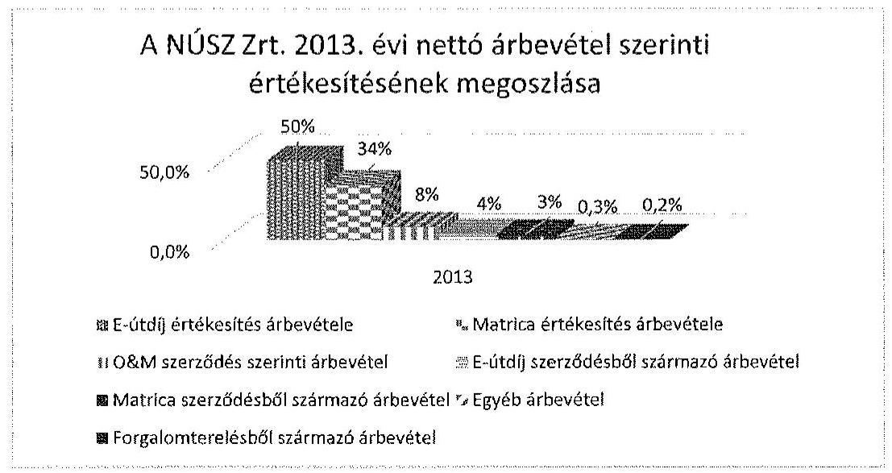

Forrás: A NÚSZ Zrt. 2013. évi beszámolója
Az e-útdíj értékesítésből, matricaértékesítésből, pótdíjból, valamint az egyéb eljárásokból származó bevételek a NÚSZ Zrt. eredményét közvetlenül nem érintették, mivel a vonatkozó szerződések és a jogszabály értelmében ezek a KKK részére

---

átadásra kerültek. Az átadást a Társaság szabályszerűen, közvetített szolgáltatásként tartotta nyilván, így a bevételek azokkal megegyező összegű költséggel ellentételeződtek. Az üzemi tevékenység eredménye a 2010. évi 405,2 M Ft-ról a 2012. évre 481,6 M Ft-ra növekedett, azonban a 2013. évre -12 173,3 M Ft-ra csökkent. A veszteséget egyrészt az üzemeltetési és karbantartási üzletág MK NZrt. részére történt átadása, másrészt a 2013. évi O&M teljesítések saját forrásból való finanszírozása okozta.

Az értékesítés nettó árbevételeinek elszámolása a NÚSZ Zrt.-nél szabályszerű volt. A bevételek elszámolása és kiszámlázása a belső szabályozásnak megfelelően történt, azokat közfeladatonként elkülönítetten tartották nyilván és számolták el a könyvviteli rendszerükben. Az anyagjellegű ráfordítások elszámolása során a NÚSZ Zrt. szabályszerűen járt el. A költségnemre és közfeladatra történő elszámolás a jogszabályi és a belső szabályozás előírásainak megfelelt. A személyi jellegű ráfordítások elszámolása szabályszerű volt. A személyi juttatások kifizetését dokumentumokkal alátámasztották, a bruttó bér számfejtése megfelelt a munkaszerződésben foglaltaknak. A személyi jellegű ráfordításokat a Számv. tv. 79. §-ában foglaltak figyelembevételével és a belső szabályozásnak megfelelően határozták meg. A belső szabályozások a jogszabályokkal (MT, Szja tv.) összhangban álltak, a besorolások és a juttatások szabályszerű elszámolására alkalmasak voltak. A munkavállalókat terhelő levonások és járulékok elszámolása az Szja. tv.-ben és a Tbj. tv.-ben foglaltaknak megfelelt.

A beruházások, felújítások kiadásai és az értékcsökkenési leírás elszámolásának szabályszerűsége a NÚSZ Zrt.-nél nem volt megfelelő. Az értékcsökkenések elszámolása a jogszabályi előírásoknak és a belső szabályozásnak megfelelően történt. Az ED rendszer megvalósítása során a 347/2010. (XII. 28.) Korm. rendelet 2. § (1) bekezdésének megfelelően a NÚSZ Zrt. a saját eszközeitől elkülönített nyilvántartást vezetett a beszerzett szoftverekről, építményekről és azok berendezéseiről, valamint a gépekről és járművekről. A beszerzett eszközöket a Társaság 2013. július 1-jétől rendeltetésszerűen használatba vette, azokból árbevétele származott, azonban a Számv. tv. 26. § (1) bekezdésében foglaltak ellenére nem a tárgyi eszközök között, hanem a befejezetlen beruházások között tartotta nyilván. Azokra Számv. tv. 52. § (1)-(3) bekezdéseiben foglaltakkal ellentétesen a 2013. év második félévében értékcsökkenést nem számolt el.

A helyszíni ellenőrzés elemezte az eszközcsoportok átlagos életkorának alakulását, kiemelve három legjelentősebb eszközcsoportot. A NÚSZ Zrt. három legjellemzőbb eszközcsoportjának (épületek, építmények, üzemi gépek) átlagos életkora 5,6-17,9 év között mozgott a 2010-2013. években. Az ellenőrzött időszakban az új beszerzésekre fordított összeg nem érte el az elszámolt amortizációt, így az értékcsökkenési leírás mértékében az eszközök pótlása elmaradt.

A NÚSZ Zrt. az ellenőrzött időszakban jelentős kintlévőséggel rendelkezett, azonban a lejárt vevőállomány összege a 2010. évi 2759,8 M Ft-ról 2013. évre 256,0 M Ft-ra csökkent. A 180 napon és a 365 napon túli lejárt és behajthatatlan vevői követelések után értékvesztést számoltak el, amely a 2010. évi 143,7 M Ft-ról a 2013. évre 12 898,1 M Ft-ra növekedett. A 2013. évi üzemeltetési és karbantartási, valamint fenntartási munkákhoz (O&M szerződés) kapcsolódó vevőkövetelésre 12 879,0 M Ft összegű értékvesztést számoltak el. Ennek oka az volt, hogy a Társaság a meg nem kötött O&M szerződés ellenére, a korábbi gyakorlatnak megfelelően a 2013. január 1-jétől október 31-éig terjedő időszakban

---

számlát állított ki a közútkezelői feladat ellátásának díjáról a KKK részére. A Társaságnak az állami alapfeladatot el kellett látnia és a feleknek a vonatkozó szerződést meg kellett volna kötnie a Kkt. 8. § (1), valamint az akkor hatályos 6/1998. (III. 11.) KHVM rendelet 1/A. § (2) bekezdésben foglaltak alapján. A KKK a havonta kiállított számlákat azonban a szerződés hiányára hivatkozva nem fogadta be, ellenértékét a Társaságnak nem fizette meg. A tulajdonosi joggyakorló MFB Zrt. levelében értesítette a NÚSZ Zrt.-t, hogy az elvégzett feladat ellenértékét saját eredménye terhére kell megfinanszíroznia. Ennek következtében a követelésre - a Számv. tv. 65. § (7) bekezdésében foglaltakat betartva - a 2013. évben értékvesztést számolt el.

A NÚSZ Zrt. a lejárt követeléseit a közszolgáltatás keretén belül egyedi nyilvántartáson elkülönítve kezelte. Az ellenőrzött időszakban a hátralékos követelésállomány csökkentése érdekében elkészítették a „Számlázási, kintlévőség kezelési és engedményezési szabályzatot", melyben intézkedési folyamatot dolgoztak ki a behajtásra. A vevői kintlévőség csökkentése érdekében 2012 decemberétől kockázatkezelési és értékelési rendszert vezettek be, pénzügyi biztosíték nyújtását tettek kötelezővé, valamint rövidebb intézkedési határidőt írtak elő a kintlévőség behajtására.

A NÚSZ Zrt. a vevőket egyedileg minősítette és a 180 napon túli kintlévőségekre 50%-os, a 365 napon túli kintlévőségekre 100% értékvesztést számolt el a 2010-2013. években. Az értékvesztések kivezetésére akkor került sor, ha a vevők ellen felszámolási eljárás indult, megszűnt és behajthatatlanná vált a kintlévőség. A behajthatatlanná vált vevői kintlévőségre 100%-ban értékvesztést számoltak el. A NÚSZ Zrt. szabályszerűen járt el a kintlévőségek kezelésében, az értékvesztések elszámolásakor betartotta az értékelési szabályzata és a Számv. tv. előírásait.

Az egyéb bevételek, pénzügyi műveletek bevételei, rendkívüli bevételek elszámolása a NÚSZ Zrt.-nél szabályszerű volt. A bevételek elszámolása, valamint az elszámolást megalapozó dokumentumok (banki bizonylatok, támogatási szerződések, kamatszámítások) megfeleltek a jogszabályban és belső szabályzatban foglaltaknak. A kapott támogatások elszámolása során a jogszabályi előírások szerint jártak el. Az egyéb bevételek a Számv. tv. 77. §, a pénzügyi műveletek bevételei a Számv. tv. 83. § és a rendkívüli bevételek elszámolása a Számv. tv. 86. § előírásának megfelelően és a számviteli politikában meghatározottak alapján történt.

Az egyéb bevételek a 2010. évi 2861,9 M Ft-ról a 2013. évre 4754,4 M Ft-ra, 66%-kal emelkedtek, melyet döntően a matricás pótdíj bevétel növekedése és az ED rendszer létrehozásához kapott támogatás okozott. A pénzügyi műveletek bevétele a kereskedelmi bankoknál lekötött betétállomány után kapott kamatokból állt, és a 2010. évi 2496,8 M Ft-ról a 2013. év végére 1411,7 M Ft-ra, 43%-kal csökkent. A rendkívüli bevételek az ellenőrzött időszakban jelentősen, 3,3 M Ft-ról 2072,6 M Ft-ra növekedtek. A Toll Service Zrt.-nél a tőkekivonás hatása a rendkívüli bevételekre 924,2 M Ft összegű volt. A 2013. november 1-jei üzletágátadás keretében az MNV Zrt.-vel szembeni kötelezettség és az EU-s finanszírozásból megvalósult beruházások átadása miatt a NÚSZ Zrt. összesen 2063,9 M Ft rendkívüli bevételt mutatott ki. A térítés nélküli üzletágátadás elszámolása a Számv. tv. 88. § előírásait betartva szabályszerű volt.

Az egyéb ráfordítások, pénzügyi műveletek ráfordításai, rendkívüli ráfordítások elszámolása a NÚSZ Zrt.-nél szabályszerűen történt. A ráfordítások elszámolása,

---

valamint az elszámolást megalapozó dokumentumok (szerződések, kimutatások, banki kivonatok) megfeleltek a jogszabályban és belső szabályzatokban foglaltaknak. Az egyéb ráfordítások a Számv. tv. 81. §-a, a pénzügyi műveletek ráfordításai a Számv. tv. 83. §-a, a rendkívüli ráfordítások elszámolása a Számv. tv. 86. §-a, továbbá a számviteli politika és a számlarend alapján történt. A költségelszámolást megalapozó dokumentumok rendelkezésre álltak, a ráfordításokat a számlarendben foglaltak szerint a megfelelő főkönyvi számlákra számolták el.

Az egyéb ráfordítások 2013. évi jelentős növekedéséhez nagymértékben hozzájárult a 2013-as üzemeltetési és karbantartási, valamint fenntartási munkákhoz kapcsolódó behajthatatlan vevőkövetelésre elszámolt 12 879,0 M Ft összegű értékvesztés. A rendkívüli ráfordítások mértékét két tétel befolyásolta jelentősen az ellenőrzött időszakban, egyik a kapcsolt vállalkozás tőkeleszállítása, a másik az üzletágátadás hatása.

Az ellenőrzött időszakban osztalék kifizetés nem történt, a mérleg szerinti eredményt minden évben eredménytartalékba helyezték az alapítói határozatokban előírtaknak megfelelően.

# 3.2. Az önköltségszámítás szabályszerűsége 

## Az önköltségszámítás feltételeinek kialakítása és működtetése során a NÚSZ Zrt. a 2010-2013. években szabályszerűen járt el.

A NÚSZ Zrt. a Számv. tv. 14. § (5) és (7) bekezdései alapján önköltségszámítási szabályzat készítésére kötelezett volt, melyet szabályszerűen elkészített. A 2010-2013. években alkalmazott önköltségszámítási szabályzat meghatározta az önköltségszámítás alapfogalmait, a közvetlen és a közvetett költség fogalmát, jellemzőit, a közvetett költség alcsoportjait és a költségfelosztás sémáját.

Meghatározta a kalkulációs egységek fajtáit, ismertette a tevékenységi struktúrát, amelynek megfelelően a kalkulációs egységeket (munkaszámokat) kialakították. A saját előállítású termékek, végzett szolgáltatások önköltségének megállapításához az utókalkuláció módszerét írták elő.

A Társaság a 2010-2013. években az önköltségszámítási szabályzat előírásainak betartásával a közfeladat ellátására vonatkozó ágazati kalkulációs séma szerint állította össze az egyes tevékenységek önköltségét. Az ágazati sajátosságokat figyelembe véve a közvetlen költségeket már a felmerülés időpontjában elszámolta konkrét kalkulációs egységre, munkaszámra. Az alaptevékenység és az ahhoz kapcsolódó kiegészítő tevékenység közvetlenül elszámolható, ténylegesen felmerült költségeit az SAP integrált ügyviteli rendszerben tartották nyilván. Meghatározták a könyvviteli rendszerrel való egyeztetés módját, a gyűjtő számlák rendjét,
 az értékcsökkenés elszámolásának módját. Az SAP-ban rögzített adatok három dimenziója - a költségnem, a költséghely és a munkafajta - egyértelműen meghatározták az elszámolást.

A közszolgáltatási díjtételek képzését meghatározó önköltségszámítás és a kialakított díjak megfeleltek a Számv. tv. 14. § (7) bekezdésében, a 70-82. §-aiban, az ágazati jogszabályokban (36/2007. (III. 26.) GKM rendelet, 2013. június 19-étől a 209/2013. (VI. 18.) Korm. rendelet) és a belső szabályzatokban

---

foglalt előírásoknak. Az országos gyorsforgalmi úthálózat karbantartási díjának meghatározása az O&M szerződések alapján végzett fenntartási munkák tételes elszámolása alapján történt. Az általános üzemeltetési feladatok ellátására a NÚSZ Zrt. rögzített szolgáltatási díjat kapott. A közútkezelési szolgáltatás ármegállapítása esetében az önköltségszámítási adatok alapozták meg az árképzést, a matrica, az E-útdíj értékesítés esetében a 36/2007. (III. 26.) GKM rendelet előírása szerint állapították meg a díjakat. 2013. július 1-jétől Magyarországon is bevezetésre került a megtett úttal arányos elektronikus útdíj szedési rendszer, amely a magyar úthálózat kijelölt útszakaszait érintette. A megtett úttal arányos díjfizetés mértéke függött a használatba vett út és a gépjármű kategóriájától, továbbá a környezetvédelmi besorolástól. A NÚSZ Zrt. a 2013. év második felétől az autópályák, autóutak és főutak használatáért fizetendő, megtett úttal arányos díjakat a 209/2013. (VI. 18.) Korm. rendelet előírásai szerint szedte be. A beszedett útdíj összegével nem a Társaság gazdálkodott, a matrica és az E-útdíj szolgáltatási feladatokért szerződés szerinti rögzített szolgáltatási díjban részesült.

# 4. A vagyonváltozást eredményező döntések jogszabályi és tulajdonosi elvárásoknak való megfelelése 

### 4.1. A NÚSZ Zrt. vagyongazdálkodási tevékenységének szabályszerűsége

A NÚSZ Zrt. a kezelt vagyon értékének megőrzéséről, gyarapításáról a 2010-2013. években nem teljes körűen gondoskodott, mert vagyongazdálkodási terv nem készült a hatályos vagyonkezelési szerződésben előírtak szerint, továbbá visszapótlási kötelezettségét a 2011. január 1. és 2013. június 27. közötti időszakban nem teljesítette.

Az ellenőrzött időszakban a NÚSZ Zrt. vagyonának szerkezetében jelentős átrendeződések voltak. A Társaság vagyona a 2010. évi nyitó 64 877,8 M Ft-ról a 2013. év végére 43 140,6 M Ft-ra (33,5%-kal), ezen belül a befektetett eszközök állománya 19 218,8 M Ft-ról 1163,2 M Ft-ra csökkent. A vagyonérték csökkenés döntő részben a 16 812,3 M Ft nettó könyv szerinti értékű 2013. évi üzletágátadás hatása⁹. Továbbá az ellenőrzött időszakban 51,5 M Ft nettó könyv szerinti értékű vagyontárgyat értékesítettek, 35,9 M Ft nettó könyv szerinti értékű eszközt selejteztek. Az immateriális javakra és tárgyi eszközökre elszámolt értékcsökkenés összege 6167,3 M Ft, a megvalósított beruházás összege 4724,7 M Ft volt. A 2013. évben EASYWAY finanszírozás keretében 232,8 M Ft összegben forgalomtechnikai fejlesztést, valamint KÖZOP és KEOP finanszírozás keretében 193,8 M Ft összegben tárgyi eszközbeszerzést valósítottak meg. A NÚSZ Zrt. saját tőkéjének csökkentéséről az MFB Zrt. a 9/2012. (VII. 17.) számú alapítói határozatában döntött, melynek eredményeként a Magyar Államot, mint tulajdonost megillető 6001,0 M Ft az MFB Zrt. részére átutalásra került.

[^0]
[^0]:    ⁹ Az átadott eszközök: immateriális javak 39,9 M Ft, tárgyi eszközök 15 524,1 M Ft, készletek 1081,5 M Ft, pénzeszközök 166,8 M Ft, összesen 16 812,3 M Ft, melyből vagyonkezelésben lévő vagyon (tárgyi eszköz) 530,8 M Ft.

---

A Társaság vagyonkezelésében lévő, illetve saját befektetett eszközeit az alábbi ábra szemlélteti:
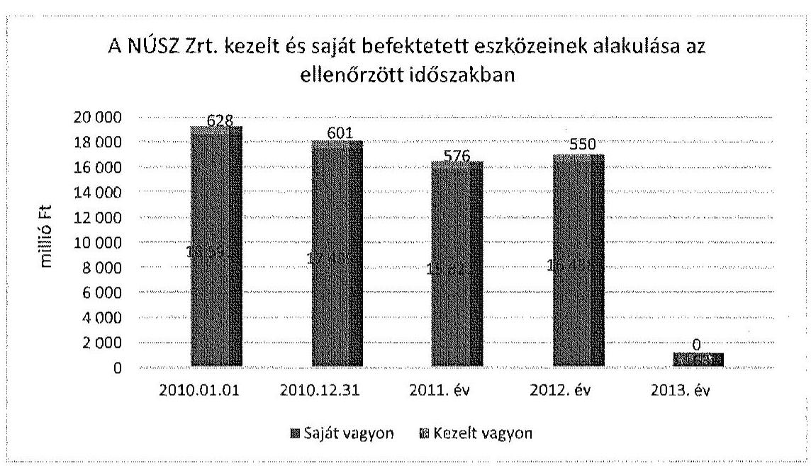

Forrás: A NÚSZ Zrt. adatszolgáltatása
A befektetett eszközök összes eszközön belüli aránya a 2010. évi nyitó 29,6%-ról a 2013. év végére 2,7%-ra csökkent, a vagyonkezelt állami vagyon jelentős arányt nem képviselt, 2010. január 1-jén az összes eszköz 1,0%-a, 2013. december 31-én 0,0%-a volt. Az ellenőrzött időszakban emelkedett a forgóeszközök aránya, ezen belül a követelések 12,7%-ról 30,0%-ra nőttek. A befektetett pénzügyi eszközök állományának csökkenésében meghatározó volt a 2011. évben a Toll Service Zrt. alaptőkéjének leszállítása.

A 2010-2013. években a NÚSZ Zrt. saját tőkéje 49 734,0 M Ft-ról 23 114,5 M Ft-ra (53,5%-kal) csökkent, a 2012. évi 6001,0 M Ft értékű tőkekivonás és a Társaság halmozott 18 486,0 M Ft értékű vesztesége miatt. A jegyzett tőkéje 34 050,0 M Ft-ról 30 162,0 M Ft-ra (11,4%-kal) mérséklődött. A mérleg szerinti eredmény a 2010. évben 2132,5 M Ft, a 2011. évben 2821,4 M Ft, a 2012. évben 2508,0 M Ft nyereség, a 2013. évben 25 947,9 M Ft veszteség volt. A 2013. évi mérleg szerinti veszteséget döntő részben az MK NZrt. részére történt ingyenes üzletágátadás rendkívüli ráfordításként kimutatott 16 751,9 M Ft összege, továbbá a KKK-val szemben fennálló követelésre 12 879,0 M Ft értékben elszámolt értékvesztés befolyásolta. A céltartalékok a 2010. január 1-jei 167,6 M Ft-ról 2013. év végére 2181,8 M Ft-ra, tizenháromszorosára nőttek elmaradt munkabér kifizetési kötelezettségekből, peres ügyekből, késedelmi kamatból adódóan. A hosszú lejáratú kötelezettségek az időszak eleji 996,7 M Ft-ról a 2013. év végére 9,1 M Ft-ra csökkentek a 2013. évi üzletágátadás hatására. A 2010-2012. években a NÚSZ Zrt. saját tőkéje meghaladta a jegyzett tőke összegét, azonban a 2013. év végére arányuk 76,6%-ra csökkent.

A NÚSZ Zrt. mint a Magyar Állam nevében tulajdonosi jogok gyakorlására feljogosított társaság a rábízott állami vagyonnal kapcsolatos 2013. évi éves beszámolóját a Számv. tv. előírása szerint, valamint a 347/2010. (XII. 28.) Korm. ren-

---

delet előírásainak figyelembe vételével, a saját vagyonától elkülönítetten készítette el. A Társaság a kezelésébe vett vagyont az ellenőrzött időszak alatt nem terhelte meg, nem adta biztosítékul, azon osztott tulajdont nem létesített. A 2013. évi elkülönített beszámoló szerint a rábízott vagyon induló tőkéje 30 862,4 M Ft volt, mely a mérleg szerinti eredmény összegével, 362,3 M Ft-tal (1,2%-kal) nőtt az év végére. A kötelezettségek összege 2308,4 M Ft-ot tett ki, mely a szállítói tartozásokból és az ED rendszer megvalósításához kapcsolódó, a NÚSZ Zrt. által saját pénzeszközből finanszírozott beszerzések miatt fennálló tartozásból állt. A befektetett eszköz állomány értéke a rábízott vagyon tekintetében 2013. december 31-én 26 653,0 M Ft, a forgóeszközök értéke 6849,6 M Ft volt.

A NÚSZ Zrt. az ellenőrzött időszakban az éves üzleti tervek részeként a saját vagyon tekintetében beruházási, fenntartási és felújítási feladattervet, üzemeltetési és karbantartási feladattervet készített. Az üzleti tervek összeállításához részletes vezérigazgatói utasítás került kiadásra a feladatok, folyamatok, ütemterv és irányelvek rögzítésével, valamint tervezési segédletekkel. A tervek összeállításakor figyelembe vették a mérnökségek, igazgatóságok eszközigényeit és költséghatékonysági számításokat végeztek. A vagyonkezelésbe vett eszközökre vonatkozóan - a VSZ előírása ellenére - elkülönített karbantartási terv nem készült. Az üzleti tervekben elfogadott fejlesztések, felújítások, karbantartási feladatterv teljesüléséről az üzleti jelentésekben számoltak be. A Társaság a pénzügyi lehetőségei függvényében gondoskodott a karbantartások, fejlesztések megvalósításáról, azonban a 2010-2013. években megvalósult beruházások - a saját és a vagyonkezelt eszközök tekintetében - nem biztosították az avultság csökkentését. Az ellenőrzött időszakban a tárgyi eszközök bruttó és nettó értéke az elmaradt beruházások hatására csökkent, a beruházások értéke nem érte el a terv szerinti értékcsökkenés összegét. A Társaság a vagyonkezelésbe vett vagyonelemek köre után a Vhr. 9 § (9) bekezdés b) pontjában előírt visszapótlási kötelezettségét a 2011. január 1. és 2013. június 27. közötti időszakban nem teljesítette. E vagyoni körbe tartozó eszközökre a 2010-2013. években 97,2 M Ft értékcsökkenést számoltak el, ugyanebben az időszakban 0,4 M Ft beruházást valósítottak meg. A visszapótlási kötelezettség alól, mint kizárólag közfeladatot ellátó, a NÚSZ Zrt. - a Vtv. 27. § (8) bekezdése alapján - 2013. június 28-ától mentesült.

# 4.2. A döntések előkészítésének megalapozása 

A NÚSZ Zrt. a vagyonváltozást eredményező döntések előkészítése és megalapozása során a jogszabályi és a belső előírásokat nem teljes körűen tartotta be.

A 2010. január 1. - 2010. június 16. közötti időszakban a MNV Zrt. hatáskörét és eljárásait az Alapító Okirat tartalmazta. A MNV Zrt. a számviteli beszámoló elfogadásáról, az adózott eredmény felhasználásáról, az éves üzleti és közbeszerzési terv elfogadásáról döntött.

A 2010. június 17. - 2013. december 31. közötti időszakban az MFB Zrt. által kiadott, „A Stratégiai csoport adatszolgáltatásának eljárási rendje” tartalmazta a vagyongazdálkodási döntések eseteit, előkészítését és azok előterjesztésére vonatkozó tartalmi és formai követelményeket. Az előterjesztések előkészítésekor figyelembe kellett venni a Számv. tv., valamint a Gt. vonatkozó rendelkezéseit.

---

A döntés előkészítés szabályai vonatkoztak a vezérigazgató, az FB elnöke és az FB további tagjai, valamint a könyvvizsgáló díjazására, a könyvvizsgáló írásbeli jelentésének birtokában a Számv. tv. szerinti beszámoló elkészítésére, üzleti tervek összeállítására, az FB jóváhagyását igénylő, értékhatártól függő - hitel, kölcsön, közbeszerzés - ügyek előterjesztésére.

A Társaság SzMSz-e a vagyongazdálkodási döntések előkészítését az egyes szervezeti egységek feladatkörének meghatározásával szabályozta. A NÚSZ Zrt. az ellenőrzött időszakban az Alapító Okiratban foglaltak, valamint az MFB Zrt. adatszolgáltatási rendje előírásainak megfelelve terjesztette a részvényes elé az éves üzleti terveket, az éves beszámolókat, a vezető tisztségviselők díjazására vonatkozó javaslatokat. A havi, negyedéves és éves jelentéseket, illetve az Alapító Okirat szerinti, az FB jóváhagyását igénylő ügyleteket az előírt tartalommal és formában terjesztette az FB felé. Az előterjesztett dokumentumok minden szükséges esetben tartalmazták a könyvvizsgáló előzetes írásbeli jelentését.

A NÚSZ Zrt. feletti tulajdonosi joggyakorlók a saját vagyoni elemekre vonatkozó gazdálkodási döntések meghozatalakor nagyfokú önállóságot biztosítottak a Társaság ügyvezetésének. Az Alapító Okirat az ügyvezetés részére kizárólagosságot két esetre, a NÚSZ Zrt. által történő társaság alapításra, részesedés szerzésre, valamint a 2010. január 1. - 2011. november 10. közötti időszakban a Társaság tulajdonát képező eszközök tulajdonjogának, vagyonkezelői jogának értékhatárhoz kötött (500,0 M Ft felett) átruházására fogalmazott meg. A VSZ szerint vagyonkezelt eszközöket értékesíteni, arra zálogjogot, illetve haszonélvezeti jogot alapítani kizárólag az MNV Zrt. volt jogosult. Az ellenőrzött időszakban a vagyon elidegenítésére, térítésmentes átadására, továbbá selejtezésre vonatkozóan tulajdonosi döntést igénylő ügylet nem volt.

A tulajdonosi joggyakorló MNV Zrt., illetve MFB Zrt. az ellenőrzött időszakban az előterjesztések alapján elfogadta az éves üzleti terveket, beszámolókat, a vezető tisztségviselők díjazására vonatkozó javaslatokat. A döntés-előkészítés, információszolgáltatás azonban - a vagyonkezelt eszközök tekintetében - nem biztosított megfelelő alapot a döntésekhez, mivel a 2011. és a 2012. évben megvalósított 0,4 M Ft értékű fejlesztés, illetve 84,1 M Ft felújítás során a Társaság az MNV Zrt. előzetes hozzájárulását a Vhr. 9. § (6) bekezdésében foglalt előírás ellenére nem kérte meg. Továbbá a VSZ előírta, hogy a NÚSZ Zrt. tíz évnél hosszabb időre szóló bérleti-, haszonbérleti szerződést csak az MNV Zrt. előzetes írásbeli egyeztetése után köthet. A NÚSZ Zrt. a tíz évnél hosszabb időre szóló bérleti szerződések¹⁰ megkötése előtt az MNV Zrt. előzetes engedélyét nem kérte be.

A NÚSZ Zrt. a saját vagyontárgyak
 értékesítése során a hasznosítási és selejtezési szabályzat előírásait betartva járt el. A döntéseket a Hasznosítási és Selejtezési Bizottság előterjesztése alapján a vezérigazgató hozta meg. Az ellenőrzött idő-

[^0]
[^0]:    ${ }^{10}$ A NÚSZ Zrt. lakás használat céljából adott bérbe ingatlant, illetve az autópálya mérnökségeken a rendőrség számára biztosított - bérleti szerződés keretében - az épületeket, parkolót.

---

szakban a feleslegessé vált vagyontárgyak selejtezésére vonatkozó döntés is született, melynek során a belső szabályozás előírásait betartották. A vagyonkezelt eszközök köréből nem értékesítettek és nem selejteztek a 2010-2013. években.

Az Alapító Okiratban foglaltak szerint a Társaságnak a közbeszerzési tervet az éves üzleti tervvel együtt tájékoztató jelleggel megküldte a részvényes számára. A NÚSZ Zrt. a 2010-2013. években az FB előzetes jóváhagyásával a részvényes elé terjesztette a közbeszerzési terveket.

A közbeszerzési eljárások lefolytatása során a NÚSZ Zrt. szabályszerűen járt el. A közbeszerzés lefolytatásának szükségességét vizsgálták, a beszerzéseket az arra kijelölt személyek jóváhagyták.

A Társaság az ellenőrzött időszakban a tárgyi eszköz beszerzésére, létesítésére irányuló, a Kbt. ${ }_{1,2}$ szerinti értékhatárhoz kötött közbeszerzési eljárásokat lefolytatta, a közbeszerzési eljárásban nyertesként kihirdetett ajánlattevővel kötötte meg a szerződéseket. A megtett úttal arányos elektronikus díjszedési rendszer beszerzése során két alkalommal került sor közbeszerzési eljárás kiírására, melyet a NÚSZ Zrt. szabályszerűen lefolytatott.

# 4.3. A tulajdonosi joggyakorló vagyonváltozást eredményező döntéseinek megfelelése 

A tulajdonosi jogok gyakorlója a vagyonváltozást eredményező döntések során a jogszabályokban és a belső előírásokban foglaltak szerint, szabályszerűen járt el.

A 2010. január 1. - 2010. június 16. közötti időszakban az MNV Zrt. a NÚSZ Zrt. Alapító Okiratában meghatározta a vagyongazdálkodási döntésekkel összefüggő eljárási rendet. A 2010. június 17.-2013. december 31. közötti időszakban az MFB Zrt. a NÚSZ Zrt. Alapító Okiratában és „A Stratégiai csoport adatszolgáltatásának eljárási rendje"-ben foglaltak szerint meghatározta a vagyongazdálkodási döntések előterjesztésével kapcsolatos tartalmi és formai követelményeket. Az Alapító Okiratban a részvényesi (tulajdonosi), az Igazgatóság/vezérigazgató, az FB előzetes jóváhagyását igénylő hatásköröket meghatározták. Az Alapító Okirat szabályozta a döntések részvényes elé terjesztésének módját és az előterjesztés jogosultjának megnevezését.

Az MNV Zrt. a vagyon-nyilvántartási szabályzatában és a VSZ-ben előírta a kezelt vagyon nyilvántartásával, adatszolgáltatásával, elidegenítésével, bővítésével kapcsolatos szabályokat. Az ellenőrzött időszakban a tulajdonosi joggyakorló MNV Zrt. és MFB Zrt. a vagyon tulajdonjogának átruházására, illetve ingyenes átruházására, vagyon értékesítésére, apportjára, részesedés, befektetés szerzésére vonatkozó döntést nem hozott, mert nem volt e döntési jogkört érintő ügylet. A NÚSZ Zrt. részéről a 2013. évben megvalósított ingyenes üzletágátadás a Kormány 1600/2013. (IX. 3.) számú határozata, valamint a közútkezelői tevékenység átadásáról szóló 2013. évi CLXVI. törvény alapján történt. A beruházások, felújítások megvalósításához az MNV Zrt. engedélyt nem adott ki, továbbá az állami tulajdonú vagyonkezelt eszközök tíz évnél hosszabb időtartamú bérleti szerződések megkötése előtt elutasító vagy egyetértő döntést sem hozott.

---

# 5. A Belső Kontroll és MONITORING RENDSZER KIALAKÍTÁSA ÉS MÜKÖDTETÉSE 

### 5.1. A belső kontrollrendszer

A vagyon védelmét, a vagyonnal felelős gazdálkodást biztosító belső kontrollrendszer a 2010-2013. években - a tulajdonosi ellenőrzés hiánya miatt - nem felelt meg a jogszabályi előírásoknak.

A tulajdonosi joggyakorló MNV Zrt. a 2010. január 1. - 2010. június 16. közötti időszakban az Alapító Okiratban rendelkezett az adatszolgáltatási kötelezettségről. A NÚSZ Zrt. beszámolási kötelezettségét ebben az időszakban az Alapító Okirat szerint teljesítette. A tulajdonosi joggyakorló MFB Zrt. a 2010. június 17. - 2013. december 31. közötti időszakban „A Stratégiai csoport adatszolgáltatásának eljárási rendje"-ben írt elő adatszolgáltatással kapcsolatos szabályozást. Az MFB Stratégiai Csoportjába tartozó társaságok, köztük a NÚSZ Zrt. adatszolgáltatási rendjét az MFB Zrt. a tartós tőkebefektetések, illetve a tulajdonosi joggyakorlással érintett gazdálkodó szervezetek kezelésének eljárási rendjéről szóló, 19/2011. számú Elnök-vezérigazgatói utasításban szabályozta.

A NÚSZ Zrt. SzMSz-ben szabályozta, azon belül a Gazdasági és Kontrolling Igazgatóság feladatkörébe utalta a Társaság éves beszámolóinak összeállításával, az adatszolgáltatásokkal kapcsolatos kötelezettségét, a gazdasági folyamatok számszerű és elemző kontrolljának, az üzleti tervet megalapozó feltételrendszerre vonatkozó számításoknak az elvégzését, a vezetői információs rendszer működtetését, szakmai felügyeletét, az üzleti terv és az üzleti jelentés elkészítését. Továbbá a vagyongazdálkodási folyamatok tervezését, összehangolását, a közbeszerzési eljárást igénylő és nem igénylő beszerzések lebonyolítását. A Társaság - a rábízott vagyonra vonatkozó előírások kivételével - a belső szabályzataiban előírta a közfeladat-ellátással kapcsolatos elszámolásokat (bevételek, költségek és ráfordítások), valamint a vagyonkezelésben lévő vagyonelemek elkülönített nyilvántartását, szabályozta továbbá a vagyongazdálkodással kapcsolatos feladat- és hatásköröket, felelősségi viszonyokat.

Az ellenőrzési időszak alatt a Társaság gondoskodott a Gt. 33.§ (1) bekezdésében előírt FB létrehozásáról az Alapító Okiratban meghatározottak szerint. Az FB létszáma a 2010-2013. évek közötti időszakban hat főről öt főre változott. A NÚSZ Zrt. FB-je az ellenőrzési időszak alatt a jogszerű és eredményes működés érdekében a FB testületének jogállását, szervezetét, tevékenységét, működésének legfőbb szabályait a Gt. 34. § (4) bekezdésében előírtaknak megfelelően Ügyrendjében ${ }^{11}$ írta elő. Az FB az Ügyrendjében rögzített munkaterv szerint látta el feladatát. Az ülésekről készített jegyzőkönyveket az Ügyrendben előírtak szerint rögzítették. Az FB hatáskörét és feladatait az Ügyrend és az Alapító Okirat alapján szabályszerűen határozták meg.

[^0]
[^0]:    ${ }^{11}$ Az FB Ügyrendjét az 51/2010. (I. 27.) számú határozattal fogadták el, módosítására az ellenőrzött időszakban egy alkalommal került sor.

---

Az ellenőrzött időszakban az FB szabályszerűen látta el a vagyongazdálkodással kapcsolatos feladatát, jóváhagyta a Társaság SzMSz-ét, üzleti és közbeszerzési terveit, valamint az éves számviteli beszámolóit és azok mellékleteit. A könyvvizsgálók kiválasztásáról határozatot hozott a velük évente kötendő szerződés tartalmának ismeretében.

A Társaság éves számviteli beszámolóinak jóváhagyásakor a felügyelőbizottsági és a könyvvizsgálói jelentések rendelkezésre álltak. Az éves számviteli beszámolókat a jogszabályi előírásoknak megfelelően elkészítették, azokat az előírt határidőig a legfőbb döntést hozó szerv jóváhagyta. A könyvvizsgáló a NÚSZ Zrt. 2010-2013. évi számviteli beszámolóiról megállapította, hogy az megbízható, valós képet adott a társaság vagyoni, pénzügyi és jövedelmi helyzetéről, megfelelt a Számv. tv.-ben foglaltaknak és az általános számviteli alapelveknek. A könyvvizsgáló a 2011. és 2013. évekre vonatkozó véleményében figyelemfelhívó megjegyzéssel élt a vagyongazdálkodásra vonatkozóan (2011-ben nem történt meg az állami vagyonról szóló törvény szerint az eszközátadás, a VSZ módosítására nem került sor, 2013-ban nem kötöttek üzemeltetési és karbantartási szerződést).

Az MNV Zrt. tulajdonosi ellenőrzési szabályzatát elkészítette és a 46/2011. számú vezérigazgatói utasítással kiadta, majd a szabályzatot a 37/2013. számú vezérigazgatói utasítással módosította. A szabályzat hatálya kiterjedt a NÚSZ Zrt.-re. A VSZ-ben a Vhr. 20. § (1) bekezdésében foglaltak ellenére nem rögzítették, hogy a tulajdonosi ellenőrzés eljárásrendjét, a felek jogait, kötelezettségeit a felek a szerződés részének tekintik. Az MNV Zrt. tulajdonosi ellenőrzési szabályzata meghatározta a tulajdonosi ellenőrzés során alkalmazandó részletes eljárásrendet, melynek célja az állami vagyonnal való gazdálkodás vizsgálata volt, azonban a Vtv. 17. § (1) bekezdés d) pontjában meghatározott ellenőrzés rendszerességét nem írta elő.

Az MNV Zrt. Ellenőrzési Igazgatósága az ellenőrzési időszak alatt a NÚSZ Zrt.-nél tulajdonosi ellenőrzést a kezelt vagyon nyilvántartására és gazdálkodására vonatkozóan - a Vtv. 17. § (1) bekezdés d) pontjában, valamint a Vhr. 20. § (1) bekezdésében foglaltak ellenére - nem végzett.

Az ellenőrzött időszakban a NÚSZ Zrt. Belső Ellenőrzési Irodája a kezelésbe kapott vagyonnal kapcsolatban nem végzett az állami vagyon megóvására, gyarapítására, szabályoknak megfelelő hasznosítására, a VSZ-ben foglalt kötelezettségek ellenőrzésére belső ellenőrzési vizsgálatot, az ellenőrzés a belső ellenőrzési munkaterveiben sem került előírásra. A Társaság minden évben elkészítette belső ellenőrzési munkatervét, melyeket az FB határozataival jóváhagyott.

A Belső Ellenőrzési Iroda a 2010. évben 32 db, a 2011. évben 30 db, a 2012. évben 30 db és a 2013. évben 23 db ellenőrzést végzett. Mindezekből a saját vagyonnal történő gazdálkodással kapcsolatos ellenőrzés 8 db volt, melyek érintették a szabályzatokat, a leltárt, a pénzkezelés folyamatát, a selejtezést és hasznosítást, valamint a közbeszerzések ellenőrzését. A belső ellenőrzés megállapításairól intézkedési tervek készültek, melyek végrehajtását a Belső Ellenőrzési Iroda utóvizsgálat keretében ellenőrizte. A 2013. évben két alkalommal ellenőrizte a közbeszerzésekkel kapcsolatos beszerzéseket, az ellenőrzésről intézkedési terv készült, melyben leírtakat folyamatosan végrehajtották, utóvizsgálat keretében meggyőződtek a végrehajtásáról.

---

A 2010. évben a Társaságnál a megelőző időszak jogi, informatikai, pénzügyi intézkedéseire vonatkozóan külső szakértőkkel történő ellenőrzést végeztettek. Az ellenőrzések megállapításait az FB megtárgyalta, a hiányosságok kijavításáról negyedévente történő beszámolási kötelezettséget írt elő, melyet teljesítettek.

# 5.2. Az információáramlási és monitoring rendszer 

A NÚSZ Zrt.-nél a szabályszerű vagyongazdálkodás érdekében kialakított információáramlási és monitoring rendszer a 2010-2013. években nem volt teljes körűen megfelelő.

Az MNV Zrt. a 2010. január 1. és 2010. június 16. közötti időszak, továbbá az MFB Zrt. a 2010. június 17. - 2013. december 31. közötti időszak tekintetében meghatározta a NÚSZ Zrt. részére az adatszolgáltatási kötelezettséget. Az ED rendszer esetében az MNV Zrt. a támogatási szerződésben rögzítette a Társaság beszámolási, elszámolási kötelezettségét, melynek a NÚSZ Zrt. a támogatás vonatkozásában eleget tett. A tulajdonosi joggyakorlók az SzMSz-ben meghatározták az adatszolgáltatási kötelezettség teljesítésével kapcsolatos feladatokat és azok felelőseit.

A Társaság a vagyonkezelését, hasznosítását érintő jogszabályoknak megfelelő szerződésszerű kapcsolattartást, adatszolgáltatást és elszámolást nem biztosította teljes körűen az ellenőrzött időszakban. Az MNV Zrt, mint a vagyonkezelt eszközök feletti tulajdonosi joggyakorló a VSZ-ben a jogszabályi változásokat nem követte, az azokban meghatározott előírásokat nem kérte számon. A NÚSZ Zrt. a 2010-2013. évi vagyonkataszteri adatszolgáltatási kötelezettségének nem tett eleget. Eljárása nem felelt meg az MNV Zrt. vagyon-nyilvántartási szabályzatában, a Vhr. 14. § (1) bekezdésében, valamint a VSZ-ben foglaltaknak, miszerint a vagyonkezelő az állami vagyon nyilvántartására előírt jogszabályokban foglaltaknak megfelelően köteles adatszolgáltatási és nyilvántartási kötelezettségének eleget tenni. Az adatszolgáltatás hiányára az MNV Zrt. a Vhr. 14. § (8) bekezdésében foglaltak ellenére nem szólította fel a Társaságot. Ezen túlmenően az ellenőrzési időszak alatt a Társaság a vagyonkezelt eszközök nyilvántartásával és adatszolgáltatásával kapcsolatos kötelezettségét a törvényi előírások, az MNV Zrt. vagyon-nyilvántartási szabályzata, valamint a számviteli politikájában, egyéb belső szabályzataiban meghatározottak szerint nem teljes körűen teljesítette.

Az állami vagyon (a NÚSZ Zrt. saját vagyonának egy részével együtt) az 1600/2013. (IX. 3.) Kormány határozat, valamint a közútkezelői tevékenység átadásáról szóló 2013. évi CLXVI. törvény alapján 2013. november 1-jétől az MK NZrt.-hez került ingyenes vagyonátadással.

A Társaság a Vhr. 9. § (9) bekezdés a) pontja alapján a vagyonkezelésbe vett eszközeit állományba vette a számviteli törvény előírásainak megfelelően, az egyéb hosszú lejáratú kötelezettségként a kezelésbe vételkori értéken elkülönítetten tartotta nyilván, melyről minden évben az éves beszámolók kiegészítő mellékletében beszámolt.

A NÚSZ Zrt. az értékcsökkenés visszapótlásával kapcsolatos elszámolását a 2011. január 1-jétől hatályos Vhr. 9. § (9) bekezdés d)
 pontjában előírtaknak megfelelően elkészítette, a vagyonkezelésbe vett vagyonelemek után előírt visszapótlást

---

azonban - 2013. június 27-éig - a Vhr. 9. § (9) bekezdés b) pontjában foglaltak ellenére nem teljesítette. A Társaság az ED rendszerrel kapcsolatos rábízott vagyonáról szóló éves beszámolót és üzleti jelentést a 2013. üzleti év könyveinek lezárását követően a tárgyévet követő év augusztus 15. napjáig az állami vagyon felügyeletéért felelős miniszter részére megküldte. A NÚSZ Zrt. mint tulajdonosi joggyakorló a Vhr. 14. § (1) bekezdésében foglaltak ellenére az ED rendszerre vonatkozóan az MNV Zrt. részére adatot nem szolgáltatott, az adatszolgáltatás hiányára az MNV Zrt. a Vhr. 14. § (8) bekezdésének előírása ellenére nem hívta fel a Társaság figyelmét.

Az ellenőrzési időszak alatt a NÚSZ Zrt. szabályszerűen elkészítette az iratkezelési, az adatvédelmi- és adatbiztonsági, az adattovábbítás rendjére vonatkozó, valamint a közérdekű adatok közzétételére vonatkozó szabályzatát.

A NÚSZ Zrt. az adatbiztonság érdekében létrehozta és meghatározta a közérdekű adatok, valamint az elektronikus formában közzéteendő adatok megismerésére irányuló igények elbírálása során irányadó eljárási szabályokat, illetve az elektronikus formában közzéteendő adatok nyilvánosságra hozatalával összefüggő feladatokat.

A Társaságnál a 2010. január 1. - 2013. december 31. közötti időszakban az Info tv. 33. § (1) bekezdésének megfelelően biztosított volt a közérdekű adatok védelme, nyilvánosságra hozatala. A kötelezően közzéteendő közérdekű adatokat a Társaság az ellenőrzési időszak alatt az internetes honlapján, bárki számára, személyazonosítás nélkül, korlátozástól mentesen, kinyomtatható és részleteiben is adatvesztés nélkül kimásolható módon, a betekintés, a letöltés, a nyomtatás, a hálózati adatátvitel szempontjából díjmentesen hozzáférhetővé tette.

# 5.3. A kormányzati szektorba sorolt (ESA) adatszolgáltatás 

A NÚSZ Zrt. mint kormányzati szektorba sorolt egyéb szervezet jogszabályban előírt adatszolgáltatási kötelezettségét a 2010-2013. években - az ED rendszer kivételével - szabályszerűen teljesítette. A Társaság gazdálkodásának a kormányzati szektor hiányára és az államadósságra befolyással bíró elemei a jogszabályi előírásoknak megfeleltek.

A NÚSZ Zrt. az NGM kormányzati szektorba sorolt egyéb szervezetekről szóló közleményének 6. pontjában szerepelt, így vonatkozott rá 2012. március 31-étől az Ávr. 7. számú melléklet 28. pontjában és 2013. augusztus 19-étől az Ávr. 7. számú melléklet 29. pontjában megfogalmazott adatszolgáltatási kötelezettség.

A Társaság az Ávr. 7. számú melléklet 28. pontja alapján 2012. március 31-étől adatszolgáltatásra volt kötelezett a tulajdonosi jogokat gyakorló (MFB Zrt.) felé. Az adatszolgáltatás határideje az üzleti év mérleg fordulónapját követő, legkésőbb 180 nap volt. A Társaság a 2012-2013. üzleti éveket érintő számviteli beszámolóját, kiegészítő mellékletét, könyvvizsgálói jelentését a tulajdonosi jogokat gyakorló szervezet (MFB Zrt.) részére határidőben teljesítette. Az MFB Zrt. alapítói határozataiban elfogadta a Társaság 2012. és 2013. üzleti évi számviteli beszámolóit. Az MFB Zrt. az NFM felé teljesítendő adatszolgáltatási kötelezettségének a 2012-2013. években az előírt határidőben eleget tett.

---

Az NGM kormányzati szektorba sorolt egyéb szervezetekről szóló közlemény végrehajtására kiadott Útmutató alapján az Ávr. 7. számú melléklet 29. pontjában előírt adatszolgáltatási kötelezettsége a NÚSZ Zrt.-nek nem állt fenn. A NÚSZ Zrt.-nek, mint a kormányzati szektorba sorolt egyéb szervezetnek az ellenőrzési időszak alatt nem volt a Stabilitási tv. által szabályozott kormányzati szektor hiányára és az államadósságra befolyással bíró, az államháztartásért felelős miniszter előzetes hozzájárulásával megkötött adósságot keletkeztető ügylete. Az ellenőrzött időszak alatt adósságot keletkeztető ügylete nem volt, a halmozott mérleg szerinti eredmény 18 486,0 M Ft összegű veszteségének egy része negatívan befolyásolta a kormányzati hiány alakulását. A hiányból az MK NZrt. részére történt 16 751,9 M Ft ingyenes üzletágátadás nem növelte a kormányzati szektor hiányát, mivel a Számv. tv. 86. § előírása alapján az ingyenes üzletágátadást a NÚSZ Zrt.-nél (mint átadónál) rendkívüli ráfordításként, az átvevő MK NZrt.-nél pedig rendkívüli bevételként kellett elszámolni.

# 5.4. A kapcsolt vállalkozásokban lévő részesedések 

A kapcsolt vállalkozásokban lévő részesedések értékének védelme érdekében tett intézkedések a 2010-2013. években megfelelőek voltak.

A NÚSZ Zrt. 100%-os tulajdonában egy kapcsolt vállalkozás - a Toll Service Zrt. - volt, amelynek több lépcsőben történő megszüntetéséről a 2010. évben az FB 22/2010. (IX. 9.) számú határozata alapján döntés született. Első lépésben annak jegyzett tőkéjét az 5/2011. (III. 1.) részvényesi határozattal 540,0 M Ft-ról 5,0 M Ft-ra csökkentették. Az alaptőke leszállítással összefüggésben a NÚSZ Zrt. 924,2 M Ft rendkívüli bevételt ért el. Második lépésként előírták a társaság részére, hogy intézkedjen egy potenciális vevő felkutatása érdekében. Az ellenőrzött időszak végéig a társaság nem szűnt meg, értékesítésére nem került sor, végelszámolását nem határozták el.

A NÚSZ Zrt. a kapcsolt vállalkozásban lévő tulajdonosi részesedésének védelme érdekében - az alapító okiratban foglaltak szerint -, valamint a Gt. 33. § (2) bekezdés c) pontjának előírása alapján létrehozta az FB-t, melynek létszáma három fő volt. Az alapító kijelölte az FB tagjait, a vezérigazgatót, a könyvvizsgálót. Az alapító az FB részére előírta a társaság működésének és gazdálkodásának ellenőrzését, melyet az FB teljesített. A Toll Service Zrt. az ellenőrzött időszakban gazdasági tevékenységet nem folytatott, éves beszámoló készítési és letétbe helyezési kötelezettségének eleget tett, beszámolóit könyvvizsgáló auditálta. A társaságnak - gazdasági tevékenység folytatásának hiányában - a NÚSZ Zrt. felé vagyongazdálkodással kapcsolatos adatszolgáltatási kötelezettsége nem keletkezett.

Budapest, 2015.
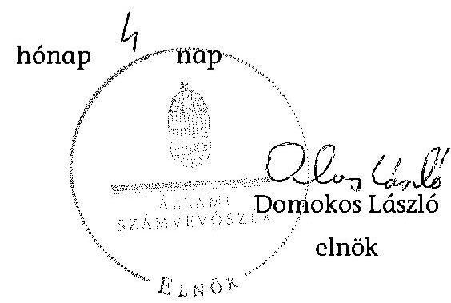

Melléklet: 11 db
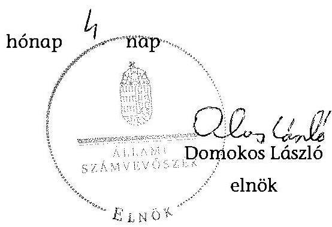

---

# RÖVIDÍTÉSEK JEGYZÉKE 

## EU-s joganyagok

479/2009/EK rendelet

## Törvények

Áht.
Gt.
Info. tv.
$\mathrm{Kbt}_{.1}$
$\mathrm{Kbt}_{.2}$
Kkt.
MT

Stabilitási tv.
Számv. tv.
Szja tv.
Tbj. tv.

Vtv.

## Rendeletek

19/2013. (V. 9.) NFM rendelet

209/2013. (VI. 18.)
Korm. rendelet

347/2010. (XII. 28)
Korm. rendelet
a Tanács 2009. május 25-i 479/2009/EK rendelete az Európai Közösséget létrehozó szerződéshez csatolt, a túlzott hiány esetén követendő eljárásról szóló jegyzőkönyv alkalmazásáról
az államháztartásról szóló 2011. évi CXCV. törvény
a gazdasági társaságokról szóló 2006. évi IV. törvény (hatálytalan: 2014. március 15-étől)
az információs önrendelkezési jogról és az információszabadságról szóló 2011. évi CXII. törvény
a közbeszerzésekről szóló 2003. évi CXXIX. törvény (hatálytalan: 2012. január 1-jétől)
a közbeszerzésekről szóló 2011. évi CVIII. törvény (hatályos: 2012. január 1-jétől)
a közúti közlekedésről szóló 1988. évi I. törvény
a munka törvénykönyvéről szóló 1992. évi XCII. törvény (hatálytalan: 2011. december 31-étől), a munka törvénykönyvéről szóló 2012. évi I. törvény
Magyarország gazdasági stabilitásáról szóló 2011. évi CXCIV. törvény
a számvitelről szóló 2000. évi C. törvény
a személyi jövedelemadóról szóló 1995. évi CXVII. törvény a társadalombiztosítás ellátásaira és a magánnyugdíjra jogosultakról, valamint a szolgáltatások fedezetéről szóló 1997. évi LXXX. törvény
az állami vagyonról szóló 2007. évi CVI. törvény
az országos közutak használatáért fizetendő útdíjak beszedésére alkalmas elektronikus díjszedési rendszer eszközei felett az államot megillető tulajdonosi jogokat gyakorló és kötelezettségeket teljesítő szervezet kijelöléséről szóló 19/2013. (V. 9.) NFM rendelet
az autópályák, autók és főutak használatáért fizetendő megtett úttal arányos díjról szóló 2013. évi LXVII. törvény végrehajtásáról rendelkező 209/2013. (VI. 18.) Korm. rendelet
a Magyar Állam nevében tulajdonosi jogokat gyakorló szervezetek rábízott állami vagyonnal kapcsolatos éves beszámoló készítési és könyvvezetési kötelezettségéről szóló 347/2010. (XII. 28.) Korm. rendelet (hatályon kívül helyezve (2014. január 1-től)

---

353/2011. (XII. 30.) Korm. rendelet

36/2007. (III. 26.) GKM rendelet
6/1998. (III. 11.) KHVM rendelet
Ávr.
Vhr.

## Szórövidítések

adattovábbítás rendjére vonatkozó szabályzat
adatvédelmi szabályzat

Alapító Okirat
ÁSZ
beszerzési tevékenység szabályzata
ED rendszer
értékelési szabályzat
EU
EASYWAY finanszírozás FB
iratkezelési szabályzat
KKK
KEOP
KÖZOP
kötelezettségvállalási szabályzat
közérdekű adatok közzétételére vonatkozó szabályzat

KVI
leltározási szabályzat ${ }_{1}$
leltározási szabályzat ${ }_{2}$
MFB Zrt.
az adósságot keletkeztető ügyletekhez történő hozzájárulás részletes szabályairól szóló 353/2011. (XII. 30.) Korm. rendelet
az autópályák, autóutak és főutak használatának díjairól szóló 36/2007. (III. 26.) GKM rendelet
az országos közutak kezelésének szabályozásáról szóló 6/1998. (III. 11.) KHVM rendelet
az államháztartásról szóló törvény végrehajtásáról szóló 368/2011. (XII. 31.) Korm. rendeletben
az állami vagyonnal való gazdálkodásról szóló 254/2007. (X. 4.) Korm. rendelet
a NÚSZ Zrt. ellenőrzött időszakban hatályos adattovábbítási szabályzata és annak módosításai
a NÚSZ Zrt. ellenőrzött időszakban hatályos adatvédelmi és adatbiztonsági szabályzata és annak módosításai
a NÚSZ Zrt. Alapító Okirata és annak módosításai
Állami Számvevőszék
a NÚSZ Zrt. ellenőrzött időszakban hatályos beszerzési tevékenység szabályzata és annak módosításai
megtett úttal arányos útdíj-szedési rendszer
a NÚSZ Zrt. ellenőrzött időszakban hatályos eszközök és források értékelési szabályzata
Európai Unió
EASYWAY projekt keretében pénzeszközök biztosítása
a NÚSZ Zrt. Felügyelőbizottsága
a NÚSZ Zrt. ellenőrzött időszakban hatályos iratkezelési szabályzata és annak módosításai
Közlekedésfejlesztési Koordinációs Központ
Környezet és Energia Operatív Program
Közlekedés Operatív Program
az NÚSZ Zrt. ellenőrzött időszakban hatályos kötelezettségvállalási és engedélyezési szabályzata és annak módosításai
az NÚSZ Zrt. ellenőrzött időszakban hatályos közérdekű adatok megismerésére irányuló igények intézésének, továbbá a kötelezően közzéteendő adatok nyilvánosságra hozatalának rendjéről szóló szabályzata és annak módosításai
Kincstári Vagyoni Igazgatóság
az NÚSZ Zrt. 2010. szeptember 30-áig hatályos leltározási szabályzata
az NÚSZ Zrt. 2010. október 1-jétől hatályos leltározási szabályzata és annak módosításai
Magyar Fejlesztési Bank Zrt.

---

MK NZrt.
MNV Zrt.
NFM
NGM
NISZ Zrt.
NÚSZ Zrt./ Társaság

O&M
OKKSZ
pénzkezelési szabályzat
hasznosítási és selejtezési szabályzat

SAP
önköltségszámítási szabályzat
számlatükör és számlarend
számlázási, kintlévőség kezelési és engedélyezési szabályzat
számviteli politika
SzMSz
Ügyrend
vagyon-nyilvántartási eljárásrend
vagyon-nyilvántartási szabályzat
VSZ

Magyar Közút Nonprofit Zártkörűen Működő Részvénytársaság
Magyar Nemzeti Vagyonkezelő Zrt.
Nemzeti Fejlesztési Minisztérium
Nemzetgazdasági Minisztérium
Nemzeti Infokommunikációs Szolgáltató Zrt
Nemzeti Útdijfizetési Szolgáltató Zártkörűen Működő Részvénytársaság (2013. november 1-jétől), előtte Állami Autópálya Kezelő Zártkörűen Működő Részvénytársaság
Üzemeltetési és Karbantartási szerződés a KKK-val
Országos Közutak Kezelési Szabályzata
az NÚSZ Zrt. ellenőrzött időszakban hatályos pénzkezelési szabályzata és annak módosításai
a NÚSZ Zrt. ellenőrzött időszakban hatályos feleslegessé vált vagyontárgyak hasznosítási és selejtezési eljárása és annak módosításai
Systems, Analysis and Program Development - vállalatirányítási rendszer
a NÚSZ Zrt. ellenőrzött időszakban hatályos önköltségszámítás rendjéről szóló szabályzata
a NÚSZ Zrt. ellenőrzött időszakban hatályos számlatükre és számlarendje
a NÚSZ Zrt. ellenőrzött időszakban hatályos számlázási, kintlévőség kezelési és engedményezési szabályzata
a NÚSZ Zrt. ellenőrzött időszakban hatályos számviteli politikája és annak módosításai
a NÚSZ Zrt. Szervezeti és működési szabályzata az FB Ügyrendje
az MNV Zrt. 266/2013. (VII. 29.) számú vezérigazgatói utasítással kiadott vagyon-nyilvántartási eljárásrendje
az MNV Zrt. 46/2008. (VI. 11.) számú vezérigazgatói utasítással kiadott vagyon-nyilvántartási szabályzata
a KVI és az Állami Autópálya Kezelő Rt. között 2002. december 20-án létrejött vagyonkezelési szerződés

---

.

---

# ÉRTELMEZŐ SZÓTÁR 

Állami vagyon

Állami vagyon hasznosítása
2010. június 16-ig állami vagyonnak minősül:
a) az állami tulajdonban lévő ingó dolog, valamint a dolog módjára hasznosítható természeti erő,
b) az állami tulajdonban lévő termőföldekből álló, külön törvényben szabályozott Nemzeti Földalap,
c) az állami tulajdonban lévő - a b) pont hatálya alá nem tartozó - ingatlan,
d) az állami tulajdonban lévő értékpapír,
e) az államot megillető társasági részesedés és más vagyoni értékű jog.
Forrás: Vtv. 1. § (2) bekezdése
2010. június 17-től
a) Az állam tulajdonában lévő dolog, valamint a dolog módjára hasznosítható természeti erő,
b) az a) pont hatálya alá nem tartozó mindazon vagyon, amely vonatkozásában törvény az állam kizárólagos tulajdonjogát nevesíti,
c) az állam tulajdonában lévő tagsági jogviszonyt megtestesítő értékpapír, illetve az államot megillető egyéb társasági részesedés,
d) az államot megillető olyan immateriális, vagyoni értékkel rendelkező jogosultság, amelyet jogszabály vagyoni értékű jogként nevesít.
Forrás: Vtv. 1. § (2) bekezdése
2012. november 10-től az állami vagyon fogalma kiegészül a következő ponttal:
e) az állam tulajdonában lévő pénzügyi eszközök
Forrás: Vtv. 1. § (2) bekezdése
2010. december 31-ig:

Az állami vagyont az MNV Zrt. maga kezeli, illetve szerződés - így különösen bérlet, haszonbérlet, szerződésen alapuló
 haszonélvezet, vagyonkezelés, megbízás – alapján központi költségvetési szervnek, természetes vagy jogi személynek, illetőleg jogi személyiséggel nem rendelkező gazdasági társaságnak hasznosításra átengedi.
Forrás: Vtv. 23. § (1) bekezdése
2011. december 31-ig:

Az állami vagyont az MNV Zrt. maga kezeli, vagy szerződés – így különösen bérlet, haszonbérlet, szerződésen alapuló haszonélvezet, vagyonkezelés, megbízás – alapján központi költségvetési szervnek, természetes vagy jogi személynek, vagy jogi személyiséggel nem rendelkező gazdálkodó szervezetnek hasznosításra átengedi.
Forrás: Vtv. 23. § (1) bekezdése
2012. január 1-jétől:

---

Állami vagyon hasznosítására kötött szerződés

Állami vagyon kezelője /vagyonkezelő

Az állami vagyont az MNV Zrt. maga kezeli, vagy szerződés – így különösen bérlet, haszonbérlet, megbízás – alapján központi költségvetési szervnek, természetes vagy jogi személynek, vagy jogi személyiséggel nem rendelkező gazdálkodó szervezetnek hasznosításra átengedi.
Forrás: Vtv. 23. § (1) bekezdése
2013. június 28-ától:

Az állami vagyonnal az MNV Zrt. maga gazdálkodik, vagy szerződés – így különösen bérlet, haszonbérlet, megbízás – alapján központi költségvetési szervnek, természetes vagy jogi személynek, vagy jogi személyiséggel nem rendelkező gazdálkodó szervezetnek hasznosításra átengedi, illetőleg vagyonkezelésbe, haszonélvezetbe adja.
Forrás: Vtv. 23. § (1) bekezdése
Az állami vagyon hasznosítására kötött szerződések elsődleges célja az állami vagyon hatékony működtetése, állagának védelme, értékének megőrzése, illetve gyarapítása, az állami és közfeladatok ellátásának elősegítése.
Forrás: Vtv. 23. § (2) bekezdése
2010. január 01. – 2011. december 31. között:

Az állami vagyont az MNV Zrt. maga kezeli, vagy szerződés – így különösen bérlet, haszonbérlet, szerződésen alapuló haszonélvezet, vagyonkezelés, megbízás – alapján központi költségvetési szervnek, természetes vagy jogi személynek, illetőleg jogi személyiséggel nem rendelkező gazdasági társaságnak hasznosításra átengedi.
Vtv. 23. § (1) bekezdése
2012. január 1-jétől:

Az állami vagyont az MNV Zrt. maga kezeli, vagy szerződés – így különösen bérlet, haszonbérlet, megbízás – alapján központi költségvetési szervnek, természetes vagy jogi személynek, vagy jogi személyiséggel nem rendelkező gazdálkodó szervezetnek hasznosításra átengedi. Az állami vagyonra vonatkozóan az MNV Zrt. kizárólag az Nvtv.-ben meghatározott személyekkel köthet vagyonkezelési szerződést.
Forrás: Vtv. 23. § (1), 27. § (1)
2013. június 28-ától:

Az állami vagyonnal az MNV Zrt. maga gazdálkodik, vagy szerződés – így különösen bérlet, haszonbérlet, megbízás – alapján központi költségvetési szervnek, természetes vagy jogi személynek, vagy jogi személyiséggel nem rendelkező gazdálkodó szervezetnek hasznosításra átengedi, illetőleg vagyonkezelésbe, haszonélvezetbe adja. Az állami vagyonra vonatkozóan az MNV Zrt. kizárólag az Nvtv.-ben meghatározott személyekkel köthet vagyonkezelési szerződést.
Forrás: Vtv. 23. § (1), 27. § (1)

---

ED-rendszer

Kormányzati szektorba sorolt egyéb szervezet

MNV Zrt.

Rábizott vagyon

Tulajdonosi jogok gyakorlója

Az elektronikus díjszedési rendszer (ED-rendszer) két részből tevődik össze: a használati díjas díjfizetési rendszerből (HD – időtartamhoz kötött használat, e-matricás) és a megtett úttal arányos díjszedési rendszerből (UD – számlázás km futás alapján, fedélzeti eszköz vagy viszonylati jegy útján). Az autópályák, autók és főutak használatáért fizetendő megtett úttal arányos díjról szóló 2013. évi LXVII. törvény és a végrehajtásáról rendelkező 209/2013. (VI. 18.) Korm. rendelet egységesen az UD-rendszer kifejezést használja.
Az a szervezet, amely az Áht. ${ }_{2}$ alapján nem része az államháztartásnak, azonban az Európai Közösséget létrehozó szerződéshez csatolt, a túlzott hiány esetén követendő eljárásról szóló jegyzőkönyv alkalmazásáról szóló 2009. május 25-i 479/2009/EK rendelet szerint a kormányzati szektorba tartozik. A nemzetgazdasági miniszter 2013. június 26-án megjelent Közleményben tette közzé ezen szervezetek listáját.
Az állami vagyon felett, a Magyar Államot megillető tulajdonosi jogok és kötelezettségek összességét – a hatályos szabályozás szerint – az állami vagyon felügyeletéért felelős miniszter (jelenleg a nemzeti fejlesztési miniszter) gyakorolja. A miniszter feladatát nagy részben az MNV Zrt., mint tulajdonosi joggyakorló szervezet útján látja el. Az országos közutak használatáért fizetendő útdíjak beszedésére alkalmas elektronikus díjszedési rendszer eszközei felett az államot megillető tulajdonosi jogokat gyakorló és kötelezettségeket teljesítő szervezet kijelöléséről szóló 19/2013. (V. 9.) NFM rendelet 2013. május 10-étől 2022. október 31-éig a NÚSZ Zrt.-t jelölte ki az országos közutak használatáért fizetendő, megtett távolsággal arányos útdíjak beszedésére alkalmas, az ellenőrzést is magában foglaló integrált elektronikus díjszedési rendszer kiépítése és működtetése során az állam tulajdonába kerülő vagyonelemek (ED-rendszer) feletti tulajdonosi jogok és kötelezettségek összességének gyakorlására.
2010. június 16-ig:

Az állami vagyon feletti tulajdonosi jogok és kötelezettségek összességét – ha törvény eltérően nem rendelkezik – a Magyar Állam nevében a Nemzeti Vagyongazdálkodási Tanács (a továbbiakban: Tanács) gyakorolja. A Tanács a feladatait az MNV Zrt. útján, annak ügyvezető szerveként látja el. Forrás: Vtv. 3. §
2010. június 17-től:

Az állami vagyon felett a Magyar Államot megillető tulajdonosi jogok és kötelezettségek összességét – ha törvény eltérően nem rendelkezik – az állami vagyon felügyeletéért felelős miniszter (a továbbiakban: miniszter) gyakorolja, aki e feladatát az MNV Zrt., a Magyar Fejlesztési Bank, illetve a tulajdonosi joggyakorló szervezet útján látja el. A

---

A tulajdonosi joggyakor-
lás és a vagyongazdál-
kodás feladata
miniszter miniszteri rendeletben, a törvényben meghatározott állami vagyoni kör tekintetében, meghatározott időtartamra, a joggyakorlás egyes szabályainak meghatározásával – az őt megillető tulajdonosi jogok és kötelezettségek összességének, illetve azok meghatározott részének gyakorlóját az Áht ${ }_{2}$. szerinti központi költségvetési szervek, ezek intézménye, továbbá a 100%-ban állami tulajdonban álló gazdasági társaságok közül kijelölheti.
Forrás: Vtv. 3. § (1) és (2)
2013. június 28-ától:

A rábízott állami vagyon felett az államot megillető tulajdonosi jogok és kötelezettségek összességét tulajdonosi joggyakorlóként:
a) ha törvény vagy miniszteri rendelet eltérően nem rendelkezik, az MNV Zrt.,
b) törvényben kijelölt személy vagy
c) az állami vagyon felügyeletéért felelős miniszter (a továbbiakban: miniszter) által rendeletben kijelölt személy gyakorolja.
[...] A miniszter e törvény felhatalmazása alapján – a meghatározott célok hatékonyabb elérése érdekében, miniszteri rendeletben, az ott meghatározott állami vagyoni kör tekintetében, meghatározott időtartamra – e törvény keretei között, a joggyakorlás egyes szabályainak meghatározásával – az államot megillető tulajdonosi jogok és kötelezettségek összességének, illetve azok meghatározott részének gyakorlóját az Áht. szerinti központi költségvetési szervek, ezek intézménye, továbbá a 100%-ban állami tulajdonban álló gazdasági társaságok közül kijelölheti. Forrás: Vtv. 3. § (1) és (2)
2010. június 16-ig:

A tulajdonosi joggyakorlás és a vagyonkezelés feladata az állami vagyon megóvása, továbbá hatékony és gazdaságos működtetése a nemzeti vagyon megőrzése és gyarapítása érdekében, illetve vagyontárgyak értékesítése.
Forrás: Vtv. 2. § (1)
2010. június 17-től:

Az állami vagyon rendeltetésének megfelelő – az állami feladatok ellátásához, a társadalmi szükségletek kielégítéséhez, valamint a Kormány gazdaságpolitikája megvalósításának elősegítéséhez szükséges, egységes elveken alapuló, önálló ágazatként megjelenő – hatékony, költségtakarékos, értékmegőrző, értéknövelő felhasználásának biztosítása (közvetlen felhasználás), illetve közvetett hasznosítása (beleértve a vagyoni kör változását eredményező értékesítést), valamint az állami vagyon gyarapítása (ideértve a vagyoni kör bővítését is).
Forrás: Vtv. 2. § (1)

---

### 3. SZÁMÚ MELLEKLET A V-0646-202/2015. SZÁMÚ JELENTÉSHEZ

#### KITÖLTŐ SZERVEZET MEGNEVEZÉSE: Nemzeti Útdíjfizetési Szolgáltató Zrt.

#### 1. SZÁMÚ TANÚSÍTVÁNY

#### a gazdálkodó szervezet vagyonának alakulása 2010-2013. években

|  Szn.
szám | Megnevezés | 2010.01.01 | 2010.12.31 | 2011.12.31 | 2012.12.31 | 2013.12.31* | Változás 2013.12.31/2010.01.01.
(%)  |
| --- | --- | --- | --- | --- | --- | --- | --- |
|   | 1. | 2. | 3. | 4. | 5. | 6. | 7.  |
|  1. | Eszközök |  |  |  |  |  |   |
|  2. | Befektetett eszközök összesen | 19 216 750 | 16 550 029 | 15 452 938 | 16 555 200 | 1 163 196 | -94%  |
|  3. | Ebből: Immateriális javak | 633 596 | 425 822 | 157 140 | 147 610 | 78 706 | -88%  |
|  4. | Tárgyi eszközök | 17 826 072 | 16 565 186 | 15 925 613 | 16 621 164 | 888 513 | -95%  |
|  5. | Befektetett pénzügyi eszközök | 859 082 | 1 099 219 | 259 886 | 210 428 | 198 878 | -77%  |
|  6. | Forgóeszközök | 44 657 661 | 44 597 170 | 47 458 932 | 42 538 936 | 36 108 458 | -19%  |
|  7. | Ebből: Készletek | 977 149 | 456 592 | 867 563 | 730 482 | 6 959 | -99%  |
|  8. | Követelések | 8 239 959 | 12 467 413 | 8 068 961 | 14 215 583 | 12 947 578 | 57%  |
|  9. | Értékpapírok | 984 815 |  |  |  |  | -100%  |
|  10. | Pénzeszközök | 34 355 738 | 31 531 175 | 30 532 419 | 27 468 791 | 23 151 651 | -32%  |
|  11. | Rövid időbeli elhalasztottak | 1 191 394 | 1 536 424 | 1 550 816 | 4 664 026 | 5 870 900 | 422%  |
|  12. | Eszközök összesen | 64 877 795 | 64 320 923 | 65 742 097 | 64 291 066 | 42 140 254 | -35%  |
|  13. | Források |  |  |  |  |  |   |
|  14. | Ebből: Tőke | 47 591 529 | 48 724 041 | 52 555 437 | 48 593 464 | 22 114 517 | -53%  |
|  15. | Ebből: Jegyzett tőke | 34 050 000 | 34 050 000 | 34 050 000 | 30 162 000 | 30 162 000 | -11%  |
|  16. | Tőketartalék | 7 840 012 | 7 840 014 | 7 840 012 | 8 944 502 | 8 944 502 | 14%  |
|  17. | Eredménytartalék | 4 997 279 | 5 711 905 | 7 844 028 | 9 447 551 | 11 966 482 | 140%  |
|  18. | Lakóépület tartalék |  |  |  |  |  |   |
|  19. | Értékelési tartalék |  |  |  |  |  |   |
|  20. | Mérleg szerinti eredmény | 724 228 | 2 732 522 | 2 821 395 | 2 209 061 | 25 947 937 | 3478%  |
|  21. | Kötelezettségek | 167 886 | 556 593 | 567 768 | 1 022 077 | 2 161 844 | 1202%  |
|  22. | Kötelezettségek |

 10 791 699 | 7 765 228 | 5 106 196 | 5 663 216 | 1 704 223 | -94%  |
|  23. | Ebből: Hálózatügyi kőhészettségük |  |  |  |  |  |   |
|  24. | Hosszú lejáratú kőhészettségük | 891 271 | 996 793 | 895 173 | 993 028 | 9 115 | -96%  |
|  25. | Rövid lejáratú kőhészettségük | 9 710 428 | 6 762 490 | 4 110 922 | 4 210 152 | 1 995 116 | -53%  |
|  26. | Feszült időbeli elhalámlázók | 5 406 890 | 6 167 771 | 7 112 776 | 5 223 309 | 15 139 890 | 162%  |
|  27. | Források összesen | 64 877 795 | 64 320 923 | 65 742 097 | 64 291 066 | 42 140 254 | -34%  |
|   | Elmérésező sor |  |  |  |  |  |   |

- Különvélemény, amennyiben a 2013. beszámolóval lezárt év.

Igazolom, hogy a tanúsítványban szereplő adatok nyilvántartásainkkal, illetve az adott évi beszámoló adataival megegyeznek.

Dátum: 2014. augusztus 12.

Közlésért felelős neve: Köszö Zoltán

Különvélemény felelős telefonszáma, e-mail címe: 436-8242, koszp.zoltan@nemzetkudjáku

P. H.

P. H.

Borzást: Tőket Víz Vezőigazgató Szolgáltató Zrt.

SZÁMÚ MELLEKLET A V-0646-202/2015. SZÁMÚ JELENTÉSHEZ

---

# KITÖLTŐ SZERVEZET MEGNEVEZÉSE: Nemzeti Önkéntesületi Szolgáltató Zrt. (ED, mint állami vagyon felelős tulajdonosi jogok gyakorlója)

## 1. SZÁMÚ TANÚSÍTVÁNY

### a gazdálkodó szervezet vagyonának alakulása 2010-2013. években

|  Sor-
szám | Megnevezés | 2010.01.01 | 2010.12.31 | 2011.12.31 | 2012.12.31 | 2012.12.31* | Változás 2013.12.31/2010.01.01.
(%)  |
| --- | --- | --- | --- | --- | --- | --- | --- |
|  1. | Eszközök |  |  |  |  |  |   |
|  2. | Befektetett eszközök összesen |  |  |  |  | 26 853 047 |   |
|  3. | Ebből: Immateriális javak |  |  |  |  |  |   |
|  4. | Tárgyi eszközök |  |  |  |  | 26 853 047 |   |
|  5. | Befektetett pénzügyi eszközök |  |  |  |  |  |   |
|  6. | Forgóeszközök |  |  |  |  | 6 849 520 |   |
|  7. | Ebből: Készletek |  |  |  |  |  |   |
|  8. | Követelések |  |  |  |  |  |   |
|  9. | Értékpapírok |  |  |  |  | 1 015 874 |   |
|  10. | Pénzeszközök |  |  |  |  | 5 633 746 |   |
|  11. | Aktív időbeli elhalámlások |  |  |  |  | 30 406 |   |
|  12. | Eszközök összesen |  |  |  |  | 33 533 072 |   |
|  13. | Források |  |  |  |  |  |   |
|  14. | Saját tőke |  |  |  |  | 31 224 719 |   |
|  15. | Ebből: Jegyzett tőke |  |  |  |  | 30 862 400 |   |
|  16. | Tőketartalék |  |  |  |  |  |   |
|  17. | Eredménytartalék |  |  |  |  |  |   |
|  18. | Leadott tartalék |  |  |  |  |  |   |
|  19. | Értékelési tartalék |  |  |  |  |  |   |
|  20. | Mérleg szerinti eredmény |  |  |  |  | 382 215 |   |
|  21. | Géltartalékok |  |  |  |  |  |   |
|  22. | Kötelezettségek |  |  |  |  | 2 298 357 |   |
|  23. | Ebből: Hátrasorolt kötelezettségek |  |  |  |  |  |   |
|  24. | Hosszú lejáratú kötelezettségek |  |  |  |  |  |   |
|  25. | Rövid lejáratú kötelezettségek |  |  |  |  | 2 306 357 |   |
|  26. | Passzív időbeli elhalámlások |  |  |  |  |  |   |
|  27. | Források összesen |  |  |  |  | 33 533 072 |   |
|   | Személyi kör | ÖR | ÖR | ÖR | ÖR | ÖR | ÖR  |

* Kötőszó, sikeresült a 2013. beszámolóval lezárt év.

Igazolom, hogy a tanúsítványban szereplő adatok nyilvántartásainkkal, illetve az adott évi beszámoló adataival megegyeznek.

Közső Zoltán

Dátum: 2015. január 14. Kibocsátásért felelős neve: Közső Zoltán

Kibocsátásért felelős telefonszáma, e-mail címe: 436-8242, kosz@szifor@nemzetludij.hu

Közső Zoltán

Cseresznye Igazgatónk

1

---

### 3. SZÁMÚ TANÚSÍTVÁNY

a gazdálkodó szervezet eredményének alakulása 2010-2013. években (ezer Ft-ban)

|  Sor-
szám | Megnevezés | 2010.01.01 | 2010.12.31 | 2011.12.31 | 2012.12.31 | 2013.12.31 | 2013.12.31/2010.01.01.
(%)  |
| --- | --- | --- | --- | --- | --- | --- | --- |
|  1. | Értékesítés nettó árbevétele | 61 710 988 | 61 787 159 | 64 652 308 | 70 623 610 | 129 152 714 | 100%  |
|  2. | Aktivált saját teljesítmények értéke |  |  |  | 124 471 | 455 348 |   |
|  3. | Egyéb bevételek | 3 889 329 | 2 861 091 | 2 638 703 | 3 389 452 | 4 764 373 | 22%  |
|  4. | Anyagjellegű ráfordítások | 50 649 039 | 51 661 772 | 54 449 543 | 60 562 884 | 117 934 386 | 132%  |
|  5. | Személyi jellegű ráfordítások | 7 017 583 | 6 943 460 | 6 521 749 | 7 402 282 | 8 895 081 | 27%  |
|  6. | Értékcsökkenési leírás | 2 042 242 | 1 909 131 | 1 650 316 | 1 468 873 | 1 098 983 | -46%  |
|  7. | Egyéb ráfordítások | 3 780 409 | 3 729 506 | 3 182 875 | 4 111 869 | 10 606 437 | 392%  |
|  8. | Üzemi (üzleti) tevékenység eredménye | 2 111 045 | 405 151 | 1 146 727 | 481 624 | -12 173 352 | -677%  |
|  9. | Pénzügyi műveletek bevételei | 3 159 303 | 2 496 832 | 2 512 266 | 2 990 176 | 1 411 724 | -35%  |
|  10. | Pénzügyi műveletek ráfordításai | 401 598 | 166 510 | 228 501 | 355 732 | 448 604 | -7%  |
|  11. | Pénzügyi műveletek eredménye | 2 677 705 | 2 336 313 | 2 284 764 | 2 624 445 | 963 120 | -64%  |
|  12. | Szokásos vállalkozási eredmény | 4 788 763 | 2 735 494 | 3 431 491 | 3 106 069 | -11 210 232 | -324%  |
|  13. | Rendkívüli bevételek | 2 930 727 | 3 312 | 926 448 | 1 526 | 2 072 649 | -29%  |
|  14. | Rendkívüli ráfordítások | 2 860 128 | 6 681 | 879 532 | 28 359 | 10 753 120 | 452%  |
|  15. | Rendkívüli eredmény | 60 601 | -3 379 | 46 916 | -26 733 | -14 680 471 | -20112%  |
|  16. | Adózás előtti eredmény | 4 839 354 | 2 732 115 | 3 478 407 | 3 079 336 | -25 899 703 | -635%  |
|  17. | Adófizetési kötelezettség | 916 128 | 599 563 | 687 012 | 871 275 | 57 234 | -94%  |
|  18. | Adózott eredmény | 3 924 228 | 2 132 522 | 2 021 395 | 2 508 061 | -25 947 037 | -781%  |
|  19. | Eredménytartalék igénybevétel osztalékra |  |  |  |  |  |   |
|  20. | Jóváhagyott osztalék, részesedés | 3 200 000 |  |  |  |  | -100%  |
|  21. | Mérleg szerinti eredmény | 724 228 | 2 132 522 | 2 021 395 | 2 508 061 | -25 947 037 | -3683%  |

Megjegyzés: A tanúsítvány a gazdasági társaság többségi tulajdonú irányítóktól is ki kell kérni.

- 2013.ra vonatkozóan kitöltendő, amennyiben a 2013. beszámolóval lezárt év.

Igazolom, hogy a tanúsítványban szereplő adatok nyilvántartásainkkal megegyeznek.

Dátum: 2014. augusztus 12.

Kéréssel feladja neve: Készel Zoltán

P. H.

Kéréssel feladja telefonszáma, e-mail címe: 426-8242, koszc.zoltan@nemzetludij.hu

SZÁMÚ TANÚSÍTVÁNY

1. SZÁMÚ MELLÉKLET

A V-0646-202/2015. SZÁMÚ JELENTÉSHEZ

adatok ezer Ft-ban

Változás: 2013.12.31/2010.01.01. (%)

---

KITÖLTŐ SZERVEZET MEGNEVEZÉSE: Nemzeti Útdíjfizetési Szolgáltató Zrt. (ED, mint állami vagyon kezelő tulajdonosi jogok gyakorlója)

1. SZÁMÚ TANÚSÍTVÁNY a gazdálkodó szervezet eredményének alakulása 2010-2013. években (ezer Ft-ban) *

|  Sor-
szám | Megnevezés | 2010.01.01 | 2010.12.31 | 2011.12.31 | 2012.12.31 | 2013.12.31 | Adatok ezer Ft-ban
Változás
2013.12.31/2010.01.01.
(%)  |
| --- | --- | --- | --- | --- |

 --- | --- | --- |
|  1 | Ertékesítés nettó árbevétele |  |  |  |  |  |   |
|  2 | Aktívált saját teljesítmények értéke |  |  |  |  |  |   |
|  3. | Egyéb bevételek |  |  |  |  |  |   |
|  4. | Anyagjellegű ráfordítások |  |  |  |  |  |   |
|  5. | Személyi jellegű ráfordítások |  |  |  |  |  |   |
|  6. | Értékcsökkenési leírás |  |  |  |  |  |   |
|  7. | Egyéb ráfordítások |  |  |  |  | 966 |   |
|  8. | Üzemi (üzleti) tevékenység eredménye | 0 | 0 | 0 | 0 | -966 |   |
|  9. | Pénzügyi műveletek bevételei |  |  |  |  | 363 261 |   |
|  10. | Pénzügyi műveletek ráfordításai |  |  |  |  |  |   |
|  11. | Pénzügyi műveletek eredménye | 0 | 0 | 0 | 0 | 362 281 |   |
|  12. | Szokásos vállalkozási eredmény | 0 | 0 | 0 | 0 | 362 315 |   |
|  13. | Rendkívüli bevételek |  |  |  |  |  |   |
|  14. | Rendkívüli ráfordítások |  |  |  |  |  |   |
|  15. | Rendkívüli eredmény | 0 | 0 | 0 | 0 | 0 |   |
|  16. | Adózás előtti eredmény | 0 | 0 | 0 | 0 | 362 315 |   |
|  17. | Adófizetési kötelezettség |  |  |  |  |  |   |
|  18. | Adózott eredmény | 0 | 0 | 0 | 0 | 362 315 |   |
|  19. | Eredménytartalék igénybevétel osztalékra |  |  |  |  |  |   |
|  20. | Jóváhagyott osztalék, részesedés |  |  |  |  |  |   |
|  21. | Mérleg szerinti eredmény | 0 | 0 | 0 | 0 | 362 315 |   |

Megjegyzés: A tanúsítványt a gazdasági társaság többségi tulajdonú leányvállalatoknak is ki kell kitölteni. 2013-ra vonatkozóan kézzel, amennyiben a 2013. beszámolóval lezárt év.

Igazolom, hogy a tanúsítványban szereplő adatok nyilvántartásainkkal megegyeznek.

Dátum: 2015. január 14. Kitöltésért felelős neve: Köszö Zoltán Kitöltésért felelős telefonszáma, e-mail címe: 436-8242, koszt.zoland@nemzetutdij.hu

SZÁMÚ ÉTSÜKÖTÉSMEZÉSÉTFETÉ ZRT. gazdálkodó szervezet képviselőjének aláírása

Köszö Zoltán Gazdasági Igazgatónk

1

---

5. SZÁMÚ MELLÉKLET A V-0646-202/2015. SZÁMÚ JELENTÉSHEZ

A MÁSZ SZÁMVEVŐSZÉK: www.masz.hu (kategóriánként) s.

5. SZÁMÚ 74/1/2017+34/17 a 74/1/2017+34/17 ver. 01.01.2017 17:30:30 2017.01. 2017.01

|  Sorszám | Kategória | 2017.01 | 2017.01 | 2017.01 | 2017.01  |
| --- | --- | --- | --- | --- | --- |
|   |  |  |  |  | 2017.01  |
|  Kód | Kategória | 2017.01 | 2017.01 | 2017.01 | 2017.01  |
|   |  |  |  |  | 2017.01  |
|  1 | Bank alimony | 18 238 728 | 427 834 | 18 880 116 | 18 995 039  |
|  2 | Farmakovig. drožci/alkohol. | 1 528 120 | 28 080 | 1 620 770 | 1 656 370  |
|  3 | Farmakovig. drožci/alkohol. |  |  |  | 0  |
|  4 | Pracovník drožci/alkohol. | 3 480 |  | 3 480 | 3 120  |
|  5 | Pracovník | 10 000 |  | 10 000 | 10 000  |
|  6 | Scepticik. | 10 000 |  | 10 000 | 5 000  |
|  7 | Investicik. | 30 |  | 30 000 | 3 000  |
|  8 | Pracovník | 30 |  | 30 000 | 3 000  |
|  9 | Vyprac. drožci | 0 |  | 0 | 0  |
|  10 | Zajist. | 70 700 |  | 74 700 | 386 700  |
|  11 | Súdr. | 2 000 000 | 26 200 | 2 026 200 | 2 001 120  |
|  12 | Súdr. | 2 000 000 | 26 200 | 2 026 200 | 2 001 120  |
|  13 | Súdr. | 2 000 000 | 26 200 | 2 026 200 | 2 001 120  |
|  14 | Zajist. hry | 0 |  | 0 | 0  |
|  15 | Súdr. | 0 |  | 0 | 0  |
|  16 | Investicik. | 0 |  | 0 | 0  |
|  17 | Súdr. | 0 |  | 0 | 0  |
|  18 | Súdr. | 0 |  | 0 | 0  |
|  19 | Súdr. | 0 |  | 0 | 0  |
|  20 | Zajist. | 0 |  | 0 | 0  |
|  21 | Súdr. | 0 |  | 0 | 0  |
|  22 | Súdr. | 0 |  | 0 | 0  |
|  23 | Súdr. | 0 |  | 0 | 0  |
|  24 | Súdr. | 0 |  | 0 | 0  |
|  25 | Súdr. | 0 |  | 0 | 0  |
|  26 | Súdr. | 0 |  | 0 | 0  |
|  27 | Súdr. | 0 |  | 0 | 0  |
|  28 | Súdr. | 0 |  | 0 | 0  |
|  29 | Súdr. | 0 |  | 0 | 0  |
|  30 | Súdr. | 0 |  | 0 | 0  |
|  31 | Súdr. | 0 |  | 0 | 0  |
|  32 | Súdr. | 0 |  | 0 | 0  |
|  33 | Súdr. | 0 |  | 0 | 0  |
|  34 | Súdr. | 0 |  | 0 | 0  |
|  35 | Súdr. | 0 |  | 0 | 0  |
|  36 | Súdr. | 0 |  | 0 | 0  |
|  37 | Súdr. | 0 |  | 0 | 0  |
|  38 | Súdr. | 0 |  | 0 | 0  |
|  39 | Súdr. | 0 |  | 0 | 0  |
|  40 | Súdr. | 0 |  | 0 | 0  |
|  41 | Súdr. | 0 |  | 0 | 0  |
|  42 | Súdr. | 0 |  | 0 | 0  |
|  43 | Súdr. | 0 |  | 0 | 0  |
|  44 | Súdr. | 0 |  | 0 | 0  |
|  45 | Súdr. | 0 |  | 0 | 0  |
|  46 | Súdr. | 0 |  | 0 | 0  |
|  47 | Súdr. | 0 |  | 0 | 0  |
|  48 | Súdr. | 0 |  | 0 | 0  |
|  49 | Súdr. | 0 |  | 0 | 0  |
|  50 | Súdr. | 0 |  | 0 | 0  |
|  51 | Súdr. | 0 |  | 0 | 0  |
|  52 | Súdr. | 0 |  | 0 | 0  |
|  53 | Súdr. | 0 |  | 0 | 0  |
|  54 | Súdr. | 0 |  | 0 | 0  |
|  55 | Súdr. | 0 |  | 0 | 0  |
|  56 | Súdr. | 0 |  | 0 | 0  |
|  57 | Súdr. | 0 |  | 0 | 0  |
|  58 | Súdr. | 0 |  | 0 | 0  |
|  59 | Súdr. | 0 |  | 0 | 0  |
|  60 | Súdr. | 0 |  | 0 | 0  |
|  61 | Súdr. | 0 |  | 0 | 0  |
|  62 | Súdr. | 0 |  | 0 | 0  |
|  63 | Súdr. | 0 |  | 0 | 0  |
|  64 | Súdr. | 0 |  | 0 | 0  |
|  65 | Súdr. | 0 |  | 0 | 0  |
|  66 | Súdr. | 0 |  | 0 | 0  |
|  67 | Súdr. | 0 |  | 0 | 0  |
|  68 | Súdr. | 0 |  | 0 | 0  |
|  69 | Súdr. | 0 |  | 0 | 0  |
|  70 | Súdr. |

 0 |  | 0 | 0  |
|  71 | Súd. | 0 |  | 0 | 0  |
|  72 | Súd. | 0 |  | 0 | 0  |
|  73 | Súd. | 0 |  | 0 | 0  |
|  74 | Súd. | 0 |  | 0 | 0  |
|  75 | Súd. | 0 |  | 0 | 0  |
|  76 | Súd. | 0 |  | 0 | 0  |
|  77 | Súd. | 0 |  | 0 | 0  |
|  78 | Súd. | 0 |  | 0 | 0  |
|  79 | Súd. | 0 |  | 0 | 0  |
|  80 | Súd. | 0 |  | 0 | 0  |
|  81 | Súd. | 0 |  | 0 | 0  |
|  82 | Súd. | 0 |  | 0 | 0  |
|  83 | Súd. | 0 |  | 0 | 0  |
|  84 | Súd. | 0 |  | 0 | 0  |
|  85 | Súd. | 0 |  | 0 | 0  |
|  86 | Súd. | 0 |  | 0 | 0  |
|  87 | Súd. | 0 |  | 0 | 0  |
|  88 | Súd. | 0 |  | 0 | 0  |
|  89 | Súd. | 0 |  | 0 | 0  |
|  90 | Súd. | 0 |  | 0 | 0  |
|  91 | Súd. | 0 |  | 0 | 0  |
|  92 | Súd. | 0 |  | 0 | 0  |
|  93 | Súd. | 0 |  | 0 | 0  |
|  94 | Súd. | 0 |  | 0 | 0  |
|  95 | Súd. | 0 |  | 0 | 0  |
|  96 | Súd. | 0 |  | 0 | 0  |
|  97 | Súd. | 0 |  | 0 | 0  |
|  98 | Súd. | 0 |  | 0 | 0  |
|  99 | Súd. | 0 |  | 0 | 0  |
|  100 | Súd. | 0 |  | 0 | 0  |
|  101 | Súd. | 0 |  | 0 | 0  |
|  102 | Súd. | 0 |  | 0 | 0  |
|  103 | Súd. | 0 |  | 0 | 0  |
|  104 | Súd. | 0 |  | 0 | 0  |
|  105 | Súd. | 0 |  | 0 | 0  |
|  106 | Súd. | 0 |  | 0 | 0  |
|  107 | Súd. | 0 |  | 0 | 0  |
|  108 | Súd. | 0 |  | 0 | 0  |
|  109 | Súd. | 0 |  | 0 | 0  |
|  110 | Súd. | 0 |  | 0 | 0  |
|  111 | Súd. | 0 |  | 0 | 0  |
|  112 | Súd. | 0 |  | 0 | 0  |
|  113 | Súd. | 0 |  | 0 | 0  |
|  114 | Súd. | 0 |  | 0 | 0  |
|  115 | Súd. | 0 |  | 0 | 0  |
|  116 | Súd. | 0 |  | 0 | 0  |
|  117 | Súd. | 0 |  | 0 | 0  |
|  118 | Súd. | 0 |  | 0 | 0  |
|  119 | Súd. | 0 |  | 0 | 0  |
|  120 | Súd. | 0 |  | 0 | 0  |
|  121 | Súd. | 0 |  | 0 | 0  |
|  122 | Súd. | 0 |  | 0 | 0  |
|  123 | Súd. | 0 |  | 0 | 0  |
|  124 | Súd. | 0 |  | 0 | 0  |
|  125 | Súd. | 0 |  | 0 | 0  |
|  126 | Súd. | 0 |  | 0 | 0  |
|  127 | Súd. | 0 |  | 0 | 0  |
|  128 | Súd. | 0 |  | 0 | 0  |
|  129 | Súd. | 0 |  | 0 | 0  |
|  130 | Súd. | 0 |  | 0 | 0  |
|  131 | Súd. | 0 |  | 0 | 0  |
|  132 | Súd. | 0 |  | 0 | 0  |
|  133 | Súd. | 0 |  | 0 | 0  |
|  134 | Súd. | 0 |  | 0 | 0  |
|  135 | Súd. | 0 |  | 0 | 0  |
|  136 | Súd. | 0 |  | 0 | 0  |
|  137 | Súd. | 0 |  | 0 | 0  |
|  138 | Súd. | 0 |  | 0 | 0  |
|  139 | Súd. | 0 |  | 0 | 0  |
|  140 | Súd. | 0 |  | 0 | 0  |
|  141 | Súd. | 0 |  | 0 | 0  |
|  142 | Súd. | 0 |  | 0 | 0  |
|  143 | Súd. | 0 |  | 0 | 0  |
|  144 | Súd. | 0 |  | 0 | 0  |
|  145 | Súd. | 0 |  | 0 | 0  |
|  146 | Súd. | 0 |  | 0 | 0  |
|  147 | Súd. | 0 |  | 0 | 0  |
|  148 | Súd. | 0 |  | 0 | 0  |
|  149 | Súd. | 0 |  | 0 | 0  |
|  150 | Súd. | 0 |  | 0 | 0  |
|  151 | Súd. | 0 |  | 0 | 0  |
|  152 | Súd. | 0 |  | 0 | 0  |
|  153 | Súd. | 0 |  | 0 | 0  |
|  154 | Súd. | 0 |  | 0 | 0  |
|  155 | Súd. | 0 |  | 0 | 0  |
|  156 | Súd. | 0 |  | 0 | 0  |
|  157 | Súd. | 0 |  | 0 | 0  |
|  158 | Súd. | 0 |  | 0 | 0  |
|  159 | Súd. | 0 |  | 0 | 0  |
|  160 | Súd. | 0 |  | 0 | 0  |
|  161 | Súd. | 0 |  | 0 | 0  |
|  162 | Súd. | 0 |  | 0 | 0  |
|  163 | Súd. | 0 |  | 0 | 0  |
|  164 | Súd. | 0 |  | 0 | 0  |
|  165 | Súd. | 0 |  | 0 | 0  |
|  166 | Súd. | 0 |  | 0 | 0  |
|  167 | Súd. | 0 |  | 0 | 0  |
|  168 | Súd. | 0 |  | 0 | 0  |
|  169 | Súd. | 0 |  | 0 | 0  |
|  1610 | Súd. | 0 |  | 0 | 0  |
|  1611 | Súd. | 0 |  | 0 | 0  |
|  1612 | Súd. | 0 |  | 0 | 0  |
|  1613 | Súd. | 0 |  | 0 | 0  |
|  1614 | Súd. | 0 |  | 0 | 0  |
|  1615 | Súd. | 0 |  | 0 | 0  |
|  1616 | Súd. | 0 |  | 0 | 0  |
|  1617 | Súd. | 0 |  | 0 | 0  |
|  1618 | Súd. | 0 |  | 0 | 0  |
|  1619 | Súd. | 0 |  | 0 | 0  |
|  1620 | Súd. | 0 |  | 0 | 0  |
|  1619 | Súd. | 0 |  | 0 | 0  |
|  1621 | Súd. | 0 |  | 0 | 0  |
|  1618 | Súd. | 0 |  | 0 | 0  |
|  1619 | Súd. | 0 |  |

 0 | 0  |
|  1622 | Sorsz. | 0 |  | 0 | 0  |
|  1617 | Sorsz. | 0 |  | 0 | 0  |
|  1618 | Sorsz. | 0 |  | 0 | 0  |
|  1619 | Sorsz. | 0 |  | 0 | 0  |
|  1620 | Sorsz. | 0 |  | 0 | 0  |
|  1619 | Sorsz. | 0 |  | 0 | 0  |
|  1618 | Sorsz. | 0 |  | 0 | 0  |
|  1617 | Sorsz. | 0 |  | 0 | 0  |
|  1616 | Sorsz. | 0 |  | 0 | 0  |
|  1615 | Sorsz. | 0 |  | 0 | 0  |
|  1614 | Sorsz. | 0 |  | 0 | 0  |
|  1613 | Sorsz. | 0 |  | 0 | 0  |
|  1612 | Sorsz. | 0 |  | 0 | 0  |
|  1611 | Sorsz. | 0 |  | 0 | 0  |
|  1610 | Sorsz. | 0 |  | 0 | 0  |
|  1610 | Sorsz. | 0 |  | 0 | 0  |
|  1611 | Sorsz. | 0 |  | 0 | 0  |
|  1612 | Sorsz. | 0 |  | 0 | 0  |
|  1613 | Sorsz. | 0 |  | 0 | 0  |
|  1614 | Sorsz. | 0 |  | 0 | 0  |
|  1615 | Sorsz. | 0 |  | 0 | 0  |
|  1616 | Sorsz. | 0 |  | 0 | 0  |
|  1617 | Sorsz. | 0 |  | 0 | 0  |
|  1618 | Sorsz. | 0 |  | 0 | 0  |
|  1619 | Sorsz. | 0 |  | 0 | 0  |
|  1620 | Sorsz. | 0 |  | 0 | 0  |
|  1617 | Sorsz. | 0 |  | 0 | 0  |
|  1618 | Sorsz. | 0 |  | 0 | 0  |
|  1619 | Sorsz. | 0 |  | 0 | 0  |
|  1621 | Sorsz. | 0 |  | 0 | 0  |
|  1619 | Sorsz. | 0 |  | 0 | 0  |
|  1622 | Sorsz. | 0 |  | 0 | 0  |
|  1618 | Sorsz. | 0 |  | 0 | 0  |
|  1617 | Sorsz. | 0 |  | 0 | 0  |
|  1616 | Sorsz. | 0 |  | 0 | 0  |
|  1615 | Sorsz. | 0 |  | 0 | 0  |
|  1614 | Sorsz. | 0 |  | 0 | 0  |
|  1613 | Sorsz. | 0 |  | 0 | 0  |
|  1612 | Sorsz. | 0 |  | 0 | 0  |
|  1611 | Sorsz. | 0 |  | 0 | 0  |
|  1610 | Sorsz. | 0 |  | 0 | 0  |
|  1610 | Sorsz. | 0 |  | 0 | 0  |
|  1610 | Sorsz. | 0 |  | 0 | 0  |
|  1611 | Sorsz. | 0 |  | 0 | 0  |
|  1612 | Sorsz. | 0 |  | 0 | 0  |
|  1613 | Sorsz. | 0 |  | 0 | 0  |
|  1614 | Sorsz. | 0 |  | 0 | 0  |
|  1615 | Sorsz. | 0 |  | 0 | 0  |
|  1616 | Sorsz. | 0 |  | 0 | 0  |
|  1617 | Sorsz. | 0 |  | 0 | 0  |
|  1618 | Sorsz. | 0 |  | 0 | 0  |
|  1619 | Sorsz. | 0 |  | 0 | 0  |
|  1620 | Sorsz. | 0 |  | 0 | 0  |
|  1619 | Sorsz. | 0 |  | 0 | 0  |
|  1621 | Sorsz. | 0 |  | 0 | 0  |
|  1618 | Sorsz. | 0 |  | 0 | 0  |
|  1617 | Sorsz. | 0 |  | 0 | 0  |
|  1616 | Sorsz. | 0 |  | 0 | 0  |
|  1615 | Sorsz. | 0 |  | 0 | 0  |
|  1614 | Sorsz. | 0 |  | 0 | 0  |
|  1613 | Sorsz. | 0 |  | 0 | 0  |
|  1612 | Sorsz. | 0 |  | 0 | 0  |
|  1611 | Sorsz. | 0 |  | 0 | 0  |
|  1610 | Sorsz. | 0 |  | 0 | 0  |
|  1610 | Sorsz. | 0 |  | 0 | 0  |
|  1610 | Sorsz. | 0 |  | 0 | 0  |
|  1611 | Sorsz. | 0 |  | 0 | 0  |
|  1610 | Sorsz. | 0 |  | 0 | 0  |
|  1611 | Sorsz. | 0 |  | 0 | 0  |
|  1612 | Sorsz. | 0 |  | 0 | 0  |
|  1613 | Sorsz. | 0 |  | 0 | 0  |
|  1614 | Sorsz. | 0 |  | 0 | 0  |
|  1615 | Sorsz. | 0 |  | 0 | 0  |
|  1616 | Sorsz. | 0 |  | 0 | 0  |
|  1617 | Sorsz. | 0 |  | 0 | 0  |
|  1618 | Sorsz. | 0 |  | 0 | 0  |
|  1619 | Sorsz. | 0 |  | 0 | 0  |
|  1620 | Sorsz. | 0 |  | 0 | 0  |
|  1617 | Sorsz. | 0 |  | 0 | 0  |
|  1618 | Sorsz. | 0 |  | 0 | 0  |
|  1619 | Sorsz. | 0 |  | 0 | 0  |
|  1621 | Sorsz. | 0 |  | 0 | 0  |
|  1618 | Sorsz. | 0 |  | 0 | 0  |
|  1617 | Sorsz. | 0 |  | 0 | 0  |
|  1616 | Sorsz. | 0 |  | 0 | 0  |
|  1615 | Sorsz. | 0 |  | 0 | 0  |
|  1614 | Sorsz. | 0 |  | 0 | 0  |
|  1613 | Sorsz. | 0 |  | 0 | 0  |
|  1612 | Sorsz. | 0 |  | 0 | 0  |
|  1611 | Sorsz. | 0 |  | 0 | 0  |
|  1610 | Sorsz. | 0 |  | 0 | 0  |
|  1610 | Sorsz. | 0 |  | 0 | 0  |
|  1610 | Sorsz. | 0 |  | 0 | 0  |
|  1610 | Sorsz. | 0 |  | 0 | 0  |
|  1611 | Sorsz. | 0 |  | 0 | 0  |
|  1610 | Sorsz. | 0 |  | 0 | 0  |
|  1611 | Sorsz. | 0 |  | 0 | 0  |
|  1610 | Sorsz. | 0 |  | 0 | 0  |
|  1610 | Sorsz. | 0 |  | 0 | 0  |
|  1610 | Sorsz. | 0 |  | 0 | 0  |
|  1610 | Sorsz. | 0 |  | 0 | 0  |
|  1611 | Sorsz. | 0 |  | 0 | 0  |
|  1610 | Sorsz. | 0 |  | 0 | 0  |
|  1611 | Sorsz. | 0 |  | 0 | 0  |
|  1610 | Sorsz. | 0 |  | 0 | 0  |
|  1610 | Sorsz. | 0 |  | 0 | 0  |
|  1610 | Sorsz. | 0 |  | 0 | 0  |
|  1611 | Sorsz. | 0 |  | 0 | 0  |
|  1610 | Sorsz. | 0 |  | 0 | 0  |
|  1610 | Sorsz. | 0 |  | 0 | 0  |
|  1610 | Sorsz. | 0 |  | 0 | 0  |
|  1610 | Sorsz. | 0 |  | 0 | 0  |
|  1610 | Sorsz. | 0 |  | 0 | 0  |
|  1610 | Sorsz. | 0 |  | 0 | 0 

 |
|  1610 | Súd. | 0 |  | 0 | 0  |
|  1610 | Súd. | 0 |  | 0 | 0  |
|  1610 | Súd. | 0 |  | 0 | 0  |
|  1610 | Súd. | 0 |  | 0 | 0  |
|  1610 | Súd. | 0 |  | 0 | 0  |
|  1610 | Súd. | 0 |  | 0 | 0  |
|  1610 | Súd. | 0 |  | 0 | 0  |
|  1610 | Súd. | 0 |  | 0 | 0  |
|  1610 | Súd. | 0 |  | 0 | 0  |
|  1610 | Súd. | 0 |  | 0 | 0  |
|  1610 | Súd. | 0 |  | 0 | 0  |
|  1610 | Súd. | 0 |  | 0 | 0  |
|  1610 | Súd. | 0 |  | 0 | 0  |
|  1610 | Súd. | 0 |  | 0 | 0  |
|  1610 | Súd. | 0 |  | 0 | 0  |
|  1610 | Súd. | 0 |  | 0 | 0  |
|  1610 | Súd. | 0 |  | 0 | 0  |
|  1610 | Súd. | 0 |  | 0 | 0  |
|  1610 | Súd. | 0 |  | 0 | 0  |
|  1610 | Súd. | 0 |  | 0 | 0  |
|  1610 | Súd. | 0 |  | 0 | 0  |
|  1610 | Súd. | 0 |  | 0 | 0  |
|  1610 | Súd. | 0 |  | 0 | 0  |
|  1610 | Súd. | 0 |  | 0 | 0  |
|  1610 | Súd. | 0 |  | 0 | 0  |

---

5/A. SZÁMÚ MELLÉKLET A V-0646-202/2015. SZÁMÚ JELENTÉSHEZ

VÝSLEZ CZERVOST VEDVEREZNE: www.szl.ml/vestv-bergetest-SA-101, web: https://www.vlz.cz/vestv-bergetest/pozice-pozice/poz

1. SZÁMÚ TRACIJEZVÁNY v beledvorech eventuálu SZámobejdnosti zkoušeností

|  Szn.
nefon | Csek (v/h) | 2010. kv |  |  |  |  |  | 2011. kv |  |  |  |  |  | 2012. kv |  |  |  |  |   |
| --- | --- | --- | --- | --- | --- | --- | --- | --- | --- | --- | --- | --- | --- | --- | --- | --- | --- | --- | --- |
|   |  | Zámokem | Hlavní orgán | Činnost orgán | Část orgán | Zámokem | Hlavní orgán | Činnost orgán | Část orgán | Zámokem | Hlavní orgán | Činnost orgán | Část orgán | Zámokem | Hlavní orgán | Činnost orgán | Část orgán | Zámokem | Hlavní orgán  |
|   |  | Zám.krch. | Zám.krch. | Zám.krch. | Zám.krch. | Zám.krch. | Zám.krch. | Zám.krch. | Zám.krch. | Zám.krch. | Zám.krch. | Zám.krch. | Zám.krch. | Zám.krch. | Zám.krch. | Zám.krch. | Zám.krch. | Zám.krch. | Zám.krch.  |
|  1 | Nidot alkonáza | 0 | 0 | 0 | 0 | 0 | 0 | 0 | 0 | 0 | 0 | 0 | 0 | 0 | 0 | 0 | 0 | 0 | 0  |
|  2 | Terv sportt. stíhlo/úhranda | 0 |  |  |  |  | 0 |  |  |  |  |  |  |  |  |  |  |  |   |
|  3 | Tervart. hůl/ srdci/úhranda | 0 |  |  |  |  | 0 |  |  |  |  |  |  |  |  |  |  |  |   |
|  4 | Stíhlo/úhranda a zámokáza | 0 |  |  |  |  | 0 |  |  |  |  |  |  |  |  |  |  |  |   |
|  5 | Stíhlo/úhranda | 0 |  |  |  |  | 0 |  |  |  |  |  |  |  |  |  |  |  |   |
|  6 | Stíhlo/úhranda | 0 |  |  |  |  | 0 |  |  |  |  |  |  |  |  |  |  |  |   |
|  7 | Pojemná ztrátka | 0 |  |  |  |  | 0 |  |  |  |  |  |  |  |  |  |  |  |   |
|  8 | Zápětí | 0 |  |  |  |  | 0 |  |  |  |  |  |  |  |  |  |  |  |   |
|  9 | Ztrátkový zkoušenec | 0 | 0 | 0 | 0 | 0 | 0 | 0 | 0 | 0 | 0 | 0 | 0 | 0 | 0 | 0 | 0 | 0 | 0  |
|  10 | Terv sportt. zkoušky | 0 |  |  |  |  | 0 |  |  |  |  |  |  |  |  |  |  |  |   |
|  11 | Terv sportt. hlediska | 0 |  |  |  |  | 0 |  |  |  |  |  |  |  |  |  |  |  |   |
|  12 | Terv sportt. stíhlo/úhranda | 0 | 0 | 0 | 0 | 0 | 0 | 0 | 0 | 0 | 0 | 0 | 0 | 0 | 0 | 0 | 0 | 0 | 0  |
|  13 | Zápětí hrušneda | 0 |  |  |  |  | 0 |  |  |  |  |  |  |  |  |  |  |  |   |
|  14 | Zápětí hříšáka | 0 |  |  |  |  | 0 |  |  |  |  |  |  |  |  |  |  |  |   |
|  15 | Stíhlo/úhranda | 0 |  |  |  |  | 0 |  |  |  |  |  |  |  |  |  |  |  |   |
|  16 | Hříšáka | 0 |  |  |  |  | 0 |  |  |  |  |  |  |  |  |  |  |  |   |
|  17 | Stíhlo/úhranda a zkoušky | 0 |  |  |  |  | 0 |  |  |  |  |  |  |  |  |  |  |  |   |
|  18 | Zápětí | 0 |  |  |  |  | 0 |  |  |  |  |  |  |  |  |  |  |  |   |
|  19 | Tervart. hůl/ stíhlo/úhranda | 0 | 0 | 0 | 0 | 0 | 0 | 0 | 0 | 0 | 0 | 0 | 0 | 0 | 0 | 0 | 0 | 0 | 0  |
|  20 | Stíhlo/úhranda a zkoušky | 0 | 0 | 0 | 0 | 0 | 0 | 0 | 0 | 0 | 0 | 0 | 0 | 0 | 0 | 0 | 0 | 0 | 0  |
|  21 | Stíhlo/úhranda | 0 | 0 | 0 | 0 | 0 | 0 | 0 | 0 | 0 | 0 | 0 | 0 | 0 | 0 | 0 | 0 | 0 | 0  |

- Kód/náměs, zmenšování és 2012. kroužnických hodin kv.

Upozdání: Když v bílých dřevách zúčastňují vyhledávacího trhu, dřevy se zdá-li na bezúžinách zúčastnit majetku.

Dobro: 2012. před: 11 Kód/dobr: Kód/vz: Kód: Kód/2012 Kód/2012 Kód/vz: Kód/vz: Kód/vz: Kód/vz: Kód/vz: Kód/vz: Kód/vz: Kód/vz: Kód/vz: Kód/vz: Kód/vz: Kód/vz: Kód/vz: Kód/vz: Kód/vz: Kód/vz: Kód/vz: Kód/vz: Kód/vz: Kód/vz: Kód/vz: Kód/vz: Kód/vz: Kód/vz: Kód/vz: Kód/vz: Kód/vz: Kód/vz: Kód/vz: Kód/vz: Kód/vz: Kód/vz: Kód/vz: Kód/vz: Kód/vz: Kód/vz: Kód/vz: Kód/v

---

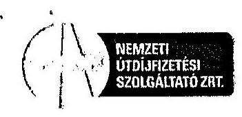

Állami Számvevőszék
Domokos László elnök részére

# Budapest 

Apáczai Csere János utca 10.
1052
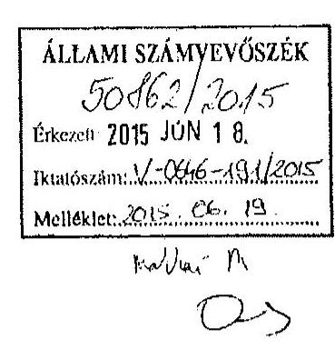

Budapest, 2015. június 18.
Iktatószám: $35075 / 2015 /$ aris/ $/ 0 \times 1 / 29-55$
Tárgy: V-0646-185/2015.
iktatószámú számvevőszéki jelentés
tervezetre észrevétel

Tisztelt Elnök Úr!

A Nemzeti Útdijfizetési Szolgáltató Zártkörűen működő Részvénytársaság (cégjegyzékszáma: 01-10-043108, székhelye: 1134 Budapest, Váci út 45. B épület, a továbbiakban: NÚSZ Zrt. vagy Társaság) képviseletében eljárva a V-0646-185/2015. iktatószámú számvevőszéki jelentés tervezetre vonatkozóan az Állami Számvevőszékről szóló 2011. évi LXVI. törvény 29. § (2) bekezdésében

 biztosított jog alapján az alábbi észrevételeket tesszük:

A lefolytatott vizsgálat teljes mértékben figyelmen kívül hagyta azt a lényeges tényt, miszerint a Kincstári Vagyoni Igazgatósággal (KVI) 2002. december 20. napján kötött és az Állami Számvevőszék (a továbbiakban: ÁSZ) által vizsgált vagyonkezelési szerződést a felek közös megegyezéssel 2006. január 31. napján - a nem Program utak vonatkozásában - megszüntették (1. számú melléklet).

A NÚSZ Zrt. (akkori ÁAK Zrt.) csak a 354/2007. (XII.26.) Kormányrendelet (továbbiakban: Rendelet) által létrehozott ún. Program utak vagyonkezelője lehetett, azonban 2007. január 1. napjára a Rendelet annyiban változott (módosult), hogy nem maradt olyan, a Rendelet hatálya alá tartozó útszakasz, amely Program útnak minősült.

Nemzeti Útdijfizetési Szolgáltató Zrt.
1134 Budapest, Váci út 45. B épület | Levelezési cím: 1380 Budapest, Pf.: 1170 | Fax: 06-1-436-8210 | Call Center: +36 (36) 587-500
www.nemzetiutdij.hu
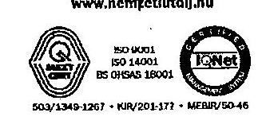

---

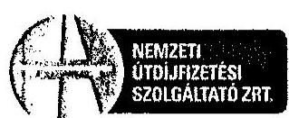
volna, így ezt a Rendeletet 2007. július 3. napjától hatályon kívül helyezték, melynek következtében „A Magyar Köztársaság gyorsforgalmi úthálózatának fejlesztéséről és közérdekűségéről szóló 2003. évi CXXVIII. törvény" - a 2007. évi LXVIII. törvény által - is módosításra került és 2007. július 3-i hatállyal a Program utak megszünésével a NÚSZ Zrt. vagyonkezelői joga a gyorsforgalmi utak vonatkozásában a törvény erejénél fogva teljes egészében megszűnt.

Erre való tekintettel a vizsgált időszakban, vagyis 2010. január 1. - 2013. december 31. napja között a NÚSZ Zrt. nem rendelkezhetett érvényes és hatályos vagyonkezelési szerződéssel és vagyonkezelési joggal, ezáltal az ÁSZ az állami vagyon kezelésének vizsgálatával kapcsolatban téves megállapításokra és következtetésekre jutott a jelentés tervezetében az alábbiakban foglalt indokok alapján:

# 1. ÁSZ megállapítás (jelentés tervezet 8. oldal, 2. bekezdés) 

„A jogszabályi változásokat nem vezették át a VSZ-en, a Vhr.-ben előírtak ellenére nem rögzítették, hogy a NÚSZ Zrt. az MNV Zrt. vagyon-nyilvántartási szabályzatát megismerte és azt magára nézve kötelező érvényűnek ismeri el. A vagyonnyilvántartási szabályzatot az MNV Zrt. a Vhr.-ben előírtaknak megfelelően elkészítette, mely kiterjedt a Vtv.-ben meghatározott állami vagyon kezelőire, így a NÚSZ Zrt.-re is. A szabályzatban a Vhr. mellékletében foglaltak szerint meghatározták - többek között - a vagyonnyilvántartás feladatait, a vagyonkezelt eszközökre vonatkozó adatszolgáltatás részletes tartalmát, formáját, határidejét. Nem írták elő a Vhr.-ben foglaltak ellenére, hogy az MNV Zrt. tulajdonosi ellenőrzési eljárásrendjét, a felek jogait és kötelezettségeit a szerződés részének tekintik. A VSZ nem tartalmazott továbbá 2011. január 1-jétől 2013. június 27-éig - a Vhr. előírása ellenére - az értékcsökkenés visszapótlásával kapcsolatos elszámolásra vonatkozó előírást. A NÚSZ Zrt. a Vtv. alapján 2013. június 28-ától a törvény erejénél fogva mentesült a visszapótlási kötelezettség alól, azonban a VSZ-ben a mentességgel kapcsolatos előírást nem rögzítették. A VSZ-t 2011. január 1-jétől a vagyonátadás időpontjáig annak ellenére nem módosították a Vhr.-ben foglalt előírásoknak megfelelően, hogy a szerződés hatálya alá tartozó vagyontárgyak köre változott,

[^0]

[^0]:    Nemzeti Útdíjfizetési Szolgáltató Zrt.
    1134 Budapest, Váci út 45. B épület | Levelezési cím: 1380 Budapest, Pf.: 1170 | Fax: 06-1-436-8210 | Call Center: +36 (36) 587-500
    www.nemzetiutdij.hu

---

# HEMERTI   BUDAPESTÁN   SZÖLDÁSTKÓ ZRT 

továbbá a vagyonkezelésben lévő állami vagyonon értéknövelő beruházást, felújítást hajtottak végre."

## Észrevétel:

A vagyonkezelési szerződés 2006-ban való megszüntetése miatt a Társaságot már nem terhelték a fentiekben megfogalmazott kötelezettségek.
Megjegyezzük, hogy a vizsgált időszak alatt a NÚSZ Zrt. több esetben is tett kísérletet annak érdekében, hogy a korábbiakban vagyonkezelt eszközök földhivatali rendezése megtörténjen. Jelen észrevételünk 2-4. számú mellékleteként csatoltan megküldjük - a teljesség igénye nélkül - az MNV Zrt. részére küldött, 2010. április 26. és 2010. június 25-én kelt, ezirányú törekvéseinket tartalmazó leveleket, valamint az MNV Zrt. 2015. április 1. napján kelt, a NÚSZ Zrt. vagyonkezelésében állt ingatlanok rendezésére vonatkozó javaslatát tartalmazó levelet.

## 2. ÁSZ megállapítás (jelentés tervezet 8. oldal utolsó bekezdés)

„A Társaság az Alapító Okiratban foglaltak ellenére a 2010-2011. évekre nem rendelkezett stratégiai tervvel, továbbá a VSZ-ben előírt vagyonkezelt eszközökre vagyongazdálkodási tervet nem készített."

## Észrevétel:

A Társaság a 2010-2014. év közötti viszonylatban elkészítette mind a rövid távú, mind pedig a hosszú távú stratégiai tervét, melyet 2010. augusztus 13. napján elektronikus úton megküldött a tulajdonosi jogokat gyakorló MFB Magyar Fejlesztési Bank Zrt. (a továbbiakban: MFB Zrt.) részére. Állításunk alátámasztására mellékeljük a 2010-2014. év közötti időszakra elkészített stratégiai tervet, illetve az MFB Zrt.-nek megküldött levelünket (5. számú melléklet), valamint a 7/2011. (V.19.) Alapító Határozatot (6. számú melléklet), melyben a stratégiai terv elkészítésének ténye szintén rögzítésre került a Határozat 1. pontjában.
Vagyonkezelési szerződés hiányában vagyongazdálkodási tervet nem kellett készíteni, ennek ellenére a Társaság az Üzleti Tervében minden évben a kapcsolódó beruházásokat szerepeltette.

Nemzeti Útdijfizetési Szolgáltató Zrt.
1134 Budapest, Váci út 45. B épület | Levelezési cím: 1380 Budapest, Pf.: 1170 | Fax: 06-1-436-8210 | Call Center: +36 (36) 587-500
www.nemzetiutdij.hu
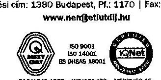

---

# 3. ÁSZ megállapítás (jelentés tervezet 9. oldal 2. bekezdés) 

„A leltározási szabályzat 2012. január 1-jétől nem felelt meg a Számv.tv.-ben előírt, legalább háromévente mennyiségi felvétellel történő leltározási kötelezettségnek."

## Észrevétel:

A jelentés tervezet nem konzekvens a leltározási tevékenységet illetően. A hivatkozott állításával szemben a következő bekezdésben kifejti, hogy a Társaság minden évben a leltározási tevékenységének eleget tett. A NÚSZ Zrt. a leltározási szabályzata alapján készített leltározási utasításoknak megfelelően minden évben leltárral támasztja alá az éves beszámolóját. A vizsgálat során az ÁSZ részére a leltárkészítési utasítások megküldésre kerültek.

## 4. ÁSZ megállapítás (jelentés tervezet 9. oldal 2. bekezdés)

„A NÚSZ Zrt. a 2010-2013. években - az üzletágátadásig - nem teljes körűen biztosította a kezelésében lévő állami, valamint a saját vagyon elkülönített, szabályszerű nyilvántartását. A Társaság a 2010-2013. években nem tett eleget a vagyonkezelésében lévő eszközökkel kapcsolatos vagyonkataszteri adatszolgáltatási kötelezettségének, mellyel megsértette a Vhr. előírását."

## Észrevétel:

A vagyonkezelési szerződés 2006-ban való megszüntetése miatt Társaságunknak a vizsgált időszakban már nem volt vagyonkataszteri adatszolgáltatási kötelezettsége, melyről a 2010. február 18. napján kelt levelünkben (7. számú melléklet) az MNV Zrt.-t, mint akkori tulajdonosi joggyakorlót tájékoztattuk arról, hogy a 2009-es évre vonatkozóan nem áll módunkban vagyonkataszteri jelentést készíteni a vagyonkezelési szerződés megszűnésére és a vagyonátadásokra tekintettel.

---

# 5. ÁSZ megállapítás (jelentés tervezet 9. oldal utolsó bekezdés) 

„A Társaság az ED rendszert 2013. július 1-jétől rendeltetésszerűen használatba vette, azonban a Számv. tv.-ben foglaltak szerint a tárgyi eszközök közötti aktiválása nem történt meg, így az értékcsökkenés elszámolása elmaradt."

## Észrevétel:

Az ED rendszer a Magyar Állam tulajdonát képezi, mely tulajdonosi jogokat a rendszer bevezetése óta a Társaság gyakorolja. Ezáltal a Társaságra az ED rendszerrel összefüggésben nem vonatkozik az állami vagyonról szóló 2007. évi CVL törvény 27. §-ban meghatározott értékcsökkenési visszapótlási kötelezettség. Megjegyzendő, hogy a Társaságot az ED rendszer feletti vagyonkezelői minőség esetén sem terhelné értékcsökkenési visszapótlási kötelezettség, tekintettel arra, hogy az alapfeladatként vagy főtevékenységként közfeladatot ellátó vagyonkezelő a visszapótlási kötelezettség teljesítése alól 2013. június 28. napjától - vagyis már az ED rendszer 2013. július 1-jei bevezetését megelőzően - e törvény erejénél fogva mentesül.
A NÚSZ Zrt. 2013. évi éves beszámolójában rögzítette, hogy az ED rendszer éles üzembe állítása 2013. július 1-én megtörtént. A rendszer éles üzembeállítása azonban nem a rendeltetésszerű használatbavételt jelenti, hanem egy olyan tesztüzem kezdetét, ami már éles körülmények között végeztek az adott pillanatban rendelkezésre álló infrastruktúrán (ami folyamatosan változott a 2013. év második felében). A rendszer szállítói még 2013. év második felében szállítottak le rendszerelemeket, mely elemek értéke a beruházás több mint 55%-át tették ki. 2013. második felében még olyan egységek kerültek beszerzésre, beépítésre, melyek a rendszer számviteli értelemben vett rendeltetésszerű használatának elengedhetetlen elemei voltak. Az aktiválás mindezek miatt csak egy összegben, 2014. január 1-én volt lehetséges. (Az aktiválási jegyzőkönyvek jelen levél 8. számú mellékletét képezik.)
Tekintettel a fentiekre és arra, hogy nem volt aktiválható eszköz 2013. év folyamán, így értékcsökkenés elszámolására sem került sor. Üzembe nem helyezett beruházásra a számvitelről szóló 2000. évi C. törvény 52. § (5) bekezdése alapján terv szerinti értékcsökkenést elszámolni nem szabad.

Nemzeti Útdijfizetési Szolgáltató Zrt.
1134 Budapest, Váci út 45. B épület | Levelezési cím: 1380 Budapest, Pf.: 1170 | Fax: 06-1-436-8210 | Call Center: +36 (36) 587-500
www.nemzetiutdij.hu
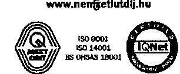

---

# 6. ÁSZ megállapítás (jelentés tervezet 13. oldal 2. bekezdés) 

„Az Állami Autópálya Kezelő Rt. és a Kincstári Vagyoni Igazgatóság (KVI) 2002. december 20-án kötött vagyonkezelési szerződést (VSZ) az állami tulajdonban lévő Országos közúthálózat, azok műtárgyainak és tartozékaink kezelésével összefüggő feladatok ellátására. A szerződés alapját az Északkelet-magyarországi Autópályafejlesztő és -üzemeltető Rt. és a KVI között 1998. október 15-én létrejött vagyonkezelési szerződés képezte. A VSZ-t a felek határozatlan időtartamra kötötték. A vagyonkezelői jog az ingatlanokkal kapcsolatosan az ingatlan-nyilvántartásba történő bejegyzéssel jött létre. A VSZ az egyéb vagyonelemek tekintetében 1996. június 1-jére visszaható hatályú volt, a jogelődőkkel kötött vagyonkezelési szerződések szerint. A VSZ-ben és annak mellékleteiben a szerződő felek rögzítették az átadott állami vagyont tételesen, az ellátandó feladatot, a felek jogait és kötelezettségeit, valamint a vagyonnal való elszámolási kötelezettséget."

## Észrevétel:

A jelentésből nem állapítható meg egyértelműen, hogy konkrétan mit vizsgált az ÁSZ a szabályszerű vagyongazdálkodás feltételeinek kialakítása során, ugyanis nem különítette el egymástól a (i) vagyonkezelt ingatlanokat és a (ii) vagyonkezelt egyéb vagyontárgyakat. A hivatkozott 2002. december 20-án kelt vagyonkezelői szerződés ugyanis elsődlegesen a Társaságnak átadott ingatlanok vagyonkezeléséről rendelkezik, - míg az egyéb vagyontárgyak vonatkozásában utal egy másik szerződésre is -, mely vagyonkezelési szerződés azonban 2006-ban már megszüntetésre került.

## 7. ÁSZ megállapítás (jelentés tervezet 13. oldal 4. bekezdés)

„A VSZ a Társaság gyorsforgalmi úthálózat üzemeltetői és fenntartási tevékenységének MK NZrt. felé történő átadásáig - 2013. október 31-éig - volt érvényben, azt az ellenőrzött időszakban nem módosították."

## Észrevétel:

Az ÁSZ részéről tévesen került megállapításra az, hogy a vagyonkezelési szerződés (VSZ) a Társaság gyorsforgalmi úthálózat üzemeltetői és fenntartási tevékenységének

## Nemzeti Útdijfizetési Szolgáltató Zrt.

1134 Budapest, Váci út 45. B épület | Levelezési cím: 1380 Budapest, Pf.: 1170 | Fax: 06-1-436-8210 | Call Center: +36 (36) 587-500
www.nemzetiutdij.hu
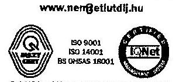

---

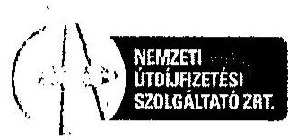

MK NZrt. részére történő átadásig, azaz 2013. október 31. napjáig volt érvényben. A korábbiakban kifejtettek alapján a vagyonkezelési szerződés 2006. január 31. napján került megszüntetésre. Ezt követően a Közlekedésfejlesztési Koordinációs Központ (a továbbiakban: KKK) volt a gyorsforgalmi úthálózat vagyonkezelője. A KKK finanszírozta a gyorsforgalmi úthálózat üzemeltetési, fenntartási és karbantartási feladatait a rendelkezésre álló költségvetési forrásokra tekintettel.
A közútkezelői jog/minőség a vagyonkezelői jogtól különböző, fogalmilag eltérő jogi kategória, mely két jogintézmény a jelentésben felcserélésre és helytelen alkalmazásra került.

# 8. ÁSZ megállapítás
 (jelentés tervezet 13. oldal 5. bekezdés) 

„A VSZ 2011. január 1-jétől 2013. június 27-éig nem tartalmazott - a Vhr. 9. (9) bekezdés d) pontjában foglaltak ellenére - az értékcsökkenés visszapótlásával kapcsolatos elszámolásra vonatkozó előírást.”

## Észrevétel:

A vagyonkezelési szerződés 2006. évben való megszűnése miatt ezen ingatlanokon elvégzett beruházásokat saját pénzeszközből finanszírozta a NÚSZ Zrt., így azt csak saját beruházásként szerepeltethette és ezáltal az értékcsökkenés is itt került elszámolásra.

## 9. ÁSZ megállapítás (jelentés tervezet 14. oldal 1. bekezdés)

„A VSZ-t 2011. január 1-jétől annak ellenére nem módosították, hogy a szerződés hatálya alá tartozó vagyontárgyak köre változott, továbbá a vagyonkezelésben lévő állami vagyonon értéknövelő beruházást, felújítást hajtottak végre. Ezzel nem tettek eleget a Vhr. 8. (2) bekezdésében foglaltaknak, amely előírja, hogy a felek a vagyontárgyak körének változása esetén kötelesek 60 napon belül a módosításokkal egységes szerkezetbe foglalni a szerződést.”

---

# Észrevétel: 

A vagyonkezelési szerződés 2006. évben való megszüntetése miatt nem került sor a szerződés módosítására.

## 10. ÁSZ megállapítás (jelentés tervezet 14. oldal 2. bekezdés)

„A VSZ-ben a Vhr. 14. (3) és a 20. (1) bekezdésében előírtak ellenére nem rögzítették, hogy a NUSZ Zrt. az MNV Zrt. vagyon-nyilvántartási szabályzatát megismerte és azt magára nézve kötelező érvényűnek ismeri el, továbbá, hogy az MNV Zrt. tulajdonosi ellenőrzési eljárásrendjét, a felek jogait és kötelezettségeit a szerződés részének tekintik.”

## Észrevétel:

A vagyonkezelési szerződés a 2002-2006. közötti időszakban tartalmazta a fenti rendelkezéseket, a vizsgált időszakban a vagyonkezelési szerződés 2006. évben való megszüntetése miatt ennek rögzítésére nem került sor. A 2002. évi VSZ 5.11. pontja hivatkozik a „Kincstári Vagyon Nyilvántartási Szabályzat”-ára, mely szabályzatnak megfelelően az ÁAK/ NÚSZ Zrt. a vizsgált időszakban hatályban lévő számviteli politikáit úgy alakította ki, hogy azok biztosították az adatszolgáltatási kötelezettség pontosságát és ellenőrizhetőségét:
„Az állami (kincstári) tulajdonú eszközök számviteli nyilvántartása a saját tulajdonú eszközöktől elkülönített főkönyvi számlákon történik. A vagyonkezelésbe átvett eszközök a kincstárral kötött vagyonkezelési szerződésben szereplő értékkel kerülnek az eszközök közé. Ezzel szemben ugyanilyen összegű, a kincstárral szembeni hosszú lejáratú kötelezettség keletkezik.”
„A vagyonkezelésbe vett tárgyi eszközök értékcsökkenésének elszámolása a mindenkor hatályos jogszabályok alapján történik.”

---

# 11. ÁSZ megállapítás (jelentés tervezet 17. oldal 2.1. pont 1. bekezdés) 

„A NÚSZ Zrt. az állami vagyon értékének megőrzését, gyarapítását szolgáló szabályszerű vagyongazdálkodás feltételeit a 2010-2013. években nem teljes körűen alakította ki.”

## Észrevétel:

Az 1. pontban hivatkozottak szerint a vizsgált időszak alatt a NÚSZ Zrt. több esetben is tett kísérletet annak érdekében, hogy a korábbiakban vagyonkezelt eszközök földhivatali rendezése megtörténjen. Az ÁAK/ NÚSZ Zrt. a vizsgált időszakban hatályban lévő számviteli politikáit úgy alakította ki, hogy azok biztosították az adatszolgáltatási kötelezettség pontosságát és ellenőrizhetőségét:
„Az állami (kincstári) tulajdonú eszközök számviteli nyilvántartása a saját tulajdonú eszközöktől elkülönített főkönyvi számlákon történik. A vagyonkezelésbe átvett eszközök a kincstárral kötött vagyonkezelési szerződésben szereplő értékkel kerülnek az eszközök közé. Ezzel szemben ugyanilyen összegű, a kincstárral szembeni hosszú lejáratú kötelezettség keletkezik.”

## 12. ÁSZ megállapítás (jelentés tervezet 17. oldal utolsó bekezdés)

„A tervezés hiányosságai kockázatot jelentenek az utak nem megfelelő felújítása, karbantartása és állagvédelme tekintetében.”

## Észrevétel:

A megállapítás ellentétes a jelentés tervezet későbbi megállapításaival, mely szerint a Társaság Üzleti Terveiben szerepelt a karbantartási terv. A vizsgált időszakok Üzleti Terveit a Társaság tulajdonosi jogait gyakorló szervezet felülvizsgálta és módosítás nélkül elfogadta. A NÚSZ Zrt. az Üzleti Tervekben rögzítetteknek megfelelően, valamint a pénzügyi lehetőségek függvényében gondoskodott a karbantartások megvalósulásáról.
A vizsgált időszak alatt kezelt autópályákhoz és gyorsforgalmi utakhoz kapcsolódó felújítás és karbantartási tervet, ami előzetesen egyeztetésre került a szóban forgó eszközök vagyonkezelőjével, a KKK-val, a felek a 2010-2012. években megkötött

Nemzeti Útdíjfizetési Szolgáltató Zrt.
1134 Budapest, Váci út 45. B épület | Levelezési cím: 1360 Budapest, Pf.: 1170 | Fax: 06-1-436-8210 | Call Center: +36 (36) 587-500
www.nemzetiutdij.hu

---

# MEXEET   1111111111   11111111111   11111111111 

O&M szerződés mellékletében (9. számú melléklet) tüntették fel. Ezeken túl itt is hivatkozni kívánunk még a 7. pontban kifejtett észrevételeinkre.

## 13. ÁSZ megállapítás (jelentés tervezet 17. oldal utolsó bekezdés)

„A NÚSZ Zrt. a 2010-2013. években, a MNV Zrt., illetve az MFB Zrt. által meghatározott tartalommal szabályszerűen eleget tett üzleti terve benyújtási kötelezettségének, azonban a középtávú stratégiai tervek elkészítéséről az Alapító Okiratban foglaltak ellenére nem teljes körűen gondoskodott. A Társaság a 2010-2011. évekre nem rendelkezett stratégiai tervvel.”

Észrevétel:
A korábban jelzettek alapján a Társaság elkészítette és a tulajdonosi joggyakorló részére megküldte a vizsgált időszakra vonatkozó stratégiai tervét.

## 14. ÁSZ megállapítás (jelentés tervezet 18. oldal 4. bekezdés)

„A számviteli politika a Számv.tv. 14. § (4) bekezdésében foglaltak ellenére 2013. július 1-től...... részletes szabályokat nem tartalmazott.”

Észrevétel:
A Társaság 2014. január 1-től aktiválta az ED eszközöket, melyekről az aktiválási jegyzőkönyveket 8. számú mellékletként csatoltuk. A rábízott vagyonhoz kapcsolódó előírások szabályozása 2014. január 1-ével megtörténtek, a szabályok rendelkezésre állnak. (10. számú melléklet).
A szabályzatok az NGM-től 2013. december 23-án, e-mail-ben kapott tájékoztatás alapján kerültek kialakításra. (11. melléklet)

## 15. ÁSZ megállapítás (jelentés tervezet 18. oldal utolsó bekezdés)

„A 2013. évben hatályos számlarend a Társaságra, mint tulajdonosi joggyakorlóra rábízott állami vagyonnal kapcsolatban nem tartalmazott előírásokat”

Nemzeti Útdíjfizetési Szolgáltató Zrt.
1134 Budapest, Váci út 45. B épület | Levelezési cím: 1380 Budapest, Pf.: 1170 | Fax: 06-1-436-8210 | Call Center: +36 (36) 587-500
www.nemzetiutdij.hu

---

# Észrevétel: 

A rábízott vagyonhoz kapcsolódó számlarend 2014. január 1-ével rendelkezésre állt (12. számú melléklet) és a kapcsolódó beszámoló 2014. június 30-án elkészült, ami a 347/2010. (XII.28.) Korm.rendeletben foglaltaknak megfelelően megküldésre került az állami vagyonért felelős miniszter részére.

## 16. ÁSZ megállapítás (jelentés tervezet 21. oldal 1. bekezdés)

„A NÚSZ Zrt. a 2010-2013. években nem tett eleget a vagyonkezelésében lévő eszközökkel kapcsolatos vagyonkataszteri adatszolgáltatási kötelezettségének, mellyel megsértette a Vhr. 14. (1) bekezdését. Az adatszolgáltatás hiányára az MNV Zrt. - a Vhr. 14. (8) bekezdésében foglalt előírás ellenére - nem szólította fel a Társaságot.”

Észrevétel:
A vizsgált időszakban a Társaságot vagyonkataszteri adatszolgáltatási kötelezettség a vagyonkezelési szerződés megszüntetése miatt nem terhelte, ezeken felüli adatszolgáltatási kötelezettségének pedig minden évben eleget tett.

## 17. ÁSZ megállapítás (jelentés tervezet 24. oldal 3. bekezdés)

„A kintlévőség okai a fizetési hajlandóság csökkenése és a szolgáltatás díjának az emelkedése volt.”

Észrevétel:
A megállapítás nem helytálló. A bekezdésben foglalt állítások nem konzekvensek. Tekintettel arra, hogy az állítást követően kifejtésre kerül a Társaság könyveiben kimutatott „behajtatatlan vevőkövetelések összege után elszámolt értékvesztés” változása, mely csak és kizárólag a törvényben foglalt kötelezettségeinek teljesítése során kiállításra került üzemeltetési számlák elszámolása miatt történt. A nemzeti fejlesztési miniszter 2014. január 9-én kelt levelében (13. számú melléklet) tájékoztatta az MFB Zrt.-t arról, hogy tekintettel a 1875/2013. (XI. 28.) Kormányhatározatra (14. számú melléklet) a Közlekedéspénztár 2013. évi hiányának

Nemzeti Útdíjfizetési Szolgáltató Zrt.
1134 Budapest, Váci út 45. B épület | Levelezési cím: 1380 Budapest, Pf.: 1170 | Fax: 06-1-436-8210 | Call Center: +36 (36) 587-500
www.nemzetiutdij.hu

---

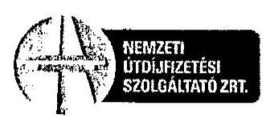
további növelésére nincs lehetőség, ezért a NÚSZ-nak saját pénzeszközei terhére kell véglegesen megfinanszíroznia a 2013. év során elvégzett üzemeltetési, karbantartási, valamint fenntartási tevékenységeket. A nemzeti fejlesztési miniszter e levelében hivatkozott a 1666/2012. (XII. 20.) Kormányhatározatra (15. számú melléklet) és az az alapján hozott, az MFB részére kibocsátott 65/2012. (XII. 28.) Alapítói Határozatra (16. számú melléklet). Ez utóbbi Kormányhatározat értelmében a Kormány egyetértett azzal, hogy a NÚSZ (a határozat időpontjában Állami Autópálya Kezelő) saját pénzeszközeiből legfeljebb 33 Mrd Ft-ot 2012. és 2013. évi közútkezelői feladatok finanszírozására használjon fel (17. számú melléklet). A nemzeti fejlesztési miniszter 2014. január 9-én kelt leveléről az MFB hivatalos értesítése 2014. február 4-én érkezett meg a Társasághoz (18. számú melléklet).
Mindezekre tekintettel a kiállított számlákra a Társaság 2013. évben 100% értékvesztést számolt el.
A fent leírtak alapján a kintlévőségek növekedése nincs összefüggésben a fizetési hajlandósággal és a szolgáltatási díj növekedésével.

# 18. ÁSZ megállapítás (jelentés tervezet 26. oldal 1. bekezdés) 

„A NÚSZ Zrt. a vagyon értékének megőrzéséről, gyarapításáról a 2010-2013. években nem teljes körűen gondoskodott.”
„A vagyonérték csökkenés döntő részben kb. 16812,3 M Ft nettó könyv szerinti értékű 2013. évi üzletágátadás hatása.”
„A befektetett eszközök összes eszközön belüli aránya a 2010. évi nyitó 29,6%-ról a 2013. év végére 2,7%-ra csökkent, a vagyonkezelt állami vagyon jelentős arányt nem képviselt, 2010. január 1-jén az összes eszköz 1,0%-a, 2013. december 31-én 0,0%-a volt. Az ellenőrzött időszakban emelkedett a forgóeszközök aránya, ezen belül a követelések 12,7%-ról 30,0%-ra nőttek. A befektetett pénzügyi eszközök állományának csökkenésében meghatározó volt a 2011. évben a Toll Service Zrt. alaptökéjének leszállítása.”

---

# BIZKETT   ETIROPISTESI   KODGASYATIZATI 

„A céltartalékok a 2010. január 1-jei 167,6 M Ft-ról 2013. év végére 2181,8 M Ft-ra, tizenháromszorosára nőttek elmaradt munkabér kifizetési kötelezettségekből, peres ügyekből, késedelmi kamatból adódóan. A hosszú lejáratú kötelezettségek az időszak eleji 996,7 M Ft-ról 2013. év végére 9,1 M Ft-ra csökkentek a 2013. évi üzletágátadás hatására.”

Észrevétel:
Társaságunk álláspontja szerint a jelentés tervezet nem indokolja meg egzakt módon azt, hogy mi alapján jutott az ÁSZ arra a megállapításra, hogy a Társaság a vagyon értékének megőrzéséről, gyarapításáról nem teljes körűen gondoskodott. Az előző pontban foglalt megállapítások - mint külső, a Társaságtól független körülmények, események - nem támasztják azt alá, hogy a NÚSZ Zrt. elmulasztotta volna a vagyon értékének megőrzésére, gyarapítására vonatkozó kötelezettségét és nem is alapozza meg azt az állítást, miszerint nem gondoskodott a Társaság teljes körűen a vagyon értékének megőrzéséről, gyarapításáról.
A Társaság saját tőkéjének csökkenése a vizsgált időszakban tulajdonosi döntések 9/2012. (VII.17.) számú, valamint 22/2013. (X.31.) számú Alapítói Határozat (19. és 20. sz. mellékletek) - és az előző pontban hivatkozott nemzeti fejlesztési miniszter 2014. január 9. napján kelt (13. számú melléklet), valamint MFB által küldött és a NÚSZ Zrt-hez 2014. február 4. napján érkezett levele (18. számú melléklet) alapján kerültek elszámolásra.

## 19. ÁSZ megállapítás (jelentés tervezet 28. oldal utolsó bekezdés)

„A vagyonkezelésbe vett eszközökre vonatkozóan - a VSZ előírása ellenére - elkülönített karbantartási terv nem készült.”

Észrevétel:
A kiemelt megállapítást követően azonban a jelentés tervezet következő mondataiban kifejtésre kerül, hogy a NÚSZ Zrt. az Üzleti terveiben a karbantartási tervet szerepelteti, a pénzügyi lehetőségek függvényében gondoskodott a karbantartások megvalósulásáról.

Nemzeti Útdíjfizetési Szolgáltató Zrt.
1134 Budapest, Váci út 45. B épület | Levelezési cím: 1280 Budapest, Pf.: 1170 | Fax: 06-1-436-8210 | Call Center: +36 (36) 587-500
www.nemzetiutdij.hu
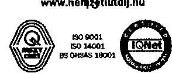

---

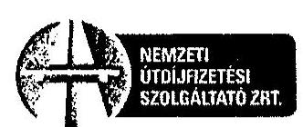

Az adott bekezdésen belül ellentmondás látható, ugyanis a karbantartási és beruházási terv az Üzleti Terv részét képezte, mely minden évben előzetesen egyeztetésre került a KKK-val.

# 20. ÁSZ megállapítás (jelentés tervezet 28. oldal utolsó bekezdés) 

„A Társaság a vagyonkezelésbe vett vagyonelemek köre után a
 Vhr. 9. (9) bekezdés b) pontjában előírt visszapótlási kötelezettségét a 2011. január 1. és 2013. június 27. közötti időszakban nem teljesítette."

Észrevétel:
A vagyonkezelési szerződés 2006. évben való megszüntetése miatt a Társaságnak a vizsgált időszakban nem volt visszapótlási kötelezettsége.

## 21. ÁSZ megállapítás (jelentés tervezet 28. oldal utolsó bekezdés)

„A visszapótlási kötelezettség alól, mint kizárólag közfeladatot ellátó, a NUSZ Zrt. — a Vtv. 27. (8) bekezdése alapján — 2013. június 28-ától mentesült."

Észrevétel:
A Társaságnak nem volt visszapótlási kötelezettsége a vizsgált időszakban a vagyonkezelési szerződés megszüntetése miatt.

A fentiekben kifejtett indokokra, valamint azok alátámasztására csatolt dokumentumokra tekintettel kérjük az Állami Számvevőszéket, hogy jelentés tervezetét észrevételeinknek megfelelően felülvizsgálni és módosítani szíveskedjenek.

Nemzeti Útdijfizetési Szolgáltató Zrt.
1134 Budapest, Váci út 45. B épület | Levelezési cím: 1380 Budapest, Pf.: 1170 | Fax: 06-1-436-8210 | Call Center: +36 (36) 587-500
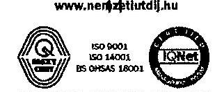

---

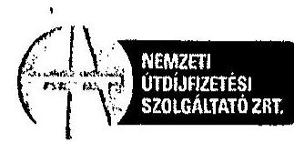

# Mellékletek: 

- 1. számú melléklet: vagyonkezelési szerződés megszüntetéséről szóló megállapodás
- 2. számú melléklet: MNV Zrt-nek küldött 2010. április 26. napján kelt levél
- 3. számú melléklet: MNV Zrt-nek küldött 2010. június 25. napján kelt levél
- 4. számú melléklet: MNV Zrt. által a NÚSZ Zrt-nek küldött 2015. április 1. napján kelt levél
- 5. számú melléklet: 2010-2014. év közötti időszakra elkészített stratégiai terv és ennek az MFB Zrt. részére való megküldését igazoló elektronikus levél
- 6. számú melléklet: 7/2011. (V.19.) Alapítói Határozat (MFB)
- 7. számú melléklet: MNV Zrt-nek küldött 2010. február 18. napján kelt levél
- 8. számú melléklet: ED rendszer aktiválási jegyzőkönyv
- 9. számú melléklet: a 2010-2012. évi O&M szerződések mellékletét képező felújítási és karbantartási tervek
- 10. számú melléklet: a rábízott vagyonhoz kapcsolódó 2014. évi szabályzat
- 11. számú melléklet: NGM-től 2013. december 23-án kapott tájékoztatás
- 12. számú melléklet: a rábízott vagyonhoz kapcsolódó 2014. évi számlarend
- 13. számú melléklet: a nemzeti fejlesztési miniszter 2014. január 9. napján kelt levele
- 14. számú melléklet: 1875/2013. (XI.28.) Kormányhatározat
- 15. számú melléklet: 1666/2012. (XII.20.) Kormányhatározat
- 16. számú melléklet: 65/2012. (XII.28.) Alapítói Határozat (NFM)
- 17. számú melléklet: 15/2012. (XII.28.) Alapítói Határozat (MFB)
- 18. számú melléklet: MFB által küldött és a NÚSZ Zrt-hez 2014. február 4. napján érkezett levél
- 19. számú melléklet: 9/2012. (VII.17.) számú Alapítói Határozat (MFB)
- 20. számú melléklet: 22/2013. (X.31.) számú Alapítói Határozat (MFB)

Tisztelettel:
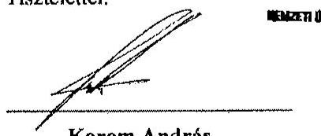
gazdasági és kontrolling igazgató
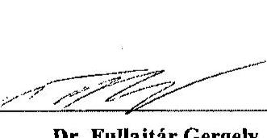
jogi vezető

Nemzeti Útdijfizetési Szolgáltató Zrt.

Nemzeti Útdijfizetési Szolgáltató Zrt.
1134 Budapest, Váci út 45, B épület | Levelezési cím: 1380 Budapest, Pf.: 1170 | Fax: 06-1-436-8210 | Call Center: +36 (36) 587-500 www.netutdij.hu
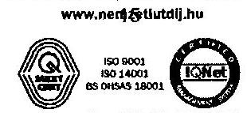

---

.

---

# 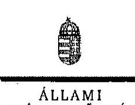 

## Elnök

Ikt.szám: V-0646-194/2015.

## Börzsei Tibor Vince úr

vezérigazgató
Nemzeti Útdijfizetési Szolgáltató Zrt

## Budapest

## Tisztelt Vezérigazgató Úr!

A „Az állami tulajdonban (résztulajdonban) lévő gazdálkodó szervezetek vagyonmegörzési és gazdálkodási tevékenységének ellenőrzése - Nemzeti Útdijfizetési Szolgáltató Zrt." címú jelentéstervezetre tett észrevételeket köszönettel megkaptam.

Az Állami Számvevőszék észrevételekre vonatkozó álláspontjáról a felügyeleti vezető által készített részletes tájékoztatást csatoltan megküldöm.

Tájékoztatom Vezérigazgató Urat, hogy a számvevőszéki jelentés mellékleteként szerepeltetjük a jelentéstervezethez tett észrevételeit, valamint az azokra adott válaszunkat.

Budapest, 2015. 05. hó 07. nap
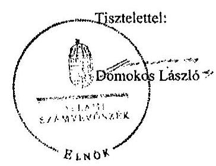

Melléklet: Tájékoztatás az elfogadott és az el nem fogadott észrevételekről

---

# Tájékoztatás 

az elfogadott és az el nem fogadott észrevételekről
„Az állami tulajdonban (résztulajdonban) lévő gazdálkodó szervezetek vagyonmegőrzési és gazdálkodási tevékenységének ellenőrzése - Nemzeti Útdijfizetési Szolgáltató Zrt." címü jelentéstervezetre 2015. június 18-án érkezett észrevételeket áttekintettük, azok kezelésével kapcsolatban a következő tájékoztatást adom.

## A vagyonkezelési szerződés hatályosságát érintő észrevétellel kapcsolatosan:

Az Állami Autópálya Kezelő Zrt. (a továbbiakban: ÁAK) és a Kincstári Vagyoni Igazgatóság (a továbbiakban: KVI) 2002. december 20-án, 620208/2002/0200 számon vagyonkezelési szerződést kötött. Az ÁAK és a KVI a vagyonkezelési szerződést 2006. január 31-én, 620208/2006/0202 számon - állapotrögzítés céljából - módosították. Ezt követően a felek 2006. január 31-én a vagyonkezelési szerződésüket akként módosították, hogy a Program útnak nem minősülő utak létesítéséhez szükséges ingatlanok tekintetében az ÁAK vagyonkezelői jogát közös megegyezéssel egyrészről az ÁAK, a KVI és az Útgazdálkodási és Koordinációs Igazgatóság között 620206-20060205 számon létrejött háromoldalú szerződéssel, másrészről az ÁAK és a KVI között létrejött - az észrevétel 1. számú mellékleteként bemutatott - kétoldalú szerződéssel megszüntették.
Az ÁAK és a KVI 2006. január 31-én ismételten, 620206-2006-0204 számon módosították a vagyonkezelési szerződésüket. A szerződésmódosításban rögzítve lett, hogy a KVI a szerződésmódosítás 1. számú mellékletében felsorolt ingatlanokat, a Program utak létesítéséhez szükséges ingatlanokhoz kapcsolódó befejezetlen beruházásokkal és azok tartozékaival együtt az ÁAK vagyonkezelésébe adja, és a szerződő felek erre tekintettel a vagyonkezelési szerződésüket módosítják.
Mindezek alapján megállapítható, hogy a 2002. évben megkötött vagyonkezelési szerződést több alkalommal - állapotrögzítés céljából, vagyoni kör változásának okán - módosították, azonban a vagyonkezelési szerződést a felek nem szüntették meg. Az ellenőrzés vonatkozó megállapításait az ellenőrzött időszakban a hatályos vagyonkezelési szerződésre, annak módosításaira alapozta.
Nem állt az ellenőrzés rendelkezésre, valamint az észrevétel mellékleteként sem került bemutatásra olyan dokumentum, amely alátámasztja, hogy az ÁAK - 2007. július 03-ai hatállyal érvénybe lépő, a Magyar Köztársaság gyorsforgalmi körúthálózatának közérdekűségéről és fejlesztéséről szóló 2003. évi CXXVIII. törvény módosításáról szóló 2007. évi LXVIII. törvény 14. § (3) bekezdésében foglalt előírás alapján - átadja a nála lévő befejezetlen beruházásokat az építtetőnek, továbbá átadja a vagyonkezelésében lévő kincstári vagyon vagyonkezelői jogát a miniszter által kijelölt központi költségvetési szervnek, és a törvényes határidőn belül megszünteti a kincstári vagyon kezeléséért felelős szervvel a korábban a gyorsforgalmi utak tárgyában létrejött vagyonkezelői szerződéseket.
Az előzőekre figyelemmel a vagyonkezelési szerződés a Társaság gyorsforgalmi úthálózat üzemeltetői és fenntartási tevékenységének Magyar Közút Nonprofit Zrt. felé történő átadásáig 2013. október 31-éig - érvényben volt, ellenőrzött időszakot megelőzően - a törvényi előírás alapján - nem szüntették meg, az ellenőrzött időszakban nem módosították.
A vagyonkezelési szerződés hatályára vonatkozó, illetve ahhoz kapcsolódóan tett észrevételek alapján a jelentéstervezet módosítása nem indokolt.

---

# Jelentéstervezet 8. oldal 2. bekezdés: 

A vagyonkezelési szerződés hatályosságát érintő észrevételre adott válaszunk alapján az észrevételt nem áll módunkban elfogadni, a jelentéstervezet módosítása nem indokolt.

## Jelentéstervezet 8. oldal utolsó bekezdés

A 2010-2014. évekre vonatkozóan elkészült stratégiai terv (az észrevétel 5. számú melléklete) az ellenőrzés során az Állami Számvevőszék részére nem került átadásra. A teljességi nyilatkozat kitöltésekor és aláírásakor arról nyilatkoztak, hogy az ellenőrzéshez - az ellenőrzést végzők részéről - az ellenőrzött tárgykörben kért és átadott dokumentumokon kívül más adatokkal, iratokkal nem rendelkeznek.
Az észrevétel 5. számú mellékleteként megküldött stratégiai terv, az Magyar Fejlesztési Bank Zrt. (a továbbiakban: MFB Zrt.) részére történő megküldést tanúsító dokumentum, valamint a 7/2011. (V. 19.) Alapító Határozat (az észrevétel 6. számú melléklete) önmagukban nem alkalmasak arra, hogy alátámasszák azon tényt, hogy a Társaság tulajdonosi jóváhagyással ellátott stratégiai tervvel rendelkezik. Kizárólag azt bizonyítja, hogy a stratégiai terv az MFB Zrt. részére megküldésre került. Az Alapító Határozat nem tartalmazza a stratégiai terv jóváhagyásának tényét.
Az előzőeken túl vagyonkezelési szerződés hatályosságát érintő észrevételre adott válaszom alapján a Nemzeti Útdijfizetési Zrt.-nek (a továbbiakban: NÚSZ Zrt.) - a jelentéstervezetben foglaltaknak megfelelően - az ellenőrzött időszakban vagyongazdálkodási terv készítési kötelezettsége állt fenn.
Az észrevétel e pontjánál kifejtettek a jelentéstervezet megállapításait nem befolyásolják, a megállapítások helytállóak.

## Jelentéstervezet 9. oldal 2. bekezdés

A jelentéstervezet rögzíti, hogy a leltározási szabályzat 2012. január 1-jétől nem tartalmazza a számvitelről szóló törvényben (a továbbiakban: Számv. tv.) előírt, legalább háromévente mennyiségi felvétellel történő leltározási kötelezettséget. Megállapítja továbbá, hogy a Társaság a szabályozási hiányosság ellenére a 2010-2013. években leltárral támasztotta alá a beszámolókban és a számviteli nyilvántartásokban szereplő vagyontárgyak állományát. A megállapítások között ellentmondás nincs, mert a megállapítások a szabályozottság hiányára és a helyes leltározási gyakorlatra vonatkoznak. A jelentéstervezet módosítása nem indokolt, a megállapítás és a kapcsolódó javaslat megalapozott.

## Jelentéstervezet 9. oldal 2. bekezdés

A vagyonkezelési szerződés hatályosságát érintő észrevételre adott válaszunkra figyelemmel a NÚSZ Zrt.-nek az ellenőrzött időszakban vagyonkataszteri adatszolgáltatási kötelezettsége állt fenn, ezért a jelentéstervezet módosítása nem indokolt.

## Jelentéstervezet 9. oldal utolsó bekezdés

A Társaság az ED rendszert 2013. július 1-jétől rendeltetésszerűen használatba vette, üzemeltette, a rendszer használata során bevétele származott. Mindezt az éves beszámolóban is szerepeltették. Ugyanakkor a Számv. tv.-ben foglaltak szerint a tárgyi eszközök közötti aktiválása nem történt meg, továbbá elmaradt a Számv. tv.-ben előírt értékcsökkenés elszámolása. A jelentéstervezet nem állapít meg az ED rendszer vonatkozásában visszapótlási kötelezettség elmulasztását, az

---

értékcsökkenési elszámolás nem azonos a visszapótlási kötelezettséggel. Mindezek alapján a jelentéstervezet módosítására nem került sor.

# Jelentéstervezet 13. oldal 2. bekezdés 

A jelentéstervezetből kitűnik - figyelemmel a vagyonkezelési szerződés hatályosságát érintő észrevételre adott válaszunkra is -, hogy az Állami Számvevőszék valamennyi kezelt vagyon tekintetében ellenőrizte a vagyongazdálkodás feltételeit, így az észrevételben leírtak a jelentéstervezet módosítását nem indokolják.

## Jelentéstervezet 13. oldal 4. bekezdés

A vagyonkezelési szerződés - a hatályosságát érintő észrevételre adott válaszunk alapján - 2013. október 31. napjáig volt hatályban, azt az ellenőrzött időszakot megelőzően nem szüntették meg, azt az ellenőrzött időszakban nem módosították. Az észrevételben rögzített „közútkezelői jog/minőség" nem szerepel a jelentéstervezetben, ezért helytelenül nem kerülhetett alkalmazásra és vagyonkezelői joggal történő „felcserélésre" sem.

## Jelentéstervezet 13. oldal 5. bekezdés

Tekintettel arra, hogy a vagyonkezelési szerződés 2013. október 31. napjáig hatályban volt, így a 2011. január 1-től 2013. június 27-ig terjedő időszakra vonatkozóan a NÚSZ Zrt.-nek a Vhr.-ben előírt visszapótlási kötelezettsége fennállt.

## Jelentéstervezet 14. oldal 1. bekezdés

A vagyonkezelési szerződés hatályosságát érintő észrevételre adott válaszunk alapján a jelentéstervezet módosítása nem indokolt.

## Jelentéstervezet 14. oldal 2. bekezdés

A jogszabályi változások átvezetését, valamint vagyon-nyilvántartási szabályzat megismerését, annak kötelező érvényének elismerését a vagyonkezelési szerződésben - a jogszabályi előírásoknak megfelelően - rögzíteni szükséges, figyelemmel arra, hogy a vagyonkezelési szerződés 2013. október 31-ig hatályban volt. A jelentéstervezet megállapításai helytállóak, módosítására nem került sor.

## Jelentéstervezet 17. oldal 2.1. pont 1. bekezdés

A jelentéstervezet 17. oldal 2.1. pont 1. bekezdéshez adott tájékoztatást köszönettel vettük, azonban az észrevételben leírtak a jelentéstervezet megállapítását nem befolyásolják, a jelentéstervezet módosítása nem szükséges.

## Jelentéstervezet 17. oldal utolsó bekezdés

Az észrevételt nem fogadjuk el, mert a jelentéstervezet megállapítását a kezelt vagyonnal összefüggésben, a vagyonkezelési szerződésben előírt vagyongazdálkodási terv hiánya alapozta meg. A pénzügyi lehetőségek függvényében történő gondoskodás nem szünteti meg az utak megfelelő felújítását, karbantartását és állagvédelmét érintően jelzett kockázatot. A megállapítás helytálló, a jelentéstervezet módosítására nincs szükség.

---

# Jelentéstervezet 17. oldal utolsó bekezdés 

A jelentéstervezet 8. oldalának utolsó bekezdését érintő észrevételre adott válaszunk alapján a jelentéstervezet módosítása nem indokolt.

## Jelentéstervezet 18. oldal 4. és utolsó bekezdés

A jelentéstervezet bekezdéseihez adott tájékoztatást köszönettel vettük, azonban az észrevételben leírtak a jelentéstervezet megállapítását nem befolyásolják, a jelentéstervezet módosítása nem szükséges, mivel az észrevétel az ellenőrzött időszakon kívüli időszakra
 vonatkozik.

## Jelentéstervezet 21. oldal 1. bekezdés

A vagyonkezelési szerződés hatályosságára figyelemmel a NÚSZ Zrt.-nek vagyonkataszteri adatszolgáltatási kötelezettsége állt fenn. A jelentéstervezet megállapítása helytálló, módosítása nem indokolt.

## Jelentéstervezet 24. oldal 3. bekezdés

Az észrevételt elfogadjuk, az érintett szövegrészt a jelentéstervezetből töröljük.

## Jelentéstervezet 26. oldal 1. bekezdés

A rendelkezésre álló dokumentumok, a jelentéstervezet vonatkozó részének, valamint az észrevételben leírtak áttekintését követően a rögzített megállapítást a következőek szerint módosítjuk: „A NÚSZ Zrt. a kezelt vagyon értékének megőrzéséről, gyarapításáról a 2010-2013. években nem teljes körűen gondoskodott, mert vagyongazdálkodási terv nem készült a hatályos vagyonkezelési szerződésben előírtak szerint, továbbá visszapótlási kötelezettségét a 2011. január 1. és 2013. június 27. közötti időszakban nem teljesítette".

## Jelentéstervezet 28. oldal utolsó bekezdés

A jelentéstervezet 28. oldal utolsó bekezdésével kapcsolatban tett észrevételek nem elfogadhatóak, az alábbiak miatt:

- karbantartási terv: az észrevételből is kitűnik, hogy elkülönített karbantartási terv nem készült, a karbantartási terv az üzleti terv részét képezte.
- visszapótlási kötelezettség: a vagyonkezelési szerződés - a korábbiakban kifejtettek alapján - hatályban volt, ezért a Társaságnak a 2011. január 1-től 2013. június 27-ig terjedő időszakban a Vhr.-ben előírt visszapótlási kötelezettségének eleget kellett volna tennie.
Az e pontnál jelezett észrevételek alapján a jelentéstervezet módosítása nem indokolt.

Budapest, 2015. év 6. hó 1. nap

Makkai Mária
felügyeleti vezető

---

.

---

# - MNV   Maritab Nisizitit Vayitibkizititizit:   Vezitigazgató 

Állami Számvevőszék

## Domokos László

elnök

1052 Budapest
Apáczai Cs. J. u. 10.

Állami Számvevőszék
13 /2015.
Hiv. sz.: V-0646-186/2015.

Tisztelt Elnök Úr!

A 2015. június 3. napján „Az állami tulajdonban (résztulajdonban) lévő gazdálkodó szervezetek vagyonmegőrzési és gazdálkodási tevékenységének ellenőrzése - Nemzeti Útdijfizetési Szolgáltató Zártkörűen Működő Részvénytársaság" tárgyában kézhez vett, V-0646-186/2015. ikt. sz. Jelentéstervezetre az alábbi észrevételeket kívánjuk tenni.

## II.2.2. fejezet / 20. old. első-harmadik bekezdés, valamint II.2.2. fejezet / 21. old. első bekezdés

Az MNV Zrt. információi szerint a NÚSZ (ÁAK) Zrt. 2006-ban kivezette az összes vagyonkezelt tételt a könyvelésből, arra hivatkozva, hogy jogszabály megszüntette a vagyonkezelői jogát. A NÚSZ Zrt. által hivatkozott jogszabály kormányhatározat volt, amely önmagában nem volt elégséges a vagyonkezelői jog megszüntetéséhez, az az alapján megkötött, vagyonkezelői jogot megszüntető és átadó szerződések pedig sok esetben alkalmatlanok a célzott joghatás kiváltására. Ettől függetlenül az azóta eltelt időben a NÚSZ Zrt. nem tekinti vagyonkezelői jogát fennállónak, erre tekintettel nem szolgáltat adatot a központi vagyonkataszterbe. Az MNV Zrt. és a NÚSZ Zrt. között jelenleg folyamatban van a rendezésből kimaradt ingatlanok utólagos rendezése.

## II.2.2. fejezet / 21. old. harmadik bekezdés

A tárgyidőszakban nem érkezett a NÚSZ Zrt.-től vagyonkezelt ingatlant érintő beruházáshoz kapcsolódó, az MNV Zrt. előzetes hozzájárulására irányuló kérelem. Ebben annak is szerepe lehet, hogy a NÚSZ Zrt. vagyonkezelői jogának a Jelentéstervezetben hivatkozott ingatlanok feletti fennállása tekintetében a NÚSZ Zrt. és az MNV Zrt. eltérő álláspontot képvisel.

---

# II.5.1. fejezet / 32. old. ötödik bekezdés 

A Jelentéstervezet megállapítása szerint a NÚSZ Zrt. a kezelt vagyon tekintetében az MNV Zrt. tulajdonosi ellenőrzési szabályzatának megfelelve félévente az FB elé terjesztette beszámolóit az alapítói határozatok végrehajtása érdekében tett intézkedéseiről és azok végrehajtásáról.

Az előző megállapítás a NÚSZ Zrt. vonatkozásában nem értelmezhető, miután az MNV Zrt. tulajdonosi ellenőrzési szabályzata úgy rendelkezik, hogy „Az MNV Zrt. a tulajdonosi ellenőrzési rendszere keretében ellenőrzi azoknak az Alapítói Határozatoknak a végrehajtását, amelyeket azoknak a 100%-ban állami tulajdonú gazdasági társaságoknak adott ki, amelyek felett a tulajdonosi jogokat gyakorolja". Tekintettel arra, hogy a NÚSZ Zrt. feletti tulajdonosi jogokat 2010. június 17-tól az MFB gyakorolta, ezen időponttól az MNV Zrt. Alapítói Határozatot a Társaság részére nem adott ki, így a megtett intézkedések és a végrehajtás tekintetében az MNV Zrt. Tulajdonosi Ellenőrzési Szabályzata szerinti beszámolási kötelezettség nem terhelte a NÚSZ Zrt.-t.

Kérem Elnök Urat, hogy a Jelentés véglegesítése során jelen észrevételeinket szíveskedjenek figyelembe venni.

Budapest, 2015. június 1.

Ödvözlettel:
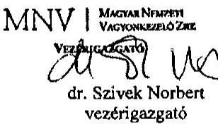

---

# ELKÉK 

## D. Szivek Norbert úr

vezérigazgató
Magyar Nemzeti Vagyonkezelő Zrt

## Budapest

## Tisztelt Vezérigazgató Úr!

A „Az állami tulajdonban (résztulajdonban) lévő gazdálkodó szervezetek vagyonmegőrzési és gazdálkodási tevékenységének ellenőrzése - Nemzeti Útdíjfizetési Szolgáltató Zártkörűen Működő Részvénytársaság" címü jelentéstervezetre tett észrevételeket köszönettel megkaptam.

Az Állami Számvevőszék észrevételekre vonatkozó álláspontjáról a felügyeleti vezető által készített részletes tájékoztatást csatoltan megküldöm.

Tájékoztatom Vezérigazgató Úrt, hogy a számvevőszéki jelentés mellékleteként szerepeltetjük a jelentéstervezethez tett észrevételeit, valamint az azokra adott válaszunkat.

Budapest, 2015.  hó  nap
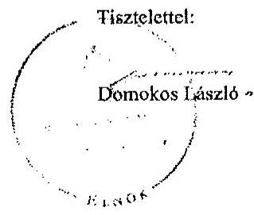

Melléklet: Tájékoztatás az elfogadott és el nem fogadott észrevételekről

---

# Tájékoztatás   az elfogadott és az el nem fogadott észrevételekről 

„Az állami tulajdonban (résztulajdonban) lévő gazdálkodó szervezetek vagyonmegőrzési és gazdálkodási tevékenységének ellenőrzése - Nemzeti Útdijfizetési Szolgáltató Zártkörűen Működő Részvénytársaság" című jelentéstervezetre 2015. június 19-én érkezett észrevételeket áttekintettük, azok kezelésével kapcsolatban a következő tájékoztatást adom.

A jelentéstervezet II. 2.2. fejezet/ 20. oldal első-harmadik bekezdés, valamint a 21. oldal első bekezdés, továbbá a 21. oldal harmadik bekezdés

Az észrevételben az MNV Zrt. részére történő adatszolgáltatás, valamint a beruházásokhoz kapcsolódó, az MNV Zrt. előzetes hozzájárulására irányuló kérelem elmaradásával kapcsolatosan leírtak megerősítik a jelentéstervezet megállapításait, ezért a jelentéstervezet módosítása nem indokolt.

## A jelentéstervezet II. 5.1. fejezet / 32. oldal ötödik bekezdés

Az ellenőrzés rendelkezésre álló dokumentumok ismételt áttekintését követően a jelentéstervezetet pontosítjuk, a 32. oldal ötödik bekezdés első mondatát töröljük.

Budapest, 2015. év 15. nap

Makkai Mária
felügyeleti vezető

---

# 10. SZÁMÚ MELLÉKLET A V-0646-202/2015. SZÁMÚ JELENTÉSHEZ 

## 4. MFB

## 111 MFB

M244082
8-5712045

## Domokos László

elnök

## Állami Számvevőszék

1052 Budapest
Apáczai Csere János utca 10.

Tisztelt Elnök Úr!
ÁLLAMI SZÁMVEVŐSZÉK
51208 / 2015
Érkezte: 2015 JUN 19.
Iktatószám U-0646-187/2015
Melléklet: 2015.06.26.
mellékleta.
as,

Az Állami Számvevőszék 2015. június 1-én kelt levelében (iktatószám: V-0646-187/2015.) megküldte jelentéstervezetét „Az állami tulajdonban (résztulajdonban) lévő gazdálkodó szervezetek vagyonmegőrzési és gazdálkodási tevékenységének ellenőrzése - Nemzeti Útdíjfizetési Szolgáltató Zártkörűen Működő Részvénytársaság" címmel.
A jelentéstervezet kísérő levelében kéri esetleges észrevételeink megtételét annak kézhezvételét (2015. június 4.) követő tizenöt napon belül.

Ezúton jelezzük Tisztelt Elnök úr felé, hogy meglátásunk - és a Nemzeti Útdíjfizetési Szolgáltató Zrt.-vel (a továbbiakban: NÚSZ Zrt.) is egyeztetettek - szerint a jelentéstervezet több téves megállapítást is tartalmaz (pl. ÚD rendszer aktiválásának időpontja, leltározási gyakorlat), illetve egyes, a NÚSZ Zrt.-nél rendelkezésre álló dokumentumokat (pl. MNV Zrt.-vel a vagyonkezelési szerződés 2006. évben megszűnt, így a vizsgált időszakban a NÚSZ Zrt. nem rendelkezett érvényes és hatályos vagyonkezelési szerződéssel és vagyonkezelési joggal) nem vettek figyelembe az ellenőrzés során.

Jelen levelünk keretében a jelentéstervezet kapcsán nem kívánunk részletes észrevételt tenni, azt velünk egyeztetve a NÚSZ Zrt. fogja megtenni Önök felé.

Az előzőekben leírtakra tekintettel, kérjük Tisztelt Elnök Úrt, hogy a jelentéstervezet véglegesítése előtt mindenféleképpen vegyék figyelembe a NÚSZ Zrt. által jelzett észrevételeket, illetve szükségesnek tartjuk további dokumentumok megvizsgálását a megállapítások tisztázása érdekében.

Budapest, 2015. június 18.

Tisztelettel:

Kovács Zsolt
vezérigazgató-helyettes

Sziládi-Losteiner Dóra
ügyvezető igazgató

MFB Magyar Fejlesztési Bank Zártkörűen Működő Részvénytársaság

---

.

---

# ELBÖK 

## Nagy Csaba úr

vezérigazgató
Magyar Fejlesztési Bank Zrt

## Budapest

## Tisztelt Vezérigazgató Úr!

A „Az állami tulajdonban (résztulajdonban) lévő gazdálkodó szervezetek vagyonmegőrzési és gazdálkodási tevékenységének ellenőrzése - Nemzeti Útdíjfizetési Szolgáltató Zártkörűen Működő Részvénytársaság" című jelentéstervezetre tett észrevételeket köszönettel megkaptam.

Az Állami Számvevőszék észrevételekre vonatkozó álláspontjáról a felügyeleti vezető által készített részletes tájékoztatást csatoltan megküldöm.

Tájékoztatom Vezérigazgató Urat, hogy a számvevőszéki jelentés mellékleteként szerepeltetjük a jelentéstervezethez tett észrevételeit, valamint az azokra adott válaszunkat.

Budapest, 2015.  hó 7. nap
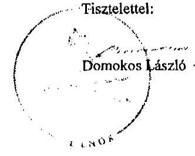

Melléklet: Tájékoztatás az észrevételek kezeléséről

---

# Tájékoztatás   az elfogadott és az el nem fogadott észrevételekről 

„Az állami tulajdonban (résztulajdonban) lévő gazdálkodó szervezetek vagyonmegőrzési és gazdálkodási tevékenységének ellenőrzése - Nemzeti Útdíjfizetési Szolgáltató Zártkörűen Működő Részvénytársaság" címú jelentéstervezetre 2015. június 19-én érkezett észrevételeket áttekintettük, azok kezelésével kapcsolatban a következő tájékoztatást adom.

Az észrevételben jelzik, hogy meglátásuk szerint a jelentéstervezet több téves megállapítást is tartalmaz, ugyanakkor azt rögzítik, hogy „Jelen levelünk keretében a jelentéstervezet kapcsán nem kívánunk részletes észrevételt tenni, azt velünk egyeztetve a NÚSZ Zrt. fogja megtenni Önök felé.". Ezzel összefüggésben azt kérték, hogy a NÚSZ Zrt. által jelzett észrevételeket vegyük figyelembe.

Mindezek alapján - tekintettel arra, hogy az MFB Zrt. észrevételt nem tett - a jelentéstervezet módosítása nem indokolt.

Budapest, 2015. év 15. nap

Makkai Mária
felügyeleti vezető

