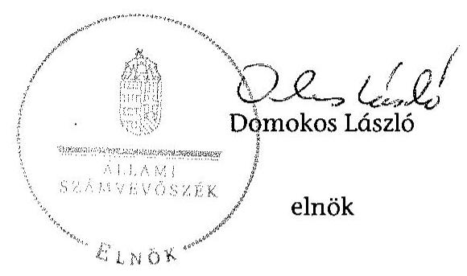
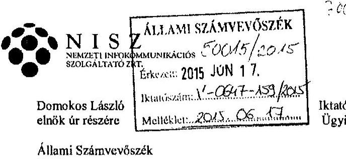
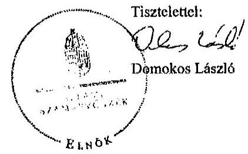
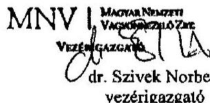

# ÁLLAMI   SZÁMVEVŐSZÉK 

## JELENTÉS

Az állami tulajdonban (résztulajdonban) lévő gazdálkodó szervezetek vagyonmegőrzési és gazdálkodási tevékenységének ellenőrzése NISZ Nemzeti Infokommunikációs Szolgáltató Zártkörűen Működő Részvénytársaság

---

# Állami Számvevőszék 

Iktatószám: V-0647-165/2015.
Témaszám: 1681
Vizsgálat-azonosító szám: V-066606

## Az ellenőrzést felügyelte:

## Makkai Mária

felügyeleti vezető

## Az ellenőrzést vezette és a végrehajtásáért felelős:

## Klinga László

ellenőrzésvezető

## A jelentéstervezet összeállításában közreműködött:

## Puskás Balázs

számvevő

## Az ellenőrzést végezték:

| Frisch Mihályné | Nagy Györgyi | Dr. Tóthné Frisch |
| :-- | :-- | :-- |
| mérlegképes könyvelő | okleveles könyvvizsgáló | Anita |
| külső szakértő | külső szakértő | okleveles könyvvizsgáló |
|  |  | külső szakértő |

---

# TARTALOMJEGYZÉK 

BEVEZETÉS ..... 9
I. ÖSSZEGZŐ MEGÁLLAPÍTÁSOK, KÖVETKEZTETÉSEK, JAVASLATOK ..... 12
II. RÉSZLETES MEGÁLLAPÍTÁSOK ..... 16

1. A tulajdonosi jogok gyakorlója által kialakított vagyongazdálkodási szabályoknak való megfelelés ..... 16
1.1. A vagyon kezelésére kötött szerződés szabályszerűsége és a követelmények előírása ..... 16
1.2. A vagyonnyilvántartás szabályozottsága és a vagyongazdálkodásra vonatkozó jogok meghatározása ..... 16
2. A NISZ Zrt. vagyongazdálkodási és vagyonnyilvántartási tevékenységének kialakítása ..... 17
2.1. A vagyongazdálkodási feltételek kialakításának szabályszerűsége ..... 17
2.2. A NISZ Zrt. vagyonnyilvántartásának szabályszerűsége ..... 18
3. Az ellátott közszolgáltatás bevételei és ráfordításai elszámolásának és önköltségszámításának a szabályszerűsége ..... 19
3.1. Az ellátott közszolgáltatás bevételeinek és ráfordításainak szabályszerűsége ..... 20
3.2. Az önköltségszámítás szabályszerűsége ..... 21
4. A vagyonváltozást eredményező döntések jogszabályi és tulajdonosi elvárásoknak való megfelelése ..... 22
4.1. A NISZ Zrt. vagyongazdálkodási tevékenységének szabályszerűsége ..... 22
4.2. A döntések előkészítésének megalapozása ..... 24
4.3. A tulajdonosi joggyakorló vagyonváltozást eredményező döntéseinek megfelelése ..... 25
5. A belső kontroll és monitoring rendszer kialakítása, működtetése ..... 26
5.1. A vagyon védelmét és a vagyonnal való felelős gazdálkodást biztosító belső kontrollrendszer kialakítása és működtetése ..... 26
5.2. A monitoring rendszer kialakítása és működtetése ..... 27
5.3. A kapcsolt társaságok vagyongazdálkodási követelményeinek a meghatározása, annak működtetésének ellenőrzése ..... 28
MELLÉKLETEK
6. számú A NISZ Zrt. tevékenységének főbb jellemzői a 2010-2013. években
7. számú A NISZ Zrt. eredményének alakulása a 2010-2013. években
8. számú A NISZ Zrt. vezérigazgatójának észrevétele
9. számú A NISZ Zrt. vezérigazgatójának észrevételére adott válasz
10. számú Az MNV Zrt. vezérigazgatójának nemleges észrevétele

---

.

---

# RÖVIDÍTÉSEK JEGYZÉKE 

## EU-s joganyagok

479/2009./EK rendelet

## Törvények

Áht.
Avtv.

Elsztv.
Gt. tv.
Infotv.

Számv. tv.
Vtv.

## Rendeletek

Vhr.
2012/2010. (VII. 01.)
Korm. rendelet
346/2010. (XII. 28.)
Korm. rendelet
53/2011. (III. 31.) Korm. rendelet
309/2011. (XII. 23.)
Korm. rendelet

## Szórövidítések

Alapító Okirat
ÁSZ
Döntőbizottság
EDR
EU
FB
IdomSoft Zrt.
Igazgatóság
KEF
a Tanács 2009. május 25-i 479/2009./EK rendelete az Európai Közösséget létrehozó szerződéshez csatolt, a túlzott hiány esetén követendő eljárásról szóló jegyzőkönyv alkalmazásáról
az államháztartásról szóló 2011. évi CXCV. törvény
a személyes adatok védelméről és a közérdekű adatok nyilvánosságáról szóló 1992. évi LXIII. törvény (hatálytalan 2012. január 1-jétől)
az elektronikus információszabadságról szóló 2005. évi XC. törvény (hatálytalan 2012. január 1-jétől)
a gazdasági társaságokról szóló 2006. évi IV. törvény (hatálytalan: 2014. március 15-étől)
az információs önrendelkezési jogról és az információszabadságról szóló 2011. évi CXII. törvény (hatályos 2011. július 27-étől)
a számvitelről szóló 2000. évi C. törvény
az állami vagyonról szóló 2007. évi CVI. törvény
az állami vagyonnal való gazdálkodásról szóló 254/2007. (X. 4.) Korm. rendelet
az egyes miniszterek, valamint a Miniszterelnökséget vezető államtitkár feladat- és hatásköréről szóló 2012/2010. (VII. 01.) Korm. rendelet
a kormányzati hálózatokról szóló 346/2010. (XII. 28.) Korm. rendelet
a Közbeszerzési és Ellátási Főigazgatóságról szóló 53/2011. (III. 31.) Korm rendelet
a központosított informatikai és elektronikus hírközlési szolgáltatásokról szóló 309/2011. (XII. 23.) Korm. rendelet
a NISZ Zrt. Alapító Okirata és annak módosításai
Állami Számvevőszék
Közbeszerzési Döntőbizottság
Egységes Digitális Rádiótávközlő Rendszer
Európai Unió
NISZ Zrt. Felügyelő Bizottsága
IdomSoft Informatikai Zrt.
NISZ Zrt. Igazgatósága
Központi Szolgáltatási Főigazgatóság 2011. május 1-jétől Közbeszerzési és Ellátási Főigazgatóság

---

| KEKKH | Közigazgatási és Elektronikus Közszolgáltatások Központi   Hivatala |
| :-- | :-- |
| KOPINT-DATORG Kft. | KOPINT-DATORG Informatikai és Vagyonkezelő Kft. |
| MNV Zrt. | Magyar Nemzeti Vagyonkezelő Zrt. |
| NFM | Nemzeti Fejlesztési Minisztérium |
| NISZ Zrt.,Társaság | NISZ Nemzeti Infokommunikációs Szolgáltató Zrt. |
| Pro-M Zrt. | Pro-M Professzionális Mobilrádió Zrt. |
| SZMSZ | a NISZ Zrt. Szervezeti és Működési Szabályzata |

---

# ÉRTELMEZŐ SZÓTÁR 

Állami vagyon

Állami vagyon hasznosítása
2010. június 16-ig:

Állami vagyonnak minősül:
a) az állami tulajdonban lévő ingó dolog, valamint a dolog módjára hasznosítható természeti erő,
b) az állami tulajdonban lévő termőföldekből álló, külön törvényben szabályozott Nemzeti Földalap,
c) az állami tulajdonban lévő - a b) pont hatálya alá nem tartozó - ingatlan,
d) az állami tulajdonban lévő értékpapír,
e) az államot megillető társasági részesedés és más vagyoni értékű jog.
Forrás: Vtv. 1. § (2) bekezdése
2010. június 17-től
a) Az állam tulajdonában lévő dolog, valamint a dolog módjára hasznosítható természeti erő,
b) az a) pont hatálya alá nem tartozó mindazon vagyon, amely vonatkozásában törvény az állam kizárólagos tulajdonjogát nevesíti,
c) az állam tulajdonában lévő tagsági jogviszonyt megtestesítő értékpapír, illetve az államot megillető egyéb társasági részesedés,
d) az államot megillető olyan immateriális, vagyoni értékkel rendelkező jogosultság, amelyet jogszabály vagyoni értékű jogként nevesít.
Forrás: Vtv. 1. § (2) bekezdése
2012. november 10-től az állami vagyon fogalma kiegészül a következő ponttal:
e) az állam tulajdonában lévő pénzügyi eszközök
Forrás: Vtv. 1. § (2) bekezdése
2010. december 31-ig:

Az állami vagyont az MNV Zrt. maga kezeli, illetve szerződés - így különösen bérlet, haszonbérlet, szerződésen alapuló haszonélvezet, vagyonkezelés, megbízás - alapján központi költségvetési szervnek, természetes vagy jogi személynek, illetőleg jogi személyiséggel nem rendelkező gazdasági társaságnak hasznosításra átengedi.
Forrás: Vtv. 23. § (1) bekezdése
2011. december 31-ig:

Az állami vagyont az MNV Zrt. maga kezeli, vagy szerződés - így különösen bérlet, haszonbérlet, szerződésen alapuló haszonélvezet, vagyonkezelés, megbízás - alapján központi költségvetési szervnek, természetes vagy jogi személynek, vagy jogi személyiséggel nem rendelkező gazdálkodó szervezetnek hasznosításra átengedi.
Forrás: Vtv. 23. § (1) bekezdése

---

Állami vagyon hasznosítására kötött szerződés

Állami vagyon kezelője /vagyonkezelő
2012. január 1-jétől:

Az állami vagyont az MNV Zrt. maga kezeli, vagy szerződés - így különösen bérlet, haszonbérlet, megbízás - alapján központi költségvetési szervnek, természetes vagy jogi személynek, vagy jogi személyiséggel nem rendelkező gazdálkodó szervezetnek hasznosításra átengedi.
Forrás: Vtv. 23. § (1) bekezdése
2013. június 28-ától:

Az állami vagyonnal az MNV Zrt. maga gazdálkodik, vagy szerződés - így különösen bérlet, haszonbérlet, megbízás - alapján központi költségvetési szervnek, természetes vagy jogi személynek, vagy jogi személyiséggel nem rendelkező gazdálkodó szervezetnek hasznosításra átengedi, illetőleg vagyonkezelésbe, haszonélvezetbe adja.
Forrás: Vtv. 23. § (1) bekezdése
Az állami vagyon hasznosítására kötött szerződések elsődleges célja az állami vagyon hatékony működtetése, állagának védelme, értékének megőrzése, illetve gyarapítása, az állami és közfeladatok ellátásának elősegítése.
Forrás: Vtv. 23. § (2) bekezdése
2010. január 01 - 2011. december 31. között:

Az állami vagyont az MNV Zrt. maga kezeli, vagy szerződés - így különösen bérlet, haszonbérlet, szerződésen alapuló haszonélvezet, vagyonkezelés, megbízás - alapján központi költségvetési szervnek, természetes vagy jogi személynek, illetőleg jogi személyiséggel nem rendelkező gazdasági társaságnak hasznosításra átengedi.
Vtv. 23. § (1) bekezdése
2012. január 1-jétől:

Az állami vagyont az MNV Zrt. maga kezeli, vagy szerződés - így különösen bérlet, haszonbérlet, megbízás - alapján központi költségvetési szervnek, természetes vagy jogi személynek, vagy jogi személyiséggel nem rendelkező gazdálkodó szervezetnek hasznosításra átengedi. Az állami vagyonra vonatkozóan az MNV Zrt. kizárólag az Nvtv-ben meghatározott személyekkel köthet vagyonkezelési szerződést.
Forrás: Vtv. 23. § (1), 27. § (1)
2013. június 28-ától:

Az állami vagyonnal az MNV Zrt. maga gazdálkodik, vagy szerződés - így különösen bérlet, haszonbérlet, megbízás - alapján központi költségvetési szervnek, természetes vagy jogi személynek, vagy jogi személyiséggel nem rendelkező gazdálkodó szervezetnek hasznosításra átengedi, illetőleg vagyonkezelésbe, haszonélvezetbe adja. Az állami vagyonra vonatkozóan az MNV Zrt. kizárólag az Nvtv-ben meghatározott személyekkel köthet vagyonkezelési szerződést.
Forrás: Vtv. 23. § (1), 27. § (1)

---

EDR

Központi rendszer

MNV Zrt.

A tulajdonosi joggyakor-
lás és a vagyongazdál-
kodás feladata

Az Egységes Digitális Rádiótávközlő Rendszer (EDR) rendkívül magas rendelkezésre állást biztosító, zárt rádió-távközlő rendszer, melynek célja, hogy olyan professzionális összeköttetést valósítson meg a különféle készenléti és rendvédelmi szervek között, amely gyorsabbá, hatékonyabbá és biztonságosabbá teszi az egyes feladatok végrehajtását.
Az elektronikus közszolgáltatások nyújtását, illetve igénybevételét támogató központi informatikai és kommunikációs rendszerek együttese.
Forrás: az elektronikus közszolgáltatásról szóló 2009. évi LX. törvény

Az állami vagyon felett, a Magyar Államot megillető tulajdonosi jogok és kötelezettségek összességét - a hatályos szabályozás szerint - az állami vagyon felügyeletéért felelős miniszter (jelenleg a nemzeti fejlesztési miniszter) gyakorolja. A miniszter feladatát nagy részben az MNV Zrt., mint tulajdonosi joggyakorló szervezet útján látja el.
2010. június 16-ig:

A tulajdonosi joggyakorlás és a vagyonkezelés feladata az állami vagyon megóvása, továbbá hatékony és gazdaságos működtetése a nemzeti vagyon megőrzése és gyarapítása érdekében, illetve vagyontárgyak értékesítése.
Forrás: Vtv. 2. § (1)
2010. június 17-től:

Az állami vagyon rendeltetésének megfelelő - az állami feladatok ellátásához, a társadalmi szükségletek kielégítéséhez, valamint a Kormány gazdaságpolitikája megvalósításának elősegítéséhez szükséges, egységes elveken alapuló, önálló ágazatként megjelenő - hatékony, költségtakarékos, értékmegőrző értéknövelő felhasználásának biztosítása (közvetlen felhasználás), illetve közvetett hasznosítása (beleértve a vagyoni kör változását eredményező értékesítést), valamint az állami vagyon gyarapítása (ideértve a vagyoni kör bővítését is).
Forrás: Vtv. 2. § (1)

---

.

---

# JELENTÉS 

## Az állami tulajdonban (résztulajdonban) lévő gazdálkodó szervezetek vagyonmegőrzési és gazdálkodási tevékenységének ellenőrzése NISZ Nemzeti Infokommunikációs Szolgáltató Zrt.

## BEVEZETÉS

Az Állami Számvevőszék alapvető célkitűzése, hogy az államháztartáson kívülre nyújtott költségvetési támogatások és ingyenes vagyonjuttatások ellenőrzésével járuljon hozzá ahhoz, hogy a közpénzeket az államháztartáson kívül működő szervezetek is átlátható módon használják fel a közfeladatok szerződésben vállalt ellátása érdekében. Az Áht. értelmében a közfeladatok ellátása elsősorban költségvetési szervek alapításával és működtetésével történik. Az államháztartáson kívüli szervezetek a közfeladatok ellátásában jogszabályban meghatározott feltételekkel közreműködhetnek. ${ }^{1}$

Az állami tulajdonú gazdálkodó szervezetek a nemzeti vagyon részét képezik. Az állami vagyonnal való gazdálkodást illetően a tulajdonosi joggyakorlás és a vagyongazdálkodás feladata az állami vagyon átlátható, rendeltetésszerű és felelős felhasználásának biztosítása. Az állam meghatározza az ellátandó közszolgáltatásokkal kapcsolatos feladatokat, amelyhez a vagyonnal kapcsolatos döntéseknek igazodniuk kell. A nemzetgazdasági szempontból kiemelt jelentőségű nemzeti vagyonban tartandó állami tulajdonban álló társasági részesedést a nemzeti vagyonról szóló törvény tartalmazza.

A NISZ Zrt. jogelődje az 1991-ben alapított Kopint-Datorg Zrt., amelynek főtevékenysége egyéb információtechnológiai szolgáltatás volt. A Társaság elnevezése 2011. augusztusától Nemzeti Infokommunikációs Szolgáltató Zrt.-re, majd 2013-tól NISZ Nemzeti Infokommunikációs Szolgáltató Zrt.-re változott. Az ellenőrzött időszakban a NISZ Zrt. feletti tulajdonosi (részvényesi) jogokat az MNV Zrt. gyakorolta. A NISZ Zrt. a 2010-2013. években vagyonkezelésbe nem vett át állami vagyont, vagyonkezelésbe vett eszköze nem volt. A Társaság a Magyar Állam 100%-os minősített többségi befolyású tulajdonában volt az ellenőrzött időszakban.

A NISZ Zrt. fő tevékenysége teljes körű infokommunikációs szolgáltatások nyújtása volt. Legnagyobb megrendelői az államigazgatási szervek és országos hatáskörű intézmények, de gazdálkodó szervezetek, vállalkozások és magánszemélyek is igénybe vették egyes szolgáltatásait. A NISZ Zrt. stratégiai céljai között

[^0]
[^0]:    ${ }^{1}$ Áht. 1. § (2)-(3) bekezdés

---

első helyen a kormányzati infrastruktúra
 működtetése, az e-közigazgatási megoldások támogatása, valamint a kormányzati szintű alap és emelt szintű informatikai szolgáltatások álltak.

A NISZ Zrt.-nek 2013. december 31-én három többségi tulajdonú - 100%-os részesedésű - leányvállalata volt. Az informatikai fejlesztéssel és üzemeltetéssel foglalkozó KOPINT-DATORG Kft.-ben a részesedés az ellenőrzött időszak egészében fennállt. A szolgáltatások kiterjesztésének érdekében a NISZ Zrt.-nek 2012-ben az EDR rendszert kiépítő és működtető Pro-M Zrt., 2013-ban az elsősorban központi költségvetésből gazdálkodó intézmények részére informatikai szolgáltatásokat nyújtó IdomSoft Zrt. került a tulajdonába.

A NISZ Zrt. mérlegében a 2013. év végén szereplő összes eszközvagyon 55612,9 millió Ft volt, vagyonkezelésbe nem vett át vagyont. A saját tőkéje a 2013. év végén 23892,1 millió Ft, ebből a jegyzett tőke 21916,9 millió Ft, az eredménytartalék 452,5 millió Ft volt. A NISZ Zrt. összes bevétele a 2013. évben 23 375,2 millió Ft, ezen belül az értékesítés nettó árbevétele 21725,0 millió Ft volt. A Társaság az ellenőrzött időszakban minden évben pozitív mérleg szerinti eredménnyel zárt, a 2013. évben 87,4 millió Ft összegű nyereséget realizált (1. számú melléklet). A NISZ Zrt. alkalmazottainak száma - a leányvállalatokkal együtt - a 2010. évben 207 fő, a 2013. év végén 767 fő volt. A korábbi vezérigazgató 2011. június 7-éig töltött be tisztségét, 2011. június 8-ától az üzletág igazgató kapott megbízást a vezérigazgatói feladatok ellátására. Ezt követően a vezérigazgatói tisztség 2012. február 6-ától került betöltésre.

A NISZ Zrt. az NGM kormányzati szektorba sorolt egyéb szervezetekről szóló közleményében foglaltak alapján nem kormányzati szektorba sorolt szervezet, így ezzel összefüggésben adatszolgáltatási kötelezettsége nem keletkezett.

Az ellenőrzés célja annak értékelése volt, hogy a tulajdonosi jogok gyakorlása szabályszerű volt-e; a gazdálkodó szervezet által ellátott feladat bevételei, ráfordításai elszámolásának, és vagyongazdálkodási tevékenységének szabályozása megfelelt-e a jogszabályi és a tulajdonosi előírásoknak és azok végrehajtása szabályszerű volt-e; biztosítva volt-e a közfeladatok átláthatósága és elszámoltathatósága érdekében a közszolgáltatás díjának megalapozottsága szabályszerű önköltségszámítással; a vagyonváltozást eredményező döntések esetében a tulajdonosi jogok gyakorlója és a gazdálkodó szervezet szabályszerűen jártak-e el; kiépítette és működtette-e a gazdálkodó szervezet a szabályszerű vagyongazdálkodás érdekében a kontroll és monitoring rendszert.

Az ellenőrzést a számvevőszéki ellenőrzés szakmai szabályai szerint, szabályszerűségi ellenőrzés módszerével, a vonatkozó nemzetközi standardok figyelembevételével végeztük. Az ellenőrzés a 2010-2013. évekre terjedt ki.

Az ellenőrzéssel érintett szervezetek: Az ellenőrzés kiterjedt a NISZ Nemzeti Infokommunikációs Szolgáltató Zrt.-re, valamint a Magyar Nemzeti Vagyonkezelő Zrt.-re.

Az ellenőrzés várható hasznosulásaként az ellenőrzés megállapításai a jogalkotás számára segítséget nyújthatnak az államháztartáson kívüli közfeladat-ellátás, közvagyonnal való gazdálkodás értékeléséhez, jogszabályi keretei

---

pontosításához, az átláthatóságot biztosító szabályozáshoz. Az ellenőrzöttek számára visszajelzést ad a gazdálkodási tevékenységgel, az állami vagyon felhasználásával, a közszolgáltatási árképzés megalapozottságával és az éves elszámolással kapcsolatos szabálytalanságokról és kockázatokról. Az ellenőrzés tapasztalatai segítik és erősítik az ÁSZ hozzáadott értéket teremtő elemző tevékenységét és tanácsadó szerepét.

A bevételek és ráfordítások elszámolása, valamint a vagyonnyilvántartás terén a szabályszerű működést mintavétellel ellenőriztük. A véletlen mintavétellel (évenkénti elemszámmal arányos rétegezéssel) ellenőrzött területek esetében minden egyes tétel vonatkozásában a szabályszerűségre vonatkozó kérdéseket tettünk fel, amelyek eredménye összesítésre került. A jogszabályoknak és a belső előírásoknak megfelelőnek tekintettük az adott területet, amennyiben a minta ellenőrzésének eredménye alapján 95%-os bizonyossággal a teljes sokaságban a hibaarány kisebb volt, mint 10%, nem megfelelőnek értékeltük, ha a hibaarány a 10%-ot meghaladta. A ráfordítások elszámolására és a vagyonnyilvántartásra vonatkozó véletlen mintavételt kockázati alapú kiválasztással egészítettük ki, amelynek során évente a három legnagyobb összegű tételt választottuk ki. Ezen túlmenően a tárgyi eszköz beszerzésekre és létesítésekre vonatkozóan mintavétellel ellenőriztük a közbeszerzési eljárások lefolytatását.

Az ellenőrzés végrehajtásának jogszabályi alapját az Állami Számvevőszékről szóló 2011. évi LXVI. törvény 5. § (3)-(5) bekezdései képezték.

Az ÁSZ a 2011. évi LXVI. törvény 29. §-a szerint a jelentéstervezetet megküldte a Nemzeti Infokommunikációs Zrt. és a Magyar Nemzeti Vagyonkezelő Zrt. vezérigazgatójának egyeztetésre. A Nemzeti Infokommunikációs Zrt. vezérigazgatójának észrevételét és az arra adott választ a 3-4. számú melléklet tartalmazza. A Magyar Nemzeti Vagyonkezelő Zrt. vezérigazgatójának nemleges észrevételét az 5. számú melléklet tartalmazza.

---

# I. ÖSSZEGZŐ MEGÁLLAPÍTÁSOK, KÖVETKEZTETÉSEK, JAVASLATOK 

A NISZ Zrt. feladatait saját, illetve használatba vett eszközökkel látta el. Az ellenőrzött időszakban vagyonkezelésbe vett eszköze nem volt, ezért a Vtv. szerinti vagyonkezelői szerződést nem kötött. Az MNV Zrt. a tulajdonosi (részvényesi) jogait a közgyűlés jogkörében eljárva, Alapítói Határozatokban hozott döntésekkel gyakorolta. A NISZ Zrt. működésével, gazdálkodásával kapcsolatban elvárt teljesítményeket az üzleti tervekben írta elő. Az MNV Zrt. havi gyakorisággal határozta meg a terv teljesítésével kapcsolatos adatszolgáltatási kötelezettséget. Az Alapító Okiratban rögzített - vagyongazdálkodásra vonatkozó - tulajdonosi jogokat az MNV Zrt. szabályszerűen gyakorolta.

Az állami vagyon értékének megőrzését, gyarapítását szolgáló vagyongazdálkodás feltételei kialakításának és a vagyon előírások szerinti nyilvántartásának szabályszerűsége a 2010-2013. években részben megfelelő volt. A leltárkészítési és leltározási szabályzatban a mennyiségi leltározás gyakoriságának meghatározását a Társaság jogkörébe utalták. A szabályozás 2012. január 1-jétől nem felelt meg a Számv. tv. előírásainak, mivel az a szabályzatban meghatározott időszakonként, de legalább három évente mennyiségi felvétellel történő leltározási kötelezettséget ír elő a mennyiségben nyilvántartott eszközök esetében. Az ellenőrzött időszakban mennyiségi felvétellel történő leltározást nem végzett a Társaság. A NISZ Zrt. által készített és MNV Zrt. által jóváhagyott éves üzleti tervek tartalmazták a vagyongazdálkodással összefüggő feladatokat. A Társaság rendelkezett az ellenőrzött időszakban a Számv. tv.-ben előírt számviteli politikával, eszközök és források leltárkészítési és leltározási szabályzatával, eszközök és források értékelési szabályzatával, önköltségszámítási szabályzattal, pénzkezelési szabályzattal, valamint számlarenddel.

A NISZ Zrt. feladatköre a 2011. évtől - jogszabályi előírás alapján - jelentősen bővült. A feladatokkal együtt eszközöket vett át a Társaság a KEKKH-tól, valamint a KEF-től. A 346/2010. (XII. 28.) Korm. rendelet alapján KEKKH-tól, valamint az 53/2011. (III. 31.) Korm. rendelet alapján a KEF-től használatra átvett eszközöket a NISZ Zrt. mennyiségben elkülönítve, szabályosan tartotta nyilván.

Az Alapító Okiratban meghatározott közszolgáltatási tevékenységek bevételeinek és ráfordításainak elkülönített elszámolása nem volt megfelelő. Az értékesítés nettó árbevétele és az anyagjellegű ráfordítások elszámolása során nem alkalmazták a belső szabályzatban előírt, a könyvelés módjára, valamint az érintett főkönyvi számlákra történő hivatkozást tartalmazó adatlapot. Ennek következtében nem volt megállapítható az alapbizonylaton szereplő összeg felosztásának teljessége. A kisértékű tárgyi eszközök esetében az értékcsökkenési leírás elszámolása során nem tartották be a számlarendben előírtakat, mivel nem egy összegben, hanem lineáris leírási kulcs alkalmazásával értékcsökkenést számoltak el.

A központi finanszírozású közszolgáltatások esetében a 2010-2011. években az önköltségszámítási szabályzat szerinti előkalkuláció hiányossága volt,

---

hogy a tervezett közvetlen költségeket költségnemenként nem részletezte. Az egyösszegű díjtervezés miatt nem volt megállapítható a közvetlen és közvetett költségek, valamint a nyereség tervezett összege. A 2012-2013. évek vonatkozásában az önköltségszámítási szabályzat szerinti előkalkuláció nem készült a szerződéskötést megelőzően, a díjakat az üzleti tervek alapozták meg. Az ellenőrzött időszakban a közszolgáltatási szerződések alapján ellátott feladatok utókalkulációját elvégezték. Közvetlen finanszírozású (egyedi szolgáltatási megállapodások szerinti) szolgáltatásokat 2011-től nyújtott a Társaság. Az egyedi szolgáltatási megállapodásokban meghatározott díjakat a 2011. évben előkalkuláció nem támasztotta alá, a 2012. évtől előkalkulációt készítettek. Szerződésenkénti utókalkuláció a közvetlen finanszírozású szolgáltatások esetében a 2011-2013. években nem készült.

A NISZ Zrt. vagyona alapvetően az ellenőrzött időszakban szerzett részesedések és a támogatások felhasználásával megvalósított fejlesztések hatására 47346,1 millió Ft-tal nőtt, 2013. december 31-én 55612,9 millió Ft volt. A tárgyi eszközök 2010-2013. években elszámolt tervszerinti értékcsökkenési leírásának összege 5976,7 millió Ft volt, a tárgyi eszközök pótlására 15 634,3 millió Ft-ot fordítottak. A Társaság az ellenőrzött években pozitív mérleg szerinti eredményt mutatott ki az éves beszámolókban. A vagyonváltozást eredményező döntések előkészítése és megalapozásának megfelelősége a jogszabályi és belső előírásoknak megfelelő volt. A vagyongazdálkodás éves feladatait a NISZ Zrt. éves üzleti tervei tartalmazták. Az MNV Zrt. a vagyonváltozással kapcsolatos döntéseket az Alapító Okirat előírásainak betartásával, a Társaság által készített előterjesztések, azokat megalapozó elemzések és számítások figyelembevételével hozta meg.

Az ellenőrzött időszakban két részesedést értékesítettek az MNV Zrt. engedélyével, az Alapítói Határozatban és az eszközök és források értékelési szabályzatában előírtak betartásával. A NISZ Zrt. jegyzett tőkéje 21 086,8 millió Ft-tal nőtt, 2013. december 31-én 21916,9 millió Ft volt. Az alaptőke emelés alapvetően két társaság (Pro-M Zrt., IdomSoft Zrt.) részvényeinek - a NISZ Zrt. tevékenységi körének bővülése miatti - megvásárlásához kapcsolódott. A döntés előkészítés szakaszában a két társaságot jogi, pénzügyi és műszaki szakértők bevonásával átvilágították. Megvételre került továbbá egy magánszemély KOPINT-DATORG Kft.-ben lévő üzletrésze. A részesedések megvásárlásáról az Alapító Okirat előírásainak betartásával az MNV Zrt. döntött. A vagyonváltozást eredményező döntések esetében az MNV Zrt. és a NISZ Zrt. szabályszerűen járt el.

A NISZ Zrt. vagyon védelme és a vagyonnal való felelős gazdálkodást biztosító belső kontrollrendszerének kialakítása megtörtént, azonban működése, működtetése részben megfelelő volt. Az FB az ügyrendben előírtak alapján a tulajdonosi döntést segítő, megalapozó véleményezési feladatát - egy kivétellel - elvégezte. A vezérigazgató által készített ügyvezetésről, vagyoni helyzetről és üzletpolitikáról szóló negyedéves jelentést 2013. III. negyedévtől nem tárgyalta. A Társaság éves beszámolóját és üzleti jelentését megtárgyaló igazgatósági üléseken a jogszabályi előírásokat betartva a könyvvizsgáló is részt vett. Az MNV Zrt. a 2012. évben a vagyonvédelmi tevékenységgel kapcsolatban végzett ellenőrzést, eleget téve ezzel tulajdonosi kötelezettségének. A szabályszerű vagyongazdálkodást biztosító információáramlási és monitoring rendszer működtetése

---

megfelelő volt. Az MNV Zrt. által előírt havi és éves adatszolgáltatási kötelezettségnek a NISZ Zrt. az előírt tartalommal, határidőben eleget tett. A Társaság rendelkezett a jogszabályokban előírt adatvédelmi és adatbiztonsági szabályzattal, valamint a közérdekű adatok közzétételére vonatkozó szabályzattal. A NISZ Zrt. a közérdekű adatok közzétételi kötelezettségét teljesítette.

A kapcsolt vállalkozásokban lévő részesedések értékének védelme érdekében tett intézkedések a 2010-2013. években megfelelőek voltak. A NISZ Zrt. három leányvállalata közül kettő megvásárlására az ellenőrzött időszakban került sor. A NISZ Zrt. a kapcsolt vállalkozások ellenőrzését meghatározott tartalmú és határidejú kontrolling adatok havonta történő bekérésével végezte. Az Alapítói Határozatban előírt beszámolási kötelezettségüknek a kapcsolt vállalkozások eleget tettek.

Az Állami Számvevőszékről szóló 2011. évi LXVI. törvény 33. § (1) bekezdésében foglaltak értelmében a jelentésben foglalt megállapításokhoz kapcsolódó intézkedési tervet köteles az ellenőrzött szervezet vezetője összeállítani, és azt a jelentés kézhezvételétől számított 30 napon belül az ÁSZ részére megküldeni. Amennyiben az intézkedési tervet határidőben nem küldi meg a szervezet, vagy az nem elfogadható, az ÁSZ elnöke a hivatkozott törvény 33. § (3) bekezdésében foglaltakat érvényesítheti.

A helyszíni ellenőrzés megállapításainak hasznosítása mellett javasoljuk:

# a NISZ Zrt. vezérigazgatójának: 

1. A leltárkészítési és leltározási szabályzatban a mennyiségi leltározás gyakoriságának meghatározását a Társaság jogkörébe utalták. A szabályozás
 2012. január 1-jétől nem felelt meg a Számv. tv. 69. § (3) bekezdés előírásainak, mivel az a szabályzatban meghatározott időszakonként, de legalább három évente mennyiségi felvétellel történő leltározási kötelezettséget ír elő a mennyiségben nyilvántartott eszközök esetében.

Javaslat:
Intézkedjen a leltárkészítési és leltározási szabályzat módosításáról, annak érdekében, hogy a mennyiségi felvétellel történő leltározás szabályozása megfeleljen a jogszabályi előírásoknak.
2. A Társaság a kísértékű tárgyi eszközök értékcsökkenését a számlarendben előírt egy összegben történő elszámolás helyett lineáris leírási kulcs alkalmazásával számolta el.

Javaslat:
Intézkedjen, hogy a kísértékű tárgyi eszközök értékcsökkenésének elszámolása megfeleljen a számlarendben előírtaknak.

---

3. A társaság által nyújtott központosított informatikai és távközlési szolgáltatás, a kormányzati célú hírközlési szolgáltatás dijait önköltségszámítás nem támasztotta alá. 2010-2011. években az egyösszegű díjtervezés miatt nem volt megállapítható a közvetlen és a közvetett költségek, valamint a nyereség tervezett összege. 2012-2013. években a dijakat üzleti tervek alapozták meg.

Javaslat:
Intézkedjen a szolgáltatási dijak alátámasztását biztosító önköltségszámítás elvégzéséről.

---

# II. RÉSZLETES MEGÁLLAPÍTÁSOK 

## 1. A TULAJDONOSI JOGOK GYAKORLÓJA ÁLTAL KIALAKÍTOTT VAGYONGAZDÁLKODÁSI SZABÁLYOKNAK VALÓ MEGFELELÉS

Az MNV Zrt., a vagyon érték megőrzését és gyarapítását szolgáló szabályszerű vagyongazdálkodás feltételeit a 2010-2013. években megfelelően alakította ki.

### 1.1. A vagyon kezelésére kötött szerződés szabályszerűsége és a követelmények előírása

A NISZ Zrt.-nek az ellenőrzött időszakban vagyonkezelésbe vett eszköze nem volt, így az MNV Zrt.-vel a Vtv. 23. § (1) bekezdésében meghatározott vagyonkezelői szerződést nem kötött, vagyonkezelői jogot nem létesített.

Az MNV Zrt. az Alapítói Határozatokban hozott döntéseken keresztül gyakorolta a tulajdonosi (részvényesi) jogait a NISZ Zrt. felett, az egyszemélyes állami tulajdonban levő társaság közgyűlése jogkörében eljárva. Az MNV Zrt. a Gt. tv. 284. § (2) bekezdésében előírtakkal összhangban a közgyűlés hatáskörébe tartozó ügyekben írásban döntött, amelyről a vezető tisztségviselőket értesítette.

### 1.2. A vagyonnyilvántartás szabályozottsága és a vagyongazdálkodásra vonatkozó jogok meghatározása

Az MNV Zrt. vagyonkezelésbe adott eszközök hiányában a vagyon-nyilvántartási szabályzatát nem terjesztette ki a Társaságra.

Az MNV Zrt. az éves üzleti tervekben írta elő a NISZ Zrt.-nek az elvárt, teljesítendő mutatószámokat, meghatározta az első számú vezetők prémiumkitűzését. Az MNV Zrt. évente vezetői levélben határozta meg a havi jelentésben szolgáltatandó adatok körét. A jelentési kötelezettség kiterjedt a mérleg, az eredmény, vevő, szállító, bértömeg adatokra, valamint a beruházások alakulására terv és tény adatok vonatkozásában. Az MNV Zrt.-től évente megkapott iránymutatás alapján a jelentéskészítés a kontrolling osztály feladata volt.

Az Alapító Okiratban az MNV Zrt. jogai között írták elő a beszámoló elfogadásáról, az adózott eredmény felhasználásáról szóló döntés meghozatalát.

A NISZ Zrt. az Alapítói Határozatok alapján az Alapító Okirat módosításait az ellenőrzött időszakban végrehajtotta, amelyet az FB félévente ellenőrzött, és beszámolt az MNV Zrt. Ellenőrzési Igazgatóságának. Az Alapító Okiratban meghatározott vagyongazdálkodásra vonatkozó jogokat az MNV Zrt. szabályszerűen gyakorolta.

---

# 2. A NISZ ZRT. VAGYONGAZDÁLKODÁSI ÉS VAGYONNYILVÁNTARTÁSI TEVÉKENYSÉGÉNEK KIALAKÍTÁSA 

### 2.1. A vagyongazdálkodási feltételek kialakításának szabályszerűsége

Az állami vagyon értékének megőrzését, gyarapítását szolgáló szabályszerű vagyongazdálkodás NISZ Zrt. általi kialakítása a 2010-2013. években részben megfelelő volt.

A NISZ Zrt. a 2010-2013. évi üzleti terveit az MNV Zrt. tervezési irányelvei alapján, valamint a kormányzatot és intézményeit ellátó távközlési rendszer kialakításának, üzemeltetésének figyelembe vételével készítette el. A vagyongazdálkodással összefüggő éves feladatokat az üzleti tervek tartalmazták, melyet az MNV Zrt. minden évben határozatban elfogadott.

Az éves üzleti tervekben bemutatták a várható előrejelzéseket, a fő feladatokat, a működési körbe tartozó fejlesztéseket, a közbeszerzéseket, az európai uniós támogatások tartalmát, továbbá a takarékos gazdálkodás követelményeit a működési költségek tervezésében.

A NISZ Zrt. elkészítette a Számv. tv. 14. § (3) bekezdésében előírt számviteli politikát, amelynek utolsó módosítása 2010. április 1-jével történt. A számviteli politikában rögzítették az értékcsökkenés elszámolásának rendjét, melynek keretében előírták az értékcsökkenési leírás módszerét (lineáris leírás) és a havonkénti elszámolás kötelezettségét.

A NISZ Zrt. rendelkezett a Számv. tv. 161. § előírt számlarenddel, mely 2010. január 1-jével lépett hatályba. A szabályzat tartalmazta az alkalmazásra kijelölt számlák számjelét és megnevezését, tartalmát, a számla érték növekedésének és csökkenésének jogcímeit, a számlát érintő gazdasági eseményeket. Előírták a számlarendben a főkönyvi számla és az analitikus nyilvántartás kapcsolatát. A számlarendben foglaltakat alátámasztó bizonylati rendet bizonylati szabályzatban rögzítették.

A NISZ Zrt. rendelkezett a Számv. tv. 14. § (5) bekezdés a) pontjában előírt leltárkészítési és leltározási szabályzattal, amelynek utolsó módosítására 2010. április 1-jei hatállyal került sor. A szabályzat a mennyiségben történő leltározás szabályait úgy határozta meg, hogy „Az év közben megfelelően (folyamatosan, mennyiségben és értékben) nyilvántartott eszközök esetében az analitikus nyilvántartás adatainak helyességét ellenőrző mennyiségi felvétel gyakoriságáról a társaság szabadon dönthet." A szabályozás ellentétes a Számv. tv. 69. § (3) bekezdésének 2012. január 1-jétől hatályos előírásaival, amely a szabályzatban meghatározott időszakonként, de legalább háromévente mennyiségi felvétellel történő leltározás kötelezettségét írta elő a számviteli alapelveknek megfelelő folyamatosan mennyiségben nyilvántartott eszközök vonatkozásában. A selejtezéssel összefüggő szabályokat belső szabályzatban előírták.

A Társaság 2010. január 1-jétől léptette hatályba a Számv. tv. 14. § (5) bekezdés b) pontjában előírt eszközök és források értékelési szabályzatát. Ebben

---

előírták az eszközök és források értékelésére, értékhelyesbítésére, az értékvesztés elszámolására vonatkozó szabályokat.

A Számv. tv. 14. § (5) bekezdés c) pontja alapján a NISZ Zrt. az önköltségszámítási szabályzat készítési kötelezettségének eleget tett. Az önköltségszámítási szabályzat az ellenőrzött időszakban többször módosult, az utolsó módosítás 2012. november 1-jén volt.

A NISZ Zrt. rendelkezett a Számv. tv. 14. § (5) bekezdés d) pontjában előírt pénzkezelési szabályzattal, amit évente módosítottak.

A vagyongazdálkodás tekintetében a NISZ Zrt. Alapító Okiratának 5. pontja határozott meg szabályokat, amely az ingatlanok és a részesedések tekintetében az MNV Zrt. hatáskörébe utalta a Társaság vagyonának változását eredményező döntések meghozatalát. A vagyongazdálkodással kapcsolatos feladat- és hatásköröket az SZMSZ-ben rögzítették, a részletes feladatokat az üzemeltetési szabályzat és az adott szervezeti egység működési szabályzata tartalmazta.

Az SZMSZ a Gazdasági Vezérigazgató-helyettes hatáskörébe utalt minden olyan döntést, amely a Társaság gazdálkodását, pénzügyi helyzetét befolyásolta. Az Üzemeltetési Vezérigazgató-helyettes hatáskörébe tartozott a központi rendszer, a kormányzati célú hálózatok, a kormányzati informatika és a távközlési szolgáltatások rendeltetésszerű működtetése, üzemeltetése. A Projektmenedzsment Igazgatóság feladatait képezte a projektek kidolgozása, menedzselése. A Biztonsági Igazgatóság feladataként írták elő az objektumok vagyonvédelmének szervezését és az ebből adódó feladatok ellátását.

# 2.2. A NISZ Zrt. vagyonnyilvántartásának szabályszerűsége 

A NISZ Zrt. vagyonának előírások szerinti nyilvántartása a 2010-2013. években részben megfelelő volt.

A Társaság tevékenysége a 2011. évtől jelentős mértékben bővült, a közigazgatásban betöltött szolgáltatói szerepvállalása erősödött.

A 346/2010. (XII. 28.) Korm. rendelet 3. § (2) bekezdése a Kopint-Datorg Zrt.-t (NISZ Zrt. jogelődje) nevezte meg², mint kormányzati célú hírközlési szolgáltatót. A 33. § (1) bekezdésében előírtak szerint a kormányzati célú hálózatokat működtető központi költségvetési szervek kötelesek voltak a Kopint-Datorg Zrt.-nek átadni a kormányzati célú hálózatok részét képező összes, a működtető saját kezelésében vagy tulajdonában álló vagyoni elemet és más erőforrást.

A 346/2010. (XII. 28.) Korm. rendelet 33. § (1) bekezdésében előírtak alapján a Kopint-Datorg Zrt. 2011. március 1-jén a KEKKH-től átvette a működtetésében lévő hálózatokat és az azokhoz kapcsolódó tárgyi, pénzügyi és személyi erőforrásokat. Az átadás-átvételi jegyzőkönyv alapján az eszközöket a Kopint-Datorg Zrt. használatra vette át.

[^0]
[^0]:    ${ }^{2}$ A 346/2010. (XII. 28.) Korm. rendelet 3. § (2) bekezdése a 2011. december 24.-ei módosítást követően a NISZ Zrt.-t jelöli ki kormányzati célú hírközlési szolgáltatónak.

---

Az 53/2011. (III. 31.) Korm. rendelet 4. § (6) bekezdése a 212/2010. (VII. 1.) Korm. rendelet 92. § (1) bekezdését 2011. május 1-jei hatállyal egészítette ki az n) ponttal, mely szerint a nemzeti fejlesztési miniszter a jogelőd Kopint-Datorg Zrt. útján központosított informatikai és telekommunikációs szolgáltatást nyújt, gondoskodik az igénybevevő informatikai és telekommunikációs eszközökkel történő ellátásáról és az ilyen eszközök működtetéséről. Az így meghatározott feladat ellátásához az 53/2011. (III. 31.) Korm. rendelet 4. § (10) bekezdésének hatályos előírásai szerint a KEF által az informatikai és telekommunikációs szolgáltatások nyújtásához használt állami tulajdonú eszközöket az MNV Zrt. - a KEF vagyonkezelői jogának megszüntetését követően - nem pénzbeli hozzájárulásként a jogelőd Kopint Datorg Zrt. tulajdonába adta. A tulajdonba adás megtörténtéig az eszközök használatára vonatkozó szerződés megkötésének kötelezettségét írta elő a jogszabály, a használati szerződést a KEF és Kopint-Datorg Zrt. megkötötte. Az 53/2011. (III. 31.) Korm. rendelet 2013. január 2.-tól hatályos 4. § (10) bekezdése alapján a KEF által az informatikai és telekommunikációs szolgáltatások nyújtásához használt eszközöket az MNV Zrt. a NISZ Zrt.-nek használatba adta.

A KEKKH-tól és a KEF-től használatra átvett eszközöket a Társaság mennyiségben elkülönítetten tartotta nyilván.

A NISZ Zrt. a befektetett pénzügyi eszközök között mutatta ki a Hódiköt Rt.-ben lévő 62,0 ezer Ft bekerülési értékű befektetését. A részvények értékelésének eredményeként a részesedés után értékvesztést számolt el a Társaság, ugyanakkor a Hódiköt Rt. felszámolását követően a részesedést, és a hozzá kapcsolódó értékvesztést a Számv. tv. 15. § (3) bekezdésében (valódiság elve) foglaltak ellenére nem vezette ki a számviteli nyilvántartásokból.

A Hódiköt Rt.-ben a NISZ Zrt.-nek 62,0 ezer Ft összegű befektetése volt, de a társaság felszámolás alá került. A felszámoló tájékoztatása alapján a felszámolási vagyon nem nyújtott fedezetet a 62,0 ezer Ft-os befektetés visszanyerésére, ezért 2010-ben a NISZ Zrt. értékvesztést számolt el. A Hódiköt Rt. felszámolása a cégnyilvántartás alapján 2012. március 30-án befejeződött, a befektetés értéke és az elszámolt értékvesztés azonban még 2013. évben is a NISZ Zrt. könyveiben kimutatásra került.

A NISZ Zrt. eszközeinek leltárral való alátámasztása a 2010-2013. években a Számv. tv. 69. § (2) bekezdésében előírt egyeztetéssel történt. Az eszközök mennyiségi leltározását az ellenőrzött időszakban nem végezték el, annak gyakoriságát a Számv. tv. 69. § (3) bekezdése alapján nem szabályozták.

# 3. AZ ELLÁTOTT KÖZSZOLGÁLTATÁS BEVÉTELEI ÉS RÁFORDÍTÁSAI ELSZÁMOLÁSÁNAK ÉS ÖNKÖLTSÉGSZÁMÍTÁSÁNAK A SZABÁLYSZERŰSÉGE 

Az ellátott közszolgáltatás bevételeinek és ráfordításainak elkülönített, szabályszerű elszámolása a 2010-2013. években nem volt megfelelő.

---

# 3.1. Az ellátott közszolgáltatás bevételeinek és ráfordításainak szabályszerűsége 

A NISZ Zrt. az alkalmazott főkönyvi számlák részletezésével biztosította a bevételek és ráfordítások közszolgáltatásonkénti elkülönített nyilvántartásának lehetőségét. A könyvelési program részét képező kódrendszer alkalmazásával a bevételek és ráfordítások ügyfélszámonként, illetve azok összesítésével közszolgáltatásonként kimutathatók voltak. Az általános (közvetett) költségek felosztásának módszerét az önköltségszámítási szabályzatban írták elő.

Az anyagjellegű ráfordítások elszámolása nem volt megfelelő, mivel nem érvényesültek teljes körűen a belső szabályzatok előírásai a költségelszámolás tekintetében.

A közvetett ráfordításokat költségfelosztást követően számolták el, az elszámolás alapbizonylata a felosztandó összegről szóló bizonylat (számla) volt. Az önköltségszámítási szabályzatban előírtakkal ellentétben a számlákon, bizonylatokon nem jelölték meg a költséghelyet, illetve termékszámot, melyre a költségeket könyvelni kellett.

Az értékesítés nettó árbevételének elszámolása nem volt
 megfelelő, mivel nem érvényesültek teljes körűen a jogszabályok és belső szabályzatok előírásai a bevételek előírásai tekintetében.

Az 50 tételből álló mintából 37 esetben a pénzügyi és számviteli folyamatokra vonatkozó szabályzatban előírt számlázási adatlapot nem alkalmazták. Ennek hiányában a Számv. tv. 167. § (1) bekezdés h) pontjában előírtak ellenére a könyvelés módjára, az érintett számlákra nem hivatkoztak.

A beruházási, felújítási kiadások és az értékcsökkenési leírás elszámolása nem volt megfelelő, mivel nem érvényesültek teljes körűen a jogszabályok és belső szabályok előírásai az eszközök beszerzése, nyilvántartása tekintetében.

A kockázati alapon kiválasztott tételek esetében egy kivétellel, illetve 11 egyszerű mintavétellel kiválasztott tételnél a bekerülési érték alátámasztása nem volt megfelelő. Ezeknek az eszközöknek a bekerülési értéke magában foglalta a Számv. tv. 51. § 2. bekezdés c) pontja szerinti, a szolgáltatásra megfelelő mutatók, jellemzők segítségével elszámolt költséget is. Ezek a költségek egyedi hozzárendeléssel, a projektvezetővel történt egyeztetést követően kerültek elszámolásra. A bekerülési érték részeként elszámolt, felosztott költségek számviteli elszámolását a Számv. tv. 166. § (1) bekezdésében előírt bizonylattal nem támasztották alá.

A számlarendben a kis értékű tárgyi eszközök esetében a használatbavételkor történő egyösszegű értékcsökkenési leírás elszámolását írták elő. A szabályozástól eltérően 5 esetben 3 év alatt (lineárisan, 33%-os leírási kulcs alkalmazásával) írták le 0-ra a beszerzett eszközök aktivált értékét.

A Társaság a 2010-2013. évi éves beszámolók kiegészítő mellékletének részét képező befektetési tükörben a Számv. tv. 92. § (1) bekezdésében előírtakkal összhangban bemutatta az immateriális javak és tárgyi eszközök bruttó értékének, nettó értékének és az elszámolt értékcsökkenésnek az alakulását.

---

A NISZ Zrt. az ellenőrzött időszakban 5976,6 millió Ft tervszerinti értékcsökkenési leírást számolt el, terv szerinti felújításokat nem hajtott végre. A megvalósult beruházások bekerülési értéke 15634,3 millió Ft volt.

A számviteli politikában a Számv. tv. 55. § (1) bekezdésének figyelembevételével előírták a vevői követelések értékvesztése elszámolásának kötelezettségét. A beszámolók kiegészítő mellékletében bemutatott és analitikus nyilvántartással alátámasztott, elszámolt értékvesztés a vevői követelések után 2010-ben 3,2 millió Ft, 2011-ben 1,3 millió Ft, 2013-ban 1,4 millió Ft volt, 2012-ben nem számoltak el értékvesztést. Az elszámolt értékvesztés vevői követelésállományhoz viszonyított alacsony arányának alapvető oka, hogy a követeléseket jellemzően a mérlegkészítés napjáig pénzügyileg rendezték a vevők. A beszámoló kiegészítő melléklete szerint a Társaság a kintlévőségeit kezelte, a nem fizető partnerek részére a szükséges jogi felszólítást megküldte, a behajtásra intézkedett.

# 3.2. Az önköltségszámítás szabályszerűsége 

Az önköltségszámítás a 2010-2013. években nem volt megfelelő.
A NISZ Zrt. a Számv. tv. 14. § (5) bekezdés c) pontjának előírásai alapján készítette el az önköltségszámítási szabályzatot. A szabályzatot az ellenőrzött időszakban többször módosították, az utolsó módosítás 2012. november 1-jén történt.

Az önköltségszámítási szabályzat tartalmazta az előkalkuláció, közbeeső kalkuláció és utókalkuláció fogalmát, a közvetlen, szűkített és teljes önköltség meghatározását. Az igazgatók felelősségeként előírta az árajánlat készítését megalapozó előkalkuláció, illetve az elszámolást alátámasztó utókalkuláció készítésének kötelezettségét. A 2012. november 1-jétől hatályos szabályzat a költségek költségnemenkénti elszámolásán túl előírta a költséghelyekre, költségviselőkre, szerződésszám szerint történő elszámolás kötelezettségét. A szabályzat rendelkezik a felosztandó költségek felosztásának módjáról, annak alapját képező vetítési alapokról.

A NISZ Zrt. az NFM-mel kötött közszolgáltatási szerződések alapján látta el a - központosított informatikai és távközlési, továbbá a kormányzati célú hírközlési - központi finanszírozású szolgáltatásokat. A feladatok kiadásainak fedezetét a közszolgáltatási szerződésben meghatározott, központi költségvetési forrásból finanszírozott dí biztosította. A 2010-2011. években az önköltségszámítási szabályzat szerinti előkalkuláció hiányossága volt, hogy a tervezett közvetlen költségeket költségnemenként nem részletezte. Az egyösszegű díjtervezés miatt nem volt megállapítható a közvetlen és közvetett költségek, valamint a nyereség tervezett összege. A közszolgáltatási szerződésben meghatározott éves díj 2010-ben 59,2%-a, 2011-ben 53,3%-a volt az előkalkulált díjnak. Az eltérés alapvető oka volt, hogy a NISZ Zrt. által meghatározott díjakat - a közszolgáltatási szerződés megkötése során - a rendelkezésre álló forrásokhoz igazították. A 2012-2013. évek vonatkozásában az önköltségszámítási szabályzat szerinti előkalkuláció nem készült a szerződéskötést megelőzően, a díjakat az üzleti tervek alapozták meg. Az ellenőrzött időszakban a közszolgáltatási szerződések alapján ellátott feladatok utókalkulációját elvégezték.

---

A közvetlen finanszírozású (egyedi szolgáltatási megállapodások szerinti) szolgáltatásokat (hálózatok üzemeltetése) 2011-től nyújtott a Társaság. Az egyedi szolgáltatási megállapodásokban meghatározott díjak nem haladhatták meg a NISZ Zrt. költségeit és ráfordításait, valamint egy ésszerű nyereséghányadot. A NISZ Zrt. adatszolgáltatása alapján a 2011. évi díjakat az önköltségszámítási szabályzat szerinti előkalkuláció nem támasztotta alá. A 2012. évtől közszolgáltatásonként elvégezték a díjszámítás alapjául szolgáló előkalkulációt, azonban az a közszolgáltatási szerződésekben előírtakkal ellentétben nem tartalmazta a költségeket költségnemenként. A közvetlen finanszírozású szolgáltatások utókalkulációjához szükséges információk valamennyi szerződésre vonatkozóan a kontrolling rendszerből nem nyerhetők ki, ezért nem készült szerződésenként utókalkuláció.

A NISZ Zrt. által nyújtott szolgáltatások díjait közszolgáltatási szerződésenként megalapozó, önköltségszámítás nem támasztotta alá, ugyanakkor a Társaság mérleg szerinti eredménye az ellenőrzött években pozitív volt.

# 4. A VAGYONVÁLTOZÁST EREDMÉNYEZŐ DÖNTÉSEK JOGSZABÁLYI ÉS TULAJDONOSI ELVÁRÁSOKNAK VALÓ MEGFELELÉSE 

### 4.1. A NISZ Zrt. vagyongazdálkodási tevékenységének szabályszerűsége

A vagyon értékének megőrzéséről, gyarapításáról való gondoskodás a 2010-2013. években megfelelő volt.

A NISZ Zrt. által végrehajtott beruházások, fejlesztések az aktiválást követően saját eszközként kerültek nyilvántartásba.

A vagyoni helyzetet jellemző, főbb könyvviteli mérleg szerinti adatok 2010. január 1. és 2013. december 31. között a következők voltak:

|  |  |  |  |  | adatok millió Ft-ban |
| :--: | :--: | :--: | :--: | :--: | :--: |
| Megnevezés | 2010.01.01 | 2010.12.31 | 2011.12.31 | 2012.12.31 | 2013.12.31 |
| Befektetett eszközök elődő: tárgyi eszközök elődő:befektetett pénzügyi eszközök | $\begin{array}{r} 6243,1 \\ 4085,7 \end{array}$ | $\begin{array}{r} 5252,9 \\ 3451,9 \end{array}$ | $\begin{array}{r} 4881,4 \\ 3333,8 \end{array}$ | $\begin{array}{r} 24943,7 \\ 3651,2 \end{array}$ | $\begin{array}{r} 36819,0 \\ 13538,1 \end{array}$ |
| Forgóeszközök elődő: követelések Aktív időbeli elhatárolások | $\begin{array}{r} 354,1 \\ 1157,2 \\ 1006,4 \end{array}$ | $\begin{array}{r} 354,0 \\ 2022,9 \\ 1935,3 \end{array}$ | $\begin{array}{r} 354,0 \\ 7732,7 \\ 7702,0 \end{array}$ | $\begin{array}{r} 20216,5 \\ 6344,0 \\ 3886,3 \end{array}$ | $\begin{array}{r} 21541,5 \\ 16058,8 \\ 10859,6 \end{array}$ |
| ESZKÖZÖK ÖSSZESEN | $\begin{array}{r} 8266,8 \\ 1252,6 \end{array}$ | $\begin{array}{r} 7318,3 \\ 1389,0 \end{array}$ | $\begin{array}{r} 12763,7 \\ 2377,1 \end{array}$ | $\begin{array}{r} 34927,8 \\ 23704,6 \end{array}$ | $\begin{array}{r} 55612,9 \\ 23892,1 \end{array}$ |
| Saját tőke elődő: jegyzett tőke mérleg szerinti eredmény | $\begin{array}{r} 830,1 \\ 14,0 \\ 96,9 \end{array}$ | $\begin{array}{r} 949,9 \\ 16,6 \\ 22,7 \\ 1843,3 \end{array}$ | $\begin{array}{r} 1916,9 \\ 21,1 \\ 0,0 \\ 7037,0 \end{array}$ | $\begin{array}{r} 21816,9 \\ 17,5 \\ 0,0 \\ 8188,6 \end{array}$ | $\begin{array}{r} 21916,9 \\ 87,4 \\ 851,5 \\ 17586,7 \end{array}$ |
| Passzív időbeli elhatárolások | 4891,6 | 4063,3 | 3349,6 | 3034,6 | 13282,8 |
| FORRÁSOK ÖSSZESEN | 8266,8 | 7318,3 | 12763,7 | 34927,8 | 55612,9 |

---

A NISZ Zrt. vagyona az ellenőrzött időszakban 47 346,1 millió Ft-tal nőtt, a 2013. évi beszámoló könyvviteli mérlegében kimutatott eszközérték 55612,9 millió Ft volt. A vagyonváltozást az ellenőrzött időszakban a szolgáltatások kiterjesztése érdekében megvásárolt részesedések, valamint a fejlesztési támogatások terhére megvalósított, illetve folyamatban lévő beruházások elszámolása eredményezte.

A befektetett pénzügyi eszközök könyvszerinti értéke az ellenőrzött időszakban 21 187,4 millió Ft-tal növekedett, értéke 2013. év végén 21541,5 millió Ft volt. A befektetett pénzügyi eszközök - benne a megvásárolt Pro-M Zrt. (részesedés könyvszerinti értéke: 19867,5 millió Ft) - állománynövekedése tette ki az összes eszközérték változás (47 346,1 millió Ft) 44,8%-át.

A tárgyi eszközök könyvszerinti értéke az ellenőrzött időszak elején 4085,7 millió Ft, az időszak végén 13 538,1 millió Ft volt. A 9452,4 millió Ft-os állománynövekedés tette ki az összes eszközérték változás 20,0%-át.

A követelések 2011. évi fordulónapi értéke (7702,0 millió Ft) 5,8 millió Ft-tal haladta meg az előző évit. Ennek alapvető oka, hogy a vevőkkel szembeni 2011. év végi követelés állomány 5,1 millió Ft-tal haladta meg az előző évit. A vevői követelések 80,0%-a (5611,8 millió Ft) 2012-ben volt esedékes. A követelések év végi állománya 2012-ben 3886,3 millió Ft-ra csökkent, majd 2013-ra 10 859,6 millió Ft-ra nőtt. Az emelkedést alapvetően a vevői követelések (8222,9 millió Ft) 5113,8 millió Ft-os állományváltozása eredményezte, a vevői követelések 97,3%-ának (8005,2 millió Ft) 2014-ben volt az esedékessége.

A NISZ Zrt. kintlévőségkeit folyamatosan elemezte, kezelte, a nem fizető partnerek felszólításra kerültek. Az intézkedések hatására a 30 napon túl lejárt követelések az összes vevői követelés 1,8%-át (146,5 millió Ft-ot) tették ki a 2013. év végén.

A kötelezettségek könyvviteli mérlegértéke a NISZ Zrt. feladataival és forgalmával összhangban 15 560,9 millió forinttal növekedett, 2013. évi záró értéke 17586,7 millió Ft volt. Az áruszállításból és szolgáltatásból származó kötelezettség 2013. december 31-én 9205,3 millió Ft volt, melyből a 30 napon túli lejárat 2208,1 millió Ft-ot tett ki. A rövid lejáratú kötelezettségek között mutattak ki 3354,8 millió Ft kapcsolt vállalkozásokkal szembeni és 3850,6 millió Ft egyéb rövid lejáratú kötelezettséget.

A saját tőke értéke az ellenőrzött időszakban 22 639,5 millió Ft-tal nőtt, 2013. év végén 23892,1 millió Ft volt. A változást alapvetően a jegyzett tőke 21086,8 millió Ft értékű emelkedése eredményezte. A jegyzett tőke emelést a ProM Zrt. és az IdomSoft Zrt. részesedéseinek megvásárlásának forrásigénye tette szükségessé. A saját tőke értékét növelte az eredménytartalékba helyezett 2010-2013. évi pozitív mérleg szerinti eredmény, osztalékot nem fizettek az ellenőrzött időszakban (2. számú melléklet).

A passzív időbeli elhatárolás 2013. évi záró értékei között jellemzően a már lezárult és a folyamatban lévő projektekkel kapcsolatos halasztott bevétel összegei voltak.

A vagyonszerkezetben jelentős átrendeződések - a részesedések kivételével - nem voltak az ellenőrzött időszakban, a Társaság a kormányzati hálózatok üzemeltetésével teljes körű infokommunikációs szolgáltatást nyújtott.

---

A NISZ Zrt.-nél az eszközök karbantartásáról gondoskodtak, az erre a célra fordított összeg a 2010. évben 76,0 millió Ft, a 2011. évben 86,0 millió Ft, a 2012. évben 307,0 millió Ft, a 2013. évben pedig 254,0 millió Ft volt.

A 2010-2013. években elszámolt terv szerinti értékcsökkenés összege 5976,7 millió Ft volt, míg az eszközök pótlására (beruházásra) 15 634,3 millió Ft-ot költöttek. Az eszközbeszerzések elsősorban támogatási programok keretében valósultak meg.

A használatra átvett eszközök közül azoknál az eszközöknél, ahol az állagmegóvás igényelte (pl. tornyok), ott - függetlenül, hogy a NISZ Zrt. főkönyvi nyilvántartásában nem szerepelnek - a felújításokat elvégezték. A felújítások értékét a Számv. tv. 23. § (3) bekezdésében foglaltaknak megfelelően a NISZ Zrt. számviteli nyilvántartásaiban kimutatta.

Idegen tulajdonban lévő beruházások között szerepelt a KEKKH-tól átvett vagyonból 9 db informatikai toronyra fordított felújítási
 munkák ráfordításai is. A tornyok az ország különböző részén találhatók, felújításuk legtöbb esetben a halaszthatatlan hibaelhárítást szolgálták.

# 4.2. A döntések előkészítésének megalapozása 

A vagyonváltozást eredményező döntések előkészítése és megalapozásának megfelelősége a jogszabályi és a belső előírásoknak megfelelő volt.

A NISZ Zrt. a vagyongazdálkodási döntések tervezésében az éves üzleti tervek előterjesztésével, majd a tervek jóváhagyását követően az éves feladatok meghatározásával vett részt.

Az MNV Zrt. a vagyonváltozással kapcsolatos döntéseket minden esetben az Alapító Okirat előírásai szerint hozta meg, a tartalmi és formai szempontoknak megfelelő előterjesztések figyelembevételével. Részesedések vásárlása során a döntéseket elemzésekkel, számításokkal alátámasztották.

A NISZ Zrt. a közbeszerzési eljárásai lefolytatásának rendjét a Kbt.¹ és a Kbt.² előírásainak figyelembe vételével szabályozta. A Társaság minden évben rendelkezett közbeszerzési tervvel, amit a honlapján közzétett. A mintavétellel ellenőrzött tárgyi eszköz beszerzésére, létesítésére irányuló közbeszerzési eljárásokat a NISZ Zrt. a Kbt.¹ és a Kbt.² előírásainak, valamint a közbeszerzési szabályzatban előírtaknak megfelelően lefolytatta.

A Döntőbizottság az ellenőrzött időszakban öt esetben marasztalta el a Társaságot a közbeszerzési törvény megsértéséért. A Döntőbizottság döntései alapján két esetben a közbeszerzést megsemmisítette, egy esetben a beszerzést részben semmisítette meg, a többi esetben bírság megfizetésére kötelezte a Társaságot.

A NISZ Zrt. „EKG hozzáférési hálózati szolgáltatás nyújtása" tárgyú közbeszerzési eljárása ellen kezdeményezett jogorvoslati eljárásban a Döntőbizottság - 2012. január 27-én kelt határozatában - megsemmisítette a NISZ Zrt. ajánlattételi felhívását és a közbeszerzési eljárásban ezt követően meghozott döntéseit.

---

A NISZ Zrt. „Közintézményi infokommunikációs szolgáltatások hálózatának hálózat- és üzemeltetés felügyeleti, valamint ügyfélszolgálati szolgáltatás beszerzése" tárgyú közbeszerzési eljárása ellen hivatalból megindított jogorvoslati eljárásban a Döntőbizottság - 2012. január 17-i határozatában - megsemmisítette a NISZ Zrt. ajánlattételi felhívását és a közbeszerzési eljárásban ezt követően meghozott döntéseit.

A NISZ Zrt. „Rendszerintegráció és GSM-R rendszerszállítás, bővebben GSM-R rendszer és egyéb kapcsolódó szolgáltatások ellátásához szükséges berendezések szállítása és szerelése, valamint a rendszer teljes körű tervezési, építési, rendszerintegrációs, tesztelési, tanúsítási próbaüzemi feladatainak ellátása" tárgyú közbeszerzési eljárása ellen három pályázó kezdeményezésére indított jogorvoslati eljárást a Döntőbizottság. A 2013. február 8-án meghozott döntésében a NISZ Zrt.-t 2,0 millió Ft pénzbírság megfizetésére kötelezte.

A NISZ Zrt. „Szabályozási modell, követelményrendszer, folyamatspecifikációk, technikai és szakmai ajánlások kidolgozása levéltári és közigazgatási informatika terén" tárgyú közbeszerzési eljárása ellen hivatalból kezdeményezett jogorvoslati eljárásban a Döntőbizottság - 2010. március 31-i határozatában - a NISZ Zrt.-t 3,0 millió Ft pénzbírság megfizetésére kötelezte.

A NISZ Zrt. „Az elektronikus levéltár közbeszerzését előkészítő informatikai tervezés" tárgyú közbeszerzési eljárása ellen hivatalból kezdeményezett jogorvoslati eljárásban a Döntőbizottság - 2010. március 31-én hozott határozatában - a NISZ Zrt.-t 1,0 millió Ft pénzbírság megfizetésére kötelezte. A NISZ Zrt. a Döntőbizottság döntése ellen jogorvoslati kérelemmel élt, melynek során a korábbi döntést megsemmisítették, és a korábban megfizetett bírságot a NISZ Zrt. visszakapta.

# 4.3. A tulajdonosi joggyakorló vagyonváltozást eredményező döntéseinek megfelelése 

A tulajdonosi jogok gyakorlója vagyonváltozást eredményező döntései a jogszabályi és a belső előírásoknak való megfelelősége, valamint hozzájárulása a vagyon értékének megőrzéséhez, gyarapításához megfelelő volt.

Vagyonkezelt eszközökkel a NISZ Zrt. nem rendelkezett. A Társaság tulajdonában lévő eszközökkel való gazdálkodás feladatai az éves üzleti tervekben, azok végrehajtása a számviteli beszámolókban, üzleti jelentésekben szerepeltek. Az üzleti terveket egyeztetésre, az éves beszámolókat, üzleti jelentéseket - az előírásokat betartva - jóváhagyásra az MNV Zrt.-nek megküldték.

Részesedés értékesítés két esetben 2012-ben, összesen 9,1 millió Ft összegben történt, amelyről a döntést az MNV Zrt. hozta meg. Az értékesítésre az Alapítói Határozatnak, valamint az eszközök és források értékelései szabályzat 3.4.2 pontjában foglaltaknak megfelelően, a részvények esetében szakértői értékelést követően történt.

A NISZ Zrt. értékesítette az INTERAG Zrt. 3,1 millió Ft nyilvántartási értékű részvénycsomagját 9,0 millió Ft árfolyamon, valamint a FIRMA Nonprofit Kft. 0,1 millió Ft névértékű üzletrészét névértéken.

A NISZ Zrt. alaptőkéje folyamatosan emelkedett, melyet a feladatnövekedés, a tevékenység bővülése miatti - jogszabályon alapuló - részesedések vásárlása indokolt. Az alaptőke-emelésekről az MNV Zrt. Alapítói Határozatban, az Alapítói Okirat 4. és 5. pontjait betartva döntött. A tőkeemelések során a NISZ

---

Zrt. jegyzett tőkéje az ellenőrzött időszakban 830,1 millió Ft-ról 21 916,9 millió Ft-ra nőtt.

A 2009. évi alaptőke emelés következtében a jegyzett tőke 830,1 millió Ft-ról 949,9 millió Ft-ra nőtt 2010-ben, mivel a Cégbíróság a tőkeemelést 2010. január 21-én jegyezte be.

A jegyzett tőke a 2011. évben 967 millió Ft-tal 1916,9 millió Ft-ra nőtt. Az alaptőke emelés teljes összege pénzbeli hozzájárulás volt, amelyet a tevékenység bővülése (a KEKKH-tól és a KEF-től átvett feladatok) indokolt.

A 2012. évben a jegyzett tőkeemelés összege 19900 millió Ft, amely teljes egészében pénzbeli hozzájárulás volt. A tőkeemelést a Cégbíróság 2012. október 3-án jegyezte be, a jegyzett tőke 21816,9 millió Ft lett. A sajáttőke emelések szükségességét a Pro-M Zrt. 100%-os társasági részesedésének megszerzéséről szóló döntés indokolta. A 2012. évben a tulajdonosi hozzájárulás keretében a tőketartalék is növekedett 1410 millió Ft-tal. Az Alapítói Határozat alapján a tőkeemelés összege 1510 millió Ft volt, amelyből az alaptőkét 100 millió Ft, a tőketartalékot 1410 millió Ft növelte. A sajáttőke emelések szükségességét az IdomSoft Zrt. 100%-os társasági részesedésének megszerzése indokolta. Az Alapítói Határozatban meghatározott alaptőke emelést (100 millió Ft) már csak 2013. évben került bejegyzésre, a 2012. évi beszámolóban csak a tőketartalék növekedés szerepelt.

Az ellenőrzött időszakban három részesedés vásárlása történt, melyről az Alapító Okiratban foglaltak alapján az MNV Zrt. döntött. Megvásárlásra került egy magánszemély KOPINT-DATORG Kft.-ben lévő üzletrésze 0,1 millió Ft összegben. A feladatellátás miatt felvásárlásra került Pro-M Zrt. 19 867,5 millió Ft nyilvántartási értéken (12561,3 millió Ft vételár és 7306,2 millió Ft tőkeemelés), valamint az IdomSoft Zrt. 1510,4 millió Ft értékben. A felvásárlást megelőzően jogi, pénzügyi és műszaki szakértők bevonásával a két cég átvilágításra került. Ezután került sor a végleges ajánlattételre, illetve a szerződéses feltételek egyeztetésére. A szakértő a Pro-M Zrt. cégértékét 20089,0 millió Ft - 21048,0 millió Ft, az IdomSoft Zrt. piaci értékét 2800,0 millió Ft - 3200,0 millió Ft között állapította meg.

# 5. A Belső Kontroll és MONITORING RENDSZER KIALAKÍTÁSA, MÜKÖDTETÉSE 

### 5.1. A vagyon védelmét és a vagyonnal való felelős gazdálkodást biztosító belső kontrollrendszer kialakítása és működtetése

A vagyon védelmét, a vagyonnal való felelős gazdálkodást biztosító belső kontrollrendszer a 2010-2013. években részben megfelelő volt.

A NISZ Zrt. vagyongazdálkodását meghatározó alapszabályokat az Alapító Okirat tartalmazta. A gazdálkodással kapcsolatos főbb döntések meghozatalára a tulajdonosi joggyakorló volt jogosult, az FB-nek véleményezési, javaslati jogot határoztak meg.

---

Az ellenőrzött időszakban NISZ Zrt.-nél FB működött, amely feladatát a Gt. tv. 34. § (4) bekezdésében előírt ügyrend alapján látta el.

Az FB - egy kivétellel - eleget tett az ügyrendben előírt feladatainak. Az FB ügyrendjének³ 7. e) pontjában meghatározott feladatainak 2013. III. negyedévtől nem tett eleget. Az ügyrend előírásai ellenére nem vitatta meg negyedévente a vezérigazgató által előterjesztett - ügyvezetésről, a Társaság vagyoni helyzetéről és üzletpolitikájáról szóló - jelentést.

Az üzleti terv véleményezése keretében az FB értékelte a vagyongazdálkodáshoz kapcsolódó terveket, a számviteli beszámolók megtárgyalása során értékelték a Társaság vagyongazdálkodási tevékenységét, illetve az üzleti terv végrehajtását.

A NISZ Zrt. az ellenőrzött időszakban eleget tett a Számv. tv. 9. § (1) bekezdésében előírt számviteli beszámoló készítési kötelezettségének. Számviteli politikájában előírtaknak megfelelően éves beszámolót és üzleti jelentést készített. A számviteli beszámolókat és üzleti jelentéseket megtárgyaló igazgatósági üléseken - a Gt. tv. 44. §-ban előírtakat betartva - a megválasztott könyvvizsgáló is részt vett. A könyvvizsgáló az ellenőrzött években hitelesítő záradékkal látta el az éves beszámolót. A NISZ Zrt. számviteli beszámolójának elfogadásáról szóló Alapítói Határozatok alátámasztására a Gt. tv. 35. § (3) bekezdésében előírt FB jelentések és a Számv. tv. 156. § (1) bekezdésében rögzített könyvvizsgálói jelentések rendelkezésre álltak. A 2010-2013. évi éves beszámolók letétbe helyezésekor a Számv. tv. 153. § (1) bekezdésében előírt határidőt (május 31.) betartották.

A 2012. év során az MNV Zrt. soron kívüli ellenőrzést rendelt el a NISZ Zrt.-nél. Az ellenőrzés témája a vagyonvédelmi tevékenység szabályozottságának és a vagyonvédelmi tevékenységet végző területnek a társaság szervezeti felépítésében való elhelyezkedésének a vizsgálata volt. Az ellenőrzésbe a tulajdonosi joggyakorló MNV Zrt. bevonta a NISZ Zrt. belső ellenőrzését. Az ellenőrzés megállapításaira szervezeti egységekre lebontott intézkedési terv készült.

A NISZ Zrt. belső ellenőrzését végző, 2011-ben alakult szervezeti egység közvetlenül a vezérigazgató felügyelete alatt működött, ellenőrzési tevékenységét 2012-ben kezdte. Feladatait munkaterv alapján végezte, az elvégzett belső ellenőrzésekről készített éves összefoglaló jelentéseket a vezérigazgató elfogadta. Az MNV Zrt. a belső ellenőrökkel belső ellenőrzést - az előzőekben ismertetett, közösen lefolytatott ellenőrzésen kívül - nem végeztetett.

# 5.2. A monitoring rendszer kialakítása és működtetése 

A szabályszerű vagyongazdálkodás érdekében működtetett információáramlási és monitoring rendszer a 2010-2013. években megfelelő volt.

A vezetői információk működése érdekében a NISZ Zrt.-nek havi jelentéskészítési kötelezettsége volt a mérlegadatok, eredmény, vevő-szállító állomány, beruházások, továbbá terv és tényadatok alakulásának vonatkozásában. A NISZ Zrt.

[^0]
[^0]:    ³ A 327/2013. (VI. 28.) számú Alapítói határozat alapján.

---

részére az MNV Zrt. a havi adatszolgáltatáson túl éves beszámolási és adatszolgáltatási kötelezettséget írt elő. A NISZ Zrt. adatszolgáltatási kötelezettségét az előírt adattartalommal, határidőben teljesítette.

A NISZ Zrt. az ellenőrzési időszakban rendelkezett iratkezelési szabályzattal, melyet 2012. július 17-étől aktualizáltak.

A Társaság a 2010-2011. években az Avtv. 31/A. § (3) bekezdésében, 2012-2013. években az Infotv. 24. § (3) bekezdésben előírtaknak megfelelően adatvédelmi és adatbiztonsági szabályzattal rendelkezett. A szabályzat tartalmazta az adatvédelmi elveket, az adatvédelem intézmény rendszerét, az adatvédelem, adatbiztonsági és titoktartási kötelezettséget, az adatbiztonság rendjét, az adattovábbítás módját, az adatvédelmi rendelkezések megsértésének esetén követendő eljárást, az adatvédelmi nyilvántartást, valamint a hatóságokkal való közreműködést.

A NISZ Zrt. rendelkezett közérdekű adatok közzétételére vonatkozó szabályzattal. Ebben a 2010-2011. években az Avtv. 20. § (8) bekezdésében, a 2012-2013. években az Infotv. 30 § alapján szabályozták le a közérdekű adatok megismerésére irányuló igények teljesítésének a rendjét, valamint kijelölték az adatszolgáltatásokért felelős szervezeti egységeket, a közzététellel kapcsolatos feladat- és hatásköröket.

A NISZ Zrt. a 2010. évben az Eisztv. 3. § (2) bekezdésében, 2011-2013. években az Infotv. 32-37. § paragrafusaiban előírt közzétételi kötelezettségeinek a szervezeti, személyzeti adatok, a tevékenységre, működésre vonatkozó, és a gazdálkodási adatok tekintetében részben tett eleget. Az Infotv. 1. számú melléklet III/8. pontjában foglaltak ellenére az előző időszak adatait legalább 1 évig az archívumban nem tárolták.

# 5.3. A kapcsolt társaságok vagyongazdálkodási követelményeinek a meghatározása, annak működésének ellenőrzése 

A kapcsolt vállalkozásokban lévő részesedések értékének védelme érdekében tett intézkedések
 a 2010-2013. években megfelelő volt.

A NISZ Zrt.-nek az ellenőrzött időszak végén három kapcsolt vállalkozása volt. A KOPINT-DATORG Kft. a teljes ellenőrzési időszakban leányvállalata volt a NISZ Zrt.-nek. A Pro-M Zrt. 2012-ben, az IdomSoft Zrt. 2013-ban került megvásárlásra. A részesedések megvásárlására az Alapító Okirat előírásait betartva az MNV Zrt. hozzájárulásával került sor.

A NISZ Zrt. a kapcsolt vállalkozások ellenőrzését havi kontrolling adatok bekérésével végezte. A kontrolling ellenőrzés kiterjedt a gazdálkodási adatokra és az eredményesség követelményeire. Az adatbekérés során meghatározták annak tartalmi és formai követelményeit, valamint a teljesítési határidejét.

Beszámolási kötelezettségüknek a kapcsolt vállalkozások az Alapítói Határozatok alapján eleget tettek.

---

A NISZ Zrt. SZMSZ-ének 5.1.12. pontja szerint a kapcsolt vállalkozásoknál belső ellenőrzést csak akkor végezhető, ha erre a kapcsolt vállalkozás felügyelő bizottsága felkéri. A belső ellenőrzésre vonatkozó felkérés az ellenőrzött időszakban a felügyelő bizottságok részéről nem történt.
Budapest, 2015. 08. hónap 4. nap

Melléklet: $\quad 5 \mathrm{db}$

---

.

---

### a NISZ Zrt.

### tevékenységének főbb jellemzői a 2010-2013. években

|  Szé | Megnevezés | 2010.01.01 | 2010.12.31 | 2011.12.31 | 2012.12.31 | 2013.12.31  |
| --- | --- | --- | --- | --- | --- | --- |
|  1 | 2 | 3 | 4 | 5 | 6 | 7  |
|  A GAZDÁLKODÓ SZERVEZET FŐBB ADATAI! |  |  |  |  |  |   |
|  1. | A gazdálkodó szervezet neve |  | Kopírog Deterg Zrt. | Nemzeti Székesfehérvárból | Nemzeti Székesfehérvárból | NISZ Nemzeti Székesfehérvárból  |
|   |  |  |  | Szolgáltató Zárkóvízus működő | Személytámcség | Szolgáltató Zárkóvízus működő  |
|   |  |  |  | Személytámcség |  | Szolgáltató Zárkóvízus működő  |
|  2. | A gazdálkodó szervezet székhelye |  | 1081 Budapest, Csokomai u. 3. | 1081 Budapest, Csokomai u. 3. | 1081 Budapest, Csokomai u. 3. | 1081 Budapest, Csokomai u. 3.  |
|  3. | Ülme, beintett üme |  | 1081 Budapest, Csokomai u. 3. | 1081 Budapest, Csokomai u. 3. | 1081 Budapest, Csokomai u. 3. | 1081 Budapest, Csokomai u. 3.  |
|  4. | honlapcíme |  | www.hopdat.hu | www.nisa.hu | www.nisa.hu | www.nisa.hu  |
|  5. | adószáma |  | 10883390-2-42 | 10883390-2-42 | 10883390-2-42 | 10883390-2-42  |
|  6. | alapítás éve |  | 1991.07.01 | 1991.07.01 | 1991.07.01 | 1991.07.01  |
|  7. | alapító okirat száma (társaság) szerződési számú, kszta |  | 1991.07.01 | 1991.07.01 | 1991.07.01 | 1991.07.01  |
|  8. | alapító okirat száma (társaság) szerződési számú, kszta |  | 2010.01.27, 2010.09.06, 2010.10.14. | 2011.03.21, 2011.06.06, 2011.07.30, 2011.08.29, 2011.12.05. | 2012.02.07, 2012.08.30, 2012.09.15, 2012.10.24, 2012.12.20, 2012.12.26. | 2013.02.26, 2013.03.27, 2013.07.21, 2013.11.21, 2013.12.20  |
|  9. | a gazdálkodó szervezet többségi tulajdonú leányvállalata, jegyzett tőkéje (ezer Ft, a részesedés mértéke (%)** |  | Kopíró-Deterg bekezmélési és Vagyonkezelő Kft., jegyzett tőke: 349 020 ezer Ft, részesedés 99,94% | Kopíró-Deterg bekezmélési és Vagyonkezelő Kft., jegyzett tőke: 349 020 ezer Ft, részesedés 100% | Kopíró-Deterg bekezmélési és Vagyonkezelő Kft., jegyzett tőke: 349 020 ezer Ft, részesedés 100% | Kopíró-Deterg bekezmélési és Vagyonkezelő Kft., jegyzett tőke: 349 020 ezer Ft, részesedés 100%  |
|  10. | állami feladatként előírt tevékenységi kör |  | 620908 Egyéb bekezmélési technológiát alkalmazó  | 620908 Egyéb bekezmélési technológiát alkalmazó  | 620908 Egyéb bekezmélési technológiát alkalmazó  | 620908 Egyéb bekezmélési technológiát alkalmazó  |
|  11. | az alaptevékenységhez tartozó specifikus engedélyek |  | 222/2009. Kormányrendelet | 309/2011. Kormányrendelet, 346/2003. Kormányrendelet | 309/2011. Kormányrendelet, 346/2010. Kormányrendelet | 309/2011. Kormányrendelet, 346/2010. Kormányrendelet, 7/2011.0834 rendelet  |
|  12. | a gazdálkodó szervezet alkalmazottainak száma |  | 207 | 453 | 263 | 72  |
|  A GAZDÁLKODÓ SZERVEZET TULAJDONOSI ÖSSZETÉTELE, TEVÉKENYSÉGE, VAGYONA |  |  |  |  |  |   |
|  13. | A gazdálkodó szervezet jogi formája |  | Kft. | Kft. | Kft. | Kft.  |
|  14. | A gazdálkodó szervezet tulajdonosainak összetétele, a vagyoni hozzáférés megoszlása, mértéke: |  |  |  |  |   |
|  15.1 | Az állam saját tulajdonrésze (%) | 100,0% | 100% | 100% | 100% | 100%  |
|  15.2 | Az állam vagyoni hozzáférésének összege | 820 080,0 | 949 900,0 | 1 916 900,0 | 21 816 900,0 | 21 916 900,0  |
|  15.3 | Állami befektetők tulajdonrésze (%) | 0,0% | 0% | 0% | 0% | 0%  |
|  15.4 | Állami befektetők vagyoni hozzáférésének összege | 0,0% | 0,0% | 0,0% | 0,0% | 0,0%  |
|  15.5 | Önkormányzatok, többségi kérelmezők tulajdonrésze (%) | 0,0% | 0% | 0% | 0% | 0%  |
|  15.6 | Önkormányzatok, többségi kérelmezők vagyoni hozzáférésének összege | 0,0% | 0,0% | 0,0% | 0,0% | 0,0%  |
|  15.7 | Egyéb állami tulajdonú szervezetek tulajdonrésze (%) | 0,0% | 0% | 0% | 0% | 0%  |
|  15.8 | Egyéb állami tulajdonú szervezetek vagyoni hozzáférésének összege | 0,0% | 0% | 0% | 0% | 0%  |
|  15.9 | Gazdasági társaságok tulajdonrésze (%) | 0,0% | 0% | 0% | 0% | 0%  |
|  15.10 | Gazdasági társaságok vagyoni hozzáférésének összege | 0,0% | 0% | 0% | 0% | 0%  |
|  15.11 | Egyéb tulajdonosok tulajdonrésze (%) | 0,0% | 0% | 0% | 0% | 0%  |
|  15.12 | Egyéb tulajdonosok vagyoni hozzáférésének összege | 0,0% | 0% | 0% | 0% | 0%  |
|  15.13 | Társasági tőke | 100,0% | 100,0% | 100,0% | 100,0% | 100,0%  |
|  15.14 | Vagyoni hozzáférés összege | 989 900,0 | 1 916 900,0 | 21 816 900,0 | 21 916 900,0 | 21 916 900,0  |
|  16. | A gazdálkodó szervezetnek a vizsgált időszak során való átszervezése, vagyonszámszerzése, feladatváltozása |  | Nem | Nem | Nem | Nem  |
|  17. | A gazdálkodó szervezet más gazdasági társaságokban való részesedése esetén a részesedéssel érintett (képesedést többségi tulajdonlás adás) társaságok száma | 1,0 | 1,0 | 1,0 | 2,0 | 3,0  |
|  18.1 | A tárgyévben az állami vagyoni részesedés után elszámolt értékesítés összege |  | 0,0 | 0,0 | 0,0 | 0,0  |
|  18.2 | A tárgyévben az állami tulajdonú eszközök példányára fordított pénzeszközök (beruházás, felújítás) |  | 0,0 | 0,0 | 0,0 | 0,0  |
|  18.3 | A tárgyévben a saját vagyoni részesedés után elszámolt értékesítés összege |  | 1 246 183,0 | 1 294 290,0 | 1 463 833,0 | 1 573 345,0  |
|  18.4 | A tárgyévben a saját tulajdonú eszközök példányára fordított pénzeszközök |  | 204 485,0 | 927 629,0 | 1 664 233,0 | 12 777 736,0  |
|  A GAZDÁLKODÓ SZERVEZET EREDMÉNYE, OSZTÁLYOZÁSI ÖSSZETÉTELE (EZREK FT) |  |  |  |  |  |   |
|  19. | A gazdálkodó szervezet tárgyévi adózati eredménye |  | 16 574,0 | 21 127,0 | 17 497,0 | 87 443,0  |
|  19.1 | A gazdálkodó szervezet eredménybevétele |  | 397 405,0 | 411 980,0 | 435 107,0 | 422 604,0  |
|  19.2 | A tulajdonosok által elvárt elosztás a tárgyévi eredményből (eredménybővítés kiegészítésből) osztalékfizetésre fordítandó |  | 0,0 | 0,0 | 0,0 | 0,0  |
|  19.3 | ebből az állami részre jutó osztalék |  | 0,0 | 0,0 | 0,0 | 0,0  |
|  19.4 | Amennyiben a gazdálkodó szervezet tárgyévi eredménye veszteség, azon tevékenység megjelölése, amelyhez a veszteség, illetve annak meghatározott része kapcsolódik |  | Nem releváns | Nem releváns | Nem releváns | Nem releváns  |

---

.

---

a NISZ Zrt. eredményének alakulása a 2010-2013. években adatok ezer Ft-ban

|  Sorszám | Megnevezés | 2010. év | 2011. év | 2012. év | 2013. év  |
| --- | --- | --- | --- | --- | --- |
|  1. | Értékesítés nettó árbevétele | 4411826 | 14591901 | 22717410 | 21725013  |
|  2. | Aktívált saját teljesítmények értéke | 241802 | 37123 | 557695 | 1831909  |
|  3. | Egyéb bevételek | 1025774 | 970514 | 1091016 | 1650244  |
|  4. | Anyagjellegű ráfordítások | 2286731 | 10453869 | 17662233 | 15006691  |
|  5. | Személyi jellegű ráfordítások | 2010257 | 3504875 | 4429534 | 6214621  |
|  6. | Értékcsökkenési leírás | 1246183 | 1294290 | 1462833 | 1973345  |
|  7. | Egyéb ráfordítások | 83873 | 236516 | 761431 | 1725020  |
|  8. | Üzemi (üzleti) tevékenység eredménye | 52358 | 109988 | 50090 | 287489  |
|  9. | Pénzügyi műveletek bevételei | 184 | 255 | 14402 | 26327  |
|  10. | Pénzügyi műveletek ráfordításai | 36008 | 82577 | 46947 | 89553  |
|  11. | Pénzügyi műveletek eredménye | $-35824$ | $-82322$ | $-32545$ | $-63226$  |
|  12. | Szokásos vállalkozási eredmény | 16534 | 27666 | 17545 | 224263  |
|  13. | Rendkívüli bevételek | 540 | 19678 | 0 | 1074  |
|  14. | Rendkívüli ráfordítások | 500 | 26217 | 48 | 0  |
|  15. | Rendkívüli eredmény | 40 | $-6539$ | $-48$ | 1074  |
|  16. | Adózás előtti eredmény | 16574 | 21127 | 17497 | 225337  |
|  17. | Adófizetési kötelezettség

 | 0 | 0 | 0 | 137894  |
|  18. | Adózott eredmény | 16574 | 21127 | 17497 | 87443  |
|  19. | Eredménytartalék igénybevétel osztalékra | 0 | 0 | 0 | 0  |
|  20. | Jóváhagyott osztalék, részesedés | 0 | 0 | 0 | 0  |
|  21. | Mérleg szerinti eredmény | 16574 | 21127 | 17497 | 87443  |

---

.

---

Iktatószám: STM/2015/00000008/002
Ügyintéző: Tóth Komél
Tel.: 06-1/795-1790

Állami Számvevőszék
1052
Budapest
Apáczai Csere János utca 10.

Tárgy: A NISZ Zrt. észrevételei és pontosítási javaslatai „Az állami tulajdonban (résztulajdonban) lévő gazdálkodó szervezetek vagyonmegőrzési és gazdálkodási tevékenységének ellenőrzése - NISZ Nemzeti Infokommunikációs Szolgáltató Zrt." című, V-0647-154/2015. iktatószámú dokumentumhoz

Tisztelt Elnök Úr!
Köszönettel megkaptuk az észrevételezésre megküldött, a NISZ Nemzeti Infokommunikációs Szolgáltató Zrt. vagyonmegőrzési és gazdálkodási tevékenységének ellenőrzése célellenőrzéssel kapcsolatos, V-0647-154/2015. iktatószámú Állami Számvevőszéki Jelentéstervezetet. A jelentéstervezethez az alábbi táblázatban felsorolt és részletesen is indokolt észrevételeket tesszük.

Kérjük tisztelt Elnök Urat, hogy a jelentéstervezethez füzött megjegyzéseinket, pontosítási javaslatainkat a jelentés végleges változatának elkészítése során figyelembe venni szíveskedjen.

Budapest, 2015. június 12.

Üdvözlettel:

Szabó Zoltán Attila
vezérigazgató

---

.

---

A NISZ Zrt. észrevételei és pontosítási javaslatai
„Az állami tulajdonban (résztulajdonban) lévő gazdálkodó szervezetek vagyonmegőrzési és gazdálkodási tevékenységének ellenőrzése - NISZ Nemzeti Infokommunikációs Szolgáltató Zrt." című V-0647-154/2015. iktatószámú Állami Számvevőszéki Jelentéstervezethez

Az észrevételezett szövegrész oldalszáma

12; (14)

A kiszponti finanszírozású közszolgáltatások esetében a 2010-2011. években az önköltségszámítási szabályzat szerinti előkalkuláció hiányossága volt, hogy a tervezett közvetlen költségeket költségnemenként nem részletezte. Az egyösszegű díjtervezés miatt nem volt megállapítható a közvetlen és közvetett költségek, valamint a nyereség tervezett összege.

## A szervezet pontosítási javaslat indoklása

Az 50 ezer forint bekerülési érték alatti eszközök esetén a lineáris leírási kulcs 100% a Számviteli Politikával összhangban, azaz a leírás egy összegben és egy adott időszakban történt meg. A projektfinanszírozású (pl. EU által támogatott beszerzésű) eszközök beszerzésénél (pl. laptop dokkoló egység) a kisértékű tárgyi eszköz, mint tartozék a főeszköz (laptop) leírási kulcsának megfelelő értékcsökkenési lineáris kulcs alkalmazásával került költségelszámolásra. A jelentés helyesen megállapítja, hogy a jelzett 2 évben, az egyetlen közszolgáltatási szerződés tervezése nem az önköltségszámítási szabályzatnak megfelelően történt. Fontos azonban hangsúlyozni, hogy a szabályzatban leírt kalkulációs sémánál lényegesen részletesebb, analitikus tervezés készült, mely egyenként vette számba az 51-52-es illetve 54-56-os költségeket és az értékcsökkenést. Ebben az analitikus formában pontosan meghatározható volt a közszolgáltatási szerződés költségalapon nyugvó forrásigénye. Tekintettel arra, hogy abban az időben sem tervezett nyereséget realizálni a társaság ezen a tevékenységen, így ez nem került kiszámításra. A jelentés is megállapítja, hogy az éves díj nem a kalkuláció hibájából volt lényegesen alacsonyabb a

---

.

---

A 2012-13-as évek vonatkozásában az önköltségszámítási szabályzat szerinti előkalkuláció nem készült a szerződéskötést megelőzően, a díjakat az üzleti tervek alapozták meg.

Közvetlen finanszírozású (egyedi szolgáltatási megállapodások szerinti) szolgáltatásokat 2011-től nyújtott a Társaság. Az egyedi szolgáltatási megállapodásokban meghatározott díjakat a 2011. évben előkalkuláció nem támasztotta alá, a 2012. évtől előkalkulációt készítettek.

A közvetlen finanszírozású szolgáltatások utókalkulációjához szükséges információk szerződésenként a kontrolling rendszerből nem nyerhetők ki, ezért nem készült szerződésenként utókalkuláció.
tervezettnél mindkét esztendőben, hanem a rendelkezésre álló költségvetési forrásszüke következtében.
A fentiekhez hasonló módon a szabályzat sémájának megfelelő kalkuláció nem történt. Ekkor került a társaságnál bevezetésre egy új üzleti tervezési modell, mely szerint termékszámokra, ügyfelekre (költségviselők) történt a tervezés a szabályzat által előírta sokkal részletesebb analitikával (tervsoros, témasoros analitika).
A megállapítás igaz, de fontos körülmény, hogy ezen szolgáltatásokat év közben, jogszabályi változtatások következtében a társaságnak át kellett vennie (szerződésekkel, már jóváhagyott forráskeretekkel stb.), így a tevékenységeket a jogelőd intézmények feltételei szerint folytattuk abban az évben. A következő (2012.) évben már történt előkalkuláció, ahogy ezt a jelentés is megállapítja. Ez a megállapítás csak részben pontos. Bizonyos, a társaság számára jelentős szerződés esetében a szükséges információk kinyerhetők voltak. Nevesített, külön ügyfélként - ami lehet egy szerződés vagy szerződéscsoport - (költségviselőként) nyilvántartott szerződésre vonatkozó mindennemű információ kinyerhető a könyvelési és kontrolling rendszerből 2012-től kezdődően. Tény, hogy teljeskörű, minden egyedi szerződést számba vevő analitika nem állt rendelkezésre.

---

.

---

# SZÁMVEVŐSZÉK 

fkt.szám: V-0647-161/2015.

## Szabó Zoltán Attila úr

vezérigazgató
NISZ Nemzeti Infokommunikációs Szolgáltató Zrt.

## Budapest

## Tisztelt Vezérigazgató Úr!

A „Jelentéstervezet az állami tulajdonban (résztulajdonban) lévő gazdálkodó szervezetek vagyonmegőrzési és gazdálkodási tevékenységének ellenőrzése - NISZ Nemzeti Infokommunikációs Szolgáltató Zrt." című jelentéstervezetre tett észrevételeit köszönettel megkaptam.

Az Állami Számvevőszék észrevételekre vonatkozó álláspontjáról a felügyeleti vezető által készített részletes tájékoztatást csatoltan megküldöm.

Tájékoztatom Vezérigazgató Urat, hogy a számvevőszéki jelentés szövegezése az elfogadott észrevételek figyelembevételével készül.

Budapest, 2015. július hó 10. nap

Melléklet: Tájékoztatás az elfogadott és el nem fogadott észrevételekről

---

.

---

# Tájékoztatás 

## az elfogadott és el nem fogadott észrevételekről

A „Jelentéstervezet az állami tulajdonban (résztulajdonban) lévő gazdálkodó szervezetek vagyonmegőrzési és gazdálkodási tevékenységének ellenőrzése - a NISZ Nemzeti Infokommunikációs Szolgáltató Zrt." című jelentéstervezetre 2015. június 17-én érkezett észrevételeit áttekintettük, azok kezelésével kapcsolatban a következő tájékoztatást adom.

## Jelentéstervezet I. Összegző megállapítások, 12., 14. oldal

A kisértékű tárgyi eszközök értékcsökkenésének elszámolásával kapcsolatos tájékoztatását köszönjük. A beruházási, felújítási kiadások és az értékcsökkenési leírás elszámolása szabályszerűségének ellenőrzését mintavétellel végeztük, amelyek értékelésével a megállapítást alátámasztottuk. A kiválasztott tételek esetében, a Számviteli politikában és a Számlarendben előírt szabályozástól eltérően 33%-os értékcsökkenési leírási kulcsot alkalmaztak a kisértékű tárgyi eszközök értékcsökkenésének elszámolásánál. Ezért a megállapításunkat és a vezérigazgatónak tett 2. számú javaslatunkat változatlanul fenntartjuk.
Jelentéstervezet I. Összegző megállapítások 12-13. oldal, II. Részletes megállapítások 20. oldal
Az észrevétel a központi finanszírozású közszolgáltatások esetében a 2010-2011. években az önköltségszámítási szabályzat szerinti előkalkuláció hiányosságára tett megállapítást helyesnek tartja, azt nem vitatja. Az észrevétel további részében a tervezés folyamatát mutatják be, ami alapján a megállapítás módosítása nem indokolt.
Jelentéstervezet I. Összegző megállapítások 12-13. oldal, II. Részletes megállapítások 20. oldal
Az észrevétel - a 2012-2013. évek vonatkozásában - az önköltségszámítási szabályzat szerinti előkalkuláció hiányosságára tett megállapítást nem vitatja, hanem a bevezetésre került új üzleti tervezési modellről ad tájékoztatást. Az önköltségszámítási szabályzatban foglaltak dokumentált módon alátámasztják a megállapítást, ezért annak módosítása nem indokolt.
Jelentéstervezet I. Összegző megállapítások 12-13. oldal, II. Részletes megállapítások 20. oldal
A közvetlen finanszírozású egyedi megállapodások szerinti szolgáltatások 2011. évi előkalkulációjának hiányára tett megállapítást az észrevétel nem vitatja, a hiányosságot a feladatok évközi átvételével indokolja. A megállapítás tényszerű, így annak módosítása nem indokolt.

## Jelentéstervezet II. Részletes megállapítások 20. oldal

Az észrevétel a közvetlen finanszírozású szolgáltatások utókalkulációjának hiányosságához kapcsolódik azzal, hogy a szükséges szerződésenkénti adatok a kontrolling rendszerből nem álltak rendelkezésre, ezért szerződésenkénti utókalkuláció nem készült. Az észrevételben jelezték: „Tény, hogy teljeskörű, minden egyedi szerződést számba vevő analitika nem állt rendelkezésre". A jelentéstervezet 20. oldalon szereplő szövegét az egyértelműség érdekében a következők szerint pontosítjuk:

---

# **Chemistry**

## **Chemical Reactions**

### **Balancing Chemical Equations**

1. **Write the unbalanced equation:**
   - Example: $$C_3H_8 + O_2 \rightarrow CO_2 + H_2O$$

2. **Balance the equation:**
   - Balance carbon atoms first.
   - Then balance hydrogen atoms.
   - Finally, balance oxygen atoms.
   - Balanced equation: $$C_3H_8 + 5O_2 \rightarrow 3CO_2 + 4H_2O$$

3. **Balance the equation:**
   - Balance oxygen atoms first.  *(This step is redundant and incorrect)*
   - Then balance oxygen oxygen atoms. *(This phrase is nonsensical)*
   - Balanced equation: $$C_3H_8 + 5O_2 \rightarrow 3CO_2 + 4H_2O$$

### **Types of Chemical Reactions**

1. **Combination Reaction:**
   - Example: $$2H_2 + O_2 \rightarrow 2H_2O$$

2. **Decomposition Reaction:**
   - Example: $$2H_2O_2 \rightarrow 2H_2O + O_2$$

3. **Single Displacement Reaction:**
   - Example: $$Zn + 2HCl \rightarrow ZnCl_2 + H_2$$

4. **Double Displacement Reaction:**
   - Example: $$AgNO_3 + NaCl \rightarrow AgCl + NaNO_3$$

5. **Combustion Reaction:**
   - Example: $$CH_4 + 2O_2 \rightarrow CO_2 + 2H_2O$$

## **Stoichiometry**

### **Mole Concept**

- **Mole (mol):** The amount of substance containing as many particles (atoms, molecules, ions) as there are atoms in exactly 12 grams of carbon-12.
- **Avogadro's Number:** $$6.022 \times 10^{23}$$ particles per mole.

### **Molar Mass**

- **Molar Mass:** The mass of one mole of a substance.
- Example: The molar mass of water ($$H_2O$$) is 18.015 g/mol.

### **Calculations**

1. **Moles to Mass:**
   - Formula: $$n = \frac{m}{M}$$
   - Example: Calculate the number of moles of $$H_2O$$ in 18 grams of water.
     - $$n = \frac{18 \, \text{g}}{18.015 \, \text{g/mol}} \approx 0.999 \, \text{mol}$$

2. **Moles to Mass:**
   - Formula: $$m = n \times M$$
   - Example: Calculate the mass of 1 mole of water.
     - $$m = 1 \, \text{mol} \times 18.015 \, \text{g/mol} = 18.015 \, \text{g}$$

## **Gas Laws**

### **Ideal Gas Law**
- **Equation:** $$PV = nRT$$
- **Variables:**
  - $$P$$ = Pressure (atm)
  - $$V$$ = Volume (L)
  - $$n$$ = Moles of gas
  - $$R$$ = Ideal gas constant
  - $$T$$ = Temperature (K)

### **Boyle's Law**

- **Equation:** $$P_1V_1 = P_2V_2$$
- **Variables:**
  - $$P_1$$ = Initial pressure (atm)
  - $$V_1$$ = Initial volume (L)
  - $$P_2$$ = Final pressure (atm)
  - $$V_2$$ = Final volume (L)

### **Charles's Law**

- **Equation:** $$\frac{V_1}{T_1} = \frac{V_2}{T_2}$$
- **Variables:**
  - $$V_1$$ = Initial volume (L)
  - $$T_1$$ = Initial temperature (K)
  - $$V_2$$ = Final volume (L)
  - $$T_2$$ = Final temperature (K)

### **Boyle's Law** *(Repeated)*

- **Equation:** $$\frac{V_1}{T_1} = \frac{V_2}{T_2}$$
- **Variables:**
  - $$V_1$$ = Initial volume (L)
  - $$T_1$$ = Initial temperature (K)
  - $$V_2$$ = Final volume (L)
  - $$T_2$$ = Final temperature (K)

## **Thermochemistry**

### **Enthalpy Change (ΔH)**

- **Definition:** The heat content of a system at constant pressure.
- **Equation:** $$\Delta H = q_p$$
- **Variables:**
  - $$q_p$$ = Heat transferred at constant pressure.

### **Hess's Law**

- **Statement:** The enthalpy change for a reaction is the same whether it occurs in one step or multiple steps.
- **Example:**
  - $$C_3H_8 + 5O_2 \rightarrow 3CO_2 + 4H_2O$$

## **Electrochemistry**

### **Oxidation and Reduction**

- **Oxidation:** Loss of electrons.
- **Reduction:** Gain of electrons.

### **Galvanic Cells**

- **Definition:** A cell that converts chemical energy into electrical energy.
- **Components:**
  - Anode: Oxidation occurs.
  - Cathode: Reduction occurs.
  - Salt Bridge: Connects the two half-cells.

### **Nernst Equation**

- **Equation:** $$E = E^\circ - \frac{RT}{nF} \ln Q$$
- **Variables:**
  - $$E$$ = Cell potential (V)
  - $$E^\circ$$ = Standard cell potential (V)
  - $$R$$ = Ideal gas constant
  - $$T$$ = Temperature (K)
  - $$n$$ = Number of electrons transferred
  - $$F$$ = Faraday constant
  - $$Q$$ = Reaction quotient

 (kJ)
  - $$R$$ = Ideal Gas Constant (0.0821 L·atm/mol·K)
  - $$Q$$ = Reaction quotient

---

A közvetlen finanszírozású szolgáltatások utókalkulációjához szükséges információk valamennyi szerződésre vonatkozóan a kontrolling rendszerből nem nyerhetők ki, ezért nem készült szerződésenként utókalkuláció.

Tájékoztatom Vezérigazgató urat, hogy a számvevőszéki jelentés mellékleteként szerepeltetjük a jelentéstervezethez tett észrevételeit, valamint az azokra adott válaszunkat.

Budapest, 2015. év július hó 10. nap

Makkai Mária
felügyeleti vezető

---

.

---

# MNV | Magyar Nemzeti Vagyonkezelő Zrt.   VI-ÍRIGA/IGATO 

Állami Számvevőszék
Domokos László
elnök

1052 Budapest
Apáczai Cs. J. u. 10.

ÁLLAMI SZÁMVEVŐSZÉK
$5085-7 / 2015$
Ikt. . 2015. JÚNIUS 18.
Ikt. . V-0647-165/2015
Melléklet: 15.06.19.
a. 124. 19

1052 Budapest
Apáczai Cs. J. u. 10.

Ikt. sz.: MNV/01/6869/f6/2015.
Hiv. sz.: V-0647-155/2015.

Tisztelt Elnök Úr!
Szeretném tájékoztatni, hogy a 2015. június 3. napján „Az állami tulajdonban (résztulajdonban) lévő gazdálkodó szervezetek vagyonmegőrzési és gazdálkodási tevékenységének ellenőrzése - NISZ Nemzeti Infokommunikációs Szolgáltató Zártkörűen Működő Részvénytársaság” tárgyában kézhez vett, V-0647155/2015. ikt. sz. jelentéstervezetre nem kívánunk észrevételt tenni.

Budapest, 2015. június 19.

Üdvözlettel:

