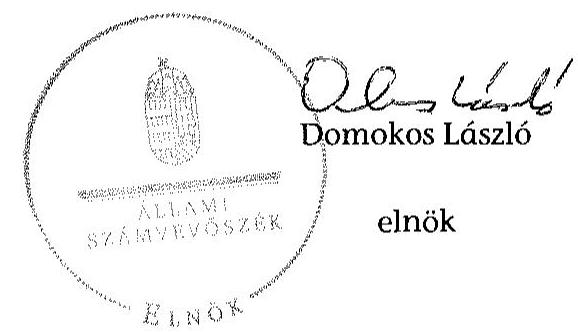

# JELENTÉS 

a költségvetési támogatásban részesülő pártok 2012-2013. évi gazdálkodása törvényességének ellenőrzéséről Jólét és Szabadság Demokrata Közösség

---

# Állami Számvevőszék 

Iktatószám: V-0714-055/2015.
Témaszám: 1748
Vizsgálat-azonosító szám: V070003

## Az ellenőrzést felügyelte:

Dr. Benedek Mária
felügyeleti vezető
Az ellenőrzést vezette és a végrehajtásáért felelős:
Bialkó Zsolt Gyula
ellenőrzésvezető
Az ellenőrzést végezték:
Puskás Balázs Tóth Richárd
számvevő
Dr. Szabóné Nagy Katalin
számvevő

A témához kapcsolódó korábban készített számvevőszéki jelentés:
címe
sorszáma
Jelentés a Jólét és Szabadság Demokrata Közösség 2010-2011. évi 12110
gazdálkodása törvényességének ellenőrzéséről

---

# TARTALOMJEGYZÉK 

BEVEZETÉS ..... 5
I. ÖSSZEGZŐ MEGÁLLAPÍTÁSOK, KÖVETKEZTETÉSEK ..... 7

---

.

---

# RÖVIDÍTÉSEK JEGYZÉKE 

## Törvények

ÁSZ tv.
Párt tv.

## Szórövidítések

ÁSZ
Párt
az Állami Számvevőszékről szóló 2011. évi LXVI. törvény
a pártok müködéséről és gazdálkodásáról szóló 1989. évi XXXIII. törvény

Állami Számvevőszék
Jólét és Szabadság Demokrata Közösség

---

- 
-

---

# JELENTÉS 

## a költségvetési támogatásban részesülő pártok 2012-2013. évi gazdálkodása törvényességének ellenőrzéséről

## Jólét és Szabadság Demokrata Közösség

## BEVEZETÉS

Az Állami Számvevőszékről szóló 2011. évi LXVI. törvény (ÁSZ tv.) 5. § (11) bekezdése a) pontja, valamint a pártok múködéséről és gazdálkodásáról szóló 1989. évi XXXIII. törvény (Párt tv.) 10. § (1) bekezdése alapján a pártok gazdálkodása törvényességének ellenőrzésére az ÁSZ jogosult. Az ÁSZ a rendszeres költségvetési támogatásban részesülő pártok gazdálkodását a Párt tv. 10. § (3) bekezdésében előírtak szerint kétévenként ellenőrzi. Az ÁSZ legutóbb 2012-ben ellenőrizte a Párt 2010-2011. évi gazdálkodása törvényességét.
A Párt a törvényi előírásoknak megfelelően az ellenőrzött időszak mindkét évében 42,8 M Ft központi költségvetésből juttatott támogatásban részesült.
Az ellenőrzés célja annak értékelése volt, hogy a közzétett éves beszámolók a törvényi előírásoknak megfeleltek-e, a könyvvezetés és gazdálkodás során betartották-e a vonatkozó jogszabályi és belső előírásokat; a Párt a működéséhez szabályszerűen igénybe vehető forrásokat használt-e fel; az előző ÁSZ ellenőrzés során tett felhívásokat végrehajtotta-e.
Az ellenőrzés várható hasznosulásaként a gazdálkodás szabályszerűségének, a felhasznált közpénzek nagyságának bemutatásával a társadalom objektív képet alkothat a pártok múködéséről. Az ellenőrzés megállapításai elősegíthetik, hogy a törvényalkotók konkrét lépéseket tegyenek a pártok finanszírozására vonatkozó szabályozások megváltoztatása, átláthatóbbá, ellenőrizhetőbbé tétele irányába. A gazdálkodás megfelelőségének bemutatásával az ellenőrzés értékteremtő módon járul hozzá a „jó kormányzás" megvalósításához. Az ellenőrzés rámutat a Párt gazdálkodásával, valamint az állami költségvetésből származó források felhasználásával kapcsolatos jó gyakorlatokra és szabálytalanságokra. A hiányosságok, szabálytalanságok feltárása, az ennek kapcsán megfogalmazott megállapítások elősegíthetik a törvényi rendelkezések megsértésének szankcionálását.
Az ellenőrzést a pénzügyi-szabályszerüségi ellenőrzés szabályai szerint, a Legfőbb Ellenőrző Intézmények Nemzetközi Szervezete (INTOSAI) által kiadott nemzetközi standardok (ISSAI) figyelembevételével végezte az ÁSZ.

---

Az ellenőrzés során figyelembe kellett venni azt, hogy

- a Párt tv. 1. számú melléklete szerinti beszámoló mintához magyarázatot, útmutatót nem készítettek a jogalkotók, így ennek kitöltése pártonként - a kialakított számviteli politikájuknak megfelelően - eltérő lehet;
- a beszámoló minta a számviteli törvény rendelkezéseivel nem harmonizál, nem felel meg sem a mérleg, sem az eredmény kimutatás követelményeinek.
Az ellenőrzött időszak: 2012. január 1. - 2013. december 31.
Az ellenőrzés jogszabályi alapját az ÁSZ tv. 5. § (11) bekezdés a) pontja, valamint a Párt tv. 10. § (1) és (3) bekezdései képezték.

Az Ász tv. 29. § (1) bekezdésében foglaltak alapján a jelentéstervezetet megküldtük a JESZ elnöke részére, aki az ÁSZ tv. 29. § (2) bekezdésében foglalt észrevételezési jogával élt, azonban a tett észrevételek tartalmuknál fogva nem tekinthetők észrevételnek, mivel azok az ÁSZ megállapításában foglaltak okaira adnak magyarázatot.

---

# I. ÖSSZEGZŐ MEGÁLLAPÍTÁSOK, KÖVETKEZTETÉSEK 

A költségvetési támogatásban részesülő pártok 2012-2013. évi gazdálkodása törvényességének ellenőrzése során a Párt a számvevőszéki ellenőrzés ellenőrzési program szerinti lefolytatásához szükséges dokumentumokat teljes körűen nem bocsátotta az ÁSZ rendelkezésére, ezzel nem tette lehetővé az ellenőrzési programban meghatározott kockázatbecslési munkalapok kitöltését és az ellenőrzési mintavételezés elvégzését, ezáltal az ellenőrzés lefolytatását meghiúsította.
Az ÁSZ jelzéssel élt az ÁSZ tv. 28. § (5) bekezdésében és a 33. § (3) bekezdés a) pontjában, továbbá az ügyészségről szóló 2011. évi CLXIII. törvény 5. § (2) bekezdésében foglalt rendelkezések alapján az illetékes hatóság felé.

Budapest, 2015. 04 . hónap 21 . nap
