# ÁLLAMI   SZÁMVEVŐSZÉK 

## JELENTÉS

a központi alrendszer egyes intézményei pénzügyi és vagyongazdálkodásának ellenőrzéséről
Közigazgatási és Elektronikus Közszolgáltatások Központi Hivatala

---

# Állami Számvevőszék 

Iktatószám: V-0648-502/2015.
Témaszám: 18
Vizsgálat-azonosító szám: V-067903

## Az ellenőrzést felügyelte:

Holman Magdolna Julianna
felügyeleti vezető
Az ellenőrzést vezette és az ellenőrzés végrehajtásáért felelős:
Dr. Jakab Kornél
ellenőrzésvezető
A jelentés összeállításában közreműködött:
Marozsán Katalin
számvevő tanácsos
Az ellenőrzést végezték:

| Giday Zoltán | Kovács Richárd | Marozsán Katalin |
| :-- | :-- | :-- |
| számvevő tanácsos | számvevő | számvevő tanácsos |
| Molnár Antal Lászlóné | Perlusz Krisztina | Samu István |
| számvevő | számvevő | számvevő tanácsos |

A témához kapcsolódó eddig készített számvevőszéki jelentések:
címe
sorszáma
Jelentés a Magyar Köztársaság 2008. évi költségvetése végrehajtásának ellenőrzéséről
Jelentés Magyarország 2012. évi központi költségvetése végrehajtásának ellenőrzéséről
Jelentés a 2013. évi zárszámadásról - Magyarország 2013. évi költségvetése végrehajtásának ellenőrzéséről

---

# TARTALOMJEGYZÉK 

BEVEZETÉS ..... 3
I. ÖSSZEGZŐ MEGÁLLAPÍTÁSOK, KÖVETKEZTETÉSEK, JAVASLATOK ..... 8
II. RÉSZLETES MEGÁLLAPÍTÁSOK ..... 13

1. Az irányító szerv feladatellátása ..... 13
2. A Hivatal átalakítása, feladatváltozása ..... 14
3. A belső kontrollrendszer szabályszerűsége és az integritás kontrollok kialakítása és működtetése ..... 15
4. A Hivatal pénzügyi gazdálkodása ..... 18
4.1. Az előirányzatok megállapítása és módosítása ..... 18
4.2. A kiadási előirányzatok felhasználása és a bevételi előirányzatok teljesítése ..... 20
4.3. Az előirányzat-maradvány megállapítása és felhasználása ..... 22
4.4. A fizetőképesség alakulása ..... 23
5. A Hivatal vagyongazdálkodása ..... 25
5.1. A vagyongazdálkodás szabályozottsága ..... 25
5.2. Az eszközök és források értékének kimutatása, az eszközök értékének megőrzése ..... 26
5.3. A vagyonátadás és -átvétel, a vagyonelemek hasznosítása ..... 29
5.4. Az eredmény szemléletű számvitel bevezetésével kapcsolatos feladatok végrehajtása ..... 30
6. A korábbi ÁSZ ellenőrzések során a Hivatallal kapcsolatban tett javaslatok hasznosulása ..... 30

---

# MELLÉKLETEK 

1. számú A Közigazgatási és Elektronikus Közszolgáltatások Központi Hivatala feladatellátása a 2008-2013. közötti években
2. számú A Közigazgatási és Elektronikus Közszolgáltatások Központi Hivatala bevételi, kiadási előirányzatainak és teljesítésének alakulása a 2008-2013. közötti években
3. számú A Közigazgatási és Elektronikus Közszolgáltatások Központi Hivatala vagyonának alakulása 2008. január 1. és 2013. december 31. között
4. számú A Közigazgatási és Elektronikus Közszolgáltatások Központi Hivatala elnökének jelentéstervezethez tett észrevétele
5. számú Az ÁSZ válasza a Közigazgatási és Elektronikus Közszolgáltatások Központi Hivatala elnökének jelentéstervezethez tett észrevételéhez
6. számú A Belügyminisztérium miniszterének jelentéstervezethez tett észrevétele
7. számú Az ÁSZ válasza a Belügyminisztérium miniszterének jelentéstervezethez tett észrevételéhez

## FÜGGELÉKEK

1. számú Rövidítések jegyzéke
2. számú Értelmező szótár
3. számú A gazdaságossági, hatékonysági és eredményességi követelmények kialakítása, a vezetői nyilatkozat helytállósága

---

# JELENTÉS 

## a központi alrendszer egyes intézményei pénzügyi és vagyongazdálkodásának ellenőrzéséről

## Közigazgatási és Elektronikus Közszolgáltatások Központi Hivatala

## BEVEZETÉS

A közpénzek felhasználásában és az állami vagyonnal való gazdálkodásban a központi alrendszer egyes intézményei meghatározó súlyt képviselnek. Pénzügyi- és vagyongazdálkodásuk rendszeres ellenőrzésével az ÁSZ hozzájárul a hatékony közigazgatás megteremtéséhez. Az ÁSZ Stratégiával összhangban a közvagyon védelme, a közpénzügyek átláthatóságának előmozdítása érdekében került sor a Közigazgatási és Elektronikus Közszolgáltatások Központi Hivatala (a továbbiakban: Hivatal) ellenőrzésére.

A Hivatal az elektronikus közszolgáltatásokhoz, valamint egyes központi közigazgatási nyilvántartási rendszerekhez kapcsolódó adatkezelési és hatósági feladatok ellátásáért, azok fejlesztéséért és üzemeltetéséért, valamint a nem polgári célú frekvenciagazdálkodással kapcsolatos közigazgatási feladatok ellátásáért felelős központi hivatal, amelyet a Magyar Köztársaság Kormánya 2007. január 1-jei hatállyal alapított. Jogelőd szervezetei a BM Központi Adatfeldolgozó, Nyilvántartó és Választási Hivatal, a BM Távközlési Szolgálat, valamint a Kormányzati Frekvenciagazdálkodási Hivatal voltak. Feladatait a Közigazgatási és Elektronikus Közszolgáltatások Központi Hivatala létrehozásáról, feladatairól és hatásköréről szóló 276/2006. (XII. 23.) Korm. rendelet állapította meg. A Hivatal az ellenőrzött időszakban az okmányokhoz kapcsolódó előállítási, adatszolgáltatási és hatósági-igazgatási feladatokat, közlekedés igazgatási feladatokat, hatósági nyilvántartási és adatszolgáltatási feladatokat látott el, szakmai támogatást nyújtott az okmányirodák részére, gondoskodott a közigazgatási informatikával összefüggő feladatok ellátásáról, a fővárosi és megyei kormányhivatalok informatikai irányításáról, továbbá közreműködött a választásokkal és a népszavazásokkal kapcsolatos feladatok ellátásában. Az ellenőrzött időszakban a Hivatal feladatstruktúrája 5 alkalommal változott, a feladatváltozásokat az 1. számú melléklet mutatja be.

A Hivatal alapításától előirányzatai felett teljes jogkörrel rendelkező, önállóan gazdálkodó, 2009. július 1-jétől gazdasági szervezettel rendelkező, önállóan működő és gazdálkodó költségvetési szerv. Költségvetése önálló költségvetési fejezetet nem képzett. A Hivatalt a rendelet szerint 2008. január 1-jétől 2012. december 30-ig a közigazgatási informatikáért felelős miniszter irányította. Az

---

irányítószervi feladatok ellátása 2008. január 1-jétől 2010. május 28-ig a Miniszterelnöki Hivatalt vezető miniszter, 2010. május 29-től 2012. december 30-ig a közigazgatási és igazságügyi miniszter kizárólagos felelősségi körébe tartozott. A Hivatalt 2012. december 31-től 2013. december 31-ig az e-közigazgatásért felelős miniszter irányította, mely feladatot a közigazgatási és igazságügyi miniszter látta el. A szakmai irányítási feladatok ellátásához kapcsolódó irányítói jogokat a rendeletben ügycsoportonként meghatározott más miniszterekkel közösen gyakorolta.

A Hivatal szerkezetében, szervezeti felépítésében az ellenőrzött időszakban hatályos SZMSZ alapján háromszor történt változás. A Hivatalt az ellenőrzéssel érintett időszakban elnök vezette, munkáját négy, 2011. április 21-étől öt elnökhelyettes segítette.

Az intézményi költségvetés volumenének alakulását a következő diagram szemlélteti (az adatok a függő és átfutó tételeket nem tartalmazzák):
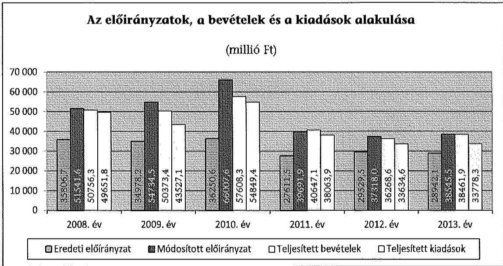

A Hivatal könyvviteli mérleg szerinti vagyona 2008. január 1-jén 18 856,7 M Ft, az ellenőrzött időszak végén 21 259,1 M Ft volt. A befektetett eszközök mérlegértéke 13 460,5 M Ft-ról 15 183,9 M Ft-ra változott. A forrásokon belül a saját tőke és a tartalékok 18 083,9 M Ft nyitó értéke a 2013. év végére 17 731,7 M Ft lett, a kötelezettségek összege pedig 772,8 M Ft-ról 2754,6 M Ft-ra módosult. A Hivatal engedélyezett létszámkerete a 2008. évi 824 főről (betöltött 748 fő) a 2013. évre 729 főre (betöltött 715 fő) csökkent.

Az ellenőrzés célja annak megállapítása volt, hogy a Hivatalra vonatkozó irányító szervi feladatellátás a jogszabályi előírások betartásával történt-e; a Hivatalnál a belső kontrollrendszer kialakítása és működtetése szabályszerű volt-e; kialakították-e az erőforrásokkal való szabályszerű és hatékony gazdálkodáshoz szükséges követelményeket, megvalósították-e azok számon kérését, ellenőrzését; a Hivatal pénzügyi és vagyongazdálkodása megfelelt-e a jogszabályi előírásoknak és belső szabályzatainak; a Hivatal átalakításának vagy átszervezésének lebonyolítása szabályszerűen történt-e; az integritási kontrollokat kialakították-e, szabályszerűen működtetik-e; az ÁSZ korábbi ellenőrzései

---

során megfogalmazott javaslatok, megállapítások tekintetében az ellenőrzés célja továbbá annak megítélése volt, hogy azok végrehajtása érdekében a Hivatal a szükséges intézkedéseket megtette-e.

A Hivatalt az ÁSZ a 2008. január 1-je és 2013. december 31-e közötti időszakban a 2008. évi, a 2012. évi és a 2013. évi zárszámadási ellenőrzés keretében ellenőrizte.

Az ellenőrzés várható hasznosulása: A központi alrendszerbe tartozó intézmények jelentős hatást gyakorolhatnak a költségvetés egyensúlyának fenntartására, az állami vagyonnal való gazdálkodás minőségére, a kormányzati (szak)politikák végrehajtására, illetve közfeladat ellátásuk vonatkozásában az állampolgárok életminőségére, jogaik és kötelezettségeik gyakorlására. Az ellenőrzés a Hivatal pénzügyi és vagyongazdálkodása szabályosságának javításával előmozdítja a közpénzügyek átláthatóságát, rendezettségét. Eredményeként átfogó képet kaphatunk a Hivatal gazdálkodásának hiányosságairól és a jó gyakorlatokról is.

A közintézmények integritás alapú kultúrája meghatározó a belső kontrollrendszer működése szempontjából. Hozzájárulhat az elszámoltathatóság és átláthatóság érvényesítéséhez, egyben támogathatja a szervezet védettségét a korrupciós kitettséggel szemben. Az integritási kontrollok ellenőrzése az integritási szemlélet terjedését, az integritás kultúra erősítését támogatja.

Az ellenőrzés egyben hozzájárul az eredményszemléletű számvitel bevezetésével összefüggő feladatok végrehajtásához.

A belső kontrollrendszer államháztartási törvényben rögzített célja a működés és gazdálkodás során a tevékenységek szabályszerű, gazdaságos, hatékony és eredményes végrehajtása. Az ÁSZ a központi intézmények ellenőrzését teljesítményellenőrzési modullal egészítette ki.

A Hivatal teljesítmény-ellenőrzésének célja annak értékelése volt, hogy a gazdálkodás folyamatában a gazdaságossági, hatékonysági és eredményességi követelmények kialakítása megtörtént-e és azokat működtették-e; a költségvetési szerv belső kontrollrendszerének minőségéről kiadott vezetői nyilatkozatban a költségvetési szerv tevékenységében a hatékonyság, eredményesség, gazdaságosság követelményeinek érvényesítése helytálló volt-e. A teljesítményellenőrzés a gazdálkodási feladatokra terjedt ki, a szakmai feladatellátást nem értékelte.

A teljesítményellenőrzés várható hasznosulása: A törvényalkotás számára támogatást nyújt a nemzeti kulcsindikátorok rendszerének kialakításához. A döntéshozók, ellenőrzöttek, irányító szervek, a társadalom számára összehasonlítási, összemérési lehetőségek kihasználásával objektív visszajelzést ad a gazdálkodás területén végrehajtott szervezeti, szervezési, takarékossági és bürokráciacsökkentő intézkedések hatásairól, a közfeladat-ellátásnak keretet adó pénzügyi és vagyongazdálkodásban mérhető teljesítménykövetelmények kialakításáról, azok alkalmazásáról. Az ÁSZ értékteremtő elemzéseivel, tanácsadó szerepét erősítve támogatja a szervezetek önértékelő, alkalmazkodó (öntanuló) tevékenységét. Irányt mutat az ellenőrzött intézmények gazdálkodási és

---

kapcsolódó adminisztratív folyamatainak optimalizációjához. Segíti a központi költségvetési szervek átláthatóságát, felügyelhetőségét, a „jó gyakorlatok" elterjesztésével támogatja a „jó kormányzást".

Az ellenőrzés típusa szabályszerűségi ellenőrzés, amelyet a Hivatalra vonatkozó teljesítmény-ellenőrzés egészített ki.

Az ellenőrzött időszak: 2008. január 1-jétől 2013. december 31-ig
A helyszíni ellenőrzésre a szabályszerűségi ellenőrzés tekintetében a Hivatalnál, a Hivatal irányító szervi feladatait ellátó minisztériumoknál került sor. A teljesítményellenőrzés vonatkozásában helyszíni ellenőrzésre a Hivatalnál került sor.

Az ellenőrzés jogszabályi alapját az ÁSZ tv. 1. § (3) bekezdés, 5. § (2)(6) bekezdései, valamint az Áht. ${ }_{2} 61 . \S$ (2) bekezdésének előírásai képezik.

A központi alrendszer intézményeinek ellenőrzése során a belső kontrollrendszer tekintetében a hangsúlyt az egyes kontrollterületek (kontrollkörnyezet, kockázatkezelési rendszer, kontrolltevékenységek, információs és kommunikációs rendszer, monitoring rendszer) kialakításának és az intézmény működési folyamataiba való beépülésének szabályszerűségére helyeztük, amelyet kizárólag jogszabályokból és intézményi belső szabályozásokból levezethető kritériumrendszer alapján ítéltünk meg.

A belső kontrollrendszer jogszabályi előírások szerinti kialakításának és működtetésének szabályszerűségét az erre irányuló ellenőrzési kérdésekre adott válaszok összesítése alapján kontrollterületenként egyedileg és összesítetten is értékeltük. A belső kontrollrendszer egyes kontrollterületei kialakítása és működtetése „szabályszerű volt", tehát a feltárt hiányosságok nem gyakoroltak lényeges hatást a kontrollok kialakítására és működtetésére, amennyiben az értékelt területen az elért és elérhető pontok százalékban kifejezett hányadosa elérte a 85%-ot, „nem volt szabályszerű", ha nem haladta meg a 60%-ot, és „részben szabályszerű volt", ha 61-84% között volt.

A belső kontrollrendszer összesített értékelése megegyezett a kontrollterületenként alkalmazott %-os értékelésekkel, a következő kiegészítéssel. A kontrollrendszer egésze esetében a „szabályszerű" értékelésnek a %-os értéken felül további feltétele volt, hogy egyik kontrollterületen sem kaphatott „nem volt szabályszerű" értékelést. A „részben szabályszerű" értékelés további feltétele volt, hogy legfeljebb egy ellenőrzött kontrollterület lehetett „nem volt szabályszerű" értékelésű. Az összesített értékelés a %-os kiértékelés eredményétől függetlenül „nem volt szabályszerű", ha az ellenőrzött kontrollterületek közül több mint egynek „nem volt szabályszerű" az értékelése.

A jogszabályoknak és a belső előírásoknak megfelelőnek, azaz szabályszerűnek tekintettük a személyi juttatások, a dologi és felhalmozási kiadások, valamint a pénzeszközátadások előirányzatai felhasználását, a vagyonhasznosítási bevételek, az előirányzat-módosítások és a kötelezettségvállalással terhelt maradványok megállapítását és felhasználását, amennyiben a minta ellenőrzésének eredménye alapján 95%-os bizonyossággal a teljes sokaságban a hibaarány kisebb volt, mint 10%, nem megfelelőnek értékeltük, ha a hibaarány a 10%-ot meghaladta. Kockázatot, illetve magas kockázatot jeleztünk, amennyiben egy adott terület vonatkozásában a minta alapján a teljes sokaságban nem volt teljes körűen biztosított a

 jogszabályoknak és a belső szabályzatoknak megfelelő működés.

A személyi juttatások, a dologi és felhalmozási kiadások, valamint a pénzeszközátadások előirányzatai felhasználásánál, a vagyonhasznosítási bevételek elszámolásánál a gazdálkodási jogkörök gyakorlását mintavétellel ellenőriztük. A 2008-2011. éveket érintően a szakmai teljesítésigazolás és az utalvány ellenjegyzése kulcskontrollok, a 2012-2013. éveket érintően a teljesítésigazolás és az érvényesítés kulcskontrollok működését értékeltük. Megfelelőnek értékeltük a gazdálkodási jogkörök gyakorlását, amennyiben 95%-os bizonyossággal a teljes sokaságban a hibaarány legfeljebb 10%, részben megfelelőnek értékeltük, ha a hibaarány felső határa legfeljebb 30%, nem megfelelőnek pedig akkor, ha a sokaságbeli hibaarány felső határa meghaladta a 30%-ot.

Az ellenőrzés az INTOSAI által kiadott nemzetközi standardok (ISSAI) figyelembe vételével, az ellenőrzési programban foglalt értékelési szempontok szerint történt.

Az Állami Számvevőszékről szóló 2011. évi LXVI. törvény 29. §-a szerint a jelentéstervezetet megküldtük egyeztetésre a Belügyminisztérium és a Közigazgatási és Elektronikus Közszolgáltatások Központi Hivatala részére. A beérkezett észrevételt és az erre adott választ, és annak indokolását a jelentés 4-5. számú mellékletei tartalmazzák.

---

# I. ÖSSZEGZŐ MEGÁLLAPÍTÁSOK, KÖVETKEZTETÉSEK, JAVASLATOK 

#### Abstract

Az irányító szerv a Hivatallal kapcsolatos alapítói, irányító szervi és ellenőrzési jogosultságait - a feltárt hiányosságok kivételével - összességében a jogszabályi előírásoknak megfelelően gyakorolta. Az irányító szerv a teljes ellenőrzött időszakban nem határozta meg írásban az erőforrásokkal való szabályszerű és hatékony gazdálkodáshoz szükséges követelményeket, valamint részben tett csak eleget az ellenőrzési kötelezettségének. A Hivatal 2008-ban nem rendelkezett SZMSZ-el, így nem volt szabályozás a feladatkörök meghatározására és a felelősségi körök elhatárolására.

A Hivatal átalakítására az ellenőrzött időszakban nem került sor. A Hivatal feladatátadás-átvételét az ellenőrzött időszakban jogszabályi módosítások és kormányhatározatok alapozták meg. A Hivatal feladatváltozásait az alapító okiratok és a miniszteri utasításként kiadott SZMSZ-ek is rögzítették.

A belső kontrollrendszer kialakítása és működtetése a 2008-2009. években nem volt szabályszerű, míg a 2010-2013. években részben szabályszerű volt, az az ellenőrzött időszakban javuló tendenciát mutatott.

A kontrollkörnyezet kialakítása a 2008. évben részben szabályszerű, 2009-2013. között szabályszerű volt. A kialakított és működtetett kontrollkörnyezet - a feltárt hiányosságok ellenére - lehetővé tette a szabályszerű működést. A Hivatal ellenőrzési nyomvonallal a teljes ellenőrzött időszakban, szabálytalanságkezelési eljárásrenddel 2011. szeptember 11-ig nem rendelkezett, továbbá a belső szabályzatok a jogszabályokban meghatározott egyes tartalmi elemeket nem teljes körűen tartalmazták és azokon a jogszabályi változásokat nem vezették át.

A kockázatkezelési rendszer 2008-2013. között nem került kialakításra, így a kockázatkezelési rendszer működése nem volt szabályszerű, a Hivatal az ellenőrzött időszakban a tevékenységével kapcsolatos kockázatokat dokumentáltan nem mérte fel.

A kontrolltevékenység a 2008-2009. években nem volt szabályszerű, míg a 2010-2013. években szabályszerűre változott. A kulcskontrollok működése a 2008-2009. években nem volt megfelelő, a 2010-2013. években megfelelő volt. 2008-ban érvényesen nem határozták meg a gazdálkodási jogkörgyakorlók személyét, 2009. október 21-étől határozták meg a szabályzatokban a szakmai teljesítésigazolásra jogosultak személyét.

Az információs és kommunikációs rendszer kialakítása a 2008. évben szabályszerű volt, a 2009-2013. években részben szabályszerűre változott, de annak működése az ellenőrzött időszakban támogatta a Hivatal működését.

---

A monitoring-rendszer kialakítása és működése a 2008-2012. években részben szabályszerű, a 2013. évben szabályszerű volt. A Hivatal az ellenőrzött években a gazdasági szervezet ügyrendjében határozta meg az operatív tevékenységével kapcsolatos eseti és folyamatos nyomon követés feladatait és felelőseit. A Hivatal vezetője nem gondoskodott arról, hogy tevékenységében és céljaiban a gazdaságosság, a hatékonyság és az eredményesség követelményei érvényesüljenek, mivel azokat nem alakította ki és nem alkalmazta. A monitoring rendszer részeként a belső ellenőrzés működése a 2008. év kivételével megfelelő volt.

Az ÁSZ az integritás szemlélet érvényesülését a Hivatal adatszolgáltatása alapján a 2013. évre vonatkozóan értékelte. Az önértékelés eredménye alapján a szervezetnél jelenlévő korrupciós kockázatok, valamint az azok kezelésére kiépült kontrollok szintje között egyensúly van. Így a kiépült kontrollok képesek kezelni a kockázatokat, valamint hatékonyan támogatni a szervezet feladatellátását.

A Hivatal pénzügyi gazdálkodásával kapcsolatban az ellenőrzés megállapította, hogy a 2008-2009. években a gazdálkodási jogkörök gyakorlása, a kulcskontrollok működése - mind a kiadások, mind a bevételek esetében nem volt megfelelő. A 2010-2013. években a gazdálkodási jogköröket már megfelelően gyakorolták. Az előirányzat-módosítások a jogszabályi előírások és a belső szabályozásoknak megfelelően történtek. Az előirányzat-maradványok mintatételeinél a kötelezettségvállalással terhelt maradvány felhasználása kockázatos volt. A kötelezettségvállalással terhelt előirányzat-maradvány analitikus nyilvántartása az ellenőrzött években - a 2012. évi nyilvántartást kivéve - nem egyezett meg a jóváhagyott előirányzatmaradvány összegével.

A kiadási előirányzat felhasználásának ellenőrzése során megállapítottuk, hogy több szolgáltatási szerződés esetében a Hivatal a Kbt. egybeszámítási szabályainak figyelembe vétele nélkül közbeszerzési eljárás lefolytatása mellőzésével kötött szerződést, valamint a közbeszerzési értékhatárt elérő szolgáltatásokkal összefüggésben, több esetben sem folytatott le közbeszerzési eljárást.

A Hivatal pénzügyi helyzetével kapcsolatban megállapítást nyert, hogy a 2009-2010. években a szállítói kötelezettségek év végi állománya jelentősen meghaladta a rendelkezésre álló pénzügyi forrást. A Hivatal gazdálkodásának felügyeletére előbb kincstári biztost, majd költségvetési főfelügyelőt rendeltek ki. A rövid lejáratú tartozások miatti eladósodottság a költségvetési többlettámogatás, valamint a Hivatal által megtett intézkedések következtében a 2011-2013. évekre csökkent. Az ellenőrzött időszakban a Hivatal nem lépte túl a számára jóváhagyott kiadási előirányzatot.

A vagyongazdálkodási tevékenység szabályozottsága részben felelt meg a jogszabályi előírásoknak, és a kapcsolódó belső kontrollok kialakítása és működtetése nem volt megfelelő.

A számviteli politika és kapcsolódó szabályzatai megfelelő keretet biztosítottak a vagyonváltozások könyvviteli elszámolásához, azonban az üzemeltetésre átadott eszközök leltározását nem az üzemeltetést végző szerv által megküldött,

---

hitelesített leltárral írták elő. Az ellenőrzött időszakban az önköltségszámítási szabályzat nem tartalmazta az önköltség számítás alapjául szolgáló, és a Hivatal tevékenységeire vonatkozó bekerülési érték meghatározásának módját.

A mérlegben kimutatott eszközök és források értékének megállapítása, nyilvántartása csak részben felelt meg a jogszabályi előírásoknak. Az egyeztetéssel leltározott eszközök - a követelések és az aktív pénzügyi elszámolások - és a források - saját tőke, kötelezettségek, passzív pénzügyi elszámolások - leltárának alapbizonylatai a 2008-2011. évekre vonatkozóan nem voltak fellelhetőek. A leltárkészítés és kiértékelés módja nem felelt meg a leltározási szabályzat, illetve a leltárutasítás előírásainak sem. A 2012-2013. években az egyeztetéses leltár megfelelt az előírásoknak.

A 2008-2013. években a vevőkövetelésekre nem számolták el a jogszabályi előírások szerinti értékvesztést, az adósok értékvesztés elszámolása nem felelt meg a jogszabályi előírásoknak, ezáltal sérült a számviteli törvénybe foglalt valódiság és óvatosság számviteli alapelv.

Az ellenőrzött időszakban a főkönyv és az analitika közötti egyezőség az aktív és passzív pénzügyi elszámolásoknál nem állapítható meg, mert dokumentált, tételes egyeztetés nem készült.

A Hivatal az eredményszemléletű számvitelre történő áttérés feladatait a jogszabályi előírásoknak megfelelően végezte el, a rendező mérleget szabályszerűen készítette el.

Az ÁSZ a 2008. évi zárszámadási ellenőrzése keretében a lényegességi küszöböt el nem érő, a beszámoló megbízhatóságát nem befolyásoló hibákra, hiányosságokra hívta fel a figyelmet és 13 javaslatot fogalmazott meg. A javaslatokra a Hivatal elnöke intézkedési tervet hagyott jóvá. Az intézkedési tervben foglaltak végrehajtására és a szabályozási környezet változásaira is tekintettel megállapítható, hogy az ÁSZ javaslatai hasznosultak.

A helyszíni ellenőrzés megállapításainak hasznosítása mellett javasoljuk:

# a belügyminiszternek 

Az irányító szerv vezetője az ellenőrzött időszakban nem határozta meg, nem érvényesítette, nem kérte számon és nem ellenőrizte az erőforrásokkal való szabályszerű és hatékony gazdálkodáshoz szükséges, 2008. december 31-ig az Áht. 49. § b) pontjában, 2012. január 1-ig a 49. § (5) bekezdés f) pontjában, majd azt követően az Áht. 29. § (1) bekezdés f) pontjában foglalt követelményeket.

Javaslat:
Intézkedjen a Hivatal által ellátandó közfeladatok ellátására vonatkozó, erőforrásokkal való szabályszerű és hatékony gazdálkodáshoz szükséges követelmények kialakítására, számonkérésére és ellenőrzésére.

---

# a Közigazgatási és Elektronikus Közszolgáltatások Központi Hivatala elnökének 

1. A számlarend₄-en - 2010. május 20-ai hatálybalépése óta - nem vezették át a Számv. tv. és az Áhsz. előírásainak változásából eredő módosításokat, ezáltal a Számv. tv. 161. § (5) bekezdésében foglalt, a szükséges módosításra vonatkozó 90 napos határidőt nem tartották be.

Az önköltség-számítási szabályzat₄ 2010. május 20-ai hatályba lépése óta nem tartalmazta a jogszabályi környezet változása miatti módosításokat, mellyel nem tartották be a Számv. tv. 14. § (11) bekezdésében foglalt, a szükséges módosításra vonatkozó 90 napos határidőt.

Javaslat:
Intézkedjen a számviteli politika és a számlarendben jogszabályi változásokat követő módosításáról.
2. A Hivatalnál az etikai elvárások a szervezeti struktúra minden szintjén 2009. január 1-jétől nem kerültek meghatározásra, ez nem felelt meg az Ámr.₁ 145/D. § c) pont, az Ámr.₂ 156. § (1) bekezdés c) pont, a Bkr. 6. § (1) bekezdés c) pont előírásának.

Javaslat:
Intézkedjen olyan kontrollkörnyezet kialakítására, amelyben meghatározottak az etikai elvárások a szervezet minden szintjén.
3. A Hivatalnál az ellenőrzött időszakban kockázatkezelési rendszer nem került kialakításra, ezzel nem tartották be az Ámr.₁ 145/C. §, az Ámr.₂ 157. § és a Bkr. 7. § előírásait.

Javaslat:
Intézkedjen kockázatkezelési rendszer kialakítására és annak működtetésére.
4. A Hivatal az Ámr.₁ 145/B. §, az Ámr.₂ 156. § (2) bekezdés és a Bkr. 6. § (3) bekezdés rendelkezéseit megsértve ellenőrzési nyomvonallal nem rendelkezett a 2008-2013. évekre.

Javaslat:
Intézkedjen a Hivatal ellenőrzési nyomvonalának elkészítésére.
5. A Hivatal vezetője nem gondoskodott arról, hogy tevékenységében és céljaiban a gazdaságosság, a hatékonyság és az eredményesség követelményei érvényesüljenek, mivel azokat az Áht. 94. § (1) bekezdés b) pontjában, az Áht. 61. § (1) bekezdésben, az Áht. 69. § (1) bekezdés a) pontjában és a Bkr. 4. § a) pontjában foglaltak ellenére nem alakította ki és nem alkalmazta.

Javaslat:

---

Intézkedjen a Hivatal tevékenységére és céljára vonatkozó hatékonysági, eredményességi és gazdaságossági mérhető követelmények kialakítására és érvényesítésére.
6. A kiadási előirányzat felhasználásának ellenőrzése során megállapítottuk, hogy több szolgáltatási szerződés esetében a Hivatal a Kbt. egybeszámítási szabályainak figyelembe vétele nélkül közbeszerzési eljárás lefolytatása mellőzésével kötött szerződést, valamint a közbeszerzési értékhatárt elérő szolgáltatásokkal összefüggésben, több esetben sem folytatott le közbeszerzési eljárást.

Javaslat:
Intézkedjen a kiadási előirányzatok felhasználása során a közbeszerzési törvény betartására.
7. A követelések értékelése nem felelt meg az Áhsz. és az értékelési szabályzat₁₋₄ előírásainak, ezáltal sérült a Számv. tv. 15. § (3) illetve (8) bekezdésében foglalt valódiság és óvatosság számviteli alapelv.

Javaslat:
Intézkedjen, hogy a mérlegtételek értékelése feleljen meg a jogszabályi előírásoknak.

---

# II. RÉSZLETES MEGÁLLAPÍTÁSOK 

## 1. Az irányító szerv feladatellátása

Az irányító szerv a Hivatallal kapcsolatos alapítói jogosultságait - a feltárt hiányosságok kivételével - az Áht.₁₂ és a Kt. előírásainak megfelelően gyakorolta. Az ellenőrzött időszakban a Hivatalra vonatkozóan négy alapító okiratot adtak ki. Az irányító szerv által kiadott alapító okiratok megfeleltek az Ámr.₁₂ és az Ávr. előírásainak. Az alapító okirat módosítására az irányító szerv változása, a
 szakfeladat-rend módosítása, a vállalkozási tevékenység arányának módosítása, valamint jogszabályi változások miatt került sor.

A Hivatalnak a 2008. évben nem volt hatályos SZMSZ-e, a 2007. január 1-jétől hatályos alapító okirata alapján a Hivatal szervezetét és működésének rendjét az irányító szerv az Ámr. ${ }_{1} 10 . \S$ (5) bekezdésében foglaltak ellenére csak 2008. december 19-én határozta meg. SZMSZ hiányában nem volt érvényes szabályozás a Hivatal szervezeti felépítésére és működési rendszerére. Elmaradt a szervezeti egységek (ezen belül a gazdasági szervezet) megnevezése, továbbá a kiadmányozás rendjének, illetve a kiegészítő és kisegítő tevékenység végzése rendjének meghatározása, amit az alapító okirat az SZMSZ hatáskörébe utalt.

A KEKKH 2007 decemberében elkészítette az SZMSZ tervezetét, amelyet 2008. január 30-án felterjesztett a Miniszterelnöki Hivatalt vezető miniszternek. Az észrevételek, javaslatok alapján a KEKKH átdolgozta az SZMSZ tervezetet és kiegészítette a közigazgatási informatikával összefüggő új feladatokkal, majd 2008. április 30-án ismételten felterjesztette az SZMSZ tervezetet a MeH közigazgatási informatikáért felelős kormánybiztosa részére. Az SZMSZ tervezet minisztériumi jóváhagyása elhúzódott, az SZMSZ ${ }_{1}$-et 2008. december 19-én hirdették ki.

Az SZMSZ ${ }_{1}$ 2009. január 1-jén lépett hatályba, azonban csak részben volt megfelelő, mert nem tartalmazta a költségvetési szerv nyilvántartási számát, törzskönyvi azonosító számát, az alapítás időpontját, szakfeladat-rend szerinti besorolást, a szervezeti egységek engedélyezett létszámát, és a költségvetési szerv szervezeti ábráját. Ezzel megsértették az Ámr. ${ }_{1} 13/A. §$ (3) bekezdés b), c), d) pontjait, valamint az Ámr. ${ }_{2} 20 . \S$ (2) bekezdés b), c), e) és i) pontjaiban foglaltakat.

Az SZMSZ ${ }_{2}$, amely 2011. április 21-étől 2013. december 5-éig volt hatályban, részben felelt meg a jogszabályi előírásoknak. Az SZMSZ ${ }_{2}$ nem tartalmazta az alapító okirat keltét, valamint hibás volt az alapító okirat száma, illetve nem tartalmazta a költségvetési szerv által ellátandó tevékenységek szakfeladat-rend szerinti besorolását. Ezáltal az irányító szerv nem tett eleget az Ámr. ${ }_{2} 20 . \S$ (2) bekezdés b) és c) pontjában, illetve az Ávr. 13. § (1) bekezdés b) és c) pontjában előírt jogszabályi kötelezettségnek.

Az SZMSZ ${ }_{3}$ 2013. december 6-ától volt hatályos, amelyet az irányító szerv az Ávr. előírásainak megfelelően adott ki.

---

# Az irányító szerv a Hivatallal kapcsolatos irányítási jogosultságokat a jogszabályi előírásoknak megfelelően gyakorolta. 

Az elnök, az elnökhelyettesek, a gazdasági elnökhelyettesek kinevezése és felmentése, továbbá a vezetői megbízás adása, visszavonása az Áht. ${ }_{1,2}$ előírásainak megfelelően történt. Az irányító szerv az ellenőrzött időszak minden évében jóváhagyta a Hivatal éves költségvetési tervét. Az irányító szerv vezetője a zárszámadás keretein belüli szakmai beszámolókon keresztül minden évben beszámoltatta a Hivatal vezetőjét az Áht. ${ }_{1,2}$ szerinti szakmai feladatellátásról. Az irányító szerv vezetője minden évben jóváhagyta az Áht. ${ }_{1,2}$ előírásai szerint a Hivatal éves gazdálkodásáról szóló költségvetési beszámolót.

## Az irányító szerv részben tett eleget ellenőrzési kötelezettségének.

Az irányító szerv vezetője az ellenőrzött időszakban nem határozta meg, nem érvényesítette, nem kérte számon és nem ellenőrizte az erőforrásokkal való szabályszerű és hatékony gazdálkodáshoz szükséges, 2008. december 31-ig az Áht. ${ }_{1} 49 . \S$ b) pontjában, 2012. január 1-ig a 49.§ (5) bekezdés f) pontjában, majd azt követően az Áht. ${ }_{2} 9 . \S$ (1) bekezdés f) pontjában foglalt követelményeket.

Az irányító szerv a 2010-2011. években nem élt az Áht. ${ }_{1} 93 . \S$ (1) bekezdés d) pontjában előírt teljesítmény-ellenőrzés lehetőségével.

Az irányító szerv nem végzett az Áht. ${ }_{1}$ 2009-2011. években hatályos 49. § (5) bekezdés e) pontja szerinti, az államháztartással összefüggő közérdekű és közérdekből nyilvános adatok kötelező közzétételének, illetve igényre történő adatszolgáltatásának végrehajtásával kapcsolatos ellenőrzést a Hivatalnál.

A KIM két szabályszerűségi ellenőrzést végzett az ellenőrzött időszakban, 2010-ben és 2013-ban.

A KIM 2010-ben a „magyar igazolvány” és a „magyar hozzátartozói igazolvány” ukrajnai állampolgárok számára történt kiadását ellenőrizte. Az ellenőrzési jelentés két javaslatot fogalmazott meg, amelyre a Hivatal elnöke intézkedési tervet készített és a KIM közigazgatási államtitkár elfogadta azt.

A KIM 2013-ban ellenőrizte a Hivatal 2011. évi cafetéria juttatásait. Az ellenőrzési jelentés megállapította, hogy szabálytalan cafetéria elemet jelöltek meg választhatónak 2011-ben. A szabálytalanságok megszüntetésére a Hivatal intézkedési tervet készített.

## 2. A Hivatal átalakítása, feladatváltozása

## Az ellenőrzött időszakban nem került sor a Hivatal átalakítására.

A Hivatal feladatváltozásait az ellenőrzött időszakban a 276/2006. (XII. 23.) Korm. rendelet módosításai, kormányhatározatok és azok végrehajtására vonatkozó fejezetek közötti feladatátadás-átvételi megállapodások alapozták meg. A Hivatal feladatváltozásait az alapító okiratok és a miniszteri utasítás-

---

ként kiadott SZMSZ-ek rögzítették. A feladatváltozásokat az 1. számú melléklet mutatja be.

Az irányító szerv a feladatváltozások vonatkozásában a kiadási, a bevételi és a létszám előirányzatok módosításáról a jogszabályi előírásoknak megfelelően rendelkezett, a Kincstárnál kezdeményezte a törzskönyvi nyilvántartásba való bejegyzést.

# 3. A BELSŐ KONTROLLRENDSZER SZABÁLYSZERŰSÉGE ÉS AZ INTEGRITÁS KONTROLLOK KIALAKÍTÁSA ÉS MŰKÖDTETÉSE 

A belső kontrollrendszer kialakítása és működtetése az ellenőrzött időszakban javuló tendenciát mutatott. A 2008-2009. években nem volt szabályszerű, azonban - a kontrollkörnyezet és a kontrolltevékenységek javulásának eredményeképpen - a 2010-2013. években részben szabályszerűre változott.

A belső kontrollrendszer pillérek szabályszerűségének alakulását az alábbi grafikon szemlélteti.
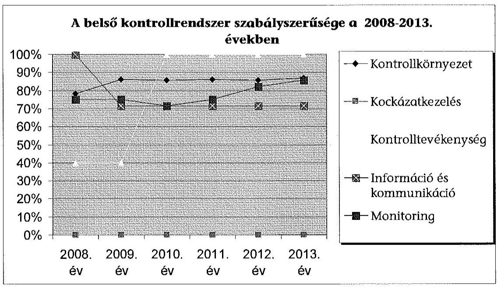

A kontrollkörnyezet kialakítása a 2008. évben részben volt szabályszerű, 2009-2013 között szabályszerű volt. A jogszabályi előírások azonban nem érvényesültek maradéktalanul.

- Az irányító szervvel való egyeztetések elhúzódása miatt a Hivatalnak a 2008. évben nem volt SZMSZ-e, a MeH az Ámr. ${ }_{1} 10 . \S$ (5) bekezdése szerinti SZMSZ ${ }_{1}$-t csak 2008. december 19-én adta ki utasításban és 2009. január 1-jén léptette hatályba.
- A Hivatal - a KIM utasításaként kiadott - SZMSZ ${ }_{2}$ hatályba lépését követő 60 napon belül az utasításban előírt szabályzatain nem vezette át az SZMSZhez kapcsolódó változásokat. A gazdasági szervezet az Ámr. ${ }_{2}$ 15. §

---

(6) bekezdésében előírt ügyrendkészítési kötelezettségét az SZMSZ ${ }_{2}$-ben előírt 30 napon belül nem teljesítette.

- A Hivatalnál az etikai elvárások a szervezeti struktúra minden szintjén 2009. január 1-jétől nem kerültek meghatározásra, ez nem felelt meg az Ámr. ${ }_{1} 145/D. §$ c) pont, az Ámr. ${ }_{2}$ 156. § (1) bekezdés c) pont, a Bkr. 6. § (1) bekezdés c) pont előírásának.
- Az 50/2013. (II. 25.) Korm. rendelet 5. §-a előírásának ellenére a Hivatal elnöke a 2013. évben integritás tanácsadót nem jelölt ki.
- A számlarend ${ }_{4}$-en - 2010. május 20-ai hatálybelépése óta - nem vezették át a Számv. tv. és az Áhsz. előírásainak változásából eredő módosításokat, ezáltal a Számv. tv. 161. § (5) bekezdésében foglalt, a szükséges módosításra vonatkozó 90 napos határidőt nem tartották be.
- A leltározási szabályzat ${ }_{4,5}$ az üzemeltetésre átadott eszközök leltározására 2010. január 1-jétől vonatkozó előírást nem az Áhsz. 37. § (4) bekezdésének megfelelően tartalmazta, a leltározást nem az üzemeltetést végző szerv által készített, hitelesített leltárral írták elő. A raktári eltérések kompenzálását 2012. november 20-tól az Áhsz. 8. § (5) bekezdés f) pontjában - 2013. március 12-től e) pontjában - foglaltak ellenére a leltározási szabályzat ${ }_{3}$ nem tartalmazta.
- A Hivatalnál a gazdálkodási jogkörök gyakorlására 2008. december 14-ig nem volt személy szerinti érvényes kijelölés, mert a gazdálkodási szabályzat II. 1.3. pontjában foglaltak ellenére a gazdálkodási jogkörgyakorlók aláírás mintája nem állt rendelkezésre. A Hivatal a gazdálkodási szabályzatában és a kötelezettségvállalási szabályzat ${ }_{1}$-ben az Ámr. ${ }_{1} 135. §$ (2) bekezdésében előírtak ellenére a 2008. évben és 2009. október 20-ig nem jelölte ki a szakmai teljesítést igazoló személyeket.
- A gazdálkodási szabályzat és a kötelezettségvállalási szabályzat ${ }_{1,4}$ az ellenőrzött időszakban nem tartalmazta a kötelezettségvállalások nyilvántartásának egyeztetésével kapcsolatos feladatokat, a 0-s számlaosztályban történő nyilvántartás eljárásrendjét, ezáltal az Áhsz. 9. melléklet 15. pontjában foglalt előírást nem tartották be. A kötelezettségvállalási szabályzat ${ }_{1,4}$ nem tartalmazta a 2009. évre a 10 M Ft, a 2010. évre az 1 M Ft, a 2011. évtől az 5 M Ft-os bruttó egyedi értékhatárt elérő kötelezettségvállalások Kincstárhoz történő bejelentésével kapcsolatos, az Ámr. ${ }_{1} 162/B. §$ (1) bekezdésében és az Ámr. ${ }_{2} 235. §$-ában előírt feladatok eljárási rendjét.
- Az önköltség-számítási szabályzat ${ }_{1,4}$ nem tartalmazta az önköltség számítás alapjául szolgáló, és a Hivatal tevékenységeire vonatkozó, a Számv. tv. 51. § (2) bekezdésében előírt bekerülési érték részeként az épületek, építmények bérbeadására vonatkozó, a bérbe adott eszközök fenntartására fordított kiadásokat és a bérbe adott eszközök amortizációja időarányos részét. Az önköltség-számítási szabályzat ${ }_{4}$ 2010. május 20-ai hatályba lépése óta nem tartalmazta a jogszabályi környezet változása miatti módosításokat, mellyel nem tartották be a Számv. tv. 14. § (11) bekezdésében foglalt, a szükséges módosításra vonatkozó 90 napos határidőt.

---

- Az ellenőrzött időszakban a Hivatal rendelkezett hatályos közbeszerzési szabályzat ${ }_{1-5}$-tal, azonban a 2012. évtől hatályba lépő Kbt. ${ }_{2}$ előírásai abban nem kerültek átvezetésre.
- A Hivatal az Ámr. ${ }_{1} 145/B. §$, az Ámr. ${ }_{2} 156. §$ (2) bekezdés és a Bkr. 6. § (3) bekezdés rendelkezéseit megsértve ellenőrzési nyomvonallal nem rendelkezett a 2008-2013. évekre.
- A Hivatal az Ámr. ${ }_{1} 145/A. §$ (5) bekezdés, az Ámr. ${ }_{2}$ 2010. évben hatályos 161. §, 2011. évtől hatályos 156. § (3) bekezdése előírásai ellenére 2008. január 1-jétől 2011. szeptember 11-ig terjedő időszakra szabálytalanságkezelési eljárásrenddel nem rendelkezett.

Az ellenőrzött időszakban a kockázatkezelési rendszer nem került kialakításra, így a kockázatkezelési rendszer működése az ellenőrzött időszak egyik évében sem volt szabályszerű.

Kockázatkezelési rendszer hiányában az Ámr. ${ }_{1} 145/C. §$, az Ámr. ${ }_{2} 157 . \S$ és a Bkr. 7. § előírásait nem tartották be. A Hivatal az ellenőrzött időszakban a tevékenységével kapcsolatos kockázatokat dokumentáltan nem mérte fel.

A kontrolltevékenység a 2008-2009. években nem volt szabályszerű, a 2010-2013. években szabályszerűvé vált. 2008. január 1-je és december 14. között a Hivatal érvényesen nem jelölte ki név szerint a gazdálkodási jogkörgyakorlásra jogosultakat, mellyel megsértették az Ámr. 134. § (1) és (8), Ámr. ${ }_{1} 136. §$ (1), valamint az Ámr. ${ }_{1} 137. §$ (1) bekezdések előírásait. A 2008. évben és 2009. október 20-ig a gazdálkodási szabályzat és a kötelezettségvállalási szabályzat ${ }_{1}$ nem határozta meg a szakmai teljesítésigazolásra jogosultak személyét, mellyel megsértették az Ámr. ${ }_{1} 135. §$ (2) bekezdéseinek előírását. A 2010-2013. években a kötelezettségvállalást, az ellenjegyzést, a szakmai teljesítésigazolást, illetve teljesítésigazolást, a Kbt. ${ }_{1,2}$ előírásainak betartását, a számviteli előírások betartását és az informatika területét támogató kontrollokat
 a kötelezettségvállalási szabályzat ${ }_{3-4}$-ben a jogszabályi előírások szerint alakították ki. A gazdálkodási jogkörök gyakorlása során az összeférhetetlenségre vonatkozó követelmények érvényesültek. A kulcskontrollok működése a 2008–2009. években nem volt megfelelő, a 2010. évtől a hiányosságok megszűntek és a kulcskontrollok megfelelően működtek.

Az információs és kommunikációs rendszer a 2008. évben szabályszerű, a 2009–2013. években részben szabályszerű volt a kommunikációs stratégia hiánya következtében. A döntés-előkészítésben és döntéshozatalban szükséges információk a megfelelő időben rendelkezésre álltak. A Hivatal az ellenőrzött időszakban rendelkezett informatikai biztonsági szabályzattal.

A monitoring-rendszer kialakítása és működtetése a 2008–2012. években részben szabályszerű volt, a 2013. évben megfelelt a jogszabályi előírásoknak. A Hivatal az ellenőrzött években a gazdasági szervezet ügyrendjében határozta meg az operatív tevékenységével kapcsolatos eseti és folyamatos nyomon követés feladatait és felelőseit. A Hivatal vezetője nem gondoskodott arról, hogy tevékenységében és céljaiban a gazdaságosság, a hatékonyság és az eredményesség követelményei érvényesüljenek, mivel azokat az Áht. ${ }_{1} 94. \S$ (1) bekezdés b) pontjában, az Áht. ${ }_{2} 61. \S$ (1) bekezdésben, az Áht. ${ }_{2}$

---

69. § (1) bekezdés a) pontjában és a Bkr. 4. § a) pontjában foglaltak ellenére nem alakította ki és nem alkalmazta.

A belső ellenőrzési rendszer kialakítása és működtetése a 2008. év kivételével megfelelő volt. A belső ellenőrzés funkcionális és szervezeti függetlenségét közvetlen elnöki felügyelet alá rendeléssel biztosították. 2008-ban a Ber. 31. § (1) bekezdésében foglaltak ellenére a Hivatal elnöke nem gondoskodott az éves ellenőrzési jelentés elkészítéséről. A 2009–2013. években a hivatkozott Ber. és a Bkr. 49. §-ának (1) és (2) bekezdése szerinti jogszabályi kötelezettségének eleget tett. A Hivatal a belső és külső ellenőrzések által tett javaslatokra készült intézkedési terveket és azok realizálódását részben követte nyomon, mert a 2008. és a 2010. évekre a külső ellenőrzésekről, a 2008. évre a belső ellenőrzésekről nem rendelkeztek nyilvántartással, mellyel megsértették a Ber. 12. § j) pontja előírásait.

A jelen ellenőrzés keretében feltárt hiányosságok, szabálytalanságok alapján a belső ellenőrzés a gazdálkodás szabályszerű működését csak részben támogatta. A belső ellenőrzés a Ber. 8. § b) pontja, illetve a Bkr. 21. § (2) bekezdés a)–b) pontja, valamint (3) bekezdés d) pontja szerinti, hatékonyságra vonatkozó ellenőrzéseket nem végzett.

A Hivatal által kialakított és működtetett kontrollrendszer a 2013. évben az integritás szemlélet érvényesítését támogatta. A Hivatal elnöke integritási tanácsadót nem jelölt ki az 50/2013. (II. 25.) Korm. rendelet 5. § előírása ellenére.

Az ÁSZ az integritás szemlélet érvényesülését a Hivatal adatszolgáltatása alapján a 2013. évre vonatkozóan értékelte. A Hivatalnál, az önértékelés szerint az eredendő veszélyeztetettségi szint és a kockázatokat növelő tényező szintje is magas, a szervezetnél kiépült, a kockázatok kezelésére hivatott kontrollok szintje is magas. Az integritásra vonatkozó tanúsítványi adatszolgáltatás öt területéből kettő megfelelő, három kiváló minősítésű. A humánerőforrás-gazdálkodás és a nemkívánatos dolgozói magatartással szembeni intézkedések és azok érvényesülése megfelelő volt. Az összeférhetetlenség és etikai elvárások, a szervezet vagyonának megvédésére tett intézkedések valamint az integritás erősítése, annak tudatosítása, és a kockázatelemzések alkalmazásának értékelése kiváló.

A kockázatok és a kontrollok szintje alapján a szervezetnél jelenlévő korrupciós kockázatok, valamint az azok kezelésére kiépült kontrollok szintje között egyensúly van.

# 4. A Hivatal PÉNZÜGYI GAZDÁLKODÁSA 

### 4.1. Az előirányzatok megállapítása és módosítása

A Hivatal elemi költségvetésének elkészítése, az előirányzatok megállapítása – a tervezést megalapozó dokumentumok megőrzésének kivételével – megfelelt az Áht. ${ }_{12}$, az Ámr. ${ }_{12}$ és az Ávr. valamint a belső szabályzatok előírásainak.

---

A költségvetés tervezésével és az előirányzat-módosítással kapcsolatos feladatokat a Hivatal belső szabályzataiban, a munkaköri leírásokban rögzítette, de a folyamatok ellenőrzési nyomvonalát az ellenőrzött időszakban nem határozták meg. A 2008–2011. években az előirányzatok tervezése bázisalapú volt, figyelembe vették a szintre hozásokat, az inflációs hatásokat, a feladatellátásban bekövetkezett változásokat. A 2008–2011. évekre a tervezés megalapozottságát alátámasztó számítások, egyeztetések, a szöveges indoklás dokumentumai a Hivatalnál nem álltak rendelkezésre, ezáltal az iratkezelési szabályzat előírásai nem kerültek betartásra. A 2012–2013. években a költségvetés tervezése feladatalapú volt, figyelembe vették a feladat ellátásban bekövetkezett változásokat és az irányító szerv által kiadott tervezési szempontokat is.

A 2008–2013. évi elemi költségvetések adatai megegyeztek a kincstári költségvetéssel.

Az eredeti és módosított előirányzatok alakulását az alábbi grafikon szemlélteti.
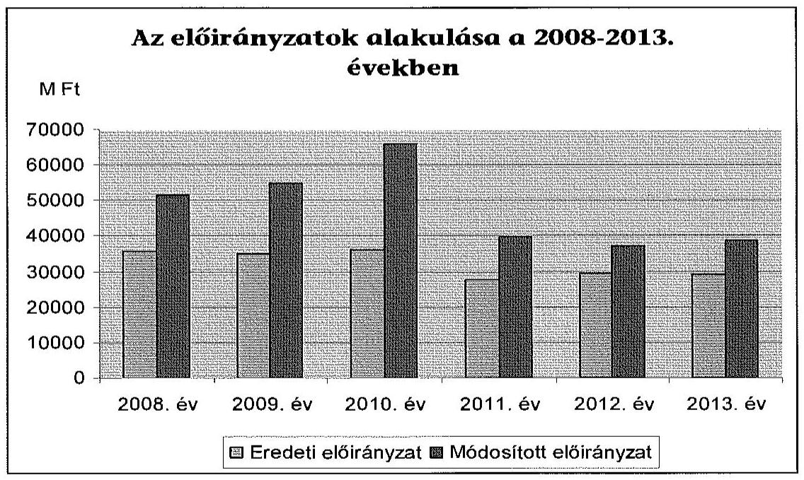

Az ellenőrzött időszakban a Hivatal eredeti kiadási előirányzata a 2008. évi 35 806,7 M Ft-ról a 2013. évre 6864,6 M Ft-tal, 28 942,1 M Ft-ra csökkent. A 2008. évi személyi juttatások előirányzatai a 2013. évre 81,5 M Ft-tal 3,5%-kal nőttek, a munkaadókat terhelő járulékok és a szociális hozzájárulási adó 98,1 M Ft-tal 14,5%-kal csökkentek. A dologi kiadások előirányzatai a 2008. évi 31 119,4 M Ft-ról 7612,8 M Ft-tal, 24,5%-kal csökkentek, a felhalmozási kiadásoké pedig 764,8 M Ft-tal, 44,1%-kal növekedtek.

A Hivatal eredeti előirányzatait országgyűlési, kormányzati, irányítószervi és intézményi hatáskörben módosították. A módosított előirányzat minden ellenőrzött évben magasabb volt az eredeti előirányzatnál.

---

A Hivatal évenkénti előirányzat-módosításait hatásköri bontásban az alábbi táblázat mutatja be:

Adatok M Ft-ban

| Előirányzat-módosítások alakulása |  |  |  |  |  |
| :-- | --: | --: | --: | --: | :--: |
| Évek | Országgyűlés | Kormány | irányító szerv | intézmény | összesen |
| 2008. | 0,0 | 14705,4 | 53,0 | 976,5 | 15734,9 |
| 2009. | 0,0 | $-764,1$ | 17514,4 | 3006,0 | 19756,3 |
| 2010. | 0,0 | 160,2 | 18579,1 | 11017,7 | 29757,0 |
| 2011. | $-1901,3$ | 2472,1 | 5481,9 | 6027,7 | 12080,4 |
| 2012. | 0,0 | 1604,5 | 1444,2 | 4739,8 | 7788,5 |
| 2013. | 0,0 | $-141,2$ | 4036,7 | 5707,9 | 9603,4 |
| Összesen | $-1901,3$ | 18036,9 | 47109,3 | 31475,6 | 94720,5 |

Az előirányzat-módosítások megfeleltek az Áht. ${ }_{1,2}$ az Ámr. ${ }_{1,2}$ és az Ávr. előírásainak. Az előirányzat-módosítások analitikus nyilvántartása a 2008–2011. években nem felelt meg az Áhsz. 49. § (5) bekezdés előírásának. A 2011–2012. évekre az előirányzatok főkönyvi könyvelése, valamint a beszámoló adatai az Áhsz. 50. § (1) bekezdésében foglaltak ellenére nem mutattak egyezőséget. Az országgyűlési hatáskörben végrehajtott előirányzat-módosítás a 2011. évi költségvetési törvény módosítása szerint történt. A kormányzati hatáskörű előirányzat-módosítások kormányhatározatokban rögzítésre kerültek. Az irányító szerv által történt előirányzat-módosítás változtatások hatásköre megfelelt a jogszabályi előírásoknak, a módosítások okának, jogcímének, összegének dokumentálása az irányító szerv részéről megtörtént. A Hivatal saját hatáskörű előirányzat-módosításaihoz rendelkezett hatáskörrel.

# 4.2. A kiadási előirányzatok felhasználása és a bevételi előirányzatok teljesítése 

Az ellenőrzött időszakban a Hivatal nem lépte túl a számára jóváhagyott kiadási előirányzatot. Az ellenőrzött időszakban a kiadások teljesítése ( $253505,1 \mathrm{M}$ Ft) összességében 11,9%-kal maradt el a módosított előirányzattól ( $287839,1 \mathrm{M}$ Ft). A személyi juttatások és járulékai 93,3%-ban ( $18615,6 \mathrm{M}$ Ft), a dologi kiadások 87,4%-ban ( $202171,6 \mathrm{M}$ Ft), a felhalmozási kiadások ( $22021,4 \mathrm{M}$ Ft) 86,1%-ban teljesültek.

A gazdálkodási jogkörökkel kapcsolatos kulcskontrollok működése a személyi juttatások, a dologi és dologi jellegű kiadások, a felhalmozási kiadások és a pénzeszközátadások, a támogatásértékű kiadások, a kölcsönök nyújtása esetében 2008–2009. években nem volt megfelelő, a 2010–2013. években megfelelő volt.

A Hivatal a 2008. december 14-ig hatályos gazdálkodási szabályzatában – az Ámr. ${ }_{1} 135$. § (2) bekezdésében foglaltak ellenére – nem jelölte ki a szakmai teljesítést igazoló személyeket, továbbá a nevesített utalvány ellenjegyzők kijelölése nem volt érvényes, mert aláírás mintájukat a szabályzat nem tartalmazta. A 2008. december 15-től 2009. október 20-ig hatályos kötelezettségvállalási szabályzat ${ }_{1}$ továbbra sem jelölte ki a szakmai teljesítést igazoló személyeket,

---

azonban az utalvány ellenjegyzők aláírás mintája már a szabályzat mellékletét képezte. Mindezek alapján az ellenőrzés megállapította, hogy a Hivatal a szakmai teljesítésigazolási és az utalvány ellenjegyzési kötelezettségének – teljesítésigazolás esetében a jogosultak kijelölése, utalvány ellenjegyzés esetében az érvényes aláírás minta hiányában – a 2008. évben nem tett eleget, a 2009. évben az október 21-e után teljesített kiadások esetében eleget tett. A 2009. október 21. után teljesített kiadásoknál a gazdálkodási jogkörök gyakorlása megfelelt az Ámr. ${ }_{1,2}$ és az Ávr. előírásainak.

# A mintatételek ellenőrzése során a következő egyéb szabálytalanságokat, hiányosságokat tárta fel az ellenőrzés: 

- A személyi juttatások ellenőrzése során az ellenőrzés megállapította, hogy a Hivatal a munkaidő nyilvántartására 2008. szeptember 20-ig nem használt jelenléti íveket, csak a kieső napokat dokumentálták, ezáltal a Munka Törvénykönyve 140/A. § (1) és (3) bekezdésének előírásait nem tartották be. A 2008. márciusi bérkifizetés dokumentumait, valamint a jutalom kifizetés részletes listáját – a Számv. tv. 169. § (2) bekezdésében foglalt bizonylat megőrzési kötelezettséget megsértve – nem tudta az ellenőrzés számára átadni. A 2009–2013. évekre vonatkozóan az ellenőrzés hibát nem tárt fel.
- A külső személyi juttatás mintatételeinek ellenőrzése során – a 2009. évet kivéve – az ellenőrzés hibát nem tárt fel. A 2009. évre vonatkozóan a Hivatal két mintatétel esetében nem tudta rendelkezésre bocsátani a megbízási szerződést, mellyel megsértette a Számv. tv. 169. § (2) bekezdés előírását.
- A dologi és dologi jellegű kiadások mintatételeinek elszámolása – a közbeszerzésre vonatkozó szabályok betartásának kivételével – megfelelő volt. A mintatételekhez kapcsolódóan megállapítottuk, hogy öt határozatlan idejű szerződés megkötésére irányuló beszerzést – az egybeszámítási kötelezettségre tekintettel – jogszerűen csak közbeszerzési eljárás lefolytatásával lehetett volna megvalósítani, így megsértették a Kbt. ${ }_{1}$ 240. § (1) bekezdésében előírt közbeszerzési eljárás lefolytatásának kötelezettségét. A mintatételek ellenőrzése során továbbá négy távközlési szolgáltató által nyújtott szolgáltatás, egy nyomda által nyújtott nyomdai szolgáltatás és három energia-szolgáltató által nyújtott szolgáltatás beszerzése esetében az ellenőrzött években a Hivatal köteles lett volna közbeszerzési eljárást lefolytatni, mert ezen szerződések mind értéküket, mind tárgyukat tekintve a közbeszerzési törvény hatálya alá tartoztak. ${ }^{1}$
- A felhalmozási kiadások – immateriális javak és tárgyi eszközök beszerzése, felújítása – esetében az eszközök bekerülési értékének megállapítása, állományba vétele, az értékcsökkenés elszámolása és az év végi értékelése szabályos volt, a kapcsolódó belső kontrollok megfelelően működtek. A közbeszerzési értékhatár alatti beszerzések ajánlatai fellelhetők és szabályosak voltak.

[^0]
[^0]:    ${ }^{1}$ Tekintettel arra, hogy a Kbt. ${ }_{1}$ 327. § (2) bekezdése és a Kbt. ${ }_{2}$ 140. § (2) bekezdés b) pontja szerinti jogvesztő határidő már letelt, az ÁSZ-nak nem áll módjában jogorvoslati eljárást kezdeményezni.

---

A módosított bevételi előirányzat a 2011–2012. év kivételével nem teljesült. Az elmaradást a Hivatal működési bevételének alulteljesítése okozta, amely az igazgatási szolgáltatások, a gépjármű eredetvizsgálat csökkenő igénybevétele miatti
 bevételkiesésből adódott.

A vagyonhasznosítási bevételek teljesítése területén a kulcskontrollok nem működtek megfelelően.

A 2008-2009. években a vagyonhasznosítási bevételek szakmai teljesítésigazolása és érvényesítése az Ámr. ${ }_{1} 135 . \S$ (2) és (4) bekezdésében foglaltak ellenére nem történt meg. A 2008. évben ebből következően az utalvány ellenjegyzését az Ámr. ${ }_{1} 137 . \S$ (1) bekezdése szerint nem végezték el. A 2009. évben az Ámr. ${ }_{1} 136 . \S$ (1) bekezdésének előírása szerint a tárgyi eszköz értékesítéséből származó bevétel esetében fennállt az utalványozási kötelezettség, amelynek a Hivatal nem tett eleget. A 2010-2013. években az Ámr. ${ }_{2} 76 . \S$ (2) bekezdése és az Ávr. 57. § (2) bekezdése az intézmény belső szabályozására bízta a bevételek teljesítésigazolási és érvényesítési kötelezettségét. A Hivatal belső szabályzata a jogszabály adta lehetőséggel élve nem tartalmazta ezen kontrollok alkalmazási kötelezettségét.

A 2008-2013. években a bérbeadási szerződések a Hivatal alapfeladatainak ellátását támogató szolgáltatókkal jöttek létre. A tárgyi eszköz értékesítése (gépjármű) esetében a vevő kiválasztására 3 árajánlat bekérése után került sor. Az eladási ár meghaladta az eszközök nyilvántartási értékét.

A tárgyi eszközök dolgozók részére történő értékesítése nem felelt meg a selejtezési szabályzat ${ }_{4}$ előírásainak. A szabályzat szerint a magánszemélyek részére történő eladás esetében a Szociális Bizottság dönt a vevő személyéről, valamint azonnali készpénzfizetést írtak elő. Egy tétel esetében az eladáshoz tartozó bizottsági döntés nem állt rendelkezésre, továbbá a vételár kiegyenlítése nem készpénzben történt.

# 4.3. Az előirányzat-maradvány megállapítása és felhasználása 

Az előirányzat-maradvány levezetése az éves beszámolókban szabályszerű volt, összege a kapcsolódó főkönyvi számlákon kimutatott előirányzatmaradvány összegével megegyezett.

A felhasználható összes előirányzat-maradvány ${ }^{2}$ a 2008-2013. években 20 962,2 M Ft volt, amely működési kiadások megtakarításából 19 754,0 M Ft összegben keletkezett. Felhalmozási célú előirányzat-maradványa a 2009. évben 42,8 M Ft, a 2013. évben 776,6 M Ft volt a Hivatalnak. Az előirányzatmaradvány a 2013. év kivételével kötelezettségvállalással terhelt volt, szabad maradvány 388,8 M Ft keletkezett.

A kötelezettségvállalással terhelt és a központi költségvetést megillető előirányzat-maradvány megállapítása az ellenőrzött években az Ámr. ${ }_{1,2}$-ben és az Ávr.-ben foglaltak alapján került meghatározásra. A Hivatal az előirányzatmaradványáról az irányító szerv felé az előírt határidőben és tartalommal teljesítette az adatszolgáltatási kötelezettségét, az irányító szerv a jóváhagyásról értesítette a Kincstárt.

A kötelezettségvállalással terhelt előirányzat-maradvány analitikus nyilvántartása az Áhsz. 9. melléklet 15. pont előírása ellenére az ellenőrzött években - a 2012. évi nyilvántartást kivéve - nem egyezett meg a jóváhagyott előirányzatmaradvány összegével, a beszámoló vonatkozó sora analitikával nem volt alátámasztva.

A 2008. évi nyilvántartásban az előirányzat-maradvány összege 801,5 M Ft, az elfogadott 1082,8 M Ft maradvány összegével szemben. A 2009. évi analitika szerinti maradvány 10967,0 M Ft volt, a jóváhagyott 6821,4 M Ft-tal szemben. A 2010. évi analitikában 9257,8 M Ft a maradvány összege, mely 6559,3 M Ft-tal több, mint a jóváhagyott összeg. A 2011. évi nyilvántartás alapján a maradvány 2570,0 M Ft, mely 120,6 M Ft-tal több, mint a jóváhagyott maradvány. A 2013. évi analitikában a maradvány összege 4252,9 M Ft, mely 35,7 M Ft-tal több, mint a jóváhagyott maradvány. A Hivatal nyilatkozata alapján az eltérések abból adódtak, hogy az előirányzat-maradvány analitikája a teljes áthúzódó kötelezettségvállalás állományt tartalmazta, nemcsak a tárgyévi maradványhoz tartozó kötelezettségvállalást.

Az előirányzat-maradvány lekötöttsége az analitikus nyilvántartások hibás tartalma következtében az alábbi mintatételek elszámolásánál nem volt helytálló, melyek értéke 1712,0 E Ft volt.

A 2008. évi 7680 E Ft lekötött maradványból 6360 E Ft nem az előző évi kötelezettségvállalást érintette, a maradvány terhére csak 1320 E Ft-ot lehetett volna figyelembe venni. Ezen maradvány-kimutatás nem felelt meg az Ámr. 1 65. § (2) bekezdésében foglaltaknak. A 2011. évi maradvány lekötése során az oklevél beszerzés 384 E Ft összege a 2012. évi működési költségvetést terhelte. A maradvány lekötöttsége nem felelt meg az Ámr. 210. § (1) bekezdés b) pont előírásának. A 2011. évi analitikában 8 E Ft értékkel a főkönyvi könyvelésben sztornírozott tétel szerepel. Az analitikus maradvány-kimutatás nem az Ávr. 150. § (1) bekezdés b) pontjában foglaltak szerint tartalmazta a kötelezettségvállalást.

# A kötelezettségvállalással terhelt maradvány felhasználása az ellenőrzött mintatételek alapján kockázatosnak minősül. 

### 4.4. A fizetőképesség alakulása

A Hivatal fizetőképessége a 2008. évben és a 2011-2013. között biztosított volt, a 2009-2010. években a szállítói kötelezettségek állománya meghaladta a rendelkezésre álló pénzügyi forrást. A szállítói kötelezettségek határidőben történő kiegyenlítése csak részben volt biztosított.

A 60 napon túli szállítói állomány a 2008. évi 2722,2 M Ft-ról 2009. évben 325,6 M Ft-tal csökkent, 2011. év végén 314,3 M Ft, 2012. év végén 42,2 M Ft volt. A 2013. év végére a Hivatalnak 60 napon túl lejárt szállítói állománya nem volt. 2011-ben a Hivatal 4000,0 M Ft kormányhatározatban megítélt támogatást használt fel - a KEHI által szabályosnak minősítetten - a 2010. december 30. napján fennálló szállítói tartozás megszüntetésére.

---

2008-2011. években előirányzat felhasználási terv az Ámr. ${ }_{1}$ 138/B. § (1) bekezdésben és az Ámr. 200. § (2) bekezdésében foglaltak ellenére nem készült, a 2012-2013. évekre az Ávr. szerinti likviditási terveket elkészítették.

A Hivatal gazdálkodását az Ámr. ${ }_{1} 150$. § (1) bekezdése alapján 2009. október 15-től december 31-ig kincstári biztos, az Ámr. ${ }_{2} 163$. § (3) bekezdése alapján 2011. április 15-től egy évig költségvetési főfelügyelő felügyelte.

A Hivatal fizetőképességének változását az alábbi diagram mutatja be:
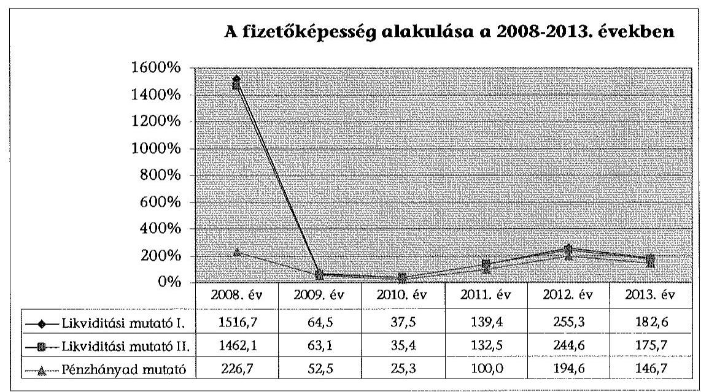

A Hivatal likviditási mutatói a 2009-2010. években a határidőn túli szállítói tartozások miatt a fizetésképtelenség veszélyét jelző szintre csökkentek, a likvid - gyorsan pénzzé tehető - eszközök értéke lényegesen kisebb volt, mint a rövid lejáratú kötelezettségek összege. A folyamatos likviditási gondok két évig terhelték a szervezetet, a 2010. évben a kieső saját bevételek és az alacsony költségvetési támogatás miatt tovább nőtt a pénzhiány. A 2011. évben már megnőtt a támogatás és a forgóeszközök értéke meghaladta a rövid lejáratú kötelezettségek értékét, a pénzhányad fedezte a fennálló tartozásokat. A 2012. év végére a fizetőképesség tovább javult, a 2013. évben a likviditási mutatók értéke mérséklődött, de a fizetőképességet nem veszélyeztette.

Az ellenőrzött időszakban az eladósodottságot kifejező Kötelezettségek és a saját tőke arány nagy eltéréseket mutatott. A 2008. évi 2,5%-os arány 2009. évre - a rövid lejáratú kötelezettségek jelentős növekedése miatt - 318,9%-ra növekedett, az eladósodottság nagymértékűvé vált. A rövid lejáratú tartozások miatti eladósodottság a költségvetési többlettámogatás következtében csökkent, a 2010. év végén a mutató 112,7% volt, de még ekkor is magas volt a szállítói finanszírozás. Az eladósodottság a 2011. évtől kezdve 30% alá csökkent (17,5% illetve 13,2%), a szállítói tartozásait jelentős mértékben határidőre kiegyenlítette, azonban a 2013. évben ismét megnövekedett 24,2%-ra.

---

# 5. A Hivatal VAGYONGAZDÁLKODÁSA 

### 5.1. A vagyongazdálkodás szabályozottsága

A vagyongazdálkodási tevékenység szabályozottsága részben felelt meg a jogszabályi előírásoknak, a kapcsolódó belső kontrollok kialakítása nem volt megfelelő.

A Hivatal az állami vagyon ${ }^{3}$ kezelését az MNV Zrt.-vel kötött szerződés és annak módosításai alapján látta el.

Az ellenőrzött időszakban a Hivatal rendelkezett hatályos közbeszerzési szabályzat ${ }_{1-2}$-tal, azonban a 2012. évtől hatályba lépő Kbt. ${ }_{2}$ előírásai abban nem kerültek átvezetésre. A közbeszerzési törvény hatálya alá nem tartozó beszerzések eljárásrendjét, felelőseit és dokumentálásának szabályait beszerzési szabályzat tartalmazta.

A számviteli politika és kapcsolódó szabályzatai megfelelő keretet biztosítottak a vagyonváltozások könyvviteli elszámolásához. A leltárkészítési szabályzat ${ }_{4-5}$ szerint a Hivatal az üzemeltetésre átadott eszközök leltározását nem az üzemeltetést végző szerv által megküldött, hitelesített leltárral írta elő, amivel megsértette az Áhsz. 2010. január 1-jétől hatályba lépő 37. § (4) bekezdését.

Az ellenőrzött időszakban a Hivatal a selejtezési szabályzat ${ }_{1-4}$-ben írta elő a feleslegessé vált eszközök feltárásának szabályait illetve a hasznosítás feltételeit. A feladatellátáshoz nem szükséges eszközök hasznosítása gazdálkodó szervezetek, magánszemélyek részére történő értékesítés, illetve más költségvetési szervek részére térítésmentes átadás vagy bérbeadás, kölcsönadás lehetett.

A Vtv. 28. § (1) bekezdésében foglalt az alapítás, átszervezés, feladatváltozás miatt a működéshez szükséges vagyon összetételére és mértékére vonatkozó, az MNV Zrt. felé teljesítendő közlési kötelezettség teljesítésének eljárásrendje az Ügyrendekben nem került kialakításra. A szabályozás hiányában sérült az Áht. ${ }_{1}$ 91. § (2) bekezdése, az Ámr. ${ }_{2}$ 20. § (7) bekezdése és az Ávr. 13. § (5) bekezdése. A térítés nélküli vagyonátadás-átvétel elszámolási módjáról az értékelési szabályzat ${ }_{1-4}$ tartalmazott előírást, amely az Áhsz. előírásainak megfelelt.

A tevékenységet szolgáló tárgyi eszközök személyes célú használatának módja elnöki intézkedéssel kiadott belső szabályzatokban került előírásra. Személyes használat volt engedélyezve költségtérítéssel személygépkocsikra a szolgálati gépjármű igénybevételi szabályzat ${ }_{1-2}$ előírásai alapján. Tartós magáncélú személygépkocsi használatot engedélyeztek a személyi jövedelemadóról szóló 1995. évi CXVII. törvény előírásainak figyelembevételével a szabályzatban meghatározott vezetői munkakörökre.

[^0]
[^0]:    ${ }^{3}$ Vtv. 1. § (2) bekezdés

---

# 5.2. Az eszközök és források értékének kimutatása, az eszközök értékének megőrzése 

A mérlegben kimutatott eszközök és források értékének megállapítása, nyilvántartása csak részben felelt meg a jogszabályi előírásoknak.

Az ellenőrzött időszakban a Hivatal rendelkezett hatályos leltárkészítési szabályzat ${ }_{1-5}$-tal, elkészítették a leltárutasítást. A mennyiségi leltározás személyi és tárgyi feltételei biztosítottak voltak. A mérlegben kimutatott eszközöket - a követeléseket, a beruházási előleget, az aktív pénzügyi elszámolásokat kivéve - a Számv. tv., az Áhsz. és a belső szabályzatokban előírt mennyiségi leltár felvételével támasztották alá, a 2008. évi mennyiségi leltár dokumentumai - a Számv. tv. 169. § (2) bekezdésének a bizonylat megőrzésre vonatkozó előírását megsértve - nem álltak rendelkezésre. Az üzemeltetésre átadott eszközök mérlegértékét a 2010. évtől kezdve nem az üzemeltetők által készített, hitelesített leltárral támasztották alá, ezáltal az Áhsz. 37. § (4) bekezdésében foglalt előírást nem tartották be.

Az egyeztetéssel leltározott eszközök - a követelések és az aktív pénzügyi elszámolások - és a források - saját tőke, kötelezettségek, passzív pénzügyi elszámolások - leltárának alapbizonylatai a 2008-2011. évekre vonatkozóan nem voltak fellelhetőek, amellyel megsértették a Számv. tv. 169. § (2) bekezdésében előírtakat. A leltárkészítés és kiértékelés módja nem felelt meg a leltározási szabályzat, illetve a leltárutasítás előírásainak sem. A 2012-2013. években az egyeztetéses leltár megfelelt az előírásoknak.

A selejtezés előkészítése, végrehajtása, dokumentálása, a selejtezett eszközök hasznosítása a kiválasztott mintatételek esetében megfelelt a selejtezési szabályzat ${ }_{1-4}$ előírásainak. A 2009. évi selejtezési jegyzőkönyv egy mintatétel esetében - a Számv. tv. 169. § (2)
 bekezdésének a bizonylat megőrzésre vonatkozó előírását megsértve – nem állt rendelkezésre.

A Hivatal az értékelési szabályzat ${ }_{14}$-ben a követelések értékvesztésének elszámolását a követelések korcsoportonkénti megtérülésének arányában határozta meg, negyedéves gyakorisággal. A 2008–2013. években a követelésekre az Adósok mérlegsoron kívül nem számoltak el értékvesztést, mellyel megsértették az Áhsz. 31. § (2) bekezdésében és a 31/A. § (2)–(3) bekezdésében foglalt előírásokat. Nem minősítették negyedévenként a kintlévőségeket korcsoportonként, nem határozták meg a követelések megtérülésének %-os mértékét, nem állapították meg az elszámolandó értékvesztés arányát. Az Adósok esetében a követelés teljes összegét értékvesztésként számolták el, ha a Hivatal a befizetési csekkek hamisításának gyanúja miatt rendőrségi feljelentést tett. Az értékvesztés ezen indokkal és teljes összegben történt elszámolása az Áhsz. 31/A. §-ában foglaltaknak nem felel meg. Ezáltal a követelések értékelése nem felelt az Áhsz. és az értékelési szabályzat ${ }_{14}$ előírásainak, ezáltal sérült a Számv. tv. 15. § (3) illetve (8) bekezdésében foglalt valódiság és óvatosság számviteli alapelv. A követelések behajthatatlanná minősítése megfelelt az Áhsz. előírásainak. A Hivatalnál követelés elengedés nem történt, el nem ismert követelést nem tartottak nyilván.

---

A szállítói kötelezettségek tárgyévre és a tárgyévet követő évre történő megbontása a főkönyvi kivonattal megegyezett, azonban a rendelkezésre álló analitikus nyilvántartásokból a 2008–2009. évekre a mérlegsorok értéke nem igazolható. Ezáltal az Áhsz. 9. melléklet 4. d) pontjának előírásai nem kerültek betartásra.

A Költségvetési aktív és passzív függő és átfutó elszámolások mérlegsorait csak főkönyvi számlákkal támasztották alá, analitikus nyilvántartást az ellenőrzés részére 2008–2011. évekre nem adtak át. Az analitikus nyilvántartás hiánya miatt megsértették a Számv. tv. 161. § (3) bekezdését, az Áhsz. 49. § (1) bekezdését és a 9. számú melléklet 4. h) pontját. A főkönyvi kivonat egyenlegei a mérlegsorok értékével megegyezőek voltak.

A 2009–2011. években az utólag finanszírozott nemzetközi programok átfutó kiadásai a központi költségvetési, ill. EU-s támogatási összegekre az analitika és az egyeztetéses leltárak hiányában nincsenek alátámasztva. Ezáltal a Költségvetési átfutó mérlegsor értéke nem felelt az Áhsz. 37. § (2) bekezdésének és az értékelési szabályzat ${ }_{1-4}$ előírásainak, ezáltal sérült a Számv. tv. 15. § (3) bekezdésében foglalt valódiság számviteli alapelv.

A Hivatal a 2008–2013. években 25 583,1 M Ft előirányzattal rendelkezett a felújítások és intézményi beruházások jogcímen, amelyből 22 021,4 M Ft-ot használt fel. A 2013. év végén a felhalmozási célú kötelezettségvállalással terhelt maradványa 776,6 M Ft-ot tett ki.

A Hivatal vagyoni helyzetét jellemző főbb mutatók alakulását az alábbi diagram szemlélteti:
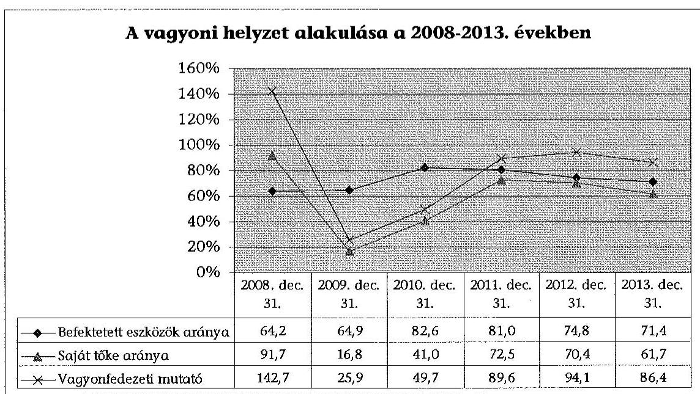

A befektetett eszközök aránya a 2008–2010. években a Hivatal közfeladatának ellátásához szükséges immateriális javak és tárgyi eszközök körében történt beruházások és fejlesztések következtében növekedett. A 2011. évtől kis mértékben csökkent az arány, de a befektetett eszközök mérlegértéke növekedett. A Hivatal szakfeladatainak ellátása nagy értékű immateriális javak és számítástechnikai

---

eszközök tartós használatát teszi szükségessé, ezáltal a befektetett eszközök 70% vagy afölötti aránya indokolt volt.

A saját tőke aránya az összes forráson belül a 2008. évben 91,7% volt. A 2009–2010. évben nagyarányú eladósodottság alakult ki, a saját tőke aránya olyan alacsony volt, amely már veszélyeztette a szervezet működőképességét. A saját tőke ellátottság a 2011. évtől javult.

Az eszközgazdálkodás jellemzésére a használhatósági fok mutatót alkalmaztuk. A 2008–2013. években a tárgyi eszközök használhatósági foka eszközcsoportonként eltérően alakult az éves könyvviteli mérlegadatok alapján.
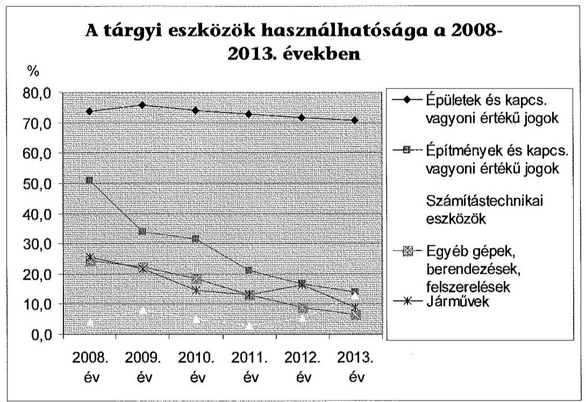

Az épületek és a kapcsolódó vagyoni értékű jogok használhatósága az elszámolt értékcsökkenés hatására 73,8%-ról 70,8%-ra csökkent. Az építmények és a kapcsolódó vagyoni értékű jogok használhatósági foka 50,8%-ról 13,9%-ra csökkent, mert a feladatváltozás miatti vagyonátadás a kevésbé elhasználódott eszközöket érintette. A gyorsan amortizálódó számítástechnikai eszközök használhatósági foka 8,0%-ról 12,9%-ra javult a beruházási projektek következtében. Az egyéb gépek, berendezések, felszerelések használhatósági foka fokozatosan romlott, 22,2%-ról 6,4%-ra. A járművek használhatósági foka is csökkent a kezdeti 21,7%-ról 9,0%-ra, átmeneti növekedés 2012-ben mutatkozott a beszerzések hatására. Az átlagos életkor – a számítástechnikai eszközök kivételével – minden eszközcsoportnál emelkedett. A befektetett eszközök használhatósági fokának romlása illetve az átlagos életkor emelkedése ellenére az ellenőrzött időszakban a jogszabályok által előírt feladatok ellátásában nem történt jelentős fennakadás. A Hivatal az eszközfejlesztésre az ellenőrzött időszakban évente átlagosan 3670,2 M Ft kiadást teljesített, az átlagtól való eltérés a 2013. évben volt a legnagyobb. A Hivatal befektetett eszközeinek nettó értéke a 2008. január 1-jei állapothoz képest 2013. december 31-ére az immateriális javaknál 39,1%-kal növekedett, a tárgyi eszközöknél 7,1%-kal csökkent.

---

# Összességében a befektetett eszközök mérlegértéke 12,8%-kal növekedett, vagyis az állami vagyon értéke az elszámolt értékcsökkenést meghaladóan gyarapodott.

### 5.3. A vagyonátadás és -átvétel, a vagyonelemek hasznosítása

A Hivatal közfeladat változásához kapcsolódó vagyonkezelt eszközök átadását-vételét az MNV Zrt.-vel illetve a központi költségvetési szervekkel kötött megállapodások alapján az Áhsz. 29/A. (1) bekezdése és a 29/B. §-ában foglaltaknak megfelelően a könyvviteli nyilvántartásokban szabályszerűen átvezették. Az MNV Zrt. tulajdonában, de a Hivatal kezelésében lévő, az alapfeladatainak ellátásához szükséges vagyonváltozás elszámolása megfelelt az Nvtv. és az Áhsz. illetve a belső szabályzatok előírásainak. A feladat átcsoportosítás miatti vagyonváltozások megállapodásai és a könyvviteli, valamint a Vtv.-ben előírt vagyonnyilvántartások szabályosak voltak.

Az üzemeltetésre átadott eszközök állományváltozásának elszámolása megfelelt az Áhsz. és a belső szabályzatok előírásainak. Az üzemeltetésre történő vagyonátadásra vonatkozóan az üzemeltetőkkel megállapodást kötöttek, azonban 3 ellenőrzött tétel esetében – a Számv. tv. 169. § (2) bekezdésének a bizonylat megőrzésre vonatkozó előírását megsértve – az átadásra kötött megállapodás nem állt rendelkezésre. Az átadott eszközöket az aktuális nettó értéken vezették át az üzemeltetésre átadott eszközök analitikus és főkönyvi állományába.

Az ellenőrzött időszakban a térítés nélküli vagyonátadás-átvétel a feladatváltozáshoz kapcsolódóan történt az ingatlanok és az informatikai eszközök vagyonkezelői jogának rendezése érdekében. A térítés nélküli átadás-átvételek egy eset – a Számv. tv. 169. § (2) bekezdésének a bizonylat megőrzésre vonatkozó előírását megsértve a térítés nélküli átadásra kötött megállapodás nem állt rendelkezésre – kivételével szabályosak voltak. A kiválasztott mintatételek át-adás-átvétele megfelelt az Nvtv., a Vtv., a Számv. tv., az Áhsz. és az értékelési szabályzat ${ }_{1-4}$ előírásainak. Az ellenőrzött időszakban nem történt olyan eszközértékesítés, amelyhez az MNV Zrt. előzetes engedélyére lett volna szükség.

A vagyonelemek bérbeadása nem felelt meg az Áhsz. 8. § (15) bekezdésében foglaltaknak, mert a 2008–2011. években a Hivatal az önköltség-számítási szabályzat ${ }_{14}$-ben előírtak ellenére nem készített önköltség-kalkulációt a helyiségek bérbeadásához. Az épületek bérleti díját megalapozó költségkalkuláció a 2008–2011. évben nem készült, ezáltal az épületek fenntartási költségének és amortizációjának megtérülése nem igazolt. A 2012–2013. évben a bérleti díj meghatározását telephelyenkénti utókalkuláció alapozta meg, a szerződésekben meghatározott bérleti díjak fedezték a bérbe adott eszköz (helyiség, terület) fenntartására fordított kiadásokat, valamint az amortizáció időarányos részét. A Hivatal meggyőződött a bérbeadási folyamat során az átláthatóság előírt követelményének érvényesüléséről.

Az ellenőrzött vagyoneladási tételeknél az eladási ár elérte, (számítástechnikai eszközök) illetve meghaladta (hivatali gépjármű) a nyilvántartási értéket. Az Áht. ${ }_{1,2}$-ben meghatározott értékhatár alatti eladások esetében három értékesítő szerv ajánlata alapján került a vevő kiválasztásra.

---

# 5.4. Az eredmény szemléletű számvitel bevezetésével kapcsolatos feladatok végrehajtása

A Hivatal az eredményszemléletű számvitelre történő áttérés feladatait a 36/2013. (IX. 13.) NGM rendelet előírásai szerint végezte el, a rendező mérleget szabályszerűen készítette el.

A kötelezettségvállalások leltározása megtörtént, a befejezetlen beruházásokból selejtezés nem volt indokolt, a függő, átfutó kiadásokat és bevételeket azonosították. A rendező mérlegben felvették azokat a követeléseket és kötelezettségeket, amelyeket a 2013. évi szabályok alapján nem könyveltek, azonban az új Áhsz. szerint a mérlegben szerepeltetni kell.

## 6. A korábbi ÁSZ ellenőrzések során a Hivatallal kapcsolatban tett javaslatok hasznosulása

Az ellenőrzött időszakban az ÁSZ egy ellenőrzéshez kapcsolódóan tett javaslatokat a Hivatalnak címezve.

A Magyar Köztársaság 2008. évi költségvetése végrehajtásának ellenőrzéséről szóló 0928. számú számvevőszéki jelentésben az ÁSZ a Hivatalnál történt ellenőrzése során a lényegességi küszöböt el nem érő, a beszámoló megbízhatóságát nem befolyásoló hibákra, hiányosságokra hívta fel a vezetés figyelmét és 13 javaslatot fogalmazott meg. Az ÁSZ tv. ${ }_{1}$ a javaslatokhoz kapcsolódóan még nem írt elő intézkedési terv készítési kötelezettséget az ellenőrzött számára, azonban a Hivatal elnöke intézkedési tervet hagyott jóvá, amelyet megküldött az ÁSZ részére. Az intézkedési tervben foglaltak végrehajtására és a szabályozási környezet változásaira is tekintettel megállapítható, hogy az ÁSZ javaslatai hasznosultak.

Magyarország 2012. és 2013. évi költségvetése végrehajtásának ellenőrzéséről készült ÁSZ jelentések nem fogalmaztak meg javaslatot a Hivatalhoz kapcsolódóan.

Budapest, 2015. 0 hó 2 nap

Melléklet: $\quad 5 \mathrm{db}$
Függelék: $\quad 3 \mathrm{db}$
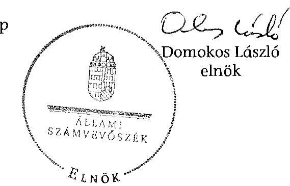

---

A Közigazgatási és Elektronikus Közszolgáltatások Központi Hivatala feladatellátása a 2008–2013. közötti években

|  2008–2009. évek | 2010. év | 2011–2012. évek | 2013. év  |
|---|---|---|---|
|  276/2006. (XII. 23.) | Korm. rendelet a Közigazgatási és Elektronikus Közszolgáltatások Központi Hivatala létrehozásáról, feladatairól és hatásköréről |  |   |
|  Személyi adat- és lakcímnyilvántartási ügycsoport, útiokmány-nyilvántartási ügycsoport, bűnügyi nyilvántartási ügycsoport, közúti közlekedési nyilvántartási és igazgatási ügycsoport keretében ellátott feladatok | Személyi adat- és lakcímnyilvántartási ügycsoport, útiokmány-nyilvántartási ügycsoport, bűnügyi nyilvántartási ügycsoport, közúti közlekedési nyilvántartási és igazgatási ügycsoport keretében ellátott feladatok | Személyi adat- és lakcímnyilvántartási ügycsoport, útiokmány-nyilvántartási ügycsoport, bűnügyi nyilvántartási ügycsoport, közúti közlekedési nyilvántartási és igazgatási ügycsoport keretében ellátott feladatok | Személyi adat- és lakcímnyilvántartási ügycsoport, útiokmány-nyilvántartási ügycsoport, bűnügyi nyilvántartási ügycsoport, közúti közlekedési nyilvántartási és igazgatási ügycsoport keretében ellátott feladatok  |
|  Egyéni vállalkozói igazolvány nyilvántartási ügycsoport, magyar igazolvány nyilvántartási ügycsoport, választási ügycsoport keretében ellátott feladatok | Egyéni vállalkozói igazolvány nyilvántartási ügycsoport, magyar igazolvány nyilvántartási ügycsoport, választási ügycsoport keretében ellátott feladatok (2010. július 30-ig) | Származás ellenőrzéssel, előzetes eredetiségvizsgálattal, közúti közlekedési pontrendszerrel összefüggő ügycsoport keretében ellátott feladatok | Származás ellenőrzéssel, előzetes eredetiségvizsgálattal, közúti közlekedési pontrendszerrel összefüggő ügycsoport keretében ellátott feladatok  |
|  Frekvenciagazdálkodással összefüggő feladatok | Származás ellenőrzéssel, előzetes eredetiségvizsgálattal, közúti közlekedési pontrendszerrel összefüggő ügycsoport keretében ellátott feladatok (2010. július 31-től ) | Szabálysértési nyilvántartás vezetésével összefüggő ügycsoport keretében ellátott feladatok | Szabálysértési nyilvántartás vezetésével összefüggő ügycsoport keretében ellátott feladatok  |
|  Telekommunikációs és hálózat-fenntartási feladatok | Szabálysértési nyilvántartás vezetésével összefüggő ügycsoport keretében ellátott feladatok (2010. január 1-től) | Frekvenciagazdálkodással összefüggő feladatok | Frekvenciagazdálkodással összefüggő feladatok  |
|  Nemzetközi vonatkozási feladatok | Frekvenciagazdálkodással összefüggő feladatok | Telekommunikációs és hálózat-fenntartási feladatok | Telekommunikációs és hálózat-fenntartási feladatok  |
|  Közigazgatási informatikával összefüggő feladatok (2008. április 5-től) | Telekommunikációs és hálózat-fenntartási feladatok | Nemzetközi vonatkozási feladatok | Nemzetközi vonatkozási feladatok  |
|   | Nemzetközi
 vonatkozású feladatok | Közigazgatási informatikával összefüggő feladatok | Közigazgatási informatikával összefüggő feladatok  |
|   | Közigazgatási informatikával összefüggő feladatok |  | Okmányirodák szakmai irányítása (2013. január 1-től)  |
|   |  |  | Fővárosi és megyei kormányhivatalok informatikai irányítása (2013. január 1-től)  |

---

### 2. SZÁMÚ MELLÉKLET A V-0648-502/2015. SZÁMÚ JELENTÉSHEZ

A Közigazgatási és Elektronikus Közszolgáltatások Központi Hivatala bevételi, kiadási előirányzatainak és teljesítésének alakulása a 2008-2013. közötti években adatok: millió Ft-ban.

|  Megnevezés | 2008. év |  |  | 2009. év |  |  | 2010. év |  |  | 2011. év |  |  | 2012. év |  |  | 2013. év |  |   |
| --- | --- | --- | --- | --- | --- | --- | --- | --- | --- | --- | --- | --- | --- | --- | --- | --- | --- | --- |
|   | Előirányzat |  | Teljesítés | Előirányzat |  | Teljesítés | Előirányzat |  | Teljesítés | Előirányzat |  | Teljesítés | Előirányzat |  | Teljesítés | Előirányzat |  | Teljesítés  |
|   | Eredeti | Módosított |  | Eredeti | Módosított |  | Eredeti | Módosított |  | Eredeti | Módosított |  | Eredeti | Módosított |  | Eredeti | Módosított |   |
|  KIADÁSOK |  |  |  |  |  |  |  |  |  |  |  |  |  |  |  |  |  |   |
|  Személyi juttatások | 2 303,1 | 2 747,2 | 2 720,5 | 2 529,1 | 2 571,9 | 2 425,4 | 2 688,4 | 2 726,3 | 2 456,0 | 2 522,3 | 2 186,6 | 2 073,0 | 2 184,6 | 2 475,5 | 2 387,2 | 2 384,6 | 2 934,0 | 2 657,3  |
|  Munkáltató terhelő járulékok | 675,1 | 780,1 | 774,7 | 733,0 | 713,0 | 672,5 | 726,4 | 741,2 | 614,3 | 664,3 | 644,3 | 512,0 | 577,0 | 640,1 | 616,0 | 577,0 | 798,9 | 706,7  |
|  Dologi kiadások | 31 119,4 | 41 133,8 | 39 730,0 | 29 999,0 | 44 878,0 | 34 616,7 | 32 056,7 | 52 868,1 | 42 733,6 | 23 650,8 | 33 519,7 | 32 201,3 | 24 294,0 | 29 590,7 | 27 038,5 | 23 506,6 | 29 445,8 | 25 851,5  |
|  Egyéb működési célú kiadások, támogatás értékű működési kiadások, egyéb juttatás | 0,0 | 2 409,1 | 2 325,6 | 3,0 | 2 460,1 | 2 459,8 | 3,0 | 5 667,0 | 5 589,9 | 3,0 | 195,0 | 191,6 | 0,0 | 0,0 | 0,0 | 0,0 | 82,7 | 82,7  |
|  Előző évi működési célú előirányzat-maradvány átadása | 0,0 | 21,6 | 21,6 | 0,0 | 0,0 | 0,0 | 0,0 | 10,0 | 10,0 | 0,0 | 0,0 | 0,0 | 0,0 | 15,3 | 15,3 | 0,0 | 0,0 | 0,0  |
|  Felújítások | 156,6 | 342,3 | 337,6 | 156,6 | 161,2 | 69,6 | 156,6 | 45,6 | 3,4 | 156,6 | 14,5 | 13,5 | 86,6 | 100,9 | 98,7 | 86,6 | 154,7 | 149,7  |
|  Beruházások | 1 552,5 | 4 102,5 | 3 736,8 | 1 552,5 | 3 945,3 | 3 278,1 | 614,5 | 3 944,4 | 3 442,2 | 614,5 | 3 131,8 | 3 072,5 | 2 387,3 | 4 495,5 | 3 478,9 | 2 387,3 | 5 129,4 | 4 330,4  |
|  Egyéb felhalmozási célú kiadások | 0,0 | 5,0 | 5,0 | 5,0 | 5,0 | 5,0 | 5,0 | 5,0 | 0,0 | 0,0 | 0,0 | 0,0 | 0,0 | 0,0 | 0,0 | 0,0 | 0,0 | 0,0  |
|  Előirányzási kiadások összesen | 35 806,7 | 51 541,6 | 49 651,8 | 34 978,2 | 54 734,5 | 43 527,1 | 36 250,6 | 66 007,6 | 54 849,4 | 27 611,5 | 39 691,9 | 38 063,9 | 29 529,5 | 37 318,0 | 33 634,6 | 28 942,1 | 38 545,5 | 33 778,3  |
|  Finanszírozási kiadások | 0,0 | 0,0 | 19,6 | 0,0 | 0,0 | 183,2 | 0,0 | 0,0 | 15,3 | 0,0 | 0,0 | -85,0 | 0,0 | 0,0 | 6,1 | 0,0 | 0,0 | -97,3  |
|  Összesen | 35 806,7 | 51 541,6 | 49 671,4 | 34 978,2 | 54 734,5 | 43 710,3 | 36 250,6 | 66 007,6 | 54 864,7 | 27 611,5 | 39 691,9 | 37 978,9 | 29 529,5 | 37 318,0 | 33 640,7 | 28 942,1 | 38 545,5 | 33 681,0  |
|  BEVÉTELEK |  |  |  |  |  |  |  |  |  |  |  |  |  |  |  |  |  |   |
|  Juttatásfejű működési bevételek, közhatalmi bevételek | 18 894,2 | 18 910,7 | 17 976,3 | 18 894,2 | 18 991,3 | 14 589,1 | 18 894,2 | 21 619,4 | 13 265,9 | 8 598,6 | 11 374,5 | 12 297,3 | 8 923,6 | 11 638,7 | 11 648,1 | 8 923,6 | 11 834,8 | 11 811,7  |
|  Működési célú átvett pénzeszközök | 0,0 | 0,0 | 0,0 | 0,0 | 0,0 | 0,0 | 0,0 | 0,0 | 0,0 | 0,0 | 0,0 | 0,0 | 0,0 | 0,0 | 0,0 | 0,0 | 570,6 | 440,3  |
|  Felhalmozási bevételek | 0,0 | 4,8 | 149,8 | 0,0 | 1 491,6 | 1 520,8 | 0,0 | 1 664,4 | 1 618,6 | 0,0 | 721,6 | 763,7 | 0,0 | 866,6 | 866,8 | 0,0 | 0,0 | 0,1  |
|  Működési célú támogatások | 16 912,5 | 31 642,4 | 31 642,4 | 16 084,0 | 32 602,3 | 32 602,3 | 17 356,4 | 35 889,4 | 35 889,4 | 19 012,9 | 24 836,9 | 24 836,9 | 20 605,9 | 22 220,6 | 22 220,6 | 20 018,5 | 21 002,8 | 21 002,8  |
|  Felhalmozási célú támogatások államháztartásos belülről, tám. ért. felhalmi, bev. | 0,0 | 0,0 | 0,0 | 0,0 | 0,0 | 0,0 | 0,0 | 0,0 | 0,0 | 0,0 | 0,0 | 0,0 | 0,0 | 0,0 | 0,0 | 1 444,4 | 1 444,7  |
|  Támogatásértékű felhalmozási bevétel | 0,0 | 0,0 | 0,4 | 0,0 | 0,4 | 0,4 | 0,0 | 0,0 | 0,0 | 0,0 | 0,0 | 0,0 | 0,0 | 0,0 | 0,0 | 0,0 | 0,0 | 0,0  |
|  Maradvány felhasználás | 0,0 | 119,6 | 119,6 | 0,0 | 348,1 | 548,1 | 0,0 | 6 834,4 | 6 834,4 | 0,0 | 0,0 | 0,0 | 0,0 | 2 592,1 | 1 533,1 | 0,0 | 3 693,1 | 3 693,1  |
|  Pénzforgalom nélküli bevételek | 0,0 | 864,1 | 864,1 | 0,0 | 1 100,8 | 1 100,8 | 0,0 | 0,0 | 0,0 | 0,0 | 2 758,9 | 2 758,9 | 0,0 | 0,0 | 0,0 | 0,0 | 0,0 | 0,0  |
|  Előirányzási bevételek összesen | 35 806,7 | 51 541,6 | 50 756,3 | 34 978,2 | 54 734,5 | 50 373,4 | 36 250,6 | 66 007,6 | 57 608,3 | 27 611,5 | 39 691,9 | 40 656,8 | 29 529,5 | 37 318,0 | 36 268,6 | 28 942,1 | 38 545,5 | 38 592,7  |
|  Finanszírozási bevételek | 0,0 | 0,0 | 3,7 | 0,0 | 0,0 | 11,9 | 0,0 | 0,0 | 0,0 | 0,0 | 0,0 | -9,7 | 0,0 | 0,0 | 0,0 | 0,0 | 0,0 | 69,2  |
|  Összesen | 35 806,7 | 51 541,6 | 50 756,3 | 34 978,2 | 54 734,5 | 50 373,4 | 36 250,6 | 66 007,6 | 57 608,3 | 27 611,5 | 39 691,9 | 40 647,1 | 29 529,5 | 37 318,0 | 36 268,6 | 28 942,1 | 38 545,5 | 38 461,9  |

---

A Közigazgatási és Elektronikus Közszolgáltatások Központi Hivatala vagyonának alakulása 2008. január 1. és 2013. december 31. között

|   | Állományi érték |  |  |  |  |  |  | Változás
(2013. XII. 31. -
2008. I. 1.) |   |
| --- | --- | --- | --- | --- | --- | --- | --- | --- | --- |
|   | $2008.$ I. 1. | $2008.$ XII. 31. | $2009.$ XII. 31. | $2010.$ XII. 31. | $2011.$ XII. 31. | $2012.$ XII. 31. | $2013.$ XII. 31. |  |   |
|   |  |  |  |  |  |  |

  | összeg | \%  |
|  I. Immateriális javak összesen | 5164,0 | 5008,3 | 6345,1 | 10107,2 | 8641,1 | 7990,4 | 7185,0 | 2021,0 | 39,1  |
|  II. Tárgyi eszközök összesen | 8038,8 | 7976,6 | 7672,5 | 6795,3 | 5865,1 | 5874,2 | 7467,3 | -571,5 | -7,1  |
|  III. Befektetett pénzügyi eszközök összesen | 0,5 | 0,0 | 1,3 | 4,5 | 4,0 | 5,8 | 5,6 | 5,1 | 1020,0  |
|  IV. Üzemeltetésre, kezelésre átadott, koncesszióba, vagyonkezelésbe adott, illetve vagyonkezelésbe vett eszközök | 257,2 | 139,7 | 1278,6 | 1073,0 | 1078,9 | 791,2 | 526,0 | 268,8 | 104,5  |
|  Befektetett eszközök összesen | 13460,5 | 13124,6 | 15297,5 | 17980,0 | 15589,1 | 14661,6 | 15183,9 | 1723,4 | 12,8  |
|  I. Készletek összesen | 4304,1 | 5816,3 | 1130,6 | 786,8 | 648,9 | 759,9 | 881,6 | -3422,5 | -79,5  |
|  II. Követelések összesen | 227,6 | 258,5 | 167,1 | 220,4 | 169,8 | 193,3 | 217,9 | -9,7 | -4,3  |
|  III. Értékpapírok összesen | 0,0 | 0,0 | 0,0 | 0,0 | 0,0 | 0,0 | 0,0 | 0,0 |   |
|  IV. Pénzeszközök összesen | 852,5 | 1203,9 | 6762,9 | 2546,7 | 2699,0 | 3840,8 | 4921,8 | 4069,3 | 477,3  |
|  V. Egyéb aktív pénzügyi elszámolások összesen | 12,0 | 31,6 | 214,8 | 230,1 | 145,1 | 151,2 | 53,9 | 41,9 | 349,2  |
|  Forgóeszközök összesen | 5396,2 | 7310,3 | 8275,4 | 3784,0 | 3662,8 | 4945,2 | 6075,2 | 679,0 | 12,6  |
|  ESZKÖZÖK ÖSSZESEN | 18856,7 | 20434,9 | 23572,9 | 21764,0 | 19251,9 | 19606,8 | 21259,1 | 2402,4 | 12,7  |
|  I. Tartós tőke | 2019,1 | 2019,1 | 2019,1 | 3963,9 | 8927,3 | 2019,1 | 2019,1 | 0,0 | 0,0  |
|  II. Tőkeváltozások | 15200,7 | 16711,9 | 1944,7 | 4963,4 | 5036,7 | 11777,7 | 11098,2 | -4102,5 | -27,0  |
|  III. Értékelési tartalék | 0,0 | 0,0 | 0,0 | 0,0 | 0,0 | 0,0 | 0,0 | 0,0 |   |
|  Saját tőke összesen | 17219,8 | 18731,0 | 3963,8 | 8927,3 | 13964,0 | 13796,8 | 13117,3 | -4102,5 | -23,8  |
|  I. Költségvetési tartalékok összesen | 864,1 | 1100,8 | 6834,4 | 2758,9 | 2592,1 | 3693,1 | 4614,4 | 3750,3 | 434,0  |
|  II. Vállalkozási tartalékok összesen | 0,0 | 0,0 | 0,0 | 0,0 | 0,0 | 0,0 | 0,0 | 0,0 |   |
|  Tartalékok összesen | 864,1 | 1100,8 | 6834,4 | 2758,9 | 2592,1 | 3693,1 | 4614,4 | 3750,3 | 434,0  |
|  I. Hosszú lejáratú kötelezettségek összesen | 0,0 | 0,0 | 0,0 | 0,0 | 0,0 | 0,0 | 0,0 | 0,0 |   |
|  II. Rövid lejáratú kötelezettségek összesen | 772,4 | 473,4 | 12640,0 | 10064,7 | 2449,4 | 1821,7 | 3169,5 | 2397,1 | 310,3  |
|  III. Egyéb passzív pénzügyi elszámolások összesen | 0,4 | 129,7 | 134,7 | 13,1 | 246,4 | 295,2 | 357,9 | 357,5 | 89375,0  |
|  Kötelezettségek összesen | 772,8 | 603,1 | 12774,7 | 10077,8 | 2695,8 | 2116,9 | 3527,4 | 2754,6 | 356,4  |
|  FORRÁSOK ÖSSZESEN | 18856,7 | 20434,9 | 23572,9 | 21764,0 | 19251,9 | 19606,8 | 21259,1 | 2402,4 | 12,7  |

---

.

---

Közigazgatási és Elektronikus Közszolgáltatások Központi Hivatala

Elnök

Iktatószám: 82/98-7/2015

Tárgy: Számvevőszaki jelentéstervezet észrevételezése

Domokos László
elnök

Állami Számvevőszék Budapest
Apáczai Csere János utca 10.
1052

Tisztelt Elnök Úr!

Állami Számvevőszék

119237/2015
Ettal: 2015. JÚNIUS 15.
Iktatószám: 1030/2015

Melléklet: 119237/2015

Háma M.

Hivatkozva V0648-492/2015. iktatószámú levelére, a Közigazgatási és Elektronikus Közszolgáltatások Központi Hivatala pénzügyi és vagyongazdálkodásának ellenőrzéséről készített jelentéstervezetre az alábbi észrevételeket teszem.

A jelentéstervezet 4.3. pontjában az alábbi megállapítás szerepel.

A kötelezettségvállalással terhelt előirányzat-maradvány analitikus nyilvántartása az áhsz 9. melléklet 15. pont előírása ellenére az ellenőrzött években - a 2012. évi nyilvántartást kivéve - nem egyezett meg a jóváhagyott előirányzat-maradvány összegével, a beszámoló vonatkozó sora analitikával nem volt alátámasztva ("...") a 2013. évi analitikában a maradvány összege 4252,9 millió Ft, amely 35,7 millió Ft-tal több, mint a jóváhagyott maradvány.

A jelentés tervezet 4.3. pontjának fenti megállapításával kapcsolatban az alábbi észrevételeket teszem.

A KEKKH analitikájában a maradvány összege 4252,9 millió Ft, amely tartalmazza a kötelezettségvállalással terhelt részt (4217,2 millió Ft), a célzott forrásból fel nem használt, önrevízióra felajánlott (8,4 millió Ft), illetve a 1030/2014. (II.3.) Korm. határozattal jóváhagyott, kötelezettségvállalással nem terhelt maradvány (27,4 millió Ft) összegét.

A fentiekben részletezett, felhasználásra visszahagyott maradvány összetételét a Hivatal az átadott

KEKKH

H-1094 Budapest, Balázs Béla u. 35. • Telefon: +36(1)456-6510 • Fax: +36(1)456-6509
e-mail: elnök@kekkh.gov.hu • www.kekkh.gov.hu

---

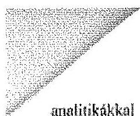
analitikákkal részletesen alátámasztotta, a felmerülő kérdéseket személyes egyeztetés során maradéktalanul megválaszolta, további, az egyezőségre vonatkozó kérdés nem merült fel.
A KEKKH 2013. évre vonatkozóan kimutatott mindösszesen 4614,4 millió Ft összegű maradványából 361,5 millió Ft összegű kötelezettségvállalással nem terhelt maradvány nem került visszahagyásra, ennek visszautalásáról a Hivatal az irányító szerv utasítása alapján gondoskodott.

A Hivatalnál a Magyarország 2013. évi költségvetése végrehajtásának ellenőrzése tárgyban folytatott ÁSZ vizsgálatnak szintén tárgya volt a fent említett egyezőség vizsgálata, melyről az elkészült jelentés hiányosságot nem állapított meg.

Ezúton kezdeményezem a fenti észrevételek alapján a megküldött jelentéstervezet módosítását.

Budapest, 2015. június 10.

Tisztelettel:
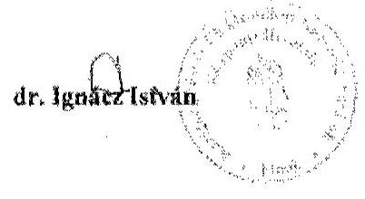

Készült: 2 példányban
Kapják: Címzett, Intézet

# KEKKH 

H-1094 Budapest, Balázs Béla u. 35. - Telefon: +36(1)456-6510 - Fax: +36(1)456-6509
e-mail: elnoki@kekkh.gov.hu - www.kekkh.gov.hu

---

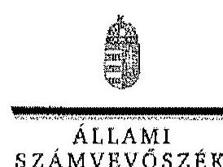

# Dr. Ignácz István úr 

elnök
Közigazgatási és Elektronikus Közszolgáltatások Központi Hivatala

## Budapest

## Tisztelt Elnök Úr!

A Közigazgatási és Elektronikus Közszolgáltatások Központi Hivatala pénzügyi és vagyongazdálkodásának ellenőrzéséről készített számvevőszéki jelentéstervezetre tett észrevételét köszönettel megkaptam.

Az Állami Számvevőszék észrevételekre vonatkozó álláspontjáról a felügyeleti vezető által készített részletes tájékoztatást csatoltan megküldöm.

Tájékoztatom Elnök urat, hogy a jelentésben - az Állami Számvevőszékről szóló 2011. évi LXVI. törvény 29. § (3) bekezdése alapján - az el nem fogadott észrevételt szerepeltetjük az elutasítás indokának feltüntetésével együtt.

Budapest, 2015. 07. hónap  nap
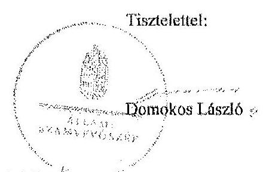

Melléklet: Tájékoztatás az el nem fogadott észrevételről

---

# Tájékoztatás az el nem fogadott észrevételről 

A Közigazgatási és Elektronikus Közszolgáltatások Központi Hivatala pénzügyi és vagyongazdálkodásának ellenőrzéséről készített jelentéstervezetre a 82/98-7/2015. iktatószámú levelében tett észrevételét áttekintettük, annak kezeléséről az alábbi tájékoztatást adom.
Nem fogadjuk el az előirányzat-maradvány analitikus nyilvántartására vonatkozó észrevételét. A jelentéstervezet megállapítását, amely szerint a kötelezettségvállalással terhelt előirányzat-maradvány összege nem egyezett meg a jóváhagyott előirányzat-maradvány összegével, az észrevételében nem kifogásolja, az eltérést indokolja. Az előirányzat-maradvány analitikája a teljes áthúzódó kötelezettségvállalás állományt tartalmazta. Ezt a tényt Elnök úr a 2014. december 12-ei keltezésű nyilatkozatával is megerősítette.
Egyben tájékoztatom Elnök urat, hogy jelen ellenőrzésünk szabályszerűségi ellenőrzés volt, a jogszabályok és belső szabályzatokban foglaltak betartására irányult, így a Hivatal működésének szélesebb és mélyebb területét fedte le, mint a Magyarország 2013. évi költségvetése végrehajtásának ellenőrzése.

Budapest, 2015. 07. hónap  nap
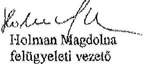

---

# 6. SZÁMÚ MELLÉKLET A V-0648-502/2015. SZÁMÚ JELENTÉSHEZ 

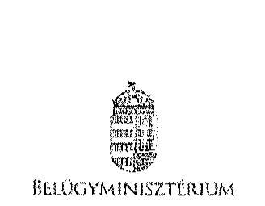

Iktatószám: BM:11471-2/2015.
Domokos László úr
elnök

Állami Számvevőszék
Budapest

## Tisztelt Elnök Úr!

Az Állami Számvevőszéknek a 2015. április 19. napján kelt, V-0648-491/2015. iktatószámú, „a központi alrendszer egyes intézményei pénzügyi és vagyongazdálkodásának ellenőrzéséről - Közigazgatási és Elektronikus Közszolgáltatások Központi Hivatala" címú jelentéstervezetét megkaptam, melyre az Állami Számvevőszékről szóló 2011. évi LXVI. törvény 29. § (2) bekezdése alapján - az ellenőrzés megállapításaival kapcsolatosan - az alábbi észrevételeket teszem.

A jelentéstervezetnek az „Összegszerű megállapítások, következtetések, javaslatok" része a helyszíni ellenőrzés megállapításainak hasznosítása mellett rögzíti, hogy „az irányító szerv vezetője az ellenőrzött időszakban nem határozta meg, nem érvényesítette, nem kérte számon és nem ellenőrizte az erőforrásokkal való szabályszerű és hatékony gazdálkodáshoz szükséges, 2008. december 31-ig az Áht. 49. § b) pontjában, 2012. január 1-ig a 49. § (3) bekezdés f) pontjában, majd azt követően az Áht. 9. § (1) bekezdés f) pontjában foglalt követelményeket".

Ezzel kapcsolatosan részemre az alábbi javaslat került megtételre: „Intézkedjen a Hivatal által ellátandó közfeladatok ellátására vonatkozó, erőforrásokkal való szabályszerű és hatékony gazdálkodáshoz szükséges követelmények kialakítására, számonkérésére és ellenőrzésére."

Tájékoztatom Elnök Urat, hogy a Közigazgatási és Elektronikus Közszolgáltatások Központi Hivatala az ellenőrzött időszak tekintetében nem tartozott a Belügyminisztérium irányítása alá. A Belügyminisztérium irányítása alá kerülését követően azonnal elrendeltem a BM Ellenőrzési Főosztály vezetésével egy teljes, átfogó vizsgálat lefolytatását. A vizsgálatról készített jelentésben számos javaslat került megfogalmazásra, amely többek között rögzítette a belső kontrollrendszer jogszabályi előírásoknak nem megfelelő kialakítását, és több szakmai terület esetében állapított meg hiányosságot. Az Ellenőrzési Jelentési tematikus miniszteri értekezlet tárgyalta meg. Ezt követően a megállapítások, javaslatok alapján Intézkedési Tervben rendeltem el a feladatok végrehajtását.

---

Az ellenőrzést követően személyi változás történt a Közigazgatási és Elektronikus Közszolgáltatások Központi Hivatala Elnökének személyében, illetve Elnök Úr egyetértésével - új belső ellenőrzési vezetőt nevezett ki.

A Hivatalban jelenleg folyik a vonatkozó jogszabályok, valamint a Belügyminisztérium elvárásainak megfelelően a belső kontroll rendszer megerősítése, ennek keretében a Belső Ellenőrzési Kézikönyv aktualizálása, a Belső Kontroll Kézikönyv előkészítése és minden tevékenységre vonatkozóan az ellenőrzési nyomvonalak kialakítása.

Ezen észrevételek alapján kérem Elnök Úr intézkedését a jelentéstervezet pontosítására és jelen levelemben rögzítettek alapján annak kiegészítésére.

Budapest, 2015. június 16.

# Üdvözlettel: 

Dr. Pintér Sándor

---

# ZÁRADÉK 

A dokumentum elektronikus aláírással hitelesített

---

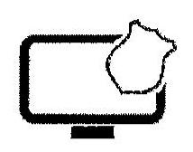

|  Ügyintéző: | Dr. Üveges Irina  |
| --- | --- |
|  Iktatás dátuma: | 2015.06.15  |
|  Határidő: | 2015.07.15  |
|  Csatolmányok |   |
|  KEKKH_ÁSZ jelentéstervezet |   |
|  észrevétel_20150615.docx |   |

Elektronikus aláírással elkészített dokumentum.

---

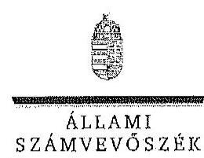

Elnök

Ikt.szám: V-0648-516/2015.

Dr. Pintér Sándor úr
miniszter
Belügyminisztérium

Budapest

Tisztelt Miniszter Úr!

A Közigazgatási és Elektronikus Közszolgáltatások Központi Hivatala pénzügyi és vagyongazdálkodásának ellenőrzéséről készített számvevőszéki jelentéstervezetre tett észrevételét köszönettel megkaptam.

Az Állami Számvevőszék észrevételekre vonatkozó álláspontjáról a felügyeleti vezető által készített részletes tájékoztatást csatoltan megküldöm.

Tájékoztatom Miniszter urat, hogy a jelentésben – az Állami Számvevőszékről szóló 2011. évi LXVI. törvény 29. § (3) bekezdése alapján – az el nem fogadott észrevételt szerepeltetjük az elutasítás indokának feltüntetésével együtt.

Budapest, 2015. 07. hó 2. nap

Tisztelettel:

Domokos László

Melléklet: Tájékoztatás az el nem fogadott észrevételről

1102 BUDAPEST, AFRIKAI KÖRÚT 10. 1364 Budapest 4. Pl. 54 telefon:

 484 9191 fax: 484 9291

---

# Tájékoztatás az el nem fogadott észrevételről 

A Közigazgatási és Elektronikus Közszolgáltatások Központi Hivatala pénzügyi és vagyongazdálkodásának ellenőrzéséről készített jelentéstervezetre a BM:11471-2/2015. iktatószámú levelében tett észrevételét áttekintettük, annak kezeléséről az alábbi tájékoztatást adom.

A jelentéstervezetben a megállapításokat az Állami Számvevőszék az ellenőrzött időszakra vonatkozóan teszi meg, ezért észrevétele a jelentéstervezet megállapításait nem módosítja. Örömmel vettem, hogy Belügyminiszter úr által elrendelt ellenőrzés alapján az Állami Számvevőszék által is feltárt hiányosságok kijavítása már megkezdődött. A jelentéstervezet bevezetője tartalmazta, hogy az irányítószervi feladatok ellátása 2008. január 1-jétől 2010. május 28-ig a Miniszterelnöki Hivatalt vezető miniszter, 2010. május 29-től 2012. december 30-ig a közigazgatási és igazságügyi miniszter kizárólagos felelősségi körébe tartozott.

Budapest, 2015. $\quad \sigma \quad$ hó ${ }^{\mu} \mathrm{nap}$
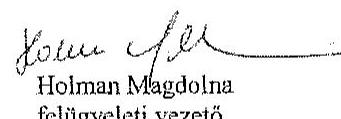

---

# RÖVIDÍTÉSEK JEGYZÉKE 

| Törvények |  |
| :--: | :--: |
| Áht. 1 | Az államháztartásról szóló 1992. évi XXXVIII. törvény (hatálytalan 2012. január 1-jétől) |
| Áht. 2 | Az államháztartásról szóló 2011. évi CXCV. törvény (hatályos 2012. január 1-jétől) |
| Alaptörvény | Magyarország Alaptörvénye (2011. április 25.) (hatályos 2012. január 1-jétől) |
| ÁSZ tv. ${ }_{1}$ | Az Állami Számvevőszékről szóló 1989. évi XXXVIII. törvény (hatálytalan 2011. július 1-jétől) |
| ÁSZ tv. ${ }_{2}$ | Az Állami Számvevőszékről szóló 2011. évi LXVI. törvény (hatályos 2011. július 1-jétől) |
| Eht. | Az elektronikus hírközlésről szóló 2003. évi C. törvény |
| Einfo tv. | Az elektronikus információszabadságról szóló 2005. évi XC. törvény (hatálytalan 2012. január 1-jétől) |
| Info tv. | Az információs önrendelkezési jogról és az információszabadságról szóló 2011. évi CXII. törvény (hatályos 2011. július 27-étől) |
| Kbt. $_{1}$ | A közbeszerzésekről szóló 2003. évi CXXIX. törvény (hatálytalan 2012. január 1-jétől) |
| Kbt. 2 | A közbeszerzésekről szóló 2011. évi CVIII. törvény (hatályos 2012. január 1-jétől) |
| Kt. | A költségvetési szervek jogállásáról és gazdálkodásáról szóló 2008. évi CV. törvény (hatályos 2009. január 1-jétől 2010. augusztus 14-éig) |
| Nvtv. | A nemzeti vagyonról szóló 2011. évi CXCVI. törvény (hatályos 2012. január 1-jétől) |
| Számv. tv. | A számvitelről szóló 2000. évi C. törvény |
| Vtv. | Az állami vagyonról szóló 2007. évi CVI. törvény |
| Kormányrendeletek |  |
| Áhsz. | Az államháztartás szervezetei beszámolási és könyvvezetési kötelezettségének sajátosságairól szóló 249/2000. (XII. 24.) Korm. rendelet |
| Ámr. $_{1}$ | Az államháztartás működési rendjéről szóló 217/1998. (XII. 30.) Korm. rendelet (hatálytalan 2010. január 1-jétől) |
| Ámr. 2 | Az államháztartás működési rendjéről szóló 292/2009. (XII. 19.) Korm. rendelet (hatályos 2010. január 1-jétől 2011. december 31-éig) |
| Ávr. | Az államháztartásról szóló törvény végrehajtásáról szóló 368/2011. (XII. 31.) Korm. rendelet (hatályos 2012. január 1-jétől) |
| Ber. | A költségvetési szervek belső ellenőrzéséről szóló 193/2003. (XI. 26.) Korm. rendelet (hatálytalan 2012. január 1-jétől) |

---

Bkr.
integritásirányítási rendelet

Vtvr.
276/2006. (XII. 23.)
Korm. rendelet
50/2013. (II. 25.) Korm. rendelet

## Miniszteri rendelet

36/2013. (IX. 13.) NGM rendelet

## Belső szabályzat

4/2011. számú elnöki intézkedés

## Szórövidítések

áfa
ÁSZ
irányító szerv

EKG
EU
EDR
ESR
KEHI
IRM
KIM
Kincstár
MeH
MNV Zrt.
NFM
NGM
NISZ
PM
OGY
ORFK
ÖM

A költségvetési szervek belső kontrollrendszeréről és belső ellenőrzésről szóló 370/2011. (XII. 31.) Korm. rendelet (hatályos 2012. január 1-jétől)
Az államigazgatási szervek integritásirányítási rendszeréről és az érdekérvényesítők fogadásának rendjéről szóló 50/2013. (II. 25.) Korm. rendelet (hatályos 2013. március 27-étől)
Az állami vagyonnal való gazdálkodásról szóló 254/2007. (X. 4.) Korm. rendelet
a Közigazgatási és Elektronikus Közszolgáltatások Központi Hivatala létrehozásáról, feladatairól és hatásköréről
az államigazgatási szervek integritásirányítási rendszeréről és az érdekérvényesítők fogadási rendjéről
az államháztartás számvitelének 2014. évi megváltozásával kapcsolatos feladatokról

A Közigazgatási és Elektronikus Közszolgáltatások Központi Hivatala elnökének 4/2011. számú intézkedése a KEK KH 2011. évi jóváhagyott költségvetésének felhasználásáról
általános forgalmi adó
Állami Számvevőszék
Miniszterelnöki Hivatal (2008. január 1-jétől 2010. május 28-ig), Közigazgatási és Igazságügyi Minisztérium (2010. május 29-től 2013. december 31-ig)
Elektronikus Kormányzati Gerinchálózat
Európai Unió
Egységes digitális rádió-távközlő rendszer
Európai segélyhívó rendszer
Kormányzati Ellenőrzési Hivatal
Igazságügyi és Rendészeti Minisztérium
Közigazgatási és Igazságügyi Minisztérium
Magyar Államkincstár
Miniszterelnöki Hivatal
Magyar Nemzeti Vagyonkezelő Zrt.
Nemzeti Fejlesztési Minisztérium
Nemzetgazdasági Minisztérium
Nemzeti Infokommunikációs Szolgáltató Zrt.
Pénzügyminisztérium
Országgyűlés
Országos Rendőr-főkapitányság
Önkormányzati Minisztérium

---

ÖTM
SIS II.
alapító okirat ${ }_{1}$
alapító okirat ${ }_{2}$
alapító okirat ${ }_{3}$
értékelési szabályzat ${ }_{1}$
értékelési szabályzat ${ }_{2}$
értékelési szabályzat ${ }_{3}$
értékelési szabályzat ${ }_{4}$
belső ellenőrzési szabályzat
beszerzési szabályzat ${ }_{1}$
beszerzési szabályzat ${ }_{2}$
beszerzési szabályzat ${ }_{3}$
bizonylati szabályzat ${ }_{1}$
bizonylati szabályzat ${ }_{2}$
bizonylati szabályzat ${ }_{3}$
bizonylati szabályzat ${ }_{3}$
bizonylati szabályzat ${ }_{4}$
KEKKH
Hivatal
gazdasági szervezet
ügyrendje ${ }_{1}$
gazdasági szervezet
ügyrendje ${ }_{2}$
gazdasági szervezet
ügyrendje ${ }_{3}$
gazdálkodási szabály-
zat
kötelezettségvállalási
szabályzat ${ }_{1}$
kötelezettségvállalási szabályzat ${ }_{2}$

Önkormányzati és Területfejlesztési Minisztérium
Shengeni Információs Rendszer második generációja
A KEKKH Alapító okirata hatályos 2007. január 1-jétől
A KEKKH Alapító okirata hatályos 2009. július 1-jétől, módosítva 2009. szeptember 18-án
A KEKKH Alapító okirata hatályos 2010. október 29-től, módosítva 2013. május 22-én
A KEKKH Értékelési Szabályzata, hatályos 2007. május 7-től
A KEKKH Értékelési Szabályzata, hatályos 2008. július 31-től
A KEK Értékelési Szabályzata hatályos, 2009. október 21-től
A KEKKH Értékelési Szabályzata hatályos 2010. május 20-tól
A KEKKH FEUVE szabályzata hatályos, 2005. szeptember 1-től
A KEKKH Beszerzési Szabályzata hatályos, 2009. október 21-től
A KEKKH Beszerzési Szabályzata hatályos, 2010. május 20-tól
A KEKKH Beszerzési Szabályzata, hatályos 2013. április 25-től
A KEKKH Bizonylati Rend Szabályzata, hatályos 2007. május 7-től
A KEKKH Bizonylati Rend Szabályzata, hatályos 2008. július 31-től
A KEKKH Bizonylati Rend Szabályzata, hatályos 2009. október 21-től
A KEKKH Bizonylati Rend Szabályzata, hatályos 2010. május 20-tól
Közigazgatási és Elektronikus Közszolgáltatások Központi Hivatala (KEKKH)
A KEKKH mint az ellenőrzött költségvetési szerv
A KEKKH Gazdasági Szervezet Ügyrendi Szabályzata, hatályos 2007. május 1-jétől
A KEKKH Gazdasági Szervezet Ügyrendi Szabályzata, hatályos 2009. február 1-jétől
A KEKKH Gazdasági Szervezet Ügyrendi Szabályzata, hatályos 2013. január 1-jétől
A KEKKH Gazdálkodási Szabályzata, hatályos 2007. május 7-től
A KEKKH Kötelezettségvállalás, Utalványozás, Ellenjegyzés és Érvényesítés Rendjéről Szóló Szabályzat, hatályos 2008. december 15-től
A KEKKH Kötelezettségvállalás, Utalványozás, Ellenjegyzés és Érvényesítés Rendjéről Szóló Szabályzat, hatályos 2009. október 21-től

---

kötelezettségvállalási szabályzat ${ }_{3}$
kötelezettségvállalási szabályzat ${ }_{4}$
közbeszerzési szabályzat ${ }_{1}$
közbeszerzési szabályzat ${ }_{2}$
közbeszerzési szabályzat ${ }_{3}$
közbeszerzési szabályzat ${ }_{4}$
leltárkészítési szabályzat ${ }_{5}$
önköltség-számítási szabályzat ${ }_{1}$
önköltség-számítási szabályzat ${ }_{2}$
önköltség-számítási szabályzat ${ }_{3}$
pénzkezelési szabályzat ${ }_{4}$
pénzkezelési szabályzat ${ }_{5}$
selejtezési szabályzat ${ }_{1}$
selejtezési szabályzat ${ }_{2}$

A KEKKH Kötelezettségvállalás, Utalványozás, Ellenjegyzés és Érvényesítés Rendjéről Szóló Szabályzat, hatályos 2010. május 20-tól
A KEKKH Kötelezettségvállalás, Ellenjegyzés, Szakmai Teljesítésigazolás, Érvényesítés és Utalványozás Rendjéről Szóló Szabályzat, hatályos 2012. január 31-től
A KEKKH Közbeszerzési szabályzata, hatályos 2006. május 22-től
A KEKKH Közbeszerzési Szabályzata, hatályos 2008. július 31-től
A KEKKH Közbeszerzési Szabályzata, hatályos 2009. október 21-től
A KEKKH Közbeszerzési Szabályzata, hatályos 2011. január 3-tól
A KEKKH Közbeszerzési Szabályzata, hatályos 2011. április 14-től
A KEKKH Leltározás és Leltárkészítési Szabályzata, hatályos 2007. május 7-től
A KEKKH Leltározás és Leltárkészítési Szabályzata hatályos 2008. július 31-től
A KEKKH Leltározás és Leltárkészítési Szabályzata, hatályos 2009. október 21-től
A KEKKH Leltározás és Leltárkészítési Szabályzata hatályos, 2010. május 20-tól
A KEKKH Leltározás és Leltárkészítési Szabályzata, hatályos 2012. november 20-tól
A KEKKH Önköltségszámítási szabályzata, hatályos 2007. május 1-jétől
A KEKKH Önköltségszámítási szabályzata, hatályos 2008. július 31-től

A KEKKH Önköltségszámítási szabályzata, hatályos 2009. október 21-től

A KEKKH Önköltségszámítási szabályzata, hatályos 2010. május 20-tól
A KEKKH Pénztár- és Pénzkezelési Szabályzata, hatályos 2007. május 1-jétől

A KEKKH Pénztár- és Pénzkezelési Szabályzata, hatályos 2008. július 31-től

A KEKKH Pénztár és Pénzkezelési Szabályzata, hatályos 2009. október 21-től

A KEKKH Pénztár és Pénzkezelési Szabályzata, hatályos 2010. május 20-tól
A KEKKH Pénztár és Pénzkezelési Szabályzata, hatályos 2013. október 22-től
A KEKKH Felesleges Vagyontárgyak Hasznosításának Selejtezésének Szabályzata, hatályos 2007. május 7-től
A KEKKH Felesleges Vagyontárgyak Hasznosításának

---

| selejtezési szabályzat ${ }_{3}$ | A KEKKH Felesleges Vagyontárgyak Hasznosításának Selejtezésének Szabályzata, hatályos 2009. október 21-től |
| :--: | :--: |
| selejtezési szabályzat ${ }_{4}$ | A KEKKH Felesleges Vagyontárgyak Hasznosításának Selejtezésének Szabályzata, hatályos 2010. május 20-tól |
| szabálytalanságok kezelésének eljárásrendje | A KEKKH Szabálytalanságok kezelésének eljárásrendje, hatályos 2011. szeptember 12-től |
| számlarend $_{1}$ | A KEKKH Számlarendje, hatályos 2007. május 7-től |
| számlarend $_{2}$ | A KEKKH Számlarendje, hatályos 2008. július 31-től |
| számlarend $_{3}$ | A KEKKH Számlarendje, hatályos 2009. október 21-től |
| számlarend $_{4}$ | A KEKKH Számlarendje, hatályos 2010. május 20-tól |
| számviteli politika $_{1}$ | A KEKKH Számviteli Politikája, hatályos 2007. május 7-től |
| számviteli politika $_{2}$ | A KEKKH Számviteli Politikája, hatályos 2008. július 31-től |
| számviteli politika $_{3}$ | A KEKKH Számviteli Politikája, hatályos 2009. október 21-től |
| számviteli politika $_{4}$ | A KEKKH Számviteli Politikája, hatályos 2010. május 20-tól |
| SZMSZ $_{1}$ | 16/2008. (HÉ 51.) MeHVM utasítás a KEKKH Szervezeti és Működési Szabályzatáról, hatályos 2009. január 1-jétől |
| SZMSZ $_{2}$ | 42/2011. (IV. 20.) KIM utasítás a KEKKH Szervezeti és Működési Szabályzatáról, hatályos 2011. április 21-től |
| SZMSZ $_{3}$ | 37/2013. (XII. 5.) KIM utasítás a KEKKH Szervezeti és Működési Szabályzatáról, hatályos 2013. december 6-tól |

---

.

---

# ÉRTELMEZŐ SZÓTÁR 

átlagos életkor
befektetett eszközök aránya
eredendő veszélyeztetetségi szint
eredményesség
gazdaságosság
hatékonyság
integritási kockázat
kockázatok kezelésére hivatott kontrollok

A mutató kifejezi a tárgyi eszközök átlagos életkorát, melyet az elhasználódási szint százaléka és az éves értékcsökkenési leírási kulcs százalékának hányadosaként számítunk ki.
A mutató kifejezi, hogy a befektetett eszközök milyen arányt képviselnek az összes eszközön belül. Az arány növekedése azt jelzi, hogy a szervezet által ellátott tevékenység eszközellátottsága javul.
Az „eredendő veszélyeztetettség" olyan kockázati tényezők csoportja, amelyek a vizsgált költségvetési szerv jogállásából eredően, az általa kezelt erőforrásokkal való gazdálkodás miatt gyakorlatilag objektív, „külső" szervezeti adottságként értelmezhetők.
Az eredményesség követelménye azt jelenti, hogy a kitűzött célok - az elfogadott módosításokat, változó körülményeket figyelembe véve - megvalósuljanak, a tevékenység tervezett és tényleges hatása közötti különbség a lehető legkisebb mértékű legyen, vagy a tényleges hatás legyen kedvezőbb a tervezettnél. (Forrás: Áht. 91. § (1) bekezdés b) pont, Bkr. 2. § g) pont.)
A gazdaságosság követelménye azt jelenti, hogy az erőforrások felhasználásához kapcsolódó kiadás vagy ráfordítás az elérhető legkisebb legyen, a jogszabályban meghatározott vagy általánosan elvárható minőség mellett. (Forrás: Áht. 91. § (1) bekezdés b) pont, Bkr. 2. § i) pont.)

A hatékonyság követelménye azt jelenti, hogy az előállított termékek, nyújtott szolgáltatások, az ellátott feladat más eredményének értéke, vagy az azokból származó bevétel a lehető legnagyobb mértékben haladja meg a felhasznált erőforrásokhoz kapcsolódó kiadásokat vagy ráfordításokat. (Forrás: Áht. 91. § (1) bekezdés b) pont, Bkr. 2. § j) pont.)
Az integritás az elvek, értékek, cselekvések, módszerek, intézkedések konzisztenciáját jelenti, vagyis olyan magatartásmódot, amely meghatározott értékeknek megfelel. (Forrása NGM Útmutató: Magyarországi államháztartási belső kontroll standardok 1.6.1. pont, 2012. december.)
Az államigazgatási szerv működésére vonatkozó szabályoknak, valamint a hivatali szervezet vezetője és az irányító szerv által meghatározott célkitűzéseknek, értékeknek és elveknek megfelelő működés.
(Forrás: integritásirányítási rendelet 2. § a) pont.)
Az államigazgatási szerv integritása sérülésének lehetősége. (Forrás: integritásirányítási rendelet 2. § c) pont.)
A belső és külső kontrollok célja, hogy megfelelő
 eszközökkel, intézményekkel és eljárásokkal védelmet biztosít-

---

korrupciós kockázat

Korrupciós Veszélyeztetettséget Növelő Tényezők
kötelezettségek és a saját tőke aránya mutató
közfeladat
kulcskontrollok
likviditási mutató I.
likviditási mutató II.
son a közpénzből, közérdekből működő, vagyis közcélokat követő szervek működésével kapcsolatos ún. eredendő, valamint az egyéb, veszélyeztetettséget növelő körülményekből származó korrupciós kockázatokkal szemben. A belső és külső kontrollok tehát a - bármilyen típusú - korrupciós kockázatokkal szembeni védettség elemeit, azok összességét jelentik.
A jogtalan előny nyújtásának vagy megszerzésének lehetősége. (Forrás: integritásirányítási rendelet 2. § d) pont.)
A Korrupciós Veszélyeztetettséget Növelő Tényezők (KVNT) leképezik egyfelől a költségvetési szervek jogi intézményi környezetének jellemzőit (kiszámíthatóság, stabilitás), másfelől az intézmények működtetése során jelentkező - alapvetően a mindenkori menedzsment döntéseitől befolyásolt - változó tényezőket. Utóbbiak körében kiemelhető a stratégiai célok meghatározása, a szervezeti struktúra és kultúra alakítása, valamint a személyi és költségvetési erőforrásokkal való gazdálkodás.
A mutató növekedése kifejezi annak kockázatát, hogy a költségvetési szerv nem lesz képes a kötelezettségeinek kiegyenlítésére, részben a szállítók finanszírozzák a működését, veszélyeztetve ezzel a működés biztonságát. A mutató számítása %-ban kifejezve: (Kötelezettségek összesen/Saját tőke+Tartalékok összesen)*100.
Az a feladat, amit az arra kötelezett közérdekből, jogszabályban meghatározott követelményeknek és feltételeknek megfelelve végez, ideértve a lakosság közszolgáltatásokkal való ellátását, továbbá az állam nemzetközi szerződésekben vállalt kötelezettségeiből adódó közérdekű feladatokat, valamint e feladatok ellátásához szükséges infrastruktúra biztosítását is. (Forrás: Nvtv. 3. § (i) bekezdés 7. pont.)
A kiadások utalványozását megelőző kötelező kontrolltevékenységek. Az Ámr. 1,2 a 2008-2011. években a szakmai teljesítésigazolást és az utalvány ellenjegyzését, az Ávr. a 2012-2013. években a teljesítésigazolást és az érvényesítést írta elő egyenrangú kulcskontrollként.
A mutató kifejezi, hogy a szervezet forgóeszközei milyen mértékben nyújtanak fedezetet a rövid lejáratú kötelezettségekre az éves könyvviteli mérleg adatai alapján. Számítása %-ban kifejezve: Forgóeszközök összesen/ Rövid lejáratú kötelezettségek összesen*100. A mutató értéke akkor elfogadható, ha 100% fölötti értéket mutat.
A mutató kifejezi, hogy a szervezet forgóeszközei a követelések nélkül milyen mértékben nyújtanak fedezetet a rövid lejáratú kötelezettségekre az éves könyvviteli mérleg adatai alapján. Számítása %-ban kifejezve: (Forgóeszközök összesen - Követelések összesen)/Rövid lejáratú kötelezettségek összesen)*100. A mutató értéke akkor

---

monitoring
pénzhányad mutató
saját tőke aránya
tárgyi eszközök használhatósági foka
vagyonfedezeti mutató
vezetői nyilatkozat
kedvező, ha 100% vagy annál nagyobb értéket mutat. A monitoring általánosságban a különböző szintű szervezeti célok megvalósításának folyamatát kíséri figyelemmel, melynek során a releváns eseményekről és tevékenységekről rendszeres jelleggel, strukturált, döntéstámogató információkhoz jutnak a szervezet vezetői.
(Forrás: NGM Útmutató a költségvetési szervek monitoring rendszeréhez 2011. november.)
A mutató kifejezi, hogy a szervezet pénzeszközei az idegen pénzeszközök nélkül milyen mértékben nyújtanak fedezetet a rövid lejáratú kötelezettségekre az éves könyvviteli mérleg adatai alapján. Számítása %-ban kifejezve: (Pénzeszközök összesen - Idegen pénzeszközök)/Rövid lejáratú kötelezettségek összesen)*100. A mutató értéke akkor kedvező, ha 100% vagy annál nagyobb értéket mutat.
A mutató kifejezi, hogy a saját tőke és a tartalékok milyen arányt képviselnek az összes forráson belül. A mutató növekedése a tőkeellátottság javuló tendenciáját fejezi ki.
Az eszközgazdálkodás vizsgálatának elemzése során használt mutató. Számítása: tárgyi eszközök könyv szerinti (nettó) értéke/tárgyi eszközök bruttó (beszerzési/létesítési) értéke. A %-ban kifejezett mutató csökkenése az eszköz állagának romlására, avulására utal, ami maga után vonja az üzemeltetési és fenntartási költségek növekedését is.
A mutató kifejezi, hogy a költségvetési szerv saját vagyona (saját tőke+tartalékok összege) milyen arányban nyújt fedezetet a befektetett eszközökre. Számítása %-ban kifejezve: (Saját vagyon/Befektetett eszközök)*100. A mutató értéke akkor megfelelő, ha egy, vagy annál nagyobb értéket mutat.
A költségvetési szerv vezetője köteles nyilatkozatban értékelni a költségvetési szerv belső kontrollrendszerének minőségét és azt az éves költségvetési beszámolóval együtt megküldeni az irányító szervnek. Ha év közben változás történik a szerv vezetője személyében, vagy a költségvetési szerv átalakul, megszűnik, a távozó vezető, illetve az átalakuló, megszűnő költségvetési szerv vezetője köteles a nyilatkozatot az addig eltelt időszak vonatkozásában kitölteni, és az új vezetőnek, illetve a jogutód költségvetési szerv vezetőjének átadni, aki azt saját nyilatkozatához mellékeli.
(Forrás: Ámr. 149. § (2) bekezdés c) pont, (11) bekezdés, 23. számú melléklet; Ámr. 2 217. § c) pont, 226. § (3) bekezdés, 21. számú melléklet; Bkr. 11. § (1)-(2) és (4) bekezdés, 1. számú melléklet.)

---

.

---

# A GAZDASÁGOSSÁGI, HATÉKONYSÁGI ÉS EREDMÉNYESSÉGI KÖVETELMÉNYEK KIALAKÍTÁSA, A VEZETŐI NYILATKOZAT HELYTÁLLÓSÁGA 

## 1. A PÉNZÜGYI ÉS A VAGYONGAZDÁLKODÁS FOLYAMATÁBAN A GAZDASÁGOSSÁGI, HATÉKONYSÁGI ÉS EREDMÉNYESSÉGI KÖVETELMÉNYEK KIALAKÍTÁSA ÉS MŰKÖDTETÉSE

Az Intézmény vezetője nem gondoskodott arról, hogy tevékenységében és céljaiban a gazdaságosság, a hatékonyság és az eredményesség követelményei érvényesüljenek, mivel azokat az Áht. 194. § (1) bekezdés b) pontjában, az Áht. 261. § (1) bekezdésben, az Áht. 269. § (1) bekezdés a) pontjában és a Bkr. 4. § a) pontjában foglaltak ellenére nem alakította ki és nem alkalmazta.
A Hivatal a pénzügyi gazdálkodás területén 2008-2010. években dokumentumokkal alátámasztva nem tűzött ki mérhető célokat. A 2011-2013. években a pénzügyi gazdálkodás területén az elemi költségvetésben meghatározott előirányzatok teljesítéséhez alakított ki mutatókat, - alapvetően az eredeti és a módosított előirányzatok teljesítésére - amelyek alakulását nyomon követték.

A Hivatal a 2008-2013. években vagyongazdálkodás területén kitűzött teljesítményméréssel kapcsolatos célokat, de nem határozott meg a célokhoz mérhető indikátorokat.
A Hivatal az ellenőrzött időszakban középtávú célkitűzéseket a 2008. évben (KEKKH Jövőkép és Programterve) rögzítette. Éves célkitűzéseket, feladatokat a munkatervekben, elnöki intézkedésben határozták meg.
A 2008. évi munkaterv rögzítette a Hivatal alapfeladatainak ellátásához rendelkezésre álló anyagi és pénzügyi erőforrások biztosítását, hatékony felhasználását, a pénzügyi források ésszerű, takarékos felhasználását.

A 2008. évi munkaterv tartalmazta a kab-hegyi és a hármashatár-hegyi objektumok kazáncseréjét, amivel 10%-os energia, illetve tüzelőanyag megtakarítás érhető el. A beszámoló szerint a feladat megvalósult, de az energia megtakarítás mértékét nem mutatta be.
A 2011. évben a KEKKH 2011. évi jóváhagyott költségvetésének felhasználásáról szóló 4/2011. évi elnöki intézkedés tartalmazott célkitűzéseket, de a célok, feladatok teljesítésének méréséhez nem rendeltek indikátorokat.
A gazdasági szervezetnél alkalmazott dolgozók aránya a teljes állományi létszámon belül a 2008. évi 13,0%-ról 2013-ra 10,4%-ra csökkent. A funkcionális létszámarány 2013-ban 14,1% volt, amely megfelelt az 1007/2013. (I. 10.) Korm. határozatban előírt 15%-os referenciaértéknek.
A Hivatal 2008-2013 között tevékenységeivel kapcsolatos monitoring stratégiát nem alakított ki, nem határozta meg az indikátorok nyomon követésének feladatait. A munkaköri leírásban általánosan határozták meg, hogy

---

vezetői információs igények kielégítéséhez rendszeres havi gyakoriságú, valamint eseti jellegű jelentéseket, kimutatásokat, adatokat kell szolgáltatni, továbbá gazdasági számításokat, elő-utókalkulációkat készíteni.

# 2. A GAZDASÁGOSSÁG, HATÉKONYSÁG ÉS EREDMÉNYESSÉG KÖVETELMÉNYEINEK ÉRVÉNYESÍTÉSÉRŐL KIADOTT VEZETŐI NYILATKOZAT HELYTÁLLÓSÁGA A KEKKH PÉNZÜGYI ÉS VAGYONGAZDÁLKODÁSI FOLYAMATAI TEKINTETÉBEN 

A gazdaságosság, hatékonyság és eredményesség követelményeinek érvényesítéséről kiadott vezetői nyilatkozat a KEKKH pénzügyi és vagyongazdálkodási folyamatai tekintetében a gazdaságosság és hatékonyság tekintetében 2008-2013 között, az eredményesség tekintetében 2008-2010 között dokumentumokkal nem volt alátámasztott.
A Hivatal elnöke a 2008-2013. évekre a belső kontrollok működéséről szóló vezetői nyilatkozatot kiállította. A 2008-2010. évek között nem volt biztosított a vezetői nyilatkozat valóságtartalmának ellenőrzése az indikátorok kialakítását, alkalmazását, nyomon követését és teljesítését alátámasztó dokumentumok hiányában.
A 2011-2013. években a nyilatkozat valóságtartalma a pénzügyi gazdálkodás területén az eredményesség követelményének érvényesítése tekintetében biztosított volt, a gazdaságosság és hatékonyság érvényesülése nem volt dokumentumokkal alátámasztott. A vagyongazdálkodás területén a célokhoz nem rendeltek mutatókat.
