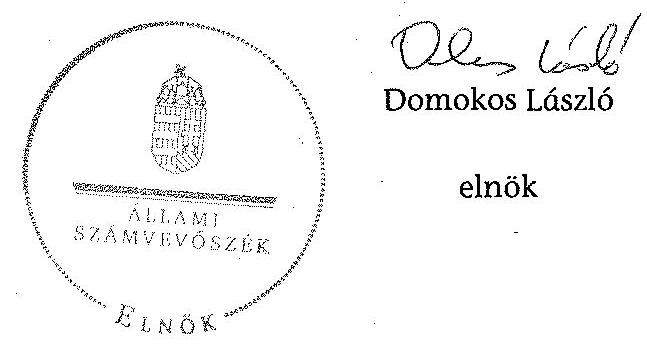
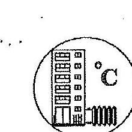
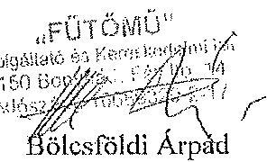
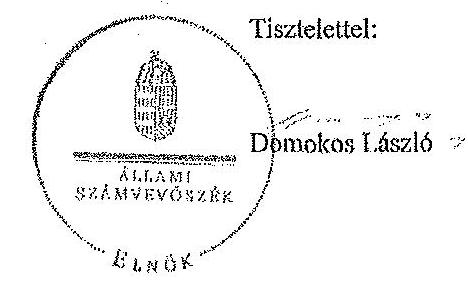
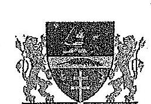
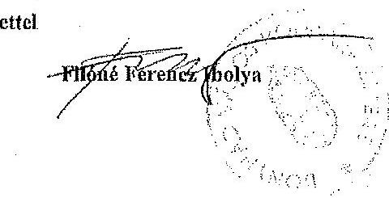

# ÁLLAMI   SZÁMVEVŐSZÉK 

## JELENTÉS

Az önkormányzatok gazdasági társaságai - Az önkormányzatok többségi tulajdonában lévő gazdasági társaságok közfeladat ellátását érintő gazdálkodási tevékenysége szabályszerűségének ellenőrzése
FŰTŐMŰ Szolgáltató és Kereskedelmi Korlátolt Felelősségű Társaság (Bonyhád)

---

# Állami Számvevőszék 

Iktatószám: V-0828-222/2015.
Témaszám: 1862
Vizsgálat-azonosító szám: V067149
Az ellenőrzést felügyelte:
Dr. Horváth Margit
felügyeleti vezető
Az ellenőrzés vezette és az ellenőrzés végrehajtásáért felelős:
Klinga László
ellenőrzésvezető
A jelentéstervezet összeállításában közremüködött:
Vacsora Erika
számvevő tanácsos
Az ellenőrzést végezték:

| Bartolák Márta | Nyirati Ferenc | Dr. Pálffy Imre Péter |
| :-- | :-- | :-- |
| számvevő főtanácsos | okleveles könyvvizsgáló,   külső szakértő | okleveles könyvvizsgáló,   külső szakértő |

---

# TARTALOMJEGYZÉK 

BEVEZETÉS ..... 7
I. ÖSSZEGZŐ MEGÁLLAPÍTÁSOK, KÖVETKEZTETÉSEK, JAVASLATOK ..... 10
II. RÉSZLETES MEGÁLLAPÍTÁSOK ..... 14

1. Az Önkormányzat közfeladat-ellátásának szabályszerűsége ..... 14
1.1. A közfeladat-ellátás megszervezése és a feladatellátás feltételrendszerének kialakítása ..... 14
1.2. A közfeladat-ellátás felügyelete és a tulajdonosi jogok érvényesítése ..... 15
2. A FŰTŐMŰ Kft. közfeladat-ellátással kapcsolatos tevékenysége ..... 18
2.1. A FŰTŐMŰ Kft. gazdálkodásának szabályozottsága ..... 18
2.2. A FŰTŐMŰ Kft. vagyongazdálkodása ..... 20
2.3. A beszámolási kötelezettség teljesítése ..... 21
3. A távhőszolgáltatás közfeladata bevételei és ráfordításai elszámolása, valamint az önköltségszámítás szabályszerűsége ..... 23
3.1. A távhőszolgáltatás közfeladat bevételeinek és ráfordításainak elkülönített, szabályszerű elszámolása ..... 23
3.2. Az önköltségszámítás szabályszerűsége ..... 24
MELLÉKLETEK
4. számú A FŰTŐMŰ Kft. tevékenységének főbb adatai
5. számú A FŰTŐMŰ Kft. múködésének főbb jellemzői
6. számú A FŰTŐMŰ Kft. által biztosított közszolgáltatás díjai a 2008-2013. évekre vonatkozóan
7. számú Beérkezett észrevételek és az azokra adott válaszok
FÜGGELÉK
8. számú Értelmező szótár
9. számú Mintavételi eljárások ellenőrzési területenként

---

.

---

# RÖVIDÍTÉSEK JEGYZÉKE 

## Törvények

Ámt.
Az árak megállapításáról szóló 1990. évi LXXXVII. törvény (hatályos: 1991. január 1-jétől)
ÁSZ tv.
Az Állami Számvevőszékről szóló 2011. évi LXVI. törvény (hatályos: 2011. július 1-jétől)
Eisztv.
az elektronikus információszabadságról szóló 2005. évi XC. törvény (hatálytalan: 2012. január 1-jétől)
Gt.
a gazdasági társaságokról szóló 2006. évi IV. törvény (hatálytalan: 2014. március 15 -től)
Info tv.
az információs önrendelkezési jogról és az információszabadságról szóló 2011. évi CXII. törvény (hatályos: 2011. július 27 -től)
Mötv
Magyarország helyi önkormányzatairól szóló 2011. évi CLXXXIX. törvény (hatályos: 2012. január 1-jétől, kivéve a 144. § (2) bekezdésben meghatározott előírások, amelyek 2012. április 15 -én, a (3) bekezdésben meghatározott előírások, amelyek 2013. január l-jén léptek hatályba, a (4) bekezdésben meghatározott előírások a 2014. évi általános önkormányzati választások napján léptek hatályba)
Munka tv. 1
Munka tv. 2
Ötv.
a Munka Törvénykönyvéről szóló 1992. évi XXII. törvény (hatálytalan: 2012. június 30-ától)
a Munka Törvénykönyvéről szóló 2012. évi I. törvény (hatályos: 2012. július 1-jétől)
a helyi önkormányzatokról szóló 1990. évi LXV. törvény (hatálytalan: a 2014. évi általános önkormányzati választások napjától)
Rezsi tv.
a rezsicsökkentések végrehajtásáról szóló 2013. évi LIV. törvény (hatályos: 2013. május 10-től)
Számv. tv.
a számvitelről szóló 2000. évi C. törvény (hatályos: 2001. január 1-jétől)
Taktv.
a köztulajdonban álló gazdasági társaságok takarékosabb müködéséről szóló 2009. évi CXXII. törvény (hatályos: 2009. december 4-től)
Tszt.
a távhőszolgáltatásról szóló 2005. évi XVIII. törvény (hatályos: 2005. július 1-jétől)
VET
a villamos energiáról szóló 2007. évi LXXXVI. törvény (2007. október 15 -től)

## Rendeletek

50/2011. (IX. 30.) NFM rendelet
a távhőszolgáltatónak értékesített távhő árának, valamint a lakossági felhasználónak és a külön kezelt intézménynek nyújtott távhőszolgáltatás dijának megállapításáról szóló 50/2011. (IX. 30.) NFM rendelet (hatályos: 2011. október 1-jétől)

---

Ávr.
Önkormányzati SZMSZ ${ }_{1}$

Önkormányzati SZMSZ ${ }_{2}$

Távhőrendelet ${ }_{1}$

Távhőrendelet ${ }_{2}$

Vagyongazdálkodási rendelet ${ }_{1}$

Vagyongazdálkodási rendelet ${ }_{2}$

## Szórövidítések

Adatvédelmi szabályzat
Árképzési szabályzat ${ }_{1}$
Árképzési szabályzat ${ }_{2}$
Árképzési szabályzat ${ }_{3}$
ÁSZ
Bonycom Kft.
Értékelési szabályzata ${ }_{1}$
Értékelési szabályzata ${ }_{2}$
FB
FÜTŐMŰ Kft./Társaság
Jegyzö
Képviselő-testület
Kintlévőség kezelési szabályzat ${ }_{1}$

368/2011. (XII. 31.) Korm. rendelet az államháztartásról szóló törvény végrehajtásáról (hatályos: 2012. január 1jétől)
Bonyhád Város Önkormányzati Képviselőtestületének többször módosított 17/1995. (VI. 1.) számú rendelete a Szervezeti és Müködési Szabályzatról (hatályos: 1995. június 1 -jétől)
Bonyhád Város Önkormányzata Képviselőtestületének 13/2011. (VII. 1.) számú rendelete az önkormányzat Szervezeti és Müködési Szabályzatáról (hatályos 2011. július 1 -jétől)
Bonyhád Város Önkormányzata 12/2006. (V. 26.) számú rendelete a Távhőszolgáltatásról (hatályos: 2006. május 26 -tól)
Bonyhád Város Önkormányzata 1/2012. (I. 27.) számú rendelete a Távhőszolgáltatásról (hatályos: 2012. január 27-től)
Bonyhád Város Önkormányzata Képviselőtestületének többször módosított 5/2006. (III. 10.) számú rendelete az önkormányzat vagyonáról és a vagyongazdálkodás szabályairól (hatályos: 2006. március 10-től)
Bonyhád Város Önkormányzata Képviselőtestületének 18/2013. (VIII. 30.) számú rendelete az önkormányzat vagyonáról és a vagyongazdálkodás szabályairól (hatályos: 2013. szeptember 1-től)

FÜTŐMŰ Kft. Adatvédelmi Szabályzata (hatályos: 2012. július 1 -jétől)
FÜTŐMŰ Kft. Árképzési szabályzata (hatályos: 2012. január 1-jétől)
FÜTŐMŰ Kft. Árképzési szabályzata (hatályos: 2013. január 1-jétől)
FÜTŐMŰ Kft. Árképzési szabályzata (hatályos: 2013. november 1-jétől)
Állami Számvevőszék
Bonyhádi Közüzemi Kft.
FÜTŐMŰ Kft. Eszközök és Források Értékelési szabályzata (hatályos: 2001. január 1-jétől)
FÜTŐMŰ Kft. Értékelési szabályzata (hatályos: 2012. július 1 -jétől)
FÜTŐMŰ Kft. Felügyelő Bizottsága
FÜTŐMŰ Szolgáltató és Kereskedelmi Korlátolt Felelősségű Társaság (Bonyhád)
Bonyhád Város Önkormányzatának jegyzője
Bonyhád Város Önkormányzatának Képviselő-testülete
FÜTŐMŰ Kft. Kintlévőség kezelési szabályzat (hatályos: 2006. január 1-jétől)

---

| Kintlévőség kezelési szabályzat ${ }_{2}$ | FÜTŐMŰ Kft. Kintlévőség kezelési szabályzat (hatályos: 2010. január 1-jétől) |
| :--: | :--: |
| Képviselö-testület | Bonyhád Város Önkormányzatának Képviselö-testülete |
| Leltározási szabályzat ${ }_{1}$ | FÜTŐMŰ Kft. Leltározási szabályzata (hatályos: 2007. január 1-jétől) |
| Leltározási szabályzat ${ }_{2}$ | FÜTŐMŰ Kft. Leltározási szabályzata (hatályos: 2012. július 1-jétől) |
| MEH | Magyar Energia Hivatal (2013. április 4-ig) |
| MEKH | Magyar Energetikai és Közmü-szabályozási Hivatal (2013. április 4-től) |
| Megállapodás | Bonyhád Város Önkormányzata és a FÜTŐMŰ Kft. között 1992. március 27 -én létrejött, a távhőszolgáltatási közfeladat ellátására vonatkozó feltételeket tartalmazó Megállapodás |
| Önkormányzat | Bonyhád Város Önkormányzata |
| Pénzkezelési szabályzat ${ }_{1}$ | FÜTŐMŰ Kft. Pénzkezelési szabályzata (hatályos: 2007. január 1-jétől) |
| Pénzkezelési szabályzat ${ }_{2}$ | FÜTŐMŰ Kft. Pénzkezelési szabályzata (hatályos: 2012. július 1-jétől) |
| Polgármester | Bonyhád Város polgármestere |
| Selejtezési szabályzata ${ }_{1}$ | FÜTŐMŰ Kft. Selejtezési szabályzata (hatályos: 2007. január 1-jétől) |
| Selejtezési szabályzata ${ }_{2}$ | FÜTŐMŰ Kft. Selejtezési szabályzata (hatályos: 2012. július 1-jétől) |
| Számlarend ${ }_{1}$ | FÜTŐMŰ Kft. Számlarendje (hatályos: 2001. január 1jétől) |
| Számlarend ${ }_{2}$ | FÜTŐMŰ Kft. Számlarendje (hatályos: 2009. január 1jétől) |
| Számviteli politika 1 | FÜTŐMŰ Kft. Számviteli politikája (hatályos: 2001. január 1-jétől) |
| Számviteli politika 2 | FÜTŐMŰ Kft. Számviteli politikája (hatályos: 2012. július 1-jétől) |
| NAV | Nemzeti Adó és Vámhivatal |
| SZMSZ $_{1}$ | FÜTŐMŰ Kft. Szervezeti és Múködési Szabályzata (hatályos: 2007. január 1-jétől) |
| SZMSZ $_{2}$ | FÜTŐMŰ Kft. Szervezeti és Múködési Szabályzata (hatályos: 2012. július 1-jétől) |
| TSZ | A „FÜTŐMƯ" Kft. Szolgáltató és Kereskedelmi Társaság Társasági Szerződése (1991. december 20-án kelt, többször módositott) |
| Üzletszabályzat ${ }_{1}$ | FÜTŐMŰ Kft. Üzletszabályzata (hatályos: 1999. november 9 -től) |
| Üzletszabályzat ${ }_{2}$ | FÜTŐMŰ Kft. Üzletszabályzata (hatályos: 2012. január 31-től) |

---

.

---

# JELENTÉS 

## Az önkormányzatok gazdasági társaságai Az önkormányzatok többségi tulajdonában lévő gazdasági társaságok közfeladat ellátását érintő gazdálkodási tevékenysége szabályszerűségének ellenőrzése

## FÜTÖMÚ Szolgáltató és Kereskedelmi Korlátolt Felelősségú Társaság (Bonyhád)

## BEVEZETÉS

Az Állami Számvevőszék középtávra szóló stratégiájában megfogalmazta, hogy a helyi önkormányzatok gazdálkodásában rejlő pénzügyi kockázatok feltárásával, az államháztartáson kívülre nyújtott költségvetési támogatások és ingyenes vagyonjuttatások, valamint az államháztartáson kívül múködő köz-feladat-ellátó rendszerek ellenőrzéseivel hozzájárul ahhoz, hogy a közpénzeket az államháztartáson kívül múködő szervezetek is átlátható, rendezett módon használják fel a közfeladatok szerződésben vállalt ellátása érdekében.

Az önkormányzatok szervezetalakítási szabadságának következménye, hogy a korábban is vállalati formában múködő (nagyvárosi tömegközlekedés, víz-, szennyvízcsatorna, köztisztasági, ingatlankezelés stb.) közszolgáltatások mellett, mind a kötelező, mind az önként vállalt feladatok ellátásában a gazdasági társaságok kiemelt fontosságú szerephez jutottak.

A FÜTŐMŰ Kft.-t a Képviselő-testület 129/1991. (XII. 10.) számú határozatával hozta létre a Szekszárdi Városgazdálkodási Vállalat jogutódjaként. A FÜTŐMŰ Kft. fő tevékenységi köre a közel 14 ezer fő lakosú Bonyhád Város közigazgatási területén a távhőszolgáltatás biztosítása volt. Ezen túlmenően az Önkormányzat intézményeinek hőszolgáltatását, a Gázmotoros Kiserőmú üzemeltetését, a köz-, dísz- és díszítő világítás kezelési feladatokat, valamint a Perczel kerti szökőkút múködtetését is ellátta. A Társaság az ellenőrzött időszakban a szabadpiacról vásárolta a távhőszolgáltatási üzletághoz szükséges földgázt.

Az ellenőrzött időszakban a FÜTŐMŰ Kft. 99,0\%-ban az Önkormányzat tulajdonában volt, a természetes személyek tulajdoni hányada $1 \%$ részarányt képviselt. A társult tagok képviselői és a tagok száma az alapítás óta változott, de a tulajdoni hányadok aránya és mértéke változatlan maradt. A Társaság átlagos statisztikai létszáma az ellenőrzött időszak elején és végén egyaránt 16 fő volt.

---

A FŰTŐMŰ Kft. összes bevétele 2008-ban 509,2 millió Ft, a 2013. évben 354,8 millió Ft volt, amelyből az értékesítés nettó árbevétele 2008-ban 475,8 millió Ft, míg 2013-ban 276 millió Ft volt A távhőszolgáltatás értékesítésének nettó árbevétele 2013-ban 191,6 millió Ft volt. A ráfordítások összegei a 2008. évi 490,9 millió Ft-ról a 2013. évre 29,1\%-kal 348,5 millió Ft-ra csökkentek.

A FŰTŐMŰ Kft. az ellenőrzött években pozitív mérleg szerinti eredménnyel zárt. A mérleg szerinti eszközérték a 2008. évi nyitó 133,5 millió Ft-ról a 2013. év végére $0,4 \%$-os növekedést követően 134,1 millió Ft-ra emelkedett, ezen belül a követelések állománya több mint duplájára, 36,2 millió Ft-ról 82,5 millió Ft-ra nőtt. A saját tőke a 2008. évi nyitó 41,2 millió Ft-ról a 2013. év végére 68,5 millió Ft-ra nőtt.

Az ellenőrzött időszakban a polgármester és a jegyző személye nem változott. A polgármester a 2002. évi önkormányzati választások óta tölti be tisztségét, a jegyző 1990. óta látta el feladatát. Az ellenőrzött időszakban az ügyvezető, a főkönyvelő és a könyvvizsgáló személye nem változott.

Az önkormányzati tulajdonú gazdasági társaságok teljes körű ellenőrzésének lehetőségét az Állami Számvevőszékről szóló 1989. évi XXXVIII. törvény 2011. január 1-jétől hatályos módosítása teremtette meg.

Az ellenőrzés célja annak értékelése volt, hogy

- az önkormányzat a jogszabályi előírások figyelembevételével döntött-e az ellenőrzésre kerülő közfeladat megszervezéséről; az önkormányzat szabályszerűen gyakorolta-e a tulajdonosi jogokat;
- a gazdasági társaság közfeladat-ellátása bevételeinek, ráfordításainak elszámolása, és vagyongazdálkodási tevékenysége megfelelt-e a jogszabályi, illetve a közszolgáltatási szerződésben foglalt tulajdonosi előírásoknak, azok végrehajtása szabályszerű volt-e;
- a közfeladatok átláthatósága és elszámoltathatósága érdekében biztosítva volt-e a közszolgáltatás dijának megalapozottsága szabályszerű önköltségszámítással.

Az ellenőrzés kiterjedt Bonyhád Város Önkormányzatára és a FŰTŐMŰ Szolgáltató és Kereskedelmi Korlátolt Felelősségű Társaságra.

Az ellenőrzés várható hasznosulása: A törvényalkotás számára - az észlelt problémák, szabálytalanságok, vagy egyéb nem kívánatos jelenségek felszínre kerülésével - az ellenőrzés megállapításai segítséget nyújthatnak az államháztartáson kívüli közfeladat-ellátás értékeléséhez, jogszabályi keretei pontosításához, átláthatóságot biztosító szabályozásához. Meghatározhatóvá válnak a közfeladat ellátásában részt vevő államháztartáson kívüli szervezeteknek - az önkormányzat költségvetését, pénzügyi helyzetét is befolyásoló - kockázatai, lehetővé válik ezen kockázatok csökkentése. Feltárja, hogy az önkormányzat közfeladat-ellátási kötelezettségének szabályszerűen tett-e eleget, a feladatellátáshoz rendelt közvagyon múködtetését szabályszerűen szervezte-e meg és a tulajdonosi felügyelete hozzájárult-e a közfeladat-ellátásához. A feladatot ellátó

---

gazdasági társaság a közszolgáltatási szerződésben foglaltak betartásával, a közvagyon használatával biztosította-e a szolgáltatás folytatásának feltételeit. Ezzel az ellenőrzöttek és a helyi döntéshozók számára visszajelzést ad feladatszervezési, feladat-ellátási kockázataikról, alapot ad a meglévő hibák megszüntetéséhez, a jobb közfeladat-ellátás biztosításához. Fokozza a fegyelmet, igazolja, hogy lejárt a következmények nélküli ellenőrzések időszaka. Az ÁSZ értékteremtő rend kialakításához és megőrzéséhez hozzájáruló tevékenysége pozitív hatással van a szervezetről kialakított összkép formálására is.

A bevételek és ráfordítások elszámolása, valamint a vagyonnyilvántartás terén az egyes területek szabályszerű működését mintavétellel ellenőriztük, ez alapján a sokaságokban előforduló hibás tételek arányát becsültük. A jogszabályoknak és a belső előírásoknak megfelelőnek, azaz szabályszerűnek tekintettük az adott bevételek és ráfordítások elszámolását, a vagyonnyilvántartást, amennyiben a minta ellenőrzésének eredménye alapján $95 \%$-os bizonyossággal a teljes sokaságban a hibás tételek aránya kisebb volt, mint $10 \%$, nem megfelelőnek értékeltük, ha a hibás tételek aránya a 10\%-ot meghaladta. Kockázatot, illetve magas kockázatot jeleztünk, amennyiben egy adott terület vonatkozásában a minta alapján a teljes sokaságban nem volt teljes körűen biztosított a jogszabályoknak és a belső szabályzatoknak megfelelő működés.

Az ellenőrzést a számvevőszéki ellenőrzés szakmai szabályai szerint, szabályszerűségi ellenőrzés módszerével, a nemzetközi standardok figyelembevételével végeztük. Az ellenőrzés a 2008-2013. évekre terjedt ki.

Az ellenőrzés végrehajtásának jogszabályi alapját az ÁSZ tv. 5. § (3)-(4)-(5) bekezdése képezte.

Az ÁSZ az Állami Számvevőszékről szóló 2011. évi LXVI. törvény 29. §-a alapján a jelentéstervezetet észrevételezésre megküldte a polgármesternek és a gazdasági társaság ügyvezető igazgatójának. A beérkezett észrevételeket a jelentés véglegesítése során hasznosítottuk. Az észrevételeket és az azokra adott válaszokat a jelentés 4 . számú melléklete tartalmazza.

---

# I. ÖSSZEGZŐ MEGÁLLAPÍTÁSOK, KÖVETKEZTETÉSEK, JAVASLATOK 

Az Önkormányzat a közigazgatási területén a távhőszolgáltatás közfeladatának megszervezéséről a jogszabályi előírásoknak megfelelően döntött, annak ellátásáról a minősített többségi tulajdonában lévő gazdasági társasága útján gondoskodott. Az Önkormányzat a feladatellátáshoz szükséges vagyont az ellenőrzött időszakot megelőzően apportként bocsátotta a FÜTÖMÚ Kft. rendelkezésére. Az Önkormányzat a 2006-2010. és a 2010-2014. évekre szóló gazdasági programokban a távhőszolgáltatással összefüggésben a gázenergia ellátás kiváltását, az alternatív energiahasznosítás megvalósítását, a Társaságban kizárólagos önkormányzati tulajdonba vételét fogalmazta meg.

Az Önkormányzat a távhőszolgáltatásra vonatkozóan a Tszt. szerinti rendeletalkotási kötelezettségének eleget tett. A Távhőrendelet ${ }_{1,2}$ tartalma a Tszt. előírásainak megfelelt.

Az Önkormányzat a tulajdonosi jogok gyakorlásának rendjét alapvetően a vagyongazdálkodási rendelet ${ }_{1,2}$-ben határozta meg, ezen túlmenően a Megállapodás, az önkormányzati $\mathrm{SZMSZ}_{1,2}$ és a TSZ is tartalmazott - egymással összhangban lévő - a tulajdonosi joggyakorlással összefüggésben szabályokat. A gazdasági társaságok feletti tulajdonosi jogok gyakorlására a Képviselőtestület, illetve egyes átruházott hatáskörökben a polgármester volt jogosult. A Társaság az ellenőrzött időszakban éves üzleti terveket készített, amit a Képvise-lő-testület jóváhagyott. A Taggyűlés a Taktv.-ben előírt kötelezettség ellenére javadalmazási szabályzatot nem alkotott. Az Önkormányzat az ellenőrzött időszakban a FÜTŐMŰ Kft. feletti tulajdonosi jogokat a vagyongazdálkodási rendelet ${ }_{1,2}$ és a kiegészítő szabályok előírásainak megfelelően, szabályszerűen gyakorolta. Az Önkormányzat belső ellenőrzése az ellenőrzött időszakban egy ellenőrzést folytatott le a Társaságnál 2011-ben, amelynek a szabályozásra és a vevő-szállítói egyeztetésre tett javaslatai elősegítették a szabályos múködést.

Az FB a Gt.-ben előírt Ügyrenddel rendelkezett. Az FB a Gt. előírásainak megfelelően a számviteli beszámolóról írásbeli jelentést készített. Az ügyvezető igazgató feladatait a Munka tv. ${ }_{1,2}$ és a TSZ előírásai ellenére munkaköri leírás nélkül látta el.

A Képviselő-testület a 2007-ben meghatározott távhőszolgáltatási díjat 20082011. évek között nem módosította. A Társaságnál a 2012. év január 1-től évente megújított - Árképzési szabályzat ${ }_{1,2,3}$ volt érvényben. A Társaság a Számv. tv. előírása alapján mentesült az önköltségszámítási szabályzat elkészítésének kötelezettsége alól, azonban a Távhőrendelet ${ }_{1}$-ben a Képviselőtestület előírta az önköltségszámítási szabályzat készítésének kötelezettségét, amely kötelezettségének a Társaság a 2008. január 1. és 2012. január 27. közötti időszakban nem tett eleget. A Társaság által alkalmazott távhőszolgáltatási díjakat önköltségszámítás nem támasztotta alá. Az Önkormányzat hatósági ár megállapítási joga - a távhőszolgáltatási díj vonatkozá-

---

sában - az Ámt. 2011. április 15-tól hatályos módosítására tekintettel megszűnt.

Az ellenőrzött időszakban a FÜTŐMŰ Kft. a Számv. tv.-ben előírt szabályzatokat elkészítette, azokat hatályba léptette. A Leltározási szabályzat ${ }_{2}$-ben a mennyiségi leltározás követelményének meghatározásánál figyelmen kívül hagyták a Számv. tv.-ben előírtakat. A vevőkövetelés kezelésének eljárási rendjét a Kintlévőség kezelési szabályzat ${ }_{1,2}$-ben határozta meg a Társaság. A FÜTŐMŰ Kft. a Tszt.-ben előírtak alapján az ellenőrzött időszakban rendelkezett a jegyző által jóváhagyott Üzletszabályzattal.

A FŰTŐMŰ Kft. mérlegfőösszege az ellenőrzött időszakban jelentősen nem változott, azonban az eszközállomány összetétele módosult. A tárgyi eszközök nettó értéke 2012. év végéig - folyamatosan - 13,8 millió Ft-ra csökkent, 2013ban - a napenergia hasznosítására végzett beruházás értéknövelő hatásaként 30,7 millió Ft-ra nőtt. A követelések behajtása érdekében alkalmazott - fizetési felszólítás, részletfizetés, fizetési meghagyás, végrehajtási- és peresítési - eljárások ellenére a távhőszolgáltatással összefüggő követelésállomány az ellenőrzött időszakban $31,7 \%$-kal nőtt. A saját tőke értéke 41,2 millió Ft-ról 68,5 millió Ftra nőtt, a változást alapvetően a pozitív mérleg szerinti eredmény elszámolása eredményezte. A FŰTŐMŰ Kft. vagyongazdálkodási tevékenysége megfelelt a jogszabályi előírásoknak.

A FŰTŐMŰ Kft. a 2008-2013. évek számviteli beszámolóit elkészítette, azokat a Számv. tv. előírásának megfelelően határidőben közzétette. A könyvvizsgáló az egyszerűsített éves beszámolókat az ellenőrzött években hitelesítő záradékkal látta el. A Társaság 2012. július 1-jétől rendelkezett az Info tv.-ben előírt Adatvédelmi szabályzattal, amelyben az ügyvezető igazgatót jelölték ki adatvédelmi felelősként. Az alkalmazott gyakorlat ellentétes az Info tv.-ben előírtakkal amely szerint adatvédelmi felelősként a szerv vezetőjének a közvetlen felügyelete alá tartozó személyt kell kinevezni vagy megbízni.

A távhőszolgáltatási közfeladat értékesítés nettó árbevételének elszámolása megfelelő volt. A távhőszolgáltatási közfeladat anyagjellegủ ráfordításainak elszámolása nem megfelelő volt, mivel egyes esetekben a közvetett költségeket nem a megfelelő közfeladatra számolták el, ellentétben a Számv. tv.-ben és a Számviteli politika ${ }_{2}$-ben előírtakkal. A beruházások, felújítások, valamint az értékcsökkenési leírás elszámolása megfelelő volt.

A fentiekben leírtak összegzéseként a következő megállapításokat tesszük:
A tulajdonos az FB-n és a belső ellenőrzésen keresztül gyakorolt kontrollt a Társaság felett. Az alkalmazott szabályzatok részben töltötték be a szabályozási funkciójukat. A távhőszolgáltatás követelésállománya, a kintlévőség szabályozása és a behajtás gyakorlatának kialakítása ellenére nőtt. Az önköltségszámítás feltételeit szabályzatban nem írták elő, az alkalmazott távhőszolgáltatási díjakat önköltségszámítás nem támasztotta alá, így nem biztosították a megalapozott díjszámítást. A távhőszolgáltatási közfeladat anyagjellegủ ráfordításainak elszámolása nem volt megfelelő, mivel egyes esetekben a közvetett költségeket nem a megfelelő közfeladatra számolták el.

---

Az Állami Számvevőszékről szóló 2011. évi LXVI. törvény 33. § (l) bekezdésében foglaltak értelmében a jelentésben foglalt megállapításokhoz kapcsolódó intézkedési tervet köteles az ellenőrzött szervezet vezetője összeállítani, és azt a jelentés kézhezvételétől számított 30 napon belül az ÁSZ részére megküldeni. Amennyiben az intézkedési tervet határidőben nem küldi meg a szervezet, vagy az nem elfogadható, az ÁSZ elnöke a hivatkozott törvény 33. § (3) bekezdés a)-b) pontjaiban foglaltakat érvényesítheti.

Az ellenőrzés intézkedést igénylő megállapításai és javaslatai:
Javaslataink célja a FÜTÖMÜ Szolgáltató és Kereskedelmi Kft. gazdálkodása szabályszerűségének javítása annak érdekében, hogy a szabályozási környezet megfelelően tudja támogatni az átlátható müködést.

# Javasoljuk a FÜTÖMÜ Szolgáltató és Kereskedelmi Kft. Ügyvezetőjének: 

1. A Leltározási szabályzat ${ }_{2}$ szerint az év közben megfelelően (folyamatosan, mennyiségben és értékben) nyilvántartott eszközök esetében az analitikus nyilvántartás adatainak helyességét ellenőrző mennyiségi felvétel gyakoriságáról a Társaság szabadon dönthet. A szabályozás ellentétes a Számv. tv. 69. § (3) bekezdésének 2012. január 1-jétől hatályos előírásaival, amely a szabályzatban meghatározott időszakonként, de legalább háromévente mennyiségi felvétellel történő leltározás kötelezettségét írta elő a számviteli alapelveknek megfelelő folyamatosan mennyiségben nyilvántartott eszközök vonatkozásában.

Javaslat:

## Intézkedjen a szabályozási hiányosságok megszüntetésére, ennek keretében:

gondoskodjon a Leltározási szabályzatában az analitikus nyilvántartás adatainak helyességét ellenőrző mennyiségi felvétel gyakoriságára vonatkozó, a Számv. tv. előírásainak megfelelő kiegészítése érdekében.
2. Az Adatvédelmi szabályzatban az ügyvezetőt jelölték ki adatvédelmi felelősként. Ez a gyakorlat ellentétes az Info. tv. 24. § (1) bekezdésével, mely szerint adatvédelmi felelősként a szerv vezetőjének a közvetlen felügyelete alá tartozó személyt kell kinevezni vagy megbízni.

A távhőszolgáltatási közfeladat anyagjellegű ráfordításainak elszámolása nem megfelelő volt. Nem érvényesültek teljes körűen a jogszabályok és a belső szabályok előírásai a költségelszámolás tekintetében. A közvetett költségeket nem a megfelelő közfeladatra számolták el, ellentétben a Számv. tv. 161/A. § (2) bekezdésében és a Számviteli politika-ben előírtakkal.

Javaslat:
Intézkedjen a jogszabályi elöírások szerinti gyakorlat és a szabályos müködés biztosítására, ezen belül:
a) gondoskodjon arról, hogy adatvédelmi felelősként a jogszabályi előírásoknak megfelelő személy kerüljön kinevezésre;

---

b) gondoskodjon arról, hogy a távhőszolgáltatáshoz kapcsolódó közvetett költségeket a megfelelő közfeladatra számolják el.

Javaslataink célja az önkormányzat szabályszerű müködésének elösegitése, továbbá az önkormányzati tulajdonosi joggyakorlás kontrolljainak erősitése.

# Javasoljuk Bonyhád Város Önkormányzata Polgármesterének: 

1. A 2009. január 1-jétől a 2009. december 31-éig terjedő időszakban hatályos Áht. 100/N. § (5) bekezdésében és 2010-től a Taktv. 5.§ (3) bekezdésében előírtak szerint a FÜTÖMÜ Kft. legfőbb szerve köteles szabályzatot alkotni a vezető tisztségviselők, felügyelőbizottsági tagok, valamint az Mt. 208. §-ának hatálya alá eső munkavállalók javadalmazása, valamint a jogviszony megszűnése esetére biztosított juttatások módjának, mértékének elveiről, annak rendszeréről. A szabályzatot az elfogadásától számított harminc napon belül a cégiratok közé letétbe kell helyezni. A jogszabályi kötelezettsége ellenére a FÜTŐMÜ Kft. legfőbb szerve javadalmazási szabályzatot nem alkotott.

Javaslat:
Intézkedjen a szabályozási hiányosság megszüntetésére, ennek keretében:
tájékoztassa a Képviselő-testületet arról, hogy el kell készíteni a FÜTŐMÜ Kft. vezető tisztségviselői, illetve a Felügyelő Bizottsági tagok, továbbá az Mt. hatálya alá tartozó egyéb érintettek juttatásaira vonatkozó javadalmazási szabályzatot.

---

# II. RÉSZLETES MEGÁLLAPÍTÁSOK 

## 1. Az ÖNKORMÁNYZAT KÖZFELADAT-ELLÁTÁSÁNAK SZABÁLYSZERÜSÉGE

### 1.1. A közfeladat-ellátás megszervezése és a feladatellátás feltételrendszerének kialakítása

A Tszt. 6. § (1) bekezdése a területileg illetékes települési önkormányzatra ruházta a feladatot, hogy a távhőszolgáltatás közfeladatnál a távhőszolgáltatásra engedéllyel rendelkezők útján biztosítsa a távhőszolgáltatással ellátott létesítmények távhőellátását. Az Önkormányzat közigazgatási területén a távhőszolgáltatás ellátásáról, a minősített többségi tulajdonában lévő gazdasági társaságán keresztül gondoskodott.

Az Önkormányzat a 2006-2010. és a 2010-2014. évekre szóló gazdasági programokban - a gázenergia ellátás kiváltása céljából - a távhőszolgáltatás energia ellátására hosszú távon alternatív, elsősorban geotermikus erőforrásra való átállás megvalósítását tűzte ki célul. Ezen túlmenően a 2006-2010. évi gazdasági programban az alternatív energiahasznosítás befektetői alapon történő megvalósítását, a 2010-2014. évre szóló gazdasági programban a FÜTÖMÜ Kft. kizárólagos önkormányzati tulajdonba vételét és a Bonycom Kft.-vel történő egyesülését, majd az ily módon létrehozott társaság vagyongazdálkodási holdingként történő működtetését tűzte ki célul. A 20062010. évi gazdasági programokról szóló beszámolót a Képviselő-testület jóváhagyta.

#### Abstract

A gazdasági programok megvalósításához az Önkormányzat és az SWR Bauconsulting Kft. 2012. március 20-án szándéknyilatkozatot írt alá geotermikus, szél és nap energetikai erőmű tárgyában. Az SWR Bauconsulting Kft. az Önkormányzattal 2013. november 13-án együttműködési megállapodást kötött a feladat megvalósítására. Az együttműködési megállapodásban vállaltak szerint a projekttársaság az Önkormányzat által rendelkezésre bocsátott területen geotermikus kutat hoz létre, melyből kb. $125^{\circ} \mathrm{C}$-os vizet hoz felszínre. A kút mellett megvalósítandó erőműben előállításra kerülő villamos áram országos hálózaton keresztül történő értékesítését tervezte, továbbá a fűtőmú hőközpontjában $95^{\circ} \mathrm{C}$ os előremenő termálvizet nyújt a bonyhádi fűtőmủ részére, amelyből a város használati melegvíz és fütési szolgáltatást biztosít a lakosságnak és a közintézményeknek. A fennmaradó - $60-65^{\circ} \mathrm{C}$-os termálvíz - energia a város közigazgatási területén belül megközelítőleg 15 ha területen megvalósításra kerülő mezőgazdasági célú üvegházakban kerül hasznosításra. Az Önkormányzat az együttműködési megállapodásban a mindenkori fogyasztással megegyező mennyiség megvásárolására vállalt kötelezettséget.

A Társaság az 1991. december 31-ével megszűnt Szekszárdi Városgazdálkodási Vállalat által végzett közszolgáltatási feladatellátást vette át. Alapításkori alaptevékenysége távfűtés és meleg vízszolgáltatás volt; amely - a TEÁOR besorolások változása miatt - az ellenőrzött időszakban gőzellátás, lég-

---

kondicionálásra, majd gőz- és melegvíz ellátás csővezetéken keresztül tevékenységre módosult. A Társaság a távhőszolgáltatás szabályszerű lebonyolításához engedéllyel ${ }^{1}$, illetve a jegyző által jóváhagyott Üzletszabályzattal rendelkezett.

Az Önkormányzat a közfeladat ellátásához szükséges vagyont a Társaság alapításakor bocsátotta rendelkezésére, amely annak saját vagyonát képezte. Az Önkormányzat a Társaság részére a távhőszolgáltatás ellátásához kezelésre vagyont nem adott át. A távhőszolgáltatás ellátására az Önkormányzat és a FÜTÖMÜ Kft. 1992. március 27 -én Megállapodást kötött, amelyet az ellenőrzött időszak végéig nem módosítottak.

A Megállapodásban rögzítették, hogy a Taggyülésben a Képviselő-testület képviseletére a polgármester volt jogosult, továbbá tartalmazta az FB tagok megbízását. Meghatározták a Taggyűlés és az FB feladatait, a működés feltételeit és azoknak az ingatlanoknak a körét, amelyekre a távhőszolgáltatás kiterjedt.

Az Önkormányzat a távhőszolgáltatásra vonatkozóan a Tszt. 6. § (2) bekezdésének a) és b) pontjában előírt rendeletalkotási kötelezettségének az ellenőrzött időszakban eleget tett. A Képviselő-testület megalkotta az ellenőrzött időszakban hatályos Távhőrendelet ${ }_{1,2}$-t. A Távhőrendelet ${ }_{1}$, a Tszt. előírásalval összhangban tartalmazta az ármegállapítói feladatokat, tovább az áralkalmazási és díffizetési feltételeket. A Távhőrendelet ${ }_{2}$-ben - a Tszt. 57/D. § (1) bekezdésével összhangban - rögzítették, hogy a távhőszolgáltatási díjat 2011. április 15 -től a nemzeti fejlesztési miniszter rendeletben állapítja meg, ezen túlmenően a távhőszolgáltatás csatlakozási díffizetési feltételeit.

# 1.2. A közfeladat-ellátás felügyelete és a tulajdonosi jogok érvényesítése 

Az Önkormányzat a tulajdonosi jogok gyakorlásának rendjét alapvetően a vagyongazdálkodási rendelet ${ }_{1,2}$-ben határozta meg, ezen túlmenően a Megállapodás, az önkormányzati $\mathrm{SZMSZ}_{1,2}$ és a TSZ is tartalmazott a tulajdonosi joggyakorlással összefüggésben szabályokat. A szabályozások közötti összhang biztosított volt.

A Társaságban a tulajdonosi jogokat a vagyongazdálkodási rendelet ${ }_{1,2}$ alapján a Képviselő-testület gyakorolta. A Megállapodásban és a TSZ-ben előírtak alapján a polgármester kapott felhatalmazást a tagsági jogok gyakorlására. A vagyongazdálkodási rendelet ${ }_{1,2}$ a Társaság vezető tisztségviselőjének évenkénti beszámolását írta elő. A polgármester részére beszámolási kötelezettséget nem írtak elő.

[^0]
[^0]:    ${ }^{1}$ Bonyhád Város jegyzője által 3788-3/1999. számon, 1991. szeptember 9-én határozatlan időre kiadott Távhőtermelési és Szolgáltatási múködési engedély, valamint a Magyar Energia Hivatal határozatlan időre szóló 638/2012. számon, 2012. július 4-én kiadott Távhőszolgáltatói Müködési Engedély és a 639/2012. számon, 2012. július 4-én kiadott Távhőtermelői Müködési Engedély.

---

A Taggyűlést a TSZ a Társaság legfőbb szerveként, a tagok akarati érvényesítési fórumaként határozta meg, amely a Társaság bármely szervének hatáskörébe tartozó kérdést magához vonhatott, illetve a Társaságot érintő bármely ügyben, bármely kérdésben jogosult volt dönteni. A Taggyűlés ügyvezetőt, FB tagokat és könyvvizsgálót választott, ezek nevét, kijelölésük időtartamát, feladatkörüket a TSZ tartalmazta.

A 2009. január 1-jétől a 2009. december 31-éig terjedő időszakban hatályos Áht. 100/N. § (5) bekezdésében és 2010-től a Taktv. 5.§ (3) bekezdésében előírtak szerint a FÜTŐMŰ Kft. legfőbb szerve köteles szabályzatot alkotni a vezető tisztségviselők, felügyelőbizottsági tagok, valamint az Mt. 208. §-ának hatálya alá eső munkavállalók javadalmazása, valamint a jogviszony megszűnése esetére biztosított juttatások módjának, mértékének elveiről, annak rendszeréről. A szabályzatot az elfogadásától számított harminc napon belül a cégiratok közé letétbe kell helyezni. A jogszabályi kötelezettsége ellenére a FÜTŐMŰ Kft. legfőbb szerve javadalmazási szabályzatot nem készített.

A Taggyűlés köteles volt szabályzatot alkotni a vezető tisztségviselők, felügyelőbizottsági tagok, valamint az Munka tv. ${ }_{1,2}$-ben meghatározott vezető tisztségviselők javadalmazása, valamint a jogviszony megszűnése esetére biztosított juttatások módjának, mértékének elveiről, annak rendszeréről, melyet az elfogadásától számított harminc napon belül a cégiratok között letétbe kellett helyezni.

A Társaság ügyeinek intézését, képviseletét a Taggyűlés által választott ügyvezető igazgató munkaviszony keretében látta el. A Taggyűlés által meghatározott részletes ügyvezetői feladatokat a TSZ 9. § b) pontjának előirása alapján munkaköri leírásban, a tisztségre történt megválasztás elfogadása előtt kellett átadni. Erre azonban nem került sor, az ügyvezető igazgató az ellenőrzéssel érintett időszakban a jogszabály vagy belső szabályzatok alapján munka-, ha-tás- és jogkörébe utalt feladatait munkaköri leírás nélkül látta el. A Taggyűlés e mulasztásával figyelmen kívül hagyta az SZMSZ ${ }_{2}$ előírását, továbbá megsértette a Munka tv. 2008. január 1-jétől 2012. február 29-ig hatályos 193/S. § (2) bekezdésében foglaltakat, mely szerint a munkaszerződéshez csatolni kell a munkaköri leírást, 2012. június 30 -ig a 129/B. § (2) bekezdését, illetve 2012. július 1-jétől az ellenőrzéssel érintett időszak végéig az Munka tv. 212. § (2) bekezdését, amely előírta, hogy a munkavállaló munkakörét az ahhoz tartozó feladatok részletes leírásával kell meghatározni.

A FŰTŐMŰ Kft. az ellenőrzött időszakban éves üzleti terveket készített, amelyeket a Képviselő-testület jóváhagyott. Az üzleti tervek - többek között - a 2006-2010. évi és a 2010-2014. évi munkatervekben kitűzött feladatokat is tartalmazták, így a bevonható energiaforrások lehetőségeit (szélenergia, napkollektor, geotermikus energia), illetve a díjtételekre vonatkozó Társaság általi igények megfogalmazását.

A Társaság az ellenőrzött időszakban - a 2012. évi 0,6 millió Ft összegben a költségek ellentételezésére kapott támogatástól eltekintve - a távhőszolgáltatáshoz kapcsolódóan múködési és felhalmozási célú pénzeszközöket, kölcsönt az Önkormányzattól nem kapott. Az Önkormányzatnak a Társaság közfeladat ellátással kapcsolatos fejlesztésének kötelezettségvállalásához készfizető kezességet vállalt 5 év futamidőre, 2010. július 22-i lejáratra. A kezességvállalás érvényesítésére a Társaság szerződésszerű teljesítése miatt nem került sor.

---

Az FB a Gt. 34. § (4) bekezdésében előírtak alapján Ügyrenddel rendelkezett. A taggyűlés a FÜTŐMÜ Kft. 2008-2013. évi beszámolóit a Gt. tv. 35. § (3) bekezdésének előírását betartva az FB írásbeli jelentésének birtokában fogadta el. Az FB a Gt. 35. § (4) alapján nem tett olyan megállapítást, miszerint az ügyvezetés tevékenysége jogszabályba, társasági szerződésbe, illetve tulajdonosok érdekeibe ütközik, és nem kezdeményezte a rendkívüli taggyűlés öszszehívását.

A Társaság az ellenőrzött években nyereségesen gazdálkodott. A Társaság éves beszámolóinak elfogadásával a Képviselő-testület a pozitív mérleg szerinti eredmény eredménytartalékba helyezéséról döntött. A Társaság éves beszámolóinak könyvviteli mérlegében kimutatott állományi adatok szerint a saját tőke minden évben meghaladta a jegyzett tőke összegét, így a Gt. 51. § (1) bekezdése szerinti visszapótlási kötelezettség nem keletkezett.

Az ügyvezető a vagyongazdálkodási rendelet ${ }_{1,2}$ előírásai alapján évente egyszer köteles volt beszámolni a Taggyűlés döntéseiről és a Társaság eredményeiről. A Taggyűlés a Társaságot a vagyonnal való gazdálkodásról alapvetően a Megállapodásban meghatározott tartalmú, szakmai és számviteli szempontok szerint elkészített éves beszámoló alapján számoltatta be.

A Társaságnak a legmagasabb távhőszolgáltatási díj tételek megállapítására vonatkozó javaslatát a Távhőrendelet; 5. §-a alapján évente kellett kidolgozni, amelyhez szöveges indoklást, kalkulációt (a távhőszolgáltatási díjra ható költségek alakulásáról történt összehasonlítás), kimutatást (a tárgyévi alapdíjból származó árbevétel kalkuláció) és alapdíj javaslatot kellett csatolnia. A Képviselő-testület távhőszolgáltatási díjat a 2008-2011. évek közötti időszakban nem határozott meg - utoljára - a 2007. évben, a 2008. évi díjról döntött, ami 2011-ig nem módosult. A Tszt. módosításával az Önkormányzat ármegállapítás joga, az Ámt. 7. § (5) bekezdésének 2011. április 15-től hatályos módosítására való tekintettel megszűnt. A távhőszolgáltatás csatlakozási díját - az ellenőrzött időszakban - a Taggyűlés határozta meg.

A jegyző a Tszt. 7. § (1) bekezdés a) pontjában foglaltakat részben tartotta be, a Társaság 2012. január 31-én kiadott Üzletszabályzatát utólag küldte meg véleményezésre a fogyasztóvédelmi hatóságnak. ${ }^{2}$ A hatóság véleménye ${ }^{3}$ alapján módosított Üzletszabályzatot a jogszabályi rendelkezések ${ }^{4}$ szerint a jegyző jóváhagyta. A jegyző a Tszt. 10. § a) pontjában előírtaknak eleget tett, a távhőszolgáltatást érintő képviselő-testületi előterjesztések tervezetét előzetes véleményezés céljából megküldte a fogyasztóvédelmi hatóságnak és a felhasználói érdekképviseleteknek.

A Megállapodás 16. m) pontjában foglaltak szerint a Társaságnak a tevékenységét, vagy vagyonát jelentősen érintő ügyek esetében - a Taggyűlés mellett - a

[^0]
[^0]:    ${ }^{2}$ Tolna megyei Kormányhivatal Fogyasztóvédelmi Főfelügyelőség 2012. július 9-én kelt, XVII-O-001/00450-2/2012. számú levele
    ${ }^{3}$ Tszt. 7. § (1) bekezdés d) pont, 2011. április 15-től Tszt. 7. § (1) bekezdés b) pont
    ${ }^{4}$ A jegyző 171-5/2002. számú. határozata

---

Képviselő-testület hozzájárulást is meg kellett szereznie. Az Önkormányzat a Megállapodásban előírtak teljesítésének részletes feltételeit nem határozta meg.

Az Önkormányzat az Ötv. 92. § (11) bekezdés b) pontjában 2013. január 1-ig biztosított lehetőség alapján a 2011. évben belső ellenőrzést végzett a 2009. január 1.-2010. december 31. közötti időszakot érintően. A belső ellenőrzési jelentésben az elavult szabályzatokra a 2009. évi vevő-szállítói egyeztetések elmaradásával kapcsolatban tettek megállapításokat, amelyek elősegítették a szabályos múködést.

A Képviselő-testület, mint tulajdonosi joggyakorló nem határozott meg a Társaság számára a közszolgáltatási tevékenység mérésére alkalmas kritériumrendszert, ennek keretében az ellátás színvonala értékeléséhez szükséges szakmai követelményeket, továbbá a szakmai feladatellátás gazdaságosságának, hatékonyságának mérésére alkalmas mutatószámokat annak érdekében, hogy a Társaság múködése, a közfeladat ellátása mérhető és átlátható legyen.

# 2. A FÜTŐMŰ Kft. KÖZFELADAT-ELLÁTÁSSAL KAPCSOLATOS TEVÉKENYSÉGE 

### 2.1. A FÜTŐMŰ Kft. gazdálkodásának szabályozottsága

Az ellenőrzött időszakban a FŰTŐMŰ Kft. a Számv. tv. 14. § (5) bekezdésében foglalt előírásoknak megfelelően rendelkezett számviteli politikával, ennek keretében az eszközök és a források leltárkészítési és leltározási szabályzatával, az eszközök és a források értékelési szabályzatával és pénzkezelési szabályzattal. A Társaság egyszerűsített éves beszámoló készítésére volt kötelezett, ezért a Számv. tv. 14. § 6) bekezdése alapján mentesült az önköltségszámítási szabályzat készítésének kötelezettsége alól.

A Számviteli politika ${ }_{1}$-ben rögzített, a kisösszegű követelések elszámolandó értékvesztésének, a kintlévőség napjainak függvényében kategorizált mértékét a 2011. március 1-jei módosítással duplájára emelték. A számviteli politika ${ }_{2}$ a kintlévőség napjainak számától függetlenül, egységesen $50 \%$-ban határozta meg az értékvesztés mértékét. A Számviteli politika ${ }_{2}$-ben a MEH előírásra való hivatkozással előírták a távhőtermelés, távhőszolgáltatás és egyéb tevékenységek ráfordításainak szétválasztási kötelezettségét. A szabályzat a ráfordítások számviteli rendszert kiegészítő - Excel táblázatban történő leválogatását írta elő.

A FŰTŐMŰ Kft. rendelkezett a Számv. tv. 14. § (5) bekezdés a) pontjában előírt leltárkészítési és leltározási szabályzattal. A Leltározási szabályzat ${ }_{3}$ szerint az év közben megfelelően (folyamatosan, mennyiségben és értékben) nyilvántartott eszközök esetében az analitikus nyilvántartás adatainak helyességét ellenőrző mennyiségi felvétel gyakoriságáról a Társaság szabadon dönthet. A szabályozás ellentétes a Számv. tv. 69. § (3) bekezdésének 2012. január 1-jétől hatályos előírásaival, amely a szabályzatban meghatározott időszakonként, de legalább háromévente mennyiségi felvétellel történő leltározás kötelezettségét írta elő a számviteli alapelveknek megfelelő folyamatosan mennyiségben nyilvántartott eszközök vonatkozásában.

---

A Társaság rendelkezett a Számv. tv. 14. § (5) bekezdés b) pontjában előírt eszközök és források értékelési szabályzatával. Az Értékelési szabályzat ${ }_{1,2}{ }^{-}$ ben előírták az eszközök és források értékelésére, értékhelyesbítésére, az értékvesztés elszámolására vonatkozó szabályokat.

A Számv. tv. 14. § (5) bekezdés d) pontjában előírt Pénzkezelési szabályzattal rendelkezett a Társaság. A Pénzkezelési szabályzat ${ }_{1,2}$ tartalmazta a Számv. tv. 14. § (8) bekezdésében előírt pénzforgalom lebonyolításának rendjéről, a pénzkezelés tárgyi és személyi feltételeiről, felelősségi szabályairól, a készpénzben és a bankszámlán tartott pénzeszközök közötti forgalomról, a készpénzállományt érintő pénzmozgások jogcímeiről és eljárási rendjéről, a napi készpénz záró állomány maximális mértékéről, a készpénzállomány ellenőrzésekor követendő eljárásról, az ellenőrzés gyakoriságáról, a pénzszállítás feltételeiről, a pénzkezeléssel kapcsolatos bizonylatok rendjéről és a pénzforgalommal kapcsolatos nyilvántartási szabályokról szóló előírásokat.

A lakásfenntartási támogatások jóváírásának, beszámításának, elszámolásának és bizonylatolásának Számlarend ${ }_{1,2}$-ben rögzített rendje nem volt megfelelő, mivel nem tartalmazta az Önkormányzat által a közvetlenül a szolgáltatónak (Társaságnak) folyósított lakossági lakásfenntartási támogatások elszámolására szolgáló számlák tartalmát, továbbá a számla értéke növekedésének, csökkenésének jogcímeit, a számlát érintő gazdasági eseményeket, azok más számlákkal való kapcsolatát, mely ellentétes a Számv. tv. 161. § (2) bekezdés b) pontjával.

A szabályozás hiányossága miatt a FŰTŐMŰ Kft. a lakásfenntartási támogatások pénzügyi elszámolásától független, további könyvelési tételekkel a 9634 Önkormányzati támogatás számla követel és a 9111-9121 Lakossági távhőszolgáltatás árbevétele számlák tartozik oldalára is lekönyvelte azokat a lakásfenntartási támogatás folyósításának pénzügyi elszámolására kapott tételeket, melyeket az eszközszámlák között egyszer már elszámolt. Ezeket az információs céllal készített elszámolásokat azonban az egyszerúsített éves beszámoló készítésekor nem szüntették meg és az érintett számlák egyenleget a technikai elszámolási tételekkel módosítva jelentek meg az eredménykimutatásban. Az elszámolások eredményeként az értékesítés nettó árbevétele negatív, az egyéb bevételek pozitív (azonos összegű) eltérést mutattak, így az eredményre nem volt hatással.

A vevőkövetelés kezelésének eljárási rendjét a Kintlévőség kezelési szabály-zat ${ }_{1,2}$-ben határozta meg a Társaság. Előírták a szabályzatokban a követelések nyilvántartásának, a behajtási eljárás lebonyolításának, a részletfizetés engedélyezésének és a behajthatatlan követelések leírásának rendjét, valamint rendelkeztek a hátralék felhalmozódás megelőzésére szolgáló intézkedésekről.
2012. január 1-jétől - évente megújított - Árkézzési szabályzat volt érvényben. A szabályzat tartalmazta a tárgy évi távhőszolgáltatási díjak tartalmát, mértékét, a használati melegvíz-szolgáltatási díjakat, a felhasználói tulajdonban lévő épületfütési és használati melegvíz ellátó rendszerek karbantartásának díjait.

---

# 2.2. A FÜTÖMÚ Kft. vagyongazdálkodása 

Az Önkormányzat által ellenőrzési időszakot megelőzően átadott - távhőszolgáltatás közfeladat ellátását is szolgáló - vagyon a Társaság saját vagyonát képezte.

A FÜTŐMŰ Kft. vagyoni helyzetét jellemző, főbb könyvviteli mérleg szerinti adatok a 2008. január 1. és 2013. december 31. között a következők voltak:

| Megnevezés | 2008.01 .01 | 2008.12 .31 | 2009.12 .31 | 2010.12 .31 | 2011.12 .31 | 2012.12 .31 | 2012.12 .21 |
| :--: | :--: | :--: | :--: | :--: | :--: | :--: | :--: |
| Befektetett eszközök | 52,5 | 40,7 | 22,7 | 18,3 | 15,9 | 14,0 | 30,8 |
| ebből: tágyl eszközök | 52,0 | 38,5 | 22,5 | 18,1 | 15,8 | 13,8 | 30,7 |
| Forgóeszközök | 47,3 | 66,0 | 51,6 | 110,6 | 99,3 | 115,4 | 106,9 |
| ebből: követelések | 36,2 | 53,4 | 42,9 | 96,7 | 93,8 | 82,0 | 82,3 |
| Aktív idöbeli elhatárolások | 35,7 | 46,5 | 25,8 | 0,1 | 0,2 | 3,4 | 0,4 |
| ESZKÖZÖK ÖSSZESEN | 133,5 | 153,2 | 101,1 | 129,0 | 115,6 | 131,8 | 134,1 |
| Saját tőke ebből: mérleg szerinti eredmény | 41,2 | 42,4 | 49,5 | 53,1 | 62,8 | 65,6 | 68,3 |
| Céliartalékok | 3,0 | 1,6 | 7,1 | 3,6 | 9,7 | 2,7 | 5,0 |
| Kötelezettségek | 0,0 | 0,0 | 9,9 | 8,9 | 13,7 | 29,5 | 26,5 |
| Pussztív idöbeli elhatárolások | 53,7 | 67,1 | 39,0 | 1,6 | 0,1 | 0,8 | 0,1 |
| FORRÁSOK ÖSSZESEN | 133,5 | 153,2 | 101,1 | 129,0 | 115,6 | 131,8 | 134,1 |

A FÜTŐMŰ Kft. mérlegfőösszege az ellenőrzött időszakban jelentősen nem változott, azonban az eszközállomány összetétele módosult. A befektetett eszközök és aktív időbeli elhatárolások mérlegértéke a 2008. január 1-jei nyitó értékhez képest az ellenőrzött időszak végén kevesebb volt, ugyanakkor a forgóeszközök és ezen belül a követelések könyvszerinti értéke emelkedett.

A tárgyi eszközök nettó értéke 2012. év végéig - folyamatosan - 13,8 millió Ft-ra csökkent, 2013-ban - a napenergia hasznosítására végzett beruházás értéknövelő hatásaként - 30,7 millió Ft-ra nőtt. A tárgyi eszközök után 48,9 millió Ft értékcsökkenést számoltak el az ellenőrzött időszakban, az eszközök karbantartására, illetve pótlására fordított összeg 48,8 millió Ft volt.

A követelések mérlegértéke a 2008. január 1-jei 36,2 millió Ft-ról az ellenőrzött időszak végére $127,9 \%$-kal, 82,5 millió Ft-ra nőtt. Az éves beszámolók kiegészítő mellékletei bemutatták a kintlévőségek alakulását és annak okait. A távhőszolgáltatással összefüggő követelések összege a 2008. december 31-i 35,0 millió Ft-ról 2013. december 31-re 46,1 millió Ft-ra, 31,7\%-kal nőtt.

A Társaság a Kintlévőség-kezelési szabályzat ${ }_{1,2}$ előirása alapján év végi egyenlegértesítőt küldött az adósoknak a fennálló hátralékokról. A hátralékok behajtásának kezdeményezése előtt a szabályozás szerint figyelembe vették az adott időszakra nyilvántartott követelést, az adós fizetési készségét, a behajtás várható költségeit. A követelések behajtása érdekében egyes hátralékos vevőkkel alkalmazott - fizetési felszólítás, részletfizetés, fizetési meghagyás, vég-rehajtási- és peres - eljárásokról évente kimutatást készítettek. Mindezek ellenére a követelések behajtása érdekében tett intézkedések hatékonyságát a követe-

---

lésállomány csökkenése nem igazolta vissza. A behajthatatlan követelésként leírt összeg 2008-ban 2,3 millió Ft, 2010-ben 0,8 millió Ft és 2011-ben 0,4 millió Ft volt. Az értékvesztés elszámolása a 2008-2011. években a Számviteli politika ${ }_{1,2}$ hatályos előírásainak megfelelően történt. A 2012-2013 években - az előző években alkalmazott gyakorlattal egyezően - vevőkorosítás alapján, a kintlévőség napjainak figyelembevételével képzett kategóriákban, a követelés könyvszerinti értéke arányában meghatározott mértékben számoltak el értékvesztést. Az értékvesztés 2012-2013. évi elszámolása nem volt szabályos, mivel a számviteli politika ${ }_{2}$ és az értékelési szabályzat ${ }_{2}$ a kisösszegű követeléseknél az értékvesztés összegét - a kintlévőség napjainak számától függetlenül - a nyilvántartásba vételi érték 50\%-ában határozta meg.

A vevői követelések után elszámolt értékvesztés összege 2008-ban 0,9 millió Ft, 2009-ben 1,5 millió Ft, 2010-ben 1, millió Ft, 2011-ben 9,3 millió Ft, 2012-ben 2,5 millió Ft, 2013-ban 3,5 millió Ft volt.

A saját tőke értéke 41,2 millió Ft-ról 68,5 millió Ft-ra nőtt az ellenőrzött időszakban, a változást alapvetően a pozitív mérleg szerinti eredmény elszámolása eredményezte.

Céltartalékot a 2009-2013. évi beszámoló mérlegében mutattak ki. A céltartalék képzés megfelelt a Számviteli politika ${ }_{1,2}$-ben előírtaknak.

Céltartalékot képeztek a fogyasztói átalánydíj bevezetése miatt várható bevételkiesésre, dolgozó korengedményes nyugdíjazása miatti várható kiadásra, új vállalati szoftver rendszer bevezetésének költségeire, a melegvíz mérőkhöz kapcsolódó rádiós modul beépítésére. A 2012. és 2013. évben - az 50/2011. (IX. 30.) NFM rendelet 5. § (5) bekezdése szerinti nyereségkorlát feletti nyereség visszafizetése alól MEKH által adott mentesítési engedély alapján - összesen 22,9 millió Ft tartalékot különítettek el a hőközpontban történő napenergia hasznosításra, illetve az elhasználódott melegvíz tartályok cseréjére.

A kötelezettségek mérlegértéke jelentősen nem változott, a 2013. december 31 -én fennálló 39,0 millió Ft kötelezettség 0,4 millió Ft-tal haladta meg a nyitó értéket.

A FŰTŐMŰ Kft. vagyongazdálkodási tevékenysége megfelelt a jogszabályi előírásoknak.

# 2.3. A beszámolási kötelezettség teljesítése 

Az Önkormányzat a Társaság tájékoztatási, adatszolgáltatási és beszámolási kötelezettségét a Megállapodásban szabályozta.

A Megállapodás 18. pontja alapján a Társaságot évente egy alkalommal beszámolási kötelezettség terhelte a Képviselő-testület felé. A beszámolási kötelezettségét az ügyvezető az egyszerűsített éves beszámoló, valamint a Megállapodásban előírt tartalmú beszámoló Képviselő-testület elé terjesztésével teljesítette.

---

A Társaság könyvvizsgálatra kötelezett volt, így a Taggyúlés a Számv. tv. 155. § (2) bekezdésének megfelelően könyvvizsgálót választott és meghatározta a könyvvizsgálóval kötött szerződés lényeges tartalmi kellékelt. A könyvvizsgáló az egyszerűsített éves beszámolókat az ellenőrzött években hitelesítő záradékkal látta el.

A Tszt. 18/A. § (3) bekezdése szerint a FŰTŐMŰ Kft. 2012. január 1-jétől az engedélyköteles tevékenységét, illetve egyéb tevékenységeit köteles a számviteli éves beszámolója kiegészítő mellékletében oly módon bemutatni, mintha azt önálló vállalkozás keretében végezte volna, ez a távhőszolgáltatásra vonatkozó önálló mérleg és eredmény-kimutatás készítésének kötelezettségét jelenti. A Társaság a 2012. és 2013. évi beszámolójának kiegészítő mellékletében ennek a tartalmi követelménynek eleget tett. A 2012. és a 2013. évi beszámolóról készített jelentésében a könyvvizsgáló a Tszt. 18/B. § (1) bekezdésében előírtak szerint igazolta a szétválasztási szabályok alkalmazását, illetve a keretfinanszírozás-mentességet.

A Társaság a Számv. tv. 154. § (1) bekezdésében foglaltakkal összhangban közzétette a Taggyúlés által elfogadott egyszerüsített éves beszámolót. A Társaság a közzétételi kötelezettségének elektronikus úton, a kormányzati portál útján tett eleget. A közzétételhez az éves beszámoló mérlege, eredménykimutatása és kiegészítő melléklete mellett a könyvvizsgálói jelentést is megküldte a Céginformációs Szolgálat részére, ezzel eleget tett a Számv. tv. 154. § (7) bekezdésében foglalt közzétételi kötelezettségének.

A 2008-2013. évi eredménykimutatások értékesítés nettó árbevétele és egyéb bevételek sora a lakásfenntartási támogatások - könyveléstechnikai okokra visszavezethetően - egyéb bevételként történő elszámolása miatt nem a tényleges értéket mutatta, a hiba nem volt befolyással az eredményre. Az ellenőrzött időszakban egyéb bevételként 13,5 millió Ft-tal többet, az értékesítés nettó árbevételeként 13,5 millió Ft-tal kevesebbet mutattak be a tényleges értékhez képest.

A távhő szolgáltatással kapcsolatos külső ellenőrzést a Magyar Államkincstár az állami támogatás igénylése jogszerűségének tárgyában végzett több alkalommal, a szakmai tevékenység szabályszerűségének ellenőrzésére a NAV, a MEH, és a Fogyasztóvédelmi Felügyelőség által végrehajtott ellenőrzések irányultak. Az ellenőrzések elmarasztaló megállapítást nem tettek, jogsértést nem állapítottak meg. A külső ellenőrzések megállapításairól az ügyvezető - a Megállapodásban előírtaknak megfelelően - a Taggyűléseken beszámolt.

A Társaság 2012. július 1-jétől rendelkezett az Info tv. 24. § (3) bekezdése szerinti, ügyvezető által kiadott Adatvédelmi szabályzattal, amely biztosította a különböző nyilvántartásokban elektronikusan kezelt adatállományok információ biztonsági védelmét. Az informatikai adatokat naponta kétszer mentették és az adathordozókat tűzbiztos helyen elkülönítve tárolták. Az Adatvédelmi szabályzatban az ügyvezetőt jelölték ki adatvédelmi felelősként. Ez a gyakorlat ellentétes az Info tv. 24. § (1) bekezdésével mely szerint adatvédelmi felelősként a szerv vezetőjének a közvetlen felügyelete alá tartozó személyt kell kinevezni vagy megbízni.

---

A Társaság a 2008-2011. években az Eisztv. 6. § (1) bekezdésében, 2012-2013. években az Info tv. 33. § (2) bekezdésében előírt közzétételi kötelezettségének eleget tett, a szervezet tevékenységre, múködésre, továbbá gazdálkodására vonatkozó adatokat honlapján közzétette.

# 3. A TÁVHŐSZOLGÁltATÁs KÖZFELADATA BEVÉTELEI ÉS RÁFORDÍTÁSAI ELSZÁMOLÁSA, VALAMINT AZ ÖNKÖLTSÉGSZÁMÍTÁS SZABÁLYSZERŰSÉGE 

### 3.1. A távhőszolgáltatás közfeladat bevételeinek és ráfordításainak elkülönített, szabályszerű elszámolása

A FŰTŐMŰ Kft.-nél - mivel a távhőszolgáltatási közfeladat mellett egyéb feladatokat is ellátott az ellenőrzött időszakban - a közfeladat átláthatósága és a keretfinanszírozás elkerülése érdekében fennállt a VET 104. § (3) bekezdésének 2011. április 14-ig hatályos előírása és a Tszt. 2012. január 1-jétől hatályos 18/A. § (3) bekezdés c) pontjában foglalt előírás szerint a bevételek és ráfordítások elkülönítésének kötelezettsége. Ennek a feladatnak az ellenőrzött időszakban hatályos számviteli politika ${ }_{2}$-ben történt előírással tettek eleget.

A távhőszolgáltatási közfeladat értékesítés nettó árbevételének elszámolása megfelelő volt. A bevételek előírása és kiszámlázása a belső szabályozásnak megfelelően történt, a bevételeket a megfelelő számlacsoportban számolták el. Az alkalmazott szolgáltatási díjak megfeleltek a belső szabályozásnak és a tulajdonosi követelményeknek. A bevételek elszámolásához kapcsolódóan - a Számv. tv. 15. § (3) bekezdésében rögzített valódiság elvének, illetve a 169. § (2) bekezdésének számviteli bizonylatok megőrzésére vonatkozó előírásainak megfelelően - az ellenőrzött időszakban felmerült gazdasági események esetében a Társaság be tudta mutatni a számviteli elszámolás alapját képező bizonylatokat.

A távhőszolgáltatási közfeladat anyagjellegú ráfordításainak elszámolása nem megfelelő volt. Nem érvényesültek teljes körűen a jogszabályok és a belső szabályok előírásai a költségelszámolás tekintetében. Megállapítottuk, hogy egyes esetekben a közvetett költségeket nem a megfelelő közfeladatra számolták el, ellentétben a Számv. tv. 161/A. § (2) bekezdésében és a Számviteli politika $_{2}$-ben előírtakkal.

A FŰTŐMŰ Kft.-nél a beruházások, felújítások, valamint az értékcsökkenési leírás elszámolása megfelelő volt. Az immateriális javak és tárgyi eszközök állománynövekedésének, valamint értékcsökkenésének elszámolása megfelelt a vonatkozó szabályozásnak. A beszerzett eszközök állományba vétele, üzembe helyezése megtörtént. A bekerülési érték meghatározása, az eszközök besorolása és nyilvántartása, valamint az értékcsökkenés elszámolása szabályos volt.

Az eszközök besorolása a tényleges gazdasági tartalmuknak megfelelően történt meg, az értékcsökkenés elszámolása megfelelt meg a Számv. tv. 15. § (3) bekezdésében, a 16. § (3) bekezdésében és az 52. § (1) bekezdésében foglaltaknak.

---

A FŰTŐMŰ Kít. az ellenőrzött években eredményesen gazdálkodott ${ }^{5}$. A mérleg szerinti eredmény 2008-ban 1,6 millió Ft, 2009-ben 7,1 millió Ft, 2010-ben 3,6 millió Ft, 2011-ben 9,7 millió Ft, 2012-ben 2,7 millió Ft és 2013-ban 3,0 millió Ft volt.

# 3.2. Az önköltségszámítás szabályszerűsége 

A Társaság a Számv. tv. 14. § (6) bekezdése alapján mentesült az önköltségszámítási szabályzat elkészítésének kötelezettsége alól, azonban a Távhőrendelet; 5. § (5) bekezdése előírta az önköltségszámítási szabályzat készítésének kötelezettségét. Ennek a kötelezettségnek a Társaság a 2008. január 1. és 2012. január 27. közöttí időszakban nem tett eleget.

A Társaság által alkalmazott távhőszolgáltatás díját a Távhőrendelet; 5. § (5) bekezdésében előírtak ellenére önköltségszámítás nem támasztotta alá. Az Önkormányzat 2011. április 14-ig a távhőszolgáltatási díjak megállapítását nem a Társaságnál a távhőszolgáltatási közfeladattal kapcsolatban indokoltan felmerült költségek és ráfordítások tételes számbavétele alapján, hanem egy bázis alapú, indexáló árképzési folyamat eredményeként határozta meg.

Az Önkormányzat hatósági ár megállapítási joga a távhőszolgáltatási dí vonatkozásában az Ámt. 7. § (5) bekezdésének 2011. április 15 -től hatályos módosítására tekintettel megszünt. A lakossági, valamint az intézményi fogyasztóknak nyújtott távhőszolgáltatás ármegállapítása 2011. április 15 -től miniszteri hatáskörbe került.

A távhőszolgáltatás díját a Tszt. 57/D. § (1) bekezdése alapján, mint legmagasabb hatósági árat, azok szerkezetét, és alkalmazási feltételeit - 2013. április 4 -ig a MEH, azt követően a MEKH javaslatának figyelembevételével - a miniszter rendeletben állapította meg. A lakossági távhő díjakat 2011. március 31-vel rögzítették, majd 2012. január 1-jétől - az 50/2011 (IX. 30) NFM rendelet 2012. november 1-jétől hatályos 3. §-a alapján - 4,2\%-kal megemelték, ezt követően a 2013. évben két lépcsőben - 2013. január 1-jével az előző évihez képest 10,0\%-os, majd 2013. november 1-jétől további 11,1\%-os mértékben - csökkentették a Rezsi tv. 3. § (1) bekezdésének, valamint az 50/2011. (IX. 30.) NFM rendelet 3. § (2) bekezdésének megfelelően. A Rezsi tv. alapján elrendelt intézkedéseket a Társaság végrehajtotta, a lakossági számlákban a távhőszolgáltatási egységárakat 2013. január 1-jétől 10\%-al, majd 2013. november 1 -jétől 11,1\%-al csökkentette, ezzel egyidejűleg a számlákon a tájékoztatást az előírtaknak megfelelően feltüntette.

A távhőszolgáltatás díja nem fedezte a hő előállításának költségeit. A veszteség kompenzálására a lakossági értesítés után a miniszter ártámogatást állapítha-

[^0]
[^0]:    ${ }^{5}$ A bevételek összege 2008-ban 509,2 millió Ft, 2009-ben 500,8 millió Ft, 2010-ben 439,1 millió Ft, 2011-ben 389,1 millió Ft, 2012-ben 344,2 millió Ft, 2013-ban 354,8 millió Ft volt.
    A ráfordítások összege 2008ban 504,1 millió Ft, 2009-ben 491,2 millió Ft, 2010-ben 433,5 millió Ft, 2011-ben 378,4 millió Ft, 2012-ben 340,9 millió Ft, 2013-ban 351,6 millió Ft volt.

---

tott meg. Az ártámogatás megállapítása a nemzeti fejlesztési miniszter hatáskörébe tartozott, aki döntését a MEH/MEKH előkészítő munkája alapján hozta meg. A Társaság az ellenőrzött időszakban a 2011. évet követően kapott távhőszolgáltatási támogatást, illetve egy alkalommal a költségek ellentételezése céljából 0,6 millió Ft támogatásban részesült.

Budapest, 2015. 10 . hó 2 A. nap

Melléklet: 4 db
Függelék: 2 db

---

.

---

A FÜTÖMÜ Kft. tevékenységének főbb adatai

|  Sorszám | Megnevezés | 2008. | 2009. | 2010. | 2011. | 2012. | 2013.  |
| --- | --- | --- | --- | --- | --- | --- | --- |
|  1. | A gazdasági társaság székhelye | 7150 Bonyhád, Fő́y ltp. 14. |  |  |  |  |   |
|  2. | adószáma | 10669329-2-17 |  |  |  |  |   |
|  3. | alapításának éve | 1991. |  |  |  |  |   |
|  4. | A gazdasági társaság többségi tulajdonú leányvállalatainak száma (db) | 0,0 | 0,0 | 0,0 | 0,0 | 0,0 | 0,0  |
|  5. | A gazdasági társaság leányvállalataiban való részesedésének mértéke (\%) | 0,0 | 0,0 | 0,0 | 0,0 | 0,0 | 0,0  |
|  6. | Az önkormányzat számára (megbízásából, koncessziós, közszolgáltatási, vagy egyéb szerződéses jogviszony alapján) ellátott közfeladatok szakági |  |  |  |  |  |   |
|  7. | Egészségügy |  |  |  |  |  |   |
|  8. | Kultúra és sport |  |  |  |  |  |   |
|  9. | Település üzemeltetés, ezen belül: |  |  |  |  |  |   |
|  10. | köztemető üzemeltetés |  |  |  |  |  |   |
|  11. | kéményseprés |  |  |  |  |  |   |
|  12. | helyi közutak fejlesztése, fenntartása és üzemeltetése |  |  |  |  |  |   |
|  13. | parkok és egyéb közterület fenntartás |  |  |  |  |  |   |
|  14. | közterületi parkolás |  |  |  |  |  |   |
|  15. | Lakás és helyiséggazdálkodás |  |  |  |  |  |   |
|  16. | Víz és csatorna közmú-szolgáltatás |  |  |  |  |  |   |
|  17. | Hulladékkezelés- szállítás |  |  |  |  |  |   |
|  18. | Távhő- és energiaszolgáltatás | X | X | X | X | X | X  |
|  19. | Helyi közösségi közlekedés |  |  |  |  |  |   |
|  20. | Vagyongazdálkodás |  |  |  |  |  |   |
|  21. | Fénzügyi gazdasági szolgáltatás |  |  |  |  |  |   |
|  22. | Egyéb: éspedig |  |  |  |  |  |   |
|  23. | A közfeladatellátására a gazdasági társaságnál alkalmazottak éves átlagos statisztikai létszáma (fő) | 16,0 | 16,0 | 16,0 | 15,0 | 15,0 | 16,0  |

---

### A FÜTÖMŰ Kft. működésének főbb jellemzői

|  Sor
szám | Megnevezés |  | 2008. | 2009. | 2010. | 2011. | 2012. | 2013.  |
| --- | --- | --- | --- | --- | --- | --- | --- | --- |
|  1. | A gazdasági társaság cégformája |  | Koriátolt
Felelősségű
Társszája | Koriátolt
Felelősségű
Társszája | Koriátolt
Felelősségű
Társszája | Koriátolt
Felelősségű
Társszája | Koriátolt
Felelősségű
Társszája | Koriátolt
Felelősségű
Társszája  |
|  2. | A gazdasági társaság tulajdonosi összetétele: |  |  |  |  |  |  |   |
|   | Önkormányzat megnevezése: |  | Bonyhád Város
Önkormányzata | Bonyhád Város
Önkormányzata | Bonyhád Város
Önkormányzata | Bonyhád Város
Önkormányzata | Bonyhád Város
Önkormányzata | Bonyhád Város
Önkormányzata  |
|  3. | Önkormányzat tulajdoni részesedésének arány | % | 99,0% | 99,0% | 99,0% | 99,0% | 99,0% | 99,0%  |
|  4. | Önkormányzat tulajdoni részesedésének összege | ezer Ft | 31 600,0 | 31 600,0 | 31 600,0 | 31 600,0 | 31 600,0 | 31 600,0  |
|   | Más önkormányzatok, többcélú társulások tulajdonos részesedésének arány |  |  |  |  |  |  |   |
|  5. | Más önkormányzatok, többcélú társulások tulajdoni részesedésének arány | % | 0,0 | 0,0 | 0,0 | 0,0 | 0,0 | 0,0  |
|  6. | Más önkormányzatok, többcélú társulások tulajdoni részesedésének összege | ezer Ft | 0,0 | 0,0 | 0,0 | 0,0 | 0,0 | 0,0  |
|   | Gazdasági társaság megnevezése: |  |  |  |  |  |  |   |
|  7. | Gazdasági társaság társaság társaságos társaságos társaságos társaságos társaságos társaságos társaságos társaságos társaságos társaságos társaságos társaságos társaságos társaságos társaságos társaságos társaságos társaságos társaságos társaságos társaságos társaságos társaságos társaságos társaságos társaságos társaságos társaságos társaságos társaságos társaságos társaságos társaságos társaságos társaságos társaságos társaságos társaságos társaságos társaságos társaságos társaságos társaságos társaságos társaságos társaságos társaságos társaságos társaságos társaságos társaságos társaságos társaságos társaságos társaságos társaságos társaságos társaságos társaságos társaságos társaságos társaságos társaságos társaságos társaságos társaságos társaságos

---

# A FÜTÖMÜ Kft. által biztosított közszolgáltatás díjai

|  A közszolgáltatás díjának megnevezése | $\begin{gathered} 2008.01 .01- \ \text { től } \ \text { alkalmazott } \ \text { díj } \end{gathered}$ | $\begin{gathered} 2008.08 .01 \text {-től } \ \text { alkalmazott } \ \text { díj } \end{gathered}$ | $\begin{gathered} 2009.01 .01- \ \text { től } \ \text { alkalmazott } \ \text { díj } \end{gathered}$ | $\begin{gathered} 2009.03 .01- \ \text { től } \ \text { alkalmazott } \ \text { díj } \end{gathered}$ | $\begin{gathered} 2009.07 .01- \ \text { től } \ \text { alkalmazott } \ \text { díj } \end{gathered}$  |
| --- | --- | --- | --- | --- | --- |
|  Lakossági fütési alapdíj (Ft/m3/év) | 308 | 308 | 308 | 308 | 308  |
|  Lakossági vízmelegítési alapdíj (Ft/m3/év) | 135 | 135 | 135 | 135 | 135  |
|  Lakossági fütési hódíj (Ft/GJ) | 3100 | 3700 | 3700 | 4500 | 3500  |
|  Lakossági használati melegvíz (Ft/m3) | 760 | 930 | 930 | 1250 | 1000  |
|  Közület fütési alapdíj (Ft/m3/év) | 391 | 391 | 391 | 391 | 391  |
|  Közület vízmelegítési alapdíj (Ft/m3/év) | 135 | 135 | 135 | 135 | 135  |
|  Közület fütési hódíj (Ft/GJ) | 3805 | 3805 | 3805 | 3805 | 4000  |
|  Közület használati melegvíz (Ft/m3) | 924 | 924 | 924 | 924 | 1100  |

|  A közszolgáltatás díjának megnevezése | $\begin{gathered} 2010.01 .01- \ \text { től } \ \text { alkalmazott } \ \text { díj } \end{gathered}$ | $\begin{gathered} 2011.01 .01 \text {-től } \ \text { alkalmazott } \ \text { díj } \end{gathered}$ | $\begin{gathered} 2012.01 .01- \ \text { től } \ \text { alkalmazott } \ \text { díj } \end{gathered}$ | $\begin{gathered} 2012.07 .01- \ \text { től } \ \text { alkalmazott } \ \text { díj } \end{gathered}$ | $\begin{gathered} 2013.01 .01- \ \text { től } \ \text { alkalmazott } \ \text { díj } \end{gathered}$ | $\begin{gathered} 2013.11 .01- \ \text { től } \ \text { alkalmazott } \ \text { díj } \end{gathered}$  |
| --- | --- | --- | --- | --- | --- | --- |
|  Lakossági fütési alapdíj (Ft/m3/év) | 308 | 308 | 321 | 321 | 289 | 257  |
|  Lakossági vízmelegítési alapdíj (Ft/m3/év) | 135 | 135 | 141 | 141 | 127 | 113  |
|  Lakossági fütési hódíj (Ft/GJ) | 3500 | 3500 | 3647 | 3647 | 3282 | 2918  |
|  Lakossági használati melegvíz (Ft/m3) | 1000 | 1000 | 1042 | 1042 | 938 | 834  |
|  Közület fütési alapdíj (Ft/m3/év) | 391 | 391 | 391 | 408 | 408 | 408  |
|  Közület vízmelegítési alapdíj (Ft/m3/év) | 135 | 135 | 135 | 144 | 144 | 144  |
|  Közület fütési hódíj (Ft/GJ) | 4000 | 4000 | 4000 | 4725 | 4725 | 4725  |
|  Közület használati melegvíz (Ft/m3) | 1100 | 1100 | 1100 | 1299 | 1299 | 1299  |

---

$\cdot$
$\cdot$
$\cdot$
$\cdot$
$\cdot$
$\cdot$
$\cdot$
$\cdot$
$\cdot$
$\cdot$
$\cdot$
$\cdot$
$\cdot$
$\cdot$
$\cdot$
$\cdot$
$\cdot$
$\cdot$
$\cdot$
$\cdot$
$\cdot$
$\cdot$
$\cdot$
$\cdot$
$\cdot$
$\cdot$
$\cdot$
$\cdot$
$\cdot$
$\cdot$
$\cdot$
$\cdot$
$\cdot$
$\cdot$
$\cdot$
$\cdot$
$\cdot$
$\cdot$
$\cdot$
$\cdot$
$\cdot$
$\cdot$
$\cdot$
$\cdot$
$\cdot$
$\cdot$
$\cdot$
$\cdot$
$\cdot$
$\cdot$
$\cdot$
$\cdot$
$\cdot$
$\cdot$
$\cdot$
$\cdot$
$\cdot$
$\cdot$
$\cdot$
$\cdot$
$\cdot$
$\cdot$
$\cdot$
$\cdot$
$\cdot$
$\cdot$
$\cdot$
$\cdot$
$\cdot$
$\cdot$
$\cdot$
$\

---

# Beérkezett észrevételek és az azokra adott válaszok

---

.

---

# "FÜTÖMÜ"   Szolgáltató és Kereskedelmi Kft. 7150 Bonyhád, Fáy Itp. 14.   Tel.: 74 / 450 - 102 , Tel./Fax/Üz.rügz.: 74 / 451 - 601 www.futomukft.hu , info@futomukft.hu 

Iktató szám: $80-1 / 2015$
Tárgy: Jelentéstervezetre Észrevétel
Melléklet: 1 pld. Független Könyvvizsgálói jelentés
Állami Számvevőszék
1364 Budapest 4.
Pf. 54.
Tisztelt Domokos László Elnök Úr !
Az Ön által 2015. 07. 31. nappal keltezett - V-0828-203/2015 iktató
számmal ellátott - jelentéstervezetüket 2015. augusztus 04-én köszönettel megkaptam.

Levelükben szerepelteteknek megfelelően 15 napon belül az írásos észrevételemet(ünket) az alábbiakban teszem(szük) meg Önök felé:

- A könyvvizsgáló a 2012. évi számviteli beszámolóról készített jelentést a Magyar Energetikai és Közmű-szabályozási Hivatal értesítése alapján 2013. július 02-én módosította, melyet részükre meg is küldtünk.

A mellékelt független könyvvizsgálói jelentés már tartalmazza a Tszt.-ben elöírt igazolást a Kft. által kidolgozott és alkalmazott számviteli szétválasztási szabályok, valamint az egyes tevékenységek közötti keretfinanszírozás mentességének betartására vonatkozóan.

Szíves elnézésüket kérjük, hogy önhibánkon kívül megfeledkeztünk a módosított jelentés átadásáról a helyszínen ellenőrzést végzőknek.

Jelen levelünkhöz csatoltan megküldjük Önöknek a független könyvvizsgálói jelentés - a 2012. évi beszámolóról - módosított példányát további szíves használatukra.

A jelentéstervezetükben a 12. oldalon szerepeltetett „Az ellenőrzés intézkedést igénylő megállapításai és javaslatai" fejezetben szerepeltetettekkel kapcsolatosan leírtakkal egyetértünk és az előírt határidőn ( 30 napon belül) az intézkedési tervet elkészítjük és megküldjük Önök részére.

- A 13. oldalon szerepeltetett - ,javasoljuk Bonyhád Város Önkormányzata Polgármesterének" - szabályzat alkotás ügyében felkeresem a polgármester és a jegyző asszonyt, hogy az előírt szabályozási hiányosság megszüntetésre kerüljön.

A jelentéstervezetükben szereplő észrevételeiket köszönjük. Önnek és munkatársainak is köszönjük a Társaságunknál lefolytatott ellenőrzések során tanúsított türelmes és körültekintő munkájukat.

Bonyhád, 2015. augusztus 13.

Tisztelettel:

Bölcshöldi Arpád
ügyvezető igazgató

---

# 4. SZÁMÚ MELLÉKLET A V-0828-222/2015. SZÁMÚ JELENTÉSHEZ 

## 4   ÁLLAMI   SZÁMVEVÓSZÉK

## ELRÖK

Ikt.szám: V-0828-217/2015.

Bölcsfölcli Árpád úr
ügyvezető igazgató
„FŰTŐMƯ" Szolgáltató és Kereskedelmi Kft.

## Bonybád

Tisztelt Ügyvezető Igazgató Úr!

Köszönettel vettem a „FŰTŐMƯ" Szolgáltató és Kereskedelmi Kft. ellenőrzéséről készített számvevőszéki jelentéstervezetre küldött válaszát.

Az Állami Számvevőszék észrevételekre vonatkozó álláspontjáról a feltigyeleti vezető által készített részletes tájékoztatásban kap választ, amelyet levelemhez mellékeltem.

Tájékoztatom Ügyvezető igazgató urat, hogy a számvevőszéki jelentés véglegesítése az elfogadott észrevételek figyelembevételével történik.

Budapest, 2015. 0.3 hó 7. nap

---

# Tájékoztatás az észrevételek kezeléséről 

A „FÜTÖMÚ" Szolgáltató és Kereskedelmi Kft. ellenőrzéséről készített jelentéstervezetre Ügyvezető igazgató úr észrevételeit megköszönöm. Az észrevétele a jelentéstervezet összegző megállapítások 11. oldal 3. bekezdésének harmadik mondatát és a részletes megállapítások 22. oldal második bekezdésének harmadik és negyedik mondatát érinti.

Az összegző megállapításokban szerepel:
„A könyvvizsgáló a 2012. évi számviteli beszámolóról készitett jelentése nem tartalmazott a Tszt.-ben elöirt igazolást a Társaság által kidolgozott és alkalmazott számviteli szétválasztási szabályok, valamint az egyes tevékenységek közötti keretfinanszirozás mentességének betartására."

A részletes megállapításokban szerepel:
„A könyvvizsgálónak a 2012. évi számviteli beszámolóról készitett jelentése a Tszt. 18/B. § (1) bekezdésében elöirtakkal ellentétben nem igazolta, hogy a Társaság által kidolgozott és alkalmazott számviteli szétválasztási szabályok, valamint az egyes tevékenységek közötti transakciók árazása biztosítják-e a tevékenységek közötti keretfinanszirozás-mentességet. A 2013. évi beszámolóról készített jelentésében a könyvvizsgáló igazolta a szétválasztási szabályok alkalmazását, illetve a keretfinanszirozás-mentességet."

A megállapításokkal kapcsolatos észrevételét - amelyben jelzi, hogy a könyvvizsgáló a 2012. évi számviteli beszámolóról készített független könyvvizsgálói jelentését a Magyar Energetikai és Közmű-szabályozási Hivatal értesítése alapján 2013. július 2-án módosította, így az már tartalmazza a Tszt. szerinti igazolást a társaság által kidolgozott és alkalmazott számviteli szétválasztási szabályok, illetve a keresztfinanszirozás mentességének betartására vonatozóan - elfogadom.

Tájékoztatása alapján az összegző megállapításokból törlöm az alábbi mondatot:
„A-könyvvizsgáló-a-2012. évi-számviteli-beszámolóról-készitett-jelentése-nem-tartalmazott-a-Tszt,-ben elöirt-igazolást-a-Társaság-által-kidolgozott-és-alkalmazott-számviteli-szétválasztási-szabályok, valamint-az-egyes-tevékenységek-közötti-keretfinanszirozás-mentességének-betartására."

Egyúttal a részletes megállapításokat is módosítom a következők szerint:
„A-könyvvizsgálónak-a-2012. évi-számviteli-beszámolóról-készitett-jelentése-a-Tszt.-18/B. §-(1) bekezdésében elöirtakkal ellentétben-nem-lgazotta, hogy-a-Társaság-által-kidolgozott-és-alkalmazott számviteli-szétválasztási-szabályok, valamint-az-egyes-tevékenységek-közötti-transakciók-árazása biztosítják-e-a-tevékenységek-közötti-keretfinanszirozás-mentességet. A 2012. és a 2013. évi

---

beszámolóról készített jelentésében a könyvvizsgáló a Tszt. 18/B. § (1) bekezdésében elöirtak szerint igazolta a szétválasztási szabályok alkalmazását, illetve a keretfinanszírozás-mentességet."

Budapest, 2015. 99. hó 4 nap

Dr. Horváth Margit
felügyeleti vezető

---

# Bonyhád Város polgármestere 

## 9-0828-222/2015. SZAMÚ JELENTÉSHEZ

Ögyiratszám: 85-37/2015/01
Ögyintéző: dr. Puskásné
Ikt.számuk: V-0828-204/2015

Állami Számvevőszék
Domokos László elnök
Budapest
Apáczal Cs. J. 10.
1364

Tisztelt Elnök Úr!
ÁLLAMI SZÁMVEVÓSZÉK
$67 / 01 / 2015$
Erkeret: 2015 AUG 1 0.
Iktatószám: 9-0828-204/2015
Melléklet: $\qquad$
Hassan A. 2015

A fenti iktatószám alatt érkezett, a bonyhádi székhelyủ Fütőmủ Szolgáltató és Kereskedelmi Kft. ellenőrzéséről készült számvevőszéki jelentéstervezetet köszönettel megkaptuk.

A jelentéstervezetben foglaltakkal egystértünk, az Állami Számvevőszékről szóló 2011. évi LXVI. tv 29. § (2) bekezdésében biztosított észrevételczési jogommal élni nem kívánok.

Köszönöm, hogy munkámat ez úton is segiti.

Bonyhád, 2015. augusztus 12.

---

.

---

# ÉRTELMEZŐ SZÓTÁR 

engedélyköteles távhőszolgáltatás
gazdasági társaság
(1) A gazdasági társaságok üzletszerű közös gazdasági tevékenység folytatására, a tagok vagyoni hozzájárulásával létrehozott, jogi személyiséggel rendelkező vállalkozások, amelyekben a tagok a nyereségből közösen részesednek, és a veszteséget közösen viselik.
(2) A társaság nyeresége a tagokat vagyoni hozzájárulásuk arányában illeti meg, és a veszteséget is ilyen arányban kell viselniük. A társaság a tag részére tárgyévi adózott eredménye, illetve szabad eredménytartaléka terhére teljesíthet kifizetést vagy más vagyoni szolgáltatást. Semmis a létesítő okirat azon rendelkezése, amely valamely tagot a nyereségből vagy a veszteség viseléséből teljesen kizár.
(3) A tag a többi taggal és a társaság szerveivel köteles együttmúködni, nem fejthet ki olyan tevékenységet, amely a társaság céljainak elérését veszélyezteti.
keresztfinanszírozás tilalma
közfeladat
közszolgáltatás

A közszolgáltatás díját úgy kell megállapítani, hogy az maradéktalanul fedezetet nyújtson a közszolgáltatás indokolt költségeire és ráfordításaira, valamint a közszolgáltató e tevékenységével kapcsolatos ésszerű nyereségére; az ésszerű nyereség nem tartalmazhatja a közszolgáltatáson kívül eső egyéb gazdasági tevékenységei költségeinek, ráfordításainak fedezetét.
Jogszabályban meghatározott állami vagy önkormányzati feladat, amit az arra kötelezett közérdekből, jogszabályban meghatározott követelményeknek és feltételeknek megfelelve végez, ideértve a lakosság közszolgáltatásokkal való ellátását, továbbá az állam nemzetközi szerződésekben vállalt kötelezettségeiből adódó közérdekú feladatokat, valamint e feladatok ellátásához szükséges infrastruktúra biztosítását is (Nvtv. 3. § (1) bekezdés 7. pont).
A közszolgáltatás: „közcélú, illetőleg közérdekú szolgáltatást jelent, amely egy nagyobb közösség (állam, település) minden tagjára nézve megközelítőleg azonos feltételek mellett vehető igénybe, ezért valamilyen mértékig közösségi megszervezést, illetve szabályozást, ellenőrzést igényel." Az Ebktv. 3. § d) pontja a következőképpen határozza meg a közszolgáltatást: „szerződéskötési kötelezettség alapján a lakosság alapvető szükségleteinek ellátására irányuló szolgáltatás, így különösen a villamos energia-, gáz-, hő-, víz-, szennyvíz- és hulladékkezelési, köztisztasági, postai és távközlési szolgáltatás, továbbá a menetrend alapján közlekedő jármüvekkel végzett közforgalmú személyszállitás"

---

nemzeti vagyon Az Nvtv. 1. § (2) bekezdése szerint:
„az állam vagy a helyi önkormányzat kizárólagos tulajdonában álló dolgok,
az a) pont hatálya alá nem tartozó, állam vagy a helyi önkormányzat tulajdonában lévő dolog,
az állam vagy a helyi önkormányzatot tulajdonában lévő pénzügyi eszközök, továbbá az államot vagy a helyi önkormányzatot megillető társasági részesedések,
az államot vagy a helyi önkormányzatot megillető bármely vagyoni értékkel rendelkező jogosultság, amelyet jogszabály vagyoni értékü jogként nevesít,
Magyarország határa által körbezárt terület feletti légtér,
az üvegházhatású gázok kibocsátási egységeinek kereskedelméról szóló törvény szerint kibocsátási egység és légiközlekedési kibocsátási egység, valamint az ENSZ Éghajlat változási Keretegyezménye és annak Kiotói Jegyzökönyve végrehajtási keretrendszeréról szóló törvény szerinti kiotói egység,
állami vagy helyi önkormányzati fenntartású közgyűjtemény (muzeális intézmény, levéltár, közgyűjteményként müködő kép- és hangarchívum, valamint könyvtár) saját gyüjteményében nyilvántartott kulturális javak körébe tartozó dolog,
a régészeti lelet,
a nemzeti adatvagyon körébe tartozó állami nyilvántartások fokozottabb védelméről szóló törvény szerinti nemzeti adatvagyon." (hatályos 2012. január 1-jétől, a g) pont módosult 2012. június 30ától)
távhőszolgáltató A Tsztv. 3. § r) pontja szerint: az a gazdálkodó szervezet, amely meghatározott településen vagy a település meghatározott részén a távhő üzletszerű szolgáltatására engedélyt kapott.
tulajdonosi joggyakorló
üzzletszabályzat

Aki a nemzeti vagyon felett az államot vagy a helyi önkormányzatot megillető tulajdonosi jogok és kötelezettségek összességének gyakorlására jogosult (Nvtv. 3. § (1) bekezdés 17. pont). Tsztv. 3. § v) pontja szerint üzletszabályzat a távhőszolgáltató által készített azon dokumentum, amely a helyi szolgáltatási sajátosságok figyelembevételével szabályozza a távhőszolgáltató működését és meghatározza a távhőszolgáltató kötelezettségeit és jogait, szabályozza a távhőszolgáltató és a felhasználó szerződéses viszonyát, a mérés és elszámolás rendjét, valamint a szolgáltatónak a felhasználóval, a fogyasztóvédelmi hatósággal és a felhasználók társadalmi érdekképviseleti szervezeteivel (a továbbiakban: felhasználói érdekképviselet) való együttmúködését.

---

# Mintavételi eljárások ellenőrzési területeken

|  Szo. | Mintavétellel ellenőrzendő területek | Főbb kérdés | Ellenőrzési kérdések | Adatbontások | Alapockaság | Mintavételi eljárás  |
| --- | --- | --- | --- | --- | --- | --- |
|  1. | Az ellátott közfeladat rófordításainak elkülönített, szabályozorú elszámolása területén |  |  |  |  |   |
|  2. | Anyagjellegű ráfordítások | Az anyagjellegű ráfordítások elszámolása során betartották-e a belső szabályzatokban és a jogszabályokban foglaltakat és azokat a közfeladat előítással kapcsolatosan elkülönítették-e? | - a számkésett anyagjellegű ráfordításokra kötött szerződésről betartották-e az Számv. tv. ellátását, a kifizetés megelőzően a kötelezettségműkán megfelel-e az előkészítések? - a beszerzett anyagok nyilvántartásba vétuk megöntetést-e, azokat a közfeladat-előítással kapcsolatosan elkülönítették-e a szabályzatának meghaláson. - a késetet bekezdése értését a Számv. tv., a számviteli politika, illetve az értékelési szabályzat ellátása szerint vették-e számításba, azokat a közfeladat-előítással kapcsolatosan elkülönítették-e? - az anyagjellegű ráfordításokat a meghalá kötelezettsége, illetve közfeladatra számották-e el? | Az anyagjellegű ráfordítások közül az EL-EX. főkönyi számhossoportokból vett méres esetében - a költségelszámolást megalóysat dokumentumok (szecrődések, megrendelések, stb.), költségelszámoláshoz benyújtott számúak, teljesítés megőrtéteitét, a kifizetési oldalmasztó egyéb dokumentumok, - analitikus nyilvántartások, anyagok nyilvántartásba vételét igazoló dokumentumok, ha a számviteli politika szerint nyilvántartásba kell venni azokat. | Évente a főkönyvi adatbázistól - külön rész sokaságot képzesek az EL-EX. Anyagjellegű ráfordítások számhossoportba a tartozó ráfordítások, kivéve az ELÁBÉ és az eladott közvetített szolgáltatások értéke. | A mintavételi megelőzően a sokasághál ki kell emelni - titkára ellenőrzése - évente a 2-3 legnagyobb összegű tételt mindkét csoportból. Egyszerű véletlen mintavétel évezéént és csoportonként elvetszámolni szányos rétegtéssel.  |
|  3. | Beruházások, felújítások aktiválása és értékcsökkenési leírás | A feladat előítételeket az önkormányzati bezetésre átvett közvegyen állományba vételű, nyilvántartást és elszámolást kötelezettségének teljesítése kapcsán a felújítások, beruházások (azaként aktiválása és az értékcsökkenési leírás elszámolása megfelel-e az előkészítések)? | - a kifizetés megelőzően a kötelezettségvállalás megfelel-e az előkészítések, továbbá be lett kérem a tulajdonosi jogok igyekszléljének előzetes, kizáróí engedélye - amennyiben ellátók, az önkormányzati tulajdonosn lévő eszközön elszámolt beruházásban felújításban? - a beruházások, felújítások állományba vételre, besorolása, a bekerülést érték meghalároulása, az üzembelségszések (aktívidások) dokumentálása megfelel-e az Istv., a számviteli politika, illetve az értékelési szabályzat ellátásának? - az ellenőrzése kiválasztott immutatálás javak és tárgyi eszközök szerepének a mérleget oldalmasztó feltárban? - az értékcsökkenés elszámolása a jogszabályban és a számviteli politikában meghatározott szabályozóistnak megfelel-e? | A kiválasztott beruházásra vagy felújításra: asenálások, számíték, a befejezetlen beruházások, felújítások analitikus nyilvántartása, immutatálás javak, tárgyi eszközök analitikus nyilvántartása, a beszerzett eszköz üzembelségszési okonánya, állományba vételű bizonyítás, egyszerű eszkönyilvántartó kartonja - az értékcsökkenés elszámolása az egyéb eszkönyilvántartó kartonja, illetve analitikus nyilvántartása. | Évente a főkönyvi adatbázistól a 11-14. számhossoportok állománynévekedési tételét, elársa kopósítom az értékcsökkenés elszámolásának tételei. | A mintavételi megelőzően a sokasághál ki kell emelni - titkára ellenőrzése - évente a 2-3 legnagyobb összegű tételt, igyszerű véletlen mintavétel évezéént, elvetszámolni szányos rétegtéssel.  |
|  4. | Az ellátott közfeladat bevételeinek elkülönített, szabályozorú elszámolása területén |  |  |  |  |   |
|  5. | Értékesítés nettó árbevétel | Az értékesítés nettó árbevételre beszédése, elszámolása során betartották-e a belső szabályzatokban és a jogszabályokban foglaltakat és azokat a közfeladat-előítással kapcsolatosan elkülönítették-e? | - a bevétel előírása, elszámolására a belső szabályozásnak megfelelően történ-e? - a bevételi előírás és a befeje bevetel nyilvántartásba vétel (analitikus, főkönyvi magtáráma-e, azokat a közfeladat-előítással kapcsolatosan elkülönítették-e? - a bevételéti betesítése, elszámolása során betartották-e a szabályzatában foglaltakat és a megfelelő számhossoportba számották el a bevételi? - a tulajdonosi követelményeknek, belső szabályozásnak megfelelő éret alkalmazták-e? | A kiválasztott értékesítés nettó árbevétel. Jógyúnen befejej bevételei: - az egyes bevételét díjmegállapítása, - a kibocsátott számú, befeje bevetel analitikus nyilvántartása, behajtásos tett értékesítések dokumentumot, - kapcsolódó főkönyvi számú tételre fognálva, - bevétel beérkezését igazoló bunki kivonatírása). | Évente a főkönyvi adatbázistól a 91-94. számhossoportok bevételei.  |