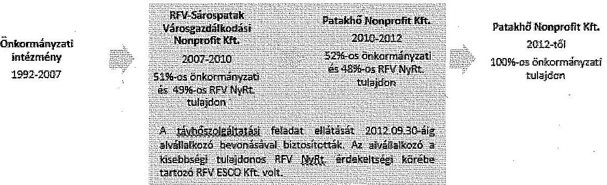
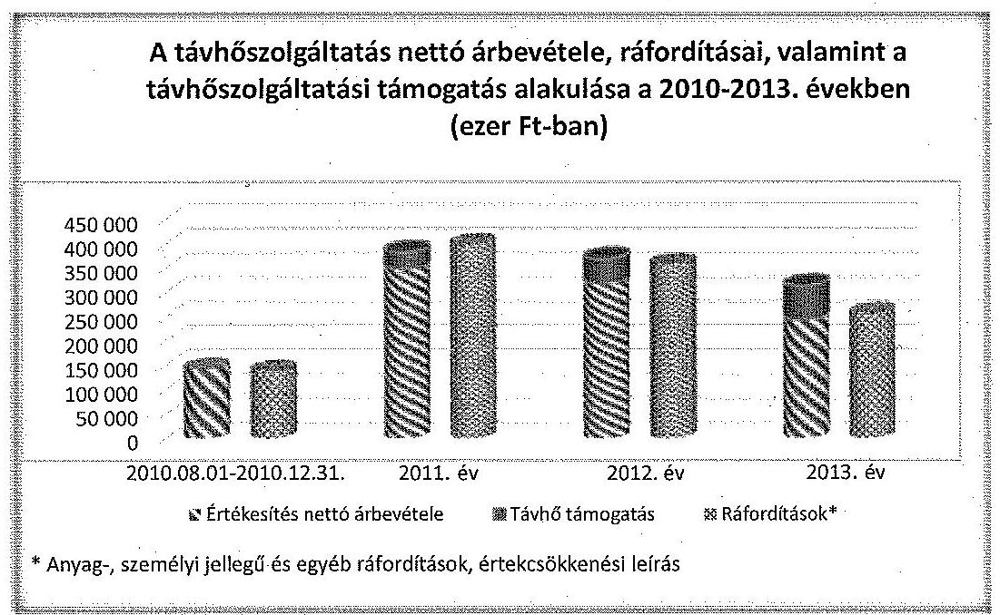
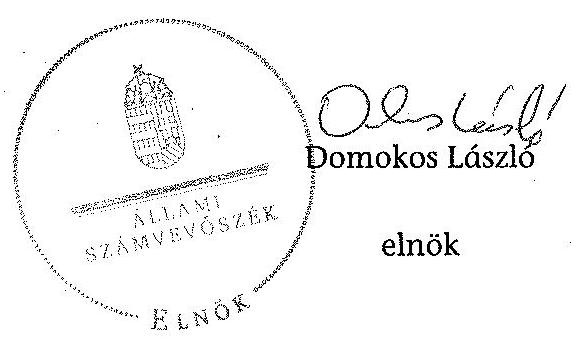
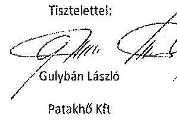
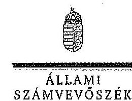
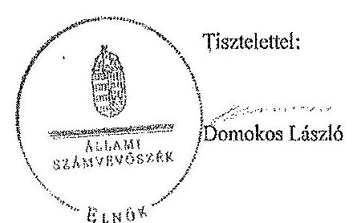

# ÁLLAMI   SZÁMVEVŐSZÉK 

## JELENTÉS

Az önkormányzatok gazdasági társaságai - Az önkormányzatok többségi tulajdonában lévő gazdasági társaságok közfeladat-ellátását érintő gazdálkodási tevékenysége szabályszerűségének ellenőrzése
Patakhő Energiaszolgáltató Nonprofit Kft. (Sárospatak)

---

# Állami Számvevőszék 

Iktatószám: V-0825-158/2015.
Témaszám: 1859
Vizsgálat-azonosító szám: V067146

## Az ellenőrzést felügyelte:

Dr. Horváth Margit
felügyeleti vezető
Az ellenőrzést vezette és az ellenőrzés végrehajtásáért felelős:
Salamin Viktor
ellenőrzésvezető
A jelentéstervezet összeállításában közreműködött:
Kányáné Murvai Tünde
számvevő főtanácsos
Az ellenőrzést végezte:
Vida László
Hankóné Király Ilona
Szaszkó Zoltánné
számvevő tanácsos
okleveles könyvvizsgáló
okleveles könyvvizsgáló

A témához kapcsolódó eddig készített számvevőszéki jelentések:
címe
sorszáma
Jelentés Sárospatak Város Önkormányzata pénzügyi helyzetének 1253 ellenőrzéséről (43/4)

---

# TARTALOMJEGYZÉK 

BEVEZETÉS ..... 7
I. ÖSSZEGZŐ MEGÁLLAPÍTÁSOK, KÖVETKEZTETÉSEK, JAVASLATOK ..... 11
II. RÉSZLETES MEGÁLLAPÍTÁSOK ..... 22

1. Az Önkormányzat közfeladat-ellátásának szabályszerűsége ..... 22
1.1. A közfeladat-ellátás megszervezése és a feladatellátás feltételrendszerének kialakítása ..... 22
1.2. A közfeladat-ellátás felügyelete és a tulajdonosi jogok érvényesítése ..... 26
2. A Patakhő NKft. közfeladat-ellátással kapcsolatos tevékenysége ..... 29
2.1. A Patakhő NKft. gazdálkodásának szabályozottsága ..... 29
2.2. A Patakhő NKft. vagyongazdálkodása ..... 30
2.3. A beszámolási kötelezettség teljesítése ..... 35
3. A távhőszolgáltatás közfeladata bevételei és ráfordításai elszámolásának és önköltségszámításának szabályszerűsége ..... 36
3.1. A távhőszolgáltatás közfeladat bevételeinek és ráfordításainak szabályszerűsége ..... 36
3.2. Az önköltségszámítás szabályszerűsége ..... 39
4. Az ÁSZ korábbi, az önkormányzatok többségi tulajdonában lévő gazdasági társaságok közfeladat-ellátását, gazdálkodását, pénzügyi helyzetét érintő javaslataira tett intézkedések ..... 40

## MELLÉKLETEK

1. számú A Patakhő NKft. tevékenységének főbb adatai
2. számú A Patakhő NKft. működésének főbb jellemzői
3. számú A Patakhő NKft. által biztosított távhőszolgáltatás díjai a 2010-2013. évekre vonatkozóan
4. számú Beérkezett észrevételek és az azokra adott válaszok

## FÜGGELÉKEK

1. számú Értelmező szótár
2. számú Mintavételi eljárások ellenőrzési területenként

---

.

---

# RÖVIDÍTÉSEK JEGYZÉKE 

## Törvények

Adatvédelmi tv. a személyes adatok védelméről és a közérdekű adatok nyilvánosságáról szóló 1992. évi LXIII. törvény (hatálytalan: 2012. január 1-jétől)
Áht. 1 az államháztartásról szóló 1992. évi XXXVIII. törvény (hatálytalan: 2012. január 1-jétől)
Áht. 2 az államháztartásról szóló 2011. évi CXCV. törvény
Ámt. az árak megállapításáról szóló 1990. évi LXXXVII. törvény (hatályos: 1991. január 1-jétől)
ÁSZ tv. az Állami Számvevőszékről szóló 2011. évi LXVI. törvény (hatályos: 2011. július 1-jétől)
Ebktv. az egyenlő bánásmódról és az esélyegyenlőség előmozdításáról szóló 2003. évi CXXV. törvény (hatályos: 2004. március 28-ától)
Fgytv. a fogyasztóvédelemről szóló 1997. évi CLV. törvény (hatályos: 1998. március 1-jétől)
Gt. a gazdasági társaságokról szóló 2006. évi IV. törvény (hatálytalan: 2014. március 15-étől)
Info tv. az információs önrendelkezési jogról és az információszabadságról szóló 2011. évi CXII. törvény (hatályos: 2011. július 27-étől)
Kbt. a közbeszerzésekről szóló 2003. évi CXXIX. törvény (hatálytalan: 2012. január 1-jétől)
Mötv. Magyarország helyi önkormányzatairól szóló 2011. évi CLXXXIX. törvény (hatályos: 2012. január 1-jétől)
Mt. a munka törvénykönyvéről szóló 2012. évi I. törvény (hatályos 2012. július 1-jétől)
Nvtv. a nemzeti vagyonról szóló 2011. évi CXCVI. törvény (hatályos: 2011. december 31-étől, kivéve a 20. § (2) bekezdésben meghatározott paragrafusok, amelyek 2012. január 1-jétől, a (3) bekezdésben meghatározott paragrafusok 2013. január 1-jétől, a (4) bekezdésben meghatározott paragrafus 2012. március 2-ától léptek hatályba)
Ötv. a helyi önkormányzatokról szóló 1990. évi LXV. törvény (hatálytalan: a 2014. évi általános önkormányzati választások napjától)
Rezsi. tv. a rezsicsökkentések végrehajtásáról szóló 2013. évi LIV. törvény (hatályos: 2013. május 10-étől)
Számv. tv. a számvitelről szóló 2000. évi C. törvény
Taktv. a köztulajdonban álló gazdasági társaságok takarékosabb működéséről szóló 2009. évi CXXII. törvény (hatályos: 2009. december 4-étől)
Tszt. a távhőszolgáltatásról szóló 2005. évi XVIII. törvény (hatályos: 2005. július 1-jétől)
Vtv. az állami vagyonról szóló 2007. évi CVI. törvény (hatályos: 2007. szeptember 25-étől)
2013. évi az egyes törvényeknek a rezsicsökkentés végrehajtásához szükségesCLXVII. törvény ges módosításáról (hatályos: 2013. október 22-étől)

---

## Rendeletek

50/2011. (IX. a távhőszolgáltatónak értékesített távhő árának, valamint a la30.) NFM rendelet
51/2011. (IX. 30.) NFM rendelet
78/2012. (XII. az egyes energetikai tárgyú árszabályozással összefüggő miniszteri rendeletek módosításáról (hatálytalan: 2013. január 2-ától)
Távhőrendelet
Vagyonrendelet
Vhr.

## Szórövidítések

áfa
Alapító Okirat
ÁSZ
FB
gazdasági program1
gazdasági program2
jegyző
Képviselőtestület
MEKH
Önkormányzat
Patakhő NKft.
a távhőszolgáltatónak értékesített távhő árának, valamint a lakossági felhasználónak és a külön kezelt intézménynek nyújtott távhőszolgáltatás díjának megállapításáról (hatályos: 2011. október 1-jétől)
a távhőszolgáltatási támogatásról (hatályos 2011. október 1-jétől)
az egyes energetikai tárgyú árszabályozással összefüggő miniszteri rendeletek módosításáról (hatálytalan: 2013. január 2-ától)

Sárospatak Város Önkormányzata Képviselő-testületének 27/2007. (XI. 30.) számú rendelete és módosításai a távhőszolgáltatási díjak megállapításáról és alkalmazásáról, valamint a távhőszolgáltatás egyes kérdéseiről
Sárospatak Város Önkormányzata Képviselő-testületének 18/2007. (VI. 29.) számú rendelete és módosításai az önkormányzat vagyonáról, a vagyonhasznosítás rendjéről és a vagyontárgyak feletti tulajdonosi jogok gyakorlásának szabályairól
az állami vagyonnal való gazdálkodásról szóló 254/2007. (X. 4.) Korm. rendelet (hatályos: 2007. október 4-étől)
általános forgalmi adó
a Patakhő NKft. 2012. november 16-ától hatályos Alapító Okirata és módosításai
Állami Számvevőszék
a Patakhő NKft. Felügyelő-bizottsága
Sárospatak Város Önkormányzata Képviselő-testületének 60262/66/2007. (III. 30.) számú határozata Sárospatak Város Önkormányzatának 2007. január 1-jétől 2013. december 31-éig terjedő időszakra vonatkozó gazdasági programjáról
Sárospatak Város Önkormányzata Képviselő-testületének 255/2011. (VIII. 26.) számú határozata Sárospatak Város Önkormányzata 2011-2014. évekre szóló gazdasági programjának elfogadásáról
Sárospatak Város Önkormányzatának jegyzője
Sárospatak Város Önkormányzatának Képviselő-testülete
Magyar Energetikai és Közmű-szabályozási Hivatal (2013. április 12-éig Magyar Energia Hivatal)
Sárospatak Város Önkormányzata
Patakhő Energiaszolgáltató Nonprofit Korlátolt Felelősségű Társaság
2012. október 12-éig a Taggyűlés, 2012. október 13-ától a Képviselő-testület
Sárospatak Város Önkormányzatának polgármestere

---

| RFV NKft. | RFV-Sárospatak Városgazdálkodási Nonprofit Korlátolt Felelősségű Társaság |
| :-- | :-- |
| RFV NyRt. | RFV Regionális Fejlesztési, Beruházó, Termelő és Szolgáltató NyRt. (2011-től elnevezése E-Star Alternatív Energiaszolgáltató NyRt.) |
| SZMSZ1 | Sárospatak Város Önkormányzatának Szervezeti és Működési Szabályzatáról szóló 21/1998. (XII. 16.) számú rendelete és módosításai (hatályos: 1998. december 16-ától 2011. április 14-éig) |
| SZMSZ2 | Sárospatak Város Önkormányzata Képviselő-testületének és szerveinek Szervezeti és Működési Szabályzatáról szóló 6/2011. (III. 30.) számú rendelete és módosításai (hatályos: 2011. április 15-étől) |
| Taggyűlés | a Patakhő NKft. Taggyűlése |
| Társaság | Patakhő NKft. |
| Társasági szerződés | a Patakhő NKft. 2010. június 28-ától hatályos Társasági szerződése és módosításai |
| Távhőszolgáltatási szerződés | Sárospatak Város Önkormányzata és a Patakhő NKft. által kötött Távhőszolgáltatási szerződés és módosításai (hatályos 2010. július 1-jétől) |
| Vagyonkezelési szerződés | Sárospatak Város Önkormányzata és a Patakhő NKft. által kötött Vagyonkezelési szerződés és módosításai (hatályos 2010. július 1-jétől) |

---

.

---

# JELENTÉS 

## Az önkormányzatok gazdasági társaságai Az önkormányzatok többségi tulajdonában lévő gazdasági társaságok közfeladat-ellátását érintő gazdálkodási tevékenysége szabályszerűségének ellenőrzése Patakhő Energiaszolgáltató Nonprofit Kft. (Sárospatak)

## BEVEZETÉS

Az Állami Számvevőszék középtávra szóló stratégiájában megfogalmazta, hogy a helyi önkormányzatok gazdálkodásában rejlő pénzügyi kockázatok feltárásával, az államháztartáson kívülre nyújtott költségvetési támogatások és ingyenes vagyonjuttatások, valamint az államháztartáson kívül működő közfeladat-ellátó rendszerek ellenőrzéseivel hozzájárul ahhoz, hogy a közpénzeket az államháztartáson kívül működő szervezetek is átlátható, rendezett módon használják fel a közfeladatok szerződésben vállalt ellátása érdekében.

Az önkormányzatok szervezetalakítási szabadságának következménye, hogy a korábban is vállalati formában működő (nagyvárosi tömegközlekedés, víz-, szennyvízcsatorna, köztisztasági, ingatlankezelés stb.) közszolgáltatások mellett, mind a kötelező, mind az önként vállalt feladatok ellátásában a gazdasági társaságok kiemelt fontosságú szerephez jutottak.

Sárospatakon a távhőszolgáltatással kapcsolatos önkormányzati feladatokat az 1992. évtől kezdődően 2007. szeptember 30-áig önkormányzati intézmény látta el. A távhőszolgáltatás racionalizálásának, korszerűsítésének érdekében a Képviselő-testület határozata ${ }^{1}$ alapján az Önkormányzat 2007. július 11-én 51%-os üzletrészt vásárolt az RFV Kivitelező és Tervező Kft.-ben. A további 49%-os üzletrészt az RFV Regionális Fejlesztési Beruházó Termelő és Szolgáltató NyRt. (a továbbiakban RFV NyRt.) tulajdonolta. Az üzletrészvásárlást követően a tulajdonosok az RFV Kivitelező és Tervező Kft.-t a Képviselő-testület határozatában ${ }^{2}$ foglaltak szerint nonprofit társasággá alakították. Az átalakult társaság elnevezése RFV-Sárospatak Városgazdálkodási Nonprofit Kft. (a továbbiakban RFV NKft.) lett, amely a távhőszolgáltatás feladatát 2010. július 31-éig látta el a településen. Az RFV NKft. veszteséges működése miatt a Képviselő-testület

[^0]
[^0]:    ${ }^{1}$ A 11.400-2/199/2007. (VI. 29.) számú határozat.
    ${ }^{2}$ A 12.146/236/2007. (VII. 11.) számú határozat.

---

2010. június 25-én határozatot hozott ${ }^{3}$ az RFV NKft. által ellátott közüzemi szolgáltatási feladatok (hő- és távhőszolgáltatás, valamint közvilágítás) átszervezéséről, azoknak egy új gazdasági társaságban történő hatékonyabb és szakszerűbb ellátása érdekében. Egyúttal határozat született a Patakhő Energiaszolgáltató Nonprofit Kft. ${ }^{4}$ (a továbbiakban Patakhő NKft. vagy Társaság) megalapításáról. Az RFV NKft. a közétkeztetési és karbantartási feladatokat továbbra is végezte a településen.

A Patakhő NKft. a távhőszolgáltatási feladatokat 2010. augusztus 1-jétől látta el. Az alapításkor az Önkormányzatnak a 0,5 M Ft jegyzett tőkéjú Társaságban 52%-os, az RFV NyRt.-nek 48%-os tulajdoni aránya volt. A Képviselő-testület a 276/2012. (X. 11.) számú határozatában ${ }^{5}$ döntött az RFV NyRt. ${ }^{6} 48%-os üzletrészének kivásárlásáról, ezzel a Patakhő NKft. 100%-os önkormányzati tulajdonba került.

Az Önkormányzat távhőszolgáltatási közfeladat ellátását az alábbi ábra szemlélteti:

A Patakhő NKft. főtevékenysége a 2013. január 1-jén 12827 fő lakosságszámú Sárospatak Város közigazgatási területén gőzellátás, légkondicionálás volt. Egyéb tevékenységi körében hőszolgáltatási feladatokat, továbbá - a 2012. októberi tulajdonosi szerkezetváltásig - közvilágítási feladatokat is végzett. A Társaság három telephelyen, három kazánházzal összesen 902 fogyasztót látott el távhővel, az összes fűtött légköbméter $123931 \mathrm{~m}^{3}$ volt. ${ }^{7}$ A Társaságnál foglalkoztatottak átlagos statisztikai létszáma a 2010. évi 11 főről a 2013. évre 8 főre csökkent.

Az Önkormányzat a Patakhő NKft. részére a hő- és távhőszolgáltatás ellátásához szükséges eszközök egy részét vagyonkezelésbe (távvezetékek, műszaki és egyéb gépek, berendezések, felszerelések, számítástechnikai eszközök, szoftverek, összesen 51,8 M Ft bruttó könyv szerinti értéken), egy részét bérbe (hőközpontok, kazánházak) adta.

[^0]
[^0]:    ${ }^{3}$ A 11.200/165/2010. (VI. 25.) számú határozat.
    ${ }^{4}$ A Patakhő NKft. 2010. június 28-án alakult meg.
    ${ }^{5}$ A 276/2012. (X. 11.) számú határozat.
    ${ }^{6}$ Az RFV NyRt. elnevezése 2011 februárjában E-Star Alternatív NyRt.-re változott.
    ${ }^{7}$ Forrás: Sárospatak település fenntartható energia akcióterve 2013. február

---

A Társaság az alapításkor teljes körűen nem rendelkezett a főtevékenysége ellátásához szükséges eszközökkel, ezért a távhőszolgáltatási feladatot 2012. szeptember 30-áig alvállalkozó bevonásával biztosította. Az alvállalkozó a kisebbségi tulajdonos RFV NyRt. leányvállalata, az RFV ESCO Kft. ${ }^{8}$ volt.

A Patakhő NKft. összes bevétele 2010-ben 187,1 M Ft, 2013-ban 353,6 M Ft volt, amelyből 187,1 M Ft-ot, illetve 277,0 M Ft-ot nettó árbevételként realizáltak. A bevételek az ellenőrzött időszakban 89,0%-kal, a ráfordítások 91,3%-kal nőttek. A mérleg szerinti eszközállomány a 2010. december 31-i 194,8 M Ft-ról a 2013. év végére háromszorosára, 592,8 M Ft-ra emelkedett. Az összes eszközértéken belül a tárgyi eszközök könyv szerinti értéke közel hatvanszorosára nőtt az RFV ESCO Kft.-től megvásárolt, a távhőszolgáltatást biztosító
 eszközök állományba vétele következtében. A követelésállomány a 2010. év végi 79,8 M Ft-ról 92,2 M Ft-ra, 15,5%-kal emelkedett 2013. december 31-ére. A saját tőke a 2010. évi 5,6 M Ft-ról a 2013. év végére 25,1 M Ft-ra változott.

Az ellenőrzött időszakban a polgármester és a jegyző személye egy-egy alkalommal változott. A polgármester a 2010. évi önkormányzati választások óta tölti be tisztségét. A helyszíni ellenőrzés időszakában a munkakört betöltő jegyző 2013. január 1-jétől látja el feladatait. A 2010-2013. évek között az ügyvezető személye három alkalommal, a gazdasági igazgató személye két alkalommal változott. A helyszíni ellenőrzés idején hivatalban lévő ügyvezető 2012. november 16. óta tölti be tisztségét.

Az önkormányzati tulajdonú gazdasági társaságok teljes körű ellenőrzésének lehetőségét az Állami Számvevőszékről szóló 1989. évi XXXVIII. törvény 2011. január 1-jétől hatályos módosítása teremtette meg.

Az ellenőrzés célja annak értékelése volt, hogy

- az önkormányzat a jogszabályi előírások figyelembevételével döntött-e az ellenőrzésre kerülő közfeladat megszervezéséről; az önkormányzat szabályszerűen gyakorolta-e a tulajdonosi jogokat;
- a gazdasági társaság közfeladat-ellátása bevételeinek, ráfordításainak elszámolása, és vagyongazdálkodási tevékenysége megfelelte-e a jogszabályi, illetve a közszolgáltatási szerződésben foglalt tulajdonosi előírásoknak, azok végrehajtása szabályszerű volt-e;
- a közfeladatok átláthatósága és elszámoltathatósága érdekében biztosítva volt-e a közszolgáltatás dijának megalapozottsága szabályszerű önköltségszámítással.

Az ellenőrzés várható hasznosulása: A törvényalkotás számára - az észlelt problémák, szabálytalanságok, vagy egyéb nem kívánatos jelenségek felszínre kerülésével - az ellenőrzés megállapításai segítséget nyújthatnak az államháztartáson kívüli közfeladat-ellátás értékeléséhez, jogszabályi keretei pontosításához, átláthatóságot biztosító szabályozásához. Meghatározhatóvá válnak a közfeladat ellátásában részt vevő államháztartáson kívüli szervezeteknek

[^0]
[^0]:    ${ }^{8}$ Az RFV ESCO Kft. elnevezése 2011. februárjában E-Star ESCO Kft.-re változott.

---

- az önkormányzat költségvetését, pénzügyi helyzetét is befolyásoló - kockázatai, lehetővé válik ezen kockázatok csökkentése. Feltárja, hogy az önkormányzat közfeladat-ellátási kötelezettségének szabályszerűen tett-e eleget, a feladatellátáshoz rendelt közvagyon működtetését szabályszerűen szervezte-e meg és a tulajdonosi felügyelete hozzájárult-e a közfeladat-ellátásához. A feladatot ellátó gazdasági társaság a közszolgáltatási szerződésben foglaltak betartásával, a közvagyon használatával biztosította-e a szolgáltatás folytatásának feltételeit. Ezzel az ellenőrzöttek és a helyi döntéshozók számára visszajelzést ad feladatszervezési, feladat-ellátási kockázataikról, alapot ad a meglévő hibák megszüntetéséhez, a jobb közfeladat-ellátás biztosításához. Fokozza a fegyelmet, igazolja, hogy lejárt a következmények nélküli ellenőrzések időszaka. Az ÁSZ értékteremtő rend kialakításához és megőrzéséhez hozzájáruló tevékenysége pozitív hatással van a szervezetről kialakított összkép formálására is.

A bevételek és ráfordítások elszámolása, valamint a vagyonnyilvántartás terén az egyes területek szabályszerű működését mintavétellel ellenőriztük, ez alapján a sokaságokban előforduló hibás tételek arányát becsültük. A jogszabályoknak és a belső előírásoknak megfelelőnek, azaz szabályszerűnek tekintettük az adott bevételek és ráfordítások elszámolását, a vagyonnyilvántartást, amennyiben a minta ellenőrzésének eredménye alapján 95%-os bizonyossággal a teljes sokaságban a hibás tételek aránya kisebb volt, mint 10%, nem megfelelőnek értékeltük, ha a hibás tételek aránya a 10%-ot meghaladta. Kockázatot, illetve magas kockázatot jeleztünk, amennyiben egy adott terület vonatkozásában a minta alapján a teljes sokaságban nem volt teljes körűen biztosított a jogszabályoknak és a belső szabályzatoknak megfelelő működés.

Az ellenőrzést a számvevőszéki ellenőrzés szakmai szabályai szerint, szabályszerűségi ellenőrzés módszerével, a vonatkozó nemzetközi standardok figyelembevételével végeztük. Az ellenőrzés az Önkormányzatnál a közfeladatellátás megszervezése és a feladatellátás feltételrendszerének kialakítása tekintetében a 2008-2013. évekre, a Patakhő NKft.-nél pedig a 2010. június 28-ától 2013. december 31-ig tartó időszakra terjedt ki.

Az ellenőrzés végrehajtásának jogszabályi alapját az ÁSZ törvény 5. § (3)-(5) bekezdései képezték.

Az ÁSZ az Állami Számvevőszékről szóló 2011. évi LXVI. törvény 29. §-a alapján a jelentéstervezetet észrevételezésre megküldte Sárospatak Város Önkormányzata polgármesterének és a gazdasági társaság ügyvezető igazgatójának. A beérkezett észrevételeket a jelentés véglegesítése során hasznosítottuk. Az észrevételeket és az azokra adott válaszokat a jelentés 4. számú melléklete tartalmazza.

---

# I. ÖSSZEGZŐ MEGÁLLAPÍTÁSOK, KÖVETKEZTETÉSEK, JAVASLATOK 

Sárospatak Város Önkormányzata közigazgatási területén a távhőszolgáltatás közfeladatának megszervezéséről a jogszabályi előírásoknak megfelelően döntött. Az Önkormányzatnál a közfeladatokat 2010. július 31-éig ellátó gazdasági társaság feladatainak átszervezése után 2010. augusztus 1. és 2013. december 31. között a távhőszolgáltatást a Patakhő NKft. végezte az Önkormányzattól vagyonkezelésbe, illetve bérbe vett eszközökkel, valamint alvállalkozó igénybevételével, illetve - 2012. októberétől az alvállalkozótól megvásárolt - saját eszközökkel.

A közszolgáltatás részletes feltételeit és a Patakhő NKft. kötelezettségét az Önkormányzat és a Társaság által 2010. június 30-án kötött Távhőszolgáltatási szerződés, a Tszt., valamint a Képviselő-testület rendeletei határozták meg. A Patakhő NKft. a távhőszolgáltatási feladat ellátására 2012. szeptember 30. napjáig alvállalkozót vett igénybe, azonban az alvállalkozóval a szerződést a Kbt.-t megsértve a közbeszerzési eljárás mellőzésével kötötte meg. Az Önkormányzat a távhőszolgáltatás ellátására szolgáló ingatlanokra és ingókra vonatkozóan - 15 évre - Vagyonkezelési szerződést kötött a Társasággal. A vagyonkezelésben lévő vagyonnal történő szabályszerű vagyongazdálkodás feltételeit a Vagyonkezelési szerződés - az Áht.-ben foglaltak ellenére - nem biztosította teljes körűen, mivel nem rendelkezett az önkormányzati vagyonnal kapcsolatos nyilvántartási és adatszolgáltatási kötelezettség teljesítésének módjáról, formájáról.

Az Önkormányzat a távhőszolgáltatásra vonatkozóan a Tszt. szerinti rendeletalkotási kötelezettségének eleget tett. A Képviselő-testület megalkotta az ellenőrzött időszakban hatályos Távhőrendeletet és Vagyonrendeletet. A Távhőrendeletben a Tszt. változásainak előírásához igazodóan - többek között - meghatározták a szolgáltatás teljesítésének feltételeit, az árképzés szabályait, az alkalmazott díjtételeket, a távhőszolgáltatási díjmegállapításra vonatkozó részletszabályokat, a közüzemi szerződés tartalmát, a távhőszolgáltatás felfüggesztésének, a szolgáltatás szüneteltetésének, korlátozásának eseteit és szabályait, továbbá a csatlakozási díj mértékét, alkalmazásának feltételeit.

Az Önkormányzat a Vagyonrendeletben határozta meg a többségi tulajdonú gazdasági társaságok feletti tulajdonosi jogok gyakorlásának szabályait. Az ellenőrzött időszakban a Patakhő NKft. feletti tulajdonosi jogokat a legfőbb szerv nem gyakorolta szabályszerűen az FB-vel kapcsolatban megállapított hiányosságok, valamint a 2011. évi egyszerűsített éves beszámoló határidőn túl történő elfogadása miatt. Az FB ügyrendjét a Gt. előírásai ellenére határozattal nem hagyták jóvá, a 2010. évi éves, illetve a 2011. és a 2013. évi egyszerűsített éves beszámolók elfogadásáról az FB írásbeli jelentésének hiányában határoztak, továbbá a Társaság 2011. évi egyszerűsített éves beszámolóját a Számv. tv.-ben előírt letétbehelyezési határidőn túl fogadták el. A Tszt.-ben foglaltak ellenére a jegyző távhőszolgáltatási üzletszabályzatot nem hagyott jóvá, azt a

---

Társaság nem készítette el. A Taktv.-ben foglaltak ellenére a Patakhő NKft. legfőbb szerve javadalmazási szabályzatot nem alkotott.

Az Önkormányzat belső ellenőrzése a távhőszolgáltatás közfeladatának szabályszerű ellátásához nem járult hozzá. Az Önkormányzat a 2010-2013. években nem élt az Ötv.-ben, valamint az Áht. ${ }_{3}$-ban biztosított lehetőséggel, mivel a Patakhő NKft. gazdálkodásával és működésével kapcsolatban ellenőrzést nem folytatott le.

A Patakhő NKft. a 2010., 2012. és 2013. években nyereségesen, a 2011. évben veszteségesen gazdálkodott. A Társaság saját tőkéje a 2011. évben a jegyzett tőke 50%-a alá csökkent, ezért az Önkormányzat - a Gt.-ben foglaltak alapján - a 2012. évben a veszteség pótlása érdekében 13,2 M Ft összegben pótbefizetést hajtott végre.

A 2012. évben a Képviselő-testület a Társaság által kibocsátott 415,6 M Ft értékű kötvény visszafizetéséhez kapcsolódóan 100%-os készfizető kezesség vállalásáról döntött, melynek beváltására nem került sor, továbbá a 2013. évben az Önkormányzat a távhőszolgáltatási rendszer részét képező nyomáscsökkentő cseréjéhez 8,0 M Ft kölcsönt nyújtott. A Társaság a 2013. évben esedékes tőke- és kamatfizetési kötelezettségének eleget tett.

A Patakhő NKft. gazdálkodásának szabályozottsága nem felelt meg a jogszabályi előírásoknak, mivel a Számv. tv.-ben előírtak ellenére érvényes számviteli politikával, eszközök és források leltárkészítési és leltározási, értékelési, valamint - 2011. december 31-éig - pénzkezelési szabályzattal nem rendelkezett. A Társaság a Számv. tv. előírása ellenére számlarendet 2012. december 31-éig nem készített. A 2013. január 1-jétől hatályos számlarend az alkalmazott számlatükörrel nem volt összhangban, illetve nem tartalmazta a Számv. tv.-ben előírt bizonylati rendet.

A Társaság önköltségszámítás rendjére vonatkozó belső szabályzat készítésére nem volt kötelezett a Számv. tv. alapján. A Patakhő NKft. a távhőszolgáltatás mellett hőszolgáltatási feladatokat is ellátott, továbbá 2012. október 11-éig a városi közvilágítást is üzemeltette, melyekből árbevétele keletkezett, azonban - a Tszt. előírása ellenére - nem biztosította a közszolgáltatási tevékenységek árainak és díjainak átláthatóságát. A Patakhő NKft. 2012. január 1-jétől nem tett eleget a Tszt.-ben foglalt előírásnak, mivel nem dolgozott ki olyan számviteli szétválasztási szabályokat, amely biztosította volna az egyes tevékenységek átláthatóságát és kizárta volna a keresztfinanszírozást és a versenytorzítást.

A Patakhő NKft. vagyongazdálkodási tevékenysége a jogszabályi előírásoknak összességében nem felelt meg, mivel - a Számv. tv.-ben foglaltak ellenére - nem biztosította a kezelésében lévő önkormányzati vagyon elkülönített, szabályszerű nyilvántartását. A 2010. évben az Önkormányzat által vagyonkezelésre átadott eszközöket a Társaság rendeltetésszerűen használatba vette, azonban állományba nem vette, éves beszámolójában nem mutatta ki, az időarányos értékcsökkenést nem számolta el, mellyel megsértette a Számv. tv.-ben foglaltakat. A Társaság 2010. évi éves beszámolója a vagyonkezelt eszközök állományba vételének elmulasztása miatt nem felelt meg a Számv. tv.-ben előírt teljesség elve követelményének. A 2013. évben vagyonkezelésből kikerült

---

0,9 M Ft értékű eszközt a Társaság a Számv. tv. valódiság elvére vonatkozó előírása ellenére könyveiből nem vezette ki, azokra az értékcsökkenést elszámolta, illetve azokat a 2013. évi egyszerűsített éves beszámolójában szerepeltette. A Társaság a vagyonkezelt eszközökön végzett felújítás értékét a saját eszközök között mutatta ki, azokat az egyszerűsített éves beszámolók kiegészítő mellékletében nem részletezte, illetve az egyéb hosszú lejáratú kötelezettségek között nem szerepeltette, ellentétben a Számv. tv.-ben foglaltakkal. A Vagyonkezelési szerződést a felújítás értékével felek nem módosították. A 2010-2012. évi éves, illetve egyszerűsített éves beszámolókban szereplő vagyontárgyak állományát a Patakhő NKft. a Számv. tv.-ben foglaltak ellenére leltárral nem támasztotta alá.

A Patakhő NKft. könyvviteli mérleg szerinti vagyona a 2010. és 2013. évek között megháromszorozódott a tárgyi eszközök közel hatvanszoros, illetve a kötelezettségek közel ötszörös növekedésének következtében. A tárgyi eszközök állományának emelkedését az RFV ESCO Kft. távhő-, illetve hőszolgáltatást biztosító eszközeinek megvásárlása eredményezte. A Társaság követelésállománya a 2010. év végéről a 2013. év végére 15,5%-kal emelkedett elsősorban az intézményi díjhátralékok következtében.

A bevételek és ráfordítások összege a 2010. év végéről a 2012. év végére közel négyszeresére nőtt, ezen belül a távhőszolgáltatás nettó árbevétele, illetve az azzal összefüggő ráfordítások összege több mint kétszeresére emelkedett. A 2013. év végére - az előző évhez viszonyítva - a bevételek a felére csökkentek, melynek oka egyrészt a közvilágításból származó árbevétel megszűnése, illetve a távhőszolgáltatás rendszerét érintő jogszabályváltozás hatása. A távhőszolgáltatás árbevétele 2012. és 2013. között 23,5%-kal, mérleg szerinti eredménye 9,8 M Ft-ról 0,3 M Ft-ra csökkent. A Társaság a 2011-2013. években összesen 156,2 M Ft távhőszolgáltatási támogatást kapott, amely kedvezően hatott az eredményességre. A távhőszolgáltatási üzletág eredménye a támogatás
 nélkül veszteséget mutatott.

A Patakhő NKft. a Számv. tv. előírásai szerinti beszámoló készítési kötelezettségének eleget tett, azonban a 2011. évi egyszerűsített éves beszámolót határidőben nem helyezte letétbe, illetve nem tette közzé, ezzel megsértette a Számv. tv.-ben foglaltakat. Az FB a 2010. évi éves, illetve a 2011. és a 2013. évi egyszerűsített éves beszámolókról a Gt.-ben foglaltak ellenére írásbeli jelentést nem készített. A könyvvizsgáló a 2010-2013. évi beszámolókat hitelesítő záradékkal látta el, azonban a 2013. évi beszámolóhoz kapcsolódóan - a Tszt. előírása ellenére - nem igazolta a keresztfinanszírozás-mentességet. A Patakhő NKft. - az Adatvédelmi tv., illetve az Info tv. szerinti - adatvédelmi szabályzattal nem rendelkezett.

A távhőszolgáltatási közfeladat értékesítés nettó árbevételének elszámolását kockázatosnak értékeltük, mivel nem érvényesültek teljes körűen a jogszabályi előírások a kiszámlázás tekintetében. A Társaság a Számv. tv.-ben foglaltak ellenére olyan árbevételt könyvelt le, melyet a vevő nem ismert el, a számlát visszaküldte.

---

A távhőszolgáltatási közfeladat anyagjellegű ráfordításainak elszámolását kockázatosnak értékeltük, mivel nem érvényesültek teljes körűen a jogszabályi előírások a kötelezettségvállalás tekintetében. A Társaság megbízási díj és biztosítási díj esetében nem rendelkezett a kötelezettségvállalást megalapozó dokumentummal, ezzel nem tett eleget a Számv. tv.-ben foglaltaknak.

A Patakhő NKft. beruházásainak és felújításainak elszámolása nem volt szabályszerű, mivel az értékcsökkenési leírás elszámolására, a leírási kulcsok meghatározására érvényes belső szabályozással nem rendelkezett, a 2010-2012. években a beruházások, felújítások állományát leltárral nem támasztotta alá, valamint a 2010. évben vagyonkezelésbe és rendeltetésszerűen használatba vett eszközök értékét az éves beszámoló mérlegében nem szerepeltette, az értékcsökkenést ezen eszközök után nem számolta el.

A Patakhő NKft. a 2010-2012. években a követelések behajtására intézkedéseket nem tett. A likviditási helyzet javítása, a behajtási tevékenység hatékonyabbá tétele érdekében 2013. január 1-jei hatállyal megalkotta a Kintlévőség kezelési szabályzatot, melyben rögzítette a követelés kezelés szabályait.

A Társaság által a 2010-2013. években alkalmazott távhőszolgáltatás díjai önköltségszámítás hiányában nem voltak megalapozottak, a Tszt.-ben foglaltak ellenére a közfeladat árainak és díjainak átláthatóságát nem biztosították. A Rezsi. tv.-ben előírt feladatokat a Társaság végrehajtotta.

Az Önkormányzat pénzügyi helyzetének 2011. évi ellenőrzéséről készült ÁSZ jelentés - többek között - intézkedést igénylő javaslatot fogalmazott meg a polgármester részére a minősített többségi tulajdonú gazdasági társaságokra vonatkozóan. A Képviselő-testület az intézkedési tervet annak ellenére elfogadta, hogy az nem tartalmazta az adott javaslatra tett intézkedést. Az ÁSZ elnöke a 2012. július 23-án kelt levelében a polgármester által megküldött intézkedési terv kiegészítését kérte, melyet teljesítettek, azonban az abban vállalt kötelezettségnek 2013. december 31-éig nem tettek eleget.

A fentiekben leírtak összegzéseként a következő megállapításokat tesszük:
Az ellenőrzés számos hiányosságot, szabálytalanságot tárt fel a Patakhő NKft. gazdálkodásával és működésével, valamint annak felügyeletével kapcsolatban. A feltárt szabálytalanságok arra is visszavezethetők, hogy a Társaság könyvelését külső cégek végezték, emellett az ügyvezetés is gyakran változott. Mindezek együttesen rontották a szabályszerű működéshez szükséges információáramlást, továbbá a tulajdonosi monitoring megfelelő működtetését.

A Patakhő NKft. feletti tulajdonosi jogokat a legfőbb szerv nem gyakorolta szabályszerűen, az ellenőrzés az FB működésével, valamint a beszámoló elfogadásával kapcsolatban hiányosságokat tárt fel. A távhőszolgáltatási közfeladatot ellátó Patakhő NKft. működésének felügyelete nem biztosította teljes körűen a közfeladat szabályszerű ellátását. Az Önkormányzat belső ellenőrzése a távhőszolgáltatás közfeladatának szabályszerű ellátásához nem járult hozzá. A Patakhő NKft. gazdálkodásának szabályozottsága nem felelt meg a jogszabályi előírásoknak, mivel érvényes számviteli politikával, eszközök és források leltárkészítési és leltározási, értékelési, valamint - 2011. december 31-éig - pénzkeze-

---

lési szabályzattal nem rendelkezett. A Patakhő NKft. 2012. január 1-jétől nem dolgozta ki a Tszt.-ben foglalt számviteli szétválasztási szabályokat, amely biztosította volna az egyes tevékenységek átláthatóságát és kizárta volna a keresztfinanszírozást és a versenytorzítást. A Patakhő NKft. vagyongazdálkodása a jogszabályi előírásoknak összességében nem felelt meg, mivel nem biztosította a kezelésében lévő önkormányzati vagyon elkülönített, szabályszerű nyilvántartását. A 2010-2012. évi éves, illetve egyszerűsített éves beszámolókban szereplő vagyontárgyak állományát leltárral nem támasztották alá. A távhőszolgáltatási közfeladat értékesítés nettó árbevételének elszámolása, anyagjellegű ráfordításainak elszámolása, valamint beruházásainak és felújításainak elszámolása során nem érvényesültek teljes körűen a jogszabályi előírások. A Társaság által a 2010-2013. években alkalmazott távhőszolgáltatás díjai önköltségszámítás hiányában nem voltak megalapozottak, a közfeladat átláthatóságát nem biztosították.

Az Állami Számvevőszékről szóló 2011. évi LXVI. törvény 33. § (1) bekezdésében foglaltak értelmében a jelentésben foglalt megállapításokhoz kapcsolódó intézkedési tervet köteles az ellenőrzött szervezet vezetője összeállítani, és azt a jelentés kézhezvételétől számított 30 napon belül az ÁSZ részére megküldeni. Amennyiben az intézkedési tervet határidőben nem küldi meg a szervezet, vagy az nem elfogadható, az ÁSZ elnöke a hivatkozott törvény 33. § (3) bekezdés a)-b) pontjaiban foglaltakat érvényesítheti.

Az ellenőrzés intézkedést igénylő megállapításai és javaslatai:
Javaslataink célja a Patakhő NKft. gazdálkodása szabályszerűségének helyreállítása annak érdekében, hogy a szabályozási környezet megfelelően tudja támogatni az átlátható működést.

# Javasoljuk a Patakhő NKft. Ügyvezető Igazgatójának: 

1. A Patakhő NKft. a Számv. tv. 14. § (3) bekezdésében foglaltak ellenére érvényes számviteli politikával, továbbá a Számv. tv. 14. § (5) bekezdés a) és b) pontjaiban foglaltak ellenére eszközök és források leltárkészítési és leltározási, valamint értékelési szabályzattal nem rendelkezett. A 2013. január 1-jétől hatályos számlarend a Társaság által alkalmazott számlatükörrel nem volt összhangban, így az nem felelt meg a Számv. tv. 161. § (2) bekezdés a) és b) pontjaiban foglaltaknak, illetve nem tartalmazta a Számv. tv. 161. § (2) bekezdés d) pontjában előírt bizonylati rendet.

A Társaság önköltségszámítás rendjére vonatkozó belső szabályzat készítésére nem volt kötelezett a Számv. tv. 14. § (6) bekezdése alapján. A Tszt. 57. § (4) bekezdése szerint ugyanakkor az engedélyes köteles nyilvántartási és elszámolási rendszerét úgy kialakítani, hogy az megfeleljen az információs önrendelkezési jogról és az információszabadságról szóló törvényben előírtaknak, és tegye lehetővé az árak és díjak átláthatóságát. A Patakhő NKft. a távhőszolgáltatás mellett hőszolgáltatási feladatokat is ellátott, továbbá 2012. október 11-éig a városi közvilágítást is üzemeltette, melyekből árbevétele keletkezett. A távhőszolgáltatási díjkalkulációt megalapozó önköltségszámítási szabályok hiányában nem volt biztosított a közszolgáltatási tevékenység díjainak átláthatósága.

---

A Patakhő NKft. 2012. január 1-jétől nem tett eleget a Tszt. 18/A. § (2) bekezdésében foglalt előírásnak sem, mivel nem dolgozott ki olyan számviteli szétválasztási szabályokat, amely biztosította volna az egyes tevékenységek átláthatóságát és kizárta volna a keresztfinanszírozást és a versenytorzítást. A Társaság belső szabályzataiban a közfeladat-ellátással kapcsolatos elszámolások (bevételek, illetve költségek és ráfordítások), valamint a vagyonkezelésében lévő vagyonelemek elkülönített nyilvántartását nem írta elő, ellentétben a Számv. tv. 161/A. § (2) bekezdésében foglaltakkal.

A Társaság a Tszt. 3. § v) pontjában foglaltak ellenére távhőszolgáltatási üzletszabályzatot nem készített.

A Patakhő NKft. 2011. július 26-ától az Info tv. 24. § (3) bekezdése szerinti adatvédelmi szabályzattal - amely biztosította volna a különböző nyilvántartásokban elektronikusan kezelt adatállományok információ biztonsági védelmét - nem rendelkezett.

Javaslat:
Intézkedjen a szabályozási hiányosságok megszüntetésére, ennek keretében:
a) készítse el és léptesse hatályba a számviteli politikát, illetve annak keretében intézkedjen az eszközök és források leltárkészítési és leltározási, valamint az értékelési szabályzata elkészítésére;
b) biztosítsa az alkalmazott számlarend és számlatükör összhangját, valamint egészítse ki a számlarendet a bizonylati renddel;
c) teremtse meg annak lehetőségét, hogy a főkönyvi és analitikus nyilvántartások biztosítani tudják a Társaság tevékenységenkénti elkülönített adatainak kimutatását, a bevételek, költségek és ráfordítások megosztásával a megfelelő számviteli szétválasztást, azáltal a közszolgáltatási tevékenység díjainak átláthatóságát;
d) intézkedjen a távhőszolgáltatási üzletszabályzat elkészítésére;
e) intézkedjen az adatvédelmi szabályzat elkészítésére.
2. A Vagyonkezelési szerződés 1. számú melléklete az átadott eszközök leltárát nem tartalmazta teljes körűen, azt 2011. március 16-i hatállyal egészítette ki az Önkormányzat, ezzel a vagyonkezelésbe adott eszközök bruttó értéke 22,0 M Ft-ról 51,8 M Ft-ra változott. A 2010. évben átadott eszközöket a Patakhő NKft. rendeltetésszerűen használatba vette, azonban - a tárgyi eszközök, illetve az egyéb hosszú lejáratú kötelezettségek között - állományba nem vette, éves beszámolójában nem mutatta ki, az időarányos értékcsökkenést nem számolta el, ezzel megsértette a Számv. tv. 26. § (1) bekezdésben, a 42. § (5) bekezdésben, valamint az 52. § (2) bekezdésben foglaltakat. Az átvett vagyon állományba vételére, nyilvántartására és elszámolására vonatkozóan nem tett eleget továbbá a Számv. tv. 23. § (2) bekezdésében előírtaknak, mely szerint a vagyonkezelőnél a mérlegben eszközként kell kimutatni a kezelésbe vett, az önkormányzati vagyon részét képező eszközöket. A Társaság 2010. évi éves beszámolója a vagyonkezelt eszközök állományba vételének elmulasztása miatt nem felelt meg a Számv. tv. 15. § (2) bekezdésében előírt teljesség elve követelménynek.

---

A vagyonkezelt eszközöket a Patakhő NKft. 2011. március 16-án vette állományba és a Számv. tv. 42. § (5) bekezdésében foglaltak szerint egyéb hosszú lejáratú kötelezettségként mutatta ki. A Vagyonkezelési szerződés 2013. május 14. napjával, második alkalommal történt módosításakor 0,9 M Ft értékű eszköz kikerült a vagyonkezelésből, azonban a Társaság az érintett eszközöket könyveiből nem vezette ki, azokra az értékcsökkenést elszámolta, illetve azokat a 2013. évi egyszerűsített éves beszámolójában szerepeltette. Ezzel megsértette a Számv. tv. 15. § (3) bekezdésében foglalt valódiság elvét.

A Patakhő NKft. a vagyonkezelt eszközökön - saját forrásból - a 2011. évben 32,1 M Ft, a 2012. évben 10,7 M Ft, a 2013. évben 14,2 M Ft értékű felújítást hajtott végre. A felújítás értékét a saját eszközök között mutatta ki, azokat az egyszerűsített éves beszámolók kiegészítő mellékletében külön nem részletezte, illetve az egyéb hosszú lejáratú kötelezettségek között nem szerepeltette, ellentétben a Számv tv. 23. § (2), illetve 42. § (5) bekezdésében foglaltakkal. A Vagyonkezelési szerződést a felújítás értékével felek nem módosították.

A 2010-2012. évi éves, illetve egyszerűsített éves beszámolókban szereplő vagyontárgyak állományát a Patakhő NKft. - a Számv. tv. 69. § (1) bekezdésében foglaltak ellenére - leltárral nem támasztotta alá. A Társaság a 2013. évi egyszerűsített éves beszámoló adatainak alátámasztására, 2013. december 31-i fordulónappal a nyilvántartások egyeztetésén alapuló összehasonlító leltárt készített. Mennyiségi felvétellel történő leltározást az ellenőrzött időszakban nem végeztek.

A könyvvizsgáló a 2010-2013. években a Gt. 44. § (1) bekezdésének előírásával ellentétesen nem vett részt a Patakhő NKft. legfőbb szervének a számviteli éves beszámolót tárgyaló ülésein.

A Társaság a Számv. tv. 72. § (2) bekezdés a) pontjában foglaltak ellenére olyan árbevételt könyvelt le, melyet a vevő nem ismert el, a számlát visszaküldte. Helyesbítő (stornó) számla kiállítására nem került sor.

A távhőszolgáltatási közfeladat anyagjellegű ráfordításainak elszámolása során megbízási díj, illetve biztosítási díj esetében nem rendelkeztek a kötelezettségvállalást megalapozó dokumentummal, számlával, ezzel nem tettek eleget a Számv. tv. 169. § (2) bekezdésében előírt bizonylat megőrzési kötelezettségnek.

A Patakhő NKft. beruházásainak és felújításainak elszámolása nem volt
 szabályszerű. Az értékcsökkenési leírás elszámolására, a leírási kulcsok meghatározására érvényes belső szabályozással a Számv. tv. 14. § (5) bekezdés a) pontjában foglaltak ellenére nem rendelkeztek, a 2010-2012. években a beruházások, felújítások állományát leltárral a Számv. tv. 69. § (1) bekezdésében foglaltak ellenére nem támasztották alá.

Javaslat:
Intézkedjen a jogszabályi előírások szerinti gyakorlat biztosítására, ezen belül:
a) nyilvántartásaival és leltározásával biztosítsa az önkormányzati vagyon, valamint a saját vagyon változásának nyomon követését;

---

b) kezdeményezze a Vagyonkezelési szerződés 2013. május 14. napjával történt módosításának megfelelően a vagyonkezelésből kikerült eszközökre vonatkozóan a saját nyilvántartásainak pontosítását;
c) gondoskodjon a könyvvizsgáló - a Társaság legfőbb szervének a számviteli éves beszámolót tárgyaló üléseire történő - meghívásáról;
d) gondoskodjon arról, hogy árbevételt csak elismert vevői követelés alapján szerepeltessenek a Társaság könyveiben;
e) gondoskodjon a bizonylat megőrzési kötelezettség betartásáról;
f) intézkedjen a beruházásokkal, felújításokkal kapcsolatos értékcsökkenési szabályok, leírási kulcsok meghatározására.

Javaslataink célja az Önkormányzat szabályszerű működésének elősegítése, továbbá az önkormányzati tulajdonosi joggyakorlás kontrolljainak erősítése.

# Sárospatak Város Önkormányzata Polgármesterének: 

1. A tulajdonosok a Gt. 33. § (2) bekezdés c) pontja és a Taktv. 4. § (1) bekezdése értelmében a Patakhő NKft. ellenőrzésére FB-t választottak. Az FB megállapította ügyrendjét, azonban a Gt. 34. § (4) bekezdésében foglaltak ellenére azt a Patakhő NKft. legfőbb szerve határozattal nem hagyta jóvá.

A Patakhő NKft. legfőbb szerve - a Gt. 35. § (3) bekezdésében foglaltak ellenére - a 2010. évi éves, illetve a 2011. és a 2013. évi egyszerűsített éves beszámolók elfogadásáról az FB írásbeli jelentésének hiányában hozta meg határozatát.

Javaslat:
Gondoskodjon a szabályozási hiányosságok megszüntetéséről és a szabályos működés biztosításáról, ennek keretében:
a) gondoskodjon az FB ügyrendjének - a Társaság legfőbb szerve általi - határozattal történő jóváhagyásáról;
b) kérje számon a Patakhő NKft. számviteli éves beszámolóinak elfogadása során az FB írásos jelentését.
2. A 2013. évi egyszerűsített éves beszámolóról kiadott könyvvizsgálói jelentés a Tszt. 18/B. § (1) bekezdésében előírtak ellenére nem tartalmazta az igazolást arról, hogy a Társaság által kidolgozott és alkalmazott számviteli szétválasztási szabályok, valamint az egyes tevékenységek közötti tranzakciók árazása biztosítják a vállalkozás tevékenységei közötti keresztfinanszírozás-mentességet.

A Vagyonkezelési szerződés 1. számú melléklete az átadott eszközök leltárát nem tartalmazta teljes körűen, azt 2011. március 16-i hatállyal egészítette ki az Önkormányzat, ezzel a vagyonkezelésbe adott eszközök bruttó értéke 22,0 M Ft-ról 51,8 M Ft-ra változott. A 2010. évben átadott eszközöket a Patakhő NKft. rendeltetésszerűen

---

használatba vette, azonban - a tárgyi eszközök, illetve az egyéb hosszú lejáratú kötelezettségek között - állományba nem vette, éves beszámolójában nem mutatta ki, az időarányos értékcsökkenést nem számolta el, ezzel megsértette a Számv. tv. 26. § (1) bekezdésben, a 42. § (5) bekezdésben, valamint az 52. § (2) bekezdésben foglaltakat. Az átvett vagyon állományba vételére, nyilvántartására és elszámolására vonatkozóan nem tett eleget továbbá a Számv. tv. 23. § (2) bekezdésében előírtaknak, mely szerint a vagyonkezelőnél a mérlegben eszközként kell kimutatni a kezelésbe vett, az önkormányzati vagyon részét képező eszközöket. A Társaság 2010. évi éves beszámolója a vagyonkezelt eszközök állományba vételének elmulasztása miatt nem felelt meg a Számv. tv. 15. § (2) bekezdésében előírt teljesség elve követelménynek.

A vagyonkezelt eszközöket a Patakhő NKft. 2011. március 16-án vette állományba és a Számv. tv. 42. § (5) bekezdésében foglaltak szerint egyéb hosszú lejáratú kötelezettségként mutatta ki. A Vagyonkezelési szerződés 2013. május 14. napjával, második alkalommal történt módosításakor 0,9 M Ft értékű eszköz kikerült a vagyonkezelésből, azonban a Társaság az érintett eszközöket könyveiből nem vezette ki, azokra az értékcsökkenést elszámolta, illetve azokat a 2013. évi egyszerűsített éves beszámolójában szerepeltette. Ezzel megsértette a Számv. tv. 15. § (3) bekezdésében foglalt valódiság elvét.

A 2010-2012. évi éves, illetve egyszerűsített éves beszámolókban szereplő vagyontárgyak állományát a Patakhő NKft. - a Számv. tv. 69. § (1) bekezdésében foglaltak ellenére - leltárral nem támasztotta alá. A Társaság a 2013. évi egyszerűsített éves beszámoló adatainak alátámasztására, 2013. december 31-i fordulónappal a nyilvántartások egyeztetésén alapuló összehasonlító leltárt készített. Mennyiségi felvétellel történő leltározást az ellenőrzött időszakban nem végeztek.

A Patakhő NKft. a vagyonkezelt eszközökön - saját forrásból - a 2011. évben 32,1 M Ft, a 2012. évben 10,7 M Ft, a 2013. évben 14,2 M Ft értékű felújítást hajtott végre. A felújítás értékét a saját eszközök között mutatta ki, azokat az egyszerűsített éves beszámolók kiegészítő mellékletében külön nem részletezte, illetve az egyéb hosszú lejáratú kötelezettségek között nem szerepeltette, ellentétben a Számv tv. 23. § (2), illetve 42. § (5) bekezdésében foglaltakkal. A Vagyonkezelési szerződést a felújítás értékével felek nem módosították.

A Számv. tv. 23. § (2) bekezdésében foglaltak alapján a vagyonkezelőnél a mérlegben eszközként kell kimutatni a - törvényi rendelkezés, illetve felhatalmazás alapján kezelésbe vett, az állami vagy önkormányzati vagyon részét képező eszközöket is. Ezen eszközöket a kiegészítő mellékletben - legalább mérlegtételek szerinti megbontásban - külön be kell mutatni. A 26. § (1) bekezdés alapján a mérlegben a tárgyi eszközök között azokat a rendeltetésszerűen használatba vett, üzembe helyezett anyagi eszközöket kell kimutatni, amelyek tartósan - közvetlenül vagy közvetett módon - szolgálják a vállalkozó tevékenységét, továbbá az ezen eszközök beszerzésére (a beruházásokra) adott előlegeket és a beruházásokat, valamint a tárgyi eszközök értékhelyesbítését. A 42. § (5) bekezdés rögzíti, hogy egyéb hosszú lejáratú kötelezettségként kell többek között kimutatni az állami vagy önkormányzati vagyon részét képező eszközök - törvényi rendelkezés, illetve felhatalmazás alapján történő kezelésbevételéhez kapcsolódó kötelezettséget.

A Számv. tv. 4. § (2) bekezdésben foglaltak alapján a beszámolónak megbízható és valós összképet kell adnia a gazdálkodó vagyonáról, annak összetételéről (eszközeiről

---

és forrásairól), pénzügyi helyzetéről és tevékenysége eredményéről. Az éves beszámoló részét képező mérleget, eredménykimutatást és a kiegészítő mellékletet a Számv. tv. 20. § (6) bekezdése alapján a vállalkozó képviseletére jogosult személy köteles aláirni. Ezzel érvényesül az egyszemélyi felelősség.

Számv. tv. 15. § (3) bekezdése rögzíti a valódiság elvét, amely alapján a könyvvitelben rögzített és a be-számolóban szereplő tételeknek a valóságban is megtalálhatóknak, bizonyíthatóknak, kívülállók által is megállapíthatóknak kell lenniük. Értékelésük meg kell, hogy feleljen a Számv. tv.-ben előírt értékelési elveknek és az azokhoz kapcsolódó értékelési eljárásoknak. Továbbá a (2) bekezdés alapján a teljesség elvének megfelelően a gazdálkodónak könyvelnie kell mindazon gazdasági eseményeket, amelyeknek az eszközökre és a forrásokra, illetve a tárgyévi eredményre gyakorolt hatását a beszámolóban ki kell mutatni, ideértve azokat a gazdasági eseményeket is, amelyek az adott üzleti évre vonatkoznak, amelyek egyrészt a mérleg fordulónapját követően, de még a mérleg elkészítését megelőzően váltak ismertté, másrészt azokat is, amelyek a mérleg fordulónapjával lezárt üzleti év gazdasági eseményeiből erednek, a mérleg fordulónapja előtt még nem következtek be, de a mérleg elkészítését megelőzően ismertté.

A Társaságnál működő FB alapfeladata volt a társaság ügyvezetésének ellenőrzése a tulajdonosok érdekében, tevékenységéért a tagoknak tartozott felelősséggel. A Gt. 35. §-a rögzíti, hogy az FB a társaság könyveit és iratait - ha szükséges, szakértők bevonásával - megvizsgálhatja, valamint azt, hogy a beszámolóról a gazdasági társaság legfőbb szerve csak az FB írásbeli jelentésének birtokában határozhat.

A Gt. 30. § (4) bekezdése alapján az együttes képviseleti joggal rendelkező vezető tisztségviselők, illetve testületi ügyvezetés esetén a vezető tisztségviselők gazdasági társasággal szembeni kártérítési felelőssége a Ptk. közös károkozásra vonatkozó szabályai szerint egyetemleges. Ha a kárt a testületi ügyvezetés határozata okozta, mentesül a felelősség alól az a tag, aki a döntésben nem vett részt, vagy a határozat ellen szavazott.

A jogszabályokban előírtak alapján a leltár elmulasztására, illetve a teljesség és valódiság elvének megsértésére vonatkozóan felmerül mind az ügyvezető(k), mind a felügyelő bizottsági tagok tevékenységével kapcsolatos felelősség.

Javaslat:

# Gondoskodjon a jogszabályi előírások szerinti gyakorlat biztosításáról, ezen belül: 

a) kezdeményezze a Képviselő-testületnél, hogy intézkedjen a könyvvizsgálói feladatok teljes körű betartatása érdekében (nyilatkozat kiadása a keresztfinanszíro-zás-mentességről);
b) tegyen intézkedéseket a leltározás elmaradása és a beszámolási kötelezettség teljesítése során tapasztalt hiányosságok tekintetében a társaság ügyvezetője (ügyvezetői) felelősségének tisztázása érdekében és szükség szerint intézkedjen a felelősség érvényesítéséről;
c) kezdeményezzen a társaság legfőbb szervénél (jelen esetben: Képviselő-testület) intézkedéseket a társaság ügyvezetésénél tapasztalt hiányosságok kapcsán az ellenőrzési kötelezettség elmulasztása miatt az FB tagok felelősségének tisztázása érdekében és a Képviselő-testület szükség szerint intézkedjen a felelősség érvényesítéséről.

# Javasoljuk Sárospatak Város Önkormányzata Jegyzöjének: 

1. Az Önkormányzat a Társaságra vonatkozóan anyagi ösztönzési rendszert nem alakított ki. A Taktv. 5. § (3) bekezdésében foglaltak ellenére a Patakhő NKft. legfőbb szerve a vezető tisztségviselők, FB tagok, valamint az Mt. 208. §-ának hatálya alá eső munkavállalók javadalmazása, valamint a jogviszony megszűnése esetére biztosított juttatások módjának, mértékének elveiről, annak rendszeréről szabályzatot nem alkotott.

A jegyző 2011. április 14-éig a Tszt. 7. § (1) bekezdés d) pontjában, 2011. április 15-étől a Tszt. 7. § (1) bekezdés b) pontjában foglaltak ellenére a Patakhő NKft. által kidolgozott távhőszolgáltatási üzletszabályzatot nem hagyott jóvá.

Az Önkormányzat belső ellenőrzése az ellenőrzéseivel a távhőszolgáltatás, mint közfeladat-ellátás szabályszerű teljesítéséhez nem járult hozzá. Az ellenőrzött időszakban a társaság gazdálkodásával és működésével kapcsolatban ellenőrzést nem folytatott le.

Javaslat:
Gondoskodjon a szabályozási hiányosságok megszüntetéséről és a szabályos működés biztosításáról, ennek keretében:
a) készítse el a Patakhő NKft. javadalmazási szabályzatát;
b) hagyja jóvá a Patakhő NKft. távhőszolgáltatási üzletszabályzatát;
c) fordítson kiemelt figyelmet arra, hogy az Önkormányzat belső ellenőrzése az ellenőrzéseivel a távhőszolgáltatás, mint közfeladat-ellátás szabályszerű teljesítéséhez járuljon hozzá.

---

# II. RÉSZLETES MEGÁLLAPÍTÁSOK 

## 1. Az ÖNKORMÁNYZAT KÖZFELADAT-ELLÁTÁSÁNAK SZABÁLYSZERŰSÉGE

### 1.1. A közfeladat-ellátás megszervezése és a feladatellátás feltételrendszerének kialakítása

Az Ötv. 8. § (1) bekezdése ${ }^{9}$ a települési önkormányzatok közszolgáltatási feladatai közé sorolta a helyi energiaszolgáltatásban való közreműködést. Az Ötv. 1. § (5) bekezdése kimondta, hogy törvény helyi önkormányzatnak kötelező feladatkört megállapíthat. Az Ötv. 8. § (3) bekezdése ugyancsak rendelkezett arról, hogy törvény a települési önkormányzatokat egyes közszolgáltatási feladatok ellátásáról történő gondoskodásra kötelezheti. A Tszt. 6. § (1) bekezdése szerint a települési önkormányzat köteles biztosítani a távhőszolgáltatással ellátott létesítmények távhő ellátását.

Az ellenőrzött időszakban az Önkormányzat rendelkezett a 2007-2013., illetve a 2011-2014. évekre szóló, a Képviselő-testület által elfogadott gazdasági programmal${ }^{10}$. A gazdasági program a távhőszolgáltatási közfeladat biztosításával, színvonalának javításával kapcsolatban stratégiai célokat, feladatokat, fejlesztési elképzeléseket - az Ötv. 91. § (6) bekezdésében, illetve 2013. január 1-jétől az Mötv. 116. § (3)-(4) bekezdéseiben foglaltak ellenére - nem fogalmazott meg.

A gazdasági program$_{1}$ a stratégiai célok között említette, hogy az Önkormányzat az Ötv. 8. § (4) bekezdésében rögzített, kötelezően ellátandó feladatokon túl egy távhőt szolgáltató szervezetet tart fenn. A gazdasági program$_{1}$-ban javasolt
 fejlesztések a távhőszolgáltatással kapcsolatosan nem fogalmaztak meg konkrétumokat. A gazdasági program ${ }_{2}$ a fejlesztési alapelvek között rögzítette a környezetbarát technológiák, megújuló energiaforrások hasznosításának előnyben részesítését valamennyi közintézmény, illetve önkormányzati működtetésben lévő szervezet, gazdasági társaság esetében, és a közszolgáltatások terén.

A Képviselő-testület által elfogadott Városfejlesztési koncepció ${ }^{11}$ rögzítette, hogy az Önkormányzat távhőszolgáltatást végző gazdasági társaságának feladata - többek között - az önkormányzati intézmények és a lakossági fogyasztók ellátása, azonban a távhőszolgáltatás fejlesztésére vonatkozó konkrét elképzeléseket nem tartalmazott.

[^0]
[^0]:    ${ }^{9}$ A helyi közügyek, valamint a helyben biztosítható közfeladatok körében ellátandó helyi önkormányzati feladatként a távhőszolgáltatást 2013. január 1-jétől az Mötv. 13.§ (1) bekezdés 20. pontja írja elő.
    ${ }^{10}$ A Képviselő-testület a 6026-2/66/2007. (III. 30.), illetve a 255/2011. (VIII. 26.) számú határozataival fogadta el.
    ${ }^{11}$ A Képviselő-testület a 11.200/169/2010. (VI. 25.) számú határozatával fogadta el.

---

A 2011. december 31-én hatályba lépett Nvtv. 9. § (1) bekezdése szerint a helyi önkormányzat a vagyongazdálkodásának az Alaptörvényben, valamint a 7. § (2) bekezdésében meghatározott rendeltetése biztosításának céljából közép- és hosszú távú vagyongazdálkodási tervet köteles készíteni. Az Önkormányzat a közép- és hosszú távú (5, illetve 10 évre szóló) vagyongazdálkodási tervét 2013. február 15-én fogadta el ${ }^{12}$. A vagyongazdálkodási tervben a távhőszolgáltatás fejlesztésével kapcsolatos elképzelések nem szerepeltek.

Az Önkormányzat az Ötv. 18. §-ában foglaltakkal összhangban rendelkezett SZMSZ ${ }_{1-2}$-vel, melyben rögzítette a távhőszolgáltatási feladat ellátásának a Tszt. 6. § (1) bekezdésben foglalt kötelezettségét. Az Önkormányzat az Ötv. 9 § (4) bekezdésében előírtak figyelembe vételével, továbbá a Vagyonrendelet előírásaival összhangban ${ }^{13}$, szabályszerűen döntött a távhőszolgáltatás gazdasági társasággal történő ellátásáról.

A Képviselő-testület 2010. június 25-én határozott a Patakhő NKft. megalapításáról. A Patakhő NKft.-ben az alapításkor az Önkormányzatnak 52%-os, az RFV NyRt.-nek 48%-os tulajdoni aránya volt. A Társaságot 0,5 M Ft jegyzett tőkével alapították. A Képviselő-testület 2012. októberi döntése alapján a Patakhő NKft. 100%-os önkormányzati tulajdonba került. A Patakhő NKft. Társasági szerződése, illetve Alapító Okirata megfelelt a Gt. 12. § (1) bekezdés tartalmi előírásainak, azokban az Önkormányzat meghatározta az ügyvezetőkre ${ }^{14}$ vonatkozó jogokat, kötelezettségeket, feladatokat és felelősséget. Az ügyvezetőket határozatlan időtartamra választották.

Az Önkormányzatnál a közfeladatokat 2010. július 31-éig ellátó gazdasági társaság feladatainak átszervezése után 2010. augusztus 1. és 2013. december 31. között a távhőszolgáltatást a Patakhő NKft. végezte az Önkormányzattól vagyonkezelésbe, illetve bérbe vett eszközökkel, valamint alvállalkozó bevonásával, illetve - 2012 októberétől az alvállalkozótól megvásárolt - saját eszközökkel.

A Patakhő NKft. tevékenységét a Társasági szerződésben, az Alapító Okiratban, a Távhőszolgáltatási szerződésben, a Távhőrendeletben, valamint a Vagyonkezelési szerződésben előírtak szerint látta el.

A Képviselő-testület a 2010. évben döntött a Távhőszolgáltatási szerződés elfogadásáról ${ }^{15}$. A szerződést a szerződő felek 2010. június 30-i hatállyal, 15 évre kötötték.

A Képviselő-testület a 11.803/209/2010. (VII. 14.) számú határozatában a távhőszolgáltatással kapcsolatos szerződések hatályba lépésének július 31-ére történő módosításáról döntött, egyúttal felhatalmazta a polgármestert - távollétében az

[^0]
[^0]:    ${ }^{12}$ A Képviselő-testület 44/2013. (II. 15.) számú határozattal.
    ${ }^{13}$ A Vagyonrendelet 14. § (1) és 17. § (2) bekezdései.
    ${ }^{14}$ Az alapításkor három fő ügyvezetőt (általános, pénzügyi és műszaki) jelöltek ki a Társaság vezetésére, melyet 2012. november 16-i hatállyal kettő főre módosítottak.
    ${ }^{15}$ A 11.200/165/2010. (VI. 25.) számú határozatok. A szerződő felek: az Önkormányzat és a Patakhő NKft.

---

alpolgármestert -, hogy a határidő módosítását tartalmazó szerződéseket aláírja. A döntés oka az volt, hogy a Patakhő NKft. részére a távhőszolgáltatói működési engedélyt Sátoraljaújhely Város Címzetes Főjegyzője 2010. július 30-án adta ki. A Távhőszolgáltatási szerződés hatályba lépésének dátumát a határozatban foglaltak ellenére nem módosították, azonban ez a feladat-ellátás elvégzésére nem gyakorolt negatív hatást.

A Távhőszolgáltatási szerződés tartalmazta a szerződés tárgyát, a szolgáltató és megrendelő jogait és kötelezettségeit, a díjtételeket és fizetési feltételeket, a szerződés időtartamát, az ellátási területet, valamint a szerződés megszűnésének eseteit.

A Távhőszolgáltatási szerződés díjtételekre vonatkozó 4.1 pontjának értelmében a Patakhő NKft. a rendelkezésére bocsátott intézményi kazánházi területek, illetve kazánházak, hőközpontok után egy összegben (egyszeri kifizetésként) 3,2 M Ft+áfa, illetve 10,1 M Ft+áfa összegű bérleti díjat volt köteles fizetni az Önkormányzat részére, melynek eleget tett.

A Patakhő NKft. a távhőszolgáltatás feladatának ellátására alvállalkozói szerződést kötött. A Társaság az alvállalkozóval a szerződést a közbeszerzési eljárás mellőzésével kötötte meg, mellyel megsértette a Kbt. 240. § (1) bekezdésében foglaltakat ${ }^{16}$. A Társaság az RFV ESCO Kft.-vel kötött szerződést 2012. szeptember 30. napjával közös megegyezéssel megszüntette.

Az Önkormányzat a távhőszolgáltatásra vonatkozóan a Tszt. 6. § (2) bekezdés szerinti rendeletalkotási kötelezettségének eleget tett. A Képviselőtestület megalkotta az ellenőrzött időszakban hatályos Távhőrendeletet, továbbá a Vagyonrendeletet, melyeknek hatálya kiterjedt a távhőszolgáltatási közfeladatot 2010. július 31-éig ellátó RFV NKft.-re, illetve ezt követően a Patakhő NKft.-re.

A Távhőrendeletben rögzítették a rendelet hatályát, a szolgáltatás teljesítésének feltételeit, valamint az alkalmazott díjtételeket, áralkalmazási és díjfizetési feltételeket. Meghatározták a távhőszolgáltató rendszer elemeit, a távhőszolgáltatás tartalmát, a szolgáltatással kapcsolatos alapfogalmakat, valamint a távhőszolgáltató és a felhasználó közötti jogviszony szabályait. A Távhőrendeletben rögzítették továbbá a közüzemi szerződés tartalmát, a szerződés felmondásának és megszegésének eseteit és következményeit, a távhőszolgáltatás felfüggesztésének, a szolgáltatás szüneteltetésének, korlátozásának eseteit és szabályait. Az ellenőrzött időszakban a Távhőrendeletet a jogszabályi változások követése érdekében több alkalommal módosították.

A Tszt. 6. § (2) bekezdés c) pontjának előírása szerint a Távhőrendelet 5. mellékletében kijelölték azokat a területeket, ahol területfejlesztési, környezetvédelmi és levegő-tisztaságvédelmi okokból célszerű a távhőszolgáltatás fejlesztése. A Távhőrendeletben rögzítették továbbá az új vagy növekvő távhőigénnyel jelentkező felhasználási hely tulajdonosától kérhető csatlakozási díj alkalmazásának feltételeit, illetve a csatlakozási díj mértékét a Tszt. 6 § (2) bekezdés e)

[^0]
[^0]:    ${ }^{16}$ A Patakhő NKft. az alvállalkozói szerződés megkötésekor hatályos Kbt. 22. § (1) bekezdésének i) pontja alapján annak alanyi hatálya alá tartozott.

---

pontjában, valamint az Ámt. 11. § (1) bekezdésében foglaltaknak megfelelően. A Távhőrendelet tartalmazta a távhőszolgáltatás legmagasabb fogyasztói árát az alapdíjra és hődíjra vonatkozóan.

Az ellenőrzött időszakban átalakult a távhőszolgáltatás árszabályozása. A távhőszolgáltatási díjak változtatását 2009. július 1-jétől az Ámt. 7. § (5) bekezdése és a Tszt. 57/A §-ának előírásai szerint a távhőszolgáltatónak a MEKH-nél kellett kezdeményezni, az Önkormányzat az ármegállapításra vonatkozó rendeletet a MEKH jóváhagyását követően adhatta ki. 2011. április 15-étől a korábbi önkormányzati árszabályozást központi árszabályozás váltotta fel, a Képviselőtestület ármeghatározási jogköre ettől az időponttól kizárólag a csatlakozási díjakra és a fizetési feltételekre terjedt ki. A Tszt. 6. § (2) bekezdés b) pontjának 2011. október 1-jétől hatályos módosítása szerint az Önkormányzat rendeletben határozza meg a távhőszolgáltatási csatlakozási díjat, a díjfizetés feltételeit, valamint a lakossági felhasználónak és a külön kezelt intézménynek nyújtott távhőszolgáltatásra vonatkozó, a Tszt. 57/D § (1) bekezdés szerinti miniszteri rendeletben nem szabályozott díjalkalmazási és díjfizetési feltételeket. Erről a Távhőrendelet 2011. november 2-ai módosításával ${ }^{17}$ rendelkezett az Önkormányzat.

Az Önkormányzat a 2008-2013. években rendelkezett Vagyonrendelettel. A Vagyonrendelet az egyes vagyontárgyak kezelésének elveit, jogosultságait, a vagyon nyilvántartásának, a tulajdonosi jogok gyakorlásának, a vagyon hasznosításának eljárási rendjét szabályszerűen, a vonatkozó jogszabályi előírásoknak megfelelően rögzítette.

A Vagyonrendelet 14. § (1) bekezdése szerint a többségi tulajdonban lévő gazdasági társaság feletti tulajdonosi jogokat a Képviselő-testület gyakorolta, a 17. § (2) bekezdése szerint a vagyonkezelői szerződés megkötéséről szóló döntés joga és a szerződés tartalmának meghatározása kizárólagosan a Képviselő-testület hatásköre volt.

A Patakhő NKft. és az Önkormányzat 2010. június 30-án Vagyonkezelési szerződést kötött. A Vagyonkezelési szerződés I. pontja szerint a szerződés célja az Önkormányzat egyes közfeladatainak magasabb színvonalon történő ellátása, intézményeinek energetikai, fűtés, melegvíz, villamos-energia üzemeltetése, valamint az ellátás korszerűsítése. Mindezek azt jelentették, hogy az RFV NKft. vagyonkezeléséből kikerült eszközök a Vagyonkezelési szerződés szerint átkerültek a Patakhő NKft. vagyonkezelésébe. A Vagyonkezelési szerződést határozott időre (15 év) kötötték. A Vagyonkezelési szerződést az ellenőrzött időszakban két alkalommal módosították ${ }^{18}$.

A vagyonkezelésbe átadott eszközöket - 2011. március 16-i hatállyal - pontosították és kiegészítették ${ }^{19}$, melynek eredményeképpen a Patakhő NKft. vagyonkezelésébe adott vagyon bruttó könyv szerinti értéke 51,8 M Ft-ra módosult. Továbbá az Önkormányzat 0,9 M Ft nettó könyv szerinti értékű (a Comenius u. 16. szám alatt lévő hőleadó eszközök, csövek, szelepek, radiátorok) eszközt tévedésből adott vagyonkezelésbe, ezek az eszközök 2013. május 14-i hatállyal kikerültek a Vagyonkezelési szerződésből.

Az Önkormányzat a Patakhő NKft. (ingyenes) vagyonkezelésébe építményeket (távvezetékek I., II., III. és GELKA ütem), szoftvereket, számítástechnikai eszközöket, műszaki és egyéb gépeket, berendezéseket, felszereléseket adott át.

A vagyonkezelésben lévő vagyonnal történő szabályszerű vagyongazdálkodás feltételeit - a 2010. június 30. - 2011. december 31. közötti időszakban ${ }^{20}$ - a Vagyonkezelési szerződés nem biztosította teljes körűen, mivel nem rendelkezett - az Áht.; 105/B § (1) bekezdésének f) pontjában előírtak ellenére - az önkormányzati vagyonnal kapcsolatos nyilvántartási és adatszolgáltatási kötelezettségek teljesítésének módjáról és formájáról.

# 1.2. A közfeladat-ellátás felügyelete és a tulajdonosi jogok érvényesítése 

Az Önkormányzat a többségi tulajdonú gazdasági társaságok feletti tulajdonosi jogok gyakorlására vonatkozóan a Vagyonrendeletben rögzített előírásokat. Az ellenőrzött időszakban a Patakhő NKft. felett a tulajdonosi jogokat 2012. október 12-éig a Taggyülés, azt követően a Képviselő-testület nem gyakorolta szabályszerűen az FB-vel kapcsolatban megállapított hiányosságok, valamint a 2011. évi egyszerűsített éves beszámoló határidőn túl történő elfogadása miatt. A Taggyülésben az Önkormányzatot, illetve 2012. október 13-ától a Képviselő-testületet a polgármester képviselte. A Képviselő-testület a távhőszolgáltatási közfeladatot ellátó Patakhő NKft. részére tulajdonosi jogkör átadásáról nem döntött.

A Gt. 141. § (2) bekezdése felsorolja mindazon feladatokat, melyek a Taggyülés a Patakhő NKft. 100%-os tulajdonba kerülése után a Képviselő-testület töltötte be ezt a funkciót - kizárólagos döntési jogkörébe tartoznak. Az ellenőrzött időszakban a Taggyülés, illetve a Képviselő-testület jóváhagyta a Patakhő NKft. éves beszámolóit, az ügyvezetők, az FB tagjai és a könyvvizsgáló megbízását, visszahívását, díjazásának megállapítását.

Az Önkormányzat - a jogszabályi előírásokon túl - tájékoztatási, adatszolgáltatási, beszámolási kötelezettséget nem írt elő a Társaság részére.

A tulajdonosok a Gt. 33. § (2) bekezdés c) pontja, valamint

[^0]
[^0]:    ${ }^{17}$ A 23/2011. (XI. 2.) számú önkormányzati rendelet, hatályba lépésének dátuma 2011. november 30-a.
    ${ }^{18}$ A Képviselő-testület az 5300/85/2011. (III. 25.), illetve a 119/2013. (V. 14.) számú határozataival fogadta el.
    ${ }^{19}$ A vagyonkezelésbe adott eszközök az önkormányzati intézményekben lévő szekunder elemekkel (épületen belüli radiátorok, csővezetékek) bővültek.
    ${ }^{20}$ A 2012. január 1-jétől hatályos Áht. 105/B § (1) bekezdésének f) pontja.

 a Taktv. 4. § (1) bekezdése értelmében a Patakhő NKft. ellenőrzésére FB-t választottak. Az FB a Gt. 34. § (1) bekezdésében, valamint a Taktv. 4. § (2) bekezdésében előírtaknak megfelelően öt tagból állt. Az FB megállapította ügyrendjét, azonban a Gt. 34. § (4) bekezdésében foglaltak ellenére azt a Patakhő NKft. legfőbb szerve határozattal nem hagyta jóvá.

[^0]
[^0]:    ${ }^{20}$ 2012. január 1-jétől jogszabály kötelező jelleggel nem írta elő az önkormányzati vagyonnal kapcsolatos nyilvántartási és adatszolgáltatási kötelezettség teljesítésének módjáról és formájáról való rendelkezést.

---

A Taktv. 5. § (3) bekezdésében foglaltak ellenére a Patakhő NKft. legfőbb szerve a vezető tisztségviselők, FB tagok, valamint az Mt. 208. §-ának hatálya alá eső munkavállalók javadalmazása, valamint a jogviszony megszűnése esetére biztosított juttatások módjának, mértékének elveiről, annak rendszeréről szabályzatot nem alkotott.

A Társaság a 2011. évre vonatkozóan készített üzleti tervet, melyet a Képviselőtestület határozattal elfogadott ${ }^{21}$. Az üzleti terv eredménykimutatás tervet és mérlegtervet tartalmazott. A Képviselő-testület a 2011. évben jóváhagyta továbbá a Patakhő NKft. üzemeltetésében lévő távvezeték hálózat fejlesztési tervét ${ }^{22}$. A fejlesztési terv a távhőhálózat azon szakaszai vezetékcseréjének szükségességét és költségigényét (mintegy 130,3 M Ft összegben) tartalmazta, ahol a talajvíz, illetve a csapadékvíz rendszeresen elöntötte a közműcsatornákat, aknákat, továbbá a vezetékek leromlott állapota miatt a vízveszteség is jelentős volt.

A jegyző 2011. április 14-éig a Tszt. 7. § (1) bekezdés d) pontjában, 2011. április 15-étől a Tszt. 7. § (1) bekezdés b) pontjában foglaltak ellenére a Patakhő NKft. által kidolgozott távhőszolgáltatási üzletszabályzatot nem hagyott jóvá, azt a Társaság a Tszt. 3. § v) pontjában foglaltak ellenére nem készítette el.

Az Önkormányzat a távhőszolgáltatásra vonatkozó árképzés szabályait a Tszt. 57. §-ában, illetve 2009. július 1-jétől az 57/A. §-ában foglalt előírások figyelembevételével - a Távhőrendeletben állapította meg. A szabályozás kiterjedt a díjmegállapítás módszerére és a díjváltoztatás esetében követendő eljárásra. A Távhőrendeletben az Ámt. 7. § (1) bekezdésének, mellékletének megfelelően meghatározták a távhőszolgáltatás legmagasabb fogyasztói árát az alapdíjra és a hődíjra, valamint a csatlakozási díjra vonatkozóan.

Az Önkormányzat a Számv. tv. szerinti éves beszámolók elfogadásáról az ellenőrzött időszakban határozattal ${ }^{23}$ döntött. A Képviselő-testület, illetve a Taggyülés a Patakhő NKft. 2011. évi egyszerűsített éves beszámolóját a Számv. tv. 153. § (1) bekezdésében előírt letétbehelyezési határidőn túl fogadta el.

A Patakhő NKft. legfőbb szerve - a Gt. 35. § (3) bekezdésében foglaltak ellenére - a 2010. évi éves, illetve a 2011. és a 2013. évi egyszerűsített éves beszámolók elfogadásáról az FB írásbeli jelentésének hiányában hozta meg határozatát.

A Társaságnál működő FB alapfeladata volt a társaság ügyvezetésének ellenőrzése a tulajdonosok érdekében, tevékenységéért a tagoknak tartozott felelősséggel. A Gt. 35. §-a rögzíti, hogy az FB a társaság könyveit és iratait - ha szükséges, szakértők bevonásával - megvizsgálhatja, valamint azt, hogy a beszámolóról a

[^0]
[^0]:    ${ }^{21}$ A Képviselő-testület 2400-2/55/2011. (II. 25.) számú határozata.
    ${ }^{22}$ A Képviselő-testület a 2400-2/54/2011. (II. 25.) számú határozatával fogadta el.
    ${ }^{23}$ Az 5300-2/102/2011. (III. 28.), a 256/2012. (X. 1.), a 130/2013. (V. 31.), a 329/2013. (XII. 13.) és a 82/2014. (IV. 25.) számú határozatok.

---

gazdasági társaság legfőbb szerve csak az FB írásbeli jelentésének birtokában határozhat.

A Gt. 30. § (4) bekezdése alapján az együttes képviseleti joggal rendelkező vezető tisztségviselők, illetve testületi ügyvezetés esetén a vezető tisztségviselők gazdasági társasággal szembeni kártérítési felelőssége a Ptk. közös károkozásra vonatkozó szabályai szerint egyetemleges. Ha a kárt a testületi ügyvezetés határozata okozta, mentesül a felelősség alól az a tag, aki a döntésben nem vett részt, vagy a határozat ellen szavazott.

Az Önkormányzat belső ellenőrzése a távhőszolgáltatás ellátásának szabályszerű teljesítéséhez nem járult hozzá. Az Önkormányzat a 2010-2013. években nem élt az Ötv. 92. § (11) bekezdés b) pontjában ${ }^{24}$, valamint az Áht. 270. § (1) bekezdés d) pontjában biztosított lehetőséggel, mivel a Patakhő NKft. gazdálkodásával és működésével kapcsolatban ellenőrzést nem folytatott le.

A Patakhő NKft. a 2010., 2012. és 2013. években nyereségesen, a 2011. évben veszteségesen gazdálkodott. Osztalékfizetésről az ellenőrzött időszakban nem döntöttek.

A Társaság saját tőkéje a 2011. évben a jegyzett tőke 50%-a alá csökkent ${ }^{25}$, ezért az Önkormányzat - a Gt. 143. § (2) a) pontja értelmében - a 2012. évben a veszteség pótlása érdekében pótbefizetésre kényszerült.

A 2012. évben a Képviselő-testület a 276/2012. (X. 11.) számú határozatával döntött a Patakhő NKft. 2011. évi vesztesége miatti pótbefizetésről, valamint 48%-os üzletrészének megvásárlásáról. A határozat 4. számú mellékletét képező Üzletrész adásvételi megállapodás szerint az Önkormányzatnak 13,2 M Ft pótbefizetést kellett teljesítenie, melyet 2012. december 21-én átutalt a Társaság részére.

Az Önkormányzat az ellenőrzött időszakban a Patakhő NKft. részére működési és felhalmozási célú pénzeszközt nem adott át. A 2012. évben a Képviselőtestület a Társaság által kibocsátott 415,6 M Ft értékű kötvény visszafizetéséhez kapcsolódóan 100%-os készfizető kezesség vállalásáról döntött ${ }^{26}$. A készfizető kezesség beváltására nem került sor. A 2013. évben az Önkormányzat a távhőszolgáltatási rendszer részét képező nyomáscsökkentő cseréjéhez 8,0 M Ft kölcsönt nyújtott ${ }^{27}$. A Társaság a 2013. évben esedékes tőke (0,4 M Ft) és kamat (0,07 M Ft) fizetési kötelezettségének 2013. december 19-én eleget tett. Az Önkormányzat számára a kezességvállaláshoz, illetve kölcsön nyújtásához az Áht. 296. § (1) bekezdése biztosított lehetőséget.

[^0]
[^0]:    ${ }^{24}$ Hatálytalan 2013. január 1-jétől.
    ${ }^{25}$ A 2011. évben a saját tőke összege mínusz 19,8 M Ft, a jegyzett tőke összege 0,5 M Ft volt.
    ${ }^{26}$ A 327/2012. (XI. 30.) számú határozatával.
    ${ }^{27}$ A Képviselő-testület a 244/2013. (IX. 27.) számú határozatával döntött a kölcsön nyújtásáról.

---

# 2. A Patakhő NKft. közfeladat-ellátással kapcsolatos tevékenysége 

### 2.1. A Patakhő NKft. gazdálkodásának szabályozottsága

A Patakhő NKft. a távhőszolgáltatással kapcsolatos közfeladatát a Társasági szerződés, az Alapító Okirat, a Távhőszolgáltatási szerződés és a Vagyonkezelési szerződés alapján látta el. A Társaság távhőszolgáltatási működési engedéllyel rendelkezett.

A Patakhő NKft. üzleti tervet - a 2011. évet kivéve - nem készített ${ }^{28}$. A 2011. évi üzleti terv a Társaság bevételeinek, költségeinek és ráfordításainak, illetve eredményének várható alakulását mutatta be, a távhőszolgáltatással kapcsolatban feladatokat, tervezni kívánt fejlesztéseket nem tartalmazott.

A Társaság a Tszt. 3. § v) pontjában foglaltak ellenére távhőszolgáltatási üzletszabályzattal nem rendelkezett.

A Patakhő NKft. gazdálkodásának szabályozottsága nem felelt meg a jogszabályi előírásoknak.

A Társaság a Számv. tv. 14. § (3) bekezdésében foglaltak ellenére érvényes számviteli politikával, továbbá a Számv. tv. 14. § (5) bekezdés a) és b) pontjaiban foglaltak ellenére eszközök és források leltárkészítési és leltározási, valamint értékelési szabályzattal, illetve - 2011. december 31-éig - a d) pontjában előírtak ellenére pénzkezelési szabályzattal nem rendelkezett. A 2012. január 1-jétől hatályos pénzkezelési szabályzat a Számv. tv. 14. § (8) bekezdésében foglaltaknak megfelelt. A Patakhő NKft. a Számv. tv. 161. § (1), illetve (5) bekezdésében foglaltak ellenére számlarendet 2012. december 31-éig nem készített. A 2013. január 1-jétől hatályos számlarend a Társaság által alkalmazott számlatükörrel nem volt összhangban, így az nem felelt meg a Számv. tv. 161. § (2) bekezdés a) és b) pontjaiban foglaltaknak, illetve nem tartalmazta a Számv. tv. 161. § (2) bekezdés d) pontjában előírt bizonylati rendet.

A Társaság önköltségszámítás rendjére vonatkozó belső szabályzat készítésére nem volt kötelezett a Számv. tv. 14. § (6) bekezdése alapján. A Tszt. 57. § (4) bekezdése szerint ugyanakkor az engedélyes köteles nyilvántartási és elszámolási rendszerét úgy kialakítani, hogy az megfeleljen az információs önrendelkezési jogról és az információszabadságról szóló törvényben előírtaknak, és tegye lehetővé az árak és díjak átláthatóságát. A Patakhő NKft. a távhőszolgáltatás mellett hőszolgáltatási feladatokat is ellátott, továbbá 2012. október 11-éig a városi közvilágítást is üzemeltette, melyekből árbevétele keletkezett. A távhőszolgáltatási díjkalkulációt megalapozó önköltségszámítási szabályok hiányában nem volt biztosított a közszolgáltatási tevékenység árainak és díjainak átláthatósága.

[^0]
[^0]:    ${ }^{28}$ A Társaság számára üzleti terv készítésének kötelezettségét jogszabály nem írta elő.

---

A Patakhő NKft. 2012. január 1-jétől nem tett eleget a Tszt. 18/A. § (2) bekezdésében foglalt előírásnak sem, mivel nem dolgozott ki olyan számviteli szétválasztási szabályokat, amely biztosította volna az egyes tevékenységek átláthatóságát és kizárta volna a keresztfinanszírozást és a versenytorzítást. A Társaság belső szabályzataiban a közfeladat-ellátással kapcsolatos elszámolások (bevételek, illetve költségek és ráfordítások), valamint a vagyonkezelésében lévő vagyonelemek elkülönített nyilvántartását nem írta elő, ellentétben a Számv. tv. 161/A. § (2) bekezdésében foglaltakkal.

# 2.2. A Patakhő NKft. vagyongazdálkodása 

A Patakhő NKft. vagyongazdálkodási tevékenysége - beleértve a vagyon kezelését, gyarapítását - a jogszabályi előírásoknak összességében nem felelt meg. A Vagyonkezelési szerződésben, illetve a Távhőszolgáltatási szerződésben foglaltakat a Társaság betartotta.

A Társaság a 2010. augusztus 1. ${ }^{29}$ és 2013. december 31. közötti időszakban nem biztosította a kezelésében lévő önkormányzati vagyon elkülönített, szabályszerű nyilvántartását.

Az Önkormányzat kezelésre vagyont adott át a Patakhő NKft. részére a hő- és távhőszolgáltatási tevékenységhez kapcsolódóan. A vagyonkezelésbe vett vagyon elkülönített nyilvántartására, eljárási szabályaira sem a Társaság, sem az Önkormányzat nem határozott meg előírásokat.

A Vagyonkezelési szerződés 1. számú melléklete az átadott eszközök leltárát nem tartalmazta teljes körűen, azt 2011. március 16-i hatállyal ${ }^{30}$ egészítette ki az Önkormányzat, ezzel a vagyonkezelésbe adott eszközök bruttó értéke 22,0 M Ft-ról 51,8 M Ft-ra változott. A 2010. évben átadott eszközöket a Patakhő NKft. rendeltetésszerűen használatba vette, azonban - a tárgyi eszközök, illetve az egyéb hosszú lejáratú kötelezettségek között - állományba nem vette, éves beszámolójában nem mutatta ki, az időarányos értékcsökkenést nem számolta el, ezzel megsértette a Számv. tv. 26. § (1) bekezdésben, a 42. § (5) bekezdésben, valamint az 52. § (2) bekezdésben foglaltakat. Az átvett vagyon állományba vételére, nyilvántartására és elszámolására vonatkozóan nem tett eleget továbbá a Számv. tv. 23. § (2) bekezdésében előírtaknak, mely szerint a vagyonkezelőnél a mérlegben eszközként kell kimutatni a kezelésbe vett, az önkormányzati vagyon részét képező eszközöket. A Társaság 2010. évi éves beszámolója a vagyonkezelt eszközök állományba vételének elmulasztása miatt nem felelt meg a Számv. tv. 15. § (2) bekezdésében előírt teljesség elve követelménynek.

A vagyonkezelt eszközöket a Patakhő NKft. 2011. március 16-án vette állományba és a Számv. tv. 42. § (5) bekezdésében foglaltak szerint egyéb hosszú lejáratú kötelezettségként mutatta ki. A Vagyonkezelési szerződés 2013. május
 Társaság a távhőszolgáltatás közfeladatát ettől az időponttól látta el.
    ${ }^{30}$ A Vagyonkezelési szerződés első alkalommal történő módosításakor. A Patakhő NKft. 2010. évi mérlegkészítésének időpontja 2011. március 25-e volt.

---

14. napjával, második alkalommal történt módosításakor 0,9 M Ft értékű eszköz kikerült a vagyonkezelésből, azonban a Társaság az érintett eszközöket könyveiből nem vezette ki, azokra az értékcsökkenést elszámolta, illetve azokat a 2013. évi egyszerűsített éves beszámolójában szerepeltette. Ezzel megsértette a Számv. tv. 15. § (3) bekezdésében foglalt valódiság elvét.

A Társaság - a Számv. tv. 161/A. § (2) bekezdésében foglaltak ellenére - a saját vagyonáról és a vagyonkezelésében lévő vagyonról elkülönített nyilvántartást nem vezetett, erről belső szabályozásban sem rendelkezett és a Vagyonkezelési szerződés sem írta elő számára. Az Áht. ${ }_{1}$ 105/A. § (6) és (14) bekezdés, illetve az Mötv. 109. § (6) bekezdés előírásai szerint a vagyonkezelő az átadott vagyon felújításáról, pótlólagos beruházásáról az elszámolt értékcsökkenésnek megfelelő mértékben köteles gondoskodni, illetőleg e célokra az értékcsökkenésnek megfelelő mértékben tartalékot képezni. E jogszabályi előírásnak megfelelően a Vagyonkezelési szerződésben rögzítették, hogy a Patakhő NKft. a vagyonkezelt eszközök felújításáról legalább az elszámolt értékcsökkenésnek megfelelő mértékben gondoskodni, illetve tartalékot képezni köteles, melynek eleget tett.

A vagyonkezelésben lévő eszközök után a 2011-2013. években elszámolt értékcsökkenés összesen 5,7 M Ft volt. Visszapótlási kötelezettség címen a 2011. évben 1,7 M Ft, a 2012. évben 4,0 M Ft lekötött tartalékot képeztek.

A Patakhő NKft. a vagyonkezelt eszközökön - saját forrásból - a 2011. évben 32,1 M Ft, a 2012. évben 10,7 M Ft, a 2013. évben 14,2 M Ft értékű felújítást ${ }^{31}$ hajtott végre. A felújítás értékét a saját eszközök között mutatta ki, azokat az egyszerűsített éves beszámolók kiegészítő mellékletében külön nem részletezte, illetve az egyéb hosszú lejáratú kötelezettségek között nem szerepeltette, ellentétben a Számv tv. 23. § (2), illetve 42. § (5) bekezdésében foglaltakkal. A Vagyonkezelési szerződést a felújítás értékével felek nem módosították.

A Számv. tv. 23. § (2) bekezdésében foglaltak alapján a vagyonkezelőnél a mérlegben eszközként kell kimutatni a - törvényi rendelkezés, illetve felhatalmazás alapján - kezelésbe vett, az állami vagy önkormányzati vagyon részét képező eszközöket is. Ezen eszközöket a kiegészítő mellékletben - legalább mérlegtételek szerinti megbontásban - külön be kell mutatni. A 26. § (1) bekezdés alapján a mérlegben a tárgyi eszközök között azokat a rendeltetésszerűen használatba vett, üzembe helyezett anyagi eszközöket kell kimutatni, amelyek tartósan - közvetlenül vagy közvetett módon - szolgálják a vállalkozó tevékenységét, továbbá az ezen eszközök beszerzésére (a beruházásokra) adott előlegeket és a beruházásokat, valamint a tárgyi eszközök értékhelyesbítését. A 42. § (5) bekezdés rögzíti, hogy egyéb hosszú lejáratú kötelezettségként kell többek között kimutatni az állami vagy önkormányzati vagyon részét képező eszközök törvényi rendelkezés, illetve felhatalmazás alapján történő - kezelésbevételéhez kapcsolódó kötelezettséget.

A Számv. tv. 4. § (2) bekezdésben foglaltak alapján a beszámolónak megbízható és valós összképet kell adnia a gazdálkodó vagyonáról, annak összetételéről

[^0]
[^0]:    ${ }^{31}$ Távhővezeték, bekötő vezeték, kazánház, gerincvezeték, szekunder rendszer, kémény felújítás.

---

(eszközeiről és forrásairól), pénzügyi helyzetéről és tevékenysége eredményéről. Az éves beszámoló részét képező mérleget, eredménykimutatást és a kiegészítő mellékletet a Számv. tv. 20. § (6) bekezdése alapján a vállalkozó képviseletére jogosult személy köteles aláirni. Ezzel érvényesül az egyszemélyi felelősség.

Számv. tv. 15. § (3) bekezdése rögzíti a valódiság elvét, amely alapján a könyvvitelben rögzített és a beszámolóban szereplő tételeknek a valóságban is megtalálhatóknak, bizonyíthatóknak, kívülállók által is megállapíthatóknak kell lenniük. Értékelésük meg kell, hogy feleljen a Számv. tv-ben előírt értékelési elveknek és az azokhoz kapcsolódó értékelési eljárásoknak. Továbbá a (2) bekezdés alapján a teljesség elvének megfelelően a gazdálkodónak könyvelnie kell mindazon gazdasági eseményeket, amelyeknek az eszközökre és a forrásokra, illetve a tárgyévi eredményre gyakorolt hatását a beszámolóban ki kell mutatni, ideértve azokat a gazdasági eseményeket is, amelyek az adott üzleti évre vonatkoznak, amelyek egyrészt a mérleg fordulónapját követően, de még a mérleg elkészítését megelőzően váltak ismertté, másrészt azokat is, amelyek a mérleg fordulónapjával lezárt üzleti év gazdasági eseményeiből erednek, a mérleg fordulónapja előtt még nem következtek be, de a mérleg elkészítését megelőzően ismertté.

A 2010-2012. évi éves, illetve egyszerűsített éves beszámolókban szereplő vagyontárgyak állományát a Patakhő NKft. - a Számv. tv. 69. § (1) bekezdésében foglaltak ellenére - leltárral nem támasztotta alá.

#### Abstract

A Számv. tv. 69. § (2) bekezdése ${ }^{32}$ szerint, ha a vállalkozó a számviteli alapelveknek megfelelő mennyiségi nyilvántartást nem vezet, vagy e nyilvántartást nem folyamatosan vezeti, akkor a leltárba bekerülő adatok valódiságáról - a leltár összeállítását megelőzően - leltározással köteles meggyőződni, és az üzleti év mérlegfordulónapjára vonatkozó leltározást mennyiségi felvétellel, illetve a csak értékben kimutatott eszközöknél és kötelezettségeknél egyeztetéssel kell elvégeznie. A Számv. tv. 2012. január 1-jétől hatályos 69. § (3) bekezdése szerint amennyiben a vállalkozó folyamatos mennyiségi nyilvántartást vezet - a leltárkészítési és leltározási szabályzatban meghatározott időszakonként, de legalább háromévente mennyiségi felvétellel köteles a leltározást elvégezni.

A Társaság a 2013. évi egyszerűsített éves beszámoló adatainak alátámasztására, 2013. december 31-i fordulónappal a nyilvántartások egyeztetésén alapuló összehasonlító leltárt készített. A leltár kiértékelési jegyzőkönyv szerint az eszközökben és forrásokban eltérést nem mutattak ki. Mennyiségi felvétellel történő leltározást az ellenőrzött időszakban nem végeztek.

A Patakhő NKft. könyvviteli mérleg szerinti vagyona a 2010. és 2013. évek között megháromszorozódott a tárgyi eszközök közel hatvanszoros, illetve a kötelezettségek közel ötszörös növekedésének következtében. A tárgyi eszközök állományának emelkedését az RFV ESCO Kft. távhő-, illetve hőszolgáltatást biztosító eszközeinek megvásárlása eredményezte.

A Patakhő NKft. és az RFV ESCO Kft. közötti alvállalkozói szerződés 2012. szeptember 30-án megszűnt. Az RFV ESCO Kft. a tulajdonában lévő, a közfeladat ellá-

[^0]
[^0]:    ${ }^{32}$ 2012. január 1-jétől a Számv. tv. 69. § (4) bekezdése írja elő.

---

tásához szükséges eszközöket 2012. november 1-jén 404,3 M Ft+áfa értéken eladta a Patakhő NKft.-nek. A Társaság az eszközök ellenértékét határidőben, 2012. december 15-én megfizette. A Patakhő NKft. az eszközök beszerzéséhez saját forrással nem rendelkezett, ezért - a Raiffeisen Bank Zrt., mint számlavezető által lebonyolított - 415,6 M Ft értékben kötvényt bocsátott ki. A kötelezettség vállalásához a tulajdonos Önkormányzat készfizető kezességet vállalt.

A Patakhő NKft. vagyoni helyzetét jellemző könyvviteli mérleg szerinti főbb adatok 2010. december 31. és 2013. december 31. között az alábbiak voltak:

| Megnevezés | $\mathbf{2 0 1 0 .}$   $\mathbf{1 2 . 3 1 .}$ | $\mathbf{2 0 1 1 .}$   $\mathbf{1 2 . 3 1 .}$ | $\mathbf{2 0 1 2 .}$   $\mathbf{1 2 . 3 1 .}$ | $\mathbf{2 0 1 3 .}$   $\mathbf{1 2 . 3 1 .}$ |
| :-- | :--: | :--: | :--: | :--: |
| I. Befektetett eszközök | 9,7 | 82,8 | 478,8 | 470,3 |
| - ebből: Tárgyi eszközök | 8,4 | 81,8 | 478,1 | 469,9 |
| II. Forgóeszközök | 90,4 | 246,9 | 329,3 | 97,2 |
| - ebből: Követelések | 79,8 | 245,9 | 287,7 | 92,2 |
| III. Aktív időbeli elhatárolások | 94,7 | 39,6 | 26,0 | 25,3 |
| Eszközök összesen | $\mathbf{1 9 4 , 8}$ | $\mathbf{3 6 9 , 3}$ | $\mathbf{8 3 4 , 1}$ | $\mathbf{5 9 2 , 8}$ |
| IV. Saját tőke | 5,6 | $-19,8$ | 19,7 | 25,0 |
| - ebből: Jegyzett tőke | 0,5 | 0,5 | 0,5 | 0,5 |
| - ebből: Mérleg szerinti eredmény | 5,1 | $-25,4$ | 14,2 | 5,3 |
| V. Céltartalékok | 0,0 | 0,4 | 51,8 | 51,4 |
| VI. Kötelezettségek | 104,4 | 372,2 | 724,0 | 510,3 |
| VII. Passzív időbeli elhatárolások | 84,8 | 16,5 | 38,6 | 6,1 |
| Források összesen | $\mathbf{1 9 4 , 8}$ | $\mathbf{3 6 9 , 3}$ | $\mathbf{8 3 4 , 1}$ | $\mathbf{5 9 2 , 8}$ |

Forrás: 4. számú tanúsítvány
A Társaság követelésállománya a 2010. év végéről a 2013. év végére 15,5%-kal emelkedett elsősorban az intézményi díjhátralékok következtében. A saját tőke összege a 2010. évi 5,6 M Ft-ról a 2011. év végére -19,8 M Ft-ra csökkent a 25,4 M Ft összegű veszteség hatására, majd a 2013. év végére - a nyereséges gazdálkodás, illetve a tőkepótlás következtében - 25,0 M Ft-ra nőtt. A kötelezettségek 2010. december 31. és 2013. december 31. között közel ötszörösére emelkedtek döntően a kötvénykibocsátás hatására. Céltartalékot a 2011. és a 2012. évben a társasági adóelőleg nem megfelelő összegű feltöltése miatt várható mulasztási bírság összegére ( $0,4 \mathrm{MFt}$ ), valamint a 2012. és a 2013. évben az RFV ESCO Kft.-vel szemben fennálló, még bizonytalan összegű, illetve esedékességű fizetési kötelezettség ( $51,4 \mathrm{M}$ Ft) fedezetére képeztek. A céltartalék képzés megfelelt a Számv. tv. 41. § (1) bekezdésében foglalt előírásnak.

A Patakhő NKft. és az RFV ESCO Kft. közötti alvállalkozói szerződés 2012. szeptember 30-án megszűnt. A szerződésből (díjtartozás), illetve annak megszüntetéséből (eszközök vételára, bérleti díj) eredően a Társaságnak jelentős összegű, összesen 795,9 M Ft tartozása állt fenn az RFV ESCO Kft.-vel szemben, mely kötele-

---

zettségének 2012. december 31-éig eleget tett. A tartozással összefüggésben 2012. október 12-én megállapodás született. A megállapodásban rögzítetteken felül az RFV ESCO Kft. további, összesen 51,4 M Ft összegű követeléssel lépett fel a Patakhő NKft.-vel szemben.

A távhőszolgáltatás nettó árbevétele, ráfordításai, illetve a 2011-2013. években kapott távhőtámogatás alakulását a következő ábra szemlélteti:

Forrás: A Patakhő NKft. 2010-2013. évi éves, illetve egyszerűsített éves beszámoló kiegészítő melléklete.

A bevételek és ráfordítások összege a 2010. év végéről (tört év volt) a 2012. év végére közel négyszeresére (187,1 M Ft-ról 702,8 M Ft-ra, illetve 181,4 M Ft-ról 688,6 M Ft-ra) nőtt, ezen belül a távhőszolgáltatás nettó árbevétele, illetve az azzal összefüggő ráfordítások összege több mint kétszeresére emelkedett. A 2013. év végére - az előző évhez viszonyítva - a bevételek a felére csökkentek, melynek oka egyrészt a közvilágításból származó árbevétel megszűnése, illetve a távhőszolgáltatás rendszerét érintő jogszabályváltozás hatása. A távhőszolgáltatás árbevétele 2012. és 2013. között 23,5%-kal (320,2 M Ft-ról 244,9 M Ft-ra) csökkent. A távhőszolgáltatás mérleg szerinti eredménye (nyeresége) a 2012. évi 9,8 M Ft-ról, a 2013. év végére 0,3 M Ft-ra mérséklődött.

A Patakhő NKft. az értékesített hőmennyiség után a 2011. évben 34,6
 M Ft, a 2012. évben 51,3 M Ft, a 2013. évben 70,3 M Ft, összesen 156,2 M Ft - az 51/2011. (IX. 30.) NFM rendelet 1. mellékletében megállapított távhőszolgáltatási támogatásban részesült, amely kedvezően hatott az eredményességre. A támogatás nélkül a Társaság mérleg szerinti eredménye a 2012., illetve a 2013. évben is veszteséges lett volna. A távhőszolgáltatási üzletág mérleg szerinti eredménye a távhőszolgáltatási támogatás nélkül - a kiegészítő melléklet adatai szerint - a 2012. évben 41,5 M Ft, a 2013. évben $70,0 \mathrm{M}$ Ft veszteséget mutatott.

---

A Társaság a vagyonkezelésre átvett eszközöket nem terhelte meg, illetve nem idegenítette el. A közfeladat ellátásához kapcsolódó fejlesztésekhez (RFV ESCO Kft.-től megvásárolt eszközök) az Önkormányzattól kezességvállalást kapott.

# 2.3. A beszámolási kötelezettség teljesítése 

A Patakhő NKft. a Számv. tv. 4. § (1) bekezdés előírásai szerinti beszámoló készítési kötelezettségének eleget tett.

A Társasági szerződésben, illetve az Alapító Okiratban foglaltak szerint a Számv. tv. szerinti beszámolóról és az adózott eredmény felhasználásáról csak az FB írásbeli jelentésének birtokában határozhattak. Az FB tevékenységét éves terv alapján, a Gt. 34. § (4) bekezdésének előírásai szerinti ügyrendnek megfelelően végezte. Az FB a Társaság 2010. évi éves, illetve 2011. és 2013. évi egyszerűsített éves beszámolójáról a Gt. 35. § (3) bekezdésében foglaltak ellenére írásbeli jelentést nem készített a Taggyűlés, illetve a Képviselő-testület részére. A 2012. évi egyszerűsített éves beszámoló elfogadásáról az FB határozatot ${ }^{33}$ hozott.

A Patakhő NKft. legfőbb szerve a Gt. 40. § (1) bekezdésében, illetve a Számv. tv. 155. § előírásainak megfelelően megválasztotta a könyvvizsgálót. A könyvvizsgáló személye a 2013. évben változott. A könyvvizsgáló a 2010-2013. években felülvizsgálta a Társaság beszámolóit és arról írásos jelentést adott. A könyvvizsgáló a 2010-2013. években a Gt. 44. § (1) bekezdésének előírásával ellentétesen nem vett részt a Patakhő NKft. legfőbb szervének a számviteli éves beszámolót tárgyaló ülésein.

A könyvvizsgáló a 2010. évi éves beszámolót hitelesítő záradékkal látta el. A Taggyűlés a beszámolót határozattal ${ }^{34}$, határidőben elfogadta. A közzététel 2011. március 28-án szabályszerűen megtörtént. A 2011. évben a Társaság 25,4 M Ft összegű veszteséget realizált, ezért a könyvvizsgáló nem látta biztosítva a vállalkozás folytatása elvének érvényesülését és 2012. május 24-i dátummal korlátozott záradékkal látta el a beszámolót. A Patakhő NKft. a 2011. évi egyszerűsített éves beszámolót határidőben nem helyezte letétbe, illetve nem tette közzé, ezzel megsértette a Számv. tv. 153. § (1) bekezdésében, valamint a 154. § (1) bekezdésében foglaltakat. A könyvvizsgáló a tulajdonosok tőkepótlásra és a vállalkozás folytatására vonatkozó nyilatkozatának adását követően, 2012. október 12-én a 2011. évi egyszerűsített éves beszámolót hitelesítő záradékkal látta el. A Társaság a beszámolót - a legfőbb szerve jóváhagyását követően ${ }^{35}$ - 2012. november 9-én tette közzé. A 2012. évi egyszerűsített éves beszámolót a könyvvizsgáló hitelesítő záradékkal látta el, azt a Képviselőtestület határozattal ${ }^{36}$, határidőben elfogadta. A beszámolót - a Számv. tv. elő-

[^0]
[^0]:    ${ }^{33}$ A 3/2013. (V. 14.) számú határozat.
    ${ }^{34}$ A 2/2011. (III. 28.) számú határozattal.
    ${ }^{35}$ A Taggyűlés 2/2012. (X. 12.) számú határozata.
    ${ }^{36}$ A 130/2013. (V. 31.) számú határozatával.

---

írásainak megfelelően - 2013. május 31-én közzétették. A beszámoló nem tartalmazott egy jelentős összegű ( $20,4 \mathrm{M} \mathrm{Ft}$ ) többletföldgáz felhasználás miatti költségszámlát, továbbá annak kiegészítő melléklete a Tszt. 18/A. § (3) bekezdésében előírt, az engedélyes tevékenységek és termelési telephelyek szerinti elkülönített bemutatását, ezért azt 2013 decemberében módosították ${ }^{37}$. A 2013. évi egyszerűsített éves beszámolót - amely a módosítás oszlopában tartalmazta a 2012. évi korrekciót - a Képviselő-testület határozattal elfogadta ${ }^{38}$, majd azt határidőben közzétették.

A 2012. évi - módosított egyszerűsített éves beszámolóról kiadott - könyvvizsgálói jelentés tartalmazta, a 2013. évi könyvvizsgálói jelentés azonban - a Tszt. 18/B. § (1) bekezdésében előírtak ellenére - nem tartalmazta az igazolást arról, hogy a Társaság által kidolgozott és alkalmazott számviteli szétválasztási szabályok, valamint az egyes tevékenységek közötti tranzakciók árazása biztosítják a vállalkozás tevékenységei közötti keresztfinanszírozás-mentességet. A Patakhő NKft. a 2012. és a 2013. évi egyszerűsített éves beszámolóját a könyvvizsgálói jelentéssel együtt - összhangban a Tszt. 18/B. § (2) bekezdésében foglaltakkal - a MEKH honlapjára feltöltötte.

A Patakhő NKft.-nél a 2010-2013. években az FB és a könyvvizsgáló nem kezdeményezte rendkívüli taggyűlés összehívását. A Társaságnál a távhőszolgáltatási tevékenységgel összefüggésben külső ellenőrzést nem végeztek.

A Patakhő NKft. - az Adatvédelmi tv. 31/A. § (3) bekezdése ${ }^{39}$ szerinti, 2011. július 26-ától az Info tv. 24. § (3) bekezdése szerinti - adatvédelmi szabályzattal, amely biztosította volna a különböző nyilvántartásokban elektronikusan kezelt adatállományok információ biztonsági védelmét - nem rendelkezett.

# 3. A távhőszolgáltatás közfeladata bevételei és ráfordításai elszámolásának és önköltségszámításának szabályszerűsége 

### 3.1. A távhőszolgáltatás közfeladat bevételeinek és ráfordításainak szabályszerűsége

A Patakhő NKft. a több telephelyen végzett távhőszolgáltatás mellett egyéb tevékenységeket is folytatott a 2010-2013. években, ezért 2012. január 1-jétől a Tszt. 18/A. § (2)-(4) bekezdései alapján a számviteli szétválasztási kötelezettsége fennállt. A Társaság a 2012. és 2013. évben a számviteli szétválasztási kötelezettségének szabályait - a Tszt. 18/A. § (2) bekezdésében foglaltak ellenére - belső szabályzatban nem rögzítette.

[^0]
[^0]:    ${ }^{37}$ A Képviselő-testület a 329/2013. (XII. 13.) számú határozatával elfogadta.
    ${ }^{38}$ A 82/2014. (IV. 25.) számú határozatával.
    ${ }^{39}$ Hatálytalan 2012. január 1-jétől

---

A 2012. és a 2013. években a Patakhő NKft. közfeladat ellátásával kapcsolatos bevételeinek és kiadásainak a felmerülésük helye szerinti - tevékenységenkénti és telephelyenkénti - számviteli elkülönítésének eleget tett. A Társaság a távhőszolgáltatási tevékenységéhez szükséges eszközökről és forrásokról a Tszt. 18/A. § (2) bekezdésében foglalt előírásoknak megfelelően elkészített és vezetett nyilvántartással azonban nem rendelkezett.

A Tszt. 18/A. § (3) bekezdésben előírtaknak megfelelően a 2012. és a 2013. évi egyszerűsített éves beszámolók kiegészítő mellékletében bemutatták a településen végzett távhőtermelés és távhőszolgáltatás eszközeinek, forrásainak, bevételeinek és ráfordításainak alakulását, számviteli szétválasztását.

A távhőszolgáltatási közfeladat értékesítés nettó árbevételének elszámolását kockázatosnak értékeltük, mivel nem érvényesültek teljes körűen a jogszabályi előírások a kiszámlázás tekintetében. Megállapítottuk, hogy a Társaság a Számv. tv. 72. § (2) bekezdés a) pontjában foglaltak ellenére olyan árbevételt könyvelt le, melyet a vevő nem ismert el, a számlát visszaküldte. Helyesbítő (stornó) számla kiállítására nem került sor. A távhőszolgáltatási közfeladatra történő elkülönítés a 9. főkönyvi számlaosztály tagolásával valósult meg.

A Patakhő NKft.-nél a távhőszolgáltatási közfeladat anyagjellegű ráfordításainak elszámolását kockázatosnak értékeltük, mivel nem érvényesültek teljes körűen a jogszabályi előírások a kötelezettségvállalás tekintetében. Megállapítottuk, hogy megbízási díj, illetve biztosítási díj esetében nem rendelkeztek a kötelezettségvállalást megalapozó dokumentummal, számlával, ezzel nem tettek eleget a Számv. tv. 169. § (2) bekezdésében előírt bizonylat megőrzési kötelezettségnek.

A Patakhő NKft. beruházásainak és felújításainak elszámolása nem volt szabályszerű. Az értékcsökkenési leírás elszámolására, a leírási kulcsok meghatározására érvényes, a Számv. tv. 14. § (3) bekezdésében foglaltak szerinti számviteli politikával, egyéb belső szabályozással nem rendelkeztek, a 2010-2012. években a beruházások, felújítások állományát leltárral nem támasztották alá. Megállapítottuk továbbá, hogy a 2010. évben vagyonkezelésbe és rendeltetésszerűen használatba vett eszközök értékét az éves beszámoló mérlegében nem szerepeltették, az értékcsökkenést ezen eszközök után nem számolták el.

A Társaság a vagyonkezelésében lévő eszközök felújításáról, pótlólagos beruházásáról a 2011-2013. években az elszámolt értékcsökkenésnek megfelelő mértékben gondoskodott. A beruházások, élettartam növelő felújítások az eszközök elhasználódásának arányában történtek az ellenőrzött időszakban. A saját beruházásban megvalósult, távhőszolgáltatási közfeladatot biztosító eszközök beszerzése a 2010. évben közel négyszeresével, a 2012. évben több mint tizenháromszorosával haladta meg az elszámolt értékcsökkenés összegét, a 2013. évben 37%-kal volt kevesebb annál ${ }^{40}$.

[^0]
[^0]:    ${ }^{40}$ A 2011. évben a távhőszolgáltatással kapcsolatban saját beruházásban - a vagyonkezelésben lévő eszközökön elvégzett felújítás kivételével - eszközöket nem szereztek be.

---

A helyszíni ellenőrzés elemezte az eszközcsoportok átlagos életkorának alakulását, kiemelve három legjellemzőbb eszközcsoportot. A Patakhő NKft. három legjellemzőbb eszközcsoportjának (vagyonkezelt eszközök hő-és távhőszolgáltatás, saját beszerzésű eszközök távhőszolgáltatás) átlagos életkora 0,4-2,8 év között mozgott a 2010-2013. években.

A Patakhő NKft. a 2010-2012. években a követelések behajtására intézkedéseket nem tett. A Társaság a 2013. évtől kísérte figyelemmel - a távhőszolgáltatási tevékenységgel kapcsolatban - a lejárt vevőkövetelések állományának alakulását. A likviditási helyzet javítása, a behajtási tevékenység hatékonyabbá tétele érdekében 2013. január 1-jei hatállyal megalkották a Kintlévőség kezelési szabályzatot, melyben rögzítették a követelés kezelés menetét, szabályait. A feladat végrehajtását ügyvédi támogatással látták el, az ügyvéd megbízási szerződéssel végezte feladatát.

A kintlévőségek kezelését a számlázási rendszeren belül a GIR szoftver statisztikái és analitikus nyilvántartásai segítették. A követelések behajtásának kritikus pontjai a behajthatatlan követelés ideiglenes vagy végleges státuszának meghatározása, valamint az önkormányzati bérlakásban élők tartozásának kezelése voltak.

A 2010. augusztus 1. és 2013. december 31. közötti időszakban kibocsátott számlák összértéke 554,2 M Ft volt, melyből a fizetési határidőn túli hátralék 9,1%-ot (50,9 M Ft-ot) tett ki. A 2013. évben a végrehajtásra átadott tőketartozások értéke 36,8 M Ft, az abból befolyt összeg 6,5% (2,6 M Ft) volt.

A 2010-2013. években a vevő követelések összegét és az elszámolt, visszaírt, illetve nyilvántartott értékvesztés összegét az alábbi táblázat szemlélteti:
adatok ezer Ft-ban

| Megnevezés | 2010. év | 2011. év | 2012. év | 2013. év |
| :-- | :--: | :--: | :--: | :--: |
| Vevő követelés | 50,7 | 219,4 | 107,5 | 82,8 |
| Elszámolt/visszaírt   értékvesztés | 0,7 | 52,1 | -28,8 | 7,7 |
| Nyilvántartott   értékvesztés | 0,7 | 51,9 | 23,1 | 30,8 |

Forrás: A Patakhő NKft. 2010-2013. évi éves, illetve egyszerűsített éves beszámoló adatai
A Patakhő NKft. a vevőkövetelések állományára a 2010-2013. években értékvesztést számolt el. Az értékvesztés elszámolásának szabályaira, annak mértékére érvényes, a Számv. tv. 14. § (3) bekezdésében foglaltak szerinti számviteli politikával, egyéb belső szabályozással nem rendelkeztek. Az éven túli intézményi vevőkre 20%, a 180-360 nap közötti késedelmes lakossági vevőállományra 50%, míg a 360 napon túli kintlévőségre 100%-os értékvesztést számoltak el. Az elszámolás módszere a Számv. tv. 55. § (2) bekezdésében foglaltaknak megfelelt.

---

# 3.2. Az önköltségszámítás szabályszerűsége 

A Patakhő NKft. önköltségszámítási szabályzattal nem rendelkezett a 2010-2013. években, arra a Számv. tv. 14. § (6) bekezdésének előírása alapján nem volt kötelezett.

A Társaság - a Tszt. 57. § (4) bekezdésében foglaltak ellenére - a távhőszolgáltatási közfeladat árainak és díjainak átláthatóságát nem biztosította.
 A Tszvt. 18/A. § (3) bekezdésének megfelelő, telephelyenkénti távhőszolgáltatásra és hőtermelésre vonatkozó önköltség megállapításához szükséges adatokat a számviteli nyilvántartás közvetlenül nem biztosította, így nem volt megállapítható, hogy a díjak az indokolt költségek és ráfordítások teljes körű, vagy csak a közvetlen költségek számbavételén alapultak-e.

A szolgáltatás díjai az ellenőrzött időszakban először 2008. november 1-jei hatállyal módosultak, amely a 2007-es bázisárakhoz képest 15%-os emelkedést jelentett. A díjemelést a 2008-ban bekövetkezett hatósági gázáremelés indokolta. Az 50/2011. (IX. 30.) NFM rendelet 4. §-a értelmében 2012. január 1-jétől a végfelhasználók (lakosság, közüzemi fogyasztók) a távhőszolgáltató 2011. március 31-én alkalmazott árainál 4,2%-kal magasabb mértékű (legmagasabb hatósági áraknak minősülő) szolgáltatási díjat voltak kötelesek fizetni. Ezt követően a 78/2012. (XII. 22.) NFM rendelet értelmében a lakosság felhasználó és a díjfizető a távhőszolgáltatásért a távhőszolgáltató részére a távhőszolgáltató által 2012. november 1. napján alkalmazott szolgáltatási díjnál 10%-kal alacsonyabb összegű, legmagasabb hatósági áraknak minősülő szolgáltatási díjat volt köteles fizetni. A 2013. évi CLXVII. törvény vonatkozó rendelkezései értelmében a lakossági díjfizető részére, a távhőszolgáltató által kibocsátott számlában a 2013. október 31-ét követő időszakra meghatározott szolgáltatási egységre jutó, az igénybevett távhőszolgáltatásért fizetendő összeg nem haladhatta meg a 2013. október 31-én alkalmazott díjtételek alapján, ugyanazon feltételekkel (fogyasztás, légtérfogat, stb.) számított összeg 88,9%-át.

A Patakhő NKft. a 2010. és 2011. április 15. közötti időszakban a Távhőrendeletben megállapított díjakat alkalmazta. A lakossági, valamint az intézményi fogyasztóknak nyújtott távhőszolgáltatás árának megállapítása 2011. április 15-ei hatállyal önkormányzati hatáskörből miniszteri hatáskörbe került a Tszvt. 57/D. §-a alapján.

A Társaság 2011. októberétől a jogszabályban meghatározott díjakat alkalmazta, 2012. január 1-jétől az 50/2011. (IX. 30.) NFM rendelet 4. §-ában foglaltak szerinti - a 3. számú mellékletben bemutatott - 4,2%-os díjemelést érvényesítette.

Ezt követően a díjakat a 2013. évben - a Rezsi. tv.-ben előírt csökkentési korlátra vonatkozó előírást betartva - két lépcsőben (2013. január 1-jétől 10,0%-kal, 2013. november 1-jétől 11,1%-kal) csökkentette. A Rezsi. tv.-ben előírt feladatokat a Társaság végrehajtotta.

---

# 4. Az ÁSZ korábbi, az önkormányzatok többségi tulajdonában lévő gazdasági társaságok közfeladat-ellátását, gazdálkodását, pénzügyi helyzetét érintő javaslataira tett intézkedések 

Az Önkormányzat pénzügyi helyzetének 2011. évi ellenőrzéséről készült ÁSZ jelentés („Jelentés Sárospatak Város Önkormányzata pénzügyi helyzetének ellenőrzéséről (43/4)") - többek között - intézkedést igénylő javaslatot fogalmazott meg a polgármester részére a minősített többségi tulajdonú gazdasági társaságokra vonatkozóan.

A javaslat tartalmazta, hogy a polgármester terjesszen intézkedési tervet a Képviselő-testület elé a minősített többségi tulajdonú gazdasági társaságok pénzügyi egyensúlyi helyzetének stabilizálása érdekében.

A Képviselő-testület az intézkedési tervet annak ellenére elfogadta, hogy az nem tartalmazta az adott javaslatra tett intézkedést. Az ÁSZ elnöke a 2012. július 23-án kelt levelében a polgármester által megküldött intézkedési terv kiegészítését kérte, melyet teljesítettek, azonban az abban vállalt kötelezettségnek 2013. december 31-éig nem tettek eleget.

Budapest, 2015. 10. hónap 21. nap

Melléklet: 4 db
Függelék:  2 db

---

A Patakhő NKft. tevékenységének főbb adatai

|  Sorszám | Megnevezés | 2008. | 2009. | 2010. | 2011. | 2012. | 2013.*  |
| --- | --- | --- | --- | --- | --- | --- | --- |
|  1. | A gazdasági társaság székhelye |  |  | 3950 Sárospatak, Zrínyi u. 47. | 3950 Sárospatak, Zrínyi u. 47. | 3950 Sárospatak, Zrínyi u. 47. | 3950 Sárospatak, Zrínyi u. 47.  |
|  2. | adószáma |  |  | 22772985-2-05 |  |  |   |
|  3. | alapításának éve |  |  | 2010 |  |  |   |
|  4. | alapító okiratának (társasági szerződés) száma, kelte |  |  | 2010-06-28 |  |  |   |
|  5. | alapító okirat módosításának dátumai |  | 2010.07.21., 2010.11.24., 2011.01.28., 2011.08.31., 2012.02.17., 2012.10.12., 2012.11.16., 2012.12.08., 2013.06.13. |  |  |  |   |
|  6. | A gazdasági társaság más gazdasági társaságokban való részesedése esetén a részesedéssel érintett (kapcsolt) gazdasági társaságok száma (db) |  |  |  |  |  |   |
|  7. | A gazdasági társaság többségi tulajdonú leányvállalatainak száma (db) |  |  |  |  |  |   |
|  8. | A gazdasági társaság többségi tulajdonú leányvállalataiban való részesedésének mértéke összesen (%) |  |  |  |  |  |   |
|  9. | A gazdasági társaság többségi tulajdonú leányvállalatai jegyzett tőkéje (e Ft) |  |  |  |  |  |   |
|  10. | Az önkormányzat számára (megbízásából, koncessziós, közszolgáltatási, vagy egyéb szerződéses jogviszony alapján) ellátott közfeladatok szakági besorolása X-el jelölendő a megfelelő cellában: |  |  |  |  |  |   |
|  11. | Közoktatás |  |  |  |  |  |   |
|  12. | Szociális ellátás |  |  |  |  |  |   |
|  13. | Egészségügy |  |  |  |  |  |   |
|  14. | Kultúra és sport |  |  |  |  |  |   |
|  15. | Település üzemeltetés, ezen belül: |  |  |  |  |  |   |
|  16. | köztemető üzemeltetés |  |  |  |  |  |   |
|  17. | kéményseprés |  |  |  |  |  |   |
|  18. | helyi közutak fejlesztése, fenntartása és üzemeltetése |  |  |  |  |  |   |
|  19. | parkok és egyéb közterület fenntartás |  |  |  |  |  |   |
|  20. | közterületi parkolás |  |  |  |  |  |   |
|  21. | Lakás és helyiséggazdálkodás |  |  |  |  |  |   |
|  22. | Víz és csatorna közmű-szolgáltatás |  |  |  |  |  |   |
|  23. | Hulladékkezelés-szállítás |  |  |  |  |  |   |
|  24. | Távhő- és energiaszolgáltatás |  |  | x | x | x | x  |
|  25. | Helyi közösségi közlekedés |  |  |  |  |  |   |
|  26. | Vagyongazdálkodás |  |  |  |  |  |   |
|  27. | Pénzügyi gazdasági szolgáltatás |  |  |  |  |  |   |
|  28. | Egyéb: közvilágítás |  |  | x | x | x |   |
|  29. | Egyéb: hőszolgáltatás |  |  | x | x | x | x  |
|  30. | A közfeladat-ellátására a gazdasági társaságnál alkalmazottak száma (fő) |  |  | 11 | 11 | 10 | 8  |

---

# A Patakhő NKft. működésének főbb jellemzői

|  Sorszám | Megnevezés |  | 2008. | 2009. | 2010. | 2011. | 2012. | 2013.  |
| --- | --- | --- | --- | --- | --- | --- | --- | --- |
|  1. | A gazdasági társaság cégformája |  |  |  | Kft. | Kft. | Kft. | Kft.  |
|  2. | A gazdasági társaság tulajdonosi összetétele**: |  |  |  |  |  |  |   |
|   | Önkormányzat megnevezése: |  |  |  |  |  |  |   |
|  3. | Önkormányzat tulajdoni részesedésének aránya | % |  |  | 52,0 | 52,0 | 52,0 | 100  |
|  4. | Önkormányzat tulajdoni részesedésének összege | ezer Ft |  |  | 260,0 | 260,0 | 260,0 | 500  |
|   | Más önkormányzatok többcélú társulás megnevezése: |  |  |  |  |  |  |   |
|  5. | Más önkormányzatok, többcélú társulások tulajdoni részesedésének aránya | % |  |  |  |  |  |   |
|  6. | Más önkormányzatok, többcélú társulások tulajdoni részesedésének összege | ezer Ft |  |  |  |  |  |   |
|   | Gazdasági társaság megnevezése: |  |  |  |  |  |  |   |
|  7. | Gazdasági társaságok tulajdoni részesedés aránya | % |  |  | 48,0 | 48,0 | 48,0 | 0  |
|  8. | Gazdasági társaságok tulajdoni részesedés összege | ezer Ft |  |  | 240,0 | 240,0 | 240,0 | 0  |
|   | Egyéb tulajdonos megnevezése: |  |  |  |  |  |  |   |
|  9. | Egyéb tulajdonosok tulajdoni részesedés aránya | % |  |  |  |  |  |   |
|  10. | Egyéb tulajdonosok tulajdoni részesedés összege | ezer Ft |  |  |  |  |  |   |
|  11. | A gazdasági társaságnál a vizsgált évek során működése megszűnt-e? (IGEN/NEM) |  |  |  | NEM | NEM | NEM | NEM  |
|  12. | A tárgyévben a gazdasági társaság vagyonkezelésben lévő önkormányzati vagyon után elszámolt értékcsökkenés összege (ezer Ft) |  |  |  | 0,0 | 1568,0 | 2042,0 | 2042  |
|  13. | A tárgyévben az önkormányzati tulajdonú, gazdasági

 társaság által kezelt eszközök pótlására (karbantartás, felújítás, beruházás) elszámolt költség (ezer Ft) |  |  |  | 0,0 | 32147,0 | 10675,0 | 14191 |
|  14. | A tárgyévben a gazdasági társaság saját vagyona után elszámolt értékcsökkenés összege (ezer Ft) |  |  |  | 356,0 | 106,0 | 106,0 | 169 |
|  15. | A tárgyévben a saját tulajdonú eszközök pótlására (karbantartás, felújítás, beruházás) elszámolt költség (ezer Ft) |  |  |  | 0,0 | 0,0 | 13,0 | 2105 |

---

# A Patakhő NKft. által biztosított távhőszolgáltatás díjai a 2010-2013. évekre vonatkozóan

|  A közszolgáltatás díjának megnevezése | 2010.08.01-től alkalmazott díj | 2012.01.01-től alkalmazott díj | 2013.01.01-től alkalmazott díj | 2013.11.01-től alkalmazott díj  |
| --- | --- | --- | --- | --- |
|  Lakossági fütési alapdíj (Ft/lm3/év) | 259 | 270 | 243 | 216  |
|  Lakossági fütési hódíj (Ft/GJ) | 3414 | 3557 | 3201 | 2845  |
|  Lakossági vízmelegítési alapdíj (Ft/lm3/év) | 37 | 39 | 35 | 31  |
|  Lakossági vízmelegítési átalány (Ft/lm3/év) | 3414 | 3557 | 3201 | 2845  |
|  Közületi fütési alapdíj (Ft/lm3/év) | 259 | 270 | 270 | 270  |
|  Közületi fütési hódíj (Ft/GJ) | 3414 | 3557 | 3557 | 3557  |
|  Közületi vízmelegítési alapdíj (Ft/lm3/év) | 37 | 39 | 39 | 39  |
|  Közületi vízmelegítési átalány (Ft/lm3/év) | 3414 | 3557 | 3557 | 3557  |

---

.

---

# Beérkezett észrevételek és az azokra adott válaszok

---

.

---

# 4020 

## PATAKHŐ Energiaszolgáltató Nonprofit Kft.

ÁLLAMI SZÁMVEVŐSZÉK

Elnök Úr részére
1052. Budapest

Apáczai Csere János utca 10.

Tárgy: Patakhő Kft észrevétel jegyzőkönyv tervezetre
Tisztelt Elnök Úr
Az Állami Számvevőszék jelentéstervezetét (Az önkormányzatok gazdasági társaságai - Az önkormányzat többségi tulajdonában lévő gazdasági társaságok közfeladat ellátását érintő gazdálkodási tevékenysége szabályszerűségének ellenőrzése - Patakhő Energiaszolgáltató Nonprofit Kft) megkaptuk, amellyel kapcsolatban az alábbi észrevételekkel élünk:

A felügyelő-bizottság a 2013. évi beszámolót megtárgyalta, és azt elfogadta 2014. április 23-án az 1/2014(04.23.) sz. határozatával. Az észrevételhez csatolom a jegyzőkönyvet a felügyelő-bizottsági ülésről.

A társaság önköltség számítási szabályzat készítésére nem volt kötelezett, azonban 2012. évtől a tevékenységeket elkülönítette, 2012. évtől a bevételeket és kiadásokat a kiegészítő mellékletben tevékenységenként mutatta ki. Tényként elfogadjuk, hogy nincsenek szabályzatban rögzítve a szétválasztási szabályok, azonban a tényleges szétválasztás megtörtént, a Magyar Energiahivatal részére is megküldésre került, és kifogás nem érkezett. A társaság kiegészítő mellékletében is az egyes tevékenységekre történő szétbontás megtörtént, tehát az átláthatóság biztosított. Ezáltal biztosítottnak érezzük a távhőszolgáltatás díjainak megalapozottságát is.

Mivel a társaság fő tevékenysége energia átalakítás, ezért 2013 évtől energia átalakítási mérleggel rendelkezik. A revízió e számítást megtekintette (egységnyi energia előállítási érték Ft-ban kifejezve havi bontásban).

Az ellenőrzés kifogásolta, hogy a vagyonkezelt eszközökön végzett felújítások értékét a társaság a saját eszközként mutatta ki, nem módosította az összeggel a vagyonkezelési szerződést, és nem mutatta ki a hosszú lejáratú kötelezettségei között. A számviteli törvény a saját forrásból megvalósított beruházást, mint idegen ingatlanon végzett beruházásként elfogadja, a vagyonkezelési szerződés nem rendelkezik arról, hogy a vagyonkezelésbe adott-kapott eszközön végzett felújítást, beruházást át kell adni, és ezt követően vissza kell venni vagyonkezelésbe. Mivel a társaság ezen beruházást saját forrásból valósította meg, így ez a társaság vagyonának része. Egy adóhatósági ellenőrzés kapcsán biztosan kifogás merülne fel azzal kapcsolatban, ha a beruházás értékét rendkívüli ráfordításként elszámolná a társaság, mint térítés nélküli átadást, és ez jelentősen torzítaná a mérleg szerinti eredményt is.

Az ellenőrzés kifogásolja azt, hogy a fenti beruházásokat a kiegészítő mellékletben nem részletezte, és a hosszú lejáratú kötelezettségek között nem szerepeltette. Hosszú lejáratú kötelezettségként

---

# PATAKHŐ Energiaszolgáltató Nonprofit Kft. 

akkor szerepelhetett volna, ha ezzel a vagyonkezelési szerződés módosítva lett volna. A társaság egyszerűsített éves beszámolót készít. A számviteli törvény felsorolja azon tételeket, amelyeket a kiegészítő mellékletben be kell mutatni, azonban a törvényben erre vonatkozó utalás nincs.

Nem értünk egyet az ellenőrzés azon megállapításával, amely szerint kockázatosnak minősíti az anyagjellegű ráfordítások elszámolását, mivel egy tétel (UK15A7626016 számlán feltüntetett 2 csatornás gázérzékelő készülék 150 eFt értékben) az ellenőrzés véleménye szerint beruházásként kellett elszámolni, és anyagjellegű ráfordításként került elszámolásra. Ezen készülék a rendszer része, korábban használt készülék cseréjéről készült a számla, összegszerűségére való tekintettel sem számottevő. (pl. személygépkocsi autógumi cseréjénél sem végzünk részleges selejtezést, hanem a lecserélt gumikat költségként elszámoljuk) A kockázatok megítélésénél kérem figyelembe venni, hogy a 2013. évi anyagjellegű ráfordítások összege 238.737 eFt, amelyből a kifogásolt tétel a teljes összeg 0,06%-a.

Az ellenőrzés 2010. évre kifogásolja a JM9EA6007558 számla reluxa szerelésének elszámolását, amely beruházásként került könyvelésre, az ellenőrzés véleménye szerint anyagjellegű ráfordítás (nettó összeg 12.804 Ft) Ezen tétel ténylegesen reluxa vásárlás volt szereléssel együtt, azonban a számlán a szövegezés pontatlan. Ez nem csere volt, hanem ténylegesen új eszköz vásárlás. Nagyságrendje nem számottevő, mivel kis értékű eszközként szerepel, és egyösszegű értékcsökkenés elszámolásra kerül, így nincs az eredményre hatással.
2012. évben egy 116.592 Ft összegű ügyvédi megbízási díj számla tévesen kétszer lett könyvelve, amelyet elismerünk, és egy 31 Ft összegű biztosítási díjhoz nincs bizonylat. A kockázat szempontjából összesen 116.623 Ft téves összeg áll szemben a 39.759 eFt mérleg szerinti igénybevett szolgáltatások és egyéb szolgáltatások értékével, hiba 0,29%

Az önkormányzat belső ellenőrzése 2014. évben vizsgálta a társaság 2012-2013. évek működését, amely az Állami Számvevőszék ellenőrei részére átadásra került.

Az ellenőrzés kifogásolja, hogy a társaság 51,4 millió Ft céltartalékot képzett az RFV Escoval szembeni bizonytalan kötelezettségre. A 2000. évi C. Számviteli törvény 41. § (1) Az adózás előtti eredmény terhére céltartalékot kell képezni - a szükséges mértékben - azokra a múltbeli, illetve a folyamatban lévő ügyletekből, szerződésekből származó, harmadik felekkel szembeni fizetési kötelezettségekre [ideértve különösen a jogszabályban meghatározott garanciális kötelezettséget, a függő kötelezettséget,-a biztos (jövőbeni) kötelezettséget, a korengedményes nyugdíj, illetve a helyébe lépő korhatár előtti ellátás, a végkielégítés miatti fizetési kötelezettséget, a környezetvédelmi kötelezettséget], amelyek a mérlegfordulónapon valószínű vagy bizonyos, hogy fennállnak, de összegük vagy esedékességük időpontja még bizonytalan, és azokra a vállalkozó a szükséges fedezetet más módon nem biztosította. Az RFV Esco Kft ezen követelést eladta a Titán Faktor Zrt részére, aki ezen követelést a Patakhő Kft-től behajtotta. Tehát jogosan képzett céltartalékot a Patakhő Kft ezen kötelezettségre, mivel utólag is beigazolódott a jogossága, és ki kellett fizetni ezen kötelezettséget.

Az ellenőrzés kifogásolja, hogy 2013. évben a leltárazás egyeztetéssel történt. A mai számítástechnikán alapuló világban már nem igazán történik kézzel-kockás papíron történő leltárfelvétel, vagy nyomtatványboltokban vásárolt régi leltárfelvételi íveken (szerintem már ilyen

---

# PATAKHŐ Energiaszolgáltató Nonprofit Kft. 

3800 Sárospatak, Zrinyi utca 47. - Ügyfélszolgálat 2005: 3850 Sárospatak, Rákóczi utca 47. - Tel/fax: 06-47-658-128
nem is kapható a nyomtatványboltokban, mert senki nem vásárolja, nincs rá igény) hanem a könyvelő programok előállítják a leltárakat, amelyeket egyeztetéssel, pipálással és aláírásokkal ellátva tökéletesen megfelelnek a számviteli törvény követelményeinek.

A tevékenység speciális jellegére való tekintettel vannak olyan eszközök (pl: földben lévő csövek), amelyeket egyébként sem lehet hagyományos módon leltározni.

A jogos megállapítások összege 1.517.366.-Ft. az Állami Számvevőszék mintavételének összege 449.869.778.- Ft, így a megállapítás aránya 0,0034.

Sárospatak, 2015. augusztus 18.

Tisztelettel:

Cégsáv: Patakhő Energiaszolgáltató Nonprofit Kft.
Székhely: 3800 Sárospatak, Zrinyi utca 47.
Adószám: 22777982-2-00
Cégjegyzékszám: 01-09-850888
T.Az.sz.: 12806888-0122/4858-00100201
ügyvezető Igazgató

---

ELNÖK

Ikt.szám: V-0825-158/2015.

Gulyás László úr
ügyvezető igazgató
Patakhő Energiaszolgáltató Nonprofit Kft.

Sárospatak

Tisztelt Ügyvezető Igazgató Úr!

Köszönettel vettem a Patakhő Energiaszolgáltató Nonprofit Kft. ellenőrzéséről készített számvevőszéki jelentéstervezetre küldött válaszát.

Az Állami Számvevőszék észrevételekre vonatkozó álláspontjáról a felügyeleti vezető által készített részletes tájékoztatásban kap választ, amelyet levelemhez mellékeltem.

Tájékoztatom Ügyvezető igazgató urat, hogy a számvevőszéki jelentés véglegesítése az elfogadott észrevételek figyelembevételével történik. Tájékoztatom továbbá, hogy az ÁSZ a figyelembe nem vett észrevételeket és azok el nem fogadásának indokát az ÁSZ tv. 29. § (3) bekezdésében foglaltak alapján a számvevőszéki jelentésben feltünteti.

Budapest, 2015.

---

# Tájékoztatás az észrevételek kezeléséről 

A Patakhő Energiaszolgáltató Nonprofit Kft. ellenőrzéséről készített jelentéstervezetre Ügyvezető igazgató úr észrevételeit megköszönöm. Az észrevételek a jelentéstervezet nyolc megállapítását vitatják.

1. Észrevétele a jelentéstervezet összefoglaló megállapításai 11. oldal utolsó bekezdésének harmadik mondatát, 13. oldal negyedik bekezdésének második mondatát, továbbá - az összefoglaló megállapításokat megalapozó - részletes megállapítások 28. oldal (1.2. pont) utolsó normál bekezdésének első és 36. oldal (2.3. pont) második bekezdésének harmadik mondatát érinti.

Az összefoglaló megállapításokban szerepel:
„Az FB ügyrendjét a Gt. előírásai ellenére határozattal nem hagyták jóvá, a 2010. évi éves, illetve a 2011. és a 2013. évi egyszerűsített éves beszámolók elfogadásáról az FB írásbeli jelentésének hiányában határoztak, továbbá a Társaság 2011. évi egyszerűsített éves beszámolóját a Számv. tv.-ben előírt letétbehelyezési határidőn túl fogadták el.”
„Az FB a 2010. évi éves, illetve a 2011. és a 2013. évi egyszerűsített éves beszámolókról a Gt.-ben foglaltak ellenére írásbeli jelentést nem készített.”

A részletes megállapításokban szerepel:
„A Patakhő NKft. legfőbb szerve - a Gt. 35. § (3) bekezdésében foglaltak ellenére - a 2010. évi éves, illetve a 2011. és a 2013. évi egyszerűsített éves beszámolók elfogadásáról az FB írásbeli jelentésének hiányában hozta meg határozatát.”
„Az FB a Társaság 2010. évi éves, illetve 2011. és 2013. évi egyszerűsített éves beszámolójáról a Gt. 35. § (3) bekezdésében foglaltak ellenére írásbeli jelentést nem készített a Taggyűlés, illetve a Képviselő-testület részére.”

A megállapítással kapcsolatos észrevételét - melyben jelzi, hogy a felügyelő bizottság a 2013. évi beszámolót megtárgyalta és azt a 2014. évben az 1/2014. (IV. 23.) számú határozatával elfogadta, melyhez kapcsolódó jegyzőkönyvet észrevételéhez csatoltan megküldte - elfogadni nem tudom az alábbi indokok alapján:

- az ellenőrzést végző kollégák a 2015. június 2-án kelt adatbekérőn kérték az FB írásbeli jelentéséről szóló, a 2010., 2011. és 2013. évi beszámolókat elfogadó határozatokat, azonban azokat - a helyszíni ellenőrzés lezárásáig - sem a Patakhő NKft., sem az Önkormányzat nem küldte meg részünkre;
- mind a Patakhő NKft., mind pedig az Önkormányzat képviselője részéről aláírt teljességi nyilatkozat áll rendelkezésünkre, melyben arról nyilatkoztak, hogy minden dokumentumot átadtak az ellenőrzés részére, így az utólag fellelt és megküldött

---

dokumentumot köszönettel veszem, azonban az alapján a jelentéstervezet módosítására nincs lehetőségem.

Az észrevételéhez csatoltan megküldte továbbá a 2013. május 14-én tartott felügyelő bizottsági ülésről készült jegyzőkönyvet, amelynek 2/2013. (05.13.) számú határozata az FB ügyrendjének elfogadásáról szól. A jegyzőkönyvhöz konkrét szöveges észrevétel nem kapcsolódik, mindazonáltal a csatolt
 dokumentum a jelentéstervezet összefoglaló megállapításai 11. oldal utolsó bekezdésének harmadik mondatát, illetve - az azt megalapozó - részletes megállapítások 27. oldal utolsó bekezdés harmadik mondatát érintik.

Az összefoglaló megállapításokban szerepel:
„Az FB ügyrendjét a Gt. előírásai ellenére határozattal nem hagyták jóvá..."
A részletes megállapításokban szerepel:
„Az FB megállapította ügyrendjét, azonban a Gt. 34. § (4) bekezdésében foglaltak ellenére azt a Patakhó NKft. legfőbb szerve határozattal nem hagyta jóvá."

A beküldött dokumentumot már az ellenőrzés során is rendelkezésre bocsátották a helyszíni ellenőrzést végző kollégák számára, így annak figyelembe vételével tették meg a megállapításunkat, amelyet módosítani nem tudok. A jelentéstervezet hivatkozott részei az FB ügyrendjének a Társaság legfőbb szerve - Taggyülés - általi jóváhagyását hiányolják, az Ön által beküldött jegyzőkönyv viszont az ügyrend FB általi jóváhagyását tartalmazza.
2. Észrevétele a jelentéstervezet összefoglaló megállapításainak 12. oldal 6. bekezdését, illetve az azt megalapozó - részletes megállapítások 30. oldal (2.1. pont) 6. és 7. bekezdését vitatja.

Az összefoglaló megállapításokban szerepel:
„A Társaság önköltségszámítás rendjére vonatkozó belső szabályzat készítésére nem volt kötelezett a Számv. tv. alapján. A Patakhó NKft. a távhőszolgáltatás mellett hőszolgáltatási feladatokat is ellátott, továbbá 2012. október 11-éig a városi közvilágítást is üzemeltette, melyekből árbevétele keletkezett, azonban - a Tszt. előírása ellenére - nem biztosította a közszolgáltatási tevékenységek árainak és díjainak átláthatóságát. A Patakhó NKft. 2012. január 1-jétől nem tett eleget a Tszt.-ben foglalt előírásnak, mivel nem dolgozott ki olyan számviteli szétválasztási szabályokat, amely biztosította volna az egyes tevékenységek átláthatóságát és kizárta volna a keresztfinanszírozást és a versenytorzítást."

A részletes megállapításokban szerepel:
„A Társaság önköltségszámítás rendjére vonatkozó belső szabályzat készítésére nem volt kötelezett a Számv. tv. 14. § (6) bekezdése alapján. A Tszt. 57. § (4) bekezdése szerint ugyanakkor az engedélyes köteles nyilvántartási és elszámolási rendszerét úgy kialakítani, hogy az megfeleljen az információs önrendelkezési jogról és az információszabadságról szóló törvényben előírtaknak, és tegye lehetővé az árak és díjak átláthatóságát. A Patakhó NKft. a távhőszolgáltatás mellett hőszolgáltatási feladatokat is ellátott, továbbá 2012. október 11-éig a városi közvilágítást is üzemeltette, melyekből árbevétele keletkezett. A távhőszolgáltatási díjkalkulációt megalapozó önköltségszámítási szabályok hiányában nem volt biztosított a közszolgáltatási tevékenység árainak és díjainak átláthatósága.

---

A Patakhó NKft. 2012. január 1-jétől nem tett eleget a Tszt. 18/A. § (2) bekezdésében foglalt előírásnak sem, mivel nem dolgozott ki olyan számviteli szétválasztási szabályokat, amely biztosította volna az egyes tevékenységek átláthatóságát és kizárta volna a keresztfinanszírozást és a versenytorzítást. A Társaság belső szabályzataiban a közfeladat-ellátással kapcsolatos elszámolások (bevételek, illetve költségek és ráfordítások), valamint a vagyonkezelésében lévő vagyonelemek elkülönített nyilvántartását nem írta elő, ellentétben a Számv. tv. 161/A. § (2) bekezdésében foglaltakkal."

A megállapítással kapcsolatos észrevételét elfogadni nem tudom. Észrevételében tényként fogadja el, hogy a gazdasági társaság a számviteli szétválasztási szabályokat belső szabályzatban nem rögzítette. A jelentéstervezet megállapította, hogy a szabályozási hiányosságok ellenére a 2012. és 2013. évi beszámoló kiegészítő mellékletében eleget tett a - vonatkozó paragrafusban előírt - elkülönített beszámolási kötelezettségének, bár a 2013. évi könyvvizsgálói jelentés nem tartalmazta az igazolást arról, hogy a társaság által kidolgozott és alkalmazott számviteli szétválasztási szabályok, valamint az egyes tevékenységek közötti tranzakciók árazása biztosítják a vállalkozás tevékenységei közötti keresztfinanszírozás-mentességet. Észrevétele megállapításainkat így nem befolyásolja.
3. Észrevétele a jelentéstervezet összegző megállapítások 13. oldal 1. bekezdésének második mondatát és - az azt megalapozó - részletes megállapítások 32. oldal (2.2. pont) negyedik és ötödik bekezdését érinti.

Az összefoglaló megállapításokban szerepel:
„A Társaság a vagyonkezelt eszközökön végzett felújítás értékét a saját eszközök között mutatta ki, azokat az egyszerűsített éves beszámolók kiegészítő mellékletében nem részletezte, illetve az egyéb hosszú lejáratú kötelezettségek között nem szerepeltette, ellentétben a Számv tv.-ben foglaltakkal. A Vagyonkezelési szerződést a felújítás értékével felek nem módosították."

A részletes megállapításokban szerepel:
„A Patakhó NKft. a vagyonkezelt eszközökön - saját forrásból - a 2011. évben 32,1 M Ft, a 2012. évben 10,7 M Ft, a 2013. évben 14,2 M Ft értékű felújítást hajtott végre. A felújítás értékét a saját eszközök között mutatta ki, azokat az egyszerűsített éves beszámolók kiegészítő mellékletében külön nem részletezte, illetve az egyéb hosszú lejáratú kötelezettségek között nem szerepeltette, ellentétben a Számv tv. 23. § (2), illetve 42. § (3) bekezdésében foglaltakkal. A Vagyonkezelési szerződést a felújítás értékével felek nem módosították.

A Számv. tv. 23. § (2) bekezdésében foglaltak alapján a vagyonkezelőnél a mérlegben eszkösként kell kimutatni a - törvényi rendelkezés, illetve felhatalmazás alapján - kezelésbe vett, az állami vagy önkormányzati vagyon részét képező eszközöket is. Ezen eszközöket a kiegészítő mellékletben - legalább mérlegtételek szerinti megbontásban - külön be kell mutatni. A 26. § (1) bekezdés alapján a mérlegben a tárgyi eszközök között azokat a rendeltetésszerűen használatba vett, üzembe helyezett anyagi eszközöket kell kimutatni, amelyek tartósan - közvetlenül vagy közvetett módon - szolgálták a vállalkozó tevékenységét, továbbá az ezen eszközök beszerzésére (a beruházásokra) adott előlegeket és a beruházásokat, valamint a tárgyi eszközök értékhelyesbítését. A 42. § (3) bekezdés rögzíti, hogy egyéb hosszú lejáratú kötelezettségként kell többek között kimutatni az állami vagy önkormányzati vagyon részét képező eszközök - törvényi rendelkezés, illetve felhatalmazás alapján történő kezelésbevételéhez kapcsolódó kötelezettséget."

---

A megállapítással kapcsolatos észrevételét elfogadni nem tudom. Álláspontja szerint „A számviteli törvény a saját forrásból megvalósított beruházást, mint idegen ingatlanon végzett beruházásként elfogadja, a vagyonkezelési szerződés nem rendelkezik arról, hogy a vagyonkezelésbe adott-kapott eszközön végzett felújítást, beruházást át kell adni, és ezt követően vissza kell venni vagyonkezelésbe. Mivel a társaság ezen beruházást saját forrásból valósította meg, így ez a társaság vagyonának része. Egy adóhatósági ellenőrzés kapcsán biztosan kifogás merülne fel azzal kapcsolatban, ha a beruházás értékét rendkívüli ráfordításként számolná el a társaság, mint térítés nélküli átadást, és ez jelentősen torzítaná a mérleg szerinti eredményt is. Az ellenőrzés kifogásolja azt, hogy a fenti beruházásokat a kiegészítő mellékletben nem részletezte, és a hosszú lejáratú kötelezettségek között nem szerepeltette. Hosszú lejáratú kötelezettségként akkor szerepeltetett volna, ha ezzel a vagyonkezelési szerződés módosítva lett volna." Álláspontjával nem értek egyet. Függetlenül attól, hogy a társaság milyen forrásból finanszírozta a felújítás értékét, maga a felújítás vagyonkezelt eszközökön történt. A vagyonkezelési szerződés módosítását a Patakhő NKft.-nek kellett volna kezdeményeznie az Önkormányzat felé, annak érdekében, hogy a könyvek a valós helyzetet tükrözzék és megfeleljenek a Számv. tv. 15. § (3) bekezdésében foglalt valódiság elvének. A Számv. tv. 4. § (2) bekezdésben foglaltak alapján a beszámolónak megbízható és valós összképet kell adnia a gazdálkodó vagyonáról, annak összetételéről, pénzügyi helyzetéről és tevékenysége eredményéről. Észrevétele megállapításunkat nem befolyásolja, azt fenntartjuk.
4. Észrevétele a jelentéstervezet összegző megállapítások 14. oldal első bekezdését, valamint az azt megalapozó - részletes megállapítások 38. oldal (3.1. pont) negyedik bekezdését, továbbá a 2. f.) javaslatot érinti.

Észrevételét - melyben nem ért egyet azzal, hogy az ellenőrzés kockázatosnak minősíti az anyagjellegű szolgáltatások elszámolását - elfogadni nem tudom, mivel azok esetében nem csak a kifogásolt egy tétel (UK1SA7626016 számlán szereplő gázérzékelő készülék) jelentette a minősítés alapját, hanem a megbízási és a biztosítási díj is, melyet nem kifogásolt. Azonban - indoklása alapján, mely szerint a gázérzékelő készülék cseréjét a társaság karbantartásnak minősítette - a jelentést az alábbiak szerint módosítom:

Az összefoglaló megállapításokból a kifogásolt részt az alábbiak szerint törlöm:
„A távhőszolgáltatási közfeladat anyagjellegű ráfordításainak elszámolását kockázatosnak értékeljük, mivel nem érvényesültek teljes körűen a jogszabályi előírások a kötelezettségvállalás valamint a költségnemre történő besorolás tekintetében. A Társaság nem a megfelelő besorolást alkalmazta, mivel tárgyi eszközt az igénybevett szolgáltatások között számolt el, továbbá megbízási díj és biztosítási díj esetében nem rendelkezett a kötelezettségvállalást megalapozó dokumentummal, ezzel nem tett eleget a Számv. tv.-ben foglaltaknak."

A részletes megállapításokból a kifogásolt részt az alábbiak szerint törlöm:
„A Patakhő NKft.-nél a távhőszolgáltatási közfeladat anyagjellegű ráfordításainak elszámolását kockázatosnak értékeljük, mivel nem érvényesültek teljes körűen a jogszabályi előírások a kötelezettségvállalás valamint a költségnemre történő besorolás tekintetében. Megállapítottuk, hogy nem a megfelelő besorolást alkalmazták, mivel tárgyi eszközt az igénybevett szolgáltatások között számoltak el, ezzel megsértették a Számv. tv. 26. § (1) bekezdésében foglaltakat, melynek előírása szerint tárgyi eszközként kell kimutatni azokat a rendeltetésszerűen használatba vett, üzembe helyezett anyagi eszközöket, amelyek tartósan közvetlenül vagy közvetett módon szolgálják a vállalkozó tevékenységét. Továbbá megbízási díj, illetve biztosítási díj esetében nem rendelkeztek a kötelezettségvállalást megalapozó dokumentummal, számlával, ezzel nem tettek eleget a Számv. tv. 169. § (2) bekezdésében előírt bizonylat megőrzési kötelezettségnek."

---

# 4. SZÁMÚ MELLÉKLET 

A V-0825-158/2015. SZÁMÚ JELENTÉSHEZ
vállalkozó tevékenységét. Továbbá megbízási díj, illetve biztosítási díj esetében nem rendelkeztek a kötelezettségvállalást megalapozó dokumentummal, számlával, ezzel nem tettek eleget a Számv. tv. 169. § (2) bekezdésében előírt bizonylat megőrzési kötelezettségnek."

Törlöm továbbá a 2. számú intézkedést igénylő megállapításokból az alábbiakban jelzett részt, valamint a hozzá tartozó 2. f) javaslatot:
„A távhőszolgáltatási közfeladat anyagjellegű ráfordításainak elszámolása során nem a megfelelő besorolást alkalmazták, mivel egy vásárolt tárgyi eszközt az igénybevett szolgáltatások között számoltak el, ezzel megsértették a Számv. tv. 26. § (1) bekezdésében foglaltakat. Továbbá megbízási díj, illetve biztosítási díj esetében nem rendelkeztek a kötelezettségvállalást megalapozó dokumentummal, számlával, ezzel nem tettek eleget a Számv. tv. 169. § (2) bekezdésében előírt bizonylat megőrzési kötelezettségnek."
f) — biztosítsa, hogy az anyagjellegű ráfordítások elszámolása a megfelelő költségnemre történjen;
5. Észrevétele a jelentéstervezet összegző megállapítások 14. oldal második bekezdését, valamint - az azt megalapozó - részletes megállapítások 38. oldal (3.1. pont) ötödik bekezdését érinti.

Észrevételét, amelyben jelzi, hogy a JM9EA6007558 számla ténylegesen reluxa vásárlás volt, elfogadom és az alábbiak szerint törlöm az összegzö megállapítások 14. oldal második bekezdésének utolsó, a részletes megállapítások 38. oldal ötödik bekezdésének harmadik, továbbá a 2. számú intézkedést igénylő megállapítások utolsó bekezdésének utolsó mondatát;
„A Patakhó NKft. beruházásainak és felújításainak elszámolása nem volt szabályszerű, mivel az értékcsökkenési leírás elszámolására, a leírási kulcsok meghatározására érvényes belső szabályozással nem rendelkezett, a 2010-2012. években a beruházások, felújítások állományát leltárral nem támasztotta alá, valamint a 2010. évben vagyonkezelésbe és rendeltetésszerűen használatba vett eszközök értékét az éves beszámoló mérlegében nem szerepeltette, az értékcsökkenést ezen eszközök után nem számolta el. Továbbá a Számv. tv-ben foglaltak ellenére anyagjellegű ráfordítást aktivált tárgyi eszközként."
„A Patakhó NKft. beruházásainak és felújításainak elszámolása nem volt szabályszerű. Az értékcsökkenési leírás elszámolására, a leírási kulcsok meghatározására érvényes, a Számv. tv. 14. § (3) bekezdésében foglaltak szerinti számviteli politikával, egyéb belső szabályozással nem rendelkeztek, a 2010-2012. években a beruházások, felújítások állományát leltárral nem támasztották alá. Megállapítottuk továbbá, hogy a Számv. tv. 78. § (1) bekezdésében foglaltak ellenére anyagjellegű ráfordítást aktiváltak tárgyi eszközként. A 2010. évben vagyonkezelésbe és rendeltetésszerűen használatba vett eszközök értékét az éves beszámoló mérlegében nem szerepeltették, az értékcsökkenést ezen eszközök után nem számolták el."
„A távhőszolgáltatási közfeladat anyagjellegű ráfordításainak elszámolása során nem a megfelelő besorolást alkalmazták, mivel egy vásárolt tárgyi eszközt az igénybevett szolgáltatások között számoltak el, ezzel megsértették a Számv. tv. 26. § (1) bekezdésében foglaltakat. Továbbá megbízási díj, illetve biztosítási díj esetében nem rendelkeztek a kötelezettségvállalást megalapozó

---

dokumentummal, számlával, ezzel nem tettek eleget a Számv. tv. 169. § (2) bekezdésében előírt bizonylat megőrzési kötelezettségnek."
6. Észrevétele a jelentéstervezet összegző megállapítások 12. oldal második bekezdését, valamint - az azt megalapozó - részletes megállapítások 29. oldal (1.2. pont) első normál bekezdését érinti.

Tájékoztatását - mely szerint az önkormányzat belső ellenőrzése a 2014. évben ellenőrizte a társaság 2012-2013. éveinek működését - köszönettel veszem, azonban megállapításunkat
 nem befolyásolja, mivel a jelentéstervezet a 2008-2013. évekre terjedt ki, a 2014. évet már nem érintette.
7. Észrevétel a jelentéstervezet összegző megállapítások 13. oldal második bekezdésének utolsó mondatát, - az azt megalapozó - részletes megállapítások 34. oldal (2.2. pont) utolsó normál bekezdését és utolsó részbekezdését, továbbá a 2. c) javaslatot érinti.

Az összefoglaló megállapításokban szerepel:
„A céltartalék képzés a 2012-2013. években nem felelt meg a Számv. tv.-ben foglalt előírásnak, mivel olyan kötelezettségre képezték, melyet a Patakhó NKft. nem ismert el."

A részletes megállapításokban szerepel:
„Céltartalékot a 2011. és a 2012. évben a társasági adóelőleg nem megfelelő összegű feltöltése miatt várható mulasztási bírság összegére ( $0,4 \mathrm{~m} \mathrm{Ft}$ ), valamint a 2012. és a 2013. évben az RFV ESCO Kft.-vel szemben fennálló, még bizonytalan összegű, illetve esedékességű fizetési kötelezettség ( $31,4 \mathrm{M}$ Ft) fedezetére képeztek. A céltartalék képzés utóbbi esetben nem felelt meg a Számv. tv. 41. § (1) bekezdésében foglalt előírásnak, mivel olyan kötelezettségre képezték, melyet a Patakhó NKft. nem ismert el.

A Patakhó NKft. és az RFV ESCO Kft. közötti alvállalkozói szerződés 2012. szeptember 30-án megszűnt. A szerződésből (díjtartozás), illetve annak megszüntetéséből (eszközök vételára, bérleti díj) eredően a Társaságnak jelentős összegű, összesen 793,9 M Ft tartozása állt fenn az RFV ESCO Kft.-vel szemben, mely kötelezettségének 2012. december 31-éig eleget tett. A tartozással összefüggésben 2012. október 12-én megállapodás született. A megállapodásban rögzítettekén felül az RFV ESCO Kft. további, összesen 51,4 M Ft összegű követeléssel lépett fel a Patakhó NKft.-vel szemben. A Társaság a követelést nem ismerte el."

A megállapítással kapcsolatos észrevételét - melyben tájékoztat arról, hogy az RFV ESCO Kft. a Patakhó NKft.-vel kapcsolatos 51,4 M Ft összegű követelését eladta a Titán Faktor Zrt. részére, amely társaság a Patakhó NKft.-től a követelést behajtotta - elfogadom.

Az észrevétel alapján az összegző megállapításokból törlöm az alábbi bekezdést:
„A céltartalék képzés a 2012-2013. években nem felelt meg a Számv. tv.-ben foglalt előírásnak, mivel olyan kötelezettségre képezték, melyet a Patakhó NKft. nem ismert el."

A részletes megállapításokat módosítom az alábbiak szerint:

---

„Céltartalékot a 2011. és a 2012. évben a társasági adóelőleg nem megfelelő összegű feltöltése miatt várható mulasztási bírság összegére ( $0,4 \mathrm{M}$ Ft), valamint a 2012. és a 2013. évben az RFV ESCO Kft.-vel szemben fennálló, még bizonytalan összegű, illetve esedékességű fizetési kötelezettség ( $51,4 \mathrm{M}$ Ft) fedezetére képeztek. A céltartalék képzés utóbbi esetben nem felelt meg a Számv. tv. 41. § (1) bekezdésében foglalt előírásnak, mivel olyan kötelezettségre képezték, melyet a Patakhó NKft. nem ismert el.

A Patakhó NKft. és az RFV ESCO Kft. közötti alvállalkozói szerződés 2012. szeptember 30-án megszűnt. A szerződésből (díjtartozás), illetve annak megszüntetéséből (eszközök vételára, bérleti díj) eredően a Társaságnak jelentős összegű, összesen 793,9 M Ft tartozása állt fenn az RFV ESCO Kft.-vel szemben, mely kötelezettségének 2012. december 31-éig eleget tett. A tartozással összefüggésben 2012. október 12-én megállapodás született. A megállapodásban rögzítettekén felül az RFV ESCO Kft. további, összesen 51,4 M Ft összegű követeléssel lépett fel a Patakhó NKft.-vel szemben. A Társaság a követelést nem ismerte el."

Egyúttal törlöm a Patakhó NKft. ügyvezető igazgatójának szóló 1. intézkedést igénylő megállapításokat és a kapcsolódó 1. c) javaslatot:
„Céltartalékot a 2011. és a 2012. évben a társaság adóelőleg nem megfelelő összegű feltöltése miatt várható mulasztási bírság összegére (0,4 M Ft) valamint a 2012. és a 2013. évben az RFV ESCO Kft.-vel szemben fennálló, még bizonytalan összegű, illetve esedékességű fizetési kötelezettség (31,4 M Ft) fedezetére képezték. A céltartalék képzés utóbbi esetben nem felelt meg a Számv. tv. 41. § (1) bekezdésében foglalt előírásnak, mivel olyan kötelezettségre képezték, melyet a Patakhó NKft. nem ismert el."
e) intézkedjen annak érdekében, hogy céltartalékot csak elismert kötelezettségekre képezzenek;
8. Észrevétel a jelentéstervezet összegző megállapítások 13. oldal első bekezdését, - az azt megalapozó - részletes megállapítások 32. oldal (2.2. pont) harmadik és ötödik bekezdését, továbbá a 2. a) javaslatot érinti.

Az összefoglaló megállapításokban szerepel:
„A 2010-2012. évi éves, illetve egyszerűsített éves beszámolókban szereplő vagyontárgyak állományát a Patakhó NKft. a Számv. tv.-ben foglaltak ellenére leltárral nem támasztotta alá."

A részletes megállapításokban szerepel:
„A 2010-2012. évi éves, illetve egyszerűsített éves beszámolókban szereplő vagyontárgyak állományát a Patakhó NKft. - a Számv. tv. 69. § (1) bekezdésében foglaltak ellenére - leltárral nem támasztotta alá.

A Társaság a 2013. évi egyszerűsített éves beszámoló adatainak alátámasztására, 2013. december 31-i fordulónappal a nyilvántartások egyeztetésén alapuló összehasonlító leltárt készített. A leltár kiértékelési egysége szerint az eszközökben és forrásokban eltérést nem mutattak ki. Mennyiségi felvétellel történő leltározást az ellenőrzött időszakban nem végeztek."

---

Észrevételek, melyben leírja, hogy „Az ellenőrzés kifogásolta, hogy 2013. évben a leltározás egyeztetéssel történt." elfogadni nem tudom, mivel a megállapítás nem az egyeztetéssel történő 2013. évi leltározást kifogásolta, hanem a 2010-2012. évi leltározás elmaradására irányult.

Budapest, 2015. 00. hó 6. nap

Dr. Horváth Margit
felügyeleti vezető

---

# ÉRTELMEZŐ SZÓTÁR 

gazdasági társaság

A Ptk. XV. fejezet 3:88. § [A gazdasági társaság fogalma]
(1) A gazdasági társaságok üzletszerű közös gazdasági tevékenység folytatására, a tagok vagyoni hozzájárulásával létrehozott, jogi személyiséggel rendelkező vállalkozások, amelyekben a tagok a nyereségből közösen részesednek, és a veszteséget közösen viselik.
(2) A társaság nyeresége a tagokat vagyoni hozzájárulásuk arányában illeti meg, és a veszteséget is ilyen arányban kell viselniük. A társaság a tag részére tárgyévi adózott eredménye, illetve szabad eredménytartaléka terhére teljesíthet kifizetést vagy más vagyoni szolgáltatást. Semmis a létesítő okirat azon rendelkezése, amely valamely tagot a nyereségből vagy a veszteség viseléséből teljesen kizár.
(3) A tag a többi taggal és a társaság szerveivel köteles együttműködni, nem fejthet ki olyan tevékenységet, amely a társaság céljainak elérését veszélyezteti.
keresztfinanszírozásmentes

A Tszt. 18/A. § (2) bekezdése alapján 2012. január elsejétől az engedélyes (távhőtermelő és szolgáltató) köteles olyan számviteli szétválasztási szabályokat kidolgozni, és az egyes tevékenységeire olyan elkülönült nyilvántartást vezetni, amely biztosítja az egyes tevékenységek átláthatóságát és a diszkriminációmentességet, kizárja a keresztfinanszírozást és a versenytorzítást. Ezért a közszolgáltatás díját úgy kell megállapítani, hogy az maradéktalanul fedezetet nyújtson a közszolgáltatás indokolt költségeire és ráfordításaira, valamint a közszolgáltató e tevékenységével kapcsolatos ésszerű nyereségére; az ésszerű nyereség nem tartalmazhatja a közszolgáltatáson kívül eső egyéb gazdasági tevékenységei költségeinek, ráfordításainak fedezetét.
kezesség

A kezességre vonatkozó előírásokat a Ptk. 272-276. §-ai tartalmazzák. A kezesség a polgári jogban a szerződést biztosító járulékos mellékkötelezettség, amely egy másik kötelem teljesítését biztosítja azáltal, hogy a kezes a főadós nem teljesítése esetére kötelezettséget vállal a főadósi kötelem teljesítésére. A kezes tehát a főadóshoz képest járulékos adós. A kezesség kiterjed az elvállalása utáni mellékszolgáltatásokra, ha a kezes ezek kikötéséről tudott.
A Ptk. szerint kezességet csak írásban lehet vállalni. Lényeges, hogy a kezesség mindig az alapügylet hitelezője és a kezes közötti ingyenes szerződéssel jön létre. A kezesség a különböző hitelfelvételekhez kapcsolódóan a hitel visszafizetésének biztosítékaként jöhet szóba.

---

közfeladat
közszolgáltatás
nemzeti vagyon

Az adós helyett nemfizetés esetén a kezes felel, ő tartozik fizetni. Az egyszerű kezesség esetén előbb az adóson kell behajtani a tartozást, s ha ez sikertelen, akkor lehet a kezességtől követelni a fizetést. Készfizető kezesség esetében a fizetést elmulasztó adós helyett rögtön a kezesen követelhetik a tartozást. Ha bank vállalja a kezességet, akkor az minden esetben készfizetői kezesség.
Jogszabályban meghatározott állami vagy önkormányzati feladat, amit az arra kötelezett közérdekből, jogszabályban meghatározott követelményeknek és feltételeknek megfelelve végez, ideértve a lakosság közszolgáltatásokkal való ellátását, továbbá az állam nemzetközi szerződésekben vállalt kötelezettségeiből adódó közérdekű feladatokat, valamint e feladatok ellátásához szükséges infrastruktúra biztosítását is (Nvtv. 3. § (1) bekezdés 7. pont).
Az Ebktv. 3. § d) pontja a következőképpen határozza meg a közszolgáltatást: „szerződéskötési kötelezettség alapján a lakosság alapvető szükségleteinek ellátására irányuló szolgáltatás, így különösen a villamos energia-, gáz-, hő-, víz-, szennyvíz- és hulladékkezelési, köztisztasági, postai és távközlési szolgáltatás, továbbá a menetrend alapján közlekedő járművekkel végzett közforgalmú személyszállítás" Az Fgytv. 2012. július 29-étől módosított 2. § h) pontja pontosítja a közszolgáltatás fogalmát, taxatíve felsorolva az e körbe tartozó szolgáltatásokat. A közszolgáltatás: külön törvény alapján termékértékesítési vagy szolgáltatásnyújtási kötelezettség hatálya alá tartozó vállalkozás által e kötelezettség alapján nyújtott víziközmű-szolgáltatás, távhőszolgáltatás, települési szilárd és folyékony hulladék rendszeres begyűjtésére, gyűjtésére, elszállítására és elhelyezésére irányuló szolgáltatás, kéményseprő-ipari szolgáltatás, elektronikus hírközlési szolgáltatás, postai szolgáltatás, villamos energia egyetemes szolgáltatásra jogosult felhasználó részére villamosenergia-vásárlási szerződés vagy hálózathasználati szerződés alapján nyújtandó szolgáltatás, valamint földgáz egyetemes szolgáltatásra jogosult felhasználó részére földgáz-kereskedelmi szerződés vagy elosztóhálózat-használati szerződés alapján nyújtandó szolgáltatás.
Az Nvtv. 1. § (2) bekezdése szerint:
„az állam vagy a helyi önkormányzat kizárólagos tulajdonában álló dolgok,
az a) pont hatálya alá nem tartozó, állam vagy a helyi önkormányzat tulajdonában lévő dolog,
az állam vagy a helyi önkormányzat tulajdonában lévő pénzügyi eszközök, továbbá az államot vagy a helyi önkormányzatot megillető társasági részesedések,

---

az államot vagy a helyi önkormányzatot megillető bármely vagyoni értékkel rendelkező jogosultság, amelyet jogszabály vagyoni értékű jogként nevesít,
Magyarország határa által körbezárt terület feletti légtér, az üvegházhatású gázok kibocsátási egységeinek kereskedelméről szóló törvény szerint kibocsátási egység és légiközlekedési kibocsátási egység, valamint az ENSZ Éghajlatváltozási Keretegyezménye és annak Kiotói Jegyzőkönyve végrehajtási keretrendszeréről szóló törvény szerinti kiotói egység,
állami vagy helyi önkormányzati fenntartású közgyűjtemény (muzeális intézmény, levéltár, közgyűjteményként működő kép- és hangarchívum, valamint könyvtár) saját gyűjteményében nyilvántartott kulturális javak körébe tartozó dolog, a régészeti lelet,
a nemzeti adatvagyon körébe tartozó állami nyilvántartások fokozottabb védelméről szóló törvény szerinti nemzeti adatvagyon." (hatályos 2012. január 1-jétől, a g) pont módosult 2012. június 30-ától)
távhő
távhőszolgáltató
tulajdonosi joggyakorló
üzletszabályzat

A távhő: az a hőenergia, amelyet a távhőtermelő létesítményből hőhordozó közeg (gőz, melegített víz) alkalmazásával, távhővezeték-hálózaton keresztül, üzletszerű tevékenység keretében a felhasználási helyre eljuttatnak. (Tszt. 3. § p)
A Tszt. 3. § r) pontja szerint: az a gazdálkodó szervezet, amely meghatározott településen vagy a település meghatározott részén a távhő üzletszerű szolgáltatására engedélyt kapott.
Aki a nemzeti vagyon felett az államot vagy a helyi önkormányzatot megillető tulajdonosi jogok és kötelezettségek összességének gyakorlására jogosult. (Nvtv. 3. § (1) bekezdés 17. pont)
A Tszt. 3. § v) pontja szerint üzletszabályzat a távhőszolgáltató által készített azon dokumentum, amely a helyi szolgáltatási sajátosságok figyelembevételével szabályozza a távhőszolgáltató működését és meghatározza a távhőszolgáltató kötelezettségeit és jogait, szabályozza a távhőszolgáltató és a felhasználó szerződéses viszonyát, a mérés és elszámolás rendjét, valamint a szolgáltatónak a felhasználóval, a fogyasztóvédelmi hatósággal és a felhasználók társadalmi érdekképviseleti szervezeteivel (a továbbiakban: felhasználói érdekképviselet) való együttműködését.

---

.

---

2. SZÁMÓ FOGLALKOZÁS A V-0823-158/2015. SZÁMÚ JELENTÉSHEZ

|  Sz. | Mintával ellenőrzendő területek | Főbb kérdés | Ellenőrzési kérdések | Adatforrások | Alapozósegéd | Mintvételi eljárás  |
| --- | --- | --- | --- | --- | --- | --- |
|   |  | 1 | 2 | 3 | 4 | 5  |
|  1. | Az ellátott közfeladat ráfordításainak elkülönített, szabályszerű elszámolása területén |  |  |  |  |   |
|  2. | Anyagjellegű ráfordítások | Az anyagjellegű ráfordítások elszámolása során betartották-e a belső szabályzatokban és a jogszabályokban foglaltakat és azokat a közfeladat-ellátással kapcsolatosan elkülönítették-e? | - a számlaért anyagjellegű ráfordításokra kötött szerződésnél betartották-e az Számv. tv.

 ellátását, a kifizetés megelőzően a kötelezettségvállalás működő megfizette-e az előírásoknak? - a beérkezett anyagok nyilvántartásba vétele megtörtént-e, azokat a közfeladat-ellátással kapcsolatosan elkülönítették-e a szabályozásnak megfelelően? - a feladat bekerülési értékét a Számv. tv., a számviteli politika, illetve az értékelési szabályzat előírásai szerint vették-e számításba, azokat a közfeladat-ellátással kapcsolatosan elkülönítették-e? - az anyagjellegű ráfordításokat a megfelelő költségnemre, illetve közfeladatra számolták-e el? | Az anyagjellegű ráfordítások közül a 21-23. főkönyvi számítószámokból vett minták esetében - a költségelszámolást alátámasztó dokumentumok (szerződések, megrendelések, stb.), költségelszámoláshoz benyújtott számlák, teljesítés igazolása, a kifizetési aláírással ellátott egyéb dokumentumok, - a múfiikus nyilvántartások, anyagok nyilvántartásba vételét igazoló dokumentumok, ha a számviteli politika szerint nyilvántartásba kell venni azokat. | Évente a főkönyvi adatbázisból külön részletes kimutatást készítenek a 21-23. anyagjellegű ráfordítások számítószámokba tartozó ráfordításokról, kivéve az ELÁDÉ és az elszámolt közvetített szolgáltatások értékét. | A mintavétel megelőzően a szükségből ki kell emelni - tételek ellenőrzésre - évente a 2-3 legnagyobb összegű tételt: mindkét csoportból, figyelembe véve a véletlen mintavételt évente és csoportonként: elemszámmal arányos rétegződéssel.  |
|  3. | Beruházások, felújítások aktiválásának és értékesítésének leírása | A feladat ellátásához az önkormányzattól kapott közvetlen állományba vételi, nyilvántartási és elszámolási kötelezőségének teljesítése kapcsán a felújítások, beruházások aktiválásának és az értékesítés leírásának elszámolása megfelelő-e az előírásoknak? | - a kifizetés megelőzően a kötelezettségvállalás megfelelő-e az előírásoknak, továbbá be lett kérve a tulajdonosi jogok gyakorlójának előzetes, részletes engedélye - amennyiben előírták az önkormányzati tulajdonban lévő eszközök elszámolt beruházásához/felújításához? - a beruházások, felújítások állományba vétele, beosztása, a bekerülési érték meghatározása, az üzembe helyezések (aktiválás) dokumentálása megfelelő-e az Számv. tv., a számviteli politika, illetve az értékelési szabályzat előírásainak? - az ellenőrzésre kiválasztott immateriális javak és tárgyi eszközök szerepének a mérleg-sorszámozás leírásában? - az értékesítési elszámolása a jogszabályban és a számviteli politikában meghatározott szabályozásnak megfelelő-e? | A kiválasztott beruházásra vagy felújításra: szerződések, számlák, a befejezetlen beruházások, felújítások múfiikus nyilvántartása, immateriális javak, tárgyi eszközök múfiikus nyilvántartása, a beérkezett szakértői üzembe helyezések/rámányok, állományba vételi bizonylatok, egyedi szakirányító kartonja - az értékesítési elszámolása az egyedi szakirányító kartonja, illetve múfiikus nyilvántartása | Évente a főkönyvi adatbázisból a 11-14. számítószámok állományváltozás tételeit, ehhez kapcsolódóan az értékesítési elszámolás tételeit | A mintavétel megelőzően a szükségből ki kell emelni - tételek ellenőrzésre - évente a 3-5 legnagyobb összegű tételt, figyelembe véve a véletlen mintavételt évente, elemszámmal arányos rétegződéssel. Kiválasztott tételek szétbontásának tételes ellenőrzése.  |
|  4. | Az ellátott közfeladat bevételeinek elkülönített, szabályszerű elszámolása területén |  |  |  |  |   |
|  5. | Értékesítés nettó árbevétele | Az értékesítés nettó árbevételének bevezetése, elszámolása során betartották-e a belső szabályzatokban és a jogszabályokban foglaltakat és azokat a közfeladat-ellátással kapcsolatosan elkülönítették-e? | - a bevétel elszámolása a belső szabályzatnak megfelelően történt-e? - a bevételi elszámolás és a befolyt bevétel nyilvántartása a belső szabályzatban foglaltaknak megfelelően történt-e és azokat a közfeladat-ellátással kapcsolatosan elkülönítették-e? | A kiválasztott értékesítés nettó árbevételhez kapcsolódó befolyt bevételre: - az egyes bevételek díjmegállapodása, - a kibocsátott számla, befolyt bevétel múfiikus nyilvántartása, befejezésre tett intézkedések dokumentuma, - kapcsolódó főkönyvi számla tétel forgalma, - bevétel beérkezését igazoló banki kivonat(ok). | Évente a főkönyvi adatbázisból a 91-94. számítószámok bevételét | Egyszerű véletlen mintavétel évente, elemszámmal arányos rétegződéssel.  |
