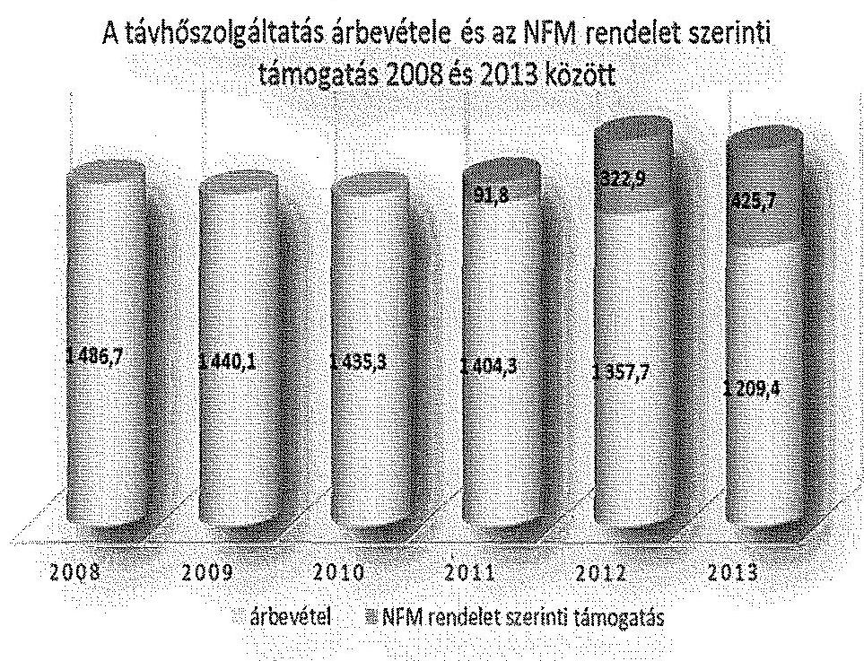
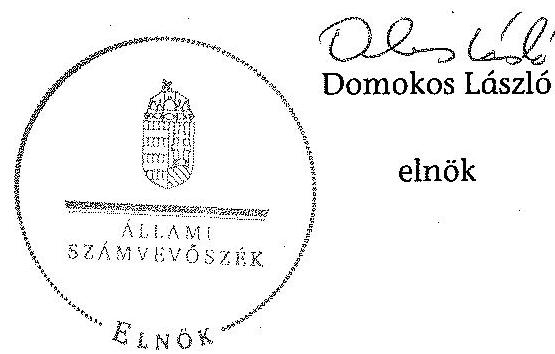
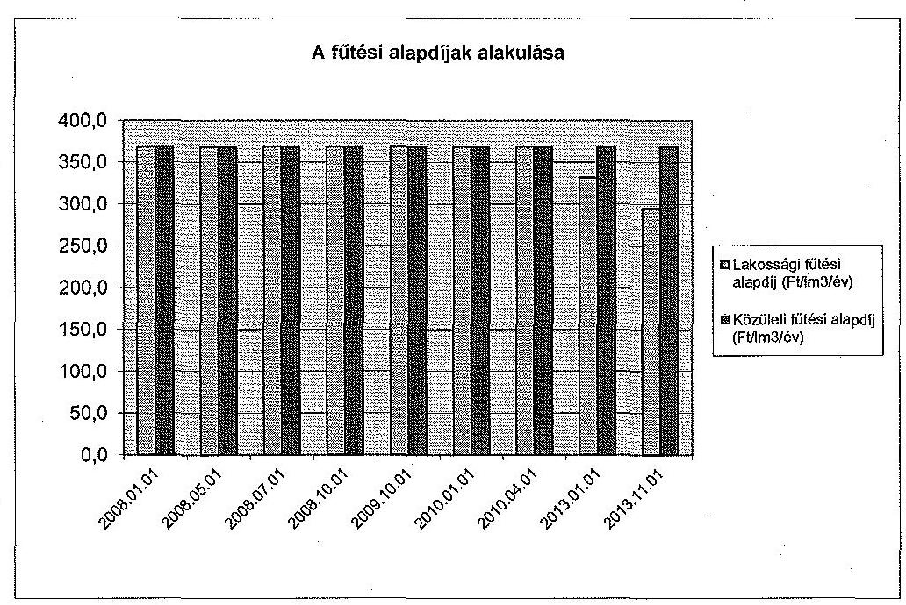
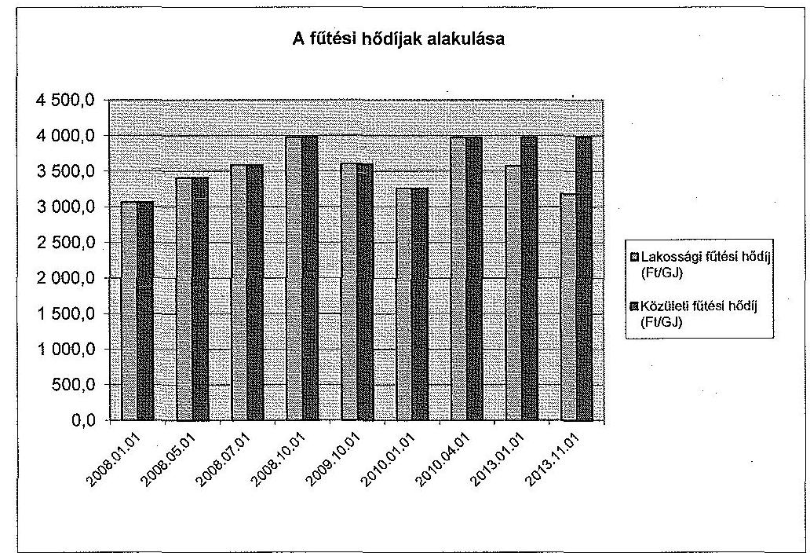
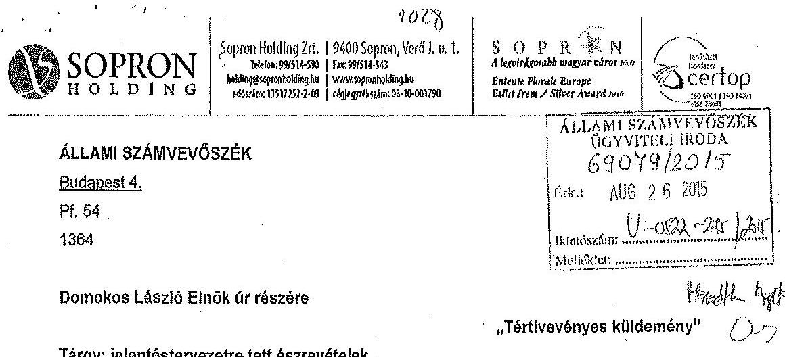
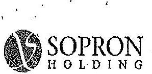
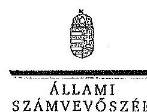
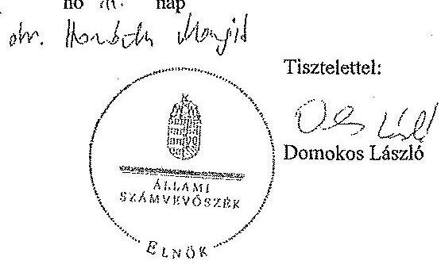

# JELENTÉS 

Az önkormányzatok gazdasági társaságai - Az önkormányzatok többségi tulajdonában lévő gazdasági társaságok közfeladat ellátását érintő gazdálkodási tevékenysége szabályszerűségének ellenőrzése
SOPRON HOLDING Vagyonkezelő Zártkörűen Müködő Részvénytársaság
15140

---

# Állami Számvevőszék 

Iktatószám: V-0822-283/2015.
Témaszám: 1856
Vizsgálat-azonosító szám: V067143

## Az ellenőrzést felügyelte:

Dr. Horváth Margit
felügyeleti vezető
Az ellenőrzést vezette és az ellenőrzés végrehajtásáért felelős:
Salamin Viktor
ellenőrzésvezető
A jelentéstervezet összeállításában közremúködött:
Vámos Imre
számvevő
Az ellenőrzést végezték:
Dr. Tóthné Frisch Anita Vassné Sebők Anna Kiss Péter
külső szakértő
külső szakértő

A témához kapcsolódó eddig készített számvevőszéki jelentések:
címe
sorszáma
Jelentés Sopron Megyei Jogú Város Önkormányzata gazdálkodási ..... 0940
rendszerének 2009. évi ellenőrzéséről
Jelentés Sopron Megyei Jogú Város Önkormányzata pénzügyi ..... 1144
helyzetének ellenőrzéséről (43/3)

---

# TARTALOMJEGYZÉK 

BEVEZETÉS ..... 7
I. ÖSSZEGZŐ MEGÁLLAPÍTÁSOK, KÖVETKEZTETÉSEK, JAVASLATOK ..... 11
II. RÉSZLETES MEGÁLLAPÍTÁSOK ..... 17

1. Az Önkormányzat közfeladat-ellátásának szabályszerűsége ..... 17
1.1. A közfeladat-ellátás megszervezése és a feladatellátás feltételrendszerének kialakítása ..... 17
1.2. A közfeladat-ellátás felügyelete és a tulajdonosi jogok érvényesítése ..... 19
2. A Sopron Holding Zrt. gazdálkodásának szabályozottsága ..... 22
2.1. A Sopron Holding Zrt. gazdálkodásának szabályozottsága ..... 22
2.2. A Sopron Holding Zrt. vagyongazdálkodása ..... 24
2.3. A beszámolási kötelezettség teljesítése ..... 28
3. A távhőszolgáltatás közfeladata bevételei és ráfordításai elszámolásának és önköltség-számításának szabályszerűsége ..... 30
3.1. A távhőszolgáltatás közfeladat bevételeinek és ráfordításainak szabályszerűsége ..... 30
3.2. Az önköltségszámítás szabályszerűsége ..... 31
4. Az ÁSZ korábbi, az önkormányzatok többségi tulajdonában lévő gazdasági társaságok közfeladat-ellátását, gazdálkodását, pénzügyi helyzetét érintő javaslataira tett intézkedések ..... 32
MELLÉKLETEK
5. számú A Sopron Holding Zrt. tevékenységének főbb adatai
6. számú A Sopron Holding Zrt. múködésének főbb jellemzői
7. számú A Sopron Holding Zrt. által biztosított távfűtés díjainak alakulása
8. számú Beérkezett észrevételek és az azokra adott válaszok
FÜGGELÉKEK
9. számú Értelmező szótár
10. számú Mintavételi eljárások ellenőrzési területenként

---

.

---

# RÖVIDÍTÉSEK JEGYZÉKE 

| Törvények |  |
| :--: | :--: |
| Áfa tv. | az általános forgalmi adóról szóló 2007. évi CXXVII. törvény |
| Áht. 1 | az államháztartásról szóló 1992. évi XXXVIII. törvény (hatálytalan: 2012. január 1-jétől) |
| Áht. 2 | az államháztartásról szóló 2011. évi CXCV. törvény (hatályos: 2012. december 31-étől) |
| Ámt. | az árak megállapításáról szóló 1990. évi LXXXVII. törvény |
| ÁSZ tv. | az Állami Számvevőszékről szóló 2011. évi LXVI. törvény (hatályos: 2011. július 1-jétől) |
| Avtv. | a személyes adatok védelméről és a közérdekú adatok nyilvánosságáról szóló 1992. évi LXIII. törvény (hatálytalan: 2012. január 1-jétől) |
| Ebktv. | az egyenlő bánásmódról és az esélyegyenlőség előmozdításáról szóló 2003. évi CXXV. törvény (hatályos: 2004. március $28-$ ától) |
| Fgytv. | a fogyasztóvédelemről szóló 1997. évi CLV. törvény (hatályos: 1998. március 1-jétől) |
| Gt. | a gazdasági társaságokról szóló 2006. évi IV. törvény (hatálytalan: 2014. március 15 -étől) |
| Info tv. | az információs önrendelkezési jogról és az információ szabadságról szóló 2011. évi CXII. törvény (hatályos: 2011. július 27 -étől) |
| Kász tv. | a környezet védelmének általános szabályairól szóló 1995. évi LIII. tv. (hatályos: 1995. április 22-étől) |
| Mötv. | Magyarország helyi önkormányzatairól szóló 2011. évi CLXXXIX. törvény (hatályos: 2012. január 1-jétől, kivéve a 144. § (2) bekezdésben meghatározott paragrafusok, amelyek 2012. április 15 -én, a (3) bekezdésben meghatározott paragrafusok, amelyek 2013. január 1-jén léptek hatályba, a (4) bekezdésben meghatározott paragrafusok a 2014. évi általános önkormányzati választások napján léptek hatályba) |
| Nvtv. | a nemzeti vagyonról szóló 2011. évi CXCVI. törvény (hatályos: 2011. december 31-étől, kivéve a 20. § (2) bekezdésben meghatározott előírások, amelyek 2012. január 1-jétől, a (3) bekezdésben meghatározott előírások 2013. január 1-jétől, a (4) bekezdésben meghatározott előírások 2012. március 2ától léptek hatályba) |
| Ötv. | a helyi önkormányzatokról szóló 1990. évi LXV. törvény (hatálytalan: a 2014. évi általános önkormányzati választások napjától) |
| Számv. tv. | a számvitelről szóló 2000. évi C. törvény (hatályos: 2001. január 1-jétől) |

---

Taktv.

Tao tv.

Tszt.

## Rendeletek

KHEM rendelet
távhőrendelet

Tszr.
vagyongazdálkodási rendelet ${ }_{1}$
vagyongazdálkodási rendelet ${ }_{2}$
vagyongazdálkodási rendelet ${ }_{3}$
50/2011. (IX.30.)
NFM rendelet

51/2011. (IX. 30.)
NFM rendelet

## Szórövidítések

áfa
Alapító Okirat
ÁNTSZ
ÁSZ
értékelési szabályzat
a köztulajdonban álló gazdasági társaságok takarékosabb müködéséről szóló 2009. évi CXXII. törvény (hatályos: 2009. december 4-étől)
a társasági adóról és az osztalékadóról szóló 1996. évi LXXXI. törvény (hatályos: 1997. január 1-jétől)
a távhőszolgáltatásról szóló 2005. évi XVIII. törvény (hatályos: 2005. július 1-jétől)
a távhőszolgáltatás csatlakozási díjának és a lakossági távhőszolgáltatás díjának, valamint a hőenergia távhőtermelő és a távhőszolgáltató közötti szerződésében alkalmazott árának meghatározása során figyelembe veendő szempontokról és a Magyar Energia Hivatal által lefolytatott eljárásban kötelezően benyújtandó adatok köréről szóló 36/2009. (VII.22.) KHEM rendelet (hatályos: 2009. július 25-étől)
Sopron Megyei Jogú Város Önkormányzatának 53/2005. (XII. 21.) sz. rendelete a távhőszolgáltatásról és a távhőszolgáltatás díjáról (hatályos: 2005. december 21-étől)
a távhőszolgáltatásról szóló 2005. évi XVIII. törvény végrehajtásáról szóló 157/2005. (VIII. 15.) Korm. rendelet (hatályos: 2005. szeptember 25-étől)
Sopron Megyei Jogú Város Önkormányzatának 35/2007. (X. 29.) rendelete az Önkormányzat vagyonáról, a vagyontárgyak feletti tulajdonosi jogok gyakorlásának és a vagyon kezelésének szabályozásáról (hatályos: 2007. október 29étől)
Sopron Megyei Jogú Város Önkormányzatának 6/2008. (II. 29.) rendelete az Önkormányzat vagyonáról, a vagyontárgyak feletti tulajdonosi jogok gyakorlásáról (hatályos: 2008. március 1-jétől)
Sopron Megyei Jogú Város Önkormányzatának 3/2013. (III. 4.) sz. rendelete az Önkormányzat vagyonáról, a vagyontárgyak feletti tulajdonosi jogok gyakorlásáról (hatályos: 2013. március 8-ától)
a távhőszolgáltatónak értékesített távhő árának, valamint a lakossági felhasználónak és a külön kezelt intézményeknek nyújtott távhőszolgáltatás díjának megállapításáról szóló 50/2011. (IX. 30.) NFM rendelet (hatályos: 2011. október 1jétől)
a távhőszolgáltatási támogatásról szóló 51/2011. (IX. 30.) NFM rendelet (hatályos: 2011. október 1-jétől)
általános forgalmi adó
a Sopron Holding Zrt. alapító okirata
Állami Népegészségügyi és Tisztiorvosi Szolgálat
Állami Számvevőszék
a Sopron Holding Zrt. értékelési szabályzata (hatályos: 2008. január 1-jétől)

---

| FB | a Sopron Holding Zrt. Felügyelő Bizottsága |
| :--: | :--: |
| Gazdasági Program ${ }_{1}$ | Sopron Megyei Jogú Város 2005-2010 közötti időszakra vonatkozó, a 183/2005. (VI.30.) közgyűlési határozattal elfogadott Gazdasági Programja |
| Gazdasági Program ${ }_{2}$ | Sopron Megyei Jogú Város 2011-2014 közötti időszakra vonatkozó, a 143/2011. (V.26.) közgyűlési határozattal elfogadott Gazdasági Programja |
| jegyző | Sopron Megyei Jogú Város Jegyzője |
| Gazdasági Bizottság | Sopron Megyei Jogú Város Önkormányzata Közgyűlésének Gazdasági Bizottsága |
| javadalmazási sza-   bályzat | a Sopron Holding Zrt. javadalmazási szabályzata (hatályos: 2010. február 1-jétől) |
| KEOP | Környezet és Energia Operatív Program |
| Közgyűlés/legfőbb   szerv | Sopron Megyei Jogú Város Önkormányzatának Közgyűlése/a Sopron Holding Zrt. legfőbb szerve |
| leltárkészítési és leltározási szabályzat | a Sopron Holding Zrt. eszközök és források leltárkészítési és leltározási szabályzata (hatályos: 2008. január 1-jétől) |
| MEKH | Magyar Energetikai Hivatal, 2013. április 4-étől Magyar Energetikai és Közmű-szabályozási Hivatal |
| NAV | Nemzeti Adó- és Vámhivatal |
| OMMF | Országos Munkavédelmi és Munkaügyi Főfelügyelőség |
| önköltség-számítási   szabályzat ${ }_{1}$ | a Sopron Holding Zrt. önköltség-számítási szabályzata (hatályos: 2008. január 1-jétől) |
| önköltség-számítási   szabályzat ${ }_{2}$ | a Sopron Holding Zrt. önköltség-számítási szabályzata (hatályos: 2010. január 1-jétől) |
| önköltség-számítási   szabályzat ${ }_{3}$ | a Sopron Holding Zrt. önköltség-számítási szabályzata (hatályos: 2012. január 1-jétől) |
| Pénzügyi Bizottság | Sopron Megyei Jogú Város Önkormányzata Közgyűlésének Pénzügyi Bizottsága |
| pénzkezelési szabály-   zat | a Sopron Holding Zrt. pénzkezelési szabályzata (hatályos: 2008. január 1-jétől) |
| polgármester | Sopron Megyei Jogú Város Polgármestere |
| Polgármesteri Hivatal | Sopron Megyei Jogú Város Önkormányzatának Polgármesteri Hivatala |
| Önkormányzat | Sopron Megyei Jogú Város Önkormányzata |
| Sopron Holding Zrt. | Sopron Holding Vagyonkezelő Zártkörűen Működő Részvénytársaság |
| számlarend | a Sopron Holding Zrt. számviteli politikájának 4. sz. melléklete (hatályos: 2008. január 1-jétől) és módosításai |
| számviteli politika | a Sopron Holding Zrt. számviteli politikája (hatályos: 2008. január 1-jétől) és módosításai |
| számviteli szétválasztási szabályzat | a Sopron Holding Zrt. számviteli szétválasztási szabályzata (hatályos: 2012. január 1-jétől) és módosítása |
| Társaság | Sopron Holding Vagyonkezelő Zártkörűen Múködő Részvénytársaság |
| üzletszabályzat | a Sopron Holding Zrt. üzletszabályzata (hatályos: 2006. július 31-étől) |

---

.

---

# JELENTÉS 

## Az önkormányzatok gazdasági társaságai Az önkormányzatok többségi tulajdonában lévő gazdasági társaságok közfeladat ellátását érintő gazdálkodási tevékenysége szabályszerűségének ellenőrzése Sopron Holding Vagyonkezelő Zrt.

## BEVEZETÉS

Az Állami Számvevőszék középtávra szóló stratégiájában megfogalmazta, hogy a helyi önkormányzatok gazdálkodásában rejlő pénzügyi kockázatok feltárásával, az államháztartáson kívülre nyújtott költségvetési támogatások és ingyenes vagyonjuttatások, valamint az államháztartáson kívül múködő köz-feladat-ellátó rendszerek ellenőrzéseivel hozzájárul ahhoz, hogy a közpénzeket az államháztartáson kívül múködő szervezetek is átlátható, rendezett módon használják fel a közfeladatok szerződésben vállalt ellátása érdekében.

Az önkormányzatok szervezetalakítási szabadságának következménye, hogy a korábban is vállalati formában múködő (nagyvárosi tömegközlekedés, víz-, szennyvízcsatorna, köztisztasági, ingatlankezelés stb.) közszolgáltatások mellett, mind a kötelező, mind az önként vállalt feladatok ellátásában a gazdasági társaságok kiemelt fontosságú szerephez jutottak.

Sopron Megyei Jogú Város Önkormányzata az ellenőrzött időszakot megelőzően, 2005. április 19-én alapította a Sopron Holding Zrt.-t. A Sopron Holding Zrt. jegyzett tőkéjét a 2012. évben 623,6 M Ft-ról 723,6 M Ft-ra emelték.

A Sopron Holding Zrt. egyedüli részvényese az ellenőrzött időszakban Sopron Megyei Jogú Város Önkormányzata volt. A távhőszolgáltatást biztosító vagyont az Önkormányzat apportként bocsátotta a jogelőd Soproni Távhőszolgáltató Kft. rendelkezésére.

A Sopron Holding Zrt. főtevékenysége ingatlanok bérbeadása, üzemeltetése volt. Tevékenységi körébe tartozott emellett a gőzellátás, légkondicionálás is. A Sopron Holding Zrt. munkavállalói létszáma az ellenőrzési időszakban a 2008. évi 319 fơről a 2013. év végére 242 főre csökkent. A távhőszolgáltatási tevékenységet ellátó dolgozói létszám 19 és 22 fő között változott.

A Sopron Holding Zrt. 2008. december 31-én két gazdasági társaságban - a Sopron Rendszerház Informatikai és Szolgáltató Kft.-ben 66,7\%-os és a Soproni Ipari Zóna Szolgáltató Kft.-ben 54,6\%-os - többségi befolyást biztosító, egy gaz-

---

dasági társaságban - a FÉSZEK Ingatlanhasznosító Kft.-ben ${ }^{1}$ - 100\%-os kizárólagos tulajdoni hányaddal rendelkezett.

2013-ban a 60528 fő lakosú Sopron közigazgatási területén a Sopron Holding Zrt. általános közüzemi szerződés keretében 5884 lakossági és 109 nem lakossági felhasználót látott el távhőszolgáltatással. A múködési területén üzemeltetett távhővezetékek hossza $13,6 \mathrm{~km}$ volt. Az értékesített hő mennyisége az ellenőrzött idôszakban 293012 GJ-ról 240383 GJ-ra 18\%-kal csökkent.

A Sopron Holding Zrt. a hőszolgáltatási feladat ellátásához a saját fűtőművében előállított hőenergia mellett más hőtermelőktől vásárolt hőenergiát is hasznosított.

A 2008-2013. években a Sopron Holding Zrt. távhőszolgáltatással kapcsolatos nettó árbevétele 1534,9 M Ft-ról 1209,4 M Ft-ra 21,2\%-kal, mérlegfőösszege 5479,2 M Ft-ról 4264,1 M Ft-ra 22,2\%-kal csökkent. A Sopron Holding Zrt. az ellenőrzött években összesen 406,3 M Ft mérleg szerinti veszteséget halmozott fel. A hatósági árszabályozás bevezetését követően kieső bevételeinek pótlására 2011. október 1. és 2013. december 31. között mindösszesen 840,3 M Ft távhőszolgáltatási támogatásban részesült.

A távhőszolgáltási tevékenységet szolgáló eszközök mérleg szerinti értéke 2008 és 2013 között 47,6\%-kal 259,1 M Ft-ra csökkent, használhatósági fokukban $43,5 \%$-os visszaesés volt tapasztalható.

[^0]
[^0]:    ${ }^{1}$ A FÉSZEK Ingatlanhasznosító Kft. 2011. szeptember 30-án beolvadással szűnt meg.

---

Az ellenőrzött időszakban a polgármester és a jegyző személye nem változott. A Sopron Holding Zrt.-nél a vezérigazgató 2007. március 29., a gazdasági igazgató pedig 2007. április 16. óta látta el feladatkörét.

Az önkormányzati tulajdonú gazdasági társaságok teljes körű ellenőrzésének lehetőségét az Állami Számvevőszékről szóló 1989. évi XXXVIII. törvény 2011. január 1-jétől hatályos módosítása teremtette meg.

Az ellenőrzés célja annak értékelése volt, hogy

- az önkormányzat a jogszabályi előírások figyelembevételével döntött-e az ellenőrzésre kerülő közfeladat megszervezéséről; az önkormányzat szabályszerűen gyakorolta-e a tulajdonosi jogokat;
- a gazdasági társaság közfeladat-ellátása bevételeinek, ráfordításainak elszámolása, és vagyongazdálkodási tevékenysége megfelelte a jogszabályi, illetve a közszolgáltatási szerződésben foglalt tulajdonosi előírásoknak, azok végrehajtása szabályszerű volt-e;
- a közfeladatok átláthatósága és elszámoltathatósága érdekében biztosítva volt-e a közszolgáltatás dijának megalapozottsága szabályszerű önköltségszámítással.

Az ellenőrzés kiterjedt Sopron Város Önkormányzatára és a Sopron Holding Zrt.-re.

Az ellenőrzés várható hasznosulása: A törvényalkotás számára - az észlelt problémák, szabálytalanságok, vagy egyéb nem kívánatos jelenségek felszínre kerülésével - az ellenőrzés megállapításai segítséget nyújthatnak az államháztartáson kívüli közfeladat-ellátás értékeléséhez, jogszabályi keretei pontosításához, átláthatóságot biztosító szabályozásához. Meghatározhatóvá válnak a közfeladat ellátásában részt vevő államháztartáson kívüli szervezeteknek - az önkormányzat költségvetését, pénzügyi helyzetét is befolyásoló - kockázatai, lehetővé válik ezen kockázatok csökkentése. Értékelhetővé válik, hogy a feladatot ellátó gazdasági társaság a közszolgáltatási szerződésben foglaltak betartásával, a közvagyon használatával biztosította-e a szolgáltatás folytatásának feltételeit. Ezzel az ellenőrzöttek és a helyi döntéshozók számára visszajelzést ad feladatszervezési, feladat-ellátási kockázataikról, alapot ad a meglévő hibák megszüntetéséhez, a jobb közfeladat-ellátás biztosításához. Fokozza a fegyelmet, igazolja, hogy lejárt a következmények nélküli ellenőrzések időszaka. Az ÁSZ értékteremtő rend kialakításához és megőrzéséhez hozzájáruló tevékenysége pozitív hatással van a szervezetről kialakított összkép formálására is.

A bevételek és ráfordítások elszámolása, valamint a vagyonnyilvántartás terén az egyes területek szabályszerű működését mintavétellel ellenőriztük, ez alapján a sokaságokban előforduló hibás tételek arányát becsültük. A jogszabályoknak és a belső előírásoknak megfelelőnek, azaz szabályszerűnek tekintettük az adott bevételek és ráfordítások elszámolását, a vagyonnyilvántartást, amennyiben a minta ellenőrzésének eredménye alapján $95 \%$-os bizonyossággal a teljes sokaságban a hibás tételek aránya kisebb volt, mint $10 \%$, nem megfelelőnek értékeltük, ha a hibás tételek aránya a $10 \%$-ot meghaladta. Kockázatot, illetve magas kockázatot jeleztünk, amennyiben egy adott terület vo-

---

natkozásában a minta alapján a teljes sokaságban nem volt teljes körűen biztosított a jogszabályoknak és a belső szabályzatoknak megfelelő működés.

Az ellenőrzést a számvevőszéki ellenőrzés szakmai szabályai szerint, szabályszerűségi ellenőrzés módszerével, a vonatkozó nemzetközi standardok figyelembevételével végeztük. Az ellenőrzés a 2008-2013. évekre terjedt ki.

Az ellenőrzés végrehajtásának jogszabályi alapját az Állami Számvevőszékről szóló 2011. évi LXVI. törvény 5. § (3)-(5) bekezdései képezték.

Az ÁSZ az Állami Számvevőszékről szóló 2011. évi LXVI. törvény 29. §-a alapján a jelentéstervezetet észrevételezésre megküldte Sopron Megyei Jogú Város Önkormányzata polgármesterének és a gazdasági társaság vezérigazgatójának. A beérkezett észrevételeket a jelentés véglegesítése során hasznosítottuk. Az észrevételeket és az azokra adott válaszokat a jelentés 4. számú melléklete tartalmazza.

---

# I. ÖSSZEGZŐ MEGÁLLAPÍTÁSOK, KÖVETKEZTETÉSEK, JAVASLATOK 

Az Önkormányzat az Ötv.-ben adott felhatalmazás alapján a távhőszolgáltatás közfeladat-ellátási kötelezettségének gazdasági társaság alapításával szabályszerűen - eleget tett. Az Önkormányzat a távhőszolgáltatás biztosításához szükséges vagyont $290,6 \mathrm{M}$ Ft értékben, az alapítással egy időben apportként bocsátotta a 100\%-os önkormányzati tulajdonú Sopron Holding Zrt. jogelődje, a Soproni Távhőszolgáltató Kft. részére. Az Önkormányzat az apportként szolgáltatott vagyonon felül üzemeltetésre, vagyonkezelésre nem bocsátott eszközöket a Társaság részére a távhőszolgáltatási tevékenység ellátásához.

Az Önkormányzat az ellenőrzött időszakban Gazdasági program ${ }_{1.2}$-mal rendelkezett. Gazdasági program ${ }_{1.2}$-ja mellett a Közgyűlés határozataiban fogadta el a Város 2007-2013 közötti időszakra vonatkozó Integrált Városfejlesztési Stratégiáját és a 2010-2015. évekre szóló Környezetvédelmi Programját.

A Sopron Holding Zrt. 2012. április 1-jéig a jogelőd Soproni Távhőszolgáltató Kft. részére a jegyző, 2012. április 2-ától a MEKH által a saját nevére kiadott múködési engedély alapján látta el feladatait. A Soproni Távhőszolgáltató Kft. 2006. május 31.-i beolvadását követően azonban - a Tszt. rendelkezései ellenére - a jegyző a jogelőd társaság működési engedélyét nem vonta vissza, illetve a jogutód társaság részére távhőszolgáltatási múködési engedélyt nem adott ki, ugyanakkor a Társaság üzletszabályzatát határozatával jóváhagyta.

A Közgyűlés a Tszt.-nek megfelelően távhőrendeletben határozta meg a távhőszolgáltatás részletszabályait, a közfeladatot ellátó gazdasági társaság és a szolgáltatást igénybe vevő fogyasztók jogait és kötelezettségeit, valamint a távhőszolgáltatás ár- és díjrendszerét.

Az Önkormányzat az Nvtv. szabályainak megfelelően kidolgozta közép- és hosszú távú vagyongazdálkodási tervét. A gazdasági társaságok feletti tulajdonosi jogok gyakorlásának részletszabályait a Gt. vonatkozó előírásaival összhangban a vagyongazdálkodási rendelet ${ }_{1.2}$-ben és a Sopron Holding Zrt. Alapító Okiratában rögzítette.

A Sopron Holding Zrt. vonatkozásában az Önkormányzat a tulajdonosi jogait szabályszerűen gyakorolta. A Társaság irányításával vezérigazgatót, múködésének felügyeletére FB-t és könyvvizsgálót választott. A legfőbb szerv a Gt. előírásainak megfelelően a Sopron Holding Zrt. éves számviteli beszámolóit az FB és a könyvvizsgáló írásbeli jelentésének figyelembevételével határozatban fogadta el.

Az Önkormányzat belső ellenőrzése a távhőszolgáltatás, mint közfeladat ellátás szabályszerű teljesítéséhez, az önkormányzati vagyon megóvásához nem járult hozzá, mert az ellenőrzött időszakban a Sopron Holding Zrt. közfeladat ellátási tevékenységével kapcsolatban ellenőrzést nem végzett.

---

A Sopron Holding Zrt. tevékenységi körét, a közfeladat-ellátás feltételeit az Alapító Okirat tartalmazta. A Társaság a jegyző által jóváhagyott Üzletszabályzattal, továbbá a szervezeti felépítését, hatásköri és felelősségi rendszerét tartalmazó SZMSZ-szel az ellenőrzött időszakban rendelkezett. Az Üzletszabályzat árképzésre vonatkozó szakaszait azonban a Tszt. -ben meghatározott - a 2011. október 1-jétől hatályos - árképzésre vonatkozó változásoknak megfelelően nem módosították.

A Sopron Holding Zrt. az ellenőrzött időszakban kialakította a belső számviteli szabályrendszerét. A Társaság a 2008-2013. évekre vonatkozóan rendelkezett a Számv. tv.-ben előírt számviteli politikával, valamint az annak részeként előírt szabályzatokkal és selejtezési szabályzattal, ezekhez kapcsolódóan azonban az ellenőrzés több hiányosságot is feltárt A számviteli politikában átlagár alkalmazását, az értékelési szabályzatban ezzel szemben a FIFO módszer alkalmazását írták elő, ezzel nem tettek eleget a Számv. tv.-ben előírtaknak. A Tszt.-ben előírt számviteli szétválasztási kötelezettségek teljesítését az önköltségszámítási szabályzat ${ }_{1-3}$ munkaszámrendszere a számviteli szétválasztási szabályzattal együtt biztosította.

A Sopron Holding Zrt. a távhőszolgáltatási tevékenységet saját vagyonával látta el. Eszközeit szabályszerűen nyilvántartotta, eszközeit kétévente tényleges mennyiségi leltárfelvétellel vette számba.

A Sopron Holding Zrt. mérlegfőösszege a 2008. és 2013. évek között a kezdeti 5479,2 M Ft-ról 2013. december 31-re 4264,1 M Ft-ra csökkent. A csökkenést meghatározóan az elszámolt értékcsökkenésnél alacsonyabb értékben megvalósított beruházások okozták. A Sopron Holding Zrt. távhőszolgáltatási tevékenységét szolgáló eszközök mérleg szerinti értéke 2008 és 2013 között 494,3 M Ft-ról 259,1 M Ft-ra 47,6\%-kal, az eszközök használhatósági foka pedig $79,5 \%$-ról $36,0 \%$-ra csökkent.

A vevőkövetelések között a távhőszolgáltatás követeléseinek állományát a 2012. évig növekedés jellemezte. A 2013. év végére a 2008-ban nyilvántartott 138,0 M Ft lejárt követelésállomány 107,3 M Ft-ra csökkent. A lejárt követelésekkel szemben a számviteli politikában meghatározott elvek szerint az ellenőrzött időszakban 67,4 M Ft értékvesztést számoltak el.

A 2008-2013. években a Sopron Holding Zrt. távhőszolgáltatással kapcsolatos nettó árbevétele 1434,9 M Ft-ról 1209,4 M Ft-ra csökkent, amelyet a 2011. évben bevezetett távhőszolgáltatási támogatás 2013 végéig 840,3 M Ft összegben kompenzált.

A Sopron Holding Zrt. éves beszámolóit határidőre elkészítette, elfogadásra a Közgyűlés elé terjesztette és az elfogadást követően közzétette. Az FB az éves beszámolókat megtárgyalta és írásbeli jelentésben tett javaslatot annak elfogadására. A Sopron Holding Zrt. könyvvizsgálója minden ellenőrzött évben hitelesítő záradékkal látta el az éves beszámolót.

A Sopron Holding Zrt. az Avtv.-ben, valamint az Info tv.-ben foglaltak ellenére a közérdekű adatok közzétételét, valamint a közérdekü adatok megismerésére irányuló igények teljesítésének rendjét rögzítő szabályzattal a 2008-2013.

---

években nem rendelkezett. A Társaság a közérdekű adatok és a közérdekből nyilvános adatok megismerését a közzététellel nem biztosította. A Sopron Holding Zrt. az Avtv.-ben, valamint az Info tv.-ben meghatározottak ellenére adatvédelmi és adatbiztonsági szabályzatot nem készített.

A Sopron Holding Zrt. az ellenőrzött években a Számv. tv.-ben meghatározott önköltség-számítási szabályzat készítési kötelezettségének eleget tett. A számviteli politikájával összhangban kialakított önköltség-számítási szabály$\mathrm{zat}_{1-3}$, valamint a 2012. évtől a Tszt. előírásainak megfelelő számviteli szétválasztási szabályzat határozta meg az elszámolási kötelezettség teljesítésének belső szabályait.

A Sopron Holding Zrt. a távhőszolgáltatási közfeladat bevételeinek, költségeinek és ráfordításainak, valamint beruházásainak elszámolását a 2008-2013. években szabályszerűen végezte.

A Társaság a Tszt. előírásainak megfelelően az önköltség tevékenységenkénti elkülönítését és az önköltség pontos meghatározását az egyes tevékenységek vonatkozásában biztosította. A távhőtermelés, a távhőszolgáltatás és az egyéb tevékenységek vonatkozásában elkülönítési és beszámolási kötelezettségeinek szabályszerűen eleget tett. A Sopron Holding Zrt. által a 2008-2013. években alkalmazott távhőszolgáltatásra vonatkozó díjtételek önköltségszámításon alapultak, ezáltal biztosított volt a közfeladatok átláthatósága és elszámoltathatósága.

Az ÁSZ az Önkormányzatnál a 2009. és a 2011. évben két ellenőrzést folytatott le. Az Önkormányzat a jelentések javaslatai alapján kidolgozta az intézkedési terveit. A jóváhagyott intézkedési tervet - a gazdasági program módosításán kívül - a 2012-2013. években végrehajtották. A jelentések javaslatai hasznosultak.

A fentiekben leírtak összegzéseként az alábbi megállapításokat tesszük:
Sopron Megyei Jogú Város Önkormányzatának Közgyűlése a távhőszolgáltatás közfeladatának megszervezéséről, a tulajdonosi jogainak biztosításáról a jogszabályi előírásoknak megfelelően gondoskodott. A távhőszolgáltatás kötelező feladatát részben önkormányzati többségi tulajdonú társasággal, részben magántársaság bevonásával teljesítette. A Sopron Holding Zrt. a távhőszolgáltatás közfeladat mellett más tevékenységeket is ellátott az ellenőrzött időszakban. A távhőszolgáltatás közfeladat-ellátását a saját vagyonát képező eszközállománnyal végezte. A távhőszolgáltatáshoz kapcsolódó vagyongazdálkodási tevékenység szabályszerű volt. A Sopron Holding Zrt. múködésének szabályozottsága és annak gyakorlati alkalmazása az ellenőrzött időszakban - a számviteli szabályzatok hiányosságai és a közzétételre és az adatkezelésre vonatkozó szabályzatok hiánya kivételével - az előírásoknak megfelelt. Az árbevételek, a költségek és ráfordítások és a beruházások és felújítások elszámolása megfelelő volt. Az önköltség-számítási szabályzat és a számviteli szétválasztási szabályzat alapján folytatott gyakorlat biztosította a távhőszolgáltatás közfeladatának átláthatóságát és elszámoltathatóságát. A Társaságnál a kintlévőéégek kezelése a szabályozás szerint működött. A vevők felé fennálló követelésállomány a 2013. év végére csökkenést mutatott.

---

A helyszíni ellenőrzés megállapításainak hasznosítása mellett Javasoljuk:
Javaslataink célja a Sopron Holding Zrt. gazdálkodása szabályszerűségének javítása annak érdekében, hogy a szabályozási környezet megfelelően tudja támogatni az átlátható müködést.

# Javasoljuk a Sopron Holding Zrt. Vezérigazgatójának: 

1. A számlarend nem tartalmazta a Számv. tv. 161. § (2) bekezdés a) pontjában foglaltak szerint minden alkalmazásra kijelölt számla számjelét és megnevezését, valamint a (2) bekezdés b) pontjában előírtak szerint a számla értéke növekedésének, csökkenésének jogcímeit, a számlát érintő gazdasági eseményeket, valamint a más számlákkal való kapcsolatát.

A leltárkészítési és leltározási szabályzatot 2012. január 1-jétől nem aktualizálták a Számv. tv. 69. § (3) bekezdésének megfelelően, miszerint a folyamatos mennyiségi nyilvántartást vezető gazdálkodónak legalább háromévenként mennyiségi felvétellel kell leltároznia. A leltározási szabályzat 2. számú melléklete a vagyontárgyak ötévenkénti leltározási kötelezettségét írta elő. Emellett a leltározási szabályzat a Számv. tv. 50. § (4) bekezdésében foglaltak ellenére a térítés nélkül átvett, többletként fellelt, ajándékként kapott eszközök érték nélküli állományba vételét tartalmazta a piaci érték helyett.

Az értékelési szabályzatot 2012. január 1-jétől nem módosították a Számv. tv. 47. § (4) bekezdés e) pontja szerint az egyetemes szolgáltatótól beszerzett és a végfelhasználónak (fogyasztónak) értékesített szolgáltatások bekerülési értékének meghatározására vonatkozóan. Emellett a bekerülési érték elszámolására a számviteli politikában és az értékelési szabályzatban eltérő értékelési eljárás alkalmazását írták elő. A számviteli politikában átlagár alkalmazását, az értékelési szabályzatban a FIFO módszer alkalmazását írták elő, ezzel nem tettek eleget a Számv. tv. 14. § (4) bekezdésében előírtaknak, amely szerint ahol a törvény választási lehetőséget ad az alkalmazandó módszerek tekintetében, ott a választott megoldást rögzíteni szükséges a számviteli szabályozásban.

A Sopron Holding Zrt. az Avtv. 20. § (8) bekezdésében valamint az Info tv. 30. § (6) bekezdésében foglaltak ellenére a közérdekű adatok közzétételét és a közérdekű adatok megismerésére irányuló igények teljesítésének rendjét a 2008-2013. években szabályzatban nem rögzítette, a közérdekű adatok és közérdekből nyilvános adatok megismerhetőségét - az éves beszámoló kivételével - nem biztosította.

A Társaság az Avtv. 31/A. § (3) bekezdésében, valamint az Info tv. 24. § (3) bekezdésében meghatározottak ellenére adatvédelmi és adatbiztonsági szabályzatot nem készített.

Az Üzletszabályzat árképzésre vonatkozó szakaszait a Tszt. 57. §-ban meghatározott - a 2011. október 1-jétől hatályos - árképzésre vonatkozó változásoknak megfelelően nem módosították.

---

Javaslat:
Intézkedjen a szabályozási hiányosságok megszüntetésére, ennek keretében:
a) egészítse ki a számlarendet minden alkalmazásra kijelölt számla számjelével és megnevezésével, valamint a számla értéke növekedésének, csökkenésének jogcímeivel, a számlát érintő gazdasági eseményekkel, valamint más számlákkal való kapcsolatával;
b) aktualizálja a leltárkészítési és leltározási szabályzatot a legalább háromévenkénti mennyiségi felvétellel történő leltározásra vonatkozóan, valamint módosítsa a Számv. tv.-nek megfelelően a térítés nélkül átvett, többletként fellelt, ajándékként kapott eszközök állományba vételének szabályait;
c) módosítsa az értékelési szabályzatot az egyetemes szolgáltatótól beszerzett és a végfelhasználónak értékesített szolgáltatások bekerülési értékének meghatározására vonatkozóan;
d) teremtse meg a bekerülési érték elszámolására vonatkozóan a számviteli politika és az értékelési szabályzat összhangját;
e) gondoskodjon a közérdekű adatok közzétételét és a közérdekű adatok megismerésére irányuló igények teljesítésének rendjére, valamint az adatvédelemre és adatbiztonságra vonatkozó szabályzatok elkészítéséről és a közérdekű adatok jogszabályoknak megfelelő közzétételéről;
f) módosítsa az Üzletszabályzat árképzésre vonatkozó részeit a Tszt. előírásának megfelelően.

Javaslataink célja az Önkormányzat szabályszerű müködésének elősegítése, továbbá az önkormányzati tulajdonosi joggyakorlás kontrolljainak erősítése.

Javasoljuk Sopron Megyei Jogú Város Önkormányzata Polgármesterének:

1. A javadalmazási szabályzat nem volt összhangban a vagyongazdálkodási rendelet ${ }_{1-3}$ tel, mert a vezérigazgató prémiumának megállapítását, amely a vagyonrendelet ${ }_{1-3}$ szerint a Közgyűlés kizárólagos hatáskörébe tartozott, a gazdasági polgármester hatáskörébe utalta.

Javaslat:
Intézkedjen a jogszabályi előirások szerinti gyakorlat és a szabályos müködés biztosítására, ezen belül:
kezdeményezze a Közgyűlésnél a Társaság javadalmazási szabályzatának módosítását.

---

# Javasoljuk Sopron Megyei Város Önkormányzata Jegyzöjének: 

1. Az Önkormányzat belső ellenőrzése az ellenőrzéseivel a távhőszolgáltatás, mint köz-feladat-ellátás szabályszerű teljesítéséhez, valamint az önkormányzati vagyon megóvásához nem járult hozzá. Az ellenőrzött időszakban a társaság gazdálkodásával és müködésével kapcsolatban ellenőrzést nem folytatott le.

Javaslat:
Intézkedjen a jogszabályi elöírások szerinti gyakorlat és a szabályos müködés biztositására, ezen belül:
fordítson kiemelt figyelmet arra, hogy az Önkormányzat belső ellenőrzése az ellenőrzéseivel a távhőszolgáltatás, mint közfeladat-ellátás szabályszerű teljesítéséhez, valamint az önkormányzati vagyon megóvásához járuljon hozzá.

---

# II. RÉSZLETES MEGÁLLAPÍTÁSOK 

## 1. Az ÖNKORMÁNYZAT KÖZFELADAT-ELLÁTÁSÁNAK SZABÁLYSZERŰSÉGE

### 1.1. A közfeladat-ellátás megszervezése és a feladatellátás feltételrendszerének kialalítása

Az Ötv. 91.§ (6) bekezdése ${ }^{2}$ alapján az önkormányzat gazdasági programban határozza meg mindazon célkitűzéseket és feladatokat, amelyek a költségvetési lehetőségekkel összhangban, a helyi társadalmi, környezeti és gazdasági adottságok figyelembevételével biztosítják a kötelező és az önként vállalt feladatok ellátását.

A Közgyűlés határozatával ${ }^{3}$ elfogadott Gazdasági Program ${ }_{1,2}$ azonban a távhőszolgáltatással kapcsolatban konkrét elképzeléseket, célkitűzéseket, illetve fejlesztési terveket nem fogalmazott meg.

A Gazdasági program ${ }_{1}$ 1. számú melléklete közvetve érintette a területet azzal, hogy 484,5 M Ft összegben tartalmazta a 2008. és a 2009. évi panelpályázatokkal összefüggésben elkülönített támogatás tételeit.

Az Önkormányzat elfogadta Sopron Város 2007. és 2013. közötti időszakra vonatkozó Integrált Városfejlesztési Stratégiáját és a 2010-2015. évekre szóló Környezetvédelmi Programját, amelyek általános fejlesztési elképzeléseket fogalmaztak meg a közszolgáltatási feladat ellátásával kapcsolatban.

Az Integrált Városfejlesztési Stratégia a távhőszolgáltatással kapcsolatban célként a hálózatkorszerűsítést, az energiahatékonyság növelését célzó beruházások megvalósítását, valamint a hőközpont felújítások folyamatos teljesítését fogalmazta meg.

Az Önkormányzat 2010-2015. évekre vonatkozó Környezetvédelmi Programja tartalmazta - többek között - a térség környezeti állapotát befolyásoló természeti és emberi tényezők számbavételét, a környezeti elemek értékelését és a térségben jellemző energiafelhasználást is.

A Környezetvédelmi Program a környezet állapotának megőrzése, a hulladékgazdálkodás tevékenységei, a város környezetvédelmi irányítása mellett energiafelhasználással foglalkozó pontjában kitért a megújuló és fosszilis energiahordozó felhasználásának helyzetére, ezen belül a hőtermelésre és a távhő felhasználására, valamint az energiahordozók használatának következményeire.

[^0]
[^0]:    ${ }^{2}$ 2013. január 1-jétől az Mötv. 116. § (3) bekezdése
    ${ }^{3}$ 183/2005. (VI.30.) és 143/2011. (V.26.) Kgy. határozat

---

Az Nvtv. 9. § (1) bekezdése alapján a helyi önkormányzatnak az Alaptörvény, valamint az Nvtv. 7. § (2) bekezdésben meghatározott rendeltetése biztosításának céljából a vagyongazdálkodásáról vagyongazdálkodási tervet köteles készíteni. A Közgyűlés határozatával ${ }^{4}$ elfogadta az Önkormányzat közép és hosszú távú vagyongazdálkodási tervét.

A közép- és hosszú távú vagyongazdálkodási terv általánosságban fogalmazta meg a vagyongazdálkodás költséghatékonyabb, színvonalasabb ellátásának feladatát. A vagyongazdálkodási terv IV. fejezetének 2. pontja felsorolta az önkormányzati vagyon müködtetését ellátó szervezeteket, amelyek között a kizárólagos és a többségi önkormányzati tulajdonú gazdasági társaságok is szerepeltek.

Az Ötv. 8. § (3) bekezdésével ${ }^{5}$ összhangban a Tszt. 6. § (1) bekezdése a területileg illetékes települési önkormányzatot kötelezi a távhőszolgáltatással ellátott létesítmények engedélyes vagy engedélyesek útján történő ellátására.

Az Önkormányzat az Ötv. 9. § (4) bekezdésében adott felhatalmazás alapján a távhőszolgáltatás közfeladat-ellátási kötelezettségének gazdasági társaság alapításával szabályszerűen tett eleget.

A Tszt. 6. § (1) bekezdése alapján a távhőszolgáltatással ellátott létesítmények távhőellátásának biztosítása Sopron városában az Önkormányzat kötelező feladata volt. Az Önkormányzat a távhőszolgáltatás kötelező közfeladatának ellátását engedélyesek bevonásával biztosította. A Sopron Holding Zrt. főbb adatait az 1. számú melléklet, a társaság múködésének főbb jellemzőit a 2. számú melléklet tartalmazza.

A Sopron Holding Zrt. 2012. április 1-jéig a jogelőd Soproni Távhőszolgáltató Kft. részére a jegyző, 2012. április 2-ától a MEKH által a saját nevére kiadott működési engedély alapján látta el feladatait ${ }^{6}$. A Soproni Távhőszolgáltató Kft. 2006. május 31.-i beolvadását követően azonban a Tszt. 16. § (1) bekezdésének, valamint a 20. § (1) bekezdés a) pontjának és (2) bekezdésének rendelkezései ellenére a jegyzö a jogelőd társaság múködési engedélyét nem vonta vissza, illetve a jogutód társaság részére távhőszolgáltatási müködési engedélyt nem adott ki, ugyanakkor a Társaság üzletszabályzatát határozatával jóváhagyta. ${ }^{7}$ A Társaság 2008. január 1-jétől 2012 áprilisáig - a MEKH engedélyének kiadásáig - nem rendelkezett müködési engedéllyel, azonban ez a tény a szabályos múködést nem veszélyeztette.

Az Önkormányzat a távhőszolgáltatás biztosításához szükséges vagyont 290,6 M Ft értékben, az alapítással egy időben apportként bocsátotta a jogelőd Soproni Távhőszolgáltató Kft. rendelkezésére, mely a beolvadással a Sopron Holding Zrt. tulajdonába került. Az Önkormányzat az apportként szol-

[^0]
[^0]:    ${ }^{4}$ 103/2013. (IV. 25.) Kgy. határozat
    ${ }^{5}$ 2013. január 1-jétől Mötv. 13. § (1) bekezdés 20. pontja
    ${ }^{6}$ 50.003-4/1999. ügyiratszámú jegyzői határozat és 247/2012. (IV. 2.) számú MEKH határozat
    ${ }^{7}$ 49304-3/2006. ügyiratszámú jegyzői határozat

---

gáltatott vagyonon felül üzemeltetésre, vagyonkezelésre nem bocsátott eszközöket a Társaság részére a távhőszolgáltatási tevékenység ellátásához.

A Sopron Holding Zrt. Alapító Okirata megfelelt a Gt. 12. § (1) bekezdésében előírt tartalmi követelményeknek. Az Alapító Okirat részletezte a részvényes jogait és kötelezettségeit. Meghatározta a vezérigazgató, az FB és a könyvvizsgáló feladatait, hatásköreit és felelősségét. Emellett rendelkezett az FB és a könyvvizsgáló megválasztásáról, visszahívásáról és dijazásáról, a számviteli törvény szerinti beszámoló és az FB Úgyrendjének jóváhagyásáról, valamint az üzleti terv elfogadásáról.

A szakmai feladatellátás mérésére alkalmas kritériumrendszert és az azt szolgáló mutatószámokat az Önkormányzat nem határozott meg ${ }^{8}$, a Sopron Holding Zrt. azonban kidolgozta a szakmai feladatellátás gazdaságosságának és hatékonyságának mérésére szolgáló kritériumrendszert.

A Közgyűlés a Tszt. 6. § (2) bekezdésének megfelelően távhőrendeletben határozta meg a távhőszolgáltatás szabályait. A távhőrendelet a Tszt., a Tszr. és az Ámt. előírásainak megfelelően tartalmazta a díjmegállapítás módszerét, a díjjavaslat tartalmát, az indokolt és szükséges költségek körét. A Közgyűlés a távhőrendeletben a csatlakozási díj mértékét és a díjtételeket a KHEM rendelet 4. § (2)-(8) bekezdéseiben foglaltak alapján állapította meg.

A távhőrendelet részletezte a távhőszolgáltatás területi és személyi hatályát, a távhőszolgáltató és a felhasználó közötti jogviszonyt, a pótdíjfizetés eseteit és mértékét, a csatlakozási díj fizetésére kötelezettek körét és a csatlakozási díj megállapításának módját, a közszolgáltatási díj változtatásának lehetőségét, gyakoriságát, indokát és mértékét. A rendelet emellett kijelölte azokat a területeket, ahol területfejlesztési, környezetvédelmi és levegő-tisztaságvédelmi szempontok alapján célszerű a távhőszolgáltatás fejlesztése, szabályozták a mérés szerinti elszámolás feltételeit, a hőmennyiségmérés helyét, a távhőszolgáltatás szüneteltetésének, korlátozásának, valamint a csökkentett mértékủ szolgáltatásnak az eseteit és szabályait.

A Sopron Holding Zrt. az ellenőrzött években egy alkalommal 57,8 M Ft öszszegben kapott díjkompenzációt az Önkormányzattól.

# 1.2. A közfeladat-ellátás felügyelete és a tulajdonosi jogok érvényesítése 

Az Önkormányzat a gazdasági társaságok feletti tulajdonosi jogok gyakorlásának rendjét a Gt. vonatkozó előírásaival összhangban a vagyongazdálkodási rendelet ${ }_{1-3}$-ben és az Alapító Okiratban írta elő.

A vagyongazdálkodási rendelet ${ }_{1-3}$ 10-13. §-ai tartalmazták az Önkormányzat gazdasági társaságaival kapcsolatos előírásokat. A vagyongazdálkodási rende-let ${ }_{1-3}$ 12. §-a írta elő a Közgyűlés hatáskörét a 100\%-os önkormányzati tulajdonú gazdasági társaságok esetében. A vagyongazdálkodási rendelet ${ }_{1-3}$ a Közgyűlés kizárólagos hatáskörébe utalía a döntést az alapszabály megállapítása és módosí-

[^0]
[^0]:    ${ }^{8}$ Az Önkormányzatot erre jogszabályi előírás nem kötelezte.

---

tása, a vezérigazgató, az FB tagok és a könyvvizsgáló megválasztása, visszahívása, díjazásának megállapítása, a számviteli törvény szerinti beszámoló és az üzleti terv jóváhagyása, az alaptőke felemelése, és leszállítása vonatkozásában.

A saját vagyona tekintetében a Sopron Holding Zrt. és a tulajdonosi joggyakorló kapcsolatát és a kizárólagos tulajdonosi hatáskörbe tartozó döntési jogosultságokat az Alapítói Okiratban rögzítették. A döntések megalapozása feltételeként a közgyűlési előterjesztéshez az FB ellenőrzési kötelezettségét írták elő.

A legfőbb szerv a Gt. 231. § (2) bekezdése és a vagyongazdálkodási rendelet ${ }_{1-3}$ által a kizárólagos hatáskörébe utalt ügyekben jogszerűen gyakorolta hatáskörét.

A Sopron Holding Zrt.-vel kapcsolatos döntések előterjesztéseit a Gazdasági és a Pénzügyi Bizottság az SZMSZ-szel összhangban megtárgyalta, elfogadására vagy elutasítására tett javaslatukat a Közgyűlés elé terjesztette. A Közgyűlés a döntéseit a bizottsági határozatok ismeretében hozta meg.

A Sopron Holding Zrt.-ben az ellenőrzött időszakban igazgatóság nem működött. A Közgyűlés alapítói hatáskörében eljárva a Gt. 247. §-ában és a Taktv 3. § (2) bekezdésével összhangban az igazgatóság jogait egy vezető tisztségviselő, a vezérigazgató hatáskörébe utalta.

Az Önkormányzat SZMSZ-e tartalmazta a többségi tulajdonában álló gazdasági társaságokkal kapcsolatos feladatokat. Az SZMSZ a Gazdasági Bizottság feladataként határozta meg a gazdasági társaságokkal kapcsolatos döntések véleményezését, valamint a tulajdonosi jogok gyakorlására vonatkozó elvek kialakítását. Az SZMSZ 29. § (4) bekezdés a) pontja szerint a Gazdasági Bizottság ellenőrzési tevékenysége keretében félévente köteles volt beszámoltatni az Önkormányzat képviseletét ellátó személyeket, illetve az Önkormányzat által választott tagokat és tisztségviselöket. A Gazdasági Bizottság ennek a feladatának a 2008. és 2011. közötti években nem tett eleget.

A legfőbb szerv a Sopron Holding Zrt. érdekeltségi és anyagi ösztönző rendszerére vonatkozóan határozatával ${ }^{9}$ fogadta el a Társaság javadalmazási szabályzatát a Taktv. 5. § (3) bekezdésében előírtakkal összhangban. A javadalmazási szabályzat azonban nem volt összhangban a vagyongazdálkodási rendelet ${ }_{1-3}{ }^{-}$ tel, mert a vezérigazgató prémiumának megállapítását, amely a vagyonrende-let ${ }_{1-3}{ }^{10}$ szerint a Közgyűlés kizárólagos hatáskörébe tartozott, a gazdasági alpolgármester hatáskörébe utalta.

A javadalmazási szabályzat tartalmazta a Sopron Holding Zrt. vezető tisztségviselöinek, felügyelőbizottsági tagjainak, valamint az Mt. 208. §-ának hatálya alá tartozó munkavállalók javadalmazási rendszerét, valamint a jogviszony megszűnése esetére biztosított juttatások módjára és mértékére vonatkozó szabályokat.

[^0]
[^0]:    ${ }^{9}$ 4/2010. (1.25.) Kgy. határozat
    ${ }^{10} 11 . \S$ (1) j) pontja

---

A Sopron Holding Zrt. tevékenységét az Önkormányzat kizárólag a hat fös ${ }^{11}$ FB tevékenységén keresztül ellenőrizte a 2008. és 2013. közötti években. Az FB az Ügyrendjét az Alapító Okiratnak megfelelően saját hatáskörben állapította meg. ${ }^{12}$ Az Úgyrend módosítását ${ }^{13}$ a legfőbb szerv határozatával ${ }^{14}$ jóváhagyta.

Az Ötv. 92. § (11) bekezdés b) pontja és az Áht. 2 70. § (1) bekezdés d) pontja szerint az önkormányzat belső ellenőrzése ellenőrzést végezhet a többségi tulajdonában álló gazdasági társaságaínál.

A Közgyűlés minden évben határozatban ${ }^{15}$ fogadta el az Önkormányzat belső ellenőrzési tervét. A belső ellenőrzési terveket megalapozó kockázatelemzést azonban nem terjesztették ki az Önkormányzat tulajdonában álló közfeladatot ellátó gazdasági társaságokra. Az Önkormányzat belső ellenőrzése a távhőszolgáltatás, mint közfeladat ellátás szabályszerű teljesítéséhez, az önkormányzati vagyon megóvásához nem járult hozzá, mert az ellenőrzött időszakban a Sopron Holding Zrt. közfeladat ellátási tevékenységével kapcsolatban ellenőrzést nem végzett.

A Sopron Holding Zrt. a Gt. 51.§ (1) bekezdésében előírt, a tőkeminimumra vonatkozó követelményeket az ellenőrzött időszakban teljesítette.

Bár a Sopron Holding Zrt. saját tőke/jegyzett tőke aránya csökkent a 2008. és a 2013. évek között, ennek ellenére a tőkekövetelményeket teljesítették, tulajdonosi beavatkozásra nem volt szükség. A saját tőke összegét a tulajdonos Önkormányzat egy alakalommal 100 M Ft-tal 723 M Ft-ra emelte a Közgyűlés határozatával. ${ }^{16}$

Az Önkormányzat az ellenőrzött időszakban két esetben vállalt kezességet a Sopron Holding Zrt. hiteleivel, illetve kötvénykibocsátásával kapcsolatban. A kezességvállalások miatt az Önkormányzatnak fizetési kötelezettsége nem keletkezett.

A Sopron Holding Zrt. hitelportfóliójának racionalizálása érdekében a 2009. évben $600,0 \mathrm{M}$ Ft összegű kötvényt bocsátott ki, amelyhez a Közgyűlés határozatával ${ }^{17}$ kezességet vállalt.

A Sopron Holding Zrt. likviditásának fenntartásához 600,0 M Ft összegű folyószámlahitelt vett igénybe a 2009. évben. A Közgyűlés a folyószámlahitel éven-

[^0]
[^0]:    ${ }^{11}$ a Taktv. 4. § (2) bekezdésében meghatározott követelményeknek megfelelően
    ${ }^{12}$ 2005. május 17. napján
    ${ }^{13}$ FB Úgyrend $_{2}$
    ${ }^{14}$ 156/2010. (V. 27.) Kgy. határozat
    ${ }^{15}$ 327/2007. (XI. 29.), 349/2008. (XI. 27.), 347/2009. (XI. 26.), 336/2010. (XI. 25.), 360/2011. (XI. 24.), és 267/2012. (XI. 29.) Kgy. határozat
    ${ }^{16}$ 44/2012. (III. 29.) Kgy. határozat
    ${ }^{17}$ 307/2009. (IX. 29.) Kgy. határozat

---

kénti megújításához határozataival minden évben kezességvállalásával egy időben hozzájárult. ${ }^{18}$

# 2. A Sopron Holding Zrt. gazdálkodásának szabályozottsáGA 

### 2.1. A Sopron Holding Zrt. gazdálkodásának szabályozottsága

A Sopron Holding Zrt. tevékenységi körét, a közfeladat-ellátás alapfeltételeit az Alapító Okirat tartalmazta. A távhőszolgáltatás közfeladat-ellátásának módját, a szolgáltató és a szolgáltatást igénybevevő jogait és kötelezettségeit, a kapcsolódó eljárásrendet és az alkalmazandó szabályokat az ellenőrzött időszakban a Társaság Üzletszabályzata, szervezeti felépítését, a vezető tisztségviselők hatásköri és felelősségi rendszerét az SZMSZ tartalmazta. A Társaság az üzleti terveit az ellenőrzött években elkészítette.

A Sopron Holding Zrt. az ellenőrzött évek üzleti terveiben részletesen bemutatta szakmai és gazdasági elképzeléseit, beruházási-, eredmény- és mérlegtervét.

A Sopron Holding Zrt. az ellenőrzött időszakban kialakította belső számviteli szabályrendszerét. A 2008-2013. évekre vonatkozóan rendelkezett a Számv. tv 14. § (4) bekezdésében előírt számviteli politikával, valamint a Számv. tv. 14. § (5) bekezdésében meghatározott szabályzatokkal és selejtezési szabályzattal. A Társaság ellenőrzött időszakra érvényes szabályzatai a jogszabályi előírásoknak nem teljes körűen feleltek meg.

A szabályozásbeli hiányosságok ellenére az ellenőrzött időszakban olyan számviteli nyilvántartásokat vezettek, amelyek biztosították az ellátott közfeladat bevételeinek, költségeinek és ráfordításainak elkülönítését, 2012. január 1-jétől lehetővé tették a Számv. tv. 161/A. §-a, illetve Tszt. 18/A. § (2)-(3) bekezdései előírásainak megfelelő keresztfinanszírozás-mentes elszámolást és a számviteli szétválasztási kötelezettség teljesítését.

A számviteli nyilvántartásokban - az önköltség-számítási szabályzat ${ }_{1-3}$-ban kialakított munkaszámrendszer alkalmazásán keresztül - az egyes tevékenységek számviteli adatai elkülöníthetőek voltak, így azok a számviteli szétválasztási szabályzattal együtt biztosították a Tszt. 18/A. § (1)-(4) és 18/B. § (1)-(4) bekezdésében szabályozott beszámolási kötelezettség teljesítését.

A számviteli politikát az ellenőrzött időszakban rendszeresen aktualizálták.
A Sopron Holding Zrt. rendelkezett a Számv. tv. 161. §-ában előírt számlarenddel, ${ }^{19}$ amely tartalmát tekintve részben felelt meg a 161. § (2) bekezdésben foglalt előírásoknak. A számlarend nem tartalmazta a (2) bekezdés a) pontjában foglaltak szerint minden alkalmazásra kijelölt számla számjelét és megnevezését, valamint a (2) bekezdés b) pontjában előírtak szerint a számla értéke

[^0]
[^0]:    ${ }^{18}$ 308/2009. (XII. 23.); 357/2010. (XII. 23.); 100/2011. (IV. 28.); 148/2012. (XII. 23.) és 131/2013. (IV. 30.) Kgy. határozat
    ${ }^{19}$ Számviteli politika 4. számú melléklete

---

növekedésének, csökkenésének jogcímeit, a számlát érintő gazdasági eseményeket, valamint a más számlákkal való kapcsolatát. A számlarend a Számv. tv. 161/A. § (2) bekezdésében foglaltakkal ellentétben nem biztosította az ellátott közfeladatok bevételeinek és ráfordításainak elkülönített nyilvántartását, azonban az alkalmazott számlatükör alapján a gyakorlatban a bevételeket és a ráfordításokat tevékenységenként megfelelően elkülönítették.

A Sopron Holding Zrt. a költségeket az 5. számlaosztályban költségnem szerint bontásban számolta el. A könyvviteli és kontrolling rendszer munkaszám csoportosításban tartalmazta a tevékenységek (költségviselők) és a költséghelyek költségeit.

A Sopron Holding Zrt. önköltség-számítási szabályzat ${ }_{1-3}$-ának mellékletét képezte az aktuális költséghely, költségviselő munkaszám struktúrát rögzítő szabályozás, amelynek alkalmazása a számviteli feldolgozás során biztosította a ráfordítások tevékenységenkénti elkülönítését.

A Sopron Holding Zrt. elkészítette a Számv. tv. 14. § (5) bekezdés a) pontja előírásainak megfelelő leltárkészítési és leltározási szabályzatát, amelyben a leltározással összefüggő eljárási rendet rögzítették. A leltározási szabályzatot azonban nem aktualizálták a Számv. tv. 69. § (3) bekezdésének ${ }^{20}$ megfelelően, miszerint a folyamatos mennyiségi nyilvántartást vezető gazdálkodónak legalább háromévenként mennyiségi felvétellel kell leltároznia. A leltározási szabályzat 2. számú melléklete a vagyontárgyak ötévenkénti leltározási kötelezettségét írta elő. Emellett a leltározási szabályzat a Számv. tv. 50. § (4) bekezdésében foglaltak ellenére a térítés nélkül átvett, többletként fellelt, ajándékként kapott eszközök érték nélküli állományba vételét tartalmazta a piaci érték helyett.

A Sopron Holding Zrt. az értékelési szabályzatát a Számv. tv. 14. § (5) bekezdés b) pontja szerint elkészítette. A szabályzat rendelkezéseit 2012. január 1-jétől azonban nem módosították a Számv. tv. 47. § (4) bekezdés e) pontja szerint az egyetemes szolgáltatótól beszerzett és a végfelhasználónak (fogyasztónak) értékesített szolgáltatások bekerülési értékének meghatározására vonatkozóan. Emellett a bekerülési érték elszámolására a számviteli politikában és az értékelési szabályzatban eltérő értékelési eljárás alkalmazását írták elő.

A számviteli politikában átlagár alkalmazását, az értékelési szabályzatban ezzel szemben a FIFO módszer alkalmazását írták elő, ezzel nem tettek eleget a Számv. tv. 14. § (4) bekezdésében előírtaknak, amely szerint ahol a törvény választási lehetőséget ad az alkalmazandó módszerek tekintetében, ott a választott megoldást rögzíteni szükséges a számviteli szabályozásban.

A Sopron Holding Zrt. az ellenőrzött időszakban rendelkezett a Számv. tv. 14. § (7) bekezdésében előírt és a 14. § (5) bekezdés c) pontjában meghatározott ön-költség-számítási szabályzat ${ }_{1-3}$-tal. A szabályzat tartalmazta az önköltségszámítás fajtáit, az önköltség-számítási kategóriákat, a szükséges felosztási elveket, a kalkuláció sémáját és a több tevékenységet érintően felmerült költségek elszá-

[^0]
[^0]:    ${ }^{20}$ Hatályos 2012. január 1-jétől.

---

molásának és megosztásának szabályait. A teljesített szolgáltatások önköltségének meghatározásához az utókalkuláció módszerének alkalmazását írták elő.

A Sopron Holding Zrt. a pótlékoló kalkuláció módszerét - szabályszerűen - választotta a közvetett költségek felosztásakor. A szabályzatban rögzítették, hogy a felosztásra kerülő költségek vetítési alapjának olyan értékben és mennyiségben is meghatározható termelési tényezőt kell választani, amelynek mértéke és változása a leginkább alapul szolgálhat a közvetett költségek összegének felosztásához. A szabályozás során a kalkulációs egységek kialakításakor a távhőszolgáltatási rendeletben meghatározott költségtényezőket vették figyelembe. A szabályok biztosították az utókalkuláció módszerével a tevékenységek önköltségének megállapítását, ezen belül a távhőszolgáltatási hődíj és alapdíj önköltségének megállapítását is.

A Tszt. 18/A. § (2) bekezdésében előírt, 2012. január 1-jétől hatályos számviteli szétválasztásra vonatkozó előírásokat a számviteli politika részeként - annak mellékleteként - elkészített számviteli szétválasztási szabályzatban rögzítették.

A Sopron Holding Zrt. rendelkezett a Számv. tv. 14. § (5) bekezdés d) pontjában előírt pénzkezelési szabályzattal. Szabályzata a Számv. tv. 14. § (8)-(9) bekezdésében meghatározott követelményeknek megfelelt.

A távhőszolgáltatás közfeladat-ellátásának módját, az ezzel kapcsolatos eljárásrendet az ellenőrzött időszakban a Sopron Holding Zrt. Üzletszabályzata tartalmazta. Az Üzletszabályzatot a jegyző a Tszt. 7. § (1) bekezdés a) és b) pontjaiban foglaltaknak megfelelően a fogyasztóvédelmi hatóság részére történő megküldést követően hagyta jóvá.

Az Üzletszabályzat szabályozta a távhőszolgáltató és felhasználó közötti szerződéses jogviszonyt, rögzítette a távhőszolgáltatáshoz történő csatlakozás műszaki és pénzügyi feltételeit, a távhőszolgáltató és a felhasználó kapcsolatában a távhőszolgáltatással, illetve a hőenergia vételezéssel kapcsolatos jogokat és kötelezettségeket, a mérés, a díffizetés és a hibabejelentés módját, az ügyfélszolgálat müködésének szabályait és a szolgáltatás felmondásának feltételeit.

Az Üzletszabályzat árképzésre vonatkozó szakaszait a Tszt. 57. §-ban meghatározott - a 2011. október 1-jétől hatályos - árképzésre vonatkozó változásoknak megfelelően azonban nem módosították.

# 2.2. A Sopron Holding Zrt. vagyongazdálkodása 

A távhőszolgáltatási tevékenység ellátásához szükséges vagyon az ellenőrzött időszakot megelőzően ${ }^{21}$ a Soproni Távhőszolgáltató Kft. beolvadásakor a Sopron Holding Zrt. tulajdona lett. Az Önkormányzattól vagyonkezelésre, üzemeltetésre eszközöket nem vett át. A Sopron Holding Zrt. vagyonának kezelésére, nyilvántartási és eljárási szabályokra az ellenőrzött időszakban hatályos Alapítói Okirat, a számviteli politika, az eszközök és források értékelési

[^0]
[^0]:    ${ }^{21}$ 2006. május 31 -én

---

szabályzata, a leltárkészítési és leltározási szabályzat, valamint a selejtezési szabályzat tartalmazott előírásokat.

A Sopron Holding Zrt. vagyoni helyzetét a 2008-2013. évek vonatkozásában az alábbi táblázat szemlélteti:
adatok M Ft-ban

| Megnevezés | $\begin{aligned} & 2008 . \\ & 01.01 \end{aligned}$ | $\begin{aligned} & 2008 . \\ & 12.31 \end{aligned}$ | $\begin{aligned} & 2009 . \\ & 12.31 \end{aligned}$ | $\begin{aligned} & 2010 . \\ & 12.31 \end{aligned}$ | $\begin{aligned} & 2011 . \\ & 12.31 \end{aligned}$ | $\begin{aligned} & 2012 . \\ & 12.31 \end{aligned}$ | $\begin{aligned} & 2013 . \\ & 12.31 \end{aligned}$ |
| :--: | :--: | :--: | :--: | :--: | :--: | :--: | :--: |
| I. Befektetett eszközök | 3767,0 | 3680,5 | 3538,8 | 3438,5 | 3221,7 | 2864,1 | 2977,1 |
| ebből: tárgyi eszközök | 3679,6 | 3570,8 | 3413,1 | 3353,8 | 3175,1 | 2844,4 | 2967,5 |
| II. Forgó eszközök | 1548,3 | 1625,3 | 2060,0 | 1788,9 | 1171,0 | 1311,3 | 1129,7 |
| ebből: követelések | 1167,0 | 1376,2 | 1672,2 | 1554,8 | 799,3 | 826,6 | 785,3 |
| III. Aktív idöbeli elhatárolások | 163,9 | 180,4 | 476,9 | 392,3 | 406,2 | 292,8 | 157,3 |
| ESZKÖZÖK ÖSSZESEN | 5479,2 | 5486,1 | 6075,7 | 5619,7 | 4799,0 | 4468,2 | 4264,1 |
| IV. Saját töke | 1909,7 | 1983,1 | 1983,6 | 1943,0 | 1350,5 | 1227,7 | 1143,5 |
| ebből: jegyzett tőke | 623,6 | 623,6 | 623,6 | 623,6 | 623,6 | 723,6 | 723,6 |
| ebből: mérleg szerinti eredmény | 151,3 | 73,5 | 0,5 | $-40,6$ | $-132,6$ | $-222,8$ | $-84,2$ |
| V. Céltartalékok | 10,2 |  |  |  |  |  |  |
| VI. Kötelezettségek | 1676,6 | 1735,2 | 2393,7 | 2043,4 | 1842,4 | 1701,0 | 1650,1 |
| VII. Passzív idöbeli elhatárolások | 1882,7 | 1767,8 | 1698,4 | 1633,2 | 1606,1 | 1539,5 | 1470,5 |
| FORRÁSOK ÖSSZESEN | 5479,2 | 5486,1 | 6075,7 | 5619,7 | 4799,0 | 4468,2 | 4264,1 |

Forrás: A Sopron Holding Zrt. 2008-2013. évi éves beszámoló adatai
Az immateriális javak és a tárgyi eszközök analitikus nyilvántartását nyilvántartó kartonokon valósították meg. A Sopron Holding Zrt. - ezen belül a távhőszolgáltatási divízió - vagyonát kétévente tényleges mennyiségi leltárfelvétellel vették számba.

---

Az immateriális javak és a tárgyi eszközök tényleges mennyiségi felvétellel történő leltározására az ellenőrzött időszakban 2009. december 31-i, 2011. december 31-i és 2013. szeptember 30-i fordulónappal került sor.

A Társaság eszközeinek és forrásainak értéke a 2008. január 1-jei 5479,2 M Ft-ról 2013. december 31-re 4264,1 M Ft-ra 22,2\%-kal csökkent. A vagyon csökkenése a befektetett eszközök és a követelések állományában volt a legnagyobb arányú. A befektetett eszközök állománya 3767,0 M Ft-ról 2977,1 M Ft-ra, 21,0\%-kal csökkent az elszámolt értékcsökkenésnél alacsonyabb értékben megvalósított beruházások miatt.

A Sopron Holding Zrt. tárgyi eszközei között a távhőszolgáltatás tevékenységét szolgáló eszközök mérleg szerinti értéke 2008 és 2013 között 494,3 M Ft-ról 259,1 M Ft-ra 47,6\%-kal csökkent. A legnagyobb mértékű értékcsökkenés a műszaki gépek, berendezések eszközcsoportjában következett be, itt az eszközök értéke 113,7 M Ft-ról 47,8 M Ft-ra 57,9\%-kal csökkent. Az eszközök használhatósági foka a tárgyi eszközök között a 2008. évi 79,5\%-ról a 2013. évre 36,0\%-ra csökkent. A műszaki gépek, berendezések eszközcsoportjában a használhatósági fok a 2008. évi 81,4\%-ról 24,8\%-ra csökkent.

A követelések állományában bekövetkezett változást a FÉSZEK Ingatlanhasznosító Kft.-nek nyújtott 381,7 M Ft tagi kölcsön 2011. évi visszafizetése jelentette. A 440,0 M Ft elismert követelés apportja a Közgyűlés jóváhagyásával valósult meg a leányvállalat jegyzett tőkéjébe $0,5 \mathrm{MFt}$, illetve tőketartalékába 439,5 M Ft összegben.

A tulajdonos Sopron Holding Zrt. tagi kölcsön követelése a leányvállalattal szemben a 2011. február 08-ai cégbírósági bejegyzéssel egyidejűleg megszűnt.

A vevőkövetelések között a távhőszolgáltatás követeléseinek állományát a 2012. évig növekedés jellemezte. A 2013. év végére a 2008-ban nyilvántartott 138,0 M Ft lejárt követelés állománya 107,3 M Ft-ra csökkent. A lejárt követelésekkel szemben a számviteli politikában meghatározott elvek szerint az ellenőrzött időszakban 67,4 M Ft értékvesztést számoltak el.

A hátralékos ügyfeleiket a havonta kiállított számlában tájékoztatták a tartozásaikról. A lejárt követelések behajtására jogi és hátralékkezelő rendszert müködtettek. A jogi intézkedések kezdeményezése előtt négyhavonta hátralékos listát készítettek, amely alapján fizetési felszólítást küldtek az érintetteknek. A követelések behajtása során elsődlegesen megállapodásra törekedtek a felhasználókkal szemben, de eredménytelenség esetén fizetési meghagyást küldtek, majd végrehajtást kezdeményeztek.

A Sopron Holding Zrt. forrásaiban a saját tőke 40,1\%-os csökkenését legnagyobb mértékben a 2008-2013. üzleti évek halmozott mérleg szerinti eredményének - 406,3 M Ft veszteség - eredménytartalék hatása okozta.

---

A Társaság kötelezettségállománya az ellenőrzött időszakban 1676,6 M Ftról 1650,1 M Ft-ra 1,6\%-kal csökkent, ezen belül a hosszú lejáratú kötelezettség állományban 270,2 M Ft csökkenés, a rövid lejáratú kötelezettség állományban 243,7 M Ft növekedés következett be.

A hosszú lejáratú kötelezettség állományban történő változást a hiteltörlesztések és a Sopron Holding Zrt. által kibocsátott kötvények visszafizetése okozta.

A passzív időbeli elhatárolások 2008. január 1-jei nyitó állománya 2013. december 31-ére 1882,7 M Ft-ról 1470,5 M Ft-ra, 412,2 M Ft-tal csökkent.

Ebből a térítés nélkül átvett eszközök, valamint a fejlesztési célra kapott támogatások állományváltozása 388,4 M Ft volt, amelyet alapvetően a térítés nélkül átvett eszközök és a támogatásból létrehozott eszközök értékcsökkenése arányában az elhatárolás megszűntetése és bevételként történő elszámolása okozott.

A Sopron Holding Zrt. bevételei az ellenőrzött időszakban összességében csökkenést mutattak, a 2012. és a 2013. évi növekedés ellenére sem érték el a 2008. évi szintet. A távhőszolgáltatás árbevétele az ellenőrzött időszakban minden üzleti évben csökkent, összes bevételből való részesedése a 2008. évben $31,8 \%$, a 2013 . évben $27,6 \%$ volt.

Az árbevétel csökkenésének oka a felhasználók számának csökkenése és a fogyasztói körben megvalósított energiatakarékos fejlesztések révén az értékesített távhő mennyiségének csökkenése, valamint a szabályozott árak bevezetése volt.

Az árbevétel csökkenését a 2011. október 1-jétől bevezetett, az 51/2011. (IX. 30.) NFM rendelet 1. mellékletében megállapított távhőszolgáltatási támogatás kompenzálta. A kapott támogatás összege 2011. évben 91,8 M Ft, a 2012. évben 322,9 M Ft, a 2013. évben 425,7 M Ft volt. A távhőszolgáltatás és távhőtermelés összevont közvetlen költségei évről-évre - a 2010. és a 2013. év kivételével - kisebb ingadozásokkal az árbevétel csökkenését követték. ${ }^{22}$

A távhőszolgáltatási üzletág nettó árbevétele 2012-ben 1357,7 M Ft, 2013-ban 1209,4 M Ft volt. Az adózás előtti eredmény 2012-ben 34,1 M Ft veszteséget, 2013-ban 7,9 M Ft nyereséget mutatott. A távhőszolgáltatási támogatás nélkül mind a 2012., mind a 2013. év veszteséges ( $-357,0 \mathrm{MFt}$, illetve $-417,8 \mathrm{MFt}$ ) lett volna.

A távhőszolgáltatás esetében a 2013. év közvetlen költségei a 2008. év közvetlen költségéhez viszonyítva $19,8 \%$-kal csökkentek a távhőtermelés költségei ugyanezen két év vonatkozásában $111,0 \%$-kal nőttek.

[^0]
[^0]:    ${ }^{22}$ A közszolgáltatással összefüggő értékesítés nettó árbevételének és ráfordításainak (közvetlen költség) aránya a 2008. évben 67,9\%; a 2009. évben 68,5\%; a 2010. évben $63,4 \%$; a 2011. évben $58,3 \%$; a 2012. évben $59,8 \%$; a 2013. évben $66,9 \%$ volt.

---

# 2.3. A beszámolási kötelezettség teljesítése 

A Sopron Holding Zrt. vonatkozásában a tulajdonos Önkormányzat az Alapító Okiratban határozta meg a beszámolási, az adatszolgáltatási és a jelentéskészítési kötelezettséget.

Az Alapítói Okirat 19. pontja a vezérigazgató feladataként határoztta meg a tulajdonos Önkormányzat felé a számviteli törvény szerinti beszámoló készítési kötelezettséget, valamint az ügyvezetésről, a Társaság vagyoni helyzetéről és az üzletpolitikájáról az Önkormányzat és a FB részére történő jelentési kötelezettséget. ${ }^{23}$

Az Alapító Okirat szerint a Közgyűlés jóváhagyását igényelte a Sopron Holding Zrt. üzleti terve. A 2008-2013. évekre a Sopron Holding Zrt. az üzleti terveket elkészítette, amit a Közgyűlés a FB írásbeli jelentésének birtokában jóváhagyott.

A Sopron Holding Zrt. az SZMSZ-ben az éves beszámoló és az üzleti terv elkészítésének kötelezettségét rögzítette. ${ }^{24}$ A számviteli politikában az éves beszámolók elkészítésének folyamatát és a vonatkozó határidőket szabályozták.

A Sopron Holding Zrt. az ellenőrzött időszakban minden évben elkészítette a Számv. tv. szerinti éves beszámolót és azt az FB elé terjesztette megtárgyalásra. Az FB azt megtárgyalta, határozatot hozott és a beszámolóról minden évben elkészítette az Alapító Okirat 22.2 pontjában előírt írásbeli jelentést. A legfőbb szerv az FB írásbeli jelentésének birtokában hozott határozatot az éves beszámoló elfogadásáról és az adózott eredmény felhasználásáról. Osztalék megállapításáról, osztalékfizetésről az ellenőrzött időszakban nem döntöttek.

A Sopron Holding Zrt. éves beszámolóit a könyvvizsgáló minden ellenőrzött évben hitelesítő záradékkal látta el. A könyvvizsgáló a 2012. évi éves beszámolóról készített független könyvvizsgálói jelentés hitelesítő záradékát figyelemfelhívó megjegyzéssel egészítette ki. ${ }^{25}$

A záradék egy hosszú távú szerződés lehetséges kockázataira hívta fel a tulajdonos figyelmét. A Sopron Holding Zrt. és a Sopron Erőmú Kft. között létrejött távhővásárlási szerződés az ellenőrzött időszakot megelőzően keletkezett. A Társaság a számára előnytelennek ítélt szerződést felmondta, mivel a szerződésben meghatározott hőmennyiség jelentősen meghaladta a folyamatosan csökkenő hölgényét. A Sopron Erőmú Kft. követelését peresítette. A peres eljárás kedvezőtlen kimenetele esetén a Sopron Holding Zrt.-t mintegy 560 M Ft kötbérkövetelés terhelheti.

[^0]
[^0]:    ${ }^{23}$ 2012. június 30 -tól az Önkormányzat elektronikus formában további adatszolgáltatásokat kért a féléves, a háromnegyed éves beszámolókhoz, valamint az éves zárszámadáshoz. Az adatszolgáltatási kötelezettség az adott üzleti év június 30-i és a december 31-i kötelezettség állományra valamint a féléves és három negyedéves gazdálkodási adatokra vonatkozott.
    ${ }^{24}$ A Gazdasági igazgatóság feladatkörébe utalta.
    ${ }^{25}$ A négy vezetői levélben foglalt javaslatokat a beszámoló összeállítása során figyelembe vették. A jelzett hibákat kijavították.

---

A könyvvizsgáló megválasztása az ellenőrzött időszakban szabályszerűen történt. A könyvvizsgáló személyéről, a könyvvizsgáló díjazásáról az ellenőrzött időszakban a Közgyűlés határozott.

A 2012. és 2013. évi könyvvizsgálói jelentés tartalmazta a Tszt. 18/B. § (1) bekezdésében előírt igazolást arról, hogy a Sopron Holding Zrt. által kidolgozott és alkalmazott számviteli szétválasztási szabályok, valamint az egyes tevékenységek közötti tranzakciók árazása biztosítják a vállalkozás tevékenységei közötti keresztfinanszírozás-mentességet.

A Sopron Holding Zrt. a Számv. tv. 153. § (1) bekezdésében, illetve a 154. § (1) bekezdésében előírt letétbe helyezési és közzétételi kötelezettségének a Közgyűlés által elfogadott éves beszámoló, a független könyvvizsgálói jelentés, valamint az adózott eredmény felhasználására vonatkozó határozat megküldésével határidőben eleget tett.

A Sopron Holding Zrt. a MEKH részére a 2012. évi és 2013. évi éves beszámolót, valamint az üzleti és a könyvvizsgálói jelentést a Tszt. 18/B. § (2) bekezdése szerint megküldte.

Az FB az ellenőrzött időszakban nem tett olyan megállapítást, miszerint a vezérigazgató tevékenysége jogszabályba, Alapítói Okiratba, illetve az egyedüli részvényes határozataiba ütközött volna. Az FB és a könyvvizsgáló nem kezdeményezte az ellenőrzött időszakban a Sopron Holding Zrt. egyedüli részvényesénél intézkedések, illetve határozatok meghozatalát.

A Sopron Holding Zrt. a Tszt. 57/C. §. (1) bekezdés a)-c) pontjaiban, valamint a (4) bekezdés a-f) pontjaiban előírt közzétételi kötelezettségét teljesítette.

A Sopron Holding Zrt. az Avtv. 20. § (8) bekezdésében valamint az Info tv. 30. § (6) bekezdésében foglaltak ellenére a közérdekú adatok közzétételét és a közérdekú adatok megismerésére irányuló igények teljesítésének rendjét a 2008-2013. években szabályzatban nem rögzítette és a közérdekú adatok és közérdekből nyilvános adatok megismerhetőségét - az éves beszámoló kivételével - nem biztosította.

A 18/2005. IHM rendelet 2. § (1)-(2) bekezdésekben foglalt előírásokat a Sopron Holding Zrt. nem tartotta be. A közzétételre szolgáló honlap megnyitásakor megjelenő oldalon a Sopron Holding Zrt. a közzétételi listák által előírt adatokat tartalmazó jegyzékre vagy felületre (a továbbiakban: jegyzékre) mutató „Közérdekü adatok" elnevezéssel hivatkozást nem helyezett el, az egységes közadatkereső rendszerre, a központi elektronikus jegyzékre mutató hivatkozást sem tüntetett fel, továbbá a rendelet 1. számú melléklete szerinti tagolásban, tartalomban közzététel nem történt meg.

A Sopron Holding Zrt. az Avtv. 31/A. § (3) bekezdésében, valamint az Info tv. 24. § (3) bekezdésében meghatározottak ellenére adatvédelmi és adatbiztonsági szabályzatot nem készített.

---

# 3. A TÁvhŐszolgáltatás köZfeladata bevételei és ráfordítÁSAI ELSZÁMOLÁSÁNAK ÉS ÖNKÖLTSÉG-SZÁMÍTÁSÁNAK SZABÁLYSZERŰSÉGE 

### 3.1. A távhőszolgáltatás közfeladat bevételeinek és ráfordításainak szabályszerűsége

Az ellenőrzött időszakban a Sopron Holding Zrt. közfeladat ellátásával kapcsolatos elszámolásainak, ezen belül bevételeinek, valamint költségeinek és ráfordításainak elkülönített nyilvántartási kötelezettségét a Számv. tv. és a Tszt. előírásai határozták meg. Az ellenőrzött időszakban a Sopron Holding Zrt. számviteli politikájával összhangban az önköltség-számítási szabályzat ${ }_{1-3}$-ban, valamint a 2012. évtől a Tszt. 18/A. § paragrafusának hatályba lépését követően a számviteli szétválasztási szabályzatban határozta meg az elszámolási kötelezettség teljesítésének belső szabályait.

A távhőtermelést és a távhőszolgáltatást - közigazgatási területén - egy telephelyen látta el, ezért a Tszt. 18/A. § (3) bekezdés a) és b) pontja alapján telephelyenkénti számviteli szétválasztási kötelezettsége nem volt. A 2012. évtől az éves számviteli beszámolók kiegészítő mellékletében tett eleget a mérleg és az eredménykimutatás tevékenységenként részletezett bemutatásának.

Az ellenőrzött időszakban a Sopron Holding Zrt. a jogszabályi és a belső előírásoknak megfelelően a bevételek, valamint a költségek és ráfordítások elkülönítését szabályszerűen végezte.

A Sopron Holding Zrt. a távhőszolgáltatási közfeladat nettó árbevételeinek elszámolását a 2008-2013. években szabályszerűen hajtotta végre. A bevételek előírása és kiszámlázása a belső szabályozásnak megfelelően történt. A bevételekről kiállított számlák megfeleltek az Áfa tv. 168-169. §-ában foglalt előírásoknak. Bevételeiket közfeladatonként elkülönítetten, a megfelelő számlacsoportba számolták el. A tulajdonosi követelményeknek és a belső szabályozásnak megfelelő árat alkalmaztak a bevételek számlázásánál és elszámolásánál.

A Sopron Holding Zrt. a 2008-2013. években anyagjellegű költségeit, ráfordításait a jogszabályoknak és a belső szabályzatoknak megfelelően számolta el.

A Sopron Holding Zrt. beruházásainak, felújításainak elszámolása a jogszabályoknak és a belső előírásoknak megfelelt. A tételek elszámolása megfelelő volt, az állományba vétel és az üzembe helyezés minden esetben megtörtént, a bekerülési érték meghatározása szabályos volt.

Az ellenőrzött tételek alapján a terv szerinti értékcsökkenést a bruttó értékkel arányosan lineárisan, a belső szabályozásoknak megfelelően számolták el. Az eszközök maradványértékét az eszköz jellegének, rendeltetésének megfelelően határozták meg.

---

A Sopron Holding Zrt.-nél a távhőszolgáltatási közfeladat-ellátást biztosító eszközök csoportjában a beruházásra, karbantartásra és felújításra fordított összegek szintje összességében mintegy 260 M Ft -tal maradt el az elszámolt értékcsökkenés összegétől az ellenőrzött időszakban. A 2008-2013 között elszámolt értékcsökkenés halmozott értéke $496,8 \mathrm{MFt}$, míg a beruházásra, felújításra és karbantartásra fordított források értéke ugyanezen idő alatt $235,9 \mathrm{MFt}$ volt.

# 3.2. Az önköltségszámítás szabályszerűsége 

A Sopron Holding Zrt. az ellenőrzött években a Számv. tv. 14. § (5) bekezdés c) pontjában meghatározott önköltség-számítási szabályzat készittési kötelezettségének eleget tett. Az önköltség-számítási szabályzatban rögzítették az önköltségszámítás megalapozását biztosító nyilvántartás vezetésének elveit, az önköltségszámítás fajtáit, az önköltség számítási kategóriákat, a kalkuláció sémáját és a több tevékenységet érintő felmerült költségek elszámolásának és megosztásának szabályait.

A Sopron Holding Zrt. pótlékoló kalkulációt alkalmazott a közvetett költségek felosztásakor. A szabályzatban rögzítették, hogy a felosztásra kerülő költségek vetítési alapjának olyan értékben és mennyiségben is meghatározható termelési tényezőt kell választani, amelynek mértéke és változása a legjobban befolyásolja a közvetett költségek összegének és termékenkénti, szolgáltatásonkénti mértékének alakulását. A szabályok biztosították az utókalkuláció módszerével a tevékenységek önköltségének megállapítását, ezen belül a távhőszolgáltatás alap- és hődijának megállapítását.

Az önköltség tevékenységenkénti elkülönítését és pontos meghatározását az egyes tevékenységek vonatkozásában a számviteli nyilvántartás munkaszám ${ }^{26}$ szintű részletezettsége biztosította. A távhőtermelés, a távhőszolgáltatás és az egyéb tevékenységek vonatkozásában a közvetlen költségek elkülönítése és a közvetett költségek indokolt és arányos felosztása biztosított volt.

A Sopron Holding Zrt. a távhőszolgáltatás díjait a távhőrendeletnek megfelelően terjesztette elő a Közgyűlés részére. A Közgyűlés által jóváhagyott díjtételeket (lakossági és nem lakossági alap- és hődij) a Társaság az ellenőrzött években önköltségszámítással támasztotta alá.

A távhőszolgáltatás díjainak ármegállapítása, az alapdíj és a hődíj vonatkozásában 2011. április 15 -ei hatállyal - a Tszt. 57/D. §-a alapján - önkormányzati hatáskörből miniszteri hatáskörbe került. A lakossági és a külön kezelt intézményi díjtételeket az 50/2011. (IX. 30.) NFM rendelet szerint állapították meg 2011. március 31-étől, ezt követően 2012. január 1-jétől 4,2\%-kal megemelték. A 2013. évben két alkalommal (összesen 20\%-kal) mérsékelték a lakossági díjszabást. A veszteség kompenzálására a miniszter saját hatáskörében ártámogatást állapított meg a Sopron Holding Zrt. által az árhatóság részére benyújtott önköltségszámítások alapján.

[^0]
[^0]:    ${ }^{26}$ A munkaszám a kalkulációs egységeket jelölő szám volt, amely utalt a főkönyvi könyveléshez kapcsolódás módjára.

---

A Sopron Holding Zrt. a 2011-ben bevezetett hatósági ármeghatározást követően, a vonatkozó előírásoknak megfelelően, havi rendszerességgel szolgáltatott utókalkuláción alapuló önköltségszámítást a MEKH részére.

# 4. Az ÁSZ korÁbbi, az ÖNKORMÁNYZATOK TÖBBSÉGI TULAJDONÁBAN LÉVŐ GAZDASÁGI TÁRSASÁGOK KÖZFELADAT-ELLÁTÁSÁT, GAZDÁLKODÁSÁT, PÉNZÜGYI HELYZETÉT ÉRINTŐ JAVASLATAIRA TETT INTÉZKEDÉSEK 

Az ÁSZ az Önkormányzatnál a 2009. és a 2011. évben folytatott le ellenőrzést.

A 2009. évben az Önkormányzat gazdálkodására vonatkozó ellenőrzés ${ }^{27}$ javaslatot fogalmazott meg a jegyző részére, hogy gondoskodjon a belső ellenőrzést megalapozó kockázatelemzés kiterjesztéséről az önkormányzat többségi irányítása alatt álló gazdasági társaságokra. Az Önkormányzat módosított intézkedési terve ${ }^{28}$ a feladat végrehajtására 2010. december 31-ei határidőt állapított meg. A jegyző a helyszíni ellenőrzés lezárásáig intézkedési kötelezettségét nem teljesítette. Az Önkormányzat a Belső Ellenőrzési egységének ügyrendjét, illetve a Polgármesteri Hivatal SZMSZ-ét nem módosította az intézkedési tervben meghatározottaknak megfelelően.

A jelentés javaslatai hasznosultak. Az intézkedések végrehajtása során áttekintették a vagyonnal való gazdálkodást és a közbeszerzési eljárások folyamatait. A költségvetési koncepció és a költségvetési rendelet kidolgozása során érvényre juttatták az ÁSZ javaslatait.

A 2011. évi ÁSZ ellenőrzés tárgya az Önkormányzat pénzügyi helyzetének 2007-2010. évekre vonatkozó ellenőrzése (1144. számú Jelentés Sopron Megyei Jogú Város Önkormányzata pénzügyi helyzetének ellenőrzéséről) volt. Az Önkormányzat az ellenőrzési jelentés javaslatai alapján intézkedési tervet készített.

A Közgyűlés 28/2012. (II. 23.) számú határozatával elfogadott intézkedési terv feladatokat határozott meg a polgármester és a jegyző részére az Önkormányzat és a többségi tulajdonában álló gazdasági társaságok pénzügyi helyzetének javítása, kintlévőségeinek hatékonyabb beszedése, bevételszerző tevékenységek feltárása és a kapcsolódó beszámolási kötelezettség teljesítése érdekében.

A 2011. évi zárszámadást követően a jóváhagyott intézkedési tervben foglaltakat - a gazdasági program módosításán kívül - végrehajtották a 20122013. években.

[^0]
[^0]:    ${ }^{27}$ 0940. számú Jelentés Sopron Megyei Jogú Város Önkormányzata gazdálkodási rendszerének 2009. évi ellenőrzéséről, 2009. november
    ${ }^{28}$ 92/2010. (IV. 20.) Kgy. határozattal elfogadott

---

A jelentés javaslatai hasznosultak. Az intézkedések végrehajtása során áttekintették a helyi adók, bérleti- és térítési díjak rendszerét. Felülvizsgálták tervezett és folyamatban lévő beruházásaikat, figyelmet fordítottak a likviditásmenedzsmentre és áttekintették az önként vállalt feladatokat és az intézményi finanszírozást.

Budapest, 2015. 10 . hónap 91 . nap

Melléklet: 4 db
Függelék: 2 db

---

.

---

# A Sopron Holding Zrt. tevékenységének főbb adatai

|  Sorszám | Megnevezés | 2008. | 2009. | 2010. | 2011. | 2012. | 2013.  |
| --- | --- | --- | --- | --- | --- | --- | --- |
|  1. | A gazdasági társaság székhelye | 9400 Sopron, Verő József u. 1. |  |  |  |  |   |
|  2. | adószáma | 13517252-2-08 |  |  |  |  |   |
|  3. | alapításának éve | 2005. április 19. |  |  |  |  |   |
|  4. | A gazdasági társaság többségi tulajdonú leányvállalatainak száma (db) | 3 | 3 | 3 | 3 | 2 | 1  |
|  5. | A gazdasági társaság leányvállalataiban való részesedésének mértéke (\%) | 221 | 221 | 221 | 221 | 121 | 55  |
|  6. | Az önkormányzat számára (megbízásából, koncessziós, közszolgáltatási, vagy egyéb szerződéses jogviszony alapján) ellátott közfeladatok szakági besorolása: |  |  |  |  |  |   |
|  7. | Egészségügy |  |  |  |  |  |   |
|  8. | Kultúra és sport |  |  |  |  |  |   |
|  9. | Település üzemeltetés, ezen belül: |  |  |  |  |  |   |
|  10. | köztemető üzemeltetés |  |  |  |  |  |   |
|  11. | kéményseprés |  |  |  |  |  |   |
|  12. | helyi közutak fejlesztése, fenntartása és üzemeltetése | $\mathbf{x}$ | $\mathbf{x}$ | $\mathbf{x}$ | $\mathbf{x}$ | $\mathbf{x}$ | $\mathbf{x}$  |
|  13. | parkok és egyéb közterület fenntartás | $\mathbf{x}$ | $\mathbf{x}$ | $\mathbf{x}$ | $\mathbf{x}$ | $\mathbf{x}$ | $\mathbf{x}$  |
|  14. | közterületi parkolás | $\mathbf{x}$ | $\mathbf{x}$ | $\mathbf{x}$ | $\mathbf{x}$ | $\mathbf{x}$ | $\mathbf{x}$  |
|  15. | Lakás és helyiséggazdálkodás | $\mathbf{x}$ | $\mathbf{x}$ | $\mathbf{x}$ | $\mathbf{x}$ | $\mathbf{x}$ | $\mathbf{x}$  |
|  16. | Víz és csatorna közmű-szolgáltatás |  |  |  |  |  |   |
|  17. | Hulladékkezelés- szállítás |  |  |  |  |  |   |
|  18. | Távhő- és energiaszolgáltatás | $\mathbf{x}$ | $\mathbf{x}$ | $\mathbf{x}$ | $\mathbf{x}$ | $\mathbf{x}$ | $\mathbf{x}$  |
|  19. | Helyi közösségi közlekedés |  |  |  |  |  |   |
|  20. | Vagyongazdálkodás |  |  |  |  |  |   |
|  21. | Pénzügyi gazdasági szolgáltatás |  |  |  |  |  |   |
|  22. | Egyéb: éspedig |  |  |  |  |  |   |
|  23. | A közfeladatellátására a gazdasági társaságnál alkalmazottak létszáma (fő) | 319 | 316 | 318 | 266 | 229 | 242  |

---

# A Sopron Holding Zrt. müködésének főbb jellemzői

|  Sors
zám | Megnevezés |  | 2008. | 2009. | 2010. | 2011. | 2012. | 2013.  |
| --- | --- | --- | --- | --- | --- | --- | --- | --- |
|  1. | A gazdasági társaság cégformája |  |  | Zártkörűen Müködő Részvénytársaság |  |  |  |   |
|  2. | A gazdasági társaság tulajdonosi összetétele: |  |  |  |  |  |  |   |
|   | Önkormányzat megnevezése: |  |  | Sopron Megyei Jogú Város Önkormányzata |  |  |  |   |
|  3. | Önkormányzat tulajdoni részesedésének arány | $\%$ | 100,0 | 100,0 | 100,0 | 100,0 | 100,0 | 100,0  |
|  4. | Önkormányzat tulajdoni részesedésének összege | ezer Ft | 623600,0 | 623600,0 | 623600,0 | 623600,0 | 723600,0 | 723600,0  |
|   | Más önkormányzatok, többcélú társulás megnevezése: |  |  |  |  |  |  |   |
|  5. | Más önkormányzatok, többcélú társulások tulajdoni részesedésének arány | $\%$ | 0,0 | 0,0 | 0,0 | 0,0 | 0,0 | 0,0  |
|  6. | Más önkormányzatok, többcélú társulások tulajdoni részesedésének összege | ezer Ft | 0,0 | 0,0 | 0,0 | 0,0 | 0,0 | 0,0  |
|   | Gazdasági társaság megnevezése: |  |  |  |  |  |  |   |
|  7. | Gazdasági társaságok tulajdoni részesedés arány | $\%$ | 0,0 | 0,0 | 0,0 | 0,0 | 0,0 | 0,0  |
|  8. | Gazdasági társaságok tulajdoni részesedés összege | ezer Ft | 0,0 | 0,0 | 0,0 | 0,0 |  |   |
|   | Egyéb tulajdonos megnevezése: |  |  |  |  |  |  |   |
|  9. | Egyéb tulajdonosok tulajdoni részesedés arány | $\%$ | 0,0 | 0,0 | 0,0 | 0,0 | 0,0 | 0,0  |
|  10. | Egyéb tulajdonosok tulajdoni részesedés összege | ezer Ft | 0,0 | 0,0 | 0,0 | 0,0 | 0,0 | 0,0  |
|  12. | A tárgyévben a gazdasági társaság vagyonkezelésben lévő önkormányzati vagyon után elszámolt értékcsökkenés összege (ezer Ft) |  | 0,0 | 0,0 | 0,0 | 0,0 | 0,0 | 0,0  |
|  13. | A tárgyévben az önkormányzati tulajdonú, gazdasági társaság által kezelt eszközök pótlására (karbantartás, felújítás, beruházás) elszámolt kiadás (ezer Ft) |  | 0,0 | 0,0 | 0,0 | 0,0 | 0,0 | 0,0  |
|  14. | A tárgyévben a gazdasági társaság saját vagyona után elszámolt értékcsökkenés összege (ezer Ft) |  | 258385,0 | 266790,0 | 271922,0 | 263756,0 | 242392,0 | 207525,0  |
|  15. | A tárgyévben a saját tulajdonú eszközök pótlására (karbantartás, felújítás, beruházás) elszámolt kiadás (ezer Ft) |  | 320156,0 | 162826,0 | 322295,0 | 150534,0 | 96685,0 | 359429,0  |

---

# A Sopron Holding Zrt. által biztosított távfütés dĭjainak alakulása 

---

.

---

# Beérkezett észrevételek és az azokra adott válaszok

---

.

---

# ÁLLAMI SZÁMVEVŐSZÉK 

Budapest 4.
Pf. 54
1364

Domokos László Elnök úr részére

Tárgy: jelentéstervezetre tett észrevételek

Tírtívevényes küldemény"
Iktatószám: SH-1611212-2-202015

## Tisztelt Domokos László Elnök úr!

2015. augusztus 4-én megkaptuk a 2008-2013. évekre szóló számvevőszéki ellenőrzésükről szóló jelentéstervezetet. Mindenekelőtt szeretnénk megköszönni Munkatársainak, különös tekintettel Vassné Sebők Anna és Kies Péter Kölső szakértőknek (Ellenőröknek) lelkiismeretes, rendkívül korrekt, magas szakmaisággal bíró, együttmüködő, kooperatív munkáját.
Véleményünket, észrevételeinket az alábbiakban közöljük. Kérjük, hogy lehetőség szerint ezeket szíveskedjenek figyelembe vonni a végleges jelentés összeállításakor. A 15. oldalon összegzett intézkedési javaslatokra tett reflexiáink:

1. 15. oldal a): Jelezték, hogy számviteli politikánkból kimaradt a számviteli értékelés szempontjából jelentőe és nem jelentő̋s hiba értékhatárainak megistököse. Álláspontunk szerint ez a Számviteli törvény által előírt módon, az átadott évenkénti számviteli politikák mindegyikében szerepel, azok 4. pontjában (március 25 -el adatbelétrés, iktatószámok: V-0822-067-069/2015).
2. 15. oldal b): Javasolták számterendünk kiegészítését az összes fókönyvi számla számjelével, azok értékének növekedési-csökkenési jogcímeivel, valamint más számlákkal való kapcsolatával. Ezúton jelezzük, hogy az összes fókönyvi számlát tartalmazó évenkénti számterendünket külön állományban átadtuk. Ez kiegészítésre véleményünk szerint nem szorul, a számterend ebből a szempontból véleményünk szerint teljes és hiánytalan (március 24 -el adatbelérés, iktatószámok: V-0822-056-057/2015). A számlák értékének növekedésecsökkenése és az egyes számlakapcsolatok leírása valóban a számviteli politikánk részét is kápozi (mivel a számviteli rend a számviteli politika része is lehet). Cégünk tevékenységi körel rendkívül szerleágazóak, heterogének, ami a számterendünkből is kitünk. Kb. 2000 db fókönyvi számla értéknövekedésének, -csökkenésének leírása, azok számlakapcsolatainak egyenkénti feltárása úgy gondoljuk fizikai képtelenség, ezért a számviteli politika ezeket az információkat valóban csak számlacsoport szinten és jelleggel tartalmazta, amivel úgy gondoltuk, hogy eleget teszünk a számviteli törvény alapkövetelményeinek. Mindazonáltal észrevételükre tekintettel a közeljövöben külön projektet indítunk a számlakeretünk potenciális egyszerüsitése érdekében, hogy az Önök által hiányolt részletesebb́ leírkeckat, összefüggéseket, racionális és értelmezhető módon a számlarendünkbe illeszthessük.
3. 15. oldal c): Ezen észrevételükkel kapcsolatban kiemeljtik, hogy a feltározás jogszabályi követelményeinek Társaságunk a vizsgált időszakban maradéktalanul eleget tett. A feltározási szabályzatban elírás történt a feltározási időszakok gyakorlágának tekintetében, amit természetesen korrigálunk. A Sopron Holding Zrt. a készletek tekintetében évente, a tárgyi eszközök vonatkozásában pedig kétévente feltároz(ott), ami a törvényi előírásoknál sürülbb gyakorlatnak lelel meg. Ennek igazoló bizonylatait át is adtuk (április 9 -el adatbekérés, iktatószám: V-0822-173/2015). Gazdálkodásunkról, szabályozottságnakról nyitván nem csak az ad hủ képet, ha a szabályzatok esetleges elírásaira, hiányosságaira jogosan felhívják a figyelmünket, hanem az is, ha a gyakorlatot is vizsgáljuk és kiértékeljük.

---

Sopron Holding Zrt. 19400 Sopron, Venö I. u. 1. Telefon: 053114000 Fax: 05314160
holdingshogandalsling.za www.sopron-holding.za
allindan: 13512212-2-08 ohgirgallindan: 08-10-601790

S O P R A
A koprintgondali magari nincsi is
Estonia Honsk Europe
Ealist foran / Silver Award 2005

Továbbá a leltározási szabályzatban a térítés nélkül átvett, többletként fellelt, ajándékként kapott összegek állományba vételénél is ellíás történt, hiszen ezeknél a gazdasági eseményeknél valóban a pisci érték az irányadó. Ez a számviteli politikánkban és az értékelési szabályzatunkban is helyesen szerepelt, és a gyakorlat is ezt követte, pusztán csak a leltározási szabályzatban volt sajnálatos módon elluva (komigálni fogjuk).

4. 15. oldal d): Az értékelési szabályzat módosítását természetesen megtesszük, de itt is szeretnénk megemlíteni: a számviteli politikában e támakör szabályosan került rögzítésre, és Társaságunk a gyakorlatban is megfeleli ennek, ahogy ezt a T. Ellenőrök is tapasztalhatták az erre vonatkozó, átadott állományok vizsgálatakor.

5. 15. oldal e): E pont tekintetében (miszerint nincs összhang a számviteli politika és az értékelési szabályzat között) helyesbíteni szeretnénk. A 14. oldalon ez az észrevétel kibontva úgy szerepel, hogy a számviteli politikában (mérlegelt) átlagár képzése, az értékelési szabályzatban pedig a FIFO módszer szerepel készletértékelési elvéden. Jellezzük, hogy az átadott számviteli politikák 2.1.4. pontjában az értékelési elvek korrektül, a valósággal egyszően kerültek meghatározásra, vagyis Társaságunk a mérlegelt átlagáras ÉS a FIFO elvet IS alkalmazza, nem csak az átlagárast. Vagyis a számviteli politika meghatározása teljes és csak az értékelési szabályzat meghatározása a hiányos, miszerint a mérlegelt átlagárat itt ellelejtettük feltüntetni. Tehát a Sopron Holding Zrt. a készletek értékelését a számviteli politika szerint szabályosan végezte a gyakorlatban, mindössze pusztán az értékelési szabályzatból maradt ki az egyik értékelési elv (tehát a számviteli politikánkat e tekintetben rendben lévőnek gondoljuk, ellentétben a jelentéstervezettel).

6. 15. oldal f): Az Adatvédelemre és adatbiztonságra vonatkozó szabályzatot (mely a közérdekű adatok megismerésének rendjére is kilerjed) időközben eltétszítettük, és 2015. július 01. napján hatályba is lépteitük. Ehhez kapcsolódóan előadjuk továbbá, hogy a jövőben a 16/2005. (XII. 27.) IHM rendeletnek való megfelelés érdekében megtesszük a szükséges intézkedéseket, azaz a honlapot a rendeletnek megfelelően módosítani fogjuk, azon a "Közérdekű adatok" elnevezésű hivatkozási elhelyezzük, a rendelet 1. számú melléklete szerinti tagolásban pedig tartalommal feltöltjük.

7. 15. oldal g): A korábban érvényben levő Üzletszabályzatunkban az árképzésre vonatkozó részek nem kerültek módosításra, azonban 2011. október 1-től a törvény előírásait alkalmaztak. 2015. július 3-től hatályos Üzletszabályzatunkban a Tsz. 67. §-nak megfelelően a módosításokat elvégeztük.

Sopron, 2015. augusztus 17.

Tisztelettel:

SOPRON HOLDING ZRT.
9400 Sopron, Venö jössz u. 1.
Adatvédelem 13512212-2-08

Nagy Zsolt
vezérigazgató

---

ELHök

Ikt.szám: V-0822-276/2015.

Nagy Zsolt úr
vezérigazgató
Sopron Holding Vagyonkezelő Zrt.

Sopron

Tisztelt Vezérigazgató Úr!

Köszönettel vettem a Sopron Holding Vagyonkezelő Zrt. ellenőrzéséről készített számvevőszéki jelentéstervezetre küldött válaszát.

Az Állami Számvevőszék észrevételekre vonatkozó álláspontjáról a felügyeleti vezető által készített részletes tájékoztatásban kap választ, amelyet levelemhez mellékeltem.

Tájékoztatom Vezérigazgató urat, hogy a számvevőszéki jelentés véglegesítése az elfogadott észrevételek figyelembevételével történik.

Budapest, 2015. 06. hó dt. nap

1052 HUJAPPZT, APÁGZAI COZJE DÁROS UTCA 10. 1364 Budapest 4. Pf. 54 telefon: 484 9101 fax: 484 9201

---

# Tájékoztatás az észrevételek kezelésérủl 

A Sopron Holding Zrt. ellenőrzéséről készített jelentéstervezetre Vezérigazgató úr észrevételeit megköszönöm. Az észrevételek a jelentéstervezet hét megállapítását vitatják.

1. Észrevétele a jelentéstervezet részletes megállapításai 22. oldal utolsó előtti bekezdését, illetve a hozzá tartozó 1. a) javaslatot érinti.

A részletes megállapításokban szerepel:
„A számviteli politikát az ellenőrzött idöszakban rendszeresen aktualizálták, azonban a Számv. tv. 3. § (3) bekezdés 3-4. pontjaiban, valamint a 14. § (4) bekezdésében elöirtak ellenére nem határozták meg a számviteli elszámolás és értékelés szempontjából a jelentös és nem jelentös összegü hiba értékhatárát."

Észrevételét - amelyben jelzi, hogy az évenkénti számviteli politikák mindegyikében, azok 4. pontjában szerepel a számviteli értékelés szempontjából jelentős és nem jelentős hiba értékhatárának megjelölése - elfogadom, a jelentéstervezetet az alábbiak szerint módosítom:

A jelentéstervezet részletes megállapításai 22. oldal utolsó előtti bekezdéséből törlöm a mondat második felét.
„A számviteli politikát az ellenőrzött idöszakban rendszeresen aktualizálták, azonban-a-Számv. tv. 3. §-(3)-bekezdés-3-4. pontjaiban, valamint-a-14. §-(4)-bekezdésében elöirtak-ellenére-nem-határozták meg-a-számviteli-elszámolás-és-értékelés-szempontjából-a-jelentös-és-nem-jelentös-összegü-hiba értékhatárát."

Törlöm továbbá a Sopron Holding Zrt. Vezérigazgatójának szóló 1. intézkedést igénylő megállapítások első bekezdését és a hozzá tartozó 1. a) javaslatot.
„A-számviteli-politikában-a-Számv. tv. 3. §-(3)-bekezdés-3-4. pontjaiban-valamint-a-14. §-(4) bekezdésében elöirtak-ellenére-nem-határozták-meg-a-számviteli-elszámolás-és-értékelés szempontjából-a-jelentös-és-nem-jelentös-összegü-hiba-értékhatárát."
a)-egészítse-ki-a-számviteli-politikát-a-számviteli-elszámolás-és-értékelés-szempontjából-a jelentös-és-nem-jelentös-összegü-hiba-értékhatárának-megjelölésével:"
2. Észrevétele a jelentéstervezet részletes megállapításai 22. oldal utolsó bekezdését, valamint a hozzá tartozó 1. b) javaslatot vitatja.

A részletes megállapításokban szerepel:
„A Sopron Holding Zrt. rendelkezett a Számv. tv. 161. §-ában elöírt számlarenddel, amely tartalmát tekintve részben felelt meg a 161. § (2) bekezdésben foglalt elöírásoknak. A számlarend nem tartalmazza a (2) bekezdés a) pontjában foglaltak szerint minden alkalmazásra kijelölt számla számjelét és megnevezését, valamint a (2) bekezdés b) pontjában elöírtak szerint a számla értéke

---

növekedésének, csökkenésének jogcímeit, a számlát érintő gazdasági eseményeket, valamint a más számlákkal való kapcsolatát. A számlarend a Számv. tv. 161/A. § (2) bekezdésében foglaltakkal ellentétben nem biztosította az ellátott közfeladatok bevételeinek és ráfordításainak elkülönített nyilvántartását, azonban az alkalmazott számlatúkór alapján a gyakorlatban a bevételeket és a ráfordításokat tevékenységenként megfelelően elkülönítették."

Észrevételében a következőket írja: „Ezúton jeleszük, hogy az összes fäkönyvi számlát tartalmazó évenkénti számlarendünket külön állományban átadtuk. Ez kiegészítésre véleményünk szerint nem szorul, a számlarend ebből a szempontból véleményünk szerint teljes és hiánytalan." A megállapítással kapcsolatos észrevételét elfogadni nem tudom, mivel a részünkre átadott, Webes felületre beérkezett számlarend valójában csak egy számlatúkór, amely a Számv. tv.-ben a számlarendre előírt tartalmi követelményeknek nem felel meg. A számviteli politika 4. számú mellékletét képező számlarenddel kapcsolatosan megállapításunkat fenntartjuk.
3. Észrevétele a jelentéstervezet részletes megállapítások 23. oldal 4. bekezdését és a hozzá tartozó 1. c) javaslatot érinti.

A részletes megállapításokban szerepel:
„A Sopron Holding Zrt. elkészítette a Számv. tv. 14. § (5) bekezdés a) pontja elöirázainak megfelelő leltárkészittési és leltározási szabályzatát, amelyben a leltározással összefüggő eljárási rendet rögzítették. A leltározási szabályzatot azonban nem aktualizálták a Számv. tv. 69. § (3) bekezdésének ${ }^{1}$ megfelelően, miszerint a folyamatos mennyiségi nyilvántartást vezető gazdálkodónak legalább háromévenként mennyiségi felvétellel kell leltároznia. A leltározási szabályzat 2. számú melléklete a vagyontárgyak ötévenkénti leltározási kötelezettségét írta elő. Emellett a leltározási szabályzat a Számv. tv. 50. § (4) bekezdésében foglaltak ellenére a térités nélkül átvett, többletként fellelt, ajándékként kapott eszközök érték nélküli állományba vételét tartalmazta a piaci érték helyett."

A megállapítással kapcsolatos észrevételét - amelyben kiemelte, hogy „A leltározás jogszabályi követelményeinek Társaságunk a vizsgált időszakban maradéktalanul eleget tett. A leltározási szabályzatban elírás történt a leltározási időszak gyakoriságának tekintetében, amit természetesen korrigálunk. Továbbá a leltározási szabályzatban a térités nélkül átvett, többletként fellelt, ajándékként kapott összegek állományba vételénél is elírás történt, hiszen ezeknél a gazdasági eseményeknél valóban a piaci értéke az irányadó. Ez a számviteli politikánkban és az értékelési szabályzatunkban is helyezen szerepelt, és a gyakorlat is ezt követte, pusztán csak a leltározási szabályzatban volt zajiálatos módon elírva (korrigálni fogjuk)." - tudomásul veszem, azonban az a jelentéstervezetben rögzített tényállást nem befolyásolja.
4. Észrevétele a jelentéstervezet részletes megállapítások 23. oldal ötödik bekezdését, valamint a hozzá tartozó 1. d) javaslatot érinti.

A részletes megállapításokban szerepel:

[^0]
[^0]:    ${ }^{1}$ Hatályos 2012. január 1-jétől.

---

„A Sopron Holding Zrt. az értékelési szabályzatát a Számv. tv. 14. § (5) bekezdés b) pontja szerint elkészítette. A szabályzat rendelkezéseit 2012. január 1-jétől azonban nem módosították a Számv. tv. 47. § (4) bekezdés e) pontja szerint az egyetemes szolgáltatótól beszerzett és a végfelhasználónak (fogyasztónak) értékeaitett szolgáltatások bekerülési értékének meghatározására vonatkozóan. Emellett a bekerülési érték elszámolására a számviteli politikában és az értékelési szabályzatban eltérő értékelési eljárás alkalmazását irták elö."

A megállapítással kapcsolatos észrevételét - melyben jelzi, hogy az „értékelési szabályzat módosítását természetesen megtesszük" - tudomásul veszem, azonban az a jelentéstervezetben rögzített tényállást nem befolyásolja.
5. Észrevétele a jelentéstervezet összegző megállapítások 12. oldal második bekezdését, valamint - az azt megalapozó - részletes megállapítások 23. oldal (2.1. pont) hatodik bekezdését és a kapcsolódó 1. e) javaslatot érinti.

Az összegző megállapításokban szerepel:
„A számviteli politikában átlagár alkalmazását, az értékelési szabályzatban ezzel szemben a FIFO módszer alkalmazását irták elö, ezzel nem tettek eleget a Számv. tv.-ben elöirtaknak."

A részletes megállapításokban szerepel:
„A számviteli politikában átlagár alkalmazását, az értékelési szabályzatban ezzel szemben a FIFO módszer alkalmazását irták elö, ezzel nem tettek eleget a Számv. tv. 14. § (4) bekezdésében elöirtaknak, amely szerint ahol a törvény választási lehetőséget ad az alkalmazandó módszerek tekintetében, ott a választott megoldást rögzíteni szükséges a számviteli szabályozásban."

Észrevételét - melyben jelzi, hogy „az átadott számviteli politikák 2.1.4. pontjában az értékelési elvek korrektül, a valósággal egyezöen kerültek meghatározásra, vagyis Társaságunk a mérlegelt átlagáras és a FIFO elvet is alkalmazza. Vagyis a számviteli politika meghatározása teljes és csak az értékelési szabályzat meghatározása hiányos" - tudomásul veszem, de az a jelentéstervezetben rögzített megállapításunkat és a kapcsolódó javaslatunkat nem befolyásolja, továbbra is szükséges a számviteli politikában és az értékelési szabályzatban rögzített szabályozás összehangolása.
6. Észrevétele a jelentéstervezet összegző megállapítások 13. oldal első bekezdésének utolsó mondatát, valamint - az azt megalapozó - részletes megállapítások 29. oldal (2.2. pont) utolsó bekezdését és a kapcsolódó 1. f) javaslatot érinti.

Az összegző megállapításokban szerepel:
„A Sopron Holding Zrt. az Avtv.-ben, valamint az Info tv.-ben meghatározottak ellenére adatvédelmi és adatbiztonsági szabályzatot nem készitett."

A részletes megállapításokban szerepel:
„A Sopron Holding Zrt. az Avtv. 31/A. § (3) bekezdésében, valamint az Info tv. 24. § (3) bekezdésében meghatározottak ellenére adatvédelmi és adatbiztonsági szabályzatot nem készitett."

---

Tájékoztatását - mely szerint az adatvédclemre és adatbiztonságra vonatkozó szabályzatot elkészítették és 2015. július 1. napjával hatályba léptették - elfogadom, azonban az a jelentéstervezetben rögzített tényállást nem befolyásolja.
7. Észrevétele a jelentéstervezet összegző megállapítások 12. oldal első bekezdésének harmadik mondatát, - az azt megalapozó - részletes megállapítások 24. oldal (2.1. pont) hetedikbekezdését, továbbá az 1. g) javaslatot érinti.

Az összefoglaló megállapításokban szerepel:
„Az Üzletszabályzat árképzésre vonatkozó szakaszait azonban a Tsst. -ben meghatározott - a 2011. október 1-jétől hatályos - árképzésre vonatkozó változásoknak megfelelően nem módositották."

A részletes megállapításokban szerepel:
„Az Üzletszabályzat árképzésre vonatkozó szakaszait a Tsst. 57. §-ban meghatározott - a 2011. október 1-jétől hatályos - árképzésre vonatkozó változásoknak megfelelően azonban nem módositották."

Észrevételét - melyben jelzi, hogy a 2015. július 3 -ától hatályos Üzletszabályzatukban a módosításokat elvégezték - tudomásul veszem, azonban az a jelentéstervezetben rögzített megállapítást nem befolyásolja.

Budapest, 2015. 08. hó 14. nap

Dr. Horváth Margit
felügyeleti vezető

---

.

---

# ÉRTELMEZŐ SZÓTÁR 

FIFO módszer
gazdasági társaság
keresztfinanszírozásmentes
kezesség
"Az elsőként bevételezett eszköz elsőként kiadva; az elsőként (tehát a legrégebben) megvásárolt (elöállított) eszközt értékesítik vagy használják fel először, következésképpen az időszak végén az eszközök között maradó tételek a legutóbb megvásárolt (előállított) tételek (Szvt. 3. § (6) bek. 7. pont). Ebből az következik, hogy a zárókészletet a legutolsó beszerzések (előállítási értékek) alapján értékelik."
Gt. 3. § (1) bekezdése szerint „gazdasági társaságot üzletszerü közös gazdasági tevékenység folytatására külföldi és belföldi természetes és jogi személyek, valamint jogi személyiség nélküli gazdasági társaságok alapithatnak, müködő társaságba tagként beléphetnek, társasági részesedést (részvényt) szerezhetnek."
A Tszt. 18/A. § (2) bekezdése alapján 2012. január elsejétől az engedélyes (távhőtermelő és szolgáltató) köteles olyan számviteli szétválasztási szabályokat kidolgozni, és az egyes tevékenységeire olyan elkülönült nyilvántartást vezetni, amely biztosítja az egyes tevékenységek átláthatóságát és a diszkriminációmentességet, kizárja a keresztfinanszírozást és a versenytorzítást. Ezért a közszolgáltatás diját úgy kell megállapítani, hogy az maradéktalanul fedezetet nyújtson a közszolgáltatás indokolt költségeire és ráfordításaira, valamint a közszolgáltató e tevékenységével kapcsolatos ésszerű nyereségére; az ésszerű nyereség nem tartalmazhatja a közszolgáltatáson kívül eső egyéb gazdasági tevékenységei költségeinek, ráfordításainak fedezetét.
A kezességre vonatkozó előírásokat a Ptk. 272-276. §-ai tartalmazzák. A kezesség a polgári jogban a szerződést biztosító járulékos mellékkötelezettség, amely egy másik kötelem teljesítését biztosítja azáltal, hogy a kezes a főadós nem teljesítése esetére kötelezettséget vállal a főadási kötelem teljesítésére. A kezes tehát a főadóshoz képest járulékos adós. A kezesség kiterjed az elválallása utáni mellékszolgáltatásokra, ha a kezes ezek kikötéséről tudott.
A Ptk. szerint kezességet csak írásban lehet vállalni. Lényeges, hogy a kezesség mindig az alapügylet hitelezője és a kezes közötti ingyenes szerződéssel jön létre. A kezesség a különböző hitelfelvételekhez kapcsolódóan a hitel visszafizetésének biztosítékaként jöhet szóba. Az adós helyett nemfizetés esetén a kezes felel, ő tartozik fizetni. Az egyszerủ kezesség esetén előbb az adóson kell behajtani a tartozást, s ha ez sikertelen, akkor lehet a kezesŐl követelni a fizetést. Készfizető kezesség esetében a fizetést elmulasztó adós helyett rögtön a kezesen követelhetik a tartozást. Ha bank vállalja a kezességet, akkor az minden esetben készfizetői kezesség.

---

közfeladat
közszolgáltatás
nemzeti vagyon

Jogszabályban meghatározott állami vagy önkormányzati feladat, amit az arra kötelezett közérdekből, jogszabályban meghatározott követelményeknek és feltételeknek megfelelve végez, ideértve a lakosság közszolgáltatásokkal való ellátását, továbbá az állam nemzetközi szerződésekben vállalt kötelezettségeiből adódó közérdekú feladatokat, valamint e feladatok ellátásához szükséges infrastruktúra biztosítását is (Nvtv. 3. § (1) bekezdés 7. pont).
Az Ebktv. 3. § d) pontja a következőképpen határozza meg a közszolgáltatást: „szerződéskötési kötelezettség alapján a lakosság alapvető szükségleteinek ellátására irányuló szolgáltatás, így különösen a villamos energia-, gáz-, hő-, víz-, szenny-víz- és hulladékkezelési, köztisztasági, postai és távközlési szolgáltatás, továbbá a menetrend alapján közlekedô jármüvekkel végzett közforgalmú személyszállítás" Az Fgytv. 2012. július 29-étől módosított 2. § h) pontja pontosítja a közszolgáltatás fogalmát, taxatíve felsorolva az e körbe tartozó szolgáltatásokat. A közszolgáltatás: külön törvény alapján termékértékesítési vagy szolgáltatásnyújtási kötelezettség hatálya alá tartozó vállalkozás által e kötelezettség alapján nyújtott víziközmú-szolgáltatás, távhőszolgáltatás, települési szilárd és folyékony hulladék rendszeres begyűjtésére, gyűjtésére, elszállítására és elhelyezésére irányuló szolgáltatás, kéményseprő-ipari szolgáltatás, elektronikus hírközlési szolgáltatás, postai szolgáltatás, villamos energia egyetemes szolgáltatásra jogosult felhasználó részére villamosenergia-vásárlási szerződés vagy hálózathasználati szerződés alapján nyújtandó szolgáltatás, valamint földgáz egyetemes szolgáltatásra jogosult felhasználó részére földgáz-kereskedelmi szerződés vagy elosztóhálózathasználati szerződés alapján nyújtandó szolgáltatás.
Nvt. 1. § (2) bekezdése szerint:
„az állam vagy a helyi önkormányzat kizárólagos tulajdonában álló dolgok,
az a) pont hatálya alá nem tartozó, állam vagy a helyi önkormányzat tulajdonában lévő dolog,
az állam vagy a helyi önkormányzatot tulajdonában lévő pénzügyi eszközök, továbbá az államot vagy a helyi önkormányzatot megillető társasági részesedések,
az államot vagy a helyi önkormányzatot megillető bármely vagyoni értékkel rendelkező jogosultság, amelyet jogszabály vagyoni értékú jogként nevesít,
Magyarország határa által körbezárt terület feletti légtér, az üvegházhatású gázok kibocsátási egységeinek kereskedelméről szóló törvény szerinti kibocsátási egység és légiközlekedési kibocsátási egység, valamint az ENSZ Éghajlat változási Keretegyezménye és annak Kiotói Jegyzökönyve végrehajtási keretrendszeréről szóló törvény szerinti kiotói egység,

---

pótlékoló kalkuláció
távhő
távhőszolgáltató
tulajdonosi joggyakor-
ló
üzletszabályzat
állami vagy helyi önkormányzati fenntartású közgyűjtemény (muzeális intézmény, levéltár, közgyűjteményként múködő kép- és hangarchívum, valamint könyvtár) saját gyűjteményében nyilvántartott kulturális javak körébe tartozó dolog,
a régészeti lelet,
a nemzeti adatvagyon körébe tartozó állami nyilvántartások fokozottabb védelméről szóló törvény szerinti nemzeti adatvagyon." (hatályos 2012. január 1-jétől, g) pont módosult 2012. június 30-tól)
"A pótlékoló kalkuláció célja a közvetlenül nem azonosítható, de az adott termék (szolgáltatás) elóállításával szoros összefüggésben lévő költségek felosztása. A felosztáshoz a kalkuláció során egy vetítési alapot kell meghatározni, amely vetítési alap kiválasztásakor döntő szempont, hogy a szétosztandó közvetett költségek és a vetítési alapnak választott mutató alakulása között szoros kapcsolat legyen." (számviteli fogalomtár)
A távhő: az a hőenergia, amelyet a távhőtermelő létesítményből hőhordozó közeg (gőz, melegített víz) alkalmazásával, távhővezeték-hálózaton keresztül, üzletszerű tevékenység keretében a felhasználási helyre eljuttatnak. (Tszt. 3. § p)

A Tszt. 3. § r) pontja szerint: az a gazdálkodó szervezet, amely meghatározott településen vagy a település meghatározott részén a távhő üzletszerű szolgáltatására engedélyt kapott.
Aki a nemzeti vagyon felett az államot vagy a helyi önkormányzatot megillető tulajdonosi jogok és kötelezettségek összességének gyakorlására jogosult. (Nvtv. 3. § (1) bekezdés 17. pont)
A Tszt. 3. § v) pontja szerint üzletszabályzat a távhőszolgáltató által készített azon dokumentum, amely a helyi szolgáltatási sajátosságok figyelembevételével szabályozza a távhőszolgáltató múködését és meghatározza a távhőszolgáltató kötelezettségeit és jogait, szabályozza a távhőszolgáltató és a felhasználó szerződéses viszonyát, a mérés és elszámolás rendjét, valamint a szolgáltatónak a felhasználóval, a fogyasztóvédelmi hatósággal és a felhasználók társadalmi érdekképviseleti szervezeteivel (a továbbiakban: felhasználói érdekképviselet) való együttműködését.

---

.

---

# Mintavételi eljárások ellenőrzési területeknként

|  Sze. | Mintavétellet ellenőrzendő területek | Főbb kérdés | Ellenőrzési kérdések | Adatforrások | Alaprohaság | Mintavételi eljárás  |
| --- | --- | --- | --- | --- | --- | --- |
|   |  |  |  | 1. | 2. | 3.  |
|  1. | Az ellátott közfeladat ráfordításainak elkülönített, szabályoznál elszámolása területén |  |  |  |  |   |
|  2. | Anyagjellegő ráfordítások | Az anyagjellegő ráfordítások elszámolása során betartották a u belső szabályzatokban és a jogszabályokban foglaltakat és azokat a közfeladat-ellátással kapcsolatosan elkülönítették-e? | - a számkérő anyagjellegő ráfordításokan kötött szerződéssel betartották-e az ízétere zv. előírásait, a kifizetés megelőzően a kötelezettségvállalás megfelel-e az előírásoknak?
- a beszerzett anyagok nyilvántartásba vétele megértette-e, azokat a közfeladat-ellátással kapcsolatosan elkülönítették-e a szabályzatának megfelelően,?
- a között bekerülési értékét a bázisv. tv., a számviteli politika, illetve az értékelési szabályzat előírásai szerint vették-e számításba, azokat a közfeladat-ellátással kapcsolatosan elkülönítették-e?
- az anyagjellegő ráfordításokat a megfelelő költségesmre, illetve közfeladatra számották-e el? | Az anyagjellegő ráfordítások közül az 21-23. földnyi számhuzoportokból vett ménta esetében.
- a költségtisztensített magalapozó dokumentumok (szerződések, megrendelések, stb.), költségtisztensítéshez benyújtott számíték, teljesítés megértetését, a kifizetést előtétrosadó egyéb dokumentumok.
- analitikus nyilvántartások, anyagok nyilvántartásba vételet igazoló dokumentumok, ha a számviteli politika szerint nyilvántartásba kell venni azokat. | Évente a földnyvi adatbázisból - külön rész sebzéiget képzenek az 21-23. Anyagjellegő ráfordítások számhuzoportba a tartozó ráfordítások, kivéve az ELÁSE és az elszánt közvetített szolgáltatások értéke. | A mintavételi megelőzően a sebzéigből ki kell emelni - tételek ellenőrzésre - évente a 3-5 legnagyobb összegű tételit műszétét csoportból. Egyszerű véletlen mintavétel évenként és csoportunként elemennálni az elégzéssel.  |
|  3. | Beruházások, felújítások aktiválása és értékcsikkenset leírás | A feladat ellátásához az önkormányzati kérdésre átvett közvegyen állományba vételi, nyilvántartási és elszámolási kötelezettségének teljesítése kapozni a felújítások, beruházások eladások aktiválása és az értékcsikkenset leírás elszámolása megfelel-e az előírásoknak? | - a kifizetés megelőzően a kötelezettségvállalás megfelel-e az előírásoknak, továbbá be lett kézve a tulajdonosi jogok igazolásának előzetes, írásbeli engedélye - amennyiben előírás az önkormányzati tulajdonban lévő eszközön elszámolt beruházáshoz/felújításhoz?
- a beruházások, felújítások állományba vételes, besorolása, a bekerülési érték meghatározása, az önszabályozések (aktiválások) dokumentálása megfelel-e az ízre-, a számviteli politika, illetve az értékelési szabályzat előírásainak?
- az ellenőrzésre átválasztott immateriális javok és tángai eszközök szerepének a mérlegét oldólámasztó feltárban?
- az értékcsikkenset elszámolása a jogszabályban és a számviteli politikában meghatározott szabályozásnak megfelel-e? | A kiválasztott beruházásra vagy felújításra: szerződések, számíték, a befejezetlen beruházások, felújítások analitikus nyilvántartása, immateriális javok, tángai eszközök analitikus nyilvántartása, a beszerzett eszköz üzembehelyezési eleménye, állományba vételi hiánnyilás, egyedi eszkönyilvántartó kartonja - az értékcsikkenset elszámolása az egyedi eszkönyilvántartó kartonja, illetve analitikus nyilvántartása. | Évente a földnyvi adatbázisból a 11-14. számhuzoportok állományukvelesítési írását, elítsa kapcsolatos az értékcsikkenset elszámolásának tételét | A mintavételi megelőzően a sebzéigből ki kell emelni - tételek ellenőrzésre - évente a 3-5 legnagyobb összegű tételi, figyarnél vételen mintavétel évenkénti, elemennálni az elégzéssel.  |
|  4. | Az ellátott közfeladat bevételeinek elkülönített, szabályoznál elszámolása területén |  |  |  |  |   |
|  5. | Értékesítés nettó árbevételé | Az értékesítés nettó árbevételé beszélése, elszámolása során betartották-e a belső szabályzatokban és a jogszabályokban foglaltakat és azokat a közfeladat-ellátással kapcsolatosan elkülönítették-e? | - a bevétel előírása, kiszámítására a belső szabályzatának megfelelően történ-e?
- a bevételi ellátás és a befolyt bevétel nyilvántartásba vételes (analitikus, földnyvi megértette-e, azokat a közfeladat-ellátással kapcsolatosan elkülönítették-e?
- a bevételét beszélése, elszámolása során betartották-e a szabályzatában foglaltakat és a megfelelő számhuzoportba számották el a bevételt?
- a tulajdonosi követelményeknek, belső szabályzatának megfelelő éret ellenhozották-e? | A kiválasztott értékesítés nettó árbevételét jogcímen befolyt bevételre:
- az egyes bevételét eljongoláspítása,
- a kihasáított számla, befolyt bevétel analitikus nyilvántartása, behajtásos tett intézkedések dokumentumát,
- kapcsolódó földnyvi számla tételes forgalma,
- bevétel beérkezését igazoló banki kivonat(ész). | Évente a földnyvi adatbázisból a 91-94. számhuzoportok bevételét | Agrasert véletlen mintavétel évenkénti, elemennálni az elégzéssel.  |