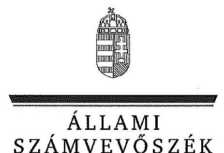
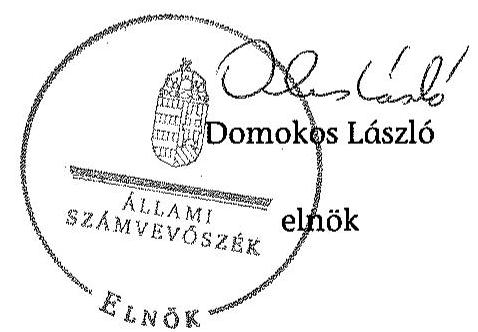
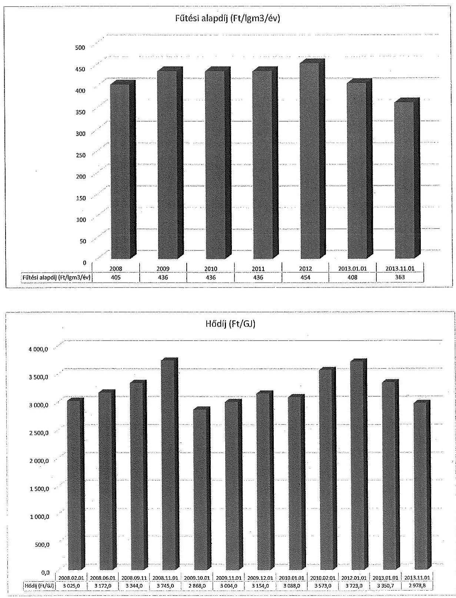
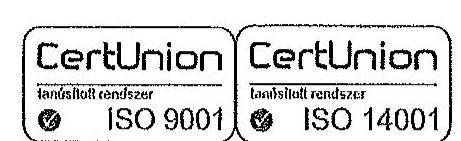
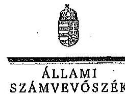
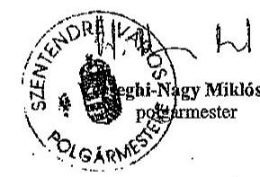
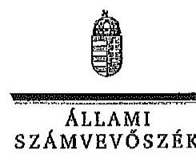
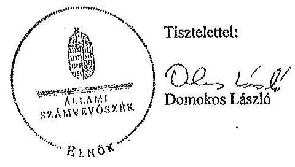

ÁLLAMI
SZÁMVEVŐSZÉK

# JELENTÉS 

Az önkormányzatok gazdasági társaságai - Az önkormányzatok többségi tulajdonában lévő gazdasági társaságok közfeladat ellátását érintő gazdálkodási tevékenysége szabályszerűségének ellenőrzése
Városi Szolgáltató Nonprofit Zártkörűen Működő Részvénytársaság (Szentendre)
15141

---

# Állami Számvevőszék 

Iktatószám: V-0824-271/2015.
Témaszám: 1858
Vizsgálat-azonosító szám: V067145

## Az ellenőrzést felügyelte:

Dr. Horváth Margit
felügyeleti vezető
Az ellenőrzés vezette és az ellenőrzés végrehajtásáért felelős:
Klinga László
ellenőrzésvezető
A jelentéstervezet összeállításában közreműködött:
Szihalminé Kovács Zsuzsanna
számvevő főtanácsos
Az ellenőrzést végezték:

| Bakóné Bene Gabriella | Bárány Terézia | Etl János |
| :-- | :-- | :-- |
| okleveles könyvvizsgáló | okleveles könyvvizsgáló | okleveles könyvvizsgáló |
| külső szakértő | külső szakértő | külső szakértő |

---

# TARTALOMJEGYZÉK 

BEVEZETÉS ..... 5
I. ÖSSZEGZŐ MEGÁLLAPÍTÁSOK, KÖVETKEZTETÉSEK, JAVASLATOK ..... 8
II. RÉSZLETES MEGÁLLAPÍTÁSOK ..... 14

1. Az Önkormányzat közfeladat-ellátásának szabályszerűsége ..... 14
1.1. A közfeladat-ellátás megszervezése és a feladatellátás feltételrendszerének kialakítása ..... 14
1.2. A közfeladat-ellátás felügyelete és a tulajdonosi jogok érvényesítése ..... 15
2. A VSZ NZrt. közfeladat ellátással kapcsolatos tevékenysége ..... 19
2.1. A VSZ NZrt. gazdálkodásának szabályozottsága ..... 19
2.2. A VSZ NZrt. vagyongazdálkodása ..... 21
2.3. A beszámolási kötelezettség teljesítése ..... 25
3. A távhőszolgáltatás közfeladata bevételei és ráfordításai elszámolásának és önköltségszámításának szabályszerűsége ..... 26
3.1. A távhőszolgáltatás közfeladat bevételeinek és ráfordításainak szabályszerűsége ..... 26
3.2. Az önköltségszámítás szabályszerűsége ..... 27

## MELLÉKLETEK

1. számú A Városi Szolgáltató Nonprofit Zrt. tevékenységének főbb adatai
2. számú A Városi Szolgáltató Nonprofit Zrt. működésének főbb jellemzői
3. számú A Városi Szolgáltató Nonprofit Zrt. által biztosított közszolgáltatás díjai a 2008-2013. évekre vonatkozóan
4. számú Beérkezett észrevételek és az azokra adott válaszok

## FÜGGELÉKEK

1. számú Értelmező szótár
2. számú Mintavételi eljárások ellenőrzési területenként

---

.

---

# RÖVIDÍTÉSEK JEGYZÉKE 

## Törvények

Avtv.

Ámt.

ÁSZ tv.

Eisztv.

Gt.
Infotv.

Mötv.

Ötv.

Ptk.
Rezsi tv.

Számv. tv.
Tszt.

VET

## Rendeletek

50/2011. (IX. 30.) NFM rendelet
távhőszolgáltatási rendelet
vagyongazdálkodási rendelet
a személyes adatok védelméről és a közérdekű adatok nyilvánosságáról szóló 1992. évi LXIII. törvény (hatálytalan 2012. január 1-jétől)
az árak megállapításáról szóló 1990. évi LXXXVII. törvény (hatályos: 1991. január 1-jétől)
az Állami Számvevőszékről szóló 2011. évi LXVI. törvény (hatályos: 2011. július 1-jétől)
az elektronikus információszabadságról szóló 2005. évi XC. törvény (hatálytalan: 2012. január 1-jétől)
a gazdasági társaságokról szóló 2006. évi IV. törvény
az információs önrendelkezési jogról és az információszabadságról szóló 2011. évi CXII. törvény
Magyarország helyi önkormányzatairól szóló 2011. évi CLXXXIX. törvény (hatályos: 2012. január 1-jétől, kivéve a 144. § (2) bekezdésben meghatározott paragrafusok, amelyek 2012. április 15-én, a (3) bekezdésben meghatározott paragrafusok, amelyek 2013. január 1-jén léptek hatályba, a (4) bekezdésben meghatározott paragrafusok a 2014. évi általános önkormányzati választások napján lépnek hatályba)
a helyi önkormányzatokról szóló 1990. évi LXV. törvény (hatálytalan: a 2014. évi általános önkormányzati választások napjától)
a Polgári Törvénykönyvről szóló 2013. évi V. törvény
a rezsicsökkentések végrehajtásáról szóló 2013. évi LIV. törvény (hatályos: 2013. május 10-től)
a számvitelről szóló 2000. évi C. törvény
a távhőszolgáltatásról szóló 2005. évi XVIII. törvény (hatályos: 2005. július 1-jétől)
a villamos energiáról szóló 2007. évi LXXXVI. törvény (hatályos: 2007. október 15-étől)
a távhőszolgáltatónak értékesített távhő árának, valamint a lakossági felhasználónak és a külön kezelt intézménynek nyújtott távhőszolgáltatás díjának megállapításáról
Szentendre Város Önkormányzatának 29/2008. (IX.11.) számú rendelete a távhőszolgáltatásról és a szolgáltatási díjak alkalmazásáról
Szentendre Város Önkormányzatának 34/2003. (VI. 18.) számú rendelete az önkormányzat vagyonáról és az önkormányzati vagyon feletti tulajdonosi jogok gyakorlásáról

---

## Szórövidítések

Alapító Okirat
áfa
ÁSZ
eszközök és források értékelési szabályzata ${ }_{1}$
eszközök és források
értékelési szabályzata ${ }_{2}$
eszközök és források
értékelési szabályzata ${ }_{3}$
FB
jegyző
Képviselő-testület
leltárkészítési és leltározási szabályzat ${ }_{1}$
leltárkészítési és leltározási szabályzat ${ }_{2}$
leltárkészítési és leltározási szabályzat ${ }_{3}$
Önkormányzat
SZMSZ
Üzletszabályzat
VSZ NZrt./Társaság
a Városi Szolgáltató Zrt. alapító okirata és annak módosításai
általános forgalmi adó
Állami Számvevőszék
VSZ NZrt. értékelési szabályzata (hatályos: 2008. december 31-től)
VSZ NZrt. értékelési szabályzata (hatályos: 2009. december 31-től)
VSZ NZrt. értékelési szabályzata (hatályos: 2011. március 1-jétől)
VSZ NZrt. felügyelőbizottsága
Szentendre Város Önkormányzatának jegyzője
Szentendre Város Önkormányzatának Képviselő-testülete
VSZ NZrt. leltározási szabályzata (hatályos: 2003. december 15-től)
VSZ NZrt. leltározási szabályzata (hatályos: 2008. december 31-től)
VSZ NZrt. leltározási szabályzata (hatályos: 2011. március 1-jétől)
Szentendre Város Önkormányzata
a VSZ NZrt. Szervezeti és Működési Szabályzata (hatályos 2008. február 15-től)
a VSZ NZrt. üzletszabályzata a távhőszolgáltatásról (hatályos: 2009. március 6-tól)
Városi Szolgáltató Nonprofit Zártkörűen Működő Részvénytársaság

---

# JELENTÉS 

## Az önkormányzatok gazdasági társaságai Az önkormányzatok többségi tulajdonában lévő gazdasági társaságok közfeladat ellátását érintő gazdálkodási tevékenysége szabályszerűségének ellenőrzése Városi Szolgáltató Nonprofit Zártkörűen Működő Részvénytársaság (Szentendre)

## BEVEZETÉS

Az Állami Számvevőszék középtávra szóló stratégiájában megfogalmazta, hogy a helyi önkormányzatok gazdálkodásában rejlő pénzügyi kockázatok feltárásával, az államháztartáson kívülre nyújtott költségvetési támogatások és ingyenes vagyonjuttatások, valamint az államháztartáson kívül működő köz-feladat-ellátó rendszerek ellenőrzéseivel hozzájárul ahhoz, hogy a közpénzeket az államháztartáson kívül működő szervezetek is átlátható, rendezett módon használják fel a közfeladatok szerződésben vállalt ellátása érdekében.

Az önkormányzatok szervezetalakítási szabadságának következménye, hogy a korábban is vállalati formában működő (nagyvárosi tömegközlekedés, víz-, szennyvízcsatorna, köztisztasági, ingatlankezelés stb.) közszolgáltatások mellett mind a kötelező, mind az önként vállalt feladatok ellátásában a gazdasági társaságok kiemelt fontosságú szerephez jutottak.

A Városi Szolgáltató Zrt. 1993. január 1-jével jött létre a Szentendrei Városgazdálkodási Vállalat jogutódjaként, amely 2014. január 1-jétől Nonprofit Zrt.-ként (továbbiakban: VSZ NZrt.) működött. A VSZ NZrt. fő tevékenységi körébe tartozott a 25 ezer főt meghaladó lakosú Szentendre város közigazgatási területén a távfűtés és használati melegvíz ellátás, a hulladékszállítás, a köztisztasági tevékenység, a gyepmesteri szolgáltatás, a hidegenergia szolgáltatás, a parkolók üzemeltetése, a közterület és ingatlanfenntartás, az ingatlan bérbeadás, a közétkeztetési szolgáltatásnyújtás, az informatikai szolgáltatás, továbbá a gondnoksági feladatok ellátása.

A 2013. év végén a VSZ NZrt. az 1416 lakossági ügyfele mellett közületek és közintézmények távhőszolgáltatását is ellátta. A távfűtési vezeték kétcsöves rendszerű teljes hossza 8000 folyóméter volt, amely hálózat az 1970-es évek elején készült. A távhőszolgáltatás közfeladat-ellátáshoz szükséges vagyont az Önkormányzat alapításkor apportként bocsátotta a VSZ NZrt. rendelkezésére.

Az ellenőrzött időszakban VSZ NZrt. az Önkormányzat 100%-os kizárólagos tulajdonában volt. A Társaság átlagos statisztikai létszáma a 2008. évben 93 fő

---

volt, ami 2013-ra a két és félszeresére, 233 főre nőtt a reorganizációs átszervezés kapcsán átvett új feladatok (közétkeztetés, ingatlanfenntartás, informatika) következtében.

A VSZ NZrt. összes bevétele 2008-ban 1268,9 millió Ft, a 2013. évben 1903,2 millió Ft volt, amelyből az értékesítés nettó árbevétele 2008-ban 1239,8 millió Ft, míg 2013-ban 1589,3 millió Ft volt. Az értékesítés nettó árbevételének 2008-ban 30,0%-át, 371,8 millió Ft-ot, 2013-ban 23,9%-át, 379,2 millió Ft-ot a távhőszolgáltatásból származó bevételek tették ki.

A VSZ NZrt. a 2008-2011. években nyereségesen, 2012-ben és 2013-ban veszteségesen gazdálkodott, a veszteség összege 238,8 millió Ft, illetve 48,4 millió Ft volt. A mérleg szerinti eszközérték a 2008. évi nyitó 635,0 millió Ft-ról a 2013. év végére közel két és félszeres növekedést követően 1521,8 millió Ft-ra emelkedett, ezen belül a követelések állománya közel háromszorosára, 472,4 millió Ft-ra nőtt. A saját tőke a 2008. évi nyitó 276,9 millió Ft-ról a 2013. év végére 537,4 millió Ft-ra nőtt.

Az ellenőrzött időszakban a 2006. évi önkormányzati választások óta tisztségét betöltő polgármester és a jegyző személye nem változott. A jelenlegi polgármester 2014 októberétől tölti be tisztségét. Az ellenőrzött időszakban a vezérigazgató személye négy alkalommal változott, a jelenlegi vezérigazgató 2012. július 1-jétől tölti be tisztségét.

Az önkormányzati tulajdonú gazdasági társaságok teljes körű ellenőrzésének lehetőségét az Állami Számvevőszékről szóló 1989. évi XXXVIII. törvény 2011. január 1-jétől hatályos módosítása teremtette meg.

Az ellenőrzés célja annak értékelése volt, hogy

- az önkormányzat a jogszabályi előírások figyelembevételével döntött-e az ellenőrzésre kerülő közfeladat megszervezéséről; az önkormányzat szabályszerűen gyakorolta-e a tulajdonosi jogokat;
- a gazdasági társaság közfeladat-ellátása bevételeinek, ráfordításainak elszámolása és vagyongazdálkodási tevékenysége megfelelt-e a jogszabályi, illetve a közszolgáltatási szerződésben foglalt tulajdonosi előírásoknak, azok végrehajtása szabályszerű volt-e;
- a közfeladatok átláthatósága és elszámoltathatósága érdekében biztosítva volt-e a közszolgáltatás díjának megalapozottsága szabályszerű önköltségszámítással.

Az ellenőrzés kiterjedt Szentendre Város Önkormányzatára és a Városi Szolgáltató Nonprofit Zrt.-re.

Az ellenőrzés várható hasznosulása: A törvényalkotás számára - az észlelt problémák, szabálytalanságok, vagy egyéb nem kívánatos jelenségek felszínre kerülésével - az ellenőrzés megállapításai segítséget nyújthatnak az államháztartáson kívüli közfeladat-ellátás értékeléséhez, jogszabályi keretei pontosításához, átláthatóságot biztosító szabályozásához. Meghatározhatóvá válnak a közfeladat ellátásában részt vevő államháztartáson kívüli szervezeteknek - az

---

önkormányzat költségvetését, pénzügyi helyzetét is befolyásoló - kockázatai, lehetővé válik ezen kockázatok csökkentése. Értékelhető válik, hogy a feladatot ellátó gazdasági társaság a közszolgáltatási szerződésben foglaltak betartásával, a közvagyon használatával biztosította-e a szolgáltatás folytatásának feltételeit. Ezzel az ellenőrzöttek és a helyi döntéshozók számára visszajelzést ad feladatszervezési, feladat-ellátási kockázataikról, alapot ad a meglévő hibák megszüntetéséhez, a jobb közfeladat-ellátás biztosításához. Fokozza a fegyelmet, igazolja, hogy lejárt a következmények nélküli ellenőrzések időszaka. Az ÁSZ értékteremtő rend kialakításához és megőrzéséhez hozzájáruló tevékenysége pozitív hatással van a szervezetről kialakított összkép formálására is.

A bevételek és ráfordítások elszámolása, valamint a vagyonnyilvántartás terén az egyes területek szabályszerű működését mintavétellel ellenőriztük, ez alapján a sokaságokban előforduló hibás tételek arányát becsültük. A jogszabályoknak és a belső előírásoknak megfelelőnek, azaz szabályszerűnek tekintettük az adott bevételek és ráfordítások elszámolását, a vagyonnyilvántartást, amennyiben a minta ellenőrzésének eredménye alapján 95%-os bizonyossággal a teljes sokaságban a hibás tételek aránya kisebb volt, mint 10%, nem megfelelőnek értékeltük, ha a hibás tételek aránya a 10%-ot meghaladta. Kockázatot, illetve magas kockázatot jeleztünk, amennyiben egy adott terület vonatkozásában a minta alapján a teljes sokaságban nem volt teljes körűen biztosított a jogszabályoknak és a belső szabályzatoknak megfelelő működés.

Az ellenőrzést a számvevőszéki ellenőrzés szakmai szabályai szerint, szabályszerűségi ellenőrzés módszerével, a vonatkozó nemzetközi standardok figyelembevételével végeztük. Az ellenőrzés a 2008-2013. évekre terjedt ki.

Az ellenőrzés végrehajtásának jogszabályi alapját az ÁSZ törvény 5. § (3)-(5) bekezdései képezték.

Az ÁSZ az Állami Számvevőszékről szóló 2011. évi LXVI. törvény 29. §-a alapján a jelentéstervezetet észrevételezésre megküldte Szentendre Város Önkormányzata polgármesterének és a gazdasági társaság vezérigazgatójának. A beérkezett észrevételeket a jelentés véglegesítése során hasznosítottuk. Az észrevételeket és az azokra adott válaszokat a jelentés 4. számú melléklete tartalmazza.

---

# I. ÖSSZEGZŐ MEGÁLLAPÍTÁSOK, KÖVETKEZTETÉSEK, JAVASLATOK 

Az Önkormányzat a közigazgatási területén a távhőszolgáltatás közfeladatának megszervezéséről a jogszabályi előírásoknak megfelelően döntött, annak ellátásáról a kizárólagos tulajdonában lévő gazdasági társasága útján gondoskodott. Az Önkormányzat a feladatellátáshoz szükséges vagyont az ellenőrzött időszakot megelőzően apportként bocsátotta a VSZ NZrt. rendelkezésére.

Az Önkormányzat a távhőszolgáltatásra vonatkozóan a Tszt. szerinti rendeletalkotási kötelezettségének eleget tett. A távhőszolgáltatási rendeletben foglaltak alapján az Önkormányzat az ellátási kötelezettségét a VSZ NZrt. engedélyes által üzemeltetett távhőtermelő és elosztó rendszeren keresztül biztosította. A távhőszolgáltatási rendelet tartalma a Tszt. előírásainak megfelelt.

Az Önkormányzat a vagyongazdálkodási rendeletben határozta meg a gazdasági társaságok feletti tulajdonosi jogok gyakorlásának szabályait, amelyek gyakorlására a Képviselő-testület, illetve átruházott hatáskörben a polgármester volt jogosult. Az Alapító Okirat a vagyongazdálkodási rendelettel összhangban írta elő a tulajdonosi joggyakorlás szabályait. A VSZ NZrt. éves üzleti terveinek jóváhagyása az Alapító
 Okiratban előírtak szerint a Képviselőtestület hatáskörébe tartozott az ellenőrzött időszakban. A Társaság 2008-2010. és 2013. évi üzleti terveit a Képviselő-testület határozattal elfogadta. A 2011. évre vonatkozó üzleti tervet az előírtak ellenére nem készítettek, a 2012. évi üzleti tervet a Képviselő-testület megtárgyalta, azonban elfogadásáról nem döntött. A Képviselő-testület a 2013. évi beszámoló és üzleti jelentés elfogadásáról nem hozott határozatot, mivel úgy döntött, hogy a 2013. évi beszámoló jóváhagyásának jogát az Önkormányzat Jogi és Ellenőrzési Bizottságára, valamint a Gazdasági és Városüzemeltetési Bizottságra ruházza át. A beszámoló jóváhagyási jogának bizottságra történő átruházása ellentétes az Mötv., a Ptk., az Alapító Okirat és a vagyongazdálkodási rendelet előírásaival. Az Önkormányzat az ellenőrzött időszakban a VSZ NZrt. feletti tulajdonosi jogokat - a 2011. és 2012. évi üzleti tervek, valamint a 2013. évi beszámoló jóváhagyásának elmaradásától eltekintve - a vagyongazdálkodási rendelet és az Alapító Okirat előírásainak megfelelően szabályszerűen gyakorolta. Az Önkormányzat belső ellenőrzése három ellenőrzést folytatott le a Társaságnál 2011-ben és 2013-ban, megállapításaival hozzájárult a Társaság feladatainak szabályszerű ellátásához.

Az FB a Gt.-ben előírt Ügyrenddel rendelkezett, amit a Képviselő-testület határozattal elfogadott. Az FB az Alapító Okirat és a Gt. előírásainak megfelelően a számviteli beszámolóról írásbeli jelentést készített. Az FB az Ügyrendben előírtak ellenére a 2008-2011. évi pozitív adózott eredmény felhasználásáról nem készített írásbeli jelentést.

A távhőszolgáltatási rendeletben előírtak szerint a Társaság a távhőszolgáltatási díjakra vonatkozó javaslatát az Üzletszabályzat és az önköltségszámítási szabályzat alapján volt köteles elkészíteni. A távhőszolgáltatási rendelet módosításai alkalmával a távhőszolgáltatási díjak változásához az önköltségszámítási szabályzatban előírt utókalkuláció nem készült a 2008. január 1-je és 2011. április 15-e közötti önkormányzati árhatósági időszakban. A Képviselő-testület a díjakat megalapozó - önköltségszámítási szabályzatban előírt - utókalkuláció hiánya ellenére döntött azok módosításáról. A távhőszolgáltatási rendeletben előírtaknak megfelelően a 2008-ban érvényben lévő fűtési alapdíjat 2009. február 1-jétől emelték, majd ezt követően a hatósági ár alkalmazásáig nem módosították. Az önköltségszámítási szabályzat tartalmazta a munkaszámok alkalmazásának előírását, továbbá a költségek és ráfordítások tevékenységenkénti elszámolásának szabályait.

Az ellenőrzött időszakban a VSZ NZrt. a Számv. tv.-ben előírt szabályzatokat elkészítette, azonban a Számv. tv.-ben előírtak ellenére az eszközök és források értékelési szabályzatával 2009. január 1-je előtt, az önköltségszámítási szabályzattal 2008. október 1-je előtt nem rendelkezett. A számviteli politika és az eszközök és források értékelési szabályzat előírásai közötti összhang nem volt biztosított a kisösszegű követelések értékvesztése mértékének vonatkozásában. A Számv. tv.-ben előírt bizonylati rendet 2011. június 1-jétől helyezték hatályba. A VSZ NZrt. a Tszt.-ben előírtak alapján az ellenőrzött időszakban rendelkezett a jegyző által jóváhagyott Üzletszabályzattal. A Társaság rendelkezett SZMSZ-szel, amelynek évenkénti felülvizsgálatát írták elő kötelezettségként, ennek azonban nem tettek eleget, így az Alapító Okirat és a számviteli politika, valamint az alkalmazott gyakorlat közötti összhang nem volt biztosított.

A VSZ NZrt. eszközértékének ellenőrzött időszakban bekövetkezett 886,8 millió Ft-os növekedését a tárgyi eszközök és a követelések mérlegértékének emelkedése eredményezte. A vevői követelések 2013. december 31-én nyilvántartott értékének 15,3%-a, 61,7 millió Ft a távhőszolgáltatáshoz kapcsolódó tartozás volt. A Társaság a 2008-2013. években leltározási kötelezettségét a Számv. tv.-ben előírtakat megsértve nem teljesítette. A beszámoló elkészítéséhez, a mérlegtételek alátámasztásához nem készítettek olyan leltárt, amely ellenőrizhető módon tartalmazza a mérleg fordulónapján meglévő eszközöket és forrásokat mennyiségben és értékben. A beszámoló a főkönyvi kivonat adataiból készült, azonban a főkönyvi kivonat és az analitikus nyilvántartások adatainak egyeztetése, az egyeztetések eredményének kiértékelése nem történt meg. A VSZ NZrt. vagyongazdálkodási tevékenysége az ellenőrzött esetekben - a leltározási kötelezettség teljesítésének kivételével - megfelelt a jogszabályi előírásoknak.

A VSZ NZrt. a 2008-2013. évek számviteli beszámolóit elkészítette, azokat a Számv. tv. előírásának megfelelően határidőben letétbe tette. A könyvvizsgáló a beszámolókat - a 2008. és 2011. évi beszámolók kivételével - hitelesítő záradékkal látta el. A könyvvizsgáló a 2012. évi számviteli beszámolóról készített jelentése nem tartalmazott a Tszt.-ben előírt igazolást a Társaság által kidolgozott és alkalmazott számviteli szétválasztási szabályok, valamint az egyes tevékenységek közötti keresztfinanszírozás mentességének betartására. A VSZ NZrt. a 2008-2011. években az Avtv.-ben, a 2012-2013. években az Infotv.-ben előírtakkal ellentétben adatvédelmi szabályzattal és a közérdekű adatok megismerésére irányuló igények teljesítésének rendjét rögzítő szabályzattal nem rendelkezett.

A távhőszolgáltatási közfeladat értékesítés nettó árbevételének elszámolása megfelelő volt. Az anyagjellegű ráfordítások elszámolása során - a szállítói kiválasztáshoz szükséges árajánlat bekérésének elmaradása miatt - nem érvényesültek teljes körűen a belső szabályozások előírásai, ami magas kockázatot jelez az ellenőrzött terület egészének szabályos működése szempontjából. A beruházások, felújítások, valamint az értékcsökkenési leírás elszámolása - a tévesen megállapított bekerülési érték és elszámolt értékcsökkenés miatt - nem volt megfelelő.

A fentiekben leírtak összegzéseként az alábbi megállapításokat tesszük:
A tulajdonos az FB-n és a belső ellenőrzésen keresztül gyakorolt kontrollt a Társaság felett. A számviteli szabályozás javult, az egyes szabályozások közötti összhang azonban nem volt biztosított. Az önköltségszámítási szabályzatban előírtak ellenére a távhőszolgáltatási díjváltozásokhoz nem készült az árakat alátámasztó utókalkuláció. A mérlegtételek alátámasztására szolgáló leltár hiánya, a főkönyvi kivonat és az analitikus nyilvántartások adatai egyeztetésének elmaradása veszélyeztette a szabályszerű működést. Az anyagjellegű ráfordítások elszámolása a szállítói kiválasztáshoz szükséges árajánlat bekérésének elmaradása miatt magas kockázatot jelzett, amely a szabályos működést veszélyeztetette. A beruházások, felújítások, valamint az értékcsökkenési leírás elszámolása - a tévesen megállapított bekerülési érték és elszámolt értékcsökkenés miatt - nem volt megfelelő.

Az Állami Számvevőszékről szóló 2011. évi LXVI. törvény 33. § (1) bekezdésében foglaltak értelmében a jelentésben foglalt megállapításokhoz kapcsolódó intézkedési tervet köteles az ellenőrzött szervezet vezetője összeállítani, és azt a jelentés kézhezvételétől számított 30 napon belül az ÁSZ részére megküldeni. Amennyiben az intézkedési tervet határidőben nem küldi meg a szervezet, vagy az nem elfogadható, az ÁSZ elnöke a hivatkozott törvény 33. § (3) bekezdés a)-b) pontjaiban foglaltakat érvényesítheti.

Az ellenőrzés intézkedést igénylő megállapításai és javaslatai:
Javaslataink célja a Városi Szolgáltató Nonprofit Zrt. gazdálkodása szabályszerűségének javítása annak érdekében, hogy a szabályozási környezet megfelelően tudja támogatni az átlátható működést.

# Javasoljuk a Városi Szolgáltató Nonprofit Zrt. Vezérigazgatójának: 

1. A Társaság rendelkezett SZMSZ-szel, amelynek évenkénti felülvizsgálatát írták elő kötelezettségként, ennek azonban nem tettek eleget, így az Alapító Okiratokkal és a számviteli politikával, valamint az alkalmazott gyakorlattal való összhangja nem volt biztosított.

A Társaság a különböző nyilvántartásokban elektronikusan kezelt adatállományok információ biztonsági védelmét biztosító adatvédelmi szabályzattal nem rendelkezett az ellenőrzött időszakban. Az adatvédelmi szabályzat készítésének kötelezettségét 2008. január 1-je és 2011. július 25. között az Avtv. 31/A. § (3) bekezdése, 2011. július 26-tól az Infotv. 24. § (3) bekezdése írta elő.

A VSZ NZrt. a 2008-2011. években az Avtv. 20. § (8) bekezdésében, a 2012-2013. években az Infotv. 30. § (6) bekezdésben előírtakkal ellentétben a közérdekű adatok megismerésére irányuló igények teljesítésének rendjét rögzítő szabályzattal nem rendelkezett. Ennek hiányában nem került szabályozásra az egyes törvényi kötelezettségekhez kapcsolódó belső eljárások rendje. Az adatszolgáltatásokért felelős szervezeti egységeket nem jelölték ki, az egyes adatok közzétételének határidejét nem határozták meg.

Javaslat:
Intézkedjen a szabályozási hiányosságok megszüntetésére, ennek keretében:
a) gondoskodjon a Társaság SZMSZ-ének évenkénti felülvizsgálatáról, annak keretében az Alapító Okirattal és a számviteli szabályozásokkal való összhang megteremtéséről;
b) gondoskodjon az adatvédelmi szabályzat elkészítéséről és kiadásáról;
c) gondoskodjon a közérdekű adatok megismerésére irányuló igények teljesítésének rendjét rögzítő szabályzat elkészítéséről és kiadásáról.
2. A VSZ NZrt. a 2008-2013. években leltározási kötelezettségét - a tárgyi eszközök kivételével - nem teljesítette, mivel a Számv. tv. 69. § (1) bekezdését megsértve és az eszközök leltárkészítési és leltározási szabályzatában előírtakkal ellentétben a beszámoló elkészítéséhez, a mérlegtételek alátámasztásához nem készítettek olyan leltárt, amely ellenőrizhető módon tartalmazza a mérleg fordulónapján meglévő eszközöket és forrásokat mennyiségben és értékben.

A tárgyi eszközök mennyiségi felvétellel történő leltározása nem volt teljeskörű, mivel elmulasztották a leltározás eredményének kiértékelését, valamint a főkönyvi könyvelés és analitikus nyilvántartások adatai közötti, Számv. tv. 69. § (2) bekezdésében előírt egyeztetést.

A távhőszolgáltatási közfeladat anyagjellegű ráfordításainak elszámolása során nem érvényesültek teljes körűen a belső szabályozások előírásai a kötelezettségvállalás tekintetében. A költségelszámolást megalapozó kötelezettségvállalás során nem tartották be a vezérigazgatói utasításokban foglalt, a szállítói kiválasztáshoz szükséges árajánlatok kérésének szabályait.

Nem tartották be a Számv. tv. 47. § (1) bekezdésének előírásait, mely szerint az eszközök bekerülési értékét az eszközhöz egyedileg hozzákapcsolható tételek alkotják. A beruházások, felújítások, valamint az értékcsökkenési leírás elszámolása - a tévesen megállapított bekerülési érték és elszámolt értékcsökkenés miatt - nem volt megfelelő.

Javaslat:
Intézkedjen a jogszabályi előírások szerinti gyakorlat és a szabályos működés biztosítására, ezen belül:
a) gondoskodjon a mérlegtételek alátámasztását szolgáló, a mérleg fordulónapján meglévő eszközöket és forrásokat mennyiségben és értékben tartalmazó leltár elkészítéséről;
b) gondoskodjon a tárgyi eszközök teljes körű leltározásáról, kiemelt figyelemmel a főkönyvi könyvelés és az analitikus nyilvántartások adatai közötti egyeztetés végrehajtására;
c) gondoskodjon az anyagjellegű ráfordítások elszámolása során a belső szabályozásokban előírtak végrehajtásáról a kötelezettségvállalások tekintetében;
d) gondoskodjon az eszközök bekerülési értékére vonatkozó számviteli előírások betartására a beruházások és felújítások elszámolásánál.

Javaslataink célja az önkormányzat szabályszerű működésének elősegítése, továbbá az önkormányzati tulajdonosi joggyakorlás kontrolljainak erősítése.

# Javasoljuk Szentendre Város Önkormányzata Polgármesterének: 

1. A Képviselő-testület a 92/2014. (V. 15.) számú határozatában úgy döntött, hogy a 2013. évi beszámoló jóváhagyásának jogát az Önkormányzat Jogi és Ellenőrzési Bizottságára, valamint a Gazdasági és Városüzemeltetési Bizottságra ruházza át. A beszámoló jóváhagyási jogának bizottságra történő átruházása ellentétes az Mötv., a Ptk., az Alapító Okirat és a vagyongazdálkodási rendelet előírásaival. Az Mötv. 42. § 16. pontban sorolja fel a képviselő-testület hatásköréből át nem ruházható feladatokat. Ezek közül az utolsó pont szerint át nem ruházható „amit törvény a képviselőtestület át nem ruházható hatáskörébe utal”. A Ptk. 3:109. § (2) bekezdése a Képviselő-testület, mint legfőbb döntéshozó szerv hatáskörébe utalja a számviteli beszámoló jóváhagyását, így a beszámoló jóváhagyásának jogát a Képviselő-testület nem ruházhatja át egyik bizottságára sem.

Javaslat:

## Intézkedjen a szabályozási rendellenesség megszüntetésére, ennek keretében:

jelezze a Képviselő-testületnek a Társaság éves beszámolójának és az üzleti jelentésének jóváhagyásával kapcsolatos hatáskör átruházás szabálytalanságát és kezdeményezze a törvényi előírásoknak megfelelő állapot helyreállítását;
2. A könyvvizsgáló a 2012. évi számviteli beszámolóról készített jelentése nem tartalmazott a Tszt.-ben előírt igazolást a Társaság által kidolgozott és alkalmazott számviteli szétválasztási szabályok, valamint az egyes tevékenységek közötti keresztfinanszírozás mentességének betartására.

A Társaság leltározási kötelezettségét - a tárgyi eszközök kivételével - nem teljesítette a 2008-2013. években, mivel a Számv. tv. 69. § (1) bekezdését megsértve és az eszközök leltárkészítési és leltározási szabályzatában előírtakkal ellentétben a beszámoló elkészítéséhez, a mérlegtételek alátámasztásához nem készítettek olyan leltárt, amely ellenőrizhető módon tartalmazza a mérleg fordulónapján meglévő eszközöket és forrásokat mennyiségben és
 értékben. A tárgyi eszközök mennyiségi felvétellel történő leltározása nem történt meg teljes körűen az ellenőrzött években, a leltározás eredményének kiértékelését, valamint a főkönyvi könyvelés és analitikus nyilvántartások adatai közötti, Számv. tv. 69. § (2) bekezdésében előírt egyeztetését nem végezték el. A Társaság leltározási szabályzatának előírása szerint a vezérigazgató a felelős a leltározásért. Ezért a leltározással kapcsolatos szabályozási hiányosságok, valamint a szabályozásnak nem megfelelő gyakorlat indokolja a vezérigazgató felelősségének felvetését.

Javaslat:
Intézkedjen a jogszabályi előírások szerinti gyakorlat és a szabályos működés biztosítására, ezen belül:
a) hívja fel a tulajdonosi joggyakorló figyelmét arra, hogy a könyvvizsgálónak törvényi kötelezettsége nyilatkozat adása a Társaság által kidolgozott és alkalmazott számviteli szétválasztási szabályok, valamint az egyes tevékenységek közötti keresztfinanszírozás mentességének teljesítéséről;
b) tegyen intézkedéseket a feltárt hiányosságok és/vagy szabálytalanságok tekintetében a felelősség tisztázása érdekében, és szükség szerint intézkedjen a felelősség érvényesítéséről.

---

# II. RÉSZLETES MEGÁLLAPÍTÁSOK 

## 1. Az ÖNKORMÁNYZAT KÖZFELADAT-ELLÁTÁSÁNAK SZABÁLYSZERŰSÉGE

### 1.1. A közfeladat-ellátás megszervezése és a feladatellátás feltételrendszerének kialakítása

Az Önkormányzat közigazgatási területén a távhőszolgáltatás ellátásáról kizárólagos tulajdonában lévő gazdasági társaságán keresztül gondoskodott.

A Képviselő-testület a 279/2007. (IX. 11.) számú határozatával fogadta el a Dumtsa Jenő Városfejlesztési Stratégiát, amely Szentendre Város hosszú távú céljait, fejlesztési feladatait rögzítette. A Városfejlesztési Stratégia 2008-tól kezdődően, 15 évre tartalmazott a fejlődés alapjául szolgáló iránymutatást, terveket. Célként jelölték meg a fenntartható közüzemi szolgáltatások biztosítását, annak feltételeként az energiahatékonyságot, a természeti erőforrások gazdaságos kihasználását, és az üzemelés gazdasági hatékonyságának javítását. A stratégiai célok megvalósítása érdekében cselekvési programot készítettek, amelyet évente - az Önkormányzat költségvetési rendeletének megalkotásával párhuzamosan - a rendelkezésre álló források figyelembevételével aktualizáltak.

A távhőszolgáltatással ellátott létesítmények távhőellátásának - engedéllyel rendelkezők útján történő biztosítása - a Tszt. 6. § (1) bekezdésében előírtak alapján a területileg illetékes települési önkormányzat feladata. Az Önkormányzat SZMSZ-e a 2012. augusztus 3-ától kiegészült a VSZ NZrt. azon tevékenységeinek felsorolásával, amelyeknek a Társaság a kizárólagos joggal felruházott közszolgáltatója.

A Képviselő-testület az Önkormányzat közigazgatási területén a távhőszolgáltatás közfeladatának megszervezését - az Ötv. 9. § (4) bekezdés rendelkezésének megfelelően - a VSZ NZrt. jogelődjének alapításával biztosította. A VSZ NZrt. feladatait az Alapító Okiratban foglaltak szerint látta el. A 100%-ban önkormányzati tulajdonú VSZ NZrt. alapítása az ellenőrzött időszakot megelőzően (1993. január 1-jén) történt. Az Önkormányzat a közfeladat-ellátáshoz szükséges vagyont apportként bocsátotta a Társaság rendelkezésére, így a közfeladatellátást szolgáló vagyon a Társaság saját vagyonát képezte. A Társaság főbb adatait az 1. számú melléklet, működésének főbb jellemzőit a 2. számú melléklet tartalmazza. Az Önkormányzat a VSZ NZrt. részére a távhőszolgáltatás ellátásához kezelésre vagyont nem adott át.

Az alapításkor a 219,0 millió Ft jegyzett tőkét az Önkormányzat 2001-ben a 180/2001. (IX. 11.) számú képviselő-testületi határozat alapján 30,0 millió Ft pénzbeli hozzájárulással, 2006-ban a 114/2006. (V. 16.) számú képviselő-testületi határozat alapján 8,0 millió Ft nem pénzbeli hozzájárulással megemelte.

---

A VSZ NZrt. távhőtermelői és távhőszolgáltatási tevékenységét a Magyar Energia Hivatal által kiadott működési engedély alapján végezte.

Az Önkormányzat a távhőszolgáltatásra vonatkozóan a Tszt. 6. § (2) bekezdés szerint rendeletben meghatározta a távhőszolgáltatással összefüggő feladatokat. A távhőszolgáltatási rendelet 4. §-a a Tszt. 6. § (1) bekezdésével összhangban rögzítette, hogy az Önkormányzat köteles biztosítani a távhőszolgáltatásba bekapcsolt lakóépületek és vegyes célra használt épületek távhőellátását. A távhőszolgáltatási rendeletben foglaltak alapján az Önkormányzat az ellátási kötelezettségét a VSZ NZrt. engedélyes által üzemeltetett távhőtermelő és elosztó rendszeren keresztül biztosította. A távhőszolgáltatási rendeletben meghatározták a közigazgatási hatásköröket, a felhasználói közösségek működésének szabályait, a távhőrendszer működtetésének és fejlesztésének előírásait, a távhőszolgáltató és a fogyasztó közötti jogviszonyt, a távhőszolgáltatás szüneteltetésének, korlátozásának és a leválásnak a szabályait. Rögzítették a fogyasztói érdekvédelem érvényesítésének módját, valamint az Üzletszabályzat tartalmi követelményeit. A rendelet VII. fejezete rögzítette az ármegállapítás és a díjalkalmazás feltételeit. A távhőszolgáltatási rendelet a Tszt. előírásainak megfelelt.

Az Önkormányzat a VSZ NZrt. beszámolási kötelezettségét az Alapító Okiratban rögzítette. Ennek keretében előírták a számviteli beszámoló Képviselőtestület általi jóváhagyásának, valamint a vezérigazgató éves beszámoltatásának a kötelezettségét.

# 1.2. A közfeladat-ellátás felügyelete és a tulajdonosi jogok érvényesítése 

Az Önkormányzat a vagyongazdálkodási rendeletben határozta meg a gazdasági társaságok feletti tulajdonosi jogok gyakorlásának szabályait. A vagyongazdálkodási rendelet 20. §-a rögzíti azokat a tulajdonosi jogokat, amelyek gyakorlására a Képviselő-testület, illetve átruházott hatáskörben a polgármester volt jogosult. Az Alapító Okirat a vagyongazdálkodási rendelettel összhangban írta elő a tulajdonosi joggyakorlás szabályait.

Az Alapító Okirat rendelkezései szerint a Képviselő-testület hatáskörébe tartozott a Társaság alaptőkéjének felemelése és leszállítása, az üzleti terv jóváhagyása, számviteli beszámoló elfogadása, a vezérigazgató éves beszámoltatása. Az alapító döntési hatáskörébe tartozott minden olyan jogügylet, amelynek értéke meghaladta az alaptőke 10%-át, hitelfelvételnek, ingatlan vagy vagyoni értékű jog elidegenítésének, ingatlanok bérbeadásának értékhatárhoz kötött esetei.

Az Alapító Okirat rendelkezései szerint a Képviselő-testület a VSZ NZrt. felügyeletét a vezérigazgató rendszeres beszámoltatásával, valamint az FB megválasztásával látta el. Az FB feladataként azoknak a döntéseknek a véleményezését írta elő, amelyek alapítói döntést igényeltek.

Az Alapító Okirat VII. fejezete rögzíti az FB hatáskörét, tagjainak felsorolását, megbízatásuk időszakát. Az Alapító Okiratban előírt három FB tag megválasztásáról a vagyongazdálkodási rendeletben rögzítetteknek megfelelően a Képviselő-testület határozott.

---

Az Alapító Okirat rendelkezései szerint az FB ellenőrizheti a Társaság ügyvezetését és működését, ennek során megvizsgálhatja a társaság iratait és könyveit, az alkalmazottaknak kérdést tehet fel. Az FB a Társaság működéséről a tulajdonosnak jelentést készít, melynek megvitatása nélkül az adózott eredmény felhasználásáról nem határozhat. Az FB vélemény megismerésének kötelezettségét írja elő az Alapító Okirat a tulajdonosi döntés meghozatalát megelőzően.

Az FB a Gt. 34. § (4) bekezdésében előírt ügyrenddel rendelkezett, azt a Képviselő-testület határozattal elfogadta. Az Alapító Okirat előírásai szerint az FB-nek véleményeznie kell a számviteli beszámolót, amelyről a Gt. 35. § (3) bekezdése szerint írásbeli jelentést kell készíteni. Az FB Ügyrendjének 7. e) pontja rögzíti a - jogszabályi előírásokkal összhangban - a számviteli beszámolóról szóló írásbeli jelentés készítésének kötelezettségét. A FB az ellenőrzött években a számviteli beszámolók elfogadását határozatban javasolta a Képviselőtestületnek.

Az FB az Ügyrend 7. e) pontjában előírtak szerint az adózott eredmény felhasználásáról köteles volt írásbeli jelentést készíteni. Az FB az Ügyrendben előírtak ellenére a 2008-2011. évi pozitív adózott eredmény felhasználásáról nem készített írásbeli jelentést. A vezérigazgató az Alapító Okiratban előírt beszámolási kötelezettséget a számviteli beszámoló (mérleg, eredménykimutatás, kiegészítő melléklet) és az üzleti jelentés elkészítésével teljesítette. Ennek keretében számot adott a Társaság gazdálkodásáról, vagyoni-pénzügyi helyzetéről, valamint a közszolgáltatási tevékenység ellátásáról.

A VSZ NZrt. éves üzleti terveinek jóváhagyása az Alapító Okiratban előírtak szerint a Képviselő-testület hatáskörébe tartozott az ellenőrzött időszakban. A Társaság 2008-2010., és 2013. évi üzleti terveit a Képviselő-testület határozattal elfogadta. A 2011. évre vonatkozó üzleti tervet az előírtak ellenére nem készítettek, a 2012. évi üzleti tervet több alkalommal tárgyalta a Képviselő-testület, annak jóváhagyására azonban - az Alapító Okiratban előírtakkal ellentétben - nem került sor.

Az Önkormányzat a Tszt. 6. § (2) bekezdés b) pontjában előírtaknak megfelelően távhőszolgáltatási rendeletben rögzítette 2011. április 14-ig a távhőszolgáltatási díj és csatlakozási díj, ezt követően a csatlakozási díj megállapításáról és alkalmazásáról szóló rendelkezéseit.

Ennek keretében meghatározták az ármegállapítás rendjét, a távhőszolgáltatási díjak tartalmát, összetevőit és a távhőszolgáltatás minőségi paramétereit és a távhőszolgáltatás csatlakozási díját.

Előírták a távhőszolgáltatási rendeletben a Társaság kötelezettségeként az önköltségszámítás rendjének elkészítését, meghatározták a távhőszolgáltatási díj árképzése során figyelembe nem vehető költségek körét (fejlesztésre, beruházásra fordított anyag-, személyi jellegű és egyéb ráfordítások, vállalkozási és egyéb, nem alaptevékenységgel összefüggő költségek, céltartalék képzés ráfordítása). A rendelet szerint a Társaság a díjakra vonatkozó javaslatát az Üzletszabályzat és az önköltségszámítási szabályzat előírásai alapján köteles elkészíteni. Az alapdíjak megállapítása szükség szerint évente egy alkalommal, minden év október 30-áig történik, a távhőszolgáltatási díjak fő számítási elveit a rendelet 2. számú mellékletében rögzítették.

---

Az Üzletszabályzatban foglaltak szerint a díjak megállapításánál figyelembe kellett venni a folyamatos és biztonságos szolgáltatáshoz szükséges tartalékkapacitáshoz kapcsolódó költségeket is, valamint a környezetvédelmi kötelezettségek teljesítésének indokolt költségeit.

Az önkormányzati hatósági ármegállapítás időszakában ${ }^{1}$ (2008. január 1. és 2011. április 15. között) a Képviselő-testület a távhőszolgáltatás díjait többször módosította. A távhőszolgáltatás díjának változtatását a Társaság kezdeményezte, az előterjesztések mellékletét képezték az árkialakítás alapjául szolgáló távhődíj kalkulációk, amelyeket az Üzletszabályzatban előírtak alapján határozták meg.

A távhőszolgáltatási rendelet módosításai alkalmával a távhőszolgáltatási díjak változásához az önköltségszámítási szabályzatban előírt utókalkuláció nem készült a 2008. január 1-je és 2011. április 15-e közötti önkormányzati árhatósági időszakban. A Képviselő-testület a díjakat megalapozó önköltségszámítási szabályzatban előírt - utókalkuláció hiánya ellenére döntött azok módosításáról. A távhőszolgáltatási rendeletben előírtaknak megfelelően a 2008-ban érvényben lévő fűtési alapdíjat 2009. február 1-jétől emelték, majd ezt követően- a hatósági ár alkalmazásáig - nem módosították.

A 2008-2012. évi beszámolókat a Képviselő-testület - a Gt. 35. § (3) bekezdésében előírtakkal összhangban - az FB írásbeli jelentése alapján határozattal elfogadta.

A Képviselő-testület a 2013. évi beszámoló és üzleti jelentés elfogadásáról nem hozott határozatot. A Képviselő-testület a 92/2014. (V. 15.) számú határozatában úgy döntött, hogy a 2013. évi beszámoló jóváhagyásának jogát az Önkormányzat Jogi és Ellenőrzési Bizottságára, valamint a Gazdasági és Városüzemeltetési Bizottságra ruházza át. A beszámoló jóváhagyási jogának bizottságra történő átruházása ellentétes az Mötv., a Ptk., az Alapító Okirat és a vagyongazdálkodási rendelet előírásaival. Az Mötv. 42. §. meghatározza a képviselő-testület hatásköréből át nem ruházható feladatokat, amelyek közül a 16. pont rögzíti, hogy át nem ruházható „amit törvény a képviselő-testület át nem ruházható hatáskörébe utal". A Ptk. 3:109. § (2) bekezdése és ezzel összhangban az Alapító Okirat V. 15/4. pontja, valamint a vagyongazdálkodási rendelet a Képviselő-testület, mint legfőbb döntéshozó szerv hatáskörébe utalja a számviteli beszámoló jóváhagyását.

Az üzleti jelentések tartalmazták a VSZ NZrt. adott évi gazdálkodásának társasági szintű, és üzletágankénti értékelését. Bemutatták a Társaság vagyoni-, pénzügyi-, likviditási helyzetének alakulását.

Az éves beszámolók felülvizsgálatára a Társaság könyvvizsgálót bízott meg a Számv. tv. 155. § (2) bekezdésében foglaltaknak megfelelően, az Alapító Okiratban rögzítettek szerint. Az ellenőrzött években az éves beszámoló jóváhagyását megalapozó könyvvizsgálói jelentések a tulajdonosi döntések

[^0]
[^0]:    ${ }^{1}$ A Tszt. módosításával az Önkormányzat ármegállapítási joga, az Ámt. 7. § (5) bekezdésének 2011. április 15-étől hatályos módosítására való tekintettel megszűnt.

---

időpontjában rendelkezésre álltak. A számviteli beszámolóval egyidejűleg, a Számv. tv. 153. § (1) bekezdésében előírtakkal összhangban a könyvvizsgálói jelentések, és a 2010-2011. években az adózott eredmény felhasználására vonatkozó tulajdonosi határozatok is közzétételre kerültek. A 2008-2009. évek adózott eredményének felhasználásáról a Számv. tv. 153. § (1) bekezdésében és az Alapító Okirat 15. pontjában előírtak ellenére
 nem hozott határozatot a Képviselő-testület ${ }^{2}$.

A 2008-2011. években a mérleg szerinti eredményt eredménytartalékba helyezték, osztalékfizetésre nem került sor. A mérleg szerinti eredmény 2008-ban 0,9 millió Ft, 2009-ben 38,1 millió Ft, 2010-ben 1,4 millió Ft, 2011-ben 65,2 millió Ft, 2012-ben -238,8 millió Ft, 2013-ban -48,4 millió Ft volt.

A VSZ NZrt.-nek 2011-ben 19,0 millió Ft összegben nyújtottak tőkejuttatást pótbefizetés formájában, ezen túl a feladatellátáshoz 2011-ben 81,7 millió Ft működési célú támogatással, 2013-ban 143,0 millió Ft működési és 12,0 millió Ft fejlesztési célú támogatással járultak hozzá.

Az Önkormányzat belső ellenőrzése három ellenőrzést folytatott le a Társaságnál az ellenőrzött időszakban, amelyből kettő közvetve érintette a távhőszolgáltatást. Az ellenőrzési jelentések megállapításokon alapuló intézkedéseket javasoltak a gazdálkodási feltételek, a szerződéses fegyelem, a vagyongazdálkodás, a pénzgazdálkodás szabályszerűségének javítására, valamint a számviteli nyilvántartások szabályszerűségének biztosítására.

2011-ben a költséghatékonyság javításának céljából ellenőrizték a Társaságot. A belső ellenőrzési jelentésben elsődleges prioritású feladatként a likviditás megerősítése mellett intenzív követelés-behajtási tevékenység kialakítását, az alvállalkozói teljesítmények racionalizálását határozták meg az ellenőrzést végzők.

2013-ban végezték el a 2012. év pénzügyi és szabályszerűségi ellenőrzését, amely a Társaság feladatellátása kapcsán kötött szerződések ellenőrzésére irányult. Az ellenőrzésről készült belső ellenőrzési jelentés a szerződésnyilvántartás, a szerződésállomány kezelésének hiányosságaira tett megállapítást.

2013-ban az önköltségszámítás szabályszerűségét ellenőrizte a belső ellenőrzés a Társaság általi kompenzációs igény megalapozottságának vonatkozásában. Az ellenőrzés azokra a közszolgáltatási szerződés alapján ellátott tevékenységekre (gondnoki feladatok, köztisztaság, ingatlan üzemeltetés, gyepmesteri feladatok, városgazdálkodás, parkfenntartás, közétkeztetés, közutak fenntartása, infokommunikációs rendszer működtetése, csapadékvíz elvezetési rendszer működtetése) terjedt ki, amelyek ráfordításait, vagy a ráfordítások egy részét a Társaság az Önkormányzat felé kiszámlázta. Az ellenőrzés a távhőszolgáltatás önköltségszámítási gyakorlatát nem ellenőrizte.

A belső ellenőrzés megállapításaival hozzájárult a Társaság feladatainak szabályszerű ellátásához.

Az Önkormányzat az ellenőrzött időszakban a VSZ NZrt. feletti tulajdonosi jogokat - a 2011 és 2012. évi üzleti tervek, valamint a 2013. évi beszámoló jóvá-

[^0]
[^0]:    ${ }^{2}$ A 2012-2013. évek adózott eredménye negatív volt.

---

hagyásának elmaradásától eltekintve - a vagyongazdálkodási rendelet és az Alapító Okirat előírásainak megfelelően szabályszerűen gyakorolta.

# 2. A VSZ NZRT. KÖZFELADAT ELLÁTÁSSAL KAPCSOLATOS TEVÉKENYSÉGE 

### 2.1. A VSZ NZrt. gazdálkodásának szabályozottsága

A VSZ NZrt. 2003-2008. évekre szóló fejlesztési tervének célkitűzései közé tartozott a távhőszolgáltatás biztonságos fenntartása, olcsó és a lakókörnyezetet nem szennyező szolgáltatás nyújtása. A 2009-2013. évekre vonatkozó középtávú fejlesztési terv a fejlesztési elképzelések közé sorolta a távhőszolgáltatás környezetbarát technológiával, mérsékelt áron történő biztosítását a lakosság és az önkormányzati intézmények számára. A fejlesztési elképzelések között szerepelt az alternatív energiafelhasználási lehetőségek felkutatása, pályázati források bevonásával napkollektorok, épületkorszerűsítések megvalósítása. Az ellenőrzött időszakban - a 2011. év kivételével - üzleti tervet készített a Társaság, melynek szerkezetére vonatkozó előírást nem határoztak meg. Az üzleti tervekben - a középtávú fejlesztési tervekkel összhangban - a versenyképes távhőszolgáltatás biztosítását tűzték ki célul. Ennek feltételeként a távhőszolgáltatás három divíziójának (fűtőmű, gázmotor, hűtőberendezés) együttes jó teljesítményét tervezték megvalósítani. Az üzleti tervek tartalmazták mind a három tevékenység előző időszaki mutatóit, a terv készítésének időszakában, illetve a jövőben várható események tevékenységre gyakorolt hatását.

A VSZ NZrt. az eszközök és források értékelési szabályzatát 2009. január 1-jén, az önköltségszámítási szabályzatot 2008. október 1-jén léptette hatályba, azt megelőzően ezen szabályzatokkal a Számv. tv. 14. § (5) bekezdés b), c) pontjában előírtak ellenére nem rendelkezett.

A Számv. tv. 14. § (3) bekezdésében előírt - 2008. január 1-jén hatályban lévő számviteli politika 2008. december 30-ig volt érvényben, ezt követően 2008. december 31-én léptettek hatályba számviteli politikát. A 2011. június 1-jétől hatályos számviteli politikát az ellenőrzött időszak végéig kétszer módosították, melyek során a jogszabályi változásoknak megfelelően aktualizálták. A módosítások a mérlegkészítés időpontjának meghatározását és a követelések értékvesztésének elszámolási szabályait egyaránt érintették.

A hatályos számviteli politika 2011. május 31-ig a kisösszegű követelések - vevők, adósok együttes minősítése alapján elszámolandó - értékvesztésének mértékét a 181-360 napon belüli követelések nyilvántartásba vételi értékének 15%-ában, a 360 napon túli követelések esetében 35%-ában határozta meg. A 2011. június 1-jétől hatályos számviteli politika a 100 ezer Ft alatti követeléseket minősített kisösszegű követelésnek, és - a kintlévőség napjainak számától függetlenül - 10% értékvesztés elszámolását írta elő.

A Számv. tv. 14. § (5) bekezdés a) pontjában előírt - 2008. január 1-jén hatályban lévő - eszközök és források leltárkészítési és leltározási szabályzata₁ 2008. december 30-ig volt hatályban. Ezt követően 2008. december 31-én és 2011. március 1-jén lépett hatályba a leltárkészítési és leltározási szabályzat₂,₃. A leltárkészítési és leltározási szabályzat₂ a tárgyi eszközök és a készletek

---

esetében írt elő évenkénti, mennyiségi felvétellel történő leltározási kötelezettséget. A többi eszköz és a forrás leltározásának módjaként a főkönyvi számláknak az analitikus nyilvántartással való egyeztetését határozták meg. A leltárkészítési és leltározási szabályzat₃ megfelelt a Számv. tv. 69. § (3) bekezdésben előírtaknak. Évenkénti mennyiségi felvétellel történő leltározási kötelezettséget írt elő azokra az eszközcsoportokra, amelyekről a Társaság nem vezet évközben folyamatos mennyiségi nyilvántartást. Az értékben - és mennyiségben nem nyilvántartott eszközök és a kötelezettségek vonatkozásában a nyilvántartásokkal való, fordulónapra vonatkozó évenkénti egyeztetést írták elő.

A Számv. tv. 14. § (5) bekezdés b) pontjában előírt eszközök és források értékelési szabályzat₁-t 2008. december 31-én léptették hatályba. Az előző szabályzat hatályon kívül helyezése mellett 2009. december 31-étől, illetve 2011. március 1-jétől lépett hatályba az eszközök és források értékelési szabályzat₂,₃. A szabályzatok tartalmazták az eszközök és források értékelésére vonatkozó, valamint azok gyakorlati végrehajtását szolgáló értékelési módokat és eljárásokat.

Az eszközök és források értékelési szabályzat₂ a kisösszegű követelések értékvesztésének mértékét a 181-360 napon belüli követelések nyilvántartásba vételi értékének 12%-ában, 360 napon túli követelések esetében 29%-ban, a peresített követeléseknél 60%-ban írta elő. Az eszközök és források értékelési szabályzat₃ nem rögzítette az értékvesztés mértékét, erre vonatkozóan 2011. március 1-jétől a számviteli politika tartalmazott előírásokat.

A számviteli politika és az eszközök és források értékelési szabályzat₂ előírásai közötti összhang nem volt biztosított a kisösszegű követelések értékvesztése mértékének vonatkozásában.

A Számv. tv. 14. § (5) bekezdés c) pontjában előírt önköltségszámítási szabályzatot 2008. október 1-jétől léptették hatályba, ezen túl - az ellenőrzött időszakban - két alkalommal helyeztek hatályba új szabályzatot 2008. december 1-jei és 2013. január 1-jei keltezéssel. Az önköltségszámítási szabályzatokban az önköltségszámítás céljaként határozták meg a tevékenységenkénti (divíziónkénti) önköltségszámítást. A költségek és ráfordítások költségnemenkénti (5. számlaosztály) kimutatását, a tevékenységek költségeinek gyűjtésére munkaszámok alkalmazását írták elő. A távhőszolgáltatás divízióhoz a távhő szolgáltatási és a meleg víz szolgáltatási aldivízió kapcsolódott, vetítési alapként a felhasznált energiamennyiséget határozták meg. A felosztandó költségek divíziókra történő elszámolását a realizált árbevétel arányában írták elő. A munkaszámok alkalmazásának előírásával a költségek és ráfordítások tevékenységenkénti elszámolásának lehetőségét biztosította a Társaság.

A Számv. tv. 14. § (5) bekezdés d) pontjában előírt pénzkezelési szabályzattal rendelkeztek az ellenőrzött időszakban. Az előző szabályzat hatályon kívül helyezése mellett négy pénzkezelési szabályzatot léptettek hatályba az ellenőrzött időszakban, melynek során a szabályzatok a készpénzállományra vonatkozó rendelkezésekkel, új pénzkezelő helyekre vonatkozó szabályok előírásával egészültek ki. A pénzkezelés szabályzatok tartalmazták a Számv. tv. 14. § (8) bekezdésében előírt minimum követelményeket.

---

A Társaság a Számv. tv. 161. § (1) bekezdésben előírt számlarenddel rendelkezett az ellenőrzött időszakban. A számlarend a Számv. tv. 161. § (2) bekezdés a) pontjában rögzítettekkel összhangban tartalmazta az alkalmazott számlák számjelét és megnevezését, a Számv. tv. 161. § (2) bekezdés b)-c) pontjaiban előírtakkal ellentétben azonban a számla tartalmát (amennyiben a megnevezésből egyértelműen nem következik), a számla növekedésének és csökkenésének jogcímeit, a számlát érintő gazdasági eseményeket, azok más számlákkal való kapcsolatát, a főkönyvi számla és analitikus nyilvántartás kapcsolatát nem határozták meg.

A Számv. tv. 161. § (2) bekezdés d) pontjában előírt bizonylati rendet 2011. május 31-ig nem készítettek. Azt követően a bizonylati elvekre és bizonylati fegyelemre vonatkozó előírásokat a számviteli politika keretében meghatározták.

A VSZ NZrt. a Tszt. 53. §-ában előírtak alapján az ellenőrzött időszakban rendelkezett Üzletszabályzattal, amit a jegyző jóváhagyott, ebben meghatározták az ügyfélszolgálatra, a panaszok ügyintézésére, a kapcsolattartásra, a szolgáltatás korlátozására és szüneteltetésére, valamint az árszabásra vonatkozó általános szabályokat.

A Társaság 2008. február 15-től rendelkezett SZMSZ-szel, melyet az ellenőrzött időszakban négy alkalommal, utoljára 2009. február 1-jei hatállyal módosítottak. Az SZMSZ-ben annak évenkénti felülvizsgálatát írták elő kötelezettségként, melynek nem tettek eleget. A felülvizsgálat elmulasztása miatt az SZMSZ, az Alapító Okiratok és a számviteli politika, valamint az alkalmazott gyakorlat közötti összhang nem volt biztosított.

Az Alapító Okiratokban történt cégjegyzési jogosultság módosításával, a Vezérigazgató távolléte esetében a helyettesítés szabályainak változásaival 2010-ben nem módosították az SZMSZ-t (az SZMSZ-ben helyettesítőként kijelölt operatív és kontrolling igazgatói beosztást 2010. október 31-én megszűntették). A Vezérigazgató SZMSZ-ben felsorolt feladataihoz nem illeszkedik a 2011. május 31-étől hatályos számviteli politika hatásköri jegyzékében rögzített Vezérigazgató hatáskörébe tartozó feladatok köre.

# 2.2. A VSZ NZrt. vagyongazdálkodása 

A VSZ NZrt. a távhőszolgáltatás feladatának ellátásához az Önkormányzattól nem vett át üzemeltetésre, vagyonkezelésre közvagyont. A Társaság a távhőszolgáltatás feladatát a saját vagyonát képező, illetve lízingelt eszközökkel látta el az ellenőrzött időszakban. A 2008-2013. években az Önkormányzat a VSZ NZrt. beruházásaihoz, fejlesztéséhez forrást nem biztosított.

A VSZ NZrt. eszközértékének ellenőrzött időszakban bekövetkezett 886,8 millió Ft-os növekedését a tárgyi eszközök és a követelések mérlegértékének emelkedése eredményezte.

---

A VSZ NZrt. vagyoni helyzetét jellemző, főbb könyvviteli mérleg szerinti adatok 2008. január 1. és 2013. december 31. között a következők voltak:

| Megnevezés | 2008.01.01 | 2008.12.31 | 2009.12.31 | 2010.12.31 | 2011.12.31 | 2012.12.31 | 2013.12.31 |
| :--: | :--: | :--: | :--: | :--: | :--: | :--: | :--: |
| Befektetett eszközök elődi: tárgyi eszközök | 405,9 | 721,8 | 825,7 | 758,9 | 1135,9 | 806,3 | 973,7 |
| Forgóeszközök | 149,8 | 195,0 | 264,2 | 320,1 | 364,2 | 433,9 | 553,5 |
| elődi követelések | 134,3 | 160,0 | 220,0 | 213,4 | 272,7 | 334,3 | 472,4 |
| Aktív időbeli elhatárolások | 79,3 | 125,6 | 117,2 | 145,7 | 10,9 | 65,9 | 14,6 |
| ESZKÖZÖK ÖSSZESEN | 635,0 | 1042,4 | 1207,1 | 1224,7 | 1511,0 | 1306,1 | 1521,8 |
| Saját tőke elődi: mérleg szerinti eredmény | 276,9 | 277,9 | 316,0 | 317,3 | 829,5 | 579,3 | 537,4 |
| Tartalékok | 1,3 | 0,9 | 38,1 | 1,4 | 65,2 | -238,8 | -48,4 |

 $-48,4$ |
| Kötelezettségek | 284,9 | 675,1 | 841,7 | 782,8 | 678,0 | 719,1 | 975,2 |
| Passzív időbeli elhatárolások | 71,9 | 85,8 | 27,0 | 81,2 | 0,5 | 4,5 | 4,3 |
| FORRÁSOK ÖSSZESEN | 635,0 | 1042,4 | 1207,1 | 1224,7 | 1511,0 | 1306,1 | 1521,8 |

A tárgyi eszközök könyvszerinti értékét növelte a 2008-2009. években megvalósított 460,0 millió Ft értékű beruházás (gázmotor, hűtőberendezés, fűtőmű korszerűsítés) aktiválása, 2011-ben egy ingatlan vonatkozásában elvégzett 446,9 millió Ft összegű értékhelyesbítés (piac értéken történő értékelés miatt), és csökkentette a 2012-ben elszámolt 247,4 millió Ft terven felüli értékcsökkenés.

Az Önkormányzat a 91/2008. (III. 11.) számú képviselő-testületi határozatában felkérte a VSZ NZrt.-t, hogy a fűtőmű és hőelosztó hálózat műszaki állapotának javítása és a fűtőmű üzemeltetésének gazdaságossá tétele céljából készítendő beruházási programjavaslathoz végeztessen szakértői felmérést.

A szakértői vélemény alapján a Képviselő-testület 279/2008. (VI. 26.) számú határozatában jóváhagyta a beruházás pénzügyi forrását biztosító pénzügyi szolgáltatás igénybevételéhez (hitel felvétel, kötvény kibocsátás, lízingszolgáltatás) kapcsolódó közbeszerzési eljárás lefolytatását. A határozatban rögzített 460,0 millió Ft + áfa értékű beruházásnak részét képezte a gázmotor megvétele. A gázmotor tulajdonosának ajánlata alapján - a 2008. október 15-én kelt adásvételi szerződés szerint - a gázmotort 323,0 millió Ft-ért vásárolta meg a Társaság. A függő hatályú szerződés hatályának beállta a vételár megfizetése érdekében, közbeszerzési eljárás keretében biztosított pénzügyi szolgáltatói forrás rendelkezésére állásától függött. A megvalósítás pénzügyi forrása a Társaság által igénybevett 460,0 millió Ft + áfa összegre szóló svájci frank alapú nyílt végű pénzügyi lízing konstrukció volt. A szerződést a 2008. november 11-ei módosítás során véglegesítették, a módosított szerződést a Képviselőtestület a 419/2008. (XI. 11.) számú határozatával jóváhagyta.

---

A KÁT rendelet ${ }^{3}$ 2011. évi módosítása meghatározta a távhőtermelésben és szolgáltatásban az áramot és hőt egyszerre előállító (kapcsolt termelőnek), illetve a hőszolgáltatónak adható támogatás mértékét és feltételeit, így a végfelhasználó számára a meghatározott távhődíj hatósági árrá vált. A módosítás következtében a villamosenergia átvételi ára olyan mértékben csökkent, hogy gazdaságossági szempontokra való hivatkozással az áramtermelést leállították. A 2011. június 30-án leállított gázmotor piaci értékének tartós és jelentős csökkenésére való hivatkozással a Társaság - szakértői véleménnyel alátámasztva - 2012. december 31-én nullára írta az eszközt. A Számv. tv. 53. § (2) bekezdése szerint elszámolt terven felüli értékcsökkenés miatt a Társaság vagyona 247,4 millió Ft-tal csökkent.

A tárgyi eszközök nyilvántartásba vétele a Számv. tv. 26. §-ban előírtak figyelembevételével történt. Az analitikus nyilvántartásra szolgáló egyedi nyilvántartókartonokon folyamatosan vezették a bruttó értékben és értékcsökkenésben bekövetkezett változásokat. Az eszközök leltározási és leltárkészítési szabály$\mathrm{zat}_{1,2}$ a Számv. tv. 69. § (1)-(2) bekezdés, a leltározási és leltárkészítési szabály$z^{3}$ a a Számv. tv. 69. § (1)-(4) bekezdés hatályos előírásaival összhangban tartalmazta a Társaság leltárkészítési és leltározási kötelezettségét. A VSZ NZrt. a 2008-2013. években leltározási kötelezettségét nem teljesítette, mivel a Számv. tv. 69. § (1) bekezdését megsértve és az eszközök leltárkészítési és leltározási szabályzatában előírtakkal ellentétben a beszámoló elkészítéséhez, a mérlegtételek alátámasztásához nem készítettek olyan leltárt, amely ellenőrizhető módon tartalmazza a mérleg fordulónapján meglévő eszközöket és forrásokat mennyiségben és értékben. A beszámoló a főkönyvi kivonat adataiból készült, azonban a főkönyvi kivonat és az analitikus nyilvántartások adatainak egyeztetése, az egyeztetések eredményének kiértékelése nem történt meg.

A tárgyi eszközök mennyiségi felvétellel történő leltározása nem volt teljes körű az ellenőrzött években, mivel a leltározás kiértékelését, valamint a főkönyvi könyvelés és analitikus nyilvántartások adatai közötti, Számv. tv. 69. § (2) bekezdésében előírt egyeztetését nem végezték el. A Társaság leltározási szabályzatának előírása szerint a vezérigazgató a felelős a leltározásért.

A távhőszolgáltatáshoz kapcsolódó kiemelt eszközcsoportok használhatósági foka az ellenőrzött időszakban folyamatosan csökkent, a hőközpont használhatósági foka 2013 végén 19,2% volt. A gázmotor használhatósági foka - a jogszabályi változásra és a piaci körülményekre való hivatkozással elszámolt terven felüli értékcsökkenés hatására - 0-ra csökkent 2013-ban. A fűtőművi kazánház és kazán használhatósági foka az értéknövelő beruházások, felújítások hiányában 2013 végére 30,1%-ra csökkent.

A követelések 2008. január 1-jei 134,3 millió Ft-os mérlegértéke az ellenőrzött időszak végére 252,2%-kal, 472,4 millió Ft-ra nőtt. Az éves beszámolók kiegészítő mellékletei bemutatták a kintlévőségek alakulását és annak okait. A Tár-

[^0]
[^0]:    ${ }^{3}$ 389/2007. (XII. 23.) Korm. rendelet a megújuló energiaforrásból vagy hulladékból nyert energiával termelt villamos energia, valamint a kapcsoltan termelt villamos energia kötelező átvételéről és átvételi áráról

---

ság vevőivel szemben fennálló követelés 3,5-szeresére nőtt az ellenőrzött időszakban, 2013. december 31-én 403,9 millió Ft volt. A vevői követelések 2013. december 31-én nyilvántartott értékének 15,3%-a (61,7 millió Ft) a távhőszolgáltatáshoz kapcsolódó tartozás volt. A távhődíj tartozások 58,9%-ának (36,3 millió Ft) fizetési határideje több mint 360 napja járt le, 30,7%-a (19,0 millió Ft) 180-360 napja volt esedékes. A határidőn túli követelésekre értékvesztést számoltak el vevőkorosítás alapján, a kintlévőség napjainak figyelembevételével képzett kategóriákban, a követelés könyvszerinti értéke arányában meghatározott mértékben. Az értékvesztés elszámolása a 2008-2010. években az eszközök és források értékelési szabályzat${ }_{1,2}$, a 2011-2013. években a számviteli politika hatályos előírásainak megfelelően történt.

A vevői követelések után elszámolt értékvesztés összege 2008-ban 10,1 millió Ft, 2009-ben 23,0 millió Ft, 2010-ben 4,1 millió Ft, 2011-ben 30,0 millió Ft, 2012-ben 15,9 millió Ft volt, 2013-ban értékvesztés visszaírás történt.

A Társaság az ellenőrzött időszakban a fizetési határidőn túli követelések állományának hatékony kezelésére és behajtására több megoldási lehetőséget alkalmazott. A távhőszolgáltatáshoz kapcsolódó vevői követelések esetében a fizetési határidő lejártát követő 1 hónapon belül felszólítást küldött a Társaság a nem fizető ügyfeleknek a tartozás összegétől függetlenül. A tartozás megfizetésének elmaradása esetén követeléskezelőnek adták át az 5000 Ft-ot meghaladó tartozás behajtását. A követeléskezelő a felszólítástól a fizetési meghagyás benyújtásáig, ezt követően a végrehajtás kezdeményezéséig folytatta le az eljárást, illetve kezelte az ügyfelek esetleges részletfizetési kérelmét. A kintlévőségek állapotáról a Társaság által alkalmazott könyvelőprogram adatai, illetve a követeléskezelők státuszjelentései nyújtottak információt.

A saját tőke 2011. december 31-ig nőtt, majd ezt követően csökkent. A változás alapvetően a 2011-ben elvégzett ingatlan értékhelyesbítés miatt az értékelési tartalék 446,9 millió Ft összegű növekedésének, valamint a 2012-2013. évi veszteséges gazdálkodásnak az eredménye.

A kötelezettségek állománya a megvalósított beruházáshoz kapcsolódó lízingdíj tartozás, az igénybevett folyószámlahitel, valamint a szállítókkal szembeni tartozás növekedő tendenciája miatt az ellenőrzött időszakban 690,3 millió Ft-tal nőtt, 2013. december 31-én 975,2 millió Ft volt. A kötelezettségállomány 2013. évi emelkedéséhez hozzájárult a közétkeztetés ellátásához vagyonkezelésbe vett 44,7 millió Ft nyilvántartási értékű eszközök értékének hosszú lejáratú kötelezettségként történő kimutatása.

A Társaság által ellátott közfeladatok köre kibővült a közétkeztetési feladat ellátásával. A Társaság és az Önkormányzat között 2013. szeptember 17-én létrejött vagyonkezelői szerződésben meghatározták a kezelésre átvett eszközök körét, melyek állományba vétele és ezzel párhuzamosan az eszközök könyvszerinti értékének hosszú lejáratú kötelezettségként történő nyilvántartásba vétele a Számv. tv. 42. § (5) bekezdésében előírtak szerint megtörtént.

A VSZ NZrt. vagyongazdálkodási tevékenysége az ellenőrzött esetekben - a leltározási kötelezettség teljesítésének kivételével - megfelelt a jogszabályi előírásoknak.

---

# 2.3. A beszámolási kötelezettség teljesítése 

A VSZ NZrt. a 2008-2013. évek számviteli beszámolóit a Számv. tv. 19. § (1) bekezdésben előírt tartalommal elkészítette, és azt elfogadásra a Képviselő-testület elé terjesztette. A számviteli beszámolók letétbe helyezése a Számv. tv. 153. § (1) bekezdésében előírt határidőben megtörtént.

A könyvvizsgáló a beszámolókat véleményezte, a beszámolók Képviselőtestület általi elfogadásához a könyvvizsgálói jelentések rendelkezésre álltak. A könyvvizsgáló a beszámolót - a 2008. és 2011. évi beszámolók kivételével - hitelesítő záradékkal látta el.

A Számv. tv. 156. § (5) bekezdés f) pontja szerinti korlátozott könyvvizsgálói véleményt a 2008. évi beszámoló esetében a 2008-ban megvásárolt gázmotor szakértő által meghatározott piaci értékének és könyvszerinti értékének jelentős mértékű különbségével indokolta a könyvvizsgáló. Az eszköz mérleg fordulónapi piaci értékét jelentősen alacsonyabbnak vélelmezték a könyvszerinti értéknél, ezért kifogásolták a Számv. tv. 53. § (1) bekezdés a) pontja szerinti terven felül értékcsökkenés elszámolásának elmulasztását. A 2011. évi korlátozott könyvvizsgálói véleményt szintén a gázmotor értékelésével összefüggő bizonytalanságban jelölték meg. A 2011. évi üzleti évben a gázmotor nem működött, újraindításával kapcsolatos információval nem rendelkeztek.

A Tszt. 18/A. § (3) bekezdése szerint a VSZ NZrt. 2012. január 1-jétől az engedélyköteles tevékenységét, illetve egyéb tevékenységeit köteles a számviteli éves beszámolója kiegészítő mellékletében oly módon bemutatni, mintha azt önálló vállalkozás keretében végezte volna, ez a távhőszolgáltatásra vonatkozó önálló mérleg és eredmény-kimutatás készítésének kötelezettségét jelenti. A Társaság 2012. évi beszámolójának kiegészítő melléklete ennek a tartalmi követelménynek nem tett eleget. A könyvvizsgálónak a 2012. évi számviteli beszámolóról készített jelentése a Tszt. 18/B. § (1) bekezdésében előírtakkal ellentétben nem tartalmazott igazolást arra vonatkozóan, hogy a Társaság által kidolgozott és alkalmazott számviteli szétválasztási szabályok, valamint az egyes tevékenységek közötti tranzakciók árazása biztosítják-e a tevékenységek közötti keresztfinanszírozás-mentességet. A 2013. évi beszámoló kiegészítő melléklete tartalmazta az elkülönült tevékenységek mérlegét és eredmény-kimutatását, a könyvvizsgáló igazolta a szétválasztási szabályok alkalmazását, illetve a keresztfinanszírozás-mentességet.

A Társaság a különböző nyilvántartásokban elektronikusan kezelt adatállományok információ biztonsági védelmét biztosító adatvédelmi szabályzattal nem rendelkezett az ellenőrzött időszakban. Az adatvédelmi szabályzat készítésének kötelezettségét 2008. január 1. és 2011. július 25. között az Avtv. 31/A. § (3) bekezdése, 2011. július 26-tól az Infotv. 24. § (3) bekezdése írta elő.

A VSZ NZrt. a 2008-2011. években az Avtv. 20. § (8) bekezdésében, a 2012-2013. években az Infotv. 30. § (6) bekezdésben előírtakkal ellentétben a közérdekű adatok megismerésére irányuló igények teljesítésének rendjét rögzítő szabályzattal nem rendelkezett. Ennek hiányában nem került szabályozásra az egyes törvényi kötelezettségekhez kapcsolódó belső eljárások rendje. Az adatszolgáltatásokért felelős szervezeti egységeket nem jelölték ki, az egyes adatok közzétételének határidejét nem határozták meg.

---

A Társaság a 2008-2011. években az Eisztv. 6. § (1) bekezdésében, 2012-2013. években az Infotv. 33. § (2) bekezdésében előírtakkal összhangban a közzétételi kötelezettségeinek a szervezeti, személyzeti adatok, a tevékenységre, működésre vonatkozó, és a gazdálkodási adatok tekintetében honlapján eleget tett.

# 3. A TÁVHŐSZOLGÁLTATÁS KÖZFELADATA BEVÉTELEI ÉS RÁFORDÍTÁSAI ELSZÁMOLÁSÁNAK ÉS ÖNKÖLTSÉGSZÁMÍTÁSÁNAK SZABÁLYSZERŰSÉGE 

### 3.1. A távhőszolgáltatás közfeladat bevételeinek és ráfordításainak szabályszerűsége

A VSZ NZrt.-nél - mivel a távhőszolgáltatási közfeladat mellett egyéb feladatokat is ellátott az ellenőrzött időszakban - a közfeladat átláthatósága és a keresztfinanszírozás elkerülése érdekében fennállt a VET 104. § (3) bekezdésének 2011. április 14-ig hatályos előírása és a Tszt. 2012. január 1-jétől hatályos 18/A. § (2) bekezdése szerinti szétválasztási kötelezettség. Ennek a feladatnak az ellenőrzött
 időszakban hatályos számviteli politikákban és önköltségszámítási szabályzatokban meghatározott, egyes divíziókhoz (feladatokhoz) kapcsolt munkaszámok rendszerének kialakításával tett eleget a Társaság.

A távhőszolgáltatási közfeladat értékesítés nettó árbevételének elszámolása megfelelő volt. A bevételek előírása és kiszámlázása a belső szabályozásnak megfelelően történt, a bevételeket a megfelelő számlacsoportban számolták el. Az alkalmazott szolgáltatási díjak megfeleltek a belső szabályozásnak és a tulajdonosi követelményeknek.

A távhőszolgáltatási közfeladat anyagjellegű ráfordításainak elszámolása során nem érvényesültek teljes körűen a belső szabályozások előírásai a kötelezettségvállalás tekintetében. Ez magas kockázatot jelez az ellenőrzött terület egészének szabályos működése szempontjából. Megállapítottuk, hogy egyes esetekben a költségelszámolást megalapozó kötelezettségvállalás során nem tartották be a vezérigazgatói utasításokban foglalt, a szállítói kiválasztáshoz szükséges árajánlatok kérésének szabályait.

Egyes esetekben nem tartották be a kötelezettségvállalás időpontjában érvényben lévő vezérigazgatói utasításban foglaltakat. Három esetben (kötelezettségvállalás összegei: 173 ezer Ft, 60 ezer Ft, 96 ezer Ft) a kötelezettségvállaláskor a 2/2008. számú vezérigazgatói utasítás volt érvényben, mely szerint a 20 ezer Ft-ot meghaladó beszerzések esetében legalább három árajánlat szükséges a szállító kiválasztásához. A másik három eset előfordulásakor hatályban lévő 1/2012. számú, illetve 10/2012. számú vezérigazgatói utasítás - összeghatár nélkül - írta elő a három összehasonlító árajánlat bekérésének kötelezettségét. A vezérigazgatói utasításokban előírt árajánlatkérés nem történt meg.

A beruházások, felújítások, valamint az értékcsökkenési leírás elszámolása nem megfelelő volt. Megállapítottuk, hogy egyes esetekben az eszközök állományba vétele, valamint értékcsökkenésének elszámolása a tévesen megállapított bekerülési érték és elszámolt értékcsökkenés miatt nem szabályosan történt.

A Társaság 2008. október 30-i teljesítési dátummal 34 db hőmennyiségmérő eszközt szerzett be. Ehhez a gazdasági eseményhez kapcsolódóan 7 tétel esetében történt szabálytalan állományba vétel a tévesen megállapított bekerülési érték miatt. A beszerzésről kiállított számla adatai szerint két különböző típusú és egységárú eszközt vásároltak, ennek ellenére az eszközök bekerülési értékét egységesen (számla végösszeg/beszerzett mennyiség) határozták meg. Nem tartották be a Számv. tv. 47. § (1) bekezdésének előírásait, mely szerint az eszközök bekerülési értékét az eszközhöz egyedileg hozzákapcsolható tételek alkotják. Az eszközök aktiválásának szabálytalansága miatt ezen eszközök esetében az elszámolt értékcsökkenés összegének meghatározása sem volt szabályszerű.

A VSZ NZrt. a 2008-2011. években nyereségesen, 2012-ben és 2013-ban veszteségesen gazdálkodott ${ }^{4}$. A mérleg szerinti eredmény 2008-ban 0,9 millió Ft, 2009-ben 38,1 millió Ft, 2010-ben 1,4 millió Ft, 2011-ben 65,2 millió Ft, 2012-ben -238,8 millió Ft és 2013-ban -48,4 millió Ft volt. A 2013. évi beszámoló kiegészítő mellékletének tárgy évi és bázis évi adatai szerint a távhőszolgáltatás és hőtermelés együttes, adózás előtti eredménye 2012-ben -307,3 millió Ft, 2013-ban -15,7 millió Ft volt. A 2012. évi veszteséghez nagymértékben hozzájárult a gázmotor 247,4 millió Ft összegű terven felüli értékcsökkenésének elszámolása.

A Társaság éves beszámolóinak könyvviteli mérlegében kimutatott állományi adatok szerint a saját tőke minden évben meghaladta a jegyzett tőke összegét, így a Gt. 51. § (1) bekezdése szerinti visszapótlási kötelezettség nem keletkezett.

# 3.2. Az önköltségszámítás szabályszerűsége 

A távhőszolgáltatás szolgáltatási díjak alapjául szolgáló önköltséget a Számv. tv. 14. § (7) bekezdésében előírtak szerint utókalkuláció módszerével kellett megállapítania a Társaságnak. Az Önkormányzat távhőszolgáltatás díjára vonatkozó hatósági ármegállapítási joga az Ámt. 7. § (5) bekezdésének 2011. április 15-től hatályos módosítására való tekintettel megszűnt.

A VSZ NZrt. 2008. október 1-jét megelőzően önköltségszámítási szabályzattal a Számv. tv. 14. § (5) bekezdés c) pontjában előírtakkal ellentétben nem rendelkezett. A 2008. október 1. és 2013. december 31. között hatályban lévő önköltségszámítási szabályzatokban meghatározták az önköltségszámítás tárgyát, a számításoknál figyelembe vehető költségkategóriákat, az önköltségszámítás szintjeit, módszereit, a költségfelosztás szabályait, a kalkuláció készítés időszakait, a könyvviteli rendszerrel való egyeztetés módját. Az évfordulónapjára vonatkozó utókalkuláció készítésének határidejét a beszámoló készítés határidejével egyezően írták elő. A Társaság kialakította a munkaszámok rendszerét, amelynek alapvető célja volt, hogy az egyes divíziók eredményei jól elkülöníthetőek legyenek.

A Számv. tv. 14. § (7) bekezdésében, valamint az önköltségszámítási szabályzatban előírtaknak a VSZ NZrt. nem tett eleget, mivel a 2008. január 1. - 2011. április 15. közötti időszakban nem készítették el a távhőszolgáltatási díjak vonatkozásában előírt utókalkulációt.

A VSZ NZrt. a távhőszolgáltatási rendelet 2. számú melléklete alapján készítette el árkalkulációját. A díjak megállapítására vonatkozó javaslatot a vezérigazgató kezdeményezésére terjesztették a Képviselő-testület elé. A távhőszolgáltatási díjak 2008-2013. közötti alakulását a 3. számú melléklet mutatja be. 2012. január 1-jétől az 50/2011. (IX. 30.) NFM rendelet 4. §-ában foglaltak szerinti 4,2%-os díjemelést alkalmazták. A Társaság végrehajtotta a Rezsi tv. 3. § (1) bekezdésében előírt rezsicsökkentést, amely a 2013. évben a lakossági díjfizetők körében két ütemben valósult meg. Az 50/2011. (IX. 30.) NFM rendelet 3. § (2) bekezdése szerint 2013. január 1-jétől 10,0%-os, és 2013. november 1-jétől további 11,1%-os díjcsökkentést érvényesített.

Budapest, 2015. Noluknétn hónap 04. nap

Melléklet:  4 db
Függelék:  2 db

---

A Városi Szolgáltató Nonprofit Zrt. tevékenységének főbb adatai

|  Szo-
szám | Megnevezés | 2008. | 2009. | 2010. | 2011. | 2012. | 2013.*  |
| --- | --- | --- | --- | --- | --- | --- | --- |
|  1. | A gazdasági társaság székhelye |  |  |  |  |  |   |
|  2. | adószáma |  |  |  |  |  |   |
|  3. | alapításának éve |  |  |  |  |  |   |
|  4. | alapító okiratának (társaság szerződés) száma, kelte | $\begin{aligned} & 2008.01.22. \\ & 2008.10.28. \\ & 2008.12.09. \end{aligned}$ | $\begin{aligned} & 2009.06.11. \\ & 2009.11.12. \end{aligned}$ | 2010.12.13. | 2011.04.14. | $\begin{aligned} & 2012.05.31. \\ & 2012.06.14. \end{aligned}$ | $\begin{aligned} & 2013.03.14. \\ & 2013.06.13. \\ & 2013.11.14. \end{aligned}$  |
|  5. | alapító okirat módosításának dátumai | $\begin{aligned} & 2008.01.22. \\ & 2008.10.28. \\ & 2008.12.09. \end{aligned}$ | $\begin{aligned} & 2009.06.11. \\ & 2009.11.12. \end{aligned}$ | $\begin{aligned} & 2010.10.21. \\ & 2010.12.09. \end{aligned}$ | $\begin{aligned} & 2011.01.20. \\ & 2011.02.10. \\ & 2011.04.14. \end{aligned}$ | $\begin{aligned} & 2012.05.31. \\ & 2012.06.14. \\ & 2012.06.14. \end{aligned}$ | $\begin{aligned} & 2013.03.14. \\ & 2013.03.14. \\ & 2013.06.13. \\ & 2013.11.14. \end{aligned}$  |
|  6. | A gazdasági társaság más gazdasági társaságokban való részesedése esetén a részesedéssel érintett (kapcsolt) gazdasági társaságok száma (db) | 1 | 1 | 1 | 0 | 0 | 0  |
|  7. | A gazdasági társaság többségi tulajdonú leányvállalatainak száma (db) | 0 | 0 | 0 | 0 | 0 | 0  |
|  8. | A gazdasági társaság többségi tulajdonú leányvállalataiban való részesedésének mértéke összesen (tk) | 0 | 0 | 0 |  | 0 | 0  |
|  9. | A gazdasági társaság többségi tulajdonú leányvállalatai jegyzett tőkéje (e Ft) | 0 | 0 | 0 | 0 | 0 | 0  |
|  10. | Az önkormányzat számára (megbízásából, koncessziós, közszolgáltatás), vagy egyéb szerződéses jogviszony alapján) ellátott közfeladatok szakági besorolása |  |  |  |  |  |   |
|  11. | Közoktatás |  |  |  |  |  |   |
|  12. | Szociális ellátás |  |  |  |  |  |   |
|  13. | Egészségügy |  |  |  |  |  |   |
|  14. | Kultúra és sport |  |  |  |  |  |   |
|  15. | Település üzemeltetés, ezen belül: |  |  |  |  |  |   |
|  16. | közismető üzemeltetés |  |  |  |  |  |   |
|  17. | kéményseprés |  |  |  |  |  |   |
|  18. | helyi közutak fejlesztése, fenntartása és üzemeltetése | $x$ | $x$ | $x$ | $x$ | $x$ | $x$  |
|  19. | parkok és egyéb közterület fenntartás |  |  |  | $x$ | $x$ | $x$  |
|  20. | közterületi parkolás | $x$ | $x$ | $x$ | $x$ | $x$ | $x$  |
|  21. | Lukás és helyiséggazdálkodás |  |  |  |  |  | $x$  |
|  22. | Víz és csatorna közmú-szolgáltatás |  |  |  |  |  |   |
|  23. | Hulladékkezelés-szállítás | $x$ | $x$ | $x$ | $x$ | $x$ | $x$  |
|  24. | Távfűtő- és energiaszolgáltatás | $x$ | $x$ | $x$ | $x$ | $x$ | $x$  |
|  25. | Helyi közösségi közlekedés |  |  |  |  |  |   |
|  26. | Vagyongazdálkodás |  |  |  |  | $x$ | $x$  |
|  27. | Pénzügyi gazdasági szolgáltatás |  |  |  |  |  |   |
|  28. | Egyéb: gyermekétkeztető telep üzemeltetése | $x$ | $x$ | $x$ | $x$ | $x$ | $x$  |
|  29. | Egyéb: köz- és gyermekétkeztetés |  |  |  |  | $x$ | $x$  |
|  30. | Egyéb: infokommunikáció |  |  |  |  | $x$ | $x$  |
|  31. | A közfeladatellátására a gazdasági társaságnál alkalmazottak száma (fő) | 93 |

[^0]
[^0]:    ${ }^{4}$ A bevételek összege 2008-ban 1268,9 millió Ft, 2009-ben 1528,0 millió Ft, 2010-ben 1514,5 millió Ft, 2011-ben 1309,7 millió Ft, 2012-ben 1352,5 millió Ft, 2013-ban 1903,2 millió Ft volt.
    A ráfordítások összege 2008-ban 1268,0 millió Ft, 2009-ben 1489,9 millió Ft, 2010-ben 1513,1 millió Ft, 2011-ben 1244,5 millió Ft, 2012-ben 1591,3 millió Ft, 2013-ban 1951,6 millió Ft volt.

 93 | 93 | 91 | 114 | 233  |

---

# A Városi Szolgáltató Nonprofit Zrt. működésének főbb jellemzői

|  Sor szá m | Megnevezés | 2008. | 2009. | 2010. | 2011. | 2012. | 2013.***  |
| --- | --- | --- | --- | --- | --- | --- | --- |
|  1. | A gazdasági társaság cégformája |  |  | Zártkörűen működő részvénytársaság |  |  |   |
|  2. | A gazdasági társaság tulajdonosi összetétele**: |  |  |  |  |  |   |
|   | Önkormányzat megnevezése |  |  | Szentendre Város Önkormányzata |  |  |   |
|  3. | Önkormányzat tulajdoni részesedésének arány | $\%$ |  | 100,0 |  |  |   |
|  4. | Önkormányzat tulajdoni részesedésének összege | ezer Ft |  | 257000,0 |  |  |   |
|   | Más önkormányzatok, többcélú társulás megnevezése |  |  |  |  |  |   |
|  5. | Más önkormányzatok, többcélú társulások tulajdoni részesedésének arány | $\%$ |  | 0,0 |  |  |   |
|  6. | Más önkormányzatok, többcélú társulások tulajdoni részesedésének összege | ezer Ft |  | 0,0 |  |  |   |
|   | Gazdasági társaság megnevezése |  |  |  |  |  |   |
|  7. | Gazdasági társaságok tulajdoni részesedés arány | $\%$ |  | 0,0 |  |  |   |
|  8. | Gazdasági társaságok tulajdoni részesedés összege | ezer Ft |  | 0,0 |  |  |   |
|   | Egyéb tulajdonos megnevezése |  |  |  |  |  |   |
|  9. | Egyéb tulajdonosok tulajdoni részesedés arány | $\%$ |  | 0,0 |  |  |   |
|  10. | Egyéb tulajdonosok tulajdoni részesedés összege | ezer Ft |  | 0,0 |  |  |   |
|  11. | A gazdasági társaságnál a vizsgált évek során működése megszűnt-e? (IGEN/NEM) |  |  | NEM |  |  |   |
|  12. | A tárgyévben a gazdasági társaság vagyonkezelésben lévő önkormányzati vagyon után elszámolt értékcsökkenés összege (ezer Ft) |  | 0 | 0 | 0 | 0 | 0  |
|  13. | A tárgyévben az önkormányzati tulajdonú, gazdasági társaság által kezelt eszközök pótlására (karbantartás, felújítás, beruházás) elszámolt költség (ezer Ft) |  | 0 | 0 | 0 | 0 | 0  |
|  14. | A tárgyévben a gazdasági társaság saját vagyona után elszámolt értékcsökkenés összege (ezer Ft) |  | 15895 | 44782 | 49029 | 49087 | 294437  |
|  15. | A tárgyévben a saját tulajdonú eszközök pótlására (karbantartás, felújítás, beruházás) elszámolt költség (ezer Ft) |  | 375478 | 208019 | 68429 | 16825 | 5841  |

---

# Városi Szolgáltató Nonprofit Zrt. által biztosított közszolgáltatás díjai a 2008-2013. évekre vonatkozóan 

---

.

---

# Beérkezett észrevételek és az azokra adott válaszok

---

.

---

#  

ÁLLAMISZÁMVEVŐSZÉK
1364 Budapest 4.
Pf. 54.
Hivsz: V-0824-253/2015.

Tárgy: Jelentéstervezetre tett észrevétel

## Tisztelt Állami Számvevőszék!

A fenti számon megküldött jelentéstervezetet köszönettel megkaptam, az abban foglaltakra az alábbi észrevételeket teszem.

A T. Állami Számvevőszék 2015. február 18-án érkezett levelében tájékoztatta a Városi Szolgáltató Nonprofit Zrt-t arról, hogy közszolgáltatási tevékenysége kapcsán ellenőrzést végez. Az ügyindító tájékoztatásból az a következtetés volt levonható, hogy a Számvevőszék valamennyi közszolgáltatási tevékenységét vizsgálja, így a tájékoztatásnak megfelelően előkészítettük szolgáltatásonként - a kért iratanyagokat, illetve a társaság egészére vonatkozó számviteli adatokat.

Sajnálatosan csak 03. 02-án kaptunk arról tájékoztatást, hogy az ellenőrzés kizárólag a távhőszolgáltatásra terjed ki. Ez a tény nyilván új helyzetet idézett elő, mellyel kapcsolatban tájékoztatást kértünk a megadott elérhetőségen, végül azonban Balkay Attila ellenőrzés-vezetővel 2015. március 9-én, valamint az ellenőrzést végző megbízottakkal 2015. március 10-én folytatott egyeztetésen tisztázódott az, hogy a módosítás milyen következményekkel jár a számviteli és egyéb adatok biztosítása terén, így például a számviteli adatok közül is kizárólag csak a távhő adatok szükségesek, illetve a tanúsítványok egy részét is erre konkretizálva kell elkészíteni. Ez gyakorlatilag azt jelentette, hogy az eddig rendelkezésre álló adatok túlnyomó részét ismételten elő kellett készíteni. Az ellenőrzés tényleges megkezdése után pedig az is egyértelművé vált, hogy az ügyindító tájékoztatásban szereplő - és általunk végül előkészített - dokumentumokon és adatokon túlmenően a vizsgálat maradéktalan elvégzése lényegesen több információt igényel.

Tekintettel arra, hogy a vizsgálatra rendelkezésre álló határidő a törvény által megszabott, így ez a bizonytalanság komoly nehézségeket okozott mind az ÁSZ vizsgálatot végző képviselőinek, mind a Társaságnak. A helyzet problémái ellenére igyekeztünk minden segítséget megadni, mindent előkészíteni, és itt szeretném megköszönni a vizsgálatot végzők türelmét és hasznos tanácsait, mellyel munkánkat segítették.

További nehézséget okozott - mint azt a vizsgálati jelentés-tervezet is érintette -, hogy a vizsgálati időszak alatt a társaság vezetése többször változott. Így a tárgyidőszakban 4 vezérigazgató is irányította a társaságot, illetve a közvetlenül a korábbi vezérigazgatók irányítása alatt álló számviteli, gazdasági munkatársak sem álltak már alkalmazásban. Sajnálatosan az Önök által feltárt hibák túlnyomó része is a vizsgálatban ténylegesen részt vevő vezérigazgató előtt keletkezett.

2000 Szentendre, Szabadkai u. 9.
Telefon: 26/816-631
E-mail: vszzrl@szentendre.hu
Fax: 26/501-022
www.vszzrl.hu

---

Megjegyzendő az is, hogy a vizsgálat befejezése, de még a tervezet megküldése között is vezérigazgató váltás következett be, 2015. július 01-től új vezérigazgató került kinevezésre.

A jelentés pontosítása érdekében megjegyzem, hogy 2014. októberétől a polgármester személyében is változás következett be. (6. old. 4. bek.)

A vizsgálat 2008-2013. évi időszakot ölelte fel, így nem volt látható, hogy a feltárt hibák egy részét 2014. évben már korrigáltuk, mint az az alábbiakban kitűnik. (Bár maga a jelentéstervezet is érinti, hogy a számviteli szabályozás javult.)

A jelentés-tervezet tartalmazza, hogy a Társaság 2011. évre üzleti tervet nem készített. Ezzel kapcsolatban észrevételezem, hogy az időszakra valóban nem került elfogadásra üzleti terv, azonban ez nem jelenti azt, hogy nem készült volna. A rendelkezésre álló anyagok alapján a 2011. üzleti tervet a 7/2011. (I. 20.) Kt. határozat szerint 2011. 02. 28-ig kellett elkészíteni. A 85/2011 (III. 10.) Kt. határozat szerint a képviselő-testület az üzleti terv elfogadásáról nem döntött, a májusi testületi ülésen tűzte napirendre, majd a 183/2011. (V.12.) Kt. határozat a döntést elhalasztotta későbbi időpontra. A novemberi 479/2011. (XI.15.) Kt. határozat úgy határozott, hogy a társaság az üzleti tervét dolgozza át a II. körös képviselő-testületi tárgyalásig, a döntést pedig elhalasztotta 2012. januárra. A fentiek szerint tehát a 2011. évi üzleti terv sorsa hasonló volt a 2012. évi üzleti tervéhez: a képviselő-testület tárgyalta, azonban elfogadásáról nem döntött. (8. old. 3. bek.)

A társaság 2014. évben előkészített egy SZMSZ módosítást, mely elfogadásra nem került, azonban 2015. év elején további szervezeti változások történtek. A hatályosítás folyamatban van. (10. old. 8. bek. javaslatok)

A leltározással kapcsolatban megjegyezni kívánom, hogy a 2014. évre vonatkozó és 2015. évben elfogadott éves beszámoló könyvvizsgáló általi auditálása teljes körű leltár szerint történt. A 2013. évben a tárgyi eszközök leltározása megtörtént, a leltár kiértékelése, a feltárt hiányok és többletek főkönyvben való rögzítése 2014. évben megtörtént. (9. old. 3. bek.)

A Társaság Informatikai Biztonsági Szabályzattal 2008. december 29-től rendelkezett. Adatvédelmi és a közérdekű adatok közzétételéről szóló szabályzatát a Társaság 2014. évben elkészítette és kiadta, jelenleg a bekövetkezett jogszabályi módosításoknak megfelelő hatályosítása van folyamatban. (9. old. 4. bek.)

A Társaság vezetése már 2014-ben is szigorította a beszerzések rendjének ellenőrzését. A vizsgálat során nyert tapasztalatok és észrevételek alapján a Társaság új vezetése beszerzési szabályzat kiadása mellett döntött, melyben részletesebb felelősségi rend és szabályszerűség vizsgálatára ellenőrzési pontok kerülnek beépítésre. A szabályzatba beépítjük jelen jelentéstervezet észrevételeit is. (10. old. 1. bek.)

A társaság számviteli szabályzatainak feltűnő vizsgálata jelenleg is folyamatban van. A módosítások nyomatékosan figyelembe veszik a vizsgálat tapasztalatait, illetve - mivel már rendelkezésre áll - jelen jelentéstervezet megállapításait. (10. old. 2. bek.)

A jelentéstervezet tartalmazza, hogy 2013-ban a Társaság a fűtőmű működésével kapcsolatos kintlévőségeire nem számolt el értékvesztést. Ezt annyiban korrigálnánk, hogy a Társaság számolt 2000 Szentendre, Szabadkai u. 9.

Telefon: 26/816-631
E-mail: vszzrl@szentendre.hu
Fax: 26/501-022
www.vszzrl.hu

---

# VÁrosi Szolgáltató NONPROFIT ZRT. SZENTENDRE 

CertUnion CertUnion
(2) ISO 9001 (2) ISO 14001
értékvesztést 2013. évre, de az előző évekhez képest annak összege kisebb volt, így erre az évre értékvesztés visszaírás történt. (24. old. 1. bek. utolsó mondat)

Végül szeretném ismételten hangsúlyozni, hogy a vizsgálat folyamán és jelen tervezetben tett javaslatok rendkívül hasznosak, a tett észrevételeket folyamatosan építjük be a feladatellátást szabályozó előírások közé.

Szentendre, 2015. szept. 10.

Városi Szolgáltató Nonprofit Zrt 2000 Szentendre. Szabadkai u. 9. Tisztelettel:

Vezérigazgatóság

Mandula Gergely vezérigazgató

2000 Szentendre, Szabadkai u. 9.
Telefon: 26/816-631
E-mail: vszzrt@szentendre.hu
Fax: 26/501-022
www.vszzrt.hu

---

ELBOK

Ikt.szám: V-0824-262/2015.

Mandula Gergely úr
vezérigazgató
Városi Szolgáltató Nonprofit Zrt.

Szentendre

Tisztelt Vezérigazgató Úr!

Köszönettel vettem a Városi Szolgáltató Nonprofit Zrt. ellenőrzéséről készített számvevőszéki jelentéstervezetre küldött válaszát.

Az Állami Számvevőszék észrevételekre vonatkozó álláspontjáról a felügyeleti vezető által készített részletes tájékoztatásban kap választ, amelyet levelemhez mellékeltem.

Tájékoztatom Vezérigazgató urat, hogy a számvevőszéki jelentés véglegesítése az elfogadott észrevételek figyelembevételével történik. Tájékoztatom továbbá, hogy az Állami Számvevőszék a figyelembe nem vett észrevételeket és azok el nem fogadásának indokát az Állami Számvevőszékről szóló I.XVI. törvény 29. § (3) bekezdésében foglaltak alapján a számvevőszéki jelentésben feltünteti.

Budapest, 2015. 10. hó 01. nap

Tisztelettel:

Dómokos László

1052 SZÁMVEVŐSZÉK
1052 SZÁMVEVŐSZÉK
KLHÓK

1052 SZÁMVESZ, PÉRCZEM CSÉRE JÁNOS UTCA 10. 1364 Budapest 4. Pf. 54 telefon: 484 8101 fax: 484 8281

---

# Tájékoztatás az észrevételek kezeléséről 

A Városi Szolgáltató Nonprofit Zrt. ellenőrzéséről készített jelentéstervezetre Vezérigazgató úr észrevételeit megköszönöm. Az észrevételek a jelentéstervezet három megállapítását vitatják, egyebekben pedig csupán pontosítással élnek.

1. Észrevétele a jelentéstervezet bevezetője 7. oldal negyedik bekezdését érinti.

A jelentéstervezet bevezetőjében szerepel:
„Az ellenőrzött időszakban a polgármester és a jegyző személye nem változott. A polgármester a 2006. évi önkormányzati választások óta tölti be tisztségét. Az ellenőrzött időszakban a vezérigazgató személye négy alkalommal változott, a jelenlegi vezérigazgató 2012. július 1-jétől tölti be tisztségét."

Észrevételében jelzi, hogy 2014. októberétől a polgármester személyében változás következett be. Észrevétele alapján a jelentéstervezet bevezetője 7. oldal negyedik bekezdését a
 alábbiak szerint pontosítom:
„Az ellenőrzött időszakban a 2006. évi önkormányzati választások óta tisztségét betöltő polgármester és a jegyző személye nem változott. A jelenlegi polgármester 2014. októberétől – a 2006. évi önkormányzati választások óta – tölti be tisztségét. Az ellenőrzött időszakban a vezérigazgató személye négy alkalommal változott, a jelenlegi vezérigazgató 2012. július 1-jétől tölti be tisztségét."
2. Észrevétele a jelentéstervezet összegző megállapítások 9. oldal harmadik bekezdésének ötödik mondatát és a kapcsolódó részletes megállapítások 17. oldal (1.2. pont) negyedik bekezdésének harmadik mondatát és 20. oldal (2.1. pont) első bekezdésének negyedik mondatát érinti.

Az összefoglaló megállapításokban szerepel:
„A 2011. évre vonatkozó üzleti tervet az előírták ellenére nem készítettek, a 2012. évi üzleti tervet a Képviselő-testület megtárgyalta, azonban elfogadásáról nem döntött."

A részletes megállapításokban szerepel:
„A 2011. évre vonatkozó üzleti tervet az előírták ellenére nem készítettek, a 2012. évi üzleti tervet több alkalommal tárgyalta a Képviselő-testület, annak jóváhagyására azonban – az Alapító Okiratban előírtakkal ellentétben – nem került sor."
„Az ellenőrzött időszakban – a 2011. év kivételével – üzleti tervet készített a Társaság, melynek szerkezetére vonatkozó előírást nem határoztak meg."

---

Észrevételét – melyben jelzi, hogy: „A jelentés-tervezet tartalmazza, hogy a Társaság 2011. évre üzleti tervet nem készített. Ezzel kapcsolatban észrevételezem, hogy az időszakra valóban nem került elfogadásra üzleti terv, azonban ez nem jelenti azt, hogy nem készült volna. A rendelkezésre álló anyagok alapján a 2011. üzleti tervet a 7/2011. (I. 20.) Kt. határozat szerint 2011. 02. 28-ig kellett elkészíteni. A 85/2011. (III. 10.) Kt. határozat szerint a Képviselő-testület az üzleti terv elfogadásáról nem döntött, a májusi testületi ülésen tűzték napirendre, majd a 183/2011. (V. 12.) Kt. határozat a döntést elhalasztotta későbbi időpontra. A novemberi 479/2011. (XI. 15.) Kt. határozat úgy határozott, hogy a társaság az üzleti tervét dolgozza át a II. körös képviselő-testületi tárgyalásig, a döntést pedig elhalasztotta 2012. januárra. A fentiek szerint tehát a 2011. évi üzleti terv sorsa hasonló volt a 2012. évi üzleti tervéhez: a képviselő-testület tárgyalta, azonban elfogadásáról nem döntött." – elfogadni nem tudom az alábbi indokok alapján:

- a VSZ NZrt. vezérigazgatójának és vezérigazgató-helyettesének 2015. április 17-én kelt nyilatkozata szerint „nem találtunk döntést a 2011. évi üzleti terv elfogadásáról, illetve maga az üzleti terv sem került elő";
- a VSZ NZrt. képviselője részéről aláírt teljességi nyilatkozat áll rendelkezésünkre, melyben arról nyilatkozik, hogy minden dokumentumot átadott az ellenőrzés részére. A helyszíni ellenőrzés lezárásáig a 2011. évi üzleti tervet nem küldték meg részünkre.

3. Észrevétele a jelentéstervezet összegző megállapítások 10. oldal második bekezdésének utolsó mondatát és a kapcsolódó részletes megállapítások 22. oldal (2.1. pont) negyedik bekezdését és az 1. a) javaslatot érinti.

Az összegző megállapításokban szerepel:
„A Társaság rendelkezett SZMSZ-szel, amelynek évenkénti felülvizsgálatát írták elő kötelezettségként, ennek azonban nem tettek eleget, így az Alapító Okiratok és a számviteli politika, valamint az alkalmazott gyakorlat közötti összhang nem volt biztosított."

A részletes megállapításokban szerepel:
„A Társaság 2008. február 15-tól rendelkezett SZMSZ-szel, melyet az ellenőrzött időszakban négy alkalommal, utoljára 2009. február 1-jével hatállyal módosítottak. Az SZMSZ-ben annak évenkénti felülvizsgálatát írták elő kötelezettségként, melynek nem tettek eleget. A felülvizsgálat elmulasztása miatt az SZMSZ, az Alapító Okiratok és a számviteli politika, valamint az alkalmazott gyakorlat közötti összhang nem volt biztosított."

Tájékoztatását – amelyben jelzi, hogy az SZMSZ módosítását a 2014. évben előkészítették, annak hatályosítása a 2015. évben folyamatban van – tudomásul veszem, azonban az a jelentéstervezetben tett megállapításunkat nem befolyásolja.
4. Észrevétele a jelentéstervezet összegző megállapítások 10. oldal harmadik bekezdésének harmadik, negyedik és ötödik mondatát, valamint a kapcsolódó részletes megállapítások 24. oldal (2.2. pont) második bekezdésének negyedik és ötödik mondatát, illetve harmadik bekezdését és a 2. a)-b) javaslatokat érinti.

---

Az összegző megállapításokban szerepel:
„A Társaság a 2008-2013. években leltározási kötelezettségét a Számv. tv.-ben előírtakat megsértve nem teljesítette. A beszámoló elkészítéséhez, a mérlegtételek alátámasztásához nem készítettek olyan leltárt, amely ellenőrizhető módon tartalmazza a mérleg fordulónapján meglévő eszközöket és forrásokat mennyiségben és értékben. A beszámoló a főkönyvi kivonat adataiból készült, azonban a főkönyvi kivonat és az analitikus nyilvántartások adatainak egyeztetése, az egyeztetések eredményének kiértékelése nem történt meg."

A részletes megállapításokban szerepel:
„A VSZ NZrt. a 2008-2013. években leltározási kötelezettségét nem teljesítette, mivel a Számv. tv. 69. § (1) bekezdését megsértve és az eszközök leltárkészítési és leltározási szabályzatában előírtakkal ellentétben a beszámoló elkészítéséhez, a mérlegtételek alátámasztásához nem készítettek olyan leltárt, amely ellenőrizhető módon tartalmazza a mérleg fordulónapján meglévő eszközöket és forrásokat mennyiségben és értékben. A beszámoló a főkönyvi kivonat adataiból készült, azonban a főkönyvi kivonat és az analitikus nyilvántartások adatainak egyeztetése, az egyeztetések eredményének kiértékelése nem történt meg.

A tárgyi eszközök mennyiségi felvétellel történő leltározása nem volt teljes körű az ellenőrzött években, mivel a leltározás kiértékelését, valamint a főkönyvi könyvelés és analitikus nyilvántartások adatai közötti, Számv. tv. 69. § (2) bekezdésében előírt egyeztetését nem végezték el. A Társaság leltározási szabályzatának előírása szerint a vezérigazgató a felelős a leltározásért."

A megállapítással kapcsolatos észrevételét – melyben jelzi, hogy a 2013. évben a tárgyi eszközök leltározása megtörtént, a leltár kiértékelése, a feltárt hiányok és többletek főkönyvben való rögzítése 2014. évben megtörtént – elfogadni nem tudom az alábbi indokok alapján:

- az ellenőrzést végző szakértők a 2015. április 2-án kelt, V-824-118/2015. iktatószámú adatbekérőn kérték a beszámolókat alátámasztó leltárak és selejtezések dokumentumait, azonban a leltározás kiértékelésének, a főkönyvi könyvelés és analitikus nyilvántartások adatai egyeztetésének dokumentumait – a helyszíni ellenőrzés lezárásáig – a VSZ NZrt. nem küldte meg részünkre;
- a VSZ NZrt. képviselője részéről aláírt teljességi nyilatkozat áll rendelkezésünkre, melyben arról nyilatkozik, hogy minden dokumentumot átadott az ellenőrzés részére.

5. Észrevétele a jelentéstervezet összegző megállapítások 10. oldal utolsó bekezdésének utolsó mondatát, valamint a kapcsolódó részletes megállapítások 26. oldal (2.3. pont) utolsó előtti és utolsó bekezdését, illetve az 1. b)-c) javaslatokat érinti.

Az összegző megállapításokban szerepel:
„A VSZ NZrt. a 2008-2011. években az Avtv.-ben, a 2012-2013. években az Infotv.-ben előírtakkal ellentétben adatvédelmi szabályzattal és a közérdekű adatok megismerésére irányuló igények teljesítésének rendjét rögzítő szabályzattal nem rendelkezett."

A részletes megállapításokban szerepel:

---

„A Társaság a különböző nyilvántartásokban elektronikusan kezelt adatállományok információ biztonsági védelmét biztosító adatvédelmi szabályzattal nem rendelkezett az ellenőrzött időszakban. Az adatvédelmi szabályzat készítésének kötelezettségét 2008. január 1-je és 2011. július 25. között az Avtv. 31/A. § (3) bekezdése, 2011. július 26-tól az Infotv. 24. § (3) bekezdése írta elő.

A VSZ NZrt. a 2008-2011. években az Avtv. 20. § (8) bekezdésében, a 2012-2013. években az Infotv. 30. § (6) bekezdésben előírtakkal ellentétben a közérdekű adatok megismerésére irányuló igények teljesítésének rendjét rögzítő szabályzattal nem rendelkezett. Ennek hiányában nem került szabályozásra az egyes törvényi kötelezettségekhez kapcsolódó belső eljárások rendje. Az adatszolgáltatásokért felelős szervezeti egységeket nem jelölték ki, az egyes adatok közzétételének határidejét nem határozták meg."

Észrevételét, melyben jelzi, hogy az Adatvédelmi és a közérdekű adatok közzétételéről szóló szabályzatát a Társaság a 2014. évben elkészítette, köszönettel veszem, azonban annak ténye a jelentéstervezetben foglalt megállapításainkat nem befolyásolja.
6. Észrevétele a jelentéstervezet részletes megállapítások 25. oldal első bekezdésének utolsó mondatát és az azt követő részbekezdést érinti.

A részletes megállapításokban szerepel:
„Az értékvesztés elszámolása a 2008-2010. években az eszközök és források értékelési szabályzat1,5, a 2011-2012. években a számviteli politika hatályos előírásainak megfelelően történt (2013-ban nem számoltak el értékvesztést).

A vevői követelések után elszámolt értékvesztés összege 2008-ban 10,1 millió Ft, 2009-ben 23,0 millió Ft, 2010-ben 4,1 millió Ft, 2011-ben 30,0 millió Ft, 2012-ben 15,9 millió Ft volt."

Észrevételét – melyben jelzi, hogy a Társaság számolt el értékvesztést a 2013. évre, de az előző évhez képest annak összege kisebb volt, így erre az évre értékvesztés visszaírás történt – elfogadom.

Észrevétele alapján a részletes megállapításokat az alábbiak szerint pontosítom:
„Az értékvesztés elszámolása a 2008-2010. években az eszközök és források értékelési szabályzat1,5, a 2011-2012. években a számviteli politika hatályos előírásainak megfelelően történt (2013-ban nem számoltak el értékvesztést).

A vevői követelések után elszámolt értékvesztés összege 2008-ban 10,1 millió Ft, 2009-ben 23,0 millió Ft, 2010-ben 4,1 millió Ft, 2011-ben 30,0 millió Ft, 2012-ben 15,9 millió Ft volt, 2013-ban értékvesztés visszaírás történt."
7. További két észrevétele a jelentéstervezet megállapításaival kapcsolatban arról tájékoztat, hogy egyrészt 2014-ben a „vizsgálat során nyert tapasztalatok és észrevételek alapján a Társaság új vezetése beszerzési szabályzat kiadását mellett döntött, melyben részletesebb felelősségi rend és szabályszerűség vizsgálatára ellenőrzési pontok kerülnek beépítésre. A szabályzatba beépítjük jelen jelentéstervezet észrevételeit is.", másrészt „a társaság számviteli szabályzatainak felülvizsgálata jelenleg is folyamatban van. A módosítások nyomatékosan figyelembe veszik a

---

vizsgálat tapasztalatait.". Tájékoztatását tudomásul veszem, az a jelentéstervezetben szereplő megállapításainkra nincs befolyással.

Budapest, 2015. 10. hó 01. nap

Dr. Horváth Margit
felügyeleti vezető

---

# 4. SZÁMÚ MELLÉKLET A V-0824-271/2015. SZÁMÚ JELENTÉSHEZ 

## Horváth Margit Felügyeleti Vezető

rézére

## Állami Számvevőszék

## Budapest

Apáczai Csere János utca 10.
1052

## Tisztelt Felügyeleti Vezető Asszony!

A Városi Szolgáltató Nonprofit Zrt-nél az Állami Számvevőszék által végzett ellenőrzés tekintetében megküldött jelentés tervezettel kapcsolatban az alábbi észrevételt kívánjuk tenni.

Az ellenőrzésről készített jelentés tervezet 12. oldalán a javaslatok 1. pontjában rögzítettek szerint „a beszámoló jóváhagyási jogának bizottságra történő átruházása ellentétes az Mötv., a Ptk., az Alapító Okirat és a vagyongazdálkodási rendelet előírásaival."

A fenti megállapítással kapcsolatban az alábbiakban kívánjuk kifejteni véleményünket.
A hivatkozott jogszabályok a következőket tartalmazzák:

- A Polgári Törvénykönyvről szóló 2013. évi V. törvény (továbbiakban: Ptk.) értelmében:

3:109. § (1) A gazdasági társaság tagjainak döntéshozó szerve a legfőbb szerv.
(2) A gazdasági társaság legfőbb szervének feladata a társaság alapvető üzleti és személyi kérdéseiben való döntéshozatal. A legfőbb szerv hatáskörébe tartozik a számviteli törvény szerinti beszámoló jóváhagyása...
(3) A gazdasági társaság legfőbb szerve dönt a taggal, a vezető tisztségviselővel, a felügyelőbizottsági taggal és a társaság könyvvizsgálójával szembeni kártérítési igény érvényesítéséről.
(4) Egyszemélyes társaságnál a legfőbb szerv hatáskörét az alapító vagy az egyedüli tag gyakorolja. A legfőbb szerv hatáskörébe tartozó kérdésekben az alapító vagy az egyedüli tag írásban határoz és a döntés az ügyvezetéssel való közléssel válik hatályos.

- A Magyarország helyi önkormányzatairól szóló 2011. évi CLXXXIX. törvény (továbbiakban: Mötv.) értelmében:

41. § (3) Önkormányzati döntést a képviselő-testület, a helyi népszavazás, a képviselő-testület felhatalmazása alapján a képviselő-testület bizottsága, a részönkormányzat testülete, a társulás, a polgármester, továbbá a jegyző hozhat.
(4) A képviselő-testület – e törvényben meghatározott kivételekkel – hatáskörét a polgármesterre, a bizottságaira, a részönkormányzat testületére, a jegyzőre, a társulására ruházhatja át. E hatáskör gyakorlásához utasítást adhat, e hatáskört visszavonhatja.

- Alapító Okirat 15/4. pontjában foglaltak szerint:

Az Alapító kizárólagos döntési hatáskörébe tartozik a számviteli törvény szerinti beszámoló elfogadása.

- Szentendre Város Önkormányzat Képviselő-testületének az önkormányzat vagyonáról és az
 önkormányzati vagyon feletti tulajdonosi jogok gyakorlásáról szóló 34/2003. (VI.18.) Önk. sz. rendelete (továbbiakban: Vagyongazdálkodási rendelet) értelmében:

20. § (1) Az önkormányzat által alapított többségi részesedésű gazdasági társaságok esetében a legfőbb szervet megillető jogok közül kizárólag a Képviselő-testület gyakorolja a következőket:
d) A számviteli törvény szerinti beszámoló elfogadása ...

2000 Szentendre, Városház tér 3.
Tel.: 26/785-042
Fax: 26/816-127
E-mail: polgarmester@szentendre.hu

---

A fentiekben hivatkozott jogszabályhelyek értelmében a számviteli törvény szerinti beszámoló elfogadásának joga egyszemélyes társaság esetén az alapító, tehát a VSZN Zrt. tekintetében Szentendre Város Önkormányzat hatáskörébe tartozik.
Az MÖtv-ben foglaltak szerint önkormányzati döntést a képviselő-testület felhatalmazása alapján a képviselő-testület bizottsága azon hatáskörök tekintetében hozhat, melyek átruházását a törvény nem zárja ki, a beszámoló elfogadási jogának átruházása azonban nem szerepel az át nem ruházható hatáskörök között.

A beszámoló elfogadásának kérdésében az anomáliát az okozza, hogy Szentendre Város Önkormányzat Képviselő-testületének Vagyongazdálkodási rendelete szigorítja a törvényi szabályozásokat azzal, hogy kimondja, a legfőbb szervet megillető jogok közül kizárólag a Képviselő-testület gyakorolja a számviteli törvény szerinti beszámoló elfogadásának jogát.

Tehát a Ptk. és az MÖtv. szakaszai alapján az alapítói jog gyakorlása a Képviselő-testületről a Bizottságra átruházható lenne, azonban ennek lehetőségét Szentendre Város Önkormányzat Képviselő-testületének Vagyongazdálkodási rendelete egyértelműen kizárja.

Fentiekben tett megállapításainkat összefoglalva: véleményünk szerint - az ellenőrzésről készített jelentés tervezetében foglaltakkal ellentétben - a jóváhagyási jog bizottságra történő átruházása nem a Ptk. és az MÖtv. szabályaival ellentétes, hanem Szentendre Város Önkormányzatának helyi vagyongazdálkodási rendeletével.

A jelzett észrevétel orvoslása érdekében szándékunkban áll a korábbi, az elfogadási jog átruházásáról szóló döntés visszavonását és a beszámoló elfogadása tekintetében érdemi döntés meghozatalát a Képviselő-testület elé terjeszteni.

Szentendre, 2015. szeptember 14.

Tisztelettel:

---

ELHők

Ikt.szém: V-0824-264/2015.

Verseghi-Nagy Miklós úr
polgármester
Szentendre Város Önkormányzata

# Szentendre 

## Tisztelt Polgármester Úr!

Köszönettel vettem a Városi Szolgáltató Nonprofit Zrt. ellenőrzéséről készített számvevőszéki jelentéstervezetre küldött válaszát.

Az Állami Számvevőszék észrevételekre vonatkozó álláspontjáról a felügyeleti vezető által készített részletes tájékoztatásban kap választ, amelyet levelemhez mellékeltem.

Tájékoztatom Polgármester urat, hogy a számvevőszéki jelentés véglegesítése az elfogadott észrevételek figyelembevételével történik. Tájékoztatom továbbá, hogy az Állami Számvevőszék a figyelembe nem vett észrevételeket és azok el nem fogadásának indokát az Állami Számvevőszékről szóló 2011. évi LXVI. törvény 29. § (3) bekezdésében foglaltak alapján a számvevőszéki jelentésben feltünteti.

Budapest, 2015. 16. hó 08. nap

---

# Tájékoztatás az észrevételek kezeléséről 

A Városi Szolgáltató Nonprofit Zrt. ellenőrzéséről készített jelentéstervezetre Polgármester úr észrevételét megköszönöm. Az észrevétel a jelentéstervezet egy megállapítását alátámasztó jogszabályi hivatkozásokat (Ptk., MÖtv.) vitatja.

1. Észrevétele a jelentéstervezet összegző megállapítások 9. oldal harmadik bekezdésének hatodik, hetedik és nyolcadik mondatát, a kapcsolódó részletes megállapítások 18. oldal ötödik bekezdését, valamint az 1. intézkedést igénylő megállapításokat érinti.

Az összegző megállapításokban szerepel:
„A Képviselő-testület a 2013. évi beszámoló és üzleti jelentés elfogadásáról nem hozott határozatot, mivel úgy döntött, hogy a 2013. évi beszámoló jóváhagyásának jogát az Önkormányzat Jogi és Ellenőrzési Bizottságára, valamint a Gazdasági és Városüzemeltetési Bizottságra ruházza át. A beszámoló jóváhagyási jogának bizottságra történő átruházása ellentétes az MÖtv., a Ptk. és az Alapító Okirat és a vagyongazdálkodási rendelet előírásaival. Az Önkormányzat az ellenőrzött időszakban a VSZN Zrt. feletti tulajdonosi jogokat - a 2011 és 2012. évi üzleti tervek, valamint a 2013. évi beszámoló jóváhagyásának elmaradásától eltekintve - a vagyongazdálkodási rendelet és az Alapító Okirat előírásainak megfelelően szabályszerűen gyakorolta."

A részletes megállapításokban szerepel:
„A Képviselő-testület a 2013. évi beszámoló és üzleti jelentés elfogadásáról nem hozott határozatot. A Képviselő-testület a 92/2014. (V. 15.) számú határozatában úgy döntött, hogy a 2013. évi beszámoló jóváhagyásának jogát az Önkormányzat Jogi és Ellenőrzési Bizottságára, valamint a Gazdasági és Városüzemeltetési Bizottságra ruházza át. A beszámoló jóváhagyási jogának bizottságra történő átruházása ellentétes az MÖtv., a Ptk. és az Alapító Okirat és a vagyongazdálkodási rendelet előírásaival. Az MÖtv. 42. §. meghatározza a képviselő-testület hatásköréből át nem ruházható feladatokat, amelyek közül a 16. pont rögzíti, hogy át nem ruházható „amit törvény a képviselő-testület át nem ruházható hatáskörébe utal."A Ptk. 3:109. § (2) bekezdése és ezzel összhangban az Alapító Okirat V. 15/4. pontja, valamint a vagyongazdálkodási rendelet a Képviselő-testület, mint legfőbb döntéshozó szerv hatáskörébe utalja a számviteli beszámoló jóváhagyását."

Észrevételében a következőket írja: „A beszámoló elfogadásának kérdésében az anomáliát az okozza, hogy Szentendre Város Önkormányzat Képviselő-testületének Vagyongazdálkodási rendelete szigorítja a törvényi szabályozásokat azzal, hogy kimondja, a legfőbb szervet megillető jogok közül kizárólag a Képviselő-testület gyakorolja a számviteli törvény szerinti beszámoló elfogadásának

---

jogát. Tehát a Ptk. és az MÖtv. szakaszai alapján az alapítói jog gyakorlása a Képviselő-testületről a Bizottságra átruházható lenne, azonban ennek lehetőségét Szentendre Város Önkormányzat Képviselő-testületének Vagyongazdálkodási rendelete egyértelműen kizárja. Véleményünk szerint az ellenőrzésről készített jelentés tervezetben foglaltakkal ellentétben a jóváhagyási jog bizottságra történő átruházása nem a Ptk. és az MÖtv. szabályaival ellentétes, hanem Szentendre Város Önkormányzatának helyi vagyongazdálkodási rendeletével."

Észrevételét elfogadni nem tudom, mivel álláspontunk szerint a számviteli beszámoló jóváhagyásának bizottságra való átruházása ellentétes mind az MÖtv., mind a Ptk. rendelkezéseivel az alábbiak miatt:

- az MÖtv. 41. § (4) bekezdése ugyan lehetőséget biztosít a képviselő-testület számára, hogy a hatáskörét bizottságra átruházza, azonban az MÖtv. 42. § 16. pontja rögzíti, hogy át nem ruházható hatáskör az, amit „törvény a képviselő-testület át nem ruházható hatáskörébe utal";
- a Ptk. 3:109. § (2) bekezdése az a rendelkezés, amely szerint „legfőbb szerv hatáskörébe tartozik a számviteli törvény szerinti beszámoló jóváhagyása", és amely nem biztosít lehetőséget a képviselő-testületnek a számviteli beszámoló jóváhagyásának átruházására. Tehát a számvevőszéki ellenőrzés során feltárt hiányosságok alátámasztására mind az MÖtv., mind a Ptk. rendelkezés behivatkozása szükséges, azokat törölni nem indokolt.

Budapest, 2015. 10. hó 09. nap

Dr. Horváth Margit
felügyeleti vezető

---

# ÉRTELMEZŐ SZÓTÁR 

engedélyköteles távhőszolgáltatás
gazdasági társaság
(1) A gazdasági társaságok üzletszerű közös gazdasági tevékenység folytatására, a tagok vagyoni hozzájárulásával létrehozott, jogi személyiséggel rendelkező vállalkozások, amelyekben a tagok a nyereségből közösen részesednek, és a veszteséget közösen viselik.
(2) A társaság nyeresége a tagokat vagyoni hozzájárulásuk arányában illeti meg, és a veszteséget is ilyen arányban kell viselniük. A társaság a tag részére tárgyévi adózott eredménye, illetve szabad eredménytartaléka terhére teljesíthet kifizetést vagy más vagyoni szolgáltatást. Semmis a létesítő okirat azon rendelkezése, amely valamely tagot a nyereségből vagy a veszteség viseléséből teljesen kizár.
(3) A tag a többi taggal és a társaság szerveivel köteles együttműködni, nem fejthet ki olyan tevékenységet, amely a társaság céljainak elérését veszélyezteti.
keresztfinanszírozás tilalma
közfeladat
közszolgáltatás

A közszolgáltatás díját úgy kell megállapítani, hogy az maradéktalanul fedezetet nyújtson a közszolgáltatás indokolt költségeire és ráfordításaira, valamint a közszolgáltató e tevékenységével kapcsolatos ésszerű nyereségére; az ésszerű nyereség nem tartalmazhatja a közszolgáltatáson kívül eső egyéb gazdasági tevékenységei költségeinek, ráfordításainak fedezetét.
Jogszabályban meghatározott állami vagy önkormányzati feladat, amit az arra kötelezett közérdekből, jogszabályban meghatározott követelményeknek és feltételeknek megfelelve végez, ideértve a lakosság közszolgáltatásokkal való ellátását, továbbá az állam nemzetközi szerződésekben vállalt kötelezettségeiből adódó közérdekű feladatokat, valamint e feladatok ellátásához szükséges infrastruktúra biztosítását is (Nvtv. 3. § (1) bekezdés 7. pont).
A közszolgáltatás: „közcélú, illetőleg közérdekű szolgáltatást jelent, amely egy nagyobb közösség (állam, település) minden tagjára nézve megközelítőleg azonos feltételek mellett vehető igénybe, ezért valamilyen mértékig közösségi megszervezést, illetve szabályozást, ellenőrzést igényel." Az Ebktv. 3. § d) pontja a következőképpen határozza meg a közszolgáltatást: „szerződéskötési kötelezettség alapján a lakosság alapvető szükségleteinek ellátására irányuló szolgáltatás, így különösen a villamos energia-, gáz-, hő-, víz-, szennyvíz- és hulladékkezelési, köztisztasági, postai és távközlési szolgáltatás, továbbá a menetrend alapján közlekedő járművekkel végzett közforgalmú személyszállítás"

---

nemzeti vagyon Az Nvtv. 1. § (2) bekezdése szerint:
„az állam vagy a helyi önkormányzat kizárólagos tulajdonában álló dolgok,
az a) pont hatálya alá nem tartozó, állam vagy a helyi önkormányzat tulajdonában lévő dolog,
az állam vagy a helyi önkormányzat tulajdonában lévő pénzügyi eszközök, továbbá az államot vagy a helyi önkormányzatot megillető társasági részesedések,
az államot vagy a helyi önkormányzatot megillető bármely vagyoni értékkel rendelkező jogosultság, amelyet jogszabály vagyoni értékű jogként nevesít,
Magyarország határa által körbezárt terület feletti légtér,
az üvegházhatású gázok kibocsátási egységeinek kereskedelméről szóló törvény szerint kibocsátási egység és légiközlekedési kibocsátási egység, valamint az ENSZ Éghajlatváltozási Keretegyezménye és annak Kiotói Jegyzőkönyve végrehajtási keretrendszeréről szóló törvény szerinti kiotói egység,
állami vagy helyi önkormányzati fenntartású közgyűjtemény (muzeális intézmény, levéltár, közgyűjteményként működő kép- és hangarchívum, valamint könyvtár) saját gyűjteményében nyilvántartott kulturális javak körébe tartozó dolog,
a régészeti lelet,
a nemzeti adatvagyon körébe tartozó állami nyilvántartások fokozottabb védelméről szóló törvény szerinti nemzeti adatvagyon." (hatályos 2012. január 1-jétől, a g) pont módosult 2012. június 30-ától)
távhőszolgáltató A Tszt. 3. § r) pontja szerint: az a gazdálkodó szervezet, amely meghatározott településen vagy a település meghatározott részén a távhő üzletszerű szolgáltatására engedélyt kapott.
tulajdonosi joggyakorló
Aki a nemzeti vagyon felett az államot vagy a helyi önkormányzatot megillető tulajdonosi jogok és kötelezettségek összességének gyakorlására jogosult (Nvtv. 3. § (1) bekezdés 17. pont).
üzletszabályzat Tszt. 3. § v) pontja szerint üzletszabályzat a távhőszolgáltató által készített azon dokumentum, amely a helyi szolgáltatási sajátosságok figyelembevételével szabályozza a távhőszolgáltató működését és meghatározza a távhőszolgáltató kötelezettségeit és jogait, szabályozza a távhőszolgáltató és a felhasználó szerződéses viszonyát, a mérés és elszámolás rendjét, valamint a szolgáltatónak a felhasználóval, a fogyasztóvédelmi hatósággal és a felhasználók társadalmi érdekképviseleti szervezeteivel (a továbbiakban: felhasználói érdekképviselet) való együttműködését.

---

# Mintavételi eljárások ellenőrzési területenként

|  Ssz. | Mintavétellel ellenőrzendő területek | Főbb kérdés | Ellenőrzési kérdések | Adatforrások | Alapozószág | Mintavételi eljárás  |
| --- | --- | --- | --- | --- | --- | --- |
|   | 1. | 2. | 3. | 4. | 5. | 6.  |
|  1. | Az ellátott közfeladat ráfordításainak elkülönített, szabályszerű elszámolása területén |  |  |  |  |   |
|  2. | Anyagjellegű ráfordítások | Az anyagjellegű ráfordítások elszámolása során betartották-e a belső szabályzatokban és a jogszabályokban foglaltakat és azokat a közfeladat-ellátással kapcsolatosan elkülönítették-e? | - a számlázott anyagjellegű ráfordításokra kötött szerződésnél betartották-e az Számv. tv. előírását, a kifizetés megelőzően a kötelességjóváhagyás megfelelő-e az ellátásoknak?
- a beszerzett anyagok nyilvántartásba vétele megtörtént-e, azokat a közfeladat-ellátással kapcsolatosan elkülönítették-e a szabályozásnak megfelelően,?
- a készlet bekerülési értékét a Számv. tv., a számviteli politika, illetve az értékelési szabályzat előírásai szerint vették-e számításba, azokat a közfeladat-ellátással kapcsolatosan elkülönítették-e?
- az anyagjellegű ráfordításokat a megfelelő költségnemre, illetve közfeladatra számolták-e el? | Az anyagjellegű ráfordítások közül az 51-53. főkönyvi számlázaportokból vett minta esetében - a költségszámolást megalapozó dokumentumok (szerződések, megrendelések, stb.), költségszámoláshoz benyújtott számlák, teljesítés megtörténtét, a kifizetést alátámasztó egyéb dokumentumok, - analitikus nyilvántartások, anyagok nyilvántartásba vételét igazoló dokumentumok, ha a

 számviteli politika szerint nyilvántartásba kell venni azokat. | Évente a főkönyvi adatházából - külön részsokaságot képeznek az 51-53. Anyagjellegű ráfordítások számlaazonosítóba tartozó ráfordítások, kivéve az ELÁSÉ és az eladott közvetített szolgáltatások értéke. | A mintavételt megelőzően a sokaságból ki kell emelni - tételes ellenőrzésre - évente a 3-3 legnagyobb összegű tételt mindkét csoportból. Egyszerű véletlen mintavétel évenként és csoportonként elemszámmal arányos rétegzéssel.  |
|  3. | Beruházások, felújítások aktiválása és értékcsökkenési leírás | A feladat ellátásához az önkormányzattól kezelésre átvett közvagyon állományba vételi, nyilvántartási és elszámolási kötelezettségének teljesítése kapcsán a felújítások, beruházások kiadásainak aktiválása és az értékcsökkenési leírás elszámolása megfelelő-e az előírásoknak? | - a kifizetés megelőzően a kötelezettségvállalás megfelelő-e az előírásoknak, továbbá be lett-e szerezve a tulajdonosi jogok gyakorlójának előzetes, írásbeli engedélye - amennyiben előírja az önkormányzati tulajdonban lévő eszközön elszámolt beruházásokra, felújításra?
- a beruházások, felújítások állományba vétele, besorolása, a bekerülési érték meghatározása, az üzembe helyezés (aktiválás) dokumentálása megfelelő-e az Istv., a számviteli politika, illetve az értékelési szabályzat előírásainak?
- az ellenőrzésre kiválasztott immateriális javak és tárgyi eszközök szerepelnek-e a mérleget alátámasztó feltárban?
- az értékcsökkenés elszámolása a jogszabályban és a számviteli politikában meghatározott szabályozásnak megfelelő-e? | A kiválasztott beruházásra vagy felújításra: szerződések, számítások, a befejezetlen beruházások, felújítások analitikus nyilvántartása, immateriális javak, tárgyi eszközök analitikus nyilvántartása, a beszerzett eszköz üzembe helyezési okmánya, állományba vételi bizonylata, egyedi eszközkártya - az értékcsökkenés elszámolása az egyedi eszközkártyán, illetve analitikus nyilvántartásában | Évente a főkönyvi adatházából a 11-14. számlaazonosítók állományváltozási tételes, ebben kapcsolatos az értékcsökkenés elszámolásának tételes | A mintavételt megelőzően a sokaságból ki kell emelni - tételes ellenőrzésre - évente a 3-3 legnagyobb összegű tételt. Egyszerű véletlen mintavétel évenként, elemszámmal arányos rétegzéssel. Kiválasztott tételes eszközkártyájának tételes ellenőrzése.  |
|  4. | Az ellátott közfeladat bevételeinek elkülönített, szabályszerű elszámolása területén |  |  |  |  |   |
|  5. | Értékesítés nettó árbevétel | Az értékesítés nettó árbevétel elszámolása során betartották-e a belső szabályzatokban és a jogszabályokban foglaltakat és azokat a közfeladat-ellátással kapcsolatosan elkülönítették-e? | - a bevétel elszámolása, kiszámlázása a belső szabályozásnak megfelelően történt-e?
- a bevételi elszámolás és a befolyt bevétel nyilvántartásba vétele (analitikus, főkönyv) megtörtént-e, azokat a közfeladat-ellátással kapcsolatosan elkülönítették-e?
- a bevételek elszámolása során betartották-e a szabályozásban foglaltakat és a megfelelő számlaazonosítóba számolták el a bevételt?
- a tulajdonosi követelményeknek, belső szabályozásnak megfelelő árat alkalmazták-e? | A kiválasztott értékesítés nettó árbevétel jogcímen befolyt bevételre:
- az egyes bevételek díjmegállapítása,
- a kibocsátott számla, befolyt bevétel analitikus nyilvántartása, behajtásra tett intézkedések dokumentumai,
- kapcsolódó főkönyvi számla tételes forgalma,
- bevétel beérkezését igazoló banki kivonat(ok). | Évente a főkönyvi adatházából a 91-94. számlaazonosítók bevételei | Egyszerű véletlen mintavétel évenként, elemszámmal arányos rétegzéssel.  |

