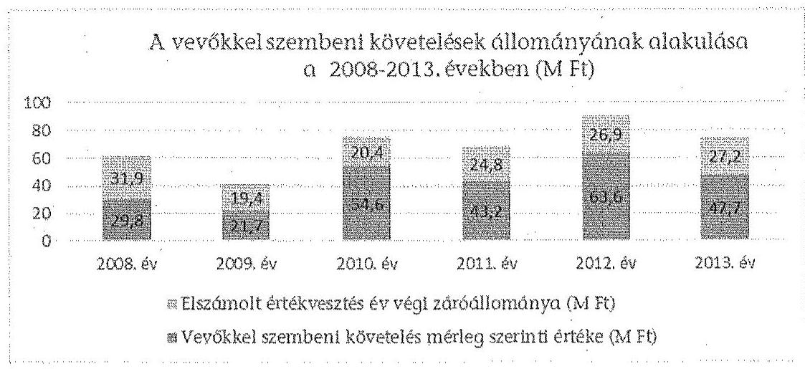
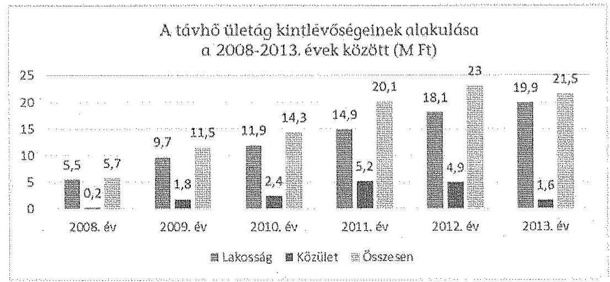
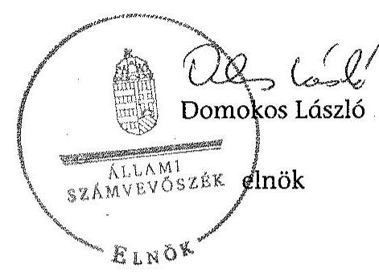
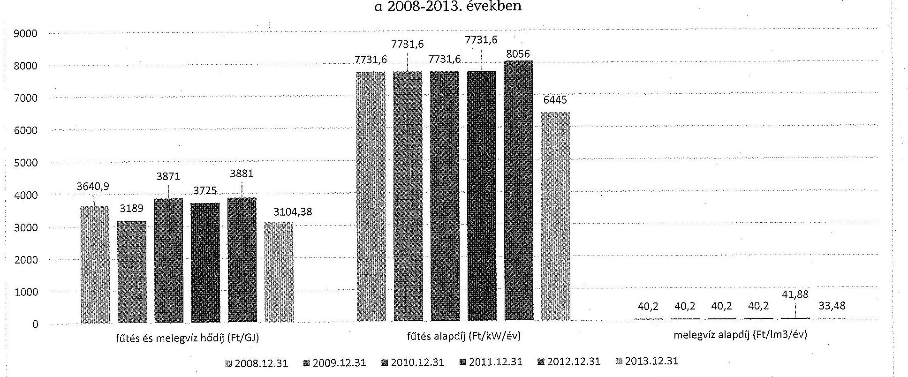

# ÁLLAMI   SZÁMVEVŐSZÉK 

## JELENTÉS

Az önkormányzatok gazdasági társaságai - Az önkormányzatok többségi tulajdonában lévő gazdasági társaságok közfeladat-ellátását érintő gazdálkodási tevékenysége szabályszerűségének ellenőrzése

Hajdúnánási Építő és Szolgáltató Kft.

---

# Állami Számvevőszék 

Iktatószám: V-0826-157/2015.
Témaszám: 1860
Vizsgálat-azonosító szám: V067147

## Az ellenőrzést felügyelte:

Dr. Horváth Margit
felügyeleti vezető
Az ellenőrzést vezette és az ellenőrzés végrehajtásáért felelős:
Salamin Viktor
ellenőrzésvezető
A jelentéstervezet összeállításában közreműködött:
Csényi István
számvevő főtanácsos
Az ellenőrzést végezték:

| Dr. Lits József | Teleki András | Dr. Varga Sándor |
| :-- | :-- | :-- |
| külső szakértő | külső szakértő | külső szakértő |

---

# TARTALOMJEGYZÉK 

BEVEZETÉS ..... 7
I. ÖSSZEGZŐ MEGÁLLAPÍTÁSOK, KÖVETKEZTETÉSEK, JAVASLATOK ..... 11
II. RÉSZLETES MEGÁLLAPÍTÁSOK ..... 19

1. Az Önkormányzat közfeladat-ellátásának szabályszerűsége ..... 19
1.1. A közfeladat-ellátás megszervezése és a feladatellátás feltételrendszerének kialakítása ..... 19
1.2. A közfeladat-ellátás felügyelete és a tulajdonosi jogok érvényesítése ..... 21
2. A Hépszolg kft. közfeladat-ellátással kapcsolatos tevékenysége ..... 24
2.1. A Hépszolg Kft. gazdálkodásának szabályozottsága ..... 24
2.2. A Hépszolg Kft. vagyongazdálkodása ..... 26
2.3. A beszámolási kötelezettség teljesítése ..... 30
3. A távhőszolgáltatás közfeladata bevételei és ráfordításai elszámolása, valamint az önköltségszámítás szabályszerűsége ..... 32
3.1. A távhőszolgáltatás közfeladat bevételeinek és ráfordításainak elkülönített, szabályszerű elszámolása ..... 32
3.2. Az önköltségszámítás szabályszerűsége ..... 33
4. Az ÁSZ korábbi, az önkormányzatok többségi tulajdonában lévő gazdasági társaságok közfeladat-ellátását, gazdálkodását, pénzügyi helyzetét érintő javaslataira tett intézkedések ..... 34
MELLÉKLETEK
5. számú A Hépszolg Kft. tevékenységének főbb adatai
6. számú A Hépszolg Kft. működésének főbb jellemzői
7. számú A lakossági fűtés és melegvíz szolgáltatás díjainak alakulása a 2008-2013. években
FÜGGELÉKEK
8. számú Értelmező szótár
9. számú Mintavételi eljárások ellenőrzési területenként

---

.

---

# RÖVIDÍTÉSEK JEGYZÉKE 

## Törvények

Áht.
Az államháztartásról szóló 2011. évi CXCV. törvény (hatályos: 2011. december 31-étől)
Ámt.
az árak megállapításáról szóló 1990. évi LXXXVII. törvény (hatályos: 1991. január 1-jétől)
ÁSZ tv.
az Állami Számvevőszékről szóló 2011. évi LXVI. törvény (hatályos: 2011. július 1-jétől)
Ebktv.
az egyenlő bánásmódról és az esélyegyenlőség előmozdításáról szóló 2003. évi CXXV. törvény (hatályos: 2004. március 28-ától)
Fgytv.
a fogyasztóvédelemről szóló 1997. évi CLV. törvény (hatályos: 1998. március 1-jétől)
Gt.
a gazdasági társaságokról szóló 2006. évi IV. törvény (hatálytalan: 2014. március 15-étől)
Info tv.
az információs önrendelkezési jogról és az információszabadságról szóló 2011. évi CXII. törvény (hatályos: 2011. július 27-től)

Mötv.

Nvtv.

Ötv.

Ptk.
Rezsi tv.
Számv. tv.
Taktv.

Tszt.
Magyarország helyi önkormányzatairól szóló 2011. évi CLXXXIX. törvény (hatályos: 2012. január 1-jétől, kivéve a 144. § (2) bekezdésben meghatározott paragrafusok, amelyek 2012. április 15-én, a (3) bekezdésben meghatározott paragrafusok, amelyek 2013. január 1-jén léptek hatályba, a (4) bekezdésben meghatározott paragrafusok a 2014. évi általános önkormányzati választások napján lépnek hatályba)
a nemzeti vagyonról szóló 2011. évi CXCVI. törvény (hatályos: 2011. december 31-étől, kivéve a 20. § (2) bekezdésben meghatározott paragrafusok, amelyek 2012. január 1-jétől, a (3) bekezdésben meghatározott paragrafusok 2013. január 1-jétől, a (4) bekezdésben meghatározott paragrafus 2012. március 2-ától léptek hatályba)
a helyi önkormányzatokról szóló 1990. évi LXV. törvény (hatálytalan: a 2014. évi általános önkormányzati választások napjától)
a Polgári Törvénykönyvről szóló 1959. évi IV. törvény
a rezsicsökkentések végrehajtásáról szóló 2013. évi LIV. törvény (hatályos: 2013. május 10-étől)
a számvitelről szóló 2000. évi C. törvény (hatályos: 2001. január 1-jétől)
a köztulajdonban álló gazdasági társaságok takarékosabb működéséről szóló 2009. évi CXXII. törvény (hatályos: 2009. december 4-étől)
a távhőszolgáltatásról szóló 2005. évi XVIII. törvény (hatályos: 2005. július 1-jétől)

---

## Rendeletek

36/2009. (VII. 22.)
KHEM rendelet

50/2011. (IX. 30.) NFM rendelet

51/2011. (IX. 30.) NFM rendelet

SZMSZ1

SZMSZ2
távhőszolgáltatási rendelet1
távhőszolgáltatási rendelet2
vagyongazdálkodási rendelet2

Szórövidítések
Alapító Okirat
áfa
ÁSZ
bizonylati rend
értékelési szabályzat

FB
a távhőszolgáltatás csatlakozási díjának és a lakossági távhőszolgáltatás díjának, valamint a hőenergia távhőtermelő és a távhőszolgáltató közötti szerződésben alkalmazott árának meghatározása során figyelembe veendő szempontokról, és a Magyar Energia Hivatal által lefolytatott eljárásban kötelezően benyújtandó adatok köréről (hatályos: 2009. július 25-étől)
a távhőszolgáltatónak értékesített távhő árának, valamint a lakossági felhasználónak és a külön kezelt intézményeknek nyújtott távhőszolgáltatás díjának megállapításáról (hatályos: 2011. október 1-jétől)
a távhőszolgáltatás támogatásáról (hatályos: 2011. október 1-jétől)
Hajdúnánás Városi Önkormányzat többször módosított 15/2005. (IV. 15.) számú rendelete az Önkormányzat Szervezeti és Működési Szabályzatáról (hatályos: 2011. április 4-éig)
Hajdúnánás Városi Önkormányzat többször módosított 4/2011. (IV. 04.) számú rendelete az Önkormányzat Szervezeti és Működési Szabályzatáról (hatályos: 2011. április 4-étől)
Hajdúnánás Városi Önkormányzat távhőszolgáltatásról szóló 3/2000. (I. 31.) számú rendelete, valamint a távhőszolgáltatási díjak megállapításáról és alkalmazásáról szóló 17/2004. (V. 03.) számú rendeletei (hatályosak: 2009. július 1-jéig)
Hajdúnánás Városi Önkormányzat 16/2009. (VI. 27.) számú rendelete a távhőszolgáltatásról, a távhőszolgáltatás legmagasabb hatósági díjáról, és a díjalkalmazás feltételeiről (hatályos: 2009. július 1-jétől)
Hajdúnánás Városi Önkormányzat többször módosított 9/2004. (V. 03.) számú rendelete az önkormányzati vagyonról és arról való rendelkezési jog gyakorlásáról (hatályos: 2011. december 1-jéig)
Hajdúnánás Városi Önkormányzat többször módosított 21/2011. (X. 25.) számú rendelet az önkormányzati vagyonról és arról való rendelkezési jog gyakorlásáról (hatályos: 2011. december 1-jétől)

[^0]
[^0]:    a Hépszolg Kft. Alapító Okirata és módosításai
    általános forgalmi adó
    Állami Számvevőszék
    a Hajdúnánási Építő és Szolgáltató Kft. 2001. január 1-jétől hatályos bizonylati rendje
    a Hajdúnánási Építő és Szolgáltató Kft. 2001. március 31-étől hatályos értékelési szabályzata
    a Hépszolg Kft. Felügyelőbizottsága

---

| Hajdúnánási Holding   Zrt. | a Hajdúnánási Holding Zártkörűen Működő Részvénytár-   saság |
| :--: | :--: |
| Hépszolg Kft. | a Hajdúnánási Építő és Szolgáltató Korlátolt Felelősségű   Társaság |
| Igazgatóság   iratkezelési szabályzat1 | a Hajdúnánási Holding Zrt. Igazgatósága   a Hajdúnánási Építő és Szolgáltató Kft. 1995. május 1. és   2012. december 31. között hatályos iratkezelési szabály-   zata |
| iratkezelési szabályzat2 | a Hajdúnánási Építő és Szolgáltató Kft. 2012. december   31-től hatályos iratkezelési szabályzata |
| jegyző | Hajdúnánás Városi Önkormányzat jegyzője |
| Képviselő-testület | Hajdúnánás Városi Önkormányzat Képviselő-testülete |
| legfőbb szerv | a Hépszolg Kft. legfőbb szerve 2011. december 28-áig a   Képviselő-testület, 2011. december 29-étől a Hajdúnánási   Holding Zrt. Igazgatósága |
| leltározási szabályzat | a Hajdúnánási Építő és Szolgáltató Kft. 2001. március 31-   jétől hatályos leltározási szabályzata |
| MEKH | Magyar Energetikai és Közmű-szabályozási Hivatal   (2013. április 4-ig Magyar Energetikai Hivatal) |
| NAV | Nemzeti Adó és Vámhivatal |
| Önkormányzat | Hajdúnánás Városi Önkormányzat |
| önköltségszámítási sza-   bályzat | a Hajdúnánási Építő és Szolgáltató Kft. 2001.január 1-   jétől hatályos önköltség számítási szabályzata |
| pénzkezelési szabályzat | a Hajdúnánási Építő és Szolgáltató Kft. 2001. március 31-   étől hatályos házipénztár kezelési szabályzata |
| polgármester | Hajdúnánás Városi Önkormányzat polgármestere |
| Polgármesteri Hivatal | Hajdúnánás Városi Önkormányzat Polgármesteri Hivata-   la |
| számlarend | a Hajdúnánási Építő és Szolgáltató Kft. 2001. január 1-   jétől hatályos számlarendje |
| számviteli politika | a Hajdúnánási Építő és Szolgáltató Kft. 2001. január 1-   jétől hatályos számviteli politikája |
| SZMSZ | Szervezeti és Működési Szabályzat |
| vállalkozási szerződés | a Hajdúnánás Városi Önkormányzat és a Hépszolg Kft.   között létrejött, 1995. június hó 1. napjától hatályos,   1999. december 31-én módosított „VÁLLALKOZÁSI SZER-   ZŐDÉS" |

---

.

---

# JELENTÉS 

## Az önkormányzatok gazdasági társaságai Az önkormányzatok többségi tulajdonában lévő gazdasági társaságok közfeladat-ellátását érintő gazdálkodási tevékenysége szabályszerűségének ellenőrzése Hajdúnánási Építő és Szolgáltató Kft.

## BEVEZETÉS

Az Állami Számvevőszék középtávra szóló stratégiájában megfogalmazta, hogy a helyi önkormányzatok gazdálkodásában rejlő pénzügyi kockázatok feltárásával, az államháztartáson kívülre nyújtott költségvetési támogatások és ingyenes vagyonjuttatások, valamint az államháztartáson kívül működő köz-feladat-ellátó rendszerek ellenőrzéseivel hozzájárul ahhoz, hogy a közpénzeket az államháztartáson kívül működő szervezetek is átlátható, rendezett módon használják fel a közfeladatok szerződésben vállalt ellátása érdekében.

Az önkormányzatok szervezetalakítási szabadságának következménye, hogy a korábban is vállalati formában működő (nagyvárosi tömegközlekedés, víz-, szennyvízcsatorna, köztisztasági, ingatlankezelés stb.) közszolgáltatások mellett, mind a kötelező, mind az önként vállalt feladatok ellátásában a gazdasági társaságok kiemelt fontosságú szerephez jutottak.

A Hajdúnánás Városi Önkormányzat a Hajdúnánási Építő és Szolgáltató Kft.-t (a továbbiakban: Hépszolg Kft. vagy Társaság) az ellenőrzött időszakot megelőzően hozta létre ${ }^{1}$ - egyéb feladatok mellett - a távhőszolgáltatás közfeladatának ellátására. A Hépszolg Kft. jogelődje a Hajdúnánási Városgazdálkodási Vállalat volt. A Társaság jegyzett tőkéjének összege az ellenőrzött időszakban 136,5 M Ft-ot tett ki.

Az Önkormányzat Képviselő-testülete a 2011. évben megalapította² a Hajdúnánási Holding Zrt.-t, melyben - az alapítástól kezdődően - 100%-os tulajdoni aránya volt. A Képviselő-testület a Hépszolg Kft.-ben lévő üzletrészét 2011 novemberében apportálta ${ }^{3}$ a Hajdúnánási Holding Zrt.-be. Az apportálás következtében a Hépszolg Kft. tulajdonosa 2011. december 29-étől a Hajdúnánási Holding Zrt. lett. Az önkormányzati tulajdon a Hépszolg Kft.-ben közvetetté vált, a

[^0]
[^0]:    ${ }^{1}$ A 238/1992. (XI. 19.) számú határozattal.
    ${ }^{2}$ A 233/2011. (VI. 24.) számú határozatával.
    ${ }^{3}$ A 459/2011. (XI. 24.) számú határozattal.

---

Hajdúnánási Holding Zrt. 100%-os tulajdoni hányada biztosította az Önkormányzat számára a meghatározó befolyást a Társaságban. A Hajdúnánási Holding Zrt.-nél centralizálódtak az egységes pénzügyi-számviteli rendszerek, a tervezési, beszámolási, kontrolling és belső ellenőrzési folyamatok, a beszerzések és közbeszerzések rendszere, az informatikai, jogi szolgáltatások, míg a tagvállalatok - így a Hépszolg Kft. is - az alaptevékenységükbe tartozó szakmai feladatokat végezték.

A Hépszolg Kft. tevékenységét elsődlegesen a helyben jelentkező igények kielégítése érdekében, Hajdúnánás városban végezte, melynek lakosság száma 2013. december 31-én 17168 fő volt. A Társaság főtevékenységként gőzellátást, légkondicionálást végzett, részben saját, részben az Önkormányzattól üzemeltetésre átvett eszközökkel. A Hépszolg Kft. a főtevékenysége mellett víz-és csatornaközmű-szolgáltatást, köztemető üzemeltetést, közterületi parkolást és piac-üzemeltetést, lakás- és helyiséggazdálkodást, társasházi közös képviseletet, fürdőszolgáltatást, építőipari kivitelező tevékenységet is ellátott.

A Hépszolg Kft. 2009-ben (2008-ra nem állt rendelkezésre adat) 686 lakossági és 95 közületi fogyasztónak, 2013-ban 655 lakossági és 91 közületi fogyasztónak biztosította a távhőszolgáltatást. A Társaság éves nettó árbevétele 600,9 M Ft és 761,7 M Ft között, az eszközök és források mérleg szerinti értéke 689,2 M Ft és 1315,5 M Ft között változott az ellenőrzött időszakban. A mérleg szerinti eredmény 30,3 M Ft veszteség és 12,1 M Ft nyereség között változva a 2008-2013. években 32,2 M Ft összesített veszteséget mutatott. A veszteség a 2011. és a 2012. években képződött, a 2008-2010. és a 2013. évben a Társaság nyereséget realizált. A Hépszolg Kft. más gazdasági társaságban tulajdoni hányaddal nem rendelkezett. Feladatát az ellenőrzött időszak első évében 54 fővel, míg 2013-ban 19 fővel látta el. A jelentős létszámcsökkenés oka, hogy a víz- és csatornaközmű-szolgáltatás mintegy 30 fővel 2013. január 1-jétől kikerült a Társaság tevékenységi köréből.

Az ellenőrzött időszakban a polgármester és a jegyző személye egy alkalommal változott. A polgármester a 2010. évi önkormányzati választások óta tölti be tisztségét, a
 helyszíni ellenőrzés időszakában a munkakört betöltő jegyző 2011. április 1-től látja el feladatait. A Társaságnál az ügyvezető személye három alkalommal változott, a jelenlegi ügyvezető 2015. február 16. óta tölti be tisztségét. Gazdasági igazgató az ellenőrzött időszakban a Társaságnál nem volt, a főkönyvelő a Hajdúnánási Holding Zrt. tulajdonossá válásáig töltötte be a tisztségét, azt követően annak munkavállalójaként irányította a Társaság gazdálkodási folyamatait. A Hajdúnánási Holding Zrt.-nél az ellenőrzött időszakban az igazgatósági elnök személye nem változott, a jelenlegi vezérigazgató 2014. március 1. óta tölti be tisztségét, a gazdasági vezető személye egy alkalommal változott, a jelenlegi gazdasági vezető 2013. június 1. óta látja el feladatát.

Az önkormányzati tulajdonú gazdasági társaságok teljes körű ellenőrzésének lehetőségét az Állami Számvevőszékről szóló 1989. évi XXXVIII. törvény 2011. január 1-jétől hatályos módosítása teremtette meg.

---

Az ellenőrzés célja annak értékelése volt, hogy
az önkormányzat a jogszabályi előírások figyelembevételével döntött-e az ellenőrzésre kerülő közfeladat megszervezéséről; az önkormányzat szabályszerűen gyakorolta-e a tulajdonosi jogokat;
a gazdasági társaság közfeladat-ellátása bevételeinek, ráfordításainak elszámolása, és vagyongazdálkodási tevékenysége megfelelt-e a jogszabályi, illetve a közszolgáltatási szerződésben foglalt tulajdonosi előírásoknak, azok végrehajtása szabályszerű volt-e;
a közfeladatok átláthatósága és elszámoltathatósága érdekében biztosítva volt-e a közszolgáltatás díjának megalapozottsága szabályszerű önköltségszámítással.

Az ellenőrzés kiterjedt Hajdúnánás Város Önkormányzatára és a Hépszolg Kft.-re, valamint a Hajdúnánási Holding Zrt.-re.

Az ellenőrzés várható hasznosulása: A törvényalkotás számára - az észlelt problémák, szabálytalanságok, vagy egyéb nem kívánatos jelenségek felszínre kerülésével - az ellenőrzés megállapításai segítséget nyújthatnak az államháztartáson kívüli közfeladat-ellátás értékeléséhez, jogszabályi keretei pontosításához, átláthatóságot biztosító szabályozásához. Meghatározhatóvá válnak a közfeladat ellátásában részt vevő államháztartáson kívüli szervezeteknek - az önkormányzat költségvetését, pénzügyi helyzetét is befolyásoló - kockázatai, lehetővé válik ezen kockázatok csökkentése. Feltárja, hogy az önkormányzat közfeladat-ellátási kötelezettségének szabályszerűen tett-e eleget, a feladatellátáshoz rendelt közvagyon működtetését szabályszerűen szervezte-e meg és a tulajdonosi felügyelete hozzájárult-e a közfeladat-ellátásához. A feladatot ellátó gazdasági társaság a közszolgáltatási szerződésben foglaltak betartásával, a közvagyon használatával biztosította-e a szolgáltatás folytatásának feltételeit. Ezzel az ellenőrzöttek és a helyi döntéshozók számára visszajelzést ad feladatszervezési, feladat-ellátási kockázataikról, alapot ad a meglévő hibák megszüntetéséhez, a jobb közfeladat-ellátás biztosításához. Fokozza a fegyelmet, igazolja, hogy lejárt a következmények nélküli ellenőrzések időszaka. Az ÁSZ értékteremtő rend kialakításához és megőrzéséhez hozzájáruló tevékenysége pozitív hatással van a szervezetről kialakított összkép formálására is.

A bevételek és ráfordítások elszámolása, valamint a vagyonnyilvántartás terén az egyes területek szabályszerű működését mintavétellel ellenőriztük, ez alapján a sokaságokban előforduló hibás tételek arányát becsültük. A jogszabályoknak és a belső előírásoknak megfelelőnek, azaz szabályszerűnek tekintettük az adott bevételek és ráfordítások elszámolását, a vagyonnyilvántartást, amennyiben a minta ellenőrzésének eredménye alapján 95%-os bizonyossággal a teljes sokaságban a hibás tételek aránya kisebb volt, mint 10%, nem megfelelőnek értékeltük, ha a hibás tételek aránya a 10%-ot meghaladta. Kockázatot, illetve magas kockázatot jeleztünk, amennyiben egy adott terület vonatkozásában a minta alapján a teljes sokaságban nem volt teljes körűen biztosított a jogszabályoknak és a belső szabályzatoknak megfelelő működés. A Hépszolg Kft. esetében a vagyonnyilvántartás területeit az általánostól eltérően, a sokaság alacsony elemszáma miatt tételesen ellenőriztük.

---

Az ellenőrzést a számvevőszéki ellenőrzés szakmai szabályai szerint, szabályszerűségi ellenőrzés módszerével, a nemzetközi standardok figyelembevételével végeztük. Az ellenőrzés a 2008-2013. évekre terjedt ki.

Az ellenőrzés végrehajtásának jogszabályi alapját az ÁSZ tv. 5. § (3)-(5) bekezdései képezték.

Az ÁSZ az Állami Számvevőszékről szóló 2011. évi LXVI. törvény 29. §-a alapján a jelentéstervezetet észrevételezésre megküldte Hajdúnánás Városi Önkormányzat polgármesterének, a Hépszolg Kft. ügyvezető igazgatójának és a Hajdúnánási Holding Zrt. vezérigazgatójának. Az ellenőrzöttek észrevételt nem tettek.

---

# I. ÖSSZEGZŐ MEGÁLLAPÍTÁSOK, KÖVETKEZTETÉSEK, JAVASLATOK 

Az Önkormányzat a távhőszolgáltatás közfeladat megszervezéséről az Ötv. előírásainak megfelelően döntött. A távhőszolgáltatás feladatának ellátását a Hépszolg Kft. alapításával biztosította. Az ellenőrzött időszak előtt (1995-ben) határozatlan időtartamra kötött vállalkozási szerződésben az Önkormányzat a tulajdonában lévő kazánház és technológiai berendezései, távhő és távmelegvíz vezetékek, fogyasztói hőközpontok üzemeltetésével és karbantartásával bízta meg a Társaságot.

Az Önkormányzat a távhőszolgáltatásra vonatkozóan a Tszt. szerinti rendeletalkotási kötelezettségének eleget tett. A Képviselő-testület megalkotta az ellenőrzött időszakban hatályos távhőszolgáltatási rendeletét. A távhőszolgáltatási rendeletben a vonatkozó jogszabályi előírásokkal összhangban a Hépszolg Kft. által nyújtott távhőszolgáltatás legmagasabb hatósági díját - a hatósági ármegállapításának az időszakában - az Önkormányzat állapította meg. A Képviselő-testület a távhőszolgáltatási rendeletét kettő alkalommal módosította, de a díjak megállapítását érintő - a Tszt.-ben foglaltak szerinti - változást nem vezette át a rendeletében.

A tulajdonosi jogokat a Hépszolg Kft. felett 2011. december 28-áig a Képviselőtestület, 2011. december 29-étől a Hajdúnánási Holding Zrt. Igazgatósága gyakorolta. A tulajdonosi joggyakorlással kapcsolatos hatásköröket és feladatköröket az Alapító Okiratban, valamint a vagyongazdálkodási rendeletben rögzítették. Az ellenőrzött időszakban a Társaság felett a tulajdonosi jogokat a legfőbb szerv a Gt. előírásai figyelembe vételével, szabályszerűen gyakorolta. Az FB rendelkezett a legfőbb szerv által jóváhagyott ügyrenddel és munkatervvel.

Az ellenőrzött évek üzleti terveinek, illetve éves beszámolóinak tárgyalását az FB minden évben - kivéve a 2011. évet, amikor a Hépszolg Kft. üzleti tervet nem készített - napirendjére tűzte és azokat elfogadásra javasolta. A legfőbb szerv a Társaság üzleti terveit és 2008-2013. évi beszámolóit megtárgyalta és határozatban elfogadta. A Képviselő-testület a 2008-2011. években, a Hajdúnánási Holding Zrt. Igazgatósága a 2012-2013. években az FB írásbeli jelentésének, valamint a könyvvizsgáló hitelesítő záradékkal ellátott jelentésének birtokában hozta meg határozatát az éves beszámolók jóváhagyásáról és a mérleg szerinti eredmény eredménytartalékba helyezéséről. A Társaság legfőbb szerve a Taktv.-ben foglalt kötelezettségének nem tett eleget, mivel a vezető tisztségviselők, vezető állású munkavállalók, FB tagok javadalmazási szabályzatát nem alkotta meg.

Az Önkormányzat belső ellenőrzése a távhőszolgáltatás, mint közfeladat ellátás szabályszerű teljesítéséhez, az önkormányzati vagyon (törzstőke) megóvásához az ellenőrzött időszakban nem járult hozzá.

---

Az Önkormányzat készfizető kezességet vállalt a Hépszolg Kft. által felvett 300,0 M Ft keretösszegű, 17 éves futamidejű fejlesztési hitel és járulékai, továbbá 50,0 M Ft keretösszegű folyószámlahitel és járulékai visszafizetésére. A kezesség beváltására nem került sor. Az Önkormányzat továbbá 25,0 M Ft összegű működési célú támogatási kölcsönt nyújtott a Hépszolg Kft. számára. A Társaság a kölcsönt a határozat szerinti határidőig visszafizette.

A Hépszolg Kft. a számviteli politika keretében elkészítette az eszközök és a források leltárkészítési és leltározási szabályzatát, az eszközök és a források értékelési szabályzatát, az önköltségszámítási szabályzatot és a pénzkezelési szabályzatot, rendelkezett továbbá számlarenddel és bizonylati renddel. A szabályzatokban nem rögzítették a Tszt. által 2012. január 1-jétől előírt, számviteli szétválasztásra vonatkozó szabályokat. A számviteli politika nem tartalmazta a Számv. tv. által meghatározott jelentős összegű hiba értékének, a megbízható és valós összképet lényegesen befolyásoló hiba mértékének meghatározását, továbbá a vevőnként, adósonként együttesen kisösszegű követelések értékét. A Társaság a számviteli politikában foglaltakkal szemben - így a Számv. tv. előírásával ellentétesen - a 2011-2013. üzleti évekre összköltség eljárással készített eredmény-kimutatást tett közzé. A leltározási szabályzat a Számv. tv. előírásait figyelmen kívül hagyva az ingatlanok esetében 5 évenkénti mennyiségi felvétellel történő leltározást írta elő. Az értékelési szabályzat a Számv. tv. által az eszközök és a kötelezettségek tekintetében meghatározott egyedi értékelést nem írta elő. A pénzkezelési szabályzatban a Számv. tv. előírásai ellenére nem rögzítették a pénztárellenőrzés gyakoriságát, továbbá a készpénzállományt érintő pénzmozgások jogcímeit és eljárásrendjét. Az önköltségszámítási szabályzat rendelkezései nem voltak alkalmasak a Tszt. által meghatározott eredménykimutatás költségeinek alátámasztására. A számlarend a Számv. tv.-ben előírt tartalmi követelményeknek nem felelt meg, mivel tartalmát tekintve csak egy számlatükör volt.

A Hépszolg Kft. vagyongazdálkodási tevékenysége - az üzemeltetésre átvett eszközök nyilvántartása kivételével - megfelelt a jogszabályi előírásoknak. A Társaság az éves beszámolókban szereplő eszközök és források állományát minden esetben leltárral támasztotta alá. Az üzemeltetésre átvett önkormányzati vagyontárgyak köréről azonban - a Számv. tv. előírása ellenére - nyilvántartást nem vezettek. A Társaság az önkormányzati vagyon részét képező, üzemeltetésre átvett eszközökön az ellenőrzött időszakban összesen 1,5 M Ft értékben végzett karbantartási munkálatokat, a távhő ágazathoz kapcsolódó saját tulajdonú eszközök pótlására 4,9 M Ft-ot fordított. A 2008-2013. évek között összesen 23,2 M Ft értékcsökkenést számoltak el, így a Hépszolg Kft. saját vagyonának nettó értéke folyamatosan csökkent.

A Hépszolg Kft. a Számv. tv. előírásainak megfelelően elkészítette éves beszámolóit, azokat a legfőbb szerv az előírt határidőig jóváhagyta. A Hépszolg Kft. az elfogadott beszámolókat a Számv. tv.-ben előírt határidőig letétbe helyezte, illetve közzétette. A könyvvizsgáló az ellenőrzött időszak minden évében az éves számviteli beszámolókat minősítés nélküli hitelesítő záradékkal látta el, figyelemfelhívással nem élt. A 2012. évi és a 2013. évi beszámolóhoz kiadott jelentéseiben - a Tszt. előírásának megfelelően - igazolta, hogy a Társaság által kidolgozott és alkalmazott számviteli szétválasztási szabályok, valamint az

---

egyes tevékenységek közötti tranzakciók árazása biztosítják a vállalkozás tevékenységei közötti keresztfinanszírozás-mentességet.

A Hépszolg Kft. az ellenőrzött időszakban - a 2011-2012. évek kivételével - nyereségesen gazdálkodott. A Társaság a 2011. évben 4,6 M Ft, a 2012. évben 32,5 M Ft, a 2013. évben 69,5 M Ft központi távhőszolgáltatási támogatást számolt el a bevételei között. A Társaság saját tőke/jegyzett tőke aránya a 2008. évi 2,0-ről a 2013. évben 1,7-re mérséklődött. A saját tőke csökkenése nem járt visszapótlási kötelezettséggel.

A Társaság a távhőszolgáltatás érdekében felmerült bevételek és kiadások egyértelmű elhatárolásának, számviteli szétválasztásának szabályait a Tszt.-ben, valamint az 51/2011. (IX. 30.) NFM rendeletben foglaltak ellenére 2012. január 1-jétől nem határozta meg. A Társaság nem tett eleget a 36/2009. (VII. 22) KHEM rendelet előírásainak sem, mivel az általános működéséhez szükséges költségek felosztásának szabályait belső szabályzatban nem rögzítette.

A Hépszolg Kft.-nél a távhőszolgáltatási közfeladat nettó árbevételeinek és anyagjellegű ráfordításainak elszámolását, az azok jogosságát megalapozó dokumentumok - a Számv. tv. előírásai ellenére fennálló - hiánya miatt kockázatosnak értékeltük. A mintavétel során kijelölt bizonylatok közül több elszámolt bevétel és anyagjellegű ráfordítás alapbizonylatát a Társaság nem tudta bemutatni. A távhőszolgáltatási közfeladathoz kapcsolódó beruházásait, felújításait a Hépszolg Kft. szabályszerűen bonyolította és számolta el. A bekerülési érték meghatározása, az eszközök besorolása és nyilvántartása, valamint az értékcsökkenés elszámolása a Számv. tv. előírásai szerint történt. Az éves számviteli beszámolók kiegészítő mellékleteiben részletesen bemutatták az elszámolt értékcsökkenési leírást.

A Hépszolg Kft. által a 2008-2013. években alkalmazott távhőszolgáltatási díjak megállapítása nem az indokoltan felmerült költségek és ráfordítások tételes számbavételén alapult, hanem egy bázis alapú, indexáló árképzésnek felelt meg. A Számv. tv.-ben foglaltak ellenére a távhőszolgáltatásra és hőtermelésre vonatkozó önköltség számításához szükséges adatokat a kialakított számviteli nyilvántartás közvetlenül nem biztosította. A Társaság a közszolgáltatás díját szabályszerűen
 önköltségszámítással nem alapozta meg.

A fentiekben leírtak összegzéseként az alábbi megállapításokat tesszük:
Az Önkormányzat a Hépszolg Kft. számára a távhőszolgáltatáshoz szükséges vagyont vállalkozási szerződés keretében, üzemeltetésre adta át. A távhőszolgáltatás közfeladat megszervezéséről a jogszabályi előírásoknak megfelelően gondoskodott, szabályozta a helyi távhőszolgáltatás rendszerét. A tulajdonosi jogokat a legfőbb szerv egyedi döntésekkel, szabályszerűen gyakorolta. A tulajdonosi ellenőrzés alapvetően az FB tevékenységén keresztül valósult meg. A tulajdonos a Társaság által elkészített éves beszámolókat és üzleti jelentéseket elfogadta. A Hépszolg Kft. vagyongazdálkodási tevékenysége - az üzemeltetésre átvett vagyon nyilvántartásának kivételével - megfelelt a jogszabályi előírásoknak. A beruházások, felújítások és az értékcsökkenés elszámolása során szabályszerűen jártak el, de a távhőszolgáltatás nettó árbevételeinek és anyagjellegű ráfordításainak elszámolását kockázatosnak értékeltük. A belső ellenőr-

---

zés ellenőrzéseket nem végzett a Hépszolg Kft.-nél. A Társaság szabályszerű működésének ellátásához szükséges szabályzatok rendelkezésre álltak, azonban azok hiányosságai gyengítették a szabályozás színvonalát. A távhőszolgáltatás díjainak megállapítása nem az indokoltan felmerült költségek és ráfordítások tételes számbavételén alapult. A Társaság a távhőszolgáltatás biztosítását szolgáló eszközökkel kapcsolatos beruházásokra, felújításokra nem tudott elegendő forrást biztosítani az elszámolt értékcsökkenési leírással azonos mértékben, a tárgyi eszközök használhatósági foka így folyamatosan romlott.

Az Állami Számvevőszékről szóló 2011. évi LXVI. törvény 33. § (1) bekezdésében foglaltak értelmében a jelentésben foglalt megállapításokhoz kapcsolódó intézkedési tervet köteles az ellenőrzött szervezet vezetője összeállítani, és az a jelentés kézhezvételétől számított 30 napon belül az ÁSZ részére megküldeni. Amennyiben az intézkedési tervet határidőben nem küldi meg a szervezet, vagy az nem elfogadható, az ÁSZ elnöke a hivatkozott törvény 33. § (3) bekezdés a)-b) pontjaiban foglaltakat érvényesítheti.

Az ellenőrzés intézkedést igénylő megállapításai és javaslatai:
Javaslataink célja a Hépszolg Kft. gazdálkodása szabályszerűségének helyreállítása annak érdekében, hogy a szabályozási környezet megfelelően tudja támogatni az átlátható működést.

# Javasoljuk a Hépszolg Kft. ügyvezető igazgatójának: 

1. A Hépszolg Kft. a számviteli politikán, valamint az annak keretében elkészített eszközök és források leltárkészítési és leltározási szabályzatán, értékelési szabályzatán, önköltségszámítás rendjére vonatkozó szabályzatán, pénzkezelési szabályzatán, illetve számlarendjén a jogszabályi változásokat a Számv. tv. 14. § (11) bekezdésében foglalt előírások ellenére nem vezette át. A Társaság a távhőszolgáltatás érdekében felmerült bevételek és kiadások egyértelmű elhatárolásának, számviteli szétválasztásának szabályait a Tszt. 18/A. § (2) bekezdésében, valamint az 51/2011. (IX. 30.) NFM rendelet 7. § (2) bekezdésében foglaltak ellenére 2012. január 1-jétől nem határozta meg. A Társaság nem tett eleget a 36/2009. (VII. 22) KHEM rendelet 4. § (4) bekezdés előírásainak sem, mivel az általános működéséhez szükséges költségek felosztásának szabályait sem a számviteli politikában, sem az önköltségszámítási szabályzatban nem rögzítette.

A számviteli politika nem tartalmazta a Számv. tv. 3. § (3) bekezdés 3-4. pontjaiban meghatározott jelentős és nem jelentős összegű hiba értékének meghatározását, továbbá az 55. § (2) bekezdés szerinti, a vevőnként, adósonként együttesen kisösszegű követelések értékét. A számviteli politika előírása szerint a Társaságnak forgalmi költség eljárással kellett megállapítania üzleti tevékenysége eredményét. A Hépszolg Kft. a számviteli politika előírásaival ellentétes gyakorlatot folytatva, a 2011-2013. üzleti évekre összköltség eljárással készített eredmény-kimutatást tett közzé. Ezzel a Társaság megsértette a Számv. tv. 14. § (4) bekezdésének előírását, mivel a törvényben biztosított választási lehetőségek közül nem azt az eljárást alkalmazta, amelyet előzetesen kiválasztott.

---

A Hépszolg Kft. leltározási szabályzata a Számv. tv. 69. § (3) bekezdése 2012. január 1-jétől hatályos előírásait - mely szerint a folyamatos mennyiségi nyilvántartást vezető vállalkozó a leltárba kerülő adatok valódiságáról legalább három évente mennyiségi felvétellel történő leltározással köteles meggyőződni - figyelmen kívül hagyva, az ingatlanok esetében öt évenkénti mennyiségi felvétellel történő leltározást írt elő.

Az értékelési szabályzat a Számv. tv. 16 § (1) bekezdésében előírtak ellenére az eszközök és a kötelezettségek tekintetében meghatározott egyedi értékelést nem írta elő.

A Társaság pénzkezelési szabályzatában a Számv. tv. 14. § (8) bekezdésének előírásai ellenére nem rögzítették a pénztárellenőrzés gyakoriságát, továbbá a készpénzállományt érintő pénzmozgások jogcímeit és eljárásrendjét.

A Hépszolg Kft. a Számv. tv. 14. § (5) bekezdés c) pontjában meghatározottak alapján önköltségszámítási szabályzat készítésére kötelezett volt. Az önköltségszámítási szabályzat nem tartalmazott előírást a bevételek és költségek tevékenységi elszámolásával kapcsolatosan, ezért annak rendelkezései 2011. április 15-étől nem voltak alkalmasak a Tszt. 57. § (2) bekezdésében foglalt indokolt ráfordítások kimutatására, valamint a legkisebb költség elvének érvényre juttatására, továbbá 2012. január 1-jétől a Tszt. 18/A. § (4) bekezdésében meghatározott eredmény-kimutatás költségeinek alátámasztására.

A Társaság számlarendje a Számv. tv. 161. § (2) bekezdésében előírt tartalmi követelményeknek nem felelt meg. A számlarend tartalmában egy számlatükör volt, amely a Számv tv. 161. § (2) bekezdés a) pontjában foglaltak ellenére nem tartalmazott minden, a Hépszolg Kft. által alkalmazásra kijelölt számla számjelét és megnevezését. Továbbá a b)-d) pontokban foglaltak ellenére nem tartalmazta a főkönyvi számlák tartalmát, a számlák értéke növekedésének, csökkenésének jogcímeit, a számlát érintő gazdasági eseményeket, azok más számlákkal való kapcsolatát, a főkönyvi számla és az analitikus nyilvántartás kapcsolatát, valamint a számlarendben foglaltakat alátámasztó bizonylati rendet.

Javaslat:
Intézkedjen a szabályozási hiányosságok megszüntetésére, ennek keretében:
a) gondoskodjon a számviteli szabályzatok aktualizálásáról a Számv. tv. előírásai szerint;
b) egészítse ki a számviteli politikát a jelentős és nem jelentős összegű hiba értékének, valamint a vevőnként, adósonként együttesen kisösszegű követelések értékének meghatározásával, továbbá módosítsa az üzleti tevékenység eredményének megállapítására vonatkozó szabályokat az alkalmazott gyakorlatnak megfelelően;
c) dolgozzon ki olyan számviteli szétválasztási szabályokat, amely biztosítja az egyes tevékenységek átláthatóságát és kizárja a keresztfinanszírozás lehetőségét;

---

d) aktualizálja az eszközök és források leltárkészítési és leltározási szabályzatát - az ingatlanok esetében - a legalább háromévenkénti mennyiségi felvétellel történő leltározásra vonatkozóan;
e) egészítse ki az értékelési szabályzatot az eszközök és a kötelezettségek tekintetében meghatározott egyedi értékelés elvére vonatkozóan;
f) módosítsa a pénzkezelési szabályzatot, hogy az tartalmazza a pénztárellenőrzés gyakoriságát, továbbá a készpénzállományt érintő pénzmozgások jogcímeit és eljárásrendjét;
g) egészítse ki az önköltségszámítási szabályzat előírásait a bevételek és költségek tevékenységi elszámolására vonatkozóan, hogy az alkalmas legyen az indokoltan felmerült ráfordítások kimutatására, valamint a legkisebb költség elvének érvényre juttatására, továbbá az eredmény-kimutatás költségeinek alátámasztására;
h) dolgozza ki a számlarendet a jogszabályi előírásoknak megfelelően, hogy az tartalmazza minden alkalmazásra kijelölt számla számjelét és megnevezését, továbbá a főkönyvi számlák tartalmát, a számlák értéke növekedésének, csökkenésének jogcímeit, a számlát érintő gazdasági eseményeket, azok más számlákkal való kapcsolatát, a főkönyvi számla és az analitikus nyilvántartás kapcsolatát, valamint a bizonylati rendet.
2. A Hépszolg Kft. az Önkormányzattól üzemeltetésre átvett eszközökről nyilvántartást nem vezetett, ellentétben a Számv. tv. 159. § rendelkezésével, amely a gazdálkodó használatában lévő eszközökről és forrásokról, ezek változásairól könyvviteli nyilvántartás vezetését írja elő.

A távhőszolgáltatási közfeladat nettó árbevételeinek elszámolását kockázatosnak értékeltük, mivel a mintavétel során kijelölt bizonylatok közül több elszámolt bevétel alapbizonylatát a Társaság nem tudta bemutatni, a bizonylatok nem álltak rendelkezésre. A Számv. tv. 169. § (2) bekezdés előírása szerint a könyvviteli elszámolást alátámasztó bizonylatokat 8 évig meg kell őrizni, amely kötelezettségének a Társaság nem tett eleget.

A távhőszolgáltatási közfeladat anyagjellegű ráfordításainak elszámolását kockázatosnak értékeltük. A költségeket az egészségügyi szolgáltatás tekintetében nem a megfelelő költségnemre, közfeladatra számolták el. A költségelszámolást megalapozó dokumentumokat több elszámolás esetében a Társaság nem tudta bemutatni, a bizonylatok nem álltak rendelkezésre, mellyel megsértették a Számv. tv 169. § (2) bekezdésében előírt bizonylat megőrzési kötelezettséget.

A Számv. tv. 161/A. § (2) bekezdésében hivatkozott külön jogszabály előírásai ellenére - 2012. január 1-jétől - a telephelyenkénti távhőszolgáltatásra és hőtermelésre vonatkozó önköltség számításához szükséges adatokat a Társaság által kialakított számviteli nyilvántartás közvetlenül nem biztosította, mivel azt oly módon nem részletezték tovább, hogy abból a Tszt. 57. § (2) bekezdésében meghatározott, indokoltan felmerült költségek és ráfordítások rendelkezésre álljanak. A Hépszolg Kft. könyvvezetési rendszeréből a megtermelt hőenergia közvetlen önköltsége nem volt megállapítható. A Társaság a közszolgáltatás díját szabályszerű önköltségszámítással nem alapozta meg.

---

Javaslat:
Intézkedjen a jogszabályi előírások szerinti gyakorlat biztosítására, ezen belül:
a) nyilvántartásaival biztosítsa az Önkormányzattól üzemeltetésre átvett vagyon, valamint annak változása nyomon követését;
b) biztosítsa, hogy az anyagjellegű ráfordítások elszámolása a megfelelő költségnemre történjen;
c) gondoskodjon a könyvviteli elszámolást alátámasztó számviteli bizonylatok 8 éven keresztül történő megőrzéséről;
d) gondoskodjon a közpénzek felhasználásának, a köztulajdon használatának nyilvánossága és ellenőrizhetősége érdekében a nyilvántartási (könyvvezetési) rendszer oly módon történő továbrészletezéséről, hogy abból a vonatkozó külön jogszabályban meghatározott adatok rendelkezésre álljanak.

Javaslataink célja az Önkormányzat szabályszerű működésének elősegítése, továbbá az önkormányzati tulajdonosi joggyakorlás kontrolljainak erősítése.

# Javasoljuk Hajdúnánás Városi Önkormányzat jegyzőjének: 

1. Az Önkormányzat a 2008-2012. években nem élt az Ötv. 92. § (11) bekezdés b) pontjában, valamint az Áht. 70. § (1) bekezdés d) pontjában biztosított lehetőséggel, mivel belső ellenőrzés által ellenőrzéseket nem végeztetett a Hépszolg Kft.-nél. Az Önkormányzat belső ellenőrzése a távhőszolgáltatás, mint közfeladat ellátás szabályszerű teljesítéséhez, az önkormányzati vagyon (törzstőke) megóvásához az ellenőrzött időszakban nem járult hozzá.

Javaslat:
Fordítson kiemelt figyelmet arra, hogy az Önkormányzat belső ellenőrzése az ellenőrzéseivel a távhőszolgáltatás, mint közfeladat-ellátás szabályszerű teljesítéséhez, valamint az önkormányzati vagyon megóvásához járuljon hozzá.

Javaslataink célja a Hajdúnánási Holding Zrt. szabályszerű működésének elősegítése, továbbá a tulajdonosi joggyakorlás kontrolljainak erősítése.

## Javasoljuk a Hajdúnánási Holding Zrt. vezérigazgatójának:

1. A Hépszolg Kft. legfőbb szerve a Taktv. 5. § (3) bekezdésében foglalt kötelezettségének nem tett eleget, a vezető tisztségviselők, vezető állású munkavállalók, FB tagok javadalmazási szabályzatát nem alkotta meg.

---

Javaslat:
kezdeményezze az Igazgatóságnál a Hépszolg Kft. vezető tisztségviselői, illetve a Felügyelő Bizottsági tagok, továbbá az Mt. hatálya alá tartozó egyéb érintettek juttatásaira vonatkozó javadalmazási szabályzat megalkotását.

---

# II. RÉSZLETES MEGÁLLAPÍTÁSOK 

## 1. Az ÖNKORMÁNYZAT KÖZFELADAT-ELLÁTÁSÁNAK SZABÁLYSZERŰSÉGE

### 1.1. A közfeladat-ellátás megszervezése és a feladatellátás feltételrendszerének kialakítása

Az Önkormányzat az Ötv. 91. § (6) bekezdésében ${ }^{4}$ előírtaknak megfelelően alkotta meg a 2008-2010. és a 2011-2014. évekre vonatkozó gazdasági programjait. A gazdasági programok a távhőszolgáltatással kapcsolatos konkrét fejlesztési elképzeléseket nem tartalmaztak.

A 2008-2010. évekre elfogadott gazdasági program tartalmazta, hogy a távhőszolgáltatást a Hépszolg Kft. végzi, továbbá a települési önkormányzati közszolgáltatásokat többségi önkormányzati tulajdonú gazdasági társaságok nyújtják. A gazdasági programban rögzítették, hogy a közszolgáltatásokat végző gazdasági társaságok helyzete, az általuk nyújtott közszolgáltatások színvonala az országos átlagtól jobb, azonban a fejlesztés természetes igény. A szükséges változtatásokat az állami intézkedésektől és gazdasági kényszertől tették függővé.

Az Önkormányzat 2011-2014. közötti időszakra elkészített gazdasági programja preferált célként nevezte meg a megújuló energiaforrások, vagy az azok felhasználását segítő eszközök előállítását. Az elfogadott dokumentum szerint Hajdúnánás városában minden olyan megoldás, amely a megújuló erőforrások használatával a jelenlegi rendszer kiváltását, illetve olcsóbbá tételét szolgálja, utat mutathat a későbbi fejlesztéseknek és példával szolgálhat a város lakosságának.

A Képviselő-testület által a 2013. évben jóváhagyott ${
 }^{5}$ Integrált Városfejlesztési Stratégia bemutatta a közszolgáltatások, köztük a távhő közmű ellátottság helyzetét és kizárólag általános fejlesztési elképzeléseket fogalmazott meg a közszolgáltatási feladat ellátásával kapcsolatban.

A Képviselő-testület az Nvtv. 9. § (1) bekezdésében előírtaknak megfelelően elfogadta ${ }^{6}$ az Önkormányzat közép- és hosszú távú vagyongazdálkodási tervét. A vagyongazdálkodási terv a távhőszolgáltatási közfeladat ellátásával kapcsolatosan nem fogalmazott meg feladatokat.

Az Ötv. 8. § (3) bekezdése rendelkezett arról, hogy törvény kötelezheti a települési önkormányzatokat egyes közszolgáltatási feladatok ellátásáról történő

[^0]
[^0]:    ${ }^{4}$ 2013. január 1-jétől az Mötv. 116. § (3) bekezdése tartalmazza.
    ${ }^{5}$ A Képviselő-testület a 128/2013. (III. 28.) számú határozatával hagyta jóvá Hajdúnánás Városi Önkormányzat Integrált Városfejlesztési Stratégiáját.
    ${ }^{6}$ A Képviselő-testület a 177/2013. (IV. 25.) számú határozatával fogadta el az Önkormányzat közép- és hosszú távú vagyongazdálkodási tervét.

---

gondoskodásra ${ }^{7}$. A Tszt. 6. § (1) bekezdése értelmében a területileg illetékes települési önkormányzat engedélyes vagy engedélyesek útján köteles biztosítani a távhőszolgáltatással ellátott létesítmények távhőellátását. A Képviselőtestület az SZMSZ ${ }_{1,2}$-ben rögzítette, hogy az Önkormányzat közreműködik a helyi energiaszolgáltatásban és önként vállalt feladatként határozta meg a lakossági távfűtés és melegvíz szolgáltatást.

Az Önkormányzat - közigazgatási területén - a távhőszolgáltatás közfeladatának megszervezéséről az Ötv. 9. § (4) bekezdésében foglalt előírásoknak megfelelően döntött. A távhőszolgáltatási feladat ellátását - az ellenőrzött időszakot megelőzően - a Hépszolg Kft. alapításával biztosította.

Az Önkormányzat a Hépszolg Kft. tulajdonába a távhőszolgáltatási közfeladat ellátásához szükséges vagyontárgyakat nem adta. Az ellenőrzött időszak előtt (1995-ben) határozatlan időtartamra létrejött vállalkozási szerződésben az Önkormányzat - mint megbízó, egyebek mellett - a „megbízó tulajdonában lévő kazánház és technológiai berendezései, távhő és távmelegvíz vezetékek, fogyasztói hőközpontok" üzemeltetésével és karbantartásával, a szolgáltatási díjak számlázásával, beszedésével, a díjhátralék kezelésével bízta meg a Társaságot. Az Önkormányzat a Hépszolg Kft. részére a Számv. tv.-ben előírt és a vállalkozási szerződésben meghatározott beszámoltatási, adatszolgáltatási kötelezettségen kívül más - tulajdonosi elvárásként megfogalmazott - tájékoztatási kötelezettséget nem írt elő, a szakmai tevékenység mérésére alkalmas kritériumrendszert nem alakított ki.

A vállalkozási szerződésben rögzítették, hogy az Önkormányzat minden érintett év december 15-éig a tárgyi időszakra elszámolt amortizáció összegét leszámlázza a Hépszolg Kft. felé, a Társaság pedig a tárgyi időszakban megvalósult felújításokat számlázza az Önkormányzat részére. Előírták továbbá, hogy az Önkormányzat a behajthatatlan követeléseket megfizeti a Társaságnak.

A Hépszolg Kft. - amelynek fő tevékenysége gőzellátás, légkondicionálás volt - az ellenőrzött időszakban rendelkezett a Tszt. 3. § v) pontja szerinti üzletszabályzattal, amelyet a Hajdú-Bihar Megyei Fogyasztóvédelmi Felügyelőség véleményezett és a működési engedélyt kiadó jegyző jóváhagyott. (A Hépszolg Kft. főbb adatait az 1. számú melléklet, működésének főbb jellemzőit a 2. számú melléklet tartalmazza.)

Az üzletszabályzat a városi szolgáltatási sajátosságok figyelembevételével meghatározta a Hépszolg Kft. működését, kötelezettségeit és jogait, szabályozta a Társaság és a felhasználó szerződéses viszonyát, a mérés és elszámolás rendjét, valamint a szolgáltatónak a felhasználóval, a felügyelőségekkel és a társadalmi érdekképviseleti szervekkel való együttműködését. Tartalmazta a Hépszolg Kft. feladatait, előírta a minőségi követelményeket, rendelkezett a távhőszolgáltatási díjak megállapításáról, az energiagazdálkodás, a környezet és fogyasztóvédelem eljárási rendjéről

[^0]
[^0]:    ${ }^{7}$ A helyi közügyek, valamint a helyben biztosítható közfeladatok körében ellátandó helyi önkormányzati feladatként a távhőszolgáltatást 2013. január 1-jétől az Mötv. 13. §. (1) bekezdés 20. pontja írja elő.

---

Az Önkormányzat a távhőszolgáltatásra vonatkozóan a Tszt. 6. § (2) bekezdés szerinti rendeletalkotási kötelezettségének eleget tett. A Képviselőtestület megalkotta az ellenőrzött időszakban hatályos távhőszolgáltatási rendelet ${ }_{1,2}$-et. A Képviselő-testület a távhőszolgáltatási rendelet ${ }_{1,2}$-ben meghatározta annak területi és személyi hatályát, a távhőszolgáltató rendszer elemeit, a távhőszolgáltatás tartalmát, a távhőszolgáltató és a felhasználó közötti jogviszony szabályait, a mérés szerinti elszámolás feltételeit, a hőmennyiségmérés helyét, a fogyasztóvédelemmel kapcsolatos rendelkezéseket, a közüzemi szerződés tartalmát, a felmondásának, a megszegésének eseteit és következményeit, a távhőszolgáltatás felfüggesztésének, a szolgáltatás szüneteltetésének, korlátozásának eseteit és szabályait. A távhőszolgáltatási rendelet ${ }_{1,2}$ kiterjedt a felhasználói berendezés működtetésére, fenntartására, átalakítására, a felhasználók és felhasználói érdekképviseletek tájékoztatására. Kijelölte azokat a területeket, ahol területfejlesztési, környezetvédelmi és levegő-tisztaságvédelmi szempontból megalapozott a távhőszolgáltatás fejlesztése. A távhőszolgáltatási rendelet ${ }_{1,2}$ megfelelt a Tszt. előírásainak.

A távhőszolgáltatási rendelet ${ }_{1,2}$-ben a vonatkozó jogszabályi előírásokkal összhangban a Hépszolg Kft. által nyújtott távhőszolgáltatás legmagasabb hatósági díját - a hatósági ármegállapításának az időszakában - az Önkormányzat állapította meg. Az árváltozásról a Hépszolg Kft. - a távhőszolgáltatási rendelet ${ }_{1,2}$-ben meghatározott ármechanizmus szerint - ármódosító javaslatot készített, melynek elfogadásáról vagy elutasításáról az Önkormányzat Képviselő-testülete döntött. A Képviselő-testület a távhőszolgáltatási rendelet ${ }_{2}$-et kettő alkalommal módosította, de a díjak megállapítását érintő változást nem vezette át a rendeletében. A távhőszolgáltatási rendelet ${ }_{2}$ a Képviselő-testületet jelölte meg a távhőszolgáltatási díjak megállapítójaként, annak ellenére, hogy 2011. április 15-től a Tszt. 57/D. § (1) bekezdése értelmében a távhőszolgáltatás díját, mint legmagasabb hatósági árat, annak szerkezetét és alkalmazási feltételeit a MEKH javaslatának figyelembevételével a miniszter rendeletben állapította meg, az Ámt. 7. § (5) bekezdése szerint pedig az Önkormányzat kizárólag a távhőszolgáltatás csatlakozási díja tekintetében minősült ármegállapítónak.

A MEKH elnöke a javaslat kialakításához bekérte az Önkormányzat Képviselőtestületének ármegállapítással, árváltoztatással kapcsolatos állásfoglalását, amellyel kapcsolatban minden esetben megkeresték a Hépszolg Kft.-t is.

# 1.2. A közfeladat-ellátás felügyelete és a tulajdonosi jogok érvényesítése 

A tulajdonosi jogokat a Hépszolg Kft. felett 2011. december 28-áig a Képviselőtestület, 2011. december 29-étől a Hajdúnánási Holding Zrt. Igazgatósága gyakorolta. A tulajdonosi joggyakorlással kapcsolatos hatásköröket és feladatköröket az Alapító Okiratban, valamint a vagyongazdálkodási rendelet ${ }_{1,2}$-ben rögzítették.

A vagyongazdálkodási rendelet ${ }_{1} 6. \S (2) bekezdése és a vagyongazdálkodási rendelet ${ }_{2} 8. \S (1) bekezdése rögzítette, hogy a tulajdonost megillető jogok gyakorlásáról a Képviselő-testület rendelkezik, e jogait más szervekre, személyekre átruházhatja. A vagyongazdálkodási rendelet ${ }_{1} 8. \S (1)-(2) bekezdéseiben foglaltak

---

szerint az Önkormányzat tulajdonába tartozó valamennyi ingatlan elidegenítésének, megterhelésének, vállalkozásba való bevitelének joga a Képviselőtestületet illette meg. Az ingóságok, immateriális javak és egyéb vagyon elidegenítésének, megterhelésének, vállalkozásba való bevitelének joga 0,5 M Ft értékhatár felett a Képviselő-testület hatáskörébe tartozott, ezen értékhatár alattiakról a Képviselő-testület tájékoztatása mellett a polgármester dönthetett. A vagyongazdálkodási rendelet 10. § (1)-(2) bekezdése szerint a Képviselő-testület hatáskörébe tartozott az 1,0 M Ft értékhatár feletti, a polgármester hatáskörébe az 1,0 M Ft értékhatár alatti vagyontárgyak elidegenítésének, megterhelésének, vállalkozásba való bevitelének joga.

Az Alapító Okirat szerint - 2011. november 29-étől - az alapító kizárólagos hatáskörébe tartozott - értékhatártól függetlenül - bármilyen hitel felvétele, döntés garancia, kezesség vállalásról, más gazdasági társaságban való részesedés megszerzéséről, ingó vagyontárgyakkal és szolgáltatásokkal kapcsolatos, 0,3 M Ft értéket meghaladó szerződések megkötése.

A Képviselő-testület, illetve az Igazgatóság a tulajdonosi jogokat az ellenőrzött időszakban a Gt. 141. § (2) bekezdésében foglaltak végrehajtásával, rendeletekbe és határozatokba foglalt döntésekkel, szabályszerűen gyakorolta. A legfőbb szerv a jogszabályi előírásoknak megfelelően jóváhagyta az éves beszámolókat, az ügyvezetők, az FB tagjai és a könyvvizsgáló megbízását, visszahívását, díjazásának megállapítását.

A legfőbb szerv a Hépszolg Kft. tulajdonosi ellenőrzését alapvetően az FB-n keresztül gyakorolta. A Hépszolg Kft.-nél az FB - a Gt. 34. § (1) bekezdésében, valamint a Taktv. 4. § (2) bekezdésében előírtaknak megfelelően - öt tagból állt. A tagokat az Önkormányzat, mint tulajdonos delegálta. Az FB megállapította ügyrendjét, azt a legfőbb szerv - a Gt. 34. § (4) bekezdésében foglaltak szerint - határozattal jóváhagyta. Az FB munkatervvel rendelkezett.

Az ellenőrzött évek üzleti terveinek, illetve éves beszámolóinak tárgyalását az FB minden évben - kivéve a 2011. évet, amikor a Hépszolg Kft. üzleti tervet nem készített - napirendjére tűzte és azokat elfogadásra javasolta. A legfőbb szerv a Társaság üzleti terveit és 2008-2013. évi beszámolóit megtárgyalta és határozatban elfogadta.

A Hépszolg Kft. minden évben elkészítette az adott évre vonatkozó számviteli beszámolóját. A Képviselő-testület a 2008-2011. években, a Hajdúnánási Holding Zrt. Igazgatósága a 2012-2013. években, az FB írásbeli jelentésének, valamint a könyvvizsgáló hitelesítő záradékkal ellátott jelentésének birtokában hozta meg határozatát az éves beszámolók jóváhagyásáról és a mérleg szerinti eredmény eredménytartalékba helyezéséről.

A Hépszolg Kft. a munkavállalók anyagi ösztönzésére vonatkozó szabályzattal kizárólag a távhő díjak beszedése vonatkozásában rendelkezett. A díjbeszedők teljesítésük arányában munkabérük meghatározott százalékát kapták prémiumként. Egyéb munkavállalókra az anyagi ösztönzési szabályzat nem tért ki. A Hépszolg Kft. legfőbb szerve a Taktv. 5. § (3) bekezdésében foglalt kötelezettségének nem tett eleget, a vezető tisztségviselők, vezető állású munkavállalók, FB tagok javadalmazási szabályzatát nem alkotta meg.

---

A Képviselő-testület a távhőszolgáltatási rendelet ${ }_{1,2}$-ben rögzítette a távhőszolgáltatási díjak képzésére vonatkozó szabályokat. A távhőszolgáltatási díjak Képviselő-testület általi megállapítása - 2011. április 15-ig, a Tszt. 57/D. § (1) bekezdésének hatályba lépéséig - az előírások szerint történt.

A szolgáltatást igénybe vevők által fizetendő dí alapdíjból és hődíjból állt. Az alapdíj a távhőszolgáltatás folyamatos igénybevételének lehetőségéért és a távhőszolgáltatás igénybevételéért fizetendő, egy légköbméterre, illetve egy kilowattra megállapított éves díj, a hődíj a felhasznált hőmennyiség után fizetendő egy GJ-ra megállapított díj volt. A távhőszolgáltatási rendelet ${ }_{1,2} 1$. számú melléklete és a vállalkozási szerződés 1. számú melléklete tartalmazta a díjmegállapítás módszerére és változtatására, a díjjavaslat tartalmára vonatkozó előírásokat.

Az Önkormányzat a 2008-2012. években nem élt az Ötv. 92. § (11) bekezdés b) pontjában ${ }^{8}$, valamint az Áht 70. § (1) bekezdés d) pontjában biztosított lehetőséggel, mivel belső ellenőrzés által ellenőrzéseket nem végeztetett a Hépszolg Kft.-nél. Az Önkormányzat belső ellenőrzése a távhőszolgáltatás, mint közfeladat ellátás szabályszerű teljesítéséhez, az önkormányzati vagyon (törzstőke) megóvásához az ellenőrzött időszakban nem járult hozzá. A Társaság közvagyonnal kapcsolatos felelős gazdálkodását külső szakértő sem ellenőrizte.

A Hépszolg Kft. az ellenőrzött időszakban - a 2011-2012. évek kivételével - nyereségesen gazdálkodott. A 2008-2013. években osztalékfizetésre nem került sor, a legfőbb szerv az éves beszámolók elfogadásakor egyúttal elfogadta a nyereség eredménytartalékba helyezését is.

A Hépszolg Kft.-nél a saját tőke/jegyzett tőke aránya a 2008. évi 2,0-ről a 2013. évben 1,7-re mérséklődött. A saját tőke csökkenése nem járt visszapótlási kötelezettséggel, mert meghaladta a Gt. 51. § (1) bekezdésében meghatározott jegyzett tőkének megfelelő összegű saját tőke szintet.

Az Önkormányzat készfizető kezességet vállalt ${ }^{9}$ a Hépszolg Kft. által felvett 300,0 M Ft keretösszegű, 17 éves futamidejű fejlesztési hitel és járulékai visszafizetésére. A készfizető kezesség beváltására a helyszíni ellenőrzés lezárásáig nem került sor. Az Önkormányzat ugyancsak készfizető kezességet vállalt ${ }^{10}$ a Hépszolg Kft. által, 2013. augusztus 21-ei lejárattal igénybevett 50,0 M Ft keretösszegű
 folyószámlahitel és járulékaik visszafizetésére. A hitelt a Társaság visszafizette, a kezesség beváltására nem került sor.

Az Önkormányzat a 2012. április 19-től 2012. június 30-ig terjedő időszakra 25,0 M Ft összegű működési célú támogatási kölcsönt nyújtott ${ }^{11}$ a Hépszolg Kft. számára. A Képviselő-testület határozatában ${ }^{12}$ hozzájárult ahhoz,

[^0]
[^0]:    ${ }^{8}$ Hatálytalan 2013. január 1-jétől.
    ${ }^{9}$ A Képviselő-testület 269/2009. (IX. 24.) és 3/2010. (I. 7.) számú határozataiban.
    ${ }^{10}$ A Képviselő-testület 383/2012. (IX. 28.) számú határozatában.
    ${ }^{11}$ A Képviselő-testület 174/2012. (IV. 18.) számú határozata alapján.
    ${ }^{12}$ A 296/2012. (VII. 11.) számú határozat.

---

hogy a Társaság a támogatási kölcsön összegéből 18,0 M Ft-ot 2012. június 30. napjáig, a fennmaradó 7,0 M Ft-ot pedig 2012. július 31. napjáig fizesse meg. A Hépszolg Kft. a kölcsönt a határozat szerinti határidőig visszafizette.

# 2. A Hépszolg Kft. KÖZFELADAT-ELLÁTÁSSAL KAPCSOLATOS TEVÉKENYSÉGE 

### 2.1. A Hépszolg Kft. gazdálkodásának szabályozottsága

Az ellenőrzött időszakban a távhőszolgáltatás fejlesztésével, a közfeladatellátás mennyiségével és minőségével kapcsolatban a Hépszolg Kft. üzleti tervei - a 2010. évet kivéve - nem tartalmaztak konkrét elképzeléseket, elvárásokat.

A Hépszolg Kft. 2010. évi üzleti terve fejlesztési feladatként tűzte ki pályázat beadását változó tömegáram kiépítésére, a terv tartalmazta továbbá a geotermikus energia felhasználására vonatkozó tanulmányterv elkészítését. Ezen fejlesztési elképzelések azonban a gyakorlatban nem valósultak meg.

A Hépszolg Kft. a Számv. tv. 14. § (3) bekezdésében foglaltaknak megfelelően rendelkezett számviteli politikával. A Társaság a számviteli politika keretében a Számv. tv. 14. § (5) bekezdésének megfelelően elkészítette az eszközök és a források leltárkészítési és leltározási szabályzatát, az eszközök és a források értékelési szabályzatát, az önköltségszámítási szabályzatot és a pénzkezelési szabályzatot. A Hépszolg Kft. az ellenőrzött időszakban rendelkezett számlarenddel, továbbá külön szabályozta a feleslegessé váló eszközök selejtezésének eljárásrendjét. A jogszabályi változásokat a szabályzatokban a Számv. tv. 14. § (11) bekezdésében foglalt előírások ellenére nem vezették át, továbbá nem rögzítették a Tszt. 18/A. § (1)-(4) bekezdéseiben 2012. január 1-jétől előírt, a számviteli szétválasztásra vonatkozó előírásokat.

A számviteli politika nem tartalmazta a Számv. tv. 3. § (3) bekezdés 3-4. pontjaiban meghatározott jelentős és nem jelentős összegű hiba értékének meghatározását, továbbá az 55. § (2) bekezdése szerinti, a vevőnként, adósonként együttesen kisösszegű követelések értékét. A számviteli politika előírása szerint a Társaság forgalmi költség eljárással állapítja meg üzleti tevékenységének eredményét. A Hépszolg Kft. a számviteli politika előírásaival ellentétes gyakorlatot folytatva, a 2011-2013. üzleti évekre összköltség eljárással készített eredmény-kimutatást tett közzé. Ezzel a Társaság megsértette a Számv. tv. 14. § (4) bekezdés előírását, mivel a törvényben biztosított választási lehetőségek közül nem azt az eljárást alkalmazta, amelyet előzetesen kiválasztott. A Hépszolg Kft. leltározási szabályzata a Számv. tv. 69. § (3) bekezdése 2012. január 1-jétől hatályos előírásait - mely szerint a folyamatos mennyiségi nyilvántartást vezető vállalkozó a leltárba kerülő adatok valódiságáról legalább három évente mennyiségi felvétellel történő leltározással köteles meggyőződni - figyelmen kívül hagyva, az ingatlanok esetében öt évenkénti mennyiségi fel-

---

vétellel történő leltározást írt elő ${ }^{13}$. A műszaki gépek, egyéb gépek, berendezések esetében kétévente történő mennyiségi felvételt határoztak meg.

Az értékelési szabályzat a Számv. tv. 16 § (1) bekezdésében előírtak ellenére az eszközök és a kötelezettségek tekintetében meghatározott egyedi értékelést nem írta elő.

A Társaság pénzkezelési szabályzatában a Számv. tv. 14. § (8) bekezdésének előírásai ellenére nem rögzítették a pénztárellenőrzés gyakoriságát, továbbá a készpénzállományt érintő pénzmozgások jogcímeit és eljárásrendjét.

A Hépszolg Kft. a Számv. tv. 14. § (5) bekezdés c) pontjában meghatározottak alapján önköltségszámítási szabályzat készítésére kötelezett volt, melynek eleget tett. Az önköltségszámítási szabályzat azonban nem tartalmazott előírást a bevételek és költségek tevékenységi elszámolására vonatkozóan, ezért annak rendelkezései 2012. január 1-jétől nem voltak alkalmasak a Tszt. 57. § (2) bekezdésében foglalt indokolt ráfordítások kimutatására, valamint a legkisebb költség elvének érvényre juttatására, továbbá 2012. január 1-jétől a Tszt. 18/A. § (4) bekezdésében meghatározott eredmény-kimutatás költségeinek alátámasztására.

Az önköltségszámítási szabályzatban az önköltségszámítás célját és feladatait, az önköltségszámítás alapelveit, a kalkuláció formáit, az önköltségszámítás kalkulációs sémáját, a közvetlen, a szűkített és a teljes önköltség összetevőit, az önköltségszámításokért és ellenőrzéséért felelős munkaköröket rögzítették. Előírták továbbá, hogy az önköltségszámítás módszereként a különböző vetítési alapokra épülő pótlékoló kalkulációt alkalmazzák.

A Társaság számlarendje a Számv. tv. 161. § (2) bekezdésében előírt tartalmi követelményeknek nem felelt meg. A számlarend tartalmában egy számlatükör volt, amely a Számv tv. 161. § (2) bekezdés a) pontjában foglaltak ellenére nem tartalmazott minden, a Hépszolg Kft. által alkalmazásra kijelölt számla számjelét és megnevezését. Továbbá a b)-d) pontokban foglaltak ellenére nem tartalmazta a főkönyvi számlák tartalmát, a számlák értéke növekedésének, csökkenésének jogcímeit, a számlát érintő gazdasági eseményeket, azok más számlákkal való kapcsolatát, a főkönyvi számla és az analitikus nyilvántartás kapcsolatát, valamint a számlarendben foglaltakat alátámasztó bizonylati rendet.

A Hépszolg Kft. rendelkezett a Tszt. 3. § v) pontja szerinti üzletszabályzattal. A szabályzatot a Hajdú-Bihar Megyei Fogyasztóvédelmi Felügyelőség véleményezte és a működési engedélyt kiadó jegyző jóváhagyta. A Társaság az üzletszabályzatát - a Tszt. 57/C. § (4) bekezdés a) pontja előírásának eleget téve - a honlapján közzé tette.

[^0]
[^0]:    ${ }^{13}$ A Társaság a tárgyi eszközökről - beleértve az ingatlanokat - folyamatos mennyiségi és értékbeni nyilvántartást vezetett.

---

# 2.2. A Hépszolg Kft. vagyongazdálkodása 

A Hépszolg Kft. vagyongazdálkodási tevékenysége - az üzemeltetésre átvett eszközök nyilvántartásának kivételével - megfelelt a jogszabályi előírásoknak. A Társaság a saját vagyonával kapcsolatos változásokat főkönyvi és analitikus nyilvántartásaiban szabályszerűen rögzítette. Az éves beszámolókban bemutatott vagyonról évente leltárt készítettek. A saját vagyontárgyakra vonatkozóan naprakész vagyonnyilvántartással rendelkeztek, amelyben a vagyonváltozást folyamatosan kimutatták.

A Hépszolg Kft. az Önkormányzattól üzemeltetésre átvett eszközökről nyilvántartást nem vezetett, ellentétben a Számv. tv. 159. § rendelkezésével, amely a gazdálkodó használatában lévő eszközökről és forrásokról, ezek változásairól könyvviteli nyilvántartás vezetését írja elő. ${ }^{14}$

A Társaság a saját tulajdonában lévő tárgyi eszközökről olyan analitikus nyilvántartást vezetett, amely mennyiségben és értékben tartalmazta a számviteli információk teljes körét.

Az Önkormányzat a 2008., 2009., 2011. és 2013. években - mennyiségi felvétellel - leltározta a Hépszolg Kft.-nél a távhőszolgáltatással kapcsolatos, tulajdonában álló eszközeit. A leltározást az Önkormányzat által kijelölt leltározó bizottság végezte.

A Hépszolg Kft. a 2008-2013. évi beszámolókban szereplő eszközök és források állományát leltárral támasztotta alá, melyet a Társaság választott könyvvizsgálója ellenőrzött. A vagyonleltár a Társaság saját vagyonát teljes körűen tartalmazta. A tárgyi eszközök (ideértve az ingatlanokat is) mennyiségi felvétellel történő leltározására - a leltározási szabályzatban foglaltaknak megfelelően - 2008-ban, 2010-ben és 2012-ben került sor, a többi évben egyeztetéssel leltároztak.

A Hépszolg Kft. vagyoni helyzetét jellemző, főbb mérlegadatokat a 2008-2013. évek között az alábbi táblázat mutatja be:

[^0]
[^0]:    ${ }^{14}$ A Számv. tv. 160. § (5) bekezdése a 0. számlaosztályt jelölte ki ezen eszközök nyilvántartására.

---

| adatok millió Ft-ban |  |  |  |  |  |  |  |
| :--: | :--: | :--: | :--: | :--: | :--: | :--: | :--: |
| Megnevezés | 2008.01.01 | 2008.12.31 | 2009.12.31 | 2010.12.31 | 2011.12.31 | 2012.12.31 | 2013.12.31 |
| I. Befektetett eszközök | 558,8 | 560,0 | 574,7 | 658,5 | 1120,9 | 1117,6 | 1195,1 |
| ebből: tárgyi eszközök | 558,7 | 559,6 | 572,5 | 657,8 | 1116,1 | 1115,7 | 1194,9 |
| II. Forgóeszközök | 71,9 | 74,6 | 73,0 | 135,0 | 72,0 | 94,0 | 77,4 |
| ebből: követelések | 30,3 | 40,9 | 32,0 | 62,2 | 55,0 | 75,9 | 65,9 |
| III. Aktív időbeli elhatárolások | 58,0 | 54,6 | 54,4 | 54,6 | 78,1 | 81,2 | 42,9 |
| ESZKÖZÖK ÖSSZESEN | 688,7 | 689,2 | 702,1 | 848,1 | 1271,0 | 1292,8 | 1315,5 |
|  |  |  |  |  |  |  |  |
| IV. Saját tőke | 252,9 | 255,8 | 267,9 | 273,0 | 250,8 | 220,4 | 230,3 |
| ebből: jegyzett tőke | 127,0 | 127,0 | 127,0 | 127,0 | 127,0 | 127,0 | 136,5 |
| ebből: mérleg szerinti eredmény | 21,5 | 2,9 | 12,1 | 5,1 | -22,2 | -30,3 | 0,3 |
| V. Céltartalékok | 0,0 | 0,0 | 2,2 | 0,0 | 0,0 | 0,0 | 0,0 |
| VI. Kötelezettségek | 39,4 | 40,5 | 46,4 | 105,8 | 410,2 | 447,6 | 477,8 |
| VII. Passzív időbeli elhatárolások | 396,4 | 392,9 | 385,7 | 469,3 | 610,0 | 624,8 | 607,5 |
| FORRÁSOK ÖSSZESEN | 688,7 | 689,2 | 702,1 | 848,1 | 1271,0 | 1292,8 | 1315,5 |

A Hépszolg Kft. befektetett eszközeinek könyv szerinti értéke - amelynek minden évben több mint 99,6%-át a tárgyi eszközök tették ki - az ellenőrzött időszakban - a 2012. év kivételével, amikor 0,3%-os csökkenés következett be - évről-évre folyamatosan növekedett. A 2013. év végén a befektetett eszközök értéke több mint kétszerese (213,9%-a) volt a 2008. január 1-jei könyv szerinti értéknek, ami 636,3 M Ft-os növekedést jelentett. A befektetett eszközök - ezen belül az ingatlanok - könyv szerinti értéke a 2010-2011. években növekedett a legnagyobb mértékben (a két évben összesen 546,2 M Ft-tal), amely a városi fürdőben - uniós támogatással - megvalósított gyógyászati rész bővítés eredménye. A befektetett eszközök összes eszközön belüli aránya az ellenőrzött időszakban 77,6% és 90,8% között alakult. A távhő ágazat befektetett eszközeinek könyv szerinti értéke a Hépszolg Kft. teljes befektetett eszközállományán belül jelentéktelen nagyságrendet képviselt, a Társaság éves beszámolói szerint a 2012., illetve a 2013. évben 2,0%, illetve 1,6%-ot tett ki. A Társaság - adatszolgáltatása szerint - az önkormányzati vagyon részét képező eszközökön az ellenőrzött időszakban összesen 1,5 M Ft értékben végzett karbantartási munkálatokat, a távhő ágazathoz kapcsolódó saját tulajdonú eszközei pótlására 4,9 M Ft-ot fordított. A 2008. üzleti évben 2,5 M Ft, a 2009. évben 4,9 M Ft, a 2010. évben 4,8 M Ft, a 2011. évben 4,6 M Ft, a 2012-2013. üzleti években évente 3,2 M Ft értékcsökkenést számoltak el, a saját vagyon nettó értéke így folyamatosan csökkent.

A Hépszolg Kft. követelésállománya az ellenőrzött
 időszakban kétéves ciklusonként nőtt, majd csökkent. A követelések állománya 2008. január 1-jén volt a legkisebb ( $30,3 \mathrm{MFt}$ ), ezt követően egyik évről a másikra eltérő irányban változva ( $34,9 \%,-21,8 \%, 94,4 \%,-11,6 \%, 38,0 \%,-13,2 \%$ ) a 2013. év végére 65,9 M Ft-ot ért el. A követelések állománya a forgóeszközök 42,2-85,2\%-át tette ki. A követelésállomány legnagyobb része ( $67,8-97,4 \%$-a) a vevőkkel szembeni követelés volt. A távhő ágazatra az éves beszámolókban kimutatott követelések összege a 2012. évben ( $26,4 \mathrm{MFt}$ ), illetve a 2013. évben ( $24,4 \mathrm{MFt}$ ) a Társaság összes követelésének $34,8 \%$-át, illetve $37,0 \%$-át tette ki.

---

A saját tőke összes forráson belüli aránya - a tőkeerő mutatója - az ellenőrzött időszakban $17,0 \%$ és $38,1 \%$ között változott, a saját tőke/jegyzett tőke aránya ugyanebben az időszakban 1,7 és 2,1 között alakult. A Hépszolg Kft. mérleg szerinti eredménye - a 2011. és a 2012. évek kivételével, amikor $22,2 \mathrm{M} \mathrm{Ft}$, illetve $30,3 \mathrm{M} \mathrm{Ft}$ veszteség képződött - az ellenőrzött időszakban pozitív volt, a képződött nyereség eredménytartalékba helyezéséről döntöttek. A távhő üzletág mérleg szerinti eredménye - az éves beszámolók szerint - a 2012. évben 0,4 M Ft veszteség, a 2013. évben 2,9 M Ft nyereség volt. A Társaság egy várható kártérítési igény kielégítésére a 2009. évben 2,2 M Ft összegű céltartalékot képzett.

A kötelezettségek összes forráson belüli aránya a 2008. január 1-jei 5,7\%-ról (39,4 M Ft-ról) - évente folyamatosan növekedve - 2013. december 31-ére $36,3 \%$-ra ( $477,8 \mathrm{M} \mathrm{Ft}$-ra) nőtt. A kötelezettségek változásában a fő szerepet a városi fürdő beruházási hitelével kapcsolatos (rövid és hosszúlejáratú) kötelezettségek növekedése játszotta. A hosszúlejáratú kötelezettségek állománya a 2009. december 31-ei 7,0 M Ft-ról a 2010. év végére 49,8 M Ft-ra, a 2011. év végére $287,8 \mathrm{M}$ Ft-ra nőtt. A rövidlejáratú kötelezettségek állománya $38,6 \mathrm{M} \mathrm{Ft}$ról $231,9 \mathrm{M}$ Ft-ra nőtt az ellenőrzött időszakban. A dinamikus növekedést egyrészt a hosszúlejáratú hitel tárgyévi törlesztő részletei és az igénybe vett folyószámlahitel növekedése, másrészt a szállítói állomány 2011. évtől jelentkező növekedése okozta. A Hépszolg Kft. szállítói állománya a 2008. év elején 7,5, a 2008. év végén 11,1, a 2009. év végén 8,9, a 2010. év végén $5,3 \mathrm{M}$ Ft volt, 2011-ben - az előző évhez képest - több mint nyolcszoros, 2012-ben több mint háromszoros, 2013-ban 122,0\%-os növekedés következett be a fürdőberuházás hatására.

A Hépszolg Kft. az ellenőrzött időszakban jelentős követelésállománnyal rendelkezett, amelyből a vevőkkel szembeni követelés mérleg szerinti összege 2008-ban 29,8 M Ft, 2013-ban 47,7 M Ft volt. A Társaság az értékelési szabályzatában rögzítette a lejárt követelésállomány értékelésének elveit, amelyek alapján 2008-ban 2,9 M Ft, 2013-ban 0,4 M Ft értékvesztés növekedést számolt el. Behajthatatlanság címén 2008-ban $0,3 \mathrm{MFt}$, 2009-ben $18,5 \mathrm{MFt}$, 2010-ben $0,1 \mathrm{MFt}$, 2011-ben $4,4 \mathrm{M}$ Ft követelést írtak le. Az ellenőrzött időszakot tekintve az egyes évek végén kimutatott értékvesztés összege a 2008. január 1-jei 29,3 M Ft-ról a 2013. év végére 27,2 M Ft-ra változott.

A Hépszolg Kft. és az Önkormányzat között az ellenőrzött időszak előtt létrejött vállalkozási szerződésben rendelkeztek arról, hogy a távhőszolgáltatási díjak számlázása, beszedése, a díjhátralék kezelése a Társaság feladata. A vállalkozási szerződés módosítása során megállapodtak abban is, hogy az Önkormányzat a tárgyidőszakban képződött behajthatatlan követeléseket a Társaságnak megfizeti.

A szerződésben rögzítetteknek megfelelően a Társaság rendszeresen felszólította a fizetési késedelembe esett fogyasztókat tartozásuk rendezésére és a számviteli politiká${ }_{1,3}$-ban foglaltak szerint a bizonytalan megtérülésű követelésekre értékvesztést számolt el.

---

A Társaság vevőkkel szembeni követelései állományának alakulását a következő ábra mutatja be:

Tekintettel arra, hogy a Társaság ugyanazon vevők részére az ellenőrzött időszakban többféle szolgáltatást (távhőszolgáltatás, bérleménykezelés, vízszolgáltatás) végzett, az elszámolt értékvesztés - a Társaság számviteli politikájá${ }_{1,2}$-nak és a Számv. tv. 55. § előírásainak megfelelően - az adott vevővel szemben valamennyi jogcímen fennálló követelés alapján került meghatározásra.

A távhőszolgáltatás kintlévőségeinek 2008-2013. évek közötti alakulását - a Társaság által használt számlázó programból kinyert és szolgáltatott adatok alapján - az alábbi diagram szemlélteti:

Behajthatatlannak minősített követelések Önkormányzat által történő megtérítésére az ellenőrzött időszakban - a vállalkozási szerződésben rögzítettek ellenére - nem került sor, mivel ilyen jogcímen követelést a Hépszolg Kft. az Önkormányzattal szemben nem támasztott.

A vállalkozási szerződésben foglaltak szerint az Önkormányzat a saját, üzemeltetésbe átadott vagyontárgyal után elszámolt amortizációt a Társaság felé számlázottan érvényesíthette. A szerződés adatszolgáltatási kötelezettséget is előírt mind az Önkormányzat, mind a Társaság számára. Az Önkormányzat-

---

nak december 15-én közölnie kellett a tárgyévi amortizáció mértékét, a Társaságnak pedig karbantartási tervet kellett készíteni és javaslatot tenni a szükségesnek ítélt felújítási munkálatok elvégzésére, a vonatkozó árajánlatok bekérését követően. A Társaság a karbantartási terveket az ellenőrzött időszakban - a vállalkozási szerződésben foglaltak ellenére - nem készítette el, felújítási munkálatokra vonatkozó árajánlatot nem kért és nem juttatott el az Önkormányzat részére. Az Önkormányzat az amortizáció mértékét az előírt határidőben megállapította és számlázta a Társaság felé.

A vállalkozási szerződésben az Önkormányzat sem a vagyon hasznosításának, sem elidegenítésének jogát nem adta át a Társaság részére. Az Önkormányzat tulajdonjogának ezen elemeivel az ellenőrzött időszakban saját maga sem élt, az eszközök elidegenítésére, hasznosítására, térítés nélküli átadására nem került sor.

# 2.3. A beszámolási kötelezettség teljesítése 

A Hépszolg Kft.-nek az ellenőrzött időszakban az SZMSZ, a vállalkozási szerződés, az alapítói határozatok, illetőleg a Számv. tv. előírásai alapján beszámolási kötelezettsége keletkezett.

A Hépszolg Kft. SZMSZ-ének 2.4. pontja alapján az ügyvezető igazgató feladat-, hatás- és felelősségi körébe tartozott az alapító tájékoztatása a Társaság működéséről. A SZMSZ rendelkezései szerint ezt a tájékoztatást az alapító felé az ügyvezető igazgató évente egy alkalommal volt köteles megtenni. Az Alapító Okirat adatszolgáltatási kötelezettséget a Társaság számára nem írt elő.

A Hépszolg Kft. a Számv. tv. előírásainak megfelelően elkészítette éves beszámolóit és azokat a Gt. 19. §-ában meghatározott legfőbb szervéhez elfogadásra benyújtotta. A Társaság legfőbb szerve - 2011. december 28. napjáig a Képviselő-testület - az előírt határidőig határozataiban${ }^{15}$, 2011. december 29. napjától a Hajdúnánási Holding Zrt. Igazgatósága, illetve vezérigazgatója az előírt határidőig jóváhagyta a Társaság éves beszámolóit. ${ }^{16}$ A Társaság az elfogadott beszámolókat - a könyvvizsgálói záradékkal és az adózott eredmény felhasználására vonatkozó határozattal együtt - a Számv. tv. 153. § (1) bekezdésében előírt határidőig letétbe helyezte, illetve a 154. § (1) bekezdés előírásai szerint közzétette.

A 2012. üzleti évről készült, 2013. május 30-án közzétett beszámoló nem felelt meg a Tszt. 18/A. § (3) bekezdésében foglaltaknak, mivel a kiegészítő melléklet nem mutatta be oly módon a távhőtermelési és távhőszolgáltatási tevékenység mérlegét és eredmény-kimutatását, mintha azt önálló vállalkozás keretében végezte volna. Ezen hiányosságok miatt a MEKH 2013. augusztus 7-én kelt levelében a Társaságot nyilatkozat-tételre kérte fel, ezt követően a 2012. évi beszámoló

[^0]
[^0]:    ${ }^{15}$ Az Önkormányzat a 165/2009. (V. 21.), a 171/2010. (V. 20.), illetőleg a 181/2011. (V. 26.) számú határozataiban fogadta el a Társaság 2008-2010. üzleti éveinek beszámolóit.
    ${ }^{16}$ A Hajdúnánási Holding Zrt. Igazgatósága az 1/2012. (V. 25.) és a 3/2013. (IV. 16.) számú határozatokban, a vezérigazgató az 1/2014. (V. 5.) számú határozatban fogadta el a Társaság 2011-2013. üzleti éveinek beszámolóit.

---

módosításra került. A módosított beszámolót a Társaság legfőbb szerve 2013. augusztus 22-én fogadta el, a beszámoló ismételt közzétételére 2013. augusztus 23-án került sor.

A könyvvizsgáló az ellenőrzött időszak minden évében az éves számviteli beszámolókat minősítés nélküli hitelesítő záradékkal látta el, figyelemfelhívással nem élt. A 2012. évi és a 2013. évi beszámolóhoz kiadott könyvvizsgálói jelentésben a könyvvizsgáló - a Tszt. 18/B. § (1) bekezdés előírásának megfelelően igazolta, hogy a Társaság által kidolgozott és alkalmazott számviteli szétválasztási szabályok, valamint az egyes tevékenységek közötti tranzakciók árazása biztosítják a vállalkozás tevékenységei közötti keresztfinanszírozásmentességet.

Az ellenőrzött időszakban az FB, illetve a könyvvizsgáló a közvagyon védelme érdekében, jelentős vagyonvesztés, az ügyvezetés tevékenységének szabálytalansága, valamint a Társaság, illetve a tag érdeksérelme miatt nem kezdeményezte a Képviselő-testület, illetve az Igazgatóság összehívását, erre okot adó cselekmény nem történt.

A holding struktúra az ellenőrzött időszak utolsó két évében működött, ebben az időszakban a Hajdúnánási Holding Zrt. vezetése gyakorolta a felügyeleti, ellenőrzési tevékenységet a Hépszolg Kft.-nél. Az ellenőrzött időszakban a Hépszolg Kft. belső szabályzatait, továbbá az Önkormányzat és a Hépszolg Kft. közötti vállalkozási szerződés rendelkezéseit a tulajdonosi jogok gyakorlójában bekövetkezett változás ellenére nem módosították.

A Hépszolg Kft.-nél külső ellenőrzésre az ellenőrzött időszakban két alkalommal került sor. A 2013. évben a NAV két alkalommal az áfa bevallások kiutalás előtti ellenőrzését végezte el. A NAV ezen ellenőrzések során megállapítást nem fogalmazott meg, ennek következtében intézkedések meghozatala nem vált szükségessé. Az Önkormányzat az ellenőrzések megállapításáról nem kért és nem kapott tájékoztatást.

A Hépszolg Kft. az ellenőrzött időszakban rendelkezett iratkezelési szabályzat${ }_{1,2}$tal. Az iratkezelési szabályzat${ }_{1,2}$-ban rögzítették az iratkezelés és az iktatás eljárásrendjét, az iratok nyilvántartási rendjét, az iratkezelés ellenőrzési rendjét és feladatait. Adatvédelmi és adatbiztonsági, továbbá a közérdekű adatok közzétételére vonatkozó szabályzattal a Hépszolg Kft. 2013. június 1. óta rendelkezett. A szabályzat rendelkezései - az Info tv. előírásain alapulva - kiterjedtek a nyilvános adatok közzétételének szabályaira, továbbá az adatvédelmi, adatbiztonsági feladatokra is.

---

# 3. A TÁVHŐSZOLGÁLTATÁS KÖZFELADATA BEVÉTELEI ÉS RÁFORDÍTÁSAI ELSZÁMOLÁSA, VALAMINT AZ ÖNKÖLTSÉGSZÁMÍTÁS SZABÁLYSZERŰSÉGE 

### 3.1. A távhőszolgáltatás közfeladat bevételeinek és ráfordításainak elkülönített, szabályszerű elszámolása

A Hépszolg Kft. az ellenőrzött időszakban a távhőszolgáltatási tevékenység mellett egyéb közfeladatokat is ellátott, ezért a közfeladatok átláthatóságának biztosítása és a keresztfinanszírozás elkerülése érdekében fennállt a bevételek és ráfordítások elkülönítésének kötelezettsége.

A Társaság a távhőszolgáltatás érdekében felmerült bevételek és kiadások egyértelmű elhatárolásának, számviteli szétválasztásának szabályait a Tszt. 18/A. § (2) bekezdésében, valamint az 51/2011. (IX. 30.) NFM rendelet 7. § (2) bekezdésében foglaltak ellenére 2012. január 1-jétől nem határozta meg. A Társaság nem tett eleget a 36/2009. (VII. 22) KHEM rendelet 4. § (4) bekezdés előírásainak sem, mivel az általános működéséhez szükséges költségek felosztásának szabályait sem a számviteli politikában, sem az önköltségszámítási szabályzatban nem rögzítette.

A hiányos szabályozás ellenére a Hépszolg Kft. a Tszt. 18/A. § (3) és (4) bekezdései előírásainak megfelelően a távhőtermeléssel és a távhő szolgáltatással kapcsolatos bevételeket és ráfordításokat, valamint a tevékenységek mérlegeit egymástól elkülönítetten az éves beszámoló részét képező kiegészítő mellékletben bemutatta.

A Hépszolg Kft. a távhőszolgáltatási közfeladat nettó árbevételeinek elszámolását - a mintavételes ellenőrzés tapasztalatai
 alapján kockázatosnak értékeltük, mivel a mintavétel során kijelölt bizonylatok közül több elszámolt bevétel alapbizonylatát a Társaság nem tudta bemutatni, az ügyvezető nyilatkozata szerint a bizonylatok nem álltak rendelkezésre. A Számv. tv. 169. § (2) bekezdés előírása szerint a könyvviteli elszámolást alátámasztó bizonylatokat 8 évig meg kell őrizni, amely kötelezettségének a Társaság nem tett eleget. A bevételek előírása és kiszámlázása a belső szabályozásnak megfelelően történt, azokat a megfelelő számlacsoportban számolták el. A bevételeket a távhőszolgáltatási közfeladat ellátással kapcsolatban elkülönítették. A számlákban érvényesített díjak a hatályos díjszabásnak megfelelőek voltak.

A Hépszolg Kft.-nél a távhőszolgáltatási közfeladat anyagjellegű ráfordításainak elszámolását - a mintavételes ellenőrzés kiértékelése alapján - kockázatosnak értékeltük. A költségeket - az egészségügyi szolgáltatás kivételével - a megfelelő költségnemre, közfeladatra számolták el. A költségelszámolást megalapozó dokumentumokat azonban több elszámolás esetében a Társaság nem tudta bemutatni, az ügyvezető nyilatkozata szerint a bizonylatok nem álltak rendelkezésre. A Társaság ezen esetekben sem tett eleget a Számv. tv. 169. § (2) bekezdésében előírt bizonylat megőrzési kötelezettségének. A Számv. tv. 167. § (1) bekezdés c) pontjában foglaltak szerint a bizonylatokon - egyebek mellett - szerepelnie kell az utalványozó és a rendelkezés végrehajtását igazoló

---

személy aláírásának. A mintavételre kijelölt bizonylatokon az utalványozó neve, vagy valamilyen más belső kontrollra utaló rájegyzés a 2013. évet megelőző időszakban nem szerepelt.

A távhőszolgáltatási közfeladathoz kapcsolódó beruházásait, felújításait a Hépszolg Kft. szabályszerűen bonyolította és számolta el. A beszerzett eszközök állományba vétele, üzembe helyezése megtörtént. A bekerülési érték meghatározása, az eszközök besorolása és nyilvántartása, valamint az értékcsökkenés elszámolása szabályszerű volt.

A Hépszolg Kft.-nél az értékcsökkenés elszámolása az analitikus nyilvántartásokban rögzített leírási kulcsok alkalmazásával, időarányos módszerrel, a Számv. tv. szabályai szerint történt. A Társaság az éves számviteli beszámolóinak kiegészítő mellékleteiben részletesen bemutatta az elszámolt értékcsökkenési leírást, valamint a terven felüli értékcsökkenéseket annak indoklásaival együtt. Terven felüli értékcsökkenés visszaírására a 2008-2013. években nem került sor.

Az ellenőrzött időszakban a Hépszolg Kft. távhőszolgáltatással összefüggő - saját - tárgyi eszköz vagyona a 2008. január 1-jei 37,5 M Ft-ról, 2013. december 31-ére 19,2 M Ft-ra (a 2008. évi értékének 51,2%-ára) csökkent döntően az értékcsökkenés hatására. Az elszámolt értékcsökkenés csupán 21,1%-át fordították az eszközök pótlására, ami azok használhatóságát csökkentette.

A távhő ágazat eszközeinek elhasználódási szintje az ellenőrzött időszakban folyamatosan, a 2008. évi 32,9%-ról 2013. évben 68,4%-ra növekedett, használhatósági foka 67,1%-ról 31,6%-ra csökkent. A távhő ágazat üzemeltetéséhez szükséges vagyon folyamatosan avult.

# 3.2. Az önköltségszámítás szabályszerűsége 

A Hépszolg Kft. a Számv. tv. 14. § (5) bekezdés c) pontjában előírt szabályozási kötelezettségének eleget tett, az ellenőrzött időszak egészében rendelkezett önköltségszámítási szabályzattal. Az önköltségszámítási szabályzat azonban 2012. január 1-jétől a távhőszolgáltatás - mint közfeladat ellátás - tekintetében a Tszt. 18/A. § (2) bekezdésében előírt számviteli szétválasztási követelményeknek nem felelt meg.

A távhőszolgáltatás díjainak megállapítása az ellenőrzött időszakban nem az indokoltan felmerült költségek és ráfordítások tételes számbavételén alapult, hanem egy bázis alapú, indexáló árképzésnek felelt meg. A Számv. tv. 161/A. § (2) bekezdésében meghatározott külön jogszabály előírásai ellenére - 2012. január 1-jétől - a telephelyenkénti távhőszolgáltatásra és hőtermelésre vonatkozó önköltség számításához szükséges adatokat a Társaság által kialakított számviteli nyilvántartás közvetlenül nem biztosította, mivel azt oly módon nem részletezték tovább, hogy abból a Tszt. 57. § (2) bekezdésében meghatározott, indokoltan felmerült költségek és ráfordítások rendelkezésre álljanak. A Hépszolg Kft. könyvvezetési rendszeréből a megtermelt hőenergia közvetlen önköltsége nem volt megállapítható. A Társaság a közszolgáltatás díját szabályszerű önköltségszámítással nem alapozta meg.

---

A Hépszolg Kft. a 2008-2011. években a távhőszolgáltatási rendelet 1,2-ben megállapított díjakat alkalmazta.

A távhőszolgáltatási rendelet 1,2 1. sz. mellékletében az Önkormányzat a díjképzési előírásokat, a díjképzési számításnál figyelembe vett bázis adatokat, valamint a távhőszolgáltatás díjait befolyásoló árváltozások hatásainak a távhőszolgáltatás díjaiban történő érvényesítésének képleteit meghatározta.

A lakossági, valamint az intézményi fogyasztóknak nyújtott távhőszolgáltatás ármegállapítása 2011. április 15-i hatállyal - a Tszt. 57/D. §-a alapján - önkormányzati hatáskörből miniszteri hatáskörbe került. 2012. január 1-jétől a Hépszolg Kft. az 50/2011. (IX. 30.) NFM rendelet 2012. január 1-jétől hatályos 4. §-ában foglaltak szerinti 4,2%-os díjemelést érvényesítette. A lakossági felhasználói díjaknál 2013. január 1-jével az előző évihez képest 10,0%-os, majd 2013. november 1-jétől további 11,1%-os csökkenés következett be a Rezsi tv. 3. § (1) bekezdésének, valamint az 50/2011. (IX. 30.) NFM rendelet 3. § (2) bekezdésének megfelelően. A Hépszolg Kft. a 2011. évben 4,6 M Ft, a 2012. évben 32,5 M Ft, a 2013. évben 69,5 M Ft központi távhőszolgáltatási támogatást számolt el a bevételei között „távhődíj kompenzáció" címén. A távhő ágazat mérleg szerinti eredménye a távhőszolgáltatási támogatás nélkül a 2013. évben is veszteséges lett volna. (Az ellenőrzött időszakban a lakossági alapdíjak és a hődíjak alakulását a 3. számú melléklet mutatja be.)

# 4. AZ ÁSZ KORÁBBI, AZ ÖNKORMÁNYZATOK TÖBBSÉGI TULAJDONÁBAN LÉVŐ GAZDASÁGI TÁRSASÁGOK KÖZFELADAT-ELLÁTÁSÁT, GAZDÁLKODÁSÁT, PÉNZÜGYI HELYZETÉT ÉRINTŐ JAVASLATAIRA TETT INTÉZKEDÉSEK 

Az ÁSZ az Önkormányzat gazdálkodási rendszerének 2010-ben végrehajtott ellenőrzéséről készített jelentésében $^{17}$ a jegyzőnek egy javaslatot fogalmazott meg, amely az Önkormányzat többségi tulajdonban lévő gazdasági társaságaihoz kapcsolódott.

A jelentés a helyszíni ellenőrzés megállapításainak hasznosítása mellett javasolta a jegyzőnek a jogszabályi előírások maradéktalan betartása érdekében, hogy kezdeményezze a belső ellenőrzésekhez kapcsolódó kockázatelemzés kiterjesztését az Önkormányzat többségi irányítást biztosító befolyása alatt működő gazdasági társaságai működésére. A Képviselő-testület a jelentést megtárgyalta, az abban foglalt javaslatokra elkészített intézkedési tervet határozattal $^{18}$ elfogadta.

A Képviselő-testület határozott $^{19}$ az önkormányzati fenntartású önállóan működő, illetve önállóan működő és gazdálkodó intézmények és a Polgármesteri Hivatal 2011. évi pénzügyi-gazdasági ellenőrzésének ütemezéséről.

[^0]
[^0]:    $^{17}$ V-3023-7/8/2010. iktatószámú jelentés
    $^{18}$ A 340/2010. (X. 28.) számú határozat.
    $^{19}$ A 379/2010. (XI. 25.) számú határozat.

---

Az ellenőrzési ütemterv kockázatelemzés figyelembevételével készült és így került be az ellenőrzési tervbe az Önkormányzat 100%-os tulajdonában álló Hajdúnánási Gyermek- és Közétkeztetési Nonprofit Kft. által kezelt étkezési térítési díjak nyilvántartásának ellenőrzése. Ezzel az ÁSZ javaslatai hasznosultak.

Budapest, 2015.  július hónap 84. nap

Melléklet: $\quad 3 \mathrm{db}$
Függelék: $\quad 2 \mathrm{db}$

---

.

---

|  A Hépszolg Kft. tevékenységének főbb adatai |  |  |  |  |  |   |
| --- | --- | --- | --- | --- | --- | --- |
|  Megnevezés | 2008. | 2009. | 2010. | 2011. | 2012. | 2013.  |
|  A gazdasági társaság székhelye | 4080 Hajdúnánás, Kossuth u. 22. |  |  |  |  |   |
|  adószáma | 11144946-2-09 |  |  |  |  |   |
|  alapításának éve | 1992. |  |  |  |  |   |
|  A gazdasági társaság többségi tulajdonú leányvállalatainak száma (db) | 0,0 | 0,0 | 0,0 | 0,0 | 0,0 | 0,0  |
|  A gazdasági társaság leányvállalataiban való részesedésének mértéke (\%) | 0,0 | 0,0 | 0,0 | 0,0 | 0,0 | 0,0  |
|  Az önkormányzat számára (megbízásából, koncessziós, közszolgáltatási, vagy egyéb szerződéses jogviszony alapján) ellátott közfeladatok szakági besorolása: |  |  |  |  |  |   |
|  Egészségügy |  |  |  |  |  |   |
|  Kultúra és sport |  |  |  |  |  |   |
|  Település üzemeltetés, ezen belül: |  |  |  |  |  |   |
|  köztemető üzemeltetés | X | X | X | X | X | X  |
|  kéményseprés |  |  |  |  |  |   |
|  helyi közutak fejlesztése, fenntartása és üzemeltetése |  |  |  |  |  |   |
|  parkok és egyéb közterület fenntartás |  |  |  |  |  |   |
|  közterületi parkolás és piac üzemeltetés | X | X | X | X | X | X  |
|  Lakás és helységgazdálkodás | X | X | X | X | X | X  |
|  Viz és csatorna közmű-szolgáltatás | X | X | X | X | X |   |
|  Hulladékkezelés- szállítás |  |  |  |  |  |   |
|  Távhő- és energiaszolgáltatás | X | X | X | X | X | X  |
|  Helyi közösségi közlekedés |  |  |  |  |  |   |
|  Vagyongazdálkodás |  |  |  |  |  |   |
|  Pénzügyi gazdasági szolgáltatás |  |  |  |  |  |   |
|  Egyéb: éspedig |  |  |  |  |  |   |
|  A közfeladatellátására a gazdasági társaságnál alkalmazottak éves átlagos statisztikai létszáma (fő) | 54,0 | 57,0 | 59,0 | 59,0 | 54,0 | 19,0  |

---

|  A Hépszolg Kft. működésének főbb jellemzői |  |  |  |  |  |  |  |   |
| --- | --- | --- | --- | --- | --- | --- | --- | --- |
|  Sor
szám | Megnevezés |  | 2008. | 2009. | 2010. | 2011. | 2012. | 2013.  |
|  1. | A gazdasági társaság cégformája |  | Korlátolt
Felelősségű
Társaság | Korlátolt
Felelősségű
Társaság | Korlátolt
Felelősségű
Társaság | Korlátolt
Felelősségű
Társaság | Korlátolt
Felelősségű
Társaság | Korlátolt
Felelősségű
Társaság  |
|  2. | A gazdasági társaság tulajdonosi összetétele: |  |  |  |  |  |  |   |
|   | Önkormányzat megnevezése: |  | Hajdúnánás
Városi
Önkormányzat | Hajdúnánás
Városi
Önkormányzat | Hajdúnánás
Városi
Önkormányzat | Hajdúnánás
Városi
Önkormányzat | Hajdúnánás
Városi
Önkormányzat |   |
|  3. | Önkormányzat tulajdoni részesedésének arány | % | 100,0% | 100,0% | 100,0% | 100,0% |  |   |
|  4. | Önkormányzat tulajdoni részesedésének összege | ezer Ft | 127 000,0 | 127 000,0

 | 127 000,0 | 127 000,0 |  |   |
|   | Más önkormányzatok, többcélú társulás megnevezése: |  |  |  |  |  |  |   |
|  5. | Más önkormányzatok, többcélú társulások tulajdoni részesedésének aránya | % |  |  |  |  |  |   |
|  6. | Más önkormányzatok, többcélú társulások tulajdoni részesedésének összege | ezer Ft |  |  |  |  |  |   |
|   | Gazdasági társaság megnevezése: |  |  |  |  |  | Hajdúnánási Holding Zrt. | Hajdúnánási Holding Zrt.  |
|  7. | Gazdasági társaságok tulajdoni részesedés aránya | % |  |  |  |  | 100,0% | 100,0%  |
|  8. | Gazdasági társaságok tulajdoni részesedése | ezer Ft |  |  |  |  | 127 000,0 | 136 500,0  |
|   | Egyéb tulajdonos megnevezése: |  |  |  |  |  |  |   |
|  9. | Egyéb tulajdonosok tulajdoni részesedés aránya | % |  |  |  |  |  |   |
|  10. | Egyéb tulajdonosok tulajdoni részesedés összege | ezer Ft |  |  |  |  |  |   |
|  11. | A tárgyévben a gazdasági társaság vagyonkezelésben lévő önkormányzati vagyon után elszámolt értékcsökkenés összege (ezer Ft) |  | 0,0 | 0,0 | 0,0 | 0,0 | 0,0 | 0,0  |
|  12. | A tárgyévben az önkormányzati tulajdonú, gazdasági társaság által kezelt eszközök pótlására (karbantartás, felújítás, beruházás) elszámolt kiadás (ezer Ft) |  | 0,0 | 0,0 | 0,0 | 189,0 | 288,0 | 999,0  |
|  13. | A tárgyévben a gazdasági társaság saját vagyona után elszámolt értékcsökkenés összege (ezer Ft) |  | 2 497,0 | 4 912,0 | 4 768,0 | 4 623,0 | 3 201,0 | 3 201,0  |
|  14. | A tárgyévben a saját tulajdonú eszközök pótlására (karbantartás, felújítás, beruházás) elszámolt kiadás (ezer Ft) |  | 4 769,0 | 86,0 | 0,0 | 0,0 | 0,0 | 0,0  |

---

A lakossági fűtés és melegvíz szolgáltatás díjainak alakulása a 2008-2013. években

---

.

---

# ÉRTELMEZŐ SZÓTÁR 

gazdasági társaság

A Ptk. XV. fejezet 3:88. § [A gazdasági társaság fogalma]
(1) A gazdasági társaságok üzletszerű közös gazdasági tevékenység folytatására, a tagok vagyoni hozzájárulásával létrehozott, jogi személyiséggel rendelkező vállalkozások, amelyekben a tagok a nyereségből közösen részesednek, és a veszteséget közösen viselik.
(2) A társaság nyeresége a tagokat vagyoni hozzájárulásuk arányában illeti meg, és a veszteséget is ilyen arányban kell viselniük. A társaság a tag részére tárgyévi adózott eredménye, illetve szabad eredménytartaléka terhére teljesíthet kifizetést vagy más vagyoni szolgáltatást. Semmis a létesítő okirat azon rendelkezése, amely valamely tagot a nyereségből vagy a veszteség viseléséből teljesen kizár.
(3) A tag a többi taggal és a társaság szerveivel köteles együttműködni, nem fejthet ki olyan tevékenységet, amely a társaság céljainak elérését veszélyezteti.
keresztfinanszírozásmentes

A Tszt. 18/A. § (2) bekezdése alapján 2012. január elsejétől az engedélyes (távhőtermelő és szolgáltató) köteles olyan számviteli szétválasztási szabályokat kidolgozni, és az egyes tevékenységeire olyan elkülönült nyilvántartást vezetni, amely biztosítja az egyes tevékenységek átláthatóságát és a diszkriminációmentességet, kizárja a keresztfinanszírozást és a versenytorzítást. Ezért a közszolgáltatás díját úgy kell megállapítani, hogy az maradéktalanul fedezetet nyújtson a közszolgáltatás indokolt költségeire és ráfordításaira, valamint a közszolgáltató e tevékenységével kapcsolatos ésszerű nyereségére; az ésszerű nyereség nem tartalmazhatja a közszolgáltatáson kívül eső egyéb gazdasági tevékenységei költségeinek, ráfordításainak fedezetét.
kezesség

A kezességre vonatkozó előírásokat a Ptk. 272-276. §-ai tartalmazzák. A kezesség a polgári jogban a szerződést biztosító járulékos mellékkötelezettség, amely egy másik kötelem teljesítését biztosítja azáltal, hogy a kezes a főadós nem teljesítése esetére kötelezettséget vállal a főadósi kötelem teljesítésére. A kezes tehát a főadóshoz képest járulékos adós. A kezesség kiterjed az elvállalása utáni mellékszolgáltatásokra, ha a kezes ezek kikötéséről tudott.
A Ptk. szerint kezességet csak írásban lehet vállalni. Lényeges, hogy a kezesség mindig az alapügylet hitelezője és a kezes közötti ingyenes szerződéssel jön létre. A kezesség a különböző hitelfelvételekhez kapcsolódóan a hitel visszafizetésének biztosítékaként jöhet szóba.

---

közfeladat
közszolgáltatás
nemzeti vagyon

Az adós helyett nemfizetés esetén a kezes felel, ő tartozik fizetni. Az egyszerű kezesség esetén előbb az adóson kell behajtani a tartozást, s ha ez sikertelen, akkor lehet a kezestől követelni a fizetést. Készfizető kezesség esetében a fizetést elmulasztó adós helyett rögtön a kezesen követelhetik a tartozást. Ha bank vállalja a kezességet, akkor az minden esetben készfizetői kezesség.
Jogszabályban meghatározott állami vagy önkormányzati feladat, amit az arra kötelezett közérdekből, jogszabályban meghatározott követelményeknek és feltételeknek megfelelve végez, ideértve a lakosság közszolgáltatásokkal való ellátását, továbbá az állam nemzetközi szerződésekben vállalt kötelezettségeiből adódó közérdekű feladatokat, valamint e feladatok ellátásához szükséges infrastruktúra biztosítását is (Nvtv. 3. § (1) bekezdés 7. pont).
Az Ebktv. 3. § d) pontja a következőképpen határozza meg a közszolgáltatást: „szerződéskötési kötelezettség alapján a lakosság alapvető szükségleteinek ellátására irányuló szolgáltatás, így különösen a villamos energia-, gáz-, hő-, víz-, szennyvíz- és hulladékkezelési, köztisztasági, postai és távközlési szolgáltatás, továbbá a menetrend alapján közlekedő járművekkel végzett közforgalmú személyszállítás" Az Fgytv. 2012. július 29-étől módosított 2. § h) pontja pontosítja a közszolgáltatás fogalmát, taxatíve felsorolva az e körbe tartozó szolgáltatásokat. A közszolgáltatás: külön törvény alapján termékértékesítési vagy szolgáltatásnyújtási kötelezettség hatálya alá tartozó vállalkozás által e kötelezettség alapján nyújtott víziközmű-szolgáltatás, távhőszolgáltatás, települési szilárd és folyékony hulladék rendszeres begyűjtésére, gyűjtésére, elszállítására és elhelyezésére irányuló szolgáltatás, kéményseprő-ipari szolgáltatás, elektronikus hírközlési szolgáltatás, postai szolgáltatás, villamos energia egyetemes szolgáltatásra jogosult felhasználó részére villamosenergia-vásárlási szerződés vagy hálózathasználati szerződés alapján nyújtandó szolgáltatás, valamint földgáz egyetemes szolgáltatásra jogosult felhasználó részére földgáz-kereskedelmi szerződés vagy elosztóhálózat-használati szerződés alapján nyújtandó szolgáltatás.
Az Nvtv. 1. § (2) bekezdése szerint:
„az állam vagy a helyi önkormányzat kizárólagos tulajdonában álló dolgok,
az a) pont hatálya alá nem tartozó, állam vagy a helyi önkormányzat tulajdonában lévő dolog,
az állam vagy a helyi önkormányzat tulajdonában lévő pénzügyi eszközök, továbbá az államot vagy a helyi önkormányzatot megillető társasági részesedések,

---

az államot vagy a helyi önkormányzatot megillető bármely vagyoni értékkel rendelkező jogosultság, amelyet jogszabály vagyoni értékű jogként nevesít,
Magyarország határa által körbezárt terület feletti légtér, az üvegházhatású gázok kibocsátási egységeinek kereskedelméről szóló törvény szerint kibocsátási egység és légiközlekedési kibocsátási egység, valamint az ENSZ Éghajlatváltozási Keretegyezménye és annak Kiotói Jegyzőkönyve végrehajtási keretrendszeréről szóló törvény szerinti kiotói egység, állami vagy helyi önkormányzati fenntartású közgyűjtemény (muzeális intézmény, levéltár, közgyűjteményként működő kép- és hangarchívum, valamint könyvtár) saját gyűjteményében nyilvántartott kulturális javak körébe tartozó dolog, a régészeti lelet,
a nemzeti adatvagyon körébe tartozó állami nyilvántartások fokozottabb védelméről szóló törvény szerinti nemzeti adatvagyon." (hatályos 2012. január 1-jétől, a g) pont módosult 2012. június 30-ától)
távhő
távhőszolgáltató
tulajdonosi joggyakorló
üzletszabályzat

A távhő: az a hőenergia, amelyet a távhőtermelő létesítményből hőhordozó közeg (gőz, melegített víz) alkalmazásával, távhővezeték-hálózaton keresztül, üzletszerű tevékenység keretében a felhasználási helyre eljuttatnak. (Tszt. 3. § p)
A Tszt. 3. § r) pontja szerint: az a gazdálkodó szervezet, amely meghatározott településen vagy a település meghatározott részén a távhő üzletszerű szolgáltatására engedélyt kapott.
Aki a nemzeti vagyon felett az államot vagy a helyi önkormányzatot megillető tulajdonosi jogok és kötelezettségek összességének gyakorlására jogosult. (Nvtv. 3. § (1) bekezdés 17. pont)
A Tszt. 3. § v) pontja szerint üzletszabályzat a távhőszolgáltató által készített azon dokumentum, amely a helyi szolgáltatási sajátosságok figyelembevételével szabályozza a távhőszolgáltató működését és meghatározza a távhőszolgáltató kötelezettségeit és jogait, szabályozza a távhőszolgáltató és a felhasználó szerződéses viszonyát, a mérés és elszámolás rendjét, valamint a szolgáltatónak a felhasználóval, a fogyasztóvédelmi hatósággal és a felhasználók társadalmi érdekképviseleti szervezeteivel (a továbbiakban: felhasználói érdekképviselet) való együttműködését.

---

.

---

|  3. 3236/Ú PO3201/ÍK
A V-0006-157/2016. SZÁMKÓ JOGSZABÁLYI ZÁRÓJEGYZŐK |  |  |  |  |  |  |  |  |  |  |  |  |  |  |  |  |  |  |  |  |  |  |  |  |  |  |  |  |  |  |  |  |  |  |  |  |  |  |  |  |  |  |  |  |  |  |  |  |  |  |  |  |  |  |  |  |  |  |  |  |  |  |  |  |  |  |  |  |  |  |  |  |  |  |  |  |  |  |  |  |  |  |  |  |  |  |  |  |  |  |  |  |  |  |  |  |  |  |  |  |  |

