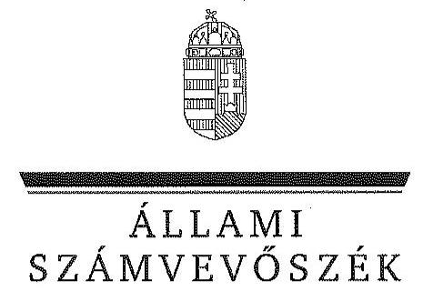
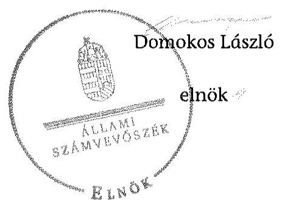
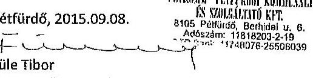
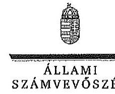

ÁLLAMI
SZÁMVEVŐSZÉK

# JELENTÉS 

Az önkormányzatok gazdasági társaságai - Az önkormányzatok többségi tulajdonában lévő gazdasági társaságok közfeladat-ellátását érintő gazdálkodási tevékenysége szabályszerűségének ellenőrzése „PÉTKOMM” Pétfürdői Kommunális és Szolgáltató Kft.

---

# Állami Számvevőszék 

Iktatószám: V-0829-199/2015
Témaszám: 1863
Vizsgálat-azonosító szám: V067150

## Az ellenőrzést felügyelte:

Dr. Horváth Margit
felügyeleti vezető
Az ellenőrzés vezette és a végrehajtásáért felelős:
Klinga László
ellenőrzésvezető
A jelentéstervezet összeállításában közreműködött:
Fodor Edit
számvevő
Az ellenőrzést végezték:

| Tatár Zsuzsanna | Varga Magdolna | Váradiné Jassó Mariann |
| :-- | :-- | :-- |
| okleveles könyvvizsgáló, | okleveles könyvvizsgáló, | okleveles könyvvizsgáló, |
| külső szakértő | külső szakértő | külső szakértő |

---

# TARTALOMJEGYZÉK 

BEVEZETÉS ..... 7
I. ÖSSZEGZŐ MEGÁLLAPÍTÁSOK, KÖVETKEZTETÉSEK, JAVASLATOK ..... 10
II. RÉSZLETES MEGÁLLAPÍTÁSOK ..... 13

1. Az Önkormányzat közfeladat-ellátásának szabályszerűsége ..... 13
1.1. A közfeladat-ellátás megszervezése és a feladatellátás feltételrendszerének kialakítása ..... 13
1.2. A közfeladat-ellátás felügyelete és a tulajdonosi jogok érvényesítése ..... 15
2. A „PÉTKOMM” Kft. közfeladat-ellátással kapcsolatos tevékenysége ..... 17
2.1. A „PÉTKOMM” Kft. gazdálkodásának szabályozottsága ..... 17
2.2. A „PÉTKOMM” Kft. vagyongazdálkodása ..... 19
2.3. A beszámolási kötelezettség teljesítése ..... 20
3. A távhőszolgáltatás közfeladat bevételei és ráfordításai elszámolásának és önköltség-számításának szabályszerűsége ..... 21
3.1. A távhőszolgáltatás közfeladat bevételeinek és ráfordításainak szabályszerűsége ..... 21
3.2. Az önköltségszámítás szabályszerűsége ..... 22
4. Korábbi ÁSZ ellenőrzések javaslatai, hasznosulása ..... 24

## MELLÉKLETEK

1. számú A „PÉTKOMM” Kft. tevékenységének főbb adatai
2. számú A „PÉTKOMM” Kft. működésének főbb jellemzői
3. számú A „PÉTKOMM” Kft. által biztosított közszolgáltatás díjai a 2008-2013. évekre vonatkozóan
4. számú Beérkezett észrevételek és az azokra adott válaszok

## FÜGGELÉKEK

1. számú Értelmező szótár
2. számú Mintavételi eljárások ellenőrzési területenként

---

.

---

# RÖVIDÍTÉSEK JEGYZÉKE 

## Törvények

Ámt.
ÁSZ tv.
Gt.
Info tv.
Rezsi tv.
Számv. tv.
Taktv.

Tszt.

## Rendeletek

50/2011. (IX. 30.) NFM rendelet

KHEM rendelet
távhőszolgáltatási rendelet
távhődíj rendelet
vagyongazdálkodási rendelet ${ }_{1}$
vagyongazdálkodási rendelet ${ }_{2}$
az árak megállapításáról szóló 1990. évi LXXXVII. törvény
az Állami Számvevőszékről szóló 2011. évi LXVI. törvény (hatályos: 2011. július 1-jétől)
a gazdasági társaságokról szóló 2006. évi IV. törvény (hatályos: 2014. március 14-ig)
az információs önrendelkezési jogról és az információszabadságról szóló 2011. évi CXII. törvény
a rezsicsökkentések végrehajtásáról szóló 2013. évi LIV. törvény (hatályos: 2013. május 10-től)
a számvitelről szóló 2000. évi C. törvény
a köztulajdonban álló gazdasági társaságok takarékosabb működéséről szóló 2009. évi CXXII. törvény (hatályos: 2009. december 4-től)
a távhőszolgáltatásról szóló 2005. évi XVIII. törvény (hatályos: 2005. július 1-jétől)
a távhőszolgáltatónak értékesített távhő árának, valamint a lakossági felhasználónak és a külön kezelt intézménynek nyújtott távhőszolgáltatás díjának megállapításáról szóló 50/2011. (IX. 30.) NFM rendelet (hatályos: 2011. október 1-jétől)
a távhőszolgáltatás csatlakozási díjának és a lakossági távhőszolgáltatás díjának, valamint a hőenergia távtermelő és a távhőszolgáltató közötti szerződésben alkalmazott árának meghatározása során figyelembe veendő szempontokról, és a Magyar Energia Hivatal által lefolytatott eljárásban kötelezően benyújtandó adatok köréről szóló 36/2009. (VII.22.) KHEM rendelet
Pétfürdő Nagyközség Önkormányzatának többször módosított 10/2006. (V. 15.) számú rendelete a távhőszolgáltatásról
Pétfürdő Nagyközség Önkormányzatának többször módosított 3/2006. (II. 27.) számú rendelete a távhőszolgáltatási díjak megállapításáról, valamint az áralkalmazási és díjfizetési feltételekről
Pétfürdő Nagyközség Önkormányzatának 22/2001. (XII. 27.) önkormányzati rendelete az Önkormányzat vagyonáról, a vagyontárgyak feletti tulajdonosi jogok gyakorlásáról (hatályos: 2002. január 1-jétől)
Pétfürdő Nagyközség Önkormányzatának 8/2013. (VI. 14.) önkormányzati rendelete az Önkormányzat vagyonáról, a vagyontárgyak feletti tulajdonosi jogok gyakorlásáról (hatályos: 2013. június 15-től)

---

# Szórövidítések 

Alapító Okirat
ÁSZ
Együttműködési megállapodás

FB
jegyző
KEOP
Képviselő-testület
Közszolgáltatási szerződés

MEH
MEKH
Nitrogénművek Zrt.
Önkormányzat „PÉTKOMM”
Kft./Társaság
polgármester
Taggyűlés
Támogatási Szerződés

Törvények
Ámt.
ÁSZ tv.
Gt.
Info tv.
Rezsi tv.
Számv. tv.
Taktv.

Tszt.
a „PÉTKOMM” Kft. többször módosított Alapító Okirata Állami Számvevőszék
a Pétfürdő Nagyközség Önkormányzat és a „PÉTKOMM” Kft. között 2003. május 30-án létrejött Együttműködési megállapodás a távfűtési és település fenntartási szakfeladatok ellátására
„PÉTKOMM” Kft. Felügyelőbizottsága
Pétfürdő Nagyközség Önkormányzatának jegyzője
Környezet és Energia Operatív Program
Pétfürdő Nagyközség Önkormányzatának Képviselőtestülete
a Pétfürdő Nagyközség Önkormányzat és a „PÉTKOMM” Kft. között létrejött, 2011. július 20-tól hatályos Közszolgáltatási szerződés
Magyar Energia Hivatal
Magyar Energetikai és Közmű-szabályozási Hivatal
Nitrogénművek Vegyipari Zártkörűen Működő Részvénytársaság
Pétfürdő Nagyközség Önkormányzata
„PÉTKOMM” Pétfürdői Kommunális és Szolgáltató Korlátolt Felelősségű Társaság
Pétfürdő Nagyközség Önkormányzatának Polgármestere
a „PÉTKOMM” Kft. taggyűlése
a „PÉTKOMM” Kft. valamint a Nemzeti Fejlesztési Ügynökség, mint Támogató képviseletében eljáró „Energia Központ” Energiahatékonysági, Környezetvédelmi és Energia Információs Ügynökség Nonprofit Kft. által 2010. október 25-én aláírt szerződés
az árak megállapításáról szóló 1990. évi LXXXVII. törvény
az Állami Számvevőszékről szóló 2011. évi LXVI. törvény (hatályos: 2011. július 1-jétől)
a gazdasági társaságokról szóló 2006. évi IV. törvény (hatályos: 2014. március 14-ig)
az információs önrendelkezési jogról és az információszabadságról szóló 2011. évi CXII. törvény
a rezsicsökkentések végrehajtásáról szóló 2013. évi LIV. törvény (hatályos: 2013. május 10-től)
a számvitelről szóló 2000. évi C. törvény
a köztulajdonban álló gazdasági társaságok takarékosabb működéséről szóló 2009. évi CXXII. törvény (hatályos: 2009. december 4-től)
a távhőszolgáltatásról szóló 2005. évi XVIII. törvény (hatályos: 2005. július 1-jétől)

---

Rendeletek
50/2011. (IX. 30.) NFM rendelet

KHEM rendelet
távhőszolgáltatási rendelet
távhődíj rendelet
vagyongazdálkodási rendelet ${ }_{1}$
vagyongazdálkodási rendelet ${ }_{2}$

Szórövidítések
Alapító Okirat
ÁSZ
Együttműködési megállapodás

FB
jegyző
KEOP
Képviselő-testület
Közszolgáltatási szerződés

MEH
a távhőszolgáltatónak értékesített távhő árának, valamint a lakossági felhasználónak és a külön kezelt intézménynek nyújtott távhőszolgáltatás díjának megállapításáról szóló 50/2011. (IX. 30.) NFM rendelet (hatályos: 2011. október 1-jétől)
a távhőszolgáltatás csatlakozási díjának és a lakossági távhőszolgáltatás díjának, valamint a hőenergia távtermelő és a távhőszolgáltató közötti szerződésben alkalmazott árának meghatározása során figyelembe veendő szempontokról, és a Magyar Energia Hivatal által lefolytatott eljárásban kötelezően benyújtandó adatok köréről szóló 36/2009. (VII.22.) KHEM rendelet
Pétfürdő Nagyközség Önkormányzatának többször módosított 10/2006. (V. 15.) számú rendelete a távhőszolgáltatásról
Pétfürdő Nagyközség Önkormányzatának többször módosított 3/2006. (II. 27.) számú rendelete a távhőszolgáltatási díjak megállapításáról, valamint az áralkalmazási és díjfizetési feltételekről
Pétfürdő Nagyközség Önkormányzatának 22/2001. (XII. 27.) önkormányzati rendelete az Önkormányzat vagyonáról, a vagyontárgyak feletti tulajdonosi jogok gyakorlásáról (hatályos: 2002. január 1-jétől)
Pétfürdő Nagyközség Önkormányzatának 8/2013. (VI. 14.) önkormányzati rendelete az Önkormányzat vagyonáról, a vagyontárgyak feletti tulajdonosi jogok gyakorlásáról (hatályos: 2013. június 15-től)
a „PÉTKOMM” Kft. többször módosított Alapító Okirata Állami Számvevőszék
a Pétfürdő Nagyközség Önkormányzat és a „PÉTKOMM” Kft. között 2003. május 30-án létrejött Együttműködési megállapodás a távfűtési és település fenntartási szakfeladatok ellátására
„PÉTKOMM” Kft. Felügyelőbizottsága
Pétfürdő Nagyközség Önkormányzatának jegyzője
Környezet és Energia Operatív Program
Pétfürdő Nagyközség Önkormányzatának Képviselőtestülete
a Pétfürdő Nagyközség Önkormányzat és a „PÉTKOMM” Kft. között létrejött, 2011. július 20-tól hatályos Közszolgáltatási szerződés
Magyar Energia Hivatal

---

.

---

# JELENTÉS 

## Az önkormányzatok gazdasági társaságai Az önkormányzatok többségi tulajdonában lévő gazdasági társaságok közfeladat-ellátását érintő gazdálkodási tevékenysége szabályszerűségének ellenőrzése „PÉTKOMM” Pétfürdői Kommunális és Szolgáltató Korlátolt Felelősségű Társaság

## BEVEZETÉS

Az Állami Számvevőszék középtávra szóló stratégiájában megfogalmazta, hogy a helyi önkormányzatok gazdálkodásában rejlő pénzügyi kockázatok feltárásával, az államháztartáson kívülre nyújtott költségvetési támogatások és ingyenes vagyonjuttatások, valamint az államháztartáson kívül működő közfeladat-ellátó rendszerek ellenőrzéseivel hozzájárul ahhoz, hogy a közpénzeket az államháztartáson kívül működő szervezetek is átlátható, rendezett módon használják fel a közfeladatok szerződésben vállalt ellátása érdekében.

Az önkormányzatok szervezetalakítási szabadságának következménye, hogy a korábban is vállalati formában működő (nagyvárosi tömegközlekedés, víz-, szennyvízcsatorna, köztisztasági, ingatlankezelés stb.) közszolgáltatások mellett mind a kötelező, mind az önként vállalt feladatok ellátásában a gazdasági társaságok kiemelt fontosságú szerephez jutottak.

A „PÉTKOMM” Kft.-t a Képviselő-testület a 2/1999. (I. 21.) számú határozatával hozta létre. A 100%-os önkormányzati tulajdonban lévő „PÉTKOMM” Kft. végezte a 4722 fő lakosságszámú Pétfürdőn a távfűtés és használati melegvíz ellátást, melyhez a hőenergiát a Nitrogénművek Zrt.-től vásárolta. További feladata volt a köztemető parkjának gondozása, helyi közutak síkosságmentesítése, járdák seprése, útpadkák kaszálása, továbbá a települési hulladékkezelés feladat keretében közterületen elhelyezett csikktartók ürítése. A „PÉTKOMM” Kft. a távfűtési rendszerről 955 db lakást, 14 intézményt (óvoda, iskola, üzlet) fűtéssel, ezen belül 844 lakást használati meleg vízzel is ellátott. A Társaság átlagos statisztikai létszáma az ellenőrzött időszak elején 21 fő, az ellenőrzött időszak végén 16 fő volt.

A „PÉTKOMM” Kft. összes bevétele 2008-ban 248,6 millió Ft, a 2013. évben 253,6 millió Ft volt, amelyből az értékesítés nettó árbevétele 2008-ban 237,9 millió Ft, míg 2013-ban 197,7 millió Ft volt. Az értékesítés nettó árbevételének 2013-ban 78,5%-át, 155,1 millió Ft-ot a távhőszolgáltatásból származó bevételek tették ki.

---

A „PÉTKOMM” Kft. a 2008-2010. években veszteségesen, 2011-2013. években nyereségesen gazdálkodott, a veszteség összege 0,8 millió Ft, 27,3 millió Ft, illetve 6,8 millió Ft volt. A mérleg szerinti eszközérték a 2008. évi nyitó 113,6 millió Ft-ról a 2013. év végére 386,7 millió Ft-ra emelkedett, ezen belül a tárgyi eszközök állománya több mint három és félszeresére, 223,0 millió Ft-ra nőtt. A saját tőke a 2008. évi nyitó 25,0 millió Ft-ról a 2013. év végére 187,3 millió Ft-ra nőtt.

Az ellenőrzött időszakban a polgármester és a jegyző személye nem változott. A polgármester az 1997. évi önkormányzati választások óta tölti be tisztségét, a jegyző 2000. augusztus 7-től látja el a feladatot. A „PÉTKOMM” Kft. ügyvezetőjének személye több alkalommal (2008. június 1-jétől, 2011. május 21-től és 2011. augusztus 1-jétől) változott. A helyszíni ellenőrzés idején a gazdasági vezetői feladatokat végző személy 2011. január 1-jétől látta el feladatát.

Az önkormányzati tulajdonú gazdasági társaságok teljes körű ellenőrzésének lehetőségét az Állami Számvevőszékről szóló 1989. évi XXXVIII. törvény 2011. január 1-jétől hatályos módosítása teremtette meg.

Az ellenőrzés célja annak értékelése volt, hogy

- az önkormányzat a jogszabályi előírások figyelembevételével döntött-e az ellenőrzésre kerülő közfeladat megszervezéséről; az önkormányzat szabályszerűen gyakorolta-e a tulajdonosi jogokat;
- a gazdasági társaság közfeladat-ellátása bevételeinek, ráfordításainak elszámolása és vagyongazdálkodási tevékenysége megfelelt-e a jogszabályi, illetve a közszolgáltatási szerződésben foglalt tulajdonosi előírásoknak, azok végrehajtása szabályszerű volt-e;
- a közfeladatok átláthatósága és elszámoltathatósága érdekében biztosítva volt-e a közszolgáltatás díjának megalapozottsága szabályszerű önköltségszámítással.

Az ellenőrzés kiterjedt Pétfürdő Nagyközség Önkormányzatára és a „PÉTKOMM” Pétfürdői Kommunális és Szolgáltató Korlátolt Felelősségű Társaságra.

Az ellenőrzés várható hasznosulása: A törvényalkotás számára - az észlelt problémák, szabálytalanságok, vagy egyéb nem kívánatos jelenségek felszínre kerülésével - az ellenőrzés megállapításai segítséget nyújthatnak az államháztartáson kívüli közfeladat-ellátás értékeléséhez, jogszabályi keretei pontosításához, átláthatóságot biztosító szabályozásához. Meghatározhatóvá válnak a közfeladat-ellátásban részt vevő államháztartáson kívüli szervezeteknek - az önkormányzat költségvetését, pénzügyi helyzetét is befolyásoló - kockázatai, lehetővé válik ezen kockázatok csökkentése. Értékelhető válik, hogy a feladatot ellátó gazdasági társaság a közszolgáltatási szerződésben foglaltak betartásával, a közvagyon használatával biztosította-e a szolgáltatás folytatásának feltételeit. Ezzel az ellenőrzöttek és a helyi döntéshozók számára visszajelzést ad feladatszervezési, feladat-ellátási kockázataikról, alapot ad a meglévő hibák megszüntetéséhez, a jobb közfeladat-ellátás biztosításához. Fokozza a fegyelmet, igazolja, hogy lejárt a következmények nélküli ellenőrzések időszaka. Az

---

ÁSZ értékteremtő rend kialakításához és megőrzéséhez hozzájáruló tevékenysége pozitív hatással van a szervezetről kialakított összkép formálására is.

A bevételek és ráfordítások elszámolása, valamint a vagyonnyilvántartás terén az egyes területek szabályszerű működését mintavétellel ellenőriztük, ez alapján a sokaságokban előforduló hibás tételek arányát becsültük. A jogszabályoknak és a belső előírásoknak megfelelőnek, azaz szabályszerűnek tekintettük az adott bevételek és ráfordítások elszámolását, a vagyonnyilvántartást, amennyiben a minta ellenőrzésének eredménye alapján 95%-os bizonyossággal a teljes sokaságban a hibás tételek aránya kisebb volt, mint 10%, nem megfelelőnek értékeltük,
 ha a hibás tételek aránya a $10 \%$-ot meghaladta. Kockázatot, illetve magas kockázatot jeleztünk, amennyiben egy adott terület vonatkozásában a minta alapján a teljes sokaságban nem volt teljes körűen biztosított a jogszabályoknak és a belső szabályzatoknak megfelelő működés.

Az ellenőrzést a számvevőszéki ellenőrzés szakmai szabályai szerint, szabályszerűségi ellenőrzés módszerével, a vonatkozó nemzetközi standardok figyelembevételével végeztük. Az ellenőrzés a 2008-2013. évekre terjedt ki.

Az ellenőrzés végrehajtásának jogszabályi alapját az ÁSZ törvény 5. § (3)-(5) bekezdései képezték.

Az ÁSZ az Állami Számvevőszékről szóló 2011. évi LXVI. törvény 29. §-a alapján a jelentéstervezetet észrevételezésre megküldte Pétfürdő Nagyközség Önkormányzata polgármesterének és a gazdasági társaság ügyvezetőjének. A beérkezett észrevételeket a jelentés véglegesítése során hasznosítottuk. Az észrevételeket és az azokra adott válaszokat a jelentés 4. számú melléklete tartalmazza.

---

# I. ÖSSZEGZŐ MEGÁLLAPÍTÁSOK, KÖVETKEZTETÉSEK, JAVASLATOK 

Az Önkormányzat a közigazgatási területén a távhőszolgáltatás közfeladatának megszervezéséről a jogszabályi előírásoknak megfelelően döntött, annak ellátásáról a kizárólagos tulajdonában lévő gazdasági társasága útján gondoskodott. Az Önkormányzat a feladatellátáshoz szükséges vagyont az ellenőrzött időszakot megelőzően apportként bocsátotta a „PÉTKOMM" Kft. rendelkezésére. Az Önkormányzat 2007-2010. évekre szóló Gazdasági programja a távhőellátás területén a távfűtési rendszer fejlesztésének, átalakításának, illetve kiváltásának a lehetőségét fogalmazta meg. A megfogalmazott célok megvalósítása érdekében a távhőrendszer korszerűsítésére a KEOP keretében eredményesen pályáztak. A 2011-2014. évekre szóló Gazdasági programban értékelték az előző időszakra vonatkozó gazdasági programban megfogalmazott célok teljesülését, és a fogyasztók által használt rendszerek korszerűsítésének támogatását tűzték ki célul.

Az Önkormányzat a távhőszolgáltatásra vonatkozóan a Tszt. szerinti rendeletalkotási kötelezettségének eleget tett. A távhőszolgáltatási rendelet tartalma a Tszt. előírásainak megfelelt. Az Önkormányzat a távhőszolgáltatási rendeletben foglaltakkal összhangban megalkotta a távhődíj rendeletet, melynek tartalma megfelelt a Tszt.-ben előírtaknak. Az Önkormányzat Együttműködési megállapodást kötött a „PÉTKOMM" Kft.-vel a távfűtési és település fenntartási feladatok ellátásában történő együttműködés szabályozására, amelyben előírták az SZMSZ, az üzleti terv, és az önköltségszámítási szabályzat készítésének kötelezettségét. Az Önkormányzat és a Társaság - a KEOP pályázatban elnyert beruházás támogatási szerződésében előírtakat betartva, 2011. július 20-tól hatályos - Közszolgáltatási szerződést kötött.

Az Önkormányzat a gazdasági társasága feletti tulajdonosi jogok gyakorlásának rendjét alapvetően a vagyongazdálkodási rendelet 1,2-ben, valamint az Alapító Okiratban határozta meg. A gazdasági társaságok feletti tulajdonosi jogok gyakorlására a Képviselő-testület, illetve egyes átruházott hatáskörökben a polgármester volt jogosult. Az Alapító Okiratban előírt a 3,0 millió Ft feletti, majd 2012. december 20-tól az 5,0 millió Ft feletti kötelezettségvállalás Képviselő-testület általi jóváhagyásának kötelezettségét betartották. A Társaság a 2008., 2009., 2011., 2012. évekre üzleti tervet - az Együttműködési megállapodásban előírtakkal ellentétben - nem készített. A Képviselő-testület a 2010. évi üzleti tervet elfogadta, a 2013. évi üzleti tervet - előterjesztés hiányában - nem tárgyalta. Az Önkormányzat az ellenőrzött időszakban a „PÉTKOMM" Kft. feletti tulajdonosi jogokat - az üzleti tervek jóváhagyásának elmaradásától eltekintve - a vagyongazdálkodási rendelet és az Alapító Okirat előírásainak megfelelően szabályszerűen gyakorolta. Az Önkormányzat belső ellenőrzése az ellenőrzött időszakban hét belső ellenőrzési jelentéssel lezárt ellenőrzést folytatott le a Társaságnál, megállapításaival hozzájárult a Társaság szabályszerű feladat ellátásához.

---

Az FB a Gt.-ben előírt Ügyrenddel rendelkezett, amit a Képviselő-testület határozattal jóváhagyott. Az FB a féléves gazdálkodási adatok vonatkozásában beszámoló készítési kötelezettséget írt elő a Társaság részére, amely kötelezettségének eleget tett. Az évközi beszámolókról az FB jelentést készített, és javaslatokat fogalmazott meg a Képviselő-testület részére. Az FB a Gt. és az Alapító Okirat előírásainak megfelelően a számviteli beszámolóról írásbeli jelentést készített.

A Társaság az ellenőrzött időszakban SZMSZ-szel az Együttműködési megállapodásban előírtak ellenére nem rendelkezett. Az ellenőrzött időszakban a „PÉTKOMM" Kft. a Számv. tv.-ben előírt szabályzatokat elkészítette. A Társaság elkészítette üzletszabályzatát, melyet a jegyző a Tszt.-ben előírtaknak megfelelően jóváhagyott. A Társaság 2012. augusztus 30-tól rendelkezett az Info tv-ben előírt adatvédelmi szabályzattal.

A Társaság a Számv. tv.-ben előírtak alapján mentesült az önköltségszámítási szabályzat készítése alól, azonban az Együttműködési megállapodásban előírták annak készítési kötelezettségét, melynek késedelmesen, 2009. január 1-jei hatályba léptetésével tettek eleget. A szabályzat a közvetett költségek kalkulációs egységek közötti árbevétel arányos felosztását írta elő, kalkulációs séma alapján. A Társaság az ellenőrzött időszakban három alkalommal készített a távhőszolgáltatás alapdíjának változást alátámasztó díjkalkulációt. Az alkalmazott kalkulációs séma megfelelt az önköltségszámítási szabályzatban előírtaknak, azonban a 2008. évi kalkulációk során a felosztott közvetett költségeket a 2003. évi értéken vették számításba, 2010-ben a 2009. évi adatokkal terveztek. A 2008. májusi és 2008. novemberi kalkulációk során nem tartották be az önköltségszámítási szabályzat előírásait, mivel bázis évi adatok helyett a 2003. évi felosztott közvetett költségekkel kalkuláltak, így a távhőszolgáltatás alapdíjai nem voltak megalapozottak, nem a valóságot tükrözték.

A „PÉTKOMM" Kft. vagyona az ellenőrzött időszakban 273,1 millió Ft-tal, több mint háromszorosára emelkedett, amelyet legnagyobb mértékben a KEOP támogatással megvalósult beruházás elszámolása eredményezett. Az ügyvezető a szakmai beszámoló keretében tájékoztatta a Képviselő-testületet a távhőszolgáltatás kintlévőségének alakulásáról. A Társaság vagyongazdálkodási tevékenysége az ellenőrzött esetekben megfelelt a jogszabályi előírásoknak.

A „PÉTKOMM" Kft. a 2008-2013. évek számviteli beszámolóit elkészítette, azokat a Számv. tv. előírásának megfelelően határidőben letétbe tette. Az Együttműködési megállapodásban az éves beszámoló készítésével egyidejűleg szakmai beszámoló készítési kötelezettséget határoztak meg a Társaság részére, amelynek eleget tett. A könyvvizsgáló az egyszerűsített éves számviteli beszámolókat az ellenőrzött időszakban hitelesítő záradékkal látta el. A „PÉTKOMM" Kft. 2012-2013. évi beszámolójának kiegészítő melléklete elkülönítetten tartalmazta a mérleg és eredménykimutatás adatait a távhőszolgáltatás és a település-fenntartás üzletágra.

A távhőszolgáltatási közfeladat értékesítés nettó árbevételének, anyagjellegű ráfordításainak, valamint a beruházások, felújítások, és az értékcsökkenési le-

---

írások elszámolása megfelelő volt. A „PÉTKOMM" Kft. a 2008-2010. években veszteségesen, a 2011-2013. években nyereségesen gazdálkodott.

A fentiekben leírtak összegzéseként az alábbi megállapításokat tesszük:
A Társaság számviteli szabályozottsága megfelelő volt, ami hozzájárult a szabályszerű működéshez. Az FB-n keresztül gyakorolt tulajdonosi kontroll és az Önkormányzat belső ellenőrzésének működtetése hozzájárult a Társaság szabályszerű feladat ellátásához. Az üzleti tervek hiánya kockázatot jelez a Társaság működésére nézve. Az alkalmazott kalkulációs séma megfelelt az önköltségszámítási szabályzatban előírtaknak, azonban a kalkulált alapdíjak nem voltak megalapozottak, nem a valóságot tükrözték. A szakmai és számviteli beszámoltatás megfelelő alapot nyújtott a megalapozott döntések meghozatalához. A távhőszolgáltatási közfeladat értékesítés nettó árbevételének, anyagjellegű ráfordításainak, valamint a beruházások, felújítások, és az értékcsökkenési leírások elszámolása megfelelő volt.

Az Állami Számvevőszékről szóló 2011. évi LXVI. törvény 33. § (1) bekezdésében foglaltak értelmében a jelentésben foglalt megállapításokhoz kapcsolódó intézkedési tervet köteles az ellenőrzött szervezet vezetője összeállítani, és azt a jelentés kézhezvételétől számított 30 napon belül az ÁSZ részére megküldeni. Amennyiben az intézkedési tervet határidőben nem küldi meg a szervezet, vagy az nem elfogadható, az ÁSZ elnöke a hivatkozott törvény 33. § (3) bekezdés a)-b) pontjaiban foglaltakat érvényesítheti.

A helyszíni ellenőrzés megállapításainak hasznosítása mellett javasoljuk:
Javaslatunk célja a „PÉTKOMM" Kft. gazdálkodása szabályszerűségének javítása annak érdekében, hogy a szabályozási környezet megfelelően tudja támogatni az átlátható működést.

# Javasoljuk a „PÉTKOMM" Kft. ügyvezetőjének: 

1. A Társaság az ellenőrzött időszakban SZMSZ-szel az Együttműködési megállapodásban előírtak ellenére nem rendelkezett. A Társaság a 2008., 2009., 2011., 2012. évekre üzleti tervet - az Együttműködési megállapodásban előírtakkal ellentétben nem készített.

Javaslat:
gondoskodjon az SZMSZ hatályba léptetésével, valamint az éves üzleti terv Képviselő-testületnek történő benyújtásával az Együttműködési megállapodásban foglaltak betartásáról.

---

# II. RÉSZLETES MEGÁLLAPÍTÁSOK 

## 1. Az ÖNKORMÁNYZAT KÖZFELADAT-ELLÁTÁSÁNAK SZABÁLYSZERŰSÉGE

### 1.1. A közfeladat-ellátás megszervezése és a feladatellátás feltételrendszerének kialakítása

A Tszt. 6. § (1) bekezdése a területileg illetékes települési önkormányzatra ruházta a feladatot, hogy a távhőszolgáltatás közfeladatnál a távhőszolgáltatásra engedéllyel rendelkezők útján biztosítsa a távhőszolgáltatással ellátott létesítmények távhőellátását. Az Önkormányzat közigazgatási területén a távhőszolgáltatás ellátásáról, a kizárólagos tulajdonában lévő gazdasági társaságán keresztül gondoskodott.

Az Önkormányzat 2007-2010. évekre szóló Gazdasági programja a távhőellátás területén a távfűtési rendszer fejlesztésének, átalakításának, illetve kiváltásának a lehetőségét fogalmazta meg. Az Önkormányzat a célkitűzéseket a „PÉTKOMM" Kft.-n - mint közszolgáltatón - keresztül valósította meg. A „Pétfürdői távhőrendszer külső köri szolgáltatói hőközpontok szétválasztása, primer távvezeték korszerűsítése" feladatra 2010. október 25-én a Nemzeti Fejlesztési Ügynökséggel kötött Támogatási Szerződést, a projekt tervezett költsége 249,0 millió Ft volt.

Az Önkormányzat a 2011-2014. évekre szóló Gazdasági programjában értékelte, hogy az előző gazdasági programban megfogalmazott célok teljesülését, és a fogyasztók által használt rendszerek korszerűsítésének támogatását tűzte ki célul.

A pályázat eredményeként a régi elavult szolgáltatói központok helyett 20 új fogyasztói központ kialakítása történt, ezek primer hálózati csatlakozásának kiépítése, kis hőveszteségű, korszerű, előre szigetelt csővezetékekkel, a teljes külső köri rendszer távfelügyeletének kiépítése, a meglévő 3 és az új 20 fogyasztói hőközpont egységes rendszerirányításával.

A Képviselő-testület 1999-ben a 2/1999. (I. 21.) számú határozatával döntött a „PÉTKOMM" Kft. 3,0 millió Ft induló tőkével történő alapításáról. A Képviselő-testület 117/2001. (VI. 28.) számú határozata alapján a Társaság az apportként kapott távhőrendszert (ingatlanok, gépek berendezések 24,6 millió Ft értékben) tőketartalékba helyezte. A Társaság jegyzett tőkéje - többszöri Alapító Okirat módosítás eredményeként - 2013. év végére 70,7 millió Ft-ra, tőketartaléka 157,6 millió Ft-ra emelkedett. A Társaság főbb adatait az 1. számú melléklet, működésének főbb jellemzőit a 2. számú melléklet tartalmazza.

A vagyongazdálkodási rendelet 1 tartalmazott a „PÉTKOMM" Kft.-be apportált távhővagyonnal kapcsolatos előírásokat, mely szerint a tárgyi apport a „PÉTKOMM" Kft. tőketartaléka, amelyet a Képviselő-testület hozzájárulása nél-

---

kül nem idegeníthet el, és nem terhelhet meg. A vagyongazdálkodási rendelet 1-ben előírták, hogy a Társaság a jó gazda gondosságával köteles kezelni az átvett vagyont, és megszűnése esetén az Önkormányzat tulajdonába visszaadni.

A „PÉTKOMM" Kft. vagyonkezelésbe nem vett át önkormányzati vagyont.
Az Önkormányzat Együttműködési megállapodást kötött a „PÉTKOMM" Kft.-vel a távfűtési és település fenntartási feladatok ellátásában történő együttműködés szabályozására. A megállapodás célja, a távfűtési és település fenntartási feladatok biztonságos, szakszerű ellátásának a biztosítása volt a leggazdaságosabb módon úgy, hogy a Társaság gazdálkodása kiszámítható, biztonságos legyen, vagyonának megóvása, gyarapítása ellenőrizhető módon történjen.

A Társaság kötelezettségeként írták elő az Együttműködési megállapodásban az SZMSZ elkészítésének, éves üzleti terv, valamint a számviteli politika keretében önköltségszámítási szabályzat, önköltség,- norma,- és díjszabás táblázat készítését. Az Önkormányzat feladataként az éves üzleti tervek jóváhagyását rögzítették. Szabályozták az Együttműködési megállapodásban az alvállalkozók bevonásának szabályait, a pénzügyi elszámolás rendjét. A Társaság részére beszámoló készítési kötelezettséget határoztak meg, melyet minden év augusztusi vagy szeptemberi képviselő-testületi ülésre kellett beterjesztenie az ügyvezetőnek.

Az Önkormányzat és a Társaság a KEOP pályázatban elnyert beruházási támogatásra vonatkozó támogatási szerződés aláírásának feltételeként - 2011. július 20-tól hatályos - Közszolgáltatási szerződést kötött. A pályázatban előírt tartalommal készült Közszolgáltatási szerződés határozott időre - öt naptári évre - jött létre, a pályázatban rögzített fenntartási
 időszak végéig, előreláthatóan 2016. január 31-ig.

A közszolgáltatási szerződésben rögzítették a Társaságot megillető jogokat, kötelezettségeket. A „PÉTKOMM" Kft. vállalta a számviteli politika oly módon történő kialakítását, hogy a távhőszolgáltatás költségei és ráfordításai egyértelműen meghatározhatóak, a többi tevékenységtől elkülöníthetőek legyenek. Az eszközök és források Számv. tv. szerinti nyilvántartását oly módon, hogy az egyes tételek közszolgáltatási tevékenységhez való hozzárendelésének módszere egyértelműen megállapítható legyen. A Társaság vállalta, hogy az egyéb tevékenységéből származó veszteség esetén teljes körűen helytáll, a keletkezett veszteség a közszolgáltatás díját nem terhelheti. Továbbá, hogy a közszolgáltatás teljesítéséhez szükséges eszközöket folyamatosan és biztonságosan üzemelteti és karbantartja.

Az Önkormányzat a távhőszolgáltatásra vonatkozóan a Tszt. 6. § (2) bekezdés a) és c) i) pontjai szerint rendeletben meghatározta a távhőszolgáltatással összefüggő feladatokat. A távhőszolgáltatási rendeletben meghatározták a közigazgatási hatásköröket, a felhasználói közösségek működésének szabályait, a fogyasztókkal kötött közüzemi szerződés tartalmát, a távhőszolgáltató és a fogyasztó közötti jogviszonyt, a távhőszolgáltatás szüneteltetésének, korlátozásának a szabályait. Rögzítették a fogyasztói érdekvédelem érvényesítésének módját, a szerződésszegés következményeit. A távhőszolgáltatási rendelet 1. §-ában rögzítették, hogy az ármegállapítás és a díjalmazás feltételeit az Önkormányzat külön önkormányzati rendeletben határozza meg. A távhőszolgáltatási rendelet a Tszt. előírásainak megfelel.

---

Az Önkormányzat a távhőszolgáltatási rendeletben foglaltakkal összhangban alkotta meg a távhődíj rendeletet, melynek tartalma megfelelt a Tszt. 6. § (2) bekezdés b) pontjában előírtaknak. A távhődíj rendeletben meghatározták a távhőszolgáltatási díj tartalmát, a díjképzési előírásokat, a távhőszolgáltatás díjtételeit, azok elszámolását, a távhőszolgáltatási díjak számlázásának feltételeit. A lakossági távhőszolgáltatási díj (alapdíj, hődíj), valamint a távhőszolgáltatás csatlakozási díj mértékét rögzítő mellékleteit a távhődíj rendeletnek az ellenőrzött időszakban többször módosították. A távhődíj rendelet 2012-től - tekintettel a Tszt. 57/D. § előírásaira, mely bevezette az alapdíj esetében a hatósági ár alkalmazását - az előírásoknak megfelelően a távhőszolgáltatási csatlakozási díj megállapítását tartalmazta.

# 1.2. A közfeladat-ellátás felügyelete és a tulajdonosi jogok érvényesítése 

Az Önkormányzat a tulajdonosi jogok gyakorlásának rendjét alapvetően a vagyongazdálkodási rendelet 1,2-ben, valamint az Alapító Okiratban határozta meg. A Társaságban a tulajdonosi jogokat a vagyongazdálkodási rendelet 1,2 alapján a Képviselő-testület gyakorolta, a tagsági jogok gyakorlására a polgármester kapott felhatalmazást. Az Alapító Okirat a Gt. 141. § (2) bekezdésével összhangban rögzítette a Képviselő-testület kizárólagos hatáskörébe tartozó döntési jogköröket.

Az Alapító Okiratban foglaltak szerint a Képviselő-testület hatáskörébe tartozott a Számv. tv. szerinti éves beszámoló jóváhagyása, döntés az adózott eredmény felhasználásáról, a törzstőke felemelése és leszállítása, az FB, az ügyvezető és a könyvvizsgáló megválasztása, visszahívása és díjazásának megállapítása, az Alapító Okirat módosítása.

Az Alapító Okiratban előírták a 3,0 millió Ft feletti, 2012. december 20-tól az 5,0 millió Ft feletti kötelezettség vállalás Képviselő-testület általi jóváhagyásának kötelezettségét. A 3,0 millió Ft, illetve 5,0 millió Ft-nál magasabb összegű kötelezettségvállalásra a Nitrogénművek Zrt.-től beszerzett távhő vásárlásakor került sor, melyet a Képviselő-testület határozataival jóváhagyott.

A „PÉTKOMM" Kft. 2003. december 31-én távhőszolgáltatási megállapodást kötött a Nitrogénművek Zrt.-vel, az önkormányzati tulajdonú távhőrendszer forró víz hőhordozóval történő ellátására. A Nitrogénművek Zrt.-vel kötött szerződést és annak módosításait a Képviselő-testület minden esetben jóváhagyta.

Az Önkormányzat a Gt. 33. § (1) bekezdésében rögzített jogosultság alapján az Alapító Okiratban előírta az FB létrehozását. Az FB az ellenőrzött időszakban 3 fővel működött a Gt. 34. § (1) bekezdésének megfelelően, a 85/2004. (IV. 29.) számú Képviselő-testületi határozattal elfogadott ügyrendje szerint. Az ügyrendben az FB szabályozta az ülésekre, rendkívüli ülésekre vonatkozó előírásait, az FB tagjainak a számát, az FB elnök feladatait, a tanácskozás rendjét, a jegyzőkönyv elkészítésének a módját.

Az FB feladatát alapvetően a Képviselő-testület által soron kívül meghatározott feladatok végrehajtása, a Társaság működésével kapcsolatos előterjesztések véleményezése, javaslatok készítése képezte. Az FB az I-VII. havi gazdálkodási

---

adatok vonatkozásában beszámoló készítési kötelezettséget írt elő a Társaság részére. Az évközi beszámolókról az FB jelentést készített, és javaslatokat fogalmazott meg a Képviselő-testület részére. A Képviselő-testület az ellenőrzött évek évközi beszámolóit határozattal elfogadta. Az FB a Gt. tv. 35. § (3) bekezdésében és az Alapító Okiratban előírtaknak megfelelően a 2008-2013. évi számviteli beszámolóról írásbeli jelentést készített.

A „PÉTKOMM" Kft. üzleti terv készítési kötelezettségét az Együttműködési megállapodás írta elő. A Társaság a 2008., 2009., 2011., 2012. évekre üzleti tervet - az Együttműködési megállapodásban előírtakkal ellentétben - nem készített. A Képviselő-testület a 2010. évi üzleti tervet elfogadta, a 2013. évi üzleti tervet - előterjesztés hiányában - az Együttműködési megállapodásban előírtakkal ellentétben nem tárgyalta.

A Képviselő-testület, mint tulajdonosi joggyakorló nem határozott meg a társaság számára a közszolgáltatási tevékenység mérésére alkalmas kritériumrendszert, ennek keretében az ellátás színvonala értékeléséhez szükséges szakmai követelményeket, továbbá a szakmai feladat-ellátás gazdaságosságának, hatékonyságának mérésére alkalmas mutatószámokat annak érdekében, hogy a „PÉTKOMM" Kft. működése, a közfeladat ellátása mérhető és átlátható legyen.

A „PÉTKOMM" Kft. tevékenységéről az ellenőrzött időszakban - a könyvvizsgáló által hitelesített - egyszerűsített éves beszámoló, valamint éves szakmai beszámoló előterjesztésével számolt be a Képviselő-testület, valamint az FB felé. Az éves beszámoló és a szakmai beszámoló elfogadásáról a tulajdonosi joggyakorló minden évben határozatot hozott.

A szakmai tevékenységről készített beszámolóban a „PÉTKOMM" Kft. a távfűtéssel kapcsolatosan beszámolt a berendezések, tárgyi eszközök állapotáról, az ezekkel kapcsolatos intézkedésekről, az éves gazdálkodás eredményéről, főbb fejlesztésekről, a távfűtési díjak alakulásáról, a kintlévőségek alakulásáról, és kezeléséről.

Az ellenőrzött időszakban az Önkormányzat - a Képviselő-testület határozata alapján - a Társaság jegyzett tőkéjét 43 millió Ft-tal, tőketartalékát 133 millió Ft-tal emelte.

Jegyzett tőke emelés a Társaság likviditási problémáinak megoldására 10 millió Ft, a KEOP pályázat önrészének biztosítására 10 millió Ft, az elengedett követelések miatt elszámolt ráfordítások ellentételezésére 5 millió Ft, a településfenntartási feladatok ellátásához beszerzett eszközökre 15 millió Ft, valamint munkaügyi jogvita miatti kötelezettség rendezésére 3 millió Ft összegben történt. Az Önkormányzat tőketartalékként 115 millió Ft-ot a KEOP pályázat önrészének biztosítására, 5 millió Ft-ot a leírt vevői követelések ellentételezésére, 13 millió Ft-ot a likviditási nehézségek enyhítésére bocsátott a Társaság rendelkezésére.

A 2008-2010. években az adózott eredmény negatív volt, a 2011-2013. években a Képviselő-testület a 11,0 millió Ft, 4,6 millió Ft, 5,2 millió Ft mérleg szerinti eredmény eredménytartalékba történő helyezéséről döntött, osztalékfizetésre nem került sor.

---

A Képviselő-testület a Taktv. 5. § (3) bekezdésében előírtaknak megfelelően megalkotta a Társaság ügyvezetője, valamint az FB tagok javadalmazásának módját, mértékét, elveit meghatározó javadalmazási szabályzatot. Az ellenőrzött időszak alatt az ügyvezető részére 2013-ban került sor prémium kiírásra. A prémiumfeladatként megfogalmazott, távhőszolgáltatással kapcsolatos elvárás volt, hogy a távhődíj tartozások - bázis évhez viszonyítva - ne emelkedjenek, valamint, hogy 16 óránál hosszabb szolgáltatási szünet ne forduljon elő. A 2013. évi szakmai beszámoló szerint a prémium feladatok teljesültek, a prémium kifizetést a 225/2014. (IV. 24.) számú határozatában engedélyezte a Képviselő-testület.

Az Önkormányzat az ellenőrzött időszakban - belső ellenőrzési társulás keretében - hét belső ellenőrzési jelentéssel lezárt ellenőrzést folytatott le a Társaságnál. A belső ellenőrzési jelentések 2008-ban önköltségszámítási szabályzat készítésére, 2009-ben 3 évre vonatkozó válságkezelési stratégia kidolgozására, 2010-ben a kintlévőségek kezeléséhez tulajdonosi támogatás igénybevételére tartalmaztak javaslatot. A belső ellenőrzési jelentések intézkedési terv készítésének kötelezettségét nem írták elő.

Az Önkormányzat tagi kölcsönt a „PÉTKOMM" Kft. likviditási helyzete miatt három alkalommal nyújtott, melyek visszafizetésre kerültek.

A „PÉTKOMM" Kft. a likviditási problémái kezelésére a 175/2007. (VIII. 30.) számú képviselő-testületi határozat alapján működési célra 8 millió Ft kölcsönt kapott az Önkormányzattól. A 2008. augusztus 31-i visszafizetési kötelezettségnek többszöri halasztást követően 2011. december 30-ig tett eleget a Társaság.

A Nitrogénművek Zrt. által kibocsátott energiaszámlák kifizetéséhez a 331/2008. (XI. 27.) számú képviselő-testületi határozat alapján a „PÉTKOMM" Kft. 20 millió Ft kölcsönt kapott 2009. július 31-i visszafizetési határidővel, melyet módosításokat követően 2013. december 30-án teljesített.

Az Önkormányzat a Támogatási szerződés összegére 128,5 millió Ft előfinanszírozási keretet biztosított a „PÉTKOMM" Kft. részére, melyet a Társaság a pályázati összegekből 2012. október 27-én visszafizetett.

Az Önkormányzat bankgarancia kiadásához készfizető kezességet vállalt a KEOP pályázat keretében megvalósult beruházás során. Az 56,7 millió Ft összegű, fenntartási időszak végéig (2016. december 31.) vállalt bankgarancia érvényesítésére az ellenőrzött időszakban nem került sor.

# 2. A „PÉTKOMM" Kft. KÖZFELADAT-ELLÁTÁSSAL KAPCSOLATOS TEVÉKENYSÉGE 

### 2.1. A „PÉTKOMM" Kft. gazdálkodásának szabályozottsága

A Társaság az ellenőrzött időszakban SZMSZ-szel annak ellenére nem rendelkezett, hogy az Együttműködési megállapodásban előírták a szabályzat készítésének kötelezettségét.

---

Az ellenőrzött időszakban a „PÉTKOMM" Kft. a Számv. tv. 14. § (5) bekezdésében foglalt előírásoknak megfelelően rendelkezett számviteli politikával, ennek keretében az eszközök és a források leltárkészítési és leltározási szabályzatával, az eszközök és a források értékelési szabályzatával és pénzkezelési szabályzattal.

A számviteli politikában a Számv. tv. 55. § (2) bekezdésében előírtaknak megfelelően a vevői követelések értékvesztését a követelések nyilvántartásba vételi értékének százalékában határozták meg. Az elszámolandó értékvesztést a 91-360 nap közötti fizetési késedelem esetén 5%-ban rögzítették. A fizetési határidőt 1 évvel meghaladó vevői követelésre 50%, 75%, 90% vagy 100% értékvesztés elszámolását írták elő az egyedi elbíráláshoz rendelkezésre álló minősítések alapján. A 2012. január 1-jétől hatályos számviteli politika és számlarend a Tszt. 18/A. § (2) bekezdés c) pontjában előírt szétválasztási szabályokat tartalmazta, az egyes tevékenységek átláthatóságát gyűjtőszámok alkalmazásának előírásával biztosították.

A „PÉTKOMM" Kft. rendelkezett a Számv. tv. 14. § (5) bekezdés a) pontjában előírt leltárkészítési és leltározási szabályzattal. A szabályzatban a mennyiségben és értékben nyilvántartott tárgyi eszközök 2 évenkénti, a mennyiségben és értékben nem nyilvántartott készletek évenkénti - mennyiségi felvétellel történő - leltározását írták elő. A szabályozás összhangja a Számv. tv. 69. § (3) és (4) bekezdéseiben előírtakkal biztosított volt.

A Társaság rendelkezett a Számv. tv. 14. § (5) bekezdés b) pontjában előírt eszközök és források értékelési szabályzatával. A szabályzatban előírták az eszközök és források értékelésére, értékhelyesbítésére, az értékvesztés elszámolására vonatkozó szabályokat.

A Számv. tv. 14. § (5) bekezdés d) pontjában előírt pénzkezelési szabályzattal rendelkezett a Társaság. A pénzkezelési szabályzat tartalmazta a Számv. tv. 14. § (8) bekezdésében előírt pénzforgalom lebonyolításának rendjéről, a pénzkezelés tárgyi és személyi feltételeiről, felelősségi szabályairól, a készpénzben és a bankszámlán tartott pénzeszközök közötti forgalomról, a készpénzállományt érintő pénzmozgások jogcímeiről és eljárási rendjéről, a napi készpénz záró állomány maximális mértékéről, a készpénzállomány ellenőrzésekor követendő eljárásról, az ellenőrzés gyakoriságáról, a pénzszállítás feltételeiről, a pénzkezeléssel kapcsolatos bizonylatok rendjéről és a pénzforgalommal kapcsolatos nyilvántartási szabályokról szóló előírásokat.

A Társaság egyszerűsített éves beszámoló készítésére volt kötelezett, ezért a Számv. tv. 14. § 6) bekezdése alapján mentesült az önköltségszámítási szabályzat készítésének kötelezettsége alól. Az Együttműködési megállapodás előírta az önköltségszámítási szabályzat készítésének kötelezettségét, melynek a Társaság késedelmesen, a szabályzat 2009. január 1-jei hatályba léptetésével tett eleget.

A „PÉTKOMM"
 Kft. elkészítette üzletszabályzatát, melyet a jegyző a Tszt. 7. § (1) bekezdés b) pontjában előírtaknak megfelelően jóváhagyott.

---

# 2.2. A „PÉTKOMM" Kft. vagyongazdálkodása 

A „PÉTKOMM" Kft. feladatainak ellátásához az Önkormányzattól - vagyonkezelésbe - nem vett át vagyont, könyveiben a saját vagyonát tartotta nyilván. A közfeladat ellátásához kapcsolódó önkormányzati vagyont az 1999. évi alapításkor, a távhőrendszert az ellenőrzött időszakot megelőzően, 2001-ben apportként kapta 24,6 millió Ft értékben.

Az átadás-átvételi dokumentum 17 db építményt 16,9 millió Ft összegben, és 34 db gép, berendezést 7,7 millió Ft összegben tartalmazott.

A „PÉTKOMM" Kft. vagyoni helyzetét jellemző, főbb könyvviteli mérleg szerinti adatok 2008. január 1. és 2013. december 31. között a következők voltak:

| Megnevezés | 2008.01.01 | 2008.12.31 | 2009.12.31 | 2010.12.31 | 2011.12.31 | 2012.12.31 | 2013.12.31 |
| :--: | :--: | :--: | :--: | :--: | :--: | :--: | :--: |
| Belektetett eszközök | 61,0 | 50,2 | 52,2 | 262,8 | 245,1 | 227,4 | 223,0 |
| oldali tárgyi eszközök | 61,0 | 50,2 | 52,2 | 262,8 | 245,1 | 227,4 | 223,0 |
| Forgóeszközök | 53,1 | 78,2 | 65,0 | 106,4 | 65,8 | 145,8 | 149,4 |
| oldali követelések | 20,4 | 45,5 | 49,7 | 94,9 | 20,0 | 38,3 | 51,0 |
| Aktív időbeli elhatárolások | $-0,5$ | 0,2 | 0,4 | 0,0 | 22,2 | 8,6 | 15,8 |
| ESZKÖZÖK |  |  |  |  |  |  |  |
| ÖSSZESEN | 113,6 | 128,7 | 117,6 | 371,2 | 323,2 | 381,8 | 386,7 |
| Saját tőke oldali mérleg szerinti eredmény | 23,0 | 47,5 | 20,3 | 138,3 | 159,5 | 167,1 | 187,3 |
| Céltartalékok | 0,0 | 0,0 | 0,0 | 0,0 | 0,0 | 20,0 | 41,7 |
| Kötelezettségek | 42,9 | 39,2 | 64,7 | 199,0 | 133,6 | 24,7 | 7,9 |
| Passzív időbeli elhatárolások | 46,7 | 42,0 | 32,6 | 33,7 | 28,1 | 170,0 | 149,9 |
| FORRÁSOK ÖSSZESEN | 113,6 | 128,7 | 117,6 | 371,2 | 323,2 | 381,8 | 386,7 |

A „PÉTKOMM" Kft. vagyona az ellenőrzött időszakban 273,1 millió Ft-tal, több mint háromszorosára emelkedett. A tárgyi eszközök állományának növekedését alapvetően a KEOP támogatással megvalósult beruházás elszámolása eredményezte, melynek bekerülési értéke 227,9 millió Ft volt. A pénzeszközök záró értéke 94,1 millió Ft-tal haladta meg a 2008. január 1-jei nyitó értéket, ugyanakkor a kötelezettségek mérlegértéke 35,1 millió Ft-tal csökkent az ellenőrzött időszakban, ami a Társaság likviditási helyzetének javulását mutatja.

A követelések mérlegértéke az ellenőrzött időszakban jelentősen nem változott, alakulására a kintlévőség állományának változása, valamint az elszámolt értékvesztés volt hatással. A Társaság az ellenőrzött időszakban a számviteli politikában előírtak szerint számolta el a határidőn túli vevői követelések értékvesztését. Az elszámolt értékvesztés összege 2008-ban 6,4 millió Ft, 2009-ben 8,9 millió Ft, 2010-ben 16,7 millió Ft, 2011-ben 9,6 millió Ft, 2012-ben 0,5 millió Ft, 2013-ban 8,5 millió Ft volt.

A Társaság a távhődíj tartozások behajtására az ellenőrzött években egységes gyakorlatot folytatott. A díjhátralék behajtásának lépései a fogyasztási hely tulajdonosának értesítése, személyes kapcsolatfelvétel a fizetési megállapodás megkötése céljából, fizetési meghagyás kezdeményezése, végrehajtási eljárás megindítása, jelzálogjog bejegyeztetése voltak. A behajtás kezdeményezése során figyelembe vették a nyilvántartott követelés nagyságát, a felhasználó fizetési készségét, a behajtás költségeit, a felhasználó által felajánlott biztosítékot. A kintlévőségek kezelése a számlázáshoz kapcsolódó analitikus nyilvántartásokhoz rendelten, folyamatba építetten működött. Az ügyvezető a szakmai beszámoló keretében tájékoztatta a Képviselő-testületet a távhőszolgáltatás kintlévőségének alakulásáról.

A szakmai beszámolók szerint 2008-ban 22 fizetési meghagyás 5,8 millió Ft összegben, 2009-ben 88 fizetési meghagyás 20,5 millió Ft összegben, 2010-ben 27 fizetési meghagyás 3,1 millió Ft összegben, 2011-ben 65 fizetési meghagyás 9,9 millió Ft összegben, 2012-ben 55 fizetési meghagyás 12,3 millió Ft összegben és 2013-ban 77 fizetési meghagyás 13,7 millió Ft összegben került kibocsátásra.

A saját tőke/jegyzett tőke arány is javult az ellenőrzött időszakban, 2013. december 31-én a saját tőke a jegyzett tőke 2,6-szerese volt. A pozitív változást a Képviselő-testület határozatain alapuló, jegyzett tőke és tőketartalék összegének Önkormányzat általi emelése eredményezte. A tőkejuttatás célja a KEOP beruházás önrészének biztosítása, valamint a lakossági díjhátralékból fennálló követelés elengedésének kompenzációja volt.

A passzív időbeli elhatárolás 2012. évi záró értéke a KEOP támogatás Számv. tv. 45. § (1) bekezdés a) pontjában előírt, halasztott bevételként történő elszámolása miatt jelentősen - a 2011. évihez képest 141,9 millió Ft-tal - meghaladta az előző időszakok mérlegértékét.

# 2.3. A beszámolási kötelezettség teljesítése 

A „PÉTKOMM" Kft. a Számv. tv. 9. § (2) bekezdése alapján egyszerűsített éves beszámoló készítésére volt kötelezett. Az Együttműködési megállapodásban az éves beszámoló készítésével egyidejűleg szakmai beszámoló készítési kötelezettséget határoztak meg az együttműködési megállapodással érintett tevékenységek vonatkozásában.

A Taggyűlés a Számv. tv. 155. § (2) bekezdésének megfelelően könyvvizsgálót választott és meghatározta a könyvvizsgálóval kötött szerződés lényeges tartalmi kellékeit. A könyvvizsgáló az egyszerűsített éves számviteli beszámolókat az ellenőrzött időszakban korlátozás nélküli hitelesítő záradékkal látta el.

Az egyszerűsített éves beszámolót és a szakmai beszámolót a Taggyűlés az ellenőrzött években jóváhagyta és egyben döntött az adózott eredmény felhasználásáról. A „PÉTKOMM" Kft. számviteli beszámolóinak jóváhagyásakor a Taggyűlés az FB írásbeli véleményének és a könyvvizsgáló jelentésének birtokában határozott.

A Tszt. 18/A. § (3) bekezdés c) pontja szerint a „PÉTKOMM" Kft. 2012. január 1-jétől az engedélyköteles tevékenységét, illetve egyéb tevékenységeit köteles volt a számviteli éves beszámolója kiegészítő mellékletében oly módon bemutatni, mintha azt önálló vállalkozás keretében végezte volna, ez önálló mérleg és eredménykimutatás készítési kötelezettséget jelentett. A „PÉTKOMM" Kft. 2012-2013. évi beszámolójának kiegészítő melléklete elkülönítetten tartalmazta a mérleg és eredménykimutatás adatait a távhőszolgáltatás és a település-fenntartás üzletágra.

A „PÉTKOMM" Kft. a Számv. tv. 153. § (1) bekezdésében előírt beszámoló letétbe helyezési kötelezettségének határidőben eleget tett. A könyvvizsgálói jelentés a 2012-2013. évekre vonatkozóan tartalmazta a Tszt. 18./B. § (1) bekezdése szerinti nyilatkozatot, miszerint a „PÉTKOMM" Kft. keresztfinanszírozási mentessége biztosított volt.

A 2008., 2011-2013. évek szakmai beszámolói önálló fejezetben adtak tájékoztatást a Társaságnál végzett külső és a belső ellenőrzésekről, valamint tartalmazták a megtett intézkedéseket.

A 2008. évben a Magyar Államkincstár által végzett ellenőrzésről, és az annak eredményeként tett intézkedésről a 2008. október 20-i évközi szakmai beszámolóban kapott tájékoztatást a Képviselő-testület. 2011. évben a Kincstár által végzett ellenőrzés hiányosságot nem állapított meg. A 2011. és 2012. években a Nemzeti Környezetvédelmi és Energia Központ Nonprofit Kft. végzett ellenőrzést a KEOP forrás bevonásával megvalósult beruházással kapcsolatban. A 2013. évben a Veszprém Megyei Kormányhivatal Fogyasztóvédelmi Főfelügyelősége tartott ellenőrzést, hiányosságot nem állapított meg.

A Társaság 2012. augusztus 30-tól rendelkezett az Info tv. 24. § (3) bekezdése szerinti, ügyvezető által kiadott adatvédelmi szabályzattal, amely biztosította a különböző nyilvántartásokban elektronikusan kezelt adatállományok információ biztonsági védelmét. Az elektronikusan kezelt adatállományok védelme érdekében meghatározták az adatvédelmi szinteket, a hozzáférési jogosultságokat, az archiválási rendszert és a rendkívüli (katasztrófa) helyzetek kezelésének rendjét.

# 3. A Távhőszolgáltatás közfeladat bevételei és ráfordításai elszámolásának és önköltség-számításának szabályszerűsége 

### 3.1. A távhőszolgáltatás közfeladat bevételeinek és ráfordításainak szabályszerűsége

A „PÉTKOMM" Kft. a Tszt. 18/A. § (2) bekezdés c) pontjában előírt, 2012. január 1-jétől hatályos ágazati elszámolási szabályoknak megfelelően a számviteli szétválasztást a számlarendjében a bevételek önálló főkönyvi számlákra (911. Távhőszolgáltatás árbevétele, 912. Egyéb belföldi árbevétel, 913. Pétfürdői Polgármesteri Hivatal részére végzett tevékenység árbevétele) történő elkülönítésével teljesítette. A ráfordítások elkülönítését munkaszám kód alkalmazásával (2008.-2011. években alkalmazott kódok: 1. távfűtés, 3. településfenntartás, 7. saját előállítás, 9. egyéb, 2012.-2013. években alkalmazott kódok: 1. távfűtés, 3. település fenntartás, 9. központ) teljesítették. A több tevékenységhez kapcsolódó általános költségek felosztását az önköltségszámítási szabályzat előírása alapján árbevétel arányosan végezték. A 2013. évi beszámoló szerint a távfűtés árbevétele 95,4%-ot képviselt a teljes árbevételen belül. Azokat a tételeket, melyeket analitika alapján a Társaság nem tudott közvetlenül távfűtési és

---

településfenntartási tevékenységre felosztani, eszközarányosan osztotta meg. Távfűtésre a fel nem osztható tételek 91,65%-a került.

A távhőszolgáltatási közfeladat értékesítés nettó árbevételének elszámolása megfelelő volt. A bevételek előírása és kiszámlázása a belső szabályozásnak megfelelően történt, a bevételeket a megfelelő számlacsoportban számolták el. Az alkalmazott szolgáltatási díjak megfeleltek a belső szabályozásnak és a tulajdonosi követelményeknek.

A távhőszolgáltatási közfeladat anyagjellegű ráfordításainak elszámolása megfelelő volt. A költségelszámolást megalapozó kötelezettségvállalás, a költségek elszámolása a jogszabályi előírásoknak és a belső szabályozásnak megfelelően történt. A költségelszámolást megalapozó dokumentumok, tulajdonosi jóváhagyás rendelkezésre állt. A költségeket a megfelelő költségnemre, közfeladatra számolták el.

A „PÉTKOMM" Kft.-nél a beruházások, felújítások, valamint az értékcsökkenési leírás elszámolása megfelelő volt. Az immateriális javak és tárgyi eszközök állománynövekedésének, valamint értékcsökkenésének elszámolása megfelelt a vonatkozó szabályozásnak. A beszerzett eszközök állományba vétele, üzembe helyezése megtörtént. A bekerülési érték meghatározása, az eszközök besorolása és nyilvántartása, valamint az értékcsökkenés elszámolása szabályos volt.

Az elszámolt értékcsökkenési leírás könyvelése a számviteli politika és az eszközök és források értékelési szabályzata előírásainak megfelelően a 2008-2010. években negyedévente, a 2011-2013. években havonta történt.

A „PÉTKOMM" Kft. a 2008-2010. években veszteségesen, míg a 2011-2013. években nyereségesen gazdálkodott${ }^{1}$. Az éves számviteli beszámolókban a mérleg szerinti eredmény 2008-ban $-0,8$ millió Ft, 2009-ben $-27,3$ millió Ft, 2010-ben $-6,8$ millió Ft, 2011-ben 11,0 millió Ft, 2012-ben 4,6 millió Ft és 2013-ban 5,2 millió Ft volt. A kiegészítő melléklet adatai szerint a távhőszolgáltatás mérleg szerinti eredménye 2012-ben 4,0 millió Ft, 2013-ban 4,5 millió Ft volt.

# 3.2. Az önköltségszámítás szabályszerűsége 

Az Önköltségszámítási szabályzat tartalmazta a kalkulációs egységeket, valamint az egyes kalkulációs egységek önköltségének meghatározására szolgáló kalkulációs sémát. A szabályzat a közvetett költségek kalkulációs egységek közötti árbevétel arányos felosztását írta elő. A távhőszolgáltatási díjat megalapozó - önkormányzati rendeletben előírt - kalkulációs séma hődíj, és alapdíj alkalmazását írta elő. A hődíj a fogyasztott távhőmennyiség árát, és az ár

[^0]
[^0]: ${ }^{1}$ A bevételek összege 2008-ban 248,6 millió Ft, 2009-ben 221,3 millió Ft, 2010-ben 233,6 millió Ft, 2011-ben 243,9 millió Ft, 2012-ben 240,1 millió Ft, 2013-ban 253,6 millió Ft volt.
    A ráfordítások összege 2008-ban 249,2 millió Ft, 2009-ben 248,0 millió Ft, 2010-ben 239,7 millió Ft, 2011-ben 232,9 millió Ft, 2012-ben 233,0 millió Ft, 2013-ban 246,3 millió Ft volt.

---

15%-ának megfelelő hőveszteséget tartalmazott. Az alapdíj a lekötött teljesítmény díjon, a működési ráfordításokon, valamint a fejlesztési ráfordításokon felül 8%
 nyereségre nyújtott fedezetet a kalkulációs séma szerint. A Társaság az ellenőrzött időszakban három alkalommal (2008. május, 2008. november és 2010. augusztus hónapban) módosította az alapdíjat, a díjváltozást díjkalkulációval alátámasztották. Az alkalmazott kalkulációs séma megfelelt az önköltségszámítási szabályzatban előírtaknak, azonban a 2008. évi kalkulációk során a felosztott közvetett költségeket a 2003. évi értéken vették számításba, 2010-ben a 2009. évi adatokkal terveztek. A 2008. májusi és 2008. novemberi kalkulációk során nem tartották be az önköltségszámítási szabályzat előírásait, mivel bázis évi adatok helyett a 2003. évi felosztott közvetett költségekkel kalkuláltak, így a távhőszolgáltatási alapdíjak nem voltak megalapozottak, nem a valóságot tükrözték.

A 2009. évi számviteli beszámoló tényadatai alapján végzett tevékenységenkénti utókalkuláció alapján - önkormányzati hozzájárulással - 2010. július 12-én a „PÉTKOMM" Kft. levélben fordult a MEH-hez az alapdíj emelés jóváhagyásáért. A MEH 2010. augusztus 1-től jóváhagyta a fűtési alapdíj 4,9%-os, valamint a melegvíz alapdíj 9,2%-os díjemelését. A Tszt. módosításával 2011. április 15. napjával az Önkormányzat hatósági ármegállapítás joga az Ámt. 7. § (5) bekezdésének 2011. április 15-től hatályos módosítására való tekintettel a távhőszolgáltatási díj vonatkozásában megszűnt. 2012. január 1-jétől az 50/2011. (IX. 30.) NFM rendelet 4. §-ában foglaltak szerinti 4,2%-os díjemelést alkalmaztak, melyet a „PÉTKOMM" Kft. végrehajtott. A Társaság a lakosság részére nyújtott távhőszolgáltatás alapdíját és hődíját 2013. január 1-jétől az 50/2011. (IX. 30.) NFM rendelet 3. § (2) bekezdése alapján a Rezsi tv.-ben meghatározottak szerint 10,0%-kal, míg 2013. november 1-jétől 11,1%-kal csökkentette.

A MEKH a „PÉTKOMM" Kft. távhőszolgáltatási tevékenységének 2013. évi - a Tszt. 18/C. szerinti - nyereségkorlátjának meghatározása során bruttó eszközértékként 321,5 millió Ft értéket vett figyelembe, melynek - az 50/2011. (IX. 30.) NFM rendelet 5. § (2) bekezdés b) pontjában előírtaknak megfelelően - 2%-ában (6,4 millió Ft) határozta meg az adózás előtti eredmény összegét. A távhőszolgáltatási tevékenység nyereségkorláton felüli eredményére a „PÉTKOMM" Kft. 2013-ban 21,7 millió Ft összegben céltartalékot képzett.

---

# 4. Korábbi ÁSZ Ellenőrzések javaslatai, hasznosulása 

Az ellenőrzött időszakban az Önkormányzatnál végzett, és a 14095 számon közzétett ÁSZ ellenőrzés a gazdasági társaságra és a távhőszolgáltatási feladatellátásra vonatkozó megállapítást nem tett.

Budapest, 2015. M hónap C6. nap

| Melléklet: | 4 db |
| :-- | :-- |
| Függelék: | 2 db |

---

|  1. SZÁMÚ MELLÉKLET
A V-0829-199/2015 SZÁMÚ JELENTÉSHEZ |  |  |  |  |  |  |   |
| --- | --- | --- | --- | --- | --- | --- | --- |
|  "PÉTKOMM" Pétfürdői Kommunális és Szolgáltató Kft. tevékenységének főbb adatai |  |  |  |  |  |  |   |
|  Sorszám | Megnevezés | 2008. | 2009. | 2010. | 2011. | 2012. | 2013.  |
|  1. | A gazdasági társaság székhelye |  |  | 8105 Pétfürdő, Berhidal út 6. |  |  |   |
|  2. | adószáma |  |  | 11818203-2-19 |  |  |   |
|  3. | alapításának éve |  |  | 1999.01.21 |  |  |   |
|  4. | alapító okiratának (társasági szerződés) száma, kelte |  |  | 1999.01.21 |  |  |   |
|  5. | alapító okirat módosításának dátumai | 2008.01.22., 2008.06.16., 2008.12.29. |  | 2010.06.30 | 2011.07.14., 2011.09.06. | 2012.01.20 | 2013.02.26., 2013.11.27.  |
|  6. | A gazdasági társaság más gazdasági társaságokban való részesedése esetén a részesedéssel érintett (kapcsolt) gazdasági társaságok száma (db) |  |  | 0 |  |  |   |
|  7. | A gazdasági társaság többségi tulajdonú leányvállalatainak száma (db) |  |  | 0 |  |  |   |
|  8. | A gazdasági társaság többségi tulajdonú leányvállalataiban való részesedésének mértéke összesen (%) |  |  | 0 |  |  |   |
|  9. | A gazdasági társaság többségi tulajdonú leányvállalatai jegyzett tőkéje (e Ft) |  |  | 0 |  |  |   |
|  10. | Az önkormányzat számára (megbízásából, koncessziós, közszolgáltatási, vagy egyéb szerződéses jogviszony alapján) ellátott közfeladatok szakági besorolása |  |  |  |  |  |   |
|  11. | Közoktatás |  |  |  |  |  |   |
|  12. | Szociális ellátás |  |  |  |  |  |   |
|  13. | Egészségügy |  |  |  |  |  |   |
|  14. | Kultúra és sport |  |  |  |  |  |   |
|  15. | Település üzemeltetés, ezen belül: |  |  |  |  |  |   |
|  16. | Köztemető üzemeltetés |  |  |  | x |  |   |
|  17. | Kéményseprés |  |  |  |  |  |   |
|  18. | Helyi közutak fejlesztése, fenntartása és üzemeltetése |  |  |  | x |  |   |
|  19. | Porkok és egyéb közterület fenntartás |  |  |  | x |  |   |
|  20. | Közterületi parkolás |  |  |  |  |  |   |
|  21. | Lakás és helyiséggazdálkodás |  |  |  |  |  |   |
|  22. | Víz és csatorna közmű-szolgáltatás |  |  |  |  |  |   |
|  23. | Hulladékkezelés-szállítás |  |  |  |  |  |   |
|  24. | Távhő- és energiaszolgáltatás |  |  |  | x |  |   |
|  25. | Helyi közösségi közlekedés |  |  |  |  |  |   |
|  26. | Vagyongazdálkodás |  |  |  |  |  |   |
|  27. | Pénzügyi gazdasági szolgáltatás |  |  |  |  |  |   |
|  28. | Egyéb: Víztermelés-, kezelés-, ellátás; Települési hulladék kezelése; Községgazdálkodás |  |  |  | x |  |   |
|  29. | A közfeladatellátására a gazdasági társaságnál alkalmazottak száma (fő) | 21 | 20 | 19 | 17 | 16 | 16  |

---

# "PÉTKOMM" Pétfürdői Kommunális és Szolgáltató Kft. működésének főbb jellemzői

|  Sorszám | Megnevezés |  | 2008. | 2009. | 2010. | 2011. | 2012. | 2013.  |
| --- | --- | --- | --- | --- | --- | --- | --- | --- |
|  1. | A gazdasági társaság cégformája |  |  |  |  |  |  |   |
|  2. | A gazdasági társaság tulajdonosi összetétele: |  |  |  |  |  |  |   |
|   | Önkormányzat megnevezése |  |  |  |  |  |  |   |
|  3. | Önkormányzat tulajdoni részesedésének arány | $\%$ |  |  |  |  |  |   |
|  4. | Önkormányzat tulajdoni részesedésének összege | ezer Ft | 37700 | 37700 | 47700 | 52700 | 55700 | 70700  |
|   | Más önkormányzatok többcélú társulás megnevezése |  |  |  |  |  |  |   |
|  5. | Más önkormányzatok, többcélú társulások tulajdoni részesedésének arány | $\%$ |  |  |  |  |  |   |
|  6. | Más önkormányzatok, többcélú társulások tulajdoni részesedésének összege | ezer Ft |  |  |  |  |  |   |
|   | Gazdasági társaság megnevezése |  |  |  |  |  |  |   |
|  7. | Gazdasági társaságok tulajdoni részesedés arány | $\%$ |  |  |  |  |  |   |
|  8. | Gazdasági társaságok tulajdoni részesedés összege |  |  |  |  |  |  |   |
|   | Egyéb tulajdonos megnevezése |  |  |  |  |  |  |   |
|  9. | Egyéb tulajdonosok tulajdoni részesedés arány | $\%$ |  |  |  |  |  |   |
|  10. | Egyéb tulajdonosok tulajdoni részesedés összege |  |  |  |  |  |  |   |
|  11. | A gazdasági társaságnál a vizsgált évek során működése megszűnt-e? (IGEN/NEM) |  |  |  |  |  |  |   |
|  12. | A tárgyévben a gazdasági társaság vagyonkezelésben lévő önkormányzati vagyon után |  |  |  |  |  |  |   |
|  13. | A tárgyévben az önkormányzati tulajdonú, gazdasági társaság által kezelt eszközök |  |  |  |  |  |  |   |
|  14. | A tárgyévben a gazdasági társaság saját vagyona után elszámolt értékcsökkenés összege |  | 13608,0 | 11673,0 | 10477,0 | 20306,0 | 18687,0 | 18524,0  |
|  15. | A tárgyévben a saját tulajdonú eszközök pótlására (karbantartás, felújítás, beruházás) |  | 4417,0 | 10837,0 | 237548,0 | 2681,0 | 3458,0 | 14412,0  |

---

### "PÉTKOMM" Kft. által biztosított közszolgáltatás díjai
 a 2008-2013. évekre vonatkozóan

|  A közszolgáltatás díjának megnevezése | 2008.01.01-2008.06.30 | 2008.07.01-2008.12.31 | 2009.01.01-2009.01.31 | 2009.02.01-2009.12.31 | 2010.01.01-2010.08.31 | 2010.09.01-2011.12.31 | 2012.01.01-2012.12.31 | 2012.01.01-2013.12.31 | 2013.01.01-2013.10.31 | 2013.11.01-2013.12.31  |
| --- | --- | --- | --- | --- | --- | --- | --- | --- | --- | --- |
|  Főtési alapdíj (Ft/laps/év) | 343 | 347 | 347 | 367 | 367 | 385 | 401 | 401 | 361 | 331  |
|  Lakonsági-főtési alapdíj (Ft/laps/év) |  |  |  |  |  |  |  |  | 361 | 331  |
|  Intézményi-főtési alapdíj (Ft/laps/év) |  |  |  |  |  |  |  | 401 |  |   |
|  Használati melegvíz (Ft/lakásegvenérték/év) | 12 144 | 12 300 | 12 300 | 12 335 | 12 335 | 13 475 | 14 041 | 14 041 | 12 636 | 11 233  |
|  Lakonsági-használati melegvíz (Ft/lakásegvenérték/év) |  |  |  |  |  |  |  |  | 12 636 | 11 233  |
|  Intézményi-használati melegvíz (Ft/lakásegvenérték/év) |  |  |  |  |  |  |  | 14 041 |  |   |
|  Hőteljesítmény (Ft/blW/év) | 11 676 996 | 11 182 786 | 11 182 786 | 12 504 216 | 11 182 786 | 13 132 659 | 13 684 231 | 13 684 231 |  |   |

|  A közszolgáltatás díjának megnevezése | 2008.01.01-2008.06.30 | 2008.07.01-2008.12.31 | 2009.01.01-2009.01.31 | 2009.02.01-2009.08.31 | 2009.09.01-2009.12.31 | 2010.01.01-2010.09.30 | 2010.01.01-2012.10.31 | 2010.01.01-2012.12.31 | 2010.01.01-2013.12.31 | 2013.01.01-2013.10.31 | 2013.11.01-2013.12.31  |
| --- | --- | --- | --- | --- | --- | --- | --- | --- | --- | --- | --- |
|  Hődíj (Ft/GI) | 2 309 | 2 600 | 2 600 | 2 818 | 1 725 | 1 725 | 2 070 | 2 157 | 2 157 | 1 941 | 1 726  |
|  Lakonsági-hődíj (Ft/GI) |  |  |  |  |  |  |  |  |  | 1 941 | 1 726  |
|  Intézményi-hődíj (Ft/GI) |  |  |  |  |  |  |  |  | 2 157 |  |   |

---

.

---

# Beérkezett észrevételek és az azokra adott válaszok

---

.

---

Iroda: 8105 Pétfürdő, Berbidai út 2. Postafiók: 8105 Pétfürdő, Pf.: 430 E-mail: pethomm.kft@sapcmol.hu

Iktatószám: K2/1121/2015
Ügyintéző: Horváth Adrienn
Telefonszám: 06 88/476-172

# Állami Számvevőszék BUDAPEST 

Apáczai Csere János utca 10.
1052
Dr. Horváth Margit felügyeleti vezető részére
Tárgy: „PÉTKOMM" Kft. jelentéstervezet
Iktatószámuk: V-0829-184/2015
Tisztelt Cím!
Köszönettel megkaptuk a „PÉTKOMM" Kft.-nél végzett ellenőrzésükről összeállított jelentéstervezetüket.
A tervezetben leírtakat elfogadjuk, ugyanakkor az alábbi pontosításokat kívánjuk tenni:

1. BEVEZETÉS című fejezetben tett megállapítással kapcsolatban:

## Megállapítás:

A „PÉTKOMM" Kft.-t a Képviselő-testület a 2/1999. (I. 21.) számú határozatával hozta létre. A 100%-os önkormányzati tulajdonban lévő „PÉTKOMM" Kft. végezte a 4722 fő lakosságszámú Pétfürdőn a távfűtés és használati melegvíz ellátást, melyhez a hőenergiát a Nitrogénművek Zrt.-től vásárolta. További feladata volt a köztemető fenntartás, helyi közutak fejlesztése, fenntartása és üzemeltetése, parkok és egyéb közterület fenntartása, települési hulladékkezelés. A „PÉTKOMM" Kft. a távfűtési rendszerről 955 db lakást, 30 intézményt (óvoda, iskola, üzlet) fűtéssel, ezen belül 844 lakást használati meleg vízzel is ellátott. A Társaság átlagos statisztikai létszáma az ellenőrzött időszak elején 21 fő, az ellenőrzött időszak végén 16 fő volt.

## Kiegészítés:

a) A Jelentés-tervezet 7. oldalán lévő harmadik bekezdésben nevesítik távhőszolgáltatáson kívüli egyéb tevékenységünket. A felsorolással Társaságunk egyetért, csupán az alábbi pontosítással szeretnénk élni: a vizsgálat 1. számú mellékletében lévő egyéb szakági feladatokat az Önkormányzattal megkötött Együttműködési Megállapodásban nevesített feladatok alapján jelöltük meg, azonban nevezett egyéb tevékenységek közül az alábbiakat nem kizárólagos módon Társaságunk végzi:

- Köztemető fenntartása: Társaságunk a temető parkjának gondozását (fünyírás, kaszálás, temetői konténer ürítésének ellenőrzése) végzi
- Helyi közutak fejlesztése, fenntartása és üzemeltetése: Társaságunk a közutak téli sikkaságmentesítési feladatait szervezi, járdák seprését, útpadkák kaszálását végzi
- Települési hulladékkezelés: Társaságunk adott feladatkör keretén belül közterületen elhelyezett csikktartók ürítését végzi.
+ Telefon/Telefax: (88)-476-172 + Bankszámlaszám: OTP Bank 11748076-25506039-00000000
+ Adószám: 11818203-2-19 + Cégjegyzékszám: 19-09-504842 Veszprém Megyei Bíróság, mint Cégbíróság
+ Adatkezelői nyilvántartási szám: NAIH-50983/2012.

---

b) A „PÉTKOMM" Kft. a távfűtési rendszerről a lakossági felhasználókon kívül összesen 14 intézményt, 31 felhasználási helyen lát el távfűtéssel. Az ellenőrzés során 2015.03.16-án és 2014.04.16-án átadott „KKl és egyéb fogyasztók.pdf" című dokumentumban lévő felsorolás felhasználási hely szerint lett megadva. A dokumentum alapján ellátott intézmények (fogyasztási hely szerint csoportosítva):

|  Sorszám | Felhasználási hely azonosító  |
| --- | --- |
|  1. | F0001  |
|  2. | F0937, F0622, F0623  |
|  3. | F0228, F0229  |
|  4. | F0871, F0872, F0873, F0870  |
|  5. | F0938  |
|  6. | F0964  |
|  7. | F0882, F0883, F0887, F0890, F0891, F0892, F0893  |
|  8. | F0977  |
|  9. | F0194, F0196, F0976, F0198, F0206  |
|  10. | F0916  |
|  11. | F0254  |
|  12. | F0207  |
|  13. | F0968  |
|  14. | F0227, F0195  |

1. A távhőszolgáltatás közfeladat bevételeinek és ráfordításainak szabályszerűsége című bekezdés megállapítása a 21. oldalon:

# Megállapítás:

A több tevékenységhez kapcsolódó általános költségek felosztását az Önköltségszámítási szabályzat előírása alapján árbevétel arányosan végezték. A 2013. évi beszámoló szerint a távfűtés árbevétele 95,4%-ot képviselt a teljes árbevételen belül.

## Kiegészítés:

A 2013. évi egyszerűsített éves beszámoló kiegészítő mellékletében (10. oldalon) leírtak alapján 2013. évben Társaságunk az általános költségeket eszköz arányosan osztotta meg. 2013. évben távhőszolgáltatásra az általános költségek 91,65%-a került felosztásra.

Pétfürdő, 2015.09.08. 

Füle Tibor ügyvezető igazgató

---

ELNÖK

Ikt.szám: V-0829-193/2015.

Füle Tibor úr
ügyvezető igazgató
„PÉTKOMM" Pétfürdői Kommunális és Szolgáltató Kft.

Pétfürdő

Tisztelt Ügyvezető Igazgató Úr!

Köszönettel vettem a „PÉTKOMM" Pétfürdői Kommunális és Szolgáltató Kft. ellenőrzéséről készített számvevőszéki jelentéstervezetre küldött válaszát.

Az Állami Számvevőszék észrevételekre vonatkozó álláspontjáról a felügyeleti vezető által készített részletes tájékoztatásban kap választ, amelyet levelemhez mellékeltem.

Tájékoztatom Ügyvezető igazgató urat, hogy a számvevőszéki jelentés véglegesítése az elfogadott észrevételek figyelembevételével történik.

Budapest, 2015. szeptember 8.

Tisztelettel:
D. L. L. L. N.

---

# Tájékoztatás az észrevételek kezeléséről 

A PÉTKOMM Pétfürdői Kommunális és Szolgáltató Kft. ellenőrzéséről készített jelentéstervezetre Ügyvezető igazgató úr észrevételeit megköszönöm. Az észrevételek a jelentéstervezet megállapításait nem vitatják, csupán pontosítással élnek.

1. Észrevételei - 1. a) és b) - a jelentéstervezet bevezetője 7. oldal harmadik bekezdését érintik.

A jelentéstervezet bevezetőjében szerepel:
„A „PÉTKOMM" Kft.-t a Képviselő-testület a 2/1999. (I. 21.) számú határozatával hozta létre. A 100%-os önkormányzati tulajdonban lévő „PÉTKOMM" Kft. végezte a 4722 fő lakosságszámú Pétfürdőn a távfűtés és használati melegvíz ellátást, melyhez a hőenergiát a Nitrogénművek Zrt.-től vásárolta. További feladata volt a köztemető fenntartás, helyi közutak fejlesztése, fenntartása és üzemeltetése, parkok és egyéb közterület fenntartása, települési hulladékkezelés. A „PÉTKOMM" Kft. a távfűtési rendszerről 955 db lakást, 30 intézményt (óvoda, iskola, üzlet) fűtéssel, ezen belül 844 lakást használati meleg vízzel is ellátott. A Társaság átlagos statisztikai létszáma az ellenőrzött időszak elején 21 fő, az ellenőrzött időszak végén 16 fő volt."

A megállapítással kapcsolatos 1. a) észrevételében jelzi, hogy a Társaság távhőszolgáltatási közfeladaton kívüli egyéb tevékenységei felsorolásával egyetért, azonban ezek tekintetében az alábbi pontosítással kíván élni:

- „Köztemető fenntartása: Társaságunk a temető parkjának gondozását végzi;
- Helyi közutak fejlesztése, fenntartása és üzemeltetése: Társaságunk a közutak téli sikkaságmentesítési feladatait szervezi, járdák seprését, útpadkák kaszálását végzi;
- Települési hulladékkezelés: Társaságunk adott feladatkör keretén belül közterületen elhelyezett csikktartók ürítését végzi."

A megállapítással kapcsolatos 1. b) észrevételében jelzi, hogy a PÉTKOMM Kft. a távfűtési rendszerről a lakossági felhasználókon kívül összesen 14 intézményt, 31 felhasználási helyen lát el távfűtéssel, az ellenőrzés során átadott dokumentumban lévő felsorolás felhasználási hely szerint lett megadva.

Tájékoztatását köszönettel vettem, a jelentéstervezet bevezetőjében tett megállapításainkat levele alapján az alábbiak szerint módosítom:

1. „A „PÉTKOMM" Kft.-t a Képviselő-testület a 2/1999. (I. 21.) számú határozatával hozta létre. A 100%-os önkormányzati tulajdonban lévő „PÉTKOMM" Kft. végezte a 4722 fő lakosságszámú Pétfürdőn a távfűtés és használati melegvíz ellátást, melyhez a hőenergiát a Nitrogénművek Zrt.-től vásárolta. További feladata volt a köztemető parkjának gondozása, helyi közutak sikkaságmentesítése, járdák seprése, útpadkák kaszálása fejlesztése;
[^0]
[^0]:    1952 BUSHPEST, AFÉGON CELEE JEROS UTCK 10. 1364 Budapest 4. Ft. 54 telefon. 4848161 fax. 4848291

---

fenntartása és üzemeltetése, parkok és egyéb közterület fenntartása, továbbá a települési hulladékkezelés feladat keretében közterületen elhelyezett csikktartók ürítése. A „PÉTKOMM" Kft. a távfűtési rendszerről 955 db lakást, 3014 intézményt (óvoda, iskola, üzlet) fűtéssel, ezen belül 844 lakást használati meleg vízzel is ellátott. A Társaság átlagos statisztikai létszáma az ellenőrzött időszak elején 21 fő, az ellenőrzött időszak végén 16 fő volt."
2. Észrevétele a jelentéstervezet részletes megállapítások 21. oldal (3.1. pont) utolsó bekezdésének utolsó két mondatát érinti.

A részletes megállapításokban szerepel:
„A több tevékenységhez kapcsolódó általános költségek felosztását az Önköltségszámítási szabályzat előírása alapján árbevétel arányosan végezték. A 2013. évi beszámoló szerint a távfűtés árbevétele 95,4%-ot képviselt a teljes árbevételen belül."

A megállapítással kapcsolatos észrevételét - melyben jelzi, hogy „A 2013. évi egyszerűsített éves beszámoló kiegészítő mellékletében leírtak alapján 2013. évben Társaságunk az általános költségeket eszköz arányosan osztotta meg. 2013. évben távhőszolgáltatásra az általános költségek 91,65%-a került felosztásra. - elfogadom. Észrevétele megállapításunkat nem kifogásolja, csupán annak kiegészítésére tesz javaslatot. A 2013. évi egyszerűsített éves beszámoló kiegészítő melléklete 10. oldalának idézett része azonban nem pontos, mivel a kiegészítő melléklet arról ad információt, hogy a Társaság azokat a tételeket osztotta meg eszközarányosan, melyeket analitika alapján nem tudott közvetlenül távfűtési és településfenntartási tevékenységre felosztani.

Az észrevétel alapján a jelentéstervezet részletes megállapítások 21. oldal utolsó bekezdését kiegészítem az alábbiak szerint:
„A több tevékenységhez kapcsolódó általános költségek felosztását az Önköltségszámítási szabályzat előírása alapján árbevétel arányosan végezték. A 2013. évi beszámoló szerint a távfűtés árbevétele 95,4%-ot képviselt a teljes árbevételen belül. Azokat a tételeket, melyeket analitika alapján a Társaság nem tudott közvetlenül távfűtési és településfenntartási tevékenységre felosztani, eszközarányosan osztotta meg. Távfűtésre a fel nem osztható tételek 91,65%-a került."

Budapest, 2015. március 9.
 nap

Dr. Horváth Margit
felügyeleti vezető

---

.

---

# ÉRTELMEZŐ SZÓTÁR 

engedélyköteles távhőszolgáltatás
garancia
gazdasági társaság
gazdálkodó szervezet
keresztfinanszírozás tilalma
kezesség

A Tsztv. 3. § q) pontja szerint az a közüzemi szolgáltatás, amely a felhasználónak a távhőtermelő létesítményből távhővezeték-hálózaton keresztül, az engedélyes által végzett, üzletszerű tevékenység keretében történő hőellátásával fűtési, illetve egyéb hőhasznosítási célú energiaellátásával valósul meg.
A garancia olyan önálló, az önkormányzat nevében vállalt kötelezettség, amely alapján az önkormányzat az önkormányzati költségvetés terhére szerződésben meghatározott feltételek szerint, a kötelezett nem teljesítése esetén a jogosultnak fizetést teljesít az előzetesen rögzített összeghatárig.
A Gt. 3. § (1) bekezdése szerint „gazdasági társaságot üzletszerű közös gazdasági tevékenység folytatására külföldi és belföldi természetes és jogi személyek, valamint jogi személyiség nélküli gazdasági társaságok alapíthatnak, működő társaságba tagként beléphetnek, társasági részesedést (részvényt) szerezhetnek."
A Ptk. 685. § c) pontja szerint gazdálkodó szervezet: „az állami vállalat, az egyéb állami gazdálkodó szerv, a szövetkezet, a lakásszövetkezet, az európai szövetkezet, a gazdasági társaság, az európai részvénytársaság, az egyesülés, az európai gazdasági egyesülés, az európai területi együttműködési csoportosulás, az egyes jogi személyek vállalata, a leányvállalat, a vízgazdálkodási társulat, az erdő birtokossági társulat, a végrehajtói iroda, az egyéni cég, továbbá az egyéni vállalkozó."
A közszolgáltatás díját úgy kell megállapítani, hogy az maradéktalanul fedezetet nyújtson a közszolgáltatás indokolt költségeire és ráfordításaira, valamint a közszolgáltató e tevékenységével kapcsolatos ésszerű nyereségére; az ésszerű nyereség nem tartalmazhatja a közszolgáltatáson kívül eső egyéb gazdasági tevékenységei költségeinek, ráfordításainak fedezetét.
A kezességre vonatkozó előírásokat a Ptk. 272-276. §-ai tartalmazzák. A kezesség a polgári jogban a szerződést biztosító járulékos mellékkötelezettség, amely egy másik kötelem teljesítését biztosítja azáltal, hogy a kezes a főadós nem teljesítése esetére kötelezettséget vállal a főadósi kötelem teljesítésére. A kezes tehát a főadóshoz képest járulékos adós. A kezesség kiterjed az elvállalása utáni mellékszolgáltatásokra, ha a kezes ezek kikötéséről tudott.
A Ptk. szerint kezességet csak írásban lehet vállalni. Lényeges, hogy a kezesség mindig az alapügylet hitelezője és a kezes közötti ingyenes szerződéssel jön létre. A kezes-

---

# 1. SZÁMÚ FÜGGELÉK 

A V-0829-199/2015. SZÁMÚ JELENTÉSHEZ
közfeladat
közszolgáltatás
nemzeti vagyon
ség a különböző hitelfelvételekhez kapcsolódóan a hitel visszafizetésének biztosítékaként jöhet szóba. Az adós helyett nemfizetés esetén a kezes felel, ő tartozik fizetni. Az egyszerű kezesség esetén előbb az adóson kell behajtani a tartozást, s ha ez sikertelen, akkor lehet a kezeset követelni a fizetést. Készfizető kezesség esetében a fizetést elmulasztó adós helyett rögtön a kezesen követelhetik a tartozást. Ha bank vállalja a kezességet, akkor az minden esetben készfizetői kezesség.
Jogszabályban meghatározott állami vagy önkormányzati feladat, amit az arra kötelezett közérdekből, jogszabályban meghatározott követelményeknek és feltételeknek megfelelve végez, ideértve a lakosság közszolgáltatásokkal való ellátását, továbbá az állam nemzetközi szerződésekben vállalt kötelezettségeiből adódó közérdekű feladatokat, valamint e feladatok ellátásához szükséges infrastruktúra biztosítását is (Nvtv. 3. § (1) bekezdés 7. pont).
A közszolgáltatás: „közcélú, illetőleg közérdekű szolgáltatást jelent, amely egy nagyobb közösség (állam, település) minden tagjára nézve megközelítőleg azonos feltételek mellett vehető igénybe, ezért valamilyen mértékig közösségi megszervezést, illetve szabályozást, ellenőrzést igényel." Az Ebktv. 3. § d) pontja a következőképpen határozza meg a közszolgáltatást: „szerződéskötési kötelezettség alapján a lakosság alapvető szükségleteinek ellátására irányuló szolgáltatás, így különösen a villamos energia-, gáz-, hő-, víz-, szennyvíz- és hulladékkezelési, köztisztasági, postai és távközlési szolgáltatás, továbbá a menetrend alapján közlekedő járművekkel végzett közforgalmú személyszállítás"
Az Nvtv. 1. § (2) bekezdése szerint:
„az állam vagy a helyi önkormányzat kizárólagos tulajdonában álló dolgok,
az a) pont hatálya alá nem tartozó, állam vagy a helyi önkormányzat tulajdonában lévő dolog,
az állam vagy a helyi önkormányzat tulajdonában lévő pénzügyi eszközök, továbbá az államot vagy a helyi önkormányzatot megillető társasági részesedések, az államot vagy a helyi önkormányzatot megillető bármely vagyoni értékkel rendelkező jogosultság, amelyet jogszabály vagyoni értékű jogként nevesít,
Magyarország határa által körbezárt terület feletti légtér, az üvegházhatású gázok kibocsátási egységeinek kereskedelméről szóló törvény szerint kibocsátási egység és légiközlekedési kibocsátási egység, valamint az ENSZ Éghajlatváltozási Keretegyezménye és annak Kiotói Jegyzőkönyve végrehajtási keretrendszeréről szóló törvény szerinti kiotói egység,

---

távhőszolgáltató
tulajdonosi joggyakorló
üzletszabályzat
állami vagy helyi önkormányzati fenntartású közgyűjtemény (muzeális intézmény, levéltár, közgyűjteményként működő kép- és hangarchívum, valamint könyvtár) saját gyűjteményében nyilvántartott kulturális javak körébe tartozó dolog,
a régészeti lelet,
a nemzeti adatvagyon körébe tartozó állami nyilvántartások fokozottabb védelméről szóló törvény szerinti nemzeti adatvagyon." (hatályos 2012. január 1-jétől, a g) pont módosult 2012. június 30-ától)
A Tsztv. 3. § r) pontja szerint: az a gazdálkodó szervezet, amely meghatározott településen vagy a település meghatározott részén a távhő üzletszerű szolgáltatására engedélyt kapott.
Aki a nemzeti vagyon felett az államot vagy a helyi önkormányzatot megillető tulajdonosi jogok és kötelezettségek összességének gyakorlására jogosult (Nvtv. 3. § (1) bekezdés 17. pont).
Tsztv. 3. § v) pontja szerint üzletszabályzat a távhőszolgáltató által készített azon dokumentum, amely a helyi szolgáltatási sajátosságok figyelembevételével szabályozza a távhőszolgáltató működését és meghatározza a távhőszolgáltató kötelezettségeit és jogait, szabályozza a távhőszolgáltató és a felhasználó szerződéses viszonyát, a mérés és elszámolás rendjét, valamint a szolgáltatónak a felhasználóval, a fogyasztóvédelmi hatósággal és a felhasználók társadalmi érdekképviseleti szervezeteivel (a továbbiakban: felhasználói érdekképviselet) való együttműködését.

---

.

---

## 2. SZÁMÚ FÜGGELÉK A V-0829-199/2015. SZÁMÚ JELENTÉSHEZ

## Mintavételi eljárások ellenőrzési területenként

|  Sz. | Mintavétellet ellenőrzendő területek | Főbb kérdés | Ellenőrzési kérdések | Adatforrások | Alapsokaság | Mintavételi eljárás  |
| --- | --- | --- | --- | --- | --- | --- |
|  1. | Az ellátott közfeladat ráfordításainak elkülönített, szabályozott elszámolása területén |  |  |  |  |   |
|  2. | Anyagjellegű ráfordítások | Az anyagjellegű ráfordítások elszámolása során betartották-e a belső szabályzatokban és a jogszabályokban foglaltakat és az alábbiaknak? | - a számla anyagjellegű ráfordításokra kötött szerződésnél betartották-e az Számv. tv. előírását, a kifizetés megelőzően a kötelező kifizetésre vonatkozó előírásoknak? | Az anyagjellegű ráfordítások közül az 51-53. főkönyvi számlacsoportból vett esetek esetében - a költségelszámolást alátámasztó dokumentumok (szerződések, megrendelések, stb.), költségelszámoláshoz benyújtott számlák, teljesítés megtörténtét, a kifizetést alátámasztó egyéb dokumentumok, - analitikus nyilvántartások, anyagok nyilvántartásba vételét igazoló dokumentumok, ha a számviteli politika szerint nyilvántartásba kell venni azokat. | Évente a főkönyvi adathalmazból - külön részsokaságot képeznek az 51-53. Anyagjellegű ráfordítások számlacsoportba tartozó ráfordítások, kivéve az ELÁBÉ és az eladott közvetített szolgáltatások értéke. | A mintavétel megelőzően a sokaságból ki kell emelni - tételes ellenőrzésre - évente a 3-3 legnagyobb összegű tételt. Egyszerű véletlen mintavétel évenként és csoportonként elemszámmal arányos rétegzéssel.  |
|  3. | Beruházások, felújítások aktiválása és értékcsökkenési leírása | A feladat ellátásához az önkormányzati felújítások átvétel, közvagyon állományba vétel, nyilvántartási és elszámolási kötelezettségének teljesítése kapcsán a felújítások, beruházások kiadásainak aktiválása és az értékcsökkenési leírás elszámolása megfelelő-e az előírásoknak? | - a kifizetés megelőzően a kötelezettségvállalás megfelel-e az előírásoknak, továbbá be lett-e szerezve a tulajdonosi jogok gyakorlójának előzetes, írásbeli engedélye - amennyiben előírták az önkormányzati tulajdonban lévő eszközön elszámolt beruházáshoz/felújításhoz? - a beruházások, felújítások állományba vétele |

