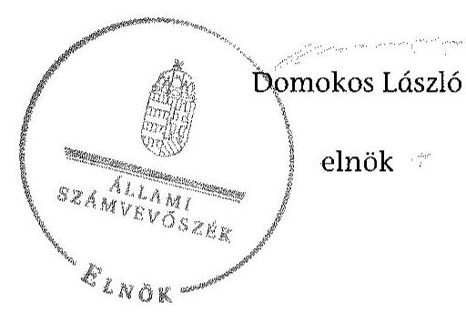
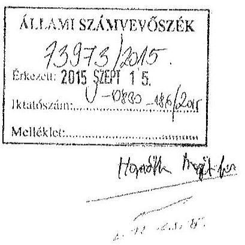
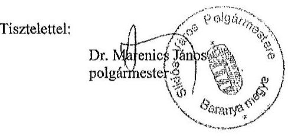
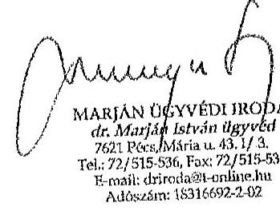
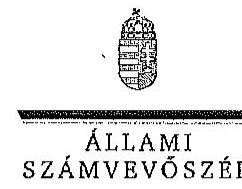

# ÁLLAMI   SZÁMVEVÔSZÉK 

## JELENTÉS

Az önkormányzatok gazdasági társaságai - Az önkormányzatok többségi tulajdonában lévő gazdasági társaságok közfeladat ellátását érintő gazdálkodási tevékenysége szabályszerűségének ellenőrzése

Siklósi Távhő Nonprofit Korlátolt Felelősségű Társaság

---

# Állami Számvevőszék 

Iktatószám: V-0830-191/2015
Témaszám: 1864
Vizsgálat-azonosító szám: V067151
Az ellenőrzést felügyelte:
Dr. Horváth Margit
felügyeleti vezető
Az ellenőrzés vezette és a végrehajtásáért felelős:
Klinga László
ellenőrzésvezető
A jelentéstervezet összeállításában közremüködött:
Lucza Anikó
számvevő tanácsos
Az ellenőrzést végezték:
Czigányné Tóth Katalin leszenkovits Tamás Semerédy Andrea
okleveles könyvvizsgáló, okleveles könyvvizsgáló, külső szakértő külső szakértő

A témához kapcsolódó eddig készített számvevőszéki jelentések:
címe
sorszáma
Jelentés Siklós Város Önkormányzata pénzügyi helyzetének ellen- 1256
őrzéséről (43/4)

---

# TARTALOMJEGYZÉK 

BEVEZETÉS ..... 7
I. ÖSSZEGZŐ MEGÁLLAPÍTÁSOK, KÖVETKEZTETÉSEK, JAVASLATOK ..... 10
II. RÉSZLETES MEGÁLLAPÍTÁSOK ..... 16

1. Az Önkormányzat közfeladat-ellátásának szabályszerűsége ..... 16
1.1. A közfeladat-ellátás megszervezése és a feladatellátás feltételrendszerének kialakítása ..... 16
1.2. A közfeladat-ellátás felügyelete és a tulajdonosi jogok érvényesítése ..... 18
2. A Siklósi Távhő Nkft. közfeladat-ellátással kapcsolatos tevékenysége ..... 20
2.1. A Siklósi Távhő Nkft. gazdálkodásának szabályozottsága ..... 20
2.2. A Siklósi Távhő Nkft. vagyongazdálkodása ..... 21
2.3. A beszámolási kötelezettség teljesítése ..... 23
3. A távhőszolgáltatás közfeladata bevételei és ráfordításai elszámolása, valamint az önköltségszámítás szabályszerűsége ..... 24
3.1. A távhőszolgáltatás közfeladat bevételeinek és ráfordításainak elkülönített, szabályszerű elszámolása ..... 24
3.2. Az önköltségszámítás szabályszerűsége ..... 27
4. Az ÁSZ korábbi ellenőrzéseinek javaslatai, hasznosulása ..... 28
MELLÉKLETEK
5. számú A Siklósi Távhő Nkft. tevékenységének főbb adatai
6. számú A Siklósi Távhő Nkft. múködésének főbb jellemzői
7. számú A Siklósi Távhő Nkft. által biztosított közszolgáltatás díjai a 2008-2013. évekre vonatkozóan
8. számú Beérkezett észrevételek és az azokra adott válaszok
FÜGGELÉK
9. számú Értelmező szótár
10. számú Mintavételi eljárások ellenőrzési területenként

---

.

---

# RÖVIDÍTÉSEK JEGYZÉKE 

## Törvények

Avtv.

Ámt.
Áht.
ÁSZ tv.
Gt.
Htv.

Info tv.

Mötv.

Rezsi tv.
Számv. tv.
Tszt.
VET

## Rendeletek

50/2011. (IX. 30.) NFM rendelet

51/2011. (IX. 30.) NFM rendelet
a személyes adatok védelméről és a közérdekú adatok nyilvánosságáról szóló 1992. évi LXIII. törvény (hatálytalan: 2012. január 1-jétől)
az árak megállapításáról szóló 1990. évi LXXXVII. törvény (hatályos: 1991. január 1-jétől)
az államháztartásról szóló 1992. évi XXXVIII. törvény (hatálytalan: 2012. január 1-jétől)
az Állami Számvevőszékről szóló 2011. évi LXVI. törvény (hatályos: 2011. július 1-jétől)
a gazdasági társaságokról szóló 2006. évi IV. törvény (hatálytalan: 2014. március 15 -től)
A helyi önkormányzatok és szerveik, a köztársasági megbízottak, valamint egyes centrális alárendeltségủ szervek feladat- és hatásköreiről szóló 1991. évi XX. törvény
az információs önrendelkezési jogról és az információszabadságról szóló 2011. évi CXII. törvény (hatályos: 2011. július 27 -től)
Magyarország helyi önkormányzatairól szóló 2011. évi CLXXXIX. törvény (hatályos: 2012. január 1-jétől, kivéve a 144. § (2) bekezdésben meghatározott paragrafusok, amelyek 2012. április 15 -én, a (3) bekezdésben meghatározott paragrafusok, amelyek 2013. január 1-jén léptek hatályba, a (4) bekezdésben meghatározott paragrafusok a 2014. évi általános önkormányzati választások napján lépnek hatályba)
a helyi önkormányzatokról szóló 1990. évi LXV. törvény (hatálytalan: a 2014. évi általános önkormányzati választások napjától)
a rezsicsökkentések végrehajtásáról szóló 2013. évi LIV. törvény (hatályos: 2013. május 10-től)
a számvitelről szóló 2000 . évi C. törvény
a távhőszolgáltatásról szóló 2005. évi XVIII. törvény (hatályos: 2005. július 1-jétől)
a villamos energiáról szóló 2007. évi LXXXVI. törvény (hatályos: 2007. október 15-étől)
a távhőszolgáltatónak értékesített távhő árának, valamint a lakossági felhasználónak és a külön kezelt intézményeknek nyújtott távhőszolgáltatás dijának megállapításáról szóló 50/2011. (IX. 30.) NFM rendelet (hatályos: 2011. október 1-jétől)
a távhőszolgáltatás támogatásáról szóló 51/2011. (IX. 30.) NFM rendelet

---

önkormányzati SZMSZ
távhőszolgáltatási rendelet
távhődíj rendelet
vagyongazdálkodási rendelet

## Szórövidítések

alapító
Alapító Okirat
áfa
ÁSZ
értékelési szabályzat ${ }_{1}$
értékelési szabályzat ${ }_{2}$
értékelési szabályzat ${ }_{3}$
FB
jegyzö
Képviselő-testület
leltározási szabályzat ${ }_{1}$
leltározási szabályzat ${ }_{2}$
leltározási szabályzat ${ }_{3}$
MEH
MEKH
Önkormányzat
pénzkezelési szabályzat ${ }_{1}$
pénzkezelési szabályzat ${ }_{2}$
polgármester
Siklósi Távhő
Nkft./Társaság
számlarend $_{1}$

Siklós Város Önkormányzatának többször módosított 21/1998. (XII. 2.) számú rendelete a Képviselő-testület és szervei szervezeti és müködési szabályzatáról
Siklós Város Önkormányzatának többször módosított 20/2000. (XI. 24.) számú rendelete a távhőszolgáltatásról
Siklós Város Önkormányzatának többször módosított 1/2005. (I. 14.) számú rendelete a távhőszolgáltatás hatósági dijáról
Siklós Város Önkormányzatának többször módosított 3/1997. (II. 21.) rendelete az önkormányzat vagyonáról és a vagyontárgyak feletti tulajdonosi jogok gyakorlásáról

Siklós Város Önkormányzata
2008. december 30-ig a Siklósi Távhő Közhasznú Társaság és 2008. december 31-től a Siklósi Távhő Nkft. alapító okirata és annak módosításai
általános forgalmi adó
Állami Számvevőszék
a Siklósi Távhő Nkft. értékelési szabályzata (hatályos: 2006. május 25 -től)
a Siklósi Távhő Nkft. értékelési szabályzata (hatályos: 2011. január 1-jétől)
a Siklósi Távhő Nkft. értékelési szabályzata (hatályos: 2012. január 1-jétől)

Siklósi Távhő Nkft. felügyelőbizottsága
Siklós Város Önkormányzatának jegyzője
Siklós Város Önkormányzatának képviselő-testülete
a Siklósi Távhő Nkft. leltározási szabályzata (hatályos: 2006. május 25 -től)
a Siklósi Távhő Nkft. leltározási szabályzata (hatályos: 2011. január 1-jétől)
a Siklósi Távhő Nkft. leltározási szabályzata (hatályos: 2012. január 1-jétől)

Magyar Energia Hivatal (2013. április 4-ig)
Magyar Energetikai és Közmű-szabályozási Hivatal (2013. április 4-től)
Siklós Város Önkormányzata
a Siklósi Távhő Nkft. házipénztár kezelési szabályzata (hatályos: 2006. május 29 -től)
a Siklósi Távhő Nkft. pénzkezelési szabályzata (hatályos: 2011. január 1-jétől)
Siklós Város Önkormányzatának Polgármestere
Siklósi Távhő Közhasznú Társaság (2009. január 5-ig), Siklósi Távhő Nkft. (2009. január 6-tól)
a Siklósi Távhő Nkft. számlarendje (hatályos: 2006. má-jus 25 -től)

---

| számlarend $_{2}$ | a Siklósi Távhő Nkft. számlarendje (hatályos: 2011. január 1-jétől) |
| :--: | :--: |
| számlarend $_{3}$ | a Siklósi Távhő Nkft. számlarendje (hatályos: 2012. január 1-jétől) |
| számviteli politika ${ }_{1}$ | a Siklósi Távhő Nkft. számviteli politikája (hatályos: 2006. május 25-től) |
| számviteli politika $_{2}$ | a Siklósi Távhő Nkft. számviteli politikája (hatályos: 2011. január 1-jétől) |
| számviteli politika $_{3}$ | a Siklósi Távhő Nkft. számviteli politikája (hatályos: 2012. január 1-jétől) |
| üzletszabályzat | a Siklósi Távhő Nkft. üzletszabályzata (hatályos:1999. június 22 -től) |

---

.

---

# JELENTÉS 

## Az önkormányzatok gazdasági társaságai Az önkormányzatok többségi tulajdonában lévő gazdasági társaságok közfeladat ellátását érintő gazdálkodási tevékenysége szabályszerűségének ellenőrzése   Siklósi Távhő Nonprofit Korlátolt Felelősségű Társaság

## BEVEZETÉS

Az Állami Számvevőszék középtávra szóló stratégiájában megfogalmazta, hogy a helyi önkormányzatok gazdálkodásában rejlő pénzügyi kockázatok feltárásával, az államháztartáson kívülre nyújtott költségvetési támogatások és ingyenes vagyonjuttatások, valamint az államháztartáson kívül múködő köz-feladat-ellátó rendszerek ellenőrzéseivel hozzájárul ahhoz, hogy a közpénzeket az államháztartáson kívül múködő szervezetek is átlátható, rendezett módon használják fel a közfeladatok szerződésben vállalt ellátása érdekében.

Az önkormányzatok szervezetalakítási szabadságának következménye, hogy a korábban is vállalati formában múködő (nagyvárosi tömegközlekedés, víz-, szennyvízcsatorna, köztisztasági, ingatlankezelés stb.) közszolgáltatások mellett, mind a kötelező, mind az önként vállalt feladatok ellátásában a gazdasági társaságok kiemelt fontosságú szerephez jutottak.

A Siklósi Távhő Közhasznú Társaságot az Önkormányzat az ellenőrzött időszakot megelőzően, 1995-ben egyszemélyi tulajdonosként alapította, amely 2009. január 6-tól nonprofit gazdasági társasággá alakult. Az Önkormányzat 100\%os tulajdonában álló Társaság törzstőkéje 2000. július óta változatlanul 3,0 millió Ft. A Társaságnak az ellenőrzött időszakban más gazdasági társaságban tulajdoni részesedése nem volt.

A Társaság az Önkormányzat engedélyeseként biztosította az ellenőrzött időszakban a 10 ezer főt meghaladó lakosságszámú Siklós városának távhő és melegvíz szolgáltatását. A Társaság Alapító Okirata további tevékenységeként rögzítette a víz-, gáz-, fűtés-, légkondicionáló szerelést, ingatlan bérbeadását, üzemeltetését, a máshova nem sorolt egyéb szakmai, tudományos, műszaki tevékenységet, az immateriális javak kölcsönzését, a követelésbehajtást és a máshova nem sorolt egyéb kiegészítő üzleti szolgáltatást. A Társaság a távhőszolgáltatást a két telephelyén múködtetett kazánházakkal látta el, amely ingatlanok az Önkormányzat korlátozottan forgalomképes törzsvagyonát képezték. A távfütött lakások száma 2013. év végén 1058 volt, továbbá 16 intézmény

---

épület fűtését látták el.
A Siklósi Távhő Nkft. összes bevétele 2008-ban 270,5 millió Ft, a 2013. évben 242,5 millió Ft volt, amelyből az értékesítés nettó árbevétele 2008-ban 267,8 millió Ft, míg 2013-ban 190,2 millió Ft volt. Az értékesítés nettó árbevételének 2008-ban 61,3\%-át, 164,1 millió Ft-ot, 2013-ban 82,0\%-át, 156,0 millió Ft-ot a távhőszolgáltatásból származó bevételek tették ki.

A Siklósi Távhő Nkft. a 2008. és a 2011. években nyereségesen, a 2009-2010. években és a 2012-2013. években veszteségesen gazdálkodott. A mérleg szerinti eszközérték a 2008. évi nyitó 121,7 millió Ft-ról a 2013. év végére 117,2 millió Ft-ra csökkent, ugyanakkor a követelések állománya 3,6\%-kal, 48,9 millió Ft-ra nőtt. A saját tőke a 2008. évi nyitó 53,9 millió Ft-ról a 2013. év végére 50,0 millió Ft-ra csökkent.

Az ellenőrzött időszakban a polgármester személye nem, a jegyző személye két alkalommal változott. A 2012. január 1. és 2013. május 1. közötti időszakban az Önkormányzat hivatalának élére jegyzőt nem neveztek ki, a hivatal múködését aljegyző irányította. A polgármester 2002. óta tölti be tisztségét, a helyszíni ellenőrzés időszakában hivatalban lévő jegyző 2013. május óta látta el feladatait. A Társaság ügyvezetőjének személye egy alkalommal (2013. november 20-án) változott az ellenőrzött időszakban. Gazdasági vezetője a Társaságnak az ellenőrzött időszakban nem volt, a könyvelést és a beszámoló összeállítását külső vállalkozó végezte, akinek személye az ellenőrzött időszakban nem változott.

Az önkormányzati tulajdonú gazdasági társaságok teljes körű ellenőrzésének lehetőségét az Állami Számvevőszékről szóló 1989. évi XXXVIII. törvény 2011. január 1-jétől hatályos módosítása teremtette meg.

Az ellenőrzés célja annak értékelése volt, hogy

- az önkormányzat a jogszabályi előírások figyelembevételével döntött-e az ellenőrzésre kerülő közfeladat megszervezéséről; az önkormányzat szabályszerűen gyakorolta-e a tulajdonosi jogokat;
- a gazdasági társaság közfeladat-ellátása bevételeinek, ráfordításainak elszámolása, és vagyongazdálkodási tevékenysége megfelelt-e a jogszabályi, illetve a közszolgáltatási szerződésben foglalt tulajdonosi előírásoknak, azok végrehajtása szabályszerű volt-e;
- a közfeladatok átláthatósága és elszámoltathatósága érdekében biztosítva volt-e a közszolgáltatás dijának megalapozottsága szabályszerű önköltségszámítással.

Az ellenőrzés kiterjedt Siklós Város Önkormányzatára és a Siklósi Távhő Nonprofit Kft.-re.

Az ellenőrzés várható hasznosulása: A törvényalkotás számára - az észlelt problémák, szabálytalanságok, vagy egyéb nem kívánatos jelenségek felszínre kerülésével - az ellenőrzés megállapításai segítséget nyújthatnak az államháztartáson kívüli közfeladat-ellátás értékeléséhez, jogszabályi keretei pontosítá-

---

sához, átláthatóságot biztosító szabályozásához. Meghatározhatóvá válnak a költségvetési hiányt befolyásoló szervezetek kockázatai, lehetővé válik ezen kockázatok csökkentése. Feltárja, hogy az önkormányzat közfeladat-ellátási kötelezettségének szabályszerűen tett-e eleget, a feladatellátáshoz rendelt közvagyon múködtetését szabályszerűen szervezte-e meg és a tulajdonosi felügyelete hozzájárult-e a közfeladat-ellátásához. A feladatot ellátó gazdasági társaság a közszolgáltatási szerződésben foglaltak betartásával, a közvagyon használatával biztosította-e a szolgáltatás folytatásának feltételeit. Ezzel az ellenőrzöttek és a helyi döntéshozók számára visszajelzést ad feladatszervezési, feladatellátási kockázataikról, alapot ad a meglévő hibák megszüntetéséhez, a jobb közfeladat-ellátás biztosításához. Fokozza a fegyelmet, igazolja, hogy lejárt a következmények nélküli ellenőrzések időszaka. Az ÁSZ értékteremtő rend kialakításához és megőrzéséhez hozzájáruló tevékenysége pozitív hatással van a szervezetről kialakított összkép formálására is.

A bevételek és ráfordítások elszámolása, valamint a vagyonnyilvántartás terén az egyes területek szabályszerű működését mintavétellel ellenőriztük, ez alapján a sokaságban előforduló hibás tételek arányát becsültük. A jogszabályoknak és a belső előírásoknak megfelelőnek, azaz szabályszerűnek tekintettük az adott bevételek és ráfordítások elszámolását, a vagyonnyilvántartást, amenynyiben a minta ellenőrzésének eredménye alapján $95 \%$-os bizonyossággal a teljes sokaságban a hibás tételek aránya kisebb volt, mint $10 \%$, nem megfelelőnek értékeltük, ha a hibás tételek aránya a $10 \%$-ot meghaladta. Kockázatot, illetve magas kockázatot jeleztünk, amennyiben egy adott terület vonatkozásában a minta alapján a teljes sokaságban nem volt teljes körűen biztosított a jogszabályoknak és a belső szabályzatoknak megfelelő működés.

Az ellenőrzést a számvevőszéki ellenőrzés szakmai szabályai szerint, szabályszerűségi ellenőrzés módszerével, a nemzetközi standardok figyelembevételével végeztük. Az ellenőrzés a 2008-2013. évekre terjedt ki.

Az ellenőrzés végrehajtásának jogszabályi alapját az ÁSZ tv. 5. § (3)-(4)-(5) bekezdése képezte.

Az ÁSZ az Állami Számvevőszékről szóló 2011. évi LXVI. törvény 29. §-a alapján a jelentéstervezetet észrevételezésre megküldte Siklós Város Önkormányzata polgármesterének és a gazdasági társaság ügyvezető igazgatójának. A beérkezett észrevételeket a jelentés véglegesítése során hasznosítottuk. Az észrevételeket és az azokra adott válaszokat a jelentés 4 . számú melléklete tartalmazza.

---

# I. ÖSSZEGZŐ MEGÁLLAPÍTÁSOK, KÖVETKEZTETÉSEK, JAVASLATOK 

Az Önkormányzat a közigazgatási területén a távhőszolgáltatás közfeladatának megszervezéséről a jogszabályi előírásoknak megfelelően döntött, annak ellátásáról a kizárólagos tulajdonában lévő gazdasági társasága útján gondoskodott. A Társaság tevékenységének ellátásához szükséges vagyon az Önkormányzat tulajdonát képezte, amit - a 2011. év kivételével - térítésmentesen adott használatba.

Az Önkormányzat a távhőszolgáltatásra vonatkozóan a Tszt.-ben előírt rendeletalkotási kötelezettségének eleget tett. A távhőszolgáltatási rendelet nem tartalmazta azoknak a területeknek a kijelölését, ahol területfejlesztési, környezetvédelmi és levegő-tisztaságvédelmi szempontok alapján célszerű a távhőszolgáltatás fejlesztése, figyelmen kívül hagyva ezzel a Tszt. előírásait.

A Képviselő-testület 2011-ben két kazánházként nyilvántartott ingatlan esetében bérleti díj fizetéséről határozott. Ebben az esetben a Siklósi Távhő Nkft. akkor volt díjfizetésre kötelezett, amennyiben tárgyévi adózás előtti eredménye meghaladta a saját tőke alapján várható ésszerű profitot. A bérleti díj mértéke a tárgyévben elért, ésszerű profitot meghaladó eredmény volt. Az előírás részletszabályairól (bérleti díj megállapításának konkrét feltételei, fizetési határidő, elszámolás módja) nem rendelkeztek. Bérleti díj fizetés egy alkalommal, 2011ben történt, 800 ezer Ft + áfa összegben. A 2012. és 2013. évi adózás előtti eredmény negatív mértékére tekintettel bérleti díj fizetésére nem került sor. A Htv. 138. § (1) bekezdésének előírásai alapján pontosan szabályozni kellett volna a bérleti díj fizetésének feltételeit, az elszámolás módját. Megfelelő szabályozás hiányában a végrehajtás ellenőrzése nem lehetséges.

Az Önkormányzat vagyongazdálkodási rendeletben határozta meg a gazdasági társaságok feletti tulajdonosi jogok gyakorlásának szabályait, amelyek gyakorlására a Képviselő-testület, illetve a meghatározott esetekben a polgármester volt jogosult. Az Alapító Okiratban a 2,0 millió Ft feletti jogügyletek megkötését a Képviselő-testület hozzájárulásához kötötték. Ennek ellenére az ellenőrzött időszakban a 2,0 millió Ft feletti kötelezettségvállalások a Képviselőtestület hozzájárulása nélkül történtek. A 2,0 millió Ft-ot meghaladó összegű szerződések bruttó értéke 2008-2013. években 1011,5 millió Ft volt.

Az FB a Gt.-ben előírtakkal ellentétben ügyrenddel nem rendelkezett. Az FB a Gt. előírásainak megfelelően a számviteli beszámolókról írásbeli jelentést készített. A vezető tisztségviselők elsődleges felelőssége a beszámolók és a kapcsolódó üzleti jelentések összeállítása, míg a felügyelő bizottságot ezekkel összefüggésben ellenőrzési kötelezettség terheli. Az FB alapfeladata a társaság ügyvezetésének ellenőrzése a tulajdonosok érdekében, tevékenységéért a tagoknak (a Képviselő-testületnek) tartozik felelősséggel. A Gt. meghatározta az FB feladatait és hatáskörét. Az FB az ellenőrzési időszakban nem jelezte a Társaság tevékenysége jogszabályt sértő gyakorlatát.

---

Az Önkormányzat belső ellenőrzése 2012-ben végzett ellenőrzést a Társaságnál.
Az Önkormányzat az ellenőrzött időszakban a Siklósi Távhő Nkft. feletti tulajdonosi jogokat - előterjesztés hiányában a 2,0 millió Ft feletti jogügyletek megkötéséhez kapcsolódó hozzájárulástól eltekintve - a vagyongazdálkodási rendelet és az Alapító Okirat előírásainak megfelelően szabályszerűen gyakorolta.

A Siklósi Távhő Nkft. a Számv. tv-ben előírt szabályzatokat elkészítette és hatályba léptette, azok tartalma - a számlarend2 kivételével - az előírásoknak megfelelt. A számviteli politika1 és az értékelési szabályzat1 előírásai közötti összhang a kisösszegű követelések értékvesztése elszámolási szabályainak vonatkozásában nem volt biztosított. A számlarend2 a 6-os és 7-es számlaosztály esetében nem tartalmazta a Számv. tv.-ben előírtakkal ellentétben a számlák értékének növekedése és csökkenése jogcímeit, a számlát érintő gazdasági eseményeket, azok más számlákkal való kapcsolatát, valamint a főkönyvi számla és az analitikus nyilvántartás kapcsolatait. A jegyző a Tszt.-ben előírt kötelezettségének nem tett eleget, mivel a Társaság üzletszabályzatát nem hagyta jóvá, nem küldte meg véleményezésre a fogyasztóvédelmi hatósághoz, továbbá az abban foglaltak betartását a Tszt.-ben előírtak ellenére nem ellenőrizte.

A Társaság a Számv. tv. előírásai alapján mentesült az önköltségszámítási szabályzat készítésének kötelezettsége alól. A 2008. január 1-je és 2011. április 15. között az alapdíj nem módosult, a hődíjak kalkulációját a távhődíj rendeletben előírtak alapján a Társaság elkészítette. Önköltségszámításon alapuló díjmódosítás az ellenőrzött időszakban nem volt. A hődíjat a gázár, az éves villamos energia költség, a kazán hatásfoka és a szállítási hatásfok, valamint a tervezett éves értékesített hőmennyiség figyelembevételével számítási képlet alapján határozták meg.

A Társaság eszközértéke az ellenőrzött időszakban jelentősen nem változott, 2013. december 31-re 4,5 millió Ft-tal, 117,2 millió Ft-ra csökkent. A Siklósi Távhő Nonprofit Kft.-nél az ellenőrzött időszakban folyamatosan nőtt a lejárt határidejű követelésállomány annak ellenére, hogy a követeléskezelés érdekében két ügyvédi irodával és három követeléskezelő céggel megbízási szerződést kötöttek. A 90 napon túli lejárt kinnlevőség 2008-2013. között az éves árbevétel 5,1-22,9\%-át tette ki, valamint a követeléskezeléssel érintett ügyletek értéke 2008-2013. között közel hétszeresre nőtt (5,4 millió Ft-ról 35,9 millió Ft-ra).

A Társaság a 2008. és a 2011. években összességében 4,5 millió Ft nyereséget realizált, az ellenőrzött időszak további éveiben veszteséges volt, amelynek együttes összege 8,4 millió Ft-ot tett ki. A Siklósi Távhő Nkft. a 2008-2013. években a számviteli beszámolóit elkészítette, azokat a Számv. tv. előírásának megfelelően letétbe tette. A könyvvizsgáló a beszámolókat hitelesítő záradékkal látta el. A könyvvizsgáló a 2012. évi számviteli beszámolóról készített jelentése nem tartalmazott a Tszt.-ben előírt igazolást a Társaság által kidolgozott és alkalmazott számviteli szétválasztási szabályok, valamint az egyes tevékenységek közötti keresztfinanszírozás mentességének betartására. A Társaság a számviteli politika1,2,3-ban meghatározott vagyoni, pénzügyi, jövedelmi helyzetet értékelő mutatószámokat a 2008-2013. évi beszámolók kiegészítő mellékletében a Számv. tv.-ben előírtakat megsértve nem mutatta be. A Siklósi Távhő Nkft. a 2008-2011. években az Avtv.-ben, a 2012-2013. években az Info tv.-ben

---

előírtakkal ellentétben adatvédelmi szabályzattal és a közérdekű adatok megismerésére irányuló igények teljesítésének rendjét rögzítő szabályzattal nem rendelkezett.

A távhőszolgáltatási közfeladat értékesítés nettó árbevételének elszámolása megfelelő volt. A távhőszolgáltatási közfeladat anyagjellegű ráfordításainak elszámolása során az irányított mintavétellel kiválasztott tételek szerződés szerinti összege 2,0 millió Ft feletti volt, amelyek esetében a tulajdonosi jóváhagyásra az Alapító Okiratban előírtakkal ellentétben nem került sor. A beruházások, felújítások, valamint az értékcsökkenési leírás elszámolása nem megfelelő volt, mivel egyes esetekben a beruházásokhoz, felújításokhoz kapcsolódó kötelezettségvállalás tulajdonosi jóváhagyása nem történt meg, valamint az eszközök állományba vétele, értékcsökkenésének elszámolása nem szabályosan történt. A Siklósi Távhő Nkft. vagyongazdálkodási tevékenysége a szabálytalan elszámolások miatt nem felelt a jogszabályi előírásoknak.

A fentiekben leírtak összegzéseként az alábbi megállapításokat tesszük:
A számviteli szabályozás megfelelő volt, azonban az adatvédelmi szabályzat és a közérdekú adatok megismerésére irányuló igények teljesítésének rendjét rögzítő szabályzat hiánya kockázatot jelez. Szabálytalan gyakorlat alakult ki a 2,0 millió Ft-ot meghaladó kötelezettségvállalások esetében, ahol a Képviselőtestület hozzájárulása nélkül kötöttek szerződéseket. Az FB-n keresztül gyakorolt tulajdonosi kontroll korlátozottan múködött, mivel nem jelezte a Társaság tevékenysége jogszabályt sértő gyakorlatát. A követelésállomány növekedése kockázatot jelez a Társaság múködésére nézve. A távhőszolgáltatási közfeladat értékesítés nettó árbevételének elszámolása megfelelő volt, azonban az anyagjellegú ráfordítások elszámolása során a 2,0 millió Ft feletti kifizetések esetében a tulajdonosi jóváhagyásra nem került sor. Emellett a beruházások, felújítások, valamint az értékcsökkenési leírás elszámolása nem megfelelő volt, mivel egyes esetekben a beruházásokhoz, felújításokhoz kapcsolódó kötelezettségvállalás tulajdonosi jóváhagyása nem történt meg, valamint az eszközök állományba vétele, értékcsökkenésének elszámolása nem szabályosan történt. A szabálytalan elszámolások miatt a vagyongazdálkodási tevékenység nem felelt meg a jogszabályi előírásoknak.

Az Állami Számvevőszékről szóló 2011. évi LXVI. törvény 33. § (1) bekezdésében foglaltak értelmében a jelentésben foglalt megállapításokhoz kapcsolódó intézkedési tervet köteles az ellenőrzött szervezet vezetője összeállítani, és azt a jelentés kézhezvételétől számított 30 napon belül az ÁSZ részére megküldeni. Amennyiben az intézkedési tervet határidőben nem küldi meg a szervezet, vagy az nem elfogadható, az ÁSZ elnöke a hivatkozott törvény 33. § (3) bekezdés a)-b) pontjaiban foglaltakat érvényesítheti.

Az ellenőrzés intézkedést igénylő megállapításai és javaslatai:
Javaslataink célja a Siklósi Távhő Nkft. gazdálkodása szabályszerűségének javítása annak érdekében, hogy a szabályozási környezet megfelelően tudja támogatni az átlátható müködést.

---

# Javasoljuk a Siklósi Távhő Nkft. Ügyvezető igazgatójának: 

1. A Társaság a különböző nyilvántartásokban elektronikusan kezelt adatállományok információ biztonsági védelmét biztosító adatvédelmi szabályzattal nem rendelkezett az ellenőrzött időszakban, ezzel megsértette a 2008. január 1. és 2011. július 25. időszakban az Avtv. 31/A. § (3) bekezdését, 2012. január 1-től pedig az Infotv. 24. § (3) bekezdését. A Társaság nem rendelkezett továbbá a közérdekú adatok megismerésére irányuló igények teljesítésének rendjét rögzítő szabályzattal, amelyet az Avtv. 20. § (8) bekezdése, 2012-2013. években pedig az Infotv. 30. § (6) bekezdése írt elő.

Javaslat:
Intézkedjen a szabályozási hiányosságok megszüntetésére, ennek keretében:
készítse el az adatvédelmi szabályzatát, valamint a közérdekű adatok megismerésére irányuló igények teljesítésének rendjét rögzítő szabályzatát és intézkedjen azok hatályba léptetéséröl.
2. A beruházások, felújítások, valamint az értékcsökkenési leírás elszámolása - a beruházásokhoz, felújításokhoz kapcsolódó 2,0 millió Ft feletti kötelezettségvállalások esetében a tulajdonosi jóváhagyás hiánya, valamint az eszközök hibás értéken történt állományba vétele és a tévesen elszámolt értékcsökkenés miatt - nem volt megfelelő. Az aktiválás két eszköz esetében nem volt szabályszerű, mivel az eszközöket összevont bekerülési értéken, egy eszközként aktiválták, ami nem felelt meg a Számv. tv. 16. § (1) bekezdésében rögzített egyedi értékelés elvének. Egy tételnél pedig nem volt megfelelő a hasznos élettartam Számv. tv. 52. § (3) bekezdése szerinti meghatározása, mivel a pótlólagos beruházás aktiválásakor az eredeti eszköz értékcsökkenési kulcsától eltérő kulcsot határoztak meg, ami nem felelt meg a számviteli politika és az értékelési szabályzat előírásainak.

A Társaságnál a Számviteli politika ${ }_{1-3}$-ban meghatározott, a vagyoni, pénzügyi, jövedelmi helyzetet értékelő mutatószámokat a 2008-2013. évi beszámolók melléklete nem tartalmazta.

Javaslat:
Gondoskodjon a jogszabályi előírások szerinti gyakorlat biztosításáról, ezen belül:
a) gondoskodjon a beruházásokhoz, felújításokhoz kapcsolódó 2,0 millió Ft feletti kötelezettségvállalás tulajdonosi jóváhagyásáról, valamint az eszközök jogszabályban előírtaknak megfelelő aktiválásáról és az értékcsökkenés szabályos elszámolásáról;
b) intézkedjen annak érdekében, hogy a Számviteli politikában meghatározott a vagyoni, pénzügyi, jövedelmi helyzetet értékelő mutatószámokat a Társaság éves számviteli beszámolójának melléklete tartalmazza.

Javaslataink célja az Önkormányzat szabályszerú müködésének elösegítése, továbbá az önkormányzati tulajdonosi joggyakorlás kontrolljainak erösitése.

---

# Siklós Város Önkormányzata Polgármesterének: 

1. Siklósi Távhő Nkft Felügyelő Bizottsága a Gt. 34. § (4) bekezdésében előírtakkal, valamint az Alapító Okiratban foglaltakkal ellentétben ügyrenddel nem rendelkezett. Az FB ügyrendjének jóváhagyása az alapító hatáskörébe tartozó feladat, hiányát a Képviselő-testület nem kifogásolta.

Javaslat:

## Intézkedjen a szabályozási hiányosságok megszüntetésére, ennek keretében:

hívja fel a tulajdonosi jogokat gyakorló Képviselő-testület figyelmét arra, hogy az FB hiányzó Ügyrendjét el kell készíteni.
2. Az Önkormányzat vagyongazdálkodási rendeletben határozta meg a gazdasági társaságok feletti tulajdonosi jogok gyakorlásának szabályait, amelyek gyakorlására a Képviselő-testület, illetve a meghatározott esetekben a polgármester volt jogosult. Az Alapító Okiratban a 2,0 millió Ft feletti jogügyletek megkötését a Képviselőtestület hozzájárulásához kötötték. Ennek ellenére az ellenőrzött időszakban a 2,0 millió Ft feletti kötelezettségvállalások a Képviselő-testület hozzájárulása nélkül történtek. A 2,0 millió Ft-ot meghaladó összegű szerződések bruttó értéke 20082013. években 1011,5 millió Ft volt. Ezzel a felek az Alapító Okiratban foglaltaktól eltérő gyakorlatot alkalmaztak, mellyel mellőzték a tulajdonosi joggyakorló hozzájárulásának megadását.

A vezető tisztségviselők elsődleges felelőssége a beszámolók és a kapcsolódó üzleti jelentések összeállítása, míg a felügyelő bizottságot ezekkel összefüggésben ellenőrzési kötelezettség terheli. Az FB alapfeladata a társaság ügyvezetésének ellenőrzése a tulajdonosok érdekében, tevékenységéért a tagoknak (a Képviselő-testületnek) tartozik felelősséggel. A Gt. 35. § (3) és (4) bekezdése meghatározza az FB feladatait és hatáskörét. Az FB az ellenőrzési időszakban nem jelezte a Társaság tevékenysége jogszabályt sértő gyakorlatát, ezért közvetetten felmerül az FB tagok felelőssége.

A Képviselő-testület 2011-ben két kazánházként nyilvántartott ingatlan esetében bérleti díj fizetéséről határozott. Ebben az esetben a Siklósi Távhő Nkft. akkor volt díjfizetésre kötelezett, amennyiben tárgyévi adózás előtti eredménye meghaladta a saját tőke alapján várható ésszerű profitot. A bérleti díj mértéke a tárgyévben elért, ésszerű profitot meghaladó eredmény volt. Az előírás részletszabályairól (bérleti díj megállapításának konkrét feltételei, fizetési határidő, elszámolás módja) nem rendelkeztek. Bérleti díjfizetés egy alkalommal, 2011. évben történt, 800 ezer Ft + áfa öszszegben. 2012. és 2013. évben az adózás előtti eredmény negatív mértékére tekintettel bérleti díj fizetésére nem került sor. A Htv. 138. § (1) bekezdése j.) pontjának megfelelően az önkormányzati vagyonnal történő gazdálkodás szabályozása keretében pontosan meg kellett volna határozni a bérleti díj fizetésének feltételeit, az elszámolás módját. Megfelelő szabályozás hiányában a végrehajtás ellenőrzése nem lehetséges.

---

Javaslat:

# Gondoskodjon a jogszabályi elöírások szerinti gyakorlat biztosításáról, ezen belül: 

a) tegyen intézkedéseket a képviselő-testületi jóváhagyáshoz kötött kötelezettségvállalásoknál feltárt hiányosságok tekintetében a társaság ügyvezetője munkajogi felelősségének kivizsgálására irányuló eljárás megindítása iránt, és az eljárás eredményének ismeretében tegye meg a szükséges intézkedéseket;
b) kezdeményezze annak kivizsgálását a Képviselő-testületnél, hogy a FB az Nkft. ellenőrzési kötelezettsége során okozott-e kárt és ennek eredménye függvényében hozza meg a szükséges polgári jogi intézkedéseket;
c) tegyen javaslatot a Képviselő-testület felé a bérleti dí fizetési kötelezettség részletszabályainak meghatározására, továbbá intézkedjen a feltárt szabálytalanságok tekintetében a munkajogi felelősség tisztázására irányuló eljárás megindításáról, és ennek eredménye ismeretében tegye meg a szükséges intézkedéseket.

## Javasoljuk Siklós Város Önkormányzata Jegyzöjének:

1. A távhőszolgáltatási rendelet a Tszt. 6. § (2) bekezdése c) pontjában előírtak ellenére nem tartalmazta azoknak a területeknek a kijelölését, ahol területfejlesztési, környezetvédelmi és levegő-tisztaságvédelmi szempontok alapján célszerű a távhőszolgáltatás fejlesztése.

Javaslat:
Intézkedjen a szabályozási hiányosságok megszüntetésére, ennek keretében:
terjesszen a Képviselő-testület elé a távhőszolgáltatási rendelet módosításáról szóló javaslatot azoknak a területeknek a kijelölésével, ahol területfejlesztési, környezetvédelmi és levegőtisztaságvédelmi szempontok alapján célszerű a távhőszolgáltatás fejlesztése.
2. A jegyző a Tszt. 7. § (1) bekezdésének a)-c) pontjaiban előírtaknak nem tett eleget, mivel a Társaság üzletszabályzatát nem küldte meg a fogyasztóvédelmi hatóságnak véleményezésre, illetve nem hagyta jóvá, valamint nem ellenőrizte a távhőszolgáltató tevékenységét az üzletszabályzatban foglaltak betartása szempontjából.

Javaslat:
Gondoskodjon a jogszabályi elöírások szerinti gyakorlat biztosításáról, ezen belül:
küldje meg véleményezésre a Társaság üzletszabályzatát a fogyasztóvédelmi hatóságnak, azt hagyja jóvá, valamint ellenőrizze a távhőszolgáltató tevékenységét az üzletszabályzatban foglaltak betartása szempontjából.

---

# II. RÉSZLETES MEGÁLLAPÍTÁSOK 

## 1. Az ÖNKORMÁNYZAT KÖZFELADAT-ELLÁTÁSÁNAK SZABÁLYSZERŰSÉGE

### 1.1. A közfeladat-ellátás megszervezése és a feladatellátás feltételrendszerének kialakítása

Az Ötv. 8. § (1) bekezdése ${ }^{1}$ a települési önkormányzatok közszolgáltatási feladatai közé sorolta a helyi energiaszolgáltatásban való közreműködést. Az Ötv. 8. § (3) bekezdése ugyancsak rendelkezett arról, hogy törvény a települési önkormányzatokat egyes közszolgáltatási feladatok ellátásáról történő gondoskodásra kötelezheti.

A Tszt. 6. § (1) bekezdésében előírtaknak megfelelően az Önkormányzat engedélyes útján biztosította a területén lévő távhőszolgáltatással ellátott létesítmények távhőellátását. Az engedélyes az Ötv. 9. § (4) bekezdésében ${ }^{2}$ biztosított lehetőség alapján az Önkormányzat által alapított Siklósi Távhő Közhasznú Társaság és annak 2008-ban létrehozott jogutódja, a Siklósi Távhő Nkft. volt. A Társaság a Tszt. 16. § (2) bekezdésében meghatározott működési engedély birtokában végezte tevékenységét. A Társaság főbb adatait az 1. számú melléklet, működésének főbb jellemzőit a 2. számú melléklet tartalmazza.

Az Önkormányzat az Ötv. 91. § (6) bekezdésében előírtakkal összhangban elkészítette a 2007-2010. és 2011-2014. évekre szóló gazdasági programjait, amelyet a Képviselő-testület jóváhagyott. A gazdasági programok alapját a 2004. évben a Képviselő-testület által jóváhagyott 2004-2015 évekre szóló „Siklós Város fejlesztési koncepciója" és a 2006. évben elfogadott „Tenkes Terv" képezte. A gazdasági programok a távhőszolgáltatás, mint ellátandó feladat biztosításával, fejlesztésével kapcsolatos célkitűzéseket, feladatokat nem tartalmaztak.

A Társaság tevékenységének ellátásához szükséges vagyon az Önkormányzat tulajdonát képezte, azt az Önkormányzat 1995. október 30-án - átadási dokumentum alapján - térítésmentesen használatba adta a Társaságnak.

A vagyongazdálkodási rendelet előírása szerint a tulajdonnal való rendelkezési jog az ellenőrzött időszakban a Képviselő-testület hatáskörét képezte. Az ellenőrzött időszakban sem a Társaságban való tulajdonosi részesedés, sem az Önkormányzat tulajdonát képező, a Társaság használatába adott vagyon tekintetében változás (pl. tőkeemelés, új vagyonelemek használatba, vagyonkezelésbe adása, ingyenes átadás, értékesítés) nem történt, a Képviselő-testület ilyen jellegű hatá-

[^0]
[^0]:    ${ }^{1}$ A helyi közügyek, valamint a helyben biztosítható közfeladatok körében ellátandó helyi önkormányzati feladatként a távhőszolgáltatást 2013. január 1-jétől az Mötv. 13. § (1) bekezdés 20. pontja írja elő.
    ${ }^{2}$ Hatálytalan 2013. január 1-től.

---

rozatot nem hozott, rendeletet nem alkotott. Az Önkormányzat a Társaság részére a távhőszolgáltatási feladat ellátásához vagyonkezelésbe vagyont nem adott át.

A közfeladat ellátásához szükséges vagyont az Önkormányzat 2011. december 14-ig ingyenesen biztosította a Társaság részére. A Képviselő-testület 2011-ben két kazánházként nyilvántartott ingatlan esetében bérleti dí fizetéséről határozott ${ }^{3}$. Ebben az esetben a Siklósi Távhő Nkft. akkor volt díffizetésre kötelezett, amennyiben tárgyévi adózás előtti eredménye meghaladta a saját tőke alapján várható ésszerű profitot. A bérleti díj mértéke a tárgyévben elért, ésszerű profitot meghaladó eredmény volt. Az előírás részletszabályairól (bérleti díj megállapításának konkrét feltételei, fizetési határidő, elszámolás módja) nem rendelkeztek. Bérleti dí fizetés egy alkalommal, 2011-ben történt, 800 ezer Ft + áfa összegben. A 2012. és 2013. évi adózás előtti eredmény negatív mértékére tekintettel bérleti dí fizetésére nem került sor. A Htv. 138. § (1) bekezdésének előírásai alapján pontosan szabályozni kellett volna a bérleti dí fizetésének feltételeit, az elszámolás módját. Megfelelő szabályozás hiányában a végrehajtás ellenőrzése nem lehetséges.

Az Önkormányzat a távhőszolgáltatásra vonatkozóan a Tszt. 6. § (2) bekezdése szerinti rendeletalkotási kötelezettségének eleget tett. A távhőszolgáltatási rendelet tartalmazta a távhőszolgáltatás területi és személyi hatályát, a távhőszolgáltatással kapcsolatos önkormányzati feladatokat, a fogyasztóval kötött közüzemi szerződés részletes feltételeit, ezen belül tartalmazta a Tszt. előírásainak megfelelően a távhőszolgáltató és a felhasználó közötti jogviszony szabályait, a mérés helyét, a csatlakozási dí előírásának lehetőségét, a mérés szerinti fogyasztási díjak elszámolásának feltételeit, valamint megállapította a távhőszolgáltatás szüneteltetésének, korlátozásának feltételeit. A távhőszolgáltatási rendelet nem jelölte ki azokat a területeket, ahol területfejlesztési, környezetvédelmi és levegő-tisztaságvédelmi szempontok alapján célszerű a távhőszolgáltatás fejlesztése, ezzel figyelmen kívül hagyták a Tszt. 6. § (2) bekezdése c) pontjában foglalt előírásokat. Az Önkormányzat a távhőszolgáltatási rendelet 5. § (1) bekezdése b) pontjában előírtak ellenére a 2008-2013 években nem ellenőrizte a Siklósi Távhő Nkft. ármegállapító tényezőinek, felhasznált költségeinek az indokoltságát.

Az Önkormányzat a Tszt. 6. § (2) bekezdés b) pontja alapján a távhődíj rendeletében szabályozta a csatlakozási és fogyasztási díjak (alapdíj, távhődíj) mértékét, a díjalkalmazás és díjfizetés feltételeit. A Siklósi Távhő Nkft. által alkalmazott alapdíjak 2008. január 1. és 2011. december 31. között nem változtak.

A távhődíj rendeletben előírtak szerint a távhőszolgáltatás díja egyösszegű díj, amely a 12 havi egyenlő részre osztott alapdíjból és az adott hónap első napján érvényes gázár alapján számított hődíjból állt. A szolgáltató a ténylegesen felhasznált hőmennyiség alapulvételével minden év július 31-ét követően éves végszámlát nyújtott be a fogyasztónak.

[^0]
[^0]:    ${ }^{3}$ 281/2011. (XII. 15.) számú határozat

---

# 1.2. A közfeladat-ellátás felügyelete és a tulajdonosi jogok érvényesítése 

Az Önkormányzat a vagyongazdálkodási rendeletben határozta meg a gazdasági társaságok feletti tulajdonosi jogok gyakorlásának szabályait. A tulajdonosi jogok gyakorlására a Képviselő-testület volt jogosult, illetve a meghatározott átruházott hatáskörben a polgármester. A vagyongazdálkodási rendelet a gazdasági társaságok által kezelt vagyonelemek között nevesítette a Siklósi Távhő Nkft. által a közfeladat ellátáshoz használt ingatlanokat (Hajdú Imre utcai és Köztársaság téri kazánházak), illetve a feladat ellátáshoz szükséges berendezést (központi fűtés távvezetéke megnevezéssel).

Az Alapító Okiratban ${ }^{4}$ és módosításaiban meghatározták a Társaság tevékenységi körét, a Képviselő-testület, az ügyvezető és az FB hatáskörét, döntési jogosultságait. Az Alapító Okirat szerint az alapítói hatáskörök kizárólagosak voltak, melynek megfelelően alapítói hatáskör delegálására, a tulajdonosi jogok gyakorlásával kapcsolatos jogosítványok átruházására nem került sor az ellenőrzött időszakban.

A Képviselő-testület kizárólagos hatáskörét képezte többek között a Számv. tv. szerinti beszámoló jóváhagyása, az ügyvezető, az FB tagok és a könyvvizsgáló megválasztása, visszahívása, díjazásának megállapítása, a Társaság saját tagjával, ügyvezetőjével vagy azok közeli hozzátartozójával kötött szerződések jóváhagyása, a Társaság megszűnéséről, átalakulásáról szóló döntés, az Alapító Okirat módosítása, a törzstőke módosítása, az SZMSZ jóváhagyása.

Az önkormányzati SZMSZ-ben foglaltak szerint a Pénzügyi-Gazdasági és Településüzemeltetési Bizottság feladat- és hatáskörét képezte az Önkormányzat gazdasági társaságaival kapcsolatos ügyek véleményezése és a kapcsolódó javaslattétel, míg a vagyonrendeletben foglaltak szerint a közüzemi feladatokat ellátó gazdasági társaságokban meglévő tőkerészesedéshez kapcsolódó tagsági jogok gyakorlására a polgármester volt jogosult.

A Siklósi Távhő Közhasznú Társaság és a Siklósi Távhő Nkft. Alapító Okirata alapján az ellenőrzött időszakban az alapító kizárólagos hatáskörébe tartozott a 2,0 millió Ft-ot meghaladó értékú jogügylet megkötéséhez való hozzájárulás. A szabályozás ellenére az ezen összeget meghaladó kötelezettségvállalásokra a Képviselő-testület hozzájárulása nélkül került sor. A Siklósi Távhő Nkft. megsértette az Alapító Okiratban foglaltakat, valamint a Gt. 168. § (1) bekezdésének azon előírását, mely szerint az egyszemélyes társaságnál a taggyűlési hatáskörbe tartozó kérdésekben az egyedüli tag dönt. A 2008-2013. években a 2,0 millió Ft-ot meghaladó összegű szerződések bruttó értéke 1011,5 millió Ft volt, amelyek jellemzően energia beszerzésre, illetve ügyvédi megbízásra irányultak.

Az Alapító Okirat alapján a Társaság ügyvezetésének, múködésének és gazdálkodásának ellenőrzése az FB hatáskörét, feladatát képezte. A Gt. 34. § (1)

[^0]
[^0]:    ${ }^{4}$ Az ellenőrzött időszakban a Társaság Alapító Okirata ötször módosult. Az utolsó módosításra 2013. novemberben került sor.

---

bekezdésének megfelelően 2008. év végéig az FB öt, 2009. év elejétől három főből állt. Az FB a Gt. 34. § (4) bekezdésével, valamint az Alapító Okiratban foglaltakkal ellentétben ügyrendet nem állapított meg. Az ügyrend - amelynek jóváhagyása az alapító hatáskörét képezte - hiányát a Képviselő-testület nem kifogásolta.

A 2008-2013. évi számviteli beszámolókat - a könyvvizsgálói hitelesítő záradék megismerését követően - az FB véleményezte, arról írásbeli jelentést készített a Gt 35. § (3) bekezdésben előírtakkal összhangban.

A vezető tisztségviselők elsődleges felelőssége a beszámolók és a kapcsolódó üzleti jelentések összeállítása, míg a felügyelő bizottságot ezekkel összefüggésben ellenőrzési kötelezettség terheli. Az FB alapfeladata a társaság ügyvezetésének ellenőrzése a tulajdonosok érdekében, tevékenységéért a tagoknak (a Képviselőtestületnek) tartozik felelősséggel. A Gt. 35. § (3) és (4) bekezdése meghatározza az FB feladatait és hatáskörét. Az FB az ellenőrzési időszakban nem jelezte a 2 millió Ft feletti kötelezettségvállalások tekintetében a Társaság jogszabályt sértő gyakorlatát.

Az ügyvezető feladatát képezte többek között a társaság könyveinek szabályszerű vezetése, tájékoztatás adása a tulajdonos, az FB és a könyvvizsgáló részére azok kérésére, az éves beszámoló elkészítése, jóváhagyásra való előterjesztése, a munkáltatói jogok gyakorlása, a Társaság tevékenységének irányítása, stb.

Az alapító az ellenőrzött időszakban a Számv. tv. 155. § (2) bekezdésének megfelelően könyvvizsgálót bízott meg az éves beszámolók jogszabályi megfelelősége, a Társaság vagyoni és pénzügyi helyzetének, múködési eredménye megbízhatósága és valódisága vizsgálatával. A könyvvizsgáló megbízása a Gt. 42. § (1) bekezdés előírásainak megfelelt. Az ellenőrzött időszakban a könyvvizsgáló személye nem változott.

A Képviselő-testület, mint tulajdonosi joggyakorló nem határozott meg a társaság számára a közszolgáltatási tevékenység mérésére alkalmas kritériumrendszert, ennek keretében az ellátás színvonala értékeléséhez szükséges szakmai követelményeket, továbbá a szakmai feladat-ellátás gazdaságosságának, hatékonyságának mérésére alkalmas mutatószámokat annak érdekében, hogy a Siklósi Távhő Nkft. múködése, a közfeladat ellátása mérhető és átlátható legyen.

A Siklósi Távhő Nkft. a szolgáltatás feltételrendszerének egyértelmű rögzítése, a felhasználók tájékoztatása és a kiegyensúlyozott szolgáltató-felhasználó kapcsolatrendszer kialakítása érdekében készítette el üzletszabályzatát. Az üzletszabályzat tartalmazta a Társaság múködésének kereteit, és azokat a legfontosabb feltételeket, amelyek szükségesek a felhasználók és szolgáltató eredményes együttmúködéséhez. Az üzletszabályzat elsődleges feladatként határozta meg a hőszolgáltató és a felhasználók kapcsolatában a távhőszolgáltatással, illetve a hőenergia vételezéssel kapcsolatos jogok és kötelezettségek tisztázását és azok összehangolását, biztosítását. Az üzletszabályzat a Tszt. 3. § v) pontjában előírtakkal összhangban tartalmazta a Társaság legfontosabb célkitűzéseit, ami a szolgáltatói és felhasználói rendszerek aktuális színvonalához igazodó, a felhasználói igényeknek megfelelő, megbízható és korrekt távhőszolgáltatás biztosítása.

---

A jegyző a Tszt. 7. § (1) bekezdése a)-c) pontjaiban ${ }^{5}$ elöírtaknak nem tett eleget, mivel nem küldte meg a Társaság üzletszabályzatát a fogyasztóvédelmi hatóságnak véleményezésre, a távhőszolgáltató tevékenységét az üzletszabályzatban foglaltak betartása szempontjából nem ellenőrizte, valamint nem állt rendelkezésre az üzletszabályzat jegyzői jóváhagyása.

Az üzletszabályzat mellékletét képezték a közüzemi szerződésminták, amelyek tartalmazták a közszolgáltatással járó ellentételezés kiszámításának szempontjait, a költségfelosztási elveket, a költségmegtakarítás felhasználását, és annak ellenőrzését, a szerződés megszűnése, felmondása, korlátozása, szünetelése szabályait.

A Társaság folyamatosan rendelkezett az ellenőrzési időszakban a távhőtermelésre és a távhőszolgáltatásra vonatkozóan múködési engedéllyel.

A 2008 és 2011. években a pozitív mérleg szerinti eredményt eredménytartalékba helyezték, osztalékfizetésre nem került sor. A mérleg szerinti eredmény 2008-ban 1,8 millió Ft, 2009-ben -0,7 millió Ft, 2010-ben -3,6 millió Ft, 2011-ben 2,7 millió Ft, 2012-ben -2,3 millió Ft, 2013-ban -1,8 millió Ft volt.

Az Önkormányzat a Siklósi Távhő Nkft. részére 2009. évben hozott képviselőtestületi határozat alapján 4 millió Ft kamatmentes tagi kölcsönt nyújtott a szükségessé vált felújítási munkák, fejlesztések átmeneti finanszírozására. A Siklósi Távhő Nkft. a tagi kölcsönt az Önkormányzat részére a megkötött szerződésben előírt feltételeknek megfelelően visszafizette. Az Önkormányzat a közfeladat ellátásához vagy egyéb célból nem nyújtott garanciát és nem vállalt kezességet a Társaság javára az ellenőrzött időszakban.

Az ellenőrzési időszak alatt a Siklósi Távhő Nkft. belső ellenőrt nem foglalkoztatott, a belső ellenőrzést az Önkormányzat a Siklósi Kistérségi Társuláson keresztül végezte. A Siklósi Távhő Nkft.-nél belső ellenőrzésre 2012-ben került sor az éves belső ellenőrzési tervnek megfelelően. A belső ellenőrzésről készült jelentésben megállapították, hogy a Társaság mind szakmai, mind adminisztrációs feladatainak lehetőségeihez képest eleget tett, illetve a 2011. évi beszámoló a Társaság tevékenységéről valós képet közölt. A belső ellenőrzés intézkedési terv készítési kötelezettséget nem írt elő.

# 2. A Siklósi Távhő Nkft. köZfELAdAt-ELlátÁSSAL KAPCSOLATOS TEVÉKENYSÉGE 

### 2.1. A Siklósi Távhő Nkft. gazdálkodásának szabályozottsága

A Siklósi Távhő Nkft. a Számv. tv. 14. § (4) bekezdésében előírt számviteli politikával rendelkezett, melynek keretében elkészítette az eszközök és források leltárkészítési és leltározási szabályzatát, az eszközök és források értékelési szabályzatát, valamint pénzkezelési szabályzatot. A Társaság egyszerűsített éves beszámoló készítésére volt kötelezett, ezért a Számv. tv. 14. § (6) bekezdése

[^0]
[^0]:    ${ }^{5}$ 2011. április 14-ig c)-e) pontok

---

alapján mentesült az önköltségszámítási szabályzat készítésének kötelezettsége alól.

A számviteli politika ${ }_{1,2}$ a költségek 5-ös számlaosztályban történő, költségnemenkénti nyilvántartását írta elő. A számviteli politika ${ }_{3}$ a Tszt. 18/A. (1)-(4) bekezdéseiben előírt kötelezettség teljesítésének érdekében tartalmazta a számviteli szétválasztási szabályokat, és ennek keretében a költségek költséghelyenként és költségviselőnként történő (6-os, 7-es számlaosztás) nyilvántartásának előírását. A számviteli politika ${ }_{1,2,3}$-ban meghatározták a kiegészítő melléklet tartalmára vonatkozó előírásokat, ennek keretében a Számv. tv. 88. § (2) bekezdés szerinti vagyoni, pénzügyi és jövedelmezőségi helyzetre vonatkozó mutatókat. A kisösszegű vevői követelések értékvesztésének mértékét - az egy éven túli kintlévőségek esetében - a nyilvántartásba vételi értéknek a számviteli politika ${ }_{1} 25 \%$-ában, a számviteli politika ${ }_{2,3} 50 \%$-ában határozta meg.

A Társaság rendelkezett a Számv. tv. 14. § (5) bekezdés a) pontjában előírt eszközök és források leltárkészítési és leltározási szabályzatával. A leltározási szabályzat ${ }_{1,2,3}$ az immateriális javak, tárgyi eszközök mennyiségi és értékbeni egyedi nyilvántartásának, évenkénti leltározásának kötelezettségét írta elő. A szabályzatok tartalmazták az idegen eszközök (használatba vett eszközök) leltározásának előírásait.

A Számv. tv. 14. § (5) bekezdés b) pontjában előírt értékelési szabályzat ${ }_{1,2,3}$ tartalmazta az eszközök és források értékelési szabályait, valamint azok gyakorlati végrehajtását szolgáló értékelési módokat és eljárásokat. A kisösszegű (100 ezer Ft alatti) vevői követelések esetében a 360 napot meghaladó kintlévőségek $50 \%$-os értékvesztésének elszámolását írták elő az ellenőrzött időszakban. A számviteli politika ${ }_{1}$ és az értékelési szabályzat ${ }_{3}$ előírásai közötti összhang a kisösszegű követelések értékvesztése elszámolási szabályainak vonatkozásában nem volt biztosított.

A Számv. tv. 14. § (5) bekezdés d) pontjában előírt pénzkezelési szabályzattal rendelkeztek az ellenőrzött időszakban. A pénzkezelés szabályzat ${ }_{1,2}$ tartalmazta a Számv. tv. 14. § (8) bekezdésében előírt minimum követelményeket, a számviteli politika előírásaival összhangban biztosította a készpénzzel való szabályos gazdálkodást.

A Siklósi Távhő Nkft. a Számv. tv. 161. § (1) bekezdésben előírt számlarenddel rendelkezett az ellenőrzött időszakban. A számlarend ${ }_{2}$ a 6 -os és 7 -es számlaosztály esetében nem tartalmazta a Számv. tv. 161. § (2) bekezdés b) és c) pontjával ellentétben a számlák értékének növekedése és csökkenése jogcímeit, a számlát érintő gazdasági eseményeket, azok más számlákkal való kapcsolatát, valamint a főkönyvi számla és az analitikus nyilvántartás kapcsolatait.

# 2.2. A Siklósi Távhő Nkft. vagyongazdálkodása 

A Társaság az Önkormányzat által a távhőszolgáltatási tevékenység ellátásához biztosított ingatlanokat saját vagyonától elkülönítetten tartotta nyilván.

Az Önkormányzat a közszolgáltatás ellátásához 1995. októberben az átadási dokumentumban felsorolt eszközöket a Társaság használatába adta. A távhő-

---

szolgáltatás érdekében a Társaság használatába adott ingatlanok és a kazánház technológia az Önkormányzat tulajdonában álltak, azokat a Társaság a Számv. tv. 160. § (5) bekezdésében előírtaknak megfelelően a nullás számlaosztályban tartotta nyilván a használatbavételkor, Önkormányzatnál nyilvántartott értéken ( 30,7 millió Ft).

A Társaság a Képviselő-testület által elfogadott üzleti tervében évente meghatározta a használatra átvett távhővagyont (ingatlanok és kazánháztechnológia) érintő tervezett fejlesztéseket. A Társaság az átadott ingatlanokon és berendezéseken az ellenőrzött időszakban 36,0 millió Ft összegben végzett beruházást és felújítást. A beruházásokat a Társaság a Számv. tv. 26. § (2), (4) bekezdésekben szabályozottaknak megfelelően saját eszközei között tartotta nyilván. A Társaság a fejlesztéseket önerőből, önkormányzati támogatás nélkül valósította meg.

A Társaság az Önkormányzat tulajdonát képező eszközökön 2009. évben 12,9 millió Ft, 2010. évben 18,8 millió Ft, 2012. évben 4,3 millió Ft beruházást, illetve felújítást végeztetett. A Siklósi Távhő Nkft. által a vagyon megóvása érdekében elvégzett felújítási, karbantartási munkák kiterjedtek a távhő vezetékekre, a hőközpontokra és az egyéb távhő vagyonra.

A Siklósi Távhő Nkft. vagyoni helyzetét jellemző, főbb könyvviteli mérleg szerinti adatok 2008. január 1. és 2013. december 31. között a következők voltak:

|  |   |   |   |   |   |   |   |
| --- | --- | --- | --- | --- | --- | --- | --- |
|  Megnevezés | 2008.01 .01 | 2008.12 .31 | 2009.12 .31 | 2010.12 .31 | 2011.12 .31 | 2012.12 .31 | 2013.12 .31  |
|  Befektetett eszközök | 57,6 | 49,1 | 51,9 | 58,5 | 49,4 | 45,9 | 39,4  |
|  ebédi: tárgyi eszközök | 57,6 | 48,8 | 51,5 | 59,2 | 49,1 | 45,6 | 39,1  |
|  Forgóeszközök | 55,5 | 72,1 | 51,6 | 59,9 | 49,4 | 86,5 | 55,8  |
|  ebédi: követelések | 47,2 | 62,2 | 40,8 | 57,6 | 67,7 | 69,5 | 48,9  |
|  Aktív idöbeli elhatárolások | 8,6 | 2,5 | 3,0 | 17,7 | 24,1 | 16,5 | 22,0  |
|  ESZKÖZÖK |  |  |  |  |  |  |   |
|  ÖSSZESEN | 121,7 | 123,5 | 105,5 | 137,1 | 142,9 | 148,7 | 117,2  |
|  Saját tőke ebédi: mérleg szerinti eredmény | 53,9 | 55,7 | 55,0 | 51,4 | 54,1 | 51,8 | 50,0  |
|   | 0,6 | 1,8 | $-0,7$ | $-3,6$ | 2,7 | $-2,3$ | $-1,8$  |
|  Céltartalékok |  |  |  |  |  |  |   |
|  Kötelezettségek | 23,9 | 34,3 | 15,4 | 40,5 | 52,1 | 41,0 | 32,6  |
|  Passztív idöbeli elhatárolások | 43,9 | 35,5 | 35,1 | 45,2 | 56,7 | 55,9 | 34,6  |
|  FORRÁSOK |  |  |  |  |  |  |   |
|  ÖSSZESEN | 121,7 | 123,5 | 105,5 | 137,1 | 142,9 | 148,7 | 117,2  |

A Társaság eszközértéke az ellenőrzött időszakban jelentősen nem változott, 2013. december 31-re 4,5 millió Ft-tal, 117,2 millió Ft-ra csökkent.

A tárgyi eszközök értéke alapvetően a tárgy időszaki beruházások és az elszámolt értékcsökkenések együttes hatására 18,2 millió Ft-tal csökkent. A tárgyi eszközök elhasználódási foka az ellenőrzött időszak elején 67\%, 2013. december 31-én $78 \%$ volt. A tárgyi eszközök beszámolókban szereplő értékét mennyiségi és értékbeni adatokat tartalmazó leltárral támasztották alá, amely tételesen, ellenőrizhető módon tartalmazta a Társaság mérleg fordulónapján meglévő eszközeit mennyiségben és értékben.

---

A kiemelt eszközcsoportok használhatósági foka az ellenőrzött időszakban romlott. Az elhasználódás mértéke az ellenőrzött időszak végén a termelést szolgáló gépeknél (hőtermelő, hőleadó berendezések) $86,3 \%$ volt a 2008. évi $73,5 \%$-hoz képest. Az elhasználódás az épületek, épületrészek esetében 2008-2013 között $8,6 \%$-ról $30,5 \%$-ra, az építmények (hővezetékek) esetében $34,0 \%$-ról $36,7 \%$-ra nőtt.

A Siklósi Távhő Nkft.-nél az ellenőrzött időszakban folyamatosan nőtt a lejárt határidejú követelésállomány. A 90 napon túli lejárt kinnlevőség aránya az év végi vevőkövetelés $22 \%$-áról $84 \%$-ra emelkedett 2008. és 2013. között. A Társaság az értékelési szabályzat ${ }_{1,2,3}$ előírásait alkalmazva értékvesztést a 360 napon túli kisösszegű követelésekre, $50 \%$-os mértékben számolt el.

Annak ellenére, hogy a 90 napon túli lejárt kinnlevőség 2008-2013. között az éves árbevétel 5,1-22,9\%-át tette ki, valamint a követeléskezeléssel érintett ügyletek értéke 2008-2013. között közel hétszeresre nőtt ( 5,4 millió Ft-ról 35,9 millió Ft-ra), a kinnlevőségek kezelését a Társaság nem szabályozta. A követeléskezelés érdekében a Társaság két ügyvédi irodával és három követeléskezelő céggel kötött megbízási szerződést. A behajtásra tett intézkedések közül a fizetési felszólítások és az ügyvédi felszólítások száma volt meghatározó.

A követeléskezeléssel érintett ügyletek száma 2008-2012. között folyamatosan (76db-ról 370 db -ra) nőtt, majd 2013-ban csökkent ( 277 db ).

A saját tőke összege a mérleg szerinti eredmény elszámolásának hatására változott, 2008. január 1-jén 53,9 millió Ft, 2013. december 31-én 50,0 millió Ft volt.

# 2.3. A beszámolási kötelezettség teljesítése 

A Siklósi Távhő Nkft. a 2008-2013. évek számviteli beszámolóit a Számv. tv. 19. § (1) bekezdésben előírt tartalommal elkészítette, és azt elfogadásra a Képviselő-testület elé terjesztette. A számviteli beszámolók letétbe helyezése a Számv. tv. 153. § (1) bekezdésében előírt határidőben megtörtént.

A könyvvizsgáló a beszámolókat hitelesítette, a beszámolók Képviselőtestület általi elfogadásához a könyvvizsgálói jelentések rendelkezésre álltak. A könyvvizsgáló a beszámolókat hitelesítő záradékkal látta el, figyelemfelhívással nem élt.

A Tszt. 18/A. § (3) bekezdés a)-c) pontja szerint a Siklósi Távhő Nkft. 2012. január 1-jétől az engedélyköteles tevékenységét, illetve egyéb tevékenységeit köteles a számviteli éves beszámolója kiegészítő mellékletében oly módon bemutatni, mintha azt önálló vállalkozás keretében végezte volna, ez a távhőszolgáltatásra vonatkozó önálló mérleg és eredmény-kimutatás készítésének kötelezettségét jelenti. A Társaság 2012. évi beszámolójának kiegészítő melléklete ennek a tartalmi követelménynek nem tett eleget. A könyvvizsgálónak a 2012. évi számviteli beszámolóról készített jelentése a Tszt. 18/B. § (1) bekezdésében előírtakkal ellentétben nem tartalmazott igazolást arra vonatkozóan, hogy a Társaság által kidolgozott és alkalmazott számviteli szét-

---

választási szabályok, valamint az egyes tevékenységek közötti tranzakciók árazása biztosítják-e a tevékenységek közötti keresztfinanszírozás-mentességet.

A 2012. évi beszámoló kiegészítő mellékletét módosították, és 2013. szeptember 19-én letétbe helyezték. A módosított kiegészítő melléklet már tartalmazta a Tszt.-ben előírt tájékoztatást, azonban azt az ügyvezető nem terjesztette jóváhagyás céljából a Képviselő-testület elé. A módosított beszámoló letétbe helyezése során nem tartották be a Számv. tv. 153. § (1) bekezdésének előírásait, mivel letétbe helyezni csak azt a beszámolót és mellékleteit lehet, amelyet a jóváhagyásra jogosult testület elfogadott.

A 2013. évi beszámoló kiegészítő melléklete tartalmazta az elkülönült tevékenységek mérlegét és eredmény-kimutatását, a könyvvizsgáló igazolta a szétválasztási szabályok alkalmazását, illetve a keresztfinanszírozás-mentességet.

A Társaság a számviteli politika ${ }_{1,2,3}$-ban meghatározott vagyoni, pénzügyi, jövedelmi helyzetet értékelő mutatószámokat a 2008-2013. évi beszámolók kiegészítő mellékletében nem mutatta be, ezzel megsértették a Számv. tv. 88. § (2) bekezdését.

A Társaság a különböző nyilvántartásokban elektronikusan kezelt adatállományok információ biztonsági védelmét biztosító adatvédelmi szabályzattal nem rendelkezett az ellenőrzött időszakban. Az adatvédelmi szabályzat készítésének kötelezettségét 2008. január 1. és 2011. július 25. között az Avtv. 31/A. § (3) bekezdése, 2011. július 26 -tól az Info tv. 24. § (3) bekezdése írta elő.

A Siklósi Távhő Nkft. a 2008-2011. években az Avtv. 20. § (8) bekezdésében, a 2012-2013. években az Info tv. 30. § (6) bekezdésben előírtakkal ellentétben a közérdekú adatok megismerésére irányuló igények teljesítésének rendjét rögzítő szabályzattal nem rendelkezett. Ennek hiányában nem került szabályozásra az egyes törvényi kötelezettségekhez kapcsolódó belső eljárások rendje. Az adatszolgáltatásokért felelős szervezeti egységeket nem jelölték ki, az egyes adatok közzétételének határidejét nem határozták meg.

# 3. A TÁvhőszolgáltatás köZFELADATA BEVÉTELEI És RÁFORDÍTÁSAI ELSZÁMOLÁSA, VALAMINT AZ ÖNKÖLTSÉGSZÁMÍTÁS SZABÁLYSZERŰSÉGE 

### 3.1. A távhőszolgáltatás közfeladat bevételeinek és ráfordításainak elkülönített, szabályszerú elszámolása

A Siklósi Távhő Nkft.-nél - mivel a távhőszolgáltatási közfeladat mellett egyéb feladatokat is ellátott az ellenőrzött időszakban - a közfeladat átláthatósága és a keresztfinanszírozás elkerülése érdekében fennállt a VET 104. § (3) bekezdésének 2011. április 14-ig hatályos előírása és a Tszt. 2012. január 1-jétől hatályos 18/A. § (3) bekezdés c) pontjában foglalt előírás szerint a bevételek és ráfordítások elkülönítésének kötelezettsége.

A Siklósi Távhő Nkft. közfeladatát a (lakossági és közötti) távhőszolgáltatás képezte, az egyéb (kiegészítő) tevékenységének bevételet elsősorban a vásárolt föld-

---

gáz továbbszámlázásából, a karbantartási, javítási szolgáltatásokból és ingatlanok bérbeadásából származott. A főkönyvben elszámolt bevételek 2012-től tartalmazták az ellátott közfeladat (távhőszolgáltatás) diját lakossági és közületi felhasználók szerinti bontásban. Külön számlán került könyvelésre a megrendelt karbantartások bevétele és a hozzá kapcsolódó anyagok felhasználása, valamint az értékesített földgáz bevétele.

A Társaság 2011-től számlarendjében a 6-os számlaosztályt jelölte ki az egyes költséghelyek és általános költségek elszámolására. A számlaosztályon belüli számlacsoportok a főbb költséghelyeket átfogóan tartalmazták, a részletes megbontást azonban nem végezték el. A főkönyvi könyvelés során az alábontás megtörtént, azonban az nem volt összhangban a számlarendben foglaltakkal.

A Társaság az elszámolt költségeket gyűjtőszámlák alkalmazásával bontotta meg közvetlen és közvetett részre. A közvetlen költségeket a tevékenységhez köthető költséghelyeken, a közvetett költségeket jellegük szerint mutatta ki. 2012-től a költségek elszámolása három költséghelyre (két kazánház, hálózati költségek), valamint egyéb tevékenységekre történt.

A számlarend szerint a 62. számlacsoport tartalmazta a szolgáltatást végző üzemek (egységek) költségeit. A gyakorlatban a főkönyvi könyvelés során a 61. számlacsoporton belül négy főkönyvi számlán történt a szolgáltató helyek szerinti könyvelés, így a kazánházak, a hálózat és a tehergépkocsi költségei. (A számlarend szerint a 61. számlacsoport a javító-karbantartó üzemek költségeit tartalmazza.) A 62. számlacsoport számláira nem könyveltek.

A közvetett költségek felosztása a hőtermelő és hőszolgáltató alaptevékenységekre az anyagjellegủ ráfordítások, valamint az értékcsökkenés arányában történt.

A személyi jellegű ráfordításokat általános költségként számolták el és az anyagjellegű ráfordítások arányában osztották fel. Az értékcsökkenési leírást a felmerülés helye szerint gyüjtötték és számolták el. A közvetett költségként elszámolt értékcsökkenési leírást a három költségviselő között a közvetlenül gyüjtött értékcsökkenés arányában osztották fel. A hőtermelési célú gázeladás tevékenységre az eladott áru beszerzési értékének kivételével sem közvetlen, sem közvetett költséget nem számoltak el.

A Siklósi Távhő Nkft. a Tszt. 18/A. § (3) bekezdés a)-c) pontjaiban foglaltaknak megfelelően a távhőtermelés, a távhőszolgáltatás, és az egyéb tevékenység számviteli szétválasztását a főkönyvi könyvelés során mind a bevételek és költségek, mind az eszközök és források tekintetében elvégezte és azt a 2012. évi módosított és a 2013. évi beszámolók kiegészítő mellékletében bemutatta. A Társaság a Tszt. előírásainak megfelelően a távhőtermelést (telephelyenként), a távhőszolgáltatást, valamint egyéb tevékenységeit oly módon bemutatta a mérlegben és eredménykimutatásban, mintha azt önálló vállalkozás keretében végezte volna, így az egyes tevékenységek átláthatósága biztosított volt, kizárta a keresztfinanszírozást.

A távhőszolgáltatási közfeladat értékesítés nettó árbevételének elszámolása megfelelő volt. A bevételek előírása és kiszámlázása a belső szabályozásnak megfelelően történt, a bevételeket a megfelelő számlacsoportban szá-

---

molták el. Az alkalmazott szolgáltatási díjak megfeleltek a belső szabályozásnak és a tulajdonosi követelményeknek.

A távhőszolgáltatási közfeladat anyagjellegú ráfordításainak elszámolása megfelelő volt. A költségelszámolást megalapozó kötelezettségvállalás, a költségek elszámolása a jogszabályi előírásoknak és a belső szabályozásnak megfelelően történt. A költségelszámolást megalapozó dokumentumok rendelkezésre álltak. A költségeket a megfelelő költségnemre, közfeladatra számolták el.

Az egyszerủ mintavétellel kiválasztott tételekhez kapcsolódó kötelezettségvállalások értéke nem haladta meg a 2,0 millió Ft-ot, ezért az Alapítói Okiratban előírt tulajdonosi jóváhagyás kötelezettsége nem állt fenn. Ugyanakkor az irányított mintavétellel kiválasztott 18 db tétel szerződés szerinti összege 2,0 millió Ft feletti volt, és a tulajdonosi jóváhagyásra az Alapító Okiratban előírtakkal ellentétben nem került sor.

A beruházások, felújítások, valamint az értékcsökkenési leírás elszámolása nem megfelelő volt. Megállapítottuk, hogy egyes esetekben a beruházásokhoz, felújításokhoz kapcsolódó kötelezettségvállalás tulajdonosi jóváhagyása nem történt meg, valamint az eszközök állományba vétele, értékcsökkenésének elszámolása nem szabályosan történt.

Az Alapító Okiratban előírtak ellenére a 2,0 millió Ft feletti kötelezettségvállalások tulajdonosi jóváhagyása nem történt meg. Ezen túl menően az aktiválás két eszköz esetében nem volt szabályszerű, mivel az eszközöket összevont bekerülési értéken, egy eszközként aktiválták, ami nem felelt meg a Számv. tv. 16. § (1) bekezdésében rögzített egyedi értékelés elvének. Egy tételnél nem volt megfelelő a Számv. tv. 52. § (3) bekezdése szerinti hasznos élettartam meghatározása, mivel a pótlólagos beruházás (szoftver-átalakítás) aktiválásakor az eredeti eszköz (alapszoftver) értékcsökkenési kulcsától eltérő kulcsot határoztak meg, ami nem felelt meg a számviteli politika és az értékelési szabályzat előírásainak.

A Siklósi Távhő Nkft. vagyongazdálkodási tevékenysége a szabálytalan elszámolások miatt nem felelt meg a jogszabályi előírásoknak.

A Siklósi Távhő Nkft. a 2008. és 2011. év kivételével veszteségesen gazdálkodott. ${ }^{6}$. A Siklósi Távhő Nkft. mérleg szerinti eredménye 2008-ban 1,8 millió Ft, 2009-ben -0,7 millió Ft, 2010-ben -3,6 millió Ft, 2011-ben 2,7 millió Ft, 2012ben -2,3 millió Ft, és 2013-ban -1,8 millió Ft volt. A 2013. évi beszámoló kiegészítő mellékletének adatai szerint a távhőszolgáltatás és hőtermelés együttes, adózás előtti eredménye 2013-ban -1,1 millió Ft volt.

A Társaság éves beszámolóinak könyvviteli mérlegében kimutatott állományi adatok szerint a saját tőke minden évben meghaladta a jegyzett tőke összegét,

[^0]
[^0]:    ${ }^{6}$ A bevételek összege 2008-ban 270,5 millió Ft, 2009-ben 260,5 millió Ft, 2010-ben 250,4 millió Ft, 2011-ben 293,9 millió Ft, 2012-ben 296,7 millió Ft, 2013-ban 242,5 millió Ft volt.
    A ráfordítások összege 2008ban 268,7 millió Ft, 2009-ben 261,2 millió Ft, 2010-ben 254,0 millió Ft, 2011-ben 291,2 millió Ft, 2012-ben 299,0 millió Ft, 2013-ban 244,3 millió Ft volt.

---

így a Gt. 51. § (1) bekezdése szerinti visszapótlási kötelezettség nem keletkezett.

# 3.2. Az önköltségszámítás szabályszerűsége 

A Társaság a Számv. tv. 14. § (6) bekezdése alapján mentesült az önköltségszámítási szabályzat elkészítésének kötelezettsége alól.

A Társaság által alkalmazott távfűtés szolgáltatási díj a távhődíj rendelet 2. §ban előírtaknak megfelelően alapdíjból és hődíjból állt. Az alapdíjat lakossági fogyasztó és egyéb felhasználó vonatkozásában tartalmazta a távhődíj rendelet. Az alapdíjak az ellenőrzött időszakban nem változtak. A hődíjat a gázár, az éves villamos energia költség, a kazán és a szállítási hatásfok, valamint a tervezett éves értékesített hőmennyiség figyelembevételével meghatározott számítási képlet alapján határozták meg.

Az Önkormányzat hatósági ár megállapítási joga az Ámt. 7. § (5) bekezdésének 2011. április 15 -től hatályos módosítására tekintettel megszünt. A lakossági, valamint az intézményi fogyasztóknak nyújtott távhőszolgáltatás ármegállapítása 2011. április 15 -től miniszteri hatáskörbe került.

A 2008. január 1-je és 2011. április 15. között az alapdíj nem módosult, lakossági fogyasztók esetében $414 \mathrm{Ft} / \mathrm{lm}^{3} / \mathrm{év}$, az egyéb fogyasztóknál $2685 \mathrm{Ft} / \mathrm{GJ}$ volt. A távhőszolgáltatási díjak 2008-2013. közötti alakulását a 3. számú melléklet mutatja be.

A távhőszolgáltatási támogatásról szóló 51/2011. (IX.30) NFM rendelet a lakosságnak értékesített távhőre támogatást vezetett be. A rendelet 7. § (1) bekezdésében előírt elszámolást a Társaság szabályszerűen elkészítette és támogatás igénylését a valós hőtermelés alapján nyújtotta be.

A távhőszolgáltatás díját a Tszt. 57/D. § (1) bekezdése alapján, mint legmagasabb hatósági árat, azok szerkezetét, és alkalmazási feltételeit - 2013. április 4 -ig a MEH, azt követően a MEKH javaslatának figyelembevételével - a miniszter rendeletben állapította meg. A lakossági távhő díjakat 2011. március 31-vel befagyasztották, majd 2012. január 1-jétől - az 50/2011 (IX. 30) NFM rendelet 2012. november 1-jétől hatályos 3. §-a alapján - 4,2\%-kal megemelték, ezt követően a 2013. évben két lépcsőben - 2013. január 1-jével az előző évihez képest 10,0\%-os, majd 2013. november 1-jétől további 11,1\%-os mértékben - csökkentették a Rezsi tv. 3. § (1) bekezdésének, valamint az 50/2011. (IX. 30.) NFM rendelet 3. § (2) bekezdésének megfelelően. A Rezsi tv. alapján elrendelt intézkedéseket a Társaság végrehajtotta, a lakossági számlákban a távhőszolgáltatási egységárakat 2013. január 1-jétől 10\%-kal, majd 2013. november 1-jétől 11,1\%-kal csökkentette, ezzel egyidejűleg a számlákon a tájékoztatást az előírtaknak megfelelően feltüntette.

---

# 4. Az ÁSZ KORÁBBI ELLENŐRZÉSEINEK JAVASLATAI, HASZNOSULÁSA 

Az ellenőrzött időszakban az Önkormányzatnál végzett, 1256. számú ÁSZ jelentés a Társaságra és a távhőszolgáltatási feladatellátásra vonatkozó megállapítást, javaslatot nem tett.

Budapest, évszám: 2014 . 11 hónap 06 . nap

Melléklet: $\quad 4 \mathrm{db}$
Függelék: $\quad 2 \mathrm{db}$

---

# Siklósi Távhő Nonprofit Kft. tevékenységének főbb adatai

|  Sorszám | Megnevezés | 2008. | 2009. | 2010. | 2011. | 2012. | 2013.*  |
| --- | --- | --- | --- | --- | --- | --- | --- |
|  1. | A gazdasági társaság székhelye |  |  | Siklós |  |  |   |
|  2. | adószáma |  |  | 18306899-2-02 |  |  |   |
|  3. | alapításának éve |  |  | 1995 |  |  |   |
|  4. | alapító okiratának (társasági szerződés) száma, kelte |  |  | 214000007, 1995.11.03 |  |  |   |
|  5. | alapító okirat módosításának dátumai | $\begin{aligned} & 2008.02 .15 \ & 2008.12 .31 \end{aligned}$ |  | 2010.01 .27 | 2011.02 .24 |  | 2013.11 .20  |
|  6. | A gazdasági társaság más gazdasági társaságokban való részesedése esetén a részesedéssel érintett (kapcsolt) gazdasági társaságok száma (db) | 0 | 0 | 0 | 0 | 0 | 0  |
|  7. | A gazdasági társaság többségi tulajdonú leányvállalatainak száma (db) | 0 | 0 | 0 | 0 | 0 | 0  |
|  8. | A gazdasági társaság többségi tulajdonú leányvállalataiban való részesedésének mértéke összesen (\%) | 0 | 0 | 0 | 0 | 0 | 0  |
|  9. | A gazdasági társaság többségi tulajdonú leányvállalatai jegyzett tőkéje (e Ft) |  |  |  |  |  |   |
|  10. | Az önkormányzat számára (megbízásából, koncessziós, közszolgáltatás), vagy egyéb szerződéses jogviszony alapján) ellátott közfeladatok szakági besorolása |  |  |  |  |  |   |
|  11. | Közoktatás |  |  |  |  |  |   |
|  12. | Szociális ellátás |  |  |  |  |  |   |
|  13. | Egészségügy |  |  |  |  |  |   |
|  14. | Kultúra és sport |  |  |  |  |  |   |
|  15. | Település üzemeltetés, ezen belül: |  |  |  |  |  |   |
|  16. | köztemető üzemeltetés |  |  |  |  |  |   |
|  17. | kéményseprés |  |  |  |  |  |   |
|  18. | helyi közutak fejlesztése, fenntartása és üzemeltetése |  |  |  |  |  |   |
|  19. | parkok és egyéb közterület fenntartás |  |  |  |  |  |   |
|  20. | közterületi parkolás |  |  |  |  |  |   |
|  21. | Lakás és helyiséggazdálkodás |  |  |  |  |  |   |
|  22. | Viz és csatorna közmú-szolgáltatás |  |  |  |  |  |   |
|  23. | Halkadékkezelés- szállítás |  |  |  |  |  |   |
|  24. | Távhő- és energiaszolgáltatás | X | X | X | X | X | X  |
|  25. | Helyi közösségi közlekedés |  |  |  |  |  |   |
|  26. | Vagyongazdálkodás |  |  |  |  |  |   |
|  27. | Pénzügyi gazdasági szolgáltatás |  |  |  |  |  |   |
|  28. | Egyéb: éspedig |  |  |  |  |  |   |
|  29. | A közfeladatellátására a gazdasági társaságnál alkalmazottak száma (fő) | 10 | 10 | 10 | 10 | 10 | 11  |

---

# Siklósi Távhő Nonprofit Kft. müködésének főbb jellemzői

|  Sor
szá
m | Megnevezés |  | 2008. | 2009. | 2010. | 2011. | 2012. | 2013.***  |
| --- | --- | --- | --- | --- | --- | --- | --- | --- |
|  1. | A gazdasági társaság cégformája |  | Közhasznú
társaság |  |  |  |  |   |
|  2. | A gazdasági társaság tulajdonosi összetétele**: |  |  |  |  |  |  |   |
|   | Önkormányzat megnevezése: |  |  |  |  |  |  |   |
|  3. | Önkormányzat tulajdoni részesedésének arány | $\%$ |  |  |  |  |  |   |
|  4. | Önkormányzat tulajdoni részesedésének összege | ezer Ft | 55695,0 | 55030,0 | 51410,0 | 54136,0 | 51795,0 | 50036,0  |
|   | Más önkormányzatok, többcélú társulás megnevezése: |  |  |  |  |  |  |   |
|  5. | Más önkormányzatok, többcélú társulások tulajdoni részesedésének arány | $\%$ |  |  |  |  |  |   |
|  6. | Más önkormányzatok, többcélú társulások tulajdoni részesedésének összege | ezer Ft |  |  |  |  |  |   |
|   | Gazdasági társaság megnevezése: |  |  |  |  |  |  |   |
|  7. | Gazdasági társaságok tulajdoni részesedés arány | $\%$ |  |  |  |  |  |   |
|  8. | Gazdasági társaságok tulajdoni részesedés összege | ezer Ft |  |  |  |  |  |   |
|   | Egyéb tulajdonos megnevezése: |  |  |  |  |  |  |   |
|  9. | Egyéb tulajdonosok tulajdoni részesedés arány | $\%$ |  |  |  |  |  |   |
|  10. | Egyéb tulajdonosok tulajdoni részesedés összege | ezer Ft |  |  |  |  |  |   |
|  11. | Az elelnőrzött években a gazdasági társaság távhőszolgááltatási tevékenyésge megszünt-
e? (IGEN/NEM) |  |  |  | nem |  |  |   |
|  12. | A tárgyévben a gazdasági társaság vagyonkezelésben lévő önkormányzati vagyon után
elszámolt értékcsökkenés összege (ezer Ft) |  | 0,0 | 0,0 | 0,0 | 0,0 | 0,0 | 0  |
|  13. | A tárgyévben az önkormányzati tulajdonú, gazdasági társaság által kezelt eszközök
pótlására (karbantartás, felújítás, beruházás) elszámolt költség (ezer Ft) |  | 0,0 | 0,0 | 0,0 | 0,0 | 0,0 | 0  |
|  14. | A tárgyévben a gazdasági társaság saját vagyona után elszámolt értékcsökkenés összege
(ezer Ft) |  | 9906,0 | 10163,0 | 11496,0 | 10420,0 | 8492,0 | 6742  |
|  15. | A tárgyévben a saját tulajdonú eszközök pótlására (karbantartás, felújítás, beruházás)
elszámolt költség (ezer Ft) |  | 1057,0 | 13253,0 | 19063,0 | 231,0 | 4869,0 | 114,0  |

---

# Siklási Távhő Nonprofit Kft. által biztosított közszolgáltatás díjai

|  2. sz. melléklet | 2008.01.01-2008.05.01-2008.10.01-2009.01.01-2009.10.01-2009.11.01-2010.01.01-2010.04.01-2010.08.01-2011.01.01-2010.08.01-2011.01.01- |  |  |  |  |  |  |  |   |
| --- | --- | --- | --- | --- | --- | --- | --- | --- | --- |
|   | 2008.04.30 2008.09.30 2008.12.31 2009.09.30 2009.10.31 2009.12.31 2010.03.31 2010.07.31 2010.12.31 2011.12.31 |  |  |  |  |  |  |  |   |
|  Lakossági hődlí (Ft/Gf) | 2 790,00 | 2 941,00 | 3 366,00 | 3 566,00 | 3 008,00 | 2 615,00 | 2 933,00 | 3 154,00 | 3 344,00  |
|  Egyéb hődlí (Ft/Gf) | 2 869,00 | 3 046,00 | 3 465,00 | 3 685,00 | 3 018,00 | 2 714,00 | 3 032,00 | 3 270,00 | 3 460,00  |

|  A közszolgáltatás díjának megnevezése | 2011.11.01-2011.12.01-2012.01.01-2012.01.01-2012.02.01-2012.02.01-2012.03.01-2012.10.01-2012.11.01-2012.12.01-2013.01.01-2013.10.31 |  |  |  |  |  |  |  |   |
| --- | --- | --- | --- | --- | --- | --- | --- | --- | --- |
|   | 2011.11.30 2011.12.31 2012.12.31 2012.01.31 2012.02.28 2012.09.30 2012.10.30 2012.11.30 2012.12.31 2013.10.31 |  |  |  |  |  |  |  |   |
|  Lakossági hődlí (Ft/Gf) | 5 094,00 | 5 155,00 | 5 369,00 | 4 983,00 | 5 026,00 | 4 713,00 | 4 832,00 | 4 849,00 | 5 026,00  |

|  A közszolgáltatás díjának megnevezése | 2013.11.01-2013.12.31 2013.01.31 2013.02.28 2013.03.31 2013.04.01-2013.04.01-2013.10.31 2013.11.01-2013.12.01-2013.12.31 |  |  |  |  |  |  |  |   |
| --- | --- | --- | --- | --- | --- | --- | --- | --- | --- |
|   | 2 854,58 |  |  |  |  |  |  |  |   |
|  Egyéb hődlí (Ft/Gf) | 4 929,00 | 4 845,00 | 5 029,00 | 5 057,00 | 4 325,00 | 4 382,00 | 4 445,00 |  |   |

|  A közszolgáltatás díjának megnevezése | 2008 | 2009 | 2010 | 2011 | 2012 | 2013 | 2013.01.01-2013.10.31 | 2013.11.01-2013.12.31  |
| --- | --- | --- | --- | --- | --- | --- | --- | --- |
|  Lakossági alapdíj (Ft/lgm²/év) | 414,00 | 414,00 | 414,00 | 414,00 | 431,40 | 368,26 | 345,18 |   |
|  Egyéb alapdíj (Ft/lgm²/év) | 2 685,00 | 2 685,00 | 2 685,00 | 2 685,00 | 2 685,00 | 2 685,00 |  |   |

---

.

---

# Beérkezett észrevételek és az azokra adott válaszok

---

.

---

# SiKLÓs VÁROS POLGÁRMESTERÉTŐL 

367801 SiKLÓs, Kossuth tÉr. L. SZÁM
$\mathbf{\text { ㅇ }} 72 / 579-501$ C. $72 / 579-503$
Ügyiratszám: 1222-28/2015
Tárgy: Siklósi Távhő Nonprofit Kft. ellenőrzéséről szóló jelentéstervezetre észrevétel küldése Ügyintéző: Dr. Héger

Ügyiratszám Önöknél: V-0830-176/2015

## Állami Számvevőszék

Domokos László elnök részére

Budapest 4.
1364
Pf.: 54.

Tisztelt Elnök Úrl

A Siklósi Távhő Nonprofit Kft. ellenőrzéséről szóló jelentéstervezetükhöz (továbbiakban: tervezet) kapcsolódva az alábbi észrevételeket teszem:
1.) A tervezet 8. oldalán olvasható, hogy: „Az ellenörzés a 2008-2013. évekre terjedt ki." A tervezet 7. oldalának közepén az szerepel: „Az ellenőrzött időszakban a polgármester személye nem ... változott. ... A polgármester a 2010. évi önkormányzati választások óta tölti be a tisztségét..." A 7. oldalról idézett szövegben ellentmondás van, hiszen ha a polgármester 2010. óta tölti be a tisztségét, akkor nem teljesülne, hogy személye nem változott a 2008-2013. ellenőrzési időszakban. - Valójában 2002 óta töltöm be a polgármesteri tisztséget Siklóson, ezért vagy ezt, vagy az ellenőrzési ciklushoz igazodva a 2006. év beírását javaslom.
2.) A tervezet 14. oldalán olvasható (Siklós Város Önkormányzata Polgármesterének tett javaslatok között) 2. a) és b) pontokhoz a következő megjegyzést füzöm. 2. a): „tegyen intézkedéseket a képviselö-testületi jóváhagyáshoz kötött kötelezettségvállalásoknál feltárt hiányosságok tekintetében a társaság ügyvezetője munkajogi felelősségének kivizsgálására irányuló eljárás meginditása iránt, és az eljárás eredményének ismeretében tegye meg a szükséges intézkedéseket;" - Az a) ponthoz megjegyzem, hogy a büntetőeljárás már megindult: 2013. december 11-én a Siklósi Városi Ügyészségen feljelentést tettem, a feljelentés 2. oldalán külön is kiemeltem a 2 MFt feletti kötelezettségek vállalását. A feljelentést az ÁSZ vizsgálat

---

során átadtuk, ez a vizsgálat során feltöltött dokumentumok között szerepel: SVO_2013_Feljelentes_Tavho dokumentum néven.
A munkajogi és polgári jogi intézkedések is megtörténtek, ezekre nézve levelemhez csatolom a Marján Ugyvédi Iroda 2015. szeptember 9-én kelt észrevételét, mely a folyamatban lévő perek ügyszámát is tartalmazza, valamint az abban kifejtettek önkormányzatunk álláspontját tükrözik.

Siklós, 2015. szeptember 9.

---

# 4. SZÁMÚ MELLÉKLET 

A V-0830-191/2015. SZÁMÚ JELENTÉSHEZ

## 11   Cikepi̇s Iegyzió Seate   Cikepi̇s Sátés igyrit

broda: 7621 Pécs, Mária utcs 43, Tel.: +36 72515-336, Fax: +36 72515-537, Mobil: +36 20975-0874
Email: drimdatet-esdinc.hu

## Siklósi Közös Önkormányzati Hivatal   S I K L Ö S   Kossuth tér 1.   7800

Dr. Héger Zsolt Jegyző részére

Tárgy: Ézzrevétel

## Tisztelt Jegyző Úr!

Hivatkozással az Állami Számvevószéknek a Siklósi Távhó Nonprofit Kft. ellenőrzéséről készült V-0830-175/2015-ös iktatószámú jegyzőkönyvére, megkeresésére az alábbiakról tájékoztatom:

A jelentés a Siklós Város Önkormányzata polgármesterének írt javaslatának 2/a és b. pontjában megfogalmazott intézkedésekkel összefüggésben, jogi álláspontom a következő:

2/a. „Tegyen intézkedéseket a képviselőtestületi jóváhaggással kötött kötelezettségvállalásuknál feltárt hiányosságok tekintetében a társaság ügyvezetője munkajogi felelősségének kivizsgálására irányuló eljárás megindítása iránt és az eljárás eredményének ismeretében tegye meg a szükséges intézkedéseket."

E pontban megkívánt intézkedéseket az Önkormányzat már megtette. Fejér László ellen az ügyvédi irodánk a Pécsi Közigazgatási és Munkaügyi Bíróság előtt munkaügyi pert indított, keresetünkben kértük Fejér László kötelezését 2009-2013. évekre 998.637 Ft összegủ jogalap nélkül felvett prémium, 200-2013. évekre mindösszesen 1.684.210 Ft összegủ jogalap nélkül felvett útiköltség térítés visszafizetésére. A per 2.M.380/2014-es úgyszám alatt van folyamatban. Az eljárás során - szünetelés alatt - próbáltunk peren kívüli egyezséget kötni, sikertelenül. Az eljárás folyamatban van, a következő tárgyalás ez év szeptember hó 28. napján lesz.

2/b. „Kezdoményezse annak kivizsgálását a képeiselőtestületnél, hogy az Ft az N Kft. ellenőrzési kötelezettsége során okozott-e kárt, és ennek eredménye függvényében hozza meg a szükséges polgári jogi intézkedéseket."

Jelenleg peres eljárás van folyamatban 2.B.20.433/2014. úgyszám alatt a Siklósi Járásbíróság előtt a Beresényi és Társa Kft. felperes által a Siklósi Távhó Nonprofit Kft. alperes ellen indított perben. Ezen perben beszámítási kifogást terjesztettünk elő felperessel szemben a munkajog elévülési szabályok miatt, Fejér Lászlóval szemben nem érvényesíthető követelések megtérítése iránt. Jelen pert az előző pontban írt munkaügyi per befejezéséig a Siklósi Járásbíróság felfüggesztette. A korábbi tárgyalásokon a bíróság felperes indítványára bekérte a Felügyelőbizottság üléseiről készült jegyzőkönyveket. A jegyzőkönyvét tanulmányozását követően, erre vonathozó konkrét tények rögzítésének hiányában, nem lehet állást foglalni abban, hogy az utóbb feltárt gazdasági eseményekről az ügyvezető, könyvelő és tanácsadó, vagy a

---

könyvvizsgáló tájékoztatta-e az FB-t. A rendelkezésre álló jegyzőkönyvek szerint az FB-üléseken könyvvizsgáló nem vett részt, a Bercsényi KR-t képviselö Bercsényi László két alkalommal jelent meg, azonban egyetlen egy esetben sem hívta fel az FB figyelmét ezekre a hiányosságokra, szabálytalanságokra, holott erre a vele kötött szerzödések alapján lehetősége és felhatalmazása volt, tisztában volt azzal, hogy az ügyvezetés milyen szabálytalanságokat követett el.

A Siklósi Távhó Nonprofit Kft. képviseletében felszólítottuk a Bódis Ügyvédi Irodát és a BaliQ Bt-t, a tanácsadói szerződések alapján 2008-2013. évekre megalapozatlanul kifizetett tanácsadói díjak visszafizetésére. Többszöri felszólításunkra érdemi választ még nem kaptunk egyik társaságtól sem. A NK Kft. megbízási szerződést kötött az EMissio Kft-vel egy olyan szakértői vélemény elkészitésére, amely megalapozta a jogtalan kifizetések megtérítésére vonatkozó polgári jogi igényt. Ezt az igényt az ismeretlen tettes ellen folyamatban lévő büntetőeljárás során 23.542.481 Ft összegben bejelentettük és ott kivánjuk érvényesíteni.

A Siklósi Távhó Nonprofit Kft. és a Baranyaring Kft., valamint Ivanovics Zakarikás Kft. közötti anyagvásárlások vonatkozásában felszólítottuk a két társaságot, az utóbb fiktívnek minősíthető szerződések alapján kapott összegek visszafizetésére. Ezen ügyekben is büntetőeljárás indult, melynek során ugyancsak polgári jogi igény keretében kivánjuk érvényesíteni a társaságot ért kárt, mivel a felszólított Kft-k ellen felszámolási eljárás indult.

Mindezekre figyelemmel, álláspontom szerint az FB tagok felelősségének kivizsgálása iránt intézkedést ezen eljárások befejezését követően, az abban bizonyítást nyert tények alapján lehet megalapozottan meghozni.

Tiaztelettel:

P é c s, 2015. szeptember hó 09.

---

Elnök

Ikt.szám: V-0830-187/2015.

Dr. Marenics János úr
polgármester
Siklós Város Önkormányzata

Siklós

Tisztelt Polgármester Úr!

Köszönettel vettem a Siklósi Távhó Nonprofit Kft. ellenőrzéséről készített számvevőszéki jelentéstervezetre küldött válaszát.

Az Állami Számvevőszék észrevételekre vonatkozó álláspontjáról a felügyeleti vezető által készített részletes tájékoztatásban kap választ, amelyet levelemhez mellékeltem.

Tájékoztatom Polgármester urat, hogy a számvevőszéki jelentés véglegesítése az elfogadott észrevételek figyelembevételével történik.

Budapest, 2015. 09. hó 30. nap

Tisztelettel:

D. Domokos László

JEGS BUDAPEST, APÉLCIN CSERI JÁNOS ORCA 10, 1364 Budapest 4. Pl. 54 telefon: 484 8101 fax: 484 8221

---

# Tájékoztatás az észrevételek kezeléséről 

A Siklósi Távhő Nonprofit Kft. ellenőrzéséről készített jelentéstervezetre Polgármester úr észrevételeit megköszönöm. Az észrevételek a jelentéstervezet megállapításait nem vitatják, csupán pontositással és tájékoztatással élnek.

1. Észrevétele a jelentéstervezet bevezetője 7. oldal negyedik bekezdését érinti.

A jelentéstervezet bevezetőjében szerepel:
„Az ellenőrzött időszakban a polgármester személye nem, a jegyző személye két alkalommal változott. A 2012. január 1. és 2013. május 1. közötti időszakban az Önkormányzat hivatalának élére jegyzőt nem neveztek ki, a hivatal müködését aljegyzö irányította. A polgármester a 2010. évi önkormányzati választások óta tölti be tisztségét, a helyszini ellenőrzés időszakában hivatalban lévő jegyző 2013. május óta látta el feladatait."

A megállapítással kapcsolatos észrevételében jelzi, hogy „valójában 2002. óta töltöm be a polgármesteri tisztséget Siklóson, ezért vagy ezt, vagy az ellenőrzési ciklushoz igazodva a 2006. év beírását javaslom". Tájékoztatását köszönettel vettem, a jelentéstervezet bevezetőjében tett megállapításunkat az alábbiak szerint módosítom:
„Az ellenőrzött időszakban a polgármester személye nem, a jegyző személye két alkalommal változott. A 2012. január 1. és 2013. május 1. közötti időszakban az Önkormányzat hivatalának élére jegyzőt nem neveztek ki, a hivatal müködését aljegyzö irányította. A polgármester a-2010-évi önkormányzati-választások 2002. óta tölti be tisztségét, a helyszini ellenőrzés időszakában hivatalban lévő jegyző 2013. május óta látta el feladatait".
2. Észrevétele a jelentéstervezet összegző megállapítások, következtetések, javaslatok 14. oldal
2. a) és b) javaslatát érinti.

A jelentéstervezet összegző megállapítások, következtetések, javaslatok részében szerepel:
„Javaslat:

- Gondoskodjon a jogszabályi elöírások szerinti gyakorlat biztosításáról, ezen belül:
a) tegyen intézkedéseket a képviselő-testületi jóváhagyáshoz kötött kötelezettségvállalásoknál feltárt hiányosságok tekintetében a társaság ügyvezetője munkajogi felelősségének kivizsgálására irányuló eljárás meginditása iránt, és az eljárás eredményének ismeretében tegye meg a szükséges intézkedéseket;
b) kezdeményezze annak kiviszglázát a Képviselő-testületnél, hogy a FB az Nkfi. ellenőrzési kötelezettsége során okozott-e kárt és ennek eredménye függvényében hozza meg a szükséges polgári jogi intézkedéseket."

---

A javaslattal kapcsolatos tájékoztatását - melyben jelzi, hogy „A munkajogi és polgári jogi intézkedések is megtörténtek, ezekre nézve levelemhez csatolom a Marján Ügyvédi Iroda 2015. szeptember 9-én kelt észrevételét, mely a folyamatban lévő perek ügyszámát is tartalmazza, valamint az abban kifejtettek önkormányzatunk álláspontfát tükrözik." - köszönettel vettem, egyúttal várom az eljárás lezárulása után az annak eredményéről szóló tájékoztatását. Észrevétele a jelentéstervezetben foglalt megállapításunkat nem befolyásolja.

Budapest, 2015. 06. hó 20. nap

Dr. Horváth Margit
felügyeleti vezető

---

.

---

# ÉRTELMEZŐ SZÓTÁR 

engedélyköteles távhőszolgáltatás
gazdasági társaság
ság
keresztfinanszírozás tilalma
közfeladat
közszolgáltatás
engedélyköteles távhőtermelő létesítményből távhővezetékhálózaton keresztül, az engedélyes által végzett, üzletszerű tevékenység keretében történő hőellátásával fütési, illetve egyéb hőhasznosítási célú energiaellátásával valósul meg.
A Ptk. XV. fejezet 3:88. § [A gazdasági társaság fogalma]
(1) A gazdasági társaságok üzletszerü közös gazdasági tevékenység folytatására, a tagok vagyoni hozzájárulásával létrehozott, jogi személyiséggel rendelkező vállalkozások, amelyekben a tagok a nyereségből közösen részesednek, és a veszteséget közösen viselik.
(2) A társaság nyeresége a tagokat vagyoni hozzájárulásuk arányában illeti meg, és a veszteséget is ilyen arányban kell viselniük. A társaság a tag részére tárgyévi adózott eredménye, illetve szabad eredménytartaléka terhére teljesíthet kifizetést vagy más vagyoni szolgáltatást. Semmis a létesítő okirat azon rendelkezése, amely valamely tagot a nyereségből vagy a veszteség viseléséből teljesen kizár.
(3) A tag a többi taggal és a társaság szerveivel köteles együttmúködni, nem fejthet ki olyan tevékenységet, amely a társaság céljainak elérését veszélyezteti.
A közszolgáltatás díját úgy kell megállapítani, hogy az maradéktalanul fedezetet nyújtson a közszolgáltatás indokolt költségeire és ráfordításaira, valamint a közszolgáltató e tevékenységével kapcsolatos ésszerű nyereségére; az ésszerű nyereség nem tartalmazhatja a közszolgáltatáson kívül eső egyéb gazdasági tevékenységei költségeinek, ráfordításainak fedezetét.
Jogszabályban meghatározott állami vagy önkormányzati feladat, amit az arra kötelezett közérdekből, jogszabályban meghatározott követelményeknek és feltételeknek megfelelve végez, ideértve a lakosság közszolgáltatásokkal való ellátását, továbbá az állam nemzetközi szerződésekben vállalt kötelezettségeiből adódó közérdekú feladatokat, valamint e feladatok ellátásához szükséges infrastruktúra biztosítását is (Nvtv. 3. § (1) bekezdés 7. pont).
A közszolgáltatás: „közcélú, illetőleg közérdekü szolgáltatást jelent, amely egy nagyobb közösség (állam, település) minden tagjára nézve megközelítőleg azonos feltételek mellett vehető igénybe, ezért valamilyen mértékig közösségi megszervezést, illetve szabályozást, ellenőrzést igényel." Az Ebktv. 3. § d) pontja a következőképpen határozza meg a közszolgáltatást: „szerződéskötési kötelezettség alapján a lakosság alapvető szükségleteinek ellátására irányuló szolgáltatás, így különösen a villamos energia-, gáz-, hő-, víz-, szennyvíz- és hulladékkezelési, köztisztasági, postai és távközlési szolgáltatás, továbbá a menetrend alapján közlekedő járművekkel végzett közforgalmú személyszállitás"

---

nemzeti vagyon Az Nvtv. 1. § (2) bekezdése szerint:
„az állam vagy a helyi önkormányzat kizárólagos tulajdonában álló dolgok,
az a) pont hatálya alá nem tartozó, állam vagy a helyi önkormányzat tulajdonában lévő dolog,
az állam vagy a helyi önkormányzatot tulajdonában lévő pénzügyi eszközök, továbbá az államot vagy a helyi önkormányzatot megilletó társasági részesedések,
az államot vagy a helyi önkormányzatot megillető bármely vagyoni értékkel rendelkező jogosultság, amelyet jogszabály vagyoni értékú jogként nevesít,
Magyarország határa által körbezárt terület feletti légtér,
az üvegházhatású gázok kibocsátási egységeinek kereskedelméről szóló törvény szerint kibocsátási egység és légiközlekedési kibocsátási egység, valamint az ENSZ Éghajlat változási Keretegyezménye és annak Kiotói Jegyzőkönyve végrehajtási keretrendszeréról szóló törvény szerinti kiotói egység,
állami vagy helyi önkormányzati fenntartású közgyűjtemény (muzeális intézmény, levéltár, közgyűjteményként müködő kép- és hangarchívum, valamint könyvtár) saját gyüjteményében nyilvántartott kulturális javak körébe tartozó dolog,
a régészeti lelet,
a nemzeti adatvagyon körébe tartozó állami nyilvántartások fokozottabb védelméről szóló törvény szerinti nemzeti adatvagyon." (hatályos 2012. január 1-jétől, a g) pont módosult 2012. június 30ától)
távhőszolgáltató A Tszt. 3. § r) pontja szerint: az a gazdálkodó szervezet, amely meghatározott településen vagy a település meghatározott részén a távhő üzletszerű szolgáltatására engedélyt kapott.
tulajdonosi joggyakorló
Aki a nemzeti vagyon felett az államot vagy a helyi önkormányzatot megillető tulajdonosi jogok és kötelezettségek összességének gyakorlására jogosult (Nvtv. 3. § (1) bekezdés 17. pont).
üzletszabályzat Tszt. 3. § v) pontja szerint üzletszabályzat a távhőszolgáltató által készített azon dokumentum, amely a helyi szolgáltatási sajátosságok figyelembevételével szabályozza a távhőszolgáltató múködését és meghatározza a távhőszolgáltató kötelezettségeit és jogait, szabályozza a távhőszolgáltató és a felhasználó szerződéses viszonyát, a mérés és elszámolás rendjét, valamint a szolgáltatónak a felhasználóval, a fogyasztóvédelmi hatósággal és a felhasználók társadalmi érdekképviseleti szervezeteivel (a továbbiakban: felhasználói érdekképviselet) való együttmúködését.

---

# Mintavételi eljárások ellenőrzési területenként

|  Sz. | Mintavétellel ellenőrzendő területek | Ebbk kérdés | Ellenőrzési kérdések | Adatforrások | Alapsokaság | Mintavételi eljárás  |
| --- | --- | --- | --- | --- | --- | --- |
|   | 1. | 2. | 3. | 4. | 5. | 6.  |
|  1. | Az ellátott közfeladat ráfordításainak elkülönített, szabályszerű elszámolása területén |  |  |  |  |   |
|  2. | Anyagjellegő ráfordítások | Az anyagjellegő ráfordítások elszámolása során betartották-e a belső szabályzatmátrasi és a jogszabályokban foglaltakat és azokat a közfeladat-ellátással kapcsolatosan elkülönítették-e? | - a számkárért anyagjellegő ráfordításakn kötött szerződésnél betartották-e az Számv. tv. előbbiak, a kifizetés megelőzően a kötelezettségvállalás megfelel-e az előírásoknak?
- a beszerzett anyagok nyilvántartásba vétele megtörtént-e, azokat a közfeladat-ellátással kapcsolatosan elkülönítették-e a szabályozásnak megküzdően,?
- a készlet bekerülési értékét a Számv. tv., a számviteli politika, illetve az értékelési szabályzat előiránni szerint vették-e számításba, azokat a közfeladat-ellátással kapcsolatosan elkülönítették-e?
- az anyagjellegő ráfordításokat a megfelelő költségnemre, illetve a közfeladatra számolták-e el? | Az anyagjellegő ráfordítások közül az 51-53. Elkönyi számkoczoportokból vett minta esetében:
- a költségekmimeiást megakapozó dokumentumok (szerződések, megrendelések, stb.),
költségelszámoláshoz benyújtott számíték, teljesítés megtörténtét, a kifizetést időtámasztó egyéb dokumentumok,
- analitikus nyilvántartások, anyagok nyilvántartásba vételét igazoló dokumentumok, ha a számviteli politika szerint nyilvántartásba kell venni azokat. | Éveste a Elkönyvi adatbázisból - külön rást zakaságot képeznek az 51-53. Anyagjellegő ráfordítások számkoczoportba a tartsai ráfordítások, kivéve az ELÁBE és az elszélt közvetített szolgáltatások értéke. | A mintavételi megelőzően a sokasághól ki kell emelni - tételes ellenőrzése - évente a 3-5 legnagyobb összegű tételt minősét csoportteli. Egyszerű véletlen mintavétel évenként és csoportonként elemszámmal arányos rétegeksel.  |
|  3. | Beruházások, felajátások aktiválása és értékcsökkenési leírás | A feladat ellátásához az önkormányzatiul koroldra átvett közvagyon állományba vételi, nyilvántartási és elszámolási kötelezettségének teljesítése kapcsán a felajátások, beruházások kiadások aktiválása és az értékcsökkenési leírás elszámolása megfelelő-e az előírásoknak? | - a kifizetés megelőzően a kötelezettségvállalás megfelelő-e az előírásoknak, továbbá be jön kéne a tulajdonosi jogok gyakorlójának előzetes, írásbeli engedélye - amennyiben elöittük - az önkormányzati tulajdonban lévő eszközön elszámolt beruházásban felajátására?
- a beruházások, felajátások állományba vétele, besorolása, a bekerülési érték meghatározása, az üzemledeslyezések (déliválások) dokumentálása megfelelő-e az Sziv., a számviteli politika, illetve az értékelési szabályzat előírásainak?
- az ellenőrzése kiválasztott immatretális javak és ideget eszközök szerepének a mérlegét alátámasztó leírásban?
- az értékcsökkenés elszámolása a jogszabályban és a számviteli politikában meghatározott szabályozásnak megfelelő-e? | A kiválasztott beruházásra vagy felajátásra: szerződések, számíték, a befejezetlen beruházások, felajátások analitikus nyilvántartása, immatretális javak, ideget eszközök analitikus nyilvántartása, a beszerzett eszköz üzemledeslyezési alambaya, állományba vételi bizonyítás, egyedi eszköznylvántartó kartonja - az értékcsökkenés elszámolása az egyedi eszköznylvántartó kartonja, illetve analitikus nyilvántartása | Éveste a Elkönyvi adatbázisból a 11-14. számkoczoportok állománynévekedési tételét, ebben kapcsolatos az értékcsökkenés elszámolásának tételét | A mintavételi megelőzően a sokasághól ki kell emelni - tételes ellenőrzése - évente a 3-5 legnagyobb összegű tételt. Egyszerű véletlen mintavétel évenkénti, elemszámmal arányos rétegeksel. Kiválasztott tettelek eszközkartonának tételes ellenőrzése.  |
|  4. | Az ellátott közfeladat bevételeinek elkülönített, szabályszerű elszámolása területén |  |  |  |  |   |
|  5. | Értékesítés nettó árbevétel | Az értékesítés nettó árbevétele beszedése, elszámolása során betartották-e a belső szabályzatmátrasi és a jogszabályokban foglaltakat és azokat a közfeladat-ellátással kapcsolatosan elkülönítették-e? | - a bevétel előírása, elszámításása a belső szabályzatának megfelelően történt-e?
- a bevételi előírás és a befolyt bevétel nyilvántartásba vétele (analitikus, főkönyv) megértétele-e, azokat a közfeladat-ellátással kapcsolatosan elkülönítették-e?
- a bevételék beszedése, elszámolása során betartották-e a szabályozásban foglaltakat és a megfelelő számkoczoportba számolták el a bevételt?
- a tulajdonosi követelményeknek, belső szabályzatának megfelelő árat alkalmazták-e? | A kiválasztott értékesítés nettó árbevétel jogcímen befolyt bevételét:
- az egyes bevételék díjmegállapítása,
- a kibocsátott számát, befolyt bevétel analitikus nyilvántartása, behajtásra tett intézkedések dokumentumát,
- kapcsolódó Elkönyvi számla tételes forgalma,
- bevétel beérkezését igazoló banki kivonat(ész). | Éveste a Elkönyvi adatbázisból a 91-94. számkoczoportok bevételei | Egyszerű véletlen mintavétel évenkénti, elemszámmal arányos rétegeksel.  |