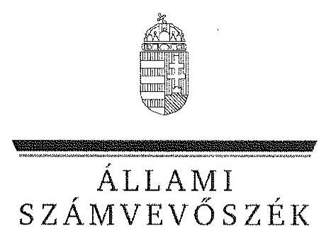
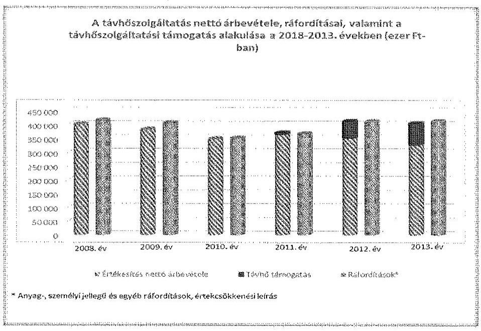
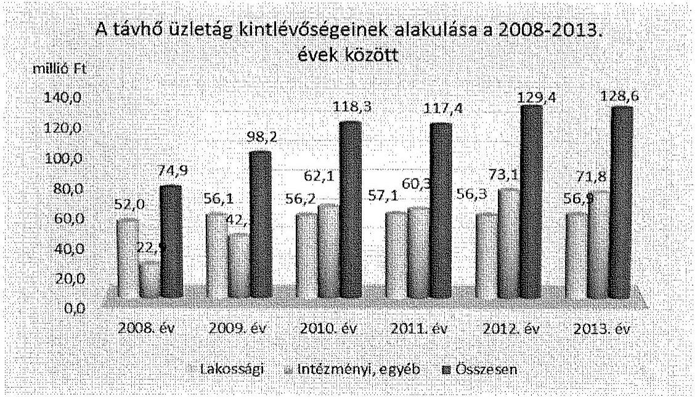
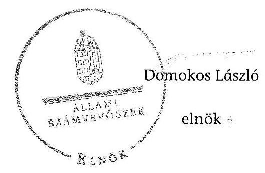
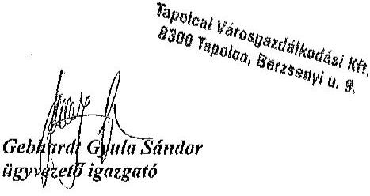
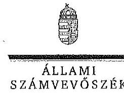
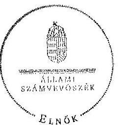

ÁLLAMI
SZÁMVEVŐSZÉK

# JELENTÉS 

Az önkormányzatok gazdasági társaságai - Az önkormányzatok többségi tulajdonában lévő gazdasági társaságok közfeladat ellátását érintő gazdálkodási tevékenysége szabályszerűségének ellenőrzése Tapolcai Városgazdálkodási Kft.

---

# Állami Számvevőszék 

Iktatószám: V-0827-158/2015.
Témaszám: 1861
Vizsgálat-azonosító szám: V067148

## Az ellenőrzést felügyelte:

Dr. Horváth Margit
felügyeleti vezető
Az ellenőrzést vezette és az ellenőrzés végrehajtásáért felelős:
Salamin Viktor
ellenőrzésvezető
A jelentéstervezet összeállításában közremüködött:
Szabó Balázsné Zsíros Andrea
számvevő
Az ellenőrzést végezték:
Dobos László
okleveles könyvvizsgáló,
külső szakértő

Hámori Gábor
okleveles könyvvizsgáló,
külső szakértő

## Molnár Gábor

okleveles könyvvizsgáló, külső szakértő

---

# TARTALOMJEGYZÉK 

BEVEZETÉS ..... 7
I. ÖSSZEGZŐ MEGÁLLAPÍTÁSOK, KÖVETKEZTETÉSEK, JAVASLATOK ..... 10
II. RÉSZLETES MEGÁLLAPÍTÁSOK ..... 15

1. Az önkormányzat közfeladat-ellátásának szabályszerűsége ..... 15
1.1. A közfeladat-ellátás megszervezése és a feladatellátás feltételrendszerének kialakítása ..... 15
1.2. A közfeladat-ellátás felügyelete és a tulajdonosi jogok érvényesítése ..... 17
2. A TVG Kft. közfeladat-ellátással kapcsolatos tevékenysége ..... 19
2.1. A TVG Kft. gazdálkodásának szabályozottsága ..... 19
2.2. A TVG Kft. vagyongazdálkodása ..... 20
2.3. A beszámolási kötelezettség teljesítése ..... 22
3. A távhőszolgáltatás közfeladata bevételei és ráfordításai elszámolásának és önköltségszámításának szabályszerűsége ..... 23
3.1. A távhőszolgáltatás közfeladat bevételeinek és ráfordításainak elkülönített, szabályszerű elszámolása ..... 23
3.2. Az önköltségszámítás szabályszerűsége ..... 27
4. Az ÁSZ korábbi, az önkormányzatok többségi tulajdonában lévő gazdasági társaságok közfeladat-ellátását, gazdálkodását, pénzügyi helyzetét érintő javaslataira tett intézkedések ..... 28

## MELLÉKLETEK

1. számú A TVG Kft. tevékenységének főbb adatai
2. számú A TVG Kft. múködésének főbb jellemzői
3. számú A TVG Kft. által biztosított távhőszolgáltatás díjai
4. számú Beérkezett észrevételek és az azokra adott válaszok

## FÜGGELÉKEK

1. számú Értelmező szótár
2. számú Mintavételi eljárások ellenőrzési területenként

---

.

---

# RÖVIDÍTÉSEK JEGYZÉKE 

## Törvények

Adatvédelmi tv.

Áht.
Ámt.
Info tv.

Ebktv.

Fgytv.
Gt.
Nvtv.
Ötv.

Rezsi tv.
Számv. tv.
Tao tv.
Tszt.
2013. évi CLXVII. törvény

## Rendeletek

157/2005. (VIII. 15.)
Korm. rendelet
51/2011. (IX. 30.) NFM rendelet
a személyes adatok védelméről és közérdekú adatok nyilvánosságáról szóló 1992. évi LXIII. törvény (hatályos 2011. december 31-éig), annak módosításáról szóló 2003. évi XLVII. törvény (hatályos 2007. november 30 -áig)
az államháztartásról szóló 2011. évi CXCV. törvény (hatályos: 2011. december 31-étől)
az árak megállapításáról szóló 1990. évi LXXXVII. törvény (hatályos: 1991. január 1-jétől)
az információs önrendelkezési jogról és az információszabadságról szóló 2011. évi CXII. törvény (hatályos 2012. január 1-jétől)
az egyenlő bánásmódról és az esélyegyenlőség előmozdításáról szóló 2003. évi CXXV. törvény (hatályos: 2004. március 28 -ától)
a fogyasztóvédelemről szóló 1997. évi CLV. törvény (hatályos: 1998. március 1-jétől)
a gazdasági társaságokról szóló 2006. évi IV. törvény (hatálytalan: 2014. március 15 -étől)
a nemzeti vagyonról szóló 2011. évi CXCVI. törvény (hatályos: 2011. december 31-étől)
a helyi önkormányzatokról szóló 1990. évi LXV. törvény (hatálytalan: a 2014. évi általános önkormányzati választások napjától)
a rezsicsökkentések végrehajtásáról szóló 2013. évi LIV. törvény (hatályos: 2013. május 10-étől)
a számvitelről szóló 2000. évi C. törvény (hatályos: 2001. január 1-jétől)
a társasági adóról és az osztalékadóról szóló 1996. évi LXXXI. törvény (hatályos: 1997. január 1-jétől)
a távhőszolgáltatásról szóló 2005. évi XVIII. törvény (hatályos: 2005. július 1-jétől)
az egyes törvényeknek a rezsicsökkentés végrehajtásához szükséges módosításáról szóló 2013. évi CLXVII. törvény (hatályos: 2013. október 22-étől)
a távhőszolgáltatásról szóló 2005. évi XVIII. törvény végrehajtásáról (hatályos: 2005. szeptember 29-étől)
a távhőszolgáltatási támogatásról szóló 51/2011. (IX. 30.) NFM rendelet (hatályos: 2011. október 1-jétől)

---

83/2011. (XII. 29.) NFM rendelet

78/2012. (XII. 22.) NFM rendelet

## Szórövidítések

adatvédelmi szabályzat1
adatvédelmi szabályzat ${ }_{2}$

ÁSZ
értékelési szabályzat ${ }_{1}$
értékelési szabályzat ${ }_{2}$
FB
gazdasági program ${ }_{1}$
gazdasági program ${ }_{2}$
javadalmazási szabályzat
jegyzó
Képviselő-testület
legfőbb szerv
leltározási szabályzat ${ }_{1}$
leltározási szabályzat ${ }_{2}$
MÁK
Önkormányzat
pénzkezelési szabályzat
Pénzügyi Bizottság
polgármester
számlarend $_{1}$
számlarend $_{2}$

83/2011. (XII. 29.) NFM rendelet a villamos energia és a földgáz egyetemes szolgáltatás, valamint a távhő árának meghatározásával, a vízügyi igazgatás átalakításával és az energiastatisztikai feladatok ellátásával összefüggő egyes energetikai tárgyú miniszteri rendeletek módosításáról (hatályos: 2012. január 1-jétől 2012. január 2-áig)
78/2012. (XII. 22.) NFM rendelet egyes energetikai tárgyú árszabályozással összefüggő miniszteri rendeletek módosításáról (hatályos: 2012. december 26-ától 2013. január 2-áig)

Tapolcai Városgazdálkodási Kft. adatvédelmi szabályzata (hatálytalan: 2012. január 1-jétől)
Tapolcai Városgazdálkodási Kft. adatvédelmi szabályzata (hatályos: 2012. január 1-jétől)
Állami Számvevőszék
Tapolcai Városgazdálkodási Kft. eszközök és források értékelési szabályzata (hatálytalan: 2003. január 1-jétől)
Tapolcai Városgazdálkodási Kft. eszközök és források értékelési szabályzata (hatályos: 2012. január 1-jétől)
Tapolcai Városgazdálkodási Kft. Felügyelőbizottsága
Tapolca Város Önkormányzata Képviselő-testülete 20072010. évek közötti gazdálkodásának stratégiai programja

Tapolca Város Önkormányzata Képviselő-testülete 20112014. évek közötti gazdálkodásának stratégiai programja
Tapolcai Városgazdálkodási Kft. javadalmazási szabályzata (hatályos: 2010. június 1-jétől)
Tapolca Város Önkormányzatának jegyzője
Tapolca Város Önkormányzatának Képviselő-testülete
a Tapolcai Városgazdálkodási Kft. legfőbb szerve (2013. október 6-áig a taggyúlés, 2013. október 7-étől a Képvise-lö-testület)
Tapolcai Városgazdálkodási Kft. leltározási és selejtezési szabályzata (hatálytalan: 2013. január 1-jétől)
Tapolcai Városgazdálkodási Kft. leltározási és selejtezési szabályzata (hatályos: 2013. január 1-jétől)
Magyar Államkincstár
Tapolca Város Önkormányzata
Tapolcai Városgazdálkodási Kft. pénzkezelési szabályzata (hatályos: 2007. március 30-ától)
Tapolca Város Önkormányzatának Pénzügyi és Településfejlesztési Bizottsága
Tapolca Város Önkormányzatának polgármestere
Tapolcai Városgazdálkodási Kft. számlarendje (hatályos: 2010. január 1-jéig)
Tapolcai Városgazdálkodási Kft. számlarendje (hatályos: 2012. január 1-jéig)

---

számlarend $_{2}$
számviteli politika $_{1}$
számviteli politika $_{2}$
számviteli politika $_{3}$
számviteli politika $_{4}$
szétválasztási szabály$\mathrm{zat}_{1}$
szétválasztási szabály$\mathrm{zat}_{2}$
SZMSZ $_{1}$

SZMSZ $_{2}$
taggyúlés
Társaság
Társasági szerződés/Alapító okirat

TVG Kft.
vagyongazdálkodási rendelet $_{1}$
vagyongazdálkodási rendelet $_{2}$
távhőszolgáltatási rendelet

Tapolcai Városgazdálkodási Kft. számlarendje (hatályos: 2012. január 1-jétől)

Tapolca Város Önkormányzatának számviteli politikája (hatályos: 2008. március 28 -ától 2009. március 30 -áig)
Tapolca Város Önkormányzatának számviteli politikája (hatályos: 2009. március 30-ától 2010. március 30-áig)
Tapolca Város Önkormányzatának számviteli politikája (hatályos: 2010. március 30-ától 2013. március 29-éig)
Tapolca Város Önkormányzatának számviteli politikája (hatályos: 2013. március 29-étől)
Tapolcai Városgazdálkodási Kft. szétválasztási szabályzata (hatályos: 2012. január 1-jétől 2013. január 1-jéig)
Tapolcai Városgazdálkodási Kft. szétválasztási szabályzata (hatályos: 2013. január 1-jétől)
Tapolca Város Önkormányzatának 8/2007. (IV. 16.) számú rendelete az Önkormányzat Szervezeti és Müködési Szabályzatáról (hatályos: 2007. május 1-jétől)
Tapolca Város Önkormányzatának 3/2011. (IV. 1.) számú rendelete az Önkormányzat Szervezeti és Müködési Szabályzatáról (hatályos: 2011. május 1-jétől)
a Tapolcai Városgazdálkodási Kft. taggyúlése
Tapolcai Városgazdálkodási Kft.
Tapolcai Városgazdálkodási Kft. Társasági szerződése és annak módosításai 2013. április 25-éig, Alapító okirata 2013. április 25 -étől

Tapolcai Városgazdálkodási Kft.
Tapolca Város Önkormányzatának 10/2004. (IV. 20.) számú rendelete az Önkormányzat vagyonáról, és a vagyonhasznosítás szabályairól (hatályos: 2004. június 1jétől)
Tapolca Város Önkormányzatának 15/2013. (IV. 29.) számú rendelete az Önkormányzat vagyonáról, és a vagyonhasznosítás szabályairól (hatályos: 2013. május 1jétől)
Tapolca Város Önkormányzatának 14/2006. (VI. 19.) rendelete a távhőszolgáltatásról és a távhőszolgáltatás legmagasabb hatósági díjáról (hatályos: 2006. július 1jétől)

---

.

---

# JELENTÉS 

## Az önkormányzatok gazdasági társaságai az önkormányzatok többségi tulajdonában lévő gazdasági társaságok közfeladat ellátását érintő gazdálkodási tevékenysége szabályszerűségének ellenőrzése Tapolcai Városgazdálkodási Kft.

## BEVEZETÉS

Az Állami Számvevőszék középtávra szóló stratégiájában megfogalmazta, hogy a helyi önkormányzatok gazdálkodásában rejlő pénzügyi kockázatok feltárásával, az államháztartáson kívülre nyújtott költségvetési támogatások és ingyenes vagyonjuttatások, valamint az államháztartáson kívül múködő köz-feladat-ellátó rendszerek ellenőrzéseivel hozzájárul ahhoz, hogy a közpénzeket az államháztartáson kívül múködő szervezetek is átlátható, rendezett módon használják fel a közfeladatok szerződésben vállalt ellátása érdekében.

Az önkormányzatok szervezetalakítási szabadságának következménye, hogy a korábban is vállalati formában múködő (nagyvárosi tömegközlekedés, víz-, szennyvízcsatorna, köztisztasági, ingatlankezelés stb.) közszolgáltatások mellett, mind a kötelező, mind az önként vállalt feladatok ellátásában a gazdasági társaságok kiemelt fontosságú szerephez jutottak.

Tapolca Város Önkormányzata 1996. szeptember 2-ai hatállyal ${ }^{1}$ hozta létre a Tapolcai Városgazdálkodási Kft.-t (továbbiakban: TVG Kft. vagy Társaság) a távhőszolgáltatás közfeladat ellátására. A Társaság jogelődje a közüzemi feladatokat ellátó önkormányzati tulajdonú Tapolcai Városgazdálkodási Részvénytársaság volt. A távhőszolgáltatás múködtetésének új gazdasági formáját a profiltisztítás, a szolgáltatás gazdálkodási és pénzforgalmi szempontból történő elkülönítése indokolta. A TVG Kft. főtevékenysége gőzellátás, légkondicionálás volt, emellett ingatlankezelési, fizető parkolási, termálfürdő üzemeltetési tevékenységet is ellátott. A Társaság az ellenőrzési időszakban nem rendelkezett tulajdoni hányaddal más gazdasági társaságban. A TVG Kft.-ben az alapításkor az Önkormányzatnak 70,0\%-os, a Tapolcai Városgazdálkodási Alapítványnak 30,0\%-os részesedése volt. A 2012. december 3.-i keltü, a Tapolcai Városgazdálkodási Alapítvány és az Önkormányzat között létrejött üzletrész átruházási szerződés értelmében az Alapítvány az üzletrészét két részletben átruházta az Önkormányzatra. A Veszprémi Törvényszék Cégbírósága a 17,15\%-os üzletrészt 2013. január 28-án, a 12,85\%-os üzletrészt 2013. október 7-én jegyez-

[^0]
[^0]:    ${ }^{1}$ A 234/1996. (VI. 6.) számú határozatával.

---

te be az Önkormányzat nevére. A cégkivonat szerint az Önkormányzat 2013. április 25 -ei hatállyal a TVG Kft. kizárólagos tulajdonosává vált. A TVG Kft. jegyzett tőkéje az ellenőrzött időszakban 180,2 M Ft volt.

A jelenlegi polgármester 2014. október 12-étől, a jegyző 2013. február 20. óta látja el feladatait. Az ellenőrzött időszakban a polgármester személye három, a jegyző személye két alkalommal változott. A TVG Kft.-nél a 2008-2013. években a főkönyvelő személye nem, az ügyvezető személye két alkalommal változott. A jelenlegi ügyvezető 2009. augusztus 1-jétől, a főkönyvelő 1997. július 1jétől tölti be tisztségét.

Tapolca város lakosságszáma 2013. január 1-jén 16499 fő, a TVG Kft. által 2013-ban távhővel ellátott lakossági fogyasztók száma 1634 db , közületek száma 29 db , egyéb fogyasztók száma 60 db volt. A Társaság összes bevétele 2008-ban 620,7 M Ft-ot (ezen belül a nettó árbevétel 492,7 M Ft), 2013-ban 609,2 M Ft-ot (ezen belül a nettó árbevétel 508,2 M Ft) tett ki. A TVG Kft. mérleg szerinti eredménye 2008-ban 9,6 M Ft, 2013-ban 0,5 M Ft, az eszközök mérleg szerinti értéke 2008-ban 407, 9 M Ft, 2013-ban pedig 429,1 M Ft volt.

Az önkormányzati tulajdonú gazdasági társaságok teljes körű ellenőrzésének lehetőségét az Állami Számvevőszékről szóló 1989. évi XXXVIII. törvény 2011. január 1-jétől hatályos módosítása teremtette meg.

Az ellenőrzés célja annak értékelése volt, hogy

- az önkormányzat a jogszabályi előírások figyelembevételével döntött-e az ellenőrzésre kerülő közfeladat megszervezéséről; az önkormányzat szabályszerűen gyakorolta-e a tulajdonosi jogokat;
- a gazdasági társaság közfeladat-ellátása bevételeinek, ráfordításainak elszámolása, és vagyongazdálkodási tevékenysége megfelelte a jogszabályi, illetve a közszolgáltatási szerződésben foglalt tulajdonosi előírásoknak, azok végrehajtása szabályszerű volt-e;
- a közfeladatok átláthatósága és elszámoltathatósága érdekében biztosítva volt-e a közszolgáltatás dijának megalapozottsága szabályszerű önköltségszámítással.

Az ellenőrzés kiterjedt Tapolca Város Önkormányzatára és a Tapolcai Városgazdálkodási Kft.-re.

Az ellenőrzés várható hasznosulása: A törvényalkotás számára - az észlelt problémák, szabálytalanságok, vagy egyéb nem kívánatos jelenségek felszínre kerülésével - az ellenőrzés megállapításai segítséget nyújthatnak az államháztartáson kívüli közfeladat-ellátás értékeléséhez, jogszabályi keretei pontosításához, átláthatóságot biztosító szabályozásához. Meghatározhatóvá válnak a költségvetési hiányt befolyásoló szervezetek kockázatai, lehetővé válik ezen kockázatok csökkentése. Feltárja, hogy az önkormányzat közfeladatellátási kötelezettségének szabályszerűen tett-e eleget, a feladatellátáshoz rendelt közvagyon múködtetését szabályszerűen szervezte-e meg és a tulajdonosi felügyelete hozzájárult-e a közfeladat-ellátásához. A feladatot ellátó gazdasági társaság a közszolgáltatási szerződésben foglaltak betartásával, a közvagyon

---

használatával biztosította-e a szolgáltatás folytatásának feltételeit. Ezzel az ellenőrzöttek és a helyi döntéshozók számára visszajelzést ad feladatszervezési, feladat-ellátási kockázataikról, alapot ad a meglévő hibák megszüntetéséhez, a jobb közfeladat-ellátás biztosításához. Fokozza a fegyelmet, igazolja, hogy lejárt a következmények nélküli ellenőrzések időszaka. Az ÁSZ értékteremtő rend kialakításához és megőrzéséhez hozzájáruló tevékenysége pozitív hatással van a szervezetről kialakított összkép formálására is.

A bevételek és ráfordítások elszámolása, valamint a vagyonnyilvántartás terén az egyes területek szabályszerű működését mintavétellel ellenőriztük, ez alapján a sokaságokban előforduló hibás tételek arányát becsültük. A jogszabályoknak és a belső előírásoknak megfelelőnek, azaz szabályszerűnek tekintettük az adott bevételek és ráfordítások elszámolását, a vagyonnyilvántartást, amennyiben a minta ellenőrzésének eredménye alapján $95 \%$-os bizonyossággal a teljes sokaságban a hibás tételek aránya kisebb volt, mint $10 \%$, nem megfelelőnek értékeltük, ha a hibás tételek aránya a $10 \%$-ot meghaladta. Kockázatot, illetve magas kockázatot jeleztünk, amennyiben egy adott terület vonatkozásában a minta alapján a teljes sokaságban nem volt teljes körűen biztosított a jogszabályoknak és a belső szabályzatoknak megfelelő működés.

Az ellenőrzést a számvevőszéki ellenőrzés szakmai szabályai szerint, szabályszerűségi ellenőrzés módszerével, a nemzetközi standardok figyelembevételével végeztük. Az ellenőrzés a 2008-2013. évekre terjedt ki.

Az ellenőrzés végrehajtásának jogszabályi alapját az ÁSZ tv. 5. § (3)-(5) bekezdései képezték.

Az ÁSZ az Állami Számvevőszékről szóló 2011. évi LXVI. törvény 29. §-a alapján a jelentéstervezetet észrevételezésre megküldte Tapolca Város Önkormányzata polgármesterének és a gazdasági társaság ügyvezető igazgatójának. A beérkezett észrevételeket a jelentés véglegesítése során hasznosítottuk. Az észrevételeket és az azokra adott válaszokat a jelentés 4. számú melléklete tartalmazza.

---

# I. ÖSSZEGZŐ MEGÁLLAPÍTÁSOK, KÖVETKEZTETÉSEK, JAVASLATOK 

Az Önkormányzat a jogszabályi előírásoknak megfelelően a távhőszolgáltatás közfeladat ellátására az ellenőrzött időszak előtt (1996-ban) hozta létre a TVG Kft.-t. Az Önkormányzat a távhőszolgáltatás közfeladatának megszervezéséről az Ötv. előírásainak megfelelően döntött, a közfeladat ellátáshoz szükséges vagyont apportként biztosította a TVG Kft. részére az Ötv. és Gt. előírásai szerint. A tulajdonosi jogokat a legfőbb szerv a Gt.-ben foglaltaknak megfelelően, szabályszerűen gyakorolta.

Az Önkormányzat a távhőszolgáltatásra vonatkozóan a Tszt. szerinti rendeletalkotási kötelezettségének a távhőszolgáltatási rendelet megalkotásával eleget tett. A távhőszolgáltatási rendelet a Tszt. előírásainak megfelelt, azonban a rendeleten a díjak megállapítását érintő, az Ámt.-ben, valamint a Tszt.ben foglalt, 2011. április 15 -étől hatályos változást - mely szerint a díj megállapításának joga önkormányzati hatáskörből miniszteri hatáskörbe került nem vezették át.

A Képviselő-testület a vagyongazdálkodási rendelet ${ }_{1,2}$-ben szabályszerűen rögzítette a tulajdonosi jogok gyakorlásának szabályait. A Képviselő-testület a tulajdonosi joggyakorlását a cégvezetés kialakításával és az FB tagok delegálásával, az éves számviteli beszámolók, az üzleti tervek, üzleti jelentések és az éves gazdálkodásról szóló tájékoztatók elfogadásával érvényesítette. A jegyző a Tszt.-ben foglaltak ellenére a TVG Kft. által kidolgozott távhőszolgáltatási üzletszabályzatot nem hagyott jóvá, azt a Társaság nem készítette el.

Az Önkormányzat belső ellenőrzése a távhőszolgáltatás közfeladat ellátásának szabályszerű teljesítéséhez, a vagyon megóvásához nem járult hozzá. Az ellenőrzött időszakban 22 külső ellenőrzés érintette a Társaságot, melyből 13 kapcsolódott a távhőszolgáltatás közfeladat-ellátáshoz. A MÁK 10 esetben ellenőrizte az energiatámogatás elszámolását, melyből hat esetben tett megállapítást. A javaslatok alapján a szükséges intézkedéseket megtették. 2012-ben a Magyar Energia Hivatal a távhődíjak tárgyában végzett ellenőrzése kapcsán nem tett megállapítást, a Veszprém Megyei Kormányhivatal Fogyasztóvédelmi Felügyelősége ellenőrzése eredményeként a díjfizetés általános szerződési feltételei az ügyfélszolgálati irodákban kifüggesztésre kerültek. 2013-ban a Veszprém Megyei Kormányhivatal Fogyasztóvédelmi Felügyelőségének rezsicsökkentés végrehajtása tárgyában folytatott ellenőrzése jogsértést nem állapított meg.

A TVG Kft. mérleg szerinti eredményét az éves beszámolók elfogadásakor a 2012. évi kivételével - mindegyik évben az eredménytartalékba helyezték. A Társaságnál a saját tőke/jegyzett tőke mutató értéke alapján visszapótlási kötelezettség nem merült fel. Az Önkormányzat az ellenőrzött időszakban a TVG Kft.-nek a távhőszolgáltatáshoz kapcsolódóan múködési és felhalmozási célú pénzeszközt nem adott át, kölcsönt nem nyújtott, a kötelezettségvállalásaival kapcsolatban garanciát, kezességet nem vállalt.

---

A TVG Kft. 2008-2013 között a Számv. tv.-ben foglaltaknak megfelelően rendelkezett számviteli politiká ${ }_{1-4}$-val, leltározási szabályzat ${ }_{1,2}$-tal, értékelési szabályzat ${ }_{1,2}$-tal, valamint pénzkezelési szabályzattal, melyeket aktualizáltak. A számviteli politika ${ }_{1-4}$ a Számv. tv.-ben foglaltak ellenére nem tartalmazta az immateriális javak közül a vagyoni értékú jogok értékcsökkenése elszámolásának szabályait. A pénzkezelési szabályzat a Számv. tv.-ben foglaltakkal ellentétben nem tért ki a készpénzállomány ellenőrzésekor követendő eljárásra és az ellenőrzés gyakoriságára. A leltározási szabályzat ${ }_{2}$ 2013. január 1-jétől a „Tárgyi eszközök és beruházások leltározása és értékelése" fejezetében a - Számv. tv. előírásának megfelelően - három évenkénti mennyiségi felvételt írt elő. A szabályzat „A befektetett eszközök leltározása" fejezete azonban nem követte a módosítást, meghagyta az egyeztetés módszerét, így ellentmondás állt fenn a két fejezet között. A Társaság önköltség-számítási szabályzat készítésére nem volt kötelezett. A TVG Kft. rendelkezett a Számv. tv.-nek megfelelő számlarend ${ }_{1-3}$ del, mely alkalmas volt az árbevételek, valamint a költségek, ráfordítások elkülönítésére a távhőszolgáltatás, illetve az egyéb tevékenységek vonatkozásában. A Tszt. szerinti számviteli szétválasztással kapcsolatos szabályokat a szétválasztási szabályzat ${ }_{1,2}$-ban rögzítették. A TVG Kft. a Tszt.-ben foglaltakkal ellentétben távhőszolgáltatási üzletszabályzatot nem készített.

A TVG Kft. gazdálkodási tevékenységéről szóló éves, illetve egyszerűsített éves beszámolóit, a következő évi üzleti tervről szóló tájékoztatót a legfőbb szerv minden évben elfogadta. A Gt. előírásának megfelelően az FB jelentések az ellenőrzött időszak minden évében elkészültek. Az FB az éves beszámolót/egyszerűsített éves beszámolót, illetve üzleti tervet minden évben elfogadásra javasolta. A Társaság könyvvizsgálója a 2008-2013. években elkészítette a könyvvizsgálói jelentéseket, melyeket minősítés nélküli záradékkal látott el. A TVG Kft. a jogszabályi előírásoknak megfelelően határidőben eleget tett a letétbe helyezési és közzétételi kötelezettségeinek.

A TVG Kft. vagyongazdálkodási tevékenysége a jogszabályi előírásoknak a saját vagyon nyilvántartása, kezelése tekintetében nem felelt meg. A menynyiségi felvétellel történő leltározást a vásárolt készleteknél - a leltározási szabályzat ${ }_{1}$ előirása szerint - a 2008-2013. években elvégezték. A vagyontárgyak esetében a nyilvántartások egyeztetésén alapuló leltárt minden ellenőrzött évben elkészítették.

A Társaság távhőszolgáltatási közfeladat értékesítés nettó árbevételeinek elszámolása a Számv. tv.-ben, valamint a belső számviteli szabályzatokban foglaltaknak megfelelően történt. Az anyagjellegú ráfordítások elszámolását magas kockázatúnak értékeltük. A költségelszámolást megalapozó dokumentumok több esetben hiányoztak, ezzel a Társaság nem tett eleget a Számv. tv.-ben foglalt bizonylat megőrzési kötelezettségének. A költségeket a Számv. tv.-ben foglaltak ellenére néhány esetben nem a megfelelő költségnemre számolták el. A TVG Kft. távhőszolgáltatási közfeladathoz kapcsolódó beruházásainak, felújításainak elszámolását nem megfelelőnek értékeltük. A számviteli politiká ${ }_{1-4}$-ban foglaltak ellenére a Társaság néhány esetben az 50 ezer Ft egyedi beszerzési érték alatti szellemi termék és tárgyi eszköz értékcsökkenését a használatba vételkor nem egy összegben számolta el, valamint a tárgyi eszközt nem a megfelelő főkönyvi számra könyvelte. A TVG Kft. - általános gyakorlatként - a Számv. tv.-ben foglaltakkal ellentétben az

---

immateriális javak és tárgyi eszközök beszerzése során az eszközök bekerülési értékét 1000 Ft-ra kerekítve vette számba.

A TVG Kft. a kintlévőségek behajtására intézkedéseket foganatosított. A Társaság a hátralékos állományról nyilvántartást vezetett, azt havonta frissítette. Nemfizetés esetén fizetési felszólítást küldött, majd fizetési meghagyást kért a jegyzőtől az ügyfelekre. Eredménytelen behajtás esetén végrehajtás alá vonta a hátralékos összeget. Mindezek ellenére a hátralékos állomány 71,7\%kal emelkedett 2008-2013 között, mivel az intézményi kintlévőségek több mint háromszorosával nőttek.

A TVG Kft.-t az Számv. tv. értelmében nem terhelte önköltség-számítási szabályzat készítési kötelezettség, a szétválasztási szabályzat ${ }_{1,2}$ előírásai alapján kialakított számviteli nyilvántartás azonban közvetlenül biztosította a távhőtermelésre és távhőszolgáltatásra vonatkozó önköltség számításához szükséges adatokat. A Társaság a Tszt. előírásai szerint olyan elszámolási és nyilvántartási rendszert alakított ki, amely biztosította az árak és díjak átláthatóságát.

A fentiekben leírtak összegzéseként az alábbi megállapításokat tesszük:
Az Önkormányzat a távhőszolgáltatás közfeladatának megszervezéséről a jogszabályi előírásoknak megfelelően döntött, a TVG Kft. feletti tulajdonosi jogokat szabályszerűen gyakorolta. A tulajdonosi ellenőrzés elsősorban az FB múködésén és a beszámoltatás rendszerén keresztül érvényesült. A legfőbb szerv a Társaság által elkészített éves, egyszerűsített éves beszámolókat és üzleti jelentéseket elfogadta. Az Önkormányzat belső ellenőrzése a távhőszolgáltatás, mint közfeladat ellátás szabályszerű teljesítéséhez, az önkormányzati vagyon megóvásához érdemben nem járult hozzá. A TVG Kft. számviteli rendszerének szabályozottsága, valamint vagyongazdálkodási tevékenysége a jogszabályi előírásoknak nem teljes körűen felelt meg a saját vagyon nyilvántartásával kapcsolatosan megállapított hiányosságok miatt. A Társaság alkalmazta a távhőszolgáltatásra vonatkozó számviteli szétválasztási szabályokat. A távhőszolgáltatás nettó árbevételének elszámolása során szabályszerűen jártak el, az anyagjellegű ráfordítások elszámolását azonban magas kockázatúnak, a beruházások, felújítások, és az értékcsökkenés elszámolását nem megfelelőnek értékeltük. Az alkalmazott szolgáltatási díjak megfeleltek az Ámt.-ben, valamint a távhőszolgáltatási rendeletben foglaltaknak.

Az Állami Számvevőszékről szóló 2011. évi LXVI. törvény 33. § (1) bekezdésében foglaltak értelmében a jelentésben foglalt megállapításokhoz kapcsolódó intézkedési tervet köteles az ellenőrzött szervezet vezetője összeállítani, és azt a jelentés kézhezvételétől számított 30 napon belül az ÁSZ részére megküldeni. Amennyiben az intézkedési tervet határidőben nem küldi meg a szervezet, vagy az nem elfogadható, az ÁSZ elnöke a hivatkozott törvény 33. § (3) bekezdés a)-b) pontjaiban foglaltakat érvényesítheti.

Az ellenőrzés intézkedést igénylő megállapításai és javaslatai:
Javaslataink célja a TVG Kft. gazdálkodása szabályszerűségének helyreállítása annak érdekében, hogy a szabályozási környezet megfelelően tudja támogatni az átlátható müködést.

---

# Javasoljuk a TVG Kft. ügyvezető igazgatójának: 

1. A Számv. tv. 14. § (5) b) pontja szerint kötelező szabályzatként el kell készíteni az eszközök és források értékelési szabályzatát, amelynek tartalmára a Számv. tv. értékcsökkenésre vonatkozó szabályai érvényesek. A Társaságnál a számviteli politika ${ }_{1-4}$ az értékcsökkenés elszámolása módszerei között - a Számv. tv. 52. § (1) ellenére - nem tartalmazta az immateriális javak közül a vagyoni értékú jogok értékcsökkenése elszámolásának szabályát.

A leltározási szabályzat ${ }_{2}$ a „Tárgyi eszközök és beruházások leltározása és értékelése" fejezetében a három évenkénti mennyiségi felvételt írta elő. A szabályzat „Befektetett eszközök leltározása" fejezete azonban nem követte a módosítást, meghagyta az egyeztetés módszerét, így ellentmondás állt fenn a két fejezet között.

A pénzkezelési szabályzat rendelkezett a bankszámlán és a házi pénztárban lebonyolítandó ki- és befizetések rendjéről, bizonylatairól, a házipénztári záró állomány maximális mértékéről, azonban - a Számv. tv. 14. § (8) bekezdésében foglaltakkal ellentétben - nem tért ki a készpénzállomány ellenőrzésekor követendő eljárásra, az ellenőrzés gyakoriságára.

A TVG Kft. a Tszt. 3. § v) pontjában foglaltakkal ellentétben üzletszabályzatot nem készített.

Javaslat:
Intézkedjen a szabályozási hiányosságok megszüntetésére, ennek keretében:
a) egészítse ki a számviteli politikát a vagyoni értékú jogok értékcsökkenése elszámolásának szabályaival;
b) hozza összhangba a leltározási szabályzat „Befektetett eszközök leltározása" fejezetét a három évenként történő mennyiségi felvételre vonatkozóan a „Tárgyi eszközök és beruházások leltározása és értékelése" fejezet előírásaival,
c) egészítse ki a pénzkezelési szabályzatot a készpénzállomány ellenőrzésekor követendő eljárásra, az ellenőrzés gyakoriságára vonatkozóan;
d) készítse el a TVG Kft. üzletszabályzatát és küldje meg a jegyzőnek jóváhagyásra.
2. A távhőszolgáltatási közfeladat anyagjellegű ráfordításainak elszámolásánál a költségelszámolást megalapozó dokumentum (szerződés, megrendelés) több esetben hiányzott, ezzel a Társaság nem tett eleget a Számv. tv. 169. § (2) bekezdésében rögzített bizonylat megőrzési kötelezettségének. Néhány esetben a gazdasági eseményt a Számv. tv. 16. § (3) bekezdésében foglaltak ellenére nem a megfelelő költségnemre számolták el.

---

Javaslat:
Intézkedjen a jogszabályi előírások szerinti gyakorlat biztosítására, ezen belül:
a) gondoskodjon a könyvviteli elszámolást alátámasztó számviteli bizonylatok 8 éven keresztül történő megőrzéséről;
b) biztosítsa, hogy az anyagjellegű ráfordítások elszámolása a megfelelő költségnemre történjen.

Javaslataink célja az Önkormányzat szabályszerű müködésének elősegítése, továbbá az önkormányzati tulajdonosi joggyakorlás kontrolljainak erősítése.

# Javasoljuk Tapolca Város Önkormányzata jegyzőjének: 

1. Az Önkormányzat a távhőszolgáltatási rendeletben - a Tszt. előírásainak megfelelően - szabályozta a távhőszolgáltató, a díjfizető és a felhasználó közötti jogviszonyt, a szolgáltatott távhő mérésével és elszámolásával, a szolgáltatás minőségével, a lakossági távhőszolgáltatás alkalmazott díjainak tartalmával, elszámolásával kapcsolatos előírásokat, valamint a lakossági távhőszolgáltatás alap-, és hődíjának legmagasabb hatósági árát. Ez utóbbit a Tszt. 60. § (3) bekezdésében kapott felhatalmazás alapján négy alkalommal módosította a Képviselő-testület, utoljára 2008-ban, de a díjak megállapítását érintő, az Ámt. 7. § (5) bekezdésében, valamint a Tszt. 57/D. § (1) bekezdésében foglalt, 2011. április 15-étől hatályos változást, az Önkormányzat árhatósági jogkörének a csatlakozási díj megállapításának kivételével történő megszűnését a rendeleten nem vezették át.

## Intézkedjen a jogszabályi előírások szerinti gyakorlat és a szabályos müködés biztosítására, ezen belül:

Javaslat:
a) kezdeményezze a távhőszolgáltatási rendelet módosítását az Önkormányzat árhatósági jogkörének változásával összhangban;
b) a TVG Kft. által elkészített és megküldött távhőszolgáltatási üzletszabályzatot küldje meg véleményezésre a fogyasztóvédelmi hatóság részére, majd a vélemény birtokában gondoskodjon annak jóváhagyásáról.
2. Az Önkormányzat belső ellenőrzése a távhőszolgáltatás közfeladat ellátásának szabályszerű teljesítéséhez, a vagyon megóvásához nem járult hozzá.

Javaslat:
fordítson kiemelt figyelmet arra, hogy az Önkormányzat belső ellenőrzése az ellenőrzéseivel a távhőszolgáltatás, mint közfeladat-ellátás szabályszerű teljesítéséhez, valamint az önkormányzati vagyon megóvásához járuljon hozzá.

---

# II. RÉSZLETES MEGÁLLAPÍTÁSOK 

## 1. AZ ÖNKORMÁNYZAT KÖZFELADAT-ELLÁTÁSÁNAK SZABÁLYSZERÜSÉGE

### 1.1. A közfeladat-ellátás megszervezése és a feladatellátás feltételrendszerének kialakítása

Az Ötv. 91. § (1) bekezdésében ${ }^{2}$ foglaltaknak eleget téve a Képviselő-testület határozatában ${ }^{3}$ elfogadta az Önkormányzat 2007-2010., illetve a 2011-2014. évekre szóló gazdasági program ${ }_{1,2}$-ját. A gazdasági program ${ }_{1,2}$ a távhőszolgáltató rendszer fejlesztésével kapcsolatban stratégiai célokat, feladatokat, a távhőszolgáltatás ellátására, színvonalának javítására vonatkozó fejlesztési elképzeléseket - az Ötv. 91. § (6) bekezdésében foglaltak ellenére ${ }^{4}$ - nem fogalmazott meg.

Az Ötv. 91. § (6) bekezdése szerint az önkormányzatoknak a gazdasági programjukban kellett meghatározni azon célkitűzéseket, amelyek a kötelező és önként vállalt feladatok biztosítását és fejlesztését szolgálják. A stratégiai program ${ }_{1,2}$ I. fejezete általánosságban tartalmazta a fejlesztési elképzeléseket, a munkahelyteremtés feltételeinek elősegítését, a településfejlesztési politika, az adó politika célkitűzéseit, az egyes közszolgáltatások biztosítására, színvonalának javítására vonatkozó megoldásokat. A II. fejezet részletesen felsorolta a különböző területek fejlesztésének forrásigényeit, de egyik sem érintette a távhőszolgáltatást.

A közfeladat ellátással kapcsolatban 2009 májusában készült el Tapolca Város 2009-2014. évekre szóló Környezetvédelmi Programja, mely a levegő tisztaságának védelmét, az energiagazdálkodást helyezte súlypontba. Ugyancsak a közfeladat ellátással kapcsolatban az Integrált Városfejlesztési Stratégiát 2008-ban fogadta el a Képviselő-testület azzal a céllal, hogy az elkövetkező 1015 évben jelentkező fejlesztési szükségleteket összehangolja a rendelkezésre álló köz- és magán forrásokkal. Ennek figyelembevételével elkészítették a település rendezési tervét, szabályozási tervét és a zöldfelület fejlesztési koncepciót. A távhőszolgáltatás fejlesztésével kapcsolatos konkrét elképzeléseket sem a Környezetvédelmi Program, sem az Integrált Városfejlesztési Stratégia nem tartalmazott.

Az Önkormányzat az Nvtv. 9. § (1) bekezdésében foglaltaknak eleget téve elkészítette a közép- és hosszú távú vagyongazdálkodási tervét.

[^0]
[^0]:    ${ }^{2}$ 2013. január 1-jétől az Mötv. 116. § (1) bekezdése írja elő.
    ${ }^{3}$ A Képviselő-testület 112/2007. (IV. 13.) számú, illetve 40/N/2011. (III. 31.) számú határozatai.
    ${ }^{4}$ 2013. január 1-jétől az Mötv. 116. § (3) bekezdése írja elő.

---

A középtávú (5 éves) vagyongazdálkodási tervben az Nvtv. 7. § (2) bekezdésében foglaltaknak megfelelően kitértek a vagyon bérbeadás útján történő hasznosításra, a vagyontárgyakkal történő vállalkozási tevékenység végzésére, illetve rögzítették, hogy törekedni kell a gazdasági társaságokban megszerzett részesedések értékének megőrzésére, azok gyarapítására. A hosszú távú (10 éves) vagyongazdálkodási tervben foglaltak szerint, az Önkormányzatnál a vagyon megőrzésének elsődlegessége elv érvényesül a hosszú távú múködési stabilitás érdekében, illetve a vagyonhasznosítás bevételeit minél nagyobb arányban a vagyontárgyak megóvására, megújítására, beruházásra kell fordítani.

Az Ötv. 9. § (4) bekezdésének rendelkezése értelmében a Képviselő-testület a feladatkörébe tartozó közszolgáltatások ellátása céljából többek között gazdasági társaságot alapíthat. Az Önkormányzat - közigazgatási területén - a távhőszolgáltatás közfeladatának megszervezéséről - a jogszabályban foglalt előírásoknak megfelelően - szabályszerűen döntött. Az ellenőrzött időszak előtt (1996-ban) létrehozta a TVG Kft.-t, amelyben a tulajdonosi részesedésének aránya az alapításkor 70,0\%, majd a 2013. évtől 100,0\% volt.

A kizárólagos részesedés biztosítása elengedhetetlen volt a TVG Kft. által végzett közszolgáltatások fejlesztéséhez és az annak érdekében megnyíló pályázatokra történő jelentkezéshez, valamint a kapcsolódó tulajdonosi döntések meghozatalának egyszerúsítéséhez.

Az Önkormányzat a TVG Kft.-be apportálta a távhőszolgáltatást biztosító vagyont, így az a Társaság saját vagyonát képezte. Az Önkormányzat a TVG Kft. részére a közfeladat ellátásához kezelésre vagyont nem adott át. A Társaság alapításkori - 180,2 M Ft értékű - jegyzett tőkéje az ellenőrzött időszak alatt nem változott. (A TVG Kft. főbb adatait az 1. számú melléklet, működésének főbb jellemzőit a 2. számú melléklet tartalmazza.)

Az Alapító Okirat szerint a TVG Kft. fő tevékenysége gőzellátás, légkondicionálás volt, a Társaság a tevékenységét távhőszolgáltatói múködési engedély birtokában végezte.

A Tszt. 6. § (2) bekezdés b) pontja alapján a Képviselő-testület ellátta a törvény által hatáskörébe utalt ármegállapítói feladatokat. A Képviselő-testület az Ötv. 16. § (1) bekezdésében, valamint a Tszt. 60. § (3) bekezdésében kapott felhatalmazás alapján a törvény egyes rendelkezéseinek, valamint a 157/2005. (VIII. 15.) Korm. rendelet és az annak 3. számú mellékletét képező Távhőszolgáltatási Közüzemi Szabályzat végrehajtására alkotta meg a távhőszolgáltatási rendeletét.

Az Önkormányzat a távhőszolgáltatási rendeletben - a Tszt. előírásainak megfelelően - szabályozta a távhőszolgáltató, a díjfizető és a felhasználó közötti jogviszonyt, a szolgáltatott távhő mérésével és elszámolásával, a szolgáltatás minőségével, a lakossági távhőszolgáltatás alkalmazott díjainak tartalmával, elszámolásával kapcsolatos előírásokat, valamint a lakossági távhőszolgáltatás alap-, és hődíjának legmagasabb hatósági árát. Ez utóbbit a Tszt. 60. § (3) bekezdésében kapott felhatalmazás alapján négy alkalommal módosította a Képviselő-testület, utoljára 2008-ban, de a díjak megállapítását érintő, az Ámt. 7. § (5) bekezdésében, valamint a Tszt. 57/D. § (1) bekezdésében foglalt, 2011. április 15-étől hatályos változást a rendeleten nem vezették át.

---

Az ellenőrzött időszakban az Önkormányzat a TVG Kft.-vel nem kötött a távhőszolgáltatás tárgyában közszolgáltatási szerződést, erre jogszabályi kötelezettsége nem volt.

# 1.2. A közfeladat-ellátás felügyelete és a tulajdonosi jogok érvényesítése 

A Képviselő-testület a vagyongazdálkodási rendelet ${ }_{1,2}$-ben, a vonatkozó jogszabályi előírásoknak megfelelően rögzítette a tulajdonosi jogok gyakorlásának szabályait. Ennek értelmében a tulajdonosi jogok gyakorlására a Képvi-selő-testület, átruházott hatáskörben a polgármester, vagy a bizottságok voltak jogosultak.

A polgármesterre átruházott feladat- és hatáskörként került meghatározásra az Önkormányzat által a gazdasági társaságokba delegált tisztségviselők visszahívásának kezdeményezése, valamint új tagok delegálása, az önkormányzati részesedéssel rendelkező gazdasági társaságokban való tulajdonosi képviselet.

A Képviselő-testület az SZMSZ ${ }_{1,2}$-ben véleményezésre kötelezte a Pénzügyi Bizottságot az éves számviteli beszámolók jóváhagyásakor és az üzleti tervek elfogadásakor, amely feladatoknak eleget tett. A Pénzügyi Bizottság a TVG Kft. éves beszámolóit és üzleti terveit a Képviselő-testület által elfogadott éves munkatervben meghatározott határidőben megvitatta.

A Képviselő-testület minden ellenőrzött évben elfogadta a stratégiai program ${ }_{1,2}$-ra épülő éves munkatervet, amely a májusi időszakra előirányozva tartalmazta - a Számv. tv. előírásaival összhangban - az éves beszámoló és üzleti terv megvitatását, képviselő-testületi határozattal történő elfogadását.

Az ellenőrzött időszakban a TVG Kft. felett a tulajdonosi jogokat a taggyúlés (2013. október 6 -áig), illetve a Képviselő-testület (2013. október 7-étől) a Gt. 141. § (2) bekezdésében foglaltak végrehajtásával határozatokban foglalt döntésekkel, szabályszerűen gyakorolta.

Az FB tagjait minden esetben az Önkormányzat delegálta, ügyrendjét a Gt. előírásai alapján az FB tagok maguk alakították ki. Az FB jelentéseit - az éves beszámolók és az üzleti terv jóváhagyására vonatkozóan - a legfőbb szerv az ellenőrzési időszak minden évében a munkatervben meghatározott határidőben megkapta, a számviteli beszámolókat a taggyúlési, illetve a képviselő-testületi ülésen elfogadták.

Az FB 2008-2012 között három főből állt, majd 2013-ban négy fő lett, amely megfelelt a Gt. előírásainak. Az FB tagjait a legfőbb szerv választotta.

Az ügyvezető és az FB tagok javadalmazásáról a legfőbb szerv határozati formában döntött.

A Társaság a Taktv. előírásai alapján készítette el a javadalmazási szabályzatot, melyet a 2015/2010. (V. 27.) számú taggyúlési határozattal léptettek hatályba. A szabályzat tartalmazta az ügyvezető igazgató és az FB tagok javadalmazására vonatkozó elveket, előírásokat, korlátokat. A szabályzatban rögzítették, hogy az ügyvezető igazgató számára teljesítménykövetelményt és ahhoz kapcsolódó jut-

---

tatást csak a taggyúlés határozhat meg, továbbá teljesítménykövetelményként az üzleti terv fő számainak teljesítése mellett csak olyan feltétel volt meghatározható, amelynek teljesítése a munkakör elvárható szakértelemmel és gondossággal való ellátásán túlmutató, objektíven meghatározható teljesítményt takart. Az ügyvezető igazgató munkájának elismeréseként az ellenőrzési időszakban három alkalommal - az éves számviteli beszámolók elfogadásakor - részesült jutalomban, melyet a legfőbb szerv jóváhagyott.

A jegyző a TVG Kft. által kidolgozott távhőszolgáltatási üzletszabályzatot nem hagyott jóvá, azt a Társaság a Tszt. 3. § v) pontjában foglaltak ellenére nem készítette el.

A TVG Kft. a Számv. tv. 155. § (2) bekezdésében előírtak szerint az ellenőrzött időszak alatt könyvvizsgálatra kötelezett volt. A megválasztott könyvvizsgáló a 2008-2013. évekre vonatkozóan elkészítette a Társaságra vonatkozó könyvvizsgálói jelentéseket, melyeket minden esetben minősítés nélküli záradékkal látott el.

Az Önkormányzat az ellenőrzött időszakban nem adott át tulajdonosi joggyakorlási jogosítványokat a Társaság vonatkozásában. A taggyúléseken, illetve képviselő-testületi üléseken a polgármester a vagyonrendelet ${ }_{1,2}$-ben foglaltak szerinti átruházott hatáskörében minden esetben személyesen vett részt.

Az Önkormányzat a TVG Kft.-vel nem kötött közfeladat ellátási szerződést, de a Gt. és a Számv. tv. előírásai alapján a Társaságot az éves gazdálkodásáról és a távhőszolgáltatási tevékenységről az ellenőrzés időszakában évente beszámoltatta.

A Számv. tv. előírásai alapján a 2008-2009. években a Társaság éves beszámolót, a 2010-2013. évekre vonatkozóan egyszerűsitett éves beszámolót készített. Az FB minden évben a Gt. 35. § (3) bekezdése szerint elkészített jelentésében elfogadásra javasolta a beszámolót, illetve üzleti tervet. A beszámolók az ellenőrzési időszakban évenként a Számv. tv. előírásainak megfelelő határidőben elkészültek. Elfogadásuk (taggyúlési, képviselő-testületi határozatok által jóváhagyva) és közzétételük a Számv. tv. előírásainak megfelelt.

Az Önkormányzat az ellenőrzött időszak alatt egy alkalommal élt az Ötv. 92. § (11) bekezdés b) pontjában ${ }^{5}$, valamint az Áht. 70. § (1) bekezdés d) pontjában biztosított lehetőséggel, melynek keretében 2009-ben a belsö ellenőrzés a Társaság parkolási tevékenységének hatékonyságát és jövedelmezőségét ellenőrizte. Az Önkormányzat belső ellenőrzése a távhőszolgáltatás közfeladat ellátásának szabályszerű teljesítéséhez, a vagyon megóvásához nem járult hozzá.

A 2008-2013. évek között a Társaságnál 22 esetben végeztek külső ellenőrzést, melyből 13 kapcsolódott a távhőszolgáltatás közfeladat-ellátáshoz.

A MÁK 10 esetben ellenőrizte az energiatámogatás elszámolását, melyből hat esetben tett megállapítást. A javaslatok alapján a szükséges intézkedéseket meg-

[^0]
[^0]:    ${ }^{5}$ Hatálytalan: 2013. január 1-jétől

---

tették, így a számlákat kijavították, a fogyasztók részére a támogatások jóváírásra kerültek, az analitikus nyilvántartásokat javították.

2012-ben a Magyar Energia Hivatal a távhődíjak tárgyában végzett ellenőrzése kapcsán nem tett megállapítást, a Veszprém Megyei Kormányhivatal Fogyasztóvédelmi Felügyelősége ellenőrzése eredményeként a díffizetés általános szerződési feltételei az ügyfélszolgálati irodákban kifüggesztésre kerültek. 2013-ban a Veszprém Megyei Kormányhivatal Fogyasztóvédelmi Felügyelőségének rezsicsökkentés végrehajtása tárgyában folytatott ellenőrzése jogsértést nem állapított meg.

A TVG Kft. az ellenőrzött időszakban - a 2009. év kivételével - nyereséges éveket zárt, a saját tőke/jegyzett tőke mutató értéke alapján visszapótlási kötelezettség nem merült fel. A Társaság mérleg szerinti eredményét az éves beszámolók elfogadásakor mindegyik évben az eredménytartalékba helyezték. A 2012. gazdasági év beszámolójának és mérleg szerinti eredményének jóváhagyásakor a taggyűlés az Önkormányzat részére 17,0 M Ft osztalék kifizetéséről döntött ${ }^{6}$, amelyet a Társaság az Önkormányzat számlájára 2013. október 31-én átutalt.

Az Önkormányzat az ellenőrzött időszakban a TVG Kft.-nek a távhőszolgáltatáshoz kapcsolódóan működési és felhalmozási célú pénzeszközt nem adott át, kölcsönt nem nyújtott, a kötelezettségvállalásaival kapcsolatban garanciát, kezességet nem vállalt.

# 2. A TVG Kft. KÖZFELADAT-ELLÁTÁSSAL KAPCSOLATOS TEVÉKENYSÉGE 

### 2.1. A TVG Kft. gazdálkodásának szabályozottsága

A TVG Kft. a 2008-2013. közötti időszakban évenkénti bontásban készítette el üzleti terveit, melyet a legfőbb szerv határozattal elfogadott. A Társaság - a 2008. év kivételével - minden évben megtervezte a távhőszolgáltatás tekintetében a várható árbevétel és költségek mértékét.

A TVG Kft. a Számv. tv. 14. § (3) és (4) bekezdésében foglaltakat betartva rendelkezett számviteli politiká ${ }_{1-4}$-val, leltározási szabályzat ${ }_{1,2}$-tal, értékelési szabályzat ${ }_{1,2}$-tal, valamint pénzkezelési szabályzattal, melyeket a Számv. tv. 14. § (11) bekezdésében foglaltak szerint aktualizált.

A számviteli politika ${ }_{1-4}$ az értékcsökkenés elszámolása módszerei között - a Számv. tv. 52. § (1) bekezdése ellenére - nem tartalmazta az immateriális javak közül a vagyoni értékű jogok értékcsökkenése elszámolásának szabályát.

Az értékelési szabályzat ${ }_{1,2}$ - a Számv. tv.-nek megfelelően - az immateriális javak és tárgyi eszközök értékcsökkenésének elszámolását a bekerüléskor megtervezett hasznos élettartam alatt lineáris leírási kulcsok alkalmazásával írta elő.

[^0]
[^0]:    ${ }^{6}$ A 259/2013. (05. 28.) számú taggyűlési határozat és a 114/2013. (VI. 28.) számú kép-viselő-testületi határozat.

---

A leltározási szabályzat ${ }_{1}$ a tárgyi eszközök leltározásának módjaként három évente az analitikus nyilvántartásokkal való egyeztetést határozta meg. A vásárolt készletek esetében minden évben mennyiségi felvétellel történő leltározást kellett elvégezni. A leltározási szabályzat ${ }_{2}$ a „Tárgyi eszközök és beruházások leltározása és értékelése" fejezetében a három évenkénti mennyiségi felvételt írta elő. A szabályzat „A befektetett eszközök leltározása" fejezete azonban nem követte a módosítást, meghagyta az egyeztetés módszerét, így ellentmondás állt fenn a két fejezet között.

A pénzkezelési szabályzat rendelkezett a bankszámlán és a házi pénztárban lebonyolítandó ki- és befizetések rendjéről, bizonylatairól, a házipénztári záró állomány maximális mértékéről, azonban - a Számv. tv. 14. § (8) bekezdésében foglaltakkal ellentétben - nem tért ki a készpénzállomány ellenőrzésekor követendő eljárásra, az ellenőrzés gyakoriságára.

A Társaság önköltségszámítási szabályzat készítésére nem volt kötelezett a Számv. tv. 14. § (6) bekezdésében rögzítettek alapján.

A Számv.tv. 161. §-ában foglalt előírások szerint a TVG Kft. elkészítette a számlarend ${ }_{1.3}$-jét, amely tartalmazta az alkalmazott főkönyvi számlák jelét, megnevezését, tartalmát, az egyes számlák más számlákkal való kapcsolatát, az analitikus nyilvántartások tartalmát, a zárlati teendőket. A számlarend ${ }_{2}$ kialakítása 2012. január 1-jétől lehetővé tette az ábevételek, valamint a költségek és ráfordítások elkülöníthetőségét, illetve megoszthatóságát a távhőtermelés, a távhőszolgáltatás és az egyéb tevékenységek között. A Tszt. 18/A. §-a szerinti számviteli szétválasztásra vonatkozó szabályokat a Társaság a szétválasztási szabályzat ${ }_{1,2}$-ban rögzítette.

A TVG Kft. a Tszt. 3. § v) pontjában foglaltakkal ellentétben üzletszabályzatot nem készített, így nem tette a Tszt. 53. §-ában foglaltak szerint a felhasználók részére hozzáférhetővé az igénykielégítés és a távhőszolgáltatás részletes szabályait.

# 2.2. A TVG Kft. vagyongazdálkodása 

A TVG Kft. az ellenőrzött időszakban a távhőszolgáltatás közfeladat ellátását szolgáló, az Önkormányzat tulajdonát képező vagyonnal nem rendelkezett, ilyen eszközöket nem vett át, kizárólag saját vagyonelemeit tartotta nyilván. A Társaság vagyongazdálkodási tevékenysége a jogszabályi előírásoknak a saját vagyon nyilvántartása, kezelése tekintetében nem felelt meg.

A TVG Kft. az apportként átvett eszközöket (fűtőművek, ingatlanok, stb.), mint saját eszközeit a számlarend ${ }_{1.3}$-ben meghatározott főkönyvi számlákon tartotta nyilván és azokra a számviteli politiká ${ }_{1.4}$-ban meghatározott szempontok alapján értékcsökkenést számolt el. A 2012. január 1-jétől bevezetett számviteli szétválasztási kötelezettségének a belső szabályzataiban foglaltak szerint eleget tett. A szétválasztás szerint készült mérleget és eredménykimutatást a kiegészítő melléklet 2. sz. melléklete tartalmazta. A Társaság a 2012. és 2013. évi egyszerűsített éves beszámolók mérlegét és eredménykimutatását a szétválasztási szabályzat ${ }_{1,2}$ előírásainak megfelelően bontotta meg. A 2008-2013. évi éves, illetve egyszerűsített éves beszámolókban szereplő vagyontárgyak állomá-

---

nyát a TVG Kft. - a Számv. tv. 69. § (1) bekezdésében foglaltakat betartva leltárral támasztotta alá. A mennyiségi felvétellel történő leltározást a vásárolt készleteknél - a leltározási szabályzat; előírása szerint - a 2008-2013. években elvégezték. A vagyontárgyak esetében a nyilvántartások egyeztetésén alapuló leltárt minden ellenőrzött évben elkészítették.

A TVG Kft. vagyoni helyzetét a 2008-2013 időszakra vonatkozóan évenkénti bontásban a következő táblázat mutatja be:
adatok M Ft-ban

| Megnevezés | 2008.01 .01 | 2008.12 .31 | 2009.12 .31 | 2010.12 .31 | 2011.12 .31 | 2012.12 .31 | 2013.12 .31 |
| :-- | --: | --: | --: | --: | --: | --: | --: |
| I. Befektetett eszközök | 141,5 | 132,3 | 123,2 | 130,1 | 139,1 | 150,9 | 141,6 |
| ebből: tárgyt eszközök | 140,7 | 130,3 | 121,8 | 129,7 | 137,2 | 149,1 | 140,3 |
| II. Forgóeszközök | 206,9 | 219,0 | 224,4 | 202,9 | 197,8 | 255,6 | 252,5 |
| ebből: követelések | 117,4 | 121,3 | 120,9 | 120,9 | 130,3 | 147,9 | 156,0 |
| III. Aktív időbeli elhatárolások | 47,2 | 56,6 | 50,1 | 48,8 | 36,7 | 37,5 | 35,1 |
| ESZKÖZÖK ÖSSZESÉN | 295,6 | 407,9 | 377,6 | 281,8 | 373,6 | 444,0 | 429,1 |
| IV. Saját tőke | 256,3 | 265,9 | 252,7 | 256,5 | 269,8 | 275,9 | 276,4 |
| eliből: jegyzett tőke | 180,2 | 180,2 | 180,2 | 180,2 | 180,2 | 180,2 | 180,2 |
| eliből: mérleg szerinti eredmény | -8,0 | 9,6 | -13,1 | 3,7 | 13,3 | 6,1 | 0,5 |
| V. Céltartalékok | 0,0 | 0,0 | 0,0 | 0,0 | 0,0 | 0,0 | 0,0 |
| VI. Kötelezettségek | 89,6 | 80,0 | 119,5 | 121,9 | 101,9 | 166,0 | 147,3 |
| VII. Passzív időbeli elhatárolások | 49,7 | 62,1 | 5,4 | 3,4 | 1,9 | 2,1 | 5,4 |
| FORRÁSOK ÖSSZESÉN | 395,6 | 407,9 | 377,6 | 381,8 | 373,6 | 444,0 | 429,1 |

Forrás: A TVG. Kft. éves, illetve egyszerűsített éves beszámolói
A Társaság mérlegfőösszege az ellenőrzött időszakban nem változott jelentős mértékben, a 2008. január 1-jei 395,6 M Ft-ról 2013. év végére 8,5\%-kal (33,5 M Ft-tal) nőtt, melyet elsősorban a követelések emelkedése eredményezett. A befektetett eszközök állományi értéke - kismértékű időközi változásokat követően - a 2013. év végén közel azonos volt, mint a 2008. január 1-jei érték. A befektetett eszközökön belül a tárgyi eszközök részaránya $98,4 \%$ és $99,4 \%$ között mozgott.

A követelések folyamatosan emelkedtek, a 2013. évben a 2008. január 1-jei értékhez képest 38,6 M Ft-os állományi többlet ( $32,9 \%$-os növekedés) mutatkozott. A követelések legnagyobb részét kitevő vevőkövetelések részaránya az időszak alatt $93,8 \%$-ról $59,6 \%$-ra, folyamatosan csökkent. A követelések a forgóeszközök 53,9\%-65,9\%-át tették ki.

A saját tőke összes forráson belüli aránya - a tőkeerő mutatója - a 2008. évben $65,2 \%$, a 2013. évben $64,4 \%$ volt. A saját tőke értéke egyik évben sem került a jegyzett tőke alá, a 2010. évtől a saját tőke/jegyzett tőke mutató folyamatosan emelkedett. Az ellenőrzött időszakban a Társaság - a 2009. év kivételével - nyereséggel zárt. A tulajdonos Önkormányzat az eredményt - a 2012. év kivételével - az eredménytartalékba helyezte.

A kötelezettségek összes forráson belüli aránya a 2008. január 1-jei 22,6\%ról 2013. december 31 -ére $34,3 \%$-ra ( 57,7 M Ft-tal) emelkedett. A kötelezettségek teljes állományát a rövid lejáratú kötelezettségek tették ki, amelyek a 2013.

---

évben $64,4 \%$-kal magasabb összegen szerepeltek a könyvekben a 2008. január 1-jei értékhez képest.

A távhőszolgáltatás közfeladat mérleg szerinti eredménye a 2012. évben $6,1 \mathrm{M} \mathrm{Ft}$, a 2013. évben $0,5 \mathrm{M} \mathrm{Ft}$ nyereség, a mérlegfőösszeg ugyanezen években $315,7 \mathrm{M} \mathrm{Ft}$, illetve $296,9 \mathrm{M} \mathrm{Ft}$ volt. A befektetett eszközök értéke a 2012. év végi $100,1 \mathrm{M}$ Ft-ról a 2013. év végére $98,5 \mathrm{M}$ Ft-ra, $1,6 \%$-kal, a követelések állománya $178,6 \mathrm{M}$ Ft-ról $164,5 \mathrm{M}$ Ft-ra, $7,9 \%$-kal csökkent. A kötelezettségek $95,6 \mathrm{M}$ Ft-ról $101,9 \mathrm{M}$ Ft-ra, $6,6 \%$-kal nőttek.

A TVG Kft. a távhőszolgáltatással kapcsolatosan megvalósítandó fejlesztéseket, beruházásokat a 2008-2013. évi üzleti terveiben bemutatta. Az üzleti tervekben tervezett fejlesztéseket (hőközpontok kialakítása, vezetékek, gázégők, hőmenynyiségmérők felújítása, cseréje) anyagi lehetőségeik függvényében valósították meg, illetve pályázatot nyújtottak be a beruházások támogatására.

A Társaság fejlesztési célú támogatásban nem részesült az ellenőrzött időszakban. Müködési céllal összesen $1,3 \mathrm{M}$ Ft összegű foglalkoztatási ${ }^{7}$, valamint 141,2 M Ft távhőszolgáltatási ${ }^{8}$ támogatást kapott, amely pozitívan hatott az érintett évek gazdálkodásának eredményére. A távhőszolgáltatási tevékenység mérleg szerinti eredménye a távhőtámogatás nélkül a 2012. évben 53,8 M Ft, a 2013. évben $76,1 \mathrm{M}$ Ft veszteség lett volna.

# 2.3. A beszámolási kötelezettség teljesítése 

A TVG Kft. Társasági szerződésében/Alapító okiratában ${ }^{9}$, belső szabályzataiban nem írt elő a tulajdonos felé történő beszámolási, adatszolgáltatási és egyéb tájékoztatási feladatokat, erre jogszabályi előírás nem kötelezte.

A Társasági szerződésben/Alapító okiratban rögzítették a veszteség esetére előírható pótbefizetés maximális mértékét, valamint azt, hogy a taggyúlés hatáskörébe tartozó kérdésekben az alapító határozattal dönt. A Társasági szerződés/Alapító okirat tartalmazta az ügyvezető, a könyvvizsgáló, a felügyelő bizottság tagjaira, továbbá a Társaság cégjegyzésére, megszúnésére és jogutódlására vonatkozó adatokat.

A TVG Kft. az ellenőrzött években elkészítette a számviteli beszámolóit, a 2008-2009. években a Számv. tv. 19. § (1) bekezdése szerinti éves beszámolót, a 2010. évtől - a feltételek teljesülése miatt - a Számv. tv. 9. § (2) bekezdése szerinti egyszerűsített éves beszámolót, valamint az üzleti terveit, melyeket az FB írásos jelentésében elfogadásra javasolt. A Társaság ezen túlmenően a gazdálkodási tevékenységéről szóló beszámolóit (tájékoztató a tulajdonosok felé, tevékenységek értékelése) is a legfőbb szerv elé terjesztette. Az éves beszámoló-

[^0]
[^0]:    ${ }^{7}$ A Társaság a 2009. évben 0,5 M Ft, a 2010. évben 0,3 M Ft, a 2012. évben 0,5 M Ft összegű foglalkoztatási támogatást kapott.
    ${ }^{8}$ A távhőszolgáltatási támogatás összege a 2011. évben 4,8 M Ft, a 2012. évben $59,9 \mathrm{M} \mathrm{Ft}$, a 2013. évben $76,6 \mathrm{M} \mathrm{Ft}$ volt.
    ${ }^{9}$ Az Önkormányzat 2013. április 25-éig többségi, majd minősített többségi részesedéssel rendelkezett a TVG Kft.-ben, 2013. április 25-étől kizárólagos tulajdonos lett.

---

kat, valamint a következő évi üzleti tervről szóló tájékoztatót a legfőbb szerv megismerte és határozataiban ${ }^{10}$ elfogadta.

A könyvvizsgáló a Gt. 40. § (1) bekezdésében foglaltaknak eleget téve a 20082013. évekre elkészítette a könyvvizsgálói jelentéseket, a beszámolókat minden évben minősités nélküli záradékkal látta el. A TVG Kft.-nél a 2008-2013. években az FB és a könyvvizsgáló nem kezdeményezte rendkívüli taggyűlés összehívását.

A könyvvizsgáló a Tszt. 18/B. § (1) bekezdésében foglaltakat betartva a 2012. és 2013. évi egyszerűsített éves beszámolóhoz kiadott független könyvvizsgálói jelentésében igazolta, hogy a számviteli szétválasztási szabályok, valamint az egyes tevékenységek közötti tranzakciók árazása biztosítja a vállalkozás tevékenységei közötti keresztfinanszírozás mentességet, továbbá, hogy a számviteli szétválasztási szabályok alapján készült mérlegek és eredménykimutatások az egyszerűsített éves beszámoló kiegészítő mellékletében bemutatásra kerültek.

A TVG Kft. a Számv. tv. 153. § (1) bekezdésében és a 154. § (1) bekezdésében foglaltaknak megfelelően határidőben eleget tett letétbe helyezési és közzétételi kötelezettségeinek ${ }^{11}$ az ellenőrzött időszak éveinek vonatkozásában.

A TVG Kft. rendelkezett adatvédelmi szabályzat ${ }_{1,2}$-tal, melyet az Adatvédelmi tv., illetve az Info tv.-ben foglaltaknak megfelelően készített el.

A parkolók üzemeltetése kapcsán a parkolási díjak beszedéséhez, a távhőszolgáltatás/hőszolgáltatás nyilvántartásához és számlázásához szükséges adatok számítógépes nyilvántartása és feldolgozása megkövetelte az adatvédelemmel, személyes adatok védelmével kapcsolatos feladatok egységes rendszerbe foglalását.

# 3. A TÁVHŐSZOLGÁltATÁs KÖZFELADATA BEVÉTELEI ÉS RÁFORDÍTÁSAI ELSZÁMOLÁSÁNAK ÉS ÖNKÖLTSÉGSZÁMÍTÁSÁNAK SZABÁLYSZERŰSÉGE 

### 3.1. A távhőszolgáltatás közfeladat bevételeinek és ráfordításainak elkülönített, szabályszerű elszámolása

A TVG Kft. az ellenőrzött időszakban a távhőszolgáltatási tevékenység mellett egyéb közfeladatokat is ellátott, ezért a közfeladatok átláthatóságának biztosítása és a keresztfinanszírozás elkerülése érdekében 2012. január 1-jétől fennállt a Tszt. 18/A. § (2) bekezdésében, valamint az 51/2011. (IX. 30.) NFM

[^0]
[^0]:    ${ }^{10}$ A 2008. évre a 198/2009. (IV. 30), a 2009. évre a 211/2010. (V. 27), a 2010. évre a 224/2011. (V. 26.), a 2011. évre a 239/2012. (V. 30), a 2012. évre a 258/2013. (V. 28.) és a 2013. évre a 269/2014. (V. 27.) számú határozatok alapján.
    ${ }^{11}$ A 2008. évi beszámolót 2009. május 5-én, a 2009. évit május 27-én, a 2010. évit május 26-án, a 2011. és a 2012. évit május 30-án, a 2013. évit május 28-án helyezték letétbe.

---

rendelet 7. § (2) bekezdésében foglaltak szerint a bevételek és ráfordítások elkülönítésének kötelezettsége.

A Társaság a távhőszolgáltatás érdekében felmerült bevételek és kiadások egyértelmű elhatárolásának, számviteli szétválasztásának szabályait megfelelően szabályozta. A jogszabályi előírások betartása érdekében megalkotta a szétválasztási szabályzat ${ }_{1,2}$-ot, valamint a számlatükrét 2012. január 1-jétől úgy alakította ki, hogy a költségek, ráfordítások, árbevételek elkülöníthetők, illetve megoszthatók legyenek a távhőszolgáltatás és az egyéb tevékenységek (parkolási tevékenység, önkormányzati intézmények és bérlemények üzemeltetése) között.

A távhőszolgáltatás közfeladatból származó nettó árbevétel a 2008-2013. évek között - az évek sorrendjében - 402,6 M Ft, 383,8 M Ft, 349,3 M Ft, 365,7 M Ft, 352,3 M Ft, illetve 328,4 M Ft volt.

Az ellenőrzött időszakban a távhőszolgáltatás nettó árbevételét, ráfordításait, illetve a távhőszolgáltatási támogatás alakulását az alábbi ábra szemlélteti:

Forrás: a TVG Kft. 2008-2013. évi kiegészítő mellékletének adatai
A TVG Kft.-nél a távhőszolgáltatási közfeladat értékesítés nettó árbevételeinek elszámolását - a mintavételes ellenőrzés tapasztalatai alapján - megfelelőnek értékeltük. Az árbevétel elszámolása során a Társaság betartotta a Számv. tv.-ben, valamint a belső számviteli szabályzataiban foglaltakat. A bevételeket közfeladatonként elkülönítetten, a megfelelő számlacsoportba számolták el. A fűtés, melegvíz alapdíakat, hődíakat az elszámolási időszak alatt hatályos egységáron számlázták ki.

---

A TVG Kft. távhőszolgáltatási közfeladata anyagjellegú ráfordításainak elszámolását - a mintavételes ellenőrzés tapasztalatai alapján - magas kockázatúnak értékeltük. A költségelszámolást megalapozó dokumentumot (szerződés, megrendelés) több esetben nem tudták bemutatni, ezzel a Társaság nem tett eleget a Számv. tv. 169. § (2) bekezdésében rögzített bizonylat megőrzési kötelezettségének. A bemutatott szerződések, illetve megrendelések alátámasztották a költségelszámolást. Néhány esetben a gazdasági eseményt a Számv.tv. 16. § (3) bekezdésében foglaltak ellenére nem a megfelelő költségnemre számolták el, mivel energiaadót a 47-es számlaosztály helyett az 511-es számlaosztályba könyvelték.

A TVG Kft. távhőszolgáltatási közfeladathoz kapcsolódó beruházásainak, felújításainak elszámolását, beleértve az értékcsökkenés elszámolását is - az egyszerủ véletlen mintavételes ellenőrzés tapasztalatai alapján - nem megfelelőnek értékeltük. A számviteli politiká ${ }_{1,4}$-ban foglaltak ellenére néhány esetben az 50 ezer Ft egyedi beszerzési érték alatti szellemi termékek és tárgyi eszközök értékcsökkenését a használatba vételkor nem egy összegben számolták el. Előfordult, hogy a Számv. tv. 26. § (4) bekezdésének előírásai ellenére a tárgyi eszközt nem a megfelelő főkönyvi számlára könyvelték. A Társaság - általános gyakorlatként - a Számv. tv. 15. § (3) bekezdésében foglaltakkal ellentétben az immateriális javak és tárgyi eszközök beszerzése során az eszközök bekerülési értékét 1000 Ft-ra kerekítve vette számba, mellyel megsértette a valódiság elvét.

A tárgyi eszközök és immateriális javak állományba vétele, üzembe helyezése minden esetben megtörtént. A TVG Kft. a 2008-2013. üzleti években, a Számv. tv. 92. §-ának megfelelően mutatta be az értékcsökkenéssel kapcsolatos adatokat a kiegészítő mellékletben. A kiegészítő melléklet tartalmazta a tárgyi eszközök nyitó bruttó értékét, annak növekedését, csökkenését, záró bruttó értékét, továbbá a halmozott értékcsökkenés nyitó értékét, tárgyévi növekedését, csökkenését, záró értékét, a tárgyévi értékcsökkenési leírás összegét a mérlegtételek szerinti bontásban.

A TVG Kft. feladatai ellátásával összefüggő eszközeinek használhatósági fo$\mathbf{k a}^{12} 2008$ és 2013 között az építmények és a termelőgépek esetében csökkent, a termelésben részt vevő járművek esetében nőtt. Az eszközök átlagos életko$\mathbf{r a}^{13}$ az építmények esetében nőtt, a termelőgépek, berendezések és a termelésben részt vevő járművek esetében csökkent.

Az építmények esetében 2010-ben és 2011-ben az eszközök pótlására elszámolt összeg (távvezeték felújítások) meghaladta az elszámolt értékcsökkenés mértékét. Ennek eredményeként 2010-ben kis mértékben nőtt az építmények használhatósági foka és csökkent az átlagos életkora. A termelőgépek, berendezések esetében 2010-től minden évben megfelelő volt az eszközpótlás, az átlagos életkor ennek

[^0]
[^0]:    ${ }^{12}$ A mutató értékének alakulása a 2008-2013. években: építmények: $50,8 \%-33,3 \%$, termelőgépek, berendezések: $6,2 \%-5,5 \%$, járművek: $47,0 \%-54,4 \%$ között.
    ${ }^{13}$ Az eszközök átlagos életkorának alakulása a 2008-2013. években: építmények: 4,96,7 év, termelőgépek, berendezések: 6,7-6,5 év, termelésben részt vevő járművek: 2,72,3 év között.

---

megfelelően nem emelkedett. Az eszközpótlás mértéke azonban csak 2013-ban volt olyan mértékű, hogy az eszközök használhatósági foka is emelkedett. A termelésben résztvevő járművek esetében eszközpótlásra 2008-ban és 2013-ban került sor. A 2013-as eszközpótlás mértéke meghaladta az elszámolt értékcsökkenést.

A Társaság a hátralékos állományról nyilvántartást vezetett „lakossági", „intézményi" és „egyéb" bontásban és azt havonta frissítette. A kintlévőségek behajtása érdekében az intézkedéseket megtette. Nemfizetés esetén fizetési felszólítást küldött, majd fizetési meghagyást kért a közjegyzőtől az ügyfelekre. Eredménytelen behajtás esetén végrehajtás alá vonta a hátralékos összeget.

Az ellenőrzött időszakban a hátralékos állomány 74,9 M Ft-tól 128,6 M Ft-ra, $71,7 \%$-kal emelkedett. A kezdeti tendencia, miszerint a lakossági hátralékos állomány meghaladta az intézményi állományt, 2010-ben megfordult. Míg a lakossági kintlévőségek az ellenőrzés időszakában mindössze $9,3 \%$-kal emelkedtek, addig az intézményi kintlévőségek több mint háromszorosával nőttek.

A távhőszolgáltatás kintlévőségeinek 2008-2013. évek közötti alakulását a következő diagram szemlélteti:

A TVG Kft. a számviteli politika ${ }_{1-4}$ és az értékelési szabályzat ${ }_{1-3}$ értelmében a vevők és adósok minősítése alapján számolt el értékvesztést az ellenőrzött időszakban, melyről analitikus nyilvántartást vezetett. Az értékvesztés állománya 2008-2013 között 32,8 M Ft-ról 83,1 M Ft-ra, több mint két és félszeresére nőtt.

A kintlévőség jelentős részét (2008-ban 24,3\%-át, 2013-ban már 44,1\%-át) a Dr. Deák Jenő Kórház és Gyógybarlang Kft. tartozása tette ki. A Kft. felszámolása 2013-ban folyamatban volt, a követelések után 2013-ban már 98,0\%-nyi értékvesztést számoltak el.

---

# 3.2. Az önköltségszámítás szabályszerűsége 

A TVG Kft.-t az Számv. tv. 14. § (6)-(7) bekezdése értelmében nem terhelte ön-költség-számítási szabályzat készítési kötelezettség. A Társaság szétválasztási szabályzat ${ }_{1,2}$-ának előírásai alapján kialakított számviteli nyilvántartás azonban közvetlenül biztosította a távhőtermelésre és távhőszolgáltatásra vonatkozó önköltség számításához szükséges adatokat. A TVG Kft. által alkalmazott díjak így a távhőszolgáltatási közfeladattal kapcsolatban az indokoltan felmerült költségek és ráfordítások tételes számbavételén alapultak.

#### Abstract

A Társaság a szétválasztási szabályzat ${ }_{1,2}$-ban előírtak szerint a költségeknél a számlaszámok megbontásán túl fűtőművenként külön-külön munkaszámokat alkalmazott. Azokat a költségeket és ráfordításokat, amelyek közvetlenül a távhő tevékenységhez kapcsolódtak, de azon belül a termelési, illetve a szolgáltatási tevékenységre nem voltak elkülöníthetők, egy külön munkaszámon gyüjtötték távhő általános költség címen, majd a közvetlen költség arányában felosztották. A közüzemi díjakat (áram, gáz, víz) közvetlenül terhelték a munkaszámokra. Az egyéb anyagok, anyagjellegủ költségek nagy része közvetlenül meghatározható volt, amelyek nem, azt távhő általános vagy központi igazgatási költségként gyüjtötték. A 2012. évtől a kiszámlázott alapdíjat megosztották a távhőtermelésés szolgáltatás között a gáz nélküli összes költség arányában, fűtőművenként. A lakossági, külön kezelt intézmény, egyéb fogyasztó esetében fütőművenként a távhőtermelésre jutó alapdíjat tovább bontották a kiszámlázott hődíjak arányában, a távhőszolgáltatásra jutót pedig a kiszámlázott alapdíjak arányában.

A Társaság által alkalmazott lakossági, illetve közületi fűtés-, melegvíz alapdíj és hődíj mértékét 2011. december 31-éig az Önkormányzat rendeletben határozta meg. 2012. január 1-jét követően az alap- és hődíjakat a Nemzeti Fejlesztési Minisztérium által kiadott rendeleteknek ${ }^{14}$, valamint a Rezsi tv.-nek és a 2013. évi CLXVII. törvény előírásainak megfelelően módosították. A Társaság a Tszt. 57. § (4) ${ }^{15}$ bekezdése szerint olyan elszámolási, nyilvántartási rendszert alakított ki, amely biztosította az árak és díjak átláthatóságát.

Az Önkormányzat hatósági ár megállapítási joga a távhőszolgáltatási díj vonatkozásában az Ámt. 7. § (5) bekezdésének 2011. április 15-től hatályos módosítására tekintettel megszűnt. A lakossági, valamint az intézményi fogyasztóknak nyújtott távhőszolgáltatás ármegállapítása 2011. április 15 -től miniszteri hatáskörbe került.

A TVG Kft. a lakossági fűtési és meleg víz alapdíját 2012. január 1-jétől a 83/2011. (XII. 29.) NFM rendelet 20. §-ának megfelelően a 2011. március 31-én alkalmazott díjak 4,2\%-kal magasabb összegében alakította ki. A lakossági fűtés 2011. évi 291,6 Ft/légköbméter/év alapdíja 2012. év január 1-jétől 303,6 Ftra, a használati meleg víz díja 105,6 Ft-ról 109,8 Ft-ra nőtt.

A TVG Kft. 2013. január 1-jétől a 78/2012. (XII. 22.) NFM rendelet 44. § (2) bekezdés alapján a lakosság részére nyújtott távhőszolgáltatás díját 10,0\%-kal mérsékelte. A Társaság a Rezsi tv. 3. § 2013. november 1-jei módosításának

[^0]
[^0]:    ${ }^{14}$ A 83/2011. (XII. 29.) NFM rendelet és a 78/2012. (XII. 22.) NFM rendelet.
    ${ }^{15}$ 2009. július 1-jéig szabályozta a Tszt. 57. § (3) bekezdése

---

megfelelően gondoskodott arról, hogy a lakossági távhőszolgáltatás díja ne haladja meg a 2013. október 31 -én alkalmazott díjtételek alapján, ugyanazon feltételekkel (fogyasztás, légtérfogat stb.) számított összeg $88,9 \%$-át.

A lakossági fütés 2012. évi 303,6 Ft/légköbméter/év alapdíja 2013. január 1-jétől 273,2 Ft-ra, 2013. november 1-jétől 242,9 Ft-ra csökkent. A használati meleg víz díja 109,8 Ft-ról 98,8 Ft-ra, majd 2013. november 1-jétől 87,7 Ft-ra mérséklődött. A lakossági hődíj 2013. január 1-jétől a 2012. évi 3527 Ft/GJ értékről 3174Ft/GJra, majd november 1-jétől $2821 \mathrm{Ft} / \mathrm{Gj}$ értékre csökkent.

A Tszt. 6. § (2) bekezdés b) pontja alapján a Képviselő-testület ellátta a törvény által hatáskörébe utalt ármegállapítói feladatokat, valamint a távhőszolgáltatási rendeletben meghatározta az áralkalmazási és díffizetési feltételeket. Rögzítette a felhasználó, a díffizető vonatkozásában a távhőszolgáltatásért fizetendő hődíj és alapdíj költségtartalmát, valamint rendelkezett a lakossági távhőszolgáltatás alapdíjának és hődíjának legmagasabb hatósági áráról. (Az ellenőrzött időszakban a lakossági alapdíjak és a hődíjak alakulását a 3. számú melléklet mutatja be.)

# 4. Az ÁSZ korábBi, az önkormányzatok többségi tulajdonÁBAN LÉVŐ GAZDASÁGI TÁRSASÁGOK KÖZFELADAT-ELLÁTÁSÁT, GAZDÁLKODÁSÁT, PÉNZÜGYI HELYZETÉT ÉRINTŐ JAVASLATAIRA TETT INTÉZKEDÉSEK 

ÁSZ ellenőrzés nem érintette az Önkormányzat többségi tulajdonában lévő gazdasági társaság közfeladat-ellátását, gazdálkodását, pénzügyi helyzetét az ellenőrzött időszakban.

Budapest, 2015. Al hónap 06 nap

Melléklet: $\quad 4 \mathrm{db}$
Függelék: $\quad 2 \mathrm{db}$

---

A TVG Kft. tevékenységének fóbb adatai

|  Sor-
szám | Megnevezés | 2008. | 2009. | 2010. | 2011. | 2012. | 2013.*  |
| --- | --- | --- | --- | --- | --- | --- | --- |
|  1. | A gazdasági társaság székhelye | 8300. Tapolca, Berzsenyi u. 9. |  |  |  |  |   |
|  2. | adószáma | 11521510-2-19 |  |  |  |  |   |
|  3. | alapításának éve | 1996. |  |  |  |  |   |
|  4. | A gazdasági társaság többségi tulajdonú leányvállalatainak száma (db) | 0,0 | 0,0 | 0,0 | 0,0 | 0,0 | 0,0  |
|  5. | A gazdasági társaság leányvállalataiban való részesedésének mértéke összesen (\%) | 0,0 | 0,0 | 0,0 | 0,0 | 0,0 | 0,0  |
|  7. | Az önkormányzat számára (megbízásából, koncessitás, közszolgáltatási, vagy egyéb szerződéses jogviszony alapján) ellátott közfeladatok szakági besorolása: |  |  |  |  |  |   |
|  10. | Egészségügy |  |  |  |  |  |   |
|  11. | Kultúra és sport |  |  |  |  |  |   |
|  12. | Település üzemeltetés, ezen belül: |  |  |  |  |  |   |
|  13. | köztemető üzemeltetés |  |  |  |  |  |   |
|  14. | kéményseprés |  |  |  |  |  |   |
|  15. | helyi közutak fejlesztése, fenntartása és üzemeltetése |  |  |  |  |  |   |
|  16. | parkok és egyéb közterület fenntartás |  |  |  |  |  |   |
|  17. | közterületi parkolás | $x$ | $x$ | $x$ | $x$ | $x$ | $x$  |
|  18. | Lakás és helyiséggazdálkodás |  |  |  |  |  |   |
|  19. | Víz és csatorna közmű-szolgáltatás |  |  |  |  |  |   |
|  20. | Hulladékkezelés- szállítás |  |  |  |  |  |   |
|  21. | Távhő- és energiaszolgáltatás | $x$ | $x$ | $x$ | $x$ | $x$ | $x$  |
|  22. | Helyi közösségi közlekedés |  |  |  |  |  |   |
|  23. | Vagyongazdálkodás |  |  |  |  |  |   |
|  24. | Pénzügyi gazdasági szolgáltatás |  |  |  |  |  |   |
|  25. | Egyéb-éspedig |  |  |  |  |  |   |
|  26. | A közfeladatellátására a gazdasági társaságnál alkalmazottak száma (ff) | 24,0 | 23,0 | 24,0 | 24,0 | 23,0 | 23,0  |

---

# A TVG Kft. müködésének főbb jellemzői

|  Sersz ám | Megnevezés |  | 2008. | 2009. | 2010. | 2011. | 2012. | 2013.  |
| --- | --- | --- | --- | --- | --- | --- | --- | --- |
|  1. | A gazdasági társaság cégformája |  |  |  |  |  |  |   |
|  2. | A gazdasági társaság tulajdonosi összetétele: |  |  |  |  |  |  |   |
|   | Önkormányzat megnevezése: |  |  |  |  |  |  |   |
|  3. | Önkormányzat tulajdoni részesedésének arány | $\%$ | 70,0 | 70,0 | 70,0 | 70,0 | 87,0 | 100,0  |
|  4. | Önkormányzat tulajdoni részesedésének összege | ezer Ft | 126170 | 126170 | 126170 | 126170 | 157070 | 180240  |
|   | Más önkormányzatok, többcélú társulás megnevezése: |  |  |  |  |  |  |   |
|  5. | Más önkormányzatok, többcélú társulások tulajdoni részesedésének arány | $\%$ | 0,0 | 0,0 | 0,0 | 0,0 | 0,0 | 0,0  |
|  6. | Más önkormányzatok, többcélú társulások tulajdoni részesedésének összege |  |  |  |  |  |  |   |
|   | Gazdasági társaság megnevezése: |  |  |  |  |  |  |   |
|  7. | Gazdasági társaságok tulajdoni részesedés arány | $\%$ | 0,0 | 0,0 | 0,0 | 0,0 | 0,0 | 0,0  |
|  8. | Gazdasági társaságok tulajdoni részesedés összege |  |  |  |  |  |  |   |
|   | Egyéb tulajdonos megnevezése: |  |  |  |  |  |  |   |
|  9. | Egyéb tulajdonosok tulajdoni részesedés arány | $\%$ | 30,0 | 30,0 | 30,0 | 30,0 | 13,0 | -  |
|  10. | Egyéb tulajdonosok tulajdoni részesedés összege |  | 54070 | 54070 | 54070 | 54070 | 23170 | -  |
|  11. | A tárgyévben a gazdasági társaság vagyonkezelésben lévő önkormányzati vagyon után elszámolt értékcsökkenés összege (ezer Ft) |  |  |  |  |  |  |   |
|  12. | A tárgyévben az önkormányzati tulajdonú, gazdasági társaság által kezelt eszközök pótlására (karbantartás, felújítás, beruházás) elszámolt költség (ezer Ft) |  |  |  |  |  |  |   |
|  13. | A tárgyévben a gazdasági társaság saját vagyona után elszámolt értékcsökkenés összege (ezer Ft) |  | 19151 | 18463 | 19917 | 22347 | 19342 | 18391  |
|  14. | A tárgyévben a saját tulajdonú eszközök pótlására (karbantartás, felújítás, beruházás) elszámolt költség (ezer Ft) |  | 25594 | 30650 | 45660 | 53425 | 32797 | 37519  |

---

# A TVG Kft. által biztosított távhőszolgáltatás díjai

|  A közszolgáltatás
dijának megnevezése | 2008.01.01-től
alkalmazott díj | 2009.01.01-től
alkalmazott díj | 2010.01.01-től
alkalmazott díj | 2011.01.01-től
alkalmazott díj | 2012.01.01-től
alkalmazott díj | 2013.01.01-től
alkalmazott díj | 2013.11.01-től
alkalmazott díj  |
| --- | --- | --- | --- | --- | --- | --- | --- |
|  Lakossági fütési alapdíj | $264,0 \mathrm{Ft} / \mathrm{lm}^{3} / \mathrm{ev}$ | $264,0 \mathrm{Ft} / \mathrm{lm}^{3} / \mathrm{ev}$ | $264,0 \mathrm{Ft} / \mathrm{lm}^{3} / \mathrm{ev}$ | $276,0 \mathrm{Ft} / \mathrm{lm}^{3} / \mathrm{ev}$ | $303,6 \mathrm{Ft} / \mathrm{lm}^{3} / \mathrm{ev}$ | $273,2 \mathrm{Ft} / \mathrm{lm}^{3} / \mathrm{ev}$ | $242,9 \mathrm{Ft} / \mathrm{lm}^{3} / \mathrm{ev}$  |
|  Lakossági melegvíz alapdíj | $96,0 \mathrm{Ft} / \mathrm{legm} 3 / \mathrm{ev}$ | $96,0 \mathrm{Ft} / \mathrm{legm} 3 / \mathrm{ev}$ | $96,0 \mathrm{Ft} / \mathrm{legm} 3 / \mathrm{ev}$ | $102,0 \mathrm{Ft} / \mathrm{legm} 3 / \mathrm{ev}$ | $109,8 \mathrm{Ft} / \mathrm{legm} 3 / \mathrm{ev}$ | $98,8 \mathrm{Ft} / \mathrm{legm} 3 / \mathrm{ev}$ | $87,7 \mathrm{Ft} / \mathrm{legm} 3 / \mathrm{ev}$  |
|  Lakossági fütési hódíj | $2959,0 \mathrm{Ft} / \mathrm{GJ}$ | havonta a beszerzés költségeitől változó | havonta a beszerzés költségeitől változó | havonta a beszerzés költségeitől változó | $3527,0 \mathrm{Ft} / \mathrm{GJ}$ | $3174,0 \mathrm{Ft} / \mathrm{GJ}$ | $2821,0 \mathrm{Ft} / \mathrm{GJ}$  |
|  Közület fütési alapdíj | $300,0 \mathrm{Ft} / \mathrm{lm}^{3} / \mathrm{ev}$ | $300,0 \mathrm{Ft} / \mathrm{lm}^{3} / \mathrm{ev}$ | $300,0 \mathrm{Ft} / \mathrm{lm}^{3} / \mathrm{ev}$ | $312,0 \mathrm{Ft} / \mathrm{lm}^{3} / \mathrm{ev}$ | $340,8 \mathrm{Ft} / \mathrm{lm}^{3} / \mathrm{ev}$ | $340,8 \mathrm{Ft} / \mathrm{lm}^{3} / \mathrm{ev}$ | $340,8 \mathrm{Ft} / \mathrm{lm}^{3} / \mathrm{ev}$  |
|  Közület melegvíz alapdíj | $96,0 \mathrm{Ft} / \mathrm{lm}^{3} / \mathrm{ev}$ | $96,0 \mathrm{Ft} / \mathrm{lm}^{3} / \mathrm{ev}$ | $96,0 \mathrm{Ft} / \mathrm{lm}^{3} / \mathrm{ev}$ | $102,0 \mathrm{Ft} / \mathrm{lm}^{3} / \mathrm{ev}$ | $109,8 \mathrm{Ft} / \mathrm{lm}^{3} / \mathrm{ev}$ | $109,8 \mathrm{Ft} / \mathrm{lm}^{3} / \mathrm{ev}$ | $109,8 \mathrm{Ft} / \mathrm{lm}^{3} / \mathrm{ev}$  |
|  Közület fütési hódíj | $3015,0 \mathrm{Ft} / \mathrm{GJ}$ | havonta a beszerzés költségeitől változó | havonta a beszerzés költségeitől változó | havonta a beszerzés költségeitől változó | $4202,0 \mathrm{Ft} / \mathrm{GJ}$ | $4202,0 \mathrm{Ft} / \mathrm{GJ}$ | $3753,0 \mathrm{Ft} / \mathrm{GJ}$  |

---

.

---

# Beérkezett észrevételek és az azokra adott válaszok

---

.

---

# 4. SZÁMÚ MELLÉKLET A V-0827-158/2015. SZÁMÚ JELENTÉSHEZ 

## 4031

## Tapolcai Városgazdálkodási KFT:

8300. Tapolca, Berzsenyi u.9.

Telefon:/06 87/414-241,242,243
Fax: /06 87/414-242.
Cégjegyzékszám: 19-09-502963
Páj: 11748052-20020866
Adószám: 11521510-2-19

## ÁLLAMI SZÁMVEVŐSZÉK

Budapest, Apáczai Csere János utca 10
Pf. 54
1052
Domokos László Elnök Úr részére
Tisztelt Elnök Úrl

Ügyintézzijük:
Saját szám: 101-35/3/2015.
Ügyintézö: Gebhardt Gyula

Tárgy: Észrevételek
V-0827-143/2015.
ÁLLAMI SZÁMVEVŐSZÉK
$11732 / 2015$
Érkezen: 2015 SZFH 10
Ikonószám: 1/0827-142/2015
Melléklet: $\qquad$
2015. augusztus 26-án megkaptam a hivatkozott iktatószámú Számvevőszéki jelentés tervezetüket.
A jelentés tervezet részletes átlanulmányozása után az ellenőrzés megállapításaival kapcsolatosan az általam irányított társaságot érintően az alább részletezetteket észrevételezem.

A jelentés tervezetben több bekezdésben szerepel, hogy társaságunknak nincs a távfütési tevékenységre üzletszabályzata. A rendelkezésre álló iratok szerint az ellenőrzés folyamán olyan nyilatkozatot nem írtam alá, hogy társaságunk nem rendelkezik üzletszabályzattal. A tény az, hogy társaságunk 2000. szeptembere óta rendelkezik Tapolca Város jegyzöje által jóváhagyott üzletszabályzattal, amelynek száma 584/2000.
Az üzletszabályzat természetesen több alkalommal módosításra, illetve kiegészitésre került. A 10. számú tanusitványon szereplő Veszprém Megyei Kormányhivatal Fogyasztóvédelmi Felügyelöségének 2012. augusztus 24-i ellenőrzése során arról intézkedett, hogy az Általános Szerződési Feltételeket függesszük ki az Úgyfélszolgálati irodában. Az Általános Szerzödési Feltételek az Üzletszabályzat kötelező tartalmi eleme.
Az Üzletszabályzatunkat és módosításait, valamint az egységes szerkezetbe szerkesztett üzletszabályzatot levelünkböz mellékeljük.

A konkrét bekezdésekre - részletes megállapítások - észrevételeim az alábbiak:

### 2.1. A TVG Kft gazdálkodásának szabályozottsága

A számvitel politikát és a pénzkezelési szabályzatot kiegészitjük a hiányzó pontokkal. A leltározási szabályzatot pontositjuk a megállapításnak megfelelően. A leltározási szabályzattal kapcsolatban annyit meg kivánok jegyezni, hogy a leltározási szabályzat nem a jelentéstervezetben szereplő 2012. január 1-i dátummal változott, hanem 2013. január. 1-én.

### 2.2. A TVG Kft vagyongazdálkodása

A jelentés tervezet szerint „A Társaság vagyongazdálkodási tevékenysége a jogszabályi előírásoknak a saját vagyon nyilvántartása, kezelése tekintetében nem felelt meg....

---

Mennyiségi felvétellel történő leltározást a vásárolt készleteknél - a leltározási szabályzat elölrása ellenére - csak a 2008., 2010. és a 2012. évben végeztek. A vagyontárgyak esetében a nyilvántartások egyeztetésén alapuló leltárt minden ellenőrzött évben elkészítették."

# A megállapítással nem értek egyet. 

A vásárolt készleteknél a mennyiségi felvétellel történő leltározás minden évben megtörtént a leltározási szabályzatnak megfelelően. A leltározási jegyzőkönyvk elkészültek, a könyvelésben a készletre vételük megtörtént.
Az immateriális javaknál, tárgyi eszközöknél leltározás 2008., 2010 és 2012 években készült. Itt valóban eltértünk a leltározási szabályzat elölrásaitól, mert az előírt 3 éveskénti helyett 2 évente megcsináltuk a leltárt, de asi nem gondolom, hogy a gyakoribb leltározás hiba lenne.

A jegyzőkönyvket a vizsgálatot végző Molnár Gábor külső szakértőnek 2015.04.14-én 18,58 órakor, az ÁSZ-nak 2015.04.15-én 8,06 órakor e-mailben elküldtük. Erről a nyugtát aznap 8,10 órakor megkaptuk

A vásárolt készletek leltározásáról szóló 6 db jegyzőkönyvk újra mellékelem.

### 3.1. A távhőszolgáltatás közfeladat bevételeinek és ráfordításainak elkülönített, szabályszerű elszámolása

A jelentés tervezet szerint „, A TVG Kft távhőszolgáltatási közfeladata anyagjellegü ráforditásainak elszámolását - a mintavételes ellenőrzés tapasztalatai alapján - magas kockázatúnak értékeltük.
A költségekszámolást megalapozó dokumentumot (szerződés, megrendelés) több esetben nem tudták bemutatni, ezzel a Társaság nem tett eleget a Számv. tv. 169. §(2) bekezdésében rögzített bizonylat megőrzési kötelezettségének. „

Ehhez a megállapításhoz a következőt szeretném hozzáfüzni.
Az ellenőrzés során egyedül a DRV Zrt-vel kötött visszolgáltatási szerződéseket nem tudtuk bemutatni.
A mintavételben az 50 db kijelölt tételből 5 db kis összegü víz-és csatornadíj számla volt. Ehhez akkor pillanatnyilag valóban nem tudtuk bemutatni a szerzödést, de itt, mivel egy rendszeresen cserélt, hitelesitett mérővel mért, havonta leolvasott közzzolgáltatásról van szó, hatósági árakkal, maga a leolvasás, a számlán szereplő mérőóra állás is bizonyitja a fogyasztást.

A mintavételek darabszáma valóban eléri a $10 \%$-ot, de az öt darab számla összege összesen 7.537,- Ft, ami a 6 év összesen 2,6 milliárd forintos anyagjellegü ráforditásainak összegéhez viszonyitva annyira csekély, hogy \%-ban ki sem fejezhetö.

A fentiek alapján méltánytalannak érzem azt a következtetést, hogy az anyagjellegü ráforditások elszámolása magas kockázatú.

A kérdéses tételek a következők voltak:

- A 23. számú minta 2013.09.25. B/09/055 víz alapdij tétel

Ez egy végrehajtási eljárás során tulajdonunkba került üres lakás visdija.
Ez a beszerzés kijelölésre került a beruházási tételek között is, a visdij szerződés oda volt készitve a vizsgálat ideje alatt az ÁSZ számára megtekintésre, ezért nem találtuk. Most mellékelem

---

- A 25. számú minta 2012.08.15. B/08/022, az Úgyfölszolgálati iroda vízdija

A szerzödést idöközben sikeriilt megtalálnunk az irattárban, 1997.04.29-i keltezésü. A szerzödést mellékelem.

- A 48. számú minta 2010.05.17. B/05/055, a Berzsenyi Iroda vizdija.

A szerzödést idöközben sikeriilt megtalálnunk az irattárban, 2004.03.19-én kötődött újra. A szerzödést mellékelem.

- A 40. 2011.07.15 B/07/033 és a 46-os 2010.02.15. B/02/045 minta a Sümegi és a Kazinczy téri fütömü vizdij tétele. Ezek sajnos olyan régen kötődtek, hogy sem a mi irattárunkban, sem a DRV Zri irattárában nem lelhetö fel.

Most pótlólag megkötöttük a szerzödést mindkét fogyasztási helyre, amit szintén mellékelek.
Az anyagjellegö rảforditásokkal kapcsolatban még egy megállapítás volt, miszerint „Néhány esetben a gazdasági eseményt a Számv. tv. 16. § (3) bekezdésében foglaltak ellenére nem a megfelelö költségnemre számolták el."

Kérjük, szíveskedjenek tudomásunkra hozni, hogy melyek ezek az esetek. A helyszini ellenörzések során nem kaptunk ilyen jelzést, és nincs tudomásunk ilyen hibáról.

Ahhoz, hogy a jövöben ki tudjuk küszöbölni az esetleges hibákat, szükségem lenne erre az információra.

A jelentés következö megállapítása: „, A TVG Kft a távhőszolgáltatási közfeladathoz kapcsolódó beruházásainak, felújitásainak elszámolását, beleértve az értékcsökkenés elszámolását is - az egyszerü véletlen mintavételes ellenörzés tapasztalatai alapján - nem megfelelőnek értékeltük.
A számviteli politikában foglaltak ellenére néhány esetben az 50 ezer Ft egyedi beszérzési érték alatti szellemi termékek és tárgyi eszközök értékcsökkenését a használatba vételkor nem egy összegben számolták el."

Áttekintettük a nyilvántartást, és valóban 4 db hőmennyiségmérő értéke nem érte el az 50 eFtot, mégsem számoltuk el egyösszegben.

Az ötödik eset a 1323. számú vezetékjog a Fö tér 7-9. számú épületnél, de ez vagyoni értékü jog, amire a számvitel politikánk szerint nem vonatkozik az 50 eFt alatti leírási értékhatár. A többi esetben a beszerzés vagy régebben történt, amikor a határ még alacsonyabb volt, vagy vagyoni értékü jogról van szó.

A következö megállapítás: „Elöfordult, hogy a Számv. tv. 26. § (4) bekezdésének elöírásai ellenére a tárgyi eszközt nem a megfelelő fökönyvi számlára könyvelték."

Az ellenörzések alkalmával egy esetre emlékszem, amikor ez szóba került. 2012.03.05-én vásároltunk egy kis tehergépkocsit, amit 2012.03.06-án üzembe is helyestünk. Az üsembehélyezési okmányon a fökönyvi számla kijelölése 1322, ami a termelésben részvvevö jármüvek egyéb fökönyvi szám.
2012. évtől indult a távhőszolgáltatóknál a számviteli szétválasztás. Ennek keretében kellett szétválasztani a tárgyi eszközöket is, amthoz semmiféle támpontunk nem volt. 2012. március

---

elején még nem voli kész a szétválasztási szabályzatunk. Ezért a 1326-os leltári számú gépkocsit valóban nem jó helyre kontiroztuk, mert még nem tudtuk, mi lesz a helyes. Természetesen az év folyamán megtörtént a szabályzatok elkészitése, és a fôkönnyi számlában is rendezésre kerültek a szétválasztások.
Így a 2012. év végi mérlegben mind az analitikában, mind a fôkönyvön a megfelelô helyen szerepel a tárgyieszköz.
A fentieken túl nincs tudomásom egyéb hibáról, és ez a hiba korrigálva lett. Ha nem errôl van szó, kérem szíveskedjenek tájékoztatni a konkrét hibáról, hogy korrigálni tudjuk, illetve a jóvóben helyesen tudjunk eljárni.

Az immateriális javak és tárgyi eszközök aktiválásánál valóban 1000 Ft-ra kerekitve vettük nyilvántartásba az eszközöket. Ez éves szinten maximum néhány ezer forintot jelent, konkrétan megnéztem a 2013-as évet, 623,- Ft volt a különbözot a kerekitésekböl.

Véleményem szerint a valódiság elvét ezzel nem sértettük meg. A számvitel politikában rögzíteni fogtuk a kerekités tényét.

Véleményem szerint gépelési, szerkesztési hibák kerültek az anyagba, amelyek az alábbiak:

- 2.2. 22. oldal 2. bekezdésében gázmotor beszerzés szerepel. A vállalkozás tulajdonában gázmotor az érintett idôszakban nem volt.
- 3.1. 25. oldal 4. bekezdés. A fizetési meghagyásokat nem a jegyzôtôl, hanem a közjegyzôtôl kérttik.

# Tisztelt Elnök Úr! 

Kérem Öntöl az észrevételeimben foglaltak szives elfogadását.

Tapolca, 2015.09.08.

Tisztelettel:

---

ELKÖX

Ikt.szám: V-0827-153/2015.

Gebhardt Gyula Sándor úr
ügyvezető igazgató
Tapolcai Városgazdálkodási Kft.

Tapolca

Tisztelt Ügyvezető Igazgató Úr!

Köszönettel vettem a Tapolcai Városgazdálkodási Kft. ellenőrzéséről készített számvevőszéki jelentéstervezetre küldött válaszát.

Az Állami Számvevőszék észrevételekre vonatkozó álláspontjáról a felügyeleti vezető által készített részletes tájékoztatásban kap választ, amelyet levelemhez mellékeltem.

Tájékoztatom Ügyvezető igazgató urat, hogy a számvevőszéki jelentés véglegesítése az elfogadott észrevételek figyelembevételével történik. Tájékoztatom továbbá, hogy az ÁSZ a figyelembe nem vett észrevételeket és azok el nem fogadásának indokát az Állami Számvevőszékről szóló LXVI. törvény 29. § (3) bekezdésében foglaltak alapján a számvevőszéki jelentésben feltünteti.

Budapest, 2015. 10. hó 01. nap

Tisztelettel:

Domokos László

5055 BUSAPEST, APÁCZKI CSERÉ SÍNOS ÚTEK 10. 1364 Budapest 4. Pf. 54 telefon: 484 9191 fax: 484 9201

---

# Tájékoztatás az észrevételek kezeléséről 

A Tapolcai Városgazdálkodási Kft. ellenőrzéséről készített jelentéstervezetre Ügyvezető igazgató úr észrevételeit megköszönöm. Az észrevételek a jelentéstervezet nyolc megállapítását vitatják.

1. Észrevétele a jelentéstervezet összefoglaló megállapításai 10. oldal harmadik bekezdésének utolsó mondatát, 11. oldal első bekezdésének utolsó mondatát, illetve - az összefoglaló megállapításokat megalapozó - részletes megállapítások 18. oldal (1.2. pont) első normál bekezdését és 20. oldal (2.1. pont) ötödik bekezdését, továbbá az Önnek címzett 1. d) javaslatot, valamint a jegyzőnek címzett 1. b) javaslatot érinti.

Az összefoglaló megállapításokban szerepel:
„A jegyző a Tszt.-ben foglaltak ellenére a TVG Kft. által kidolgozott távhőszolgáltatási üzletszabályzatot nem hagyott jóvá, azt a Társaság nem készítette el."
„A TVG Kft. a Tszt.-ben foglaltakkal ellentétben távhőszolgáltatási üzletszabályzatot nem készített."
A részletes megállapításokban szerepel:
„A jegyző a TVG Kft. által kidolgozott távhőszolgáltatási üzletszabályzatot nem hagyott jóvá, azt a Társaság a Tszt. 3. § v) pontjában foglaltak ellenére nem készítette el."
„A TVG Kft. a Tszt. 3. §v) pontjában foglaltakkal ellentétben üzletszabályzatot nem készített, így nem tette a Tszt. 53. §-ában foglaltak szerint a felhasználók részére hozzáférhetővé az igénykielégités és a távhőszolgáltatás részletes szabályait."

A megállapítással kapcsolatos észrevételét - melyben jelzi, hogy a társaság 2000 szeptembere óta rendelkezik Tapolca Város jegyzője által jóváhagyott, többször módosított üzletszabályzattal, melyeket leveléhez mellékel - elfogadni nem tudom az alábbi indokok alapján:

- a helyszíni ellenőrzés indítása előtt - az ellenőrzési program 6. számú mellékletében szereplő adatbekérőn - kértük többek között a társaság belső szabályzatainak részünkre történő megküldését. Az Önök által beküldött dokumentumok között a társaság üzletszabályzata nem szerepelt, azt - a helyszíni ellenőrzés lezárásáig - nem küldték meg részünkre;
- mind a Tapolcai Városgazdálkodási Kft., mind pedig az Önkormányzat képviselője részéről aláírt teljességi nyilatkozat áll rendelkezésünkre, melyben arról nyilatkoztak, hogy minden dokumentumot átadtak az ellenőrzés részére, így az utólag fellett és megküldött dokumentumot köszönettel veszem, azonban az alapján a jelentéstervezet módosítására nincs lehetőségem.

2. Észrevétele a jelentéstervezet összefoglaló megállapításainak 11. oldal első bekezdését, illetve - az azt megalapozó - részletes megállapítások 19. oldal (2.1. pont) harmadik és

---

ötödik bekezdését, 20. oldal második bekezdését, továbbá a kapcsolódó 1. a), b) és c) javaslatokat érinti.

Az összefoglaló megállapításokban szerepel:
„A számviteli politika1.4 a Számv. tv,-ben foglaltak ellenére nem tartalmazta az immateriális javak közül a vagyoni értékủ jogok értékczökkenése elszámolásának szabályait. A pénzkezelési szabályzat a Számv. tv,-ben foglaltakkal ellentétben nem tért ki a készpénzállomány ellenörzésekor követendő eljárásra és az ellenörzés gyakoriságára. A leltározási szabályzaty 2012. január 1-jétől a „Tárgyi eszközök és beruházások leltározása és értékelése" fejezetében a - Számv. tv. elöirázának" megfelelően - három évenkénti mennyiségi felvételt irt elő. A szabályzat „A befektetett eszközök leltározása" fejezete azonban nem követte a módositást, meghagyta az egyeztetés módszerét, igy ellentmondás állt fenn a két fejezet között."

A részletes megállapításokban szerepel:
„A számviteli politika1.4 az értékczökkenés elszámolása módszerei között - a Számv. tv. 52. § (1) bekezdése ellenére - nem tartalmazta az immateriális javak közül a vagyoni értékü jogok értékczökkenése elszámolásának szabályait.

A leltározási szabályzaty a tárgyi eszközök leltározásának módjaként három évente az analitikus nyilvántartásokkal való egyeztetést határosta meg. A vásárolt készletek esetében minden évben mennyiségi felvitellel történő leltározást kellett elvégezni. A leltározási szabályzaty - a Számv. tv. 2012. január 1-jei módositását követve - a „Tárgyi eszközök és beruházások leltározása és értékelése" fejezetében a három évenkénti mennyiségi felvételt irta elö. A szabályzat „A befektetett eszközök leltározása" fejezete azonban nem követte a módositást, meghagyta az egyeztetés módszerét, igy ellentmondás állt fenn a két fejezet között.

A pénzkezelési szabályzat rendelkezett a bankszámlán és a házi pénztárban lebonyolítandó ki- és befizetések rendjéről, bizonylatairól, a házipénztári záró állomány maximális mértékéről, azonban a Számv. tv. 14. § (8) bekezdésében foglaltakkal ellentétben - nem tért ki a készpénzállomány ellenörzésekor követendő eljárásra, az ellenörzés gyakoriságára."

A megállapítással kapcsolatos tájékoztatását - melyben jelzi, hogy a számviteli politikát és a pénzkezelési szabályzatot kiegészítik, a leltározási szabályzatot pontosítják - tudomásul veszem. Észrevétele alapján, mely szerint a leltározási szabályzat nem a jelentéstervezetben szereplő 2012. január 1-jei dátummal, hanem 2013. január 1-én módosult, elfogadom.

Az észrevétel alapján a jelentéstervezet összefoglaló megállapítások 11. oldal első bekezdését az alábbiak szerint módosítom:
„A leltározási szabályzaty 20123. január 1-jétől a „Tárgyi eszközök és beruházások leltározása és értékelése" fejezetében a - Számv. tv. elöirázának megfelelően - három évenkénti mennyiségi felvételt irt elő. A szabályzat „A befektetett eszközök leltározása" fejezete azonban nem követte a módositást, meghagyta az egyeztetés módszerét, igy ellentmondás állt fenn a két fejezet között."

Módosítom a kapcsolódó részletes megállapítások 20. oldal első bekezdését:

---

„kellett elvégezni. A leltározási szabályzat, a Számv-tv-2012-jamár-1-jel-módositását-követve a „Tárgyi eszközök és beruházások leltározása és értékelése" fejezetében a három évenkénti mennyiségi felvételt irta elö. A szabályzat „A befektetett eszközök leltározása" fejezete azonban nem követte a módositást, meghagyta az egyeztetés módszerét, igy ellentmondás állt fenn a két fejezet között."

Módosítom továbbá az ügyvezető igazgatónak címzett, az ellenőrzés intézkedést igénylő megállapításai és javaslatai 1., második bekezdését:
„A leltározási szabályzat, a Számv-tv-2012-jamár-1-jel-módositását-követve a „Tárgyi eszközök és beruházások leltározása és értékelése" fejezetében a három évenkénti mennyiségi felvételt irta elö. A szabályzat „Befektetett eszközök leltározásáa" fejezete azonban nem követte a módositást, meghagyta az egyeztetés módszerét, igy ellentmondás állt fenn a két fejezet között."
3. Észrevétele a jelentéstervezet összegző megállapítások 11. oldal harmadik bekezdését, illetve - az azt megalapozó - részletes megállapítások 20. oldal (2.2. pont) első bekezdésének második mondatát és második bekezdésének utolsó előtti mondatát érinti.

Az összefoglaló megállapításokban szerepel:
„A TVG Kft. vagyongazdálkodási tevékenysége a jogszabályi elöírásoknak a saját vagyon nyilvántartása, kezelése tekintetében nem felelt meg. Mennyiségi felvétellel történő leltározást a vásárolt készleteknél - a leltározási szabályzat, elöírása ellenére - csak a 2008., 2010. és a 2012. évben végeztek. A vagyontárgyak esetében a nyilvántartások egyeztetésén alapuló leltárt minden ellenőrzött évben elkészítették.

A részletes megállapításokban szerepel:
„A Társaság vagyongazdálkodási tevékenysége a jogszabályi elöírásoknak a saját vagyon nyilvántartása, kezelése tekintetében nem felelt meg.

Mennyiségi felvétellel történő leltározást a vásárolt készleteknél - a leltározási szabályzat, elöírása ellenére - csak a 2008., 2010. és a 2012. évben végeztek."

A megállapítással kapcsolatos észrevételét, mely szerint a vásárolt készleteknél a mennyiségi felvétellel történő leltározást minden ellenőrzött évben elvégezték és a kapcsolódó dokumentumokat az ÁSZ részére 2015. április 15 -én megküldték, elfogadom. Ennek ténye azonban azt a megállapításunkat, mely szerint a Társaság vagyongazdálkodási tevékenysége a jogszabályi elöírásoknak a saját vagyon nyilvántartása, kezelése tekintetében nem felelt meg, nem befolyásolja az anyagjellegú ráfordításoknál, illetve a beruházásoknál, felújításoknál megállapított hiányosságok miatt.

Észrevétele alapján a jelentéstervezet összefoglaló megállapítások 11. oldal harmadik bekezdését az alábbiak szerint módosítom:

A mMennyiségi felvétellel történő leltározást a vásárolt készleteknél - a leltározási szabályzat, elöírása szerint ellenére - csak a 2008-2013.-2010. és-a-2012. években elvégezteék.

---

Módosítom továbbá a részletes megállapítások 20. oldal (2.2. pont) második bekezdésének utolsó előtti mondatát:
„A mhéennyizégi felvétellel történő leltározást a vásárolt készleteknél - a leltározási szabályzat, elöirása ellenére szerint - csak a 2008-2013.-, 2010. és-a-2012. években elvégezteék."
4. Észrevétele a jelentéstervezet összegző megállapítások 11. oldal utolsó bekezdésének második és harmadik mondatát, valamint - az azt megalapozó - részletes megállapítások 24. oldal (3.1. pont) utolsó bekezdésének első és második mondatát, továbbá á 2. a) javaslatot érinti.

Az összegző megállapításokban szerepel:
„Az anyagjellegü ráforditások elszámolását magas kockázatúnak értékeltük. A költségelszámolást megalapozó dokumentumok több esetben hiányoztak, ezzel a Társaság nem tett eleget a Számv. tv.ben foglalt bizonylat megőrzési kötelezettségének."

A részletes megállapításokban szerepel:
„A TVG Kft. távhőszolgáltatási közfeladata anyagjellegü ráfordításainak elszámolását - a mintavételes ellenőrzés tapasztalatai alapján - magas kockázatúnak értékeltük. A költségelszámolást megalapozó dokumentumot (szerzödés, megrendelés) több esetben nem tudták bemutatni, ezzel a Társaság nem tett eleget a Számv. tv. 169. § (2) bekezdésében rögzített bizonylat megőrzési kötelezettségének."

Észrevételét - melyben méltánytalannak érzi azt a következtetést, hogy az anyagjellegủ ráfordítások elszámolása magas kockázatú - elfogadni nem tudom, mivel elismerte, hogy az ellenőrzött mintatételekhez „akkor pillanatnyilag valóban nem tudtuk bemutatni a szerzödést". Az ÁSZ a bevételek és ráfordítások elszámolása, valamint a vagyonnyilvántartás terén az egyes területek szabályszerű működését mintavétellel ellenőrzi, amely alapján a sokaságokban előforduló hibás tételek arányát becsléssel állapítja. Kockázatot, illetve magas kockázatot jelzünk, amennyiben egy adott terület vonatkozásában a minta alapján a teljes sokaságban nem teljes körűen biztosított a jogszabályoknak és a belső szabályzatoknak megfelelő működés. Észrevétele megállapításunkat nem befolyásolja, azt fenntartjuk.
5. Észrevétele a jelentéstervezet összegző megállapítások 11. oldal utolsó bekezdésének negyedik mondatát, valamint - az azt megalapozó - részletes megállapítások 24. oldal (3.1. pont) utolsó bekezdésének utolsó mondatát és a kapcsolódó 2. b) javaslatot érinti.

Az összegző megállapításokban szerepel:
„A költségeket a Számv. tv.-ben foglaltak ellenére néhány esetben nem a megfelelő költségnemre számolták el."

A részletes megállapításokban szerepel:

---

„Néhány esetben a gazdasági eseményt a Számv. tv. 16. § (3) bekezdésében foglaltak ellenére nem a megfelelő költségnemre számolták el."

Észrevételében nem vitatja a megállapítás jogosságát, azonban, hogy a jövőben az esetleges hibákat a Társaság ki tudja küszöbölni, kéri a jelentéstervezetben a konkrét hiba megjelenítését.

Ézzrevétele alapján a jelentéstervezet részletes megállapítások 24. oldal utolsó bekezdésének utolsó mondatát kiegészítem az alábbiak szerint:
„Néhány esetben a gazdasági eseményt a Számv. tv. 16. § (3) bekezdésében foglaltak ellenére nem a megfelelő költségnemre számolták el, mivel energiaadót a 47-es számlaosztály helyett az 511-es számlaosztályba könyvelték."
6. Észrevétele a jelentéstervezet összegző megállapítások 11. oldal utolsó bekezdésének ötödik, hatodik és hetedik mondatát, valamint - az azt megalapozó - részletes megállapítások 25. oldal (3.1. pont) első bekezdését érinti.

Az összegző megállapításokban szerepel:
„A TVG Kft. távhőszolgáltatási közfeladathoz kapcsolódó beruházásainak, felújitásainak elszámolását nem megfelelőnek értékelttik. A számviteli politikáı, $t$-ban foglaltak ellenére a Társaság néhány esetben az 50 ezer Ft egyedi beszerzési érték alatti szellemi termék és tárgyt eszköz értékcsökkenését a használatba vételkor nem egy összegben számolta el, valamint a tárgyi eszközt nem a megfelelő fökönyvi számra könyvelte. A TVG Kft. - általános gyakorlatként - a Számv. tv.-ben foglaltakkal ellentétben az immateriális javak és tárgyt eszközök beszerzése során az eszközök bekerülési értékét 1000 Ft-ra kerekitve vette számba."

A részletes megállapításokban szerepel:
„A TVG Kft. távhőszolgáltatási közfeladathoz kapcsolódó beruházásainak, felújitásainak elszámolását, beleértve az értékcsökkenés elszámolását is - az egyszerü véletlen mintavételes ellenőrzés tapasztalatai alapján - nem megfelelőnek értékelttik. A számviteli politikáı, $t$-ban foglaltak ellenére néhány esetben az 50 ezer Ft egyedi beszerzési érték alatti szellemi termékek és tárgyt eszközök értékcsökkenését a használatba vételkor nem egy összegben számolták el. Elöfordult, hogy a Számv. tv. 26. § (4) bekezdésének elöírásal ellenére a tárgyt eszközt nem a megfelelő fökönyvi számlára könyvelték. A Társaság - általános gyakorlatként - a Számv. tv. 15. § (3) bekezdésében foglaltakkal ellentétben az immateriális javak és tárgyt eszközök beszerzése során az eszközök bekerülési értékét 1000 Ft-ra kerekitve vette számba, mellyel megsértette a valódiság elvét."

Ézzrevételében - amelyben arról tájékoztat, hogy ,,áttekintettük a nyilvántartást, és valóban 4 db hőmennyiségmérő értéke nem érte el az 50 eFt-ot, mégsem számoltuk el egy összegben", továbbá, hogy „a 1326-as leltári számú gépkocsit valóban nem jó helyre kontiroztuk" tudomásul veszem, mivel ezzel megállapításunkat elfogadja. Azzal kapcsolatos észrevételét azonban, hogy „Az immateriális javak és tárgyt eszközök aktiválásánál valóban 1000 Ft-ra kerekitve vettük nyilvántartásba az eszközöket. Véleményem szerint a valódiság elvét ezzel nem sértettük meg.", elfogadni nem tudom, mivel számviteli politikájukban nem rendelkeztek a kerekítéssel kapcsolatos szabályokról. A jelentéstervezetben szereplő megállapításainkat így az észrevételében jelzettek nem befolyásolják, azokat módosítani nem áll módonban.

---

7. Észrevételét - melyben jelzi, hogy a jelentéstervezetbe gépelési, szerkesztési hibák kerültek köszönettel vettem.

Észrevétele alapján a részletes megállapítások 22. oldal (2.2. pont) második bekezdését módosítom az alábbiak szerint:
„A TVG Kft. a távhőszolgáltatással kapcsolatosan megvalósitandó fejlesztéseket, beruházásokat a 2008-2013. évi üzleti terveiben bemutatta. Az üzleti tervekben tervezett fejlesztéseket (gáomotor bessereés, hőközpontok kialakítása, vezetékek, gázégők, hömennyiségmérők felújitása, cseréje) anyagi lehetőségeik függvényében valósitották meg, illetve pályázatot nyújtottak be a beruházások támogatására."

Módosítom továbbá a részletes megállapítások 25. oldal (3.1. pont) utolsó bekezdését a következők szerint:
„A Társaság a hátralékos állományról nyilvántartást vezetett „lakossági", ,,intézményi" és „egyéb" bontásban és azt havonta frissítette. A kintlévőségek behajtása érdekében az intézkedéseket megtette. Nemfizetés esetén fizetési felszólítást küldött, majd fizetési meghagyást kéri a közjegyzö̈öl az ügyfelekre. Eredménytelen behajtás esetén végrehajtás alá vonta a hátralékos összeget."

Budapest, 2015. 16. hó 01. nap

Dr. Horváth Margit
felügyeleti vezető

---

.

---

# ÉRTELMEZŐ SZÓTÁR 

gazdasági társaság

A Ptk. XV. fejezet 3:88. § [A gazdasági társaság fogalma]
(1) A gazdasági társaságok üzletszerű közös gazdasági tevékenység folytatására, a tagok vagyoni hozzájárulásával létrehozott, jogi személyiséggel rendelkező vállalkozások, amelyekben a tagok a nyereségből közösen részesednek, és a veszteséget közösen viselik.
(2) A társaság nyeresége a tagokat vagyoni hozzájárulásuk arányában illeti meg, és a veszteséget is ilyen arányban kell viselniük. A társaság a tag részére tárgyévi adózott eredménye, illetve szabad eredménytartaléka terhére teljesíthet kifizetést vagy más vagyoni szolgáltatást. Semmis a létesítő okirat azon rendelkezése, amely valamely tagot a nyereségből vagy a veszteség viseléséből teljesen kizár.
(3) A tag a többi taggal és a társaság szerveivel köteles együttmúködni, nem fejthet ki olyan tevékenységet, amely a társaság céljainak elérését veszélyezteti.
keresztfinanszírozás- A Tszt. 18/A. § (2) bekezdése alapján 2012. január elsejétől az mentes engedélyes (távhőtermelő és szolgáltató) köteles olyan számviteli szétválasztási szabályokat kidolgozni, és az egyes tevékenységeire olyan elkülönült nyilvántartást vezetni, amely biztosítja az egyes tevékenységek átláthatóságát és a diszkriminációmentességet, kizárja a keresztfinanszírozást és a versenytorzítást. Ezért a közszolgáltatás diját úgy kell megállapítani, hogy az maradéktalanul fedezetet nyújtson a közszolgáltatás indokolt költségeire és ráfordításaira, valamint a közszolgáltató e tevékenységével kapcsolatos ésszerű nyereségére; az ésszerű nyereség nem tartalmazhatja a közszolgáltatáson kívül eső egyéb gazdasági tevékenységei költségeinek, ráfordításainak fedezetét.
kezesség A kezességre vonatkozó előírásokat a Ptk. 272-276. §-ai tartalmazzák. A kezesség a polgári jogban a szerződést biztosító járulékos mellékkötelezettség, amely egy másik kötelem teljesítését biztosítja azáltal, hogy a kezes a főadós nem teljesítése esetére kötelezettséget vállal a főadósi kötelem teljesítésére. A kezes tehát a főadóshoz képest járulékos adós. A kezesség kiterjed az elvállalása utáni mellékszolgáltatásokra, ha a kezes ezek kikötéséről tudott.
A Ptk. szerint kezességet csak írásban lehet vállalni. Lényeges, hogy a kezesség mindig az alapügylet hitelezője és a kezes közötti ingyenes szerződéssel jön létre. A kezesség a különböző hitelfelvételekhez kapcsolódóan a hitel visszafizetésének biztosítékaként jöhet szóba.

---

# 1. SZÁMÚ FÜGGELÉK 

A V-0827-158/2015. SZÁMÚ JELENTÉSHEZ
közfeladat
közszolgáltatás
nemzeti vagyon

Az adós helyett nemfizetés esetén a kezes felel, ő tartozik fizetni. Az egyszerü kezesség esetén előbb az adóson kell behajtani a tartozást, s ha ez sikertelen, akkor lehet a kezestől követelni a fizetést. Készfizető kezesség esetében a fizetést elmulasztó adós helyett rögtön a kezesen követelhetik a tartozást. Ha bank vállalja a kezességet, akkor az minden esetben készfizetői kezesség.
Jogszabályban meghatározott állami vagy önkormányzati feladat, amit az arra kötelezett közérdekből, jogszabályban meghatározott követelményeknek és feltételeknek megfelelve végez, ideértve a lakosság közszolgáltatásokkal való ellátását, továbbá az állam nemzetközi szerződésekben vállalt kötelezettségeiből adódó közérdekű feladatokat, valamint e feladatok ellátásához szükséges infrastruktúra biztosítását is (Nvtv. 3. § (1) bekezdés 7. pont).

Az Ebktv. 3. § d) pontja a következőképpen határozza meg a közszolgáltatást: „szerződéskötési kötelezettség alapján a lakosság alapvető szükségleteinek ellátására irányuló szolgáltatás, így különösen a villamos energia-, gáz-, hő-, víz-, szennyvíz- és hulladékkezelési, köztisztasági, postai és távközlési szolgáltatás, továbbá a menetrend alapján közlekedő jármüvekkel végzett közforgalmú személyszállitás" Az Fgytv. 2012. július 29-étől módosított 2. § h) pontja pontosítja a közszolgáltatás fogalmát, taxatíve felsorolva az e körbe tartozó szolgáltatásokat. A közszolgáltatás: külön törvény alapján termékértékesitési vagy szolgáltatásnyújtási kötelezettség hatálya alá tartozó vállalkozás által e kötelezettség alapján nyújtott víziközmü-szolgáltatás, távhőszolgáltatás, települési szilárd és folyékony hulladék rendszeres begyűjtésére, gyűjtésére, elszállítására és elhelyezésére irányuló szolgáltatás, kéményseprő-ipari szolgáltatás, elektronikus hírközlési szolgáltatás, postai szolgáltatás, villamos energia egyetemes szolgáltatásra jogosult felhasználó részére villamosenergia-vásárlási szerződés vagy hálózathasználati szerződés alapján nyújtandó szolgáltatás, valamint földgáz egyetemes szolgáltatásra jogosult felhasználó részére földgázkereskedelmi szerződés vagy elosztóhálózat-használati szerződés alapján nyújtandó szolgáltatás.
Az Nvtv. 1. § (2) bekezdése szerint:
„az állam vagy a helyi önkormányzat kizárólagos tulajdonában álló dolgok,
az a) pont hatálya alá nem tartozó, állam vagy a helyi önkormányzat tulajdonában lévő dolog,
az állam vagy a helyi önkormányzatot tulajdonában lévő pénzügyi eszközök, továbbá az államot vagy a helyi önkormányzatot megillető társasági részesedések,

---

az államot vagy a helyi önkormányzatot megillető bármely vagyoni értékkel rendelkező jogosultság, amelyet jogszabály vagyoni értékú jogként nevesít,
Magyarország határa által körbezárt terület feletti légtér, az üvegházhatású gázok kibocsátási egységeinek kereskedelméról szóló törvény szerint kibocsátási egység és légiközlekedési kibocsátási egység, valamint az ENSZ Éghajlat változási Keretegyezménye és annak Kiotói Jegyzökönyve végrehajtási keretrendszeréről szóló törvény szerinti kiotói egység,
állami vagy helyi önkormányzati fenntartású közgyűjtemény (muzeális intézmény, levéltár, közgyűjteményként müködő kép- és hangarchívum, valamint könyvtár) saját gyüjteményében nyilvántartott kulturális javak körébe tartozó dolog,
a régészeti lelet,
a nemzeti adatvagyon körébe tartozó állami nyilvántartások fokozottabb védelméről szóló törvény szerinti nemzeti adatvagyon." (hatályos 2012. január 1-jétől, a g) pont módosult 2012. június 30 -ától)
távhő az a hőenergia, amelyet a távhőtermelő létesítményből hőhordozó közeg (gőz, melegített víz) alkalmazásával, távhővezeték-hálózaton keresztül, üzletszerű tevékenység keretében a felhasználási helyre eljuttatnak. (Tszt. 3. § p)
távhőszolgáltató A Tszt. 3. § r) pontja szerint: az a gazdálkodó szervezet, amely meghatározott településen vagy a település meghatározott részén a távhő üzletszerű szolgáltatására engedélyt kapott.
tulajdonosi joggyakorló

Aki a nemzeti vagyon felett az államot vagy a helyi önkormányzatot megillető tulajdonosi jogok és kötelezettségek öszszességének gyakorlására jogosult. (Nvtv. 3. § (1) bekezdés 17. pont)
üzletszabályzat A Tszt. 3. § v) pontja szerint üzletszabályzat a távhőszolgáltató által készített azon dokumentum, amely a helyi szolgáltatási sajátosságok figyelembevételével szabályozza a távhőszolgáltató múködését és meghatározza a távhőszolgáltató kötelezettségeit és jogait, szabályozza a távhőszolgáltató és a felhasználó szerződéses viszonyát, a mérés és elszámolás rendjét, valamint a szolgáltatónak a felhasználóval, a fogyasztóvédelmi hatósággal és a felhasználók társadalmi érdekképviseleti szervezetelvel (a továbbiakban: felhasználói érdekképviselet) való együttműködését.

---

.

---

2. SZÁMÚ FÜGGELEK A V-0527-158/2015. SZÁMÚ JELENTÉSHEZ

Mintavételi eljárások ellenőrzési területenként

|  Sex. | Mintavétellel ellenőrzendő területek | Előbb kérdés | Ellenőrzési kérdések | Adatforrások | Alapockaság | Mintavételi eljárás  |
| --- | --- | --- | --- | --- | --- | --- |
|  1. |  | 2. | 3. | 4. | 5. | 6.  |
|  2. | Az ellátott közfokadat ráfordításainak elkülönített, szabályozorú elszámolása területén |  |  |  |  |   |
|  3. | Anyagbőegő ráfordítások | Az anyagbőegő ráfordítások elszámolása során betartották-e a belső szabályzatokban és a jogszabályokban foglaltakat és azokat a közfokadat-ellátással kapcsolatosan elkülönítették-e? | - a számfazett anyagbőegő ráfordításokra kötött számfelterel betartották-e az Számv.év. ellátását, a kifizetés megelőzően a kattézettségvállalás megfelel-e az előírásoknak? - a beszerzett anyagok nyilvántartásba vételé megértétel-e, azokat a közfokadat-ellátással kapcsolatosan elkülönítették-e a szabályozásnak megfelelően,? - a kérdést bekerülés értéket a Számv.év., a szimertedi politika, illetve az értékelési szabályzat előírásai szerint vették-e számításba, azokat a közfokadat-ellátással kapcsolatosan elkülönítették-e? - az anyagbőegő ráfordításokat a megfelelő költségnemre, illetve közfokadatra számolták-e el? | Az anyagbőegő ráfordítások közül az 31-33. Ekkönyi számhacseportokból vett minta esetében - a költségkertomását megakapott dokumentumok (szemfoksek, megeredelések, stb.), költségtisztimoláshoz benyújtott számfák, teljesítés megértésnőt, a kifizetési alátámasztó egyéb dokumentumok, - analitikus nyilvántartások, anyagok nyilvántartásba vételét igazoló dokumentumok, ha a szimertedi politika szerint nyilvántartásba kell venni azokat. | Erenie a Ekkönyvi adattazatból - külön rész sokszágot képzesek az 31-33. Anyagbőegő ráfordítások számhacseportba a tartozó ráfordítások, kivéve az ELÁBE és az eladott közvetített szolgáltatások értéke. | A mintavételi megelőzően a sokszághól ki kell emelni - tételes ellenőrzése - évente a 3-5 legnagyobb összegé tételt mindkét megartból. Egyszerű véletlen mintavétel évreként és csoportonként elnevezéseivel arányos rétegeével.  |
|  4. | Beruházások, felújítások aktiválása és értékcsökkenési hízás | A feladat előírásához az önkormányzattól készítése átbett közregyim állományba vételi, nyilvántartási és elszámolási felhőzertségének teljesítése kapcsait a felújítások, beruházások kizáróval aktiválása és az értékcsökkenési hízás elszámolása megfelel-e az előírásoknak? | - a kifizetés megelőzően a kötelességségcélkátis megfelelő-e az előírásoknak, továbbá be lett kézve a tulajdonosi jogok gyakorlójának előzetes, felátsól engedélye - amennyiben előérté az önkormányzati tulajdonban lévő eszközön elszámolt beruházásban/felújításban? - a beruházások, felújítások állományba vételé, besorolása, a bekerülési érték meghatározása, az üzemfejlesztések (aktiválások) dokumentálása megfelelő-e az SzW., a szimertedi politika, illetve az értékelési szabályzat előírásoknak? - az ellenőrzése kiválasztott immatratális javak és tárgyi eszközök szerepének a mérleget alátámasztó hízásban? - az értékcsökkenés elszámolása a jogszabályban és a szimertedi politikában meghatározott szabályozásnak megfelel-e? | A kiválasztott beruházásra vagy felújításra: szerződését, számfák, a befejezetlen beruházások, felújítások analitikus nyilvántartása, immatratális javak, tárgyi eszközök analitikus nyilvántartása, a beszerzett eszköz üzemfejlesztési okonánya, állományba vételi bizonyítva, egyedi szakkönyilvántartó kartonja - az értékcsökkenés elszámolása az egyedi szakkönyilvántartó kartonja, illetve analitikus nyilvántartása | Erenie a Ekkönyvi adattazatból a 11-14. számhacseportok állománynévekedési hízás, abban kapcsolatos az értékcsökkenés elszámolásának tételét | A mintavételi megelőzően a sokszághól ki kell emelni - tételes ellenőrzése - évente a 3-5 legnagyobb összegé tételt. Egyszerű véletlen mintavétel évreként, elnevezéseivel arányos rétegeével. Kiválasztott tételét eszközkoronának hízása ellenőrzése.  |
|  5. |  |  |  |  |  |   |
|  5. |  |  |  |  |  |   |
|  5. |  |  |  |  |  |   |
|  5. |  |  |  |  |  |   |
|  5. |  |  |  |  |  |   |
|  5. |  |  |  |  |  |   |
|  5. |  |  |  |  |  |   |
|  5. |  |  |  |  |  |   |
|  5. |  |  |  |  |  |   |
|  5. |  |  |  |  |  |   |
|  5. |  |  |  |  |  |   |
|  5. |  |  |  |  |  |   |
|  5. |  |  |  |  |  |   |
|  5. |  |  |  |  |  |   |
|  5. |  |  |  |  |  |   |
|  5. |  |  |  |  |  |   |
|  5. |  |  |  |  |  |   |
|  5. |  |  |  |  |  |   |
|  5. |  |  |  |  |  |   |
|  5. |  |  |  |  |  |   |
|  5. |  |  |  |  |  |   |
|  5. |  |  |  |  |  |   |
|  5. |  |  |  |  |  |   |
|  5. |  |  |  |  |  |   |
|  5. |  |  |  |  |  |   |
|  5. |  |  |  |  |  |   |
|  5. |  |  |  |  |  |   |
|  5. |  |  |  |  |  |   |
|  5. |  |  |  |  |  |   |
|  5. |  |  |  |  |  |   |
|  5. |  |  |  |  |  |   |
|  