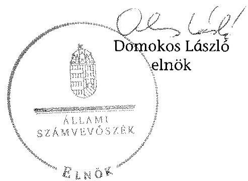

# ÁLLAMI   SZÁMVEVŐSZÉK 

## JELENTÉS

a helyi nemzetiségi önkormányzatok gazdálkodásának ellenőrzéséről
Kompolt Község Roma Nemzetiségi Önkormányzata 15146

---

# Állami Számvevőszék 

Iktatószám: V-0706-039/2015.
Témaszám: 1740
Vizsgálat-azonosító szám: V067615

## Az ellenőrzést felügyelte:

Horváthné Herbáth Mária
felügyeleti vezető

## Az ellenőrzést vezette és az ellenőrzés végrehajtásáért felelős:

Zakar László
ellenőrzésvezető

## A számvevőszéki jelentést készítették:

Zakar László
ellenőrzésvezető
Szeibel Gáborné
számvevő tanácsos
Szöllősiné Hrabóczki Etelka
számvevő tanácsos

Az ellenőrzést végezték:

Luhály Matild
számvevő

Vánczku István
számvevő

---

# TARTALOMJEGYZÉK 

BEVEZETÉS ..... 9
I. ÖSSZEGZŐ MEGÁLLAPÍTÁSOK, KÖVETKEZTETÉSEK, JAVASLATOK ..... 12
II. RÉSZLETES MEGÁLLAPÍTÁSOK ..... 18

1. A Nemzetiségi Önkormányzat és a Települési Önkormányzat együttműködésének szabályozása, a működési feltételek biztosítása ..... 18
2. A gazdálkodási feladatok ellátásának szabályszerűsége ..... 19
2.1. A költségvetésre és zárszámadásra, valamint a kincstári adatszolgáltatás rendjére vonatkozó jogszabályi előírások betartása ..... 19
2.2. A Nemzetiségi Önkormányzat gazdálkodásának szabályozottsága ..... 20
2.3. Az operatív gazdálkodási jogkörök kialakítása, gyakorlása ..... 21
3. A Nemzetiségi Önkormányzattal összefüggő gazdálkodási feladatok belső ellenőrzése ..... 23
MELLÉKLET
4. számú A Nemzetiségi Önkormányzat 2013. évi gazdálkodási adatai

---

.

---

# RÖVIDÍTÉSEK JEGYZÉKE 

## Törvények

Alaptörvény
Áht.
ÁSZ tv.
Kttv.
Nek. tv.
Számv. tv.

## Rendeletek

Ávr.
Bkr.
Áhsz.

## Szórövidítések

ÁSZ
együttműködési megállapodás
elnök

EU
gazdálkodási szabályzat
jegyző
Képviselő-testület

Kincstár
Kormányhivatal
Nemzetiségi Önkormányzat
Nemzetiségi Önkormányzat elnöke
Önkormányzati Hivatal
Önkormányzati Hivatal
Ügyrendje
pénzkezelési szabályzat

Magyarország Alaptörvénye
az államháztartásról szóló 2011. évi CXCV. törvény
az Állami Számvevőszékről szóló 2011. évi LXV. törvény
a közszolgálati tisztviselőkről szóló CXCIX. törvény
a nemzetiségek jogairól szóló 2011. évi CLXXIX. törvény
a számvitelről szóló 2000. évi C. törvény
az államháztartási törvény végrehajtásáról szóló 368/2011. (XII.31.) Korm. rendelet
a költségvetési szervek belső kontrollrendszeréről és belső ellenőrzéséről szóló 370/2011. (XII.31.) Korm. rendelet
az államháztartás szervezetei beszámolási és könyvvezetési kötelezettségének sajátosságairól szóló 249/2000. (XII. 24.) Korm. rendelet

Állami Számvevőszék
Kompolt Község Önkormányzat Képviselő-testülete 12/2012. (VI. 27.) KT. számú határozatával és Kompolt Község Roma Nemzetiségi Önkormányzat Képviselőtestülete 6/2012. (X. 12.) RNÖ. számú határozatával jóváhagyott együttműködési megállapodás
Kompolt Község Roma Nemzetiségi Önkormányzata elnöke
Európai Unió
Kompolti Közös Önkormányzati Hivatal Gazdálkodási szabályzata (hatályos 2013. január 1-jétől)
Kompolti Közös Önkormányzati Hivatal jegyzője
Kompolt Község Roma Nemzetiségi Önkormányzat Képviselő-testülete
Magyar Államkincstár
Heves Megyei Kormányhivatal
Kompolt Község Roma Nemzetiségi Önkormányzata
Kompolt Község Roma Nemzetiségi Önkormányzat elnöke
Kompolti Közös Önkormányzati Hivatal Ügyrendje, Kompolt Község Önkormányzata Szervezeti és Működési Szabályzatának 3. számú melléklete
Kompolti Közös Önkormányzati Hivatal Házipénztár- és Pénzkezelési szabályzata (hatályos 2013. január 1-jétől)

---

szabálytalanságok kezelésének eljárásrendje
számlarend
SZMSZ
Társulás
Társulás belső ellenőrzése
Települési Önkormányzat
2013. évi költségvetési határozat

Kompolti Közös Önkormányzati Hivatal Szabálytalanságok kezelésének eljárásrendje (hatályos 2006. január 1-jétől)
Kompolti Közös Önkormányzati Hivatal Számlarendje (hatályos 2013. január 1-jétől)
Szervezeti és Működési Szabályzat
Füzesabonyi Kistérség Többcélú Társulása
Füzesabonyi Kistérség Többcélú Társulása belső ellenőrzése
Kompolt Község Önkormányzata
3/2013. (IV. 09.) RNÖ határozat a Kompolti Roma Nemzetiségi Önkormányzat 2013. évi költségvetéséről

---

# ÉRTELMEZŐ SZÓTÁR 

belső ellenőrzés
belső kontrollrendszer
együttműködési megállapodás
integritás

A Bkr. 2. § b) pont meghatározásában független, tárgyilagos bizonyosságot adó és tanácsadó tevékenység, amelynek célja, hogy az ellenőrzött szervezet működését fejlessze és eredményességét növelje, az ellenőrzött szervezet céljai elérése érdekében rendszerszemléletű megközelítéssel és módszeresen értékeli, illetve fejleszti az ellenőrzött szervezet irányítási és belső kontrollrendszerének hatékonyságát.
A Bkr. 2. § d) pont és az Áht. 69. § (1) bekezdése alapján a belső kontrollrendszer a kockázatok kezelése és tárgyilagos bizonyosság megszerzése érdekében kialakított folyamatrendszer, amely azt a célt szolgálja, hogy a működés és gazdálkodás során a tevékenységeket szabályszerűen, gazdaságosan, hatékonyan, eredményesen hajtsák végre, az elszámolási kötelezettségeket teljesítsék, megvédjék az erőforrásokat a veszteségektől, károktól és nem rendeltetésszerű használattól.
Az Áht. 27. § (2) bekezdése és a Nek. tv. 80. § (1) bekezdése értelmében a helyi önkormányzat a helyi nemzetiségi önkormányzat részére - annak székhelyén - biztosítja az önkormányzati működés személyi és tárgyi feltételeit, továbbá gondoskodik a működéssel kapcsolatos végrehajtási feladatok ellátásáról. Az önkormányzati működés feltételei és az ezzel kapcsolatos végrehajtási feladatok. A Nek. tv. 80. § (2) bekezdés szerinti a fenti kötelezettségének teljesítése érdekében a helyi önkormányzat harminc napon belül biztosítja a rendeltetésszerű helyiséghasználatot, valamint a helyiséghasználatra, a további feltételek biztosítására és a feladatok ellátására vonatkozóan megállapodást köt a helyi nemzetiségi önkormányzattal. A megállapodást minden év január 31. napjáig, általános vagy időközi választás esetén az alakuló ülést követő harminc napon belül felül kell vizsgálni. A helyi önkormányzat és a nemzetiségi önkormányzat szervezeti és működési szabályzatában rögzíti a megállapodás szerinti működési feltételeket, a megállapodás megkötését, módosítását követő harminc napon belül. A Nek. tv. 80. § (3) bekezdés írja elő a megállapodásban rögzítendőket. Az integritás elvek, értékek, cselekvések, módszerek, intézkedések konzisztenciáját jelenti: olyan magatartásmódot, amely meghatározott értékeknek felel meg. Az integritás a közszféra esetében a társadalom által elvárt nyilvánossági, átláthatósági, illetve jogi/etikai normáknak történő megfelelést jelenti.
(Forrás: a http://integritas.asz.hu honlapon közzétett „A 2012. évi integritás felmérés eredményeinek összefoglalója" dokumentum 3. oldal 1. bekezdése)

---

költségvetési szerv vezetője
korrupció
kulcskontroll
lényegesség
megfelelőségi teszt
nemzetiség

A Bkr. 2. § nd) pont meghatározásában a helyi önkormányzat, helyi nemzetiségi önkormányzat esetén a jegyző, illetve a Bkr. 2. § ne) pontja alapján a fővárosi kerületi önkormányzat esetén a jegyző, körjegyző, főjegyző.
Azok a cselekmények, amelyek során a köz érdekében való eljárással megbízott és döntéshozatali felelősséggel felruházott személy a köz érdeke helyett önös vagy részérdekeket követve, mástól jogtalan vagy etikátlan előnyt elfogadva és őt jogtalan vagy etikátlan előnyhöz juttatva jár el, illetve amikor valaki a köz érdekében való eljárással megbízott és döntéshozatali felelősséggel felruházott személynek jogtalan vagy etikátlan előnyt nyújtva vagy felajánlva jogtalan vagy etikátlan előnyt kér. (Forrás: A Kormány korrupció megelőzési programja 2012-2014.)
Az azonosított kockázatok mérséklése érdekében kialakított kontrollok közül azok, amelyek elégtelen működése esetén a szervezetet jelentős veszteség érheti, vagy a működésükben bekövetkező hiba/hiányosság más kontrollok eredményességét csökkenti. Ezek ellenőrzése, értékelése elegendő bizonyítékot szolgáltat adott területen a kontrollrendszer értékeléséhez. Az önkormányzatok kontrollrendszere kialakításának ellenőrzése során a pénzügyi folyamatokban kulcsszerepet betöltő belső kontrollok a teljesítésigazolás és érvényesítés.
Egy információ akkor lényeges, ha hiánya vagy téves állítása befolyásolhatja ezen információkat felhasználók döntéseit, véleményét. Az ellenőrzés során a lényegesség három szempontból értelmezhető: érték, jelleg és összefüggés szerint.
Az ellenőrzés során alkalmazott módszer - a számvevő egy adatállomány, statisztikai sokaság összes tételének vizsgálata helyett a kiválasztott tételek meghatározott jellemzőinek elemzése és kiértékelése útján szerezhet a teljes állományra vonatkozó következtetések levonására alkalmas ellenőrzési bizonyítékokat - a mennyiségileg elegendő és a minőségileg megfelelő bizonyíték megszerzésére az ellenőrzött kulcskontroll (teljesítésigazolás, érvényesítés) működésének megfelelő, vagy nem megfelelő voltáról. (A számvevőszéki ellenőrzés általános alapelvei 4.1.2, és 4.2 pontjai).
A Nek tv. 1. § (1) bekezdése alapján nemzetiség minden olyan Magyarország területén legalább egy évszázada honos népcsoport, amely az állam lakossága körében számszerú kisebbségben van, tagjai magyar állampolgárok és a lakosság többi részétől saját nyelve és kultúrája, hagyományai különböztetik meg, egyben olyan összetartozás-tudatról tesz bizonyságot, amely mindezek megőrzésére, történelmileg kialakult közösségeik érdekeinek kifejezésére és védelmére irányul.

---

nemzetiségi önkormányzat
operatív gazdálkodási jogkör

A Nek tv. 2. § 2. pontja szerint törvényben meghatározott nemzetiségi közszolgáltatási feladatokat ellátó, testületi formában működő, jogi személyiséggel rendelkező, demokratikus választások útján e törvény alapján létrehozott szervezet, amely a nemzetiségi közösséget megillető jogosultságok érvényesítésére, a nemzetiségek érdekeinek védelmére és képviseletére, a feladat- és hatáskörébe tartozó nemzetiségi közügyek települési, területi vagy országos szinten történő önálló intézésére jön létre.
kötelezettségvállalás; pénzügyi ellenjegyzés; utalványozás; érvényesítés; teljesítésigazolás jogkör

---

.

---

# JELENTÉS   a helyi nemzetiségi önkormányzatok gazdálkodásának ellenőrzéséről Kompolt Község Roma Nemzetiségi Önkormányzata 

## BEVEZETÉS

A Nemzetiségi Önkormányzat az 1994. évben alakult. A 2013-ban hivatalban lévő elnök a 2010. évi választásokat követően egy cikluson keresztül látta el az elnöki feladatokat. A Nemzetiségi Önkormányzat intézményt, gazdasági társaságot és más szervezetet nem alapított, illetve társulásban nem vett részt. A háromtagú Képviselő-testület bizottságot nem hozott létre. A Nemzetiségi Önkormányzatnak a költségvetési beszámolója szerint a 2013. évben a módosított költségvetési bevételi és kiadási előirányzata 222 ezer Ft, a teljesített költségvetési bevétele és a teljesített költségvetési kiadása 223 ezer Ft volt. A Nemzetiségi Önkormányzat a 2013. évben feladatalapú támogatásban nem részesült. A 2013. évi gazdálkodási adatokat részletesen az 1. számú mellékletben mutatjuk be.

Az Alaptörvény Szabadság és felelősség rész XXIX. cikk (1) bekezdése szerint a Magyarországon élő nemzetiségek államalkotó tényezők. Minden, valamely nemzetiséghez tartozó magyar állampolgárnak joga van önazonossága szabad vállalásához és megőrzéséhez. A hazánkban élő nemzetiségek helyi (települési és területi) valamint országos önkormányzatokat hozhatnak létre ${ }^{1}$. A helyi nemzetiségi önkormányzatok gazdálkodási feladatait jogszabályi előírás alapján a székhely szerinti helyi önkormányzat polgármesteri hivatala látja el.

A nemzetiségek helyzete, támogatása mind hazai, mind EU-s szinten kiemelt figyelmet kap napjainkban. A helyi nemzetiségi önkormányzatok gazdálkodására és támogatási rendszerére vonatkozó jogszabályok a 2010-2012. években jelentős változásokon mentek át. A helyi nemzetiségi önkormányzatok gazdálkodásának, a részükre juttatott költségvetési támogatások felhasználásának ellenőrzését az ÁSZ 2012-ben sorozatjellegű ellenőrzés keretében indította el.

Az ellenőrzés célja annak értékelése volt, hogy a Nemzetiségi Önkormányzat gazdálkodási kereteinek kialakítása, gazdálkodása megfelel-e a jogszabályoknak.

[^0]
[^0]:    ${ }^{1}$ A 2010. évben megtartott nemzetiségi önkormányzati választásokat követően 2304 települési, 58 területi és 13 országos nemzetiségi önkormányzat alakult meg.

---

Ennek keretében értékeltük, hogy:

- a helyi nemzetiségi önkormányzat és a helyi (települési) önkormányzat együttműködésének szabályozása, a működési feltételek biztosítása megfelel-e a jogszabályi előírásoknak;
- a felek együttműködése megfelel-e a megállapodásban foglaltaknak a gazdálkodási feladatok szabályszerű ellátása során, betartották-e a vonatkozó jogszabályi előírásokat;
- biztosított volt-e a Nemzetiségi Önkormányzat gazdálkodásának belső ellenőrzése.

Az ellenőrzés várható hasznosulása: a nemzetiségi önkormányzatok testületi döntéseinek tapasztalatait összegezve következtetés vonható le a törvényalkotás számára a jogszabályi környezet esetleges módosításának indokoltságára vonatkozóan. Az ellenőrzés az ellenőrzött számára visszajelzést ad a rendezett gazdálkodási keretek kialakításáról, a működésbeli hiányosságokról. Az ellenőrzés megállapításai és javaslatai, a jó gyakorlat bemutatása tanulságul szolgálhatnak más nemzetiségi önkormányzatok, szervezetek számára a rendezett gazdálkodási keretek kialakításához. A társadalom számára jelzi, hogy közpénz nem maradhat ellenőrizetlenül, az ÁSZ értékteremtő rend kialakításához és megőrzéséhez hozzájáruló tevékenysége pozitív hatással lesz a szervezetről kialakított összkép formálásában. Az ÁSZ szervezetén belül lehetőség nyílik arra, hogy a megállapítások szintetizálásával az intézmény a hozzáadott értéket teremtő elemző tevékenységét és tanácsadó szerepét erősítse.

A helyi nemzetiségi önkormányzatok gazdálkodásának ellenőrzéséről szóló jelentés I. fejezetének összegző része az ellenőrzés céljára adott rövid, szintetizáló összefoglalót és következtetéseket tartalmazza a II. fejezet részletes megállapításain alapulóan. A jelentés intézkedést igénylő megállapításait és javaslatait az összegzőben foglaltak mellett - az ellenőrzés során feltárt, a jelentés II. fejezetében rögzített részletes megállapítások alapozzák meg, illetve támasztják alá.

# Az ellenőrzés típusa: szabályszerűségi ellenőrzés 

Az ellenőrzött időszak: a helyi nemzetiségi önkormányzat és a települési önkormányzat együttműködésének, valamint a helyi nemzetiségi önkormányzat gazdálkodásának szabályozása megfelelőségét 2013. évre vonatkozóan (a 2013. december 31-i állapotnak megfelelően), a helyi nemzetiségi önkormányzat gazdálkodásának szabályszerűségét, a működési feltételek, valamint a belső ellenőrzés biztosítását a 2013. január 1. - december 31-e közötti időszakot figyelembe véve értékeltük.

Ellenőrzött szervezet: a Kompolt Község Roma Nemzetiségi Önkormányzata és a gazdálkodási feladatait ellátó Kompolti Közös Önkormányzati Hivatal.

Az ellenőrzés szakmai módszertana az ÁSZ
 hivatalos honlapján (www.asz.hu) közzétett szakmai szabályokon alapult, amely a Legfőbb Ellenőrző Intézmények Nemzetközi Szervezete (INTOSAI) által kiadott nemzetközi standardok (ISSAI) figyelembevételével készült.

---

A Nemzetiségi Önkormányzatnak a 2013. évben dologi kiadásokkal kapcsolatos kifizetési voltak. A gazdálkodás folyamatában kulcsszerepet betöltő két kulcskontroll – teljesítésigazolás, érvényesítés – működésének megfelelőségét teljes körűen, azaz minden dologi kiadással kapcsolatos kifizetés esetében ellenőriztük. „Megfelelőnek” értékeltük a gazdálkodási jogkörök gyakorlását, amennyiben a hibaarány legfeljebb 10%, „részben megfelelőnek” értékeltük, ha a hibaarány 10-30% között volt, „nem megfelelőnek” pedig akkor, ha a hibaarány meghaladta a 30%-ot.

Az ellenőrzés végrehajtásának jogszabályi alapját az ÁSZ tv. 5. § (2)-(3) és (6) bekezdéseiben foglaltak képezik.

Az ÁSZ tv. 29. § (1) bekezdése szerint a jelentéstervezetet megküldtük egyeztetésre a jegyzőnek és a Nemzetiségi Önkormányzat elnökének. Az ellenőrzött szervezetek vezetői az ÁSZ tv. 29. § (2) bekezdésében foglalt észrevételezési jogukkal nem éltek, a jelentéstervezetre nem tettek észrevételt.

---

# I. ÖSSZEGZŐ MEGÁLLAPÍTÁSOK, KÖVETKEZTETÉSEK, JAVASLATOK 

A Nemzetiségi Önkormányzat és a Települési Önkormányzat együttműködésének szabályozása részben felelt meg a jogszabályi előírásoknak. A Nemzetiségi Önkormányzat rendelkezett az ellenőrzött időszakban a Nek. tv.-ben előírt együttműködési megállapodással, melyet a Nemzetiségi Önkormányzat és a Települési Önkormányzat Képviselő-testülete határozattal jóváhagyott. Az együttműködési megállapodás felülvizsgálata a Nek. tv.-ben előírt határidőre és azt követően sem történt meg. A 2013. december 31-én hatályos együttműködési megállapodás nem tartalmazta a 2013. évre vonatkozóan az Áht.-ban előírt ellenőrzési feladatok ellátásának részletes szabályait. Az együttműködési megállapodás az Áht. és a Nek. tv. előírásainak megfelelően tartalmazta a Nemzetiségi Önkormányzat működésével és gazdálkodásával kapcsolatos előírásokat. Az együttműködési megállapodás a Nek. tv. előírása ellenére nem rendelkezett arról, hogy a jegyző vagy annak megbízottja a Nemzetiségi Önkormányzat testületi ülésein részt vesz és jelzi, amennyiben törvénysértést észlel. Nem rögzítették 30 napon belül és azt követően sem a Nek. tv. előírásának ellenére a Települési Önkormányzat és a Nemzetiségi Önkormányzat SZMSZ-eiben az együttműködési megállapodás szerinti működési feltételeket. A Települési Önkormányzat a 2013. évben az együttműködési megállapodás tartalmi hiányosságai ellenére biztosította a Nemzetiségi Önkormányzat működéséhez szükséges személyi és tárgyi feltételeket.

A Nemzetiségi Önkormányzat 2013. évi költségvetésének és zárszámadásának tartalma, jóváhagyása, valamint a kapcsolódó 2013. évi adatszolgáltatások szabályszerűsége részben felelt meg a jogszabályi előírásoknak. A Nemzetiségi Önkormányzat elnöke az Áht.-ban előírtaktól eltérően nem nyújtotta be határidőben és azt követően sem a Nemzetiségi Önkormányzat Képviselő-testülete részére az ellenőrzött évre vonatkozó költségvetési koncepciót, mert a jegyző nem készítette elő. A Nemzetiségi Önkormányzat elnöke az Áht.-ban előírtaktól eltérően nem nyújtotta be határidőben a Nemzetiségi Önkormányzat Képviselő-testülete részére, a jegyző által előkészített költségvetési határozat tervezetét. A jóváhagyott költségvetési határozat tartalma részben felelt meg az előírásoknak, mivel az Áht. előírása ellenére nem mutatták be a Nemzetiségi Önkormányzat költségvetési mérlegét közgazdasági tagolásban és előirányzat-felhasználási tervét. Az elfogadott 2013. évi költségvetési határozat az Áht. előírásai ellenére nem tartalmazta a költségvetési bevételeket és költségvetési kiadásokat kötelező és önként vállalt feladatok szerinti bontásban. A jegyző az Áht.-ban előírt határidőre előkészítette a Nemzetiségi Önkormányzat 2013. évi zárszámadási határozat-tervezetét, amelyet a Nemzetiségi Önkormányzat elnöke az előírt határidőig beterjesztett a Képviselő-testületnek. A zárszámadási határozat tervezetének előterjesztésekor a Nemzetiségi Önkormányzat Képviselő-testülete részére tájékoztatásul nem mutatták be szöveges indoklással az Áht.-ban előírt mérleget közgazdasági tagolásban, valamint a pénzeszközök változását. A 2013. évi zárszámadásról a Képviselő-testület határozatot hozott. A 2013. évben a jegyző a Nemzetiségi Önkormányzat részére jog-

---

szabályban előírt kincstári adatszolgáltatási kötelezettségeket – a 2013. évi elemi költségvetés kivételével – határidőben teljesítette.

A Nemzetiségi Önkormányzat gazdálkodásának szabályozottsága az ellenőrzött időszakban részben megfelelő volt. A gazdálkodási feladatok végrehajtását ellátó Önkormányzati Hivatal a Számv. tv. és az Áhsz. által előírt szabályzatainak hatálya – a számlarend kivételével – kiterjedt a Nemzetiségi Önkormányzat gazdálkodására. A jegyző az együttműködési megállapodásban foglaltak ellenére nem alakította ki a Nemzetiségi Önkormányzat elemi költségvetési beszámolójának készítését biztosító, jogszabályi előírásoknak megfelelő számlarendet. A jegyző az Áht.-ban előírtak ellenére nem készítette el az Önkormányzati Hivatal SZMSZ-ét. Az Önkormányzati Hivatal rendelkezett a Bkr.-ben előírt ellenőrzési nyomvonallal és a szabálytalanságok kezelése eljárásrendjével. A jegyző a Bkr. előírásainak megfelelően a Nemzetiségi Önkormányzat gazdálkodásának végrehajtásával kapcsolatos feladatokra vonatkozóan a folyamatba épített, előzetes, utólagos és vezetői ellenőrzés szabályozását biztosította.

A Nemzetiségi Önkormányzat gazdálkodása tekintetében az operatív gazdálkodási jogkörök kialakítása a 2013. évben megfelelő volt. A jegyző az Ávr. előírásának megfelelően alakította ki az operatív gazdálkodási jogkörök gyakorlására vonatkozó belső előírásokat és feltételeket. A Nemzetiségi Önkormányzatnak a 2013. évben kizárólag dologi kiadásai voltak. Az ezzel kapcsolatos kifizetések teljesítése során az operatív gazdálkodási jogkörökön belül kulcsszerepet betöltő érvényesítés kulcskontrollt a jogszabályi előírásoknak részben megfelelően működtették, mivel nyolc kifizetés esetében az érvényesítést – az Ávr.-ben rögzítettek ellenére – nem végezték el. A kulcskontrollok működése nem biztosította teljes körűen a hibák megelőzését, feltárását és kijavítását. A számvevőszéki ellenőrzés a kifizetések bizonylatainak ellenőrzése során összeférhetetlenséget, illetve jogosulatlan kifizetést nem tárt fel.

A 2013. évben a Nemzetiségi Önkormányzat gazdálkodásával összefüggő végrehajtási feladatokra vonatkozó belső ellenőrzés nem volt megfelelő. A 2013. december 31-én hatályos együttműködési megállapodás felülvizsgálat hiányában az Áht. előírásai ellenére nem tartalmazta a 2013. évre az ellenőrzési feladatok részletes szabályait, mert az abban rögzített ellenőrzést végző Társulás 2012. december 31-ével megszűnt. A Nemzetiségi Önkormányzat gazdálkodásával összefüggő végrehajtási feladatokra vonatkozóan belső ellenőrzést a 2013. évben nem terveztek és nem végeztek.

Az ÁSZ tv. 33. § (1) bekezdésében foglaltak értelmében a jelentésben foglalt megállapításokhoz kapcsolódó intézkedési tervet köteles az ellenőrzött szervezet vezetője összeállítani, és azt a jelentés kézhezvételétől számított 30 napon belül az ÁSZ részére megküldeni. Amennyiben az intézkedési tervet határidőben nem küldi meg a szervezet, vagy az nem elfogadható, az ÁSZ elnöke a hivatkozott törvény 33. § (3) bekezdés a)-b) pontjaiban foglaltakat érvényesítheti.

---

A helyszíni ellenőrzés megállapításainak hasznosítása mellett javasoljuk:

# a jegyzőnek 

1. Az együttműködés szabályozásával kapcsolatban

Az együttműködési megállapodás felülvizsgálata a Nek. tv. 80. § (2) bekezdésében előírt határidőre és azt követően sem történt meg. Így az együttműködési megállapodás nem tartalmazta az Áht. 27. § (2) bekezdésében előírt ellenőrzési feladatok ellátásának részletes szabályait a 2013. évi állapotnak megfelelően.

A 2013. december 31-én hatályos együttműködési megállapodás a Nek. tv. 80. § (4) bekezdésében foglaltak ellenére nem tartalmazta azt, hogy a települési önkormányzat megbízásából és a képviseletében a jegyző/vagy a jegyzővel azonos képesítési előírásoknak megfelelő megbízottja részt vesz a Nemzetiségi Önkormányzat testületi ülésein és jelzi, amennyiben törvénysértést észlel.

Az együttműködési megállapodás szerinti működési feltételeket – a Nek. tv. 80. § (2) bekezdésében foglaltak ellenére – a Települési Önkormányzat valamint a Nemzetiségi Önkormányzat SZMSZ-ében 30 napon belül és azt követően sem rögzítették.

Javaslat
Az együttműködés szabályszerűsége érdekében
a) kezdeményezze az együttműködési megállapodás felülvizsgálatát, e tekintetben a továbbiakban biztosítsa a Nek. tv.-ben előírt határidő betartását;
b) a felülvizsgálatot követően készítse elő az együttműködési megállapodás Nek. tv. előírásainak megfelelő módosítását, aktualizálását és kezdeményezze annak a Települési Önkormányzat Képviselő-testülete elé terjesztését;
c) készítse elő a Települési Önkormányzat és a Nemzetiségi Önkormányzat SZMSZ-einek – a Nek. tv. előírásainak megfelelő – kiegészítését az együttműködési megállapodás módosításához kapcsolódóan és kezdeményezze azok képviselőtestületi előterjesztését.
2. A költségvetés zárszámadás szabályszerűségével kapcsolatban

A Nemzetiségi Önkormányzat 2013. évi költségvetési határozata – az Áht. 23. § (2) bekezdés a) pontjának és a 26.§ (1) bekezdés a) pontjának előírása ellenére – nem tartalmazta a Nemzetiségi Önkormányzat költségvetési bevételeit és költségvetési kiadásait kötelező feladatok és önként vállalt feladatok szerinti bontásban.

A 2013. évi költségvetés előterjesztésekor a Nemzetiségi Önkormányzat Képviselőtestülete részére – az Áht. 24. § (4) bekezdés a) pontja szerinti előírás ellenére – nem mutatták be tájékoztatásul, szöveges indokolással együtt, a Nemzetiségi Önkormányzat költségvetési mérlegét közgazdasági tagolásban és az előirányzatfelhasználási tervét. A zárszámadási határozat-tervezetet előterjesztésekor – az Áht. 91. § (2) bekezdés a) pontjában foglaltaktól eltérően – nem mutatták be tájékoztatásul, szöveges indokolással együtt a Nemzetiségi Önkormányzat költségvetési mérle-

---

gét közgazdasági tagolásban, valamint pénzeszközeinek változását az Áht. 24. § (4) bekezdés a) pontja előírása szerint.

A jegyző nem az Ávr. 33. § (1)-(2) bekezdése szerinti határidőben szolgáltatott adatot a Nemzetiségi Önkormányzat 2013. évi elemi költségvetéséről.

Javaslat
Intézkedjék annak érdekében, hogy a továbbiakban
a) a költségvetési határozat tartalmilag teljes körűen feleljen meg a hatályos jogszabályi előírásoknak;
b) a Nemzetiségi Önkormányzat Képviselő-testülete részére tájékoztatásul teljes körűen, szöveges indoklással együtt kerüljenek bemutatásra a jogszabályban előírt mérlegek, kimutatások a költségvetés és a zárszámadás előterjesztésekor;
c) a Nemzetiségi Önkormányzatra vonatkozó költségvetési adatszolgáltatás teljesítése határidőben megtörténjen.
3. A gazdálkodási feladatok szabályozottságával kapcsolatban

Az együttműködési megállapodás – a számviteli szabályzatok készítésére vonatkozó hatáskörök meghatározása nélkül – rögzítette, hogy a Nemzetiségi Önkormányzat beszámolási feladatainak ellátásával kapcsolatos jogosultságokat és kötelezettségeket a nemzetiségi önkormányzatra vonatkozóan az Önkormányzati Hivatal elkülönülten szabályozza. A Nemzetiségi Önkormányzatra vonatkozóan – a Számv. tv. 161. § (1)(2) bekezdései és az Áhsz. 49.§ (1) bekezdései alapján – az elemi költségvetési beszámoló elkészítését biztosító számlarend készítéséről az együttműködési megállapodásban foglaltak ellenére az Önkormányzati Hivatal nem gondoskodott.

A jegyző – az Áht. 10. § (5) bekezdésében előírtak ellenére – nem készítette el az Önkormányzati Hivatal SZMSZ-ét.

Javaslat
a) Intézkedjen a Nemzetiségi Önkormányzat elemi költségvetési beszámolójának készítését biztosító számlarend elkészítéséről.
b) Intézkedjen az Önkormányzati Hivatal SZMSZ-ének – a jogszabályi előírásoknak megfelelő – elkészítéséről, majd kezdeményezze annak előterjesztését a Települési Önkormányzat Képviselő-testülete részére.
4. Az operatív gazdálkodási jogkörök gyakorlásával kapcsolatban

Az érvényesítést – az Áht. 38. § (1), valamint Ávr. 58. § (1)-(2) bekezdésében előírtak ellenére – több kifizetést megelőzően nem végezték el.

A 2013. évben a Nemzetiségi Önkormányzat költségvetési előirányzatai vonatkozásában a kötelezettségvállalási nyilvántartás tartalmában nem felelt meg teljes körűen Ávr. 56. § (1) bekezdésében és a gazdálkodási szabályzatban előírtaknak, mivel nem tartalmazta a jogosult azonosító adatait.

---

Javaslat
Az operatív gazdálkodás működési hibáinak megelőzése, feltárása és kijavítása érdekében intézkedjen:
a) az érvényesítéshez kapcsolódó ellenőrzési és jelzési feladatok szabályszerű ellátásáról;
b) a Nemzetiségi Önkormányzat költségvetési előirányzatai vonatkozásában a kötelezettségvállalási nyilvántartás szabályszerű vezetéséről.

# a Nemzetiségi Önkormányzat elnökének 

1. A 2013. december 31-én hatályos együttműködési megállapodás a Nek. tv. 80. § (4) bekezdésében foglaltak ellenére nem tartalmazta azt, hogy a települési önkormányzat megbízásából és a képviseletében a jegyző/vagy a jegyzővel azonos képesítési előírásoknak megfelelő megbízottja részt vesz a Nemzetiségi Önkormányzat testületi ülésein és jelzi, amennyiben törvénysértést észlel. Az együttműködési megállapodás felülvizsgálata a Nek. tv. 80. § (2) bekezdésében előírt határidőre és azt követően sem történt meg. Így az együttműködési megállapodás nem tartalmazta az Áht. 27. § (2) bekezdésében előírt ellenőrzési feladatok ellátásának részletes szabályait a 2013. évi állapotnak megfelelően.

Az együttműködési
 megállapodás szerinti működési feltételeket - a Nek. tv. 80. § (2) bekezdésében foglaltak ellenére - a Települési Önkormányzat, valamint a Nemzetiségi Önkormányzat SZMSZ-ében 30 napon belül és azt követően sem rögzítették.

Javaslat
a) Végezze el az együttműködési megállapodás felülvizsgálatát és a továbbiakban e tekintetben biztosítsa a Nek. tv-ben előírt határidő betartását.
b) Terjessze a Nemzetiségi Önkormányzat Képviselő-testülete elé jóváhagyásra az együttműködési megállapodás jegyző által előkészített módosítását.
c) Terjessze a Nemzetiségi Önkormányzat Képviselő-testülete elé jóváhagyásra a Nemzetiségi Önkormányzat jogszabályi előírásoknak megfelelően kiegészített SZMSZ-ét.
2. A 2013. évi költségvetés előterjesztésekor a Nemzetiségi Önkormányzat Képviselőtestülete részére az Áht. 24. § (4) bekezdés a) pontja szerinti előírás ellenére nem mutatták be tájékoztatásul, szöveges indokolással együtt, a Nemzetiségi Önkormányzat költségvetési mérlegét közgazdasági tagolásban és az előirányzatfelhasználási tervét. A zárszámadási határozat-tervezetet előterjesztésekor - az Áht. 91. § (2) bekezdés a) pontjában foglaltaktól eltérően - nem mutatták be tájékoztatásul, szöveges indokolással együtt a Nemzetiségi Önkormányzat költségvetési mérlegét közgazdasági tagolásban, valamint pénzeszközeinek változását az Áht. 24. § (4) bekezdés a) pontja előírása szerint.

---

Javaslat
A költségvetési és zárszámadási határozat-tervezetek előterjesztésekor az Áht.-ban előírtaknak megfelelően mutassa be a Nemzetiségi Önkormányzat Képviselő-testület részére tájékoztatásul a mérlegeket és a kimutatásokat.

---

# II. RÉSZLETES MEGÁLLAPÍTÁSOK 

## 1. A Nemzetiségi Önkormányzat És a Települési Önkormányzat Együttműködésének Szabályozása, a Működési Feltételek Biztosítása

A Nemzetiségi Önkormányzat és a Települési Önkormányzat együttműködésének szabályozása részben felelt meg a jogszabályi előírásoknak.

A Nemzetiségi Önkormányzat rendelkezett az ellenőrzött időszakban, a Települési Önkormányzattal történő együttműködésre vonatkozó megállapodással, melyet a Nemzetiségi Önkormányzat és a Települési Önkormányzat Képviselőtestületei határozattal ${ }^{2}$ jóváhagytak és az arra jogosult személyek aláírták.

Az együttműködési megállapodás felülvizsgálata a Nek. tv. 80. § (2) bekezdésében előírt határidőre és azt követően sem történt meg. Így az együttműködési megállapodás nem tartalmazta a 2013. évre vonatkozóan az Áht. 27 (2) bekezdésében előírt ellenőrzési feladatok ellátásának részletes szabályait, mivel az együttműködési megállapodásban rögzített, a Települési Önkormányzat és a Nemzetiségi Önkormányzat belső ellenőrzését is ellátó Társulás 2012. december 31-én megszűnt.

Az együttműködési megállapodás szerinti működési feltételeket a Nek. tv. 80. § (2) bekezdésében foglaltak ellenére 30 napon belül és azt követően sem rögzítették sem a Települési Önkormányzat, sem a Nemzetiségi Önkormányzat SZMSZ-ében.

A 2013. december 31-én hatályos együttműködési megállapodás az Áht. 27. § (2) bekezdésében foglaltaknak megfelelően tartalmazta a tervezési, gazdálkodási, finanszírozási, adatszolgáltatási és beszámolási feladatok ellátásának részletes szabályait. Tartalmazta továbbá a Nek. tv. 80. § (3) bekezdésben foglaltaknak megfelelően a Nemzetiségi Önkormányzat működésével és gazdálkodásával kapcsolatos előírásokat.

A 2013. december 31-én hatályos együttműködési megállapodás a Nek. tv. 80. § (4) bekezdésében foglaltak ellenére nem tartalmazta azt, hogy a települési önkormányzat megbízásából és képviseletében a jegyző/vagy a jegyzővel azonos képesítési előírásoknak megfelelő megbízottja részt vesz a Nemzetiségi Önkormányzat testületi ülésein és jelzi, amennyiben törvénysértést észlel.

[^0]
[^0]:    ${ }^{2}$ A 2013. évben hatályos együttműködési megállapodást a Nemzetiségi Önkormányzat Képviselő-testülete a 6/2012. (X. 12.) számú, a Települési Önkormányzat Képviselőtestülete a 12/2012. (VI. 27.) számú határozatával hagyta jóvá.

---

A Települési Önkormányzat - a Nek. tv. 159. § (3) bekezdésében előírtaknak megfelelően, az együttműködési megállapodás tartalmi hiányosságai ellenére - a 2013. évben biztosította a Nemzetiségi Önkormányzat működéséhez a személyi és tárgyi feltételeket.

# 2. A GAZDÁLKODÁSI FELADATOK ELLÁTÁSÁNAK SZABÁLYSZERŰSÉGE 

### 2.1. A költségvetésre és zárszámadásra, valamint a kincstári adatszolgáltatás rendjére vonatkozó jogszabályi előírások betartása

A Nemzetiségi Önkormányzat 2013. évi költségvetésének és zárszámadásának tartalma, jóváhagyása, valamint a kapcsolódó adatszolgáltatás részben felelt meg a jogszabályi előírásoknak.

A Nemzetiségi Önkormányzat elnöke az Áht. 24. § (1) bekezdésében és az Áht. 26. § (1) bekezdésében előírtaktól eltérően, nem nyújtott be határidőben ${ }^{3}$ és azt követően sem a Nemzetiségi Önkormányzat Képviselő-testülete részére az ellenőrzött évre vonatkozó költségvetési koncepciót, mert azt a jegyző nem készítette elő.

A Nemzetiségi Önkormányzat elnöke az Áht. 24. § (2) bekezdésében és az Áht. 26. § (1) bekezdésében előírtaktól eltérően a központi költségvetésről szóló törvény hatálybalépését követő 45 napon túl ${ }^{4}$ nyújtotta be a Nemzetiségi Önkormányzat Képviselő-testülete részére, a jegyző által előkészített költségvetési határozat tervezetét.

A 2013. évi költségvetés előterjesztésekor a Nemzetiségi Önkormányzat Képviselő-testülete részére az Áht. 24. § (4) bekezdés a) pontja szerinti előírás ellenére nem mutatták be tájékoztatásul, szöveges indokolással együtt, a Nemzetiségi Önkormányzat költségvetési mérlegét közgazdasági tagolásban és az előirányzat-felhasználási tervét.

A Nemzetiségi Önkormányzat 2013. évi költségvetési határozata az Áht. 23. § (2) bekezdés a) pontjának megfelelően tartalmazta a Nemzetiségi Önkormányzat költségvetési bevételeit és költségvetési kiadásait előirányzatcsoportok, kiemelt előirányzatok szerinti bontásban, de nem tartalmazta kötelező és önként vállalt feladatok szerinti bontásban.

A jegyző az Áht. 91. § (1) és (3) bekezdésében előírt határidőre elkészítette a Nemzetiségi Önkormányzat 2013. évi zárszámadási határozat-tervezetét, amelyet a Nemzetiségi Önkormányzat elnöke határidőben beterjesztett a Nemzetiségi Önkormányzat Képviselő-testülete elé elfogadásra. A zárszámadási határozat-tervezet előterjesztésekor az Áht. 91. § (2) bekezdés a) pontjában foglaltaktól eltérően nem mutatták be tájékoztatásul, szöveges indokolással együtt -

[^0]
[^0]:    ${ }^{3}$ 2012. október 31-én
    ${ }^{4}$ A Nemzetiségi Önkormányzat 2013. április 9-én, a 3/2013. (IV. 9.) számú határozatával fogadta el a 2013. évi költségvetését.

---

az Áht. 24. § (4) bekezdés a) pontjának előírása ellenére - a Nemzetiségi Önkormányzat költségvetési mérlegét közgazdasági tagolásban, valamint pénzeszközeinek változását.

A 2013. évi zárszámadási határozat összehasonlíthatósága az Áht. 89. § (1) bekezdés előírásainak megfelelően biztosított volt az elfogadott költségvetéssel. A Nemzetiségi Önkormányzat a 2013. évi zárszámadási határozatban az Áht. 89. § (2) bekezdésnek megfelelően valamennyi bevételéről és kiadásáról elszámolt. A 2013. évi zárszámadási határozat tervezetét a Nemzetiségi Önkormányzat Képviselő-testülete határozattal ${ }^{5}$ hagyta jóvá.

A jegyző a Nemzetiségi Önkormányzat részére jogszabályban előírt, a költségvetéshez és a zárszámadáshoz kapcsolódó kincstári adatszolgáltatási kötelezettségeket a 2013. évben - a 2013. évi elemi költségvetés kivételével - az előírt határidőben teljesítette.

A jegyző nem az Ávr. 33. § (1)-(2) szerinti határidőben ${ }^{6}$ szolgáltatott adatot a Nemzetiségi Önkormányzat 2013. évi elemi költségvetéséről, mert a költségvetési határozat előterjesztését megelőzően teljesítette a kincstári adatszolgáltatást ${ }^{7}$.

# 2.2. A Nemzetiségi Önkormányzat gazdálkodásának szabályozottsága 

A Nemzetiségi Önkormányzat gazdálkodásának szabályozottsága az ellenőrzött időszakban részben felelt meg a jogszabályi előírásoknak és az együttműködési megállapodásnak.

Az együttműködési megállapodás - a számviteli szabályzatok készítésére vonatkozó hatáskörök meghatározása nélkül - rögzítette, hogy a Nemzetiségi Önkormányzat beszámolási feladatainak ellátásával kapcsolatos jogosultságokat és kötelezettségeket a nemzetiségi önkormányzatra vonatkozóan az Önkormányzati Hivatal elkülönülten szabályozza.

A gazdálkodási feladatok végrehajtását ellátó Önkormányzati Hivatal a 2013. évben a Számv. tv. 14. § (3) és (5) bekezdésében, valamint a 161. § (1) bekezdésében előírt számviteli szabályzatokkal ${ }^{8}$ rendelkezett, amelyek hatálya a Nemzetiségi Önkormányzat gazdálkodási feladataira is kiterjedt.

[^0]
[^0]:    ${ }^{5}$ a Képviselő-testület 3/2014 (IV. 14.) számú határozata
    ${ }^{6}$ a költségvetési határozat-tervezet Nemzetiségi Önkormányzat Képviselő-testülete elé terjesztésének határidejét követő 30 napon belül
    ${ }^{7}$ az előterjesztés 2013. április 9-én történt, az adatszolgáltatás 2013. március 18-án megtörtént
    ${ }^{8}$ számviteli politika, számlarend, gazdálkodási szabályzat, pénzkezelési szabályzat, eszközök és források értékelési szabályzata, eszközök és források leltározási és leltárkészítési szabályzata

---

A Nemzetiségi Önkormányzatra vonatkozóan - a Számv. tv. 161. § (1)-(2) bekezdései és az Áhsz. 49.§ (1) bekezdései alapján - az elemi költségvetési beszámoló elkészítését biztosító számlarend készítéséről az együttműködési megállapodásban foglaltak ellenére az Önkormányzati Hivatal nem gondoskodott.

Az Önkormányzati Hivatal nem rendelkezett - az Áht. 9. § (1) bekezdés a) pontjában előírtak ellenére - jóváhagyott SZMSZ-el, mert a jegyző nem készítette el. A szervezeti és működési szabályzat hiánya miatt a jegyző az Áht. 10. § (5) bekezdésében előírtaknak nem tett eleget, mert nem állapította meg az Önkormányzati Hivatal feladatai ellátásának részletes belső rendjét és módját, valamint nem határozta meg - az Ávr. 13. § (1) bekezdés g) pontjában foglaltaktól eltérően - a munkakörökhöz tartozó, a Nemzetiségi Önkormányzat gazdálkodásával kapcsolatos feladat- és hatáskörökre, a hatáskörök gyakorlásának módjára, a helyettesítés rendjére, az ezekhez kapcsolódó felelősségi szabályokra vonatkozó előírásokat sem.

A gazdálkodási és a pénzkezelési szabályzatban, az együttműködési megállapodásban rögzítetteknek megfelelően, meghatározták a Nemzetiségi Önkormányzat gazdálkodásával kapcsolatos, az Ávr. 13. § (2) bekezdés a) pontjában előírt tervezéssel, gazdálkodással, így különösen a kötelezettségvállalással, pénzügyi ellenjegyzéssel, teljesítés igazolásával, az érvényesítéssel, utalványozás gyakorlatának módjával kapcsolatos eljárási és dokumentációs részletszabályokat, valamint az ezeket végző személyek kijelölésének rendjét, és az ellenőrzési, adatszolgáltatási, beszámolási feladatok teljesítésével kapcsolatos belső előírásokat, feltételeket.

Az Önkormányzati Hivatalnál a gazdálkodási feladatot ellátó köztisztviselők munkaköri leírásai - a Kttv. 75. § (1) bekezdés d) pontjában foglaltaknak megfelelően - tartalmazták a Nemzetiségi Önkormányzat gazdálkodásával kapcsolatos feladatokat.

Az Önkormányzati Hivatal rendelkezett a Bkr. 6. § (3), (4) bekezdésében előírt ellenőrzési nyomvonallal és a szabálytalanságok kezelésének eljárásrendjével. A jegyző a Bkr. 8. § (2) bekezdésében foglaltaknak megfelelve a Nemzetiségi Önkormányzat gazdálkodásának végrehajtásával kapcsolatos feladataira vonatkozóan szabályozta a folyamatba épített, előzetes, utólagos és vezetői ellenőrzést.

# 2.3. Az operatív gazdálkodási jogkörök kialakítása, gyakorlása 

A Nemzetiségi Önkormányzat gazdálkodása tekintetében az operatív gazdálkodási jogkörök kialakítása a jogszabályi előírásoknak, valamint az együttműködési megállapodásban foglaltaknak megfelel.

A jegyző a kötelezettségvállalás, a kötelezettségvállalás pénzügyi ellenjegyzése, a teljesítés igazolása, az érvényesítés és utalványozás gyakorlásának módjával, eljárási és dokumentációs szabályaival, valamint az ezeket végző személyek kijelölésének rendjével kapcsolatos feltételeket az Ávr. 13. § (2) bekezdés a) pontjának megfelelően a gazdálkodási és a pénzkezelési szabályzatban, valamint az együttműködési megállapodásban szabályozta.

---

A Nemzetiségi Önkormányzat az Ávr. 53. § (1) bekezdés a) pontjában foglaltaknak megfelelően élt azzal a lehetőséggel, hogy a 100 ezer Ft-ot el nem érő kifizetések esetében nem szükséges az előzetes írásbeli kötelezettségvállalás, amelyet az Ávr. 53. § (2) bekezdésében foglaltak alapján a gazdálkodási szabályzatban rögzítettek.

A Nemzetiségi Önkormányzat elnöke írásban felhatalmazott más képviselőt az az Ávr. 52. § (7) bekezdés, valamint az Ávr. 59. § (1) bekezdés alapján kötelezettségvállalásra, illetve utalványozásra.

Az Önkormányzati Hivatal nem rendelkezett az Áht. 10. § (4) bekezdés és az Ávr. 9. § (1) bekezdés szerinti gazdasági szervezettel. A pénzügyi ellenjegyzésre a jegyző által kijelölt személy rendelkezett az Ávr. 55. § (3) bekezdésben előírt pénzügyi-számviteli képesítéssel.

A jegyző - az Ávr. 55. § (2) bekezdés g) pontjában és az Ávr. 58. § (4) bekezdésében meghatározottak szerint - kijelölt két fő köztisztviselőt az érvényesítés feladatainak ellátására.

A Nemzetiségi Önkormányzatnál a 2013. évben a dologi kiadásokkal kapcsolatos kifizetéseknél az operatív gazdálkodási jogkörökön belül kulcsszerepet betöltő teljesítésigazolás és érvényesítés belső kontrollokat - az ellenőrzött összes kifizetésre együttesen értékelve -
 részben megfelelően működtették a jogszabályi előírásoknak.

A teljesítésigazolást az Ávr. 57. § (1) bekezdésének megfelelően végezték, mivel ellenőrizhető okmányok alapján ellenőrizték és igazolták a kiadások teljesítésének jogosságát, összegszerűségét, az ellenszolgáltatás teljesítését.

Az érvényesítést nyolc kifizetést megelőzően - az Áht. 38. § (1), valamint Ávr. 58. § (1)-(4) bekezdésében előírtak ellenére - nem végezték el. Így elmaradt az összegszerűségnek, a fedezet meglétének az ellenőrzése.

A 2013. évben a Nemzetiségi Önkormányzat költségvetési előirányzatai vonatkozásában a kötelezettségvállalási nyilvántartást vezették, de az tartalmában nem felelt meg teljes körűen Ávr. 56. § (1) bekezdésében és a Gazdálkodási szabályzatban előírtaknak, mivel nem tartalmazta a jogosult azonosító adatait.

A kulcskontrollok működése nem biztosította teljes körűen a hibák megelőzését, feltárását és kijavítását. A számvevőszéki ellenőrzés a kifizetések bizonylatainak ellenőrzése során összeférhetetlenséget, illetve jogosulatlan kifizetést nem tárt fel.

Az integritás szemlélet érvényesülésének ellenőrzéséhez az Önkormányzat tanúsítványon szolgáltatott adatokat. Ezen adatok értékelése alapján az eredendő veszélyeztetettségi szint és a kockázatokat növelő tényező szintje is alacsony. Emellett a szervezetnél kiépült, kockázatok kezelésére hivatott kontrollok szintje is alacsony.

---

A kockázatok és a kontrollok szintje alapján megállapítható, hogy a szervezetnél jelenlévő eredendő korrupciós kockázatok, valamint a kockázatokat növelő tényezők szintjén nem haladja meg az azok kezelésére kiépült kontrollok szintjét.

Ugyanakkor az operatív gazdálkodási jogkörök gyakorlása területén feltárt hiányosságok és hibák arra utalnak, hogy a Nemzetiségi Önkormányzatnak még fejlődést kell elérni az integritás szemlélet érvényesülésében.

# 3. A Nemzetiségi Önkormányzattal összefüggő GAZDÁLKODÁSI FELADATOK BELSŐ ELLENŐRZÉSE 

A 2013. évben a Nemzetiségi Önkormányzat gazdálkodásával összefüggő végrehajtási feladatokra vonatkozó belső ellenőrzés nem volt megfelelő.

A Települési Önkormányzat a 2013. évben rendelkezett belső ellenőrzési kézikönyvvel. A 2013. december 31-én hatályos együttműködési megállapodás felülvizsgálat hiányában az Áht. 27. § (2) bekezdése ellenére nem tartalmazta a 2013. évre az ellenőrzési feladatok részletes szabályait, mert az abban rögzített ellenőrzést végző Társulás 2012. december 31-ével megszűnt. A Települési Önkormányzatnál 2013. november 1-jétől külső szakértő bevonásával történt a belső ellenőrzés.

A Nemzetiségi Önkormányzat gazdálkodásával összefüggő végrehajtási feladatokra vonatkozóan belső ellenőrzést a 2013. évben nem terveztek és nem végeztek.

Budapest, 2015. év

Melléklet: 1 db

---

# **Chemistry**

## **Chemical Reactions**

### **Balancing Chemical Equations**

1. **Write the unbalanced equation:**
   - Example: $$C_3H_8 + O_2 \rightarrow CO_2 + H_2O$$

2. **Balance the equation:**
   - Example: $$2C_3H_8 + 7O_2 \rightarrow 6CO_2 + 8H_2O$$

3. **Balance the equation:**
   - Example: $$2C_3H_8 + 7O_2 \rightarrow 6CO_2 + 8H_2O$$

### **Types of Reactions**

1. **Combination Reaction:**
   - Example: $$2H_2 + O_2 \rightarrow 2H_2O$$

2. **Decomposition Reaction:**
   - Example: $$2H_2O_2 \rightarrow 2H_2O + O_2$$

3. **Single Displacement Reaction:**
   - Example: $$Zn + 2HCl \rightarrow ZnCl_2 + H_2$$

4. **Double Displacement Reaction:**
   - Example: $$AgNO_3 + NaCl \rightarrow AgCl + NaNO_3$$

5. **Combustion Reaction:**
   - Example: $$CH_4 + 2O_2 \rightarrow CO_2 + 2H_2O$$

## **Stoichiometry**

### **Mole Concept**

- **Mole (mol):** The amount of substance containing as many particles (atoms, molecules, ions) as there are atoms in exactly 12 grams of carbon-12.
- **Avogadro's Number:** $$6.022 \times 10^{23}$$ particles per mole.

### **Molar Mass**

- **Molar Mass:** The mass of one mole of a substance.
- Example: The molar mass of water ($$H_2O$$) is 18.015 g/mol.

### **Calculations**

1. **Moles to Mass:**
   - Formula: $$n = \frac{m}{M}$$
   - Example: Calculate the number of moles of $$H_2O$$ in 18 grams of water.
     - $$n = \frac{18 \, \text{g}}{18.015 \, \text{g/mol}} \approx 0.999 \, \text{mol}$$

2. **Moles to Mass:**
   - Formula: $$m = n \times M$$
   - Example: Calculate the mass of 1 mole of water.
     - $$m = 1 \, \text{mol} \times 18.015 \, \text{g/mol} = 18.015 \, \text{g}$$

## **Gas Laws**

### **Ideal Gas Law**

- **Equation:** $$PV = nRT$$
- **Variables:**
  - $$P$$: Pressure (atm)
  - $$V$$: Volume (L)
  - $$n$$: Number of moles (mol)
  - $$R$$: Ideal gas constant (0.0821 L·atm/mol·K)
  - $$T$$: Temperature (K)

### **Boyle's Law**

- **Equation:** $$P_1V_1 = P_2V_2$$
- **Variables:**
  - $$P_1$$: Initial pressure (atm)
  - $$V_1$$: Initial volume (L)
  - $$P_2$$: Final pressure (atm)
  - $$V_2$$: Final volume (L)

### **Boyle's Law (Boyle's Law)**

- **Equation:** $$\frac{P_1V_1}{T_1} = \frac{P_2V_2}{T_2}$$
- **Variables:**
  - $$P_1$$: Initial pressure (atm)
  - $$V_1$$: Initial volume (L)
  - $$T_1$$: Initial temperature (K)
  - $$P_2$$: Final pressure (atm)
  - $$V_2$$: Final volume (L)
  - $$T_2$$: Final temperature (K)

## **Thermochemistry**

### **Enthalpy (H)**

- **Definition:** The heat content of a system at constant pressure.
- **Change in Enthalpy (ΔH):** $$ΔH = q_p$$

### **Hess's Law**

- **Statement:** The enthalpy change for a reaction is the same whether it occurs in one step or multiple steps.
- **Equation:** $$\Delta H_{rxn} = \sum \Delta H_i$$ (where i represents individual steps)

### **Hess's Law (ΔH)**

- **Equation:** $$\Delta H_{rxn} = \sum \Delta H_i$$ (where i represents individual steps)

## **Electrochemistry**

### **Oxidation and Reduction**

- **Oxidation:** Loss of electrons.
- **Reduction:** Gain of electrons.

### **Galvanic Cells**

- **Definition:** A cell that converts chemical energy into electrical energy.
- **Components:**
  - Anode: Oxidation occurs.
  - Cathode: Reduction occurs.
  - Salt Bridge: Connects the two half-cells.

### **Nernst Equation**

- **Equation:** $$E = E^\circ - \frac{RT}{nF} \ln Q$$
- **Variables:**
  - $$E$$: Cell potential
  - $$E^\circ$$: Standard cell potential
  - $$R$$: Ideal gas constant
  - $$T$$: Temperature (K)
  - $$n$$: Number of electrons transferred
  - $$F$$: Faraday constant
  - $$Q$$: Reaction quotient

---

# A NEMZETISÉGI ÖNKORMÁNYZAT 2013. ÉVI GAZDÁLKODÁSI ADATAI 

A) Bevételek

| Megnevezés | Eredeti előirányzat ezer Ft |  | Módosított   1,0 | Teljesítés   megoszlás |
| :--: | :--: | :--: | :--: | :--: |
| Intézményi működési bevételek | 0,0 | 0,0 | 1,0 | $0,4 \%$ |
| Felhalmozási saját bevételek | 0,0 | 0,0 | 0,0 | $0,0 \%$ |
| Általános működési támogatás | 222,0 | 222,0 | 222,0 | $99,6 \%$ |
| Feladatalapú támogatás | 0,0 | 0,0 | 0,0 | $0,0 \%$ |
| Települési Önkormányzat által nyújtott támogatás | 0,0 | 0,0 | 0,0 | $0,0 \%$ |
| Megyei Nemzetiségi Alapítványtól támogatás | 0,0 | 0,0 | 0,0 | $0,0 \%$ |
| Pénzforgalmi bevételek összesen | 222,0 | 222,0 | 223,0 | 100,0\% |
| Előző évi pénzmaradvány felhasználás | 0,0 | 0,0 | 0,0 | $0,0 \%$ |
| Bevételek összesen | 222,0 | 222,0 | 223,0 | 100,0\% |

## B) Kiadások

| Megnevezés | Eredeti | Módosított | Teljesítés |
| :--: | :--: | :--: | :--: |
|  | előirányzat |  |  |
|  | ezer Ft |  | megoszlás |
| Személyi juttatások | 0,0 | 0,0 | 0,0 |
| Munkaadókat terhelő járulékok és szociális hozzájárulási adó összesen | 0,0 | 0,0 | 0,0 |
| Dologi kiadások | 222,0 | 222,0 | 223,0 |
| Támogatásértékű működési kiadások | 0,0 | 0,0 | 0,0 |
| Működési célú pénzeszközátadások államháztartáson kívülre | 0,0 | 0,0 | 0,0 |
| Működési kiadások összesen | 222,0 | 222,0 | 223,0 |
| Felhalmozási kiadások | 0,0 | 0,0 | 0,0 |
| Kiadások összesen | 222,0 | 222,0 | 223,0 |

