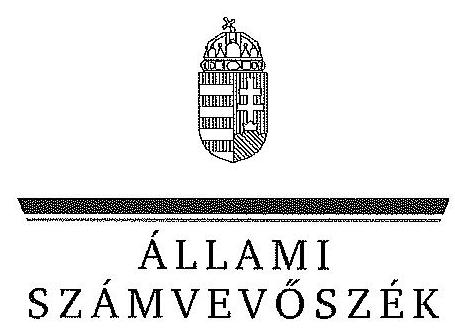

ÁLLAMI
SZÁMVEVŐSZÉK

# JELENTÉS 

A központi alrendszer egyes intézményei pénzügyi és vagyongazdálkodásának ellenőrzése

Országos Mentőszolgálat

---

Állami Számvevőszék
Iktatószám: V-0745-348/2015.
Témaszám: 1779
Vizsgálat-azonosító szám: V-067916

# Az ellenőrzést felügyelte: 

Kisgergely István
felügyeleti vezető
Az ellenőrzés végrehajtásáért felelős:
Barta József
ellenőrzésvezető
Az ellenőrzést vezette:
Barta József
ellenőrzésvezető
Az összefoglaló jelentést készítette:
Barta József
ellenőrzésvezető
Jogi támogatást nyújtott:
Dr. Székely Zsolt
számvevő főtanácsos
Dr. Magyar Csilla
számvevő tanácsos
A számvevői munkaanyagok feldolgozásában és a jelentés összeállításában közreműködött:

Gaálné Izsó Éva
számvevő tanácsos
Samu István
számvevő tanácsos
Marik Máté
számvevő asszisztens
Az ellenőrzést végezték:

| Gaálné Izsó Éva | Gácsi Györgyi Ivett | Kámán Edina |
| :-- | :-- | :-- |
| számvevő tanácsos | számvevő főtanácsos | számvevő főtanácsos |
| Nyikon Zsigmondné | Samu István | Marik Máté |
| számvevő főtanácsos | számvevő tanácsos | számvevő asszisztens |

---

A témához kapcsolódó eddig készített számvevőszéki jelentések:
címe
sorszáma
Jelentés a Magyarország 2012. évi költségvetése végrehajtásának ellenőrzéséről

Jelentés a Magyarország 2013. évi költségvetése végrehajtásának ellenőrzéséről

---

.

---

# TARTALOMJEGYZÉK 

BEVEZETÉS ..... 3
I. ÖSSZEGZŐ MEGÁLLAPÍTÁSOK, KÖVETKEZTETÉSEK, JAVASLATOK ..... 8
II. RÉSZLETES MEGÁLLAPÍTÁSOK ..... 14

1. Az irányító szervek OMSz-ra vonatkozó feladatellátása ..... 14
2. A belső kontrollrendszer kialakítása és működtetése ..... 15
2.1. A kontrollkörnyezet, a kockázatkezelési rendszer, a kontrolltevékenységek és az információs és kommunikációs rendszer kialakítása és működtetése ..... 16
2.2. A monitoring rendszer kialakítása és működtetése ..... 19
3. Az OMSz pénzügyi gazdálkodása ..... 20
3.1. Az OMSz költségvetésének tervezése, az előirányzatok megállapítása és módosítása ..... 21
3.2. A kiadási előirányzatok felhasználása és a bevételi előirányzatok teljesítése ..... 23
3.3. Az előirányzat-maradványok kezelése ..... 26
3.4. A fizetőképesség alakulása ..... 27
4. Az OMSz vagyongazdálkodása ..... 28
4.1. A vagyongazdálkodás szabályozottsága ..... 28
4.2. Az eszközök és források értékének kimutatása, az eszközök értékének megőrzése ..... 29
4.3. A vagyonelemek hasznosítása, vagyonátadás- és átvétel ..... 32
4.4. Az eredményszemléletű számvitel bevezetése ..... 33
5. Az ÁSZ korábbi ellenőrzései során tett javaslatok hasznosulása ..... 33
6. A gazdaságossági, hatékonysági és eredményességi követelmények kialakítása és működtetése ..... 34
7. Az integritás kontrollok kialakítása és működtetése ..... 35

---

# MELLÉKLETEK 

1. számú A belső kontrollrendszer kialakítása és működtetése szabályszerűségének alakulása az OMSz-nál
2. számú Az OMSz bevételi, kiadási előirányzatainak és teljesítésének, és létszámának alakulása a 2008-2013. közötti években
3. számú Az OMSz mérlegadatai és változásuk a 2008-2013. közötti években
4. számú Az Országos Mentőszolgálat észrevétele
5. számú Az Országos Mentőszolgálat észrevételére válasz
6. számú Az Emberi Erőforrások Minisztériumának észrevétele
7. számú Az Emberi Erőforrások Minisztériumának észrevételére válasz

## FÜGGELÉKEK

1. számú Rövidítések jegyzéke
2. számú Értelmező szótár
3. számú Az integritás érvényesítése érdekében kialakított és működtetett intézményi kontrollrendszer
4. számú Az OMSz pénzügyi és vagyongazdálkodásának teljesítmény-ellenőrzése

---

# JELENTÉS 

## A központi alrendszer egyes intézményei pénzügyi és vagyongazdálkodásának ellenőrzéséről Országos Mentőszolgálat

## BEVEZETÉS

A közpénzek felhasználásában és az állami vagyonnal való gazdálkodásban a központi alrendszer egyes intézményei meghatározó súlyt képviselnek. Pénzügyi- és vagyongazdálkodásuk rendszeres ellenőrzésével az ÁSZ hozzájárul a hatékony közigazgatás megteremtéséhez. Az ÁSZ Stratégiával összhangban a közvagyon védelme, a közpénzügyek átláthatóságának előmozdítása érdekében került sor az Országos Mentőszolgálat (továbbiakban: OMSz) ellenőrzésére.

Az OMSz 1948-ban alakult meg. Az OMSz közfeladata az egészségügyről szóló 1997. évi CLIV. törvény 94. §-a, valamint a mentésről szóló 5/2006. (II.7.) EüM rendelet 2. § a) pontja szerinti mentési tevékenység, a mentés állami mentőszolgálatként való ellátása az Országos Mentőszolgálatról szóló 322/2006. (XII.23.) Korm. rendelet 5. § (1) bekezdése alapján. Az OMSz önállóan működő és gazdálkodó költségvetési szerv.

Az OMSz irányító szerve 2010. május 29-ig az Egészségügyi Minisztérium, 2012. május 13-ig a Nemzeti Erőforrás Minisztériuma, azt követően az Emberi Erőforrások Minisztériuma volt. Az intézményt főigazgató vezette, akinek munkáját az egyes szakterületeket vezető igazgatók segítették, a főigazgató személyében négyszer történt változás az ellenőrzött időszakban.

Az ellenőrzött időszakban az OMSz feladatellátása területén változás volt, a betegszállítás irányítását 2012. évtől teljes körűen az OMSZ végzi, az intézmény szervezeti struktúrájában is változások történtek. Az OMSz átlagos statisztikai állományi létszáma a 2008. évi 6824 főről 2013-ra 7228 főre emelkedett. Az intézmény 2013-ban 231 mentőállomáson 745 futó mentőgépkocsival és 156 tartalékjárművel látta el feladatát.

Az OMSz vagyona a 2008. évi 11 967,3 M Ft-os záró értékről 2013. év végére 12 255,5 M Ft-ra, 2,4 %-kal növekedett. A saját tőke nagysága a 2008. év végi 9 771,3 M Ft-ról 2013 évvégére 11 136,4 M Ft-ra (1 365,0 M Ft-tal), 14%-kal növekedett. A tartalékok nagysága az ellenőrzött időszakban ingadozott, a 2008. évi 2 145,1 M Ft-ról 2013 év végére 552,0 M Ft-ra csökkent. A 2008. december 31-ei kötelezettségek 48,8 M Ft-ról 561,0 M Ft-ra emelkedtek 2013. év végére.

---

Az intézmény költségvetése volumenének alakulását a következő diagram szemlélteti:
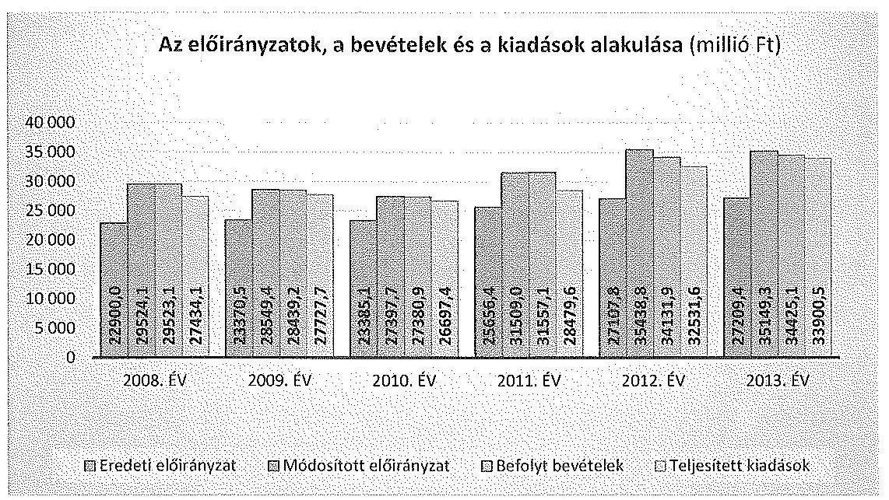

# 1. számú diagram 

Az ellenőrzés célja annak megállapítása volt, hogy az OMSz-ra vonatkozó irányító szervi feladatellátás a jogszabályi előírások betartásával történt-e; az OMSz-nál a belső kontrollrendszer kialakítása és működtetése szabályszerű volt-e; kialakították-e az erőforrásokkal való szabályszerű és hatékony gazdálkodáshoz szükséges követelményeket, megvalósították-e azok számon kérését, ellenőrzését; az OMSz pénzügyi és vagyongazdálkodása megfelelt-e a jogszabályi előírásoknak és belső szabályzatainak; az OMSz átalakításának vagy átszervezésének lebonyolítása szabályszerűen történt-e; az ÁSZ korábbi ellenőrzései során megfogalmazott javaslatok, megállapítások tekintetében az ellenőrzés célja továbbá annak megítélése volt, hogy azok végrehajtása érdekében az OMSz a szükséges intézkedéseket megtette-e; az integritás kontrollokat kialakították-e, szabályszerűen működtetik-e.

Az OMSz-t az ÁSZ a 2008. január 1-je és 2013. december 31-e közötti időszakban a Magyarország 2012. évi és a 2013. évi költségvetése végrehajtásának ellenőrzése keretében ellenőrizte.

Az ellenőrzés várható hasznosulása: A központi alrendszerbe tartozó intézmények jelentős hatást gyakorolhatnak a költségvetés egyensúlyának fenntartására, az állami vagyonnal való gazdálkodás minőségére, a kormányzati (szak)politikák végrehajtására, illetve közfeladat ellátásuk vonatkozásában az állampolgárok életminőségére, jogaik és kötelezettségeik gyakorlására. Az ellenőrzés az OMSz pénzügyi és vagyongazdálkodása szabályosságának javításával előmozdítja a közpénzügyek átláthatóságát, rendezettségét. Eredményeként átfogó képet kaphatunk az OMSz gazdálkodásának hiányosságairól és a jó gyakorlatokról is.

---

A közintézmények integritás alapú kultúrája meghatározó a belső kontrollrendszer működése szempontjából. Hozzájárulhat az elszámoltathatóság és átláthatóság érvényesítéséhez, egyben támogathatja a szervezet védettségét a korrupciós kitettséggel szemben. Az integritási kontrollok ellenőrzése az integritási szemlélet terjedését, az integritás kultúra erősítését támogatja. Az ellenőrzés egyben hozzájárul az eredményszemléletű számvitel bevezetésével összefüggő feladatok végrehajtásához.

A belső kontrollrendszer államháztartási törvényben rögzített célja a működés és gazdálkodás során a tevékenységek szabályszerű, gazdaságos, hatékony és eredményes végrehajtása. Az ÁSZ a központi intézmények ellenőrzését teljesítmény-ellenőrzési modullal egészítette ki.

Az OMSz teljesítmény-ellenőrzésének célja annak értékelése volt, hogy a gazdálkodás folyamatában a gazdaságossági, hatékonysági és eredményességi követelmények kialakítása megtörtént-e és azokat működtették-e; a költségvetési szerv belső kontrollrendszerének minőségéről kiadott vezetői nyilatkozatban a költségvetési szerv tevékenységében a hatékonyság, eredményesség, gazdaságosság követelményeinek érvényesítése helytálló volt-e. A teljesítmény-ellenőrzés a gazdálkodási feladatokra terjedt ki, a szakmai feladatellátást nem értékelte.

A teljesítmény-ellenőrzés várható hasznosulása: A törvényalkotás számára támogatást nyújt a nemzeti kulcsindikátorok rendszerének kialakításához. A döntéshozók, ellenőrzöttek, irányító szervek, a társadalom számára az összehasonlítási, összemérési lehetőségek kihasználásával objektív visszajelzést ad a gazdálkodás területén végrehajtott szervezeti, szervezési, takarékossági és bürokráciacsökkentő intézkedések hatásairól, a közfeladat-ellátásnak keretet adó pénzügyi és vagyongazdálkodásban mérhető teljesítménykövetelmények kialakításáról, azok alkalmazásáról. Az ÁSZ értékteremtő elemzéseivel, tanácsadó szerepét erősítve támogatja a szervezetek önértékelő, alkalmazkodó (öntanuló) tevékenységét. Irányt mutat az ellenőrzött intézmények gazdálkodási és kapcsolódó adminisztratív folyamatainak optimalizációjához. Segíti a központi költségvetési szervek átláthatóságát, felügyelhetőségét, a „jó gyakorlatok" elterjesztésével támogatja a „jó kormányzást".

Az ellenőrzés típusa szabályszerűségi ellenőrzés, amelyet az OMSz-ra vonatkozó teljesítmény-ellenőrzés egészített ki.

Az ellenőrzött időszak 2008. január 1. - 2013. december 31. között volt.
A helyszíni ellenőrzésre a szabályszerűségi ellenőrzés tekintetében az OMSznál, és az irányító szervi feladatait ellátó minisztériumnál került sor. A teljesítményellenőrzés vonatkozásában helyszíni ellenőrzésre az OMSz-nál került sor.

Az ellenőrzés jogszabályi alapját az ÁSZ tv. 1. § (3) bekezdés, 5. § (2)-(6) bekezdései, valamint Áht. 2 61. § (2) bekezdésének előírásai képezik.

A központi alrendszer intézményeinek ellenőrzése során a belső kontrollrendszer tekintetében a hangsúlyt az egyes kontrollterületek (kontrollkörnyezet, kockázatkezelési rendszer, kontrolltevékenységek, információs és kommunikációs rendszer, monitoring rendszer) kialakításának és az intézmény működési folya-

---

mataiba való beépülésének szabályszerűségére helyeztük, amelyet kizárólag jogszabályokból és intézményi belső szabályozásokból levezethető kritériumrendszer alapján ítéltünk meg.

A belső kontrollrendszer jogszabályi előírások szerinti kialakításának és működtetésének szabályszerűségét az erre irányuló ellenőrzési kérdésekre adott válaszok összesítése alapján kontrollterületenként egyedileg és összesítetten is értékeltük. A belső kontrollrendszer egyes kontrollterületei kialakítása és működtetése „szabályszerű volt", tehát a feltárt hiányosságok nem gyakoroltak lényeges hatást a kontrollok kialakítására és működtetésére, amennyiben az értékelt területen az elért és elérhető pontok százalékban kifejezett hányadosa elérte a 85%-ot, „nem volt szabályszerű", ha nem haladta meg a 60%-ot, és „részben szabályszerű volt", ha 61-84% között volt.

A belső kontrollrendszer összesített értékelése megegyezett a kontrollterületenként alkalmazott %-os értékelésekkel, a következő kiegészítéssel. A kontrollrendszer egésze esetében a „szabályszerű" értékelésnek a %-os értéken felül további feltétele volt, hogy egyik kontrollterületen sem kaphatott „nem volt szabályszerű" értékelést. A „részben szabályszerű" értékelés további feltétele volt, hogy legfeljebb egy ellenőrzött kontrollterület lehetett „nem volt szabályszerű" értékelésű. Az összesített értékelés a %-os kiértékelés eredményétől függetlenül „nem volt szabályszerű", ha az ellenőrzött kontrollterületek közül több mint egynek „nem volt szabályszerű" az értékelése.

Az ellenőrzött bevételi és kiadási előirányzatokra vonatkozóan elvégzett tesztek eredményeinek értékelése összevontan történt, az egyes részterületek eredményei alapján azonban a mintanagyságból eredően önállóan nem lehetett következtetést levonni, az értékelés csak az ellenőrzött mintatételekre vonatkozik. Kivétel ez alól a dologi kiadások, valamint a rendszeres és nem rendszeres személyi juttatások, ezek esetében a minta elemszámok alapján lehetséges volt kivetített értékelést adni a részterületek teljes sokaságára, a teljes ellenőrzött időszakra vonatkozóan.

A jogszabályoknak és a belső előírásoknak megfelelőnek, azaz szabályszerűnek tekintettük a vagyonhasznosítási bevételek, a személyi juttatások, a dologi és felhalmozási kiadások, valamint a pénzeszközátadások felhasználásának szabályszerűségét, amennyiben a minta ellenőrzésének eredménye alapján 95%-os bizonyossággal a teljes sokaságban a hibaarány kisebb volt, mint 10%. Nem megfelelőnek értékeltük, ha a hibaarány a 10%-ot meghaladta.

A személyi és külső személyi juttatások, a dologi és felhalmozási kiadások, a pénzeszközátadások, valamint a 2008-2009. években a vagyonhasznosítási bevételek előirányzatai felhasználásánál a gazdálkodási jogkörök gyakorlását mintavétellel ellenőriztük. A 2008-2010 éveket érintően a szakmai teljesítésigazolás és az utalvány ellenjegyzése kulcskontrollok, a 2011-2013 éveket érintően a teljesítésigazolás és az érvényesítés kulcskontrollok működését értékeltük. Megfelelőnek értékeltük a gazdálkodási jogkörök gyakorlását, amennyiben 95%-os bizonyossággal a teljes sokaságban a hibaarány legfeljebb 10%, részben megfelelőnek értékeltük, ha a hibaarány felső határa legfeljebb 30%, nem megfelelőnek pedig akkor, ha a sokaságbeli hibaarány felső határa meghaladta a 30%-ot.

---

Az ellenőrzés az INTOSAI által kiadott nemzetközi standardok (ISSAI) figyelembe vételével, az ellenőrzési programban foglalt értékelési szempontok szerint történt.

Az ÁSZ a 2011. évi LXVI. törvény 29. §-a szerint a jelentéstervezetet
 megküldte az Országos Mentőszolgálat főigazgatójának és az Emberi Erőforrások Minisztériumának miniszter részére egyeztetésre. A beérkezett észrevételeket és az arra adott válaszokat a jelentés 4-7. sz. mellékletei tartalmazzák

---

# I. ÖSSZEGZŐ MEGÁLLAPÍTÁSOK, KÖVETKEZTETÉSEK, JAVASLATOK 

#### Abstract

Az irányító szervek az OMSz-ra vonatkozó alapítói, irányító szervi és ellenőrzési jogosultságokat részben szabályszerűen látták el. Az alapítói jogosultságok körében - összhangban az Áht. ${ }_{1.2}$ előírásaival - az Alapító Okiratot és az SZMSZ-t módosították, illetve jóváhagyták.

Az irányító szervek irányítói jogosultságainak gyakorlása a tervezés, a beszámoltatás, és az előirányzatok évközi figyelemmel kísérése tekintetében részben felelt meg az Áht. ${ }_{1,2}$ előírásainak. Ellenőrzési jogosultságukat az Áht. ${ }_{1.2}$ előírásaival összhangban szabályszerűen gyakorolták, ugyanakkor nem rögzítettek, nem érvényesítettek és nem kértek számon az Áht. ${ }_{1.2}$-ben meghatározott, a közfeladat ellátásához, az erőforrásokkal való hatékony gazdálkodáshoz szükséges követelményeket.

Az irányító szervek - az OMSz feladatellátásával kapcsolatos, az Áht. ${ }_{1,2}$ előírásain alapuló szervezeti átalakítást érintő - alapítói, irányítói döntést nem hoztak.

Az ellenőrzött időszakban az intézmény belső kontrollrendszerének kialakítása és működtetése az összevont értékelés szerint nem felelt meg a jogszabályi előírásoknak. A belső kontrollrendszer elemei közül nem megfelelő minősítést kapott a kontrollkörnyezet kialakítása, a kontrolltevékenység kialakítása és működtetése, valamint az információs és kommunikációs rendszer, továbbá részben megfelelő minősítést kapott a kockázatkezelési rendszer és a monitoring rendszer kialakítása és működtetése. Az évenkénti értékelés alapján a belső kontrollrendszer a kontrollelemek javulása eredményeként a 2012-2013. években részben megfelelőre változott.

A kontrollkörnyezet kialakítása és működtetése az ellenőrzött időszakban a 2008-2011. években nem felelt meg, a 2012. és 2013. években részben felelt meg a jogszabályi előírásoknak, és a belső szabályzatoknak. A tevékenységre és a gazdálkodásra vonatkozó főbb belső szabályzatokkal az OMSz nem, vagy csak részben rendelkezett. A belső szabályzatok aktualizálása az ellenőrzött időszakban részben történt meg.

A kockázatkezelési rendszer kialakítása és működtetése az ellenőrzött időszakban részben megfelelő volt, mivel a kockázatkezelési rendszer kialakítása csak a 2012. évben történt meg. A kockázatkezelési rendszer kialakítását követően az OMSz a tevékenységével kapcsolatos kockázatokat meghatározta, felmérte és összesítette, az egyes kockázatokkal kapcsolatos intézkedéseket, valamint azok teljesítésének folyamatos nyomon követésének módját nem határozta meg.

A kontrolltevékenység keretében a pénzügyi és vagyongazdálkodási folyamatokhoz kapcsolódó jogosultságok és jogkörök kialakítása és működtetése az ellenőrzött időszakban összességében, és évenként sem felelt meg a jogszabályi előírásoknak. A gazdálkodás során a kontrolltevékenység részeként nem volt biztosított a folyamatba épített, előzetes, utólagos és vezetői ellenőrzés, a

---

belső kontrollok nem tárták fel a pénzügyi szabályszerűségi hiányosságokat. Az OMSz a jogszabályi előírás ellenére nem gondoskodott a gazdálkodási jogkört gyakorlók és aláírás-mintájuk nyilvántartásáról.

Az ellenőrzött időszakban az információs és kommunikációs rendszer kialakítása és működtetése nem megfelelő minősítésű volt. Az OMSz belső jelentéstételi és az információáramlás rendszerét nem alakította ki megfelelően, és a 2008-2012. években teljes körűen nem rendelkezett a jogszabályok által előírt szabályzatokkal. Az OMSz honlapján közzétett adatok nem voltak teljes körűek a számviteli törvény szerinti beszámolókat illetően, az archiválandó adatok a honlapon nem voltak elérhetőek.

Az ellenőrzött időszakban az OMSz nem alakította ki a vezetői információs rendszert, a döntések előkészítésében és a döntéshozatalban a megfelelő információk csak részben álltak rendelkezésre. Az Integrált Vállalat Irányítási Rendszert a 2013. évben vezették be, amely a működési hiányosságok miatt nem megfelelően látta el a funkcióját.

A monitoring rendszer kialakítása és működtetése az ellenőrzött időszakban összességében, és évenkénti bontásban is részben felelt meg a jogszabályi előírásoknak, mivel az OMSz nem alakította ki és nem működtette a szervezet minden szintjén érvényesülő nyomon követési rendszerét. A belső ellenőrzés függetlensége megvalósult, kialakítása és működtetése megfelelt a jogszabályi előírásoknak.

Az OMSz gazdálkodása során a gazdaságossági, hatékonysági és eredményességi követelmények kialakítása és működtetése a gépjármű üzemeltetés kivételével nem történt meg. Az OMSz gazdálkodásában a gazdaságossági, hatékonysági és eredményességi követelmények kialakítása során a gépjármű üzemeltetés területén határoztak meg teljesítmény-mutatókat, amelyek alakulását nyomon követték. A belső kontrollok működése keretében a gazdaságosság, hatékonyság és eredményesség követelményeinek érvényesítéséről kiadott vezetői nyilatkozatok nem voltak teljes mértékben helytállóak.

Az OMSz pénzügyi gazdálkodása az ellenőrzött időszakban részben volt szabályszerű.

Az OMSz elemi költségvetése és az előirányzatok megállapítása a 2008-2011. években nem felelt meg a jogszabályi előírásoknak. Az intézmény a 2011. évi költségvetési javaslatát, a 2010. évben az elemi költségvetést alátámasztó szöveges indoklást nem készítette el. A 2008-2009. évi, valamint a 2011. évi elemi költségvetéshez készített szöveges indoklások nem feleltek meg a jogszabályi előírásoknak, mivel a tervezett kiadási és bevételi előirányzatokat kapcsolódó számításokkal nem támasztották alá, ezáltal a költségvetés megalapozottsága, végrehajthatósága nem volt megállapítható.

Az OMSz 2012-2013. évi elemi költségvetése nem volt megalapozott. A bevételi és kiadási előirányzat módosítások nem feleltek meg teljes körűen a jogszabályi előírásoknak a saját hatáskörű előirányzat módosításoknál tapasztalt hiányosságok miatt.

---

Az OMSz a 2008., 2010-2011. években betartotta a bevételi előirányzatok teljesítési kötelezettségét, a 2009., a 2012-2013. években a teljesített bevételek elmaradtak a módosított bevételi előirányzatoktól. Az OMSz az ellenőrzött időszakban a 2013. év kivételével, a számára jóváhagyott kiemelt kiadási előirányzatokat betartotta.

A bevételi és kiadási előirányzatok felhasználása során a gazdálkodási jogkörökhöz előírt kontrollok nem működtek megfelelően. A rendszeres és nem rendszeres személyi juttatások kiadási előirányzat és a dologi kiadások előirányzatának felhasználása, valamint a pénzeszközátadások teljesítése az ellenőrzött mintatételek értékelése alapján nem volt szabályszerű az ellenőrzött időszakban.

A külső személyi juttatások kiadási előirányzatának felhasználása során a jogszabályi előírásokkal ellentétben a 2011. és 2012. években, egy-egy esetben a megbízási szerződésekben rögzített óradíj feletti összegben történt a teljesítésigazolás és a kifizetés.

Az OMSz öt esetben a pénzeszközátadásokat a jogszabályi előírások ellenére nem dokumentálta, a megállapodások, szerződések hiányával jogszabályi rendelkezéseket sértett.

Az ellenőrzött időszakban a felhalmozási kiadások teljesítése, a vagyonhasznosítási bevételek beszedése részben volt szabályszerű.

Az OMSz dologi kiadásai felhasználása során több esetben nem tartotta be a közbeszerzési eljárás lefolytatásának kötelezettségét. A felhalmozási kiadásoknál egy építési felújításnál és egy eszközbeszerzésnél megsértették a közbeszerzési törvény előírásait a közbeszerzési eljárás mellőzése miatt.

Az előirányzat-maradvány megállapítása és felhasználása a 2008-2011. években részben felelt meg a jogszabályi előírásoknak, mivel esetenként a kötelezettségvállalással terhelt maradvány megállapítása és felhasználása nem szabályszerűen történt. A 2012-2013. években az előirányzat-maradvány megállapítása és felhasználása megfelelt a jogszabályi előírásoknak.

Az intézmény folyamatos fizetőképessége nem volt teljes körűen biztosított a 2012-2013. években az év végére vonatkozó kedvező likviditásmutatók ellenére. Az OMSz 2008-2011. években előirányzat-felhasználási tervkészítési kötelezettségének nem tett eleget, 2012. évben likviditási tervet nem készített.

Az OMSz vagyongazdálkodása részben volt szabályszerű az ellenőrzött időszakban. A vagyongazdálkodással kapcsolatos feladat- és hatásköröket az SZMSZ-ekben általánosan meghatározták. A vagyongazdálkodási tevékenység az ellenőrzött időszakban nem volt teljes körűen szabályozott.

A mérlegben kimutatott eszközök nyilvántartását, értékének megállapítását a jogszabályi előírásoknak és belső szabályzatnak megfelelően - az OMSz saját, használatba adott eszközeinek leltározása nem teljes körűsége miatt - részben szabályszerűen végezték el.

---

A beszámolókban és a számviteli nyilvántartásokban kimutatott eszközök és források állományának valódiságát az előírásoknak megfelelően leltárakkal alátámasztották, a leltározás és a selejtezés végrehajtása megfelel - a használatba adott eszközök kivételével - a jogszabályi előírásoknak. A tárgyi eszközök használhatósági foka változó mértékben, de - a számítástechnikai eszközök kivételével - minden eszköz csoport tekintetében romlott.

Az OMSz az eredményszemléletű számvitel bevezetésével kapcsolatban előírt feladatokat végrehajtotta.

A 2010. évi gépjármű értékesítéseknél versenyeztetés megtörténtét dokumentumokkal nem támasztották alá. Az ingatlanok bérbeadásakor a bérlők kiválasztásánál esetenként nem volt versenyeztetés.

Az OMSz 2008-2013. évi üzemeltetésre átadott, átvett vagyon átadás-átvételei, a vagyonelemek tulajdonjogának térítésmentes átadás-átvételei megfeleltek a jogszabályok előírásainak.

Az ÁSZ a 2012. és a 2013. évi költségvetés végrehajtásának ellenőrzése keretében ellenőrizte az intézményt, jelentéseiben a beszámolók megbízhatóságát nem befolyásoló hiányosságokat, szabálytalanságokat tárt fel.

A 2012. évi ellenőrzésben foglalt, a kötelezettségvállalással terhelt maradvány jogszerűtlen megállapítása az OMSz 2013. évi tevékenységében nem ismétlődött, így az ÁSZ ellenőrzés megállapításai hasznosultak. A 2013. évi ÁSZ ellenőrzés megállapításai részben hasznosultak. A kifogásolt szabálytalanságok megszüntetésére elkészítették a hat hónapon belül lejáró közbeszerzési szerződések nyilvántartását, a gazdálkodási jogköröket felülvizsgálták. A gazdálkodási jogkörökre jogosultak aláírás mintájáról azonban az előírt, naprakész nyilvántartást nem vezették.

Az ÁSZ tv. 33. § (1) bekezdésében foglaltak értelmében a jelentésben foglalt megállapításokhoz kapcsolódó intézkedési tervet köteles az ellenőrzött szervezet vezetője összeállítani, és azt a jelentés kézhezvételétől számított 30 napon belül az ÁSZ részére megküldeni. Amennyiben az intézkedési tervet határidőben nem küldi meg a szervezet, vagy az nem elfogadható, az ÁSZ elnöke a hivatkozott törvény 33. § (3) bekezdés a)-b) pontjaiban foglaltakat érvényesítheti.

A helyszíni ellenőrzés megállapításainak hasznosítása mellett javasoljuk:

# az Országos Mentőszolgálat főigazgatója részére: 

1. A belső kontrollrendszer kialakítása és működtetése nem felelt meg a jogszabályi előírásoknak:

A kontrollkörnyezet kialakítása és működtetése a 2008-2011. években nem volt szabályszerű, mivel nem felelt meg a jogszabályi előírásoknak és a belső szabályzatoknak, 2012. és 2013. években részben volt szabályszerű. Az ellenőrzött időszak teljes tartama alatt az intézmény nem rendelkezett a gazdálkodással összefüggő valamennyi, jogszabályban előírt belső szabályzattal, a belső szabályzatok egy része nem felelt meg teljes körűen a vonatkozó jogszabályi előírásoknak, a szabályzatokat nem minden esetben aktualizálták a jogszabályi változásokkal összhangban, mindez nem biztosította

---

az Ámr. 1 145/B. §-ában, 145/D. §-ában, az Ámr. 2 156. §-ában, továbbá a Bkr. 3. § a) pontjában és a 6. §-ában foglalt előírások érvényesülését;
a kontrolltevékenységek kialakítása és működtetése nem felelt meg az Ámr. 1 145/A. §, 145/E. § az Ámr. 2 158. § és a Bkr. 3. § c), 8. § előírásainak. A pénzügyi és vagyongazdálkodási folyamatokhoz kapcsolódó jogosultságok és jogkörök kialakítása és működtetése az ellenőrzött időszakban nem felelt meg a jogszabályi előírásoknak;
az információs és kommunikációs rendszer kialakítása és működtetése az ellenőrzött időszakban nem felelt meg az Ámr. 1 145/F. §-ában, az Ámr. 2 159. §-ában, valamint a Bkr. 3. § d) pontjában és 9. §-ában foglaltaknak. Az OMSz belső jelentéstételi és az információáramlás rendszerét nem alakította ki megfelelően;
a monitoring rendszer kialakítása és működtetése részben volt szabályszerű, mivel az Áht. 1 121. § (2) bekezdés e) pont (2011. január 1-től), Áht. 1 120/B § (2) bekezdése e) pont (2009. január 1-től 2011. január 1-ig), Ámr. 1 145/G. §, Ámr. 2 160. §, Bkr. 3. § e) pont, és 10. § előírásai ellenére az intézmény nem alakította ki és nem működtette a szervezet minden szintjén érvényesülő nyomon követési rendszerét.

Az OMSz integritás kontrollrendszere fejlesztendő volt.
Javaslat:
a) Intézkedjen a jogszabályoknak megfelelő belső kontrollrendszer kialakítása és működtetése érdekében a kontrollkörnyezet, a kontrolltevékenységek, az információs és kommunikációs rendszer, továbbá a monitoring rendszer ellenőrzés által feltárt hiányosságainak megszüntetéséről.
b) Fejlessze
 tovább a szervezet integritás kontrolljait.
2. A bevételi és kiadási előirányzatok felhasználása során a gazdálkodási jogkörök (teljesítésigazolás, ellenjegyzés, érvényesítés) gyakorlása nem volt szabályszerű. A rendszeres és nem rendszeres személyi juttatások, a külső személyi juttatások, a dologi és felhalmozási kiadások előirányzatának felhasználása, valamint a pénzeszközátadások teljesítése során a gazdálkodási jogkörök gyakorlása nem felelt meg az Ámr. 1 135. § (1) bekezdése, a 137. §, az Ámr. 2 76. § (1) bekezdése és 79. § (1)-(2) bekezdései, továbbá az Ávr. 57. § (1) bekezdés és az 58. § előírásainak.

A 2008-2013. évekre vonatkozó pénzeszközátadások dokumentumai teljes körűen nem álltak rendelkezésre, ezzel megsértették a bizonylati elvre és fegyelemre vonatkozóan a Számtv. 165. § (1)-(2) bekezdésében foglaltakat.

Javaslat:
a) Intézkedjen a gazdálkodási jogkörök szabályszerű gyakorlásának érvényesítéséről.
b) Tegyen intézkedéseket a feltárt szabálytalanságok tekintetében a felelősség tisztázása érdekében és szükség szerint intézkedjen a felelősség érvényesítéséről.
3. Az OMSz elemi költségvetésében az Egészségbiztosítási Alapból származó működési célú támogatásértékű bevételi előirányzatában a 2012. évben 1270,7 M Ft, a 2013. évben 780,0 M Ft értékben számszakilag megalapozatlan volt. Ennek oka az, hogy az OMSz által tervezett bevétel 2012. évben egyrészt 490,7 M Ft-tal meghaladta a Kvtv.

---

LXXII. fejezetében az Egészségbiztosítási Alap mentési során jóváhagyott összeget, másrészt a tervezésnél a 2012. és 2013. években sem vették figyelembe, hogy a költségvetési forrásból az OMSz-on kívül más szervezetek is, összesen 780,0 M Ft támogatásban részesültek.

Javaslat:
A költségvetés tervezésekor vegyék figyelembe a tervezett bevételek közgazdasági megalapozottságát.
4. Az ellenőrzött időszakban az OMSz saját, de használatba adott eszközeinek leltározása nem volt teljes körű az Áhsz. 37. § (1)-(3) bekezdéseiben foglalt előírások ellenére.

Javaslat:
Intézkedjen az intézmény eszközeinek teljes körű leltározása érdekében a használatba adott eszközök leltározásának elrendeléséről; és gondoskodjon annak megvalósításáról.
5. A bérlők kiválasztása a Vtv. 24. § (1) bekezdésében foglaltak ellenére esetenként nem versenyeztetéssel történt.

Javaslat:
Intézkedjen a jogszabályban meghatározott esetekben a bérbeadása során a versenyeztetési eljárás lebonyolításáról.
6. Az OMSz-nál a 2008-2012. években a mentő gépkocsi alkatrészvásárlás és alkatrészjavítás, a mentő gépkocsi karbantartás, az orvosi ügyelet ellátás, az egészségügyi felszerelési anyag, az orvosi eszközök fenntartási anyag, a távközlési szolgáltatás, a mosás és tisztítás szolgáltatásvásárlás, továbbá a mosás és takarítási szolgáltatások beszerzése a Kbt. 1 21. § (1) bekezdés és 240. § (1) bekezdés, Kbt. 2 5. § és 19. § ellenére közbeszerzési eljárás nélkül történt.

Javaslat:
a) Intézkedjen a jogszabályban meghatározott esetekben a közbeszerzési eljárás lebonyolításáról.
b) Tegyen intézkedéseket a feltárt szabálytalanságok tekintetében a felelősség tisztázása érdekében és szükség szerint intézkedjen a felelősség érvényesítéséről.

---

# II. RÉSZLETES MEGÁLLAPÍTÁSOK 

## 1. Az irányító szervek OMSz-ra vonatkozó feladatellátása

Az irányító szervek az OMSz-ra vonatkozó alapítói, irányító szervi és ellenőrzési jogosultságokat részben szabályszerűen látták el.

Az irányító szervek alapítói jogosultságait szabályszerűen látták el. Ennek keretében Áht. ${ }_{1,2}$ előírásaival összhangban kiadták az intézmény Alapító Okiratait, módosításait, jóváhagyták az SZMSZ-eket. Az Alapító Okirat módosításakor az Ámr. ${ }_{1,2}$ előírásainak megfelelően az egységes szerkezetbe foglalt Alapító Okiratot a módosító okirathoz csatolták.

Az intézmény Alapító Okirata ${ }_{1-2}$ megfelelt az Ámr. ${ }_{1,2}$ előírásainak, azonban a jogszabályi előírások ${ }^{1}$ ellenére az Alapító Okirat ${ }_{4,5}$ nem tartalmazta a jogelőd megnevezését, székhelyét, megszűnésének időpontját.

Az ellenőrzött időszakban az OMSz részére az irányító szervek négy Alapító Okiratot adtak ki.

Az OMSz szervezeti felépítését, feladatait és működési folyamatait az Ámr. ${ }_{1-2}$ előírásaival és az Alapító Okiratokkal összhangban SZMSZ-ek rögzítették. Az irányító szervek részéről a miniszter hagyta jóvá az intézmény SZMSZ-ét, amelynek aktualizálása - a 2012. évi szervezeti változások kivételével - folyamatosan megtörtént.

Az ellenőrzött időszakban az OMSz főigazgatójának (vezető) megbízása, a gazdasági főigazgató-helyettes (gazdasági vezető) kinevezése, vezetői megbízása, felmentése megfelelt az Áht. ${ }_{1,2}$ előírásainak. A 2008-2013. években az intézmény vezetését négy főigazgató látta el, és négy gazdasági főigazgató-helyettest bíztak meg.

Az irányító szervek irányítói jogosultságainak gyakorlása a tervezés, a beszámoltatás, és az előirányzatok évközi figyelemmel kísérése tekintetében részben felelt meg az Áht. ${ }_{1,2}$ előírásainak.

Az irányító szervek részéről az OMSz 2008-2011. évi kincstári költségvetésének megállapítása, beszámolóinak felülvizsgálata, értékelése és jóváhagyása aláírt dokumentumokkal nem alátámasztott, így az irányító szervek a jogszabályi előírásokkal szemben ${ }^{2}$ nem végezték el azt. Az OMSz beszámolóit a 2012-2013. években a minisztérium az Áht. ${ }_{2}$ előírásaival összhangban felülvizsgálta.

Az irányító szerv a 2012-2013. években a jogszabályi előírások ${ }^{3}$ ellenére év közben nem hajtotta végre az OMSz bevételi és kiadási előirányzatokkal való gaz-

[^0]
[^0]:    ${ }^{1}$ Ávr. 5. § (2) a) és c) pont
    ${ }^{2}$ Áht. ${ }_{1} 49 . \S$ (5) bekezdés g), j) pont
    ${ }^{3}$ Áht. 2 9. § (1) bekezdés d) pont

---

dálkodásának rendszeres figyelemmel kísérését, ami az év végére vonatkozó kedvező likviditásmutatók ellenére átmeneti likviditási zavarokat okozott az intézménynél.

Az irányító szervek - összhangban az Áht. ${ }_{1,2}$ előírásaival - érvényesítették a közfeladat jellegének megfelelő finanszírozási módot a közfeladat támogatásának meghatározásakor, gyakorolták az előirányzatokkal kapcsolatos jogköröket.

Az irányító szervek az Ámr. ${ }_{1,2}$ és az Ávr. előírásainak megfelelően gyakorolták az intézménnyel kapcsolatos ellenőrzési jogosultságokat.

Az ellenőrzött időszakban az irányító szervek az OMSz rendszereinek működését, illetve az intézmény működésének rendszereit átfogóan vizsgálták, ellenőrzött területek voltak a belső kontrollok rendszere, az adatvédelem és adatbiztonság, az irat- és dokumentációkezelés, a honlapon történő közzététel, az OMSz 2012. évi likviditási helyzete. A minisztérium 2013. évben a Belső Ellenőrzési Főosztály ellenőrzései alapján készített intézkedési tervek végrehajtásának ellenőrzését végezte el, amelynek során megállapította, hogy az OMSz az intézkedési tervekben foglaltakat késve hajtotta végre. Az irányító szerv ellenőrizte az államháztartással összefüggő közérdekű és közérdekből nyilvános adatok közzétételének, illetve igényre történő szolgáltatásának végrehajtását.

Az irányító szervek a jogszabályi előírások ${ }^{4}$ ellenére az OMSz-nál nem rögzítették, nem érvényesítették és nem kérték számon az Áht. ${ }_{1,2}$-ben meghatározott, a közfeladat ellátásához, az erőforrásokkal való hatékony gazdálkodáshoz szükséges követelményeket.

Az ellenőrzött időszakban az intézmény az Áht. ${ }_{1,2}$ előírásai szerinti átalakítására nem került sor.

# 2. A BELSŐ KONTROLLRENDSZER KIALAKÍTÁSA ÉS MŰKÖDTETÉSE 

Az ellenőrzött időszakban a belső kontrollrendszer kialakításának és működtetése nem felelt meg a jogszabályi előírásoknak ${ }^{5}$. Ezen belül a kontrollkörnyezetet, a kontrolltevékenységeket és az információs és kommunikációs rendszert nem megfelelőnek, a kockázatkezelési rendszert, valamint a monitoring rendszert részben megfelelőnek minősítettük. Az évenkénti értékelés alapján a belső kontrollrendszer kialakítása és működtetése a kontrollelemek fejlődésének eredményeként 2012-2013. évekre már részben megfelelőre változott. Az ellenőrzött időszak kezdetére jellemző hiányosságok megszüntetése érdekében az OMSz intézkedéseket tett a 2012. és 2013. években. Az összesített értékelését az 1. sz. melléklet mutatja be.

[^0]
[^0]:    ${ }^{4}$ Áht. 149. § (5) bekezdés f) pont, Áht. 2 9. § (1) bekezdés f) pont
    ${ }^{5}$ Áht. 1 121. § (2011. január 1-től), Áht. 1 120/B § (2) bekezdése (2009. január 1-től 2011. január 1-ig), Áht. 2 69. §, Ámr. 1 145/A-G. §, Ámr. 2 155-160. §, Bkr. 3-10. §

---

# 2.1. A kontrollkörnyezet, a kockázatkezelési rendszer, a kontrolltevékenységek és az információs és kommunikációs rendszer kialakítása és működtetése 

A kontrollkörnyezet kialakítása és működtetése a 2008-2011. években nem volt szabályszerű, mivel nem felelt meg a jogszabályi előírásoknak, ${ }^{6}$ és a belső szabályzatoknak, 2012. és 2013. években részben volt szabályszerű. Az OMSz a jogszabályban előírt szabályzatokkal, illetve jogszabályi rendelkezésekkel összhangban lévő szabályzatokkal az ellenőrzött időszakban nem teljes körűen rendelkezett.

Az ellenőrzött időszakban az OMSz rendelkezett Alapító Okirat ${ }_{1-5}$-tel és SZMSZ ${ }_{1-5}$-tel az Áht ${ }_{1,2}$ előírásai alapján. Az SZMSZ ${ }_{1-4}$ kialakítását formai hiányosságok jellemezték, például nem tartalmazta az Alapító Okirat keltét és számát ${ }^{7}$, a szervezeti egységek vezetőjének azon jogosítványait, amelyek körében a költségvetési szerv képviselőjeként járhat el ${ }^{8}$, a szervezeti egységek engedélyezett létszámát ${ }^{9}$. Az SZMSZ ${ }_{1-5}$-ben az Ámr. ${ }_{1,2}$ és az Ávr. előírásainak megfelelően meghatározták az intézmény szervezeti felépítését, működési rendjét, szervezeti ábráját, valamint a szervezeti egységek feladatait.

Az ellenőrzött időszak teljes tartama alatt az intézmény nem rendelkezett a gazdálkodással összefüggő valamennyi, jogszabályban előírt belső szabályzattal, amelyek lefedték volna a pénz- és vagyongazdálkodással kapcsolatos folyamatokat, feladat- és hatásköröket, továbbá a felelősségi viszonyokat. A belső szabályzatok egy része nem felelt meg teljes körűen a vonatkozó jogszabályi előírásoknak, mert:

- az intézmény 2005. évben kiadott, és az ellenőrzött időszakban hatályban lévő Gazdálkodási Ügyrendje nem tartalmazza a gazdasági szervezet belső és külső kapcsolattartásának szabályait ${ }^{10}$,
- a Kötelezettségvállalási Szabályzat1-3-ban nem rögzítették gazdasági eseményenként az 50000 Ft-ot, illetve 2010. évtől a 100000 Ft-ot el nem érő kifizetések rendjét ${ }^{11}$,
- a belső szabályzatok aktualizálása az ellenőrzött időszakban részben történt meg, így a jogszabályi változások átvezetése a szabályzatokon teljes körűen

[^0]
[^0]:    ${ }^{6}$ Ámr. 1 145/B, D. §, Ámr. 2 156. §, Bkr. 3. § a) pont és 6. §
    ${ }^{7}$ Ámr. 110. § (5) bekezdés a) pont, 2009. január 1-től 13/A. § (3) bekezdés b) pont, Ámr. 2 20. § (2) bekezdés b) pont, Ávr. 13. § (1) bekezdés b) pont
    ${ }^{8}$ Ámr. 110. § (5) bekezdés j) pont, Ámr. 2 20. § (2) bekezdés g) pont, Ávr. 13. § (1) bekezdés f) pont
    ${ }^{9}$ Ámr. 1 13/A. § (3) bekezdés e) pont, Ámr. 2 20. § (2) bekezdés e) pont, Ávr. 13. § (1) bekezdés e) pont
    ${ }^{10}$ Ámr. 117. § (5), Ámr. 2 20. § (7) és Ávr. 13. § (5) bekezdés
    ${ }^{11}$ Ámr. 1134. § (3) bekezdés, Ámr. 2 72. § (11), 2010. augusztus 15-től (13) bekezdés a) pont, Ávr. 53. § (1) bekezdés a) pont

---

nem valósult meg, így például az 1971. évi Iratkezelési Szabályzatot az ellenőrzött időszakban nem módosították, az 1994. évtől hatályos Selejtezési Szabályzat1-et a 2009. évben, az 1997. évtől hatályos Leltározási és Leltárkészítési szabályzat1-et 2010-ben módosították.

Az OMSz dokumentáltan 2010. április 9-től rendelkezett hatályos, az intézményvezető által jóváhagyott Számviteli Politikával ${ }^{12}$. A Számviteli Politika; nem tartalmazta a mérlegkészítés időpontját, továbbá a kis értékű tárgyi eszközök minősítését a számviteli előírások ellenére ${ }^{13}$. Az ellenőrzött időszakban az OMSz rendelkezett Leltározási és Leltárkészítési Szabályzat ${ }_{1.3}$-al, Eszközök és Források Értékelési Szabályzat ${ }_{1,2}$-vel és Pénzkezelési Szabályzat ${ }_{1,2}$-vel. Az
 intézmény a jogszabályi előírások ellenére ${ }^{14}$ 2008. január 1. és 2012. november 19. közötti időszakban nem készítette el az önköltségszámítás rendjére vonatkozó szabályzatát.

Az OMSz a jogszabályi előírások ellenére nem rendelkezett 2008. január 1. és 2012. október 30. között Számlarenddel ${ }^{15}$, 2008-2012. években Bizonylati Rendelkezéssel${ }^{16}$.

A jogszabályi előírások ellenére ${ }^{17}$ 2008-2012. között az intézmény nem készítette el az ellenőrzési nyomvonalakat, amely hiányosságot 2013. január 4-vel pótolt. Az intézmény a szabálytalanságok kezelésének - a jogszabályi előírásoknak megfelelő ${ }^{18}$ - eljárásrendjével 2012. november 19-től rendelkezett. Az OMSz a Kbt. ${ }_{1,2}$ előírásainak megfelelően elkészítette a Közbeszerzési Szabályzat${ }_{1.3}$-at.

A kockázatkezelési rendszer kialakítása és működtetése az ellenőrzött időszakban részben volt szabályszerű. ${ }^{19}$ A kockázatkezelési rendszer kialakítása 2012 novemberében történt meg. Az intézmény a tevékenységével kapcsolatos kockázatokat meghatározta, felmérte és összesítette. Az egyes kockázatokkal kapcsolatos intézkedéseket, valamint azok teljesítésének folyamatos nyomon követésének módját nem határozta meg.

A kontrolltevékenységek kialakítása és működtetése összességében és évenként sem volt szabályszerű${ }^{20}$. A pénzügyi és vagyongazdálkodási folyamatokhoz kapcsolódó jogosultságok és jogkörök kialakítása és működtetése az ellenőrzött időszakban nem felelt meg a jogszabályi előírásoknak.

A gazdálkodás során a kontrolltevékenység részeként nem volt biztosított a folyamatba épített, előzetes, utólagos és vezetői ellenőrzés, a belső kontrollok nem

[^0]
[^0]:    ${ }^{12}$ Számv. tv. 14. § (3) bekezdés, Áhsz. 8. § (3) bekezdés
    ${ }^{13}$ Áhsz. 8. § (8) bekezdés, illetve 8. § (5) bekezdés a) pont
    ${ }^{14}$ Számv. tv. 14. § (5) bekezdés c) pontja és az Áhsz. 8. § (4) bekezdés c) pont
    ${ }^{15}$ Számv. tv. 161. § (1) bekezdése, Áhsz. 49. § (1) bekezdés
    ${ }^{16}$ Számv. tv. 161. § (2) bekezdés d) pont
    ${ }^{17}$ Ámr. ${ }_{1}$ 145/B. §, Ámr. ${ }_{2}$ 156. § (2), Bkr. 6. § (3) bekezdés
    ${ }^{18}$ Ámr. ${ }_{1}$ 145/A. § (5) bekezdés, Ámr. ${ }_{2}$ 161. §, 2011. január 1-től 156 § (3) bekezdés, Bkr. 6. § (4) bekezdés
    ${ }^{19}$ Ámr. ${ }_{1}$ 145/C. §, Ámr. ${ }_{2}$ 157. §, Bkr. 3. § b) pont és 7. §
    ${ }^{20}$ Ámr. ${ }_{1}$ 145/A. §, 145/E. §, Ámr. ${ }_{2}$ 158. §, Bkr. 3. § c) pont és 8. §.

---

tárták fel a pénzügyi szabályszerűségi hiányosságokat. Az ellenőrzött időszakban a kontrolltevékenység hiányosságai hozzájárultak az ÁSZ ellenőrzés által a kulcskontrolloknál a teljesítésigazolás, az ellenjegyzés és az érvényesítés területein kimutatott szabálytalanságokhoz (részletesen a 3. fejezetben).

Az ellenőrzött időszakban az OMSz a jogszabályi előírások ${ }^{21}$ ellenére a gazdálkodási jogköröket gyakorlók aláírás mintáiról naprakész nyilvántartást nem vezetett.

Az információs és kommunikációs rendszer kialakítása és működtetése az ellenőrzött időszakban nem felelt meg a jogszabályi előírásoknak. ${ }^{22}$ Az OMSz belső jelentéstételi és az információáramlás rendszerét nem alakította ki megfelelően.

Az OMSz 2008-2012 között Közzétételi Szabályzattal nem rendelkezett${ }^{23}$, az Info tv. szerinti szabályzatot 2013. január 4-én adták ki.

Az OMSz honlapján közzétett adatok nem voltak teljes körűek a számviteli törvény szerinti beszámolókat illetően ${ }^{24}$, csak a 2013. évi beszámoló volt megtalálható, hiányoztak az előző, öt évre visszamenőleg feltöltött beszámolók. Az archiválandó adatok, anyagok a honlapon nem voltak elérhetőek, visszakövethetőek.

Az OMSz az ellenőrzött időszakban hatályos, a jogosult vezető által aláírt Informatikai Biztonsági Szabályzattal rendelkezett. A bizalmas információk kezelését a 2013. január 30-tól hatályos Adatvédelmi Szabályzat tartalmazta, ezt megelőzően az intézménynek nem volt adatvédelmi és adatbiztonsági szabályzata ${ }^{25}$.

Az OMSz-nál nem működött vezetői kontrolling és a vezetői információ továbbítását szolgáló informatikai rendszer, a 2012. évben létrehozott Kontrolling osztály nem látta el a vezetői információs rendszer működtetésével kapcsolatos feladatokat. A hiányosságok kiküszöbölésére a 2013. évben bevezették az Integrált Vállalat Irányítási Rendszert (IVIR-t), amely kialakításának fő célja stratégiai és operatív döntések meghozatalát elősegítő rendszer működtetése volt.

Az ellenőrzött időszak végéig az IVIR korlátozottan töltötte be a vezető támogató, döntés előkészítő funkcióját. Ennek okai az egyes modulok működési hiányosságai, a jogszabályi változások naprakész követésének hiánya, illetve a modulok közötti összekapcsolódás nehézségei voltak.

[^0]
[^0]:    ${ }^{21}$ Ámr. ${ }_{2}$ 80. § (3) bekezdésében, Ávr. 60. § (3) bekezdés
    ${ }^{22}$ Ámr. ${ }_{1}$ 145/F. §, Ámr. ${ }_{2}$ 159. §, Bkr. 3. § d) pont, és 9. §
    ${ }^{23}$ Eisztv. 4. § (3) bekezdés, Info tv. 35. § (3) bekezdés
    ${ }^{24}$ Eisztv. melléklet és Info tv. 1. melléklet
    ${ }^{25}$ Avtv. 31/A. § (3) bekezdés és Info tv. 24. § (3) bekezdés

---

# 2.2. A monitoring rendszer kialakítása és működtetése 

A monitoring rendszer kialakítása és működtetése az ellenőrzött időszakban részben volt szabályszerű. ${ }^{26}$ Az intézmény nem alakította ki és nem működtette a szervezet minden szintjén érvényesülő nyomon követési rendszerét.

A monitoring rendszer kialakítása során a szervezet tevékenységének, a célok megvalósulásának nyomon követését biztosító, az operatív tevékenységek keretében megvalósuló folyamatba épített monitoring rendszert nem szabályozták, a rendszeres vezetői beszámoltatásokon, értekezleteken, havi és éves jelentéseken keresztül - pl.: éves statisztikai jelentések - egyes részterületek nyomon követését biztosították.

A belső ellenőrzés kialakítása és működtetése megfelelt a Ber. és a Bkr. előírásainak. A belső ellenőrzés célját és feladatát részletesen a Belső Ellenőrzési Kézikönyv${ }_{1-5}$, illetve az $SZMSZ_{1-5}$ határozták meg, a belső ellenőrzés funkcionális függetlensége megvalósult.

A kockázatelemzéssel alátámasztott éves ellenőrzési tervet a belső ellenőrzési vezető az ellenőrzött időszak minden évére vonatkozóan elkészítette a Ber. és a Bkr. alapján, amelyet az OMSz főigazgatója jóváhagyott. A 2008-2010. évekre vonatkozó belső ellenőrzési stratégiai tervvel az intézmény nem rendelkezett ${ }^{27}$. A belső ellenőrzési vezető 2011-2015. évekre vonatkozó belső ellenőrzési stratégiai tervet Ber. és a Bkr. szerint elkészítette.

Az elvégzett külső és belső ellenőrzésekről az ellenőrzött időszakban a Belső Ellenőrzési Osztály a Ber. és a Bkr. alapján nyilvántartást vezetett.

Az intézmény nyomon követte ${ }^{28}$ a belső és külső ellenőrzések által tett megállapításokra és javaslatokra készült intézkedési terveket, azok realizálódását és hasznosulását. Az intézkedési tervek nem minden esetben készültek el a Ber., illetve a Bkr. által előírt határidőre, illetve egy esetben (a honlapon történő kötelező adatszolgáltatás) nem készített intézkedési tervet.

Az OMSz a jogszabályi előírás ellenére ${ }^{29}$ az intézkedési terv készítési kötelezettségének nem minden esetben tett eleget, a honlapon történő kötelező adatszolgáltatásról végzett minisztériumi ellenőrzés utáni, későbbi felszólítást követően sem.

Az OMSz-nál végzett irányító szervi ellenőrzések nyomán az intézmény által készített intézkedési tervekben foglaltak részben határidőre, illetve határidőn túl teljesültek.

A belső kontrollok rendszervizsgálatának 2011. évi ellenőrzését követően az OMSz 2011. december 31-i határidővel vállalta meglévő szabályzatainak aktualizálását,

[^0]
[^0]:    ${ }^{26}$ Áht. ${ }_{1}$ 121. § (2) bekezdés e) pont (2011. január 1-től), Áht. ${ }_{1}$ 120/B § (2) bekezdése e) pont (2009. január 1-től 2011. január 1-ig),, Ámr. ${ }_{1}$ 145/G. §, Ámr. ${ }_{2}$ 160. §, Bkr. 3. § e) pont, és 10. §
    ${ }^{27}$ Ber. 19. §
    ${ }^{28}$ Ber. 4. §, 4/A. §, 5. §, 6. § (2)-(3) bekezdései, 8. § f) pont, 13. §, 15. §, 17. §, 29. §, 29/A. § (1)-(3) bekezdései, 32. § (1)-(2) bekezdései, Bkr. 13. §, 14. §, 15. §, 44. §, 45. § és 50. §
    ${ }^{29}$ Bkr. 13. § (2) bekezdés

---

a hiányzó szabályzatok elkészítését. A feladat végrehajtása 2013. január elején részben teljesült annak ellenére, hogy a 2008-2011. években a külső ellenőrzések egyaránt feltárták a szabályozási hiányosságokat.

# 3. Az OMSz pénzügyi gazdálkodása 

Az OMSz pénzügyi gazdálkodása az ellenőrzött időszakban részben volt szabályszerű.

Az OMSz kiadásainak eredeti előirányzata a 2008. évről a 2013. év végére $18,8 \%$-kal, módosított előirányzata $19,1 \%$-kal, a költségvetési kiadások teljesítése $23,6 \%$-kal emelkedett (2. sz. diagram).
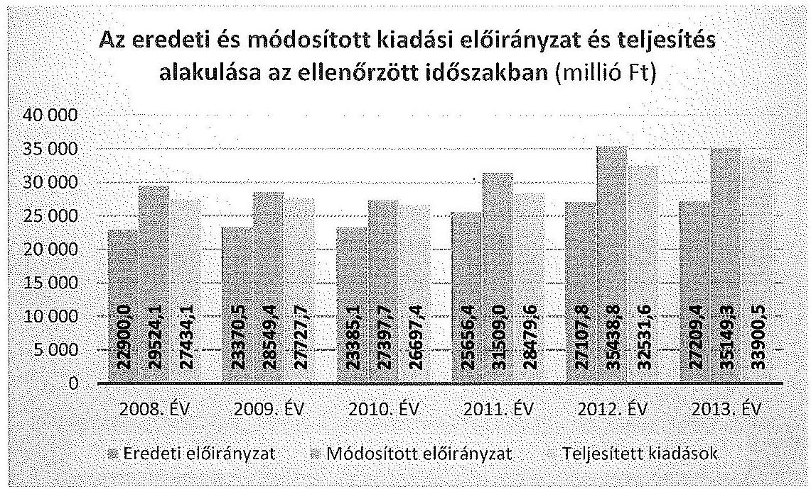

## 2. számú diagram

Az OMSz bevételi előirányzatai a kiadási előirányzatokkal azonosan alakultak, a teljesült költségvetési bevételek a 2008. évről a 2013. évre 16,6\%-kal emelkedtek (3. sz. diagram). Az OMSz működésének jellegéből adódóan a meghatározó bevételi forrás az Egészségbiztosítási Alapból mentési feladatokra biztosított működési célú támogatásértékű bevétel volt, amely a 2008. évben 23 735,6 M Ft-ra, a 2013. évben 27873 M Ft-ra teljesült, a növekedés $17,4 \%$ volt.

---

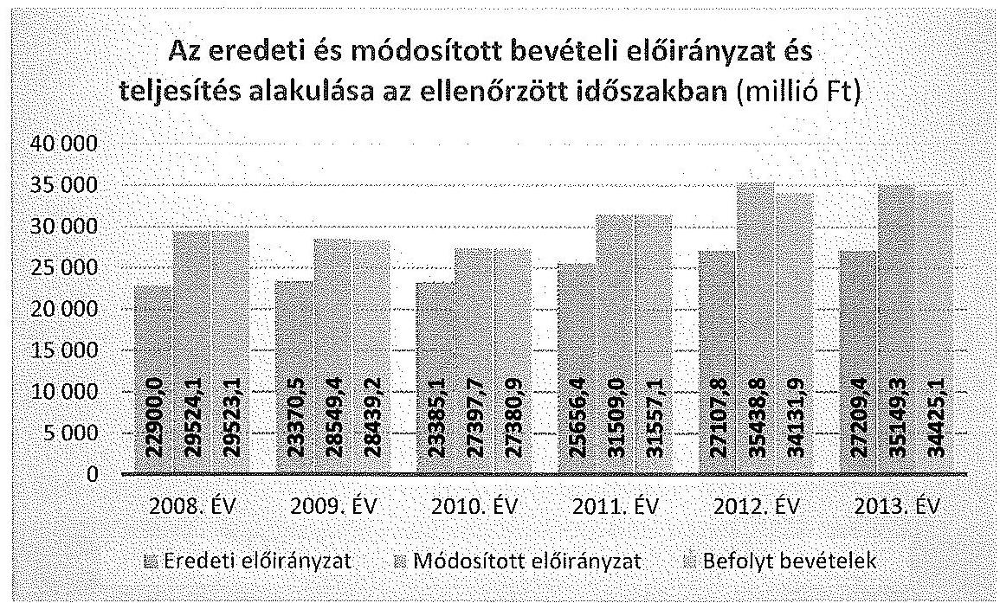

# 3. számú diagram 

Az OMSz bevételi, kiadási előirányzatainak és teljesítésének adatait 2008-2013. években a 2. sz. melléklet mutatja be.

### 3.1. Az OMSz költségvetésének tervezése, az előirányzatok megállapítása és módosítása

Az OMSz által készített elemi költségvetés, az előirányzatok megállapítása a 2008-2011. években nem felelt meg a jogszabályi előírásoknak, mivel az intézmény a jogszabályi előírások ellenére a 2011. évi költségvetési javaslatát ${ }^{30}$, továbbá a 2010. évben az elemi költségvetést alátámasztó indoklást nem készítette el ${ }^{31}$. A 2008-2009. évi, valamint a 2011. évi elemi költségvetéshez készített szöveges indoklások nem feleltek meg a jogszabályi előírásoknak ${ }^{32}$, mivel a tervezett kiadási és bevételi előirányzatokat számításokkal nem támasztották alá, ezáltal a költségvetés megalapozottsága, végrehajthatósága nem volt megállapítható.

Az OMSz elemi költségvetésében az Egészségbiztosítási Alapból származó működési célú támogatásértékű bevételi előirányzatában a 2012. évben 1270,7 M Ft, a 2013. évben 780,0 M Ft értékben számszakilag megalapozatlan volt. Ennek oka az, hogy az OMSz által tervezett bevétel 2012. évben egyrészt 490,7 M Ft-tal meghaladta a Kvtv. LXXII. fejezetében az Egészségbiztosítási Alap mentési során jóváhagyott összeget, másrészt a tervezésnél a 2012. és 2013. években sem vették figyelembe, hogy a költségvetési forrásból az OMSz-on kívül más szervezetek is, összesen 780,0 M Ft támogatásban részesültek.

[^0]
[^0]:    ${ }^{30}$ Ámr. ${ }_{2}$ 28. § (1) bekezdés
    ${ }^{31}$ Ámr. ${ }_{2}$ 46. § (2) bekezdés
    ${ }^{32}$ Ámr. ${ }_{1}$ 37. § e) pont, Ámr. ${ }_{2}$ 46. § (2) bekezdés

---

2012. évben az Egészségbiztosítási Alaptól származó bevételként az OMSz elemi költségvetése 25 761,4 M Ft-ot, a Kvtv. 25 270,7 M Ft-ot határozott meg. Az OMSz-nál tervezhető bevétel - az OEP tájékoztatók alapján - a 2012. évben 24 490,7 M Ft volt. 2013. évben az Egészségbiztosítási Alaptól származó bevétel az OMSz elemi költségvetésében 26000,4 M Ft volt, ami megegyezett a Kvtv.-ben szereplő összeggel. Az OMSz-nál tervezhető bevétel - az OEP tájékoztatók
 alapján - a 25 220,4 M Ft volt.

Az irányító szervek a tárgyévi költségvetési előirányzatok meghatározásakor figyelembe vették a feladatváltozásból adódó szintre hozások hatásait.

Az OMSz 2008-2013. években az elemi költségvetést a jogszabályokban ${ }^{33}$ előírt határidőben, illetve az irányító szerv által meghatározott időpontig elkészítette és az irányító szerv részére megküldte.

Az országgyűlési, a kormány és az irányító szervi hatáskörben végrehajtott előirányzat-módosítások megfeleltek $\mathrm{Amr}_{1,2}$ és az Ávr. előírásainak. Az intézmény saját hatáskörben végrehajtott bevételi és kiadási előirányzat-módosításai a 2009. és 2012. években nem feleltek meg a jogszabályi előírásoknak ${ }^{34}$. A saját hatáskörű előirányzat-módosítások végrehajtásának dokumentáltsága hiányos volt. Az OMSz saját hatáskörű előirányzat-módosításai meghatározóan célhoz kötött támogatásértékű bevételekhez és az előző évi előirányzat-maradványok felhasználásához kapcsolódtak.

A 2009. évben az orvosi ügyelet többletbevételéből 71,8 M Ft előirányzat-módosítást hajtottak végre, az előirányzat-módosítást alátámasztó dokumentumok nem álltak rendelkezésre ${ }^{35}$. Az OMSz 2012. évben 360,0 M Ft kiadási előirányzat-átcsoportosítást hajtott végre, amit nem indokoltak, dokumentumokkal nem támasztottak alá.

Az évközi előirányzat-változásának mértékét és hatáskörönkénti megoszlását a 2008-2013. években az 1. számú táblázat mutatja.
adatok: millió Ft-ban

| év | Előirányzat   változás | Előirányzat módosítások hatáskörök szerint |  |  |  |
| :--: | :--: | :--: | :--: | :--: | :--: |
|  |  | Országgyűlés | Kormány | Irányítószer | Intézmény |
| 2008. év | $6624,1$ | 0,0 | 2198,0 | 928,1 | 3498,0 |
| 2009. év | $5179,0$ | 0,0 | 781,6 | 879,4 | 3518,0 |
| 2010. év | $4012,6$ | 0,0 | 104,5 | 661,0 | 3247,1 |
| 2011. év | $5852,6$ | $-100,0$ | 133,8 | 1929,7 | 3889,1 |
| 2012. év | $8331,0$ | 0,0 | 1761,0 | 473,7 | 6096,3 |
| 2013. év | $7939,9$ | 0,0 | 450,3 | 42,8 | 7446,8 |

# 1. sz. táblázat 

Előirányzat-módosítások változásai és hatáskörök szerinti módosításai

[^0]
[^0]:    ${ }^{33}$ Ámr. ${ }_{1}$ 43. § (2), Ámr. 246 §. (5), Ávr. 32. §
    ${ }^{34}$ Ámr. ${ }_{1} 51 . \S(1)$, Ámr. 260 § (1)
    ${ }^{35}$ Számv. tv. 169. § (2) bekezdés

---

Az ellenőrzött időszakban az összes előirányzat-változás 37 939,2 M Ft volt. Az előirányzat-módosítások során az Országgyűlés 100,0 M Ft elvonásról döntött, míg Kormány hatáskörben összesen 5429,2 M Ft, irányító szervi hatáskörben 4914,7 M Ft többletforrást biztosítottak az OMSz feladatainak ellátásához. Az OMSz saját hatáskörben 27 695,3 M Ft összegű előirányzat-módosítást hajtott végre a 2008-2013. években.

Az évközi korlátozó intézkedések végrehajtása az ellenőrzött időszakban megfelelt az Áht. 1,2 előírásainak.

Az intézmény az ellenőrzött időszak minden egyes évét érintően rendelkezett előirányzat-nyilvántartással, amelynek adatai az OMSz éves beszámolója 23. űrlapján szerepeltetett adatokkal a 2010. év kivételével egyezőséget mutattak.

A 2010. évi költségvetési beszámolóban 27 397,7 M Ft, az előirányzat-analitikában és a főkönyvi kivonatban 27 368,6 M Ft módosított előirányzat szerepelt. A 29,1 M Ft eltérés abból adódott, hogy a beszámolóban a működési többletbevételből származó előirányzat-módosítást annak ellenére szerepeltették, hogy az előirányzat átvezetése az év végi zárás miatt a Kincstárnál nem történt meg.

# 3.2. A kiadási előirányzatok felhasználása és a bevételi előirányzatok teljesítése 

Az OMSz a 2008-2011. években betartotta a bevételi előirányzatok teljesítési kötelezettségét, a 2012-2013. években a teljesített bevételek elmaradtak a módosított bevételi előirányzatoktól ${ }^{36}$.

Az intézménynek a teljesítésnél a 2012. évben 1306,9 M Ft, a 2013. évben 724,2 M Ft bevételi lemaradása volt a módosított előirányzathoz képest, amelyekkel az előírásokat figyelmen kívül hagyva ${ }^{37}$ nem csökkentették a bevételi és a kiadási előirányzatokat.

A 2012-2013. évi bevételi kiesést alapvetően az Egészségbiztosítási Alapból származó működési célú támogatásértékű bevételek, illetve emellett az egyéb saját működési bevételek elmaradása eredményezte.

Az OMSz az ellenőrzött időszakban a 2013. év kivételével, a számára jóváhagyott kiemelt kiadási előirányzatokat betartotta. A 2013. évben a beruházási kiadások 2267,5 M Ft módosított előirányzatát 169,0 M Ft-tal túllépték, amely elszámolás-technikai jellegű volt és az uniós projektek szállítói finanszírozása miatt következett be. A kiadás fedezete a költségvetésben az államháztartáson belüli felhalmozási célú támogatások jogcímen biztosított volt.

A bevételi és kiadási előirányzatok felhasználása során a gazdálkodási jogkörök (teljesítésigazolás, ellenjegyzés, érvényesítés) gyakorlása nem volt szabályszerű. Az ellenőrzött mintatételek egy részénél hiányzott a gazdálkodási jogkör gyakorlásának írásbeli kijelölése, a kijelölt személy aláírása, illetve nem az arra kijelölt személy írta alá a dokumentumokat. Az érvényesítő nem győződött meg az összegszerűségről és a pénzügyi fedezet meglétéről. Az utalványozás megelőzte az érvényesítést, az utalványrendeletén nem szerepelt a keltezés. Rendszerhibaként állapítottuk meg, hogy nem teljes körűen támasztották alá dokumentumokkal a bevételi és kiadási előirányzatok teljesítését.

A megállapított hibák, hiányosságok elsősorban a dologi és egyéb folyó kiadások, a személyi juttatások, a külső személyi juttatások, valamint a pénzeszközátadások gazdasági eseményei során fordultak elő.

A kiadási előirányzatok felhasználásának és a kulcskontrollok működésének ellenőrzése céljából a dologi és a felhalmozási kiadásokból, a személyi juttatásokból, valamint a pénzeszközátadásokból kiválasztott minták értékelése alapján az évente összevontan kivetített értékelés szerint az ellenőrzött időszak minden évének értékelése nem megfelelő volt.

A dologi és egyéb folyó kiadásokkal kapcsolatos előirányzatok felhasználása nem volt szabályszerű. A kifizetések során a 2008-2011. években szakmai teljesítésigazolás és utalvány-ellenjegyzés, a 2012-2013. években a teljesítésigazolás és az érvényesítés belső kontrollok működése nem felelt meg a jogszabályi előírásoknak ${ }^{38}$. Az ellenőrzött minta alapján a dologi és egyéb folyó kiadásokra, a teljes ellenőrzött időszakra vonatkozóan kivetített értékelés nem megfelelő minősítésű.

Az OMSz dologi és egyéb folyó kiadások felhasználása során több esetben - az árubeszerzések és szolgáltatások vásárlásakor - nem tartotta be a közbeszerzési eljárás lefolytatásának kötelezettségét ${ }^{39}$.

Az OMSZ-nál a 2008. és 2009. évek során - a kiválasztott mintatételekhez kapcsolódóan - összesen hét áru és szolgáltatásfajta beszerzése során, összesen 11 esetben a közbeszerzési értékhatárt meghaladó beszerzéseket nem előzte meg közbeszerzési eljárás. A 2010-2012. években összesen hét áru és szolgáltatásfajta beszerzése során 27 esetben a közbeszerzési értékhatárt meghaladó beszerzéseket nem előzte meg közbeszerzési eljárás.

A közbeszerzés mellőzésével vásárolt áruk és szolgáltatások mentőgépkocsi-alkatrészvásárlás és -javítás, mentőgépkocsi-karbantartás és egyéb anyag, orvosi ügyelet-ellátás, egészségügyi felszerelési anyag, orvosi eszközök fenntartási anyag, távközlési szolgáltatás, mosás és tisztítás szolgáltatásvásárlások voltak.

A rendszeres és nem rendszeres személyi juttatások kiadási előirányzatok felhasználása során a kulcskontrollok - a 2008-2011. közötti időszakban a szakmai teljesítésigazolás és az ellenjegyzés, a 2012-2013. években az érvényesítés -

[^0]
[^0]:    ${ }^{38}$ Ámr. 135. § (1) bekezdés és 137. § (1) bekezdés, Ámr. 2 76. § (1) bekezdés és 79. §. (1)(2) bekezdés, Ávr. 57. § (1) bekezdés és 58. § (1) bekezdés
    ${ }^{39} \mathrm{Kbt} .121 . \S$ (1) bekezdés és 240 . § (1) bekezdés, Kbt. 2 5. § és 19. §

---

nem feleltek meg a jogszabályi előírásoknak. ${ }^{40}$ Az ellenőrzött minta alapján a személyi juttatásokra a teljes ellenőrzött időszakra vonatkozóan kivetített értékelés nem megfelelő minősítésű.

A külső személyi juttatások kiadási előirányzatának felhasználása az ellenőrzött mintatételekre vonatkozóan elvégzett tesztek eredményei alapján nem volt szabályszerű. Az ellenőrzött kulcskontrollok közül a teljesítésigazolás 2010-2011. években, az érvényesítés 2012-2013. években és az utalvány-ellenjegyzése 2008-2011 között nem volt szabályszerű. A teljesítésigazolás 2008-2009 között és 2013-ban megfelelt az Ámr. ${ }_{1-2}$ és az Ávr. követelményeinek.

A jogszabályi előírásokkal ellentétben a 2011. és 2012. években, egy-egy esetben a megbízási szerződésekben rögzített óradíj feletti összegben történt a teljesítésigazolás és a kifizetés.

Az OMSZ 2005. november 1-jén megbízási szerződést kötött (szak)ápolói feladatok ellátására bruttó 1000 Ft/óra összegben, ezzel szemben a 2011. március havi teljesítés alapján a 2011. április 14-i kifizetéshez az összegszerűséget 1100 Ft/óra összegben igazolták.

Az OMSZ 2011. december 6-án kötött ügyeleti gépkocsivezetői feladatok ellátására megbízási szerződést bruttó 850 Ft/óra összegben, ezzel szemben a 2012. szeptember havi teljesítés alapján a 2012. október 17-i kifizetéshez az összegszerűséget 1000 Ft/óra, valamint 1100 Ft/óra összegben igazolták.

A felhalmozási kiadások teljesítése során az ellenőrzött mintatételekre vonatkozóan elvégzett tesztek eredményei alapján részben volt szabályszerű a gazdálkodási jogkörök gyakorlása. Az ellenőrzött időszakban az OMSz nem minden esetben tartotta be a jogszabályi előírásokat, és belső szabályzataiban foglaltakat a gazdálkodási jogkörök gyakorlásánál (szakmai teljesítésigazolás, ellenjegyzés, érvényesítés) ${ }^{41}$. A teljesítésigazolás a 2008. évben és az utalványozás-ellenjegyzése 2008-2009-ben és 2011-ben nem volt szabályszerű. A teljesítésigazolás 2009-ben és 2011-ben az érvényesítés 2012-2013-ban részben felelt meg az előírásoknak. A 2010. évben és 2012-2013-ban a teljesítésigazolás és 2010-ben az utalványozás-ellenjegyzése szabályszerűen történt.

A felhalmozási kiadások felhasználása során 2008-2009. években egy felújítás és egy beszerzés esetében nem tartották be az egybeszámítás és a közbeszerzési eljárás lefolytatásának kötelezettségét ${ }^{42}$. A felújításra vonatkozó vállalkozási szerződést és a beszerzésre kötött együttműködési megállapodást az ellenőrzött időszakot megelőzően az OMSz főigazgatója írta alá.

A pénzeszközátadások teljesítése az ellenőrzött időszakban az ellenőrzött mintatételekre vonatkozóan elvégzett tesztek eredményei alapján nem volt

[^0]
[^0]:    ${ }^{40}$ Ámr. ${ }_{1}$ 135. § (1) bekezdés és 137. §, Ámr. ${ }_{2}$ 76. § (1) bekezdés és 79. §. (1)-(2) bekezdés, Ávr. 58. §
    ${ }^{41}$ Ámr. ${ }_{1}$ 135. § (1) bekezdés és 137. § (1) bekezdés, Ámr. ${ }_{2}$ 76. § (1) bekezdés és 79. § (1) bekezdés, Ávr. 58. §
    ${ }^{42}$ Kbt. ${ }_{1}$ 21. § (1) bekezdés, 40. § és 240. § (1) bekezdés

---

szabályszerű. A 2008-2011. években a pénzeszközátadások kiadási előirányzat-felhasználása során a teljesítésigazolás és az utalvány-ellenjegyzése kulcskontrollok működése, a 2012-2013. években teljesítésigazolás és az érvényesítés kulcskontrollok működése nem felelt meg a jogszabályi előírásoknak ${ }^{43}$.

A 2008-2013. évekre vonatkozó pénzeszközátadások dokumentumai teljes körűen nem álltak rendelkezésre, ezzel megsértették a bizonylati elvre és fegyelemre vonatkozó szabályokat ${ }^{44}$. Az ellenőrzött tételeknél az OMSz négy pénzeszközátadást a jogszabályi előírás ${ }^{45}$ ellenére támogatási szerződéssel, közhasznú megállapodással nem támasztott alá.

Megállapodás hiányában az OMSz a 2008. évben a Koraszülött és Gyermek Intenzív Ellátásért a DOTE Gyermekklinikán Alapítvány részére 2,97 M Ft, a 2009. évben az Egészséges Újszülöttekért Alapítványnak 2,3 M Ft pénzeszközt adott át. Az OMSz a 2010. évben a Magyar Légimentő Nonprofit
 Kft.-nek adott át 2,9 M Ft pénzeszközt, valamint 2012 évben 61,0 M Ft működési célú pénzeszközt megállapodás nélkül.

A 2013. évi árvízi helyzettel kapcsolatosan az OMSz a Magyar Légimentő Nonprofit Kft. részére 484,3 E Ft pénzeszközt adott át, azonban a megkötött támogatási szerződés feltételeitől eltérően a pénzügyi elszámolást és a szakmai beszámolót nem készítette el.

A vagyonhasznosítási bevételi előirányzatok teljesítése az ellenőrzött mintatételekre vonatkozóan elvégzett tesztek eredményei alapján a 2008-2009. években részben felelt meg a gazdálkodási jogkörökre vonatkozó előírásoknak a teljesítésigazolás és az ellenjegyzés hiánya miatt ${ }^{46}$.

# 3.3. Az előirányzat-maradványok kezelése 

Az előirányzat-maradvány megállapítása és felhasználása a 2008–2011. években részben felelt meg a jogszabályi előírásoknak, mivel esetenként a maradvány megállapítása és felhasználása nem szabályszerűen történt, továbbá azok dokumentálása nem volt teljes körű. A kötelezettségvállalással terhelt maradvány megállapítása és felhasználása 2008–2011 évek között nem minden esetben felelt meg a vonatkozó előírásoknak.

A 2009. évben kimutatott 141,9 M Ft kötelezettségvállalással terhelt maradvány felhasználását dokumentumokkal alátámasztani nem tudták ${ }^{47}$. A 2010–2011. években a Mentésirányítási Rendszer Korszerűsítésére kapott támogatásból 1,7 M Ft-ot kötelezettséggel terhelt maradványként szerepeltettek, annak ellenére,

[^0]
[^0]:    ${ }^{43}$ Ámr. ${ }_{1}$ 135. § (1) bekezdés és 137. § (1) bekezdés, Ámr. ${ }_{2}$ 76. § (1) bekezdés és 79. § (1)–(2) bekezdés, Ávr. 57. § (1) bekezdés 58. § (1) bekezdés
    ${ }^{44}$ Számv. tv. 165. § (1)–(2) bekezdései
    ${ }^{45}$ Számv. tv. 166. § (1) bekezdés
    ${ }^{46}$ Ámr. ${ }_{1}$ 135. § (1) bekezdés és 137. § (1) bekezdés
    ${ }^{47}$ Számv. tv. 169. § (2) bekezdés

---

hogy a támogatás felhasználásáról szóló beszámolási kötelezettségnek 2010. október 18-án eleget tettek és azt a támogató elfogadta ${ }^{48}$.

A 2008–2010. években az Ámr. ${ }_{1,2}$-ben meghatározott összeget elérő dologi és felhalmozási kiadásokat, valamint a működési és felhalmozási célra államháztartáson kívülre átadott pénzeszközöket terhelő az előző évek előirányzat-maradványa terhére vállalt kötelezettségek Kincstárhoz történt bejelentését igazoló dokumentumokat az ellenőrzés részére bemutatni nem tudták, ezáltal nem tettek eleget a bizonylatok megőrzésére vonatkozó előírásoknak ${ }^{49}$.

A 2012–2013. években előirányzat-maradvány megállapítása és felhasználása megfelelt a jogszabályi előírásoknak.

A 2008–2013. években az OMSz összes kötelezettségvállalással terhelt előirányzat-maradványa 8818,9 M Ft volt, amelynek 47,7 %-a működési célra, 52,3 %-a felhalmozási célra keletkezett. Szabad előirányzat-maradványa az intézménynek mindössze a 2012. évben volt 0,6 M Ft összegben.

A 2008–2013. évi szöveges beszámolókban az előirányzat maradvány értéke és összetétele bemutatásra került és megegyezett a számszaki beszámolókban feltüntetett előirányzat-maradvány értékével.

# 3.4. A fizetőképesség alakulása 

Az intézmény folyamatos fizetőképessége nem volt teljes körűen biztosított az ellenőrzött időszakban. Az OMSz 2008–2011. években előirányzat-felhasználási terv készítési kötelezettségének a jogszabályi előírás ellenére nem tett eleget ${ }^{50}$. A 2012. évben a bevételek beérkezésének és a kiadások teljesítésének ütemezéséről az előírások ellenére likviditási tervet nem készített ${ }^{51}$. Az intézmény 2013. évi likviditási terve, a várható bevételeket - ideértve az időszak elején rendelkezésre álló készpénz és számlaállomány összegét is - alapul véve, havi ütemezéssel tartalmazta a teljesíthető kiadásokat.

Az ellenőrzött időszakban a költségvetési egyensúlyt biztosító kormányzati intézkedéseket - előirányzat zárolás, maradványtartási kötelezettség - az OMSz végrehajtotta, amelyek az adott év szakmai feladat ellátását nem veszélyeztették. Az OMSz az egyensúlyjavító intézkedések keretében elrendelt egyes eszközcsoportokra vonatkozó beszerzési tilalom előírásai alól két alkalommal kapott felmentést.

Az év végére vonatkozó kedvező likviditásmutatók ellenére a 2012–2013. években év közben az OMSz likviditási problémája fennállt, amelyet a garantált bérminimum miatti többletforrás biztosítása, a Ft/euro árfolyam változása miatti mentőhelikopter bérleti díj növekedés, illetve az üzemanyag ár növekedés, továbbá 2012-ig a légi mentés finanszírozása okozta. Az OMSz likviditási helyze-

[^0]
[^0]:    ${ }^{48}$ Ámr. ${ }_{2}$ 210. § (1) bekezdés b) pont
    ${ }^{49}$ Számv. tv. 169. § (2) bekezdés
    ${ }^{50}$ 2008. évben Áht; 98. § (2), 2009. január 1-től Áht ${ }_{1}$ 100/C § (1) bekezdés,
    ${ }^{51}$ Ávr. 122. § (1) bekezdés

---

tének enyhítésére az EMMI 2012. december végén 1464,5 M Ft összegű átutalásáról intézkedett. A központi költségvetési támogatáson felül további 200,0 M Ft OEP támogatás átutalása is teljesült.

Az OMSz likviditási problémái miatt 2013. március 20-án keret előrehozási kérelemmel élt az OEP felé. Az OEP a keret előrehozási kérelemnek helyt adott és az OMSz mentési tevékenységének finanszírozására az április havi előirányzatot 2732,2 M Ft-ra, 630,5 M Ft-tal növelte. Az intézmény vezetése a likviditás javítása érdekében a 2012–2013. években intézkedési tervet dolgozott ki, amelyben bevételnövelő és költségcsökkentő intézkedéseket hoztak, ennek ellenére a szállítói számlák határidőben történő kiegyenlítése nem volt minden esetben biztosított, ami azonban a napi feladatellátást nem veszélyeztette.

Az intézmény a fizetőképességének fenntartása érdekében intézkedett a fennálló követeléseinek behajtására. Az OMSz-hoz kincstári biztost nem jelöltek ki, az elismert, esedékességet követő hatvan napon túli tartozásállománya nem haladta meg a kincstári biztos kijelöléséhez szükséges, az Áht. ${ }_{1,2}$-ben előírt - az éves eredeti kiadási előirányzatának 3,5 %-a vagy ötvenmillió forint - határértékét. Költségvetési felügyelő/főfelügyelő kirendelésére sem került sor.

# 4. Az OMSz VAGYONGAZDÁLKODÁSA 

Az OMSz vagyongazdálkodása részben volt szabályszerű az ellenőrzött időszakban.

### 4.1. A vagyongazdálkodás szabályozottsága

A vagyongazdálkodással kapcsolatos feladat- és hatásköröket az SZMSZ-ekben általánosan meghatározták. Az OMSz Leltározási, Értékelési, Selejtezési szabályzata, Számviteli politikája előírásokat tartalmazott a vagyonnal történő gazdálkodásra - alapfeladat ellátásához rendelkezésére bocsátott vagyon nyilvántartásának, értékelésének, hasznosításának, selejtezésének eljárási szabályaira.

A mérleg alátámasztásának előírásait a 2003. évtől hatályos Értékelési Szabályzatban, valamint a 2012. évi Eszközök és Források Értékelési Szabályzatában rögzítették. A felesleges vagyontárgyak értékesítésére, valamint a térítésmentes átadásra vonatkozó szabályokat, az üzemeltetésre, kezelésre átadott és átvett eszközök selejtezését az intézmény 2012 évben rögzítette a Leltározási Szabályzatában. A 2008–2013 években szabályozott volt a közbeszerzési eljárások rendje.

Az 1987. évi Gépjármű Üzemeltetési Szabályzatot 2012 novemberében aktualizálták, a gépjárművek használatával kapcsolatos eljárást 2004. évben szabályozták. Az intézmény a 2010. évben szabályozta, és 2012–2013 években aktualizálta a Hivatali Telefonhasználatra vonatkozó Szabályzatát. A szabályozottságra vonatkozó részletes megállapításokat a 2.1. fejezet tartalmazza.

---

# 4.2. Az eszközök és források értékének kimutatása, az eszközök értékének megőrzése 

A befektetett eszközök állományának értéke a 2008. évi 9134,7 M Ft-ról 2013 év végére 11021,0 M Ft-ra növekedett, az összes eszközértékhez viszonyított aránya 76,3 %-ról 89,9 %-ra változott.

A 2008–2013 évek között a tárgyi eszközök 16,2 %-os növekedését az ingatlanok és kapcsolódó vagyoni értékű jogok 25,7 %-os, a beruházások, felújítások mintegy 3,5 szeres növekedése határozta meg, csökkent a gépek, berendezések és felszerelések (24,1 %-kal), valamint a járművek értéke (12,7 %-kal).

Az OMSz az ellenőrzött időszakban - a 2013. évi beruházási kiadások technikai jellegű előirányzat túllépése ellenére - a módosított felújítási és beruházási előirányzatok teljes összegét nem használta fel, a fel nem használt előirányzat összesen 4634,2 M Ft volt. A 2011. évtől a beruházások és eszközbeszerzések területén az európai uniós források bevonására került sor, a tervezett fejlesztések időben elhúzódtak a projektek lassú beindulása, előrehaladása miatt. Az OMSZ kiemelt projektje a „Sürgősségi ellátás fejlesztése - mentés" elnevezésű EU-s (TIOP) projekt, amelynek keretösszege 10940 M Ft. A projekt keretében újul meg az intézmény eszközparkja és mentőállomásai, ez utóbbiak új egységekkel bővülnek.

A forgóeszközök állományi értéke a 2008. évi 2832,6 M Ft-ról 2013 év végére 1234,5 M Ft-ra, összes eszközértékhez viszonyított aránya 23,7 %-ról 10,1 %-ra csökkent a pénzeszközök értékének jelentős csökkenése miatt. A pénzeszközök 2013. év végi értéke 22,6 %-a volt a 2008. év végi összeghez képest. A követelések összege a 2008–2013. években 22,9–50,2 M Ft között alakult, 2013 év végén 25,6 M Ft-ot mutattak ki. A követelésállomány a teljes eszközérték 0,21–0,46 % között volt, amely döntően az áruszállításból és szolgáltatásból származó követelés volt.

---

Az OMSz eszközeinek arányát és változását az ellenőrzött időszakban a következő diagram szemlélteti:
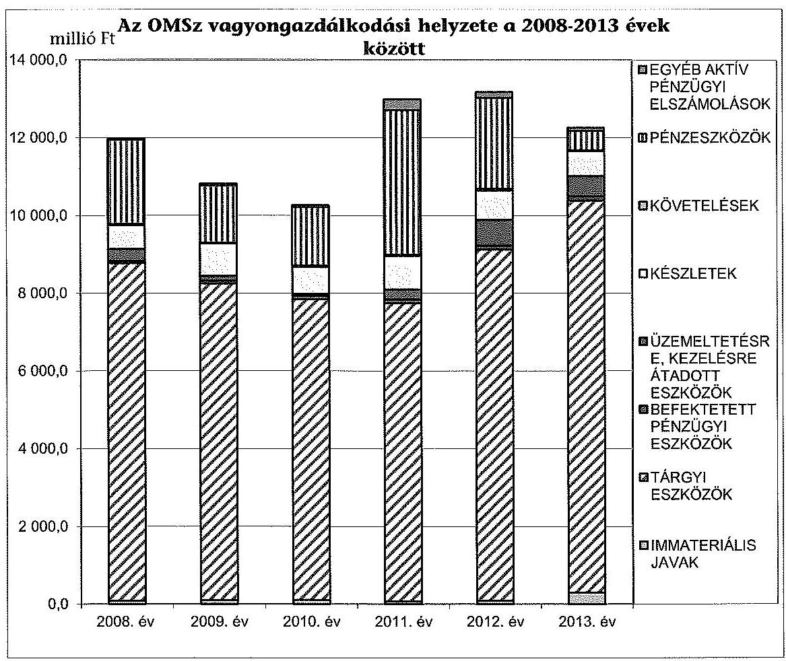

# 4. számú diagram 

A saját tőke nagysága a 2008. év végi 9 771,4 M Ft-ról 2013 év végére 11 136,4 M Ft-ra (1 365,0 M Ft-tal), 14 %-kal növekedett. A saját tőke aránya mutató a 2008. évi 81,7 %-ról a 2013. évre 91,0 %-ra nőtt, ami a saját tőke forrásokon belüli részarányának növekedéséből adódott. A tartalékok nagysága az ellenőrzött időszakban ingadozott, a 2008. évi 2 145,1 M Ft-ról 2013 év végére 552,0 M Ft-ra csökkent.

A 2008. december 31-ei kötelezettségek (rövidlejáratú, és szállítói kötelezettségek, egyéb passzív pénzügyi elszámolások nélkül) 48,8 M Ft-ról 2013. év végére 561,0 M Ft-ra emelkedtek, a 2009–2012 évek értékei 456,3 M Ft, 837,8 M Ft, 853,7 M Ft, 540,7 M Ft volt. A pénzeszközök (számlák) záró egyenlegei magas értéket mutattak, amelyek fedezetet biztosítottak a szállítói tartozások finanszírozására.

Az OMSz mérlegtételeinek alakulását, változását részletesen a 3. sz. mellékletben szereplő mérlegadatok szemléltetik.

A mérlegben kimutatott eszközök nyilvántartását, értékének megállapítását a Számv. tv. és az Áhsz. előírásainak és belső szabályzatnak megfelelően - az OMSz saját, használatba adott eszközeinek leltározása nem teljes körűsége miatt - részben szabályszerűen végezték el.

---

A kötelezettségek nyilvántartása, analitikus nyilvántartása és könyvelése során elkülönítve - az Áhsz. előírásaival összhangban - mutatták ki a tárgyévi költségvetést terhelő előző évi és folyó évi, valamint a tárgyévet követő évi költségvetést terhelő kötelezettségeket.

A beszámolókban és a számviteli nyilvántartásokban kimutatott eszközök és források állományának valódiságát - a Számv. tv. és az Áhsz előírásaival összhangban - leltárakkal alátámasztották.

A leltározás és a selejtezés végrehajtása részben felelt meg a Számv. tv. és az Áhsz. előírásainak. Az intézmény a mennyiségi felvétellel történő leltározást évente végrehajtotta, azonban az eszközöknél és készleteknél a 2008–2012 években nem a december 31-ei fordulónapra. Az évközi leltározást követően az év végi eszközértéket tételes egyeztetéssel állapították meg. Az üzemeltetésre átadott eszközöket az üzemeltetést végző szervek (Légimentő Kht./Kft., Koraszülött mentés alapítvány) a december 31-ei fordulónapra vonatkozó évenként elvégzett leltárral támasztották alá az Áhsz. 2010. évtől hatályos előírásának megfelelően. Az ellenőrzött időszakban az OMSz saját, használatba adott eszközeinek leltározása nem volt teljes körű a jogszabályi előírások ellenére ${ }^{52}$ az átvevő szervezetek leltározásra vonatkozó adatszolgáltatásának hiánya miatt.

A selejtezések végrehajtása megfelelt az OMSz selejtezési szabályzatában foglalt előírásoknak, ami megelőzte a leltározás végrehajtását. A selejtezésbe vont eszközök bruttó értéke a 2008–2013 években 1 788,4 M Ft volt.

A beszerzett, létesített immateriális javak és tárgyi eszközök bekerülési értékének megállapítása, állományba vétele, év végi értékelése és az értékcsökkenés elszámolása megfelelt a Számv. tv., az Áhsz., az
 Ámr. ${ }_{12}$ és az Ávr. előírásainak.

Az OMSz-nak - a kezelt eszközök tekintetében - jogszabály által előírt vagyon visszapótlási kötelezettsége nem volt. A Vtv., az Nvtv., a Vtvr. alapján fennálló, a vagyon állagának megóvásával, értékének növelésével kapcsolatos kötelezettségeinek, valamint ezzel összefüggésben az Áhsz.-ben előírtaknak részben eleget tett.

Az OMSz vagyona a 2008. évi 11 967,3 M Ft-os záró értékről 2013. év végére 12 255,5 M Ft-ra, 2,4%-kal növekedett, ami elsősorban a befektetett eszközök 20,6%-os (1 886,3 M Ft-os) növekedésével függött össze.

Az eszközök értékében és arányában bekövetkezett változást döntően az elszámolt értékcsökkenést meghaladó összegű eszköznövekedés, a 2008-2013. években végrehajtott beruházások, felújítások, az időszak során elvégzett selejtezések eredményezték. Az OMSz adatszolgáltatása alapján az intézmény az ellenőrzött időszakban 8668,0 M Ft összegű értékcsökkenést számolt el, a tárgyi eszközök növekedése 15 290,0 M Ft volt, ami 76,4%-kal haladta meg az elszámolt értékcsökkenést. Az OMSZ a selejtezett tárgyi eszköz állományát a központi költségvetésből, OEP finanszírozásból és európai uniós pénzeszközökből pótolta.

[^0]
[^0]:    ${ }^{52}$ Áhsz. 37. § (1)-(3) bekezdések

---

A tárgyi eszközök használhatósági foka (az eszközök nettó és bruttó értékének hányadosa) változó mértékben, de - a számítástechnikai eszközök kivételével - minden eszközcsoport tekintetében romlott. A használhatósági fok az épületek és kapcsolódó vagyonértékű jogok esetében 83,8%-ról 79,1%-ra, az építmények és kapcsolódó vagyonértékű jogok 84,4%-ról 69,0%-ra csökkent 2013 év végére az elmaradt felújítási, karbantartási munkák miatt. Az egyéb gépek, berendezések, felszerelések használhatósági foka 2008 évben 34,5% volt, ami 2013 év végére 26,4%-ra csökkent. Ezen eszközcsoportban az ellenőrzött időszak második felében a szükséges beszerzések elmaradtak, alapítványoktól vettek át alacsony használhatósági fokú eszközöket. A járművek használhatósági foka a 2008 év végi 33,7%-ról 2013 év végére 17,6%-ra csökkent a 2012-2013 évi járműbeszerzések ellenére. A számítástechnikai eszközök használhatósági foka 2008. évi 18%-ról 2013 évben 27,3%-ra emelkedett az eszközbeszerzések hatására.

Az elhasználódási szint és az értékcsökkenési leírási kulcs hányadosaként meghatározott átlagos életkor az épületeknél a 2008. évi 8,1 évről a 2013-ra 10,5 évre, az építményeknél 5,2 évről 10,3 évre, az egyéb gépek, berendezések felszerelések esetében 4,5 évről 5,1 évre, a járművek esetében 3,3 évről 4,1 évre nőtt. Az átlagos életkor a számítástechnikai eszközöknél a 2008. évi 2,5 évről a 2013-ra 2,2 évre csökkent. Az egyes eszközöknél az átlagos életkor mutatóját befolyásolták az értékcsökkenés eltérő mértékei.

# 4.3. A vagyonelemek hasznosítása, vagyonátadás- és átvétel 

Az ellenőrzött időszakban az MNV Zrt., illetve az irányító szervek engedélyéhez kötött értékesítés nem volt az OMSz-nál.

Az OMSz vagyonhasznosítási bevételei felhasználásának szabályszerűsége nem felelt meg az Áht. ${ }_{1,2}$, az Ávr., az Nvtv., Vtv., Vtvr. vonatkozó előírásainak.

A 2010. évi gépjármű értékesítéseknél a jogszabályi előírásokkal ${ }^{53}$ ellentétben az értékesítés dokumentumai az állami vagyonnal való felelős gazdálkodást, a gépjármű eladás tekintetében a versenyeztetés megtörténtét nem támasztották alá dokumentumokkal.

A bérlők kiválasztása a jogszabályi előírások ellenére ${ }^{54}$ esetenként nem versenyeztetéssel történt.

Az OMSz 2008-2013. évi üzemeltetésre átadott, átvett vagyon átadás-átvételei megfeleltek a Számv. tv., az Áhsz, az Áht. ${ }_{1,2}$, vonatkozó előírásainak. Az üzemeltetésre átadott, átvett vagyon átadás-átvétele szerződésen alapult. Az üzemeltetésre történt átadás a közfeladat ellátással összhangban történt, az OMSz egészségügyi intézményeknek, és alapítványoknak adott, illetve azoktól vett át eszközöket.

A 2009 és 2011 években az üzemeltetésre átadott vagyonelemek között jellemzően az egészségügyi szervezetek használatába adott telefonok voltak. Az OMSz

[^0]
[^0]:    ${ }^{53}$ Vtv. 34 § (2) bekezdés a) és b) pont és a Vtvr. 24. § (1) bekezdés
    ${ }^{54}$ Vtv. 24. § (1) bekezdés

---

a 2012-2013 években 409,8 M Ft bruttó értéken vagyonkezelői jog átadásával adott át mentő légi járműveket. Az átvett vagyonelemek között számottevő volt az OMSz Alapítványtól átvett (használt) eszközök mennyisége.

A 2011. és 2013. évi térítésmentes átadások az ingatlanvagyont érintették (2012 évben az ingatlanokhoz kapcsolódó eszközöket). Az ingatlanok térítésmentes át-adása-átvétele az önkormányzatokkal kötött megállapodásokon alapult. Az eszközöknél a térítésmentes átadás-átvétel a kis értékű, nullára leírt eszközöket érintette. Az átadás-átvételt a megállapodásokban foglaltaknak megfelelően dokumentáltan hajtották végre.

Az OMSz 2008-2013. éveket érintő vagyonelemek tulajdonjogának térítésmentes átadás-átvételei megfeleltek az Áht. ${ }_{1,2}$, a Vtv., a Számv. tv., valamint az Áhsz. vonatkozó előírásainak. A 2008-2013. évek során végrehajtott térítésmentes vagyon átadás-átvételek az OMSz közfeladatainak ellátásával összhangban történtek.

# 4.4. Az eredményszemléletű számvitel bevezetése 

Az OMSz az eredményszemléletű számvitel bevezetésével kapcsolatban az államháztartás számvitelének 2014. évi megváltozásával kapcsolatos feladatokról szóló 36/2013. (IX. 13.) NGM rendeletben előírt feladatokat végrehajtotta. A rendező mérleget 2013. december 31-ei mérleg-fordulónappal - a 36/2013. (IX. 13.) NGM rendelet 2. § (1) bekezdése szerint, a 8. § (2) bekezdés a) pontjában előírt határidőre elkészítette.

## 5. Az ÁSZ KORÁBBI ELLENŐRZÉSEI SORÁN TETT JAVASLATOK HASZNOSULÁSA

Az ÁSZ a 2012. és a 2013. évi költségvetés végrehajtásának ellenőrzése keretében ellenőrizte az intézményt.

A Magyarország 2012. évi központi költségvetése végrehajtásának ellenőrzéséről szóló 13080. számú és a 2013. évi központi költségvetése végrehajtásának ellenőrzéséről szóló 14207. számú jelentésében az ÁSZ az OMSz esetében a beszámolók megbízhatóságát nem befolyásoló hiányosságokat, szabálytalanságokat tárt fel.

A 2012. évi ellenőrzés kötelezettségvállalással terhelt maradvány jogszerűtlen megállapítására tett megállapításait felsővezetői értekezleten megtárgyalták a hibás gyakorlat megszüntetése érdekében. A jogszerűtlen tevékenység az OMSz 2013. évi tevékenységében nem ismétlődött, mivel az előirányzat-maradvány megállapítása és felhasználása megfelelt a jogszabályi előírásoknak, így az ÁSZ ellenőrzés megállapításai hasznosultak.

A 2013. évi ÁSZ ellenőrzés megállapításai részben hasznosultak. A kifogásolt szabálytalanságok megszüntetésére a főigazgató szóbeli intézkedésére elkészítették a hat hónapon belül lejáró közbeszerzési szerződések nyilvántartását és a szükséges új eljárások megindításáról a gazdasági igazgató írásban tájékoztatást készített a főigazgató részére. A gazdálkodási jogköröket 2014. szeptemberben felülvizsgálták. A gazdálkodási jogkörökre jogosultak aláírás mintájáról az Ávr.

---

60. § (3) bekezdésben előírt, és a Kötelezettségvállalási szabályzatban meghatározott naprakész nyilvántartást nem vezettek.

# 6. A GAZDASÁGOSSÁGI, HATÉKONYSÁGI ÉS EREDMÉNYESSÉGI KÖVETELMÉNYEK KIALAKÍTÁSA ÉS MŰKÖDTETÉSE 

Az OMSz gazdálkodása során a gazdaságossági, hatékonysági és eredményességi követelmények kialakítása és működtetése a gépjármű üzemeltetés kivételével nem történt meg. Stratégiai dokumentumokban a gazdálkodásra vonatkozó mérhető célt nem határoztak meg.

A pénzügyi gazdálkodáson belül a költségvetés-készítés területén alakítottak ki bázis viszonyszámokat az elemi költségvetésben meghatározott kiemelt előirányzatok teljesítésének méréséhez, az eredményesség értékelésére. Intenzitási viszonyszámokat, ezen belül fajlagos mérőszámokat a gazdaságosság és hatékonyság mérésére nem alakítottak ki a pénzügyi gazdálkodásban.

A vagyongazdálkodás esetében a gépjármű üzemeltetés területén gazdaságossági, hatékonysági és eredményességi mutatókat egyaránt kialakítottak, azokat folyamatosan nyomon követték. A feladatok száma és a kiadások összege emelkedett 2008-2013 évek között. A saját gépjárművek egy futott km-re jutó közvetlen üzemeltetési kiadása (fajlagos kiadás) 36,9%-kal, 66,6 Ft/km-re nőtt, de a fajlagos üzemeltetési kiadás továbbra is a referenciaértéken (50-150 Ft/km) belül, annak alsó felében maradt.

Az OMSz 2008-2013 között a célkitűzések és a teljesítménykövetelmények nyomon-követési rendszerét nem alakította ki, vezetői kontrolling, egységes információs rendszer nem működött. Belső szabályozásban a gazdálkodási ügyrend tartalmazta a mutatószám-rendszerek kialakításának és működtetésének követelményeit.

A stratégiai dokumentumokban, belső szabályzatban és főigazgatói utasításokban megjelölt célok az ellenőrzött időszak végére részben teljesültek.

Az ellenőrzött években a mentőjárművek beszerzése nem volt tervszerű. Az OMSz járműállományának elhasználódási szintje a 2008. évi 72,6%-os értékről - a beszerzések hiánya miatt - 2011-re 91,9%-ra emelkedett, amely rendkívül alacsony használhatóságot jelentett. Az új beszerzések eredményeként az elhasználódási szint 2013-ra 79,5%-ra javult.

A mentőjárművek tartalékállományára vonatkozó célkitűzések részben teljesültek. A tartalékállomány célértékét a mentőkocsik esetében a 2013. évben nem sikerült teljesíteni. Az eset és rohamkocsiknál az OMSz kimutatása alapján a tartalékállomány éves átlagos szintje meghaladta az elvárt szintet.

Az OMSz főigazgatói a 2008-2013. évekre a belső kontrollok működéséről szóló vezetői nyilatkozatot kiállították az Ámr. 1,2 és a Bkr. előírásainak megfelelően.

A belső kontrollok működése keretében a gazdaságosság, hatékonyság és eredményesség követelményeinek érvényesítéséről kiadott vezetői nyilatkozatok nem voltak teljes mértékben helytállóak, mivel a pénzügyi gazdálkodás területén

---

csak a költségvetés-készítés esetében a kiemelt előirányzatok alakulásának nyomon-követésére alkalmaztak mutatókat, a vagyongazdálkodás esetében csak a gépjármű állomány üzemeltetésére és az energiafelhasználásra alkalmaztak mutatókat.

# 7. AZ INTEGRITÁS KONTROLLOK KIALAKÍTÁSA ÉS MŰKÖDTETÉSE 

Az intézmény nem vett részt az ÁSZ 2013. évi integritási szemlélet fejlesztésében, ezért az ellenőrzés keretében került sor egy kérdőív kitöltésére. Ennek kiértékelését a 3. számú Függelék tartalmazza.

Budapest, 2015. 09. hónap 08. nap

Melléklet: $\quad 7 \mathrm{db}$
Függelék: $\quad 4 \mathrm{db}$
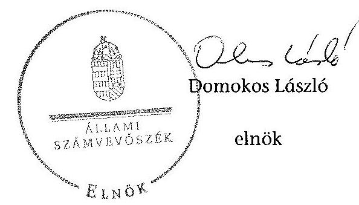

---

.

---

A belső kontrollrendszer kialakítása és működtetése szabályszerűségének alakulása az OMSz-nál

|  Ssz. | Megnevezés | 2008. év | 2009.év | 2010. év | 2011. év | 2012. év | 2013. év | 2008-2013. évek együttesen  |
| --- | --- | --- | --- | --- | --- | --- | --- | --- |
|  1. | Kontrollkörnyezet | nem volt szabályszerű | nem volt szabályszerű | nem volt szabályszerű | nem volt szabályszerű | részben szabályszerű volt | részben szabályszerű volt | nem volt szabályszerű  |
|  2. | Kockázatkezelési rendszer | nem volt szabályszerű | nem volt szabályszerű | nem volt szabályszerű | nem volt szabályszerű | részben szabályszerű volt | részben szabályszerű volt | részben szabályszerű volt  |
|  3. | Kontrolltevékenységek | nem volt szabályszerű | nem volt szabályszerű | nem volt szabályszerű | nem volt szabályszerű | nem volt szabályszerű | nem volt szabályszerű | nem volt szabályszerű  |
|  4. | Információs és kommunikációs rendszer | nem volt szabályszerű | nem volt szabályszerű | nem volt szabályszerű | nem volt szabályszerű | nem volt szabályszerű | nem volt szabályszerű | nem volt szabályszerű  |
|  5. | Monitoring rendszer | részben szabályszerű volt | részben szabályszerű volt | részben szabályszerű volt | részben szabályszerű volt | részben szabályszerű volt | részben szabályszerű volt | részben szabályszerű volt  |
|  A belső kontrollrendszer összevont értékelése |  | nem volt szabályszerű | nem volt szabályszerű | nem volt szabályszerű | nem volt szabályszerű | részben szabályszerű volt | részben szabályszerű volt |   |

- Az értékelés eltér a "JELENTÉS a 2012. évi zárszámadásról - Magyarország 2012. évi központi költségvetése végrehajtásának ellenőrzéséről, 13080, T12002/1" 7. sz. melléklete szerinti minősítéstől, mert jelen ellenőrzés keretében nagyobb súllyal rendelkezett a szabályozottság kialakítása.

---

### 2. SE. MISLÉRIZT A V-0745-348/2015. SZÁMÚ JEGYZŐKÖNYVHEZ

Az OMSz bevételi, kiadási előirányzatok és teljesítésének, és létesítmények utalványozásának a 2008-2013. években adatai: millió Ft-ban

|  Megnevezés | 2008. év |  | 2009. év |  | 2010. év |  | 2011. év |  | 2012. év |  | 2013. év |   |
| --- | --- | --- | --- | --- | --- | --- | --- | ---

 | --- | --- | --- | --- |
|   | Előirányzat |  | Előirányzat |  | Előirányzat |  | Előirányzat |  | Előirányzat |  | Előirányzat |   |
|   | Eredeti | Módosított | Eredeti | Módosított | Eredeti | Módosított | Eredeti | Módosított | Eredeti | Módosított | Eredeti | Módosított  |
|  KIADÁSOK |  |  |  |  |  |  |  |  |  |  |  |   |
|  Személyi juttatások | 15046,2 | 16057,8 | 15350,2 | 14584,8 | 16022,3 | 15740,9 | 15105,4 | 15729,7 | 15439,2 | 15414,3 | 15967,5 | 15577,7  |
|  Munkáltatót terhelő járulékok | 4817,6 | 5083,4 | 4897,3 | 4670,4 | 5049,1 | 5047,3 | 3983,9 | 4494,3 | 4481,0 | 4070,7 | 4724,3 | 4573,8  |
|  Orológiai kiadások | 2449,2 | 4415,7 | 3749,2 | 3516,0 | 4124,7 | 3749,7 | 3171,6 | 3988,2 | 3770,8 | 5160,5 | 5160,1 | 4941,5  |
|  Egyéb folyó kiadások | 0,0 | 410,8 | 410,2 | 21,1 | 351,5 | 342,6 | 546,0 | 485,3 | 617,7 | 690,1 | 748,3 | 758,3  |
|  Támogatásértékű működési kiadások | 0,0 | 0,0 | 0,0 | 0,0 | 0,0 | 0,0 | 0,0 | 0,0 | 0,0 | 0,0 | 0,0 | 0,0  |
|  Támogatásértékű felhalmozási kiadások | 0,0 | 5,0 | 5,0 | 0,0 | 0,0 | 0,0 | 0,0 | 0,0 | 0,0 | 0,0 | 0,0 | 0,0  |
|  Előző évi előirányzat átadás | 0,0 | 0,0 | 0,0 | 0,0 | 0,0 | 0,0 | 0,0 | 0,0 | 0,0 | 0,0 | 0,0 | 0,0  |
|  Működési célú pénzeszköz átadás | 587,0 | 2004,5 | 2005,9 | 578,2 | 2119,4 | 2119,4 | 578,2 | 1990,8 | 1990,7 | 320,8 | 1981,1 | 1981,0  |
|  Felhalmozási célú pénzeszköz átadás | 0,0 | 0,0 | 0,0 | 0,0 | 0,0 | 0,0 | 0,0 | 180,0 | 180,0 | 0,0 | 0,0 | 0,0  |
|  Előirányzott pénzbeli juttatások | 0,0 | 0,0 | 0,0 | 0,0 | 0,0 | 0,0 | 0,0 | 0,0 | 0,0 | 0,0 | 0,0 | 0,0  |
|  Egyéb juttatás | 0,0 | 10,4 | 10,3 | 0,0 | 9,0 | 9,0 | 0,0 | 8,6 | 8,6 | 0,0 | 0,0 | 0,0  |
|  Felújítás | 0,0 | 326,5 | 100,3 | 0,0 | 404,1 | 392,6 | 0,0 | 115,5 | 67,9 | 0,0 | 343,2 | 134,7  |
|  Intézményi beruházási kiadások ÁFÁ-val | 0 | 1210 | 907,7 | 0,0 | 469,3 | 326,2 | 0,0 | 395,3 | 141,5 | 0,0 | 2284,3 | 212,6  |
|  Központi beruházási kiadások ÁFÁ-val | 0,0 | 0,0 | 0,0 | 0,0 | 0,0 | 0,0 | 0,0 | 0,0 | 0,0 | 0,0 | 0,0 | 0,0  |
|  Látóintézeti kiadások ÁFÁ-val | 0,0 | 0,0 | 0,0 | 0,0 | 0,0 | 0,0 | 0,0 | 0,0 | 0,0 | 0,0 | 0,0 | 0,0  |
|  Összesen | 22900,0 | 29524,1 | 27434,1 | 23370,5 | 28549,4 | 27727,7 | 23385,1 | 27397,7 | 26697,4 | 25656,4 | 31509,0 | 28479,6  |
|  BEVÉTELEK |  |  |  |  |  |  |  |  |  |  |  |   |
|  Közalkalmazotti bevételek | 0,0 | 0,0 | 0,0 | 0,0 | 0,0 | 0,0 | 0,0 | 0,0 | 0,0 | 0,0 | 0,0 | 0,0  |
|  Intézményi működési bevételek | 526,4 | 541,1 | 498,7 | 526,0 | 526,0 | 391,7 | 526,0 | 608,0 | 608,0 | 526,0 | 526,0 | 396,7  |
|  Működési célú pénzeszköz átvételek | 0,0 | 7,0 | 6,6 | 0,0 | 0,0 | 7,1 | 0,0 | 7,1 | 7,4 | 0,0 | 3,2 | 3,5  |
|  Felhalmozási bevételek | 0,0 | 48,5 | 54,2 | 0,0 | 6,8 | 7,7 | 0,0 | 11,6 | 11,6 | 0,0 | 0,0 | 0,0  |
|  Felhalmozási célú pénzeszköz átvételek | 0,0 | 0,0 | 0,1 | 0,0 | 0,0 | 0,0 | 0,0 | 0,0 | 0,0 | 0,0 | 4,7 | 4,7  |
|  Irányító szervtől kapott támogatás | 587,0 | 5713,1 | 3713,1 | 546,3 | 2207,3 | 2207,3 | 526,4 | 1232,8 | 1232,8 | 269,0 | 2232,4 | 2232,4  |
|  Támogatás értékű működési bevétel | 21786,6 | 23643,0 | 25735,6 | 22298,2 | 23459,3 | 23475,0 | 22332,7 | 24043,1 | 24058,0 | 24861,4 | 26125,2 | 26337,9  |
|  Támogatás értékű felhalmozási bevétel | 0,0 | 140,3 | 139,9 | 0,0 | 91,1 | 91,3 | 0,0 | 170,8 | 170,8 | 0,0 | 671,4 | 671,3  |
|  Előző évi maradvány átvétele | 0,0 | 99,0 | 99,0 | 0,0 | 105,0 | 105,0 | 0,0 | 612,7 | 612,7 | 0,0 | 1230,3 | 1230,3  |
|  Előirányzat maradvány felhasználás | 0,0 | 1352,1 | 1273,9 | 0,0 | 2154,1 | 2154,3 | 0,0 | 711,6 | 679,6 | 0,0 | 715,5 | 680,3  |
|  Összesen | 22900,0 | 29524,1 | 29523,1 | 23370,5 | 28549,4 | 28439,3 | 23385,1 | 27397,7 | 27380,9 | 25656,4 | 31509,0 | 31557,1  |
|  Közbeszerzési engedélyezett létesítményterület (fő) |  | 7053 |  | 7075 |  |  | 7075 |  |  | 7182 |  |   |
|  Átlagos átutazásitávolság létszám (fő) |  | 6824 |  | 6873 |  |  | 7075 |  |  | 7022 |  |   |

---

|  A V-0745-348/2015. SZÁMÚ JELENTÉSHEZ |  |  |  |  |  |  |  |   |
| --- | --- | --- | --- | --- | --- | --- | --- | --- |
|  OMSZ mérlegadatai és változásuk a 2008-2013. közötti években |  |  |  |  |  |  |  |   |
|  Megnevezés | 2008. év | 2009. év | 2010. év | 2011. év | 2012. év | 2013. év | Változás (2013/2008) |   |
|   |  |  |  | millió Ft-ban |  |  |  | %-ban  |
|  IMMATERIÁLIS JAVAK | 89,0 | 107,6 | 109,5 | 68,7 | 89,6 | 299,7 | 210,7 | 236,7%  |
|  TÁRGYI ESZKÖZÖK | 8674,3 | 8135,2 | 7734,9 | 7675,0 | 9026,0 | 10081,9 | 1407,6 | 16,2%  |
|  BEFEKTETETT PÉNZÜGYI ESZKÖZÖK | 59,8 | 77,9 | 82,5 | 96,0 | 107,3 | 116,9 | 57,1 | 95,5%  |
|  ÜZEMELTETÉSRE ÁTADOTT, VAGYONKEZELÉSBE VETT ESZKÖZÖK | 311,6 | 125,3 | 55,9 | 260,7 | 671,6 | 522,5 | 210,9 | 67,7%  |
|  BEFEKTETETT ESZKÖZÖK ÖSSZESEN | 9134,7 | 8446,0 | 7982,8 | 8100,4 | 9894,5 | 11021,0 | 1886,3 | 20,6%  |
|  KÉSZLETEK | 614,7 | 830,4 | 686,1 | 862,8 | 749,7 | 639,9 | 24,8 | 4,0%  |
|  KÖVETELÉSEK | 27,7 | 22,9 | 47,0 | 33,2 | 50,2 | 25,6 | -2,1 | -7,6%  |
|  ÉRTÉKPAPÍROK | 0,0 | 0,0 | 0,0 | 0,0 | 0,0 | 0,0 | 0,0 | 0,0%  |
|  PÉNZESZKÖZÖK | 2166,3 | 1469,6 | 1492,2 | 3709,5 | 2327,5 | 489,2 | -1677,1 | -77,4%  |
|  EGYÉB AKTÍV PÉNZÜGYI ELSZÁMOLÁSOK | 23,9 | 44,8 | 53,9 | 281,2 | 150,1 | 79,8 | 55,9 | 234,0%  |
|  FORGÓESZKÖZÖK ÖSSZESEN | 2832,6 | 2367,7 | 2279,2 | 4886,7 | 3277,5 | 1234,5 | -1598,1 | -56,4%  |
|  ESZKÖZÖK ÖSSZESEN | 11967,3 | 10813,7 | 10262,0 | 12987,1 | 13172,0 | 12255,5 | 288,2 | 2,4%  |
|  SAJÁT TŐKE | 9771,4 | 8882,5 | 7923,5 | 8177,3 | 10169,8 | 11136,4 | 1365,0 | 14,0%  |
|  TARTALÉKOK | 2145,1 | 711,6 | 715,5 | 3112,7 | 1600,3 | 552,0 | -1593,1 | -74,3%  |
|  KÖTELEZETTSÉGEK (EGYÉB PASSZÍV PÜ-I ELSZ NÉLKÜL) | 48,8 | 456,3 | 837,8 | 853,7 | 540,7 | 561,0 | 512,2 | 1049,6%  |
|  EGYÉB PASSZÍV PÉNZÜGYI ELSZÁMOLÁSOK | 2,0 | 763,3 | 785,2 | 843,4 | 861,2 | 6,1 | 4,1 | 205,0%  |
|  FORRÁSOK ÖSSZESEN | 11967,3 | 10813,7 | 10262,0 | 12987,1 | 13172,0 | 12255,5 | 288,2 | 2,4%  |

---

.

---

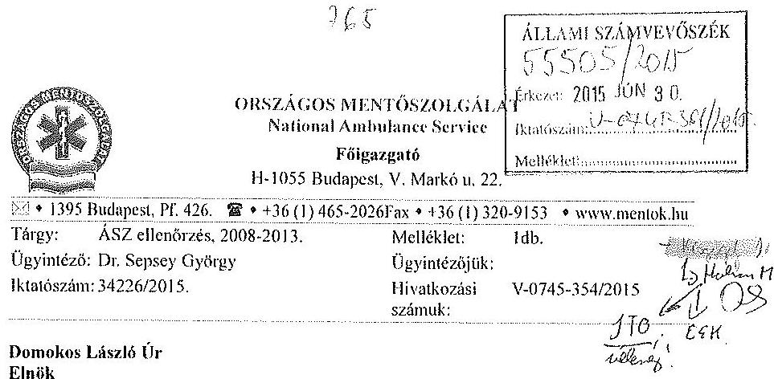

# Állami Számvevőszék 

1052 Budapest
Apáczai Csere János utca 10.

## Tisztelt Elnök Úr!

Köszönettel megkaptuk az Állami

 Számvevőszék jelentéstervezetét „Az Országos Mentőszolgálat ellenőrzéséről - A központi alrendszer egyes intézményei pénzügyi és vagyongazdálkodásának ellenőrzése" címmel.

Ezen tervezetben szereplő megállapításokra részleteiben a mellékelt megjegyzésekben térünk ki, de ezt megelőzően tisztelettel tájékoztatom a következőkről:

A számvevőszéki jelentésben számos esetben szerepel, hogy az OMSZ dolgozói nem tudták a kért dokumentumokat a vizsgálatot végzők rendelkezésére hozzájuttatni. Ennek részbeni oka, hogy a 2013. év eleji vezetőváltást követően az új vezetés a szakmai feladatvégzés színvonalának erősítése érdekében jelentős mértékű személyi változásokat hajtott végre, döntően a gazdasági területen, így a korábbi évek működését ismerő vezetők ma már nem dolgoznak az OMSZ-nál.

Ezen személyi változások egyben az okai is annak, hogy a kért személyi felelősségek megállapítását követően felelősségre vonást aligha lehet érvényesíteni.

A személyi változások mellett az irattárazási tevékenység nem kellő színvonala is sajnálatos oka a nem kielégítő mértékű dokumentáció-átadásnak. A hiányos dokumentáció a 2008-2013. évekre vonatkozóan általánosságban visszavezethető az Intézmény korlátozott irattárazási lehetőségeire is, valamint arra, hogy a 2008-2010. évekre vonatkozóan nehezen fellelhetők voltak a bizonylatok. A korábbi irattár a Központi Irányító Csoport új helyre történő 2014. évi költöztetése miatt áthelyezésre került, ezáltal sok dokumentum összekeveredett, vagy nem volt megtalálható. További tényezőként említhető, hogy e számvevőszéki vizsgálatra olyan időszakban került sor, amikor már elkezdődtek a 2014. évi mérlegbeszámoló előkészítésének munkálatai, amely körülmény - figyelemmel a számviteli előírások 2014. évi jelentős változásaira - nagyfokú leterheltséget okozott, és nehezítette a számvevők kéréseinek megfelelő minőségben és határidőben történő teljesítését.

---

A fentiek mellett a számvevők által számos esetben joggal kifogásolt, a gazdálkodás eredményességét, gazdaságosságát, hatékonyságát kifejező mutatók hiánya arra is visszavezethető, hogy a korábbi években szigetszerűen működtek a gazdálkodás információs alrendszerei, így a számvevők által megjelölt mutatók figyelése ezekből nem, vagy csak nagyon nagy ráfordítások alapján lett volna biztosítható.

A jelentéstervezet egyes megállapításai is tartalmazzák: a 2013. év második felétől számos olyan intézkedés, kezdeményezés figyelhető meg az OMSZ működésében, amelyek a kifogásolt hiányosságok mielőbbi megszüntetésére irányulnak. Ehhez sajnos az Európai Uniós támogatásból megvalósított, és 2013. év végén bevezetett integrált gazdasági információs rendszer még nem nyújt kellő támogatást.

Tisztelettel javasoljuk, hogy hasonló vizsgálatok esetében a jelentés arra is térjen ki, milyen okokra vezethető vissza: a hiányosságok kialakulása, illetve hogy az adott intézmény tárgyi és személyi feltételei megfelelőek-e a hiányosságok megszüntetéséhez. Az uniós forrásból megvalósult integrált vezetői információs rendszer működésbeli hiányosságairól a jelentés is tartalmaz megállapításokat. Utóbbiakból adódóan a pénzügyi folyamatok (pl.: költségvetéskészítés, adatszolgáltatás, könyvvezetés, beszámoló-készítés) gazdaságos, hatékony, eredményes működésének értékelésére elérhető és felhasználható adatok köre csak korlátozottan tette volna lehetővé az említett folyamatok vonatkozásában megalapozott teljesítménymutatók alkalmazását. Az említett hiányosságok megszüntetése részben fejlesztési forrás, részben humán kapacitás kérdése. Mindkettő viszont csak a költségvetési támogatás növelésével biztosítható, miközben évek óta nem fogadják el az OMSZ költségvetési terveiben az ezen feladatokra megjelölt többlettámogatási igényeket.

Ugyanezt lehet mondani a szakmai feladatok gazdaságossági mérése esetében is. Évek óta szorgalmazzuk: kapjon az OMSZ többlet létszámot és ehhez forrást, hogy minden megyében legyen két szakmai felülvizsgálónk, aki a mentési feladatok végrehajtásának szakmai felülvizsgálatát elvégzi és értékeli, hogy a beavatkozások orvos szakmai szempontból megfelelőek voltak-e, illetve a felhasznált egészségügyi „anyagok" fajtája, mennyisége indokolt volt-e. Sajnos erre sem kap az OMSZ többlettámogatást.

Tisztelettel köszönjük ezúton is az ellenőrzésben részt vevő számvevők támogató hozzáállását, és alapos munkáját.

Budapest, 2015. június 30.
Tisztelettel:
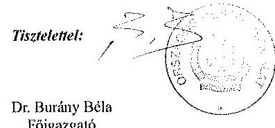

Melléklet: Részletes észrevételek „Az Országos Mentőszolgálat ellenőrzéséről - A központi alrendszer egyes intézményei pénzügyi és vagyongazdálkodásának ellenőrzése" című jelentéstervezethez

---

# Részletes észrevételek „Az Országos Mentőszolgálat ellenőrzéséről - A központi 

alrendszer egyes intézményei pénzügyi és vagyongazdálkodásának ellenőrzése" című jelentéstervezethez

A jelentéstervezet 7-8. oldala a következőket rögzíti:

## I. ÖSSZEGZŐ MEGÁLLAPÍTÁSOK, KÖVETKEZTETÉSEK, JAVASLATOK

A kontrolltevékenység keretében a pénzügyi és vagyongazdálkodási folyamatokhoz kapcsolódó jogosultságok és jogkörök kialakítása és működtetése az ellenőrzött időszakban összességében, és évenként sem felelt meg a jogszabályi előírásoknak. A gazdálkodás során a kontrolltevékenység részeként nem volt biztosított a folyamatba épített, előzetes, utólagos és vezetői ellenőrzés, a belső kontrollok nem tárták fel a pénzügyi szabályszerűségi hiányosságokat. Az

A jelentéstervezet hivatkozott része alapján a gazdálkodás során a kontrolltevékenység részeként nem volt biztosított a folyamatba épített, előzetes, utólagos és vezetői ellenőrzés, a belső kontrollok nem tárták fel a pénzügyi szabályszerűségi hiányosságokat. Ugyanakkor a jelentés 8. oldalán a jelentéstervezet rögzíti, hogy a belső ellenőrzés függetlensége megvalósult, kialakítása és működtetése megfelel a jogszabályi előírásoknak.
Fenti megállapítás alapján az OMSZ belső ellenőrzési osztálya az intézeti belső kontrollrendszer egyik elemének a monitoring rendszernek a részeként maradéktalanul ellátta a jogszabályok által előírt feladatait, ennek keretében a Ber. illetve a Bkr.-ben rögzített bizonyosságot adó tevékenységét is.
A belső ellenőrzés az ÁSZ által vizsgált időszakban a bizonyosságot adó tevékenység keretében többek között pénzügyi, szabályszerűségi, és rendszervizsgálatok keretében is vizsgálta az intézeti kontrolltevékenységek kialakításának és működtetésének rendszerét. Az elkészített, lezárt belső ellenőrzések közel 200 javaslaton fogalmaztak meg az ellenőrzött időszakra vonatkozóan - utóbbiak az ÁSZ részére is továbbításra kerültek, a vizsgálat során kért adatszolgáltatások keretében -, amelyeknek egy jelentős része az intézeti kontrolltevékenységek fejlesztésére, a kontrolltevékenységek működtetésében tapasztalt hiányosságok felszámolására hívta fel a figyelmet. A belső ellenőrzésnek az említett, a kontrollok eredményességének és hatékonyságának értékelésére, fejlesztésére irányuló feladatait az NGM által kiadott „Magyarországi államháztartási belső ellenőrzési standardok" jegyzéke is rögzíti, amely a Bkr. előírásai alapján fontos alapdokumentuma az intézeti belső ellenőrzési tevékenység kialakításának, működtetésének

Fentiek alapján a tervezet azon kijelentését, mely szerint a belső kontrollok nem tárták fel a hiányosságokat, kérjük módosítani.

---

A jelentéstervezet 8. oldala a következőket rögzíti:

# 1. ÖSSZEGZŐ MEGÁLLAPÍTÁSOK, KÖVETKEZTETÉSEK, JAVASLATOK 

Az ellenőrzött időszakban az információs és kommunikációs rendszer kialakítása és működtetése nem megfelelő minőségű volt. Az OMSZ belső jelentéstételi és az információáramlás rendszerét nem alakította ki megfelelően, és a 2008-2012. években teljes körűen nem rendelkezett a jogszabályok által előírt szabályzatokkal. Az OMSZ honlapján közzétett adatok nem voltak teljes körűek a számviteli törvény szerinti beszámolókat illetően, az archiválandó adatok a honlapon nem voltak elérhetőek.

Fentiekben hivatkozott kijelentés pontosítást igényel, tekintve, hogy egyrészt nagymértékben leszűkíti az adott területet a közérdekű adatok honlapon történő közzétételének hiányosságaira, másrészt 2012. évtől kezdődően jelentős előrelépések történtek a hivatkozott intézeti belső kontrollrendszer elem, azaz az intézeti információs és kommunikációs rendszerek kialakításában, működtetésében az alábbiaknak megfelelően.

- A belső intézményi információs portálhoz való hozzáférés kiterjesztésre került, a kapcsolódó technikai feltételek kiépítése a mentőállomásokon megtörtént.
- Az intézményi oktatási portál - valamennyi érintett szervezeti és felhasználói szint bevonásával - fejlesztése megtörtént. Az oktatási anyagokhoz történő teljes körű hozzáférés, az e-learning képzések a dolgozók részére biztosítottá váltak. Az oktatási portál üzemeltetése során intézményünk kiemelt figyelemmel kezeli a portál működésével kapcsolatos felhasználói visszacsatolásokat, ennek érdekében az intézményi munkavállalók kérdőíves formában folyamatosan értékelik a portál által nyújtott szolgáltatások minőségét.
- 2013. év második felétől teljes körűen kialakításra került a vezetői értekezletek rendszere. A Gazdasági Igazgatóság és a többi szakmai terület rendszerességgel beszámol a szervezeti egységeit érintő feladatok megvalósulásáról, a szervezeti egységek vonatkozásában a folyamatba épített vezetői ellenőrzés működéséről. A heti rendszerességgel megtartott vezérkari operatív illetőleg elemző értekezletek biztosítják, hogy a belső kontrollok - beleértve a FELIVE rendszert is - működéséről a megfelelő, intézkedésekre alkalmas, folyamatos információk megvitatásra kerüljenek az OMSZ vezetése részéről, illetőleg ezáltal a megoldási javaslatok hasznosulása is folyamatosan nyomon követve.

A jelentéstervezet 9. oldalán található megállapítást, miszerint az OMSZ öt esetben a pénzeszközátadásokat nem dokumentálta, azonban szükségesnek tartjuk megemlíteni, hogy ezek a pénzeszköz átadások egyike a Légimentő Nonprofit Kft.-nek történt az árvízi védekezés kapcsán, a többi pedig valószínűsíthetően a koraszülött mentést végző alapítványok finanszírozásához kapcsolódott.

A jelentéstervezet 10. oldalán található az a megállapítás, miszerint a gazdálkodási jogkörökre jogosultak aláírás mintájáról az OMSZ nem vezet naprakész nyilvántartást.
Megítélésünk szerint az OMSZ vonatkozó nyilvántartása, akár az egyedi kartonok, akár az excel táblában vezetett összegzések, naprakésznek minősíthetők. Természetesen a személyi változások következtében a nyilvántartások aktualizálása csak akkor valósul meg, amikor a Pénzügyi osztály ezekről a változásokról értesül és ekkor indíthatja a módosításokat.

---

Tekintettel az OMSZ szervezeti széttagoltságára az aláírások beszerzése időigényes. Példaként említenénk meg, hogy jelenleg 448 személyt tartalmaz a nyilvántartásunk, ebből kötelezettségvállalók: 29 fő, ellenjegyzők: 26 fő, érvényesítők: 38 fő, utalványozók: 44 fő, teljesítésigazolók: 194 fő állomásvezető és 117 fő regionális és szakmai vezető. Utóbbiak mindegyike az ország különböző szegleteiben található. Ezen megjegyzésünk a tervezet 31. oldalán található megállapításra is vonatkozik.

A jelentéstervezet 11. oldalán szereplő megállapítás szerint az OMSZ bevételi előirányzata 2012 és 2013. években nem volt közgazdaságilag megalapozott.
Ezt a megállapítást vitatjuk, mert az elemi költségvetést a fejezet sarokszámai alapján, a Ktv. alapján állítjuk össze, ettől eltérni nem lehet. Azt, hogy a törvényben meghatározott bevételi előirányzatoknál kevesebbet kapunk az OEP-től, egy alacsonyabb szintű jogszabály, a 43/1999. (III. 3.) Korm. rendelet az egészségügyi szolgáltatások Egészségbiztosítási Alapból történő finanszírozásának részletes szabályairól, határozza meg, a 33./A §-ban, mely előírja, hogy a légimentés, valamint a szerv- és donorszállítás is támogatást kap a mentési előirányzat terhére. Gyakorlatilag az intézményünk bevételi előirányzatát között szerepel a támogatás, de nem mi kapjuk meg. 2012. és 2013. években ez okozza az elemi költségvetésünk „megalapozatlanságát", ez azonban inkább jogszabályi ellentmondás.(Ezen magyarázatunk a részletes megállapítások részben, a 20. oldalon szereplő, azonos kifogást megfogalmazó megállapításra is vonatkozik.)

A jelentéstervezet 15. oldala a következőket rögzíti:

- az intézmény 2005. évben kiadott, és azóta is hatályban lévő Gazdálkodási Ügyrendje nem tartalmazza a gazdasági szervezet belső és külső kapcsolattartásának szabályait ${ }^{10}$.
A hivatkozott Gazdálkodási Ügyrendet 2014.12.29-én a 18/2014. számú Főigazgatói Utasítás hatályon kívül helyezte, és egyúttal hatályba léptette az OMSZ felülvizsgált Gazdálkodási Ügyrendjét. Fentiek alapján az „azóta is hatályban lévő" minősítés nem helytálló, kérjük módosítani, pontosítást igényel.

A hivatkozott 15. oldalon a következő további megállapítások is szerepelnek:

- a Kötelezettségvállalási Szabályzat ${ }_{1-2}$ -ben nem rögzítették gazdasági eseményenként az 50000 Ft-ot, illetve 2010. évtől a 100000 Ft-ot el nem érő kifizetések rendjét ${ }^{11}$, továbbá a kötelezettségvállalások nyilvántartásának egyeztetésével kapcsolatos feladatokat, a kötelezettségvállalások 0-s számlaosztályban történő nyilvántartásának rendjét ${ }^{12}$.
Az intézet 2012.11.15-én hatályba lépett - az ÁSZ részére is továbbított - Számviteli Politikája tartalmazza (151;152;160;170;181;191;198;202;210;211;221;238;259;302;322;323 oldalak) a kötelezettségvállalások könyvviteli egyeztetésével összefüggő feladatokat, továbbá a kötelezettségvállalások 0-s számlaosztályban történő nyilvántartásának rendjét. Fentiek alapján a tervezet pontosítást igényel.

---

A jelentéstervezet 15-16.oldala a következőket rögzíti:
Az OMSZ dokumentáltan 2010. április 9-től rendelkezett hatályos, az intézményvezető által jóváhagyott Számviteli Politikával ${ }^{13}$. A Számviteli Politika nem tartalmazza a mérlegkészítés időpontját, továbbá a kis értékű tárgyi eszközök minősítését
 a számviteli előírások ellenére ${ }^{14}$. Az ellenőrzött időszakban az OMSz rendelkezett Leírási és Leíráskészítési Szabályzat, 4-et, Eszközök és Források Értékelési Szabályzat ${ }_{1,5}$-vel és Pénzkezelési Szabályzat ${ }_{1,5}$-vel. Az intézmény a jogszabályi előírások ellenére ${ }^{15} 2008. január 1. és 2012. november 19. közötti időszakban nem készítette el az önköltségszámítás rendjére vonatkozó szabályzatát.

Az intézet 2012.11.15-én hatályba lépett - az ÁSZ részére is továbbított - Számviteli Politikája már tartalmazza a mérlegkészítés időpontját (7. oldal) és a kis értékű tárgyi eszközök minősítését (24, 25, 162. oldalak).

Fentiek alapján a tervezet pontosítást, törlést igényel.
A jelentéstervezet 16.oldala a következőket rögzíti:
A jogszabályi előírások ellenére ${ }^{16} 2008-2012. között az intézmény nem készítette el az ellenőrzési nyomvonalakat, amely hiányosságot 2013. január 6-vel pótolta. Az intézmény a szabálytalanságok kezelésének - a jogszabályi előírásoknak megfelelő ${ }^{17}$ - eljárásrendjével 2012. november 19-étől rendelkezett. A 2012. évi szabálytalanságkezelési eljárásrend és a 2013-tól hatályos belső kontrollrendszer szabályzat nem tartalmazott előírásokat a cél és indikátorrendszer nyomon követésére, nem határozott meg felelősöket, határidőket a teljesítménykövetelményekre vonatkozólag. Az OMSz a Kbl. ${ }_{1,5}$ eljárásrend megfelelően elkészítette a Közbeszerzési Szabályzat ${ }_{1,5}$-ot.
A tervezet hibás szövege alapján, a 2012. évi szabálytalanságkezelési eljárásrend és a 2013-tól hatályos belső kontrollrendszer szabályzat nem tartalmazott előírásokat a cél és indikátorrendszer nyomon követésére, nem határozták meg a felelősöket, határidőket a teljesítménykövetelményekre vonatkozóan.
Fenti megállapítás a szabálytalanságkezelési eljárásrend vonatkozásában nem értelmezhető, az ÁSZ által kifogásolt cél és indikátorrendszer meghatározását a szabálytalanságkezelési szabályzat részeként, a 2010. évig irányadó, intézeti szabálytalanságkezelési rendszer kialakítására vonatkozó PM útmutató nem fogalmazta meg. 2011. évtől az említett PM útmutatónak megfelelő, kifejezetten a szabálytalanságkezelési rendszer kialakítására irányadó módszertani útmutatót nem jelentett meg az NGM, a tárgykör vonatkozásában az NGM honlapján megtalálható - legutoljára 2010. évben felülvizsgált - Belső Kontroll Kézikönyv minta iránymutatásait lehet még figyelembe venni (28-32. oldal), utóbbi dokumentum által megfogalmazott tartalmi követelményeknek az OMSZ Szabálytalanságkezelési Eljárásrendje ugyanakkor megfelel. Az NGM által kiadott Magyarország államadósság-tartási belső ellenőrzési standardok szabálytalanságkezelésre vonatkozó részeiben rögzítettek szintén megjelennek az OMSZ tárgyban irányadó eljárásrendjében, a standardokban olyan konkrét plusz cél és indikátorrendszer nem jelenik meg, amelyet az ÁSZ kifogásként említ.
Fentiek alapján a tervezet azon kijelentése, mely szerint a 2012. évi szabálytalanságkezelési eljárásrend nem tartalmazott előírásokat a cél és indikátorrendszer nyomon követésére pontosítást, törlést igényel.

---

A jelentéstervezet 17. oldala a következőket rögzíti:

Az elvégzett külső és belső ellenőrzésekről az ellenőrzött időszakban a Belső Ellenőrzési Osztály a Ber. és a Bkr. alapján nyilvántartást vezetett. Az előírások ellenére az elvégzett belső ellenőrzésekről készített nyilvántartások nem tartalmazzák az ellenőrzések kezdetének és lezárásának időpontját, az ellenőrzés lefolytatásában részt vett vizsgálatvezetők és a belső ellenőr nevét ${ }^{25}$.
${ }^{25}$ Ber. 32. § (2) bekezdés c) és d) pontjai, valamint a Bkr. 50. § (2) bekezdés d) és e) A jelentéstervezet 17. oldalán rögzítettek ellenére a Belső Ellenőrzési Osztály a vizsgált időszakban az elvégzett belső ellenőrzésekről a Ber. és Bkr. szerinti nyilvántartásokat vezette a hivatkozott jogszabályokban meghatározott adattartalommal. Az említett téves következtetés alapja a V-0745-209/2015. iktatószámú Adat/bizonylat/irat (ellenőrzési bizonyíték) bekérő lap a helyszíni ellenőrzés folyamataiban címet viselő dokumentumban feltüntetett pontatlan adatkérés, amely arra irányult, hogy az elvégzett ellenőrzésekről nyilvántartást vezetnek-e a Ber. 32. § (1)-(2) bek. és a Bkr. 47. § alapján? A feltett kérdésben szerepeltetett jogszabályi hivatkozások azonban két különböző adattartalmú nyilvántartást kezelnek együtt, nevezetesen a belső ellenőrzések nyilvántartását (a Ber. 32. § (1)-(2) bek) illetőleg a belső ellenőrzésekre készített intézkedések nyilvántartását (Bkr. 47. §). Az ellenőrzés megjegyzi, hogy a Ber. 32. § (1)-(2) bek. szerinti „Az ellenőrzések nyilvántartása" címet viselő rész a hatályos Bkr 50. §-ban van rögzítve, mint ahogy azt helyesen a jelentéstervezet kapcsolódó lábjegyzetében fel is tüntették. Az Országos Mentőszolgálat Belső Ellenőrzési Osztálya az adatbekérőben feltett kérés szerint járt el, amikor a kért Bkr. 47. §-a szerinti, a korábbi PM, illetőleg az azt követő NGM útmutatók alapján összeállított nyilvántartást továbbította az adatokat bekérő számvevő részére.

A fentiek alapján az OMSZ álláspontja szerint a Ber. 32. § (1)-(2) bek. valamint Bkr 50. §-ban rögzített nyilvántartások vezetése maradéktalanul biztosított volt az ellenőrzött időszakra vonatkozóan, a kapcsolódó dokumentumok szükség esetén az OMSZ Belső Ellenőrzési Osztályán rendelkezésre állnak. Fentiek alapján a tervezet pontosítást igényel.

Ugyancsak a jelentéstervezet 17.oldala a következőket rögzíti:
Az intézmény nyomon követte a belső és külső ellenőrzések által tett megállapításokra és javaslatokra készített intézkedési terveket, azok realizálódását és hasznosulását. Az éves intézkedési tervekben a tett intézkedések utóvizsgálatát nem rögzítették. Az intézkedési tervek nem minden esetben készültek el a Ber. illetve a Bkr. által előírt határidőre, illetve egy esetben (a honlapon történő kötelező adatközzététel) hiányzott intézkedési terv.
A tervezet hivatkozott szövege alapján az intézkedési tervekben a tett intézkedések utóvizsgálatát nem rögzítették. Fenti megállapítás, a vonatkozó kapcsolódó jogszabályi előírások figyelembevétele mellett nem értelmezhető. Az intézkedési tervek elkészítésére vonatkozóan a Bkr. 45.§-47.§-ában rögzítettek az irányadóak. A hivatkozott paragrafusok nem rögzítik azt a kötelezettséget az intézkedési tervet készítő felelős szervezeti egység irányába, hogy az intézkedési tervekben kötelezően rögzíteni szükséges a tett intézkedések utóvizsgálatát.
Fentiek alapján a tervezet azon kijelentése, mely szerint az intézkedési tervekben a tett intézkedések utóvizsgálatát nem rögzítették pontosítást, törlést igényel.

---

A jelentéstervezet 18. oldala a következőket rögzíti:

# 2.2. Az információs és kommunikációs rendszer kialakítása és működtetése 

Az információs és kommunikációs rendszer kialakítása és működtetése az ellenőrzött időszakban nem felelt meg a jogszabályi előírásoknak. ${ }^{10}$ Az OMSz belső jelentéskezelési és információellátó rendszerét nem alakította ki megfelelően.
Az OMSz 2008-2012 között közzétételi Szabályzattal nem rendelkezett ${ }^{11}$, az Info. tv. szerinti szabályzatot 2013. január 4-én adott ki.

Az OMSz honlapján közzétett adatok nem voltak teljes körűek a számviteli törvény szerinti beszámolók tekintetében ${ }^{12}$, csak a 2013. év beszámolója volt megoldható, hiányoztak az előző, elöbbiekre visszamenőleg feltöltött beszámolók. Az esetlegesen hiányzó adatok, anyagok a honlapon nem voltak elérhetőek, visszakereshetőek.
Az OMSz az ellenőrzött időszakban hatályos, a jogszabályi vezető által aláírt Informatikai Számítástechnikai Szabályzattal rendelkezett. A bizalmas információk kezelését a 2013. január 30-tól hatályos Adatvédelmi Szabályzat tartalmazza, ezt megelőzően az intézménynek nem volt adatvédelmi és adatbiztonsági szabályzata ${ }^{13}$.

Fentiekben hivatkozott kijelentés pontosítást igényel, tekintve, hogy egyrészt nagymértékben leszűkíti az adott területet a közérdekű adatok honlapon történő közzétételének hiányosságaira, másrészt 2012. évtől kezdődően jelentős előrelépések történtek a hivatkozott intézeti belső kontrollrendszer elem, azaz az intézeti információs és kommunikációs rendszerek kialakításában, működtetésében az alábbiaknak megfelelően (lásd az összegző megállapításoknál tett észrevételt).

A 22. oldalon szereplő megállapításhoz, miszerint a gazdálkodási jogkörök gyakorlása nem volt szabályszerű, kiegészítésként megjegyeznénk, hogy már 2014. őszétől történtek változások, a korábbi ÁSZ ellenőrzés eredményként. Az aláírási jogkörök kijelölése, az aláírás minták elkészítése megkezdődött és folyamatosan aktualizálva van. Az érvényesítés és utalványszám helyes sorrendjének alkalmazása már 2014. őszétől bevezetésre került. A pénzügyi fedezet ellenőrzése a kötelezettségvállalások rögzítésekor az ügyviteli rendszerben már automatikusan történik, csak szabad előirányzat terhére vihető fel új kötelezettségvállalás.

A tervezet 29-30. oldalán értékeli a tárgyi eszközök használhatósági fokát, amely az épületek esetében 79,1% volt 2013-ban. Szükségesnek tartjuk felhívni a figyelmet, hogy a könyvviteli nettó/bruttó érték arány jelen esetben nem tükrözi megfelelően az épületeink használhatóságát. Ezt bizonyítják a 2014. év végén elkészített kockázatelemzés megállapításai, továbbá a jelenleg befejezéséhez közeledő, a mentőállomások egy részének részleges felújítását szolgáló uniós projektben szerzett „negatív" tapasztalatok. Ugyanis állomásaink jelentős része oly mértékben elhasználódott és vált alkalmatlanná a mentési tevékenység támogatására, hogy becsléseink szerint 16 milliárd forintra lenne szükség egy elvárható minőségű épületállomány kialakításához.

---

A jelentéstervezet 32. oldala a következőket rögzíti:
Az ellenőrzött években a mentőjárművek beszerzése nem volt tervszerű. Az OMSz járműállományának elhasználódási szintje a 2008. évi 72,6%-os értékről - a beszerzések hiányossága miatt - 2011-re 91,9%-ra emelkedett, amely rendkívül alacsony használhatóságot jelentett. Az új beszerzések eredményeként az elhasználódási szint 2013-ra 79,5%-ra javult.

Kérjük a jelentésben szerepeltetni, hogy a beszerzések fedezetét alapvetően a működéshez szükséges költségvetési támogatáson felüli forrásból kell(ene) biztosítani. 2013. év végén az új vezetés elkészítette az OMSZ 2020-ig terjedő időszakra vonatkozó mentőgépjármű beszerzésre vonatkozó tervét, azonban az ott szereplő beszerzésekre vonatkozó fedezetet egyetlen esetben sem tartalmazta már - az OMSZ előzetesen elkészített költségvetési tervben még szereplő, de - Országgyűlésnek elfogadásra benyújtott javaslat.

A jelentéstervezet 3. számú függeléke a következőket rögzíti:

# Az integritás érvényesítése érdekében kialakított és működtetett intézményi kontrollrendszer 

Az OMSZ integritás kontrollrendszere fejlesztendő ${ }^{1}$ volt.
Az integritás szerződési érvényesítésének ellenőrzéséhez az OMSZ pontosítványokat szolgáltatott adatokat. Ezen adatok értékelése alapján az eredendő veszélyeztetettségi szint közepes, míg a kockázatokat növelő tényező szintje magas. Emellett a szervezetnél kiépült, kockázatok kezelésére hivatott kontrollok szintje is közepes.

A kockázatok és a kontrollok szintje alapján megállapítható, hogy a szervezetnél jelentkező kockázatokat növelő tényező szintje meghaladja az azok kezelésére kiépült kontrollok szintjét.

A jogszabályi előírások ellenére ${ }^{2}$ az OMSz integritás tanácsadóval nem rendelkezett a 2013. évben.
${ }^{1}$ Az államigazgatási szervek integritásirányítási rendszeréről és az érdekérvényesítők fogadási rendjéről szóló 50/2013. (II. 25.) Korm. rendelet 5. §

A tervezet 3. számú függelékének hivatkozott szövege alapján, a jogszabályi előírások ellenére az OMSZ integritás tanácsadóval nem rendelkezett a 2013. évben.
Az OMSZ észrevételezi, hogy olyan jogszabályi helyet akarnak az OMSZ szervezetére értelmezni, amelynek a hatálya nem terjed ki rá, tekintve, hogy az államigazgatási szervek integritásirányítási rendszeréről és az érdekérvényesítők fogadásának rendjéről szóló 50/2013. (II. 25.) Korm. rendelet kifejezetten az államigazgatási szervekre hatályos, ugyanakkor az OMSZ nem minősül államigazgatási szerveknek. Az OMSZ nem rendelkezik igazgatási jogszabályokkal, ami az államigazgatási szervek egyik jellemzője. Az előzőeket támasztja alá az a tény is, hogy az államigazgatási szervek munkatársai a közszolgálati tisztviselőkről szóló 2011. évi CXCIX. törvény 1.§ a-c) pontja alá tartoznak - a törvény ki is emeli, hogy ez

---

a három pont vonatkozik az államigazgatási szervekre -, ezzel szemben az OMSZ munkatársai a közalkalmazottak jogállásáról szóló 1992. évi XXXIII. törvény 1. §-ának hatálya alá tartoznak.

Fentiek alapján a hivatkozott megállapítás törlése indokolt.

---

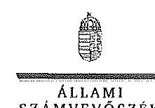

Ikl.szám: V-0745-365/2015.

Dr. Burány Béla
Főigazgató
Országos Mentőszolgálat

Budapest

Tisztelt Főigazgató Úr!

A központi alrendszer egyes intézményei pénzügyi és vagyongazdálkodásának ellenőrzéséről - Országos Mentőszolgálat - ellenőrzéséről készített jelentéstervezetre tett észrevételeit köszönettel megkaptam.

Az Állami Számvevőszék észrevételekre vonatkozó álláspontjáról a felügyeleti vezető által készített részletes tájékoztatást csatoltan megküldöm.

Tájékoztatom Főigazgató urat, hogy az ÁSZ. tv. 29. § (3) bekezdése alapján a számvevőszék jelentés mellékleteként szerepeltethetjük a jelentéstervezethez tett figyelembe nem vett észrevételeket az elutasítás indokainak
 feltüntetésével.

Budapest, 2015. év

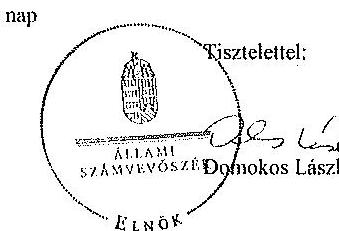

Melléklet: Tájékoztatás az elfogadott és a figyelembe nem vett észrevételekről

1052 Budapest, Africi utca 10. 1364 Budapest 4. P. 54 telefon: 484 8181 fax: 484 8221

---

# Tájékoztatás 

az elfogadott és a figyelembe nem vett észrevételekről
„A központi költségvetési szervek egyes intézményei pénzügyi és vagyongazdálkodásának ellenőrzéséről szóló Országos Mentőszolgálat" ellenőrzéséről készített számvevőszéki jelentéstervezethez 2015. június 30-án kelt levélben tett észrevételeit köszönettel megkaptuk.

A jelentéstervezetre tett észrevételeket áttekintettük, azok kezeléséről a következő tájékoztatást adom:
Főigazgató úr észrevételeket megfogalmazó levelében jelezte, hogy „Ezen személyi változások egyben az okai is annak, hogy a kért személyi felelősségek megállapítását követően felelősségre vonást aligha lehet érvényesíteni."
Szükségesnek tartjuk kiemelni, hogy az ÁSZ által megfogalmazott javaslatok arra irányultak, hogy Főigazgató úr az ÁSZ által feltárt szabálytalanságok tekintetében a felelősség tisztázása érdekében tegyen intézkedéseket és a felelősség megállapítása a feltárt és tisztázott körülmények ismeretében, szükség szerint történjen.
Az irattári tevékenységgel, a dokumentum hiányokkal kapcsolatban Főigazgató úr által ismertetett szakmai hiányosságok indokait megértjük, azonban ezek alapján a jelentéstervezet módosítását nem tartjuk indokoltnak.

## 1. számú észrevétel a kontrolltevékenységgel kapcsolatban:

Főigazgató úr észrevétele szerint: „A jelentéstervezet hivatkozott része alapján a gazdálkodás során a kontrolltevékenység részeként nem volt biztosított a folyamatba épített, előzetes, utólagos és vezetői ellenőrzés, a belső kontrollok nem tárták fel a pénzügyi szabályszerűségi hiányosságokat. Ugyanakkor a jelentés 8. oldalán a jelentéstervezet rögzíti, hogy a belső ellenőrzés függetlensége megvalósult, kialakítása és működése megfelel a jogszabályi előírásoknak.
Fenti megállapítás alapján az OMSZ belső ellenőrzési osztálya az intézeti belső kontrollrendszer egyik elemének, a monitoring rendszernek a részeként maradéktalanul ellátta a jogszabályok által előírt feladatait, ennek keretében a Ber., illetve a Bkr-ben rögzített bizonyosságot adó tevékenységét is.
A belső ellenőrzés az ÁSZ által vizsgált időszakban a bizonyosságot adó tevékenység keretében többek között pénzügyi, szabályszerűségi, és rendszervizsgálatok keretében is vizsgálta az intézeti kontrolltevékenységek kialakításának és működtetésének rendszerét. Az elkészített, lezárt belső ellenőrzések közel 200 javaslatot fogalmaztak meg az ellenőrzött időszakra vonatkozóan – a többi, az ÁSZ részére is továbbított – a vizsgálat során kért adatszolgáltatások keretében –, amelyek egy jelentős része az intézeti kontrolltevékenységek fejlesztésére, a

---

kontrolltevékenységek működtetésében tapasztalt hiányosságok felszámolására hívta fel a figyelmet. A belső ellenőrzésnek az említett, a kontrollok eredményességének és hatékonyságának értékelésére, fejlesztésére irányuló feladatait az NGM által kiadott „Magyarországi állami kórházak belső ellenőrzési standardok” jegyzéke is rögzíti, amely a Bkr. előírásai alapján fontos alapdokumentum az intézeti belső ellenőrzési tevékenység kialakításának, működtetésének. Fentiek alapján a tervezet azon kijelentését, mely szerint a belső kontrollok nem tárták fel a hiányosságokat, kérjük módosítani.
A számvevőszéki jelentéstervezetben a belső kontrollok tekintetében fogalmazódott meg azon megállapítás, hogy a belső kontrollok nem tárták fel a pénzügyi szabályszerűségi hiányosságokat. Főigazgató úr észrevételében az OMSZ belső ellenőrzési tevékenységére hivatkozással cáfolja a jelentéstervezetben tett megállapítást. Az ÁSZ ellenőrzés a belső kontrollrendszer egészére – annak öt elemére figyelemmel – tette a megállapítását. A belső ellenőrzés a belső kontrollok egyik eleme, ennek megfelelő működése nem kompenzálhatja a belső kontrollok másik négy elemének működési hiányosságait. Ahogyan a jelentéstervezetben is rögzítésre került, a kontrollkörnyezet kialakítása, működése nem volt szabályszerű, illetve részben volt szabályszerű, amely abban nyilvánult meg, hogy az OMSZ jogszabályban előírt szabályzatokkal, illetve jogszabályi rendelkezésekkel összhangban lévő szabályzatokkal az ellenőrzött időszakban nem teljes körűen rendelkezett. A kontrolltevékenységek kialakítása és működtetése összességében és évenként sem volt szabályszerű. A pénzügyi és vagyongazdálkodási folyamatokhoz kapcsolódó jogosultságok és jogkörök kialakítása és működtetése az ellenőrzött időszakban nem felelt meg a jogszabályi előírásoknak. Többek között a belső kontroll rendszer hiányosságai is eredményezték, hogy a kiadásokkal kapcsolatos előirányzatok felhasználása nem volt szabályszerű. A kifizetések során a (szakmai) teljesítésigazolás, utalvány ellenjegyzés, az érvényesítés belső kontrollok működése nem felelt meg a jogszabályi előírásoknak.
A fentiekben leírtakra figyelemmel nem fogadjuk el az észrevételt, nem indokolt a jelentéstervezetben a hivatkozott bekezdés módosítása.
2. számú észrevétel az információs és kommunikációs rendszerrel kapcsolatban:

Főigazgató úr észrevételében a jelentés tervezet összegző részében lévő „Az ellenőrzött időszakban az információs és kommunikációs rendszer kialakítása és működtetése nem megfelelő minőségű volt. Az OMSZ belső jelentéstételi és az információáramlás rendszerét nem alakította ki megfelelően, és a 2008-2012. években teljes körűen nem rendelkezett a jogszabályok által előírt szabályzatokkal. Az OMSZ honlapján közzétett adatok nem voltak teljes körűek a számviteli törvény szerinti beszámolókat illetően, az archiválandó adatok a honlapon nem voltak elérhetőek.” megállapítás tekintetében annak pontosítását kéri.
„Tekintettel arra, hogy egyrészt nagymértékben leszűkíti az adott területet a közérdekű adatok honlapon történő közzétételének hiányosságaira, másrészt 2012. évtől kezdődően jelentős előrelépések történtek a hivatkozott intézeti belső kontrollrendszer elem, azaz az intézeti információ és kommunikációs rendszerek kialakításában, működtetésében az alábbiaknak megfelelően.

---

- A belső intézményi információs portálhoz való hozzáférés kiterjesztésre került, a kapcsolódó technikai feltételek biztosítása a mentőállomásokon megtörtént.
- Az intézményi oktatási portál – valamennyi érintett szervezeti és felhasználói szint bevonásával – fejlesztése megtörtént. Az oktatási anyagokhoz történő teljes körű hozzáférés, az e-learning képzések a dolgozók részére biztosítottak lettek. Az oktatási portál üzemeltetése során intézményünk kiemelt figyelemmel kezeli a portál működésével kapcsolatos felhasználói visszacsatolásokat, ennek érdekében az intézményi munkavállalók kérdőíves formában folyamatosan értékelik a portál által nyújtott szolgáltatások minőségét.
- 2013. év második felétől teljes körűen kialakításra került a vezetői értekezletek rendszere. A Gazdasági Igazgatóság és a többi szakmai terület rendszeresebben beszámol a szervezeti egységeit érintő feladatok megvalósulásáról, a szervezeti egységek vonatkozásában a folyamatba épített vezetői ellenőrzés működéséről. A heti rendszerességgel megtartott vezetői operatív illetőleg elemző értekezletek biztosítják, hogy a belső kontrollok – beleértve a FEUVE rendszert is – működéséről a megfelelő, intézkedésekre alkalmas, folyamatos információk megvitatásra kerüljenek az OMSZ vezetése részéről, illetőleg ezáltal a megoldási javaslatok hasznosulása is folyamatosan nyomon követve legyen. "

Nem értünk egyet Főigazgató úr megállapításával, hogy „nagymértékben leszűkíti az adott területet a közérdekű adatok honlapon történő közzétételének hiányosságaira,", mivel a jelentéstervezet részletes megállapításainál leírtuk, hogy nem csak a honlapon történő közzététel hiányosságai, hanem további hiányosságok – szabályozások hiánya, vezetői információs rendszer nem megfelelő működése – is eredményezték az információs és kommunikációs rendszer kialakítása és működtetése tekintetében tett nem megfelelő minősítést.

Az OMSZ által üzemeltetett különböző portálokkal kapcsolatos, valamint a vezetői értekezletek rendszere tekintetében 2013. év második felétől történő teljes körű kialakításáról adott tájékoztatását köszönjük, de ezek az intézkedések már az ÁSZ által ellenőrzött időszak egy kisebb részét érintették. Az ellenőrzés 2008-2013. évekre terjedt ki, ezért a 2008-2012. évekre vonatkozó megállapításunk valamint az összegző megállapítás is megalapozott tekintettel arra, hogy egy félév javuló eredményei nem indokolják a minősítés megváltoztatását.

A fentiekben leírtakra is tekintettel nem tartjuk indokoltnak a jelentéstervezetben rögzített pontosítását.
3. számú észrevétel a pénzeszközátadások dokumentáltságával kapcsolatban:
„A jelentéstervezet 9. oldalán található megállapítás, miszerint az OMSZ öt esetben a pénzeszközátadásokat nem dokumentálta, azonban szükségesnek tartjuk megemlíteni, hogy ezek a pénzeszköz átadások egyike a Légimentő Nonprofit Kft-nek történt az árvízvédekezés kapcsán, a többi pedig valószínűsíthetően a koraszülött mentést végző alapítványok finanszírozásához kapcsolódott."

---

Főigazgató úr észrevételében a pénzeszköz átadások kedvezményezettjeit nevesíti, azonban arra vonatkozóan nem közöl információt, hogy a pénzeszköz átadások dokumentációja rendelkezésre áll. A jelentéstervezetben megalapozott az ÁSZ ellenőrzési megállapítása, mely szerint az OMSZ öt esetben a pénzeszközátadásokat a jogszabályi előírások ellenére nem dokumentálta.
A jelentéstervezetben leírtak pontosítását nem tartjuk indokoltnak, az észrevételt nem fogadjuk el.
4. számú észrevétel a gazdálkodási jogkörökre jogosultak aláírás mintájáról vezetendő naprakész nyilvántartással kapcsolatban:
„A jelentéstervezet 10. oldalán található az a megállapítás, miszerint a gazdálkodási jogkörökre jogosultak aláírás mintájáról az OMSZ nem vezet naprakész nyilvántartást. Megítélésünk szerint az OMSZ vonatkozó nyilvántartása, akár az egyedi kartonok, akár az Excel táblában vezetett összegzések, naprakésznek minősíthetők. Természetesen a személyi változások következtében a nyilvántartások aktualizálása csak akkor valósul meg, amikor a Pénzügyi osztály ezekről a változásokról értesül és ekkor indíthatja a módosításokat." Tekintettel az OMSZ szervezeti széttagoltságára az aláírások beszerzése időigényes. Példaként csatoljuk meg, hogy jelenleg 448 személyt tartalmaz a nyilvántartás, ebből kötelezettségvállalók: 29 fő, előjegyzők: 26 fő, érvényesítők: 38 fő, utalványozók: 44 fő, teljesítésigazolók: 194 fő állomásonként és 117 fő regionális és szakmai vezető. Utóbbiak mindegyike az ország különböző szegleteiben található. Ezen megjegyzésünk a tervezet 31. oldalán található megállapításra is vonatkozik.
Főigazgató úr észrevételében a naprakész nyilvántartás kritériumainak megfelelő dokumentumokat (egyedi karton, Excel tábla) nevesíti. Ugyanakkor elismeri, hogy a naprakész nyilvántartás csak akkor valósul meg, ha a Pénzügyi osztály értesült a változástól. Az észrevételben arra is történik hivatkozás, hogy az OMSZ szervezeti széttagoltsága miatt időigényes az aláírások beszerzése.
A jogszabályi előírás az aláírás minták nyilvántartásának naprakész vezetését írja elő, azonban a naprakész kritériumnak nem felelt meg az OMSZ-nál vezetett nyilvántartás. A jelentéstervezetben megfogalmazott megállapítást továbbra is fenntartjuk, észrevételét nem fogadjuk el.
5. számú észrevétel a bevételi előirányzatok közgazdasági megalapozottságával kapcsolatban:
„A jelentéstervezet 11. oldalán szereplő megállapítás szerint az OMSZ bevételi előirányzata 2012. és 2013. években nem volt közgazdaságilag megalapozott.

Ezt a megállapítást vitatjuk, mert az elemi költségvetést a fejezet sarokszámai alapján, a Kvt. alapján állítjuk össze, ettől eltérni nem lehet. Azt, hogy a törvényben meghatározott bevételi előirányzatoknál keresetkiesést kapunk az OEP-től, egy alacsonyabb szintű jogszabály, a 43/1999. (III. 3.) Korm. rendelet az egészségügyi szolgáltatások Egészségbiztosítási Alapból történő finanszírozásának részletes szabályairól, határozza meg, a 33/A. §-ban, mely előírja, hogy a légimentés, valamint a szerv- és donorszállítás is támogatást kap a mentési előirányzat terhére. Gyakorlatilag az Intézményünk bevételi előirányzatai között szerepel a támogatás, de

---

nem mi kapjuk meg, 2012. és 2013. években ez okozza az elemi költségvetésünk „megalapozatlanságát”, ez azonban inkább jogszabályi ellentmondás. (Ezen magyarázatunk a részletes megállapítások részben, a 20. oldalon szereplő, azonos kifogást megfogalmazó megállapításra is vonatkozik.)"

Nem vitatjuk, hogy a nem egyértelmű szabályozás is közrejátszhatott a nem megfelelő előirányzat tervezésben, azonban a jelentéstervezetben tényként kellett rögzíteni, hogy az OMSZ elemi költségvetésében az Egészségbiztosítási Alapból származó működési célú támogatásértékű bevételi előirányzatában a 2012. évben 1270,7 M Ft, a 2013. évben 780,0 M Ft értékben számszakilag megalapozatlan volt. Észrevételében a számszaki eltérést Főigazgató úr is elismerte, azzal, hogy az OMSZ bevételi előirányzatában szerepel a légimentésre, szerv- és donorszállításra kapott támogatások.

Az előzőekben ismertetettek figyelembevételével megállapításunk módosítása nem indokolt.

# 6. számú észrevétel a Gazdálkodási Ügyrenddel kapcsolatosan: 

„A jelentéstervezet 15. oldala a következőket rögzíti:
az intézmény 2005. évben kiadott, és azóta is hatályban lévő Gazdálkodási Ügyrendje nem tartalmazza a gazdasági szervezet belső és külső kapcsolattartásának szabályait",
A hivatkozott Gazdálkodási Ügyrendet 2014.12.29-én a 181/2014. számú Főigazgatói Utasítás hatályon kívül helyezte, és egyúttal hatályba léptette az OMSZ felülvizsgált Gazdálkodási Ügyrendjét.
 Fentiek alapján az "azóta is hatályban lévő" minősítés nem helytálló, kérjük módosítani, pontosítást igényel.

Az intézmény Gazdálkodási Ügyrendjével kapcsolatos, a jelentéstervezet 15. oldal negyedik bekezdésében megfogalmazott megállapítást, észrevétele alapján az alábbiak szerint módosítjuk:

- az intézmény 2005. évben kiadott, és azóta is az ellenőrzött időszakban hatályban lévő Gazdálkodási Ügyrendje nem tartalmazza a gazdasági szervezet belső és külső kapcsolattartásának szabályait,

7. számú észrevétel a kötelezettségvállalások könyvviteli egyeztetésével összefüggő feladatok, továbbá a kötelezettségvállalások 0-s számú osztályban történő nyilvántartásának rendje szabályozásával kapcsolatban:
„A hivatkozott 15. oldalon a következő további megállapítások is szerepelnek:

- a Kötelezettségvállalási Szabályzatban nem rögzítették gazdasági eseményenként az 50 000 Ft-ot, illetve 2010. évtől a 100 000 Ft-ot el nem érő kifizetések rendjét, továbbá a kötelezettségvállalások nyilvántartásának egyeztetésével kapcsolatos feladatokat, a kötelezettségvállalások 0-s számú osztályban történő nyilvántartásának rendjét".
Az intézet 2012.11.15-én hatályba lépett - az ÁSZ részére is továbbított - Számviteli Politikája tartalmazza (151; 152; 160; 170; 181; 191; 198; 202; 210; 211; 221; 238; 239;302;322;323 oldalak) a kötelezettségvállalások könyvviteli egyeztetésével összefüggő feladatokat, továbbá a

---

# 5. SZÁMÚ MELLÉKLET A V-0745-348/2015. SZÁMÚ JELENTÉSHEZ

kötelezettségvállalások 0-s számú osztályban történő nyilvántartásának rendjét. Fentiek alapján a tervezet pontosítást igényel.

Az intézmény kötelezettségvállalások könyvviteli egyeztetésével összefüggő feladatok, továbbá a kötelezettségvállalások 0-s számú osztályban történő nyilvántartásának rendje szabályozásával kapcsolatos, a jelentéstervezet 15. oldal ötödik bekezdésében megfogalmazott megállapítást, észrevétele alapján az alábbiak szerint módosítjuk:

> a Kötelezettségvállalási Szabályzatában nem rögzítették gazdasági eseményenként az 50 000 Ft-ot, illetve 2010. évtől a 100 000 Ft-ot el nem érő kifizetések rendjét, továbbá a kötelezettségvállalások nyilvántartásának egyeztetésével kapcsolatos feladatokat, a kötelezettségvállalások 0-s számú osztályban történő nyilvántartásának rendjét.

8. számú észrevétel a Számviteli Politika szabályozásával kapcsolatban:

> Az intézet 2012.11.15-én hatályba lépett - az ÁSZ részére is továbbított - Számviteli Politikája már tartalmazza a mérlegkészítés időpontját (7. oldal) és a kis értékű tárgyi eszközök minősítését (24, 25, 162. oldalak).

Fentiek alapján a tervezet pontosítást, törlést igényel.

Az ÁSZ ellenőrzés a 2012. október 30-ig hatályos Számviteli Politika tekintetében fogalmazott hiányosságokat, ezek jogosultságát észrevételében Főigazgató úr sem kifogásolja. A Számviteli Politika tekintetében hoztak nem érintik a jelentéstervezetben tett megállapításokat, ezért nem tartjuk indokoltnak a Számviteli Politika tekintetében fogalmazottak módosítását, törlését.

9. számú észrevétel a szabálytalanságok kezelése eljárásrendjével kapcsolatban:

> A tervezet hivatkozott szövege alapján, a 2012. évi szabálytalanságkezelési eljárásrend és a 2013-tól hatályos belső kontrollrendszer szabályzat nem tartalmazott eljárásokat a cél és indikátorrendszer nyomon követésére, nem határozták meg a felelősöket, határidőket a teljesítménykövetelményekre vonatkozóan.

Fenti megállapítás a szabálytalanságkezelési eljárásrend vonatkozásában nem értelmezhető, az ÁSZ által kifogásolt cél és indikátorrendszer meghatározását a szabálytalanságkezelési szabályzat részeként, a 2010. évig irányadó, intézeti szabálytalanságkezelési rendszer kialakítására vonatkozó PM útmutató nem fogalmazza meg, 2011. évtől az említett PM útmutatónak megfelelő, kifizetésre a szabálytalanságkezelési rendszer kialakítására irányadó módszertani útmutatót nem jelentett meg az NGM, a tárgykör vonatkozásában az NGM honlapján megtalálható - legutoljára 2010. évben felülvizsgált - Belső Kontroll Kézikönyv miatti iránymutatásait lehet még figyelembe venni (26-32. oldal), utóbbi dokumentum által megfogalmazott tartalmi követelményeknek az OMSZ Szabálytalanságkezelési Eljárásrendje ugyanakkor megfelel. Az NGM által kiadott Magyarország állandóágtartási belső ellenőrzési standardok szabálytalanságkezelése vonatkozó részekben rögzítettek szintén megjelennek az OMSZ tárgyban irányadó eljárásrendjében, a standardokban olyan konkrét plusz cél és indikátorrendszer nem jelenik meg, amelyet az ÁSZ kifogásként említ.

Fentiek alapján a tervezet azon kijelentése, mely szerint a 2012. évi szabálytalanságkezelési eljárásrend nem tartalmazott eljárásokat a cél és indikátorrendszer nyomon követésére pontosítást, törlést igényel.

---

Az intézmény szabálytalanságok kezelése eljárásrendjével kapcsolatos, a jelentéstervezet 16. oldal harmadik bekezdésében megfogalmazott megállapításból az észrevételben kifogásolt részt töröljük:
„A jogszabályi előírások ellenére 2008-2012. között az intézmény nem készítette el az ellenőrzési nyomvonalakat, amely hiányosságot 2013. január 4-vel pótolt. Az intézmény a szabálytalanságok kezelésének - a jogszabályi előírásoknak megfelelő - eljárásrendjével 2012. november 19-től rendelkezett. A 2012. évi szabálytalanságkezelési eljárásrend és a 2013-tól hatályos belső kontrollrendszer szabályzat nem tartalmazott előírásokat a cél és indikátorrendszer nyomon követésére, nem határozták meg a felelősöket, határidőket a teljesítménykövetelményekre vonatkozólag. Az OMSZ a Kbi.13 előírásainak megfelelően elkészítette a Közbeszerzési Szabályzatot.”

10. számú észrevétel a belső ellenőrzési nyilvántartások vezetésével kapcsolatban:
„A jelentéstervezet 17. oldalán rögzítettekkel ellentétben a Belső Ellenőrzési Osztály a vizsgált időszakban az elvégzett belső ellenőrzésekről a Ber. és Bkr. szerinti nyilvántartásokat vezette a hivatkozott jogszabályokban meghatározott adattartalommal. Az említett téves következtetés alapja a V-0745-209/2015. iktatószámú Adat/bizonyítvány/irat (ellenőrzési bizonyíték) bekérő lap a helyszíni ellenőrzés folyamataiban címet viselő dokumentumban feltüntetett pontatlan adatkérés, amely arra irányult, hogy az elvégzett ellenőrzésekről nyilvántartást vezetnek-e a Ber. 32. § (1)-(2) bek. és a Bkr. 47. § alapján? A feltett kérdésben szerepeltetett jogszabályi hivatkozások azonban két különböző adattartalmú nyilvántartást kezelték együtt, nevezetesen a belső ellenőrzések nyilvántartását (a Ber. 32. § (1)-(2) bek) illetőleg a belső ellenőrzésekre készített intézkedések nyilvántartását (Bkr. 47. §). Az ellenőrzés megjegyzi, hogy a Ber. 32. § (1)-(2) bek. szerinti "Az ellenőrzések nyilvántartása" címet viselő rész a hatályos Bkr. 50. §-ban van rögzítve, mint ahogy azt helyesen a jelentéstervezet kapcsolódó lábjegyzetében fel is tüntették. Az Országos Mentőszolgálat Belső Ellenőrzési Osztálya az adatbekérőben feltett kérés szerint járt el, amikor a kért Bkr. 47. §-a szerinti, a korábbi PM, illetőleg az azt követő NGM útmutatók alapján összefüggő nyilvántartást továbbította az adatokat bekérő számvevőszéki részére. A fentiek alapján az OMSZ álláspontja szerint a Ber. 32. § (1)-(2) bek. valamint Bkr. 50. §-ban rögzített nyilvántartások vezetése maradéktalanul biztosított volt az ellenőrzött időszakra vonatkozóan, a kapcsolódó dokumentumok szükség esetén az OMSZ Belső Ellenőrzési Osztályán rendelkezésre állnak. Fentiek alapján a tervezet pontosítást igényel."

A belső ellenőrzési nyilvántartások vezetésével kapcsolatos, a jelentéstervezet 17. oldal hatodik bekezdésében megfogalmazott megállapításból az észrevételben kifogásolt részt töröljük:
„Az elvégzett külső és belső ellenőrzésekről az ellenőrzött időszakban a Belső Ellenőrzési Osztály a Ber. és a Bkr. alapján nyilvántartást vezetett. Az előírások ellenére az elvégzett belső ellenőrzésekről készített nyilvántartások nem tartalmazzák az ellenőrzések kezdetének és lezárásának időpontját, az ellenőrzés lefolytatásában részt vett vizsgálatvezetők és a belső ellenőr nevét."

---

11. számú észrevétel az intézkedési tervekkel kapcsolatban:
„A tervezet hivatkozott szövege alapján az intézkedési tervekben a tett intézkedések utóvizsgálatát nem rögzítették. Fenti megállapítás, a vonatkozó kapcsolódó jogszabály előírásainak figyelembevétele mellett nem értelmezhető. Az intézkedési tervek elkészítésére vonatkozóan a Bkr. 43.§-47.§-ában rögzítettek az irányadók. A hivatkozott paragrafusok nem rögzítik azt a kötelezettséget az intézkedési tervet készítő felelős szervezeti egység irányába, hogy az intézkedési tervekben kötelezően rögzíteni szükséges a tett intézkedések utóvizsgálatát.
Fentiek alapján a tervezet azon kijelentése, mely szerint az intézkedési tervekben a tett intézkedések utóvizsgálatát nem rögzítették pontosítást, törlést igényel."

Az intézkedési tervekkel kapcsolatos, a jelentéstervezet 17. oldal hetedik bekezdésében megfogalmazott megállapításból az észrevételben kifogásolt részt töröljük:
„Az intézmény nyomon követte a belső és külső ellenőrzések által tett megállapításokra és javaslatokra készült intézkedési terveket, azok realizálódását és hasznosulását. Az éves intézkedési tervekben a tett intézkedések utóvizsgálatát nem rögzítették. Az intézkedési tervek nem minden esetben készültek el a Ber., illetve a Bkr. által előírt határidőre, illetve egy esetben (a honlapon történő kötelező adatszolgáltatás) nem készített intézkedési tervet."

# 12. számú észrevétel az információs és kommunikációs rendszerrel kapcsolatban: 

„Fentiekben hivatkozott kijelentés pontosítást igényel, tekintve, hogy egyrészt nagymértékben leszögezi az adott területet a kizárólag zártkörűeknek szánt adatok honlapra történő közzétételének hiányosságaira, másrészt 2012. évtől kezdődően jelentős előrelépések történtek a hivatkozott intézeti belső kontrollrendszer elem, azaz az intézeti információs és kommunikációs rendszerek kialakításában, működtetésében az alábbiaknak megfelelően (lásd az összegző megállapításoknál tett észrevételeket)."

A megállapítást nem csak a közzétételre vonatkozó hiányosság alapozta meg. Azt rögzíti a jelentéstervezet, hogy nem volt megfelelően kialakítva a belső jelentéstételi, az információáramlási rendszer, az ellenőrzött időszak nagy részében (5 év az ellenőrzött 6 évből) közzétételi szabályzat is hiányzott, valamint a teljes időszakban nem volt informatikai biztonsági szabályzata. Tehát a honlap hiányosságai mellett a szabályozás hiányosságai is megalapozzák a megállapítást, ezért a megállapítás módosítása nem indokolt.
13. számú észrevétel a gazdálkodási jogkörök gyakorlásával kapcsolatban:
„A 22. oldalán szereplő megállapításhoz, miszerint a gazdálkodási jogkörök gyakorlása nem volt szabályszerű, kiegészítésként megjegyeznénk, hogy már 2014. őszétől történtek változások, a korábbi ÁSZ ellenőrzés eredményként. Az aláírási jogkörök kijelölése, az aláírás minták elkészítése megkezdődött és folyamatosan aktualizálva van. Az érvényesítés és utalványozás helyes sorrendjének alkalmazása már 2014. őszétől bevezetésre került. A pénzügyi fedezet ellenőrzése a kötelezettségvállalások rögzítésekor az ügyviteli rendszerben már automatikusan történik, csak szabad eljárásrend terhére vihető fel új kötelezettségvállalás."

---

A számvevőszéki jelentésben a jelzett hiányosságok megállapítása megalapozottan történt, a jelentéstervezet módosítását nem tartjuk indokoltnak. Köszönjük Főigazgató úr tájékoztatását azon intézkedésekről, amelyeket a gazdálkodási jogkörök gyakorlásával kapcsolatosan megállapított hiányosságok megszüntetése érdekében tettek, tekintettel arra, hogy a hiányosságok kiküszöbölése érdekében tett intézkedések az ellenőrzött időszakon túl történtek, ezért azokat az ÁSZ nem tudja figyelembe venni.
14. számú észrevétel a gazdálkodási jogkörök gyakorlásával kapcsolatban:
„A tervezet 29-30. oldalán értékelik a tárgyi eszközök használhatósági fokát, amely az épületek esetében 79% volt 2013-ban. Szükségesnek tartjuk felhívni a figyelmet, hogy a könyvviteli nettó/bruttó érték arány jelen esetben nem tükrözi megfelelően az épületeink használhatóságát. Ezt bizonyítják a 2014. év végén elkészített kockázatelemzés megállapításai, továbbá a jelenleg befejezéséhez közeledő, a mentőállomások egy részének részleges felújítását szolgáló uniós projekthez szerzett "negatív" tapasztalatok. Ugyanis állomásaink jelentős része oly mértékben elhasználódott és vált alkalmatlanná a mentési tevékenység támogatására, hogy becsléseink szerint 16 milliárd forintra lenne szükség egy elvárható minőségű épületállomány kialakításához."

Főigazgató úr által leírtakat köszönjük, de a használhatósági fok az ÁSZ-nál használt mutatószám alapján lett rögzítve, közgazdasági mériszámon alapul. Az OMSZ épületeinek használhatóságára vonatkozó megjegyzésével a jelentéstervezetben leírtak nem mondanak ellent. A jelentéstervezetben rögzítettek módosítását nem tartjuk indokoltnak.
15. számú észrevétel a mentőjárművek beszerzésével kapcsolatban:
„Kérjük a jelentésben szerepeltetni, hogy a beszerzések fedezetét alapvetően a működéshez szükséges költségvetési támogatáson felüli forrásból (kevésbé) biztosítani. 2013. év végén az új vezetés elkészítette az OMSZ 2020-ig terjedő időszakra vonatkozó mentőgépjármű beszerzésre vonatkozó tervét, azonban az ott szereplő beszerzésekre vonatkozó fedezetet egyetlen esetben sem tartalmazza már - az OMSZ előzetesen elkészített költségvetési tervben még szereplő, de Országgyűlésnek elfogadásra benyújtott javaslat."

Főigazgató úr által az észrevételében hivatkozott, az OMSZ 2020-ig terjedő időszakra vonatkozó mentőgépjármű beszerzésre vonatkozó terve az ÁSZ által ellenőrzött időszakra nem gyakorolt hatást. A jelentéstervezetben leírtak kiegészítését nem tartjuk indokoltnak.
16. számú észrevétel az integritási tanácsadóval kapcsolatban:
„A tervezet 3. számú függelékének hivatkozott szövege alapján, a jogszabályi előírások ellenére az OMSZ integritás tanácsadóval nem rendelkezett a 2013. évben.
Az OMSZ észrevételezi, hogy olyan jogszabályt akarnak az OMSZ szervezetére értelmezni, amelynek a hatálya nem terjed ki rá, tekintve, hogy az államigazgatási szervek

---

integritásirányítási rendszeréről és az érdekérvényesítők fogadásának rendjéről szóló 50/2013. (II. 25.) Korm. rendelet kifejezetten az államigazgatási szervekre hatályos, ugyanakkor az OMSZ nem minősül államigazgatási szerveknek. Az OMSZ nem rendelkezik igazgatási jogosítványokkal, ami
 az államigazgatási szervek egyik jellemzője. Az előzőeket támasztja alá az a tény is, hogy az államigazgatási szervek munkatársai a közszolgálati tisztviselékről szóló 2011. évi CXCIX. törvény 1.§ a-c) pontja alá tartoznak - a törvény ki is emeli, hogy ez a három pont vonatkozik az államigazgatási szervekre -, ezzel szemben az OMSZ munkatársai a közalkalmazottak jogállásáról szóló 1992. évi XXXIII. törvény 1. §-ának hatálya alá tartoznak."

Az integritási tanácsadóval kapcsolatos, a jelentéstervezet 3. számú függelékében megfogalmazott megállapításokból az észrevételben kifogásolt részt töröljük:
„A jogszabályi előírások ellenére az OMSZ integritás tanácsadóval nem rendelkezett a 2013. évben."

Kérem a válaszlevelemben foglaltak szíves tudomásulvételét. Tájékoztatom Főigazgató urat, hogy a számvevőszéki jelentés mellékleteként szerepeltetjük a jelentéstervezethez tett észrevételeit, valamint az ÁSZ tv. 29. § (3) bekezdése alapján a figyelembe nem vett észrevételeket az elutasítás indokának feltüntetésével együtt.

Budapest, 2015. év július 21. nap

Kisgergely István
felügyeleti vezető

---

.

---

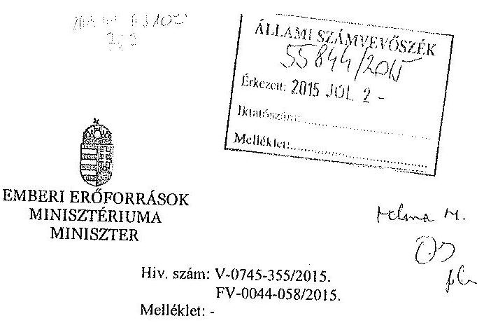

# Domokos László részére 

elnök

Állami Számvevőszék

## Budapest

Apáczai Csere János utca 10.
1952.

Tárgy: Az Országos Mentőszolgálat ellenőrzéséről szóló számvevőszéki jelentéstervezet, illetve a tárgyban tett elnöki figyelemfelhívás

Tisztelt Elnök Úr!
Hivatkozva a V-0745-355/2015. iktatószámon „Az Országos Mentőszolgálat (a továbbiakban: OMSZ) ellenőrzéséről - A központi alrendszer egyes intézményei pénzügyi és vagyongazdálkodásának ellenőrzése" címmel megküldött számvevőszéki jelentéstervezetre, valamint a tárgyal kapcsolatban az FV-0044-058/2015. iktatószámon érkezett elnöki figyelemfelhívásra, az alábbiakról tájékoztatom.

## 1. A jelentéstervezet észrevételezése

A jelentéstervezet 10. oldal 1. pontja szerint „az irányító szerv a 2012-2013. években az Aht. 9. § (1) bekezdés d pontjában előírtak ellenére év közben nem hajtotta végre az OMSZ bevételi és kiadási előirányzatokkal való gazdálkodásának rendszeres figyelemmel kísérését, ami az év végére vonatkozó kedvező likviditásmutatók ellenére átmeneti likviditási zavarokat okozott az intézménynél."

---

A fentiekre tekintettel Elnök Úr javasolja, hogy az emberi erőforrások minisztere intézkedjen az OMSZ bevételi és kiadási előirányzatainak rendszeres figyelemmel kísérése érdekében, és ha a közfeladatok ellátása veszélybe kerül, tegye meg a szükséges intézkedéseket.

# A Minisztérium álláspontja: 

Az EMMI hatályos Szervezeti és Működési Szabályzata szerint a fejezethez tartozó intézmények költségvetésével, előirányzatainak nyilvántartásával kapcsolatos feladatokat a tárca Költségvetési Főosztálya látja el.

Mivel az OMSZ költségvetési kiadásainak 2%-át sem éri el a költségvetési támogatással fedezett hányada, így bevételeinek és ebből fedezett kiadásainak évközi alakulása a Magyar Államkincstár általi rendszeres adatszolgáltatás figyelemmel kísérése mellett sem - a Számvevőszék által is jelzett kedvező likviditási mutatóik alapján pedig egyáltalán nem - volt érzékelhető az intézmény átmeneti likviditási problémája. Intézményi jelzés nélkül ezek a rejtett problémák irányító szervi hatáskörben nem azonosíthatók.

Intézményi jelzés először 2012 novemberében érkezett, az OMSZ akkori főigazgatója az intézmény 2012. évi gazdasági helyzetével és gazdálkodásával kapcsolatos problémákkal kereste meg a tárcánkat, amelynek értelmében az OMSZ mintegy 2,0 milliárd Ft összegű forráshiánnyal küzdött. 2012. év végén a likviditási problémák enyhítésére az intézmény az alábbi központi támogatásokban részesült:

- kormányzati hatáskörben a rendkívüli kormányzati intézkedésekre szolgáló tartalékból történő előirányzat-átcsoportosításról szóló 1629/2012. (XII. 18.) Korm. határozat alapján 1.000 millió forint;
- irányító szervi hatáskörben a 11343-9/2012-EGP számú engedély alapján 463,9 millió forint,
tehát mindösszesen 1.463,9 millió forint összegben.
Az OMSZ gazdasági helyzetének alakulásával kapcsolatban, 2013 májusában az EMMI és az intézmény részvételével egyeztető megbeszélésre került sor, amelyen az intézmény prognosztizálta a 2013. évben várható forráshiányát. Az OMSZ által kimutatott hiány a fejezet által rendelkezésre álló adatok és kimutatások alapján továbbra sem volt érzékelhető, a kimutatott hiányt az intézmény megfelelően alátámasztani nem tudta. A likviditási problémák előrejelzésére készített intézményi táblában az OMSZ az ágazati béremelés jogszabálykövetéséből adódó hiányaként 1.320 millió forintot jelzett, amelynek fedezetére - az államháztartás központi alrendszerébe tartozó költségvetési szervek és fejezeti kezelésű előirányzatok 2012. évi kötelezettségvállalással nem terhelt maradvány felhasználásáról szóló 1336/2013. (VI. 24.) Korm. határozat alapján - a minisztérium fejezeti kezelésű előirányzata terhére 1.378,9 millió forint került átadása az OMSZ részére.

---

A fentiekre tekintettel az ÁSZ megállapításával, miszerint az OMSZ előirányzatokkal való gazdálkodásának rendszeres figyelemmel kísérését az Emberi Erőforrások Minisztériuma nem hajtotta végre, alapjaiban nem értek egyet.

# II. Elnöki figyelemfelhívás: 

Az elnöki figyelemfelhívó levél szerint:
„Az OMSZ napi működtetése, likviditása szempontjából kockázatot jelentett, hogy az irányító szerv részéről az OMSZ költségvetésének megállapítása, beszámolóinak felülvizsgálata, értékelése és jóváhagyása, valamint a bevételi és kiadási előirányzatokkal való gazdálkodásának rendszeres figyelemmel kísérése nem történt meg. Továbbá az irányítási jogkörgyakorlás keretében a közfeladat ellátására vonatkozó, és az erőforrásokkal való szabályszerű és hatékony gazdálkodáshoz szükséges követelmények rögzítése, érvényesítése és számonkérés sem történt meg."

A fenti megállapítások alapján Elnök Úr kérte a figyelemfelhívó levélben foglaltak elbírálását, a megfelelő intézkedések megtételét és az erről szóló értesítés megküldését.

## A Minisztérium álláspontja:

A fejezet költségvetését - ezáltal az önálló címen lévő OMSZ költségvetését is - a mindenkori Magyarország központi költségvetéséről szóló törvény határozza meg. Az éves intézményi keretszámok levezetése (tématabló) a költségvetési törvény megjelenését követően valamennyi intézmény részére megküldésre kerül, amely alapján szükséges az intézménynek összeállítania és jóváhagyásra megküldenie a fejezet részére a kincstári és az elemi költségvetését.
2011. évtől kezdődően az intézmények kincstári és elemi költségvetései, valamint az éves elemi költségvetési beszámolói a Magyar Államkincstár elektronikus adatszolgáltató rendszerébe (KGR-K11) kerülnek feltöltésre, illetve e fejezeti jóváhagyások is ezen felületen történnek. Ennek megfelelően az OMSZ 2012. évi kincstári költségvetése 2012. január 9-én, elemi költségvetése 2012. március 5-én, a 2013. évi kincstári költségvetése 2013. január 9-én, 2013. évi elemi költségvetése pedig 2013. március 5-én a tárca részéről elfogadásra, jóváhagyásra került.

Az éves elemi költségvetési beszámoló felülvizsgálata során a fejezet - meghatározott szempontrendszer alapján - mind számszaki, mind szöveges értékelést vár az intézményektől. A számszaki beszámolók felülvizsgálata, valamint elfogadása szintén a KGR-K11 rendszeren keresztül történik, amely a 2012. évi beszámoló esetében 2013. május 21-ével, a 2013. évi beszámoló esetében pedig 2014. június 23-ával történt meg.

A fenti, elektronikus rendszeren kívüli irányító szervi jóváhagyásról - mind a költségvetés, mind az éves beszámoló esetében - a tárca a nyomtatványgarnitúrák fedlapon történő aláírásával, valamint ezek intézmények részére történő megküldésével is gondoskodik.

---

# Ennek alapján az ÁSZ figyelemfelhívásával szintén nem értek egyet. 

A fentieken túl, a jelentéstervezet és a figyelemfelhívás tárgyában egyaránt meg kívánom jegyezni, hogy az Emberi Erőforrások Minisztériuma általános eljárásrendjétől eltérő, egyedi kontrolling tevékenység kialakítását az OMSZ esetében nem javaslom.

Kérem Tisztelt Elnök Urat észrevételeim szíves elfogadására,
Budapest, 2015. június „,”
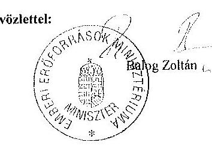

---

# 7. SZÁMÚ MELLÉKLET A V-0745-348/2015. SZÁMÚ JELENTÉSHEZ 

## Balog Zoltán

Miniszter
Emberi Erőforrások Minisztériuma

## Budapest

## Tisztelt Miniszter Úr!

„A központi alrendszer egyes intézményei pénzügyi és vagyongazdálkodásának ellenőrzéséről Országos Mentőszolgálat -" ellenőrzéséről készített jelentéstervezetre tett észrevételeit köszönettel megkaptam.

Az Állami Számvevőszék észrevételekre vonatkozó álláspontjáról a felügyeleti vezető által készített részletes tájékoztatást csatoltan megküldöm.

Tájékoztatom Miniszter urat, hogy az ÁSZ. tv. 29. § (3) bekezdése alapján a számvevőszéki jelentés mellékleteként szerepeltetjük a jelentéstervezethez tett figyelembe nem vett észrevételeket az elutasítás indokainak feltüntetésével.

Budapest, 2015. év. 12. hó 3. nap
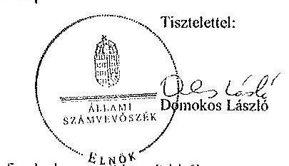

Melléklet: Tájékoztatás az elfogadott és a figyelembe nem vett észrevételekről

---

# Tájékoztatás   az elfogadott és a figyelembe nem vett észrevételekről 

„A központi alrendszer egyes intézményei pénzügyi és vagyongazdálkodásának ellenőrzéséről Országos Mentőszolgálat" ellenőrzéséről készített számvevőszéki jelentéstervezethez 2015. június 25-én kelt levélben tett észrevételeit köszönettel megkaptuk.

A jelentéstervezetre tett észrevételt áttekintettük, annak kezeléséről a következő tájékoztatást adom:

A jelentéstervezet 10. oldal 1. pontja szerint:
„Az irányító szerv a 2012-2013. években az Áht, 9. § (1) bekezdés d) pontjában előírtak ellenére év közben nem hajtotta végre az OMSZ bevételi és kiadási előirányzatokkal való gazdálkodásának rendszeres figyelemmel kísérését, ami az év végére vonatkozó kedvező likviditásmutatók ellenére átmeneti likviditási zavarokat okozott az intézménynél."

Tekintettel arra, hogy az Áht. 2015. június 19-én hatályba lépett módosítását követően már nem szerepel a költségvetési szervek irányítása vonatkozó hatásköri jogosultságok között a bevételi előirányzatokkal és a kiadási előirányzatokkal való gazdálkodás rendszeres figyelemmel kísérése, a végrehajtás, illetve a költségvetési szerv által ellátandó közfeladatok meg nem valósításának veszélye esetén a jogszabályban meghatározott szükséges intézkedések megtétele, az idézett intézkedést igénylő megállapítást és kapcsolódó javaslatot töröljük.

Megjegyezem azonban, hogy a jelentéstervezetben megalapozottan került rögzítésre, hogy az irányító szerv a 2012-2013. években év közben nem hajtotta végre az OMSZ bevételi és kiadási előirányzatokkal való gazdálkodásának rendszeres figyelemmel kísérését.
A Minisztérium álláspontja az volt, hogy az OMSZ költségvetési kiadásainak 2%-át sem éri el a költségvetési támogatással fedezett hányada. Az Áht. 9. § (1) bekezdés d) pontja nem tett különbséget összegszerűség alapján a rendszeres figyelemmel való kísérés tekintetében, ezért ez az észrevétel nem indokolja a megállapítás módosítását. Továbbá megjegyzem, hogy az OMSZ költségvetési kiadásainak költségvetési támogatással fedezett hányada nem csak eléri a 2%-ot hanem jelentősen meg is haladja. Ugyanis az OMSZ 2013. évi beszámolója alapján a költségvetési kiadás 33900 millió Ft volt, a költségvetési bevétel pedig 32009 millió Ft.

Azt jelzi továbbá, hogy intézményi jelzés nem történt ezért ezek a problémák irányító szervi hatáskörben nem azonosíthatók.
Az ÁSZ a jogszabályi előírással összhangban az OMSZ összes bevételi és kiadási előirányzatának nyomon követésének hiányát állapította meg, ami a likviditási gondok kialakulásához vezetett. 2012. évben ez szükségessé tette, hogy az egészségügyért felelős

---

államtitkár intézkedjen az OMSZ feladatellátáshoz szükséges mértékű finanszírozás megállapítása érdekében a mentési kassza felülvizsgálatáról. Nem értünk egyet azzal, hogy az az OMSZ jelzése alapján működjön a likviditás kezelése, hiszen a minisztérium feladata és felelőssége az intézmény folyamatos működéséhez szükséges finanszírozási források rendelkezésre állásának biztosítása. A levelében leírt kormányzati és irányító szervi hatáskörben jóváhagyott központi támogatások összegét az OMSZ részére átutalták, amelyekre utólagosan (2012. december), és nem a folyamatosan az évközi likviditás megteremtése mellett került sor.
Továbbá az EMMI által kitöltött és az ellenőrzés részére átadott tanúsítvány szerint is úgy nyilatkoztak, hogy „az irányítószerve megállapítása alapján évközben a közfeladat ellátása nem volt veszélyeztetett"

Budapest, 2015. év 2. hó 1. nap

Kisgergely István
felügyeleti vezető

---

.

---

# RÖVIDÍTÉSEK JEGYZÉKE 

| Törvények |  |
| :--: | :--: |
| Áht. 1 | Az államháztartásról szóló 1992. évi XXXVIII. törvény (hatálytalan 2012. január 1-jétől) |
| Áht. 2 | Az államháztartásról szóló 2011. évi CXCV. törvény (hatályos 2012. január 1-jétől) |
| Alaptörvény | Magyarország Alaptörvénye (2011. április 25.) (hatályos 2012. január 1-jétől) |
| Alkotmány | A Magyar Köztársaság Alkotmányáról szóló 1949. évi XX. törvény (hatálytalan 2012. január 1-jétől) |
| Art. | Az adózás rendjéről szóló 2003. évi XCII. törvény |
| ÁSZ tv. 1 | Az Állami Számvevőszékről szóló 1989. évi XXXVIII. törvény (hatályos 2011. június 30-áig) |
| ÁSZ tv. 2 | Az Állami Számvevőszékről szóló 2011. évi LXVI. törvény (hatályos 2011. július 1-jétől) |
| Avtv. |

 A személyes adatok védelméről és a közérdekű adatok nyilvánosságáról szóló 1992. évi LXIII. törvény |
| Eisztv | Az elektronikus információszabadságról szóló 2005. évi XC. törvény |
| Info tv. | Az információs önrendelkezési jogról és az információszabadságról szóló 2011. évi CXII. törvény |
| Kbt. 1 | A közbeszerzésekről szóló 2003. évi CXXIX. törvény (hatálytalan 2012. január 1-jétől) |
| Kbt. 2 | A közbeszerzésekről szóló 2011. évi CVIII. törvény (hatályos 2012. január 1-jétől) |
| Kjt. | A közalkalmazottak jogállásáról szóló 1992. évi XXXIII. törvény |
| Kt. | A költségvetési szervek jogállásáról és gazdálkodásáról szóló 2008. évi CV. törvény (hatályos 2009. január 1-jétől 2010. augusztus 14-éig) |
| Kttv. | A közszolgálati tisztviselőkről szóló 2011. évi CXCIX. törvény (hatályos 2012. március 1-jétől) |
| Ktv. | A köztisztviselők jogállásáról szóló 1992. évi XXIII. törvény (hatálytalan 2012. március 1-jétől) |
| Mt. 1 | A Munka Törvénykönyvéről szóló 1992. évi XXII. törvény (hatálytalan 2012. július 1-jétől) |
| Mt. 2 | A Munka Törvénykönyvéről szóló 2012. évi I. törvény (hatályos 2012. július 1-jétől) |
| Nvtv. | A nemzeti vagyonról szóló 2011. évi CXCVI. törvény (hatályos 2012. január 1-jétől) |
| Stabilitási tv. | Magyarország gazdasági stabilitásáról szóló 2011. évi CXCIV. törvény (hatályos 2012. január 1-jétől) |

---

| Számv. tv. | A számvitelről szóló 2000. évi C. törvény |
| :--: | :--: |
| Szt. | A találmányok szabadalmi oltalmáról szóló 1995. évi XXXIII. törvény |
| Vtv. | Az állami vagyonról szóló 2007. évi CVI. törvény |
| 2008. évi Kvtv.. | A Magyar Köztársaság 2008. évi költségvetéséről szóló 2007. évi CLXIX. törvény |
| 2009. évi Kvtv. | A Magyar Köztársaság 2009. évi költségvetéséről szóló 2008. évi CII. törvény |
| 2010. évi Kvtv. | A Magyar Köztársaság 2010. évi költségvetéséről szóló 2009. évi CXXX. törvény |
| 2011. évi Kvtv. | A Magyar Köztársaság 2011. évi költségvetéséről szóló 2010. évi CLXIX. törvény |
| 2012. évi Kvtv. | Magyarország 2012. évi központi költségvetéséről szóló 2011. évi CLXXXVIII. törvény |
| 2013. évi Kvtv. | Magyarország 2013. évi központi költségvetéséről szóló 2012. évi CCIV. törvény |
| Kormányrendeletek |  |
| Áhsz. | Az államháztartás szervezetei beszámolási és könyvvezetési kötelezettségének sajátosságairól szóló 249/2000. (XII. 24.) Korm. rendelet |
| Ámr. $_{1}$ | Az államháztartás működési rendjéről szóló 217/1998. (XII. 30.) Korm. rendelet (hatálytalan 2010. január 1-jétől) |
| Ámr. $_{2}$ | Az államháztartás működési rendjéről szóló 292/2009. (XII. 19.) Korm. rendelet (hatályos 2010. január 1-jétől 2011. december 31-éig) |
| Ávr. | Az államháztartásról szóló törvény végrehajtásáról szóló 368/2011. (XII. 31.) Korm. rendelet (hatályos 2012. január 1-jétől) |
| Ber. | A költségvetési szervek belső ellenőrzéséről szóló 193/2003. (XI. 26.) Korm. rendelet (hatálytalan 2012. január 1-jétől) |
| Bkr. | A költségvetési szervek belső kontrollrendszeréről és belső ellenőrzésről szóló 370/2011. (XII. 31.) Korm. rendelet (hatályos 2012. január 1-jétől) |
| Vtvr. | Az állami vagyonnal való gazdálkodásról szóló 254/2007. (X. 4.) Korm. rendelet |
| Miniszteri rendeletek |  |
| 46/2009. (XII. 30.) PM rendelet | A kincstári számlavezetés és finanszírozás, a feladatfinanszírozási körbe tartozó előirányzatok felhasználása, valamint egyes államháztartási adatszolgáltatások rendjéről szóló 46/2009. (XII. 30.) PM rendelet (hatálytalan 2012. január 1-jétől) |

---

5/2012. (III. 1.) NGM rendelet
322/2006. (XII. 23.)
Korm. rendelet
5/2006. (II. 7.) EüM rendelet
37/2011.(VI. 28.)
NEFMI rendelet

57/2011. (IX. 29.)
NEFMI rendelet

## Kormányhatározatok

1316/2011. (IX. 19.)
Korm. határozat
1365/2011. (XI. 8.)
Korm. határozat

1036/2012. (II. 21.)
Korm. határozat

## Szórövidítések

Alapító Okirat ${ }_{1}$
Alapító Okirat ${ }_{2}$
Alapító Okirat ${ }_{3}$
Alapító Okirat ${ }_{4}$
Alapító Okirat ${ }_{5}$
ÁSZ
Belső Kontrollrendszer Szabályzat

EMMI
FEUVE

Gazdálkodási Ügyrend

Az elemi költségvetésről szóló 5/2012. (III. 1.) NGM rendelet

Az Országos Mentőszolgálatról
A mentésről
A mentésről szóló 5/2006. (II. 7.) EüM rendelet és a betegszállításról szóló 19/1998. (VI. 3.) NM rendelet módosításáról
Egyes egészségügyi tárgyú miniszteri rendeletek módosításáról

A 2011. évi költségvetési egyensúlyt megtartó intézkedésekről szóló 1316/2011. (IX. 19.) Korm. határozat
A 2012. évi költségvetési hiánycél tartását biztosító további feladatokról szóló 1365/2011. (XI. 8.) Korm. határozat
A 2012. és 2013. évi költségvetési hiánycél biztosításához szükséges további intézkedésekről szóló 1036/2012. (II. 21.) Korm. határozat

Az Országos Mentőszolgálat alapító okirata (hatályos 2004. augusztus 15-től)

Az Országos Mentőszolgálat alapító okirata (hatályos: 2009. július 1-től)

Az Országos Mentőszolgálat alapító okirata (hatályos: 2010. június 7-től)

Az Országos Mentőszolgálat alapító okirata (hatályos: 2010. december 6-tól)

Az Országos Mentőszolgálat alapító okirata (hatályos: 2013. július 31-től)

Állami Számvevőszék
OMSz Minőségügyi Kézikönyv - OMSz Belső Kontrollrendszer Szabályzat (hatályos 2013. január 4., 1/2013. főigazgatói utasítás)
Emberi Erőforrások Minisztériuma
a) folyamatba épített, előzetes és utólagos vezetői ellenőrzés (2008. december 31-éig)
b) folyamatba épített, előzetes, utólagos és vezetői ellenőrzés (2009. január 1-jétől)
Az OMSz Gazdálkodásának Ügyrendje (hatályos 2005. július 1-től)

---

Gépjármű Szabályzat ${ }_{1}$
Gépjármű Szabályzat ${ }_{2}$
GYEMSZI

INTOSAI

ISSAI

IVIR
Kincstár
Kötelezettségvállalási
Szabályzat ${ }_{1}$

Kötelezettségvállalási szabályzat $_{2}$
Kötelezettségvállalási szabályzat ${ }_{3}$
Közbeszerzési szabályzat $_{1}$
Közbeszerzési szabályzat$_{2}$
Közbeszerzési szabályzat$_{3}$

Leltározási és leltárkészítési szabályzat ${ }_{1}$

Leltározási és leltárkészítési szabályzat ${ }_{2}$
Leltározási és leltárkészítési szabályzat ${ }_{3}$

MNV Zrt.
NEFMI
NGM
OEP
OGY
OMSz/Intézmény

OMSz Minőségügyi Kézikönyv - OMSz gépjármű igénybevételi szabályzat (hatályos 2007. február 1. - 2012. november 18., 1/2007. főigazgatói utasítás)
OMSz Minőségügyi Kézikönyv - OMSz gépjármű üzemeltetési és igénybevételi szabályzat (hatályos 2012. november 19-től., 34/2012. főigazgatói utasítás)
Gyógyszerészeti és Egészségügyi Minőség- és Szervezetfejlesztési Intézet
International Organisation of Supreme Audit Institutions (Legfőbb Ellenőrző Intézmények Nemzetközi Szervezete)
International Standards of Supreme Audit Institutions (A legfőbb ellenőrző intézmények nemzetközi standardjai)
Integrált Vezetői Információs Rendszer
Magyar Államkincstár
Az Országos Mentőszolgálat gazdálkodásának ügyrendje III. fejezete. Az OMSz kötelezettségvállalási, érvényesítési, teljesítés igazolási és utalványozási rendje (hatálytalan 2013. január 30-tól)
Az Országos Mentőszolgálat kötelezettségvállalási szabályzata (hatályos 2013. január 30-tól)
Az Országos Mentőszolgálat kötelezettségvállalási szabályzata (hatályos 2013. április 1-től)
Az Országos Mentőszolgálat közbeszerzési szabályzata (hatályos 2007. január 1-től)
Az Országos Mentőszolgálat közbeszerzési szabályzata (hatályos 2010. május 20-tól)
Az Országos Mentőszolgálat közbeszerzési szabályzata (hatályos 2013. január 4-től)
Az Országos Mentőszolgálat leltározási és leltárkészítési szabályzata (hatályos 1997. április 1-től, és 2003. évi módosítása)

Az Országos Mentőszolgálat leltározási és leltárkészítési szabályzata (hatályos 2010. január 27-től)
Az Országos Mentőszolgálat leltározási és leltárkészítési szabályzata (hatályos 2012. október 30-tól)

Magyar Nemzeti Vagyonkezelő Zrt.
Nemzeti Erőforrások Minisztériuma
Nemzetgazdasági Minisztérium
Országos Egészségbiztosítási Pénztár
Országgyűlés
Országos Mentőszolgálat

---

Önköltségszámítási szabályzat
Pénzkezelési szabályzat$_{1}$
Pénzkezelési szabályzat$_{2}$
PM
PPP
Selejtezési szabályzat $_{1}$

Selejtezési szabályzat $_{2}$
Selejtezési szabályzat $_{3}$
Szabálytalanságok kezelésének rendje

Számviteli Politika $_{1}$
Számviteli politika $_{2}$
$\mathrm{SZMSZ}_{1}$
$\mathrm{SZMSZ}_{2}$
$\mathrm{SZMSZ}_{3}$
$\mathrm{SZMSZ}_{4}$
$\mathrm{SZMSZ}_{5}$
Ügyrend

Az Országos Mentőszolgálat önköltségszámítási szabályzata (hatályos 2012. október 30-tól)
Az Országos Mentőszolgálat pénztár- és pénzkezelési szabályzata (hatályos 1996. december 1-től)
Az Országos Mentőszolgálat pénzkezelési szabályzata (hatályos 2013. január 30-tól)
Pénzügyminisztérium
Köz- és magánszféra együttműködése (Public Private Partnership)
Az Országos Mentőszolgálat selejtezési szabályzata (hatályos 1997. április 1-től, módosítva 2000. szeptember 30.)

Az Országos Mentőszolgálat selejtezési szabályzata (hatályos 2009. augusztus 4-től)
Az Országos Mentőszolgálat selejtezési szabályzata (hatályos 2012. október 30-tól)
OMSz Minőségügyi Kézikönyv - OMSz Szabálytalanságok kezelésének rendje, a 34/2012. (XI. 19.) főigazgatói utasítás helyezte hatályba
Az Országos Mentőszolgálat Számviteli Politikája (hatálytalan 2012. október 30-tól)
Az Országos Mentőszolgálat Minőségügyi Kézikönyve Számviteli Politikáról szóló szabályzata (hatályos 2012. október 30-tól)
Az Országos Mentőszolgálat Szervezeti és Működési Szabályzata (2006. november 7-én aláirt)
Az Országos Mentőszolgálat Szervezeti és Működési Szabályzata (hatálytalan 2009. február 16-tól)
Az Országos Mentőszolgálat Szervezeti és Működési Szabályzata (hatálytalan 2010. március 10-tól)
Az Országos Mentőszolgálat Szervezeti és Működési Szabályzata (hatálytalan 2011. január 19-től)
Az Országos Mentőszolgálat Szervezeti és Működési Szabályzata (hatálytalan 2013. december 16-tól)
Az Országos Mentőszolgálat gazdálkodásának ügyrendje (hatályos 2005. július 1-től)

---

.

---

# ÉRTELMEZŐ SZÓTÁR 

belső kontrollrendszer
befektetett eszközök aránya
eredendő veszélyeztetettségi szint
ellenőrzési nyomvonal
előirányzat-módosítás

A belső kontrollrendszer a költségvetési szerv által a kockázatok kezelésére és tárgyilagos bizonyosság megszerzése érdekében kialakított folyamatrendszer, amely azt a célt szolgálja, hogy a költségvetési szerv megvalósítsa a következő fő célokat: a tevékenységeket (műveleteket) szabályszerűen, valamint a megbízható gazdálkodás elveivel (gazdaságosság, hatékonyság és eredményesség) összhangban hajtsa végre; teljesítse az elszámolási kötelezettségeket; megvédje a szervezet erőforrásait a veszteségektől (károktól) és a nem rendeltetésszerű használattól. (Forrás: Áht1 120/B § (1), hatályos: 2009. január 1-jétől 2011. december 31-ig)

A belső kontrollrendszer a kockázatok kezelése és tárgyilagos bizonyosság megszerzése érdekében kialakított folyamatrendszer, amely azt a célt szolgálja, hogy megvalósuljanak a következő célok: a működés és gazdálkodás során a tevékenységeket szabályszerűen, gazdaságosan, hatékonyan, eredményesen hajtsák végre, az elszámolási kötelezettségeket teljesítsék, és megvédjék az erőforrásokat a veszteségektől, károktól és nem rendeltetésszerű használattól. (Forrás: Áht. 2 69. § (1) bek., hatályos: 2012. január 1-jétől)
A mutató kifejezi, hogy a befektetett eszközök milyen arányt képviselnek az összes eszközön belül. Az arány növekedése azt jelzi, hogy a szervezet által ellátott tevékenység eszközellátottsága javul.
Az un. „eredendő veszélyeztetettség” olyan kockázati tényezők csoportja, amelyek a vizsgált költségvetési szerv jogállásából eredően, az általa kezelt erőforrásokkal való gazdálkodás miatt gyakorlatilag objektív, „külső” szervezeti adottságként értelmezhetők.
Az ellenőrzési nyomvonal a költségvetési szerv működési folyamatainak szöveges vagy táblázatba foglalt, vagy folyamatábrákkal szemléltetett leírása, amely tartalmazza különösen a felelősségi és információs szinteket és kapcsolatokat, továbbá irányítási és ellenőrzési folyamatokat, lehetővé téve azok nyomon követését és utólagos ellenőrzését. (Forrás: Ámr $_{1}$ 145/B. § (1) bek., hatályos 2010. január 1-jéig, további időszakokra forrás: NGM honlapjáról elérhető Belső Kontroll kézikönyv PM 2010. 35. oldal)
Az előirányzat-módosítás a költségvetési szerv költségvetésének kiadási, illetve bevételi főösszegét és kiemelt előirányzatait is érintő előirányzat-növelés vagy -csökkentés. (Forrás: Áht $_{1}$ 97. § (2) bek., hatályos: 2010. augusztus 14-ig)

---

eredendő veszélyeztetettségi szint
eredményesség

FEUVE
gazdaságosság
gépjármű
hatékonyság
integritás

Előirányzat-módosítás: a megállapított kiadási, bevételi, támogatási kiemelt előirányzat, létszám-előirányzat növelése vagy csökkentése. (Forrás Áht $_{1}$ 2/A § (3) k) pont, hatályos: 2011. december 31-ig)
Előirányzat-módosítás: a megállapított kiadási előirányzat növelése vagy csökkentése, a bevételi előirányzatok egyidejű növelése vagy csökkentése mellett. (Forrás: Áht $_{2}$ 2. § (1) bek. f) pont, hatályos: 2012. január 1-jétől).
Az un. „eredendő veszélyeztetettség” olyan kockázati tényezők csoportja, amelyek a vizsgált költségvetési szerv jogállásából eredően, az általa kezelt erőforrásokkal való gazdálkodás miatt gyakorlatilag objektív, „külső” szervezeti adottságként értelmezhetők.
Az eredményesség követelménye azt jelenti, hogy a kitűzött célok - az elfogadott módosításokat, változó körülményeket figyelembe véve - megvalósuljanak, a tevékenység tervezett és tényleges hatása közötti különbség a lehető legkisebb mértékű legyen, vagy a tényleges hatás legyen kedvezőbb a tervezettnél. (Forrás: Áht. 91. § (1) bekezdés b) pont, Bkr. 2. § g) pont.)

Folyamatba épített, előzetes, utólagos és vezetői ellenőrzés.
A FEUVE a szervezeten belül a gazdálkodásért felelős szervezeti egység által folytatott első szintű pénzügyi irányítási és ellenőrzési rendszer.
A folyamatba épített előzetes és utólagos vezetői ellenőrzésre vonatkozó szabályokat Áht. ${ }_{1,2}$, valamint az Ámr$_{2}$. határozza meg. Kidolgozására a pénzügyminisztérium költségvetési ellenőrzéssel kapcsolatban közzétett módszertani útmutatói, illetve ajánlásai figyelembevételével került sor.
A gazdaságosság követelménye azt jelenti, hogy az erőforrások felhasználásához kapcsolódó kiadás vagy ráfordítás az elérhető legkisebb legyen, a jogszabályban meghatározott vagy általánosan elvárható minőség mellett. (Forrás: Áht. 1 91. § (1) bekezdés b) pont, Bkr. 2. § i) pont.)
Az OMSz kezelésében lévő összes gépjármű (a
 mentést és az egyéb feladatellátását szolgáló gépjárművek).
A hatékonyság követelménye azt jelenti, hogy az előállított termékek, nyújtott szolgáltatások, az ellátott feladat más eredményének értéke, vagy az azokból származó bevétel a lehető legnagyobb mértékben haladja meg a felhasznált erőforrásokhoz kapcsolódó kiadásokat vagy ráfordításokat. (Forrás: Áht. 1. 91. § (1) bekezdés b) pont, Bkr. 2. § j) pont.)

Az integritás az elvek, értékek, cselekvések, módszerek, intézkedések konzisztenciáját jelenti, vagyis olyan magatartásmódot, amely meghatározott értékeknek megfelel.

---

integritási kockázat
irányító szerv
kockázatok kezelésére hivatott kontrollok
korrupciós kockázat

Korrupciós Veszélyeztetettséget Növelő Tényezők
kötelezettségek és a saját tőke aránya mutató
közfeladat
(Forrása NGM Útmutató: Magyarországi államháztartási belső kontroll standardok 1.6.1. pont, 2012. december.) Az államigazgatási szerv működésére vonatkozó szabályoknak, valamint a hivatali szervezet vezetője és az irányító szerv által meghatározott célkitűzéseknek, értékeknek és elveknek megfelelő működés.
(Forrás: integritásirányítási rendelet 2. § a) pont.)
Az államigazgatási szerv integritása sérülésének lehetősége. (Forrás: integritásirányítási rendelet 2. § c) pont.)
A központi alrendszer egyes intézményével és annak gazdálkodásával kapcsolatos irányítási jogokkal felruházott szerv vagy személy.
Egészségügyi Minisztérium 2010. május 29-ig;
Nemzeti Erőforrás Minisztérium 2012. május 13-ig;
Emberi Erőforrások Minisztériuma 2012. május 14-től.
A belső és külső kontrollok célja, hogy megfelelő eszközökkel, intézményekkel és eljárásokkal védelmet biztosítson a közpénzből, közérdekből működő, vagyis közcélokat követő szervek működésével kapcsolatos ún. eredendő, valamint az egyéb, veszélyeztetettséget növelő körülményekből származó korrupciós kockázatokkal szemben. A belső és külső kontrollok tehát a - bármilyen típusú - korrupciós kockázatokkal szembeni védettség elemeit, azok összességét jelentik.
A jogtalan előny nyújtásának vagy megszerzésének lehetősége. (Forrás: integritásirányítási rendelet 2. § d) pont.)
A Korrupciós Veszélyeztetettséget Növelő Tényezők (KVNT) leképezik egyfelől a költségvetési szervek jogi intézményi környezetének jellemzőit (kiszámíthatóság, stabilitás), másfelől az intézmények működtetésé során jelentkező - alapvetően a mindenkori menedzsment döntéseitől befolyásolt - változó tényezőket. Utóbbiak körében kiemelhető a stratégiai célok meghatározása, a szervezeti struktúra és kultúra alakítása, valamint a személyi és költségvetési erőforrásokkal való gazdálkodás.
A mutató növekedése kifejezi annak kockázatát, hogy a költségvetési szerv nem lesz képes a kötelezettségeinek kiegyenlítésére, részben a szállítók finanszírozzák a működését, veszélyeztetve ezzel a működés biztonságát. A mutató számítása %-ban kifejezve: (Kötelezettségek összesen/Saját tőke+Tartalékok összesen)*100.
Az a feladat, amit az arra kötelezett közérdekből, jogszabályban meghatározott követelményeknek és feltételeknek megfelelve végez, ideértve a lakosság közszolgáltatásokkal való ellátását, továbbá az állam nemzetközi szerződésekben vállalt kötelezettségeiből adódó közérdekű feladatokat, valamint e feladatok ellátásához szükséges

---

kulcskontrollok
likviditási mutató
mentőgépjármű
monitoring

OEP
pénzeszköz likviditási mutató
saját tőke aránya
tárgyi eszközök használhatósági foka
vagyonfedezeti mutató
infrastruktúra biztosítását is. (Forrás: Nvtv. 3. § (1) bekezdés 7. pont.)
A kiadások utalványozását megelőző kötelező kontrolltevékenységek. Az Ámr. 1,2 a 2008-2011. években a szakmai teljesítésigazolást és az utalvány ellenjegyzését, az Ávr. a 2012-2013. években a teljesítésigazolást és az érvényesítést írta elő egyenrangú kulcskontrollként.
A mutató kifejezi, hogy a szervezet forgóeszközei milyen mértékben nyújtanak fedezetet a rövid lejáratú kötelezettségekre az éves könyvviteli mérleg adatai alapján. Számítása %-ban kifejezve: Forgóeszközök összesen/ Rövid lejáratú kötelezettségek összesen*100. A mutató értéke akkor elfogadható, ha 100% fölötti értéket mutat.
A mentést szolgáló gépjárművek (mentőgépkocsi, kiemelt mentőgépkocsi, esetkocsi, rohamkocsi, stb.).
A monitoring általánosságban a különböző szintű szervezeti célok megvalósításának folyamatát kíséri figyelemmel, melynek során a releváns eseményekről és tevékenységekről rendszeres jelleggel, strukturált, döntéstámogató információkhoz jutnak a szervezet vezetői.
(Forrás: NGM Útmutató a költségvetési szervek monitoring rendszeréhez 2011. november.)
Országos Egészségbiztosítási Pénztár
A mutató kifejezi, hogy a szervezet forgóeszközei a követelések nélkül milyen mértékben nyújtanak fedezetet a rövid lejáratú kötelezettségekre az éves könyvviteli mérleg adatai alapján. Számítása %-ban kifejezve: (Forgóeszközök összesen - Követelések összesen)/Rövid lejáratú kötelezettségek összesen)*100. A mutató értéke akkor kedvező, ha 100% vagy annál nagyobb értéket mutat.
A mutató kifejezi, hogy a saját tőke és a tartalékok milyen arányt képviselnek az összes forráson belül. A mutató növekedése a tőkeellátottság javuló tendenciáját fejezi ki.
Az eszközgazdálkodás vizsgálatának elemzése során használt mutató. Számítása: tárgyi eszközök könyv szerinti (nettó) értéke/tárgyi eszközök bruttó (beszerzési/létesítési) értéke. A %-ban kifejezett mutató csökkenése az eszköz állagának romlására, avulására utal, ami maga után vonja az üzemeltetési és fenntartási költségek növekedését is.
A mutató kifejezi, hogy a költségvetési szerv saját vagyona (saját tőke+tartalékok összege) milyen arányban nyújt fedezetet a befektetett eszközökre. Számítása %-ban kifejezve: (Saját vagyon/Befektetett eszközök)*100. A mutató értéke akkor megfelelő, ha egy, vagy annál nagyobb értéket mutat.

---

vezetői nyilatkozat

A költségvetési szerv vezetője köteles nyilatkozatban értékelni a költségvetési szerv belső kontrollrendszerének minőségét és azt az éves költségvetési beszámolóval együtt megküldeni az irányító szervnek. Ha év közben változás történik a szerv vezetője személyében, vagy a költségvetési szerv átalakul, megszűnik, a távozó vezető, illetve az átalakuló, megszűnő költségvetési szerv vezetője köteles a nyilatkozatot az addig eltelt időszak vonatkozásában kitölteni, és az új vezetőnek, illetve a jogutód költségvetési szerv vezetőjének átadni, aki azt saját nyilatkozatához mellékeli.
(Forrás: Ámr. 1 149. § (2) bekezdés c) pont, (11) bekezdés, 23. számú melléklet; Ámr. 2 217. § c) pont, 226. § (3) bekezdés, 21. számú melléklet; Bkr. 11. § (1)-(2) és (4) bekezdés, 1. számú melléklet.)

---

.

---

# Az integritás érvényesítése érdekében kialakított és működtetett intézményi kontrollrendszer 

Az OMSz integritás kontrollrendszere fejlesztendő1 volt.
Az integritás szemlélet érvényesülésének ellenőrzéséhez az OMSz tanúsítványon szolgáltatott adatokat. Ezen adatok értékelése alapján az eredendő veszélyeztetettségi szint közepes, míg a kockázatokat növelő tényező szintje magas. Emellett a szervezetnél kiépült, kockázatok kezelésére hivatott kontrollok szintje is közepes.

A kockázatok és a kontrollok szintje alapján megállapítható, hogy a szervezetnél jelenlévő kockázatokat növelő tényező szintje meghaladja az azok kezelésére kiépült kontrollok szintjét.

[^0]
[^0]:    1 Az intézmény a 2013. évi Kockázatokat Mérséklő Kontrollok Tényezője index tekintetében 63,4%-os eredményt ért el. Az index azt tükrözi, hogy az adott szervezetnél léteznek-e intézményesült kontrollok, illetőleg, hogy ezek ténylegesen működnek-e, betöltik-e rendeltetésüket. Ehhez az indexhez olyan faktorok tartoznak, mint a szervezet belső szabályozása, a belső ellenőrzés, valamint az egyéb integritás kontrollok: etikai követelmények meghatározása, összeférhetetlenségi helyzetek kezelése, a bejelentések, panaszok kezelése, rendszeres kockázatelemzés és tudatos stratégiai menedzsment.

---

.

---

# 1. Az OMSz PÉNZÜGYI ÉS VAGYONGAZDÁLKODÁSÁNAK TELJESÍTMÉNY-ELLENŐRZÉSE 

### 1.1. A gazdaságossági, hatékonysági és eredményességi követelmények kialakítása és működtetése

Az OMSz gazdálkodása során a gazdaságossági, hatékonysági és eredményességi követelmények kialakítása és működtetése a gépjármű üzemeltetés kivételével nem történt meg.
Stratégiai dokumentumokban a gazdálkodásra vonatkozó mérhető célt nem határoztak meg. Középtávú célkitűzésként szervezeti- és járműpark fejlesztési terveket fogalmaztak meg. Belső szabályzatban rögzítették a mentőgépjárművek tartalékállományára vonatkozó számszerűsített értéket.
A gazdálkodás folyamatában az OMSz éves célkitűzéseket - az elemi költségvetésben rögzített tervszámokon túlmenően - az irányító szervek ellenőrzési javaslatainak végrehajtására, illetve a költségvetési helyzet javítására kiadott - mérhető célokat tartalmazó - főigazgatói utasításokban fogalmazott meg, amelyek a kiadások csökkentésére és a bevételek növelésére vonatkoztak. A stratégiai és operatív célrendszer, valamint indikátorrendszer hiányára és a megbízható integrált vezetői információs rendszer kialakítására vonatkozó irányító szervi javaslatok alapján 2012-ben elkezdődött a hosszú távú intézményi stratégia és a végrehajtását elősegítő szervezeti struktúra kialakítása. Feladatként határozták meg a külső közbeszerzési szakértővel kötött szerződések felülvizsgálatát gazdaságossági-hatékonysági szempontból.
A pénzügyi gazdálkodáson belül a költségvetés-készítés területén alakítottak ki bázis viszonyszámokat az elemi költségvetésben meghatározott kiemelt előirányzatok teljesítésének méréséhez, az eredményesség értékelésére. Intenzitási viszonyszámokat, ezen belül fajlagos mérőszámokat a gazdaságosság és hatékonyság mérésére nem alakítottak ki a pénzügyi gazdálkodásban.
A vagyongazdálkodás esetében a gépjármű üzemeltetés területén gazdaságossági, hatékonysági és eredményességi mutatókat egyaránt kialakítottak, azokat folyamatosan nyomon követték. Bázis, megoszlási és intenzitási viszonyszámokat, ezen belül fajlagos mérőszámokat alkalmaztak a teljesítmény mérésére. A feladatmutatók az éves szakmai beszámolóban jelentek meg. Az energiafogyasztás adatainak nyomon követésére alkalmaztak bázisviszonyszámokat, az előző évi és tárgyidőszaki adatok összehasonlítására.
Az OMSz 2008-2013 között a célkitűzések és a teljesítménykövetelmények nyomonkövetési rendszerét nem alakította ki. A nyomonkövetés a vezetői/osztályvezetői értekezletek tartásával valósult meg, de vezetői kontrolling, egységes információs rendszer nem működött. Belső szabályozásban a gazdálkodási ügyrend tartalmazta a mutatószám-rendszerek kialakításának és működtetésének követelményeit.
A stratégiai dokumentumokban, belső szabályzatban és főigazgatói utasításokban megjelölt célok az ellenőrzött időszak végére részben teljesültek.

---

A Kontrolling osztály működésére és az IVIR-re vonatkozó megállapításokat a jelentés 2.1 fejezete tartalmazza.
Az OMSz 2013-ban elkészítette a mentőgépkocsik beszerzésére vonatkozó javaslatát a 2014-2020 közötti időszakra, amelyben célként fogalmazódott meg, hogy az eset és roham, valamint mentőgépjármű állomány életkora ne legyen kilenc évesnél idősebb a célidőszak végére.
A járműveket az amortizációtól elmaradó ütemben cserélték és így nem tudták a mentésről szóló rendeletben előírtak szerint a mentőjárművek 10 éves üzemeltethetőségét 2011-től betartani.1
Az ellenőrzött években a mentőgépjárművek beszerzése nem volt tervszerű. Az OMSz járműállományának elhasználódási szintje a 2008. évi 72,6%-os értékről a beszerzések hiánya miatt 2011-re 91,9%-ra emelkedett, amely rendkívül alacsony használhatóságot jelentett. Az új beszerzések eredményeként az elhasználódási szint 2013-ra 79,5%-ra javult.

A 2008. évben - az előző évi megrendelések alapján - 24 eset és rohamkocsit, valamint 46 mentőkocsit helyezett üzembe az OMSz. A 2009-2011. években az OMSz nem állított forgalomba új mentőgépjárművet. A 2010. évben az intézmény a Mentőalapítványtól két darab mentőgépjárművet vett át térítésmentesen. A 2012. évben 71, 2013-ban 53 darab mentőjárművel bővült az állomány. A 2008-2013 évek között az OMSz (futó) mentőgépjármű állománya 3,2%-kal, 745 darabra csökkent.
A nullára leírt mentőgépjárművek aránya a 2008. évben a teljes állomány 35,8%-át tette ki. A 2011. évre már a nullára leírt járművek képviselték a mentőgépjármű állomány háromnegyedét, 75,1%-át. A 2013. évre a teljesen leírt állomány aránya mintegy három százalékponttal javult.
A mentőgépjárművek tartalékállományára vonatkozó célkitűzések részben teljesültek. A tartalékállomány célértékét a mentőkocsik esetében a 2013. évben nem sikerült teljesíteni. A 2013. évi beszámoló szerint a Közép-magyarországi Regionális Mentőszervezetnél év közben időnként nem volt tartalékautó állomány. Az eset és rohamkocsik esetében az OMSz kimutatása alapján a tartalékállomány éves átlagos szintje meghaladta az elvárt szintet.
A külső közbeszerzési szakértővel kötött szerződést felülvizsgálták és módosították sávos díjat meghatározva.

# 1.2. A pénzügyi és vagyongazdálkodás ellenőrzés alá vont folyamataiban tett intézkedések értékelése 

Az OMSz főigazgatói a 2008-2013. évekre a belső kontrollok működéséről szóló vezetői nyilatkozatot kiállították az Ámr.1,2 és a Bkr. előírásainak megfelelően.
A belső kontrollok működése keretében a gazdaságosság, hatékonyság és eredményesség követelményeinek érvényesítéséről kiadott vezetői nyilatkozatok nem

[^0]
[^0]:    1 A mentőgépjárműveket a forgalomba helyezés évétől számítva legfeljebb 10 évig lehetett használni az 5/2006. (II. 7.) EüM rendelet II/B. melléklete alapján. A 37/2011. (VI. 28.) NEFMI rendelet 2011. június 30-tól a mentőgépjárművek üzemeltetési idejét 10 évről 13 évre módosította

---

voltak teljes mértékben helytállóak, mivel a pénzügyi gazdálkodás területén csak a költségvetés-készítés esetében a kiemelt előirányzatok alakulásának nyomonkövetésére alkalmaztak mutatókat. A
 vagyongazdálkodás esetében a gépjármű állomány üzemeltetésére és az energiafelhasználásra alkalmaztak mutatókat.

Az OMSz a közbeszerzési értékhatár alatti beszerzések esetében - a szabályzatában - minimum három árajánlat bekérésének előírásával érvényesítette a gazdaságossági szempontot. A lefolytatott közbeszerzési eljárások során az ajánlati felhívásokban alapvetően a legalacsonyabb összegű ellenszolgáltatás megjelölésével törekedtek a gazdaságossági szempont érvényesítésére, de az intézmény nem rendelkezett nyilvántartással a legalacsonyabb összegű, illetve az összességében legelőnyösebb árajánlatok számának és arányának kimutatására.
A nyomtató és fénymásoló üzemeltetési tevékenység területén teljesítménykövetelményeket nem alkalmaztak. Az OMSz nem monitorozta dokumentáltan, rendszeres időközönként az eszközpark kihasználtságát, állapotát.
Az egyéb eszközök karbantartása, hibabejelentés tevékenységnél a teljesítménykövetelmények nem érvényesültek. Az OMSz nem végzett a karbantartás módjára vonatkozó gazdaságossági számításokat, a karbantartási költségek nyomon követésére rendszeres riportokat nem készítettek.
Az OMSz az ingatlanüzemeltetés módjára vonatkozó konkrét gazdaságossági számításokat nem végzett. Az ingatlanok karbantartásra fordított összegek 2008-2013 között 107,5 M Ft-ról 27,3 M Ft-ra csökkentek, ami szükségessé tette a mentőállomások felújítását, ugyanis az állomások mintegy 90%-a elavulttá vált.

Az intézmény az ingatlanvagyon állagának megőrzésére, hatékonyabb kihasználására elemzéseket, gazdaságossági számításokat nem készített.
A gépjárműmenedzsment területén kialakítottak teljesítmény-mutatókat, azokat folyamatosan nyomon követték. A feladatok száma és a kiadások összege emelkedett 2008-2013 évek között.
A saját gépjárművek egy futott km-re jutó közvetlen üzemeltetési kiadása (fajlagos kiadás) 36,9%-kal, 66,6 Ft/km-re nőtt, de a fajlagos üzemeltetési kiadás továbbra is a referenciaértéken (50-150 Ft/km) belül, annak alsó felében maradt.

---

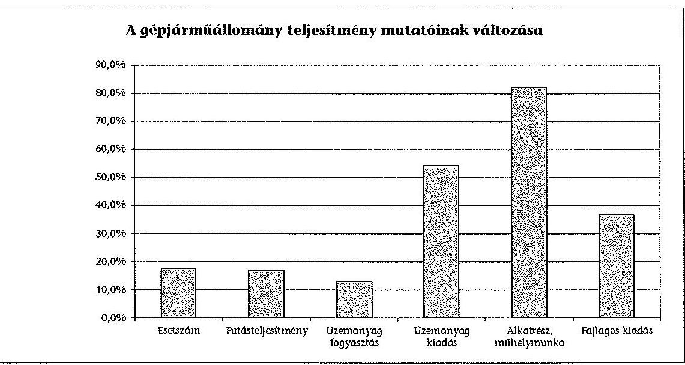

A közvetlen üzemeltetési kiadás (fajlagos kiadás) növekedésének okai az éves futásteljesítmény 16,9%-os növekedése, továbbá az üzemanyag áremelkedésből következően az üzemanyagok kiadás 54,3%-os emelkedése. 2008. január 1-jétől a betegszállítás feladatát nem az OMSz látta el, ennek hatására a futásteljesítmény 32,9 millió kilométerre csökkent. Az ellenőrzött időszak végére a futásteljesítmény a korábbi betegszállítással együtt ellátott feladat szintjére, 38,4 millió km-re emelkedett. A futásteljesítmény változását az esetszám 17,5%-os növekedése és a súlyponti kórházak kialakítása okozta.
Az üzemeltetési költség több mint kétharmadát az üzemanyagok képviselték. Az alkatrészek, felszerelések, saját javítások 10-15% között alakultak. Az üzemeltetési költségek növekedését alapvetően az üzemanyagár emelkedés és a gépjármű állomány elöregedése, a nullára leírt járművek arányának kétszeresére emelkedése okozta.

---

.
