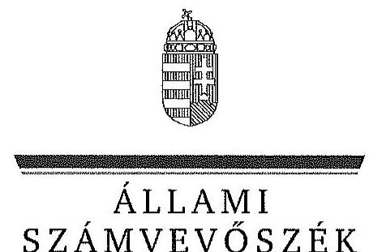
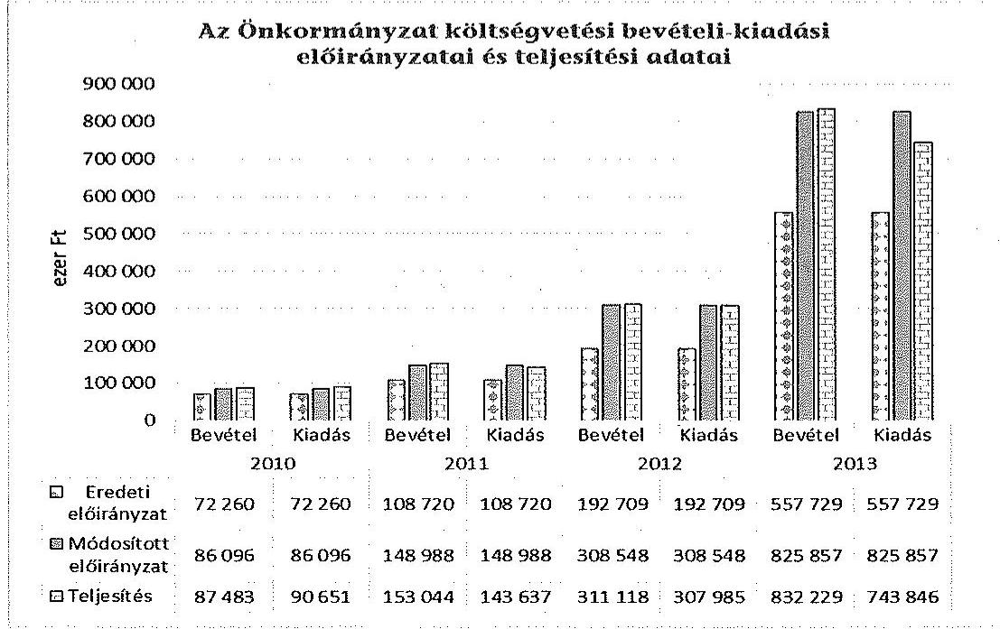
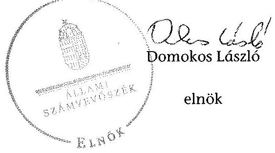

ÁLLAMI
SZÁMVEVŐSZÉK

# JELENTÉS 

Az Országos Nemzetiségi Önkormányzatok gazdálkodásának ellenőrzéséről
Magyarországi Románok Országos Önkormányzata

---

# Állami Számvevőszék 

Iktatószám: V-0696-086/2015.
Témaszám: 1730
Vizsgálat-azonosító szám: V068008

## Az ellenőrzést felügyelte:

## Kisgergely István

felügyeleti vezető

## Az ellenőrzést vezette:

Schósz Attila Ferencné
ellenőrzésvezető
A számvevői jelentések feldolgozásában és a jelentés összeállításában
közremüködtek:
Schósz Attila Ferencné
ellenőrzésvezető
Lucza Anikó
számvevő tanácsos
Az ellenőrzést végezték:

| Lucza Anikó | Kóródi Gábor |
| :-- | :-- |
| számvevő tanácsos | számvevő |

---

# TARTALOMJEGYZÉK 

BEVEZETÉS ..... 3
I. ÖSSZEGZŐ MEGÁLLAPÍTÁSOK, KÖVETKEZTETÉSEK, JAVASLATOK ..... 7
II. RÉSZLETES MEGÁLLAPÍTÁSOK ..... 17

1. A belső kontrollrendszer kialakításának és működtetésének megfelelősége ..... 17
1.1. A kontrollkörnyezet kialakítása ..... 17
1.2. A kockázatkezelési rendszer kialakításának és működtetésének megfelelősége ..... 19
1.3. A kontrolltevékenységek múködésének megfelelősége ..... 19
1.4. Információs és kommunikációs rendszer kialakításának és múködtetésének megfelelősége ..... 21
1.5. Monitoring-rendszer kialakításának és működtetésének megfelelősége ..... 22
2. A gazdálkodás megfelelősége ..... 23
2.1. Pénzügyi gazdálkodás megfelelősége ..... 23
2.2. Vagyongazdálkodással kapcsolatos feladatellátás szabályszerűsége ..... 27
3. Ingyenesen juttatott vagyon kezelésének megfelelősége ..... 30
4. Egyéb feladat- és hatáskör ellátás szabályszerűsége ..... 32
5. Integritás kontrollok ..... 32
6. ÁSZ javaslatok hasznosulása ..... 32
FÜGGELÉKEK
7. számú Rövidítések jegyzéke
8. számú Az integritás kontrollok kialakítása és működtetése

---

.

---

# JELENTÉS 

## Magyarországi Románok Országos Önkormányzatának ellenőrzéséről

## BEVEZETÉS

A Magyarországi Románok Országos Önkormányzata (továbbiakban: Önkormányzat) az 1995. évben alakult, jelenlegi Elnöke 2014. októberiól, Hivatalvezetője 2014. novembertől látja el feladatát. Az ellenőrzött időszakban 25 tagú Közgyűlés a munkája segítésére Úgyrendi Bizottságot, Pénzügyi és Ellenőrző Bizottságot, Oktatási és Ifjúsági Bizottságot, Kulturális és Egyházi Bizottságot, valamint Külügyi és Média Bizottságot hozott létre. Az ellenőrzött időszakban a Hivatalvezetőt munkaviszonyban foglalkoztatták, gazdasági vezető nem volt. A Hivatal 2014. I. félév végén 6 főt teljes-, 3 főt részmunkaidőben foglalkoztatott. Az Önkormányzat 2010-2014. I. félév között egy önállóan múködő intézményt (Dokumentációs és Információs Központ) múködtetett és egy gazdasági társasága (Cronica Nonprofit Kft.) volt, az ellenőrzött időszakban intézményt és gazdasági társaságot nem alapított. Térítésmentes átadás-átvétel nem történt. Az Önkormányzat a 2011-2013. években öt oktatási intézmény fenntartói jogát vállalta át.

Az Önkormányzat költségvetési beszámolója szerint a 2013. évben a módosított költségvetési bevételi és kiadási előirányzat 757684 ezer Ft, a teljesített költségvetési bevétel 758072 ezer Ft, a teljesített költségvetési kiadás 755151 ezer Ft volt. Az Önkormányzat a 2013. évben 755917 ezer Ft államháztartásból származó támogatásban részesült.

Az Alaptörvény XXIX. cikk (1) bekezdése szerint a Magyarországon élő nemzetiségek államalkotó tényezők. Minden, valamely nemzetiséghez tartozó magyar állampolgárnak joga van önazonossága szabad vállalásához és megőrzéséhez. A hazánkban élő nemzetiségek helyi (települési és területi), valamint országos önkormányzatokat hozhatnak létre.

Az országos nemzetiségi önkormányzatok gazdálkodási feladatait az önállóan múködő és gazdálkodó költségvetési szerve, a hivatal látja el. Az országos nemzetiségi önkormányzatok a 2008. évtől tartoznak az államháztartás önkormányzati alrendszerébe, azóta hivatalaik költségvetési szervként múködnek. Az Alaptörvény hatálybalépését követően a 2012. évtől további jelentős jogszabályi változások határozzák meg múködésüket, gazdálkodásukat.

A nemzetiségek helyzete, támogatása mind hazai, mind EU-s szinten kiemelt figyelmet kap napjainkban. Az állam az országos nemzetiségi önkormányzatok múködéséhez, a médiaszolgáltatáshoz kapcsolódó jogaik érvényesítéséhez, valamint a kulturális önigazgatásuk érdekében alapított - közművelődési, közgyűj-

---

teményi, tudományos - intézmények fenntartásához az éves költségvetési törvényekben nevesítetten költségvetési támogatást biztosít. Ezen kívül az országos nemzetiségi önkormányzatok közfeladataik ellátásához támogatást kapnak a fejezeti kezelésű előirányzatokból, valamint hazai és uniós pályázati forrásokat szerezhetnek.

Az ellenőrzés célja annak értékelése volt, hogy az Önkormányzat gazdálkodása, a belső kontrollrendszer kialakítása és múködése, az államháztartásból nyújtott támogatás, illetve az államháztartásból meghatározott célra ingyenesen juttatott vagyon felhasználása a jogszabályi előírásoknak megfelelően tör-tént-e; az Önkormányzat a Nek. tv.-ben és az Njtv.-ben előírt feladat- és hatásköröket ellátta-e, intézkedett-e az ÁSZ által a 2008-2010. évek között végzett ellenőrzések javaslatainak végrehajtásáról.

Az Önkormányzat korrupcióval szembeni veszélyeztetettségének csökkentése érdekében felmértük az integritási szemlélet érvényesülését a gazdálkodási folyamatokban.

Értékeltük az Önkormányzat gazdálkodása során a belső kontrollrendszer kialakítását és múködését mind az öt pillére tekintetében, ellenőriztük a gazdálkodással összefüggő feladat- és hatásköröknek, a Hivatal múködési, gazdálkodási rendjének jogszabályi előírásoknak való megfelelőségét; a belső kontrollok múködésének megfelelőségét az éves költségvetés, a költségvetési beszámoló és a zárszámadás készítés folyamatában; a gazdálkodás pénzügyi folyamatában kulcsszerepet betöltő (szakmai) teljesítésigazolás és 2011-ig utalvány ellenjegyzés, 2012-től érvényesítés kontrolltevékenységek múködésének megfelelőségét; az Önkormányzat belső ellenőrzése kialakításának és működésének megfelelőségét.

Értékeltük továbbá az Önkormányzat gazdálkodása, ezen belül pénzügyi gazdálkodása keretében a tervezés, beszámolási, zárszámadás-készítési folyamat, az előirányzatok betartása, a könyvvezetés, a közzétételek, adatszolgáltatások, valamint az államháztartás rendszeréből jogszabály vagy megállapodás alapján céljelleggel kapott támogatások felhasználásának, elszámolásának szabályszerűségét. A vagyonnal kapcsolatos feladatellátás ellenőrzése keretében értékeltük a vagyongazdálkodás szabályozottságát, a mérleg alátámasztottságát, a leltározás, az eszközbeszerzések, a vagyonhasznosítás, a tulajdonosi joggyakorlás szabályszerűségét és a juttatott támogatások szabályszerűségét. Értékeltük az államháztartásból ingyenesen juttatott vagyon felhasználásának szabályszerűségét. Ellenőriztük az előírt feladat- és hatáskörök közül a vélemény-nyilvánítási, egyetértési jog gyakorlásával, a hatáskör átruházásokkal, az ideiglenes vagyonkezeléssel kapcsolatos feladatok ellátásának szabályszerűségét, az integritás kontrollok múködését, továbbá az előző ÁSZ ellenőrzés javaslatainak hasznosulását.

Az ellenőrzés várható hasznosulása: Az ellenőrzés eredményeként nemcsak az ellenőrzött szerv gazdálkodása javulhat, hanem átfogó képet kaphatunk az önkormányzati alrendszerbe tartozó országos nemzetiségi önkormányzatok gazdálkodásának hiányosságairól, de a jó gyakorlatokról is. Az ellenőrzés megállapításait és javaslatait más szervezetek is hasznosíthatják a rendezett gazdálkodási keretek kialakításához. Az ellenőrzés hozadékát képezi a 2008-2010. években elvégzett ÁSZ ellenőrzés javaslatai hasznosulásának értékelése. Mind a 13

---

országos nemzetiségi önkormányzat ellenőrzésével teljes körűen megvalósul az országos nemzetiségi önkormányzatok ellenőrzése a megváltozott jogszabályi környezetben. Az ellenőrzés tapasztalatai alapján a jogszabályi ellentmondások, hiányosságok feltárásával, azok megszüntetésére vonatkozó javaslatokkal segítjük a jó kormányzást. Az ellenőrzéssel lehetővé tesszük, hogy az országos nemzetiségi önkormányzatok gazdálkodásáról, működéséről a társadalom objektív képet alkothasson.

Az Önkormányzat gazdálkodásának ellenőrzéséről szóló számvevőszéki jelentés I. fejezetének összegző része az ellenőrzés céljára adott rövid, szintetizáló összefoglalót és következtetéseket tartalmazza a II. fejezet részletes megállapításain alapulóan.

A jelentés intézkedést igénylő megállapításait és javaslatait az ellenőrzés során feltárt, a jelentés II. fejezetében rögzített részletes megállapítások alapozzák meg.

Az ellenőrzés típusa: szabályszerűségi ellenőrzés.
Az ellenőrzött időszak: 2010. január 1. - 2014. június 30.
Ellenőrzött szervezet: az Önkormányzat és Hivatala, továbbá azon intézmények, amelyek gazdálkodási feladatait a Hivatal látja el.

Az ellenőrzés végrehajtásának jogszabályi alapját az Állami Számvevőszékről szóló 2011. évi LXVI. törvény 1. § (3) bekezdése, az 5. § (2)-(3) és (6) bekezdései, valamint az államháztartásról szóló 2011. évi CXCV. törvény 61. § (2) bekezdésének előírásai képezik.

Az ellenőrzés módszertana az ÁSZ hivatalos honlapján (www.asz.hu) közzétett szakmai szabályokon alapul, amely a Legfőbb Ellenőrző Intézmények Nemzetközi Szervezete által kiadott nemzetközi standardok figyelembevételével készült.

Az ellenőrzés lefolytatásához az Önkormányzat a kimutatások és a tanúsítványok elektronikus kitöltésével, valamint az ÁSZ által kért dokumentumok elektronikus megküldésével szolgáltatott adatokat. Az így rendelkezésre bocsátott adatok, információk kontrollja és a munkalapok kitöltése az ellenőrzöttnél végzett ellenőrzés keretében történt.

A pénzügyi folyamatokban a kulcskontrollok, a (szakmai) teljesítésigazolás és érvényesítés (2011-ig utalvány ellenjegyzése) múködésének megfelelősége értékeléséhez az egyszerű véletlen mintavétellel kiválasztott tételek ellenőrzését megfelelőségi tesztek útján végeztük el. A személyi juttatások, a dologi kiadások, valamint a pénzeszközátadások felhasználásának szabályszerűségét, a céljelleggel kapott támogatások felhasználásának és elszámolásának szabályszerűségét, a kiadások esetében a gazdálkodási jogkörök gyakorlását mintavétellel, a felhalmozási kiadások esetén a felhasználás szabályszerűségét, a gazdálkodási jogkörök gyakorlását tételesen ellenőriztük.

Megfelelőnek értékeltük a gazdálkodási jogkörök gyakorlását, amennyiben $95 \%$-os bizonyossággal a teljes sokaságban a hibaarány legfeljebb $10 \%$, részben megfelelőnek értékeltük, ha a hibaarány felső határa 10-30\% volt, nem megfelel-

---

lelőnek pedig akkor, ha a hibaarány felső határa a teljes sokaságban meghaladta a $30 \%$-ot. Az egyéb szabályszerűségi (nem pénzgazdálkodási jogkörökre vonatkozó) ellenőrzés során a mintatételek alacsony száma miatt az eredmények nem voltak kivetíthetőek a teljes sokaságra, ezáltal a konkrét mintatételek (dologi és felhalmozási kiadások, pénzeszközátadások felhasználása) értékelését végeztük el. A vagyonhasznosítási bevételeket azok alacsony száma miatt tételesen ellenőriztük.

Az ÁSZ a 2011. évi LXVI. törvény 29. §-a szerint a jelentéstervezetet megküldte a Magyarországi Románok Országos Önkormányzata elnökének egyeztetésre. A Magyarországi Románok Országos Önkormányzatának elnöke az ÁSZ tv. 29. § (2) bekezdésében foglalt észrevételezési jogával nem élt, a törvényes határidőn belül észrevételt nem tett.

---

# I. ÖSSZEGZŐ MEGÁLLAPÍTÁSOK, KÖVETKEZTETÉSEK, JAVASLATOK 

Az ellenőrzött időszakban az Önkormányzatnál a belső kontrollrendszer kialakítása és múködtetése összességében nem volt szabályszerű.

A kontrollkörnyezet kialakítása az Önkormányzat múködését meghatározó jogszabályokkal részben volt összhangban. Az Önkormányzat rendelkezett SzMSz-szel, amely azonban a Hivatal múködésének részletes szabályait nem tartalmazta. A Hivatalnak alapító okirata, valamint SzMSz-e az Áht. ${ }_{1,2}$ előírásaival ellentétesen nem volt. A Hivatal rendelkezett a jogszabályoknak megfelelő számviteli politikával és kapcsolódó szabályzataival, azonban azokat a jogszabályi előírások ellenére az arra jogosult Hivatalvezető helyett az Elnök, valamint a Hivatal gazdasági referense írta alá. Az ellenőrzött időszakban a Számv. tv., az Áhsz. és a 4/2013. (I. 11.) Korm. rendelet előírásával ellentétesen a Hivatal nem rendelkezett számlarenddel és bizonylati renddel. A Hivatal az Ámr. és az Ávr. előírásával ellentétesen nem szabályozta az operatív gazdálkodási jogkörök gyakorlásának módját, az ezeket végző személyek kijelölésének rendjét. A Hivatalvezető a jogszabályokban előírt szabálytalanságok kezelésének eljárásrendjét, ellenőrzési nyomvonalat nem készítette el, valamint nem határozott meg etikai elvárásokat.

A Hivatalvezető az ellenőrzött időszakban az Ámr. és a Bkr. előírásától eltérően kockázatkezelési rendszert nem alakított ki és nem működtetett, a Hivatal tevékenységében, gazdálkodásában rejlő kockázatokat nem mérte fel és nem állapította meg.

A kontrolltevékenységek kialakítása és múködtetése összességében nem felelt meg az előírásoknak. A Hivatalvezető az éves költségvetés, a költségvetési beszámoló és a zárszámadás készítésének folyamatával összefüggésben az Ámr. és a Bkr. szerinti felelősségi köröket nem szabályozta. Nem volt biztosított a folyamatba épített előzetes, utólagos és vezetői ellenőrzés a pénzügyi döntések, a költségvetési gazdálkodás, a gazdasági események elszámolása során. A hiányos szabályozás miatt egyes években a költségvetési és a zárszámadási határozatok tervezetei nem az előírt tartalommal és határidőben kerültek beterjesztésre a Közgyűlés részére. Az Önkormányzat a jogszabályok szerinti operatív gazdálkodási jogköröket nem gyakorolta, a kulcskontrollok múködése az ellenőrzött időszakban nem volt megfelelő.

A Hivatalvezető nem alakította ki a belső kontrollrendszer keretében a szervezet minden szintjén érvényesülő, az Áht. ${ }_{1}$ és a Bkr. szerinti információs és kommunikációs rendszert. Az Önkormányzat nem rendelkezett a jogszabályi előírások ellenére adatvédelmi és adatbiztonsági szabályzattal. A Hivatal az Eisztv. és az Info tv. előírásai ellenére nem tette közzé az Önkormányzat többségi tulajdonában álló gazdálkodó szervezettel, az általa alapított lapokkal, a felette törvényességi ellenőrzést gyakorló szervekkel kapcsolatos adatokat, a 2010-2014. évi költségvetését. Az Önkormányzat által nyújtott támogatások közzétételének elmaradása miatt az Önkormányzat nem biztosította a közpénzek felhasználásának átláthatóságát.

---

A Hivatalvezető az Áht. ${ }_{1}$, az Ámr. és a Bkr. előírásai ellenére az ellenőrzött időszakban nem alakította ki, illetve nem múködtette a hivatali monitoring rendszert.

A Hivatalvezető a belső ellenőrzést 2014. májusig nem alakította ki és nem múködtette az Áht. ${ }_{1,2}$ előírásaival ellentétben. A 2014. I. félév végéig ellenőrzés nem zárult le. A Bkr.-rel ellentétben a belső ellenőri egység jogállását, feladatait hivatali SzMSZ hiányában a Hivatalvezető nem szabályozta. Belső ellenőrzési kézikönyvvel 2014. májusig nem rendelkeztek, ezt követően azt nem a Hivatalvezető, hanem a Közgyűlés hagyta jóvá a jogszabályi előírások ellenére. Az Önkormányzat az ellenőrzött időszakban a Kormányhivatal által folytatott felügyeleti ellenőrzéseket követően a szükséges intézkedéseket megtette.

Az Önkormányzat pénzügyi gazdálkodása részben felelt meg a jogszabályi követelményeknek. A Hivatalvezető a költségvetési határozat-tervezetet a 20102011. és 2014. években nem egyeztette - az Ámr., illetve Ávr. előírásai ellenére a költségvetési szervek vezetőivel. A költségvetési határozatok nem tartalmazták a jogszabályokban előírt szöveges indokolást és előirányzat-felhasználási tervet. Ezen túl a 2013-2014. évi költségvetésekben az előírt feladatok szerinti megbontást, valamint a költségvetés végrehajtásával kapcsolatos hatásköröket nem határozták meg. A Közgyűlés minden évben az előírt határidőn belül elfogadta a költségvetését. Az Önkormányzat az Áht. ${ }_{1,2}$-ben előírtakkal ellentétesen a 2010. évben túllépte a költségvetés módosított kiadási főösszegét, míg a többi évben azon belül gazdálkodott, azonban a 2011-2013. években egyes kiemelt előirányzatok teljesítése meghaladta a jóváhagyott előirányzatokat, amelyeket a személyi juttatások és a dologi kiadások alulteljesítése ellensúlyozott. Az Elnök a 20102013. évi zárszámadáshoz az Önkormányzat és intézményei adatait összevontan tartalmazó egyszerűsített éves beszámolót az Áhsz. és az Áht. ${ }_{2}$ szerinti határidőn túl terjesztette be a Közgyűlésnek. A jogszabályi előírásokat figyelmen kívül hagyva a 2010-2011. évi zárszámadás előterjesztésekor nem mutatták be szöveges indokolással együtt a vagyonkimutatást.

Az Elnök az Ámr.-nek megfelelően a 2010-2011. évi költségvetési és zárszámadási határozat-tervezethez csatolta a könyvvizsgáló írásos véleményét. A Hivatalvezető a jóváhagyott költségvetéseket az Ámr. és Ávr. szerinti határidőn belül nem küldte meg a kisebbségpolitikáért felelős állami szervnek, illetve nem szolgáltatott adatot a Kincstár területileg illetékes szervének. Az Önkormányzat az ellenőrzött időszakban a jogszabályi előírások ellenére az időközi költségvetési jelentéseit nem küldte meg a Kincstárnak.

Az Önkormányzat az államháztartás rendszeréből jogszabály, illetve megállapodás alapján kapott múködési támogatások felhasználása és elszámolása során összességében betartotta az előírásokat. A költségvetésből kapott múködési támogatásról 2013. év végéig nem vezettek elkülönített nyilvántartást, míg az a 2014. évtől megvalósult. Az Önkormányzat az államháztartásból pályázatok alapján, valamint a 2014. évben EU támogatás keretében elnyert céljellegú támogatások esetén betartotta az Áht. ${ }_{1,2}$ előírásait, a felhasználás és elszámolás szabályszerű volt. Az Önkormányzat által - államháztartási forrás terhére - nyújtott támogatások elbírálása, felhasználása és elszámoltatása nem felelt meg a jogszabályi követelményeknek, mivel a támogatások nyújtásáról az arra hatáskörrel rendelkező Közgyűlés helyett az Elnök döntött. A támogatott

---

szervezetek a beszámolási, az Önkormányzat ellenőrzési kötelezettségének nem tett eleget a jogszabályi előírásokat figyelmen kívül hagyva.

Az Önkormányzat vagyongazdálkodásának szabályozottsága részben felelt meg a jogszabályi előírásoknak. Az Önkormányzat SzMSz-ében a Nek. tv. és az Njtv. előírásainak megfelelően meghatározta a törzsvagyonba tartozó vagyonelemek körét, azonban nem határozta meg a tulajdonát képező vagyon használatának szabályait, illetve a használatába adott, egyéb módon rendelkezésére bocsátott vagyon használatára, múködtetésére vonatkozó szabályokat.

Az Önkormányzatnál a mérlegtételek év végi értékelése nem felelt meg a jogszabályi előírásoknak. Az Önkormányzat, a Hivatal és az intézmények a 2010-2013. évi beszámolók eszköz és forrás mérlegsorait teljes körű leltárral nem támasztották alá, illetve az Önkormányzat mérlegét a leltárak és a főkönyvi kivonatok a 2010-2013. években részben támasztották alá a Számv. tv. előírásaival ellentétesen. A Hivatal, a Dokumentációs és Információs Központ az Áhsz. előírása ellenére a 2011. és a 2012. évben leltározást nem végzett. A beszerzéseknél a nyilvántartásba vételre, üzembe helyezésre, leltározásra vonatkozó előírásokat betartották. A 2014. I. félévi beruházásokhoz kapcsolódóan az aktiválást követően az értékcsökkenés elszámolása nem volt szabályszerű.

Az Önkormányzat vagyonhasznosítási tevékenysége nem felelt meg a jogszabályi előírásoknak. Az ellenőrzött időszakban egy új személygépkocsi beszerzése miatt értékesítettek egy nullára leírt személygépkocsit, melynek során nem folytatták le a versenyeztetést a belső szabályzatban foglaltak ellenére, illetve arról nem az arra hatáskörrel rendelkező Közgyűlés, hanem az Elnök döntött.

Az Önkormányzat részére ingyenesen juttatott vagyon kezelése szabályszerű volt az ellenőrzött időszakban. A Nek. tv. szerinti ingyenes vagyonjuttatás keretében kapott ingatlanok az Önkormányzat törzsvagyonát képezték. Az Önkormányzat a 2011-2013. években öt oktatási intézmény fenntartói jogát vállalta át a Közgyűlés határozatának megfelelően a Nek. tv.-ben és az Njtv.-ben biztosított lehetőség alapján. Ebből egy oktatási intézmény ingatlanára az Nvtv. előírásaival ellentétesen vagyonkezelői jogot létesítettek. Az Önkormányzat a vagyonpótlási kötelezettsége teljesítése érdekében ezen ingatlanon végrehajtott felújítás kapcsán közbeszerzési eljárást nem folytatott le, ezáltal nem tartotta be a Kbt. előírásait.

Az Önkormányzat SzMSz-ében rögzítette vélemény-nyilvánítási, egyetértési, közremúködési feladatait. Az Elnök - a Nek. tv.-ben, illetve az Njtv.ben foglaltakat figyelmen kívül hagyva - a Közgyűlés hatáskörét elvonva, annak feladatkör átruházására vonatkozó felhatalmazása nélkül gondoskodott a vélemény-nyilvánítási, egyetértési és közreműködési jog gyakorlásáról.

Az ÁSZ tv. 33. § (1) bekezdésében foglaltak értelmében a jelentésben foglalt megállapításokhoz kapcsolódó intézkedési tervet köteles az ellenőrzött szervezet vezetője összeállítani, és azt a jelentés kézhezvételétől számított 30 napon belül az ÁSZ részére megküldeni. Amennyiben az intézkedési tervet határidőben nem küldi meg a szervezet, vagy az nem elfogadható, az ÁSZ elnöke a hivatkozott törvény 33. § (3) bekezdés a)-b) pontjaiban foglaltakat érvényesítheti.

---

A helyszíni ellenőrzés megállapításainak hasznosítása mellett javasoljuk:

# az Elnöknek 

1. Az Önkormányzat SzMSz-e a Hivatal müködésével kapcsolatos részletes szabályokat nem tartalmazta, ami nem felelt meg a Nek. tv. 39/B. § (1) bekezdésében és az Njtv. 119. § (3) bekezdésében előírtaknak.

Javaslat:
Intézkedjen az Önkormányzat SzMSz-e kiegészítése érdekében.
Az Önkormányzat által - 2010. és 2012. években - nyújtott céljellegú támogatások odaítéléséről nem az arra hatáskörrel rendelkező Közgyűlés, hanem az Elnök hozott döntést, elvonva a Közgyűlés hatáskörét, ami nem felelt meg a Nek. tv. 39/A. § (1) bekezdésében és az Njtv. 119. § (1) bekezdésében foglaltaknak.

Javaslat:
Intézkedjen, hogy a céljellegú támogatások nyújtásáról az arra hatáskörrel rendelkező Közgyűlés döntsön.
2. A vagyonkezelésre átvett iskolai ingatlanon a vagyonpótlás érdekében végrehajtott, a közbeszerzési értékhatárt meghaladó felújítás során az Önkormányzat közbeszerzést nem folytatott le, ezáltal nem tartotta be a Kbt. 5. § és a 19.§ (1) bekezdésében foglaltakat.

Javaslat:
a) Intézkedjen, hogy a jövőben a közbeszerzési értékhatár elérése esetén a közbeszerzési eljárás lefolytatásra kerüljön.
b) Tegyen intézkedéseket a közbeszerzési szabálytalanságok tekintetében a felelősség tisztázása érdekében, és szükség szerint intézkedjen a felelősség érvényesítéséről.
3. A nemzetiségeket érintő jogszabály-tervezeteket az országos nemzetiségi önkormányzatok által 2010-ben létrehozott Országos Nemzetiségek Szövetsége véleményezte, amelynek ülésein az Elnök rendszeresen részt vett. Az Elnök - a Nek. tv. 39/A. § (1) bekezdésében, illetve az Njtv. 119. § (1) bekezdésében foglaltakat figyelmen kívül hagyva - a Közgyűlés hatáskörét elvonva, annak feladatkör átruházására vonatkozó felhatalmazása nélkül gondoskodott a vélemény-nyilvánítási, egyetértési és közreműködési jog gyakorlásáról

Javaslat:
Intézkedjen, hogy a jövőben az Önkormányzat vélemény-nyilvánítási, egyetértési és közreműködési jogosultságának a Közgyűlés hatáskörébe tartozó teljesítését, csak annak felhatalmazása alapján, beszámolási kötelezettség előírásával végezze.

---

# a Hivatalvezetőnek 

A belső kontrollrendszeren belül:

1. A kontrollkörnyezet kialakítása részben volt megfelelő, mivel az Áht. 88. § (2) bekezdése és az Áht. 2 8. § (4) bekezdése előírásával ellentétesen a Hivatal alapító okirattal nem rendelkezett. A Hivatal feladatai ellátásának részletes belső rendjét és módját szervezeti és müködési szabályzatban - az Áht. 91. § (2) bekezdésében, illetve az Áht. 2 10. § (5) bekezdésben foglaltakkal ellentétesen - nem állapította meg. A Hivatal 2014. január 1-ét követően az Ávr. 8. § (1) bekezdés c) pontjával ellentétben gazdasági szervezettel nem rendelkezett.

Javaslat:
Intézkedjen a Hivatal alapító okirata és SzMSz-ének jogszabályban előírt tartalomnak megfelelő elkészítésére, valamint a gazdasági szervezet létrehozása érdekében.
2. A Hivatal számviteli szabályzatait (számviteli politikát, leltározási és leltárkészítési, az eszközök hasznosítási és selejtezési, értékelési, valamint pénzkezelési szabályzat) az arra jogosult Hivatalvezető helyett az Elnök, valamint a Hivatal gazdasági referense írta alá az Áhsz. 8. § (12) és 37. § (5) bekezdése, valamint a 4/2013. (I. 11.) Korm. rendelet 50. § (1) bekezdése előírása ellenére.

Javaslat:
Intézkedjen a számviteli szabályzatok szabályszerű kiadmányozására.
3. Az ellenőrzött időszakban a Hivatal nem rendelkezett számlarenddel a Számv. tv. 161. § (1) bekezdésében, az Áhsz. 49. § (1) bekezdésében, valamint a 4/2013. (I. 11.) Korm. rendelet 51. § (2) bekezdésében foglaltaktól eltérően. A Hivatalnak a Számv. tv. 161. § (2) bekezdés d) pontja és az Áhsz. 51. § (1) bekezdés b) pontja előírása ellenére nem volt bizonylati rendje.

Javaslat:
Intézkedjen a Hivatal számlarendje és bizonylati rendje elkészítése érdekében.
A Hivatal az Ámr. 20. § (3) bekezdés a) pontjában és az Ávr. 13. § (2) bekezdés a) pontjában foglaltak ellenére belső szabályzatában nem rendezte a kötelezettségvállalás, ellenjegyzés, (szakmai) teljesítés igazolása, érvényesítés, utalványozás gyakorlásának módjával, és az ezeket végző személyek kijelölésének rendjével kapcsolatos előírásokat. A Hivatal nem rendelkezett az Ámr. 20. § (3) bekezdés b)-c), f)-h) pontjaitól és az Ávr. 13. § (2) bekezdés b)-c), e)-g) pontjaitól eltérően a beszerzések lebonyolításának, a belföldi és külföldi kiküldetések elszámolásának, a reprezentációs kiadások elszámolásának, valamint a gépjárművek, a vezetékes és rádiótelefonok használatának rendjére vonatkozó szabályozással.

---

Javaslat:
Intézkedjen a Hivatal gazdálkodásával - így különösen a kötelezettségvállalás, ellenjegyzés, a teljesítésigazolás, az érvényesítés, utalványozás gyakorlásának módjával, valamint az ezeket végző személyek kijelölésének rendjével - kapcsolatos belső szabályozás kialakítása érdekében.
4. A Hivatalvezető - az Ámr. 156. § (2) bekezdése és a Bkr. 6. § (3) bekezdése előírásaitól eltérően - nem készítette el a Hivatal felelősségi és információs szintjeit és kapcsolatait, az irányítási és ellenőrzési folyamatokat leíró ellenőrzési nyomvonalat. A Hivatalvezető az Ámr. 161. §-a (2011-től a 156. § (3) bekezdése), illetve a Bkr. 6. § (4) bekezdése előírását figyelmen kívül hagyva a szabálytalanságok kezelésének eljárásrendjét nem készítette el. A Hivatal 2010-2014. I. félévére vonatkozóan nem határozott meg etikai elvárásokat az Ámr. 156. § (1) bekezdés c) pontjában, illetve a Bkr. 6. § (1) bekezdés c) pontjában foglaltak ellenére.

Javaslat:
Intézkedjen a jogszabály előírásainak megfelelő ellenőrzési nyomvonal elkészítése, a szabálytalanságok kezelésének eljárásrendje és az etikai elvárások belső szabályozásának kialakítása érdekében.
5. A kockázatkezelési rendszer kialakítása és múködtetése nem felelt meg a jogszabályi előírásoknak, mivel a Hivatalvezető - az Ámr. 157. § (2)-(3) bekezdéseiben, valamint a Bkr. 7. § (2) bekezdésében foglalt előírás ellenére - nem mérte fel és nem állapította meg a Hivatal tevékenységében, gazdálkodásában rejlő kockázatokat, nem határozta meg az egyes kockázatokkal kapcsolatban a szükséges intézkedéseket és megtételük módját, valamint (a 2012. évtől) azok teljesítésének folyamatos nyomon követési módját.

Javaslat:
Végezze el a kockázati tényezők figyelembe vételével a jogszabály előírásainak megfelelő kockázatelemzést, mérje fel és határozza meg a Hivatal tevékenységében, gazdálkodásában rejlő kockázatokat, valamint az egyes kockázatokkal kapcsolatban a szükséges intézkedéseket, valamint azok teljesítésének folyamatos nyomon követési módját.
6. A kontrolltevékenységek kialakítása és múködtetése nem volt megfelelő. A Hivatalvezető belső szabályzatban nem határozta meg az Ámr. 158. § (2) bekezdés b) pontjában foglaltak ellenére az információkhoz való hozzáférést, illetve a Bkr. 8. § (4) bekezdés b) pontjában foglaltak ellenére a dokumentumokhoz és információkhoz való hozzáférésre vonatkozó felelősségi köröket. A rendszeres és nem rendszeres, valamint külső személyi juttatások, a dologi és felhalmozási kiadások, valamint a pénzeszközátadások teljesítése során a gazdálkodási jogkörök (szakmai teljesítésigazolás, érvényesítés, utalványozás és utalvány ellenjegyzés) gyakorlása nem felelt meg az Ámr. 76. § (1) és (3) bekezdéseiben, 78. § (1)-(2) bekezdéseiben, 79. § (2) bekezdésében, illetve az Áht. 2 38. § (1) bekezdésében, az Ávr. 57. § (1) bekezdésében, 58. § (1)-(2) bekezdéseiben foglalt előírásoknak. Az Áht. 1 121/A. § (4) bekezdése (2010. december 31ig az Áht. 1 121. § (1) bekezdése) és a Bkr. 8. § (2) bekezdése előírásától eltérően a Hivatalvezető nem biztosította a folyamatba épített előzetes, utólagos és vezetői el-

---

lenőrzést a pénzügyi döntések dokumentumainak elkészítése, a költségvetési gazdálkodás pénzügyi ellenőrzése, valamint a gazdasági események szabályszerű elszámolása vonatkozásában.

Javaslat:
a) Intézkedjen a dokumentumokhoz és információkhoz való hozzáféréssel kapcsolatos felelősségi körök meghatározásáról.
b) Intézkedjen a gazdálkodási jogkörök szabályszerű gyakorlásának érvényesítéséről.
c) Intézkedjen a folyamatba épített előzetes, utólagos és vezetői ellenőrzés biztosítása érdekében.
7. A Hivatalvezető nem alakította ki és nem működtette a szervezet minden szintjén érvényesülő, az Áht. 1 121. (2) bekezdés d) pontjában (2010. december 31-ig az Áht. 1 120/B. § (2) bekezdés d) pontjában), valamint a Bkr. 3. § d) pontjában és a 9. § (1) bekezdésében szabályozott információs és kommunikációs rendszert.

A Hivatalvezető belső szabályzatban nem rögzítette az 1992. évi LXIII. tv. 20. § (8) bekezdése, az Info. tv. 30. § (6) bekezdése szerinti, a közérdekű adatok megismerésére irányuló igények teljesítésének rendjét, valamint az Ámr. 20. § (3) bekezdés i) pontja, az Ávr. 13. § (2) bekezdés h) pontja és az Info tv. 35. § (3) bekezdése szerinti, a kötelezően közzéteendő adatok nyilvánosságra hozatalának rendjét. A Hivatal az Eisztv. 6. § (1) bekezdésében és az Info tv. 37. § (1) bekezdésében meghatározott közzétételi kötelezettségének nem tett maradéktalanul eleget, mivel nem tette közzé az Önkormányzat többségi tulajdonában álló gazdálkodó szervezettel, az általa alapított lapokkal, valamint a felette törvényességi ellenőrzést gyakorló szervekkel kapcsolatos adatokat, továbbá a 2010-2014. évi költségvetéseit. Az államháztartási forrás terhére nyújtott támogatásokat az Önkormányzat az Áht. 1 15/A. § (1) bekezdésében és az Info tv. 37. § (1) bekezdésében hivatkozott 1. számú mellékletben előírtak ellenére nem tette közzé, ezáltal nem biztosította a közpénzek felhasználásának átláthatóságát.

Az Önkormányzat nem rendelkezett az 1992. évi LXIII. tv. 31/A. § (3) bekezdésében és az Info tv. 24. § (3) bekezdése szerinti adatvédelmi és adatbiztonsági szabályzattal.

Javaslat:
a) Intézkedjen a közérdekű adatok megismerésére irányuló igények teljesítésének rendjére, a kötelezően közzéteendő adatok nyilvánosságra hozatalának rendjére, valamint az adatvédelemre és adatbiztonságra vonatkozó belső szabályzat elkészítése érdekében.
b) Intézkedjen a jogszabályban meghatározott közzétételi kötelezettség hiánytalan teljesítése érdekében.
8. A Hivatalvezető az Áht. 1 121. § (2) bekezdés e) pontjában és a Bkr. 3. § e) pontjában és a 10. §-ban foglaltak ellenére az ellenőrzött időszakban nem alakította ki, illetve az Ámr. 160. §-ában és a Bkr. 3. § e) pontjában foglaltak ellenére nem müködtette a Hivatal tevékenységének, a célok megvalósításának nyomon követését biztosító monitoring rendszert. A Hivatal vezetője az Ámr. 217. § c) pontja alapján a 21. számú

---

mellékletben, illetve a Bkr. 11. § (1) bekezdése alapján az 1. számú mellékletben foglaltak szerinti nyilatkozatban nem értékelte a belső kontrollrendszer minőségét.

Javaslat:
a) Alakítsa ki a Hivatal tevékenységének, a célok megvalósításának nyomon követését biztosító rendszert és gondoskodjon annak müködtetéséről.
b) Értékelje a jogszabályban előírt nyilatkozatban a belső kontrollrendszer minőségét.
9. A 2014. májustól hatályos belső ellenőrzési kézikönyvet a Bkr. hivatkozott előírásától eltérően nem Hivatalvezető hagyta jóvá, hanem a Közgyűlés.

Javaslat:
Hagyja jóvá a belső ellenőrzési kézikönyvet.
A pénzügyi- és vagyongazdálkodás területén
10. A Hivatalvezető a költségvetési határozat-tervezetet a 2010. és 2011. években az Ámr. 36. § (3) bekezdésében előírtak ellenére, továbbá 2014. évben az Ávr. 27. § (1) és a 29. § (2) bekezdéseiben foglalt előírásokat figyelmen kívül hagyva nem egyeztette a költségvetési szervek vezetőivel.

Javaslat:
Intézkedjen annak érdekében, hogy a költségvetési határozat-tervezetek minden évben egyeztetésre kerüljenek a költségvetési szervek vezetőivel.
11. A Hivatalvezető a Közgyűlés által jóváhagyott - az Önkormányzatra és költségvetési szerveire vonatkozó - 2010-2011. évi elemi költségvetéseket az Ámr. 52. § (4) bekezdésében foglalt előírás ellenére nem küldte meg a kisebbségpolitikáért felelős állami szervnek, illetve a 2012-2014. évi jóváhagyott elemi költségvetésről az Ávr. 33. § (1)(2) bekezdéseiben foglaltakkal szemben nem szolgáltatott adatot a Kincstár területileg illetékes szervének.

Javaslat:
Küldje meg az elemi költségvetéseket az előírásoknak megfelelően a Kincstárnak.
12. A 2013. és 2014. évi költségvetések tartalmukat tekintve nem feleltek meg az Áht. 2 23. § (2) bekezdés a), b) és h) pontjának, mivel az előírt kötelező, önként vállalt és államigazgatási feladatok szerinti megbontás nem történt meg, valamint a költségvetés végrehajtásával kapcsolatos hatásköröket nem határozták meg. Az Áht. 2 24. § (4) bekezdésben foglaltak ellenére az Önkormányzat költségvetési mérlegéhez szöveges indoklás, illetve a 24. § (4) bekezdés a) pontja ellenére előirányzat-felhasználási terv nem készült.

Javaslat:
Intézkedjen, hogy a költségvetési határozat-tervezeteket a jogszabályban meghatározottak szerint készítsék el.

---

13. A 2011-2013. években az Áht. 1 12/A. § (1) bekezdésében és az Áht. 2 6. § (1) bekezdésében előírtakkal ellentétesen egyes kiemelt előirányzatok tekintetében minden évben volt előirányzat-túllépés (2010-ben dologi kiadások, egyéb működési célú kiadások, 2012-ben egyéb működési célú kiadások, beruházások esetében), illetve előirányzat nélküli teljesítés (2011-ben ingatlan felújítás, 2012-ben működési célú pénzeszköz átadás, működési kölcsön nyújtása, beruházás, 2013-ban működési célú kölcsön nyújtása).

Javaslat:
Intézkedjen a kiadások előirányzatot meghaladó várható teljesítése esetében az előirányzatok módosítása, az előirányzattal nem rendelkező várható kiadások előirányzatosítása, és a módosítások Közgyűlés részére való beterjesztése érdekében.
14. A 2012-2013. évi költségvetési beszámolókat az Áhsz. 10. § (8), és a 4/2013. (I. 11.) Korm. rendelet 32. § (4) bekezdésében foglalt előírás ellenére a február 28-i határidő lejártát követő tíz naptári napot lényegesen (több hónappal) meghaladva küldték meg.

Javaslat:
Intézkedjen a beszámolók Kincstár részére határidőben való megküldéséről.
15. Az Önkormányzat az ellenőrzött időszakban az Ámr. 205. § (1) bekezdésében és az Ávr. 169. § (2) bekezdésében előírtak ellenére nem küldte meg időközi költségvetési jelentéseit a Kincstár területileg illetékes szervének.

Javaslat:
Intézkedjen a jogszabályban előírt, a költségvetési jelentésre vonatkozó adatszolgáltatás teljesítéséről a Kincstár részére.
16. Az Önkormányzat a támogatásokkal kapcsolatos ellenőrzési kötelezettségének nem tett eleget az Áht. 1 13/A. § (2) bekezdésének, az Ávr. 80. § (1) bekezdésének, illetve az Áht. 2 53. § (1) bekezdésének előírásait figyelmen kívül hagyva.

Javaslat:
Intézkedjen a támogatások felhasználásának jogszabályban előírt ellenőrzéséről.
17. Az Önkormányzat, a Hivatal és az intézmények a 2010-2013. évi beszámolók eszköz és forrás mérlegsorait teljes körű leltárral nem támasztották alá, amely nem felelt meg a Számv. tv. 69. § (1) bekezdésben, az Áhsz. 37. § (1) és (3) és a 4/2013. (I. 11.) Korm. rendelet 22. § (1) bekezdésében foglaltaknak. Mindezek következtében sérült a Számv. tv. 15. § (3) bekezdésben foglalt valódiság elve.

Javaslat:
Intézkedjen a mérleg tételeinek alátámasztására szolgáló leltár elkészíttetéséről, amely az eszközök és források állományát tételesen és ellenőrizhető módon tartalmazza.

---

18. Az értékcsökkenés elszámolása 2014. I. félévben nem volt szabályszerű a beruházások aktiválását követően, mivel az értékcsökkenés elszámolására nem az üzembe helyezés időpontjától került sor a Számv. tv. 52. § (7) bekezdésében foglaltakkal szemben.

Javaslat:
Intézkedjen az értékcsökkenés jogszabályi előírásoknak megfelelő elszámolása érdekében.

---

# II. RÉSZLETES MEGÁLLAPÍTÁSOK 

## 1. A BELSŐ KONTROLLRENDSZER KIALAKÍTÁSÁNAK ÉS MŰKÖDTETÉSÉNEK MEGFELELŐSÉGE

Az ellenőrzött időszakban az Önkormányzatnál a belső kontrollrendszer (a kontrollkörnyezet, a kockázatkezelési rendszer, a kontrolltevékenységek, az információs és kommunikációs rendszer, valamint a monitoring rendszer) kialakítása és müködtetése összességében nem felelt meg a jogszabályi előírásoknak.

### 1.1. A kontrollkörnyezet kialakítása

A kontrollkörnyezet kialakítása az Önkormányzat működését meghatározó jogszabályokkal részben volt összhangban.

Az Önkormányzat 2010-2014. I. félév között a Nek. tv. és az Njtv. előírásainak megfelelő SzMSz-szel rendelkezett - a Hivatal működésével kapcsolatos szabályok kivételével -, melyet a Közgyűlés az ellenőrzött időszakban 2010-ben, 2011ben és 2012-ben aktualizált. Az Önkormányzat az SzMSz 2010. és 2011. évi módosításait a Nek. tv. 39/G. § (4) bekezdésében előírtak ellenére sem 45 napon belül, sem ezt követően a Magyar Közlönyben, illetve a 2012. évi módosítást az Info tv. 37. § (1) bekezdésében foglalt előírás ellenére nem tette közzé.

Az SzMSz a Vnytv.-nek megfelelően szabályozta a vagyonnyilatkozat-tételre kötelezettek körét. A képviselők a Nek. tv. és az Njtv. előírásainak eleget téve, az ellenőrzött időszak minden évében leadták vagyonnyilatkozatukat, azonban részben (évente 2-3 fő) az SzMSz-ben rögzített határidőn túl.

A Hivatal az Áht. ${ }_{1}$ 88. § (2) bekezdése ${ }^{1}$ és az Áht. ${ }_{2}$ 8. § (4) bekezdése előírásával ellentétesen alapító okirattal nem rendelkezett, az alapításról közgyűlési határozat állt rendelkezésre. A Kincstár a 16/2009. (VI.27.) számú közgyűlési határozat alapján a Hivatalt költségvetési szervként törzskönyvi nyilvántartásába vette.

A Hivatal feladatai ellátásának részletes belső rendjét és módját szervezeti és müködési szabályzatban - az Áht. ${ }_{1}$ 91. § (2) bekezdésében ${ }^{2}$, illetve az Áht. ${ }_{2}$ 10. § (5) bekezdésben foglaltakkal ellentétesen - nem állapította meg. Az Önkormányzat SzMSz-e a Hivatal müködésével kapcsolatos részletes szabályokat nem tartalmazta, ami nem felelt meg a Nek. tv. 39/B. § (1) bekezdésében és az Njtv. 119. § (3) bekezdésében előírtaknak. A hatáskörök és felelősségek megállapítására kizárólag a dolgozók Munka tv. ${ }_{1,2}$-ben előírtaknak megfelelő munkaköri leírásában foglaltak voltak irányadóak.

[^0]
[^0]:    ${ }^{1}$ Az Áht. 1 88. § (1)-(2) bekezdései 2010. augusztus 14-ig közvetett módon tették kötelezővé a költségvetési szerv alapító okiratának meglétét.
    ${ }^{2}$ 2010. augusztus 15 -től hatályos

---

Az Önkormányzat gazdálkodásának szabályozottsága az ellenőrzött években az előírásoknak részben felelt meg.

A Hivatal - a Számv. tv., az Áhsz. és a 4/2013. (I. 11.) Korm. rendelet előírásaival összhangban - rendelkezett számviteli politikával, leltározási és leltárkészítési, az eszközök hasznosítási és selejtezési, értékelési, valamint pénzkezelési szabályzattal, azonban azokat az arra jogosult Hivatalvezető helyett az Elnök, valamint a Hivatal gazdasági referense írta alá az Áhsz. 8. § (12) és 37. § (5) bekezdése, valamint a 4/2013. (I. 11.) Korm. rendelet 50. § (1) bekezdése előírása ellenére. Az ellenőrzött időszakban a Számv. tv. 161. § (1) bekezdésében, az Áhsz. 49. § (1) bekezdésében, valamint a 4/2013. (I. 11.) Korm. rendelet 51. § (2) bekezdésében foglaltaktól eltérően a Hivatal nem rendelkezett számlarenddel. A Hivatalnak a Számv. tv. 161. § (2) bekezdés d) pontja és az Áhsz. 51. § (1) bekezdés b) pontja előírásaiban foglaltak ellenére nem volt bizonylati rendje.

A Hivatal és az Önkormányzat gazdasági eseményeinek könyvvezetése a 20102012. években nem különült el, a Hivatal kiadásait és bevételeit az Önkormányzat kiadásaként, bevételeként számolták el, ami a 2011. évtől nem felelt meg az Áhsz. 8. § (11) bekezdésében ${ }^{3}$ foglaltaknak. A Dokumentációs és Információs Központ könyvvezetése mind az Önkormányzat, mind a Hivatal könyvvezetésétől a teljes ellenőrzött időszakban, míg a Hivatal és az Önkormányzat könyvvezetése a 2013. évtől elkülönült.

A Hivatal az Ámr. 20. § (3) bekezdés a) pontjában és az Ávr. 13. § (2) bekezdés a) pontjában foglaltak ellenére belső szabályzatában nem rendezte a kötelezettségvállalás, ellenjegyzés, (szakmai) teljesítés igazolása, érvényesítés, utalványozás gyakorlásának módjával, és az ezeket végző személyek kijelölésének rendjével kapcsolatos előírásokat. A Hivatal nem rendelkezett az Ámr. 20. § (3) bekezdés b)-c), f)-h) pontjaitól és az Ávr. 13. § (2) bekezdés b)-c), e)-g) pontjaitól eltérően a beszerzések lebonyolításának, a belföldi és külföldi kiküldetések elszámolásának, a reprezentációs kiadások elszámolásának, valamint a gépjárművek, a vezetékes és rádiótelefonok használatának rendjére vonatkozó szabályozással.

A Hivatalvezető az Ámr. 156. § (3) bekezdésében ${ }^{4}$ és a Bkr. 6. § (4) bekezdésében előírt szabálytalanságok kezelésének eljárásrendjét nem készítette el. A Hivatal 2010-2014. I. félévére vonatkozóan nem határozott meg etikai elvárásokat az Ámr. 156. § (1) bekezdés c) pontjában, illetve a Bkr. 6. § (1) bekezdés c) pontjában foglaltak ellenére.

A Közgyűlés, mint irányító szerv intézményei tekintetében részben kidolgozta az Áht. ${ }_{1,2}$ szerinti, a közfeladatok ellátására vonatkozó, az erőforrásokkal való szabályszerű és hatékony gazdálkodáshoz szükséges követelményeket.

A Hivatal, valamint az Önkormányzat intézménye, a Dokumentációs és Információs Központ az ellenőrzött időszakban megállapodásban nem rögzítették a gazdálkodással kapcsolatos munkamegosztás és felelősségvállalás rendjét az Ámr. 16. § (4) bekezdésével, valamint az Ávr. 10. § (4) bekezdésével ellentétben. A számviteli

[^0]
[^0]:    ${ }^{3}$ 2010. december 31-ig nem írta elő jogszabály az elkülönített könyvvezetést.
    ${ }^{4}$ 2010. december 31-ig az Ámr. 161. §-a szabályozta.

---

politikában és a pénzügyi-számviteli szabályzatokban foglalt rendelkezések hatálya kiterjedt a hozzárendelt költségvetési szervekre.

Az Önkormányzat éves költségvetési határozatában biztosította az irányítása alá tartozó költségvetési szervei számára a feladatai ellátásához szükséges létszámot és múködési előirányzatot. A biztosított források felhasználásáról az éves beszámolókban elszámoltak. A kiadók, valamint az oktatási intézmények az Önkormányzat által nyújtott támogatásról évente elszámoltak az Önkormányzat felé, aki az elszámolásokat elfogadta.

Az ellenőrzött időszakban a Hivatal nem rendelkezett gazdasági szervezettel. Az Ámr. 17. § (4) bekezdése és az Ávr. 11. § (4a) bekezdése alapján gazdasági szervezet és gazdasági vezető hiányában a gazdálkodási feladatok ellátásáért 2013ig a Hivatalvezető felelt. A Hivatal 2014-től saját gazdasági szervezetet nem hozott létre az Ávr. 8. § (1) bekezdés c) pontjával ellentétben. A gazdálkodási feladatok ellátását munkaszerződése és munkaköri leírása szerint ún. gazdasági referens végezte, akinek a végzettsége, gyakorlata megfelelt az Ámr.-ben, illetve az Ávr.-ben előírt követelményeknek.

A Hivatalvezető - az Ámr. 156. § (2) bekezdése és a Bkr. 6. § (3) bekezdése előírásaitól eltérően - nem készítette el a Hivatal felelősségi és információs szintjeit és kapcsolatait, az irányítási és ellenőrzési folyamatokat leíró ellenőrzési nyomvonalat.

A Hivatalvezető az Ámr. 105. § (2) bekezdésében és az Ávr. (2013. év végéig hatályos) 7. § (4) bekezdésében előírt végzettséggel nem rendelkezett.

# 1.2. A kockázatkezelési rendszer kialakításának és múködtetésének megfelelősége 

A Hivatalvezető az ellenőrzött időszakban az Áht. ${ }_{1}$ 121. § (2) bekezdés b) pontja ${ }^{5}$, az Ámr. 155. § (1) és a 157. § (1) bekezdése, valamint a Bkr. 3. § b) pontja és 7. § (1) bekezdése előírásától eltérően kockázatkezelési rendszert nem alakított ki és nem múködtetett.

A Hivatalvezető - az Ámr. 157. § (2) és a Bkr. 7. § (2) bekezdésében foglalt előírás ellenére - nem végzett a kockázati tényezők figyelembe vételével kockázatelemzést, nem mérte fel és nem állapította meg a Hivatal tevékenységében, gazdálkodásában rejlő kockázatokat. A Hivatalvezető az Ámr. 157. § (3) bekezdésében és a Bkr. 7. § (2) bekezdésében foglalt előírás ellenére nem határozta meg az egyes kockázatokkal kapcsolatban a szükséges intézkedéseket, valamint - a Bkr. jelzett előírása ellenére - azok teljesítésének folyamatos nyomon követési módját.

### 1.3. A kontrolltevékenységek múködésének megfelelősége

A kontrolltevékenységek kialakítása és múködtetése összességében nem felelt meg az előírásoknak.

[^0]
[^0]:    ${ }^{5}$ 2010. december 31-ig az Áht. ${ }_{1}$ 120. § (2) bekezdés b) pontja szabályozta.

---

Az éves költségvetés, a költségvetési beszámoló és a zárszámadás készítés során a folyamatok belsö kontrolljai a hiányos szabályozás ellenére részben megfelelően múködtek.

A Hivatalvezető belső szabályzatban nem határozta meg az Ámr. 158. § (2) bekezdés b) pontjában foglaltak ellenére az információkhoz való hozzáférést, illetve a Bkr. 8. § (4) bekezdés b) pontjában foglaltak ellenére a dokumentumokhoz és információkhoz való hozzáférésre vonatkozó felelősségi köröket.

Az Áht. ${ }_{1}$ 121/A. § (4) bekezdése ${ }^{6}$ és a Bkr. 8. § (2) bekezdése előírásától eltérően a Hivatalvezető nem biztosította a folyamatba épített előzetes, utólagos és vezetői ellenőrzést a pénzügyi döntések dokumentumainak elkészítése, a költségvetési gazdálkodás pénzügyi ellenőrzése, valamint a gazdasági események szabályszerű elszámolása vonatkozásában.

A folyamatok belső kontrolljai a hiányos szabályozás miatt nem minden évben biztosították, hogy az éves költségvetési határozatok tervezetei és a zárszámadási határozatok tervezetei a jogszabályokban előírt tartalommal és határidőben kerüljenek a Közgyűlés elé beterjesztésre.

A költségvetési beszámoló elkészítésével megbízott személy rendelkezett a Számv. tv. és az Ávr. által előírt képesítéssel.

Az Önkormányzat, valamint a Hivatal és a Dokumentációs és Információs Központ - elsősorban a megfelelő szabályozás hiányában - a jogszabályok szerinti operatív gazdálkodási jogköröket nem gyakorolta, így a kulcskontrollok múködése (a rendszeres és nem rendszeres, valamint külső személyi juttatások, dologi és felhalmozási kiadások, pénzeszközátadások esetében) nem volt megfelelő az ellenőrzött időszakban.

A 2010-2011. években a szakmai teljesítésigazolás és utalvány ellenjegyzés kulcskontrollok működése nem volt megfelelő, mivel:

- a szakmai teljesítésigazolást az Ámr. 76. § (1) bekezdésében foglalt előírás ellenére nem vagy nem az Ámr. 76. § (3) bekezdésében foglaltaknak megfelelően végezték el (a kifizetés bizonylata nem tartalmazott utalást a teljesítés tényére, illetve a bizonylatról hiányzott az igazolás dátuma). Mindezek következtében az Ámr. 76. § (1) bekezdésében foglaltaktól eltérően a kifizetéseket megelőzően nem győződtek meg a kiadások teljesítésének jogosságáról, öszszegszerűségéről;
- az utalvány ellenjegyzésére nem került sor az Ámr. 79. § (2) bekezdésében foglaltaktól eltérően, ezáltal nem győződtek meg a szakmai teljesítésigazolás elvégzéséről, az érvényesítés megtörténtéről. Utalványozást az Ámr. 78. § (1)(2) bekezdéseivel ellentétesen nem végeztek.

A 2012-2013. években, valamint 2014. I. félévben a teljesítésigazolás és érvényesítés kulcskontrollok múködése (a rendszeres és nem rendszeres, valamint külső

[^0]
[^0]:    ${ }^{6}$ 2010. december 31-ig az Áht. 121. § (1) bekezdése szabályozta.

---

személyi juttatások, dologi és felhalmozási kiadások, pénzeszközátadások esetében) továbbra sem volt megfelelő, mivel:

- a kifizetéseket megelőzően teljesítésigazolást az Áht. 2 38. § (1) bekezdésében és az Ávr. 57. § (1) bekezdésében foglaltak ellenére nem végeztek, ezáltal nem történt meg a kifizetés jogosságának, összegszerűségének és a szerződésszerű teljesítésnek az igazolása;
- érvényesítés nem történt, ezáltal az Ávr. 58. § (1)-(2) bekezdésekben foglaltak ellenére nem történt meg az összegszerűség, a fedezet megléte, valamint a megelőző ügymenetben az Áht.2, és az Áhsz., illetve a 4/2013. (I. 11.) Korm. rendelet előírásai betartatásának az ellenőrzése, a jogszabályok esetleges megsértése esetén annak utalványozó részére való jelzése.

A kötelezettségvállalásokról a Hivatal 2013. év végéig analitikus nyilvántartást nem vezetett az Ámr. 75. § (1) bekezdésével és az Ávr. 56. § (1) bekezdésével ellentétben.

# 1.4. Információs és kommunikációs rendszer kialakításának és múködtetésének megfelelősége 

A Hivatalvezető nem alakította ki a belső kontrollrendszer keretében a szervezet minden szintjén érvényesülő, az Áht.; 121. (2) bekezdés d) pontjában ${ }^{7}$, valamint a Bkr. 3. § d) pontjában és a 9. § (1) bekezdésében szabályozott információs és kommunikációs rendszert.

A Hivatalvezető belső szabályzatban nem rögzítette az 1992. évi LXIII. tv. 20. § (8) bekezdése, az Info. tv. 30. § (6) bekezdése ${ }^{8}$ szerinti, a közérdekú adatok megismerésére irányuló igények teljesítésének rendjét, valamint az Ámr. 20. § (3) bekezdés i) pontja, az Ávr. 13. § (2) bekezdés h) pontja és az Info tv. 35. § (3) bekezdése szerinti, a kötelezően közzéteendő adatok nyilvánosságra hozatalának rendjét. A Hivatal az Eisztv. 6. § (1) bekezdésében és az Info tv. 37. § (1) bekezdésében meghatározott közzétételi kötelezettségének nem tett maradéktalanul eleget, mivel nem tette közzé az Önkormányzat többségi tulajdonában álló gazdálkodó szervezettel, az általa alapított lapokkal, valamint a felette törvényességi ellenőrzést gyakorló szervekkel kapcsolatos adatokat. Az Önkormányzat nem rendelkezett az 1992. évi LXIII. tv. 31/A. § (3) bekezdésében és az Info tv. 24. § (3) bekezdése szerinti adatvédelmi és adatbiztonsági szabályzattal.

Az Önkormányzat az ellenőrzött időszakban rendelkezett az Ltv. szerinti iratkezelési szabályzat ${ }_{1,2}$-vel. A Hivatal az Ikr. rendelkezésének megfelelően az iratforgalom iktatókönyvben való dokumentálásával biztosította, hogy az ügyintézés folyamata, az iratok útja követhető és ellenőrizhető, az iratok holléte megállapítható legyen. Az iratkezelésre vonatkozóan az ellenőrzött időszakban sem külső, sem belső ellenőrzés nem történt.

[^0]
[^0]:    ${ }^{7}$ 2010. december 31-ig az Áht. 1 120/B. § (2) bekezdés d) pontja szabályozta.
    ${ }^{8}$ Ezt szabályozta az Ámr. 20. § (3) bekezdés i) pontja és az Ávr. 13. § (2) bekezdés h) pontja is.

---

# 1.5. Monitoring-rendszer kialakításának és múködtetésének megfelelősége 

A Hivatalvezető az Áht. ${ }_{1}$ 121. § (2) bekezdés e) pontjában ${ }^{9}$ és a Bkr. 3. § e) pontjában és a 10. §-ban foglaltak ellenére az ellenőrzött időszakban nem alakította ki, illetve az Ámr. 160. §-ában és a Bkr. 3. § e) pontjában foglaltak ellenére nem müködtette a Hivatal tevékenységének, a célok megvalósításának nyomon követését biztosító monitoring rendszert.

Ellenőrzési nyomvonal hiányában a felelősségi és információs szintek és kapcsolatok, az irányítási és ellenőrzési folyamatok nyomon követése és utólagos ellenőrzése nem volt lehetséges.

A monitoring rendszer nem megfelelő kialakítása és múködtetése hozzájárult a költségvetési tervezés, a beszámolás, az előirányzatokkal való gazdálkodás, a szerződések, a támogatásokkal történő elszámolások hiányosságaihoz, valamint a kulcskontrollok múködése területén feltárt szabálytalanságokhoz.

A Hivatal vezetője az Ámr. 217. § c) pontja alapján a 21. számú mellékletben, illetve a Bkr. 11. § (1) bekezdése alapján az 1. számú mellékletben foglaltak szerinti nyilatkozatban nem értékelte a belső kontrollrendszer minőségét.

A Hivatalvezető a belső ellenőrzést 2014. májusig nem alakította ki és nem múködtette az Áht. ${ }_{1}$ 121/B. § (4) bekezdésével ${ }^{10}$ és az Áht. ${ }_{2}$ 70. § (1) bekezdésével ellentétben. Az Önkormányzat 2014. május 19-én - a Közgyűlés jóváhagyását követően - megbízási szerződés keretében külső szervezetet bízott meg a belső ellenőri tevékenység és belső ellenőri feladatok 2014. évi elvégzésére. A Hivatalvezető a Bkr. 15. § (2) bekezdésével ellentétben a belső ellenőr(i egység) jogállását, feladatait hivatali SzMSz hiányában nem szabályozta. A belső ellenőrrel megkötött szerződés mellékletét képezte az éves ellenőrzési terv, amelyet a Bkr. 22. § (1) bekezdés b) pontjában foglaltak ellenére kockázatelemzés nem támasztott alá, továbbá nem készítettek a Bkr. 30. § (1) bekezdése szerinti stratégiai ellenőrzési tervet.

Az ellenőrzött időszakban 2014. májusig - a Ber. 5. § (1) bekezdése és a Bkr. 17. § (1) bekezdése előírásától eltérően - nem rendelkeztek belső ellenőrzési kézikönyvvel, a 2014. májustól hatályos belső ellenőrzési kézikönyvet a Bkr. hivatkozott előírásától eltérően nem Hivatalvezető hagyta jóvá, hanem a Közgyűlés. A belső ellenőr 2014. májusi megbízása miatt 2014. I. félévben ellenőrzés nem zárult le.

A Pénzügyi és Ellenőrzési Bizottság rendszeresen ellenőrizte az Önkormányzat és a Hivatal pénzforgalmát, illetve banki elszámolásait, amelyek során hibát, hiányosságot nem tárt fel.

A Kormányhivatal az ellenőrzött időszakban kettő törvényességi felügyeleti ellenőrzést végzett az Önkormányzatnál. A 2011. és 2014. évi felügyeleti ellenőr-

[^0]
[^0]:    ${ }^{9}$ 2010. december 31-ig az Áht. ${ }_{1}$ 120/B. § (2) bekezdés e) pontja szabályozta.
    ${ }^{10}$ 2010. december 31-ig az Áht. ${ }_{1}$ 121/A. § (3) bekezdése szabályozta.

---

zéseket követően a Kormányhivatal által írásban megküldött észrevételek alapján az Önkormányzat a szükséges intézkedéseket megtette.

# 2. A GAZDÁLKODÁS MEGFELELŐSÉGE 

### 2.1. Pénzügyi gazdálkodás megfelelősége

Az Önkormányzat költségvetés tervezésének, jóváhagyásának folyamata, illetve közzététele részben felelt meg a jogszabályi követelményeknek.

Az Elnök a 2012. és 2013. évi költségvetési koncepciót az Áht. ${ }_{1} 70 . \S$ (1), illetve az Áht. ${ }_{2} 26 . \S$ (1) bekezdésében foglaltak alapján, de a 24. § (1) bekezdésében foglalt november 30-i határidőt követően nyújtotta be a Közgyűlésnek. A 20102011. és a 2014. évi költségvetési koncepciót az Elnök az Áht. ${ }_{1,2}$-ben foglalt határidőben benyújtotta, azokat a Közgyűlés elfogadta.

A Hivatalvezető a költségvetési határozat-tervezetet a 2010. és 2011. években az Ámr. 36. § (3) bekezdésében előírtak ellenére, továbbá 2014. évben az Ávr. 27. § (1) és a 29. § (2) bekezdéseiben foglalt előírásokat figyelmen kívül hagyva nem egyeztette a költségvetési szervek vezetőivel. A 2012-2013. években a költségvetési határozat-tervezetek költségvetési szervek vezetőivel történő egyeztetése - és az eredmény írásban rögzítése - megtörtént. A Pénzügyi és Ellenőrző Bizottság az ellenőrzött időszakban a költségvetési határozat-tervezeteket a Nek. tv., illetve az Njtv. előírásainak megfelelően véleményezte és elfogadásra javasolta a Közgyűlésnek.

Az Elnök a 2010-2013. évi költségvetési határozat-tervezetet az Ámr. 40. § (1) bekezdésében, az Áht. ${ }_{1} 71 . \S$ (1) bekezdésében, az Áht. ${ }_{2} 26 . \S$ (1) bekezdésében és az Áht. ${ }_{2} 24 . \S$ (2) bekezdésében ${ }^{11}$ foglaltak ellenére határidőn túl, míg a 2014. évit határidőben nyújtotta be a Közgyűlésnek. A késedelmes benyújtás ellenére a Közgyűlés minden évben az Áht. ${ }_{112}$-ben foglalt határidőn belül fogadta el a 20102014. évi költségvetési határozatokat.

A Hivatalvezető a Közgyűlés által jóváhagyott - az Önkormányzatra és költségvetési szerveire vonatkozó - 2010-2011. évi elemi költségvetéseket az Ámr. 52. § (4) bekezdésében foglalt előírás ellenére nem küldte meg a kisebbségpolitikáért felelős állami szervnek, illetve a 2012-2014. évi jóváhagyott elemi költségvetésről az Ávr. 33. § (1)-(2) bekezdéseiben foglaltakkal szemben nem szolgáltatott adatot a Kincstár területileg illetékes szervének.

A Közgyűlés által jóváhagyott 2010-2011. évi költségvetési határozat tartalmazta az Önkormányzat és a Dokumentációs és Információs Központ bevételeit főbb jogcím-csoportonkénti részletezettségben és a kiadásokat kiemelt előirányzatonként. A költségvetés előterjesztésekor azonban az Ámr. 40. § (5) bekezdésében előírt szöveges indokolás nem készült, továbbá a Hivatal költségvetése - az Ámr. 40. § (1) bekezdésében foglaltakat figyelembe véve - nem az Ámr. 36. § (1) bekezdésének e) pontjában előírt szerkezetben került bemutatásra. A 2010-2011.

[^0]
[^0]:    ${ }^{11}$ 2013. december 21-től (3) bekezdés

---

költségvetési évek várható bevételi és kiadási előirányzatainak teljesüléséről elő-irányzat-felhasználási terv az Ámr. 36. § (1) bekezdésének k) pontjában foglaltak ellenére nem készült.

A 2012-2014. évi jóváhagyott költségvetési határozatok az Áht. ${ }_{2}$-ben előírtak szerint - elkülönítve - tartalmazták az Önkormányzat, valamint az általa irányított költségvetési szervek költségvetési bevételeit és kiadásait kiemelt előirányzatok szerint. A 2013. és 2014. évi költségvetések tartalmukat tekintve nem feleltek meg az Áht. ${ }_{2}$ 23. § (2) bekezdés a), b) és h) pontjának, mivel az előírt kötelező, önként vállalt és államigazgatási feladatok szerinti megbontás nem történt meg, valamint a költségvetés végrehajtásával kapcsolatos hatásköröket nem határozták meg. Az Áht. ${ }_{2}$ 24. § (4) bekezdésben foglaltak ellenére az Önkormányzat költségvetési mérlegéhez szöveges indokolás, illetve a 24. § (4) bekezdés a) pontja ellenére előirányzat-felhasználási terv nem készült.

Az Elnök - az Ámr.-ben foglaltakat betartva - a 2010-2011. évi költségvetési ha-tározat-tervezethez csatolta a könyvvizsgáló írásos véleményét. A könyvvizsgálati kötelezettség jogszabályi előírásának 2012. évtől való megszűnése ellenére a 2012-2014. évi költségvetésekhez is elkészült a könyvvizsgáló írásos véleménye, amely szerint azok összhangban vannak a jogszabályi előírásokkal.

Az Önkormányzat a 2010-2014. évi költségvetését nem tette közzé, amely nem felelt meg az Eisztv. 6. § (1) bekezdésében és az Info tv. 37. § (1) bekezdésében foglaltaknak.

Az Önkormányzat és intézményei (2010-2014. években: Hivatal, Dokumentációs és Információs Központ, 2012-2014. években: Magdu Lucian Általános Iskola, 2013-2014. években: Kétegyházi Általános Iskola, Eleki Általános Iskola, Bihar Román Nemzetiségi Kéttannyelvű Általános Iskola, 2014. évben: Gyulai Román Gimnázium és Általános Iskola) költségvetési kiadási és bevételi előirányzatait és azok teljesítését a következő ábra tartalmazza:

---

A költségvetés végrehajtása során az Önkormányzat az Áht. ${ }_{1}$ 12/A. § (1) bekezdésében előírtakkal ellentétesen 2010. évben nem tartotta be a költségvetés módosított kiadási főösszegét, azt 4555 ezer Ft-tal meghaladta. A 20112013. években a kiadások főösszege nem haladta meg a módosított kiadási főösszeget, azonban az Áht. ${ }_{1}$ 12/A. § (1) bekezdésében és az Áht. ${ }_{2} 6 . \S$ (1) bekezdésében előírtakkal ellentétesen egyes kiemelt előirányzatok tekintetében volt előirányzat-túllépés (2012-ben egyéb működési célú kiadások, beruházások esetében), illetve előirányzat nélküli teljesítés (2011-ben ingatlan felújítás, 2012-ben múködési célú pénzeszköz átadás, múködési kölcsön nyújtása, beruházás, 2013-ban múködési célú kölcsön nyújtása). Ezen túllépéseket ellensúlyozva a kiadási főösszegen belüli teljesítéshez a személyi juttatások és a dologi kiadások alulteljesítése járult hozzá.

A bevételek minden beszámolóval lezárt évben meghaladták a tervezett bevételi főösszeget. A 2010. évben a többletbevételek összege 1387 ezer Ft, 2011-ben 4056 ezer Ft, 2012-ben 2570 ezer Ft, 2013. évben 6372 ezer Ft volt. A bevételek túlteljesülése döntő részben a támogatás értékű működési bevételekből adódott.

Az Önkormányzatnál a 2010-2013. évi zárszámadás és költségvetési beszámoló készítésének folyamata, a zárszámadási határozat-tervezetek és Közgyűlés által elfogadott zárszámadási határozatok részben feleltek meg a jogszabályi követelményeknek.

Az Elnök a 2010-2013. évi zárszámadáshoz az Önkormányzat és intézményei adatait összevontan tartalmazó egyszerűsített éves beszámolót az Áhsz. 10. § (9) bekezdésében és az Áht. ${ }_{2}$ 91. § (1) bekezdésében foglalt határidőn túl terjesztette be a Közgyűlésnek. A Pénzügyi és Ellenőrző Bizottság a 2010-2013. évi zárszámadási határozat-tervezetet a Nek. tv.-ben és az Njtv.-ben foglaltak szerint véleményezte és a Közgyűlésnek elfogadásra javasolta. A Közgyűlés elé terjesztett éves egyszerűsített beszámolóhoz a 2010-2011. éveket érintően az Áhsz. rendelkezéseinek megfelelően csatolták a könyvvizsgálói jelentést.

Az Önkormányzat az Ámr.-ben foglaltak szerint a 2010-2011. évi zárszámadási határozat előterjesztésekor szöveges indokolással bemutatta az Önkormányzat és költségvetési szervei bevételeit és kiadásait elkülönítve, illetve a pénzeszközeinek változásáról is tájékoztatást adott. A 2010-2011. évi zárszámadás előterjesztésekor - az Ámr. 40. § (6) bekezdésének d) pontjában foglalt előírást figyelmen kívül hagyva - a Közgyűlés részére tájékoztatásul nem mutatták be szöveges indokolással együtt a vagyonkimutatást. Az Önkormányzat a 2012-2013. évi zárszámadási határozat előterjesztésekor bemutatta az Önkormányzat költségvetési mérlegét, illetve a pénzeszközök változását.

Az Önkormányzat a 2010-2013. évi egyszerűsített éves költségvetési beszámolóját az Áhsz. előírásainak megfelelően az ÁSZ részére megküldte, eleget téve a letétbe helyezési kötelezettségének, továbbá az Eisztv., illetve Info tv. rendelkezéseinek megfelelően a Cronica című újságban közzétette, azonban a könyvvizsgálói záradékot is tartalmazó könyvvizsgálói jelentést az Áhsz. 45/B. § (1) bekezdésében a 10. § (9) bekezdésében előírtak ellenére nem csatolta.

A 2010-2011. évi beszámolókat - az Elnök nyilatkozata szerint - a kisebbségpolitikáért felelős miniszternek átadták, azonban az átvételt erre vonatkozó dokumentumokkal nem tudták igazolni, így - az Ikr. 14. § (4) bekezdéseiben, illetve

---

az 59. §-ában foglaltak ellenére -, nem gondoskodtak az iratok visszakereshetőségéről, az iratok hollétének naprakész megállapíthatóságáról. A 2012-2013. évi költségvetési beszámolókat az Áhsz. 10. § (8), és a 4/2013. (I. 11.) Korm. rendelet 32. § (4) bekezdésében foglalt előírás ellenére a február 28-i határidő lejártát követő tíz naptári napot lényegesen (több hónappal) meghaladva küldték meg.

Az Önkormányzat az ellenőrzött időszakban az Ámr. 205. § (1) bekezdésében és az Ávr. 169. § (2) bekezdésében előírtak ellenére nem küldte meg időközi költségvetési jelentéseit a Kincstár területileg illetékes szervének.

Az Önkormányzat az államháztartás rendszeréből jogszabály, illetve megállapodás alapján kapott múködési támogatások felhasználása és elszámolása során összességében betartotta a jogszabályi és a szerződéses előírásokat.

Az Önkormányzat az ellenőrzött időszakban a mindenkori Kvtv. alapján az országos nemzetiségi önkormányzatoknak és az általuk fenntartott intézményeknek járó múködési támogatást kapott, melyet a 2011. évtől kiegészített a nemzetiségi média támogatása. A Kvtv. alapján az Önkormányzat és az általa fenntartott intézmények, illetve a nemzetiségi média tekintetében járó múködési támogatás a 2010-2013. években 395500 ezer Ft volt. A kapcsolódó működési kiadások összege ugyanezen időszakban 424599 ezer Ft volt.

Az Önkormányzat a 2011-2014. években a Cronica és a Foaia hetilapok múködtetésének támogatásáról az érintett lapkiadó társaságokkal megállapodást kötött, amelyben az Önkormányzat előírta a támogatások, illetve azok felhasználásának elkülönített nyilvántartását, valamint a támogatások felhasználásáról szóló beszámoló készítését. A lapkiadók a támogatás felhasználásáról a támogatás évét követő naptári év első hónapjának végéig szakmai és pénzügyi beszámolót készítettek.

Nem vezettek elkülönített nyilvántartást a központi költségvetésből kapott múködési támogatásokról a 342/2010. (XII. 28.) Korm. rendelet 10. § (2) bekezdésében, a 28/2012. (III. 6.) Korm. rendelet 11. § (2) bekezdésében, illetve a 428/2012. (XII. 29.) Korm. rendelet 10. § (3) bekezdésében, valamint 2013. november 20 -ától 2013. év végéig azok felhasználásáról a 428/2012. (XII. 29.) Korm. rendelet 10. § (4) bekezdésében foglalt előírás ellenére. Az Önkormányzat 2014. január 1-étől gondoskodott a múködési támogatás felhasználásának elkülönített nyilvántartásáról. Az Önkormányzat a központi költségvetésből kapott múködési támogatásokkal az éves elemi költségvetési beszámoló keretében számolt el, a felhasználás és az elszámolás szabályszerű volt.

Az Önkormányzat ezen túl, az államháztartásból (EMMI, KIM, Miniszterelnöki Hivatal, Wekerle Sándor Alapkezelő, OKM Támogatáskezelő Igazgatóság) pályázatok alapján is kapott céljellegú támogatásokat. A támogatással való elszámolási kötelezettségét az Önkormányzat minden esetben teljesítette és a támogatás összege részére átutalásra került. Az Önkormányzat az ellenőrzött időszakban a céljelleggel kapott támogatások felhasználásáról elkülönített nyilvántartást vezetett.

A 2010. évben a Kétegyházi Tájház felújítására és az Önkormányzat székházának nyílászáró cseréjére és festési munkálataira, illetve a 2011. évben Magyarországi

---

Románok Kulturális Napja és az Országos Román Nyelv-és Hagyományőrző Diákkörök Találkozója rendezvényekre nyert el támogatást az Önkormányzat.

Az Önkormányzat 2014. évben EU-s forrásból finanszírozott támogatásban részesült négy TÁMOP pályázaton keresztül. A kiadási tételek tartalma összhangban volt a pályázati célokkal.

Az Önkormányzat - az ellenőrzött időszakban - 2010. évben 200 ezer Ft, 2012. évben pedig 100 ezer Ft összegben nyújtott céljellegú támogatást.

A 2010. évben az OKÖSZ felkérésére 100 ezer Ft támogatást utalt át az Önkormányzat az árvízkárosultak részére és további 100 ezer Ft támogatást nyújtottak a battonyai Román Ortodox Templom megrongálódott tetőszerkezete és tornya újjáépítési munkálatai költségeinek enyhítésére. A 2012. évben ismét 100 ezer Ft-tal segítette az Önkormányzat a battonyai templom felújítását.

A támogatások célja összhangban volt a Nek. tv.-ben és az Njtv.-ben meghatározott nemzetiségi feladatokkal. A támogatások nyújtásról az arra hatáskörrel rendelkező Közgyűlés nem hozott döntést, azt mindhárom esetben az Elnök rendelte el, elvonva a Közgyűlés hatáskörét, ami nem felelt meg a Nek. 39/A. § (1) bekezdésében és az Njtv. 119. § (1) bekezdésében foglaltaknak. A támogatott szervezetek beszámolási, az Önkormányzat ellenőrzési kötelezettségének nem tett eleget az Áht. ${ }_{1} 13 /$ A. § (2) bekezdésének, az Ávr. 80. § (1) bekezdésének, illetve az Áht. ${ }_{2} 53 . \S$ (1) bekezdésének előírásait figyelmen kívül hagyva.

Az államháztartási forrás terhére nyújtott támogatásokat az Önkormányzat az Áht. ${ }_{1} 15 /$ A. § (1) bekezdésében és az Info tv. 37. § (1) bekezdésében hivatkozott 1. számú mellékletben előírtak ellenére nem tette közzé, ezáltal nem biztosította a közpénzek felhasználásának átláthatóságát.

# 2.2. Vagyongazdálkodással kapcsolatos feladatellátás szabályszerűsége 

Az Önkormányzat vagyongazdálkodásának szabályozottsága részben felelt meg a jogszabályi előírásoknak.

Az Önkormányzat az SzMSz-ében a Nek. tv. és az Njtv. előírásainak megfelelően meghatározta a törzsvagyonba tartozó vagyonelemek körét, felsorolta a közvetlenül a nemzetiségi közügyek ellátását szolgáló ingatlanokat. Az Önkormányzat - az Njtv. 113. § c) és d) pontjában előírtakat figyelmen kívül hagyva - nem határozta meg a 2012. évtől a tulajdonát képező vagyon használatának szabályait, illetve a használatába adott, egyéb módon rendelkezésére bocsátott állami vagy helyi önkormányzati vagyon használatára, múködtetésére vonatkozó szabályokat.

Az Önkormányzat 2010. január 1-jén fennálló 143156 ezer Ft mérlegfőöszszege 2013. év végére - 372,1\%-kal - 675907 ezer Ft-ra nőtt. A 2010-2013. évi összevont mérlegadatokat elsősorban az ellenőrzött időszakban átvett közoktatási intézmények eszközei és forrásai befolyásolták. A 2011-2013. években átvett öt oktatási intézményhez kapcsolódóan jelentősen megemelkedett az Önkormányzat eszköz- (ezen belül a pénzmaradványok, illetve a vagyonkezelésbe vett

---

eszközök) és kötelezettségállománya (szintén a vagyonkezelésbe vétel miatt), valamint a tartalékok.

A „Nicolae Balceascu" Román Gimnázium, Általános Iskola és Kollégium eszközeinek vagyonkezelésbe vétele az eszközök és a kötelezettségek értékét 441018 ezer Fttal növelte az összevont mérlegben.

Az eszközállomány növekedéséhez hozzájárultak az Önkormányzat saját beruházásai is. A kötelezettségek állományának vagyonkezelésbe vétellel összefüggő növekedése a saját tőke arányát az ellenőrzött négy év alatt 100\%-ról 17,1\%-ra csökkentette.

Az Önkormányzatnál a mérlegtételek év végi értékelése nem felelt meg a jogszabályi előírásoknak. Az Önkormányzat, a Hivatal és az intézmények a 2010-2013. évi beszámolók eszköz és forrás mérlegsorait teljes körű leltárral nem támasztották alá, amely nem felelt meg a Számv. tv. 69. § (1) bekezdésben, az Áhsz. 37. § (1) és (3) és a 4/2013. (I. 11.) Korm. rendelet 22. § (1) bekezdésében foglaltaknak. Mindezek következtében sérült a Számv. tv. 15. § (3) bekezdésben foglalt valódiság elve.

A Hivatal és a Dokumentációs és Információs Központ 2011. és 2012. években leltározást nem végzett az Áhsz.-ben és a 4/2013. (I. 11.) Korm. rendeletben előírt évenkénti leltározási kötelezettséggel ellentétben a pénzeszközök kivételével. A pénzkészlet leltározását az Önkormányzat és a Dokumentációs és Információs Központ az ellenőrzött időszakban minden évben elvégezte.

Az Áhsz. 37. § (3) bekezdésben foglalt előírás ellenére az ingatlanok és a járművek esetében a 2010. és 2013. évi leltározásra nem mennyiségi felvétellel került sor, illetve a leltározás nem terjedt ki az aktív pénzügyi elszámolásokra, illetve a forrásokra. Az ingatlanok és a járművek 2010. és 2013. évi leltárát a folyamatosan vezetett részletező nyilvántartásból készített összesítő kimutatás helyettesítette. A Hivatal és a Dokumentációs és Információs Központ a leltárak kiértékelését és az eltérések kimutatását nem végezte el a leltározási szabályzatban foglaltak ellenére.

Az Önkormányzat mérlegét a leltárak és a főkönyvi kivonatok a 2010-2013. években részben támasztották alá a Számv. tv. 69. § (1) bekezdésben előírtak ellenére. Az eltérések a következők voltak:

- az Önkormányzatnál a pénztár leltár és a főkönyvi kivonatban szereplő érték között a 2010-2013. években kis összegű ( 645 Ft ) eltérés mutatkozott. Az Önkormányzat nyilatkozata szerint tévesen szerepelt a Szerkesztőség elnevezésű pénztárszámlán az összeg, amelyet a leltár nem támasztott alá;
- az Önkormányzat analitikus nyilvántartásában a 2010. és 2013. években a gépek, berendezések bruttó értéke mindkét évben ugyanakkora összeggel, 906 ezer Ft-tal eltért a leltárakban szereplő (helyes) értékektől. A mérlegben szereplő nettó eszközértékek megegyeztek az eszközanalitika adataival;
- a Hivatal 2013. évi mérlegében 432 ezer Ft szállítói tartozás szerepelt, melyet a beérkezett számlák kigyűjtése alapján állapítottak meg, azonban ez a tétel a főkönyvi kivonatban nem szerepelt, a főkönyvi kivonat ezért nem támasztotta alá a kötelezettségek mérlegsort;

---

- az Önkormányzat 2013. évi fökönyvi kivonatában az állományi számlán szerepelt 100 ezer Ft egyéb nonprofit szervezetnek adott múködési kölcsön, amely a beszámolóban nem került feltüntetésre.

Az Önkormányzat az eltéréseket a 2014. évi nyitás során rendezte. Az ellenőrzés során feltárt eltérések összege egyik évben sem haladta meg az Áhsz. szerinti jelentős összegű hiba mértékét.

Az üzemeltetésre átadott eszközök esetében az üzemeltetést végző szervek az Áhsz. előírásainak megfelelően minden évben elkészítették a leltárakat.

Az Önkormányzat - az ellenőrzési időszakot megelőzően - a battonyai „Lucian Magdu" Román Általános Iskola és Óvoda, továbbá a Cronica Nonprofit Kft. részére adott át számítástechnikai eszközöket üzemeltetésre.

Az Önkormányzatnál az eredményszemléletű számvitelre való áttérés feladatellátása részben felelt meg a jogszabályi követelményeknek. Az Önkormányzat, a Hivatal és a Dokumentációs és Információs Központ a 2014. évi rendező mérleget elkészítette. A rendező mérlegeket leltárral nem támasztották alá a 36/2013. (IX. 13.) NGM rendelet 2. § (1)-(2) bekezdéseiben foglaltak ellenére, hanem a főkönyvi számlák év végi egyenlegét vették figyelembe. A 2013. évi könyvviteli zárlatot követően a rendező tételeket nem könyvelték, főkönyvi kivonat nem támasztotta alá a rendező mérleget.

A beszerzéseknél a nyilvántartásba vételre, üzembe helyezésre, leltározásra vonatkozó előírásokat betartották. Az Önkormányzat az ellenőrzött időszakban 21747,4 ezer Ft értékű tárgyi eszköz és immateriális jószág beszerzést hajtott végre. A tárgyi eszközök (irodai gépek), illetve egy licenszjog beszerzése, valamint az ingatlanokon végzett felújítások elvégzése a tételes ellenőrzés alapján az ellenőrzött időszakban szabályos volt, a bekerülési érték meghatározása, a besorolás a Számv. tv., az Áhsz. és a 4/2013. (I. 11.) Korm. rendelet előírásainak megfelelt. Az aktivált, illetve nem aktivált beruházások az éves leltárokban megtalálhatóak voltak.

Az értékcsökkenés elszámolása 2014. I. félévben nem volt szabályszerű, mivel arra nem a Számv. tv. 52. § (7) bekezdésében foglaltak szerint az üzembe helyezés időpontjától, hanem minden esetben ezt megelőző időponttal - 2014. január 1-jétől - kezdődően került sor.

Az Önkormányzat vagyonhasznosítási tevékenysége nem felelt meg a jogszabályi előírásoknak. Az ellenőrzött időszakban vagyon értékesítésére egy esetben, a 2012. év során került sor. A személygépkocsi értékesítéséről az Önkormányzat versenyeztetést nem folytatott le az Önkormányzat Felesleges vagyontárgyak hasznosításának és selejtezésének szabályzatában foglaltak ellenére. Az adásvételi szerződést az Njtv. 119. § (1) bekezdésében előírtak ellenére az Elnök írta alá, arról feladatkör átruházására vonatkozó közgyűlési felhatalmazás nélkül döntött, elvonva a Közgyűlés hatáskörét. A befolyt bevétel nyilvántartásba vétele megtörtént.

Az Önkormányzat új személygépkocsi beszerzése miatt értékesítette az autót, melynek nettó nyilvántartási értéke nem volt.

---

Az Önkormányzat és a Hivatal az ellenőrzött években nem adott bérbe eszközöket.

Az Önkormányzat az ellenőrzött időszakban nem döntött gazdálkodó szervezet létrehozásáról, illetve abban való részvételről. Egy gazdasági társaságban (Cronica Nonprofit Kft.) rendelkezett 100\%-os tulajdoni részesedéssel, amelyet az ellenőrzött időszakot megelőzően alapított. A tartós részesedések értékelése az ellenőrzött időszakban megfelelt a Számv. tv. előírásainak. A részesedés könyv szerinti értéke és a piaci értéke közötti veszteségjellegű különbözet nem mutatkozott, ezért értékvesztés elszámolása nem volt indokolt.

A társaság a kötelezően előírt jegyzett tőkének megfelelő összegű saját tőkével minden évben rendelkezett, az Önkormányzatot pótbefizetési kötelezettség nem terhelte.

Az Önkormányzat a Cronica Nonprofit Kft.-nél az ellenőrzött időszakban tőkeemelést nem hajtott végre, illetve nem adott át vagyont kezelésbe, üzemeltetésre, továbbá térítésmentesen. Az Önkormányzat a Kvtv. szerinti nemzetiségi médiatámogatásból évi 18 359,0 ezer Ft-ot utalt át a Cronica Nonprofit Kft.-nek a 20112014. években. Az Önkormányzat további, múködési vagy felhalmozási célú támogatást nem nyújtott a társaságnak. A Közgyűlés az ellenőrzött években megtárgyalta és elfogadta a Cronica Nonprofit Kft. éves beszámolóját, valamint üzleti tervét. A Cronica Nonprofit Kft. ügyvezető igazgatója a társaság 2011-2013. években végzett munkájáról évente írásos beszámolót készített az Önkormányzat részére.

A Felügyelő Bizottság az ellenőrzött időszakban évente egyszer ülésezett, ekkor megtárgyalták és elfogadták a társaság előző évi éves beszámolóját, valamint a tárgyévi üzleti tervét. A Felügyelő Bizottság üléseiről készült jegyzőkönyvek az Önkormányzatnál rendelkezésre álltak.

A beszámoló kiegészítő melléklet szöveges indokolásában a részesedések állományát az Áhsz. 40. § (9) bekezdésében előírt részletezésben az Önkormányzat nem mutatta be.

# 3. INGYENESEN JUTTATOTT VAGYON KEZELÉSÉNEK MEGFELELŐSÉGE 

Az Önkormányzat részére ingyenesen juttatott vagyon kezelése szabályszerű volt az ellenőrzött időszakban.

A Nek. tv. 59/A. § (1) bekezdése alapján az Önkormányzat javára történt egyszeri ingyenes vagyonjuttatásra az ellenőrzött időszakot megelőzően (2006. december) került sor. A juttatott ingatlanok (Gyula Eminescu utca 1. - székház, Budapest, Ferenciek tere 3. II./6.b. - lakás) az ellenőrzött időszakban az Önkormányzat törzsvagyonát képezték, amely megfelelt a Nek. tv., valamint az Njtv. előírásainak. Az Önkormányzat törzsvagyona az ellenőrzött időszakban változatlan volt, a vonatkozó ingatlanok az Önkormányzat nyilvántartásaiban (analitika, főkönyv, mérleg) szerepeltek.

Az ellenőrzött időszakban az Önkormányzat részére ingyenes vagyonjuttatásként tulajdonba adás nem történt.

---

Az Önkormányzat a 2011-2013. években öt oktatási intézmény fenntartói jogát vállalta át a Közgyűlés határozatának megfelelően a Nek. tv.-ben és az Njtv.-ben biztosított lehetőség alapján. A 10 évre szóló fenntartói jog átvételére az Önkormányzat az érintett helyi önkormányzatokkal megállapodást kötött.

A 2011-2012. években átvett négy oktatási intézmény esetében az átruházott fel-adat- és hatáskörökkel együtt a Nek. tv. és az Njtv. rendelkezéseinek megfelelően a feladatellátásához (oktatáshoz) szükséges vagyontárgyakat (ingatlan és ingó vagyon) az átadó helyi önkormányzatok az Önkormányzat használatába adták, amelyekről a fenntartói megállapodásokban rendelkeztek.

A 2013. évben az Njtv. 25. § (1) bekezdésének megfelelő, az Önkormányzat kezdeményezésére történő átvételre került sor a gyulai Nicolae Balcescu Román Gimnázium, Általános Iskola és Kollégium esetében. Az oktatási intézmény feladatellátásához Gyula Város Önkormányzata az Önkormányzat részére vagyonkezelői jogot biztosított az intézmény ingatlana (Gyula belterület, Hrsz. 2268) tekintetében, az átadó tulajdonjogának fenntartása mellett. A fenntartói megállapodásban az Nvtv. 3. § (1) bekezdés 19. pont b) alpontjában foglaltakkal ellentétesen rendelkeztek vagyonkezelői jog létesítéséről, mivel az alapján az Önkormányzat nem volt jogosult vagyonkezelésre a helyi önkormányzatok tulajdonában álló nemzeti vagyon tekintetében. A vagyonkezelői jogot az érintett ingatlanra az ingatlan-nyilvántartásba bejegyezték. Az átvett ingatlan az Önkormányzat összevont mérlegében a vagyonkezelésre átvett eszközök között szerepelt.

A Gyula Város Önkormányzatával kötött, a vagyonkezelési jog átengedését is tartalmazó fenntartói megállapodás 2013. június 30-i módosítása alapján az Önkormányzat legalább a vagyoni eszközök elszámolt értékcsökkenésének megfelelő mértékű felújításról volt köteles gondoskodni a vagyonkezelésre átvett ingatlan esetében. A vagyonpótlási kötelezettség teljesítése érdekében az Önkormányzat 2014. március 26-án támogatási szerződést kötött az EMMI-vel az iskola épületét érintő felújítás 100\%-os támogatására. A támogatási kérelemhez mellékelt munkaterv és költségterv alapján a tervezett költségek együttes összege (áfával) 20,3 millió Ft volt (ebből tetőszigetelés 17,5 millió Ft, burkolatcsere 2,8 millió Ft). Az EMMI-nek 2015. februárban megküldött elszámolás szerint a felújítás végleges áfás összege 21,0 millió Ft volt (ebből tetőszigetelés 17,5 millió Ft, burkolatcsere 3,4 millió Ft).

A beruházás teljes, áfa nélküli értéke a tervezett költségek alapján 16,0 millió Ft, a végleges számlák alapján 16,5 millió Ft volt, amely meghaladta a 2014. évi költségvetésről szóló 2013. évi CCXXX. törvény 63. § (1) bekezdésében az építési beruházásokra rögzített 15,0 millió Ft értékű közbeszerzési értékhatárt. Az Önkormányzat a beruházás kapcsán közbeszerzést nem folytatott le, ezáltal nem tartotta be a Kbt. 5. §-ában és 19. § (1) bekezdésében foglaltakat, amely szerint a költségvetési törvényben foglalt közbeszerzési értékhatár fölött az ajánlatkérőnek közbeszerzési eljárást kell lefolytatnia a visszterhes szerződés megkötése céljából.

A 2012. évtől átvett nevelési-oktatási intézmények átadására az oktatásért felelős emberi erőforrás miniszter és az átvevő Önkormányzat között létrejött köznevelési szerződés alapján került sor az Njtv. rendelkezéseinek megfelelően.

---

# 4. EGYÉB FELADAT- ÉS HATÁSKÖR ELLÁTÁS SZABÁLYSZERŰSÉGE 

Az Önkormányzat SzMSz-ében - a Nek. tv.-ben és az Njtv.-ben foglaltaknak megfelelően - rögzítette vélemény-nyilvánítási, egyetértési, közreműködési feladatait. A Nek. tv.-ben, valamint az Njtv.-ben foglalt, az országos nemzetiségi önkormányzatokat megillető véleményezési jogát az Önkormányzat az ellenőrzött időszakban nem a jogszabályi előírásoknak megfelelően gyakorolta. A nemzetiségeket érintő jogszabály-tervezeteket az országos nemzetiségi önkormányzatok által 2010-ben létrehozott Országos Nemzetiségek Szövetsége véleményezte, amelynek ülésein az Elnök rendszeresen részt vett. Az Elnök - a Nek. tv. 39/A. § (1) bekezdésében, illetve az Njtv. 119. § (1) bekezdésében foglaltakat figyelmen kívül hagyva - a Közgyűlés hatáskörét elvonva, annak feladatkör átruházására vonatkozó felhatalmazása nélkül gondoskodott a véleménynyilvánítási, egyetértési és közreműködési jog gyakorlásáról.

Az Önkormányzat az SzMSz-ben - a Nek. tv.-ben és az Njtv.-ben foglaltaknak megfelelően - szabályozta a Közgyűlést megillető feladat- és hatásköröket, valamint az átruházható és át nem ruházható hatásköröket. A Nek. tv. és az Njtv. szerinti, az Önkormányzat által szerveire való hatáskör átruházásra az ellenőrzött időszakban nem került sor.

Az Njtv. szerinti, megszűnt helyi nemzetiségi önkormányzatok vagyonával kapcsolatos ideiglenes vagyonkezelői jogot az ellenőrzött időszakban az Önkormányzat nem gyakorolt.

## 5. INTEGRITÁS KONTROLLOK

Az ÁSZ a 2011. évtől kezdődően évente lefolytatja a közszféra intézményeit érintő, önkéntességen alapuló integritás felmérését. Az Önkormányzatot az ÁSZ az ellenőrzéssel érintett időszakban nem kérte fel az integritás felmérésben történő részvételre. Jelen ellenőrzés során a 2013. évre vonatkozóan az Önkormányzat által kitöltött tanúsítványi adatszolgáltatás alapján értékeltük a korrupciós kockázatokat és az azok kezelésére kiépült kontrolltényezőket, amelynek eredményét a 2 . számú függelék tartalmazza.

## 6. ÁSZ JAVASLATOK HASZNOSULÁSA

Az ÁSZ a 2008-2010. években ellenőrzést az Önkormányzatnál nem végzett.
Budapest, 2015.
O 9. hónap 24 . nap

---

# RÖVIDÍTÉSEK JEGYZÉKE 

## Törvények

Áht. 1
Áht. 2
Alaptörvény
ÁSZ tv.
Eisztv.
Info tv.

Kbt.

Kvtv.
Ltv.

Munka tv. 1

Munka tv. 2
Nek. tv.

Njtv.

Nvtv.

Számv. tv.
Vnytv.
az államháztartásról szóló 1992. évi XXXVIII. törvény, hatályos 2011. december 31-ig
az államháztartásról szóló 2011. évi CXCV. törvény, hatályos 2011. december 31-től
Magyarország Alaptörvénye, hatályos 2012. január 1-jétől
az Állami Számvevőszékről szóló 2011. évi LXVI. törvény, hatályos 2011. július 1-jétől
az elektronikus információszabadságról szóló 2005. évi XC. törvény, hatályon kívül 2012. január 1-jétől
az információs önrendelkezési jogról és az információszabadságról szóló 2011. évi CXII. törvény, hatályos 2012. január 1-jétől
a közbeszerzésekről szóló 2011. évi CVIII. törvény, hatályos 2012. január 1-jétől
a mindenkori költségvetési törvény
1995. évi LXVI. törvény a köziratokról, a közlevéltárakról és a magánlevéltári anyag védelméről
a Munka Törvénykönyvéről szóló 1992. évi XXII. törvény
a munka törvénykönyvéről szóló 2012. évi I. törvény
a nemzeti és etnikai kisebbségek jogairól szóló 1993. évi LXXVII. törvény, hatályos 2011. december 31-ig
a nemzetiségek jogairól szóló 2011. évi CLXXIX. törvény, hatályos 2011. december 20-tól
nemzeti vagyonról szóló 2011. évi CXCVI. törvény, hatályos 2011. december 31-től
a számvitelről szóló 2000. évi C. törvény
az egyes vagyonnyilatkozat-tételi kötelezettségekről szóló 2007. évi CLII. törvény

---

# Rendeletek 

Áhsz.
az államháztartás szervezetei beszámolási és könyvvezetési kötelezettségének sajátosságairól szóló 249/2000. (XII. 24.) Korm. rendelet, hatályos 2013. december 31-ig
Ámr.
az államháztartás múködési rendjéről szóló 292/2009. (XII. 19.) Korm. rendelet, hatályos 2011. december 31-ig
Ávr.
az államháztartásról szóló törvény végrehajtásáról szóló 368/2011. (XII. 31.) Korm. rendelet, hatályos 2012. január 1-jétől
Ber.
a költségvetési szervek belső ellenőrzésről szóló 193/2003. (XI. 26.) Korm. rendelet, hatályos 2011. december 31-ig
Bkr.
a költségvetési szervek belső kontrollrendszeréről és belső ellenőrzésről szóló 370/2011. (XII. 31.) Korm. rendelet, hatályos 2012. január 1-jétől
Ikr.
335/2005. (XII. 29.) Korm. rendelet a közfeladatot ellátó szervek iratkezelésének általános követelményeiről
342/2010. (XII. 28.) Korm. rendelet a kisebbségi önkormányzatoknak a központi költségvetésből, valamint fejezeti kezelésű előirányzatból nyújtott támogatások feltételrendszeréről és elszámolásának rendjéről, hatályos 2012. március 6-ig
28/2012. (III. 6.) Korm. rendelet a nemzetiségi célú előirányzatokból nyújtott támogatások feltételrendszeréről és elszámolásának rendjéről, hatályos 2012. március 7 -től
428/2012. (XII. 29.) Korm. rendelet a nemzetiségi célú előirányzatokból nyújtott támogatások feltételrendszeréről és elszámolásának rendjéről, hatályos 2013. január 1-jétől
4/2013. (I. 11.) Korm. rendelet az államháztartás számviteléről, hatályos 2014. január 1-jétől
36/2013. (IX. 13.) NGM rendelet az államháztartás számvitelének 2014. évi megváltozásával kapcsolatos feladatokról

## Egyéb rövidítések

ÁSZ
Cronica Nonprofit Kft.
Dokumentációs és Információs Központ
Elnök

EMMI
Állami Számvevőszék
„Cronica" Román Lap- és Könyvkiadó Nonprofit Kft.
A Magyarországi Románok Országos Önkormányzata Dokumentációs és Információs Központja
A Magyarországi Románok Országos Önkormányzatának elnöke
Emberi Erőforrások Minisztériuma

---

| EU | Európai Unió |
| :--: | :--: |
| FEUVE | folyamatba épített, előzetes, utólagos és vezetői ellenőrzés |
| Hivatal | A Magyarországi Románok Országos Önkormányzatának hivatala |
| Hivatalvezető | A Magyarországi Románok Országos Önkormányzata hivatalának vezetője. |
| iratkezelési szabályzat ${ }_{1,2}$ | A Magyarországi Románok Országos Önkormányzatának iratkezelési szabályzata |
| KIM | Közigazgatási és Igazságügyi Minisztérium |
| Kincstár | Magyar Államkincstár |
| Közgyűlés | A Magyarországi Románok Országos Önkormányzatának közgyűlése |
| kulcskontroll | Az operatív gazdálkodási jogkörök közül kulcskontroll 2011-ig a szakmai teljesítésigazolás és az utalvány ellenjegyzése, 2012-től a teljesítésigazolás és az érvényesítés |
| OKÖSZ   operatív gazdálkodási jogkör | Országos Kisebbségi Önkormányzatok Szövetsége kötelezettségvállalás; pénzügyi ellenjegyzés; utalványozás; érvényesítés; teljesítésigazolás jogkör |
| Önkormányzat | Magyarországi Románok Országos Önkormányzata |
| Pénzügyi és Ellenőrző Bizottság | A Magyarországi Románok Országos Önkormányzatának Pénzügyi és Ellenőrző Bizottsága |
| SzMSz | A Magyarországi Románok Országos Önkormányzata közgyűlésének a 28/2010. (VI. 11.) számú, a 13/2011. (II. 08.) számú és a 7/2012. (III. 02.) számú határozataival módosított 29/2007. (VI. 02.) számú határozata az Önkormányzat Szervezeti és Müködési Szabályzatáról, hatályos 2007. június 2-től |

---

.

---

# AZ INTEGRITÁS KONTROLLOK KIALAKÍTÁSA ÉS MŰKÖDTETÉSE 

Az ÁSZ a 2011. évtől kezdődően évente lefolytatja a közszféra intézményeit érintő, önkéntességen alapuló integritás felmérését. Az Önkormányzatot az ÁSZ az ellenőrzéssel érintett időszakban nem kérte fel az integritás felmérésében történő részvételre.
Az Önkormányzat a jelen ÁSZ ellenőrzés során az integritás szemlélet érvényesülésének értékeléséhez a 2013. évi múködésével (európai uniós támogatásokkal, közbeszerzésekkel, a közvagyonnal és a közpénzekkel, valamint a humán erőforrással való gazdálkodással, a belső szabályozottsággal, a korrupció ellenes rendszerekkel) kapcsolatosan tanúsítványon szolgáltatott információkat, adatokat.
Ezen adatok értékelése alapján az eredendő veszélyeztetettségi szint és a kockázatokat növelő tényező szintje is alacsony. Emellett a szervezetnél kiépült, kockázatok kezelésére hivatott kontrollok szintje is alacsony.

Az eredendő veszélyeztetettség alacsony szintjéhez hozzájárult, hogy a Hivatal önállóan gazdálkodó szervezet, nem gyakorol jogalkotással közvetlenül összefüggő hatásköröket, illetve nem nyújt közszolgáltatást. A kockázatokat növelő tényezők alacsony szintjéhez hozzájárult, hogy a Hivatal 2013-ban közbeszerzést nem folytatott le, nem részesült uniós támogatásban, illetve hogy az előző három évben ingatlanhasznosítás nem történt. A kockázatok kezelésére, mérséklésére kialakított kontrollok alacsony szintje összefüggött az alapító okirat hiányával, illetve nem szabályozták az összeférhetetlenséget.
Mivel a kockázatok szintje nem haladja meg az azok kezelésére kiépült kontrollok szintjét, így a szervezet integritása megfelelő. A kontrollok képesek kezelni a kockázatokat, illetve hozzá tudnak járulni a szervezet feladatellátásához annak ellenére, hogy a Hivatal a belső ellenőrzést nem alakította ki és nem múködtette, illetve etikai elvárásokat nem fogalmazott meg.
A korrupciós veszélyeztetettség meglétét mutatta azonban a közbeszerzési eljárás mellőzése.