# ÁLLAMI   SZÁMVEVŐSZÉK 

## JELENTÉS

A Földművelésügyi Minisztérium egyes agrárkutató intézetei és egyes génmegőrzési intézményei gazdálkodásának ellenőrzése

---

# Állami Számvevőszék 

Iktatószám: V-0595-289/2015.
Témaszám: 27.
Vizsgálat-azonosító szám: V0704

## Az ellenőrzést felügyelte:

Dr. Pulay Gyula
felügyeleti vezető
Az ellenőrzést vezette és ellenőrzés végrehajtásáért felelős:
Horváth József
ellenőrzésvezető
A számvevőszéki jelentés összeállításában közreműködtek:
Dr. Dorogi Zsolt Pál
számvevő
Komonszky Krisztina
számvevő
Az ellenőrzést végezték:

| Beck Miklós számvevő tanácsos | Bencsik Árpád számvevő | Csepreginé Tancsik Erzsébet számvevő főtanácsos |
| :--: | :--: | :--: |
| Dr. Dorogi Zsolt Pál számvevő | Ferencz Katalin Zsuzsanna számvevő főtanácsos | Komonszky Krisztina számvevő |
| Péter Ákos számvevő | Szudi Ferencné számvevő főtanácsos | Dr. Timár Balázs számvevő főtanácsos |
| Ungvári Péter számvevő asszisztens | Winter Zsuzsa számvevő főtanácsos | Dr. Zelei Andrásné számvevő |

A témához kapcsolódó eddig készített számvevőszéki jelentések:
címe
sorszáma
Jelentés a Vidékfejlesztési Minisztérium egyes agrárkutató intézetei és egyes génmegőrzési intézményei gazdálkodásának ellenőrzéséről

---

# TARTALOMJEGYZÉK 

BEVEZETÉS ..... 11
I. ÖSSZEGZŐ MEGÁLLAPÍTÁSOK, KÖVETKEZTETÉSEK, JAVASLATOK ..... 15
II. RÉSZLETES MEGÁLLAPÍTÁSOK ..... 27

1. Az irányító szervi feladatellátás szabályszerűsége ..... 27
2. A szervezeti átalakítások előkészítésének és lebonyolításának szabályszerűsége ..... 29
3. A belső kontrollrendszer kialakítása és működtetése ..... 32
3.1. A kontrollkörnyezet kialakítása ..... 32
3.2. A kockázatkezelési rendszer kialakítása és működtetése ..... 37
3.3. Kontrolltevékenységek kialakítása és működtetése ..... 39
3.4. Az információs és kommunikációs rendszer kialakítása és működtetése ..... 41
3.5. A monitoring rendszer kialakítása és működtetése ..... 42
3.6. Az integritás szemlélet érvényesítése ..... 44
4. A pénzügyi gazdálkodás szabályszerűsége ..... 45
4.1. Az előirányzat-módosítások megfelelősége ..... 45
4.2. Bevételi és kiadási előirányzatok teljesítése ..... 48
4.3. Bevételi előirányzatok teljesítése ..... 49
4.4. Kiadási előirányzatok felhasználása ..... 50
4.5. Az előirányzat-maradvány megállapításának és felhasználásának szabályszerűsége ..... 52
4.6. Az intézmények folyamatos fizetőképességének alakulása ..... 53
5. A vagyongazdálkodás szabályszerűsége ..... 55
5.1. A vagyongazdálkodási tevékenység szabályozottsága, a vagyonhasznosítás szabályszerűsége ..... 55
5.2. A mérlegben kimutatott eszközök és források értékének megállapítása, nyilvántartásának szabályszerűsége ..... 56
5.2.1. A mérlegben kimutatott eszközök bekerülési értékének meghatározása, az értékcsökkenés elszámolása ..... 56
5.2.2. A leltározás és a selejtezés végrehajtásának szabályszerűsége ..... 60
5.3. Az eredményszemléletű számvitelre történő áttérés végrehajtásának szabályszerűsége ..... 65
5.4. A vagyonelemek hasznosításának szabályszerűsége ..... 65
5.5. A vagyonelemek átadás-átvételének szabályszerűsége a közfeladat-ellátás változásával összefüggésben ..... 66

---

# MELLÉKLETEK 

1. számú Az integritás kontrollok kialakítása és működtetése
2. számú Az eredeti és a módosított előirányzat alakulása, az előirányzatmódosítások intézetenkénti, hatáskörönkénti összege
3. számú A kiadási és bevételi előirányzat és a teljesítés alakulása
4. számú Az előirányzatok felhasználását korlátozó intézkedések
5. számú Az intézetek likviditási és pénzeszköz likviditási mutatóinak alakulása
6. számú A mérlegadatok alakulása
7. számú A felhalmozási kiadások alakulása
8. számú Beérkezett észrevételek és az azokra adott válaszok

---

# RÖVIDÍTÉSEK JEGYZÉKE 

| Törvények |  |
| :--: | :--: |
| Áht $_{1}$ | 1992. évi XXXVIII. törvény az államháztartásról (hatálytalan 2012. január 1-jétől) |
| Áht $_{2}$ | 2011. évi CXCV. törvény az államháztartásról |
| ÁSZ tv. | 2011. évi LXVI. törvény az Állami Számvevőszékről |
| $\mathrm{Kbt}_{1}$ | 2003. évi CXXIX. törvény a közbeszerzésekről (hatálytalan 2012. január 1-jétől) |
| $\mathrm{Kbt}_{2}$ | 2011. évi CVIII. törvény a közbeszerzésekről |
| Kjt. | 1992. évi XXXIII. törvény a közalkalmazottak jogállásáról |
| Kt. | 2008. évi CV. törvény a költségvetési szervek jogállásáról és gazdálkodásáról (hatályos: 2009. január 1-jétől 2010. augusztus 14-ig) |
| $\mathrm{Mt}_{1}$ | 1992. évi XXII. törvény a Munka Törvénykönyvéről (hatályos: 2012. december 31-ig) |
| $\mathrm{Mt}_{2}$ | 2012. évi I. törvény a munka törvénykönyvéről (hatályos: 2012. július 1-jétől) |
| Nvtv. | 2011. évi CXCVI. törvény a nemzeti vagyonról |
| Számv. tv. | 2000. évi C. törvény a számvitelről |
| Vtv. | 2007. évi CVI. törvény az állami vagyonról |
| Rendeletek |  |
| 106/1999. (XII. 28.) FVM rendelet | a lakások és helyiségek bérletére, valamint az elidegenítésükre vonatkozó egyes szabályokról szóló 1993. évi LXXVIII. törvény végrehajtásáról |
| 46/2009. (XII. 30.) PM rendelet | a kincstári számlavezetés és finanszírozás, a feladatfinanszírozási körbe tartozó előirányzatok felhasználása, valamint egyes államháztartási adatszolgáltatások rendjéről (hatálytalan 2012. január 1-jétől) |
| 352/2010. (XII. 30.)   Korm. rendelet | a költségvetési szerveknél foglalkoztatottak 2011. évi kompenzációjáról (hatályos: 2011. január 1-jétől 2012. január 30-ig) |
| 371/2011. (XII. 31.)   Korm. rendelet | a költségvetési szerveknél és az egyházak közcélú tevékenységet folytató intézményeinél foglalkoztatottak 2012. évi kompenzációjáról (hatályos: 2012. január 1-jétől 2013. január 30-ig) |
| 408/2012. (XII. 28.)   Korm. rendelet | a költségvetési szerveknél és az egyházak közcélú tevékenységet folytató intézményeinél foglalkoztatottak 2013. évi kompenzációjáról (hatályos: 2013. január 1-jétől 2014. január 30-ig) |
| 4/2013. (I. 11.) Korm. rendelet | az államháztartás számviteléről (hatályos 2014. január 1-jétől) |
| 36/2013. (IX. 13.) NGM rendelet | az államháztartás számvitelének 2014. évi megváltozásával kapcsolatos feladatokról (hatályos 2013. szeptember 14-től) |

---

Áhsz.

Ámr $_{1}$

Ámr $_{2}$

Ávr.

Ber.

Bkr.

## Határozatok

1316/2011. (IX. 19.)
Korm. határozat
1036/2012. (II. 21.)
Korm. határozat

## Egyéb rövidítések

ÁSZ
EMVA
HAKI
HAKI leltározási szabályzat ${ }_{1}$
HAKI leltározási szabályzat ${ }_{2}$
HAKI leltározási szabályzat ${ }_{3}$
HAKI leltározási szabályzat ${ }_{4}$
HAKI leltározási szabályzat ${ }_{5}$

HAKI pénzkezelési szabályzat ${ }_{1}$
HAKI pénzkezelési szabályzat ${ }_{2}$
HAKI pénzkezelési szabályzat ${ }_{3}$
HAKI önköltségszámítási szabályzat ${ }_{1}$
HAKI önköltségszámítási szabályzat ${ }_{2}$
HAKI önköltségszámítási szabályzat ${ }_{3}$
HAKI számlarend ${ }_{1}$
HAKI számlarend ${ }_{2}$

249/2000. (XII. 24.) Korm. rendelet az államháztartás szervezeti beszámolási és könyvvezetési kötelezettségének sajátosságairól (hatálytalan 2014. január 1-jétől)
217/1998. (XII. 30.) Korm. rendelet az államháztartás működési rendjéről (hatálytalan 2010. január 1-jétől)
292/2009. (XII. 19.) Korm. rendelet az államháztartás működési rendjéről (hatálytalan 2012. január 1-jétől)
368/2011. (XII. 31.) Korm. rendelet az államháztartásról szóló törvény végrehajtásáról
193/2003. (XI. 26.) Korm. rendelet a költségvetési szervek belső ellenőrzéséről (hatálytalan 2012. január 1-jétől)
370/2011. (XII. 31.) Korm. rendelet a költségvetési szervek belső kontrollrendszeréről és belső ellenőrzésről
a 2011. évi költségvetési egyensúlyt megtartó intézkedésekről
a 2012. és 2013. évi költségvetési hiánycél biztosításához szükséges további intézkedésekről

Állami Számvevőszék
Európai Mezőgazdasági és Vidékfejlesztési Alap
Halászati és Öntözési Kutatóintézet
HAKI 8-17/2004. Leltározási szabályzat (hatályos 2010. december 31-ig)

HAKI 57-15/2011. Számviteli politika IX. fejezete (hatályos 2011. január 1-jétől - 2012. november 1-ig)
HAKI 11-25/2012. Leltározási és leltárkészítési szabályzat (hatályos 2012. január 1-jétől 2013. május 1-ig)
HAKI 50-7/2013. Leltározási és leltárkészítési szabályzat (hatályos 2013. május 1-jétől 2013. november 26-ig)
HAKI 50-37/2013. Eszközök és források leltározási és leltárkészítési szabályzat (kiadva 2013. december 15-én visszamenőlegesen hatályos 2013. november 26-tól)
HAKI Pénzkezelési szabályzat (hatályos 2011. május 31-ig)
HAKI Pénzkezelési szabályzat (hatályos 2011. június 1-jétől 2012. augusztus 31-ig)
HAKI Pénzkezelési szabályzat (hatályos 2012. szeptember 1-jétől)
HAKI 67-1/2008. Önköltségszámítási szabályzat (hatályos 2008. január 1-től 2013. március 1-ig)
HAKI 11-26/2012. Önköltségszámítási szabályzat (hatályos 2012. január 1-től 2013. március 1-ig)
HAKI 50-11/2013. Önköltségszámítási szabályzat (hatályos 2013. március 1-től)
HAKI Számlarend (hatályos 2011. december 31-ig)
HAKI Számlarend (hatályos 2012. január 1-jétől)

---

| HAKI ügyrend ${ }_{1}$ | HAKI Gazdasági szervezet ügyrendje (hatályos 2011. december 31-ig) |
| :--: | :--: |
|  |  |
| HAKI ügyrend ${ }_{2}$ | HAKI Gazdasági szervezet ügyrendje (hatályos 2012. január 1-jétől) |
|  |  |
| FM | Földművelésügyi Minisztérium |
| FVM | Földművelésügyi és Vidékfejlesztési Minisztérium |
| intézetek, intézmények | HAKI, KÉKI, MBK, NÖDIK, TSZBK |
| KÉKI | Központi Környezet- és Élelmiszer-tudományi Kutatóintézet |
|  |  |
| KÉKI gazdasági szervezetének ügyrendje ${ }_{1}$ | KÉKI Gazdasági szervezetének ügyrendje (hatályos 2009. március 1-ig) |
| KÉKI gazdasági szervezetének ügyrendje ${ }_{2}$ | KÉKI Gazdasági szervezetének ügyrendje (hatályos 2009. március 2-től 2012. november 30-ig) |
| KÉKI gazdasági szervezetének ügyrendje ${ }_{3}$ | KÉKI Gazdasági szervezetének ügyrendje (hatályos 2012. december 1-jétől) |
| KÉKI leltározási szabályzat $_{1}$ | KÉKI Leltárkészítési és Leltározási Szabályzat (hatályos 2009. december 31-ig) |
| KÉKI leltározási szabályzat $_{2}$ | KÉKI Leltárkészítési és Leltározási Szabályzat (hatályos 2010. január 1-jétől 2013. június 15-ig) |
| KÉKI leltározási szabályzat $_{3}$ | KÉKI Leltárkészítési és Leltározási Szabályzat (hatályos 2016. június 16-tól) |
| KÉKI pénzkezelési szabályzat $_{1}$ | KÉKI Pénzkezelési szabályzat (hatályos 2009. február 28-ig) |
| KÉKI pénzkezelési szabályzat $_{2}$ | KÉKI Pénzkezelési szabályzat (hatályos 2009. március 1-jétől 2010. március 31-ig) |
| KÉKI pénzkezelési szabályzat $_{3}$ | KÉKI Pénzkezelési szabályzat (hatályos 2010. április 1-jétől 2012. november 30-ig) |
| KÉKI pénzkezelési szabályzat $_{4}$ | KÉKI Pénzkezelési szabályzat (hatályos 2012. január 1-jétől 2012. december 31-ig) |
| KÉKI pénzkezelési szabályzat $_{5}$ | KÉKI Pénzkezelési szabályzat (hatályos 2013. január 1-jétől) |
| KÉKI Selejtezési és Hasznosítási Szabályzat ${ }_{1}$ | KÉKI Selejtezési és Hasznosítási Szabályzat (hatályos 2012. december 31-ig) |
| KÉKI számviteli politika ${ }_{1}$ | KÉKI Számviteli Politika és Számlarend (hatályos 2010. március 30-ig) |
| KÉKI számviteli politika $_{2}$ | KÉKI Számviteli Politika és Számlarend (hatályos 2010. március 31-től 2012. november 30-ig) |
| KÉKI számviteli politika $_{3}$ | KÉKI Számviteli Politika és Számlarend (hatályos 2012. december 1-jétől 2013. június 15-ig) |
| KÉKI számviteli politika ${ }_{4}$ | KÉKI Számviteli Politika és Számlarend (hatályos 2013. június 16-tól) |
| Kincstár | Magyar Államkincstár |
| MBK | Mezőgazdasági Biotechnológiai Kutatóközpont |
| MBK gazdasági szervezetének ügyrendje ${ }_{1}$ | MBK gazdasági szervezetének ügyrendje (hatályos 2006. július 1-jétől 2013. szeptember 30-ig) |
| MBK gazdasági szervezetének ügyrendje ${ }_{2}$ | MBK gazdasági szervezetének ügyrendje (hatályos 2013. október 1-jétől) |

---

MGSZH
minisztérium

MNV Zrt.
MVH
NAIK
NGM
NÖDIK
NÖDIK gazdasági szervezetének ügyrendje ${ }_{1}$
NÖDIK gazdasági szervezetének ügyrendje ${ }_{2}$
NÖDIK leltározási szabályzat $_{1}$
NÖDIK leltározási szabályzat ${ }_{2}$
NÖDIK önköltségszámítási szabályzat ${ }_{1}$
NÖDIK önköltségszámítási szabályzat ${ }_{2}$
NÖDIK selejtezési szabályzat ${ }_{1}$
NÖDIK selejtezési szabályzat ${ }_{2}$
SZMSZ
TSZBK
VM

Mezőgazdasági Szakigazgatási Hivatal
2010. évi kormányalakításig Földművelésügyi és Vidékfejlesztési Minisztérium (FVM), 2010. évi XLIII. törvény alapján Vidékfejlesztési Minisztérium, majd 2014. évi XX. törvény alapján Földművelésügyi Minisztérium
Magyar Nemzeti Vagyonkezelő Zrt.
Mezőgazdasági Vidékfejlesztési Hivatal
Nemzeti Agrárkutatási és Innovációs Központ
Nemzetgazdasági Minisztérium
Növényi Diverzitás Központ
NÖDIK gazdasági szervezetének ügyrendje (hatályos 2010. november 1-jétől 2012. június 24-ig)
NÖDIK gazdasági szervezetének ügyrendje (hatályos 2012. június 25-től)
NÖDIK leltározási szabályzat (hatályos 2010. november 1-jétől 2012. június 24-ig)
NÖDIK leltározási szabályzat (hatályos 2012. június 25-től)
NÖDIK önköltségszámítási szabályzat (hatályos 2010. november 1-jétől 2012. június 24-ig)
NÖDIK önköltségszámítási szabályzat (hatályos 2012. június 25-től)
NÖDIK selejtezési szabályzat (hatályos 2010. november 1-jétől 2012. június 24-ig)
NÖDIK selejtezési szabályzat (hatályos 2012. június 25-től)
szervezeti és működési szabályzat
Tokaji Borvidék Szőlészeti és Borászati Kutatóintézet
Vidékfejlesztési Minisztérium

---

# ÉRTELMEZŐ SZÓTÁR 

átalakítás
belső ellenőrzés
belső kontrollrendszer
ellenőrzési nyomvonal
integritás
intézkedési terv
irányító szerv
kockázat
kockázatkezelés

Az általános jogutódlással történő megszüntetés átalakítással történhet. Az átalakítás lehet egyesítés vagy különválás. Az egyesítés lehet beolvadás vagy összeolvadás. (Áht ${ }_{1}$ 95. §-a, Áht ${ }_{2}$ 11. §-a)
Független, tárgyilagos bizonyosságot adó és tanácsadó tevékenység, amelynek célja, hogy az ellenőrzött szervezet működését fejlessze és eredményességét növelje, az ellenőrzött

 szervezet céljai elérése érdekében rendszerszemléletű megközelítéssel és módszeresen értékeli, illetve fejleszti az ellenőrzött szervezet irányítási és belső kontrollrendszerének hatékonyságát (370/2011. (XII. 31.) Korm. rendelet 2. §).

A kockázatok kezelése és tárgyilagos bizonyosság megszerzése érdekében kialakított folyamatrendszer, ami azt a célt szolgálja, hogy megvalósuljanak a következő célok: a működés és a gazdálkodás során a tevékenységeket szabályszerűen, gazdaságosan, hatékonyan, eredményesen hajtsák végre, az elszámolási kötelezettségeket teljesítsék, és megvédjék az erőforrásokat a veszteségektől, károktól és nem rendeltetésszerű használattól (Áht. 6. §).
A költségvetési szerv működési folyamatainak szöveges, táblázatokkal vagy folyamatábrákkal szemléltetett leírása, amely tartalmazza különösen a felelősségi és információs szinteket és kapcsolatokat, irányítási és ellenőrzési folyamatokat, lehetővé téve azok nyomon követését és utólagos ellenőrzését. (Bkr. 6. § (3) bekezdés)
Az integritás az elvek, értékek, cselekvések, módszerek, intézkedések konzisztenciáját jelenti, vagyis olyan magatartásmódot, amely meghatározott értékeknek megfelel. (Magyarországi államháztartási belső kontroll standardok Útmutató 1.6.1. pontja, 2012. december)
Az ellenőrzési javaslatok alapján az ellenőrzött szervezet, szervezeti egység által készített intézkedések végrehajtásának ütemezése a végrehajtásért felelős személyek és a vonatkozó határidők megjelölésével (370/2011. (XII. 31.) Korm. rendelet 2. §).
A központi alrendszer egyes intézményével és annak gazdálkodásával kapcsolatos irányítási jogokkal felruházott szerv.
Valamilyen esemény, tevékenység vagy tevékenység elmulasztása, amely a jövőben valamely valószínűséggel bekövetkezik és ezáltal valamilyen hatással lesz az adott szervezet céljainak elérésére. (Belső Kontroll Kézikönyv 94. oldal)
Az intézet tevékenységére ható kockázatok hatásának

---

kontroll környezet
kontrolltevékenységek
kutatás-fejlesztés
miniszter
monitoring
monitoring-rendszer
önállóan működő és gazdálkodó költségvetési
csökkentése érdekében elvégzett komplex tevékenység, amelynek részei:
a kockázatok feltárása, beazonosítása,
értékelése,
elemzése,
kockázatcsökkentő technikák meghatározása, változáskezelés.
A kontrollkörnyezet a költségvetési szerv vezetőinek a szervezeti célok elérését segítő kontrollok kialakításával és működtetésével, korszerűsítésével kapcsolatos magatartását, a kontroll pontokról érkező információkra való reagálását jelenti, amely meghatározza egy szervezet felső szintű vezetésének az egész szervezetre kiható stílusát, a vezetők és az alkalmazottak belső kontrollokhoz való viszonyát.
A kontrollkörnyezet tartalmi elemei együttesen határozzák meg egy adott szervezetben dolgozók vezetés céljaival való azonosulását, a fegyelmezett, gazdaságos, hatékony és eredményes munkavégzést.
A kontrolltevékenységek előírások és eljárások, amelyek biztosítják a vezetés által megfogalmazott célok és elvárások végrehajtását, meghatározzák az azokat veszélyeztető kockázatok kezelésének módját, a szervezeti hierarchia minden szintjén megjelennek, ésszerű biztosítékot nyújtanak a kockázatok szervezeti tűréshatáron belülre szorítására.
Magában foglalja az alapkutatást, az alkalmazott kutatást és a kísérleti fejlesztést (2004. évi CXXXIV. törvény 4. §).
földművelésügyért és vidékfejlesztésért felelős miniszter

A monitoring általánosságban a különböző szintű szervezeti célok megvalósításának folyamatát kíséri figyelemmel, melynek során a releváns eseményekről és tevékenységekről (együtt: folyamatokról) rendszeres jelleggel, strukturált, döntéstámogató információkhoz jutnak a szervezet vezetői. (NGM Útmutató a költségvetési szervek monitoring rendszeréhez 2011. november)
A költségvetési szerv vezetője köteles olyan monitoring rendszert működtetni, mely lehetővé teszi a szervezet tevékenységének, a célok megvalósításának nyomon követését. A költségvetési szerv monitoring rendszere az operatív tevékenységek keretében megvalósuló folyamatos és eseti nyomon követésből, valamint az operatív tevékenységektől függetlenül működő belső ellenőrzésből áll. (Ámr. 160. §, Bkr. 10. §)
Önállóan működő és gazdálkodó költségvetési szerv:
a fejezetet irányító szerv, a fejezetet irányító szervi

---

szerv
utóellenőrzés
véletlen minta
jogállással bíró költségvetési szerv és a középirányító szerv,
a központi hivatal,
az önkormányzati hivatal,
az országos területi hálózattal rendelkező költségvetési szerv központi szerve,
a többcélú kistérségi társulás és a jogi személyiségű társulás munkaszervezete, és
a költségvetési szervként működő közreműködő szervezet;
továbbá az a szerv, amely
jelentős terjedelmű és összetett közfeladatokat lát el, a közfeladat ellátásában országos, megyei vagy egyéb, a településinél nagyobb területi jellegű illetékességgel jár el, vagy
a közfeladat terjedelme, az ellátottak száma, az ügyfélforgalom volumene, az alaptevékenység ellátását támogató szellemi és fizikai tevékenységet végző szervezeti egységek működtetése e besorolást indokolja.
Az intézkedések nyomon követése érdekében elrendelt ellenőrzés, amelynek célja, hogy az ellenőrzés bizonyosságot szerezzen az elfogadott intézkedések végrehajtásáról vagy arról a tényről, hogy az ellenőrzött szerv, illetve az ellenőrzött szervezeti egység vezetője nem vagy nem az elfogadott intézkedésnek megfelelően hajtja végre az intézkedéseket, továbbá meggyőződni arról, hogy a végrehajtott intézkedésekkel a megállapított kockázat ténylegesen megszűnt, vagy a kockázati tűréshatár alá csökkent (370/2011. (XII. 31.) Korm. rendelet 2. §).
Az alapsokaságot képviselő (reprezentáló) véletlenszerűen kiválasztott részsokaság. (ÁSZ belső szakmai előírása)

---

.

---

# JELENTÉS 

## A Földművelésügyi Minisztérium ${ }^{1}$ egyes agrárkutató intézetei és egyes génmegőrzési intézményei gazdálkodásának ellenőrzéséről

## BEVEZETÉS

Magyarország ökológiai adottságai kedvezőek, ami lehetővé teszi, hogy a termelők és a forgalmazók a hazai és nemzetközi piacokon többletjövedelmet realizáljanak azáltal, hogy egységnyi terméket a versenytársakhoz képest olcsóbban tudnak előállítani. Ehhez azonban szükség van az agrárkutatás-fejlesztési tevékenység megfelelő szinten tartására, az eredmények folyamatos bevezetésére, a technológiák folyamatos korszerűsítésére.

A mezőgazdasági ágazatban a kutatás az ország stratégiai céljainak jövőbeli teljesítése érdekében meghatározó jelentőséggel bír, és a területnek számottevő hatása lehet a mezőgazdasági termelés növelésére, eredményességére. Az ágazat közvetetten hozzájárul a foglalkoztatottság javításához, a vidéki népesség megélhetéséhez és helyben tartásához, a hazai élelmiszerellátás biztonságához és a külkereskedelmi bevételek növeléséhez.

A kutatás-fejlesztésről és a technológiai innovációról szóló 2004. évi CXXXIV. törvény szerint a Kormány a középtávú tudomány-, technológia- és innováció-politikai stratégiájának megvalósítása érdekében kutatóhelyeket létesíthet, és azokat a központi költségvetés keretében támogathatja.

Az Állami Számvevőszék 2013-ban elvégezte a VM egyes agrárkutató intézetei és egyes génmegőrzési intézményeinek ellenőrzését², amelynek megállapításait 2014. márciusában megjelent 14039. számú jelentésében foglalta össze. Jelen ellenőrzés az FM irányítása alatt álló további öt agrárkutató intézetre és génmegőrzési intézményre terjedt ki.

Az agrárkutató intézetek az ellenőrzött időszakban az FVM/VM fejezetben önálló alcímen szerepeltek, a génmegőrzési intézmények alcím a minisztérium költségvetésében 2011. évtől jelent meg.

[^0]
[^0]:    ${ }^{1}$ A minisztérium neve az ellenőrzött időszakban a 2010. évi kormányalakításig Földművelésügyi és Vidékfejlesztési Minisztérium (FVM), 2010. évi XLII. törvény alapján Vidékfejlesztési Minisztérium, majd 2014. évi XX. törvény alapján Földművelésügyi Minisztérium lett.
    ${ }^{2}$ Agrárgazdasági Kutató Intézet (AKI), Állattenyésztési és Takarmányozási Kutató Intézet (ÁTK), Erdészeti Tudományos Intézet (ERTI), Vidékfejlesztési Minisztérium Mezőgazdasági Gépesítési Intézet (VM MGI), Kisállattenyésztési Kutatóintézet és Génmegőrzési Koordinációs Központ (KÁTKI)

---

Az agrárkutató és génmegőrzési intézetek - alapító okiratuk szerint - kezelik a feladataik ellátásához szükséges, a Magyar Állam tulajdonát képező ingatlan és ingó vagyont. Az agrárkutató és génmegőrzési intézetek a rendelkezésükre álló vagyontárgyakkal feladataik ellátása érdekében önállóan gazdálkodtak.

Az ellenőrzés célja annak megállapítása volt, hogy az ellenőrzött időszakban az FM irányítása alá tartozó agrárkutató és génmegőrzési intézetekre vonatkozó irányító szervi feladatellátás, az intézetek belső kontrollrendszer kialakítása és működtetése, az intézetek pénzügyi- és vagyongazdálkodása, valamint a szervezeti átalakítások előkészítése és lebonyolítása a jogszabályi előírásokkal összhangban történt-e. Ennek keretében értékeltük:

- az intézetekre vonatkozó irányító szervi feladatellátás megfelelt-e a jogszabályi és belső előírásoknak;
- az intézetek pénzügyi- és vagyongazdálkodása vonatkozásában a belső kontrollrendszer kialakítása és működtetése a jogszabályoknak megfelelően történt-e;
- az intézetek pénzügyi gazdálkodása a vonatkozó jogszabályoknak és belső szabályozásnak megfelelt-e;
- az intézetek vagyongazdálkodása a jogszabályi előírásoknak megfelelt-e, a vagyon nyilvántartása és a vagyongazdálkodási tevékenységek végrehajtása a jogszabályoknak és a belső előírásoknak megfelelően történt-e;
- az intézeteket érintő szervezeti átalakítások előkészítése és lebonyolítása megfelelt-e a jogszabályoknak és a belső előírásoknak.

Az ellenőrzés rámutathat a törvényi szabályozás, a belső szabályozás, illetve az agrárkutató és génmegőrzési intézetek gazdálkodási tevékenységének erősségeire, hiányosságaira, így ellenőrzésünk megalapozhatja az érintett szervezetek tevékenységét szabályozó törvényi előírások, belső szabályzatok, eljárási rendek felülvizsgálatát. Kapcsolódó megállapításainkkal elősegíthetjük, támogathatjuk a jogalkotói és szabályozói tevékenységet. Az ellenőrzés hozzájárul a társadalom részéről kiemelt érdeklődéssel kísért téma és a közpénzekkel való gazdálkodás objektív bemutatásához. A transzparencia erősítésével az ellenőrzés növeli a társadalom és a gazdasági szereplők bizalmát az ÁSZ kontroll funkcióját illetően. Az ellenőrzéssel az ÁSZ hozzájárulhat a jó kormányzáshoz, az értékteremtő rend kialakításához és megőrzéséhez. A lefolytatott ellenőrzés egyaránt erősíti az ÁSZ hozzáadott értéket teremtő elemző tevékenységét és tanácsadó szerepét.

Az ellenőrzést a számvevőszéki ellenőrzés szakmai szabályai szerint, szabályszerűségi ellenőrzés módszerével, a vonatkozó nemzetközi standardok figyelembevételével végeztük a 2008. január 1. - 2013. december 31. közötti időszakra vonatkozóan. A szervezeti átalakítások előkészítésének és lebonyolításának szabályszerűségét a 2014. június 30-ig terjedő időszakra vonatkozóan értékeltük.

Jelen ellenőrzés az ÁSZ hatályos módszertani és szervezeti szabályai, az INTOSAI által kiadott nemzetközi standardok és az ellenőrzési programban

---

foglalt értékelési szempontok figyelembevételével történt. Az ellenőrzést a bekért dokumentumok mellett, a minisztérium és az öt intézet folytattuk le.

A helyszíni ellenőrzést a Halászati és Öntözési Kutatóintézetnél (HAKI), a Központi Környezet- és Élelmiszer-tudományi Kutatóintézetnél (KÉKI), a Mezőgazdasági Biotechnológiai Kutatóközpontnál (MBK) 2008-2013. években, a Tokaji Borvidék Szőlészeti és Borászati Kutatóintézetnél (TSzBK) 2011-2013. években, a Növényi Diverzitás Központnál (NÖDIK) 2010-2013. években, valamint kapcsolódó jelleggel a Földművelésügyi Minisztériumnál folytattuk le. A 2014. január 1-jétől bekövetkezett intézményi beolvadások következtében a HAKI, KÉKI és MBK helyszíni ellenőrzését a Nemzeti Agrárkutatási és Innovációs Központban (NAIK) végeztük.

A intézeteknél szervezeti átalakításra három esetben került sor, melyet az alábbi ábra szemléltet:
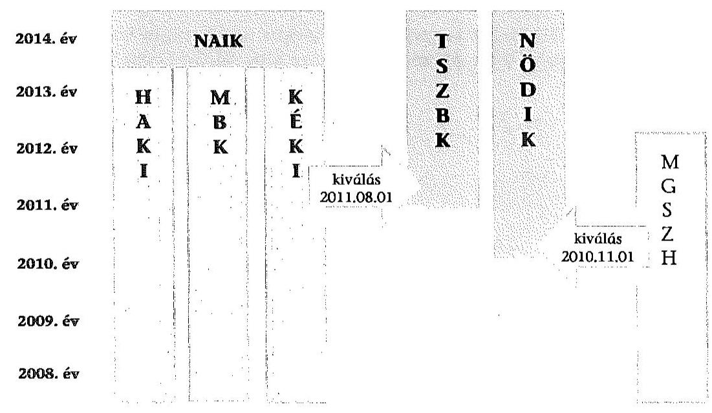

A NÖDIK 2010. november 1-ei hatállyal vált ki a MGSZH-ból, a TSZBK 2011. augusztus 1-ei hatállyal vált ki a KÉKI-ből. A HAKI és a KÉKI 2013. december 31-én olvadt be az MBK bázisán létrejövő NAIK-ba. A kivált, illetve újonnan létrejött szervezetek önálló költségvetési szervként működtek tovább.

Az ellenőrzés keretében az adatok gyűjtését és feldolgozását tanúsítványokra, kérdőívekre, munkalapokra alapoztuk. A tanúsítványokat és a kérdőíveket az ellenőrzött szervezetek hitelesítették. A pénzügyi és vagyoni helyzet változását elemzéses módszerrel értékeltük.

A személyi juttatások; a dologi kiadások és dologi jellegű (egyéb folyó) kiadások; a támogatásértékű kiadások, átadott pénzeszközök; és a felhalmozási kiadások előirányzatai felhasználásának, az intézményi működési és vagyonhasznosítási bevételi előirányzatok teljesítésének szabályszerűségét; valamint a vevők és szállítók állományának értékelését, az előirányzat-módosítások és a kötelezettségvállalással terhelt maradványok megállapítását és felhasználását

---

mintavétellel ellenőriztük. A jogszabályoknak és a belső előírásoknak megfelelőnek, azaz szabályszerűnek tekintettük az adott terület működését, amennyiben a minta ellenőrzésének eredménye alapján 95%-os bizonyossággal a teljes sokaságban a hibás tételek aránya kisebb volt, mint 10%, nem megfelelőnek értékeltük, ha a hibás tételek aránya a 10%-ot meghaladta. Kockázatot, illetve magas kockázatot jeleztünk, amennyiben egy adott terület vonatkozásában a minta alapján a teljes sokaságban nem volt teljes körűen biztosított a jogszabályoknak és a belső szabályzatoknak megfelelő működés. Továbbá, a 2008-2011. éveket érintően a szakmai teljesítésigazolás és az utalvány ellenjegyzése kulcskontrollok, a 2012-2013. éveket érintően a teljesítésigazolás és az érvényesítés kulcskontrollok működését is értékeltük a kiválasztott tételek esetében. Megfelelőnek értékeltük a gazdálkodási jogkörök gyakorlását, amennyiben 95%-os megbízhatósággal a teljes sokaságban a hibaarány legfeljebb 10%, részben megfelelőnek értékeltük, ha a hibaarány felső határa 10 és 30% között volt, nem megfelelőnek pedig akkor, ha a sokaságbeli hibaarány felső határa meghaladta a 30%-ot.

Az ellenőrzés jogszabályi alapját az Alaptörvény 43. cikk
 (1) bekezdése, az ÁSZ tv. 5. § (2)-(6) bekezdései és az Áht ${ }_{2} 61 . \S$ (2) bekezdése képezték.

---

# I. ÖSSZEGZŐ MEGÁLLAPÍTÁSOK, KÖVETKEZTETÉSEK, JAVASLATOK 

Az irányításért felelős miniszter az ellenőrzött időszakban a jogszabályokban meghatározott irányítói feladatainak részben tett eleget.

A minisztérium az ellenőrzött intézetek alapító okiratainak szükséges módosításait a HAKI, a KÉKI és az MBK esetében késve, illetve nem végezte el.

A minisztérium az intézetek SZMSZ-ének jóváhagyására vonatkozó jogkörét nem megfelelően gyakorolta. Ennek következtében a NÖDIK az alapítástól 2012. július 24-ig, a TSZBK 2012. októberéig nem rendelkezett az irányító szerv által jóváhagyott, a költségvetési szerv feladatellátásának részletes belső rendjét és módját szabályozó SZMSZ-szel.

A miniszter a jogszabályoknak megfelelően kinevezte az intézetek vezetőit és gazdasági vezetőit. A vezetői kinevezések okiratait megfelelően elkészítette.

A minisztérium az ellenőrzött intézetek felett gyakorolt beszámoltatási tevékenysége során esetenként a jogszabályi által meghatározott határidőt nem vette figyelembe. A minisztérium ellenőrzési jogkörével teljes körűen nem élt, mivel az ellenőrzött időszakban nem végzett ellenőrzést a NÖDIK-nél és a TSZBK-nál, 2008-2009. években a HAKI-nál, a KÉKI-nél és az MBK-nál.

A minisztérium által végrehajtott átalakítások a jogszabályi előírásoknak részben feleltek meg, mivel a szervezeti változtatások szakmai megalapozása, gazdaságossági számításokkal való alátámasztása a jogszabályi előírásokkal ellentétben elmaradt.

A minisztérium a jogszabályi előírásoknak megfelelően - a KÉKI és a TSZBK feladatellátásához szükséges vagyon jogi státuszának rendezettsége kivételével - a közfeladat folyamatos ellátásáról intézkedett. Nem gondoskodott azonban az átalakítás kérelmezett időpontja előtt a jogszabályban meghatározott határidőben a MGSZH és a KÉKI alapító okiratának módosítást követő közzétételéről.

A miniszter a Korm. határozatnak és a jogszabályi előírásoknak megfelelően gondoskodott a HAKI és a KÉKI 2014. január 1-jével létrejövő NAIK-ba való beolvadással történő megszűntetéséről, a megszüntető okiratok kiállításáról, a megszűnő intézetek közfeladatai további ellátásának módjáról. A NAIK feladatai közül elvégezte és 2014. január 1-jei fordulónappal elkészítette a jogszabályi előírásoknak megfelelő rendező mérleget. A NAIK késve készítette el a HAKI elemi költségvetési beszámolóját. A KÉKI beszámolójának elkészítésénél a jogszabályi határidő betartását ellenőrizni nem lehetett, mivel az ellenőrzés részére átadott dokumentumon a keltezés hiányosan szerepelt.

A pénzügyi és vagyongazdálkodási tevékenységgel kapcsolatban feltárt szabálytalanságokhoz nagyban hozzájárult, hogy az intézetek vezetői a pénzügyi-

---

és vagyongazdálkodása vonatkozásában a belső kontrollrendszert nem a jogszabályi előírásoknak megfelelően alakították ki és működtették.

Az intézetek kontrollkörnyezetének kialakítása - a NÖDIK 2012. évének kivételével - nem vagy csak részben felelt meg a jogszabályi előírásoknak. Az intézetek szervezeti és működési szabályzatai nem teljes körűen feleltek meg a jogszabályi előírásoknak és az intézeti alapító okiratok rendelkezéseinek. Az intézetek vezetői az ellenőrzött időszakban nem, illetve nem teljes körűen tettek eleget a jogszabályokban előírt szabályozási kötelezettségüknek, továbbá az intézetek vezetői által kiadott szabályozások tartalma több esetben nem felelt meg a jogszabályi előírásoknak.

Az ellenőrzött intézetek kockázatkezelési rendszereinek kialakítása és működtetése - a KÉKI 2013. évét kivéve - nem vagy részben megfelelő volt. A KÉKI a 2013-as év kivételével, a NÖDIK és a TSZBK a jogszabályi előírás ellenére az ellenőrzött időszakban nem működtetett kockázatkezelési rendszert. A kockázatkezelési rendszer a HAKI és az MBK esetében nem, illetve részben felelt meg az előírásoknak.

Az ellenőrzött intézetek kontrolltevékenységek kialakításának és működtetésének szabályszerűsége a HAKI, a KÉKI és a TSZBK esetében a teljes ellenőrzött időszakban nem volt megfelelő. Az intézmények vezetői a kontroll tevékenységekkel kapcsolatos szabályozási keretet - a gazdálkodási jogkörök kijelölésének és aktualizálásának elmaradása miatt - nem megfelelően alakították ki. Az intézetek belső kontrollrendszerei - alapvetően a szabályozási hiányosságok miatt - nem biztosították az intézetek pénzügyi és vagyongazdálkodásának szabályszerű ellátását. Az ellenőrzött időszakban a teljesítés igazolása, a 2008-2011. években az utalvány ellenjegyzése, illetve a 2012-2013. években az érvényesítés nem felelt meg az előírásoknak.

A HAKI, a KÉKI, a TSZBK az ellenőrzött időszakban, illetve MBK vezetője a 2008-2009. és 2011-2012. években belső szabályzataiban nem alakított ki olyan információs és kommunikációs rendszereket, amelyek biztosították volna, hogy az információk időben eljussanak a feladatellátásban érintettekhez. Szabályozás hiányában a beszámolási rendszereket nem működtették megbízhatóan és azok nem voltak pontosak. A beszámolási szintek, határidők és módok nem voltak világosan meghatározva. A KÉKI és a NÖDIK nem gondoskodott a bizonylatok teljes körű megőrzéséről.

Az ellenőrzött intézetek monitoring rendszerének kialakítása és működtetésének szabályszerűsége - a HAKI és a NÖDIK kivételével - a teljes ellenőrzött időszakban nem volt megfelelő. Az MBK, a TSZBK, a KÉKI és a HAKI 2009-2013. években, illetve NÖDIK vezetője 2010. és 2012-2013. években monitoring tevékenységre szabályzatot nem alkotott. Az intézmények nem működtettek olyan monitoring rendszert, amely lehetővé tette a szervezetek tevékenységének, a célok megvalósításának folyamatos nyomon követését.

Az intézetek monitoring rendszerének keretében működtetett belső ellenőrzés szervezeti keretei nem feleltek meg teljes körűen a jogszabályi előírásoknak. A NÖDIK vezetője 2010. évben, illetve a TSZBK vezetője 2011-2012. években nem gondoskodott a belső ellenőrzés kialakításáról. A KÉKI, az MBK és a NÖDIK

---

2012-2013. években nem a jogszabályban meghatározott formában biztosította a belső ellenőrzési feladatok ellátását. Az ellenőrzött szervezetek, illetve az ellenőrzött szervezeti egység vezetője és alkalmazottai több esetben nem, illetve határidőn túl készítettek intézkedési tervet. A jogszabályi előírások ellenére a HAKI, a KÉKI, az MBK és a TSZBK belső ellenőrzési vezetője az elvégzett belső ellenőrzésekről, továbbá a HAKI belső ellenőrzési vezetője az intézkedési tervben foglaltak végrehajtásáról nyilvántartást nem vezetett.

A belső kontrollrendszer kialakításának hiányosságai és az irányító szervi ellenőrzés hiánya hozzájárult ahhoz, hogy az ellenőrzött intézetek pénzügyi és vagyongazdálkodása az ellenőrzött időszak egyetlen évében sem felelt meg teljes körűen a vonatkozó jogszabályoknak és belső szabályozásnak.

Az intézmények költségvetési bevételeinek és kiadásainak előirányzat módosítását, főkönyvi könyvelésbe történő feladásának rendjét a KÉKI, az MBK, a NÖDIK és a TSZBK a belső szabályzatokban teljes körűen nem határozta meg. A bevételi és kiadási előirányzatok módosítása, azok elszámolása nem felelt meg a jogszabályoknak és a belső szabályoknak. A saját hatáskörben végrehajtott előirányzat-módosításokat több esetben nem támasztották alá, az előirányzat módosításokról az intézkedés meghozatalát követő öt munkanapon belül a Kincstárt és az irányító szervet nem minden esetben tájékoztatták.

A bevételi és kiadási előirányzatok teljesítése - a KÉKI és a TSZBK kivételével - megfelel a jogszabályi előírásoknak. A KÉKI és a TSZBK több esetben a módosított kiadási előirányzatok mértékét meghaladóan teljesített kifizetéseket.

A HAKI, a KÉKI, a NÖDIK és a TSZBK a bevételi előirányzatok teljesítése során nem tartotta be teljes körűen a jogszabályi előírásokat. Az intézmények a saját előállítású termékek, a végzett szolgáltatások árainak meghatározásakor a termékek és szolgáltatások közvetlen önköltségét nem állapították meg. A NÖDIK az évi 1010498 EUR EU-s támogatással - az MVH iránymutatása alapján - a jogszabályi előírások ellenére nem számolt el. A NÖDIK az uniós támogatások felhasználásának elkülönített nyilvántartásáról nem gondoskodott. A TSZBK a 2011. évben a belső szabályozás ellenére olyan muzeális bort értékesített, amely nem tartozott az értékesíthető borállományba.

A kiadási előirányzatok felhasználása során a HAKI, a KÉKI és a TSZBK a jogszabályi előírás ellenére több esetben nem folytatott le közbeszerzési eljárást. A TSZBK a 2011-2012. években megsértette a Kormány által elrendelt beszerzési tilalmakat is. A TSZBK-nál a 2011-2012. években közel 15 hónapon keresztül indokolatlanul került sor helyettesítési díj számfejtésére és kifizetésére.

A HAKI esetében a beszámolókban kötelezettségvállalással terhelt előirány-zat-maradványként kimutatott összeg megállapítása nem felelt meg a jogszabályi előírásoknak, az MBK-nál a kötelezettségvállalással terhelt maradvány kimutatás szabályszerűségét magas kockázatúnak minősítettük. A HAKI és az MBK a 2012-2013. években nem tájékoztatta az irányító szerven keresztül az NGM-et a tárgyévet követő év június 30 -áig pénzügyileg nem teljesült, továbbá meghiúsult kötelezettségvállalás miatt szabaddá váló előirányzatmaradványról. A TSZBK esetében a 2012-2013. évi költségvetési beszámolókban kötelezettségvállalással terhelt maradványként kimutatott összeg megál-

---

lapítása, illetve az előző évi előirányzat-maradvány felhasználása nem felelt meg a jogszabályi előírásoknak. A TSZBK esetében a 2012-2013. évi költségvetési beszámolókban kötelezettségvállalással terhelt maradványként kimutatott összeg megállapítása, illetve az előző évi előirányzat-maradvány felhasználása nem volt megfelelő. A KÉKI és a NÖDIK esetében a kötelezettségvállalással terhelt maradvány megállapításának és felhasználásának szabályszerűsége - dokumentumok hiányában - nem volt megítélhető.

A 2008-2012. években az MBK, a 2011. évtől a HAKI, illetve a 2011. évben a KÉKI pénzügyi stabilitása nem volt biztosított. A HAKI, a KÉKI, a NÖDIK és a TSZBK a jogszabályi előírás ellenére előirányzat-felhasználási, illetve a NÖDIK és a TSZBK a 2012-2013. években, a HAKI a 2013. évben a bevételek beérkezésének és a kiadások teljesítésének ütemezéséről likviditási tervet nem készített.

Az intézetek vagyongazdálkodási tevékenységük kereteit nem szabályozták teljes körűen. A kezelésükben, tulajdonukban lévő vagyontárgyak bérbeadási, értékesítési folyamatát, térítésmentes átadásának szabályait - a KÉKI és az MBK esetében a szolgálati lakások kivételével - nem határozták meg. A szabályozási hiányosságok közrejátszottak abban, hogy az intézetek vagyongazdálkodása nem felelt meg a jogszabályi előírásoknak. A vagyon nyilvántartása és a vagyongazdálkodási tevékenység végrehajtása nem az előírásoknak megfelelően történt.

A beszerzett, létesített immateriális javak és tárgyi eszközök bekerülési értékének megállapítása, állományba vétele, az értékcsökkenés elszámolása több esetben nem felelt meg a jogszabályi előírásoknak. Néhány esetben az eszköz bekerülési értéke nem egyezett az eszköz megszerzésére fordított értékkel. Az üzembe helyezést több esetben nem dokumentálták hitelt érdemlően, így nem volt megállapítható, hogy az értékcsökkenés elszámolására csak az üzembe helyezést követően került sor.

A mérlegtételek besorolása, értékelése során több esetben megsértették a jogszabályi előírásokat. A devizában nyilvántartott követelések, kötelezettségek, pénzeszközök év végi értékelését nem végezték el. A HAKI el nem ismert követelést is kimutatott követelései között. Év végi beszámolójában a KÉKI és a TSZBK egy-egy esetben olyan tételt is követelésként, illetve a TSZBK egy esetben olyan tételt is kötelezettségként mutatott ki, melynek pénzügyi rendezése a mérleg fordulónapja előtt megtörtént. A KÉKI a 2008-2010. években, a NÖDIK a 2010-2013. években és a TSZBK 2011-2013. években könyvviteli mérlegében olyan eszközöket is kimutatott, amelyet nem bocsátottak a rendelkezésükre, használatukba, nem adtak kezelésükbe, mivel az állami vagyon tekintetében az alapító okirataikban foglalt vagyonkezelői joggal nem rendelkeztek.

A HAKI, a KÉKI, a NÖDIK és a TSZBK a beszámolókban és a számviteli nyilvántartásokban kimutatott eszközök és források állományának valódiságát leltárral nem teljes körűen támasztotta alá, a leltározást nem a szabályzatokban meghatározottak szerint hajtotta végre. A NÖDIK a 2012. évi mérlegét alátámasztó leltárában az év közben betörés során eltulajdonított eszközöket is kimutatta. A TSZBK 2012. évi leltárban szereplő mellékterméket a könyvviteli

---

mérlegben nem mutatta ki. A TSZBK 2013. évi mérlegében kimutatott készletek mérlegértéke meghaladta a leltárban szerepelő összeget.

A HAKI, KÉKI, MBK és a NÖDIK
 által végrehajtott selejtezés nem felelt meg a belső szabályzataikban előírtaknak. A HAKI, a KÉKI és az MBK a selejtezés teljes körű dokumentálásáról nem gondoskodott. A NÖDIK a végrehajtott selejtezésről jegyzőkönyvet nem készített. A 2013. évben a NÖDIK 2012. évben eltulajdonított ügyviteli és számítástechnikai eszközöket, illetve korábban már értékesített kombájnt selejtezett, amivel megsértette a valódiság elvét.

A HAKI, a KÉKI, az MBK és a NÖDIK esetében a vagyonhasznosítás nem felelt meg a jogszabályi előírásoknak. A HAKI, a KÉKI a jogszabályi előírás ellenére az állami tulajdonban lévő eszközök bérbeadása során nem győződött meg arról, hogy a nemzeti vagyon hasznosítására vonatkozó szerződést átlátható szervezettel kötötte. A KÉKI és a NÖDIK a szolgálati lakások bérbeadása során a bérleti díj megállapításánál nem vette figyelembe a jogszabályi előírásokat. A KÉKI-nél az eszközök értékesítése során több esetben nem volt dokumentált, hogy a jogszabályi előírás szerint csak olyan eszközök értékesítésére került-e sor, amelyek az intézmény működéséhez már nem voltak szükségesek. A HAKI az üzemeltetésbe adás szabályait, a jogosultak körét, feladatait nem határozta meg. A szabályozás hiánya hozzájárult ahhoz, hogy az üzemeltetésbe adott eszközök esetében a szerződés előírásait megsértve az üzemeltetési díjat nem a szerződésben meghatározott módon teljesítették. A jogszabályi előírásokkal ellentétben az üzemeltetési szerződésekben az üzemeltetésre átadott vagyon leltározási és beszámolási kötelezettségét nem írták elő.

A közfeladat ellátásának változásával összefüggésben a KÉKI, a NÖDIK és a TSZBK esetében került sor vagyonelemek átadás-átvételére, amely nem felelt meg a jogszabályi előírásoknak. Az állami vagyon tulajdonosa a jogszabályi előírás ellenére a NÖDIK feladatellátását biztosító vagyonra az ellenőrzött időszak végéig vagyonkezelési szerződést nem kötött. A KÉKI tarcali és tolcsvai feladatellátását szolgáló ingatlan vagyonelemek vonatkozásában 2008. január 1-jétől 2011. augusztus 30-ig, továbbá a TSZBK a közfeladat ellátását biztosító vagyonra 2012. augusztus 2-ig hatályos vagyonkezelési szerződéssel nem rendelkezett. A TSZBK feladatellátását szolgáló ültetvények és a tarcali leltárkörzetben tárolt muzeális borkészletre vonatkozóan az ellenőrzött időszak végéig nem kötött vagyonkezelési szerződést.

Az ellenőrzött intézetek - az MBK kivételével - az eredmény szemléletű számvitel bevezetésével kapcsolatos feladatokat részben hajtották végre, mert a leltárazás, illetve a függő, átfutó kiadások és bevételek rendezése teljes körűen nem történt meg.

A helyszíni ellenőrzés megállapításainak hasznosítása mellett javasoljuk:

# a földművelésügyi miniszternek 

1. A minisztérium az Áht: 49. § (5) bekezdés f) pontjának és az Áht: 9. § (1) bekezdés f) pontjának előírásai ellenére nem intézkedett az ellenőrzött intézetek esetében az in-

---

tézmény erőforrásokkal való szabályszerű és hatékony gazdálkodásához szükséges követelmények meghatározásáról.

Javaslat:
Intézkedjen a jogszabályi előírásnak megfelelően a közfeladatok ellátására vonatkozó, és az erőforrásokkal való szabályszerű és hatékony gazdálkodáshoz szükséges ágazati szakmai és a gazdálkodási tevékenységre vonatkozó követelmények kialakításáról, érvényesítéséről, továbbá ezek betartásának számonkéréséről, ellenőrzéséről.
2. A közfeladat ellátásának változásával összefüggésben a NÖDIK és a TSZBK esetében került sor vagyonelemek átadás-átvételére, amely nem felelt meg a Vtv. 23. § (1) bekezdésének. Az állami vagyon tulajdonosával a jogszabályi előírás ellenére a NÖDIK 2010. november 1-jei megalakulásától a feladatellátását biztosító vagyonra az ellenőrzött időszak végéig, a TSZBK megalakulása óta az ültetvények, továbbá a tarcali leltárkörzetben tárolt muzeális bor vonatkozásában az ellenőrzött időszak végéig hatályos vagyonkezelési szerződéssel nem rendelkezett.

Javaslat:
Intézkedjen a törvényi szabályozásnak megfelelő vagyonkezelési szerződés megkötéséről.
3. A miniszter 2012. április 26-át követően a TSZBK egyik közalkalmazottja részére a TSZBK igazgatójának akadályoztatásának idejére helyettesítési díjat állapított meg havi bruttó 70,0 E Ft összegben. Az igazgató távolléte 2012. július 3-án megszűnt, munkába állását követően a helyettesítéssel megbízott közalkalmazott számfejtett bére 15 hónapon keresztül továbbra is tartalmazta a helyettesítési díjat, amely kifizetésre került. A jogosulatlan kifizetés következtében a TSZBK-t vagyoni hátrány érte.

Javaslat:
Tegyen intézkedéseket a feltárt szabálytalanságok tekintetében a felelősség tisztázása érdekében, és szükség szerint intézkedjen a felelősség érvényesítéséről.
4. A NÖDIK megalakulástól 2012. július 24-ig bezáróan a Kjt. 2. § (3) bekezdése, az $\mathrm{Mt}_{1}$ 76. § (5) bekezdése és az $\mathrm{Mt}_{2} 46 . \S$ (1) bekezdés ellenére nem gondoskodott az intézetnél foglalkoztatott közalkalmazottak részére munkaköri leírás elkészítéséről.

Javaslat:
Tegyen intézkedéseket a feltárt hiányosságok tekintetében a felelősség tisztázása érdekében, és szükség szerint intézkedjen a felelősség érvényesítéséről.

---

# a Növényi Diverzitás Központ igazgatójának, a Tokaji Borvidék Szőlészeti és Borászati Kutatóintézet igazgatójának, a Nemzeti Agrárkutatási és Innovációs Központ (mint a Halászati és Öntözési Kutatóintézet, a Központi Környezet- és Élelmiszer-tudományi Kutatóintézet jogutódja) főigazgatójának 

1. A HAKI, a KÉKI, a NÖDIK és a TSZBK bevételi előirányzatainak elszámolása nem felelt meg az Áhsz. 8. § (15) bekezdésének, mivel a saját előállítású termék, a végzett szolgáltatás árainak meghatározásakor a termékek és szolgáltatások közvetlen önköltségét az intézményi szabályozások szerint nem állapították meg.

Javaslat:
Gondoskodjon arról, hogy az intézmény a jogszabályi előírásoknak megfelelően a saját előállítású termék, a végzett szolgáltatás árát az önköltségszámítás rendjére vonatkozó belső szabályzat előírásai szerint állapítsa meg.
2. A HAKI, a KÉKI, a NÖDIK és a TSZBK a beszámolókban és a számviteli nyilvántartásokban kimutatott eszközök és források állományának valódiságát a mennyiségben és értékben kimutatott leltár nem teljes körűen támasztotta alá. A HAKI az Áhsz 37. § (1) bekezdésével ellentétben a 2008-2013. években a tartósan adott kölcsönök (dolgozók lakásépítési támogatása) állományát nem leltározta. A KÉKI az Áhsz 37. § (1) bekezdésével ellentétben 2009. évben a saját tőkét és a tartalékokat nem leltározta. A KÉKI 2011. évben a könyvviteli mérlegben a szellemi termékek értékét negatív értéken szerepeltették -576 E Ft értékben. A NÖDIK az Áhsz. 37. § (3) bekezdésével ellentétben 2010. év végén a tárgyi eszközöket mennyiségi felvétellel nem leltározta, 2011-2012. években a vevőköveteléseknél és a szállítói kötelezettségeknél leltárazás nem történt, továbbá a 2012. évi mérlegét alátámasztó leltárában az évközben betörés során eltulajdonított eszközöket is kimutattak. A TSZBK 2011. évi mérlegét a leltár nem támasztotta alá, mivel a tarcali leltárkörzetben tárolt muzeális bor készlet leltárfelvétele az Áhsz. 37. § (1)-(2) bekezdései ellenére nem a valóságnak megfelelően történt. A TSZBK 2012. évi leltára a könyvviteli mérlegben kimutatott eszközök és források valódiságát az Áhsz. 37. § (2) bekezdése ellenére nem támasztotta alá, mivel a leltárban szereplő mellékterméket a könyvviteli mérlegben nem mutatta ki. Az Áhsz. 37. § (2) bekezdése ellenére a 2013. évi mérlegben kimutatott készletek mérlegértéke a leltáreltérések kiértékelésének hiányában 3,1 M Ft-tal meghaladta a leltárban szereplő összeget. A 2011. december 31-i leltárazás során az Áhsz. 37. § (2) bekezdése ellenére nem hajtották végre a követelések, a saját tőke, a tartalékok és a kötelezettségek leltárazását. Az Áhsz. 37. § (1)-(2) bekezdéseinek előírása ellenére a 2012. évben a TSZBK csak értékben kimutatott eszközeinek és forrásainak, 2013-ban az ingatlanok és a kapcsolódó vagyoni értékű jogok, elszámolási számlák, a saját tőke és a tartalékok könyvviteli mérlegben kimutatott értékét leltárral nem támasztották alá.

Javaslat:
Intézkedjen a jogszabályban meghatározottaknak megfelelően a mérlegben kimutatott eszközök és források teljes körű leltárral történő alátámasztásáról.

---

# a Növényi Diverzitás Központ igazgatójának, a Tokaji Borvidék Szőlészeti és Borászati Kutatóintézet igazgatójának, a Nemzeti Agrárkutatási és Innovációs Központ (mint a Halászati és Öntözési Kutatóintézet, a Központi Környezet- és Élelmiszer-tudományi Kutatóintézet és a Mezőgazdasági Biotechnológiai Kutatóközpont jogutódja) főigazgatójának 

1. Az intézetek belső kontrollrendszere az ellenőrzött időszakban - alapvetően a szabályozási hiányosságok következtében - nem biztosította az intézetek pénzügyi és vagyongazdálkodásának szabályszerű ellátását, a gazdálkodás és a vagyonkezelés átláthatóságát. Az intézeteknél a belső kontrollrendszer - a kialakításában és működtetésében fennálló hiányosságok miatt - nem járult hozzá a szabálytalanságok és hibák megelőzéséhez, illetve kiküszöböléséhez.

Javaslat:
Intézkedjen a jogszabályi előírásnak megfelelően az intézet valamennyi tevékenységére kiterjedő kontrollrendszer kialakításáról.
2. Az intézetek vezetői az Ámr. 145/G. §-ában, az Ámr. 160. §-ában, a Bkr. 3. § e) pontjában és a Bkr. 10. §-ában foglaltak ellenére nem alakítottak ki és nem működtettek a szervezetek tevékenységének, a célok megvalósításának nyomon követését biztosító monitoring rendszert.

Javaslat:
A jogszabályi előírásnak megfelelően alakítson ki és működtessen a szervezet tevékenységének, a célok megvalósításának nyomon követését biztosító rendszert.
3. Az intézetek nem tettek teljes körűen eleget szabályozási kötelezettségeiknek:
a) a HAKI 2008. szeptember 14-ig az Ámr 2 20. § (3) bekezdés b) pontjának, illetve az Ávr. 13. § (2) bekezdés b) pontjának előírása ellenére nem szabályozta a $\mathrm{Kbt}_{1-2}$ hatálya alá nem tartozó beszerzések lebonyolításával kapcsolatos eljárás rendjét.
b) a HAKI, a KÉKI és az MBK a $\mathrm{Kbt}_{1} 6 . \S$ (1) bekezdés és a $\mathrm{Kbt}_{2} 22 . \S$ (1) bekezdés előírásai ellenére nem szabályozta a közbeszerzésben közreműködők feladatai közül a belső ellenőrzés felelősségi rendjét, az ajánlatok elbírálására létrehozott bírálóbizottság határozatképességének feltételeit, a nem elektronikusan beadott ajánlatok felbontásáról készített jegyzőkönyv elküldésének felelősét, az ajánlati biztosíték kezelésével, nyilvántartásával, illetőleg visszaadásával kapcsolatos feladatokat.
c) a HAKI, a KÉKI és az MBK az Ámr 1 145./D. § b) pont és 162/B § (1) bekezdés, az Ámr 2 156. § (1) bekezdés b) pont és 235. §, illetve Ávr. 7. számú melléklet 16. pont, valamint a Bkr. 6. § (1) bekezdés b) pont ellenére nem alakított ki olyan kontrollkörnyezetet, amely egyértelműen meghatározta a $10,0 \mathrm{M} \mathrm{Ft}$, illetve 2010. augusztus 15-től az $5,0 \mathrm{M}$ Ft-os egyedi értékhatárt elérő kötelezettségvállalások Kincstárhoz történő bejelentésével kapcsolatos feladatokat.

---

d) a KÉKI az Ámr 135. § (2), az Ámr 2 20. § (3) bekezdés a) pontja, illetve az Ávr. 13. § (2) bekezdés a) pontja ellenére nem határozta meg a szakmai teljesítés igazolás módját; az Ámr 134. § (3) bekezdése, az Ámr 2 72. § (11) bekezdése, 2010. augusztus 15-től (14) bekezdése, valamint az Ávr. 53. § (2) bekezdése ellenére nem szabályozta a gazdasági eseményenként 50,0 E Ft, 2010-től a 100,0 E Ft-ot nem érő kifizetések rendjét.
e) a HAKI, a KÉKI, az MBK, a NÖDIK és a TSZBK vezetője az ellenőrzött időszakban az Ámr 145/D. § c) pont, az Ámr 2 156. § (1) bekezdés c) pont, illetve a Bkr. 6. § (1) bekezdés c) pont ellenére az etikai elvárásokat nem határozta meg.
f) a KÉKI, a NÖDIK és a TSZBK vezetői az Ámr 145/B. §, az Ámr 2 156. § (2) bekezdés és a Bkr. 6. § (3) bekezdés előírását megsértve ellenőrzési nyomvonalat nem készítettek.
g) a TSZBK az ellenőrzött időszakban az Ámr 2 156. § (3) bekezdése, illetve a Bkr. 6. § (4) bekezdése ellenére nem rendelkezett a szabálytalanságok kezelésének eljárásrendjével.
h) a TSZBK - figyelemmel a KÉKI-vel kötött Együttműködési megállapodásban foglaltakra - az Ámr 2 20. § (3) bekezdés a) pontja, illetve Ávr. 13. § (2) bekezdés a)
 pontja ellenére a szakmai teljesítésigazolás módját, eljárási és dokumentációs részletszabályait, az ezt végző személyek kijelölésének rendjét belső szabályzatban nem rendezte.

Javaslat:
Intézkedjen a hiányzó szabályzatok jogszabályi előírásoknak megfelelő elkészítéséről.
4. Az intézetek belső szabályzatainak tartalma több esetben nem felelt meg a jogszabályok előírásainak:
a) az MBK és a NÖDIK gazdasági szervezetének ügyrendje ${ }_{1,2}$ az Ámr 17. § (5) bekezdés, az Ámr 2 15. § (6) bekezdés és az Ávr. 13. § (5) bekezdés ellenére a helyettesítés rendjére vonatkozó előírást - a gazdasági vezetői kivételével - nem tartalmazott.
b) a KÉKI gazdasági szervezetének ügyrendje ${ }_{1-3}$ az Ámr 17. § (5) bekezdés, az Ámr 2 15. § (6) bekezdés, illetve az Ávr. 13. § (5) bekezdés ellenére nem tartalmazta a helyettesítés rendjét, illetve a gazdasági szervezet belső és külső kapcsolattartásának szabályait.
c) a KÉKI az Áhsz. 8. § (7) bekezdése ellenére nem szabályozta a KÉKI számviteli po-litika ${ }_{1-4}$ részeként a beszerzett, illetve előállított immateriális jószág és tárgyi eszköz üzembe helyezése dokumentálásának szabályait. Az Áhsz 8. § (5) bekezdés f) pont, 2013. január 1-jétől e) pont előírása ellenére nem határozta meg, hogy mi tekintendő figyelembe veendő szempontnak a raktári készletek leltározása során az eltérések kompenzálásánál és a káló elszámolásánál.
d) a KÉKI a Számv. tv. 14. § (8) bekezdés előírása ellenére a pénzkezelési szabály-zat ${ }_{1-5}$-ben nem határozta meg a pénzforgalom bankszámlán történő lebonyolításának rendjét és a pénzforgalmi számlák feletti rendelkezési jog gyakorlásának feltételeit, a készpénzben és a bankszámlán tartott pénzeszközök közötti forgalom szabályait.
e) a HAKI ügyrend ${ }_{1,2}$ az Ámr 17. § (5) bekezdés, az Ámr 2 15. § (6) bekezdés és az Ávr. 13. § (5) bekezdés ellenére nem tartalmazta a gazdasági szervezet belső és külső kapcsolattartásának szabályait.
f) a HAKI pénzkezelési szabályzat ${ }_{1-3}$ a Számv. tv. 14. § (B) bekezdés ellenére nem tartalmazta a pénzforgalom bankszámlán történő lebonyolításának rendjét; a pénzforgalommal kapcsolatos nyilvántartási szabályokat. Az ellenőrzött időszakban a Számv. tv. 14. § (B) bekezdés ellenére nem, illetve hiányosan határozta meg a készpénzben és a bankszámlán tartott pénzeszközök közötti forgalom szabályait.

Javaslat:
Intézkedjen, hogy az intézet szabályzatai feleljenek meg a jogszabályi előírásoknak.
5. Az intézetek belső ellenőrzése, működése, annak szervezeti keretei nem feleltek meg teljes körűen az előírásoknak. A Bkr. 15. § (5) bekezdés előírása ellenére a KÉKI, az MBK és a NÖDIK 2012-2013. években nem alkalmazott legalább egy fő belső ellenőrt foglalkoztatásra irányuló jogviszonyban. Az ellenőrzött időszakban a KÉKI és az MBK, a 2010. és a 2013. évben a HAKI, a 2011. évben a NÖDIK, illetve az ellenőrzött szervezeti egység vezetője és alkalmazottai a Ber. 17. § (1) bekezdés d) pont, illetve a Bkr. 28. § c) pontja ellenére a belső ellenőrzés megállapításai és javaslati alapján a végrehajtásért felelősöket és a végrehajtás határidejét feltüntető intézkedési tervet nem készítettek. A HAKI 2008., 2009. és 2012. években minden alkalommal, illetve a NÖDIK a 2012-2013. években az intézkedési tervet a Ber. 29. § (1) bekezdés, Bkr. 45. § (3) bekezdésében meghatározott határidőn túl készítette el. A HAKI, a KÉKI, az MBK és a TSZBK a Ber. 32. §, Bkr. 50. § (1) bekezdése ellenére nem vezetett nyilvántartást az elvégzett belső ellenőrzésekről.

Javaslat:
a) Gondoskodjon a belső ellenőrzési feladatok foglalkoztatási jogviszonyban történő ellátásáról.
b) Gondoskodjon a belső ellenőrzési megállapítások javaslataira a végrehajtásért felelősök és a végrehajtás határidejének kijelölésével, intézkedési terv készítéséről.
c) Intézkedjen, hogy az ellenőrzések megállapításaira készített intézkedési tervek a jogszabályban meghatározott határidő betartásával készüljenek el, valamint arról, hogy az elvégzett ellenőrzésekről a jogszabályi előírásának megfelelő nyilvántartás készüljön.

---

# a Tokaji Borvidék Szőlészeti és Borászati Kutatóintézet igazgatójának, a Nemzeti Agrárkutatási és Innovációs Központ (mint a Halászati és Öntözési Kutatóintézet, a Központi Környezet- és Élelmiszer-tudományi Kutatóintézet jogutódja) föigazgatójának 

1. A kiadási előirányzatok felhasználása során a HAKI a 2013. évben a $\mathrm{Kbt}_{2}$ 10. § (1) bekezdés b) pontjában meghatározott értékhatár figyelmen kívül hagyásával a $\mathrm{Kbt}_{2} 5 . \S$ és 119. § előírása ellenére közbeszerzési eljárás mellőzésével szerezett be eszközt.. A TSZBK a közbeszerzési eljárás mellőzésével megsértette a $\mathrm{Kbt}_{2}$ 119. §-ára figyelemmel a $\mathrm{Kbt}_{2} 5 . \S$-ában előírt közbeszerzési lefolytatásának kötelezettségét, mivel a közbeszerzési értékhatárt meghaladó összegben, nettó 10,3 M Ft értékben a 2012. évben borelemző készüléket szerzett be.

Javaslat:
a) Tegyen intézkedéseket a közbeszerzéssel kapcsolatos szabálytalanságok tekintetében a felelősség tisztázása érdekében, és szükség szerint intézkedjen a felelősség érvényesítéséről.
b) Intézkedjen a kiadási előirányzatok felhasználása során a $\mathrm{Kbt}_{2}$ előírásainak betartásáról.

## a Növényi Diverzitás Központ igazgatójának, a Tokaji Borvidék Szőlészeti és Borászati Kutatóintézet igazgatójának, a Nemzeti Agrárkutatási és Innovációs Központ (mint a Halászati és Öntözési Kutatóintézet jogutódja) föigazgatójának

1. A HAKI a 2008-2010. években, valamint a 2013. december 15-től hatályos számviteli politikában az Áhsz. 8. § (7) bekezdésében foglaltak ellenére nem határozta meg az üzembe helyezés dokumentálásának szabályait. 2011. évtől a számviteli politikájukban előírták az üzembe helyezési jegyzőkönyvet, de nem alkalmazták azt. A NÖDIK az ellenőrzött időszakban, valamint 2013. évben a TSZBK esetenként az üzembe helyezést nem dokumentálta hitelt érdemlően, így nem állapítható meg, hogy Áhsz. 30. § (1) bekezdése szerint az értékcsökkenés elszámolására csak az üzembe helyezést követően került sor.

Javaslat:
Intézkedjen, hogy a költségvetési szerv a beszerzett, létesített immateriális javak és tárgyi eszközök üzembe helyezését a jogszabályi előírásnak megfelelően hitelt érdemlően dokumentálja.

---

# a Tokaji Borvidék Szőlészeti és Borászati Kutatóintézet igazgatójának, a Nemzeti Agrárkutatási és Innovációs Központ (mint Halászati és Öntözési Kutatóintézet és a Központi Környezet- és Élelmiszer-tudományi Kutatóintézet jogutódja) föigazgatójának 

1. A KÉKI és a TSZBK a Számv. tv. 169. § (2) bekezdésével ellentétben a könyvviteli elszámolását közvetlenül és közvetetten alátámasztó számviteli bizonylatokat teljes körűen nem őrizte meg. A bizonylatok hiányában nem volt megállapítható, hogy az eszköz bekerülési értékének megállapítása, állományba vétele, besorolása, az értékcsökkenés elszámolása megfelelt-e a jogszabályi előírásoknak. A HAKI 2009., 2011. és 2013. évi és a KÉKI 2008., 2010., 2012. és 2013. évi leltározás dokumentációjának teljes körű megőrzéséről a Számv. tv. 169. § (1) bekezdésével ellentétben nem gondoskodott. A KÉKI a könyvviteli elszámolást közvetlenül és közvetten alátámasztó számviteli bizonylatok közül a selejtezés dokumentumait 2008-2011. és 2013. években a Számv. tv. 169. § (2) bekezdés előírása ellenére nem őrizte meg.

Javaslat:
Gondoskodjon a jogszabályban foglalt bizonylat megőrzési kötelezettség betartásáról, valamint tegyen intézkedéseket a könyvviteli elszámolást alátámasztó számviteli bizonylatok megőrzésével kapcsolatos szabálytalanságok tekintetében a felelősség tisztázása érdekében, és szükség szerint intézkedjen a felelősség érvényesítéséről.

## a Növényi Diverzitás Központ igazgatójának

1. A NÖDIK az Áhsz. 9. számú mellékletének 2. ca) pont és 4. db) pontjával ellentétben nem vezetett folyamatosan analitikus nyilvántartást a vevőkről és szállítókról. Ennek következtében a 2010-2013. években az analitikus nyilvántartásban és a főkönyvi könyvelésben kimutatott értékek eltérést mutattak.

Javaslat:
a) Intézkedjen a jogszabályi előírásoknak megfelelően a vevő és szállító állomány analitikus nyilvántartásának folyamatos vezetéséről, továbbá az analitikus és főkönyvi adatok hó végi egyeztetésének elvégzéséről és az eltérések rendezéséről.
b) Tegyen intézkedéseket a vevők és szállítók analitikus nyilvántartásával kapcsolatos szabálytalanságok tekintetében a felelősség tisztázása érdekében, és szükség szerint intézkedjen a felelősség érvényesítéséről.

---

# II. RÉSZLETES MEGÁLLAPÍTÁSOK 

## 1. Az irányító szerv feladatellátás szabályszerűsége

Az ellenőrzött időszakban az FM, illetve annak jogelődjei (FVM, VM) gyakorolták az ellenőrzött költségvetési szervek feletti irányítási jogot.

A miniszter a jogszabályokban meghatározott feladatainak részben tett eleget, mivel az intézetek alapító okiratainak kiadásait követően a szükséges, a jogszabályi előírásoknak megfelelő módosításokat az alábbiak szerint késve, illetve nem végezte el:

- az előírt 2009. június 1-jei jogszabályi határidőn túl³, 2009. szeptember 18-tól érvényesítette a HAKI, a KÉKI és az MBK alapító okirataiban a költségvetési szervek besorolására vonatkozó jogszabályi előírásokat ${ }^{4}$.
- a HAKI és az MBK esetében nem vezette át az alapító okiratokon a magasabb vezetői, valamint a vezetői megbízás időtartamára vonatkozó, 2011. január 1-jétől hatályos jogszabályi változásokat ${ }^{5}$.

A miniszter az intézmények 2013. december 31-ei megszűnésével kapcsolatban a HAKI és a KÉKI megszüntető okiratait a jogszabályi előírásoknak ${ }_{6}$ megfelelően kiadta.

A minisztérium az intézetek SZMSZ-ének jóváhagyására vonatkozó jogkörét nem megfelelő módon gyakorolta, mivel az SZMSZ-re vonatkozó tartalmi követelmények, valamint az intézetek szervezeti kereteiben beállt változásokra figyelemmel az intézetek által előkészített szükséges SZMSZ-módosításokat, illetve új SZMSZ-eket nem hagyta jóvá ${ }^{7}$.

A minisztérium a jogszabályi előírások ${ }^{8}$ ellenére nem hagyta jóvá a költségvetési szerv feladatellátásának részletes belső rendjét és módját a NÓDIK esetében 2010. november 1-jétől 2012. július 24-ig, a TSZBK esetében 2011. augusztus 1-jétől 2012. októberéig ${ }^{9}$.

[^0]
[^0]:    ${ }^{3} \mathrm{Kt} .44 . \S(4)$ bekezdés
    ${ }^{4} \mathrm{Kt} .15-16 . \S$, valamint $18 . \S$
    ${ }^{5}$ A Kjt. 23. § (3) bekezdése szerint 2011. január 1-jétől a magasabb vezető, valamint a vezető megbízás a korábbi határozatlan, jogszabály alapján legfeljebb 10 évig terjedő idő helyett legfeljebb öt évig terjedő határozott időre szól. Áht ${ }_{1} 90 . \S$ (1) bekezdés h) pont, Ávr. 5. § (1) bekezdés g) pont
    ${ }^{6} \mathrm{~A} \mathrm{ht}_{2} 9 . \S$ (1) bekezdés a) pont
    ${ }^{7}$ Áht $_{1}$ 93. § (1) bekezdés a) pont, Áht ${ }_{2} 9 . \S$ (1) bekezdés e) pont, 2013-tól a) pont
    ${ }^{8}$ Áht $_{1}$ 93. § (1) bekezdés a) pont, Áht ${ }_{2} 9 . \S$ (1) bekezdés e) pont, 2013-tól a) pont
    ${ }^{9}$ A jóváhagyás pontos napja nem ismert, mert a záradék csak az évet és a hónapot tartalmazta.

---

A miniszter a jogszabályoknak ${ }^{10}$ megfelelően kinevezte az intézetek vezetőit és gazdasági vezetőit. A vezetői kinevezések okiratait az irányító szerv a jogszabályi előírásnak ${ }^{11}$ megfelelően módosította.

A minisztérium az ellenőrzött időszak minden évben megállapította az intézetek kincstári költségvetését ${ }^{12}$, azonban az intézetek részére történő megküldésre 2011-2012. években a jogszabályban rögzített ${ }^{13}$ tárgyévi január 10-i határidőn túl, 2011. évben január 19-én, 2012. évben január 17-én került sor. Az intézetek elemi költségvetéseit az irányító szerv jóváhagyta.

A minisztérium az ellenőrzött intézetekkel szembeni - jogszabályban előírt beszámoltatási tevékenységét az ellenőrzött időszakban esetenként az előírt határidőn túl gyakorolta. Az irányító szerv meghatározta az éves beszámolók beküldésének határidejét ${ }^{14}$, azonban a 2011-2013. évi beszámolók benyújtási határidejét a jogszabályban meghatározott január 31-éhez képest késve 2012. évben február 28-án, 2013. évben február 12-én és 2014. évben február 19-én -
 határozta meg. Az irányító szervi feladatellátás során a minisztérium ellenőrzési jogosultságai keretében beszámoltatta az intézmények vezetőit az éves szakmai feladatellátásáról. Az intézmények - a TSZBK kivételével - minden évben elkészítették belső kontrollrendszerük működéséről szóló éves jelentésüket, illetve a 2012. évtől nyilatkozatban értékelték belső kontrollrendszerük minőségét, s e nyilatkozatot az éves elemi költségvetési beszámolójukkal egyidejűleg megküldték az irányító szervnek ${ }^{15}$. Az intézményi költségvetések végrehajtásáról szóló éves számszaki beszámolók ellenőrzését az irányító szerv elvégezte, de az ÁSZ ellenőrzés során feltárt - a beszámoló valódiságát megsértő - hibákat nem tárta fel. Az irányító szerv az intézetek előirányzatmaradványát a 2008-2011. években jóváhagyta, a 2012-2013. években megállapította ${ }^{16}$.

A minisztérium az ellenőrzött időszakban a jogszabályban ${ }^{17}$ biztosított ellenőrzési jogkörével teljes körűen nem élt. Az ellenőrzött időszakban nem végzett ellenőrzést a NÖDIK-nél és a TSZBK-nál, 2008-2009. években a HAKI-nál, a KÉKI-nél és az MBK-nál.

A minisztérium 2009-2011. években az államháztartással összefüggő közérdekű, és közérdekből nyilvános adatok kötelező közzétételének, illetve igényre történő szolgáltatásának jogszabályban előírt ${ }^{18}$ ellenőrzését dokumentáltan igazolni nem tudta.

A minisztérium 2009-2013. években az intézetek közfeladatainak ellátására vonatkozó és az erőforrásokkal való szabályszerű és hatékony gazdálkodáshoz szükséges követelményeket nem határozta meg. Ennek hiányában a minisztérium a jogszabályi előírás ${ }^{19}$ ellenére a követelményeket érvényesíteni, számon kérni, ellenőrizni nem tudta.

# 2. A SZERVEZETI ÁTALAKÍTÁSOK ELŐKÉSZÍTÉSÉNEK ÉS LEBONYOLÍTÁSÁNAK SZABÁLYSZERŰSÉGE 

A minisztérium által végrehajtott átalakítások a jogszabályi ${ }^{20}$ előírásoknak részben feleltek meg, mivel a 2010-2011. évi szervezeti változtatások szakmai megalapozása, gazdaságossági számításokkal való alátámasztása a jogszabályi előírásokkal ellentétben elmaradt ${ }^{21}$. Az intézeteknél szervezeti átalakításra három esetben került sor az alábbiak szerint:

- a NÖDIK 2010. november 1-ei hatállyal vált ki a MGSZH-ból,
- a TSZBK 2011. augusztus 1-ei hatállyal vált ki a KÉKI-ből,
- a HAKI és a KÉKI 2013. december 31-én olvadt be az MBK bázisán létrejövő NAIK-ba.

A kivált, illetve újonnan létrejött szervezetek önálló költségvetési szervként működtek tovább.

A minisztérium a NÖDIK-et 2010. évben, a TSZBK-át 2011. évben alapító okirattal hozta létre és azok közzétételéről a jogszabályi előírásnak ${ }^{22}$ megfelelően gondoskodott. A minisztérium az alapítást követően intézkedett a Kincstár felé az intézetek törzskönyvi nyilvántartásba vételéről.

A minisztérium jóváhagyta a NÖDIK által ellátott közfeladatok további ellátásának módját, a közfeladat jövőbeni ellátásához szükséges köztulajdon meghatározását szabályozó megállapodást. A minisztérium gondoskodott az eszközök és a források leltározásáért, a vagyon-átadásáért felelős kijelöléséről.

A KÉKI és a TSZBK - a közfeladat ellátásához szükséges vagyon jogi státuszának rendezettsége kivételével - rendelkezett az irányító szerv jóváhagyásával ellátott együttműködési megállapodásban a közfeladatok további ellátásának módjáról, a közfeladat jövőbeni ellátásához szükséges köztulajdon meghatározásáról. A TSZBK Alapító Okiratának 14. pontjával ellentétben az alapítást követően a vagyonkezelési szerződés aláírására az MNV Zrt.-vel 2012. július 26-án került sor, amely 2012. augusztus 3-án lépett hatályba.

Az ingatlanok a földművelésügyi és vidékfejlesztési miniszter 47449/1/2007. (V. 30.) számú utasítása alapján kerültek a KÉKI-hez. A KÉKI és a vagyonelemeket átadó FVM Szőlészeti és Borászati Kutatóintézet között átadás-átvételi jegyzőkönyv készült. A KÉKI 2007. július 1-től viselte az átvett vagyonelemek terhét és szedte hasznát, de vagyonkezelési szerződéssel a TSZBK részére történő átadásig sem rendelkezett.

A TSZBK a KÉKI-től 2011. augusztus 30-án vette át a közfeladat ellátásához szükséges vagyonelemeket. Az átadásra került kincstári körbe tartozó vagyonelemek az MNV Zrt. tulajdonosi joggyakorlása alá tartoztak, a Tarcal külterület 0168 helyrajzi számú ingatlan kivételével, amely felett a Nemzeti Földalapkezelő Szervezet (NFA) gyakorolta a tulajdonosi jogokat. A TSZBK 2011-2012. években több esetben kezdeményezte az MNV Zrt.-nél és az NFA-nál a vagyonkezelői szerződések megkötését. Az MNV Zrt.-vel a vagyonkezelési szerződés megkötésére 2012. július 26-án került sor a tarcali leltárkörzetben tárolt muzeális borkészlet kivételével. A TSZBK által hasznosított ültetvényekre vonatkozó vagyonkezelői szerződés megkötésére az NFA-val a helyszíni ellenőrzés lezárásáig nem került sor.

A minisztérium mindkét szervezet esetében az átalakítást megelőzően intézkedési tervben rögzítette a határidőket és felelősöket, valamint gondoskodott a foglalkoztatottakkal kapcsolatos munkáltatói intézkedések meghatározásáról és a továbbfoglalkoztatásról.

A minisztérium a jogszabályi előírással ellentétben ${ }^{23}$ nem gondoskodott az átalakítás kérelmezett időpontja előtt a jogszabályban meghatározott határidő megtartásával az MGSZH és a KÉKI alapító okirat módosításának közzétételéről.

A minisztérium a HAKI és a KÉKI beolvadását követően, a NAIK-ot az MBK alapító okiratának módosításával hozta létre. Az alapító okiratban a NAIK-ot a két megszűnő szervezet jogutódjaként megjelölte és a megszűnő szervezetek által ellátandó közfeladatokat felsorolta.

A miniszter a Korm. határozatnak ${ }^{24}$ megfelelően gondoskodott a HAKI és a KÉKI 2014. január 1-jével létrejövő NAIK-ba való beolvadással történő megszűnéséről. A miniszter a HAKI és a KÉKI megszüntető okiratait a jogszabályi előírásoknak megfelelően kiállította ${ }^{25}$, a megszűnő intézetek közfeladatai további ellátása módjának, szervezeti formájának jogszabály ${ }^{26}$ szerinti meghatározásáról gondoskodott.

A minisztérium a megszűnő szervezetek törzskönyvi nyilvántartásból való törléséről - a jogutódként kijelölt szervezet törzskönyvi nyilvántartásba vétele iránti kérelem egyidejű benyújtása mellett - a jogszabályi előírásoknak ${ }^{27}$ megfelelően intézkedett.

A minisztérium a jogszabályi előírásnak ${ }^{28}$ megfelelően kijelölte az eszközök és források leltározásáért, az éves költségvetési beszámoló elkészítéséért és a vagyonátadás lebonyolításáért felelős személyeket, valamint a feladatok végrehajtásának határidejét. A NAIK a jogszabályi előírásnak ${ }^{29}$ megfelelően elkészítette a HAKI és a KÉKI elemi költségvetési beszámolóinak megfelelő adattartalmú beszámolóját. A HAKI beszámolójának elkészítése a jogszabályban meghatározott 60 napon túl ${ }^{30}$, 2014. március 12-én történt meg. A KÉKI beszámolójának elkészítésénél a jogszabályi határidő betartását ellenőrizni nem lehetett, mivel az ellenőrzés részére átadott dokumentumon a keltezés hiányosan szerepelt. A NAIK 2014. január 1-jei fordulónappal elkészítette a jogszabályi előírásoknak megfelelő ${ }^{31}$ rendező mérleget. A rendező mérlegben az egyes mérlegsorokhoz tartozó értékek megegyeztek a megszűnő szervezetektől átvett vagyon vagyonátadás-átvételi jegyzőkönyvben szereplő értékeivel.

# 3. A BELSŐ KONTROLLRENDSZER KIALAKÍTÁSA ÉS MŰKÖDTETÉSE 

### 3.1. A kontrollkörnyezet kialakítása

Az ellenőrzött időszakban az intézetek kontrollkörnyezetének kialakítása - a NÖDIK 2012. ellenőrzött évének kivételével - nem vagy csak részben feleltek meg a jogszabályi előírásoknak. Az ellenőrzött intézetek vezetői által kialakított kontrollkörnyezet jogszabályi előírásoknak való megfelelőségét az alábbi ábra mutatja be:
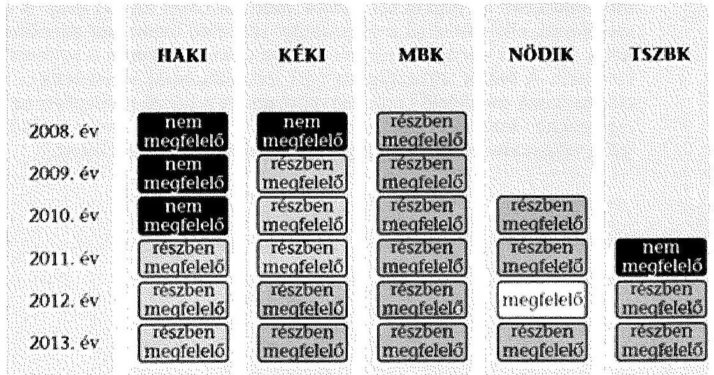

Az intézetek szervezeti és működési szabályzatai az alábbiak miatt nem teljes körűen feleltek meg a jogszabályi előírásoknak és az intézeti alapító okiratok rendelkezéseinek:

- a HAKI, a KÉKI, illetve az MBK 2009-2013. években hatályos SZMSZ-e nem felelt meg a jogszabályi előírásoknak ${ }^{32}$, mivel nem tartalmazták az ellátandó alaptevékenységek szakfeladat-rendje számmal és megnevezéssel történő besorolását.
- a KÉKI SZMSZ-e 2011. augusztus 1-jétől nem tükrözte a 2011. augusztus 1-jén végrehajtott átszervezés, a TSZBK kiválása következtében végbement szervezeti változásokat.
- a NÖDIK megalapításától 2012. július 24-ig, a TSZBK megalapításától 2012. októberéig ${ }^{33}$ nem rendelkezett az irányító szerv által jóváhagyott SZMSZ-szel ${ }^{34}$. A TSZBK 2012. októbertől hatályos SZMSZ-ében szabályozott VI. fejezet (Vegyes rendelkezések) részben előírt évenkénti felülvizsgálatára 2013. december 31-ig nem került sor.

Az intézetek vezetői az ellenőrzött időszakban nem, illetve nem teljes körűen tettek eleget a jogszabályokban előírt szabályozási kötelezettségüknek az alábbiak miatt:

- a HAKI 2011. december 31-ig, a KÉKI és a TSZBK 2012. december 31-ig a jogszabályi előírás ${ }^{35}$ ellenére a számlarendben foglaltakat alátámasztó bizonylati renddel nem rendelkezett.

A HAKI 2008. szeptember 14-ig, a KÉKI 2009-2011. években és a TSZBK 2011. évben nem szabályozták a Kbt$_{1-2}$ hatálya alá
 nem tartozó beszerzések lebonyolításával kapcsolatos eljárás rendjét, ezzel nem tettek eleget a jogszabályban előírt ${ }^{36}$ kötelezettségüknek.

- a HAKI, a KÉKI és az MBK a jogszabályi előírások ellenére nem szabályozta a közbeszerzésben közreműködők feladatai közül a belső ellenőrzés felelősségi rendjét, az ajánlatok elbírálására létrehozott bírálóbizottság határozatképességének feltételeit, a nem elektronikusan beadott ajánlatok felbontásáról készített jegyzőkönyv elküldésének felelősségét, az ajánlati biztosíték kezelésével, nyilvántartásával, illetőleg visszaadásával kapcsolatos feladatokat ${ }^{37}$.

A HAKI, a KÉKI és az MBK a jogszabályi előírás ${ }^{38}$ ellenére nem alakított ki olyan kontrollkörnyezetet, amely egyértelműen meghatározta a $10,0 \mathrm{M} \mathrm{Ft}$, illetve 2010. augusztus 15-től az $5,0 \mathrm{M}$ Ft-os egyedi értékhatárt elérő kötelezettségvállalások Kincstárhoz történő bejelentésével kapcsolatos feladatokat.

- a NÖDIK a jogszabályi előírás ellenére a 2010. évben számlarenddel ${ }^{39}$ és közbeszerzési szabályzattal ${ }^{40}$ nem rendelkezett; továbbá a szervezet vezetője az intézet megalakulástól kezdődően 2012. július 24-ig a jogszabályi előírás ellenére ${ }^{41}$ nem gondoskodott az intézetnél foglalkoztatott közalkalmazottak részére munkaköri leírás elkészítéséről.

[^0]
[^0]:    ${ }^{34}$ Áht $_{1}$ 93. § (1) bekezdés a) pont, Áht $_{2}$ 9. § (1) bekezdés e) pont
    ${ }^{35}$ Számv. tv. 161. § (2) bekezdés d) pont,
    ${ }^{36}$ Amr$_{2}$ 20. § (3) bekezdés b) pont, Ávr. 13. § (2) bekezdés b) pont
    ${ }^{37}$ Kbt$_{1}$ 6. § (1) bekezdés, Kbt$_{2}$ 22. § (1) bekezdés
    ${ }^{38}$ Amr$_{1}$ 145./D. § b) pont és 162/B § (1) bekezdés, Ámr 2 156. § (1) bekezdés b) pont és 235. §, Ávr. 7. számú melléklet 16. pont, Bkr. 6. § (1) bekezdés b) pont
    ${ }^{39}$ Áhsz. 49. § (1) bekezdés
    ${ }^{40}$ Kbt$_{1}$ 6. § (1) bekezdés, Kbt$_{2}$ 22. § (1) bekezdés
    ${ }^{41}$ Kjt. 2. § (3) bekezdése, Mt1 76. § (5) bekezdés, Mt2 46. § (1) bekezdés

---

- a KÉKI a jogszabályi előírásokkal ellentétben nem határozta meg a szakmai teljesítés igazolás módját ${ }^{42}$; nem szabályozta ${ }^{43}$ a gazdasági eseményenként 50,0 E Ft, 2010-től a 100,0 E Ft-ot nem érő kifizetések rendjét.
- a TSZBK a 2011-2012. években a jogszabályi előírások ellenére nem rendelkezett számlatükörrel ${ }^{44}$.
- a HAKI, a KÉKI, az MBK a 2008. évben jogszabályi előírás hiányában, a 2009. évtől a jogszabályi előírás ${ }^{45}$ ellenére, illetve megalakulását követően a NÖDIK és a TSZBK vezetője az etikai elvárásokat nem határozta meg.
- a KÉKI, a NÖDIK és a TSZBK vezetői a jogszabályi előírást ${ }^{46}$ megsértve ellenőrzési nyomvonalat nem készítettek.
- a KÉKI 2011. január 1-jétől 2013. szeptember 30-ig, a TSZBK az ellenőrzött időszakban az előírások ${ }^{47}$ ellenére nem rendelkezett a szabálytalanságok kezelésének eljárásrendjével.
- a TSZBK - figyelemmel a KÉKI-vel kötött Együttműködési megállapodásban foglaltakra - a jogszabályi előírás ellenére ${ }^{48}$ a szakmai teljesítésigazolás módját, eljárási és dokumentációs részletszabályait, az ezt végző személyek kijelölésének rendjét belső szabályzatban nem rendezte.

Az intézetek vezetői által kiadott szabályozások tartalma több esetben nem felelt meg a jogszabályi előírásoknak, mivel

- az MBK és a NÖDIK gazdasági szervezetének ügyrendje$_{1,2}$ a jogszabályi előírás ${ }^{49}$ ellenére a helyettesítés rendjére vonatkozó előírást - a gazdasági vezetői kivételével - nem tartalmazott.
- az MBK a 2008. november 1-jétől 2010. április 19-ig hatályban lévő kötelezettségvállalási szabályzat megőrzéséről a jogszabályi ${ }^{50}$, illetve a belső szabályzatának ${ }^{51}$ előírtak ellenére nem gondoskodott.

[^0]
[^0]:    ${ }^{42}$ Ámr$_{1}$ 135. § (2), Ámr 2 20. § (3) bekezdés a) pont, Ávr. 13. § (2) bekezdés a) pont
    ${ }^{43}$ Amr$_{1}$ 134. § (3) bekezdés, Ámr 2 72. § (11) bekezdés, 2010. augusztus 15-től (14) bekezdés, Ávr. 53. § (2) bekezdés
    ${ }^{44}$ Áhsz. 48. § (2) bekezdés
    ${ }^{45}$ Amr$_{1}$ 145/D. § c) pont, Ámr 2 156. § (1) bekezdés c) pont, Bkr. 6. § (1) bekezdés c) pont
    ${ }^{46}$ Amr$_{1}$ 145/B. §, Ámr 2 156. § (2) bekezdés, Bkr. 6. § (3) bekezdés
    ${ }^{47}$ Amr$_{2}$ 156. § (3) bekezdés, Bkr. 6. § (4) bekezdés
    ${ }^{48}$ Amr$_{2}$ 20. § (3) bekezdés a) pontja, Ávr. 13. § 2) bekezdés a) pont
    ${ }^{49}$ Amr$_{1}$ 17. § (5) bekezdés, Ámr 2 15. § (6) bekezdés, Ávr. 13. § (5) bekezdés
    ${ }^{50}$ a közokiratokról, a közlevéltárakról és a magánlevéltári anyag védelméről szóló 1995. évi LXVI. törvény 9. § (1) bekezdés d) pont
    ${ }^{51}$ MBK Iratkezelési szabályzat VI. fejezet 2. pont

---

- a KÉKI gazdasági szervezetének ügyrendje$_{1-3}$ a jogszabályi előírás ellenére nem tartalmazta a helyettesítés rendjét, illetve a gazdasági szervezet belső és külső kapcsolattartásának szabályait ${ }^{52}$.

A KÉKI nem szabályozta a KÉKI számviteli politika$_{1-4}$ részeként a beszerzett, illetve előállított immateriális jószág és tárgyi eszköz üzembe helyezése dokumentálásának szabályait ${ }^{53}$. Nem határozta meg, hogy mi tekintendő figyelembe veendő szempontnak a raktári készletek leltározása során az eltérések kompenzálásánál és a káló elszámolásánál ${ }^{54}$.
A KÉKI pénzkezelési szabályzat$_{1-5}$-ben nem határozta meg a pénzforgalom bankszámlán történő lebonyolításának rendjét és a pénzforgalmi számlák feletti rendelkezési jog gyakorlásának feltételeit, a készpénzben és a bankszámlán tartott pénzeszközök közötti forgalom szabályait ${ }^{55}$.

- a HAKI ügyrend$_{1}$ nem szabályozta a gazdasági szervezet feladatait, a vagyongazdálkodással kapcsolatos feladatokat, a gazdasági szervezet tagjainak feladat- és hatáskörét ${ }^{56}$. A HAKI ügyrend$_{1,2}$ nem tartalmazta a gazdasági szervezet belső és külső kapcsolattartásának szabályait ${ }^{57}$.
A HAKI 2011. március 30-ig hatályos számviteli politikája nem tartalmazta, hogy mi tekintendő jelentős összegnek, figyelembe veendő szempontnak a megbízható és valós összkép kialakítását befolyásoló lényeges információk, a kis értékű tárgyi eszközök, vagyoni értékű jogok és szellemi termékek minősítésénél, a raktári készletek leltározása során az eltérések kompenzálásánál és a káló elszámolásánál ${ }^{58}$. Nem tartalmazta továbbá a mérlegkészítés időpontját, a beszerzett eszközök üzembe helyezésének szabályait ${ }^{59}$.
A 2008-2010. években a HAKI számlarend$_{1,2}$ nem tartalmazta a könyvviteli számla értéke növekedésének, csökkenésének jogcímeit és a főkönyvi számla és az analitikus nyilvántartások kapcsolatát ${ }^{60}$.
A HAKI leltározási szabályzat$_{1,2,4}$ nem szabályozta az üzemeltetésre, kezelésre átadott, vagyonkezelésbe vett, illetve az idegen helyen tárolt eszközök leltározásának szabályait ${ }^{61}$: a könyvviteli mérlegben értékkel nem szereplő, használt és használatban levő készletek, kis értékű immateriális javak, tárgyi eszközök, valamint a nullára leírt eszközök leltározási módját ${ }^{62}$.
A HAKI pénzkezelési szabályzat$_{1-3}$ nem tartalmazta a pénzforgalom bank-

[^0]
[^0]:    ${ }^{52}$ Amr$_{1}$ 17. § (5) bekezdés, Ámr 2 15. § (6) bekezdés, Ávr. 13. § (5) bekezdés
    ${ }^{53}$ Áhsz. 8. § (7) bekezdés
    ${ }^{54}$ Áhsz 8. § (5) bekezdés f) pont, 2013. január 1-jétől e) pont
    ${ }^{55}$ Számv. tv. 14. § (8) bekezdés
    ${ }^{56}$ Amr$_{1}$ 17. § (5) bekezdés, Ámr 2 15. § (6) bekezdés
    ${ }^{57}$ Amr$_{1}$ 17. § (5) bekezdés, Ámr 2 15. § (6) bekezdés, Ávr. 13. § (5) bekezdés
    ${ }^{58}$ Áhsz. 8. § (5) bekezdés
    ${ }^{59}$ Áhsz. 8. § (7)-(8) bekezdés
    ${ }^{60}$ Számv. tv. 161. § (2) bekezdés b)-c) pont
    ${ }^{61}$ Áhsz 37. § (4)-(5) bekezdés
    ${ }^{62}$ Áhsz. 37. § (5)-(6) bekezdés

---

számlán történő lebonyolításának rendjét; a pénzforgalommal kapcsolatos nyilvántartási szabályokat ${ }^{63}$. A HAKI pénzkezelési szabályzat$_{1-2}$ nem tartalmazta az intézmény által igénybe vehető kincstári kártya típusait, a felhasználás eljárásrendjét ${ }^{64}$. Az ellenőrzött időszakban nem, illetve hiányosan határozta meg a készpénzben és a bankszámlán tartott pénzeszközök közötti forgalom szabályait ${ }^{65}$. A HAKI pénzkezelési szabályzat$_{1}$ nem szabályozta a pénzforgalmi számlák feletti rendelkezési jog gyakorlásának feltételeit ${ }^{66}$, a készpénzállomány ellenőrzésekor követendő eljárást ${ }^{67}$.
A HAKI vezetője a jogszabályi előírás ${ }^{68}$ ellenére a 2010. évben az ellenőrzési nyomvonal aktualizálásáról nem gondoskodott.

Az intézetek - a TSZBK és a KÉKI kivételével - sajátosságaik figyelembevételével készítették el a működésüket meghatározó belső szabályzataikat:

- a KÉKI számviteli politika$_{24}$ a TSZBK-ra vonatkozóan külön rendelkezéseket nem tartalmazott, így a jogszabályi előírás ${ }^{69}$ ellenére a KÉKI számviteli politika$_{24}$-et a KÉKI vezetője nem a szakmai feladatok és sajátosságok figyelembevételével alakította ki. A KÉKI számviteli politika$_{24}$-ben a jogszabályi előírás ${ }^{70}$ ellenére nem döntött arról, hogy annak rendelkezéseit és a kapcsolódó szabályzatok hatályát kiterjeszti-e a TSZBK-ra, vagy az önálló számviteli politikát alakít ki és külön szabályzatokat készít.

A TSZBK gazdasági szervezettel nem rendelkezett, a pénzügyi-gazdasági feladatokat együttműködési megállapodás alapján a KÉKI látta el. A TSZBK az együttműködési megállapodásban elfogadta és maga számára kötelező érvényűnek nyilvánította a KÉKI pénzügyi-gazdasági tevékenységét szabályozó belső szabályzatokat. A TSZBK SZMSZ 3. számú melléklete rögzítette, hogy a KÉKI érvényes számviteli politikája alkalmazandó.

- a TSZBK a jogszabályi előírás ${ }^{71}$ ellenére, illetve az Együttműködési megállapodásban és a TSZBK SZMSZ-ben foglaltak figyelmen kívül hagyásával dolgozta ki a számviteli politikáját, a hozzá tartozó számlarendet, pénzkezelési, leltározási, értékelési, önköltség-számítási, valamint selejtezési szabályzatot.

A TSZBK által kiadott szabályzatok nem befolyásolták a gazdasági események elszámolásának szabályszerűségét, mert a TSZBK gazdasági feladatait ellátó KÉKI gazdasági szervezete a TSZBK vezetője által kiadott szabályzatokat nem alkalmazta.

[^0]
[^0]:    ${ }^{63}$ Számv. tv. 14. § (8) bekezdés
    ${ }^{64}$ 46/2009. (XII. 30.) PM rendelet 23. § (9) bekezdés
    ${ }^{65}$ Számv. tv. 14. § (8) bekezdés
    ${ }^{66}$ Számv. tv. 14. § (8)-(9) bekezdés
    ${ }^{67}$ Számv. tv. 14. § (8) bekezdés
    ${ }^{68}$ Ámr$_{2}$ 156. § (2) bekezdés
    ${ }^{69}$ Áhsz. 8. § (3) bekezdés
    ${ }^{70}$ Áhsz. 8. § (13) bekezdés
    ${ }^{71}$ Áhsz. 8. § (13) bekezdés

---

Az ellenőrzött időszakban - a
 NÖDIK és a TSZBK kivételével – az intézetek szabályzatainak rendelkezései összhangban voltak egymással.

A NÖDIK SZMSZ 1.3.2.2.1. pontjával ellentétben a belső ellenőrzési szabályozás kialakítása nem történt meg 2012–2013 között.

A TSZBK SZMSZ IV. fejezet 8. pontja alapján a TSZBK-nál a kötelezettségvállalás, ellenjegyzés, érvényesítés és utalványozás rendjét a KÉKI pénzkezelési szabályzata határozta meg. Ennek ellenére a KÉKI 2012. november 1-jétől hatályos, valamint a később kiadott szabályzatai nem szabályozták a TSZBK-ra vonatkozóan a gazdálkodási jogkörök rendjét. Az együttműködési megállapodás értelmében a TSZBK-ra hatályos KÉKI számviteli politika 3 és pénzkezelési szabályzat ${ }_{3}$ is hivatkozik a gazdálkodási szabályzatra, melyet nem készítettek el.

# 3.2. A kockázatkezelési rendszer kialakítása és működtetése 

Az ellenőrzött intézetek kockázatkezelési rendszereinek kialakítása és működtetése – a KÉKI 2013. évét kivéve – nem vagy részben megfelelő volt, amelyet az alábbi ábra mutat be:
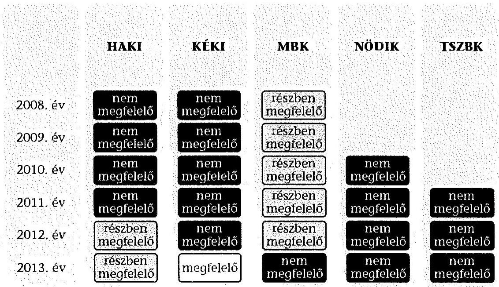

A HAKI esetében a 2012. évben a kedvező változást az eredményezte, hogy a 2012. évben hatályba lépett kockázatkezelési szabályzatában meghatározásra kerültek az elfogadható kockázati keret, a kockázat kezelésének lehetséges módjai, a válaszintézkedés folyamatba történő beépítése, a kockázati környezet (profil) rendszeres felülvizsgálatának követelménye.

Az MBK esetében a 2013. évi negatív elmozdulást az okozta, hogy a 2013. október 15-től hatályba helyezett kockázatkezelési szabályzat előző időszakokhoz képest nem tartalmazta a kockázat azonosítóját. Az MBK a 2012–2013. években részben tett eleget jogszabályban előírt kötelezettségének, mivel

---

a kockázatok folyamatos nyomon követése a tevékenységre vonatkozóan nem, a gazdálkodásra vonatkozóan részlegesen valósult meg ${ }^{72}$.

A KÉKI a 2008–2012. években kockázatkezelési rendszert nem működtetett ${ }^{73}$, a 2013. évi kockázatkezelési rendszer megfelelt a jogszabályi előírásoknak. A NÖDIK és a TSZBK a jogszabályi előírás ${ }^{74}$ ellenére az ellenőrzött időszakban nem működtetett kockázatkezelési rendszert. Ennek következtében nem tárták fel az intézetek tevékenységében, gazdálkodásában rejlő kockázatokat, nem határozták meg az egyes kockázatokkal kapcsolatban szükséges intézkedéseket, azok teljesítése folyamatos nyomon követésének módját, nem végeztek kockázatelemzést ${ }^{75}$. Az intézetek vezetői a 2010. évtől a jogszabályi előírások ellenére nem mérték fel és nem elemezték az intézmény tevékenységével és gazdálkodásával kapcsolatos kockázatokat, valamint nem határozták meg az egyes kockázatokkal kapcsolatos intézkedéseket, 2012. évtől azok teljesítése nyomon követésének módját ${ }^{76}$ Ezek együttesen nem biztosították a kockázatok időben történő azonosítását, értékelését, elemzését, besorolását.

[^0]
[^0]:    ${ }^{72}$ Bkr. 7. § (2) bekezdés
    ${ }^{73}$ Ámr $_{1} 145/$C. §, Ámr $_{2} 157. § (1) bekezdés, Bkr. 7. § (1) bekezdés
    ${ }^{74}$ Ámr $_{1} 145/$C. §, Ámr $_{2} 157. § (1) bekezdés, Bkr. 7. § (1) bekezdés
    ${ }^{75}$ Ámr $_{1} 145/$C. §, Ámr $_{2} 157. § (1) bekezdés, Bkr. 7. § (1) bekezdés
    ${ }^{76}$ Ámr $_{2} 157. § (2)–(3) bekezdés, Bkr. 7. § (2) bekezdés

---

# 3.3. Kontrolltevékenységek kialakítása és működtetése 

Az ellenőrzött intézetek vezetői – az MBK és a NÖDIK kivételével – a kontrolltevékenységekkel kapcsolatos szabályozási keretet – a gazdálkodási jogkörök kijelölésének és aktualizálásának elmaradása miatt – nem megfelelően alakították ki, amelyet az alábbi ábra mutat be:
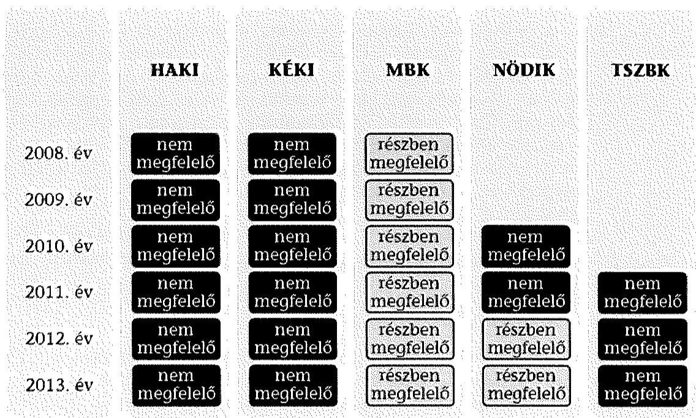

Az intézetek kontrolltevékenysége – alapvetően a szabályozási hiányosságok miatt – nem biztosította az intézetek pénzügyi és vagyongazdálkodásának, működésének szabályszerű ellátását.

A NÖDIK esetében a 2012. évi kedvező változást az eredményezte, hogy a pénzügyi döntések dokumentumainak felülvizsgálata megtörtént. A felülvizsgálat eredményeként meghatározásra került, hogy a pénzügyi kihatású döntések során a célszerűségi, gazdasági, hatékonysági és eredményességi szempontokat vizsgálni kell. Továbbá meghatározásra kerültek a kontrolltevékenység javítása céljából az egyes gazdasági események elszámolása és beszámoló készítése során alkalmazandó kontrolleljárások.

Az ellenőrzött intézeteknél a teljesítés igazolása összességében nem felelt meg az előírásoknak, mivel

- a 2008–2009. években a kiadások teljesítésének, illetve a bevétel beszedésének elrendelése, a 2010–2013. években a kiadás utalványozása előtt, a teljesítés igazoló a kifizetés jogosságát, összegszerűségét több esetben nem igazolta${ }^{77}$,

[^0]
[^0]:    ${ }^{77}$ Ámr 135. § (1) bekezdés, Ámr 276. § (1) bekezdés, Áht${ }_{2}$ 38. § (1) bekezdés

---

- a belső szabályozás ellenére a HAKI-nál a 2010–2011. években, az MBK-nál a 2010–2013. években a bevételek beszedésének elrendelése előtt a teljesítésigazolás nem történt meg,

A KÉKI és a NÖDIK a 2010. évtől, a TSZBK a 2011. évtől, a HAKI a 2012. évtől a jogszabályban foglalt lehetőséggel élve belső szabályzatban nem írta elő a bevételek meghatározott körére nézve a teljesítés igazolásának kötelezettségét ${ }^{78}$.

- a teljesítés igazolására ${ }^{79}$ jogosult személyekről és aláírás-mintájukról a HAKI a 2010–2013., a TSZBK a 2011–2013. években, a KÉKI 2012. október 14-éig, az MBK 2012. szeptember 30-ig a jogszabályi előírás ellenére ${ }^{80}$ nyilvántartást nem vezetett. A névre szóló kijelölés, illetve az aláírás-mintákról vezetett nyilvántartás hiányában több esetben nem volt megállapítható, hogy a kiadási előirányzatok felhasználása, a bevételi előirányzatok teljesítése során a teljesítés igazolását a jogszabályi előírásnak ${ }^{81}$ megfelelően az arra jogosult végezte el.

Az ellenőrzött intézeteknél a 2008–2011. években az utalvány ellenjegyzése összességében nem felelt meg a jogszabályi előírásoknak, mivel

- a kiadás utalványozása, a bevétel beszedése előtt az utalvány ellenjegyzése több esetben nem történt meg ${ }^{82}$.
- az utalvány ellenjegyzését több esetben a 2008–2009. években nem a gazdasági vezető, illetőleg az általa írásban megbízott dolgozó, a 2010–2011. években nem a gazdasági vezető, vagy az általa írásban kijelölt személy végezte el ${ }^{83}$.
- a névre szóló kijelölés, illetve az aláírás-mintákról vezetett nyilvántartás hiányában több esetben nem volt megállapítható, hogy a kiadási előirányzatok felhasználása során az ellenőrzött időszakban az utalvány ellenjegyzését a jogszabályi előírásnak ${ }^{84}$ megfelelően az arra jogosult végezte.

Az ellenőrzött intézeteknél a 2012–2013. években az érvényesítés összességében nem felelt meg a jogszabályi előírásoknak, mivel

- az érvényesítés az utalványozás előtt több esetben nem történt meg ${ }^{85}$:

[^0]
[^0]:    ${ }^{78}$ Ámr$_{2}$ 76. § (2) bekezdés, Ávr. 57. § (2) bekezdés
    ${ }^{79}$ 2011. december 31-ig szakmai teljesítés igazolására
    ${ }^{80}$ Ámr$_{2}$ 80. § (3) bekezdés, Ávr. 60. § (3) bekezdés
    ${ }^{81}$ Ámr$_{1}$ 135. § (2) bekezdés, Ámr$_{2}$ 76. § (3) bekezdés, Ávr. 57. § (3) bekezdés
    ${ }^{82}$ Ámr$_{1}$ 137. § (3) bekezdés, Ámr$_{2}$ 79. § (2) bekezdés
    ${ }^{83}$ Ámr$_{1}$ 137. § (1) bekezdés, Ámr$_{2}$ 79. § (1) bekezdés
    ${ }^{84}$ Ámr$_{1}$ 137. § (1) bekezdés, Ámr$_{2}$ 79. § (1) bekezdés
    ${ }^{85}$ Ávr. 58. § (3) bekezdés

---

- az érvényesítést a jogszabályi előírás ${ }^{86}$ ellenére több esetben nem a gazdasági vezető, vagy az általa írásban kijelölt, az intézet alkalmazásában álló személy végezte.

# 3.4. Az információs és kommunikációs rendszer kialakítása és működtetése 

Az intézetek az ellenőrzött időszakban az információs és kommunikációs rendszert – az MBK 2013. évi, illetve a NÖDIK 2012. évi megfelelő minősítése kivételével – nem, illetve részben megfelelően alakították ki és működtették. Az egyes intézetek által kialakított és működtetett információs és kommunikációs rendszerek jogszabályi előírásoknak való megfelelőségét az alábbi ábra mutatja be:
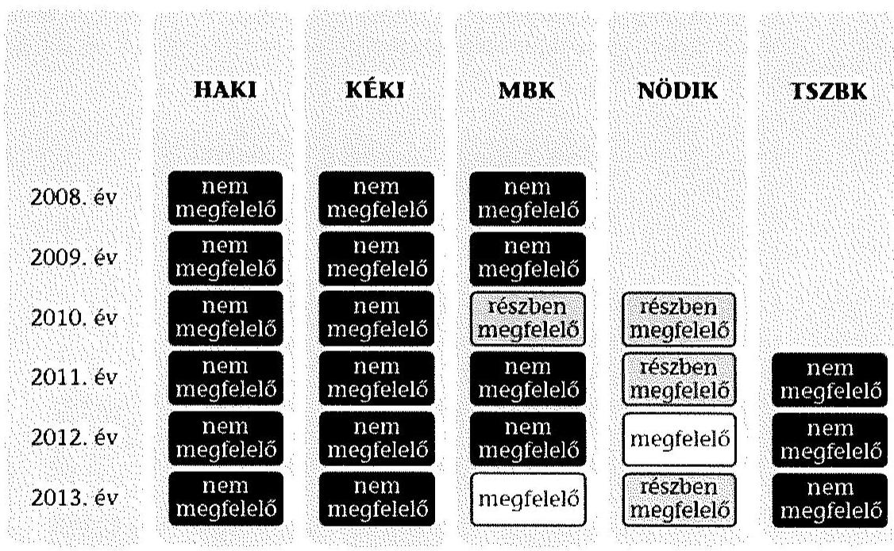

Az MBK minősítésének változásait az egyes ellenőrzött évek között az okozta, hogy az informatikai biztonsági szabályzat aktualizálására csak 2010-ben került sor, majd 2011–2013. években ezek elmaradtak. A 2013. évi kedvező változást az okozta, hogy az intézet kommunikációs stratégiát készített.

A NÖDIK által kialakított információs és kommunikációs rendszer 2010–2011., illetve a 2013. évben részben volt megfelelő. A 2012. évi kedvező változást az okozta, hogy az intézmény elkészítette Informatikai Biztonsági Szabályzatát, továbbá az alkalmazottak munkavégzéséhez szükséges információkhoz történő hozzájutása a jogszabályi előírásoknak ${ }^{87}$ megfelelően biztosítva volt. 2013. évben a szabályzat aktualizálására nem került sor, amely újra részben megfelelő minősítést eredményezett.

[^0]
[^0]:    ${ }^{86}$ Ávr. 58. § (4) bekezdés
    ${ }^{87}$ Bkr. 9. § (1) bekezdés

---

A HAKI, a KÉKI az ellenőrzött időszakban, a TSZBK a 2009–2013. években, illetve MBK vezetője a 2008–2009. és a 2011–2012. években a jogszabályi előírás ${ }^{88}$ ellenére – belső szabályzataiban nem alakított ki olyan rendszereket, melyek biztosították volna, hogy az információk időben eljussanak a feladatellátásban érintettekhez. A szabályozás hiányában a beszámolási rendszereket a jogszabályi előírás ${ }^{89}$ ellenére nem úgy működtették, hogy azok hatékonyak, megbízhatóak és pontosak legyenek, a beszámolási szintek, határidők és módok világosan meg legyenek határozva.

# 3.5. A monitoring rendszer kialakítása és működtetése 

Az ellenőrzött intézetek monitoring rendszerének kialakítása és működtetésének szabályszerűsége – a HAKI és a NÖDIK kivételével – a teljes ellenőrzött időszakban nem volt megfelelő. A monitoring rendszer, azon belül a belső ellenőrzési rendszer jogszabályi előírásoknak való megfelelőségét az alábbi ábra mutatja be:
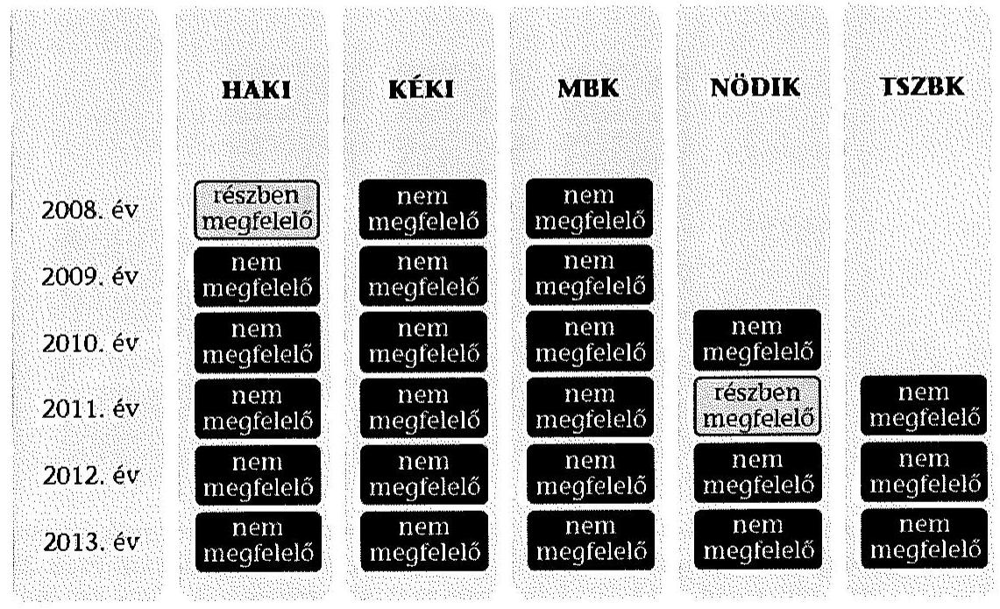

A HAKI esetében a 2009. évre történő negatív változást az eredményezte, hogy a jogszabályi előírásokkal ellentétben ${ }^{90}$ a belső ellenőrzési vezető az ellenőrzésekről nyilvántartást nem vezetett és az az intézet, illetve az ellenőrzött szervezeti egység vezetője az ellenőrzési jelentés megállapításaira készített intézkedési tervet a megadott határidőn túl készítette el.

A NÖDIK esetében a kezdeti pozitív változást az okozta, hogy az intézet 2011. január 1-től belső ellenőrt foglalkoztatott szerződéses jogviszony keretében és a belső ellenőrzés elhelyezkedése a szervezeti struktúrában a jogszabályi

[^0]
[^0]:    ${ }^{88}$ Ámr$_{1}$ 145/F. § (1) bekezdés, Ámr$_{2}$ 159. § (1) bekezdés, Bkr. 9. § (1) bekezdés
    ${ }^{89}$ Ámr$_{1}$ 145/F. § (2) bekezdés, Ámr$_{2}$ 159. § (2) bekezdés, Bkr. 9. § (2) bekezdés
    ${ }^{90}$ Ber. 12. § j) pont, 29. § (1) bekezdés

---

előírásoknak ${ }^{91}$ megfelelő volt. 2012-re történő kedvezőtlen változást az okozta, hogy a belső ellenőrzés által készített jelentésekre az intézkedési terveket 2012. évben két esetben, 2013. évben három esetben határidőn túl készítették el és az intézkedési terveket a belső ellenőrzési vezető nem véleményezte ${ }^{92}$.

Az MBK, a TSZBK, a KÉKI és a HAKI 2009–2013. években, illetve a NÖDIK vezetője a 2010. és 2012–2013. években a jogszabályi előírás ${ }^{93}$ ellenére belső szabályzataiban nem alakította ki, szervezetében nem működtetett olyan monitoring rendszert, amely lehetővé tette a szervezet tevékenységének, a célok megvalósításának folyamatos nyomon követését.

Az intézetek belső ellenőrzési
 rendszerei, működésének szervezeti keretei nem feleltek meg teljes körűen a vonatkozó jogszabályi előírásoknak, mivel

- a NÖDIK vezetője 2010. évben, illetve a TSZBK vezetője 2011-2012. években a jogszabályi előírás ${ }^{94}$ ellenére a belső ellenőrzés kialakításáról nem gondoskodott.
- a KÉKI, az MBK és a NÖDIK 2012-2013. években a jogszabályi előírás ${ }^{95}$ ellenére nem alkalmazott legalább egy fő belső ellenőrt foglalkoztatásra irányuló jogviszonyban annak ellenére, hogy engedélyezett létszáma meghaladta az 50 főt ${ }^{96}$.

Az ellenőrzött időszakban a KÉKI és az MBK, 2010. és a 2013. évben a HAKI, 2011. évben a NÖDIK, illetve az ellenőrzött szervezeti egység vezetője és alkalmazottai a jogszabályi előírás ${ }^{97}$ ellenére a belső ellenőrzés megállapításai és javaslatai alapján a végrehajtásért felelősöket és a végrehajtás határidejét feltüntető intézkedési tervet nem készítettek. A HAKI 2008., 2009. és 2012. években minden alkalommal, illetve a NÖDIK a 2012-2013. években, valamint a TSZBK a 2013. évben több esetben az intézkedési tervet a jogszabályban meghatározott ${ }^{98}$ határidőn túl készítette el.

A HAKI, a KÉKI, az MBK és a TSZBK belső ellenőrzési vezetője a jogszabályi előírás ${ }^{99}$ ellenére nem vezetett nyilvántartást az elvégzett belső ellenőrzésekről. A HAKI belső ellenőrzési vezetője a jogszabályi előírás ${ }^{100}$ ellenére az intézkedési tervben foglaltak végrehajtásáról nyilvántartást nem vezetett, ezzel nem bizto-

[^0]
[^0]:    ${ }^{91}$ Ber. 6. § (2) bekezdés,Bkr. 15. §
    ${ }^{92}$ Bkr. 45. § (3)-(4) bekezdései
    ${ }^{93}$ Ámr $_{1}$ 145/G. §, Ámr 2 160. §, Bkr 3. § és 10. §
    ${ }^{94}$ Áht $_{1}$ 121/A. § (3) bekezdés, a 2011. évben Áht ${ }_{1}$ 121/B. § (4) bekezdés, Áht ${ }_{2} 70 . \S$ (1) bekezdés
    ${ }^{95}$ Bkr. 15. § (5) bekezdés
    ${ }^{96} \mathrm{~A}$ belső ellenőrzés ellátásáról külső szolgáltató bevonásával gondoskodtak.
    ${ }^{97}$ Ber. 17. § (1) bekezdés d) pont, Bkr. 28. § c) pont
    ${ }^{98}$ Ber. 29. § (1) bekezdés, Bkr. 45. § (3) bekezdés
    ${ }^{99}$ Ber. 32. §, Bkr. 50. § (1) bekezdés
    ${ }^{100}$ Ber. 29/A. § (1) bekezdés, Bkr. 47. § (1) bekezdés

---

sította a belső ellenőrzési jelentésekben tett megállapítások, javaslatok, vonatkozó intézkedési tervek és azok végrehajtásának nyomon követését.

Az MBK, illetve az ellenőrzött szervezeti egység vezetője és alkalmazottai a jogszabályi előírás ${ }^{101}$ ellenére a külső ellenőrzés megállapításai és javaslatai alapján a végrehajtásért felelősöket és a végrehajtás határidejét feltüntető intézkedési tervet nem készítettek. A KÉKI és a HAKI a jogszabályi előírás ${ }^{102}$ ellenére nem vezetett nyilvántartást a külső ellenőrzések javaslatai alapján készült intézkedési tervek végrehajtásáról.

A minisztérium a 2008-2009. években a HAKI-nál, a KÉKI-nél és az MBK-nál, illetve a NÖDIK-nél és a TSZBK-nál az ellenőrzött időszakban ellenőrzést nem végzett.

Az irányító szerv a 2010-2013. években három tervezett és három soron kívüli ellenőrzést hajtott végre a HAKI, a KÉKI és az MBK szervezeténél.

A minisztérium a HAKI esetében 2011. évben ellenőrzést végzett a 2009-2010. évek elemi költségvetésének végrehajtásáról szóló beszámoló vizsgálata céljából. Az ellenőrzés során megállapított hiányosságok pótlására intézkedési terv készítését írta elő. Az állami vagyon védelme érdekében 2013. évben célvizsgálatot végzett a HAKI-nál a ponty génállományban bekövetkezett hiány és az azzal kapcsolatos felelősség megállapítása céljából. Az ellenőrzést követően a HAKI-nak intézkedési terv készítési kötelezettsége nem állt fenn.

A minisztérium a KÉKI esetében három esetben végzett ellenőrzést. 2011-ben átfogó ellenőrzés keretében vizsgálta a 2009-2010. évek gazdálkodásának szabályszerűségét. A javaslatok hasznosulásáról 2013. évben utóellenőrzés keretében győződött meg. 2012-ben a KÉKI 2011. évi gazdálkodásának soron kívüli ellenőrzését végezte.

A minisztérium 2010. évben ellenőrizte az MBK 2006-2009 közötti pénzügyi gazdálkodási folyamatait. Az ellenőrzésről készült jelentés intézkedést igénylő javaslatot nem fogalmazott meg. A minisztérium 2013. év szeptemberében végezte az MBK 2011-2012. évekre vonatkozó rendszerellenőrzését. Intézkedési terv készítési kötelezettsége nem volt, mivel az ellenőrzés során feltárt hibák, hiányosságok megszüntetéséről az MBK az ellenőrzés folyamán gondoskodott.

# 3.6. Az integritás szemlélet érvényesítése 

A NÖDIK az integritás szemlélet fejlesztése érdekében, valamint a korrupciós kockázatok csökkentése céljából 2013. évben kitöltötte az ÁSZ integritási kérdőívét. Az ellenőrzés keretében az intézmények egy-egy, a kontrollrendszerre összpontosító kérdőívet töltött ki. A kérdőívekben az intézetek önértékelés keretében adtak számot az integritás kontrollok kiépítettségéről és működtetéséről. Ennek eredményét az 1. számú melléklet tartalmazza.

[^0]
[^0]:    ${ }^{101}$ Ber. 17. § (1) bekezdés d) pont, Bkr. 13. § és 45. § (2) bekezdés
    ${ }^{102}$ Bkr. 14. § (1) bekezdés, Ber. 29/A. §

---

# 4. A PÉNZÜGYI GAZDÁLKODÁS SZABÁLYSZERŰSÉGE 

### 4.1. Az előirányzat-módosítások megfelelősége

Az intézmények költségvetési bevételeinek és kiadásainak előirányzat módosítását, főkönyvi könyvelésbe történő feladásának rendjét - a HAKI kivételével - az ellenőrzött időszakban belső szabályzatokban teljes körűen nem határozták meg az alábbiak szerint:

- a KÉKI, az MBK, a NÖDIK és a TSZBK a jogszabályi előírásokkal ellentétben nem írták elő az előirányzat módosításokról vezetendő analitikus nyilvántartás formáját, tartalmát, vezetésének módját ${ }^{103}$.
- a TSZBK gazdasági feladatait ellátó KÉKI szabályzataiban a TSZBK sajátosságait nem vette figyelembe. A KÉKI vezetője az előirányzat módosítások kezdeményezésének, rögzítésének, nyilvántartásának felelőseit nem a szervezeti felépítésnek megfelelően határozta meg, ezért nem voltak egyértelműek a felelősségi, hatásköri viszonyok és feladatok ${ }^{104}$.

Az intézmények összevont eredeti előirányzatának összege az egyes években jelentősen nem változott. Az intézetek minden évben jelentős összegű, a 2012. évben az eredeti előirányzat 85%-át, a 2013. évben 120%-át meghaladó mértékű előirányzat-módosítást hajtottak végre. Az eredeti előirányzat és az elő-irányzat-módosítások összegének alakulását az ellenőrzött intézetekre összevontan M Ft-ban az alábbi diagram szemlélteti:

Az eredeti előirányzat és az előirányzat-módosítások
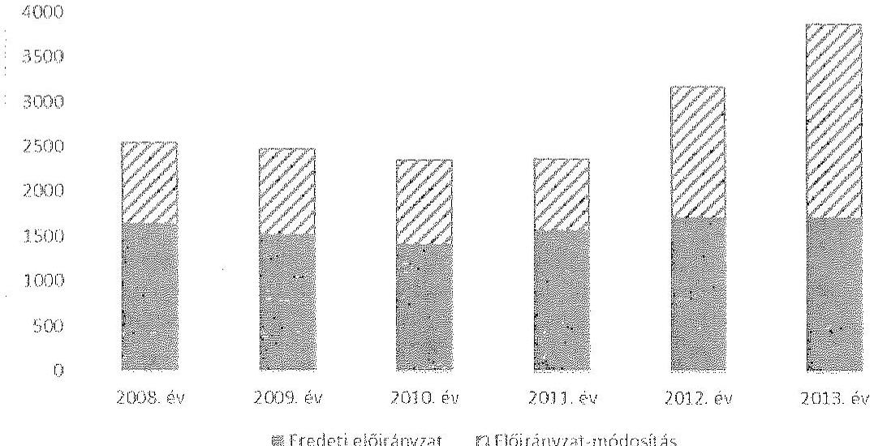

Az Országgyűlés 2011-ben az államháztartás egyensúlyának megőrzése érdekében 240,0 M Ft-ot vont el az intézetektől. A kormányzati hatáskörben végre-

[^0]
[^0]:    ${ }^{103}$ Áhsz. 49. § (3) bekezdés
    ${ }^{104}$ Ámr 2 156. § (1) bekezdés b) pont, Bkr. 6. § (1) bekezdés b) pont

---

hajtott előirányzat módosítások döntően a bér-kompenzációhoz, illetve a zárolásokhoz kapcsolódtak. Az előirányzat módosítások jelentős hányadát az előző évi előirányzat-maradvány igénybevételhez, valamint a pályázatokból és a működési bevételből származó többletbevételekhez kapcsolódó előirányzatmódosítások tették ki. Az eredeti és módosított előirányzat alakulását, az elő-irányzat-módosítások intézetenkénti, hatáskörönkénti összegét az éves költségvetési beszámolók alapján az 2. számú melléklet mutatja be.

A KÉKI esetében az előirányzat-módosítások szabályszerűsége nem volt megítélhető, mivel a KÉKI a jogszabályi előírás ${ }^{105}$ ellenére a könyvviteli elszámolást közvetlenül és közvetetten alátámasztó számviteli bizonylatokat teljes körűen nem őrizte meg, az iratok szakszerű és biztonságos megőrzésére alkalmas irattár kialakításáról és működtetéséről nem gondoskodott.

A KÉKI a 2008. és a 2011. évi előirányzat módosítások, a 2009. évi saját hatáskörű, illetve a 2010. évi kormányzati hatáskörű előirányzat módosítások dokumentumait csak részben, a 2010. és 2012-2013. évi saját hatáskörű előirányzat módosítások dokumentumait nem őrizte meg.

Az MBK előirányzat-módosításainak szabályszerűségét - az alábbi kisebb hiányosságok ellenére - megfelelőnek minősítettük. A NÖDIK és a TSZBK bevételi és kiadási előirányzatainak módosítása nem felelt meg teljes körűen a jogszabályi előírásoknak és a belső szabályzatokban foglaltaknak, a HAKI esetében az előirányzat-módosítások szabályszerűségét magas kockázatúnak minősítettük, mivel

- a HAKI, az MBK, a NÖDIK és a TSZBK a zárolt előirányzatokat a Különféle elszámolások számlacsoportban külön főkönyvi számlákon nem mutatta ki ${ }^{106}$, a zárolt előirányzatokkal a kiemelt előirányzatokat csökkentette.
- a NÖDIK rendszeresen, a TSZBK több esetben a számviteli nyilvántartásokba nem csak szabályszerűen kiállított bizonylat alapján jegyzett be adatokat ${ }^{107}$.

A NÖDIK az ellenőrzött időszakban a saját hatáskörben végrehajtott előirányzatmódosításokat nem dokumentálta, az előirányzat-változtatásokhoz nem kapcsolódott könyvelést alátámasztó bizonylat.

A TSZBK a 2012. évben 2,0 M Ft, a 2013. évben 12,5 M Ft előirányzat-módosítást bizonylat nélkül rögzített a nyilvántartásokba, továbbá a 2012. évben 1,9 M Ft, a 2013. évben 1,6 M Ft előirányzat-módosítást a belső szabályozás ellenére nem az arra jogosult gazdasági vezető kezdeményezett.

- az ellenőrzött szervezetek közül a HAKI és az MBK a 2012-2013. években, a NÖDIK és a TSZBK az ellenőrzött időszakban a saját hatáskörben végre-

[^0]
[^0]:    ${ }^{105}$ Számv. tv. 169. § (2) bekezdés
    ${ }^{106}$ Áhsz. 9. számú melléklet 9. f) pont
    ${ }^{107}$ Számv. tv. 165. § (2) bekezdés

---

hajtott előirányzat-módosításokról több esetben nem tájékoztatta az irányító szervet ${ }^{108}$.

- a NÖDIK és a TSZBK több esetben az intézkedés meghozatalát követő öt munkanapon túl tájékoztatta a Kincstárat ${ }^{109}$.

A TSZBK 2013. évi költségvetési beszámolójának 23. űrlapján szereplő módosított előirányzat összege a főkönyvi kivonat adataival megegyezett. A jogszabályi előírás ${ }^{110}$ ellenére azonban sem a módosított kiadási és bevételi főösszeget, sem a kiemelt előirányzatokat, sem az előirányzat módosítások hatáskörönkénti megoszlását nem támasztotta alá az analitikus nyilvántartás, illetve az előirányzat-módosításokat tartalmazó döntések dokumentációja.

A beszámoló és a főkönyvi kivonat szerinti módosított előirányzat 11,7 M Ft-tal haladta meg a TSZBK dokumentált módosított előirányzatát. Az eltérést az okozta, hogy a TSZBK könyveiben a KÉKI gazdasági szervezete az előző évi felhalmozási célú maradvány 5,0 M Ft-os összegét, illetve a kutatói utánpótlás keretében kapott 2,7 M Ft támogatást kétszer, illetve további 4,0 M Ft előirányzatmódosítást a jogszabályi előírás ellenére dokumentáció nélkül könyvelt ${ }^{111}$. A téves könyvelések eredményeként a TSZBK kiemelt előirányzatai között átcsoportosítás is történt. Az analitikus nyilvántartás és a dokumentált előirányzatmódosítások összege 0,7 M Ft-tal eltért, mivel az analitikus nyilvántartásban olyan összeget is szerepeltettek, amelyről előirányzat-módosítást előíró bizonylat nem készült, illetve amelynek rögzítése a könyvviteli nyilvántartásokban nem történt meg.

[^0]
[^0]:    ${ }^{108}$ Ámr 2 71. § (6) bekezdés, Ávr. 167. § (4) bekezdés
    ${ }^{109}$ Ámr 2 71. § (6) bekezdés, Ávr. 167. § (4) bekezdés
    ${ }^{110}$ Áhsz. 49. § (1) bekezdés
    ${ }^{111}$ Számv. tv. 169. § (1)-(2) bekezdés

---

# 4.2. Bevételi és kiadási előirányzatok teljesítése 

Az intézetek által teljesített kiadások, irányító szervi támogatások és bevételek alakulását az ellenőrzött intézetekre összevontan M Ft-ban az alábbi diagram szemlélteti:
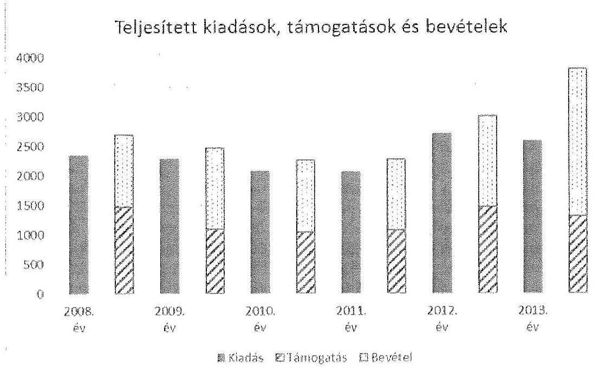

A bevételi és kiadási előirányzatok teljesítésének alakulását kiemelt előirányzatonként az 3. számú melléklet mutatja be.

A HAKI, az MBK és a NÖDIK esetében a bevételi és kiadás előirányzatok teljesítése az előirányzat módosításoknak megfelelően történt.

A KÉKI és a TSZBK nem tartotta be

 teljes körűen a bevételi és kiadási előirányzatok teljesítése során a jogszabályi előírásokat, mert

- a jogszabályi előírás ${ }^{112}$ ellenére több esetben a módosított kiadási előirányzat mértékét meghaladóan rendeltek el, teljesítettek kifizetést:

| Intézet | Év | Kiemelt előirányzat | Módosított előirányzat | Teljesítés |
| :--: | :--: | :--: | :--: | :--: |
| KÉKI | 2011. év | dologi kiadások | 121,5 M Ft | 124,7 M Ft |
|  | 2013. év | dologi kiadások | 127,9 M Ft | 153,9 M Ft |
| TSZBK | 2011. év | beruházások | 0,0 M Ft | 0,9 M Ft |
|  | 2012. év | beruházások | 17,3 M Ft | 17,6 M Ft |
|  | 2013. év | felújítások | 7,0 M Ft | 7,5 M Ft |

[^0]
[^0]:    ${ }^{112}$ Áht ${ }_{1}$ 12/A. § (1) bekezdés, Áht ${ }_{2}$ 6. § (1) bekezdés

---

# 4.3. Bevételi előirányzatok teljesítése 

A KÉKI és a NÖDIK bevételi előirányzatainak elszámolása nem volt szabályszerű ${ }^{113}$, a HAKI és a TSZBK esetében a bevételi előirányzatok teljesítésének szabályszerűségét magas kockázatúnak minősítettük, mivel a saját előállítású termék, a végzett szolgáltatás árainak meghatározásakor a termékek és szolgáltatások közvetlen önköltségét az intézményi szabályozások szerint nem állapították meg az alábbiak szerint:

- a HAKI önköltségszámítási szabályzata ${ }_{2}$ 2012. január 1-2013. február 28. között csak általános jelleggel szabályozta a termékek, szolgáltatások ármeghatározását. A működési bevételek teljesítése során több esetben a halértékesítéseknél nem a jogszabályban és a HAKI önköltségszámítási szabályzatában ${ }_{1,3}$ B/1 pontjaiban előírt módon határozta meg a hal egységárát.
- a KÉKI a szabad kapacitás kihasználását célzó tevékenysége keretében nyújtott szolgáltatás díját önköltségszámítással nem alapozta meg.
- a NÖDIK saját maga által előállított takarmány értékesítése során nem alkalmazta a NÖDIK önköltségszámítási szabályzatban ${ }_{1,2}$ foglaltakat ${ }^{114}$.

A NÖDIK 2011-2013. években az MVH határozata alapján évenként 1010498 EUR támogatásban részesült, amelyet 55%-ban európai uniós, 45%-ban hazai forrásból finanszíroztak. A szakmai követelmények rögzítése mellett a NÖDIK részére a közreműködő szervezet a támogatás összegének felhasználására vonatkozó előírásokat nem határozott meg. Az intézmény a jogszabályi előírások ellenére ${ }^{115}$ a támogatással 2011-2013. években nem számolt el. A NÖDIK gazdasági vezetője a 2012. június 13-án kelt levelében - a közreműködő szervezet MVH felé - megfogalmazott ez irányú kérdésére vonatkozóan azt a választ kapta, hogy az elszámolás során kizárólag szakmai követelmények kerülnek megvizsgálásra, számviteli szempontból a felhasználás módját nem ellenőrzik. A NÖDIK a kapott összegeket alkalmanként, szöveges és számszaki indoklás, valamint az irányító szerv tájékoztatása nélkül előirányoztosította, a támogatás felhasználásáról elkülönített nyilvántartást nem vezetett.

A NÖDIK 2011 évben a VM „állami génmegőrzési feladatok" elnevezésű fejezeti kezelésű előirányzatból megállapodás alapján elszámolási kötelezettséggel 100,0 M Ft kapott. A megállapodás 6. pontjában szabályozott az összeg felhasználásának elkülönített nyilvántartására vonatkozó rendelkezéssel ellentétben az elkülönített nyilvántartást nem alakította ki. Az elszámolt kifizetéseket a személyi kiadások és a munkáltatót terhelő járulékok vonatkozásában analitikus nyilvántartásokból utólagosan kigyűjtéssel terhelték a programokra, melynek valóságtartalmát az állományban lévő munkavállalókról vezetett munkaidő nyilvántartások nem támasztották alá.

[^0]
[^0]:    ${ }^{113}$ Áhsz. 8. § (15) bekezdés
    ${ }^{114}$ NÖDIK Önköltségszámítási szabályzat ${ }_{1,2}$
    ${ }^{115}$ Áht ${ }_{1}$ 13/A. § (2) bekezdés, Áht ${ }_{2}$ 53. § (1) bekezdése

---

A TSZBK 2011. augusztus 1-jei alapításától a MNV Zrt-vel kötött vagyonkezelési szerződés aláírásáig, 2012. augusztus 3-ig a muzeális borkészletre vagyonkezelői joggal nem rendelkezett. A 2011. évben a TSZBK igazgatójának a muzeális borok értékesítésére vonatkozó utasításával ellentétben olyan, a muzeális borállomány részét képező 1937-es évjáratú 6 puttonyos Tokaji Aszú esszencia értékesítésére került sor 0,2 M Ft értékben, amely nem tartozott az értékesíthető borállományba.

A TSZBK igazgatója belső feljegyzésben határozta meg az értékesíthető évjáratokat és fajtákat. A 2011. és 2012. évben több esetében került sor muzeális bor értékesítésére.

A TSZBK 2011. év végi leltározási adatai alapján a nyilvántartott muzeális bor készlet állománya 278719 palack volt, amelyet a mérlegben 335,98 M Ft önköltség áron mutatott ki. Az intézet az ellenőrzött időszakban a jogszabályi lehetőséggel élve nem piaci értéken értékelte a készletet. A borállományt a tarcali és a tolcsvai telephelyen külön tárolták és az egyes leltárkörzeteket külön leltározták. A 2013. évi mérleg adatok alapján Tolcsva leltárkörzetben 277323 palack 333,7 M Ft, a Tarcal leltárkörzetben 1629 palack 2,2 M Ft önköltségi áron nyilvántartott készlet került kimutatásra, amely a mérlegadatokkal megegyezett.

A KÉKI, a NÖDIK és a TSZBK adatszolgáltatásában határidőn túli követelést nem mutatott ki. A HAKI és az MBK nem tett intézkedést a határidőn túli követelések behajtása érdekében.

Az ellenőrzött intézetek működési és felhalmozási bevételeinek elszámolása során a gazdálkodási jogkörök gyakorlása nem felelt meg a jogszabályi előírásoknak. (Az előforduló hibák részletes leírását a 3.3. pont tartalmazza.)

# 4.4. Kiadási előirányzatok felhasználása 

A kiadási előirányzatok felhasználása során a HAKI, a KÉKI és a TSZBK a jogszabályi előírás ellenére az alábbi esetekben nem folytatott le közbeszerzési eljárást:

- a HAKI 2009., 2010. és 2013. években a jogszabályban ${ }^{116}$ meghatározott értékhatár figyelmen kívül hagyásával több esetben közbeszerzési eljárás mellőzésével szerzett be eszközt, vett igénybe szolgáltatásokat ${ }^{117}$.
- a KÉKI 2006-2012 évek között létrejött szerződések alapján folyamatosan vagyonvédelmi szolgáltatást vett igénybe ugyanazon szolgáltatótól. A hivatkozott szerződések megkötésével - a jogszabályban ${ }^{118}$ előírt egybeszámítási szabályokra figyelemmel - a közbeszerzési eljárás mellőzésével megsértette a közbeszerzési eljárás lefolytatásának kötelezettségét ${ }^{119}$.

[^0]
[^0]:    ${ }^{116}$ Kbt${ }_{1}$ 244. §-ának (1) bekezdés, Kbt${ }_{2}$ 10. § (1) bekezdés b) pont
    ${ }^{117}$ Kbt${ }_{1}$ 2. § (1) bekezdés, 240. § (1) bekezdés, Kbt${ }_{2}$ 5. § és 119. §
    ${ }^{118}$ Kbt${ }_{1}$ 40. §, Kbt${ }_{2}$ 18. §
    ${ }^{119}$ Kbt${ }_{1}$ 2. § (1) bekezdés és 240. § (1) bekezdés, valamint - a Kbt${ }_{2}$ 19. §-ára figyelemmel Kbt${ }_{2}$ 5. §

---

- a TSZBK a közbeszerzési eljárás mellőzésével megsértette a jogszabályban ${ }^{120}$ előírt közbeszerzési lefolytatásának kötelezettségét, mivel a közbeszerzési értékhatárt meghaladó összegben, nettó 10,3 M Ft értékben a 2012. évben borelemző készüléket szerzett be.

Az MBK és a NÖDIK jogszabályi ${ }^{121}$, valamint a közbeszerzési szabályzatok előírásait betartotta.

A TSZBK a 2011-2012. években megsértette továbbá a Kormány által elrendelt beszerzési tilalmakat is, mivel

- a 2011. évben az 1316/2011. (IX. 19.) Korm. határozat 4. pontja ellenére egy esetben, 0,6 M Ft nettó értében szerzett be informatikai eszközt, illetve további egy esetben, 0,1 M Ft nettó értékben gépet.
- a 2011. évben az 1316/2011. (IX. 19.) Korm. határozat 4. pontja ellenére kettő esetben, 1,4 M Ft nettó értében rendelt meg informatikai eszközt, melyek kifizetésére a 2012. évben került sor.
- a 2012. évben az 1036/2012. (II. 21.) Korm. határozat 6. pontja ellenére kettő esetben, 0,8 M Ft nettó értékben szerzett be informatikai eszközt.

A miniszter a TSZBK igazgatójának akadályoztatásának idejére helyettesítési díjat állapított meg havi bruttó 70,0 E Ft összegben 2012. április 26-át követően a TSZBK egyik közalkalmazottja részére. Az igazgató távolléte 2012. július 3-án megszűnt. Az igazgató munkába állásával párhuzamosan a helyettesítéssel megbízott közalkalmazott számfejtett bére 15 hónapon keresztül továbbra is tartalmazta a helyettesítési díjat, amely kifizetésre került. A jogosulatlan kifizetés következtében a TSZBK-t vagyoni hátrány érte. A TSZBK igazgatója nem gondoskodott a helyettesítési megbízás visszavonásának kezdeményezéséről.

A TSZBK közalkalmazottai részére számfejtett és kifizetett kompenzáció összege a 2011. évben három, a 2012-2013. években öt-öt közalkalmazott esetében nem egyezett a jogszabályban meghatározott ${ }^{122}$ összeggel.

A TSZBK egy alkalmazott részére folyósított munkáltatói kölcsönt 5,0 M Ft összegben. Az intézmény a jogszabályi előírás ${ }^{123}$ ellenére nem a tartósan adott kölcsönök (visszterhesen átadott pénzeszközök) számlacsoportban mutatta ki a munkáltatói kölcsön összegét. A TSZBK a jogszabályi előírás ${ }^{124}$ ellenére az 1. számlaosztály 19. számlacsoportján belül nem mutatta ki külön számlán az eszköz január 1-jei nyitóállományát és azokat a gazdasági műveleteket, amelyek az állomány értékét módosítják (állományi számlák), illetve a nyitó állomány növekedését eredményező tárgyévi előirányzatok teljesítését (forgalmi

[^0]
[^0]:    ${ }^{120}$ Kbt${ }_{2}$ 119. §-ára figyelemmel a Kbt${ }_{2}$ 5. §
    ${ }^{121}$ Kbt${ }_{1,2}$, 168/2004. (V. 25.) Korm. rendelet
    ${ }^{122}$ 352/2010. (XII. 30.) Korm. rendelet, 371/2011. (XII. 31.) Korm. rendelet, 408/2012. (XII. 28.) Korm. rendelet
    ${ }^{123}$ Áhsz. 9. számú melléklet 1. j) pont
    ${ }^{124}$ Áhsz. 9. számú melléklet 1. a) pont

---

számlák). Ezzel a TSZBK megsértette a tartalom elsődlegessége a formával szemben számviteli alapelvet ${ }^{125}$, mivel a beszámolóban és az azt alátámasztó könyvvezetés során a gazdasági eseményeket, ügyleteket nem a tényleges gazdasági tartalmuknak megfelelően mutatta be, illetve nem annak megfelelően számolta el. A TSZBK ennek következtében a jogszabályi előírás ${ }^{126}$ ellenére 2013. évi könyvviteli mérlegében nem mutatta ki tartósan adott kölcsönként a munkáltatói kölcsön összegét, illetve rövid lejáratú kölcsönként a tartósan adott kölcsönből a mérlegfordulónapot követő egy éven belül esedékes részleteket.

Az intézmények felhalmozási és működési kiadásainak elszámolása során a gazdálkodási jogkörök gyakorlása - a gazdálkodási jogkörök szabályozottságának hiánya miatt - nem felelt meg az Ámr${ }_{1,2}$ és az Ávr. előírásainak. (Az előforduló hibák részletes leírását a 3.3. pont tartalmazza.) Az ellenőrzött intézeteknél a pénzgazdálkodási kontrollok nem működtek megfelelően.

# 4.5. Az előirányzat-maradvány megállapításának és felhasználásának szabályszerűsége 

Az ellenőrzött intézetek felhasználható előirányzat-maradványának levezetése megfelelt a jogszabályi előírásoknak ${ }^{127}$. Az ellenőrzött időszakban a költségvetési beszámolókban szabad előirányzat-maradványt nem mutattak ki. A kötelezettségvállalással terhelt előirányzat-maradvány összegének alakulását M Ft-ban az alábbi táblázat mutatja be:

|  | 2008. év | 2009. év | 2010. év | 2011. év | 2012. év | 2013. év |
| :-- | --: | --: | --: | --: | --: | --: |
| HAKI | 197,7 | 65,4 | 27,9 | 9,9 | 23,5 | 2,3 |
| KÉKI | 81,6 | 44,5 | 25,3 | 17,0 | 10,9 | 30,5 |
| MBK | 80,3 | 84,3 | 92,8 | 118,4 | 93,8 | 735,2 |
| NÖDIK |  |  | 50,3 | 76,7 | 150,3 | 427,3 |
| TSZBK |  |  |  |  |  |  |

 | 8,7 | 13,9 | 19,0 |

A HAKI esetében a beszámolókban kötelezettségvállalással terhelt maradványként kimutatott összeg megállapítása nem felelt meg a jogszabályi előírásoknak ${ }^{128}$, az MBK-nál a kötelezettségvállalással terhelt maradvány kimutatás szabályszerűségét magas kockázatúnak minősítettük. A HAKI és az MBK a 2012-2013. években a jogszabályban ${ }^{129}$ előírtak ellenére nem tájékoztatta az irányító szerven keresztül az NGM-et a tárgyévet követő év június 30-áig pénzügyileg nem teljesült, továbbá meghiúsult kötelezettségvállalás miatt szabaddá váló előirányzat-maradványról.

[^0]
[^0]:    ${ }^{125}$ Számv. tv. 16. § (3) bekezdés
    ${ }^{126}$ Áhsz. 19. § (4) bekezdés, 22. § (1) bekezdés c) pont
    ${ }^{127}$ Áhsz. 25. § (2) bekezdés és 3. számú melléklet
    ${ }^{128}$ Ámr $_{1}$ 66. § (10) bekezdés, Ámr 2 210. §, Ávr. 150. §
    ${ }^{129}$ Ávr. 153. § (1)-(2) bek.

---

A TSZBK esetében a 2012-2013. évi költségvetési beszámolókban kötelezettségvállalással terhelt maradványként kimutatott összeg megállapítása, illetve az előző évi előirányzat-maradvány felhasználása nem felelt meg a jogszabályi előírásoknak. A TSZBK az előírások ${ }^{130}$ ellenére kötelezettségvállalással terhelt előirányzat-maradványként mutatott ki olyan összegeket is, amelyre a kötelezettség a jogszabály ${ }^{131}$ értelmében a költségvetési évet követő év kiadási előirányzata terhére volt vállaltható, illetve a kötelezettségvállalás nem a költségvetési év előirányzatai terhére történt ${ }^{132}$.

A NÖDIK a jogszabályi előírással ${ }^{133}$ ellentétben analitikus nyilvántartások vezetésével nem gondoskodott arról, hogy az elemi költségvetési beszámoló adatai közül a kötelezettségvállalással terhelt maradvány összegét a valóságnak megfelelően, áttekinthetően alátámassza. Ennek következtében a kötelezettségvállalással terhelt maradvány megállapítása és felhasználása nem volt megfelelő.

A KÉKI esetében a kötelezettségvállalással terhelt maradvány megállapításának és felhasználásának szabályszerűsége nem volt megítélhető, mivel az intézmény a jogszabályi előírással ${ }^{134}$ ellentétben a könyvviteli elszámolást alátámasztó analitikus nyilvántartásokat nem őrizte meg.

# 4.6. Az intézmények folyamatos fizetőképességének alakulása 

Az ellenőrzött időszakban évente és intézményenként váltózó összegű zárolások, elvonások és maradványtartási kötelezettségek korlátozták az előirányzatok felhasználását, melyet részletesen a 4. számú melléklet mutat be. Az előirányzatok felhasználását korlátozó intézkedések nagyban befolyásolták az intézetek likviditási helyzetének alakulását. A likviditási mutató ${ }^{135} 1,0$ és a pénzeszköz likviditási mutató ${ }^{136} 0,7$ alatti értéke (5. számú melléklet) a 2008-2012. években az MBK, a 2011. évtől a HAKI, a 2011. évben a KÉKI fizetésképtelenségének közvetlen veszélyét jelezte. Az intézetek a likviditási problémák kezelése érdekében intézkedéseket tettek, illetve tájékoztatták fizetési nehézségeikről a minisztériumot:

- a HAKI szöveges beszámolóiban jelezte, hogy költségvetései forráshiányosak voltak. Gazdálkodásában likviditási kockázatot jelentett, hogy bevételei szezonális jellegűek voltak. A HAKI a likviditási problémák megoldásához, a pályázatokhoz szükséges önerő biztosításához hitelfelvétel lehetőségét javasolta az irányító szervnek készített szöveges beszámolókban, azonban az el-

[^0]
[^0]:    ${ }^{130}$ Ávr. 150. § b) pont
    ${ }^{131}$ Ávr. 46. § (2) bekezdés b) pont
    ${ }^{132}$ Ávr. 46. § (1) bekezdés
    ${ }^{133}$ Áhsz. 49. § (1) bekezdés
    ${ }^{134}$ Számv. tv. 169. § (2) bekezdés
    ${ }^{135}$ A likviditási mutató mutatja, hogy a rövid lejáratú fizetési kötelezettségek kiegyenlítéséhez a forgóeszközök (a készletek kivételével) milyen arányban nyújtanak fedezetet.
    ${ }^{136}$ A pénzeszköz likviditási mutató kifejezi, hogy a pénzeszközök év végi állománya milyen arányban nyújt fedezetet a rövid lejáratú fizetési kötelezettségekre.

---

lenőrzött években hitelfelvételre nem került sor. A HAKI a pályázati aktivitásának növelése mellett likviditásának biztosításához, javításához folyamatosan kereste a költség-megtakarítást eredményező megoldásokat.

A HAKI versenyhelyzetben lévő szolgáltatóktól díjcsökkenéseket ért el, belső átcsoportosításokat, feladat-átszervezéseket hajtott végre, csökkentette a kiküldetések számát és az azzal kapcsolatos kifizetések nagyságát, valamint a kommunikációs költségeket.

- az MBK pénzügyi helyzete javítása érdekében takarékossági és bevételnövelő intézkedéseket tett, létszámcsökkenést hajtott végre.
- a KÉKI-nél 2011. évben likviditási problémát okozott 78,6 M Ft előirányzat zárolása, amely a dologi kiadásokat érintette. A zárolás mértéke az eredeti előirányzat 77,1%-a volt. A dologi kifizetések biztosítása érdekében az intézmény vezetője több esetben jelezte az irányító szerv felé a zárolás miatt kialakult likviditási problémákat. A likviditási helyzet javítása érdekében hozott intézkedések és az irányító szervtől kapott, a fennálló tartozásállomány közel 1/3 részét kitevő póttámogatás nem oldotta meg a KÉKI likviditási problémáit. 2011. év végén a kötelezettségek aránya a forrásokon belül 27,8% volt, amely mind lejárt tartozás volt. Ez veszélyeztette az intézet működésének biztonságát, mivel az intézet nem volt képes kötelezettségeinek kiegyenlítésére.

A HAKI, a KÉKI és az MBK könyvviteli mérlegeiben kimutatott kötelezettségek tartalmaztak lejárt határidejű szállítói állományt, a pénzügyi gazdálkodása keretében nem volt biztosított a szállítói számlák, egyéb kötelezettségek határidőben történő kiegyenlítése. A lejárt szállítói tartozások összegének év végi alakulását M Ft-ban - az intézetek adatszolgáltatása alapján - az alábbi táblázat mutatja be:

|  | 2008. év | 2009. év | 2010. év | 2011. év | 2012. év | 2013. év |
| :-- | --: | --: | --: | --: | --: | --: |
| HAKI | 1,5 | 3,6 | 10,0 | 2,1 | 16,8 | 2,2 |
| KÉKI | 12,4 | 8,0 | 22,0 | 41,2 | 0,3 | 0,5 |
| MBK | 0,9 | 3,7 | 20,5 | 2,6 | 3,7 | 1,0 |

A NÖDIK és a TSZBK határidőn túli kötelezettséget adatszolgáltatásában nem mutatott ki.

A HAKI, a KÉKI, a NÖDIK és a TSZBK a jogszabályi előírás ${ }^{137}$ ellenére előirányzat-felhasználási, illetve a NÖDIK és a TSZBK a 2012-2013. években, a HAKI a 2013. évben a bevételek beérkezésének és a kiadások teljesítésének ütemezéséről likviditási tervet nem készített. Az MBK által elkészített előirányzatfelhasználási, illetve likviditási terv tartalma a jogszabályi előírásoknak ${ }^{138}$ megfelelt.

[^0]
[^0]:    ${ }^{137}$ Ámr $_{1}$ 138/B. §, Ámr 200. §, 2009. január 1-től Áht ${ }_{1}$ 100/B. § (1) bekezdés, 2010. augusztus 15-től Áht ${ }_{1}$ 100/C. §, Áht ${ }_{2}$ 78. § (2) bekezdés
    ${ }^{138}$ Ámr $_{1}$ 138/B. §, Ámr 200. §, Ávr. 122. § (1) bekezdés

---

# 5. A VAGYONGAZDÁLKODÁS SZABÁLYSZERŰSÉGE 

### 5.1. A vagyongazdálkodási tevékenység szabályozottsága, a vagyonhasznosítás szabályszerűsége

Az intézetek - a KÉKI és az MBK esetében a szolgálati lakások kivételével - a kezelésükben, tulajdonukban lévő vagyontárgyak bérbeadási, értékesítési folyamatát, térítésmentes átadásának szabályait a 2010-2013. években a jogszabályi előírás ${ }^{139}$ ellenére nem határozták meg.

Az MBK esetében a szolgálati lakások után fizetendő lakbérekről és díjakról szóló főigazgatói intézkedések előírásai a közalkalmazotti jogviszonyban nem állók részére meghatározott bérleti díjak tekintetében nem feleltek meg a 106/1999. (XII. 28.) FVM rendeletben foglaltaknak, mivel a jogviszony megszűnése utáni időszakra magasabb bérleti díjat állapított meg a közalkalmazotti jogviszonyban nem állók részére.

A 106/1999. (XII. 28.) FVM rendelet 1. sz. melléklete a havi lakbér mértékét összkomfortos lakás esetén $180 \mathrm{Ft} / \mathrm{m}^{2}$ díjban határozta meg. A 17/2008. számú főigazgatói intézkedés a közalkalmazotti jogviszonyban nem állók bérleti díját a jogviszony megszűnése utáni első két hónapra $360 \mathrm{Ft} / \mathrm{m}^{2} /$ hó összegben (a közalkalmazotti jogviszonyban állók bérleti díjának a duplájában), a harmadik hónaptól $540 \mathrm{Ft} / \mathrm{m}^{2} /$ hó összegben (a közalkalmazotti jogviszonyban állók bérleti díjának a háromszorosában) határozta meg. A 2/2011. számú főigazgatói intézkedés a közalkalmazotti jogviszonyban nem állók bérleti díját a jogviszony megszűnése utáni harmadik hónaptól $675 \mathrm{Ft} / \mathrm{m}^{2} /$ hó összegre emelte.

A jogszabályi előírás ${ }^{140}$ ellenére

- a KÉKI és a TSZBK vezetője a 2012. évig, a NÖDIK az ellenőrzött időszakban gépjárművek igénybevételének és használatának rendjét, illetve
- a KÉKI, a NÖDIK és a TSZBK vezetője a 2012. évig a vezetékes és rádiótelefonok használatát nem szabályozta, továbbá
- az MBK kezelésében lévő immateriális javak, tárgyi eszközök személyes célú használatára szabályzattal nem rendelkezett.

A vagyonhasznosítást érintő egyéb szabályzatok jogszabályi megfelelősége a jelentés 3.1. pontjában került értékelésre.

[^0]
[^0]:    ${ }^{139}$ Ámr 20. § (3) bekezdés d-e) pontja, Ávr. 13. § (2) bekezdés d) pont
    ${ }^{140}$ Ámr 20. § (3) g)-h) pont, Ávr. 13. § (2) bekezdés f)-g) pont

---

# 5.2. A mérlegben kimutatott eszközök és források értékének megállapítása, nyilvántartásának szabályszerűsége 

### 5.2.1. A mérlegben kimutatott eszközök bekerülési értékének meghatározása, az értékcsökkenés elszámolása

Az eszközök és források év végi értékelésének nem megfelelő végrehajtása, nem szabályszerű leltározása; a bekerülési érték helytelen megállapítása, az eszközök helytelen besorolása, az értékcsökkenés nem megfelelő elszámolása következtében az intézetek mérlegei nem adtak valós képet azok vagyonáról.

Az intézetek mérleg szerinti vagyona a 2008. január 1-jéhez, illetve a NÖDIK esetében a 2010., a TSZBK esetében a 2011. év végi állapothoz képest a KÉKI kivételével nőtt. A könyvviteli mérlegekben az intézetek által kimutatott eszközök értékének alakulását az alábbi diagram szemlélteti:
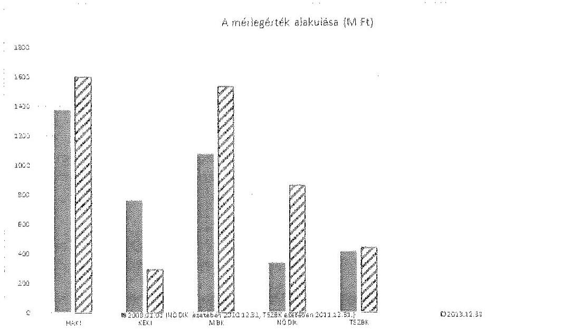

A HAKI esetében a mérlegfőösszeg növekedését a pénzeszközök, ezen belül is az idegen pénzeszközök 299,0 millió Ft-os (25,7 millió Ft-ról 324,7 millió Ft-ra) emelkedése, valamint az elszámolási és pénzforgalmi számlák egyenlegének csökkenése (19,6 millió Ft-ról 1,7 millió Ft-ra) eredményezte.

A KÉKI eszközeinek értéke 2008. január 1-jétől 2013. december 31-ére 465,4 M Ft-tal csökkent. A csökkenést elsősorban az okozta, hogy a TSZBK kiválásakor a KÉKI 2011. augusztus 1-jével bruttó 82,5 M Ft értékű tárgyi eszközt és 339,0 M Ft értékű, késztermékként nyilvántartott muzeális borkészletet adott át a TSZBK részére.

Az MBK esetében az eszközérték növekedését elsősorban a 2013. december 31-én a beolvadó szervezetek által beutalt pénzeszközök (428,4 M Ft) okozták.

A NÖDIK esetében a növekedést az elszámolási számla év végi egyenlegének emelkedése határozta meg. Ez jellemzően EU-s programokhoz kapcsolódó támogatások év végi maradványával volt összefüggésben. A NÖDIK kimutatása

---

szerint a 2012. évben 280,9 M Ft, a 2013. évben 612,5 M Ft EMVA támogatást kapott.

A TSZBK eszközeinek értéke a 2011. évről a 2013. évre 28,2 M Ft-tal, 6,9%-kal nőtt. A növekedést elsősorban a működéshez beszerzett immateriális javak, a gépek, berendezések, felszerelések, illetve a követelések és az elszámolási számlák egyenlegének emelkedése eredményezte.

Az intézetek mérlegadatainak évenkénti alakulását az 6. számú melléklet mutatja be.

Az intézetek a 2008-2013. években nettó 1151,2 M Ft értékben valósítottak meg beruházásokat, felújításokat, melyek értékét évenként és intézményenként az 7. számú melléklet mutat be. Az ellenőrzött intézményeknek, mint központi költségvetési szerveknek a kezelésükben lévő állami vagyonnal kapcsolatban visszapótlási kötelezettségük nem keletkezett ${ }^{141}$.

A beszerzett, létesített immateriális javak és tárgyi
 eszközök bekerülési értékének megállapítása, állományba vétele az alábbi esetekben nem felelt meg a jogszabályi előírásoknak, mivel

- a HAKI esetenként a főkönyvi számlák kijelölése, illetve az eszközök főkönyvi nyilvántartásba vétele során nem tartotta be az Áhsz. 9. számú mellékletében a főkönyvi számlák tartalmára vonatkozó előírást az ÁFA elkülönített könyvelésével kapcsolatban.
- a KÉKI-nél több esetben, a TSZBK-nál egy esetben az eszköz bekerülési értéke nem egyezett meg a jogszabályi előírásokkal ellentétben az eszköz megszerzésére fordított értékkel.
- az MBK-nál a 2012. évben egy esetben a helyesbítő könyvelést nem dokumentálták teljes körűen, ezért nem volt megállapítható, hogy az eszköz bekerülési értéke egyezett-e az eszköz megszerzésére fordított értékkel ${ }^{142}$.

A beszerzett eszközök besorolása szabályszerűen történt.
Az ellenőrzött intézeteknél a beszerzett, létesített immateriális javak és tárgyi eszközök utáni értékcsökkenés elszámolása az alábbi esetekben nem felelt meg a jogszabályi előírásoknak:

- KÉKI 2008-2012. években, valamint 2013. évben a TSZBK esetenként az üzembe helyezést nem dokumentálta hitelt érdemlően, így nem állapítható meg, hogy az értékcsökkenés elszámolására csak az üzembe helyezést követően került sor ${ }^{143}$, a NÖDIK az ellenőrzött időszakban az üzembe helyezés dokumentálás szabályait az Áhsz. 8. § (7) bekezdésében foglaltaknak megfelelően a számviteli politikájában meghatározta, azonban a dokumentumok, illetve a dátumok tekintetében nem alkalmazta azt teljes körűen.

[^0]
[^0]:    ${ }^{141}$ Vtv. 27. § (7) bekezdés
    ${ }^{142}$ Számv. tv. 47. § (1) bekezdés
    ${ }^{143}$ Áhsz. 30. § (1) bekezdés

---

- a HAKI a 2010. évben üzembe helyezett fúrógép, illetve a 2013. évben üzembe helyezett szivattyú esetében a negyedévenkénti időarányos értékcsökkenés elszámolása ${ }^{144}$ több hónapos késedelemmel történt meg.
- az MBK-nál 2008. évben több esetben az analitikus nyilvántartások szerint az értékcsökkenés elszámolását nem az üzembe helyezés napjával indították ${ }^{145}$.
- a TSZBK egy esetben vagyoni értékű jog után nem a jogszabályban előírt 16%-os értékcsökkenési kulcsot alkalmazta ${ }^{146}$, több esetben a beszerzett eszközök után az eszköz üzembe helyezését megelőzően is számolt el értékcsökkenést, mert a tárgyi eszköz nyilvántartás szerinti üzembe helyezés dátuma megelőzte az eszközök tényleges átvételének napját ${ }^{147}$.
Egy esetben a beszerzett eszközt nem beruházásként tartotta nyilván az üzembe helyezésig, rendeltetésszerű használatba vételig ${ }^{148}$. Ennek következtében a jogszabályi előírással ${ }^{149}$ ellentétben a beszerzett eszköz után az eszköz tényleges üzembe helyezését megelőzően is számolt el értékcsökkenést.

A KÉKI és a TSZBK a jogszabályi előírással ellentétben ${ }^{150}$ a könyvviteli elszámolását közvetlenül és közvetetten alátámasztó számviteli bizonylatokat teljes körűen nem őrizte meg. A bizonylatok hiányában nem volt megállapítható, hogy az eszköz bekerülési értékének megállapítása, állományba vétele, besorolása, az értékcsökkenés elszámolása megfelelt-e a jogszabályi előírásoknak.

A könyvviteli mérleg összeállítása során az alábbi intézetek nem tartották be teljes körűen a jogszabályok, valamint a belső szabályozások előírásait, mivel

- a HAKI a 2012-2013. években a tartósan adott kölcsönök tárgyévet követő évi részletével nem csökkentette a befektetett eszközök állományát és nem mutatták ki azt a követelések között ${ }^{151}$.
A 2012. évi könyvviteli mérleg összeállítása során a követelések értékelését nem teljes körűen végezte el ${ }^{152}$ továbbá könyvviteli mérlegében el nem ismert követelést is kimutatott ${ }^{153}$, valamint az ellenőrzött időszakban az üzemeltetésre átadott halastavak értékét az üzemeltetésre átadott eszközök he-

[^0]
[^0]:    ${ }^{144}$ Áhsz. 30. § (2) bekezdés
    ${ }^{145}$ Áhsz. 30. § (1) bekezdés
    ${ }^{146}$ Áhsz. 30. § (2) bekezdés b) pont
    ${ }^{147}$ Áhsz. 30. § (1) bekezdés
    ${ }^{148}$ Számv. tv. 3. § (4) bekezdése 7. pont
    ${ }^{149}$ Áhsz. 30. § (1) bekezdés
    ${ }^{150}$ Számv. tv. 169. § (2) bekezdés
    ${ }^{151}$ Áhsz. 22. § (1) bekezdés c) pont
    ${ }^{152}$ Áhsz. 31. §, HAKI értékelési szabályzat 1.2 .5 pont
    ${ }^{153}$ Áhsz. 9. számú melléklet 2. c) pont

---

lyett az építmények között mutatta ki ${ }^{154}$.

- a HAKI a 2008-2011. években, az MBK a 2008-2012. években a mérlegben a devizaszámlán lévő devizát nem az MNB által közzétett devizaárfolyamon, továbbá a HAKI a 2012-2013. években nem a választott hitelintézet által meghirdetett devizavételi és devizaeladási árfolyamának átlagán mutatta ki ${ }^{155}$.
- a NÖDIK nem vezetett folyamatosan analitikus nyilvántartást a vevőkről és szállítókről. Ennek következtében 2010-2013. években az analitikus nyilvántartásban ${ }^{156}$ és a főkönyvi könyvelésben kimutatott értékek eltérést mutattak. Analitikus nyilvántartás hiányában nem gondoskodott arról, hogy az elemi költségvetési beszámoló adatait a valóságnak megfelelően áttekinthetően alátámassza ${ }^{157}$. A 2011. évi mérlegében kimutatott anyagok és késztermékek értékének valódiságát a leltár és a főkönyvi kivonat nem támasztotta alá ${ }^{158}$.
- a KÉKI 2008-2010. években, a NÖDIK 2010-2013. években és a TSZBK 2011-2013. években a könyvviteli mérlegében olyan eszközöket is kimutatott, amelyeket nem bocsátottak a rendelkezésére, használatába, nem adtak kezelésébe ${ }^{159}$, mivel az állami vagyon tekintetében az alapító okirataikban foglalt vagyonkezelői joggal nem rendelkezett.
- a KÉKI 2011 évben és a TSZBK 2013. évben egy-egy esetben, a jogszabályi előírás ${ }^{160}$ ellenére olyan tételt is követelésként mutatott ki, melynek pénzügyi rendezése a mérleg fordulónapja előtt megtörtént.

Az intézmények a 2013. évi könyvviteli mérlegben az NGM által kiadott módszertani útmutató előírásai ellenére tárgyévi költségvetést terhelő szállítói kötelezettségként mutatták ki az Ávr. 46. § (2) bekezdés b) pontja szerint a tárgyévet követő évet terhelő szállítói tartozást.

- a KÉKI-nél egy követelés és egy kötelezettség értékelése nem felelt meg a jogszabályban ${ }^{161}$ foglaltaknak, mivel a külföldi pénzértékre szóló követelést, kötelezettséget nem az üzleti év mérlegfordulónapjára vonatkozó, a MNB által közzétett devizaárfolyamon számították át forintra.

A 2011. évben a KÉKI Áhsz. 17. számú melléklete szerinti elkészített főkönyvi kivonata az egyéb aktív és passzív pénzügyi elszámolások mérlegértékét

[^0]
[^0]:    ${ }^{154}$ Áhsz. 20. § (1) bekezdés
    ${ }^{155}$ Számv. tv. 60. § (2) bekezdés, Áhsz. 3. §, HAKI 2012. január 1-jétől hatályos értékelési szabályzat III. 3. pont, MBK értékelési szabályzat II. 6. pont
    ${ }^{156}$ Áhsz. 9. számú mellékletének 2.ca) pont és 4. db) pont
    ${ }^{157}$ Áhsz. 49. § (1) bekezdés
    ${ }^{158}$ Áhsz. 37. § (2) bekezdés, 50. § (1) bekezdés
    ${ }^{159}$ Áhsz. 15. § (1) bekezdés
    ${ }^{160}$ Áhsz. 22. § (1) bekezdés a) pont, 9. sz. melléklet 2. cc) pont
    ${ }^{161}$ Számv. tv. 60. § (2) és (4) bekezdés, Áhsz. 34. § (5) bekezdés és 36. § (2) bekezdés, 2010. április 1-jétől KÉKI értékelési szabályzat II. 7.2. pont, 2013. január 1-jétől KÉKI értékelési szabályzat II. 3. h) pont

---

nem támasztotta alá ${ }^{162}$. A 2008. évi mérlegérték bizonylati alátámasztásaként az Áhsz. 17. számú melléklete szerint elkészített főkönyvi kivonatot a jogszabályi előírás ${ }^{163}$ ellenére nem őrizte meg.

- a TSZBK 2012. évben egy esetben a jogszabályi előírás ${ }^{164}$ ellenére olyan tételt is kötelezettségként mutatott ki, melynek pénzügyi rendezése a mérleg fordulónapja előtt megtörtént.

Az ellenőrzés során feltárt hiányosságok következtében a vevőállomány kimutatása a beszámolókban a KÉKI és a TSZBK esetében nem volt megfelelő, a HAKI, a NÖDIK és az MBK esetében megfelelő volt. A szállítói kötelezettségállomány kimutatása az éves beszámolókban a KÉKI és a NÖDIK esetében nem volt megfelelő, a HAKI, az MBK és a TSZBK esetében megfelelő volt.

# 5.2.2. A leltározás és a selejtezés végrehajtásának szabályszerűsége 

Az MBK az ellenőrzött időszakban a könyvviteli mérlegben kimutatott eszközöket és forrásokat a jogszabályi előírásnak ${ }^{165}$ megfelelően leltárral szabályosan alátámasztotta. A HAKI, a KÉKI, a NÖDIK és a TSZBK a beszámolókban és a számviteli nyilvántartásokban kimutatott eszközök és források állományának valódiságát a mennyiségben és értékben kimutatott leltár nem teljes körűen támasztotta alá, mert

- a HAKI a 2008-2013. években a tartósan adott kölcsönök (dolgozók lakásépítési támogatása) állományát nem leltárazta ${ }^{166}$. A mérlegben kimutatott követelést az analitikus nyilvántartás a valóságnak megfelelően nem támasztotta alá ${ }^{167}$.
- a KÉKI 2009. évben a saját tőkét és a tartalékokat nem leltárazta ${ }^{168}$. A pénzeszközök leltára nem támasztotta alá a könyvviteli mérlegben kimutatott eszközök valódiságát ${ }^{169}$, mivel a pénztárak egyenlegét 0,3 M Ft értékben és az idegen pénzeszközök összegét 0,6 M Ft értékben nem vették figyelembe.

A KÉKI 2011. évben az idegen pénzeszközök értékének (leltárértéke 13,4 E Ft, a mérlegszerinti értéke 4,8 E Ft), a gépek, berendezések, felszerelések könyvviteli mérlegben kimutatott értékének (mérlegértéke 28587,0 E Ft, leltár szerinti értéke 249177,5 E Ft), a követelések és a források mérlegben kimutatott értékének valódiságát leltárral nem támasztotta alá ${ }^{170}$. Az eltérést a leltározás során elkövetett adminisztrációs hibák eredményezték. A 2011. évben a

[^0]
[^0]:    ${ }^{162}$ Áhsz. 50. § (1) bekezdés
    ${ }^{163}$ Számv. tv. 169. § (1) bekezdés
    ${ }^{164}$ Áhsz. 26. § (1) bekezdés
    ${ }^{165}$ Áhsz. 37. §
    ${ }^{166}$ Áhsz 37. § (1) bekezdés
    ${ }^{167}$ Áhsz. 49. § (1) bekezdés
    ${ }^{168}$ Áhsz 37. § (1) bekezdés
    ${ }^{169}$ Áhsz. 37. § (2) bekezdés
    ${ }^{170}$ Áhsz. 37. § (2) bekezdés

---

könyvviteli mérlegben a szellemi termékek értékét negatív értéken szerepeltették (-576 E Ft értékben), melyet a főkönyvi kivonat is alátámasztott. Ezzel az intézmény megsértette a jogszabályi előírást ${ }^{171}$, mivel az eszközöket a könyvviteli mérlegben nem az értékcsökkenéssel csökkentett terven felüli értékcsökkenés visszaírt összegével növelt könyv szerinti értéken mutatta ki.

- a HAKI 2009., 2011. és 2013. évi és a KÉKI 2008., 2010., 2012. és 2013. évi leltározás dokumentációjának teljes körű megőrzéséről nem gondoskodott ${ }^{172}$.

A KÉKI tájékoztatása szerint káresemény történt, amelyben iratok semmisültek meg. A megsemmisült iratokról jegyzék nem állt rendelkezésre.

- a NÖDIK 2010. év végén a tárgyi eszközöket mennyiségi felvétellel nem leltárazta ${ }^{173}$. 2011-2012. években a vevőköveteléseknél és a szállítói kötelezettségeknél leltározás nem történt meg ${ }^{174}$. 2012. évi mérlegét alátámasztó leltárában az évközben betörés során eltulajdonított eszközöket is kimutattak, ezzel megsértették a valódiság számviteli alapelvét, amely szerint a beszámolóban szereplő tételeknek

 a valóságban is megtalálhatónak kell lenniük ${ }^{175}$.
- A TSZBK 2011. évi mérlegét a leltár nem támasztotta alá, mivel a tarcali leltárkörzetben tárolt muzeális bor készlet leltárfelvétele nem a valóságnak megfelelően történt ${ }^{176}$. A muzeális borok leltárfelvételi ívén értékben a tarcali és tolcsvai leltárkörzetben tárolt borokat is szerepeltették, azonban mennyiségben csak a tolcsvai pincében tárolt készletet tüntették fel.

A TSZBK 2012. évi leltára a könyvviteli mérlegben kimutatott eszközök és források valódiságát nem támasztotta alá, mivel a leltárban szereplő mellékterméket a könyvviteli mérlegben nem mutatta ki ${ }^{177}$. A 2013. évi mérlegben kimutatott készletek mérlegértéke a leltáreltérések kiértékelésének hiányában 3,1 M Ft-tal meghaladta a leltárban szereplő összeget ${ }^{178}$.
A 2011. december 31-i mérleg fordulónapot alátámasztó egyeztetéssel végzett leltározás során nem hajtották végre a követelések, a saját tőke, a tartalékok és a kötelezettségek leltározását ${ }^{179}. 2012. évben a TSZBK csak értékben kimutatott eszközeinek és forrásainak, 2013-ban az ingatlanok és a kapcsolódó vagyoni értékű jogok, elszámolási számlák, a saját tőke és a tartalékok könyvviteli mérlegben kimutatott értékét leltárral nem támasztották alá ${ }^{180}$.

[^0]
[^0]:    ${ }^{171}$ Áhsz. 34. § (1) bekezdés
    ${ }^{172}$ Számv. tv. 169. § (1) bekezdés
    ${ }^{173}$ Áhsz. 37. § (3) bekezdés, NÖDIK leltározási szabályzat ${ }_{1} 1$. pont
    ${ }^{174}$ Áhsz. 37. § (3) bekezdés, NÖDIK leltározási szabályzat ${ }_{1,3} 1$. pont
    ${ }^{175}$ Számv. tv. 15. § (3) bekezdés
    ${ }^{176}$ Áhsz. 37. § (1)-(2) bekezdés
    ${ }^{177}$ Áhsz. 37. § (2) bekezdés
    ${ }^{178}$ Áhsz. 37. § (2) bekezdés
    ${ }^{179}$ Áhsz. 37. § (1) bekezdés, KÉKI Leltárkészítési és leltározási szabályzat ${ }_{2}$ 2.6. b. pont
    ${ }^{180}$ Áhsz. 37. § (1)-(2) bekezdés

---

A leltározás végrehajtása nem felelt meg az előírásoknak, mivel

- a HAKI 2009., 2011. és 2013. években az ingatlanok és eszközök leltározása során leltárlistákat nem készített ${ }^{181}$, a leltárak feldolgozását, kiértékelését, az esetleges leltári eltéréseket nem dokumentálta ${ }^{182}$. A földterületekről és befejezetlen beruházásokról nem készítettek egyedi leltárfelvételi íveket ${ }^{183}$.
- a KÉKI a 2008. évi és 2009. évi évenkénti leltározást a KÉKI gazdasági főigazgató-helyettese által kiadott utasítások ${ }^{184}$ és ütemterv szerint végezte, amelyeket a KÉKI Leltárkészítési és Leltározási szabályzattal ${ }_{1}$ 3.1. pontjával ellentétben a KÉKI főigazgatója nem hagyott jóvá. A tárgyévi leltározási utasítások szerkezete és tartalma nem egyezett meg a Leltárkészítési és Leltározási szabályzat ${ }_{1}$ 3.1. pontjában foglaltak ellenére a szabályzat 2. számú mellékletével. A leltározási bizottság tagjainak megbízólevelét nem a jogosult állította ki ${ }^{185}$.

A KÉKI a 2009. évi leltározási utasítás és ütemterv 1.I. c) pontja és a KÉKI Leltárkészítési és Leltározási szabályzat ${ }_{1}$ 2.3. A) pontjával ellentétben előírt mennyiségi felvétel helyett az ingatlanok, az ügyviteli és számítástechnikai eszközök kivételével a gépek, berendezések, felszereléseket, illetve a járművek leltározását egyeztetéssel végeztette el. A tárgyévi leltározási utasítás 1. I. c) pontja ellenére az ügyviteli és számítástechnikai eszközök leltározása egyeztetéssel történt a tényleges számbavétel, mennyiségi felvétel helyett.
A KÉKI 2011. évben nem rendelkezett a KÉKI Leltárkészítési és Leltározási szabályzattal ${ }_{2}$ 7. pontjában foglaltak szerinti, a szervezet főigazgatója által jóváhagyott leltározási utasítással, továbbá a leltározásban résztvevő személyek nem rendelkeztek a KÉKI Leltárkészítési és Leltározási szabályzat ${ }_{2}$ 7.3. pontjában meghatározott, a leltározás vezetője által aláírt megbízólevelekkel.
A KÉKI 2012. évben végzett leltározási tevékenysége során a leltározási utasításban szereplő leltározást végző személyek teljes körűen a KÉKI Leltárkészítési és Leltározási szabályzattal ${ }_{2}$ 7.3. pontja ellenére megbízólevéllel nem rendelkeztek. A 2013-ban végzett leltározás során a KÉKI Leltározási és Leltárkészítési Szabályzat ${ }_{2}$ I. 7. pontja ellenére a leltározás záró jegyzőkönyvét az intézet főigazgatója nem hagyta jóvá. A KÉKI Leltározási és Leltárkészítési Szabályzat ${ }_{2}$-ban többször használt „gazdasági főigazgató-helyettes” megnevezés a KÉKI SZMSZ 3.1. ${ }^{186}$ pontjában foglaltakkal ellentétben olyan hatáskörök és feladatokat állapít meg részére, melyek a gazdasági vezető

[^0]
[^0]:    ${ }^{181}$ HAKI leltározási szabályzat ${ }_{1} 4.3$ pont, HAKI leltározási szabályzat ${ }_{2} 3.3$ pont, HAKI leltározási szabályzat ${ }_{3.4} 5.2$ pont, HAKI leltározási szabályzat ${ }_{3}$ II/3, II/5 pont
    ${ }^{182}$ HAKI leltározási szabályzat ${ }_{1} 4.8$ pont, HAKI leltározási szabályzat ${ }_{2} 3.5$ pont, HAKI leltározási szabályzat ${ }_{3.4} 6$ pont, HAKI leltározási szabályzat ${ }_{3}$ II, III fejezet
    ${ }^{183}$ HAKI leltározási szabályzat ${ }_{1} 4.6$ pont, HAKI leltározási szabályzat ${ }_{2} 3.4$ pont, HAKI leltározási szabályzat ${ }_{3.4} 5.1$ pont
    ${ }^{184} 2008.10.10.; 2009.11.12.
    ${ }^{185}$ KÉKI Leltárkészítési és Leltározási szabályzattal ${ }_{1} 3.4$ pont
    ${ }^{186} 2012.10.15.

---

feladat és hatáskörébe tartoztak az érintett időszakban.
A 2013. évi leltározási utasítás részét képező leltározási ütemterv a KÉKI Leltározási és Leltárkészítési Szabályzat ${ }_{3}$ 2. pontjában foglaltak ellenére nem teljes körűen tartalmazta a leltározás előkészítésével, a leltár felvételével, értékelésével, valamint az ellenőrzéssel kapcsolatos összes munkafolyamatot, azok megkezdésének és befejezésének időpontját, valamint a munkafolyamatok elvégzésért felelős személyek megnevezését.

- az MBK leltározási és leltárkészítési szabályzatában foglaltakkal ${ }^{187}$ ellentétben a leltárutasításokban a záró jegyzőkönyvek elkészítésének határidejét a tárgyévet követő év január 31. utáni időpontokban határozták meg.

A leltározás megkezdéséről, a leltárfelkészítésről csak 2008. évben, a leltárkörzetek leltározásának befejezéséről egy évben sem készült jegyzőkönyv az ellenőrzött időszakban ${ }^{188}$. A leltározási záró jegyzőkönyvek a leltárutasításnak megfelelő határidőn belül, azonban - a 2012. évi jegyzőkönyv kivételével - a számviteli politikában előírt mérlegkészítés időpontját követő dátummal kerültek aláírásra ${ }^{189}$.

- a NÖDIK a belső szabályozástól eltérő tartalommal készítette el a leltározási ütemtervet a 2010-2012. években ${ }^{190}$, leltározási utasítást a 2010. évben nem adtak ki ${ }^{191}$. A leltározási utasításban 2011-2012 években nem nevezték meg a leltározási bizottság vezetőjét ${ }^{192}$. A leltározás irányításáért, végrehajtásáért és ellenőrzésért felelős személyek a 2010. évben nem kaptak írásban megbízást a feladataik ellátására ${ }^{193}$. A leltárértekezletek megtartása 2010-2013 között egyik évben sem volt dokumentálva ${ }^{194}$.
- a KÉKI főigazgatója és a TSZBK igazgatója 2011-ben a KÉKI Leltárkészítési és Leltározási Szabályzat ${ }_{1}$ 7. pontjával ellentétben együttes utasítást ${ }^{195}$ adott ki a TSZBK kiválásához kapcsolódó leltározás végrehajtására. Az utasítás nem tartalmazta valamennyi leltározási feladat vonatkozásában a kezdés és befejezés időpontját ${ }^{196}$. A leltározásban résztvevő személyeket a leltározás vezetője írásban nem jelölte ki ${ }^{197}$.

2011. év végén a TSZBK egyeztetéses leltározást végzett, azonban

[^0]
[^0]:    ${ }^{187}$ Az MBK számviteli politika IV. 3. pontja szerint „A mérleg készítésének időpontja következő év január 31. Eddig az időpontig kell az értékelési feladatokat elvégezni, illetve a költségvetési évre vonatkozóan a könyvekben helyesbítést végezni.”
    ${ }^{188}$ MBK leltárkészítési szabályzat 3.4. pont, illetve 4. sz. és 6. sz. melléklet
    ${ }^{189}$ MBK számviteli politika IV. 3. pont
    ${ }^{190}$ NÖDIK leltározási szabályzat ${ }_{1,2}$ 7. pont, 2. számú melléklet
    ${ }^{191}$ NÖDIK leltározási szabályzat ${ }_{1,2}$ 2. pont
    ${ }^{192}$ NÖDIK leltározási szabályzat ${ }_{1,2}$ 2. pont
    ${ }^{193}$ NÖDIK leltározási szabályzat ${ }_{1} 7.2$. pont
    ${ }^{194}$ NÖDIK leltározási szabályzat ${ }_{1,2} 2$. pont
    ${ }^{195} 2011.09.05.
    ${ }^{196}$ KÉKI Leltározási Szabályzat ${ }_{1}$ 7. pont
    ${ }^{197}$ KÉKI Leltározási Szabályzat ${ }_{1}$ 7.3. pont

---

a leltározásban résztvevő személyek írásbeli kijelölésének, továbbá a leltározási utasításnak, a leltározás záró jegyzőkönyvének megőrzéséről nem gondoskodott ${ }^{198}$.
A TSZBK igazgatója jogosulatlanul ${ }^{199}$ és hiányosan adott ki leltározási utasításokat 2012. és 2013. évekre vonatkozóan a borkészlet, a gépek, berendezések, felszerelések, eszközök, tárgyi eszközök leltározására, amely nem tartalmazta az ingatlanok (földterületek, épületek, építmények) leltározását. A leltározásban résztvevő személyek megbízólevét nem a leltározás vezetője, hanem a TSZBK igazgatója írta alá ${ }^{200}$. A 2012. évi leltározásra vonatkozóan a megbízólevelek kiállításának dátuma ${ }^{201}$ a leltározási utasítás kiadásának dátumát ${ }^{202}$ megelőzte.

A selejtezés végrehajtása nem felelt meg az előírásoknak, mivel

- a HAKI az ellenőrzött időszakban a HAKI selejtezési szabályzat ${ }_{1-4}$ előírásai ellenére nem dokumentálta a selejtezési és hasznosítási javaslatot, annak jóváhagyását, a selejtezési bizottság tagjainak megbízását, a selejtezett eszközök hasznosításának módját.
- a KÉKI költségvetési beszámolója szerint a 2008. évben 4,4 M Ft, a 2009. évben 3,3 M Ft, 2011-ben 11,5 M Ft, 2012. évben 57,3 M Ft, 2013-ban 37,0 M Ft bruttó értékű eszközt selejtezett. A könyvviteli elszámolást közvetlenül és közvetten alátámasztó számviteli bizonylatok közül a selejtezés dokumentumait 2008-2011. és 2013. években nem őrizte meg ${ }^{203}$. A selejtezési bizottság elnöke és tagjai megbízólevéllel, illetve a selejtezési tevékenység ellátására utasítással a KÉKI Selejtezési és Hasznosítási Szabályzat ${ }_{1}$ előírásai ellenére nem rendelkeztek. A selejtezési jegyzőkönyvet a KÉKI Selejtezési és Hasznosítási Szabályzat ${ }_{1}$ 2.2. g) és 7.1. pontjaival ellentétben az intézet főigazgatója nem írta alá. A selejtezésre javasolt tárgyi eszközök átadás-átvételét nem dokumentálták. A selejtezésre javasolt tárgyi eszközök összevont nettó értéke 0 Ft volt.
- az ellenőrzött időszakban az MBK által készített selejtezési jegyzőkönyvek nem tartalmazták a megsemmisítési jegyzőkönyveket ${ }^{204}$.
- a NÖDIK által a 2011-2013. években végrehajtott selejtezésekről jegyzőkönyvek ${ }^{205}$ nem készültek.

A 2012. évben lopás következtében eltulajdonított számítógépeket, illetve a korábban értékesített kombájnt a 2013. évben leselejtezték. Ezzel megsértették a valódiság elvét ${ }^{206}$, mert olyan tételt szerepeltettek a könyvviteli nyilvántartásban,

[^0]
[^0]:    ${ }^{198}$ Számv. tv. 169. (1) bekezdés
    ${ }^{199}$ KÉKI Leltározási Szabályzat ${ }_{2}$ 7. pont
    ${ }^{200}$ KÉKI Leltározási Szabályzat ${ }_{2}$ 7.3. pont
    ${ }^{201} 2012$. december 19.
    ${ }^{202} 2013$. január 2.
    ${ }^{203}$ Számv. tv. 169. § (2) bekezdés
    ${ }^{204}$ MBK felesleges vagyontárgyak hasznosításának és selejtezésének szabályzata 3.3. és 3.4. pont
    ${ }^{205}$ NÖDIK selejtezési szabályzat ${ }_{1,2} 3.4$ pont

---
 amely a valóságban nem volt megtalálható.

# 5.3. Az eredményszemléletű számvitelre történő áttérés végrehajtásának szabályszerűsége 

Az ellenőrzött intézetek - az MBK kivételével - az eredményszemléletű számvitel bevezetésével kapcsolatos feladatokat részben hajtották végre, mivel

- a jogszabályi előírás ${ }^{207}$ ellenére 2013. december 31-ei mérlegfordulónappal az eszközök és források, illetve a kötelezettségvállalások leltározására teljes körűen nem került sor.
- a HAKI, a KÉKI és a TSZBK a követelések, kötelezettségek leltárában azokat nem költségvetési évben esedékes és költségvetési évet követő évben esedékes bontásban szerepeltette ${ }^{208}$.
- a KÉKI, a NÖDIK és a TSZBK a pénzügyileg nem rendezett függő, átfutó kiadásokat és bevételeket kiadásként vagy bevételként nem számolta el, a követelések vagy kötelezettségek közé nem vette fel ${ }^{209}$.

### 5.4. A vagyonelemek hasznosításának szabályszerűsége

A vagyonelemek hasznosítása a HAKI, a KÉKI, az MBK és a NÖDIK esetében nem a jogszabályokban és a belső szabályzatokban előírtaknak megfelelően történt, mivel

- az intézetek a vagyon hasznosítás díjának megállapítását önköltségszámítással nem támasztották alá ${ }^{210}$, a térítési díj megállapítása során több esetben nem vették figyelembe a felhasználás, illetve az igénybevétel alapján felmerült közvetlen és közvetett költségeket ${ }^{211}$.
- a HAKI és az MBK a jogszabályi előírással ${ }^{212}$ ellentétben a bérlőket nyilvános eljárás mellőzésével választotta ki.
- a KÉKI esetenként, a NÖDIK rendszeresen nem vette figyelembe a szolgálati lakások bérbeadása során a 106/1999. (XII. 28.) FVM rendelet előírásait, mivel a havi bérleti díj összege nem felelt meg a hivatkozott FVM rendelet mellékletében feltüntetett, a lakás hasznos alapterülete és komfortfokozata figyelembevételével számított értéknek.

[^0]
[^0]:    ${ }^{206}$ Számv. tv. 15. § (3) bekezdés
    ${ }^{207}$ 36/2013. (IX. 13.) NGM rendelet 2. § (1) bekezdés
    ${ }^{208}$ 36/2013. (IX. 13.) NGM rendelet 2. § (2) bekezdés c) pont
    ${ }^{209}$ 36/2013. (IX. 13.) NGM rendelet 2. § (3) bekezdés b) pont
    ${ }^{210}$ Áhsz. 8. § (15) bekezdés, önköltségszámítási szabályzatok
    ${ }^{211}$ Ámr $_{1}$ 57. § (12) bekezdés, Ámr 2 81. § (6) bekezdés, Ávr. 63. § (1) bekezdés
    ${ }^{212}$ Vtv. 24. §

---

- a KÉKI-nél az eszközök értékesítése során több esetben nem volt megállapítható, dokumentált, hogy a jogszabályi előírás szerint csak olyan eszköz értékesítésére került sor, amely az intézet működéséhez már nem voltak szükségesek ${ }^{213}$.
- a NÖDIK a lakásbérleti szerződésekre vonatkozóan 2013. február 28-ig szerződéseket nem kötött, a bevételt a jogelőd által kötött szerződések alapján szedte be ${ }^{214}$
- a HAKI főigazgatója az ellenőrzött időszakban az intézet kezelésében lévő ingatlanokat üzemeltetésbe adta. Az intézet az üzemeltetésbe adás szabályait, a jogosultak körét, feladatait nem határozta meg ${ }^{215}$. A hasznosított terület nagysága 2008-2013 években 153 hektár volt, jellemzően halastó formájában. Az üzemeltetése díj összege 30 és 40 kg ponty novemberi átlagárának megfelelő összeg volt hektáronként. Az üzemeltető az üzemeltetési díjfizetési kötelezettségét az üzemeltetési szerződés előírásait megsértve teljesítette. A jogszabályi előírásokkal ${ }^{216}$ ellentétben az üzemeltetési szerződésekben az üzemeltetésre átadott vagyon leltározási és beszámolási kötelezettségét nem írt elő. A jogszabályi előírás ellenére ${ }^{217}$ az üzemeltetésre átadott ingatlanokat, eszközöket a mérlegben nem üzemeltetésre átadott eszközként mutatták ki.

A TSZBK-nak vagyonhasznosításból (tárgyi eszközök értékesítéséből, bérbeadásából) bevétele nem keletkezett.

A HAKI, a KÉKI a jogszabályi előírás ${ }^{218}$ ellenére az állami tulajdonban lévő ingatlan eszközök bérbeadása során nem győződött meg arról, hogy a nemzeti vagyon hasznosítására vonatkozó szerződést átlátható szervezettel kötötték meg.

Az ellenőrzött időszakban az MNV Zrt. engedélyéhez kötött ingatlan értékesítésére egyik intézetnél sem került sor.

# 5.5. A vagyonelemek átadás-átvételének szabályszerűsége a közfeladat-ellátás változásával összefüggésben 

A közfeladat ellátásának változásával összefüggésben a KÉKI, a NÖDIK és a TSZBK esetében került sor vagyonelemek átadás-átvételére, amely nem felelt meg a jogszabályi előírásoknak. Az állami vagyon tulajdonosa a jogszabályi előírás ${ }^{219}$ ellenére

[^0]
[^0]:    ${ }^{213}$ Vtv. 33. § (2) bekezdés
    ${ }^{214}$ 106/1999. (XII. 28.) FVM rendelet 3. §
    ${ }^{215}$ Amr$_{2}$ 20. § (3) bekezdés d) pont, Ávr. 13. § (2) bekezdés d) pont
    ${ }^{216}$ Áhsz. 37. § (4) bekezdés
    ${ }^{217}$ Áhsz. 20. § (1) bekezdés
    ${ }^{218}$ Nvtv. 3. § (2) bekezdés és 11. § (10) bekezdés
    ${ }^{219}$ Vtv. 23. § (1) bekezdés

---

- a NÖDIK 2010. november 1-jei megalakulásával egy időben a NÖDIK feladatellátását biztosító vagyonra az ellenőrzött időszak végéig,
- a KÉKI esetében 2008. január 1-től 2011. augusztus 30-ig a tarcali és tolcsvai feladatellátását szolgáló ingatlanok, valamint a muzeális borállomány tekintetében,
- a TSZBK 2011. augusztus 1-jei megalakulásával egy időben a közfeladat ellátást biztosító vagyonra 2012. augusztus 2-ig, illetve az ültetvények, továbbá a tarcali leltárkörzetben tárolt muzeális bor vonatkozásában az ellenőrzött időszak végéig
hatályos vagyonkezelési szerződéssel nem rendelkezett.
Az MBK az ellenőrzött időszakban vagyont nem adott át, illetve nem vett át. A vagyonelemek tulajdonjogának térítésmentes átadás-átvételére az ellenőrzött időszakban nem került sor.

Budapest, 2015. augusztus hónap 7 nap
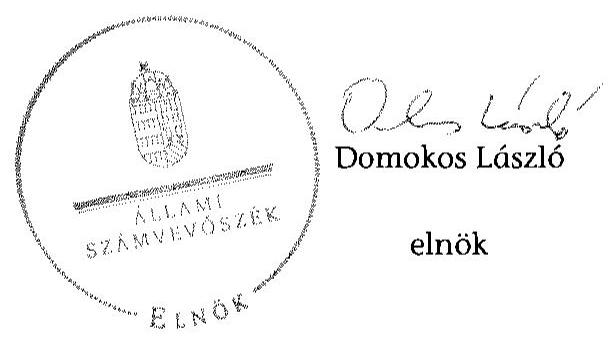

Melléklet: 8 db

---

.

---

# Az integritás kontrollok kialakítása és működtetése 

Az ÁSZ által elvégzett integritás felmérés célja, hogy felmérje a közszféra intézményei korrupciós kockázatoknak való kitettségét, illetve az azok mérséklésére hivatott kontrollok szintjét. Célja továbbá a társadalom által elvárt nyilvánossági, átláthatósági normáknak való megfelelés erősítése, a kormányzati szervek korrupcióellenes tevékenységének elősegítése és az integritásalapú államigazgatási kultúra fejlesztéséhez való hozzájárulás. A projekt az Európai Unió támogatásával, az Európai Szociális Alap társfinanszírozásával valósul meg.

Az ellenőrzött szervezetek közül a NÖDIK 2013. évben részt vett az ÁSZ integritás projektjében. A HAKI, a KÉKI és a TSZBK és az MBK belső szabályozás integritás kontrolljainak értékelése jelen ellenőrzés keretében a 2013. évre vonatkozóan kitöltött tanúsítvány és az integritás projekt kérdőívének adatai segítségével történt. Az intézeteket az ellenőrzött időszakban szervezeti változások érintettek, amely nagyban befolyásolta a kockázatoknak való kitettségüket.

Az intézmények által tanúsítványon szolgáltatott adatok alapján az eredendő veszélyeztetettségi szint az MBK, a KÉKI és a TSZBK esetében alacsony, a HAKI esetében közepes volt.

A korrupciós kockázatokat növelő tényező szintje a TSZBK-nál és a KÉKI-nél alacsony, az MBK-nál és a HAKI-nál közepes volt.

A korrupciós kockázatok kezelésére hivatott kontrollok szintje a TSZBK-nál és a MBK-nál alacsony, a KÉKI-nél és a HAKI-nál közepes volt.

A NÖDIK által kitöltött tanúsítvány értékelése alapján az integritás kontrollrendszerének összesített átlaga fejlesztendő volt.

Az ellenőrzés során megállapítást nyert, hogy az ellenőrzött szervezetek önbevallás alapján készített felmérések fent hivatkozott eredményei - a NÖDIK kivételével - jóval kedvezőbb képet mutattak magukról, mint amit jelen ÁSZ ellenőrzés keretében feltárt tények alátámasztanak.

Az ellenőrzés megállapította, hogy a belső kontroll rendszer az ellenőrzött intézmények esetében hiányos és nem teljes körűen kiépített volt, ezért jelentős integritási kockázatot hordoz a költségvetési szervek működésében.

---

.

---

# Az eredeti és a módosított előirányzat alakulása, az előirányzat-módosítások intézetenkénti, hatáskörönkénti összege 

| Intézet | Év | Eredeti előirányzat | Előirányzat-változás |  |  |  | M Ft   Módosított előirányzat |
| :--: | :--: | :--: | :--: | :--: | :--: | :--: | :--: |
|  |  |  | országgyűlési hatáskörben | a Kormány hatáskörében | irányító   szervi   hatáskörben | intézményi hatáskörben |  |
| HAKI | 2008. | 409,8 | 0,0 | 20,1 | 301,4 | 93,1 | 824,4 |
|  | 2009. | 345,1 | 0,0 | 4,6 | 102,0 | 424,0 | 875,7 |
|  | 2010. | 325,9 | 0,0 | 7,9 | 110,7 | 297,6 | 742,1 |
|  | 2011. | 318,0 | -39,4 | 9,6 | 163,5 | 189,1 | 640,8 |
|  | 2012. | 477,2 | 0,0 | 12,8 | 119,7 | 335,0 | 944,7 |
|  | 2013. | 484,3 | 0,0 | 11,9 | 48,6 | 169,7 | 714,5 |
| KÉKI | 2008. | 524,7 | 0,0 | 23,1 | 60,3 | 109,5 | 717,6 |
|  | 2009. | 490,0 | 0,0 | 3,5 | 25,3 | 142,2 | 661,0 |
|  | 2010. | 448,7 | 0,0 | 5,4 | 26,0 | 71,3 | 551,4 |
|  | 2011. | 459,7 | -78,6 | 4,2 | 28,9 | 43,1 | 457,3 |
|  | 2012. | 375,8 | 0,0 | 8,0 | 143,9 | 34,3 | 562,0 |
|  | 2013. | 332,4 | 0,0 | 4,6 | 57,1 | 102,9 | 497,0 |
| MBK | 2008. | 708,5 | 0,0 | 40,4 | 147,0 | 109,0 | 1004,9 |
|  | 2009. | 682,7 | 0,0 | 10,3 | 97,6 | 141,4 | 932,0 |
|  | 2010. | 635,4 | 0,0 | 18,8 | 117,2 | 206,0 | 977,4 |
|  | 2011. | 608,2 | -100,8 | 7,2 | 104,5 | 281,4 | 900,5 |
|  | 2012. | 510,2 | 0,0 | 5,1 | 215,6 | 191,8 | 922,7 |
|  | 2013. | 517,0 | 0,0 | 7,2 | 134,5 | 802,5 | 1461,2 |
| NÖDIK | 2010. | 0,0 | 0,0 | 0,0 | 28,5 | 44,6 | 73,1 |
|  | 2011. | 173,3 | -21,2 | 1,3 | 102,5 | 89,4 | 345,3 |
|  | 2012. | 260,7 | 0,0 | -5,9 | 14,2 | 376,9 | 645,9 |
|  | 2013. | 295,3 | 0,0 | 0,7 | 3,2 | 756,4 | 1055,6 |
| TSZBK | 2011. | 0,0 | 0,0 | 0,3 | 19,0 | 0,0 | 19,3 |
|  | 2012. | 85,1 | 0,0 | -9,6 | 11,6 | 12,6 | 99,7 |
|  | 2013. | 75,2 | 0,0 | 16,8 | 2,7 | 49,8 | 144,5 |

---

.

---

## A HAKI kiadási előirányzatának és teljesítésének alakulása

| Típus | Előirányzat/teljesítés | Személyi juttatások | Munkaadó terhelő járulékok | Dologi kiadások | Egyéb folyó kiadások | Támogatásértékű működési kiadások | Felhalmozási célú pénzeszköz átadás | Támogatási kölcsön nyújtása | Felújítás | Intézményi beruházási kiadások | Ábt-n kívülről kapott továbbadási célú kiadás | Különféle költségvetési befizetések | Összesen  |
| --- | --- |

 | --- | --- | --- | --- | --- | --- | --- | --- | --- | --- | --- | --- |
|  2008. | Eredeti előirányzat | 220,0 | 70,5 | 108,8 | 10,5 | 0,0 | 0,0 | 0,0 | 0,0 | 0,0 | 0,0 | 0,0 | 409,8  |
|   | Módosított előirányzat | 244,4 | 78,7 | 430,6 | 11,9 | 0,0 | 0,0 | 2,5 | 4,2 | 52,2 | 0,0 | 0,0 | 824,4  |
|   | Teljesítés | 223,4 | 68,5 | 242,4 | 11,5 | 0,0 | 0,0 | 2,5 | 3,0 | 48,4 | 56,2 | 0,0 | 655,8  |
|  2009. | Eredeti előirányzat | 212,0 | 67,9 | 57,2 | 8,0 | 0,0 | 0,0 | 0,0 | 0,0 | 0,0 | 0,0 | 0,0 | 345,1  |
|   | Módosított előirányzat | 244,9 | 78,5 | 439,9 | 13,1 | 0,0 | 0,0 | 0,5 | 5,3 | 93,6 | 0,0 | 0,0 | 875,7  |
|   | Teljesítés | 212,8 | 63,4 | 423,2 | 12,1 | 0,0 | 0,0 | 0,5 | 3,8 | 57,5 | 0,0 | 0,0 | 773,3  |
|  2010. | Eredeti előirányzat | 212,0 | 62,1 | 51,0 | 0,8 | 0,0 | 0,0 | 0,0 | 0,0 | 0,0 | 0,0 | 0,0 | 325,8  |
|   | Módosított előirányzat | 219,4 | 60,6 | 396,4 | 7,8 | 0,0 | 0,0 | 2,3 | 3,1 | 52,0 | 0,0 | 0,4 | 742,1  |
|   | Teljesítés | 194,4 | 52,3 | 378,2 | 7,8 | 0,0 | 0,0 | 2,3 | 3,1 | 50,7 | 0,0 | 0,4 | 689,2  |
|  2011. | Eredeti előirányzat | 209,1 | 61,3 | 47,7 | 0,0 | 0,0 | 0,0 | 0,0 | 0,0 | 0,0 | 0,0 | 0,0 | 318,0  |
|   | Módosított előirányzat | 215,2 | 60,8 | 300,1 | 0,0 | 0,0 | 0,0 | 0,0 | 4,0 | 60,6 | 0,0 | 0,0 | 640,8  |
|   | Teljesítés | 188,8 | 50,9 | 273,3 | 0,0 | 0,0 | 0,0 | 0,0 | 3,9 | 59,0 | 0,0 | 0,0 | 576,0  |
|  2012. | Eredeti előirányzat | 267,1 | 62,9 | 147,3 | 0,0 | 0,0 | 0,0 | 0,0 | 0,0 | 0,0 | 0,0 | 0,0 | 477,2  |
|   | Módosított előirányzat | 267,2 | 65,6 | 210,9 | 0,0 | 0,0 | 0,0 | 0,0 | 0,0 | 401,0 | 0,0 | 0,0 | 944,7  |
|   | Teljesítés | 187,3 | 49,7 | 210,9 | 0,0 | 0,0 | 0,0 | 0,0 | 0,0 | 401,0 | 0,0 | 0,0 | 848,9  |
|  2013. | Eredeti előirányzat | 267,1 | 62,9 | 154,4 | 0,0 | 0,0 | 0,0 | 0,0 | 0,0 | 0,0 | 0,0 | 0,0 | 484,3  |
|   | Módosított előirányzat | 210,9 | 55,2 | 362,5 | 0,0 | 30,0 | 0,6 | 0,0 | 0,0 | 55,2 | 0,0 | 0,0 | 714,5  |
|   | Teljesítés | 195,3 | 50,6 | 336,5 | 0,0 | 9,7 | 0,6 | 0,0 | 0,0 | 33,6 | 0,0 | 0,0 | 626,3  |

---

## A HAKI bevételi előirányzatának és teljesítésének alakulása

|  T | Előirányzat/
teljesítés | Intézményi
működési
bevételek | Működési célú
pénzeszköz
átvételek | Felhalmozási
bevételek | Felhalmozási
célú pénzeszköz
átvételek | Irányító szervtől
kapott
támogatás | Támogatás
értékű működési
bevétel | Támogatás
értékű
felhalmozási
bevétel | Előző évi
maradvány
átvétel | Előirányzat
maradvány
felhasználás | Támogatási
köleszönök
visszatérülése | Támogatási
köleszönök
visszatérülése | Összesen  |
| --- | --- | --- | --- | --- | --- | --- | --- | --- | --- | --- | --- | --- | --- |
|  2008. | Eredeti
előirányzat
Módosított
előirányzat
Teljesítés | 160,2
193,4
168,9 | 38,9
54,1
58,0 | 0,3
5,0
3,7 | 0,0
0,0
0,0 | 174,6
496,1
496,1 | 25,8
45,8
49,1 | 10,0
10,0
1,5 | 0,0
0,0
0,0 | 0,0
17,5
17,5 | 0,0
2,5
2,5 | 0,0
0,0
56,2 | 409,8
824,4
853,5  |
|  2009. | Eredeti
előirányzat
Módosított
előirányzat
Teljesítés | 67,3
200,8
213,0 | 60,0
80,1
58,1 | 0,3
4,8
2,0 | 0,0
0,0
0,0 | 176,0
282,6
282,6 | 41,5
58,8
35,4 | 0,0
27,7
27,0 | 0,0
22,7
22,7 | 0,0
197,7
197,7 | 0,0
0,5
0,5 | 0,0
0,0
0,0 | 345,1
875,7
839,0  |
|  2010. | Eredeti
előirányzat
Módosított
előirányzat
Teljesítés | 157,5
434,5
412,3 | 0,0
0,0
0,0 | 2,5
4,5
1,8 | 0,0
0,0
0,0 | 165,8
235,0
235,0 | 0,0
2,3
2,2 | 0,0
65,8
65,8 | 0,0
0,0
0,0 | 0,0
0,0
0,0 | 0,0
0,0
0,0 | 0,0
0,0
742,1 | 325,8
742,1  |
|  2011. | Eredeti
előirányzat
Módosított
előirányzat
Teljesítés | 75,2
125,2
177,3 | 40,0
100,0
40,9 | 0,0
2,0
1,6 | 1,0
1,0
0,0 | 170,8
252,5
252,5 | 31,0
87,6
43,3 | 0,0
43,0
40,9 | 0,0
0,0
0,0 | 0,0
27,9
27,9 | 0,0
1,5
1,5 | 0,0
0,0
0,0 | 318,0
640,8
585,9  |
|  2012. | Eredeti
előirányzat
Módosított
előirányzat
Teljesítés | 119,5
169,2
214,5 | 45,6
50,6
30,1 | 87,7
336,7
244,8 | 0,0
0,0
0,0 | 179,4
262,2
262,2 | 45,0
115,0
109,8 | 0,0
0,0
0,0 | 0,0
0,0
0,0 | 0,0
9,9
9,9 | 0,0
1,1
1,1 | 0,0
0,0
0,0 | 477,2
944,7
872,4  |
|  2013. | Eredeti
előirányzat
Módosított
előirányzat
Teljesítés | 150,5
168,5
181,9 | 45,0
75,0
41,8 | 21,4
53,2
53,3 | 40,0
1,4
1,4 | 198,4
209,1
209,1 | 28,0
134,8
83,3 | 1,0
49,0
34,4 | 0,0
0,0
0,0 | 0,0
23,5
23,5 | 0,0
0,0
0,0 | 484,3
714,5
628,6  |

---

### A KÉKI kiadási előirányzatának és teljesítésének alakulása

|  Év | Előirányzat/
teljesítés | Személyi
juttatások | Munkaadó
terhelő
járulékok | Dologi
kiadások | Egyéb folyó
kiadások | Támogatásértékű
működési
kiadások | Felhalmozási
célú pénzeszköz
átadás | Támogatási
kölesön
nyújtása | Felújítás | Intézményi
beruházási
kiadások | Ábt-n kívülről
kapott
továbbadási
célú kiadás | Különféle
költségvetési
befizetések | Összesen  |
| --- | --- | --- | --- | --- | --- | --- | --- | --- | --- | --- | --- | --- | --- |
|  2008. | Eredeti
előirányzat
Módosított
előirányzat
Teljesítés | 295,0 | 96,5 | 133,2 | 0,0 | 0,0 | 0,0 | 0,0 | 0,0 | 0,0 | 0,0 | 0,0 | 524,7  |
|   |  | 352,4 | 114,1 | 241,8 | 0,0 | 0,0 | 0,0 | 0,0 | 0,0 | 9,2 | 0,0 | 0,0 | 717,6  |
|   |  | 274,4 | 81,8 | 185,3 | 0,0 | 0,0 | 0,0 | 0,0 | 0,0 | 6,3 | 0,0 | 0,0 | 547,9  |
|  2009. | Eredeti
előirányzat
Módosított
előirányzat
Teljesítés | 280,5 | 91,8 | 117,7 | 0,0 | 0,0 | 0,0 | 0,0 | 0,0 | 0,0 | 0,0 | 0,0 | 490,0  |
|   |  | 293,7 | 96,5 | 242,4 | 0,0 | 0,0 | 0,0 | 0,0 | 0,0 | 28,5 | 0,0 | 0,0 | 661,0  |
|   |  | 266,8 | 80,8 | 201,5 | 0,0 | 0,0 | 0,0 | 0,0 | 0,0 | 20,4 | 0,0 | 0,0 | 569,5  |
|  2010. | Eredeti
előirányzat
Módosított
előirányzat
Teljesítés | 280,5 | 82,4 | 85,8 | 0,0 | 0,0 | 0,0 | 0,0 | 0,0 | 0,0 | 0,0 | 0,0 | 448,7  |
|   |  | 274,8 | 83,3 | 165,9 | 0,0 | 0,0 | 0,0 | 0,0 | 0,0 | 27,4 | 0,0 | 0,0 | 551,4  |
|   |  | 250,8 | 69,2 | 139,4 | 0,0 | 0,0 | 0,0 | 0,0 | 0,0 | 19,6 | 0,0 | 0,0 | 478,9  |
|  2011. | Eredeti
előirányzat
Módosított
előirányzat
Teljesítés | 276,3 | 81,2 | 102,2 | 0,0 | 0,0 | 0,0 | 0,0 | 0,0 | 0,0 | 0,0 | 0,0 | 459,7  |
|   |  | 249,9 | 74,2 | 121,5 | 0,0 | 0,0 | 0,0 | 0,0 | 3,8 | 7,8 | 0,0 | 0,0 | 457,3  |
|   |  | 223,1 | 61,0 | 124,7 | 0,0 | 0,0 | 0,0 | 0,0 | 3,8 | 0,3 | 0,0 | 0,0 | 412,9  |
|  2012. | Eredeti
előirányzat
Módosított
előirányzat
Teljesítés | 276,3 | 81,2 | 18,3 | 0,0 | 0,0 | 0,0 | 0,0 | 0,0 | 0,0 | 0,0 | 0,0 | 375,8  |
|   |  | 241,6 | 64,9 | 225,5 | 0,0 | 0,0 | 0,0 | 0,0 | 18,3 | 11,7 | 0,0 | 0,0 | 562,0  |
|   |  | 222,1 | 59,6 | 205,0 | 0,0 | 0,0 | 0,0 | 0,0 | 18,3 | 11,7 | 0,0 | 0,0 | 516,7  |
|  2013. | Eredeti
előirányzat
Módosított
előirányzat
Teljesítés | 244,8 | 72,7 | 14,9 | 0,0 | 0,0 | 0,0 | 0,0 | 0,0 | 0,0 | 0,0 | 0,0 | 332,4  |
|   |  | 214,5 | 54,4 | 127,9 | 0,0 | 56,4 | 0,0 | 0,0 | 0,0 | 43,8 | 0,0 | 0,0 | 497,0  |
|   |  | 200,5 | 46,2 | 153,9 | 0,0 | 56,4 | 0,0 | 0,0 | 0,0 | 40,8 | 0,0 | 0,0 | 497,7  |

---

## A KÉKI bevételi előirányzatának és teljesítésének alakulása

|  T | Előirányzat/
teljesítés | Intézményi
működési
bevételek | Működési célú
pénzeszköz
átvételek | Felhalmozási
bevételek | Felhalmozási
célú pénzeszköz
átvételek | Irányító szervtől
kapott
támogatás | Támogatás
értékű működési
bevétel | Támogatás
értékű működési
bevétel | Előző évi
maradvány
átvétele | Előirányzat
maradvány
felhasználás | Összesen  |
| --- | --- | --- | --- | --- | --- | --- | --- | --- | --- | --- | --- |
|  2008. | Eredeti
előirányzat
Módosított
előirányzat
Teljesítés | 220,0
319,9
241,3 | 0,0
0,0
0,0 | 10,0
11,7
2,2 | 0,0
0,0
0,0 | 294,7
378,2
378,2 | 0,0
0,0
0,0 | 0,0
0,0
0,0 | 0,0
0,0
0,3 | 0,0
7,5
7,5 | 524,7
717,6
629,5  |
|  2009. | Eredeti
előirányzat
Módosított
előirányzat
Teljesítés | 200,0
235,0
205,6 | 0,0
0,0
0,0 | 10,0
35,6
20,6 | 0,0
0,0
0,0 | 280,0
308,8
308,8 | 0,0
0,0
0,0 | 0,0
0,0
0,0 | 0,0
0,0
0,0 | 0,0
81,6
81,6 | 490,0
661,0
616,7  |
|  2010. | Eredeti
előirányzat
Módosított
előirányzat
Teljesítés | 175,0
180,9
143,5 | 0,0
0,0
0,0 | 10,0
28,3
18,5 | 0,0
0,0
0,0 | 263,7
295,1
295,1 | 0,0
0,0
0,0 | 0,0
0,0
0,0 | 0,0
0,0
0,0 | 0,0
47,2
47,2 | 448,7
551,4
504,2  |
|  2011. | Eredeti
előirányzat
Módosított
előirányzat
Teljesítés | 187,5
201,5
168,5 | 0,0
0,0
0,0 | 0,0
3,8
8,9 | 0,0
0,0
0,0 | 272,2
226,7
226,7 | 0,0
0,0
0,0 | 0,0
0,0
0,6 | 0,0
0,0
0,0 | 0,0
25,3
25,3 | 459,7
457,3
412,9  |

 | 459,7
437,3
430,0  |
|  2012. | Eredeti
előirányzat
Módosított
előirányzat
Teljesítés | 106,3
123,6
81,4 | 0,0
0,0
0,0 | 0,0
0,0
7,9 | 0,0
0,0
0,0 | 269,5
421,4
421,4 | 0,0
0,0
0,0 | 0,0
0,0
0,0 | 0,0
0,0
0,0 | 0,0
17,0
17,0 | 375,8
562,0
527,6  |
|  2013. | Eredeti
előirányzat
Módosított
előirányzat
Teljesítés | 30,0
60,0
53,1 | 0,0
0,0
0,0 | 0,0
18,5
0,0 | 0,0
0,0
0,0 | 274,5
306,2
306,2 | 0,0
101,4
158,1 | 0,0
0,0
0,0 | 0,0
0,0
0,0 | 0,0
10,9
10,9 | 332,4
497,0
528,2  |

---

### Az MBK kiadási előirányzatának és teljesítésének alakulása

|  T | Előirányzat/ teljesítés | Személyi juttatások | Munkoadót terhelő járulékok | Dologi kiadások | Egyéb folyó kiadások | Támogatásértékű kiadások | Felhalmozási célú pénzeszköz kiadások | Támogatási kölcsön nyújtása | Felújítás | Intézményi beruházási kiadások | Ábt a kiviteti kapott továbbadási célú kiadás | Különféle költségvetési befizetések | Összesen  |
| --- | --- | --- | --- | --- | --- | --- | --- | --- | --- | --- | --- | --- | --- |
|  2008. | Eredeti előirányzat | 417,4 | 134,2 | 155,9 | 1,0 | 0,0 | 0,0 | 0,0 | 0,0 | 0,0 | 0,0 | 0,0 | 708,5  |
|   | Módosított előirányzat | 468,9 | 147,2 | 349,2 | 6,2 | 0,0 | 0,0 | 2,9 | 7,5 | 22,0 | 1,0 | 0,0 | 1004,9  |
|   | Teljesítés | 435,1 | 131,2 | 339,4 | 6,2 | 0,0 | 0,0 | 2,9 | 7,1 | 21,7 | 1,0 | 0,0 | 944,5  |
|  2009. | Eredeti előirányzat | 397,6 | 127,8 | 155,3 | 2,0 | 0,0 | 0,0 | 0,0 | 0,0 | 0,0 | 0,0 | 0,0 | 682,7  |
|   | Módosított előirányzat | 411,3 | 128,3 | 321,3 | 6,6 | 0,0 | 0,9 | 3,0 | 17,0 | 41,5 | 2,3 | 0,0 | 932,0  |
|   | Teljesítés | 353,9 | 102,4 | 257,2 | 6,6 | 0,0 | 0,9 | 3,0 | 17,0 | 32,4 | 2,3 | 0,0 | 775,7  |
|  2010. | Eredeti előirányzat | 397,6 | 115,0 | 116,5 | 6,3 | 0,0 | 0,0 | 0,0 | 0,0 | 0,0 | 0,0 | 0,0 | 635,4  |
|   | Módosított előirányzat | 420,1 | 113,7 | 391,0 | 11,3 | 0,0 | 0,0 | 1,3 | 2,5 | 34,9 | 2,5 | 0,0 | 977,4  |
|   | Teljesítés | 315,6 | 79,4 | 321,0 | 10,6 | 0,0 | 0,0 | 1,3 | 0,0 | 26,3 | 2,5 | 0,0 | 756,7  |
|  2011. | Eredeti előirányzat | 386,1 | 111,8 | 105,4 | 4,9 | 0,0 | 0,0 | 0,0 | 0,0 | 0,0 | 0,0 | 0,0 | 608,2  |
|   | Módosított előirányzat | 311,5 | 82,6 | 323,6 | 6,7 | 0,0 | 0,0 | 2,2 | 1,8 | 170,6 | 1,6 | 0,0 | 900,5  |
|   | Teljesítés | 277,4 | 70,6 | 250,3 | 6,6 | 0,0 | 0,0 | 2,2 | 1,8 | 163,7 | 1,6 | 0,0 | 774,1  |
|  2012. | Eredeti előirányzat | 409,0 | 70,7 | 30,6 | 0,0 | 0,0 | 0,0 | 0,0 | 0,0 | 0,0 | 0,0 | 0,0 | 510,3  |
|   | Módosított előirányzat | 337,9 | 88,1 | 424,8 | 0,0 | 0,5 | 0,0 | 1,5 | 0,0 | 68,8 | 1,2 | 0,0 | 922,7  |
|   | Teljesítés | 280,0 | 73,6 | 350,0 | 0,0 | 0,5 | 0,0 | 1,5 | 0,0 | 58,0 | 1,2 | 0,0 | 764,7  |
|  2013. | Eredeti előirányzat | 378,5 | 62,2 | 70,6 | 0,0 | 0,0 | 0,0 | 0,0 | 0,0 | 5,7 | 0,0 | 0,0 | 517,0  |
|   | Módosított előirányzat | 425,1 | 114,6 | 496,5 | 0,0 | 0,0 | 0,0 | 1,0 | 98,5 | 325,6 | 0,0 | 0,0 | 1461,2  |
|   | Teljesítés | 317,5 | 80,6 | 268,6 | 0,0 | 0,0 | 0,0 | 0,0 | 0,0 | 56,8 | 0,0 | 0,0 | 723,4  |

---

### Az MBK bevételi előirányzatának és teljesítésének alakulása

|  T | Előirányzat/
teljesítés | Intézményi
működési
bevételek | Működési célú
pénzeszköz
átvételek | Felhalmozási
bevételek | Felhalmozási
célú pénzeszköz
átvételek | Irányító szervtől
kapott
támogatás | Támogatás
értékű működési
bevétel | Támogatás
értékű
felhalmozási
bevétel | Előző évi
maradvány
átvétele | Előirányzat
maradvány
felhasználás | Támogatási
köleszönők
visszatérülése | Osztalékok- és
hozambvételek | Összesen  |
| --- | --- | --- | --- | --- | --- | --- | --- | --- | --- | --- | --- | --- | --- |
|  2008. | Eredeti
előirányzat
Módosított
előirányzat
Teljesítés | 75,0
84,4 | 130,0
152,7 | 0,0
0,0 | 10,0
10,5 | 403,5
590,9 | 84,0
121,6 | 6,0
6,8 | 0,0
0,2 | 0,0
35,0 | 0,0
2,9 | 0,0
0,0 | 708,5
1004,9  |
|  2009. | Eredeti
előirányzat
Módosított
előirányzat
Teljesítés | 90,0
147,9 | 100,0
100,0 | 0,0
0,3 | 0,0
0,0 | 387,7
495,6 | 100,0
100,0 | 5,0
5,0 | 0,0
0,0 | 0,0
80,3 | 0,0
3,0 | 0,0
0,0 | 682,7
932,0  |
|  2010. | Eredeti
előirányzat
Módosított
előirányzat
Teljesítés | 100,0
103,1 | 32,0
107,6 | 0,0
0,9 | 0,0
1,1 | 479,3
479,3 | 158,0
158,0 | 0,0
18,2 | 0,0
22,2 | 0,0
84,3 | 0,0
1,3 | 0,0
1,5 | 635,4
977,4  |
|  2011. | Eredeti
előirányzat
Módosított
előirányzat
Teljesítés | 100,0
126,2 | 63,0
67,2 | 0,0
0,0 | 0,0
0,0 | 348,9
333,2 | 85,2
107,4 | 11,1
171,1 | 0,0
0,0 | 0,0
92,8 | 0,0
2,2 | 0,5
0,5 | 649,5
900,5  |
|  2012. | Eredeti
előirányzat
Módosított
előirányzat
Teljesítés | 100,0
128,8 | 67,2
67,2 | 0,0
0,0 | 0,0
0,0 | 333,2
333,2 | 106,9
106,9 | 161,0
161,0 | 0,0
0,0 | 0,0
92,8 | 0,0
2,2 | 0,5
0,5 | 792,5
892,5  |
|  2013. | Eredeti
előirányzat
Módosított
előirányzat
Teljesítés | 100,0
142,9 | 24,1
24,1 | 0,0
0,0 | 0,0
0,0 | 294,8
472,5 | 91,3
91,3 | 0,0
51,0 | 0,0
20,9 | 0,0
118,4 | 0,0
1,5 | 0,0
0,0 | 510,3
922,7  |
|  2014. | Eredeti
előirányzat
Módosított
előirányzat
Teljesítés | 120,0
142,1 | 14,0
74,0 | 0,0
10,5 | 0,0
0,0 | 362,4
471,6 | 14,9
646,1 | 5,7
22,2 | 0,0
0,0 | 0,0
93,8 | 0,0
1,0 | 0,0
0,0 | 517,0
1461,2  |
|  2015. | Eredeti
előirányzat
Módosított
előirányzat
Teljesítés | 142,0
142,0 | 74,0
74,0 | 10,5
10,5 | 0,0
0,0 | 471,6
471,6 | 646,1
646,1 | 20,7
20,7 | 0,0
0,0 | 93,8
93,8 | 0,0
0,0 | 0,0
0,0 | 1458,6
1458,6  |

---

## A NÖDIK kiadási előirányzatának és teljesítésének alakulása

|   | Előirányzat/
teljesítés | Személyi
juttatások | Munkazadót
terhelő
járulékok | Dologi
kiadások | Egyéb folyó
kiadások | Támogatásértékű
működési
kiadások | Felhalmozási
célú pénzeszköz
átadás | Támogatási
kölcsön
nyújtása | Felújítás | Intézményi
beruházási
kiadások | Ábt-n kívülről
kapott
továbbadási
célú kiadás | Különféle
költségvetési
befizetések | Összesen  |
| --- | --- | --- | --- | --- | --- | --- | --- | --- | --- | --- | --- | --- | --- |
|  2008. | Eredeti
előirányzat
Módosított
előirányzat
Teljesítés |  |  |  |  |  |  |  |  |  |  |  |   |
|  2009. | Eredeti
előirányzat
Módosított
előirányzat
Teljesítés | 0,0 | 0,0 | 0,0 | 0,0 | 0,0 | 0,0 | 0,0 | 0,0 | 0,0 | 0,0 | 0,0 | 0,0  |
|  2010. | Eredeti
előirányzat
Módosított
előirányzat
Teljesítés | 8,8 | 2,0 | 17,7 | 0,1 | 0,0 | 0,0 | 0,0 | 0,0 | 44,5 | 0,0 | 0,0 | 73,1  |
|   |  | 8,8 | 2,0 | 12,1 | 0,1 | 0,0 | 0,0 | 0,0 | 0,0 | 0,0 | 0,0 | 0,0 | 22,9  |
|  2011. | Eredeti
előirányzat
Módosított
előirányzat
Teljesítés | 101,4 | 28,1 | 41,7 | 2,1 | 0,0 | 0,0 | 0,0 | 0,0 | 0,0 | 0,0 | 0,0 | 173,3  |
|   |  | 137,1 | 34,6 | 106,8 | 3,7 | 0,0 | 0,0 | 0,0 | 12,9 | 50,3 | 0,0 | 0,0 | 345,3  |
|   |  | 120,1 | 29,8 | 87,7 | 3,7 | 0,0 | 0,0 | 0,0 | 0,0 | 26,8 | 0,0 | 0,0 | 268,1  |
|  2012. | Eredeti
előirányzat
Módosított
előirányzat
Teljesítés | 162,4 | 54,7 | 41,8 | 1,8 | 0,0 | 0,0 | 0,0 | 0,0 | 0,0 | 0,0 | 0,0 | 260,7  |
|   |  | 181,4 | 46,0 | 264,9 | 8,6 | 0,0 | 0,0 | 0,0 | 33,1 | 111,9 | 0,0 | 0,0 | 645,9  |
|   |  | 179,0 | 45,0 | 169,1 | 8,6 | 0,0 | 0,0 | 0,0 | 21,5 | 72,4 | 0,0 | 0,0 | 495,5  |
|  2013. | Eredeti
előirányzat
Módosított
előirányzat
Teljesítés | 162,5 | 54,9 | 65,9 | 0,0 | 0,0 | 0,0 | 0,0 | 0,0 | 12,0 | 0,0 | 0,0 | 295,3  |
|   |  | 415,2 | 92,0 | 299,1 | 0,0 | 0,0 | 0,0 | 0,0 | 47,2 | 202,1 | 0,0 | 0,0 | 1055,6  |
|   |  | 268,2 | 67,8 | 178,4 | 0,0 | 0,0 | 0,0 | 0,0 | 30,9 | 82,4 | 0,0 | 0,0 | 627,7  |

---

## A NÖDIK bevételi előirányzatának és teljesítésének alakulása

|   | Előirányzat/
teljesítés | Intézményi
működési
bevételek | Működési célú
pénzeszköz
átvételek | Felhalmozási
bevételek | Felhalmozási
célú pénzeszköz
átvételek | Irányító szervtől
kapott
támogatás | Támogatás
értékű működési
bevétel | Támogatás
értékű
felhalmozási
bevétel | Előző évi
maradvány
átvétele | Előirányzat
maradvány
felhasználás | Összesen  |
| --- | --- | --- | --- | --- | --- | --- | --- | --- | --- | --- | --- |
|  2008. | Eredeti
előirányzat
Módosított
előirányzat
Teljesítés |  |  |  |  |  |  |  |  |  |   |
|  2009. | Eredeti
előirányzat
Módosított
előirányzat
Teljesítés | 0,0 | 0,0 | 0,0 | 0,0 | 0,0 | 0,0 | 0,0 | 0,0 | 0,0 | 0,0  |
|  2010. | Eredeti
előirányzat
Módosított
előirányzat
Teljesítés | 0,0 | 0,0 | 0,0 | 0,0

 | 28,5 | 44,5 | 0,0 | 0,0 | 0,0 | 73,1  |
|  2011. | Eredeti előirányzat Módosított előirányzat Teljesítés | 10,0 | 0,0 | 0,0 | 0,0 | 163,3 | 0,0 | 0,0 | 0,0 | 0,0 | 173,3  |
|  2012. | Eredeti előirányzat Módosított előirányzat Teljesítés | 12,5 | 0,0 | 0,0 | 0,0 | 243,4 | 35,2 | 0,0 | 4,0 | 50,3 | 344,8  |
|  2013. | Eredeti előirányzat Módosított előirányzat Teljesítés | 21,2 | 0,0 | 0,0 | 0,0 | 239,5 | 0,0 | 0,0 | 0,0 | 0,0 | 260,7  |
|  2014. | Eredeti előirányzat Módosított előirányzat Teljesítés | 30,4 | 60,0 | 0,0 | 0,0 | 238,6 | 232,8 | 0,0 | 0,0 | 84,2 | 645,9  |
|  2015. | Eredeti előirányzat Módosított előirányzat Teljesítés | 22,5 | 0,0 | 0,0 | 0,0 | 230,8 | 42,0 | 0,0 | 0,0 | 0,0 | 295,3  |
|  2016. | Eredeti előirányzat Módosított előirányzat Teljesítés | 25,0 | 20,7 | 0,7 | 0,0 | 231,5 | 627,4 | 0,0 | 0,0 | 150,3 | 1 055,6  |

---

## A TSZBK kiadási előirányzatának és teljesítésének alakulása

|  Típus | Előirányzat/teljesítés | Személyi juttatások | Munkanapokat terhelő járulékok | Dologi kiadások | Egyéb folyó kiadások | Támogatásértékű működési kiadások | Felhalmozási célú pénzeszköz átadás | Támogatási kölcsön nyújtása | Felújítás | Intézményi beruházási kiadások | Át a kívülről kapott továbbadási célú kiadás | Különféle költségvetési befizetések | Összesen  |
| --- | --- | --- | --- | --- | --- | --- | --- | --- | --- | --- | --- | --- | --- |
|  2008. | Eredeti előirányzat Módosított előirányzat Teljesítés |  |  |  |  |  |  |  |  |  |  |  |   |
|  2009. | Eredeti előirányzat Módosított előirányzat Teljesítés |  |  |  |  |  |  |  |  |  |  |  |   |
|  2010. | Eredeti előirányzat Módosított előirányzat Teljesítés |  |  |  |  |  |  |  |  |  |  |  |   |
|  2011. | Eredeti előirányzat Módosított előirányzat Teljesítés | 0,0 | 0,0 | 0,0 | 0,0 | 0,0 | 0,0 | 0,0 | 0,0 | 0,0 | 0,0 | 0,0 | 0,0  |
|   |  | 8,9 | 2,4 | 7,6 | 0,4 | 0,0 | 0,0 | 0,0 | 0,0 | 0,0 | 0,0 | 0,0 | 19,3  |
|   |  | 7,9 | 2,0 | 3,2 | 0,1 | 0,0 | 0,0 | 0,0 | 0,0 | 0,9 | 0,0 | 0,0 | 14,1  |
|  2012. | Eredeti előirányzat Módosított előirányzat Teljesítés | 48,9 | 16,2 | 19,6 | 0,4 | 0,0 | 0,0 | 0,0 | 0,0 | 0,0 | 0,0 | 0,0 | 85,0  |
|   |  | 38,6 | 9,8 | 28,6 | 0,4 | 0,0 | 5,0 | 0,0 | 0,0 | 17,3 | 0,0 | 0,0 | 99,7  |
|   |  | 35,8 | 8,9 | 25,5 | 0,3 | 0,0 | 0,0 | 0,0 | 0,0 | 17,6 | 0,0 | 0,0 | 88,1  |
|  2013. | Eredeti előirányzat Módosított előirányzat Teljesítés | 40,9 | 13,6 | 20,8 | 0,0 | 0,0 | 0,0 | 0,0 | 0,0 | 0,0 | 0,0 | 0,0 | 75,2  |
|   |  | 54,4 | 13,3 | 36,6 | 0,0 | 0,0 | 5,0 | 0,0 | 7,0 | 28,1 | 0,0 | 0,0 | 144,5  |
|   |  | 47,5 | 12,0 | 31,1 | 0,0 | 0,0 | 5,0 | 0,0 | 7,5 | 9,7 | 0,0 | 0,0 | 112,8  |

---

## A TSZBK bevételi előirányzatának és teljesítésének alakulása

|  T | Előirányzat/teljesítés | Intézményi működési bevételek | Működési célú pénzeszköz átvételek | Felhalmozási bevételek | Felhalmozási célú pénzeszköz átvételek | Irányító szervtől kapott támogatás | Támogatásértékű működési bevétel | Támogatásértékű felhalmozási bevétel | Előző évi maradvány átvétele | Előirányzat maradvány felhasználás | Összesen  |
| --- | --- | --- | --- | --- | --- | --- | --- | --- | --- | --- | --- |
|  2008. | Eredeti előirányzat Módosított előirányzat Teljesítés |  |  |  |  |  |  |  |  |  |   |
|  2009. | Eredeti előirányzat Módosított előirányzat Teljesítés |  |  |  |  |  |  |  |  |  |   |
|  2010. | Eredeti előirányzat Módosított előirányzat Teljesítés |  |  |  |  |  |  |  |  |  |   |
|  2011. | Eredeti előirányzat Módosított előirányzat Teljesítés | 0,0 | 0,0 | 0,0 | 0,0 | 0,0 | 0,0 | 0,0 | 0,0 | 0,0 | 0,0  |
|   |  | 0,0 | 0,0 | 0,0 | 0,0 | 19,3 | 0,0 | 0,0 | 0,0 | 0,0 | 19,3  |
|   |  | 3,5 | 0,0 | 0,0 | 0,0 | 19,3 | 0,0 | 0,0 | 0,0 | 0,0 | 22,7  |
|  2012. | Eredeti előirányzat Módosított előirányzat Teljesítés | 0,0 | 0,0 | 0,0 | 0,0 | 85,0 | 0,0 | 0,0 | 0,0 | 0,0 | 85,0  |
|   |  | 11,7 | 0,0 | 0,0 | 0,0 | 75,4 | 1,9 | 0,0 | 2,0 | 8,7 | 99,7  |
|   |  | 13,8 | 0,0 | 0,0 | 0,0 | 75,4 | 2,2 | 0,0 | 2,0 | 8,7 | 102,1  |
|  2013. | Eredeti előirányzat Módosított előirányzat Teljesítés | 2,0 | 0,0 | 0,0 | 0,0 | 73,2 | 0,0 | 0,0 | 0,0 | 0,0 | 75,2  |
|   |  | 12,1 | 0,0 | 0,0 | 0,0 | 92,6 | 8,3 | 12,5 | 0,0 | 18,9 | 144,5  |
|   |  | 9,7 | 0,0 | 0,0 | 0,0 | 92,6 | 15,6 | 0,0 | 0,0 | 13,9 | 131,8  |

---

Az előirányzatok felhasználását korlátozó intézkedések

|  |   |   |   |   |   |   |   |   |
| --- | --- | --- | --- | --- | --- | --- | --- | --- |
|  Intézet | Intézkedés | 2008. év | 2009. év | 2010. év | 2011. év | 2012. év | 2013. év | Összesen  |
|  HAKI | Zárolás | 0,0 | 4,3 | 0,0 | 49,4 | 0,0 | 0,0 | 53,7  |
|   | Elvonás | 0,0 | 4,3 | 0,0 | 39,4 | 0,0 | 0,0 | 43,7  |
|   | Maradvány- | 25,0 | 0,0 | 0,0 | 27,9 | 0,0 | 0,0 | 52,9  |
|   | tartás | 25,0 | 8,6 | 0,0 | 116,7 | 0,0 | 0,0 | 150,3  |
|  KÉKI | Zárolás | 0,0 | 2,8 | 9,1 | 78,6 | 0,0 | 0,0 | 90,5  |
|   | Elvonás | 0,0 | 2,8 | 9,1 | 78,6 | 0,0 | 0,0 | 90,5  |
|   | Maradvány- | 0,0 | 0,0 | 0,0 | 0,0 | 0,0 | 0,0 | 0,0  |
|   | tartás | 0,0 | 5,6 | 18,2 | 157,2 | 0,0 | 0,0 | 181,0  |
|  MBK | Zárolás | 0,0 | 9,5 | 0,0 | 100,8 | 4,4 | 0,0 | 114,7  |
|   | Elvonás | 0,0 | 9,5 | 0,0 | 100,8 | 4,4 | 0,0 | 114,7  |
|   | Maradvány- | 60,0 | 0,0 | 0,0 | 98,7 | 0,0 | 0,0 | 158,7  |
|   | tartás | 60,0 | 19,0 | 0,0 | 300,3 | 8,8 | 0,0 | 388,1  |
|   | Összesen | 60,0 | 19,0 | 0,0 | 300,3 | 8,8 | 0,0 | 388,1  |

---

|  Intézet | Intézkedés | 2008. év | 2009. év | 2010. év | 2011. év | 2012. év | 2013. év | Összesen  |
| --- | --- | --- | --- | --- | --- | --- | --- | --- |
|  NÖDIK | Zárolás |  |  | 0,0 | 21,2 | 3,7 | 0,0 | 24,9  |
|   | Elvonás |  |  | 0,0 | 21,2 | 0,0 | 0,0 | 21,2  |
|   | Maradvány- |  |  | 0,0 | 25,0 | 0,0 | 0,0 | 25,0  |
|   | tartás |  |  | 0,0 | 67,4 | 3,7 | 0,0 | 71,1  |
|  TSZBK | Zárolás |  |  |  | 0,0 | 11,8 | 0,0 | 11,8  |
|   | Elvonás |  |  |  | 0,0 | 11,8 | 0,0 | 11,8  |
|   | Maradvány- |  |  |  | 0,0 | 0,0 | 0,0 | 0,0  |
|   | tartás |  |  |  | 0,0 | 23,6 | 0,0 | 23,6  |
|  Összesen | Zárolás | 0,0 | 16,6 | 9,1 | 250,0 | 19,9 | 0,0 | 295,6  |
|   | Elvonás | 0,0 | 16,6 | 9,1 | 240,0 | 16,2 | 0,0 | 281,9  |
|   | Maradvány- |  |  |  |  |  |  |  |
|   | tartás |

 | 85,0 | 0,0 | 0,0 | 151,6 | 0,0 | 0,0 | 236,6  |
|   | Összesen | 85,0 | 33,2 | 18,2 | 641,6 | 36,1 | 0,0 | 814,1  |

---

5. számú melléklet a V-0595-289/2015. számú számvevőszéki jelentéshez Az intézetek likviditási és pénzeszköz-likviditási mutatóinak alakulása

|   |  | 2008. év | 2009. év | 2010. év | 2011. év | 2012. év | 2013. év  |
| --- | --- | --- | --- | --- | --- | --- | --- |
|  Likviditási mutató | HAKI | 26,8 | 1,3 | 1,1 | 0,5 | 0,2 | 0,2  |
|   | KÉKI | 7,7 | 7,3 | 1,9 | 0,7 | 51,8 | 58,3  |
|   | MBK | 0,4 | 0,5 | 0,4 | 0,6 | 0,4 | 1,8  |
|   | NÖDIK |  |  | 1,1 | 2,5 | 6,1 | 37,4  |
|   | TSZBK |  |  |  | 43,4 | 119,0 | 91,0  |
|  Pénzeszköz-likviditási mutató | HAKI | 23,7 | 0,9 | 0,6 | 0,1 | 0,1 | 0,0  |
|   | KÉKI | 6,9 | 6,3 | 1,1 | 0,5 | 26,1 | 55,9  |
|   | MBK | 0,3 | 0,4 | 0,3 | 0,4 | 0,4 | 1,7  |
|   | NÖDIK |  |  | 0,7 | 2,4 | 6,0 | 37,7  |
|   | TSZBK |  |  |  | 43,4 | 119,0 | 91,0  |

---

.

---

# A HAKI mérlegadatainak alakulása

|  Megnevezés | 2008.01.01 | 2008.12.31 | 2009.12.31 | 2010.12.31 | 2011.12.31 | 2012.12.31 | 2013.12.31 | $\begin{gathered} \text { Index } \ (2013.12 .31 / \ 2008.01 .01) \end{gathered}$  |
| --- | --- | --- | --- | --- | --- | --- | --- | --- |
|  IMMATERIÁLIS JAVAK | 14,3 | 14,3 | 10,8 | 7,6 | 4,9 | 2,5 | 1,1 | 7,5\%  |
|  Vagyoni értékű jogok | 9,0 | 11,1 | 8,9 | 6,8 | 4,6 | 2,5 | 1,1 | 11,9\%  |
|  Szellemi termékek | 5,3 | 3,2 | 1,9 | 0,7 | 0,3 | 0,0 | 0,0 | 0,0\%  |
|  TÁRGYI ESZKÖZÖK | 1285,9 | 1198,2 | 1140,7 | 1068,9 | 1042,4 | 1281,1 | 1228,9 | 95,6\%  |
|  Ingatlanok és kapcsolódó vagyonértékű jogok | 898,2 | 900,9 | 895,0 | 866,3 | 850,1 | 823,4 | 1160,8 | 129,2\%  |
|  Gépek, berendezések, felszerelések | 313,0 | 234,7 | 185,9 | 170,0 | 125,2 | 85,4 | 58,0 | 18,5\%  |
|  Járművek | 40,5 | 32,0 | 23,9 | 21,5 | 11,7 | 3,6 | 2,1 | 5,1\%  |
|  Tenyészállatok | 7,0 | 7,2 | 7,3 | 4,6 | 4,6 | 7,0 | 6,9 | 98,4\%  |
|  Beruházások, felújítások | 27,2 | 23,5 | 28,7 | 6,4 | 50,9 | 361,7 | 1,2 | 4,2\%  |
|  BEFEKTETETT PÉNZÜGYI ESZKÖZÖK | 4,7 | 4,6 | 3,5 | 4,3 | 2,7 | 1,4 | 1,2 | 26,5\%  |
|  Tartós részesedés | 0,7 | 0,0 | 0,0 | 0,0 | 0,0 | 0,0 | 0,0 | 0,0\%  |
|  Tartósan adott kölcsön | 3,8 | 4,6 | 3,5 | 4,3 | 2,7 | 1,4 | 1,2 | 32,8\%  |
|  Egyéb hosszúlejáratú követelések | 0,2 | 0,1 | 0,0 | 0,0 | 0,0 | 0,0 | 0,0 | 0,0\%  |
|  ÜZEMELTETÉSRE KEZELÉSRE ÁTADOTT VAGYONKEZELÉSBE VETT ESZKÖZÖK | 0,0 | 0,0 | 0,0 | 0,0 | 0,0 | 0,0 | 0,0 | -  |
|  BEFEKTETETT ESZKÖZÖK ÖSSZESEN | 1304,9 | 1217,2 | 1155,0 | 1080,7 | 1050,1 | 1284,9 | 1231,2 | 94,4\%  |

---

# A HAKI mérlegadatainak alakulása

|  Megnevezés | 2008.01.01 | 2008.12.31 | 2009.12.31 | 2010.12.31 | 2011.12.31 | 2012.12.31 | 2013.12.31 | Index (2013.12.31/2008.01.01)  |
| --- | --- | --- | --- | --- | --- | --- | --- | --- |
|  KÉSZLETEK | 2,2 | 9,3 | 12,0 | 3,7 | 2,7 | 16,9 | 31,6 | 1437,6\%  |
|  Anyagok | 0,6 | 4,2 | 1,8 | 0,0 | 0,0 | 0,0 | 0,3 | 57,7\%  |
|  Befejezetlen termelés és féligkész termék | 0,0 | 0,0 | 0,0 | 0,0 | 0,0 | 0,0 | 11,8 | -  |
|  Növendék, hízó és egyéb állatok | 1,5 | 5,1 | 10,2 | 3,6 | 2,7 | 16,9 | 19,5 | 1298,7\%  |
|  KÖVETELÉSEK | 20,3 | 23,5 | 17,9 | 23,1 | 35,7 | 23,4 | 11,6 | 57,3\%  |
|  Követelések áruszállításból és szolgáltatásból | 20,3 | 23,5 | 17,9 | 23,1 | 35,7 | 23,4 | 11,6 | 57,3\%  |
|  ÉRTÉKPAPÍROK | 0,0 | 0,0 | 0,0 | 0,0 | 0,0 | 0,0 | 0,0 | -  |
|  PÉNZESZKÖZÖK | 45,3 | 226,6 | 88,1 | 58,0 | 50,0 | 223,5 | 326,5 | 720,6\%  |
|  Költségvetési pénzforgalmi számlák | 16,6 | 8,8 | 4,4 | 4,8 | 6,6 | 8,8 | 1,7 | 10,2\%  |
|  Elszámolási számlák | 3,1 | 186,5 | 57,4 | 22,7 | 3,6 | 9,3 | 0,0 | 0,0\%  |
|  Idegen pénzeszközök | 25,7 | 31,3 | 26,3 | 30,5 | 39,8 | 205,4 | 324,8 | 1263,7\%  |
|  EGYÉB AKTÍV PÉNZÜGYI ELSZÁMOLÁSOK | 0,7 | 2,4 | 4,0 | 0,4 | 0,8 | 5,4 | 0,6 | 83,9\%  |
|  FORGÓESZKÖZÖK ÖSSZESEN | 68,5 | 261,8 | 121,9 | 85,2 | 89,2 | 269,2 | 370,3 | 540,6\%  |
|  ESZKÖZÖK ÖSSZESEN | 1373,4 | 1479,0 | 1276,9 | 1165,9 | 1139,3 | 1554,2 | 1601,5 | 116,6\%  |

---

# A HAKI mérlegadatainak alakulása

|  Megnevezés | 2008.01.01 | 2008.12.31 | 2009.12.31 | 2010.12.31 | 2011.12.31 | 2012.12.31 | 2013.12.31 | Index (2013.12.31/2008.01.01)  |
| --- | --- | --- | --- | --- | --- | --- | --- | --- |
|  SAJÁT TÖKE | 1337,7 | 1270,0 | 1145,7 | 1091,1 | 1040,0 | 1304,6 | 1515,2 | 113,3\%  |
|  Tartós tőke | 142,3 | 142,3 | 142,3 | 1145,7 | 1145,7 | 1145,7 | 1145,7 | 805,2\%  |
|  Ebből: kezelésbe vett eszközök | 0,0 | 0,0 | 0,0 | 1145,7 | 1145,7 | 1145,7 | 1145,7 | -  |
|  Tőkeváltozások | 1195,5 | 1127,7 | 1003,5 | -54,7 | -105,7 | 158,8 | 369,5 | 30,9\%  |
|  Ebből: kezelésbe vett eszközök tőkeváltozása | 0,0 | 0,0 | 0,0 | 0,0 | 0,0 | 0,0 | 0,0 | -  |
|  TARTALÉKOK | 17,5 | 197,7 | 65,8 | 27,9 | 9,9 | 23,5 | 2,3 | 13,0\%  |
|  Költségvetési tartalékok | 17,5 | 197,7 | 65,8 | 27,9 | 9,9 | 23,5 | 2,3 | 13,0\%  |
|  KÖTELEZETTSÉGEK (EGYÉB PASSZÍV PÜ-I ELSZ NÉLKÜL) | 15,3 | 11,3 | 65,4 | 46,9 | 88,2 | 226,0 | 84,1 | 549,4\%  |
|  Hosszú lejáratú kötelezettségek | 6,3 | 3,0 | 0,0 | 0,0 | 0,0 | 0,0 | 0,0 | 0,0\%  |
|  Rövid lejáratú kötelezettségek | 9,0 | 8,3 | 65,4 | 46,9 | 88,2 | 226,0 | 84,1 | 933,9\%  |
|  Kötelezettségek áruszáll.,szolg. (szállítók) | 6,4 | 2,4 | 21,6 | 18,0 | 5,5 | 28,7 | 3,8 | 59,0\%  |
|  Egyéb kötelezettségek | 2,6 | 5,9 | 43,8 | 29,0 | 82,7 | 197,3 | 80,3 | 3087,7\%  |
|  EGYÉB PASSZÍV PÉNZÜGYI ELSZÁMOLÁSOK | 2,8 | 0,0 | 0,0 | 0,0 | 1,1 | 0,0 | 0,0 | 0,0\%  |
|  FORRÁSOK ÖSSZESEN | 1373,4 | 1479,0 | 1276,9 | 1165,9 | 1139,3 | 1554,2 | 1601,5 | 116,6\%  |

---

# A KÉKI mérlegadatainak alakulása

|  Megnevezés | 2008.01.01 | 2008.12.31 | 2009.12.31 | 2010.12.31 | 2011.12.31 | 2012.12.31 | 2013.12.31 | $\begin{gathered} \text { Index } \ (2013.12 .31 / \ 2008.01 .01) \end{gathered}$  |
| --- | --- | --- | --- | --- | --- | --- | --- | --- |
|  IMMATERIÁLIS JAVAK | 1,5 | 0,0 | 0,4 | 0,2 | -0,6 | 2,6 | 2,2 | 145,9\%  |
|  Vagyoni értékű jogok | 0,0 | 0,0 | 0,0 | 0,0 | 0,0 | 2,6 | 2,2 | -  |
|  Szellemi termékek | 1,5 | 0,0 | 0,4 | 0,2 | -0,6 | 0,0 | 0,0 | 0,0\%  |
|  TÁRGYI ESZKÖZÖK | 391,1 | 261,1 | 253,3 | 246,6 | 180,5 | 243,0 | 257,5 | 65,8\%  |
|  Ingatlanok és kapcsolódó vagyonértékű jogok | 330,9 | 219,1 | 212,9 | 206,5 | 148,1 | 216,6 | 210,6 | 63,7\%  |
|  Gépek, berendezések, felszerelések | 60,2 | 42,0 | 40,4 | 40,1 | 28,6 | 24,1 | 45,0 | 74,8\%  |
|  Járművek | 0,0 | 0,0 | 0,0 | 0,0 | 0,0 | 2,3 | 1,9 | -  |
|  Beruházások, felújítások | 0,0 | 0,0 | 0,0 | 0,0 | 3,8 | 0,0 | 0,0 | -  |
|  BEFEKTETETT PÉNZÜGYI ESZKÖZÖK | 0,1 | 29,0 | 0,0 | 0,0 | 0,0 | 0,0 | 0,0 | 0,0\%  |
|  Tartósan adott kölcsön | 0,1 | 29,0 |

 | 0,0 | 0,0 | 0,0 | 0,0 | 0,0 | 0,0\%  |
|  ÜZEMELTETÉSRE, KEZELÉSRE ÁTADOTT, VAGYONKEZELÉSBE VETT | 0,0 | 0,0 | 0,0 | 0,0 | 0,0 | 0,0 | 0,0 | -  |
|  BEFEKTETETT ESZKÖZÖK ÖSSZESEN | 392,7 | 261,1 | 253,7 | 246,9 | 179,9 | 245,6 | 259,7 | 66,1\%  |

---

# A KÉKI mérlegadatainak alakulása

|  Megnevezés | 2008.01.01 | 2008.12.31 | 2009.12.31 | 2010.12.31 | 2011.12.31 | 2012.12.31 | 2013.12.31 | $\begin{gathered} \text { Index } \ (2013.12 .31 / \ 2008.01 .01) \end{gathered}$  |
| --- | --- | --- | --- | --- | --- | --- | --- | --- |
|  KÉSZLETEK | 347,8 | 347,5 | 347,2 | 347,0 | 0,0 | 0,0 | 0,0 | 0,0\%  |
|  Késztermékek | 347,7 | 347,5 | 347,2 | 347,0 | 0,0 | 0,0 | 0,0 | 0,0\%  |
|  KÖVETELÉSEK | 6,5 | 9,3 | 7,4 | 16,4 | 8,7 | 8,0 | 1,2 | 18,0\%  |
|  Követelések áruszállításból és szolgáltatásból | 6,5 | 9,3 | 7,4 | 16,4 | 8,7 | 8,0 | 1,2 | 18,0\%  |
|  ÉRTÉKPAPÍROK | 0,0 | 0,0 | 0,0 | 0,0 | 0,0 | 0,0 | 0,0 | -  |
|  PÉNZESZKÖZÖK | 8,9 | 86,7 | 51,5 | 25,9 | 19,0 | 9,6 | 30,4 | 341,9\%  |
|  Pénztárak, csekkek, betétkönyvek | 0,0 | 0,1 | 0,3 | 0,1 | 0,1 | 0,0 | 0,0 | -  |
|  Költségvetési pénzforgalmi számlák | 0,0 | 0,0 | 0,0 | 0,0 | 0,0 | 0,0 | 30,4 | -  |
|  Elszámolási számlák | 8,3 | 86,0 | 50,6 | 25,2 | 18,9 | 9,6 | 0,0 | 0,0\%  |
|  Idegen pénzeszközök | 0,6 | 0,6 | 0,6 | 0,6 | 0,0 | 0,0 | 0,0 | 0,0\%  |
|  EGYÉB AKTÍV PÉNZÜGYI ELSZÁMOLÁSOK | 1,1 | 1,0 | 0,0 | 0,0 | 0,1 | 1,4 | 0,1 | 10,4\%  |
|  FORGÓESZKÖZÖK ÖSSZESEN | 364,2 | 444,5 | 406,0 | 389,3 | 27,7 | 19,0 | 31,7 | 8,7\%  |
|  ESZKÖZÖK ÖSSZESEN | 756,8 | 705,7 | 659,8 | 636,2 | 207,7 | 264,6 | 291,4 | 38,5\%  |

---

# A KÉKI mérlegadatainak alakulása

|  Megnevezés | 2008.01.01 | 2008.12.31 | 2009.12.31 | 2010.12.31 | 2011.12.31 | 2012.12.31 | 2013.12.31 | $\begin{gathered} \text { Index } \ (2013.12 .31 / \ 2008.01 .01) \end{gathered}$  |
| --- | --- | --- | --- | --- | --- | --- | --- | --- |
|  SAJÁT TÖKE | 742,2 | 606,1 | 600,9 | 588,9 | 148,1 | 253,3 | 260,4 | 35,1\%  |
|  Tartós tőke | 138,3 | 138,3 | 138,3 | 600,9 | 600,9 | 600,9 | 600,9 | 434,5\%  |
|  Ebből: kezelésbe vett eszközök | 0,0 | 0,0 | 0,0 | 600,9 | 600,9 | 600,9 | 600,9 | -  |
|  Tőkeváltozások | 603,9 | 467,8 | 462,6 | -12,0 | -452,9 | -347,7 | -340,6 | -56,4\%  |
|  Ebből: kezelésbe vett eszközök tőkeváltozása | 0,0 | 0,0 | 0,0 | -12,0 | -452,9 | -347,7 | -341,0 | -  |
|  TARTALÉKOK | 7,5 | 81,6 | 47,2 | 25,6 | 17,0 | 10,9 | 30,5 | 407,2\%  |
|  Költségvetési tartalékok | 7,5 | 81,6 | 47,2 | 25,6 | 17,0 | 10,9 | 30,5 | 407,2\%  |
|  KÖTELEZETTSÉGEK (EGYÉB PASSZÍV PÜ-I ELSZ NÉLKÜL) | 5,4 | 12,5 | 8,0 | 22,0 | 41,2 | 0,4 | 0,5 | 10,1\%  |
|  Rövid lejáratú kötelezettségek | 5,4 | 12,5 | 8,0 | 22,0 | 41,2 | 0,4 | 0,5 | 10,1\%  |
|  Kötelezettségek áruszáll.,szolg. (szállítók) | 5,4 | 12,5 | 8,0 | 22,0 | 41,2 | 0,4 | 0,5 | 10,1\%  |
|  EGYÉB PASSZÍV PÉNZÜGYI ELSZÁMOLÁSOK | 1,8 | 5,5 | 3,7 | 0,0 | 2,0 | 0,0 | 0,0 | 0,0\%  |
|  FORRÁSOK ÖSSZESEN | 756,8 | 705,7 | 659,8 | 636,5 | 208,4 | 264,6 | 291,5 | 38,5\%  |

---

# Az MBK mérlegadatainak alakulása

|  Megnevezés | 2008.01.01 | 2008.12.31 | 2009.12.31 | 2010.12.31 | 2011.12.31 | 2012.12.31 | 2013.12.31 | Index (2013.12.31/ 2008.01.01)  |
| --- | --- | --- | --- | --- | --- | --- | --- | --- |
|  IMMATERIÁLIS JAVAK | 0,1 | 0,1 | 0,0 | 1,3 | 0,9 | 0,4 | 0,5 | 517,0\%  |
|  Szellemi termékek | 0,1 | 0,1 | 0,0 | 1,3 | 0,9 | 0,4 | 0,5 | 517,0\%  |
|  TÁRGYI ESZKÖZÖK | 875,9 | 772,9 | 710,4 | 642,1 | 748,4 | 720,9 | 728,4 | 83,2\%  |
|  Ingatlanok és kapcsolódó vagyonértékű loqok | 573,9 | 557,1 | 540,4 | 523,6 | 601,0 | 607,3 | 588,2 | 102,5\%  |
|  Gépek, berendezések, felszerelések | 300,6 | 210,0 | 152,1 | 107,4 | 144,5 | 111,7 | 139,5 | 46,4\%  |
|  Járművek | 0,7 | 0,0 | 4,4 | 3,5 | 2,6 | 1,7 | 0,8 | 113,7\%  |
|  Beruházások, felújítások | 0,3 | 5,9 | 13,6 | 7,6 | 0,2 | 0,2 | 0,0 | 0,0\%  |
|  Beruházásra adott előlegek | 0,5 | 0,0 | 0,0 | 0,0 | 0,0 | 0,0 | 0,0 | 0,0\%  |
|  BEFEKTETETT PÉNZÜGYI ESZKÖZÖK | 17,3 | 17,4 | 16,1 | 14,6 | 14,3 | 14,1 | 4,1 | 23,8\%  |
|  Tartós részesedés | 10,8 | 10,8 | 10,8 | 10,8 | 10,8 | 10,8 | 2,3 | 20,8\%  |
|  Tartósan adott kölcsön | 6,6 | 6,6 | 5,4 | 3,9 | 3,6 | 3,3 | 1,9 | 28,3\%  |
|  ÜZEMELTETÉSRE, KEZELÉSRE ÁTADOTT, VAGYONKEZELÉSBE VETT | 0,0 | 0,0 | 0,0 | 0,0 | 0,0 | 0,0 | 0,0 | -  |
|  BEFEKTETETT ESZKÖZÖK ÖSSZESEN | 893,4 | 790,4 | 726,6 | 658,0 | 763,6 | 735,5 | 733,0 | 82,1\%  |

---

# Az MBK mérlegadatainak alakulása

|  Megnevezés | 2008.01.01 | 2008.12.31 | 2009.12.31 | 2010.12.31 | 2011.12.31 | 2012.12.31 | 2013.12.31 | Index (2013.12.31/ 2008.01.01)  |
| --- | --- | --- | --- | --- | --- | --- | --- | --- |
|  KÉSZLETEK | 9,9 | 9,9 | 7,3 | 7,1 | 6,7 | 6,7 | 6,7 | 67,3\%  |
|  Anyagok | 9,9 | 9,9 | 7,3 | 7,1 | 6,7 | 6,7 | 6,7 | 67,3\%  |
|  KÖVETELÉSEK | 23,6 | 13,3 | 12,0 | 8,5 | 13,5 | 7,8 | 13,0 | 55,1\%  |
|  Követelések áruszállításból és szolgáltatásból | 12,6 | 5,0 | 0,7 | 0,4 | 9,3 | 0,7 | 9,3 | 73,6\%  |
|  Adósok | 0,0 | 0,6 | 0,3 | 0,0 | 0,0 | 0,0 | 0,0 | -  |
|  Rövid lejáratú adott kölcsönök | 0,0 | 0,0 | 0,0 | 0,0 | 0,0 | 1,7 | 1,3 | -  |
|  Egyéb követelések | 11,0 | 7,7 | 11,0 | 8,1 | 4,2 | 5,4 | 2,5 | 22,7\%  |
|  ÉRTÉKPAPÍROK | 0,0 | 0,0 | 0,0 | 0,0 | 0,0 | 0,0 | 0,0 | -  |
|  PÉNZESZKÖZÖK | 143,9 | 126,0 | 186,1 | 205,1 | 161,1 | 118,7 | 779,2 | 541,5\%  |
|  Költségvetési pénzforgalmi számlák | 8,8 | 0,0 | 0,0 | 0,0 | 0,0 | 0,0 | 0,0 | 0,0\%  |
|  Elszámolási számlák | 23,3 | 78,3 | 81,6 | 85,3 | 98,4 | 92,1 | 734,7 | 3153,3\%  |
|  Idegen pénzeszközök | 111,8 | 47,7 | 104,5 | 119,8 | 62,8 | 26,6 | 44,5 | 39,8\%  |
|  EGYÉB AKTÍV PÉNZÜGYI ELSZÁMOLÁSOK | 2,9 | 2,0 | 3,9 | 9,3 | 20,7 | 2,5 | 0,4 | 15,2\%  |
|  FORGÓESZKÖZÖK ÖSSZESEN | 180,3 | 151,2 | 209,3 | 229,9 | 202,0 | 135,7 | 799,4 | 443,3\%  |
|  ESZKÖZÖK ÖSSZESEN | 1073,7 | 941,6 | 935,9 | 887,9 | 965,6 | 871,2 | 1532,4 | 142,7\%  |

---

# Az MBK mérlegadatainak alakulása

|  Megnevezés | 2008.01.01 | 2008.12.31 | 2009.12.31 | 2010.12.31 | 2011.12.31 | 2012.12.31 | 2013.12.31 | Index (2013.12.31/ 2008.01.01)  |
| --- | --- | --- | --- | --- | --- | --- | --- | --- |
|  SAJÁT TÖKE | 687,8 | 589,0 | 555,0 | 424,7 | 558,0 | 525,8 | 340,3 | 49,5\%  |
|  Tartós tőke | 973,5 | 973,5 | 973,5 | 555,0 | 555,0 | 555,0 | 555,0 | 57,0\%  |
|  Ebből: kezelésbe vett eszközök | 973,5 | 973,5 | 973,5 | 555,0 | 555,0 | 555,0 | 555,0 | 57,0\%  |
|  Tőkeváltozások | -285,7 | -384,4 | -418,5 | -130,3 | 3,0 | -29,2 | -214,7 | 75,1\%  |
|  Ebből: kezelésbe vett eszközök tőkeváltozása | -285,7 | -384,4 | -418,5 | -130,3 | 3,0 | -29,2 | -214,7 | 75,1\%  |
|  TARTALÉKOK | 35,0 | 80,3 | 84,3 | 92,8 | 118,4 | 93,8 | 735,2 | 2100,5\%  |
|  Költségvetési tartalékok | 35,0 | 80,3 | 84,3 | 92,8 | 118,4 | 93,8 | 735,2 | 2100,5\%  |
|  KÖTELEZETTSÉGEK (EGYÉB PASSZÍV PÜ-I ELSZ NÉLKÜL) | 240,5 | 225,7 | 192,4 |  |  |  |  |  |

 | 252,6 | 230,5 | 229,5 | 420,0 | 174,6%  |
|  Hosszú lejáratú kötelezettségek | 1,2 | 1,2 | 1,2 | 0,0 | 0,0 | 0,0 | 0,0 | 0,0%  |
|  Rövid lejáratú kötelezettségek | 239,4 | 224,5 | 191,2 | 252,6 | 230,5 | 229,5 | 420,0 | 175,4%  |
|  Kötelezettségek áruszáll.,szolg. (szállítók) | 11,4 | 0,9 | 3,7 | 20,5 | 2,6 | 3,7 | 1,0 | 8,6%  |
|  Egyéb kötelezettségek | 227,9 | 223,6 | 187,5 | 232,0 | 227,9 | 225,9 | 419,0 | 183,9%  |
|  Egyéb passzív pénzügyi elszámolások | 110,4 | 46,5 | 104,2 | 117,8 | 58,7 | 22,1 | 36,9 | 33,5%  |
|  Források összesen | 1073,7 | 941,6 | 935,9 | 887,9 | 965,6 | 871,2 | 1532,4 | 142,7%  |

---

## A NÖDIK mérlegadatainak alakulása

|  Megnevezés | 2008.01.01 | 2008.12.31 | 2009.12.31 | 2010.12.31 | 2011.12.31 | 2012.12.31 | 2013.12.31 | 2013.12.31/2010.12.31 |
| --- | --- | --- | --- | --- | --- | --- | --- | --- |
|  Immateriális javak |  |  |  | 0,02 | 1,0 | 5,3 | 4,5 | 27825,0%  |
|  Vagyoni értékű jogok |  |  |  | 0,02 | 1,0 | 5,3 | 4,5 | 27825,0%  |
|  Tárgyi eszközök |  |  |  | 249,6 | 264,5 | 336,1 | 416,4 | 166,8%  |
|  Ingatlanok és kapcsolódó vagyonértékű jogok |  |  |  | 227,6 | 223,5 | 236,3 | 278,1 | 122,2%  |
|  Gépek, berendezések, felszerelések |  |  |  | 11,9 | 33,4 | 80,8 | 131,4 | 1107,2%  |
|  Járművek |  |  |  | 10,2 | 7,6 | 10,7 | 6,9 | 68,2%  |
|  Beruházások, felújítások |  |  |  | 0,0 | 0,0 | 8,3 | 0,0 | -  |
|  Befektetett pénzügyi eszközök |  |  |  | 0,0 | 0,0 | 0,0 | 0,0 | -  |
|  Üzemeltetésre kezelésre átadott vagyonkezelésbe vett eszközök |  |  |  | 0,0 | 0,0 | 0,0 | 0,0 | -  |
|  Befektetett eszközök összesen |  |  |  | 249,6 | 265,4 | 341,4 | 420,9 | 168,6%  |

---

# A NÖDIK mérlegadatainak alakulása

|  Megnevezés | 2008.01.01 | 2008.12.31 | 2009.12.31 | 2010.12.31 | 2011.12.31 | 2012.12.31 | 2013.12.31 | Index (2013.12.31/2010.12.31)  |
| --- | --- | --- | --- | --- | --- | --- | --- | --- |
|  Készletek |  |  |  | 8,8 | 18,2 | 15,0 | 9,0 | 102,0%  |
|  Anyagok |  |  |  | 6,2 | 17,6 | 10,8 | 7,4 | 118,6%  |
|  Késztermékek |  |  |  | 2,6 | 0,5 | 4,3 | 1,6 | 61,9%  |
|  Követelések |  |  |  | 25,9 | 0,8 | 1,4 | 1,6 | 6,1%  |
|  Követelések áruszállításból és szolgáltatásból |  |  |  | 0,0 | 0,8 | 0,3 | 0,4 | -  |
|  Adósok |  |  |  | 0,0 | 0,0 | 1,1 | 1,2 | -  |
|  Egyéb követelések |  |  |  | 25,9 | 0,0 | 0,0 | 0,0 | 0,0%  |
|  Értékpapírok |  |  |  | 0,0 | 0,0 | 0,0 | 0,0 | -  |
|  Pénzeszközök |  |  |  | 50,3 | 75,8 | 150,0 | 426,9 | 849,4%  |
|  Elszámolási számlák |  |  |  | 50,3 | 75,8 | 150,0 | 426,9 | 849,4%  |
|  Egyéb aktív pénzügyi elszámolások |  |  |  | 0,0 | 0,9 | 0,5 | 0,9 | -  |
|  Forgőeszközök összesen |  |  |  | 85,0 | 95,6 | 166,9 | 438,4 | 515,7%  |
|  Eszközök összesen |  |  |  | 334,6 | 361,1 | 508,3 | 859,3 | 256,8%  |

---

# A NÖDIK mérlegadatainak alakulása

|  Megnevezés | 2008.01.01 | 2008.12.31 | 2009.12.31 | 2010.12.31 | 2011.12.31 | 2012.12.31 | 2013.12.31 | 2013.12.31/ 2010.12.31 |
| --- | --- | --- | --- | --- | --- | --- | --- | --- |
|  Saját tőke |  |  |  | 213,9 | 252,9 | 332,9 | 420,1 | 196,4%  |
|  Tartós tőke |  |  |  | 40,6 | 40,6 | 40,6 | 40,6 | 100,0%  |
|  Ebből: kezelésbe vett eszközök |  |  |  | 40,6 | 40,6 | 40,6 | 40,6 | 100,0%  |
|  Tőkeváltozások |  |  |  | 173,3 | 212,3 | 292,3 | 379,5 | 219,0%  |
|  Ebből: kezelésbe vett eszközök tőkeváltozása |  |  |  | 173,3 | 212,3 | 292,3 | 379,5 | 219,0%  |
|  Tartalékok |  |  |  | 50,3 | 76,7 | 150,3 | 427,3 | 850,1%  |
|  Költségvetési tartalékok |  |  |  | 50,3 | 76,7 | 150,3 | 427,3 | 850,1%  |
|  Kötelezettségek (egyéb passzív pű-1 elsz nélkül) |  |  |  | 70,5 | 31,5 | 24,9 | 11,3 | 16,1%  |
|  Rövid lejáratú kötelezettségek |  |  |  | 70,5 | 31,5 | 24,9 | 11,3 | 16,1%  |
|  Kötelezettségek áruszáll.,szolg. (szállítók) |  |  |  | 0,0 | 31,5 | 24,6 | 5,4 | -  |
|  Egyéb kötelezettségek |  |  |  | 70,5 | 0,0 | 0,4 | 5,9 | 8,3%  |
|  Egyéb passzív pénzügyi elszámolások |  |  |  | 0,0 | 0,0 | 0,2 | 0,6 | -  |
|  Források összesen |  |  |  | 334,6 | 361,1 | 508,3 | 859,3 | 256,8%  |

---

# A TSZBK mérlegadatainak alakulása

|  Megnevezés | 2008.01.01 | 2008.12.31 | 2009.12.31 | 2010.12.31 | 2011.12.31 | 2012.12.31 | 2013.12.31 | 2013.12.31/2011.12.31 |
| --- | --- | --- | --- | --- | --- | --- | --- | --- |
|  Immateriális javak |  |  |  |  | 0,0 | 1,3 | 0,8 | -  |
|  Vagyoni értékű jogok |  |  |  |  | 0,0 | 0,0 | 0,7 | -  |
|  Szellemi termékek |  |  |  |  | 0,0 | 1,1 | 0,1 | -  |
|  Immateriális javakra adott előlegek |  |  |  |  | 0,0 | 0,2 | 0,0 | -  |
|  Tárgyi eszközök |  |  |  |  | 53,7 | 62,8 | 71,9 | 133,8%  |
|  Ingatlanok és kapcsolódó vagyonértékű jogok |  |  |  |  | 52,4 | 50,9 | 55,5 | 105,9%  |
|  Gépek, berendezések, felszerelések |  |  |  |  | 1,3 | 11,9 | 13,3 | 992,6%  |
|  Járművek |  |  |  |  | 0,0 | 0,0 | 3,1 | -  |
|  Befektetett pénzügyi eszközök |  |  |  |  | 0,0 | 0,0 | 0,0 | -  |
|  Üzemeltetésre kezelésre átadott vagyonkezelésbe vett eszközök |  |  |  |  | 0,0 | 0,0 | 0,0 | -  |
|  Befektetett eszközök összesen |  |  |  |  | 53,7 | 64,1 | 72,7 | 135,3%  |

---

# A TSZBK mérlegadatainak alakulása

|  Megnevezés | 2008.01.01 | 2008.12.31 | 2009.12.31 | 2010.12.31 | 2011.12.31 | 2012.12.31 | 2013.12.31 | Index (2013.12.31/2011.12.31)  |
| --- | --- | --- | --- | --- | --- | --- | --- | --- |
|  Készletek |  |  |  |  | 346,8 | 342,2 | 342,3 | 98,7%  |
|  Befejezetlen termelés és félkész termék |  |  |  |  | 0,0 | 1,2 | 0,0 | -  |
|  Késztermékek |  |  |  |  | 346,8 | 341,0 | 342,3 | 98,7%  |
|  Követelések |  |  |  |  | 0,1 | 0,0 | 3,4 | 4222,5%  |
|  Követelések áruszállításból és szolgáltatásból |  |  |  |  | 0,1 | 0,0 | 3,4 | 4222,5%  |
|  Értékpapírok |  |  |  |  | 0,0 | 0,0 | 0,0 | -  |
|  Pénzeszközök |  |  |  |  | 8,7 | 11,6 | 19,0 | 219,4%  |
|  Elszámolási számlák |  |  |  |  | 8,7 | 11,6 | 19,0 | 219,4%  |
|  Egyéb aktív pénzügyi elszámolások |  |  |  |  | 0,0 | 2,4 | 0,0 | -  |
|  Forgőeszközök összesen |  |  |  |  | 355,6 | 356,1 | 364,7 | 102,6%  |
|  Eszközök összesen |  |  |  |  | 409,3 | 420,2 | 437,4 | 106,9% |

  |

---

### A TSZBK mérlegadatainak alakulása

|  Megnevezés | 2008.01.01 | 2008.12.31 | 2009.12.31 | 2010.12.31 | 2011.12.31 | 2012.12.31 | 2013.12.31 | 2013.12.31/2011.12.31  |
| --- | --- | --- | --- | --- | --- | --- | --- | --- |
|  **SAJÁT TŐKE** |  |  |  |  | 400,4 | 406,1 | 418,1 | 104,4%  |
|  Tartós tőke |  |  |  |  | 0,0 | 0,0 | 0,0 | -  |
|  Tőkeváltozások |  |  |  |  | 400,4 | 406,1 | 418,1 | 104,4%  |
|  Ebből: kezelésbe vett eszközök tőkeváltozása |  |  |  |  | 400,5 | 406,1 | 418,1 | 104,4%  |
|  **TARTALÉKOK** |  |  |  |  | 8,7 | 13,9 | 19,0 | 218,7%  |
|  Költségvetési tartalékok |  |  |  |  | 8,7 | 13,9 | 19,0 | 218,7%  |
|  **KÖTELEZETTSÉGEK (EGYÉB PASSZÍV PÉNzügyi ELSZÁMOLÁSOK NÉLKÜL)** |  |  |  |  | 0,2 | 0,1 | 0,2 | 121,8%  |
|  Rövid lejáratú kötelezettségek |  |  |  |  | 0,2 | 0,1 | 0,2 | 121,8%  |
|  Kötelezettségek áruszáll., szolg. (szállítók) |  |  |  |  | 0,2 | 0,1 | 0,2 | 121,8%  |
|  **EGYÉB PASSZÍV PÉNZÜGYI ELSZÁMOLÁSOK** |  |  |  |  | 0,0 | 0,0 | 0,0 | -  |
|  **FORRÁSOK ÖSSZESEN** |  |  |  |  | 409,3 | 420,2 | 437,4 | 106,9%  |

---

.

---

A felhalmozási kiadások alakulása

|  Intézet | Kiadás | 2008. év | 2009. év | 2010. év | 2011. év | 2012. év | 2013. év | Összesen  |
| --- | --- | --- | --- | --- | --- | --- | --- | --- |
|  HAKI | Felújítás | 2,5 | 3,0 | 2,5 | 3,1 | 0,0 | 0,0 | 11,2  |
|   | Beruházás | 41,0 | 46,5 | 41,0 | 47,2 | 315,8 | 26,8 | 518,3  |
|   | Összesen | 43,5 | 49,5 | 43,5 | 50,3 | 315,8 | 26,8 | 529,5  |
|  KÉKI | Felújítás | 0,0 | 0,0 | 0,0 | 3,0 | 14,8 | 0,0 | 17,8  |
|   | Beruházás | 8,3 | 16,6 | 15,6 | 0,3 | 9,2 | 32,1 | 82,1  |
|   | Összesen | 8,3 | 16,6 | 15,6 | 3,3 | 24,0 | 32,1 | 99,9  |
|  MBK | Felújítás | 5,9 | 13,6 | 0,0 | 1,4 | 0,0 | 0,0 | 20,9  |
|   | Beruházás | 18,0 | 26,0 | 21,0 | 131,0 | 46,5 | 44,7 | 287,2  |
|   | Összesen | 23,9 | 39,6 | 21,0 | 132,4 | 46,5 | 44,7 | 308,1  |
|  NÖDIK | Felújítás |  |  | 0,0 | 0,0 | 17,3 | 24,4 | 41,7  |
|   | Beruházás |  |  | 0,0 | 21,4 | 57,3 | 65,0 | 143,7  |
|   | Összesen |  |  | 0,0 | 21,4 | 74,6 | 89,4 | 185,4  |
|  TSZBK | Felújítás |  |  |  | 0,0 | 0,0 | 5,9 | 5,9  |
|   | Beruházás |  |  |  | 0,8 | 13,9 | 7,6 | 22,3  |
|   | Összesen |  |  |  | 0,8 | 13,9 | 13,6 | 28,2  |
|  Összesen | Felújítás | 8,4 | 16,6 | 2,5 | 7,5 | 64,2 | 60,3 | 159,5  |
|   | Beruházás | 67,3 | 89,1 | 77,6 | 170,0 | 442,7 | 176,3 | 1023,0  |
|   | Összesen | 75,7 | 105,7 | 80,1 | 177,5 | 506,9 | 236,6 | 1182,5  |

---

.

---

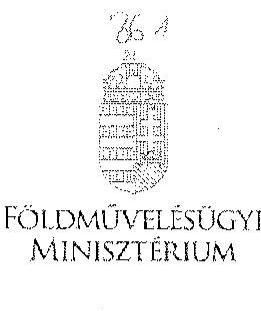

FÖLDMŰVELÉSÜGYI MINISZTÉRIUM

DR. FAZERAS SÁNDOR

Iktatószám: MgF/658-1/2015.

Ügyintéző: Kunya Zsófia
Telefonszám: 1-7957-531
E-mail: zsofia.kunya@fm.gov.hu

Domokos László
elnök úr
részére

Állami Számvevőszék

Budapest
Apáczai Csere János u. 10.
1364

Tárgy: Észrevételek az Állami Számvevőszék a Földművelésügyi Minisztérium egyes
agrárkutató intézetei és egyes génmegőrzési intézményei gazdálkodásának ellenőrzése
c., V0704 vizsgálat-azonosító számú jelentéstervezetéhez.

Tisztelt Elnök Úr!

Hivatkozásul a 2015. június 15-én megküldött „A Földművelésügyi Minisztérium
egyes agrárkutató intézetei és egyes génmegőrzési intézményei gazdálkodásának”
ellenőrzéséről szóló számvevőszéki jelentés tervezetére a tárca a következő
észrevételeket fogalmazza meg a dokumentumban hiányosságként szerepeltetett
tényekkel kapcsolatosan.

1) Intézményi szervezeti és működési szabályzatok jóváhagyása

1. Az Állami Számvevőszék (a továbbiakban: ÁSZ) jelentés-tervezete a II. fejezet 1.
pontjában megállapítja, hogy a miniszter az ellenőrzésben érintett intézetek SzMSz-
ének jóváhagyására vonatkozó jogkörét nem megfelelő módon gyakorolta, mivel az

1056 Budapest, Németh Lajos út 11. Telefon: 630 1) 795 0701 Fax: 220 1) 795 0072

1

---

intézetek által előkészített szükséges SzMSz-módosításokat, illetve új SzMSz-eket nem hagyta jóvá. A tervezet szerint az irányító szerv nem hagyta jóvá a HAKI 2011-ben és a KÉKI 2012-ben felterjesztett SzMSz-eit, a NÖDIK SzMSz-ét 2010. november 1. és 2012. július 24. között, valamint a TSZBK SzMSz-ét 2011. augusztus 1. és 2012. októbere között.
2. Az akkori Vidékfejlesztési Minisztérium által irányított háttérintézmények alapító okiratainak 2010. őszén történt módosítása, valamint a bekövetkezett, a kormányzat szervezetét, a költségvetési szervek jogállását, valamint egyes foglalkoztatási jogviszonyok szabályozását érintő jogszabály-változások eredményeként szükségessé vált az intézményi szervezeti és működési szabályzatok aktualizálása. Ennek elősegítése érdekében az akkori Jogi Főosztály felkérte az érintett intézményeket a fenti hiányosságok pótlása iránti intézkedés megtételére, valamint az aktualizált szabályzat-tervezetek 2011. október 31-ig történő megküldésére.
3. Az ÁSZ az ellenőrzése során bekérte tárcánktól - többek között - az arra vonatkozó dokumentációt, hogy a HAKI, illetve a KÉKI által benyújtott SzMSz-tervezeteket az irányító szerv miért nem hagyta jóvá az ellenőrzött időszak végéig.

Az ellenőrzés során Főosztályunk mind a főosztályi iktatórendszerben, mind a papír alapon rendelkezésre álló adatokat, dokumentumokat áttekintette. A főosztály iktatórendszere szerint a HAKI és a KÉKI SzMSz-tervezetei nem érkeztek be. Ezek, valamint tárcánk ezekre adott válaszai papír alapon sem felfedezhetőek.

Tárcánk az ÁSZ-ellenőrzés során nyilatkozatban is jelezte, hogy az SzMSz-tervezetekre adott válaszai azért nem kerültek átadásra, mert ezek a dokumentumok nem szerepelnek a főosztályi iktatórendszerben. Fentiekből következöen nem helytálló kijelenteni, hogy a minisztérium akkori Jogi Főosztálya nem hagyta jóvá a HAKI és a KÉKI beérkezett tervezeteit.
4. A NÖDIK SzMSz-ét a Jogi Főosztály a 2011. november 8-án, valamint a 2012. május 2-án kelt levelében véleményezte és korrektúrázta. A NÖDIK-ben bekövetkezett vezetőváltás és az ezzel kapcsolatos szervezeti változások, valamint a munka törvénykönyvéről szóló 2012. évi I. törvény 2012. július 1. napjával történő hatályba lépése miatt 2012. júliusában indokolttá vált a NÖDIK SzMSz tervezetének ismételt véleményezése. Az ismételt véleményezést követően került kiadásra az SzMSz.
5. A TSZBK az ÁSZ-jelentésben megjelölt időintervallumon belül több alkalommal megküldte SzMSz-ét a szakmai felügyeletét akkor ellátó Kutatás- és Oktatásszervezési Főosztály, majd annak átszervezését követően a Mezőgazdasági Főosztály részére. A véleményezésbe bevont Költségvetési és Gazdálkodási Főosztály mellett az akkori Jogi Főosztály számos hiányosságra és hibára hívta fel a figyelmet. A Jogi Főosztály

---

végül - a TSZBK-val történt egyeztetést követően - strukturálisan átdolgozta a szabályzatot, valamint a költségvetési szerv működésére vonatkozó részeket jelentősen kibővítette. Az SzMSz az átdolgozást követően került kiadásra.
II) Növényi Diverzitás Központ gazdálkodása (a mellékletek csatolva megtalálhatók):

# 1. Az Állami Számvevőszék jelentéstervezetének 17. oldal 5. bekezdésében szereplő megállapítása: 

„A NÖDIK az évi 1010498 EUR EU-s támogatással - az MVH iránymutatása alapján - a jogszabályi előírások ellenére nem számolt el. A NÖDIK az uniós támogatások felhasználásának elkülönített nyilvántartásáról nem gondoskodott."

A 49.oldal 5. bekezdése a fenti megállapítást tovább részletezi. A megállapításokat nem tartjuk megalapozottnak az alábbiak alapján:

A NÖDIK gazdasági igazgatóhelyettese 2012. június 13-án kelt levelében a közreműködő szervezet MVH felé kérdéseket fogalmazott meg az 53/2011. (VI. 10.) VM rendelet szerinti az Európai Mezőgazdasági Vidékfejlesztési Alapból a genetikai erőforrások megőrzése intézkedés keretében a növényi genetikai erőforrások és mikroorganizmusok ex situ megőrzése céljából kapott 1010498 EUR/év vissza nem térítendő támogatás összegének felhasználásával és elszámolásával kapcsolatosan.

Az MVH a genetikai erőforrások ex situ megőrzéséhez nyújtott támogatás elszámolási rendjével kapcsolatban azt a tájékoztatást adta, hogy elszámolás illetve számla benyújtása nem szükséges, mivel azt az MVH nem ellenőrzi. Az erről szóló levélváltást mellékeljük.

Az MVH ellenőrzése az 53/2011. (VI. 10.) VM rendelet 14. § szerint az alábbi területekre terjed ki:
"14. § (1) A jogosultsági feltételek teljesítését az MVH, az MgSzH, illetve a területileg illetékes kormányhivatal növény- és talajvédelmi igazgatósága évente ellenőrzi.
(2) Az (1) bekezdés szerinti ellenőrzés a támogatási kérelemre, valamint a kifizetési kérelemre vonatkozóan
a) adminisztratív ellenőrzést, és
b) helyszíni ellenőrzést
foglal magában."

---

A szakmai feltételek teljesítését a NÉBIH (korábban MgSzH) minden évben ellenőrzi.
A támogatás folyósítása évente egy összegben kifizetési kérelemnek helyt adó határozatban foglaltak alapján történik. Amennyiben a NÖDIK a szakmai feltételeket nem teljesítené a kifizetés sem történne meg.

A NÖDIK a Vidékfejlesztési, majd Földművelésügyi Minisztériumot az éves beszámolók, mérlegjelentések, maradványfelmérések és egyéb adatszolgáltatások keretében folyamatosan tájékoztatta az EMVA támogatás felhasználásáról, valamint az EMVA támogatáshoz kapcsolódó szakmai előrehaladásról is.

A NÖDIK által használt könyvelési program lehetőséget ad a támogatás felhasználásának elkülönített nyilvántartására, az intézmény tehát a támogatást érintő kiadások külön forráskódon történő gyűjtésével teljesítette az elkülönítésnek eleget. Egyéb elkülönített nyilvántartást nem alkalmazott, mivel sem az 53/2011. (VI. 10.) VM rendelet, sem az MVH iránymutatásai alapján nem tartotta azt szükségesnek. Az EMVA forrás elszámolását azonban az MVH a mellékelt levél alapján (és az elmúlt 3 év tapasztalatai alapján) nem kérte. Az FM a mérlegjelentések és az éves beszámolók által folyamatosan tájékozódhatott az EMVA forrás felhasználásáról és annak szakmai feladatairól.

Fentiekre tekintettel nem értünk egyet azzal a megállapítással, hogy a „A NÖDIK az évi 1010498 EUR EU-s támogatással - az MVH iránymutatása alapján - a jogszabályi előírások ellenére nem számolt el. A NÖDIK az uniós támogatások felhasználásának elkülönített nyilvántartásáról nem gondoskodott" és nem tartjuk valósnak ezt az állítást.
 Kérjük a fenti észrevétel törlését, illetve átfogalmazását a jelentésben a valóságnak megfelelően.
2. Az Állami Számvevőszék jelentéstervezetének 19. oldal 4. bekezdésében szereplő megállapítása:
„A közfeladat ellátásának változásával összefüggésben a KÉKI, a NÖDIK és a TSZBK esetében került sor vagyonelemek átadás-átvételére, amely nem felelt meg a jogszabályi előírásoknak. Az állami vagyon tulajdonosa a jogszabályi előírás ellenére a NÖDIK feladatellátását biztosító vagyonra az ellenőrzött időszak végéig vagyonkezelési szerződést nem kötött."

---

A megállapítást nem tartjuk megalapozottnak az alábbiak alapján:
A NÖDIK 2010. november 1-ével az MgSZH Központból történő kiválását követően a VM közigazgatási államtitkára 2010. december 21-én kelt levelében megkereste a Nemzeti Földalapkezelő Szervezetet, valamint a Magyar Nemzeti Vagyonkezelő Zrt.-t a NÖDIK vagyonkezelési szerződésének mielőbbi megkötése érdekében. A leveleket mellékeljük. A megkeresésre érdemi intézkedés nem történt. Az MNV Zrt. és a Nemzeti Földalapkezelő Szervezet között időközben egyeztetések történtek, melyek eredményéről nincs tudomásunk. (Az MNV Zrt. 2012. január 9-én kelt NFA-nak címzett megkeresését mellékeljük). Tekintettel arra, hogy a megkeresések ellenére nem történt meg a vagyonkezelési szerződés megkötése, a Növényi Diverzitás Központ 2015. június 10-én ismét megkereste a Nemzeti Földalapkezelő Szervezetet a probléma rendezése érdekében (A megkeresést és az ingatlanok listáját tartalmazó mellékletét szintén csatoljuk).

Fentiekre tekintettel kérjük a megállapítás átfogalmazását oly módon, amelyből kiderül, hogy sem a VM, sem a NÖDIK nem sértette meg a jogszabályi előírásokat a vagyonelemek átadás-átvétele során.

Budapest, 2015. július „,”.

Tisztelettel:
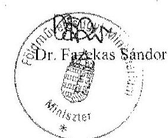

---

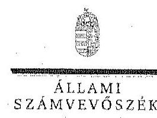

ELHők

Ikt.szám: V-0595-285/2015.

Dr. Fazekas Sándor úr
miniszter
Földművelésügyi Minisztérium

Budapest

Tisztelt Miniszter Úr!
„Földművelésügyi Minisztérium egyes agrárkutató intézetet és egyes génmegőrzési intézményei gazdálkodásának ellenőrzéséről" című jelentéstervezetre tett észrevételeit köszönettel megkaptam.

Az Állami Számvevőszék észrevételekre vonatkozó álláspontjáról a felügyeleti vezető által készített részletes tájékoztatást csatoltan megküldöm.

Tájékoztatom Miniszter urat, hogy a számvevőszéki jelentés szövegezése az elfogadott észrevételek figyelembevételével készül.

Budapest, 2015. augusztus, 2 ..
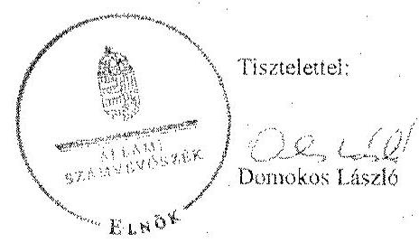

Melléklet: Tájékoztatás az elfogadott és el nem fogadott észrevételekről

---

# Tájékoztatás   az elfogadott és el nem fogadott észrevételekről 

A Földművelésügyi Minisztérium egyes agrárkutató intézetei és egyes génmegőrzési intézményei gazdálkodásának ellenőrzéséről" című jelentéstervezetre 2015. július 23-án érkezett észrevételeit áttekintettük és azok kezelésével kapcsolatban a következő tájékoztatást adom:

## I) Intézményi szervezeti és működési szabályzat jóváhagyása

Az észrevételeikben kifogásolták a jelentéstervezet II. fejezet 1. pontjában megfogalmazott megállapításokat, miszerint a miniszter az ellenőrzésben érintett intézetek SZMSZ-ének jóváhagyására vonatkozó jogkörét nem megfelelő módon gyakorolta, mivel az intézetek által előkészített szükséges SZMSZ-módosításokat, illetve új SZMSZ-eket nem hagyta jóvá. A tervezet szerint az irányító szerv nem hagyta jóvá a HAKI 2011-ben és a KÉKI 2012-ben felterjesztett SZMSZ-ét, a NÖDIK SZMSZ-ét 2010. november 1. és 2012. július 24. között, valamint a TSZBK SZMSZ-ét 2011. augusztus 1. és 2012. októbere között.

A HAKI és a KÉKI esetében az ellenőrzés rendelkezésére álló dokumentumok ismételt áttekintése alapján a jelentéstervezet 15. oldalának 3. bekezdésének utolsó két mondatát, valamint a 27. oldal 1. és 2. részbekezdését és a 28. oldal első bekezdését töröltük.
A NÖDIK és a TSZBK esetében nem vitatják és nem cáfolják a jelentéstervezetben megjelölt időszakokban az intézmények által több alkalommal felterjesztett SZMSZ-ek irányítószervi jóváhagyásának elmaradását. Észrevételeikben magyarázatot nyújtanak ennek okaira, ami a jelentéstervezet megállapítását nem befolyásolja, módosítása nem szükséges.

## II) Növényi Diverzitás Központ gazdálkodása

A jelentéstervezet 17. oldal 5. bekezdése szerint „A NÖDIK az évi 1 010 498 EUR EU-s támogatással - az MVH iránymutatása alapján - a jogszabályi előírások ellenére nem számolt el. A NÖDIK az uniós támogatások felhasználásának elkülönített nyilvántartásáról nem gondoskodott."

Minden amit leírtak az észrevételeikben tartalmilag megjelennek a jelentéstervezet 49. oldalán. Az MVH-val történő levelezés pedig nem ad felmentést az Áht. 53. § (1) bekezdésében és a 368/2011. (XII. 31.) Korm. rendelet 80. § (1) bekezdésében leírtak alól. Az észrevételeikben nem cáfolják azt a megállapítást, hogy beszámoló és elkülönített nyilvántartás nem készült, hanem ennek részletes okaira adnak magyarázatot, ami azonban

---

nem indokolja a jelentéstervezet módosítását, mivel az elszámolás és a nyilvántartás hiánya nem felelt meg az Áht. 13/A. § (2), és az Áht. 53. § (1) bekezdésében leírtaknak.

Az Állami Számvevőszék jelentéstervezetének 19. oldal 4. bekezdése
A jelentéstervezet megállapítása szerint „A közfeladat ellátásának változásával összefüggésben a KÉKI, a NÖDIK és a TSZBK esetében került sor vagyonelemek átadás-átvételére, amely nem felelt meg a jogszabályi előírásoknak. Az állami vagyon tulajdonosa a jogszabályi előírás ellenére a NÖDIK feladatellátását biztosító vagyonra az ellenőrzött időszak végéig vagyonkezelési szerződést nem kötött."

A jelentéstervezet idézett megállapításának második mondata összhangban van az észrevételeikben leírtakkal, mivel a jelentéstervezet a vagyonkezelői szerződés megkötésének elmaradását az állami vagyon tulajdonosának rója fel és nem az FM-nek és a NÖDIK-nek. A megállapítást fenntartjuk, a jelentéstervezet módosítása nem indokolt.

Észrevételét köszönjük, tájékoztatom Miniszter urat, hogy a számvevőszéki jelentés mellékleteként szerepeltetjük a jelentéstervezethez tett észrevételeit, valamint az azokra adott válaszunkat.

Budapest, 2015. augusztus ,. 1 ..

Dr. Pulay Gyula felügyeleti vezető

---

# 8. SZÁMÚ MELLÉKLET A V-0595-289/2015. SZÁMÚ JELENTÉSHEZ 

## NAIK

Nemzeti Agrárkutatási és Innovációs Központ
2100 Gödöllő, Szent-Györgyi Albert u. 4.
Levélcím: 2101 Gödöllő, PE 411.
Telefon: (28) 526-100
Fax: (28) 526-101

Hivatkozási szám: V-0595-272/2015
Iktatószám: NAIK/41-6/2015
Ögyintéző: Házát Járódi
SZÁMVEVŐSZÉK
JEGYZŐ

Erkezés: 2015. JUL 3
Iktatószám:
Melléklet:
Domokos László Úr
Elnök részére
Állami Számvevőszék
Budapest

Tisztelt Elnök Úr!
Az Állami Számvevőszék (továbbiakban: ÁSZ) a Földművelésügyi Minisztérium egyes agrárkutató intézetei és egyes génmegőrzési intézményei gazdálkodásának ellenőrzéséről szóló V-0595-272/2015. számú, 2015. június 17-én érkezett számvevőszéki jelentéstervezettel kapcsolatban, az 1467/2013. (VII.24.) Kormány határozattal, illetve a Földművelésügyi Miniszter által alapított Nemzeti Agrárkutatási és Innovációs Központ (továbbiakban: NAIK) főigazgatójaként, a Halászati és Öntözési Kutatóintézet (továbbiakban: HAKI), a Központi Környezet- és Élelmiszer-tudományi Kutatóintézet (továbbiakban: KÉKI), a Mezőgazdasági Biotechnológiai Kutatóközpont (továbbiakban: MBK) jogutódjaként az alábbiakban teszem meg észrevételeimet.

A NAIK bevételi előirányzatainak elszámolásával kapcsolatos ÁSZ javaslatot (Jelentéstervezet 21. oldal) a NAIK önköltség számítási szabályzata előírásainak kidolgozásával és alkalmazásával teljesíti. Ezzel kapcsolatban azonban megjegyezzük, hogy a HAKI értékelésünk szerint megalapozottan jelezte a NAIK vezetése felé azt az ellentmondást, amely a kutatási tevékenységgel kapcsolatos termékek, szolgáltatások önköltsége és az összemérhető termékek, szolgáltatások piaci ára között jelentkezik. A saját bevételek realizálásának költségvetési kényszere, illetve a jogszabályi rendelkezések közötti ellentmondást az alapító Földművelésügyi Minisztériummal egyeztetett módon, saját hatáskörünkben kezdjük és oldjuk meg.

Az eszközök és források teljes körű leltárral történő alátámasztására vonatkozó ÁSZ javaslattal (Jelentéstervezet 21. oldal) kapcsolatban észrevételt nem teszünk. A NAIK leltározási tevékenységére vonatkozó szabályozás alkalmazása a 2014. évtől kezdődően a NAIK minden szervezeti egységére kötelező érvényű.

A jogszabályi előírásoknak megfelelően a NAIK valamennyi tevékenységére kiterjedő kontrollrendszer kialakítására vonatkozó javaslattal kapcsolatban (Jelentéstervezet 22. oldal) nem teszünk észrevételt.

A monitoring rendszer kialakítására vonatkozó javaslattal kapcsolatban (Jelentéstervezet 22. oldal) nem teszünk észrevételt.
A kontrollrendszer lényeges elemei 2014. évtől kezdődően működnek, azonban a teljes körűség megvalósításához további lépések szükségesek.

A hiányzó szabályzatok jogszabályi előírásoknak megfelelő elkészítésére vonatkozó javaslattal kapcsolatban (Jelentéstervezet 23. oldal) nem teszünk észrevételt. A NAIK szervezeti egységei 2014. évtől teljesen új szabályozási környezetben működnek, amelynek fő rendezési elve a jogszabályi rendelkezéseken alapuló, általános érvényesség. E tekintetben a 2013. év végéig fennállt helyzet nem releváns, azonban a szabályozás, a jelentéstervezet elkészítésének időpontjában nem volt teljes körű.

Az intézetek szabályzatai jogszabályi előírásoknak való megfeleltetésével kapcsolatos javaslatot (Jelentéstervezet 24. oldal) szíveskedjenek törölni. A NAIK szervezeti egységei 2014. évtől teljesen új szabályozási környezetben működnek, amelynek fő rendezési elve a jogszabályi rendelkezéseken alapuló, általános érvényesség.
A szabályozási tevékenységet folyamatosan végrehajtjuk és a szabályozásunkat a gyakorlati tapasztalatok alapján felülvizsgáljuk. E tekintetben a 2013. év végéig fennállt helyzet nem releváns. Továbbá a jelentéstervezethez a

---

HAKI által benyújtott és általam elfogadott észrevételében tételesen alátámasztotta az ÁSZ megállapításaival kapcsolatos ellenvéleményét.

A belső ellenőrzési feladatok foglalkoztatási jogviszonyban történő ellátásával, a belső ellenőri megállapítások kezelésének jogszabályban meghatározott végrehajtásával és nyilvántartásával kapcsolatos javaslatokat (Jelentéstervezet 24. oldal) kérjük törölni. A NAIK belső ellenőri szervezetét a központi államigazgatási szervezeti ellenőrzési tapasztalattal, megfelelő képesítéssel rendelkező közalkalmazottak részvételével alakítottam ki, s a jogszabályoknak megfelelő intézkedési és nyilvántartási rendet működtetünk. E tekintetben a 2013. év végéig fennállt helyzet nem releváns. Továbbá a jelentéstervezethez a HAKI által benyújtott és általam elfogadott észrevételében tételesen alátámasztotta az ÁSZ-nak a HAKI belső ellenőrzésére vonatkozó megállapításaival kapcsolatos ellenvéleményét.

A közbeszerzéssel kapcsolatos szabálytalanságok tekintetében a felelősség tisztázása érdekében teendő intézkedésekre vonatkozó javaslatot (Javaslatok 25. oldal) kérjük törölni.
A KÉKI az ÁSZ folyamatosan lévő ellenőrzésével kapcsolatban tájékoztatásul megküldte a NAIK Főigazgatóság részére a Közbeszerzési Döntőbizottság 2015. 04. 13-án kelt, D.106-10-2015. számú végzését, amelyet mellékelek az Ön részére. A végzés szerint a KÉKI a tárgyalt ügyben nem követett el jogsértést.

Az üzembe helyezés dokumentálására vonatkozó javaslatot (Jelentéstervezet 25. oldal) a HAKI által kifejtett indokok alapján kérem törölni.

A jogszabályban foglalt bizonylat megőrzési kötelezettség betartásával a könyvviteli elszámolást alátámasztó számviteli bizonylatok megőrzésével kapcsolatos szabálytalanságok tekintetében a felelősség tisztázására tett javaslatokkal (Jelentéstervezet 26. oldal) kapcsolatosan nem teszünk észrevételt. Megjegyezzük, hogy 2014. évben a NAIK Belső ellenőrzés által az MNV Zrt. felkérésére a HAKI vagyonkezelésének 2012-2014. I. félévi időszakra vonatkozóan lefolytatott ellenőrzése alapján készült jelentés súlyos szabálytalanságot nem tárt fel. Az ellenőrzési jelentést az MNV Zrt. jóváhagyta.

Kérem, hogy a véglegesített ÁSZ jelentésnek a NAIK-ra vonatkozó megállapításait és javaslatait észrevételeink alapján módosítsák.

Az ÁSZ végleges javaslatai alapján a NAIK Intézkedési Tervet készít, amelyet a jogszabályban meghatározott határidőben benyújtunk az ÁSZ részére.

Az ÁSZ által feltárt hiányosságok megszüntetésére irányuló intézkedéseinket általános érvényű, a NAIK működésének belső szabályozása kialakításának keretében hajtjuk végre. A szabályozást kiegészítik, illetve támogatják a NAIK-nál 2014. évtől működésbe lépett EOS elnevezésű integrált pénzügyi-gazdálkodási rendszer informatikai megoldásai.

Kérem a fentiek szerint kifejtett észrevételeink érvényesítését a véglegesített ÁSZ jelentésben.

Gödöllő, 2015. július 1.

Tisztelettel:
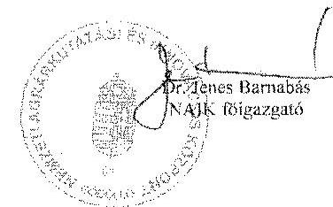

Mellékletek: 1 pld. HAKI észrevétel
1 pld. Közbeszerzési Döntőbizottság D.106-10-2015. számú végzése

---

# 8. SZÁMÚ MELLÉKLET A V-0595-289/2015. SZÁMÚ JELENTÉSHEZ 

## 8. SZÁM

## 8. SZÁMVEVŐSZÉK

Ikt.szám: V-0595-281/2015.

## Dr. Jenes Barnabás úr

főigazgató
Nemzeti Agrárkutató és Innovációs Központ

## Gödöllő

## Tisztelt Főigazgató Úr!

„A Földművelésügyi Minisztérium egyes agrárkutató intézetei és egyes génmegőrzési intézményei gazdálkodásának ellenőrzéséről" című jelentéstervezetre tett észrevételeit köszönettel megkaptam.

Az Állami Számvevőszék észrevételekre vonatkozó álláspontjáról a felügyeleti vezető által készített részletes tájékoztatást csatoltan megküldöm.

Tájékoztatom Főigazgató urat, hogy a számvevőszéki jelentés szövegezése az elfogadott észrevételek figyelembevételével készül.

Budapest, 2015. augusztus ..... 9.
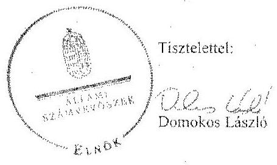

Melléklet: Tájékoztatás az elfogadott és el nem fogadott észrevételekről

---

# Tájékoztatás   az elfogadott és el nem fogadott észrevételekről 

A Földművelésügyi Minisztérium egyes agrárkutató intézetei és egyes génmegőrzési intézményei gazdálkodásának ellenőrzéséről" című jelentéstervezetre 2015. július 3-án érkezett észrevételeit áttekintettük és azok kezelésével kapcsolatban a következő tájékoztatást adom:

1) 22. oldal 3. pont a)

A HAKI a jelentéstervezet megállapítását azzal cáfolta, hogy korábban a Kbt. 1-2 hatálya alá nem tartozó beszerzések lebonyolításának szabályozása a minőségirányítási rendszerhez kapcsolódóan kiadott Működési rendben történt. A hivatkozott szabályzat azonban nem fedi le az ellenőrzés teljes
 időszakát, ezért az intézmény észrevételében megfogalmazottakat nem fogadjuk el teljes mértékben.

A jelentéstervezet 22. oldal 3. pontjának a) pontját ennek megfelelően pontosítottuk: ,...a HAKI 2008. szeptember 14-ig az Ámr. 20. § (3) bekezdés b) pontjának, illetve az Ávr. 13. § (2) bekezdés b) pontjának előírása ellenére nem szabályozta a Kbt. 1-2 hatálya alá nem tartozó beszerzések lebonyolításával kapcsolatos eljárás rendjét"
2) 16. oldal 6. bekezdés és 22. oldal 2. pont

A HAKI a jelentéstervezet megállapítását a FEUVE szabályzat meglétével cáfolja. Továbbra is fenntartjuk a jelentéstervezet megállapítását, miszerint a HAKI az Ámr. 145/G. §-ában, az Ámr. 160. §-ában, a Bkr. 3. § e) pontjában és a Bkr. 10. §-ában foglaltak ellenére 2009 és 2013 között nem alakította ki és nem működtette a szervezetek tevékenységének, a célok megvalósításának nyomon követését biztosító monitoring rendszert. A FEUVE szabályzat nem pótolta ezt, ezért a jelentéstervezet módosítása nem indokolt.
3) 17. oldal 1. bekezdés és 24. oldal 5. pont

A jelentéstervezet 17. oldal 1. bekezdés 3. mondatából és a 24. oldal 5. pontjának második mondatából a HAKI törlésre került.

---

4) 17. oldal 3. bekezdés

Maga az indoklás is alátámasztja a megállapítást. A saját hatáskörű módosítások esetében a mintavétel dokumentációja bizonyítja az ÁSZ megállapítását, ezért a jelentéstervezet módosítása nem indokolt.
5) 17. oldal 5. bekezdés és 21. oldal 1. pont

A megállapítás a működési bevételek között kimutatott halértékesítésre vonatkozott. Ugyanis az önköltség számítási szabályzat: B/1 pontjában előírták, hogy ..A törzskönyv vezetése alapján kerül sor az önköltség meghatározására fajonként és korosztályonként .... Önköltség alatt nem lehet semmilyen korosztályt és halfajt értékesíteni .. Az önköltség számítási szabályzat 1-1 B/1 pontja szerint. ... az értékesítési egységárakat a telepvezető határozza meg írásban, a gazdasági főigazgató-helyettes ellenjegyzésével a következőképpen:

- tavaszi ár (telelőbontás után - május 31.) telelőbontás utáni ár
- nyári ár (június 1- augusztus 31.) a tavaszi ár + 10 - 15 %
- őszi ár (szeptember 1.- telelőbontásig) kb: a tavaszi ár 10 %-a.

2008. évtől az ár 50 Ft-ra kerekítve kerül meghatározásra a kerekítési szabályoknak megfelelően." Az ellenőrzött halértékesítések esetében az eladási ár megállapítása nem a fenti módon történt, ezért a megállapítást fenntartjuk, a jelentéstervezet módosítása nem indokolt.
6) 17. oldal 6. bekezdés és 25. oldal 1. pont

Az ÁSZ továbbra is fenntartja a jelentéstervezetben leírtakat, miszerint a HAKI 2013. évben a Kbt. 210. § (1) bekezdés b) pontjában meghatározott értékhatár figyelmen kívül hagyásával a Kbt. 25. § és 119. § előírása ellenére a közbeszerzés mellőzésével szerzett be eszközt, ezért a jelentéstervezet módosítása nem indokolt.
7) 17. oldal 7. bekezdés

A HAKI tartalmilag nem cáfolta és nyilatkozatában elismerte, hogy ,...a 19., 28., és 30. mintatételek esetében nem történt bejelentés az irányító szerv felé arra vonatkozóan, hogy a felhasználás nem történt meg a tárgyévet követő év június 30-ig" A megállapítást fenntartjuk, a jelentéstervezet módosítása nem szükséges.
8) 18. oldal 3. bekezdés és 25. oldal 1. pont

---

Továbbra sem fogadjuk el a 2010. június 25-én üzembe helyezett fűkasza és a 2013. január 10-én üzembe helyezett szivattyú esetében az értékcsökkenés elszámolásának idejét, mert ezzel nem teljesült az Ahsz. 30. § (2) bekezdésében előírt negyedévenkénti időarányos elszámolás.

A HAKI észrevétele alapján, amiben cáfolta, hogy az üzembe helyezést nem dokumentálta hitelt érdemlően, a jelentéstervezet 25. oldal 1. pontjának első mondatát pontosítottuk: „A HAKI a 2008-2010. években, valamint a 2013. december 15-től hatályos számviteli politikájában az Ahsz. 8. § (7) bekezdésében foglaltak ellenére nem határozta meg az üzembe helyezés dokumentálásának szabályait. 2011. évtől a számviteli politikájukban előírták az üzembe helyezési jegyzőkönyvet, de nem alkalmazták azt."

A HAKI észrevételében indokolta, hogy a beszerzett radart bármely traktorra felszerelhetik, ezért önálló eszközként vették állományba és nem a tulajdonukban lévő traktorok közül egyhez, mint értéknövelő beruházást. Az észrevételt elfogadtuk, s ennek megfelelően a jelentéstervezet 58. oldal 3. bekezdése és az 58. oldal utolsó felsorolása törlésre került.
9) 18. oldal 4. bekezdés

A HAKI-nál a vevőkkel szembeni 2012. évi követelésállomány év végi meghatározása és mérlegben történő szerepeltetése során az Ahsz. 9. számú melléklet 2.c pontjában foglaltak ellenére el nem ismert követelést is kimutattak a vevői kötelezettségek között.

A Fővárosi Törvényszék 2013. február 20-án érkeztetett válaszában a 2012. évi egyenlegértesítőben kimutatott 63500 Ft tartozás törlését kérte, arra hivatkozással, hogy időközben a szakértői díjat a bíróság egy másik szakvéleménnyel együtt 89154 Ft-ban határozta meg, melyet 2012. 11. 28-án kiegyenlítettek. A megállapítást fenntartjuk, a jelentéstervezet módosítása nem indokolt.
10) 19. oldal 2. bekezdés

Továbbra is az az ÁSZ megállapítása, hogy nem a szerződésnek megfelelően teljesítették az üzemeltetési díjat, vagyis nem halmennyiségben meghatározott összeg átutalásával, hanem a halmennyiséggel.

Az ingatlanok bérbeadás meghirdetésének hiányát nem indokolja a jelentkezők hiánya, hiszen pontosan ezért kell meghirdetni. A jelentéstervezet módosítása nem indokolt.
11) 24. oldal 4. pont e)

A 2012. január 1-től érvényben lévő ügyrend valóban rendelkezik a gazdasági szervezet kapcsolattartás módjáról, azonban a kapcsolattartás rendjének szabályozását az SZMSZ-ben

---

jelöli meg. Az hatályban lévő SZMSZ azonban ezt nem tartalmazta, ezért a jelentéstervezet módosítása nem indokolt.
12) Közbeszerzési Döntőbizottság határozata (D.106-10-2015. számú végzés) KÉKI a „Laboratóriumi eszközök és berendezések szállítása" ügyben.

Jelentéstervezet 25. oldal 1. pontjának második mondata és az 51. oldal 2. felsorolása törlésre került.

Észrevételét köszönjük, de az ellenőrzés időszaka 2013. december 31-vel lezárult. Az ezután hozott intézkedések és a 2015 évre tervezett változtatások az intézkedési terv részét fogják képezni, így a jelentéstervezet módosítása nem indokolt.

Tájékoztatom Főigazgató urat, hogy a számvevőszéki jelentés mellékleteként szerepeltetjük a jelentéstervezethez tett észrevételeit, valamint az azokra adott válaszunkat.

Budapest, 2015. augusztus „/ ,.

Dr. Pulay Gyula felügyeleti vezető

---

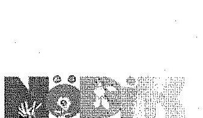

Állami Számvevőszék
Domokos László
részére

Iktatószám: 25/2/2015
Hiv.szám.: V-0595-271/2015
Tárgy: Észrevételek a
Jelentéstervezettel kapcsolatban

# 1052 Budapest 

Apáczai Csere János u. 10.

## Tisztelt Állami Számvevőszék!

A 2015. június 17-én kézhez kapott Jelentéstervezetükre az alábbi észrevételeket tesszük:
Az Állami Számvevőszék jelentéstervezetének 58-60. oldal 5.2.1. pontjában szerepelnek az alábbi megállapítások:
58.o. „a NÖDIK az ellenőrzött időszakban az üzembe helyezést nem dokumentálta hitelt érdemlően..."

A fenti állítással nem értünk egyet, mivel:
A beszerzett tárgyi eszközök, immateriális javak üzembe helyezésének dokumentálására a SALDO Creator programban előállított:

- Állományba vételi bizonylatot és
- Tárgyi eszköz üzembe helyezési bizonylatot használjuk.

Ezen bizonylatok minden azonosítót, adatot tartalmaznak, melyet a számviteli követelmények előírnak.
A tárgyi eszköz beérkezésekor Átadás-átvételi bizonylat készül, mely melléklete az Állományba vételi bizonylatnak és a Tárgyi eszköz üzembe helyezési bizonylatnak. A NöDIK tehát minden esetben dokumentálta az üzembe helyezést és ehhez a dokumentáció is rendelkezésre áll valamennyi releváns információval.
60.o. „a NÖDIK nem vezetett folyamatosan analitikus nyilvántartást a vevőkről és szállítókról."
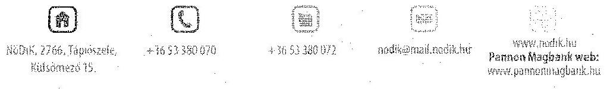

---

# NOVÉNYI DIVERZITÁS KÖZPONT 

A vevőkről és szállítókről szintén a SALDO Creator programmal készítjük folyamatosan az analitikus nyilvántartást. Paraméterezési hiányosság miatt előfordult, hogy kézi összesítő bizonylat alapján könyveltünk év végén a főkönyvi könyvelésben. Ezzel biztosítva volt azonban az analitika és a főkönyv, valamint a beszámoló valódisága. A vevőkről és szállítókról készített analitikus nyilvántartás tehát folyamatos volt.

Az Állami Számvevőszék jelentéstervezetének 62. oldal 5.2.2. pontjában szerepel az alábbi megállapítás:
62.o. „ a NÖDIK 2012. évi mérlegét alátámasztó leltárában az évközben betörés során eltulajdonított eszközöket is kimutatta, ezzel megsértették a valódiság számviteli alapelvét, amely szerint a beszámolóban szereplő tételeknek a valóságban is megtalálhatónak kell lenniük. 2010-2012. évi leltára a könyvviteli mérlegben kimutatott eszközök valódiságát nem támasztotta alá, mivel leltárában a jogelőd által az intézmény székhelyén hagyott háromtagú gyűrűhengert nem szerepeltette."

A 2012. év októberében betöréses lopás során eltulajdonított eszközöket év végén kimutattuk a tárgyi eszköz leltárban, mivel az eltulajdonított tárgyak ügyében eljárást folytatott a Nagykátai Rendőrkapitányság Bűnügyi Osztálya. A rendőrségi határozat a nyomozás felfüggesztéséről csak 2013. április végén érkezett meg és ekkor vált bizonyossá, hogy az ellopott tárgyak valóban nem kerülnek meg. Ekkor történt meg az ellopott eszközök kivezetése, mivel az elkövető személye nem nyert megállapítást és az eltulajdonított tárgyak nem kerültek meg. Ezen az egyetlen kivételes eseten kívül a leltár megfelelt a valóságnak, így nem értünk egyet a fenti megállapítással.
A 2010. november 1-jei átadóleltárban nem szereplő, a 2013. évközben fizikailag fellelt háromtagú gyűrűhengert készletként értékesítettük dolgozónknak. Ez az eszköz feltehetően az intézet valamely régi jogelődjének tulajdona lehetett, használatban több évtizede nem volt. Felújítása már lehetetlen volt, mivel fa csapágyazás 30 éve nem létezik és ennek pótlására lett volna szükség.

Az Állami Számvevőszék jelentéstervezetének 67. oldal 5.4 pontjában szerepel az alábbi megállapítás:
67.o. „a NÖDIK a jogszabályi előírás ellenére az állami tulajdonban lévő ingatlan eszközök bérbeadása során nem győződött meg arról, hogy a nemzeti vagyon hasznosítására vonatkozó szerződést átlátható szervezettel kötötték meg."
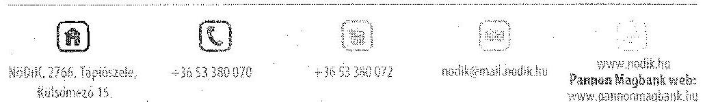

---

# NOVÉNYI DIVERZITÁS KÖZPONT 

A megállapítással nem értünk egyet, mivel a NÖDIK állami tulajdonban lévő ingatlanra semmilyen szervezettel nem kötött bérleti szerződést.
Bérleti szerződéseink csak a dolgozóinkkal kötött lakásbérleti szerződések. Kérjük az 5.4 pontból a NöDIK törlését.

Az Állami Számvevőszék Jelentéstervezetének 17. oldal 5. bekezdésében szereplő megállapítása:
„A NÖDIK az évi 1010498 EUR EU-s támogatással - az MVH iránymutatása alapján - a jogszabályi előírások ellenére nem számolt el. A NÖDIK az uniós támogatásuk felhasználásának elkülönített nyilvántartásáról nem gondoskodott."

A 49.oldal 5. bekezdése a fenti megállapítást tovább részletezi.
A megállapításokat nem tartjuk megalapozottnak az alábbiak alapján:
A NÖDIK gazdasági igazgatóhelyettese 2012. június 13-án kelt levelében a közreműködő szervezet MVH felé kérdéseket fogalmazott meg az 53/2011. (VI. 10.) VM rendelet szerinti az Európai Mezőgazdasági Vidékfejlesztési Alapból a genetikai erőforrások megőrzése intézkedés keretében a növényi genetikai erőforrások és mikroorganizmusok ex situ megőrzése céljából kapott 1010498 EUR/év vissza nem térítendő támogatás összegének felhasználásával és elszámolásával kapcsolatosan.

Az MVH a genetikai erőforrások ex situ megőrzéséhez nyújtott támogatás elszámolási rendjével kapcsolatban azt a tájékoztatást adta, hogy elszámolás illetve számla benyújtása nem szükséges az MVH részére, mivel azt az MVH nem ellenőrzi. Az erről szóló levélváltást mellékeljük.

Az MVH ellenőrzése az 53/2011. (VI. 10.) VM rendelet 14.§ szerint az alábbi területekre terjed ki:
"14. § (1) A jogosultsági feltételek teljesítését az MVH, az MgSzH, illetve a területileg illetékes kormányhivatal növény- és talajvédelmi igazgatósága évente ellenőrzi.
(2) Az (1) bekezdés szerinti ellenőrzés a támogatási kérelemre, valamint a kifizetési kérelemre vonatkozóan
a) adminisztratív ellenőrzést, és
b) helyszíni ellenőrzést
foglal magában."
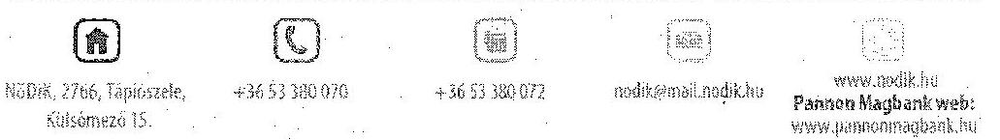

---

# 8. SZAMÚ MELLÉKLET A V-0595-289/2015. SZAMÚ JELENTÉSHEZ 

A szakmai feltételek teljesítését a NÉBIH (korábban MgSzH) minden évben ellenőrzi.
A támogatás folyósítása évente egy összegben kifizetési kérelemnek helyt adó határozatban foglaltak alapján történik. Amennyiben a NÖDIK a szakmai feltételeket nem teljesítené a kifizetés sem történne meg.

A NÖDIK a Vidékfejlesztési Minisztériumot az éves beszámolók, mérlegjelentések, maradványfelmérések és egyéb
 adatszolgáltatások keretében folyamatosan tájékoztatta az EMVA támogatás felhasználásáról, valamint az EMVA támogatáshoz kapcsolódó szakmai előrehaladásról is.

A NÖDIK által használt könyvelési program lehetőséget ad a támogatás felhasználásának elkülönített nyilvántartására, az intézmény tehát a támogatást érintő kiadások külön forráskódon történő gyűjtésével tett az elkülönítésnek eleget. Egyéb elkülönített nyilvántartást nem alkalmazott, mivel sem az 53/2011. (VI. 10.) VM rendelet, sem az MVH iránymutatásai alapján nem tartotta azt szükségesnek. Az EMVA forrás elszámolását azonban az MVH a mellékelt levél alapján (és az elmúlt 3 év tapasztalatai alapján) nem kérte. Az FM a mérlegjelentések és az éves beszámolók által folyamatosan tájékozódhatott az EMVA forrás felhasználásáról és annak szakmai feladatairól.

Fentieknek megfelelően nem értünk egyet azzal a megállapítással, hogy a „A NÖDIK az évi 1010498 EUR EU-s támogatással - az MVH iránymutatása alapján - a jogszabályi előírások ellenére nem számolt el. A NÖDIK az uniós támogatások felhasználásának elkülönített nyilvántartásáról nem gondoskodott" és nem tartjuk valósnak ezt az állítást. Kérjük a fenti észrevétel törlését, illetve átfogalmazását a jelentésben a valóságnak megfelelően.

Az Állami Számvevőszék jelentéstervezetének 53. oldal 4.5 pontjának 4. bekezdésében szereplő megállapítása:

### 4.5. Az előirányzat-maradvány megállapításának és felhasználásának szabályszerűsége

„A NÖDIK a jogszabályi előírással ellentétben analitikus nyilvántartások vezetésével nem gondoskodott arról, hogy az elemi költségvetési beszámoló adatai közül a kötelezettségvállalással terhelt maradvány összegét a valóságnak megfelelően alátámassza. Ennek következtében a kötelezettségvállalással terhelt maradvány megállapítása és felhasználása nem volt megfelelő."
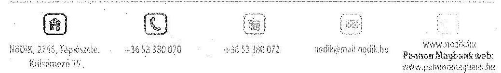

---

# 8. SZÁMÚ MELLÉKLET A V-0595-289/2015. SZÁMÚ JELENTÉSHEZ 

A 2012-2013-as maradványunk a VM felé teljesített maradvány felméréseken és beszámolókon keresztül ki lett mutatva, ezek teljes egészében Uniós maradványok, ami a 368/2011 Korm. rendelet 150. §. c. bekezdése értelmében kötelezettségvállalással terhelt maradványnak tekintendő, és az 53/2011. (VI. 10.) VM rendelet szerinti az Európai Mezőgazdasági Vidékfejlesztési Alapból a genetikai erőforrások megőrzése intézkedés keretében a növényi genetikai erőforrások és mikroorganizmusok ex situ megőrzése céljából került felhasználásra. Ez az oka annak, hogy éves analitikus nyilvántartást külön nem vezettünk a maradvány alátámasztásául, az egybeolvadt az éves kötelezettségvállalások analitikájával. Felhasználásra viszont minden esetben génmegőrzés céljából került. Az EMVA forrás bizonyos években év elején, bizonyos években még az év utolsó napjaiban megérkezett. A valóságban azonban ez a kifizetés eltolódása miatt alakult így, nem valós maradvány. A teljes összeg a következő évben lett felhasználva nyilvánvalóan.

Az Állami Számvevőszék jelentéstervezetének Összegzö megállapítások, következtetések, javaslatok 17. oldal 5. bekezdésében szereplő megállapítása:

## I. Összegzö megállapítások, következtetések, javaslatok

„A HAKI a KÉKI, a NÖDIK és a TSZBK a bevételi előirányzatok teljesítése során nem tartotta be teljes körűen a jogszabályi előírásokat. Az intézmények a saját előállítású termékek, a végzett szolgáltatások árainak meghatározásakor a termékek és szolgáltatások közvetlen önköltségét nem állapították meg."

A termények önköltségének jogszabályi előírásoknak megfelelő megállapítása Intézményünk speciális génmegőrzési feladata miatt nem lehetséges, mivel a génmegőrzés céljából történő felszaporításra és felújító vetésre hasznosított területek egybeolvadnak a szántóföldi növénytermesztés tevékenységre használt területekkel, így azok elkülönített műtrágyázása, növényvédelme, gépi munkája és egyéb ápolási munkáinak elkülönített megállapítása nem megoldható. A szabadföldre kihelyezett génbanki tételek állományai ugyanis beágyazódnak a később értékesíthető terményeket szolgáltató szántóföldi növények tábláiba. A talajmunkák, a növényvédelem és egyéb ápolási munkák (amelyek az önköltségszámítás alapjául szolgálhatnának) tehát egy menetben történnek függetlenül attól, hogy génbanki anyagról, vagy a terményértékesítést célzó növénytermesztésről van szó.

Az értékesítésre kerülő termény a génmegőrzési célokat szolgáló terménytől területileg nem elkülöníthető. Így a ráfordított műtrágya, vegyszer, gépi munka, munkabér és járulékok sem különíthetők el pontosan.
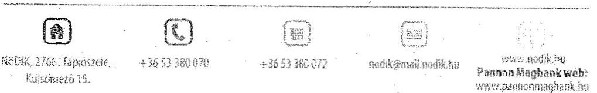

---

# 8. SZÁMÚ MELLÉKLET A V-0595-289/2015. SZÁMÚ JELENTÉSHEZ 

A termény előállítása esetünkben nem haszonszerzési céllal történik, a szántóföldi növénytermesztés a génmegőrzésre használt területek izolációját szolgálja egyben, így azt minden esetben fenn kell tartani. Kérnénk szíves iránymutatásukat, hogy amennyiben önköltség számítása nem lehetséges, mi a jogszabályoknak megfelelő eljárás.

Az Állami Számvevőszék jelentéstervezetének 32. oldal 3.1 pontjának 2. bekezdésében szereplő megállapítása:

### 3.1. A kontrollkörnyezet kialakítása

„A NÖDIK esetében a 2012. évhez a 2013. évi negatív változást az okozta, hogy a tárgyévben nem jelölték ki a kötelezettségvállalásra jogosultak körét."

A NöDIK esetében mindkét évben ki lettek jelölve a kötelezettségvállalásra jogosultak.
Kérjük a fentiek szíves figyelembe vételét a jelentés véglegesítése során.
Tápiószele, 2015. június 30.

Tisztelettel:

Baktay Borbála
igazgató

Schmidt Mónika
mb. gazdasági igazgatóhelyettes

---

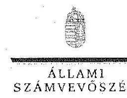

ELHOK

# Baktay Borbála úrhölgy 

igazgató
Növényi Diverzitás Központ

## Tápiószele

## Tisztelt Igazgató Úrhölgy!

..A Földművelésügyi Minisztérium egyes agrárkutatő intézetei és egyes génmegőrzési intézményei gazdálkodásának ellenőrzéséről" című jelentéstervezetre tett észrevételeit köszönettel megkaptam.

Az Állami Számvevőszék észrevételekre vonatkozó álláspontjáról a felügyeleti vezető által készített részletes tájékoztatást csatoltan megküldöm.

Tájékoztatom Igazgató úrhölgyet, hogy a számvevőszéki jelentés szövegezése az elfogadott észrevételek figyelembevételével készül.

Budapest, 2015. augusztus , 9. ,
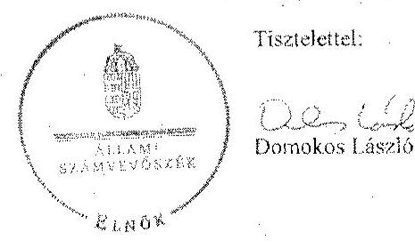

Melléklet: Tájékoztatás az elfogadott és el nem fogadott észrevételekről

---

# Tájékoztatás   az elfogadott és el nem fogadott észrevételekről 

A Földművelésügyi Minisztérium egyes agrárkutatő intézetei és egyes génmegőrzési intézményei gazdálkodásának ellenőrzéséről" című jelentéstervezetre 2015. július 2-án érkezett észrevételeit áttekintettük és azok kezelésével kapcsolatban a következő tájékoztatást adom:

1) Jelentéstervezet 58. oldal: „, a NÖDIK az ellenőrzött időszakban az üzembe helyezést nem dokumentálta hitelt érdemlően..." Észrevételeikben cáfolják a megállapítást, hivatkozva a használt program által előállított üzembe helyezés dokumentumainak teljes értékű használatára.
A jelentéstervezetben az 58. oldal utolsó előtti felsorolását pontosítottuk, mert elfogadjuk, hogy az üzembe helyezés dokumentálás szabályait az Ábáz. 8. § (7) bekezdésében foglaltaknak megfelelően a számviteli politikájukban meghatározták, viszont a dokumentumok, illetve a dátumok tekintetében nem alkalmazták azt teljes körűen.
2) A jelentéstervezet 60. oldalán szereplő megállapítást, hogy , „a NÖDIK nem vezetett folyamatosan analitikus nyilvántartást a vevőkról és szállítókről." cáfolják, hivatkozva a használt program által elkészíthető nyilvántartásokra.
Az Önök nyilatkozata és az ellenőrzés megállapításai továbbra is alátámasztják a folyamatos vevői, szállítói analitika vezetésének hiányát. A SALDO Creator program valóban folyamatosan kiadja az analitikát, de ezek korrekcióra szorulnak, mert az analitikához szükséges egyes adatokat a program nem jegyzi. A jelentéstervezet megállapítását továbbra is fenntartjuk, módosítása nem indokolt.
3) A jelentéstervezet 62. oldalának megállapítása: „, a NÖDIK 2012. évi mérlegét alátámasztó leltárában az évközben betörés során eltulajdonított eszközöket is kimutatatta, ezzel megsértették a valódiság számviteli alapelvét, amely szerint a beszámolóban szereplő tételeknek a valóságban is megtalálhatónak kell lenniük. 2010-2012. évi leltára könyvviteli mérlegben kimutatott eszközök valódiságát nem támasztotta alá, mivel leltárában a jogelőd által az intézmény székhelyén hagyott háromtagú gyűrűhengert nem szerepeltette," cáfolatát részben fogadjuk el.

Nem fogadjuk el azt az indoklást, hogy az eltulajdonított eszközöket a leltárból a nyomozás felfüggesztéséről szóló eltűntnek nyilvánítás rendőrségi határozata után vezették ki, mivel a Számv.tv. 15. § (3) bekezdése a valódiság elvét, feltételét egyértelműen meghatározza, mely szerint a könyvvitelben rögzített és a beszámolóban szereplő tételeknek a valóságban is megtalálhatóknak, bizonyíthatóknak, külsőállók által is megállapíthatóknak kell lenniük".

---

A észrevételükben a gyűrűhenger leltárba vételének hiányáról szóló a megállapítás kifogását elfogadjuk, a jelentéstervezet 62. oldal:2. felsorolás utolsó mondatát töröltük.
4) A jelentéstervezet 67. oldalán : „a NÖDIK a jogszabályi előírás ellenére az állami tulajdonban lévő ingatlan eszközök bérbeadása során nem győződött meg arról, hogy a nemzeti vagyon hasznosítására vonatkozó szerződést átlátható szervezettel kötötték meg., megállapítást cáfolják, mivel a NÖDIK állami tulajdonban lévő ingatlanra semmilyen szervezettel nem kötött bérleti szerződést.

A jelentéstervezet 64 oldalának utolsó előtti bekezdéséből (5.4 pont) a NÖDIK-et töröltük.
5) A jelentéstervezet 17. oldal 5. bekezdés, 49. oldal 5. bekezdés: „A NÖDIK az évi 1010498 EUR EU-s támogatással - az MVH iránymutatása alapján - a jogszabályi előírások ellenére nem számolt el. A NÖDIK az uniós támogatások felhasználásának elkülönített nyilvántartásáról nem gondoskodott," megállapítást cáfolják.

Minden amit leírtak az észrevételeikben tartalmilag megjelennek a jelentéstervezet 49. oldalán. Az MVH-val történő levelezés pedig nem ad felmentést az Áht. 53. § (1) bekezdésében és a 368/2011. (XII. 31.) Korm. rendelet 80. § (1) bekezdésében leírtak be nem tartására. Az észrevételeikben nem cáfolják azt a megállapítást, hogy beszámoló és elkülönített nyilvántartás nem készült, hanem ennek részletes okaira adnak magyarázatot, ami azonban nem indokolja a jelentéstervezet módosítását, mivel az elszámolás és a nyilvántartás hiánya nem felelt meg az Áht. 13/A. § (2), és az Áht. 53. § (1) bekezdésében leírtaknak.
6) Jelentéstervezet 53. oldal 4.5. pontjának 4. bekezdése:,, A NÖDIK a jogszabályi előírással ellentétben analitikus nyilvántartások vezetésével nem gondoskodott arról, hogy az elemi költségvetési beszámoló adatai közül a kötelezettségvállalással terhelt maradvány összegét a valóságnak megfelelően alátámassza. Ennek következtében a kötelezettségvállalással terhelt maradvány megállapítása és felhasználása nem volt megfelelő."

Igaz, hogy az uniós maradvány a 368/2011. Korm. rendelet 150.§.c. bekezdése értelmében kötelezettségvállalással terhelt maradványnak tekinthető, de érvényes az Áhsz. 49. § (1) bekezdése is, mely szerint az intézmény köteles gondoskodni a könyvviteli számlákhoz kapcsolódó analitikus nyilvántartások vezetéséről, azért hogy az éves beszámoló adatait a valóságnak megfelelően, áttekinthetően alátámassza. Cáfolatukban is tulajdonképpen megfogalmazták a jelentéstervezet megállapításait, hogy az uniós támogatás „... egybeolvad az éves kötelezettségvállalások analitikájával.", ezért a jelentéstervezet módosítása nem indokolt.

---

7) A jelentéstervezet 17. oldal 5. bekezdés: „A HAKI a KÉKI, a NÖDIK és a TSZBK a bevételi előirányzatok teljesítése során nem tartotta be teljes körűen a jogszabályi előírásokat. Az intézmények a saját előállítású termékek, a végzett szolgáltatások árainak meghatározásakor a termékek és szolgáltatások közvetlen önköltségét nem állapították meg.

A Számv. tv. 14. § (5) bekezdés c) pontjának megfelelően az intézmény a teljes ellenőrzött időszakban rendelkezett önköltség-számítási szabályzattal, azonban - a saját előállítású termények értékesítése esetében- nem a szabályzatban megfogalmazottak szerint bonyolította le az ármegállapítást, értékesítést. Az intézmény nem alakította ki az értékesítési önköltség számításához szükséges könyvelési rendet, valamint az Önköltségszámítási-szabályzat, 1. és 3. számú melléklete szerint nem végzett évenkénti gyakorisággal se önköltség-számítást, se utókalkulációt, a ténylegesen felmerült kiadások összehasonlítását nem végezték el.

A tipikustól eltérő gazdasági helyzettel cáfolják a jelentéstervezet megállapítását, ami azonban nem mentesíti a szervezetet attól, hogy a saját belső szabályzatai előírásait érvényesítse, ezért a jelentéstervezet módosítása nem indokolt.
8) A jelentéstervezet 32. oldal 3.1. pontjának 2. bekezdése: „A NÖDIK esetében a 2012. évhez a 2013. évi negatív változást az okozta, hogy a tárgyévben nem jelölték ki a kötelezettségvállalásra jogosultak körét."

A jelentéstervezet 32. oldal 3.1. pontjának 2. bekezdését töröltük.

Észrevételét köszönjük, tájékoztatom Igazgató úrhölgyet, hogy a számvevőszéki jelentés mellékleteként szerepeltetjük a jelentéstervezethez tett észrevételeit, valamint az azokra adott válaszunkat.

Budapest, 2015. augusztus, 

Dr. Pulay Gyula felügyeleti vezető

