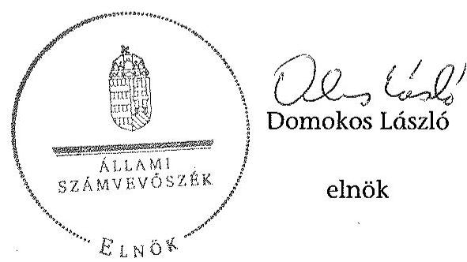
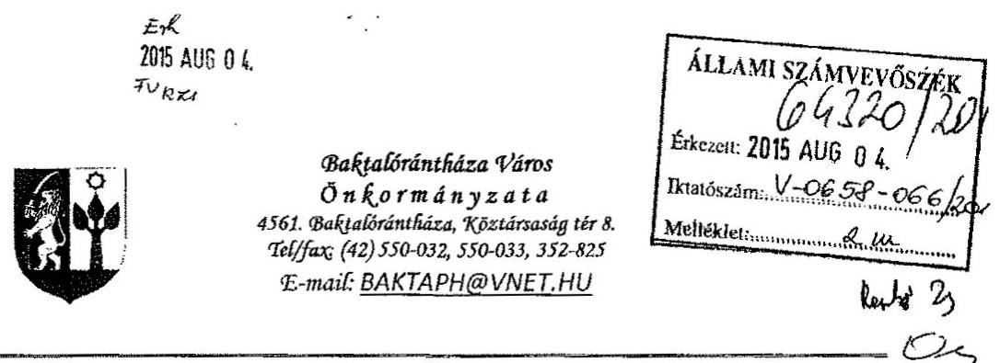
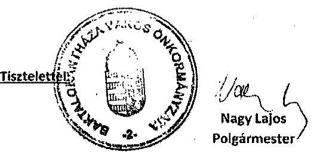
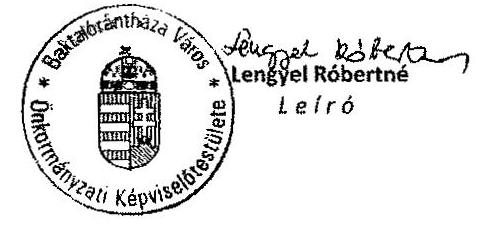
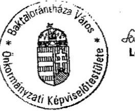
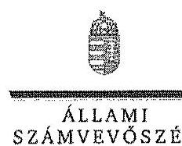

# ÁLLAMI   SZÁMVEVŐSZÉK 

## JELENTÉS

az önkormányzatok pénzügyi és vagyongazdálkodása
szabályszerúségének ellenőrzéséről
Baktalórántháza

---

# Állami Számvevőszék 

Iktatószám: V-0658-070/2015.
Témaszám: 1692
Vizsgálat-azonosító szám: V069110

## Az ellenőrzést felügyelte:

## Renkó Zsuzsanna

felügyeleti vezető
Az ellenőrzés végrehajtásáért felelős és az ellenőrzést vezette:
Páncsics Judit
ellenőrzésvezető
A számvevőszéki jelentés összeállításában közremüködött:
Baksa Anikó
számvevő főtanácsos
Az ellenőrzést végezték:
Baki István
számvevő tanácsos
Csényi István
számvevő főtanácsos

Dr. Eke-Pekács Tibor
számvevő tanácsos
Szilágyi Nándorné
számvevő főtanácsos

---

# TARTALOMJEGYZÉK 

BEVEZETÉS ..... 3
I. ÖSSZEGZŐ MEGÁLLAPÍTÁSOK, KÖVETKEZTETÉSEK, JAVASLATOK ..... 6
II. RÉSZLETES MEGÁLLAPÍTÁSOK ..... 18

1. Az erőforrásokkal való szabályszerű és hatékony gazdálkodás követelményeinek kialakítása, számonkérése, ellenőrzése ..... 18
1.1. Az előirányzatokkal, a létszámmal, a vagyonnal való gazdálkodás szabályainak, követelményeinek kialakítása ..... 18
1.2. Az erőforrásokkal való szabályszerű, hatékony gazdálkodás követelményeinek számonkérése, ellenőrzése ..... 20
2. A pénzügyi gazdálkodás szabályszerűsége, a pénzügyi egyensúly biztosítottsága ..... 21
2.1. A költségvetési tervezés és az éves költségvetési beszámolás szabályossága ..... 21
2.2. Az önkormányzat fizetőképességének folyamatos fenntartása, a pénzügyi egyensúly biztosítása ..... 24
3. A vagyongazdálkodási tevékenység szabályossága ..... 29
3.1. A vagyongazdálkodási tevékenység kereteinek kialakítása ..... 29
3.2. A vagyonnyilvántartás szabályossága ..... 30
3.3. A vagyon leltározása ..... 32
3.4. A vagyonváltozásokat eredményező döntések szabályszerűsége ..... 34
3.5. Az önkormányzati tulajdonosi jog gyakorlása ..... 38
4. Integritás érvényesülése ..... 41
MELLÉKLETEK
5. számú Baktalórántháza Város Önkormányzata feladatellátásában részt- vevő intézmények és azok változása a 2011-2013. években
6. számú Baktalórántháza Város Önkormányzata bevételei, kiadásai, vala- mint adósságszolgálata a 2011-2013. években
7. számú Baktalórántháza Város Önkormányzata mérlegadatai a 2011-2013. években
8. számú Baktalórántháza Város Önkormányzata tartós részesedéseinek ala- kulása a 2011-2013. években
9. számú Baktalórántháza Város Önkormányzata polgármesterének a jelen- téstervezet megállapításaira tett észrevétele
10. számú Az ÁSZ válasza Baktalórántháza Város Önkormányzata polgár- mesterének a jelentéstervezet megállapításaira tett észrevételére

---

# FÜGGELÉKEK 

1. számú Fogalomtár
2. számú Rövidítések jegyzéke

---

# JELENTÉS 

## az önkormányzatok pénzügyi és vagyongazdálkodása szabályszerűségének ellenőrzéséről Baktalórántháza

## BEVEZETÉS

Az ÁSZ stratégiai célkitűzése, hogy ellenőrzéseivel mind jobban segítse az átláthatóságot, az elszámoltathatóságot és elszámoltatást a közpénzekkel és a közvagyonnal való gazdálkodásban. Magyarország Alaptörvénye rögzíti, hogy az állam és a helyi önkormányzat tulajdona a nemzeti vagyon része. Az önkormányzati vagyon alapvető funkciója, hogy a közérdeket és egyúttal az önkormányzati célok - elsősorban a kötelezően ellátandó feladatok, és emellett a lehetőségek mértékéig az önként vállalt feladatok - megvalósítását szolgálja.

Az államháztartás önkormányzati alrendszerének közpénz felhasználása, az önkormányzatok által ellátott közfeladatok és önként vállalt feladatok sokrétűsége, valamint a feladatellátásához rendelt vagyon nagyságrendje indokolja, hogy az ÁSZ ellenőrzéseket folytasson a pénzügyi és vagyongazdálkodás területén. Az ÁSZ az önkormányzatok ellenőrzését a pénzügyi helyzet megítélésével indította el 2011-ben és a nagy vagyonnal rendelkező, magas kockázatú önkormányzatok esetében a vagyongazdálkodás ellenőrzésével folytatta. Az elmúlt három év ellenőrzéseinek tapasztalatai megmutatták, hogy indokolt az egyrészt elemző, értékelő, a pénzügyi helyzet kockázatát is minősitő, másrészt a pénzügyi és vagyongazdálkodási tevékenység szabályszerűségét komplexen értékelő ÁSZ ellenőrzések folytatása.

Az ellenőrzés célja annak megállapítása volt, hogy kialakított-e az önkormányzat az erőforrásokkal való szabályszerű és hatékony gazdálkodáshoz szükséges követelményeket, megvalósította-e azok számon kérését, ellenőrzését; az önkormányzat pénzügyi és vagyoni helyzetének, a gazdálkodás szabályosságának megítélése a költségvetési tervezés, a pénzügyi egyensúly megteremtése, az éves költségvetési beszámolás, a vagyongazdálkodás, a vagyon számbavétele, és a gazdasági események elszámolásának szabályszerűsége alapján.

Ennek keretében értékeltük, hogy az önkormányzat:

- pénzügyi gazdálkodása megfelelt-e a jogszabályokban és a belső szabályzataiban meghatározottaknak, biztosított volt-e a pénzügyi egyensúly;
- biztosította-e a vagyongazdálkodás szabályszerűségét, a vagyonváltozást eredményező döntéseket szabályszerűen hajtotta-e végre, gondoskodott-e a tulajdonosi jogok gyakorlásáról;
- a gazdálkodása során biztosította-e az átláthatóság és az integritás érvényesülését.

---

Az ellenőrzés várható hasznosulása: az ellenőrzés várhatóan hozzájárul az önkormányzatok pénzügyi helyzetének pontosabb megítéléséhez azáltal, hogy a pénzügyi és vagyoni helyzetet együtt értékeli. Bemutatja az adósságkonszolidáció önkormányzat általi végrehajtásának szabályszerűségét. Feltárja az önkormányzati gazdálkodást meghatározó szabályozások összhangjának esetleges hiányosságait, a szabályozással nem érintett gazdálkodási területeket, és a vagyongazdálkodási tevékenység gyakorlásának szabálytalanságait. A jó gyakorlat kialakításán és terjesztésén keresztül az ellenőrzések elősegíthetik az önkormányzati gazdálkodás szabályszerűségének javítását.

# Az ellenőrzés típusa: szabályszerűségi ellenőrzés 

Az ellenőrzött időszak: 2011. január 1-jétől 2013. december 31-ig. A pénzintézetekkel szembeni kötelezettségek állományának vizsgálatakor az ellenőrzött időszakban fennálló kötelezettségeket vettük figyelembe. A vagyonnyilvántartások egyezőségét, a leltározás, selejtezés folyamatát a 2013. évre vonatkozóan értékeltük.

## Ellenőrzött szervezet: Baktalórántháza Város Önkormányzata

Az ellenőrzés végrehajtásának jogszabályi alapját az ÁSZ tv. 1. § (3) bekezdése, az 5. § (2)-(6) bekezdései, valamint az Áht. 2 61. § (2) bekezdésének előírásai képezik.

Az ellenőrzés szakmai módszertana az ÁSZ hivatalos honlapján közzétett szakmai szabályokon alapult, amely a Legfőbb Ellenőrző Intézmények Nemzetközi Szervezete (INTOSAI) által kiadott nemzetközi standardok (ISSAI) figyelembevételével készült.

Az alkalmazott egyes fogalmak magyarázatát az 1. számú függelék, a rövidítések jegyzékét a 2. számú függelék tartalmazza.

Az ellenőrzést az ÁSZ hatályos szervezeti szabályai és az ellenőrzési programban foglalt értékelési szempontok szerint folytattuk le. Megállapításainkat a helyszíni ellenőrzés tapasztalataira, az ellenőrzött szervezettől bekért dokumentumokra, a kitöltött tanúsítványok elemzésére, az adott időszakban hatályos jogszabályok és belső szabályzatok előírásaira alapoztuk.

Az Önkormányzat vagyonváltozását eredményező döntések és azok végrehajtásának ellenőrzése, szabályszerűségének megítélése kockázatalapú mintavételen, valamint tételes ellenőrzésen keresztül történt. Tételesen ellenőriztük az üzemeltetésre átadott vagyonra és a vagyonkezelői jog alapítására kötött szerződéseket, az elengedett követeléseket, a részesedések értékelését, valamint a térítés nélküli tulajdonjog átvételét. Kockázatalapú mintavétel alapján (évente a legnagyobb értékű 2-4 tétel került kiválasztásra) ellenőriztük a beruházásokat, felújításokat, a vagyonértékesítéseket, a vagyonhasznosítást és a behajthatatlan követelések leírását.

Baktalórántháza város lakosainak száma 2013. január 1-jén 3772 fő volt. A hét tagú Képviselő-testület munkáját négy állandó bizottság segítette. A polgármester a 2006. évi önkormányzati választás óta tölti be tisztségét, a jegyző 2013. december 31-ig látta el a feladatait. Az Önkormányzati Hivatal-1 2014. január

---

1-jétől 2015. március 15-ig megbízott jegyző, azt követően kinevezett jegyző vezette. Az Önkormányzati Hivatal ${ }_{2}$ két szervezeti egységre tagolódott, elkülönített gazdasági szervezettel nem rendelkezett. Az adóügyi-, munkaügyi-, pénzügyi-, és gazdálkodási feladatokat a Pénzügyi-gazdasági osztály látta el. A foglalkoztatott köztisztviselők száma 2013. december 31-én 24 fő volt.

Az Önkormányzat a feladatait a 2013. évben az önállóan működő és gazdálkodó Önkormányzati Hivatal ${ }_{2}$-őn kívül a József Attila Művelődési Központtal és Könyvtárral, valamint a Baktalórántháza-Nyírjákó Óvodai Társulással és a Szociális Segítő Szolgálat Társulással, illetve a hazai és uniós támogatással megvalósuló projektek lebonyolítását végző Kistérségi Társulással látta el. A városüzemeltetéssel kapcsolatos feladatok ellátását 2013-ban egy kizárólagos tulajdonában álló, a járó-betegek egészségügyi szakellátását egy többségi tulajdonában lévő gazdasági társasága végezte. Az ivóvíz és szennyvíz-szolgáltatást bérletiüzemeltetési szerződés keretében - 90\%-ot meghaladó mértékben - állami tulajdonban lévő gazdasági társasággal biztosították. Az Önkormányzat feladatellátásában résztvevő intézményeket és azok változását a 2011-2013. években az 1. számú melléklet mutatja be.

Az ellenőrzött időszakban az Önkormányzat által ellátott feladatok köre és intézményrendszere megváltozott. A Gimnázium és az Általános Iskola 2013. január 1-jétől a KLIK keretében múködik. A Polgármesteri hivatal hatósági feladatainak egy részét 2013-tól a Járási Hivatal vette át.

Az Önkormányzat könyvviteli mérleg szerinti vagyona 2013. december 31-én 3045,7 millió Ft volt, ami 368,9 millió Ft-tal, 13,8\%-kal volt magasabb, mint a 2011. január 1-jei mérleg szerinti érték. A pénzintézetekkel szembeni adósságállomány értéke 2011. január 1-jén 140,3 millió Ft volt, ami a 2011-2012. évi fej-lesztési- és működési célú hitelfelvételek és törlesztések, valamint a 323,5 millió Ft összegű adósságkonszolidációból 318,8 millió Ft-os hiteltörlesztés eredményeként 2012. december 31-ére 51,8 millió Ft-ra csökkent. Az Önkormányzat 2012. év végi tartozása az óvodabővítéshez igénybe vett támogatás megelőlegezési hitelből állt fenn, melyet 2013-ban törlesztettek. Az Önkormányzat a 2013. évi költségvetési beszámolója szerint 1540,6 millió Ft költségvetési bevételt ért el és 1520,9 millió Ft költségvetési kiadást teljesített. A felhalmozási célú kiadások összege 2013-ban 61,5 millió Ft volt, melyből felújításokra és beruházásokra 59,1 millió Ft-ot fordítottak. A 2013. évi pénzmaradvány összege 121,0 millió Ft volt, a rövid lejáratú kötelezettségek 35,8 millió Ft-ot tettek ki.

Az ÁSZ tv. 29. § (1) bekezdése szerint a jelentéstervezetet megküldtük a polgármester részére, aki az ÁSZ tv. 29. § (2) bekezdésében foglalt észrevételezési jogával élt, a jelentéstervezet megállapításaira észrevételt tett.

---

# I. ÖSSZEGZŐ MEGÁLLAPÍTÁSOK, KÖVETKEZTETÉSEK, JAVASLATOK 

A folyó költségvetés a 2011-2012. években csak az eseti kiegészítő támogatásokkal, valamint munkabér-megelőlegezési hitel és folyószámlahitel igénybevételével volt egyensúlyban. A 2013. évben a múködési jövedelem negatív volt, az Önkormányzat munkabér-megelőlegezési hitelt, illetve folyószámlahitelt nem vett igénybe, ugyanakkor a lejárt szállítói tartozás állomány 20,9 millió Ft-tal emelkedett az előző évhez képest. Az Önkormányzat vagyona az ellenőrzött időszakban 13,8\%-kal ( 368,9 millió Ft-tal) nőtt, döntően az EU-s támogatásokkal megvalósult fejlesztések következtében. Kiemelten kockázatos volt 2011-2013-ban az Önkormányzat vagyonváltozást érintő döntéseinek szabályszerűsége, valamint a vagyon számbavétele, nyilvántartása a gazdálkodásra vonatkozó szabályzatok hiányosságai és a jogszabályi előírások megsértése miatt.

## Az ÁSZ ellenőrzés megállapításainak összegzése:

A 2011-2012. években az erőforrásokkal való szabályszerű gazdálkodás érdekében a gazdálkodási szabályokat nem aktualizálták, 2013-ban az Önkormányzati Hivatal ${ }_{2}$ szervezeti változása ellenére nem készítették el. A gazdálkodásban nem érvényesítették maradéktalanul a vonatkozó jogszabályi előírásokat. A belső ellenőrzés nem vizsgálta az erőforrásokkal való hatékony gazdálkodást.

Az Önkormányzatnál a 2011-2013. évi költségvetés tervezése és az éves költségvetési beszámolás során nem tartották be maradéktalanul a jogszabályokban előírtakat. Az előirányzatok módosításai megfeleltek az előírásoknak, azonban a kiemelt kiadási előirányzatokat öt esetben túllépték.

Az Önkormányzat pénzügyi egyensúlya a 2011-2013. években a saját hatáskörben megtett bevételnövelő és kiadáscsökkentő intézkedések, valamint a feladatellátásban bekövetkezett változások pozitív hatása ellenére nem volt biztosított. A kiegészítő támogatástól való függés a pénzügyi stabilitás hiányát jelezte. A 2012. évi adósságkonszolidáció keretében - amely a jogszabályi előírásoknak

---

megfelelően történt - az Önkormányzatnak 318,8 millió Ft pénzintézettel szembeni hiteltartozása szűnt meg. A 2011-2013. években a bevételek beérkezésének és a kiadások teljesítésének ütemezésére nem készítettek likviditási tervet. Az Önkormányzatnak az ellenőrzött időszakban minden év végén volt 60 napon túli lejárt szállítói állománya, azonban a polgármester a lejárt tartozással kapcsolatos tájékoztatási kötelezettségét nem teljesítette. A követelések behajtásáról intézkedtek, a vevő követelések év végi állományában határidőn túli, lejárt tételek nem voltak. A kockázatkezelési rendszert az ellenőrzött időszakban nem múködtették, a pénzügyi egyensúlyt befolyásoló kockázatokat nem azonosították be és nem elemezték, a kockázatok mérséklésére nem intézkedtek. Az Önkormányzat 2012. január elsejét követően Kormány hozzájárulást igénylő hitelt nem vett fel, kötvényt nem bocsátott ki.

A vagyongazdálkodás kereteinek kialakításakor nem határozták meg a vagyonkezelésbe adható vagyoni kört, a vagyonkezelői jog gyakorlásának és a vagyonkezelés ellenőrzésének részletes szabályait. A jegyző a 2013. január 1-jétől létrejött Önkormányzati Hivatal ${ }_{2}$ számviteli rendjét nem alakította ki, belső szabályzatban nem rendezte a múködéséhez, gazdálkodásához kapcsolódó és pénzügyi kihatással bíró, jogszabályban nem szabályozott kérdéseket.

Az Önkormányzatnál a 2011-2013. években a zárszámadás előterjesztéséhez a vagyonkimutatást nem készítették el. A főkönyvi könyvelés és az analitikus nyilvántartások közötti egyeztetés, ellenőrzés lehetőségét teljes körűen nem biztosították. A számviteli nyilvántartás, az ingatlanvagyon-kataszter és a földhivatali nyilvántartás megfelelő adatainak egyezőségét nem biztosították. A könyvviteli mérlegeket teljes körűen leltárral egyik évben sem támasztották alá, a leltározás az eredményszemléletű számvitelre való áttérést nem alapozta meg. A jegyző az értékelési szabályokat nem rögzítette, az eszközök és források értékeléséről számviteli bizonylat, dokumentum nem készült. A bírósági ítélettel 2013-ban az Önkormányzat tulajdonába került 13 millió Ft névértékủ MATÁV és MOL részvényeket, illetve 67,2 millió Ft pénzeszközt évközben a könyvviteli nyilvántartásokban nem vették állományba. A polgármester a Képviselő-testület felhatalmazása nélkül a részvényeket a Budapesti Értéktőzsdén értékesítette. Az értékpapírszámlán bonyolított tranzakciókat az Áhsz. ${ }_{1}$ ben előírtak ellenére a főkönyvi könyvelésben nem rögzítették.

Az ellenőrzött időszakban a vagyon kezelésére és a vagyon üzemeltetésére kötött szerződések megfeleltek a jogszabályi követelményeknek, térítésmentes vagyonátadásra nem került sor. A fejlesztési döntéseket nem minden esetben az arra jogosult hozta meg, a közbeszerzési eljárást nem minden indokolt esetben folytatták le. A vagyonértékesítési és hasznosítási döntések előkészítése, valamint a behajthatatlan követelések és a követelés elengedések számviteli elszámolása nem volt szabályszerű. A jogszabályban meghatározott közérdekű adatok közzétételének az Önkormányzatnál nem tettek eleget.

A gazdasági társaságokban lévő részesedésekről a főkönyvi könyveléssel megegyező, naprakész analitikus nyilvántartást nem vezettek, leltározásukat, értékelésüket nem végezték el. A Képviselő-testület a vezető tisztségviselőket és a felügyelő bizottsági tagokat nem számoltatta be a gazdasági társaságokban végzett tevékenységükről. Az Önkormányzat a 2011-2013. években a BLTG Kft.-nek részletekben, összesen 141,9 millió Ft tagi kölcsönt folyósított. A polgármester a Képviselő-testület határozatában és a megállapodásban rögzítettek ellenére -

---

újabb kölcsön folyósítását megelőzően a BLTG Kft. ügyvezetője által elkészített elszámolásokat a Képviselő-testületnek nem mutatta be. A Kft. a kölcsön teljes összegét nem tudta visszafizetni, ezért a Képviselő-testület 2013-ban - annak ellenére, hogy a vagyongazdálkodási rendelet ${ }_{2}$ ilyen esetet tartalmazott volna 98,2 millió Ft összegű tagi kölcsön visszafizetését elengedte.

Az Önkormányzat a gazdálkodása során nem biztosította maradéktalanul az átláthatóság és az integritás érvényesülését.

Az ÁSZ tv. 33. § (1) bekezdésében foglaltak értelmében az ellenőrzött szervezet vezetője köteles a jelentésben foglalt megállapításokhoz kapcsolódó intézkedési tervet összeállítani, és azt a jelentés kézhezvételétől számított harminc napon belül az ÁSZ részére megküldeni. Amennyiben az intézkedési tervet határidőn belül nem küldi meg a szervezet vezetője, vagy az továbbra sem elfogadható, az ÁSZ elnöke a hivatkozott törvény 33. § (3) bekezdés a-b) pontjaiban foglaltakat érvényesítheti.

# Az ellenőrzés intézkedést igénylő megállapításai és javaslatai: 

## a polgármesternek

1. A 2011-2012. években a folyó költségvetés a működőképesség megőrzését szolgáló támogatások révén volt egyensúlyban, a 2013. évben e támogatásokkal együtt is múködési hiány keletkezett. Az ellenőrzött időszakban a folyó költségvetésben a kiegészítő támogatások nélkül összesen 405,9 millió Ft hiány jelentkezett. A saját hatáskörben megtett bevételnövelő és kiadáscsökkentő intézkedések (melyek hatása 72,6 millió Ft összegű volt) nem eredményezték a működési egyensúly helyreállítását. A müködési hiány tartóssá válása esetén fennáll a likvid hitelállomány újratermelődésének veszélye.

Javaslat:
Terjessze a Képviselő-testület elé az Önkormányzat aktuális pénzügyi helyzetének elemzésén alapuló döntési javaslatát a müködési egyensúly megteremtését biztosító további intézkedések bevezetéséről.
2. A szállítói kötelezettségek állománya az ellenőrzött időszakban csökkent, azonban a tartozások teljes egésze lejárt esedékességű volt. A 60 napon túli lejárt tartozások öszszege 2011-ben 59,4 millió Ft, 2012-ben 0,3 millió Ft, míg 2013-ban 7,2 millió Ft volt, ugyanakkor az Adósságrendezési tv. 4. § (1) bekezdése alapján kezdeményezhető adósságrendezési eljárás megindításának elkerülése céljából nem intézkedtek. A polgármester az Adósságrendezési tv. 5. § (1) bekezdésében foglaltak ellenére a 60 napon túli lejárt tartozások fennállásáról a Pénzügyi Bizottságot a 2011-2013. években nem tájékoztatta, a Képviselő-testületet nyolc napon belül nem hívta össze annak érdekében, hogy az határozatot hozzon a fizetési kötelezettségek rendezésére, vagy felhatalmazza a polgármestert az adósságrendezési eljárás azonnali kezdeményezésére.

---

Javaslat:
Intézkedjen a szállítói kitettség csökkentése, illetve az adósságrendezési eljárás megindításának elkerülése érdekében a lejárt esedékességű tartozások kezeléséről. A 60 napon túli lejárt esedékességű szállítói tartozás fennállása esetén a jogszabályban előírt kötelezettségének maradéktalanul tegyen eleget.
3. Az Nvtv. 9. § (1) bekezdésében előírtak ellenére az Önkormányzat nem rendelkezett közép- és hosszú távú vagyongazdálkodási tervvel.

Javaslat:
Terjessze a Képviselő-testület elé az Önkormányzat közép- és hosszú távú vagyongazdálkodási tervét.
4. A 2012-2013. években az Mötv. 143. § (4) bekezdés i) pontjában foglaltak ellenére önkormányzati rendeletben nem határozták meg azt a vagyoni kört, amelyre vagyonkezelői jog létesíthető. A 2011. évben az Ötv. 80/B. §, a 2012-2013. években az Mötv. 109. § (4) bekezdés előírásait figyelmen kívül hagyva nem írták elő a vagyonkezelői jog megszerzésének, gyakorlásának és a vagyonkezelés ellenőrzésének részletes szabályait.

Javaslat:
Terjessze a Képviselő-testület elé a jogszabályi előírásoknak megfelelő rendelet tervezetét, amelyben meghatározzák azt a vagyoni kört, amelyre vagyonkezelői jog létesíthető, továbbá a vagyonkezelői jog megszerzésének, gyakorlásának és a vagyonkezelés ellenőrzésének részletes szabályait.
5. A Gimnázium 2011. évi 5,5 millió Ft összegű vizesblokk felújítása, valamint a labdarúgópálya 2012. évi 7,0 millió Ft összegű korszerűsítése esetében a döntést a Képviselőtestület helyett a polgármester hozta meg. A 2011. évi költségvetési rendelet 17. § (3) bekezdése, valamint a 2012. évi költségvetési rendelet 15. § (3) bekezdése szerint a polgármester csak 5,0 millió Ft összeghatárig lett volna jogosult döntést hozni.

Az ellenőrzött időszakban értékesített ingatlanok esetében a vagyongazdálkodási rendelet ${ }_{1,2}$-ben foglalt előírás ellenére forgalmi értékbecslést nem készítettek.

Az ellenőrzött bérleti szerződések közül öt esetben a szerződés megkötése előtt a vagyongazdálkodási rendelet ${ }_{1}$-ben foglalt előírást figyelmen kívül hagyva nem tartottak nyilvános versenyeztetési eljárást.

A 2013. július 29-én az Önkormányzat tulajdonába - bírósági ítélet alapján - került 103 ezer db MATÁV és 2700 darab MOL részvény, valamint 67,2 millió Ft pénzeszköz elhelyezésére, illetve kezelésére szolgáló értékpapír-számlaszerződést a polgármester a Képviselő-testület döntése nélkül kötötte meg. A szerződésben a számlavezetés körébe tartozó megbízások, valamint a tőzsdei és tőzsdén kívüli azonnali ügyletek megadására a polgármester volt jogosult. A részvények és a számlán elhelyezett pénzeszköz hasznosítási módjáról, befektetési vagy forgatási célú rendeltetéséről a Képviselőtestület előterjesztés hiányában nem döntött. Az Áhsz-1 15. § (4) bekezdés szerinti besorolást (egy éven túli, illetve éven belüli hasznosítás) megalapozó dokumentum

---

nélkül a számviteli nyilvántartásokban az értékpapírszámla egyenlegét a forgóeszközök között vettek állományba. A vagyongazdálkodási rendelet ${ }_{2} 9 . \S$ (2) bekezdése szerint 1,0 millió Ft összeghatárig a Pénzügyi Bizottság, 1,0 millió Ft felett a Képviselőtestület volt jogosult üzleti vagyon értékesítésre vonatkozó döntést hozni. E rendelkezés ellenére a 13,0 millió Ft névértékű részvények értékesítésére a polgármester a hitelintézet részére képviselő-testületi döntés nélkül adott megbízást. Ezen ügylet megkötése tekintetében az önkormányzati SZMSZ ${ }_{3}$ sem tartalmazott rendelkezést a polgármester részére hatáskör átruházásról.

Az Önkormányzat - a Képviselő-testület erre vonatkozó határozatában foglaltak szerint - 2007-ben határozatlan időre szóló megállapodást kötött a BLTG Kft.-vel müködési célú tagi kölcsön folyósítása tárgyában. A megállapodás, illetve a képviselő-testületi határozatban foglaltak szerint a kölcsön felhasználásáról történő elszámolást és az erről szóló képviselő-testületi tájékoztatást követően kerülhetett sor újabb kölcsön folyósítására, ennek ellenére a polgármester a BLTG Kft. ügyvezetője által készített elszámolásokat a Képviselő-testület részére nem mutatta be, az ellenőrzött időszakban, több részletben összesen 141,9 millió Ft kölcsön folyósításra került sor.

Javaslat:
A költségvetés végrehajtása, illetve az Önkormányzat vagyonát érintő döntések meghozatala során tartsa be a Képviselő-testület e tárgyban hozott rendeleteiben, határozataiban foglalt hatásköri és eljárási előírásokat.
6. Az ÁSZ ellenőrzés a vagyongazdálkodási tervek elkészítése, a vagyonnal való gazdálkodásra vonatkozó önkormányzati rendeletben foglaltak teljes körüsége, a jogszabályokban előírt belső szabályzatok és az ellenőrzési nyomvonal elkészítése, a belső ellenőrzés működtetése, a költségvetési és a zárszámadási rendeletek tartalmi megfelelősége, a likviditási terv elkészítése, a kockázatkezelési rendszer müködtetése, a számviteli és a vagyonnal kapcsolatos nyilvántartási kötelezettségek teljesítése, a vagyongazdálkodás szabályszerűsége, valamint a közzétételi kötelezettség tekintetében hiányosságokat, illetve az előírásoknak nem megfelelő, szabálytalan gyakorlatot tárt fel. Az ellenőrzés ezen túl megállapította, hogy egy esetben a Kbt. 19. §-ára figyelemmel, a Kbt. 5. §-ában előírt közbeszerzési eljárás lefolytatási kötelezettségét mellőzve került sor 9,2 millió Ft nettó értékű eszközbeszerzésre.

Javaslat:
Intézkedjen a feltárt hiányosságok és/vagy szabálytalanságok tekintetében a munkajogi felelősség tisztázására irányuló eljárás megindításáról, és ennek eredménye ismeretében tegye meg a szükséges intézkedéseket.

# a jegyzőnek 

1. Az Áhsz. 1 8. § (3)-(4) bekezdéseiben foglaltak ellenére a 2013. január 1-jétől múködő Önkormányzati Hivatal2-ra vonatkozó számviteli politikát és annak keretében a leltározási és leltárkészítési szabályzatot, az értékelési szabályzatot, az önköltségszámítási szabályzatot és a pénzkezelési szabályzatot nem készítették el. E kötelezettség teljesítésére a Számv. tv. 14. § (11) bekezdése a megalakulás időpontjából számított 90 napos határidőt írt elő.

---

Az Önkormányzat a 2011-2012. években az Áhsz. 49. § (1) bekezdésében előírtak ellenére számlarenddel nem rendelkezett. A 2013. január 1-jétől múködő Önkormányzati Hivatal ${ }_{2}$ számlarendjét a Számv. tv. 161. § (5) bekezdésében előírtak ellenére a megalakulás időpontjától számított 90 napon belül nem készítették el.

Javaslat:
Készítse el az Önkormányzati Hivatal ${ }_{2}$ számviteli politikáját és annak keretében a jogszabályban meghatározott szabályzatokat, valamint a számlarendet, ezen túl gondoskodjon a törvényi előírások változása esetén a szükséges módosítások átvezetéséről.
2. A 2013. évtől múködő Önkormányzati Hivatal2-ban az Ávr. 13. § (2) bekezdés a) pontja előírása ellenére belső szabályzatban nem rendezték a kötelezettségvállalás, az ellenjegyzés, a teljesítés igazolása, az érvényesítés, az utalványozás gyakorlásának módjával, eljárási és dokumentációs részletszabályaival, valamint az ezeket végző személyek kijelölésének rendjével kapcsolatos belső előírásokat.

Javaslat:
Intézkedjen a jogszabályban előírt belső szabályzat elkészítése érdekében.
3. A 2011. évben az Ámr. 156. § (2) bekezdésében, a 2012-2013. években a Bkr. 6. § (3) bekezdésben előírtak ellenére nem készítették el az Önkormányzati Hivatal1,2 ellenőrzési nyomvonalát.

Javaslat:
Intézkedjen az Önkormányzati Hivatal ${ }_{2}$ ellenőrzési nyomvonalának elkészítése, illetve annak jövőbeni rendszeres aktualizálása érdekében.
4. A Kistérségi Társulás megszűnését követően a belső ellenőröket 2013. január 1-jétől az Önkormányzati Hivatal2 foglalkoztatta, azonban a Bkr. 18. §-ában rögzített, a belső ellenőrzést végző személyek szervezeti függetlenségére vonatkozó követelmény biztosításáról a jegyző Bkr. 15. § (1) bekezdésében foglaltak ellenére nem gondoskodott. A belső ellenőrzést végző személyek feladatait, jogállását a Bkr. 15. § (2) bekezdésében előírtak ellenére szervezeti és múködési szabályzatban nem határozták meg: az Önkormányzati Hivatal2 SZMSZ-ét nem készítették el, a 2013. évben hatályos önkormányzati SZMSZ1,2 1. számú mellékletét képező Önkormányzati Hivatal2 szervezeti ábrájában a belső ellenőrzést végző személyeket nem szerepeltették. A belső ellenőrzési vezető a 2013. évben létrejött Önkormányzati Hivatal2 keretébe tartozó feladatellátásra tekintettel - a Bkr. 22. § (1) bekezdés a) pontjában előírtak ellenére - a belső ellenőrzési kézikönyvet nem készítette el, a belső ellenőrzési feladatok ellátásához a Bkr. 17. § (1) bekezdésében foglaltak ellenére nem állt rendelkezésre a költségvetési szerv vezetője által jóváhagyott belső ellenőrzési kézikönyv. A 2011-2013. években a belső ellenőrzési munka megtervezéséhez az éves ellenőrzési terveket - a Ber. 18. §ában, illetve a Bkr. 29. § (1) bekezdésében előírtak ellenére - nem kockázatelemzés alapján készítették el.

Javaslat:
A jogszabályi előírásoknak megfelelően biztosítsa a belső ellenőrzés szervezeti függetlenségét, gondoskodjon az Önkormányzati Hivatal ${ }_{2}$ belső ellenőrzési kézikönyvének

---

összeállításáról és jóváhagyásáról. Intézkedjen annak érdekében, hogy az éves belső ellenőrzési tervet kockázatelemzés alapján készítsék el.
5. A jegyző által előkészített költségvetési rendelet-tervezetek előterjesztése nem tartalmazta:
a) a 2013. évben az Áht. 2 24. § (4) bekezdés a) pontjában előírtak ellenére az Önkormányzat költségvetési mérlegét közgazdasági tagolásban és az előirányzat felhasználás tervét;
b) a 2012-2013. években az Áht. 2 24. § (4) bekezdés b) pontjában előírtak ellenére a többéves kihatással járó döntések számszerúsítését évenkénti bontásban és öszszesítve;
c) a 2011. évben az Áht. 1 118. § (1) bekezdés 2. c) pontjában, a 2012-2013. években az Áht. 2 24. § (4) bekezdés c) pontjában foglaltak ellenére a közvetett támogatásokat tartalmazó kimutatást.

Javaslat:
Biztosítsa az éves költségvetési rendeletek előterjesztésének jogszabályi előírásoknak megfelelő elkészítését.
6. A 2013. évi költségvetési rendelet az Áht. 2 23. § (2) bekezdés a)-b) pontjaiban előírtak ellenére nem tartalmazta az Önkormányzat, valamint az általa irányított költségvetési szervek költségvetési bevételeit és költségvetési kiadásait kötelező, önként vállalt és állami (államigazgatási) feladatok szerinti bontásban.

Javaslat:
Biztosítsa, hogy a költségvetési rendeletek maradéktalanul feleljenek meg a jogszabályban előírt követelményeknek.
7. A 2013. évi költségvetési rendeletben az Mötv. 111. § (4) bekezdésében előírtaknak megfelelően működési hiányt nem terveztek, azonban a működési költségvetés egyensúlyát oly módon biztosították, hogy 191,4 millió Ft működőképesség megőrzését szolgáló, kiegészítő támogatásból származó bevételt is figyelembe vettek, ezáltal a bevételi előirányzatok tervezése az Áht. 2 12. § (1) bekezdésében előírtak ellenére közgazdaságilag nem megalapozott módon történt.

Javaslat:
Intézkedjen, hogy a költségvetési rendeletekben a működési költségvetés jogszabályban előírt egyensúlyának biztosításakor a bevételeket közgazdaságilag megalapozottan határozzák meg.
8. Az Önkormányzat pénzállományának alakulásáról a 2011. évben az Ámr. 201. § (1) bekezdésében foglaltak, míg a 2012-2013. években a bevételek beérkezésének és a kiadások teljesítésének ütemezéséről az Áht. 2 78. § (2) bekezdésének és az Ávr. 122. § (1)-(2) bekezdésében előírtak ellenére nem készítettek likviditási tervet.

---

Javaslat:
Intézkedjen, hogy a bevételek beérkezésének és a kiadások teljesítésének ütemezéséről a jogszabályi előírásnak megfelelően a likviditási tervet készítsék el, és azt havonta vizsgálják felül.
9. A kockázatkezelési rendszer keretében - a 2011. évben az Áht. 1 121. § (2) bekezdés b) pontjában, az Ámr. 157. § (1)-(3) bekezdéseiben, a 2012-2013. években a Bkr. 7. § (1-(2) bekezdéseiben előírtak ellenére - a pénzügyi egyensúlyt befolyásoló kockázatok beazonosítása, felmérése elmaradt, ezen túl a kockázatok mérséklése érdekében nem határozták meg a szükséges intézkedéseket.

Javaslat:
Működtessen a jogszabályi előírásoknak megfelelő, a pénzügyi egyensúlyt befolyásoló kockázatok kezelésére alkalmas kockázatkezelési rendszert.
10. A jegyző által elkészített zárszámadási rendelettervezet előterjesztése nem tartalmazta:
a) a 2011. évben az Áht. 1 118. § (2) bekezdés 2. b), 2. d)-e) pontjaiban foglaltak ellenére az adósságállományt eszközök, bel- és külföldi hitelezők szerinti bontásban, a többéves kihatással járó döntések számszerűsítését évenkénti bontásban és összesítve, valamint a közvetett támogatásokat tartalmazó kimutatást;
b) a 2012. évben az Áht. 2 91. § (2) bekezdés a) pontjában előírtak ellenére az előirányzat felhasználási tervet (a pénzeszközök változásának bemutatását);
c) a 2012-2013. években - az Áht. 2 91. § (2) bekezdés b) és d) pontjaiban foglaltak ellenére - az Önkormányzat adósságállományát lejárat, bel- és külföldi irányú kötelezettségek szerinti bontásban, az Önkormányzat tulajdonában álló gazdálkodó szervezetek müködéséből származó kötelezettségeket, valamint a részesedések alakulását;
d) a 2011-2013. években - az Áht. 1 118. § (2) bekezdés 2. c) pontja, az Áht. 2 91. § (2) bekezdés c) pontjában foglalt előírás ellenére - a vagyonkimutatást. Az Önkormányzat és intézményei saját vagyonának adatait bemutató vagyonkimutatás Áhsz. 1 44/A. § (1)-(3) bekezdéseiben előírtak szerinti elkészítése a 2011. évben az Ötv. 78. § (2) bekezdése, a 2012-2013. években az Mötv. 110. § (2) bekezdésében foglaltak ellenére elmaradt.

Javaslat:
Intézkedjen, hogy a zárszámadási rendelet-tervezet előterjesztését, ennek keretében a vagyonkimutatást a jogszabályi előírásoknak megfelelően készítsék el.
11. A 2011-2013. években az Áhsz. 1 49. § (1) bekezdésében előírtak ellenére nem volt biztosított az elemi költségvetési beszámoló adatainak valóságnak megfelelő, áttekinthető alátámasztása, mivel a részesedések, az értékpapírok, a hosszú lejáratú követelések és a kötelezettségek, valamint a pénzeszközök esetében a könyvviteli számlákhoz kapcsolódó analitikus nyilvántartások vezetéséről nem gondoskodtak.

---

Javaslat:
Gondoskodjon a jogszabályi előírások szerint a könyvviteli számlákhoz kapcsolódó analitikus nyilvántartások teljes körű vezetéséről.
12. Az ellenőrzött időszakban a számviteli alapelvek érvényesülését, a gazdasági események számviteli nyilvántartásokban való jogszabályi előírásoknak megfelelő elszámolását nem biztosították:
a) a bírósági ítélet alapján 2013. július 29-én önkormányzati tulajdonba került, értékpapírszámlán elhelyezett részvények és pénzeszköz állományba vételét - az Áhsz. 1 51 § (1) bekezdés a) pontjában előírtak ellenére a könyvekben nem rögzítették. A 2013. október hónapban értékesített részvényekből befolyt 72,9 millió Ft ellenértéket a számviteli nyilvántartásokban (ezáltal az elemi költségvetési beszámoló-ban) - a Számv. tv. 15. § (2) bekezdése, illetve az Áhsz. 1 9. § (2) bekezdése szerinti teljesség elvét megsértve bevételként nem mutatták ki. Az értékpapírszámlán elszámolt, a részvények értékesítéséhez kapcsolódóan kifizetett bizományosi díjat a számviteli nyilvántartásokban a Számv. tv. 15. § (2) bekezdése, illetve az Áhsz. 1 9. § (2) bekezdése szerinti teljesség elvét megsértve az Áhsz. 19 .számú melléklete 9. pont c) alpontja szerint, a dologi kiadások között nem rögzítették. Az értékpa-pír-számla év végi egyenlegét (139,6 millió Ft pénzeszközt) 2013. december 31én az Áhsz. 19 .számú melléklete 2. pont d) alpontjában foglaltak ellenére a forgóeszközök között értékpapírként vették állományba. A zárszámadási rendeletben az értékpapírszámla év végi egyenlegét államháztartáson kívülről átvett pénzeszközként szerepeltették, megsértve az Áhsz. 1 9. számú melléklet 5. pontjában foglalt előírást, mely szerint a forgatási célú értékpapír értékesítéséből származó bevétel finanszírozási bevételnek minősül;
b) a 2012. évben a MNV Zrt-vel kötött szerződés alapján térítésmentesen átvett négy ingatlant ( 57,5 millió Ft értékben) az Áhsz. 51 § (1) bekezdés b) pontjában előírtak ellenére a számviteli nyilvántartásokban nem rögzítették, ezen ingatlanok a 2012-2013. évek könyvviteli mérlegeiben a Számv. tv. 15. § (3) bekezdés szerinti valódiság elvét megsértve nem szerepeltek;
c) a 2012. évben értékesített ingatlant az Áhsz. 151 § (1) bekezdés a) pontjában foglaltak ellenére nem vezették ki a számviteli nyilvántartásból, az ingatlan a Számv. tv. 15. § (3) bekezdés szerinti valódiság elvét megsértve szerepelt a 2012-2013. évi könyvviteli mérlegekben;
d) a 2011-2013. évi számviteli nyilvántartásokban a tartós részesedések kimutatása a Számv. tv. 15. § (3) bekezdése szerinti valódiság elvét sértő módon történt. A 2011-2013. évi könyvviteli mérlegekben a cégnyilvántartásból már törölt gazdasági társaságokban lévő, illetve megszűnt, nem létező, dokumentumokkal nem igazolható részesedést mutattak ki. Az Önkormányzat tulajdonában lévő részvényeket, illetve üzletrészt az Áhsz. 1 19. § (1)-(2) bekezdéseiben foglaltak ellenére a 2011-2013. évi könyvviteli mérlegekben a befektetett pénzügyi eszközök között tartós részesedésként nem szerepeltették;
e) az ÁSZ ellenőrzés során feltárt hiányosságok a 2013. évi beszámoló adatok vonatkozásában az Áhsz. 1. § (1) bekezdés 3. pontjában meghatározott értékhatár - a

---

mérlegfőösszeg 2 \%-a (60,9 millió Ft), amennyiben a mérlegfőösszeg 2\%-a meghaladja a 100 millió Ft-ot, akkor a 100 millió Ft - elérése miatt jelentős összegű hibának minősülnek.

Javaslat:
Biztosítsa a könyvvezetés és a beszámoló készítés során a számviteli alapelvek érvényesülését. Intézkedjen, hogy a gazdasági események a könyvviteli nyilvántartásokban a jogszabályban meghatározott módon és időpontig rögzítésre kerüljenek. Intézkedjen az ÁSZ ellenőrzés során a 2013. évi könyvviteli mérlegekben feltárt jelentős öszszegű hiba Áhsz. 2 54/B. § (1)-(5) bekezdéseiben foglaltak szerint javítása, valamint a hiba feltárás évében az éves költségvetési beszámolóban való bemutatása érdekében.
13. A 2013. évben a 147/1992. (XI. 26.) Korm. rendelet 1. § (2) bekezdésében foglaltak ellenére nem biztosították az ingatlanvagyon-kataszter és a földhivatali ingatlan-nyilvántartás adatainak egyezőségét. A 2012. évben a MNV Zrt-vel kötött szerződés alapján térítésmentesen átvett ingatlanok, valamint a 2012. évben értékesített ingatlan miatti változást a 147/1992. (XI. 6.) Korm. rendelet 4. § (1) bekezdésében előírtak ellenére a kataszteren, a változás bekövetkezésétől számított 90 napon belül nem vezették át.

Javaslat:
Intézkedjen az ingatlan-vagyon kataszter földhivatali nyilvántartásokkal való egyezőségének megteremtése, a bekövetkezett változások jogszabályban előírt határidőig történő bejegyzése érdekében.
14. Az Önkormányzat és intézményei a 2011-2013. években az éves beszámolók könyvviteli mérlegeiben kimutatott eszközök és források valódiságát - az Áhsz. 1 37. § (1)-(2) bekezdésében előírtak ellenére - december 31-i fordulónappal készült leltárral teljes körűen nem támasztották alá. Az Áhsz. 1 37. § (4) bekezdésében foglaltak ellenére a 2011-2013. években az üzemeltetésre átadott, a 2013. évben a vagyonkezelésbe adott eszközök mérlegben szereplő értékét december 31-ei fordulónapra vonatkozó, az üzemeltető, a vagyonkezelő által készített, hitelesített leltárral nem támasztották alá.

A 2013. évi leltár nem volt alkalmas az Áhsz. 1 37. § (2) bekezdésében előírtak alapján a könyvviteli mérlegben szereplő eszközök és források valódiságának alátámasztására:
a) a követelések egyeztetéssel történő leltározása során megsértették a Számv. tv. 15. § (9) bekezdésében, illetve az Áhsz. 1 9. § (6) bekezdése foglalt bruttó elszámolás elvét, mert az egyéb követelések összegét egybeszámították az egyéb követelésekre teljesített túlfizetés összegével ( 0,6 millió Ft), és azt nem a kötelezettségek között mutatták ki;
b) a gazdasági társaságokban lévő részesedések könyvviteli számlájához - az Áhsz. 1 49. § (1) bekezdésében előírtak ellenére - kapcsolódó analitikus nyilvántartás vezetéséről vagy a főkönyvi számla alábontásáról nem gondoskodtak, ezért a leltározás egyeztetéssel történő elvégzésére az Áhsz. 1 37. § (3) bekezdésében előírtak ellenére nem került sor;

---

c) a pénzeszközök leltározási dokumentumban szereplő értéke nem egyezett meg a főkönyvi könyvelésben szereplő összeggel,
d) az Áhsz. 19. § (7) bekezdés előirása ellenére 0,2 millió Ft tőkegarantált pénzpiaci befektetési jegyet forgóeszközként és nem a tartós hitelviszonyt megtestesítő értékpapírok között mutattak ki;
e) a szállítói kötelezettségek alátámasztására készült leltározási dokumentum nem tartalmazta a tárgyévi költségvetést terhelő, illetve a tárgyévet követő évet terhelő szállítói tartozásállományt, ezért nem volt alkalmas a könyvviteli mérlegben az Áhsz 1. számú mellékletében előírt részletezettségben kimutatandó szállítói kötelezettség főkönyvi könyveléssel történő egyeztetésére.

Javaslat:
Gondoskodjon az éves beszámolók könyvviteli mérlegeiben kimutatott eszközök és források valódiságának december 31-i fordulónappal készült teljes körű, a jogszabályi előírásoknak megfelelő leltárral történő alátámasztásáról.
15. Az Önkormányzatnál a 2011-2013. évi könyvviteli mérlegben kimutatott eszközök és források értékelését az Áhsz. 1 -ben foglalt előírások ellenére nem végezték el. Az értékelés hiányában az Önkormányzat gazdasági társaságokban lévő tulajdoni részesedést jelentő befektetései esetében a Számv. tv. 54. § (1)-(3) bekezdésében előírtak ellenére - indokolt esetekben - nem számolták el az értékvesztést és annak visszaírását.

Javaslat:
Gondoskodjon a könyvviteli mérlegben szereplő eszközök és források értékelése elvégzéséről, az értékelés eredményének számviteli nyilvántartásokban való elszámolásáról.
16. Az Önkormányzatnál az ellenőrzött időszakban behajthatatlannak minősített 13,8 millió Ft követelést, valamint 98,5 millió Ft összegben elengedett követeléseket az Áhsz. 1 34. § (10)-(11) bekezdésében előírtak ellenére a főkönyvi könyvelésben hitelezési veszteségként nem számolták el, azok összegét a saját tőkével szemben nem írták le.

Javaslat:
Gondoskodjon arról, hogy a számviteli nyilvántartásban a behajthatatlannak minősített és az elengedett követeléseket a jogszabályi előírásoknak megfelelően számolják el.
17. Az Önkormányzat a 2011. évben az Áht. 1 15/B. §, illetve az Eiszt. tv. 6. § (1) bekezdésében és az Eisztv. mellékletének III/1., 4. pontjaiban, a 2012-2013. években az Info tv. 37. § (1) bekezdésében és az Info tv. 1. számú mellékletének III/1., 4. pontjaiban előírtak ellenére nem gondoskodott az éves (elemi) költségvetés és a költségvetés végrehajtásáról - külön jogszabályban meghatározott módon és gyakorisággal - készített beszámolók, valamint a vagyonnal való gazdálkodással összefüggő nettó ötmillió Ft-ot elérő vagy azt meghaladó értékű vagyonkezelési, üzemeltetési, beruházási, felújítási szerződések adatainak közzétételéről.

---

Javaslat:
Biztosítsa, hogy az Önkormányzat jogszabályban előírt közzétételi kötelezettségének maradéktalanul tegyenek eleget.

---

# II. RÉSZLETES MEGÁLLAPÍTÁSOK 

## 1. Az eröforrásokkal való szabálySzerú és hatékony gazdálKODÁS KÖVETELMÉNYEINEK KIALAKÍTÁSA, SZÁMONKÉRÉSE, ELLENÖRZÉSE

### 1.1. Az előirányzatokkal, a létszámmal, a vagyonnal való gazdálkodás szabályainak, követelményeinek kialakítása

Az előirányzatokkal, a létszámmal és a vagyonnal való gazdálkodás önkormányzati szintű szabályait a Képviselő-testület a 2011-2013. évi költségvetési rendeletekben, az önkormányzati $\mathrm{SZMSZ}_{1,2,3}$-ban, a vagyongazdálkodási rendelelet ${ }_{1,2}$-ben, továbbá a lakások és helyiségek bérletéről, a vásárokról és a piacról, valamint a sportlétesítményekről szóló rendeletekben határozta meg.

A Képviselő-testület a 2011-2013. években az Áht. ${ }_{1}$ 49. § (5) bekezdés f) pontjában, illetve az Áht. ${ }_{2} 9 . \S$ (1) bekezdés f) pontja ${ }^{1}$ alapján a költségvetési intézmények számára a közfeladatok ellátása és az erőforrásokkal való hatékony gazdálkodás érdekében hatékonysági követelményeket nem határozott meg.

Az Önkormányzati Hivatal ${ }_{1}$ belső szabályzatait az ellenőrzött időszakot megelőzően adták ki, melyeket a 2011-2012. években nem aktualizálták a szervezeti és jogszabályi változásoknak megfelelően. A 2013. január 1-jével létrehozott Önkormányzati Hivatal ${ }_{2}$ az alapító okiraton ${ }^{2}$ kívül más, a múködési rendjét, valamint a gazdálkodási feladatait szabályozó dokumentummal nem rendelkezett.

A 2011-2012. években az Önkormányzati Hivatal ${ }_{1}$ működési rendjét a 31/2004. (III. 26.) számú képviselő-testületi határozattal jóváhagyott hivatali SZMSZ szabályozta, amelyet nem vizsgáltak felül és nem aktualizáltak az Ámr., az Áht. ${ }_{2}$ és az Ávr. hatályba lépését követően.

A 2013. évben az Önkormányzati Hivatal ${ }_{2}$ feladatai ellátásának részletes belső rendjét és módját - az Áht. ${ }_{2} 10 . \S$ (5) bekezdésében előírtak ellenére - szervezeti és múködési szabályzatban nem állapították meg.

A Szabolcs-Szatmár-Bereg Megyei Kormányhivatal 2014-ben felülvizsgálta a Kép-viselő-testület múködését. Megállapította, hogy az Önkormányzati Hivatal2-nek nincs irányítószerv által jóváhagyott SZMSZ-e. A Kormányhivatal törvényességi felhívást tett, amelyben 2014. július 31-ei határidő kitűzésével felszólította a Kép-viselő-testületet a jogszabálysértés megszüntetésére. A Képviselő-testület az 59/2014. (VIII. 29.) számú határozatával, határidőn túl fogadta el az Önkormányzati Hivatal ${ }_{2}$ SZMSZ-ét és annak 4. számú mellékleteként az ügyrendet, amelyek 2014. szeptember 1-jével léptek hatályba.

[^0]
[^0]:    ${ }^{1}$ 2015. január 1-jétől az Áht. ${ }_{2} 9 . \S$ eb) pontja szabályozza
    ${ }^{2}$ A Képviselő-testület a 148/2012. (XII. 20.) számú határozatával, összeolvadással és jogutódlással alapította meg a Közös Önkormányzati Hivatalt.

---

A Képviselő-testület a 2011-2013. években az önkormányzati SZMSZ ${ }_{1,2,3}$-ban meghatározta az Önkormányzati Hivatal ${ }_{1,2}$ szervezeti felépítését, abban elkülönített gazdasági szervezetet nem alakított ki.

Az Önkormányzati Hivatal ${ }_{1}$ a 2011-2012. években a belső szabályzatok közül számviteli politikával ${ }^{3}$ és annak részeként leltározási és leltárkészítési szabályzattal, értékelési szabályzattal, önköltség számítási szabályzattal és pénzkezelési szabályzattal rendelkezett. A szabályzatokat a jegyző a Számv. tv. és az Áhsz. ${ }_{1}$ 2011. január 1-jét követő módosításaira, illetve az Önkormányzati Hiva$\mathrm{tal}_{1}$ alapító okiratának és szervezeti rendjének módosításaira tekintettel nem vizsgálta felül, nem aktualizálta, ezért azok tartalma nem felelt meg a Számv. tv., valamint az Áhsz. ${ }_{1}$ hatályos rendelkezéseinek. A jegyző 2013. január 1-jét, a megalakulást követő 90 napon belül a Számv. tv. 14. § (11) bekezdésében előírtak ellenére nem készítette el az Önkormányzati Hivatal ${ }_{2}$-ra vonatkozó számviteli politikát és az annak részét képező leltározási és leltárkészítési szabályzatot, értékelési szabályzatot, önköltség számítási szabályzatot és pénzkezelési szabályzatot.

Az Önkormányzatnál a 2011-2012. években az Áhsz. ${ }_{1}$ 49. § (1) bekezdésében előírtak ellenére számlarendet nem készítettek. Az Önkormányzati Hivatal ${ }_{2}$ számlarendjét a megalakulást, 2013. január 1-jét követő 90 napon belül a Számv. tv. 161. § (5) bekezdésében előírtak ellenére nem készítették el.

Az Önkormányzatnál a 2011-2012. években az operatív gazdálkodási jogkörök (kötelezettségvállalás, utalványozás, teljesítésigazolás, érvényesítés és az ellenjegyzés) gyakorlásának módját, eljárási és dokumentációs szabályait, valamint a joggyakorlók kijelölését és a kijelölés rendjét a polgármester és a jegyző által 2007-ben - az államháztartás múködési rendjéről szóló 217/1998. (XII. 30.) Korm. rendelet alapján - kiadott gazdálkodási jogkörök szabályzata határozta meg. A szabályzatot a jogszabályi változásoknak - 2010-től az Ámr. 20. § (3) bekezdés a) pontjának, illetve 2012-től az Ávr. 13. § (2) bekezdés a) pontjának - megfelelően nem aktualizálták. 2013. január 1-jével - az Ávr. 13. § (2) bekezdés a) pontjában előírtak ellenére - belső szabályzatban nem rendezték az Önkormányzati Hivatal ${ }_{2}$-ban a kötelezettségvállalás, az ellenjegyzés, a teljesítésigazolás, az érvényesítés, az utalványozás gyakorlásának módjával, eljárási és dokumentációs részletszabályaival, valamint az ezeket végző személyek kijelölésének rendjével kapcsolatos előírásokat.

A jegyző - 2011-ben az Ámr. 20. § (3) bekezdés b)-d), f), h) és i) pontjaiban, 2012-2013-ban az Ávr. 13. § (2) bekezdés b)-h) pontjaiban rögzítettek ellenére nem szabályozta a múködéshez kapcsolódó, pénzügyi kihatással bíró, jogszabályban nem szabályozott kérdéseket. Így a beszerzések lebonyolításával kapcsolatos eljárásrendet; a belföldi- és külföldi kiküldetések elrendelésével és lebonyolításával, elszámolásával kapcsolatos kérdéseket; az anyag- és eszközgazdálkodás számviteli politikában nem szabályozott kérdéseit; a reprezentációs kiadások felosztását, azok teljesítésének és elszámolásának rendjét; a vezetékes és rádiótelefonok használatának rendjét; valamint a közérdekú adatok

[^0]
[^0]:    ${ }^{3}$ kiadta a jegyző 2007. július 1-jével

---

megismerésére irányuló kérelmek intézésének és a kötelezően közzéteendő adatok nyilvánosságra hozatalának a rendjét.

A jegyző 2009. február 1-jével adta ki az Önkormányzati Hivatal ${ }_{1}$ gépjármú üzemeltetési szabályzatát, melyet a 2011-2012. években a feladatkörök és a személyek, illetve a gépjármúvek változásának megfelelően nem aktualizáltak. A jegyző 2013. január 1-jével az Önkormányzati Hivatal ${ }_{2}$-ra - az Ávr. 13. § (2) bekezdés f) pontjában előírtak ellenére - gépjárművek igénybevételének és hasznosításának rendjére vonatkozó szabályzatot nem készített.

A jegyző a 2011-ben az Ámr. 156. § (2) bekezdésében, a 2012-2013. években a Bkr. 6. § (3) bekezdésben előírtak ellenére - nem készítette el az Önkormányzati Hivatal ${ }_{1,2}$ ellenőrzési nyomvonalát.

# 1.2. Az erőforrásokkal való szabályszerű, hatékony gazdálkodás követelményeinek számonkérése, ellenőrzése 

A Képviselő-testület a 2011. évi költségvetési rendelet módosításával a kiadási előirányzatokat 37,0 millió Ft-tal csökkentette tekintettel arra, hogy az ÖNHIKI támogatás első fordulójában kapott 28,4 millió Ft támogatás nem fedezte a müködési költségvetés 64,8 millió Ft-os hiányát.

A Képviselő-testület 2011-ben a személyi juttatások előirányzatát 16,9 millió Fttal, a munkaadót terhelő járulékokét 3,9 millió Ft-tal, a dologi kiadásokét 13,2 millió Ft-tal, a múködési célra átadott pénzeszközök előirányzatát 1,5 millió Ft-tal és a társadalmi- és szociálpolitikai juttatásokét ugyancsak 1,5 millió Fttal csökkentette.

A Képviselő-testület csökkentette a képviselők, valamint a polgármester és az alpolgármester juttatásait, megvonta az alkalmazottak étkezési hozzájárulását, a középiskolában a nem kötelező bérpótlékokat. A múködési célra átadott pénzeszközök között a Képviselő-testület csökkentette a sportegyesület és az egyházak támogatását, a társadalom- és szociálpolitikai juttatások között az átmeneti segélykeret összegét. A Képviselő-testület a középiskolában a pedagógus létszámkeretet 2011 szeptemberétől három fővel csökkentette. A létszámcsökkentés 2012-ben 6,1 millió Ft kiadáscsökkenést eredményezett.

A Képviselő-testület a közigazgatást érintő átszervezések miatt 2012-ben az Önkormányzati Hivatal ${ }_{1}$-ban egy fő létszámcsökkentésről döntött, ami a 2012. évben 0,5 millió Ft, a 2013. évben 1,9 millió Ft összegű kiadáscsökkenést eredményezett.

Az Önkormányzatnál a belső ellenőrzési feladatokról a 2011-2012. években a Kistérségi Társulás munkaszervezetében foglalkoztatott belső ellenőrök útján gondoskodtak. A Társulás munkaszervezete 2012. december 31-ével jogutód nélkül megszűnt. A belső ellenőröket 2013. január 1-jétől az Önkormányzati Hivatal ${ }_{2}$ foglalkoztatta, a munkáltatójuk a jegyző volt. Az Önkormányzati Hivatal ${ }_{2}$ SZMSZ-ének hiányában - a Bkr. 15. § (2) bekezdésében rögzítettek ellenére - a belső ellenőrzést végző személyek, illetve szervezeti egység jogállását, feladatait nem szabályozták. Az önkormányzati SZMSZ ${ }_{1,2} 1$. számú mellékletét képező Önkormányzati Hivatal ${ }_{2}$ szervezeti ábrája alapján megállapítható volt, hogy - a

---

Bkr. 18. §-ában előírtak ellenére - nem biztosították a belső ellenőrzés szervezeti függetlenségét. Az Önkormányzati Hivatal ${ }_{2}$-ban a Kistérségi Társulás - 2011-ben kiadott - belső ellenőrzési kézikönyvét változatlan formában tovább alkalmazták. A belső ellenőrzési vezető a 2013. évben a megváltozott szervezeti és jogszabályi keretekre tekintettel - a Bkr. 22. § (1) bekezdés a) pontjában előírtak ellenére - a belső ellenőrzési kézikönyvet nem készítette el, emiatt a jegyző a Bkr. 17. § (1) bekezdésében előírtak ellenére az Önkormányzati Hivatal ${ }_{2}$ belső ellenőrzési kézikönyvét nem hagyta jóvá.

A 2011-2012. években a Kistérségi Társulás belső ellenőrzése, 2013-ban az Önkormányzati Hivatal ${ }_{2}$ belső ellenőrzési vezetője az éves ellenőrzési tervek összeállítását megelőzően kockázatelemzést nem végzett, az éves ellenőrzési terveket - a Ber. 18. §-ában, illetve a Bkr. 29. § (1) bekezdésében előírtak ellenére nem kockázatelemzés alapján készítették el.

A 2011-2013. években a belső ellenőrzés az erőforrásokkal való hatékony gazdálkodást nem ellenőrizte, a gazdálkodás szabályszerűségi követelményeit érintően öt ellenőrzést végzett. A rendelkezésre álló erőforrások felhasználásával, a vagyon megóvásával, az éves költségvetési beszámoló szabályszerűségével kapcsolatban az alábbi ellenőrzéseket folytatták le:

Az Általános Iskolában és a Gimnáziumban a tankönyvellátás szabályszerűségét, a Gimnáziumban az élelmezési norma meghatározásának és a nyersanyagszükséglet pénzügyi fedezetének, az étkezési díjak megállapításának, beszedésének megfelelőségét, valamint a készletgazdálkodás összhangját a feladatellátással, a készletek nyilvántartásba vételének, megőrzésének, raktározásának szabályszerűségét ellenőrizték. Az Önkormányzat 2012. évi költségvetési beszámolója szabályszerűségének ellenőrzése során megállapították, hogy egyes vagyonelemek a mérlegben megfelelő bizonylatokkal nem alátámasztottak.

A belső ellenőrzés az ellenőrzésekről készített jelentésekben fogalmazott meg javaslatokat, de intézkedési terv készítési kötelezettséget egy esetben sem írt elő.

# 2. A PÉNZÜGYI GAZDÁLKODÁS SZABÁLYSZERŰSÉGE, A PÉNZÜGYI EGYENSÚLY BIZTOSÍTOTTSÁGA 

### 2.1. A költségvetési tervezés és az éves költségvetési beszámolás szabályossága

A költségvetés tervezésének szabályozását a jegyző által 2009. április 4-ével kiadott Önkormányzati Hivatal ${ }_{1}$ ügyrendje tartalmazta, amelyet a hatályba lépését követően nem aktualizáltak. A jegyző az Ávr. 11. § (4a) bekezdésében meghatározott feladatkörében a 2013. január 1-jével megalapított Önkormányzati Hivatal ${ }_{2}$-ra - az Ávr. 13. § (2) bekezdés a) pontjában előírtak ellenére - a tervezéssel kapcsolatos feladatok ellátására belső szabályzatot nem készített. A költségvetés tervezésével kapcsolatos feladatokat két pénzügyi ügyintéző munkaköri leírása 2009 novemberétől, illetve 2011 augusztusától, a pénzügyi vezető munkaköri leírása 2013 szeptemberétől tartalmazta.

---

A polgármester az Önkormányzat 2011-2013. évi költségvetési koncepcióját az Áht. ${ }_{1,2}$-ben előírt határidőben benyújtotta a Képviselő-testületnek. A polgármester a 2013. évi költségvetési koncepcióhoz - az Ávr. 26. § (2) bekezdésében ${ }^{4}$ előírtak ellenére - a Pénzügyi Bizottság véleményét nem csatolta.

A polgármester a 2011. évi költségvetési rendelettervezetet az Áht. ${ }_{1} 71 . \S$ (1) bekezdésében előírt határidőn túl, 2011. március 11-én, a 2012-2013. évi költségvetési rendelettervezeteket az Áht. ${ }_{2} 24 . \S$ (2) bekezdésében előírt határidőn túl, csak 2012. március 8-án, illetve 2013. március 4-én terjesztette a Képviselő-testület elé.

A polgármester a 2011-2012. évi költségvetések előterjesztésekor, tájékoztatásul az Önkormányzat költségvetési mérlegét közgazdasági tagolásban és az előirányzat felhasználás tervét a rendelettervezetekhez csatolta. A jegyző a 2013. évi költségvetési rendelet előterjesztéséhez nem készítette el - az Áht. ${ }_{2} 24 . \S$ (4) bekezdés a) pontjában előírtak ellenére - költségvetési mérleget közgazdasági tagolásban és az előirányzat felhasználás tervét. A 2011. évi költségvetés előterjesztésekor a polgármester bemutatta, de a 2012. és a 2013. évben a jegyző - az Áht. ${ }_{2} 24 . \S$ (4) bekezdés b) pontjában előírtak ellenére - nem készítette el többéves kihatással járó döntéseket számszerúsítve, évenkénti bontásban és összesítve. A 2011-2013. években a költségvetési rendelettervezetek előterjesztéséhez a jegyző - az Áht. ${ }_{1} 118$. § (1) bekezdés 2. c) pontja, illetve az Áht. ${ }_{2} 24$. § (4) bekezdés c) pontjában foglaltak ellenére - nem készített kimutatást a közvetett támogatásokról.

A 2011-2013. évi költségvetési rendeletek mellékletei az Áht. ${ }_{1,2}$-ben előírtaknak megfelelően tartalmazták az Önkormányzat és az irányítása alá tartozó költségvetési szervek költségvetési bevételeit és költségvetési kiadásait előirányzat-csoportok és kiemelt előirányzatok szerinti bontásban, valamint a költségvetési szervek engedélyezett létszám adatait. A 2013. évi költségvetési rendeletben azonban a költségvetési bevételeket és költségvetési kiadásokat - az Áht. ${ }_{2} 23$. § (2) bekezdés a) és b) pontjában ${ }^{5}$ előírtak ellenére - nem részletezték kötelező, önként vállalt és államigazgatási feladatok szerinti bontásban.

A 2011. évi költségvetési rendelet 2. §-ában az Áht. ${ }_{1} 69$. § (1) bekezdés a)-d) pontjaiban, illetve a 2012-2013. évi költségvetési rendeletek 2. §-ában az Áht. ${ }_{2} 23$. § (2) bekezdés a)-e) pontjában előírtak ellenére nem határozták meg a költségvetési bevételek és költségvetési kiadások összegét, ezek különbözeteként a költségvetési egyenleget, annak múködési és felhalmozási cél szerinti bontását, a költségvetési hiány belső finanszírozására szolgáló előző évek költségvetési maradványának igénybevételét, továbbá a költségvetési hiány külső finanszírozására vagy a költségvetési többlet felhasználására szolgáló finanszírozási célú műveletek bevételeit, kiadásait múködési, illetve felhalmozási cél szerinti tagolásban. A 2011. évi és a 2012. évi költségvetési rendelet 2. §-ában az önkormányzati bevételek és kiadások föösszegének különbözeteként múködési hiányt állapítottak meg, amely összegében a likvid hitelfelvétel és törlesztés egyenlegével egyezett meg. A 2013. évben a bevételi és kiadási főösszegen belül nem állapítottak meg hiányt, illetve többletet. A 2013. évi költségvetési rendeletben az Mötv. 111. §

[^0]
[^0]:    ${ }^{4}$ 2014. október 16-tól az Ávr. 26. § (2) bekezdése hatálytalan
    ${ }^{5}$ 2015. január 1-jétől az Áht. ${ }_{2} 23$. § (2) bekezdés ab) és bb) pontjai írják elő

---

(4) bekezdésében előírtaknak megfelelően működési hiányt nem terveztek, a múködési költségvetés előírt egyensúlyát oly módon biztosították, hogy 191,4 millió Ft működőképesség megőrzését szolgáló, kiegészítő támogatásból származó bevételt is figyelembe vettek, ezáltal a bevételi előirányzatok tervezése az Áht. 2 12. § (1) bekezdésében előírtak ellenére közgazdaságilag nem megalapozott módon történt.

Az Önkormányzat 2012. évi költségvetési rendeletében tervezett adósságot keletkeztető ügyletek - a magyar költségvetést érintő, illetve az EU-s pályázat önrészének és a támogatás előfinanszírozásának biztosítására szolgáló és likvid hitelek - megkötéséhez a Stabilitási tv. szerinti a Kormány hozzájárulás nem volt szükséges.

Az Önkormányzati Hivatal ${ }_{1,2}$ a 2011-2013. évi költségvetési rendeletek alapján határidőre elkészítette és a Kincstárnak megküldte az Önkormányzat és költségvetési szervei elemi költségvetését.

A Képviselő-testület a költségvetési rendeletét 2011-ben öt, 2012-ben hat, 2013ban öt esetben az Áht. ${ }_{1,2}$, valamint az Ámr. és az Ávr. rendelkezéseinek megfelelően, szabályszerűen módosította. A rendeletmódosításokra az önkormányzati SZMSZ ${ }_{1.2 .3}$-nak megfelelően, indokolással alátámasztott előterjesztés alapján került sor.

A 2011-2013. évi éves elemi költségvetési beszámolókban a módosított előirányzatok megegyeztek a főkönyvi könyvelés szerinti módosított előirányzatokkal, és a 2011-2012. években a költségvetési rendeletek módosított előirányzataival. A 2013. évben az elemi költségvetési beszámoló módosított bevételi és kiadási előirányzata és a módosított előirányzatok főkönyvi adata 148,4 millió Fttal kisebb volt, mint a 2013. évi költségvetési rendelet 4. számú módosításával jóváhagyott, módosított költségvetési bevételi és kiadási előirányzat. A főkönyvben nem könyvelték, emiatt az elemi költségvetési beszámoló módosított kiadási előirányzata - az Áhsz. 16. § (1) bekezdésében és a 38. § (5) bekezdésében előírtak ellenére - nem tartalmazta az általános tartalék 148,4 millió Ft-os összegét, illetve az államháztartáson kívülről átvett felhalmozási célú pénzeszközök előirányzatát 138,0 millió Ft-tal, az államháztartáson belülről átvett pénzeszközök előirányzatát 10,4 millió Ft-tal.

Az Önkormányzatnál 2011-2013. években a költségvetési kiadásokat - öt esetet kivéve - a költségvetésben megállapított kiemelt kiadási előirányzatok mértékéig teljesítették.

2011-ben az Áht. 1 12/A. § (1) bekezdésében előírtak ellenére a jóváhagyott felújítási kiadások 28,9 millió Ft-os előirányzatát 5,1 millió Ft-tal túllépték. 2012-ben az Áht. 2 6. § (1) bekezdésében előírtak ellenére a jóváhagyott dologi kiadások 753,3 millió Ft-os előirányzata 784,3 millió Ft-ra, a müködési célú pénzeszköz átadások államháztartáson kívülre 11,3 millió Ft-os előirányzata 12,4 millió Ft-ra, a beruházási kiadások 306,5 millió Ft-os előirányzata 313,2 millió Ft-ra teljesült. 2013-ban a felújítási kiadások 19,7 millió Ft-os előirányzatát 11,9 millió Ft-tal lépték túl.

A jegyző az ellenőrzött időszakban az Áhsz. ${ }_{1}$-ben előírt határidőre a féléves és az éves elemi költségvetési beszámolókat elkészítette és a Kincstárnak megküldte.

---

A polgármester a 2011-2013. években az Áht. ${ }_{1,2}$-ben foglaltaknak megfelelően az Önkormányzat gazdálkodásának az első féléves és a háromnegyed éves helyzetéről a Képviselő-testületnek határidőben beszámolt.

Az ellenőrzött időszakban az Önkormányzatnál a zárszámadást az elfogadott költségvetéssel összehasonlítható módon, az év utolsó napján érvényes szervezeti, besorolási rendnek megfelelően készítették el. A 2013. évben az Áht. 89. § (1) bekezdésében előírtak ellenére a zárszámadás nem az éves költségvetési beszámoló adatai alapján készült, az adatok számszaki eltérést mutattak. A 2013. évi zárszámadási rendeletben - anélkül, hogy a gazdasági esemény a valóságban megtörtént volna - a bevételek között államháztartáson kívülről átvett felhalmozási célú pénzeszközként mutatták ki a 2013 júliusában nyitott értékpa-pír-számla 139,6 millió Ft összegű záró pénzkészletét.

A polgármester a 2011. évi zárszámadási rendelettervezetet határidőben, a 20122013. évi rendelettervezeteket - az Áht. 91. § (1) bekezdés rendelkezésében előírt határidőhöz képest - késve, 2013. május 2-án, illetve 2014. május 14-én terjesztette a Képviselő-testület elé. A 2011. évi zárszámadási rendelettervezet előterjesztéséhez a jegyző nem készítette el, ezért a polgármester tájékoztatásul nem mutatta be - az Áht. 118. § (2) bekezdés b), c), d), e) pontjaiban foglaltak ellenére - az adósság állományt eszközök, bel- és külföldi hitelezők szerinti bontásban, a vagyonkimutatást, a többéves kihatással járó döntések számszerúsítését évenkénti bontásban és összesítve, valamint a közvetett támogatásokat tartalmazó kimutatást. A 2012. évi zárszámadási rendelettervezethez a jegyző nem készítette el az Áht. 91. § (2) bekezdés a) pontjában előírtak ellenére a pénzeszközváltozások kimutatását. A 2012. és a 2013. évi zárszámadási rendelettervezethez a jegyző nem készítette el, ezért tájékoztatásul nem csatolták - az Áht. 91. § (2) bekezdés b), c), d) pontjaiban foglaltak ellenére - az Önkormányzat adósság állományának kimutatását lejárat, bel- és külföldi irányú kötelezettségek szerinti bontásban, a vagyonkimutatást, az Önkormányzat tulajdonában álló gazdálkodó szervezetek múködéséből származó kötelezettségeket, valamint a részesedések alakulását.

# 2.2. Az önkormányzat fizetőképességének folyamatos fenntartása, a pénzügyi egyensúly biztosítása 

Az Önkormányzat költségvetésének elemzését a CLF módszer szerint végeztük el. A 2012. évi valós jövedelemtermelő képesség bemutatása érdekében az elemzés során nem vettük figyelembe az adósságkonszolidációhoz kapcsolódó bevételeket és kiadásokat. Az adósságkonszolidációra vonatkozóan az Önkormányzat 2012. évi költségvetési beszámolója 323,5 millió Ft múködési támogatást tartalmazott, ezzel szemben 318,8 millió Ft hiteltörlesztést, valamint 4,7 millió Ft kamat és egyéb. járulék kiadást számoltak el. Az Önkormányzat 2011-2013. évi éves költségvetési beszámolójának CLF módszerrel elemzett adatait a 2. számú melléklet tartalmazza. A CLF módszer szerinti - a 2012. év vonatkozásában az adósságkonszolidációs támogatással és annak felhasználásával korrigált -2011-2013. évi főbb önkormányzati adatokat az 1. számú táblázat mutatja be.

---

Az Önkormányzat pénzügyi egyensúlyi helyzetének fơbb adatai 2011-2013. években

Adatok millió Ft-ban

| Megnevezés | 2011. év | 2012. év | 2013. év |
| :-- | --: | --: | --: |
| Folyó bevételek | 2270,7 | 2311,8 | 1454,4 |
| Folyó kiadások | 2201,0 | 2258,3 | 1459,4 |
| Folyó költségvetés egyenlege, müködési jövedelem | $\mathbf{6 9 , 7}$ | $\mathbf{5 3 , 5}$ | $\mathbf{- 5 , 0}$ |
| Folyó költségvetés egyenlege müködőképesség megőrzését   szolgáló kiegészitő támogatások nélkül | $\mathbf{- 7 0 , 0}$ | $\mathbf{- 1 4 3 , 1}$ | $\mathbf{- 1 9 2 , 8}$ |
| Felhalmozási bevételek | 277,5 | 251,1 | 86,2 |
| Felhalmozási kiadások | 367,5 | 394,8 | 61,5 |
| Felhalmozási költségvetés egyenlege | $\mathbf{- 9 0 , 0}$ | $\mathbf{- 1 4 3 , 7}$ | $\mathbf{2 4 , 7}$ |
| Finanszírozási múveletek nélkuili (GFS) pozíció | $\mathbf{- 2 0 , 3}$ | $\mathbf{- 9 0 , 2}$ | $\mathbf{1 9 , 7}$ |
| Hitelfelvétel, forgatási és befektetési célú értékpapír kibocsátása | 140,1 | 234,1 | 0,1 |
| Hiteltörlesztés, értékpapír beváltás | 90,6 | 101.6 | 59,9 |
| Finanszírozási műveletek egyenlege | $-25,8$ | 121,6 | $-48,9$ |
| Tárgyévi pénzügyi pozíció | $-46,1$ | 31,4 | $-29,2$ |
| Nettó müködési jövedelem (müködési jövedelem-töketör-   lesztés) | $\mathbf{- 2 0 , 9}$ | $\mathbf{- 4 8 , 1}$ | $\mathbf{- 6 4 , 9}$ |

Az Önkormányzat folyó költségvetésének egyenlege (működési jövedelme) a 2011-2012. években pozitív ( 69,7 millió Ft és 53,5 millió Ft), a 2013. évben negatív ( $-5,0$ millió Ft) volt, az ellenőrzött években összesen 118,2 millió Ft többletet mutatott. Az Önkormányzat a 2011-2013. években múködőképességének megőrzésére összesen 524,1 millió Ft vissza nem térítendő támogatásban, ezen belül 301,4 millió Ft ÖNHIKI és 187,8 millió Ft múködő képesség megőrzését szolgáló kiegészítő támogatásban részesült, ezen túlmenően a 2011. évben a 60/2011. (XII. 23.) BM rendelet alapján 34,9 millió Ft hiteltörlesztésre folyósított támogatást kapott. A folyó költségvetésekben a működő képesség megőrzését szolgáló kiegészítő támogatások nélkül a működési jövedelem hiánya összesen 405,9 millió Ft lett volna. A saját hatáskörben megtett bevételnövelő és kiadáscsökkentő intézkedések (melyek hatása 72,6 millió Ft összegű volt) nem eredményezték a múködési egyensúly helyreállítását. A múködési hiány tartóssá válása esetén fennáll a likvid hitelállomány újratermelődésének veszélye.

Az Önkormányzat - az adatszolgáltatása alapján - az ellenőrzött időszakban a pénzügyi egyensúly biztosítása érdekében 72,6 millió Ft összegű bevételnövelő és kiadáscsökkentő intézkedést tett. A pénzügyi egyensúlyi helyzet javítására hozott bevételnövelő intézkedések (eszközhasznosítás, térítési díjak emelése) eredményeként - a kimutatásuk szerint - 12,1 millió Ft többletbevétel keletkezett. A kiadáscsökkentő intézkedések (létszámleépítés miatti személyi jellegű kiadáscsökkentés, a beszerzések racionalizálása, a civilszervezetek részére átadott pénzeszközök csökkentése, társadalom és szociálpolitikai juttatások csökkentése) hatására 60,5 millió Ft megtakarítást értek el.

---

A felhalmozási költségvetés egyenlege a 2011-2012. években negatív volt, a felhalmozási bevételek nem fedezeték a felhalmozási kiadásokat. A felhalmozási deficitet 2011-2012. években a tárgyévi múködési jövedelemből, valamint támogatásmegelőlegezési hitelből és fejlesztési célú hitelből finanszírozták. A felhalmozási költségvetés 2013. évi pozitív egyenlege fedezetet nyújtott a múködési jövedelemben keletkezett tárgyévi 5,0 millió Ft-os deficitre.

A nettó múködési jövedelem az ellenőrzött időszak minden évében negatív volt, ami folyamatos pénzügyi kapacitáshiányt jelzett. A 2011-2012. években a folyó bevételek a folyó kiadásokat csak a múködőképesség megőrzését szolgáló kiegészítő támogatásokkal fedezték, az Önkormányzat fizetőképessége mun-kabér-megelőlegezési hitel és a folyószámlahitel igénybevételével volt biztosított.

Az Önkormányzat adatszolgáltatása szerint a munkabérhitel és a folyószámlahitel napi átlagos állománya 2011-ben 67,3 millió Ft, 2012-ben 96,1 millió Ft volt. A munkabér-megelőlegezési hitel 2011-ben 352 napig, 2012-ben 324 napig állt fenn. A folyószámlahitellel zárt napok száma 2011-ben 88, 2012-ben 324 volt. A 2013. évben sem munkabér-megelőlegezési hitelt, sem folyószámlahitelt nem vettek igénybe, ami a 2013. évi lejárt szállítói állomány 25,5 millió Ft-ra történt (20,9 millió Ft-os) növekedésével éreztette hatását a 2012. évhez képest.

Az Önkormányzat pénzállományának alakulására, a bevételek beérkezésének és a kiadások teljesítésének ütemezésére a 2011-2013. években - az Ámr. 201. § (1) bekezdésének, illetve az Áht. 2 78. § (2) bekezdésének, valamint az Ávr. 122. § (1)-(2) bekezdésében előírtak ellenére - nem készítettek likviditási tervet.

Az éves költségvetési beszámolók adatai alapján az ellenőrzött időszakban a forgóeszközök értéke minden évben fedezetet nyújtott a rövid lejáratú kötelezettségek állományára, azonban a forgóeszköz állomány kedvezőtlen összetétele miatt a pénzeszközök állománya 2011-ben az 5\%-át, 2012-ben az 52\%-át, 2013-ban a 30\%-át fedezte a rövid lejáratú kötelezettségeknek. A szállítói kötelezettség állománya a 2012. és a 2013. években a pénzügyi helyzetre gyakorolt hatás értékelése szempontjából a szállítói kitettség kockázatát hordozta. A 2011. évben a könyvviteli mérleg szerinti kötelezettségeknek a 23,5\%-át (80,6 millió Ftot), 2012-ben az 5,8\%-át (4,6 millió Ft-ot), 2013-ban a 71,4\%-át (25,5 millió Ftot) a szállítókkal szembeni kötelezettségek tették ki. Az Önkormányzat kimutatása szerint a szállítói kötelezettségek állománya az ellenőrzött időszakban csökkent, azonban a szállítói tartozásállomány egésze lejárt esedékességű volt. Az Önkormányzat 60 napon túli lejárt szállítói tartozása a 2011. évben 59,4 millió Ft, a 2012. évben 0,3 millió Ft, a 2013. évben 7,2 millió Ft volt, éven túl lejárt tartozás állomány nem volt. A 60 napon túl fennálló lejárt tartozások ellenére az Adósságrendezési tv. 4. § (1) bekezdése alapján kezdeményezhető adósságrendezési eljárás megindításának elkerülése céljából nem intézkedtek.

A polgármester az Adósságrendezési tv. 5. § (1) bekezdésében foglaltak ellenére a lejárt tartozással kapcsolatos tájékoztatási kötelezettségét nem teljesítette, mivel a Pénzügyi Bizottságot a 2011-2013. években nem tájékoztatta az Önkormányzat 60 napon túli lejárt szállítói állományáról, továbbá a Képviselő-testületet nyolc napon belül nem hívta össze annak érdekében, hogy az határozatot hozzon a fizetési kötelezettségek rendezésére, vagy felhatalmazza a polgármestert az adósságrendezési eljárás azonnali kezdeményezésére.

---

Az egyéb rövid lejáratú kötelezettségek (rövid lejáratú hitelek, beruházási, fejlesztési hitelek következő évet terhelő törlesztő részletei, helyi adó túlfizetése miatti kötelezettségek) állománya a 2011. január 1-jei 67,8 millió Ft-ról, 2013. december 31-ére 10,3 millió Ft-ra csökkent. A csökkenést az okozta, hogy az Önkormányzatnak a 2013. év végén 0,1 millió Ft rövid lejáratú hitelen kívül beruházási, fejlesztési hitel következő évet terhelő törlesztő részlete nem volt, a helyi adó túlfizetése miatti kötelezettségek összege 10,2 millió Ft-ot tett ki.

Az Önkormányzat a pénzügyi egyensúlyi helyzetének biztosítása érdekében intézkedett a követeléseinek behajtásáról. A könyvviteli mérleg adatai szerint a követelések összege a 2011. január 1-jei 54,7 millió Ft-ról 2013. december 31-re 24,2 millió Ft-ra csökkent. A követeléseken belül az áruszállításból és szolgáltatásnyújtásból származó, valamint az egyéb követelések állománya a 2011-2013. években folyamatosan csökkent.

Az áruszállításból és szolgáltatásnyújtásból származó, valamint az egyéb követelések állománya a 2011. évben 19,9\%-kal (10,9 millió Ft-tal), 2012-ben 14,5\%-kal (6,4 millió Ft-tal), 2013-ban 35,2\%-kal (13,2 millió Ft-tal) csökkent. Az Önkormányzat adatszolgáltatása szerint a 2011-2013. években áruszállításból és szolgáltatásnyújtásból származó, valamint az egyéb követelések év végi állományában határidőn túli, lejárt tételek nem voltak, behajthatatlanság miatt e jogcímeken követelést nem írtak le. Az Önkormányzatnál - a jegyző tájékoztatása szerint - az adósok tartozásainak behajtása érdekében az ellenőrzött időszakban 3286 db behajtási cselekmény ( 3160 db felszólítás és 126 db végrehajtás) történt, amelyek eredményeként 6,0 millió Ft adóbevétel folyt be.

Az Önkormányzatnál a kockázatkezelési rendszert a 2011. évben - az Áht. 121. § (2) bekezdés b) pontjában, valamint az Ámr. 157. § (1)-(3) bekezdésében -, a 2012-2013. években - a Bkr. 7. § (1)-(2) bekezdésében előírtak ellenére - nem működtették. A pénzügyi egyensúlyt befolyásoló kockázatok beazonosítása, felmérése elmaradt, a kockázatok mérséklése érdekében nem határozták meg a szükséges intézkedéseket.

Nem azonosították, nem elemezték a működési jövedelemtermelő képesség miatti kockázatot és nem intézkedtek a kockázat mérséklésére, holott működési jövedelem a 2011. évi 69,7 millió Ft-hoz képest a 2013. évben -5,0 millió Ft-ra csökkent. Kockázatot jelzett továbbá, hogy az Önkormányzat nettó működési jövedelme a 2011-2013. években negatív volt.

A bevételi kitettséget okozó kockázatok közül nem azonosították be az ÖNHIKI támogatás igénybevételével kapcsolatos kockázatot. Az Önkormányzat a 2011. évben az igényelt 239,6 millió Ft-tal szemben 104,9 millió Ft, a 2012. évben az igényelt 278,2 millió Ft-tal szemben 196,6 millió Ft, a 2013. évben az igényelt 246,1 millió Ft-tal szemben 187,8 millió Ft ÖNHIKI, illetve múködőképesség megőrzését szolgáló kiegészítő támogatásban 'részesült. A 2011. évben rövid lejáratú hiteltörlesztési támogatás címen 34,9 millió Ft támogatást kaptak. A 2013. évben eredeti előirányzatként 191,4 millió Ft müködőképesség megőrzését szolgáló kiegészítő támogatást terveztek, ezzel szemben az igénylés összege 246,1 millió Ft volt. A tervezett és igényelt támogatás közötti eltérés oka az volt, hogy a 2012. évi éves beszámolóban a normatív támogatások és a jövedelem különbség mérséklése elszámolásából az Önkormányzatnak 50,4 millió Ft viszszafizetési kötelezettsége keletkezett, amit forráshiány miatt nem tudott az előírt

---

határidőre teljesíteni. A működőképesség megőrzését szolgáló kiegészítő támogatások nélkül az Önkormányzat múködési jövedelme az ellenőrzött időszak minden egyes évében negatív lett volna, ami bevételi kitettséget jelez.

Az Önkormányzat 2011. február 18-ig a Helyi adó tv. szerint kivethető helyi adók közül az építményadót, a vállalkozók kommunális adóját és a helyi iparűzési adót, 2011. február 18-tól csak az építményadót és a helyi iparűzési adót vetette ki. A helyi adók mértéke nem érte el a Helyi adó tv.-ben meghatározott maximális mértékeket (az építményadó mértéke a kivethető maximális mérték helyett $250 \mathrm{Ft} / \mathrm{m}^{2}$, a helyi iparűzési adó mértéke a kivethető $2,0 \%$ helyett $1,2 \%$ volt).

Az Önkormányzatnak a 2011-2013. években összesen 21,0 millió Ft építményadó és 97,3 millió Ft helyi iparűzési adóbevétele keletkezett. A helyi adókból származó bevételek 2011-ben 1,8\%-át, 2012-ben 1,4\%-át, 2013-ban 2,9\%-át tették ki a folyó bevételeknek. A helyi iparűzési adóbevétel az ellenőrzött időszakban minden évben nagyszámú (több mint 200) adóalanytól származott. A három legnagyobb adózó által fizetett iparűzési adó összege az ellenőrzött években az adóbevétel $30 \%$-a körül alakult, így az adózók számának változása egyik évben sem jelzett bevételi kitettség miatti kockázatot.

A jegyző nem azonosította be és nem értékelte a magas összegű szállítói kötelezettségállomány miatti nem fizetési kockázatot sem, holott az Önkormányzatnál a 2013. év végén a lejárt szállítói kötelezettség állománya a dologi kiadások átlagos havi összegének 2/3-át tette ki, továbbá 7,2 millió Ft összegű 60 napon túli lejárt szállítói kötelezettséggel rendelkeztek.

Az Önkormányzatnak az ellenőrzött időszakban pénzintézeti kötelezettséghez kapcsolódóan 80,8 millió Ft összegű hitelre és járulékaira vonatkozó kezességvállalása volt. A kezességvállalások az Önkormányzat 70\%-os tulajdoni részesedésével múködő Európa Egészségház Zrt. 51,0 millió Ft-os és a Baktalórántháza Városi Sportegyesület 29,8 millió Ft-os hiteléhez kapcsolódtak. A kezességvállalások a 2013. évben lejártak, azok beváltására nem került sor, az Önkormányzatnak fizetési kötelezettsége nem keletkezett, a mérlegen kívüli kockázati kitettsége megszűnt.

Az Önkormányzatnál a gazdasági társaságokkal kapcsolatos kockázati kitettség fennállt, mivel a minősített befolyása alatt álló ( $100 \%$-os tulajdoni hányadú) BLTG Kft. számára a múködőképességének megőrzéséhez, az általa ellátott közfeladat (települési szilárd hulladék elszállítása, ártalmatlanítása) folyamatos ellátása érdekében rendszeresen forrást (tagi/alapítói kölcsönt) kellett biztosítani. A tagi kölcsön visszafizetésére a fedezet a BLTG Kft.-nél a 2011-2013. években nem állt rendelkezésre. Az Önkormányzat számára - az adatszolgáltatásuk szerint - további kockázatot jelent a BLTG Kft. 2014-2015. években esedékes 27,8 millió Ft-os és a 2016. évtől várható 30,8 millió Ft-os pénzintézeti kötelezettségének teljesítése.

Az Önkormányzat adósságkonszolidációja a jogszabályi előírásoknak megfelelően történt. Az Önkormányzat a 2012. december 17-én nyilatkozott a Kincstár felé, hogy - mint 5000 fő lakosságszámot meg nem haladó települési önkormányzat - élni kíván az adósságkonszolidáció lehetőségével és megküldte az ah-

---

hoz szükséges dokumentumokat. Az adósságkonszolidáció keretében az Önkormányzat 323,5 millió Ft összegű támogatásban részesült. A támogatással történő elszámolást az Önkormányzat 2013. január 15-én megküldte a Kincstár részére. Az elszámolás szerint az átvállalt kötelezettségekből 318,8 millió Ft tőketartozás (188,8 millió Ft hosszú lejáratú és 130,0 millió Ft rövid lejáratú), valamint 4,7 millió Ft kamat és egyéb járuléktartozás ( 2,6 millió Ft hosszú lejáratú hitelekhez, 2,1 millió Ft rövid lejáratú hitelhez kapcsolódó) volt. Az állam az átvállalt adósságot - a likvid hitelek kivételével - közvetlenül a pénzintézeteknek törlesztette. A Kincstár az Önkormányzat adósságkonszolidációját folyamatosan felügyelte, az adatokat felülvizsgálta és egyeztette.

# 3. A VAGYONGAZDÁlKODÁSI TEVÉKENYSÉG SZABÁLYOSSÁGA 

### 3.1. A vagyongazdálkodási tevékenység kereteinek kialakítása

A vagyongazdálkodási tevékenység kereteinek kialakítása hiányosan történt meg.

Az Önkormányzat a 2011-2014. évekre vonatkozó gazdasági programmal rendelkezett, amelyben a Képviselő-testület meghatározta az egyes közszolgáltatások biztosítására, színvonalának javítására vonatkozó fejlesztési elképzeléseket. Az Nvtv. 9. § (1) bekezdésében előírtak ellenére az Önkormányzat nem rendelkezett közép- és hosszú távú vagyongazdálkodási tervvel.

A Képviselő-testület 2011. június 1-jéig az önkormányzati SZMSZ ${ }_{1}$ 10-11. §-aiban meghatározta az ellátandó - kötelező és önként vállalt - feladatokat, azonban a feladatellátás módját az Ötv. 8. § (2) bekezdésében előírtak ellenére nem jelölte meg. A 2011. év júniusától az SZMSZ ${ }_{2,3}$ 6. §-a rendelkezett az ellátandó kötelező és önként vállalt feladatokról és a feladatellátás módjáról.

A Képviselő-testület az Ötv. és az Nvtv., előírásai ellenére a 2011-2013. években csak részben határozta meg a vagyonnal kapcsolatos gazdálkodás szabályait. A vagyongazdálkodási rendelet ${ }_{1,2}$, valamint a lakás- és helyiséggazdálkodási rendelet szabályai a teljes vagyoni körre kiterjedtek. A 2011-2013. években a vagyongazdálkodási rendelet ${ }_{1,2}$-ben meghatározták a forgalomképtelen és korlátozottan forgalomképes, illetve a forgalomképes vagyonelemek körét. Az Önkormányzat az Nvtv. hatálybalépését követő 60 napon belül (2012. március 1-ig) az Nvtv. 18. § (1) bekezdésében előírtak ellenére nem vizsgálta felül vagyonát, a forgalomképtelen törzsvagyonból nem minősített vagyonelemet nemzetgazdasági szempontból kiemelt jelentőségű nemzeti vagyonná. A vagyongazdálkodási rendelet ${ }_{2}$-ben - 2012. november 1-jétől - nemzetgazdasági szempontból kiemelt jelentőségű nemzeti vagyonnak minősítették a játszóteret, a köztéri műalkotásokat, valamint a helyi jelentőségű védett természeti területeket.

A 2011-2013. években a vagyongazdálkodási rendelet ${ }_{1,2}$-ben meghatározták a vagyon használatára, vagyon kezelésére, üzemeltetésére jogosultak körét, valamint a vagyonhasznosítási döntésekre jogosultakat. A vagyongazdálkodási rendelet ${ }_{1,2}$-ben döntési jogkört ruháztak át a Pénzügyi Bizottságra és a polgármesterre az értékesítés, a vagyon használatba adása és a hasznosítása vonatkozásában. A Képviselő-testület a vagyongazdálkodási rendelet ${ }_{1}$-ben meghatározta a

---

tulajdonában lévő vagyon ingyenes átruházásának és a követelésről történő lemondás eseteit, azonban az Áht. ${ }_{1}$ 108. § (2) bekezdésében előírtak ellenére nem határozta meg azok módját. A vagyongazdálkodási rendelet ${ }_{2}$-ben előírták, hogy ingyenes vagyonátruházásra csak az Nvtv. előírásai alapján kerülhet sor, az Áht. ${ }_{3}$-ben előírtaknak megfelelően szabályozták a követelések elengedés eseteit, módját, meghatározták a döntésre jogosultakat.

A Képviselő-testület 2012-2013. években az Mötv. 143. § (4) bekezdés i) pontjában foglaltak ellenére önkormányzati rendeletben nem határozta meg azt a vagyoni kört, amelyre vagyonkezelői jog létesíthető. A 2011. évben az Ötv. 80/B. §, a 2012-2013. években az Mötv. 109. § (4) bekezdésében előírtakat figyelmen kívül hagyva nem írták elő a vagyonkezelői jog megszerzésének, gyakorlásának és a vagyonkezelés ellenőrzésének részletes szabályait.

Az Önkormányzatnál a közérdekú adatoknak az önkormányzati honlapon (www.baktaloranthaza.hu) történő közzétételére vonatkozó helyi eljárásrendet nem alakították ki. Az Önkormányzati Hivatal ${ }_{1,2}$-ben foglalkoztatottak munkaköri leírásában sem jelöltek ki felelőst a közérdekú adatok nyilvánosságának biztosítására. Az Önkormányzat a 2011. évben az Áht. ${ }_{1} 15 /$ B. §, illetve az Eiszt. tv. 6. § (1) bekezdésében és az Eisztv. mellékletének III/1. és 4. pontjaiban, a 2012-2013. években az Info tv. 37. § (1) bekezdésében és az Info tv. 1. számú mellékletének III/1. és 4. pontjaiban előírtak ellenére nem gondoskodott az éves (elemi) költségvetés és a költségvetés végrehajtásáról - külön jogszabályban meghatározott módon és gyakorisággal - készített beszámolók, továbbá az önkormányzati vagyonnal való gazdálkodással összefüggő nettó ötmillió Ftot elérő vagy azt meghaladó értékű vagyonkezelési, üzemeltetési, beruházási, felújítási szerződései adatainak közzétételéről.

# 3.2. A vagyonnyilvántartás szabályossága 

Az Önkormányzatnál a 2011-2013. években az Áhsz. ${ }_{1} 44 /$ A. § (1)-(3) bekezdéseiben ${ }^{6}$ meghatározott követelményeknek megfelelő vagyonkimutatást a 2011. évben az Ötv. 78. § (2) bekezdésében, a 2012-2013. években az Mötv. 110. § (2) bekezdésében előírtak ellenére nem készítettek.

A vagyongazdálkodási rendelet ${ }_{1}$ 3. §-ában vagyonkimutatás (vagyonleltár) készítési kötelezettséget írtak elő, azonban annak részletszabályait, tartalmát nem rögzítették. A vagyongazdálkodási rendelet ${ }_{2}$ 25-26. §-ai a 2012. évtől tartalmaztak előírást a vagyonkimutatás tartalmára és a készítési kötelezettségre vonatkozóan.

Az Önkormányzatnál a 2011-2013. években a főkönyvi számlák alábontásával biztosították a törzsvagyon (ezen belül forgalomképtelen, illetve korlátozottan forgalomképes) többi vagyontárgytól való elkülönített nyilvántartását. A 20112013. években az Áhsz. ${ }_{1} 49$. § (1) bekezdésében előírtak ellenére nem volt biztosított az elemi költségvetési beszámoló adatainak a valóságnak megfelelő, áttekinthető alátámasztása, mivel a részesedések, az értékpapírok, a hosszú lejáratú követelések és a kötelezettségek, valamint a pénzeszközök esetében a könyvviteli

[^0]
[^0]:    ${ }^{6}$ 2014. január 1-jétől az Áhsz. ${ }_{2}$ 30. § (2)-(3) bekezdés

---

számlákhoz kapcsolódó analitikus nyilvántartások vezetéséről nem gondoskodtak.

Bírósági ítélet alapján 2013. július 29-én az Önkormányzat tulajdonába került - egy értékpapír számlán zárolt - 103000 darab MATÁV részvény, 2700 darab MOL részvény, illetve 67197 437,- Ft pénzeszköz. A részvények és a pénzeszköz elhelyezésére és kezelésére a polgármester nem a választott számlavezető pénzintézetnél nyitott értékpapír-számlát. Az értékpapír-számlaszerződést a polgármester a Képviselő-testület döntése nélkül kötötte meg, amely szerint a számlavezetés körébe tartozó megbízások, valamint a tőzsdei és tőzsdén kívüli azonnali ügyletek megadására a polgármester volt jogosult. A Képviselő-testület - előterjesztés hiányában - nem határozta meg a részvények és a pénzeszköz szabályszerű állományba vételéhez, hogy azokat befektetési, vagy forgatási céllal kívánja hasznositani. A könyvviteli nyilvántartásokban a részvények és a pénzeszköz állományba vételét az Áhsz. ${ }_{1} 51 . \S$ (1) bekezdés a) pontjában előírtak ellenére nem rögzítették. A polgármester szóbeli megbízása alapján a 103000 darab - 10,3 millió Ft névértékű - MATÁV részvényt 2013. szeptember 3-ával, a 2700 darab - 2,7 millió Ft névértékű - MOL részvényt október 28-ával az érték-papír-számlavezető bank a Budapesti Értéktőzsdén értékesítette. A vagyongazdálkodási rendelet ${ }_{2} 9 . \S$ (2) bekezdése szerint egymillió Ft összeghatárig a Pénzügyi Bizottság, egymillió Ft feletti üzleti vagyon értékesítéséről pedig a Képviselőtestület volt jogosult dönteni, és az önkormányzati $\mathrm{SZMSZ}_{3}$ sem tartalmazott olyan polgármesterre átruházott hatáskört, amely alapján a polgármester jogszerúen dönthetett volna az összesen 13 millió Ft névértékű részvények értékesítéséről. Az értékesítésre telefonon adott megbízások írásba foglalt visszaigazolása az Önkormányzatnál - a polgármester nyilatkozat alapján - nem állt rendelkezésre (az értékpapír-számlaszerződés 3. pontjának negyedik bekezdése alapján, az írásba foglalt visszaigazolást a bank továbbítja az ügyfélnek).

Az értékpapír-számlán bonyolított tranzakciókat, a részvények értékesítését, a felszámított bizományosi díjat a főkönyvi könyvelésben nem rögzítették. Az elemi költségvetési beszámoló pénzforgalmi kimutatásában - a Számv. tv. 15. § (2) bekezdésében és az Áhsz. ${ }_{1} 9 . \S$ (2) bekezdésében előírt teljesség elvét megsértve - az értékesített részvényekből befolyt 72,9 millió Ft ellenértéket bevételként nem mutatták ki. Az értékpapír-számlán elszámolt, a részvények értékesítéséhez kapcsolódóan kifizetett 0,7 millió Ft bizományosi díjat - a Számv. tv. 15. § (2) bekezdésében és az Áhsz. ${ }_{1} 9 . \S$ (2) bekezdésében előírt teljesség elvét megsértve - az Áhsz. 19 . számú melléklete 9. pont c) alpontjában előírtak ellenére a dologi kiadások között nem rögzítették. Az értékpapír-számla 2013. év végi egyenlegét (139,6 millió Ft pénzeszközt) az Áhsz. 19. számú melléklete 2. pont d) alpontjában foglaltak ellenére a forgóeszközök között, értékpapírként vették állományba. A részvényekkel kapcsolatos gazdasági események elszámolásában elkövetett szabálytalanságok miatt az Önkormányzatnál a 2013. évi könyvvezetés során az Áhsz. ${ }_{2} 1 . \S$ (1) bekezdés 3. pontja szerint meghatározott jelentős összegű hibát vétettek. A zárszámadási rendeletben az értékpapír-számla 2013. év végi egyenlegének ( 139,6 millió Ft-nak) megfelelő összegű, államháztartáson kívülről átvett pénzeszközt mutatták ki anélkül, hogy az elemi beszámolót alátámasztó főkönyvi könyvelésben ilyen tartalmú gazdasági eseményt rögzítettek volna. A főkönyvi könyvelésben a részvények értékesítéséből származó bevételt az Áhsz. 1 9. számú melléklet 5. pontja alapján a forgatási célú értékpapír értékesítéséből származó, finanszírozási bevételként kellett volna elszámolni.

---

Az Önkormányzatnál a 2013-ban a 147/1992. (XI. 26.) Korm. rendelet 1. § (2) bekezdésében foglaltak ellenére nem biztosították az ingatlanvagyon-kataszter és a földhivatali ingatlan-nyilvántartás azonos adatainak egyezőségét. Az eltéréseket nem vizsgálták, a nyilvántartások valós állapotnak megfelelő módosításáról nem intézkedtek, az MNV Zrt.-től térítésmentesen átvett ingatlanok és a 2012. évben értékesített ingatlan miatti változást a 147/1992. (XI. 6.) Korm. rendelet 4. § (1) bekezdésében előírtak ellenére az ingatlanvagyon kataszteren a változás bekövetkezésétől számított 90 napon belül nem vezették át. Az Önkormányzat az ingatlanok elidegenítési és terhelési tilalommal való megterhelésének változásáról, értékesítés esetén a tulajdonváltozás bejelentéséről a földhivatal felé intézkedett.

# 3.3. A vagyon leltározása 

Az Önkormányzat és intézményei a 2011-2013. években az éves beszámolók könyvviteli mérlegeiben kimutatott eszközök és források valódiságát - az Áhsz. ${ }_{1} 37 . \S$ (1)-(2) bekezdésében ${ }^{7}$ előírtak ellenére - december 31-i fordulónappal készült teljes körü leltárral nem támasztották alá.

Az Önkormányzatnál nem éltek az Áhsz. ${ }_{1} 37 . \S$ (7) bekezdésében előírt lehetőséggel, a Képviselő-testület nem alkotott rendeletet az értékben és mennyiségben nyilvántartott eszközök kétévenkénti mennyiségi felvétellel történő leltározásáról. Az Áhsz. ${ }_{1} 37 . \S$ (3) bekezdésében előírtak ellenére a 2011-2012. években az eszközöket - kivéve az immateriális javakat, a követeléseket (ideértve a kölcsönöket, a beruházási előleget és az aktív pénzügyi elszámolásokat) - mennyiségi felvétellel nem leltározták. A 2011-2013. években az üzemeltetésre átadott eszközök, valamint a 2013. évben a vagyonkezelésbe adott eszközök mérlegben szereplő értékét - az Áhsz. ${ }_{1} 37 . \S$ (4) bekezdésében foglaltak ellenére - december 31ei fordulónappal az üzemeltető, illetve a vagyonkezelő által készített, hitelesített leltárral nem támasztották alá. A jegyző a 2013. évre elrendelte az eszközök mennyiségi felvétellel történő leltározását, kijelölte a leltározásért felelőst és a leltározásban résztvevőket.

Az Önkormányzatnál a 2011-2013. években a leltározást megelőzően selejtezést nem végeztek.

A 2013. évi leltár nem volt alkalmas az Áhsz. ${ }_{1} 37 . \S$ (2) bekezdésében előírtak alapján a könyvviteli mérlegben szereplő eszközök és források valódiságának alátámasztására, mert:

- a követelések leltározása során megsértették a Számv. tv. 15. § (9) bekezdésében és az Áhsz. ${ }_{1} 9 . \S$ (6) bekezdésében foglalt bruttó elszámolás elvét, mert az egyéb követelések összegét egybeszámították az egyéb követelések 0,6 millió Ft-os túlfizetésével, mivel azt nem a kötelezettségek között mutatták ki;
- a gazdasági társaságokban lévő részesedések könyvviteli számlájához az Áhsz. ${ }_{1} 49 . \S$ (1) bekezdésében előírtak ellenére a kapcsolódó analitikus nyil-

[^0]
[^0]:    ${ }^{7}$ 2014. január 1-jétől az Áhsz. ${ }_{2}$ 22. § (1) bekezdés

---

vántartás vezetéséről vagy a főkönyvi számla alábontásáról nem gondoskodtak, ezért a leltározás egyeztetéssel történő elvégzésére az Áhsz. 37. § (3) bekezdésében előírtak ellenére nem került sor;

A könyvviteli mérlegben a befektetett pénzügyi eszközök között a 11,7 millió Ft értékű tartós részesedések állományának kimutatása az Áhsz. 1 19. § (2) bekezdésében foglaltak ellenére nem volt valós és szabályszerű. A könyvviteli nyilvántartásban nem szerepelt az Európa Egészségház Zrt.-ben lévő 3,5 millió Ft-os, a BLTG Kft.ben lévő 0,1 millió Ft-os, valamint a Tiszamenti Regionális Vízmúvek Zrt.-ben megvásárolt 10,0 ezer Ft részesedés, így azokat a könyvviteli mérlegben sem mutatták ki. Az Önkormányzat 2013-ban a Bakara Bt.-ben már nem volt a cégnyilvántartás szerint kültag ( 10,0 ezer Ft), a Nyír-Dinamika Kft.-ben pedig sosem volt vagyoni részesedése ( 20,0 ezer Ft), ennek ellenére a mérleg tartalmazta. A MOL Nyrt.-ben kimutatott 0,7 millió Ft részesedés nem volt bizonylattal (értékpapír-számla-kivonattal) alátámasztott.

- a pénzeszközök leltározási dokumentumokban szereplő 6,5 millió Ft-os értéke nem egyezett meg a főkönyvi könyvelésben szereplő 7,8 millió Ft-os összeggel;
- az Áhsz. 1 19. § (7) bekezdés előírása ellenére 0,2 millió Ft értékű OTP tőkegarantált pénzpiaci befektetési jegyet forgóeszközként és nem tartós hitelviszonyt megtestesítő értékpapírok között mutattak ki;
- a szállítói kötelezettségek alátámasztására készült leltározási dokumentum a nem az előző évi és a folyó évi bontásban tartalmazta tartozásállományt, ezért nem volt alkalmas az Áhsz. 1. számú mellékletében a könyvviteli mérlegben előírt rövid lejáratú szállítói kötelezettségek a főkönyvi könyvelési adatokkal történő egyeztetésére.

A 2013. évben az Áhsz. 1 8. § (4) bekezdése b) pontjában előírtakkal ellentétben az Önkormányzatnál az eszközök és források értékelési szabályzatát nem készítették el, a 2011-2013. évi könyvviteli mérlegben kimutatott eszközök és források értékelését az Áhsz. 1 -ben foglalt előírások ellenére nem végezték el.

A 2011-2012. években ${ }^{8}$ a könyvvizsgáló vizsgálta költségvetési beszámolót, azonban az Áhsz. 1 46/B. § (2) bekezdésében előírtak ellenére nem állapította meg a vagyonkimutatás hiányát, és nem győződött meg az ingatlanok számviteli nyilvántartásának és az ingatlanvagyon-kataszter megfelelő adatainak az egyezőségéről. Az Önkormányzat 2011. és 2012. évi összevont egyszerűsített éves költségvetési beszámolójának minősítése során a könyvvizsgálói záradékban az Önkormányzat december 31-én fennálló vagyoni, pénzügyi és jövedelmi helyzetét megbízhatónak és valósnak minősítette.

A könyvvizsgáló a független könyvvizsgálói jelentésének kiegészítésében megállapította, hogy „a zárszámadási rendelet tervezet, annak mellékletei összhangban vannak a költségvetési beszámolók adataival, a testület elé terjesztett beszámoló eleget tesz az államháztartásról szóló Kormány rendeletben megfogalmazott elöírásoknak. Az Ingatlankataszter adatai az önkormányzat vagyonába beépültek, azok értéke a könyvviteli nyilvántartásban szereplő értékadatokkal megfeleltethető." A könyvvizsgáló megállapította továbbá, hogy az év végi zárlati munkákat szabályszerűen elvégezték.

[^0]
[^0]:    ${ }^{8}$ A 2013. évben nem volt könyvvizsgálat.

---

Az Önkormányzatnál az eredményszemléletű számvitel bevezetésével kapcsolatos 2013. év végi feladatokat nem teljes körűen hajtották végre. A 36/2013. (IX. 13.) NGM rendelet 2. §-ának előírásai ellenére elmaradt a kötelezettségek előírt - a költségvetési évben és a költségvetési évet követően esedékes - minősítése, a befejezetlen beruházások felülvizsgálata, a raktáron lévő elfekvő készletek feltárása, valamint az eszközök és források teljes körű leltározása. Azonosították az átfutó, függő bevételeket és kiadásokat, azokat pénzügyileg rendezték. Az egyenleggel rendelkező főkönyvi számlák esetében elvégezték a rendező technikai tételek elszámolását.

# 3.4. A vagyonváltozásokat eredményező döntések szabályszerűsége 

Az Önkormányzat vagyona az ellenőrzött időszakban 2676,8 millió Ft-ról 13,8\%-kal (368,9 millió Ft-tal) 3045,7 millió Ft-ra nőtt. A vagyonérték növekedését $78,8 \%$-ban, 290,8 millió Ft-tal a befektetett eszközök eredményezték a megvalósított felújítások és beruházások révén. A forgóeszközök növekedése 21,2\%-ban, 78,1 millió Ft-os vagyon növekedést idézett elő. Az önkormányzati vagyon alakulását részletesen a 3. számú melléklet tartalmazza, főbb adatait a következő 2. számú táblázat mutatja be:
2. számú táblázat

Baktalórántháza Város Önkormányzata mérleg adatai a 2011-2013. években

| Megnevezés | 2011. év nyitó | 2013. év | $\begin{gathered} \text { Indos } \\ 2013 / 2011 \\ \text { mibs } \end{gathered}$ |
| :--: | :--: | :--: | :--: |
| IMMATERIALIS JAVAK | 71,0 | 73,0 | 102,8\% |
| TÁRGYI ESZKÖZÖK | 2258,7 | 1379,9 | 61,1\% |
| ingatlanok és kapcsolódó vagyonértékủ jogok | 1612,3 | 1154,5 | 70,4\% |
| Beruházások, felújítások | 59,8 | 20,3 | 33,9\% |
| BEFEKTETETT PÉNZÜGYI ESZKÖZÖK | 17,5 | 11,7 | 66,9\% |
| Tartós részesedés | 17,5 | 11,7 | 66,9\% |
| ÜZEMELTETÉSRE, KEZELÉSRE ÁTADOTT, VAGVONKEZELÉSBE VETT ESZKÖZÖK | 142,7 | 1316,1 | 922,3\% |
| BEFEKTETETT ESZKÖZÖK ÖSSZESEN | 2489,9 | 2780,7 | 111,7\% |
| FORGÓESZKÖZÖK ÖSSZESEN | 186,9 | 265,0 | 141,8\% |
| ebből: követelések | 100,9 | 85,8 | 85,0\% |
| ebből: pénzeszközök | 55,8 | 10,8 | 19,4\% |
| ESZKÖZÖK ÖSSZESEN | 2676,8 | 3045,7 | 113,8\% |
| SAJÁT TÖKE | 2384,8 | 2835,7 | 118,9\% |
| TARTALÉKOK | $-34,5$ | 118,7 | $-344,1 \%$ |
| KÖTELEZETTSÉGEK | 326,5 | 91,3 | 28,0\% |
| Hosszú lejáratú kötelezettségek | 82,5 | 0,0 | 0,0\% |
| ebből ítéel | 82,5 | 0,0 | 0,0\% |
| Rövid lejáratú kötelezettségek | 142,9 | 25,8 | 25,1\% |
| FORRÁSOK ÖSSZESEN | 2676,8 | 3045,7 | 113,8\% |

A tárgyi eszközök állománya a 2011. év január 1-jei 2258,7 millió Ft-ról 38,9\%kal, 1379,9 millió Ft-ra emelkedett 2013 végére. Ezen belül az ingatlanok állománya 2011-ről 1612,3 millió Ft-ról 2013-ra 29,6\%-kal, 1134,5 millió Ft-ra csökkent. Az üzemeltetésre, vagyonkezelésbe adott eszközök értéke 2011-ről 2013-ra a 9,2-szeresére nőtt az Általános Iskola és a Gimnázium épületei KLIK-nek történt vagyonkezelésbe adása következtében.

Az Önkormányzat kötelezettségeinek értéke 326,5 millió Ft-ról 91,3 millió Ft-ra ( $72,0 \%$-kal) csökkent, aminek elsősorban az volt az oka, hogy 2012. december

---

31-én a pénzintézetekkel szemben fennálló kötelezettségeket a Magyar Állam 318,8 millió Ft-ban átvállalta.

Az ellenőrzött időszakban a vagyonkezelésére és a vagyon üzemeltetésére kötött szerződések megfeleltek a jogszabályi követelményeknek.

Az Önkormányzat a 2011-2013. években egy alkalommal rendelkezett vagyonkezelői jog létesítéséről. A Képviselő-testület az Áfvt. előírásainak megfelelően, határozatban döntött a Gimnázium és az Általános Iskola feladatainak ellátását szolgáló ingatlan és ingó vagyon 2013. január 1-jével a KLIKnek történő ingyenes vagyonkezelésbe adásáról. A felek az Áftv. 13. § (2) bekezdés a) pontjának megfelelően 2012. december 14-én megállapodást kötöttek az intézmények átadás-átvételéről. A megállapodásban rögzítették, hogy a köznevelési intézmények elhelyezésére szolgáló ingatlanokra az Önkormányzat ingyenes vagyonkezelői jogot, a KLIK területi szervének elhelyezésre szolgáló ingatlanrészre pedig ingyenes használati jogot biztosít.

A 2013. február 13-án megkötött vagyonkezelési szerződés melléklete tartalmazta a KLIK vagyonkezelésébe került ingatlanok, gépjárművek, számítástechnikai és telekommunikációs eszközök intézményi leltárát.

A vagyonkezelési szerződésben rögzítették a vagyonkezelésbe adott vagyon használatának célját, a vagyonkezelőnek a vagyonnal kapcsolatos nyilvántartási, adatszolgáltatási és elszámolási kötelezettségét, valamint az Önkormányzatnak, mint tulajdonosnak az ellenőrzési jogát. A vagyonkezelési szerződésben a felek rögzítették, hogy a KLIK köteles gondoskodni a vagyon értékének, állagának megóvásáról, karbantartásáról, a szükséges felújítások, pótlások és cserék elvégzéséről, az átvételkori állapotnak megfelelő szinten tartásáról. A vagyonkezelési szerződésben rögzítették, hogy a KLIK a saját költségén - az Önkormányzat előzetes engedélyével - jogosult az elszámolt értékcsökkenést meghaladó mértékű felújítást, beruházást végezni. A beruházás, felújítás értékét a KLIK-nek bizonylatokkal kell igazolnia és azokról évente írásban be kell számolnia.

A KLIK a 2013. évi vagyonkezelési tevékenységéről a helyszíni ellenőrzés befejezéséig az Önkormányzatnak nem számolt be.

Az Önkormányzat a 2011-2013. években koncessziós szerződése nem volt.
Az Önkormányzatnak a 2011-2013. években két hatályos víziközmú üzemeltetési szerződése volt. A Képviselő-testület a Bakara Bt.-vel még 2011 előtt kötött üzemeltetési szerződést 2012. június 30 -ával megszüntetette. Helyébe a Vszktv. rendelkezése alapján határozatlan időtartamra szóló bérleti-üzemeltetési szerződést kötött - a $90 \%$-ot meghaladó mértékben állami tulajdonban álló Tiszamenti Regionális Vízmúvek Zrt.-vel. A bérleti-üzemeltetési szerződés tartalmazta a bérleti díj mértékét, melyet a víziközmű tárgyévre eső amortizációjával megegyező összegben határoztak meg. Rendelkeztek arról, hogy a bérleti díj öszszegét az Önkormányzat köteles elkülönítetten kezelni és kizárólag a víziközmű fejlesztésre fordítani. A szerződés tartalmazta az üzemeltetésbe adott eszközök az Önkormányzat számviteli nyilvántartásával megegyező - jegyzékét, az évenkénti leltározás dokumentálásának és az adatszolgáltatási kötelezettségét, a szerződés teljesítésére vonatkozó rendelkezéseket, mellékkötelezettségeket és egyéb biztosítékokat.

---

Az Önkormányzatnál az ellenőrzött időszakban a számviteli nyilvántartások szerint nem került sor térítésmentes vagyonátadásra államháztartáson kívülre, illetve belülre.

A Képviselő-testület 115/2012. (X. 11.) számú határozatban döntött arról, hogy a 4/6-od részben tulajdonában álló, 722. hrsz-ü, kivett tüzoltóság elnevezésű ingatlan tulajdonjogát - a helyi katasztrófavédelmi őrs működtetése céljából - térítésmentesen a Magyar Állam részére átadja. A szerződés megkötésére 2014. április 3án került sor, ezért az ingatlant a nyilvántartásokból a 2013. év végéig nem vezették ki.

Az Önkormányzatnál az ellenőrzött időszakban térítésmentes vagyonátvétel az államháztartáson kívülről nem volt. Az államháztartáson belülről történő térítésmentes átvételre egy esetben, összesen 57,5 millió Ft bruttó értékben került sor. A Képviselő-testület 3/2011. (I. 20.) számú határozatában hat állami tulajdonú ingatlan önkormányzati tulajdonba vételét kezdeményezte. Az 1449/2011. (XII. 20.) Korm. határozat alapján ténylegesen négy közterületi ingatlan került önkormányzati tulajdonba. Az ingatlanok térítésmentes átvételéről szóló szerződést 2012 júniusában kötötték meg. Az MNV Zrt. az ingatlan átadásakor előírta az Önkormányzat részére a 15 éves elidegenítési tilalom bejegyzési kötelezettségét a földhivatali nyilvántartásban, amelynek az Önkormányzat eleget tett. Az átvett ingatlanokat az Áhsz. 51. § (1) bekezdés b) pontjában előírtak ellenére a számviteli nyilvántartásokban, valamint a 147/1992. (XI. 6.) Korm. rendelet 1. § (1) bekezdésében és a 4. § (1) bekezdésében foglaltak ellenére az ingatlanva-agyon-kataszterben nem rögzítették. Az Önkormányzat, mint tulajdonjogot szerző fél az Nvtv. 13. § (4) bekezdésében, illetve a szerződés V. 5. pontjában meghatározott éves beszámolási kötelezettségnek a 2012. és 2013. évben nem tett eleget.

Az ellenőrzött időszakban az Önkormányzat által teljesített beruházások és felújítások az elfogadott gazdasági programban szerepeltek, azzal összhangban voltak, a kötelező és önként vállalt feladatok ellátását szolgálták. A beruházások finanszírozhatóságáról, működtetésükről a Képviselő-testület a gazdasági program, valamint az éves költségvetési rendeletek elfogadásakor döntött, a fejlesztések finanszírozhatóságát és fenntarthatóságát biztosították.

Az ellenőrzésre kiválasztott fejlesztések megvalósítására vonatkozó döntéseket két eset kivételével - az arra jogosultak hozták meg. A Gimnázium 2011. évi 5,5 millió Ft összegű vizesblokk felújítása, valamint a labdarúgópálya 2012. évi 7,0 millió Ft összegű korszerűsítése esetében a fejlesztési feladatokról a döntést a Képviselő-testület helyett a polgármester hozta meg. Az Önkormányzat 2011. évi költségvetési rendelet 17. § (3) bekezdése, valamint a 2012. évi költségvetési rendelet 15. § (3) bekezdése szerint a polgármester csak 5,0 millió Ft összeghatárig volt jogosult beruházási döntést meghozni.

Az Önkormányzatnál az ellenőrzött felújítások közül két esetben tettek közzé közbeszerzési felhívást, négy esetben a felújítási munkák elvégzésére a 100\%-os önkormányzati tulajdonban lévő BLTG Kft-vel kötöttek szerződést. Az ellenőrzött hat beruházás kapcsán öt esetben tettek közzé közbeszerzési felhívást, egy esetben (nettó 9 195,5 ezer Ft értékű MTZ traktor és tartozéka beszerzéséhez) a Kbt. 5. § előírása ellenére - figyelemmel a Kbt. 19. § előírásaira is - a Gimnázium nem folytatott le közbeszerzési eljárást.

---

A kivitelezési szerződésekben - a BLTG Kft.-vel kötött szerződések kivételével rögzítették az Önkormányzat érdekeit védő garanciális elemeket. A szerződésekben vállalt kötelezettségeknek a kivitelezők minden esetben határidőre és az előírt minőségben eleget tettek, így az Önkormányzat érdekeit védő garanciális elemek érvényesítésére nem került sor. A fejlesztések üzembe helyezése a megfelelő okmányokkal alátámasztva megtörtént.

A fejlesztéshez kapcsolódó kifizetéseknél a (szakmai) teljesítésigazolás, az érvényesítés és - a 2011. évi kifizetések esetében - az utalvány ellenjegyzése megtörtént, a tevékenységeket az arra jogosultak végezték. Az egyes gazdálkodási jogkörök gyakorlóinak aláírásai beazonosíthatók voltak, de külalakjuk nem egyezett meg a gazdálkodási jogkörök szabályzatában rögzített aláírás-mintákkal (a teljesítésigazolást és utalványozást a polgármester látta el, az érvényesítést pedig a pénzügyi ügyintéző 1. végezte). Az Ávr.-ben előírtaknak megfelelő utalványrendeletet csak 2013 augusztusától használták, addig a beérkező számlán pecsétlenyomat alkalmazásával történt meg az érvényesítés és az utalványozás. A pecsétlenyomat alkalmazása nem felelt meg az Ámr. 78. § (2) bekezdés b) és g) pontjában, valamint az Ávr. 59. § (3) bekezdés a) és f) pontjában előírtak alapján az utalvánnyal szemben támasztott tartalmi követelményeknek, mert nem tartalmazta az „utalvány" szót és a kötelezettségvállalás nyilvántartási számát.

Az Önkormányzatnál a 2011-2013. években a vagyonértékesítés és hasznosítás, valamint a követelés elengedés részben felelt meg a szabályszerűségi követelményeknek.

Az Önkormányzatnál a tárgyi eszközök értékesítése az ellenőrzött időszakban nem volt szabályszerű. A 2011-2013. években az Önkormányzat 11 ingatlant értékesített, összesen 22,7 millió Ft-ért. Az ellenőrzött (hat db) ingatlan értékesítések közül két esetben nem gyakorolták szabályosan a döntéshozatali jogosultságot, mert a Pénzügyi bizottság a Képviselő-testület eladásra történő előzetes kijelölése nélkül döntött az ingatlanok értékesítéséről. Az ellenőrzött értékesítéseket megelőzően - a vagyongazdálkodási rendelet ${ }_{1,2}$-ben foglalt előírás ellenére - ingatlan forgalmi értékbecslést nem készítettek. Az Önkormányzatnál két törzsvagyonba tartozó ingatlan értékesítését megelőzően az ingatlanok forgalomképtelen, illetve korlátozottan forgalomképes minősítését a vagyongazdálkodási rendelet ${ }_{1,2}$-ben foglalt előírás ellenére nem módosították üzleti (forgalomképes) vagyonra.

A Képviselő-testület a vagyongazdálkodási rendelet ${ }_{1,2}$-ben előírta, hogy az 1,0 millió Ft-ot meghaladó értékű ingatlanokat nyilvános árverésen kell értékesíteni. Az ellenőrzött hat ingatlanértékesítés közül öt esetben nyilvános árverés előzte meg az értékesítést, egy esetben 1,0 millió Ft értékhatár alatti értékesítésre került sor. Az adásvételi szerződéseket a legkedvezőbb ajánlatot tevővel kötötték meg. Az ingatlanok értékesítésekor az adásvételi szerződésekben kikötötték az önkormányzat érdeket védő garanciális elemeket és egyéb biztosítékokat. A bevételek teljes összegben realizálódtak. Az Önkormányzatnál 2012-ben egy értékesítést követően az Áhsz. 151 § (1) bekezdés a) pontjában foglaltak ellenére nem vezették ki szabályszerűen az ingatlant a számviteli és - a 147/1992. (XI. 6.) Korm. rendelet 4. § (1) és (3) bekezdésében előírtak ellenére - az ingatlankataszteri nyilvántartásból.

---

Az Önkormányzat a 2011-2013. években 75 tárgyi eszközt hasznosított több éves bérleti szerződéssel, amelyek éves nettó bérleti díj összege 25,5 millió Ft volt. Az Önkormányzat az ellenőrzött bérleti szerződések megkötése előtt öt esetben vagyongazdálkodási rendelet ${ }_{1}$ előírását figyelmen kívül hagyva nem tartott nyilvános versenyeztetési eljárást. Az ellenőrzött hat bérleti szerződésben minden esetben rögzítették az Önkormányzat érdekeit védő garanciális feltételeket.

Az Önkormányzat adatszolgáltatása szerint a 2011-2013. években 98,5 millió Ft összegű követelést engedtek el, illetve behajthatatlanság címen 13,8 millió Ft összegű követelést írtak le. Az Önkormányzatnál a vagyongazdálkodási rendelet ${ }_{2}$ előírása alapján, képviselő-testületi határozatban döntöttek arról, hogy a BLTG Kft.-nek a 2010-2012. években nyújtott, összesen 98,2 millió Ft összegű tagi kölcsön visszafizetését elengedik, tekintettel a Kft. a 2013. évi várhatóan veszteséges gazdálkodására. Az Önkormányzat jegyzője a 2011-2013. években összesen 0,3 millió Ft összegben engedett el magánszemély adózók kérelme alapján, méltányosságból gépjármúadó, vállalkozók kommunális adója és iparűzési adó után felszámított késedelmi pótléktartozást. A jegyző a késedelmi pótléktartozásokat jogszerűen engedte el az Art. 81. § a), b) pontjai, a 82. § (1), (2) bekezdése, valamint a 134. § (1) bekezdése és a (3) bekezdése, valamint a Htv. 140. § (2) bekezdés c) pontja alapján.

Az Önkormányzatnál a 2012. évben 8,8 millió Ft összegben került leírásra adókövetelés behajthatatlanság címen. A 8,8 millió Ft összegű adótartozásokból az iparűzési adó 0,8 millió Ft, a gépjármú adó 4,1 millió Ft, a késedelmi pótlék 3,8 millió Ft, a vállalkozók kommunális adója és a bírság 0,1 millió Ft volt. A 2013. évben egy gazdasági társaság építményadóját és annak késedelmi pótlékát, mindösszesen 5,0 millió Ft összeget minősítettek behajthatatlan követeléssé, bírósági végzés alapján. A jegyző a határozataiban a követelések behajthatatlanná minősítését a Számv. tv. 3. § (4) bekezdés 10. pont a) és c) pontjai, az Áhsz. 1 5. § 3. a) pontja és az Art. 162. § (1) bekezdés alapján minden esetben bírósági záró végzésekre alapozta.

Az Önkormányzatnál a behajthatatlannak minősített, valamint a BLTG Kft.-nek és az adótartozásokból elengedett követelések főkönyvi elszámolása nem felelt meg az Áhsz. 1 34. § (10)-(11) bekezdésében ${ }^{9}$ előírtaknak, mert a főkönyvi könyvelésben nem számolták el hitelezési veszteségként a tőkeváltozással szemben. Az éves költségvetési beszámolók tájékoztató adatai között az Áhsz. 1 38. § (6) bekezdése n) pontjában ${ }^{10}$ foglalt előírás ellenére a behajthatatlan és az elengedett követeléseket nem bemutatták be.

# 3.5. Az önkormányzati tulajdonosi jog gyakorlása 

Az Önkormányzat könyvviteli mérlegében 2011. január 1-jén 17,5 millió Ft értékben nyolc, 2013. december 31-én 11,7 millió Ft értékben négy gazdasági társaságban tartott nyilván tartós részesedést. Az Önkormányzat tartós részesedéseinek alakulását a 2011-2013. években a 4. számú melléklet mutatja be.

[^0]
[^0]:    ${ }^{9}$ 2014. január 1-jétől Áhsz. 2 43. § (1) bekezdése és a 13. § (5) bekezdése
    ${ }^{10}$ 2014. január 1-jétől az Áhsz. 2 10. számú melléklete 10. pontja szabályozza

---

Az Önkormányzatnál 2011-2013 között három olyan gazdasági társaságban tartottak nyilván 1,6 millió Ft értékben tulajdoni részesedést, amelyeket 2005. évet megelőzően töröltek a cégnyilvántartásból, illetve egy egyszemélyes Zrt.-ben 4,0 millió Ft értékű részesedést tévesen mutattak ki. Ezeket a részesedéseket 2013. december 31-ével a könyvekből kivezették.

A 2011-2013. években egy kft.-ben 20 ezer Ft összegű üzletrészt úgy tartottak nyilván, hogy annak a valódiságát dokumentumokkal nem tudták igazolni, és azt a cégnyilvántartás adatai sem támasztották alá.

Az Önkormányzatnál a főkönyvi könyvelésben a 2011. év elején nyilvántartottak 0,9 millió Ft összegben 1,2 millió Ft névértékű, 1991. évben kibocsátott papír alapú, tízezer Ft-os alapcímletű MOL részvényt. A részvények könyvszerinti értéke a 2011. év végén 0,8 millió Ft, a 2012-2013. év végén 0,7 millió Ft volt. A MOL 1995. szeptember 15-ével a tízezer Ft-os címletű részvények helyébe ezer Ft-os, nyomdai úton előállított részvényt bocsátott ki, amelyeket 2003. november 11-én dematerializált formájú részvénnyé alakítottak át. Az átalakításra be nem nyújtott részvények helyébe lépett dematerializált részvényeket a MOL 2004-ben tőzsdei árfolyamon értékesítette. Az érvénytelenített papír alapú részvények tulajdonosai a tulajdonosi azonosítást követően a befolyt ellenérték költségekkel csökkentett egy részvényre jutó átlagára, 7996 Ft-ra jogosultak.

Az Önkormányzatnak a Bakara Bt.-ben, mint kültagnak már az ellenőrzött időszakot megelőzően 10 ezer Ft betétje volt. 2013. január 31-ével a cégnyilvántartás szerint az Önkormányzat kültagsága megszűnt. A megszűnéssel kapcsolatos dokumentummal az Önkormányzat nem rendelkezett.

Az Önkormányzat 2012 októberétől 3,5 millió Ft összegű részvényvásárlással 70\%ban többségi tulajdonosa volt az Európa Egészségház Zrt.-nek, de ezt a 2012-2013. évi mérlegben nem mutatták ki. A MNV Zrt.-vel az Önkormányzat 2013 augusztusában adásvételi szerződét kötött a Tiszamenti Regionális Vízmúvek 10 ezer Ftos nyomdai úton előállított részvény megvásárlására 38,2 ezer Ft összegben. Az Önkormányzat a vételárat kifizette, de a részesedést a 2013. évi könyvviteli mérlegben nem mutatták ki.

Az Önkormányzat a BLTG Kft.-nek 2008 októberéig 99,0\%-ban volt a tulajdonosa 11,0 millió Ft-os üzletrésszel, az 1\%-os részesedés - 110 ezer Ft összegben - a GAMESZ tulajdonában volt. Az Önkormányzat a GAMESZ-tól 2008 októberében, névértéken megvásárolta az 1\%-os üzletrész, de azt a részesedések között nem vették nyilvántartásba, a hibát a 2011-2013. években sem korrigálták.

Az Önkormányzatnál a Számv. tv. 46. §-át és az Áhsz. 1 32. §-át ${ }^{11}$ figyelmen kívül hagyva a 2011-2013. években nem végezték el a tartós részesedések értékelését. Értékelés hiányában a Számv. tv. 54. § (1)-(3) bekezdésében előírtak ellenére - indokolt esetekben - nem számolták el az értékvesztést és annak viszszaírását.

A 2011-2013. években az Önkormányzat közfeladatai ellátásában egy 100\%-os tulajdonában álló, és egy többségi ( $70 \%$-os) tulajdonában lévő gazdasági társa-

[^0]
[^0]:    ${ }^{11}$ 2014. január 1-jétől az Áhsz. 2 21. § (3) bekezdés

---

sága vett részt. Az Önkormányzat a BLTG Kft. alapító okiratának, illetve az Európa Egészségház Zrt. alapszabályának jóváhagyásával meghatározta a kötelezően ellátandó és az ellátható feladatok körét.

A BLTG Kft. az Önkormányzat részére a 2011-2013. években megállapodás alapján szilárd hulladék elszállítást és kezelést végzett, ellátta a zöldterületek kezelésével, parkfenntartással és az általános épülettakarítással kapcsolatos feladatokat.

Az Európa Egészségház Zrt. feladata Baktalórántháza és 18 környező település lakossága részére a szakorvosi járóbeteg-ellátásának biztosítása volt.

Az Önkormányzat képviselő-testületi határozattal fogadta el a Zrt. alapszabályát és ezzel jóváhagyta az igazgatóság és a felügyelő-bizottság tagjainak közgyűlési megválasztását.

A vagyongazdálkodási rendelet ${ }_{1} 4 . \S$ (7) bekezdésében foglaltak alapján gazdasági társaságokban a tulajdonosi jogosítványokat a 2012. október 31-éig a polgármester gyakorolta. A Képviselő-testület a 2012. november 1-jétől a vagyongazdálkodási rendelet ${ }_{2}$-ben, illetve az önkormányzati $5 \mathrm{ZMSZ}_{2,3}$-ban az Mötv. 41. § (4) bekezdése alapján ezt a hatáskört nem ruházta át a polgármesterre. A polgármester a 2012. november 1-jétől 2013. december 31-éig terjedő időszakban továbbra is gyakorolta a tulajdonosi képviseletet a gazdasági társaságokban. A Képviselő-testület a vezető tisztségviselőket és a felügyelő bizottsági tagokat a gazdasági társaságokban végzett tevékenységükről nem számoltatta be.

Az Önkormányzat a 2011-2013. években a BLTG Kft.-nek működési célú tagi kölcsönt nyújtott ${ }^{12}$ egy 2007 áprilisában kötött, határozatlan idejű megállapodás alapján. 2010-ben 55,2 millió Ft, 2011-ben 70,4 millió Ft, 2012-ben 51,0 millió Ft, 2013-ban 20,5 millió Ft összegű kölcsönt adott a megállapodásban meghatározott 10,0 millió Ft keretösszeg ${ }^{13}$ terhére. A 2011-2013. évi költségvetési rendeletekben a több részletben teljesített, összesen 141,9 millió Ft összegű kölcsön folyósításához eredeti kiadási előirányzatot nem terveztek, ezáltal az ezzel kapcsolatos kötelezettségvállalás során megsértették a 2011-ben az Áht. ${ }_{1} 12 /$ A. § (1) bekezdésében, 2012-2013-ban az Áht. ${ }_{2} 36$. § (1) bekezdésében foglalt előirrásokat. A megállapodás tartalmazta a kölcsön kamatmentességét, valamint azt, hogy a kölcsön felhasználásáról történt elszámolást és képviselő-testületi tájékoztatást követően nyújtható újabb kölcsön. A polgármester a BLTG Kft. ügyvezetője által készített elszámolásokat ennek ellenére a Képviselő-testületnek nem mutatta be, ezzel a határozatban és a szerződésben foglaltakat megsértve engedélyezte az újabb kölcsönök folyósítását. A megállapodásban rögzítették, hogy a kölcsön visszafizetése a Képviselő-testület további döntése ${ }^{14}$ alapján történik. A

[^0]
[^0]:    ${ }^{12}$ A Képviselő-testület a 49/2007. (IV. 12.) számú határozata alapján.
    ${ }^{13}$ A Képviselő-testület a 49/2007. (IV. 12.) számú határozatában felhatalmazta a polgármestert, hogy konkrét elszámolások alapján összesen 10 millió Ft-ig tulajdonosi kölcsönt nyújtson a BLTG Kft. számára, „amit utólag a Képviselő-testület felé bemutat és ennek kimerülése után ez a felhatalmazás meghosszabbodik".
    ${ }^{14}$ A Képviselő-testület a kölcsön visszafizetéséről szóló határozatot az ellenőrzött időszakban nem hozott.

---

BLTG Kft. önerőből nem tudta visszafizetni a 2010-től 2012. december 31-ig felhalmozott tagi kölcsön teljes összegét, ezért a Képviselő-testület a 119/2013. (XII. 20.) számú határozatban 98,2 millió Ft összegű tagi kölcsön visszafizetésének elengedéséről döntött. A Képviselő-testület a vagyongazdálkodási rendelet ${ }_{2}$ 21. §-ában meghatározta, hogy mely esetekben lehet követelésről lemondani. A felsorolt esetek egyike sem feleltethető meg a BLTG Kft. elengedett tagi kölcsönének, ezért a Képviselő-testület határozata jogsértő. Az Önkormányzatnak 2013. december 31-én 7,8 millió Ft összegű tagi kölcsönből származó követelése állt fenn a gazdasági társaságával szemben.

Az Önkormányzat az Európa Egészségház Zrt.-nek az Alapszabály mellékletét képező Fejlesztési Megállapodás alapján 2012-ben 9,7 millió Ft, 2013-ban 2,0 millió Ft összegű tagi kölcsönt nyújtott. A kölcsönökről - egyedi képviselőtestületi határozat, illetve átruházott hatáskör nélkül - a polgármester szabálytalanul döntött. A kölcsönök törlesztéseként 2013. december 31-ig a Zrt. 12,0 millió Ft-ot fizetett vissza az Önkormányzatnak, ami 0,3 millió Ft-tal több volt, mint a kamatmentesen nyújtott tagi kölcsön összege. A helyszíni ellenőrzés lezárásának időpontjáig az Önkormányzat a különbözet visszafizetéséről még nem intézkedett.

Az Önkormányzat egy alkalommal az Európa Egészségház Zrt.-nek támogatás megelőlegezési áthidaló kölcsönszerződéshez nyújtott készízető kezességet 51,0 millió Ft és járulékai erejéig a 2012. április 10-én megkötött készízető kezesi szerződés alapján. Az áthidaló kölcsönszerződés tárgya a kistérségi járóbetegszakellátó központok kialakítása és fejlesztése volt. A Zrt. az áthidaló kölcsönszerződésben vállalt kötelezettségeit szerződésszerűen teljesítette, ezért a pályázati támogatáshoz kapcsolódó önkormányzati kezesség beváltására nem került sor.

Az Önkormányzat 2012. december 31-ig - az Nvtv. 18. § (4) bekezdésében előírtakat figyelmen kívül hagyva - nem intézkedett annak érdekében, hogy a nem kizárólagos tulajdonában lévő gazdasági társaságok társasági szerződéseit felülvizsgálja annak megállapítása érdekében, hogy azok az Nvtv. 3. § (1) bekezdés 1. pontja szerint átlátható szervezetnek minősülnek-e.

# 4. INTEGRITÁS ÉRVÉNYESÜLÉSE 

Az Önkormányzat 2012-ben és 2013-ban részt vett az ÁSZ integritás felmérésében, ezért az ellenőrzés keretében szűkített tartalmú adatszolgáltatást teljesítettek az integritás érvényesüléséhez. A kontrollrendszer kiépítettségét öt területen ellenőrizte és értékelte az ÁSZ.

Az Önkormányzatnál az összeférhetetlenség és etikai elvárások, a humánerőfor-rás-gazdálkodás területe, a szervezet vagyonának megvédésére tett intézkedések, a nemkívánatos dolgozói magatartással szembeni intézkedések és azok érvényesülése és az integritás erősítése és tudatosítása, valamint a kockázatelemzések alkalmazása is fejlesztendő.

Az ellenőrzés az Önkormányzatnál - a jogszabályi előírások ellenére - a szervezeti és múködési rendre, a pénzügyi, a számviteli és a vagyongazdálkodási területekre vonatkozó belső szabályozás teljes hiányát tárta fel. E mellett a 2013.

---

évben nem szabályozták az összeférhetetlenség kérdését, annak fennállása esetén követendő eljárásokat, az etikai eljárás szabályait, a különféle ajándékok, meghívások, utaztatás elfogadásának feltételeit, nem kötelezték az alkalmazottakat gazdasági érdekeltségeikről nyilatkozat tételre. Az Önkormányzatnál nem szabályozták a humánpolitikai tevékenységet, az új munkatársak kiválasztásának eljárását, megüresedett állásokra álláspályázatok kiírását, továbbá a megfelelő felkészültségű szakemberek kiválasztásának objektív megítélését segítő elfogadott módszert. Nem rögzítették a munkáltató kezelésében lévő egyes eszközök használatára vonatkozó szabályokat, a külső személyekkel való kapcsolattartást, és a „négy szem elvének" alkalmazását.

Az Önkormányzat nem rendelkezett a nem kívánatos magatartás kezelésére vonatkozó eljárásrenddel, a szervezeten belülről és kívülről érkező közérdekű bejelentések, panaszok kezelésének eljárásrendjével, a bejelentők védelmét szolgáló eljárásrenddel. Az integritás javításával kapcsolatos intézkedést nem tettek, nem szabályozták és nem hívták fel a korrupciós szempontból veszélyeztetett beosztásban dolgozó alkalmazottak figyelmét a jellemező kockázatokra és a kockázatokat megelőző intézkedésekre. Az Önkormányzatnál 2013-ban rendszeres korrupciós kockázatelemzést nem végeztek.

Az Önkormányzatnál a 2012-2013. évi felmérés eredményéhez viszonyítva az integritás szemlélet érvényesülésében fejlődés nem tapasztalható. Az Önkormányzat napi múködésében jelentős kockázat állt fenn, melyet az ellenőrzés során tett megállapítások is alátámasztottak.

Összességében az Önkormányzatnál jelenlévő kockázatok és az azokat növelő tényezők szintje, a korrupciós kockázatok veszélyeztetettségének növekedése miatt meghaladta a kezelésükre kiépített és alkalmazott kontrollok szintjét, ezért az Önkormányzat integritása fejlesztendő.

Budapest, 2015. 09. hónap 1h. nap

Melléklet: 6 db
Függelék: 2 db

---

1. SZÁMÚ MELLÉKLET A V-0658-070/2015. SZÁMÚ JELENTÉSHEZ

Baktalórántháza Város Önkormányzata feladatellátásában résztvevő intézmények és azok változása a 2011-2013. években

|   |  |  | 2013. év  |
| --- | --- | --- | --- |
|  Igazgatás,
Városlizemeltetési
feladatok | 2011. év | Változás |   |
|   | Polgármesteri Hivatal | 2013. január 1.
(Baktalórántháza, Laskod, Nyírjákó) | Közös Önkormányzati Hivatal  |
|  Óvodai nevelés | Zengő Erdő Óvoda | 2013. június 29. | Baktalóránzháza-Nyírjákó Óvodai Társulás
önállóan működő intézménye:
Zengő Erdő Óvoda  |
|  Alapfokú oktatás,
Pedagógia
Szakszolgálat | Reguly Antal Általános Iskola és Pedagógiai
Szakszolgálat | 2013. január 1. | Átadás a KLIK részére  |
|  Középfokú oktatás,
Kollégiumi ellátás | Vay Ádám Gimnázium Szakközépiskola
Szakiskola és Kollégium | 2013. január 1. | Átadás a KLIK részére  |
|  Közösségi tér
biztosítása,
közművelődési
tevékenység, kábel
tv szolgáltatás | József Attila Művelődési Központ és Könyvtár |  | József Attila Művelődési Központ és Könyvtár  |
|  Szociális
étkeztetés, házi
segítségnyújtás,
családsegítés,
gyermekjóléti
szolgáltatás,
időskorúak ellátása | Kistérségi Szociális Központ | 2013. június 29. | Baktalórántházai Szociális Segítő Szolgálat
Társulás önállóan működő intézménye:
Kistérségi Szociális Központ  |

---

# Baktalórántháza Város Önkormányzata bevételei, kiadásai, valamint adósságszolgálata a 2011-2013. években

(Az önkormányzat pénzügyi egyensúlyi helyzetének CLF módszer szerinti levezetése)

|  MEGNEVEZÉS | 2011. év | 2012. év | 2013. év | Adósságs
konazafelö-
ciós
támogatás
nélküli
2012. év  |
| --- | --- | --- | --- | --- |
|  1. | 2 | 3 | 4 | 5  |
|  1.1.1. Saját működési bevételek | 314,9 | 348,1 | 209,0 | 348,1  |
|  1.1.2. Költségvetési támogatások a működőképesség megőrzését szolgáló kiegészítő
támogatócok nélkül | 1111,9 | 1436,9 | 610,7 | 1112,8  |
|  1.1.3.Átengedett bevételek | 254,5 | 223,6 | 9,9 | 223,6  |
|  1.1.4. Államháztartáson belülről kapott támogatások | 405,9 | 378,7 | 417,1 | 378,7  |
|  1.1.5. EU-tól és külföldről kapott bevételek | 0,0 | 7,8 | 0,0 | 7,8  |
|  1.1.6. Államháztartáson kívülről kapott bevételek | 0,4 | 17,3 | 0,1 | 17,3  |
|  1.1.7. Hozom- és komatbevételek | 0,1 | 0,0 | 0,1 | 0,0  |
|  1.1.8. Köksönök visszatérülése, igénybevétele | 45,3 | 26,9 | 19,7 | 26,9  |
|  1.1.9. Előző évi pénzmaradvány átvétei | 0,0 | 0,0 | 0,0 | 0,0  |
|  1.1.10. A működőképesség megőrzését szolgáló kiegészítő támogatások | 135,7 | 196,5 | 167,6 | 196,5  |
|  1.1. Folyó bevételek | 2270,7 | 2635,3 | 1454,4 | 2311,8  |
|  1.2.1. Működési kiadások komatkiadások nélkül | 1904,2 | 1940,4 | 990,0 | 1940,4  |
|  1.2.2. Államháztartáson belülre átadott pénzeszközök | 2,5 | 0,0 | 219,4 | 0,0  |
|  1.2.3. Transzferkiadások | 219,4 | 251,7 | 208,1 | 251,7  |
|  1.2.4. Komatkiadások | 4,5 | 7,6 | 0,0 | 5,5  |
|  1.2.5. Köksönök nyújtása, törlesztése | 70,4 | 60,7 | 41,5 | 60,7  |
|  1.2.6. Előző évi pénzmaradvány átadás | 0,0 | 0,0 | 0,0 | 0,0  |
|  1.2. Folyó kiadások | 2207,0 | 2260,4 | 1429,4 | 2258,3  |
|  1.3. Folyó költségvetés egyenesen, működési jövedelem (1.1.-1.2.) | 69,7 | 574,9 | $-0,0$ | 53,1  |
|  2. FEJELETTÉSZÁG KÖLÜTÉGVEZÉS |  |  |  |   |
|  2.1.1. Saját tökebevételek | 57,1 | 7,1 | 5,2 | 2,1  |
|  2.1.2. Költségvetési támogatások | 20,7 | 22,8 | 2,2 | 22,8  |
|  2.1.3. Államháztartáson belülről kapott támogatások | 189,8 | 30,7 | 0,0 | 30,7  |
|  2.1.4. EU-tól és külföldről kapott támogatások | 3,1 | 195,5 | 76,6 | 195,5  |
|  2.1.5. Államháztartáson kívülről kapott bevételek | 0,7 | 0,0 | 0,0 | 0,0  |
|  2.1.6. Hozom- és komatbevételek | 0,0 | 0,0 | 0,0 | 0,0  |
|  2.1.7. Köksönök visszatérülése, igénybevétele | 0,0 | 0,0 | 0,0 | 0,0  |
|  2.1.8. Előző évi pénzmaradvány átvétei | 0,0 | 0,0 | 0,0 | 0,0  |
|  2.1. Felhuhossági bevételek | 277,5 | 251,1 | 86,2 | 251,1  |
|  2.2.1. Saját beruházási kiadás élővel | 366,5 | 313,2 | 17,6 | 313,2  |
|  2.2.2.Saját bérjibbai kiadás élővel | 34,0 | 8,0 | 31,6 | 8,0  |
|  2.2.3. Államháztartáson belülre átadott pénzeszközök | 2,7 | 0,0 | 0,0 | 0,0  |
|  2.2.4. EU-nak és külföldnek adott pénzeszközök | 0,0 | 0,0 | 0,0 | 0,0  |
|  2.2.5. Államháztartáson kívülre adott pénzeszközök | 0,0 | 6,1 | 0,0 | 6,1  |
|  2.2.6. Befektetési célú részesedések vásárlása | 0,0 | 0,0 | 0,0 | 0,0  |
|  2.2.7. Komatkiadások | 4,9 | 24,7 | 2,3 | 22,1  |
|  2.2.8. Köksönök nyújtása, törlesztése | 0,0 | 0,0 | 0,0 | 0,0  |
|  2.2.9. Előző évi pénzmaradvány átadás | 0,0 | 0,0 | 0,0 | 0,0  |
|  2.2.10. ÁFA befizetések | 19,4 | 45,4 | 0,0 | 45,4  |
|  2.2. Felhuhossági kiadások | 267,5 | 297,4 | 61,2 | 294,8  |
|  2.3. Felhuhossági költségvetés egyenesen (2.1.-2.2.) | $-90,0$ | 146,3 | 24,7 | $-143,7$  |
|  3. FINANZÉTISZÁG MÜVEZÉTEK MÉLKÖLÜ (GPS) PÚSZCÓ (1.3.+2.3.) | $-20,2$ | 228,6 | 19,7 | $-40,5$  |
|  4. FINANZÉTISZÁG MÜVEZÉTEK |  |  |  |   |
|  4.1. Előzőtövétei | 140,1 | 234,1 | 0,1 | 234,1  |
|  4.2. Előzőtövétezés | 90,6 | 420,4 | 59,9 | 101,6  |
|  4.3. Forgotási és befektetési célú értékpapírok kibocsátása | 0,0 | 0,0 | 0,0 | 0,0  |
|  4.4. Forgotási és befektetési célú értékpapírok beváltása | 0,0 | 0,0 | 0,0 | 0,0  |
|  4.5. Forgotási és befektetési célú értékpapírok értékesítése | 0,0 | 0,0 | 0,0 | 0,0  |
|  4.6. Forgotási és befektetési célú értékpapírok vásárlása | 0,0 | 0,0 | 0,0 | 0,0  |
|  4.7. Egyéb finanszírozási bevételek (függő, átfizet, kiegészítői) | $-47,7$ | 0,1 | 2,2 | 0,1  |
|  4.8. Egyéb finanszírozási kiadások (függő, átfizet, kiegészítői) | 27,6 | 11,0 | $-8,7$ | 11,0  |
|  4.9.Finanszírozási műveletek egyenlege (4.1.-4.2.+4.3.-4.4.+4.5.-4.6.+4.7.-4.8.) | $-25,8$ | $-197,2$ | $-48,9$ | 121,6  |
|  5. TÁBOZÉSI PÉNZÓGÓ PÚSZCÓ (1.3.+2.3.+4.9.) | $-46,1$ | 31,4 | $-29,2$ | 31,4  |
|  6. NETTŐ MÉKÖDÉSI JÖVEDELTÖK-müködési jövedelem (1.3.) - tökeztövétezés (4.2+4.4) | $-20,9$ | $-45,5$ | $-64,9$ | $-48,1$  |
|  7. KÉSZÉSZÁGÓ ÁDÁTOK |  |  |  |   |
|  Ószóni kötelezettség | 342,7 | 79,4 | 35,7 | 398,7  |
|  Abból rövid lejáratú | 190,4 | 79,4 | 35,7 | 79,4  |
|  Ószóni esülötő kötelezettség | 80,6 | 4,6 | 25,5 | 4,6  |
|  Abból lejáró (tamásitványból) | 80,6 | 4,6 | 25,5 | 4,6  |
|  Pénz és tőkepínci kötelezettség (adóssági | 252,2 | 51,8 | 0,1 | 270,6  |
|  Abból rövid lejáratú | 98,9 | 51,8 | 0,1 | 181,8  |
|  Abból hosszú lejáratú kötelezettségek következő évet terhető törlesztő részletei | 75,5 | 0,0 | 0,0 | 75,5  |
|  PPP szerződéses állomány jelenértéken (tamásitványból) | 0,0 | 0,0 | 0,0 | 0,0  |
|  Abból lejáró szolgáltatási díj noutó kötelezettség | 0,0 | 0,0 | 0,0 | 0,0  |
|  Folyószámító-, likvió- és munkabérletei nagy időeges állománya (tamásitványból) | 87,3 | 102,2 | 0,0 | 102,2  |
|  Kezesetg és garanciavállalások (tamásitványból) | 0,0 | 51,0 | 51,0 | 51,0  |
|  Üzgerős bírósági feltelekből adódó kötelezettségek (tamásitványból) | 0,0 | 0,0 | 0,0 | 0,0  |
|  Finanszírozásba bevonható eszközök: | 15,4 | 44,8 | 150,4 | 44,8  |
|  Pénzeszközök (idegen nélkül) | 9,6 | 41,1 | 10,8 | 41,1  |
|  Forgóeszközök összesen | 197,1 | 279,9 | 265,0 | 279,9  |

---

### 3. SZÁMÓ MELLEKLET A V-0658-070/2015. SZÁMÓ JELENTÉSHEZ

|  Megnevezés | 2011. év nyitó | 2011. év | 2012. év | 2013. év | Index 2013/2011.  |
| --- | --- | --- | --- | --- | --- |
|  HMMATERIÁLIS JAVAK | 71,0 | 62,5 | 76,1 | 73,0 | 102,8%  |
|  Vagromi értékű jogok | 4,6 | 4,4 | 4,9 | 4,9 | 106,5%  |
|  Sedületi teresékok | 68,4 | 58,1 | 71,3 | 68,1 | 102,6%  |
|  TÁRGYI ESZKÖZÖK | 2 358,7 | 2 493,9 | 2 852,9 | 1 379,9 | 61,1%  |
|  Ingetilatok és kapcsolódó vagyonértékű jogok | 1 612,3 | 1 707,8 | 2 150,5 | 1 134,5 | 70,4%  |
|  Gépek, bereteljesítők, felszerelések | 422,5 | 415,8 | 505,7 | 117,4 | 27,8%  |
|  Jönnővek | 155,1 | 152,6 | 164,1 | 107,7 | 69,4%  |
|  Beruházások, felújítások | 59,8 | 208,7 | 23,6 | 20,3 | 33,9%  |
|  Tenyészülések | 9,0 | 9,0 | 9,0 | 0,0 |   |
|  BEFEKTETETT PÉNZÜGYI ESZKÖZÖK | 17,5 | 17,4 | 17,3 | 11,7 | 66,9%  |
|  Tartós részesedés | 17,5 | 17,4 | 17,3 | 11,7 | 66,9%  |
|  ÜZEMELTETÉSRE, KEZELÉSRE ÁTADOTT, VAGYONKEZELÉSRE VETT ESZKÖZÖK | 142,7 | 136,4 | 130,0 | 1 316,1 | 922,3%  |
|  BEFEKTETETT ESZKÖZÖK ÖSSZESEN | 2 489,9 | 2 710,2 | 2 076,3 | 2 780,7 | 111,7%  |
|  KÉSZLETER | 19,5 | 21,1 | 38,7 | 4,9 | 25,1%  |
|  Anyugok | 17,9 | 19,6 | 37,1 | 4,9 | 27,4%  |
|  Hővezdély, felül és egyéb állatok | 1,6 | 1,5 | 1,6 | 0,0 | 0,0%  |
|  KÖVETELÉSEK | 100,9 | 128,0 | 150,8 | 85,8 | 85,0%  |
|  Követelések átszállíblásból és szolgáltatásból | 13,3 | 10,2 | 17,0 | 2,6 | 21,1%  |
|  Adások | 0,9 | 13,7 | 10,5 | 35,0 | 3888,9%  |
|  Jövési lejártát adott kölcsönök | 45,4 | 70,5 | 102,9 | 26,5 | 58,4%  |
|  Egyéb követelések | 42,3 | 53,6 | 20,4 | 21,7 | 51,3%  |
|  ÉRTÉKPAPÍROK | 3,8 | 3,8 | 3,8 | 139,6 | 3673,7%  |
|  PÉNZESZKÖZÖK | 55,8 | 9,7 | 41,1 | 10,8 | 19,4%  |
|  Pénztiérsk, csokásik, betöltényesek | 0,1 | 1,5 | 1,5 | 4,8 | 4800,0%  |
|  Kötségvetési pénzforgalmi számúak | 55,7 | 8,1 | 39,5 | 4,0 | 10,8%  |
|  Idegen pénzeszközök | 0,0 | 0,1 | 0,1 | 0,0 |   |
|  EGYÉR AKTÍV PÉNZÜGYI ELSZÁMOLÁSOK | 6,9 | 34,5 | 45,5 | 23,9 | 346,4%  |
|  FORGŐESZKÖZÖK ÖSSZESEN | 186,9 | 197,1 | 279,9 | 265,0 | 141,8%  |
|  ESZKÖZÖK ÖSSZESEN | 2 676,8 | 2 907,3 | 3 356,2 | 3 045,7 | 113,8%  |
|  SAJÁT TŐKE | 2 384,8 | 2 515,6 | 3 186,4 | 2 835,7 | 118,9%  |
|  Tartós tőke | 221,1 | 221,1 | 221,1 | 221,1 | 100,0%  |
|  Tőkevőfeszések | 2 163,7 | 2 294,5 | 2 965,4 | 2 614,6 | 120,8%  |
|  TARTALÉKOK | -34,5 | -5,5 | 36,9 | 118,7 | -344,1%  |
|  Kötségvetési tartalékek | -30,1 | -1,9 | 38,5 | 128,0 | -425,2%  |
|  Vállalásodat tartalékek | -4,4 | -3,6 | -1,6 | -9,3 | 211,4%  |
|  KÖTELEZETTSÉGEK | 326,5 | 397,2 | 132,9 | 91,5 | 28,0%  |
|  Hosszú lejártát kötelezettségek | 82,5 | 153,3 | 0,0 | 0,0 | 0,0%  |
|  ebből kötelep | 0,0 | 0,0 | 0,0 | 0,0 |   |
|  ebből felel | 82,5 | 153,3 | 0,0 | 0,0 | 0,0%  |
|  Rövid lejártát kötelezettségek | 142,9 | 190,4 | 79,4 | 35,8 | 25,1%  |
|  Kötelezettségek átszállí, szolgáltatás | 10,0 | 86,4 | 4,6 | 25,5 | 255,0%  |
|  Egyéb kötelezettségek | 132,9 | 104,0 | 74,8 | 10,3 | 7,8%  |
|  EGYÉR PASSZÍV PÉNZÜGYI ELSZÁMOLÁSOK | 101,1 | 53,5 | 53,5 | 55,6 | 55,0%  |
|  FORRÁSOK ÖSSZESEN | 2 676,8 | 2 907,3 | 3 356,2 | 3 045,7 | 113,8%  |

---

## Baktalórántháza Város Önkormányzata tartós részesedéseinek alakulása a 2011-2013. években*

|  Mégnevezés | Alapítás | 2011. január 01. |  |  |  | 2011. december 31. |  |  |  | 2012. december 31. |  |  |  | 2013. december 31. |  |  |   |
| --- | --- | --- | --- | --- | --- | --- | --- | --- | --- | --- | --- | --- | --- | --- | --- | --- | --- |
|   |  | Tulaj-doni rész- | A része- | A társaság | A része- | Tulaj-doni | A társaság | A társaság | A része- | A társaság | A társaság | A társaság | A társaság | A társaság | A társaság | A társaság | A része-  |
|   |  | árány | segés | saját | saját | saját | segés | saját | saját | saját | saját | saját | saját | saját | saját | saját | saját  |
|  1 | Hellel Hármeshatározeglet Vidékfejlesztési és Innovációs Kft. ** | 1999. július 1. |  | 0,50 |  | 0,50 |  | 0,50 |  | 0,50 |  | 0,50 |  | 0,50 |  | 0,50 |   |
|  2 | Szabolcs-Infó Kft.*** | 1993. február 25. |  | 0,08 |  | 0,08 |  | 0,08 |  | 0,08 |  | 0,08 |  | 0,08 |  | 0,08 |   |
|  3 | Szabolcs Közmű Kft.*** | 2002. február 5. |  | 1,00 |  | 1,00 |  | 1,00 |  | 1,00 |  | 1,00 |  | 1,00 |  | 0,00 |   |
|  4 | MOL Nyit. | 2006. július 7. | n.a. | 0,94 | 104519,00 | 0,94 | n.a. | 0,78 | 104519,00 | 0,78 | n.a. | 0,88 | 104519,00 | 0,88 | n.a. | 0,68 | 104519,00  |
|  5 | Bakara Bt.*** | 1995. január 20. | 10,0 | 0,01 | 0,10 | 0,01 | 10,0 | 0,01 | 0,10 | 0,01 | 10,0 | 0,01 | 0,10 | 0,01 | 10,0 | 0,01 | 0,10  |
|  6 | Nyit-Olhamika Kft. | 1992. november 15. |  | 0,02 | 3,00 | 0,67 |  | 0,02 | 3,00 | 0,02 |  | 0,02 | 3,00 | 0,02 |  | 0,02 | 3,00  |
|  7 | BLTG Településgazdálkodási Kft. | 1993. július 29. | 100,0 | 11,00 | 11,10 | 11,00 | 100,0 | 11,00 | 11,10 | 11,00 | 100,0 | 11,00 | 11,10 | 11,00 | 100,0 | 11,00 | 11,10  |
|  8 | E-ON Tiszárkül Áranhálózati Zrt. | 2009. január 21. |  | 4,00 | 18656,90 | 4,00 |  | 4,00 | 18656,90 | 4,00 |  | 4,00 | 18656,90 | 4,00 |  | 0,00 |   |
|  9 | Tiszamenti Regionális Vízművek Zrt.*** | 2007. május 24. |  |  |  |  |  |  |  |  |  |  |  |  |  |  |   |
|  10 | EURÓPA EGÉSZSÉGHÁZ-Baktalórántháza Nonprofíi Zrt.*** | 2009. augusztus 3. |  |  |  |  |  |  |  |  |  |  |  |  |  |  |   |
|   | **Részesedések összesen:** |  |  | 17,82 | 123190,10 | 18,17 |  | 17,36 | 123192,10 | 17,36 |  | 17,26 | 123190,10 | 17,26 |  | 11,71 | 104633,20  |

- Az Önkormányzat 2011-2013. évi mérlegelben nyilvántartott adatok alapján, kiegészítve az egyes gazdasági társaságokhoz fűzött megjegyzésekkel.

* 2004. március 15-én a gazdasági társaságot felszámolás miatt törölék a cégnyilvántartásból

*** 1997. június 12-én a gazdasági társaságot végelszámolással törölék a cégnyilvántartásból

**** 2004. szeptember 5-én a gazdasági társaságot felszámolás miatt törölék a cégnyilvántartásból

***** Az Önkormányzat külsősége a cégtár szerint 2013. január 31-ével törlésre került.

***** a 2013. évben nem mutatták ki megszerzett részesedéseket a könyvekben

n.a.: az adat 0,01-nál kisebb értéket mutat

---

Ügyiratszám: 560-26/2015.

# ÁLLAMI SZÁMVEVŐSZÉK 

Domokos László Elnök Úr részére

## BUDAPEST

Apáczal Csere János utca 10.
1052

## Tisztelt Elnök Úr!

Az Állami Számvevőszék Baktalórántháza Város Önkormányzatánál pénzügyi és vagyongazdálkodás szabályszerűségének ellenőrzését végezte. Az ellenőrzéssel kapcsolatos jelentés tervezetet V-0658062/12015. iktatószámú levélben megküldték részünkre, mellyel kapcsolatosan az alábbi észrevételt kivánom tenni:

1. A jelentés tervezet 7. oldala (3) bekezdéséhez: Nem valós az a megállapításuk, hogy a Polgármester a Képviselőt-estület felhatalmazása nélkül értékesítette a részvényeket a Budapesti Értéktőzsdén. Az Önkormányzat 65/1998. (VIII. 04.) számú határozata - melyet mellékelten becsatolok - felhatalmazást adott a polgármesternek és a jegyzőnek együttes rendelkezés alapján, hogy az önkormányzat tulajdonában lévő értékpapírokkal tőzsdei műveleteket végezzen. Ez a határozat jelenleg is érvényben van.
2. A jelentés tervezet 7. oldal utolsó, 8. oldal (1) bekezdéséhez: A BLTG Kft. Baktalórántháza Város Önkormányzatának 100 \%-os tulajdonában lévő gazdasági társasága. A 49/2007. (IV. 12.) számú határozatunk arról rendelkezik, hogy 10 millió Ft-ig tagi kölcsön nyújtható a Kft. részére, melynek rendezésével a polgármestert bízta meg a Képviselő-testület. Amennyiben ez a tagi kölcsön keret kimerül, további kölcsön nyújtására kapott felhatalmazást a polgármester. A kapott kölcsönnel a BLTG Kft. folyamatosan elszámolt. Igaz, hogy ezek az elszámolások nem kerültek tételesen a Képviselő-testület elé, de a Képviselő-testület elé történő elszámolás beterjesztése nem is volt feltétele a további folyóslásnak, sem a képviselő-testületi határozat, sem a megállapodás alapján. A tagi kölcsön alakulásáról, pénzforgalmáról minden évben a

---

zárszámadás keretében beszámoltam a Képviselő-testület felé. A 98,2 millió Ft tagi kölcsön visszafizetését a BLTG Kft. számára a Képviselő-testület egyhangú szavazással döntötte el, ez a Kft. nem egy külső gazdasági társaság, hanem az önkormányzat saját tulajdona, így nyilvánvalóan másképp kell értelmezni az adott követelés elengedését. A követelés elengedését a 23/2012. (X. 12.) számú önkormányzati rendelet 21. § e) bekezdése tette lehetővé, hiszen a követelésünk végrehajtása nem lett volna teljesíthető, a követelésünk el nem engedése a saját tulajdonú gazdasági társaságunk csődeljárását, végelszámolását vonta volna maga után.
3. A jelentés tervezet 9. oldal utolsó elötti bekezdéséhez: Az Önkormányzat tulajdonát képező gépjármú bérbeadását a Képviselö-testület jóváhagyta a 61/2013. (VI. 26.) számú határozat szerint mellékelten beterjesztem.
4. A jelentés tervezet 9. oldal utolsó bekezdéséhez: A bírósági ítélet alapján 2013. július 29-én a Baktalórántháza Város és Lakói Segítése Alapítványtól kerültek át a jelzett értékpapírok az önkormányzat tulajdonába. A bank jelzése alapján technikailag ezt csak úgy tudták megvalósítani, hogy a Takarékbanknál is értékpapír számlát nyit az önkormányzatunk, ezért került sor ennek a megnyitására. Ehhez a bekezdéshez kapcsolódó további észrevételek megegyeznek az 1. pontban foglaltakkal.
5. A jelentés tervezet 10. oldal (2) bekezdéséhez: Az észrevétel megegyezik a 2. pontban foglaltakkal.
6. A jelentés tervezet 29. oldal utolsó, 30. oldal (1) bekezdéséhez: Egyezően az 1. pontban foglaltakkal.
7. A jelentés tervezet 37. oldal (1) bekezdéséhez: A jelentés ezen pontjában nem derül ki, hogy melyik három bérleti szerződést hagyta jóvá a polgármester a Képviselő-testület nélkül. Kérem ezeket jelezni. Ezen szövegrésznél is érintve van a gépjármú bérbeadása, mellyel kapcsolatosan a 3. pontban leírt észrevételünket tartjuk fenn.
8. A jelentés tervezet 39. oldal utolsó, 40. oldal (1) bekezdéséhez: Egyezően a 2. pontban foglaltakkal.

Kérem Elnök Urat, hogy a fenti észrevételünkben foglaltakat fogadja el, a végleges számvevőszéki jelenté s ez alapján készüljön el.

Baktalórántháza, 2015. július 29.

---

# Kivonat 

Baktalórántháza Város Önkormányzati Képviselő-testületének 1998. július 4-én megtartott ülése jegyzőkönyvéből.

## BAKTALÓRÁNTHÁZA VÁROS ÖNKORMÁNYZATA KÉPVISELŐ-TESTÜLETÉNEK 65/1998. (VIII. 04.) HATÁROZATA

Önkormányzati pénzeszközök befektetéséről, értékpapírok forgatmányozásának szabályozásáról.

## A Képviselő-testület

1. Felhatalmazza - egyetértésük és együttes rendelkezésük esetén - a Polgármestert és a Jegyzőt, hogy az önkormányzat szabad pénzeszközeivel, meglévő befektetéseivel és értékpapírjaival az alábbi pénzügyi műveleteket végezzék:

- Tőzsdei és OTC részvényes adásvétele.
- Származékos ügyeletek kötése (indexre, devizára, részvényekre)
- Állampapírok adásvétele (DKJ, MÁK)
- Pénzintézeti bankszámla betét.

2. Az 1. pontban jelzett pénzpiaci múveleteket a felhatalmazottak saját pénzintézetnél eszközölhetnek.
3. Egyet nem értés esetén, valamint ezen határozatban nem érintett befektetésről a Képviselötestület dönt.
4. A féléves és éves költségvetési beszámolók alkalmával, egyébként 100 millió Ft-ot meghaladó ügyleti érték elérésekor - a következő Képviselő-testületi ülésen - a változásokról a Képviselőtestületet tájékoztatni kell.
Felelős: Jegyzö
5. Az előterjesztésben jelzett eddigi befektetésekkel kapcsolatos intézkedéseket jóváhagyólag tudomásul vette.

Kmf.

Vida Károly sk.
Nagy Lajos sk.
Polgármester
Jegyzö

A kivonat hiteles

---

# Kivonat 

Baktalórántháza Város Önkormányzati Képviselő-testületének 2013. június 26-án megtartott ülése jegyzőkönyvéből.

BAKTALÓRÁNTHÁZA VÁROS ÖNKORMÁNYZATA
KÉPVISELŐ-TESTÜLETÉNEK
61/2013. (VI. 26.)
HATÁROZATA
Közép-Nyírségi Önkormányzati Többcélú Kistérségi Társulás TÁMOP-1.4.3 pályázatának megvalósításával kapcsolatos önkormányzati döntésről.

## A Képviselő-testület

Hozzájárul ahhoz, hogy a Közép-Nyírségi Önkormányzati Többcélú Kistérségi Társulás TÁMOP-1.4.3 program keretében a Baktalórántháza, Vasút út 7. szám alatt lévő ingatlant átalakítsa, felújítsa (udvar, előkert rendezése, tető, homlokzat felújítás, nyílászáró csere, akadálymentesítés).

Hozzájárul ahhoz, hogy a felújítás időszakára a Kistérségi Társulás munkavállalói a Baktalórántháza, Köztársaság tér 10. szám alatt lévő József Attila Művelődési Központ földszintjén lévő, jelenleg bérbe nem adott helyiségbe költözzenek át.

Hozzájárul ahhoz, hogy a projekt időpontjára a projekt megvalósításához szükséges helységeket az önkormányzat bérbe adja $100 \mathrm{eFt} / \mathrm{hó}$ összegért.

Hozzájárul ahhoz, hogy az önkormányzat fenntartásában müködő József Attila Múvelődési Központ és Könyvtár a projekttel összefüggő kommunikációs tevékenységet, valamint nyilvánosság biztosítását elvégezze.

Hozzájárul ahhoz, hogy az önkormányzat tulajdonában lévő JUN-261 forgalmi rendszámú mikrobuszt 2013. augusztus 01-től 20 hónap időtartamra $300 \mathrm{eFt} / \mathrm{hó}$ összegért bérbe adja a Közép-Nyírségi Önkormányzati Többcélú Kistérségi Társulás részére.

Megbíza a Polgármestert a határozatban foglalt szerződések, valamint a szükséges dokumentumok aláírására.

Határidő: Azonnal és folyamatos

Kmf.

Nagy Lajos sk.
Dr. Rebák Éva sk.
Polgármester
Jegyző

A kivonat hiteles

Lengyel Róbertné
Leíró

---

ELNÖK

Ikt.szám: V-0658-067/2015.

Nagy Lajos úr
polgármester

Baktalórántháza Város Önkormányzata

Baktalórántháza

Tisztelt Polgármester Úr!

Köszönettel megkaptam „Az önkormányzatok pénzügyi és vagyongazdálkodása szabályszerűségének ellenőrzéséről – Baktalórántháza” című jelentéstervezet megállapításaira tett észrevételét.

Az ellenőrzési megállapításokra vonatkozó észrevételét az Állami Számvevőszékről szóló 2011. évi LXVI. törvény 29. § (2) bekezdésében meghatározott tizenöt napos határidőn belül küldte meg. Az Állami Számvevőszék észrevétellel kapcsolatos álláspontját a mellékletként csatolt, a felügyeleti vezető által készített indokolás tartalmazza.

Budapest, 2015. 04. hónap 24. nap

Tisztelettel:

Melléklet: Észrevételre adott válasz

Domokos László

1052 BUCAPEST, APACZAI CSZKÉ JÁNOS UTCA 10. 1364 Budapest 4. Pf. 54 telefon: 484 0101 fax: 484 9201

---

# 6. SZÁMÚ MELLÉKLET A V-0658-070/2015. SZÁMÚ JELENTÉSHEZ 

1. számú melléklet a V-0658-067/2015. számú levélhez
„Az önkormányzatok pénzügyi és vagyongazdálkodása szabályszerűségének ellenörzéséről - Bakkalórántháza" című jelentéstervezetre tett észrevételre adott válasz

| Észrevétel: | Jelentéstervezet Részletes megállapítások 29. oldal utolsó és a 30. oldal 1. bekezdése (ehhez kapcsolódóan az Összegző megállapítások, következtetések, javaslatok fejezet 7. oldal 3. bekezdése, 9. oldal utolsó bekezdése):   „Birósági itélet alapján 2013. július 29-én az Önkormányzat tulajdonába került egy értékpapír számlán zárolt - 103000 darab MATÁV részvény, 2700 darab MOL részvény, illetve 67197 437,- Ft pénzeszköz. A részvények és a pénzeszköz elhelvezésére és kezelésére a polgármester nem a válaszait számlavezető pénzintézenél nyitott értékpapír-számlát. Az értékpapír-számlaszerzödést a polgármester a Képvi-selő-testület döntése nélkül kötötte meg, amely szerint a számlavezetés körébe tartozó megbizások, valamint a tőzsdei és tőzsdén kivüli azonnali ügyletek megadására a polgármester volt jogosult. A Képviselő-testület - előterjesztés hiányában - nem határozta meg a részvények és a pénzeszköz szabályszerű állományba vételéhez, hogy azokat befektetést, vagy forgatási céllal kivánja hasznosítani. A könyvviteli nyilvántartásokban a részvények és a pénzeszköz állományba vételét az Ahsz. 1 51. § (1) bekezdés a) pontjában elölrtak ellenére nem rögzítették. A polgármester szóbeli megbizása alapján a 103000 darab - 10,3 millió Ft névértékü - MATÁV részvényé 2013. szeptember 3-ával, a 2700 darab - 2,7 millió Ft névértékü - MOL részvényi október 28-ával az értékpapír-számlavezető bank a Budapesti Értéktőzsdén értékesítette. A vagyongazdálkodási rendelet, 9. § (2) bekezdése szerint az egymillió Ft feletti üzleti vagyon értékesitéséről a Képviselő-testület volt jogosult dönteni, és az önkormányzati SZM021 sem tartalmazott olyan polgármesterre átroházott hatáskört, amely alapján a polgármester jogszerüen döntheteit volna az összesen 13 millió Ft névértékü részvények értékesitéséről. Az értékesitésre telefonon adott megbizások írásba foglalt visszaigazolása az Önkormányzatnál - a polgármester nyilatkozat alapján - nem állt rendelkezésre (az értékpapír-számlaszerződés 3. pontjának negyedik bekezdése alapján, az írásba foglalt visszaigazolást a bank továbbítja az ügyfélnek). " |
| :--: | :--: |

## Az észrevétel 1., 4. és 6. pontja szerint:

Nem valós a megállapítás, mely szerint a Polgármester a Képviselő-testület felhatalmazása nélkül értékesítette a részvényeket a Budapesti Értéktőzsdén. Az észrevételhez mellékletként csatolt, jelenleg is hatályban lévő, 65/1998. (VIII. 04.) számú önkormányzati határozat felhatalmazást adott a polgármesternek és a jegyzőnek együttes rendelkezés alapján, hogy az Önkormányzat tulajdonában lévő értékpapírokkal tőzsdei műveleteket végezzen. A bírósági itélet alapján 2013. július 29-én a Bakkalórántháza Város és Lakói Segítése Alapítványtól kerültek át a jelzett értékpapírok az Önkormányzat tulajdonába. A banknál technikailag ezt úgy tudták megvalósítani, hogy a Takarékbanknál is értékpapírszámlát nyit az Önkormányzat, ezért került sor annak megnyitására.
Válasz: Az Állami Számvevőszék az észrevételt nem fogadja el.

---

| Indoklás: | A Képviselő-testület észrevételhez mellékelt 65/1998. (VIII. 4.) számú határozatának 1. pontja szerint a polgármester és a jegyző egyetértés és együttes rendelkezés esetén jogosultak az Önkormányzat értékpapírjait tőzsdén értékesíteni, ezen túl a határozat 2. pontja értelmében e pénzpiaci műveletet a felhatalmazottak a saját pénzintézetnél tehetik meg.   Az észrevétel nem helytálló, mivel a határozatban kikötött feltételek betartása nem igazolt. Egyrészt az ellenőrzés rendelkezésére bocsátott értékpapírszámla-szerződés szerint a számla felett nem volt az együttes rendelkezési jog kikötve, a számla felett kizárólag a polgármester volt jogosult rendelkezni. Ezen túl az észrevétel 4. pontjában foglalt indokolás is tartalmazza, hogy az értékpapír tranzakcióhoz nem a saját pénzintézetnél nyitottak értékpapír számlát. A határozat 3. pontja értelmében a határozatban nem érintett befektetések esetén a Képviselő-testület dönt. Mivel a határozatban szereplő feltételek az ellenőrzés megállapításai alapján nem teljesültek, ezért a kérdéses részvény értékesitési ügyletben a polgármester nem a képviselőtestület rendelkezései szerint járt el.   Másrészt felhívom szíves figyelmét, hogy a 65/1998. (VIII. 4.) számú képviselőtestületi határozat rendelkezései nincsenek összhangban Baktalórántháza Város Önkormányzata Képviselő-testületének az Önkormányzat vagyonáról és a vagyongazdálkodás szabályairól szóló 23/2012. (X. 12.) számú rendeletének (továbbiakban: vagyongazdálkodási rendelet) $9 . \S$ (2) bekezdésében előírtakkal. A hivatkozott előírás szerint az 1 millió Ft-ot elérő értékủ vagyon értékesítéséről a Képviselő-testület volt jogosult dönteni, az 1 millió Ft-ot el nem érő értékủ vagyon értékesítéséről pedig a Pénzügyi bizottság.   A fentiekre tekintettel az észrevételt nem fogadom el, azonban a 9. oldal utolsó bekezdésben és a 30. oldal 1. bekezdésben szereplő megállapítások pontositása indokolt a vagyongazdálkodási rendelet; $9 . \S$ (2) bekezdésében előírtaknak való megfelelés érdekében (egy millió Ft összeghatárt el nem érő értékủ vagyon értékesítéséről a Pénzügyi Bizottság és nem a polgármester volt jogosult dönteni). |
| :--: | :--: |
| Észrevétel: | Jelentéstervezet Részletes megállapítások fejezet 39. oldal utolsó és a 40. oldal 1. bekezdése (ehhez kapcsolódóan az Összegző megállapítások, következtetések, javaslatok fejezet 7. oldal utolsó, 8. oldal 1. bekezdése, 10. oldal 2. bekezdése):   „Az Önkormányzat a 2011-2013. években a BLTG Kft.-nek müködési célú tagi kölcsönt nyújtott egy 2007 áprilisában kötött, határozatlan idefü megállapodás alapján. 2010-ben 55,2 millió Ft, 2011-ben 70,4 millió Ft, 2012-ben 51,0 millió Ft, 2013-ban 20,5 millió Ft összegü kölcsönt adott a megállapodásban meghatározott 10,0 millió Ft keretösszeg terhére. A 2011-2013. évi költségvetési rendeletekben a több részletben teljesitett, összesen 141,9 millió Ft összegü kölcsön folyóslásához eredeti kiadási elöirányzatot nem terveztek, ezáltal az ezzel kapcsolatos kötelezettségvállalás során megsértették a 2011-ben az Áht.; 12/A. § (1) bekezdésében, 2012-2013-ban az Áht.; 36. § (1) bekezdésében foglalt elölrásokat. A megállapodás tartalmazta a kölcsön kamatmentességét, valamint azt, hogy a kölcsön felhasználásáról történt elszámolást és képviselő-testületi tájékoztatást követően nyújtható újabb kölcsön. A polgármester a BLTG Kft. ügyvezetője által készített elszámolásokat ennek ellenére a Képviselö-testületnek nem mutatta be, ezzel a határozatban és a szerzödésben foglaltakat megsértve engedélyezte az újabb kölcsönök folyóslását. A megállapodásban rögzítették, hogy a kölcsön visszafizetése a Képviselö-testület további döntése alapján történik. A BLTG Kft. önerőből nem tudta visszafizetni a 2010-től 2012. december 31-ig felhalmazott tagi kölcsön teljes összegét, ezért a Képviselö-testület a |

---

119/2013. (XII. 20.) számú határozatban 98,2 millió Ft összegü tagi kölcsön visszafizetésének elengedéséröl döntött. A Képviselö-testület a vagyongazdálkodási rendelets 21. ̇̇-ában meghatározta, hogy mely esetekben lehet követelésröl lemondani. A felsoroli esetek egyike sem felettethető meg a BLTG Kft. elengedett tagi kölcsönének, ezért a Képviselö-testület határozata jogzértö."

# Az észrevétel 2., 5. és 8. pontja szerint: 

A 49/2007. (IV. 12.) számú önkormányzati határozat szerint 10 millió Ft-ig tagi kölcsön nyújtható a kizárólagos önkormányzati tulajdonban lévő BLTG Kft. részére, melynek rendezésével a polgármestert bízta meg a Képviselő-testület. Amennyiben ez a tagi kölcsön keret kimerül, további kölcsön nyújtására kapott felhatalmazást a polgármester. A kapott kölcsönnel a Kft. folyamatosan elszámolt. Ezek az elszámolások nem kerültek tételesen a Képviselő-testület elé, de a tételes elszámolások beterjesztése nem is volt feltétele a további folyóslásnak sem a képviselő-testületi határozat, sem a megállapodás alapján. A tagi kölcsön alakulásáról minden évben a zárszámadás keretében a Polgármester beszámolt a Képviselő-testület felé.
A 98,2 millió Ft tagi kölcsön visszafizetését a Kft. számára a Képviselő-testület egyhangú szavazással döntötte el. Ez a Kft. az Önkormányzat saját tulajdona, így másképp kell értelmezni az adott követelés elengedését, melyet a 23/2012. (X. 12.) számú önkormányzati rendelet $21 . \S$ e) bekezdése tette lehetővé, hiszen a követelés végrehajtása nem lett volna teljesíthető, annak el nem engedése a Kft. csődeljárását, végelszámolását vonta volna maga után.

## Válasz: Az Állami Számvevőszék az észrevételt nem fogadja el.

Indoklás: Az észrevétel azon része, mely szerint a BLTG Kft.-nek nyújtott tagi kölcsön folyóslásának nem volt feltétele az elszámolások Képviselő-testület elé terjesztése, ezt sem a Képviselő-testület 49/2007. (IV. 27) számú határozata, sem a megállapodás nem írta elő, nem helytálló.
A megállapodás 4. pontja szerint a „kölcsönvevő a felhasználást követően elszámol a Képviselő-testület felé", illetve az 1. pontja szerint az „... elszámolást követően újabb kölcsön nyújtható". A Képviselő-testület a 49/2007. (IV. 27.) számú határozatban a polgármestert a tulajdonosi kölcsön nyújtására a konkrét elszámolások alapján összesen 10 millió Ft-ig hatalmazta fel az elszámolások Képviselő-testület felé történő utólagos bemutatása mellett. E feltételekből következik, hogy a polgármester a 10 millió Ft-os keret összeg kimerülése esetén újabb kölcsönt csak a Képviselőtestületnek bemutatott elszámolást követően engedélyezhetett volna. Az észrevételben ugyanakkor megerősítésre került, hogy az elszámolásokat tételesen nem terjesztették a Képviselő-testület elé.
A Képviselő-testület BLTG Kft. részére juttatott alapítói kölcsön rendezéséről szóló 119/2013. (XII. 30.) határozata kizárólag a 98,2 millió Ft összegủ tagi kölcsön elengedése tárgyában hozott döntést rögzíti. A vagyonrendelet 21. § e) pontja szerint az Önkormányzat követeléséről akkor lehet részben, illetve egészben lemondani, ha a követelés igazoltan csak veszteséggel (aránytalan költségráfordítással) érvényesíthető. A rendeletben foglalt feltétel teljesülésének igazolására alkalmas dokumentum nem állt az ellenőrzés rendelkezésére, illetve a követelés elengedésére vonatkozó, a vagyonrendelet 21. §-ában foglalt egyéb esetek fennállása sem igazolható, erre tekintettel az észrevételt nem fogadom el, a jelentéstervezet módosítása nem indokolt.

---

| Észrevétel: | Jelentéstervezet Részletes megállapítások fejezet 37. oldal 1. bekezdése (ehhez kapcsolódóan az Összegző megállapítások, következtetések, javaslatok fejezet 9. oldal utolsó előtti bekezdése):   „Három, 5,8 millió Ft összértékü bérleti szerzödést a vagyongazdálkodási rendelet; elöírását figyelmen kivül hagyva a polgármester a Képviselö-testület jóváhagyása nélkül kötötte meg. Az Önkormányzatnál egy gépjármü bérbeadásáról a vagyongazdálkodási rendelet; elöírásait figyelmen kivül hagyva képviselö-testületi felhatalmazás nélkül a polgármester döntött. "   Az észrevétel 3. és 7. pontja szerint:   Az Önkormányzat tulajdonát képező gépjármủ bérbeadását a Képviselő-testület jóváhagyta a 61/2013. (VI. 26.) számú, az észrevételhez mellékelten csatolt határozat alapján. Ezen túl a jelentéstervezetben kifogásolt három bérleti szerződés - amelyeket a polgármester a Képviselő-testület döntése nélkül kötött meg - nem azonosítható be, kéri ezek jelzését. |
| :--: | :--: |
| Válasz: | Az Állami Számvevőszék az észrevételt elfogadja. |
| Indoklás: | Az Önkormányzat tulajdonát képező gépjármủ bérbeadása tekintetében tett megállapítás az észrevételhez mellékelt 61/2013. (VI. 26.) számú határozatban foglaltak alapján, illetve az észrevételben hivatkozott három bérleti szerződésre vonatkozó megállapítás az alábbi indokolás szerint törlésre került:   - a három szerződés közé tartozó, fent hivatkozott gépjármủ bérbeadás esetében az észrevételhez csatolt képviselő-testületi határozat alapján megállapítható, hogy a döntést az arra jogosult hozta meg;   - további egy, 2012. szeptember 26-án kelt helyiség bérleti szerződés esetében az Önkormányzat vagyonáról és a vagyongazdálkodás szabályairól szóló 21/2004. (IX. 10.) számú rendelet 11. § (5) bekezdése értelmében a polgármester jogosult volt a bérleti szerződés megkötésére;   - a 2012. december 28-án kelt helyiség bérleti szerződés megkötésekor hatályos vagyonrendelet; 1. § (2) bekezdése szerint a vagyonrendelet; hatálya nem terjed ki a lakások és a nem lakás céljára szolgáló helyiségek bérletére, elidegenítésére. Az önkormányzati lakások és helyiségek bérletéről és lakbérének megállapításáról szóló 18/2007. (XI. 01.) számú rendelet 3. § (2) bekezdése alapján a Képvi-selő-testület a polgármestert bizta meg az önkormányzati helyiségekre vonatkozó bérleti jogok és kötelezettségek gyakorlásával. |

Tájékoztatom Polgármester urat, hogy a számvevőszéki jelentés mellékleteként szerepeltetjük a jelentéstervezethez tett észrevételét, valamint az arra adott válaszunkat.

Budapest, 2015.

---

.

---

# FOGALOMTÁR 

adósságszolgálat
beruházás
bevételi kitettség
CLF módszer
fejlesztés
felújítás
hasznosítás
integritás

Az adósság tőkerészének és az esedékes kamat együttes összegének törlesztése.
A tárgyi eszköz beszerzése, létesítése, saját vállalkozásban történő előállítása, a beszerzett tárgyi eszköz üzembe helyezése. A beruházás a meglévő tárgyi eszköz bővítését, rendeltetésének megváltoztatását, átalakítását, élettartamának, teljesítőképességének közvetlen növelését eredményező tevékenység (Forrás: Számv. tv. 3. § (4) bekezdés 7. pontja).
Olyan függőségi viszony, ahol egy szervezet pénzügyi helyzetét meghatározó bevételek nagysága külső körülmények hatására azonnal és kedvezőtlen irányba változhat.
Az önkormányzatok költségvetése elemzésének módszere; amely a pénzügyi kapacitás (nettó múködési jövedelem) fogalmát helyezi a középpontba. A módszer következetesen elkülöníti a folyó és a felhalmozási költségvetés bevételeit és kiadásait, azok költségvetési egyenlegeit. Bizonyos mértékig a vállalati gazdálkodás logikai elemeit érvényesíti az önkormányzatok pénzügyi, jövedelmi helyzetének vizsgálata során.
Alapvetően felhalmozási kiadásokban megtestesülő tevékenység, amely új, vagy a korábbinál műszaki, technikai szempontból korszerűbb tárgyi eszköz létrehozására irányul, illetve meglévő tárgyi eszköz műszaki, technikai paramétereinek korszerűsítését valósítja meg (Forrás: Ávr. 1. § b) pontja).
Az elhasználódott tárgyi eszköz eredeti állaga (kapacitása, pontossága) helyreállítását szolgáló időszakonként visszatérő olyan tevékenység, melynek során az eszköz élettartama megnövekszik, minősége, használata jelentősen javul, így a pótlólagos ráfordításból a jövőben gazdasági előnyök származnak (Forrás: Számv. tv. 3. § (4) bekezdés 8. pontja).
A nemzeti vagyon birtoklásának, használatának, hasznok szedése jogának bármely - a tulajdonjog átruházását nem eredményező - jogcímen történő átengedése, ide nem értve a vagyonkezelésbe adást, valamint a haszonélvezeti jog alapítását (Forrás: Nvtv. 3. § (1) bekezdés 4. pontja).
Az „integritás" - egyik gyakran használt jelentése szerint - az elvek, értékek, cselekvések, módszerek, intézkedések konzisztenciáját jelenti, vagyis olyan magatartásmódot, amely meghatározott értékeknek megfelel. Integritás-irányítási rendszer bevezetése a szervezetben a szervezethez rendelt közfeladatok integritás szempontú ellátását, az érték alapú múködéssel (integritással) összefüggő szervezeti követelmények következetes érvényesítését jelenti (Forrás: „Magyarországi államháztartási belső kontroll standardok Útmutató", kiadta az NGM 2012 decemberében).

---

készfizető kezesség
koncesszió
koncessziós szerződés
kötvény
közfeladat
mérlegen kívüli tétel
mérlegen kívüli tétel kockázata
nettó múködési jövedelem

ÖNHIKI támogatás
önkormányzat felhalmozási bevétele önkormányzat felhalmozási kiadásai

Olyan kezességtípus, amelynél a szerződés kötelezettje nemfizetése esetén a hitelezö közvetlenül a kezeshez fordulhat a hitel törlesztése érdekében.
Az állam, illetőleg az önkormányzat (önkormányzati társulás) kizárólagos tulajdonában lévő vagyontárgyak birtoklásának, használatának és hasznosításának, valamint a koncesszió-köteles tevékenységek gyakorlásának jogát, visszterhes szerződéssel, időlegesen úgy engedi át, hogy a jogosultnak részleges piaci monopóliumot biztosít.
A koncessziós szerződés olyan visszterhes szerződés, amelyben az állam vagy az önkormányzat a törvényben meghatározott tevékenységek gyakorlásának a jogát időlegesen úgy engedi át, hogy a jogosultnak részleges piaci monopóliumot biztosít.
Hosszabb lejáratra szóló, hitelviszonyt megtestesítő kamatozó értékpapír. A kötvényben a kibocsátó arra kötelezi magát, hogy a kötvényben megjelölt pénzösszegnek az előre meghatározott kamatát vagy egyéb jutalékait, továbbá az adott pénzösszeget a kötvény mindenkori tulajdonosának, illetve jogosultjának a megjelölt időben és módon megfizeti.
Jogszabályban meghatározott állami vagy önkormányzati feladat, amit az arra kötelezett közérdekből, a jogszabályban meghatározott követelményeknek és feltételeknek megfelelve végez, ideértve a lakossági közszolgáltatásokkal való ellátását, továbbá az állam nemzetközi szerződésekben vállalt kötelezettségeiből adódó közérdekű feladatokkal, valamint e feladatok ellátásakor szükséges infrastruktúra biztosítását is (Forrás: Nvtv. 3. § (1) bekezdés 7. pontja).
A mérlegen kívüli tétel olyan, szerződés alapján fennálló mérlegen kívüli [függő vagy biztos (jövőbeni)] kötelezettség, illetve követelés, amely pénzeszköz vagy egyéb eszköz átadására, illetve átvételére vonatkozik, a mérleg fordulónapján már fennáll, de mérlegtételkénti szerepeltetése egy jövőbeni esemény bekövetkezésétől vagy a szerződés teljesítésétől függ [Forrás: Számv. tv. 3. § (7) bekezdés 16. pontja].
Annak kockázata, hogy a mérlegben ki nem mutatható kötelezettségvállalásból fizetési kötelezettség keletkezik.
A nettó múködési jövedelem a jövedelemtermelő képességet méri. Megmutatja a múködési bevételekből a múködési kiadások és a hitelek tőketörlesztésének kifizetése után fennmaradó jövedelmet.
Az önkormányzatok múködőképességét szolgáló, önhibájukon kívül hátrányos helyzetben levő települési önkormányzatok támogatása.
Az önkormányzatok tárgyévi felhalmozási célú költségvetési bevételei.
Az önkormányzatok tárgyévi felhalmozási célú költségvetési kiadásai.

---

önkormányzat folyó bevétele
önkormányzat folyó kiadása
önkormányzat folyó költségvetés egyenlege
önkormányzat gazdasági társasága miatti kockázatot jelentő tényezők
önkormányzat többségi tulajdonában lévő gazdasági társaságok

Az önkormányzatok tárgyévi múködési célú költségvetési bevételei.
Az önkormányzatok tárgyévi múködési célú költségvetési kiadásai.
A folyó költségvetés egyenlege, azaz a múködési jövedelem megmutatja, hogy az Önkormányzat éves folyó bevétele fedezetet biztosít-e a kötelező és önként vállalt feladatellátáshoz kapcsolódó éves folyó kiadására. A múködési jövedelem negatív értéke pénzügyileg fenntarthatatlan helyzetet jelez. A mutató pozitív értéke megtakarítást mutat, amely forrásul szolgálhat az Önkormányzat fennálló kötelezettségei megfizetéséhez, valamint fejlesztéseihez.
Az önkormányzat gazdasági társaságának kedvezőtlen pénzügyi döntései következtében az önkormányzat pénzügyi egyensúlyi helyzetét veszélyeztető tényezők:
az önkormányzat az önként vállalt és/vagy a kötelező feladatot ellátó társaságának a tevékenység ellátásához pénzeszközt ad át;
az önkormányzat nem vizsgálja a feladatellátás választott szervezeti megoldásának hatékonyságát;
a kötelező feladatellátást biztosító gazdasági társaság tevékenységének ágazati szabályozása változik (vízi közmúvagyon üzemeltetése);
a kizárólagos vagy többségi tulajdonú társaságok pénzügyi helyzete nem stabil, amely az alapítóra kötelezettségeket háríthat;
az önkormányzat a társaságok tevékenységét nem kísérte figyelemmel, nem élt az alapítói (irányítói) jogok gyakorlásával, a társaságok gazdálkodásának önkormányzati szintű konszolidálása nem biztosított;
az önkormányzat garanciát, vagy kezességet vállal a gazdasági társaság kötelezettségeire;
a társaságoknak átadott pénzeszköz uniós elvárásoknak megfelelő kezelése.
Azok a gazdasági társaságok, amelyekben az önkormányzat a szavazatok több mint ötven százalékával vagy a Ptk. 685/B. § (2)-(3) bekezdéseiben rögzített meghatározó befolyással rendelkezik. A befolyással rendelkező akkor rendelkezik egy jogi személyben meghatározó befolyással, ha annak tagja, illetve részvényese és jogosult e jogi személy vezető tisztségviselői vagy felügyelő-bizottsága tagjai többségének megválasztására, illetve visszahívására, vagy a jogi személy más tagjaival, illetve részvényeseivel kötött megállapodás alapján egyedül rendelkezik a szavazatok több mint ötven százalékával. A meghatározó befolyás akkor is fennáll, ha a befolyással rendelkező számára e jogosultságok közvetett módon (köztes vállalkozásain keresztül) biztosítottak [Forrás: Ptk. 685/B. § (2)-(4) bekezdései].

---

pénzügyi kapacitás A pénzügyi kapacitás az adósok hitelfelvételi képességének azon mértéke, ahol még növelni tudják az adósságot anélkül, hogy a fizetőképtelenség elkerülése érdekében csökkenteniük kellene akár az aktuális, akár a jövőben esedékes kiadásaikat.
pénzügyi kockázat A pénzügyi kockázat magában foglalja mindazon kockázatokat, amelyek a szervezet pénzügyi helyzetére hatással vannak. Pl.: az adósságszolgálat miatti kockázatot, árfolyamkockázatot, felhalmozási kockázatot, fizetőképességi kockázatot, jövőbeni kötelezettségek kifizethetőségének kockázatát, kamatkockázatot, kezességvállalás kockázatát, likviditási kockázat, mérlegen kívüli tételek kockázata, nemfizetési kockázat stb.
szállítói kockázat Annak kockázata, hogy a kötelezett a szállítókkal szemben fennálló, már elismert kötelezettségét átmenetileg vagy véglegesen nem tudja határidőre teljesíteni.
szállítói kitettség Olyan függőségi viszony, ahol egy szervezet pénzügyi helyzete a szállítói tartozások rendezése érdekében foganatosított intézkedések hatására azonnal és kedvezőtlen irányba változhat.
törzsvagyon A törzsvagyon körébe tartozó tulajdon vagy forgalomképtelen, vagy korlátozottan forgalomképes (Forrás: Ötv. 78. § és 79. §ai).

A helyi önkormányzat tulajdonában lévő azon vagyon, amely közvetlenül a kötelező önkormányzati feladatkör ellátását vagy hatáskör gyakorlását szolgálja, és amelyet
a) az Nvtv. kizárólagos önkormányzati tulajdonban álló vagyonnak minősít;
b) törvény vagy a helyi önkormányzat rendelete nemzetgazdasági szempontból kiemelt jelentőségű nemzeti vagyonnak minősít;
c) törvény vagy a helyi önkormányzat rendelete korlátozottan forgalomképes vagyonelemként állapít meg (Forrás: Nvtv. 5. § (2) bekezdése).
tulajdonosi joggyakorló

Aki a nemzeti vagyon felett az államot vagy a helyi önkormányzatot megillető tulajdonosi jogok és kötelezettségek öszszességének gyakorlására jogosult (Forrás: Nvtv. 3. § (1) bekezdés 17. pontja).
üzemeltetésre átadott eszközök az önkormányzatnál

Az önkormányzat tulajdonában lévő azon eszközök, amelyeket nem saját maga, vagy felügyelete alatt álló költségvetési szervei üzemeltetnek, hanem az üzemeltetését, müködtetését más szervekre bízta. Az önkormányzat számviteli nyilvántartásában elkülönítetten kell nyilvántartani ezen eszközök bruttó értékét és értékcsökkenését.
üzleti vagyon A nemzeti vagyon azon része, amely nem tartozik az önkormányzati vagyon esetén a törzsvagyonba (Forrás: Nvtv. 3. § (1) bekezdés 18. pontja).
vagyongazdálkodás

A nemzeti vagyongazdálkodás feladata a nemzeti vagyon rendeltetésének megfelelő, az állam, az önkormányzat mindenkori teherbíró képességéhez igazodó, elsődlegesen a közfelada-

---

# vagyonkezelői jog 

tok ellátásához és a mindenkori társadalmi szükségletek kielégítéséhez szükséges, egységes elveken alapuló, átlátható, hatékony és költségtakarékos múködtetése, értékének megőrzése, állagának védelme, értéknövelő használata, hasznosítása, gyarapítása, továbbá az állam vagy a helyi önkormányzat feladatának ellátása szempontjából feleslegessé váló vagyontárgyak elidegenítése (Forrás: Nvtv. 7. § (2) bekezdése).
A vagyonkezelői szerződés alapján a vagyonkezelő jogosult meghatározott szervezeti tulajdonába tartozó dolog birtoklására és hasznai szedésére. A vagyonkezelő köteles a vagyontárgy értékét megőrizni, állagának megóvásáról, karbantartásáról, múködtetéséről gondoskodni, továbbá díjat fizetni vagy a szerződésben előírt kötelezettséget teljesíteni.

---

.

---

# RÖVIDÍTÉSEK JEGYZÉKE 

## Törvények

Adósságrendezési tv.
Áftv.

Áht. 1
Áht. 2

Art.
ÁSZ tv.
Elsztv.
Gt.
Helyi adó tv.
Htv.

Info tv.

Kbt.
Mötv.

Nvtv.
Ötv.
Ptk.
Számv. tv.

A helyi önkormányzatok adósságrendezési eljárásáról szóló 1996. évi XXV. törvény
2012. évi CLXXXVIII. törvény a köznevelési feladatot ellátó egyes önkormányzati fenntartású intézmények állami fenntartásba vételéről szóló 2012. évi CLXXXVIII. törvény (hatályos 2012. december 8-tól, egyes rendelkezései 2013. január 1-jétől és január 2-tól)
az államháztartásról szóló 1992. évi XXXVIII. törvény (hatálytalan 2012. január 1-jétől)
az államháztartásról szóló 2011. évi CXCV. törvény (hatályos 2011. december 31-étől)
az adózás rendjéről szóló 2003. évi XCII. törvény (hatályos 2004. január 1-jétől)
az Állami Számvevőszékről szóló 2011. évi LXVI. törvény (hatályos 2011. július 1-jétől)
az elektronikus információszabadságról szóló 2005. évi XC. törvény (hatálytalan 2012. január 1-jétől)
a gazdasági társaságokról szóló 2006. évi IV. törvény (hatálytalan 2014. március 15 -től)
a helyi adókról szóló 1990. évi C. törvény
a helyi önkormányzatok és szerveik, a köztársasági megbízottak, valamint egyes centrális alárendeltségú szervek feladat- és hatásköreiről szóló 1991. évi XX. törvény
az információs önrendelkezési jogról és az információszabadságról szóló 2011. év CXII. törvény (hatályos 2012. január 1-jétől)
A közbeszerzésekről szóló 2011. évi CVIII. törvény (hatályos 2011. augusztus 21-étől)
Magyarország helyi önkormányzatairól szóló 2011. évi CLXXXIX. törvény (hatályos 2012. január 1-jétől, kivéve a 144. § (2) bekezdésben meghatározott paragrafusokat, amelyek 2012. április 15-én, a (3) bekezdésben meghatározott paragrafusokat, amelyek 2013. január 1-jén, a (4) bekezdésben meghatározott paragrafusokat, amelyek 2014. október 12-én léptek hatályba)
a nemzeti vagyonról szóló 2011. évi CXCVI. törvény
a helyi Önkormányzatokról szóló 1990. évi LXV. törvény (hatálytalan a 2014. október 12-től)
a polgári törvénykönyvről szóló 1959. évi IV. törvény (hatálytalan 2014. március 15 -től)
a számvitelről szóló 2000. évi C. törvény

---

# Rendeletek 

147/1992. (XI. 6.) Korm. rendelet

2011. évi költségvetési rendelet

2011. évi zárszámadási rendelet
2012. évi költségvetési rendelet

2012. évi zárszámadási rendelet
2013. évi költségvetési rendelet

2013. évi zárszámadási rendelet
36/2013. (IX. 13.) NGM rendelet

Áhsz. 1

Áhsz. 2
Ámr.

Ávr.

Ber.

Bkr.
önkormányzati $\mathrm{SZMSZ}_{1}$
az önkormányzatok tulajdonában lévő ingatlanvagyon nyilvántartási és adatszolgáltatási rendjéről szóló 147/1992. (XI. 6.) Korm. rendelet
Baktalórántháza Város Önkormányzata Képviselő-testületének 5/2011. (III. 11.) számú rendelete az Önkormányzat 2011. évi költségvetéséről
Baktalórántháza Város Önkormányzatának 2011. évi zárszámadásáról szóló 14/2012. (IV. 27.) számú rendelet Baktalórántháza Város Önkormányzata Képviselő-testületének 7/2012. (III. 8.) számú rendelete az Önkormányzat 2012. évi költségvetéséről
Baktalórántháza Város Önkormányzatának 2012. évi zárszámadásáról szóló 5/2013. (V. 3.) számú rendelet
Baktalórántháza Város Önkormányzata Képviselő-testületének 3/2013. (III. 08.) számú rendelete az Önkormányzat 2013. évi költségvetéséről
Baktalórántháza Város Önkormányzatának 2013. évi zárszámadásáról szóló 3/2014. (V. 13.) számú rendelet az államháztartás számvitelének 2014. évi megváltozásával kapcsolatos feladatokról szóló 36/2013. (IX. 13.) NGM rendelet
az államháztartás szervezetei beszámolási és könyvvezetési kötelezettségének sajátosságairól szóló 249/2000. (XII. 24.) Korm. rendelet (hatálytalan 2014. január 1-jétől)
az államháztartás számviteléről szóló 4/2013. (I. 11.) Korm. rendelet (hatályos 2014. január 1-jétől)
az államháztartás múködési rendjéről szóló 292/2009. (XII. 19.) Korm. rendelet (hatálytalan 2012. január 1-jétől)
az államháztartásról szóló törvény végrehajtásáról szóló 368/2011. (XII. 31.) Korm. rendelet (hatályos 2012. január 1-jétől)
a költségvetési szervek belső ellenőrzéséről szóló 193/2003. (XI. 26.) Korm. rendelet (hatálytalan 2012. január 1-jétől)
a költségvetési szervek belső kontrollrendszeréről és belső ellenőrzéséről szóló 370/2011. (XII. 31.) Korm. rendelet (hatályos 2012. január 1-jétől)
Baktalórántháza Város Önkormányzata Képviselő-testületének 6/2004. (III. 29.) számú rendelete a Képviselő-testület és szervei szervezeti és müködési szabályzatáról (hatálytalan 2011. június 1-jétől)

---

önkormányzati $S Z M S Z_{2}$ önkormányzati $S Z M S Z_{3}$
vagyongazdálkodási rendelet $_{1}$
vagyongazdálkodási rendelet $_{2}$

## Szórövidítések

Alapszabály

Általános Iskola
ÁSZ
belső ellenőrzési kézikönyv

BLTG Kft.
BM
értékelési szabályzat
EU
Európa Egészségház Zrt.
Fejlesztési Megállapodás

GAMESZ
gazdálkodási jogkörök szabályzata
gazdasági program

Baktalórántháza Város Önkormányzata Képviselő-testületének 11/2011. (V. 27.) számú rendelete a Képviselő-testület szervezeti és múködési szabályzatáról (hatálytalan 2013. május 4 -től)
Baktalórántháza Város Önkormányzata Képviselő-testületének 7/2013. (V. 3.) számú rendelete a Képviselő-testület szervezeti és múködési szabályzatáról (hatályos 2013. május 4 -től)
Baktalórántháza Város Önkormányzata Képviselő-testületének 21/2004. (IX. 10.) számú rendelete az Önkormányzat vagyonáról és vagyongazdálkodás szabályairól (hatálytalan 2012. november 1-jétől)
Baktalórántháza Város Önkormányzata Képviselő-testületének 23/2012. (X. 12.) számú rendelete az Önkormányzat vagyonáról és vagyongazdálkodás szabályairól (hatályos 2012. november 1-jétől)
az EURÓPA EGÉSZSÉGHÁZ-BAKTALÓRÁNTHÁZA kiemelten közhasznú Nonprofit Zrt. Alapszabálya (hatályos 2012. október 3-ától)

Reguly Antal Általános Iskola és Pedagógiai Szakszolgálat
Állami Számvevőszék
Közép-Nyírségi Önkormányzati Többcélú Kistérségi Társulás Belső Ellenőrzési Kézikönyve (hatályos 2011. február 1-jétől)
BLTG Településgazdálkodási Korlátolt Felelősségű Társaság
Belügyminisztérium
Baktalórántháza Polgármesteri Hivatal eszközök és források értékelési szabályzata (hatályos 2007. július 1-jétől)
Európai Unió
EURÓPA EGÉSZSÉGHÁZ-BAKTALÓRÁNTHÁZA nonprofit Zártkörűen Múködő Részvénytársaság
az EURÓPA EGÉSZSÉGHÁZ-BAKTALÓRÁNTHÁZA kiemelten közhasznú Nonprofit Zrt. a módosításokkal egységes szerkezetbe foglalt 2012. október 3-tól hatályos Alapszabályának melléklete
Baktalórántháza Város Önkormányzata Gazdasági Múszaki Ellátó Szervezete
Baktalórántháza Város Jegyzőjének és Polgármesterének 1. számú intézkedése a kötelezettségvállalás, utalványozás, érvényesítés és ellenjegyzés rendjéről (hatályos 2007. július 1-jétől)
Baktalórántháza Város Önkormányzatának 2010-2014ig terjedő gazdasági programja, melyet a Képviselő-testület a 32/2011. (IV. 11.) számú határozatával hagyott jóvá

---

| Gimnázium | Vay Ádám Gimnázium Szakközépiskola Szakiskola és Kollégium |
| :--: | :--: |
| hivatali SZMSZ | a Képviselö-testület által a 31/2004. (III. 26.) számú határozattal, 2004. április 1-jétől hatályba léptetett Polgármesteri hivatali SZMSZ |
| jegyző | Baktalórántháza Város Önkormányzatának jegyzője |
| Képviselő-testület | Baktalórántháza Város Önkormányzatának Képviselötestülete |
| Kistérségi Társulás | Közép-Nyírségi Önkormányzati Többcélú Kistérségi Társulás |
| KLIK | Klebelsberg Intézményfenntartó Központ |
| leltározási szabályzat | Baktalórántháza Polgármesteri Hivatal eszközök és források leltárkészítési és leltározási szabályzata (hatályos 2007. július 1-jétől) |
| Kincstár | Magyar Államkincstár Szabolcs-Szatmár-Bereg Megyei Igazgatósága |
| ÖNHIKI | önhibáján kívül hátrányos helyzetben lévő önkormányzatok támogatása |
| Önkormányzat | Baktalórántháza Város Önkormányzata |
| Önkormányzati Hivatal ${ }_{1}$ | Baktalórántháza Város Önkormányzatának Polgármesteri Hivatala (megszűnt: 2012. december 31-én) |
| Önkormányzati Hivatal ${ }_{2}$ | Baktalórántházi Közös Önkormányzati Hivatal (alapítva: 2013. január 1-jén) |
| önköltség számítási szabályzat | Baktalórántháza Polgármesteri Hivatal Önköltségszámítás rendjének szabályzata (hatályos 2007. július 1-jétől) |
| pénzkezelési szabályzat | Baktalórántháza Polgármesteri Hivatal Pénzkezelési szabályzata (hatályos 2007. július 1-jétől) |
| Pénzügyi Bizottság | Baktalórántháza Város Önkormányzata Képviselő-testületének Pénzügyi Bizottsága |
| polgármester | Baktalórántháza Város Önkormányzatának polgármestere |
| számviteli politika | Baktalórántháza Polgármesteri Hivatal számviteli politikája (hatályos 2007. július 1-jétől) |
| ügyrend | Ügyrend Baktalórántháza Város Polgármesteri Hivatalának Gazdálkodásával Összefüggő Feladataira (hatályos 2009. április 4-től) |