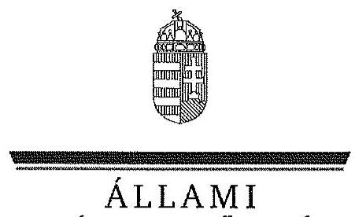
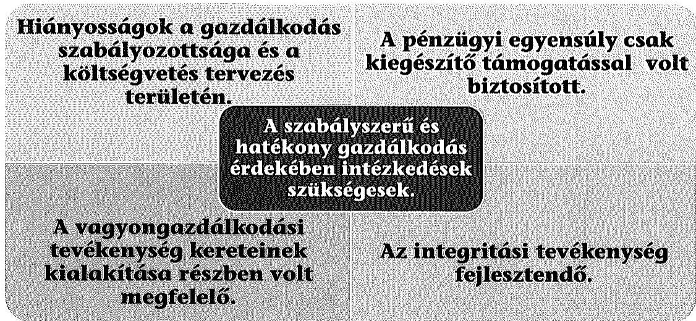
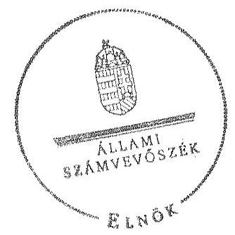
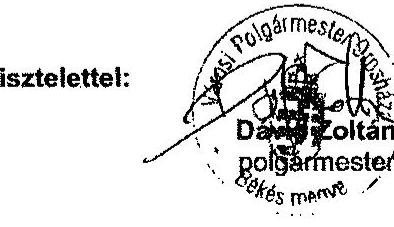
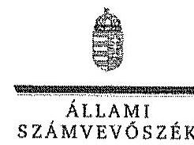
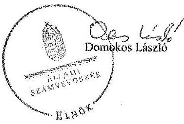

ÁLLAMI
SZÁMVEVŐSZÉK

# JELENTÉS 

az önkormányzatok pénzügyi és vagyongazdálkodása szabályszerűségének ellenőrzéséről

Orosháza

---

# Állami Számvevőszék 

Iktatószám: V-0656-070/2015.
Témaszám: 1690
Vizsgálat-azonosító szám: V069108

## Az ellenőrzést felügyelte:

## Renkó Zsuzsanna

felügyeleti vezető
Az ellenőrzés végrehajtásáért felelős és az ellenőrzést vezette:
Páncsics Judit
ellenőrzésvezető
A számvevőszéki jelentés összeállításában közremüködött:
Baksa Anikó
számvevő főtanácsos
Az ellenőrzést végezték:
Balázsné Antoni Erika
számvevő
Lakatos József
számvevő tanácsos

Dr. Elek László
számvevő
Pálfiné Pusztai Magdolna
számvevő tanácsos

---

# TARTALOMJEGYZÉK 

BEVEZETÉS ..... 3
I. ÖSSZEGZŐ MEGÁLLAPÍTÁSOK, KÖVETKEZTETÉSEK, JAVASLATOK ..... 6
II. RÉSZLETES MEGÁLLAPÍTÁSOK ..... 12

1. Az erőforrásokkal való szabályszerű és hatékony gazdálkodás követelményeinek kialakítása, számonkérése, ellenőrzése ..... 12
1.1. Az előirányzatokkal, a létszámmal, a vagyonnal való gazdálkodás szabályainak, követelményeinek kialakítása ..... 12
1.2. Az erőforrásokkal való szabályszerű, hatékony gazdálkodás követelményeinek számonkérése, ellenőrzése ..... 14
2. A pénzügyi gazdálkodás szabályszerűsége, a pénzügyi egyensúly biztosítottsága ..... 14
2.1. A költségvetési tervezés és az éves költségvetési beszámolás szabályossága ..... 14
2.2. Az önkormányzat fizetőképességének folyamatos fenntartása, a pénzügyi egyensúly biztosítása ..... 16
3. A vagyongazdálkodási tevékenység szabályossága ..... 22
3.1. A vagyongazdálkodási tevékenység kereteinek kialakítása ..... 22
3.2. A vagyonnyilvántartás szabályossága ..... 24
3.3. A vagyon leltározása ..... 25
3.4. A vagyonváltozásokat eredményező döntések szabályszerűsége ..... 27
3.5. Az önkormányzati tulajdonosi jog gyakorlása ..... 31
4. Integritás érvényesülése ..... 32
MELLÉKLETEK
5. számú Orosháza Város Önkormányzata feladatellátásában résztvevő intézmények és azok változása a 2011-2013. években
6. számú Orosháza Város Önkormányzata bevételei, kiadásai, valamint adósságszolgálata a 2011-2013. években
7. számú Orosháza Város Önkormányzata mérlegadatai a 2011-2013. években
8. számú Orosháza Város Önkormányzata tartós részesedéseinek alakulása a 2011-2013. években
9. számú Orosháza Város Önkormányzata polgármesterének a jelentéstervezet megállapításaihoz tett észrevétele
10. számú Az ÁSZ válasza Orosháza Város Önkormányzata polgármesterének a jelentéstervezet megállapításaira tett észrevételére

---

# FÜGGELÉKEK 

1. számú Fogalomtár
2. számú Rövidítések jegyzéke

---

# JELENTÉS 

## az önkormányzatok pénzügyi és vagyongazdálkodása szabályszerűségének ellenőrzéséről Orosháza

## BEVEZETÉS

Az ÁSZ stratégiai célkitűzése, hogy ellenőrzéseivel mind jobban segítse az átláthatóságot, az elszámoltathatóságot és elszámoltatást a közpénzekkel és a közvagyonnal való gazdálkodásban. Magyarország Alaptörvénye rögzíti, hogy az állam és a helyi önkormányzat tulajdona a nemzeti vagyon része. Az önkormányzati vagyon alapvető funkciója, hogy a közérdeket és egyúttal az önkormányzati célok - elsősorban a kötelezően ellátandó feladatok, és emellett a lehetőségek mértékéig az önként vállalt feladatok - megvalósítását szolgálja.

Az államháztartás önkormányzati alrendszerének közpénz felhasználása, az önkormányzatok által ellátott közfeladatok és önként vállalt feladatok sokrétűsége, valamint a feladatellátásához rendelt vagyon nagyságrendje indokolja, hogy az ÁSZ ellenőrzéseket folytasson a pénzügyi és vagyongazdálkodás területén. Az ÁSZ az önkormányzatok ellenőrzését a pénzügyi helyzet megítélésével indította el 2011-ben és a nagy vagyonnal rendelkező, magas kockázatú önkormányzatok esetében a vagyongazdálkodás ellenőrzésével folytatta. Az elmúlt három év ellenőrzéseinek tapasztalatai megmutatták, hogy indokolt az egyrészt elemző, értékelő, a pénzügyi helyzet kockázatát is minősítő, másrészt a pénzügyi és vagyongazdálkodási tevékenység szabályszerűségét komplexen értékelő ÁSZ ellenőrzések folytatása.

Az ellenőrzés célja annak megállapítása volt, hogy kialakított-e az önkormányzat az erőforrásokkal való szabályszerű és hatékony gazdálkodáshoz szükséges követelményeket, megvalósította-e azok számon kérését, ellenőrzését; az önkormányzat pénzügyi és vagyoni helyzetének, a gazdálkodás szabályosságának megítélése a költségvetési tervezés, a pénzügyi egyensúly megteremtése, az éves költségvetési beszámolás, a vagyongazdálkodás, a vagyon számbavétele, és a gazdasági események elszámolásának szabályszerűsége alapján.

Ennek keretében értékeltük, hogy az önkormányzat:

- pénzügyi gazdálkodása megfelelt-e a jogszabályokban és a belső szabályzataiban meghatározottaknak, biztosított volt-e a pénzügyi egyensúly;
- biztosította-e a vagyongazdálkodás szabályszerűségét, a vagyonváltozást eredményező döntéseket szabályszerűen hajtotta-e végre, gondoskodott-e a tulajdonosi jogok gyakorlásáról;
- a gazdálkodása során biztosította-e az átláthatóság és az integritás érvényesülését.

---

Az ellenőrzés várható hasznosulása: az ellenőrzés várhatóan hozzájárul az önkormányzatok pénzügyi helyzetének pontosabb megítéléséhez azáltal, hogy a pénzügyi és vagyoni helyzetet együtt értékeli. Bemutatja az adósságkonszolidáció önkormányzat általi végrehajtásának szabályszerűségét. Feltárja az önkormányzati gazdálkodást meghatározó szabályozások összhangjának esetleges hiányosságait, a szabályozással nem érintett gazdálkodási területeket, és a vagyongazdálkodási tevékenység gyakorlásának szabálytalanságait. A jó gyakorlat kialakításán és terjesztésén keresztül az ellenőrzések elősegíthetik az önkormányzati gazdálkodás szabályszerűségének javítását.

# Az ellenőrzés típusa: szabályszerűségi ellenőrzés 

Az ellenőrzött időszak: 2011. január 1-jétől 2013. december 31-ig. A pénzintézetekkel szembeni kötelezettségek állományának vizsgálatakor az ellenőrzött időszakban fennálló kötelezettségeket vettük figyelembe. A vagyonnyilvántartások egyezőségét, a leltározás, selejtezés folyamatát a 2013. évre vonatkozóan értékeltük.

## Ellenőrzött szervezet: Orosháza Város Önkormányzata

Az ellenőrzés végrehajtásának jogszabályi alapját az ÁSZ tv. 1. § (3) bekezdése, az 5. § (2)-(6) bekezdései, valamint az Áht. 2 61. § (2) bekezdésének előírásai képezik.

Az ellenőrzés szakmai módszertana az ÁSZ hivatalos honlapján közzétett szakmai szabályokon alapult, amely a Legfőbb Ellenőrző Intézmények Nemzetközi Szervezete (INTOSAI) által kiadott nemzetközi standardok (ISSAI) figyelembevételével készült.

Az alkalmazott egyes fogalmak magyarázatát az 1. számú függelék, a rövidítések jegyzékét a 2. számú függelék tartalmazza.

Az ellenőrzést az ÁSZ hatályos szervezeti szabályai és az ellenőrzési programban foglalt értékelési szempontok szerint folytattuk le. Megállapításainkat a helyszíni ellenőrzés tapasztalataira, az ellenőrzött szervezettől bekért dokumentumokra, a kitöltött tanúsítványok elemzésére, az adott időszakban hatályos jogszabályok és belső szabályzatok előírásaira alapoztuk. Az önkormányzat vagyonváltozását eredményező döntések és azok végrehajtásának ellenőrzése, szabályszerűségének megítélése kockázatalapú mintavételen, valamint tételes ellenőrzésen keresztül történt. Tételesen ellenőriztük a részesedések értékelését, valamint a térítés nélküli tulajdonjog átruházást. Kockázatalapú mintavétel alapján (évente a legnagyobb értékű 2-4 tétel került kiválasztásra) ellenőriztük a beruházásokat, felújításokat, a vagyonértékesítéseket, a vagyonhasznosítást és a behajthatatlan követelések leírását.

Orosháza város lakosainak száma 2013. január 1-jén 29777 fő volt. A 14 tagú Képviselő-testület munkáját három állandó bizottság - Ügyrendi- Szavazatszámláló Bizottság, Társadalmi Kapcsolatok Bizottsága, Pénzügyi Bizottság - segítette. A polgármester a 2014. évi önkormányzati választás óta töltötte be tisztségét, az ellenőrzött időszakban hivatalban volt jegyző jogviszonya 2014. március 4-ig állt fenn. A polgármesteri hivatal Közgazdasági Irodára, Igazgatási Irodára, Városfejlesztési és Városüzemeltetési Irodára, Törzskar I. és Törzskar II. szervezeti

---

egységekre tagolódott, elkülönített gazdasági szervezettel rendelkezett. A pénz-ügyi-gazdálkodási feladatokat a Közgazdasági iroda látta el. A foglalkoztatott köztisztviselők száma 2013. december 31-én 95 fő volt. Az Önkormányzat a 2013. évben az önállóan működő és gazdálkodó Polgármesteri hivatalon felül két önállóan működő és gazdálkodó, valamint három önállóan működő költségvetési szervvel látta el a feladatát. Az Önkormányzatnak 2013-ban négy kizárólagos és egy többségi tulajdonban lévő gazdasági társasága volt.

Az ellenőrzött időszak során az Önkormányzat által ellátott feladatok köre és intézményrendszere megváltozott. Az Úgyviteli Szakképző Iskolát a Békés Megyei Önkormányzat vette át 2011. július 1-jén. 2011. évben két általános iskolai és egy óvodai tagintézmény egyházi fenntartásba került. Az Oktatási és Közművelődési Intézmények Gondnokságának általános jogutóda 2012. március 1-jétől a Polgármesteri hivatal lett. A Tủzoltóság 2012. január 1-jével, a Kórház 2012. május 1-jével törvény erejénél fogva a Magyar Állam fenntartása alá került. A Liszt Ferenc Alapfokú Művészetoktatási Intézmény, Orosháza Város Általános Iskolája és Pedagógiai Szolgáltató Intézményei, valamint a Táncsics Mihály Gimnázium és Szakközépiskola (ez utóbbi kettő Táncsics Mihály Közoktatási Intézmény és Tehetségközpont néven egyesülve) 2013. január 1-jétől a Klebelsberg Intézményfenntartó Központ keretében múködik. A Polgármesteri hivatal hatósági feladatainak és alkalmazottainak egy részét 2013-tól az Orosházi Járási Hivatal vette át. Az Önkormányzat feladatellátásában résztvevő intézményeket és azok változását a 2011-2013. években az 1. számú melléklet mutatja be.

Az Önkormányzat könyvviteli mérleg szerinti vagyona 2013. december 31-én 39 209,5 millió Ft volt 687,0 millió Ft-tal, 1,7\%-kal csökkent az ellenőrzött időszakban. Az adósságállomány értéke a 2011. január 1-jén 3238,5 millió Ft volt, a 2275,7 millió Ft összegű adósság konszolidáció eredményeként 2013. december 31-én 1576,5 millió Ft-ra csökkent. A Magyar Állam az Önkormányzat 2013. december 31-én fennálló 1576,5 millió Ft összegű pénzintézeti kötelezettségeit és azok járulékait a 2014. évben teljes összegben átvállalta. Az Önkormányzat a 2013. évi költségvetési beszámolója szerint 8355,0 millió Ft költségvetési bevételt ért el és 8513,7 millió Ft költségvetési kiadást teljesített. A felhalmozási célú kiadások összege 2013-ban 4235,8 millió Ft volt, melyből felújításokra és beruházásokra 3643,7 millió Ft-ot fordítottak.

Az ÁSZ tv. 29. § (1) bekezdése szerint a jelentéstervezetet megküldtük a polgármester részére, aki az ÁSZ tv. 29. § (2) bekezdésében foglalt észrevételezési jogával élt, a jelentéstervezet megállapításaira észrevételt tett.

---

# I. ÖSSZEGZŐ MEGÁLLAPÍTÁSOK, KÖVETKEZTETÉSEK, JAVASLATOK 

Az Önkormányzat folyó költségvetése a 2011. évben a működőképesség megőrzését szolgáló kiegészítő támogatásokkal volt egyensúlyban. A múködési jövedelem a 2011-2013. években az adósságszolgálat finanszírozását nem biztosította, a nettó működési jövedelem folyamatos hiányt mutatott. A fizetőképesség fenntartását munkabér-megelőlegezési hitel és folyószámlahitel rendszeres igénybevételével biztosították. Az Önkormányzat vagyona a három év alatt 687,0 millió Ft-tal ( $1,7 \%$-kal) csökkent a feladatátadásokkal kapcsolatos vagyonátadások - fejlesztéseket meghaladó összege - következtében.

## Az ÁSZ ellenőrzés megállapításainak összefoglalása:

Az erőforrásokkal való szabályszerú gazdálkodás kialakítása nem történt meg teljes körűen, mivel a gazdasági szervezet ügyrendje, a számviteli politika keretében elkészítendő szabályzatok és az operatív gazdálkodási jogkörök kialakítása csak részben felelt meg a jogszabályi előírásoknak. A belső ellenőrzés a 2011-2013. években ellenőrizte az erőforrásokkal és a vagyonnal való szabályszerű gazdálkodást, valamint az önkormányzati tulajdonú gazdasági társaságok múködését.

Az Önkormányzat a 2011-2013. évi költségvetési rendeleteit hiánnyal tervezte. A költségvetési rendeleteket nem az Ámr.-ben, illetve az Áht. ${ }_{2}$-ben előirt az éves költségvetési beszámoló elkészítési határidejéig, hanem azt követően is módosították. A polgármester a Képviselő-testületet az Önkormányzat gazdálkodásának helyzetéről tájékoztatta. A zárszámadási rendelettervezeteket határidőben beterjesztette, de a Képviselő-testületnek Áht. ${ }_{1,2}$-ben foglaltak ellenére tájékoztatásul az Önkormányzat és intézményei vagyonáról a vagyonkimutatást nem mutatta be.

Az Önkormányzat az ellenőrzött időszakban a pénzügyi egyensúlyát, múködési biztonságát folyószámlahitel és munkabér-megelőlegezési hitel igénybe vételével biztosította. Az Önkormányzat müködőképességének megőrzésére

---

2011-2013 között összesen 707,0 millió Ft vissza nem térítendő támogatásban részesült, amely nélkül 2011-ben a múködési jövedelme negatív lett volna. A feladatellátásban bekövetkezett változások - elsősorban a kórház és a közoktatási feladatok állami átvétele -, továbbá a saját hatáskörben megtett bevételnövelő és kiadáscsökkentő intézkedések javították a pénzügyi egyensúlyi helyzetet.

A szállítói kötelezettségeket az előírt fizetési határidőre teljes körűen nem teljesítették. Az Önkormányzatnak az ellenőrzött időszakban - minden év végén - volt 60 napon túl lejárt szállítói állománya. A fejlesztési célú kötvénykibocsátásból és beruházási, fejlesztési hitelekből származó hosszú lejáratú kötelezettségeket határidőben teljesítették. Az Önkormányzatnak az ellenőrzött időszakban líingszerződésből, PPP konstrukcióból származó kötelezettsége nem volt. Az Önkormányzat likviditási tervei nem feleltek meg teljes körűen a jogszabályi előírásoknak. A 2013. évben adósságmegújító hitelügylet vállalásához a Kormány előzetes hozzájárulásával rendelkeztek. A 2012. év végén fennálló hitel- és kötvény tartozásállományból 3409,9 millió Ft képezte a 65,0\%-os mértékű adósságkonszolidáció alapját.

A vagyongazdálkodás szabályozási kereteinek kialakítása a jogszabályi előírásoknak részben felelt meg. A vagyonkezelői jog megszerzésére, gyakorlására és a vagyonkezelés ellenőrzésére vonatkozó szabályokról 2013 áprilisától rendelkeztek, azonban a vagyonkezelői jog ellenértékét és az ingyenes átengedés szabályait nem rögzítették. Az Önkormányzat koncessziós és vagyonkezelési szerződéseket nem kötött.

A számviteli nyilvántartásban a forgalomképtelen, a korlátozottan forgalomképes és az üzleti vagyon elkülönített nyilvántartásáról nem gondoskodtak. Az ingatlanvagyon-kataszter adatainak egyezőségét a földhivatali nyilvántartással az ellenőrzött időszakban biztosították. A 2011. évi leltározást a belső szabályzat előírásával ellentétben nem mennyiségi felvétellel, hanem egyeztetéssel végezték el. Az Önkormányzatnál az ellenőrzött időszakban a vagyonváltozást eredményező döntések meghozatalakor szabályszerűen jártak el, a megkötött szerződések közérdekű adatai esetében a közzétételi kötelezettségnek eleget tettek.

Az Önkormányzat a kizárólagos és többségi önkormányzati tulajdonú gazdasági társaságaiban a tulajdonosi érdekeit érvényre juttatta, a gazdálkodásuk ellenőrzését az üzleti tervek és beszámolók elfogadásával és belső ellenőrzéseken keresztül gyakorolta. Az Önkormányzatnak a gazdasági társaságai múködésével kapcsolatban kötelezettsége nem keletkezett.

Az Önkormányzatnál az integritási tevékenység fejlesztendő, mivel a fennálló kockázatok szintje meghaladta a kezelésükre kiépített, alkalmazott kontrollok szintjét.

Az ÁSZ tv. 33. § (1) bekezdésében foglaltak értelmében az ellenőrzött szervezet vezetője köteles a jelentésben foglalt megállapításokhoz kapcsolódó intézkedési tervet összeállítani, és azt a jelentés kézhezvételétől számított harminc napon belül az ÁSZ részére megküldeni. Amennyiben az intézkedési tervet határidőn belül nem küldi meg a szervezet vezetője, vagy az továbbra sem elfogadható, az ÁSZ elnöke a hivatkozott törvény 33. § (3) bekezdés a-b) pontjaiban foglaltakat érvényesítheti.

---

# Az ellenőrzés intézkedést igénylő megállapításai és javaslatai: 

## a polgármesternek

1. A 2011. évben a folyó költségvetés az ÖNHIKI és az egyéb kiegészítő támogatásokkal együtt volt egyensúlyban. A 2012-2013. években a működőképesség megőrzését szolgáló támogatások nélkül is pozitív működési jövedelem képződött, azonban a 2013. évben annak összegében jelentős csökkenés következett be. Az ellenőrzött időszakban a folyó költségvetés többlete nem biztosított fedezetet a tőketörlesztési kiadásokra. A saját hatáskörben megtett bevételnövelő és kiadáscsökkentő intézkedések hozzájárultak a működési jövedelem 2012. évi kedvező alakulásához, azonban a működési egyensúly jövőbeni tartós megőrzéséhez további intézkedések szükségesek.

Javaslat:
Terjessze a Képviselő-testület elé az Önkormányzat aktuális pénzügyi helyzetének elemzésén alapuló döntési javaslatát a működési egyensúly hosszú távon történő fenntarthatóságát biztosító további intézkedések bevezetéséről.
2. A szállítói kötelezettségek állománya az ellenőrzött időszakban főként a Kórház állami fenntartásba adása következtében jelentős mértékben csökkent. A lejárt esedékességű szállítói tartozások összege 2011-ről 2013-ra 643,1 millió Ft-ról 89,2 millió Ft-ra mérséklődött. A 60 napon túli lejárt tartozások összege jelentősen csökkent (2011-ben 463,7 millió Ft, 2012-ben 0,1 millió Ft, míg 2013-ban 21,1 millió Ft volt), azonban az Adósságrendezési tv. 4. § (1) bekezdése alapján kezdeményezhető adósságrendezési eljárás megindításának elkerülése érdekében további intézkedések szükségesek. Az Önkormányzat a 2011. évben és a 2013. évben rendelkezett 418 millió Ft, illetve 21,0 millió Ft 90 napon túli lejárt tartozással.

Javaslat:
Intézkedjen a szállítói kitettség csökkentése, illetve az adósságrendezési eljárás megindításának elkerülése érdekében a lejárt esedékességű tartozások kezeléséről.
3. A 2012-2013. években az Mötv. 109. § (4) bekezdés előírásait figyelmen kívül hagyva rendeletben nem írták elő a vagyonkezelői jog ellenértékét és az ingyenes átengedés szabályait.

Javaslat:
Terjessze a Képviselő-testület elé - a jegyző által elkészített - rendelet tervezetét, amelyben a jogszabályi előírásoknak megfelelően meghatározzák a vagyonkezelői jog ellenértékét és az ingyenes átengedés szabályait.
4. Az ÁSZ ellenőrzés a vagyonnal való gazdálkodásra vonatkozó önkormányzati rendeletben foglalt előírások megfelelősége, a jogszabályban előírt belső szabályzatok kialakítása, a likviditási terv elkészítése, a kockázatkezelési rendszer müködtetése, a számviteli nyilvántartások vezetése, valamint a zárszámadási rendelettervezet előterjesztése részeként elkészített vagyonkimutatás megfelelősége tekintetében hiányosságokat, illetve szabálytalanságokat tárt fel.

---

Javaslat:
Intézkedjen a feltárt hiányosságok és/vagy szabálytalanságok tekintetében a munkajogi felelősség tisztázására irányuló eljárás megindításáról, és ennek eredménye ismeretében tegye meg a szükséges intézkedéseket.

# a jegyzőnek 

1. Az ellenőrzött időszakban hatályos hivatali SZMSZ ${ }_{1-6}$ szerint a gazdasági szervezet feladatait két szervezeti egység látta el, ugyanakkor az érintett szervezeti egységek közül - a 2011. évben az Ámr. 15. § (6) bekezdésében és a 2012-2013. években az Ávr. 9. § (5) bekezdésében előírtak ellenére - a Városüzemeltetési Iroda nem rendelkezett külön ügyrenddel.

Javaslat:
Intézkedjen, hogy a gazdasági szervezet feladatait ellátó valamennyi szervezeti egység rendelkezzen a jogszabályi előírásoknak megfelelően külön ügyrenddel.
2. A 2011. évben az Ámr. 20. § (3) bekezdés c) pontja, a 2012-2013. években az Ávr. 13. § (2) bekezdés c) pontja előírása ellenére belső szabályzatban nem rendezték a belföldi és külföldi kiküldetések elrendelésével és lebonyolításával, elszámolásával kapcsolatos kérdéseket.

Javaslat:
Intézkedjen a jogszabályban előírt belső szabályzat elkészítése érdekében.
3. A 2012. évben a bevételek beérkezésének és a kiadások teljesítésének ütemezéséről az Áht. 2 78. § (2) bekezdésének és az Ávr. 122. § (1)-(2) bekezdésében, valamint az e tárgyban kiadott belső szabályzatban előírtak ellenére nem készítettek likviditási tervet. A 2013. évben a Polgármesteri Hivatalra vonatkozóan elkészített likviditási terv havonkénti felülvizsgálatát az Ávr. 122. § (3) bekezdésében foglaltak ellenére nem végezték el.

Javaslat:
Intézkedjen, hogy a bevételek beérkezésének és a kiadások teljesítésének ütemezéséről a jogszabályi előírásnak megfelelően a likviditási tervet készítsék el, és azt havonta vizsgálják felül.
4. A kockázatkezelési rendszer keretében - a 2011. évben az Áht. 1 121. § (2) bekezdés b) pontjában, az Ámr. 157. § (1)-(3) bekezdéseiben, a 2012-2013. években a Bkr. 7. § (1)-(2) bekezdéseiben előírtak ellenére - a pénzügyi egyensúlyt befolyásoló kockázatok beazonosítása, felmérése, ezen túl a kockázatok mérséklése érdekében szükséges intézkedések meghatározása nem volt teljes körű.

Javaslat:
Működtessen a jogszabályi előírásoknak megfelelő, a pénzügyi egyensúlyt befolyásoló kockázatok kezelésére alkalmas kockázatkezelési rendszert.

---

5. A 2011-2013. évi zárszámadási rendelettervezetek előterjesztése részét képező vagyonkimutatások nem feleltek meg az Áhsz. 44/A. § (1)-(3) bekezdéseiben előírt követelményeknek, mert nem mutatták be az Önkormányzat és intézményei saját vagyonát a jogszabályban meghatározott felépítésben és tartalmi követelményeknek megfelelően, a kimutatások kizárólag az ingatlanvagyon elemeit tartalmazták forgalomképesség szerinti megbontásban. A 2013. évi zárszámadási rendelet módosításakor elkészített vagyonkimutatás az Áhsz. 44/A. § (2) bekezdése szerinti követelményeknek megfelelt, azonban az Áhsz. 44/A. § (3) bekezdésében foglaltak ellenére nem tartalmazta az Önkormányzat tulajdonában lévő jogszabály alapján érték nélkül nyilvántartott eszközök állományát.

Javaslat:
Intézkedjen, hogy a zárszámadási rendelet-tervezet előterjesztése keretében a jogszabályi előírásoknak megfelelő tartalommal és szerkezetben készítsék el a vagyonkimutatást.
6. Az ellenőrzött időszakban hatályos számlarend ${ }_{1-3}$-ben - az Áhsz. 49. § (3) bekezdésében előírtak ellenére - nem szabályozták az analitikus nyilvántartások formáját, tartalmát és azok vezetésének módját. A számviteli politika ${ }_{1-3}$ keretében az Áhsz. 8. § (5) bekezdés a), d) és f) pontjaiban foglaltak ellenére nem határozták meg, hogy a számviteli elszámolás és az értékelés szempontjából mit tekintenek lényegesnek, illetve nem lényegesnek. Ennek keretében nem határozták meg mi tekintendő figyelembe veendő szempontnak a kisértékű tárgyi eszközök, vagyoni értékű jogok és szellemi termékek minősítésénél, az általános kiadások megosztási módszerének kiválasztásánál, valamint a terven felüli értékcsökkenés elszámolása tekintetében.

Javaslat:
Intézkedjen a jogszabályi előírásban meghatározott kérdések számlarendben, illetve számviteli politika keretében történő szabályozásáról.
7. Az Önkormányzatnál az ellenőrzött időszakot megelőzően az Orosháza FC Kft. részére - a gazdasági társaság veszteségei fedezetére tekintettel - teljesített 45,0 millió Ft tulajdonosi pótbefizetés összegét a 2011-2013. évi könyvviteli mérlegekben kölcsönfolyósításból származó követelésként mutatták ki, amely ellentétes volt a Számv. tv. 15. § (3) bekezdése szerinti valódiság elvével. A pótbefizetés teljesítése a társasági szerződésben előírt kötelezettségen és nem kölcsönszerződésen alapult, ezáltal a 20112013. évi könyvviteli mérlegekben a valóságban nem létező kölcsönkövetelést szerepeltettek.

Javaslat:
Intézkedjen a pótbefizetés összegének jogszabályi előírásoknak megfelelő számviteli elszámolása érdekében.
8. Az ellenőrzött időszakban az Önkormányzat számviteli nyilvántartásaiban kizárólag a korlátozottan forgalomképes eszközök főkönyvi számláin szerepelt értékadat, amely azonban megegyezett a törzsvagyon és az üzleti vagyon együttes értékével. Az Áhsz. 9. számú melléklet számlaosztályok tartalmára vonatkozó előírások 1. k) pontjában foglalt előírás ellenére a számviteli nyilvántartásokból a 2011. évben nem biz-

---

tosították a törzsvagyon (ezen belül a forgalomképtelen, illetve korlátozottan forgalomképes) és a nem törzsvagyon részét képező eszközök értékének kimutatását. A 2012-2013. években az Nvtv.-ben előírt tagolás alapján a nyilvántartásokból nem tűnt ki a törzsvagyon, ezen belül a forgalomképtelen, a kizárólagos, a nemzetgazdasági szempontból kiemelt jelentőségű, a korlátozottan forgalomképes vagyon, valamint az üzleti vagyon részét képező eszközök értéke.

Javaslat:
Gondoskodjon a számviteli (ezen belül a részletező) nyilvántartások kialakítása és vezetése során a vagyonelemek jogszabályi előírásoknak megfelelő kimutatásáról.

---

# II. RÉSZLETES MEGÁLLAPÍTÁSOK 

## 1. AZ ERŐFORRÁSOKKAL VALÓ SZABÁLYSZERŰ ÉS HATÉKONY GAZDÁLKODÁS KÖVETELMÉNYEINEK KIALAKÍTÁSA, SZÁMONKÉRÉSE, ELLENÖRZÉSE

### 1.1. Az előirányzatokkal, a létszámmal, a vagyonnal való gazdálkodás szabályainak, követelményeinek kialakítása

Az ellenőrzött időszakban az Önkormányzat létszám- és vagyongazdálkodásra vonatkozó, a helyi sajátosságok figyelembevételével elkészített belső szabályzatai részben feleltek meg a jogszabályi előírásoknak. Az Önkormányzat és a Polgármesteri hivatal 2011-2013. között rendelkezett SZMSZ-szel. Az önkormányzati SZMSZ-ben meghatározták, hogy mely feladatokat látnak el, azonban a feladatok ellátásának módját az Ötv. 8. § (2) bekezdésében ${ }^{1}$ előírtak ellenére nem határozták meg. Az önkormányzati feladatok közül a 2012. évben az Állam átvette a járó- és fekvőbeteg ellátás és a tüzvédelem, a 2013. évben az általános iskolai-, gimnáziumi-, szakközépiskolai oktatás, gyámhivatali és okmányirodai feladatok ellátását. Az Önkormányzat önállóan múködő intézményei gazdálkodási feladatait 2012. március 1-jétől a Polgármesteri hivatal látta el.

A hivatali SZMSZ ${ }_{1-6}$-ban a gazdasági szervezet egységeiként a Közgazdasági Irodát, valamint a Városüzemeltetési irodát ${ }^{2}$ jelölték meg. A gazdasági szervezet ügyrendje ${ }_{1-3}$ csak a Közgazdasági iroda feladatait tartalmazta, a Városüzemeltetési iroda feladatait nem, és a Városüzemeltetési iroda - az Ámr. 15. § (6) bekezdésében és az Ávr. 9. § (5) bekezdésében ${ }^{3}$ foglaltak ellenére - önállóan sem rendelkezett az Ámr. 20. § (7) bekezdésében és az Ávr. 13. § (5) bekezdésében előírt tartalmi követelmények szerinti ügyrenddel. A munkaköri leírásokat a jogszabályi előírásoknak megfelelően elkészítették, melyek tartalmazták a gazdasági szervezet dolgozóinak, vezetőinek részletes feladatait.

A jegyző 2011-2013. között a jogszabályi előírásokkal összhangban és a helyi sajátosságoknak megfelelően kialakította a Polgármesteri hivatal és az intézmények számviteli rendjét, kiadta a számviteli politika ${ }_{1-3}$-at és a számviteli politika keretében elkészítendő szabályzatokat. A számlarend $_{1-3}$ az Áhsz. ${ }_{1} 49$. § (3) bekezdés ${ }^{4}$ előírásaival ellentétben nem szabályozta az analitikus nyilvántartások formáját, tartalmát, azok vezetésének módját. A számviteli politika $_{1-3}$

[^0]
[^0]:    ${ }^{1}$ 2012. december 31-től hatálytalan
    ${ }^{2}$ A gazdasági szervezetet 2011. március 1-jéig a Pénzügyi osztály és a Városfejlesztési és Városgazdálkodási osztály, ezt követően 2013 márciusáig az Intézmény-felügyeleti, Hivatal Üzemeltetési Iroda, a Közgazdasági Iroda és a Városfejlesztési, Beruházási Iroda, 2013 áprilisától a Közgazdasági Iroda és a Városüzemeltetési Iroda alkotta.
    ${ }^{3}$ 2015. február 18-tól az Ávr.10/A. §
    ${ }^{4}$ 2014. január 1-jétől az Áhsz ${ }_{3}$ 51. § (3) bekezdése

---

az Áhsz. 1 8. § (5) bekezdés a), d) és f) pontjaiban ${ }^{5}$ foglaltak ellenére nem szabályozta, hogy a számviteli elszámolás és értékelés szempontjából mit tekintenek lényegesnek, illetve nem lényegesnek. Ennek keretében nem határozták meg, hogy mi tekintendő figyelembe veendő szempontnak a kisértékű tárgyi eszközök, vagyoni értékű jogok és szellemi termékek minősítésénél, az általános kiadások megosztási módszerének kiválasztásánál, a terven felüli értékcsökkenés elszámolása tekintetében.

A leltározási szabályzat ${ }_{1-2}$ alapján az eszközök és források leltározását a nyilvántartások egyeztetésével kellett végrehajtani, a tárgyi eszközök és készletek esetében eszközcsoportokra meghatározott időszakonként ${ }^{6}$ mennyiségi felvétellel is biztosítani kellett a leltározást. Az eszközök kétévenkénti leltározásának lehetőségét az Áhsz. 1 37. § (7) bekezdésében előírtak alapján a 2011., a 2012. és a 2013. évi költségvetési rendeletekben biztosították, amelyet a leltározási szabályzat ${ }_{1-3}$-ban rögzítettek.

Az Önkormányzatnál a múködéséhez, gazdálkodásához kapcsolódó és pénzügyi kihatással bíró, jogszabályban nem szabályozott - így különösen a belföldi és külföldi kiküldetések elrendelésével és lebonyolításával, elszámolásával kapcsolatos - kérdéseket 2011-ben az Ámr. 20. § (3) bekezdés c) pontjában, a 2012. és a 2013. években az Ávr. 13. § (2) bekezdés c) pontjában foglaltak ellenére belső szabályzatban nem rendezték. A beszerzések lebonyolításával kapcsolatos eljárásrendet - az Ámr. 20. § (3) bekezdés b) pontjában és az Ávr. 13. § (2) bekezdés b) pontjában foglaltak ellenére - 2012. április 1-je előtt nem szabályozták. A Polgármesteri hivatalnál a gépjárművek igénybevételének és használatának rendjét, valamint a vezetékes és a mobiltelefonok használatának feltételeit belső szabályzatokban rögzítették.

Az operatív gazdálkodással és annak munkafolyamatba épített ellenőrzésével összefüggő jogkörök gyakorlásának rendjét, eljárási szabályait a gazdasági szervezet ügyrendje ${ }_{1-3}$-ban szabályozták. Az Önkormányzat kiadási előirányzatai tekintetében a gazdasági szervezet ügyrendje ${ }_{1-3}$-ban a munkakör szerint megnevezett, kötelezettségvállalásra és utalványozásra jogosult személyek 2011. évben az Ámr. 72. § (8) és az Ámr. 78. § (1) bekezdéseiben foglaltak ellenére, 2012. és 2013. évben az Ávr. 52. § (6) , és az Ávr. 59. § (1) bekezdéseiben foglaltak ellenére írásban történt kijelöléssel, felhatalmazással nem rendelkeztek. A kötelezettségvállalás, utalványozás, ellenjegyzés, érvényesítés gazdálkodási jogkörök gyakorlására jogosultakat, és aláírás mintájukat a pénzkezelési szabályzat1-3 mellékletei tartalmazták. A 2011. és a 2012. évben - az Ámr. 80. § (3) bekezdésében és az Ávr. 60. § (3) bekezdésében foglaltak ellenére - a teljesítésigazolásra jogosultakról és aláírás mintájukról nem vezettek naprakész nyilvántartást, amelyet 2013-tól a gazdasági szervezet ügyrendje ${ }_{3}$ tartalmazott.

A Polgármesteri hivatal FEUVE $_{1,2}$ szabályzata alapján kiadták az ellenőrzési nyomvonal ${ }_{1-4}$-et, amelyet a Bkr. és a hivatali SZMSZ ${ }_{2,3}$ hatályba lépését követően

[^0]
[^0]:    ${ }^{5}$ 2014. január 1-jétől a Számv. tv. 14. § (4) bekezdése alapján az Áhsz 50. § (1) bekezdése írja elő
    ${ }^{6}$ az ingatlanok, gépek, berendezések, felszerelések és járművek esetében kétévente mennyiségi felvétellel, a beruházások és felújítások esetében évente egyeztetéssel

---

aktualizáltak. A szabálytalanságok kezelésének eljárásrendje a hivatali SZMSZ $_{2,3}$ mellékletét képezte. A 2011-2013. években a Polgármesteri hivatal rendelkezett kockázatelemzési- és kockázatkezelési szabályzat ${ }_{1,2}$-vel.

A közérdekű adatok megismerésére irányuló kérelmek intézésének, továbbá a kötelezően közzéteendő adatok nyilvánosságra hozatalának rendjét a közzétételi szabályzatban ${ }_{1-4}$ szabályozták.

# 1.2. Az erőforrásokkal való szabályszerű, hatékony gazdálkodás követelményeinek számonkérése, ellenőrzése 

Az Önkormányzatnál a 2011-2013. évi költségvetési koncepciókban meghatározott, a hatékony gazdálkodásra vonatkozó főbb célkitűzéseket a tárgyévi költségvetési rendeletekbe beépítették. A Képviselő-testület a 2011-2013. években szervezeti átalakítás és feladatátadás kapcsán létszámcsökkentésekről döntött, azonban az előterjesztések a létszámleépítések hatásaira és az Önkormányzat pénzügyi és vagyoni helyzetének változására vonatkozó számításokat, előrejelzéseket nem tartalmaztak.

Az Önkormányzat az erőforrásokkal való gazdálkodás követelményeinek és irányelveinek teljesítéséről a zárszámadási rendeletek megalkotásához kapcsolódó előterjesztésekben adott számot.

A hatékonysági követelmények végrehajtását a gazdasági szervezet vezetője a 2011. évi költségvetési rendeletben előírt létszámcsökkentés végrehajtásánál adatbekéréssel ellenőrizte, a 2012. évi kiadások csökkentésére intézkedési tervet és a kiadási előirányzatok túllépése esetén igazoló jelentést kért az intézményektől.

A jegyző a 2011-2013. években önálló belső ellenőrzési szervezeti egység útján gondoskodott a belső ellenőrzés múködtetéséről. A belső ellenőrzés a 20112013. években az erőforrásokkal való szabályszerű gazdálkodást, az ingatlan-vagyon-kataszter vezetésének szabályszerűségét, a vagyon megóvását, az intézmények és az Önkormányzat többségi tulajdonában álló gazdasági társaságok múködését ellenőrizte.

## 2. A PÉNZÜGYI GAZDÁLKODÁS SZABÁLYSZERŰSÉGE, A PÉNZÜGYI EGYENSÚLY BIZTOSÍTOTTSÁGA

### 2.1. A költségvetési tervezés és az éves költségvetési beszámolás szabályossága

Az Önkormányzatnál a költségvetés tervezésével kapcsolatos feladatokat a hivatali SZMSZ $_{1-6}$, a gazdasági szervezet ügyrendje ${ }_{1-3}$, a költségvetési tervezés ellenőrzési nyomvonala ${ }_{1-4}$ és a munkaköri leírások tartalmazták. A 2011-2013. évi költségvetési koncepciók előterjesztése a Képviselő-testület részére a jogszabályi előírásoknak megfelelően megtörtént. A 2011-2013. évi költségvetési rendelettervezeteket a Pénzügyi Bizottság véleményezését követően a polgármester határidőben beterjesztette a Képviselő-testület elé.

---

A Képviselő-testület által elfogadott 2011., 2012. és 2013. évi költségvetések hiányt mutattak, melynek összege évente 1144,1 millió Ft, 436,4 millió Ft, 810,2 millió Ft volt. Az Önkormányzat a 2011. évi költségvetési rendeletében a költségvetési és finanszírozási kiadások szabálytalan megállapításával megsértette az Áht. ${ }_{1}$ 8/A. § (3) bekezdésében, valamint az Áhsz. 1 9. számú melléklete 1. h) pontjában foglalt rendelkezéseket, mivel befektetési célú részesedés vásárlásával kapcsolatosan 24,4 millió Ft-ot helytelenül a finanszírozási műveletek között, értékpapír vásárlás jogcímen mutatott ki. Ennek figyelembevételével a 2011. évi költségvetés hiánya 1144,1 millió Ft helyett 1168,5 millió Ft (a múködési hiány 364,2 millió Ft, a felhalmozási hiány 779,9 millió Ft helyett 804,3 millió Ft) lett volna. Az Önkormányzat a 2011. évi zárszámadásban a finanszírozási kiadásokban szerepeltette a 24,4 millió Ft összegű befektetési célú részesedés vásárlását, mellyel megsértette az Áhsz. ${ }_{1} 19 . \S$ (2) bekezdésében ${ }^{7}$ foglaltakat.

Az Önkormányzat az előirányzatok átcsoportosításával, módosításával, nyilvántartásával kapcsolatos eljárásrendet a 2011-2013. évi költségvetési rendeletekben és belső szabályzataiban meghatározta. Az ellenőrzött időszakban az előirányzatok módosítására a Képviselő-testület döntése alapján, a jogszabályi előírásoknak megfelelően került sor, a módosításokat az analitikus és a főkönyvi nyilvántartásokban átvezették. A kiemelt kiadási előirányzatokat a 2011-2013. években betartották.

A Képviselő-testület a 2011. évi költségvetési rendeletének módosításáról az Ámr. 67. § (2) bekezdésében foglalt határidőt követően, 2012. április 24-én döntött. A 2012. és 2013. évi költségvetési rendeleteit az Áht. 2 34. § (5) bekezdésében foglaltak ellenére az éves költségvetési beszámoló elkészítésének határidejét követően -, 2013. május 27 -én, 2014. április 1 -jén, 2014. június 6 -án és 2014. június 26 -án - módosította.

Az Önkormányzatnál a 2011-2013. években a létszámgazdálkodással kapcsolatos követelményeket betartották, a foglalkoztatottak létszáma a Képviselő-testület által engedélyezett létszámkeretet nem lépte túl. Az ellenőrzött években a kiadáscsökkentő intézkedések közül az Önkormányzat kimutatása szerint az intézmények létszámcsökkentésének végrehajtása évenként 17,0 millió Ft öszszegű, a 2013. évi hivatali létszámleépítés 8,4 millió Ft összegű megtakarítást eredményezett. Az iskolák egyházi fenntartásba adása a 2011. évben 46,7 millió Ft, a 2012. évben 187,0 millió Ft összegű, az óvoda átadása 2011-ben 3,2 millió Ft, 2012-2013. években 13,0-13,0 millió Ft megtakarítással járt.

A 2011-2013. években a polgármester az Önkormányzat gazdálkodásának I. félévi helyzetéről a Képviselő-testületet az Áht. 1 79. § (1) bekezdésében, illetve az Áht. 2 87. § (1) bekezdésében előírtak ellenére a szeptember 15.-ei határidőn túl tájékoztatta. A polgármester az Önkormányzat gazdálkodása I-III. negyedéves helyzetéről a jogszabályi előírásoknak megfelelően a költségvetési koncepció ismertetésekor tájékoztatta a Képviselő-testületet. Az Önkormányzat és az általa irányított költségvetési szervek a 2011-2013. évi elemi beszámolóikat határidőre, a jogszabályban előírt tartalommal elkészítették, a féléves és éves elemi

[^0]
[^0]:    ${ }^{7}$ 2014. január 1-jétől az Áhsz 11. § (9) bekezdése szabályozza.

---

költségvetési beszámolókat - a 2012. évi beszámoló kivételével - határidőre benyújtották a Kincstárnak.

A polgármester - a jegyző által elkészített - 2011-2013. évi zárszámadási rendelettervezeteket határidőben a Képviselő-testület elé terjesztette. A jegyző nem készítette el a 2011-2013. évi zárszámadási rendelettervezetek előterjesztéséhez a vagyonkimutatást, ezért az Áht. 118. § (2) bekezdés c) pontjában, illetve az Áht. 2 91. § (2) bekezdés c) pontjában foglaltak ellenére a polgármester azokat tájékoztatásul nem mutatta be.

# 2.2. Az önkormányzat fizetőképességének folyamatos fenntartása, a pénzügyi egyensúly biztosítása 

Az Önkormányzat 2011-2013. évi költségvetésének elemzését a CLF módszer szerint végeztük el, amelynek adatait a 2. számú melléklet tartalmazza. A 2013. évi valós jövedelemtermelő képesség bemutatása érdekében az elemzés során nem vettük figyelembe az adósságkonszolidációhoz kapcsolódó bevételeket és kiadásokat. Az adósságkonszolidációra vonatkozóan az Önkormányzat 2013. évi beszámolója 1537,1 millió Ft müködési támogatást, 630,6 millió Ft hiteltörlesztést és 16,7 millió Ft felhalmozási kamatkiadást tartalmazott. A CLF módszer szerinti, 2011-2013. évi korrigált főbb önkormányzati adatokat az 1. számú táblázat mutatja be:

1 .számú táblázat
Az Önkormányzat pénzügyi egyensúlyi helyzetének főbb adatai 2011-2013. években Adatok millió Ft-ban

| Megnevezés | 2011.   év | 2012.   év | 2013. év |
| :-- | :--: | :--: | :--: |
| Folyó bevételek | 8742,7 | 6461,7 | 4517,6 |
| Folyó kiadások | 8553,7 | 6023,5 | 4277,9 |
| Folyó költségvetés egyenlege, müködési jövedelem | $\mathbf{1 8 9 , 0}$ | $\mathbf{4 3 8 , 2}$ | $\mathbf{2 3 9 , 7}$ |
| Folyó költségvetés egyenlege müködőképesség megőrzését   szolgáló kiegészítő támogatások nélkül | $\mathbf{- 7 2 , 9}$ | $\mathbf{2 1 3 , 1}$ | $\mathbf{1 9 , 7}$ |
| Felhalmozási bevételek | 1663,0 | 1033,7 | 3798,4 |
| Felhalmozási kiadások | 2223,1 | 1289,2 | 4235,8 |
| Felhalmozási költségvetés egyenlege | $\mathbf{- 5 6 0 , 1}$ | $\mathbf{- 2 5 5 , 5}$ | $\mathbf{- 4 3 7 , 4}$ |
| Finanszírozási múveletek nélküli (GFS) pozíció | $\mathbf{- 3 7 1 , 1}$ | $\mathbf{1 8 2 , 7}$ | $\mathbf{- 1 9 7 , 7}$ |
| Hitelfelvétel, forgatási és befektetési célú értékpapír kibocsátása,   egyéb finanszírozási bevétel | 1266,3 | 564,5 | 1174,1 |
| Hiteltörlesztés, értékpapír beváltás, egyéb finanszírozási kiad. | 920,2 | 766,7 | 511,3 |
| Finanszírozási műveletek egyenlege | 346,0 | -202,2 | 662,8 |
| Tárgyévi pénzügyi pozíció | -25,1 | $-19,5$ | 465,1 |
| Nettó müködési jövedelem   (müködési jövedelem - tőketörlesztés) | $\mathbf{- 9 1 7 , 9}$ | $\mathbf{- 4 2 7 , 0}$ | $\mathbf{- 4 4 8 , 0}$ |

---

A folyó költségvetés egyenlege a 2011. évben a működőképesség megőrzését szolgáló kiegészítő támogatásokkal és a hiteltörlesztésre fordítható költségvetési támogatással együtt, a 2012-2013. években már a kiegészítő támogatások nélkül is pozitív volt, a 2011-2013. években összesen 866,9 millió Ft többletet mutatott. Az Önkormányzat a 2011-2013. években múködőképességének megőrzésére összesen 707,0 millió Ft vissza nem térítendő támogatásban részesült. A 2011. évben a működési jövedelem a 142,5 millió Ft-os hiteltörlesztésre fordítható költségvetési támogatás és a 119,4 millió Ft-os ÖNHIKI támogatás nélkül számítva 72,9 millió Ft hiányt mutatott volna. A működési jövedelem alakulását a 2012-2013. években a tüzvédelem, a fekvő- és járóbeteg-ellátás, továbbá a köznevelési feladatok állami átvétele, továbbá az Önkormányzat kiadáscsökkentő és bevételnövelő intézkedései befolyásolták. A feladatellátásban bekövetkezett változások a pénzügyi egyensúlyi helyzetet javították, azonban az oktatási intézmények esetében a feladatellátáshoz kapcsolódó, át nem adott önkormányzati vagyon fenntartási kiadásait továbbra is az Önkormányzat viselte.

A 2011-2013. években a felhalmozási költségvetés egyenlege folyamatosan negatív volt, mivel a megkezdett beruházások és felújítások, a kamatkiadások és a gazdasági társaságokban való tulajdonszerzés forrásigénye meghaladta a rendelkezésre álló felhalmozási bevételeket. Az összesen 1253,0 millió Ft felhalmozási hiányt pénzmaradványból, beruházási hitelből, valamint a múködési jövedelemből finanszírozta az Önkormányzat. A 2013. évben az adósságkonszolidációhoz kapcsolódó bevétel figyelembevételével a felhalmozási hiány összege az ellenőrzött időszakban összesen 1214,0 millió Ft volt.

A 2011. évben a felhalmozási kiadások finanszírozásához a felhalmozási bevételek mellett hitelfelvételre is szükség volt. A felhalmozási költségvetés hiányára a 2012. évben a múködési jövedelem, a 2013. évben a múködési jövedelem mellett a pénzmaradvány igénybevétele nyújtott fedezetet.

A nettó múködési jövedelem az ellenőrzött időszak minden évében negatív volt, amely folyamatos pénzügyi kapacitáshiányt jelzett, nem biztosította az adósságszolgálat finanszírozását. A 2011. évi 917,9 millió Ft-ról a 2012. évre 427,0 millió Ft-ra, mintegy felére csökkent a hiány, döntően a múködési jövedelem 249,2 millió Ft-os növekedése és a hiteltörlesztés 316,7 millió Ft-os csökkenése következtében. A 2013. évi, konszolidáció nélkül -448,0 millió Ft összegű nettó múködési jövedelem az előző évhez képest 21,0 millió Ft-tal növekedett.

Az Önkormányzat az ellenőrzött időszakban a fizetőképességét, pénzügyi egyensúlyát folyószámlahitel és munkabér-megelőlegezési hitel igénybevétel biztosította. Likviditási problémát és nemfizetési kockázatot jelez, hogy a lejárt szállítói állomány a 2013. évben a dologi kiadások átlagos havi összegének 56,3\%-át képezte. A 2011-2013. években a folyószámlahitel átlagos napi állománya 846,3-631,0-530,6 millió Ft, a hitellel zárt napok száma 2011. és 2012. évben 365, 2013-ban 273 nap volt. A munkabér-megelőlegezési hitel átlagos napi állománya 120,1-88,3-65,7 millió Ft volt, a hitellel zárt napok száma a 2011-2013. években - az évek sorrendjében - 335-312-198 nap volt. A hitellel zárt napok számának alakulása a folyószámla és a munkabér-megelőlegezési hiteleknél a forráshiány állandósulását jelezte. A likviditási problémák megoldására a 2011. évben 100,0 millió Ft összegű támogatásmegelőlegezési hitelt, továbbá a 2013. évben 250,0 millió Ft összegű áthidaló hitelt vettek igénybe.

---

A 2011. évben az Önkormányzat likviditási tervében a bevételek és kiadások teljesítésének ütemezésekor a beruházási és felújítási feladatokhoz kapcsolódó tételeket nem teljes körűen vették figyelembe. A 2012. évben a Polgármesteri hivatalra, a 2012-2013. években az Önkormányzatra vonatkozóan az Áht. 2 78. § (2) bekezdésében és az Ávr. 122. § (2) bekezdésében, valamint a belső szabályzatban előírtak ellenére likviditási tervet nem készítettek. A 2013. évben a Polgármesteri hivatalra vonatkozóan a likviditási tervet a beruházásokkal és felújításokkal kapcsolatos bevételek beérkezésének és kiadások teljesítésének teljes körű figyelembe vétele nélkül készítették el és az Ávr. 122. § (3) bekezdésének előírása ellenére havonta nem vizsgálták felül. A likviditási terv 2012. évi hiánya és a 2011. és a 2013. évben a hiányos adattartalma miatt az Önkormányzat pénzügyi egyensúlyának biztosítása érdekében az ütemezett bevételek beérkezésének és a kiadások teljesítésének bemutatása nem történt meg.

Az Önkormányzatnál a rövid lejáratú kötelezettségek állománya a 2011. év eleji 1968,6 millió Ft-ról a 2013. év végére 1744,3 millió Ft-ra csökkent az adósságkonszolidáció következtében.

Az Önkormányzat a szállítói kötelezettségeit az előírt fizetési határidőre nem teljesítette teljes körűen. Az ellenőrzött időszakban a szállítói kötelezettség állománya szállítói kitettséget mutatott. A 2011. évben a könyvviteli mérleg szerinti kötelezettségeinek 15,7\%-át (772,6 millió Ft-ot), 2012-ben 8,3\%-át (330,4 millió Ft-ot), 2013-ban 6,7\%-át (120,7 millió Ft-ot) a szállítókkal szembeni kötelezettségek tették ki. A lejárt határidejű szállítói kötelezettségek állománya 2011. évben volt a legmagasabb 643,1 millió Ft, ebből 380,7 millió Ft (59,2\%) 91 és 365 nap közötti, 37,3 millió Ft (5,8\%) éven túli tartozás volt. A 90 napot meghaladó és az éven túli szállítói tartozások döntően a Kórház kötelezettségei voltak. A 2011. évben a Kórház tartozásállományának csökkentése érdekében a Képviselő-testület a 278/2011. (X. 21.) számú határozatában önkormányzati biztos kijelöléséről döntött. Ezt követően - a megtett intézkedések és a feladatátadás együttes eredményeként - jelentősen csökkent a 60 napon túli szállítói állomány, amelynek összege a 2012. évben 0,1 millió Ft, a 2013. évben 21,1 millió Ft volt. Az Önkormányzat 2013. évi 90 napon túli (21,0 millió Ft) lejárt szállítói tartozása az Alföldvíz Zrt. felé fennálló kötelezettség volt, amelynek kiegyenlítése - az ellenőrzött időszakot követően, 2014. március 31-én - megtörtént.

A 2012. évben a lejárt szállítói állomány 99,8\%-át (65,3 millió Ft) 30 nap alatti tartozások tették ki. A 2013. évben nem fizetési kockázatot jelentett, hogy a szállítói állományon belül magas volt ( $73,9 \%, 89,2$ millió Ft) a lejárt fizetési határidejú kötelezettségek összege, továbbá likviditási problémát és nemfizetési kockázatot jelez, hogy a lejárt szállítói állománya a 2013. évben a dologi kiadások átlagos havi összegének 56,3\%-át képezte.

Az Önkormányzat hosszú lejáratú kötelezettségei a fejlesztési célú kötvénykibocsátáshoz és a beruházási és fejlesztési hitelek igénybevételéhez kapcsolódtak, ezeknek a fizetési kötelezettségeknek határidőben eleget tettek. Az Önkormányzat hosszú lejáratú kötelezettségei a 2013. év végére az adósságkonszolidáció eredményeként megszűntek.

Az ellenőrzött idôszakon belül az Önkormányzat a helyi adókhoz kapcsolódó bevételnövelő intézkedései hatására a 2012. évben 15,1 millió Ft bevétel

---

növekedést ért el. Az Önkormányzat illetékességi területén építményadót, helyi iparűzési adót és idegenforgalmi adót vezetett be. A Képviselő-testület az iparúzési adó esetében a Helyi adó tv. szerinti maximálisan kivethető adómértéket állapította meg, az építményadó és az idegenforgalmi adó mértéke alatta maradt annak, a magánszemélyek kommunális adóját nem alkalmazták. A helyi adók részaránya a működési bevételek között folyamatosan emelkedett, a 2011. évben 14,1\% (1232,5 millió Ft), a 2012. évben 20,5\% (1324,1 millió Ft), a 2013. évben $27,3 \%$ ( 1232,0 millió Ft) volt. A helyi adóbevételek $92,0 \%$-a iparűzési adóból származott, amelyből az ellenőrzött években 3484,3 millió Ft folyt be. A 10 legnagyobb adózótól származó bevétel a 2011-2013. években az összes iparűzési adóbevétel közel fele volt, így nem jelentett bevételi kitettség miatti kockázatot.

Az ellenőrzött években a végrehajtott létszámcsökkentésekkel, a feladatátadásokkal és egyéb kiadáscsökkentő intézkedésekkel az Önkormányzat adatszolgáltatása alapján összesen 354,3 millió Ft - 2011-ben 70,6 millió Ft, 2012-ben 233,3 millió Ft, 2013-ban 50,4 millió Ft - megtakarítást értek el.

Az ellenőrzött időszakban az Önkormányzat követelés állományán belül a határidőn túli követelések összege ( $33,8 \%$-kal, 47,1 millió Ft-tal) csökkent. A követelések behajtása érdekében az ellenőrzött időszakban intézkedtek.

Az ellenőrzött időszakban az Önkormányzatnál kialakított kockázatkezelési rendszer keretében a külső környezeti kockázatok, a belső kockázati tényezőn belül a pénzügyi, a tevékenységi, az emberi erőforrás kockázatok, a tervezett bevételek realizálásának és a kiadási előirányzatok változásai kockázatainak felmérésére került sor. Az Önkormányzat minden évben magasnak ítélte a bevételekkel kapcsolatos kockázatokat. A kockázatkezelési rendszer keretében a 2011. évben - az Áht. 121. § (2) bekezdés b) pontjában, az Ámr. 157. § (1)-(3) bekezdésében, a 2012-2013. években a Bkr. 7. § (1)-(2) bekezdésében előírtak ellenére - a pénzügyi egyensúlyt befolyásoló kockázatok beazonosítása, felmérése, ezentúl a kockázatok mérséklése érdekében szükséges intézkedések meghatározása nem volt teljes körű. A kockázatkezelési rendszer nem terjedt ki az egyéb visszterhes kötelezettségekkel kapcsolatos, valamint a garancia- és kezességvállalásokkal, a gazdasági társaságokkal kapcsolatos mérlegen kívüli tételek miatti, pénzügyi egyensúlyt befolyásoló kockázati tényezőkre.

Az Önkormányzat az ellenőrzött időszak minden évében igényelt működőképesség megőrzését szolgáló támogatást. A működőképesség megőrzését szolgáló kiegészítő támogatások és egyéb kiegészítő támogatások nélkül - a 20122013. év kivételével - az Önkormányzat múködési jövedelme negatív lett volna, amely bevételi kitettség kockázatát jelezte.

A 2013. évben a költségvetés készítésekor az egyszeri működőképesség megőrzését szolgáló támogatást eredeti előirányzatként nem tervezték meg, mivel a költségvetés készítésének időszakában rendelkezésre álló információk megalapozták a múködési költségvetés tervezett egyensúlyát. A kiegészítő támogatásra történő pályázat benyújtását az iparűzési adóbevételek csökkenése, a feladatalapú finanszírozással kapcsolatos bevételkiesések, valamint a lejárt szállítói tartozások tették indokolttá.

---

Az Önkormányzat készfizető̉ kezességvállalása a 2011-2013. években a Víziközmű Társulat hiteleihez kapcsolódott. A hitelt a társulat tagjai által a későbbi években fizetendő érdekeltségi hozzájárulás megelőlegezése céljából vette igénybe a Víziközmú Társulat, amelyhez az Önkormányzat kezességet vállalt. A kezességvállalás összesen 669,2 millió Ft volt, amelyből az Önkormányzat 92,0 millió Ft összeget az ellenőrzött időszakot megelőzően, 577,2 millió Ft öszszegű kezességet a 2012. évben vállalt. A 2013. év végén a kezesség fennálló állománya 577,2 millió Ft volt. Az ellenőrzött időszakban az Önkormányzatot garancia- és kezességvállalás beváltásából származó kötelezettség nem terhelte, lizingszerződésekből, PPP konstrukcióból, származó kötelezettsége nem volt, államháztartáson kívülről kölcsönt nem vett igénybe.

Az Önkormányzat a 2011. évben a minősített többségi befolyása alatt álló Gyógyfürdő Zrt. likviditási problémái áthidalására tagi kölcsönt nyújtott 60,0 millió Ft összegben. A kölcsönnyújtást a Képviselő-testület jóváhagyta ${ }^{8}$, amelyben a kölcsön visszafizetési határidejét 2012. december 31. napjával határozta meg. A Gyógyfürdő Zrt.-nek a Városüzemeltetési Zrt.-be történt beolvadását követően a kölcsön visszafizetését a Képviselő-testület elengedte ${ }^{9}$ és a nyújtott tagi kölcsön tőketartalékba helyezéséről határozott. Az egyéb szervezetek részére nagyrészt energiatakarékos korszerűsítési beruházásokhoz nyújtottak visszatérítendő támogatást, a kifizetett 285,4 millió Ft-ból a támogatott szervezetek 2013. év végén fennálló tartozása 212,8 millió Ft volt.

Az Önkormányzat minősített befolyása alatt álló öt gazdasági társaság kötelezettség állománya az ellenőrzött években 127,8 millió Ft-ról 239,2 millió Ft-ra ( $87,2 \%$-kal) növekedett, amely alapítói kötelezettségekből eredő kockázatot jelentett. A 2013. december 31-én fennálló kötelezettség 49,2\%-a (117,6 millió Ft) szállítói tartozás, $50,8 \%$-a ( 121,6 millió Ft) egyéb kötelezettség volt. Az Önkormányzat a 2011-2013. években összesen 372,9 millió Ft támogatást nyújtott a többségi tulajdonában lévő gazdasági társaságai rendszeres múködési tevékenységéhez. Az Önkormányzat az Orosháza FC. Kft. részére, a Képviselő-testület határozatai alapján - az ellenőrzött időszakot megelőzően két alkalommal, az alapító okirat rendelkezése szerint az előző évi veszteség fedezésére - pótbefizetést teljesített 45,0 millió Ft összegben. Az Önkormányzat a Számv. tv. 15. § (3) bekezdésében előírt valódiság elve ellenére a pótbefizetést a 2011-2013. évi könyvviteli mérlegekben kölcsönfolyósításból származó követelésként mutatta ki, holott a felek kölcsönszerződést, illetve egyéb megállapodást a visszafizetési kötelezettség teljesítésére, határidejére nem kötöttek. A visszafizetés bizonytalansága miatt ezek a követelések nemfizetési kockázatot jelentenek.

A Képviselő-testület a 2013. évben a Stabilitási tv. 10. § (1) bekezdésében meghatározott, a költségvetési kiadások fedezetéül szolgáló adósságot keletkeztető ügyllet vállalásáról, 550,0 millió Ft összegű adósságmegújító hitel felvételéről döntött ${ }^{10}$. Az Önkormányzat a 353/2011. (XII. 30.) Korm. rendeletben fog-

[^0]
[^0]:    ${ }^{8}$ a Képviselő-testület 34/2011. (III. 18.) számú határozatában
    ${ }^{9}$ a Képviselő-testület 176/2011. (VI. 24.) számú határozatában
    ${ }^{10}$ a Képviselő-testület 193/2013. (VI. 28.) számú határozatában

---

laltak alapján kérelmet nyújtott be a Kincstárhoz az adósságot keletkeztető ügylet engedélyezésére. Az engedélyezési eljárás az Önkormányzat folyószámlahitelének átalakítását célozta. Az adósságmegújító hitel összegét a Stabilitási tv. 10. § (4) bekezdés a) pontját figyelembe véve határozta meg az Önkormányzat és a 2012. december 31 -én fennálló folyószámlahitel állományának 579,3 millió Ft összegét vette figyelembe. A Kormány az adósságot keletkeztető ügylethez történő előzetes hozzájárulást a 1610/2013. (IX. 5.) Korm. határozatában adta meg. A 2013. szeptember 20-án kötött adósságmegújító hitel szerződés alapján a tőketörlesztés kezdete 2014. március 31., a hitel lejárata 2018. december 31. volt. Az adósságmegújító hitel a korábbi években felhalmozott múködési hiányt finanszírozó múködési hitelek és folyószámlahitel egyszeri hosszú lejáratú hitellé való kiváltását célozta. Az adósságot keletkeztető ügylet engedélyeztetési eljárása a jogszabályi előírásoknak megfelelt.

Az Önkormányzat a 2011-2012. években 1000 millió Ft összegű folyószámla hitelkeret szerződéssel rendelkezett. Tartós likviditási problémái miatt a folyószámlahitel igénybevétele állandósult. A 2013. évben a Stabilitási tv. alapján a 2012. évben lejáró likvid hitelét meghosszabbíthatta, majd hosszú lejáratú hitellé alakította. Az Önkormányzat által igénybe vett adósságmegújító hitel 494,2 millió Ft összege a Stabilitási tv. előírásait betartva nem haladta meg a 2012. év végén fennálló folyószámlahitel állományának 579,3 millió Ft összegét, és az ügyletből származó bevételét a 2013. szeptember 20-án fennálló folyószámlahitel visszafizetésére fordította.

Az Önkormányzatnak a 2013. év végén 494,2 millió Ft volt az adósságmegújító hitelének állománya, amelyet teljes összegben konszolidáltak, a tartozásátvállalási szerződést az ellenőrzött időszakot követően írták alá.

Az Önkormányzat az ellenőrzött időszakban, a 2011. évben két alkalommal, március hónapban a Panel Plusz hitelprogramhoz 150,0 millió Ft, augusztus hónapban a sport célú beruházáshoz 60,0 millió Ft összegben kötött fejlesztési célú hitelszerződést.
2012. év végén az Önkormányzatnak a hitel és kötvénytartozásaiból fennálló kötelezettségállománya 3413,1 millió Ft volt, ebből 2290,1 millió Ft a devizaalapú kötvényhez, 543,7 millió Ft a felhalmozási hitelhez és 579,3 millió Ft a folyószámlahitelhez kapcsolódott. A 2012. december 31-én fennálló pénzintézeti tartozásállományból a 3,2 millió Ft tőketartozás kiegyenlítését követően az adósságkonszolidáció alapját 3409,9 millió Ft képezte.

Az Önkormányzat adósságának konszolidációja a jogszabályi előírásoknak megfelelően történt. Az adósságkonszolidáció keretében az Önkormányzat részére 65,0\%-os mértékű adósságkonszolidáció került megállapításra. A Magyar Állam és az Önkormányzat által 2013. február 28-án aláírt megállapodás szerint az Önkormányzat 2012. december 31-én fennálló pénzintézeti kötelezettségéből 2278,1 millió Ft adósság és ennek a törvényben meghatározott járulékai átvállalására került sor. Az átvállalt összegből a Kórházat érintően 169,4 millió Ft és járulékainak összegét a Magyar Állam 100,0\%-ban átvállalta. Az adósságkonszolidáció pénzügytechnikai lebonyolítására háromoldalú tartozásátvállalási szerződést kötöttek 2239,1 millió Ft összegben, és 39,0 millió Ft egyszeri vissza nem térítendő költségvetési támogatásban részesült az Önkormányzat. A Magyar Állam az Önkormányzat 2013. december 31-én fennálló 1576,5 millió Ft összegű pénzintézeti kötelezettségeit és azok járulékait a 2014.

---

évben teljes összegben átvállalta. Az adósságkonszolidáció keretében egyrészt 500,9 millió Ft egyszeri, vissza nem térítendő költségvetési támogatást kapott az Önkormányzat, továbbá 1075,6 millió Ft adósság átvállalására került sor. A Kincstár az adatokat felülvizsgálta és egyeztette, de az adósságkonszolidáció lebonyolításának (utó) ellenőrzésére nem került sor.

# 3. A VAGYONGAZDÁLKODÁSI TEVÉKENYSÉG SZABÁLYOSSÁGA 

### 3.1. A vagyongazdálkodási tevékenység kereteinek kialakítása

Az Önkormányzatnál a vagyongazdálkodási tevékenység kereteinek kialakítása a szabályszerűségi követelményeknek részben felelt meg. Az Önkormányzat az egyes közszolgáltatások biztosítására, színvonalának javítására vonatkozó célkitűzéseket az Ötv. előírásainak megfelelően a 2011-2015. évi gazdasági programban meghatározta. A gazdasági programban meghatározott fejlesztési célkitűzések megvalósítása érdekében az Nvtv.-ben előírtaknak megfelelően az Önkormányzatnál 2013-ban elkészítették a közép- és hosszú távú vagyongazdálkodási tervet. A vagyongazdálkodási terv összhangban volt az Nvtv., az Mötv. és az Áht. ${ }_{2}$ előírásaival, valamint a vagyongazdálkodási rendeletben és a lakásgazdálkodási rendeletben meghatározott helyi szabályozással.

Az Önkormányzat vagyonával való gazdálkodásra vonatkozó általános előírásokat a vagyongazdálkodási rendeletben szabályozták. A lakás- és nem lakás célú helyiségekkel való gazdálkodás részletes szabályai a lakásgazdálkodási rendeletben, míg a közterület vagyonhasznosítási célú igénybevételére vonatkozó rendelkezések a közterület használati rendeletben jelentek meg.

Az Önkormányzat feladatellátását biztosító törzsvagyon körét a vagyongazdálkodási rendeletben meghatározták. A Képviselő-testület az Nvtv. alapján a forgalomképtelen törzsvagyonából egyetlen vagyonelemet sem minősített nemzetgazdasági szempontból kiemelt jelentőségű nemzeti vagyonná. Az Önkormányzatnál a korlátozottan forgalomképes törzsvagyon felülvizsgálata a vagyongazdálkodási rendeletet módosító 17/2012. (VI. 28.) számú önkormányzati rendelettel - az Nvtv.-ben meghatározott, 2012. október 31-i határidőig megtörtént.

A vagyongazdálkodási rendeletben az egyes vagyonelemek hasznosításának módját, eseteit - az értékesítést, a használat, a hasznosítási jog átengedését, a versenyeztetést, a kedvezményes és ingyenes átruházást, a követelésekről történő lemondás módját és eseteit - az Áht. ${ }_{1}$, illetve az Nvtv. előírásainak megfelelően szabályozták. A Képviselő-testület a vagyongazdálkodási rendeletben 2013 áprilisáig az Ötv. 80/B. §, illetve az Mötv. 109. § (4) bekezdésének előírása ellenére nem határozta meg a vagyonkezelői jog gyakorlásának, valamint a vagyonkezelés ellenőrzésének részletes szabályait.

Az Önkormányzat az ellenőrzött időszak során vagyonkezelői jogot nem alapított, vagyonkezelésre átadott vagy átvett vagyontárgyakkal nem rendelkezett.

---

A vagyongazdálkodási rendeletben 2013. április 29-től az Mötv. előírásainak megfelelően meghatározták azt a vagyoni kört, amelyre vagyonkezelői jog alapítható, továbbá meghatározták a vagyonkezelői jog gyakorlásának, és a vagyonkezelés ellenőrzésének részletes szabályait, azonban az Mötv. 109. § (4) bekezdése ellenére a vagyonkezelői jog ellenértékét és az ingyenes átengedés szabályait nem rögzítették.

A Képviselő-testület a vagyongazdálkodási rendelet 2006. évi megalkotásakor a vagyon értékesítésére, kezelésbe adására, használati jogának átadására vonatkozó, nyilvános pályázat útján történő hasznosítására vonatkozó értékhatárt a 2006. évi költségvetési törvény ${ }^{11}$ alapján az ingatlanok esetében 20,0 millió Ft, az ipari parkban 50,0 millió Ft forgalmi értékben határozta meg. A nyilvános pályáztatásra vonatkozó 20,0 millió Ft, illetve 50,0 millió Ft értékhatár Önkormányzatnál 2012. július 3-ig hatályban volt annak ellenére, hogy a 2011. és 2012. évi költségvetési törvény ${ }^{12}$ versenytárgyalásra vonatkozó előírásában - kivétel megjelölése nélkül - 25,0 millió Ft forgalmi érték felett írták elő a nyilvános (indokolt esetben zártkörű) versenyeztetést. A vagyon értékesítésének, kezelésbe adásának, használati jogának átadása nyilvános pályázat alapján való gyakorlását 2012. június 28 -tól - a vagyongazdálkodási rendelet 17/2012. (VI. 28.) számú rendelettel történt módosításával - a 2012. és 2013. évi költségvetési törvényben ${ }^{13}$ rögzített értékhatárhoz kötve határozták meg. A Kép-viselő-testület a vagyonnal való rendelkezési, döntési hatásköröket a vagyongazdálkodási rendeletben szabályozta. A Képviselő-testület egyes vagyongazdálkodási hatásköröket értékhatárhoz kötötten a Pénzügyi bizottság, illetve a polgármester részére adott át.

A vagyongazdálkodási tevékenységekkel kapcsolatos döntés-előkészítés folyamatát - a beszerzés tárgyának meghatározása, forrás biztosítottsága, ajánlatok kérése és értékelése, a folyamat dokumentálása és a szerződések nyomon követése - a közbeszerzési szabályzat, a közbeszerzési értékhatárt el nem érő beszerzések esetében a beszerzési szabályzat ${ }_{1-3}$ tartalmazták. A hasznosításra szánt vagyon értékének megállapítása érdekében az értékbecslés készítésének kötelezettségét a vagyongazdálkodási rendeletben előírták. Az Önkormányzat tulajdonosi jogainak védelmét szolgáló garanciális elemek szerződésben való rögzítésének kötelezettségét a vagyongazdálkodási rendelet 2013. április 29-től tartalmazta.

Az Önkormányzat pénzeszközeinek felhasználásával, a vagyonnal való gazdálkodással összefüggésben a nyilvánosság biztosítását a közzétételi szabályzat ${ }_{1-3}$ az Ötv., az Áht. ${ }_{1}$ és az Eisztv., valamint az Info tv. alapján tartalmazta, a teljesítést elektronikus úton, az Önkormányzat honlapján ${ }^{14}$ való közzététellel biztosították. A közzétételi szabályzat ${ }_{1,2} 2012$ májusáig az Önkormányzat költségvetéséből nyújtott támogatások esetében - az Áht. ${ }_{1} 15 / \mathrm{A}$. § (1) bekezdése, illetve az Info. tv. 1. számú mellékletének előírása ellenére - csak a céljellegú fejlesztési

[^0]
[^0]:    ${ }^{11}$ a Magyar Köztársaság 2006. évi költségvetéséről szóló 2005. évi CLIII. tv. 7. § (1) bekezdése
    ${ }^{12}$ a 2010. évi CLXIX. tv. 72. § (1) bekezdése, valamint a 2011. évi CLXXXVIII. tv. 5. § (11) bekezdésének c) pontja
    ${ }^{13}$ a 2012. évi CCIV. tv. 6. § (5) bekezdés c) pontjában meghatározott 25,0 millió Ft
    ${ }^{14}$ www.oroshaza.hu

---

támogatások közzétételére vonatkozóan rendelkezett, a 2012. év májusától a közzétételi szabályzat ${ }_{3}$ a támogatások teljes körű közzétételét írta elő.

# 3.2. A vagyonnyilvántartás szabályossága 

Az Önkormányzatnál 2011-ben az Ötv. 78. § (2) bekezdésében, 2012-2013-ban az Mötv. 110. § (2) bekezdésében előírtak ellenére a zárszámadási rendeletek előterjesztéséhez a vagyonállapotról az Áhsz. ${ }_{1}$ 44/A. § (2)-(3) bekezdésében meghatározott tartalmú vagyonkimutatást ${ }^{15}$ nem készítették el. A Képviselő-testület tájékoztatása céljából a 2011. és 2012. évi zárszámadás mellékleteként csatolt "Orosháza Város teljes körü vagyonkimutatása", illetve a 2013. évi "Orosháza Város vagyonelemeinek kimutatása" címú dokumentum csak az ingatlanvagyon elemeket tartalmazta forgalomképesség szerinti bontásban. Emiatt ezek a dokumentumok nem feleltek meg az Áhsz. ${ }_{1}$ 44/A. § (2)-(3) bekezdésében meghatározott tartalomnak, mivel az ott meghatározottak közül az ingatlanokon kívüli vagyonelemeket - így a mérleg legalább a római számmal jelzett eszköz, illetve forráscsoportonkénti tagolású tételeit, továbbá a 0-ra leírt eszközök állományát, a jogszabály alapján érték nélkül nyilvántartott eszközöket és a mérlegben értékkel nem szereplő kötelezettségeket - nem tartalmazták.

A Képviselő-testület a 2013. évi zárszámadási rendelet módosításáról szóló 12/2014. (VI. 26.) számú rendelet 2. számú mellékleteként - az ellenőrzött időszakot követően - elfogadta az új, 17/A. mellékletet, amely felépítésében megfelelt a vagyonkimutatásra vonatkozó, az Áhsz. ${ }_{1}$ 44/A. § (2) bekezdésében előírtaknak. A vagyonkimutatásként elfogadott melléklet azonban az Áhsz. ${ }_{1}$ 44/A. § (3) bekezdésében előírtak ellenére az érték nélkül nyilvántartott eszközöket (képzőművészeti alkotásokat, gyűjteményeket, kulturális javakat) nem tartalmazta.

A számviteli nyilvántartás vezetése során a törzsvagyon, ezen belül a forgalomképtelen, a korlátozottan forgalomképes, illetve az üzleti vagyon elkülönített nyilvántartását az Áhsz. 1 9. számú melléklet számlaosztályok tartalmára vonatkozó előírások 1. k) pontjában előírtak ellenére nem biztosították. A főkönyvi könyvelésben az ellenőrzött időszak mindhárom évében csak a korlátozottan forgalomképes eszközök főkönyvi számláin szerepelt értékadat, amely összegében megegyezett a forgalomképtelen, a korlátozottan forgalomképes és az üzleti vagyon együttes értékével. A 2012-2013. években az Nvtv.-ben előírt tagolás alapján a nyilvántartásokból nem tűnt ki a törzsvagyon, ezen belül a forgalomképtelen, a kizárólagos, a nemzetgazdasági szempontból kiemelt jelentőségű, a korlátozottan forgalomképes vagyon, valamint az üzleti vagyon részét képező eszközök értéke.

A főkönyvi számlákhoz analitikus nyilvántartás kapcsolódott az ingatlanok, részesedések, üzemeltetésre átadott eszközök, a rövid- és hosszú lejáratú követelések és kötelezettségek, valamint a pénzeszközök esetében, amelyeknek értékadatai a főkönyvi könyvelés adataival a 2011-2013. években egyezőséget

[^0]
[^0]:    ${ }^{15}$ 2014-től az Áhsz. ${ }_{2}$ 30. § (1)-(4) bekezdései tartalmazzák az önkormányzati vagyonkimutatásra, az Áhsz. 14. számú melléklete a részletező nyilvántartások tartalmára vonatkozó előírásokat.

---

mutattak. A befektetett eszközök analitikus nyilvántartó programja forgalomképesség szerinti bontásban tartalmazta az eszközöket.

A hivatali SZMSZ ${ }_{1-6}$ szerint a Közgazdasági iroda feladata volt az éves zárszámadási rendelet-tervezet (benne a vagyonkimutatás) elkészítése, míg az ingat-lanvagyon-kataszter vezetése a Városüzemeltetési iroda feladatkörébe tartozott, amelynek feladatait és az azok végrehajtásával kapcsolatos jogszabályi és belső előírásokat a hivatali SZMSZ ${ }_{1-6}$ tartalmazta. Az ingatlanvagyon-kataszter a vagyongazdálkodási rendeletben történt besorolásnak megfelelően forgalomképtelen, korlátozottan forgalomképes és üzleti vagyon besorolásban tartalmazta az Önkormányzat vagyonelemeit.

A befektetett eszközök analitikus nyilvántartásában szereplő, forgalomképesség szerinti összetételben kimutatott bruttó eszközérték megegyezett a számviteli nyilvántartásban összességében korlátozottan forgalomképesként kimutatott eszközvagyon bruttó értékével, ezen belül az ingatlanvagyon kataszteri bruttó érték megegyezett a számvitelben kimutatott bruttó értékadatokkal. Az ingat-lanvagyon-kataszteri nyilvántartás megfelelő adatainak a földhivatali ingatlan nyilvántartás adataival való egyezőségét a 2011-2013. években biztosították.

Az Önkormányzat az ingatlanok jelzáloggal, elidegenítési és terhelési tilalommal való megterhelésének változása esetén intézkedett a nyilvántartások valós állapotának megfelelő módon történő módosításáról. A megszűnő hiteltartozások esetében a jelzálogjog a fedezetül felajánlott ingatlanok tulajdoni lapjairól törlésre került.

A könyvvizsgáló a 2011-2013. évi önkormányzati beszámolók könyvvizsgálata keretében vizsgálta az éves beszámoló, az ingatlanvagyon-kataszter és a vagyonkimutatás egyezőségét és a vagyonkimutatást annak tartalmi hiányosságai ellenére elfogadta, a beszámolót hitelesítő záradékkal látta el. Nem kifogásolta, hogy a zárszámadási rendelet-tervezet előterjesztésekor az Áhsz., 44/A. § (1)-(3) bekezdésében előírt tartalmú vagyonkimutatást az Önkormányzat 2011-2013. között nem készítette el.

# 3.3. A vagyon leltározása 

A 2011-2013. évi költségvetési rendeletekben előírtak alapján az Önkormányzatnál kétévente, a 2011. és a 2013. évben az eszközök leltározását mennyiségi felvétellel, a 2012. évben egyeztetéssel kellett elvégezni. Az ellenőrzött időszakban a jegyző gondoskodott a fordulónapi leltározás elvégzéséről, amelyhez leltározási ütemterveket készített és kijelölte a leltározásban részt vevőket.

A 2011. évi könyvviteli mérleget alátámasztó leltározást a tárgyi eszközök - ingatlanok, gépek, berendezések és felszerelések, járművek - esetében a leltározási szabályzat, A./II. pontjának előírása ellenére nem mennyiségi felvétellel, hanem a befektetett eszközök nyilvántartása alapján, egyeztetéssel végezték el. Az immateriális javak, ingatlanok, gépek, berendezések és felszerelések, valamint járművek mérlegben szereplő értéke megegyezett a befektetett eszközök nyilvántartásában szereplő összesített értékkel, az analitika és a főkönyv egyezteté-

---

sét a leltározási szabályzat ${ }_{1}$ előírásainak megfelelően dokumentálták. Az Önkormányzat az ellenőrzött időszakban az Alföldvíz Zrt.-nek és a Hulladékkezelési Társulásnak, valamint a Gyógyfürdő Zrt.-nek, a Városüzemeltetési Zrt.-nek és a Petőfi Kulturális Nkft.-nek adott át üzemeltetésre vagyontárgyakat. Az ellenőrzött időszakban az üzemeltetők az Áhsz-1 előírásának megfelelően a hitelesített leltárakat megküldték az Önkormányzat részére.

A 2011-2013. évi költségvetési rendeletek, illetve a leltározási szabályzat ${ }_{1-3}$ előírásaira alapozva az Önkormányzatnál a 2012. évben leltározást egyeztetéssel végezték el, a mérleget az analitikus nyilvántartásokkal történt egyeztetés dokumentált elvégzésével támasztották alá.

A 2013. évi leltározást megelőzően a selejtezési szabályzat ${ }_{3}$ előírásai alapján a feleslegessé, használhatatlanná vált eszközöket feltárták és a selejtezési javaslatok alapján a selejtezést végrehajtották. A selejtezési eljárás folyamatba épített ellenőrzésének feladatát a jegyző a selejtezési szabályzat előírásainak megfelelően, szabályszerűen gyakorolta.

A 2013. évi leltározást a leltározási szabályzat ${ }_{3}$ alapján, a Számv. tv. és az Áhsz-1 előírásai ${ }^{16}$ alapján, a meghatározott tárgyi eszközök esetében mennyiségi felvétellel elvégezték. Az ingatlanok leltározását a leltározási szabályzat ${ }_{3}$ előírásának megfelelően a befektetett eszközök nyilvántartó programja alapján mennyiségi felvétellel elvégezték, és az ingatlanvagyon kataszteri nyilvántartással egyeztették. A részesedések esetében a leltározást az analitikával történt egyeztetéssel végezték, a befektetések egyedi értékelése alapján az indokolt értékvesztéseket elszámolták, illetve visszaírták. A követelések és kötelezettségek leltározását egyeztetéssel elvégezték. A 2013. év végén az Önkormányzat hosszú lejáratú kötelezettséggel nem rendelkezett. A 2013. évi leltárak kiértékelését a leltározási szabályzat ${ }_{3}$ előírásainak megfelelően elvégezték.

Az Önkormányzat végrehajtotta az eredményszemléletú államháztartási számviteli információs rendszer bevezetésével kapcsolatos 2013. év végi feladatokat és felkészült annak 2014. évi alkalmazására. Az eredményszemléletű számviteli rendszerre való átállás érdekében az NGM rendelet 2. § (1) bekezdése előírásának megfelelően a 2013. évi leltározás keretében elkészítették a rendező mérleget alátámasztó leltárt, mely tartalmazta az összes eszközt és forrást, valamint a kötelezettségvállalásokat a költségvetési évben és az azt követően esedékes bontásnak megfelelően. A rendező mérleg elkészítését megelőzően a jogszabály által előírt feladatokat elvégezték, a függő, átfutó kiadásokat és bevételeket azonosították, a rendező- és technikai tételeket elszámolták. Az NGM rendelet 4. § (1) bekezdésében előírtaknak megfelelően a 41. és 42. számlacsoport könyvviteli számláinak egyenlegét a 4922. Egyéb mérlegrendezési számlára átvezették. A 2014. január 1-jei fordulónappal a rendező mérleget az NGM rendeletnek megfelelő formában 2014. március 31-ével elkészítették.

[^0]
[^0]:    ${ }^{16}$ 2014. január 1-jétől az Áhsz-2 22. § (1)-(3) bekezdése szabályozza

---

# 3.4. A vagyonváltozásokat eredményező döntések szabályszerűsége 

Az Önkormányzat vagyona az ellenőrzött időszakban 39 896,5 millió Ft-ról 1,7\%-kal (687,0 millió Ft-tal) 39 209,5 millió Ft-ra csökkent. A vagyonérték csökkenésében szerepet játszott az intézményi szerkezetben bekövetkezett változásokkal kapcsolatos térítésmentes vagyonátadások hatása. Az önkormányzati vagyon alakulását részletesen a 3. számú melléklet tartalmazza, főbb adatait a 2. számú táblázat mutatja be:

2 .számú táblázat
Az Önkormányzat vagyonának alakulása 2011-2013 között
Adatok millió Ft-ban

| Megnevezés | 2011. év nyitó | 2013. év | $\begin{gathered} \text { Indes } \\ 2013 / 2011 . \text { év } \\ \text { nyitó } \end{gathered}$ |
| :--: | :--: | :--: | :--: |
| IMMATERIÁLIS JAVAK | 33,3 | 13,8 | 41,4\% |
| TÁRGYI ESZKÖZÖK | 34857,1 | 34 494,6 | 99,0\% |
| ebből: ingatlanok | 33231,1 | 31688,7 | $95,4 \%$ |
| beruházások, felújítások | 1154,4 | 2578,4 | 223,4\% |
| BEFEKTETETT PÉNZÜGYI ESZKÖZÖK | 432,5 | 587,5 | 135,8\% |
| ebből: tartós részesedések | 301,2 | 384,6 | 127,7\% |
| ÜZEMELTETÉSRE, KEZELÉSRE ÁTADOTT ESZKÖZÖK | 3417,0 | 3151,5 | 92,2\% |
| BEFEKTETETT ESZKÖZÖK ÖSSZESEN: | 38739,8 | 38247,4 | 98,7\% |
| FORGÓESZKÖZÖK ÖSSZESEN: | 1156,7 | 962,1 | 83,2\% |
| ebből: követelések | 248,6 | 237,0 | $95,3 \%$ |
| pénzeszközök | 318,5 | 645,8 | 202,8\% |
| ESZKÖZÖK ÖSSZESEN: | 39896,5 | 39209,5 | 98,3\% |
| SAJÁT TÖKE | 35607,4 | 36748,9 | 103,2\% |
| TARTALÉKOK | $-310,7$ | 654,8 | $-210,8 \%$ |
| KÖTELEZETTSÉGEK | 4599,8 | 1805,8 | 39,3\% |
| Hosszú lejáratú kötelezettségek | 2330,6 | 0,0 | 0,0\% |
| ebből köteleg | 2226,8 | 0,0 | 0,0\% |
| hitel | 103,8 | 0,0 | 0,0\% |
| Rövid lejáratú kötelezettségek | 1968,6 | 1744,3 | 88,6\% |
| FORRÁSOK ÖSSZESEN: | 39896,5 | 39209,5 | 98,3\% |

A tárgyi eszközök állománya a 2011. év január 1-jei 34857,1 millió Ft-ról 34 494,6 millió Ft-ra 1,0\%-kal, ezen belül az ingatlanok állománya 4,6\%-kal 33 231,1 millió Ft-ról 31688,7 millió Ft-ra csökkent 2013. december 31-re.

Az ingatlanvagyon állományának alakulására kihatott a 2012. évben a tűzoltóság 27,7 millió Ft értékủ, illetve 2012-ban a Kórház 3203,6 millió Ft értékủ ingatlanainak törvényi rendelkezések alapján történt átadása az államháztartás más szervezete részére.

A befektetett pénzügyi eszközök értéke a 2011. év január 1-jéről 2013. év december 31-re 432,5 millió Ft-ról 155,0 millió Ft-tal (35,8\%-kal) 587,5 millió Ft-ra emelkedett a tartós részesedések 83,4 millió Ft-os és a tartósan adott kölcsönök 71,6 millió Ft-os növekedésének eredményeként. Az üzemeltetésre átadott eszközök állománya 3417,0 millió Ft-ról 7,8\%-kal (265,5 millió Ft-tal) 3151,5 millió Ft-ra csökkent az eszközök értékcsökkenése miatt. Az Önkormányzat kötelezettségeinek értéke 4599,8 millió Ft-ról 1805,8 millió Ft-ra (60,7\%-kal) csökkent, aminek elsősorban az volt az oka, hogy 2012. december 31-én a pénzintézetekkel szemben fennálló kötelezettségekből a Magyar Állam 2278,1 millió Ft-ot átvállalt. A rövid lejáratú kötelezettségek értéke 1968,6 millió Ft-ról 11,4\%-kal, 1744,3 millió Ft-ra csökkent az ellenőrzött időszakban.

---

Az Önkormányzat 2011-2013 között a számvitelben elszámolt 2400,0 millió Ft terv szerinti értékcsökkenés több mint kétszeresét, összesen 5233,6 millió Ft-ot fordított fejlesztésre, beruházásokra és felújításokra.

Az Önkormányzat az ellenőrzött időszak során a vagyonváltozásokat eredményező döntések meghozatalánál szabályszerűen járt el. Az Önkormányzatnál az ellenőrzött időszakban öt üzemeltetési szerződés volt érvényben, amelyeket vízi-közművek, a gyógyfürdő, a vásárcsarnok és egy játszótér üzemeltetésére kötöttek. Az Önkormányzat a Hulladékkezelési Társulás tagjaként egy állatihulladék-lerakó telep múködtetésében is vett részt. Az Önkormányzat üzemeltetési szerződései tartalmazták az üzemeltetők által kötelezően ellátandó önkormányzati közfeladatot, az üzemeltetésre átadott vagyonnal való gazdálkodás feltételeit, a vagyonnal kapcsolatos nyilvántartási és adatszolgáltatási kötelezettségeket, a teljesítéshez kapcsolódó garanciális elemeket és mellékkötelezettségeket. Az üzemeltetett vagyontárgyak leltározásával kapcsolatosan az Áhsz. 37. § (4) bekezdésében ${ }^{17}$ és a leltározási szabályzat ${ }_{1-3}$ A./IV. pontjában rögzített előírásokat, a leltározás elvégzésére és leltárak megküldésére vonatkozó határidőket az üzemeltetési szerződésekben nem rögzítették. Az üzemeltetésre átadott eszközök az Önkormányzat számviteli nyilvántartásában megfelelően kerültek kimutatásra. Az üzemeltetési szerződésekkel kapcsolatos közzétételi kötelezettségnek az Eisztv. 6. § (1) bekezdése, illetve az Info. tv. 1. számú mellékletének előírásai szerint az Önkormányzat honlapján eleget tettek.

Az Önkormányzat és a Gyógyfürdő Zrt. az ellenőrzött időszakot megelőzően, 2008. június 16 -án kötött határozatlan időtartamú üzemeltetési szerződést a gyógyfürdő létesítményeinek üzemeltetésére. A Gyógyfürdő Zrt.-ben az Önkormányzat 2011 márciusáig 97,0 \%-ban volt tulajdonos. A Képviselő-testület a 36/2011. (III. 18.) számú határozatban döntött a 3,0\%-os tulajdonrész megvásárlásáról, és a 37/2011. (III. 18.) határozattal a Gyógyfürdő Zrt. Városüzemeltetési Zrt.-be általános jogutódlással történő beolvadásáról. A 2011. június 24ei keltezésű egyesülési szerződés alapján Gyógyfürdő Zrt.-t megillető jogok és terhelő kötelezettségek az átvevő Városüzemeltetési Zrt.-re szálltak át.

Az Önkormányzatnál 2011-2013. között vagyontárgyak térítésmentes átadására az államháztartáson kívülre két alkalommal - bruttó 39,7 millió Ft, nettó 5,0 millió Ft értékben -, államháztartáson belülre négy alkalommal bruttó 822,3 millió Ft, nettó 337,1 millió Ft értékben - került sor. A vagyontárgyak államháztartáson kívülre történt térítésmentes átadására a vagyongazdálkodási rendeletnek megfelelően a Képviselő-testület döntései alapján került sor. Az államháztartáson kívülre a 2011. évben egyházi fenntartású köznevelési intézményeknek adtak át vagyont, amelyek az intézmények müködtetéséhez szükséges berendezési és felszerelési tárgyak voltak. Ingatlanokat térítésmentesen államháztartáson kívülre nem adtak át.

Az államháztartáson belülre történt térítésmentes vagyonátadásokra egy esetben a Képviselő-testület, három esetben - a Kórház és a Tűzoltóság átadása, és

[^0]
[^0]:    ${ }^{17}$ 2014. január 1-jétől az Áhsz. ${ }_{2}$ 22. § (2) bekezdés a) pontja, illetve (3) bekezdése csak a koncesszióba, vagyonkezelésbe adott eszközök leltározására vonatkozó előírást tartalmazza.

---

ingatlan átadás járási hivatal kialakítására - törvényi rendelkezés ${ }^{18}$ alapján került sor. A vagyonátadások során immateriális javak, gépek, berendezések és felszerelési tárgyak, járművek, valamint ingatlanok szerepeltek az átadott vagyontárgyak között. A térítésmentes vagyonátadások esetében a főkönyvi és analitikus nyilvántartások rendezése szabályszerűen kiállított bizonylatok alapján megtörtént, az ingatlanok átadását követően a vagyonkataszter módosítását elvégezték.

A térítésmentesen átadott vagyonnal kapcsolatos közzétételi kötelezettségét az Önkormányzat a honlapján teljesítette. A 2012. január 1-jét követően három alkalommal történt térítésmentes vagyonátadásra az államháztartás szervezetén belül került sor, az átvevő szervezetek az Nvtv. értelmében átlátható szervezeteknek minősültek.

Vagyonelemek térítésmentes átvételére az ellenőrzött időszakban két alkalommal, összesen 12,0 millió Ft bruttó értékben került sor. Államháztartáson kívüli szervezettől (Alföldvíz Zrt.) a regionális víziközmű-vagyon átháramlása címén a 2011. évi CCIX. törvény 79. § (1) bekezdésének előirása alapján 2013. évben 10,3 millió Ft értékű ingatlan és 0,6 millió Ft értékű gép és berendezés került az Önkormányzat tulajdonába. Államháztartáson belüli szervezettől (Magyar Nemzeti Vagyonkezelő Zrt.) 1,1 millió Ft értékű ingatlan tulajdonrész átvételére került sor 2013-ban ${ }^{19}$. A térítésmentes vagyonátvételekről a Képvi-selő-testület mindkét esetben a vagyongazdálkodási rendelet előírásának megfelelően határozatban döntött.

Az ellenőrzött időszak során a beruházások és felújítások megvalósítására vonatkozó döntéseket minden esetben a Képviselő-testület hozta meg. Az ellenőrzött beruházások és felújítások összhangban voltak az Önkormányzat gazdasági programjában, valamint az Önkormányzat közép-és hosszú távú vagyongazdálkodási tervében meghatározott beruházási és fejlesztési célkitűzésekkel, a közfeladatok ellátásához kapcsolódtak. A megvalósult fejlesztések a városközpont és a bölcsőde felújítását, útépítést, játszótér kialakítását, a Kórház korszerűsítését és önkormányzati tulajdonú üzlethelyiségek felújítását érintették. A beruházások esetében a közbeszerzési eljárásokat lefolytatták. A nettó 5,0 M Ft-ot elérő, vagy azt meghaladó értékű, valamint a közbeszerzésekhez kapcsolódó szerződéseket az Önkormányzat honlapján közzétették. A közbeszerzési értékhatár alatti fejlesztések esetében a beszerzési szabályzat ${ }_{1,2,3}$ előírásinak megfelelően a legkedvezőbb ajánlatot nyújtó vállalkozóval kötöttek szerződést. A megvalósított beruházások és felújítások finanszírozását és fenntarthatóságát az Önkormányzat saját forrás, hitel, pályázati, illetve egyéb központi támogatás igénybevételével biztosította. A fejlesztések üzembe helyezése, számviteli aktiválása a jogszabályokban és a belső szabályzatokban előírtaknak megfelelően történt.

[^0]
[^0]:    ${ }^{18}$ A 2011. évi CXXVIII. tv. 84. § (2)-(3) bekezdése, a 2012. évi XXXVIII. tv. 13. § (1) bekezdés b) pontja, illetve a 2012. évi XCIII. tv. 2. § (2) bekezdése alapján.
    ${ }^{19}$ az állami vagyonról szóló 2007. évi CVI. törvény 3. § (1) bekezdése, illetve a 2013. évi CXVIII. törvény „1. Egyes állami ingatlanok ingyenes önkormányzati tulajdonba adása" alcíme alapján

---

A beruházásokkal és felújításokkal kapcsolatosan megkötött kivitelezési szerződésekben az Önkormányzat érdekeit védő garanciális elemeket, a vállalkozó jótállására vonatkozó előírásokat, a késedelmes vagy hibás teljesítés esetére kötbérfizetési kötelezettséget, továbbá a szerződéstől való elállás, meghiúsulás esetére kártérítési kötelezettség teljesítését rögzítették. Kötbérigény érvényesítésére az integrált városközpont fejlesztésnél került sor, késedelmes teljesítés miatt 2,0 millió Ft összegben, amelyet a vállalkozó teljesített. Nem teljesítésre, ellehetetlenülésre, szerződés felmondásra az ellenőrzött időszakban az ellenőrzött mintatételeknél nem került sor. A beruházások és felújítások finanszírozásához, illetve a múködtetéséhez, üzemeltetéséhez szükséges forrásokat a költségvetési rendeletek, illetve pályázati források igénybevétele esetén a támogatási szerződések tartalmazták.

A beruházásokhoz kapcsolódó mintatételek kifizetéseinél szabályszerűen történt meg a teljesítésigazolás, az érvényesítés, illetve a 2011. évi kifizetések esetében az utalvány ellenjegyzése. A felújítások mintatételeihez kapcsolódó kifizetéseknél szabályszerűen végezték a kötelezettségvállalásokat és az érvényesítést, valamint a 2011. évi kifizetéseknél az utalvány ellenjegyzést. A teljesítésigazolást egy eset kivételével szabályosan végezték el. A termelőkút felújításhoz kapcsolódó kifizetéseknél a teljesítésigazolást végző személyt az Ávr. 57. § (4) bekezdésében előírtak ellenére nem a kötelezettségvállaló jelölte ki írásban.

A megvalósult beruházások és felújítások esetében a műszaki átadás-átvételt követően az üzembe helyezést és a számviteli nyilvántartások rendezését szabályszerűen kiállított bizonylatok alapján végrehajtották. Ingatlan beruházás esetén az ingatlanvagyon-kataszterben az átvezetés megtörtént, illetve a szükséges esetekben kezdeményezték a földhivatali nyilvántartás módosítását.

Az Önkormányzat az ellenőrzött időszakban 16 esetben döntött vagyona értékesítéséről. Az Önkormányzatnál a vagyon értékesítése és hasznosítása az ellenőrzött időszakban szabályszerűen történt.

A vagyonértékesítések során a döntéseket előkészítő dokumentumokkal alátámasztották, a döntést az arra jogosult hozta meg. A forgalomképtelen és a korlátozottan forgalomképes törzsvagyon elidegenítésére vonatkozó korlátokat betartották, az eladási árat a vagyongazdálkodási rendelet előírásának megfelelően, 6 hónapnál nem régebbi, független szakértő által meghatározott értékbecslés alapján határozták meg, a vevőt versenyeztetéssel - árveréssel, illetve annak sikertelensége esetén nyilvános ajánlatkéréssel - választották ki. Az adásvételi-, illetve csereszerződések tartalmazták az Önkormányzatot védő garanciális elemeket. Az értékesített vagyonelemeket a számviteli nyilvántartásból kivezették, és az értékesített ingatlanok értékével a vagyonkatasztert módosították. Az Önkormányzat a vagyonértékesítéseket megfelelően dokumentálta és szabályszerűen bonyolította le. Az ingatlanok bérbeadásakor az ellenőrzött vagyonhasznosítási esetekben a bérlőt nyilvános eljárásban választották ki és a szerződést a legjobb ajánlattevővel kötötték meg. A szerződésekben rögzítésre kerültek az Önkormányzat érdekeit védő garanciális elemek. A bérleti díjakat kiszámlázták, a szerződésekben előírt bevétel az előírt összegben, határidőben befolyt.

---

Az Önkormányzat a követelésről való lemondás feltételeit és a hatásköröket a jogszabályi előírásoknak megfelelően a vagyongazdálkodási rendeletben szabályozta. A számviteli politika ${ }_{1-3}$-ban meghatározták a behajthatatlanság kritériumait és a leírás szabályait, a vagyongazdálkodási rendeletben rögzítették a behajthatatlan követelések leírásával kapcsolatos hatásköröket.

A behajthatatlan követelések leírásáról és a követelések elengedéséről jogszerűen, a hatályos jogszabályokkal összhangban és a vagyongazdálkodási rendeletben foglalt hatásköri előírásoknak megfelelően döntöttek. Az ellenőrzött időszakban behajthatatlan követelést a 2013. évben írtak le, összesen 2,5 millió Ft összegben. A követelések behajtását célzó intézkedéseket (inkasszó, fizetési meghagyás, végrehajtásra átadás, letiltás) előzetesen végrehajtották. Ezt követően a Képviselő testület, illetve a Pénzügyi bizottság döntött a behajthatatlanná minősítésről és a törlésről, valamint elrendelte a számviteli nyilvántartásból való kivezetést, melyet a Számv. tv-nek megfelelően végrehajtottak. A behajthatatlan követelések leírására a jogszabályi előírásoknak megfelelően került sor.

Az ellenőrzött időszakban az Önkormányzatnál 2011. évben 76,6 millió Ft, 2012. évben 0,2 millió Ft, 2013. évben 0,6 millió Ft összegű követelést engedtek el. A 2011. évben a Képviselő-testület döntése alapján - a vagyongazdálkodási rendeletben előírt jogkörében - elengedésre került a Gyógyfürdő Zrt. részére nyújtott 76,0 millió Ft összegű tagi kölcsön. A 2011. évben fennmaradó 0,6 millió Ft, és 2012. évben 0,2 millió Ft, 2013. évben 0,6 millió Ft összegű gép-jármű-, építményadó, talajterhelési díj, mulasztási bírság és késedelmi pótlék követelések elengedése a jogszabályban foglaltaknak megfelelően történt.

# 3.5. Az önkormányzati tulajdonosi jog gyakorlása 

Az Önkormányzat tulajdonában lévő tartós részesedések könyv szerinti értéke 2011. január 1-jén 301,2 millió Ft volt, ami 2013. december 31-ére 83,4 millió Ft-tal 384,6 millió Ft-ra emelkedett. A növekedést döntő részben a Gyógyfürdő Zrt. 2010. évi - ellenőrzött időszakot megelőző - 60,0 millió Ft-os tőkeemelésének 2011. évi bejegyzése, valamint a 3,0\%-os tulajdonhányadot jelentő kisebbségi tulajdonú részvények 24,4 millió Ft-ért történt megvásárlása, és a 2011-2013. években elszámolt, illetve visszaírt értékvesztés eredményezte. Az Önkormányzat tartós részesedéseinek alakulását a 2011-2013. években a 4. számú melléklet mutatja be.

Az Önkormányzatnak 2011. január 1-jén három gazdasági társaságban (Városüzemeltetési Zrt., Orosházi Média Kft., Petőfi Kulturális NKft.) kizárólagos, két gazdasági társaságban (Gyógyfürdő Zrt., Orosháza FC. Kft.) többségi tulajdona volt és négy gazdasági társaságban kisebbségi részesedéssel rendelkezett. A Gyógyfürdő Zrt. 2011-ben a beolvadt a Városüzemeltetési Zrt.-be. A Hulladékgazdálkodási NKft.-t az Önkormányzat kizárólagos tulajdonú társaságként 2013-ban alapította.

Az ellenőrzött időszakban a tartós részesedésekkel kapcsolatos értékvesztéseket és a visszaírásokat saját tőkét csökkentő, illetve saját tőkét növelő tételként megfelelően számolták el, a tartós részesedések év végi egyedi értékelése szabályosan történt.

---

Az Önkormányzat a kizárólagos és többségi tulajdonában álló gazdasági társaságok kötelezően ellátandó és általuk ellátható feladatokat az alapító okiratokban és a társasági szerződésekben meghatározta. Az Önkormányzat kizárólagos és többségi tulajdonú gazdasági társaságokban való képviseletét, a felügyelő bizottság felállítását, az ügyvezetők és felügyelő bizottsági tagok kinevezését, visszahívását és díjazását, a könyvvizsgáló megbízását képviselő-testületi határozattal fogadták el.

A kizárólagos és többségi önkormányzati tulajdonú gazdasági társaságok gazdálkodásának ellenőrzését a Képviselő-testület az üzleti tervek és az éves beszámolók megtárgyalása útján gyakorolta. A könyvvizsgálói jelentéseket is tartalmazó éves beszámolók megtárgyalásakor a felügyelő bizottságok is beszámoltak tevékenységükről, a beszámolókat a Képviselő-testület határozataival elfogadta. Az Önkormányzatnak a gazdasági társaságai múködésével kapcsolatosan 2011-2013 között kötelezettsége nem keletkezett.

Az Önkormányzatnak az ellenőrzött időszakban a Városüzemeltetési Zrt. 2012. évi gazdálkodása alapján 9,1 M Ft osztalékbevétele volt. A Városüzemeltetési Zrt. 2013-ban 7,4 M Ft-os adózás utáni veszteséget mutatott ki a hulladékokra vonatkozó lerakási járulék, valamint a hulladékgazdálkodókra kirótt felügyeleti díj következtében. Mivel a hulladékgazdálkodási közszolgáltatási tevékenységet a Ht. 90. § alapján csak olyan nonprofit gazdasági társaság végezheti, amely hulladékgazdálkodási közszolgáltatási engedéllyel és minősítő okirattal rendelkezik, a Képviselő-testület a feladat ellátására 2013-ban 3,0 millió Ft törzstőkével megalapította a Hulladékgazdálkodási NKft.-t.

A többségi önkormányzati tulajdonú gazdasági társaságok 2013. december 31-én átlátható szervezetnek minősültek.

# 4. INTEGRITÁS ÉRVÉNYESÜLÉSE 

Az Önkormányzat a 2013. év során önkéntesen csatlakozott az ÁSZ integritás projektjéhez és kitöltötte a felmérés kérdőívét, ezért az integritási szemlélet érvényesüléséhez az egyszerúsített tanúsítványon szolgáltatott adatokat. Az ÁSZ a szolgáltatott adatok alapján öt területen ellenőrizte az intézményi kontrollrendszer kiépítését. A kiértékelés alapján az Önkormányzatnál a szervezet vagyonának megvédésére. tett intézkedések, a nemkívánatos dolgozói magatartással kapcsolatos és az integritás erősítésének és tudatosításának vonatkozásában az integritási szemlélet megfelelően érvényesült. Az összeférhetetlenségi és etikai elvárások, valamint a humánerőforrás-gazdálkodás területén fennálló hiányosságok miatt az integritás fejlesztendő.

Az Önkormányzat nem határozta meg a különféle ajándékok, meghívások, utaztatás elfogadásának a feltételeit, továbbá a külső személyekkel való kapcsolattartás módját. Nem határozták meg az összeférhetetlenség fennállása esetén követendő eljárásrendet. A humán erőforrás-gazdálkodással kapcsolatban nem szabályozták a humánpolitikai tevékenységet, nem minden esetben írtak ki álláspályázatot, de minden jelöltnél alkalmazták az új munkatársak kiválasztására szolgáló eljárást. A nemkívánatos dolgozói magatartás vonatkozásában meghatározták a szervezeten belülről érkező közérdekű bejelentések eljá-

---

rásrendjét, de nem alakították ki a bejelentést tevő személyek megfelelő védelmének a szabályait. A kockázatelemzés területén gondoskodtak a belső ellenőrzési terveket megalapozó kockázatelemzésről, de nem hívták fel a korrupciós szempontból veszélyeztetett dolgozók figyelmét a jellemző kockázatokra és a kockázatokat megelőző intézkedésekre és nem végeztek rendszeres korrupciós kockázatelemzést.

Összességében az Önkormányzatnál - az öt terület összefoglaló értékelése alapján - a jelenlévő kockázatok és az azokat növelő tényezők szintje meghaladta a kezelésükre alkalmazott kontrollok szintjét, ezért az Önkormányzat integritási tevékenysége fejlesztendő.

Budapest, 2015. 0.9 hónap 16 nap

Melléklet: 6 db
Függelék: 2 db

Domokos László
elnök*

---

.

---

# 1. SZÁMÚ MELLÉKLET

## A V-0656-070/2015. SZÁMÚ JELENTÉSHEZ

### Orosháza Város Önkormányzata feladatellátásában résztvevő intézmények és azok változása a 2011-2013. években

|   | 2011. év | Változás | 2013. év  |
| --- | --- | --- | --- |
|  Igazgatás | Polgármesteri Hivatal | 2013. január 1. feladat- és létszámátadás a járási Hivatalnak | Polgármesteri Hivatal  |
|  Óvodai nevelés | Napközlétthonos Óvoda | 2011. évben az EHM utrol tagintézmény egyházi fenntartásba átadás | Napközlétthonos Óvoda  |
|  Alapfokú oktatás | Liszt Ferenc Alapfokú Művészetoktatási Intézmény | 2013. január 1. átadás a KLIK részére |   |
|   | Orosháza Város Általános Iskolája és Pedagógiai Szolgáltató Intézményei | 2011. szeptember 1. az Eötvös József Tagintézmény és József Attila Tagintézmény egyházi fenntartásba átadás |   |
|   |  | 2011. szeptember 1.jétől jogutódással |   |
|   | Táncsics Mihály Gimnázium és Szakközépiskola | 2013. január 1. átadás a KLIK részére |   |
|  Középfokú oktatás | Ügyviteli Szakképző Iskola | 2011. július 1. átadás a Békés Megyei Önkormányzatnak |   |
|  Közművelődés és sport | Justh Zsigmond Városi Könyvtár |  | Justh Zsigmond Városi Könyvtár  |
|   | Szántó Kovács János Területi Múzeum |  | Szántó Kovács János Területi Múzeum  |
|  Szociális ellátás | Egységes Szociális Központ |  | Egységes Szociális Központ  |
|  Egészségügyi ellátás | Városi Kórház | 2012. május 1. átadás a GYEMSZI-nek |   |
|  Tűzvédelem | Városi Hivatalos Önkormányzati Tűzoltóság | 2012. január 1. átadás a Katasztrófévédelemnek |   |
|  Gyermek- és Diákélemezési Intézmény | Gyermek- és Diákélemezési Intézmény |  | Gyermek- és Diákélemezési Intézmény  |
|  Egyéb | Oktatási és Közművelődési Intézmények Gondnoksága | 2012. március 1. Polgármesteri Hivatal jogutódási megszűnés |   |

Megjegyzés: az ábra az ellenőrzött időszakban a tárolaok útján történő feladatellátást nem tartalmazza.

---

# 2. SZÁMÚ MELLÉKLET

A V-0656-070/2015. SZÁMÚ JELENTÉSHEZ

## Orosháza Város Önkormányzata bevételei, kiadásai, valamint adósságszolgálata a 2011-2013. években

(Az önkormányzat pénzügyi egyensúlyi helyzetének CLF módszer szerinti levezetése)

|  MEGNEVEZÉS | 2011. év | 2012. év | 2013. év | Adósság
konszoládási
ó
támogatás
nélkü*
2013. év  |
| --- | --- | --- | --- | --- |
|   | 1. | 2. | 3. | 4.  |
|  1.1.1. Saját működést bevételek | 2 065,0 | 2 106,8 | 1 525,5 | 1 529,2  |
|  1.1.2. Költségvetési támogatások a működőképesség megőrzését szolgáló kiegészítő
támogatások nélkül | 2 045,0 | 1 656,7 | 1 537,1 | 1 537,1  |
|  1.1.3. Átengedett bevételek | 800,8 | 740,3 | 78,8 | 78,8  |
|  1.1.4. Államháztartóann belülről kapott támogatások | 3 906,1 | 1 463,6 | 447,5 | 447,5  |
|  1.1.5. El/niú és különböző kapott bevételek | 0,0 | 0,0 | 0,0 | 0,0  |
|  1.1.6. Államháztartóann kívülről kapott bevételek | 46,5 | 17,5 | 20,7 | 20,7  |
|  1.1.7. Hozom- és komutbevételek | 7,9 | 11,3 | 5,2 | 5,2  |
|  1.1.8. Külcsiintik viszonértédex, igénybevétele | 82,3 | 25,0 | 0,0 | 0,0  |
|  1.1.9. Előző évt pénzmonadvány átvétel | 225,3 | 215,3 | 279,0 | 279,0  |
|  1.1.10. A működőképesség megőrzését szolgáló kiegészítő támogatások | 261,9 | 237,1 | 230,0 | 230,0  |
|  1.1. Folyó bevételek | 8 742,7 | 6 461,7 | 4 317,6 | 4 317,6  |
|  1.2.1. Müködést kiadások komutkínálásuk nélkül | 7 035,1 | 4 692,4 | 2 869,7 | 2 869,7  |
|  1.2.2. Államháztartóann belülre átadott pénzeszközök | 40,0 | 85,7 | 51,1 | 51,1  |
|  1.2.3. Tronziferkindékek | 1 071,8 | 1 000,7 | 1 048,5 | 1 048,5  |
|  1.2.4. Komutkínálások | 81,8 | 67,5 | 46,6 | 46,6  |
|  1.2.5. Külcsiintik nyújtása, törlesztése | 0,0 | 0,0 | 0,0 | 0,0  |
|  1.2.6. Előző évt pénzmonadvány átadás | 234,5 | 233,3 | 262,0 | 262,0  |
|  1.3. Folyó kiadások | 8 593,7 | 6 022,5 | 4 377,9 | 4 377,9  |
|  1.3. Folyó költségvetés egyenleges, működési jövedelem (1.1. - 1.2.) | 189,0 | 438,2 | 239,7 | 239,7  |
|  2. FELYIÁLMOZÁSI KÖLTEÉGYETÉS |  |  |  |   |
|  2.1.1. Saját tőkövevételek | 519,0 | 275,8 | 1 130,5 | 1 130,5  |
|  2.1.2. Költségvetési támogatások | 152,3 | 32,0 | 102,2 | 63,2  |
|  2.1.3. Államháztartóann belülről kapott támogatások | 800,2 | 706,7 | 2 065,6 | 2 065,6  |
|  2.1.4. El/niú és különböző kapott támogatások | 10,2 | 0,0 | 0,0 | 0,0  |
|  2.1.5. Államháztartóann kívülről kapott bevételek | 201,1 | 7,5 | 27,1 | 27,1  |
|  2.1.6. Hozom- és komutbevételek | 0,0 | 0,0 | 0,0 | 0,0  |
|  2.1.7. Külcsiintik viszonértédex, igénybevétele | 0,0 | 9,7 | 12,0 | 12,0  |
|  2.1.8. Előző évt pénzmonadvány átvétel | 0,2 | 0,0 | 0,0 | 0,0  |
|  2.1. Felhal

---

### 3. SZÁMÚ MELLÉKLET A V-0656-070/2015. SZÁMÚ JELENTÉSHEZ

### Orosháza Város Önkormányzata mérlegadatai a 2011-2013. években

|  Megnevezés | 2011. év nyitó | 2011. év | 2012. év | 2012. év | Index 2013/2011. évi jélek  |
| --- | --- | --- | --- | --- | --- |
|  **IMMATERIÁLIS JAVAK** | 33,3 | 29,7 | 22,4 | 13,8 | 41,4%  |
|  Vagyoni értékű jogok | 20,5 | 16,8 | 13,2 | 9,9 | 48,3%  |
|  Szélletel termékok | 12,8 | 12,8 | 9,2 | 4,0 | 21,0%  |
|  **TÁRGYI ESZKÖZÖK** | 34 857,1 | 35 637,0 | 32 786,1 | 34 494,6 | 99,0%  |
|  Ingatlanok és kapcsolódó vagyonértékű jogok | 33 231,1 | 33 346,3 | 31 110,2 | 31 688,7 | 95,4%  |
|  Gápek, bereszkednek, felzserelések | 337,9 | 451,6 | 244,8 | 211,5 | 62,6%  |
|  Játesővek | 123,6 | 90,9 | 12,6 | 16,0 | 11,9%  |
|  Beruházások, felújítások | 1 154,4 | 1 748,4 | 1 417,5 | 2 578,4 | 225,4%  |
|  **BEFEKTETETT PÉNZÜGYI ESZKÖZÖK** | 432,5 | 547,4 | 612,0 | 587,5 | 135,8%  |
|  Tartás részesülés | 301,2 | 285,4 | 281,6 | 284,6 | 127,7%  |
|  Tartásos adott kölcsön | 131,2 | 163,9 | 230,5 | 202,9 | 154,6%  |
|  **ÜZEMELTETÉSRE, KEZELÉSRE ÁTADOTT, VAGYONKEZELÉSBE VETT ESZKÖZÖK** | 3 417,0 | 3 306,5 | 3 163,0 | 3 151,5 | 92,2%  |
|  **BEFEKTETETT ESZKÖZÖK ÖSSZESEN** | 38 739,8 | 39 520,6 | 36 583,5 | 38 247,4 | 98,7%  |
|  **KÉSZLETEK** | 42,2 | 37,9 | 9,1 | 8,8 | 20,8%  |
|  Anyagok | 37,9 | 35,5 | 4,6 | 4,0 | 10,7%  |
|  Kézettermékek | 4,2 | 4,1 | 4,5 | 4,7 | 115,4%  |
|  Áruk, göngyölegek, közvetített szolgáltatások | 0,2 | 0,2 | 0,0 | 0,0 | 0,0%  |
|  **KÖVETELÉSEK** | 248,6 | 260,7 | 180,0 | 237,0 | 95,3%  |
|  Követelések árusszállitásból és szolgáltatásból | 53,5 | 44,3 | 25,5 | 46,3 | 86,5%  |
|  Adások | 109,6 | 103,7 | 92,9 | 123,6 | 112,8%  |
|  Kövid lejántó adott kölcsönök | 45,0 | 70,0 | 56,8 | 66,6 | 147,9%  |
|  Egyéb követelések | 40,2 | 42,7 | 1,8 | 0,6 | 1,5%  |
|  **ÉRTÉKPAPÍROK** | 0,0 | 0,0 | 0,0 | 0,0 | 0,0%  |
|  **PÉNZESZKÖZÖK** | 318,5 | 273,3 | 185,6 | 645,8 | 202,8%  |
|  Pénztőnek, csokkák, betétkönyvek | 2,1 | 1,3 | 0,7 | 1,2 | 59,5%  |
|  Költségvetési pénzforgalmi számíték | 241,7 | 217,3 | 137,5 | 603,5 | 249,1%  |
|  Oznámolási számíték | 0,0 | 0,0 | 0,0 | 0,0 | 0,0%  |
|  Idegen pénzintézkök | 74,6 | 54,6 | 47,4 | 43,4 | 56,7%  |
|  **EGYÉB AKTÍV PÉNZÜGYI ELSZÁMOLÁSOK** | 547,4 | 360,8 | 260,7 | 70,5 | 12,9%  |
|  **FORGÓESZKÖZÖK ÖSSZESEN** | 1 156,7 | 932,7 | 635,4 | 962,1 | 83,2%  |
|  **ESZKÖZÖK ÖSSZESEN** | 39 896,5 | 40 453,2 | 37 218,9 | 39 209,5 | 98,3%  |
|  **SAJÁT TŐKE** | 35 607,4 | 35 088,6 | 33 459,3 | 36 748,9 | 103,2%  |
|  Tartás tőke | 32 901,4 | 35 843,9 | 33 558,9 | 33 557,6 | 93,4%  |
|  Tőkeváltorások | -294,1 | -755,3 | -79,5 | 5 211,3 | -1092,1%  |
|  **TARTALÉKOK** | -310,7 | 432,3 | -218,8 | 654,8 | -210,8%  |
|  Költségvetési tartalékok | -210,7 | 433,3 | -218,8 | 654,8 | -210,8%  |
|  **KÖTELEZETTSÉGEK** | 4 599,8 | 4 932,4 | 3 978,4 | 1 805,8 | 39,3%  |
|  Hosszú lejántói kötelezettségek | 2 530,6 | 2 890,8 | 2 581,5 | 0,0 | 0,0%  |
|  **ebből kötvény** | 2 226,8 | 2 431,1 | 2 049,0 | 0,0 | 0,0%  |
|  **ebből hitel** | 103,8 | 459,6 | 552,2 | 0,0 | 0,0%  |
|  Rövid lejántói kötelezettségek | 1 968,6 | 1 839,8 | 1 311,3 | 1 744,3 | 88,6%  |
|  Kötelezettségek árusstól, zevig. (szállítók) | 140,3 | 308,8 | 330,4 | 120,7 | 82,9%  |
|  Egyéb kötelezettségek | 1 828,1 | 1 551,0 | 980,9 | 1 623,6 | 88,8%  |
|  **EGYÉB PASSZÍV PÉNZÜGYI ELSZÁMOLÁSOK** | 300,5 | 201,8 | 85,9 | 61,5 | 20,5%  |
|  **FORRÁSOK ÖSSZESEN** | 39 896,5 | 40 453,2 | 37 218,9 | 39 209,5 | 98,3%  |

---

## 4. SZÁMÚ MELLÉKLET A V-0656-070/2015. SZÁMÚ JELENTÉSHEZ

## Orosháza Város Önkormányzata tartós részesedéseinek alakulása a 2011-2013. években

|   |  |  |  |  |  |  |  |  |  |  |  |  |  |  |  |  |  |  |  |  |  |   |
| --- | --- | --- | --- | --- | --- | --- | --- | --- | --- | --- | --- | --- | --- | --- | --- | --- | --- | --- | --- | --- | --- | --- |
|   |  |  |  |  |  |  |  |  |  |  |  |  |  |  |  |  |  |  |  |  |  |   |
|   |  |  |  |  |  |  |  |  |  |  |  |  |  |  |  |  |  |  |  |  |  |   |
|   |  |  |  |  |  |  |  |  |  |  |  |  |  |  |  |  |  |  |  |  |  |   |
|   |  |  |  |  |  |  |  |  |  |  |  |  |  |  |  |  |  |  |  |  |  |   |
|   |  |  |  |  |  |  |  |  |  |  |  |  |  |  |  |  |  |  |  |  |  |   |
|   |  |  |  |  |  |  |  |  |  |  |  |  |  |  |  |  |  |  |  |  |  |   |
|   |  |  |  |  |  |  |  |  |  |  |  |  |  |  |  |  |  |  |  |  |  |   |
|   |  |  |  |  |  |  |  |  |  |  |  |  |  |  |  |  |  |  |  |  |  |   |
|   |  |  |  |  |  |  |  |  |  |  |  |  |  |  |  |  |  |  |  |  |  |   |
|   |  |  |  |  |  |  |  |  |  |  |  |  |  |  |  |  |  |  |  |  |  |   |
|   |  |  |  |  |  |  |  |  |  |  |  |  |  |  |  |  |  |  |  |  |  |   |
|   |  |  |  |  |  |  |  |  |  |  |  |  |  |  |  |  |  |  |  |  |  |   |
|   |  |  |  |  |  |  |  |  |  |  |  |  |  |  |  |  |  |  |  |  |  |   |
|   |  |  |  |  |  |  |  |  |  |  |  |  |  |  |  |  |  |  |  |  |  |   |
|   |  |  |  |  |  |  |  |  |  |  |  |  |  |  |  |  |  |  |  |  |  |   |
|   |  |  |  |  |  |  |  |  |  |  |  |  |  |  |  |  |  |  |  |  |  |   |
|   |  |  |  |  |  |  |  |  |  |  |  |  |  |  |  |  |  |  |  |  |  |   |
|   |  |  |  |  |  |  |  |  |  |  |  |  |  |  |  |  |  |  |  |  |  |   |
|   |  |  |  |  |  |  |  |  |  |  |  |  |  |  |  |  |  |  |  |  |  |   |
|   |  |  |  |  |  |  |  |  |  |  |  |  |  |  |  |  |  |  |  |  |  |   |
|   |  |  |  |  |  |  |  |  |  |  |  |  |  |  |  |  |  |  |  |  |  |   |
|   |  |  |  |  |  |  |  |  |  |  |  |  |  |  |  |  |  |  |  |  |  |   |
|   |  |  |  |  |  |  |  |  |  |  |  |  |  |  |  |  |  |  |  |  |  |   |
|   |  |  |  |  |  |  |  |  |  |  |  |  |  |  |  |  |  |  |  |  |  |   |
|   |  |  |  |  |  |  |  |  |  |  |  |  |  |  |  |  |  |  |  |  |  |   |
|   |  |  |  |  |  |  |  |  |  |  |  |  |  |  |  |  |  |  |  |  |  |   |
|   |  |  |  |  |  |  |  |  |  |  |  |  |  |  |  |  |  |  |  |  |  |   |
|   |  |  |  |  |  |  |  |  |  |  |  |  |  |  |  |  |  |  |  |  |  |   |
|   |  |  |  |  |  |  |  |  |  |  |  |  |  |  |  |  |  |  |  |  |  |   |
|   |  |  |  |  |  |  |  |  |  |  |  |  |  |  |  |  |  |  |  |  |  |   |
|   |  |  |  |  |  |  |  |  |  |  |  |  |  |  |  |  |  |  |  |  |  |   |
|   |  |  |  |  |  |  |  |  |  |  |  |  |  |  |  |  |  |  |

---

# 7015 AUG 04 

## 64315 12014

## 64315 12014

## 64315 12014

## 64315 12014

## 64315 12014

## 64315 12014

## 64315 12014

## 64315 12014

## 64315 12014

## 64315 12014

## 64315 12014

## 64315 12014

## 64315 12014

## 64315 12014

## 64315 12014

## 64315 12014

## 64315 12014

## 64315 12014

## 64315 12014

## 64315 12014

## 64315 12014

## 64315 12014

## 64315 12014

## 64315 12014

## 64315 12014

## 64315 12014

## 64315 12014

## 64315 12014

## 64315 12014

## 64315 12014

## 64315 12014

## 

---

1. A vagyonnal való gazdálkodásra vonatkozó önkormányzati rendeletmódosítás:
Az önkormányzati rendelettel kapcsolatosan a javaslat tartalmazza, hogy a polgármester a jegyző által készített azon rendelet-tervezetet terjessze képviselő-testület elé, amely tartalmazza a vagyonkezelői jog ellenértékét és az ingyenes átengedés szabályait. A javaslat ugyanakkor tartalmazza azt is, hogy e tekintetben a polgármester gondoskodjon a munkajogi felelősség tisztázására irányuló eljárás megindításáról is. A rendelet a soron következő képviselő-testületi ülésen kiegészítésre kerül az ÁSZ által előírtakkal, viszont már a helyszíni ellenőrzés kapcsán is előadásra került, hogy vagyonkezelés az önkormányzat részéről nem történt. A rendeletből hiányolt vagyonkezelői jog gyakorlására, gyakorlati alkalmazására nem került sor, így az eljárás meginditását nem tartom indokoltnak.
2. A belső szabályzatok kialakítása:

A müködéshez, gazdálkodáshoz kapcsolódó és pénzügyi kihatással bíró jogszabályban nem szabályozott kérdések belső szabályzatban rendezésre kerültek.
3. A likviditási terv elkészítése:

A likviditási terv szintén az ÁSZ ellenőrzéstől függetlenül 2014. évben már az Ávr. előírásainak megfelelően történt, így ebben az esetben is szükségtelen a felelősség vizsgálata, hiszen már az elöírásoknak megfelelően történik a feladat elvégzése. Fontosnak tartom kiemelni, hogy - már a vizsgálat szerint is - 2013. évben már megfelelő volt a kimutatás, csak apróbb hiányosságokat tartalmazott.
4. A számviteli nyilvántartások vezetése:

A számviteli nyilvántartások vezetése szintén az ÁSZ ellenőrzéstől függetlenül már az idei évben az Ávr. előírásainak megfelelően történt.
5. A vagyonkimutatások megfelelősége:

A 2011-2012. évi, a zárszámadási rendelettervezetek részét képező vagyonkimutatások tartalma és szerkezete nem felelt meg a vonatkozó előírásoknak, a 2013. éviben az Önkormányzat az általa feltárt hibákat döntő többségében javította. Az Állami Számvevőszék a 2013. évi vagyonkimutatással kapcsolatban hiányosságként állapította meg, hogy abban a jogszabály alapján érték nélkül nyilvántartott eszközök nem szerepeltek. Figyelemmel arra, hogy visszamenőleges javítási lehetőség nem alkalmazható, ezért a vagyonkimutatás tartalmának megfelelőségét, a jogszabályi előírások érvényesítését az ellenőrzött időszakot követő vagyonkimutatásoknál kell érvényesíteni. (2014. évben már a jogszabályi előírásnak megfelelő vagyonkimutatás készült.)
A helytelen gyakorlatot részben már 2013. évben, teljesen 2014. évre, az Ász ellenőrzéstől függetlenül javítottuk.

---

Fontosnak tartom kiemelni, hogy - már a vizsgálat szerint is - 2013. évben már megfelelő volt a kimutatás, csak apróbb hiányosságokat tartalmazott.
6. A kockázatkezelési rendszer müködtetése:

A jelentés 2011. évre vonatkozóan a régi Áht. 121.§ (2) bekezdésének b) pontjára hivatkozik, mely csak annyit Ir, hogy kockázatkezelési rendszert kell kialakítani, müködtetni, és müködését folyamatosan nyomon követni, vizsgálni.
A kockázatkezelési rendszer a belső kontrollrendszer része.
A régi Áht. 121/A. § (1) bekezdése előírja azt is, hogy a belső kontrollrendszer létrehozását, müködtetését és fejlesztését az államháztartásért felelős miniszter által közzétett módszertani útmutatók figyelembevételével kell végrehajtani.
Az Ámr. 157.§ (4) bekezdése azonban kimondja, hogy „A szervezet müködésében rejlő kockázatos területek kiválasztását az államháztartásért felelős miniszter által kiadott, kötelező erővel nem rendelkező módszertani útmutató segíti."

Ezen témában évekkel ezelőtt a Pénzügyminisztérium tett közzé honlapján egy kockázatelemzési- és kezelési szabályzat mintát, majd 2010-ben a Belső kontroll kézikönyvet.
A szabályzat mintát alapul véve a Polgármesteri Hivatal elkészítette szabályzatát, majd több alkalommal aktualizálta is. A Hivatal szabályzata a mintát alapul véve tartalmazta a kockázatok felsorolását, megnevezését, de azok között olyan megfogalmazás, hogy „pénzügyi egyensúlyt befolyásoló kockázatok" nem szerepelt, de pénzügyi kockázatok igen.
A Belső kontroll kézikönyv 21. számú melléklete tartalmaz kockázat meghatározásokat, felsorolásokat, de ezek között sem szerepel a jelentéstervezet 19. oldalán elvárt kockázati tényező-megnevezések.

Az Ámr. 157. § hivatkozott bekezdései - a 2011. évre vonatkozóan - a következőket írták elő:
(1) A költségvetési szerv vezetője köteles a kockázati tényezők figyelembevételével kockázatelemzést végezni és kockázatkezelési rendszert müködtetni.
(2) A kockázatelemzés során fel kell mérni és meg kell állapítani a költségvetési szerv tevékenységében, gazdálkodásában rejlő kockázatokat.
(3) A kockázatkezelés keretében meg kell határozni az egyes kockázatokkal kapcsolatos intézkedéseket és megtételük módját. „

A 2012. és 2013. évre a Bkr. 7. §-a tartalmaz elöírásokat a kockázatkezelésre vonatkozóan, a következőket írja elő:
(1) A költségvetési szerv vezetője köteles kockázatkezelési rendszert müködtetni.
(2) Az (1) bekezdésében előírt tevékenység során fel kell mérni és meg kell állapítani a költségvetési szerv tevékenységében, gazdálkodásában rejlő

---

kockázatokat, valamint meg kell határozni az egyes kockázatokkal kapcsolatban szükséges intézkedéseket, valamint azok teljesítésének folyamatos nyomon követésének módját."

A kockázelemzésre és kockázatkezelésre mindhárom évben a szabályzatmintát alapul véve, a jogszabályi előírásoknak megfelelően került sor, mivel:

- Kockázatelemzés: Felmérésre, meghatározásra kerültek konkrét megfogalmazással a kockázatok. Egy kérdőív került összeállításra, melyben valamennyi kockázatot minden szervezeti egységre vonatkozóan értékelni kellett. A kitöltött kérdőívek összesítése alapján összeállításra került a kockázatelemzési kritérium mátrix.
- Kockázatkezelés: Az első kérdőív értékelése alapján egy második kérdőívben ugyancsak minden szervezeti egységre, és minden túréshatár feletti kockázatra vonatkozóan meghatározásra kerültek a kockázatokkal kapcsolatos intézkedések (kockázati stratégia), valamint a kockázatkezelés módja.

Fentiek alapján a jegyző részére tett javaslatban azt nem tartom megalapozottnak, hogy „működtessen a jogszabályi előírásoknak megfelelő" kockázatkezelési rendszert, mert az az előírásoknak megfelelően megvalósult. A jogszabályi előírások egyáltalán nem írták elő a jelentéstervezetben rögzített pénzügyi egyensúlyt befolyásoló kockázatok felmérését, ezen kockázatok még a minisztériumi útmutatókban sem szerepeltek.
33. oldal: „A kockázatelemzés területén gondoskodtak a belső ellenőrzési terveket megalapozó kockázatelemzésről, de nem hívták fel a korrupciós kockázatokat megelőző intézkedésekre és nem végeztek rendszeres korrupciós kockázatelemzést."
Fentiek alapján korrupciós kockázatelemzést nem ír elő jogszabály, illetve a minisztériumi módszertanban sem szerepel ilyen jellegű kockázat.

Az integritás érvényesülése terén a jelentés megkívánja az önkormányzattól, hogy határozza meg a különféle ajándékok, meghívások, utaztatás elfogadásának feltételeit, továbbá a külső személyekkel való kapcsolattartás módját. Az előírt követelmény jogalapja önkormányzatunk részéről nem ismert, kérjük azt konkrétan megjelölni szíveskedjenek, annak érdekében, hogy ezen dokumentumot az önkormányzat el tudja készíteni.

Tisztelettel kérem Elnök Urat, hogy az észrevételeinket elfogadni szíveskedjen.
Orosháza, 2015. július 24.
Tisztelettel:

---

Ikt.szám: V-0656-067/2015.

# Dávid Zoltán úr 

polgármester
Orosháza Város Önkormányzata

## Orosháza

## Tisztelt Polgármester Úr!

Köszönettel megkaptam „Az önkormányzatok pénzügyi és vagyongazdálkodása szabályszerűségének ellenőrzéséről - Orosháza" című jelentéstervezet megállapításaira tett észrevételét.

Az ellenőrzési megállapításokra vonatkozó észrevételét az Állami Számvevőszékről szóló 2011. évi LXVI. törvény 29. § (2) bekezdésében meghatározott tizenöt napos határidőn belül küldte meg. Az Állami Számvevőszék észrevétellel kapcsolatos álláspontját a mellékletként csatolt, a felügyeleti vezető által készített indokolás tartalmazza.

Budapest, 2015. C\&. hónap_ $\&$ 5. nap

Tisztelettel:

Melléklet: Észrevételre adott válasz

---

1. számú melléklet

a V-0656-067/2015. számú levélhez
„Az önkormányzatok pénzügyi és vagyongazdálkodása szabályszerűségének ellenörzéséről - Orosháza" címü jelentéstervezetre tett észrevételre adott válasz

| Észrevétel: | Jelentéstervezet Bevezetés fejezet 5. oldal 1. bekezdése   „az ellenőrzött időszakban hivatalban volt jegyző 1998. szeptemberétől 2014. december 15-ig látta el feladatait. A polgármesteri hivatal öt szervezeti egységre Közgazdasági irodára, Jogi irodára, Városüzemeltetési irodára, Intézményfelügyeleti, Hivatal Üzemeltetési irodára, Hatósági irodára - tagolódott,"   Az észrevétel szerint:   Az ellenőrzött időszakban hivatalban volt jegyző jogviszonya 2014. március 4-ig állt fenn. A Polgármesteri Hivatal egységeinek elnevezése helyesen: Közgazdasági Iroda, Igazgatási Iroda, Városfejlesztési és Városüzemeltetési Iroda, Törzskar I. és Törzskar II. |
| :--: | :--: |
| Válasz: | Az Állami Számvevőszék az észrevételt elfogadja. |
| Indoklás: | Az észrevétel alapján a jegyző személyére, illetve a 2013. április 1-jétől hatályos Szervezeti és Müködési Szabályzatban foglaltakkal egyezően Polgármesteri Hivatal szervezeti egységeinek elnevezésére vonatkozó megállapítás módosításra került. |
| Észrevétel: | Jelentéstervezet Összegző megállapítások, következtetések, javaslatok fejezet 8-9. oldal polgármesternek címzett 4. számú javaslat:   „Az ÁSZ ellenörzés a vagyonnal való gazdálkodásra vonatkozó önkormányzati rendeletben foglalt elöírások megfelelősége, a jogszabályban elöirt belső szabályzatok kialakítása, a likviditási terv elkészitése, a kockázatkezelési rendszer müködtetése, a számviteli nyilvántartások vezetése, valamint a zárszámadási rendelettervezet előterjesztése részeként elkészített vagyonkimutatás megfelelősége tekintetében hiányosságokat, illetve szabálytalanságokat tért fel.   Javaslat:   Intézkedjen a feltárt hiányosságok és/vagy szabálytalanságok tekintetében a munkaijogi felelősség tisztázására irányuló eljárás megindításáról, és ennek eredménye ismeretében tegye meg a szükséges intézkedéseket. "   Jelentéstervezet Összegző megállapítások, következtetések, javaslatok fejezet 9. oldal jegyzőnek címzett 4. számú javaslat:   „A kockázatkezelési rendszer keretében - a 2011. évben az Áht. 1 121. § (2) bekezdés b) pontjában, az Ámr. 157. § (1)-(3) bekezdéseiben, a 2012-2013. években a Bkr. 7. § (1)-(2) bekezdéseiben elölrtak ellenére - a pénzügyi egyensúlyt befolyásoló kockázatok beazonosítása, felmérése elmaradt, ezen túl a kockázatok mérséklése érdekében nem határozták meg a szükséges intézkedéseket.   Javaslat:   Müködtessen a jogszabályi elöírásoknak megfelelő, a pénzügyi egyensúlyt befolyásoló kockázatok kezelésére alkalmas kockázatkezelési rendszert." |

---

# Az észrevétel szerint: 

A vagyonnal való gazdálkodásra vonatkozó önkormányzati rendeletmódosítás, a belső szabályzatok kialakítása, a likviditási terv elkészitése, a számviteli nyilvántartások vezetése, a vagyonkimutatások megfelelősége, valamint a kockázatkezelési rendszer müködtetése tekintetében feltárt hiányosságok nem alapozzák meg a munkajogi felelősség tisztázására irányuló eljárás megindítását, tekintettel arra, hogy a feltárt hiányosságok, szabálytalanságok pótothatóak, korrigálhatóak, több esetben gyakorlati alkalmazásra nem kerültek. A feltárt hiányosságok tekintetében a szükséges intézkedések már megtételre kerültek, illetve ezen eljárás lefolytatása nélkül is megtételre kerülnek.

1. A vagyonnal való gazdálkodásra vonatkozó önkormányzati rendeletmódosítás vonatkozásában az észrevétel hivatkozik a polgármestemek címzett 3. számú javaslatra, amelyben foglaltaknak az Önkormányzat időközben eleget tett. Ezen túl tájékoztatásként közli, hogy vagyonkezelési szerződést nem kötöttek, ezért az önkormányzati rendeletből hiányolt vagyonkezelői jog gyakorlására, gyakorlati alkalmazására nem került sor.
2. A belső szabályzatok kialakítása során feltárt hiányosságok az észrevétel szerint rendezésre kerültek.
3. A likviditási terv elkészitése az észrevételben foglaltak alapján a 2014. évtől már a jogszabályi előírásoknak megfelelően történik.
4. A számviteli nyilvántartások vezetése az észrevétel szerint már a jogszabályi előírásoknak megfelelő.
5. A vagyonkimutatások összeállítása a 2014. évben már a jogszabályi előírások maradéktalan figyelembe vételével történt.
6. A kockázatkezelési rendszer müködtetése során a Pénzügyminisztérium által közzétett szabályzat minta alapján jártak el, amelyben nem szerepel a pénzügyi egyensúlyt befolyásoló kockázatok, csupán a pénzügyi kockázatok meghatározás. A Belső kontroll kézikönyvben sem szerepelnek a jelentéstervezet 19. oldalán szereplő kockázati tényező megnevezések. A kockázatelemzésre és kezelésre mindhárom ellenőrzött évben a szabályzat mintát és a jogszabályi előírásokat figyelembe véve került sor. A kockázatelemzés keretében felmérték és meghatározták a konkrét kockázatokat, melyeket minden szervezeti egységre vonatkozóan értékeltek. A kockázatkezelés keretében minden türéshatár feletti kockázatra vonatkozóan meghatározták a kockázatokkal kapcsolatos intézkedések módját.

| Válasz: | Az Állami Számvevőszék az észrevételt részben elfogadja. |
| :--: | :--: |
| Indoklás: | Az Állami Számvevőszékről szóló 2011. évi LXVI. törvény 29. § (2) bekezdése értelmében az ellenőrzött szervezet vezetője észrevételezési jogát az ellenőrzési megállapítások vonatkozásában gyakorolhatja. Az észrevétel 1-5. pontja a polgármestertnek címzett 4. számú javaslatot megalapozó intézkedést igénylő megállapítások tényszerűségét, megalapozottságát nem vitatta, a helyszíni ellenőrzést követően az Önkormányzat által megszüntetett szabálytalanságok a javaslat tétel indokoltságát nem befolyásolják.   A kockázatkezelési rendszer vonatkozásában a jegyzőnek címzett 4. számú javaslatot megalapozó, a jelentéstervezet 19. oldal 4. bekezdésében szereplő megállapítás megalapozottságát az észrevéteiben nem vitatták. A jelentéstervezetben foglaltak alapján az Önkormányzat a pénzügyi kockázatok beszonosítása tekintetében tett in- |

---

|  | tézkedései nem voltak teljes körűek, mivel az ellenőrzés feltárt olyan kockázati tényezőket is, amelyek nem szerepeltek az ellenőrzés során az e tárgyban átadott dokumentumokban.   A kockázatkezelési rendszer müködtetésére vonatkozó, észrevételben felsorolt jogszabályi előírások, illetve a mintaszabályzat és a Belső ellenőrzési kézikönyv nem tartalmaz tételes felsorolást a költségvetési szerv működésében, gazdálkodásában rejlő kockázatokat illetően, hiszen azok konkrét beazonosítása, felmérése a sajátosságok figyelembe vétele alapján a költségvetési szerv feladatát képezi. Mindezek alapján az észrevételben foglaltak figyelembe vételével a jegyzőnek címzett 4. számú intézkedést igénylő megállapítás pontositásra került, annak hangsúlyozása érdekében, hogy a kockázatok beazonosítása, felmérése, a szükséges intézkedések meghatározása teljes körűen nem történt meg. |
| :--: | :--: |
| Észrevétel: | Jelentéstervezet Részletes megállapítások fejezet 4. Integritás érvényülése 32. oldal utolsó bekezdése, illetve a 33. oldal 1. bekezdése:   „Az Önkormányzat nem határozta meg a különféle ajándékok, meghívások, utaztatás elfogadásának a feltételeit, továbbá a külső személyekkel való kapcsolattartás módját."   „A kockázatelemzés területén gondoskodtak a belső ellenőrzési terveket megalapozó kockázatelemzésről, de nem hívták fel a korrupciós szempontból veszélyeztetett dolgozók figyelmét a jellemző kockázatokra és a kockázatokat megelőző intézkedésekre és nem végeztek rendszeres korrupciós kockázatelemzést."   Az észrevétel szerint:   A jelentéstervezetben előírt követelmény jogalapja az Önkormányzat részéről nem ismert, ezen dokumentumok elkészítéséhez kérik annak konkrét megjelölését. A jelentéstervezetben szereplő korrupciós kockázatelemzést nem írja elő a jogszabály, illetve a minisztériumi módszertanban sem szerepel ilyen jellegü kockázat. |
| Válasz: | Az Állami Számvevőszék az észrevételt elfogadja. |
| Indoklás: | Az ÁSZ kiemelten fontosnak tartja a közszféra átláthatóságának és elszámoltathatóságának javítását, melyhez egyrészt ellenőrzései révén, másrészt az éves rendszerességgel végzett integritási felméréseivel kíván hozzájárulni. Az Önkormányzat a 2013. évben önkéntesen csatlakozott az ÁSZ integritás projektjéhez, ennek megfelelően már betekintést nyert annak tartalmi kérdéseibe. Az integritás érvényesülés (a korrupciós kockázatok feltérképezése, illetve az ezen kockázatok kezelése érdekében tett intézkedések) minősítése során a jogszabályi előírásokban szereplő szabályzatokon túlmutató kérdések (ideértve az észrevételben hivatkozott megállapítások) is figyelembe vételre kerülnek. |

---

Tájékoztatom Polgármester urat, hogy az Állami Számvevőszékről szóló 2011. évi LXVI. törvény 29. § (3) bekezdése alapján az Állami Számvevőszék a figyelembe nem vett észrevételeket köteles a jelentésben feltüntetni, és megindokolni, hogy azokat miért nem fogadta el.

Budapest, 2015. 08. hónap, 29. nap

Rénkó Zsuzsanna
Telügyeleti vezető

---

# **Chemistry**

## **Chemical Reactions**

### **Balancing Chemical Equations**

1. **Write the unbalanced equation:**
   - Example: $$C_3H_8 + O_2 \rightarrow CO_2 + H_2O$$

2. **Balance the equation:**
   - Example: $$2C_3H_8 + 7O_2 \rightarrow 6CO_2 + 8H_2O$$

3. **Balance the equation:**
   - Example: $$2C_3H_8 + 7O_2 \rightarrow 6CO_2 + 8H_2O$$

### **Types of Reactions**

1. **Combination Reaction:**
   - Example: $$2H_2 + O_2 \rightarrow 2H_2O$$

2. **Decomposition Reaction:**
   - Example: $$2H_2O_2 \rightarrow 2H_2O + O_2$$

3. **Single Displacement Reaction:**
   - Example: $$Zn + 2HCl \rightarrow ZnCl_2 + H_2$$

4. **Double Displacement Reaction:**
   - Example: $$AgNO_3 + NaCl \rightarrow AgCl + NaNO_3$$

5. **Combustion Reaction:**
   - Example: $$CH_4 + 2O_2 \rightarrow CO_2 + 2H_2O$$

## **Stoichiometry**

### **Mole Concept**

- **Mole (mol):** The amount of substance containing as many particles (atoms, molecules, ions) as there are atoms in exactly 12 grams of carbon-12.
- **Avogadro's Number:** $$6.022 \times 10^{23}$$ particles per mole.

### **Molar Mass**

- **Molar Mass:** The mass of one mole of a substance.
- Example: The molar mass of water ($$H_2O$$) is 18.015 g/mol.

### **Calculations**

1. **Moles to Mass:**
   - Formula: $$n = \frac{m}{M}$$
   - Example: Calculate the number of moles of $$H_2O$$ in 18 grams of water.
     - $$n = \frac{18.015 \, \text{g}}{18.015 \, \text{g/mol}} = 18.015 \, \text{g/mol}$$

2. **Moles to Mass:**
   - Formula: $$m = n \times M$$
   - Example: Calculate the mass of 2 moles of $$CO_2$$.
     - $$m = 2 \, \text{mol} \times 48.015 \, \text{g/mol} = 24.015 \, \text{g/mol}$$

## **Gas Laws**

### **Ideal Gas Law**

- **Equation:** $$PV = nRT$$
  - P = Pressure (atm)
  - V = Volume (L)
  - n = Number of moles (mol)
  - R = Ideal gas constant (0.0821 L·atm/mol·K)
  - T = Temperature (K)

### **Boyle's Law**

- **Equation:** $$P_1V_1 = P_2V_2$$
  - P₁ = Pressure (atm)
  - V₁ = Volume (L)
  - n = Number of moles (mol)
  - R = Ideal gas constant (0.0821 L·atm/mol·K)
  - T = Temperature (K)

### **Boyle's Law**

- **Equation:** $$\frac{P_1V_1}{T_1} = \frac{P_2V_2}{T_2}$$

## **Thermochemistry**

### **Enthalpy (H)**

- **Definition:** The heat content of a system at constant pressure.
- **Equation:** $$\Delta H = q_p$$
  - qₚ = Heat transferred at constant pressure.

### **Hess's Law**

- **Statement:** The enthalpy change for a reaction is the same whether it occurs in one step or multiple steps.
- **Equation:** $$\Delta H_{\text{reaction}} = \Delta H - Q_p$$
  - Qₚ = Heat transferred at constant pressure.

### **Hess's Law1**

- **Statement:** The enthalpy change for a reaction is the same whether it occurs in one step or multiple steps.
- **Equation:** $$\Delta H_{\text{reaction1}} = \Delta H - Q_p$$
  - Qₚ = Heat transferred at constant pressure.

## **Electrochemistry**

### **Oxidation and Reduction**

- **Oxidation:** Loss of electrons.
- **Reduction:** Gain of electrons.

### **Galvanic Cells**

- **Definition:** A cell that converts chemical energy into electrical energy.
- **Components:**
  - Anode: Oxidation occurs.
  - Cathode: Reduction occurs.
  - Salt Bridge: Connects the two half-cells.

### **Nernst Equation**

- **Equation:** $$E = E^\circ - \frac{RT}{nF} \ln Q$$
  - E = Cell potential
  - R = Ideal gas constant
  - T = Temperature (K)
  - n = Number of moles of electrons transferred
  - F = Faraday constant
  - Q = Reaction quotient

## **Acids and Bases**

### **Arrhenius Theory**

- **Acid:** Substance that dissociates in water to produce H⁺ ions.
- **Base:** Substance that dissociates in water to produce OH⁻ ions.
- **Acid:** Proton donor.
- **Base:** Proton acceptor.

### **Brønsted-Lowry Theory**

- **Acid:** Proton acceptor.
- **Base:** Proton donor.

### **Lewis Theory**

- **Acid:** Electron pair acceptor.
- **Base:** Electron pair donor.

## **Organic Chemistry**

### **Functional Groups**

- **Alkanes:** -C=O -C=18 -C=18 -C=18 -C=18 -C=18 -C=18 -C=18 -C=18 -C=18 -C=18 -C=18 -C=18 -C=18 -C=18 -C=18 -C=18 -C=18 -C=18 -C=18 -C=18 -C=18 -C=18 -C=18 -C=18 -C=18 -C=18 -C=18 -C=18 -C=18 -C=18 -C=18 -C=18 -C=18 -C=18 -C=18 -C=18 -C=18 -C=18 -C=18 -C=18 -C

---

# FOGALOMTÁR 

adósságszolgálat
beruházás
bevételi kitettség

CLF módszer
egyéb kötelezettségek kockázata
fejlesztés
felújítás
garanciavállalás
hasznosítás
integritás

Az adósság tőkerészének és az esedékes kamat együttes összegének törlesztése.
A tárgyi eszköz beszerzése, létesítése, saját vállalkozásban történő előállítása, a beszerzett tárgyi eszköz üzembe helyezése. A beruházás a meglévő tárgyi eszköz bővítését, rendeltetésének megváltoztatását, átalakítását, élettartamának, teljesítőképességének közvetlen növelését eredményező tevékenység (Forrás: Számv. tv. 3. § (4) bekezdés 7. pontja).
Olyan függőségi viszony, ahol egy szervezet pénzügyi helyzetét meghatározó bevételek nagysága külső körülmények hatására azonnal és kedvezőtlen irányba változhat.
Az önkormányzatok költségvetése elemzésének módszere, amely a pénzügyi kapacitás (nettó múködési jövedelem) fogalmát helyezi a középpontba. A módszer következetesen elkülöníti a folyó és a felhalmozási költségvetés bevételeit és kiadásait, azok költségvetési egyenlegeit. Bizonyos mértékig a vállalati gazdálkodás logikai elemeit érvényesíti az önkormányzatok pénzügyi, jövedelmi helyzetének vizsgálata során.
Annak kockázata, hogy a kötelezett egyéb (lízing, visszafizetési kötelezettséggel átvett pénzeszközök, jogerős peres eljárások vagy adótartozás miatti) kötelezettségeit átmenetileg vagy véglegesen nem tudja határidőre teljesíteni.
Alapvetően felhalmozási kiadásokban megtestesülő tevékenység, amely új, vagy a korábbinál műszaki, technikai szempontból korszerűbb tárgyi eszköz létrehozására irányul, illetve meglévő tárgyi eszköz műszaki, technikai paramétereinek korszerűsítését valósítja meg (Forrás: Ávr. 1. § b) pontja).
Az elhasználódott tárgyi eszköz eredeti állaga (kapacitása, pontossága) helyreállítását szolgáló időszakonként visszatérő olyan tevékenység, melynek során az eszköz élettartama megnövekszik, minősége, használata jelentősen javul, így a pótlólagos ráfordításból a jövőben gazdasági előnyök származnak (Forrás: Számv. tv. 3. § (4) bekezdés 8. pontja).
Olyan kötelezettségvállalás, ahol a garanciát vállaló valamely jövőbeni esemény bekövetkezésekor, a szerződésben meghatározott feltételek beálltakor a garancia kedvezményezettje számára meghatározott összegig, meghatározott időpontig, felszólításra azonnal fizet.
A nemzeti vagyon birtoklásának, használatának, hasznok szedése jogának bármely - a tulajdonjog átruházását nem eredményező - jogcímen történő átengedése, ide nem értve a vagyonkezelésbe adást, valamint a haszonélvezeti jog alapítását (Forrás: Nvtv. 3. § (1) bekezdés 4. pontja).
Az „integritás" - egyik gyakran használt jelentése szerint - az elvek, értékek, cselekvések, módszerek, intézkedések konzisz-

---

készfizető kezesség
koncesszió
koncessziós szerződés
kötvény
közfeladat
mérlegen kívüli tétel
mérlegen kívüli tétel kockázata
nettó múködési jövedelem
tenciáját jelenti, vagyis olyan magatartásmódot, amely meghatározott értékeknek megfelel. Integritás-irányítási rendszer bevezetése a szervezetben a szervezethez rendelt közfeladatok integritás szempontú ellátását, az érték alapú múködéssel (integritással) összefüggő szervezeti követelmények következetes érvényesítését jelenti (Forrás: „Magyarországi államháztartási belső kontroll standardok Útmutató", kiadta az NGM 2012 decemberében).
Olyan kezességtípus, amelynél a szerződés kötelezettje nemfizetése esetén a hitelező közvetlenül a kezeshez fordulhat a hitel törlesztése érdekében.
Az állam, illetőleg az önkormányzat (önkormányzati társulás) kizárólagos tulajdonában lévő vagyontárgyak birtoklásának, használatának és hasznosításának, valamint a koncesszió-köteles tevékenységek gyakorlásának jogát, visszterhes szerződéssel, időlegesen úgy engedi át, hogy a jogosultnak részleges piaci monopóliumot biztosít.
A koncessziós szerződés olyan visszterhes szerződés, amelyben az állam vagy az önkormányzat a törvényben meghatározott tevékenységek gyakorlásának a jogát időlegesen úgy engedi át, hogy a jogosultnak részleges piaci monopóliumot biztosít.
Hosszabb lejáratra szóló, hitelviszonyt megtestesítő kamatozó értékpapír. A kötvényben a kibocsátó arra kötelezi magát, hogy a kötvényben megjelölt pénzösszegnek az előre meghatározott kamatát vagy egyéb jutalékait, továbbá az adott pénzösszeget a kötvény mindenkori tulajdonosának, illetve jogosultjának a megjelölt időben és módon megfizeti.
Jogszabályban meghatározott állami vagy önkormányzati feladat, amit az arra kötelezett közérdekből, a jogszabályban meghatározott követelményeknek és feltételeknek megfelelve végez, ideértve a lakossági közszolgáltatásokkal való ellátását, továbbá az állam nemzetközi szerződésekben vállalt kötelezettségeiből adódó közérdekű feladatokkal, valamint e feladatok ellátásakor szükséges infrastruktúra biztosítását is (Forrás: Nvtv. 3. § (1) bekezdés 7. pontja).
A mérlegen kívüli tétel olyan, szerződés alapján fennálló mérlegen kívüli [függő vagy biztos (jövőbeni)] kötelezettség, illetve követelés, amely pénzeszköz vagy egyéb eszköz átadására, illetve átvételére vonatkozik, a mérleg fordulónapján már fennáll, de mérlegtételkénti szerepeltetése egy jövőbeni esemény bekövetkezésétől vagy a szerződés teljesítésétől függ [Forrás: Számv. tv. 3. § (7) bekezdés 16. pontja].
Annak kockázata, hogy a mérlegben ki nem mutatható kötelezettségvállalásból fizetési kötelezettség keletkezik.
A nettó múködési jövedelem a jövedelemtermelő képességet méri. Megmutatja a múködési bevételekből a múködési kiadások és a hitelek tőketörlesztésének kifizetése után fennmaradó jövedelmet.

---

ÖNHIKI támogatás
önkormányzat felhalmozási bevétele önkormányzat felhalmozási kiadásai önkormányzat folyó bevétele önkormányzat folyó kiadása önkormányzat folyó költségvetés egyenlege
önkormányzat gazdasági társasága miatti kockázatot jelentő tényezők
önkormányzat többségi tulajdonában lévő gazdasági társaságok

Az önkormányzatok múködőképességét szolgáló, önhibájukon kívül hátrányos helyzetben levő települési önkormányzatok támogatása.
Az önkormányzatok tárgyévi felhalmozási célú költségvetési bevételei.
Az önkormányzatok tárgyévi felhalmozási célú költségvetési kiadásai.
Az önkormányzatok tárgyévi múködési célú költségvetési bevételei.
Az önkormányzatok tárgyévi múködési célú költségvetési kiadásai.
A folyó költségvetés egyenlege, azaz a múködési jövedelem megmutatja, hogy az Önkormányzat éves folyó bevétele fedezetet biztosít-e a kötelező és önként vállalt feladatellátáshoz kapcsolódó éves folyó kiadására. A múködési jövedelem negatív értéke pénzügyileg fenntarthatatlan helyzetet jelez. A mutató pozitív értéke megtakarítást mutat, amely forrásul szolgálhat az Önkormányzat fennálló kötelezettségei megfizetéséhez, valamint fejlesztéseihez.
Az önkormányzat gazdasági társaságának kedvezőtlen pénzügyi döntései következtében az önkormányzat pénzügyi egyensúlyi helyzetét veszélyeztető tényezők:
az önkormányzat az önként vállalt és/vagy a kötelező feladatot ellátó társaságának a tevékenység ellátásához pénzeszközt ad át;
az önkormányzat nem vizsgálja a feladatellátás választott szervezeti megoldásának hatékonyságát;
a kötelező feladatellátást biztosító gazdasági társaság tevékenységének ágazati szabályozása változik (vízi közmúvagyon üzemeltetése);
a kizárólagos vagy többségi tulajdonú társaságok pénzügyi helyzete nem stabil, amely az alapítóra kötelezettségeket háríthat;
az önkormányzat a társaságok tevékenységét nem kísérte figyelemmel, nem élt az alapítói (irányítói) jogok gyakorlásával, a társaságok gazdálkodásának önkormányzati szintű konszolidálása nem biztosított;
az önkormányzat garanciát, vagy kezességet vállal a gazdasági társaság kötelezettségeire;
a társaságoknak átadott pénzeszköz uniós elvárásoknak megfelelő kezelése.
Azok a gazdasági társaságok, amelyekben az önkormányzat a szavazatok több mint ötven százalékával vagy a Ptk. 685/B. § (2)-(3) bekezdéseiben rögzített meghatározó befolyással rendelkezik. A befolyással rendelkező akkor rendelkezik egy jogi személyben meghatározó befolyással, ha annak tagja, illetve részvényese és jogosult e jogi személy vezető tisztségviselői

---

pénzügyi kapacitás
pénzügyi kockázat

PPP (Public Private
Partnership)
szállítói kockázat
szállítói kitettség
törzsvagyon
vagy felügyelő-bizottsága tagjai többségének megválasztására, illetve visszahívására, vagy a jogi személy más tagjaival, illetve részvényeseivel kötött megállapodás alapján egyedül rendelkezik a szavazatok több mint ötven százalékával. A meghatározó befolyás akkor is fennáll, ha a befolyással rendelkező számára e jogosultságok közvetett módon (köztes vállalkozásain keresztül) biztosítottak [Forrás: Ptk. 685/8. § (2)-(4) bekezdései].
A pénzügyi kapacitás az adósok hitelfelvételi képességének azon mértéke, ahol még növelni tudják az adósságot anélkül, hogy a fizetőképtelenség elkerülése érdekében csökkenteniük kellene akár az aktuális, akár a jövőben esedékes kiadásaikat. A pénzügyi kockázat magában foglalja mindazon kockázatokat, amelyek a szervezet pénzügyi helyzetére hatással vannak. Pl.: az adósságszolgálat miatti kockázatot, árfolyamkockázatot, felhalmozási kockázatot, fizetőképességi kockázatot, jövőbeni kötelezettségek kifizethetőségének kockázatát, kamatkockázatot, kezességvállalás kockázatát, likviditási kockázat, mérlegen kívüli tételek kockázata, nemfizetési kockázat stb.
A köz- és a magánszféra együttmúködésén alapuló fejlesztési konstrukció. A PPP keretében a közcél a magánszféra jelentős mértékű közreműködésével valósul meg. Az állam (önkormányzat) a közszolgáltatások létrehozását a tradicionálisnál komplexebb módon bízza a magánszférára. Az együttmúködés hosszú távra szól. A magán partner felelőssége az infrastruktúra tervezésére, megépítésére, múködtetésére és legalább részben a projekt finanszírozására terjed ki. Az állam (önkormányzat) és/vagy a szolgáltatások igénybe vevője szolgáltatási díjat fizet.
Annak kockázata, hogy a kötelezett a szállítókkal szemben fennálló, már elismert kötelezettségét átmenetileg vagy véglegesen nem tudja határidőre teljesíteni.
Olyan függőségi viszony, ahol egy szervezet pénzügyi helyzete a szállítói tartozások rendezése érdekében foganatosított intézkedések hatására azonnal és kedvezőtlen irányba változhat.
A törzsvagyon körébe tartozó tulajdon vagy forgalomképtelen, vagy korlátozottan forgalomképes (Forrás: Ötv. 78. § és 79. §ai).
A helyi önkormányzat tulajdonában lévő azon vagyon, amely közvetlenül a kötelező önkormányzati feladatkör ellátását vagy hatáskör gyakorlását szolgálja, és amelyet
a) az Nvtv. kizárólagos önkormányzati tulajdonban álló vagyonnak minősít;
b) törvény vagy a helyi önkormányzat rendelete nemzetgazdasági szempontból kiemelt jelentőségű nemzeti vagyonnak minősít;
c) törvény vagy a helyi önkormányzat rendelete korlátozottan forgalomképes vagyonelemként állapít meg (Forrás: Nvtv. 5. § (2) bekezdése).

---

tulajdonosi joggyakorló
üzemeltetésre átadott eszközök az önkormányzatnál
üzleti vagyon
vagyongazdálkodás
vagyonkezelői jog

Aki a nemzeti vagyon felett az államot vagy a helyi önkormányzatot megillető tulajdonosi jogok és kötelezettségek öszszességének gyakorlására jogosult (Forrás: Nvtv. 3. § (1) bekezdés 17. pontja).
Az önkormányzat tulajdonában lévő azon eszközök, amelyeket nem saját maga, vagy felügyelete alatt álló költségvetési szervei üzemeltetnek, hanem az üzemeltetését, müködtetését más szervekre bízta. Az önkormányzat számviteli nyilvántartásában elkülönítetten kell nyilvántartani ezen eszközök bruttó értékét és értékcsökkenését.
A nemzeti vagyon azon része, amely nem tartozik az önkormányzati vagyon esetén a törzsvagyonba (Forrás: Nvtv. 3. § (1) bekezdés 18. pontja).
A nemzeti vagyongazdálkodás feladata a nemzeti vagyon rendeltetésének megfelelő, az állam, az önkormányzat mindenkori teherbíró képességéhez igazodó, elsődlegesen a közfeladatok ellátásához és a mindenkori társadalmi szükségletek kielégítéséhez szükséges, egységes elveken alapuló, átlátható, hatékony és költségtakarékos müködtetése, értékének megőrzése, állagának védelme, értéknövelő használata, hasznosítása, gyarapítása, továbbá az állam vagy a helyi önkormányzat feladatának ellátása szempontjából feleslegessé váló vagyontárgyak elidegenítése (Forrás: Nvtv. 7. § (2) bekezdése).
A vagyonkezelői szerződés alapján a vagyonkezelő jogosult meghatározott szervezeti tulajdonába tartozó dolog birtoklására és hasznai szedésére. A vagyonkezelő köteles a vagyontárgy értékét megőrizni, állagának megóvásáról, karbantartásáról, müködtetéséről gondoskodni, továbbá díjat fizetni vagy a szerződésben előírt kötelezettséget teljesíteni.

---

.

---

# RÖVIDÍTÉSEK JEGYZÉKE 

## Törvények

Adósságrendezési tv.

Áht. 1
Áht. 2
ÁSZ tv.
Eisztv.
Helyi adó tv.
Ht.
Info tv.

Mötv.

Nvtv.

Ötv.
Stabilitási tv.
Számv. tv.

## Rendeletek

147/1992. (XI. 6.) Az önkormányzatok tulajdonában lévő ingatlanvagyon nyil-

Korm. rendelet
353/2011. (XII. 30.) az adósságot keletkeztető ügyletekhez történő hozzájárulás

Korm. rend.
Áhsz. 1
Áhsz. 2
az államháztartás számviteléról szóló 4/2013. (I. 11.) Korm. rendelet (hatályos 2014. január 1-jétől)

---

Ámr.
Ávr.
Bkr.
közterület-használati rendelet
lakásgazdálkodási rendelet

NGM rendelet
önkormányzati SZMSZ
vagyongazdálkodási rendelet

2011. évi költségvetési rendelet
2012. évi költségvetési rendelet
2013. évi költségvetési rendelet
2011. évi zárszámadási rendelet
2012. évi zárszámadási rendelet
2013. évi zárszámadási rendelet

## Szárövidítések

ÁSZ
az államháztartás múködési rendjéről szóló 292/2009. (XII. 19.) Korm. rendelet (hatálytalan 2012. január 1-jétől)
az államháztartásról szóló törvény végrehajtásáról szóló 368/2011. (XII. 31.) Korm. rendelet (hatályos 2012. január 1-jétől)
a költségvetési szervek belső kontrollrendszeréről és belső ellenőrzéséről szóló 370/2011. (XII. 31.) Korm. rendelet (hatályos 2012. január 1-jétől, kivéve a 15. § (5) bekezdése, mely 2012. július 1-jétől hatályos)
Orosháza Város Önkormányzata Képviselő-testületének 11/2009. (V. 14.) számú rendelete a közterület-használat rendjéről
Orosháza Város Önkormányzata Képviselő-testületének 16/2006. (IX. 15.) számú többször módosított rendelete az önkormányzati lakások és helyiségek bérletére és elidegenítésére vonatkozó szabályokról
az államháztartás számvitelének 2014. évi megváltozásával kapcsolatos feladatokról szóló 36/2013. (IX. 13.) NGM rendelet (hatályon kívül helyezte a 37/2014. (XII. 10.) számú NGM rendelet 2015. január 1-jétől)
Orosháza Város Önkormányzata Képviselő-testületének 15/2010. (X. 22.) számú rendelete Orosháza Város Önkormányzat Szervezeti és Müködési Szabályzatáról
Orosháza Város Önkormányzata Képviselő-testületének többször módosított 13/2006. (IX. 15.) számú rendelete az Önkormányzat vagyonáról és a vagyongazdálkodás szabályairól
Orosháza Város Önkormányzata Képviselő-testületének 5/2011. (II. 7.) számú rendelete az Önkormányzat 2011. évi költségvetéséről
Orosháza Város Önkormányzata Képviselő-testületének 6/2012. (II. 6.) számú rendelete az Önkormányzat 2012. évi költségvetéséről
Orosháza Város Önkormányzata Képviselő-testületének 7/2013. (II. 5.) számú rendelete az Önkormányzat 2013. évi költségvetéséről
Orosháza Város Önkormányzata Képviselő-testületének 16/2012. (IV. 24.) számú rendelete az Önkormányzat 2011. évi költségvetésének végrehajtásáról
Orosháza Város Önkormányzata Képviselő-testületének 15/2013. (IV. 24.) számú rendelete az Önkormányzat 2012. évi költségvetésének végrehajtásáról
Orosháza Város Önkormányzata Képviselő-testületének 8/2014. (IV. 30.) számú rendelete az Önkormányzat 2013. évi költségvetésének végrehajtásáról

Állami Számvevőszék

---

Alföldvíz Zrt.
beszerzési szabály$\mathrm{zat}_{1}$
beszerzési szabály$\mathrm{zat}_{2}$
beszerzési szabály$\mathrm{zat}_{3}$
értékelési szabály$\mathrm{zat}_{1}$
értékelési szabály$\mathrm{zat}_{2}$
értékelési szabály$\mathrm{zat}_{3}$
gazdasági program
gazdasági szervezet
gazdasági szervezet ügyrendje 1
gazdasági szervezet ügyrendje ${ }_{2}$
gazdasági szervezet ügyrendje ${ }_{3}$
Gyógyfürdő Zrt.
hivatali SZMSZ ${ }_{1}$
hivatali SZMSZ ${ }_{2}$
hivatali SZMSZ ${ }_{3}$
hivatali SZMSZ ${ }_{4}$
hivatali SZMSZ ${ }_{5}$
hivatali SZMSZ ${ }_{6}$
Hulladékgazdálkodási NKft.
Hulladékkezelési
Társulás
jegyzó
Képviselő-testület Kft.

ALFÖLDVÍZ Regionális Víziközmű-szolgáltató Zrt. (2012. szeptember 1-jétől, előtte Békés Megyei Vízmúvek Zrt.
Az Önkormányzat beszerzési szabályzata (hatályos 2012. április 1-jétől 2013. március 30-ig)
Az Önkormányzat beszerzési szabályzata (hatályos 2013. április 1-jétől)
A Polgármesteri hivatal beszerzési szabályzata (hatályos 2012. május 23 -tól)
A Polgármesteri hivatal eszközök és források értékelési szabályzata (hatályos: 2011. január 1-jétől 2011. december 31-ig) A Polgármesteri hivatal eszközök és források értékelési szabályzata (hatályos 2012. január 1-jétől 2012. december 31-ig) A Polgármesteri hivatal eszközök és források értékelési szabályzata (hatályos 2013. január 1-jétől)
"Orosháza gazdaságfejlesztési programja 2011-2015", amelyet a Képviselö-testület a 42/2011. (III. 18.) számú határozatával fogadott el
A Polgármesteri hivatal gazdasági szervezete (Közgazdasági iroda)
A Polgármesteri hivatal Közgazdasági irodájának ügyrendje (hatályos 2011. március 31-től 2011. december 31-ig)
A Polgármesteri hivatal Közgazdasági irodájának ügyrendje (hatályos: 2012. január 1-jétől 2012. december 31-ig)
A Polgármesteri hivatal Közgazdasági irodájának ügyrendje (hatályos: 2013. január 1-jétől 2013. december 31-ig)
Orosháza - Gyopárosi Gyógyfürdő Zrt.
A Polgármesteri hivatal Szervezeti és Müködési Szabályzata (hatályos 2010. július 2-től 2011. február 28-ig)
A Polgármesteri hivatal Szervezeti és Müködési Szabályzata (hatályos 2011. március 1-jétől 2012. február 28-ig)
A Polgármesteri hivatal Szervezeti és Müködési Szabályzata (hatályos 2012. március 1-jétől 2012. április 19-ig)
A Polgármesteri hivatal Szervezeti és Müködési Szabályzata (hatályos 2012. április 20-tól 2012. július 19-ig)
A Polgármesteri hivatal Szervezeti és Müködési Szabályzata (hatályos 2012. július 20-tól 2013. március 30-ig)
A Polgármesteri hivatal Szervezeti és Müködési Szabályzata (hatályos 2013. április 1-jétől)
Orosházi Hulladékgazdálkodási Nonprofit Kft.
Tótkomlós és térsége Állati Hulladékkezelési Önkormányzati Társulás
Orosháza Városi Önkormányzat Polgármesteri Hivatalának jegyzője
Orosháza Város Önkormányzatának Képviselő-testülete Korlátolt felelősségú társaság

---

Kincstár
Kormány
Kórház
közbeszerzési sza-
bályzat ${ }_{1}$
közbeszerzési sza-
bályzat $_{2}$
közbeszerzési sza-
bályzat $_{3}$
közbeszerzési sza-
bályzat $_{4}$
Közgazdasági iroda
közzétételi szabályzat $_{1}$
közzétételi szabály$z^{2 t_{2}}$
közzétételi szabály$z^{2 t_{3}}$
közzétételi szabály$z^{2 t_{4}}$
leltározási szabály$z^{2 t_{1}}$
leltározási szabály$z^{2 t_{2}}$
leltározási szabály$z^{2 t_{3}}$
Orosháza FC. Kft.
Orosházi Média Kft.
Önkormányzat
Petőfi Kulturális NKft.
Pénzügyi bizottság
polgármester
Polgármesteri hivatal
selejtezési szabály$z^{2 t_{1}}$
selejtezési szabály$z^{2 t_{2}}$

Magyar Államkincstár
Magyarország Kormánya
Orosháza Városi Önkormányzat Kórháza
Orosháza Város Önkormányzatának közbeszerzési szabályzata (hatályos 2011. április 15 -től 2012. március 22-ig)
Orosháza Város Önkormányzatának közbeszerzési szabályzata (hatályos 2012. március 23 -től 2013. március 24 -ig)
Orosháza Város Önkormányzatának közbeszerzési szabályzata (hatályos 2013. március 25 -től)
A Polgármesteri hivatal közbeszerzési szabályzata (hatályos 2012. május 21-től)

A Polgármesteri hivatal gazdasági szervezetének pénzügyigazdálkodási feladatait ellátó szervezeti egysége (2011. március 1-je előtt Pénzügyi osztály)
A Polgármesteri hivatal közzétételi szabályzata, hatályos: 2010. január 1-jétől 2011. április 30-ig

A Polgármesteri hivatal közzétételi szabályzata (hatályos 2011. május 1 -jétől 2012. május 9-ig)
A Polgármesteri hivatal közzétételi szabályzata (hatályos 2012. május 10-től 2013. április 30-ig)
A Polgármesteri hivatal közzétételi szabályzata (hatályos 2013. május 10-től)

A Polgármesteri hivatal leltárkészítési és leltározási szabályzata (hatályos: 2011. március 31-től 2012. február 28-ig)
A Polgármesteri hivatal leltárkészítési és leltározási szabályzata (hatályos 2012. március 1-jétől 2013. február 28-ig)
A Polgármesteri hivatal leltárkészítési és leltározási szabályzata (hatályos 2013. március 1-jétől)
Orosháza FC. Futball Klub Kft.
Orosházi Média Músorkészítő, Músorszóró, Kiadó és Sajtó Kft.
Orosháza Város Önkormányzata
Petőfi Kulturális Közhasznú Nonprofit Kft.
Orosháza Város Önkormányzata Képviselő-testületének Pénzügyi bizottsága
Orosháza Város Önkormányzatának polgármestere
Orosháza Városi Önkormányzatának Polgármesteri Hivatala
A Polgármesteri hivatal felesleges vagyontárgyak hasznosításának, selejtezésének szabályzata (hatályos 2011. március 1 -jétől 2012. február 28-ig)
A Polgármesteri hivatal felesleges vagyontárgyak hasznosításának, selejtezésének szabályzata (hatályos 2012. március 1 -jétől 2013. február 28-ig)

---

| selejtezési szabály-   zat $_{3}$ | A Polgármesteri hivatal felesleges vagyontárgyak hasznosítá-   sának, selejtezésének szabályzata (hatályos 2013. március   1-jétől) |
| :--: | :--: |
| számlarend $_{1}$ | A Polgármesteri hivatal számlarendje (hatályos 2011. március   31-től 2012. február 28-ig) |
| számlarend $_{2}$ | A Polgármesteri hivatal számlarendje (hatályos 2012. március   31-től 2013. március 28 -ig) |
| számlarend $_{3}$ | A Polgármesteri hivatal számlarendje (hatályos 2013. március   29-től) |
| számviteli politika $_{1}$ | A Polgármesteri hivatal számviteli politikája (hatályos 2011.   január 1-jétől 2012. február 28-ig) |
| számviteli politika $_{2}$ | A Polgármesteri hivatal számviteli politikája (hatályos 2012.   január 1-jétől 2012. december 31-ig) |
| számviteli politika $_{3}$ | A Polgármesteri hivatal számviteli politikája (hatályos 2013.   január 1-jétől) |
| Tüzoltóság | Orosháza Városi Hivatásos Önkormányzati Tüzoltó-   parancsnokság |
| vagyongazdálko-   dási terv | Orosháza Város Önkormányzatának közép- és hosszú távú va-   gyongazdálkodási terve, amelyet a Képviselő-testület a   190/2013. (VI. 28.) számú határozatával fogadott el |
| Városüzemeltetési   iroda | A Polgármesteri hivatal Városfejlesztési és Városüzemeltetési   Irodája (2013. április 1-jétől, előtte Városfejlesztési és Beruhá-   zási Iroda, illetve Városfejlesztési és Beruházási osztály) |
| Városüzemeltetési   Zrt. | Orosházi Városüzemeltetési és Szolgáltató Zrt. |
| Zrt. | Zártkörűen múködő részvénytársaság |