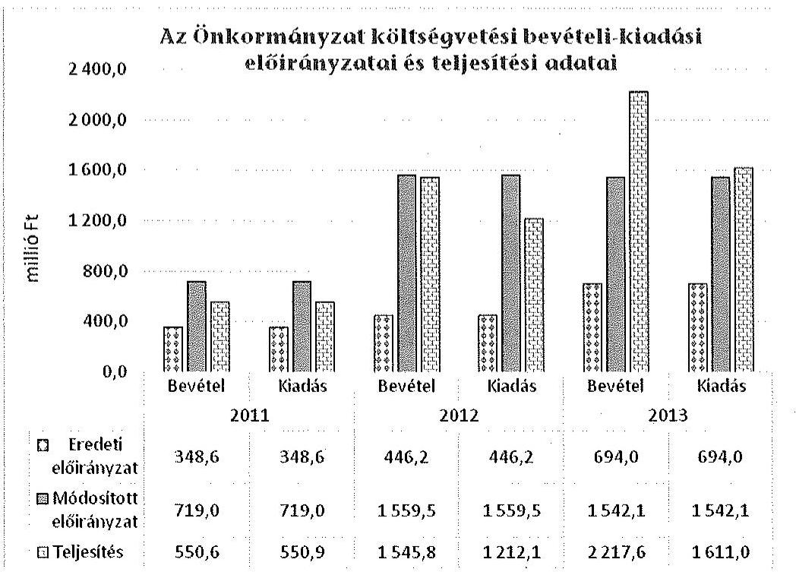
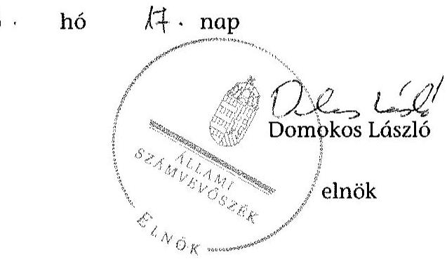
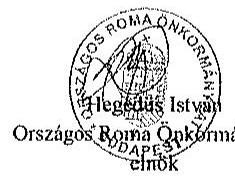
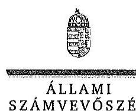
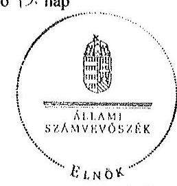

# ÁLLAMI   SZÁMVEVŐSZÉK 

## JELENTÉS

Az Országos Nemzetiségi Önkormányzatok gazdálkodásának ellenőrzéséről
Országos Roma Önkormányzat

---

# Állami Számvevőszék 

Iktatószám: V-0690-138/2015.
Témaszám: 1724
Vizsgálat-azonosító szám: V068002

## Az ellenőrzést felügyelte:

## Kisgergely István

felügyeleti vezető

## Az ellenőrzést vezette:

## Schósz Attila Ferencné

ellenőrzésvezető
A számvevői jelentések feldolgozásában és a jelentés összeállításában közremüködtek:

Schósz Attila Ferencné ellenőrzésvezető

## Velkei András Albert

számvevő

## Az ellenőrzést végezték:

| Ujvári Józsefné | Velkei András Albert | Perlusz Krisztina |
| :-- | :-- | :-- |
| számvevő tanácsos | számvevő | számvevő |

A témához kapcsolódó eddig készített számvevőszéki jelentés:
címe
sorszáma
Jelentés az Országos Cigány Önkormányzat 2009. évi - 2010. I. fél- 1021 évi gazdálkodásának ellenőrzéséről

---

# TARTALOMJEGYZÉK 

BEVEZETÉS ..... 3
I. ÖSSZEGZŐ MEGÁLLAPÍTÁSOK, KÖVETKEZTETÉSEK, JAVASLATOK ..... 7
II. RÉSZLETES MEGÁLLAPÍTÁSOK ..... 16

1. A belső kontrollrendszer kialakításának és működtetésének megfelelősége ..... 16
1.1. A kontrollkörnyezet kialakítása ..... 16
1.2. A kockázatkezelési rendszer kialakításának és működtetésének megfelelősége ..... 18
1.3. A kontrolltevékenységek müködésének megfelelősége ..... 18
1.4. Információs és kommunikációs rendszer kialakításának és működtetésének megfelelősége ..... 19
1.5. Monitoring-rendszer kialakításának és működtetésének megfelelősége ..... 20
2. A gazdálkodás megfelelősége ..... 22
2.1. Pénzügyi gazdálkodás megfelelősége ..... 22
2.2. Vagyongazdálkodással kapcsolatos feladatellátás szabályszerűsége ..... 27
3. Ingyenesen juttatott vagyon kezelésének megfelelősége ..... 30
4. Egyéb feladat- és hatáskör ellátás szabályszerűsége ..... 31
5. Integritás kontrollok ..... 32
6. ÁSZ javaslatok hasznosulása ..... 32
MELLÉKLETEK
7. számú Az Országos Roma Önkormányzat észrevétele
8. számú Az Országos Roma Önkormányzat észrevételére válasz
FÜGGELÉKEK
9. számú Rövidítések jegyzéke
10. számú Az integritás kontrollok kialakítása és működtetése

---

.

---

# JELENTÉS 

## Az Országos Roma Önkormányzat gazdálkodásának ellenőrzéséről

## BEVEZETÉS

Az Önkormányzat a Nek. tv. alapján, 1995-ben alakult, Elnöke az ellenőrzött időszakban a Közgyűlés 2011. január 20-i döntését követően változott. A jelenlegi Elnököt 2014. október 31-ével választották meg. Az Önkormányzat hét saját alapítású intézménnyel rendelkezett, amelyből egy intézményt a 2013. évben, a többit az ellenőrzött időszakot megelőzően alapítottak. Az Önkormányzat a 2012. év során átvette három oktatási intézmény fenntartását, intézményi társulásban nem vett részt. Az önállóan működő és gazdálkodó Hivatal gazdasági szervezete látta el a többi - önállóan működő - intézmény gazdálkodási feladatait. Az 53 tagú Közgyűlés a munkája segítésére Pénzügyi, Úgyrendi és 2012-ben Közoktatási bizottságokat hozott létre. Az Önkormányzat költségvetési beszámolója szerint a 2013. évben a módosított költségvetési bevételi és kiadási előirányzat 1542,1 millió Ft, a teljesített költségvetési bevétel 2217,6 millió Ft, a teljesített költségvetési kiadás 1611,0 millió Ft volt. Az Önkormányzat a 2013. évben 1759,3 millió Ft államháztartásból származó támogatásban részesült. A Hivatal 2014. évi elemi költségvetése szerint a foglalkoztatottak létszáma 40 fő volt. A jelenlegi Hivatalvezető 2011. január 20-ától látja el feladatát munkaszerződéssel. Az ellenőrzött időszakban a gazdasági vezetőket munkaviszonyban foglalkoztatták.

Az Alaptörvény XXIX. cikk (1) bekezdése szerint a Magyarországon élő nemzetiségek államalkotó tényezők. Minden, valamely nemzetiséghez tartozó magyar állampolgárnak joga van önazonossága szabad vállalásához és megőrzéséhez. A hazánkban élő nemzetiségek helyi (települési és területi), valamint országos önkormányzatokat hozhatnak létre.

Az országos nemzetiségi önkormányzatok gazdálkodási feladatait az önállóan működő és gazdálkodó költségvetési szervük, a hivatal látja el. Az országos nemzetiségi önkormányzatok a 2008. évtől tartoznak az államháztartás önkormányzati alrendszerébe, azóta hivatalaik költségvetési szervként múködnek. Az Alaptörvény hatálybalépését követően a 2012. évtől további jelentős jogszabályi változások határozzák meg múködésüket, gazdálkodásukat.

A nemzetiségek helyzete, támogatása mind hazai, mind EU-s szinten kiemelt figyelmet kap napjainkban. Az állam az országos nemzetiségi önkormányzatok múködéséhez, a médiaszolgáltatáshoz kapcsolódó jogaik érvényesítéséhez, valamint a kulturális önigazgatásuk érdekében alapított - közművelődési, közgyűjteményi, tudományos - intézmények fenntartásához az éves költségvetési törvényekben nevesítetten költségvetési támogatást biztosít. Ezen kívül az or-

---

szágos nemzetiségi önkormányzatok közfeladataik ellátásához támogatást kapnak a fejezeti kezelésű előirányzatokból, valamint hazai és uniós pályázati forrásokat szerezhetnek.

Az ellenőrzés célja annak értékelése volt, hogy az Önkormányzat gazdálkodása, a belső kontrollrendszer kialakítása és múködése, az államháztartásból nyújtott támogatás, illetve az államháztartásból meghatározott célra ingyenesen juttatott vagyon felhasználása a jogszabályi előírásoknak megfelelően tör-tént-e; az Önkormányzat a Nek. tv.-ben és az Njtv.-ben előírt feladat- és hatásköröket ellátta-e; intézkedett-e az ÁSZ által a 2008-2010. évek között végzett ellenőrzések javaslatainak végrehajtásáról.

Az Önkormányzat korrupcióval szembeni veszélyeztetettségének csökkentése érdekében felmértük az integritási szemlélet érvényesülését a gazdálkodási folyamatokban.

Értékeltük az Önkormányzat gazdálkodása során a belső kontrollrendszer kialakítását és múködését mind az öt pillére tekintetében, ellenőriztük a gazdálkodással összefüggő feladat- és hatásköröknek, a hivatal múködési, gazdálkodási rendjének jogszabályi előírásoknak való megfelelőségét; a belső kontrollok működésének megfelelőségét az éves költségvetés, a költségvetési beszámoló és a zárszámadás készítés folyamatában; a gazdálkodás pénzügyi folyamatában a kulcskontrollok, a (szakmai) teljesítésigazolás és 2011-ig utalvány ellenjegyzés, 2012-től érvényesítés múködésének megfelelőségét; az Önkormányzat belső ellenőrzése kialakításának és múködésének megfelelőségét.

Értékeltük továbbá az Önkormányzat gazdálkodása, ezen belül pénzügyi gazdálkodása keretében a tervezés, beszámolási, zárszámadás-készítési folyamat, az előirányzatok betartása, a könyvvezetés, a közzétételek, adatszolgáltatások, valamint az államháztartás rendszeréből jogszabály vagy megállapodás alapján céljelleggel kapott támogatások felhasználásának, elszámolásának szabályszerűségét. A vagyonnal kapcsolatos feladatellátás ellenőrzése keretében értékeltük a vagyongazdálkodás szabályozottságát, a mérleg alátámasztottságát, a leltározás, az eszközbeszerzések, a vagyonhasznosítás, a tulajdonosi joggyakorlás szabályszerűségét, kiemelten az Önkormányzat gazdasági társasága részére a vagyon tulajdonba, illetve kezelésbe, üzemeltetésbe adása, a tőkeemelés és a juttatott támogatások szabályszerűségét. Értékeltük az államháztartásból ingyenesen juttatott vagyon felhasználásának szabályszerűségét. Ellenőriztük az előírt feladat- és hatáskörök közül a vélemény-nyilvánítási, egyetértési jog gyakorlásával, a hatáskör átruházásokkal, az ideiglenes vagyonkezeléssel kapcsolatos feladatok ellátásának szabályszerűségét, az integritás kontrollok múködését, továbbá az előző ÁSZ ellenőrzés javaslatainak hasznosulását.

Az ellenőrzés várható hasznosulása: Az ellenőrzés eredményeként nemcsak az ellenőrzött szerv gazdálkodása javulhat, hanem átfogó képet kaphatunk az önkormányzati alrendszerbe tartozó országos nemzetiségi önkormányzatok gazdálkodásának hiányosságairól, de a jó gyakorlatokról is. Az ellenőrzés megállapításait és javaslatait más szervezetek is hasznosíthatják a rendezett gazdálkodási keretek kialakításához. Az ellenőrzés hozadékát képezi a 2008-2010. években elvégzett ÁSZ ellenőrzés javaslatai hasznosulásának értékelése. Mind a 13 országos nemzetiségi önkormányzat ellenőrzésével teljes körűen megvalósul az országos nemzetiségi önkormányzatok ellenőrzése a meg-

---

változott jogszabályi környezetben. Az ellenőrzés tapasztalatai alapján a jogszabályi ellentmondások, hiányosságok feltárásával, azok megszüntetésére vonatkozó javaslatokkal segítjük a jó kormányzást. Az ellenőrzéssel lehetővé teszszük, hogy az országos nemzetiségi önkormányzatok gazdálkodásáról, müködéséről a társadalom objektív képet alkothasson.

Az Önkormányzat gazdálkodásának ellenőrzéséről szóló számvevőszéki jelentés I. fejezetének összegző része az ellenőrzés céljára adott rövid, szintetizáló összefoglalót és következtetéseket tartalmazza, a II. fejezet részletes megállapításain alapulóan. A jelentés intézkedést igénylő megállapításait és javaslatait az ellenőrzés során feltárt, a jelentés II. fejezetében rögzített részletes megállapítások alapozzák meg.

Az ellenőrzés típusa: szabályszerűségi ellenőrzés.
Az ellenőrzött időszak: 2011. január 1-2014. június 30.
Ellenőrzött szervezet: az Önkormányzat és Hivatala, továbbá azon intézmények, amelyek gazdálkodási feladatait a Hivatal látja el.

Az ellenőrzés végrehajtásának jogszabályi alapját az Állami Számvevőszékről szóló 2011. évi LXVI. törvény 1. § (3) bekezdése, az 5. § (2)-(3) és (6) bekezdései, valamint az államháztartásról szóló 2011. évi CXCV. törvény 61. § (2) bekezdésének előírásai képezik.

Az ellenőrzés módszertana az ÁSZ hivatalos honlapján (www.asz.hu) közzétett szakmai szabályokon alapul, amely a Legfőbb Ellenőrző Intézmények Nemzetközi Szervezete (INTOSAI) által kiadott nemzetközi standardok (ISSAI) figyelembevételével készült.

Az ellenőrzés lefolytatásához az Önkormányzat a kimutatások és a tanúsítványok elektronikus kitöltésével, valamint az ÁSZ által kért dokumentumok elektronikus megküldésével szolgáltatott adatokat. Az így rendelkezésre bocsátott adatok, információk kontrollja és a munkalapok kitöltése az ellenőrzöttnél végzett ellenőrzés keretében történt.

A pénzügyi folyamatokban a (szakmai) teljesítésigazolás és érvényesítés (2011ig utalvány ellenjegyzése) kulcskontrollok múködésének megfelelősége értékeléséhez az egyszerű véletlen mintavétellel kiválasztott tételek ellenőrzését megfelelőségi tesztek útján végeztük. A vagyonhasznosítási célú bevételek, a személyi juttatások, a dologi és felhalmozási kiadások, valamint a pénzeszközátadások felhasználásának szabályszerűségét, és a kiadások esetében a gazdálkodási jogkörök gyakorlását mintavétellel ellenőriztük.

Megfelelőnek értékeltük a gazdálkodási jogkörök gyakorlását, amennyiben $95 \%$-os bizonyossággal a teljes sokaságban a hibaarány legfeljebb $10 \%$, részben megfelelőnek értékeltük, ha a hibaarány felső határa 10-30\% volt, nem megfelelőnek pedig akkor, ha a hibaarány felső határa a teljes sokaságban meghaladta a $30 \%$-ot.

A céljelleggel kapott támogatások felhasználásának és elszámolásának szabályszerűségét a média támogatások esetében tételesen ellenőriztük, míg az

---

Önkormányzat és az intézmények múködésére biztosított költségvetési támogatás ellenőrzése mintavétellel történt. A konkrét mintatételek értékelését végeztük el.

A vagyonhasznosítási bevételek és az egyéb szabályszerűségi (nem gazdálkodási jogkörökre vonatkozó felhalmozási kiadások, pénzeszköz átadások felhasználásának) ellenőrzése során a konkrét mintatételek értékelését végeztük el.

Az ÁSZ ellenőrzési megállapításokat a 2011-2014. I. félév közötti időszak vonatkozásában tett, az Önkormányzat és intézményeinek 2010. évi múködésével, gazdálkodásával összefüggő dokumentumok hatóság általi lefoglalásából, továbbá az irattár hatósági zárolásából adódóan.

Az ÁSZ a 2011. évi LXVI. törvény 29. §-a szerint a jelentéstervezetet megküldte az Országos Roma Önkormányzat elnökének egyeztetésre. A beérkezett észrevételt és az arra adott választ a jelentés 1-2. sz. mellékletei tartalmazzák

---

# I. ÖSSZEGZŐ MEGÁLLAPÍTÁSOK, KÖVETKEZTETÉSEK, JAVASLATOK 

A 2011-2014. I. félév között az Önkormányzatnál a belső kontrollrendszer kialakítása és múködtetése részben volt szabályszerű.

A kontrollkörnyezet kialakítása az Önkormányzat múködését meghatározó jogszabályokkal részben volt összhangban. Az Önkormányzat rendelkezett $\mathrm{SzMSz}_{1,2}$-vel. A Hivatal alapító okirata megfelelt a jogszabályi előírásoknak, azonban az Áht. ${ }_{1,2}$ előírásai ellenére a Hivatalnak nem volt SzMSz-e. A számviteli politika ${ }_{1,2}$-t, a hozzá kapcsolódó szabályzatokat, a gazdálkodási ${ }_{1,2}$, a selejtezési és a beszerzések szabályzatát a jogszabályi előírások ellenére az Elnök írta alá, az arra hatáskörrel rendelkező Hivatalvezető helyett. Az ellenőrzött időszakban az előírások ellenére számlarenddel és bizonylati renddel nem rendelkeztek. Az Ámr.-ben, illetve az Ávr.-ben foglaltak ellenére nem szabályozták a reprezentációs kiadások felosztását és a gépjárművek igénybevételének és használatának rendjét. Az Önkormányzat a 2012-2014. I. féléve között az intézményei tekintetében nem alakította ki - az Áht. ${ }_{2}$-ben foglaltak ellenére - az erőforrásokkal való, szabályszerű és hatékony gazdálkodáshoz szükséges követelményeket. A Hivatal és a hozzárendelt önállóan múködő intézmények az ellátandó feladatok részleteit, a munkamegosztás rendjét megállapodásokban az Ámr.-ben, illetve az Ávr.-ben foglaltak ellenére - nem rögzítették. Ellenőrzési nyomvonalat - az Ámr. és a Bkr. előírásaitól eltérően - a Hivatal múködési folyamatai közül csak a gazdálkodási és a belső ellenőrzési folyamatokra vonatkozóan készítettek.

A Hivatalvezető az ellenőrzött időszakban - az Ámr.-ben és a Bkr.-ben előírtak ellenére - a kockázatkezelési rendszert nem alakította ki és nem múködtette.

Az éves költségvetés, a költségvetési beszámoló és a zárszámadás készítés belső kontrolljai, a kontrolltevékenységek szabályozásra kerültek. Az ellenőrzött időszakban a folyamatok belső kontrolljai - a szabályozás ellenére - nem múködtek megfelelően, mivel azok nem biztosították minden évben, hogy az éves költségvetési és zárszámadási határozat-tervezetek a jogszabályokban előírt tartalommal és határidőben a Közgyűlés elé kerüljenek. A 2011-2014. I. félévében a kulcskontrollok (teljesítésigazolás, utalvány ellenjegyzés, érvényesítés) múködése javult, de egyik évben sem volt megfelelő.

Az Önkormányzat által kialakított és múködtetett információs és kommunikációs rendszer részben felelt meg a vonatkozó jogszabályi előírásoknak. A kötelezően közzéteendő adatok nyilvánosságra hozatalának rendjét szabályozták, míg a közérdekű adatok megismerésére irányuló igények teljesítésének rendjét az előírások ellenére nem határozták meg. Az Önkormányzatnak az ellenőrzött időszakban - az Avtv.-ben, illetve az Info tv.-ben előírtak ellenére adatvédelmi szabályzata nem volt, míg adatbiztonsági szabályzattal rendelkezett.

---

Az Önkormányzat a múködésére vonatkozó adatokat hiányosan tette közzé, a 2011. évi egyszerűsített éves költségvetési beszámoló és könyvvizsgálói jelentés közzététele elmaradt. Az Önkormányzat az előírásoknak megfelelően közzétette az éves költségvetéseit, valamint a 2011-2013. évi önkormányzati intézmények költségvetési beszámolóját. Az Önkormányzat által kapott és nyújtott céljellegú támogatások adatainak közzététele elmaradt, ezáltal az Önkormányzat nem biztosította a közpénzek felhasználásának átláthatóságát.

A Hivatalvezető a monitoring rendszer keretében részben megfelelő módon alakította ki a Hivatal tevékenységének, a célok megvalósításának nyomon követését biztosító rendszert. A belső ellenőrzés múködtetése 2011-2014. I. félév között részben felelt meg a Ber. és a Bkr. előírásainak. A belső ellenőrzési feladatokat megbízási szerződés alapján, külső szolgáltatók látták el. A 20112012. évekre a Ber.-ben, illetve a Bkr.-ben előírtak ellenére belső ellenőrzési kézikönyv, illetve éves ellenőrzési terv, éves ellenőrzési jelentés nem készült, mely hiányosságokat a 2013. évtől megszüntették. A belső ellenőrzés megállapításaival összefüggésben intézkedési tervek nem készültek a jogszabályban előírtak ellenére. A belső ellenőrzési vezető a 2011-2012. években nem gondoskodott a Ber.-ben és a Bkr.-ben foglalt előírás ellenére az ellenőrzések nyilvántartásáról, míg a 2013. évtől vezetett nyilvántartás nem tartalmazta kettő elvégzett ellenőrzés adatait.

Az Önkormányzat pénzügyi gazdálkodása részben felelt meg az előírásoknak. Az Elnök a 2012-2013. évi koncepciót az Áht. ${ }_{1,2}$-ben előírt határidőn túl, a 2014. évi koncepciót határidőben terjesztette a Közgyűlés elé. A 2011-2014. évi költségvetési határozat-tervezetek beterjesztése és Közgyűlés általi elfogadása az előírt határidőn belül megtörtént. A 2011-2014. évi költségvetési határozattervezetek és a költségvetési határozatok nem az Ámr.-ben, Ávr.-ben, illetve az Áht. ${ }_{2}$-ben foglalt szerkezetben és tartalommal készültek. A 2011-2014. évi költségvetésekben nem tervezték meg a tervezés időpontjában már ismert, vagy rendelkezésre álló hazai és európai uniós források bevételi és kiadási előirányzatait. Az Önkormányzat a 2011-2012. években a jóváhagyott költségvetési előirányzatokon belül gazdálkodott. A 2013. évi költségvetés végrehajtásakor nem biztosították, hogy tárgyévi kötelezettségvállalásra az Áht. ${ }_{2}$-ben foglaltaknak megfelelően, a Közgyűlés által jóváhagyott szabad előirányzat mértékéig kerüljön sor. A 2012-2013. évi költségvetési előirányzatok módosításakor nem tartották be az Áht. ${ }_{2}$-ben előírt legkésőbbi határidőt, mert a tárgyévet érintő utolsó előirányzat módosításra a zárszámadási határozat elfogadásával egyidejúleg került sor.

Az Elnök a 2011-2013. évi zárszámadási határozat tervezetet az Áhsz.-ben és az Áht. ${ }_{2}$-ben foglalt határidőn túl terjesztette a Közgyűlés elé. A jogszabályi előírások ellenére az Elnök az Önkormányzat 2011. évi zárszámadásának Közgyűlés elé terjesztésekor nem mutatta be az adósságállományt hitelezőnként és lejárat szerinti bontásban, továbbá a 2011-2012. évi zárszámadás előterjesztésekor a megfelelő tartalmú vagyonkimutatást. Az Önkormányzat 2011-2013. évi beszámolóját könyvvizsgáló véleményezte, mindhárom költségvetési beszámolót korlátozó záradékkal látta el.

Az Önkormányzat az államháztartás alrendszeréből jogszabály, illetve megállapodás alapján kapott támogatások felhasználása és elszámolása során részben tartotta be a jogszabályi és szerződéses előírásokat. Az Önkormányzat

---

támogatási szerződéseket kötött a roma médiatermékeket kiadó szervezetekkel, a beérkezett elszámolásokat ellenőrizte. A működési támogatásokról, illetve azok felhasználásáról a jogszabályi előírások szerinti elkülönített nyilvántartást nem vezettek. A működési támogatás 2011-2012. évi felhasználásáról jogszabály szerinti beszámolót nem készítettek, míg a 2013. évi felhasználást nem az előírt tartalommal mutatták be.

Az Önkormányzat az általa nyújtott támogatások pályáztatása, elszámoltatása, felhasználásának ellenőrzése során részben tartották be a jogszabályi előírásokat. Az elnöki keret terhére folyósított támogatások közül kettő esetben a támogatás nyújtásáról - az Njtv.-ben foglalt előírás ellenére - az arra hatáskörrel rendelkező Elnök helyett, az Önkormányzat elnökhelyettese döntött. Az elnöki keretből három magánszemély részére folyósított támogatás nem volt összhangban az Njtv.-ben foglalt országos önkormányzati nemzetiségi feladatokkal. Az ellenőrzött támogatások közül egy nem felelt meg a 2007. évi CLXXXI. törvény előírásainak, mivel a támogatásban részesülő szervezet elnökének személye és az Önkormányzat Elnökének személye megegyezett. Az Önkormányzat ellenőrizte az elszámolási kötelezettség teljesítését, a támogatással való elszámolás elmulasztása esetén felszólítást küldött.

Az Önkormányzat vagyongazdálkodási tevékenysége részben felelt meg a jogszabályi előírásoknak. A törzsvagyonba tartozó vagyonelemek körét az előírásoknak megfelelően meghatározta. A vagyongazdálkodási szabályzat 2014. évben történő kiadásáig a Közgyűlés nem határozta meg a 2012-2013. évekre a vagyon használatának szabályait az Njtv. előírása ellenére.

Az Önkormányzat a 2011-2013. években nem tartotta be az Áhsz. tartós tőke értékének módosítására vonatkozó előírásait. A 2011. és a 2013. évekre vonatkozóan a jogszabályi előírásoknak megfelelően mennyiségi felvétellel leltároztak. A leltározási szabályzat ${ }_{1}$-ben foglaltak szerint - a Közgyűlés döntésének megfelelően - a 2012. évi könyvviteli mérleg adatainak alátámasztására az analitikus nyilvántartások alapján, egyeztetéssel végezték a leltározást. A leltározási szabályzat ${ }_{1}$ előírása, továbbá az Áhsz.-ben foglaltak ellenére nem történt meg a pénzeszközök, a saját tőke elemek és a tartalékok leltározása. A selejtezést a 2013. évben nem a selejtezési szabályzatban foglaltak szerint hajtották végre.

A beszerzett eszközöket az Áhsz. előírásai ellenére, az üzembe helyezés dokumentálása nélkül vették állományba. Az Önkormányzatnál jellemzően bérbeadás útján hasznosítottak vagyontárgyakat, melyek esetében a döntési jogkörrel kapcsolatos szabályokat betartották. A bevételek elszámolása során azonban nem tartották be az Áhsz. rendelkezéseit, mert a pénzforgalmat érintő gazdasági eseményeket nem a pénzmozgással egyidejűleg vették nyilvántartásba.

Az Önkormányzat a 2011-2014. I. félév során négy társaságban rendelkezett tulajdoni részesedéssel. Az ellenőrzött időszakban egy gazdálkodó szervezet, a Foglalkoztatási szövetkezet alapításában vettek részt, amelynek létrehozása megfelelt az Njtv. és a Szövetkezeti tv. előírásainak. Az Önkormányzat a gazdálkodó szervezetek részére vagyont nem adott át, nem nyújtott támogatást, pénzeszközátadásra nem került sor.

---

Az Önkormányzat az egyszeri ingyenes vagyonjuttatásként kapott ingatlant az ellenőrzött időszakban szabályosan, forgalomképtelen vagyonként tartotta nyilván. Három iskola fenntartói jogának átvételére a Közgyűlés döntése alapján került sor, míg ingatlanok vagyonkezelésbe vételéről, illetve visszaadásáról a Közgyűlés helyett - az Njtv. előírásai ellenére - az Elnök döntött.

Az Önkormányzat vélemény-nyilvánítási, egyetértési, közreműködési jogát a Nek. tv-ben és az Njtv-ben előírtak ellenére az Elnök, illetve az Elnök szakmai vezetője gyakorolta, az arra hatáskörrel rendelkező Közgyűlés helyett.

A 2011-2014. I. félév közötti hatáskör átruházások megfeleltek a Nek. tv.ben és az Njtv.-ben foglaltaknak. Az Elnök a 2011-2014. I. félévben az átruházott hatáskörben hozott döntéseiről a Közgyűlés felé beszámolási kötelezettségét nem teljesítette.

Az Önkormányzat a megszűnt helyi nemzetiségi önkormányzatok vagyonával kapcsolatos ideiglenes vagyonkezelői feladatait - annak 4/2013. (I. 11.) Korm. rendeletben előírtak szerinti kimutatása kivételével - szabályszerűen, a Njtv.-ben előírtaknak megfelelően látta el.

Az ÁSZ korábbi ellenőrzése az Önkormányzat gazdálkodási tevékenységének 2009-2010. I. félévre terjedt ki. A jelentés javaslataiból nyolcat hasznosítottak, ötöt részben valósítottak meg, nyolc esetben nem hajtották végre a feladatot. Nem teljesültek a költségvetési koncepció határidőben történő beterjesztésére, a költségvetés megfelelő tartalommal való elkészítésére vonatkozó javaslatok. Elmaradt a költségvetési beszámoló letétbe helyezése, a teljes körű leltározás, a Hivatal szervezetének és működésének szabályozása, a számlarend jóváhagyása és a támogatási lehetőségek nyilvánosságra hozatala.

Az ÁSZ tv. 33. § (1) bekezdésében foglaltak értelmében a jelentésben foglalt megállapításokhoz kapcsolódó intézkedési tervet köteles az ellenőrzött szervezet vezetője összeállítani, és azt a jelentés kézhezvételétől számított 30 napon belül az ÁSZ részére megküldeni. Amennyiben az intézkedési tervet határidőben nem küldi meg a szervezet, vagy az nem elfogadható, az ÁSZ elnöke a hivatkozott törvény 33. § (3) bekezdés a)-b) pontjaiban foglaltakat érvényesítheti.

A helyszíni ellenőrzés megállapításainak hasznosítása mellett javasoljuk:

# az Elnöknek 

1. Az Önkormányzat SzMSz ${ }_{1}$-ének Njtv. 113. § a) pontjában előírtak szerinti aktualizálását - a Közoktatási bizottság 2012. évi létrehozását követően - nem végezték el. Az $\mathrm{SzMSz}_{2}$ az Njtv. 113. § a) és g) pontjaiban foglaltak ellenére nem tartalmazta a 2012. július 1 -jén átvett iskolák felsorolását.

Javaslat:
Intézkedjen az SzMSz kiegészítésére annak érdekében, hogy az a jogszabályilag előírt elemeket teljes körűen tartalmazza, és jóváhagyásra terjessze a Közgyűlés elé.
2. A Közgyűlés 2011-ben az elnöki keret felhasználásával kapcsolatban az Elnöknek félévenkénti, Közgyűlés felé történő beszámolási kötelezettséget írt elő. A Közgyűlés

---

2013-ban felhatalmazta az Elnököt, hogy a Foglalkoztatási Szövetkezet ügyeivel kapcsolatban teljes jogkörrel eljárjon, egyben kötelezte a soron következő Közgyűlésnek való beszámolásra. Az Elnök a 2011-2014. I. félévben beszámolási kötelezettségét nem teljesítette.

Javaslat:
Tegyen eleget a jövőben a Közgyűlés felé a beszámolási kötelezettségének.
3. Az Önkormányzat a 2012-2014. I. féléve között az intézményei tekintetében nem alakított ki az Áht. 2 9. § (1) bekezdés f) pontja szerinti, az erőforrásokkal való, szabályszerű és hatékony gazdálkodáshoz szükséges követelményeket.

Javaslat:
Intézkedjen az erőforrásokkal való szabályszerű és hatékony gazdálkodáshoz szükséges követelmények meghatározására, és azok Közgyűlés elé terjesztésére.
4. Az elnöki keretből a 2012-2013. években magánszemélyek részére folyósított pénzeszközátadás három esetben nem volt összhangban az Njtv. 117-118. §-ában foglalt országos nemzetiségi önkormányzati feladatokkal. A Lungo Drom Országos Cigány Érdekvédelmi Polgári Szövetség Pest Megyei tagszervezetével a 2011. évben kötött támogatási szerződés nem felelt meg a 2007. évi CLXXXI. törvény 6. § (1) bekezdés e) pontjában előírtaknak, mivel a Lungo Drom Országos Cigány Érdekvédelmi Polgári Szövetség elnökének személye és az Önkormányzat Elnökének személye megegyezett.

Javaslat:
Intézkedjen, hogy a támogatások nyújtására csak a jogszabályi előírásokkal összhangban kerüljön sor.
5. Az Önkormányzat az MNV Zrt.-vel, 2013. június 24-én vagyonkezelési szerződést kötött, amely alapján 2013-ban átvett egy megyaszói (kastély) ingatlant, majd a szerződés 2013. december 23-i módosítása nyomán további két szolnoki (volt főiskola), négy budapesti (lakás) és két balatonboglári (üdülő) ingatlant. Az ingatlanokat közfeladataik ellátására vették át. A vagyonkezelésbe vételre nem az Njtv. 117. § (1) bekezdésében és 113. § d) pontjában előírtak szerint a Közgyűlés döntése alapján került sor, az Elnök által aláírt szerződést a Közgyűlés utólag hagyta jóvá. Az MNV Zrt.-től átvett két szolnoki ingatlant a vagyonkezelési szerződés 2014. március 27-i módosítása alapján visszaadták. Az ingatlan visszaadásáról az Njtv. 119. § (1) bekezdésében foglaltak ellenére nem közgyűlési, hanem elnöki döntés alapján került sor.

Javaslat:
Intézkedjen, hogy a vagyonkezeléssel kapcsolatos döntések során tartsák be a jogszabályi előírásokat.
6. A számviteli politika ${ }_{1,2}$-t, az értékelési ${ }_{1,2}$, a leltározási ${ }_{1-3}$, a gazdálkodási ${ }_{1,2}$, az önkölt-ség-számítási, a pénzkezelési ${ }_{1}$, és a selejtezési szabályzatokat elnöki aláírással adták ki, azokon az arra hatáskörrel rendelkező Hivatalvezető aláírása nem szerepelt, ami nem felelt meg a számviteli politika és a kapcsolódó szabályzatainál a Számv. tv.

---

14. § (12) bekezdésében, az Áhsz. 8. § (12) bekezdésében és 37. § (5) bekezdésében, a gazdálkodási szabályzat ${ }_{1,2}$-nél az Ámr. 20. § (3) bekezdésében, az Áht. ${ }_{1}$ 121/A. § (1) bekezdésében, az Áht. ${ }_{2}$ 69. § (2) bekezdésében és az Ávr. 13. § (2) bekezdés a) pontjában előírtaknak.

Javaslat:
Intézkedjen a számviteli-gazdálkodási szabályzatok jóváhagyása tekintetében a jogszabályi előírások betartása érdekében.
7. Az Elnök a 2012-2014. évi költségvetés előterjesztésekor nem tartotta be az Áht. ${ }_{2}$ 24. § (4) bekezdés a) és b) pontjaiban foglaltakat, mert szöveges indokolással együtt nem mutatta be az Önkormányzat költségvetési mérlegét közgazdasági tagolásban, az előirányzat felhasználási tervét, továbbá nem mutatta be a többéves kihatással járó döntések számszerűsítését évenkénti bontásban és összesítve.

Javaslat:
Intézkedjen a költségvetési határozatok vonatkozásában a jogszabályi előírások betartása érdekében.
8. Az elnöki keret felhasználásának szabályait a Közgyűlés által 2011-ben jóváhagyott szabályzat határozta meg. Az Elnök a 2013-ban kiadott az „Elnöki keret felhasználását előkészítő csoport ügyrendje" című szabályzatban az Njtv. 77. § (2) bekezdésében foglaltak ellenére az átruházott hatáskört tovább adta, felhatalmazta a Közgyűlés elnökhelyettesét az elnöki keret feletti döntési, rendelkezési jogkörrel. Az elnöki keretből történő támogatás nyújtásáról két esetben nem az arra átruházott hatáskörrel rendelkező Elnök, hanem az elnökhelyettes hozott döntést, ami nem felelt meg az Njtv. 77. § (2) bekezdésében foglaltaknak.

Javaslat:
Intézkedjen, hogy az átruházott hatáskörei tekintetében azok - jogszabályba ütköző - tovább adására ne kerüljön sor.

# a Hivatalvezetőnek 

## Az Önkormányzat belső kontroll rendszere tekintetében:

1. A kontrollkörnyezet keretében a Hivatal az Áht. ${ }_{1}$ 91. § (2) bekezdésében és az Áht. ${ }_{2}$ 10. § (5) bekezdésében foglaltaktól eltérően SzMSz-szel nem rendelkezett.

A Hivatal az ellenőrzött időszakban - az Áhsz. 49. § (1) bekezdésében, valamint a 4/2013. (I. 11.) Korm. rendelet 51. § (2)-(3) bekezdéseiben előírtak ellenére - számlarenddel nem rendelkezett, a Számv. tv. 161. § (2) bekezdés d) pontjában foglaltak ellenére bizonylati rendet nem készített.

Az Ámr. 20. § (3) bekezdés f) és g), illetve az Ávr. 13. § (2) bekezdés e) és f) pontjában foglaltak ellenére nem szabályozták a reprezentációs kiadások felosztását és a gépjárművek igénybevételének és használatának rendjét.

---

A 2013. január 1-jétől hatályos beszerzések szabályzatát az Ávr. 13. § (2) bekezdésében előírtak ellenére a Hivatalvezető helyett az Elnök írta alá.

A Hivatal és a hozzárendelt önállóan működő intézmények - az Ámr. 16. § (4) bekezdésében, az Ávr. 10. § (4) bekezdésében foglaltak ellenére - az ellátandó feladatok részleteit, a munkamegosztás és a felelősségvállalás rendjét, nem rögzítették megállapodásokban.

Javaslat:
a) Intézkedjen a Hivatal SzMSz-e, számlarendje és bizonylati rendje jogszabályi előírások szerinti elkészítéséről.
b) Intézkedjen a reprezentációs kiadások felosztását és a gépjárművek igénybevételének és használatának rendjét tartalmazó szabályzatok elkészítéséről.
c) Intézkedjen a beszerzések szabályzata jogszabályoknak megfelelő kiadmányozásáról.
d) Intézkedjen a Hivatal és a hozzárendelt önállóan működő intézmények ellátandó feladatok részleteit, a munkamegosztás és a felelősségvállalás rendjét tartalmazó megállapodások elkészítéséről.
2. A Hivatalvezető a kockázatkezelési rendszert az ellenőrzött időszakban az Ámr. 155. § (1) bekezdése, a 157. § (1) bekezdése, valamint a Bkr. 3. § b) pontja és 7. § (1) bekezdése előírásától eltérően nem alakította ki és nem működtette.

Az Áht. 1 121/A. § (1) bekezdésében és az Áht. 2 69. § (2) bekezdésében foglaltak ellenére a Hivatal kockázatkezelési szabályzatát a Hivatalvezető helyett az Elnök írta alá.

Javaslat:
A jogszabályi előírásoknak megfelelően alakítsa ki és működtesse a kockázatkezelési rendszert.
3. A kontrolltevékenységek működtetése a 2012-2014. I. félévében nem felelt meg a jogszabályi előírásoknak. A teljesítésigazolást esetenként Áht. 2 38. § (1) bekezdésében és az Ávr. 57. § (1) bekezdésében foglaltak ellenére nem végezték el vagy a teljesítésigazolást az Ávr. 57. § (3) bekezdés előírása ellenére nem az arra írásban kijelölt személy végezte el. Az érvényesítő - az Ávr. 58. § (2) bekezdésében foglalt előírások ellenére - nem jelezte az utalványozónak, hogy az Áht. 2 37. § (1) bekezdésében és az Ávr. 55. § (1) bekezdésében foglaltaktól eltérően az írásbeli kötelezettségvállalásokat nem előzte meg pénzügyi ellenjegyzés, továbbá hogy a kötelezettségvállalásokat követően nem gondoskodtak azok Ávr. 56. § (1) bekezdésében foglaltak szerinti nyilvántartásba vételéről, valamint hogy a teljesítésigazolást nem végezték el, illetve nem az arra jogosult végezte. A kifizetéseket megelőzően az érvényesítést nem az Ávr. 58. § (3) bekezdésében előírtaknak megfelelő tartalommal végezték el, mivel az nem tartalmazta a keltezést. A Számv. tv. 167. § (1) bekezdés h) pontjában foglaltak ellenére az utalványrendeletek a könyvelés módjára, az érintett könyvviteli számlákra történő hivatkozást nem tartalmaztak.

---

Javaslat:
a) Intézkedjen a gazdálkodási jogkörök (kulcskontrollok) jogszabályi előírásoknak megfelelő működtetéséről.
b) Intézkedjen az utalványrendeletek alaki és tartalmi követelményeknek való megfelelőségéről.
4. Az információs és kommunikációs rendszer kialakítása és működtetése részben felelt meg a jogszabályi előírásoknak. A közérdekű adatok megismerésére irányuló kérelmek intézésének rendjét az Avtv. 20. § (8) bekezdésében, az Info tv. 30. § (6) bekezdésében, az Ámr. 20. § (3) bekezdés i) pontjában és az Ávr. 13. § (2) bekezdés h) pontjában előírtak ellenére belső szabályzatban nem rendezték. Az Önkormányzat az ellenőrzött időszakban - az Avtv. 31/A. § (3) bekezdésében, illetve az Info tv. 24. § (3) bekezdésében előírtak ellenére - adatvédelmi szabályzattal nem rendelkezett.

Javaslat:
a) Intézkedjen a közérdekű adatok megismerésére irányuló kérelmek intézése rendjének kialakításáról.
b) Intézkedjen az Önkormányzat adatvédelmi szabályzatának elkészítésére.
5. Az ellenőrzött időszakban nem került közzétételre az Eisztv. 6. § (1) bekezdésében és mellékletében, valamint az Info tv. 37. § (1) bekezdésében és az 1. számú mellékletében előírt adatok közül a törvényességi ellenőrzést gyakorló szervre, a foglalkoztatottak létszámára és személyi juttatásaira vonatkozó adatok. Hiányosan tették közzé az Eisztv. mellékletében, valamint az Info tv. 1. számú mellékletében előírt adatokból a szervezeti felépítésre, a szervezet vezetőire, nyilvános kiadványaira és az ellenőrzésekre vonatkozó adatokat.

Javaslat:
Intézkedjen az Önkormányzat szervezetére, tevékenységére és működésére vonatkozó adatok közzétételéről.
6. A Hivatalvezető a monitoring rendszer keretében az Áht. 121. § (2) bekezdés e) pontja, a Bkr. 3. § e) pontjában és a 10. §-ában foglaltaknak részben megfelelő módon alakította ki a Hivatal tevékenységének, a célok megvalósításának nyomon követését biztosító rendszert. A belső ellenőrzés megállapításaival összefüggésben a Hivatalvezető a Ber. 32/A. § (3) bekezdésében és a Bkr. 55. § (3) bekezdésében előírtak ellenére nem kérte fel az érintetteket intézkedési terv készítésére, így - intézkedési tervek nem készültek a Ber. 29. § (1) bekezdésében és a Bkr. 28. § c) pontjában foglaltak ellenére.

Javaslat:
Intézkedjen a jövőben az érintettek felkérésére, hogy azok készítsenek intézkedési tervet a belső ellenőrzések megállapításai alapján.

A pénzügyi és vagyongazdálkodás területén:

---

7. A 2013-2014. évi költségvetési határozatok - az Áht. ${ }_{2}$ 23. § (2) bekezdés b) pontjában előírtak ellenére - nem tartalmazták az Önkormányzat által irányított költségvetési szervek költségvetési bevételeit és kiadásait kötelező feladatok, önként vállalt feladatok és államigazgatási feladatok szerinti bontásban, továbbá a 2014. évi költségvetési határozat nem tartalmazta a költségvetési szervek engedélyezett létszámát.

A 2013. évi költségvetés végrehajtása során tárgyévi kötelezettségvállalásra nem az Áht. ${ }_{2} 36 . \S$ (1) bekezdésében foglaltak szerint, a módosított kiadási előirányzat mértékéig került sor.

A 2011-2012. évi zárszámadás Közgyűlés elé terjesztésekor az Elnök nem csatolta az Ámr. 40. § (6) bekezdésében hivatkozott, az Áhsz. 44/A. § (2)-(3) bekezdésében foglaltaknak megfelelő tartalmú vagyonkimutatást.

Javaslat:
a) Intézkedjen a költségvetési határozatok jogszabályi előírásoknak megfelelő előkészítéséről.
b) Biztosítsa, hogy a költségvetési év kiadási előirányzatai terhére kötelezettségvállalásra az eredeti vagy módosított kiadási előirányzatok mértékéig kerüljön sor.
c) Intézkedjen a zárszámadási határozat-tervezet jogszabályoknak megfelelő előterjesztéséről.

Az országos nemzetiségi önkormányzat részére adott, illetve az által nyújtott támogatások tekintetében:
8. Nem vezettek elkülönített nyilvántartást a központi költségvetésből kapott múködési támogatásokról a 342/2010. (XII. 28.) Korm. rendelet 10. § (2) bekezdésében, a 28/2012. (III. 6.) Korm. rendelet 11. § (2) bekezdésében, illetve a 428/2012. (XII. 29.) Korm. rendelet 10. § (3) bekezdésében, valamint 2013. november 20-ától azok felhasználásáról a 428/2012. (XII. 29.) Korm. rendelet 10. § (4) bekezdésében foglalt előírás ellenére.

Javaslat:
Intézkedjen, hogy az Önkormányzat a múködési támogatások felhasználásáról elkülönített nyilvántartást vezessen.
9. A múködési támogatás 2011-2012. évi felhasználásáról a 342/2010. (XII. 28.) Korm. rendelet 10. § (3) bekezdése, valamint a 28/2012. (XII. 29.) Korm. rendelet 11. § (3) bekezdése szerinti beszámolót nem készítettek el, továbbá a 2013. évi felhasználást nem a 428/2012. (XII. 29.) Korm. rendelet 10. § (6) bekezdés a-e) pontjaiban előírt megbontás szerinti tartalommal mutatták be.

Javaslat:
Intézkedjen, hogy a múködési támogatások felhasználásáról a jogszabályi előírásoknak megfelelő tartalmú beszámoló készüljön.

---

# II. RÉSZLETES MEGÁLLAPÍTÁSOK 

## 1. A BELSŐ KONTROLLRENDSZER KIALAKÍTÁSÁNAK ÉS MÜKÖDTETÉSÉNEK MEGFELELŐSÉGE

Az ellenőrzött időszakban az Önkormányzatnál a belső kontrollrendszer (a kontrollkörnyezet, a kockázatkezelési rendszer, a kontrolltevékenységek, az információs és kommunikációs rendszer, valamint a monitoring rendszer) kialakítása és múködtetése összességében részben volt szabályszerú az alábbiakban részletezett szabályozásbeli és múködésbeli hibák, hiányosságok miatt.

### 1.1. A kontrollkörnyezet kialakítása

A kontrollkörnyezet kialakítása az Önkormányzat múködését meghatározó jogszabályokkal részben volt összhangban.

Az Önkormányzat a Nek. tv. 37. § (1) bekezdés a) pontjában foglalt előírás ellenére 2011. február 11-ig szervezetének és múködésének részletes szabályairól határozatban nem rendelkezett. A 2011. február 12-től hatályos SzMSz ${ }_{1}$ - Njtv. 113. § a) pontjában előírtak szerinti - aktualizálását a Közoktatási bizottság 2012. évi létrehozását követően nem végezték el. Az SzMSz ${ }_{2}$ az Njtv. 113. § a) és g) pontjaiban foglaltak ellenére, nem tartalmazta a 2012. július 1-jén átvett iskolák felsorolását. Az SzMSz ${ }_{1}$-et a Nek. tv. 39/G. § (4) bekezdésében előírtak ellenére a Magyar Közlönyben nem jelentették meg, azonban mind ezt, mind az $\mathrm{SzMSz}_{2}$-t a honlapon közzétették a Nek. tv.-ben, illetve az Info tv.-ben előírtak szerint. Az SzMSz ${ }_{1,2}$-ben a vagyonnyilatkozat tételre kötelezettek körét a Vnytv.ben foglaltak alapján szabályozták, a képviselők vagyonnyilatkozat tételi kötelezettségüket teljesítették.

A Hivatal alapító okirata megfelelt a vonatkozó jogszabályi előírásoknak, annak Áht. ${ }_{1} 88$. § (2) bekezdése szerinti közzétételéről nem gondoskodtak. A Hivatal az Áht. ${ }_{1} 91 . \S$ (2) bekezdésében és az Áht. ${ }_{2} 10 . \S$ (5) bekezdésében foglaltaktól eltérően nem rendelkezett SzMSz-szel. A Hivatalvezető rendelkezett az előírt végzettséggel, a dolgozók a Munka tv. ${ }_{1,2}$ szerinti munkaköri leírással.

A 2011-2014. I. félév közötti időszakban az Önkormányzat gazdálkodásának jogszabályi előírások szerinti szabályozottsága részben volt biztosított.

Az ügyrend ${ }_{1,2}$-ben rögzítették a Hivatal gazdasági szervezetére vonatkozó előírásokat. Az ügyrend ${ }_{1}$ az Ámr. 20. § (7) bekezdésében, az Ávr. 13. § (5) bekezdésében előírtak közül nem tartalmazta a gazdasági szervezet belső és külső kapcsolattartásának szabályait és a gazdasági szervezet alkalmazottainak feladités hatáskörét, a helyettesítés rendjét. Az ügyrend ${ }_{2}$ az Ávr. 13. § (5) bekezdésében előírtak közül nem tartalmazta a gazdasági szervezet belső és külső kapcsolattartásának szabályait.

---

A számviteli politika ${ }_{1,2}$-t, az értékelési ${ }_{1,3}$, a leltározási ${ }_{1-3}$, a gazdálkodási ${ }_{1,2}$, az önköltség-számítási, a pénzkezelési ${ }_{1}$, és a selejtezési szabályzatokat elnöki aláírással adták ki, azokon az arra hatáskörrel rendelkező Hivatalvezető aláírása nem szerepelt, ami nem felelt meg a számviteli politika és a kapcsolódó szabályzatainál a Számv. tv. 14. § (12) bekezdésében, az Áhsz. 8. § (12) bekezdésében és 37. § (5) bekezdésében, a gazdálkodási szabályzat ${ }_{1,2}$-nél az Ámr. 20. § (3) bekezdésében, az Áht. ${ }_{1}$ 121/A. § (1) bekezdésében, az Áht. ${ }_{2} 69$. § (2) bekezdésében és az Ávr. 13. § (2) bekezdés a) pontjában előírtaknak. Az ellenőrzött időszak vonatkozásában - az Áhsz. 49. § (1) bekezdésében, a 4/2013. (I. 11.) Korm. rendelet 51. § (2)-(3) bekezdéseiben előírtak ellenére - számlarenddel nem rendelkeztek. A Hivatal a Számv. tv. 161. § (2) bekezdés d) pontjában foglaltak ellenére bizonylati rendet nem készített.

A leltározási szabályzat ${ }_{1-2}$-ban az Áhsz.-ben és a 4/2013. (I. 11.) Korm. rendeletben foglaltaknak megfelelően meghatározták az eszközök és források leltározásának részletes szabályait, a két évenkénti mennyiségi felvételezéssel történő leltározásra a Közgyűlés döntése értelmében lehetőség volt.

Kiküldetésre, vezetékes és rádiótelefonok használatára, valamint közérdekű adatok közzétételére vonatkozó szabályzatokkal rendelkeztek. Az Ámr. 20. § (3) bekezdés f) és g), illetve az Ávr. 13. § (2) bekezdés e) és f) pontjában foglaltak ellenére nem szabályozták a reprezentációs kiadások felosztását és a gépjárművek igénybevételének és használatának rendjét. A közbeszerzések alá nem eső beszerzések eljárásrendjét az Ámr. 20. § (3) bekezdés b) és az Ávr. 13. § (2) bekezdés b) pont előírásai ellenére 2012. december 31-ig nem szabályozták, a 2013. január 1-től hatályos beszerzések szabályzatát az Ávr. 13. § (2) bekezdésében előírtak ellenére az Elnök írta alá az arra hatáskörrel rendelkező Hivatalvezető helyett. Szabálytalanságkezelési eljárásrendet az Áht. ${ }_{1}$ és a Bkr. előírásai szerint készítettek, ugyanakkor 2011-2014. I. félév között az Ámr. 156. § (1) bekezdés c) pontjában, illetve a Bkr. 6. § (1) bekezdés c) pontjában foglaltak ellenére - a belső ellenőrzés kivételével - az etikai elvárásokat nem rögzítették.

Ellenőrzési nyomvonalat - az Ámr. 156. § (2) és a Bkr. 6. § (3) bekezdése előírásaitól eltérően - a Hivatal működési folyamatai közül csak a gazdálkodási és a belső ellenőrzési folyamatokra vonatkozóan készítettek.

Az Önkormányzat a 2012-2014. I. féléve között az intézményei tekintetében nem alakított ki az Áht. ${ }_{2} 9$. § (1) bekezdés f) pontja szerinti, az erőforrásokkal való, szabályszerű és hatékony gazdálkodáshoz szükséges követelményeket.

A Hivatal és a hozzárendelt önállóan működő intézmények az ellátandó feladatok részleteit, a munkamegosztás és a felelősségvállalás rendjét, az Ámr. 16. § (4) bekezdésében, az Ávr. 10. § (4) bekezdésében foglaltak ellenére megállapodásokban nem rögzítették.

---

# 1.2. A kockázatkezelési rendszer kialakításának és múködtetésének megfelelősége 

A Hivatalvezető a kockázatkezelési rendszert az ellenőrzött időszakban az Ámr. 155. § (1) bekezdése, a 157. § (1) bekezdése, valamint a Bkr. 3. § b) pontja, és 7. § (1) bekezdése előírásától eltérően nem alakította ki és nem müködtette.

A Hivatal kockázatkezelési szabályzatát az Elnök írta alá az arra hatáskörrel rendelkező Hivatalvezető helyett, annak ellenére, hogy az Áht., 121/A. § (1) bekezdésében és az Áht. ${ }_{2}$ 69. § (2) bekezdésében foglaltak alapján a belső kontrollrendszer részeként a kockázatkezelési rendszert a Hivatalvezetőnek, mint a költségvetési szerv vezetőjének kellett volna kialakítania.

### 1.3. A kontrolltevékenységek múködésének megfelelősége

Az éves költségvetés, a költségvetési beszámoló és a zárszámadás készítés belső kontrolljai, a kontrolltevékenységek az ügyrend ${ }_{1,2}$-ben és az ellenőrzési nyomvonalban szabályozásra kerültek. Az ellenőrzött időszakban a folyamatok belső kontrolljai - a szabályozás ellenére - nem működtek megfelelően, mivel azok nem biztosították minden évben, hogy az éves költségvetési és zárszámadási határozat-tervezetek a jogszabályokban előírt tartalommal és határidőben a Közgyűlés elé kerüljenek.

A költségvetési beszámoló elkészítésével megbízott személyek rendelkeztek a Számv. tv. és az Ávr. által előírt képesítéssel.

A belső kontrollok működéséről a Hivatalvezető a 2011. évre, valamint az intézményvezetők a 2011-2013. évekre vonatkozóan - az Ámr. 217. § c) pontja alapján a 21. számú mellékletben, illetve a Bkr. 11. § (1) bekezdése alapján az 1. számú mellékletben előírtak ellenére - nyilatkozatban nem értékelték a belső kontroll rendszer minőségét. A Hivatalvezető a 2012-2013. évek vonatkozásában a belső kontrollok múködéséről szóló nyilatkozat tételi kötelezettségét teljesítette. A 2012. és 2013. évi nyilatkozatok azonos tartalommal készültek, előírásoknak való teljes körű megfelelést rögzítettek, a belső kontroll rendszer fejlesztésével kapcsolatos javaslatokat nem tartalmaztak, aminek ellentmondanak a jelen ÁSZ ellenőrzés által, a belső kontrollrendszer elemeivel kapcsolatban feltárt hibák, hiányosságok.

A 2011. évben a szakmai teljesítésigazolás és utalvány ellenjegyzés kulcskontrollok múködése (a rendszeres és nem rendszeres, a külső személyi juttatások, a dologi és felhalmozási kiadások, valamint a pénzeszköz átadások esetében) nem volt megfelelő, az alábbi hiányosságok miatt:

- azokban az esetekben, ahol a szakmai teljesítésigazolást az Ámr. 76. § (1) bekezdésében foglaltak ellenére nem végezték el, a kifizetéseket megelőzően nem győződtek meg a kiadások teljesítésének jogosságáról, összegszerűségéről. Más tételek esetében a szakmai teljesítésigazolás nem az Ámr. 76. § (3) bekezdésében foglalt előírás szerint történt, mivel a kifizetés bizonylatáról az igazolás dátuma, vagy a teljesítés tényére való utalás hiányzott;

---

- azokban az esetekben, ahol az utalvány ellenjegyzését az arra jogosult nem végezte el, az Ámr. 79. § (2) bekezdésében foglaltak ellenére nem győződött meg a szakmai teljesítésigazolás elvégzéséről, valamint az érvényesítés megtörténtéről. Más tételek esetében az utalvány ellenjegyzését az Ámr. 79. § (1) bekezdésében foglalt előírás ellenére nem az arra kijelölés alapján jogosult személy végezte el;
- a Számv. tv. 167. § (1) bekezdés h) pontjában foglaltak ellenére az utalványrendeletek a könyvelés módjára, az érintett könyvviteli számlákra történő hivatkozást, továbbá kötelezettségvállalás nyilvántartási számát nem tartalmazták, az Ámr. 75. § (1) bekezdésében előírtak ellenére kötelezettségvállalás nyilvántartást nem vezettek.
A 2012-2014. I. félévében a kulcskontrollok - a teljesítésigazolás és az érvényesítés - múködése a (rendszeres és nem rendszeres, a külső személyi juttatások, a dologi és felhalmozási kiadások, valamint a pénzeszköz átadások esetében) a 2011. évhez képest javult, de egyik évben sem volt megfelelő, az alábbi hiányosságok miatt:
- azokban az esetekben, ahol a kifizetéseket megelőzően a teljesítésigazolást az Áht. 3 38. § (1) bekezdésében és az Ávr. 57. § (1) bekezdésében foglaltak ellenére nem végeztek el, nem történt meg a kifizetés jogosságának, összegszerűségének és a szerződésszerű teljesítésnek az igazolása. Más tételek esetében a teljesítésigazolást nem az arra írásban kijelölt személy végezte az Ávr. 57. § (3) bekezdésében foglalt előírás ellenére;
- érvényesítő - az Ávr. 58. § (2) bekezdésében foglalt előírások ellenére - nem jelezte az utalványozónak, hogy az Áht. 3 37. § (1) bekezdésében és az Ávr. 55. § (1) bekezdésében foglaltaktól eltérően az írásbeli kötelezettségvállalásokat nem előzte meg pénzügyi ellenjegyzés, továbbá, hogy a kötelezettségvállalásokat követően nem gondoskodtak azok Ávr. 56. § (1) bekezdésében foglaltak szerinti nyilvántartásba vételéről, valamint, hogy a teljesítésigazolást nem végezték el, illetve nem az arra jogosult végezte. A kifizetéseket megelőzően az érvényesítést nem az Ávr. 58. § (3) bekezdésében előírtaknak megfelelő tartalommal végezték el, mivel az nem tartalmazta a keltezést;
- a Számv. tv. 167. § (1) bekezdés h) pontjában foglaltak ellenére az utalványrendeletek a könyvelés módjára, az érintett könyvviteli számlákra történő hivatkozást nem tartalmaztak.

A kötelezettségvállalás nyilvántartása vezetésének és a kulcskontrollok múködtetésének hiánya előirányzat túllépésekhez vezetett. A nem megfelelően múködtetett belső kontrollok korrupciós kockázatot is hordoznak.

# 1.4. Információs és kommunikációs rendszer kialakításának és múködtetésének megfelelősége 

A 2010-2014. I. félév között a kialakított és működtetett információs és kommunikációs rendszer részben felelt meg a vonatkozó jogszabályi előírásoknak.

---

A kötelezően közzéteendő adatok nyilvánosságra hozatalának rendjét - az Info tv.-ben és az Ávr.-ben foglaltaknak megfelelően - szabályzatban rögzítették, amely kiterjedt az Önkormányzatra és intézményeire is. A közérdekú adatok megismerésére irányuló kérelmek intézésének rendjét az Avtv. 20. § (8) bekezdésében, az Info tv. 30. § (6) bekezdésében, az Ámr. 20. § (3) bekezdés i) pontjában és az Ávr. 13. § (2) bekezdés h) pontjában előírtak ellenére belső szabályzatban nem rendezték.

Nem kerültek közzétételre a 2011-2014. I. félév között az Eisztv. 6. § (1) bekezdésében és mellékletében, valamint az Info tv. 37. § (1) bekezdésében és az 1. számú mellékletében előírt adatok közül a törvényességi ellenőrzést gyakorló szervre, a foglalkoztatottak létszámára és személyi juttatásaira vonatkozó adatok. Hiányosan tették közzé az Eisztv. mellékletében, valamint az Info tv. 1. számú mellékletében előírt adatokból a szervezeti felépítésre, a szervezet vezetőire, nyilvános kiadványaira és az ellenőrzésekre vonatkozó adatokat.

A Hivatal rendelkezett iratkezelési szabályzat ${ }_{1.3}$-mal. A Magyar Nemzeti Levéltár az Önkormányzat iratkezelését 2014. február 13-án helyszíni ellenőrzés keretében ellenőrizte. Az ellenőrzésről felvett jegyzőkönyv szerint az Önkormányzat iktatási és irattári rendszere, valamint iratkezelése összességében megfelelt az előírásoknak. Ugyanakkor a jelen ÁSZ ellenőrzés - a Magyar Nemzeti Levéltár jegyzőkönyvével összhangban - megállapította, hogy az iratkezelési szabályzat ${ }_{3}$ jóváhagyás céljából a Magyar Nemzeti Levéltár részére történő megküldése elmaradt.

Az Önkormányzat az ellenőrzött időszakban - az Avtv. 31/A. § (3) bekezdésében, illetve az Info tv. 24. § (3) bekezdésében előírtak ellenére adatvédelmi szabályzattal nem rendelkezett, míg adatbiztonsági szabályzattal igen.

# 1.5. Monitoring-rendszer kialakításának és múködtetésének megfelelősége 

A Hivatalvezető az Áht. ${ }_{1}$ 121. § (2) bekezdés e) pontja, a Bkr. 3. § e) pontjában és a 10. §-ában foglaltaknak részben megfelelő módon alakította ki a Hivatal tevékenységének, a célok megvalósításának nyomon követését biztosító rendszert. Az operatív tevékenységek folyamatos és eseti nyomon követését ugyanis csak a gazdálkodási és a belső ellenőrzési folyamatokra határozták meg.

A monitoring rendszer nem megfelelő kialakítása és múködtetése hozzájárult a költségvetési tervezés, a beszámolás, az előirányzatokkal való gazdálkodás, a szerződések, a támogatásokkal történő elszámolások hiányosságaihoz, valamint a kulcskontrollok múködése területén feltárt szabálytalanságokhoz.

A belső ellenőrzés múködtetése a 2011-2014. I. félév között részben felelt meg a Ber. és a Bkr. vonatkozó előirásainak.

---

A belső ellenőrzési feladatokat a 2011-2014. I. félév közötti időszakban megbízási szerződés alapján, külső szolgáltatók látták el. A 2011-2012. évekre megkötött szerződésben nem a Ber. 4/A. § (2) bekezdésében foglaltak szerint rögzítették a belső ellenőrzési feladatok ellátásának módját, mivel abban csak az Önkormányzat gazdasági tevékenységének törvényességi és szabályszerűségi szempontoknak megfelelő végrehajtásának ellenőrzésére, elősegítésére adtak megbízást. A 2013-2014. I. félévi megbízás a Bkr.-re hivatkozva, a belső ellenőrzési feladatok ellátásáról szólt, de nem részletezte a feladatok ellátásának módját a 16. § (4) bekezdésében előírtak szerint.

A belső ellenőr feladatait, jogállását hivatali SzMSz hiányában nem szabályozták, amely nem felelt meg a Ber. 4. § (2) és a Bkr. 15. § (2) bekezdésében foglaltaknak. A 2011-2012. évekre a Ber. 5. § (1) bekezdésében, illetve Bkr. 17. § (1) bekezdésében előírtak ellenére belső ellenőrzési kézikönyvvel nem rendelkeztek. A 2013-2014. I félév között a belső ellenőrzési kézikönyv megfelelt a Bkr. vonatkozó előírásainak.

A 2011-2013. év közötti időszakra stratégiai ellenőrzési tervet a Ber. 18-19. §aiban és a Bkr. 29. § (1) és 30. § (1) bekezdéseiben előírtak ellenére nem készítettek. A 2013. év során a 2014-2018. évekre stratégiai ellenőrzési tervet készítettek, az abban foglaltak megfeleltek a Bkr. előírásainak. A 2011-2012. évekre a Ber. 32/A. § (2) bekezdésében foglaltak ellenére a belső ellenőrzési vezető éves ellenőrzési tervet nem készített. A 2013-2014. évi éves ellenőrzési tervek megfeleltek a Bkr.-nek, azok a Hivatal és az intézmények ellenőrzéseit tartalmazták.

A 2011-2012. évekről a Ber. 31. § (1) bekezdésében és a Bkr. 48. §-ában és 55. § (4) bekezdésében foglaltak ellenére éves ellenőrzési jelentés nem készült. A Hivatal 2013. évi éves ellenőrzési jelentésében a belső kontrollrendszer öt elemének értékelése szerepelt, a belső ellenőrzés által elvégzett tevékenységeket, a feladatok teljesítésének értékelését kettő ellenőrzés kivételével tartalmazta.

A belső ellenőrzés több esetben ellenőrizte az Önkormányzat által fenntartott iskolák működését. Az összes intézményre kiterjedően ellenőrizték a kötelezettségvállalás folyamatát és nyilvántartását, továbbá két ÁROP projekttel kapcsolatos ellenőrzésre is sor került. A belső ellenőrzés tanácsadási tevékenysége keretében több szakértői vélemény is készült. A lefolytatott ellenőrzések keretében az iskolák (szakmai) múködtetésével, az ÁROP projekt megvalósításában tapasztalt elmaradásokkal, a gazdálkodási jogkörök gyakorlásával összefüggésben tettek megállapításokat.

A belső ellenőrzés megállapításaival összefüggésben - a Hivatalvezető a Ber. 32/A. § (3) bekezdésében és a Bkr. 55. § (3) bekezdésében előírtak ellenére nem kérte fel az érintetteket intézkedési terv készítésére, így - intézkedési tervek nem készültek a Ber. 29. § (1) bekezdésében és a Bkr. 28. § c) pontjában előírtakkal szemben.

A belső ellenőrzési vezető a 2011-2012. években nem gondoskodott a Ber. 12. § j) pontja és a Bkr. 50. § (1) bekezdésében foglalt előírás ellenére az ellenőrzések nyilvántartásáról, míg a 2013. évtől vezetett nyilvántartás a Bkr. 50. § (1)(2) bekezdéseiben foglalt előírással szemben nem tartalmazta kettő elvégzett ellenőrzés adatait.

---

# 2. A GAZDÁLKODÁS MEGFELELŐSÉGE 

### 2.1. Pénzügyi gazdálkodás megfelelősége

## Az Önkormányzat pénzügyi gazdálkodása részben felelt meg az előírásoknak.

Az Önkormányzat a 2012-2013. évi költségvetés tervezési folyamatában költségvetési koncepciót készített, azonban azok - 2011. december 17-i, 2012. december 14-i tárgyalását megelőző - Közgyűlés elé terjesztésekor az Elnök nem tartotta be az Áht. 70 . §-ában és az Áht. 2 26. § (1) bekezdése alapján a 24. § (1) bekezdésében előírt november 30-ai határidőt. A 2014. évi költségvetési koncepciót határidőben benyújtották a Közgyűlésnek.

A 2011-2014. évi költségvetési határozat-tervezeteket - a Közgyűlés elé történő beterjesztést megelőzően - a Pénzügyi Bizottság a Nek. tv.-ben, illetve az Njtv.ben foglaltak betartásával megtárgyalta és a Közgyűlésnek elfogadásra javasolta. Az Elnök a 2011-2014. évi költségvetési határozat-tervezeteket az Áht. ${ }_{1,2}{ }^{-}$ ben foglalt határidőben a Közgyűlés elé terjesztette és azokat a Közgyűlés határidőn belül elfogadta.

A 2011. évi költségvetési határozat-tervezet nem - az Ámr. 40. § (1) bekezdésében foglaltakra figyelemmel - az Ámr. 36. § (1) bekezdésében meghatározott szerkezetben és tartalommal készült, mivel nem tartalmazta az annak e) pontjában előírt, Hivatal költségvetését feladatonkénti bontásban, továbbá az i) pont által előírt működési és felhalmozási célú bevételi és kiadási előirányzatokat mérlegszerűen, egymástól elkülönítetten. Az Elnök nem tartotta be az előirányzat felhasználási terv előterjesztésére vonatkozó Ámr. 40. § (5) bekezdés a) pontjának előírását. A 2011. évi költségvetési hatá-rozat-tervezethez az Ámr.-ben foglaltak szerint csatolta a könyvvizsgáló írásos jelentését.

A 2012. évi költségvetés tervezésekor nem tartották be az Ávr. 24. § (1) bekezdés a) és ba) pontjaiban foglaltakat, mert nem tervezték meg a 2012. évi költségvetési koncepcióban már szereplő pályázati forrásokat és felhalmozási (beruházások, felújítások) kiadásokat.

Az Elnök a 2012-2014. évi költségvetés előterjesztésekor nem tartotta be az Áht. 2 24. § (4) bekezdés a) és b) pontjaiban foglaltakat, mert szöveges indokolással együtt nem mutatta be az Önkormányzat költségvetési mérlegét közgazdasági tagolásban, az előirányzat felhasználási tervét, továbbá nem mutatta be a többéves kihatással járó döntések számszerűsítését évenkénti bontásban és összesítve. Az Önkormányzat 2012-2014. évi költségvetési határozatai nem - az Áht. 2 26. § (1) bekezdésében hivatkozott - az Áht. 2 23. § (2) bekezdés a) pontjában meghatározott részletezésben mutatták be a bevételi és kiadási előirányzatokat, mivel azok csak a bevételi és kiadási előirányzatok főösszegét tartalmazták. Nem mutatták be továbbá - az Áht. 2 23. § (2) bekezdés f) pontjában foglaltak ellenére - a 2012-2014. évi költségvetési határozatokban az adósságot keletkeztető ügylet (lízing) várható együttes összegét. A 2013-2014. évi költségvetésekben az Ávr. 24. § (1) bekezdés a) és ba) pontjaiban foglaltak ellenére nem tervezték a - a már ismert - egyéb költségvetési támogatásokat és az európai

---

uniós forrásból finanszírozott támogatással megvalósuló projektek, bevételeit és kiadásait, valamint a beruházások és felújítások kiadásait ${ }^{1}$. Ezek a bevételi és kiadási előirányzatok módosítását követően év közben jelentek meg a költségvetési előirányzatok között.

A 2013-2014. évi költségvetési határozatok nem tartalmazták az Önkormányzat által irányított költségvetési szervek vonatkozásában az Áht. 2 23. § (2) bekezdés b) pontjában előírt költségvetési bevételeit és kiadásait kötelező feladatok, önként vállalt feladatok és államigazgatási feladatok szerinti bontásban, továbbá a 2014. évi költségvetési határozat nem tartalmazta a költségvetési szervek engedélyezett létszámát.

Az Önkormányzat az Eisztv.-ben, illetve az Info. tv.-ben előírt költségvetés közzétételével kapcsolatos kötelezettségének az ellenőrzött időszakban eleget tett.

Az Önkormányzat a 2011-2012. években a jóváhagyott módosított költségvetési elöirányzatokon belül gazdálkodott, a 2013. évben túlteljesítette a Közgyűlés által elfogadott módosított bevételi előirányzatot 675,5 millió Ft-tal, a kiadásit 68,9 millió Ft-tal. A 2013. évi költségvetés végrehajtása során tárgyévi kötelezettségvállalásra nem az Áht. 2 36. § (1) bekezdésében foglaltak szerint, a módosított kiadási előirányzat mértékéig került sor.

Az Önkormányzat költségvetési bevételi-kiadási előirányzatai és teljesítés adatainak alakulását a következő diagram mutatja:

[^0]
[^0]:    ${ }^{1}$ „Roma felzárkóztatás módszertani támogatása" és „Híd a munka világába" projekt, „Esélyegyenlőségi alapú fejlesztés Tiszapüspökiben" program.

---

A 2011-2014. évi költségvetésekben az adott évi költségvetési törvényben az „országos nemzetiségi önkormányzatok és média támogatása", az általuk „fenntartott intézmények támogatása" címén jóváhagyott, továbbá az intézményi múködési bevételi és a várható múködési kiadási előirányzatokat tervezték meg. Az Önkormányzat a hazai és európai uniós támogatásokon elnyert pénzeszközök felhasználásához kapcsolódóan több alkalommal módosította a 2011-2013. évi költségvetési előirányzatait, illetve hajtott végre előirányzat átcsoportosítást. Ezen túl a 2012. évben három oktatási intézmény költségvetési adatainak szabályszerű átvétele miatt módosult a költségvetési előirányzat.

A 2012-2013. évi költségvetési előirányzatok módosításakor nem tartották be az Áht. 2 34. § (5) bekezdésében előírt legkésőbbi határidőt, mert a tárgyévet érintő utolsó előirányzat módosításra a zárszámadási határozat elfogadásával egyidejúleg került sor.

Az Önkormányzat 2011-2013. évi költségvetési beszámoló és zárszámadás készítésének folyamata, a zárszámadási határozat-tervezetek és Közgyűlés által elfogadott zárszámadási határozatok részben feleltek meg a jogszabályi követelményeknek. A Pénzügyi Bizottság a 2011-2013. évi zárszámadási határozat-tervezeteket a Nek. tv.-ben és az Njtv.-ben foglaltak szerint véleményezte.

Az Önkormányzat 2011. évi egyszerűsített éves beszámolóját az Elnök az Áhsz. 10. § (9) bekezdése szerinti tárgyévet követő év május 15-e után négy nappal, a 2012. és a 2013. évi zárszámadási határozat-tervezetet az Áht. ${ }_{2} 91 . \S$ (3) bekezdésében foglaltakra figyelemmel, annak 91. § (1) bekezdésében előírt költségvetési évet követő negyedik hónap utolsó napja után tíz, illetve 16 nappal terjesztette be a Közgyűlés elé.

Az Önkormányzat 2011. évi zárszámadásának Közgyűlés elé terjesztésekor az Elnök nem mutatta be az Ámr. 40. § (6) bekezdés b) pontjában foglaltak ellenére az adósságállományt hitelezőnként és lejárat szerinti bontásban, továbbá a 2011-2012. évi zárszámadás előterjesztésekor nem csatolta az Ámr. 40. § (6) bekezdésében hivatkozott, az Áhsz. 44/A. § (2)-(3) bekezdésében foglaltaknak megfelelő tartalmú - vagyonkimutatást. Az Önkormányzat 2011-2013. évi beszámolóját könyvvizsgáló véleményezte, mindhárom költségvetési beszámolót korlátozó záradékkal látta el.

Az Önkormányzat a 2011-2013. évi önkormányzati intézmények költségvetési beszámolóját honlapján közzétette. A 2011. év tekintetében az Áhsz. 45/B. §ban, 10. § (9) bekezdésében és az Info tv. 37. § (1) bekezdésében és az 1. számú mellékletében foglaltak nem teljesültek, mert a 2011. évi egyszerűsített éves költségvetési beszámolót és könyvvizsgálói jelentést nem tették közzé.

Az Önkormányzat a 2011. és a 2013. évi beszámolót letétbe helyezte, a 2012. évi beszámolót az Áhsz. 45/A. § (2) bekezdésében foglaltak ellenére az ÁSZ-nak nem küldte meg, ennek elmulasztásával nem teljesítette letétbe helyezési kötelezettségét.

Az Önkormányzat az államháztartás alrendszeréből jogszabály, illetve megállapodás alapján kapott támogatások felhasználása és elszámolása során részben tartotta be a jogszabályi és szerződéses előírásokat.

---

A 2011-2014. évi központi költségvetésben az Önkormányzat, az intézmények és a nemzetiségi sajtó múködési támogatására összesen 2172,3 millió Ft előirányzat került jóváhagyásra, amelyből „roma lapok" támogatására 2011-ben 20 millió Ft, a 2012-2014. években 31,9 millió Ft felhasználást terveztek.

Nem vezettek elkülönített nyilvántartást a központi költségvetésből kapott múködési támogatásokról a 342/2010. (XII. 28.) Korm. Rendelet 10. § (2) bekezdésében, a 28/2012. (III. 6.) Korm. rendelet 11. § (2) bekezdésében, illetve a 428/2012. (XII. 29.) Korm. rendelet 10. § (3) bekezdésében, valamint 2013. november 20 -ától azok felhasználásáról a 428/2012. (XII. 29.) Korm. rendelet 10. § (4) bekezdésében foglalt előírás ellenére.

Az ellenőrzött időszakban az „Európai út" című folyóirat kiadását az Önkormányzat végezte és emellett három - a „Lungo Drom" a „Kethano Drom" és a „Glinda" című - roma lap kiadását támogatta. Az Önkormányzat a lapok kiadóival támogatási szerződést kötött, amelyben meghatározták a támogatás célját, a támogatás időbeli ütemezését, a sajtótermékek megjelenésének gyakoriságát, a támogatás összegét, az elszámolható költségeket és az elszámolás határidejét.

A 2011-2013. évben a roma lapok megjelentetésére kapott támogatással a kiadók - a Lungo Drom újság 2012. évi támogatásának kivételével - a támogatási szerződésben rögzítetteknek megfelelően határidőben, számszaki és szakmai beszámoló megküldésével elszámoltak, melyeket az Önkormányzat ellenőrzött. Az Oktatási és Továbbképzési Központ Alapítvány a 2012. évi, a Lungo Drom újság kiadására kapott támogatással a 2013. évben számolt el.

A 2011-2013. években kapott működési- és médiatámogatással az éves beszámolók keretében az Önkormányzat elszámolt. A támogató nem állapított meg szabálytalan kifizetést és nem írt elő visszafizetési kötelezettséget. A múködési támogatás 2011-2012. évi felhasználásáról azonban a 342/2010. (XII. 28.) Korm. rendelet 10. § (3) bekezdése, valamint a 28/2012. (XII. 29.) Korm. rendelet 11. § (3) bekezdése szerinti beszámolót nem készítettek el, továbbá a 2013. évi felhasználást nem a 428/2012. (XII. 29.) Korm. rendelet 10. § (6) bekezdés a-e) pontjaiban előírt megbontás szerinti tartalommal mutatták be.

Az Önkormányzat a múködési támogatásokon kívül az államháztartásból jogszabály alapján, pályázati úton, illetve egyedi kérelmek alapján hazai, illetve európai uniós forrásból kapott céljellegú támogatásokat. Az Önkormányzat 2011-ben 382,7 millió Ft, 2012-ben 803,0 millió Ft, 2013-ban 1044,8 millió Ft és 2014. I. félévében 348,3 millió Ft hazai és európai uniós vissza nem térítendő támogatásban részesült.

A hazai forrásból kapott támogatások az Önkormányzat és költségvetési szerveinek múködését, szakmai tevékenységét segítették, illetve felhalmozási célokat szolgáltak.

Az Önkormányzat három, előfinanszírozás keretében kapott - a KIM „fejezeti általános tartalék"terhére 300,0 millió Ft, a „kisebbségpolitikai tevékenység támogatása" előirányzat terhére 35 millió Ft és a „Nemzetiségi támogatások" előirányzat terhére 211,4 millió Ft - támogatással elszámolt, közülük egy támogatással a támogatási szerződésben előírt határidőn túl. Az előfinanszírozott projektek az ellenőrzött időszakban befejeződtek, a támogató szervezet két program pénzügyi és szakmai beszámolóját elfogadta, a projekteket lezárta, visszafizetési kötelezettsé-

---

get nem írt elő. A KIM „fejezeti általános tartalék" terhére nyújtott támogatás elszámolása az ÁSZ helyszíni ellenőrzésének befejezéséig nem zárult le.

Az utófinanszírozott hazai forrásból megvalósított projektek, a holokauszt megemlékezés, az 500 mélyszegénységben élő roma gyerek táboroztatása, az intézmény működési kiadásait finanszírozó projektek befejeződtek, a támogató az elszámolásokat elfogadta, a projekteket lezárta. A közfoglalkoztatásra kapott támogatások elszámolását a támogató szervezet elfogadta, a fel nem használt támogatás összegét az Önkormányzat visszafizette.

A támogatást folyósító szervezet a közfoglalkoztatásra biztosított támogatások felhasználását két alkalommal a helyszínen ellenőrizte, melynek során adminisztrációs hibákat tártak fel, illetve az időbeli csúszások miatt intézkedési terv készítésére kötelezték az Önkormányzatot.

Az Önkormányzat a 2012-2014. I. félévben európai uniós forrásból több projekt megvalósítására nyert el támogatást pályázat keretében, azok folyósítására utófinanszírozással került sor, a projektek az ellenőrzött időszakban nem zárultak le. A projektek megvalósításához a támogató szervezet előleget biztosított, a benyújtott kifizetési kérelmeket befogadta, a kifizetési kérelmekben elszámolt bizonylatok ellenőrzését, hiánypótlását követően a támogató szervezet a kért támogatásokat kiutalta az Önkormányzat részére.

Az Önkormányzat a 2012-2014. I. félévek között kapott céljellegű támogatásokra vonatkozó adatokat a 28/2012. (II. 6.) Korm. rendelet 12. § (5) és a 428/2012 (XII. 19.) Korm. rendelet 13. § (2) bekezdésében foglalt előírások ellenére nem tette közzé ${ }^{2}$.

Az Önkormányzat - döntő részben helyi roma önkormányzatok részére -2011-ben 10,1 millió Ft, 2012-ben 156,6 millió Ft, 2013-ban 22,5 millió Ft és 2014.I. félévében 2,8 millió Ft nem normatív jellegű céltámogatást nyújtott, azok pályáztatása, elszámolása, felhasználásának ellenőrzése részben felelt meg a jogszabályi követelményeknek. A Közgyűlés a 2011. évben elnöki keret létrehozásáról döntött, amelynek mértékét a múködési költségvetés 10\%-ában határozta meg, annak felhasználásával kapcsolatos - a támogatások nyújtására vonatkozó - döntési hatáskört az Elnökre ruházta át.

Az elnöki keret felhasználásának szabályait a Közgyűlés által 2011-ben jóváhagyott szabályzat határozta meg. Az Elnök a 2013-ban kiadott az „Elnöki keret felhasználását előkészitő csoport ügyrendje" címü szabályzatban az Njtv. 77. § (2) bekezdésében foglaltak ellenére az átruházott hatáskört tovább adta, felhatalmazta a Közgyűlés elnökhelyettesét az elnöki keret feletti döntési, rendelkezési jogkörrel. Az elnöki keret terhére folyósított támogatások ellenőrzött tételei tekintetében kettő esetben a - Zalaszentgrót Roma Nemzetiségi önkormányzat részére biztosított 150 ezer Ft, illetve a Jászberény Város Roma Nemzetiségi Önkormányzat részére biztosított 100 ezer Ft - támogatás nyújtásáról az Önkor-

[^0]
[^0]:    ${ }^{2}$ A 28/2012. (II. 6.) Korm. rendelet hatályba lépését megelőzően nem írta elő jogszabály a közzétételt, 2013. november 20-ig a 428/2012. (XII. 29.) Korm. rendelet 13. § (3) bekezdése szabályozta.

---

mányzat elnökhelyettese hatáskör hiányában hozott döntést és kötött megállapodást.

A támogatási szerződésben, megállapodásokban rögzítették a támogatás célját, a támogatással való elszámolási kötelezettséget és annak határidejét. Az Önkormányzat ellenőrizte az elszámolási kötelezettség teljesítését, a támogatással való elszámolás elmulasztása esetén felszólítást küldött az elszámolási kötelezettség teljesítése érdekében.

Az elnöki keretből a 2012-2013. években három magánszemély részére folyósított pénzeszközátadás nem volt összhangban az Njtv. 117-118. §-ában foglalt országos nemzetiségi önkormányzati feladatokkal.

A Lungo Drom Országos Cigány Érdekvédelmi Polgári Szövetség Pest Megyei tagszervezetével a 2011. évben kötött támogatási szerződés nem felelt meg a 2007. évi CLXXXI. törvény 6. § (1) bekezdés e) pontjában előírtaknak, mivel a Lungo Drom Országos Cigány Érdekvédelmi Polgári Szövetség elnökének személye és az Önkormányzat Elnökének személye megegyezett.

Az Áht. ${ }_{1}$ 15/A. § (1) bekezdésében és az Info. tv. 37. § (1) bekezdésében és az 1. számú mellékletében foglalt előírás ellenére a céljelleggel nyújtott támogatások adatait nem tették közzé, ezáltal nem biztosították a közpénzek felhasználásának átláthatóságát.

# 2.2. Vagyongazdálkodással kapcsolatos feladatellátás szabályszerűsége 

Az Önkormányzat vagyongazdálkodásának szabályozottsága részben felelt meg a jogszabályi előírásoknak. Az Önkormányzat rendelkezett közbeszerzési ${ }_{1,2}$ és beszerzések szabályzatával. A használaton kívüli eszközök felülvizsgálatának szabályait a selejtezési szabályzat tartalmazta. Az eszközök értékesítésére vonatkozó előírások a selejtezési és az önköltség-számítási szabályzatban szerepeltek.

Az Önkormányzat az előírásoknak megfelelően meghatározta a törzsvagyonba tartozó vagyonelemek körét, abba a székházának épületét sorolta be. A vagyongazdálkodási szabályzat 2014. évben történő kiadásáig a Közgyűlés nem határozta meg a 2012-2013. évekre a vagyon használatának szabályait az Njtv. 92. § (4) bekezdés c) pontjában foglalt előírás ellenére. A beszerzések szabályzata kiadásáig a 2012. évben - az Njtv. 124. § (2) bekezdésében és az Nvtv. 11. § (16) bekezdésében foglaltak ellenére - nem rögzítették azt az értékhatárt, amely felett csak versenyeztetés útján lehet a vagyont hasznosítani.

Az Önkormányzat vagyonának könyvviteli mérlegben kimutatott értéke a 2010-2013. évek közötti időszakban - a hazai és európai uniós pályázatok alapján elnyert pénzeszközök hatására - folyamatosan emelkedett. A könyvviteli mérlegben kimutatott 2010. évi 171,7 millió Ft-os eszközállomány 2013. december 31-re négy és félszeresére, 776,8 millió Ft-ra növekedett. A vagyon értékének alakulására a 2011. évben a tárgyi eszközök és a pénzeszközök, a 2012-2013. években a pénzeszközök növekedése volt jelentős hatással.

---

A saját tőke aránya mutató az ellenőrzött időszakban összességében kedvezőtlenül változott. A 2011 évben a mutató az önkormányzati székház felújításának hatására a 2010. évi $28,1 \%$-ról 2011-ben $43,3 \%$-ra javult, ezt követően 2012-ben 20,2\%-ra, 2013-ban 10,9\%-ra csökkent. Ennek oka, hogy a rendelkezésre álló forrásokból jellemzően nem beruházási, hanem múködési feladatokat finanszíroztak.

Az Önkormányzat a 2011-2013. években nem tartotta be a tartós tőke értékének módosítására vonatkozó Áhsz. 24. § (4) bekezdésében foglalt szabályait. Az Önkormányzat a tartós tőkéjét a 2012. évi 56,9 millió Ft-ról 2013-ban 170,7 millió Ft-ra emelte annak ellenére, hogy megszűnés, átszervezés nem volt, továbbá a három iskola fenntartói jog átvétele nem járt vagyonnövekedéssel.

A mérlegtételek év végi értékelése megfelelt a jogszabályi követelményeknek. A 2011-2013. évben az immateriális javak, tárgyi eszközök mérlegértékét az Áhsz.-ben meghatározott tervszerinti értékcsökkenési leírási kulcs alkalmazásával számított értékcsökkenés figyelembevételével állapították meg. A részesedések mérlegértékének meghatározása 2010. évben bekerülési értéken történt, majd a 2011. és a 2012. évben kivezetésre került a felszámolással megszűnt, illetve végelszámolás alatt álló gazdasági társaságban nyilvántartott tulajdoni részesedés értéke. A 2011-2013. évi könyvviteli mérleg a követeléseket, kötelezettségeket bekerülési értéken tartalmazta, értékvesztés elszámolására nem került sor. A pénzeszközök a bankszámlakivonaton lévő egyenlegekkel, a készpénzkészlet a pénztárban december 31-én levő pénzkészlettel azonos öszszegben szerepelt.

Az Önkormányzat leltározási tevékenysége részben felelt meg a jogszabályi előírásoknak és a leltározási szabályzat ${ }_{1-3}$-ban foglaltaknak.

Az Önkormányzat mennyiségben és értékben nyilvántartott eszközeit a 2011. és a 2013. évekre vonatkozóan a jogszabályi előírásoknak megfelelően menynyiségi felvétellel leltározták. A leltározási szabályzat ${ }_{1}$-ben foglaltak szerint - a Közgyűlés döntésének megfelelően - a 2012. évi könyvviteli mérleg adatainak alátámasztására az analitikus nyilvántartások alapján, egyeztetéssel végezték a leltározást. A leltározási szabályzat előírása, továbbá az Áhsz. 37. § (1) bekezdésében foglaltak ellenére nem történt meg a pénzeszközök, a saját tőke elemek és a tartalékok leltározása.

A 2013. évi leltározás során leltárhiányt állapítottak meg. A 2013. évi „Leltározási záró feljegyzés" tartalmazta a fellelhető vagyontárgyak mennyiségét, értékét és a hiányzó (nettó 0 Ft értékű) vagyontárgyak selejtezéséről rendelkezett. A hiányzó eszközök selejtként való elszámolása nem felelt meg a selejtezési szabályzatban foglaltaknak, mivel hiányzó eszközök tekintetében selejtezési eljárás nem folytatható le. A 2013. évi leltározás és selejtezés során az érintettek nem tettek javaslatot a selejtezési szabályzat II. 1. pontjában előírtak szerint tárgyév november 30-ig a felesleges, használatra alkalmatlan eszközök minősítésére, továbbá a szabályzat IV. 1. pontjában foglaltak ellenére a selejtezést a leltározással egyidejűleg folytatták le.

---

Az Önkormányzatnak az eredményszemléletú számvitelre való áttérés előkészítő tevékenysége megfelel a jogszabályi elöírásoknak. A Hivatal és az intézmények a 36/2013. (IX. 13.) NGM rendeletben foglaltnak megfelelően elkészítették rendező mérlegüket. A 2013. évi költségvetési beszámoló zárómérlegében kimutatott aktív és passzív pénzügyi elszámolásokat a jogszabályi előírásoknak megfelelően rendezték.

Az egyéb szabályszerűségi, nem gazdálkodási jogkörökre vonatkozó kiadások ellenőrzése során az alábbi hiányosságokat állapítottuk meg:

- a beszerzett eszközöket az Áhsz. 30. § (1) bekezdésének előírásai ellenére, az üzembe helyezés dokumentálása nélkül vették állományba;
- a 2012. évben festmények állományba vételét nem a Számv. tv. 16. § (1) bekezdésében előírtak szerinti egyedi értékeléssel végezték el, mivel az állományba vételi értéket a képek számától függetlenül, alkotók szerint egyegy állományba vételi bizonylaton (összesítetten, nem egyedileg) rögzítették.

Az Önkormányzat vagyonhasznosítási tevékenysége döntési jogkör tekintetében megfelelt a jogszabályi követelményeknek, azonban a hasznosítási (bérleti díj) bevételek kezelése nem volt megfelelő.

Az Önkormányzat és intézményei a tulajdonukban lévő vagyontárgyakat jellemzően bérbeadás útján hasznosították. A Közgyűlés egy alkalommal, 2011-ben döntött egy „0"-ra leírt használt jármú értékesítéséről (820 ezer Ft-os eladási árat meghatározva). A Hivatal egy alkalommal bérbeadás útján hasznosította ingatlanát, míg az oktatási intézmények évente több alkalommal adták bérbe helyiségeiket.

A bevétel beszedésére minden esetben számla alapján került sor. A bérleti szerződésekben rögzített időpontban a bérleti díjakról készpénzfizetési számlát állítottak ki, azonban az ellenérték pénztári bevételezése elmaradt, azt nem a készpénzfizetési számla kiállításának napján, hanem azt követően közvetlenül a bankszámlára fizették be. A bérleti díjak beszedése során ezáltal nem tartották be az Áhsz. 51 § (1) bekezdés a) pontjában foglaltakat, mert a pénzforgalmat érintő gazdasági eseményeket nem a pénzmozgással egyidejúleg vették nyilvántartásba.

A bérbeadás során nem múködtek a bevételek elszámolásával kapcsolatos belső kontrollok, nem tárták fel a készpénzkezeléssel kapcsolatos szabálytalanságokat. Az Önkormányzat a bérbeadási tevékenység során az átláthatósági követelmények érvényesülését biztosította:

Az ellenőrzött időszakban az Önkormányzatnak két társaság, az Országos Cigány Információs Központ Kht. ${ }^{5}$ és a Szociális Lakásépítő Kht. állt kizárólagos tulajdonában. A társaságok a Közgyűlés döntése alapján 2007. június 8-a óta végelszámolás alatt álltak. A végelszámolás a Ctv. 105. § (1) bekezdésében rögzített határidő ellenére az ellenőrzött időszak végéig nem zárult le. Az Önkor-

[^0]
[^0]:    ${ }^{5}$ Az Országos Cigány Információs Központ Kht. részesedése (3000 ezer Ft) az ellenőrzött időszakot megelőzően a mérlegből kivezetésre került.

---

mányzat kisebbségi, 40\%-os tartós részesedéssel rendelkezett az O.K.C. Kft.-ben, amely társaságot 2011-ben törölték a cégnyilvántartásból.

A végelszámoló 2012. március 5-i tájékoztató levele alapján - mely szerint a 3000 ezer Ft törzstőke nem térül meg - a Szociális Lakásépítő Kht. részesedése az Önkormányzat nyilvántartásából kivezetésre került.

Az O.K.C. Kft. részesedésének kivezetésére a 2012. évi mérleg készítésekor került sor, mert a 2011. évi mérlegkészítés időpontjában az Önkormányzat által, 2012. január 27 -én lekérdezett cégkivonat még nem tartalmazta a törlésről szóló végzést.

A Szociális Lakásépítő Kht. és az O.K.C. Kft. tartós részesedései mérleg szerinti értékének meghatározása megfelelt az Áhsz. vonatkozó előírásainak. A 2011. évi beszámolóban az Áhsz.-ben előírt részletezésben mutatták be a Szociális Lakásépítő Kht.-t és az O.K.C. Kft.-t a tartós részesedések állományában, azonban a beszámoló kiegészítő mellékletében az O.K.C. Kft. helytelenül 66,6 \%-os tulajdoni aránnyal szerepelt.

Az Önkormányzat az ellenőrzött időszakban egy gazdálkodó szervezet, a Foglalkoztatási szövetkezet 2014. március 9-i alapításában vett részt. A Foglalkoztatási szövetkezet létrehozása megfelelt az Njtv. és a Szövetkezeti tv. előírásainak. Az Önkormányzat szövetkezeti tartós részesedésének értéke az alapszabály szerint 270 ezer Ft volt, annak aránya 27\%-ot tett ki. A Foglalkoztatási szövetkezet alapszabálya tartalmazta a tagok és a befektető tag jogait és kötelezettségeit, a felügyelő bizottság és a könyvvizsgáló jogait és kötelezettségeit. A Foglalkoztatási szövetkezet az ellenőrzött időszak végéig tényleges múködését nem kezdte meg.

Az Önkormányzat a gazdálkodó szervezetek részére vagyonkezelésbe, üzemeltetésre, továbbá térítésmentes tulajdonba nem adott át vagyont, tőkeleszállítás, tőkeemelés nem történt. Gazdálkodó szervezetek részére nem nyújtott működési, illetve felhalmozási célú támogatást, pénzeszközátadás részükre nem történt.

# 3. INGYENESEN JUTTATOTT VAGYON KEZELÉSÉNEK MEGFELELŐSÉGE 

A Kincstári Vagyoni Igazgatóság 2006. december 29-i keltezésű ingyenes tulajdonba adási szerződéssel a ( 66,6 millió Ft-os bruttó értékű) 1074 Budapest, VII. kerület Dohány utca 76. szám alatti, székhelyként használt ingatlan 171/1085 tulajdoni hányadát - egyszeri ingyenes vagyonjuttatásként - az Önkormányzat tulajdonába adta. Az így megszerzett épületrész a Közgyűlés döntése alapján az Önkormányzat törzsvagyonát képezte, könyvviteli nyilvántartásaiban az ellenőrzött időszakban a Nek. tv. és az Njtv. előírásainak megfelelően forgalomképtelen vagyontárgyként szerepelt.

Az Önkormányzat részére intézmény-fenntartói jog átvállalása keretében és egyéb jogcímen ingyenesen juttatott vagyon kezelése részben felelt meg a vonatkozó előírásoknak.

Az Önkormányzat a 2012. év során három iskola fenntartói jogát vállalta át. Az intézmény-fenntartói jog átvállalásokkal összefüggésben, az ellenőrzött idő-

---

szakban nem részesült ingyenes vagyonjuttatásban. A fenntartói jog átvételére mindhárom esetben a Közgyűlés döntése alapján került sor. Az Ávr. 10. § (4) bekezdésében foglaltak ellenére megállapodásban nem rögzítették a fenntartásba vett iskolákkal kapcsolatosan a munkamegosztás és felelősségvállalás rendjét.

Az Önkormányzat az MNV Zrt.-vel, 2013. június 24-én vagyonkezelési szerződést kötött, amely alapján 2013-ban átvett egy megyaszói (kastély) ingatlant, majd a szerződés 2013. december 23-i módosítása nyomán további két szolnoki (volt főiskola), négy budapesti (lakás) és két balatonboglári (üdülő) ingatlant. Az ingatlanokat közfeladataik ellátására vették át. A vagyonkezelésbe vételre nem az Njtv. - 117. § (1) bekezdésében foglaltakra figyelemmel, annak - 113. § d) pontjában előírtak szerint a Közgyűlés döntése alapján került sor, az Elnök által aláírt szerződést a Közgyűlés utólag hagyta jóvá. Az MNV Zrt-től átvett két szolnoki ingatlant a vagyonkezelési szerződés 2014. március 27-i módosítása alapján visszaadták. Az ingatlan visszaadásáról az Njtv. 119. § (1) bekezdésében foglaltak ellenére nem közgyűlési, hanem elnöki döntés alapján került sor. Az ingatlanokat 2014. I. félévének végéig nyilvántartási érték nélkül, csak analitikusan tartották nyilván, mivel az MNV Zrt. nyilvántartási értéküket a vagyonkezelési szerződésben foglaltak ellenére nem a birtokbaadást követő 15 napon belül, hanem az ellenőrzött időszakot követően adta meg.

# 4. EGYÉB FELADAT- ÉS HATÁSKÖR ELLÁTÁS SZABÁLYSZERŰSÉGE 

Az ellenőrzött időszakban a Közgyűlés a Nek. tv.-ben és az Njtv.-ben előírt vé-lemény-nyilvánítási, egyetértési, közreműködési jogával összefüggő feladataival kapcsolatos döntést nem hozott. A gyakorlatban eseti (EMMI, helyi önkormányzatok) megkeresésekhez kapcsolódóan végeztek véleményezést a roma nemzetiséget érintő kérdésekben. A véleményezéseket a Nek. tv. 39/A. § (1) bekezdésében és az Njtv. 119. § (1) bekezdésében foglaltakat figyelmen kívül hagyva, a Közgyűlés hatáskörét elvonva, annak felhatalmazása nélkül az Elnök, illetve az Elnök szakmai vezetője adta ki.

Az Önkormányzat az $\mathrm{SzMSz}_{1,2}$-ben a Nek. tv.-ben és az Njtv.-ben foglaltaknak megfelelően szabályozta a Közgyűlést megillető feladat- és hatásköröket. Az $\mathrm{SzMSz}_{1,2}$ az átruházható feladat- és hatáskörök címzettjeit a Nek. tv.-ben és az Njtv.-ben foglaltakkal összhangban rögzítette.

A Közgyűlés a 2011. évben létrehozott elnöki kerettel összefüggő döntési hatáskört az Elnökre ruházta át, annak felhasználásával kapcsolatban az Elnöknek félévenkénti, Közgyűlés felé történő beszámolási kötelezettséget írt elő. A Közgyűlés 2013-ban felhatalmazta az Elnököt, hogy a Foglalkoztatási Szövetkezet ügyeivel kapcsolatban teljes jogkörrel eljárjon, egyben kötelezte a soron következő Közgyűlésnek való beszámolásra. Az Elnök átruházott hatáskörrel összefüggő beszámolási kötelezettségét 2011-2014. I. félévben nem teljesítette.

A megszünt helyi nemzetiségi önkormányzatok vagyonának ideiglenes kezelése a könyvviteli kimutatás kivételével szabályszerü volt.

A 2014. év során eljárásrendet készítettek a megszűnt nemzetiségi önkormányzatok ideiglenes vagyonkezelésével összefüggésben. Az eljárásrendben foglaltak

---

alapján 2014. január 30-ával az ERSTE Bank Zrt.-nél elkülönített bankszámlát nyitottak a megszűnt önkormányzatok pénzeszközeinek ideiglenes kezelésére.

Az ellenőrzött időszakban csak helyi önkormányzatok jegyzőinek megkeresése alapján került sor vagyonkezelői feladat ideiglenes átvételével összefüggő eljárás megindítására, mely alapján a 2014. év I. félévében egy megszűnt helyi nemzetiségi önkormányzat esetében vettek át 84 ezer Ft pénzeszközt. Az átvett vagyon ideiglenes vagyonkezelése során az Njtv. 139. § (3) bekezdésében foglalt előírások érvényesültek. Az ideiglenesen átvett vagyont függő bevételként számolták el, azt a 4/2013. (I. 11.) Korm. rendelet 47. §-ában foglaltak ellenére nem mutatták ki a „0"-ás számlaosztályban. Az ideiglenesen átvett vagyonkezelői feladatok az ellenőrzött időszak végéig fennálltak, mivel új helyi testület létrehozására nem került sor.

# 5. INTEGRITÁS KONTROLLOK 

Az ÁSZ a 2011. évtől kezdődően évente lefolytatja a közszféra intézményeit érintő, önkéntességen alapuló integritás felmérését. Az Önkormányzatot az ÁSZ az ellenőrzéssel érintett időszakban nem kérte fel az integritás felmérésben történő részvételre. Jelen ellenőrzés során a 2013. évre vonatkozóan az Önkormányzat által kitöltött tanúsítványi adatszolgáltatás alapján értékeltük a korrupciós kockázatokat és az azok kezelésére kiépült kontrolltényezőket, amelynek eredményét a 2 . számú függelék tartalmazza.

## 6. ÁSZ JAVASLATOK HASZNOSULÁSA

Az ÁSZ az Önkormányzat gazdálkodási tevékenységének 2009-2010. I. félévi ellenőrzése során a Közgyűlésnek, az Elnöknek, valamint a Hivatalvezetőnek javaslatokat fogalmazott meg. A javaslatok hasznosulását a 2011. évtől rendelkezésre álló adatok alapján minősítette az ÁSZ ellenőrzés, amely szerint az Önkormányzatnál az értékelhető 21 javaslatból nyolcat hasznosítottak, ötöt részben valósítottak meg, nyolc esetben nem hajtották végre a feladatot.

A Közgyűlésnek tett ellenőrzési javaslatokból az Önkormányzat törzsvagyoni körének meghatározására, a megfelelő képesítéssel rendelkező Hivatalvezető kinevezésére, a folyószámlahitel szerződés felülvizsgálatára, valamint a Pénzügyi bizottság feladat- és hatásköre ellátásának működési szabályainak meghatározására vonatkozóak hasznosultak. Teljesültek továbbá a Hivatalvezetőnek címzett, a gazdasági vezető végzettségéről, az Önkormányzat részesedéseinek teljes körű nyilvántartásba vételéről, kimutatásáról szóló, valamint az adó- és járulék bevallási, levonási, fizetési, adóigazolási nyilatkozatok határidőben történő teljesítésére, valamint az Ámr. szerinti adatszolgáltatásra vonatkozó javaslatok.

Az ellenőrzési javaslatok részben teljesültek, mivel az SzMSz-ben hiányosan szabályozták a Hivatal működését, a gazdálkodási jogosultságok szabályozása nem felelt meg teljes körűen az Ámr. előírásainak, valamint az Önkormányzat nem teljes körűen gondoskodott a Hivatal szabályzatainak intézményekre történő kiterjesztéséről. A Hivatalvezető nem minden esetben jelezte a Közgyűlésnek a döntések szabályszerűsége érdekében szükséges költségvetési módosításokat, továbbá a belső ellenőrzés és a FEUVE ellenőrzött időszaki működtetése sem felelt meg teljes körűen a vonatkozó jogszabályi előírásoknak.

---

Az Elnök a 2012-2013. években a költségvetési koncepciót nem az Áht. 70. 8ában, illetve az Áht. 2 24. § (1) és 26. § (1) bekezdésében előírt határidőn belül terjesztette a Közgyűlés elé, továbbá az Ámr. 40. § (5) bekezdésében előírtak ellenére az ellenőrzött évek költségvetéseiben az előirányzat-felhasználási tervet, a többéves kihatással járó döntések számszerűsítését nem készítették el. A 2012. évi beszámolót az Önkormányzat az Áhsz. 45/A. § (2) bekezdésében foglaltak ellenére az ÁSZ-nak nem küldte meg, ennek elmulasztásával nem teljesítette letétbe helyezési kötelezettségét. Az Áhsz.-nek a szabályszerű könyvvezetésre vonatkozó előírása nem teljesült, mivel az Áhsz. 37. § (1) bekezdésében foglaltak ellenére 2012-ben nem történt meg a pénzeszközök, a saját tőke elemek és a tartalékok leltározása. A Közgyűlés a Nek. tv. 39/B. § (1) bekezdésében foglaltak ellenére a Hivatal szervezetét és múködését nem szabályozta részletesen. A Számv. tv. 161. § (1)-(2) bekezdések és az Áhsz. 49. § (6) bekezdése előírása szerinti számlarendet nem hagytak jóvá, továbbá a Nek. tv. 39/D. § (4) bekezdésében foglaltak ellenére a támogatási lehetőségeket nem hozták nyilvánosságra.

Budapest, 2015.

Függelék: $\quad 2 \mathrm{db}$
Melléklet 2 db

---

.

---

# ORSZÁGOS ROMA ÖNKORMÁNYZAT 

1074 Budapest, Dohány u. 76.
Tel.: 06 1/322-8903, Fax.: 06 1/322-8501
E-mail: orszak@orsszk.hu

ÁLLAMI SZÁMVEVÖSZÉK

ÁLLAMI SZÁMVEVÖSZÉK
Ikt.szám.: 9699 - 6412619
Tárgy: az Országos Roma Önkormányzat
Jelentéstervezetére vonatkozó észrevétel
megküldése

Iktatószám: V-0690-119/2015.
Témaszám: 1724
Vizsgálat-azonosító szám: V068002

Kisgergely István
felügyeleti vezető úr
részére

Tisztelt Kisgergely István Felügyeleti Vezető Úr!

Az Országos Nemzetiségi Önkormányzatok gazdálkodásának ellenőrzéséről szóló Jelentéstervezetet készhez vettük, néhány megállapításra a következő észrevételeket tesszük.

## Megállapítás

A jelentéstervezet 2.1. pontjában említett azon megállapítást, mely szerint az Önkormányzat a 2013-2014 évi költségvetésben az egyéb költségvetési támogatásokat és az EU forrásból finanszírozott támogatással megvalósuló projektek bevételeit és kiadásait nem tervezte meg.
Észrevétel
Az egyéb költségvetési támogatásokat és az EU forrásból finanszírozott támogatással megvalósuló projektek bevételeit és kiadásai külön költségvetés tartalmazza, a közgyűlés elé benyújtott költségvetés kizárólag az elemi költségvetés bevételeit és kiadásait tartalmazza.

## Megállapítás

A jelentéstervezet szintén 2.1. pontjában említett azon megállapítást, mely szerint az Önkormányzat 2012. és a 2013. évi költségvetési elöirányzatok módosításakor nem tartotta be az Áht. 34. § (5) bekezdésében elöirt legkésőbbi határidőt, mert a tárgyévet érintő utolsó elöirányzat módosításra a zárszámadási határozat elfogadásával egyidejüleg került sor.
Észrevétel
Az Önkormányzat 2012. és 2013. évi beszámolója az állambáztartás szervezetei beszámolási és könyvvezetési kötelezettségének sajátosságairól szóló 249/2000. (12.24.) Korm. rendelet alapján meghatározott határidőig elkészült. Az elöirányzat módosítások a

---

# ORSZÁGOS ROMA ÖNKORMÁNYZAT 

1074 Budapest, Dohány u. 76.
Tel.:06 1/322-8983, Fax.:06 1/322-8501
E-mail: jconik@romah.hu
beszámoló elkészítésekor megtörténtek, de közgyűlés elő történő előterjesztésére külön testületi ülést az Önkormányzat nem hívott össze. A zárszámadás elfogadása és az előirányzat- módosítás jóváhagyása egyidőben történt meg.

## Megállapítás

A Jelentéstervezet 2.1. pontjában az Önkormányzat - döntő részben helyi roma önkormányzatok részére - 2011-ben 10,1 millió Ft, 2012-ben 156,6 millió Ft, 2013-ban 22,5 millió Ft és 2014. I. félévében 2,8 millió Ft nem normatív jellegű céltámogatást nyújtott, azok pályáztatása, elszámolása, felhasználásának ellenőrzése részben felelt meg a jogszabályi követelményeknek.
Észrevétel
Az Önkormányzat 2012. évben 24,4 millió Ft, 2013. évben pedig 15,4 millió Ft támogatást fizetett ki mind magánszemélyek, mind szervezetek részére. Ezen adatot Összefoglaló jelentésben feltöltöttük az Állami Számvevőszék hivatalos webes felületre is.

## Megállapítás

A Jelentéstervezet 2.1. pontjában az alábbi megállapítás szerepel: az Önkormányzat a 2012. évi beszámolót az Átsz. 45/A § (2) bekezdésben foglaltak ellenére az Állami Számvevőszéknek nem küldte meg.
Észrevétel
Az Önkormányzat 2012. évi beszámolóját az akkori gazdasági vezető intézkedésére határidőn túl - személyesen juttatta el az Állami Számvevőszékhez, de sajnálatos módon az erre vonatkozó dokumentációt az Önkormányzat nem tudta bemutatni.

## Megállapítás

Az Önkormányzat nem vezetett elkülönített nyilvántartást a központi költségvetésböl kapott müködési támogatásról.
Észrevétel
Az Önkormányzat az Államkincstár által biztosított könyvelői programot használta, amely lehetőséget biztosított az adatok több szempontú lekérdezésre (intézményekre, projektekre, müködési támogatás bevételére, kiadására).

## Megállapítás

A kötelezettségvállalás nyilvántartása vezetésének és a kulcskontrollok müködtetésének hiánya elöirányzat tüllépésekhez vezeteit. A nem megfelelően müködtetett belső kontrollok korrupciós kockázatot is hordoznak.
Észrevétel
Egyetértünk abban, hogy a kulcskontrollok nem teljes körűen müködtek, de az Önkormányzat a jogszabályi előírásoknak megfelelően gondoskodott belső ellenőr, könyvvizsgáló személyéről, és egy pénzügyi bizottság felállításáról. A kulcskontroll rendszer kialakítása és a müködtetésének tovább fejlesztéséről az Önkormányzat évről évre folyamatosan gondoskodott a szabályzatok folyamatos aktualizálásáról, annak betartatására vonatkozó intézkedésekkel. A jelentéstervezet összegző megállapítása szerint az

---

# ORSZÁGOS ROMA ÖNKORMÁNYZAT 

1074 Budapest, Dohány u. 76.
Tel.:96 1/212-8983, Fax.:96 1/321-8501
E-mail: orszk@rscuk.hu
Önkormányzat erre vonatkozó intézkedései a kulcskontroll rendszer müködésének javulását eredményezték. A megállapítás utolsó mondatában szeretnénk kérni, hogy a hordoznak szó helyett hordozhatnak szó kerüljön a félreértések elkerülése érdekében.

## Megállapítás

A Longo Drom Országos Cigány Érdekvédelmi Polgári Szövetség Pest Megyei tagszervezetével a 2011. évben kötött támogatási szerződés nem feleli meg a 2007. évi CLXXII. törvény 6. § (1) bekezdés e) pontjában elöírtaknak, mivel a Longo Drom Országos Cigány Érdekvédelmi Polgári Szövetség elnökének személye és az Önkormányzat Elnökének személye megegyezett.
Észerevétel
Az elnöki keret felhasználásának szabályait a rögzített 2011. évi jóváhagyott 3. pontja alapján:
„NEK 39/D§(4) Pontja alapján a támogatás odaítélésekor a jogosultak számára biztosítani kell az egyelő elbánás elvét. A támogatás odaítéléséről az Elnök saját hatáskörben dönt.".

Ez alapján az Önkormányzat biztosítani kívánta az egyenlő bánásmód elvét.
A jelentéstervezet további megállapításait elfogadjuk, azokra intézkedési terv kidolgozását kezdeményezzük.

Budapest, 2015. július 20.

---

.

---

ELNÖK

Ikt.szám: V-0690-128/2015.

# Hegedüs István úr 

elnök
Országos Roma Önkormányzat

## Budapest

## Tisztelt Elnök Úr!

„Az Országos Nemzetiségi Önkormányzatok gazdálkodásának ellenőrzéséről - Országos Roma Önkormányzat" ellenőrzéséről készített jelentéstervezetre tett észrevételeit köszönettel megkaptam.

Az Állami Számvevőszék észrevételekre vonatkozó álláspontjáról a felügyeleti vezető által készített részletes tájékoztatást csatoltan megküldöm.

Tájékoztatom Elnök urat, hogy az ÁSZ. tv. 29. § (3) bekezdése alapján a számvevőszéki jelentés mellékleteként szerepeltetjük a jelentéstervezethez tett figyelembe nem vett észrevételeket az elutasítás indokainak feltüntetésével.

Budapest, 2015. év $0 \delta$ hó 10 . nap

Tisztelettel:

Tisztelettel:

Melléklet: Tájékoztatás a figyelembe nem vett észrevételekről

---

# Tájékoztatás   a figyelembe nem vett észrevételekről 

Az Országos Roma Önkormányzat ellenőrzéséről készített számvevőszéki jelentéstervezethez 2015. július 20-án kelt levelében tett észrevételeit köszönettel megkaptuk.

A jelentéstervezetre tett észrevételeket áttekintettük, azok kezeléséről a következő tájékoztatást adom:

1. sz. észrevétel (jelentéstervezet 22. oldal 3. bekezdése) a 2013-2014. évi költségvetésben az egyéb költségvetési támogatások és az EU forrásból finanszírozott támogatással megvalósuló projektek bevételei és kiadásai tervezésével kapcsolatban:

Elnök úr észrevétele szerint „Az egyéb költségvetési támogatásokat és az EU forrásból finanszirozott támogatással megvalósuló projektek bevételeit és kiadásait külön költségvetés tartalmazza, a közgyülés elé benyújtott költségvetés kizárólag az elemi költségvetés bevételeit és kiadásait tartalmazza."

Az Ávr. 24. § (1) bekezdés a) pontja kötelező jelleggel meghatározta, hogy a költségvetési bevételi és a költségvetési kiadási előirányzatok között mit kell megtervezni. A jogszabályi előírások nem tették lehetővé az Elnök úr által említett „külön költségvetés" készítését. A jelentéstervezetben megalapozottan kifogásoltuk a költségvetési határozatok tartalmi hiányosságait. Az észrevételben Elnök úr sem vitatja, hogy az egyéb költségvetési támogatásokat és az európai uniós forrásból finanszírozott támogatással megvalósuló projektek bevételeit és kiadásait a közgyülés elé benyújtott költségvetés nem tartalmazta. Mindezekre tekintettel az észrevételét nem fogadjuk el, megállapításunk módosítása nem indokolt.
2. sz. észrevétel (jelentéstervezet 23. oldal 4. bekezdése) a 2012. és a 2013. évi előirányzat módosítások határidejével kapcsolatban:

Elnök úr észrevétele szerint „Az Önkormányzat 2012. és 2013. évi beszámolója az államháztartás szervezetei beszámolási és könyvezetési kötelezettségének sajátosságairól szóló 249/2000. (12.24.) Korm. rendelet alapján meghatározott határidőig elkészült. Az elöirányzat módosítások a beszámoló elkészitésekor megtörténtek, de közgyülés elö történő elöterjesztésére külön testületi ülést az Önkormányzat nem hívott össze. A zárszámadás elfogadása és az elöirányzat- módosítás jóváhagyása egyidöben történt meg."

Az Áht. 34. § (5) bekezdése szerint előirányzat-módosításra legkésőbb az éves költségvetési beszámoló elkészítésének határidejéig kerülhetett sor a 2012-2013. években, amit jelenleg az Áht. 34. § (4) bekezdése szabályoz. A költségvetési beszámoló elkészítési határideje az Áhsz.

---

10. § (1) bekezdése alapján a következő költségvetési év február 28-a volt. Észrevételében Ön is jelezte, az utolsó előirányzat módosítás jóváhagyása a zárszámadás elfogadásával egy időben történt, aminek dátuma 2013. május 10-e, illetve 2014. május 16 -a volt. Ezek az idöpontok túl vannak az Áhsz. által meghatározott határidőn, ezért megállapításunk módosítása nem indokolt.
11. sz. észrevétel (26. oldal 2. bekezdése) a 2012. és 2013. évben nyújtott nem normatív jellegü céltámogatások összegével kapcsolatban:

Elnök úr észrevétele szerint: ,,Az Önkormányzat 2012. évben 24,4 millió Ft, 2013. évben pedig 15,4 millió Ft támogatást fizetett ki mind magánszemélyek, mind szervezetek részére. Ezen adatot Összefoglaló jelentésben feltöltöttük az Állami Számvevöszék hivatalos webes felületre is."

Az ellenőrzés során ,,Az országos nemzetiségi önkormányzat által a 2010. január 1. és 2014. június 30. közötti időszakban teljesitett pénzeszközátadásokról és támogatás értékủ kiadásokról" megnevezésủ 3/C. számú tanúsítványon a tanúsítvány alátrója nyilatkozott a céltámogatások éves összegéről, mely a 2012. évben 156,6 millió Ft, a 2013. évben 22,5 millió Ft volt. Önök a hivatkozott tanúsítvány adattartalmának megfelelőségét teljességi nyilatkozattal is alátámasztották. Az ellenőrzés során a tanúsítvány adatai az éves beszámolókkal tételes egyeztetésre kerültek, ezért megállapításunkat fenntartjuk.
4. sz. észrevétel (24. oldal 4. bekezdése) az Önkormányzat 2012. évi beszámolójának letétbe helyezésével kapcsolatban:
Elnök úr észrevétele szerint: ,,Az Önkormányzat 2012. évi beszámolóját az akkori gazdasági vezető intézkedésére - határidőn túl - személyesen juttatta el az Állami Számvevöszékhez, de sajnálatos módon az erre vonatkozó dokumentációt az Önkormányzat nem tudta bemutatni. "

A helyszíni ellenőrzés során az Önkormányzati Hivatal gazdasági vezetője arról nyilatkozott, hogy a 2012. évi letétbehelyezést igazoló dokumentumot nem tudták az ellenőrzés rendelkezésére bocsátani, ami az ellenőrzés szempontjából azt jelenti, hogy nem küldték meg a 2012. évi beszámolót letétbehelyezés céljából. Megállapításunkat ezért fenntartjuk, annak módosítása nem indokolt.
5. sz. észrevétel (24. oldal 7. bekezdése) a központi költségvetésből kapott müködési támogatások elkülönített nyilvántartásának vezetésével kapcsolatban:

Elnök úr észrevétele szerint: ,,Az Önkormányzat az Államkincstár által biztositott könyvelői programot használta, amely lehetőséget biztositott az adatok több szempontú lekérdezésre (intézményekre, projektekre, müködési támogatás bevételére, kiadására)."

A TATIGAZD program által biztosított lekérdezési lehetőség nem azonos a 342/2010. (XII. 28.) Korm. rendelet 10. § (2) bekezdésében, a 28/2012. (III. 6.) Korm. rendelet 11. § (2) bekezdésében, illetve a 428/2012. (XII. 29.) Korm. rendelet 10. § (3) bekezdésében,

---

valamint 2013. november 20 -ától a 428/2012. (XII. 29.) Korm. rendelet 10. § (4) bekezdésében megkövetelt elkülönített nyilvántartás vezetésével, ezért megállapításunkat fenntartjuk.
6. sz. észrevétel (7. oldal 4. bekezdése, valamint 19. oldal 5. bekezdése) a kulcskontrollok müködletésével kapcsolatban:

Elnök úr észrevétele szerint: „Egyetértünk abban, hogy a kulcskontrollok nem teljes körüen müködtek, de az Önkormányzat a jogszabályi elöírásoknak megfelelöen gondoskodott belső ellenör, könyvvizsgáló személyéröl, és egy pénzügyi bizottság felállitásáról. A kulcskontroll rendszer kialakítása és a müködtetésének tovább fejlesztéséröl az Önkormányzat évtöl évre folyamatosan gondoskodott a szabályzatok folyamatos aktualizálásáról, annak betartatására vonatkozó intézkedésekkel. A jelentéstervezet összegzö megállapítása szerint az Önkormányzat erre vonatkozó intézkedései a kulcskontroll rendszer müködésének javulását eredményezték. A megállapitás utolsó mondatában szeretnénk kérni, hogy a hordoznak szó helyett hordozhatnak szó kerüljön a félreértések elkerülése érdekében."

A jelentéstervezet összegző megállapítása nem tartalmazza a kifogásolt szót. A részletes megállapításokban szereplő mondat a kockázatra hívja fel a figyelmet, ezért az észrevételben jelzettek elfogadása nem indokolt.
7. sz. észrevétel (26. oldal 6. bekezdése) a Lungo Drom Országos Cigány Érdekvédelmi Polgári Szövetség Pest Megyei tagszervezetével 2011. évben kötött támogatási szerződéssel kapcsolatban:

Elnök úr észrevétele szerint: „Az elnöki keret felhasználásának szabályait a rögzitett 2011. évi jóváhagyott 3. pontja alapján: "NEK 39/D§ (4) Pontja alapján a támogatás odalitélésekor a jogosultak számára biztosítani kell az egyelö elbánás elvét. A támogatás odalitéléséröl az Elnok saját hatáskörben dönt.". Ez alapján az Önkormányzat biztositani kivánta az egyenlö bánásmód elvét."

Az egyenlő bánásmód elvének érvényesítésekor biztosítani kell azt is, hogy más jogszabályi elöírások, jelen esetben a közpénzekből nyújtott támogatások átláthatóságáról szóló 2007. évi CLXXXI. törvény 6. § (1) bekezdés e) pontjában elöírt összeférhetetlenségi követelmények ne sérüljenek. Megállapításunkat ezért fenntartjuk, annak módosítása nem indokolt.

Kérem a válaszlevelemben foglaltak szíves tudomásulvételét. Tájékoztatom elnök urat, hogy a számvevőszéki jelentés mellékleteként szerepeltetjük a jelentéstervezethez tett észrevételeit, valamint az ÁSZ tv. 29. § (3) bekezdése alapján a figyelembe nem vett észrevételeket az elutasítás indokának feltüntetésével együtt.

Budapest, 2015. év 08 . hó 19 -nap

Kisgergely István felügyeleti vezető

---

# RÖVIDÍTÉSEK JEGYZÉKE 

## Törvények

Avtv.

Áht. 1
Áht. 2
ÁSZ tv.
Ctv.

Eisztv.
Info tv.

Munka tv. 1
Munka tv. 2
Nek. tv.
Njtv.
Nvtv.
Számv. tv.
Szövetkezeti törvény
Vnytv.
2007. évi CLXXXI. törvény

## Kormányrendeletek

Áhsz.

Ámr.
a személyes adatok védelméről és a közérdekű adatok nyilvánosságáról szóló 1992. évi LXIII. törvény, hatályos 2012. január 1-jéig
az államháztartásról szóló 1992. évi XXXVIII. törvény, hatályos 2011. december 31-ig
az államháztartásról szóló 2011. évi CXCV. törvény, hatályos 2011. december 31-től
az Állami Számvevőszékről szóló 2011. évi LXVI. törvény, hatályos 2011. július 1-jétől
a cégnyilvánosságról, a bírósági cégeljárásról és a végelszámolásról szóló 2006. évi V. törvény, hatályos 2006. július 1jétől
az elektronikus információszabadságról szóló 2005. évi XC. törvény, hatályon kívül 2012. január 1-jétől
az információs önrendelkezési jogról és az információszabadságról szóló 2011. évi CXII. törvény, hatályos 2012. január 1jétől
a Munka Törvénykönyvéről szóló 1992. évi XXII. törvény, hatályos 2012. december 31-ig
a munka törvénykönyvéről szóló 2012. évi I. törvény, hatályos 2012. július 1-től
a nemzeti és etnikai kisebbségek jogairól szóló 1993. évi LXXVII. törvény, 2011. december 31-ig
a nemzetiségek jogairól szóló 2011. évi CLXXIX. törvény, hatályos 2011. december 20-tól
a nemzeti vagyonról szóló 2011. évi CXCVI. törvény, hatályos 2012. december 31-től
a számvitelről szóló 2000. évi C. törvény
a szövetkezetekről szóló 2006. évi X. törvény
az egyes vagyonnyilatkozat-tételi kötelezettségekről szóló 2007. évi CLII. törvény
a közpénzekből nyújtott támogatások átláthatóságáról szóló 2007. évi CLXXXI. törvény
az államháztartás szervezetei beszámolási és könyvvezetési kötelezettségének sajátosságairól szóló 249/2000. (XII. 24.) Korm. rendelet, hatályos 2013. december 31-ig
az államháztartás múködési rendjéről szóló 292/2009. (XII. 19.) Korm. rendelet, hatályos 2011. december 31-ig

---

Ávr.

Ber.

Bkr.

4/2013. (I. 11.) Korm. rendelet
28/2012. (III. 6.) Korm. rendelet

342/2010. (XII. 28.)
Korm. rendelet

428/2012. (XII. 29.)
Korm. rendelet

## Egyéb jogszabályok

36/2013. (IX. 13.) NGM rendelet

## Egyéb rövidítések

ÁROP
ÁSZ
beszerzések szabályzata

EMMI
Elnök
értékelési szabályzat ${ }_{1}$
értékelési szabályzat ${ }_{2}$

EU
FEUVE
Foglalkoztatási szövetkezet
az államháztartásról szóló törvény végrehajtásáról szóló 368/2011. (XII. 31.) Korm. rendelet, hatályos 2012. január 1jétől
a költségvetési szervek belső ellenőrzéséről szóló 193/2003. (XI. 26.) Korm. rendelet, hatályos 2011. december 31-ig
a költségvetési szervek belső kontrollrendszeréről és belső ellenőrzésről szóló 370/2011. (XII. 31.) Korm. rendelet, hatályos 2012. január 1-jétől
az államháztartás számviteléről szóló 4/2013. (I. 11.) Korm. rendelet, hatályos 2014. január 1-jétől
a nemzetiségi célú előirányzatokból nyújtott támogatások feltételrendszeréről és elszámolásának rendjéről szóló 28/2012. (III. 6.) Korm. rendelet, hatályos 2012. március 7-től 2012. december 31-ig
a kisebbségi önkormányzatoknak a központi költségvetésből, valamint fejezeti kezelésű előirányzatból nyújtott támogatások feltételrendszeréről és elszámolásának rendjéről szóló 342/2010. (XII. 28.) Korm. rendelet, hatályos 2010. december 31-től 2012. március 6-ig
a nemzetiségi célú előirányzatokból nyújtott támogatások feltételrendszeréről és elszámolásának rendjéről szóló 428/2012. (XII. 29.) Korm. rendelet, hatályos 2013. január 1jétől
az államháztartás számvitelének 2014. évi megváltozásával kapcsolatos feladatokról szóló 36/2013. (IX. 13.) NGM rendelet, hatályos 2014. május 1 -jétől

Államreform Operatív Program
Állami Számvevőszék
Országos Roma Önkormányzat beszerzések lebonyolításának szabályzata, hatályos 2013. január 1-jétől
Emberi Erőforrások Minisztériuma
Országos Cigány Önkormányzat közgyűlésének elnöke, 2011. február 12-től az Országos Roma Önkormányzat közgyűlésének elnöke
Országos Roma Önkormányzat Eszközök és Források Értékelési Szabályzata, hatályos 2011. október 1-jétől 2013. január 1-jéig
Országos Roma Önkormányzat Eszközök és Források Értékelési Szabályzata, hatályos 2013. január 1-jétől
Európai Unió
folyamatba épített, előzetes, utólagos és vezetői ellenőrzés „Híd a munka világába" Munkaerő-szervező Országos Foglalkoztatási Szövetkezet

---

gazdálkodási szabályzat ${ }_{1} \quad$ Az Országos Roma Önkormányzat Kötelezettségvállalási, gazdálkodási szabályzat ${ }_{2} \quad$ utalványozási, érvényesitési, ellenjegyzési és teljesitési szabályzata, hatályos 2011. október 1-jétől 2013. január 1-jéig
Hivatal
Hivatalvezető
iratkezelési szabályzat ${ }_{1}$
iratkezelési szabályzat ${ }_{2}$
iratkezelési szabályzat ${ }_{3}$
Közgyülés
közbeszerzési szabályzat ${ }_{1}$
közbeszerzési szabályzat ${ }_{2}$
Közoktatási bizottság
kulcskontroll
leltározási szabályzat ${ }_{1}$
leltározási szabályzat ${ }_{2}$
leltározási szabályzat ${ }_{3}$
MNV Zrt.
gazdálkodási jogkör
Országos Cigány Információs Kht.
O.K.C. Kft.

Önkormányzat
önköltség-számítási szabályzat

Országos Cigány Önkormányzat Hivatala, 2011. február 12től az Országos Roma Önkormányzat Hivatala
Az Országos Roma Önkormányzat Hivatalának vezetője
Hivatalvezetői utasítás az Országos Roma Önkormányzat Hivatalának iratkezelési szabályairól, hatályos 2011. március 1-jétől 2012. november 14-ig
Hivatalvezetői utasítás az Országos Roma Önkormányzat Hivatalának iratkezelési szabályairól, hatályos 2012. november 14-től 2013. január 2-ig
Az Országos Roma Önkormányzat Hivatalvezetői intézkedésként kiadott egyedi iratkezelési szabályzata, hatályos 2013. január 2-tól hatályos
Országos Cigány Önkormányzat Közgyűlése, 2011. február 12-től az Országos Roma Önkormányzat Közgyűlése
Országos Roma Önkormányzat Közbeszerzési Szabályzata, hatályos 2011. október 1-jétől 2013. december 13-ig
Országos Roma Önkormányzat Közbeszerzési Szabályzata, hatályos 2013. december 13-tól
2012. május 19-étől az Országos Roma Önkormányzat Közoktatási Bizottsága
Az operatív gazdálkodási jogkörök közül kulcskontroll 2011ig a szakmai teljesítésigazolás és az utalvány ellenjegyzése, 2012-től a teljesítésigazolás és az érvényesítés
Országos Roma Önkormányzat Leltárkészítési és Leltározási Szabályzata, hatályos 2011. október 1-jétől 2013. január 1jéig
Országos Roma Önkormányzat Leltárkészítési és Leltározási Szabályzata, hatályos 2013. január 1-jétől 2014. január 1jéig
Országos Roma Önkormányzat Leltárkészítési és Leltározási Szabályzata, hatályos 2014. január 1-jétől
Magyar Nemzeti Vagyonkezelő Zrt.
kötelezettségvállalás; pénzügyi ellenjegyzés; utalványozás; érvényesítés; (szakmai) teljesítésigazolás jogkör
Országos Cigány Információs és Művelődési Központ Oktatási és Kulturális Közhasznú Társaság végelszámolás alatt
O.K.C. Otthonteremtő, Szakképző, Foglalkoztatási Korlátolt Felelősségű Társaság
Országos Cigány Önkormányzat, 2011. február 12-től az Országos Roma Önkormányzat
Országos Roma Önkormányzat 2013. május 10-ével kiadott Önköltség-számítási Szabályzata

---

pénzkezelési szabályzat ${ }_{1} \quad$ Országos Roma Önkormányzat Pénzkezelési Szabályzata, hatályos 2011. október 1-jétől 2013. január 1-jéig
pénzkezelési szabályzat ${ }_{2} \quad$ Országos Roma Önkormányzat Pénzkezelési Szabályzata, hatályos 2013. január 1-jétől
Pénzügyi bizottság
Országos Cigány Önkormányzat Pénzügyi Ellenőrző Bizottsága, 2011. február 12-től az Országos Roma Önkormányzat Pénzügyi Ellenőrző Bizottsága
selejtezési szabályzat Országos Roma Önkormányzat Selejtezési Szabályzata, hatályos 2011. október 1-jétől
számviteli politika $_{1} \quad$ Az Országos Roma Önkormányzat számviteli politikája, hatályos 2011. október 1-jétől 2013. január 1-jéig
számviteli politika $_{2} \quad$ Az Országos Roma Önkormányzat számviteli politikája, hatályos 2013. január 1-jétől
önkormányzati $\mathrm{SzMSz}_{1} \quad$ Az Országos Roma Önkormányzat Szervezeti és Múködési Szabályzata, hatályos 2011. február 12-től
önkormányzati $\mathrm{SzMSz}_{3} \quad$ Az Országos Roma Önkormányzat Szervezeti és Múködési Szabályzata, hatályos 2012. szeptember 28-tól
Szociális Lakásépítő Kht. Szociális Lakásépítő, Környezetvédelmi és Vidékfejlesztő Közhasznú Társaság végelszámolás alatt
ügyrend $_{1} \quad$ Az Országos Roma Önkormányzat Hivatalának ügyrendje, hatályos 2011. december 17-től 2012. szeptember 28-ig
ügyrend $_{2} \quad$ Az Országos Roma Önkormányzat Hivatalának ügyrendje, hatályos 2012. szeptember 28-tól
Ügyrendi bizottság Országos Cigány Önkormányzat Ügyrendi Bizottsága, 2011. február 12-től az Országos Roma Önkormányzat Ügyrendi Bizottsága

---

# AZ INTEGRITÁS KONTROLLOK KIALAKÍTÁSA ÉS MÜKÖDTETÉSE 

Az ÁSZ a 2011. évtől kezdődően évente lefolytatja a közszféra intézményeit érintő, önkéntességen alapuló integritás felmérését. Az Önkormányzatot az ÁSZ az ellenőrzéssel érintett időszakban nem kérte fel az integritás felmérésében történő részvételre.
Az Önkormányzat jelen ÁSZ ellenőrzés során az integritás szemlélet érvényesülésének értékeléséhez a 2013. évi múködésével (európai uniós támogatásokkal, közbeszerzésekkel, a közvagyonnal és a közpénzekkel, valamint a humán erőforrással való gazdálkodással, a belső szabályozottsággal, a korrupció ellenes rendszerekkel) kapcsolatban tanúsítványon szolgáltatott adatokat és információkat.

Ezen adatok kiértékelése alapján az eredendő veszélyeztetettségi szint alacsony, míg a kockázatokat növelő tényező szintje magas lett. A szervezetnél kiépült, kockázatok kezelésére hivatott kontrollok szintje viszont alacsony volt.

Az eredendő veszélyeztetettségi tényezők alacsony szintjét befolyásolta, hogy egyedi hatósági jogkörrel nem rendelkeznek, és nem nyújtanak közszolgáltatást. A tényezők szintjét növelte, hogy az Önkormányzat uniós támogatásban részesült és közbeszerzés alá eső beszerzésük is volt. A kockázatokat növelő korrupciós kockázati tényezők magas szintje a külső szabályozási környezet és a szervezeti struktúra változásaiból, a felső vezetést érintő személyi változásokból, valamint a szervezeti stratégia hiányából adódott. A kockázatok kezelésére hivatott kontrollok alacsony szintje főként a belső szabályozás és korrupció ellenes rendszerek és eljárások hiányosságaival függött össze.
A kockázatok és a kontrollok szintje alapján megállapítható, hogy az Önkormányzatnál jelenlévő kockázatokat növelő tényezők szintje meghaladja az azok kezelésére kiépült kontrollok szintjét. Mindezek alapján a szervezet integritása fejlesztendő értékelést kapott.
A szabályozási és múködési hiányosságok az integritás (feddhetetlenség), az átláthatósági és elszámoltathatósági követelmények teljes mértékű érvényesülését nem biztosították. A Bkr. 6. § (1) bekezdés c) pontjának előirrása ellenére a kontrollkörnyezet kialakítása során az etikai elvárásokat nem állapították meg. Nem határozták meg a közérdekű bejelentések eljárásrendjét, nem szabályozták a bejelentést tevők megfelelő védelmének biztosítását, továbbá nem végeztek rendszeresen korrupciós kockázatelemzést.