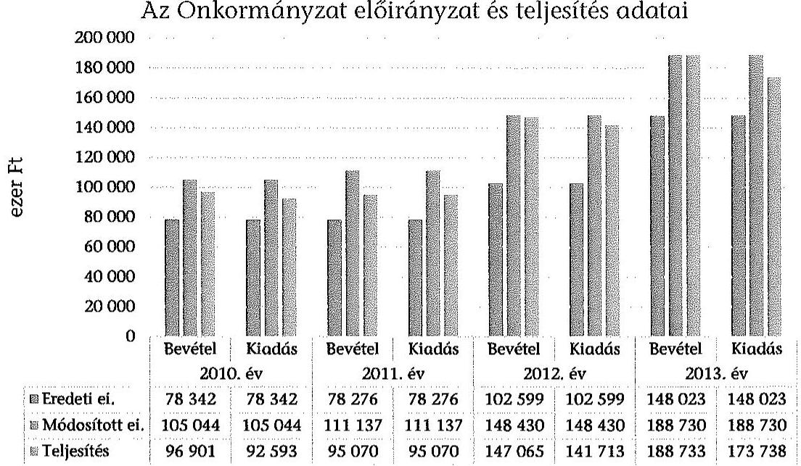
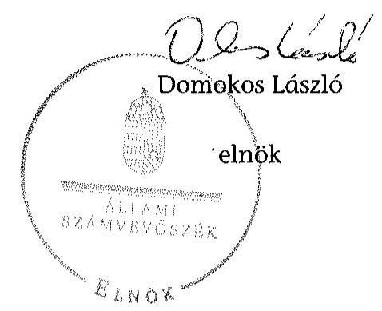
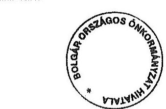
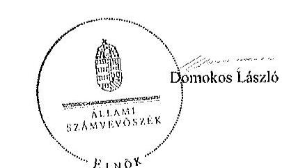

Á L L A M I
SZÁMVEVŐSZÉK

# JELENTÉS 

Az Országos Nemzetiségi Önkormányzatok gazdálkodásának ellenőrzéséről
Bolgár Országos Önkormányzat

---

# Állami Számvevőszék 

Iktatószám: V-0689-063/2015.
Témaszám: 1723
Vizsgálat-azonosító szám: V0680

## Az ellenőrzést felügyelte:

## Kisgergely István

felügyeleti vezető

## Az ellenőrzést vezette:

## Dr. Láng Ágnes Krisztina

ellenőrzésvezető
A számvevői jelentések feldolgozásában és a jelentés összeállításában közreműködtek:

## Dr. Láng Ágnes Krisztina

ellenőrzésvezető

## Fodor Edit

számvevő

## Az ellenőrzést végezték:

## Fodor Edit

számvevő

## Kozma Gábor

számvevő tanácsos

---

# TARTALOMJEGYZÉK 

BEVEZETÉS ..... 3
I. ÖSSZEGZŐ MEGÁLLAPÍTÁSOK, KÖVETKEZTETÉSEK, JAVASLATOK ..... 7
II. RÉSZLETES MEGÁLLAPÍTÁSOK ..... 14

1. A belső kontrollrendszer kialakításának és működtetésének megfelelősége ..... 14
1.1. A kontrollkörnyezet kialakítása ..... 14
1.2. A kockázatkezelési rendszer kialakításának és működtetésének megfelelősége ..... 17
1.3. A kontrolltevékenységek működésének megfelelősége ..... 17
1.4. Információs és kommunikációs rendszer kialakításának és működtetésének megfelelősége ..... 18
1.5. Monitoring-rendszer kialakításának és működtetésének megfelelősége ..... 19
2. A gazdálkodás megfelelősége ..... 20
2.1. Pénzügyi gazdálkodás megfelelősége ..... 20
2.2. Vagyongazdálkodással kapcsolatos feladatellátás szabályszerűsége ..... 25
3. Ingyenesen juttatott vagyon kezelésének megfelelősége ..... 29
4. Egyéb feladat- és hatáskör ellátás szabályszerűsége ..... 29
5. Integritás kontrollok ..... 29
6. ÁSZ javaslatok hasznosulása ..... 30
MELLÉKLETEK
7. számú A Bolgár Országos Önkormányzat észrevétele
8. számú A Bolgár Országos Önkormányzat észrevételére válasz
FÜGGELÉKEK
9. Rövidítések jegyzéke
10. Az integritás kontrollok kialakítása és működtetése

---

.

---

# JELENTÉS 

## A Bolgár Országos Önkormányzat gazdálkodásának ellenőrzéséről

## BEVEZETÉS

A Bolgár Országos Önkormányzat 1994. évben alakult, elnöke a 2002. évi országos nemzetiségi választások óta látja el feladatát. Az Önkormányzat az ellenőrzött időszakban három intézményt (Óvoda, Iskola, Könyvtár) működtetett és egy gazdasági társaságban rendelkezett részesedéssel. A 21 tagú Közgyűlés a munkája segítésére 3 bizottságot (Pénzügyi Ellenőrző Bizottság, Kulturális és Oktatási Bizottság, Vidéki Koordinációs Bizottság) hozott létre. Az Önkormányzat költségvetési beszámolója szerint a 2013. évben a módosított költségvetési bevételi és kiadási előirányzat 188730 ezer Ft, a teljesített költségvetési bevétel 188733 ezer Ft, a teljesített költségvetési kiadás 173738 ezer Ft volt. Az Önkormányzat 2013. évben a költségvetési törvényben nevesített forrásból 74500 ezer Ft, egyéb címen (TÁMOP, normatív, közoktatás) 26423 ezer Ft államháztartási támogatásban részesült.

A Hivatalvezetőt munkaszerződéssel foglalkoztatták. 2014. évben rajta kívül a Hivatalban egy gazdasági ügyintéző állt alkalmazásban. A teljes ellenőrzött időszakban megbízási szerződéssel gazdasági vezetőt foglalkoztattak.

Az Alaptörvény XXIX. cikk (1) bekezdése szerint a Magyarországon élő nemzetiségek államalkotó tényezők. Minden, valamely nemzetiséghez tartozó magyar állampolgárnak joga van önazonossága szabad vállalásához és megőrzéséhez. A hazánkban élő nemzetiségek helyi (települési és területi), valamint országos önkormányzatokat hozhatnak létre.

Az országos nemzetiségi önkormányzat gazdálkodási feladatait az önállóan működő és gazdálkodó költségvetési szerve, a hivatal látja el. Az országos nemzetiségi önkormányzatok a 2008. évtől tartoznak az államháztartás önkormányzati alrendszerébe, azóta hivatalaik költségvetési szervként működnek. Az Alaptörvény hatálybalépését követően a 2012. évtől további jelentős jogszabályi változások határozták meg működésüket, gazdálkodásukat.

A nemzetiségek helyzete, támogatása mind hazai, mind EU-s szinten kiemelt figyelmet kap napjainkban. Az állam az országos nemzetiségi önkormányzatok működéséhez, a médiaszolgáltatáshoz kapcsolódó jogaik érvényesítéséhez, valamint a kulturális önigazgatásuk érdekében alapított - közművelődési, közgyűjteményi, tudományos - intézmények fenntartásához az éves költségvetési törvényekben nevesítetten költségvetési támogatást biztosít. Ezen kívül az országos nemzetiségi önkormányzatok közfeladataik ellátásához támogatást kapnak egyéb fejezeti kezelésű előirányzatokból, valamint hazai és uniós pályázati forrásokat szerezhetnek.

---

Az ellenőrzés célja annak értékelése volt, hogy az országos nemzetiségi önkormányzat gazdálkodása, a belső kontrollrendszer kialakítása és működése, az államháztartásból nyújtott támogatás, illetve az államháztartásból meghatározott célra ingyenesen juttatott vagyon felhasználása a jogszabályi előírásoknak megfelelően történt-e; az önkormányzat a Nek. tv.-ben és az Njtv.-ben előírt feladat- és hatásköröket ellátta-e; intézkedett-e az ÁSZ által a 2008-2010. évek között végzett ellenőrzések javaslatainak végrehajtásáról.

Az országos nemzetiségi önkormányzat korrupcióval szembeni veszélyeztetettségének csökkentése érdekében felmértük az integritási szemlélet érvényesülését a gazdálkodási folyamatokban.

Értékeltük az önkormányzat gazdálkodása során a belső kontrollrendszer kialakítását és működését mind az öt pillére tekintetében, ellenőriztük a gazdálkodással összefüggő feladat- és hatásköröknek, a hivatal működési, gazdálkodási rendjének jogszabályi előírásoknak való megfelelőségét; a belső kontrollok működésének megfelelőségét az éves költségvetés, a költségvetési beszámoló és a zárszámadás készítés folyamatában; a gazdálkodás pénzügyi folyamatában kulcsszerepet betöltő (szakmai) teljesítésigazolás és 2011 évig utalvány ellenjegyzés, 2012. évtől érvényesítés kontrolltevékenységek működésének megfelelőségét; az önkormányzat belső ellenőrzése kialakításának és működésének megfelelőségét.

Értékeltük továbbá az országos nemzetiségi önkormányzat gazdálkodása, ezen belül pénzügyi gazdálkodása keretében a tervezés, beszámolási, zárszámadáskészítési folyamat, az előirányzatok betartása, a könyvvezetés, a közzétételek, adatszolgáltatások, valamint az államháztartás rendszeréből jogszabály vagy megállapodás alapján céljelleggel kapott támogatások felhasználásának, elszámolásának szabályszerűségét. A vagyonnal kapcsolatos feladatellátás ellenőrzése keretében értékeltük a vagyongazdálkodás szabályozottságát, a mérleg alátámasztottságát, a leltározás, az eszközbeszerzések, a vagyonhasznosítás, a tulajdonosi joggyakorlás szabályszerűségét, kiemelten az országos nemzetiségi önkormányzat gazdasági társasága részére a vagyon tulajdonba, illetve kezelésbe, üzemeltetésbe adása, a tőkeemelés és a juttatott támogatások szabályszerűségét. Értékeltük az államháztartásból ingyenesen juttatott vagyon felhasználásának szabályszerűségét. Ellenőriztük az előírt feladat- és hatáskörök közül a véleménynyilvánítási, egyetértési jog gyakorlásával, a hatáskör átruházásokkal, az ideiglenes vagyonkezeléssel kapcsolatos feladatok ellátásának szabályszerűségét, az integritás kontrollok működését, továbbá az előző ÁSZ ellenőrzés javaslatainak hasznosulását.

Az ellenőrzés várható hasznosulása: Az ellenőrzés eredményeként nemcsak az ellenőrzött szerv gazdálkodása javulhat, hanem átfogó képet kaphatunk az önkormányzati alrendszerbe tartozó országos nemzetiségi önkormányzatok gazdálkodásának hiányosságairól, de a jó gyakorlatokról is. Az ellenőrzés megállapításait és javaslatait más szervezetek is hasznosíthatják a rendezett gazdálkodási keretek kialakításához. Az ellenőrzés hozadékát képezi a 2008-2010. években elvégzett ÁSZ ellenőrzés javaslatai hasznosulásának értékelése. Mind a 13 országos nemzetiségi önkormányzat ellenőrzésével teljes körűen megvalósul az országos nemzetiségi önkormányzatok ellenőrzése a megváltozott jogszabályi környezetben. Az ellenőrzés tapasztalatai alapján a jogszabályi ellentmondások, hiányosságok feltárásával, azok megszüntetésére vonatkozó javaslatokkal

---

segítjük a jó kormányzást. Az ellenőrzéssel lehetővé tesszük, hogy az országos nemzetiségi önkormányzatok gazdálkodásáról, működéséről a társadalom objektív képet alkothasson.

Az országos nemzetiségi önkormányzatok gazdálkodásának ellenőrzéséről szóló számvevőszéki jelentés I. fejezetének összegző része az ellenőrzés céljára adott rövid, szintetizáló összefoglalót és következtetéseket tartalmazza a II. fejezet részletes megállapításain alapulóan. A jelentés intézkedést igénylő megállapításait és javaslatait az ellenőrzés során feltárt, a jelentés II. fejezetében rögzített részletes megállapítások alapozzák meg.

Az ellenőrzés típusa: szabályszerűségi ellenőrzés.
Az ellenőrzött időszak: 2010. január 1 - 2014. június 30.
Ellenőrzött szervezet: az országos nemzetiségi önkormányzat és hivatala, továbbá azon intézmények, amelyek gazdálkodási feladatait a hivatal látja el.

Az ellenőrzés végrehajtásának jogszabályi alapját az Állami Számvevőszékről szóló 2011. évi LXVI. törvény 1. § (3) bekezdése, az 5. § (2)-(3) és (6) bekezdései, valamint az államháztartásról szóló 2011. évi CXCV. törvény 61. § (2) bekezdésének előírásai képezik.

Az ellenőrzés módszertana az ÁSZ hivatalos honlapján (www.asz.hu) közzétett szakmai szabályokon alapul, amely a Legfőbb Ellenőrző Intézmények Nemzetközi Szervezete (INTOSAI) által kiadott nemzetközi standardok (ISSAI) figyelembevételével készült.

Az ellenőrzés lefolytatásához az országos nemzetiségi önkormányzat a kimutatások és a tanúsítványok elektronikus kitöltésével, valamint az ÁSZ által kért dokumentumok elektronikus megküldésével szolgáltatott adatokat. Az így rendelkezésre bocsátott adatok, információk kontrollja és a munkalapok kitöltése az ellenőrzöttnél végzett ellenőrzés keretében történt.

A vagyonhasznosítási célú bevételek, a személyi juttatások, a dologi és felhalmozási kiadások, valamint a pénzeszközátadások felhasználásának szabályszerűségét, a céljelleggel kapott támogatások felhasználásának és elszámolásának szabályszerűségét és a kiadások esetében a gazdálkodási jogkörök gyakorlását mintavétellel ellenőriztük.

A jogszabályoknak és a belső előírásoknak megfelelőnek, azaz szabályszerűnek tekintettük az ellenőrzött bevételi előirányzatok felhasználását, amennyiben a minta ellenőrzésének eredménye alapján $95 \%$-os bizonyossággal a teljes sokaságban a hibaarány kisebb volt, mint $10 \%$, nem megfelelőnek értékeltük, ha a hibaarány a 10\%-ot meghaladta. Kockázatot, illetve magas kockázatot jeleztünk amennyiben egy adott terület vonatkozásában a minta alapján a sokaságban nem volt teljes körűen biztosított a jogszabályoknak és a belső szabályzatoknak megfelelő működés.

A kiadási előirányzatok felhasználásának, valamint a céljelleggel kapott támogatások felhasználásának és elszámolásának szabályszerűségét a kiválasztott mintatételek jogszabályoknak való megfelelősége alapján értékeltük.

---

Megfelelőnek értékeltük a gazdálkodási jogkörök gyakorlását, amennyiben 95\%-os bizonyossággal a teljes sokaságban a hibaarány legfeljebb 10\%, részben megfelelőnek értékeltük, ha a hibaarány felső határa 10-30\% volt, nem megfelelőnek pedig akkor, ha a hibaarány felső határa a teljes sokaságban meghaladta a $30 \%$-ot.

Az ÁSZ a 2011. évi LXVI. törvény 29. §-a szerint a jelentéstervezetet megküldte a Bolgár Országos Önkormányzat elnökének egyeztetésre. A beérkezett észrevételt és az arra adott választ a jelentés 1-2. sz. mellékletei tartalmazzák.

---

# I. ÖSSZEGZŐ MEGÁLLAPÍTÁSOK, KÖVETKEZTETÉSEK, JAVASLATOK 

Az Önkormányzatnál a 2010-2014. I. félév között a belső kontrollrendszer kialakítása és működtetése összességében nem volt megfelelő.

A kontrollkörnyezet kialakítása részben felelt meg az Önkormányzat működését meghatározó jogszabályokban foglaltaknak. Az Önkormányzat hatályos, a Nek. tv. és az Njtv. előírásainak megfelelő SzMSz-szel rendelkezett a 2010. év és 2014. I. félév közötti időszakban. A Hivatal 2010. évben az Áht. ${ }^{1}$ és az Ámr. előírása ellenére nem rendelkezett SzMSz-szel. A Hivatal működésének rendjét 2011 januárjától ügyrendben, majd 2014 januárjától Hivatali SzMSz-ben határozták meg, amelyek azonban az Ámr. és az Ávr. előírásainak részben feleltek meg. A Hivatal kialakította számviteli politikáját, amelynek hatálya kiterjedt a hozzárendelt költségvetési szervekre is. A Hivatal - a Számv. tv. és az Áhsz. ${ }^{1-2}$ előírásai ellenére - nem rendelkezett hatályos, a jogosult vezető által jóváhagyott számlarenddel, bizonylati renddel, az önköltségszámítás rendjére vonatkozó szabályzattal. A Hivatal az Ámr. és a Bkr. előírása ellenére szabálytalanságkezelési eljárásrenddel, a Hivatal működésének irányítási és ellenőrzési folyamatai, a felelősségi és információs szintek és kapcsolatok leírását tartalmazó ellenőrzési nyomvonallal nem rendelkezett.

A Hivatalvezető az Ámr. és a Bkr. előírásai ellenére nem alakított ki és nem működtetett kockázatkezelési rendszert.

A kontrolltevékenységek kialakítása és működtetése részben felelt meg az előírásoknak. Az éves költségvetés, a költségvetési beszámoló és a zárszámadás készítésének folyamatában a belső kontrolleljárásokat az Ámr. és a Bkr. rendelkezéseitől eltérően nem működtették. A 2010-2011. években a szakmai teljesítésigazolás és az utalvány ellenjegyzés nem felelt meg az Ámr. előírásainak, az Ávr. által szabályozott teljesítésigazolás és érvényesítés kontrollok gyakorlata a 20122013 években részben felelt meg, a 2014. I. félévében megfelelt a jogszabályban foglaltaknak.

Az információs és kommunikációs rendszer kialakítása és működtetése nem volt megfelelő, mivel az Avtv., az Info tv. és az Ávr. előírásától eltérően nem szabályozták a kötelezően közzéteendő adatok nyilvánosságra hozatalának, valamint a közérdekű adatok megismerésére irányuló igények teljesítésének rendjét, és nem készítették el a Hivatal adatvédelmi és adatbiztonsági szabályzatát. Az Önkormányzat honlapján közzétette SzMSz-ét, valamint éves költségvetéseinek és éves beszámolóinak határozatait. Az Önkormányzat - az Áht. ${ }^{1}$, valamint az Info tv. előírásai ellenére - nem tette közzé honlapján az általa nyújtott, nem normatív, céljellegű, működési és fejlesztési támogatások kedvezményezettjeinek nevére, a támogatás céljára, összegére, továbbá a támogatási program megvalósítási helyére vonatkozó adatokat.

Az Önkormányzat monitoring rendszerének kialakítása és működtetése részben volt megfelelő. A Hivatalvezető - az Áht. ${ }^{1}$ és a Bkr. előírásaival szemben az operatív tevékenységek keretében megvalósuló, folyamatos és eseti nyomon

---

követés rendszerét nem alakította ki. A belső ellenőrzést külső szervezet megbízásával látták el az ellenőrzött időszakban. A belső ellenőrzés függetlenségét biztosították, feladatkörét a belső ellenőrzési kézikönyvben határozták meg. A belső ellenőrzés javaslatai végrehajtására intézkedtek, azok nyomon követéséről a belső ellenőrzés gondoskodott.

A költségvetési tervezési folyamat során az Áht. ${ }^{1-2}$ valamint az Ámr. és Ávr. előírásait részben tartották be. A Közgyűlés elé terjesztett költségvetési határozat tervezet az Ámr. és az Ávr. előírásai ellenére nem tartalmazta a felújítási előirányzat célját, az EU forrásból finanszírozott támogatási előirányzatok bemutatását, nem készült előirányzat felhasználási terv, valamint a 2010-2011. években nem mutatták be a létszám előirányzatot.

A 2010-2013. években a teljesített kiadások és bevételek a kiemelt előirányzatok esetében nem haladták meg a módosított előirányzat összegét.

A zárszámadási határozat tervezetek részben feleltek meg az Ámr. és az Áhsz. ${ }^{1}$ előírásainak, mert nem tartalmaztak vagyonkimutatást, a szöveges indoklás nem nevesítette a részesedéseket, továbbá elmaradt az értékvesztés elszámolása.

Az Önkormányzat az ellenőrzött időszakban két fejezeti kezelésű előirányzatból összesen 266400 ezer Ft támogatást kapott, amit a jogszabályi előírásoknak megfelelően használt fel. Az Önkormányzat az ellenőrzött időszakban nem vezetett elkülönített nyilvántartást a központi költségvetésből kapott működési támogatásokról, illetve 2013. november 20-ától azok felhasználásáról Az Önkormányzat pályázati forrásból az ellenőrzött időszakban további 35503 ezer Ft központi támogatásban részesült. A kapott támogatásból intézményeit támogatta, valamint a Nek. tv.-ben és az Njtv.-ben előírt feladatait látta el.

Az ellenőrzött időszakban az Önkormányzat által államháztartási forrás terhére pályázat vagy kérelem alapján nyújtott céljellegű támogatások odaítélése, elszámoltatása megfelelt a jogszabályi előírásoknak, a támogatások célja összhangban volt a törvényben rögzített nemzetiségi feladatokkal.

A Közgyűlés a Nek. tv., és az Njtv. előírásai ellenére a vagyongazdálkodás rendjét nem szabályozta. Nem határozta meg az Áht. ${ }_{1,2}$ szerinti törzsvagyon és a forgalomképes vagyon elemeket. Az egyszeri vagyonjuttatásként ingyenes tulajdonba kapott ingatlant tévesen korlátozottan forgalomképesként tartották nyilván, forgalomképtelen törzsvagyon helyett. A 2011 év őszétől az MNV Zrt.-től vagyonkezelésbe vették a Bajza utca 44. szám alatti - előzőleg a bolgár közoktatási intézménynek helyt adó - ingatlant. A vagyonkezelő által meghatározott érték ( 484700 ezer Ft) nyilvántartásba vételekor a korábbi beruházások, felújítások 8851 ezer Ft-os értékét a nyilvántartásból nem vezették ki, így ezen összeg halmozottan szerepelt a beszámolókban, mellyel sérült a Számv. tv. szerinti valódiság elve. A költségvetési beszámolóban a kezelésbe átvett vagyon forrás oldali nyilvántartását tévesen saját tőkeként mutatták ki, egyéb hosszú lejáratú kötelezettség helyett.

Az Önkormányzat a mérlegtételek év végi értékelését a Számv. tv. és az Áhsz. ${ }^{1}$ előírása ellenére leltározás csak részben támasztotta alá. A leltározás végrehajtásáért és ellenőrzéséért felelős személyek kijelölése nem történt meg, a leltárak kiértékeléséről, a leltárellenőrzésről dokumentum nem készült. Az ellenőrzött

---

időszakban a tételes mennyiségi felvétellel történő leltározást a Számv. tv., az Áhsz., valamint a 36/2013. (IX. 13.) NGM rendelet előírása ellenére nem végezték el, a mérlegtételeket egyeztetéses leltárak támasztották alá. A mérlegtételeket alátámasztó nyilvántartások ellenőrzése során téves könyvelést, rossz értékcsökkenés elszámolást, a követelések, kötelezettségek nem megfelelő nyilvántartását tapasztaltuk.

Az Önkormányzat ingatlanjait bérbeadással hasznosította. A vagyonhasznosítási bevételek ellenőrzése alapján az Önkormányzat vagyonhasznosítási tevékenységét kockázatosnak értékeltük. Egy esetben a bérleti szerződés feltételeiről - a Htv. előírásait figyelmen kívül hagyva - a Közgyűlés nem döntött, a szerződések tartalmazták a bérleti díjak évenkénti emelésének lehetőségét, de ezzel a Hivatal a számlázás során nem élt, továbbá egy kiszámlázott bérleti díj összege az Áhsz,-ben foglaltak ellenére a 2013. év végi beszámolóban követelésként nem szerepelt.

Az Önkormányzat a Bolgár Művelődési és Kulturális Nonprofit Kft.-ben 47%-os (1400 ezer Ft) tulajdonosi részesedéssel rendelkezett. Az Önkormányzat a tőkevesztésből következő értékvesztést nem számolta el a Számv. tv. és az Áhsz. előírása ellenére.

Az Önkormányzat 2006 áprilisában részesült a Nek. tv. szerinti egyszeri ingyenes vagyonjuttatásban. Ingatlanait - 2010-2011 években az Ámr.-ben, 2012 évtől az Áht. 4 -ben foglaltak ellenére - vagyonkimutatásban nem mutatta be zárszámadási határozat-tervezetének a Közgyűlés elé történő terjesztésekor.

Az ellenőrzött időszakban a Közgyűlés a szerveire feladat- és hatáskört nem ruházott át. Az Elnök - a Nek. tv., előírása ellenére - a Közgyűlés felhatalmazása nélkül gondoskodott a vélemény-nyilvánítási jog gyakorlásáról.

Az Önkormányzat az ellenőrzött időszakban erőfeszítéseket tett az integritási szemlélet fejlesztésére, valamint a korrupciós kockázatok csökkentésére, a 2013. évben önként részt vett az ÁSZ integritási felmérésében.

Az ÁSZ tv. 33. § (1) bekezdésében foglaltak értelmében a jelentésben foglalt megállapításokhoz kapcsolódó intézkedési tervet köteles az ellenőrzött szervezet vezetője összeállítani, és azt a jelentés kézhezvételétől számított 30 napon belül az ÁSZ részére megküldeni. Amennyiben az intézkedési tervet határidőben nem küldi meg a szervezet, vagy az nem elfogadható, az ÁSZ elnöke a hivatkozott törvény 33. § (3) bekezdés a)-b) pontjaiban foglaltakat érvényesítheti.

Az ÁSZ a 2008-2010. években nem végzett ellenőrzést az Önkormányzatnál.
A helyszíni ellenőrzés megállapításainak hasznosítása mellett javasoljuk:

# az Elnöknek 

1.  Az ellenőrzött időszakban az Elnök - a Nek. tv. 39/A. § (1) bekezdésében foglaltakat figyelmen kívül hagyva - a Közgyűlés írásos felhatalmazása nélkül gyakorolta az Önkormányzat vélemény-nyilvánítási jogát, amikor a nemzetiségek jogairól szóló törvénytervezetet 2011 novemberében és decemberében véleményezte.

---

Javaslat:
Intézkedjen, hogy a jövőben az Önkormányzat vélemény-nyilvánítási, egyetértési és közreműködési jogosultságának a Közgyűlés hatáskörébe tartozó teljesítését, csak annak felhatalmazása alapján, beszámolási kötelezettség előírásával végezze.

# a Hivatalvezetőnek 

Az Önkormányzat belső kontroll rendszere tekintetében:

1.  A kontrollkörnyezet kialakítása részben volt megfelelő, mivel a Hivatalvezető - a Számv. tv. 161. § (1) bekezdésében és (2) bekezdés d) pontjában, valamint 2010-2013 években az Áhsz. ${ }^{1}$ 49. § (1) bekezdésében, 2014. január 1-jétől az Áhsz. ${ }^{2}$ 51. § (2) bekezdésében foglalt előírások ellenére - nem gondoskodott a számlarend és a bizonylati rend kialakításáról. A Hivatal a vagyonhasznosítási tevékenységének megalapozásához, a költségtérítések összeállításához - az Áhsz. ${ }^{1}$ 8. § (4) bekezdés c) pontja, (15) bekezdése, valamint az Áhsz. ${ }^{2}$ 50. § (3) bekezdés előírásai ellenére - nem rendelkezett hatályos, önköltségszámítás rendjére vonatkozó szabályzattal. A Hivatal - az Ámr. 20. § (3) bekezdés b) pont, valamint az Ávr. 13. § (2) bekezdés b) pont előírásai ellenére - nem rendelkezett a beszerzések lebonyolításának eljárásrendjével. A reprezentációs kiadások felosztását, a vezetékes és rádiótelefonok használatát az Ámr. 20. § (3) bekezdés f), h) pontjai, valamint Ávr. 13. § (2) bekezdés e), g) pontjai ellenére nem szabályozták. A Hivatal a 2010. évben az Ámr. 161. §-a, 2011. évben az Ámr. 156. § (3) bekezdése, 2012-2014. év I. félévben a Bkr. 6. § (4) bekezdése ellenére szabálytalanságok kezelésének eljárásrendjével nem rendelkezett.

Javaslat:
Intézkedjen a számlarend, a bizonylati rend, az önköltségszámítás rendjére vonatkozó, a beszerzések lebonyolításának eljárásrendje, a reprezentációs kiadások felosztásának, a vezetékes és rádiótelefonok használatára, valamint a szabálytalanságok kezelésének eljárásrendje vonatkozó szabályzatok elkészítésére.
2.  A Hivatalvezető - az Ámr. 156. § (2) bekezdése és a Bkr. 6. § (3) bekezdése előírásaitól eltérően - nem gondoskodott a Hivatal működésének irányítási és ellenőrzési folyamatai, a felelősségi és információs szintek, kapcsolatok leírását tartalmazó ellenőrzési nyomvonal elkészítéséről.

Javaslat:
Intézkedjen az ellenőrzési nyomvonal elkészítéséről.
3.  A Hivatalvezető - az Ámr. 157. § (1)-(3) bekezdéseiben, illetve a Bkr. 3. § b) pontjában és a 7. § (1)- (2) bekezdéseiben foglaltak ellenére - nem alakította ki az Önkormányzat és intézményei kockázatkezelési rendszerét, a tevékenységekben, gazdálkodásban rejlő kockázatokat nem mérte fel, a szükséges intézkedéseket nem határozta meg, a nyomon követés módjáról nem rendelkezett.

Javaslat:
Intézkedjen az Önkormányzat és intézményei kockázatkezelési rendszerének kialakításáról és működtetéséről.

---

4.  Az Önkormányzat az ellenőrzött években - az Áht. ${ }^{1}$ 121. § (2) bekezdés d) pontjában, illetve a Bkr. 9. § (1) bekezdésében foglalt előírások ellenére - az információs és kommunikációs rendszert nem alakította ki és nem működtette. Az Önkormányzatra vonatkozó, kötelezően közzéteendő adatok nyilvánosságra hozatalának rendjét az Info tv. 35. § (3) bekezdése és az Ávr. 13. § (2) bekezdés h) pontja előírásait figyelmen kívül hagyva nem szabályozták. A Hivatalvezető a közérdekű adatok megismerésére irányuló igények teljesítésének rendjét - az Avtv. 20. § (8) bekezdésében, az Info tv. 30. § (6) bekezdésében, valamint az Ávr. 13. § (2) bekezdés h) pontjában előírtak ellenére - nem szabályozta.

Javaslat:
a) Intézkedjen az információs és kommunikációs rendszer kialakítása és működtetése érdekében.
b) Intézkedjen a kötelezően közzéteendő adatok nyilvánosságra hozatalának és a közérdekű adatok megismerésére irányuló igények teljesítésének rendje kialakításáról.
5.  A Hivatal nem rendelkezett az Avtv. 31/A. § (3) bekezdése, illetve az Info tv. 24. § (3) bekezdése előírásának megfelelő adatvédelmi és adatbiztonsági, valamint 2013. július 1-jétől a 2013. évi L. törvény 11. § (1) bekezdés f) pontjában előírt informatikai biztonsági szabályzattal.

Javaslat:
Intézkedjen a Hivatal adatvédelmi és adatbiztonsági szabályzatának és informatikai biztonsági szabályzatának elkészítésére.
6.  Az Önkormányzat monitoring rendszerének kialakítása és működtetése részben volt szabályszerű. A Hivatalvezető - a 2010. évben az Áht.1 120/B.§ (2) bekezdés e) pontjában, a 2011. évben az Áht. 121.§ (2) bekezdés e) pontjában, a 2012-2014. I. félévben a Bkr. 3. § e) pontjában és a 10. §-ában foglaltak ellenére - az operatív tevékenységek keretében megvalósuló, folyamatos és eseti nyomon követés rendszerét nem alakította ki.

Javaslat:
Intézkedjen a Hivatal tevékenységének keretében megvalósuló, folyamatos és eseti nyomon követés rendszerének kialakítására.

A pénzügyi- és vagyongazdálkodás területén
7.  Az Ámr. 36. § (3) bekezdésében és 40. § (1) bekezdésében, illetve az Ávr. 27. § (1) bekezdésében és 29. § (2) bekezdésében előírtak ellenére a Hivatalvezetőnek a költségvetési határozattervezet költségvetési szervek vezetőivel történt egyeztetési feladatának eredményét írásban nem rögzítették.

Javaslat:
Intézkedjen a költségvetési határozat-tervezet költségvetési szervek vezetőivel történő egyeztetése írásba foglalásáról.

---

8.  A Közgyűlés elé terjesztett költségvetési határozat-tervezetek tartalma részben felelt meg a jogszabályi követelményeknek. A 2010. évben az Ámr. 36. § (1) bekezdés b) és c) pontjaiban előírtak ellenére nem tartalmazta a működési kiadási előirányzat összesített adatait, továbbá a felújítási előirányzatokat célonként. A 2010. és 2011. években az Ámr. 36. § (1) bekezdés f) és i) pontjaiban előírtak ellenére a határozat az éves létszám-előirányzatot nem tartalmazta, valamint a működési és a felhalmozási célú bevételi és kiadási előirányzatok mérlegszerű bemutatása nem készült el. A 20102014. években - az Ámr. 36. § (1) bekezdés k) pontjában és az Áht. ${ }^{2}$ 24. § (4) bekezdés a) pontjában előírtak ellenére - nem készült előirányzat felhasználási terv, továbbá az Ámr. 36. § (1) bekezdés l) pontjában és az Ávr. 24. § (1) bekezdés bd) pontjában
 előírtak ellenére nem kerültek elkülönítetten bemutatásra az európai uniós forrásból finanszírozott támogatással megvalósult programok bevételei, kiadásai. A 2013. és a 2014. évi költségvetés tervezése során az Áht. ${ }_{2}$ 4. § (2) bekezdés és az Ávr. 16. § (2) bekezdés előírása ellenére a kiadások között a vagyonkezelési díjjal, a bevételek között pedig az elvégzett felújítási munkák MNV Zrt. által történő megtérítésével nem számoltak, mely ellentétes a Számv. tv. 15. § (2) bekezdés szerinti teljesség elvével.

Javaslat:
Biztosítsa, hogy a Közgyűlés elé terjesztett költségvetési határozat-tervezetek tartalma megfeleljen a jogszabályi előírásoknak.
9. Az Ámr. 40. § (6) bekezdés d) pont előírása ellenére a Közgyűlés elé terjesztett beszámoló a 2010-2013 években nem tartalmazott vagyonkimutatást, a Hivatalvezető az Áht. ${ }_{1}$ 118. § (2) bekezdés 2. c) pontjában, az Áht. ${ }_{2}$ 91. § (2) bekezdés c) pontjában valamint az Áhsz. ${ }_{1}$ 44/A. §-ában előírt vagyonkimutatást az ellenőrzött időszakban nem készítette el.

Javaslat:
Intézkedjen a zárszámadási határozat-tervezet előterjesztésekor a Közgyűlés részére tájékoztatásul bemutatandó vagyonkimutatás elkészítéséről.
10. Az Önkormányzat a Nek. tv. 37. § (1) bekezdés c.) pontja és 60/A. § (3)-(5) bekezdéseiben, illetve az Njtv. 113. § c.) pontjában és a 125. §-ában, továbbá az SzMSz 25. § (1) pontjában előírtak ellenére a vagyongazdálkodás rendjét nem szabályozta, nem határozta meg a törzsvagyon (forgalomképtelen, korlátozottan forgalomképes), és a forgalomképes vagyon körét. A Htv. 138. § (1) bekezdés j) pontja, illetve az Njtv. 113. § c.) pontja figyelmen kívül hagyásával nem szabályozták az egyes vagyonelemek hasznosítási módját. Az Áht. ${ }_{1}$ 108. § (1) bekezdése és az Nvtv. 11. § (16) bekezdése előírásának ellenére nem határozta meg azt az értékhatárt, amely felett a 2010-2013. évben és a 2014. év I. félévében csak nyilvános pályázat útján lehet a vagyont értékesíteni, kezelésbe adni, a használat jogát átadni.

Javaslat:
Intézkedjen a törzsvagyonba tartozó vagyonelemek köréről, a vagyon használatáról és hasznosításáról szóló szabályzatok elkészítéséről, és kezdeményezze azok Közgyűlés elé terjesztését.

---

11. A mérlegtételek év végi értékelését az Áhsz. 37. § előírásával ellentétesen leltározás csak részben támasztotta alá, mert az ellenőrzött időszakban tételes mennyiségi felvétellel leltározást nem végeztek.

Javaslat:
Intézkedjen a mérleg tételeinek alátámasztására szolgáló leltár elkészíttetéséről, amely az eszközök és források állományát tételesen és ellenőrizhető módon tartalmazza.

---

# II. RÉSZLETES MEGÁLLAPÍTÁSOK 

## 1. A BELSŐ KONTROLLRENDSZER KIALAKÍTÁSÁNAK ÉS MŰKÖDTETÉSÉNEK MEGFELELŐSÉGE

Az Önkormányzat belső kontrollrendszerét (a kontrollkörnyezet, a kockázatkezelési rendszer, a kontrolltevékenységek, az információs és kommunikációs rendszer, valamint a monitoring rendszer) összességében nem megfelelően alakította ki az ellenőrzött időszakban.

### 1.1. A kontrollkörnyezet kialakítása

Az Önkormányzat és a Hivatal működésének és gazdálkodásának szabályozottsága az ellenőrzött időszakban folyamatosan javult, de összességében részben felelt meg a jogszabályi előírásoknak.

Az Önkormányzat hatályos, a Nek. tv. és az Njtv. előírásainak megfelelő SzMSz-szel rendelkezett a 2010 - 2014. I. félév közötti időszakban. Az Önkormányzati SzMSz aktualizálása a jogszabályi változásokra tekintettel folyamatosan megtörtént.

A Hivatal 2010 évben az Áht., 91. § (2) bekezdésében, valamint az Ámr. 20. § (1) bekezdésében foglaltak ellenére nem rendelkezett SzMSz-szel. A Hivatal szervezeti és működési rendjét 2011 év januárjától a Hivatali ügyrendben, majd 2014 év januárjától a Hivatali SzMSz-ben szabályozták. A Hivatali ügyrend, valamint a Hivatali SzMSz részben felelt meg a jogszabályi előírásoknak, mert:

- a Hivatali ügyrend az Ámr. 20. § (2) bekezdés j) pontjában foglaltak ellenére nem határozta meg a munkáltatói jogok gyakorlásának rendjét;
- a Hivatali SzMSz az Ávr. 13. § (1) bekezdés i) pontjában foglaltak ellenére nem tartalmazta a költségvetési szervhez rendelt más költségvetési szervek (Óvoda, Iskola, Könyvtár) felsorolását;
- a Hivatali ügyrend és a Hivatali SzMSz - az Ámr. 20. § (2) bekezdés i) pontjában, valamint az Ávr. 13. § (1) bekezdés e) pontjában foglaltak ellenére szervezeti ábrát nem tartalmazott.

A Hivatal gazdasági szervezetét 2011. évben hozták létre. A gazdasági szervezet 2011-2013. év március között az Ámr. 20. § (7) bekezdés, illetve az Ávr. 9. § (5) bekezdés előírása ellenére ügyrenddel nem rendelkezett. A 2013 év áprilisában kiadott ügyrend részletesen meghatározta a gazdasági szervezet által ellátott szakmai feladatokat, egyrészt a gazdálkodási folyamatok szerint, továbbá a gazdasági vezető és a gazdasági ügyintéző feladatköre szerinti bontásban.

A Hivatal és a hozzárendelt önállóan működő intézmények az Ámr. 16. § (1), és (4)-(6) bekezdéseiben, valamint az Ávr. 10. § (4) bekezdésében foglalt előírások

---

ellenére nem kötöttek munkamegosztási megállapodást 2010 évtől 2012 októberéig. A Htv., az Ámr. és az Ávr. által előírt tartalmú megállapodásban 2012 novemberétől rögzítették a gazdálkodással kapcsolatos munkamegosztás és felelősségvállalás rendjét.

Az Önkormányzat és intézményei közötti együttműködést 2008. október 4-től az óvoda vezetőjével, 2008. november 1-jétől az iskola vezetőjével kötött megállapodások szabályozták. Ezekben rögzítették az előirányzatok feletti gazdálkodás intézményi és önkormányzati/hivatali feladatait, a pénzkezelés, a leltározás, a kötelezettségvállalás, utalványozás, ellenjegyzés, érvényesítés, teljesítésigazolás felelősségét.

A Hivatalvezetőt munkaszerződéssel foglalkoztatták. A teljes ellenőrzött időszakban megbízási szerződéssel gazdasági vezetőt foglalkoztattak. A gazdasági vezető rendelkezett az Ámr.-ben és az Ávr.-ben előírt szakmai végzettséggel. A Hivatalban dolgozó foglalkoztatottak a Munka tv. ${ }_{1,2}$ alapján készített munkaköri leírással rendelkeztek.

# A Hivatalvezető kialakította az önkormányzat és intézményei szám- 

viteli politikáját, amelynek hatályát kiterjesztette a hozzárendelt költségvetési szervekre. A Hivatal rendelkezett a jogszabályi előírásoknak megfelelő leltározási és leltárkészítési, eszközök és források értékelési, valamint pénzkezelési szabályzattal. A számviteli politikát és a kapcsolódó szabályzatokat az ellenőrzött időszakban folyamatosan aktualizálták, kiegészítették, ennek ellenére a Hivatal nem rendelkezett teljes körűen a kötelező számviteli szabályzatokkal:

- A Hivatalvezető - a Számv. tv. 161. § (1) bekezdésében és (2) bekezdés d) pontjában, valamint 2010-2013 években az Áhsz. 1 49. § (1) bekezdésében, 2014. január 1-jétől az Áhsz. 2 51. § (2) bekezdésében foglalt előírások ellenére - nem gondoskodott a számlarend és a bizonylati rend kialakításáról;
- A Hivatalvezető 2010 évben és 2011. I. félévben - az Áhsz. 1 37. § (5) bekezdésében foglaltak ellenére - nem gondoskodott az eszközök selejtezési szabályainak meghatározásáról;
- A Hivatal a vagyonhasznosítási tevékenységének megalapozásához, a megtérítendő költségek összeállításához - az Áhsz. 1 8. § (4) bekezdés c) pontja, (15) bekezdése, valamint az Áhsz. 2 50. § (3) bekezdés előírásai ellenére - nem rendelkezett hatályos, a jogosult vezető által aláírt, az önköltségszámítás rendjére vonatkozó szabályzattal.

A Hivatal rendelkezett a gazdálkodási jogkörök szabályzatával, amelyben a kötelezettségvállalás, az ellenjegyzés, a (szakmai) teljesítésigazolás, az érvényesítés, valamint az utalványozás és annak ellenjegyzése gyakorlásának rendjét rögzítették.

---

A gazdálkodásra vonatkozó belső szabályozás a vonatkozó jogszabályi előírásoknak nem felelt meg maradéktalanul, mert belső szabályzatban nem rögzítették:

- 2010. év és 2013. év márciusa között - az Áhsz. 1 49. § (3) bekezdésében foglaltak ellenére - a kötelezettségvállalásokhoz kapcsolódó analitikus nyilvántartás vezetésének módjára vonatkozó részletes előírásokat. A gazdasági szervezet ügyrendjében 2013 év áprilisától rendelkeztek a kötelezettségvállalásokhoz kapcsolódó analitikus nyilvántartás vezetésének módjáról;
- az Ámr. 80. § (3) bekezdésében, illetve az Ávr. 60. § (3) bekezdésében foglaltak ellenére - 2010 évtől 2012. I. félévéig a kötelezettségvállalók, a kötelezettségvállalás (pénzügyi) ellenjegyzésére, továbbá a (szakmai) teljesítésigazolásra, az utalványozásra, az utalványozás ellenjegyzésére, valamint az érvényesítésre jogosultak aláírás mintáját. Az aláírás mintákat tartalmazó nyilvántartás vezetéséről, aktualizálásáról 2012. július 1-jétől gondoskodtak;
- 2010 év és 2013 év márciusa között - az Ámr. 72. § (14) bekezdése, 75. § (4) bekezdése, illetve az Ávr. 53. § (2) bekezdésében foglaltak ellenére - a gazdasági eseményenként a 100 ezer Ft-ot el nem érő kifizetésekkel összefüggő kötelezettségvállalások rendjét. A gazdasági szervezet ügyrendjében 2013 év áprilisától rendelkeztek a 100 ezer Ft-ot el nem érő kifizetésekkel összefüggő kötelezettségvállalások rendjéről.

A Hivatal - az Ámr. 20. § (3) bekezdés b) pont, valamint az Ávr. 13. § (2) bekezdés b) pont előírásai ellenére - nem rendelkezett a beszerzések lebonyolításának eljárásrendjével. A működéséhez kapcsolódó, pénzügyi kihatással bíró, jogszabályban nem szabályozott kérdéseket, különösen a reprezentációs kiadások felosztását, a vezetékes és rádiótelefonok használatát az Ámr. 20. § (3) bekezdés f), h) pontjai, valamint Ávr. 13. § (2) bekezdés e), g) pontjai ellenére nem szabályozta. A Hivatalvezető 2011 év márciusától a kiküldetési szabályzatban rendelkezett a belföldi és külföldi kiküldetések elszámolásának, valamint a gépjárművek igénybevételének és használatának rendjéről.

A Hivatal Etikai Kódexét 2013 év májusában adták ki, ezt megelőzően - az Ámr. 156. § (1) bekezdés c) pontjában, illetve a Bkr. 6. § (1) bekezdés c) pontjában foglalt előírások ellenére - nem rendelkeztek hasonló tartalmú szabályozással. A Hivatal a 2010. évben az Ámr. 161. §-ában, 2011. évben az Ámr. 156. § (3) bekezdésében, 2012-2014. I. félévben a Bkr. 6. § (4) bekezdésében előírtak ellenére szabálytalanságkezelési eljárásrenddel nem rendelkezett. A Hivatalvezető az Ámr. 156. § (2) bekezdése és a Bkr. 6. § (3) bekezdése előírásaitól eltérően nem gondoskodott a Hivatal működésének irányítási és ellenőrzési folyamatai, a felelősségi és információs szintek, kapcsolatok leírását tartalmazó ellenőrzési nyomvonal elkészítéséről.

Az Önkormányzat a 2012-2014. I. félévben az intézmények tekintetében nem határozta meg az erőforrásokkal való szabályszerű és hatékony gazdálkodáshoz szükséges követelményeket, ezáltal az Áht. 2 9. § (1) bekezdés f) pontja előírásától eltérően azokat nem érvényesítette.

---

# 1.2. A kockázatkezelési rendszer kialakításának és működtetésének megfelelősége 

A Hivatalvezető - az Ámr. 157. § (1)-(3) bekezdéseiben, illetve a Bkr. 3. § b) pontjában és a 7. § (1)- (2) bekezdéseiben foglaltak ellenére - nem alakította ki az Önkormányzat és intézményei kockázatkezelési rendszerét, a tevékenységekben, gazdálkodásban rejlő kockázatokat nem mérte fel, a szükséges intézkedéseket nem határozta meg, a nyomon követés módjáról nem rendelkezett.

### 1.3. A kontrolltevékenységek működésének megfelelősége

A kontrolltevékenységek kialakítása és működtetése részben felelt meg az előírásoknak.

A 2010. évben az Áht. ${ }_{1}$ 121. § (1) bekezdése, a 2011. évben az Áht. ${ }_{1}$ 121/A. § (4) bekezdése, 2012-2014. I. félévben a Bkr. 8. § (2) bekezdése előírásától eltérően a Hivatalvezető nem biztosította a folyamatba épített előzetes, utólagos és vezetői ellenőrzést a pénzügyi döntések dokumentumainak elkészítése és a gazdasági események szabályszerű elszámolása vonatkozásában.

Az éves költségvetési koncepció, az éves költségvetés, a költségvetési beszámoló és a zárszámadás készítés folyamatában - az Ámr. 36. § (3) bekezdésében és 40. § (1) bekezdésében, illetve az Ávr. 27. § (1) bekezdésében és 29. § (2) bekezdésében foglaltak ellenére - a Hivatalvezető és az intézményvezetők egyeztetési feladataira vonatkozó belső kontrollokat nem működtették.

A 2010-2011. években a személyi juttatások, a dologi és a felhalmozási kiadások, valamint a pénzeszközátadások kifizetései során a pénzügyi folyamatokban kulcsszerepet betöltő szakmai teljesítésigazolás és utalvány ellenjegyzés kontrollok működése - összefoglalóan értékelve - nem volt megfelelő. A 2010-2011. években a mintatételek ellenőrzése alapján a szakmai teljesítésigazolás, az utalványozás és az utalvány ellenjegyzés gyakorlása során az alábbi hiányosságok, szabálytalanságok fordultak elő:

- a szakmai teljesítésigazolást - az Ámr. 76. § (1) bekezdésében foglaltak ellenére -, az utalványozást - az Ámr. 78 § (1) bekezdésében foglaltak ellenére nem végezték el;
- az utalvány ellenjegyzésére az Ámr. 79. § (2) bekezdésében foglaltak ellenére nem került sor.

---

A 2012-2013 években a személyi juttatások, a dologi és a felhalmozási kiadások, valamint a pénzeszközátadások kifizetései során a pénzügyi folyamatokban kulcsszerepet betöltő teljesítésigazolás és érvényesítés kontrollok működése - összefoglalóan értékelve - részben volt megfelelő. A 2012-2013. években a mintatételek ellenőrzése alapján a teljesítésigazolás és érvényesítés gyakorlása során az alábbi hiányosságok, szabálytalanságok fordultak elő:

- a teljesítésigazolás az Ávr. 57. § (1) bekezdésében foglaltak ellenére nem történt meg, így elmaradt a kiadás jogosságának, összegszerűségének és a teljesítésnek az igazolása;
- az érvényesítés az Ávr. 58. § (3) bekezdésében előírtak ellenére nem történt meg;
- az érvényesítő - az Ávr. 58. § (2) bekezdésében foglalt szabályozás ellenére nem jelezte az utalványozónak, hogy a megelőző ügymenetben a teljesítésigazolást - az Áht. 2 38. § (1) bekezdésében és az Ávr. 57. § (1) bekezdésében foglaltak ellenére - nem végezték el; az írásbeli kötelezettségvállalásokat - az Áht. 2 37. § (1) bekezdésében és az Ávr. 55. § (1) bekezdésében előírtak ellenére - nem előzte meg pénzügyi ellenjegyzés; egyes kötelezettségvállalásokat a nyilvántartásba nem vezettek fel.

A teljesítésigazolás és az érvényesítés kontrollok működése 2014. I. félévében megfelelt a jogszabályokban és a belső szabályzatokban foglaltaknak.

A nem megfelelően működtetett belső kontrollok korrupciós kockázatot is hordoztak.

# 1.4. Információs és kommunikációs rendszer kialakításának és működtetésének megfelelősége 

Az Önkormányzat az ellenőrzött években - az Áht. ${ }_{1}$ 121. § (2) bekezdés d) pontjában, illetve a Bkr. 9. § (1) bekezdésében foglalt előírások ellenére - az információs és kommunikációs rendszert nem alakította ki és nem működtette.

Az Önkormányzatra vonatkozó, kötelezően közzéteendő adatok nyilvánosságra hozatalának rendjét az Info tv. 35. § (3) bekezdése és az Ávr. 13. § (2) bekezdés h) pontja előírásait figyelmen kívül hagyva nem szabályozták. Az Önkormányzat közzétételi kötelezettségének nem tett teljes körűen eleget az ellenőrzött időszakban. A Nek. tv. előírása szerint a hatályos SzMSz-t, a módosításokkal egységes szerkezetben közzétették a 2011. évi Hivatalos Értesítő 24. számában. A 2012. január 27-én elfogadott módosítást az Önkormányzat az Info. tv. rendelkezésének megfelelően saját honlapján tette közzé. A Nek. tv. 39/G. (4) bekezdésében, valamint az Önkormányzati SzMSz 16. § (3) bekezdésében foglal-

---

tak ellenére az Önkormányzat költségvetéséről és zárszámadásáról szóló határozatot - egy kivételével ${ }^{1}$ - a 2011-2014. években a Magyar Közlönyben nem tették közzé.

Az Önkormányzat - az Áht. ${ }_{1}$ 15/A. § (1) bekezdésében, valamint az Info tv. 37 . § (1) bekezdésben foglalt előírások ellenére - nem tette közzé honlapján az általa nyújtott, nem normatív, céljellegű, működési és fejlesztési támogatások kedvezményezettjeinek nevére, a támogatás céljára, összegére, továbbá a támogatási program megvalósítási helyére vonatkozó adatokat.

A Hivatalvezető a közérdekű adatok megismerésére irányuló igények teljesítésének rendjét - az Avtv. 20. § (8) bekezdésében, az Info tv. 30. § (6) bekezdésében, valamint az Ávr. 13. § (2) bekezdés h) pontjában előírtak ellenére - nem szabályozta.

A Hivatal nem rendelkezett az Avtv. 31/A. § (3) bekezdése, illetve az Info tv. 24. § (3) bekezdése előírásának megfelelő adatvédelmi és adatbiztonsági, valamint 2013. július 1-jétől a 2013. évi L. törvény 11. § (1) bekezdés f) pontjában előírt informatikai biztonsági szabályzattal.

Az Önkormányzat 2009 év decemberében kiadott, 2010. január 1-jétől hatályos iratkezelési szabályzattal rendelkezett. Az iratkezelés során az ügyintézési folyamat nyomon követhetőségét, az iratok visszakereshetőségét biztosították.

# 1.5. Monitoring-rendszer kialakításának és működtetésének megfelelősége 

Az Önkormányzat monitoring rendszerének kialakítása és működtetése részben volt szabályszerű.

A Hivatalvezető - a 2010. évben az Áht. ${ }_{1}$ 120/B.§ (2) bekezdés e) pontjában, a 2011. évben az Áht. ${ }_{1}$ 121.§ (2) bekezdés e) pontjában, a 2012-2014. I. félévben a Bkr. 3. § e) pontjában és a 10. §-ában foglaltak ellenére - az operatív tevékenységek keretében megvalósuló, folyamatos és eseti nyomon követés rendszerét nem alakította ki.

A belső kontrollrendszer minőségét a Hivatalvezető az Ámr. 217. § c) pontjában előírt, az Ámr. 21. számú melléklete szerinti, illetve a Bkr. 11. § (1) bekezdésében előírt, a Bkr. 1. számú melléklete szerinti nyilatkozatban a 2010-2013. években nem értékelte.

A belső ellenőrzést külső szervezet megbízásával látták el az ellenőrzött időszakban, mely szerződésben rögzítették a belső ellenőrzési vezetői feladatok ellátását. A belső ellenőrzés feladatkörét a belső ellenőrzési kézikönyvben hatá-

[^0]
[^0]:    ${ }^{1}$ A 2010. évi költségvetési beszámolót és az elfogadásról szóló határozatot közzététel céljából 9 nap késedelemmel (2011. május 24-én) küldték meg a KIM részére, mely a Hivatalos értesítő 2011. évi 38. számában jelent meg.

---

rozták meg a Ber. és a Bkr. előírásainak megfelelően, de a Belső ellenőrzési kézikönyvet a Ber. 5. § (1) bekezdésében, illetve a Bkr. 17. § (1) bekezdésében foglaltaktól eltérően nem a Hivatalvezető, hanem az Elnök hagyta jóvá. A Belső ellenőrzési kézikönyv ${ }_{2}$ a Bkr. előírásainak megfelelően tartalmazta a kockázatelemzési módszertant. A belső ellenőrzés függetlenségét biztosították. A belső ellenőrzési vezető az ellenőrzött időszakban minden évben határidőben elkészítette az Önkormányzatra, a Hivatalra, valamint az intézményekre (Óvoda, Iskola, Könyvtár) vonatkozó éves ellenőrzési tervét. A Hivatalvezető az éves ellenőrzési tervet, továbbá éves ellenőrzési jelentést határidőben megküldte a Közgyűlésnek. A belső ellenőrzés 2010-2013 évek között évente három, a 2014. I. félévében egy ellenőrzést végzett.

A 2010 évben a leltározási tevékenység, pénzeszközök átadása és átvétele, valamint bérgazdálkodás; a 2011 évben költségtérítések, pénzgazdálkodás, beszámoló megalapozottsága; a 2012 évben a Könyvtár gazdálkodásának szabályozottsága, az Önkormányzati beszámoló szabályszerűsége, vagyonkezelés szabályszerűsége; a 2013 évben az étkezési térítési díjak, a valuta-deviza elszámolás, valamint a pályázati elszámolások szabályszerűsége; a 2014. I. félévében a pedagógus életpálya bérrendezéssel összefüggő átsorolások témában végeztek belső ellenőrzést.

A 2010-2014. I. félév között elvégzett belső ellenőrzések javaslataira (2010 évben összesen nyolc, 2011 évben hét, 2012 évben hat, 2013 évben három, 2014. I. félévében kettő javaslat) intézkedéseket tettek. A belső ellenőrzési jelentésekben feltárt hiányosságok, javaslatok alapján tett intézkedések végrehajtásának, hasznosulásának nyomon követése megtörtént. A Ber. és a Bkr. előírásai alapján a hasznosulási adatokat tartalmazó ellenőrzési nyilvántartást folyamatosan vezették.

Az Önkormányzat gazdálkodásában, valamint annak szabályozásában a belső ellenőr megállapításainak következtében megvalósult a támogatási szerződések ellenjegyzése, elszámolása, a beszámoló zárási feladatai között az egyeztetés elvégzése, a pénzkezelési szabályzat kiegészítése, a készpénzkeret betartása. Pótolták az illetmény változással kapcsolatos hiányzó dokumentumokat, valamint elkészítették a Könyvtár SzMSz-ét. Ugyanakkor a leltár készítéssel kapcsolatos javaslat csak részben realizálódott.

Az Önkormányzat, a Hivatal és az intézmények (Óvoda, Iskola, Könyvtár) adatait összevontan tartalmazó éves pénzforgalmi jelentését, könyvviteli mérlegét, pénzmaradvány kimutatását - a Nek. tv., valamint az Áhsz. ${ }_{1}$ előírásai alapján a könyvvizsgáló felülvizsgálta.

A Kormányhivatal 2014. év első félévében az Önkormányzat belső ellenőrzésének helyzetéről ellenőrzést végzett, ami alapján a belső ellenőrzési kézikönyvre és a megbízási szerződésre tett megállapításokat.

# 2. A GAZDÁLKODÁs MEGFELELŐSÉGE 

### 2.1. Pénzügyi gazdálkodás megfelelősége

Az Önkormányzat és intézményei 2010-2014. évi költségvetéseikben összesen 550854 ezer Ft forrást terveztek (2010. évben 78342 ezer Ft, 2011. évben 78276 ezer Ft, 2012. évben 102599 ezer Ft, 2013. évben 148023 ezer Ft 2014.

---

évben 143614 ezer Ft) a Nek. tv.-ben és az Njtv.-ben meghatározott feladataik ellátásához, melynek többsége (2010. évben 72,4%, 2011. évben 80,4%, 2012. évben 70,5%, 2013. évben 50,4%) költségvetési támogatás volt.

A Hivatalvezető minden évben határidőre elkészítette az Áht. ${ }_{1,2}$ előírása szerint a költségvetési koncepciót. A Közgyűlés a költségvetési koncepciót 2010. évben az Áht. ${ }_{1} 70$. §-ában előírt határidőn túl, a 2011-2013. években határidőben elfogadta.

Az Ámr. 36. § (3) bekezdésében és 40. § (1) bekezdésében, illetve az Ávr. 27. § (1) bekezdésében és 29. § (2) bekezdésében előírtak ellenére a Hivatalvezetőnek a költségvetési határozattervezet költségvetési szervek vezetőivel történt egyeztetési feladatának eredményét írásban nem rögzítették.

Az ellenőrzött években a költségvetési határozat tervezeteket a könyvvizsgáló és a Pénzügyi Bizottság véleményével együtt tárgyalta és határidőben elfogadta a Közgyűlés. Az Elnök által a Közgyűlés elé terjesztett és elfogadott költségvetési határozat tervezetek részben feleltek meg a jogszabályi követelményeknek, mert:

- a 2010. évben az Ámr. 36. § (1) bekezdés b) és c) pontjaiban előírtak ellenére nem tartalmazott működési előirányzat összesen adatot, továbbá a felújítási előirányzat célját nem nevesítették;
- a 2010. és 2011. években az Ámr. 36. § (1) bekezdés f) és i) pontjaiban előírtak ellenére az éves létszám előirányzatot nem tartalmazta, valamint a működési és a felhalmozási célú bevételi és kiadási előirányzatok mérlegszerű bemutatása, a finanszírozási műveleteket is figyelembe véve nem készült el;
- a 2010-2014. években nem készült előirányzat felhasználási terv az Ámr. 36. § (1) bekezdés k) pont, és Áht. 2 24. § (4) bekezdés a) pontjában előírtak ellenére, továbbá az Ámr. 36. § (1) bekezdés l) ponttal és az Ávr. 24. § (1) bekezdés bd) pontjában előírtak ellenére nem kerültek elkülönítetten bemutatásra az európai uniós forrásból finanszírozott támogatással megvalósult programok (TÁMOP) bevételei, kiadásai;
- a 2013. és a 2014. évi költségvetés tervezése során az Áht. 2 4. § (2) bekezdés és az Ávr. 16. § (2) bekezdés előírása ellenére a kiadások között a vagyonkezelési díjjal, a bevételek között pedig az elvégzett felújítási munkák MNV Zrt. által történő megtérítésével nem számoltak, mely ellentétes a Számv. tv. 15. § (2) bekezdés szerinti teljesség elvével.

Az Önkormányzat az NGM útmutató szerint az elemi költségvetést minden évben elkészítette és azt a 2010-2011. évben a KIM, majd 2012. évtől a Kincstár részére továbbította.Az Önkormányzat az ellenőrzött években a jóváhagyott, módosított kiemelt ${ }^{2}$ kiadásai és a bevételi előirányzatokon belül gazdálkodott, az Ámr.-ben és az Ávr.-ben előírtaknak megfelelően. Az eredeti

[^0]
[^0]:    ${ }^{2}$ Összesen működési kiadások előirányzata, ezen belül személyi juttatások, munkaadókat terhelő járulékok és szociális hozzájárulási adó, dologi kiadások előirányzata, összesen felhalmozási kiadások előirányzata.

---

előirányzatot kettő alkalommal módosították, egyszer év közben, egyszer pedig a zárszámadás elfogadását megelőzően.

Az Önkormányzat az ellenőrzött időszak éveiben elkészítette az NGM útmutatója alapján éves elemi beszámolóját, és a K11/KGR rendszeren keresztül azt előírás szerint továbbította a KIM, illetve a Kincstár részére.

Az ellenőrzött időszakban - kivéve a 2012. évet ${ }^{3}$ - az éves zárszámadást a könyvvizsgáló és A Pénzügyi Bizottság véleményével együtt tárgyalta és fogadta el a Közgyűlés - a 2013. év kivételével - az előírt határidőben. 2013. évben az Áht. 91. § (1) bekezdésben meghatározott határidőt egy hónappal túllépve fogadták el a zárszámadást. A Közgyűlés elé terjesztett zárszámadási határozat tervezetek és elfogadott határozatok részben feleltek meg a jogszabályi követelményeknek, mert:

- az Ámr. 40. § (6) bekezdés d) pont előírása ellenére a Közgyűlés elé terjesztett beszámoló a 2010-2013 években nem tartalmazott vagyonkimutatást, a Hivatalvezető az Áht. 118. § (2) bekezdés 2. c) pontjában, az Áht. 91. § (2) bekezdés c) pontjában valamint az Áhsz. 44/A. §-ában előírt vagyonkimutatást az ellenőrzött időszakban nem készítette el;
- az Áhsz. 40. § (9) bekezdés előírása ellenére a szöveges indoklás nem tartalmazta a részesedések nevesítését.

Az Önkormányzat költségvetési beszámolóját az ellenőrzött években könyvvizsgáló minden évben véleményezte, és hitelesítő ${ }^{4}$ záradékkal látta el.

[^0]
[^0]:    ${ }^{3}$ A 2011. évi zárszámadásra vonatkozóan a Pénzügyi Bizottság nem hozott határozatot ${ }^{4}$ a beszámoló megbízható és valós képet mutatott

---

Az Önkormányzat a 2010-2013. évek beszámolóját a KIM és az EMMI felé személyesen adta át, melyről írásos dokumentum nem készült. Az EMMI a 2012. és a 2013. évi beszámoló elfogadásról írásban tájékoztatta az Önkormányzatot.

Az Önkormányzat az Áhsz. 45/A. § (3) bekezdésében és az NGM útmutatóban előírt kötelezettségének nem tett eleget, mert az ÁSZ-nak a 2011-2012. évi beszámolót letétbe helyezés érdekében nem küldte meg.

Az Önkormányzat a 2010-2013. években 332443 ezer Ft költségvetési forráshoz jutott, melyből 266400 ezer Ft volt a Kvtv.-ben az Önkormányzat részére nevesített költségvetési támogatás, a különbözet több mint 2/3-a (46 929 ezer Ft) normatív támogatás, a többi közoktatási megállapodás alapján kapott, illetve TÁMOP pályázati forrás volt. Ezen források az időszakban összevontan az Önkormányzat bevételeinek 78,2\%-át jelentették. A költségvetési támogatást két fejezeti kezelésű előirányzatból ${ }^{5}$ kapta. Az Önkormányzat a fejezeti kezelésű előirányzatból kapott támogatás terhére adta ki a Haemus kétnyelvű társadalmi és kulturális folyóiratot.

Az Önkormányzat az ellenőrzött időszakban nem vezetett elkülönített nyilvántartást a központi költségvetésből kapott működési támogatásokról a 342/2010. (XII. 28.) Korm. rendelet 10. § (2) bekezdésében, a 28/2012. (III. 6.) Korm. rendelet 11. § (2) bekezdésében, illetve a 428/2012. (XII. 29.) Korm. rendelet 10. § (3) bekezdésében, valamint 2013. november 20-ától azok felhasználásáról a 428/2012. (XII. 29.) Korm. rendelet 10. § (4) bekezdésében foglalt előírás ellenére. A költségvetési támogatás felhasználásáról készített beszámoló elfogadásáról az EMMI Nemzetiségi Főosztálya tájékoztatta az Önkormányzatot. A támogató egyik évben sem állapított meg szabálytalan kifizetést, nem írt elő támogatás visszafizetési kötelezettséget.

Az Önkormányzat által az államháztartásból pályázatok, egyedi kérelmek alapján elnyert céljellegű támogatások felhasználása és elszámolása során - a nyilvántartási kötelezettség kivételével - betartották a jogszabályi és szerződéses előírásokat. Az évente kiválasztott két legmagasabb összegű támogatási szerződés alapján került értékelésre a támogatások felhasználása. Az ellenőrzött pályázatok többsége (kivétel közoktatás, és a pincefödém, lábazat) utófinanszírozott volt. A felhasználásról az elszámolásokat benyújtották, melyek alapján a pályázati forrást megkapták. Az Önkormányzat a 2010-2011. években a Nek. tv. 39/D. § (3) bekezdésben, valamint a 2012-2014 I. félévekben a céljellegű támogatási szerződésekben előírt elkülönített számviteli nyilvántartás vezetési kötelezettségét nem teljesítette.

A 2010-2013. években közoktatási megállapodás alapján összesen 9737 ezer Ft-ot céljellegű támogatást kapott az Önkormányzat, melyekkel határidőben elszámolt.

[^0]
[^0]:    ${ }^{5}$ Országos Nemzetiségi Önkormányzatok és média támogatása, és Országos Nemzetiségi Önkormányzatok által fenntartott intézmények támogatása

---

A 2012. évben a Kvtv. által megállapított „Kisebbségpolitikai tevékenység támogatása" előirányzatból fűtéskorszerűsítésére 8000 ezer Ft támogatást kaptak, és a saját forrással együtt 11638,8 ezer Ft-ról számoltak el, melyet a támogató a helyszínen is ellenőrzött, és hiányosságot nem állapított meg. Az Önkormányzat a fűtéskorszerűsítési pályázat számviteli elszámolása során nem tartotta be az Áhsz., 9. melléklete 1. g) pontja szerinti folyamatban lévő beruházások könyvelésére vonatkozó előírását, hanem a beruházási számlákat közvetlenül a tárgyi eszközök aktivált állományi értéke analitikus nyilvántartásra könyvelték, még az üzembe helyezést megelőzően. A téves elszámolás - az épület műemlék jellege miatt - az értékcsökkenés számításánál nem okozott eltérést. A KIM az elszámolás elfogadását követően 2012. június 28-án utalta az Önkormányzat bankszámlájára a támogatás összegét.
2013. évben az EMMI a székhely ingatlanban a pincefödém és lábazat felújítását 7135 ezer Ft-tal támogatta a 20. cím 56. alcím nemzetiségi támogatások előirányzatból, részbeni előfinanszírozással. Az Önkormányzat elszámolási kötelezettségét teljesítette.
2013. évben a Nemzeti Kulturális Alap alkotóművészeti tevékenység szakfeladatról 4000 ezer Ft támogatást nyújtott „Bolgárkertész szobor és ivókút" készítéshez. Ténylegesen a 2014. május 28-án elszámolt bekerülési költsége 9731 ezer Ft volt. 2013. év végén 3965 ezer Ft beruházás az analitikus nyilvántartás szerint a 124. Épületek felújítása számlán, a főkönyvi kivonatban a 12741. Egyéb építményeken végzett beruházás számlán volt az Önkormányzat számviteli nyilvántartásaiban, azaz ennél a tételnél is sérült Számv. tv. 69. § (2) bekezdés, az analitika - főkönyv egyezőségére vonatkozó előírása.

Az Önkormányzat lemondott az országgyűlési képviselők választása kampányköltségeinek átláthatóvá tételéről szóló 2013. évi LXXXVII. törvény szerinti, a nemzetiségi listát állító országos nemzetiségi önkormányzatokat megillető kampányfinanszírozási támogatásról.

Az átutalt 8384 ezer Ft támogatást az Önkormányzat teljes egészében visszautalta 2014. március 25-én a Kincstár számlájára. Az Önkormányzat saját költségvetése terhére összesen bruttó 241 ezer Ft összeget fordított az 1 perces kampányfilm elkészítésére. A választással kapcsolatban más kiadása nem merült fel.

Az ellenőrzött időszakban az Önkormányzat által államháztartási forrás terhére pályázat vagy kérelem alapján nyújtott céljellegű támogatások odaítéléséről az ellenőrzött tételek esetében az arra hatáskörrel rendelkező szerv, a Közgyűlés döntött.

A legnagyobb összegű támogatást a Bolgár Művelődési és Kulturális Nonprofit Kft. (évente 15700 ezer Ft), és a Bolgár Ifjúsági Egyesület (évente 1500 ezer Ft) kapta. A megállapodások szerint a támogatás célja mindkét társaságnál - az ellenőrzött években - összhangban volt a Nek. tv.-ben és az Njtv.-ben meghatározott nemzetiségi feladatokkal. A megállapodásokban évenként elszámolási kötelezettséget írtak elő, melyet a 2010-2013. évekre vonatkozóan határidőben teljesítettek.

---

A Bolgár Művelődési és Kulturális Nonprofit Kft.-vel a megállapodás a „társadalmi közös szükséglet kielégítése" címmel történt. Ennek forrása minden évben az „Országos kisebbségi önkormányzatok által fenntartott intézmények támogatása" előirányzat volt.

# 2.2. Vagyongazdálkodással kapcsolatos feladatellátás szabályszerűsége 

Az Önkormányzat a törzsvagyonba tartozó vagyonelemek körét, a vagyon használatának és hasznosításának szabályait nem a jogszabályi előírásoknak megfelelően határozta meg, mert:

- a Nek. tv. 37. § (1) bekezdés c.) pontja és 60/A. § (3)-(5) bekezdéseiben, illetve az Njtv. 113. § c.) pontjában és a 125. §-ában, továbbá az SzMSz 25. § (1) pontjában előírtak ellenére a vagyongazdálkodás rendjét nem szabályozta, nem határozta meg a törzsvagyon (forgalomképtelen, korlátozottan forgalomképes), és a forgalomképes vagyon körét;
- az Nvtv. 18. § (1) bekezdése és az Njtv. 124. § (2) bekezdése alapján az Nvtv. hatályba lépését követő 60 napon belül nem vizsgálta felül a forgalomképtelennek minősülő törzsvagyonát a nemzetgazdasági szempontból kiemelt jelentőségű nemzeti vagyonná történő átminősítés céljából;
- a Nek. tv. 37. § (1) bekezdés b.) pontjában, illetve az Njtv. 113. § c.) pontjában előírtak ellenére nem határozta meg vagyonleltárát;
- a Htv. 138. § (1) bekezdés j) pontja, illetve az Njtv. 113. § c.) pontja figyelmen kívül hagyásával nem szabályozták az egyes vagyonelemek hasznosítási módját;
- az Njtv. 124. § (2) bekezdésében foglaltak ellenére az Nvtv. 9. § (1) bekezdésében ${ }^{6}$ előírt közép- és hosszú távú vagyongazdálkodási tervet az Önkormányzat 2014. június 30-ig nem fogadott el;
- az Áht., 108. § (1) bekezdése és az Nvtv. 11. § (16) bekezdése előírásának ellenére nem határozta meg azt az értékhatárt, amely felett a 2010-2013. évben és a 2014. év I. félévében csak nyilvános pályázat útján lehet a vagyont értékesíteni, kezelésbe adni, a használat jogát átadni.

Az Önkormányzat működéséhez rendelkezésre álló vagyon jelentős részét a befektetett eszközök tették ki (2010. évben 43913 ezer Ft, 2013. év végén 573154 ezer Ft). A befektetett eszközök között az ingatlanok 2010. évben 83,9%-ot képviseltek, mely arány 2011. évben - a székhely ingatlan vagyonkezelésbe vételét követően - 7,3%-ra csökkent.

[^0]
[^0]:    ${ }^{6}$ Az Nvtv. nem tartalmaz konkrét határidőt a közép- és hosszú távú vagyongazdálkodási terv elkészítésére vonatkozóan.

---

Az állami vagyonról szóló 2007. évi CVL tv. 27. §-a alapján az MNV Zrt. a székhely ingatlanra 2011. október 5-én vagyonkezelői szerződést kötött az Önkormányzattal.

Az idegen ingatlanon végzett beruházások, felújítások következtében 2013. év végére az arány 12,7%-a emelkedett. A vagyon forrás oldali összetételének elemzése azt mutatta, hogy a saját tőke aránya (2010. évben 75,8\%; 2011. évben 96,6\%; 2012. évben 97,5\%; 2013. évben 95,4\%) döntő a forrás oldalon. A mutatók - az alábbiakban részletezett - helytelen számviteli elszámolás következtében nem a valós képet tükrözték.

A mérlegtételek év végi értékelését az Áhsz.; 37. § előírásával ellentétesen leltározás csak részben támasztotta alá, mert az ellenőrzött időszakban tételes mennyiségi felvétellel leltározást nem végeztek. A beszámolót alátámasztó leltárak az analitikus kartonok egyeztetése alapján készültek. A Hivatal a leltározási és leltárkészítési szabályzata II. 4. pontja szerinti leltározási ütemtervet, és a II. 5. pont szerinti leltározási utasítást az ellenőrzött években nem készített. Így a leltározás végrehajtásáért és ellenőrzéséért felelős személy kijelölése nem történt meg, a leltárak kiértékeléséről, a leltárellenőrzés megtörténtéről dokumentum nem készült. A kis értékű immateriális javak, tárgyi eszközök leltározásáról dokumentum nem készült. A leltárak áttekintése során a következő hiányosságokat tapasztaltuk:

- a 2010 év végén a szellemi termékek leltárában szerepelt a TÁMOP pályázat tankönyveinek 700 ezer Ft-os szerzői díja, amit az Áhsz. 19. számú melléklete számlaosztályok tartalmára vonatkozó előírásai 9. pont c) pontja alapján dologi előirányzat terhére kellett volna elszámolni;
- egy ellenőrzött tárgyi eszköz analitikus nyilvántartásban az Áhsz. 130. § (2) bekezdése előírásával ellentétesen a 33\%-os leírási kulccsal az értékcsökkenés nem került elszámolásra, mivel 0\% leírási kulcs volt feltüntetve;
- a 2011. szeptember 30-ával vagyonkezelésbe vett székhely ingatlan átvételekor a korábbi években az Önkormányzat által idegen ingatlanon elvégzett az Óvoda és Iskola működtetéséhez szükséges felújítások 8851 ezer Ft-os értékét nem vezették ki a saját vagyon értékéből, így ezen összeg halmozottan (kétszeresen) szerepelt a beszámolókban, mellyel sérült a Számv. tv. 15. § (3) bekezdés szerinti valódiság elve.(Az MNV Zrt. által meghatározott vagyon érték a felméréskori állapot szerint tartalmazta a korábban elvégzett felújításokat);
- a székhely ingatlan „óvoda" és „iskola" tárgyi eszköz kartonján tévesen - a vagyonkezelésbe vétel előtt és után is - értékcsökkenést számoltak el, 2013. év végéig 542 ezer Ft összegben, annak ellenére, hogy az épület műemlék ${ }^{7}$, amely után az Áhsz.; 30. § (8) bekezdés szerint terv szerinti értékcsökkenés nem számolható el;

[^0]
[^0]:    ${ }^{7}$ a Budapest és Pannonhalma világörökségi helyszíneinek műemléki jelentőségű területté nyilvánításáról szóló 7/2005. (III. 1.) NKÖM rendelet alapján

---

- a teljesen 0-ra leírt, de használatban lévő eszközöket az Áhsz. 19. melléklet 1. pontjában szereplő azon előírást, miszerint ha az adott tárgynegyedévben az elszámolt értékcsökkenés eléri az immateriális javak, tárgyi eszközök bruttó értékének összegét, akkor azok bruttó értékét át kell vezetni az adott eszközfajta teljesen (0-ig) leírt aktivált állományi számlájára, figyelmen kívül hagyták. Ezzel torzult a használatban lévő eszközök használhatósági foka mutató, és az elemi beszámoló kiegészítő melléklet 38. űrlapján sem pontos adat szerepelt;
- a 2010-2011. években az Önkormányzat részesedését egyeztetéssel nem leltározták. A részesedésre értékvesztés elszámolás nem történt a tőkevesztés ellenére, mellyel sérült a Számv. tv. 54. § és az Áhsz. 131. § és 40. § (2) bekezdés j) pont előírása;
- a 2012. év végén a TÁMOP bankszámla 0,7 ezer Ft negatív egyenleget mutatott, amit a mérlegben nem vezettek át az egyéb rövid lejáratú kötelezettségek közé, mellyel sérült az Áhsz. 19. melléklet 4. pont de) alpont előírása;
- a 2011. év végén az Óvoda deviza számlájának értéke (téves szorzás miatt) 314 ezer Ft-tal kevesebb volt az Önkormányzat által meghatározott MNB árfolyammal számolt értéknél (8536,6 EUR 311,13 HUF/EUR árfolyammal), ami ellentétes az Áhsz. 133. § előírásával;
- a 2011. év végén a 391 Költségvetési függő kiadások főkönyvi számlán tévesen kölcsön megjegyzéssel szerepelt a Bolgár Ifjúsági Egyesület részére visszatérítendő támogatásként adott 500 ezer Ft, mellyel sérült a Számv. tv. 16. § (3) bekezdés a tartalom elsődlegessége a formával szembeni alapelv, valamint az Áhsz. 19. melléklet 2. b) pont előírása;
- a 2010-2011. év végén az Áhsz. 137. § előírása ellenére a munkavállalókkal kapcsolatos átfutó kiadások számlának nem készült leltára;
- a 2011. december 31-én a vagyonkezelésbe vett ingatlan 484700 ezer Ft értékkel tévesen a saját tőkét növelték, és nem hosszúlejáratú kötelezettségként mutatták ki, ellentétben az Áhsz. 126. § (3) bekezdése, és az MNV Zrt.-vel aláírt vagyonkezelési szerződés 7.3. pontjával;
- a kötelezettségek leltára nem tartalmazta az MNV Zrt. számlái alapján a 2011. év végén a 150,7 ezer Ft, 2012. év végén 658,9 ezer Ft, 2013. év végén 1357,1 ezer Ft fizetendő vagyonkezelői díjat, mellyel sérült a Számv. tv. 15. § (3) bekezdés szerinti valódiság elve, és az Áhsz. 126. § előírása.

Az államháztartás számvitelének 2014. évi megváltozásával kapcsolatos feladatokról szóló a 36/2013. (IX. 13.) NGM rendelet 2. §-ában előírt tényleges mennyiségi felvétellel történő leltározási kötelezettségének az Önkormányzat nem tett eleget. A vagyonkezelésbe vett székhely ingatlan átsorolását elvégezték, de tévesen az immateriális javak között vagyoni értékű jogként vették nyilvántartásba, ami ellentétes a Számv. tv. 26. § (2) bekezdés előírásával, mely szerint az ingatlanhoz kapcsolódó vagyoni értékű jog tárgyi eszköz.

---

Az Önkormányzat vagyonhasznosítási bevétellel - a szabad helyiségei bérbeadásából - a 2011 évtől rendelkezett. Egyéb vagyonhasznosítás, tárgyi eszköz értékesítés nem történt. A vagyonhasznosítási bevételek ellenőrzése alapján az Önkormányzat vagyonhasznosítási tevékenységét kockázatosnak értékeltük, az alábbiakban felsorolt szabálytalanságok miatt:

- A Közgyűlés vagyonhasznosítással kapcsolatos hatáskört az elnökre, illetve más szervére nem ruházott át. Ebből adódóan a bérbeadásról, egy kivétellel az arra hatáskörrel rendelkező Közgyűlés döntött. A torna klubnak történt bérbeadás feltételeiről a Közgyűlés a Htv. 138. § (1) bekezdés j) pontjában foglaltak ellenére nem döntött, az Elnök a Közgyűlés felhatalmazása nélkül írta alá a szerződést.
- A bérleti díj bevételek ellenőrzött szerződései tartalmazták a bérleti díjak évenkénti emelésének lehetőségét, a KSH inflációs indexének megfelelő mértékben, de ezt a Hivatal a számlázás során nem érvényesítette. A székhely épületben a III. emeletet bérelte 2012. március 1-jétől egy kft. havi 200 ezer Ft-ért (400 m2). A Közgyűlés a szerződést jóváhagyta. A 2014. évi bevételi minta egy tétele a 2013. év végi beszámolóban követelésként nem szerepelt ( 200 ezer Ft, 2013. december havi díj), mellyel sérült az Áhsz. 122. § (1) bekezdés a) pontjának előírása.
- A Közgyűlés határozatban döntött három ingatlanrész bérbeadásáról , két kft. részére havi 130 ezer Ft és havi 150 ezer Ft-ért. A szerződések tartalmazták a bérleti díjak esetében az inflációs rátának megfelelő emelést. Az ellenőrzött minta tételeknél 2012. év júniustól illetve 2013. és 2014. év márciustól az infláció követés - a szerződéssel ellentétesen - a számlázásnál nem került érvényesítésre.

Az ellenőrzött szerződésekben az ingatlanok fenntartási költségeit a bérlőkre terhelték. Az Önkormányzat a bérleti szerződések megkötését megelőzően a cégnyilvántartásból a szerződő társaságok tulajdonosi szerkezetét ellenőrizte.

A beszerzések szabályszerűségét mintavétellel ellenőriztük. Az alacsony minta elemszám miatt az ellenőrzés eredményét a teljes sokaságra nem vetítettük ki, csak a konkrét mintatételeket értékeltük. Az egybeszámítások figyelembevételével az ellenőrzött immateriális javak és tárgyi eszközök beszerzésének értéke nem érte el a nemzeti, egyszerű közbeszerzés értékhatárát az ellenőrzött tételek körében. A felhalmozási kiadásokhoz kapcsolódó műszaki átvétel, készletre vétel és a szakmai teljesítés igazolása minden ellenőrzött tétel esetében megtörtént. Az üzembe helyezést követően a számviteli nyilvántartásokban az eszközöket állományba vették.

Az Önkormányzat a Bolgár Művelődési és Kulturális Nonprofit Kft.-ben rendelkezett 47\%-os (1400 ezer Ft) tulajdonosi részesedéssel. Az ellenőrzött időszakban a részesedés értéke nem változott. A Bolgár Művelődési és Kulturális Nonprofit Kft. vezetésében a cégnyilvántartás szerint nem volt összeférhetetlenség az Önkormányzattal. Az Önkormányzat a gazdasági társaságnak az ellenőrzött időszakban nem adott át vagyonkezelésbe, üzemeltetésre, térítésmentesen vagyont.

---

Az Önkormányzat mérlegében a Bolgár Művelődési és Kulturális Nonprofit Kft.-ben lévő 1400 ezer Ft-os tulajdonosi részesedés az Áhsz. 19. § (1) bekezdése előírása ellenére 2010. évben nem megfelelő helyen (tartósan adott kölcsönök) szerepelt, melyet a 2011. évben a belső ellenőrzés javaslatára helyesbítettek.

A Bolgár Művelődési és Kulturális Nonprofit Kft. a beszámolóját az Önkormányzatnak leadta, az átvett pénzeszközök felhasználásáról részletes elszámolást készített.

# 3. INGYENESEN JUTTATOTT VAGYON KEZELÉSÉNEK MEGFELELŐSÉGE 

Az Önkormányzat 2006 áprilisában részesült a Nek. tv. 59/A. § (1) bekezdése szerinti egyszeri ingyenes ingatlan vagyonjuttatásban. Az Önkormányzat számviteli nyilvántartásaiban az egyszeri ingyenes vagyonjuttatás keretében kapott ingatlanvagyont (2010. év végén bruttó érték 29 695,0 ezer Ft) az Njtv. 125. § (2) bekezdésében és a 137. § (2) bekezdésében foglaltak ellenére - nem forgalomképtelen, hanem korlátozottan forgalomképes vagyonként tartotta nyilván. Ingatlanait - a 2010-2011 években az Ámr. 40. § (6) bekezdésének d) pontjában, 2012 évtől az Áht. 291. § (2) bekezdésének c) pontjában foglaltak ellenére - vagyonkimutatásban nem mutatta be zárszámadási határozat-tervezetének a Közgyűlés elé történő terjesztésekor.

Az Önkormányzat az ellenőrzött időszakban intézmény-fenntartói jog átvállalása keretében, valamint egyéb jogcímen ingyenesen juttatott vagyont nem vett át.

## 4. EGYÉB FELADAT- ÉS HATÁSKÖR ELLÁTÁS SZABÁLYSZERŰSÉGE

A Közgyűlés az Önkormányzati SzMSz mellékleteként meghatározott jegyzékben felsorolt döntési jogkörök közül szerveire (bizottságok, elnök, elnökhelyettesek, hivatal) hatáskört nem ruházott át. Az ellenőrzött időszakban az Elnök - a Nek. tv. 39/A. § (1) bekezdésében foglaltakat figyelmen kívül hagyva - a Közgyűlés írásos felhatalmazása nélkül gyakorolta az Önkormányzat véleménynyilvánítási jogát, amikor a nemzetiségek jogairól szóló törvénytervezetet 2011 novemberében és decemberében véleményezte.

## 5. INTEGRITÁS KONTROLLOK

Az Önkormányzat az ellenőrzött időszakban erőfeszítéseket tett az integritás szemlélet fejlesztésére, valamint a korrupciós kockázatok csökkentésére a 2013. évben önként kitöltötte az ÁSZ integritási kérdőívét. Az ellenőrzés keretében egy rövidített - a kontrollrendszerre összpontosító - tanúsítvány kitöltésére került sor az Önkormányzat részéről. A tanúsítványban előzetesen meghatározott öt szempont alapján értékelte az integritás kontrollok kiépítettségét és működtetését. Ennek részletes kiértékelését az 2. számú Függelék tartalmazza.

---

# 6. ÁSZ JAVASLATOK HASZNOSULÁSA 

Az ÁSZ a 2008-2010. években nem végzett ellenőrzést az Önkormányzatnál. Budapest, 2015. 09. hó 2k. nap

| Függelék: | 2 db |
| :-- | :-- |
| Melléklet: | 2 db |

---

BOLGÁR ORSZÁGOS ÖNKORMÁNYZAT HIVATALA 1082 Budapest, Bajza u. 44.

TEL: +36 12164210
FAX: +36 1216-6729
E-mail: bolgonk@bul.hu

Ikt. szám: 15/2015/H

Domokos László
Elnök úr részére

Állami Számvevőszék

Hiv. szám: V-0689-053/2015.

Tisztelt Elnök Úr!

ÁLLAMI SZÁMVEVŐSZÉK
6.10.31/2015
Érkezett: 2015. Júl. 22.

Iktatószám: ..................................................................................................................................................................................................................................................................................................................................................................................................................................................................................................................................................................................................................................................................................................................................................................................................................................................................................................................................................................................................................................................................................................................................................................................................................................................................................................................................................................................................................................................................................................................................................................................................................................................................................................................................................................................................................................................................................................................................................................................................................................................................................................................................................................................................................................................................................................................................................................................................................................................................................................................................................................................................................................................................................................................................................................................................................................................................................................................................................................................................................................................................................................................................................................................................................................................................................................................................................................................................................................................................

---

6.  A mérleg tételeinek alátámasztására szolgáló leltár - a leltározási szabályzatnak megfelelően - 2014. december 31. fordulónappal elkészült.
7.  Az Önkormányzat honlapján a nem normatív, céljellegű, működési és fejlesztési támogatások kedvezményezettjeinek neve, a támogatás célja és összege kigyűjtésre kerül, a honlapra történő feltöltése folyamatban van.
8.  A közérdekű adatok megismerésére vonatkozó szabályzat kiadása folyamatban van, 2015. július 30. határidővel.
9.  A bérleti díj bevételek KSH inflációs indexének megfelelő mértékben történő emelése és a kiszámlázás 2015. március és július hónapban megtörtént.

A számvevőszéki jelentéstervezetben foglalt észrevételek és hiányosságok megszüntetése tárgyában a szükséges intézkedéseket a jövőre nézve folyamatosan megteszem.
Munkánkat segítő ellenőrzésüket és javaslataikat köszönöm.

Budapest, 2015. július 20.

Ödvözlettel:

---

# 2. SZÁMÚ MELLÉKLET A V-0689-063/2015. SZÁMÚ SZÁMVEVŐSZÉKI JELENTÉSHEZ 

## 2. SZÁMÚ

## ÁLLAMI

SZÁMVEVŐSZÉK

Ikt.szám: V-0689-057/2015.

## Genát Andrea úrhölgy

hivatalvezető
Bolgár Országos Önkormányzat Hivatala

## Budapest

## Tisztelt Hivatalvezető Úrhölgy!

A „Jelentéstervezet az Országos Nemzetiségi Önkormányzatok gazdálkodásának ellenőrzéséről - Bolgár Országos Önkormányzat" című jelentéstervezetre vonatkozó tájékoztatását megkaptam, amely a jelentéstervezet intézkedést igénylő megállapításai és javaslatai hasznosítása érdekében meghozott intézkedéseit tartalmazza.

Tájékoztatom Hivatalvezető úrhölgyet, hogy az Állami Számvevőszékről szóló 2011. évi LXVI. törvény (a továbbiakban: ÁSZ tv.) 29. § (2) bekezdése szerint az ellenőrzés megállapításaira tehetett írásban észrevételt tizenöt napon belül, az Ön által megküldött észrevételek az intézkedési terv készítéséhez kapcsolódnak, amelyeket a végleges jelentéstervezet kézhezvételekor szükséges elkészíteni és megküldeni az Állami Számvevőszék részére az ÁSZ tv. 33. § (1) bekezdése alapján.

Tájékoztatom továbbá Hivatalvezető úrhölgyet, hogy az ÁSZ tv. 29. § (3) bekezdése alapján a számvevőszéki jelentés mellékleteként szerepeltetjük a jelentéstervezethez küldött tájékoztatását.

Budapest, 2015. év $\quad \because \quad$ hó/ $\because$ nap
Tisztelettel:

1852 BUDAPEST, APÁCZAI CSERE JÁNOS UTCA 10. 1364 Budapest 4. Pf. 54 telefon: 4848101 (av. 484820)

---

.

---

# RÖVIDÍTÉSEK JEGYZÉKE 

## Törvények

Áht. 1
Áht. 2

Alaptörvény
ÁSZ tv.
Avtv.

Eisztv.
Gt.
Htv.

Info tv.

Kvtv.
Munka tv. 1
Munka tv. 2
Nek. tv.
Njtv.
Nvtv.
Számv. tv.
2013. évi L. törvény

## Rendeletek

Áhsz. 1
Áhsz. 2
az államháztartásról szóló 1992. évi XXXVIII. törvény, hatályos 2011. december 31-ig
az államháztartásról szóló 2011. évi CXCV. törvény, hatályos 2011. december 31-étől
Magyarország Alaptörvénye, hatályos 2012. január 1jétől
az Állami Számvevőszékről szóló 2011. évi LXVI. törvény, hatályos 2011. július 1-jétől
a személyes adatok védelméről és a közérdekű adatok nyilvánosságáról szóló 1992. évi LXIII. törvény, hatályos 2012. január 1-ig
az elektronikus információszabadságról szóló 2005. évi XC. törvény, hatályos 2012. január 1-jéig
a gazdasági társaságokról szóló 2006. évi IV. törvény
a helyi önkormányzatok és szerveik, a köztársasági megbízottak, valamint egyes centrális alárendeltségű szervek feladat- és hatásköréről szóló 1991. évi XX. törvény
az információs önrendelkezési jogról és az információszabadságról szóló 2011. évi CXII. törvény, hatályos 2012. január 1-jétől
a mindenkori költségvetési törvény
a Munka Törvénykönyvéről szóló 1992. évi XXII. törvény, hatályos 2013. január 1-jéig
a munka törvénykönyvéről szóló 2012. évi I. törvény, hatályos 2012. július 1-jétől
a nemzeti és etnikai kisebbségek jogairól szóló 1993. évi LXXVII. törvény, hatályos 2011. december 31-ig
a nemzetiségek jogairól szóló 2011. évi CLXXIX. törvény, hatályos 2011. december 20-tól
nemzeti vagyonról szóló 2011. évi CXCVI. törvény, hatályos 2011. december 31-től
a számvitelről szóló 2000. évi C. törvény
az állami és önkormányzati szervek elektronikus információbiztonságáról szóló 2013. évi L. törvény, hatályos 2013. július 1-jétől

## az államháztartás szervezetei beszámolási és könyvvezetési kötelezettségének sajátosságairól szóló 249/2000. (XII. 24.) Korm. rendelet, hatályos 2013. december 31-ig az államháztartás számviteléről szóló 4/2013. (I. 11.) Korm. rendelet, hatályos 2014. január 1-jétől

---

Ámr.
Ávr.

Ber.

Bkr.

342/2010. (XII. 28.)
Korm. rend.

28/2012. (III. 6.)
Korm. rend.

428/2012. (XII. 29.)
Korm. rend.

36/2013. (IX. 13.)
NGM rendelet

## Egyéb rövidítések

ÁSZ
belső ellenőrzési kézikönyv

Elnök
EMMI
eszközök és források értékelési szabályzata
eszközök hasznosítási és selejtezési szabályzata
gazdálkodási jogkörök szabályzata
az államháztartás működési rendjéről szóló 292/2009. (XII. 19.) Korm. rendelet, hatályos 2011. december 31-ig
az államháztartásról szóló törvény végrehajtásáról szóló 368/2011. (XII. 31.) Korm. rendelet, hatályos 2012. január 1-jétől
a költségvetési szervek belső ellenőrzéséről szóló 193/2003. (XI. 26.) Korm. rendelet, hatályos 2011. december 31-ig
a költségvetési szervek belső kontrollrendszeréről és belső ellenőrzésről szóló 370/2011. (XII. 31.) Korm. rendelet, hatályos 2012. január 1-jétől
a kisebbségi önkormányzatoknak a központi költségvetésből, valamint fejezeti kezelésű előirányzatból nyújtott támogatások feltételrendszeréről és elszámolásának rendjéről szóló 342/2010. Korm. rendelet, hatályos 2012. március 6-ig
a nemzetiségi célú előirányzatokból nyújtott támogatások feltételrendszeréről és elszámolásának rendjéről szóló 28/2012. (III. 6.) Korm. rendelet, hatályos 2012. március 7-től 2012. december 31-ig
a nemzetiségi célú előirányzatokból nyújtott támogatások feltételrendszeréről és elszámolásának rendjéről szóló 428/2012. (XII. 29.) Korm. rendelet, hatályos 2013. január 1-jétől
az államháztartás számvitelének 2014. évi megváltozásával kapcsolatos feladatokról szóló 36/2013. (IX. 13.) NGM rendelet

Állami Számvevőszék
Bolgár Országos Nemzetiségi Önkormányzat hivatalának a kapcsolódó intézményekre kiterjesztett belső ellenőrzési kézikönyve, hatályos 2009. január 1-jétől, módosítva 2013. szeptember 30-tól
Bolgár Országos Nemzetiségi Önkormányzat elnöke
Emberi Erőforrások Minisztériuma
Bolgár Országos Nemzetiségi Önkormányzat hivatalának a kapcsolódó intézményekre kiterjesztett leltározási és leltárkészítési szabályzata, hatályos 2009. május 1-jétől, módosítva 2011. július 1. és 2013. január 1-jétől
Bolgár Országos Nemzetiségi Önkormányzat hivatalának a kapcsolódó intézményekre kiterjesztett eszközök hasznosítási- és selejtezési szabályzata, hatályos 2011. július 1-jétől
A Bolgár Országos Nemzetiségi Önkormányzat hivatala 2008. május 9-től hatályos gazdálkodási szabályzata

---

gazdasági szervezet ügyrendje

Hivatal
Hivatali SzMSz

Hivatali ügyrend

Hivatalvezető
Iskola
kiküldetési szabályzat

KIM
Kincstár
Könyvtár
Közgyűlés
KSH
kulcskontroll
leltározási és leltárkészítési szabályzat

MNV Zrt.
NGM útmutató

A Bolgár Országos Nemzetiségi Önkormányzat hivatala gazdasági szervezete részére kiadott ügyrend, hatályos 2013. április 1-jétől
A Bolgár Országos Nemzetiségi Önkormányzat hivatala
A Bolgár Országos Nemzetiségi Önkormányzat hivatalának Szervezeti és Működési Szabályzata, hatályos 2014. február 1-jétől
A Bolgár Országos Nemzetiségi Önkormányzat hivatalának 2011. január 28-tól 2014. január 31-ig hatályos ügyrendje
A Bolgár Országos Nemzetiségi Önkormányzat hivatalának vezetője
Bolgár Nyelvoktató Nemzetiségi Iskola
A Bolgár Országos Nemzetiségi Önkormányzat hivatala kiküldetési szabályzata, hatályos 2011. március 31-től
Közigazgatási és Igazságügyi Minisztérium
Magyar Államkincstár
Bolgár Kulturális, Dokumentációs és Információs Központ (röviden: Bolgár Központ)
A Bolgár Országos Nemzetiségi Önkormányzat közgyűlése
Központi Statisztikai Hivatal
Az operatív gazdálkodási jogkörök közül kulcskontroll 2011-ig a szakmai teljesítésigazolás és az utalvány ellenjegyzése, 2012-től a teljesítésigazolás és az érvényesítés
Bolgár Országos Nemzetiségi Önkormányzat hivatalának a kapcsolódó intézményekre kiterjesztett leltározási és leltárkészítési szabályzata, hatályos 2009. szeptember 20-tól, módosítva 2011. július 1. és 2013. február 8-tól
Magyar Nemzeti Vagyonkezelő Zrt.
PM tájékoztató a költségvetési szervek részletes költségvetési előirányzatainak összeállítására szolgáló nyomtat-vány-garnitúrák kitöltéséhez 2010.
NGM tájékoztató a költségvetési szervek részletes költségvetési előirányzatainak összeállítására szolgáló nyomtat-vány-garnitúrák kitöltéséhez 2011.
NGM útmutató az elemi költségvetés nyomtatványgarnitúrák űrlapjainak kitöltéséhez (2. melléklet az 5/2012. (III. 1.) NGM rendelethez)

NGM útmutató az A) Elemi költségvetés elnevezésű nyomtatványgarnitúrák űrlapjainak kitöltéséhez (2. melléklet a 10/2013. (III. 13.) NGM rendelethez)
NGM Módszertani útmutató Az államháztartás szervezetei 2010. évi éves elemi költségvetési beszámoló összeállításához

---

|  | NGM Módszertani útmutató Az államháztartás szervezetei 2011. évi éves elemi költségvetési beszámoló összeállításához   NGM Módszertani útmutató Az államháztartás szervezetei 2012. évi éves elemi költségvetési beszámoló összeállításához   NGM Módszertani útmutató Az államháztartás szervezetei 2013. évi éves elemi költségvetési beszámoló összeállításához |
| :--: | :--: |
| OGY   operatív gazdálkodási   jogkör   Óvoda   Önkormányzat   Önkormányzati SzMSz   pénzkezelési szabály-   zat   Pénzügyi Bizottság   számviteli politika   székhely   TÁMOP   telephely | Országgyűlés   kötelezettségvállalás; pénzügyi ellenjegyzés; utalványozás; érvényesítés; teljesítésigazolás jogkör   Bolgár Kétnyelvű Nemzetiségi Óvoda   A 2010-2011. években a Bolgár Országos Kisebbségi Önkormányzat, a 2012-2013. években és 2014. év I. félévében a Bolgár Országos Nemzetiségi Önkormányzat   Bolgár Országos Nemzetiségi Önkormányzat Szervezeti és Működési Szabályzata, hatályos 2008. június 13-tól, módosítva 2011. február 9. és 2012. január 27-től   Bolgár Országos Nemzetiségi Önkormányzat hivatalának a kapcsolódó intézményekre kiterjesztett pénzkezelési szabályzata, hatályos 2008. május 9-től, módosítva 2011. július 1. és 2012. január 1-jétől   A Bolgár Országos Kisebbségi/Nemzetiségi Önkormányzat Közgyűlésének Pénzügyi Ellenőrző Bizottsága   Bolgár Országos Nemzetiségi Önkormányzat hivatalának a kapcsolódó intézményekre kiterjesztett számviteli politikája, hatályos 2009. május 1-jétől, módosítva 2011. június 30., 2012. január 1. és 2013. március 31-től   Budapest, Bajza utca 44.   Társadalmi Megújulás Operatív Program   Budapest, Lónyay utca 41/B. |

---

# AZ INTEGRITÁS KONTROLLOK KIALAKÍTÁSA ÉS MŰKÖDTETÉSE 

Az Önkormányzat részt vett az ÁSZ 2013. évi integritási felmérésében. Ezért a helyszíni ellenőrzés keretében az integritást egy rövid kérdőív kitöltése alapján értékeltük. Az integritás kontrollrendszere összességében fejlesztendő volt, mert a humánerőforrás-gazdálkodás kontrollszintjének megfelelősége mellett fejlesztendő volt az összeférhetetlenség és az etikai elvárások szabályozása, továbbá a szervezet vagyonának megvédésére és a nemkívánatos dolgozó magatartásokra tett önkormányzati intézkedések kontrollszintje. Az integritás erősítése és annak tudatosítása, valamint a kockázatelemzések alkalmazása nem érte el azt a szintet, amely segítette volna a korrupciós kockázatok csökkentését.

Az összeférhetetlenség és etikai elvárások kontrollszintje fejlesztendő volt, mert nem szabályozták az összeférhetetlenség kérdését, és az összeférhetetlenség esetén követendő eljárásokat, különféle ajándékok, meghívások, utaztatás elfogadásának feltételeit. A munkatársak nem nyilatkoztak gazdasági érdekeltségeikről, vagy egyéb, a szervezet tevékenysége szempontjából releváns összeférhetetlenségről.

A humánerőforrás-gazdálkodás kontrollszintje megfelelő volt, annak ellenére, hogy nem szabályozták a humánpolitikai tevékenységet, a megfelelő munkatársak kiválasztását.

A szervezet vagyonának megvédésére tett intézkedések kontrollszintje fejlesztendő volt, mert csak részben történtek intézkedések a munkáltató tulajdonában lévő eszközök használatára vonatkozóan, továbbá az információk biztonsága (informatikai biztonság, adatvédelem, bizalmas adatok kezelése) érdekében. Nem szabályozták a külső személyekkel való kapcsolattartást, és a „négy szem elv"-ét.

A nemkívánatos magatartásokkal szembeni intézkedések kezelése és érvényesülése fejlesztendő volt, mert nem készült ellenőrzési nyomvonal, nem határozták meg a szabálytalanságkezelés eljárásrendjét, a közérdekű bejelentések kezelésének rendjét, és a bejelentést tevők védelmét.

Az integritás erősítése, annak tudatosítása, valamint a kockázatelemzések alkalmazása fejlesztendő volt, mivel az integritással kapcsolatban nem tettek intézkedéseket, rendszeres korrupciós kockázatelemzést nem végeztek.