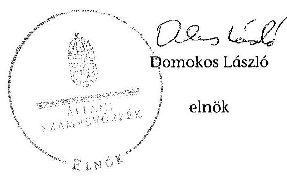
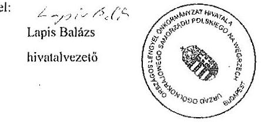
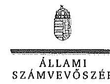

# ÁLLAMI   SZÁMVEVŐSZÉK 

## JELENTÉS

Az Országos Nemzetiségi Önkormányzatok gazdálkodásának ellenőrzéséről
Országos Lengyel Önkormányzat

---

# Állami Számvevőszék 

Iktatószám: V-0693-081/2015.
Témaszám: 1729
Vizsgálat-azonosító szám: V068005

## Az ellenőrzést felügyelte:

## Kisgergely István

felügyeleti vezető

## Az ellenőrzést vezette:

Schósz Attila Ferencné
ellenőrzésvezető
A számvevői jelentések feldolgozásában és a jelentés összeállításában
közreműködtek:

## Schósz Attila Ferencné

ellenőrzésvezető

## Szalontai Miklós

számvevő tanácsos

## Az ellenőrzést végezték:

## Kúnosné Talián Márta Szalontai Miklós számvevő számvevő tanácsos

---

# TARTALOMJEGYZÉK 

BEVEZETÉS ..... 3
I. ÖSSZEGZŐ MEGÁLLAPÍTÁSOK, KÖVETKEZTETÉSEK ..... 7
II. RÉSZLETES MEGÁLLAPÍTÁSOK ..... 18

1. A belső kontrollrendszer kialakításának és működtetésének megfelelősége ..... 18
1.1. A kontrollkörnyezet kialakítása ..... 18
1.2. A kockázatkezelési rendszer kialakításának és működtetésének megfelelősége ..... 20
1.3. A kontrolltevékenységek működésének megfelelősége ..... 21
1.4. Információs és kommunikációs rendszer kialakításának és működtetésének megfelelősége ..... 22
1.5. Monitoring-rendszer kialakításának és működtetésének megfelelősége ..... 23
2. A gazdálkodás szabályszerűsége ..... 26
2.1. Pénzügyi gazdálkodás megfelelősége ..... 26
2.2. Vagyongazdálkodással kapcsolatos feladatellátás szabályszerűsége ..... 30
3. Ingyenesen juttatott vagyon kezelésének megfelelősége ..... 31
4. Egyéb feladat- és hatáskör ellátás szabályszerűsége ..... 31
5. Integritás kontrollok ..... 31
6. ÁSZ javaslatok hasznosulása ..... 32
MELLÉKLETEK
7. számú Az Országos Lengyel Önkormányzat észrevétele
8. számú Az Országos Lengyel Önkormányzat észrevételére válasz
FÜGGELÉKEK
9. számú Rövidítések jegyzék
10. számú Az integritás kontrollok kialakítása és működtetése

---

.

---

# JELENTÉS 

## Országos Lengyel Önkormányzat gazdálkodásának ellenőrzéséről

## BEVEZETÉS

Az Országos Lengyel Önkormányzat (továbbiakban: Önkormányzat) az 1995. évben alakult. Az Elnök személye 2010-2014. I. félév között nem változott. Az Önkormányzat jelenlegi elnöke a 2014. évi országos nemzetiségi választások (2014 októbere) óta látja el feladatát. Az ellenőrzött időszakban a Hivatalvezetőt munkaszerződéssel, a gazdasági vezetőket 2012. június 14-ig megbízási szerződéssel, ezt követően munkaszerződéssel foglalkoztatták. A Hivatal 2014. év I. félévében négy fővel működött. Az Önkormányzat a 2010-2014. I. féléve között intézményt, gazdasági társaságot és más szervezetet nem alapított, illetve ezek társulásában nem vett részt. Az Önkormányzat nem adott és nem vett át üzemeltetésre, kezelésbe, koncesszióba eszközöket. Térítésmentesen átadás-átvétel nem történt. A 21 tagú Közgyűlés a munkája segítésére két bizottságot (Pénzügyi bizottság, Kulturális bizottság) hozott létre. Az Önkormányzat az ellenőrzött időszakban három - önállóan működő - intézményét, a Lengyel Közművelődési Központot, a Lengyel nyelvoktató Nemzetiségi Iskolát és a Magyarországi Lengyelség Múzeuma és Levéltárát működtette.

Az Önkormányzat költségvetési beszámolója szerint a 2013. évben teljesített költségvetési bevétel 196039 ezer Ft, a teljesített költségvetési kiadás 173240 ezer Ft volt. Az Önkormányzat a 2013. évben működési célra a Kvtv.-ben meghatározott 71600 ezer Ft összegű támogatásban részesült.

Az Alaptörvény XXIX. cikk (1) bekezdése szerint a Magyarországon élő nemzetiségek államalkotó tényezők. Minden, valamely nemzetiséghez tartozó magyar állampolgárnak joga van önazonossága szabad vállalásához és megőrzéséhez. A hazánkban élő nemzetiségek helyi (települési és területi), valamint országos önkormányzatokat hozhatnak létre.

Az országos nemzetiségi önkormányzatok gazdálkodási feladatait az önállóan működő és gazdálkodó költségvetési szerv, a hivatal látja el. Az országos nemzetiségi önkormányzatok a 2008. évtől tartoznak az államháztartás önkormányzati alrendszerébe, azóta hivatalaik költségvetési szervként működnek. Az Alaptörvény hatálybalépését követően a 2012. évtől további jelentős jogszabályi változások határozzák meg működésüket, gazdálkodásukat.

A nemzetiségek helyzete, támogatása mind hazai, mind EU-s szinten kiemelt figyelmet kap napjainkban. Az állam az országos nemzetiségi önkormányzatok működéséhez, a médiaszolgáltatáshoz kapcsolódó jogaik érvényesítéséhez, valamint a kulturális önigazgatásuk érdekében alapított - közművelődési, közgyűj-

---

teményi, tudományos - intézmények fenntartásához az éves költségvetési törvényekben nevesítetten költségvetési támogatást biztosít. Ezen kívül az országos nemzetiségi önkormányzatok közfeladataik ellátásához támogatást kapnak a fejezeti kezelésű előirányzatokból, valamint hazai és uniós pályázati forrásokat szerezhetnek.

Az ellenőrzés célja annak értékelése volt, hogy az Önkormányzat gazdálkodása, a belső kontrollrendszer kialakítása és működése, az államháztartásból nyújtott támogatás, illetve az államháztartásból meghatározott célra ingyenesen juttatott vagyon felhasználása a jogszabályi előírásoknak megfelelően történt-e; az Önkormányzat a Nek. tv.-ben és az Njtv.-ben előírt feladat- és hatásköröket ellátta-e, intézkedett-e az ÁSZ által a 2008-2010. évek között végzett ellenőrzések javaslatainak végrehajtásáról.

Az Önkormányzat korrupcióval szembeni veszélyeztetettségének csökkentése érdekében felmértük az integritási szemlélet érvényesülését a gazdálkodási folyamatokban.

Értékeltük az Önkormányzat gazdálkodása során a belső kontrollrendszer kialakítását és működését mind az öt pillére tekintetében, ellenőriztük a gazdálkodással összefüggő feladat- és hatásköröknek, a Hivatal működési, gazdálkodási rendjének jogszabályi előírásoknak való megfelelőségét; a belső kontrollok működésének megfelelőségét az éves költségvetés, a költségvetési beszámoló és a zárszámadás készítés folyamatában; a gazdálkodás pénzügyi folyamatában a kulcskontroll tevékenységek, (szakmai) teljesítésigazolás és 2011-ig utalvány ellenjegyzés, 2012-től érvényesítés kontrolltevékenységek működésének megfelelőségét; az Önkormányzat belső ellenőrzése kialakításának és működésének megfelelőségét.

Értékeltük továbbá az Önkormányzat gazdálkodása, ezen belül pénzügyi gazdálkodása keretében a tervezés, beszámolási, zárszámadás-készítési folyamat, az előirányzatok betartása, a könyvvezetés, a közzétételek, adatszolgáltatások, valamint az államháztartás rendszeréből jogszabály vagy megállapodás alapján céljelleggel kapott támogatások felhasználásának, elszámolásának szabályszerűségét. A vagyonnal kapcsolatos feladatellátás ellenőrzése keretében értékeltük a vagyongazdálkodás szabályozottságát, a mérleg alátámasztottságát, a leltározás, az eszközbeszerzések, a vagyonhasznosítás szabályszerűségét. Értékeltük az államháztartásból ingyenesen juttatott vagyon felhasználásának szabályszerűségét. Ellenőriztük az előírt feladat- és hatáskörök közül a vélemény-nyilvántartási, egyetértési jog gyakorlásával, a hatáskör átruházásokkal, az ideiglenes vagyonkezeléssel kapcsolatos feladatok ellátásának szabályszerűségét, az integritás kontrollok működését, továbbá az előző ÁSZ ellenőrzés javaslatainak hasznosulását

Az ellenőrzés várható hasznosulása: Az ellenőrzés eredményeként nemcsak az ellenőrzött szerv gazdálkodása javulhat, hanem átfogó képet kaphatunk az önkormányzati alrendszerbe tartozó országos nemzetiségi önkormányzatok gazdálkodásának hiányosságairól, de a jó gyakorlatokról is. Az ellenőrzés megállapításait és javaslatait más szervezetek is hasznosíthatják a rendezett gazdálkodási keretek kialakításához. Az ellenőrzés hozadékát képezi a 2008-2010. években elvégzett ÁSZ ellenőrzés javaslatai hasznosulásának értékelése. Mind a 13 országos nemzetiségi önkormányzat ellenőrzésével teljes körűen megvalósul az

---

országos nemzetiségi önkormányzatok ellenőrzése a megváltozott jogszabályi környezetben. Az ellenőrzés tapasztalatai alapján a jogszabályi ellentmondások, hiányosságok feltárásával, azok megszüntetésére vonatkozó javaslatokkal segítjük a jó kormányzást. Az ellenőrzéssel lehetővé tesszük, hogy az országos nemzetiségi önkormányzatok gazdálkodásáról, működéséről a társadalom objektív képet alkothasson.

Az Önkormányzat gazdálkodásának ellenőrzéséről szóló számvevőszéki jelentés I. fejezetének összegző része az ellenőrzés céljára adott rövid, szintetizáló összefoglalót és következtetéseket tartalmazza a II. fejezet részletes megállapításain alapulóan. A jelentés intézkedést igénylő megállapításait és javaslatait az ellenőrzés során feltárt, a jelentés II. fejezetében rögzített részletes megállapítások alapozzák meg.

Az ellenőrzés típusa: szabályszerűségi ellenőrzés.
Az ellenőrzött időszak: 2010. január 1.-2014. június 30.
Ellenőrzött szervezet: az Önkormányzat és Hivatala, továbbá azon intézmények, amelyek gazdálkodási feladatait a Hivatal látja el.

Az ellenőrzés végrehajtásának jogszabályi alapját az Állami Számvevőszékről szóló 2011. évi LXVI. törvény 1. § (3) bekezdése, az 5. § (2)-(3) és (6) bekezdései, valamint az államháztartásról szóló 2011. évi CXCV. törvény 61. § (2) bekezdésének előírásai képezik.

Az ellenőrzés módszertana az ÁSZ hivatalos honlapján (www.asz.hu) közzétett szakmai szabályokon alapul, amely a Legfőbb Ellenőrző Intézmények Nemzetközi Szervezete (INTOSAI) által kiadott nemzetközi standardok (ISSAI) figyelembevételével készült.

Az ellenőrzés lefolytatásához az Önkormányzat a kimutatások és a tanúsítványok elektronikus kitöltésével, valamint az ÁSZ által kért dokumentumok elektronikus megküldésével szolgáltatott adatokat. Az így rendelkezésre bocsátott adatok, információk kontrollja és a munkalapok kitöltése az ellenőrzöttnél végzett ellenőrzés keretében történt.

A pénzügyi folyamatokban a kulcskontrollok, a (szakmai) teljesítésigazolás és érvényesítés (2011-ig utalvány ellenjegyzése) kontrollok működésének megfelelősége értékeléséhez az egyszerű véletlen mintavétellel kiválasztott tételek (személyi juttatások, dologi és felhalmozási kiadások, a pénzeszközátadások), valamint az egyéb szabályszerűségi, nem pénzgazdálkodási jogkörökre vonatkozó felhalmozási kiadások, pénzeszköz átadások felhasználásának esetében a konkrét mintatételek értékelését végeztük el. Az államháztartás rendszeréből jogszabály vagy megállapodás alapján kapott támogatások felhasználásának, elszámolásának szabályszerűségét mintavétellel ellenőriztük. A jogszabályoknak és a belső előírásoknak megfelelőnek, azaz szabályszerűnek tekintettük a kapott támogatások felhasználásának és elszámolásának szabályszerűségét, az ellenőrzött kiadási, illetve bevételi előirányzatok felhasználását, amennyiben a minta ellenőrzésének eredménye alapján 95%-os bizonyossággal a teljes sokaságban a hibaarány kisebb volt, mint 10%, nem megfelelőnek értékeltük, ha a hibaarány

---

a 10%-ot meghaladta. Az Önkormányzat vagyonhasznosítási tevékenységet nem végzett.

Az ÁSZ a 2011. évi LXVI. törvény 29. §-a szerint a jelentéstervezetet megküldte az Országos Lengyel Önkormányzat elnökének és a hivatalvezetőnek egyeztetésre. A beérkezett észrevételt és az arra adott választ a jelentés 1-2. sz. mellékletei tartalmazzák.

---

# I. ÖSSZEGZŐ MEGÁLLAPÍTÁSOK, KÖVETKEZTETÉSEK 

Az Önkormányzatnál 2010-2014. I. félév között a belső kontrollrendszer kialakítása és működtetése összességében nem volt szabályszerű.

A kontrollkörnyezet kialakítása az Önkormányzat működését meghatározó jogszabályokkal részben volt összhangban. Az Önkormányzat az ellenőrzött időszakban rendelkezett a Nek. tv., illetve Njtv. előírásainak megfelelő SzMSz$_{1,2}$-vel. A Hivatal a feladatellátásának részletes belső rendjét és módját szervezeti és működési szabályzatban - az Áht.$_{1,2}$-ben foglaltakkal ellentétesen - 2012 szeptemberéig nem állapította meg. A számviteli politikát, a leltározási-, illetve az értékelési szabályzatot és a gazdálkodási jogkörök szabályzatát$_{1}$ az Áht.$_{1}$-ben és az Áhsz.-ben előírtakkal ellentétesen 2011. október 8-ig az arra hatáskörrel rendelkező Hivatalvezető helyett az Elnök hagyta jóvá, míg ezt követően a Hivatalvezető. Az ellenőrzött időszakban a jogszabályi előírások ellenére számla- és bizonylati rendet nem alakítottak ki. Az ellenjegyzésre jogosultakról és aláírásmintájukról - az Ámr., illetve az Ávr. előírása ellenére - nem vezettek nyilvántartást, nem rögzítették az ellenjegyzés gyakorlásának módját. A 2010-2013. évek között az Önkormányzatnál a jogszabályi előírásokat mellőzve a kötelezettségvállalásokat nem vették nyilvántartásba. A nyilvántartást a 2014. évtől vezették. A Hivatalvezető nem gondoskodott a Hivatal ellenőrzési nyomvonalának elkészítéséről.

A Hivatal az Ámr. és a Bkr. előírásai ellenére nem alakított ki és nem működtetett kockázatkezelési rendszert.

A kontrolltevékenységek kialakítása és működtetése nem felelt meg az előírásoknak. Az éves költségvetés, a beszámoló és a zárszámadás készítésének folyamatában a belső kontrollokat az ellenőrzött időszakban nem szabályozták és nem működtették. A 2010. év és 2014. I. félév között a kulcskontrollokat - az ellenőrzött mintatételek vonatkozásában - az Ámr. és Ávr. előírásai ellenére nem működtették.

Az információs és kommunikációs rendszer kialakítása és működtetése összességében nem volt megfelelő, mivel az Eisztv., illetve Info tv. előírásait figyelmen kívül hagyva nem szabályozták az elektronikus közzététel részletes szabályait. A 1992. évi LXIII. törvényben és az Info tv.-ben előírtak ellenére nem készítették el a Hivatal adatvédelmi és adatbiztonsági szabályzatát. Az Önkormányzat - az előírások ellenére - nem tette maradéktalanul közzé szervezetére, tevékenységére és működésére vonatkozó adatait. Nem tették közzé továbbá az Önkormányzat 2010-2011. évi, illetve a 2013-2014. évi költségvetését, a 2010., 2013. évi beszámolóját és a 2010., 2012-2013. évi beszámolókról elkészített független könyvvizsgálói jelentéseket. A jogszabályi előírás ellenére nem gondoskodtak a 2012-2014. I. félév között kapott céljellegű támogatások közzétételéről. Az Önkormányzat nem biztosította a közpénzek felhasználásának átláthatóságát az általa, 2010-2011. években céljelleggel nyújtott támogatások közzétételének elmulasztása miatt. A 2012-2014. év I. félévében a céljelleggel nyújtott támogatásokat a honlapon közzétették.

---

A Hivatalnál az iratkezelést az ellenőrzött években szabályozták. Az Ikr. előírásai és a belső szabályozás ellenére nem
 működtettek azonban az iratok szakszerű és biztonságos megőrzésére alkalmas irattárat, az iratkezelés megfelelő feltételeit nem biztosították, továbbá nem dokumentálták az iratforgalmat az iratok hollétének naprakész megállapíthatósága érdekében. E hiányosságok következtében nem volt biztosított a Hivatal 2012. évben jóváhagyott SzMSz-ének, a 2010. évi belső ellenőrzési jelentésnek, a 2010. évi költségvetés közgyűlési jóváhagyás dokumentumának, a 2010-2013. évi költségvetési beszámolók kisebbség/nemzetiségpolitikáért felelős miniszternek történt benyújtását igazoló dokumentumoknak a megőrzése.

A monitoring-rendszer kialakítása és működtetése összességében nem volt megfelelő. A Hivatalvezető az előírások ellenére nem alakította ki és nem működtette a Hivatal tevékenységének, a célok megvalósításának nyomon követését biztosító rendszert.

A belső ellenőrzés kialakítása és működtetése részben felelt meg a jogszabályi előírásoknak. Nem rögzítették a hivatali SzMSz-ben az ellenőrzést végző személy vagy szervezet jogállását, feladatait, továbbá a Hivatal belső ellenőrzési kézikönyvvel nem rendelkezett. Az ellenőrzött évek vonatkozásában a belső ellenőrzési vezető stratégiai ellenőrzési tervet nem készített. A 2010-2012. évekre - a Ber., Bkr. előírását mellőzve - a belső ellenőrzési vezető ellenőrzési tervet nem készített, illetve a 2013-2014. évi ellenőrzési terveket kockázatelemzéssel nem támasztotta alá. Éves ellenőrzési jelentést az előírások ellenére az Önkormányzat költségvetési szerveinek vezetői, illetve a belső ellenőrzési vezető nem készítettek. A belső ellenőrzési vezető a 2010-2011. évben, illetve a 2014. év I. félévben a Ber., illetve Bkr. előírását mellőzve nem vezetett nyilvántartást a belső ellenőrzési jelentésekben tett megállapításokról, javaslatokról. A belső ellenőrzések az ellenőrzött években több területen tártak fel hiányosságokat, illetve tettek ezek megszüntetésére javaslatokat. Az ellenőrzött években a Hivatalvezető és az intézményvezetők ennek ellenére intézkedési terveket - a jogszabályi előírásokkal szemben - nem készítettek, az Önkormányzat a javaslatokat alapvetően nem hasznosította.

Az Önkormányzat pénzügyi gazdálkodása nem felelt meg az előírásoknak. Az Elnök a 2010., 2012., 2013. évi költségvetési koncepciót - az Áht. ${ }_{1,2}$-ben foglalt határidőn belül - beterjesztette, míg a 2011. és 2014. évi költségvetési koncepciókat az Ámr., valamint az Áht. ${ }_{2}$ előírása ellenére nem terjesztette a Közgyűlés elé. A Pénzügyi bizottság a 2011-2013. évi költségvetési határozat tervezetét megvitatta és a Közgyűlésnek elfogadásra javasolta, a 2010. és 2014. évi költségvetési határozat tervezeteket a jogszabályi előírások ellenére nem véleményezte. A Közgyűlés által - határidőben - jóváhagyott 2011-2014. évi költségvetések szerkezete nem felelt meg az Ámr.-ben, az Áht. ${ }_{2}$-ben és az Ávr.-ben foglalt tartalmi tagolásnak, mivel azok csak a költségvetési bevételi-kiadási főösszegeket tartalmazták. Az Ámr.-ben, illetve az Áht. ${ }_{2}$-ben hivatkozott előirányzat felhasználási tervet a 2010-2014. évi költségvetésekhez nem mutattak be. Az Elnök a Közgyűlésnek tájékoztatásul nem mutatta be az Ámr., illetve Áht. ${ }_{2}$ előírása ellenére a 2010-2013. évekre vonatkozó adósságállományt és a vagyonkimutatást. A 2010-2013. években nem tartották be az Áht. ${ }_{1,2}$-ben foglalt, a költségvetési kiadási előirányzatokon belüli gazdálkodásra vonatkozó előírást.

---

A Hivatal - az Ámr., illetve az Ávr. előírása ellenére - az Önkormányzat 2010-2011. évi elemi költségvetését a kisebbségpolitikáért felelős állami szervnek, illetve az Önkormányzat és költségvetési szervei 2014. évi elemi költségvetését a Kincstár területileg illetékes szervének nem küldte meg. Az Önkormányzat a 2010. évben az Ámr.-ben előírt időközi költségvetési jelentés készítési, illetve adatszolgáltatási kötelezettségének nem, míg a 2011-2013. években eleget tett, azokat a Kincstár területileg illetékes szervének megküldte.

Az államháztartás rendszeréből jogszabály, illetve megállapodás alapján kapott működési támogatások felhasználása és elszámolása megfelelő volt, az Önkormányzat összességében betartotta a jogszabályi és szerződéses előírásokat, míg a nyilvántartás és a közzététel során nem. A központi költségvetésből kapott működési támogatásokról, illetve azok felhasználásáról - az előírások ellenére - elkülönített nyilvántartást nem vezettek. Az Önkormányzat a pályázati úton elnyert támogatásaival az ellenőrzött esetekben elszámolt, melyet a támogató minden alkalommal elfogadott. Az Önkormányzat által nyújtott támogatások ellenőrzött tételei közül az Elnök egy esetben az SzMSz ${ }_{1,2}$-ben és az Njtv.-ben foglaltak mellőzésével, a Közgyűlés hatáskörét elvonva döntött támogatás odaítéléséről. Az ellenőrzött támogatások alapján a támogatottak beszámolási kötelezettségüknek eleget tettek.

Az Önkormányzat vagyongazdálkodási tevékenysége összességében nem felelt meg a jogszabályi előírásoknak. Az Önkormányzat az ellenőrzött időszakban rendelkezett vagyonkezelési szabályzattal, azonban a Nek. tv.-ben és az Njtv.-ben foglaltak ellenére nem döntött törzsvagyona köréről, nem határozta meg vagyonleltárát.

A 2010-2012. évi beszámolók mérlegsorait a Számv. tv. és az Áhsz. előírásai ellenére leltárral nem támasztották alá, ezért a könyvviteli mérlegadatok valódisága nem volt igazolható. Az Önkormányzatnál a 2013. évre vonatkozóan a leltározási szabályzatban és az Áhsz.-ben foglaltakat figyelmen kívül hagyva - az eszközök leltározását egyeztetéssel hajtották végre. Az ellenőrzött tárgyi eszköz és immateriális javak üzembe helyezése, értékelése, állományba vétele és értékcsökkenésük elszámolása a jogszabályi előírásoknak megfelelt. Az Önkormányzat vagyonhasznosítási tevékenységet az ellenőrzött időszakban nem végzett, gazdasági társasággal nem rendelkezett.

Az Önkormányzat megalakulását követően ingyenes vagyonjuttatásban (székhelyként szolgáló ingatlan) részesült, melyet az ellenőrzött időszakban a Nek. tv., illetve az Njtv. előírása ellenére nem forgalomképtelen, hanem korlátozottan forgalomképes vagyonként tartott nyilván.

Az Önkormányzat az ellenőrzött években a vélemény-nyilvánítási, egyetértési és közreműködési jogának az ONÖSZ közvetítésével tett eleget. Az Önkormányzat képviseletében eljáró Elnök a Nek. tv.-ben, illetve az Njtv.-ben foglaltakat figyelmen kívül hagyva, a Közgyűlés hatáskörét elvonva, annak felhatalmazása nélkül járt el e jogok gyakorlása során.

Az ÁSZ tv. 33. § (1) bekezdésében foglaltak értelmében a jelentésben foglalt megállapításokhoz kapcsolódó intézkedési tervet köteles az ellenőrzött szervezet vezetője összeállítani, és azt a jelentés kézhezvételétől számított 30 napon belül az ÁSZ részére megküldeni. Amennyiben az intézkedési tervet határidőben nem

---

küldi meg a szervezet, vagy az nem elfogadható, az ÁSZ elnöke a hivatkozott törvény 33. § (3) bekezdés a)-b) pontjaiban foglaltakat érvényesítheti

A helyszíni ellenőrzés megállapításainak hasznosítása mellett javasoljuk:

# az Elnöknek 

1. Az Önkormányzat és költségvetési szervei a 2010-2012. évi eszköz és forrás mérlegsorokat leltárral - a Számv. tv. 69. § (1) bekezdésében és az Áhsz. 37. § (1) és (3) bekezdéseiben előírtakkal ellentétesen - nem támasztották alá. Mindezek következtében a könyvviteli mérlegadatok valódisága nem volt igazolható, sérült a Számv. tv. 15. § (3) bekezdése alapján megkövetelt valódiság elve.

Javaslat:
Tegyen intézkedéseket a leltár alátámasztásánál feltárt hiányosságok és szabálytalanságok tekintetében a felelősség tisztázása érdekében, és szükség szerint intézkedjen a felelősség érvényesítéséről.
2. A Közgyűlés a Vnytv. 4. § a) és d) pontjaiban foglaltak ellenére a vagyonnyilatkozattételre kötelezettek körét az $\mathrm{SzMSz}_{1,2}$-ben nem szabályozta.

Javaslat:
Terjessze be a Közgyűlés elé jóváhagyásra az SzMSz módosítását a vagyonnyilatkozattételre kötelezettek körének kiegészítésével.
3. Az Elnök a 2011. és 2014. évi költségvetési koncepciókat az Ámr. 35. § (2) bekezdése, a 40. § (1) bekezdése, valamint az Áht. ${ }_{2} 24 . \S$ (1) bekezdésének és 26. § (1) bekezdésének előírása ellenére nem terjesztette a Közgyűlés elé.

Javaslat:
Terjessze be a Közgyűlésnek az éves költségvetési koncepciót a jogszabályi előírások szerint.
4. Az Elnök a zárszámadás előterjesztésekor nem mutatta be a Közgyűlésnek tájékoztatásul a 2010-2013. évek vonatkozásában az Ámr. 40. § (6) bekezdés b) pontja ellenére az adósságállományt lejárat és hitelezők szerinti bontásban, illetve az Áht. ${ }_{2}$ 91. § (2) bekezdés b) pontja ellenére az adósságállományt lejárat szerinti bontásban. Nem mutatta be a Közgyűlésnek továbbá az Ámr. 40. § (6) bekezdés d) pontja, illetve az Áht. ${ }_{2}$ 91. § (2) bekezdés c) pontja előírásának ellenére a vagyonkimutatást.

Javaslat:
Intézkedjen, hogy a jövőben a Közgyűlés részére kerüljenek bemutatásra a zárszámadási határozat beterjesztésekor a jogszabályban előírt kimutatások.
5. Az Elnök - a Nek. tv. 39/A. § (1) bekezdésében, illetve az Njtv. 119. § (1) bekezdésében foglaltakat figyelmen kívül hagyva - a Közgyűlés hatáskörét elvonva, annak felhatalmazása nélkül gondoskodott a vélemény-nyilvánítási, egyetértési és közreműködési kötelezettség ellátásáról.

---

Javaslat:
Biztosítsa, hogy a jövőben, az Önkormányzat vélemény-nyilvánítási, egyetértési és közreműködési kötelezettsége szabályszerű ellátása érdekében a feladatellátással összefüggő hatáskört - beszámolási kötelezettség előírásával - Közgyűlési felhatalmazás alapján lássa el.

# a Hivatalvezetőnek 

1. A belső kontrollrendszeren belül:
a) Az ellenőrzött években a gazdálkodás részben volt szabályozott. Az Áhsz. 37. § (1) bekezdésében, illetve a 4/2013. (I. 11.) Korm. rendelet 22. § (2) bekezdésében előírt éves leltározási kötelezettséggel ellentétesen az önkormányzati ingatlanokra ötévente történő leltározást írták elő. Az ellenőrzött időszakban a Hivatalnál a Számv. tv. 161. § (1) bekezdésben, az Áhsz. 49. § (1) bekezdésben, illetve a 4/2013. (I. 11.) Korm. rendelet 51. § (2) bekezdésben előírtakkal ellentétben számlarendet, illetve azt alátámasztó bizonylati rendet a Számv. tv. 161. § (2) bekezdés d) pontban előírtak ellenére nem alakítottak ki. Az Ámr. 80. § (3) bekezdésben, illetve az Ávr. 60. § (3) bekezdésben foglaltak ellenére az ellenjegyzésre jogosult személyekről és aláírás-mintájukról naprakész nyilvántartást nem vezettek. Az ellenőrzött időszakban az Ámr. 20. § (3) bekezdés a) pontjában, illetve az Ávr. 13. § (2) bekezdés a) pontjában előírtakat mellőzve belső szabályzatban nem határozták meg az ellenjegyzés gyakorlásának módjával kapcsolatos előírásokat, a (szakmai) teljesítésigazolás módját, eljárási és dokumentációs részletszabályait, az érvényesítést végző személyek kijelölésének rendjét, az érvényesítés gyakorlása módját, eljárási és dokumentációs részletszabályait és az adatszolgáltatási feladatok teljesítésével kapcsolatos előírásokat. A Hivatalnál a kontrollkörnyezet kialakításának keretében - az Ámr. 156. § (1) bekezdés c) pontjában, illetve a Bkr. 6. § (1) bekezdés c) pontjában foglaltak ellenére - a 2010-2014. év I. félév között etikai elvárásokat nem határoztak meg.

Javaslat:
Intézkedjen a jogszabályok által rögzített számviteli, illetve gazdálkodási szabályok (kulcskontrollok) belső szabályzatok keretében történő előírására, az ellenjegyzésre jogosult személyekről és aláírás-mintájukról naprakész nyilvántartás vezetésére és az etikai elvárások meghatározására.
b) A Hivatalvezető nem alakított ki és nem működtetett kockázatkezelési rendszert az Ámr. 155. § (1) bekezdésében, a 157. § (1) bekezdésében, illetve a Bkr. 3. § b) pontjában és a 7. § (1) bekezdésben előírtak ellenére.

Javaslat:
Alakítsa ki és működtesse a kockázatkezelési rendszert.
c) A kontrolltevékenységek kialakítása és működtetése az ellenőrzött időszakban nem felelt meg a jogszabályi előírásoknak. Az ellenőrzött években az éves költségvetés, a zárszámadás, illetve a költségvetési beszámoló készítésének folyamatára vonatkozó belső kontrollokat nem szabályozták. A Hivatalvezető - az Ámr. 156. § (2)

---

bekezdésében, illetve a Bkr. 6. § (3) bekezdésében foglaltak ellenére - nem gondoskodott az ellenőrzési nyomvonal elkészítéséről, nem rögzítette a folyamatok felelősségi és információs szintjeit, kapcsolatait, az irányítási és ellenőrzési folyamatokat, ezáltal nem volt lehetséges azok nyomon követése és utólagos ellenőrzése. Szakmai teljesítésigazolást az Ámr. 76. § (1) bekezdésben előírtak ellenére nem végeztek, a kiadások teljesítésének jogosságát, összegszerűségét, az ellenszolgáltatást is magában foglaló kötelezettségvállalás teljesítését nem igazolták. Az utalvány ellenjegyzését az Ámr. 79. § (2) bekezdésében és az Áht.; 100/C. § (6) bekezdésében előírtak ellenére nem végezték el. Az ellenőrzött mintatételek
 bizonylatai nem tartalmazták az Ámr. 79. § (2) bekezdése szerinti (74. § (1) bekezdésében foglalt), az ellenjegyzés tényére és dátumára vonatkozó utalást. Utalvány ellenjegyzése hiányában nem ellenőrizték az Ámr. 79. § (2) bekezdésben előírt szakmai teljesítés igazolás és érvényesítés megtörténtét. Nem került sor továbbá az Ámr. 74. § (3) bekezdés a)-b) pontjai alapján a jóváhagyott költségvetés fel nem használt, le nem kötött kiadási előirányzata rendelkezésre állásának, a fedezet meglétének, a kifizetés időpontjában a fedezet rendelkezésre állásának ellenőrzésére. A teljesítésigazolást az Ávr. 57. § (1) bekezdésben előírtak ellenére nem végezték el, a 2010-2011. évi mintatételek ellenőrzése kapcsán megállapított hiányosságok a 2012-2013. években és a 2014. I. félévben is fennálltak. Érvényesítést - a kifizetések összegszerűségre, a fedezet meglétére és a megelőző ügymenetben a jogszabályi és a belső szabályzati előírások megtartására vonatkozó ellenőrzést az Ávr. 58. § (1) bekezdésben előírtak ellenére nem végeztek.

Javaslat:
Intézkedjen a folyamatok felelősségi és információs szintjei, kapcsolatai, az irányítási és ellenőrzési folyamatok - különösen az éves költségvetés, a zárszámadás, illetve a költségvetési beszámoló készítésének területén történő - szabályozásáról.

Intézkedjen a gazdálkodási jogkörök (teljesítésigazolás és érvényesítés) szabályszerű gyakorlásának érvényesítéséről.
d) Az információs és kommunikációs rendszer kialakítása és működtetése az ellenőrzött időszakban összességében nem volt megfelelő. Az ellenőrzött időszakban az Eisztv. 4. § (3), illetve Info tv. 35. § (3) bekezdésben előírtak ellenére az elektronikus közzététel szabályait a Hivatalnál belső szabályzatban nem határozták meg. A Hivatalvezető - az 1992. évi LXIII. törvény 31/A. § (3) bekezdésében és az Info tv. 24. § (3) bekezdésében foglaltak ellenére - nem készítette el a Hivatal adatvédelmi és adatbiztonsági szabályzatát.

Javaslat:
Alakítsa ki az elektronikus közzététel szabályainak rendjét.
Intézkedjen a Hivatal adatvédelmi és adatbiztonsági szabályzatának elkészítésére.
e) Az ellenőrzött időszakra vonatkozóan nem tettek teljes körűen eleget az Eisztv. 6. § (1) bekezdésben hivatkozott mellékletben, illetve az Info tv. 37. § (1) bekezdésben hivatkozott 1. számú mellékletben előírt - az Önkormányzat szervezetére, tevékenységére és működésére vonatkozó - adatok közzétételének. Az Önkormányzat honlapján nem tette közzé a 2010-2011. évi elemi költségvetését az Eisztv. 6. § (1) bekezdésében, illetve a 2013-2014. évi költségvetését az Info tv. 37. § (1) bekezdésében előírtak ellenére. A Hivatal az Eisztv. 6. § (1) bekezdésében, illetve az Info tv. 37. § (1) bekezdésében előírtak ellenére nem tette közzé az Önkormányzat 2010. és 2013. évi beszámolóját. Az Önkormányzat - figyelmen kívül hagyva a 28/2012. (III. 6.) Korm. rend. 12. § (5), illetve a 428/2012. (XII. 29.) Korm. rendelet 13. § (2) bekezdésében foglaltakat - a támogatók által nyújtott támogatások tényét honlapján nem tette közzé.

Javaslat:
Gondoskodjon az Önkormányzat szervezetére, tevékenységére és működésére vonatkozó adatok, az éves költségvetések, költségvetési beszámolók, valamint a támogatók által nyújtott támogatások tényének közzétételéről.
f) A Hivatalvezető a szabályozás ellenére nem tett eleget az lkr. 5. §-ban előírt kötelezettségnek, mert nem működtetett az iratok szakszerű és biztonságos megőrzésére alkalmas irattárat, továbbá az iratkezelés megfelelő tárgyi, technikai és személyi feltételeit nem biztosította, nem felügyelte. Az irattári anyagok kezelése nem volt dokumentált, visszakereshető az lkr. 59. §-ban foglaltak ellenére.

Javaslat:
Működtessen az iratok szakszerű és biztonságos megőrzésére alkalmas irattárat, biztosítsa és felügyelje az iratkezelés megfelelő tárgyi, technikai és személyi feltételeit, gondoskodjon az irattári anyagok kezelésének dokumentáltságáról, visszakereshetőségéről.
g) Az Önkormányzat monitoring rendszerének kialakítása és működtetése az ellenőrzött időszakban nem volt megfelelő. A Hivatalvezető - az Áht. $_{1}$ 121. § (2) bekezdés e) pontjában, az Ámr. 160. §-ában, a Bkr. 3. § e) pontjában és a 10. §-ában foglaltak ellenére - nem alakította ki és nem működtette a Hivatal tevékenységének, a célok megvalósításának nyomon követését biztosító rendszert. A Hivatalvezető - az Ámr. 156. § (2) bekezdése és a Bkr. 6. § (3) bekezdése előírásai ellenére nem gondoskodott a Hivatal működésének irányítási és ellenőrzési folyamatai, a felelősségi és információs szintek és kapcsolatok leírását tartalmazó ellenőrzési nyomvonal elkészítéséről.

Javaslat:
Alakítsa ki a Hivatal tevékenységének, a célok megvalósításának nyomon követését biztosító rendszert és gondoskodjon annak működtetéséről.

Intézkedjen az ellenőrzési nyomvonal elkészítéséről.
h) Az ellenőrzött időszakban - a Ber. 4. § (2) bekezdésében, illetve a Bkr. 15. § (2) bekezdésében előírtak ellenére - a hivatali SzMSz-ben nem rögzítették az ellenőrzést végző személy vagy szervezet jogállását, feladatait. A Ber., illetve a Bkr. felhatalmazása alapján a Hivatalvezető a belső ellenőrzést az ellenőrzött időszakban külső szolgáltató (gazdasági társaság) megbízásával biztosította. Az erre vonatkozó megbízási szerződésekben azonban a Ber. 4/A. § (2) bekezdésben, illetve a Bkr. 16. § (4) bekezdésben foglaltak ellenére nem írták elő a - Ber. 12. §-ában, illetve a Bkr. 22. § (1)-(2) bekezdéseiben foglalt - tevékenységek ellátásának módját.

Javaslat:
Intézkedjen az ellenőrzést végző személy vagy szervezet jogállásának, feladatainak SzMSz-ben történő meghatározásáról, továbbá a belső ellenőrzési vezetői feladatok ellátása módjának szerződésben történő rögzítéséről.
i) A Hivatal a Ber. 5. § (1) bekezdése, illetve a Bkr. 17. § (1) bekezdése előírása ellenére az ellenőrzött években nem rendelkezett belső ellenőrzési kézikönyvvel.

Javaslat:
Intézkedjen, hogy a Hivatal rendelkezzen jóváhagyott belső ellenőrzési kézikönyvvel.
j) A belső ellenőrzési vezető a Ber. 18. §, illetve a Bkr. 29. § (1) bekezdésben foglaltak ellenére stratégiai ellenőrzési tervet nem készített az ellenőrzött időszakra. A 2010-2012. évekre vonatkozó éves ellenőrzési terveket a belső ellenőrzési vezető a Ber. 32/A. § (2) bekezdésében előírtak ellenére nem készített, míg a 2013-2014. évekre szóló ellenőrzési terveket a Bkr. 22. § (1) bekezdés b) pontjában foglalt előírás ellenére kockázatelemzéssel nem támasztotta alá. Az ellenőrzött években éves ellenőrzési jelentést a Ber. 32/A. § (6) bekezdésével ellentétesen az Önkormányzat költségvetési szerveinek vezetői, illetve a Bkr. 55. § (4) bekezdésével ellentétesen a belső ellenőrzési vezető nem készített.

Javaslat:
Intézkedjen, hogy a belső ellenőrzési vezető a stratégiai- és kockázatelemzéssel alátámasztott éves ellenőrzési tervet, valamint éves ellenőrzési jelentést elkészítse.
k) A belső ellenőrzések az ellenőrzött években több területen tártak fel hiányosságokat, illetve tettek ezek megszüntetésére javaslatokat. A Hivatalvezető ennek ellenére intézkedési terveket a Ber. 29. § (1) bekezdésében, illetve a Bkr. 45. § (1) bekezdésében előírtakkal szemben nem készített.

Javaslat:
Készítsen a belső ellenőrzések javaslataira intézkedési tervet.
l) A belső ellenőrzési vezető a 2010-2011. évben a Ber. 32. § (1)-(2) bekezdésben, illetve a 2014. év I. félévben a Bkr. 47. § (1) bekezdésben előírtak ellenére nem vezetett nyilvántartást a belső ellenőrzési jelentésekben tett megállapításokról, javaslatokról.

Javaslat:
Intézkedjen annak érdekében, hogy a belső ellenőrzési vezető vezessen nyilvántartást a belső ellenőrzési jelentésekben tett megállapításokról, javaslatokról.
m) A belső kontrollrendszer minőségét a Hivatalvezető, illetve az önállóan működő költségvetési szervek vezetői az Ámr. 217. § c) pontban hivatkozott 21. számú melléklete, illetve a Bkr. 11. § (1) bekezdésben hivatkozott 1. számú melléklete szerinti nyilatkozatban a 2010-2013. évekre nem értékelték.

Javaslat:
Értékelje a belső kontrollrendszer minőségét a jogszabályban előírt nyilatkozatban.
2. A pénzügyi- és vagyongazdálkodás területén
a) A Pénzügyi bizottság a 2011-2013. évi költségvetés tervezetét a Nek. tv.-ben, illetve a Njtv. tv.-ben foglaltak alapján véleményezte és a Közgyűlésnek elfogadásra javasolta. A 2010. és 2014. évi költségvetési tervezet bizottsági véleményezése - a Nek. tv. 39/G. § (2) bekezdésben, illetve a Njtv. 135. §-ában foglaltak ellenére nem történt meg.

Javaslat:
Intézkedjen, hogy a Pénzügyi bizottság az éves költségvetés tervezetét véleményezze.
b) A Hivatalvezető nem tett eleget az Ámr. 36. § (3) bekezdésben, illetve az Ávr. 27. § (1) bekezdésben előírt, a költségvetési határozat-tervezetek költségvetési szervek vezetőivel történő egyeztetési kötelezettségének.

Javaslat:
Egyeztesse a költségvetési határozat-tervezeteket a költségvetési szerv vezetőjével és annak eredményét rögzítse.
c) Az Ámr. 40. § (5) bekezdés a) pontjában, illetve az Áht. 2 24. § (4) bekezdés a) pontjában hivatkozott előirányzat felhasználási terv a 2010-2014. évi költségvetésekhez bemutatásra nem került, mivel nem készítették el.

Javaslat:
Intézkedjen az éves előirányzat felhasználási terv elkészítéséről.
d) A Közgyűlés által jóváhagyott 2011-2014. évi költségvetések szerkezete nem felelt meg az Ámr. 36. § (1), illetve az Áht. 2 23. § (2) és az Ávr. 24. § (1) bekezdésekben foglalt tartalmi tagolásnak, ugyanis a közgyűlési határozatok csak az Önkormányzat és a költségvetési szervek költségvetési bevételi és kiadási főösszegeit tartalmazták.

Javaslat:
Intézkedjen az éves költségvetés jogszabályi előírások szerinti tartalmi tagolásban történő előkészítéséről.
e) Az Önkormányzat és költségvetési szervei 2014. évi elemi költségvetését a Hivatal az Ávr. 33. § (1)-(2) bekezdéseiben előírtak ellenére nem küldte meg a Kincstár területileg illetékes szervének.

Javaslat:
Küldje meg az éves elemi költségvetéseket a Kincstár területileg illetékes szervének.

f) A 2011. évben a költségvetés módosított kiadási főösszegét, míg az egyes kiemelt kiadási előirányzatokat minden évben túllépték, ezáltal nem tartották be az Áht. $_{1}$ 12/A. § (1) bekezdésében, illetve Áht. 2 6. § (1) bekezdésben foglalt, a jóváhagyott kiadási előirányzatokon belüli gazdálkodásra vonatkozó előírást.

Javaslat:
Biztosítsa a jóváhagyott kiadási előirányzatokon belüli gazdálkodásra vonatkozó jogszabályi előírást.
g) Az Önkormányzat a Nek. tv. 37. § (1) bekezdés c) pont, illetve az Njtv. 92. § (4) bekezdés c) pont előírása ellenére nem határozta meg törzsvagyonának körét. Az Önkormányzat a Nek. tv. 37. § (1) bekezdés b) pontjában, illetve az Njtv. 113. § c) pontjában előírtak ellenére nem határozta meg vagyonleltárát.

Javaslat:
Intézkedjen az Önkormányzat törzsvagyonának és vagyonleltárának jogszabályi előírások szerinti meghatározása érdekében, és terjessze jóváhagyásra a Közgyűlés elé.
h) Az Önkormányzat és költségvetési szervei a 2010-2012. évi eszköz és forrás mérlegsorokat leltárral - a Számv. tv. 69. § (1) bekezdésében és az Áhsz. 37. § (1) és (3) bekezdéseiben előírtakkal ellentétesen - nem támasztották alá. A 2013. évre vonatkozóan - a leltározási szabályzatban és az Áhsz. 37. § (3) bekezdésben foglaltakat figyelmen kívül hagyva - az eszközök leltározását egyeztetéssel hajtották végre, mennyiségi leltárfelvételt nem készítettek.

Javaslat:
Intézkedjen a mérlegtételek alátámasztására szolgáló leltár jogszabályok szerinti elkészíttetéséről, amely az eszközök és források állományát tételesen és ellenőrizhető módon tartalmazza.
3. Az országos nemzetiségi önkormányzat részére adott, illetve az által nyújtott támogatások tekintetében:
a) Nem vezettek elkülönített nyilvántartást a központi költségvetésből kapott támogatásokról a 342/2010. (XII. 28.) Korm. rendelet 10. § (2) bekezdésében, a 28/2012. (III. 6.) Korm. rendelet 11. § (2) bekezdésében, illetve a 428/2012. (XII. 29.) Korm. rendelet 10. § (3) bekezdésében, valamint 2013. november 20-ától azok felhasználásáról a 428/2012. (XII. 29.) Korm. rendelet 10. § (4) bekezdésében foglalt előírás ellenére.

Javaslat:
Intézkedjen, hogy az Önkormányzat a működési támogatások felhasználásáról elkülönített nyilvántartást vezessen.
b) A támogatások felhasználását, számadását az Önkormányzat nem ellenőrizte, mely a 2010-2011. években ellentétes volt az Áht. 1 13/A. § (2) bekezdésében foglalt előírásokkal. A 2012-2014. I. félévben az Önkormányzat az Ávr. 80. § (3) bekezdésében, valamint az Áht. 2
 53. § (1) bekezdésében foglaltak ellenére a támogatás rendeltetésszerű felhasználásáról nem győződött meg.

---

Javaslat:
Intézkedjen az önkormányzat által nyújtott támogatások felhasználásának ellenőrzéséről.

---

# II. RÉSZLETES MEGÁLLAPÍTÁSOK 

## 1. A BELSŐ KONTROLLRENDSZER KIALAKÍTÁSÁNAK ÉS MŰKÖDTETÉSÉNEK MEGFELELŐSÉGE

Az ellenőrzött időszakban az Önkormányzatnál a belső kontrollrendszer (a kontrollkörnyezet, a kockázatkezelési rendszer, a kontrolltevékenységek, az információs és kommunikációs rendszer és a monitoring rendszer) kialakítása, működtetése összességében nem volt szabályszerű az alábbiakban részletezett szabályozásbeli és működésbeli hiányosságok, hibák miatt.

### 1.1. A kontrollkörnyezet kialakítása

A kontrollkörnyezet kialakítása az Önkormányzat működését meghatározó jogszabályokkal részben volt összhangban.

Az Önkormányzat az ellenőrzött időszakban rendelkezett a Nek. tv., illetve Njtv. előírásainak megfelelő $\mathrm{SzMSz}_{1,2}$-vel, melyben rögzítette szervezetének és működésének részletes szabályait. Az Önkormányzat az $\mathrm{SzMSz}_{2}$-t az időközben történt jogszabályi (Áht. ${ }_{2}$, Ávr., Njtv.) változásokra tekintettel a 2013. évben módosította.

Az Önkormányzat a Nek. tv. 39/G. § (4) bekezdésben előírtak ellenére a Magyar Közlönyben nem tette közzé a 2011. október 8-ától hatályos $\mathrm{SzMSz}_{2}$-t, annak 2013. évi egységes szerkezetbe foglalt módosítását az Info tv.-ben előírtak alapján a honlapján közzétette.

A Hivatal feladatai ellátásának részletes belső rendjét és módját szervezeti és működési szabályzatban - az Áht. ${ }_{1} 91 . \S$ (2) bekezdésében ${ }^{1}$, illetve az Áht. ${ }_{2} 10 . \S$ (5) bekezdésben foglaltakkal ellentétesen - 2012 szeptemberéig nem állapította meg. A Közgyűlés által 2012. szeptember 9-én jóváhagyott hivatali SzMSz-t az Ikr. 14. § (4) bekezdésében, valamint az 59. §-ában foglaltak be nem tartása miatt az ÁSZ ellenőrzés részére nem tudták bemutatni, míg annak a 2013. évi módosítással egységes szerkezetbe foglalt változata rendelkezésre állt, mely megfelelt az Ávr.-ben előírt tartalmi követelményeknek és a Hivatal alapító okiratában foglaltaknak.

A Közgyűlés a Vnytv. 4. § a) és d) pontjaiban foglaltak ellenére a vagyonnyilatkozat-tételre kötelezettek körét az $\mathrm{SzMSz}_{1,2}$-ben nem szabályozta. A Nek. tv. és az Njtv. előírásait betartva az önkormányzati képviselők az ellenőrzött időszak minden évében vagyonnyilatkozatot tettek.

[^0]
[^0]:    ${ }^{1}$ 2010. augusztus 15-től hatályos

---

A Hivatalvezető végzettsége a 2010-2013. években nem felelt meg az Ámr. 105. § (2) bekezdésben, illetve az Ávr. 7. § (4) bekezdésében ${ }^{2}$ meghatározottaknak. Az ellenőrzött időszakban foglalkoztatott gazdasági vezetők megfelelő végzettséggel, szakképesítéssel rendelkeztek.

Az ellenőrzött években a gazdálkodás részben volt szabályozott. Az $\mathrm{SzMSz}_{1,2}$ függelékeiként az Önkormányzat meghatározta, mely szabályzatok képezik a Hivatal számviteli, gazdálkodási tevékenységének szabályrendszerét.

A számviteli politikában rögzítették, hogy annak rendelkezései - az Áhsz. felhatalmazása alapján - a Hivatalra és az önkormányzati intézményekre egyaránt kiterjednek.

A gazdálkodási jogkörök szabályzata ${ }_{1}$-ben az Ámr. előírásaival összhangban rögzítették az Önkormányzat és költségvetési szervei részére a kötelezettségvállalás és utalványozás jogosultjait, valamint az összeférhetetlenségi szabályokat.

A számviteli politikát (és a részét képező leltározási-, értékelési szabályzatot), illetve a gazdálkodási jogkörök szabályzata ${ }_{1}$-t 2011. október 8-ig az Áht. ${ }_{1}$ 121/A. § (1) bekezdésének ${ }^{3}$, valamint az Áhsz. 8. § (12) bekezdésének előírása ellenére az arra hatáskörrel rendelkező Hivatalvezető helyett az Elnök hagyta jóvá.

A számviteli politikát, a leltározási-, az értékelési-, pénzkezelési-, és önköltségszámítási szabályzatot 2011. október 8-tól az Áhsz.-nek megfelelően a Hivatalvezető hagyta jóvá. A leltározási szabályzatban meghatározták az eszközök és források leltározásának részletes szabályait. Az Áhsz. 37. § (1) bekezdésében, illetve a 4/2013. (I. 11.) Korm. rendelet 22. § (2) bekezdésében előírt éves leltározási kötelezettséggel ellentétesen az önkormányzati ingatlanokra ötévente történő leltározást írtak elő.

Az ellenőrzött időszakban a Hivatalnál a Számv. tv. 161. § (1) bekezdésben, az Áhsz. 49. § (1) bekezdésben, illetve a 4/2013. (I. 11.) Korm. rendelet 51. § (2) bekezdésben előírtakkal ellentétben számlarendet, illetve azt alátámasztó bizonylati rendet a Számv. tv. 161. § (2) bekezdés d) pontban előírtak ellenére nem alakították ki.

Az Áht. ${ }_{1}$-ben foglaltak alapján a (2011. október 8-ától hatályos) gazdálkodási jogkörök szabályzata ${ }_{2}$-t a Hivatalvezető hagyta jóvá, melyben meghatározták az Ámr.-rel összhangban az utalványozásra és annak ellenjegyzésére jogosultakat. Az Ámr. 80. § (3) bekezdésben, illetve az Ávr. 60. § (3) bekezdésben foglaltak ellenére az ellenjegyzésre jogosult személyekről és aláírás-mintájukról naprakész nyilvántartást nem vezettek.

[^0]
[^0]:    ${ }^{2}$ 2014. január 1-jétől nincs jogszabályi előírás a hivatalvezető végzettségére.
    ${ }^{3}$ 2010. december 31-éig az Áht. ${ }_{1}$ 121. § (1) bekezdése szabályozta.

---

Az ellenőrzött időszakban az Ámr. 20. § (3) bekezdés a) pontjában, illetve az Ávr. 13. § (2) bekezdés a) pontjában előírtakat mellőzve belső szabályzatban nem határozták meg:

- az ellenjegyzés gyakorlásának módjával kapcsolatos előírásokat;
- a (szakmai) teljesítésigazolás módját, eljárási és dokumentációs részletszabályait;
- az érvényesítést végző személyek kijelölésének rendjét, az érvényesítés gyakorlása módját, eljárási és dokumentációs részletszabályait és az adatszolgáltatási feladatok teljesítésével kapcsolatos előírásokat.
A 2010-2013. évek között az Önkormányzatnál az Ámr. 75. § (1) bekezdésben, illetve az Ávr. 56. § (1) bekezdésben előírtak ellenére a kötelezettségvállalások nyilvántartásba vételéről nem gondoskodtak. A kötelezettségvállalások nyilvántartását a 2014. évtől az Ávr.-nek megfelelően kialakították.

Rendelkeztek beszerzési szabályzattal (és ennek részeként versenyeztetési-, illetve közbeszerzési szabályzattal). A beszerzési szabályzatot az Áht. ${ }_{1}$ 121. § (1) bekezdés előírása ellenére az arra hatáskörrel rendelkező Hivatalvezető helyett a Közgyűlés hagyta jóvá a 2008. évben.

A Hivatalvezető - az Ámr. 156. § (3) bekezdés ${ }^{4}$ előírásától eltérően - 2011. október 8-ig nem alakította ki a szabálytalanságok kezelésének eljárásrendjét, míg ezen időponttól a Hivatal rendelkezett a Hivatalvezető által jóváhagyott szabálytalanságkezelési eljárásrenddel. A Hivatalnál a kontrollkörnyezet kialakításának keretében - az Ámr. 156. § (1) bekezdés c) pontjában, illetve a Bkr. 6. § (1) bekezdés c) pontjában foglaltak ellenére - a 2010-2014. év I. félév között etikai elvárásokat nem határoztak meg. A Hivatalvezető - az Ámr. 156. § (2) bekezdésében, illetve a Bkr. 6. § (3) bekezdésében foglaltak ellenére - nem gondoskodott az ellenőrzési nyomvonal elkészítéséről, nem rögzítette a folyamatok felelősségi és információs szintjeit, kapcsolatait, az irányítási és ellenőrzési folyamatokat, ezáltal nem volt lehetséges azok nyomon követése és utólagos ellenőrzése.

Az ellenőrzött időszakban a Hivatal nem rendelkezett gazdasági szervezettel, amely gyakorlat a 2014. évre vonatkozóan nem felelt meg az Ávr. 8. § (1) bekezdés c) pontjában foglalt előírásnak.

A Közgyűlés által a 2013. évben jóváhagyott munkamegosztási megállapodásban az Ávr. alapján rendezték többek közt az önkormányzati intézmények vagyonával, az intézményi gazdálkodással kapcsolatos feladatokat, hatásköröket.

# 1.2. A kockázatkezelési rendszer kialakításának és működtetésének megfelelősége 

A Hivatalvezető nem alakított ki és nem működtetett kockázatkezelési rendszert az Ámr. 155. § (1) bekezdésében, a 157. § (1) bekezdésében, illetve a Bkr. 3. § b) pontjában és a 7. § (1) bekezdésben előírtak ellenére.

[^0]
[^0]:    ${ }^{4}$ 2010. december 31-ig az Ámr. 161. §-a szabályozta.

---

A Hivatalvezető az ellenőrzött időszakban az Ámr. 157. § (2) bekezdésben, illetve a Bkr. 7. § (2) bekezdésekben előírtak ellenére nem végzett a kockázati tényezők figyelembevételével kockázatelemzést, nem mérte fel és nem állapította meg a Hivatal tevékenységében, gazdálkodásában rejlő kockázatokat. A Hivatalvezető az Ámr. 157. § (3) bekezdésében és a Bkr. 7. § (2) bekezdésében foglalt előírás ellenére nem határozta meg az egyes kockázatokkal kapcsolatban a szükséges intézkedéseket és megtételük módját, valamint (2012-től) azok teljesítésének folyamatos nyomon követési módját.

# 1.3. A kontrolltevékenységek működésének megfelelősége 

A kontrolltevékenységek kialakítása és működtetése az ellenőrzött időszakban nem felelt meg a jogszabályi előírásoknak.

Az ellenőrzött években az éves költségvetés, a zárszámadás, illetve a költségvetési beszámoló készítésének folyamatára vonatkozó belső kontrollokat nem szabályozták. Az ellenőrzött évekre a Hivatalvezető az Áht., 121/A. § (4) bekezdés ${ }^{5}$, illetve a Bkr. 8. § (2) bekezdés előírása ellenére nem biztosította a folyamatba épített előzetes, utólagos és vezetői ellenőrzést a pénzügyi döntések dokumentumainak elkészítése, a költségvetési gazdálkodás pénzügyi ellenőrzése, valamint a gazdasági események szabályszerű elszámolása vonatkozásában. A Hivatalvezető belső szabályzatban nem határozta meg az Ámr. 158. § (2) bekezdés b) pontjában foglaltak ellenére az információkhoz való hozzáférést, illetve a Bkr. 8. § (4) bekezdés b) pontjában foglaltak ellenére a dokumentumokhoz és információkhoz való hozzáférésre vonatkozó felelősségi köröket.

A folyamatok belső kontrolljai - szabályozás hiányában - az ellenőrzött években nem működtek megfelelően, ezáltal nem minden évben biztosították, hogy a költségvetési koncepció Közgyűlés elé beterjesztésre kerüljön, az éves költségvetéseket a Pénzügyi bizottság véleményezze, a költségvetések a jogszabályokban előírt szerkezetben és tartalommal készüljenek el.

Az éves költségvetési beszámolók elkészítésével megbízott személyek rendelkeztek a Számv. tv., illetve az Ávr. által előírt képesítéssel.

A 2010-2011. évben a szakmai teljesítésigazolás és utalvány ellenjegyzés kulcskontrollok (személyi juttatások, dologi kiadások és dologi jellegű kiadások, a felhalmozási kiadások, a működési és felhalmozási célú pénzeszközátadások, támogatás értékű kiadások, kölcsönök nyújtása, illetve ellátottak juttatásai esetében) az ellenőrzött mintatételek teljes körében nem működtek:

- szakmai teljesítésigazolást az Ámr. 76. § (1) bekezdésben előírtak ellenére nem végeztek, a kiadások teljesítésének jogosságát, összegszerűségét, az ellenszolgáltatást is magában foglaló kötelezettségvállalás teljesítését nem igazolták;
- az utalvány ellenjegyzését az Ámr. 79. § (2) bekezdésében és az Áht., 100/C. § (6) bekezdésében előírtak ellenére nem végezték el. Az ellenőrzött mintatételek bizonylatai nem tartalmazták a 74. § (1) bekezdésében foglalt, az ellenjegyzés

[^0]
[^0]:    ${ }^{5}$ 2010. december 31-éig az Áht.: 121. § (1) bekezdése szabályozta.

---

tényére és dátumára vonatkozó utalást. Utalvány ellenjegyzése hiányában nem ellenőrizték az Ámr. 79. § (2) bekezdésben előírt szakmai teljesítés igazolás és érvényesítés megtörténtét. Nem került sor továbbá az Ámr. 74. § (3) bekezdés a)-b) pontjai alapján a jóváhagyott költségvetés fel nem használt, le nem kötött kiadási előirányzata rendelkezésre állásának, a fedezet meglétének, a kifizetés időpontjában a fedezet rendelkezésre állásának ellenőrzésére.

A 2012-2013. években és a 2014. I. félévben a teljesítésigazolás és érvényesítés kulcskontrollok az ellenőrzött mintatételek teljes körében nem működött:

- a teljesítésigazolást az Ávr. 57. § (1) bekezdésben előírtak ellenére nem végezték el, a 2010-2011. évi mintatételek ellenőrzése kapcsán megállapított hiányosságok a 2012-2013. években és a 2014. I. félévben is fennálltak;
- érvényesítést - a kifizetések összegszerűségére, a fedezet meglétére és a megelőző ügymenetben a jogszabályi és a belső szabályzati előírások megtartására vonatkozó ellenőrzést - az Ávr. 58. § (1) bekezdésben előírtak ellenére nem végeztek.

A kötelezettségvállalás nyilvántartása vezetésének és a kulcskontrollok működtetésének hiánya előirányzat túllépésekhez vezetett. A belső kontrollok hiánya korrupciós kockázatot is hordoz.

# 1.4. Információs és kommunikációs rendszer kialakításának és működtetésének megfelelősége 

Az információs és kommunikációs rendszer kialakítása és működtetése az ellenőrzött időszakban összességében nem volt megfelelő.

Az ellenőrzött időszakban az Eisztv. 4. § (3), illetve Info tv. 35. § (3) bekezdésben előírtak ellenére az elektronikus
 közzététel részletes szabályait a Hivatalnál belső szabályzatban nem határozták meg. Az Önkormányzat – mint közfeladatot ellátó szerv – meghatározta az $\mathrm{SzMSz}_{1,2}$-ben a közérdekű adatok megismerésére irányuló igények teljesítésének rendjét az 1992. évi LXIII. törvény és az Info tv. előírásai alapján.

Az Önkormányzat a helyszíni ellenőrzés időszakában honlapot üzemeltetett. Az ellenőrzött időszakra vonatkozóan nem tettek teljes körűen eleget az Eisztv. 6. § (1) bekezdésben hivatkozott mellékletben, illetve az Info tv. 37. § (1) bekezdésben hivatkozott 1. számú mellékletben előírt adatok közzétételének, mivel nem tették közzé az Önkormányzat szervezetére, tevékenységére és működésére vonatkozó adatok közül:

- az általa alapított lapra (Polonia Wegierska) vonatkozó adatokat;
- a törvényességi ellenőrzést gyakorló szerv adatait;
- a közérdekű adatok megismerésére irányuló igények intézésének rendjét, az illetékes szervezeti egység adatait;

---

- a közfeladatot ellátó szervnél foglalkoztatottak létszámára és személyi juttatásaira vonatkozó összesített adatokat, illetve összesítve a vezetők és vezető tisztségviselők illetményét, munkabérét, és rendszeres juttatásait, valamint költségtérítéseit, az egyéb alkalmazottaknak nyújtott juttatások fajtáját és mértékét összesítve.

A Hivatalnál az ellenőrzött évekre vonatkozóan iratkezelési szabályzattal${ }_{1,2}$ rendelkeztek. A Hivatalban az ügyrend${ }_{1,2}$-ben szabályozták az irattározással kapcsolatos feladatok ellátását.

A Hivatalvezető a szabályozás ellenére nem tett eleget az Ikr. 5. §-ban előírt kötelezettségnek, mert nem működtetett az iratok szakszerű és biztonságos megőrzésére alkalmas irattárat, továbbá az iratkezelés megfelelő tárgyi, technikai és személyi feltételeit nem biztosította, nem felügyelte. E hiányosságok miatt a Hivatal 2012. évben jóváhagyott SzMSz-e az Ikr. 14. § (4) bekezdésében előírtak ellenére, a 2010. évi belső ellenőrzési jelentés, a 2010. évi költségvetés közgyűlési jóváhagyásának dokumentumai, a 2010-2013. évi költségvetési beszámolók kisebbség/nemzetiségpolitikáért felelős miniszternek történt benyújtását igazoló dokumentumok az Ikr. 14. § (4) bekezdésében és a Számv. tv. 169. § (1)-(2) bekezdéseiben előírtak ellenére nem álltak rendelkezésre. A Hivatalban az iratforgalmat nem dokumentálták annak érdekében, hogy az iratok (bizonylatok) holléte naprakészen megállapítható legyen. Az irattári anyagok kezelése nem volt dokumentált, visszakereshető az Ikr. 59. §-ban foglaltak ellenére. Mindezt a 2012-2013. évekre vonatkozó belső ellenőrzési jelentések is feltárták, megállapították, hogy az irattár rendezetlen, a dolgozók személyi anyaga nem naprakész. Az iratkezelésre vonatkozóan az ellenőrzött időszakban külső ellenőrzés nem történt.

A Hivatalvezető – az 1992. évi LXIII. törvény 31/A. § (3) bekezdésében és az Info tv. 24. § (3) bekezdésében foglaltak ellenére – nem készítette el a Hivatal adatvédelmi és adatbiztonsági szabályzatát.

# 1.5. Monitoring-rendszer kialakításának és működtetésének megfelelősége 

Az Önkormányzat monitoring rendszerének kialakítása és működtetése az ellenőrzött időszakban összességében nem volt megfelelő. A Hivatalvezető – az Áht.${ }_{1}$ 121. § (2) bekezdés e) pontjában${ }^{6}$, az Ámr. 160. §-ában, a Bkr. 3. § e) pontjában és a 10. §-ában foglaltak ellenére – nem alakította ki és nem működtette a Hivatal tevékenységének, a célok megvalósításának nyomon követését biztosító rendszert.

A monitoring rendszer nem megfelelő kialakítása és működtetése hozzájárult a költségvetési tervezés, a beszámolás, az előirányzatokkal való gazdálkodás, a kulcskontrollok működtetése, a támogatások felhasználása, valamint a közzététel és adatszolgáltatás területén feltárt hiányosságokhoz.

[^0]
[^0]:    ${ }^{6}$ 2010. december 31-ig az Áht.${ }_{1}$ 120/B. § (2) bekezdés e) pontja szabályozta.

---

A belső kontrollrendszer minőségét a Hivatalvezető, illetve az önállóan működő költségvetési szervek vezetői az Ámr. 217. § c) pontban hivatkozott 21. számú melléklete, illetve a Bkr. 11. § (1) bekezdésben hivatkozott 1. számú melléklete szerinti nyilatkozatban a 2010-2013. évekre nem értékelték.

Az ellenőrzött időszakban a belső ellenőrzés kialakítása és működtetése részben felelt meg a jogszabályi előírásoknak.

Az SzMSz${ }_{1,2}$-ben meghatározták, hogy az Önkormányzat és intézményei pénzügyi ellenőrzését jogszabályban meghatározott képesítésű belső ellenőr útján látják el. Az ellenőrzött időszakban – a Ber. 4. § (2) bekezdésében, illetve a Bkr. 15. § (2) bekezdésében előírtak ellenére – a hivatali SzMSz-ben nem rögzítették az ellenőrzést végző személy vagy szervezet jogállását, feladatait.

A Hivatal a Ber. 5. § (1) bekezdésének, illetve a Bkr. 17. § (1) bekezdésének előírása ellenére az ellenőrzött években nem rendelkezett belső ellenőrzési kézikönyvvel.

A Ber., illetve a Bkr. felhatalmazása alapján a Hivatalvezető a belső ellenőrzést az ellenőrzött időszakban külső szolgáltató (gazdasági társaság) megbízásával biztosította. Az erre vonatkozó megbízási szerződések tartalmazták a belső ellenőrzési vezetői feladatok ellátásának kötelezettségét, azonban a Ber. 4/A. § (2) bekezdésben, illetve a Bkr. 16. § (4) bekezdésben foglaltak ellenére nem írták elő a – Ber. 12. §-ában, illetve a Bkr. 22. § (1)-(2) bekezdéseiben foglalt – tevékenységek ellátásának módját.

A belső ellenőrzési vezető a Ber. 18. §, illetve a Bkr. 29. § (1) bekezdésben foglaltak ellenére stratégiai ellenőrzési tervet nem készített az ellenőrzött időszakra.

A 2010-2012. évekre vonatkozó éves ellenőrzési terveket a belső ellenőrzési vezető a Ber. 32/A. § (2) bekezdésében előírtak ellenére nem készített, míg a 2013-2014. évekre szóló ellenőrzési terveket a Bkr. 22. § (1) bekezdés b) pontjában foglalt előírás ellenére kockázatelemzéssel nem támasztotta alá.

A 2011. november hónapban keltezett belső ellenőri jelentés – utóellenőrzés kapcsán – hivatkozott a 2010 júniusában elkészített belső ellenőri jelentésben leírtakra. Ennek ellenére a Hivatalnál a 2010. évre vonatkozó ellenőrzési jelentés nem állt rendelkezésre – az Ikr. 14. § (4) bekezdéseiben, illetve az 59. §-ában foglaltak ellenére –, nem gondoskodtak az iratok visszakereshetőségéről, az iratok hollétének naprakész megállapíthatóságáról. A 2011. és 2014. év I. félév közötti időszakban a belső ellenőrzés 10 ellenőrzést végzett a Hivatalt, illetve az önkormányzati intézményeket érintően. Ezek keretében kiértékelte a gazdálkodás belső szabályainak kialakítását és a gazdálkodás lebonyolításának szabályszerűségét. Utóellenőrzést a 2011., 2013. években és a 2014. I. félévben végeztek.

A belső ellenőrzés javaslatokat fogalmazott meg a Hivatal és az önkormányzati intézmények számviteli, gazdálkodási tevékenységének szabályozásával, a gazdálkodás szabályszerűségével, a belső kontrollok kialakításával és működtetésével, a költségvetési tervezés folyamatával, az ügyirat-nyilvántartási, irattározási feladatokkal és az Önkormányzat által nyújtott támogatások elszámoltatásával kapcsolatban.

---

A 2011. évben a belső ellenőrzés megállapította, hogy az ellenőrzött intézménynél, a Lengyel Közművelődési Központnál több esetben nem gyakorolták a jogszabályban előírt kulcskontrollokat és nem tartották be az összeférhetetlenségi szabályokat.

A belső ellenőrzés 2012-ben szabályozási hiányosságokat állapított meg egyes számviteli szabályzatok vonatkozásában, kiemelte a FEUVE, és az ellenőrzési nyomvonal hiányát.

A 2013. évben a belső ellenőrzés megállapította, hogy a 2011-2012. évi intézményi gazdálkodás során alapvetően nem gyakorolták a kulcskontrollokat. A Hivatal 2012-2013. évekre vonatkozó ellenőrzése feltárta, hogy a dolgozók személyi anyaga nem naprakész, az irattár rendezetlen.

A Hivatalnál 2014. I. félévében a belső ellenőr megállapította, hogy az ellenőrzött egyes önkormányzati támogatások esetében nem volt megfelelő az elszámolás módja, illetve a kötelezettségvállalás pénzügyi ellenjegyzés nélkül történt.

Az ellenőrzött években éves ellenőrzési jelentést a Ber. 32/A. § (6) bekezdésével ellentétesen az Önkormányzat költségvetési szerveinek vezetői, illetve a Bkr. 55. § (4) bekezdésével ellentétesen a belső ellenőrzési vezető nem készített. Az éves ellenőrzési jelentések hiányában a Hivatalvezető nem tett eleget – a Ber. 32/A. § (7), illetve a Bkr. 55. § (6) bekezdésben előírt – az összefoglaló éves ellenőrzési jelentés elkészítési és az Elnök felé továbbítási kötelezettségének.

Az ellenőrzött években a belső ellenőrzések javaslataira vonatkozó intézkedési terv készítésére a Hivatalvezető nem kérte fel az ellenőrzött szervek vezetőit a Ber. 32/A. § (3) bekezdésben, illetve a Bkr. 55. § (3) bekezdésben előírtak ellenére.

A belső ellenőrzések az ellenőrzött években több területen tártak fel hiányosságokat, illetve tettek ezek megszüntetésére javaslatokat. A Hivatalvezető és az intézmények vezetői ennek ellenére intézkedési terveket a Ber. 29. § (1) bekezdésében, illetve a Bkr. 45. § (1) bekezdésében előírtakkal szemben nem készítettek. Az Önkormányzat a belső ellenőrzés megállapításait, javaslatait alapvetően nem hasznosította.

A 2012. július-augusztusi időszakban hatályos számviteli-gazdálkodási szabályzatok ellenőrzésére vonatkozó 2013. évi utóellenőrzés kiemelte, hogy a szabályozások és a belső kontrollok felülvizsgálata, továbbá a FEUVE, illetve az ellenőrzési nyomvonal kialakítása továbbra sem történt meg. A 2011-2012. évekre vonatkozó intézményi ellenőrzés 2014. I. félévben elvégzett utóellenőrzése megállapította, hogy a számviteli-gazdálkodási szabályozások, a költségvetés tervezése területén lényegi változás nem történt, a belső ellenőrzési javaslatok 90%-a nem hasznosult.

A belső ellenőrzési vezető a 2010-2011. évben a Ber. 32. § (1)-(2) bekezdésben, illetve a 2014. év I. félévben a Bkr. 47. § (1) bekezdésben előírtak ellenére nem vezetett nyilvántartást a belső ellenőrzési jelentésekben tett megállapításokról, javaslatokról. Ezt a nyilvántartást a Bkr. alapján a 2012-2013. évekre elkészítették.

A Mezőgazdasági és Vidékfejlesztési Hivatal 2013. április 9-én ellenőrizte az AVOP-3.5.2-2006-09-0999/5.04 projekt keretében végrehajtott derenki (Borsod-Abaúj-Zemplén megye) régi iskola épület-felújítását. A vonatkozó jegyzőkönyv

---

alapján a felújítást a Mezőgazdasági és Vidékfejlesztési Hivatal rendben találta, további intézkedésre nem volt szükség.

# 2. A GAZDÁLKODÁS SZABÁLYSZERŰSÉGE 

### 2.1. Pénzügyi gazdálkodás megfelelősége

Az Önkormányzat költségvetés tervezésének, jóváhagyásának folyamata, illetve közzététele nem felelt meg a jogszabályi követelményeknek.

Az Elnök a 2010., 2012., 2013. évi költségvetési koncepciót – az Áht.${ }_{1,2}$-ben foglalt határidőn belül – beterjesztette, míg a 2011. és 2014. évi költségvetési koncepciókat az Ámr. 35. § (2) bekezdés, a 40. § (1) bekezdés, valamint az Áht.${ }_{2}$ 24. § (1) bekezdésének és 26. § (1) bekezdésének előírása ellenére nem terjesztette a Közgyűlés elé.

A Pénzügyi bizottság a 2011-2013. évi költségvetés tervezetét a Nek. tv.-ben, illetve a Njtv. tv.-ben foglaltak alapján véleményezte és a Közgyűlésnek elfogadásra javasolta. A 2010. és 2014. évi költségvetési tervezet bizottsági véleményezése – a Nek. tv. 39/G. § (2) bekezdésben, illetve a Njtv. 135. §-ában foglaltak ellenére – nem történt meg.

A Hivatalvezető nem tett eleget az Ámr. 36. § (3) bekezdésben, illetve az Ávr. 27. § (1) bekezdésben előírt, a költségvetési határozat-tervezetek költségvetési szervek vezetőivel történő egyeztetési kötelezettségének.

A Közgyűlés a 2011-2014. években határidőn belül – az Ámr.-ben, illetve Ávr.-ben meghatározott kincstári adatszolgáltatási határidőig – döntést hozott az Önkormányzat éves költségvetéséről. A Hivatalvezető nyilatkozata szerint a Közgyűlés a 2010. évi költségvetést a részére előterjesztett bevételi-kiadási tervszámok alapján hagyta jóvá, azonban a jóváhagyására vonatkozó dokumentumokat nem tudták az ÁSZ ellenőrzés rendelkezésére bocsátani – az Ikr. 14. § (4) bekezdéseiben, illetve az 59. §-ában foglaltak ellenére –, nem gondoskodtak az iratok visszakereshetőségéről, az iratok hollétének naprakész megállapíthatóságáról.

Az Elnök a 2010-2011. évi költségvetési határozat tervezetet – az Ámr. 40. § (5) bekezdésben foglaltak ellenére – könyvvizsgálói jelentés nélkül terjesztette a Közgyűlés elé. Az Ámr. 40. § (5) bekezdés a) pontjában, illetve az Áht.${ }_{2}$ 24. § (4) bekezdés a) pontjában hivatkozott előirányzat felhasználási terv a 2010-2014. évi költségvetésekhez bemutatásra nem került, mivel nem készítették el.

A Közgyűlés által jóváhagyott 2011-2014. évi
 költségvetések szerkezete nem felelt meg az Ámr. 36. § (1), illetve az Áht. ${ }_{2} 23$. § (2) és az Ávr. 24. § (1) bekezdésekben foglalt tartalmi tagolásnak, ugyanis a közgyűlési határozatok csak az Önkormányzat és a költségvetési szervek költségvetési bevételi és kiadási főösszegeit tartalmazták.

A Hivatal nem küldte meg az Önkormányzat 2010–2011. évi elemi költségvetését az Ámr. 52. § (4) bekezdésében foglaltak ellenére a kisebbségpolitikáért felelős állami szervnek. Az Ávr. alapján az Önkormányzat és költségvetési szervei 2012–

---

2013. évi elemi költségvetését a Hivatal megküldte, míg a 2014. évit az Ávr. 33. § (1)–(2) bekezdéseiben előírtak ellenére nem küldte meg a Kincstár területileg illetékes szervének.

Az Önkormányzat a 2012. évi költségvetését a honlapján közzétette. A 2010–2011. évi elemi költségvetés az Eisztv. 6. § (1) bekezdésében, illetve a 2013–2014. évi költségvetés az Info tv. 37. § (1) bekezdésében előírtak ellenére nem került közzétételre.

A 2010–2013. évekre vonatkozón az Önkormányzat teljesített összes költségvetési bevétele meghaladta a teljesített összes költségvetési kiadását. Azonban a 2011. évben a költségvetés módosított kiadási főösszegét, míg az egyes kiemelt kiadási előirányzatokat minden évben túllépték, ezáltal nem tartották be az Áht. 12/A. § (1) bekezdésében, illetve Áht. 2 6. § (1) bekezdésben foglalt, a jóváhagyott kiadási előirányzatokon belüli gazdálkodásra vonatkozó előírást.

Az Önkormányzat a 2010. évben a kiemelt előirányzatok közül a dologi kiadásokat 1,5%-kal (486 ezer Ft), az egyéb működési célú kiadásokat 21,0%-kal (421 ezer Ft), a beruházásokat 10,6%-kal (774 ezer Ft) lépte túl. A 2011. évi összes költségvetési kiadás 0,2%-kal (186 ezer Ft) haladta meg a módosított előirányzati főösszeget. A 2011. évi kiemelt előirányzatok közül a dologi kiadásokat 2,3%-kal (888 ezer Ft) lépte túl. A 2012. évi összevont beszámoló adatai szerint a személyi juttatásokat 6,4%-kal (2619 ezer Ft), a dologi kiadásokat 6,6%-kal (2098 ezer Ft) lépte túl. A 2013. évi elemi beszámolók az Önkormányzatnál a dologi kiadások esetében 125,2%-os (4193 ezer Ft), a Hivatalnál a személyi juttatások esetében 29,1%-os (3017 ezer Ft) túllépést mutattak. A túlteljesítések okait az egyes években szövegesen nem indokolták.

Az Önkormányzat 2010–2013. évi zárszámadás és költségvetési beszámoló készítésének folyamata összességében nem felelt meg a jogszabályi követelményeknek.

A Pénzügyi bizottság a 2010–2013. években – a Nek. tv-ben, illetve az Njtv.-ben előírtak alapján – véleményezte az éves beszámolók adatait. Az összevont, illetve elemi beszámolók adatai alapján a Közgyűlés a 2010–2013. évekre az Áhsz.-ben és az Áht. 2-ben foglalt határidőn belül elfogadta az Önkormányzat – teljesített kiadási és bevételi főösszegeit tartalmazó – zárszámadását. A zárszámadásokhoz csatolták az Önkormányzat 2010–2012. évi összevont, illetve a 2013. évi elemi beszámolójáról elkészített, elfogadó záradékot is tartalmazó könyvvizsgálói jelentést.

A 2010–2013. évi könyvvizsgálói jelentések rögzítették, hogy az éves beszámolókat a Számv. tv.-ben foglaltak és az általános számviteli elvek szerint készítették el. A könyvvizsgáló véleménye szerint az éves beszámolók az Önkormányzat adott év végén fennálló vagyoni, pénzügyi és jövedelmi helyzetéről megbízható és valós képet adtak.

Az Elnök a zárszámadási határozat tervezet előterjesztésekor nem mutatta be a Közgyűlésnek tájékoztatásul a 2010–2013. évek vonatkozásában az Ámr. 40. § (6) bekezdés b) pontja ellenére az adósságállományt lejárat és hitelezők szerinti bontásban, illetve az Áht. 2 91. § (2) bekezdés b) pontja ellenére az adósságállományt lejárat szerinti bontásban. Nem mutatta be a Közgyűlésnek

---

továbbá az Ámr. 40. § (6) bekezdés d) pontja, illetve az Áht. 2 91. § (2) bekezdés c) pontja előírásának ellenére a vagyonkimutatást.

Az Önkormányzat az éves beszámolókat az Áhsz. 45/A. § (2) bekezdésében foglaltak ellenére az ÁSZ-nak nem küldte meg, ennek elmulasztásával nem tett eleget letétbe helyezési kötelezettségének.

Az Önkormányzat és az irányítása alá tartozó költségvetési szervek 2010–2013. évi költségvetési beszámolóit – a Hivatalvezető nyilatkozata alapján – a kisebbség-, illetve nemzetiségpolitikáért felelős miniszternek átadták (megküldték), azonban az átvételt (megküldést) nem tudták igazolni. Az Ikr. 14. § (4) bekezdéseiben, illetve az 59. §-ában foglaltak ellenére nem gondoskodtak az iratok visszakereshetőségéről, az iratok hollétének naprakész megállapíthatóságáról.

A Hivatal az Eisztv. 6. § (1) bekezdésében, illetve az Info tv. 37. § (1) bekezdésében előírtak ellenére nem tette közzé az Önkormányzat 2010. és 2013. évi beszámolóját. Nem tette közzé továbbá a 2010., 2012. és 2013. évi beszámolókról elkészített független könyvvizsgálói jelentést az Info tv. 37. § (1) bekezdésében, az Áhsz. 45/B. § (1) bekezdésében, illetve 10. § (9) bekezdésében foglaltak ellenére.

Az Önkormányzat a 2010. évben az Ámr. 205. § (1) bekezdésében előírt időközi költségvetési jelentés elkészítési, illetve adatszolgáltatási kötelezettségének nem tett eleget. A 2011–2013. években e kötelezettségének eleget tett, azokat a Kincstár területileg illetékes szervének megküldte.

Az államháztartás rendszeréből jogszabály, illetve megállapodás alapján kapott működési támogatások felhasználása és elszámolása megfelelő volt, az Önkormányzat összességében betartotta a jogszabályi és szerződéses előírásokat, míg a nyilvántartás és a közzététel során nem.

Az Önkormányzat és intézményei működését a Kvtv.-ben meghatározott, illetve a pályázati úton elnyert központi támogatásokból finanszírozták. A nemzetiségi sajtó az ellenőrzött időszakban a Hivatal szervezete keretében működött.

Az Önkormányzat a 2010. év és a 2014. év I. féléve között a Kvtv. alapján az „országos nemzetiségi önkormányzatok és média támogatása” címen összesen 201000 ezer Ft, az „országos nemzetiségi önkormányzatok által fenntartott intézmények támogatása” címen 85300 ezer Ft összegű támogatásban részesült.

Nem vezettek elkülönített nyilvántartást a központi költségvetésből kapott támogatásokról a 342/2010. (XII. 28.) Korm. rendelet 10. § (2) bekezdésében, a 28/2012. (III. 6.) Korm. rendelet 11. § (2) bekezdésében, illetve a 428/2012. (XII. 29.) Korm. rendelet 10. § (3) bekezdésében, valamint 2013. november 20-ától azok felhasználásáról a 428/2012. (XII. 29.) Korm. rendelet 10. § (4) bekezdésében foglalt előírás ellenére.

Az Önkormányzat az ellenőrzött időszakban intézményei működésének biztosítására, kulturális események finanszírozására, továbbá székház-felújításra pályázati úton mindösszesen 22332 millió Ft költségvetési támogatásban részesült. A 2010–2011. évi céljelleggel kapott támogatások felhasználásáról a

---

Nek. tv. 39/D. § (3) bekezdésben foglalt előírások ellenére elkülönített nyilvántartást nem vezettek ${ }^{7}$.

A 2010–2014. I. félévi céljellegű támogatásokkal az Önkormányzat a támogatási szerződésekben meghatározott módon és határidőben szakmai és pénzügyi beszámolóit benyújtotta, melyet a támogató minden esetben elfogadott. Az Önkormányzat – figyelmen kívül hagyva a 28/2012. (III. 6.) Korm. rend. 12. § (5), illetve a 428/2012. (XII. 29.) Korm. rendelet 13. § (2) bekezdésében foglaltakat ${ }^{8}$ a támogatók által nyújtott támogatások tényét nem tette közzé.

Az Önkormányzat a TÁMOP keretében kiírt „A ruszin, lengyel, görög nyelvoktatás feltételeinek megteremtése az iskolarendszerű tanítás keretein belül.” című pályázaton 2013-ban 8227,5 ezer Ft összegű támogatásban részesült. Az Önkormányzat az Info. tv. alapján e fejlesztés leírását honlapján közzétette. A támogatás összege nem került felhasználásra, mivel a feladat nem valósult meg.

Az Önkormányzat az ellenőrzött időszak minden évében írt ki pályázatot közgyűlési határozat alapján a magyarországi lengyel nemzetiségi szervezetek működésének, kulturális eseményeinek támogatására. A támogatott szervezetekkel valamennyi esetben kötöttek támogatási szerződést, melyben az Ámr., illetve az Ávr. alapján – meghatározták a támogatással való elszámolás feltételeit és módját. Az Elnök egy esetben, az $\mathrm{SzMSz}_{1,2}$ és az Njtv. 76. § (3) bekezdésében foglaltak mellőzésével – a Közgyűlés hatáskörét elvonva – döntött 0,5 millió Ft támogatás odaítéléséről és kötött (számadási kötelezettség előírásával) támogatási szerződést a Lengyel Perszonális Egyházzal a 2014. év I. félévében.

Az ellenőrzött támogatások esetében a támogatott szervezetek a támogatásaikkal a szerződésben meghatározottak szerint elszámoltak. A támogatások felhasználását, számadását az Önkormányzat a 2010–2011. években az Áht. ${ }_{1}$ 13/A. § (2) bekezdésében foglalt előírás ellenére nem ellenőrizte. A 2012–2014. I. félévben az Önkormányzat az Ávr. 80. § (3) bekezdésében, valamint az Áht. ${ }_{2}$ 53. § (1) bekezdésében foglaltak ellenére a támogatás rendeltetésszerű felhasználásáról nem győződött meg.

Az Önkormányzat az Áht. ${ }_{1}$ 15/A. § (1) bekezdésében foglaltakat figyelmen kívül hagyva a 2010–2011. években nem tette közzé az általa céljelleggel nyújtott támogatások adatait, ezáltal nem biztosította a közpénzek felhasználásának átláthatóságát. A 2012–2014. év I. félévében céljelleggel nyújtott támogatásokat a honlapon közzétették.

[^0]
[^0]:    ${ }^{7}$ 2012. január 1-jétől jogszabály nem írta elő az elkülönített nyilvántartás vezetését.
    ${ }^{8}$ A 28/2012. (II. 6.) Korm. rendelet hatályba lépését megelőzően nem írta elő jogszabály a közzétételt. 2013. november 20-ig a 428/2012. (XII. 29.) Korm. rendelet 13. § (3) bekezdése szabályozta.

---

# 2.2. Vagyongazdálkodással kapcsolatos feladatellátás szabályszerűsége 

Az Önkormányzat vagyongazdálkodási tevékenysége összességében nem felelt meg a jogszabályi előírásoknak.

Az Önkormányzat az ellenőrzött időszakban rendelkezett vagyonkezelési szabályzattal, mely értelmében és az $\mathrm{SzMSz}_{1,2}$-vel összhangban a vagyongazdálkodással kapcsolatos valamennyi döntési hatáskör a Közgyűlés hatáskörébe tartozott. Az Önkormányzat a Nek. tv. 37. § (1) bekezdés c) pont, illetve az Njtv. 92. § (4) bekezdés c) pont előírása ellenére nem határozta meg törzsvagyona körét. Az Önkormányzat a Nek. tv. 37. § (1) bekezdés b) pontjában, illetve az Njtv. 113. § c) pontjában előírtak ellenére nem határozta meg vagyonleltárát.

Az Önkormányzat és költségvetési szervei a 2010–2012. évi eszköz és forrás mérlegsorokat leltárral – a Számv. tv. 69. § (1) bekezdésében és az Áhsz. 37. § (1) és (3) bekezdéseiben előírtakkal ellentétesen – nem támasztották alá. Mindezek következtében a könyvviteli mérlegadatok valódisága nem volt igazolható, sérült a Számv. tv. 15. § (3) bekezdése alapján megkövetelt valódiság elve.

Az Önkormányzatnál a 2013. évre vonatkozóan – a leltározási szabályzatban és az Áhsz. 37. § (3) bekezdésben foglaltakat figyelmen kívül hagyva – az eszközök leltározását egyeztetéssel hajtották végre, mennyiségi leltárfelvételt nem készítettek.

A könyvvizsgáló mindezek ellenére a 2010–2013. évekre szóló jelentésében megállapította, hogy az éves beszámolók a Számv. tv.-ben foglaltaknak megfelelőek, illetve az Önkormányzat fordulónapi vagyoni, pénzügyi és jövedelmi helyzetéről megbízható és valós képet adnak.

Az eredményszemléletű számvitelre történő áttéréshez a rendező mérlegeket az Önkormányzat, a Hivatal és az önkormányzati intézmények vonatkozásában az NGM rendelet alapján elkészítették. E mérlegeket a 2013. év végi egyeztetéssel végrehajtott leltárral támasztották alá.

Az egyéb szabályszerűségi (nem gazdálkodási jogkörökre vonatkozó) tárgyi eszközök és immateriális javak tételes ellenőrzése alapján az üzembe helyezés, értékelés, állományba vétel és értékcsökkenés időarányos elszámolása az Áhsz.-nek, illetve a 4/2013. (I. 11.) Korm. rendeletnek megfelelően megtörtént. Az ellenőrzött beszerzések (jellemzően számítástechnikai eszközök) nem tartoztak a Kbt. ${ }_{1,2}$ hatálya alá.

Az Önkormányzat vagyonhasznosítási tevékenységet (vagyonelemek értékesítése, bérbeadása) az ellenőrzött időszakban nem végzett, továbbá nem rendelkezett gazdasági társasággal, illetve nem döntött gazdálkodó szervezetben történő részvételről. Az Önkormányzat vagyonkezelésbe, üzemeltetésre, koncesszióba és
 térítésmentesen tulajdonba nem adott és nem vett át vagyont.

---

# 3. INGYENESEN JUTTATOTT VAGYON KEZELÉSÉNEK MEGFELELŐSÉGE 

Az Önkormányzat az 1995. évi megalakulását követően, a Nek. tv. 59/A. § (1) bekezdése alapján egyszeri ingyenes vagyonjuttatásban (Budapest, Állomás u. 10. szám alatti székhely ingatlan) részesült. Az egyszeri vagyonjuttatásként kapott ingatlant az ellenőrzött időszakban - a Nek. tv. 59/A. § (3), illetve Njtv. 137. § (2) bekezdésekben előírtak ellenére - nem forgalomképtelen, hanem korlátozottan forgalomképes törzsvagyonként tartották nyilván.

Az Önkormányzat az ellenőrzött években köznevelési, kulturális intézményekhez kapcsolódó fenntartói jogot nem adott vagy vállalt át.

## 4. EGYÉB FELADAT- ÉS HATÁSKÖR ELLÁTÁS SZABÁLYSZERŰSÉGE

$\mathrm{Az} \mathrm{SzMSz}_{1,2}$ alapján az Önkormányzat feladat-, illetve hatáskörébe tartozott a Nek. tv.-ben, illetve az Njtv.-ben meghatározott vélemény-nyilvánítási, egyetértési és közreműködési jogosultság gyakorlása. E jogok vonatkozásában a Közgyűlés határozatot az ellenőrzött években nem hozott, az Önkormányzat jogait a képviseletében eljáró Elnök gyakorolta az ONÖSZ közvetítésével. (Az Önkormányzat az ellenőrzött időszakban tagja volt az országos kisebbségi önkormányzatok érdekvédelme, érdekképviselete céljából alapított ONÖSZ-nek.) Az Elnök a Nek. tv. 39/A. § (1) bekezdésében, illetve az Njtv. 119. § (1) bekezdésében foglaltakat figyelmen kívül hagyva - a Közgyűlés hatáskörét elvonva, annak felhatalmazása nélkül gondoskodott a vélemény-nyilvánítási, egyetértési és közreműködési jog gyakorlásáról.

Az Önkormányzat az SzMSz ${ }_{1,2}$-ben a Nek. tv., illetve Njtv. alapján meghatározta a Közgyűlés feladatait, hatáskörét és az át nem ruházható hatásköröket. Az ellenőrzött években az Önkormányzat a bizottságaira, az Elnökre, egyéb szerveire hatáskört nem ruházott át.

Helyi lengyel nemzetiségi önkormányzat 2012. december 1-jét követően nem szűnt meg, az Önkormányzat az Njtv. alapján ideiglenes vagyonkezelői feladatokat nem látott el.

## 5. INTEGRITÁS KONTROLLOK

Az ÁSZ a 2011. évtől kezdődően évente lefolytatja a közszféra intézményeit érintő, önkéntességen alapuló integritás felmérését. Az Önkormányzatot az ÁSZ az ellenőrzéssel érintett időszakban nem kérte fel az integritás felmérésben történő részvételre. Jelen ellenőrzés során a 2013. évre vonatkozóan az Önkormányzat által kitöltött tanúsítványi adatszolgáltatás alapján értékeltük a korrupciós kockázatait és az azok kezelésére kiépült kontrolltényezőket, amelynek eredményét a 2. számú függelék tartalmazza.

---

# 6. ÁSZ JAVASLATOK HASZNOSULÁSA 

Az ÁSZ a 2008-2010. években ellenőrzést az Önkormányzatnál nem végzett.
Budapest, 2015. 09. hó 2. nap

Függelék: $\quad 2 \mathrm{db}$
Melléklet $\quad 2 \mathrm{db}$

---

# ORSZÁGOS LENGYEL ÖNKORMÁNYZAT HIVATALA 

## OGÓLNOKRAJOWY SAMORZĄD POLSKI NA WĘGRZECH

1102 Budapest, Állomás u. 10.
Telefon: +3612611798, 3612607298
e-mail cím: olko@polonia.hu
www.lengyelnkormányzat.hu
web: www.polonia.hu
Ikt.sz.: OIö 1) 2 / 2015
Hiv.sz.: V-0693-072/2015
Domokos László
elnök részére

Állami Számvevőszék

Budapest

Tisztelt Elnök Úr!

## A fenti hivatkozási számon érkezett „Jelentés tervezet"-tel kapcsolatban az alábbi észrevételeket kívánom tenni:

Elsőként a tervezet Bevezető részével kapcsolatban kívánom megjegyezni, hogy az az Országos Lengyel Önkormányzat illetve a Hivatala helyzetét rendkívül sablonosan, véleményem szerint hiányosan mutatja be, elmulasztja megemlíteni, bemutatni a nemzetiségi illetőleg az országos hatásköri kontextusokból adódó sajátosságait. Tényszerűen jelenti meg a kapott költségvetési támogatások összegét, a Hivatal felépítését, dolgozói létszámát a vizsgált időszakban, idézi az Alaptörvényt és egy félmondatot szán a jogszabályi környezet változására. Ez azonban megítélésem szerint kevés ahhoz, hogy a Jelentés további részeinek helyénvaló értelmezéséhez megfelelő hátteret adjanak. Pont a költségvetési támogatás szűkössége, az OLÓ alulfinanszírozottsága, a Hivatal dolgozóinak alacsony száma a legfőbb oka a vizsgálat során feltárt hiányosságok nagy részének. Másik ilyen nagy súllyal figyelembe veendő és az előzőekkel összefüggő ok a jogszabályi környezet radikális és gyors változása. A gyorsan változó szabályozókat éppen az alulfinanszírozottság okán volt lehetetlen azonnal nyomon követni és az azok által megkövetelt változásokat az OLÓ illetve a Hivatala működése során naprakészen átültetni. Nem kerül megemlítésre az OLÓ és a Hivatala működésével kapcsolatban az egyik legjellegzetesebb és sok plusz feladatot, terhet jelentő specialitás, a kétnyelvű ügyintézés sem.
Úgy gondolom, hogy a jelentésben kellő hangsúlyt kell kapnia annak, hogy a Hivatal, a vezetőjével együtt a vizsgált időszakban összesen négy fővel működött - hivatalvezető, gazdasági vezető és két adminisztrátor - a hivatalvezető és az egyik adminisztrátor részmunkaidőben látta el feladatát. Ez a létszám még egy kisváros önkormányzatának

---

hivatalával összehasonlítva is rendkívül alacsony. Ugyanakkor, lehetőség szerint a munkavállalóinknak beszélniük kell - a nemzetiségi feladatokból adódóan - anyanyelvi szinten lengyelül is. A pénzügyi és így a személyi lehetőségek alapvetően determinálták az OLÖ és Hivatala lehetőségeit a vizsgált időszakban.

Az Összegző megállapításokkal kapcsolatban az alábbiakat kívánom észrevételezni:
A legtöbb hiányosság az ellenőrzés nem megfelelő voltát emeli ki, amiket a jelentés objektív adatokkal, megállapításokkal támaszt alá, ezekkel nem is kívánok vitába szállni. Ugyanakkor, hiányolom, hogy ezeket a megállapításokat nem a fenti körülmények tükrében teszi. Folyamatos ellenőrzést, kulcskontrollokat, ellenőrzési szabályzatokat, ellenőrzési nyomvonalat, kockázatkezelési rendszert hiányol egy olyan hivatalban, ami két vezetőből és két beosztottból áll. Nem vitatom, hogy ezeket a jogszabályok előírják és ezek számon kérhetőek, de kérem, azt se vitassák el, hogy ezeket igenis a valós működési feltételek, lehetőségek tükrében kell vizsgálni, értékelni, mert a problémákra csak így kaphatunk a valósággal adekvát választ.

A kontrolltevékenységek kialakítása megtörtént, az új közgyűlés 2015-ben elfogadta az ezzel foglalkozó szabályzatát.

Az információs és kommunikációs rendszer kialakítása és működtetése területén, az OLÖ új honlapot kezdett üzemeltetni www.lengyelenkormanyzat.hu néven, ahová visszamenőlegesen is folyamatosan kerülnek fel a törvényben meghatározott adatok.

Az iratkezeléssel kapcsolatban az irattár kialakítása folyamatban van, az azzal kapcsolatos munkálatok jelenleg is zajlanak.

A monitoring rendszer kialakítása és működtetése megtörtént, az új közgyűlés 2015-ben elfogadta az ezzel foglalkozó szabályzatát.

A belső ellenőrzéssel kapcsolatban szintén pótlásra került a Hivatal belső ellenőrzési kézikönyve.
„Az állami támogatás rendszeréből jogszabály, illetve megállapodás alapján kapott működési támogatások felhasználása és elszámolása megfelelő volt, az OLÖ összességében betartotta a jogszabályi és szerződéses előírásokat,”. Azért tartom fontosnak ezt a részt szó szerint idézni a jelentésből, mert az OLÖ és Hivatala a vizsgált időszakban - a feltárt hiányosságok ellenére is - vitathatatlanul jó gazdája volt a közpénzeknek, azokkal pontosan el tudott számolni. Úgy gondolom, hogy az OLÖ és Hivatala működésével kapcsolatos legfontosabb ténymegállapításnak nagyobb teret kellene kapnia a jelentés egészében, mert ezen mondat mögött több mint négy év áldozatos munkája, jóhiszemű, szabályos gazdálkodása húzódik meg. Megítélésem szerint ez az igazi eredménye a működésünk vizsgálatának.

Budapest, 2015. július 27.
Tisztelettel:

---

Ikt.szám: V-0693-076/2015.

Dr. Rónayné Slaba Ewa asszony
elnök
Országos Lengyel Önkormányzat

Budapest

Tisztelt Elnök Asszony!

„Az Országos Nemzetiségi Önkormányzatok gazdálkodásának ellenőrzéséről – Országos Lengyel Önkormányzat” ellenőrzéséről készített jelentéstervezetre a Hivatalvezető úr által tett észrevételeket köszönettel megkaptam.

Az Állami Számvevőszék észrevételekre vonatkozó álláspontjáról a felügyeleti vezető által készített részletes tájékoztatást csatoltan megküldöm.

Tájékoztatom Elnök asszonyt, hogy az ÁSZ. tv. 29. § (3) bekezdése alapján a számvevőszéki jelentés mellékleteként szerepeltethetjük a jelentéstervezethez tett figyelembe nem vett észrevételeket az elutasítás indokainak feltüntetésével.

Budapest, 2015. év 12. hó 2. nap

Tisztelettel:

Melléklet: Tájékoztatás a figyelembe nem vett észrevételekről.

1952 BUDAPEST, MÓGYORÓDI CSENE JÁRÁS UTCA 10. 1354 Budapest 4. Pl. Sd telefon: 404 8101 fax: 404 8201

1

---

# Tájékoztatás   a figyelembe nem vett észrevételekről 

Az Országos Lengyel Önkormányzat ellenőrzéséről készített számvevőszéki jelentéstervezethez 2015. július 27-én kelt levélben tett észrevételeket köszönettel megkaptuk.

A jelentéstervezetre tett észrevételeket áttekintettük, azok kezeléséről a következő tájékoztatást adom:

## 1. sz. észrevétel a Bevezetővel kapcsolatban:

Hivatalvezető úr észrevétele szerint „...az Országos Lengyel Önkormányzat és a Hivatal helyzetét rendkívül sablonosan, véleményem szerint hiányosan mutatja be, elmulasztja megemlíteni, bemutatni a nemzetiségi illetőleg az országos hatásköri kontextusokból adódó sajátosságait. Tényszerűen jeleníti meg a kapott költségvetési támogatás összegét, a Hivatal felépítését, dolgozó létszámát ...egy fél mondatot szán a jogszabályi környezet változására. Ez azonban megítélésem szerint kevés ahhoz, hogy a Jelentés további részeinek helyénvaló értelmezéséhez megfelelő hátteret adjanak."

Jelen ellenőrzés típusa szerint szabályszerűségi ellenőrzés volt. Ennek megfelelően valamennyi országos nemzetiségi önkormányzatra azonos program alapján - a jogszabályoknak, belső szabályozásnak való megfelelést értékelte. Hivatalvezető úr által megjelölt szempontok túlmutatnak ezen ellenőrzés keretein, így a bevezető változtatása nem indokolt.

## 2. sz. észrevétel az Összegző megállapításokkal kapcsolatban:

Hivatalvezető úr észrevételezi, hogy ,,A legtöbb hiányosság az ellenőrzés nem megfelelő voltát emeli ki, amiket a jelentés objektív adatokkal, megállapításokkal támaszt alá...Folyamatos ellenőrzést, kulcskontrollokat, ellenőrzési szabályzatokat, ellenőrzési nyomvonalat, kockázatkezelési rendszert hiányol egy olyan hivatalban, ami két vezetőből és két beosztottból áll. Nem vitatom, hogy ezeket a jogszabályok előírják és ezek számon kérhetőek, de kérem azt se vitassák el, hogy ezeket igenis a valós működési feltételek, lehetőségek tükrében kell vizsgálni, értékelni, mert a problémákra csak így kaphatunk a valósággal adekvát választ."

Hivatalvezető úr a jelentéstervezetben szereplő megállapításokat nem vitatja, azok módosítására nem tesz javaslatot. Az Összegző megállapításhoz fűzőtt észrevételeket köszönettel vettük, a jövőben hasznosítjuk, azonban azok túlmutatnak a most elvégzett szabályszerűségi ellenőrzés keretein.

---

Köszönjük a tájékoztatást az ellenőrzés megállapításai alapján már megtett intézkedésekről.
Kérem a válaszlevelemben foglaltak szíves tudomásulvételét. Tájékoztatom Elnök asszonyt, hogy a számvevőszéki jelentés mellékleteként szerepeltetjük a jelentéstervezethez tett észrevételeket, valamint az ÁSZ tv. 29. § (3) bekezdése alapján a figyelembe nem vett észrevételeket az elutasítás indokának feltüntetésével együtt.

Budapest, 2015. év 08. hó 08. nap

Kisgergely István
felügyeleti vezető

---

.

---

# RÖVIDÍTÉSEK JEGYZÉKE 

## Törvények

Áht. 1

Áht. 2

Alaptörvény
Eisztv.
Info tv.

Kbt. $_{1}$
Kbt. 2
Kvtv.
Nek. tv.
Njtv.
Számv. tv.
Vnytv.
1992. évi LXIII. törvény

## Rendeletek

Áhsz.

Ámr.
Ávr.

Ber.
Bkr.

Ikr.
az államháztartásról szóló 1992. évi XXXVIII. törvény (hatályos 2011. december 31-ig)
az államháztartásról szóló 2011. évi CXCV. törvény (hatályos 2011. december 31-től)

Magyarország Alaptörvénye (hatályos 2012. január 1-jétől)
az elektronikus információszabadságról szóló 2005. évi XC. törvény (hatályos 2011. december 31-ig)
az információs önrendelkezési jogról és az információszabadságról szóló 2011. évi CXII. törvény (hatályos 2012. január 1-jétől)
a közbeszerzésekről szóló 2003. évi CXXIX. törvény (hatályos 2011. december 31-ig)
a közbeszerzésekről szóló 2011. évi CVIII. törvény (hatályos 2012. január 1-jétől)
a mindenkori költségvetési törvény
a nemzeti és etnikai kisebbségek jogairól szóló 1993. évi LXXVII. törvény (hatályos 2011. december 31-ig)
a nemzetiségek jogairól szóló 2011. évi CLXXIX. törvény (hatályos 2011. december 20-tól)
a számvitelről szóló 2000. évi C. törvény
az egyes vagyonnyilatkozat-tételi kötelezettségekről szóló 2007. évi CLII. törvény
a személyes adatok védelméről és a közérdekű adatok nyilvánosságáról szóló 1992. évi LXIII. törvény (hatályos 2011. december 31-ig)

## az államháztartás szervezetei beszámolási és könyvvezetési kötelezettségének sajátosságairól szóló 249/2000. (XII. 24.) Korm. rendelet (hatályos 2013. december 31-ig)
az államháztartás működési rendjéről szóló 292/2009. (XII. 19.) Korm. rendelet (hatályos 2011. december 31-ig)

az államháztartásról szóló törvény végrehajtásáról szóló 368/2011. (XII. 31.) Korm. rendelet (hatályos 2012. január 1-jétől)
a költségvetési szervek belső ellenőrzéséről szóló 193/2003. (XI. 26.) Korm. rendelet (hatályos 2011. december 31-ig)
a költségvetési szervek belső kontrollrendszeréről és belső ellenőrzésről szóló 370/2011. (XII. 31.) Korm. rendelet (hatályos 2012. január 1-jétől)
a közfeladatot ellátó szervek iratkezelésének általános követelményeiről szóló 335/2005. (XII. 29.) Korm. rendelet

---

NGM rendelet

342/2010. (XII. 28.) Korm. rendelet

28/2012. (III. 6.) Korm. rendelet

428/2012. (XII. 29.) Korm. rendelet

4/2013. (I. 11.) Korm. rendelet

## Egyéb rövidítések

ÁSZ
beszerzési szabályzat

Elnök
értékelési szabályzat

EU
FEUVE
gazdálkodási
szabályzata ${ }_{1}$
gazdálkodási jogkörök
szabályzata ${ }_{2}$

Hivatal

Hivatal alapító okirata
az

 államháztartás számvitelének 2014. évi megváltozásával kapcsolatos feladatokról szóló 36/2013. (IX. 13.) NGM rendelet (hatályos 2015. január 1-jéig)
a kisebbségi önkormányzatoknak a központi költségvetésből, valamint fejezeti kezelésű előirányzatból nyújtott támogatások feltételrendszeréről és elszámolásának rendjéről szóló 342/2010. (XII. 28.) Korm. rendelet (hatályos 2012. március 6-ig)
a nemzetiségi célú előirányzatokból nyújtott támogatások feltételrendszeréről és elszámolásának rendjéről szóló 28/2012. (III. 6.) Korm. rendelet (hatályos 2012. december 31-ig)
a nemzetiségi célú előirányzatokból nyújtott támogatások feltételrendszeréről és elszámolásának rendjéről szóló 428/2012. (XII. 29.) Korm. rendelet (hatályos 2013. január 1-jétől)
az államháztartás számviteléről szóló 4/2013. (I. 11.) Korm. rendelet (hatályos 2014. január 1-jétől)

Állami Számvevőszék
A Közgyűlés OLKÖ/H/82/2008. (XI. 23.) számú határozata az önkormányzati beszerzések versenyeztetésének rendjéről (Közgyűlés által jóváhagyva 2008. november 23-án)
A 2010-2011. években az Országos Lengyel Kisebbségi Önkormányzat, a 2012-2013. években és 2014. év I. félévében Országos Lengyel Önkormányzat elnöke
A Közgyűlés OLKÖ/H/59-5/2009. (V. 22.) számú határozata a Hivatal eszközök és források értékelési szabályzatáról (Közgyűlés által jóváhagyva 2009. május 22-én)
Európai Unió
folyamatba épített, előzetes, utólagos és vezetői ellenőrzés
Az Országos Lengyel Kisebbségi Önkormányzat Hivatalának kötelezettségvállalás, érvényesítés, utalványozás, ellenjegyzés rendjéről szóló szabályzata (jóváhagyva 2009. május 22-én)
A Közgyűlés OLKÖ/H/88/2011. (X. 8.) számú határozata a Hivatal kötelezettségvállalás, érvényesítés, utalványozás, ellenjegyzés rendjéről szóló szabályzatáról (Közgyűlés által jóváhagyva 2011. október 8-án)
A 2010-2011. években az Országos Lengyel Kisebbségi Önkormányzat, a 2012-2013. években és 2014. év I. félévében Országos Lengyel Önkormányzat hivatala
Az Országos Lengyel Kisebbségi Önkormányzat Hivatalának egységes szerkezetbe foglalt Alapító Okirata, melyet a Közgyűlés az OLÖ/H/2013. (II. 23.) számú határozatával hagyott jóvá

---

hivatali SzMSz

Hivatalvezető
iratkezelési szabályzat ${ }_{1}$

A Közgyűlés 68/2013. (X. 12.) számú határozatával módosított 53/2012. (IX. 9.) számú határozata az Országos Lengyel Önkormányzat Hivatala Szervezeti és Működési Szabályzatáról
A 2010-2011. években az Országos Lengyel Kisebbségi Önkormányzat, a 2012-2013. években és 2014. év I. félévében Országos Lengyel Önkormányzat hivatalának vezetője
iratkezelési szabályzat ${ }_{1} \quad$ A Közgyűlés OLKÖ/H/36/2006. (IX. 10.) számú határozata az Országos Lengyel Kisebbségi Önkormányzat iratkezelési szabályzatáról (Közgyűlés által jóváhagyva 2006. szeptember 10-én)
iratkezelési szabályzat ${ }_{2} \quad$ A Közgyűlés OLKÖ/H/67/2011. (V. 14.) számú határozata a Hivatal iratkezelési szabályzatáról (Közgyűlés által jóváhagyva 2011. május 14-én)
Kincstár Magyar Államkincstár
közbeszerzési szabályzat A Közgyűlés OLKÖ/H/82/2008. (XI. 23.) számú határozatával elfogadott önkormányzati beszerzések versenyeztetésének rendjéről szóló szabályzat 2. számú függeléke: Országos Lengyel Kisebbségi Önkormányzat közbeszerzési szabályzata (Közgyűlés által jóváhagyva 2008. november 23-án)
Közgyűlés A 2010-2011. években az Országos Lengyel Kisebbségi Önkormányzat, a 2012-2013. években és 2014. év I. félévében az Országos Lengyel Önkormányzat Közgyűlése
kulcskontroll Az operatív gazdálkodási jogkörök közül kulcskontroll 2011-ig a szakmai teljesítésigazolás és az utalvány ellenjegyzése, 2012-től a teljesítésigazolás és az érvényesítés
Kulturális bizottság Az Országos Lengyel (Kisebbségi) Önkormányzat Kulturális bizottsága
leltározási szabályzat A Közgyűlés OLKÖ/H/59-6/2009. (V. 22.) számú határozata az Országos Lengyel Kisebbségi Önkormányzat Hivatalának eszközök és források leltározási és leltárkészítési szabályzatáról (Közgyűlés által jóváhagyva 2009. május 22-én)
munkamegosztási megállapodás

ONÖSZ
Önkormányzat
önköltség-számítási szabályzat
pénzkezelési szabályzat

A Közgyűlés 87/2013. (XI. 23.) számú határozata az Országos Lengyel Önkormányzat Hivatala és Intézményei közötti munkamegosztásról
Országos Nemzetiségi Önkormányzatok Szövetsége
A 2010-2011. években az Országos Lengyel Kisebbségi Önkormányzat, a 2012-2013. években és 2014. év I. félévében Országos Lengyel Önkormányzat
A Közgyűlés OLKÖ/H/21/2010. (V. 8.) számú határozata a Hivatal önköltség-számítási szabályzatáról (Közgyűlés által jóváhagyva 2010. május 8-án)
A Közgyűlés OLKÖ/H/22/2010. (V. 8.) számú határozatával módosított OLKÖ/H/62/2003. (IX. 7.) számú határozata a Hivatal pénzkezelési szabályzatáról (Közgyűlés által jóváhagyva 2010. május 8-án)

---

Pénzügyi bizottság
szabálytalanságkezelési eljárásrend
számviteli politika
$\mathrm{SzMSz}_{1}$
$\mathrm{SzMSz}_{2}$

TÁMOP
ügyrend $_{1}$
ügyrend $_{2}$
vagyonkezelési szabályzat
versenyeztetési szabályzat
Az Országos Lengyel (Kisebbségi) Önkormányzat Pénzügyi Ellenőrző Bizottsága 2011. október 8-áig, illetve Pénzügyi Ellenőrző és Vagyonnyilatkozat Kezelő Bizottsága 2011. október 8-át követően
A Közgyűlés OLKÖ/H/24/2010. (V. 8.) számú határozatával módosított OLKÖ/H/59-7/2009. (V. 22.) számú határozata a Hivatal szabálytalanságok kezelésének eljárásrendjéről (Közgyűlés által jóváhagyva 2010. május 8-án)
A Közgyűlés OLKÖ/H/59-4/2009. (V. 22.) számú határozata az Országos Lengyel Kisebbségi Önkormányzat Hivatalának számviteli politikájáról (Közgyűlés által jóváhagyva 2009. május 22-én)
A Közgyűlés OLKÖ/H/39/2009. (III. 28.), OLKÖ/H/45/2009. (III. 28.), OLKÖ/H/58/2009. (V. 22.) számú határozataival módosított OLKÖ/H/47/2008. (V. 17.) számú határozata az Országos Lengyel Kisebbségi Önkormányzat Szervezeti és Működési Szabályzatáról (hatályos 2011. október 8-áig)
A Közgyűlés OLKÖ/H/93/2011. (X. 8.) számú határozata az Országos Lengyel Kisebbségi Önkormányzat Szervezeti és Működési Szabályzatáról (hatályos 2011. október 8-ától), melyet a Közgyűlés a 30/2013. (IV. 27.) számú határozatával módosította és egységes szerkezetbe foglalt.
Társadalmi Megújulás Operatív Program
A Közgyűlés OLKÖ/H/62/2003. (IX. 7.) számú határozata a Hivatal ügyrendjéről (hatályos 2003. szeptember 7-től 2013. október 12-éig)
A Közgyűlés 68/2013. (X. 12.) számú határozatával módosított 53/2012. (IX. 9.) számú határozata alapján elfogadott Országos Lengyel Önkormányzat Hivatala Szervezeti és Működési Szabályzatának 1. számú melléklete: Hivatal ügyrendje (hatályos 2013. október 12-étől)
A Közgyűlés OLKÖ/H/82/2008. (XI. 23.) számú határozata a Hivatal vagyonkezelési és befektetési szabályzatáról (Közgyűlés által jóváhagyva 2008. november 23-án)
A Közgyűlés OLKÖ/H/82/2008. (XI. 23.) számú határozatával elfogadott önkormányzati beszerzések versenyeztetésének rendjéről szóló szabályzat 1. számú függeléke: Versenyeztetési szabályzat (Közgyűlés által jóváhagyva 2008. november 23-án)

---

# Az integritás kontrollok kialakítása és működtetése 

Az ÁSZ a 2011. évtől kezdődően évente lefolytatja a közszféra intézményeit érintő, önkéntességen alapuló integritás felmérését. Az Önkormányzatot az ÁSZ az ellenőrzéssel érintett időszakban nem kérte fel az integritás felmérésében történő részvételre.
Az Önkormányzat a jelen ÁSZ ellenőrzés során az integritás szemlélet érvényesülésének értékeléséhez a 2013. évi működésével (EU-s támogatásokkal, közbeszerzésekkel, a közvagyonnal és a közpénzekkel, valamint a humán erőforrással való gazdálkodással, a belső szabályozottsággal, a korrupció ellenes rendszerekkel) kapcsolatos tanúsítványon szolgáltatott információkat, adatokat. Ezen adatok értékelése alapján az eredendő veszélyeztetettségi szint és a kockázatokat növelő tényező szintje, illetve a szervezetnél kiépült, kockázatok kezelésére hivatott kontrollok szintje alacsony volt.
A kockázatok és a kontrollok szintje alapján megállapítható, hogy a szervezetnél jelenlévő eredendő korrupciós kockázatok, valamint a kockázatokat növelő tényezők szintje nem haladta meg az azok kezelésére kiépült kontrollok szintjét.

Az eredendő veszélyeztetettségi és a korrupciós veszélyeket növelő tényezők alacsony szintjét befolyásolta, hogy az Önkormányzat (értékhatár alatti beszerzések miatt) nem vett részt közbeszerzési eljárás előkészítésében, lebonyolításában, közszolgáltatást nem nyújtott, szervezetén belül fegyelmi ügyeket nem tárgyalt, munkaügyi bírósági jogvitái nem voltak. A tényezők szintjét csökkentette, hogy az Önkormányzat ingatlanát nem hasznosította (értékesítette), valamint gazdasági társaságban nem rendelkezett tulajdoni részesedéssel. Korrupciós kockázati tényezőként volt jelen ugyanakkor az előző egy éven belüli szervezeti fluktuáció.
A kockázatokat mérséklő kontrolltényező szintjét csökkentette, azaz a kockázatokat növelte, hogy a kontrollkörnyezet kialakítása során az etikai elvárásokat nem határozták meg, nem szabályozták a különféle ajándékok, meghívások, utaztatás elfogadásának feltételeit, nem végeztek rendszeres kockázatelemzést, továbbá nem alkalmazták a „négy szem elvét". A belső ellenőrzés egyes működtetésbeli hiányosságai szintén növelték a szabálytalan működés kockázatát.
