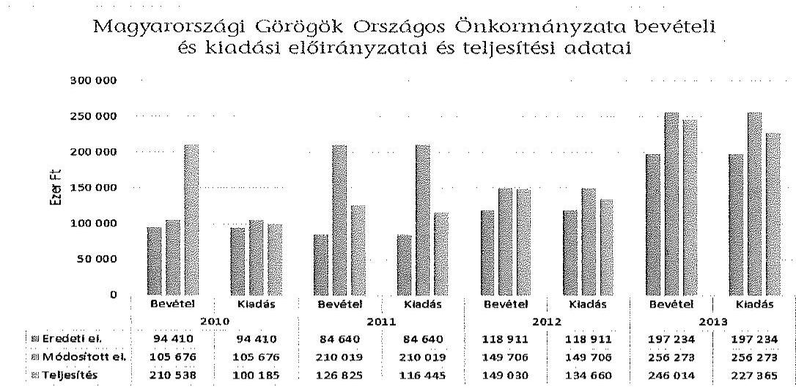
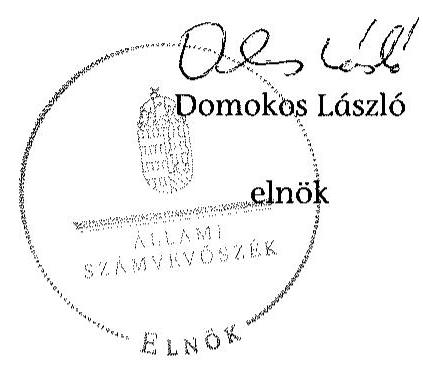
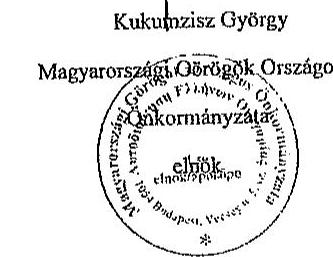
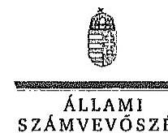

# ÁLLAMI   SZÁMVEVŐSZÉK 

## JELENTÉS

Az Országos Nemzetiségi Önkormányzatok gazdálkodásának ellenőrzéséről Magyarországi Görögök Országos Önkormányzata

---

# Állami Számvevőszék 

Iktatószám: V-0691-065/2015.
Témaszám: 1725
Vizsgálat-azonosító szám: V0680

## Az ellenőrzést felügyelte:

## Kisgergely István

felügyeleti vezető

## Az ellenőrzést vezette:

## Dr. Láng Ágnes Krisztina

ellenőrzésvezető
A számvevői jelentések feldolgozásában és a jelentés összeállításában
közreműködtek:
Dr. Láng Ágnes Krisztina
ellenőrzésvezető
Massányi Tibor
számvevő tanácsos
Az ellenőrzést végezték:

| Massányi Tibor | Tóth Sándor |
| :-- | :-- |
| számvevő tanácsos | számvevő tanácsos |

---

# TARTALOMJEGYZÉK 

I. ÖSSZEGZŐ MEGÁLLAPÍTÁSOK, KÖVETKEZTETÉSEK, JAVASLATOK ..... 7
II. RÉSZLETES MEGÁLLAPÍTÁSOK ..... 16

1. A belső kontrollrendszer kialakításának és működtetésének megfelelősége ..... 16
1.1. A kontrollkörnyezet kialakítása ..... 16
1.2. A kockázatkezelési rendszer kialakításának és működtetésének megfelelősége ..... 18
1.3. A kontrolltevékenységek működésének megfelelősége ..... 18
1.4. Információs és kommunikációs rendszer kialakításának és működtetésének megfelelősége ..... 20
1.5. Monitoring-rendszer kialakításának és működtetésének megfelelősége ..... 20
2. A gazdálkodás megfelelősége ..... 21
2.1. Pénzügyi gazdálkodás megfelelősége ..... 21
2.2. Vagyongazdálkodással kapcsolatos feladatellátás szabályszerűsége ..... 27
3. Ingyenesen juttatott vagyon kezelésének megfelelősége ..... 31
4. Egyéb feladat- és hatáskör ellátás szabályszerűsége ..... 31
5. Integritás kontrollok ..... 31
6. ÁSZ javaslatok hasznosulása ..... 32
MELLÉKLETEK
7. számú A Magyarországi Görögök Országos Önkormányzatának észrevétele
8. számú A Magyarországi Görögök Országos Önkormányzatának észrevételére vá-lasz
FÜGGELÉKEK
9. számú Rövidítések jegyzéke
10. számú Az integritás kontrollok kialakítása és működtetése

---

.

---

# JELENTÉS 

## A Magyarországi Görögök Országos Önkormányzata gazdálkodásának ellenőrzéséről

## BEVEZETÉS

A Magyarországi Görögök Országos Önkormányzata (a továbbiakban: Önkormányzat) 1995. március 4-én jött létre, elnöke a 2014. évi országos nemzetiségi választások óta látja el feladatát. Az Önkormányzat kettő intézményt (Magyarországi Görögök Kutatóintézete, és 12 Évfolyamos Kiegészítő Görög Nyelvoktató Iskola) alapított, egy intézmény (Nikosz Beloiannisz Általános Művelődési Központ) fenntartói jogát 2012. július 1-jétől átvette a Beloiannisz Község Önkormányzatától. Az Önkormányzat a Görög Kultúra Háza Közhasznú Nonprofit Korlátolt Felelősségű Társaságban 10\%-os tulajdonnal rendelkezett.

A 21 tagú Közgyűlés 2012 előtt 10 bizottságot hozott létre. Az Önkormányzat $\mathrm{SzMSz}_{2}$-ének 2012. évi módosítását követő összevonások eredményeként a Pénzügyi, a Jogi és Vagyonnyilatkozat kezelő, illetve a Kulturális, Oktatási, Ifjúsági, Sport és Társadalmi Kapcsolatok bizottságai segítették a Közgyűlés munkáját, illetve ad-hoc jelleggel működött a Mandátumvizsgáló Bizottság.

Az Önkormányzat költségvetési beszámolója szerint a 2013. évben a módosított költségvetési bevételi és kiadási előirányzat 256,3 millió Ft, a teljesített költségvetési bevétel 246 millió Ft, a teljesített költségvetési kiadás 227,4 millió Ft volt. Az Önkormányzat a 2013. évben 206,4 millió Ft államháztartásból származó támogatásban részesült.

A Hivatalban 2014 évben 4 főt foglalkoztattak. Az ellenőrzött időszakban a hivatalvezetői feladatok ellátására munkaszerződést kötöttek. A gazdasági vezetőt megbízási szerződéssel, 2012. 08. 22-2013. 08. 31. között munkaszerződéssel foglalkoztatták az ellenőrzött években.

Az Alaptörvény XXIX. cikk (1) bekezdése szerint a Magyarországon élő nemzetiségek államalkotó tényezők. Minden, valamely nemzetiséghez tartozó magyar állampolgárnak joga van önazonossága szabad vállalásához és megőrzéséhez. A hazánkban élő nemzetiségek helyi (települési és területi), valamint országos önkormányzatokat hozhatnak létre.

Az országos nemzetiségi önkormányzat gazdálkodási feladatait az önállóan működő és gazdálkodó költségvetési szerv, a hivatal látja el. Az országos nemzetiségi önkormányzatok a 2008. évtől tartoznak az államháztartás önkormányzati alrendszerébe, azóta hivatalaik költségvetési szervként működnek. Az Alaptörvény hatálybalépését követően a 2012. évtől további jelentős jogszabályi változások határozzák meg működésüket, gazdálkodásukat.

---

A nemzetiségek helyzete, támogatása mind hazai, mind EU-s szinten kiemelt figyelmet kap napjainkban. Az állam az országos nemzetiségi önkormányzatok működéséhez, a médiaszolgáltatáshoz kapcsolódó jogaik érvényesítéséhez, valamint a kulturális önigazgatásuk érdekében alapított - közművelődési, közgyűjteményi, tudományos - intézmények fenntartásához az éves költségvetési törvényekben nevesítetten költségvetési támogatást biztosít. Ezen kívül az országos nemzetiségi önkormányzatok közfeladataik ellátásához támogatást kapnak a fejezeti kezelésű előirányzatokból, valamint hazai és uniós pályázati forrásokat szerezhetnek.

Az ellenőrzés célja annak értékelése volt, hogy az országos nemzetiségi önkormányzat gazdálkodása, a belső kontrollrendszer kialakítása és működése, az államháztartásból nyújtott támogatás, illetve az államháztartásból meghatározott célra ingyenesen juttatott vagyon felhasználása a jogszabályi előírásoknak megfelelően történt-e; az önkormányzat a Nek. tv.-ben és az Njtv.-ben előírt feladat- és hatásköröket ellátta-e; intézkedett-e az ÁSZ által a 2008-2010. évek között végzett ellenőrzések javaslatainak végrehajtásáról.

Az országos nemzetiségi önkormányzat korrupcióval szembeni veszélyeztetettségének csökkentése érdekében felmértük az integritási szemlélet érvényesülését a gazdálkodási folyamatokban.

Értékeltük az önkormányzat gazdálkodása során a belső kontrollrendszer kialakítását és működését mind az öt pillére tekintetében, ellenőriztük a gazdálkodással összefüggő feladat- és hatásköröknek, a hivatal működési, gazdálkodási rendjének jogszabályi előírásoknak való megfelelőségét; a belső kontrollok működésének megfelelőségét az éves költségvetés, a költségvetési beszámoló és a zárszámadás készítés folyamatában; a gazdálkodás pénzügyi folyamatában kulcsszerepet betöltő (szakmai) teljesítésigazolás és 2011-ig utalvány ellenjegyzés, 2012-től érvényesítés kontrolltevékenységek működésének megfelelőségét; az önkormányzat belső ellenőrzése kialakításának és működésének megfelelőségét.

Értékeltük továbbá az országos nemzetiségi önkormányzat gazdálkodása, ezen belül pénzügyi gazdálkodása keretében a tervezés, beszámolási, zárszámadáskészítési folyamat, az előirányzatok betartása, a könyvvezetés, a közzétételek, adatszolgáltatások, valamint az államháztartás rendszeréből jogszabály vagy megállapodás alapján céljelleggel kapott támogatások felhasználásának, elszámolásának szabályszerűségét. A vagyonnal kapcsolatos feladatellátás ellenőrzése keretében értékeltük a vagyongazdálkodás szabályozottságát, a mérleg alátámasztottságát, a leltározás, az eszközbeszerzések, a vagyonhasznosítás, a tulajdonosi joggyakorlás szabályszerűségét, kiemelten az országos nemzetiségi önkormányzat gazdasági társasága részére a vagyon tulajdonba, illetve kezelésbe, üzemeltetésbe adása, a tőkeemelés és a juttatott támogatások szabályszerűségét. Értékeltük az államháztartásból ingyenesen juttatott vagyon felhasználásának szabályszerűségét. Ellenőriztük az előírt feladat- és hatáskörök közül a véleménynyilvántartási, egyetértési jog gyakorlásával, a hatáskör átruházásokkal, az ideiglenes vagyonkezeléssel kapcsolatos feladatok ellátásának szabályszerűségét, az integritás kontrollok működését, továbbá az előző ÁSZ ellenőrzés javaslatainak hasznosulását.

---

Az ellenőrzés várható hasznosulása: Az ellenőrzés eredményeként nemcsak az ellenőrzött szerv gazdálkodása javulhat, hanem átfogó képet kaphatunk az önkormányzati alrendszerbe tartozó országos nemzetiségi önkormányzatok gazdálkodásának hiányosságairól, de a jó gyakorlatokról is. Az ellenőrzés megállapításait és javaslatait más szervezetek is hasznosíthatják a rendezett gazdálkodási keretek kialakításához. Az ellenőrzés hozadékát képezi a 2008-2010. években elvégzett ÁSZ ellenőrzés javaslatai hasznosulásának értékelése. Mind a 13 országos nemzetiségi önkormányzat ellenőrzésével teljes körűen megvalósul az országos nemzetiségi önkormányzatok ellenőrzése a megváltozott jogszabályi környezetben. Az ellenőrzés tapasztalatai alapján a jogszabályi ellentmondások, hiányosságok feltárásával, azok megszüntetésére vonatkozó javaslatokkal segítjük a jó kormányzást. Az ellenőrzéssel lehetővé tesszük, hogy az országos nemzetiségi önkormányzatok gazdálkodásáról, működéséről a társadalom objektív képet alkothasson.

Az országos nemzetiségi önkormányzatok gazdálkodásának ellenőrzéséről szóló számvevőszéki jelentés I. fejezetének összegző része az ellenőrzés céljára adott rövid, szintetizáló összefoglalót és következtetéseket tartalmazza a II. fejezet részletes megállapításain alapulóan. A jelentés intézkedést igénylő megállapításait és javaslatait az ellenőrzés során feltárt, a jelentés II. fejezetében rögzített részletes megállapítások alapozzák meg.

Az ellenőrzés típusa: szabályszerűségi ellenőrzés.
Az ellenőrzött időszak: 2010. január 1 - 2014. június 30.
Ellenőrzött szervezet: az országos nemzetiségi önkormányzat és hivatala, továbbá azon intézmények, amelyek gazdálkodási feladatait a hivatal látja el.

Az ellenőrzés végrehajtásának jogszabályi alapját az Állami Számvevőszékről szóló 2011. évi LXVI. törvény 1. § (3) bekezdése, az 5. § (2)-(3) és (6) bekezdései, valamint az államháztartásról szóló 2011. évi CXCV. törvény 61. § (2) bekezdésének előírásai képezik.

Az ellenőrzés módszertana az ÁSZ hivatalos honlapján (www.asz.hu) közzétett szakmai szabályokon alapul, amely a Legfőbb Ellenőrző Intézmények Nemzetközi Szervezete (INTOSAI) által kiadott nemzetközi standardok (ISSAI) figyelembevételével készült.

Az ellenőrzés lefolytatásához az országos nemzetiségi önkormányzat a kimutatások és a tanúsítványok elektronikus kitöltésével, valamint az ÁSZ által kért dokumentumok elektronikus megküldésével szolgáltatott adatokat. Az így rendelkezésre bocsátott adatok, információk kontrollja és a munkalapok kitöltése az ellenőrzöttnél végzett ellenőrzés keretében történt.

A pénzügyi folyamatokban kulcsszerepet betöltő (szakmai) teljesítésigazolás és érvényesítés (2011-ig utalvány ellenjegyzése) kontrollok működésének megfelelősége értékeléséhez az egyszerű véletlen mintavétellel kiválasztott tételek ellenőrzését megfelelőségi tesztek útján végeztük. A vagyonhasznosítási célú bevételek, a személyi juttatások, a dologi és felhalmozási kiadások, valamint a pénz-

---

eszközátadások felhasználásának szabályszerűségét, a céljelleggel kapott támogatások felhasználásának és elszámolásának szabályszerűségét és a kiadások esetében a gazdálkodási jogkörök gyakorlását mintavétellel ellenőriztük.

A jogszabályoknak és a belső előírásoknak megfelelőnek, azaz szabályszerűnek tekintettük az ellenőrzött bevételi előirányzatok felhasználását, amennyiben a minta ellenőrzésének eredménye alapján $95 \%$-os bizonyossággal a teljes sokaságban a hibaarány kisebb volt, mint $10 \%$, nem megfelelőnek értékeltük, ha a hibaarány a $10 \%$-ot meghaladta. Megfelelőnek értékeltük a gazdálkodási jogkörök gyakorlását, amennyiben $95 \%$-os bizonyossággal a teljes sokaságban a hibaarány legfeljebb $10 \%$, részben megfelelőnek értékeltük, ha a hibaarány felső határa 10-30\% volt, nem megfelelőnek pedig akkor, ha a hibaarány felső határa a teljes sokaságban meghaladta a $30 \%$-ot. A céljelleggel kapott támogatások felhasználásának és elszámolásának szabályszerűségét a kiválasztott mintatételek jogszabályoknak való megfelelősége alapján értékeltük.

Az ÁSZ a 2011. évi LXVI. törvény 29. §-a szerint a jelentéstervezetet megküldte a Magyarországi Görögök Országos Önkormányzata elnökének és a hivatalvezetőnek egyeztetésre. A beérkezett észrevételt és az arra adott választ a jelentés 12. sz. mellékletei tartalmazzák.

---

# I. ÖSSZEGZŐ MEGÁLLAPÍTÁSOK, KÖVETKEZTETÉSEK, JAVASLATOK 

Az Önkormányzatnál a 2010-2014. I. félév között a belső kontrollrendszer kialakítása és működtetése összességében nem volt megfelelő.

A kontrollkörnyezet kialakítása nem felelt meg az Önkormányzat működését meghatározó jogszabályokban foglaltaknak, mivel a Hivatal a 2010-2013. években az Áht. ${ }_{1,2}$-ben foglaltaktól eltérően nem rendelkezett SzMSz-szel, a 2014. évtől hatályos hivatali SzMSz az Ávr. szerinti tartalmi követelményeknek részben felelt meg. Az Önkormányzat intézményei és a Hivatal közötti munkamegosztás és felelősségvállalás rendjét az Ámr. és az Ávr. előírásai ellenére megállapodásban nem rögzítették. Az Önkormányzat gazdálkodásának szabályozottsága az ellenőrzött években nem felelt meg a jogszabályi előírásoknak. A Hivatalvezető - a Számv. tv.-ben, valamint az Áhsz. ${ }_{1,2}$-ben foglalt előírások ellenére - nem alakította ki a számlarendet és a bizonylati rendet. A számviteli szabályzatok aktualizálásáról nem gondoskodott. A Hivatal önköltség-számítási, és beszerzési szabályzattal nem rendelkezett. Az operatív gazdálkodási jogkörökre vonatkozó belső szabályozás nem felelt meg az Ámr., illetve az Ávr. előírásainak, mert nem határozták meg az operatív gazdálkodási jogkörök gyakorlásának eljárásrendjét, dokumentációs részletszabályait, az előzetes írásbeli kötelezettségvállaláshoz nem kötött kis összegű kifizetések eljárásrendjét. A gazdálkodási jogkörök gyakorlására jogosult személyekről vezetett nyilvántartás a jogkör gyakorlók aláírás-mintáját nem tartalmazta. A Hivatalvezető az Ámr. illetve a Bkr. előírásait figyelmen kívül hagyva a szabálytalanságok kezelésének eljárásrendjét nem alakította ki, az ellenőrzési nyomvonal elkészítéséről nem gondoskodott.

A Hivatalvezető az Ámr. és a Bkr. előírásai ellenére nem alakított ki és nem működtetett kockázatkezelési rendszert.

A kontrolltevékenységek kialakítása és működtetése nem felelt meg az előírásoknak. Az éves költségvetés, a költségvetési beszámoló és a zárszámadás készítésének folyamatában a belső kontrolleljárásokat az Ámr. és a Bkr. rendelkezéseitől eltérően nem alakították ki és nem működtették. A Hivatalvezető az Áht. ${ }_{1}$ és a Bkr. előírásától eltérően a nem biztosította a folyamatba épített előzetes, utólagos és vezetői ellenőrzést a pénzügyi döntések dokumentumainak elkészítése, a költségvetési gazdálkodás pénzügyi ellenőrzése, valamint a gazdasági események
 szabályszerű elszámolása vonatkozásában. A 2010-2011. években a szakmai teljesítésigazolás és az utalvány ellenjegyzés, a 2012-2014. I. félévben a teljesítésigazolás és az érvényesítés gyakorlata nem felelt meg az Ámr., illetve az Ávr. előírásainak. A 2011. és a 2013. évben a Kbt. ${ }_{1,2}$ előírása ellenére közbeszerzési eljárás lefolytatása nélkül kötötték meg a vállalkozói szerződéseket.

Az információs és kommunikációs rendszer kialakítása és működtetése nem volt megfelelő, mivel az Avtv., az Info tv. és az Ávr. előírásától eltérően nem szabályozták a kötelezően közzéteendő adatok nyilvánosságra hozatalának, valamint a közérdekű adatok megismerésére irányuló igények teljesítésének rendjét, és nem készítették el a Hivatal adatvédelmi és adatbiztonsági szabályzatát.

---

A Hivatalvezető az Eisztv.-ben, illetve az Info tv.-ben előírtak ellenére nem intézkedett az általános közzétételi listában előírt adatok honlapon történő közzétételére. Nem gondoskodott továbbá -- a 28/2011. (II. 6.) Korm. rendeletben, illetve 428/2012. (XII. 19.) Korm. rendeletben foglalt előírás ellenére - a 2012-2014. I. félév között kapott céljellegű támogatásoknak az Önkormányzat honlapján történő közzétételéről.

A Hivatal az ellenőrzött időszakban az Ltv.-ben előírt iratkezelési szabályzattal nem rendelkezett. A Hivatal iratkezelési és iktatási rendszere az ügyintézési folyamatok nyomon követését, az adatok védelmét, őrzését az Ikr. előírásaitól eltérően nem biztosította.

Az Önkormányzat monitoring rendszerének kialakítása és működtetése nem volt szabályszerű. A Hivatalvezető - az Áht. ${ }_{1}$ és a Bkr. előírásaival szemben nem alakította ki a Hivatal tevékenységének, a célok megvalósításának nyomon követését biztosító rendszert. Az ellenőrzött időszakban a belső ellenőrzési feladatok ellátásáról külső szolgáltató megbízása útján gondoskodtak. A Belső Ellenőrzési Kézikönyvet a Ber.-ben és a Bkr.-ben foglaltaktól eltérően nem a Hivatalvezető, hanem az Elnök hagyta jóvá. A belső ellenőrzési vezető a 2010-2014. I. félévben éves ellenőrzési tervet nem készített. A belső ellenőr az ellenőrzésekről nyilvántartást nem vezetett, éves összefoglaló jelentést nem készített. A belső ellenőrzési jelentésekben rögzített javaslatok hasznosítására intézkedési terveket nem dolgoztak ki. Az ellenőrzések az önkormányzati gazdálkodás szabályszerűségét az intézkedések hiánya miatt nem mozdították elő.

Az Önkormányzat pénzügyi gazdálkodása részben felelt meg az előírásoknak. Az Elnök a 2011. évi költségvetési koncepciót az Ámr.-ben foglaltak ellenére nem, a 2010. és a 2013. évi költségvetési koncepciót Áht. ${ }_{1,2}$-ben megjelölt határidőn túl terjesztette a Közgyűlés elé. A Hivatalvezető a költségvetési határozattervezetek intézményvezetővel történő egyeztetését az Ámr. és az Ávr. előírása ellenére írásban nem rögzítette. A Pénzügyi Bizottság a 2014. éves költségvetés tervezetét az Njtv. előírása ellenére nem véleményezte. Az Elnök a 2010-2012. évi költségvetés tervezetét az Áht. ${ }_{1,2}$-ben, illetve az Ámr.-ben meghatározott határidőn túl nyújtotta be a Közgyűlésnek. A határidőn túl elfogadott költségvetések esetében a Közgyűlés az Ámr.-ben és az Áht. ${ }_{2}$-ben előírtak ellenére az átmeneti gazdálkodásról határozatot nem alkotott. A Hivatalvezető a 2011-2012. években az Ámr.-ben, illetve az Ávr.-ben meghatározott határidőn túl teljesítette az elemi költségvetéssel kapcsolatos adatszolgáltatási kötelezettségét. A 2010-2014. évi költségvetési határozat-tervezetek nem az Ámr.-ben, illetve az Áht. ${ }_{2}$-ben meghatározott szerkezetben és tartalommal készültek. A Pénzügyi Bizottság az Önkormányzat költségvetési beszámolóját a 2012-2013. években az Njtv. előírása ellenére nem véleményezte. Az Önkormányzat 2010-2013. éves zárszámadása az Ámr.-ben, illetve az Áht. ${ }_{2}$-ben rögzített kötelező tartalmi elemeket hiányosan mutatta be. Az Elnök a 2013. éves költségvetési beszámolót az Áht. ${ }_{2}$-ben foglalt határidőn túl nyújtotta be a Közgyűlésnek. A Hivatal nem készítette el a zárszámadásokhoz az Áhsz. ${ }_{1}$-ben előírt az Önkormányzat és intézményei adatait összevontan tartalmazó egyszerűsített éves költségvetési beszámolókat. A könyvvizsgáló hitelesítő véleményét az Áhsz. ${ }_{1}$-ben foglaltak ellenére ennek hiányában fogalmazta meg. A Hivatal a 2011. és 2013. években a MÁK felé teljesítendő adatszolgáltatási kötelezettségét az Áhsz. ${ }_{1}$-ben meghatározott határidőn túl teljesítette. Az Önkormányzat 2010-2012. években nem tett eleget az Áhsz. ${ }_{1}$-ben

---

előírt letétbe helyezési kötelezettségének, mivel az ÁSZ részére nem küldte meg a könyvvizsgálói véleménnyel ellátott egyszerűsített éves beszámolóját.

Az Önkormányzatnál kapott támogatások felhasználása és elszámolása során nem volt dokumentált, hogy a zárszámadás Közgyűlés által történő elfogadását követően a támogató részére a 342/2010. (XII. 28.) Korm. rendelet, a 28/2012. (III. 6.) Korm. rendelet, illetve a 428/2012. (XII. 29.) Korm. rendeletben előírt határidőben benyújtotta a szakmai és pénzügyi beszámolóit. A kapott önkormányzati és intézményi működési, illetve médiatámogatásokról valamint 2013. november 20-ától azok felhasználásáról az Önkormányzat a 2011-2013. években nem vezetett elkülönített számviteli nyilvántartást. Az elnyert céljellegű támogatások felhasználása és elszámolása során az Önkormányzat részben tartotta be a jogszabályi és szerződéses előírásokat. A Hivatal szerződésenként elkülönített számviteli nyilvántartást a 2010-2011. években a Nek tv.-ben, illetve a céljellegű támogatásokról szóló támogatási szerződésekben előírtak ellenére nem vezetett. Az Önkormányzat a mintatételek több mint harmadánál nem számolt el a támogató felé a támogatás felhasználásáról. A kapott céljellegű támogatásokkal kapcsolatos közzétételi kötelezettségét az Önkormányzat nem teljesítette.

Az Önkormányzatnál az általa államháztartási forrás terhére kérelem alapján nyújtott céljellegű támogatások elszámoltatása, felhasználásának ellenőrzése a 2010-2012. években nem, a 2014. évben részben felelt meg a jogszabályi előírásoknak. Az Önkormányzat a támogatási szerződésekben előírta az elszámolási kötelezettséget a támogatottaknak, ennek ellenére csak egy esetben történt meg az elszámolás. Az Önkormányzat nem ellenőrizte a támogatás felhasználását és a 28/2012. (III. 6.) Korm. rendeletben, illetve a 428/2012. (XII. 29.) Korm. rendeletben előírtak ellenére a támogatás tényét a honlapján nem tette közzé. A támogatási szerződésekben megfogalmazott célok összhangban voltak a Nek. tv-ben, illetve az Njtv-ben meghatározott nemzetiségi feladatokkal.

Az Önkormányzat vagyongazdálkodási tevékenysége részben volt szabályszerű. Az Önkormányzat az Nvtv. hatályba lépését követően nem vizsgálta felül a forgalomképtelennek minősülő törzsvagyonát, a Nek. tv., illetve az Njtv. előírásai ellenére nem határozta meg vagyonleltárát, nem szabályozták az egyes vagyonelemek hasznosítási módját, feltételeit. Az Önkormányzat 2012. évi könyvviteli mérlegében feltüntetett előző évi állományi értékek nem egyeztek meg a 2011. évi tárgyévi értékekkel, mellyel sérült a Számv. tv.-ben előírt folytonosság elve. Az Önkormányzat egy vásárolt ingatlant a folyamatban lévő beruházások között tartott nyilván, ezért az ingatlanokra az Áhsz. ${ }_{1}$-ben előírt értékcsökkenést nem számolta el. A Nonprofit Kft.-ben lévő részesedését nem mutatta ki a befektetett pénzügyi eszközök között és 2010-ben nem az értékpapírok között szerepeltette a kincstárjegyeket. Az Áhsz. ${ }_{1}$-ben foglaltak ellenére az Önkormányzat hiányosan gondoskodott a könyvviteli számlákhoz kapcsolódó analitikus nyilvántartások vezetéséről, továbbá a 2010., 2012. és a 2013. költségvetési évben a könyvviteli mérlegben kimutatott eszközöket és forrásokat leltárral nem támasztotta alá. Az Elnök az értékpapír eladásakor a Nek tv-ben foglaltakkal ellentétesen járt el, mert nem a Közgyűlés döntött a vagyonhasznosításról. Az Önkormányzat eredményszemléletű számvitelre történő áttérése nem felelt meg az előírásoknak. A beszerzések elszámolásának szabályszerűsége nem volt biztosított, mert Áhsz. ${ }_{1}$-ben előírtak ellenére az állományba vételi bizonylatok és a be-

---

ruházásokhoz aktiválási jegyzőkönyvek nem álltak rendelkezésre. Az Önkormányzat vagyonhasznosítási tevékenysége nem felelt meg az Ávr.-ben foglaltaknak, a Közgyűlés a Htv.-ben foglaltak ellenére nem döntött a bérbeadás feltételeiről.

Az Önkormányzat az ellenőrzött időszakban ingyenes vagyonjuttatásban nem részesült. Az alakulásakor egyszeri vagyonjuttatásként kapott ingatlant a Nek. tv. és az Njtv. előírásától eltérően nem forgalomképtelen vagyonként tartotta nyilván.

Az ellenőrzött időszakban a Közgyűlés a szerveire feladat- és hatáskört nem ruházott át. Az Elnök - a Nek. tv., illetve az Njtv. előírásai ellenére - a Közgyűlés felhatalmazása nélkül gondoskodott a vélemény-nyilvánítási, egyetértési és közreműködési tevékenység ellátásáról.

Az ÁSZ tv. 33. § (1) bekezdésében foglaltak értelmében a jelentésben foglalt megállapításokhoz kapcsolódó intézkedési tervet köteles az ellenőrzött szervezet vezetője összeállítani, és azt a jelentés kézhezvételétől számított 30 napon belül az ÁSZ részére megküldeni. Amennyiben az intézkedési tervet határidőben nem küldi meg a szervezet, vagy az nem elfogadható, az ÁSZ elnöke a hivatkozott törvény 33. § (3) bekezdés a)-b) pontjaiban foglaltakat érvényesítheti.

Az Önkormányzatnál 2008-2010. években ÁSZ ellenőrzés nem volt.
A helyszíni ellenőrzés megállapításainak hasznosítása mellett javasoljuk:

# az Elnöknek 

1. Az Önkormányzat az Áhsz. 37. § (1) bekezdésében foglaltak ellenére a 2010., 2012. és a 2013. költségvetési évben a december 31-i fordulónappal készített könyvviteli mérlegben kimutatott eszközöket és forrásokat - ideértve az aktív és passzív pénzügyi elszámolásokat is - leltárral nem támasztotta alá, így a mérleg megfelelő sorai valódiságának alátámasztását nem biztosították.

Javaslat:
Tegyen intézkedéseket a könyvviteli mérleg leltárral történő alátámasztásánál jelzett szabálytalanságok tekintetében a felelősség tisztázása érdekében, és szükség szerint intézkedjen a felelősség érvényesítéséről.
2. Az ellenőrzött időszakban az Elnök - a Nek. tv. 39/A. § (1) bekezdésében, illetve az Njtv. 119. § (1) bekezdésében foglaltakat figyelmen kívül hagyva - a Közgyűlés hatáskörét elvonva, annak felhatalmazása nélkül gondoskodott a vélemény-nyilvánítási, egyetértési és közreműködési tevékenység ellátásáról.

Javaslat:
Biztosítsa, hogy a jövőben, az Önkormányzat vélemény-nyilvánítási, egyetértési és közreműködési jogának szabályszerű ellátása érdekében a feladatellátással összefüggő hatáskört - beszámolási kötelezettség előírásával - Közgyűlési felhatalmazás alapján lássa el.

---

# a Hivatalvezetőnek 

Az Önkormányzat belső kontroll rendszere tekintetében:

1. A kontrollkörnyezet kialakítása nem volt megfelelő, mivel a hivatali SzMSz az Ávr. 13. § (1) bekezdés e) és i) pontjaiban foglaltak ellenére nem tartalmazta a szervezeti ábrát, valamint a költségvetési szervhez rendelt más költségvetési szervek felsorolását. A Hivatalvezető - a Számv. tv. 161. § (1) bekezdésében, valamint 2010-2013 években az Áhsz. 1 49. § (1) bekezdésében, 2014. január 1-jétől az Áhsz. 2 51. § (2) bekezdésében foglalt előírások ellenére - nem alakította ki a számlarendet és a bizonylati rendet. A leltározási szabályzat ${ }_{2}$, és az értékelési szabályzat ${ }_{2}$ 2011. szeptemberi hatályba lépését követően azok aktualizálásáról a Számv. tv. 14. § (11) bekezdésének előírása ellenére nem gondoskodott. A Hivatal 2010-2014. I. félévben - a Számv. tv. 14. § (5) bekezdés c) pontjában, az Áhsz. ${ }_{1}$ 8. § (4) c) pontjában és az Áhsz. 2 50. § (3) bekezdésében foglaltaktól eltérően - nem rendelkezett önköltségszámítási szabályzattal. A Hivatalvezető - az Ámr. 156. § (2) bekezdése és a Bkr. 6. § (3) bekezdése előírásaitól eltérően - nem gondoskodott a felelősségi és információs szintek és kapcsolatok leírását tartalmazó ellenőrzési nyomvonal elkészítéséről. A Hivatalvezető a 2010. évben az Ámr. 161. §-a, 2011. évben az Ámr. 156. § (3) bekezdése, 2012-2014. év I. félévben a Bkr. 6. § (4) bekezdése előírását figyelmen kívül hagyva a szabálytalanságok kezelésének eljárásrendjét nem alakította ki.

Javaslat:
Intézkedjen a Hivatal SzMSz-ének kiegészítésére, a számlarend, a bizonylati rend, az önköltség-számítási szabályzat, ellenőrzési nyomvonal, valamint a szabálytalanságok kezelésének eljárásrendje elkészítésére, a számviteli szabályzatok aktualizálására.
2. Az Önkormányzat által alapított önállóan működő intézmények és a Hivatal közötti munkamegosztás és
 felelősségvállalás rendjét az Ámr. 16. § (4) bekezdése, illetve az Ávr. 10. § (4) bekezdés szerinti megállapodásban az ellenőrzött időszakban nem rögzítették.

Javaslat:
Gondoskodjon, hogy az Önkormányzat által alapított önállóan működő intézmények és a Hivatal közötti munkamegosztás és felelősségvállalás rendjét szabályozó megállapodás elkészíttetéséről.
3. Az operatív gazdálkodási jogkörökre vonatkozó általános szabályokat a Gazdasági szervezet ügyrendje ${ }_{1,2}$ tartalmazta. Az Ámr. 20. § (3) bekezdés a) pontjában, illetve az Ávr. 13. § (2) bekezdés a) pontjában foglaltak ellenére a Gazdasági szervezet ügyrendjében ${ }_{1,2}$ nem határozták meg az operatív gazdálkodási jogkörök gyakorlásának eljárásrendjét, dokumentálásának részletszabályait. Belső szabályzatban - az Ámr. 72. § (14) bekezdésében, illetve az Ávr. 53. § (2) bekezdésében foglaltak ellenére - nem határozták meg az előzetes írásbeli kötelezettségvállaláshoz nem kötött 100 ezer Ft alatti kifizetések eljárásrendjét. A gazdálkodási jogkörök gyakorlására jogosult személyekről vezetett nyilvántartás az Ámr. 80. § (3) bekezdésben, valamint az Ávr. 60. § (3) bekezdésében foglalt előírásokkal szemben a jogkör gyakorlók aláírásmintáját nem tartalmazta.

---

Javaslat:
Intézkedjen a Gazdasági szervezet ügyrendje, a gazdálkodási jogkörök gyakorlására jogosult személyekről vezetett nyilvántartás jogszabályoknak megfelelő kiegészítésére, valamint az előzetes írásbeli kötelezettségvállaláshoz nem kötött 100 ezer Ft alatti kifizetések eljárásrendjének meghatározására.
4. A Hivatalvezető - az Ámr. 158. § (2) bekezdésében, illetve a Bkr. 8. § (4) bekezdésében foglaltak ellenére - nem határozta meg a dokumentumokhoz és információkhoz való hozzáféréssel és a beszámolási eljárásokkal kapcsolatos felelősségi köröket.

Javaslat:
Határozza meg a dokumentumokhoz és információkhoz való hozzáféréssel és a beszámolási eljárásokkal kapcsolatos felelősségi köröket.
5. A kockázatkezelési rendszer kialakítása és működtetése nem felelt meg a jogszabályi előírásoknak, mivel a Hivatalvezető - az Ámr. 157. § (1)-(2) bekezdéseiben, illetve a Bkr. 7. § (1)-(2) bekezdésében foglalt előírás ellenére - kockázatkezelési rendszert nem működtetett, nem mérte fel és nem állapította meg a Hivatal tevékenységében, gazdálkodásában rejlő kockázatokat, nem határozta meg az egyes kockázatokkal kapcsolatban a szükséges intézkedéseket, valamint azok teljesítésének folyamatos nyomon követési módját.

Javaslat:
Alakítsa ki és működtesse a Hivatal kockázatkezelési rendszerét.
6. A kontrolltevékenységek kialakítása és működtetése nem volt megfelelő. A személyi juttatások, a dologi és felhalmozási kiadások, valamint a pénzeszközátadások teljesítése során a gazdálkodási jogkörök (teljesítésigazolás, érvényesítés és utalvány ellenjegyzés) gyakorlása nem felelt meg az Ámr. 74. § (1) bekezdés, a 76. § (1) bekezdés, 79. § (2) bekezdés, illetve az Ávr. 57. § (1) és (3) bekezdés 58. § (1) és (3) bekezdés előírásainak. Az Ámr. 80. § (3) bekezdésében, illetve az Ávr. 60. § (3) bekezdésében előírt aláírás-minta hiányában nem volt megállapítható, hogy az utalvány ellenjegyzését, illetve az érvényesítést az arra kijelölt személy végezte-e.

Javaslat:
Gondoskodjon a kontrolltevékenységek kialakításáról és gazdálkodási jogkörök szabályszerű gyakorlásának érvényesítéséről.
7. A Hivatalvezető az ellenőrzött években - az Áht 121. § (2) bekezdés d) pontjában, illetve a Bkr. 9. § (1) bekezdésében foglalt előírások ellenére - az információs és kommunikációs rendszert nem alakította ki és nem működtette. A Hivatalvezető nem szabályozta az Info tv. 35. § (3) bekezdésében, illetve az Ávr. 13. § (2) bekezdés h) pontjában előírtaknak megfelelően a kötelezően közzéteendő adatok nyilvánosságra hozatalának rendjét. Nem szabályozta a közérdekű adatok megismerésére irányuló igények teljesítésének rendjét, ezáltal nem tett eleget az Avtv. 20. § (8) bekezdésében, az Info tv. 30. § (6) bekezdésében, valamint az Ávr. 13. § (2) bekezdés h) pontjában foglalt előírásoknak. A Hivatalvezető az Eisztv. 6. § (1) bekezdésében, illetve az Info tv. 37. §

---

(1) bekezdésében meghatározott kötelezettségének nem tett eleget, mivel nem gondoskodott az általános közzétételi listában előírt adatok honlapon történő közzétételéről. A Hivatalvezető nem készítette el az Avtv. 31/A. § (3) bekezdése, illetve az Info tv. 24. § (3) bekezdése előírásának megfelelően az adatvédelmi és adatbiztonsági szabályzatot.

Javaslat:
a) Alakítsa ki a kötelezően közzéteendő adatok nyilvánosságra hozatalának és megismerésére irányuló igények teljesítésének rendjét.
b) Intézkedjen a Hivatal adatvédelmi és adatbiztonsági szabályzatának elkészítésére.
8. A Hivatalvezető az Eisztv. 6. § (1) bekezdésében, illetve az Info tv. 37. § (1) bekezdésében előírtak ellenére nem intézkedett az általános közzétételi listában előírt adatok honlapon történő közzétételére. Az Önkormányzat a kapott céljellegű támogatásokkal kapcsolatos közzétételi kötelezettségét nem teljesítette a 28/2012. (III. 6.) Korm. rendelet 12. § (5) bekezdésében, illetve a 428/2012. (XII. 29.) Korm. rendelet 13. § (2) bekezdésében előírtak ellenére.

Javaslat:
Gondoskodjon az általános közzétételi listában előírt adatok honlapon történő, valamint az Önkormányzat által kapott céljellegű támogatások közzétételéről.
9. A Hivatal a 2010-2012. években az Ltv. 10. § (1) bekezdés a) pontjában, 2013-2014. I. félévben az Ltv. 10. § (1) bekezdés c) pontjában foglalt előírás ellenére iratkezelési szabályzattal nem rendelkezett. A Hivatal iratkezelési és iktatási rendszere az iratok megőrzését, az ügyintézési folyamatok nyomon követését és az adatok védelmét, az lkr. 5. §-a, 8. § (1)-(2) bekezdései, valamint a 14. § (4) bekezdése előírásaitól eltérően nem biztosította.

Javaslat:
Intézkedjen az Iratkezelési szabályzat elkészítésére, és biztosítsa az iratok megőrzését, az ügyintézési folyamatok nyomon követését, az adatok védelmét.
10. Az Önkormányzat monitoring rendszerének kialakítása és működtetése nem volt szabályszerű. A Hivatalvezető - a 2010. évben az Áht. 120/B.§ (2) bekezdés e) pontjában, a 2011. évben az Áht. 121.§ (2) bekezdés e) pontjában, a 2012-2014. I. félévben a Bkr. 3. § e) pontjában és a 10. §-ában foglaltak ellenére - nem alakította ki a Hivatal tevékenységének, a célok megvalósításának nyomon követését biztosító rendszert.

Javaslat:
Alakítsa ki a Hivatal tevékenységének, a célok megvalósításának nyomon követését biztosító rendszert.
11. A Belső ellenőrzési kézikönyv ${ }_{1,2}$-öt a Ber. 5. § (1) bekezdésében, illetve a Bkr. 17. § (1) bekezdésében foglaltaktól eltérően nem a Hivatalvezető, hanem az Elnök hagyta jóvá.

---

Javaslat:
Gondoskodjon Belső Ellenőrzési Kézikönyv jóváhagyásáról.
12. A Hivatalvezető az ellenőrzött időszakban a Ber. 32/A. § (7) bekezdésének, valamint a Bkr. 55. § (6) bekezdésének előírását figyelmen kívül hagyva nem küldte meg az összefoglaló éves ellenőrzési jelentést az Önkormányzat elnökének. A belső ellenőrzési jelentésekben rögzített javaslatok hasznosítására az ellenőrzött időszakban intézkedési terveket a Ber. 29. § (1) bekezdésében, illetve a Bkr. 45. § (1) bekezdésében foglaltak ellenére nem dolgoztak ki. A belső ellenőrzési vezető a Ber. 32. § (1)-(2) bekezdéseiben és a Bkr. 50. § (1)-(2) bekezdéseiben foglaltak ellenére nem vezetett nyilvántartást az elvégzett belső ellenőrzésekről, a 2012-1014. I. félévekben a Bkr. 47. § (1) bekezdésében foglaltak ellenére nem vezetett nyilvántartást a belső ellenőrzési jelentésekben tett megállapításokról, javaslatokról és azok végrehajtásának nyomon követéséről.

Javaslat:
Gondoskodjon a belső ellenőrzés jogszabályoknak megfelelő működtetéséről, a belső ellenőrzési javaslatok hasznosulásáról.

A pénzügyi- és vagyongazdálkodás területén
13. A költségvetési határozat tervezetének a Hivatalvezető és a költségvetési szervek vezetői közötti egyeztetésének eredményét az Ámr. 36. § (3) bekezdése, illetve az Ávr. 27. § (1) bekezdésében foglaltak ellenére nem dokumentálták.

Javaslat:
Intézkedjen a költségvetési határozat tervezet költségvetési szervek vezetőivel történő egyeztetése eredményének írásba foglalására.
14. Az Önkormányzat 2010-2013. éves zárszámadása előterjesztése nem teljes körűen felelt meg 2010-2011. években az Ámr. 40. § (5)-(6) bekezdésében, a 2012-2013. években az Áht 91. § (2) bekezdéssel előírtaknak.

Javaslat:
Intézkedjen, hogy az Önkormányzat éves zárszámadása megfeleljen a jogszabályi előírásoknak.
15. A Hivatalvezető nem készítette el a zárszámadásokhoz az Áhsz. 7. § (10) bekezdésében foglaltak ellenére az Önkormányzat és az intézményei adatait összevontan tartalmazó, az Áhsz. 11. § (4) bekezdése szerinti egyszerűsített éves költségvetési beszámolókat.

Javaslat:
Intézkedjen az összevont egyszerűsített éves költségvetési beszámoló elkészítése érdekében.
16. Az Önkormányzat a 2011-2013. években a költségvetési jelentéskészítési kötelezettségének az Ávr. 169 § (2) bekezdésében, mérlegjelentési kötelezettségének a 170. § (2) bekezdésében meghatározott határidőre nem tett eleget.

---

Javaslat:
Intézkedjen a költségvetési jelentéskészítési és a mérlegjelentési kötelezettség határidőben történő teljesítésére.
17. Az Önkormányzat a törzsvagyonba tartozó vagyonelemek körét, a vagyon használatának és hasznosításának szabályait, vagyonleltárát nem - az Nvtv. 18. § (1) bekezdése, a Nek. tv. 37. § (1) bekezdés b) pontja, az Njtv. 113. § c) pontja szerinti - előírásoknak megfelelően határozta meg. Az Áht. 108. § (1) bekezdése és az Nvtv. 11. § (16) bekezdése előírásának ellenére nem határozta meg azt az értékhatárt, amely felett a 2010-2013. évben és a 2014. év I. félévében csak nyilvános pályázat útján lehet a vagyont értékesíteni, kezelésbe adni, a használat jogát átadni.

Javaslat:
Gondoskodjon a törzsvagyonba tartozó vagyonelemek körének, a vagyon használatának és hasznosításának szabályai, vagyonleltárának jogszabályok előírásainak megfelelő elkészítéséről és kezdeményezze azok Közgyűlés elé terjesztését.
18. Az Önkormányzat az Áhsz. 37. § (1) bekezdésében foglaltak ellenére a 2010., 2012. és a 2013. költségvetési évben a december 31-i fordulónappal készített könyvviteli mérlegben kimutatott eszközöket és forrásokat - ideértve az aktív és passzív pénzügyi elszámolásokat is - leltárral nem támasztotta alá, így a mérleg megfelelő sorai valódiságának alátámasztását nem biztosították.

Javaslat:
Intézkedjen a mérleg tételeinek alátámasztására szolgáló leltár elkészíttetéséről, amely az eszközök és források állományát tételesen és ellenőrizhető módon tartalmazza.
19. Az Önkormányzat 2011. és 2013. években építési beruházásra vállalkozói szerződéseket kötött anélkül, hogy a vállalkozó kiválasztását megelőzően ajánlati felhívást közzétette volna. Az Önkormányzat a beszerzéssel megsértette a Kbt. 240. § (1) bekezdésében, illetve - a Kbt. 19. §-ára figyelemmel - a Kbt. 5. §-ában előírt közbeszerzési eljárás lefolytatásának kötelezettségét.

Javaslat:
Intézkedjen a jogszabályban meghatározott esetekben a közbeszerzési eljárás lebonyolításáról.
20. Az Önkormányzatnál az állományba vételi bizonylatok és a beruházásokhoz aktiválási jegyzőkönyvek nem álltak rendelkezésre, amellyel sérült az Áhsz. 30. § (1) bekezdésének előírása.

Javaslat:
Gondoskodjon az állományba vételi bizonylatok és a beruházásokhoz aktiválási jegyzőkönyvek elkészítéséről és megőrzéséről.

---

# II. RÉSZLETES MEGÁLLAPÍTÁSOK 

## 1. A BELSŐ KONTROLLRENDSZER KIALAKÍTÁSÁNAK ÉS MŰKÖDTETÉSÉNEK MEGFELELŐSÉGE

Az ellenőrzött időszakban az Önkormányzatnál a belső kontrollrendszer (a kontrollkörnyezet, a kockázatkezelési rendszer, a kontrolltevékenységek, az információs és kommunikációs rendszer, valamint a monitoring rendszer) kialakítása és működtetése összességében nem volt megfelelő az alábbiakban részletezett szabályozásbeli és működésbeli hibák, hiányosságok miatt.

### 1.1. A kontrollkörnyezet kialakítása

A kontrollkörnyezet kialakítása nem felelt meg az Önkormányzat működését meghatározó jogszabályi előírásoknak.

Az Önkormányzat - 2010-2014. I. félév között - a Nek. tv. és az Njtv. előírásai alapján rendelkezett SzMSz-vel. Az SzMSz-t a Közgyűlés a 2011. év májusában módosította, az Njtv. hatályba lépését követően pedig 2012. februárban elfogadta az SzMSz-t.

Az SzMSz-nek az Önkormányzat internetes honlapján valamint a Magyar Közlönyben történő közzétételére a 2011. évi módosítását követő 45 napon belül és azt követően - a Nek. tv. 39/G. § (4) bekezdésében foglalt előírás ellenére - nem intézkedtek. Az SzMSz honlapon történő közzétételéről az Info tv. 37. § (1)
 bekezdését figyelmen kívül hagyva nem gondoskodtak.

Az SzMSz$_{1,2}$ tartalmazta a képviselők vagyonnyilatkozat-tételi kötelezettségére vonatkozó előírást, azonban a Vnytv. 11. § (6) bekezdésében foglaltak ellenére a vagyonnyilatkozatok átadására, nyilvántartására, a személyes adatok védelmére vonatkozó szabályokat nem határozták meg.

A Hivatal, mint önállóan működő és gazdálkodó költségvetési szerv a 2010-2013. években - az Áht. 191. § (2) bekezdésében, valamint az Áht. 210. § (5) bekezdésében foglaltaktól eltérően - nem rendelkezett SzMSz-szel.

A 2014. február 1-jétől hatályos hivatali SzMSz az Ávr. 13. § (1) bekezdés e) és i) pontjaiban foglaltak ellenére nem tartalmazta a szervezeti ábrát, valamint a költségvetési szervhez rendelt más költségvetési szervek felsorolását.

Az Önkormányzat által alapított önállóan működő intézmények és a Hivatal közötti munkamegosztás és felelősségvállalás rendjét az Ámr. 16. § (4) bekezdése, illetve az Ávr. 10. § (4) bekezdése szerinti megállapodásban az ellenőrzött időszakban nem rögzítették.

A Hivatal és az intézmények közötti Munkamegosztási megállapodás 2013. január 22.-i keltezésű, azt azonban csak a Művelődési Központ vezetője írta alá, a másik két intézmény (12 évfolyamos Iskola és Magyarországi Görögök Kutatóintézete) vezetőinek aláírása az ellenőrzés rendelkezésére bocsátott megállapodáson nem szerepel, így a szerződés csupán a Hivatal és a Művelődési Központ között jött létre.

---

Az Önkormányzat gazdálkodásának szabályozottsága az ellenőrzött években nem felelt meg a jogszabályi előírásoknak.

Az Önkormányzat a 2010. évben a Számv. tv. 14. § (3) bekezdésében és az Áhsz.$_{1}$8. § (3) bekezdésében foglaltaktól eltérően számviteli politikával nem rendelkezett.

A Hivatalvezető - a Számv. tv. 161. § (1) bekezdésében, valamint 2010-2013 években az Áhsz.$_{1}$49. § (1) bekezdésében, 2014. január 1-jétől az Áhsz.$_{2}$51. § (2) bekezdésében foglalt előírások ellenére - nem alakította ki a számlarendet és a bizonylati rendet. A leltározási szabályzat$_{2}$ és az értékelési szabályzat$_{2}$ 2011. szeptemberi hatályba lépését követően azok aktualizálásáról a Számv. tv. 14. § (11) bekezdésének előírása ellenére nem gondoskodott.

A Hivatal 2010-2014. I. félévben - a Számv. tv. 14. § (5) bekezdés c) pontjában, az Áhsz.$_{1}$8. § (4) c) pontjában és az Áhsz.$_{2}$50. § (3) bekezdésében foglaltaktól eltérően - nem rendelkezett önköltség-számítási szabályzattal.

Az operatív gazdálkodási jogkörökre vonatkozó általános szabályokat a Gazdasági szervezet ügyrendje$_{1,2}$ tartalmazta. Az Ámr. 20. § (3) bekezdés a) pontjában, illetve az Ávr. 13. § (2) bekezdés a) pontjában foglaltak ellenére a Gazdasági szervezet ügyrendjében$_{1,2}$ nem határozták meg az operatív gazdálkodási jogkörök gyakorlásának eljárásrendjét, dokumentálásának részletszabályait. Belső szabályzatban - az Ámr. 72. § (14) bekezdésében, illetve az Ávr. 53. § (2) bekezdésében foglaltak ellenére - nem határozták meg az előzetes írásbeli kötelezettségvállaláshoz nem kötött 100 ezer Ft alatti kifizetések eljárásrendjét. A gazdálkodási jogkörök gyakorlására jogosult személyekről vezetett nyilvántartás az Ámr. 80. § (3) bekezdésben, valamint az Ávr. 60. § (3) bekezdésében foglalt előírásokkal szemben a jogkör gyakorlók aláírás-mintáját nem tartalmazta.

Az Önkormányzat és intézményei az ellenőrzött időszakban nem rendelkeztek az Ámr. 20. § (3) bekezdés b) pontjában és az Ávr. 13. § (2) bekezdés b) pontjában előírt beszerzési/közbeszerzési szabályzattal, továbbá az Ámr. 20. § (3) bekezdés c), f)-h) pontjaiban, illetve az Ávr. 13. § (2) bekezdés c) és e)-g) pontjaiban előírt kiküldetési szabályzattal, reprezentációs kiadások szabályozásával, telefon- és gépjármű-használatra vonatkozó szabályzattal.

A Hivatalvezető a 2010. évben az Ámr. 161. §-a, 2011. évben az Ámr. 156. § (3) bekezdése, 2012-2014. év I. félévben a Bkr. 6. § (4) bekezdése előírását figyelmen kívül hagyva a szabálytalanságok kezelésének eljárásrendjét nem alakította ki. A Hivatalnál a kontrollkörnyezet kialakításának keretében - az Ámr. 156. § (1) bekezdés c) pontjába, illetve a Bkr. 6. § (1) bekezdés c) pontjában foglaltak ellenére - nem határoztak meg etikai elvárásokat.

A Hivatalvezető - az Ámr. 156. § (2) bekezdése és a Bkr. 6. § (3) bekezdése előírásaitól eltérően - nem gondoskodott a felelősségi és információs szintek és kapcsolatok leírását tartalmazó ellenőrzési nyomvonal elkészítéséről. A Hivatalvezető - az Ámr. 156. § b) és d) pontjaiban, valamint a Bkr. 8. § (4) bekezdés b) és c) pontjaiban foglaltak ellenére - belső szabályzatban nem határozta meg a dokumentumokhoz és információkhoz való hozzáféréssel és a beszámolási eljárásokkal kapcsolatos felelősségi köröket.

---

# 1.2. A kockázatkezelési rendszer kialakításának és működtetésének megfelelősége 

A kockázatkezelési rendszer kialakítása és működtetése nem felelt meg a jogszabályok előírásainak.

A Hivatalvezető az ellenőrzött időszakban - az Ámr. 157. § (1)-(2) bekezdéseiben, illetve a Bkr. 7. § (1)- (2) bekezdéseiben foglaltak ellenére - kockázatkezelési rendszert nem működtetett, nem mérte fel és nem állapította meg a Hivatal tevékenységében, gazdálkodásában rejlő kockázatokat, nem határozta meg az egyes kockázatokkal kapcsolatban a szükséges intézkedéseket, valamint azok teljesítésének folyamatos nyomon követési módját.

### 1.3. A kontrolltevékenységek működésének megfelelősége

A kontrolltevékenységek kialakítása és működtetése nem felelt meg az előírásoknak.

Az éves költségvetés, a költségvetési beszámoló és a zárszámadás készítésének folyamatában a belső kontroll-eljárásokat nem alakították ki, és nem működtették. A 2010. évben az Áht. 121. § (1) bekezdése, a 2011. évben az Áht.$_{1}$121/A. § (4) bekezdése, 2012-2014. I. félévben a Bkr. 8. § (2) bekezdése előírásától eltérően a Hivatalvezető nem biztosította a folyamatba épített előzetes, utólagos és vezetői ellenőrzést a pénzügyi döntések dokumentumainak elkészítése, a költségvetési gazdálkodás pénzügyi ellenőrzése, valamint a gazdasági események szabályszerű elszámolása vonatkozásában.

A költségvetési beszámoló elkészítésével megbízott személy rendelkezett az Áhsz.$_{1}$ és az Ávr. által előírt képesítéssel.

A 2010-2011. években a személyi juttatások, a dologi és a felhalmozási kiadások, valamint a pénzeszközátadások során a pénzügyi folyamatokban kulcsszerepet betöltő szakmai teljesítésigazolás és utalvány ellenjegyzés kontrollok működése nem volt megfelelő.

A mintatételek ellenőrzése alapján a teljesítésigazolás és az utalvány ellenjegyzés gyakorlása során az alábbi hiányosságok, szabálytalanságok fordultak elő:

- a szakmai teljesítés igazolása az Ámr. 76. § (1) bekezdésében foglaltak ellenére a kiadások teljesítését megelőzően nem történt meg, így elmaradt a kiadás jogosságának, összegszerűségének és a teljesítésnek az igazolása;
- a kötelezettségvállalásra az Ámr. 74. § (1) bekezdésében foglaltak figyelmen kívül hagyásával ellenjegyzés nélkül került sor;
- a kifizetést megelőzően az utalvány ellenjegyzésre az Ámr. 79. § (2) bekezdésében foglaltak ellenére nem került sor; az utalvány ellenjegyzője az ellenjegyzés dátumát az Ámr. 74. § (1) bekezdésében foglaltaktól eltérően nem tüntette fel; az Ámr. 80. § (3) bekezdésében előírt aláírás-minta hiányában nem volt megállapítható, hogy az utalvány ellenjegyzését az arra kijelölt személy végezte-e.

---

A 2012-2014. év I. félévben a személyi juttatások, a dologi és a felhalmozási kiadások, valamint a pénzeszközátadások kifizetései során a pénzügyi folyamatokban kulcsszerepet betöltő teljesítésigazolás és érvényesítés kontrollok működése nem volt megfelelő.

A mintatételek ellenőrzése alapján a teljesítésigazolás és érvényesítés gyakorlása során az alábbi hiányosságok, szabálytalanságok fordultak elő:

- a teljesítésigazolás az Ávr. 57. § (1) bekezdésében foglaltak ellenére nem történt meg, így elmaradt a kiadás jogosságának, összegszerűségének és a teljesítésnek az igazolása;
- a teljesítésigazolás és az érvényesítés az Ávr. 57. § (3) bekezdésében, illetve az 58. § (3) bekezdésében foglaltak ellenére az igazolás dátumának feltüntetése és az érvényesítés keltezése nélkül történt;
- az Ávr. 60. § (3) bekezdésében előírt aláírás-minta hiányában nem volt megállapítható, hogy az érvényesítést az arra kijelölt személy végezte-e;
- az Ávr. 58. § (1) bekezdésében foglaltak ellenére az érvényesítésre nem került sor.

A kiadási mintatételek ellenőrzése során megállapítást nyert, hogy az Önkormányzat 2011. december 15-én vállalkozási szerződést kötött egy Kft-vel a Görög Kultúra Háza nyílászáróinak legyártása és beépítése tárgyában. A vállalkozási szerződés szerinti vállalkozói díj összege 15600 ezer Ft + 25% ÁFA, azaz összesen bruttó 19500 ezer Ft volt. A vállalkozó kiválasztását megelőzően a hirdetmény közzétételére nem került sor. Az Önkormányzat a beszerzéssel megsértette a Kbt. 240. § (1) bekezdésében előírt közbeszerzési eljárás lefolytatásának kötelezettségét.

A kiadási mintatételek ellenőrzése során megállapítást nyert, hogy az Önkormányzat 2013. október 1. napján szerződést kötött egy Kft-vel a Görög Kultúra Háza felújításának építészeti kivitelezési munkáinak elvégzésére. A szerződés szerinti összeg 57744 ezer Ft + ÁFA. A szerződéskötés előzményeként az Önkormányzat az ingatlan felújításának első ütemére szóló ajánlati felhívást kizárólag a honlapján jelentette meg, az ajánlati felhívás közbeszerzési értesítőben történő közzétételére vonatkozóan a Kbt. 230. § (5) bekezdésben foglaltak ellenére nem intézkedett. Az Önkormányzat a beszerzéssel - a Kbt. 219. §-ára figyelemmel - megsértette a Kbt. 25. §-ában előírt közbeszerzési eljárás lefolytatásának kötelezettségét.

A FEUVE nem megfelelő kialakítása és működtetése hozzájárult a költségvetési tervezés, a beszámolás, a támogatásokkal való elszámolások hiányosságaihoz, valamint a kulcskontrollok működése területén feltárt szabálytalanságokhoz. A nem megfelelően működtetett belső kontrollok korrupciós kockázatot hordoztak.

---

# 1.4. Információs és kommunikációs rendszer kialakításának és működtetésének megfelelősége 

A Hivatalvezető az ellenőrzött években - az Áht. 121. § (2) bekezdés d) pontjában, illetve a Bkr. 9. § (1) bekezdésében foglalt előírások ellenére - az információs és kommunikációs rendszert nem alakította ki és nem működtette.

A Hivatalvezető nem szabályozta az Info tv. 35. § (3) bekezdésében, illetve az Ávr. 13. § (2) bekezdés h) pontjában előírtaknak megfelelően a kötelezően közzéteendő adatok nyilvánosságra hozatalának rendjét. Nem szabályozta a közérdekű adatok megismerésére irányuló igények teljesítésének rendjét, ezáltal nem tett eleget az Avtv. 20. § (8) bekezdésében, az Info tv. 30. § (6) bekezdésében, valamint az Ávr. 13. § (2) bekezdés h) pontjában foglalt előírásoknak. A Hivatalvezető az Eisztv. 6. § (1) bekezdésében, illetve az Info tv. 37. § (1) bekezdésében meghatározott kötelezettségének nem tett eleget, mivel nem gondoskodott az általános közzétételi listában előírt adatok honlapon történő közzétételéről.

A Hivatalvezető nem készítette el az Avtv. 31/A. § (3) bekezdése, illetve az Info tv. 24. § (3) bekezdése előírásának megfelelően az adatvédelmi és adatbiztonsági szabályzatot.

A Hivatal a 2010-2012. években az Ltv. 10. § (1) bekezdés a) pontjában, 2013-2014. I. félévben az Ltv. 10. § (1) bekezdés c) pontjában foglalt előírás ellenére iratkezelési szabályzattal nem rendelkezett. A kimenő és bejövő iratok dokumentálására szolgáló iktatókönyvek az ellenőrzött időszakra rendelkezésre álltak, de az iratok érkeztetésének, szignálásának, az ügyintézési folyamatok nyomon követhetőségének rendjét, az ügyintézési folyamatok követhetőségét, a postázási rendet, az iratok fellelhetőségét, az irattári rendet semmilyen előírás, szabályzat nem határozta meg. A Hivatal iratkezelési és iktatási rendszere az ügyintézési folyamatok nyomon követését, az adatok védelmét az Ikr. 8. § (1)-(2) bekezdései, valamint a 14. § (4) bekezdése előírásaitól eltérően
 nem biztosította. Az iratkezelési és iktatási rendszer nem megfelelő működtetéséből adódott, hogy többek között a korábban hatályban lévő szabályzatok, a támogatásokra megkötött szerződések és elszámolások iratainak, a közgyűlési ülésekről készült jegyzőkönyvek, költségvetési beszámolók eredeti példányának biztonságos megőrzése az Ikr. 5. §-ának előírása ellenére nem volt biztosított.

### 1.5. Monitoring-rendszer kialakításának és működtetésének megfelelősége

Az Önkormányzat monitoring rendszerének kialakítása és működtetése nem volt szabályszerű.

A Hivatalvezető - a 2010. évben az Áht. 120/B.§ (2) bekezdés e) pontjában, a 2011. évben az Áht. 121.§ (2) bekezdés e) pontjában, a 2012-2014. I. félévben a Bkr. 3. § e) pontjában és a 10. §-ában foglaltak ellenére - nem alakította ki a Hivatal tevékenységének, a célok megvalósításának nyomon követését biztosító rendszert.

A belső kontrollrendszer minőségét a Hivatalvezető az Ámr. 217. § c) pontjában előírt, az Ámr. 21. számú melléklete szerinti, illetve a Bkr. 11. § (1) bekezdésében

---

előírt, a Bkr. 1. számú melléklete szerinti nyilatkozatban a 2010-2013. években nem értékelte.

Az Önkormányzat évenként meghosszabbított, a Ber. és a Bkr. előírásainak megfelelő megbízási szerződéssel biztosította a belső ellenőri feladatok ellátását. A belső ellenőrzés kialakítása az $\mathrm{SzMSz}_{1,2}$ és a megbízási szerződések rendelkezései alapján megfelelt a Nek. tv.-ben és az $\AA_{ht}{ }_{2}$-ben foglaltaknak. A Belső ellenőrzési kézikönyv ${ }_{1,2}$-öt a Ber. 5. § (1) bekezdésében, illetve a Bkr. 17. § (1) bekezdésében foglaltaktól eltérően nem a Hivatalvezető, hanem az Elnök hagyta jóvá. A Belső ellenőrzési kézikönyv ${ }_{2}$ a Bkr. előírásainak megfelelően tartalmazta a kockázatelemzési módszertant.

A belső ellenőrzési vezető a 2010-2014. I. félévben a Ber. 21. § (1) bekezdésében, illetve a Bkr. 29. § (1) bekezdésében foglaltakat figyelmen kívül hagyva éves ellenőrzési tervet nem készített. Az ellenőrzött időszakban összesen 18 ellenőrzést végeztek, amelyek kiterjedtek többek között a gazdálkodási jogkörök gyakorlása, a leltározási tevékenység, a létszám- és bérgazdálkodás, a pénzkezelés, a zárási feladatok, a közalkalmazotti besorolások, a vizsgadíjak kezelésének ellenőrzésére. Az ellenőrzésekről ellenőrzési jelentések készültek. A Hivatalvezető az ellenőrzött időszakban a Ber. 32/A. § (7) bekezdésének, valamint a Bkr. 55. § (6) bekezdésének előírását figyelmen kívül hagyva nem küldte meg az éves összefoglaló jelentést az Önkormányzat elnökének.

A belső ellenőrzési jelentésekben rögzített javaslatok hasznosítására az ellenőrzött időszakban intézkedési terveket a Ber. 29. § (1) bekezdésében, illetve a Bkr. 45. § (1) bekezdésében foglaltak ellenére nem dolgoztak ki. A belső ellenőrzési vezető - a Ber. 32. § (1)-(2) bekezdéseiben és a Bkr. 50. § (1)-(2) bekezdéseiben foglaltak ellenére nem vezetett nyilvántartást az elvégzett belső ellenőrzésekről, a 2012-2014. I. félévekben a Bkr. 47. § (1) bekezdésében foglaltak ellenére - nem vezetett nyilvántartást a belső ellenőrzési jelentésekben tett megállapításokról, javaslatokról és azok végrehajtásának nyomon követéséről.

Az ellenőrzések az önkormányzati gazdálkodás szabályszerűségét az intézkedések hiánya miatt nem mozdították elő.

A Kormányhivatal 2014. év első félévében az Önkormányzat belső ellenőrzésének helyzetéről ellenőrzést végzett.

# 2. A GAZDÁLKODÁS MEGFELELŐSÉGE 

### 2.1. Pénzügyi gazdálkodás megfelelősége

Az Önkormányzat költségvetése tervezésének folyamata, a 2010-2012. években nem, a 2013-2014. években részben felelt meg az előírásoknak.

A Közgyűlés az ellenőrzött évek költségvetési koncepcióit - a 2011. évi kivételével - megtárgyalta és elfogadta. Az Elnök a 2011. évi költségvetési koncepciót az Ámr. 35. § (2) bekezdésében foglaltak ellenére nem terjesztette a Közgyűlés elé. A 2010. és a 2013. évi költségvetési koncepció előterjesztését - az Áht. 70. §, illetve az Áht. ${ }_{2} 24$. § (1) bekezdésében meghatározott - határidőn túl (2009. december 3., illetve 2012. december 11.) tárgyalta a Közgyűlés. A 2012. és a 2014.

---

évi költségvetési koncepciót az Elnök az Áht. ${ }_{1,2}$ rendelkezéseinek megfelelően határidőben előterjesztette.

A költségvetési határozat tervezetének a Hivatalvezető és a költségvetési szervek vezetői közötti egyeztetésének eredményét az Ámr. 36. § (3) bekezdése, illetve az Ávr. 27. § (1) bekezdésében foglaltak ellenére nem dokumentálták.

A Pénzügyi Bizottság a Nek. tv., illetve az Njtv. alapján véleményezte a 2010. 2011-2013. éves költségvetéseket, a 2014. éves költségvetés tervezet véleményezése azonban az Njtv. 135. §-a előírásai ellenére elmaradt.

Az ellenőrzött években a Közgyűlés megtárgyalta és elfogadta az előterjesztett költségvetéseket. Az Elnök a 2010-2012. évi költségvetés tervezetét az Áht. ${ }_{1} 71 . \S$ (1) bekezdésében, valamint az Áht. ${ }_{2} 24 . \S$ (2) bekezdésében meghatározott határidőn ${ }^{1}$ túl (2010. február 26, 2011. május 10., 2012. február 28.) nyújtotta be a Közgyűlésnek. A 2013. és a 2014. években az előterjesztés határidőben megtörtént.

A határidőn túl elfogadott költségvetések esetében a 2010-2011. években az Ámr. 40. § (2)-(4) bekezdései, 2012. évben az Áht. ${ }_{2} 25$. § és 26 . § (1) bekezdés alapján a Közgyűlés az átmeneti gazdálkodásról határozatot nem alkotott.

A 2010-2011. éves költségvetésekben az Ámr. rendelkezéseinek megfelelően főbb jogcím-csoportonként részletezték a bevételeket. A működési és felhalmozási kiadási előirányzatokat az intézményeknél külön tervezték, azonban az Önkormányzat és a Hivatal előirányzatait csak összevontan - az Ámr. 36. § (1) bekezdés b) és e) pontja előírása ellenére.

Az Önkormányzat költségvetése a 2010-2011. években az Ámr. 36. § (1) bekezdésében, a 2012-2014. években az Áht. ${ }_{2} 23$. § (2) és az Ávr. 24. § (1) bekezdésében felsorolt kötelező tartalmi elemeknek részben felelt meg, mivel:

- az Ámr. 36. § (1) bekezdés c) pontjában foglaltaktól eltérően a 2010-2011. években nem tüntették fel a felújítási előirányzatok konkrét célját;
- 2010-2014. években az Ámr. 36. § (1) bekezdés d) pontja, illetve az Ávr. 24. § (1) bekezdés ba) és bd) pontjai előírása ellenére nem részletezték feladatonként a felhalmozási kiadásokat;
- 2010-2011. években az Ámr. 36. § (1) bekezdés e) pontjának szabályozását figyelmen kívül hagyva nem került kimutatásra a Hivatal költségvetésében általános tartalék, céltartalék, illetve 2011. évben a költségvetés hiány belső finanszírozására szolgáló előző évek pénzmaradványa;
- 2010-2011. években az Ámr. 36. § (1) bekezdés h) pontjában foglaltak ellenére a költségvetés nem tartalmazta a többéves kihatással járó feladatok előirányzatait éves bontásban;

[^0]
[^0]:    ${ }^{1}$ Február 15-ig, ill. a Kvtv. hatályba lépését követő 45. nap

---

- 2010-2011. években az Ámr. 36. § (1) bekezdés i) pontja előírása ellenére nem mutatták be tájékoztató jelleggel, mérlegszerűen, egymástól elkülönítetten, de - a finanszírozási műveletek figyelembe vételével - együttesen egyensúlyban a működési és a felhalmozási célú bevételi és kiadási előirányzatokat;
- 2010-2014. években az Ámr. 36. § (1) bekezdés k) pontjában, illetve az Áht. 2 24. § (4) bekezdés a) pontjában foglaltak ellenére nem készítettek elő-irányzat-felhasználási tervet az év várható bevételi és kiadási előirányzatainak teljesüléséről;
- 2010-2014. években a költségvetések az Ámr. 36. § (1) bekezdés l) pontjának, valamint az Ávr. 24. § (1) bekezdés a) pontjának előírása ellenére nem tartalmazták elkülönítetten az EU-s forrásból finanszírozott támogatással megvalósuló programok, projektek bevételeit, kiadásait;
- 2013. január 1-jétől nem tartalmazták az Áht. 2 23. § (2) bekezdés a) pontjában és 26. § (1) bekezdésében foglaltak ellenére a kötelező és önként vállalt feladatok bontását;
- 2010-2014. években az Áht2. 23. § (2) bekezdés h) pontjának előírása ellenére nem tartalmazták a költségvetés végrehajtásával kapcsolatos hatásköröket.

A 2013. és a 2014. évi költségvetések - az Áht. 2. 23. § (2) bekezdés c) pontjában meghatározottakkal szemben - nem tartalmazták működési és felhalmozási bontásban a költségvetési egyenleg összegét.

Az Önkormányzat költségvetését 2010. évben a könyvvizsgáló véleményezte, amelyet azonban az Ámr. 40. § (5) bekezdésében foglaltak ellenére nem csatoltak az előterjesztéshez. Így azt a képviselők nem ismerték meg.

A Közgyűlés által jóváhagyott 2010. éves elemi költségvetésnek -az Ámr. 52. § (4) bekezdésében foglalt előírás szerint - a kisebbségpolitikáért felelős állami szervnek történő megküldése nem dokumentált.

A Hivatalvezető a 2011-2012. években az Ámr. 52. § (4), illetve az Ávr. 33. § (1) bekezdésében meghatározott határidőn túl (2011. május 1., 2012. július 11.) teljesítette az elemi költségvetéssel kapcsolatos adatszolgáltatási kötelezettségét. A 2013. évi elemi költségvetést 2013. február 28-án, a 2014. évit 2014. március 10-én, határidőben továbbították.

Az Önkormányzat a Nek. tv. 39/G. § 4. bekezdésében foglaltak ellenére a 2011. évi költségvetését nem tette közzé a Magyar Közlönyben.

Az Önkormányzat az ellenőrzött időszakban a jóváhagyott, módosított előirányzatokkal gazdálkodott. A Közgyűlés év közben, és a zárszámadás elfogadása előtt, minden évben módosította a bevételi és kiadási előirányzatait. A módosított költségvetések előterjesztései az eredeti költségvetés szerkezetéhez igazodtak, abban az Áht. 1 és az Áht. ${ }_{2}$ előírásainak megfelelően feltüntetésre kerültek, hogy a módosítások az egyes kiemelt előirányzatokat milyen mértékben érintették.

---

Az Önkormányzat költségvetési kiadásai a 2010. évi 100185 ezer Ft-ról 227365 ezer Ft-ra, 126,9%-kal növekedtek 2013-ra. A személyi kifizetések 167,4%-kal, a munkaadókat terhelő járulékok és szociális hozzájárulási adó 150,1%-kal, a dologi kiadások 80,2%-kal lettek magasabbak. A növekedés nagy része az Önkormányzat által 2012. július 1-jétől átvett beloianniszi Művelődési Központ fenntartásával volt összefüggésben. Az intézkedés hatására az Önkormányzat összevont költségvetése 2013 évben 81052 ezer Ft-tal nőtt.

A bevételek 210538 ezer Ft-ról 246014 ezer Ft-ra, 16,9%-kal növekedtek az ellenőrzött időszakban. Az önkormányzat 2010 évben értékesítette értékpapír állományát 105484 ezer Ft-ért. A támogatásértékű bevételek 2013. év végére elsősorban a Művelődési Központ fenntartói jogának átvétele miatt - 82,0%-kal nőttek 2010 évhez képest. A feladat átvétel következtében a saját bevételek 398 ezer Ft-ról 2974 ezer Ft-ra, több mint hétszeresére növekedtek.

Az Önkormányzat beszámoló készítésének folyamata az ellenőrzött években részben volt szabályszerű. A 2010-2013. évi költségvetési beszámoló készítés, a zárszámadás tartalma, jóváhagyásának folyamata részben felelt meg az előírásoknak.

A Pénzügyi Bizottság az Önkormányzat költségvetési beszámolóját a 2012-2013. években az Njtv. 135. §-a előírása ellenére nem véleményezte.

A Hivatal az ellenőrzött években az Önkormányzat és az irányítása alá tartozó költségvetési szervek gazdálkodásáról elkészítette költségvetési beszámolóit. A 2010-2012. éves költségvetési beszámolót - az Áhsz. 10. § (9) bekezdése és az Áht. 2 91. § (1) bekezdése szerint az egyszerüsített éves beszámoló benyújtására előírt - határidőben terjesztette a Közgyűlés elé. A 2013. éves költségvetési beszámolót - az Áht. 2 91. §(1) bekezdésében foglalt, a zárszámadási határozattervezet előterjesztésére előírt - határidőn túl, 2014. május 22-én nyújtotta be a Közgyűlésnek. Az Elnök a beszámolókat a független könyvvizsgálói jelentéssel együtt a Közgyűlés elé terjesztette.

Az Elnök által előterjesztett 2010. éves költségvetési beszámoló nem tartalmazta - az Ámr. 40. § (5) bekezdés a) pontjával ellentétben - elkülönítve az Önkormányzat és a költségvetési szervek bevételeit és kiadásait.

---

Az Önkormányzat 2010-2013. éves zárszámadása előterjesztése nem teljes körűen felelt meg 2010-2011. években az Ámr. 40. § (5)-(6) bekezdésében, a 2012-2013. években az Áht ${ }_{2}$ 91.
 § (2) bekezdéssel előírtaknak, mivel

- 2010-2013. években nem mutatta be szöveges indoklással a többéves kihatással járó döntések számszerűsítését évenkénti bontásban és összesítve;
- 2010-2013. években nem mutatta be a közvetett támogatásokat tartalmazó kimutatásokat;
- 2010-2011. években nem indokolta szövegesen a Közgyűlés elé terjesztett beszámolóban a pénzeszközök változását;
- 2010-2011. években nem tartalmazta az Önkormányzat összevont könyvviteli mérlegét, mindössze a szöveges részben voltak feltüntetve mérlegadatok;
- 2010-2011. és 2013. években nem készített vagyonkimutatást;
- 2012-2013. években nem mutatta be közgazdasági tagolásban az Önkormányzat és költségvetési szerveinek költségvetési mérlegét,
- 2012-2013. években nem készült kimutatás az Önkormányzat tulajdonában álló részesedések alakulásáról.

A Hivatal nem készítette el a zárszámadásokhoz az Áhsz. ${ }_{1} 7 . \S$ (10) bekezdésében foglaltak ellenére az Önkormányzat és az intézményei adatait összevontan tartalmazó, az Áhsz. ${ }_{1} 11 . \S$ (4) bekezdése szerinti egyszerűsített éves költségvetési beszámolókat. A könyvvizsgáló az Áhsz ${ }_{1}$. 46/A § (1) és (4) bekezdésével ellentétesen véleményét úgy fogalmazta meg, a hitelesítő záradékot úgy adta ki, hogy nem állt rendelkezésére az egyszerűsített éves költségvetési beszámoló.

Az Önkormányzat és az irányítása alá tartozó költségvetési szervek 2010. évi elemi költségvetési beszámolóinak - a kisebbségpolitikáért felelős miniszter számára történő megküldése nem dokumentált.

A Hivatal a 2011-2013. években a MÁK felé teljesítendő adatszolgáltatási kötelezettségét a KGR rendszeren keresztül teljesítette.

Az Önkormányzat 2010-2012. években nem tett eleget az Áhsz. ${ }_{1} 45 /$ A. § (2) bekezdésében foglalt letétbe helyezési kötelezettségének, mivel az ÁSZ részére nem küldte meg a könyvvizsgálói véleménnyel ellátott egyszerűsített éves beszámolóját. Dokumentumokkal az Önkormányzat nem tudta igazolni, hogy az Ámr. 206. § (1) bekezdésének rendelkezései szerint a 2010. évre elkészítette az időközi mérlegjelentéseit.

Az Önkormányzat a 2011-2013. években elkészítette az Ávr. szerinti negyedéves költségvetési jelentéseit és az időközi mérlegjelentéseit, de a költségvetési jelentéskészítési kötelezettségének az Ávr. 169. § (2) bekezdésében, mérlegjelentési kötelezettségének a 170. § (2) bekezdésében meghatározott határidőre nem tett eleget.

---

Az Önkormányzat 2010-2013. években 221200 ezer Ft működési támogatásban részesült a Kvtv.-ben részére nevesített fejezeti kezelésű előirányzatokból.

A 2010. évben az Önkormányzat - a Kvtv. szerint - 36500 ezer Ft működési támogatásban részesült, ami a 2011-2013. években a médiatámogatással kiegészülve 44900 ezer Ft-ra nőtt. Az Önkormányzat által fenntartott intézmények 2010-2013. években 12500 ezer Ft működési támogatásban részesültek.

Az Önkormányzat az ellenőrzött időszakban az általa alapított és működtetett „Ellenismos" című folyóiratot adta ki.

Az Önkormányzatnál - a támogatás elszámolási kötelezettség 2011. évi szabályozásától kezdődően - nem volt dokumentált, hogy a zárszámadás Közgyűlés által történő elfogadását követően a támogató részére a 342/2010. (XII. 28.) Korm. rendelet 10. § (3), a 28/2012. (III. 6.) Korm. rendelet 11. § (3), illetve a 428/2012. (XII. 29.) Korm. rendelet 10. § (5) bekezdésben előírt határidőben benyújtotta a szakmai és pénzügyi beszámolóit. Az EMMI a 2011-2013. éves szakmai és pénzügyi beszámolókat elfogadta, amelyről értesítést küldött az ellenőrzött részére, szabálytalan kifizetést nem állapított meg. A 2010. éves elszámolás elfogadásáról az Önkormányzat nem rendelkezett dokumentummal. A 2010. évben az OGY és a 2011. évben a KIM a nyújtott támogatásról nem kötött támogatói okiratot az Önkormányzattal.

A fejezeti kezelésű előirányzatokból kapott önkormányzati és intézményi működési, illetve médiatámogatásokról az Önkormányzat a 2011-2013. években nem vezetett elkülönített számviteli nyilvántartást a 342/2010. (XII. 28.) Korm. rendelet 10. § (2) bekezdésében, a 28/2012. (III. 6.) Korm. rendelet 11. § (2) bekezdésében, illetve a 428/2012. (XII.29.) Korm. rendelet 10. § (3) bekezdésében, valamint 2013. november 20-ától azok felhasználásáról a 428/2012. (XII. 29.) Korm. rendelet 10. § (4) bekezdésében foglalt előírás ellenére. A támogatásokat és annak felhasználását 2014. évtől már elkülönítetten nyilvántartották.

Az egyéb, céljelleggel pályázat útján kapott támogatásként az Önkormányzat az államháztartásból, illetve az EU-s forrásból pályázatok és egyedi kérelem alapján nyert pénzeszközöket.

Az évente kiválasztott két legmagasabb összegű támogatási szerződés alapján került értékelésre a támogatások cél szerinti felhasználása. Az elnyert céljellegű támogatások felhasználása és elszámolása során az Önkormányzat részben tartotta be a jogszabályi és szerződéses előírásokat. Az Önkormányzat és támogatói a támogatási szerződéseket megkötötték. A támogatási szerződésektől eltérő felhasználást nem állapítottunk meg. A Hivatal szerződésenként elkülönített számviteli nyilvántartást a 2010-2011. években a Nek. tv. 39/D. § (3) bekezdésben, valamint a céljellegű támogatásokról szóló támogatási szerződésekben előírtak szerint nem vezetett.

Az Önkormányzat a mintatételek 37,5%-ánál nem számolt el a támogató felé a támogatás felhasználásáról annak ellenére, hogy azokat a támogatási szerződésekben előírták számára. A támogató szervezetek a mintatételek 50,0%-ában értesítették az Önkormányzatot a támogatás felhasználásának elfogadásáról.

---

Az Önkormányzat a kapott céljellegű támogatásokkal kapcsolatos közzétételi kötelezettségét nem teljesítette a 28/2012. (III. 6.) Korm. rendelet 12. § (5) bekezdésében, illetve a 428/2012. (XII. 29.) Korm. rendelet 13. § (2) bekezdésében előírtak ellenére.

Az Önkormányzatnak az ellenőrzött időszakban egy olyan EU-s forrásból támogatott projektje volt, amely 2014. június 30-ig lezárult. A támogatással az ellenőrzött elszámolt, amelyet a támogató elfogadott.

Az Önkormányzatnál az általa államháztartási forrás terhére kérelem alapján nyújtott támogatások elszámoltatása, felhasználásának ellenőrzése a 2010-2012. években nem, a 2014. évben részben felelt meg a jogszabályi előírásoknak. Az Önkormányzat 2013. évben nem nyújtott támogatást.

Az Önkormányzat által államháztartási forrás terhére nyújtott támogatás pályáztatása, elszámoltatása, felhasználása ellenőrzésének szabályszerűsége az évente kiválasztott két legmagasabb összegű támogatási szerződés alapján került minősítésre.

Az Önkormányzat a kiválasztott mintatételek esetében kérelemre nyújtott támogatást. A kérelmekben és a támogatási szerződésekben megfogalmazott célok összhangban voltak a Nek. tv-ben, illetve az Njtv-ben meghatározott nemzetiségi feladatokkal. Az Önkormányzat a támogatási szerződésekben előírta az elszámolási kötelezettséget a támogatottaknak, ennek ellenére csak egy esetben történt meg az elszámolás. Az Önkormányzat nem ellenőrizte a támogatás felhasználását az ellenőrzött időszak alatt és a 28/2012. (III. 6.) Korm. rendelet 12. § (5) bekezdésében, illetve a 428/2012. (XII. 29.) Korm. rendelet 13. § (2) bekezdésében előírtak ellenére a támogatás tényét a honlapján nem tette közzé.

# 2.2. Vagyongazdálkodással kapcsolatos feladatellátás szabályszerűsége 

Az Önkormányzat a vagyongazdálkodás körébe tartozó hatáskörökről, az azok gyakorlásához kapcsolódó döntéshozatal rendjéről az $\mathrm{SzMSz}_{1,2}$-ben rendelkezett. A Közgyűlés sem az $\mathrm{SzMSz}_{1,2}$-ben, sem egyedi határozatban nem ruházott át szerveire vagyongazdálkodási hatáskört.

Az Önkormányzat a törzsvagyonba tartozó vagyonelemek körét, a vagyon használatának és hasznosításának szabályait nem a jogszabályi előírásoknak megfelelően határozta meg, mert:

- a Nek. tv. 37. § (1) bekezdés b) pontjában, illetve az Njtv. 113. § c) pontjában foglaltaktól eltérően nem határozta meg a vagyonleltárát;
- az Njtv. 124. § (2) bekezdés és az Nvtv. 18. § (1) bekezdés alapján az Nvtv. hatályba lépését követő 60 napon belül nem vizsgálta felül a forgalomképtelennek minősülő törzsvagyonát a nemzetgazdasági szempontból kiemelt jelentőségű nemzeti vagyonná történő átminősítés céljából;

---

- a Htv. 138. § (1) bekezdés j) pontja, illetve az Njtv. 113. § c) pontja figyelmen kívül hagyásával nem szabályozták az egyes vagyonelemek hasznosítási módját;
- az Nvtv. 9. § (1) bekezdésében² előírt közép- és hosszú távú vagyongazdálkodási tervet a 2014. június 30-ig nem fogadott el;
- az Áht. 1108. § (1) bekezdése és az Nvtv. 11. § (16) bekezdése előírásának ellenére nem határozta meg azt az értékhatárt, amely felett a 2010-2013. évben és a 2014. év I. félévében csak nyilvános pályázat útján lehet a vagyont értékesíteni, kezelésbe adni, a használat jogát átadni.
- a Nek. tv. 63. § (1) bekezdésében és az Ötv. 80/A. §-ában, illetve az Njtv. 113. § c.) pontjában foglaltak ellenére nem határozta meg a vagyonkezelői jog megszerzésének, gyakorlásának és a vagyonkezelés ellenőrzésének, valamint a vagyon üzemeltetésre történő átadásának, használatba adásának és az üzemeltető, használó ellenőrzésének részletes szabályait;
- az Njtv. 113. § d) pontjában foglaltak figyelmen kívül hagyásával nem határozta meg a használatába adott, egyéb módon rendelkezésére bocsátott állami vagy helyi önkormányzati vagyon használatára, működtetésére vonatkozó szabályokat.

Az Önkormányzat mérlegfőösszege 2010. január 1-je és 2013. december 31. között 29,6%-kal emelkedett (261278 ezer Ft-ról 338614 ezer Ft-ra). Az ellenőrzött időszakban a befektetett eszközök aránya 93,9%-ról 56,2%-ra csökkent - a 2010. évben történt értékpapír értékesítés következtében -, ezért a forgóeszközök aránya jelentősen, 6,1%-ról 43,8%-ra emelkedett. A forrásokon belül a saját tőke volt a meghatározó, aránya a forrásokon belül 93,6%-ról 56,2%-ra csökkent. A forrásokon belül a kötelezettségek aránya jelentősen, 0,4%-ról 16,6%-ra emelkedett, a tartalékok 6,0%-ról 27,2%-ra emelkedtek (15743 ezer Ft-ról 92064 ezer Ft-ra).

Az Önkormányzat 2012. évi könyvviteli mérlegében feltüntetett előző évi állományi értékek nem egyeztek meg a 2011. évi tárgyévi értékekkel. Az eltérést az okozta, hogy a 2012. július 1-jével átvett Művelődési Központ 2012. nyitó mérlegadatait feltüntették az előző évi állományi értékek oszlopában, mellyel sérült a Számv. tv. 15. § (6) bekezdés szerinti folytonosság elve.

Az Önkormányzat 2009. november 12-től tulajdonosa az ellenőrzési időszakot megelőzően megvásárolt, Budapest, IX. kerület, Börzsöny u. 2/a szám alatti ingatlannak, amelyet az Áhsz. 18. § (1) bekezdése ellenére nem vett állományba. Az ingatlant a folyamatban lévő beruházások között tartotta nyilván, ezért az Áhsz. 30. § (1) bekezdése szerint értékcsökkenést nem számolt el utána, mivel a tárgyi eszköz analitikus nyilvántartásban 0%-os leírási kulcs került feltüntetésre.

[^0]
[^0]:    ${ }^{2}$ Az Nvtv. nem tartalmaz konkrét határidőt a közép- és hosszú távú vagyongazdálkodási terv elkészítésére vonatkozóan.

---

Az Önkormányzat 100 ezer Ft összegű törzstőkével rendelkezett a Magyar Görögség Háza Nonprofit Kft.-ben, melyet - az Áhsz. 119. § (2) bekezdésében foglaltak ellenére - nem tartott nyilván a befektetett pénzügyi eszközök között, mint részesedést.

Az Önkormányzat nem gondoskodott a könyvviteli számlákhoz kapcsolódó analitikus nyilvántartások vezetésével az elemi költségvetési beszámoló adatainak a valóságnak megfelelő, áttekinthető alátámasztásáról az Áhsz. 149. § (1) bekezdésében foglaltak ellenére. A főbb mérlegtételek közül analitikus nyilvántartást kizárólag az immateriális javakról és a tárgyi eszközökről vezettek.

Az Önkormányzat az Áhsz. 137. § (1) bekezdésében foglaltak ellenére a 2010., 2012. és a 2013. költségvetési évben a december 31-i fordulónappal készített könyvviteli mérlegben kimutatott eszközöket és forrásokat - ideértve az aktív és passzív pénzügyi elszámolásokat is - leltárral nem támasztotta alá, így a mérleg megfelelő sorai valódiságának alátámasztását nem biztosították.

Az Önkormányzat a 2011. évben felvett leltára tételesen és ellenőrizhető módon nem tartalmazta az Önkormányzat eszközeit mennyiségben és értékben, a forrásait értékben, ezzel nem tettek eleget az Áhsz. 137. § (2) bekezdésében foglaltaknak.

Az Önkormányzat 2010. január 1-jén a „Forgalomképes belföldi tulajdonú tartós részesedések állománya nem pénzügyi vállalkozásban" főkönyvi számlán 104332 ezer Ft összegű értékpapírt tartott nyilván. A Concorde Értékpapír Zrt. 2009. december 31-i egyenlegközlője szerint az
 Önkormányzat diszkontkincstárjeggyel rendelkezett. Az Önkormányzat az Áhsz. 1 9. számú mellékletének a számlaosztályok tartalmára vonatkozó előírása 2. d) pontjával ellentétben nem az értékpapírok között mutatta ki a kincstárjegyeket.

Az Elnök az értékpapír eladásakor a Nek. tv. 39/A.§ (1) bekezdésében foglaltak ellenére a Közgyűlés felhatalmazása nélkül járt el, mert a Közgyűlés nem adott át vagyongazdálkodási hatáskört az Elnök részére.

Az ellenőrzött időszakban az Önkormányzatnál jellemzően számítástechnikai eszközöket szereztek be, valamint ingatlan beruházások és felújítások történtek.

Az ellenőrzött tételek alapján a beszerzések szabályszerűsége - a bekerülési érték, az állományba vétel és az értékcsökkenés meghatározása - tekintetében a következő hiányosságok merültek fel:

- állományba vételi bizonylatok és a beruházásokhoz aktiválási jegyzőkönyvek nem álltak rendelkezésre, amellyel sérült az Áhsz. 1 30. § (1) bekezdésének előírása;
- a tárgyi eszközök nyilvántartó lapján a beruházások esetén is feltüntettek üzembe helyezési időpontot, ami nem volt összhangban a Számv. tv. 26. § (7) pontjának előírásaival.

---

Az ellenőrzött időszakban eszközértékesítés nem történt. Az Önkormányzat kezelésében lévő immateriális javak és tárgyi eszközök bérbeadására csak esetileg került sor.

Az Önkormányzatnak vagyonhasznosítási bevétele a Művelődési Központ fenntartói jogának átvételétől, 2012. július 1-jétől a Művelődési Központ aulájának bérbeadásából származott. A Beloiannisz Község Önkormányzata és az Önkormányzat között 2012. május 8-án megkötött megállapodás értelmében a fenntartói jog átvételét követően az ingatlanokkal kapcsolatban az Önkormányzat jogosult szedni annak hasznát és köteles viselni annak terheit.

A Közgyűlés a Htv. 138. § (1) bekezdés j) pontjában foglaltak ellenére nem döntött a bérbeadás feltételeiről. A terembérleti díjak összege alkalmanként 4000 Ft volt. A bérleti díj megállapításánál nem vették figyelembe, hogy az fedezetet nyújtott-e az ingatlan fenntartására fordított kiadásokra. A fizetendő összeget a helyben szokásos áron határozták meg. Az Önkormányzat vagyonhasznosítási tevékenysége a fentiek alapján nem felelt meg az Ávr. 63. § (1)-(2) bekezdéseiben foglaltaknak.

Az Önkormányzat a vagyonelemeit döntően természetes személyeknek adta bérbe. Gazdasági társaságoknak történő bérbeadás esetén az Önkormányzat az Nvtv. 3. § (2) bekezdésben megfogalmazott átláthatóság előírt követelményének érvényesüléséről nem győződött meg.

Az Önkormányzat a 2010. június 11-én bejegyzett Görög Kultúra Háza Nonprofit Kft-ben 10%-os tulajdonnal rendelkezett. A társaság törzstőkéje 1000 ezer Ft volt, ebből az Önkormányzat törzsbetétje 100 ezer Ft-ot tett ki. Az Áhsz. 9. számú mellékletének a számlaosztályok tartalmára vonatkozó előírása 1. h) pontjában előírtakkal ellentétesen az üzletrészt nem a tartós részesedések között tartották nyilván, hanem a működési célú pénzeszköz átadás számlára könyvelték.

# Az Önkormányzat eredményszemléletű számvitelre történő áttérése nem felelt meg az előírásoknak.

Az eredményszemléletű számvitelre történő áttérés során a 36/2013. (IX. 13.) NGM rendelet 2. § (1) bekezdésében foglaltak ellenére nem hajtották végre az eszközök és források, valamint a kötelezettségvállalások tételes leltározását.

Az Önkormányzat a 36/2013. (IX. 13.) NGM rendelet 2. § (3) bekezdésében foglaltak ellenére nem azonosította és pénzügyileg nem rendezte a függő, átfutó kiadásokat és bevételeket. Nem számolta el bevételként és a kötelezettségek közé nem vette fel azokat a tételeket, amelyek pénzügyi rendezése nem volt lehetséges.

Az Önkormányzat a rendezőmérlegben nem mutatta ki azokat a követeléseket és kötelezettségeket, amelyeket a 2013. évi szabályok alapján nem könyveltek, azonban az Áhsz. 22. § és 26. § szerint a mérlegben szerepeltetni kell.

---

# 3. INGYENESEN JUTTATOTT VAGYON KEZELÉSÉNEK MEGFELELŐSÉGE

Az Önkormányzat az ellenőrzött időszak alatt államháztartásból ingyenes vagyonjuttatásban nem részesült.

A Nek. tv. 59/A. § (1) bekezdés előírásai alapján a székhelyként funkcionáló ingatlan 2006. december 29-én egyszeri ingyenes vagyonjuttatásként az önkormányzat tulajdonába került. Az ingatlan az önkormányzat nyilvántartásaiban a Nek. tv. 59/A. § (1) bekezdése és az Njtv. 137. § (2) bekezdése előírásától eltérően nem forgalomképtelen vagyonként szerepelt.

Az Önkormányzat 2012. július 1-jén a 44/2011. (V. 30.) számú közgyűlési határozat alapján Beloiannisz Község Önkormányzatától átvette a Művelődési Központ (egyúttal kéttannyelvű oktatási intézmény) fenntartói jogát.

Az ellenőrzött időszak alatt az Önkormányzat egyéb jogcímen ingyenes vagyonjuttatásban nem részesült.

## 4. EGYÉB FELADAT- ÉS HATÁSKÖR ELLÁTÁS SZABÁLYSZERŰSÉGE

A Közgyűlés napirendjén a vélemény-nyilvánítási, egyetértési és közreműködési kötelezettség teljesítésével kapcsolatos napirendi pontok az ellenőrzött időszak alatt nem szerepeltek. A Közgyűlés az Elnökre, bizottságra, illetve a Hivatalra a Nek. tv. 39/A § és az Njtv. 119. § (1) és (2) bekezdései által szabályozva az ellenőrzött időszak alatt hatáskört - nem élve a törvény által biztosított lehetőséggel - nem ruházott át. Az ellenőrzött időszakban az Elnök - a Nek. tv. 39/A. § (1) bekezdésében, illetve az Njtv. 119. § (1) bekezdésében foglaltakat figyelmen kívül hagyva - a Közgyűlés hatáskörét elvonva, annak felhatalmazása nélkül gondoskodott a vélemény-nyilvánítási, egyetértési és közreműködési tevékenység ellátásáról.

Az ellenőrzött időszak alatt helyi görög nemzetiségi önkormányzat nem szűnt meg, az Önkormányzat ideiglenes jelleggel vagyonkezelői feladatokat nem látott el.

## 5. INTEGRITÁS KONTROLLOK

Az ÁSZ a 2011. évtől kezdődően évente lefolytatja a közszféra intézményeit érintő, önkéntességen alapuló integritás felmérését. Az Önkormányzatot az ÁSZ az ellenőrzéssel érintett időszakban nem kérte fel az integritás felmérésben történő részvételre. Jelen ellenőrzés során a 2013. évre vonatkozóan az Önkormányzat által kitöltött tanúsítványi adatszolgáltatás alapján értékeltük az korrupciós kockázatait és az azok kezelésére kiépült kontrolltényezőket, amelynek eredményét a 2. számú függelék tartalmazza.

---

# 6. ÁSZ JAVASLATOK HASZNOSULÁSA

Az Önkormányzatnál 2008-2010. években ÁSZ ellenőrzés nem volt.
Budapest, 2015. 05. hó 14. nap

| Melléklet: | 2 db |
| :-- | :-- |
| Függelék: | 2 db |

---

# 1. SZÁMÚ MELLÉKLET A V-0691-065/2015. SZÁMÚ SZÁMVEVŐSZÉKI JELENTÉSHEZ

## 18 t

## 2480/2/2015/3

KYTÜBÜRKHEH ESAHHON OYTTAPIAZ
MAGYARORSZÁGI GÖRÖGÖK ORSZÁGOS ÖNKORMÁNYZATA

Állami Számvevőszék
Tárgy: észrevétel
Domokos László elnök úr
részére
1052 Budapest,
Apáczai Csere János utca 10.
1364 Budapest 4. Pf. 54.

Tisztelt Elnök Úr!

Reagálva a V-0691-048/2015-ös iktatószámú, 2015. július 13-án érkezett, a Magyarországi Görögök Országos Önkormányzata részére megküldött jelentéstervezetre, az alábbiakat tartjuk fontosnak megjegyezni:

- A Jelentés 2.2. pontjában, mely a „Vagyongazdálkodással kapcsolatos feladatellátás szabályszerűsége” címet viseli, a 29. oldalon, az alábbi megállapítás szerepel:
„Az Elnök az értékpapír eladásakor a Nek. tv. 39/A.§ (1) bekezdésében foglaltak ellenére a Közgyűlés felhatalmazása nélkül járt el, mert a Közgyűlés nem adott át vagyongazdálkodási hatáskört az Elnök részére.”

Ezen sajnálatos tényt mi is érzékeltük, a túl azon, hogy Koranisz Laokratisz korábbi elnöknek sem joga, sem hatásköre nem volt az értékpapírok felett egyedül rendelkezni, a Közgyűlés felhatalmazása nélkül ebben az ügyben eljárni, jelen cselekménye a Magyarországi Görögök Országos Önkormányzata (a mivel állami vagyonról is van szó, a Magyar Állam) számára is vagyoncsökkenést okozott. Tekintettel azokra a hátrányokra, melyeket az Elnök ezen magatartása okozott, hiányoljuk a jelentésből a felelősségre vonási javaslatot.

- Noha az ÁSZ ellenőrzési programja eredetileg nem tért ki a 2014-es nemzetiségi szószóló választással kapcsolatos kampánypénzek elköltése szabályszerűségének vizsgálatára, korábban és az ellenőrzés során is többször jeleztük, hogy ezen témakörben is anomáliákat, jogellenességet tapasztaltunk. Jelen választással kapcsolatosan a Magyarországi Görögök Országos Önkormányzata, mint jelölő szervezet körülbelül 8,8 millió forint kampánypénzt kapott, melynek sorsáról Koranisz Laokratisz korábbi elnök egyedül, a Közgyűlés felhatalmazása és határozata nélkül, a saját kampánytevékenysége előmozdítására, a többi

---

# A YOANDRUZH KAARHON GYITAPIAE MAGYARORSZÁGI GÖRÖGÖK ORSZÁGOS ÖNKORMÁNYZATA

szószólójelölt hátrányára döntött. Tisztelettel kérjük az Állami Számvevőszéket, hogy vizsgálják meg ezt a problémát és tegyenek javaslatot!

A jelentésben foglaltakkal egyebekben egyetértünk, de szeretnénk megjegyezni, hogy a Magyarországi Görögök Országos Önkormányzata és annak Hivatala szabályszerű működéséhez elengedhetetlen a megfelelő számú, szakirányú végzettséggel rendelkező apparátus alkalmazása, melyre sajnos jelen anyagi keretek között sem a Magyarországi Görögök Országos Önkormányzatának, sem a Hivatalnak nincs lehetősége.

Budapest, 2015. július 28.

Tisztelettel és köszönettel:

Hristodoulou Konstantinos
Magyarországi Görögök Országos
Önkormányzatának
Hivatala
hivatalvezető

---

ELNÖK

Ikt.szám: V-0691-060/2015.

Kukumzisz György úr
elnök

Magyarországi Görögök Országos Önkormányzata

Budapest

Tisztelt Elnök Úr!

„Az Országos Nemzetiségi Önkormányzatok gazdálkodásának ellenőrzéséről – Magyarországi Görögök Országos Önkormányzata” ellenőrzéséről készített jelentéstervezetre tett észrevételeit köszönettel megkaptam.

Az Állami Számvevőszék észrevételekre vonatkozó álláspontjáról a felügyeleti vezető által készített részletes tájékoztatást csatoltan megküldöm.

Tájékoztatom Elnök urat, hogy az ÁSZ. tv. 29. § (3) bekezdése alapján a számvevőszéki jelentés mellékleteként szerepeltetjük a jelentéstervezethez tett figyelembe nem vett észrevételeket az elutasítás indokainak feltüntetésével.

Budapest, 2015. év 1. hó 3. nap

Melléklet: Tájékoztatás a figyelembe nem vett észrevételekről

1952 BUDAPEST, APÁCZAI CSERE JÁNOS UTCA 1B. 1364 Budapest 4. Pf. 54 telefon: 488 0101 fax: 488 0101

---

# Tájékoztatás

## a figyelembe nem vett észrevételekről

A Magyarországi Görögök Országos Önkormányzata ellenőrzéséről készített számvevőszéki jelentéstervezethez 2015. július 28-án kelt levelében tett észrevételeit köszönettel megkaptuk.

A jelentéstervezetre tett észrevételeket áttekintettük, azok kezeléséről a következő tájékoztatást adom:
Észrevétel az értékpapír eladáshoz kapcsolódó javaslat hiányával kapcsolatban:
Elnök úr - egyetértve a jelentéstervezetben tett megállapítással - észrevételezi, hogy „…korábbi elnöknek sem joga, sem hatásköre nem volt az értékpapírok felett egyedül rendelkezni, a Közgyűlés felhatalmazása nélkül ebben az ügyben eljárni,…Tekintettel azokra a hátrányokra, melyeket az Elnök ezen magatartása okozott, hiányoljuk a jelentésből a felelősségre vonást javaslatot.”

Az Állami Számvevőszék felelőssége, hogy jelentésében mely megállapításaival összefüggésben fogalmaz meg javaslatot. Az Állami Számvevőszék javaslataival erősíti az intézkedést igénylő megállapításait, azonban az, hogy valamire nem fogalmaz meg javaslatot nem jelenti azt, hogy a jelentés alapján a Görögök Országos Önkormányzata ne kezdeményezhetne felelősségre vonást bármely ügyben, amelyet a jelentés megállapít.

A továbbiakban Elnök úr megjegyezte, hogy „Noha az ÁSZ ellenőrzési programja eredetileg nem tért ki a 2014-es nemzetiségi szószóló választásnál kapcsolatos kampánypénzek elköltése szabályszerűségének vizsgálatára, korábban és az ellenőrzés során is többször jeleztük, hogy ezen témakörben is anomáliákat, jogellenességet tapasztaltunk.”

Az Állami Számvevőszék valamennyi országos nemzetiségi önkormányzat ellenőrzését azonos, előre meghatározott és jóváhagyott ellenőrzési program alapján végezte. A programnak most nem volt része a nemzetiségi önkormányzatok kampánypénzének az ellenőrzése. Felvetését azonban, mint minden bejelentést, kockázatkezelési rendszerünkben rögzítünk és jövőbeni ellenőrzéseink tervezése során figyelembe vesszük.

Megjegyzését, amely az apparátus létszámára és végzettségére vonatkozik megértjük, azonban az Állami Számvevőszék nem tudja ezt a problémát orvosolni.

Kérem a válaszlevelemben foglaltak szíves tudomásolvételét. Tájékoztatom elnök urat, hogy a számvevőszéki jelentés mellékleteként szerepeltetjük a jelentéstervezethez tett észrevételeit, valamint az ÁSZ tv. 29. § (3) bekezdése alapján a figyelembe nem vett észrevételeket az elutasítás indokának feltüntetésével együtt.
Budapest, 2015. év 3. hó 12. nap
Kisgergely István
felügyeleti vezető

---

# RÖVIDÍTÉSEK JEGYZÉKE

## Törvények

Áht. 1
Áht. 2
Alaptörvény
ÁSZ tv.
Avtv.
Eisztv.
Htv.

Info tv.

Kbt. $_{1}$
Kbt. $_{2}$
Kvtv.
Ltv.
Nek. tv.
Njtv.
Nvtv.
Ötv.
Számv. tv.
Vnytv.
2013. évi LXXXVII. törvény

## Rendeletek

Áhsz. 1
az államháztartásról szóló 1992. évi XXXVIII. törvény, hatályos 2011. december 31-ig
az államháztartásról szóló 2011. évi CXCV. törvény, hatályos 2011. december 31-étől
Magyarország Alaptörvénye, hatályos 2012. január 1-jétől az Állami Számvevőszékről szóló 2011. évi LXVI. törvény, hatályos 2011. július 1-jétől
a személyes adatok védelméről és a közérdekű adatok nyilvánosságáról szóló 1992. évi LXIII. törvény, hatályos 2012. január 1-jéig
az elektronikus információszabadságról szóló 2005. évi XC. törvény (hatályon kívül: 2012. január 1-jétől)
a helyi önkormányzatok és szerveik, a köztársasági megbízottak, valamint egyes

 centrális alárendeltségű szervek feladat- és hatásköréről szóló 1991. évi XX. törvény
az információs önrendelkezési jogról és az információszabadságról szóló 2011. évi CXII. törvény, hatályos 2012. január 1-jétől
a közbeszerzésekről szóló 2003. évi CXXIX. törvény, hatályos 2011. december 31-ig
a közbeszerzésekről szóló 2011. évi CVIII. törvény, hatályos 2012. január 1-jétől
a mindenkori költségvetési törvény
a kéziratokról, a közlevéltárakról és a magánlevéltári anyag védelméről szóló 1995. évi LXVI. törvény
a nemzeti és etnikai kisebbségek jogairól szóló 1993. évi LXXVII. törvény, 2011. december 31-ig
a nemzetiségek jogairól szóló 2011. évi CLXXIX. törvény, hatályos 2011. december 20-tól
nemzeti vagyonról szóló 2011. évi CXCVI. törvény, hatályos 2011. december 31-től
a helyi önkormányzatokról szóló 1990. évi LXV. törvény a számvitelről szóló 2000. évi C. törvény
egyes vagyonnyilatkozat-tételi kötelezettségekről szóló 2007. évi CLII. törvény
az országgyűlési képviselők választási kampányköltségeinek átláthatóvá tételéről szóló 2013. évi LXXXVII. törvény
az államháztartás szervezetei beszámolási és könyvvezetési kötelezettségének sajátosságairól szóló 249/2000. (XII. 24.) Korm. rendelet, hatályos 2013. december 31-ig

---

Áhsz. 2

Ámr.

Ávr.

Ber.

Bkr.

Ikr.
64/2010. (III. 18.)
Korm. rendelet

342/2010. (XII. 28.)
Korm. rend.

28/2012. (III. 6.) Korm. rend.

428/2012. (XII. 29.)
Korm. rend.

36/2013. (IX. 13.) NGM rendelet

## Egyéb rövidítések

ÁSZ
Belső ellenőrzési kézikönyv ${ }_{1}$
Belső ellenőrzési kézikönyv ${ }_{2}$
EMMI
értékelési szabályzat

EU
az államháztartás számviteléről szóló 4/2013. (I. 11.) Korm. rendelet, hatályos 2014. január 1-jétől
az államháztartás működési rendjéről szóló 292/2009. (XII. 19.) Korm. rendelet, hatályos 2011. december 31-ig
az államháztartásról szóló törvény végrehajtásáról szóló 368/2011. (XII. 31.) Korm. rendelet, hatályos 2012. január 1-jétől
a költségvetési szervek belső ellenőrzéséről szóló 193/2003. (XI. 26.) Korm. rendelet, hatályos 2011. december 31-ig
a költségvetési szervek belső kontrollrendszeréről és belső ellenőrzésről szóló 370/2011. (XII. 31.) Korm. rendelet, hatályos 2012. január 1-jétől
a közfeladatot ellátó szervek iratkezelésének általános követelményeiről szóló 335/2005. (XII. 29.) Korm. rendelet a közfeladatot ellátó szervek iratkezelésének általános követelményeiről szóló 335/2005. (XII. 29.) Korm. rendelet módosításáról szóló 64/2010. (III. 18.) Korm. rendelet
a kisebbségi önkormányzatoknak a központi költségvetésből, valamint fejezeti kezelésű előirányzatból nyújtott támogatások feltételrendszeréről és elszámolásának rendjéről szóló 342/2010. (XII. 28.) Korm. rendelet (hatályos: 2012. március 6-ig)
a nemzetiségi célú előirányzatokból nyújtott támogatások feltételrendszeréről és elszámolásának rendjéről szóló 28/2012. (III. 6.) Korm. rendelet (hatályos: 2012. március 7-től 2012. december 31-ig)
a nemzetiségi célú előirányzatokból nyújtott támogatások feltételrendszeréről és elszámolásának rendjéről szóló 428/2012. (XII. 29.) Korm. rendelet (hatályos: 2013. január 1-jétől)
az államháztartás számvitelének 2014. évi megváltozásával kapcsolatos feladatokról szóló 36/2013. (IX. 13.) NGM rendelet, hatályos 2014. május 1-jétől 2014. december 31-ig

Állami Számvevőszék
Belső ellenőrzési kézikönyv (hatályos: 2009. január 1-jétől)
Belső ellenőrzési kézikönyv (hatályos: 2013. szeptember 30-tól)
Emberi Erőforrások Minisztériuma
Magyarországi Görögök Országos Önkormányzata Eszközeinek és Forrásainak Értékelési Szabályzata (hatályos: 2011. szeptember 30-ától)
Európai Unió

---

Gazdasági Szervezet Ügyrendje ${ }_{1}$

Gazdasági Szervezet Ügyrendje ${ }_{2}$

Görög Kultúra Háza Nonprofit Kft.
Hivatal
Hivatali átadás-átvételi jegyzőkönyv

Hivatali SzMSz

Hivatalvezető
INTOSAI

Iskola
ISSAI

KIM
Kincstár, MÁK
Közgyűlés

Kutatóintézet
KVI
leltározási szabályzat ${ }_{1}$
leltározási szabályzat ${ }_{2}$
munkamegosztási megállapodás

Művelődési Központ országos nemzetiségi önkormányzat

Önkormányzat

Magyarországi Görögök Országos Önkormányzata Gazdasági Szervezetének Ügyrendje (hatályos: 2009. június 1-jétől)
Magyarországi Görögök Országos Önkormányzata Gazdasági Szervezetének Ügyrendje (hatályos: 2013. február 20-ától)
Görög Kultúra Háza Közhasznú Nonprofit Korlátolt Felelősségű Társaság
A Magyarországi Görögök Országos Önkormányzatának hivatala
2014. november 14-én az Önkormányzat leköszönő és újonnan megválasztott elnöke közötti átadás-átvételről felvett jegyzőkönyv
A Magyarországi Görögök Országos Önkormányzata hivatalának szervezeti és működési szabályzata (hatályos: 2014. február 1-jétől)
A Magyarországi Görögök Országos Önkormányzata hivatalának vezetője.
„International Organization of Supreme Audit Institutions”, Legfőbb Ellenőrző Intézmények Nemzetközi Szervezete
12 Évfolyamos Kiegészítő Görög Nyelvoktató Iskola
„International Standards of Supreme Audit Institutions”, a Legfőbb Ellenőrző Intézmények Nemzetközi Szervezete által kiadott ellenőrzési standardok
Közigazgatási és Igazságügyi Minisztérium
Magyar Államkincstár
A Magyarországi Görögök Országos Önkormányzata közgyűlése
Magyarországi Görögök Kutatóintézete
Kincstári Vagyoni Igazgatóság
Magyarországi Görögök Országos Önkormányzata Eszközeinek és Forrásainak Leltározási és Leltárkészítési Szabályzata (hatályos: 2009. május 1-jétől)
Magyarországi Görögök Országos Önkormányzata Eszközeinek és Forrásainak Leltározási és Leltárkészítési Szabályzata (hatályos: 2011. szeptember 30-ától)
2013. január 22-én kelt munkamegosztási megállapodás a Hivatal, valamint az Önkormányzat irányítása alá tartozó önállóan működő költségvetési szervek között a gazdálkodási és munkaügyi feladatok munkamegosztásának rendjére vonatkozóan
Nikosz Beloiannisz Általános Művelődési Központ
A 2010-2011. években az országos kisebbségi önkormányzat, a 2012-2013. években és 2014. év I. félévében az országos nemzetiségi önkormányzat
Magyarországi Görögök Országos Önkormányzata

---

| Önkormányzati $\mathrm{SzMSz}_{1}$ | Magyarországi Görögök Országos Önkormányzata MGOÖ/H/77/2011. (IV. 12.) számú határozatával módosított Szervezeti és Működési Szabályzatáról |
| :--: | :--: |
| Önkormányzati $\mathrm{SzMSz}_{2}$ | Magyarországi Görögök Országos Önkormányzata MGOÖ/35/2012. (II. 21.) számú határozata a Szervezeti és Működési Szabályzatáról |
| Pénzkezelési Szabályzat | Magyarországi Görögök Országos Önkormányzata Pénzkezelési Szabályzata (hatályos: 2009. május 1-jétől) |
| Pénzügyi Bizottság | Magyarországi Görögök Országos Önkormányzata Pénzügyi Bizottsága |
| selejtezési szabályzat ${ }_{1}$ | Magyarországi Görögök Országos Önkormányzata Felesleges Vagyontárgyai Hasznosításának és Selejtezésének Szabályzata (hatályos: 2009. május 1-jétől) |
| selejtezési szabályzat ${ }_{2}$ | Magyarországi Görögök Országos Önkormányzata Felesleges Vagyontárgyai Hasznosításának és Selejtezésének Szabályzata (hatályos: 2011. szeptember 30-ától) |
| Számviteli Politika | Magyarországi Görögök Országos Önkormányzata Számviteli Politikája (hatályos: 2011. szeptember 30-ától) |
| székhely | Budapest, Vécsey u. 5. |

---

# AZ INTEGRITÁS KONTROLLOK KIALAKÍTÁSA ÉS MŰKÖDTETÉSE 

Az integritás szemlélet érvényesülésének értékeléséhez az Önkormányzat tanúsítványon szolgáltatott adatokat. Ezen adatok értékelése alapján az eredendő veszélyeztetettségi szint alacsony (17,14) míg a kockázatokat növelő tényező szintje közepes (24,32). Emellett a szervezetnél kiépült, kockázatok kezelésére hivatott kontrollok szintje alacsony (38,50).
A kockázatok és a kontrollok szintje alapján megállapítható, hogy a szervezetnél jelenlévő kockázatokat növelő tényező szintje meghaladja az azok kezelésére kiépült kontrollok szintjét. A szervezet integritása fejlesztendő.
