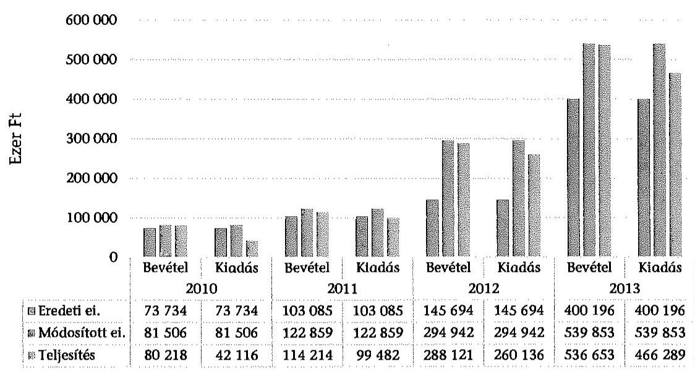
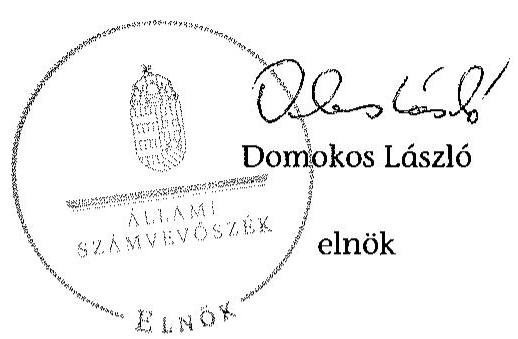
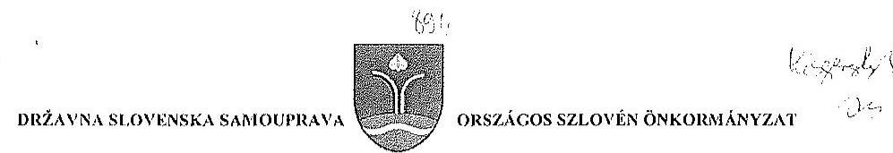
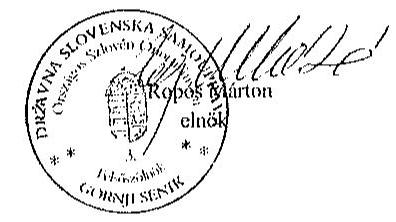
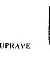
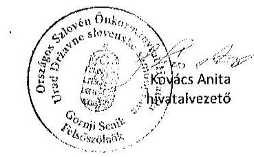
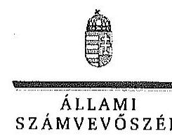
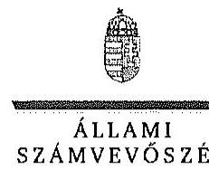

# ÁLLAMI   SZÁMVEVŐSZÉK 

## JELENTÉS

Az Országos Nemzetiségi Önkormányzatok gazdálkodásának ellenőrzéséről
Országos Szlovén Önkormányzat

---

# Állami Számvevőszék 

Iktatószám: V-0700-064/2015.
Témaszám: 1734
Vizsgálat-azonosító szám: V0680

## Az ellenőrzést felügyelte:

## Kisgergely István

felügyeleti vezető

## Az ellenőrzést vezette:

## Dr. Láng Ágnes Krisztina

ellenőrzésvezető
A számvevői jelentések feldolgozásában és a jelentés összeállításában közreműködtek:

## Dr. Láng Ágnes Krisztina

ellenőrzésvezető

## Humli Tamásné

számvevő tanácsos

## Az ellenőrzést végezték:

## Humli Tamásné

számvevő tanácsos

## Ritecz Tibor

számvevő tanácsos

---

# TARTALOMJEGYZÉK 

BEVEZETÉS ..... 3
I. ÖSSZEGZŐ MEGÁLLAPÍTÁSOK, KÖVETKEZTETÉSEK, JAVASLATOK ..... 7
II. RÉSZLETES MEGÁLLAPÍTÁSOK ..... 13

1. A belső kontrollrendszer kialakításának és működtetésének megfelelősége ..... 13
1.1. A kontrollkörnyezet kialakítása ..... 13
1.2. A kockázatkezelési rendszer kialakításának és működtetésének megfelelősége ..... 15
1.3. A kontrolltevékenységek működésének megfelelősége ..... 15
1.4. Információs és kommunikációs rendszer kialakításának és működtetésének megfelelősége ..... 17
1.5. Monitoring-rendszer kialakításának és működtetésének megfelelősége ..... 18
2. A gazdálkodás megfelelősége ..... 19
2.1. Pénzügyi gazdálkodás megfelelősége ..... 19
2.2. Vagyongazdálkodással kapcsolatos feladatellátás szabályszerűsége ..... 24
3. Ingyenesen juttatott vagyon kezelésének megfelelősége ..... 26
4. Egyéb feladat- és hatáskör ellátás szabályszerűsége ..... 27
5. Integritás kontrollok ..... 27
6. ÁSZ javaslatok hasznosulása ..... 28
MELLÉKLETEK
7. számú Az Országos Szlovén Önkormányzat észrevétele
8. számú Az Országos Szlovén Önkormányzat észrevételére válasz
FÜGGELÉKEK
9. számú Rövidítések jegyzéke
10. számú Az integritás kontrollok kialakítása és működtetése

---

.

---

# JELENTÉS 

## Az Országos Szlovén Önkormányzat gazdálkodásának ellenőrzéséről

## BEVEZETÉS

Az Országos Szlovén Önkormányzat 1995-ben alakult, jelenlegi elnöke a megalakulás óta látja el feladatát. Az Önkormányzat 2009-ben megalapította önálló működő költségvetési szervként a Kühár Emlékházat, és létrehozta Hivatalát. Az 1997-ben alapított Rádióban 100%-os tulajdoni hányadot szerzett 2009-ben. A 2012. évben átvette az Apáti Iskola és Felsőszölnöki Iskola fenntartói jogát. A 15 tagú Közgyűlés a munkája segítésére Oktatási, Kulturális, Ügyrendi, Pénzügyi Ellenőrző és Felügyelő bizottságokat hozott létre.

A Hivatal vezetőjét 2008. május 1-én nevezték ki, a gazdasági vezető kinevezése 2011. április 1-ei hatállyal történt. A Hivatal 2014-ben 5 főt teljes, 1 főt részmunkaidőben foglalkoztatott.

Az Önkormányzat költségvetési beszámolója szerint a 2013. évben a módosított költségvetési bevételi és kiadási előirányzat 366709 ezer Ft, a teljesített költségvetési bevétel 363509 ezer Ft, a teljesített költségvetési kiadás 293145 ezer Ft volt. Az Önkormányzat a 2013. évben 107400 ezer Ft államháztartásból származó működési- és médiatámogatásban részesült.

Az Alaptörvény XXIX. cikk (1) bekezdése szerint a Magyarországon élő nemzetiségek államalkotó tényezők. Minden, valamely nemzetiséghez tartozó magyar állampolgárnak joga van önazonossága szabad vállalásához és megőrzéséhez. A hazánkban élő nemzetiségek helyi (települési és területi), valamint országos önkormányzatokat hozhatnak létre.

Az országos nemzetiségi önkormányzat gazdálkodási feladatait az önállóan működő és gazdálkodó költségvetési szerve, a hivatal látja el. Az országos nemzetiségi önkormányzatok a 2008. évtől tartoznak az államháztartás önkormányzati alrendszerébe, azóta hivatalaik költségvetési szervként működnek. Az Alaptörvény hatálybalépését követően a 2012. évtől további jelentős jogszabályi változások határozzák meg működésüket, gazdálkodásukat.

A nemzetiségek helyzete, támogatása mind hazai, mind EU-s szinten kiemelt figyelmet kap napjainkban. Az állam az országos nemzetiségi önkormányzatok működéséhez, a médiaszolgáltatáshoz kapcsolódó jogaik érvényesítéséhez, valamint a kulturális önigazgatásuk érdekében alapított - közművelődési, közgyűjteményi, tudományos - intézmények fenntartásához az éves költségvetési törvényekben nevesítetten költségvetési támogatást biztosít. Ezen kívül az országos

---

nemzetiségi önkormányzatok közfeladataik ellátásához támogatást kapnak a fejezeti kezelésű előirányzatokból, valamint hazai és uniós pályázati forrásokat szerezhetnek.

Az ellenőrzés célja annak értékelése volt, hogy az országos nemzetiségi önkormányzat gazdálkodása, a belső kontrollrendszer kialakítása és működése, az államháztartásból nyújtott támogatás, illetve az államháztartásból meghatározott célra ingyenesen juttatott vagyon felhasználása a jogszabályi előírásoknak megfelelően történt-e; az önkormányzat a Nek. tv.-ben és az Njtv.-ben előírt feladat- és hatásköröket ellátta-e; intézkedett-e az ÁSZ által a 2008-2010. évek között végzett ellenőrzések javaslatainak végrehajtásáról.

Az országos nemzetiségi önkormányzat korrupcióval szembeni veszélyeztetettségének csökkentése érdekében felmértük az integritási szemlélet érvényesülését a gazdálkodási folyamatokban.

Értékeltük az önkormányzat gazdálkodása során a belső kontrollrendszer kialakítását és működését mind az öt pillére tekintetében, ellenőriztük a gazdálkodással összefüggő feladat- és hatásköröknek, a hivatal működési, gazdálkodási rendjének jogszabályi előírásoknak való megfelelőségét; a belső kontrollok működésének megfelelőségét az éves költségvetés, a költségvetési beszámoló és a zárszámadás készítés folyamatában; a gazdálkodás pénzügyi folyamatában kulcsszerepet betöltő (szakmai) teljesítésigazolás és 2011-ig utalvány ellenjegyzés, 2012-től érvényesítés kontrolltevékenységek működésének megfelelőségét; az önkormányzat belső ellenőrzése kialakításának és működésének megfelelőségét.

Értékeltük továbbá az országos nemzetiségi önkormányzat gazdálkodása, ezen belül pénzügyi gazdálkodása keretében a tervezés, beszámolási, zárszámadáskészítési folyamat, az előirányzatok betartása, a könyvvezetés, a közzétételek, adatszolgáltatások, valamint az államháztartás rendszeréből jogszabály vagy megállapodás alapján céljelleggel kapott támogatások felhasználásának, elszámolásának szabályszerűségét. A vagyonnal kapcsolatos feladatellátás ellenőrzése keretében értékeltük a vagyongazdálkodás szabályozottságát, a mérleg alátámasztottságát, a leltározás, az eszközbeszerzések, a vagyonhasznosítás, a tulajdonosi joggyakorlás szabályszerűségét, kiemelten az országos nemzetiségi önkormányzat gazdasági társasága részére a vagyon tulajdonba, illetve kezelésbe, üzemeltetésbe adása, a tőkeemelés és a juttatott támogatások szabályszerűségét. Értékeltük az államháztartásból ingyenesen juttatott vagyon felhasználásának szabályszerűségét. Ellenőriztük az előírt feladat- és hatáskörök közül a véleménynyilvánítási, egyetértési jog gyakorlásával, a hatáskör átruházásokkal, az ideiglenes vagyonkezeléssel kapcsolatos feladatok ellátásának szabályszerűségét, az integritás kontrollok működését, továbbá az előző ÁSZ ellenőrzés javaslatainak hasznosulását.

Az ellenőrzés várható hasznosulása: Az ellenőrzés eredményeként nemcsak az ellenőrzött szerv gazdálkodása javulhat, hanem átfogó képet kaphatunk az önkormányzati alrendszerbe tartozó országos nemzetiségi önkormányzatok gazdálkodásának hiányosságairól, de a jó gyakorlatokról is. Az ellenőrzés megállapításait és javaslatait más szervezetek is hasznosíthatják a rendezett gazdálkodási keretek kialakításához. Az ellenőrzés hozadékát képezi a 2008-2010. években elvégzett ÁSZ ellenőrzés javaslatai hasznosulásának értékelése. Mind a 13

---

országos nemzetiségi önkormányzat ellenőrzésével teljes körűen megvalósul az országos nemzetiségi önkormányzatok ellenőrzése a megváltozott jogszabályi környezetben. Az ellenőrzés tapasztalatai alapján a jogszabályi ellentmondások, hiányosságok feltárásával, azok megszüntetésére vonatkozó javaslatokkal segítjük a jó kormányzást. Az ellenőrzéssel lehetővé tesszük, hogy az országos nemzetiségi önkormányzatok gazdálkodásáról, működéséről a társadalom objektív képet alkothasson.

Az országos nemzetiségi önkormányzatok gazdálkodásának ellenőrzéséről szóló számvevőszéki jelentés I. fejezetének összegző része az ellenőrzés céljára adott rövid, szintetizáló összefoglalót és következtetéseket tartalmazza a II. fejezet részletes megállapításain alapulóan.

A jelentés intézkedést igénylő megállapításait és javaslatait az ellenőrzés során feltárt, a jelentés II. fejezetében rögzített részletes megállapítások alapozzák meg.

Az ellenőrzés típusa: szabályszerűségi ellenőrzés.
Az ellenőrzött időszak: 2010. január 1 - 2014. június 30.
Ellenőrzött szervezet: az országos nemzetiségi önkormányzat és hivatala, továbbá azon intézmények, amelyek gazdálkodási feladatait a hivatal látja el.

Az ellenőrzés végrehajtásának jogszabályi alapját az Állami Számvevőszékről szóló 2011. évi LXVI. törvény 1. § (3) bekezdése, az 5. § (2)-(3) és (6) bekezdései, valamint az államháztartásról szóló 2011. évi CXCV. törvény 61. § (2) bekezdésének előírásai képezik.

Az ellenőrzés módszertana az ÁSZ hivatalos honlapján (www.asz.hu) közzétett szakmai szabályokon alapul, amely a Legfőbb Ellenőrző Intézmények Nemzetközi Szervezete által kiadott nemzetközi standardok figyelembevételével készült.

Az ellenőrzés lefolytatásához az országos nemzetiségi önkormányzat a kimutatások és a tanúsítványok elektronikus kitöltésével, valamint az ÁSZ által kért dokumentumok elektronikus megküldésével szolgáltatott adatokat. Az így rendelkezésre bocsátott adatok, információk kontrollja és a munkalapok kitöltése az ellenőrzöttnél végzett ellenőrzés keretében történt.

A személyi juttatások, a dologi és felhalmozási kiadások, valamint a pénzeszközátadások felhasználásának szabályszerűségét, a céljelleggel kapott támogatások felhasználásának és elszámolásának szabályszerűségét és a kiadások esetében a gazdálkodási jogkörök gyakorlását mintavétellel ellenőriztük. A vagyonhasznosítási célú bevételeket tételesen ellenőriztük.

Megfelelőnek értékeltük a gazdálkodási jogkörök gyakorlását, amennyiben 95%-os bizonyossággal a teljes sokaságban a hibaarány legfeljebb 10%, részben megfelelőnek értékeltük, ha a hibaarány felső határa 10-30% volt, nem megfelelőnek pedig akkor, ha a hibaarány felső határa a teljes sokaságban meghaladta a 30%-ot.

---

Az ÁSZ a 2011. évi LXVI. törvény 29. §-a szerint a jelentéstervezetet megküldte az Országos Szlovén Önkormányzat elnökének és a hivatalvezetőnek egyeztetésre. A beérkezett észrevételt és az arra adott választ a jelentés 1-2. sz. mellékletei tartalmazzák.

---

# 1. ÖSSZEGZŐ MEGÁLLAPÍTÁSOK, KÖVETKEZTETÉSEK, JAVASLATOK 

Az Önkormányzatnál a 2010-2014. I. félév között a belső kontrollrendszer kialakítása és működtetése összességében nem volt megfelelő.

A kontrollkörnyezet kialakítása részben felelt meg az Önkormányzat működését meghatározó jogszabályokban foglaltaknak, mivel a hivatali SzMSz1,2 az Ávr.-ben előírt tartalmi követelményeknek részben felelt meg. A Hivatalvezető az Ámr. illetve a Bkr. előírásait figyelmen kívül hagyva a szabálytalanságok kezelésének eljárásrendjét nem alakította ki. A számviteli szabályzatok és az operatív gazdálkodási jogkörökre vonatkozó belső szabályozás megfelelt az Ámr., illetve az Ávr. előírásainak. A Hivatal a 2010-2012. november között az Ámr. és a Bkr. előírásaitól eltérően nem rendelkezett ellenőrzési nyomvonallal. A Bkr.-ben előírtaknak megfelelő, a Hivatal működésének irányítási és ellenőrzési folyamatai, a felelősségi és információs szintek és kapcsolatok leírását tartalmazó ellenőrzési nyomvonalat 2012 novemberében elkészítették.

A Hivatalvezető az Ámr. és a Bkr. előírásai ellenére nem alakított ki és nem működtetett kockázatkezelési rendszert.

A kontrolltevékenységek kialakítása és működtetése részben felelt meg az előírásoknak. Az éves költségvetés, a költségvetési beszámoló és a zárszámadás készítésének folyamatában a belső kontrolleljárásokat a 2010-2011. években az Ámr. rendelkezéseit követve kisebb hiányossággal alakították ki, a 2012. évtől a Bkr. előírásainak megfelelően kialakították és működtették. A kulcskontrollok működése a teljes ellenőrzött időszakban nem volt megfelelő. A 2010-2011. években a szakmai teljesítésigazolás és az utalvány ellenjegyzés, a 2012-2014. I. félév között a teljesítésigazolás és az érvényesítés gyakorlata nem felelt meg az Ámr., illetve az Ávr. előírásainak.

Az információs és kommunikációs rendszer kialakítása és működtetése nem volt megfelelő, mivel az Info tv. és az Ávr. előírásaitól eltérően 2012. júniusáig nem szabályozták a kötelezően közzéteendő adatok nyilvánosságra hozatalának rendjét. Az ellenőrzött időszakban nem szabályozták a közérdekű adatok megismerésére irányuló igények teljesítésének rendjét, és nem készítették el a Hivatal adatvédelmi és adatbiztonsági szabályzatát. Az Iratkezelési szabályzatot az Ikr. szabályait figyelmen kívül hagyva nem vizsgálták felül és nem módosították.

Az Önkormányzat Hivatala monitoring rendszerének kialakítása és működtetése részben felelt meg az előírásoknak. A Hivatalvezető az Áht.; és a Bkr. előírásai ellenére az operatív tevékenységek keretében megvalósuló, folyamatos és eseti nyomon követés rendszerét nem alakította ki.

Az ellenőrzött időszakban a belső ellenőrzési feladatok ellátásáról külső szolgáltató megbízása útján gondoskodtak. A belső ellenőrzés jogállását, feladatainak

---

meghatározását Belső ellenőrzési szabályzatban, majd a Belső Ellenőrzési Kézikönyvben rögzítették. A Belső Ellenőrzési Kézikönyvet a Bkr.-ben foglaltak ellenére nem a Hivatalvezető hagyta jóvá. A belső ellenőr a Közgyűlés által jóváhagyott éves ellenőrzési tervek alapján végezte ellenőrzéseit. A 2010-2014. I. félévében kilenc ellenőrzést végzett, kettő ellenőrzésnél állapított meg hiányosságot. Az Önkormányzat a belső ellenőrzés javaslatai végrehajtására intézkedési tervet készített, de a belső ellenőrzés az elvégzett ellenőrzésekről és azok hasznosulásáról a Ber. és a Bkr. által előírt nyilvántartásokat nem vezette. Az ellenőrzések az önkormányzati gazdálkodás szabályszerűségét nem mozdították elő.

Az Önkormányzat pénzügyi gazdálkodása megfelelt az előírásoknak. A Pénzügyi Bizottság a 2010-2014. évi költségvetési határozat-tervezeteket véleményezte. Az Elnök a 2011-2014. évi költségvetési határozat-tervezeteket
 az Áht$_{1,2}$ben meghatározott határidőben, a 2010. évi határidőn túl terjesztette a Közgyűlés elé. A 2010-2014. évi költségvetési határozat-tervezetek az Ámr.-ben, illetve az Áht$_{2}$-ben meghatározott szerkezetben és tartalommal készültek, de teljes körűen nem feleltek meg a követelményeknek. A Közgyűlés az Áht$_{1,2}$-ben meghatározott határidőig elfogadta a 2010-2014. évi költségvetési határozatát. Az Önkormányzat a 2010-2013. években az előírányzatokon belül gazdálkodott. A Közgyűlés a 2010-2013. évről szóló éves elszámolási költségvetési beszámolókat az Áhsz$_{1}$ szerinti határidőben benyújtotta a kisebbségpolitikáért felelős miniszternek. Az Elnök a zárszámadási határozat-tervezeteket az egyszerűsített éves költségvetési beszámolóval és a könyvvizsgálói jelentéssel együtt határidőben terjesztette a Közgyűlés elé. Az Elnök a 2010-2013. évi zárszámadási határozat-tervezet előterjesztésekor - az Ámr., illetve az Áht$_{2}$ rendelkezései ellenére - nem teljesítette teljes körűen a tájékoztatási kötelezettségét, a Közgyűlésnek nem mutatta be a pénzeszközök változását és a vagyonkimutatást.

Az Önkormányzat az államháztartás rendszeréből jogszabály, illetve megállapodás alapján kapott támogatások felhasználása és elszámolása során - a működési támogatások nyilvántartási kötelezettsége kivételével - betartotta a jogszabályi és szerződéses előírásokat. A kapott pénzeszközöket az előírásoknak megfelelően használták fel, azokkal szakmai és pénzügyi beszámoló keretében határidőn belül elszámoltak. Az Önkormányzat uniós pályázati forrásban részesült a kulturális önigazgatás érdekében alapított intézmény fenntartásához, közfeladatai ellátásához. A projektek végrehajtása során a jogszabályi előírásokat betartották.

Az ellenőrzött időszakban az Önkormányzat által államháztartási forrás terhére pályázat vagy kérelem alapján nyújtott céltámogatások odaítéléséről a Közgyűlés döntött. A támogatási szerződésekben megfogalmazott célok összhangban voltak a Nek. tv-ben, illetve az Njtv.-ben meghatározott nemzetiségi feladatokkal. Az Önkormányzat előírta az elszámolási kötelezettséget és a támogatott szervezeteket beszámoltatták a támogatás felhasználásáról.

Az Önkormányzat vagyongazdálkodási tevékenysége szabályszerű volt. Az Önkormányzat az Nvtv. hatályba lépését követően felülvizsgálta a forgalomképtelennek minősülő törzsvagyonát. A Nek. tv., illetve az Njtv. előírásaival összhangban meghatározta az egyes vagyonelemek hasznosítási, illetve ingyenes átruházásának módját, feltételeit. Az Önkormányzat és intézményei a 2010-2013. évek között beszámolóikat az Áhsz$_{1,2}$ előírásainak megfelelően leltárral alátá-

---

masztották, az értékeléseket a mérlegsorokhoz kapcsolódóan elvégezték. A beszerzési eljárások folyamatát szabályozták. A beszerzett tárgyi eszközök és immateriális javak üzembe helyezése, állományba vétele, értékelése a Számv. tv. és az Áhsz. előírásainak megfelelően történt. Az Önkormányzat kizárólagos tulajdonában levő gazdasági társaságnál a tulajdonosi joggyakorlás szabályszerű volt. A Közgyűlés a Rádió éves jelentését megtárgyalta, melynek keretében értékelte a gazdasági társaságra bízott közfeladat ellátásának helyzetét.

Az Önkormányzat az ellenőrzött időszakban ingyenes vagyonjuttatásban nem részesült, az alakulásakor egyszeri vagyonjuttatásként kapott ingatlanait az előírásoknak megfelelően forgalomképtelen vagyonként tartotta nyilván. A 2012. évben Közgyűlési határozat alapján az Apáti Iskola és a Felsőszölnöki Iskola intézményi fenntartói jogának átvállalására került sor. Az Önkormányzat az intézmények működési helyéül szolgáló ingatlanok használati jogát ingyenesen szerezte meg.

A Közgyűlés 2010-2012. évek között az Elnöknek vagyongazdálkodást érintő hatáskört adott át, más feladat- és hatáskört az ellenőrzött időszakban szerveire nem ruházott át. Az Elnök és a Hivatalvezető - a Nek. tv., illetve az Njtv. előírásai ellenére - a Közgyűlés felhatalmazása nélkül gondoskodtak a vélemény-nyilvánítási, egyetértési és közreműködési tevékenység ellátásáról.

Az ÁSZ tv. 33. § (1) bekezdésében foglaltak értelmében a jelentésben foglalt megállapításokhoz kapcsolódó intézkedési tervet köteles az ellenőrzött szervezet vezetője összeállítani, és azt a jelentés kézhezvételétől számított 30 napon belül az ÁSZ részére megküldeni. Amennyiben az intézkedési tervet határidőben nem küldi meg a szervezet, vagy az nem elfogadható, az ÁSZ elnöke a hivatkozott törvény 33. § (3) bekezdés a)-b) pontjaiban foglaltakat érvényesítheti

Az ÁSZ a 2008-2010. években az Önkormányzatnál ellenőrzést nem végzett.
A helyszíni ellenőrzés megállapításainak hasznosítása mellett javasoljuk

# az Elnöknek 

1. A 2012. évtől az SzMSz aktualizálása - az Njtv. 117. § (1) bekezdésében és a 113. § a) pontjában foglalt előírásokat figyelmen kívül hagyva - nem történt meg, annak ellenére, hogy 2012. évben az Önkormányzat működését és gazdálkodását érintő új jogszabályok (Njtv., Áht., Ávr., Bkr.) léptek hatályba.

Javaslat:
Terjessze a Közgyűlés elé a hivatalvezető által előkészített, az Önkormányzatra vonatkozó hatályos jogszabályoknak megfelelően aktualizált SzMSz-t.

## a Hivatalvezetőnek

Az Önkormányzat belső kontroll rendszere tekintetében:

1. A kontrollkörnyezet kialakítása részben volt megfelelő, mivel a Hivatal, mint önállóan működő és gazdálkodó költségvetési szerv megalkotott SzMSz-e nem tartalmazta az

---

Ávr. 13. § (1) bekezdés c), e), g) és i) pontjában foglaltaktól eltérően az alaptevékenységek szakfeladat szerinti besorolását, a Hivatal szervezeti ábráját, a munkakörökhöz tartozó feladat- és hatáskörök gyakorlásának módját, azon költségvetési szervek megnevezését, melyek gazdálkodási feladatait a Hivatal látja el.

A Hivatalvezető az Ámr. 161. § és a Bkr. 6. § (4) bekezdés előírásaitól eltérően nem alakította ki a szabálytalanságok kezelésének eljárásrendjét.

Javaslat:
Intézkedjen a Hivatal SzMSz-ének kiegészítéséről, valamint a szabálytalanságok kezelésének eljárásrendje elkészítésére.
2. A kockázatkezelési rendszer kialakítása és működtetése nem felelt meg a jogszabályi előírásoknak. A Hivatalvezető - az Ámr. 157. § (2)-(3) bekezdésében, valamint a Bkr. 7. § (2) bekezdésében foglalt előírás ellenére - nem mérte fel és nem állapította meg a Hivatal tevékenységében, gazdálkodásában rejlő kockázatokat, nem határozta meg az egyes kockázatokkal kapcsolatban a szükséges intézkedéseket, valamint azok teljesítésének folyamatos nyomon követési módját.

Javaslat:
Mérje fel és állapítsa meg a Hivatal tevékenységében, gazdálkodásában rejlő kockázatokat, valamint határozza meg az egyes kockázatokkal kapcsolatban a szükséges intézkedéseket és azok teljesítésének folyamatos nyomon követési módját.
3. A kontrolltevékenységek kialakítása és működtetése részben felelt meg az előírásoknak. A Hivatalvezető - az Ámr. 158. § (2) bekezdés b) pontjában és a Bkr. 8. § (4) bekezdés b) pontjában foglaltak ellenére - belső szabályzatban nem határozta meg a dokumentumokhoz és információkhoz való hozzáférésre vonatkozóan a felelősségi köröket.

A 2010-2011. években a személyi juttatások, a dologi kiadások, a felhalmozási kiadások, a pénzeszközátadások kifizetései során a pénzügyi folyamatokban kulcsszerepet betöltő szakmai teljesítésigazolás és utalvány ellenjegyzés kontrollok működése nem volt megfelelő.

A 2012-2014. I. félévében a személyi juttatások, a dologi kiadások, a felhalmozási kiadások, a pénzeszközátadások kifizetései során a pénzügyi folyamatokban kulcsszerepet betöltő a teljesítésigazolás és az érvényesítés kontrollok működése - összefoglalóan értékelve - Ávr. 57. § (1) és (3) bekezdéseiben, valamint 58. § (1)-(3) bekezdéseiben foglaltak ellenére nem volt megfelelő.

Javaslat:
a) Intézkedjen a Hivatal belső szabályzataiban a dokumentumokhoz és információkhoz való hozzáféréssel kapcsolatos felelősségi körök szabályozásáról.

[^0]
[^0]:    ${ }^{1}$ 2011. január 1-jétől a vonatkozó előírást az Ámr. 156. § (3) bekezdése tartalmazta.

---

b) Intézkedjen a gazdálkodási jogkörök szabályszerű gyakorlásának érvényesítéséről.
4. A Hivatalvezető az ellenőrzött években - az Áht$_{1}$ 121. § (2) bekezdés d) pontjában, illetve a Bkr. 9. § (1) bekezdésében foglalt előírások ellenére - az információs és kommunikációs rendszert nem a jogszabályi előírásoknak megfelelően alakította ki és működtette. A Hivatalvezető az ellenőrzött időszakban nem szabályozta a közérdekű adatok megismerésére irányuló igények teljesítésének rendjét, ezáltal nem tett eleget az Avtv. 20. § (8) bekezdésében, az Info tv. 30. § (6) bekezdésében és az Ávr. 13. § (2) bekezdés h) pontjában foglalt előírásoknak.

A Hivatalvezető nem készítette el az Avtv. 31/A. § (3) bekezdése, illetve az Info tv. 24. § (3) bekezdése előírásának megfelelően az adatvédelmi és adatbiztonsági szabályzatot.

Az Iratkezelési szabályzatot az Ikr. 3.§ (1) bekezdésében foglaltaktól eltérően nem vizsgálták felül.

Javaslat:
a) Alakítsa ki a kötelezően közzéteendő adatok megismerésére irányuló igények teljesítésének rendjét, valamint intézkedjen a Hivatal adatvédelmi és adatbiztonsági szabályzatának elkészítésére.
b) Intézkedjen az Iratkezelési szabályzat felülvizsgálatára.
5. Az Önkormányzatnál a monitoring rendszer kialakítása és működtetése részben felelt meg a jogszabályi előírásoknak. A Hivatalvezető - a 2010. évben az Áht. 1 120/B.§ (2) bekezdés e) pontjában, a 2011. évben az Áht. 1 121.§ (2) bekezdés e) pontjában, a 2012-2014. I. félévben a Bkr. 3. § e) pontjában és a 10. §-ában foglalt előírások ellenére az operatív tevékenységek keretében megvalósuló, folyamatos és eseti nyomon követés rendszerét nem alakította ki.

Az Önkormányzat a 2010-2012. években a Ber. 5. § (1) és a Bkr. 17. § (1) bekezdése előírásától eltérően nem rendelkezett belső ellenőrzési kézikönyvvel. A 2013. évben kiadott belső ellenőrzési kézikönyvet a Bkr. 17. § (1) bekezdésében foglaltaktól eltérően nem a Hivatalvezető, hanem az Elnök hagyta jóvá.

A belső ellenőr - a Ber. 32. § (1)-(2) bekezdéseiben és a Bkr. 50. § (1)-(2) bekezdéseiben foglaltak ellenére nem vezetett nyilvántartást az elvégzett belső ellenőrzésekről, a 2012-2014. I. félévekben a Bkr. 47. § (1) bekezdésében foglaltak ellenére - nem vezetett nyilvántartást a belső ellenőrzési jelentésekben tett megállapításokról, javaslatokról és azok végrehajtásának nyomon követéséről.

Javaslat:
a) Alakítsa ki a Hivatal tevékenységének keretében megvalósuló folyamatos és eseti nyomon követés rendszerét;
b) Intézkedjen a belső ellenőrzési vezető által kidolgozott belső ellenőrzési kézikönyv jóváhagyásáról;

---

c) Intézkedjen arról, hogy a belső ellenőrzési vezető vezessen nyilvántartást az elvégzett belső ellenőrzésekről, a belső ellenőrzési jelentésekben tett megállapításokról, javaslatokról, a vonatkozó intézkedési tervekről és azok végrehajtásának nyomon követéséről.

A pénzügyi- és vagyongazdálkodás területén
6. A Közgyűlés elé terjesztett 2010. évi költségvetési határozat-tervezet az Ámr. 36. § (1) bekezdés e) és ec) pontja, valamint az Ámr. 36. § (1) bekezdés l) pontja és 40. § (1) pontja ellenére nem tartalmazta az Önkormányzati hivatal költségvetését, a hiány összegét, valamint elkülönítetten az EU-s forrásból finanszírozott támogatással megvalósuló projekt bevételét és kiadását.

A 2013. és a 2014. évi költségvetési határozatok az Ávr. 24. § (1) bekezdés a) pontjában foglaltak ellenére nem tartalmazták a bevételek között elkülönítetten az EU-s forrásból finanszírozott támogatással megvalósuló projekt bevételeit.

A 2012-2014. évi költségvetés előterjesztésekor tájékoztatásul nem mutatták be a Közgyűlés részére az Áht. 24. § (4) bekezdés a) pontjában előírtak ellenére az Önkormányzat költségvetési mérlegét közgazdasági tagolásban, előirányzat felhasználási tervét.

Javaslat:
Intézkedjen, hogy a jövőben a Közgyűlés elé terjesztett költségvetési határozat tervezetek feleljenek meg a jogszabályi előírásoknak.
7. Az Elnök a 2010-2011. évi zárszámadási határozat-tervezetének előterjesztésekor - az Ámr. 40. § (6) bekezdés a), c), d) pontjaiban foglalt előírásokat figyelmen kívül hagyva nem mutatta be tájékoztatásul a Közgyűlésnek a 2011. évről az Önkormányzat összevont könyvviteli mérlegét, a pénzeszközök változását és a vagyonkimutatást. A 2012-2013. évi zárszámadási határozat-tervezetek az Áht. 2 91. § (2) bekezdés a) és c) pontjaiban foglaltak ellenére nem tartalmazták a pénzeszközök változásának bemutatását és a 2012. évi vagyonkimutatást.

Javaslat:
Gondoskodjon a zárszámadási határozat-tervezettel bemutatandó jogszabályi előírásoknak megfelelő kimutatások előkészítéséről.

---

# II. RÉSZLETES MEGÁLLAPÍTÁSOK 

## 1. A BELSŐ KONTROLLRENDSZER KIALAKÍTÁSÁNAK ÉS MŰKÖDTETÉSÉNEK MEGFELELŐSÉGE

Az ellenőrzött időszakban az Önkormányzatnál a belső kontrollrendszer (a kontrollkörnyezet, a kockázatkezelési rendszer, a kontrolltevékenységek, az információs és kommunikációs rendszer, valamint a monitoring rendszer) kialakítása és működtetése összességében nem volt megfelelő az alábbiakban részletezett szabályozásbeli
 és működésbeli hibák és hiányosságok miatt.

### 1.1. A kontrollkörnyezet kialakítása

A kontrollkörnyezet kialakítása részben felelt meg az Önkormányzat működését meghatározó jogszabályokban foglaltaknak.

Az Önkormányzat - 2010-2014. I. félév között - a Nek. tv. és az Njtv. előírásai alapján rendelkezett SzMSz-szel, melyet a Közgyűlés a 2010-2011. években négy alkalommal módosított. A 2012. évtől az SzMSz aktualizálása - az Njtv. 117. § (1) bekezdésében és a 113. § a) pontjában foglalt előírásokat figyelmen kívül hagyva - nem történt meg, annak ellenére, hogy 2012. évben az Önkormányzat működését és gazdálkodását érintő új jogszabályok (Njtv., Áht. ${ }_{2}$, Ávr., Bkr.) léptek hatályba. Az Önkormányzat a Nek. tv. előírásának megfelelően az SzMSz elfogadását, illetve annak módosításait - kivétel a 2010. május 28-i módosítás - a Magyar Közlönyben, illetve internetes honlapján határidőben közzétette.

A Közgyűlés a vagyonnyilatkozat-tételre kötelezettek körét az önkormányzati SzMSz-ben szabályozta. A képviselők az ellenőrzött időszakban a vagyonnyilatkozat-tételi kötelezettségüket teljesítették.

A Hivatal működésének szabályait az önkormányzati SzMSz a Nek. tv.-ben foglaltakkal összhangban tartalmazta. A Hivatal, mint önállóan működő és gazdálkodó költségvetési szerv a 2010-2013. szeptember 15-ig - az Áht. 11. § (2) bekezdésében, valamint az Áht. 2 10. § (5) bekezdésében foglaltaktól eltérően - nem rendelkezett SzMSz-szel.

A hivatali $\mathrm{SzMSz}_{1,2}$ az Ávr. 13. § (1) bekezdés c), e), g) és i) pontjaiban foglaltak ellenére nem tartalmazta az ellátandó alaptevékenységek szakfeladatrend szerinti besorolását, a Hivatal szervezeti ábráját, a nevesített munkakörökhöz tartozó feladat- és hatáskörök gyakorlásának módját, a helyettesítés rendjét, az ezekhez kapcsolódó felelősségi szabályokat, továbbá azon költségvetési szervek megnevezését, melynek gazdálkodási feladatait a Hivatal látta el.

Az Önkormányzat által alapított Kühár Emlékház, a 2012. évben átvett Apáti Iskola és a Felsőszölnöki Iskola, mint önállóan működő intézmények, valamint

---

a Hivatal - az Ávr. előírásának megfelelően, a 2012. november 29-én kelt - megállapodásban rögzítették a gazdálkodással kapcsolatos munkamegosztás és felelősségvállalás, az információáramlás, információszolgáltatás részletes rendjét.

Az Önkormányzat gazdálkodásának szabályozottsága az ellenőrzött években részben felelt meg az előírásoknak.

A 2010-2011. években a Hivatalra vonatkozó számviteli és gazdálkodási előírásokat az Önkormányzat számviteli és gazdálkodási szabályzatai tartalmazták, amelyek hatálya a Hivatalra is kiterjedt. 2012-től az Önkormányzatra, a Hivatalra, a Kühár Emlékházra 2012. január 1-i hatályba helyezéssel, az átvett Apáti Iskolára, valamint a Felsőszölnöki Iskolára 2012. július 1-i hatályba helyezéssel külön pénzügyi és gazdálkodási szabályzatok készültek.

Az Önkormányzat a Számv. tv., és az Áhsz. ${ }_{1,2}$ előírásaival összhangban rendelkezett hatályos, 2013. évig évente aktualizált számviteli politikával. A számviteli politika keretében elkészítette a leltározási és leltárkészítési szabályzatot, de az elkészítendő számviteli szabályzatok közül a Számv. tv. 14. § (5) bekezdés b) pontjában előírtaktól eltérően az eszközök és források értékelési szabályzatával a 2010. évben nem rendelkezett. A 2011. évtől a Számv. tv., és az Áhsz. ${ }_{1,2}$ előírásaival összhangban azokat elkészítették. Az Önkormányzat 2010. évben a Számv. tv. 161. § (1) bekezdésétől eltérően számlarenddel, a Számv. tv. 161. § (2) bekezdés d) pontjában foglaltak ellenére bizonylati renddel nem rendelkezett. Az Önkormányzat a 2011. évtől a jogszabályi előírásoknak megfelelően rendelkezett, folyamatosan aktualizált számlarenddel, hatályos bizonylati renddel. A 2010-2011. évben a Számv. tv. 14. § (5) bekezdés c) pontjában foglaltaktól eltérően nem rendelkezett önköltség-számítási szabályzattal, de a 2012. évben pótolta a hiányosságot.

Az Önkormányzat az Ámr. és az Ávr. előírásaival összhangban rendelkezett az operatív gazdálkodási jogkörök gyakorlására vonatkozó eljárásrendet tartalmazó kötelezettségvállalási szabályzat ${ }_{1,2,3}$-mal. A kötelezettségvállalási szabályzatok a jogszabályi előírásoknak megfelelően tartalmazták a kötelezettségvállalásra, pénzügyi ellenjegyzésre, a teljesítésigazolásra, az érvényesítésre és az utalványozásra jogosultak körét és feladatait. A Hivatalvezető és gazdasági vezetője rendelkezett a Nek. tv., az Ámr. és az Ávr. előírásainak megfelelő végzettséggel. A kötelezettségvállalási szabályzatok tartalmazták a kötelezettségvállalásokhoz kapcsolódó analitikus nyilvántartás vezetésének módját.

A Hivatalvezető az Ámr. 161. $\S^{2}$ és a Bkr. 6. § (4) bekezdés előírásaitól eltérően nem alakította ki a szabálytalanságok kezelésének eljárásrendjét.

A Hivatal a 2010-2012. november között az Ámr. 156. § (2) bekezdés és a Bkr. 6. § (3) bekezdés előírásaitól eltérően nem rendelkezett ellenőrzési nyomvonallal. Nem határozták meg a folyamatok felelősségi és információs szintjeit, kapcsolatait, az irányítási és ellenőrzési folyamatokat, ezáltal nem volt lehetséges azok nyomon követése és utólagos ellenőrzése. A jogszabályi előírásoknak

[^0]
[^0]:    ${ }^{2}$ 2011. január 1-jétől a vonatkozó előírást az Ámr. 156. § (3) bekezdése tartalmazta.

---

megfelelő hivatali ellenőrzési nyomvonal kialakítására a 2012. november 29-től hatályos FEUVE szabályzat keretében került sor.

A Hivatalnál a kontrollkörnyezet kialakításának keretében - az Ámr. 156. § (1) bekezdés c) pontjában és a Bkr. 6. § (1) bekezdés c) pontjában foglaltak ellenére - a 2013. április 3-ig nem határoztak meg etikai elvárásokat. Ezt követően a Hivatalvezető által kiadott Etikai szabályozásban a kontrollkörnyezet kialakításához szükséges etikai elvárásokat részletesen meghatározták.

# 1.2. A kockázatkezelési rendszer kialakításának és működtetésének megfelelősége 

A kockázatkezelési rendszer kialakítása és működtetése nem felelt meg a jogszabályi előírásoknak. A Hivatalvezető - az Ámr. 157. § (2)-(3) bekezdésében, valamint a Bkr. 7. § (2) bekezdésében foglalt előírás ellenére - nem mérte fel és nem állapította meg a Hivatal tevékenységében, gazdálkodásában rejlő kockázatokat, nem határozta meg az egyes kockázatokkal kapcsolatban a szükséges intézkedéseket, valamint azok teljesítésének folyamatos nyomon követési módját.

A FEUVE szabályzat VIII. fejezete tartalmazott a kockázatkezelésre vonatkozó általános előírásokat, azonban a gyakorlatban a kockázatkezelési rendszer nem működött.

### 1.3. A kontrolltevékenységek működésének megfelelősége

A kontrolltevékenységek kialakítása és működtetése részben felelt meg az előírásoknak.

A kontrolltevékenység részeként - az Áht.; 121/A. § (4) bekezdés és a Bkr. 8. § (2) bekezdés előírásától eltérően - a Hivatalvezető a 2010-2012. években nem biztosította a folyamatba épített előzetes, utólagos és vezetői ellenőrzést.

A Hivatalvezető - az Ámr. 158. § (2) bekezdés b) pontjában és a Bkr. 8. § (4) bekezdés b) pontjában foglaltak ellenére - belső szabályzatban nem határozta meg a dokumentumokhoz és információkhoz való hozzáférésre vonatkozóan a felelősségi köröket.

Az ellenőrzött időszakban, a költségvetés tervezése, a költségvetési beszámoló és a zárszámadás készítése kapcsán a folyamatok belső kontrolljai a szabályozás hiányossága ellenére működtek.

A költségvetés tervezéssel, a költségvetési beszámoló és a zárszámadás készítésével kapcsolatos alapvető feladatokat és hatásköröket a Gazdálkodási szabályzatban, a Számviteli politikában, a munkaköri leírásokban, majd a FEUVE szabályzatban határozták meg.

A költségvetési beszámoló elkészítésével megbízott személy rendelkezett a Számv. tv. és az Ávr. által előírt képesítéssel.

---

A 2010-2011. években a személyi juttatások, a dologi kiadások, a felhalmozási kiadások, a pénzeszközátadások kifizetései során a pénzügyi folyamatokban kulcsszerepet betöltő szakmai teljesítésigazolás és utalvány ellenjegyzés kontrollok működése nem volt megfelelő.

A 2010-2011. években a mintatételek ellenőrzése alapján a szakmai teljesítésigazolás és utalvány ellenjegyzés gyakorlása során az alábbi hiányosságok, szabálytalanságok fordultak elő:

- A szakmai teljesítésigazolásra kijelölt személy aláírása önmagában nem felelt meg az Ámr. 76. § (3) bekezdés szakmai teljesítésigazolás módjára vonatkozó előírásainak, mert a kifizetés bizonylatáról hiányzott az igazolás dátuma, és a teljesítés tényére történő utalás megjelölése, így dokumentáltan nem tett eleget az Ámr. 76. § (1) bekezdésben meghatározott ellenőrzési feladatainak.
- A tárgyi eszközök beszerzések során - az Ámr. 74. § (1) bekezdésében előírtak ellenére - a kötelezettségvállalást nem előzte meg ellenjegyzés.
- A gazdálkodási jogkörök gyakorlása során a pénztári tételek esetében az utalvány ellenjegyzésére kijelölt személy aláírása önmagában nem felelt meg az Ámr. 74. § (1) bekezdésében és a 79. § (2) bekezdésében előírtaknak, mert hiányzott az ellenjegyzés dátuma és az ellenjegyzés tényére történő utalás.
- A banki tételek esetében az utalvány ellenjegyzői - az Ámr. 79. § (2) bekezdésében foglaltakat figyelmen kívül hagyva - annak ellenére látták el aláírásukkal az utalványt, hogy a szakmai teljesítésigazolás és az érvényesítés nem történt meg.

A 2012-2014. I. félévében a személyi juttatások, a dologi kiadások, a felhalmozási kiadások, a pénzeszközátadások kifizetései során a pénzügyi folyamatokban kulcsszerepet betöltő a teljesítésigazolás és az érvényesítés kontrollok működése - összefoglalóan értékelve - nem volt megfelelő.

A 2012-2014. I. félévében a mintatételek ellenőrzése alapján a teljesítésigazolás és az érvényesítés gyakorlása során az alábbi hiányosságok, szabálytalanságok fordultak elő:

- A teljesítésigazolást az arra jogosultak látták el, de az Ávr. 57. § (3) bekezdésében foglaltakat figyelmen kívül hagyva a kifizetés bizonylatáról hiányzott az igazolás dátuma és a teljesítés tényére való utalás, így az Ávr. 57. § (1) bekezdésben foglaltak ellenére szabályszerűen nem történt meg a kifizetés jogosságának, összegszerűségének és a szerződésszerű teljesítésnek az igazolása.
- A tárgyi eszközök beszerzése során - az Ávr. 55. § (1) bekezdésében előírtak ellenére - a kötelezettségvállalást nem előzte meg pénzügyi ellenjegyzés.
- Az érvényesítésre kijelölt személy aláírása önmagában nem felelt meg az Ávr. 58. § (3) bekezdés érvényesítés módjára vonatkozó előírásainak, mert hiányzott az ellenjegyzés tényére történő utalás és az érvényesítő aláírásának keltezése, így dokumentáltan nem tett eleget az Ávr. 58. § (1) bekezdésben meghatározott ellenőrzési feladatainak.

---

- Az érvényesítést a banki tételek esetében az arra jogosultak igazolták aláírásukkal, de az Ávr. 58. § (2) bekezdésében foglalt előírás ellenére nem jelezték az utalványozónak, hogy a megelőző ügymenetben a teljesítésigazolást - az Áht. 2 38. § (1) bekezdésében és az Ávr. 57. § (3) bekezdésében foglaltak ellenére - nem szabályszerűen végezték el; az Ávr. 56. § (1) bekezdésében előírtak ellenére a kötelezettségvállalásokat követően nem gondoskodtak annak nyilvántartásba vételéről, valamint - az Áht. 2 37. § (1) bekezdésében és az Ávr. 55. § (1) bekezdésében foglaltaktól eltérően - az írásbeli kötelezettségvállalásokat nem előzte meg pénzügyi ellenjegyzés.

A nem megfelelően működtetett belső kontrollok korrupciós kockázatot is hordoznak.

# 1.4. Információs és kommunikációs rendszer kialakításának és működtetésének megfelelősége 

A Hivatalvezető az ellenőrzött években - az Áht ${ }_{1}$ 121. § (2) bekezdés d) pontjában ${ }^{3}$, illetve a Bkr. 9. § (1) bekezdésében foglalt előírások ellenére - az információs és kommunikációs rendszert nem a jogszabályi előírásoknak megfelelően alakította ki és működtette.

A Hivatalvezető - az Eisztv. 4. § (3) bekezdésében, illetve az Info tv. 35. § (3) bekezdésében és az Ávr. 13. § (2) bekezdés h) pontjában foglalt előírás ellenére - a kötelezően közzéteendő adatok nyilvánosságra hozatalának rendjét 2012. év júniusáig nem szabályozta. A Hivatalvezető és az Önkormányzat Elnöke által kiadott Közzétételi szabályzatot 2012. június 1-én helyezték hatályba. Ebben a közérdekű adatok közzétételére vonatkozó főbb szabályokat rögzítették.

A Hivatalvezető az ellenőrzött időszakban nem szabályozta azonban a közérdekű adatok megismerésére irányuló igények teljesítésének rendjét, ezáltal nem tett eleget az Avtv. 20. § (8) bekezdésében, az Info tv. 30. § (6) bekezdésében és az Ávr. 13. §
 (2) bekezdés h) pontjában foglalt előírásoknak.

A Hivatalvezető a közzétételi kötelezettség teljesítéséről nem teljes körűen gondoskodott, mivel nem tették közzé

- a Hivatal feladatellátásának teljesítményére, működésének eredményességére vonatkozó adatokat az Eisztv. 6. § (1) bekezdésében foglaltak ellenére;
- a foglalkoztatottak létszámára és személyi juttatásaira vonatkozó összesített adatokat, a vezetők és vezető tisztségviselők illetményét, munkabérét, és rendszeres juttatásait, valamint költségtérítését az Eisztv. 6. § (1) bekezdésében, illetve az Info tv. 37. § (1) bekezdésében előírtak figyelmen kívül hagyásával.

[^0]
[^0]:    ${ }^{3}$ A vonatkozó előírást 2010. december 31-ig az Áht ${ }_{1} 120 /$ B. § (2) bekezdés b) pontja tartalmazta.

---

A Hivatalvezető nem készítette el az Avtv. 31/A. § (3) bekezdése, illetve az Info tv. 24. § (3) bekezdése előírásának megfelelően az adatvédelmi és adatbiztonsági szabályzatot.

Az ellenőrzött időszakban az Önkormányzat rendelkezett Iratkezelési szabályzattal, azonban az Ikr. 3. § (1) bekezdésében foglalt előírás ellenére a szabályzat felülvizsgálata nem történt meg. A Hivatal iratkezelési és iktatási rendszere az ügyintézési folyamatok nyomon követését, az adatok védelmét, az iratok megőrzését biztosította.

# 1.5. Monitoring-rendszer kialakításának és működtetésének megfelelősége 

Az Önkormányzatnál a monitoring rendszer kialakítása és működtetése részben felelt meg a jogszabályi előírásoknak.

A Hivatalvezető - a 2010. évben az Áht. ${ }_{1}$ 120/B.§ (2) bekezdés e) pontjában, a 2011. évben az Áht. ${ }_{1}$ 121.§ (2) bekezdés e) pontjában, a 2012-2014. I. félévben a Bkr. 3. § e) pontjában és a 10. §-ában foglalt előírások ellenére az operatív tevékenységek keretében megvalósuló, folyamatos és eseti nyomon követés rendszerét nem alakította ki.

A belső kontrollrendszer minőségét a Hivatalvezető, az önállóan működő költségvetési szervek vezetői az Ámr. 217. § c) pontja szerint az Ámr. 21. számú mellékletén, illetve a Bkr. 11. § (1) bekezdésében foglaltak alapján a Bkr. 1. számú mellékletében foglaltak szerinti nyilatkozatban a 2010-2013. évekre vonatkozóan nem értékelték.

A belső ellenőrzést külső személy megbízásával látták el az ellenőrzött időszakban. A belső ellenőr elvégzendő ellenőrzési feladatait a megkötött szerződésekben meghatározták, függetlenségét biztosították.

Az Önkormányzat a 2010-2012. években - a Ber. 5. § (1) bekezdése és a Bkr. 17. § (1) bekezdése előírásától eltérően - nem rendelkezett belső ellenőrzési kézikönyvvel. A 2013. évben kiadott belső ellenőrzési kézikönyvet a Bkr. 17. § (1) bekezdésében foglaltaktól eltérően nem a Hivatalvezető, hanem az Elnök hagyta jóvá. A belső ellenőrzés jogállását, feladatainak meghatározását az Ügyrend mellékletét képező Belső ellenőrzési szabályzatban, majd a Belső Ellenőrzési Kézikönyvben rögzítették.

A 2010-2014. I. félévben az Önkormányzatnál kilenc belső ellenőrzést végeztek, a belső ellenőr által kidolgozott, a Közgyűlés által jóváhagyott éves ellenőrzési tervek alapján.

A belső ellenőr a 2010. évben a Kühár Emlékház elindulása, működési szabályszerűségének ellenőrzését végezte el. A 2011. évben az Önkormányzat által nyújtott és felhasznált támogatások, az Önkormányzat bizottságainak, illetve a reprezentáció, természetbeni juttatás megfizetésének ellenőrzésére került sor. Ez utóbbi ellenőrzés a kifizetések igazolására vonatkozó javaslatot tett. A belső ellenőr a 2012. évben a közérdekű adatok közzétételének, és a FEUVE-nek az ellenőrzését végezte el. A 2013. évben a közoktatási intézmények normatíva ellenőrzése, és az Önkor-

---

mányzat vagyongazdálkodásának ellenőrzésére került sor. Ez utóbbi a vagyongazdálkodási terv módosítására fogalmazott meg javaslatot. A belső ellenőr a 2014. I. félévében egy ellenőrzést végzett, a banki utalások szabályszerűségének témájában.

Az elvégzett ellenőrzések közül kettő esetben állapított meg hiányosságot és tett javaslatot, a többi ellenőrzésnél érdemi javaslatot nem fogalmazott meg a belső ellenőr. Az ellenőrzött időszak éveiben az Önkormányzatnál lefolytatott belső ellenőrzések által feltárt hiányosságokra a Ber.-ben és a Bkr.-ben előírtaknak megfelelően az intézkedési terveket elkészítették, az intézkedéseket megtették.

A belső ellenőr - a Ber. 32. § (1)-(2) bekezdéseiben és a Bkr. 50. § (1)-(2) bekezdéseiben foglaltak ellenére nem vezetett nyilvántartást az elvégzett belső ellenőrzésekről, a 2012-2014. I. félévekben a Bkr. 47. § (1) bekezdésében foglaltak ellenére - nem vezetett nyilvántartást a belső ellenőrzési jelentésekben tett megállapításokról, javaslatokról és azok végrehajtásának nyomon követéséről.

A belső ellenőrzés nem tárta fel a belső kontrollrendszer kialakításának, valamint a pénzügyi folyamatokban kulcsszerepet betöltő teljesítésigazolás, ellenjegyzés és érvényesítés belső kontrollok működésének hiányosságait, így az ellenőrzések az Önkormányzat gazdálkodásának szabályszerűségét érdemben nem mozdították elő.

Az Önkormányzat és intézményei adatait összevontan tartalmazó éves pénzforgalmat, a könyvviteli mérleget és a pénzmaradványt a 2010-2013. évekre független könyvvizsgáló felülvizsgálta és megállapította, hogy a költségvetési beszámoló az Önkormányzat vagyoni, pénzügyi és jövedelmi helyzetéről megbízható és valós képet ad.

# 2. A GAZDÁLKODÁS MEGFELELŐSÉGE 

### 2.1. Pénzügyi gazdálkodás megfelelősége

Az Önkormányzat költségvetésének tervezési és jóváhagyási folyamata eseti hiányosságok kivételével szabályszerű volt.

Az Elnök a 2010-2014. évekre vonatkozó költségvetési koncepció Közgyűlés elé terjesztésénél betartotta az Áht. ${ }_{1,2}$ előírását. A költségvetési határozat-tervezeteket a Nek. tv. és az Njtv. rendelkezéseinek megfelelően a Pénzügyi Bizottság minden évben véleményezte, véleményét a határozat-tervezethez csatolták. Az Elnök a 2011-2014. évi költségvetési határozat-tervezetet az Áht. ${ }_{1} 71 . \S$ (1) bekezdés, és az Áht. ${ }_{2}$ 24. § (3) bekezdés szerinti határidőben, a 2010. évit négy nappal a határidőn túl terjesztette a Közgyűlés elé. A határidőn túl történt előterjesztés ellenére a Közgyűlés az Áht. ${ }_{1,2}$-ben meghatározott határidőig elfogadta a 2010-2014. évi költségvetési határozatot. A Közgyűlés által jóváhagyott elemi költségvetést

---

- a 2011. év kivételével ${ }^{4}$, - tárgyév február 28-ig megküldték a kisebbségpolitikáért felelős miniszternek (MEH, KIM, EMMI).

A 2010-2011. évi költségvetési határozat-tervezet az Ámr.-ben előírt szerkezetben készült, de a 2010. évben nem tartalmazta:

- az Önkormányzat hivatali költségvetését az Ámr. 36. § (1) bekezdés e) pontjában, valamint a hiány összegét az ec) pontjában és a 40. § (1) bekezdésében előírtak ellenére;
- elkülönítetten az EU-s forrásból finanszírozott támogatással megvalósuló projekt bevételét és kiadását az Ámr. 36. § (1) bekezdés l) pontjában és a 40. § (1) bekezdésében előírtak ellenére.

A Közgyűlés elé terjesztett költségvetéshez a 2010-2011. években az Ámr. 40. § előírásának megfelelően tájékoztatásul csatolták a mérlegeket és kimutatásokat.

A 2012. évi jóváhagyott költségvetési határozat tartalmazta az Áht. ${ }_{2}$ 23. § (2) bekezdésében és az Ávr. 24. §-ban meghatározott tartalmi elemeket.

A 2013. és a 2014. évi költségvetési határozatok az Ávr. 24. § (1) bekezdés a) pontjában foglaltak ellenére nem tartalmazták a bevételek között elkülönítetten az EU-s forrásból finanszírozott támogatással megvalósuló projekt bevételeit.

A 2012-2014. évi költségvetés előterjesztésekor tájékoztatásul nem mutatták be a Közgyűlés részére az Áht. ${ }_{2}$ 24. § (4) bekezdés a) pontjában előírtak ellenére az Önkormányzat költségvetési mérlegét közgazdasági tagolásban, előirányzat felhasználási tervét.

Az Önkormányzat 2010-2014. évi költségvetésének a Nek. tv.-ben előírt közzététele és az Áht.${ }_{2}$-szerinti adatszolgáltatás teljesítése megfelelt az előírásoknak.

Az Önkormányzatnál az ellenőrzött években a költségvetés módosított bevételi és kiadási előirányzatait nem lépték túl.

[^0]
[^0]:    ${ }^{4}$ 2011. évben március 3-án küldték el

---

Az Önkormányzat előirányzat és teljesítés adatait a következő ábra mutatja:

# Az Önkormányzat előirányzat és teljesítés adatai 

A 2013. évi előirányzat növekedés a Felsőszölnöki és az Apáti Iskola 2012. évi átvételével függött össze.

Az eredeti költségvetési előirányzatot az Ámr. és az Ávr. előírásainak megfelelően minden évben módosították.

Az Önkormányzat 2012. évben az iskolák átvétele miatt a 60937 ezer Ft-tal ( $41,8 \%$-kal) növelte az eredeti előirányzatot. Előirányzat-módosítás történt a kapott céljellegű támogatások, az elért saját többletbevétel, a helyi önkormányzati támogatás jogcímekkel összefüggésben.

Az Önkormányzatnál a beszámoló készítésének folyamata szabályszerű volt. Az Önkormányzat 2010-2013. évi beszámolóinak, zárszámadásának tartalma megfelelt az Ámr.-ben és az Ávr.-ben előírtaknak, azok jóváhagyása a Közgyűlés által megtörtént.

A 2010-2013. évi zárszámadási határozat-tervezetet a Nek. tv.-ben, illetve a Njtv.-ben előírtaknak megfelelően a Pénzügyi Bizottság véleményezte. Az Önkormányzat és az irányítása alá tartozó költségvetési szervek a 2010-2013. évi elemi költségvetési beszámolót az Áhsz. ${ }_{1}$-ben foglalt határidőben benyújtották a kisebbségpolitikáért felelős miniszternek. Az Önkormányzat Elnöke a 2010-2013. évi zárszámadási határozat-tervezetet határidőben a Közgyűlés elé terjesztette. A Közgyűlés elé terjesztett éves egyszerűsített beszámolóhoz minden évben csatolták a könyvvizsgálói jelentést.

Az Önkormányzat a 2010-2011. évi zárszámadási határozat-tervezet előterjesztésekor a Közgyűlés részére tájékoztatásul bemutatta az Ámr. 40. § foglaltakat, de hiányzott:

- a 2011. évről az Önkormányzat összevont könyvviteli mérlege (az Ámr. 40. § (6) bekezdés c) pontjában előírtak ellenére);

---

- a pénzeszközök változása (az Ámr. 40. § (6) bekezdés a) pontjában meghatározottak ellenére);
- a vagyonkimutatás bemutatása (az Ámr. 40. § (6) bekezdés d) pontjában meghatározottak ellenére).

A 2012-2013. évi zárszámadási határozat-tervezet előterjesztésekor az Áht. ${ }_{2}$ 91. § (2) bekezdésében meghatározott tájékoztatási kötelezettségek nem teljes körűen teljesültek, mert hiányzott:

- a pénzeszközök változásának bemutatása (az Áht. ${ }_{2}$ 91. § (2) bekezdés a) pontjában előírtak ellenére);
- a 2012. évről a vagyonkimutatás (az Áht. ${ }_{2}$ 91. § (2) bekezdés c) pontjában előírtak ellenére).

Az Önkormányzat 2010-2013. évi beszámolóinak, zárszámadásának Nek. tv.-ben meghatározott közzététele, letétbehelyezése, a kapcsolódó és egyéb évközi, az Áht. ${ }_{2}$-ben rögzített adatszolgáltatás teljesítése az előírásoknak megfelelően történt.

Az Önkormányzat eleget tett a Nek. tv.-ben meghatározott közzétételi kötelezettségének, a Közgyűlés által elfogadott költségvetési beszámolójához kezdeményezte a közzétételt. Az Áht.${ }_{2}$-ben rögzített adatszolgáltatási kötelezettségét az előírtaknak megfelelően teljesítette. Az államháztartási információszolgáltatási kötelezettségének határidőben eleget tett a Kincstár központilag kiadott rendszerén keresztül elkészítette az előírt költségvetési beszámolókat. Az egyéb évközi adatszolgáltatás teljesítése szintén a Kincstári rendszeren keresztül az előírásoknak megfelelően történt. Negyedéves gyakorisággal elkészítette időközi költségvetési jelentését és időközi mérlegjelentését, azokat a Kincstárhoz továbbította. Teljesítette az Áhsz. ${ }_{1}$-ben előírt letétbehelyezési kötelezettségét.

Az Önkormányzat részére a 2010-2014. évi Kvtv-ek összesen 448100 ezer Ft támogatást biztosítottak (2010. évben 58500 ezer Ft, 2011. és 2012. évben 85900 ezer Ft, 2013. évben 107400 ezer Ft, 2014. évben 110400 ezer Ft) a Nek. tv.-ben és a Njtv.-ben meghatározott feladataik ellátásához, két fejezeti kezelésű előirányzatból². A 2010. évben az Önkormányzat csak működési támogatást kapott, a 2011. évtől média támogatásban is részesült, melyet a Porabje című újság kiadásainak finanszírozására fordított. A támogatási megállapodást a Közgyűlés határozata alapján a Magyarországi Szlovének Szövetségével megkötötték.

Az Önkormányzat a kapott intézményi támogatást részben a Rádiónak továbbadta, részben a Kühár Emlékház és a Hivatal működéséhez nyújtott intézményi támogatást. A Rádióval a támogatási megállapodásokat a közgyűlési határozatban meghatározottak szerint kötötték meg. Az Önkormányzat a 2011-2012. években 16900 ezer Ft összegű, a 2013-2014. években 31900 ezer Ft összegű ${ }^{6}$

[^0]
[^0]:    ${ }^{5}$ Országos Nemzetiségi Önkormányzatok és média támogatása, és Országos Nemzetiségi Önkormányzatok által fenntartott intézmények támogatása
    ${ }^{6}$ A Magyar-Szlovén Kisebbségi Vegyes Bizottság javasolta, hogy a Rádió 2012. évi folyamatos működéséhez nyújtott egyszeri támogatása épüljön be a 2013. évi költségvetési keretbe.

---

támogatást
 adott át a Rádió működési költségeire. A támogatás mértékének növelését a műsoridő bővülése indokolta.

Az Önkormányzatnál a működési támogatás felhasználása és elszámolása - a nyilvántartási kötelezettség kivételével - szabályszerű volt. Az Önkormányzatnál nem vezettek elkülönített nyilvántartást a központi költségvetésből kapott működési támogatásokról a 342/2010. (XII. 28.) Korm. rendelet 10. § (2) bekezdésében, a 28/2012. (III. 6.) Korm. rendelet 11. § (2) bekezdésében, illetve a 428/2012. (XII. 29.) Korm. rendelet 10. § (3) bekezdésében, valamint 2013. november 20-ától azok felhasználásáról a 428/2012. (XII. 29.) Korm. rendelet 10. § (4) bekezdésében foglalt előírás ellenére. A központi költségvetésből kapott működési támogatást az előírásoknak megfelelően használták fel. Az Önkormányzat elszámolási kötelezettségét határidőben teljesítette. Az EMMI a 2011-2013. évi támogatások záró szakmai és pénzügyi beszámolóit teljes összegben elfogadta, nem állapított meg szabálytalan kifizetést, nem írt elő visszafizetési kötelezettséget.

Az Önkormányzat az államháztartásból pályázatok, egyedi kérelmek alapján elnyert céljellegű támogatások felhasználása és elszámolása során betartotta a jogszabályi és szerződéses előírásokat. A támogatások felhasználását az évente kiválasztott két legmagasabb összegű támogatási szerződés alapján értékeltük. A teljesített kiadási tételek tartalma összhangban volt a támogatott céllal, a támogatási céltól eltérő felhasználás nem történt. Az Önkormányzat a 2010-2011. években a céljellegű támogatások és felhasználásuk elkülönített nyilvántartását a Nek. tv.-ben foglaltaknak megfelelően biztosította. A 2012-2014. években az Önkormányzat eleget tett a céljellegű támogatásokra vonatkozó támogatási szerződésekben előírt elkülönített számviteli nyilvántartás vezetési kötelezettségének. Az Önkormányzat a támogatással való elszámolási kötelezettségét teljesítette. A beszámolók felülvizsgálatakor a támogató szabálytalan kifizetést nem állapított meg, visszafizetési kötelezettséget nem írt elő, továbbá a helyszíni ellenőrzések során a szerződésben vállalt kötelezettségektől eltérő teljesítést sem állapított meg. A támogatások honlapon való közzétételi kötelezettségének az Önkormányzat eleget tett.

Az Önkormányzat a kulturális önigazgatás érvényesülése érdekében alapított közművelődési, közgyűjteményi intézmény fenntartásához, közfeladatai ellátásához uniós pályázati forrásban részesült. Az EU-s támogatások felhasználása során a jogszabályi és a támogatási szerződésben foglalt szabályokat betartották.

TÁMOP keretén belül „A nemzetiségi oktatás minőségének javítása, új oktatási programok segítségével" című projektnél az Önkormányzat, mint konzorciumi tag 11 459,1 ezer Ft támogatásban részesült. Záró helyszíni ellenőrzés keretében az ESZA Nonprofit Kft. ellenőrizte a projekt tevékenységeket. A projekt átfogó értékelése szerint az állami támogatásra vonatkozó közösségi és nemzeti szabályokat betartották. Az elkülönített számviteli nyilvántartás biztosított volt. Az Önkormányzat a támogatással határidőben elszámolt. Az elszámolást a támogató szervezet elfogadta. Szabálytalan kifizetést, illetve visszafizetési kötelezettséget nem állapítottak meg.

A SI-HU program keretén belül a „Rábavidék és Goricko - Kultúrájában összefonódva" projekt megvalósításához kaptak támogatást. Az NFÜ nevében eljáró VÁTI társfinanszírozási támogatási szerződést kötött az Önkormányzattal. Az Önkormányzat

---

részére 14 503,52 EUR, a támogatás teljes összege előlegként került kifizetésre. A VÁTI Kft. záró ellenőrzést végzett, hiányosságot nem állapított meg. Az Önkormányzat határidőben elszámolt a támogatással. Az elszámolást a támogató szervezet elfogadta. Szabálytalan kifizetést nem, de visszafizetési kötelezettséget állapított meg. A projekt megvalósítás során fennmaradt 898,41 EUR összegre visszafizetési kötelezettség keletkezett, amelyet az Önkormányzat teljesített.

Az ellenőrzött időszakban az Önkormányzat által államháztartási forrás terhére pályázat vagy kérelem alapján nyújtott céljellegű támogatások odaítéléséről a Közgyűlés döntött. A támogatási megállapodásokat a döntésnek megfelelően kötötték meg, az azokban megfogalmazott célok összhangban voltak a Nek. tv-ben, illetve az Njtv.-ben meghatározott nemzetiségi feladatokkal. A támogatott szervezetet minden évben beszámoltatták a támogatás felhasználásáról. A támogatottak elszámoltatása során az Önkormányzat betartotta a jogszabályi és szerződéses előírásokat. Az Önkormányzat által nyújtott támogatások Áht. ${ }_{1} 15/$A. § (1) bekezdésében és az Info tv. 37. § (1) bekezdésében foglalt közzétételre vonatkozó kötelezettségét teljesítette.

# 2.2. Vagyongazdálkodással kapcsolatos feladatellátás szabályszerűsége 

Az Önkormányzat a vagyongazdálkodás körébe tartozó hatáskörökről, az azok gyakorlásához kapcsolódó döntéshozatal rendjéről rendelkezett, meghatározta a vagyongazdálkodás szabályait, vagyongazdálkodási tevékenysége szabályszerű volt. A szabályozás a teljes vagyoni körre kiterjedt. A Nek. tv. és a Njtv. alapján meghatározták az önkormányzati feladatellátást biztosító vagyon körét, amelyet a Nvtv. hatályba lépését követően határidőben felülvizsgáltak és aktualizáltak. A Nek. tv.-ben és az Njtv.-ben leírtaknak megfelelően határozták meg a törzsvagyon körét, elkülönítették a forgalomképtelen és a korlátozottan forgalomképes vagyonelemeket.

A Közgyűlés az Áht. ${ }_{1}$-ben, illetve a Nvtv.-ben előírtakkal összhangban meghatározta azt az értékhatárt, amely felett csak nyilvános pályázat útján lehetett vagyont értékesíteni, kezelésbe adni, használat jogát átadni. Az Önkormányzat szabályozta az egyes vagyonelemek használatának, hasznosításának módját. Az Önkormányzat szabályozta a vagyonkezelői jog megszerzésének, gyakorlásának, ellenőrzésének szabályait. A Nvtv. előírásának megfelelően az Önkormányzat elkészítette közép és hosszú távú vagyongazdálkodási tervét.

A mérlegtételek év végi értékelése - eseti hiányosságok mellett - megfelelő volt. Az Önkormányzat vagyona - az összevont mérlegadatok alapján - 2013. december 31-én 175 783 ezer Ft volt, 71 413 ezer Ft-tal több, mint a 2010. december 31-én fennálló vagyon (104 370 ezer Ft). A vagyon 68,4%-os növekedését az általános iskolák 2012. évi átvétele okozta. E feladatátvétel hatása az eszközökre és forrásokra 6681,6 ezer Ft növekedést jelentett. A befektetett eszközök értékében és arányában változást eredményeztek a beruházások, felújítások. A forgóeszközöknél jelentős volt a 2011. és a 2013. években az értékpapír vásárlás (24 218 ezer Ft) és a 2013. évben kapott TÁMOP projekt előlege miatt a pénzeszközök növekedése.

---

A mérlegtételek tartalma, besorolása, év végi értékelése a Számv. tv. és az Áhsz. ${ }_{1}$ előírásainak megfelelően történt.

Az Önkormányzat és intézményei a 2010-2013. évek között beszámolóikat az Áhsz. ${ }_{1,2}$ előírásainak megfelelően leltárral alátámasztották. Az ellenőrzött időszakban a mennyiségben és értékben nyilvántartott eszközök mennyiségi leltározását minden évben elvégezték. A leltárkiértékelése megtörtént, erről jegyzőkönyv készült, leltáreltérést nem állapítottak meg. Az Áhsz. ${ }_{1}$. 37. § (1)(3) bekezdés és a saját szabályozásban előírtakkal ellentétben dokumentáltan nem történt meg a források közül a saját tőke és a tartalék leltározása.

A mérleg egyes tételeinek a főkönyvi kivonattal, analitikus nyilvántartásokkal való egyezősége biztosított volt, kivétel a mérleg tartós tőke és tőkeváltozás sor adata, ahol a 317/2009. Korm. rendelet 40. § (3) bekezdés 2010-2011. évekre vonatkozó, a saját tőke elemei között átrendezést előíró rendelkezésének végrehajtása nem megfelelően történt.

Az Áhsz.1. 24. § (5) bekezdés előírása ellenére 2010. január 1-je után nem tőkeváltozásként mutatták ki az eszközök finanszírozására szolgáló - az alapítást (átszervezést) követően képződött - forrásokat.

Az Önkormányzatnál a selejtezés dokumentáltan megtörtént. Az ellenőrzött időszakban - a 2012. évben az Önkormányzatnál, a 2013. évben a Felsőszölnöki Iskolában - a hatályos Selejtezési szabályzatban előírtaknak megfelelően lefolytatták a selejtezést. A főkönyvi nyilvántartásból a selejtezett eszköz értékét kivezették. A 2013. évben a Felsőszölnöki Iskolában selejtezést követő hasznosításból 38,5 ezer Ft bevétel keletkezett, melynek az elszámolása megtörtént.

Az eredményszemléletű számvitelre való áttérés 2013. évi előkészítése megfelelt az NGM rendelet előírásainak. A 2013. december 31-ei fordulónappal a rendező mérleg elkészítéséhez az Önkormányzat elvégezte a leltározást, elszámolták a rendező, technikai tételeket. A jogszabályban foglaltaknak megfelelő formában készítették el a rendező mérleget.

A közbeszerzési szabályzat ${ }_{1-3}$ a beszerzési eljárások folyamatát tartalmazta. Az Önkormányzatnál az ellenőrzött időszakban a beszerzéseket mintavétel alapján értékeltük. A beszerzett tárgyi eszközök és immateriális javak üzembe helyezése, értékelése és állományba vétele, valamint az értékcsökkenés időarányos elszámolása a Számv. tv. és az Áhsz. ${ }_{1}$. előírásainak megfelelően történt. A mintában szereplő tételek 2010-2013. év végi mennyiségi leltárfelvételét az Áhsz. ${ }_{1}$. előírásának megfelelően elvégezték.

Közbeszerzési eljárás lefolytatása 2 mintatétel esetében volt indokolt. Az Önkormányzat székhely-épületének építési beruházása a Kbt. 25. §-ában előírt közbeszerzés lefolytatásának kötelezettsége alá esett. A közbeszerzési eljárásokat az Önkormányzat közbeszerzési szakértő bevonásával - hirdetmény nélküli tárgyalásos eljárás keretében - mindkét esetben lefolytatta.

---

A vagyonhasznosítási tevékenységet a bérbeadásból és a tárgyi eszközértékesítésből származó bevételekből vett minta alapján értékeltük. A realizált bérleti díjak a bérbe adott ingatlan amortizációjának időarányos részére fedezetet nyújtottak. A tárgyi eszköz értékesítés kiselejtezett eszközök hasznosításához kapcsolódott. A döntést minden esetben a hatáskörrel rendelkező személy hozta meg. A vagyonelemek értékesítése, bérbeadása során betartották a jogszabályokban és a belső szabályzatokban foglaltakat.

Az Önkormányzatnál a tulajdonosi joggyakorlás szabályszerű volt.
Az Önkormányzat az ellenőrzött időszakot megelőzően hozott döntés eredményeként egy gazdasági társaságban rendelkezett tulajdoni részesedéssel. Az Önkormányzat - az 1997. évben alapított - a Rádióban az ellenőrzött időszakban 100%-os tulajdoni hányaddal rendelkezett, a részesedés összege 3000 ezer Ft volt. Az Önkormányzat az érdekeltségébe tartozó gazdasági társaságnál az ellenőrzött időszakban a tulajdonosi jogok és kötelezettségek érvényesülését az Alapító okiratban rögzítette. A Közgyűlés a Rádió éves jelentését megtárgyalta, melynek keretében értékelte a gazdasági társaságra bízott közfeladat ellátásának helyzetét. Az alapító okiratban meghatározták, hogy a társaság gazdálkodása során elért eredményét nem osztja fel, azt a közhasznú tevékenységére fordítja. Az Önkormányzatot pótbefizetési kötelezettség nem terhelte. Az Önkormányzat a Rádió részére térítésmentesen eszközt, illetve vagyonkezelésbe, üzemeltetésre vagyont nem adott át.

Az Önkormányzat szabályszerűen nyújtott működési és felhalmozási célú támogatást a Rádiónak, a 2011. évben 26 900 ezer Ft-ot, a 2012-2014. években évenként 31 900 ezer Ft-ot. A támogatás nyújtásáról az Önkormányzat minden esetben határozattal döntött. A támogatáshoz szerződés illetve megállapodás készült, melyben előírták a felhasználás célját, módját, határidejét. A támogatás célja minden esetben a nemzetiségi közügyek ellátását szolgálta. A nyújtott támogatással a Rádió a 2011-2013. években elszámolt. A felhasználás cél szerinti volt, visszafizetési kötelezettség nem került előírásra. A közzétételi kötelezettség teljesült, az Önkormányzat honlapján a támogatásokat közzétették.

# 3. INGYENESEN JUTTATOTT VAGYON KEZELÉSÉNEK MEGFELELŐSÉGE 

Az ingyenesen juttatott vagyon kezelése az Önkormányzatnál a jogszabályi előírásoknak megfelelően történt. A Nek. tv. 59/A. § (1) bekezdés előírásai alapján a székhelyként, illetve a kirendeltségként funkcionáló ingatlanok 2006. december 29-én egyszeri ingyenes vagyonjuttatásként, bruttó 95 000 ezer Ft értéken az Önkormányzat tulajdonába kerültek. Az ingatlanokat az Önkormányzat nyilvántartásaiban a Nek. tv. és az Njtv. előírásának megfelelően forgalomképtelen vagyonként szerepeltette.

Az Önkormányzatnál a 2012. évben került sor a Közgyűlés határozata alapján az Apáti Iskola és a Felsőszölnöki Iskola intézményi fenntartói jogának átvállalására. Az előírásoknak megfelelő megállapodásokban rögzítették a gazdálkodással kapcsolatos munkamegosztás és felelősségvállalás, az információáramlás, átadás részletes rendjét. Rögzítették, hogy a fenntartói jog átadása 2012. július 1-től történt, és az Önkormányzat az intézmények működési helyéül szolgáló ingatlanok használati jogát ingyenesen megszerezte. Az Önkormányzat

---

az átvételt követően a megállapodásban az átvett vagyonnal kapcsolatban rögzített feladatait ellátta.

Az Önkormányzat egyéb jogcímen ingyenes vagyonjuttatásban nem részesült.

# 4. EGYÉB FELADAT- ÉS HATÁSKÖR ELLÁTÁS SZABÁLYSZERŰSÉGE 

Az Önkormányzat a Nek. tv.-ben és az Njtv.-ben előírt vélemény-nyilvánítás, egyetértés és közreműködés körében az alábbi feladatokat látta el:

2010. évben részt vettek a KIM és a KSH 2011. évi népszámlálást előkészítő
 munkálataiban, véleményezték a nemzetiségi önkormányzatok támogatási feltételrendszeréről szóló szabályozást;

2011. évben több munkafázisban észrevételezték - két alkalommal normaszöveg-véleményezéssel - az új nemzetiségi törvényt;

2012. évben a KIM felkérésére véleményezést és információs anyagot készítettek a Regionális vagy Kisebbségi Nyelvek Európai Chartája ötödik ország-jelentéséhez;
2013. évben normaszöveg-véleményezéssel, a nemzetiségi érdekekre vonatkozó javaslatok tételével vettek részt a választási törvény előkészítésében; véleményezték a pedagógus életpálya modellről szóló szabályozástervezetet.

A Közgyűlés a 2010-2014. I. félév között sem az SzMSz-ben, sem egyedi határozatban nem ruházta át szerveire a véleménynyilvánítási, egyetértési és közreműködési tevékenysége teljesítésének hatáskörét. Az ellenőrzött időszakban az Elnök és a Hivatalvezető - a Nek. tv. 39/A. § (1) bekezdésében, illetve az Njtv. 119. § (1) bekezdésében foglaltakat figyelmen kívül hagyva - a Közgyűlés hatáskörét elvonva, annak felhatalmazása nélkül gondoskodtak a véleménynyilvánítási, egyetértési és közreműködési tevékenység ellátásáról.

A Közgyűlés 2010-2012. évek között az önkormányzat vagyonáról  $_{1,2}$ szabályzatban az Elnöknek vagyongazdálkodást érintő hatáskört adott át, de annak gyakorlásra nem került sor, egyéb feladat- és hatáskör átruházás nem történt. Az ellenőrzött időszakban nem szűnt meg szlovén helyi nemzetiségi önkormányzat, amely vagyonának ideiglenes vagyonkezelői feladatát az Njtv. előírása alapján az Önkormányzatnak kellett volna ellátnia.

## 5. INTEGRITÁS KONTROLLOK

Az ÁSZ a 2011. évtől kezdődően évente lefolytatja a közszféra intézményeit érintő, önkéntességen alapuló integritás felmérését. Az Önkormányzatot az ÁSZ az ellenőrzéssel érintett időszakban nem kérte fel az integritás felmérésben történő részvételre. Jelen ellenőrzés során a 2013. évre vonatkozóan az Önkormányzat által kitöltött tanúsítványi adatszolgáltatás alapján értékeltük az korrupciós kockázatait és az azok kezelésére kiépült kontrolltényezőket, amelynek eredményét a 2. számú függelék tartalmazza.

---

# 6. ÁSZ JAVASLATOK HASZNOSULÁSA 

Az ÁSZ a 2008-2010. években az Önkormányzatnál ellenőrzést nem végzett.
Budapest, 2015. 05. hó 10. nap

Függelék: $\quad 2 \mathrm{db}$
Melléklet: $\quad 2 \mathrm{db}$

---

DRŽAVNA SLOVENSKA SAMOUPRAVA

ORSZÁGOS SZLOVÉN ÖNKORMÁNYZAT

H- 9985 Gornji Senik, Cerkvena pot 8. /9985 Felsőszőlnök, Templom u. 8.

Tel.: 00 36 94/534-024
Fax.: 00 36 94/534-025
E-mail: samouprava@slovenci.hu
www.slovenci.hu

---

ÁLL. AMI SZÁMVEVŐSZÉK
63644/2015

Uszer: 153-201. 4. 6.

Iktatószárc.

Domokos László
153-6/2015.
Melléklet: 00000000000000000000000000000000000000000000000000000000000000000000000000000000000000000000000000000000000000000000000000000000000000000000000000000000000000000000000000000000000000000000000000000000

---

A tárgyban szükséges intézkedések foganatosítására az Országos Szlovén Önkormányzat Közgyűlése következő rendes ülésén sor kerül.

Tisztelt Elnök Úr!
Tisztelettel kérem a fenti észrevételek szíves figyelembevételét.

Felsőszőlnök, 2015. július 27.

Tisztelettel:

---

# 1. SZÁMÚ MELLÉKLET A V-0700-064/2015. SZÁMÚ SZÁMVEVŐSZÉKI JELENTÉSHEZ 

## 

H- 9985 Gornji Senik, Cerkvena pot 8. /9985 Felsőszőlnök, Templom u. 8.
Tel.: 0036 94/534-024
Fax.: 0036 94/534-025
E-mail: samouprava@slovenci.hu
www.slovenci.hu

Domokos László
Elnök Úr
Állami Számvevőszék
1364 Budapest, 4., Pf. 54.

Tárgy: »Országos Nemzetiségi Önkormányzatok gazdálkodásának ellenőrzése" Országos Szlovén Önkormányzat« jelentéstervezettel kapcsolatos észrevételek Hiv.szám: V-0700-050/2015.

Tisztelt Elnök Úr!
A tárgyban jelzett témában és számra hivatkozva az Országos Szlovén Önkormányzat Hivatala nevében a következő észrevételeket teszem, illetve intézkedések történtek és kérem, ennek szíves figyelembe vételét:

Bevezetés: 3. oldal 2. bekezdés - Az Országos Szlovén Önkormányzat Hivatalánál foglalkoztatottak statisztikai állományi létszáma 2014. 12.31-én 7 fő, ebből egy fő szülési szabadságát tölti, egy fő részmunkaidős takarító. A hivatali munkavégzés 5 fő főállású szellemi foglalkoztatott révén történt a jelzett időpontban.

## I. Összegző megállapítások, következtetések

a hivatalvezetőnek:

1. A belső kontrollrendszer tekintetében a Szabálytalanságok kezelésének eljárásrendje a hivatalvezető által elkészítésre került, kiadása 2015. június 1-i hatállyal megtörtént.
Az OSZÖ Hivatala Szervezeti és Működési Szabályzatának a szakfeladat szerinti besorolással, a Hivatal szervezeti ábrájával, munkakörökhöz tartozó feladat,- és hatáskörök gyakorlásának módjával történő módosításának előterjesztése a hivatalvezető által elkészítésre került, a nevezett előterjesztést az OSZÖ Közgyűlése 2015. augusztusi ülésén tárgyalja.
2.A Kockázatkezelési szabályzat a hivatalvezető által elkészítésre került, kiadása 2015. július 1-i hatállyal megtörtént.

---

3. a) Az Informatikai biztonsági szabályzat és Közérdekű bejelentések, panaszok kezelésének szabályzata a hivatalvezető által elkészítésre került, kiadása 2015. június 15.-i hatállyal megtörtént.
3.b) A teljesítés igazolás- érvényesítés- ellenjegyzés gyakorlata vonatkozásában 2015. 03. 01. -től a szakmai teljesítés, az utalvány ellenjegyzés, teljesítésigazolás és érvényesítés gyakorlata az Ámr., illetve az Ávr. előírásaihoz lett igazítva.
4. a) Az adatvédelmi és adatbiztonsági szabályzat a hivatalvezető által elkészítésre került, kiadása 2015. július 1.-i hatállyal megtörtént.
b) Az iratkezelési Szabályzat egyeztetése az OSZÖ Hivatala és az Országos - majd Magyar Nemzeti Levéltár között évekkel ezelőtt megkezdődött, a MNL 2014. 06. 12-i levelében közölte, hogy a Magyar Nemzeti Levéltár az OSZÖ Hivatala által ellenőrzésre megküldött iratkezelési szabályzatot ellenőrizte és megállapította, hogy az OSZÖ Hivatala iratkezelési szabályzatát a közokiratokról, közlevéltárakról és a magánlevéltári anyag védelméről szóló 1995. évi LXVI. törvényben, valamint a közfeladatot ellátó szervek iratkezelésének általános szabályairól szóló 335/2005. (XII.29.) Korm. rendeletben foglaltakkal összhangban készítette el. A Levéltár további észrevételt nem tett.
Az OSZÖ a vonatkozó szabályzatot az új irattári év kezdetétől alkalmazza és Közgyűlése jóváhagyta. (47/2015.(III.26.) OSZÖ határozat)
5. 

a) Az ellenőrzési nyomvonal kialakítása a Kockázatkezelési szabályzat részeként szabályozásra került, a nyomonkövetési rendszer fejlesztése folyamatos.
b) A belső ellenőrzési kézikönyv jóváhagyása a hivatalvezető által 2015. június 1-i hatállyal megtörtént.
c) Az intézkedés a belső ellenőrzés vonatkozásában a nyilvántartás vezetése kapcsán 2015. július 21-én megtörtént.
6. A költségvetési határozatra vonatkozó előterjesztések megfelelőségére kiemelt figyelmet fordít a hivatalvezető a jövőben.
7. A zárszámadási határozat-tervezettel bemutatandó jogszabályi előírásoknak megfelelő kimutatások elkészítésére intézkedés történt 2015. október 31-i határidővel.

# II. Részletes megállapítások 

12. oldal 1.1 pont- 2. bekezdés- az OSZÖ elnöke a 2010. május 28-i SZMSZ módosítást 2010. 08.11-i keltezéssel közzétételre megküldte a Magyar Közlönyben való közzétételre a KIM felé.
13. o. 1.1 pont 4. bek- az OSZÖ Hivatala működését szabályozó első dokumentum a vizsgált időszakra vonatkozóan 2009. 03. 20-án került elfogadásra (18/2009. (III.20)

---

OSZŐ határozat, módosításra a 47/2010. (V.28.) OSZŐ határozattal került sor. Ezen módosítás III. pontja tartalmazza azon költségvetési szerv nevét, amelynek gazdálkodási feladatait az OSZÖ Hivatala látta el a vonatkozó időszakban.

- 13. oldal 2. bekezdés- az OSZÖ Közgyűlése 2009. 03. 20-án elfogadott (21/2009. (III.20.) OSZŐ határozat) pénzgazdálkodási szabályzata - a vonatkozó módosítással együtt (50/2010.(V.28.) OSZŐ határozat) hatályos volt a 2010. évben.
- 16. oldal 4. bekezdés- 2. pont- a hivatali foglalkoztatottak létszámára, a vezetők bérére és juttatásaira vonatkozó adatokat és összevont személyi juttatások adatait az OSZÖ honlapja tartalmazza.
- 18. oldal 2.1. pont 2 bekezdés- az OSZÖ Közgyűlése a 2014. évi költségvetését 7/2014. (II.13.) OSZŐ határozatával fogadta el, a 2014. február 13-i ülés - amely a költségvetési tárgyalások II. fordulója volt- összehívására 2014. február 6-án került sor. (az I. költségvetési tárgyalásra 2014. január 24-én került sor, amely összehívása 2014.01.17. volt)
- 25. oldal 1. bekezdés- a véleményezési dokumentumok képviselőknek történő elektronikus megküldése és a határidőig beérkező véleményük figyelembevételével kialakított OSZÖ álláspont továbbítása az illetékes szervek felé több esetben az OSZÖ hivatalvezetője révén történt.
A tárgyban szükséges intézkedések foganatosítására az OSZÖ Közgyűlés következő rendes ülésén sor kerül.

Tisztelt Elnök Úr!

Munkánkhoz nyújtott segítő támogatásukat és javaslataikat tisztelettel köszönöm, a szükséges további intézkedések végrehajtásáról folyamatosan intézkedem.

Felsőszőlnök, 2015. július 27.

---

.

---

ELNÖK

Ikt.szám: V-0700-055/2015.

# Ropos Márton úr

elnök

Országos Szlovén Önkormányzat

## Budapest

## Tisztelt Elnök Úr!

Az Országos Nemzetiségi Önkormányzatok gazdálkodásának ellenőrzéséről – Országos Szlovén Önkormányzat ellenőrzéséről készített jelentéstervezetre Elnök úr által tett észrevételeket köszönettel megkaptam.

Az Állami Számvevőszék észrevételekre vonatkozó álláspontjáról a felügyeleti vezető által készített részletes tájékoztatást csatoltan megküldöm.

Tájékoztatom Elnök urat, hogy az ÁSZ. tv. 29. § (3) bekezdése alapján a számvevőszéki jelentés mellékleteként szerepeltetjük a jelentéstervezethez tett és figyelembe nem vett észrevételeket az elutasítás indokainak feltüntetésével.

Budapest, 2015. év

hó nap

Tisztelettel:

Domokos László

Melléklet: Tájékoztatás az elfogadott és a figyelembe nem vett észrevételekről

1052 BUDAPEST, APÁCZAI CSERE JÁNOS UTCA 10, 1364 Budapest 4. Pf. 54 telefon: 484 9101 fax: 484 8281

---

# Tájékoztatás   az elfogadott és a figyelembe nem vett észrevételekről 

Az Országos Szlovén Önkormányzat ellenőrzéséről készített számvevőszéki jelentéstervezethez 2015. július 27-én kelt levelekben tett észrevételeket köszönettel megkaptuk.

A jelentéstervezetre tett észrevételeket áttekintettük, azok kezeléséről a következő tájékoztatást adom:

1. sz. észrevétel a 2014. évi költségvetési határozat tervezet és az SzMSz Közgyűlés elé terjesztésével kapcsolatban:

Elnök úr észrevétele szerint „a./ 2014. évben az Országos Szlovén Önkormányzat Közgyűlése a költségvetési tárgyalások II. fordulójában (az első tárgyalás összehívására 2014. 01. 24-én került sor) 2014. 02. 13-án fogadta el a költségvetési határozatát (7/2014. II. 13. OSZÖ határozat)
b./ Az Országos Szlovén Önkormányzat Közgyűlése a Hivatalvezető által beterjesztett új jogszabályokkal összhangban álló Országos Szlovén Önkormányzat Szervezeti és Működési Szabályzatát 2014. november 8-án elfogadta (100/2014. XI. 08. OSZÖ határozat), és intézkedett a honlapon történő közzétételéről."

Az észrevétel a/ pontja alapján az alábbiak szerint módosítjuk a jelentéstervezet összefoglaló, intézkedést igénylő megállapítások és javaslatok, valamint a részletes megállapítások ide vonatkozó részeit.

Összegző megállapítások (7. oldal)
Az Elnök a 2011-2013. évi költségvetési határozat-tervezeteket az Áht. 2-ben meghatározott határidőben, a 2010. évit és a 2014. évit határidőn túl terjesztette a Közgyűlés elé.

Javaslatok (8. oldal)
A helyszíni ellenőrzés megállapításainak hasznosítása mellett javasoljuk
az Elnöknek.

1. Az Elnök a 2010. és a 2014. évi költségvetési határozat-tervezeteket az Áht. 71. § (1) bekezdésben, valamint az Áht. 24. § (2) bekezdésében előírt határidőn túl terjesztette a Közgyűlés elé.

---

A 2012. évtől az SzMSz aktualizálása - az Njtv. 117. § (1) bekezdésében és a 113. § a) pontjában foglalt előírásokat figyelmen kívül hagyva - nem történt meg, annak ellenére, hogy 2012. évben az Önkormányzat működését és gazdálkodását érintő új jogszabályok (Njtv., Áltv., Ávr., Bkr.) léptek hatályba.
Javaslat:
a) Gondoskodjon a jövőben a költségvetési határozat-tervezetek határidőben történő Közgyűlés elé terjesztéséről,
b) Terjessze a Közgyűlés elé a hivatalvezető által előkészített, az Önkormányzatra vonatkozó hatályos jogszabályoknak megfelelően aktualizált SzMSz-t.

Részletes megállapítások (18. oldal)
Az Elnök a 2011-2013. évi költségvetési határozat-tervezetet az Áht. 71. § (1) bekezdés, és az Áht. 24. § (2) (3) bekezdés szerinti határidőben, a 2010. évit négy nappal, a 2014. évit kilenc nappal a határidőn túl terjesztette a Közgyűlés elé.

Észrevételének b./ pontjában foglaltak alapján - mivel az SzMSz elfogadása az ellenőrzött időszakon túl történt meg - a megállapítás módosítása nem indokolt. Ezen észrevétele az intézkedési terv készítéséhez kapcsolódik, amelyet a végleges jelentés kézhezvételekor szükséges elkészíteni és megküldeni az Állami Számvevőszék részére az ÁSZ tv. 33. § (1) bekezdése alapján.
2. sz. észrevétel a vélemény-nyilvánítási, egyetértési és közreműködési tevékenysége teljesítésével kapcsolatban:

Elnök úr észrevétele szerint: „A véleményezésre rendelkezésre álló határidő a felmerült esetekben nem tette lehetővé a közgyűlési szintű egyeztetést, ugyanakkor az Országos Szlovén Önkormányzat elnökeként, illetve a hivatal vezetője az ilyen jellegű dokumentumokat elektronikusan megküldte a képviselőknek, illetve a bizottságoknak, és a határidőig beérkező véleményüket figyelembe véve továbbítottuk az illetékes szervek felé. A tárgyban szükséges intézkedések foganatosítására az Országos Szlovén Önkormányzat Közgyűlése következő rendes ülésén sor kerül."

Elnök úr az ellenőrzés megállapítását nem vitatja, miszerint a Közgyűlés a 2010-2014. I. félév között sem az SzMSz-ben, sem egyedi határozatban nem ruházta át a vélemény-nyilvánítási, egyetértési és közreműködési tevékenysége teljesítésének hatáskörét. Ezért a megállapítást fenntartjuk, módosítását nem tartjuk indokoltnak.

---

Kérem a válaszlevelemben foglaltak szíves tudomásulvételét. Tájékoztatom Elnök urat, hogy a számvevőszéki jelentés
 mellékleteként szerepeltetjük a jelentéstervezethez tett észrevételeket, valamint az ÁSZ tv. 29. § (3) bekezdése alapján a figyelembe nem vett észrevételeket az elutasítás indokának feltüntetésével együtt.

Budapest, 2015. év 08. hó 10. nap

Kisgergely István felügyeleti vezető

---

ELBOK

ÁLLAMI
SZÁMVEVŐSZÉK

Ikt.szám: V-0700-056/2015.

Kovács Anita úrhölgy
hivatalvezető
Országos Szlovén Önkormányzat Hivatala

Budapest

Tisztelt Hivatalvezető Úrhölgy!

„Az Országos Nemzetiségi Önkormányzatok gazdálkodásának ellenőrzéséről – Országos Szlovén Önkormányzat” ellenőrzéséről készített jelentéstervezetre Hivatalvezető úrhölgy által tett észrevételeket köszönettel megkaptam.

Az Állami Számvevőszék észrevételekre vonatkozó álláspontjáról a felügyeleti vezető által készített részletes tájékoztatást csatoltan megküldöm.

Tájékoztatom Hivatalvezető úrhölgyet, hogy az ÁSZ. tv. 29. § (3) bekezdése alapján a számvevőszéki jelentés mellékleteként szerepeltetjük a jelentéstervezethez tett és figyelembe nem vett észrevételeket az elutasítás indokainak feltüntetésével.

Budapest, 2015. év 26. hó 7. nap

Tisztelettel:

Dómokos László

Melléklet: Tájékoztatás az elfogadott és a figyelembe nem vett észrevételekről

1052 BUDAPEST, APÁCZIN CSERE JÁROS UTCA 10, 1364 Budapest 4. Pl. 54 telefon. 484 8181 fax. 484 8201

---

# Tájékoztatás   az elfogadott és a figyelembe nem vett észrevételekről 

Az Országos Szlovén Önkormányzat ellenőrzéséről készített számvevőszéki jelentéstervezethez 2015. július 27-én kelt levelekben tett észrevételeket köszönettel megkaptuk.

A jelentéstervezetre tett észrevételeket áttekintettük, azok kezeléséről a következő tájékoztatást adom:

1. sz. észrevétel a Bevezetés pontosításával kapcsolatban:

Hivatalvezető úrhölgy észrevétele szerint „Az Országos Szlovén Önkormányzat Hivatalánál foglalkoztatottak statisztikai állományi létszáma 2014. 12.31-én 7 fő, ebből egy fő szülési szabadságát tölti, egy fő részmunkaidős takarító. A hivatali munkavégzés 5 fő állású szellemi foglalkoztatott révén történt a jelzett időpontban."

Az észrevétel alapján az alábbiak szerint módosítjuk a jelentéstervezet Bevezetését
Bevezetés (3. oldal 2. bekezdés)
A Hivatal vezetőjét 2008. május 1-én nevezték ki, a gazdasági vezető kinevezése 2011. április 1-ei hatállyal történt. A Hivatalnál 2014-ben 65 főt dolgozott teljes-, 1 főt részmunkaidőben foglalkoztatott.
2. sz. észrevétel az Összegző megállapítások, következtetésekkel kapcsolatban:

Hivatalvezető úrhölgy észrevételei az ellenőrzés megállapításait nem vitatják, hanem tájékoztatást adnak az ellenőrzés megállapításai alapján már megtett intézkedésekről, amelyeket a jelentéstervezet intézkedést igénylő megállapításai és javaslatai hasznosítása érdekében hozott meg. A megküldött észrevételek az intézkedési terv készítéséhez kapcsolódnak, amelyeket a végleges jelentés kézhezvételekor szükséges elkészíteni és megküldeni az Állami Számvevőszék részére az ÁSZ tv. 33. § (1) bekezdése alapján.
3. sz. észrevétel a Részletes megállapításokkal kapcsolatban:

3/1. Hivatalvezető úrhölgy észrevétele szerint „12. oldal 1.1 pont 2. bekezdés az OSZÖ elnöke a 2010. május 28-i SZMSZ módosítást 2010. 08. 11-i keltezéssel közzétételre megküldte a Magyar Közlönyben való közzétételre a KIM felé. "

---

Észrevételük, és a rendelkezésünkre álló 81/2010. sz. dokumentum alapján egyetértünk abban, hogy a 2010. május 28-i SZMSZ módosítást 2010. augusztus 11-i keltezéssel a Magyar Közlönyben való közzétételre megküldték a KIM felé, azonban a megküldés időpontja túllépte a Nek. tv. 39/G. § (4) bekezdésében meghatározott, SZMSZ elfogadásától vagy módosításától számított 45 napos közzétételi határidőt, ezért a megállapítást fenntartjuk, annak módosítását nem tartjuk indokoltnak.

3/2. Hivatalvezető úrhölgy észrevétele szerint „12. oldal 1.1 pont 4. bek- az OSZÖ Hivatala működését szabályozó első dokumentum a vizsgált időszakra vonatkozóan 2009. 06. 20-án került elfogadásra (18/2009. (III.20) OSZÖ határozat, módosítására a 47/2010. (V.28.) OSZÖ határozattal került sor. Ezen módosítás III. pontja tartalmazza azon költségvetési szerv nevét, amelynek gazdálkodási feladatait az OSZÖ Hivatala látta el a vonatkozó időszakban."
Az észrevételben hivatkozott határozatok az Ügyrendre vonatkoznak, míg az ellenőrzési megállapítás az SzMSz-re, így a megállapítást fenntartjuk, annak módosítása nem indokolt.

3/3. Hivatalvezető úrhölgy észrevétele szerint „13. oldal 2. bekezdés- az OSZÖ Közgyűlése 2009. 03. 20-án elfogadott (21/2009. III. 20.) OSZÖ határozat) pénzgazdálkodási szabályzata - a vonatkozó módosítással együtt (50/2010. (V.28.) OSZÖ határozat) hatályos volt a 2010. évben."

Észrevétele alapján az alábbiak szerint módosítjuk a részletes megállapítások ide vonatkozó részét.

Részletes megállapítások (13. oldal)
Az Önkormányzat a Számv. tv. és az Álrz. 1.2 előírásaival összhangban rendelkezett hatályos, 2013. évig évente aktualizált számviteli politikával. A számviteli politika keretében elkészítette a leltározási és leltárkészítési szabályzatot, de az elkészítendő számviteli szabályzatok közül a Számv. tv. 14. § (5) bekezdés b)-ölletve d)-pontjában előírtaktól eltérően az eszközök és források értékelési szabályzatával és a pénzkezelési szabályzattal a 2010. évben nem rendelkezett.

3/4. Hivatalvezető úrhölgy észrevétele szerint „16. oldal 4. bekezdés 2. pont- a hivatkozott foglalkoztatottak létszámára, a vezetők bérére és juttatásaira vonatkozó adatokat és összevont személyi juttatások adatait az OSZÖ honlapja tartalmazza."

Az OSZÖ honlapján a hivatkozott pont nem nyitható meg, adat nem található, így a megállapítást fenntartjuk.

3/5. Hivatalvezető úrhölgy észrevétele szerint: „18. oldal 2.1. pont 2 bekezdés- az OSZÖ Közgyűlése a 2014. évi költségvetését 7/2014. (II.13.) OSZÖ határozatával fogadta el, a 2014. február 13-i ülés - amely a költségvetési tárgyalások II. fordulója volt - összehívására 2014. február 6-án került sor. (az I. költségvetési tárgyalásra 2014. január 24-én került sor, amely összehívása 2014. 01.17. volt)"

---

Észrevétele megalapozott. Az ellenőrzés rendelkezésére bocsátott dokumentumok alapján az alábbiak szerint módosítjuk a jelentéstervezet összefoglaló, intézkedési igénylő megállapítások és javaslatok, valamint a részletes megállapítások ide vonatkozó részeit.

Összegző megállapítások (7. oldal)
Az Elnök a 2011-2013. évi költségvetési határozattervezeteket az Áht. 2-ben meghatározott határidőben, a 2010. évit és a 2014. évit határidőn túl terjesztette a Közgyűlés elé.

Javaslatok (8. oldal)
A helyszíni ellenőrzés megállapításainak hasznosítása mellett javasoljuk az Elnöknek:

1. Az Elnök a 2010. és a 2014. évi költségvetési határozattervezeteket az Áht. 71. § (1) bekezdésben, valamint az Áht. 24. § (2) bekezdésében előírt határidőn túl terjesztette a Közgyűlés elé.
A 2012. évtől az SzMSz aktualizálása - az Njtv. 117. § (1) bekezdésében és a 113. § a) pontjában foglalt előírásokat figyelmen kívül hagyva - nem történt meg, annak ellenére, hogy 2012. évben az Önkormányzat működését és gazdálkodását érintő új jogszabályok (Njtv., Áht., Ávr., Bkr.) léptek hatályba.
Javaslat:
a) Gondoskodjon a jövőben a költségvetési határozattervezetek határidőben történő Közgyűlés elé terjesztéséről,
b) Terjessze a Közgyűlés elé a hivatalvezető által előkészített, az Önkormányzatra vonatkozó hatályos jogszabályoknak megfelelően aktualizált SzMSz-t.

Részletes megállapítások (18. oldal)
Az Elnök a 2011-2013. évi költségvetési határozattervezetet az Áht. 71. § (1) bekezdés, és az Áht. 24. § (2) (3) bekezdés szerinti határidőben, a 2010. évit négy nappal, a 2014. évit kilenc nappal a határidőn túl terjesztette a Közgyűlés elé.

3/6. észrevétel az Önkormányzat vélemény-nyilvánítási, egyetértési és közreműködési tevékenysége teljesítésével kapcsolatban: „25. oldal 1. bekezdés- a véleményezési dokumentumok képviselőknek történő elektronikus megküldése és a határidőig beérkező véleményük figyelembevételével kialakított OSZÖ álláspont továbbítása az illetékes szervek felé több esetben az OSZÖ hivatalvezetője révén történt. A tárgyban szükséges intézkedések foganatosítására az OSZÖ Közgyűlés következő rendes ülésén sor kerül."

Hivatalvezető úrhölgy az ellenőrzés megállapítását nem vitatja, miszerint a Közgyűlés a 2010-2014. I. félév között sem az SzMSz-ben, sem egyedi határozatban nem ruházta át a vélemény-

---

nyilvánítási, egyetértési és közreműködési tevékenysége teljesítésének hatáskörét. Ezért a megállapítást fenntartjuk, módosítását nem tartjuk indokoltnak.

Kérem a válaszlevelemben foglaltak szíves tudomásulvételét. Tájékoztatom Hivatalvezető úrhölgyet, hogy a számvevőszéki jelentés mellékleteként szerepeltetjük a jelentéstervezethez tett észrevételeket, valamint az ÁSZ tv. 29. § (3) bekezdése alapján a figyelembe nem vett észrevételeket az elutasítás indokának feltüntetésével együtt.

Budapest, 2015. év 08. hó 19. nap

Kisgergely István felügyeleti vezető

---

.

---

# RÖVIDÍTÉSEK JEGYZÉKE 

## Törvények

Áht. 1
Áht. 2
Alaptörvény
ÁSZ tv.

Avtv.

Eisztv.

Info tv.

Kbt. 1
Kbt. 2
Kvtv.
Nek. tv.
Njtv.
Nvtv.

Számv. tv.

## Rendeletek

Áhsz. 1

Áhsz. 2
Ámr.
Ávr.

Ber.
az államháztartásról szóló 1992. évi XXXVIII. törvény, hatályos 2011. december 31-ig
az államháztartásról szóló 2011. évi CXCV. törvény, hatályos 2011. december 31-étől
Magyarország Alaptörvénye, hatályos 2012. január 1-jétől
az Állami Számvevőszékről szóló 2011. évi LXVI. törvény, hatályos 2011. július 1-jétől
a személyes adatok védelméről és a közérdekű adatok nyilvánosságáról szóló 1992. évi LXIII. törvény, hatályos 2012. január 1-ig
az elektronikus információszabadságról szóló 2005. évi XC. törvény, hatályon kívül 2012. január 1-jétől
az információs önrendelkezési jogról és az információszabadságról szóló 2011. évi CXII. törvény, hatályos 2012. január 1-jétől
a közbeszerzésekről szóló 2003. évi CXXIX. törvény, hatályos 2011. december 31-ig
a közbeszerzésekről szóló 2011. évi CVIII. törvény, hatályos 2012. január 1-jétől
a mindenkori költségvetési törvény
a nemzeti és etnikai kisebbségek jogairól szóló 1993. évi LXXVII. törvény, 2011. december 31-ig
a nemzetiségek jogairól szóló 2011. évi CLXXIX. törvény, hatályos 2011. december 20-tól
a nemzeti vagyonról szóló 2011. évi CXCVI. törvény, hatályos 2011. december 31-től
a számvitelről szóló 2000. évi C. törvény
az államháztartás szervezetei beszámolási és könyvvezetési kötelezettségének sajátosságairól szóló 249/2000. (XII. 24.) Korm. rendelet, hatályos 2013. december 31-ig
az államháztartás számviteléről szóló 4/2013. (I. 11.) Korm. rendelet, hatályos 2014. január 1-jétől
az államháztartás működési rendjéről szóló 292/2009. (XII. 19.) Korm. rendelet, hatályos 2011. december 31-ig
az államháztartásról szóló törvény végrehajtásáról szóló 368/2011. (XII. 31.) Korm. rendelet, hatályos 2012. január 1-jétől
a költségvetési szervek belső ellenőrzéséről szóló 193/2003. (XI. 26.) Korm. rendelet, hatályos 2011. december 31-ig

---

Bkr.

Ikr.
342/2010. (XII. 28.)
Korm. rendelet

28/2012. (III. 6.) Korm. rendelet

428/2012. (XII. 29.)
Korm. rendelet

317/2009. (XII.29.)
Korm. rendelet

NGM rendelet

## Egyéb rövidítések

Apáti Iskola
Apáti Iskola Alapító Okirat
áfa
ÁSZ
Elnök
EMMI
ESZA
Etikai szabályozás

EU
EUR
FB
Értékelési Szabályzat
Felsőszölnöki Iskola
Felsőszölnöki Iskola Alapító Okirat
a költségvetési szervek belső kontrollrendszeréről és belső ellenőrzésről szóló 370/2011. (XII. 31.) Korm. rendelet, hatályos 2012. január 1-jétől
a közfeladatot ellátó szervek iratkezelésének általános követelményeiről szóló 335/2005. (XII. 29.) Korm. rendelet
a kisebbségi önkormányzatoknak a központi költségvetésből, valamint a fejezeti kezelésű előirányzatból nyújtott támogatások feltételrendszeréről és elszámolásának rendjéről szóló 342/2010. (XII. 28.) Korm. rendelet, hatályos 2012. március 6-ig
a nemzetiségi célú előirányzatokból nyújtott támogatások feltételrendszeréről és elszámolásának rendjéről szóló 28/2012. (III. 6.) Korm. rendelet, hatályos 2012. március 7-től 2012. december 31-ig
a nemzetiségi célú előirányzatokból nyújtott támogatások feltételrendszeréről és elszámolásának rendjéről szóló 428/2012. (XII. 29.) Korm. rendelet, hatályos 2013. január 1-jétől
az államháztartás szervezetei beszámolási és könyvvezetési kötelezettségének sajátosságairól szóló 249/2000. (XII. 24.) Korm. rendelet módosításáról
az államháztartás számvitelének 2014. évi megváltozásával kapcsolatos feladatokról szóló 36/2013. (IX. 13.) NGM rendelet, hatályos 2013. szeptember 14-től

Kéttannyelvű Általános Iskola és Óvoda Apátisvánfalva
Kéttannyelvű Általános Iskola és Óvoda Apátisvánfalva Alapító Okirata és annak módosításai
általános forgalmi adó
Állami Számvevőszék
Országos Szlovén Önkormányzat Elnöke
Emberi Erőforrások Minisztériuma
Európai Szociális Alap
az Országos Szlovén Önkormányzat Hivatala Hivatásetikai Alapelvek és az Etikai Eljárás Szabályai, hatályos 2013. április 3-tól
Európai Unió
euró
Szlovén Rádió Közhasznú Nonprofit Kft. Felügyelőbizottsága
az Országos Szlovén Önkormányzat az eszközök és források mindenkori értékelési szabályzata
Kossics József Kétnyelvű Általános Iskola és Óvoda
Kossics József Kétnyelvű Általános Iskola és Óvoda Alapító Okirata és annak módosításai

---

FEUVE szabályzat az Országos Szlovén Önkormányzat folyamatba épített, előzetes és utólagos vezetői ellenőrzés szabályzata, hatályos 2012. november 29-től
Gazdálkodási szabályzat az Országos Szlovén Önkormányzat és Hivatala Gazdálkodási Szabályzata, hatályos 2009. január 1-től
Hivatal Országos Szlovén Önkormányzat Hivatala
Hivatalvezető Országos Szlovén Önkormányzat Hivatalának vezetője
hivatali $\mathrm{SzMSz}_{1} \quad$ az Országos Szlovén Önkormányzat Hivatalának Szervezeti és Működési Szabályzatáról szóló 67/2013. (VIII. 22.) számú közgyűlési határozat, hatályos 2013. szeptember 15-től
hivatali $\mathrm{SzMSz}_{2} \quad$ az Országos Szlovén Önkormányzat Hivatalának Szervezeti és Működési Szabályzatáról szóló 57/2014. (V. 15.) számú közgyűlési határozat, hatályos 2014. május 16-tól
Iratkezelési szabályzat az Országos Szlovén Önkormányzat és Hivatala Iratkezelési szabályzata, hatályos 2009. január 1-től
kötelezettségvállalási az Országos Szlovén Önkormányzat pénzgazdálkodásával
szabályzat ${ }_{1} \quad$
 (kötelezettségvállalás, utalványozás, érvényesítés és ellenjegyzés) kapcsolatos feladatok hatásköri rendjéről, hatályos 2009. március 20-tól
kötelezettségvállalási
szabályzat $_{2} \quad$ az Országos Szlovén Önkormányzat intézkedése a pénzgazdálkodással kapcsolatos kötelezettségvállalás, utalványozás, érvényesítés és ellenjegyzés hatásköri rendjéről, hatályos 2011. január 1-től
kötelezettségvállalási
szabályzat ${ }_{3} \quad$ az Országos Szlovén Önkormányzat szabályzata a pénzgazdálkodással kapcsolatos kötelezettségvállalás, utalványozás, érvényesítés és ellenjegyzés hatásköri rendjéről, hatályos 2012. december 21-től
Közgyűlés
KIM
Kincstár
Közcétételi szabályzat
kulcskontroll
Leltározási és leltárkészítési szabályzat
MEH
NFÜ
NGM
operatív gazdálkodási
jogkör
Önkormányzat
az Országos Szlovén Önkormányzat és költségvetési szervei közzétételi szabályzata, hatályos 2012. június 1-től
az operatív gazdálkodási jogkörök közül kulcskontroll 2011-ig a szakmai teljesítésigazolás és az utalvány ellenjegyzése, 2012-től a teljesítésigazolás és az érvényesítés
az Országos Szlovén Önkormányzat mindenkori Leltározási Szabályzata
Miniszterelnöki Hivatal, 2010. május 29-től jogutódja a Közigazgatási és Igazságügyi Minisztérium
Nemzeti Fejlesztési Ügynökség
Nemzetgazdasági Minisztérium
kötelezettségvállalás; pénzügyi ellenjegyzés; utalványozás; érvényesítés; teljesítésigazolás jogkör
Országos Szlovén Önkormányzat

---

önkormányzati SzMSz
az önkormányzat vagyonáról ${ }_{1}$
az önkormányzat vagyonáról ${ }_{2}$
az önkormányzat vagyonáról ${ }_{3}$
Pénzügyi Bizottság
Rádió
Selejtezési szabályzat ${ }_{1}$
Selejtezési szabályzat ${ }_{2}$
Selejtezési szabályzat ${ }_{3}$

SI-HU
TÁMOP
Ügyrend

VÁTI
az Országos Szlovén Önkormányzat Szervezeti és Működési Szabályzatáról szóló 47/2009. (III. 20.) számú közgyűlési határozat (módosítva a közgyűlés 46/2010. (V. 28.), 1/2011. (01. 29.), 4/2011. (01. 29.) és 8/2011. (01. 29.) számú határozataival)
az Országos Szlovén Önkormányzat közgyűlésének 22/2009. (III. 20.) számú határozata
az Országos Szlovén Önkormányzat közgyűlésének 98/2009. (III. 20.) számú határozata
az Országos Szlovén Önkormányzat közgyűlésének 20/2013. (IV. 4.) számú határozata
Országos Szlovén Önkormány Pénzügyi Ellenőrző Bizottsága
Szlovén Rádió Közhasznú Nonprofit Kft.
Országos Szlovén Önkormányzat selejtezési és hasznosítási szabályzata, vizsgált időszakban hatályos
Országos Szlovén Önkormányzat Hivatalának selejtezési és hasznosítási szabályzata, hatályos 2012. január 1-jétől
Kossics József kétnyelvű Általános Iskola és Óvoda selejtezési és hasznosítási szabályzata, hatályos 2012. február 21-től
Szlovénia-Magyarország Határon Átnyúló Együttműködési Program 2007-2013.
Társadalmi Megújulás Operatív Program
az Országos Szlovén Önkormányzat Hivatalának Ügyrendjéről szóló 18/2009. (III. 20.) számú közgyűlési határozat (módosítva a közgyűlés 47/2010. (V. 28.) számú határozatával)
Magyar Regionális Fejlesztési és Urbanisztikai Nonprofit Kft.

---

# AZ INTEGRITÁS KONTROLLOK KIALAKÍTÁSA ÉS MŰKÖDTETÉSE 

Az integritás szemlélet érvényesülésének értékeléséhez az Önkormányzat tanúsítványon szolgáltatott adatokat. Ezen adatok értékelése alapján az eredendő veszélyeztetettségi szint $(8,57)$ alacsony, míg a kockázatokat növelő tényező szintje $(31,08)$ közepes. Emellett a szervezetnél kiépült, kockázatok kezelésére hivatott kontrollok szintje $(52,21)$ alacsony.
A kockázatok és a kontrollok szintje alapján megállapítható, hogy a szervezetnél a kockázatokat növelő tényező szintje meghaladja az azok kezelésére kiépült kontrollok szintjét. Az adatok értékelése alapján az Önkormányzat integritás kontrollrendszerének kiépítettsége fejlesztendő. Az ellenőrzés során tett megállapítások, a nem megfelelően működtetett belső kontrollok kockázatot jeleznek.

A kockázatokat mérséklő körülmény volt, hogy az Önkormányzat és a Hivatal személyi állománya kicsi és stabil, az ellenőrzött időszakban az Elnök és gazdálkodási-számviteli ügyintéző személye nem változott. Az önkormányzati SzMSz rendelkezései szavatolják a működés alapvető rendezettségének feltételeit. Az elvárt magatartásformákat, illetve az összeférhetetlenséget a 2013-ban kiadott Etikai eljárás szabályai belső szabályzat tartalmazza.

Kockázatot jelentett, hogy EU-s pályázatok, támogatások jelentek meg, közbeszerzésre került sor. Adatvédelmi kockázatot jelentett az iratkezelési szabályzat aktualizálásának hiánya.
