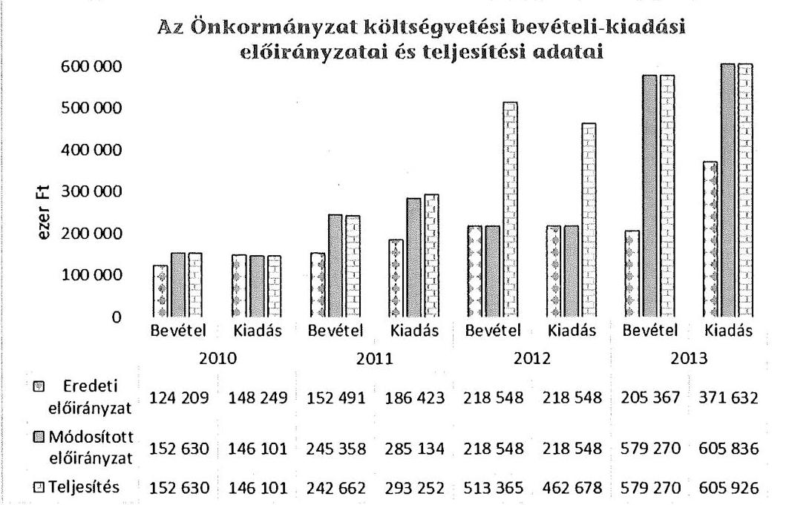
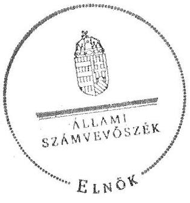
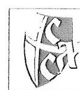
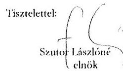
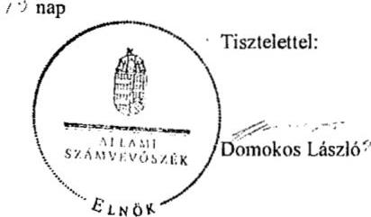
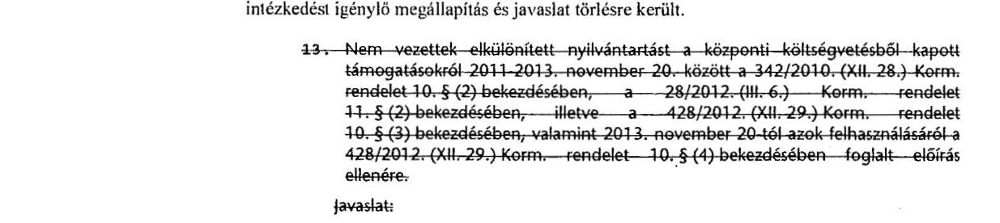

# ÁLLAMI   SZÁMVEVŐSZÉK 

## JELENTÉS

Az Országos Nemzetiségi Önkormányzatok gazdálkodásának ellenőrzéséről
Szerb Országos Önkormányzat

---

Állami Számvevőszék
Iktatószám: V-0698-073/2015.
Témaszám: 1732
Vizsgálat-azonosító szám: V068010

# Az ellenőrzést felügyelte: 

Kisgergely István
felügyeleti vezető

## Az ellenőrzést vezette:

Schósz Attila Ferencné
ellenőrzésvezető
A számvevői jelentések feldolgozásában és a jelentés összeállításában
közreműködtek:
Schósz Attila Ferencné
ellenőrzésvezető
Magyaricsné Hajdú Regina
számvevő
Az ellenőrzést végezték:
Magyaricsné Hajdú Regina
számvevő

Nagy László Imre
számvevő

---

# TARTALOMJEGYZÉK 

BEVEZETÉS ..... 3
I. ÖSSZEGZŐ MEGÁLLAPÍTÁSOK, KÖVETKEZTETÉSEK, JAVASLATOK ..... 7
II. RÉSZLETES MEGÁLLAPÍTÁSOK ..... 14

1. A belső kontrollrendszer kialakításának és működtetésének megfelelősége ..... 14
1.1. A kontrollkörnyezet kialakítása ..... 14
1.2. A kockázatkezelési rendszer kialakításának és működtetésének megfelelősége ..... 16
1.3. A kontrolltevékenységek működésének megfelelősége ..... 16
1.4. Információs és kommunikációs rendszer kialakításának és működtetésének megfelelősége ..... 18
1.5. Monitoring-rendszer kialakításának és működtetésének megfelelősége ..... 18
2. A gazdálkodás szabályszerűsége ..... 20
2.1. Pénzügyi gazdálkodás megfelelősége ..... 20
2.2. Vagyongazdálkodással kapcsolatos feladatellátás szabályszerűsége ..... 24
3. Ingyenesen juttatott vagyon kezelésének megfelelősége ..... 26
4. Egyéb feladat- és hatáskör ellátás szabályszerűsége ..... 26
5. Integritás kontrollok ..... 27
6. ÁSZ javaslatok hasznosulása ..... 27

## MELLÉKLETEK

1. számú A Szerb Országos Önkormányzat észrevétele
2. számú A Szerb Országos Önkormányzat észrevételére válasz

## FÜGGELÉKEK

1. számú Rövidítések jegyzéke
2. számú Az integritás kontrollok kialakítása és működtetése

---

.

---

# JELENTÉS 

## a Szerb Országos Önkormányzat gazdálkodásának ellenőrzéséről

## BEVEZETÉS

A Szerb Országos Önkormányzat (továbbiakban: Önkormányzat) az 1995. évben alakult, a jelenlegi Elnök a 2014. évi országos nemzetiségi választás óta látja el feladatát. A Hivatal 2013. április 1-től április 21-ig Hivatalvezető nélkül működött. A Hivatalvezetőt 2013. április 22-től, a gazdasági vezetőt 2014. május 15-től munkaviszony keretében, ezt megelőzően megbízással foglalkoztatták. A jelenlegi Hivatalvezető 2013. október 1-jétől látja el feladatát. A Hivatal 10 fő alkalmazottat foglalkoztatott 2013. év végén. Az Önkormányzatnak a 2010-2014. I. félév között öt önállóan működő intézménye volt. Az Önkormányzat társulásban nem vett részt, továbbá gazdasági társasága nem volt. A 21 tagú Közgyűlés a munkája segítésére Pénzügyi Bizottságot, Kulturális Bizottságot és Oktatási Bizottságot hozott létre. Az Önkormányzat nem adott és nem vett át üzemeltetésre, kezelésbe, koncesszióba eszközöket. Térítésmentes átadás-átvétel nem volt.

Az Önkormányzat költségvetési beszámolója szerint a 2013. évben a módosított költségvetési bevételi előirányzat 579270 ezer Ft, a költségvetési kiadási előirányzat 605836 ezer Ft, a teljesített költségvetési bevétel 579270 ezer Ft, a teljesített költségvetési kiadás 605926 ezer Ft volt. Az Önkormányzat a 2013. évben 552674 ezer Ft államháztartásból származó (működési, normatív) támogatásban részesült.

Az Alaptörvény XXIX. cikk (1) bekezdése szerint a Magyarországon élő nemzetiségek államalkotó tényezők. Minden, valamely nemzetiséghez tartozó magyar állampolgárnak joga van önazonossága szabad vállalásához és megőrzéséhez. A hazánkban élő nemzetiségek helyi (települési és területi), valamint országos önkormányzatokat hozhatnak létre.

Az országos nemzetiségi önkormányzatok gazdálkodási feladatait az önállóan működő és gazdálkodó költségvetési szerv, a hivatal látja el. Az országos nemzetiségi önkormányzatok a 2008. évtől tartoznak az államháztartás önkormányzati alrendszerébe, azóta hivatalaik költségvetési szervként működnek. Az Alaptörvény hatálybalépését követően a 2012. évtől további jelentős jogszabályi változások határozzák meg működésüket, gazdálkodásukat.

A nemzetiségek helyzete, támogatása mind hazai, mind EU-s szinten kiemelt figyelmet kap napjainkban. Az állam az országos nemzetiségi önkormányzatok

---

működéséhez, a médiaszolgáltatáshoz kapcsolódó jogaik érvényesítéséhez, valamint a kulturális önigazgatásuk érdekében alapított - közművelődési, közgyűjteményi, tudományos - intézmények fenntartásához az éves költségvetési törvényekben nevesítetten költségvetési támogatást biztosít. Ezen kívül az országos nemzetiségi önkormányzatok közfeladataik ellátásához támogatást kapnak a fejezeti kezelésű előirányzatokból, valamint hazai és uniós pályázati forrásokat szerezhetnek.

Az ellenőrzés célja annak értékelése volt, hogy az Önkormányzat gazdálkodása, a belső kontrollrendszer kialakítása és működése, az államháztartásból nyújtott támogatás, illetve az államháztartásból meghatározott célra ingyenesen juttatott vagyon felhasználása a jogszabályi előírásoknak megfelelően történt-e; az Önkormányzat a Nek. tv.-ben és az Njtv.-ben előírt feladat- és hatásköröket ellátta-e; intézkedett-e az ÁSZ által a 2008-2010. évek között végzett ellenőrzések javaslatainak végrehajtásáról.

Az Önkormányzat korrupcióval szembeni veszélyeztetettségének csökkentése érdekében felmértük az integritási szemlélet érvényesülését a gazdálkodási folyamatokban.

Értékeltük az Önkormányzat gazdálkodása során a belső kontrollrendszer kialakítását és működését mind az öt pillére tekintetében, ellenőriztük a gazdálkodással összefüggő feladat- és hatásköröknek, a Hivatal működési, gazdálkodási rendjének jogszabályi előírásoknak való megfelelőségét; a belső kontrollok működésének megfelelőségét az éves költségvetés, a költségvetési beszámoló és a zárszámadás készítés folyamatában; a gazdálkodás pénzügyi folyamatában a kulcskontrollok, (szakmai) teljesítésigazolás és 2011-ig utalvány ellenjegyzés, 2012-től érvényesítés kontrolltevékenységek működésének megfelelőségét; az önkormányzat belső ellenőrzése kialakításának és működésének megfelelőségét.

Értékeltük továbbá az Önkormányzat gazdálkodása, ezen belül pénzügyi gazdálkodása keretében a tervezés, beszámolási, zárszámadás-készítési folyamat, az előirányzatok betartása, a könyvvezetés, a közzétételek, adatszolgáltatások, valamint az államháztartás rendszeréből jogszabály vagy megállapodás alapján céljelleggel kapott támogatások felhasználásának, elszámolásának szabályszerűségét. A vagyonnal kapcsolatos feladatellátás ellenőrzése keretében értékeltük a vagyongazdálkodás szabályozottságát, a mérleg alátámasztottságát, a leltározás, az eszközbeszerzések, a vagyonhasznosítás, a tulajdonosi joggyakorlás szabályszerűségét. Értékeltük az államháztartásból ingyenesen juttatott vagyon felhasználásának szabályszerűségét. Ellenőriztük az előírt feladat- és hatáskörök közül a vélemény-nyilvánítási, egyetértési jog gyakorlásával, a hatáskör átruházásokkal, az ideiglenes vagyonkezeléssel kapcsolatos feladatok ellátásának szabályszerűségét, az integritás kontrollok működését, továbbá az előző ÁSZ ellenőrzés javaslatainak hasznosulását.

Az ellenőrzés várható hasznosulása: Az ellenőrzés eredményeként nemcsak az ellenőrzött szerv gazdálkodása javulhat, hanem átfogó képet kaphatunk az önkormányzati alrendszerbe tartozó országos nemzetiségi önkormányzatok gazdálkodásának hiányosságairól, de a jó gyakorlatokról is. Az ellenőrzés megállapításait és javaslatait más szervezetek is hasznosíthatják a rendezett gazdálkodási keretek kialakításához. Az ellenőrzés hozadékát képezi a 2008-2010. években elvégzett ÁSZ ellenőrzés javaslatai hasznosulásának értékelése. Mind a 13

---

országos nemzetiségi önkormányzat ellenőrzésével teljes körűen megvalósul az országos nemzetiségi önkormányzatok ellenőrzése a megváltozott jogszabályi környezetben. Az ellenőrzés tapasztalatai alapján a jogszabályi ellentmondások, hiányosságok feltárásával, azok megszüntetésére vonatkozó javaslatokkal segítjük a jó kormányzást. Az ellenőrzéssel lehetővé tesszük, hogy az országos nemzetiségi önkormányzatok gazdálkodásáról, működéséről a társadalom objektív képet alkothasson.

Az országos nemzetiségi önkormányzatok gazdálkodásának ellenőrzéséről szóló számvevőszéki jelentés I. fejezetének összegző része az ellenőrzés céljára adott rövid, szintetizáló összefoglalót és következtetéseket tartalmazza a II. fejezet részletes megállapításain alapulóan. A jelentés intézkedést igénylő megállapításait és javaslatait az ellenőrzés során feltárt, a jelentés II. fejezetében rögzített részletes megállapítások alapozzák meg.

Az ellenőrzés típusa: szabályszerűségi ellenőrzés.
Az ellenőrzött időszak: 2010. január 1. - 2014. június 30.
Ellenőrzött szervezet: az Önkormányzat és Hivatala, továbbá azon intézmények, amelyek gazdálkodási feladatait a Hivatal látja el.

Az ellenőrzés végrehajtásának jogszabályi alapját az Állami Számvevőszékről szóló 2011. évi LXVI. törvény 1. § (3) bekezdése, az 5. § (2)-(3) és (6) bekezdései, valamint az államháztartásról szóló 2011. évi CXCV. törvény 61. § (2) bekezdésének előírásai képezik.

Az ellenőrzés módszertana az ÁSZ hivatalos honlapján (www.asz.hu) közzétett szakmai szabályokon alapul, amely a Legfőbb Ellenőrző Intézmények Nemzetközi Szervezete (INTOSAI) által kiadott nemzetközi standardok (ISSAI) figyelembevételével készült.

Az ellenőrzés lefolytatásához az Önkormányzat a kimutatások és a tanúsítványok elektronikus kitöltésével, valamint az ÁSZ által kért dokumentumok elektronikus megküldésével szolgáltatott adatokat. Az így rendelkezésre bocsátott adatok, információk kontrollja és a munkalapok kitöltése az ellenőrzöttnél végzett ellenőrzés keretében történt.

A pénzügyi folyamatokban kulcskontrollok, (szakmai) teljesítésigazolás és érvényesítés (2011-ig utalvány ellenjegyzése) működésének megfelelőségét értékeléséhez az egyszerű véletlen mintavétellel kiválasztott tételek ellenőrzését megfelelőségi tesztek útján végeztük. A személyi juttatások, a dologi és felhalmozási kiadások, valamint a pénzeszközátadások felhasználásának szabályszerűségét, a céljelleggel kapott támogatások felhasználásának és elszámolásának szabályszerűségét és a kiadások esetében a gazdálkodási jogkörök gyakorlását mintavétellel ellenőriztük. A jogszabályoknak és a belső előírásoknak megfelelőnek, azaz szabályszerűnek tekintettük a céljelleggel kapott támogatások felhasználásának és elszámolásának szabályszerűségét, amennyiben a minta ellenőrzésének eredménye alapján 95%-os bizonyossággal a teljes sokaságban a hibaarány kisebb volt, mint 10%, nem megfelelőnek értékeltük, ha a hibaarány a 10%-ot meghaladta. Megfelelőnek értékeltük a gazdálkodási jogkörök gyakorlását, amennyiben 95%-os bizonyossággal a teljes sokaságban a hibaarány legfeljebb 10%,

---

részben megfelelőnek értékeltük, ha a hibaarány felső határa 10-30% volt, nem megfelelőnek pedig akkor, ha a hibaarány felső határa a teljes sokaságban meghaladta a 30%-ot. Az egyéb szabályszerűségi (nem pénzgazdálkodási jogkörökre vonatkozó) ellenőrzés során a mintatételek alacsony minta elemszáma miatt az eredmények nem voltak kivetíthetőek a teljes sokaságra, ezáltal a konkrét mintatételek (felhalmozási kiadások, pénzeszköz átadások felhasználásának) értékelését végeztük el.

Az ÁSZ a 2011. évi LXVI. törvény 29. §-a szerint a jelentéstervezetet megküldte a Szerb Országos Önkormányzat elnökének egyeztetésre. A beérkezett észrevételt és az arra adott választ a jelentés 1-2. sz. mellékletei tartalmazzák.

---

# I. ÖSSZEGZŐ MEGÁLLAPÍTÁSOK, KÖVETKEZTETÉSEK, JAVASLATOK 

Az ellenőrzött időszakban az Önkormányzat Hivatalánál a belső kontrollrendszer kialakítása és működtetése részben volt szabályszerű.

A kontrollkörnyezet kialakítása az Önkormányzat működésére vonatkozó jogszabályokkal részben volt összhangban. A Nek. tv. és az Njtv. előírásainak megfelelő önkormányzati SzMSz-szel rendelkeztek, azonban annak a 2011. évi módosításait a Nek. tv.-ben foglalt előírás ellenére nem tették közzé. A 2013. és a 2014. évi módosítást a honlapon közzétették. A Hivatalnak, mint önállóan működő és gazdálkodó költségvetési szervnek - az Áht. 1-ben foglaltaktól eltérően - csak a 2011. évtől volt hivatali SzMSz-e. A Hivatal rendelkezett számviteli politikával, leltározási, értékelési, pénzkezelési, selejtezési szabályzattal, gazdálkodási szabályzat14-gyel, melyeket - a jogszabályokban foglaltak ellenére - az arra jogosult Hivatalvezető helyett az Elnök írta alá. A Hivatalnak nem volt számlarendje, bizonylati rendje, valamint nem határozták meg az etikai elvárásokat az előírások ellenére. A leltározási szabályzat ingatlanokra vonatkozó szabályozása nem felelt meg az Áhsz. előírásainak, mivel 5 évenkénti leltározást határozott meg. A Hivatal és az önállóan működő intézmények az Ámr., valamint az Ávr. előírásai ellenére 2013. szeptember 9-éig megállapodásban nem rögzítették a gazdálkodással kapcsolatos munkamegosztás és felelősségvállalás rendjét. A Hivatalvezető nem készítette el a Hivatal felelősségi és információs szintjeit és kapcsolatait, az irányítási és ellenőrzési folyamatokat leíró ellenőrzési nyomvonalat, így a folyamatok nyomon követése, utólagos ellenőrzése nem volt lehetséges.

A Hivatalvezető az ellenőrzött időszakban - az Ámr., valamint a Bkr. rendelkezésétől eltérően - kockázatkezelési rendszert nem alakított ki és nem működtetett, nem végzett kockázatelemzést, nem mérte fel és nem állapította meg a Hivatal tevékenységében, gazdálkodásában rejlő kockázatokat.

A Hivatalnál a kontrolltevékenységek kialakítása és működtetése nem volt megfelelő. Az éves költségvetés, a költségvetési beszámoló és a zárszámadás készítésének folyamatában a belső kontrollok nem kerültek kialakításra és nem működtek megfelelően. Az Áht. 1 és a Bkr. előírásától eltérően a Hivatalvezető nem biztosította a folyamatba épített előzetes, utólagos és vezetői ellenőrzést a pénzügyi döntések dokumentumainak elkészítése, a költségvetési gazdálkodás pénzügyi ellenőrzése, valamint a gazdasági események szabályszerű elszámolása vonatkozásában. A 2010-2014. I. félévben a (szakmai) teljesítésigazolás és utalvány ellenjegyzés, illetve érvényesítés kulcskontrollok működése nem volt megfelelő. A kötelezettségvállalás nyilvántartása vezetésének és a kulcskontrollok működtetésének hiánya előirányzat túllépésekhez vezetett. A nem megfelelően működtetett belső kontrollok korrupciós kockázatot
 hordoznak.

A Hivatal információs és kommunikációs rendszerének kialakítása és működtetése a jogszabályi előírásoknak részben felelt meg. A Hivatalvezető a

---

kötelezően közzéteendő adatok nyilvánosságra hozatalának rendjét az Info tv., az Ámr. és az Ávr. előírásai ellenére nem határozta meg. A közérdekű adatok megismerésére irányuló igények teljesítésének rendjét a jogszabályoknak megfelelően szabályozták. A Hivatalvezető az 1992. évi LXIII. törvény és az Info tv. előírásai ellenére nem készítette el a Hivatal adatvédelmi és adatbiztonsági szabályzatát.

Az ellenőrzött időszakban a tevékenységre, működésre vonatkozó adatok közzétételének nem tettek maradéktalanul eleget. Az Önkormányzat a 2011-2014. évi költségvetését, valamint a 2010-2013. évi zárszámadását, költségvetési beszámolóját, a 2012-2014. I. félév között kapott céljellegű támogatásokat az előírások ellenére nem tette közzé. Az Önkormányzat nem biztosította a közpénzek felhasználásának átláthatóságát az általa céljelleggel nyújtott támogatások közzétételének elmaradása miatt.

A Hivatalvezető az Áht. ${ }_{1}$, az Ámr. és a Bkr. előírásai ellenére az operatív tevékenységekre nem alakította ki, illetve nem működtette a Hivatal tevékenységének, a célok megvalósításának nyomon követését biztosító monitoring rendszert. A monitoring rendszer kialakításának elmaradása hozzájárult a költségvetési tervezés, az előirányzatokon belüli gazdálkodás, a leltározás, a kulcskontrollok működése, valamint a tárgyeszközök nyilvántartása területén feltárt szabálytalanságokhoz.

A belső ellenőrzés kialakítása és működtetése részben felelt meg a jogszabályi előírásoknak. A Hivatal belső ellenőrzési kézikönyvvel rendelkezett, amelyet az arra jogosult Hivatalvezető helyett az Elnök hagyott jóvá. A belső ellenőr a Ber., illetve a Bkr. előírásai ellenére tevékenységét nem a Hivatalvezetőnek, hanem az Elnöknek alárendelve végezte. Az éves ellenőrzési terveket - a Ber., illetve a Bkr. előírása figyelembevételével - kockázatelemzéssel támasztották alá. A 2010-2014. I. félévben 14 belső ellenőrzést végeztek. A belső ellenőrzési jelentések alapján az Önkormányzat és az ellenőrzött szervek vezetői az előírt intézkedési terveket elkészítették, amelyek végrehajtását a belső ellenőrzés nyomon követte. A belső ellenőrzés feltárta a belső kontrollrendszer kialakításának, valamint a pénzügyi folyamatokban a kulcskontrollok (ellenjegyzés és érvényesítés) működésének hiányosságait, javaslatai azonban nem hasznosultak.

Az Önkormányzat pénzügyi gazdálkodása részben volt megfelelő. A 2010-2014. évi költségvetési koncepciókat az Elnök határidőn belül a Közgyűlés elé terjesztette, aki azokat elfogadta. A költségvetési határozat-tervezeteket a Pénzügyi Bizottság - a 2011. évi kivételével - véleményezte, azonban azokat a Hivatalvezető a költségvetési szervek vezetőivel nem egyeztette. A 2010-2014. évi költségvetési határozat-tervezetek nem tartalmazták az előirányzat-felhasználási tervet, míg a 2013-2014. évi költségvetési határozat-tervezetek az előírt kötelező feladatok, önként vállalt feladatok és államigazgatási feladatok szerinti megbontást. Az Önkormányzat 2010-2013. évi zárszámadás és költségvetési beszámoló készítési folyamata, a zárszámadási határozat-tervezetek véleményezése, tartalma, Közgyűlés elé terjesztése, Közgyűlés általi elfogadása a jogszabályi követelményeknek megfelelt.

A Hivatalvezető a Közgyűlés által jóváhagyott 2010. évi költségvetést nem, a 2011. évit az Ámr. szerinti határidőn túl küldte meg a kisebbségpolitikáért felelős állami szervnek. A Hivatalvezető a 2012-2014. évi elemi költségvetésekről az

---

Ávr.-ben előírtak ellenére nem szolgáltatott adatot a Kincstárnak. A költségvetési beszámolókat az Áhsz.-ben foglalt határidőn túl nyújtották be a kisebbségpolitikáért/nemzetiségpolitikáért felelős miniszternek. Az Önkormányzat az időközi költségvetési jelentésre vonatkozó adatszolgáltatási kötelezettségének nem tett eleget.

Az Önkormányzat az államháztartás rendszeréből jogszabály vagy megállapodás alapján kapott támogatások felhasználása, elszámolása során a jogszabályi, illetve a szerződéses előírásokat összességében betartotta. Az Önkormányzat a központi költségvetésből kapott támogatásokról, illetve azok felhasználásáról elkülönített nyilvántartást vezetett, a támogatással az éves beszámolók keretében elszámolt. Az Önkormányzat a 2010. évben egyedi kérelem alapján, a 2011. évtől nyilvános pályázati kiírás alapján nemzetiségi feladatok ellátásához céljellegű támogatást nyújtott. A benyújtott elszámolások alapján a támogatások nemzetiségi célokat, nemzetiségi rendezvény lebonyolítását szolgálták.

Az Önkormányzat vagyongazdálkodási tevékenysége részben felelt meg a jogszabályi előírásoknak. Az Önkormányzat vagyonkezelési szabályzattal rendelkezett, amelyben nevesítette törzsvagyonát, illetve rögzítette a tulajdonát képező és a használatába, vagyonkezelésébe adott vagyon használatának, működtetésének szabályait. A 2011. és a 2013. évben a tárgyi eszközök leltározása az előírásoknak megfelelően történt. Az Önkormányzat a 2010. évben, illetve a 2012. évben év végi mennyiségi leltárfelvételt az Áhsz. előírásától eltérően nem végzett, az eszközök mérleg szerinti értékét az analitikus nyilvántartásokon alapuló egyeztetésekkel támasztották alá. Az ellenőrzött időszakban beszerzett tárgyi eszköz és immateriális javak nyilvántartó kartonjait rendszeresen nem készítették el a Számv. tv. előírása ellenére. Az ÁSZ által feltárt hiányosságok visszavezethetőek voltak a FEUVE rendszer nem megfelelő kialakítására és működtetésére.

Az Önkormányzat megalakulását követően egyszeri ingyenes vagyonjuttatásként kapta meg a székhelyként funkcionáló ingatlant, mely nyilvántartásaiban szabályosan, forgalomképtelen törzsvagyonként szerepelt. Az Önkormányzat az ellenőrzött időszakban ingyenes használatra kapott egy ingatlant nemzetiségi óvodai nevelés és oktatási feladatok biztosítása érdekében. Az átvett vagyonnal kapcsolatos feladatait a megállapodásban előírtaknak megfelelően ellátta.

Az ellenőrzött időszakban az Elnök a Nek. tv., illetve az Njtv. rendelkezéseit figyelmen kívül hagyva a Közgyűlés hatáskörét elvonva, annak felhatalmazása nélkül gondoskodott a vélemény-nyilvánítási, egyetértési és közreműködési jog gyakorlásáról.

Az ÁSZ tv. 33. § (1) bekezdésében foglaltak értelmében a jelentésben foglalt megállapításokhoz kapcsolódó intézkedési tervet köteles az ellenőrzött szervezet vezetője összeállítani, és azt a jelentés kézhezvételétől számított 30 napon belül az ÁSZ részére megküldeni. Amennyiben az intézkedési tervet határidőben nem küldi meg a szervezet, vagy az nem elfogadható, az ÁSZ elnöke a hivatkozott törvény 33. § (3) bekezdés a)-b) pontjaiban foglaltakat érvényesítheti.

---

A helyszíni ellenőrzés megállapításainak hasznosítása mellett javasoljuk:

# a Hivatalvezetőnek 

A belső kontrollrendszeren belül:

1. A kontrollkörnyezet kialakítása részben volt megfelelő. A Hivatal a Számv. tv. 161. § (1), az Áhsz. 49. § (1), és a 4/2013. (I. 11.) Korm. rendelet 51. § (2) bekezdése ellenére nem rendelkezett számlarenddel, a Számv. tv. 161. § (2) bekezdés d) pontjában foglaltak ellenére nem volt bizonylati rendje, az Ámr. 20. § (3) bekezdés b) és f) pontjainak és az Ávr. 13. § (2) bekezdés b) és e) pontjainak előírásaitól eltérően nem rendelkezett a beszerzések lebonyolításának és a reprezentációs kiadások felosztásának, teljesítésének, elszámolásának rendjére vonatkozó szabályozással. A Hivatalvezető - az Ámr. 156. § (2) bekezdése és a Bkr. 6. § (3) bekezdése előírásaitól eltérően - nem készítette el a Hivatal felelősségi és információs szintjeit és kapcsolatait, az irányítási és ellenőrzési folyamatokat leíró ellenőrzési nyomvonalát. A Hivatal leltározási szabályzata az Áhsz. 37. § (1) és (7) bekezdésében foglaltak ellenére az ingatlanok esetében 5 évenkénti leltározást határozott meg.

A Hivatal számviteli politikáját, leltározási, értékelési, pénzkezelési, valamint selejtezési szabályzatait - az Áhsz. 8. § (12) bekezdésében, 37. § (5) bekezdésében foglaltakkal ellentétben - az arra hatáskörrel rendelkező Hivatalvezető helyett az Elnök hagyta jóvá. A gazdálkodási szabályzat ${ }_{1,4}$-et - az Áht. 121/A. § (1) bekezdésének, illetve az Áht. 2 69. § (2) bekezdésének, az Ávr. 13. § (2) bekezdés a) pontjának előírása ellenére - az arra jogosult Hivatalvezető helyett az Elnök írta alá.

Javaslat:
a) Intézkedjen a Hivatal számlarendjének, bizonylati rendjének, a beszerzések lebonyolításának, a reprezentációs kiadások felosztásának, teljesítésének, elszámolásának rendjére vonatkozó szabályozás, az ellenőrzési nyomvonal elkészítéséről, valamint a leltározási szabályzatnak a jogszabályban előírt tartalomnak megfelelő módosításáról.
b) Intézkedjen a Hivatal számviteli politikájának, gazdálkodási, leltározási, értékelési, pénzkezelési, valamint selejtezési szabályzatának szabályszerű kiadmányozásáról.
2. A Hivatalvezető az ellenőrzött időszakban az Ámr. 155. § (1) és a 157. § (1) bekezdése, valamint a Bkr. 3. § b) pontja és 7. § (1) bekezdése előírásától eltérően kockázatkezelési rendszert nem alakított ki és nem működtetett.

Javaslat:
Intézkedjen a Hivatal kockázatkezelési rendszerének kialakításáról és működtetéséről.
3. A kontrolltevékenységek kialakítása és működtetése nem volt megfelelő. A Hivatalvezető - az Ámr. 158. § (2) bekezdésében, illetve a Bkr. 8. § (4) b) pontjában foglaltak ellenére - nem határozta meg a dokumentumokhoz és információkhoz való hozzáféréssel kapcsolatos felelősségi köröket.

A kötelezettségvállalások nyilvántartásáról az Ávr. 56. § (1) bekezdésében előírtakkal szemben nem gondoskodtak.

---

A gazdálkodási jogkörök gyakorlása (a teljesítésigazolás, az érvényesítés és 2011. december 31-ig az utalvány ellenjegyzése) nem felelt meg az Ámr. 76. § (1) és (3) bekezdései, a 79. § (2) bekezdése, továbbá az Ávr. 57. § (1) és (3) bekezdései és az 58. § (1)-(2) bekezdései előírásainak.

Javaslat:
a) Intézkedjen a dokumentumokhoz és információkhoz való hozzáféréssel kapcsolatos felelősségi körök meghatározásáról.
b) Intézkedjen a kötelezettségvállalások nyilvántartásának vezetéséről.
c) Intézkedjen a gazdálkodási jogkörök szabályszerű gyakorlásának érvényesítéséről.
4. Az információs és kommunikációs rendszer kialakítása és működtetése részben volt megfelelő. A Hivatal a kötelezően közzéteendő adatok nyilvánosságra hozatalának rendjét az Info tv. 35. § (3) bekezdésében, az Ámr. 20. § (3) bekezdés i) pontjában és az Ávr. 13. § (2) bekezdésének h) pontjában foglaltak ellenére nem határozta meg.

A Hivatalvezető az Eisztv. 6. § (1) bekezdésében, illetve az Info tv. 37. § (1) bekezdésében meghatározott kötelezettségének részben tett eleget, mivel nem tette teljes körűen közzé az Önkormányzat tevékenységére, működésére vonatkozó adatait.

A Hivatalvezető - az 1992. évi LXIII. törvény 31/A. § (3) bekezdése és az Info tv. 24. § (3) bekezdésében foglaltak ellenére - nem készítette el a Hivatal adatvédelmi és adatbiztonsági szabályzatát.

Javaslat:
a) Intézkedjen a kötelezően közzéteendő adatok nyilvánosságra hozatala rendjének elkészítéséről.
b) Intézkedjen az Önkormányzat tevékenységére, működésére vonatkozó adatok teljes körű közzétételéről.
c) Intézkedjen a Hivatal adatvédelmi és adatbiztonsági szabályzatának elkészítéséről.
5. A monitoring rendszer kialakítása és működtetése nem volt megfelelő. A Hivatalvezető az Áht. 121. § (2) bekezdés e) pontjában, az Ámr. 160. §-ában és a Bkr. 3. § e) pontjában, továbbá 10. §-ában foglaltak ellenére az operatív tevékenységekre nem alakította ki, illetve nem működtette a Hivatal tevékenységének, a célok megvalósításának nyomon követését biztosító monitoring rendszert.

A belső ellenőr - Ber. 6. § (2) bekezdése és a Bkr. 18. § előírásaival ellentétben - nem a Hivatalvezetőnek, hanem az Elnöknek közvetlenül alárendelve látta el feladatát.

A belső ellenőrzési kézikönyvet - a Ber. 5. § (1) bekezdése és a Bkr. 17. § (1) bekezdésében foglalt előírás ellenére - nem Hivatalvezető, hanem az Elnök hagyta jóvá.

Javaslat:
a) Intézkedjen a Hivatal tevékenységének, a célok megvalósításának nyomon követését biztosító rendszer kialakításáról és működtetéséről.

---

b) Intézkedjen a belső ellenőr tevékenysége szervezeti függetlenségének kialakításáról.
c) Intézkedjen a belső ellenőrzési kézikönyv szabályszerű kiadmányozásáról.

# A pénzügyi- és vagyongazdálkodás területén 

6. A Hivatalvezető a költségvetési határozat-tervezeteket - az Ámr. 40. § (1) és a 36. § (3) bekezdése, valamint az Ávr. 29. § (2) és a 27. § (1) bekezdése ellenére - a költségvetési szervek vezetőivel nem egyeztette, ennek eredményét írásban nem rögzítette.

Javaslat:
Egyeztesse a költségvetési határozat-tervezeteket a költségvetési szervek vezetőivel és azok eredményét írásban rögzítse.
7. A 2010-2014. évi költségvetési határozat-tervezetek a költségvetési év várható bevételi és kiadási előirányzatainak teljesüléséről az előirányzat-felhasználási ütemtervet az Ámr. 36. § (1) bekezdés k) pontjában, illetve az Áht. 2 24. § (4) bekezdés
 a) pontjában foglalt előírás ellenére – nem tartalmazta. A 2013–2014. évek költségvetési határozatai az – Áht. 2. 23. § (2) bekezdés a) pontjában – előírt kötelező feladatok, önként vállalt feladatok és államigazgatási feladatok szerinti megbontását nem tartalmazták.

Javaslat:
Intézkedjen a költségvetési határozat-tervezetek és a költségvetési határozatok jogszabályi előírásoknak megfelelő módon és tartalommal való elkészítéséről.
8. A Hivatalvezető az Önkormányzat és az általa alapított költségvetési szervek 2012–2014. évi elemi költségvetéséről az Ávr. 33. § (1)–(2) bekezdéseiben előírtak ellenére nem szolgáltatott adatot a Kincstár területileg illetékes szervéhez.

Javaslat:
Gondoskodjon arról, hogy a jövőben az éves elemi költségvetések a Kincstár területileg illetékes szervének a jogszabályban foglalt határidőn belül megküldésre kerüljenek.
9. Az Önkormányzat a 2010–2011. és a 2013. években egyes kiadásokra előirányzatot nem képezett, tárgyévi kiadásai meghaladták a módosított kiadási előirányzatot, mely nem felelt meg az Áht. 1. 12/A. § (1) bekezdésben, illetve az Áht. 2. 6. § (1) bekezdésében foglalt előírásoknak.

Javaslat:
Gondoskodjon az előirányzattal nem rendelkező várható kiadások előirányzatosításáról, biztosítsa a jóváhagyott kiadási előirányzatokon belüli gazdálkodásra vonatkozó jogszabályi előírások betartását.
10. Az Önkormányzat a 2011–2014. évi költségvetését nem tette közzé, amely nem felelt meg az Eisztv. 6. § (1) bekezdésében és az Info tv. 37. § (1) bekezdésében foglaltaknak, továbbá nem tett eleget az Ámr. 205. § (1) bekezdésében és az Ávr. 169. § (2) bekezdésében foglaltak ellenére az időközi költségvetési jelentésre vonatkozó adatszolgáltatási kötelezettségének.

Javaslat:
Gondoskodjon az éves költségvetés jogszabályi előírásoknak megfelelő közzétételéről, valamint az időközi költségvetési jelentés jogszabályi előírásoknak megfelelő adatszolgáltatási kötelezettségéről.
11. Az Önkormányzat vagyongazdálkodási tevékenysége részben felelt meg a jogszabályi előírásoknak, mert a Közgyűlés az Njtv. 124. § (2) bekezdésében, az Nvtv. 11. § (16) bekezdésben foglaltak ellenére nem határozta meg és nem szabályozta azt az értékhatárt, amely felett 2012–2014. I. félévében csak versenyeztetés útján lehet a vagyont hasznosítani.

Javaslat:
Gondoskodjon a vagyonhasznosítás versenyeztetés útján történő értékhatárának meghatározásáról és szabályozásáról.
12. Az Önkormányzat a 2012–2014. I. félév között kapott céljellegű támogatásokat a 28/20112. (II. 6.) Korm. rendelet 12. § (5) bekezdésében, illetve a 428/2012. (XII. 19.) Korm. rendelet 13. § (2) bekezdésében foglalt előírás ellenére, az általa céljelleggel nyújtott támogatások adatait az Áht. 15/A. § (1) bekezdésében, és az Info. tv. 37. § (1) bekezdésében foglaltak ellenére nem tette közzé, ezáltal nem biztosította a közpénzek felhasználásának átláthatóságát.

Javaslat:
Intézkedjen a kapott céljellegű támogatások, valamint az általa nyújtott céljellegű támogatások adatainak közzétételéről.

---

# II. RÉSZLETES MEGÁLLAPÍTÁSOK 

## 1. A BELSŐ KONTROLLRENDSZER KIALAKÍTÁSÁNAK ÉS MŰKÖDTETÉSÉNEK MEGFELELŐSÉGE

Az ellenőrzött időszakban az Önkormányzat Hivatalánál a belső kontrollrendszer (a kontrollkörnyezet, a kockázatkezelési rendszer, a kontrolltevékenységek, az információs és kommunikációs rendszer, valamint a monitoring rendszer) kialakítása és működtetése részben volt szabályszerű az alábbiakban részletezett szabályozásbeli és működésbeli hibák, hiányosságok miatt.

### 1.1. A kontrollkörnyezet kialakítása

A kontrollkörnyezet kialakítása az Önkormányzat működését meghatározó jogszabályokkal részben volt összhangban.

Az Önkormányzat a 2010–2014. I. félév között a Nek. tv. és az Njtv. előírásainak megfelelő önkormányzati SzMSz-szel rendelkezett, amelyet az ellenőrzött időszakban módosítottak. Az önkormányzati SzMSz 2011. évi módosítását – a Nek. tv. 39/G. § (4) bekezdésében foglalt előírás ellenére – a Magyar Közlönyben ${ }^{1}$ nem tették közzé. A 2013. évi és a 2014. évi módosítást a honlapon közzétették.

A Közgyűlés a Vnytv.-nek megfelelően a vagyonnyilatkozat-tételre kötelezettek körét az önkormányzati SzMSz-ben szabályozta, a képviselők a Nek. tv.-ben és az Njtv.-ben foglalt előírásoknak megfelelően vagyonnyilatkozat-tételi kötelezettségüket teljesítették.

A Hivatal, mint önállóan működő és gazdálkodó költségvetési szerv – az Áht. ${ }_{1} 91. \S (2)^{2}$ bekezdésében foglaltaktól eltérően – csak 2011. június 4-től rendelkezett hivatali SzMSz-szel, amelynek tartalma megfelelt az Ámr.-ben és az Ávr.-ben előírt követelményeknek. Ezen időpontig a Hivatal működésének szabályait az önkormányzati SzMSz tartalmazta.

A 2010. január 1. és 2013. március 30. között foglalkoztatott Hivatalvezető – aki ügyvéd volt – kiválasztása nem pályázati úton történt, illetve kinevezéséről a Közgyűlés nem hozott határozatot, ami nem felelt meg az Ámr. 105. § (2) bekezdésében, valamint a Nek. tv. 39/B. § (2) bekezdésében előírtaknak. Mindezen túl az ügyvédi tevékenység az ügyvédekről szóló 1998. évi XI. tv. 6. § (1) bekezdés a)

[^0]
[^0]:    ${ }^{1}$ Az Önkormányzat nyilatkozata szerint a Magyar Közlöny helyett a honlapon tették közzé.
    ${ }^{2}$ A költségvetési szerv SzMSz-ére vonatkozó Áht. ${ }_{1}$ előírás 2010. augusztus 15-től lépett hatályba.

---

pontjában foglaltak alapján összeférhetetlen volt a munkavégzési kötelezettséggel járó más jogviszonnyal. A Hivatal 2013. április 1-től április 21-ig Hivatalvezető nélkül működött.

A 2013. április 22. és 2013. szeptember 30. közötti időszakban megbízott Hivatalvezető nem rendelkezett az akkor hatályos Ávr. 7. § (4) bekezdésében előírt végzettséggel. A 2013. október 1-jétől, a Közgyűlés által kinevezett, pályázati úton kiválasztott Hivatalvezető rendelkezett az Ávr.-ben előírt végzettséggel.

Az Önkormányzat gazdálkodásának szabályozottsága az ellenőrzött években az előírásoknak részben felelt meg. A Hivatal – a Számv. tv., az Áhsz. és a 4/2013. (I. 11.) Korm. rendelet előírásaival összhangban – rendelkezett a Közgyűlés által jóváhagyott számviteli politikával, leltározási, értékelési, pénzkezelési, selejtezési szabályzattal, amelyeket az arra jogosult Hivatalvezető helyett az Elnök írta alá az Áhsz. 8. § (12) és 37. § (5) bekezdésben foglaltak ellenére. A Hivatal a 2010–2014. I. félévben – a Számv. tv. 161. § (1), az Áhsz. 49. § (1), valamint a 4/2013. (I. 11.) Korm. rendelet 51. § (2) bekezdéseiben foglaltaktól eltérően – nem rendelkezett számlarenddel. A Hivatalnak a Számv. tv. 161. § (2) bekezdés d) pontjában foglaltak ellenére nem volt bizonylati rendje.

A Közgyűlés által elfogadott, az Elnök által aláírt leltározási szabályzat az ingatlanok esetében 5 évenkénti leltározást határozott meg az Áhsz. 37. § (1) és (7) bekezdésében foglaltakkal ellentétesen, amely előírások alapján a Közgyűlés maximum kétéves gyakoriságú leltározásról dönthetett. A további eszközök esetében az Áhsz. szerinti éves leltározást írta elő a szabályzat.

A Hivatal – az Ámr. és az Ávr. előírásaival összhangban – rendelkezett a kötelezettségvállalás, pénzügyi ellenjegyzés, teljesítésigazolás, érvényesítés és utalványozás gyakorlására vonatkozó eljárásrendet tartalmazó gazdálkodási szabály-zat${ }_{1-4}$-gyel. A gazdálkodási szabályzat${ }_{1-4}$-et – az Áht. ${ }_{1} 121/A. § (1)$ bekezdésének ${ }^{3}$, illetve az Áht. ${ }_{2} 69. § (2)$ bekezdésének, az Ávr. 13. § (2) bekezdés a) pontjának előírása ellenére – az arra jogosult Hivatalvezető helyett az Elnök írta alá.

A gazdálkodási szabályzat${ }_{1-4}$ az Ámr. és az Ávr. előírásainak megfelelően tartalmazta a kötelezettségvállalásra, annak ellenjegyzésére, a (szakmai) teljesítésigazolásra, az érvényesítésre, az utalványozásra és az utalvány ellenjegyzésére jogosultak körét, feladatait és részletszabályait.

A Hivatal – az Ámr. 20. § (3) bekezdés b) és f) pontjainak és az Ávr. 13. § (2) bekezdés b) és e) pontjainak előírásaitól eltérően – nem rendelkezett a beszerzések lebonyolításának és a reprezentációs kiadások felosztásának, teljesítésének, elszámolásának rendjére vonatkozó szabályozással.

A Hivatal rendelkezett szabálytalanságkezelési eljárásrenddel az Ámr. és a Bkr. előírásainak megfelelően. A Hivatalnál a kontrollkörnyezet kialakításának keretében az Ámr. 156. § (1) bekezdés c) pontja, illetve a Bkr. 6. § (1) bekezdés c) pontjában foglaltak ellenére a 2010–2014. I. félévére vonatkozóan nem határoztak meg etikai elvárásokat. A Hivatalvezető – az Ámr. 156. § (2) bekezdése és a

[^0]
[^0]:    ${ }^{3}$ 2010. december 31-ig az Áht. 121. § (1) bekezdése szabályozta.

---

Bkr. 6. § (3) bekezdése előírásaitól eltérően – nem készítette el a Hivatal felelősségi és információs szintjeit és kapcsolatait, az irányítási és ellenőrzési folyamatokat leíró ellenőrzési nyomvonalat, így azok nyomon követése és utólagos ellenőrzése nem volt lehetséges.

A Közgyűlés, mint irányító szerv az intézményei tekintetében részben meghatározta az Áht. ${ }_{1,2}$ előírásai alapján az erőforrásokkal való szabályszerű és hatékony gazdálkodáshoz szükséges követelményeket.

A Hivatal és az önállóan működő intézmények (Általános Iskola és Óvoda, Általános Iskola és Gimnázium, Kulturális Központ, Szerb Intézet, Pedagógiai Központ) az Ámr. 16. § (4) bekezdése, valamint az Ávr. 10. § (4) bekezdése ellenére 2013. szeptember 9-ig megállapodásban nem rögzítették a gazdálkodással kapcsolatos munkamegosztás és felelősségvállalás rendjét.

Az Önkormányzat éves költségvetési határozatában biztosította az irányítása alá tartozó költségvetési szervei számára a feladatai ellátásához szükséges létszámot és működési előirányzatot. Az erőforrások felhasználásáról a féléves és az éves beszámolók keretében számoltatta be a költségvetési szerveit.

Az Önkormányzat a 2010–2012. évek között független könyvvizsgálót biztosított a 2012. évben a kötelező könyvvizsgálati körből történő kikerülését követően is az erőforrásokkal való megfelelő gazdálkodás ellenőrzése érdekében.

# 1.2. A kockázatkezelési rendszer kialakításának és működtetésének megfelelősége 

A Hivatalvezető az ellenőrzött időszakban az Ámr. 155. § (1) és a 157. § (1) bekezdése, valamint a Bkr. 3. § b) pontja és 7. § (1) bekezdése előírásától eltérően kockázatkezelési rendszert nem alakított ki és nem működtetett.

A Hivatalvezető – az Ámr. 157. § (1)–(2) és a Bkr. 7. § (2) bekezdésében foglalt előírás ellenére – nem végzett a kockázati tényezők figyelembe vételével kockázatelemzést, nem mérte fel és nem állapította meg a Hivatal tevékenységében, gazdálkodásában rejlő kockázatokat. A Hivatalvezető az Ámr. 157. § (3) bekezdésében és a Bkr. 7. § (2) bekezdésében foglalt előírás ellenére nem határozta meg az egyes kockázatokkal kapcsolatban a szükséges intézkedéseket, valamint – a Bkr. jelzett előírása ellenére – azok teljesítésének folyamatos nyomon követési módját.

### 1.3. A kontrolltevékenységek működésének megfelelősége

Az éves költségvetés, a költségvetési beszámoló és a zárszámadás készítésének folyamatában a belső kontrollok nem kerültek kialakításra. A Hivatalvezető belső szabályzatban nem határozta meg az Ámr. 158. § (2) bekezdésében foglaltak ellenére az információkhoz való hozzáférést, illetve a Bkr. 8. § (4) bekezdés b) pontjában foglaltak ellenére a dokumentumokhoz és információkhoz való hozzáférésre vonatkozó felelősségi köröket. Az Áht. ${ }_{1} 121/A. § (4)$ bekezdése ${ }^{4}$ és a Bkr. 8. § (2) bekezdése előírásától eltérően a

[^0]
[^0]:    ${ }^{4}$ 2010. december 31-ig az Áht. ${ }_{1}$ 121. § (1) bekezdése szabályozta.

---

Hivatalvezető nem biztosította a folyamatba épített előzetes, utólagos és vezetői ellenőrzést a pénzügyi döntések dokumentumainak elkészítése, a költségvetési gazdálkodás pénzügyi ellenőrzése, valamint a gazdasági események szabályszerű elszámolása vonatkozásában.

Szabályozás hiányában a folyamatok belső kontrolljai 2010–2014. I. félévben nem működtek megfelelően, így nem biztosították minden évben az adatszolgáltatást, az éves költségvetési határozat-tervezetek megfelelő tartalmát, illetve a jóváhagyott előirányzatokon belüli gazdálkodást.

A költségvetési beszámoló elkészítésével megbízott személy rendelkezett a Számv. tv. és az Ávr. által előírt képesítéssel.

A 2010–2011. években a szakmai teljesítésigazolás és utalvány ellenjegyzés kulcskontrollok működése (rendszeres és nem rendszeres, külső személyi juttatások, dologi és felhalmozási kiadások, valamint a pénzeszköz átadások esetében)
 nem volt megfelelő, mivel:

- azokban az esetekben, ahol a szakmai teljesítésigazolást az Ámr. 76. § (1) bekezdésében foglaltaktól eltérően nem végezték el, a kifizetéseket megelőzően nem győződtek meg a kiadások teljesítésének jogosságáról, összegszerűségéről. Azokban az esetekben, ahol a szakmai teljesítésigazoló aláírt, az Ámr. 76. § (3) bekezdésben foglalt előírás ellenére az igazolás dátuma, a teljesítés tényére való utalás hiányzott;
- az utalvány ellenjegyzését nem, vagy nem az arra jogosult végezte, ezáltal az Ámr. 79. § (2) bekezdésében foglaltaktól eltérően - nem győződtek meg a szakmai teljesítésigazolás, valamint az érvényesítés megtörténtéről.

A 2012-2014. I. félévében a teljesítésigazolás, érvényesítés kulcskontrollok működése (a rendszeres és nem rendszeres, a külső személyi juttatások, a dologi és felhalmozási kiadások, valamint a pénzeszköz átadások esetében) nem volt megfelelő, mivel:

- a kifizetéseket megelőzően a teljesítésigazolást - az Ávr. 57. § (1), (3) bekezdéseiben foglaltak ellenére - nem végezték el, ezért nem történt meg a kifizetés jogosságának, összegszerűségének az ellenőrzése;
- az érvényesítő feladatát nem látta el, mert nem ellenőrizte az Ávr. 58. § (1) bekezdésében hivatkozott jogszabályi előírások betartását a megelőző ügymenetben, nem jelezte az utalványozónak az Ávr. 58. § (2) bekezdés ellenére, hogy a 100 ezer Ft-ot elérő kifizetéseknél nem történt meg az írásbeli kötelezettségvállalás, és annak pénzügyi ellenjegyzése. Nem jelezte továbbá, hogy a kötelezettségvállalások nyilvántartásáról az Ávr. 56. § (1) bekezdésében előírtakkal szemben nem gondoskodtak.

A kötelezettségvállalás nyilvántartása vezetésének és a kulcskontrollok működtetésének hiánya előirányzat túllépésekhez vezetett. A belső kontrollok hiánya korrupciós kockázatot is hordoz.

---

# 1.4. Információs és kommunikációs rendszer kialakításának és működtetésének megfelelősége 

Az információs és kommunikációs rendszer kialakítása és működtetése a jogszabályi előírásoknak részben felelt meg.

A Hivatalvezető a kötelezően közzéteendő adatok nyilvánosságra hozatalának rendjét az Info tv. 35. § (3) bekezdésében, az Ámr. 20. § (3) bekezdés i) pontjában és az Ávr. 13. § (2) bekezdésének h) pontjában foglaltak ellenére nem határozta meg. A közérdekű adatok megismerésére irányuló igények teljesítésének rendjét az Info tv.-ben, az Ámr.-ben és az Ávr.-ben előírtaknak megfelelően meghatározta a hivatali SzMSz-ben.

A Hivatal az Eisztv. 6. § (1) bekezdésében, az Info tv. 37. § (1) bekezdésében meghatározott közzétételi kötelezettségének részben tett eleget, mivel nem tette közzé a tevékenységre, működésre vonatkozó adatok közül a Közgyűlés elérhetőségét, az Önkormányzat nyilvános kiadványainak adatait, valamint a megőrzési időt figyelembe véve archivált dokumentumokat.

Az ellenőrzött időszakban az Önkormányzat rendelkezett iratkezelési szabályzattal. A Hivatalvezető - az 1992. évi LXIII. törvény 31/A. § (3) bekezdése és az Info tv. 24. § (3) bekezdésében foglaltak ellenére - nem készítette el a Hivatal adatvédelmi és adatbiztonsági szabályzatát.

Az ÁSZ ellenőrzés tapasztalatai alapján az Önkormányzat és intézményei tevékenységével, gazdálkodásával kapcsolatos iratok és dokumentumok (egy támogatási megállapodás kivételével) az Ikr.-nek megfelelően visszakereshetőek és megtalálhatók voltak. Az iratkezelés szabályozottságát és rendjét 2010-2014. I. félév között sem belső, sem külső ellenőrzés nem vizsgálta.

### 1.5. Monitoring-rendszer kialakításának és működtetésének megfelelősége

A Hivatalvezető az Áht. ${ }_{1}$ 121. § (2) bekezdés e) pontjában ${ }^{5}$, az Ámr. 160. §-ában és a Bkr. 3. § e) pontjában, továbbá 10. §-ában foglaltak ellenére az operatív tevékenységekre nem alakította ki, illetve nem működtette a Hivatal tevékenységének, a célok megvalósításának nyomon követését biztosító monitoring rendszert.

A monitoring rendszer kialakításának elmaradása hozzájárult a költségvetési tervezés, az előirányzatokon belüli gazdálkodás, a leltározás, a kulcskontrollok működése, valamint a tárgyeszközök nyilvántartása területén feltárt szabálytalanságokhoz.

A belső kontrollrendszer minőségét a Hivatalvezető, illetve az önállóan működő költségvetési szervek (Általános Iskola és Óvoda, Általános Iskola és Gimnázium, Kulturális Központ, Szerb Intézet, Pedagógiai Központ) vezetői az Ámr. 217. § c) pontban hivatkozott 21. számú melléklete, illetve a

[^0]
[^0]:    ${ }^{5}$ 2010. december 31-ig az Áht. ${ }_{1}$ 120/B. § (2) bekezdés e) pontja szabályozta.

---

Bkr. 11. § (1) bekezdésben hivatkozott 1. számú melléklete szerinti nyilatkozatban az ellenőrzött időszak egyik évére sem értékelték.

Az ellenőrzött időszakban a belső ellenőrzés kialakítása és működtetése részben felelt meg a jogszabályi előírásoknak.

Az ellenőrzött időszakban a Hivatalvezető a belső ellenőrzést külső szervezet bevonásával működtette. A 2012. évi megbízási szerződést 2012. január 5-én - nem a 2012. január 1-jétől hatályos Bkr., hanem - az akkor már hatályon kívül helyezett Ber. előírásaira való hivatkozással kötötték meg.

A Ber.-ben és a Bkr.-ben foglaltakkal összhangban a belső ellenőrzési kézikönyvben meghatározták a belső ellenőrzés feladatkörét. A belső ellenőrzési kézikönyvet - a Ber. 5. § (1) és a Bkr. 17. § (1) bekezdéseiben foglaltak ellenére - a Hivatalvezető helyett az Elnök hagyta jóvá. A belső ellenőr az Elnöknek közvetlenül alárendelve látta el feladatát, amely nem felelt meg a Ber. 6. § (2) bekezdése és a Bkr. 18. § előírásainak, amely szerint a belső ellenőr tevékenységét a Hivatalvezetőnek alárendelten végzi.

A belső ellenőrzési vezető évente kidolgozta az Önkormányzat belső ellenőrzési tervét a Ber.-ben és a Bkr.-ben meghatározott határidőben a tárgyévet követő évre vonatkozóan. Az éves ellenőrzési terveket - a Ber. 12. § b) pontjában, illetve a Bkr. 22. § (1) bekezdés b) pontjában foglalt előírás figyelembevételével - kockázatelemzéssel támasztották alá. Az Önkormányzatnál, a Hivatalnál és az intézményeknél 2010-2014. I. félévben 14 belső ellenőrzést végeztek.

A belső ellenőrzési jelentések és az abban foglalt megállapítások alapján az Önkormányzat és az ellenőrzött szervek vezetői a Ber. és a Bkr. szerinti intézkedési tervet elkészítették, az azok alapján tett intézkedéseket utóellenőrzés keretében nyomon követték az ellenőrzött időszakban.

Az ellenőrzött időszakban az Önkormányzat működésével kapcsolatos belső ellenőrzések a tárgyi eszközök nyilvántartásának vezetésére, az értékcsökkenési leírás szabályos alkalmazására, a kulcskontrollok alkalmazására, a leltározási szabályzat aktualizálására, a beszerzésekkel kapcsolatos jogszabályok alkalmazására tettek javaslatokat. Az Önkormányzat intézményeinél végzett belső ellenőrzések javaslatot fogalmaztak meg a gazdálkodásra vonatkozó szabályzatok aktualizálására, a jogszabályszerű gazdálkodásra, a Kulturális Központ 2013. évi szabályszerű költségvetés tervezésére és végrehajtására.

A belső ellenőrzési vezető a Ber.-ben és a Bkr.-ben előírtaknak megfelelően működtette azt a nyilvántartási rendszert, amelyben a belső ellenőrzési jelentésekben tett megállapítások és javaslatok alapján készült intézkedési tervben foglalt feladatok végrehajtása nyomon követhető volt.

A Hivatalvezető - a Ber. 32/A. § (7), illetve a Bkr. 55. § (6) bekezdésben foglaltak ellenére - nem küldte meg az Elnök részére a 2010-2013. évekről az éves összefoglaló ellenőrzési jelentést.

A belső ellenőrzés javaslatai nem hasznosultak, ezáltal nem járultak hozzá az Önkormányzat jogszabályi előírásoknak megfelelő gazdálkodásának megvalósításához. A belső ellenőrzés ugyanis feltárta a belső kontrollrendszer

---

kialakításának, valamint a pénzügyi folyamatokban a kulcskontrollok (ellenjegyzés és érvényesítés) működésének hiányosságait, melyek azonban jelen ÁSZ ellenőrzés időszakában is fennálltak.

Az ellenőrzött időszakban az Önkormányzatnál három külső ellenőrzés volt, amelyeket a Budapest Főváros Kormányhivatal, a Kincstár és az EMET Egyházi és Nemzetiségi Támogatások Igazgatósága végzett. Budapest Főváros Kormányhivatala törvényességi felhívással élt, melyre az Önkormányzat intézkedési tervet készített.

# 2. A GAZDÁLKODÁS SZABÁLYSZERŰSÉGE 

### 2.1. Pénzügyi gazdálkodás megfelelősége

Az Önkormányzat költségvetése tervezésének, jóváhagyásának folyamata, illetve közzététele részben felelt meg a jogszabályi követelményeknek. Az Elnök a 2010-2014. évi költségvetési koncepciókat - az Áht. ${ }_{1,2}$-ben foglalt határidőn belül - a Közgyűlés elé terjesztette. A beterjesztett költségvetési koncepciókat a Közgyűlés minden évben elfogadta.

A Hivatalvezető a költségvetési határozattervezeteket - az Ámr. 40. § (1) és a 36. § (3) bekezdése, valamint az Ávr. 29. § (2) és a 27. § (1) bekezdése ellenére a költségvetési szervek vezetőivel nem egyeztette, ennek eredményét írásban nem rögzítette. A Pénzügyi Bizottság a 2010. és 2012-2014. évi költségvetési határozattervezeteket véleményezte, a 2011. évi költségvetési tervezetet a Nek. tv. 39/G. § (2) bekezdésében foglalt előírás ellenére nem véleményezte.

Az Elnök a 2012. és a 2013. évben a költségvetési határozattervezeteket kettő, illetve egy napos késedelemmel - az Áht. ${ }_{2}$ 26. § (1) bekezdésében és a 24. § (2) bekezdésében meghatározott határidőn túl ${ }^{6}$ - terjesztette a Közgyűlés elé. A 2010-2011. és 2014. évi költségvetési határozattervezeteket az Elnök az Áht. ${ }_{1,2}$ ben előírt határidőben a Közgyűlés elé terjesztette.

A 2010-2011. évi költségvetési határozattervezetekhez az Elnök nem csatolta az Ámr. 40. § (5) bekezdésében előírt könyvvizsgálói jelentést.

Az Önkormányzat 2010. évi költségvetési határozattervezete az Ámr. 40. § (1) bekezdésében és a 36. § (1) bekezdésben meghatározott szerkezettől részben eltért, mivel a 36. § (1) bekezdés ec) és ee) pontjaiban foglaltak ellenére nem tartalmazta a költségvetési bevételek és kiadások különbözeteként jelentkező hiány, vagy többlet összegét, az annak kezelésére szolgáló finanszírozási célú műveleteket.

A 2010-2014. évi költségvetési határozattervezetek részletesen tartalmazták az Önkormányzat költségvetési bevételeit és kiadásait, intézményekre bontva, kiemelt előirányzatok szerint, azonban a költségvetési év várható bevételi és kiadási előirányzatainak teljesüléséről előirányzat-felhasználási tervet - az

[^0]
[^0]:    ${ }^{6}$ a Kvtv. hatályba lépését követő negyvenötödik nap

---

Ámr. 36. § (1) bekezdés k) pontjában, illetve az Áht. 2 24. § (4) bekezdés a) pontjában foglalt előírás ellenére - nem. A 2013-2014. évek költségvetési határozatai az - Áht. 2 23. § (2) bekezdés a) pontjában - előírt kötelező feladatok, önként vállalt feladatok és államigazgatási feladatok szerinti megbontását nem tartalmazta.

A Hivatalvezető az Önkormányzat és az általa alapított költségvetési szervek 2010. évi elemi költségvetését az Ámr. 52. § (4) bekezdésében foglalt előírás ellenére nem, a 2011. évit határidőn túl (24 napos késedelemmel) küldte meg a kisebbségpolitikáért felelős állami szervnek. A 2012-2014. évi elemi költségvetéséről az Avr. 33. § (1)-(2) bekezdéseiben előírtak ellenére nem szolgáltatott adatot a Kincstár területileg illetékes szervéhez.

Az Önkormányzat a 2011-2014. évi költségvetését nem tette közzé, amely nem felelt meg az Eisztv. 6. § (1) bekezdésében és az Info tv. 37. § (1) bekezdésében foglaltaknak. Az Önkormányzat 2010. évi költségvetését honlapján közzétette.

Az Önkormányzat a 2010. évben a módosított költségvetési kiadási főösszeget, a 2010-2011. és a 2013. évben a módosított költségvetési bevételi főösszegeket nem lépte túl. A 2011. évben az Önkormányzat a módosított kiadási főösszeget 8118 ezer Ft-tal túllépte, az Áht. ${ }_{1} 12/$A. § (1) bekezdésében foglalt előírás ellenére a jóváhagyott kiadási előirányzat mértékén túl vállalt kötelezettséget. A 2012. évben az Áht. 2 34. § (5) bekezdésében foglaltak ellenére nem került sor az eredeti előirányzatok módosítására, elsősorban az Önkormányzat által elnyert pályázati támogatásokhoz kapcsolódóan. Az előirányzat módosítás elmaradása miatt a bevételi főösszeg 294817 ezer Ft-tal, a kiadási főösszeg 244130 ezer Ft-tal haladta meg a tervezettet.

Az Önkormányzat költségvetési bevételi-kiadási főösszegének eredeti, módosított előirányzatait és teljesítési adatait a következő ábra szemlélteti:

Forrás: Önkormányzat éves beszámolójának 80-as űrlap adatai

---

Az Önkormányzat a 2010-2011. és a
 2013. években egyes kiadásokra előirányzatot nem képezett (a 2010. évben egyéb felhalmozási célú kiadások), vagy tárgyévi kiadásai meghaladták a módosított kiadási előirányzatot (a 2010. évben a beruházások, a 2011. évben egyéb működési célú pénzforgalom nélküli kiadások, a 2013. évben külső személyi juttatások), mely nem felelt meg az Áht. ${ }_{1}$ 12/A. § (1) bekezdésben, illetve az Áht. 2 6. § (1) bekezdésében foglalt előírásoknak.

Az Önkormányzatnál a 2010-2013. évi zárszámadás és költségvetési beszámoló készítési folyamata, a zárszámadási határozat-tervezetek és a Közgyűlés által elfogadott zárszámadási határozatok megfeleltek a jogszabályi követelményeknek, míg a közzététel, illetve adatszolgáltatás részben felelt meg az előírásoknak.

Az Önkormányzat elkészítette a 2010. és 2011. évekre vonatkozó zárszámadási határozat-tervezetét, amelyet a Pénzügyi Bizottság megtárgyalt és véleményezett a Nek. tv. előírásának megfelelően. A zárszámadáshoz az egyszerűsített éves költségvetési beszámolókat az Áhsz.-ben előírt határidőn belül a Közgyűlés elé terjesztették. Az Elnök a 2010. és 2011. évi zárszámadás előterjesztésekor betartotta az Ámr.-ben foglaltakat, tájékoztatásul bemutatta az előírt kimutatásokat szöveges indokolással együtt.

A 2012-2013. évi zárszámadási határozat-tervezet előterjesztésekor az Áht. ${ }_{2}$ előírásainak megfelelő mérlegeket és kimutatásokat bemutatták a Közgyűlés részére, melyeket a Közgyűlés határidőn belül elfogadott. A 2012. és 2013. évi éves beszámoló tervezeteket a Pénzügyi Bizottság véleményezte az Njtv.-nek megfelelően.

Az Önkormányzat a 2010-2013. évi elemi költségvetési beszámolókat az Áhsz. 10. § (8) bekezdésében foglalt határidőn - a költségvetési évet követő év február 28-át követő 8 munkanapon, illetve (2012. január 1-től) 10 naptári napon - túl nyújtotta be a kisebbségpolitikáért/nemzetiségpolitikáért felelős miniszternek. Az Önkormányzat az Ámr. 205. § (1) bekezdésében és az Ávr. 169. § (2) bekezdésében az időközi költségvetési jelentésre vonatkozó adatszolgáltatási kötelezettségének az ellenőrzött időszakban nem tett eleget.

Az Önkormányzat 2010-2013. évi zárszámadását, költségvetési beszámolóját a 2010-2011. évekre könyvvizsgálati záradékot is tartalmazó könyvvizsgálói jelentéssel együtt - nem tette közzé, ezzel nem tett eleget a Nek. tv. 39/G. § (4) bekezdésében, az Áhsz. 45/B. § (1), 10. § (9) bekezdésében és az Info tv. 37. § (1) bekezdésében foglalt kötelezettségének.

Az Önkormányzat az államháztartás rendszeréből jogszabály vagy megállapodás alapján kapott támogatások felhasználása, elszámolása során a jogszabályi, illetve a szerződéses előírásokat összességében betartotta.

Az Önkormányzat az ellenőrzött időszakban a Kvtv. alapján az országos nemzetiségi önkormányzatok és az általuk fenntartott intézmények, illetve a nemzetiségi média tekintetében a 2010-2013. években 469500 ezer Ft működési támogatást kapott.

---

Az Önkormányzat a működési támogatáson túl az intézményeihez kapcsolódóan normatíva kiegészítésben (a 2012. évben 75103 ezer Ft, a 2013. évben 84014 ezer Ft), illetve a 2013. évben köznevelési megállapodás alapján további 130510 ezer Ft támogatásban részesült.

Elkülönített nyilvántartást vezettek a központi költségvetésből kapott támogatásokról 2011-2013. november 20. között a 342/2010. (XII. 28.) Korm. rendelet 10. § (2) bekezdésében, a 28/2012. (III. 6.) Korm. rendelet 11. § (2) bekezdésében, illetve a 428/2012. (XII. 29.) Korm. rendelet 10. § (3) bekezdésében, valamint 2013. november 20-tól azok felhasználásáról a 428/2012. (XII. 29.) Korm. rendelet 10. § (4) bekezdésében foglalt előírás figyelembevételével.

Az Önkormányzat 2013. július 1-jéig a Szerb Hetilap kiadói feladatainak ellátására külön intézményt működtetett, azt követően a Közgyűlés döntése alapján az újság kiadói feladatait a Hivatal látta el.

Az Önkormányzat a felhasznált működési támogatással az éves beszámolók keretében elszámolt.

Az Önkormányzat a működési támogatásokon kívül - egyedi kérelmek alapján - is kapott feladatokhoz kapcsolódó céljellegű támogatásokat, melyek felhasználása és elszámolása során betartotta a 342/2010. (XII. 28.) Korm. rendelet és a 428/2012. (XII. 29.) Korm. rendelet előírásait.

Az Önkormányzat nemzetiségi rendezvényeihez, nemzetiségi tudat erősítését szolgáló eseményekhez, ifjúsági táborokhoz, valamint nemzetiségi értékek megőrzését szolgáló beruházások, felújítások megvalósításához nyert európai uniós és hazai támogatást.

A céljellegű támogatásokkal az Önkormányzat minden esetben - az Áht. ${ }_{1,2}$ szerinti jogszabályi és a szerződésekben rögzített előírásoknak megfelelően - elszámolt.

Az Önkormányzat a 2012-2014. I. félév között kapott céljellegű támogatásokat a 28/2012. (II. 6.) Korm. rendelet 12. § (5) bekezdésében, illetve a 428/2012. (XII. 19.) Korm. rendelet 13. § (2) bekezdésében foglalt előírás ellenére nem tette közzé ${ }^{7}$.

Az Önkormányzat a 2010-2011. évi céljelleggel kapott támogatások felhasználásáról - a Nek. tv. 39/D. § (3) bekezdésben foglalt előírásoknak megfelelően elkülönített nyilvántartást vezetett, melyet 2012. január 1-jét követően is fenntartott, annak ellenére, hogy azt jogszabály már nem írta elő.

Az Önkormányzat a rendelkezésére álló forrásokból - 2010-ben egyedi kérelem alapján, 2011-től nyilvános pályázati kiírás alapján - nemzetiségi feladatok ellátásához intézményeinek, települési nemzetiségi önkormányzatoknak, egyéb nemzetiségi szervezetnek összesen 17816 ezer Ft céljellegű támogatást

[^0]
[^0]:    ${ }^{7}$ A 28/2012. (II. 6.) Korm. rendelet hatályba lépéséig jogszabály nem írta elő a közzétételt. 2013. november 19-ig a 428/2012. (XII. 29.) Korm. rendelet 13. § (3) bekezdése szabályozta.

---

nyújtott. A támogatási kérelmek, illetve pályázatok elbírálásáról minden esetben az arra hatáskörrel rendelkező Közgyűlés döntött, a támogatási megállapodásokat a Közgyűlés felhatalmazása alapján a Kulturális Központ kötötte a kérelmezővel, pályázóval. A támogatási szerződésekben rögzítették a támogatás célját, formáját, a támogatottak beszámolási kötelezettségét, az ellenőrzésre jogosultak körét, és a szerződésszegés szankcióit.

Egy céljelleggel nyújtott, 250 ezer Ft összegű támogatás esetében a Hivatal nem biztosította - a Számv. tv. 169. § (2) bekezdésében és az lkr. 59. §-ában foglalt előírások ellenére - az irat (bizonylat) kezelésének dokumentálását és visszakereshetőségét, mivel a támogatási megállapodást nem őrizte meg, az a Hivatalban nem volt fellelhető. Ezen támogatás esetében a támogatás nemzetiségi feladatokkal való összhangja nem volt megítélhető. Ezen túl a céljelleggel nyújtott támogatások összhangban voltak a Nek. tv.-ben és a Njtv.-ben foglalt nemzetiségi feladatokkal.

A támogatásokkal minden esetben elszámoltak, melynek során az Önkormányzat szabálytalan pénzfelhasználást nem állapított meg.

Az Önkormányzat az Áht. ${ }_{1}$ 15/A. § (1) bekezdésében, továbbá az Info. tv. 37. § (1) bekezdésében foglaltak ellenére az általa céljelleggel nyújtott támogatások adatait nem tette közzé, ezáltal nem biztosította a közpénzek felhasználásának átláthatóságát.

# 2.2. Vagyongazdálkodással kapcsolatos feladatellátás szabályszerűsége 

Az Önkormányzat vagyongazdálkodási tevékenysége részben felelt meg a jogszabályi előírásoknak.

Az Önkormányzat a vagyonkezelési szabályzatban az Áht. ${ }_{1,2}$ és az Njtv. előírásainak megfelelő vagyongazdálkodási szabályokat összességében meghatározta. Az Önkormányzat rögzítette a tulajdonát képező, valamint használatába adott vagyon használatának, működtetésének szabályait, a vagyonkezelői jog megszerzésének és gyakorlásának módját és eszközeit. A vagyongazdálkodási szabályzat a kapcsolódó hatásköröket a Közgyűlés kizárólagos hatáskörébe rendelte. A Közgyűlés az Njtv. 124. § (2) bekezdésében, az Nvtv. 11. § (16) bekezdésben foglaltak ellenére nem határozta meg és nem szabályozta azt az értékhatárt, amely felett 2012-2014. I. félévében csak versenyeztetés útján lehet a vagyont hasznosítani.

Az Önkormányzat a Nek. tv. előírásának megfelelően döntött törzsvagyona köréről, a vagyonkezelési szabályzat megnevezte a törzsvagyonhoz tartozó vagyonelemeket, köztük az Önkormányzat székhelyként funkcionáló épületét.

Az Önkormányzat 2010-2013. évi mérlegadatait alapvetően befolyásolták az ellenőrzött időszakban átvett intézmények. Az ingatlanok értéke mind ebből adódóan, mind az Önkormányzat által az épületeken végrehajtott beruházások, felújítások következtében a 2010. január 1-jei 145154 ezer Ft-ról 2013. év végére 212046 ezer Ft-ra nőtt.

Jelentősen nőtt a pénzeszközök értéke, amely a 2010. évi eleji 4831 ezer Ft-ról, 2013. év végére 63959 ezer Ft-ra emelkedett a pályázati úton nyert támogatások

---

(előfinanszírozás keretében megadott célra kapott összeg nem használt részének) hatására. A tartalékok közel kétszeresére történő emelkedését elsősorban a pénzmaradvány okozta. A kötelezettségek teljesítésére a pénzeszközök fedezetet nyújtottak.

Az ingatlanok, gépek, berendezések, felszerelések, illetve gépjárművek eszközcsoportokat a 2011. és a 2013. években az Áhsz. előírásainak megfelelően mennyiségi felvétellel leltározták, azt követően a kiértékelés a leltározási ütemtervben foglalt határidőben, a beszámoló elkészítése előtt megtörtént, a leltározás nem állapított meg eltérést. Az Önkormányzat 2011. és 2013. évek kivételével év végi mennyiségi leltárfelvételt az Áhsz. 37. § (1) és (3) bekezdése előírásától eltérően nem végzett. Az eszközök mérleg szerinti értékét a 2010. és a 2012. évben az analitikus nyilvántartásokon alapuló egyeztetésekkel támasztották alá, a leltározás összesített kiértékelését az értékelési szabályzatban foglaltak ellenére nem készítették el.

Az ellenőrzött időszakon belül a 2013. évben volt selejtezés, melynek során a selejtezési szabályzat előírásainak megfelelően jártak el. A jegyzőkönyv megfelelő módon tartalmazta az eszközök eredeti és könyv szerinti értékét, a selejtezés okát és a hasznosítás módját.

Az elhasználódás indokának megjelölésével bruttó 1974 ezer Ft beszerzési értékű tárgyi eszközt selejteztek le, amely eszközök nettó könyv szerinti értéke a selejtezés időpontjában 0 Ft volt.

Az eredményszemléletű számvitelre való áttérés 2013. évi előkészítése az előírásoknak megfelelően történt. Az átfordítást az Áhsz. és a 4/2013. (I. 11.) Korm. rendelet szerinti mérlegek összevetése alapján elvégezték, az intézmények rendező mérlegeit leltárral - a 36/2013. (IX. 13.) NGM rendeletben foglaltaknak megfelelően - alátámasztották.

Az Önkormányzatnál tárgyi eszköz és immateriális javak beszerzése minden évben történt.

Az Önkormányzat 2010-ben felújította a könyvtár helyiséget, kímélt be, számítógépeket, számítógépes konfigurációt, valamint számítástechnikai eszközöket szerzett be. A 2011. évben iskolai beruházást, felújítást végzett, konyhabútort, hűtőt, notebook-ot szerzett be. A 2012. évben ingatlan beruházást, felújítást végeztek. A 2013. évben személygépkocsit, óvodai bútorokat vásároltak, épületet újítottak fel, riasztórendszert és kamerát építettek ki. A 2014. évben videó kamerát, szoftvert vásároltak, emlékművet újítottak fel.

A beszerzett tárgyi eszköz és immateriális javak esetében az értékcsökkenés időarányos elszámolása az Áhsz.-ben előírt követelményeknek megfelelt. Az ellenőrzött tételek alapján a beszerzések szabályszerűsége tekintetében a következő hiányosságokat állapítottuk meg, melyek visszavezethetőek a FEUVE rendszer nem megfelelő kialakítására és működtetésére:

- a 2010. évi ellenőrzött beruházások (tárgyi eszköz- és immateriális javak) nyilvántartó kartonjait - egy esetet kivéve - nem készítették el a Számv. tv. 165. § (2) bekezdésében és 166. § (1) bekezdésében ellenére;

Az ellenőrzött időszakban az Önkormányzatnál vagyon-értékesítés nem történt.

---

Az Önkormányzat a tulajdonában lévő ingatlanok közül egy irodát adott bérbe (magánszemélynek) 2010. márciustól. Az ingatlan bérbeadás útján történő hasznosításáról az arra hatáskörrel rendelkező Közgyűlés döntött. A bérleti szerződést évente felülvizsgálták és meghosszabbították. A bérleti díj bevételek beszedése során a 2010-2011. években a szakmai teljesítésigazolás és az utalvány ellenjegyzés az Ámr. 76. § (1), és 79. § (2) bekezdésben, a 2012-2014. I. féléve között az érvényesítés kulcskontrollok az Ávr. 58. § (1) bekezdésben előírtak ellenére nem működtek.

Az Önkormányzat az ellenőrzött időszakban gazdasági társaságot nem alapított, gazdasági társaságban tulajdoni részesedéssel nem rendelkezett.

# 3. INGYENESEN JUTTATOTT VAGYON KEZELÉSÉNEK MEGFELELŐSÉGE 

A Nek. tv. előírásai alapján az Önkormányzat megalakulását követően a székhelyként funkcionáló ingatlan 2006. december 29-én egyszeri ingyenes vagyonjuttatásként, bruttó 44124 ezer Ft értéken az Önkormányzat tulajdonába került. Az ingatlan az Önkormányzat nyilvántartásaiban a Nek. tv. és az Njtv. előírásának megfelelően forgalomképtelen törzsvagyonként szerepelt,
 annak kezelése az ellenőrzött időszakban szabályszerű volt.

Az Önkormányzat a Nek. tv.-ben foglaltak alapján 2011-ben a Görögkeleti Szerb Egyházközségtől megállapodással ingyenesen használatba kapott egy battonyai ingatlant az Általános Iskola és Óvoda működtetése céljára. A nemzetiségi óvodai nevelés és oktatási feladatok biztosítása érdekében az EMMI közoktatási megállapodást kötött az Önkormányzattal, mint fenntartóval és az Általános Iskola és Óvodával, mint intézménnyel. Az Önkormányzat az átvett vagyonnal kapcsolatban rögzített feladatait a megállapodásban előírtaknak megfelelően ellátta.

Az Önkormányzat az Njtv.-ben foglaltak alapján a 2013. évben az EMMI-től átvette az Általános Iskola és Gimnázium fenntartói jogát és egyúttal új költségvetési szervként tartotta fenn a nemzetiségi alapfokú és középfokú oktatás, óvodai nevelés céljából. A feladatellátás célját szolgáló ingatlanvagyon az ellenőrzött időszakban nem került az Önkormányzatnak átadásra.

## 4. EGYÉB FELADAT- ÉS HATÁSKÖR ELLÁTÁS SZABÁLYSZERŰSÉGE

A Közgyűlés vélemény-nyilvánítási, egyetértési, közreműködési feladatait az önkormányzati SzMSz a Nek. tv.-ben és az Njtv.-ben foglaltaknak megfelelően tartalmazta.

A Közgyűlés a jogszabályokban és az önkormányzati SzMSz-ben meghatározott hatáskörét - a 2010-2011. években az OKÖSZ, a 2012. évtől az ONÖSZ tagjaként - az Elnök gyakorolta. Erre annak ellenére került sor, hogy a Közgyűlés a 2010-2014. I. félév között sem az önkormányzati SzMSz-ben, sem egyedi határozatban nem ruházta át a vélemény-nyilvánítási, egyetértési és közreműködési jog gyakorlásának hatáskörét az Elnökre. Az ellenőrzött időszakban az Elnök - a Nek. tv. 39/A. § (1) bekezdésében, illetve az Njtv. 119. § (1) bekezdésében foglaltakat

---

figyelmen kívül hagyva - a Közgyűlés hatáskörét elvonva, annak felhatalmazása nélkül gondoskodott a vélemény-nyilvánítási, egyetértési és közreműködési jog gyakorlásáról.

Az önkormányzati SzMSz-ben - a Nek. tv.-ben és az Njtv.-ben foglaltaknak megfelelően - szabályozták a Közgyűlést megillető egyéb feladat- és hatásköröket, valamint az átruházható és át nem ruházható hatásköröket.

Az ellenőrzött időszakban az Oktatási Bizottság átruházott feladatai között szerepelt az oktatási témájú, az önrész rendelkezésre bocsátását nem igénylő pályázatok beadásával kapcsolatos döntések meghozatala. A Kulturális Bizottságra ruházta át a Közgyűlés a kulturális témában benyújtott eseti 100 ezer Ft-ot nem meghaladó támogatási kérelmek elbírálását.

A Közgyűlés az Elnök hatáskörébe utalta a támogatási kérelmek elbírálását 200 ezer Ft-ig, továbbá a szolgáltatói szerződések megkötését egyszeri 100 ezer Ft-ig, illetve havi 100 ezer Ft-ig.

Az Önkormányzat megszűnt helyi nemzetiségi önkormányzatok ingó és ingatlan vagyonával, vagyonértékű jogaival nem rendelkezett az ellenőrzött időszakban.

# 5. INTEGRITÁS KONTROLLOK 

Az ÁSZ a 2011. évtől kezdődően évente lefolytatja a közszféra intézményeit érintő, önkéntességen alapuló integritás felmérését. Az Önkormányzatot az ÁSZ az ellenőrzéssel érintett időszakban nem kérte fel az integritás felmérésben történő részvételre. Jelen ellenőrzés során a 2013. évre vonatkozóan az Önkormányzat által kitöltött tanúsítványi adatszolgáltatás alapján értékeltük a korrupciós kockázatait és az azok kezelésére kiépült kontrolltényezőket, amelynek eredményét a 2. számú függelék tartalmazza.

## 6. ÁSZ JAVASLATOK HASZNOSULÁSA

Az ÁSZ a 2008-2010. években ellenőrzést az Önkormányzatnál nem végzett.
Budapest, 2015. 08. hó 4. nap

Függelék: $\quad 2 \mathrm{db}$
Melléklet $\quad 2 \mathrm{db}$

Domokos László
elnök

---

.

---

Szerb Országos Önkormányzat 1055 Budapest
V. ker. Falk Miksa u. 3. II/1. Tel:(36-1) 331-5345 Fax: 269-0638
e-mail: ssm@t-online.hu

Iktatószám: A2-758/1011/2
Tárgy: Észrevételek a V-0698-
056/2015. jelentéstervezetre

ÁLLAMI SZÁMVEVŐSZÉK

Érkezett: 2015. Júl. 2.

Iktatószám: 2015. Júl. 2.

Melléklet:

Tisztelt Elnök Úr!

Az Állami Számvevőszék (a továbbiakban: ÁSZ) számvevői és a Szerb Országos Önkormányzat (a továbbiakban: Önkormányzat) munkatársai közös munkájának lezárásával elkészített, az Önkormányzat gazdálkodásának ellenőrzéséről szóló, V-0698-056/2015. számú jelentéstervezetében foglalt megállapításait nagyra értékelem. Meggyőződésem, hogy az ellenőrzés tapasztalatai az Önkormányzat további működését jelentős mértékben segítik és javítják majd.

Mindemellett a V-0698-056/2015. számú, az Önkormányzat gazdálkodásának ellenőrzéséről szóló jelentéstervezetre (a továbbiakban: „jelentéstervezet”) az alábbi

észrevételeket

teszem:

I. A jelentéstervezet bevezető részében:

A jelentéstervezet bevezetésének első bekezdésében kérjük, pontosítsák azt a megállapításukat, amely szerint: „-Az Önkormányzatnak 2010. – 2014. I. félév között öt önállóan működő intézménye volt.” Az Önkormányzatnak 2010. – 2014. I. félév között, a teljes időszakban, nem volt öt önállóan működő intézménye, mivel a Battonyai Két Tanítási Nyelvő Szerb Általános Iskola és Óvoda fenntartói és működtetői jogát csak 2011. július 01-jétől vette át.

A jelentéstervezet bevezetésének második bekezdésében a 2013. évi beszámolóra vonatkozó adatokat kérjük, pontosítsák, mivel megállapításukkal ellentétben az Önkormányzat Közgyűlése a 2013. évi beszámolót úgy fogadta el, hogy a kiadási és bevételi előirányzatok nem tértek el egymástól. Ezt a Közgyűlés által elfogadott, és magyar nyelven az ellenőrzés rendelkezésére bocsátott 30/2014. (2014.IV.12.) számú határozat is alátámasztja.

---

# II. A jelentéstervezet „I. Összegzö megállapítások, következtetések, javaslatok" részében: 

A kontrollkörnyezetre vonatkozó, 2. bekezdésben az SzMSz közzétételével kapcsolatos megállapítást kérjük pontosítani, mivel az aktuálisan hatályos SzMSz a www.szmb.hu honlapon mindig megjelenítésre került, ezeket az újabb módosítást követően levétük a honlapról, így az SzMSz közzététele nem, csak annak archivált közzététele maradt el.

A kontrollkörnyezetre vonatkozó, 2. bekezdés utolsó mondata szerinti megállapítás nem helytálló. Abból, hogy a hivatalvezető nem készítette el a Hivatal felelősségi és információs szintjét és kapcsolatait, az irányítási és ellenőrzési folyamatokat leíró ellenőrzési nyomvonalat, nem vonható le az a következtetés, hogy a folyamatok nyomon követése, utólagos ellenőrzés nem volt lehetséges. Ezt éppen az Állami Számvevőszék utólagos ellenőrzése cáfolja meg, hiszen a jelentéstervezet II. Részletes megállapítások, 1.4. pontja azt tartalmazza, hogy az önkormányzat és intézményei tevékenységével kapcsolatos iratok és dokumentumok visszakereshetők és megtalálhatók voltak, a folyamatok nyomon követésének, utólagos ellenőrzésnek tehát nem volt akadálya.

A kockázatkezelési rendszerre vonatkozó, 3. bekezdésben az a megállapítás, hogy a hivatalvezető az ellenőrzött időszakban - az államháztartás működési rendjéről szóló 292/2009. (XII. 19.) Korm. rendelet (a továbbiakban: „Ámr.") és a költségvetési szervek belső kontrollrendszeréről és belső ellenőrzéséről szóló 370/2011. (XII:31.) Korm. rendelet (a továbbiakban: „Bkr.") rendelkezéseinek megfelelő - kockázatkezelési rendszert nem alakított ki, nem végzett kockázatelemzést, nem felel meg az ellenőrzés rendelkezésére bocsátott iratoknak. Az ellenőrzés rendelkezésére bocsátott, 2010. novemberében elfogadott Belső Ellenőrzési Kézikönyv 37-39. oldalai tartalmazzák a kockázatelemzést. A 2013. november 1-jén jóváhagyott Belső Ellenőrzési Kézikönyv IV. fejezete a kockázatkezelési módszertant - amely az államháztartásért felelős miniszter által közzétett kézikönyv minta felépítésével összhangban, és a helyi szervezeti sajátosságok figyelembe vételével került kialakításra - szintén tartalmazza. A 2013. november 01-jén jóváhagyott Belső Ellenőrzési Kézikönyv 13-17. oldalain megtalálhatók a részletes belső rendelkezések a kockázatfelmérésre, a kockázatelemzésre, valamint a kockázatok értékelésére vonatkozó módszertanról. Sem az Ámr., sem a Bkr. nem tartalmaz a kockázatelemzésre és kockázatkezelési rendszer kialakítására vonatkozó részletes előírásokat, csak azt a követelményt, hogy ezeket a hivatalvezető köteles kialakítani. Ennek a követelménynek a hivatalvezető eleget tett.

A kontrollrendszerekre vonatkozó 4. bekezdés utolsó mondatát szíveskedjenek törölni. A pénzügyi folyamatokat - a nem megfelelően kialakított belső kontrollok hiányában is - elsődlegesen a gazdasági vezető és a hivatalvezető ténylegesen nyomon követte, másodlagosan az Önkormányzat Pénzügyi Bizottsága felügyelte, továbbá a belső ellenőr ellenőrizte, ezért korrupciós kockázat nem állt fenn az Önkormányzatnál. A jelentéstervezet II. Részletes megállapítások 1.1. pontjának 14. bekezdésében megállapítást nyert, hogy a Hivatal rendelkezett szabálytalanságkezelési eljárásrenddel, amely szintén a korrupciós kockázat teljes kizártságát jelenti.

A céljelleggel nyújtott támogatások közzétételére vonatkozó 6. bekezdés utolsó mondata szintén nem tényszerű. A céljelleggel nyújtott támogatásokra vonatkozó adatok minden esetben a Szrpcke Nedeljne Novine-ban (Szerb Hetilapban) közzétételre kerültek, megjelenítettük a támogatott szervezeteket, a támogatási célt és a támogatási összeget, az átláthatóság ezáltal biztosított volt.

---

A belső ellenőrzésre vonatkozó nyolcadik bekezdésben tett megállapítás hibaként értékelte, hogy a Belső Ellenőrzési Kézikönyvet a hivatalvezető helyett az önkormányzat elnöke hagyta jóvá. A Bkr. 17. § (1) bekezdésben foglaltak szerint a költségvetési szerv vezetője hagyja jóvá a belső ellenőrzési kézikönyvet. Az államháztartásról szóló 2011. évi CXCV. törvény (a továbbiakban: Ábt.) 2. § p pontjában értelmezett az országos önkormányzati költségvetési szerv vezetője a képviselő-testület elnöke. Megítélésünk szerint, az előzőekben hivatkozott jogszabályi rendelkezésekre tekintettel a Kézikönyv jóváhagyására vonatkozó jogszabályi előírásnak megfelelően jártunk el.

Az önkormányzat pénzügyi gazdálkodására vonatkozó 9. bekezdésében tett azon megállapítást, miszerint a hivatalvezető a költségvetési határozat-tervezeteket nem egyeztette a költségvetési szervek vezetőivel, nem tényszerű, ezt a megállapítást az ellenőrzés semmivel sem tudta alátámasztani. A hivatalvezető minden évben beszerezte az intézményvezetőktől az általuk vezetett intézmény költségvetési igényeit, terveit, amely alapján a Hivatal gazdasági vezetője előkészítette a költségvetési határozat tervezetét. Emellett a hivatalvezető - a gazdasági vezető közreműködésével - minden évben megtartotta az intézményvezetőkkel a költségvetési tárgyalást, amelyről azonban nem készült jegyzőkönyv. A jegyzőkönyv hiánya miatt azonban nem vonható le az a következtetés, hogy a költségvetés vonatkozásában a hivatalvezető nem is egyeztetett az intézményvezetőkkel.

Ugyanezen bekezdésben nem értelmezhető és minden jogszabályi alapot nélkülöz az a megállapítás, amely szerint a költségvetési határozat-tervezetek az előírt kötelező, az önként vállalt feladatok és államigazgatási feladatok szerinti megbontást nem tartalmazzák. A nemzeti és etnikai kisebbségek jogairól szóló 1993. évi LXXVII. törvény (a továbbiakban: „Nektv.") 30/A. § (3) bekezdése, illetve a nemzetiségek jogairól szóló 2011. évi CLXXIX. törvény (a továbbiakban: „Nitv.") 115. §-a csak a helyi nemzetiségi önkormányzat számára határoz meg kötelező, a Nektv. 30/A. § (4) bekezdése, illetve az Nitv. 116. §-a önként vállalt feladatokat. Ilyen kötelező, önként vállalt feladatok közti megosztást az országos nemzetiségi önkormányzatra vonatkozóan sem a Nektv., sem az Njt. nem állapít meg. Az országos nemzetiségi önkormányzat számára sem a Nektv., sem az Njtv. nem ír elő államigazgatási feladat ellátást. Az Ámr. 40. § (1) bekezdése, illetve az Ávr. 29. § (3) bekezdése a helyi önkormányzati költségvetési határozatok elkészítésére, tervezésére vonatkozó szabályok közül csak a főbb előírásokat, és azokat is „megfelelően" kell alkalmazni. Ebből következően kizárt, hogy az Önkormányzat költségvetési határozat-tervezetei tartalmazzák az ellenőrzés által hiányolt, kötelező, az önként vállalt feladatok és államigazgatási feladatok szerinti megbontást.

Az önkormányzat pénzügyi gazdálkodására vonatkozó 10. bekezdésében írásbeli az a megállapítás, amely szerint a Közgyűlés által jóváhagyott 2010. évi költségvetést az Önkormányzat nem küldte meg a kisebbségpolitikáért felelős állami szervnek. Az ellenőrzés által megadott honlapra feltett anyagok között megtalálható a 2010. évi költségvetés, amelyen a kisebbségpolitikáért felelős állami szerv érkeztetése szerint az 2010.04.05-én benyújtásra került. Az elemi költségvetési adatokról - 2013. év kivételével - minden évben határidőben történt adatszolgáltatás a Kincstár felé is, a Kincstár elektronikus felületén szereplő adatok szerint.

A támogatásokra vonatkozó 11. bekezdésben foglalt megállapítás, miszerint az Önkormányzat nem vezetett elkülönített nyilvántartást a központi költségvetésből kapott támogatásokról, szintén nem felel meg az ellenőrzés rendelkezésére bocsátott és az ellenőrzés honlapjára feltöltött költségvetési anyagoknak. Ezek alapján egyértelműen megállapítható, hogy a főkönyvi rendszerben elkülöníttetten
 kezeltük az egyes intézményeket, és az elkülönített intézményi költségvetésben elkülönítve került sor a támogatások nyilvántartására.

---

A vagyongazdálkodási tevékenységre vonatkozó 12. bekezdésben szintén minden ténybeli alapot nélkülöz az a megállapítás, hogy az ellenőrzött időszakban beszerzett tárgyi eszközök és immateriális javak nyilvántartó kartonjait rendszeresen nem, az állományba vételi és üzembehelyezési bizonylatot néhány esetben nem készítettük el. E megállapítással ellentétben a kartonok minden esetben elkészültek, ezeket a helyszíni ellenőrzési időszakában a számvevő ellenőrizte, illetve azokat fel is töltöttük az ellenőrzés internetes felületére, ezért ezt a megállapítást kérjük a valós adatoknak megfelelően pontosítani, azaz törölni.

A véleménynyilvánítási jog gyakorlására vonatkozó 14. bekezdést szintén kérjük módosítani, mivel az elnök nem vonta el a Közgyűlés véleménynyilvánítási jogát. E bekezdéssel összefügg a jelentéstervezet II. Részletes megállapítások 4. pontjában kifejtett megállapítás, amely szerint a Közgyűlés e jogkört az elnök a 2010-2011. években az OKÖSZ, 2012. évtől az ONÖSZ tagjaként gyakorolta. Az OKÖSZ, illetve 2012-től ONÖSZ az Országos Nemzetiségi Önkormányzatok Szövetsége, az országos nemzetiségi önkormányzatokat tömörítő egyesület, amelynek tagja a Szerb Országos Önkormányzat. A Szerb Országos Önkormányzat Közgyűlése a 9/2009. (2009.01.17.) számú határozatával döntött az OKÖSZ-be való belépéstől. Az egyetértésben - és az Önkormányzat működésének valamennyi területén - az Önkormányzatot az elnök képviseli. Az elnök az ONÖSZ-ben nem átruházott hatáskör hiányában, nem az önkormányzat hatáskörét elvonva jár el, hanem az Önkormányzat határozata alapján az Önkormányzat képviseletében. Megjegyezzük továbbá, hogy nem a jogszabálytervezetek véleményezésére rendszerint néhány napos határidő áll rendelkezésre, amely idő alatt az Önkormányzat közgyűlését nem lehet összehívni.

Kérjük, hogy a javaslatokat pontosítsák a fenti észrevételeinknek megfelelően!
III. A jelentéstervezet „II. Részletes megállapítások" részében, az „I. A belső kontrollrendszer kialakításának és működtetésének megfelelősége" pontban:

Az 1.1. pont 5. bekezdésében, a hivatalvezetést illetően, a rendelkezésre bocsátott iratanyagból nem megfelelő következtetéseket vontak le. A 2010. január 01. - 2013. március 30. között a hivatalvezetési feladatok megbízási szerződés keretében kerültek ellátásra. Ebben az időszakban a hivatalvezető sem kinevezett, sem foglalkoztatott nem volt, mivel nem állt munkaviszonyban a Hivatallal. A 2013. április 22. és 2013. szeptember 30. közötti időszakban megbízott hivatalvezető közigazgatási menedzser végzettség mellett okleveles közgazdász végzettséggel is rendelkezett, amely megfelel az akkor hatályos Ávr. 7. § (4) bekezdésében foglaltak szerinti rendelkezésnek. A végzettségét igazoló okiratokat hiánytalanul feltöltöttük az ellenőrzés által megadott honlapra. Kérjük ezeket a megállapításokat szíveskedjenek pontosítani, azaz törölni a jelentésből.

Az 1.1. pont 6. bekezdésében foglalt megállapítással összefüggésben észrevételezzük, hogy valamennyi felsorolt szabályzatot a Közgyűlés tárgyalta, elfogadta, ezért azokat a Közgyűlés képviseletében az elnök írta alá.

Az 1.2. pont vonatkozásában, amely a kockázatkezelési rendszerre vonatkozik, ismét hivatkozunk arra, hogy az ellenőrzés rendelkezésére bocsátott, 2010. novemberében elfogadott Belső Ellenőrzési Kézikönyv 37-39. oldalai tartalmazzák a kockázatelemzést. A 2013. november 1-jén jóváhagyott Belső Ellenőrzési Kézikönyv IV. fejezete a kockázatkezelési módszertant - amely az államháztartásért felelős miniszter által közzétett kézikönyv minta felépítésével összhangban, és a helyi szervezeti sajátosságok figyelembe vételével került kialakításra - szintén tartalmazza. A 2013. november 01-jén jóváhagyott Belső Ellenőrzési Kézikönyv 13-17. oldalán megtalálhatók a részletes belső rendelkezések a kockázatfelmérésre, a

---

kockázatelemzésre, valamint a kockázatok értékelésére vonatkozó módszertanról. Sem az Áme., sem a Bkr. nem tartalmaz a kockázatelemzésre és kockázatkezelési rendszer kialakítására vonatkozó részletes előírásokat, csak azt a követelményt, hogy ezeket a hivatalvezető köteles kialakítani. Ennek a követelménynek a hivatalvezető eleget tett.

Az 1.3. pont 2. bekezdésében foglalt megállapítás nincs okozati összefüggésben a vizsgálat tárgyával, kérjük annak pontosítását. Az adatszolgáltatás, az éves költségvetési határozattervezet megfelelő tartalmát, illetve az előirányzatokon belüli gazdálkodást nem befolyásolta a belső kontroll hiánya, mert az adatszolgáltatás az önkormányzat pénzügyi gazdálkodására vonatkozó 10. bekezdésében kifejtett észrevételünk szerint megbízható, az éves költségvetési határozattervezetek tartalma az önkormányzat pénzügyi gazdálkodására vonatkozó 9. bekezdés vonatkozásában az előzőek szerint kifejtettekre figyelemmel megfelel az országos nemzetiségi önkormányzatokra előírt tartalomnak.

Az 1.3. pont 4. bekezdésének utolsó mondata, miszerint a kötelezettségvállalás nyilvántartás vezetésének hiánya előirányzat túllépéséhez vezetett, nem felel meg az Önkormányzat számviteli rendszerében fellelhető tényadatoknak. Másrészt az Önkormányzat 2014. I. félévében az EPi:R program szerinti kötelezettségvállalás nyilvántartást vezeti, tehát a kötelezettségvállalás nyilvántartás teljes hiánya sem állapítható meg. A kötelezettségvállalás folyamata a helyszíni ellenőrzés rendelkezésére bocsátott iratanyag szerint dokumentált volt, ezért önmagában a nyilvántartás hiánya nem hordoz korrupciós kockázatot.

Az 1.4. pont 3. bekezdésében foglalt az a megállapítás, miszerint az Önkormányzat nem tette közzé a Közgyűlés elérhetőségét, és az Önkormányzat nyilvános kiadványait, nem felel meg a valóságnak. A www.szctb.hu honlapon megtalálható volt a Közgyűlés elérhetősége, és az Önkormányzat kiadványai is.

A monitoring-rendszerre vonatkozó 1.5. pont 6. bekezdésében az ellenőrzés kifogásolta, hogy a belső ellenőrzési kézikönyveket az elnök hagyta jóvá, a belső ellenőr az elnöknek közvetlenül alárendelve látta el a feladatát. A Bkr. 17. § (1) bekezdésben foglaltak szerint a költségvetési szerv vezetője hagyja jóvá a belső ellenőrzési kézikönyvet. Az államháztartásról szóló 2011. évi CXCV. törvény (a továbbiakban: Ábt.) 2.§ p pontjában értelmezve az országos önkormányzati költségvetési szerv vezetője a képviselő-testület elnöke. Megítélésünk szerint, az előzőekben hivatkozott jogszabályi rendelkezésekre tekintettel a Kézikönyv jóváhagyására vonatkozó jogszabályi előírást megfelelően kezeltük. A jelentéstervezetben megjelölt jogszabályhelyek (Ber. 6. § (2) bekezdés, és a Bkr. 18. §) egyike sem azt írja elő, hogy a megbízási szerződés keretében dolgozó belső ellenőrt a hivatalvezetőnek kell alárendelni.

A monitoring-rendszerre vonatkozó 1.5. pont 7. bekezdésében nem felel meg a tényeknek az ellenőrzés azon megállapítása, hogy a belső ellenőr az éves ellenőrzési terveket nem támasztotta alá kockázatelemzéssel. A helyszíni ellenőrzés során a számvevő rendelkezésére bocsátottuk az éves ellenőrzési terveket, amelyeknek minden évben melléklete volt a kockázatelemzés. Az éves ellenőrzési terveket a hozzá tartozó mellékletekkel együtt az elnök a Közgyűlésnek is megküldte tájékoztatásul, és minden év utolsó ülésén azt meg is tárgyalták. Sem a Ber. 12. § b) pontja, sem a Bkr. 22. § (1) bekezdés b) pontja nem részletezi, hogy a kockázatelemzés mit tartalmazzon, ezek a jogszabályhelyek csak arról rendelkeznek, hogy kockázatelemzést kell készíteni, amely követelménynek a belső ellenőr eleget tett.

A monitoring-rendszerre vonatkozó 1.5. pont 10. bekezdésében nem felel meg a valóságnak az a megállapítás sem, hogy a Hivatalvezető nem küldte meg az Elnök részére a 2010-2013. évekről az éves összefoglaló jelentést, illetve az éves ellenőrzési jelentések sem készültek el. A

---

helyszíni ellenőrzés alkalmával a számvevő rendelkezésére bocsátottuk az összes éves ellenőrzési jelentést, azokat az éves ellenőrzési terv valamennyi mellékletével együtt feltöltöttük a megadott honlapra, ezért értelmezhetetlen számunkra, hogy ezt a megállapítást milyen tények alapján vonták le, azért is, mert semmivel sem támasztották alá a jelentéstervezetben.

# IV. A jelentéstervezet „II. Részletes megállapítások" részében, az „I.1. Kontrollkörnyezet kialakítása" pontban: 

A 2.1. pont 2. bekezdésével összefüggésben, a költségvetési határozattervezetek egyeztetésével kapcsolatban ismét hivatkozunk arra, hogy az ellenőrzés semmivel sem támasztotta alá azt a megállapítását, hogy a hivatalvezető a költségvetési határozattervezeteket nem egyeztette az intézményvezetőkkel. A hivatalvezető minden évben beszerezte az intézményvezetőktől az általuk vezetett intézmény költségvetési igényeit, terveit, amely alapján a Hivatal gazdasági vezetője elkészítette a költségvetési határozattervezetet. Emellett a hivatalvezető - a gazdasági vezető közreműködésével - minden évben megtartotta az intézményvezetőkkel a költségvetési tárgyalást, amelyről azonban nem készült jegyzőkönyv. A jegyzőkönyv hiánya miatt nem vonható le az a következtetés, hogy a költségvetés vonatkozásában a hivatalvezető nem is egyeztetett az intézményvezetőkkel.

A 2.1. pont 4. bekezdésében szereplő megállapítás, miszerint a 2010-11. évi költségvetési határozattervezetekhez az elnök nem csatolta a könyvvizsgálói jelentést, nem felel meg a valóságnak. Az elnök 2010-11. években is elkészíttette a könyvvizsgálói jelentést, azokat csatolta a költségvetési határozattervezetekhez. A könyvvizsgálói jelentés az ellenőrzés által megadott honlapra szintén feltöltésre került.

A 2.1. pont 6. bekezdése vonatkozásában nem értelmezhető és minden jogszabályi alapot nélkülöz az a megállapítás, amely szerint a költségvetési határozattervezetek az előírt kötelező, az önként vállalt feladatok és államigazgatási feladatok szerinti megbontást nem tartalmazzák. A nemzeti és etnikai kisebbségek jogairól szóló 1993. évi LXXVII. törvény (a továbbiakban: „Nekrv.") 30/A. § (3) bekezdése, illetve a nemzetiségek jogairól szóló 2011. évi CLXXIX. törvény (a továbbiakban: „Njtv.") 115. §-a csak a helyi nemzetiségi önkormányzat számára határoz meg kötelező, a Nektv. 30/A. § (4) bekezdése, illetve az Njtv. 116. §-a önként vállalt feladatokat. Ilyen kötelező, önként vállalt feladatok közti megosztást az országos nemzetiségi önkormányzatra vonatkozóan sem a Nektv., sem az Njt. nem állapít meg. Az országos nemzetiségi önkormányzat számára sem a Nekrv., sem az Njtv. nem ír elő államigazgatási feladat ellátást. Az Ámr. 40. § (1) bekezdése, illetve az Ávr. 29. § (3) bekezdése a helyi önkormányzati költségvetési határozatok elkészítésére, tervezésére vonatkozó szabályok közül csak a felsoroltakat, és azokat is „megfelelően" kell alkalmazni. Ebből következően kizárt, hogy az Önkormányzat költségvetési határozattervezetei tartalmazzák az ellenőrzés által hiányolt, kötelező, az önként vállalt feladatok és államigazgatási feladatok szerinti megbontást.

A 2.1. pont 8. bekezdése azt a megállapítást tartalmazza, hogy az Önkormányzat 2011-2014. évi költségvetése nem került közzétételre. Ez a megállapítás szintén nem tényszerű. Az Önkormányzat honlapján, a www.cecrb.hu oldalon, valamennyi közgyűlési jegyzőkönyv megtalálható. A közgyűlési jegyzőkönyvek tartalmazzák a 2011-2014. évi költségvetési határozatokat, azok valamennyi módosítását. Kérjük e megállapítás pontosítását.

A 2.1. pont 9. bekezdésében a 2011. évi költségvetési előirányzat módosított kiadási főösszegének túllépésére vonatkozó megállapítást nem tudjuk értelmezni. Ezt a megállapítást semmivel sem támasztották alá. A 2012. évben a közgyűlési jegyzőkönyvek szerint két alkalommal is sor került a 2012. évi költségvetés módosítására, a 31/2012. (2012.06.30.) SZOO Közgyűlési határozattal és a 70/2012. (2012.12.01.) SZOO Közgyűlési határozattal. E határozatokat magyar nyelven a helyszíni ellenőrzéskor a számvevő rendelkezésére bocsátottuk, és fel is töltöttük a megadott honlapra. A 2.1.pont 9. bekezdésében leírt adatok nem következnek az önkormányzat számviteli rendszeréből, ezért kérjük azok javítását.

A 2.1. pont 14. bekezdésében található azon megállapítás, miszerint az Önkormányzat az időközi költségvetési jelentésre vonatkozó adatszolgáltatási kötelezettségének az ellenőrzött időszakban nem tett eleget, nem felel meg a valóságnak. Az Önkormányzat az ellenőrzött időszakban - 2013. év kivételével - minden évben feltöltötte a Kincsár informatikai rendszerébe (KIR) a félévi beszámolókat, tehát az időközi költségvetési jelentésre vonatkozó adatszolgáltatási kötelezettségének - a hivatkozott kivétellel - eleget tett.

A 2.1.pont 25. bekezdésével összefüggésben ismét arra hivatkozunk, hogy a céljelleggel nyújtott támogatásokra vonatkozó adatok minden esetben a Srpske Nedeljen Novine-ban (Szerb Hetilapban) közzétételre kerültek, megjelenítettük a támogatott
 szervezeteket, a támogatási célt és a támogatási összeget, az átláthatóság ezáltal biztosított volt.

A 2.2. pontban minden ténybeli alapot nélkülöz az a megállapítás (25. oldal alja), hogy az ellenőrzött időszakban beszerzett tárgyi eszköz és immateriális javak nyilvántartó kartonjait rendszeresen nem készítettük el, az állományba vételi és üzembehelyezési bizonylatot pedig néhány esetben nem készítettük el. E megállapítással ellentétben a kartonok minden esetben elkészültek, ezeket a helyszíni ellenőrzési időszakában a számvevő ellenőrizte, illetve azokat fel is töltöttük az ellenőrzés internetes felületére, ezért ezt a megállapítást kérjük a valós adatoknak megfelelően pontosítani, azaz tisztázni.

A 3. pontban, az ingyenesen juttatott vagyon kezelésére vonatkozó megállapítások közül irántatlan az, hogy a Nikola Tesla Szerb Tanítási Nyelvű Óvoda, Általános Iskola, Gimnázium és Kollégium feladatellátásának célját szolgáló ingatlanvagyon az ellenőrzött időszakban nem került az Önkormányzatnak átadásra. Az intézmény fenntartói és működtetői jogát 2013. szeptember 01-jétől vette át. Az intézmény feladatellátásához szükséges valamennyi ingatlant az Önkormányzatnak átadásra került, e nélkül nem is kaphatott volna új fenntartóként működési engedélyt az intézmény.

A 4. pontban, az „Egyéb feladat- és hatáskör ellátás szabályszerűsége" pontban tett megállapításokat szintén kérjük módosítani, mivel az elnök nem vonta el a Közgyűlés véleménynyilvánítási jogát. E bekezdéssel összefügg a jelentéstervezet II. Részletes megállapítások 4. pontjában kifejtett megállapítás, amely szerint a Közgyűlés e jogkört az elnök a 2010-2011. években az OKÓSZ, 2012. évtől az ONÓSZ tagjaként gyakorolta. Az OKÓSZ, illetve 2012-től ONÓSZ az Országos Nemzettségi Önkormányzatok Szövetsége, az országos nemzetiségi önkormányzatokat tömörítő egyesület, amelynek tagja a Szerb Országos Önkormányzat. A Szerb Országos Önkormányzat Közgyűlése a 9/2009. (2009.01.17.) számú határozatával döntött az OKÓSZ-ba való belépésről. Az egyesületben - és az Önkormányzat működésének valamennyi területén - az Önkormányzatot az elnök képviseli. Az elnök az ONÓSZ-ben nem átruházott hatáskör hiányában, nem az önkormányzat hatáskörét elvonva jár el, hanem az Önkormányzat határozata alapján az Önkormányzat képviseletében. Megjegyezzük továbbá, hogy nem a jogszabály-tervezetek véleményezésére rendszerint néhány napos határidő áll rendelkezésre, amely idő alatt az Önkormányzat közgyűlését nem lehet összehívni.

---

Mindent tekintettel kérem, a Tisztelt Állami Számvevőszéket, hogy a Szerb Országos Önkormányzat gazdálkodásának ellenőrzéséről szóló jelentést a fenti észrevételeink figyelembe vételével szíveskedjen kiadni!

Budapest, 2015. július 21.

---

# 2. SZÁMÚ MELLÉKLET A V-0698-073/2015. SZÁMÚ SZÁMVEVŐSZÉKI JELENTÉSHEZ 

## 2. SZÁMÚ

## SZÁMVEVŐSZÉK

Ikt.szám: V-0698-063/2015.

## Szutor Lászlóné asszony

elnök
Szerb Országos Önkormányzat

## Budapest

## Tisztelt Elnök Asszony!

„Az Országos Nemzetiségi Önkormányzatok gazdálkodásának ellenőrzéséről - Szerb Országos Önkormányzat" ellenőrzéséről készített jelentéstervezetre tett észrevételeit köszönettel megkaptam.

Az Állami Számvevőszék észrevételekre vonatkozó álláspontjáról a felügyeleti vezető által készített részletes tájékoztatást csatoltan megküldöm.

Tájékoztatom Elnök Asszonyt, hogy az ÁSZ. tv. 29. § (3) bekezdése alapján a számvevőszéki jelentés mellékleteként szerepeltetjük a jelentéstervezethez tett figyelembe nem vett észrevételeket az elutasítás indokainak feltüntetésével.

Budapest, 2015. év
hó / 7 nap

Melléklet: Tájékoztatás az elfogadott és a figyelembe nem vett észrevételekről

---

# Tájékoztatás   az elfogadott és a figyelembe nem vett észrevételekről 

A Szerb Országos Önkormányzat (továbbiakban: Önkormányzat) ellenőrzéséről készített számvevőszéki jelentéstervezethez 2015. július 21-én kelt levelében tett észrevételeit köszönettel megkaptuk.

A jelentéstervezetre tett észrevételeket áttekintettük, azok kezeléséről a következő tájékoztatást adom:

1. számú észrevétel a Bevezetés első bekezdésében intézmények számához kapcsolódó észrevétel:
„A jelentéstervezet bevezetésének első bekezdésében kérjük, pontosítsák azt a megállapításukat, amely szerint: „Az Önkormányzatnak 2010. - 2014. I. félév között öt önállóan működő intézménye volt." Az Önkormányzatnak 2010. - 2014. I. félév között, a teljes időszakban, nem volt öt önállóan működő intézménye, mivel a Battonyai Két Tanítási Nyelvű Szerb Általános Iskola és Óvoda fenntartói és működtetői jogát csak 2011. július 01-jétől vette át."

Az ellenőrzött időszakban az Önök által hivatkozott oktatási intézmény az Önkormányzat intézménye volt, tehát megalapozott az ÁSZ ellenőrzés által tett megállapítás arra vonatkozóan, hogy az ellenőrzött időszakban öt intézménye volt az Önkormányzatnak. A jelentéstervezetben tett megállapításunk módosítása nem indokolt.
Tekintettel arra, hogy 2013. július 1-ig a Szerb Hetilap kiadói feladatainak ellátását intézményként biztosították, így megállapításunk módosítása nem indokolt.
2. számú észrevétel a Bevezető második bekezdéséhez, a beszámoló adataival kapcsolatban:
„A 2013. évi beszámolóra vonatkozó adatokat kérjük, pontosítsák, mivel megállapításukkal ellentétben az Önkormányzat Közgyűlése a 2013. évi beszámolót úgy fogadta el, hogy a kiadási és bevételi előirányzatok nem tértek el egymástól. Ezt a Közgyűlés által elfogadott, és magyar nyelven az ellenőrzés rendelkezésére bocsátott 30/2014. (2014.II.12.) számú határozat is alátámasztja."
A bevezető második bekezdésében a 2013. évre vonatkozóan mi nem az Önök által hivatkozott bevételi és kiadási előirányzati főösszeget, hanem az elemi költségvetési beszámolóban szereplő költségvetési bevételi és kiadási előirányzatot mutattuk be, amely számvitelileg nem

---

azonos fogalom, a kettő közötti különbözetet a finanszírozási célú pénzügyi műveletek teszik ki. Ezáltal megállapításunkat változatlanul fenntartjuk.
3. számú észrevétel a 1. összegző megállapítások, következtetések, javaslatok részben, a kontrollkörnyezetre vonatkozóan:
„A kontrollkörnyezetre vonatkozó, 2. bekezdésben az SzMSz közzétételével kapcsolatos megállapítást kérjük pontosítani, mivel az aktuálisan hatályos SzMSz a www.sterh.hu honlapon mindig megjelenítésre került, ezeket az újabb módosítást követően levették a honlapról, így az SzMSz közzététele nem, csak annak archivált közzététele maradt el."

Az észrevételük részben megalapozott. Az önkormányzati SzMSz 2011. évi módosítását a Nek. tv. 39/G. § (4) bekezdésében foglalt előírás alapján a Magyar Közlönyben kellett volna közzétenni, melynek Önök a (12-13/K. iktatószámon kiadott) nyilatkozatuk szerint sem tettek eleget, mivel az SzMSz-eket a honlapon tették közzé. A 2013. évi önkormányzati SzMSz módosítás honlapon való közzétételét szintén e nyilatkozat szerint elfogadjuk, a jelentéstervezet 7. oldal második bekezdésének második és harmadik mondatát a következők szerint módosítjuk:

A Nek. tv. és az Njtv. előírásainak megfelelő önkormányzati SzMSz-szel rendelkeztek, azonban annak a 2011. és 2013. évi módosításait a Nek. tv.-ben és az Info tv.-ben foglalt előírás ellenére nem tették közzé. A 2013. évi és a 2014. évi módosítást a honlapon közzétették.

A jelentéstervezet Részletes megállapítások részében a 14. oldalon a harmadik bekezdés második és harmadik mondatát a következők szerint módosítjuk:
„Az önkormányzati SzMSz 2011. évi módosítását - a Nek. tv. 39/G. § (4) bekezdésében foglalt előírás ellenére - a Magyar Közlönyben ${ }^{1}$, a 2013. évi módosítást az Info tv. 37. § (1) bekezdésében foglalt előírás ellenére nem tették közzé. A 2013. évi és a 2014. évi módosítást a honlapon közzétették."
4. számú észrevétel a 1. összegző megállapítások, következtetések, javaslatok részben, a kontrollkörnyezetre vonatkozóan:
„A kontrollkörnyezetre vonatkozó, 2. bekezdés utolsó mondata szerinti megállapítás nem helytálló. Abból, hogy a hivatalvezető nem készítette el a Hivatal felelősségi és információs szintjét és kapcsolatait, az irányítási és ellenőrzési folyamatokat leíró ellenőrzési nyomvonalat, nem vonható le az a következtetés, hogy a folyamatok nyomon követése, utólagos ellenőrzés nem volt lehetséges. Ezt éppen az Állami Számvevőszék utólagos ellenőrzése cáfolja meg, hiszen a jelentéstervezet II. Részletes megállapítások, 1.4. pontja azt

---

tartalmazza, hogy az önkormányzat és intézményei tevékenységével kapcsolatos iratok és dokumentumok visszakereshetők és megtalálhatók voltak, a folyamatok nyomon követésének, utólagos ellenőrzésnek tehát nem volt akadálya."

Megállapításunkat fenntartjuk, mivel a Hivatal felelősségi és információs szintjeit és kapcsolatait, az irányítási és ellenőrzési folyamatokat leíró - az Ámr. 156. § (2) bekezdésében és a Bkr. 6. § (3) bekezdésében meghatározott - ellenőrzési nyomvonal hiánya miatt a kontrollkörnyezetre vonatkozó megállapítást megalapozottan tette az ÁSZ ellenőrzés. Az Önök által hivatkozott iratok visszakereshetősége nem fedi le a felelősségi és információs szinteket, kapcsolatokat, a teljes irányítási és ellenőrzési folyamatok folyamatos nyomon követését.
5. számú észrevétel a kockázatkezelési rendszerre vonatkozóan:
„A kockázatkezelési rendszerre vonatkozó, 3. bekezdésben az a megállapítás, hogy a hivatalvezető az ellenőrzött időszakban - az államtartás működési rendjéről szóló 292/2009. (XII. 19.) Korm. rendelet (a továbbiakban: "Ámr.") és a költségvetési szervek belső kontrollrendszeréről és belső ellenőrzéséről szóló 370/2011. (XII.31.) Korm. rendelet (a továbbiakban: "Bkr.") rendelkezéseinek megfelelő - kockázatkezelési rendszert nem alakított ki, nem végzett kockázatvizsgálatot, nem felel meg az ellenőrzés rendelkezésére bocsátott iratoknak. Az ellenőrzés rendelkezésére bocsátott, 2010. novemberében elfogadott Belső Ellenőrzési Kézikönyv 37-39. oldalai tartalmazzák a kockázatelemzést. A 2013. november 1-jén jóváhagyott Belső Ellenőrzési Kézikönyv IV. fejezete a kockázatkezelési módszertant, amely az államtartásért felelős miniszter által közzétett kézikönyv minta felépítésével összhangban, és a helyi szervezeti sajátosságok figyelembe vételével került kialakításra, szintén tartalmazza. A 2013. november 01-jén jóváhagyott Belső Ellenőrzési Kézikönyv 13-17. oldalain megtalálhatók a részletes belső rendelkezések a kockázatfelmérésre, a kockázatelemzésre, valamint a kockázatok értékelésére vonatkozó módszertanról. Sem az Ámr., sem a Bkr. nem tartalmaz a kockázatelemzésre és kockázatkezelési rendszer kialakítására vonatkozó részletes előírásokat, csak azt a követelményt, hogy ezeket a hivatalvezető köteles kialakítani. Ennek a követelménynek a hivatalvezető eleget tett."
Az észrevétel nem megalapozott. Az Ámr. 155. § (1) bekezdése és a Bkr. 3. §-a szerint a költségvetési szerv működésének egészére, a szervezet minden szintjére érvényesülően kell kialakítani a kontrollrendszert, melynek része a kockázatkezelési rendszer. A 2010. évi belső ellenőrzési kézikönyv a bevezetőjében leírtak szerint csupán a belső ellenőrzés ellátását hivatott szolgálni. A 2013. évi belső ellenőrzési kézikönyvet a bevezetőjében leírtak szerint csak a belső ellenőrzések során kell alkalmazni. Ezek alapján e kézikönyvek nem terjednek ki a szervezet egészére. Az Önök által hivatkozott 2010. évi belső ellenőrzési kézikönyv 37-39. oldalai nem az elvégzett kockázatelemzést, hanem annak a leírását tartalmazza, hogy mi a kockázat, a kockázatelemzés, ezek általános megfogalmazások és nem a szervezet tevékenységére vonatkozó egyedi kockázatelemzést tartalmazzák. A 2013. évi belső ellenőrzési kézikönyv IV. fejezete sem a kockázatkezelési módszertant tartalmazza, hanem a belső ellenőrzési tevékenység tervezését, melynek részeként ugyan kitér kockázatfelmérésre, kockázatelemzésre, de az Ön által hivatkozott értékelésre vonatkozó módszertant sem

---

tartalmazza, nem derül ki a kézikönyvből, hogy mikor kell magasnak, közepesnek, vagy alacsonynak minősíteni a kockázatot.

A fentiekben leírtakra tekintettel a jelentéstervezetben tett megállapítást továbbra is fenntartjuk.
6. számú észrevétel a korrupciós kockázattal kapcsolatban:
„A kontrolltevékenységekre vonatkozó 4. bekezdés utolsó mondatát szíveskedjenek törölni. A pénzügyi folyamatokat - a nem megfelelően kialakított belső kontrollok hiányában is - elsődlegesen a gazdasági vezető és a hivatalvezető ténylegesen nyomon követte, másodlagosan az Önkormányzat Pénzügyi Bizottsága felügyelte, továbbá a belső ellenőr ellenőrizte, ezért korrupciós kockázat nem állt fenn az Önkormányzatnál. A jelentéstervezet II. Részletes megállapítások 1.1. pontjának 14. bekezdésében megállapítást nyert, hogy a Hivatal rendelkezett szabálytalanságkezelési eljárásrenddel, amely szintén a korrupció kockázat teljes kizártságát jelenti."

Korrupcióval kapcsolatos megjegyzésükre reagálva nem azt írtuk, hogy az Önkormányzatnál korrupció veszélye állna fenn. A jelentéstervezet bevezetőjében közöltük, hogy az Önkormányzat korrupcióval szembeni veszélyeztetettségének csökkentése érdekében felmérjük az integritás szemlélet érvényesülését a gazdálkodási folyamatokban. Nem a korrupciót mérjük tehát, hanem az integritás szemlélet érvényesülését. Az ellenőrzésünk egyik célja, hogy a korrupciós veszélynek való kitettséget csökkentsük, amely nem azt
 jelenti, hogy van is korrupció, hanem azt, hogy kialakulását is megelőzzük, és ennek érdekében végezzük a felmérést. A megállapításainkat az integritásra vonatkozóan ezért nem módosítjuk. Az integritási szemlélet érvényesülése az Állami Számvevőszék egyik kiemelt projektje, amely nyilvános, a honlapunkon is tájékozódhat róla és több ezer közigazgatásban résztvevőt érint.

A jelentéstervezetben tett megállapítás módosítását nem tartjuk indokoltnak.
7. számú észrevétel a céljellegű támogatások közzétételével kapcsolatban:
„A céljelleggel nyújtott támogatások közzétételére vonatkozó 6. bekezdés utolsó mondata szintén nem tényszerű. A céljelleggel nyújtott támogatásokra vonatkozó adatok minden esetben a Srpske Nedeljne Novine-ban (Szerb Hetilapban) közzétételre kerültek, megjelenítettük a támogatott szervezeteket, a támogatási célt és a támogatási összeget, az átláthatóság ezáltal biztosított volt."
Az észrevételben arra hivatkoznak, hogy a céljelleggel nyújtott támogatásokat szerb lapban közzétették, mely lapszámokat azonban nem mellékelték az észrevételhez. Az Önök által kiadott, 12-13/K. iktatószámú nyilatkozatuk szerint a "jogszabályokban meghatározott követelmények szerinti közzétételi kötelezettség szerinti, de még közzé nem tett adatok, dokumentumok közzététele a helyszíni ellenőrzés időszakában folyamatosan került pótlásra". Mindezek alapján megállapításunkat fenntartjuk.

---

# 8. számú észrevétel a belső ellenőrzéssel kapcsolatban: 

..A belső ellenőrzésre vonatkozó nyolcadik bekezdésben tett megállapítás hibaként értékelte, hogy a Belső Ellenőrzési Kézikönyvet a hivatalvezető helyett az önkormányzat elnöke hagyott jóvá. A Bkr. 17. § (1) bekezdésben foglaltak szerint a költségvetési szerv vezetője hagyja jóvá a belső ellenőrzési kézikönyvet. Az állambázisutásról szóló 2011. évi CXCV. törvény (a továbbiakban: Ábt.) 2.§ p pontjában értelmezetten az országos önkormányzati költségvetési szerv vezetője a képviselőtestület elnöke. Megítélésünk szerint, az előzőekben hivatkozott jogszabályi rendelkezésekre tekintettel a Kézikönyv jóváhagyására vonatkozó jogszabályi előírást megfelelően kezelték."

Észrevételük nem megalapozott. Az Njiv. 121. §-a szerint az országos nemzetiségi önkormányzat által alapított költségvetési szerv az országos nemzetiségi önkormányzati hivatal. A 120. § szerint a hivatal vezetőjét az elnök javaslatára a közgyűlés nevezi ki. Ezen jogszabály is azt támasztja alá, hogy az Önök által hivatkozott Ábt. 2. § p) pontja nem azt mondja ki, hogy a költségvetési szerv vezetője az elnök, hanem, hogy a költségvetési szerv irányító szervének vezetője az elnök. A jelentéstervezet megállapítását fenntartjuk.
9. számú észrevétel a költségvetési határozat-tervezet egyeztetésére vonatkozóan:
..Az önkormányzat pénzügyi gazdálkodására vonatkozó 9. bekezdésében tett azon megállapítást, miszerint a hivatalvezető a költségvetési határozat-tervezeteket nem egyeztette a költségvetési szervek vezetőivel nem tényszerű, ezt a megállapítást az ellenőrzés semmivel sem tudta alátámasztani. A hivatalvezető minden évben beszerezte az intézményvezetőktől az általuk vezetett intézmény költségvetési igényeit, terveit, amely alapján a Hivatal gazdasági vezetője előkészítette a költségvetési határozat tervezetet. Emellett a hivatalvezető - a gazdasági vezető közreműködésével- minden évben megtartotta az intézményvezetőkkel a költségvetési tárgyalást, amelyről azonban nem készült jegyzőkönyv. A jegyzőkönyv hiánya miatt azonban nem vonható le az a következtetés, hogy a költségvetés vonatkozásában a hivatalvezető nem is egyeztetett az intézményvezetőkkel."
Az észrevételben arra hivatkoznak, hogy a költségvetési szervek vezetőivel a hivatalvezető a költségvetési határozat-tervezeteket egyeztette, igaz, erről jegyzőkönyv nem készült. Az ÁSZ ellenőrzés ezen egyeztetésről nem csak jegyzőkönyvet, hanem bárminemű dokumentumot (pl: emlékeztető, feljegyzés a költségvetési tárgyalásról) elfogadott volna, melyet Önök nem tudtak az ellenőrzés részére átadni, vagyis az egyeztetés tényét dokumentumokkal nem tudták igazolni, ezért megállapításunkat fenntartjuk.
10. számú észrevétel a költségvetési határozatok szerkezetére vonatkozóan:
..A 2.1. 6. bekezdése vonatkozásában nem értelmezhető és minden jogszabályi alapot nélkülöz az a megállapítás, amely szerint a költségvetési határozat-tervezetek az előírt kötelező, az önként vállalt feladatok és államigazgatási feladatok szerinti megbontást nem tartalmazzák. A nemzeti és etnikai kisebbségek jogairól szóló 1993. évi LXXVII. törvény (a továbbiakban: "Nektv.") 30/A. § (3) bekezdése, illetve a nemzetiségek jogairól szóló 2011. évi CLXXIX. törvény (a továbbiakban: "Njtv.") 115. §-a csak a helyi nemzetiségi önkormányzat számára határoz meg kötelező, a Nektv. 30/. § (4) bekezdése, illetve az Njtv. 116. §-a önként vállalt

---

feladatokat. Ilyen kötelező, önként vállalt feladatok közti megosztást az országos nemzetiségi önkormányzatra vonatkozóan sem a Nektv., sem az Njtv. nem állapít meg. Az országos nemzetiségi önkormányzat számára sem a Nektv., sem az Njtv. nem ír elő államigazgatási feladat ellátást. Az Ámr. 40. § (1) bekezdése, illetve az Ávr. 29. § (3) bekezdése a helyi önkormányzati költségvetési határozatok elkészítésére, tervezésére vonatkozó szabályok közül csak a felsoroltakat, és azokat is "megfelelően" kell alkalmazni. Ebből következően kizárt, hogy az Önökormányzat költségvetési határozat-tervezetei tartalmazzák az ellenőrzés által hiányolt, kötelező, az önként vállalt feladatok és államigazgatási feladatok szerinti megbontást."
A költségvetési határozat megbontására tett észrevétele nem megalapozott, mivel az Áht. 26. § (1) bekezdésének értelmében a nemzetiségi önkormányzatra is kell alkalmazni az Áht. 23-25. § rendelkezéseit. Az Ön által vitatott megállapítást pedig, mint az a számvevőszéki jelentéstervezet 2.1. pontjának 6. bekezdéséből kiderül, az Áht. 23. § (2) bekezdés a) pontja alapján tettük. Az Áht. 26. § (1) bekezdésében hivatkozott nemzetiségi önkormányzat alatt pedig a 3. § (3) bekezdés b) pontjának értelmében mind a helyi, mind az országos nemzetiségi önkormányzatot érteni kell. Az országos nemzetiségi önkormányzatok feladataira vonatkozó észrevételére tájékoztatom, hogy a nemzeti és etnikai kisebbségek jogairól szóló 1993. évi LXXVII. tv. 30/R. § (1) bekezdése rendelkezett úgy, hogy a területi kisebbségi önkormányzatra a törvénynek a települési kisebbségi önkormányzat jogállására, feladat- és hatáskörére, szerveire vonatkozó 27-29. §-át, 30/A-30/Q. §-át és az 59. § (3) és (4) bekezdését a 30/R-30/T. §-ban foglalt eltérésekkel kellett alkalmazni. A jelentéstervezetben foglalt megállapításainkat változatlanul fenntartjuk.
11. számú észrevétel a költségvetés megküldésére vonatkozóan:
„Az önkormányzat pénzügyi gazdálkodására vonatkozó 10. bekezdésében iratellenes az a megállapítás, amely szerint a Közgyűlés által jóváhagyott 2010. évi költségvetést az Önökormányzat nem küldte meg a kisebbségpolitikáért felelős állami szervnek. Az ellenőrzés által megadott honlapra feltett anyagok között megtalálható a 2010. évi költségvetés, amelyen a kisebbségpolitikáért felelős állami szerv érkeztetése szerint az 2010.04.05-én benyújtásra került. Az elemi költségvetési adatokról - 2013. év kivételével - minden évben határidőben történt adatszolgáltatás a Kincstár felé is, a Kincstár elektronikus felületén szereplő adatok szerint."
Megállapításunkat fenntartjuk, mivel az ellenőrzés részére nem adtak át a 2012-2014. évi elemi költségvetésekről a Kincstár felé történő adatszolgáltatást igazoló, valamint a 2010. évre olyan elemi költségvetést, amin látható a kisebbségpolitikáért felelős szerv érkeztetése és azokat jelen észrevételhez sem csatolták.
12. számú észrevétel a kapott támogatásokról vezetendő nyilvántartással kapcsolatosan:
„A támogatásokra vonatkozó 11. bekezdésben foglalt megállapítás, miszerint az Önökormányzat nem vezetett elkülönített nyilvántartást a központi költségvetésből kapott támogatásokról, szintén nem felel meg az ellenőrzés rendelkezésére bocsátott és az ellenőrzés honlapjára feltöltött költségvetési anyagoknak. Ezek alapján egyértelműen megállapítható,

---

hogy a főkönyvi rendszerben elkülönítetten kezeltük az egyes intézményeket, és az elkülönített intézményi költségvetésben elkülönítetten került sor a támogatások nyilvántartására."

Az észrevételét elfogadjuk, a jelentéstervezet 9. oldal második bekezdésének második mondatát a következők szerint módosítjuk:
..Az Önökormányzat a központi költségvetésből kapott támogatásokról, illetve azok felhasználásáról elkülönített nyilvántartást nem vezetett."
A jelentéstervezet Részletes megállapítások részében a 22. oldal utolsó bekezdését a következők szerint módosítjuk:
..Nem vezettek elkülönített nyilvántartást vezettek a központi költségvetésből kapott támogatásokról 2011-2013. november 20. között a 342/2010. (XII. 28.) Korm. rendelet 10. § (2) bekezdésében, a 28/2012. (III. 6.) Korm. rendelet 11. § (2) bekezdésében, illetve a 428/2012. (XII. 29.) Korm. rendelet 10. § (3) bekezdésében, valamint 2013. november 20-tól azok felhasználásáról a 428/2012. (XII. 29.) Korm. rendelet 10. § (4) bekezdésében foglalt előírás figyelembevételével."

A jelentéstervezetben tett módosításokkal összhangban a Hivatalvezetőnek címzett 13. számú intézkedést igénylő megállapítás és javaslat törlésre került.

javaslat:
intézkedjen, hogy az Önökormányzat a támogatások felhasználásáról elkülönített nyilvántartást vezessen.
13. számú észrevétel a tárgyi eszköz és immateriális javak nyilvántartó kartonjait az állományba-vételi és üzembe-helyezési bizonylatokkal kapcsolatosan:
..A vagyongazdálkodási tevékenységre vonatkozó 12. bekezdésben szintén minden ténybeli alapot nélkülöz az a megállapítás, hogy az ellenőrzött időszakban beszerzett tárgyi eszköz és immateriális javak nyilvántartó kartonjait rendszeresen nem, az állományba-vételi és üzembe-helyezési bizonylatot néhány esetben nem készítettük el. E megállapítással ellentétben a kartonok minden esetben elkészültek, ezeket a helyszíni ellenőrzési időszakában a számvevő ellenőrizte, illetve azokat fel is töltöttük az ellenőrzés internetes felületére, ezért ezt a megállapítást kérjük a valós adatoknak megfelelően pontosítani, azaz törölni."

---

Észrevétele részben megalapozott. Az ellenőrzés rendelkezésére bocsátott dokumentumok alapján a 2010. évben a nyilvántartó kartonok hiányára vonatkozó megállapításunkat fenntartjuk, míg az állományba-vételi és üzembe-helyezési bizonylatra vonatkozó részt töröljük. A jelentéstervezet 9. oldal harmadik bekezdés 5. mondatát az alábbiak szerint módosítjuk:
„Az ellenőrzött időszakban beszerzett tárgyi eszköz és immateriális javak nyilvántartó kartonjait rendszeresen nem, az állományba-vételi és üzembe-helyezési bizonylatot néhány esetben nem készítették el a Számv. tv. és az Ahsz. előírása ellenére."

A jelentéstervezet 25. oldal kilencedik bekezdését töröljük:
$\cdot$a beruházások esetében a 2011-2012. évi 10 mintatételből 6 esetben, míg a 2013. évi 5 mintatételből egy esetben nem készítettek állományba-vételi és üzembe-helyezési bizonylatot az Ahsz. 28. § (3) bekezdésének és a 50. § (1) bekezdésének előírása ellenére."
14. számú észrevétel a vélemény-nyilvánítási jog gyakorlásával kapcsolatosan:

A vélemény-nyilvánítási jog gyakorlására vonatkozó 14. bekezdést szintén kérjük módosítani, mivel az elnök nem vonta el a Közgyűlés vélemény-nyilvánítási jogát. E bekezdéssel összefügg a jelentéstervezet II. Részletes megállapítások 4. pontjában kifejtett megállapítás, amely szerint a Közgyűlés e jogkörét az elnök a 2010-2011. években az OKÓSZ, 2012. évtől az ONÓSZ tagjaként gyakorolta. Az OKÓSZ, illetve 2012-től ONÓSZ az Országos Nemzetiségi Önkormányzatok Szövetsége, az országos nemzetiségi önkormányzatokat tömörítő egyesület, amelynek tagja a Szerb Országos Önkormányzat. A Szerb Országos Önkormányzat Közgyűlésre a 9/2009. (2009.01.17.) számú határozatával döntött az OKÓSZ-be való belépésről. Az egyesületben - és az Önkormányzat működésének valamennyi területén - az Önkormányzatot az elnök képviseli. Az elnök az ONÓSZ-ben nem átruházott hatáskör hiányában, nem az önkormányzat hatáskörét elvonva jár el, hanem az Önkormányzat határozata alapján az Önkormányzat képviseletében. Megjegyezzük továbbá, hogy nem a jogszabály-tervezetek véleményezésére rendszerint néhány napos határidő áll rendelkezésre, amely idő alatt az Önkormányzat közgyűlését nem lehet összehívni."
Megállapításunkat fenntartjuk, mivel mind a Nek. tv. 39/A. § (1) bekezdése, mind az Njtv. 119. § (1) bekezdése alapján az önkormányzati feladat és hatáskörök a közgyűlést illetik meg. A közgyűlésnek joga lett volna átadni a hatáskörét az elnöknek, de ez nem történt meg. Észrevételükben leírtak alapján a Közgyűlés csak az OKÓSZ-be történő belépésről hozott döntést, amely feljogosítja ugyan az elnököt a képviseletre, de hatáskör kiadás hiányában a döntéshozatalra nem. A jelentéstervezetben foglalt megállapításunkat változatlanul fenntartjuk.
15. számú észrevétel a II. Részletes megállapítások részben a Hivatalvezető foglalkoztatási jogviszonyával, végzettségével kapcsolatosan:

---

„Az 1.1. pont 5. bekezdésében, a hivatalvezetést illetően, a rendelkezésre bocsátott iratanyagból nem megfelelő következtetéseket vontok le. A 2010. január 01. - 2013. március 30. között a hivatalvezetési feladatok megbizási szerződés keretében kerültek ellátásra. Ebben az időszakban a hivatalvezető sem kinevezett, sem foglalkoztatott nem volt, mivel
 nem állt munkaviszonyban a Hivatallal. A 2013. április 22. és 2013. szeptember 30. közötti időszakban megbízott hivatalvezető közigazgatási menedzser végzettség mellett okleveles közgazdász végzettséggel is rendelkezett, amely megfelel az akkor hatályos Ávr. 7. § (4) bekezdésében foglaltak szerinti rendelkezésnek. A végzettségét igazoló okiratokat hiánytalanul feltöltöttük az ellenőrzés által megadott honlapra. Kérjük ezeket a megállapításokat szíveskedjenek pontosítani, azaz törölni a jelentésből."
Az észrevétel nem megalapozott. A Magyar Államkincstár nyilvántartása szerint a jelzett időszakban ügyvédi tevékenységet végző személy volt bejegyezve hivatalvezetőként, ami ellentétes az 1998. évi XI. tv. 6. § (1) bekezdés a) pontjában foglalt előírással. Ön is elismeri, hogy ebben az időszakban a hivatalvezető megbízási szerződéssel került foglalkoztatásra, mely ellentétes az Ámr. 105. § (2) bekezdésében, illetve a Nek. tv. 39/B. (2) bekezdésében foglaltakkal. Ellenőrzési dokumentációink szerint a kormányhivatal törvényességi felhívással élt Önök felé e tényben.

A 2013. április 22. és 2013. szeptember 30. közötti időszakban megbízott hivatalvezető végzettsége az ellenőrzés részére átadott dokumentum (főiskolai oklevél) szerint (közigazgatási menedzser szakképzésen szerzett) közgazdász. Az ezen időszakban hatályos Ávr. 7. § (4) bekezdésében foglalt előírásnak az okleveles közgazdász képesítés, vagy okleveles közigazgatási menedzser szakképesítés fogadható el. A nemzeti felsőoktatásról szóló 2011. évi CCIV. tv. 106. § (2) bekezdés ab) és ac) pontjai alapján egyértelmű, hogy okleveles közgazdász végzettség egyetemen, míg közgazdász végzettség főiskolán volt szerezhető. Mindezek következtében megállapításunkat változatlanul fenntartjuk.
16. számú észrevétel a II. Részletes megállapítások részben a belső szabályzatok kiadmányozásával kapcsolatosan:
„Az 1.1. pont 6. bekezdésében foglalt megállapítással összefüggésben észrevételezzük, hogy valamennyi felsorolt szabályzatot a Közgyűlés tárgyalta, elfogadta, ezért azokat a Közgyűlés képviseletében az elnök írta alá."
Az a tény, hogy a szabályzatokat a Közgyűlés fogadta el nem ad lehetőséget arra, hogy a kiadmányozó ne a költségvetési szervezet vezetője legyen. Erre tekintettel ismételten azt tudjuk rögzíteni, hogy az Áhsz. 8. § (12) és 37. § (5) bekezdésben foglaltak alapján a számviteli politika, a leltározási, értékelési, pénzkezelési és selejtezési szabályzat aláírására, jóváhagyására a hivatalvezető jogosult és nem az elnök. A jelentéstervezetben foglalt megállapításainkat változatlanul fenntartjuk.
17. számú észrevétel a II. Részletes megállapítások részben a kockázatkezelési rendszerrel kapcsolatosan:
„Az 1.2. pont vonatkozásában, amely a kockázatkezelési rendszerre vonatkozik, ismét

hivatkozunk arra, hogy az ellenőrzés rendelkezésére bocsátott. 2010. novemberében elfogadott Belső Ellenőrzési Kézikönyv a 37-39. oldalai tartalmazzák a kockázatelemzést. A 2013. november 1-jén jóváhagyott Belső Ellenőrzési Kézikönyv IV. fejezete a kockázatkezelési módszertant - amely az államháztartásért felelős miniszter által közzétett kézikönyv mintájára felépítésével összhangban, és a helyi szervezeti sajátosságok figyelembe vételével került kialakításra - szintén tartalmazza. A 2013. november 01-jén jóváhagyott Belső Ellenőrzési Kézikönyv 13-17. oldalán megtalálhatók a részletes belső rendelkezések a kockázatfelmérésre, a kockázatelemzésre, valamint a kockázatok értékelésére vonatkozó módszertanról. Sem az Áme., sem a Bkr. nem tartalmaz a kockázatelemzésre és kockázatkezelési rendszer kialakítására vonatkozó részletes előírásokat, csak azt a követelményt, hogy ezeket a hivatalvezető köteles kialakítani. Ennek a követelménynek a hivatalvezető eleget tett."

Jelen válaszlevélben az 5. számú észrevétellel kapcsolatosan megfogalmazott véleményünket ezen észrevételük esetében is fenntartjuk. A jelentéstervezetben foglalt módosítását nem tartjuk indokoltnak.
18. számú észrevétel a II. Részletes megállapítások részben az adatszolgáltatással, a költségvetési határozat tartalmával kapcsolatosan:
„Az 1.3. pont 2. bekezdésében foglalt megállapítás nincs okozati összefüggésben a vizsgálat tárgyával, kérjük annak pontosítását. Az adatszolgáltatás, az éves költségvetési határozattervezet megfelelő tartalmát, illetve az előirányzatokon belüli gazdálkodást nem befolyásolta a belső kontroll hiánya, mert az adatszolgáltatás az önkormányzat pénzügyi gazdálkodására vonatkozó 10. bekezdésében kifejtett észrevételünk szerint megtörtént, az éves költségvetési határozat tervezetek tartalma az önkormányzat pénzügyi gazdálkodására vonatkozó 9. bekezdése vonatkozásában az előzőek szerint kifejtettekre figyelemmel megfelelt az országos nemzetiségi önkormányzatokra előírt tartalomnak."

Jelen válaszlevélben a 10. számú és a 11. számú észrevételekkel kapcsolatosan megfogalmazott véleményünket ezen észrevételük esetében is fenntartjuk, megállapításunk módosítása nem indokolt.
19. számú észrevétel a II. Részletes megállapítások részben az előirányzat túllépésekkel kapcsolatosan:
„Az 1.3. pont 4. bekezdésének utolsó mondata, miszerint a kötelezettség-vállalás nyilvántartás vezetésének hiánya előirányzat túllépésekhez vezetett, nem felel meg az Önkormányzat számviteli rendszerében fellelhető tényadatoknak. Másrészt az Önkormányzat 2014. I. félévében az EPER program szerinti kötelezettség-vállalás nyilvántartást vezeti, tehát a kötelezettség-vállalás nyilvántartás teljes hiánya sem állapítható meg. A kötelezettség-vállalás folyamata a helyszíni ellenőrzés rendelkezésére bocsátott iratanyag szerint dokumentált volt, ezért önmagában a nyilvántartás hiánya nem hordoz korrupciós kockázatot."

Az előirányzat túllépések részletesen a számvevőszéki jelentés 2.1. pontjában jelennek meg, mely a 2011. és a 2012. évet érintik. Ezen megállapításunk az Önök által rendelkezésünkre bocsátott 2011. és 2012. évi elemi költségvetési beszámoló 80. árlapján szereplő költségvetési kiadási összegen alapszik. Mindezek következtében megállapításunkat továbbra is fenntartjuk.

A korrupciós kockázatra vonatkozóan a 6. számú észrevétellel kapcsolatosan jelen levélben leírtakat tartjuk irányadónak.
20. számú észrevétel a II. Részletes megállapítások részben a közzétételi kötelezettséggel kapcsolatosan:
„Az 1.4. pont 3. bekezdésében foglalt az a megállapítás, miszerint az Önkormányzat nem tette közzé a Közgyűlés elérhetőségét, és az Önkormányzat nyilvános kiadványait, nem felel meg a valóságnak. A www.szerb.hu honlapon megtalálható volt a Közgyűlés elérhetősége, és az Önkormányzat kiadványait is."

A helyszíni ellenőrzés megállapítása szerint a 2015. január 23-i állapot alapján az Önkormányzat honlapja nem tartalmazta a Közgyűlés elérhetőségét, és az Önkormányzat kiadványait. Az Önök által kiadott, 12-13/K. iktatószámú nyilatkozatuk szerint a "jogszabályokban meghatározott követelmények szerinti közzétételi kötelezettség szerinti, de még közzé nem tett adatok, dokumentumok közzététele a helyszíni ellenőrzés időszakában folyamatosan került pótlásra". Mindezek alapján megállapításunkat fenntartjuk.
21. számú észrevétel a II. Részletes megállapítások részben a közzétételi kötelezettséggel kapcsolatosan:
„A monitoring-rendszerre vonatkozó 1.5. pont 6. bekezdésében az ellenőrzés kifogásolta, hogy a belső ellenőrzési kézikönyveket az elnök hagyja jóvá, a belső ellenőr az elnöknek közvetlenül alárendelve látta el a feladatát. A Bkr. 17. § (1) bekezdésben foglaltak szerint a költségvetési szerv vezetője hagyja jóvá a belső ellenőrzési kézikönyvet. Az államháztartásról szóló 2011. évi CXCV. törvény (a továbbiakban: Áht.) 2.§ p pontjában értelmezett az országos önkormányzati költségvetési szerv vezetője a képviselőtestület elnöke. Megítélésünk szerint, az előzőekben hivatkozott jogszabályi rendelkezésekre tekintettel a Kézikönyv jóváhagyására vonatkozó jogszabályi előírást megfelelően kezelték. A jelentéstervezetben megjelölt jogszabályi helyek (Ber. 6. § (2) bekezdés, és a Bkr. 18. §) egyike sem azt írja elő, hogy a megbízási szerződés keretében dolgozó belső ellenőrt a hivatalvezetőnek kell alárendelni."
A belső szabályzatok kiadmányozása tekintetében jelen levélben a 16. számú észrevételnél megfogalmazott véleményünket ez esetben is fenntartjuk. Továbbá téves az észrevételben leírt azon megállapítása is, hogy a jelentéstervezetben hivatkozott jogszabályhelyek nem mondják ki, hogy a belső ellenőr tevékenységét a hivatalvezetőnek kell alárendelni. A jelentéstervezetben hivatkozott jogszabályi helyek (Ber. 6. § (2) bekezdés, és a Bkr. 18. §) költségvetési szerv vezetőjéről szólnak. Az országos nemzetiségi önkormányzat által alapított költségvetési szerv az országos nemzetiségi önkormányzati hivatal, annak vezetője a Hivatalvezető. Jelen válaszlevélben a 8. számú észrevétellel kapcsolatosan megfogalmazott

véleményünket ezen észrevételük esetében is fenntartjuk. Az előzőekben leírtak alapján a jelentéstervezetben foglalt módosítását nem tartjuk indokoltnak.
22. számú észrevétel a II. Részletes megállapítások részben az éves ellenőrzési tervek alátámasztása kockázatelemzéssel kapcsolatosan:
„A monitoring-rendszerre vonatkozó 1.5. pont 7. bekezdésében nem felel meg a tényeknek az ellenőrzés azon megállapítása, hogy a belső ellenőr az éves ellenőrzési terveket nem támasztotta alá kockázatelemzéssel. A helyszíni ellenőrzés során a számvevő rendelkezésére bocsátottuk az éves ellenőrzési terveket, amelyeknek minden évben melléklete volt a kockázatelemzés. Az éves ellenőrzési terveket a hozzá tartozó mellékletekkel együtt az elnök a Közgyűlésnek is megküldte tájékoztatásul, és minden év utolsó ülésén azt meg is tárgyalták. Sem a Ber. 12. § b) pontja, sem a Bkr. 22. § (1) bekezdés b) pontja nem részletezi, hogy a kockázatelemzés mit tartalmazzon, ezek a jogszabály-helyek csak arról rendelkeznek, hogy kockázatelemzést kell készíteni, amely követelménynek a belső ellenőr eleget tett."

A jelentéstervezet Összegző megállapítások részében a 8. oldalon a negyedik bekezdés 4. mondatát a következők szerint módosítjuk:
„Az éves ellenőrzési terveket - a Ber., illetve a Bkr. előírása figyelembevételével - kockázatelemzéssel támasztották alá."

A jelentéstervezet Részletes megállapítások részében a 19. oldalon a második bekezdés 2. mondatát a következők szerint módosítjuk:
„Az éves ellenőrzési terveket - a Ber. 12. § b) pontjában, illetve a Bkr. 22. § (1) bekezdés b) pontjában foglalt előírás figyelembevételével - kockázatelemzéssel támasztották alá."

23. számú észrevétel a II. Részletes megállapítások részben az éves ellenőrzési jelentésekkel kapcsolatosan:
„A monitoring-rendszerre vonatkozó 1.5. pont 10. bekezdésében nem felel meg a valóságnak az a megállapítás sem, hogy a Hivatalvezető nem küldte meg az Elnök részére a 2010-2013. évekről az éves összefoglaló jelentést, illetve az éves ellenőrzési jelentések sem készültek el. A helyszíni ellenőrzés alkalmával a számvevő rendelkezésére bocsátottuk az összes éves ellenőrzési jelentést, azokat az éves ellenőrzési terv valamennyi mellékletével együtt feltöltöttük a megadott honlapra, ezért értelmezhetetlen számunkra, hogy ezt a megállapítást milyen tények alapján vonták le, azért is, mert semmivel sem támasztották alá a jelentéstervezetben."
Megállapításunk azon részét, mely szerint „a Hivatalvezető - a Ber. 32/A. § (7), illetve a Bkr. 55. § (6) bekezdéseiben foglaltak ellenére - nem küldte meg az Elnök részére a 2010-2013. évekről az éves összefoglaló ellenőrzési jelentést", fenntartjuk, mivel ilyen dokumentumot az

ellenőrzés részére nem adtak át. Észrevételükben Önök is csak az éves ellenőrzési jelentések ellenőrzés részére történő átadásáról írnak, mely alapján a jelentéstervezet 19. oldala hetedik bekezdésében szereplő megállapításunk további része törlésre kerül az ellenőrzés rendelkezésére bocsátott dokumentumok alapján:
„A Hivatalvezető - a Ber. 32/A. § (7), illetve a Bkr. 55. § (6) bekezdéseiben foglaltak ellenére nem küldte meg az Elnök részére a 2010-2013. évekről az éves összefoglaló ellenőrzési jelentést. A jelentések megküldése elmaradásának oka az volt, hogy a Hivatal és az önkormányzati költségvetési szervek vezetői, valamint 2012-től a belső ellenőrzési vezető az éves ellenőrzési jelentést nem készítették el a Ber. 32/A. § (6), illetve a Bkr. 55. § (4) bekezdéseiben foglaltak ellenére."
A jelentéstervezet Összegző megállapítások részében a 8. oldalon a negyedik bekezdés 7. mondatát töröljük:
„A Hivatal és az önkormányzati költségvetési szervek vezetői, illetve 2012-től a belső ellenőrzési vezető az éves ellenőrzési jelentést nem készítették el."

A jelentéstervezetben tett módosításokkal összhangban a Hivatalvezetőnek címzett 6. számú intézkedést igénylő megállapítás és javaslat törlésre került.
6. A Hivatal és az önkormányzati költségvetési szervek vezetői, valamint 2012-től a belső ellenőrzési vezető az éves ellenőrzési jelentést nem készítették el a Ber. 32/A. § (6), illetve a Bkr. 55. § (4) bekezdéseiben foglaltak
 ellenére.
Javaslat:
intézkedjen a jövőben az éves ellenőrzési jelentések elkészítéséről, és azok Elnök részére történő megküldéséről.
24. számú észrevétel a II. Részletes megállapítások részben a költségvetési határozatok egyeztetésével kapcsolatosan:
„A 2.1. pont 2. bekezdése vegyes összefüggésben, a költségvetési határozat-tervezetek egyeztetésével kapcsolatban ismét hivatkozunk arra, hogy az ellenőrzés semmivel sem támasztotta alá azt a megállapítását, hogy a hivatalvezető a költségvetési határozattervezeteket nem egyeztette az intézményvezetőkkel. A hivatalvezető minden évben beszerezte az intézményvezetőktől az általuk vezetett intézmény költségvetési igényeit, terveit, amely alapján a Hivatal gazdasági vezetője elkészítette a költségvetési határozattervezetet. Emellett a hivatalvezető - a gazdasági vezető közreműködésével - minden évben megtartotta az intézményvezetőkkel a költségvetési tárgyalást, amelyről azonban nem készült jegyzőkönyv. A jegyzőkönyv hiánya miatt nem vonható le az a következtetés, hogy a költségvetés vonatkozásában a hivatalvezető nem is egyeztetett az intézményvezetőkkel."

---

Jelen válaszlevélben a 9. számú észrevétellel kapcsolatosan megfogalmazott véleményünket ezen észrevételük esetében is fenntartjuk, megállapításunk módosítása nem indokolt.
25. számú észrevétel a II. Részletes megállapítások részben a könyvvizsgálói jelentéssel kapcsolatosan:
„A 2.1. pont 4. bekezdésében szereplő megállapítás, miszerint a 2010-11. évi költségvetési határozat-tervezetekhez az elnök nem csatolta a könyvvizsgálói jelentést, nem felel meg a valóságnak. Az elnök 2010-11. években is elkészítette a könyvvizsgálói jelentést, azokat csatolta a költségvetési határozat-tervezetekhez. A könyvvizsgálói jelentés az ellenőrzés által megadott honlapra szintén feltöltésre került."
A jelentéstervezetben azt kifogásoltuk, hogy a költségvetési határozatok előterjesztésekor a könyvvizsgálói vélemény nem került becsatolásra. Az Önök által 2015. március 21-i keltezésű teljességi, hitelességi nyilatkozat sem tartalmazza a 2010-2011. évi költségvetési tervezethez a könyvvizsgálói jelentést, dokumentáció hiányában megállapításunkat fenntartjuk.
26. számú észrevétel a II. Részletes megállapítások részben a könyvvizsgálói jelentéssel kapcsolatosan:
„A 2.1. pont 6. bekezdése vonatkozásában nem értelmezhető és minden jogszabályi alapot nélkülöz az a megállapítás, amely szerint a költségvetési határozat-tervezetek az előírt kötelező, az önként vállalt feladatok és államigazgatási feladatok szerinti megbontást nem tartalmazzák. A nemzeti és etnikai kisebbségek jogairól szóló 1993. évi LXXVII. törvény (a továbbiakban: "Nektv.") 30/A. § (3) bekezdése, illetve a nemzetiségek jogairól szóló 2011. évi CLXXIX. törvény (a továbbiakban: "Njtv.") 115. §-a csak a helyi nemzetiségi önkormányzat számára határoz meg kötelező, a Nektv. 50/A. § (4) bekezdése, illetve az Njtv. 116. §-a önként vállalt feladatokat. Ilyen kötelező, önként vállalt feladatok közti megosztást az országos nemzetiségi önkormányzatra vonatkozóan sem a Nektv., sem az Njtv. nem állapít meg. Az országos nemzetiségi önkormányzat számára sem a Nektv., sem az Njtv. nem ír elő államigazgatási feladat ellátást. Az Ámr. 40. § (1) bekezdése, illetve az Ávr. 29. § (3) bekezdése a helyi önkormányzati költségvetési határozatok elkészítésére, tervezésére vonatkozó szabályok közül csak a felsoroltakat, és azokat is "megfelelően" kell alkalmazni. Ebből következően kizárt, hogy az Önkormányzat költségvetési határozat-tervezetei tartalmazzák az ellenőrzés által hiányolt, kötelező, az önként vállalt feladatok és államigazgatási feladatok szerinti megbontást."

Jelen válaszlevélben a 10. számú észrevétellel kapcsolatosan megfogalmazott véleményünket ezen észrevételük esetében is fenntartjuk, megállapításunk módosítása nem indokolt.
27. számú észrevétel a II. Részletes megállapítások részben a költségvetés közzétételével kapcsolatosan:
„A 2.1. pont 8. bekezdése azt a megállapítást tartalmazza, hogy az Önkormányzat 2011-2014. évi költségvetése nem került közzétételre. Ez a megállapítás szintén nem tényszerű. Az Önkormányzat honlapján, a www.szerh.hu oldalon, valamennyi közgyűlési jegyzőkönyv megtalálható. A közgyűlési jegyzőkönyvek tartalmazzák a 2011-2014. évi költségvetési

---

# határozatokat, azok valamennyi módosítását. Kérjük e megállapítás pontosítását. 

Az Info tv. 37. § (1) bekezdésének előírásából egyértelmű, hogy az éves költségvetéseket nem a közgyűlési jegyzőkönyvek részeként, hanem külön kell bemutatni. Ezt támasztja alá a 18/2005. (XII. 27.) IHM rendelet 2. § (1)-(2) bekezdésének előírásai is. Az Önök honlapján az Általános közzétételi lista III. Gazdálkodási adatok alatt jelenleg sem találhatóak meg az éves költségvetések. Mindezekre figyelemmel megállapításunk módosítása nem indokolt.
28. számú észrevétel a II. Részletes megállapítások részben az előirányzat túllépéssel kapcsolatosan:
„A 2.1. pont 9. bekezdésében a 2011. évi költségvetési előirányzat módosításait kiadási főösszegének túllépésére vonatkozó megállapítást nem tudjuk értelmezni. Ezt a megállapítást semmivel sem támasztották alá. A 2012. évben a közgyűlési jegyzőkönyvek szerint két alkalommal is sor került a 2012. évi költségvetés módosítására, a 31/2012. (2012.06.30.) SZOÓ Közgyűlési határozattal a 70/2012. (2012.12.01.) SZOÓ Közgyűlési határozattal. E határozatokat magyar nyelven a helyszíni ellenőrzéskor a számvevő rendelkezésére bocsátottuk, és fel is töltöttük a megadott honlapra. A 2.1. pont 9. bekezdésében leírt adatok nem következnek az önkormányzat számviteli rendszeréből, ezért kérjük azok javítását. "

A 2011. évi előirányzat túllépést, valamint a 2012. évi előirányzat módosítás elmaradását, mint azt a jelentéstervezet ábra alatti megjelölése is tartalmazza, az Önkormányzat éves beszámolójának 80. űrlap adatai támasztják alá. Ezen elemi beszámolókat hitelesítve Önök bocsátották az ellenőrzés rendelkezésére, mely alapján a költségvetési kiadási és bevételi főösszegeket szerepeltetttük az ábrában és megállapításaink ezen alapulnak. A rendelkezésre álló dokumentációk alapján tett megállapítást továbbra is fenn tartjuk.
29. számú észrevétel a II. Részletes megállapítások részben az előirányzat túllépéssel kapcsolatosan:
„A 2.1. pont 14. bekezdésében található azon megállapítás, miszerint az Önkormányzat az időközi költségvetési jelentésre vonatkozó adatszolgáltatási kötelezettségének az ellenőrzött időszakban nem tett eleget, nem felel meg a valóságnak. Az Önkormányzat az ellenőrzött időszakban - 2013. év kivételével- minden évben feltöltötte a Kínestár informatikai rendszerébe (KIR) a félévi beszámolókat, tehát az időközi költségvetési jelentésre vonatkozó adatszolgáltatási kötelezettségének - a hivatkozott kivétellel - eleget tett."

Jelen válaszlevélben a 11. számú észrevétellel kapcsolatosan megfogalmazott véleményünket ezen észrevételük esetében is fenntartjuk. A jelentéstervezetben foglalt módosítását nem tartjuk indokoltnak.
30. számú észrevétel a II. Részletes megállapítások részben az előirányzat túllépéssel kapcsolatosan:
„A 2.1. pont 25. bekezdésével összefüggésben ismét arra hivatkozunk, hogy a céljelleggel nyújtott támogatásokra vonatkozó adatok minden esetben a Srpske Nedeljen Novine-ban

---

(Szerb Hetilapban) közzétételre kerültek, megjelenítettük a támogatott szervezeteket, a támogatási célt és a támogatási összeget, az átláthatóság ezáltal biztosított volt."
Jelen válaszlevélben a 7. számú észrevétellel kapcsolatosan megfogalmazott véleményünket ezen észrevételük esetében is fenntartjuk. A jelentéstervezetben foglalt módosítását nem tartjuk indokoltnak.
31. számú észrevétel a II. Részletes megállapítások részben a tárgyi eszköz és immateriális javak nyilvántartó kartonjait az állományba-vételi és üzembe-helyezési bizonylatokkal kapcsolatosan:
„A 2.2. pontban minden ténybeli alapot nélkülöz az a megállapítás (25. oldal alja), hogy az ellenőrzött időszakban beszerzett tárgyi eszköz és immateriális javak nyilvántartó kartonjait rendszeresen nem készítettük el, az állományba-vételi és üzembe-helyezési bizonylatot pedig néhány esetben nem készítettük el. E megállapítással ellentétben a kartonok minden esetben elkészültek, ezeket a helyszíni ellenőrzési időszakában a számvevő ellenőrizte, illetve azokat fel is töltöttük az ellenőrzés internetes felületére, ezért ezt a megállapítást kérjük a valós adatoknak megfelelően pontosítani, azaz törölni."

Jelen válaszlevélben a 13. számú észrevételére leírtak szerint történt az észrevételük kezelése.
32. számú észrevétel a II. Részletes megállapítások az ingyenesen juttatott vagyonnal kapcsolatosan:
„A 3. pontban, az ingyenesen juttatott vagyon kezelésére vonatkozó megállapítások közül iratellenes az, hogy a Nikola Tesla Szerb Tanítási Nyelvű Óvoda, Általános Iskola, Gimnázium és Kollégium feladatellátásának célját szolgáló ingatlanvagyon az ellenőrzött időszakban nem került az Önkormányzatnak átadásra. Az intézmény fenntartói és működtetői jogát 2015. szeptember 01-jétől vette át. Az intézmény feladatellátásához szükséges valamennyi ingatlant az Önkormányzatnak átadásra került, e nélkül nem is kaphatott volna új fenntartóként működési engedélyt az intézmény."
Megállapításunkat nem módosítjuk, mivel az ingó és ingatlanvagyonra vonatkozó, az ellenőrzés részére átadott haszonkölcsön szerződést az átadó fővárosi önkormányzat 2014. július 30-án, Önök és a KLIK 2014. augusztus 15-én írták alá. Így mindkét dátum az ÁSZ ellenőrzési időszakán kívül esett. Megállapításunk helytálló, mivel az ellenőrzött időszakban nem történt meg az ingatlanvagyon átadása.
33. számú észrevétel a II. Részletes megállapítások a vélemény-nyilvánítási jog gyakorlásával kapcsolatosan:
„A 4. pontban, az "Egyéb feladat- és hatáskör ellátás szabályszerűsége" pontban tett megállapításokat szintén kérjük módosítani, mivel az elnök nem vonta el a Közgyűlés vélemény-nyilvánítási jogát. E bekezdéssel összefügg a jelentéstervezet II. Részletes megállapítások 4. pontjában kifejtett megállapítás, amely szerint a Közgyűlés e jogkörét az elnök a 2010-2011. években az OKÓSZ, 2012. évtől az ONÓSZ tagjaként gyakorolta. Az OKÓSZ, illetve 2012-től ONÓSZ az Országos Nemzetiségi Önkormányzatok Szövetsége, az

---

országos nemzetiségi önkormányzatokat tömörítő egyesület, amelynek tagja a Szerb Országos Önkormányzat. A Szerb Országos Önkormányzat Közgyűlése a 9/2009. (2009.01.17.) számú határozatával döntött az OKÖSZ-be való belépésről. Az egyesületben - és az Önkormányzat működésének valamennyi területén - az Önkormányzatot az elnök képviseli. Az elnök az ONÖSZ-ben nem átruházott hatáskör hiányában, nem az önkormányzat hatáskörét elvonva jár el, hanem az Önkormányzat határozata alapján az Önkormányzat képviseletében. Megjegyezzük továbbá, hogy nem a jogszabály-tervezetek véleményezésére rendszerint néhány napos határidő áll rendelkezésre, amely idő alatt az Önkormányzat közgyűlését nem lehet összehívni."

Jelen válaszlevélben a 14. számú észrevétellel kapcsolatosan megfogalmazott véleményünket ezen észrevételük esetében is fenntartjuk. A jelentéstervezetben foglalt módosítását nem tartjuk indokoltnak.

Kérem a válaszlevelemben foglaltak szíves tudomásulvételét. Tájékoztatom Elnök Asszonyt, hogy a számvevőszéki jelentés mellékleteként szerepeltetjük a jelentéstervezethez tett észrevételeit, valamint az ÁSZ tv. 29. § (3) bekezdése alapján az elfogadott és a figyelembe nem vett észrevételeket az elutasítás indokának feltüntetésével együtt.

Budapest, 2015. év 18. hó 15. nap

Kisgergely István, felügyeleti vezető

---

# RÖVIDÍTÉSEK JEGYZÉKE 

## Törvények

Áht. 1
Áht. 2
Alaptörvény
ÁSZ tv.
Eisztv.
Info tv.

Kvtv.
Nek. tv.
Njtv.
Nvtv.
Számv. tv.
Vnytv.
1992. évi LXIII. törvény

## Rendeletek

Áhsz.

Ámr.
Ávr.

Ber.
Bkr.

Ikr.
az államháztartásról szóló 1992. évi XXXVIII. törvény, hatályos 2011. december 31-ig
az államháztartásról szóló 2011. évi CXCV. törvény, hatályos 2011. december 31-től

Magyarország Alaptörvénye, hatályos 2012. január 1-jétől
az Állami Számvevőszékről szóló 2011. évi LXVI. törvény, hatályos 2011. július 1-jétől
az elektronikus információszabadságról szóló 2005. évi XC. törvény, hatályon kívül 2012. január 1-jétől
az információs önrendelkezési jogról és az információszabadságról szóló 2011. évi CXII. törvény, hatályos 2012. január 1-jétől
a mindenkori költségvetési törvény
a nemzeti és etnikai kisebbségek jogairól szóló 1993. évi LXXVII. törvény, hatályos 2011. december 31-ig
a nemzetiségek jogairól szóló 2011. évi CLXXIX. törvény, hatályos 2011. december 20-tól
a nemzeti vagyonról szóló 2011. évi CXCVI. törvény, hatályos 2011. december 31-től
a számvitelről szóló 2000. évi C. törvény
az egyes vagyonnyilatkozat-tételi kötelezettségekről szóló 2007. évi CLII. törvény
a személyes adatok védelméről és a közérdekű adatok nyilvánosságáról szóló 1992. évi LXIII. törvény, hatályos 2012. január 1-jéig

## az államháztartás szervezetei beszámolási és könyvvezetési kötelezettségének sajátosságairól szóló 249/2000. (XII. 24.) Korm. rendelet, hatályos 2013. december 31-ig
az államháztartás működési rendjéről szóló 292/2009. (XII. 19.) Korm. rendelet, hatályos 2011. december 31-ig
az államháztartásról szóló törvény végrehajtásáról szóló 368/2011. (XII. 31.) Korm. rendelet, hatályos 2012. január 1-jétől
a költségvetési szervek belső ellenőrzéséről szóló 193/2003. (XI. 26.) Korm. rendelet, hatályos 2011. december 31-ig
a költségvetési
 szervek belső kontrollrendszeréről és belső ellenőrzésről szóló 370/2011. (XII. 31.) Korm. rendelet, hatályos 2012. január 1-jétől
a közfeladatot ellátó szervek iratkezelésének általános követelményeiről szóló 335/2005. (XII. 29.) Korm. rendelet

---

342/2010. (XII. 28.)
Korm. rendelet

28/2012. (III. 6.) Korm. rendelet

428/2012. (XII. 29.)
Korm. rendelet

4/2013. (I. 11.) Korm. rendelet
36/2013. (IX. 13.) NGM rendelet

## Egyéb rövidítések

Általános Iskola és Gimnázium
Általános Iskola és Óvoda
ÁSZ
Elnök
EMMI
értékelési szabályzat

## FEUVE

gazdálkodási szabályzat ${ }_{1}$
gazdálkodási szabályzat ${ }_{2}$
gazdálkodási szabályzat ${ }_{3}$
gazdálkodási szabályzat ${ }_{4}$
Hivatal
a kisebbségi önkormányzatoknak a központi költségvetésből, valamint fejezeti kezelésű előirányzatból nyújtott támogatások feltételrendszeréről és elszámolásának rendjéről szóló 342/2010. (XII. 28.) Korm. rendelet, hatályos 2012. március 7-ig
a nemzetiségi célú előirányzatokból nyújtott támogatások feltételrendszeréről és elszámolásának rendjéről szóló 28/2012. (III. 6.) Korm. rendelet, hatályos 2012. december 31-ig
a nemzetiségi célú előirányzatokból nyújtott támogatások feltételrendszeréről és elszámolásának rendjéről szóló 428/2012. (XII. 19.) Korm. rendelet, hatályos 2013. január 1-jétől
az államháztartás számviteléről szóló 4/2013. (I. 11.) Korm. rendelet, hatályos 2014. január 1-jétől
az államháztartás számvitelének 2014. évi megváltozásával kapcsolatos feladatokról szóló 36/2013. (IX. 13.) NGM rendelet, hatályos 2013. szeptember 13-tól

Nikola Tesla Szerb Tanítási Nyelvű Óvoda, Általános Iskola, Gimnázium és Kollégium
Battonyai Két Tanítási Nyelvű Szerb Általános Iskola és Óvoda
Állami Számvevőszék
Szerb Országos Önkormányzat Közgyűlésének Elnöke
Emberi Erőforrások Minisztériuma
Szerb Országos Önkormányzat többször módosított Eszközök és Források Értékelési Szabályzata, hatályos 2010. június 26-tól
folyamatba épített, előzetes, utólagos és vezetői ellenőrzés
Szerb Országos Önkormányzat Gazdálkodási szabályzata a kötelezettségvállalás, pénzügyi ellenjegyzés, teljesítés igazolása, érvényesítés, utalványozás és adatszolgáltatás rendjéről, hatályos 2011. október 22-től
Szerb Országos Önkormányzat Gazdálkodási szabályzata a kötelezettségvállalás, pénzügyi ellenjegyzés, teljesítés igazolása, érvényesítés, utalványozás és adatszolgáltatás rendjéről, hatályos 2012. június 1-jétől
Szerb Országos Önkormányzat Gazdálkodási szabályzata a kötelezettségvállalás, pénzügyi ellenjegyzés, teljesítés igazolása, érvényesítés, utalványozás és adatszolgáltatás rendjéről, hatályos 2013. február 25-től
Szerb Országos Önkormányzat Gazdálkodási szabályzata a kötelezettségvállalás, pénzügyi ellenjegyzés, teljesítés igazolása, érvényesítés, utalványozás és adatszolgáltatás rendjéről, hatályos 2013. április 20-tól
Szerb Országos Önkormányzat Hivatala

---

Hivatalvezető
hivatali SzMSz

INTOSAI
iratkezelési szabályzat

ISSAI

Kincstár
Közgyűlés
kulcskontroll

Kulturális Bizottság
Kulturális Központ
leltározási szabályzat

OKÖSZ
Oktatási Bizottság
ONÖSZ
Önkormányzat
önkormányzati SzMSz
Pedagógiai Központ
pénzkezelési szabályzat

Pénzügyi Bizottság
selejtezési szabályzat
számviteli politika
vagyonkezelési szabályzat

Szerb Országos Önkormányzat hivatalának vezetője
Szerb Országos Önkormányzat Hivatalának Szervezeti és Működési Szabályzata, hatályos 2011. június 4-től
"International Organization of Supreme Audit Institutions", Legfőbb Ellenőrző Intézmények Nemzetközi Szervezete
Szerb Országos Önkormányzat iratkezelési szabályzata, hatályos 2005. évtől
"International Standards of Supreme Audit Institutions", a Legfőbb Ellenőrző Intézmények Nemzetközi Szervezete által kiadott ellenőrzési standardok
Magyar Államkincstár
Szerb Országos Önkormányzat közgyűlése
Az operatív gazdálkodási jogkörök közül kulcskontroll 2011-ig a szakmai teljesítésigazolás és az utalvány ellenjegyzése, 2012-től a teljesítésigazolás és az érvényesítés
Szerb Országos Önkormányzat Kulturális Bizottsága
Magyarországi Szerb Kulturális és Dokumentációs Központ
Szerb Országos Önkormányzat Eszközeinek és Forrásainak Leltározási és Leltárkészítési Szabályzata, hatályos 2010. június 26-tól
Országos Kisebbségi Önkormányzatok Szövetsége
Szerb Országos Önkormányzat Oktatási Bizottsága
Országos Nemzetiségi Önkormányzatok Szövetsége
A 2010-2011. években a Szerb Országos Kisebbségi Önkormányzat, a 2012-2013. években és 2014. év I. félévében a Szerb Országos Önkormányzat
A Szerb Országos Önkormányzat Szervezeti és Működési Szabályzata, hatályos 2009. december 5-től
Szerb Pedagógiai és Módszertani Központ
Szerb Országos Önkormányzat többször módosított Pénzkezelési Szabályzata, hatályos 2010. június 26-tól
Szerb Országos Önkormányzat Pénzügyi Ellenőrző Bizottsága
Szerb Országos Önkormányzat 2005. évi selejtezési szabályzata
Szerb Országos Önkormányzat többször módosított számviteli politikája, hatályos 2010. június 26-tól
Szerb Országos Önkormányzat többször módosított Vagyonkezelési Szabályzata, hatályos 2010. június 26-tól

---

.

---

# Az integritás kontrollok kialakítása és működtetése 

Az ÁSZ a 2011. évtől kezdődően évente lefolytatja a közszféra intézményeit érintő, önkéntességen alapuló integritás felmérését. Az Önkormányzatot az ÁSZ az ellenőrzéssel érintett időszakban nem kérte fel az integritás felmérésében történő részvételre.
Az Önkormányzat a jelen ÁSZ ellenőrzés során az integritás szemlélet érvényesülésének értékeléséhez a 2013. évi működésével (EU-s támogatásokkal, közbeszerzésekkel, a közvagyonnal és a közpénzekkel, valamint a humán erőforrással való gazdálkodással, a belső szabályozottsággal, a korrupció ellenes rendszerekkel) kapcsolatos tanúsítványon szolgáltatott információkat, adatokat.
A tanúsítványon beküldött adatok értékelése alapján az eredendő veszélyeztetettségi szint alacsony, míg a kockázatokat növelő tényező szintje közepes. Emellett a szervezetnél kiépült, kockázatok kezelésére hivatott kontrollok szintje alacsony, amely azt jelzi, hogy a kontrollok nem képesek kezelni a kockázatokat, valamint támogatni az Önkormányzat szabályszerű gazdálkodását.
A kockázatok és a kontrollok szintje alapján megállapítható, hogy a szervezetnél jelenlévő kockázatokat növelő tényező szintje meghaladja az azok kezelésére kiépült kontrollok szintjét. A szervezet integritása fejlesztendő.

Az eredendő veszélyeztetettségi és a korrupciós veszélyeket növelő tényezők alacsony szintjét befolyásolta, hogy az Önkormányzat egyedi hatósági jogkörrel nem rendelkezett és nem nyújtott közszolgáltatást. A tényezők szintjét csökkentette, hogy gazdasági társaságban nem rendelkezett tulajdoni részesedéssel.

A kockázatokat mérséklő kontrolltényező szintjét csökkentette, azaz a kockázatokat növelte, hogy a Hivatal az összeférhetetlenség kérdéskörét nem szabályozta. Az Önkormányzatnál a kontrollkörnyezet kialakítása során az etikai elvárásokat nem határozták meg. Nem szabályozták a különféle ajándékok, meghívások, utaztatás elfogadásának feltételeit, a költségtérítések kifizetésének rendjét, továbbá nem végeztek rendszerű kockázatelemzést.

---

.
