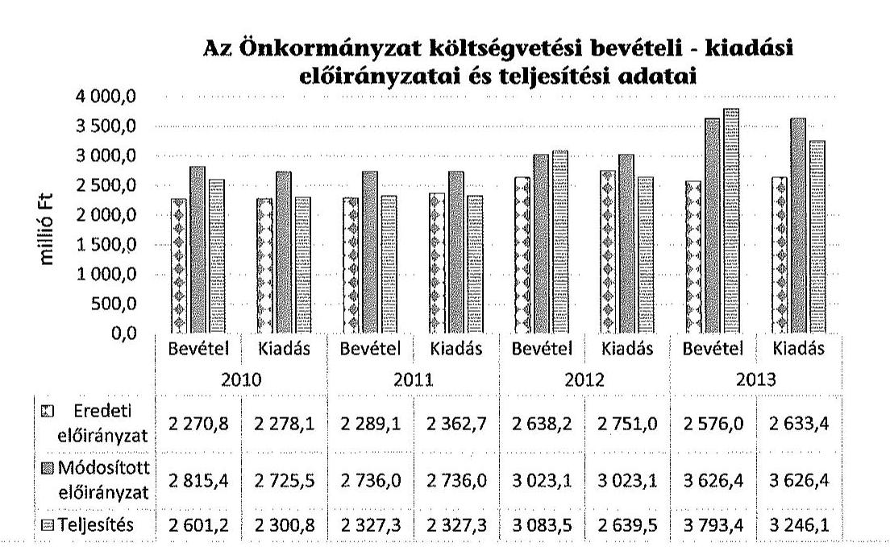
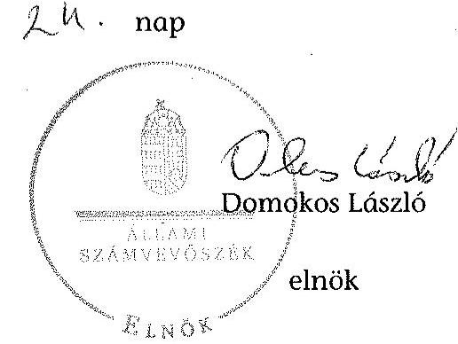
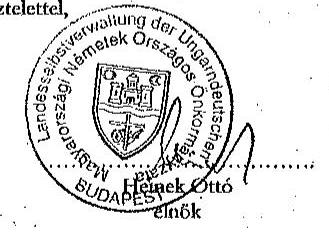
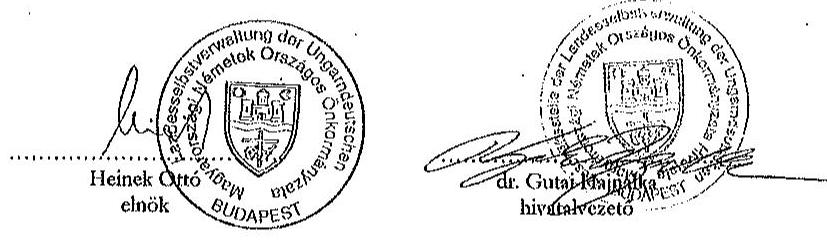
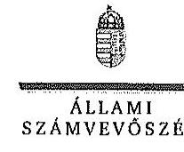
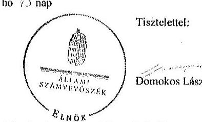
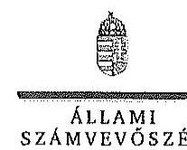

# ÁLLAMI   SZÁMVEVŐSZÉK 

## JELENTÉS

Az Országos Nemzetiségi Önkormányzatok gazdálkodásának ellenőrzéséről Magyarországi Németek Országos Önkormányzata

---

# Állami Számvevőszék 

Iktatószám: V-0694-056/2015.
Témaszám: 1728
Vizsgálat-azonosító szám: V068006

## Az ellenőrzést felügyelte:

## Kisgergely István

felügyeleti vezető

## Az ellenőrzést vezette:

Schósz Attila Ferencné
ellenőrzésvezető
A számvevői jelentések feldolgozásában és a jelentés összeállításában
közreműködtek:
Schósz Attila Ferencné
ellenőrzésvezető
Szabó Balázsné Zsíros Andrea
számvevő
Az ellenőrzést végezték:
Szabó Balázsné Zsíros Andrea
számvevő

## Polyák Ferenc

számvevő
számvevő tanácsos

---

# TARTALOMJEGYZÉK 

BEVEZETÉS ..... 3
I. ÖSSZEGZŐ MEGÁLLAPÍTÁSOK, KÖVETKEZTETÉSEK, JAVASLATOK ..... 7
II. RÉSZLETES MEGÁLLAPÍTÁSOK ..... 13

1. A belső kontrollrendszer kialakításának és működtetésének megfelelősége ..... 13
1.1. A kontrollkörnyezet kialakítása ..... 13
1.2. A kockázatkezelési rendszer kialakításának és működtetésének megfelelősége ..... 15
1.3. A kontrolltevékenységek működésének megfelelősége ..... 16
1.4. Információs és kommunikációs rendszer kialakításának és működtetésének megfelelősége ..... 17
1.5. Monitoring-rendszer kialakításának és működtetésének megfelelősége ..... 18
2. A gazdálkodás szabályszerűsége ..... 20
2.1. Pénzügyi gazdálkodás megfelelősége ..... 20
2.2. Vagyongazdálkodással kapcsolatos feladatellátás szabályszerűsége ..... 24
3. Ingyenesen juttatott vagyon kezelésének megfelelősége ..... 27
4. Egyéb feladat- és hatáskör ellátás szabályszerűsége ..... 28
5. Integritás kontroll ..... 29
6. ÁSZ javaslatok hasznosulása ..... 29
MELLÉKLETEK
7. számú A Magyarországi Németek Országos Önkormányzatának észrevétele
8. számú A Magyarországi Németek Országos Önkormányzatának észrevételére vá- lasz
FÜGGELÉKEK
9. számú Rövidítések jegyzéke
10. számú Integritás kontrollok kialakítása és működtetése

---

.

---

# JELENTÉS 

## a Magyarországi Németek Országos Önkormányzata gazdálkodásának ellenőrzéséről

## BEVEZETÉS

Az Önkormányzat az 1995. évben alakult, Elnöke az 1999. évi országos nemzetiségi választások óta látja el feladatát. A jelenlegi Hivatalvezető 2013. október 14-étől látja el feladatát. Az ellenőrzött időszak Hivatalvezetőit, valamint a gazdasági vezetőt munkaviszonyban foglalkoztatták. A Hivatal a 2014. évi költségvetésében 14 fővel tervezte meg a működését. Az Önkormányzat az ellenőrzött időszak alatt a Hivatalon kívül öt intézmény alapítói/fenntartói jogát gyakorolta. 2004-től rendelkezett az önállóan működő és gazdálkodó Friedrich Schiller Iskolaközpont és a Koch Valéria Iskolaközpont fenntartói jogával, valamint az Önkormányzat a Magyarországi Német Színházat 2011. december 31-ig társulás keretében, 2012. január 1-jétől pedig önállóan tartja fenn. 2012. január 1-jétől a Német Színház, 2013. októberétől a Koch Valéria Iskolaközpont feladatellátásihelyéül szolgáló ingatlanokat az Önkormányzat használatba, illetve tulajdonba kapta. Az Önkormányzat az ellenőrzött időszakot megelőzően alapította az önállóan működő KIK-Zentrum-ot és a Pedagógiai Intézetet. Az Önkormányzat három gazdasági társaságban rendelkezett részesedéssel (2003-tól a Deutsches Haus Kft.-ben 96,7%-os, majd 2010. november 27-től 100%-os, a Városlódi Villa Nonprofit Kft.-ben 50%-os, és a Corvinus TISZK Nonprofit Kft.-ben 20%-os). A 2011. január 22-ig 53 tagú, azt követően az ellenőrzött időszakban 37 tagú Közgyűlés a munkája segítésére 6 bizottságot hozott létre (Kulturális Bizottság, Oktatási Bizottság, Pénzügyi és Ellenőrző Bizottság, Közbeszerzési és Döntéshozó Bizottság, Szociális Bizottság, valamint Mandátumvizsgáló, Vagyonnyilatkozati és Összeférhetetlenségi Bizottság).

Az Önkormányzat költségvetési beszámolója szerint a 2013. évben a módosított költségvetési bevételi és kiadási előirányzat 3626,4 millió Ft, a teljesített költségvetési bevétel 3793,4 millió Ft, a teljesített költségvetési kiadás 3246,1 millió Ft volt. Az Önkormányzat a 2013. évben 2476,0 millió Ft államháztartásból származó támogatásban részesült.

Az Alaptörvény XXIX. cikk (1) bekezdése szerint a Magyarországon élő nemzetiségek államalkotó tényezők. Minden, valamely nemzetiséghez tartozó magyar állampolgárnak joga van önazonossága szabad vállalásához és megőrzéséhez. A hazánkban élő nemzetiségek helyi (települési és területi), valamint országos önkormányzatokat hozhatnak létre.

---

Az országos nemzetiségi önkormányzatok gazdálkodási feladatait az önállóan működő és gazdálkodó költségvetési szerv, a hivatal látja el. Az országos nemzetiségi önkormányzatok a 2008. évtől tartoznak az államháztartás önkormányzati alrendszerébe, azóta hivatalaik költségvetési szervként működnek. Az Alaptörvény hatálybalépését követően a 2012. évtől további jelentős jogszabályi változások határozzák meg működésüket, gazdálkodásukat.

A nemzetiségek helyzete, támogatása mind hazai, mind EU-s szinten kiemelt figyelmet kap napjainkban. Az állam az országos nemzetiségi önkormányzatok működéséhez, a médiaszolgáltatáshoz kapcsolódó jogaik érvényesítéséhez, valamint a kulturális önigazgatásuk érdekében alapított - közművelődési, közgyűjteményi, tudományos - intézmények fenntartásához az éves költségvetési törvényekben nevesítetten költségvetési támogatást biztosít. Ezen kívül az országos nemzetiségi önkormányzatok közfeladataik ellátásához támogatást kapnak a fejezeti kezelésű előirányzatokból, valamint hazai és uniós pályázati forrásokat szerezhetnek.

Az ellenőrzés célja annak értékelése volt, hogy az Önkormányzat gazdálkodása, a belső kontrollrendszer kialakítása és működése, az államháztartásból nyújtott támogatás, illetve az államháztartásból meghatározott célra ingyenesen juttatott vagyon felhasználása a jogszabályi előírásoknak megfelelően történt-e; az Önkormányzat a Nek. tv.-ben és az Njtv.-ben előírt feladat- és hatásköröket ellátta-e; intézkedett-e az ÁSZ által a 2008-2010. évek között végzett ellenőrzések javaslatainak végrehajtásáról.

Az Önkormányzat korrupcióval szembeni veszélyeztetettségének csökkentése érdekében felmértük az integritási szemlélet érvényesülését a gazdálkodási folyamatokban.

Értékeltük az Önkormányzat gazdálkodása során a belső kontrollrendszer kialakítását és működését mind az öt pillére tekintetében, ellenőriztük a gazdálkodással összefüggő feladat- és hatásköröknek, a Hivatal működési, gazdálkodási rendjének jogszabályi előírásoknak való megfelelőségét; a belső kontrollok működésének megfelelőségét az éves költségvetés, a költségvetési beszámoló és a zárszámadás készítés folyamatában; a gazdálkodás pénzügyi folyamatában a kulcskontrollokat, a (szakmai) teljesítésigazolás és 2011-ig utalvány ellenjegyzés, 2012-től érvényesítés működésének megfelelőségét; az Önkormányzat belső ellenőrzése kialakításának és működésének megfelelőségét.

Értékeltük továbbá az Önkormányzat gazdálkodása, ezen belül pénzügyi gazdálkodása keretében a tervezés, beszámolási, zárszámadás-készítési folyamat, az előirányzatok betartása, a könyvvezetés, a közzétételek, adatszolgáltatások, valamint az államháztartás rendszeréből jogszabály vagy megállapodás alapján céljelleggel kapott támogatások felhasználásának, elszámolásának szabályszerűségét. A vagyonnal kapcsolatos feladatellátás ellenőrzése keretében értékeltük a vagyongazdálkodás szabályozottságát, a mérleg alátámasztottságát, a leltározás, az eszközbeszerzések, a vagyonhasznosítás, a tulajdonosi joggyakorlás szabályszerűségét, kiemelten az Önkormányzat gazdasági társasága részére a vagyon tulajdonba, illetve kezelésbe, üzemeltetésbe adása, a tőkeemelés és a juttatott támogatások szabályszerűségét. Értékeltük az államháztartásból ingyenesen juttatott vagyon felhasználásának szabályszerűségét. Ellenőriztük az előírt

---

feladat- és hatáskörök közül a vélemény-nyilvánítási, egyetértési jog gyakorlásával, a hatáskör átruházásokkal, az ideiglenes vagyonkezeléssel kapcsolatos feladatok ellátásának szabályszerűségét, az integritás kontrollok működését, továbbá az előző ÁSZ ellenőrzés javaslatainak hasznosulását.

Az ellenőrzés várható hasznosulása: Az ellenőrzés eredményeként nemcsak az ellenőrzött szerv gazdálkodása javulhat, hanem átfogó képet kaphatunk az önkormányzati alrendszerbe tartozó országos nemzetiségi önkormányzatok gazdálkodásának hiányosságairól, de a jó gyakorlatokról is. Az ellenőrzés megállapításait és javaslatait más szervezetek is hasznosíthatják a rendezett gazdálkodási keretek kialakításához. Az ellenőrzés hozadékát képezi a 2008-2010. években elvégzett ÁSZ ellenőrzés javaslatai hasznosulásának értékelése. Mind a 13 országos nemzetiségi önkormányzat ellenőrzésével teljes körűen megvalósul az országos nemzetiségi önkormányzatok ellenőrzése a megváltozott jogszabályi környezetben. Az ellenőrzés tapasztalatai alapján a jogszabályi ellentmondások, hiányosságok feltárásával, azok megszüntetésére vonatkozó javaslatokkal segítjük a jó kormányzást. Az ellenőrzéssel lehetővé tesszük, hogy az országos nemzetiségi önkormányzatok gazdálkodásáról, működéséről a társadalom objektív képet alkothasson.

Az Önkormányzat gazdálkodásának ellenőrzéséről szóló számvevőszéki jelentés I. fejezetének összegző része az ellenőrzés céljára adott rövid, szintetizáló összefoglalót és következtetéseket tartalmazza a II. fejezet részletes megállapításain alapulóan. A jelentés intézkedést igénylő megállapításait és javaslatait az ellenőrzés során feltárt, a jelentés II. fejezetében rögzített részletes megállapítások alapozzák meg.

Az ellenőrzés típusa: szabályszerűségi ellenőrzés.
Az ellenőrzött időszak: 2010. január 1.-2014. június 30.
Ellenőrzött szervezet: az Önkormányzat és Hivatala, továbbá azon intézmények, amelyek gazdálkodási feladatait a Hivatal látja el.

Az ellenőrzés végrehajtásának jogszabályi alapját az Állami Számvevőszékről szóló 2011. évi LXVI. törvény 1. § (3) bekezdése, az 5. § (2)-(3) és (6) bekezdései, valamint az államháztartásról szóló 2011. évi CXCV. törvény 61. § (2) bekezdésének előírásai képezik.

Az ellenőrzés módszertana az ÁSZ hivatalos honlapján (www.asz.hu) közzétett szakmai szabályokon alapul, amely a Legfőbb Ellenőrző Intézmények Nemzetközi Szervezete (INTOSAI) által kiadott nemzetközi standardok (ISSAI) figyelembevételével készült.

Az ellenőrzés lefolytatásához az Önkormányzat a kimutatások és a tanúsítványok elektronikus kitöltésével, valamint az ÁSZ által kért dokumentumok elektronikus megküldésével szolgáltatott adatokat. Az így rendelkezésre bocsátott adatok, információk kontrollja és a munkalapok kitöltése az ellenőrzöttnél végzett ellenőrzés keretében történt.

---

A pénzügyi folyamatokban a kulcskontrollok, a (szakmai) teljesítésigazolás és érvényesítés (2011-ig utalvány ellenjegyzése) kontrollok működésének megfelelősége értékeléséhez az egyszerű véletlen mintavétellel kiválasztott tételek ellenőrzését megfelelőségi tesztek útján végeztük. A vagyonhasznosítási célú bevételek, a személyi juttatások, a dologi és felhalmozási kiadások, valamint a pénzeszközátadások felhasználásának szabályszerűségét, a céljelleggel kapott támogatások felhasználásának és elszámolásának szabályszerűségét és a kiadások esetében a gazdálkodási jogkörök gyakorlását mintavétellel ellenőriztük.

A jogszabályoknak és a belső előírásoknak megfelelőnek, azaz szabályszerűnek tekintettük a céljelleggel kapott támogatások felhasználásának és elszámolásának szabályszerűségét, amennyiben a minta ellenőrzésének eredménye alapján 95%-os bizonyossággal a teljes sokaságban a hibaarány kisebb volt, mint 10%, nem megfelelőnek értékeltük, ha a hibaarány a 10%-ot meghaladta. Kockázatot, illetve magas kockázatot jeleztünk amennyiben egy adott terület vonatkozásában a minta alapján a sokaságban nem volt teljes körűen biztosított a jogszabályoknak és a belső szabályzatoknak megfelelő működés.

Megfelelőnek értékeltük a gazdálkodási jogkörök gyakorlását, amennyiben 95%-os bizonyossággal a teljes sokaságban a hibaarány legfeljebb 10%, részben megfelelőnek értékeltük, ha a hibaarány felső határa 10-30% volt, nem megfelelőnek pedig akkor, ha a hibaarány felső határa a teljes sokaságban meghaladta a 30%-ot.

Az ellenőrzött bevételi előirányzatok felhasználásának és az egyéb szabályszerűségi (nem pénzgazdálkodási jogkörökre vonatkozó) ellenőrzése során a konkrét mintatételek (dologi és felhalmozási kiadások, pénzeszköz átadások felhasználásának) értékelését végeztük el.

Az ÁSZ a 2011. évi LXVI. törvény 29. §-a szerint a jelentéstervezetet megküldte a Magyarországi Németek Országos Önkormányzata elnökének egyeztetésre. A beérkezett észrevételt és az arra adott választ a jelentés 1-2. sz. mellékletei tartalmazzák

---

# I. ÖSSZEGZŐ MEGÁLLAPÍTÁSOK, KÖVETKEZTETÉSEK, JAVASLATOK 

A 2010-2014. I. félév között az Önkormányzatnál a belső kontrollrendszer kialakítása és működtetése részben volt szabályszerű.

A kontrollkörnyezet kialakítása az Önkormányzat működésére vonatkozó jogszabályokkal részben volt összhangban. A Közgyűlés által jóváhagyott, a jogszabályi előírásoknak megfelelő önkormányzati SzMSz aktualizálása folyamatosan megtörtént. A Hivatal Közgyűlés által jóváhagyott SzMSz-e az ellenőrzött időszak alatt részben felelt meg a jogszabályi előírásoknak. A Hivatal a jogszabályi előírások ellenére nem rendelkezett 2010-ben számviteli politikával, az eszközök és források értékelésének szabályzatával és számlarenddel, valamint a teljes ellenőrzött időszak alatt önköltségszámítási szabályzattal. A Hivatal az Ámr., valamint az Ávr. előírásai ellenére nem rendelkezett a teljes ellenőrzött időszak alatt beszerzések lebonyolításával kapcsolatos eljárásrenddel, valamint 2010-2013. május 1. között a gazdálkodási jogkörök gyakorlásának módját, részletszabályait, valamint az ezeket végző személyek kijelölésének rendjét tartalmazó szabályzattal. A Hivatalvezető az Ámr. előírásaitól eltérően 2011. december 1-jéig nem alakította ki a szabálytalanságok kezelésének eljárásrendjét. A Hivatal és a gazdasági szervezettel nem rendelkező költségvetési szerv (KIKZentrum) - az Ámr.-ben foglaltak ellenére - 2011. novemberéig a munkamegosztás és felelősségvállalás rendjét nem rögzítette munkamegosztási megállapodásban. A Hivatal az Ámr.-ben, valamint a Bkr.-ben foglaltak ellenére - a belső ellenőrzési tevékenység kivételével - nem rendelkezett valamennyi működési folyamatot lefedő ellenőrzési nyomvonallal.

A Hivatalvezető az Ámr. és a Bkr. előírásai ellenére nem alakított ki, és nem működtetett kockázatkezelési rendszert.

A kontrolltevékenységek kialakítása és működtetése részben felelt meg az előírásoknak az éves költségvetés, a költségvetési beszámoló és
 a zárszámadás készítés folyamatában. A kulcskontrollok működése (teljesítésigazolás, utalvány ellenjegyzés, érvényesítés) az ellenőrzött időszak alatt folyamatosan javuló tendenciát mutatott, azonban a teljes ellenőrzött időszakban nem volt megfelelő.

Az Önkormányzatnál a hatályos jogszabályoknak részben megfelelően alakították ki és működtették az információs és kommunikációs rendszert. Az Ámr.-ben és az Ávr.-ben foglaltak ellenére az ellenőrzött időszak alatt nem szabályozták a közérdekű adatok megismerésére irányuló kérelmek intézésének és a kötelezően közzéteendő adatok nyilvánosságra hozatalának rendjét, míg iratkezelési szabályzattal rendelkeztek. A Hivatalvezető az 1992. évi LXIII. tv.-ben és az Info tv.-ben foglaltak ellenére nem készítette el az adatvédelmi és adatbiztonsági szabályzatot.

Az Önkormányzat a jogszabályi előírások ellenére nem tett eleget maradéktalanul a gazdálkodására vonatkozó adatok közzétételi kötelezettségének. Elmaradt

---

a közzététele a 2012-2014. I. félév között kapott és adott céljellegű támogatások adatainak, ezáltal az Önkormányzat nem biztosította a közpénzek felhasználásának átláthatóságát.

Az Önkormányzat monitoring rendszere részben került kialakításra, amely hozzájárult a költségvetési tervezés, a beszámolás, valamint a kulcskontrollok működése területén feltárt szabálytalanságokhoz.

Az Önkormányzatnál a belső ellenőrzés megszervezése, kialakítása, illetve működtetése részben felelt meg a Ber., és a Bkr. előírásainak. Az ellenőrzött időszak alatt főállású belső ellenőrt alkalmaztak, aki kockázatelemzésen alapuló éves tervek alapján végezte feladatát. Az ellenőrzött időszak alatt a Ber., valamint a Bkr. előírásaival ellentétben nem a Hivatalvezető, hanem a belső ellenőrzési vezető készítette el az éves összefoglaló ellenőrzési jelentést, és küldte meg az Önkormányzat elnökének. A Ber.-ben előírtak ellenére a belső ellenőrzések megállapításaira az érintettek 2010-2011. években nem készítettek minden esetben intézkedési tervet, annak készítése 2012-től vált rendszeressé. A 2012. évtől kezdődően a belső ellenőrzési vezető a Bkr. szerint éves bontásban vezetett nyilvántartást, amellyel a belső és külső ellenőrzési jelentésekben tett megállapításokat, javaslatokat, a vonatkozó intézkedési terveket és azok végrehajtását nyomon követte.

Az Önkormányzat pénzügyi gazdálkodása részben felelt meg az előírásoknak. Az Önkormányzat az ellenőrzött időszakban a jogszabályokban foglaltak szerint - a 2013. évet kivéve - a költségvetési koncepciót elkészítette. A Hivatalvezető az Önkormányzat költségvetési határozattervezetét a költségvetési szervek vezetőivel egyeztette. A Pénzügyi bizottság a 2010-2014. évi költségvetési határozattervezeteket a törvényekben megfogalmazottak szerint véleményezte és a Közgyűlés részére elfogadásra javasolta. Az Elnök által beterjesztett 2010-2014. évi költségvetési határozattervezetet, illetve a 2010-2013. évi zárszámadási határozattervezetet a jogszabályokban foglalt határidőben és tartalommal a Közgyűlés elfogadta.

A Hivatalvezető a 2010-2011. évi elemi költségvetést az Ámr.-ben foglaltak ellenére nem a kisebbségpolitikáért felelős állami szervnek küldte meg, valamint a jóváhagyott 2012. évi elemi költségvetéséről az Ávr.-ben foglaltak ellenére nem a nemzetiségpolitikáért felelős állami szervnek szolgáltatott adatot, hanem közvetlenül a Kincstárnak. A 2013-2014. évről az adatszolgáltatás - a 2013. évben kettő intézmény pár napos késése kivételével - határidőben megtörtént. Az Önkormányzat az Áhsz.-ben foglaltak ellenére a 2010-2013. évi elemi költségvetési beszámolóit nem küldte meg a Miniszterelnöki Hivatalnak/a kisebbségpolitikáért felelős miniszternek.

Az Önkormányzat az ellenőrzött időszakban az államháztartás rendszeréből jogszabály alapján kapott működési, valamint egyedi kérelmek alapján kapott céljellegű támogatások felhasználása és elszámolása során a jogszabályi és a szerződéses előírásokat betartotta. Az Önkormányzat által - államháztartási forrás terhére - nyújtott céljellegű támogatások elbírálása, felhasználása és elszámoltatása megfelelő a jogszabályi és szerződéses követelményeknek.

Az Önkormányzat vagyongazdálkodási tevékenysége részben felelt meg a jogszabályi követelményeknek. A Közgyűlés az Njtv. és az Nvtv. előírása ellenére

---

nem határozta meg azt az értékhatárt, amely felett 2012-2014. I. félévében csak versenyeztetés útján lehet a vagyont hasznosítani. Az ellenőrzött időszakban az Önkormányzat, a Hivatal és az intézményei a 2010-2013. évek között a beszámolóik minden mérlegsorát a jogszabály előírásainak megfelelően leltárral alátámasztották. Az egyes mérlegsorokhoz kapcsolódóan elvégezték a szükséges értékeléseket. A mérlegsorokat alátámasztó leltárak, analitikus nyilvántartások és főkönyvi kivonatok közötti egyezőség fennállt. Az eredményszemléletű számvitelre való áttérést a jogszabályi előírásainak megfelelően elvégezték.

A vagyon hasznosítása során - a Nek. tv.-ben és az Njtv.-ben foglaltak ellenére - a Közgyűlés helyett több esetben az Elnök, a Hivatalvezető, vagy intézményvezető hozott döntést. Az Önkormányzat a bérbeadási folyamat során az Nvtv.-ben megfogalmazott átláthatóság előírt követelményének érvényesüléséről a 2013. évben kettő szervezet esetében nem győződött meg. Az eszközök beszerzése, bekerülési értékének megállapítása, az állományba vétele, az értékcsökkenés elszámolása az Áhsz.-ben, és a 4/2013. (I. 11.) Korm. rendeletben, valamint a Kbt. ${ }_{2}$-ben foglaltaknak megfelelően történt.

Az Önkormányzat - a tulajdonosi joggyakorlás keretében - az ellenőrzött időszak alatt a gazdasági társaságait érintő tőkeemelés, tőkeleszállítás, térítésmentes eszközátadás és támogatás nyújtása során a jogszabályban foglaltak szerint járt el.

Az Önkormányzat a Nek. tv.-ben foglaltaknak megfelelően, az egyszeri ingyenes vagyonjuttatásként kapott ingatlant a törvényben előírtak szerint, mint forgalomképtelen törzsvagyont tartotta nyilván.

Intézmény-fenntartói jog átvállalása keretében, és egyéb jogcímen ingyenesen juttatott vagyon kezelése megfelelt az előírásoknak. Az ellenőrzött időszak alatt egy esetben került sor intézmény-fenntartói jog átvételére az ingatlan térítésnélküli használatba vétele mellett (Német Színház), egy esetben ellenérték nélküli ingatlanátvételre a tulajdonjog megszerzése mellett (Koch Valéria Iskolaközpont), valamint további egy esetben ingó vagyon térítés nélküli átvételére és továbbadására (Corvinus TISZK Nonprofit Kft.).

Az Önkormányzat az ellenőrzött időszak alatt 2011-ben két alkalommal élt a Nek. tv. szerinti véleménynyilvánítási jogával. Az Önkormányzat szabályosan ruházott át hatáskört a szerveire, az átruházott hatáskört gyakorlókat beszámoltatta.

Az Önkormányzat az Njtv.-ben előírt ideiglenes vagyonkezelői feladatait a megszűnt Sároki Német Nemzetiségi Önkormányzat ingó vagyona tekintetében részben látta el szabályszerűen. Az érték nélkül nyilvántartott (ingó) eszközöket leltárral vette át, de az Njtv.-ben foglaltak ellenére az ideiglenes kezelői jogot átengedte Sárok Község önkormányzatának.

Az ÁSZ a 2008-2010. években ellenőrzést az Önkormányzatnál nem végzett.
Az ÁSZ tv. 33. § (1) bekezdésében foglaltak értelmében a jelentésben foglalt megállapításokhoz kapcsolódó intézkedési tervet köteles az ellenőrzött szervezet vezetője összeállítani, és azt a jelentés kézhezvételétől számított 30 napon belül az ÁSZ részére megküldeni. Amennyiben az intézkedési tervet határidőben nem

---

küldi meg a szervezet, vagy az nem elfogadható, az ÁSZ elnöke a hivatkozott törvény 33. § (3) bekezdés a)-b) pontjaiban foglaltakat érvényesítheti.

A helyszíni ellenőrzés megállapításainak hasznosítása mellett javasoljuk:

# a Hivatalvezetőnek 

1. A belső kontrollrendszeren belül:
a) A kontrollkörnyezet kialakítása részben volt megfelelő, mivel a Hivatal az Ámr. 156. § (2) bekezdésében, valamint a Bkr. 6. § (3) bekezdésében foglaltak ellenére - a belső ellenőrzési tevékenység kivételével - nem rendelkezett valamennyi működési folyamatot lefedő ellenőrzési nyomvonallal. A Hivatal az Áhsz. 8. § (4) bekezdés c) pontja, valamint 4/2013. (I. 11.) Korm. rendelet 50. § (3) bekezdésében foglaltakkal ellentétben az ellenőrzött időszak alatt nem rendelkezett önköltségszámítási szabályzattal, miközben bérbeadási tevékenységet is végzett.

Javaslat:
Intézkedjen valamennyi működési folyamatot lefedő ellenőrzési nyomvonal, továbbá az önköltségszámítási szabályzat elkészítéséről.
b) A kockázatkezelési rendszer kialakítása és működtetése nem felelt meg a jogszabályi előírásoknak, mivel a Hivatalvezető - az Ámr. 157. § (2)-(3) bekezdéseiben, 2011. január 1-jétől az Áht. 121. § (2) bekezdésében, valamint a Bkr. 7. § (2) bekezdésében foglalt előírás ellenére - nem mérte fel és nem állapította meg a Hivatal tevékenységében, gazdálkodásában rejlő kockázatokat, nem határozta meg az egyes kockázatokkal kapcsolatban a szükséges intézkedéseket, 2011-től nem követte folyamatosan nyomon a kockázatkezelési rendszer működését és 2012-től nem határozta meg a kockázatokkal kapcsolatos intézkedések folyamatos nyomon követési módját.

Javaslat:
Alakítsa ki és működtesse a kockázatkezelési rendszert.
c) A kontrolltevékenységeken belül a kulcskontrollok működése nem volt megfelelő. A rendszeres és nem rendszeres, valamint külső személyi juttatások, a dologi és felhalmozási kiadások, valamint a pénzeszközátadások teljesítése során a gazdálkodási jogkörök (szakmai teljesítésigazolás, érvényesítés, utalványozás és 2012. január 1-ig az utalvány ellenjegyzés) gyakorlása nem felelt meg az Ámr. 76. § (1) és (3) bekezdéseiben, 79. § (1)-(2) bekezdéseiben, illetve az Áht. 38. § (1) bekezdésében, az Ávr. 57. § (1) és (3) bekezdéseiben, 58. § (1)-(4) bekezdéseiben foglalt előírásoknak.

Javaslat:
Intézkedjen a gazdálkodási jogkörök (kulcskontrollok) jogszabályi előírásoknak megfelelő gyakorlásáról.
d) Az információs és kommunikációs rendszer kialakítása és működtetése részben volt megfelelő. A Hivatalvezető nem tett eleget az Ámr. 20. § (3) bekezdés

---

i) pontjában, valamint az Info tv. 30. § (6) bekezdésében, a 35. § (3) bekezdésében, és az Ávr. 13. § (2) bekezdés h) pontjában foglaltaknak, amikor az ellenőrzött időszak alatt nem szabályozta a közérdekű adatok megismerésére irányuló kérelmek intézésének és a kötelezően közzéteendő adatok nyilvánosságra hozatalának rendjét. Az Önkormányzat a 2010-2014. I. félév között nem teljes körűen tett eleget az Eisztv. 6. § (1) bekezdésében, valamint az Info tv. 37. § (1) bekezdésében és az 1. számú mellékletében foglalt közzétételi kötelezettségének.

Javaslat:
e) Intézkedjen a közérdekű adatok megismerésére irányuló kérelmek intézésének és a kötelezően közzéteendő adatok nyilvánosságra hozatala rendjének elkészítéséről.
f) Intézkedjen a jogszabályban meghatározott közzétételi kötelezettség hiánytalan teljesítése érdekében.
2. A Hivatalvezető nem tett eleget az 1992. évi LXIII. tv. 31/A. § (3) bekezdésében és az Info tv. 24. § (3) bekezdésében foglaltaknak, mivel nem készítette el a Hivatal adatvédelmi és adatbiztonsági szabályzatát.

Javaslat:
Intézkedjen a Hivatal adatvédelmi és adatbiztonsági szabályzatának elkészítéséről.
Az Önkormányzat részére adott, illetve az által nyújtott támogatások tekintetében:
3. Az Önkormányzat a 2012-2014. I. félév között kapott céljellegű támogatásokat a 28/2012. (III. 6.) Korm. rendelet 12. § (5) bekezdésében, illetve a 428/2012. (XII. 19.) Korm. rendelet 13. § (2) bekezdésében foglalt előírás ellenére, az általa céljelleggel nyújtott támogatások adatait az Áht. 15/A. § (1) bekezdésében, és az Info. tv. 37. § (1) bekezdésében hivatkozott 1. számú mellékletben foglaltak ellenére nem tette közzé, ezáltal nem biztosította a közpénzek felhasználásának átláthatóságát.

Javaslat:
Intézkedjen a kapott céljellegű támogatások, valamint az általa nyújtott céljellegű támogatások adatainak közzétételéről.

Az Önkormányzat vagyongazdálkodással kapcsolatos feladatellátása tekintetében:
4. Az Önkormányzat 2010-2013. június 29. között az önkormányzati SzMSz 3. számú mellékletében, 2013. július 1-től a vagyongazdálkodási szabályzatban részben határozta meg a vagyonnal való gazdálkodás szabályait, mert a Közgyűlés az Njtv. 124. § (2) bekezdésében, az Nvtv. 11. § (16) bekezdésében foglaltak ellenére nem határozta meg azt az értékhatárt, amely felett 2012-2014. I. félévében csak versenyeztetés útján lehet a vagyont hasznosítani.

Javaslat:
Intézkedjen azon értékhatár meghatározásáról, amely felett csak versenyeztetés útján lehet a vagyont hasznosítani.

---

5. A vagyonhasznosítási bevételek esetében a vagyonértékesítésről a 2011. évben egy esetben a Nek. tv. 39/A. § (1) bekezdésben foglaltak ellenére, a 2012-2014. I. félévében négy esetben az Njtv. 119. (1) bekezdésben foglaltak ellenére az arra hatáskörrel rendelkező Közgyűlés helyett az Elnök döntött. A 2011. évben az Önkormányzat részéről egy esetben a Nek. tv. 39/A. § (1) bekezdés ellenére a Közgyűlés helyett a Hivatalvezető hozott döntést. 2013. évben négy esetben eszközök bérbeadásáról az Njtv. 119. § (1) bekezdés ellenére a Közgyűlés helyett az intézményvezető, illetve Hivatalvezető hozott
 döntést. A bérbeadási folyamat során az Nvtv. 3. § (2) bekezdésben megfogalmazott átláthatóság előírt követelményének érvényesüléséről a 2013. évben kettő szervezet esetében nem győződtek meg.

Javaslat:
a) Intézkedjen arról, hogy a vagyonhasznosítás (értékesítés, bérbeadás) során a jogszabályi előírásoknak megfelelően történjen a döntéshozatal.
b) Intézkedjen az átláthatóság követelményének teljes körű érvényesítéséről

---

# II. RÉSZLETES MEGÁLLAPÍTÁSOK 

## 1. A BELSŐ KONTROLLRENDSZER KIALAKÍTÁSÁNAK ÉS MŰKÖDTETÉSÉNEK MEGFELELŐSÉGE

Az ellenőrzött időszakban az Önkormányzatnál a belső kontrollrendszer (a kontrollkörnyezet, a kockázatkezelési rendszer, a kontrolltevékenységek, az információs és kommunikációs rendszer, valamint a monitoring rendszer) kialakítása és működtetése összességében részben volt szabályszerű az alábbiakban részletezett szabályozásbeli és működésbeli hibák, hiányosságok miatt.

### 1.1. A kontrollkörnyezet kialakítása

A kontrollkörnyezet kialakítása az Önkormányzat működését meghatározó jogszabályokkal részben volt összhangban.

Az Önkormányzat 2010-2014. június 30. között rendelkezett a Közgyűlés által jóváhagyott, a jogszabályi előírásoknak megfelelő önkormányzati SzMSz-szel, amelynek aktualizálása folyamatosan megtörtént.

A Közgyűlés részben tett eleget a Nek. tv. 39/G. § (4) bekezdésében foglalt közzétételi kötelezettségének. Az önkormányzati SzMSz 2010. július 3-ai, valamint 2011. február 12-ei módosításait érintően intézkedtek a Magyar Közlönyben történő közzététel érdekében, a 2011. április 16-ai módosítást nem tették közzé. Az Önkormányzat 2012-től eleget tett az Info tv.-ben foglalt kötelezettségének, és honlapján közzétette az önkormányzati SzMSz módosításait.

A Hivatal rendelkezett a Közgyűlés által jóváhagyott hivatali SzMSz-vel, amely az ellenőrzött időszak alatt részben felelt meg a jogszabályi előírásoknak.

A hivatali SzMSz az Ámr. 20. § (2) bekezdés e) pontjában foglaltak ellenére nem teljes körűen szabályozta a szervezeti felépítést és a működés rendjét, mivel nem nevesítette a szervezeti egységeket, azok feladatait, és 2011. április 11-éig a szervezeti egységek közötti kapcsolattartás rendjét. A hivatali SzMSz nem tartalmazta továbbá - az Ámr. 20. § (2) bekezdés b), i) pontjaiban foglaltak ellenére - a költségvetési szerv szervezeti ábráját, törzskönyvi azonosító számát, alapító okirat keltét, számát, az alapítás időpontját.

A hivatali SzMSz nem felelt meg az Ámr. 20. § (2) bekezdés b) pontjában, majd az Ávr. 13. § (1) bekezdés b) pontjában előírtaknak, mivel nem tartalmazta az alapító okirat keltét és számát.

A Hivatal rendelkezik gazdasági szervezettel, mely a hivatali SzMSz-ben rögzítésre került, valamint gazdasági ügyrenddel. A gazdasági ügyrend az Ámr.-ben foglaltakkal összhangban tartalmazta a gazdasági szervezet által ellátandó feladatokat.

---

Az Önkormányzat és a Hivatal gazdálkodásának szabályozottsága az ellenőrzött években részben felelt meg az előírásoknak.

A Hivatalvezető a 2010. évben az Áhsz. 8. § (12) bekezdésében, valamint a 49. § (1) bekezdésében foglaltakkal ellentétben nem készítette el számviteli politikáját, az eszközök és források értékelésének szabályzatát, valamint a számlarendjét. A hiányosságokat pótolták, 2011. január 1-jei hatállyal a Hivatalvezető kiadta a számviteli politika, az értékelési szabályzat, valamint a számlarend. Az értékelési szabályzat, a számlarend, a számviteli politika az Áhsz.-ben, a 4/2013. (I. 11.) Korm rendeletben, valamint a Számv. tv.-ben foglaltaknak megfelelő tartalommal készült el.

A számviteli politikában a 4/2013. (I. 11.) Korm. rendelet 50. § (1) bekezdésében hivatkozott Számv. tv. 14. § (4) bekezdésében foglaltakkal ellentétesen nem szabályozták, hogy mit tekintenek a számviteli elszámolás, az értékelés szempontjából lényegesnek, jelentősnek, nem lényegesnek, nem jelentősnek. Az Önkormányzat rendelkezett az Áhsz., valamint a 4/2013. (I. 11.) Korm. rendelet és az Számv. tv. előírásainak megfelelően leltározási szabályzattal. A Hivatal az Áhsz. 8. § (4) bekezdés c) pontja, valamint 4/2013. (I. 11.) Korm. rendelet 50. § (3) bekezdésében foglaltakkal ellentétben az ellenőrzött időszak alatt nem rendelkezett önköltségszámítási szabályzattal, miközben bérbeadási tevékenységet is végzett.

A Hivatal az ellenőrzött időszak alatt rendelkezett az Áhsz.-ben foglaltak alapján selejtezési szabályzattal. A szabályzatok tartalmazták a felesleges vagyontárgyak feltárása, hasznosítása szabályait, a selejtezési eljárás folyamatát, a selejtezéssel kapcsolatos számviteli elszámolásokat.

A Hivatal az Ámr. 20. § (3) bekezdés a) pontjában, valamint az Ávr. 13. § (2) bekezdés a) pontjában előírtak ellenére 2010-2013. május 1. között nem rendelkezett a kötelezettségvállalás, ellenjegyzés, teljesítés igazolása, érvényesítés, utalványozás gyakorlásának módját, eljárási és dokumentációs részletszabályait, valamint az ezeket végző személyek kijelölésének rendjét tartalmazó szabályzattal. A Hivatalvezető 2013. május 1-jei hatállyal adta ki a gazdálkodási jogkörök szabályzatát, melynek tartalma megfelelt a jogszabályi előírásoknak.

A Hivatalvezető az Ámr. 20. § (3) bekezdés c), f), g), h) pontjában, valamint az Ávr. 13. § (2) bekezdés c), e), f), g) pontjában foglaltakkal ellentétben 2010-2013. május 1. között belső szabályzatban nem rendezte a belföldi és külföldi kiküldetések elrendelésével és elszámolásával kapcsolatos kérdéseket, a reprezentációs kiadások felosztásának és elszámolásának rendjét, a gépjárművek igénybevételének és használatának rendjét, valamint a vezetékes és rádiótelefonok használatát. 2013. május 1-jei hatállyal a Hivatalvezető a fenti hiányosságokat pótolta.

A Hivatal az ellenőrzött időszak alatt az Ámr. 20. § (3) bekezdés b) pontjában, valamint az Ávr. 13. § (2) bekezdés b) pontjában foglaltakkal ellentétben nem rendelkezett a beszerzések lebonyolításával kapcsolatos eljárásrenddel. Az Önkormányzat az ellenőrzött időszak alatt 2010. április 17-től kezdődően rendelkezett a Közgyűlés által jóváhagyott, a Kbt. által előírt közbeszerzési szabályzattal.

A Hivatalvezető az Ámr. 156. § (3) bekezdés előírásaitól eltérően 2011. december 1-jéig nem alakította ki a szabálytalanságok kezelésének eljárásrendjét. Az eljárásrend a hivatali SzMSz 3. számú mellékleteként került kiadásra. A Hivatal az Ámr. 156. § (2) bekezdésében, valamint a Bkr. 6. § (3) bekezdésében foglaltak ellenére - a belső ellenőrzési tevékenység kivételével - nem rendelkezett valamennyi működési folyamatot lefedő ellenőrzési nyomvonallal.

A gazdasági szervezettel nem rendelkező költségvetési szerv (KIK-Zentrum) és a kijelölt önállóan működő és gazdálkodó költségvetési szerv (Hivatal) a munkamegosztás és felelősségvállalás rendjét - az Ámr. 16. § (4) bekezdésében foglaltakkal ellentétesen - nem rögzítette munkamegosztási megállapodásban 2011. november 19-ig, amikor sor került a munkamegosztási megállapodás megkötésére, melyet 2013. január 1-jétől új követett.

A Közgyűlés, mint irányító szerv az intézményei tekintetében az ellenőrzött időszakban érvényesítette az erőforrásokkal való szabályszerű és hatékony gazdálkodáshoz szükséges követelményeket, azokat számon kérte, ellenőrizte. Az Önkormányzat éves költségvetési határozatában biztosította az irányítása alá tartozó költségvetési szervei számára a feladatai ellátásához szükséges létszámot és működési előirányzatot. Az erőforrások felhasználásáról a féléves és az éves beszámolók keretében számoltatta be a költségvetési szerveit, e mellett a szakmai feladatellátásról éves szakmai beszámolók készültek.

A Hivatal dolgozói - a Munka tv. előírásaival összhangban - rendelkeztek megfelelő munkaköri leírásokkal. Az Önkormányzatnál a gazdasági vezetői feladatokat ellátó személy rendelkezett a Nek. tv., az Ámr. és az Ávr. előírásainak megfelelő végzettséggel. Az ellenőrzött időszak alatt három Hivatalvezető váltotta egymást. A 2013. július 1-jétől 2013. október 14-éig kinevezett, a Hivatallal munkaviszonyban álló dolgozó - az Ávr. 7. § (4) bekezdésében foglaltak ellenére - nem rendelkezett a Hivatalvezetőre előírt megfelelő képesítéssel.

# 1.2. A kockázatkezelési rendszer kialakításának és működtetésének megfelelősége 

A kockázatkezelési rendszer kialakítása és működtetése az ellenőrzött időszakban az Ámr. 155. § (1) bekezdése, a 157. § (1) bekezdése, valamint a Bkr. 3. § b) pontja, és 7. § (1) bekezdése előírásától eltérően nem történt meg.

A Hivatalvezető - az Ámr. 157. § (2)-(3) bekezdéseiben, 2011. január 1-jétől az Áht. 121. § (2) bekezdésében, valamint a Bkr 7. § (2) bekezdésében foglalt előírás ellenére - nem mérte fel és nem állapította meg a Hivatal tevékenységében, gazdálkodásában rejlő kockázatokat, nem határozta meg az egyes kockázatokkal kapcsolatban a szükséges intézkedéseket, 2011-től nem követte folyamatosan nyomon a kockázatkezelési rendszer működését és 2012-től nem határozta meg a kockázatokkal kapcsolatos intézkedések folyamatos nyomon követési módját.

[^0]
[^0]:    ${ }^{1}$ 2010. december 31-éig az Ámr. 161. §-a szabályozta.

---

# 1.3. A kontrolltevékenységek működésének megfelelősége 

Az éves költségvetés, a költségvetési beszámoló és a zárszámadás készítésének folyamatában a belső kontrollok szabályozása részben valósult meg.

A kontrolltevékenységek elvégzésének részleteiről és felelőseiről a gazdasági ügyrend, a munkamegosztási megállapodások és az önkormányzati SzMSz rendelkeztek, azonban ezek az Ámr. 158. § (1) bekezdésében és a Bkr. 8. § (1) bekezdésében foglalt előírás ellenére - az 1.2. pontban leírtak következtében - nem biztosították a kockázatok kezelését.

A Hivatalvezető az Áht. 121/A. § (4) bekezdése és a Bkr. 8. § (2) bekezdése előírásától eltérően részben biztosította a folyamatba épített előzetes, utólagos és vezetői ellenőrzést a pénzügyi döntések dokumentumainak elkészítése, a költségvetési gazdálkodás pénzügyi ellenőrzése, valamint a gazdasági események szabályszerű elszámolása vonatkozásában. A folyamatok belső kontrolljai - 2010-2014. I. félévben a szabályozás részleges hiányából adódóan - nem működtek megfelelően, mivel azok nem minden évben biztosították, hogy az éves költségvetési határozatok tervezetei a jogszabályokban előírt határidőben kerüljenek a Közgyűlés elé előterjesztésre, az elemi költségvetés, és a költségvetési beszámolók határidőben megküldésre kerüljenek a kisebbségpolitikáért felelős állami szervnek, valamint az Önkormányzat és a költségvetési szervei időközi mérlegjelentései és költségvetési jelentései teljes körűen elkészüljenek.

A Hivatalvezető az ellenőrzött években eleget tett az Ámr.-ben és a Bkr.-ben részletezett belső kontrollok működéséről szóló nyilatkozattételi kötelezettségüknek.

A Hivatalvezető a 2010-2011. évekre a belső kontrollrendszer megfelelő működéséről, 2012-re a kontrolltevékenységek hiányosságai mellett a szervezeti és személyi, a vezetői, a jóváhagyási és engedélyezési kontrollok meglétéről számolt be. A 2013. év vonatkozásában rögzítette, hogy a kockázatkezelés működtetése kialakulóban van, az információs és kommunikációs rendszer működik, de fejlesztést igényel.

A kapcsolódó intézmények vezetői a 2010-2012. évekről az Ámr. 217. § c) pontja alapján a 21. számú mellékletében, a Bkr. 11. § (1) bekezdése alapján az 1. számú mellékletében foglaltak ellenére nem, míg a 2013. évre eleget tettek nyilatkozattételi kötelezettségüknek.

A 2010-2011. években a szakmai teljesítésigazolás és utalvány ellenjegyzés kulcskontrollok működése (a rendszeres és nem rendszeres, a külső személyi juttatások, a dologi és felhalmozási kiadások, valamint a pénzeszköz átadások esetében) nem volt megfelelő, az alábbi hiányosságok miatt:

- azokban az esetekben, ahol a szakmai teljesítésigazolást az Ámr. 76. § (1) bekezdésében foglaltaktól eltérően nem végezték el, a kifizetéseket megelőzően nem győződtek meg a kiadások teljesítésének jogosságáról, összegszerűségéről. Azokban az esetekben, ahol a szakmai teljesítésigazoló aláírt, az Ámr. 76.

[^0]
[^0]:    ${ }^{2}$ 2010. december 31-éig az Áht. 1121. § (1) bekezdése szabályozta.

---
 79. § (1) bekezdésében foglalt előírás ellenére nem az arra kijelölt személy végezte el.

A 2012-2014. I. félévében a teljesítésigazolás és az érvényesítés kulcskontrollok működése (a rendszeres és nem rendszeres, a külső személyi juttatások, a dologi és felhalmozási kiadások, valamint a pénzeszköz átadások esetében) javuló tendenciát mutatott, de egyik évben sem volt megfelelő, mivel:

- azokban az esetekben, ahol a teljesítésigazolást - az Áht. 2 38. § (1) bekezdésében és az Ávr. 57. § (1) bekezdésében foglaltak ellenére - nem végezték el, a kifizetéseket megelőzően nem győződtek meg a kiadások teljesítésének jogosságáról, összegszerűségéről és a szerződésszerű teljesítésének igazolásáról. Azokban az esetekben, ahol a szakmai teljesítésigazoló aláírt, az Ávr. 57. § (3) bekezdésben, valamint a gazdálkodási jogkörök szabályzatában foglaltakkal ellentétben hiányzott az igazolás dátuma, vagy a teljesítés tényére való utalás, vagy mindkettő;
- a kifizetéseket megelőzően az érvényesítést - az Ávr. 58. § (3)-(4) bekezdésében előírtak ellenére - nem, vagy nem az arra jogosult végezte. Ezen túl az érvényesítő - az Ávr. 58. § (1)-(2) bekezdéseiben foglaltak ellenére - aláírása ellenére feladatát nem látta el, mert nem ellenőrizte a jogszabályi előírások betartását a megelőző ügymenetben, nem jelezte, hogy nem történt meg a kötelezettségvállalás pénzügyi ellenjegyzése. Nem jelezte továbbá 2013. május 1-jét követően, hogy a belföldi kiküldetés során a belső szabályzatban ${ }^{3}$ foglaltak ellenére hiányzott a kiküldetés elrendelése, és az Ávr. 55. § (1) bekezdésében előírtak ellenére a kötelezettségvállalás pénzügyi ellenjegyzése.

# 1.4. Információs és kommunikációs rendszer kialakításának és működtetésének megfelelősége 

A Hivatalvezető a hatályos jogszabályoknak részben megfelelően alakította ki és működtette a költségvetési szerv információs és kommunikációs rendszerét.

A Hivatalvezető nem tett eleget az Ámr. 20. § (3) bekezdés i) pontjában, valamint az Info tv. 30. § (6) bekezdésében, a 35. § (3) bekezdésében, és az Ávr. 13. § (2) bekezdés h) pontjában foglaltaknak, amikor az ellenőrzött időszak alatt nem szabályozta a közérdekű adatok megismerésére irányuló kérelmek intézésének és a kötelezően közzéteendő adatok nyilvánosságra hozatalának rendjét.

[^0]
[^0]:    ${ }^{3}$ A belföldi és külföldi kiküldetések elrendelésének és lebonyolításának szabályzata (hatályos: 2013. május 1-jétől)

---

Az Önkormányzat a 2010-2014. I. félév között nem felelt meg maradéktalanul az Eisztv. 6. § (1) bekezdésében, valamint az Info tv. 37. § (1) bekezdésében és az 1. számú mellékletében foglalt közzétételi kötelezettségének, mert:

- nem került közzétételre a foglalkoztatottak létszáma, és személyi juttatásaikra vonatkozó összesített adatok, illetve összesítve a vezetők és vezető tisztségviselők illetménye, munkabére, és rendszeres juttatásai, valamint költségtérítése, az egyéb alkalmazottaknak nyújtott juttatások fajtája és mértéke összesítve;
- az 5,0 millió Ft-ot elérő vagy azt meghaladó értékű árubeszerzésre, építési beruházásra, szolgáltatás megrendelésre vonatkozó szerződések adatai, valamint az adatok változásai.

A Hivatalvezető nem tett eleget az 1992. évi LXIII. tv. 31/A. § (3) bekezdésében és az Info tv. 24. § (3) bekezdésében foglaltaknak, amikor nem készítette el a Hivatal adatvédelmi és adatbiztonsági szabályzatát.

Az Önkormányzat eleget tett az Ltv. szerinti előírásnak és az ellenőrzött időszakot megelőzően kiadta az iratkezelési szabályzatát. Az Önkormányzat 2013-ban megküldte új iratkezelési szabályzatát a Magyar Nemzeti Levéltárnak. Az ellenőrzött időszakban az iktatási és irattári rendszert, valamint az iratkezelést külső ellenőrzés (Magyar Nemzeti Levéltár) megfelelőnek találta.

# 1.5. Monitoring-rendszer kialakításának és működtetésének megfelelősége 

A Hivatalvezető az Áht. ${ }_{1}$ 121. § (2) bekezdés e) pontjában ${ }^{4}$, az Ámr. 160. §-ában, valamint a Bkr. 3. § e) pontjában és 10. §-ában foglaltak ellenére részben alakította ki és működtette a Hivatal tevékenységének, a célok megvalósításának nyomon követését biztosító monitoring rendszert.

A monitoring tevékenység részeként a Hivatal és az intézmények az elemi költségvetési beszámoló keretében, annak szöveges indoklásában adtak számot a Közgyűlés előtt a működésük, tevékenységük pénzügyi vonzatáról, és évente számoltak be a szakmai tevékenységükről is. Ugyanakkor a költségvetési tervezés, a beszámolás, valamint a kulcskontrollok működése területén feltárt szabálytalanságok a monitoring rendszer nem megfelelő működtetését támasztják alá.

Az Önkormányzatnál a belső ellenőrzés megszervezése, kialakítása, illetve működtetése részben felelt meg a Ber., és a Bkr. előírásainak. A belső ellenőr feladatait, jogállását a Ber. 4. § (2) bekezdésében foglaltak ellenére a hivatali $\mathrm{SzMSz}_{1}$ nem tartalmazta. A hivatali $\mathrm{SzMSz}_{2}$ és a Függeléke már a jogszabályi előírások szerint kitért a belső ellenőr szervezeten belüli helyére és feladataira.

A Nek. tv.-ben, valamint a Bkr.-ben foglaltaknak eleget téve az Önkormányzatnál a Ber.-ben, majd a Bkr.-ben meghatározott képesítésű főállású belső ellenőrt

[^0]
[^0]:    ${ }^{4}$ 2010. december 31-éig az Áht. 1 120/B. § (2) bekezdés e) pontja szabályozta.

---

alkalmaztak a Hivatal, az Önkormányzat irányítása alá tartozó intézmények, valamint a gazdasági társaságai pénzügyi ellenőrzése biztosítása érdekében.

A Hivatal a Ber. 5. § (1) bekezdésében, valamint a Bkr. 17. § (1) bekezdésében foglaltak ellenére nem rendelkezett belső ellenőrzési kézikönyvvel, mely hiányosságot 2013. december 1-jén pótoltak.

Az ellenőrzött időszakban a kockázatelemzésen alapuló éves tervek alapján belső ellenőrzés irányult a Hivatal 2010. évi elemi költségvetésének szabályszerűségére, a 2010. évi önkormányzati szintű beszámoló, valamint az iratkezelés szabályozottságának és rendjének megfelelőségére a Hivatalnál, a számviteli képesítések megfelelőségére a Hivatalnál, a Pedagógiai Intézetnél, a KIK-Zentrumnál. A 2012. évi elemi költségvetés szabályszerűségének ellenőrzésére a Pedagógiai Intézetnél, a 2012. évi önkormányzati szintű beszámoló megfelelőségére, a pénzügyi kötelezettségvállalás szabályozására és gyakorlatára az intézményeknél került sor.

Az Önkormányzatnál a Ber. 32/A. § (7) bekezdésében, valamint a Bkr. 55. § (6) bekezdésében foglaltakkal ellentétben nem a Hivatalvezető, hanem a belső ellenőrzési vezető készítette el az (önkormányzati szintű) éves összefoglaló ellenőrzési jelentést, és küldte meg az Önkormányzat elnökének. Az önkormányzati szintű éves (összefoglaló) ellenőrzési jelentések kitértek az éves ellenőrzési tervben foglalt feladatok teljesítésére, a tanácsadó tevékenység bemutatására, a tervtől való eltérések indokaira, azonban a 2012-2013. években a Bkr. 48. § bb) pontjában foglaltak ellenére a belső kontrollrendszer öt elemének értékelésére nem.

A Ber. 29. § (1) bekezdésében előírtak ellenére a belső ellenőrzések megállapításaira az érintettek 2010-2011-ben nem készítettek minden esetben intézkedési tervet. A 2012. évtől minden esetben a Bkr.-nek megfelelően készítették el az intézkedési terveket.

A belső ellenőrzés 2010-2014. I. félévében javaslatot tett a belső kontrollrendszerhez kapcsolódóan az érintett költségvetési szervek vezetőinek nyilatkozattételi kötelezettségének betartására, a használt integrált pénzügyi rendszer lehetőségeinek fokozottabb kihasználására, a Hivatalnál a belső beszámolási és tájékoztatási rendszer létrehozására, a kötelezettségvállalási szabályzat aktualizálására, az ügyirat átadás dokumentált lebonyolítására. A kapcsolódó intézményeknél a munkaköri leírások aktualizálására, a szerződések nyilvántartásának kialakítására, az iktatási rendszer kialakítására, a likviditási tervek havi felülvizsgálatára volt javaslat.

Külső ellenőrzést a Hivatalnál és az intézményeknél 2010-2014. I. félévében a Kincstár, a Baranya Megyei Kormányhivatal, Budapest Főváros Kormányhivatala, a MAG Zrt., a Magyar Nemzeti Levéltár, az EUTAF, az Egyházi és Nemzetiségi Támogatások Igazgatósága, valamint az Audit Service (könyvvizsgáló) Kft. végzett. Az ellenőrzések a Koch Valéria Iskolaközpont, a Pedagógiai Intézet, és a Német Színház esetében tettek megállapításokat, javaslatokat.

Az Önkormányzatnál a belső ellenőrzéssel érintett szervek, szervezeti egységek a 2010-2011. években nem tettek eleget a Ber. 29/A. § (1) bekezdésében foglalt nyilvántartás vezetési kötelezettségüknek. Az ellenőrzési jelentésekben feltárt hiányosságokra, javaslatokra készített intézkedési tervekben meghatározott feladatok végrehajtását, hasznosulását - a Bkr. 2. § s) pontjában foglaltak szerinti

---

- utóellenőrzés keretében nem követték nyomon. A 2012. évtől kezdődően azonban a belső ellenőrzési vezető a Bkr. szerint éves bontásban nyilvántartást vezetett, amellyel a belső és külső ellenőrzési jelentésekben tett megállapításokat, javaslatokat, a vonatkozó intézkedési terveket és azok végrehajtását nyomon követte.

# 2. A GAZDÁLKODÁS SZABÁLYSZERŰSÉGE 

### 2.1. Pénzügyi gazdálkodás megfelelősége

Az Önkormányzat költségvetés tervezésének, jóváhagyásának folyamata, adatszolgáltatása, illetve közzététele részben felelt meg a jogszabályi követelményeknek.

Az Elnök az Ámr.-ben és az Áht. ${ }_{1,2}$-ben foglaltak szerint és határidőn belül a 2010-2012., és a 2014. évi költségvetési koncepciókat a Közgyűlésnek beterjesztette. A beterjesztett költségvetési koncepciókat a Közgyűlés elfogadta. A 2013. évre a Hivatalvezető - az Áht. ${ }_{2} 24 . \S$ (1) és a 26. § (1) bekezdés c) pontja ellenére - költségvetési koncepciót nem készített.

A Hivatalvezető az Önkormányzat 2010-2014. évi költségvetési határozattervezetét a költségvetési szervek vezetőivel az Ámr.-ben és az Ávr.-ben foglaltak szerint egyeztette. A Pénzügyi bizottság a költségvetési határozat-tervezeteket a Nek. tv.-ben és a Njtv.-ben foglaltak szerint véleményezte és a Közgyűlés részére elfogadásra javasolta.

A Hivatalvezető az Önkormányzat 2010-2014. évi költségvetési határozat-tervezetét az Ámr.-ben és az Áht. ${ }_{1,2}$-ben foglaltak szerint elkészítette. Az Elnök a 2010-2011. és 2013. évi költségvetési határozat-tervezeteket az Áht. ${ }_{1,2}$-ben foglalt határidőben benyújtotta a Közgyűlésnek. A 2012. és 2014. évi költségvetési határozat-tervezeteket az Áht. ${ }_{2} 24$. § (3) bekezdésekben ${ }^{5}$ foglaltak ellenére - a központi költségvetésről szóló törvény kihirdetését követő negyvenötödik napon túl (február 4.) - február 9-én, illetve február 12-én terjesztette be. Az Elnök által beterjesztett 2010-2014. évi költségvetési határozat-tervezetet az Áht. ${ }_{1,2}$-ben foglalt határidőben a Közgyűlés elfogadta. A 2010-2014. évi jóváhagyott költségvetési határozatok az Ámr.-ben, az Áht. ${ }_{2}$-ben és az Ávr.-ben meghatározott tartalommal készültek.

A Hivatalvezető - az Önkormányzat, valamint az alapítói és fenntartói jog gyakorlásával érintett költségvetési szervek Közgyűlés által jóváhagyott - 2010-2011. évi elemi költségvetését az Ámr. 52. § (4) bekezdésében foglaltak ellenére nem a kisebbségpolitikáért felelős állami szervnek küldte meg, valamint a jóváhagyott 2012. évi elemi költségvetéséről az Ávr. 33. § (2) bekezdésében foglaltak ellenére nem a nemzetiségpolitikáért felelős állami szervnek szolgáltatott adatot, hanem közvetlenül a Kincstár illetékes szervének. A 2013-2014. évről a Kincstár illetékes szerve felé az adatszolgáltatás - 2013. évben kettő intézmény pár napos késése kivételével - határidőben megtörtént.

[^0]
[^0]:    ${ }^{5}$ 2013. december 21-éig a 24. § (2) bekezdése szabályozta.

---

Az Önkormányzat a 2010-2014. évi költségvetését az Eisztv. és az Info tv. előírásának megfelelően a honlapján közzétette.

# Az Önkormányzat előirányzatokon belüli gazdálkodása részben felelt meg a jogszabályi előírásoknak. 

Az Önkormányzat módosított kiadási előirányzata a 2010. évtől folyamatosan emelkedett a beruházások és dologi kiadások növekedése miatt. A 2013. évben további befolyásoló tényező volt az előirányzat változásokra az Önkormányzat felügyelete alá tartozó intézmények működésére biztosított 1216,8 millió Ft-os költségvetési támogatás.

Az Önkormányzat költségvetési bevételi-kiadási előirányzatai és teljesítés adatainak alakulását az alábbi diagram mutatja:

A módosított előirányzatok eltérés okai az eredeti előirányzathoz képest a bevétel oldalon a 2011. évben elnyert európai uniós támogatásból, a 2012. évben a szabad maradvány előirányzatosításából, normatív többlet-támogatásból, központi költségvetésből kapott kiegészítő támogatásból és a 2013. évben kapott TÁMOP pályázati támogatásból adódott. A kiadási oldalon a módosított előirányzatok eltérései az eredeti előirányzathoz
 képest a pályázatokhoz kapcsolódó megbízási díjakból és járulékokból, a dologi kiadásoknál a pályázaton elnyert pénzösszeghez kapcsolódó kiadásokból, pénzmaradvány felhasználásából és a számítástechnikai átállás miatti többletkiadásokból keletkezett.

Az Önkormányzat gazdálkodása során a költségvetés módosított kiadási főösszegét a 2010-2013. években betartotta. A kiemelt módosított kiadási előirányzatok és a teljesítési adatok összevetése alapján, a 2010. évben a munkaadót terhelő járulékok és szociális hozzájárulási adónál, a 2012. évben az egyéb működési célú kiadásoknál és a felújításoknál, a 2013. évben dologi kiadásoknál - az Áht. 12/A. § (1) és az Áht. 2 6. § (1) bekezdésében foglaltak ellenére - a módosított előirányzatokon túl teljesítettek.

---

Az Önkormányzat önállóan működő intézményei a gazdálkodásuk során az ellenőrzött időszakban nem lépték túl a költségvetés módosított kiadási főösszegét, kivéve a Hivatalt, ahol az Áht. 6. § (1) bekezdésében foglaltak ellenére 2012. évben a teljesített intézményi beruházások kiadásai 57 ezer Ft-tal (4,9%-kal) haladták meg a kiemelt módosított kiadási előirányzatot.

A kiadási előirányzatok túlteljesítésére a bevételi többletek nyújtottak fedezetet. Az Önkormányzat a 2012. és 2013. években a módosított bevételi főösszeget túllépte. Az Önkormányzat a bevételek előirányzatosítását az Áht. 2 34. § (5)-(6) bekezdéseiben foglalt előírás ellenére nem végezte el. A 2012. és a 2013. évben a túllépésben döntően intézményi működési bevétel, támogatásértékű működési bevétel, valamint a működési célú előző évi pénzmaradvány bevételi előirányzatok játszottak szerepet.

Az Önkormányzat 2010-2013. évi zárszámadás és költségvetési beszámoló készítési folyamata, a zárszámadási határozat-tervezetek és a Közgyűlés által elfogadott zárszámadási határozatok megfeleltek a jogszabályi követelményeknek, míg a közzététel, illetve adatszolgáltatás részben felelt meg az előírásoknak.

A Hivatalvezető az Önkormányzat 2010-2013. évi zárszámadási határozat-tervezetét a Pénzügyi bizottsággal a Nek. tv.-ben és a Njtv.-ben foglaltak szerint véleményeztette, és a Pénzügyi bizottság a Közgyűlés részére elfogadásra javasolta. A Hivatalvezető az Önkormányzat 2010-2013. évi zárszámadási határozat-tervezetét az Áhsz.-ben és az Áht. 2-ben foglaltak szerint elkészítette és az Elnök a jogszabályban előírt határidőben benyújtotta a Közgyűlésnek. A Közgyűlés elé terjesztett éves egyszerűsített beszámolókhoz csatolták a könyvvizsgálói jelentéseket, melyek szerint a beszámolók az Önkormányzat és Hivatala vagyoni, pénzügyi és jövedelmi helyzetéről megbízható és valós képet adnak. A könyvvizsgálói minősítéseket a jelen ÁSZ ellenőrzés megállapításai alátámasztják. A 2010-2013. évi zárszámadási határozat-tervezet az Ámr.-ben és az Áht. 2-ben foglalt szerkezetben és tartalommal készült. A Közgyűlés minden évben az Áhsz.-ben és az Áht. 2-ben foglalt határidőn belül elfogadta a zárszámadási határozat-tervezetet.

Az Önkormányzat az Áhsz. 10. § (8) bekezdésben foglaltak ellenére a 2010. évi elemi költségvetési beszámolót nem küldte meg a Miniszterelnöki Hivatalnak, a 2011-2013. évi elemi költségvetési beszámolókat nem küldte meg a kisebbségpolitikáért/nemzetiségpolitikáért felelős miniszternek.

Az Önkormányzat a 2010-2013. évi egyszerűsített éves beszámolójának az Áhsz. 45/A. § (2) bekezdésében foglalt letétbe helyezési kötelezettségének a 2013. évet kivéve eleget tett.

Az Önkormányzat és költségvetési szervei a 2010. év utolsó negyedévi időközi mérlegjelentést az Ámr. 206. § (1) bekezdésben foglaltak ellenére nem készítették el. A 2012. év első negyedévében az Önkormányzat és a Hivatal, a 2013. év első negyedévében a Pedagógiai Intézet - az Ávr. 170. § (1) bekezdésben előírtak ellenére - az időközi mérlegjelentésüket nem készítették el. Az Önkormányzat az Ámr.-ben, és az Ávr.-ben foglaltak szerinti költségvetési jelentés-készítési kötelezettségének - a 2010. év utolsó, a 2011. év harmadik és negyedik negyedév, a 2012. év első negyedév kivételével - eleget tett.

---

Az Önkormányzat az államháztartás rendszeréből jogszabály alapján kapott működési támogatások felhasználása és elszámolása során a jogszabályi és a szerződéses előírásokat betartotta.

A 2010-2013. évek között a központi költségvetésből az Önkormányzat, az intézmények és a nemzetiségi sajtó működési támogatására összesen 1168,9 millió Ft-ot, 2014. I. félévében 169,9 millió Ft-ot kaptak. Az Önkormányzat 2010-2013. évek között 2169,3 millió Ft normatív és 1213,6 millió Ft normatív kiegészítő támogatásban részesült. Az Önkormányzat a központi költségvetésből kapott támogatásokról, illetve azok felhasználásáról - a jogszabályi előírásoknak megfelelően - elkülönített nyilvántartást vezetett. Az Önkormányzat a nemzetiségi sajtó működésének támogatására az államháztartás rendszeréből jogszabály alapján kapott évente 32,7 millió Ft működési támogatást a „Neue Zeitung" újság kiadására. Az Önkormányzat a kapott működési támogatással az éves beszámolók keretében számolt el.

Az Önkormányzat a működési támogatásokon kívül az államháztartásból egyedi kérelmek alapján is kapott céljellegű támogatásokat, melyek felhasználása és elszámolása során a jogszabályi követelményeket betartotta.

Az Önkormányzat minisztériumtól 2010-2014. I. félévében a rendezvényeik megtartására, illetve szigetelésre és fűtés támogatására 77,2 millió Ft összeget kapott. A céljelleggel kapott támogatásokról, illetve azok felhasználásáról elkülönített nyilvántartást vezettek. Az Önkormányzat a 2012-2014. I. félév között kapott céljellegű támogatásokat a 28/2012. (III. 6.) Korm. rendelet 12. § (5) bekezdésben, illetve a 428/2012. (XII. 19.) Korm. rendelet 13. § (2) bekezdésben foglalt előírás ellenére nem tette közzé.

Az Önkormányzat az ellenőrzött időszakban a 2011. évben részesült 514,8 millió Ft összegű európai uniós támogatásban a Koch Valéria Iskolaközpont felújítására. Az Önkormányzat a kapott támogatással a szöveges beszámoló és tételes elszámolás keretében elszámolt. A közbeszerzési eljárásokat lefolytatták. Az Önkormányzat az európai uniós támogatást honlapján közzétette.

Az ellenőrzött időszakban a MAG Zrt. és az EUTAF ellenőrizte a támogatás felhasználásának szabályszerűségét.

Az Önkormányzat által - államháztartási forrás terhére - nyújtott támogatások elbírálása, felhasználása és elszámoltatása megfelelt a jogszabályi és szerződéses követelményeknek.

Az Önkormányzatnál a 2010-2014. I. félévben a rendelkezésre álló források elosztása a nemzetiségi feladatok elvégzésére egyedi támogatási kérelmek alapján

[^0]
[^0]:    ${ }^{6}$ A 28/2012. (III. 6.) Korm. rendelet hatályba lépését megelőzően nem írta elő jogszabály a közzétételt, 2013. november 20-ig a 428/2012. (XII. 29.) Korm. rendelet 13. § (3) bekezdése szabályozta.

---

történt. Az Önkormányzat 2013. február 20-tól rendelkezett a közpénzek felhasználásáról és a közpénzből nyújtott támogatások rendjéről szóló szabályzattal. A pályáztatás rendjét és a szabályzatukat a honlapon közzétették.

Az Önkormányzat alapítványnak, német helyi nemzetiségi önkormányzatnak, magyarországi német fiatalok közösségének, saját gazdasági társaságának és múzeumnak nyújtott céljellegű támogatást. A támogatás célja: a német közösségek értékeinek, hagyományainak megőrzése, működési költség biztosítása, bérköltség, és elszívó berendezés kapacitás bővítése volt.

A támogatások felhasználása összhangban volt a Nek. tv.-ben és az Njtv.-ben foglalt nemzetiségi feladatokkal. A támogatások odaítéléséről minden esetben az arra hatáskörrel rendelkező Közgyűlés döntött. A támogatott szervezetekkel megállapodást kötöttek, melyben határidő megjelölésével számadási kötelezettséget (szakmai beszámolót és számlákkal való elszámolást) írtak elő. A támogatottak beszámolási kötelezettségüknek eleget tettek. Az Önkormányzat a benyújtott számadásokat (szakmai beszámolókat és számlákat) ellenőrizte.

Az Önkormányzat 2010-2014. I. félévben az Áht. 15/A. § (1) bekezdésében, továbbá az Info tv. 37. § (1) bekezdésében és az 1. számú mellékletében foglalt előírás ellenére az általa céljelleggel nyújtott támogatások adatait nem tette közzé, ezáltal nem biztosította a közpénzek felhasználásának átláthatóságát.

# 2.2. Vagyongazdálkodással kapcsolatos feladatellátás szabályszerűsége 

Az Önkormányzat rendelkezett közbeszerzési szabályzattal, amelyben meghatározta a közbeszerzési eljárások tervezését, menetét, dokumentálás rendjét, felelősséget, jogorvoslati eljárással kapcsolatos feladatokat és az ellenőrzést.

Az Önkormányzat 2010-2013. június 29. között az önkormányzati SzMSz 3. számú mellékletében, 2013. július 1-től a vagyongazdálkodási szabályzatban részben meghatározta a vagyonnal való gazdálkodás szabályait.

Az Önkormányzat meghatározta és aktualizálta az önkormányzati feladatellátást biztosító törzsvagyon körét. Elkülönítették a forgalomképtelen és a korlátozottan forgalomképes vagyonelemeket és szabályozták az egyes vagyonelemek hasznosítási módját, a tárgyi eszközök értékesítésével és a bérbeadásával kapcsolatos szabályokat.

A Közgyűlés az Njtv. 124. § (2) bekezdésében, az Nvtv. 11. § (16) bekezdésében foglaltak ellenére nem határozta meg azt az értékhatárt, amely felett 2012-2014. I. félévében csak versenyeztetés útján lehet a vagyont hasznosítani. A kötelezettségvállalás esetében minden évben a költségvetésről hozott határozatban a Közgyűlés 5,0 millió Ft-ig felhatalmazta az Elnököt, hogy saját hatáskörben dönthet a költségvetésben nem szereplő feladatok végrehajtásáról.

Az Önkormányzat vagyona a 2010. év eleji 1560,1 millió Ft-ról a 2013. év végére 2845,3 millió Ft-ra, 82,4%-kal növekedett. Az immateriális javak, azon belül a vagyon értékű jogok és a szellemi termékek 2010-től a 2013. évig történő növekedésében a teljes körű szoftvercsere játszott szerepet. A beruházások, felújítások állománya az ellenőrzött időszakban a pályázatok és saját beruházások

---

következtében növekedett. A befektetett eszközök aránya a 2010-2012. évek között jelentős értékben nem változott, a 2013. évben növekedett 69,7%-ról 80,1%-ra, amely azt jelzi, hogy az Önkormányzat által végzett tevékenység eszközellátottsága javult.

A forgóeszközök növekedésében szerepet játszott az európai uniós támogatás keretében kapott pénzeszköz és a TÁMOP program keretében kapott előleg.

A saját tőke 2013. évi növekedése a Koch Valéria Iskolaközpont ingatlan átvételéből adódott. Az egyéb kötelezettség növekedésében a Koch Valéria Iskolaközpont TÁMOP program keretében kapott előleg játszott szerepet.

Az Önkormányzat, a Hivatal és az intézményei 2010-2013. évek között a beszámolóik minden mérlegsorát az Áhsz. és a 4/2013. (I. 11.) Korm. rendelet előírásainak megfelelően leltárral alátámasztották. Az egyes mérlegsorokhoz kapcsolódóan elvégezték a szükséges értékeléseket az értékelési szabályzat alapján. A mérlegsorokat alátámasztó leltárak, analitikus nyilvántartások és főkönyvi kivonatok közötti (zárás utáni) egyezőség fennállt.

Az Önkormányzatnál közgyűlési felhatalmazás alapján kétévente (2011. és 2013. években) végeztek mennyiségi felvétellel történő leltározást. A 2010. és 2012. években a leltározást - az Áhsz. 37. § (7) bekezdése szerint - egyeztetés módszerével végezték. Az Önkormányzat leltárai tételesen és ellenőrizhető módon az eszközeit mennyiségben és értékben, forrásait értékben tartalmazta. Az ellenőrzött időszakban hiány-felesleg nem volt.

Az ellenőrzött időszakban az Önkormányzatnál selejtezés 2013-ban volt. A selejtezések végrehajtása és dokumentálása az Áhsz.-ben és a selejtezési szabályzatban foglaltak szerint szabályszerű volt. A selejtezett eszközök - immateriális javak, gépek, berendezések, felszerelések és járművek - értéke teljesen 0-ig leírtak voltak. A selejtezésről minden esetben készültek jegyzőkönyvek.

Az Önkormányzatnál az eredményszemléletű számvitelre való áttérés feladat ellátása megfelelt a jogszabályoknak. A 4/2013. (I. 11.) Korm. rendelet szerinti beszámolási és könyvvezetési kötelezettségre történő áttéréshez a 36/2013. (IX. 13.) NGM rendeletben foglaltak alapján a rendező mérlegeket elkészítették, melyet leltárral és főkönyvi kivonattal támasztottak alá. A kötelezettségvállalások leltárához kapcsolódóan rendelkezésre állt a kötelezettségvállalások állományának 2013. december havi záró analitikája, valamint a 0-s számlaosztályra vonatkozó zárás előtti főkönyvi kivonat.

Az átrendezést az Áhsz. és a 4/2013. (I. 11.) Korm. rendelet szerinti mérlegek összevetése alapján elvégezték. Az előirányzatok nyilvántartására szolgáló nyilvántartási számlákat, illetve a rendező mérleg alapján a könyvviteli számlákat a 36/2013. (IX. 13.) NGM rendeletben foglaltaknak megfelelően megnyitották.

Az egyéb szabályszerűségi (nem gazdálkodási jogkörökre vonatkozó) ellenőrzött tételek alapján az eszközök beszerzése, bekerülési értékének megállapítása, az állományba vétele, az értékcsökkenés elszámolása az Áhsz.-ben, és a 4/2013. (I. 11.) Korm. rendeletben, valamint a Kbt.-ben foglaltaknak megfelelően történt.

---

2010-ben a Koch Valéria Iskolaközpont
 tornatermének terepszint alatti nedvesedésének megszüntetéséhez kapcsolódó építőipari beruházás aktiválására, irodaszék és operációs rendszer beszerzésére, 2011-ben gépjárműbeszerzésre, valamint befejezetlen beruházásként épülettervezés és szakértői díj elszámolására, 2012-ben szellemi termék és ügyiratkezelési rendszer beszerzésére, 2013-ban klímaberendezés beszerzésére, építőipari beruházásként tetőszigetelésre, 2014-ben befejezetlen beruházásként a Koch Valéria Iskolaközpont DDOP pályázat keretében történő ingatlan felújítására került sor.

A beszerzésekre szerződések, megrendelések alapján került sor. A befejezett beruházások aktiválásra kerültek. Az aktivált eszközök üzembe helyezését az Önkormányzat dokumentáltan végezte el. Értékcsökkenés elszámolására a használatba vételt követően az Áhsz.-ben foglaltak szerinti leírási kulcsokkal, negyedévenként került sor. Az eszköz-kartonokon nyomon követhető volt az eszközök aktiválási éve, bruttó értéke, az elszámolt értékcsökkenés negyedéves és halmozott adata is. Az eszközök a leltárakban fellelhetőek voltak.

Az ellenőrzött időszakban a vagyonhasznosítási (kis összegű értékesítések, bérleti díj) bevételek ellenőrzött tételei alapján a következő hiányosságokat állapítottuk meg:

- a 2011. évben egy esetben, egy jármű értékesítésénél az arra hatáskörrel rendelkező Közgyűlés helyett az Elnök döntött a Nek. tv. 39/A. § (1) bekezdésben foglaltak ellenére;
- a 2012-2014. I. félévében, négy értékesítés esetében a Közgyűlés helyett az Elnök döntött az Njtv. 119. § (1) bekezdésben foglaltak ellenére;
- a 2011. évben egy esetben az Ámr. 77. § (3) bekezdésben foglaltak ellenére nem történt meg az érvényesítés és a Nek. tv. 39/A. § (1) bekezdés ellenére a Közgyűlés helyett a Hivatalvezető hozott döntést;
- a 2013. évben négy bérbeadás esetben az Njtv. 119. § (1) bekezdés ellenére a Közgyűlés helyett az intézményvezető, illetve Hivatalvezető hozott döntést;
- az Önkormányzat a bérbeadási folyamat során az Nvtv. 3. § (2) bekezdésben megfogalmazott átláthatóság előírt követelményének érvényesüléséről a 2013. évben kettő szervezet esetében nem győződött meg.

Az értékesítéshez bekért ajánlatok alapján a szerződések megkötése után történt meg az eszközök értékesítése. Az elért ár meghaladta a nyilvántartási értéket. Az ellenőrzött időszakban a bérbe adott eszközök bérleti díja fedezte a bérbe adott eszközök fenntartására fordított kiadásokat. A bérleti díjak biztosították a bérbe adott eszközök amortizációjának időarányos részét.

A 2010-2014. I. féléve között az Önkormányzat tulajdonosi joggyakorlása összességében megfelelő volt. Az Önkormányzat az ellenőrzött időszakban tulajdoni részesedéssel három gazdasági társaságban rendelkezett.

A Deutsches Haus Kft.-ben 96,7%-os, majd 2010. november 27-től 100%-os, a Városlódi Villa Nonprofit Kft.-ben 50%-os és a Corvinus TISZK Nonprofit Kft.-ben 20%-os részesedéssel rendelkezett az Önkormányzat.

---

Az Önkormányzat határozatban döntött arról, hogy a Deutsches Haus Kft. 100% részesedésből még a hiányzó 3,3%-ot visszavásárolja 0,1 millió Ft névértékben az Észak-Magyarországi Német Önkormányzatok Szövetségétől. A visszavásárlás szabályosan megtörtént.

Az Önkormányzat a tulajdonos számára fenntartott vagyongazdálkodásra vonatkozó jogokat, kötelezettségeket a 2010-2012. években az önkormányzati SzMSz 3. számú mellékletében, a 2013. évben és 2014. I. félévében a vagyongazdálkodási szabályzatban határozta meg.

A Deutsches Haus Kft. esetében a tőkeleszállítást és a tőkeemelést - az Áhsz.-ben foglalt előírásoknak megfelelően - az Önkormányzat szabályosan a számviteli nyilvántartásain átvezette, az ezekhez kapcsolódó közzétételi kötelezettségének az Info tv. alapján eleget tett.

Az Önkormányzat a gazdasági társaságok részére az ellenőrzött időszakban vagyonkezelésbe, üzemeltetésre vagyont nem adott át, 2012. március 24-én a Városlódi Villa Nonprofit Kft. részére 1,7 millió Ft összegben térítésmentesen eszköz átadásra került sor. Az átadott vagyont nyilvántartásaiból az Önkormányzat az Áhsz.-ben foglaltak szerint kivezette, az átadás dokumentálása szabályszerűen kiállított bizonylat alapján történt.

Az ellenőrzött időszakban az Önkormányzat közgyűlési határozatban döntött arról, hogy vissza nem térítendő támogatást nyújt a Deutsches Haus Kft.-nek. A megkötött támogatási szerződés alapján a Deutsches Haus Kft.-nek 2010. április 22-én a tényleges költségek fedezetére 2,2 millió Ft támogatás átutalására került sor. A támogatás felhasználásáról a Kft. elszámolt az Önkormányzat felé. Az Önkormányzat az Eisztv.-ben és az Áht. ${ }_{1}$-ben foglaltak alapján a támogatás adatait közzétette.

Az Önkormányzat a tartós részesedésekről az Áhsz. előírásainak megfelelően vezette az analitikus nyilvántartást. A tartós részesedések a mérlegben könyvszerinti értéken szerepeltek.

A Közgyűlés megtárgyalta és elfogadta az Önkormányzat tulajdoni részesedéssel rendelkező gazdasági társaságok esetében az éves beszámolóját, közhasznúsági jelentését. A gazdasági társaságoknál a felügyelőbizottság az éves beszámolót és közhasznúsági jelentést ellenőrizte. A Közgyűlés beszámoltatta az igazgatósági és felügyelő bizottsági tagokat, illetve a képviseleti joggal rendelkezőt a tulajdonosi érdekek gyakorlásáról.

# 3. INGYENESEN JUTTATOTT VAGYON KEZELÉSÉNEK MEGFELELŐSÉGE 

Az Önkormányzat a Nek. tv.-ben foglaltaknak megfelelően egyszeri ingyenes vagyonjuttatásként kapta meg a Budapest, II. ker. Júlia u. 9. szám alatti ingatlant bruttó 64,4 millió Ft értéken. Az Önkormányzat az ingatlant, a Nek. tv.-ben és az Njtv.-ben előírtak szerint, mint forgalomképtelen törzsvagyont tartotta nyilván, és így mutatta be az önkormányzati SzMSz-ben, valamint a 2010-2013. évi költségvetési beszámolók vagyonkimutatásában.

Az intézmény-fenntartói jog átvállalása keretében és egyéb jogcímen ingyenesen juttatott vagyon kezelése megfelelt az előírásoknak.

---

Az ellenőrzött időszak alatt egy esetben került sor intézmény-fenntartói jog átvételére (Német Színház), egy esetben ellenérték nélküli ingatlanátvételre (Koch Valéria Iskolaközpont), valamint további egy esetben ingó vagyon térítés nélküli átvételére és továbbadására (Corvinus TISZK Nonprofit Kft. - Friedrich Schiller Iskolaközpont).

Az Önkormányzat a Nek. tv.-ben foglaltaknak megfelelően, a 2011. december 23-án aláírt megállapodás szerint 2012. január 1-jétől 10 évre átvette a Német Színház működtetését és fenntartását a Tolna Megyei Önkormányzattól a korábbi közös fenntartást megszüntetve. Az Önkormányzat a feladatellátáshoz szükséges ingatlan vagyont az átadó tulajdonjogának fenntartása mellett térítésmentes használatba kapta. Az Önkormányzat a 2012-2013. években eleget tett fenntartói, működtetői feladatainak. A 2012. évben a fenntartó felesleges munkahelyeket szüntetett meg, valamint bevezette a Forrás-SQL integrált ügyviteli rendszert.

Pécs Megyei Jogú Város önkormányzata 2013-ban a kizárólagos tulajdonát képező (német nemzetiségi) Koch Valéria Iskolaközpont (bruttó 179,5 millió Ft értékű) ingatlanokat az Njtv.-ben, valamint az Nvtv.-ben foglaltaknak megfelelően ellenérték nélkül az Önkormányzat tulajdonába adta. Az érintett ingatlanok ingatlan-nyilvántartási bejegyzése megtörtént, az Önkormányzat azokat a nyilvántartásába bevezette. Az Önkormányzat 2013-ban eleget tett fenntartói, működtetői feladatainak.

Az Önkormányzat térítésmentesen bruttó 11,3 ezer Ft értékű ingó vagyont vett át a végelszámolás alatt álló Corvinus TISZK Nonprofit Kft.-től.

# 4. EGYÉB FELADAT- ÉS HATÁSKÖR ELLÁTÁS SZABÁLYSZERŰSÉGE 

Az Önkormányzat az ellenőrzött időszak alatt 2011-ben két alkalommal élt a Nek. tv. szerinti vélemény-nyilvánítási jogával, mely jogot az Önkormányzat nevében az Elnök gyakorolta. Az Önkormányzat nyilatkozata szerint ezeken túl a Nek. tv.-ben, valamint az Njtv.-ben felsorolt vélemény-nyilvánítási, közreműködési, egyetértési jogát nem gyakorolta.

Az Önkormányzat szabályosan ruházott át hatáskört a szerveire, beszámoltatta az átruházott hatáskört gyakorlókat. Az önkormányzati SzMSz a Nek. tv.-ben és az Njtv.-ben foglaltaknak megfelelően szabályozta a Közgyűlést megillető feladat-, és hatásköröket, az átruházható és át nem ruházható hatásköröket. A Közgyűlés a hatáskörét az át nem ruházható hatáskörök kivételével az Elnökre, a bizottságokra - valamint a törvényben meghatározottak szerint - társulására átruházhatta.

A Közgyűlés az éves költségvetésről szóló határozatában felhatalmazta az Elnököt, hogy átruházott hatáskörben a gazdálkodás folyamatossága érdekében két ülés között 5,0 millió Ft-ig kötelezettséget vállaljon a költségvetésben nem szereplő feladatok végrehajtására. A Közgyűlés határozattal az általa fenntartott intézmények nevelési, pedagógiai programja, házi rendje, valamint a szervezeti és működési szabályzata jóváhagyásának hatáskörét - beszámolási kötelezettség mellett - átruházta az Önkormányzat Oktatási Bizottságára. Kötelezettségének a Bizottság a Közgyűlés soron következő ülésén eleget tett.

---

A Kincstár törzsadattári nyilvántartása szerint 2012. december 1-je és 2014. június 30-a között három helyi német nemzetiségi önkormányzat szűnt meg.

Az Önkormányzat az Njtv.-ben előírt ideiglenes vagyonkezelői feladatait a megszűnt Sároki Német Nemzetiségi Önkormányzat ingó vagyona tekintetében részben látta el szabályszerűen. A megszűnt helyi nemzetiségi önkormányzat vagyonátadására jegyzőkönyv felvétele mellett került sor. A megszűnt önkormányzat összes vagyonát kitevő 1,2 millió Ft pénzkészlet 2013. december 30-áig átutalásra került az Önkormányzat számlájára. Az érték nélkül nyilvántartott (ingó) eszközöket leltár kíséretében vette át. Az Önkormányzat ugyanakkor az Njtv. 139. § (3) bekezdés b) pontja szerinti tiltó rendelkezés ellenére az ingó leltárban szereplő eszközök fölötti ideiglenes kezelői jogot átengedte Sárok Község Önkormányzatának.

Teklafalu Német Nemzetiségi Önkormányzat megszűnéséről az Önkormányzat vagyonátadást kezdeményező megkeresései a Kormányhivatal felé eredménytelenek voltak. A Kölkedi Német Nemzetiségi Önkormányzat megszűnéséről az Önkormányzat nyilatkozata szerint jelen ÁSZ ellenőrzés során értesült. Fentiek alapján az Önkormányzat a Teklafalu Német Nemzetiségi Önkormányzat esetében az eredménytelen megkeresés, a Kölkedi Német Nemzetiségi Önkormányzat esetében tudomásszerzés hiányában az Njtv. 139. § (1) bekezdése és a 167. §-a szerinti ideiglenes vagyonkezelői feladatát nem láthatta el.

# 5. INTEGRITÁS KONTROLL 

Az ÁSZ a 2011. évtől kezdődően évente lefolytatja a közszféra intézményeit érintő, önkéntességen alapuló integritás felmérését. Az Önkormányzatot az ÁSZ az ellenőrzéssel érintett időszakban nem kérte fel az integritás felmérésben történő részvételre. Jelen ellenőrzés során a 2013. évre vonatkozóan az Önkormányzat által kitöltött tanúsítványi adatszolgáltatás alapján értékeltük a korrupciós kockázatait és az azok kezelésére kiépült kontrolltényezőket, amelynek eredményét a 2. számú függelék tartalmazza.

## 6. ÁSZ JAVASLATOK HASZNOSULÁSA

Az ÁSZ a 2008-2010. években ellenőrzést az Önkormányzatnál nem végzett.
Budapest, 2015.

Függelék: $\quad 2 \mathrm{db}$
Melléklet $\quad 2 \mathrm{db}$

---

.

---

Landesselbstverwaltung der Ungarndeutschen
Geschäftsstelle der Landesselbstverwaltung der Ungarndeutschen
Magyarországi Németek Országos Önkormányzata
Magyarországi Németek Országos Önkormányzata Hivatala
Budapest 11., Júlia u. 9 / Postanschrift: 11-1557 Budapest, Pf. 348
Telefon: (56-1) 212-9151, (56-1) 212-9152 / Fax: (56-1) 212-9153
www.hha.hu / E-Mail: hita@hha.hu

Unser Zeichen / Btt. solen: 44 - 2015

Tárgy: Észrevételek a Magyarországi Németek Országos Önkormányzata gazdálkodásának ellenőrzéséről szóló jelentéstervezethez

Állami Számvevőszék
Domokos László részére
1364 Budapest 4,
Pf. 54.

Tisztelt Állami Számvevőszék!
2015. július 3. napján kelt V-0694-043/2015., valamint V-0694-046/2015. iktatószámú leveleik mellékleteként megküldött jelentéstervezetükre a 15 napos észrevételezési határidőn belül a mellékelt dokumentumban foglalt észrevételeket tesszük.

Kérjük, hogy a végleges jelentésben észrevételeink szíveskedjenek figyelembe venni.

Budapest, 2015. július 21.

Tisztelettel,

v. Gint Huitai
hivatala-zzajj

Melléklet:
Észrevételek a jelentéstervezethez

---

# 1. SZÁMÚ MELLÉKLET A V-0694-056/2015. SZÁMÚ SZÁMVEVŐSZÉKI JELENTÉHEZ 

Landesselbstverwaltung der Ungarndeutschen
Geschäftsstelle der Landesselbstverwaltung der Ungarndeutschen
Magyarországi Németek Országos Önkormányzata
Magyarországi Németek Országos Önkormányzata Hivatala
Budapest 31., Júlia u. 9 / Postanschrift: 14-7557 Budapest, Pf. 348
Telefon: (36-1) 212-9151, (36-1) 212-9152 / Fax: (36-1) 212-9153
www.hiv.hu / E-Mail: hiv@hiv.hu

## Észrevételek   "Az Országos Nemzetiségi Önkormányzatok gazdálkodásának ellenőrzéséről - Magyarországi Németek Országos Önkormányzata" című számvevőszéki jelentéstervezethez

## A Bevezetés első bekezdéséhez:

A Hivatal 2014. évi működését nem 14, hanem 19 fővel tervezte meg.
A Magyarországi Német Színház fenntartásával kapcsolatos megállapítást kérjük az alábbiak szerint javítani: Az Önkormányzat a Magyarországi Német Színházat 2011. december 31-ig társulás keretében, 2012. január 1-től pedig önállóan tartja fenn.

Észrevételezzük, hogy az Önkormányzat nem a Német Színházat, a Koch Valéria Iskolaközpontot kapta használatba, illetve tulajdonba, hanem azok feladatellátási-helyéül szolgáló ingatlanokat.

Az Önkormányzat Közgyűlése 2011. január 22-ig 53 tagú, azt követően 2014. október 12-ig pedig 37 tagú volt.

## I. Megállapítások:

## 1. A belső kontrollrendszer kialakításának és működtetésének megfelelősége

### 1.1 A kontrollkörnyezet kialakítása (7. old., 14-15. old.):

A tényszerű megállapítások mellett hiányoljuk, hogy nincs egyértelműen kimondva, hogy mely időpontoktól rendelkezett
 már az Önkormányzat illetve a Hivatal a megjelölt szabályzatokkal. Emiszt a kontrollkörnyezetre vonatkozó összegző megállapításnak negatív üzenete van, holott a vizsgálati időszak alatt jelentősen javult a szabályozottságunk. Kérjük, szíveskedjenek a pozitívumokat is szerepeltetni a jelentésben.
Nem vitatjuk azon megállapításokat, hogy 2013. május 1-ig a Hivatal nem rendelkezett kötelezettségvállalási szabályzattal, azonban a gazdálkodási jogosultságok rendjét az aláírási jogosultságok listájának kiadásával 2010 és 2011 években a hivatalvezető, majd 2012. január 1-től a hivatalvezető és az elnök külön-külön is szabályozta. Ennek megfelelően a gazdálkodási jogkörök gyakorlása szabályozottnak tekinthető. Ezen jogosultsági listákat a helyszíni ellenőrzés során rendelkezésre is bocsátottuk.
A 2013. július 1-jétől 2013. október 14-ig kinevezett megbízott hivatalvezető ugyan nem rendelkezett a hivatalvezetőre előírt megfelelő képesítéssel, azonban a hivatkozott jogszabályok szerint a hivatalvezetői pozíciót pályázat útján kell betölteni, ami - tekintettel a Közgyűlés működésének sajátosságára - több hónapos folyamatot jelent. Figyelembe véve a Hivatal folyamatos működtetésének szükségességét, a Közgyűlés az átmeneti időszakra a Hivatal egy dolgozóját bízta meg a hivatalvezetői feladatok ellátásával, aki hosszú évek óta a Hivatal alkalmazottja és felsőfokú képesítéssel rendelkezik.

# 1.2 A kockázatkezelési rendszer kialakításának és működtetésének megfelelősége: 

Nincs észrevételünk.

### 1.3 A kontrolltevékenységek működésének megfelelősége (7. old., 16-17. old.):

Megjegyezzük, hogy a szakmai teljesítésigazolás és utalvány ellenjegyzés kulcskontrollok 2010-2011 évekre vonatkozó működésével kapcsolatos megállapítások általános jellegűek, nem határozza meg, hogy a hiányosságok mely esetekben, vagy legalább azt, hogy milyen arányban és mennyiségben fordultak elő. Ugyanez az észrevételünk a 2012-2014 I. félévére vonatkozó megállapításokat illetően.
Véleményünk szerint a belföldi kiküldetések tekintetében egyrészt nem szükséges előzetes kötelezettségvállalás az Ávr. szerint, mivel azok összege a 100.000,- Ft-ot nem érte el, másrészt a Hivatal dolgozói esetében a belföldi kiküldetés elszámolását minden esetben megelőzi a hivatalvezetői engedélyezés. A bizottsági tagok és a képviselők esetében pedig nem elterjedt a belföldi kiküldetés elrendelése, hiszen a kiküldetés minden esetben az írásos meghívóval és napirendi javaslattal összefüggő üléseken való részvételhez kapcsolódik, az elszámolás bizonylata maga az aláírt jelenléti ív.

### 1.4 Információs és kommunikációs rendszer kialakításának és működtetésének megfelelősége (7. old., 17-18. old.):

Nem értünk egyet azzal a megállapítással, hogy nem tettünk eleget a gazdálkodási adatokra vonatkozó közzétételi kötelezettségnek. Az Önkormányzat és intézményei költségvetési és zárszámadási határozatai a részletes táblázatokkal együtt 2008. évtől folyamatosan közzétételre kerültek - és jelenleg is megtalálhatóak - az önkormányzati honlapon (www.hlu.hu/dokumentumok/költségvetés illetve www.hlu.hu/dokumentumok/zárszámadás). A zárszámadási táblázatok olyan részletezettséggel készültek, hogy abban mind a kapott, mind az adott céljellegű támogatások megtalálhatóak. Külön mellékletben például az európai uniós projektekről történő tájékoztatás a projektek teljes időtartamára vonatkozóan.
A Közgyűlés továbbá minden évben részletes német nyelvű jelentést (Jahresbericht) fogad el és tesz közzé az előző évi munkáról, amely taglalja a támogatásokat és költségvetési összefoglalót is tartalmaz.

### 1.5 Monitoring rendszer kialakításának és működtetésének megfelelősége (8. old., 18-19. old.):

Véleményünk szerint a monitoring rendszerre vonatkozó megfogalmazások teljes mértékben általánosságokat tartalmaznak, nem derül ki belőle, hogy a monitoring mely területén vannak hiányosságaink. A belső ellenőrzéssel kapcsolatban tett megállapítások ugyanis nem alapozzák meg azon összefoglaló véleményüket, amely szerint közvetlen befolyása lenne akár az azonos-ben a belső ellenőrzés megijesztésének, akár a belső ellenőrzési közzététel 2013. év előtti hiányának „a költségvetési tervezés, a beszámolás, valamint a kulcskontrollok működése területén feltárt" szabálytalanságokra.
Az elemi költségvetési beszámolásra vonatkozó megállapításokat követő alábbi mondatot általános jellege miatt nem tudjuk értelmezni: „Ugyanakkor a költségvetési tervezés, a beszámolás, valamint a kulcskontrollok működése területén feltárt szabálytalanságok a monitoring-rendszer nem megfelelő működtetését támasztják alá."

Az éves összefoglaló jelentésre vonatkozó szabálytalansági megállapítással kapcsolatosan a helyszíni vizsgálat során több alkalommal kifejtettük azon álláspontunkat - valamint nyilatkozatot is tettünk arról, hogy - az Önkormányzat irányítása alá tartozó valamennyi költségvetési szervnél a Hivatal állományában lévő főállású belső ellenőr látja el az ellenőrzési feladatokat. A feladatellátás minden esetben a Közgyűlés által jóváhagyott megállapodás szerint történik. Ennek alapján egy személy végzi az ellenőrzési tevékenységet és ugyanez a személy készíti az éves összefoglaló jelentést, mégpedig önkormányzati szinten. Ebből következően a hivatalvezetőnek nincs érdemi feladata az éves összefoglaló jelentések elkészítésében. A Bkr. sajátos szabályokat állapít meg az országos nemzetiségi önkormányzatokra vonatkozóan, ahol az önkormányzati szintű belső ellenőrzést véleményünk szerint az elnök felügyeli.

# 2. A gazdálkodás szabályszerűsége 

2.1 Pénzügyi gazdálkodás megfelelősége (8. old., 20-24. old.)

Bár nem vitatjuk a költségvetési koncepció készítésével kapcsolatos megállapításokat, szeretnénk az észrevételünkben is megerősíteni, hogy a Közgyűlés 2013. évben milyen okok miatt nem tudott költségvetési koncepcióról érdemben elhatározni. Ezen álláspontunkat a helyszíni vizsgálatkor is kifejtettük, csatolva a teljes előterjesztést és a közgyűlési határozatot.

Részlet az előterjesztésből:
„Magyarország 2013. évi kárpótlási költségvetésénél segíti T/7635 számú törvényjavaslat jelenleg a módosító határozatok megalkotása okoz, amelyek ismerete nélkül - tekintettel arra, hogy az önkormányzati alvonalvezeték állami forrás-szolgáltatásának a konverziós nehézségei - nem lehet a részletekre is kiterjedő költségvetési koncepciót készíteni.  Üz a központi költségvetési bevezetése önkormányzatainkat is érinti, mivel a megismerni törvényjavaslat az országos nemzetiségi önkormányzatok támogatását is tartalmazó fejezetet sem  tartalmaz.
A Magyarország 2013. évi kárpótlási költségvetési megállapodás egyes törvényjavaslatok módosításánál segíti T/7677/24 számú törvényjavaslat - a készültség elnök október 8-ai megbízatásra részszabályozás utáni állapotban van a készültségi tényezőket.
Ebbe a törvényjavaslatban történne meg az átvezetési szolgáltatás - fentiekben nevezett tervezés akadályozó tények miatt - arra vonatkozóan, hogy a 2013. évre nem kell költségvetési koncepciót készíteni az önkormányzatoknak."

Az elemi költségvetési beszámoló megküldésével kapcsolatosan megállapították, hogy 2010-2013. években azokat nem küldtük meg a Miniszterelnöki Hivatal/a kisebbségpolitikáért felelős miniszternek. A kisebbségpolitikáért felelős állami szerv részéről a 2011-2013 években fizikailag nem volt lehetséges az intézmények elemi költségvetési beszámolóinak megküldése, mivel azokat a MÁK webes felületén keresztül kellett elkészíteni és azok egyéb helyre történő elektronikus továbbítására nem volt lehetőség. 2010 évben még floppy-n történt az elemi költségvetési beszámolók megküldése, amellyel azonban az illetékes minisztérium nem tudott mit kezdeni. A K11-es papír alapú költségvetést a minisztérium nem tudja kezelni. Álláspontunk szerint a MÁK felé történt adatszolgáltatással eleget tettünk adatszolgáltatási kötelezettségünknek.
2014 évtől már a hatályos jogszabály is eltörölte ezt a formális és nem teljesíthető adatszolgáltatási kötelezettséget.

# 2.2 Vagyongazdálkodással kapcsolatos feladatellátás szabályszerűsége (8-9. old., 24-27. old.) 

Az összegző megállapításokban a vagyonhasznosításra vonatkozóan általánosan fogalmazzák meg, hogy „több esetben az Elnök, a Hivatalvezető, vagy intézményvezető hozott döntést". Hangsúlyozzuk, hogy a szóban forgó megállapításban sem térnek ki a konkrét esetekre, szállul nincs lehetőségünk esetleges észrevételeink megtételére.

Az önkormányzati gépjármű értékesítése tekintetében megjegyezzük, hogy arról nem az elnök döntött, hiszen a Közgyűlés a 2011. évi költségvetési határozatban a 6.900.000,- Ft-ot irányzott elő jármű vásárlására. Ez az összeg a költségvetési tervezés során beszerzett adatok alapján egy átlagos márkájú (Opel, Ford, Skoda) és gazdaságosan üzemeltethető (a nagy futásteljesítmény miatt dízel) alsó-középkategóriás új gépjármű beszerzését fedezte. A Közgyűlést tájékoztattuk arról, hogy a tervezett összeg az Önkormányzat korábbi gépjárművének eladásából befolyó bevétel miatt ténylegesen kevesebb lesz. A „csere-ügylet" márkakereskedésektől beszerzett árajánlatok alapján került lebonyolításra (a legkedvezőbb ajánlat a beszerzésre kívánt új gépjárműre - Skoda Octavia - 6,1 millió forintos árat tartalmazott a korábbi gépjármű 2,2 millió forintos „beszámítása" mellett, így a tényleges kiadás 3,9 millió Ft volt. A teljesült költségvetési bevételi/kiadási előirányzatokat a Közgyűlés az  2011. évi költségvetési beszámolója, valamint a pénzmaradvány felhasználásáról szóló 13/2012 (05.12.) sz. határozatával jóváhagyta.

Nem vitatjuk azon megállapításokat, amely szerint az Önkormányzat „2013. évben kettő szervezet esetében nem győződött meg" a bérbeadáskor az Nvtr-ben megfogalmazott átláthatósági követelményekről, azonban szeretnénk jelezni a bérbeadások csekély összegét, amelyről a helyszíni vizsgálat során nyilatkozatot is tettünk (a kiszámlázott tételek konkrétan: bérlési díj /személy bérbeadás/: 20.000,- Ft; tolmácsgép bérlési díj: 5.197,- Ft; 2 db fő kalap, csokornyakkendő, pipa, fahegyező kölcsönzés: 1.969,- Ft). Véleményünk szerint ilyen csekély összegnél célszerűtlen és indokolatlan a jelenlegi jogi szabályozás.

## 3. Ingyenesen juttatott vagyon kezelésének szabályszerűsége   Nincs észrevételünk.

## 4. Egyéb feladat- és hatáskör ellátás szabályszerűsége (9. old. 28-29. old.)

A megszűnt Sázoki Német Nemzetiségi Önkormányzat ingó vagyona tekintetében tett megállapítások tényszerűek, azaz az Önkormányzat valóban csak részben látta el szabályszerűen vagyonkezelői feladatait, azonban a szabályozás életszerűtlen, hiszen a Sázoki Német Nemzetiségi Önkormányzat vagyonát képező érték nélküli ingóságok Budapesten való szállítása (Budapest-Sárok 250 km), tárolása az Önkormányzatra olyan terheket rótt volna, amelynek megtérülésére nem lett volna lehetőség. Ezért a célszerű, ésszerű, felelős gazdálkodáson alapuló megoldást választottuk, amikor az Önkormányzat az ideiglenes kezelői jogot átengedte Sárok Község Önkormányzatának.

## Javaslatokkal kapcsolatos észrevételeink:

## 1. c) javaslat:

A javaslatokkal kapcsolatban észrevételezzük, hogy annak teljesítése visszamenőleges hatályú intézkedést jelentene, 2012. január 1. napjától ugyanis megfelelünk az előírásoknak.

# 2. javaslat: 

A javaslat véleményünk szerint nem értelmezhető, mivel a MÁK részére minden évben megküldésre kerültek az elemi költségvetési beszámolók.

## 3. javaslat:

A fenti 1.4 pontban részleteztük álláspontunkat, amely szerint a kapott és nyújtott céljellegű támogatásokat a költségvetési és zárszámadási határozattal közzétettük.

## 4. b) javaslat:

A 2.2 pontban kifejtettéknek megfelelően a javaslatos észrevételt nem tudunk tenni, mivel a konkrét esetek nem kerültek megjelölésre.

Budapest, 2015. július 21.

ELHOK

Ikt.szám: V-0694-048/2015.

Helnek Ottó úr
elnök
Magyarországi Németek Országos Önkormányzata

Budapest

Tisztelt Elnök Úr!
„Az Országos Nemzetiségi Önkormányzatok gazdálkodásának ellenőrzéséről - Magyarország Németek Országos Önkormányzata" ellenőrzéséről készített jelentéstervezetre tett észrevételeit köszönettel megkaptam.

Az Állami Számvevőszék észrevételekre vonatkozó álláspontjáról a felügyeleti vezető által készített részletes tájékoztatást csatoltan megküldöm.

Tájékoztatom Elnök urat, hogy az ÁSZ. tv. 29. § (3) bekezdése alapján a számvevőszéki jelentés mellékleteként szerepeltetjük a jelentéstervezethez tett elfogadott és figyelembe nem vett észrevételeket az elutasítás indokainak feltüntetésével.

Budapest, 2015. év

Melléklet: Tájékoztatás az elfogadott és a figyelembe nem vett észrevételekről

# Tájékoztatás   az elfogadott és a figyelembe nem vett észrevételekről 

A Magyarországi Németek Országos Önkormányzata ellenőrzéséről készített számvevőszéki jelentéstervezethez 2015. július 21-én kelt levelében tett észrevételeit köszönettel megkaptuk.

A jelentéstervezetre tett észrevételeket áttekintettük, azok kezeléséről a következő tájékoztatást adom:

1. számú észrevétel: a Bevezetés első bekezdéséhez kapcsolódó észrevételei alapján az alábbiak szerint módosítjuk, illetve kiegészítjük a jelentéstervezetet:
„A Hivatal a 2014. évi költségvetésében 1419 fővel tervezte meg a működését. Az Önkormányzat az ellenőrzött időszak alatt a Hivatalon kívül öt intézmény alapító/fenntartói jogát gyakorolta. 2004-től rendelkezett az önállóan működő és gazdálkodó Friedrich Schiller Iskolaközpont és a Koch Valéria Iskolaközpont fenntartói jogával, valamint a 2013. január 1-jétől önállóan működő Német Színház felett a tulajdonosokkal közös fenntartói joggal, melyet 2011. december 31-ig társulás keretében gyakorolt. Az Önkormányzat a Magyarországi Német Színházat 2011. december 31-ig társulás keretében, 2012. január 1-jétől pedig önállóan tartja fenn. 2012. január 1-jétől a Német Színházat az Önkormányzat ingyenes használatba kapta. A Koch Valéria Iskolaközpont 2013. októberétől az Önkormányzat tulajdonába került. A Német Színház, 2013. októberétől a Koch Valéria Iskolaközpont feladatellátási helyéül szolgáló ingatlanokat az Önkormányzat használatba, illetve tulajdonba kapta. Az Önkormányzat az ellenőrzött időszakot megelőzően alapította
 az önállóan működő KIK-Zentrumot és a Pedagógiai Intézetet. Az Önkormányzat három gazdasági társaságban rendelkezett részesedéssel (2003-tól a Deutsches Haus Kft.-ben 96,7%-os, majd 2010. november 27-től 100%-os, a Városlódi Villa Nonprofit Kft.-ben 50%-os, és a Corvinus TISZK Nonprofit Kft.-ben 20%-os). A 2011. január 22-ig 53 tagú, azt követően az ellenőrzött időszakban 37 tagú Közgyűlés a munkája segítésére 6 bizottságot hozott létre.
2. számú észrevétel a kontrollkörnyezet kialakításával kapcsolatban:
„A tényszerű megállapítások mellett hiányoljuk, hogy nincs egyértelműen kimondva, hogy mely időpontoktól rendelkezett már az Önkormányzat illetve a Hivatal a megjelölt szabályzatokkal. Emiatt a kontrollkörnyezetre vonatkozó összegző megállapításnak negatív üzenete van, holott a vizsgálati időszak alatt jelentősen javult a szabályozottságunk. Kérjük, szíveskedjenek a pozitívumokat is szerepeltetni a jelentésben. Nem vitatjuk azon megállapításukat, hogy 2013. május 1-ig a Hivatal nem rendelkezett kötelezettségvállalási szabályzattal, azonban a gazdálkodási jogosultságok rendjét az aláírási jogosultságok listájának kiadásával 2010 és 2011 években a hivatalvezető, majd 2012. január 1-től a hivatalvezető és az elnök külön-külön is szabályozta. Ennek megfelelően a gazdálkodási

---

# 2. SZÁMÚ MELLÉKLET 

## A V-0694-056/2015. SZÁMÚ SZÁMVEVŐSZÉKI JELENTÉSHEZ

jogkörök gyakorlása szabályozottnak tekinthető. Ezen jogosultsági listákat a helyszíni ellenőrzés során rendelkezésre is bocsátottuk. A 2013. július 1-jától 2013. október 14-ig kinevezett megbizott hivatalvezető ugyan nem rendelkezett a hivatalvezetőre előírt megfelelő képzettséggel, azonban a hivatkozott jogszabályok szerint a hivatalvezetői pozíciót pályázat útján kell betölteni, ami - tekintettel a Közgyűlés működésének sajátosságára - több hónapos folyamatot jelent. Figyelembe véve a Hivatal folyamatos működtetésének szükségességét, a Közgyűlés az átmeneti időszakra a Hivatal egy dolgozóját bízta meg a hivatalvezetői feladatok ellátásával, aki hosszú évek óta a Hivatal alkalmazottja és felsőfokú képzettséggel rendelkezik."

Azt Ön is elismeri, hogy a megállapítások tényszerűek, hiányolja azonban, hogy nincs egyértelműen kimondva, mely időponttól rendelkeztek a megjelölt szabályzatokkal. A számvevőszéki jelentéstervezet 1. sz. függelékében (rövidítések jegyzéke) szereplő valamennyi szabályzat esetében feltüntették azok hatályát. A számvevőszéki jelentéstervezet 1.1. pontjában jelöltük a konkrét időpontot, hogy meddig állt fenn a szabályozás hiányossága vagy mikortól szűnt meg (pl: 14. oldal 1., 4., 5., 6. bekezdései, 15. oldal 1. és 2. bekezdése.)

Az 1.1. pontban (14. oldal 4. bekezdésében) nem a kötelezettségvállalási szabályzat hiányát kifogásoltuk, hanem a gazdálkodási jogkörök gyakorlásának módját, eljárási és dokumentációs részletszabályait, valamint az ezeket végző személyek kijelölésének rendjét tartalmazó szabályzat hiányát az Ámz. 20. § (3) bekezdés a) pontjában, valamint az Ávr. 13. § (2) bekezdés a) pontjában előírtak alapján. Az Ön által hivatkozott aláírási jogosultsági lista nem tartalmazza az előbb részletezetteket, ezért megállapításunkat fenntartjuk.

Elismeri Ön is, hogy a 2013. július 1. és 2013. október 14. között a hivatalvezető nem rendelkezett a hivatalvezetői pozícióra előírt megfelelő képzettséggel. Levelében arról ad tájékoztatást, hogy ennek mi volt az oka, amely tájékoztatást köszönöm, azonban a megállapítás módosítását mindez nem indokolja.
3. számú észrevétel a kontrolltevékenységek működésének megfelelőségével kapcsolatban:
„Megjegyezzük, hogy a szakmai teljesítményigazolás és utalvány ellenjegyzés kulcskontrollok 2010-2011 évekre vonatkozó működésével kapcsolatos megállapítások általános jellegűek, nem határozza meg, hogy a hiányosságok mely esetekben, vagy legalább azt, hogy milyen arányban és mennyiségben fordultak elő. Ugyanez az észrevételünk a 2012-2014 I. félévére vonatkozó megállapításokat illetően. Véleményünk szerint a belföldi kiküldetések tekintetében egyrészt nem szükséges előzetes kötelezettségvállalás az Ávr. szerint, mivel azok összege a 100.000.-Ft-ot nem érte el, másrészt a Hivatal dolgozói esetében a belföldi kiküldetés elszámolását minden esetben megelőzi a hivatalvezetői engedélyezés. A bizottsági tagok és a képviselők esetében pedig nem életszerű a belföldi kiküldetés elrendelése, hiszen a kiküldetés minden esetben az írásos meghívással és napirendi javaslattal összehívott üléseken való részvételhez kapcsolódik, az elszámolás bizonylatát maga az aláírt jelenléti ív."

Tájékoztatom, hogy a kulcskontrollok működése kapcsán az ellenőrzött területekre (rendszeres és nem rendszeres, illetve külső személyi juttatások, a dologi és felhalmozási kiadások, valamint a pénzeszköz átadások) vonatkozóan elvégzett tesztek eredményeinek értékelése összevontan történt. A kulcskontrollok működésének egységes (mind a 13 országos

---

nemzetiségi önkormányzatnál alkalmazott) értékelési elveit a számvevőszéki jelentéstervezet bevezetője 6. oldalának utolsó előtti bekezdése tartalmazza.

A belföldi kiküldetéssel kapcsolatban leírja, hogy 100 ezer Ft alatt nem szükséges előzetes írásbeli kötelezettségvállalás, illetve a hivatali dolgozók esetében megtörtént a hivatalvezetői engedélyezés, valamint a bizottsági tagok és képviselők esetében a kiküldetés elrendelése nem életszerű. A belföldi és külföldi kiküldetések elrendelésének és lebonyolításának szabályzata III. a) pontja szerint a belföldi kiküldetés alanya a közgyűlés tagja is lehet. Szabályzatukban Önök rendelkeztek úgy, hogy szükséges a kiküldetés elrendelése összeghatárra tekintet nélkül.

Fentiek alapján a jelentéstervezetben megfogalmazott megállapításainkat továbbra is fenntartjuk.
4. számú észrevétel az információs és kommunikációs rendszer kialakításának és működtetésének megfelelőségével kapcsolatban:
„Nem értünk egyet azzal a megállapítással, hogy nem tettünk eleget a gazdálkodási adatokra vonatkozó közzétételi kötelezettségnek. Az Önkormányzat és intézményei költségvetési és zárszámadási határozatai a részletes táblázatokkal együtt 2008. évtől folyamatosan közzétételre kerültek - és jelenleg is megtekinthetők - az önkormányzati honlapon (www.lda.hu/dokumentumok/kötségvetés illetve www.lda.hu/dokumentumok/zárszámadás). A zárszámadási táblázatok olyan részletezettséggel készültek, hogy abban mind a kapott, mind az adott céljellegű támogatások megtalálhatóak. Külön mellékletben például az európai uniós projektekről történő tájékoztatás a projektek teljes időtartamára vonatkozóan. A Közgyűlés továbbá minden évben részletes német nyelvű jelentést (Jahresbericht) fogad el és tesz közzé az előző évi munkáról, amely taglalja a támogatásokat és költségvetési összefoglalót is tartalmaz. "

A számvevőszéki jelentéstervezetben nem kifogásoljuk a költségvetés és zárszámadás közzétételének elmaradását. Az Ön véleménye szerint a céljellegű támogatások közzétételének eleget tettek azzal, hogy a költségvetést, zárszámadást közzétették és abban szerepelhettek a céljellegű támogatások. Észrevétele nem megalapozott, mivel az Info tv. 37. § (1) bekezdésének előírásából egyértelmű, hogy a céljellegű támogatásokat nem a költségvetés, illetve a zárszámadás részeként, hanem külön kell bemutatni. Ezt támasztja alá a 18/2005. (XII. 27.) IttM rendelet 2. § (1)-(2) bekezdéseinek előírásai is. A céljellegű támogatások költségvetésben, zárszámadásban való bemutatása tartalmilag sem fedi le minden esetben (pl. elnöki, bizottsági keretek, országos fesztiválok) az Áht. 15/A. §. (1) bekezdésében és az Info tv. 1. számú mellékletének III. Gazdálkodási adatok 3. pontjában előírt kötelező tartalmi elemeket úgy, mint a támogatás célja, a kedvezményezett neve, a megvalósítás helye.

Fentiek alapján a jelentéstervezetben megfogalmazott megállapításainkat továbbra is fenntartjuk.

---

5. számú észrevétel a monitoring rendszer kialakításának és működtetésének megfelelőségével kapcsolatban:
„Véleményünk szerint a monitoring rendszerre vonatkozó megfogalmazásuk teljes mértékben általánosságokat tartalmaz, nem derül ki belőle, hogy a monitoring mely területén vannak hiányosságaink. A belső ellenőrzéssel kapcsolatban tett megállapítások ugyanis nem alapozzák meg azon összefoglaló véleményeket, amely szerint közvetlen befolyása lenne akár az SZMSZ-ben a belső ellenőrzés megerősítésének, akár a belső ellenőrzési kézikönyv 2013. év előtti hiányainak „a költségvetési tervezés, a beszámolás, valamint a kulcskontrollok működése területén feltárt" szabálytalanságokra. Az elemi költségvetési beszámolóra vonatkozó megállapításokat követő alábbi mondatot általános jellege miatt nem tudjuk értelmezni: „Ugyanakkor a költségvetési tervezés, a beszámolás, valamint a kulcskontrollok működése területén feltárt szabálytalanságok a monitoring-rendszer nem megfelelő működtetését támasztják alá." Az éves összefoglaló jelentésre vonatkozó szabálytalansági megállapítással kapcsolatosan a helyszíni vizsgálat során több alkalommal kifejtettük azon álláspontunkat - valamint nyilatkozatot is tettünk arról, hogy - az Önkormányzat irányítása alá tartozó valamennyi költségvetési szervnél a Hivatal állományában lévő főállású belső ellenőr látja el az ellenőrzési feladatokat. A feladatellátás minden esetben a Közgyűlés által jóváhagyott megállapodás szerint történik. Ennek alapján egy személy végzi az ellenőrzési tevékenységet és ugyanaz a személy készíti az éves összefoglaló jelentést, mégpedig önkormányzati szinten. Ebből következően a hivatalvezetőnek nincs érdemi feladata az éves összefoglaló jelentések elkészítésében. A Bkr. sajátos szabályokat állapít meg az országos nemzetiségi önkormányzatokra vonatkozóan, ahol az önkormányzati szintű belső ellenőrzést véleményünk szerint az elnök felügyeli."

A számvevőszéki jelentéstervezet 1.5. pont 2. bekezdésében Önök által hivatkozott megállapítás tartalmából egyértelműen kiderül, hogy az operatív tevékenységek keretében megvalósuló folyamatos és eseti nyomon követés hiányából adódó területeken feltárt problémákra világít rá. Ezen összegző mondatban leírtak részletezése, a konkrét hiányosságok felsorolása az ismétlések elkerülése végett nem itt, hanem mindig az adott témának megfelelő programpontok alatt található (pl: 2.1. pontban 2013. évi koncepció hiánya, 2012., 2014. évi költségvetési határozat tervezet határidőn túli beérkezése, 1.3. pontban a kulcskontrollok nem megfelelő működése). Az éves összefoglaló ellenőrzési jelentés elkészítésére vonatkozó álláspontjával nem értek egyet, mivel a számvevőszéki jelentéstervezetben hivatkozott jogszabályhelyek alapján a hatáskör címzettje egyértelműen a Hivatalvezető és nem a belső ellenőr, ezáltal megállapításainkat változatlanul fenntartjuk.
6. számú észrevétel a pénzügyi gazdálkodás megfelelőségével kapcsolatban:

Először sem vitatja, hogy a 2013. évre nem készült költségvetési koncepció. Levelében ennek okát részletezi, mely tájékoztatást köszönöm, azonban a megállapítás módosítását mindez nem indokolja.
„Az elemi költségvetési beszámoló megküldésével kapcsolatosan megállapították, hogy 2010-2013. években azokat nem küldtük meg a Miniszterelnöki Hivatal kisebbségpolitikáért felelős

---

miniszternek. A kisebbségpolitikáért felelős állami szerv részére a 2011-2013. években fizikailag nem volt lehetséges az intézmények elemi költségvetési beszámolóinak megküldése, mivel azokat a MÁK webes felületén keresztül kellett elkészíteni és azok egyéb helyre történő elektronikus továbbítására nem volt lehetőség. 2010. évben még floppy-n történt az elemi költségvetési beszámolók megküldése, amellyel azonban az illetékes minisztérium nem tudott mit kezdeni. A K11-es papír alapú költségvetést a minisztérium nem tudja kezelni. Álláspontunk szerint a MÁK felé történt adatszolgáltatással eleget tettünk adatszolgáltatási kötelezettségünknek. 2014. évtől már a hatályos jogszabály is eltörölte ezt a formális és nem teljesíthető adatszolgáltatási kötelezettséget. ${ }^{2}$

Az elemi költségvetési beszámoló adatszolgáltatásával kapcsolatos álláspontját elfogadni nem tudom, mivel az Ábsz. 10. § (8) bekezdésben foglalt előírás szerint azt a 2010-2013. években nem a Magyar Államkincstár részére kellett teljesíteni, így a jelentéstervezetben foglalt megállapításainkat változatlanul fenntartjuk.
7. számú észrevétel a vagyongazdálkodással kapcsolatos feladatellátás szabályszerűségével kapcsolatban:
„Az összegző megállapításokban a vagyonhasznosításra vonatkozóan általánosan fogalmazzák meg, hogy ,,több esetben az Elnök, a Hivatalvezető, vagy intézményvezető hozott döntést". Hiányoljuk, hogy a részletes megállapításban sem térnek ki a konkrét esetekre, ezáltal nincs lehetőségünk észrevételeink megtételére. ${ }^{3}$

Elnök úr által beidézett összegző megállapítások kifejtése a számvevőszéki jelentéstervezet 26. oldalán felsorolásban megtalálhatóak, ezért a megállapítás módosítását mindez nem indokolja.

A gépjármű értékesítésével kapcsolatos észrevételét nem áll módomban elfogadni, mivel Ön is leírja, hogy az éves költségvetésbe csak az új gépjármű vásárlása, tehát a kiadás került megtervezésre. A Közgyűlés tájékoztatása a csere-ügylet lebonyolításáról nem helyettesíti a Közgyűlés döntését a régi gépjármű értékesítéséről, tehát az általunk kifogásolt vagyonhasznosításról és annak az éves költségvetésbe bevételként történő elszámolásáról. Mindezeknek a beszámolóban való feltüntetése és a beszámoló Közgyűlés általi jóváhagyása utólagos, ezért a jelentéstervezetben foglalt megállapítást továbbra is fenntartjuk.

Nem vitatják az átláthatóságra vonatkozó
 megállapításainkat, csupán véleményüket közlik, hogy a csekély összeg miatt célszerűtlennek tartják a szabályozást. Tekintettel arra a tényre, hogy az Nvtv. átláthatósági követelményei nincsenek összeghatárhoz kötve, a megállapítást továbbra is fenntartjuk.
8. számú észrevétel az egyéb feladat-és hatáskörellátás szabályszerűségével kapcsolatban:
„A megszűnt Sároki Német Nemzetiségi Önkormányzat ingó vagyona tekintetében tett megállapítások tényszerűek, azaz az Önkormányzat valóban csak részben látta el szabályszerűen vagyonkezelői feladatait, azonban a szabályozás életszerű, hiszen a Sároki Német Nemzetiségi Önkormányzat vagyonát képező érték nélküli ingóságok Budapestre való szállítása (Budapest-Sárok 250 km), tárolása az Önkormányzatra olyan terheket rótt volna, amelynek

megterülésére nem lett volna lehetőség. Ezért a célszerű, ésszerű, felelős gazdálkodáson alapuló megoldást választottuk, amikor az Önkormányzat az ideiglenes kezelői jogot átengedte Sárok Község Önkormányzatának."

A megszűnt Sároki Német Nemzetiségi Önkormányzat ingó vagyona tekintetében tett megállapításunkat Elnök úr nem vitatja, csupán magyarázatát adja az ideiglenes vagyonkezelői jog átadásának, ezért a jelentéstervezet megállapítását fenntartjuk.
9. számú észrevétel a kontrolltevékenységekre vonatkozó 1. c) javaslatra vonatkozóan:
„A javaslattal kapcsolatban észrevételezzük, hogy annak teljesítése visszamenőleges hatályú intézkedést jelentett, 2012. január 1. napjától ugyanis megfelelünk az előírásoknak."

Mint arról a számvevőszéki jelentéstervezetben is tájékoztattuk Elnök urat, a 2012-2014. I. félévében a teljesítésigazolás és az érvényesítés kulcskontrollok működése (a rendszeres és nem rendszeres, a külső személyi juttatások, a dologi és felhalmozási kiadások, valamint a pénzeszköz átadások esetében) javuló tendenciát mutatott, de egyik évben sem volt megfelelő, ezért az 1.c) intézkedést igénylő megállapításra vonatkozó javaslatot nem módosítjuk.
10. számú észrevétel a pénzügyi gazdálkodásra vonatkozó 2. javaslatra vonatkozóan:
„A javaslat véleményünk szerint nem értelmezhető, mivel a MÁK részére minden évben megküldésre kerültek az elemi költségvetési beszámolók."

Elnök Úr 6. számú észrevétele (2.1 Pénzügyi gazdálkodás megfelelősége 3. bekezdésében leírtak) alapján, mely szerint a MÁK webes felületén keresztül küldték meg az elemi költségvetési beszámolókat, a jelentéstervezet 2. sz. intézkedést igénylő megállapítását és a kapcsolódó javaslatot töröljük:
„2. A pénzügyi gazdálkodás területén
Az Önkormányzat az Álsz-10$-(8)-bekeredésben foglaltak ellenére a 2010. évi elemi költségvetési beszámolót nem küldte meg a Miniszterelnöki Hivatalnak, a 2011-2013. évi elemi költségvetési beszámolókat nem küldte meg a kisebbségpolitikáért felelős miniszternek.

# Javaslat: 

Intézkedjen a beszámolók Kincstár részére határidőben való megküldéséről."
11. számú észrevétel az Önkormányzat részére adott illetve az általa nyújtott támogatásokra vonatkozó 3. javaslatra vonatkozóan:
„A fenti 1.4 pontban részleteztük álláspontunkat, amely a kapott és nyújtott céljellegű támogatásokat a költségvetési és zárszámadási határozattal közzétettük."

Az információs és kommunikációs rendszer kialakításának és működtetésének megfelelőségével kapcsolatos 4. sz. észrevételére adott válaszunk alapján a 3. számú intézkedést igénylő megállapítást és javaslatot nem módosítjuk.
12. számú észrevétel a vagyonhasznosítási bevételekre vonatkozó 4.b) számú javaslatra:
„A 2.2 pontban kifejtetteknek megfelelően a javaslatra észrevételt nem tudunk tenni, mivel a konkrét esetek nem kerültek megjelölésre."

A 7. számú észrevételére (2.2 pont) adott válaszunkban tájékoztattuk, hogy Elnök úr által beidézett összegző megállapítások kifejtése a számvevőszéki jelentéstervezet 26. oldalán felsorolásban megtalálhatóak, ezért a megállapítás módosítását mindez nem indokolja.

Kérem a válaszlevelemben foglaltak szíves tudomásulvételét. Tájékoztatom elnök urat, hogy a számvevőszéki jelentés mellékleteként szerepeltetjük a jelentéstervezethez tett észrevételeit, valamint az ÁSZ tv. 29. § (3) bekezdése alapján az elfogadott és a figyelembe nem vett észrevételeket az elutasítás indokának feltüntetésével együtt.

Budapest, 2015. év CJ:  15 nap

Kisgergely István felügyeleti vezető

---

ELNÖK

Iktatás: V-0694-050/2015.

dr. Gutai Hajnalka úrhölgy
Hivatalvezető

Magyarországi Németek Országos Önkormányzata Hivatala

Budapest

Tisztelt Hivatalvezető Úrhölgy!

„Az Országos Nemzetiségi Önkormányzatok gazdálkodásának ellenőrzéséről - Magyarországi Németek Országos Önkormányzata” ellenőrzéséről készített jelentéstervezetre tett észrevételeit köszönettel megkaptam.

Az Állami Számvevőszék észrevételekre vonatkozó álláspontjáról a felügyeleti vezető által készített részletes tájékoztatást csatoltan megküldöm.

Tájékoztatom Hivatalvezető úrhölgyet, hogy az ÁSZ. tv. 29. § (3) bekezdése alapján a számvevőszéki jelentés mellékleteként szerepeltetjük a jelentéstervezethez tett elfogadott és a figyelembe nem vett észrevételeket az elutasítás indokainak feltüntetésével.

Budapest, 2015. év

hó / 1 nap

Tisztelettel:

Domokos László

Melléklet: Tájékoztatás az elfogadott és a figyelembe nem vett észrevételekről

1012 BUDAPEST, ARAGZIN CS10E JÜHES STCA 10. 1264 Budapest 4. Pl. 54 telefon. 494 9101 fax. 494 9201

---

# Tájékoztatás 

az elfogadott és a figyelembe nem vett észrevételekről

A Magyarországi Németek Országos Önkormányzata ellenőrzéséről készített számvevőszéki jelentéstervezethez 2015. július 21-én kelt levelében tett észrevételeit köszönettel megkaptuk.

A jelentéstervezetre tett észrevételeket áttekintettük, azok kezeléséről a következő tájékoztatást adom:

1. számú észrevétel a Bevezetés első bekezdéséhez kapcsolódó észrevételei alapján az alábbiak szerint módosítjuk, illetve kiegészítjük a jelentéstervezetet:
„A Hivatal a 2014. évi költségvetésében 14.19 fővel tervezte meg a működését. Az Önkormányzat az ellenőrzött időszak alatt a Hivatalon kívül öt intézmény alapító/fenntartói jogát gyakorolta. 2004-től rendelkezett az önállóan működő és gazdálkodó Friedrich Schiller Iskolaközpont és a Koch Valéria Iskolaközpont fenntartói jogával, valamint a 2013. január 1-jétől önállóan működő Német Színház esetén a tulajdonosokkal közös fenntartói joggal, melyet 2011. december 31-ig társulás keretében gyakorolt: az Önkormányzat a Magyarországi Német Színházat 2011. december 31-ig társulás keretében, 2012. január 1-jétől pedig önállóan tartja fenn. 2012. január 1-jétől a Német Színházat az Önkormányzat ingyenes használatba kapta, a Koch Valéria Iskolaközpont 2013. októberétől az Önkormányzat tulajdonába került: a Német Színház, 2013. októberétől a Koch Valéria Iskolaközpont feladatellátási helyéül szolgáló ingatlanokat az Önkormányzat használatba, illetve tulajdonba kapta. Az Önkormányzat az ellenőrzött időszakot megelőzően alapította az önállóan működő KIK-Zentrum-at és a Pedagógiai Intézetet. Az Önkormányzat három gazdasági társaságban rendelkezett részesedéssel (2003-tól a Deutsches Haus Kft.-ben 96,7%-os, majd 2010. november 27-től 100%-os, a Városlódi Villa Nonprofit Kft.-ben 50%-os, és a Corvinus TISZK Nonprofit Kft.-ben 20%-os). A 2011. január 22-ig 53 tagú, azt követően az ellenőrzött időszakban 37 tagú Közgyűlés a munkája segítésére 6 bizottságot hozott létre."
2. számú észrevétel a kontrollkörnyezet kialakításával kapcsolatban:
„A tényszerű megállapítások mellett hiányoljuk, hogy nincs egyértelműen kimondva, hogy mely időpontoktól rendelkezett már az Önkormányzat illetve a Hivatal a megjelölt szabályzatokkal. Emiatt a kontrollkörnyezetre vonatkozó összegző megállapításnak negatív üzenete van, holott a vizsgálati időszak alatt jelentősen javult a szabályozottságunk. Kérjük, szíveskedjenek a pozitívumokat is szerepeltetni a jelentésben. Nem vitatjuk azon megállapításokat, hogy 2013. május 1-ig a Hivatal nem rendelkezett kötelezettségvállalási szabályzattal, azonban a gazdálkodási jogosultságok rendjét az aláírási jogosultságok listájának kiadásával 2010 és 2011 években a hivatalvezető, majd 2012. január 1-től a hivatalvezető és az elnök külön-külön is szabályozta. Ennek megfelelően a gazdálkodási

---

# 2. SZÁMÚ MELLÉKLET 

## A V-0694-056/2015. SZÁMÚ SZÁMVEVŐSZÉKI JELENTÉSHEZ

jogkörök gyakorlása szabályozottnak tekinthető. Ezen jogosultsági listákat a helyszíni ellenőrzés során rendelkezésre is bocsátottuk. A 2013. július 1-jétől 2013. október 14-ig kinevezett megbízott hivatalvezető ugyan nem rendelkezett a hivatalvezetőre előírt megfelelő képesítéssel, azonban a hivatkozott jogszabályok szerint a hivatalvezetői pozíciót pályázat útján kell betölteni, ami -tekintettel a Közgyűlés működésének sajátosságára - több hónapos folyamatot jelent. Figyelembe véve a Hivatal folyamatos működtetésének szükségességét, a Közgyűlés az átmeneti időszakra a Hivatal egy dolgozóját bízta meg a hivatalvezetői feladatok ellátásával, aki hosszú évek óta a Hivatal alkalmazottja és felsőfokú képesítéssel rendelkezik."

Azt Ön is elismeri, hogy a megállapítások tényszerűek, hiányolja azonban, hogy nincs egyértelműen kimondva, mely időponttól rendelkeztek a megjelölt szabályzatokkal. A számvevőszéki jelentéstervezet 1. sz. függelékében (rövidítések jegyzéke) szereplő valamennyi szabályzat esetében feltüntettük azok hatályát. A számvevőszéki jelentéstervezet 1.1. pontjában jelöltük a konkrét időpontot, hogy meddig állt fenn a szabályozás hiányossága vagy mikortól szűnt meg (pl: 14. oldal 1., 4., 5., 6. bekezdései, 15. oldal 1. és 2. bekezdése.)

Az 1.1. pontban (14. oldal 4. bekezdésében) nem a kötelezettségvállalási szabályzat hiányát kifogásoltuk, hanem a gazdálkodási jogkörök gyakorlásának módját, eljárási és dokumentációs részletszabályait, valamint az ezeket végző személyek kijelölésének rendjét tartalmazó szabályzat hiányát az Ámr. 20. § (3) bekezdés a) pontjában, valamint az Ávr. 13. § (2) bekezdés a) pontjában előírtak alapján. Az Ön által hivatkozott aláírási jogosultsági lista nem tartalmazza az előbb részletezetteket, ezért megállapításunkat fenntartjuk.

Elismeri Ön is, hogy a 2013. július 1. és 2013. október 14. között a hivatalvezető nem rendelkezett a hivatalvezetői posztra előírt megfelelő képesítéssel. Levelében arról ad tájékoztatást, hogy ennek mi volt az oka, amely tájékoztatást köszönöm, azonban a megállapítás módosítását mindez nem indokolja.
3. számú észrevétel a kontrolltevékenységek működésének megfelelőségével kapcsolatban:
„Megjegyezzük, hogy a szakmai teljesítésigazolás és utalvány ellenjegyzés kulcskontrollok 2010-2011 évekre vonatkozó működésével kapcsolatos megállapítások általános jellegűek, nem határozza meg, hogy a hiányosságok mely esetekben, vagy legalább azt, hogy milyen arányban és mennyiségben fordultak elő. Ugyanez az észrevételünk a 2012-2014. I. félévére vonatkozó megállapításokat illetően. Véleményünk szerint a belföldi kiküldetések tekintetében egyrészt nem szükséges előzetes kötelezettségvállalás az Ávr. szerint, mivel azok összege a 100.000.-Ft-ot nem érte el, másrészt a Hivatal dolgozói esetében a belföldi kiküldetés elszámolását minden esetben megelőzi a hivatalvezetői engedélyezés. A bizottsági tagok és a képviselők esetében pedig nem életszerű a belföldi kiküldetés elrendelése, hiszen a kiküldetés minden esetben az írásos meghívóval és napirendi javaslattal összehívott üléseken való részvételhez kapcsolódik, az elszámolás bizonylat maga az aláírt jelentési ív."

Tájékoztatom, hogy a kulcskontrollok működése kapcsán az ellenőrzött területekre (rendszeres és nem rendszeres, illetve külső személyi juttatások, a dologi és felhalmozási kiadások, valamint a pénzeszköz átadások) vonatkozóan elvégzett tesztek eredményeinek értékelése összevontan történt. A kulcskontrollok működésének egységes (mind a 13 országos

nemzetiségi önkormányzatnál alkalmazott) értékelési elveit a számvevőszéki jelentéstervezet bevezetője 6. oldalának utolsó előtti bekezdése tartalmazza.

A belföldi kiküldetéssel kapcsolatban leírja, hogy 100 ezer Ft alatt nem szükséges előzetes írásbeli kötelezettségvállalás, illetve a hivatali dolgozók esetében megtörtént a hivatalvezetői engedélyezés, valamint a bizottsági tagok és képviselők esetében a kiküldetés elrendelése nem életszerű. A belföldi és külföldi kiküldetések elrendelésének és lebonyolításának szabályzata III. a) pontja szerint a belföldi kiküldetés alanya a közgyűlés tagja is lehet. Szabályzatukban Önök rendelkeztek úgy, hogy szükséges a kiküldetés elrendelése összeghatárra tekintet nélkül.

Fentiek alapján a jelentéstervezetben megfogalmazott megállapításainkat továbbra is fenntartjuk.
4. számú észrevétel az információs és kommunikációs rendszer kialakításának és működtetésének megfelelőségével kapcsolatban:
„Nem értünk egyet azzal a megállapítással, hogy nem tettünk eleget a gazdálkodási adatokra vonatkozó közzétételi kötelezettségnek. Az Önkormányzat és intézményei költségvetési és zárszámadási határozatai a részletes táblázatokkal együtt 2008. évtől folyamatosan közzétételre kerültek - és jelenleg is megtekinthetők - az önkormányzati honlapon (www.hlu.hu/dokumentumok/költségvetés illetve www.hlu.hu/dokumentumok/zárszámadás). A zárszámadási táblázatok olyan részletezettséggel készültek, hogy abban mind a kapott, mind az adott céljellegű támogatások megtalálhatóak. Külön mellékletben például az európai uniós projektekről történő tájékoztatás a projektek teljes időtartamára vonatkozóan. A Közgyűlés továbbá minden évben részletes német nyelvű jelentést (Jahresbericht) fogad el és tesz közzé az előző évi munkáról, amely taglalja a támogatásokat és költségvetési összefoglalót is tartalmaz."

A számvevőszéki jelentéstervezetben nem kifogásoljuk a költségvetés és zárszámadás közzétételének elmaradását. Az Ön véleménye szerint a céljellegű támogatások közzétételének eleget tettek azzal, hogy a költségvetést, zárszámadást közzétették és abban szerepeltették a céljellegű támogatásokat. Észrevétele nem megalapozott, mivel az Info tv. 37. § (1) bekezdésének előírásából egyértelmű, hogy a céljellegű támogatásokat nem a költségvetés, illetve a zárszámadás részeként, hanem külön kell bemutatni. Ezt támasztja alá a 18/2005. (XII. 27.)
 IHM rendelet 2. § (1)-(2) bekezdéseinek előírásai is. A céljellegű támogatások költségvetésben, zárszámadásban való bemutatása tartalmilag sem felel meg minden esetben (pl. elnöki, bizottsági keretek, országos fesztiválok) az Áht. 15/A. §. (1) bekezdésében és az Info tv. 1. számú mellékletének III. Gazdálkodási adatok 3. pontjában előírt kötelező tartalmi elemeket úgy, mint a támogatás célja, a kedvezményezett neve, a megvalósítás helye.

Fentiek alapján a jelentéstervezetben megfogalmazott megállapításainkat továbbra is fenntartjuk.

---

5. számú észrevétel a monitoring rendszer kialakításának és működtetésének megfelelőségével kapcsolatban:
„Véleményünk szerint a monitoring rendszerre vonatkozó megfogalmazásuk teljes mértékben általánosságokat tartalmaz, nem derül ki belőle, hogy a monitoring mely területén vannak hiányosságaink. A belső ellenőrzéssel kapcsolatban tett megállapítások ugyanis nem alapozzák meg azon összefoglaló véleményüket, amely szerint közvetlen befolyása lenne akár az SZSZ-ben a belső ellenőrzés meg(nem)jelenítésének, akár a belső ellenőrzési kézikönyv 2013. év előtti hiányának „a költségvetési tervezés, a beszámolás, valamint a kulcskontrollok működése területén feltárt" szabálytalanságokra. Az elemi költségvetési beszámolóra vonatkozó megállapításukat követő alábbi mondatot általános jellege miatt nem tudjuk értelmezni: „Ugyanakkor a költségvetési tervezés, a beszámolás, valamint a kulcskontrollok működése területén feltárt szabálytalanságok a monitoring-rendszer nem megfelelő működtetését támasztják alá." Az éves összefoglaló jelentésre vonatkozó szabálytalansági megállapítással kapcsolatosan a helyszíni vizsgálat során több alkalommal kifejtettük azon álláspontunkat - valamint nyilatkozatot is tettünk arról, hogy - az Önkormányzat irányítása alá tartozó valamennyi költségvetési szervnél a Hivatal állományában lévő főállású belső ellenőr látja el az ellenőrzési feladatokat. A feladatellátás minden esetben a Közgyűlés által jóváhagyott megállapodás szerint történik. Ennek alapján egy személy végzi az ellenőrzési tevékenységet és ugyanaz a személy készíti az éves összefoglaló jelentést, mégpedig önkormányzati szinten. Ebből következően a hivatalvezetőnek nincs érdemi feladata az éves összefoglaló jelentések elkészítésében. A Bkr. sajátos szabályokat állapít meg az országos nemzetiségi önkormányzatokra vonatkozóan, ahol az önkormányzati szintű belső ellenőrzést véleményünk szerint az elnök felügyeli."

A számvevőszéki jelentéstervezet 1.5. pont 2. bekezdésében Önök által hivatkozott megállapítás tartalmából egyértelműen kiderül, hogy az operatív tevékenységek keretében megvalósuló folyamatos és eseti nyomon követés hiányából adódó területeken feltárt problémákra világít rá. Ezen összegző mondatban leírtak részletezése, a konkrét hiányosságok felsorolása az ismétlések elkerülése végett nem itt, hanem mindig az adott témának megfelelő programpontok alatt található (pl: 2.1. pontban 2013. évi koncepció hiánya, 2012., 2014. évi költségvetési határozattervezet határidőn túli beterjesztése, 1.3. pontban a kulcskontrollok nem megfelelő működése). Az éves összefoglaló ellenőrzési jelentés elkészítésére vonatkozó álláspontjával nem értek egyet, mivel a számvevőszéki jelentéstervezetben hivatkozott jogszabályhelyek alapján a hatáskör elöljárója egyértelműen a Hivatalvezető és nem a belső ellenőr, ezáltal megállapításainkat változatlanul fenntartjuk.
6. számú észrevétel a pénzügyi gazdálkodás megfelelőségével kapcsolatban:

Elnök úr sem vitatja, hogy a 2013. évre nem készült költségvetési koncepció. Levelében ennek okát részletezi, mely tájékoztatást köszönöm, azonban a megállapítás módosítását mindez nem indokolja.
„Az elemi költségvetési beszámoló megküldésével kapcsolatosan megállapították, hogy 2010-2013. években azokat nem küldtük meg a Miniszterelnöki Hivatal kisebbségpolitikáért felelős

---

miniszternek. A kisebbségpolitikáért felelős állami szerv részére a 2011-2013. években fizikailag nem volt lehetséges az intézmények elemi költségvetési beszámolóinak megküldése, mivel azokat a MÁK webes felületén keresztül kellett elkészíteni és azok egyéb helyre történő elektronikus továbbítására nem volt lehetőség. 2010. évben még floppyn történt az elemi költségvetési beszámolók megküldése, amellyel azonban az illetékes minisztérium nem tudott mit kezdeni. A K11-es papír alapú költségvetést a minisztérium nem tudja kezelni. Álláspontunk szerint a MÁK felé történt adatszolgáltatással eleget tettünk adatszolgáltatási kötelezettségünknek. 2014. évtől már a hatályos jogszabály is el törölte ezt a formális és nem teljesíthető adatszolgáltatási kötelezettséget."

Az elemi költségvetési beszámoló adatszolgáltatásával kapcsolatos álláspontját elfogadni nem tudom, mivel az Áhsz. 10. § (8) bekezdésben foglalt előírás szerint azt a 2010-2013. években nem a Magyar Államkincstár részére kellett teljesíteni, így a jelentéstervezetben foglalt megállapításainkat változatlanul fenntartjuk.
7. számú észrevétel a vagyongazdálkodással kapcsolatos feladatellátás szabályszerűségével kapcsolatban:
„Az összegző megállapításokban a vagyonhasznosításra vonatkozóan általánosan fogalmazzák meg, hogy „több esetben az Elnök, a Hivatalvezető, vagy intézményvezető hozott döntést". Hiányoljuk, hogy a részletes megállapításban sem térnek ki a konkrét esetekre, ezáltal nincs lehetőségünk észrevételeink megtételére."

Elnök úr által beidézett összegző megállapítások kifejtése a számvevőszéki jelentéstervezet 26. oldalán felsorolásban megtalálhatóak, ezért a megállapítás módosítását mindez nem indokolja.

A gépjármű értékesítésével kapcsolatos észrevételét nem áll módomban elfogadni, mivel Ön is leírja, hogy az éves költségvetésbe csak az új gépjármű vásárlása, tehát a kiadás került megtervezésre. A Közgyűlés tájékoztatása a csere-ügylet lebonyolításáról nem helyettesíti a Közgyűlés döntését a régi gépjármű értékesítéséről, tehát az általunk kifogásolt vagyonhasznosításról és annak az éves költségvetésbe bevételként történő elszámolásáról. Mindezeknek a beszámolóban való feltüntetése és a beszámoló Közgyűlés általi jóváhagyása utólagos, ezért a jelentéstervezetben foglalt megállapítást továbbra is fenntartjuk.

Nem vitatják az átláthatóságra vonatkozó megállapításainkat, csupán véleményüket közlik, hogy a csekély összeg miatt célszerűtlennek tartják a szabályozást. Tekintettel arra a tényre, hogy az Nvtv. átláthatósági követelményei nincsenek összeghatárhoz kötve, a megállapítást továbbra is fenntartjuk.
8. számú észrevétel az egyéb feladat-és hatáskör ellátás szabályszerűségével kapcsolatban:
„A megszűnt Súroki Német Nemzetiségi Önkormányzat ingó vagyona tekintetében tett megállapítások tényszerűek, azaz az Önkormányzat valóban csak részben látta el szabályszerűen vagyonkezelői feladatait, azonban a szabályozás életszerűtlen, hiszen a Súroki Német Nemzetiségi Önkormányzat vagyonát képező érték nélküli ingóságok Budapestre való szállítása (Budapest-Súrok 250 km), tárolása az Önkormányzatra olyan terheket rótt volna, amelynek

---

megtérülésére nem lett volna lehetőség. Ezért a célszerű, ésszerű, felelős gazdálkodáson alapuló megoldást választottuk, amikor az Önkormányzat az ideiglenes kezelői jogot átengedte Sárok Község Önkormányzatának."

A megszűnt Sároki Német Nemzetiségi Önkormányzat ingó vagyona tekintetében tett megállapításunkat Elnök úr nem vitatja, csupán magyarázatát adja az ideiglenes vagyonkezelői jog átadásának, ezért a jelentéstervezet megállapítását fenntartjuk.
9. számú észrevétel a kontrolltevékenységekre vonatkozó 1. c) javaslatra vonatkozóan:
„A javaslattal kapcsolatban észrevételezzük, hogy annak teljesítése visszamenőleges hatályú intézkedést jelentett, 2012. január 1. napjától ugyanis megfelelünk az előírásoknak."

Mint arról a számvevőszéki jelentéstervezetben is tájékoztattuk Elnök urat, a 2012-2014. I. félévében a teljesítésigazolás és az érvényesítés kulcskontrollok működése (a rendszeres és nem rendszeres, a külső személyi juttatások, a dolog- és felhalmozási kiadások, valamint a pénzeszköz átadások esetében) javuló tendenciát mutatott, de egyik évben sem volt megfelelő, ezért az 1.c) intézkedést igénylő megállapításra vonatkozó javaslatot nem módosítjuk.
10. számú észrevétel a pénzügyi gazdálkodásra vonatkozó 2. javaslatra vonatkozóan:
„A javaslat véleményünk szerint nem értelmezhető, mivel a MÁK részére minden évben megküldésre kerültek az elemi költségvetési beszámolók."

Elnök Úr 6. számú észrevétele (2.1 Pénzügyi gazdálkodás megfelelősége 3. bekezdésében leírtak) alapján, mely szerint a MÁK webes felületén keresztül küldték meg az elemi költségvetési beszámolókat, a jelentéstervezet 2. sz. intézkedést igénylő megállapítását és a kapcsolódó javaslatot töröljük:

# „2. A pénzügyi gazdálkodás területén 

Az Önkormányzat az Ábsz. 10. § (8) bekezdésben foglaltak ellenére a 2010. évi elemi költségvetési beszámolót nem küldte meg a Miniszterelnöki Hivatalnak, a 2011-2013. évi elemi költségvetési beszámolókat nem küldte meg a kisebbségpolitikáért felelős miniszternek.

## Javaslat:

Intézkedjen a beszámolók Minisztérium részére határidőben való megküldéséről."
11. számú észrevétel az Önkormányzat részére adott illetve az általa nyújtott támogatásokra vonatkozó 3. javaslatra vonatkozóan:
„A fenti 1.4 pontban részleteztük álláspontunkat, amely a kapott és nyújtott céljellegű támogatásokat a költségvetési és zárszámadási határozattal közzétettük."

---

Az információs és kommunikációs rendszer kialakításának és működtetésének megfelelőségével kapcsolatos 4. sz. észrevételére adott válaszunk alapján a 3. számú intézkedést igénylő megállapítást és javaslatot nem módosítjuk.
12. számú észrevétel a vagyonhasznosítási bevételekre vonatkozó 4.b) számú javaslatra:
„A 2.2 pontban kifejtetteknek megfelelően a javaslatra észrevételt nem tudunk tenni, mivel a konkrét esetek nem kerültek megjelölésre."

A 7. számú észrevételére (2.2 pont) adott válaszunkban tájékoztattuk, hogy Elnök úr által beidézett összegző megállapítások kifejtése a számvevőszéki jelentéstervezet 26. oldalán felsorolásban megtalálhatóak, ezért a megállapítás módosítását mindez nem indokolja.

Kérem a válaszlevelemben foglaltak szíves tudomásulvételét. Tájékoztatom hivatalvezető úrhölgyet, hogy a számvevőszéki jelentés mellékleteként szerepeltetjük a jelentéstervezethez tett észrevételeinket, valamint az ÁSZ tv. 29. § (3) bekezdése alapján az elfogadott és a figyelembe nem vett észrevételeket az elutasítás indokának feltüntetésével együtt.

Budapest, 2015. év $\quad 0^{\circ}$. hó $1^{\circ}$ nap

Kisgergely István
főigazgatói vezető

---

# RÖVIDÍTÉSEK JEGYZÉKE 

## Törvények

Áht. 1
Áht. 2
Alaptörvény
ÁSZ tv.
Eisztv.
Info tv.

Jat.
Kbt. 1
Kbt. 2
Ltv.
Munka tv. 1
Munka tv. 2
Nek. tv.
Njtv.
Nvtv.
Számv. tv.
1992. évi LXIII. tv.
az államháztartásról szóló 1992. évi XXXVIII. törvény, hatályos 2011. december 31-ig
az államháztartásról szóló 2011. évi CXCV. törvény, hatályos 2011. december 31-től
Magyarország Alaptörvénye, hatályos 2012. január 1-jétől
az Állami Számvevőszékről szóló 2011. évi LXVI. törvény, hatályos 2011. július 1-jétől
az elektronikus információszabadságról szóló 2005. évi XC. törvény, hatályos 2012. január 1-jéig
az információs önrendelkezési jogról és az információszabadságról szóló 2011. évi CXII. törvény, hatályos 2012. január 1-jétől
a jogalkotásról szóló 2010. évi CXXX. törvény, hatályos 2011. január 1-jétől
a közbeszerzésekről szóló 2003. évi CXXIX. törvény, hatályos 2011. december 31-ig
a közbeszerzésekről szóló 2011. évi CVIII. törvény, hatályos 2012. január 1-jétől
1995. évi LXVI. törvény a köziratokról, a közlevéltárakról és a magánlevéltári anyag védelméről
a Munka Törvénykönyvéről szóló 1992. évi XXII. törvény, hatályos 2012. december 31-ig
a Munka Törvénykönyvéről szóló 2012. évi I. törvény, hatályos 2012. július 1-jétől
a nemzeti és etnikai kisebbségek jogairól szóló 1993. évi LXXVII. törvény, hatályos 2011. december 31-ig
a nemzetiségek jogairól szóló 2011. évi CLXXIX. törvény, hatályos 2011. december 20-tól
nemzeti vagyonról szóló 2011. évi CXCVI. törvény, hatályos 2011. december 31-től
a számvitelről szóló 2000. évi C. törvény
a személyes adatok védelméről és a közérdekű adatok nyilvánosságáról szóló 1992. évi LXIII. törvény, hatályos 2012. január 1-jéig

---

## Kormányrendeletek

Áhsz.

Ámr.

Ávr.

Ber.

Bkr.

4/2013. (I. 11.) Korm. rendelet
28/2012. (III. 6.) Korm. rendelet

428/2012. (XII. 19.) Korm. rendelet

## Egyéb jogszabályok

36/2013. (IX. 13.) NGM rendelet

## Egyéb rövidítések

ÁSZ
Corvinus TISZK Nonprofit Kft.

DDOP pályázat

Deutsches Haus Kft.
Elnök

Egyházi és Nemzetiségi Támogatások Igazgatósága értékelési szabályzat ${ }_{1}$
értékelési szabályzat ${ }_{2}$
az államháztartás szervezetei beszámolási és könyvvezetési kötelezettségének sajátosságairól szóló 249/2000. (XII. 24.) Korm. rendelet, hatályos 2013. december 31-ig az államháztartás működési rendjéről szóló 292/2009. (XII. 19.) Korm. rendelet, hatályos 2011. december 31-ig az államháztartásról szóló törvény végrehajtásáról szóló 368/2011. (XII. 31.) Korm. rendelet, hatályos 2012. január 1-jétől
a költségvetési szervek belső ellenőrzéséről szóló 193/2003. (XI. 26.) Korm. rendelet, hatályos 2011. december 31-ig
a költségvetési szervek belső kontrollrendszeréről és belső ellenőrzésről szóló 370/2011. (XII. 31.) Korm. rendelet, hatályos 2012. január 1-jétől
az államháztartás számviteléről szóló 4/2013. (I. 11.) Korm. rendelet, hatályos 2014. január 1-jétől
a nemzetiségi célú előirányzatokból nyújtott támogatások feltételrendszeréről és elszámolásának rendjéről szóló 28/2012. (III. 6.) Korm. rendelet, hatályos 2012. december 31-ig
a nemzetiségi célú előirányzatokból nyújtott támogatások feltételrendszeréről és elszámolásának rendjéről szóló 428/2012. (XII. 19.) Korm. rendelet, hatályos 2013. január 1-jétől
az államháztartás számvitelének 2014. évi megváltozásával kapcsolatos feladatokról szóló 36/2013. (IX. 13.) NGM rendelet, hatályos 2014. május 1-jétől

Állami Számvevőszék
Corvinus TISZK Térségi Integrált Szakképző Központ Kiemelkedően Közhasznú Nonprofit Kft.
Új Széchenyi Terv Dél-dunántúli Operatív Program pályázat
Deutsches Haus Szolgáltató és Ingatlanhasznosító Kft.
Magyarországi Németek Országos Önkormányzata elnöke
Emberi Erőforrás és Támogatáskezelő

 Egyházi és Nemzetiségi Támogatások Igazgatósága
Magyarországi Németek Országos Önkormányzata Eszközök és források értékelési szabályzata, hatályos 2011. január 1-jétől 2013. május 1-jéig
Magyarországi Németek Országos Önkormányzata Eszközök és források értékelési szabályzata, hatályos 2013. május 1-jétől 2014. január 1-jéig

---

értékelési szabályzat ${ }_{3}$

EU
EUTAF

FEUVE

Friedrich Schiller Iskolaközpont
gazdálkodási jogkörök szabályzata
gazdasági ügyrend ${ }_{1}$
gazdasági ügyrend ${ }_{2}$
hivatali $\mathrm{SzMSz}_{1}$
hivatali $\mathrm{SzMSz}_{2}$

Hivatal
Hivatalvezető
INTOSAI
iratkezelési szabályzat

ISSAI

KIK-Zentrum

Magyarországi Németek Országos Önkormányzata Eszközök és források értékelési szabályzata, hatályos 2014. január 1-jétől
Európai Unió
Európai Támogatásokat Auditáló Főigazgatóság Regionális Programokat Ellenőrző Igazgatósága
folyamatba épített, előzetes, utólagos és vezetői ellenőrzés
Friedrich Schiller Gimnázium, Szakközépiskola és Kollégium
A Magyarországi Németek Országos Önkormányzata Hivatala Gazdálkodási szabályzata a kötelezettségvállalás, pénzügyi ellenjegyzés, teljesítés igazolás, érvényesítés, utalványozás és adatszolgáltatás rendjéről, hatályos 2013. május 1-jétől
A Magyarországi Németek Országos Önkormányzata Hivatala Szervezeti és Működési Szabályzata 2. számú melléklete, Gazdasági ügyrend, hatályos 2011. december 1-jétől 2013. május 1-jéig
Ügyrend a Magyarországi Németek Országos Önkormányzata Hivatala gazdasági szervezetének gazdálkodással összefüggő feladataira, hatályos 2013. május 1-jétől
Magyarországi Németek Országos Önkormányzata Közgyűlésének 9/2010. (II. 13.) számú határozatával jóváhagyott Magyarországi Németek Országos Önkormányzata Hivatala Szervezeti és Működési Szabályzata, hatályos 2010. január 1-jétől 2011. december 1-jéig

Magyarországi Németek Országos Önkormányzata Közgyűlésének 87/2011. (XI. 19.) számú határozatával jóváhagyott Magyarországi Németek Országos Önkormányzata Hivatala Szervezeti és Működési Szabályzata, hatályos 2011. december 1-jétől
Magyarországi Németek Országos Önkormányzata Hivatala
Magyarországi Németek Országos Önkormányzata Hivatalának vezetője
International Organization of Supreme Audit Institutions", Legfőbb Ellenőrző Intézmények Nemzetközi Szervezete
Magyarországi Németek Országos Önkormányzata Elnöki utasítása 1/2002. (I. 01.) számú Iratkezelési szabályzatról, hatályos, 2002. január 1-jétől
"International Standards of Supreme Audit Institutions", a Legfőbb Ellenőrző Intézmények Nemzetközi Szervezete által kiadott ellenőrzési standardok
Magyarországi Német Kulturális és Információs Központ

---

| Kincstár | Magyar Államkincstár |
| :--: | :--: |
| Koch Valéria Iskolaközpont | Koch Valéria Gimnázium, Általános Iskola, Óvoda és Kollégium |
| közbeszerzési szabályzat ${ }_{1}$ | Magyarországi Németek Országos Önkormányzata Közgyűlésének 26/2010. (IV. 17.) számú határozatával elfogadott a Magyarországi Németek Országos Önkormányzata Közbeszerzési szabályzata, hatályos 2010. április 17-től 2012. december 8-ig |
| közbeszerzési szabályzat ${ }_{2}$ | Magyarországi Németek Országos Önkormányzata Közgyűlésének 107/2012. (XII. 08.) számú határozatával elfogadott a Magyarországi Németek Országos Önkormányzata Közbeszerzési szabályzata, hatályos 2012. december 8-tól |
| Közgyűlés | Magyarországi Németek Országos Önkormányzata Közgyűlése |
| kulcskontroll | az operatív gazdálkodási jogkörök közül kulcskontroll 2011-ig a szakmai teljesítésigazolás és az utalvány ellenjegyzése, 2012-től a teljesítésigazolás és az érvényesítés |
| leltározási szabályzat ${ }_{1}$ | Magyarországi Németek Országos Önkormányzata, Magyarországi Németek Országos Önkormányzata Hivatala 3/2009. számú szabályzata a Leltárkészítésről és a leltározásról, hatályos 2009. január 1-jétől 2014. január 1-jéig |
| leltározási szabályzat ${ }_{2}$ | Magyarországi Németek Országos Önkormányzata Hivatala Leltározási és leltárkészítési szabályzata, hatályos 2014. január 1-jétől |
| MAG Zrt. | Magyar Gazdaságfejlesztési Központ Zrt. |
| Pedagógiai Intézet | Magyarországi Német Pedagógiai Intézet |
| Német Színház | Magyarországi Német Színház |
| munkamegosztási megállapodás ${ }_{1}$ | Megállapodás a költségvetés végrehajtásának munkamegosztásáról és felelősségvállalás rendjéről a Magyarországi Németek Országos Önkormányzata Hivatala és a Magyarországi Német Kulturális és Információs Központ között, hatályos 2011. november 19-től 2013. január 1-jéig |
| munkamegosztási megállapodás ${ }_{2}$ | Megállapodás a költségvetés végrehajtásának munkamegosztásáról és felelősségvállalás rendjéről a Magyarországi Németek Országos Önkormányzata Hivatala és a Magyarországi Német Kulturális és Információs Központ között, hatályos 2013. január 1-jétől |
| munkamegosztási megállapodás ${ }_{3}$ | Megállapodás a költségvetés végrehajtásának munkamegosztásáról és felelősségvállalás rendjéről a Magyarországi Németek Országos Önkormányzata Hivatala és a Magyarországi Német Pedagógiai Intézet között, hatályos 2013. január 1-jétől |

---

munkamegosztási megállapodás ${ }_{4}$

Megállapodás a költségvetés végrehajtásának munkamegosztásáról és felelősségvállalás rendjéről a Magyarországi Németek Országos Önkormányzata Hivatala és a Magyarországi Német Színház között, hatályos 2013. január 1-jétől
múzeum
Önkormányzat
Önkormányzat elnöke
önkormányzati SzMSz

Pénzügyi bizottság
selejtezési szabályzat ${ }_{1}$
selejtezési szabályzat ${ }_{2}$
számlarend $_{1}$
számlarend $_{2}$
számlarend $_{3}$
számviteli politika $_{1}$
számviteli politika $_{2}$
számviteli politika $_{3}$
TÁMOP
vagyongazdálkodási szabályzat

Jakob Bleyer Helmatmuseum
Magyarországi Németek Országos Önkormányzata
Magyarországi Németek Országos Önkormányzata Elnöke
Magyarországi Németek Országos Önkormányzata Közgyűlésének 1/1995. (IV. 08.) számú határozatával elfogadott a Magyarországi Németek Országos Önkormányzatának Szervezeti és Működési Szabályzata, hatályos 1995. április 8-tól
Magyarországi Németek Országos Önkormányzata Pénzügyi és Ellenőrző Bizottsága
Magyarországi Németek Országos Önkormányzata, Magyarországi Németek Országos Önkormányzata Hivatala 2/2009. számú szabályzata A feleslegessé vált vagyontárgyak hasznosításának és selejtezésének szabályairól, hatályos 2009. január 1-jétől 2013. május 1-jéig
Magyarországi Németek Országos Önkormányzata Hivatala Felesleges vagyontárgyak hasznosításának, selejtezésének szabályzata, hatályos 2013. május 1-jétől
Magyarországi Németek Országos Önkormányzata Hivatala Számlarend, hatályos 2011. január 1-jétől 2013. május 1-jéig
Magyarországi Németek Országos Önkormányzata Számlarend, hatályos 2013. május 1-jétől 2014. január 1-jéig
Magyarországi Németek Országos Önkormányzata Számlarend, hatályos 2014. január 1-jétől
Magyarországi Németek Országos Önkormányzata Hivatala Számviteli politika, hatályos 2011. január 1-jétől 2013. május 1-jéig
Magyarországi Németek Országos Önkormányzata Hivatala Számviteli politika, hatályos 2013. május 1-jétől 2014. január 1-jéig
Magyarországi Németek Országos Önkormányzata Hivatala Számviteli politika, hatályos 2014. január 1-jétől
Társadalmi Megújulás Operatív Program
38/2013. (VI. 29.) KGY határozat a Magyarországi Németek Országos Önkormányzata vagyonáról, a vagyonhasznosítás rendjéről és a vagyontárgyak feletti tulajdonosi jogok gyakorlásának szabályairól, hatályos 2013. július 1-jétől, a VIII. 9. pontja 2013. szeptember 1-jétől

---

1. SZÁMÚ FÜGGELÉK

A V-0694-056/2015. SZÁMÚ SZÁMVEVŐSZÉKI JELENTÉSHEZ

Városlódi Villa Nonprofit Kft. Városlódi Villa Oktatás-fejlesztési Üdültetési- és Étkeztetési Nonprofit Kft.

---

# INTEGRITÁS KONTROLLOK KIALAKÍTÁSA ÉS MŰKÖDTETÉSE 

Az ÁSZ a 2011. évtől kezdődően évente lefolytatja a közszféra intézményeit érintő, önkéntességen alapuló integritás felmérését. Az Önkormányzatot az ÁSZ az ellenőrzéssel érintett időszakban nem kérte fel az integritás felmérésében történő részvételre.
Az Önkormányzat jelen ÁSZ ellenőrzés során az integritás szemlélet érvényesülésének értékeléséhez a 2013. évi működésével (európai uniós támogatásokkal, közbeszerzésekkel, a közvagyonnal és a közpénzekkel, valamint a humán erőforrással való gazdálkodással, a belső szabályozottsággal, a korrupció ellenes rendszerekkel) kapcsolatos információkat, adatokat szolgáltatott.
Ezen tanúsítványi adatok értékelése alapján az eredendő veszélyeztetettségi szint alacsony, míg a kockázatokat növelő tényező szintje közepes volt. Emellett a szervezetnél kiépült, kockázatok kezelésére hivatott kontrollok szintje alacsony minősítésű volt.
A kockázatok és a kontrollok szintje alapján megállapítható, hogy a szervezetnél jelenlévő kockázatokat növelő tényező szintje meghaladja az azok kezelésére kiépült kontrollok szintjét. Az Önkormányzat által szolgáltatott adatok értékelése alapján az Önkormányzat integritás kontrollrendszerének kiépítettsége fejlesztendő. A szabályozási és működési hiányosságok akadályozták az integritás (feddhetetlenség), az átláthatósági és elszámoltathatósági követelmények teljes mértékű érvényesülésének, valamint a stabil és kiegyensúlyozott működés feltételeinek biztosítását.
Az eredendő veszélyeztetettségi tényező szintjét csökkentette, hogy az Önkormányzat közszolgáltatást nem nyújt, hatósági jogalkalmazást nem folytat.
A korrupciós veszélyeket növelő tényező szintjét emelte, hogy az Önkormányzat a beruházásaihoz, felújításaihoz a saját erőn kívül 514 millió Ft európai uniós támogatásban részesült. Az elmúlt 3 évben az Önkormányzat részt vett közbeszerzési eljárás lefolytatásában, de egyetlen esetben sem fordult elő, hogy háromnál kevesebb ajánlattevő részvételével folytatták volna le azt. A Közbeszerzési Döntőbizottság az Önkormányzatot nem marasztalta el a közbeszerzési szabályok megsértése miatt. A vagyongazdálkodási tevékenység vonatkozásában rendszeres korrupciós kockázatelemzést annak ellenére nem végeztek, hogy az Önkormányzat a Nagymező utcai ingatlanát hasznosítja, és egy gazdasági társaságban 100%-os, további két gazdasági társaságban 50%-os, illetve 20%-os tulajdonosi részesedéssel rendelkezik.
A kockázatokat mérséklő kontroll-tényező szintjét csökkentette, azaz a kockázatokat növelte, hogy belső szabályozás nem tette kötelezővé a munkatársaknak, hogy nyilatkozzanak gazdasági vagy - a szervezet tevékenysége szempontjából releváns - egyéb érdekeltségeikről. A kontrollkörnyezet kialakítása során az etikai elvárásokat nem állapították meg. Nem határozták meg a közérdekű bejelentések eljárásrendjét, nem szabályozták a bejelentést tevők megfelelő védelmének biztosítását, továbbá nem végeztek rendszeresen korrupciós kockázatelemzést.
