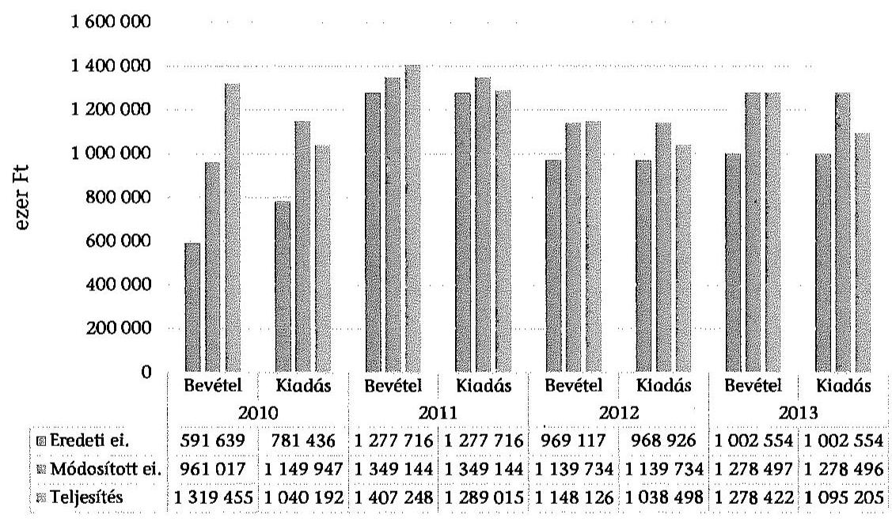
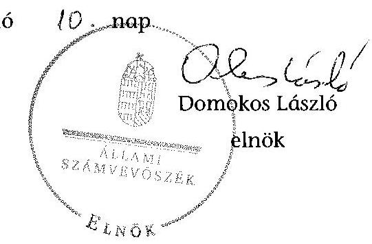
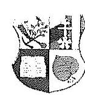
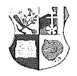
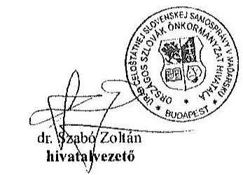
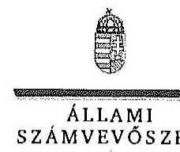
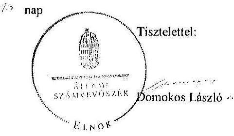

# ÁLLAMI   SZÁMVEVŐSZÉK 

## JELENTÉS

Az Országos Nemzetiségi Önkormányzatok gazdálkodásának ellenőrzéséről
Országos Szlovák Önkormányzat

---

# Állami Számvevőszék 

Iktatószám: V-0699-063/2015.
Témaszám: 1733
Vizsgálat-azonosító szám: V0680

## Az ellenőrzést felügyelte:

## Kisgergely István

felügyeleti vezető

## Az ellenőrzést vezette:

## Dr. Láng Ágnes Krisztina

ellenőrzésvezető
A számvevői jelentések feldolgozásában és a jelentés összeállításában közremüködtek:

## Dr. Láng Ágnes Krisztina

ellenőrzésvezető
Szikszainé Király Mária
számvevő tanácsos
Az ellenőrzést végezték:
Illésné Borsik Andrea Szikszainé Király Mária
számvevő számvevő tanácsos

---

# TARTALOMJEGYZÉK 

BEVEZETÉS ..... 3
I. ÖSSZEGZŐ MEGÁLLAPÍTÁSOK, KÖVETKEZTETÉSEK, JAVASLATOK ..... 7
II. RÉSZLETES MEGÁLLAPÍTÁSOK ..... 17

1. A belső kontrollrendszer kialakításának és múködtetésének megfelelősége ..... 17
1.1. A kontrollkörnyezet kialakítása ..... 17
1.2. A kockázatkezelési rendszer kialakításának és múködtetésének megfelelősége ..... 19
1.3. A kontrolltevékenységek múködésének megfelelősége ..... 20
1.4. Információs és kommunikációs rendszer kialakításának és múködtetésének megfelelősége ..... 22
1.5. Monitoring rendszer kialakításának és múködtetésének megfelelősége ..... 23
2. A gazdálkodás megfelelősége ..... 24
2.1. Pénzügyi gazdálkodás megfelelősége ..... 24
2.2. Vagyongazdálkodással kapcsolatos feladatellátás szabályszerűsége ..... 32
3. Ingyenesen juttatott vagyon kezelésének megfelelősége ..... 37
4. Egyéb feladat- és hatáskör ellátás szabályszerűsége ..... 37
5. Integritás kontrollok ..... 38
6. ÁSZ javaslatok hasznosulása ..... 38

## MELLÉKLETEK

1. számú Az Országos Szlovák Önkormányzat észrevétele
2. számú Az Országos Szlovák Önkormányzat észrevételére válasz

## FÜGGELÉKEK

1. számú Rövidítések jegyzéke
2. számú Az integritás kontrollok kialakítása és működtetése

---

.

---

# JELENTÉS 

## Az Országos Szlovák Önkormányzat gazdálkodásának ellenőrzéséről

## BEVEZETÉS

Az Országos Szlovák Önkormányzat 1995. április 12-én alakult. Jelenlegi Elnöke a 2014. évi országos nemzetiségi választások óta látja el feladatát. Az Önkormányzat az ellenőrzött időszak végén öt önállóan működő (Kutatóintézet, Dokumentációs központ, Színház, Közművelődési központ, Pedagógiai és módszertani központ, Tótkomlósi iskola) intézményt múködtetett, melynek gazdálkodási feladatait a 2007-ben alapított Hivatal látta el. A Tótkomlósi iskolát 2013 szeptemberétől vették át múködtetésre. A közoktatási feladatokat további három, önállóan működő és gazdálkodó intézményben (a békéscsabai, a szarvasi és a sátoraljaújhelyi iskolák) biztosították. Az Önkormányzat feladatainak ellátásában részt vett a 100\%-os önkormányzati tulajdonban lévő Legatum Kft. is. A társaság a tájházak múködtetését, az önkormányzati ingatlanok hasznosítását és a nemzetiségi sajtó működtetetését biztosította. Az Önkormányzat a 2010. évi választásokat követően a 29 tagú Közgyűlés munkája segítésére öt bizottságot hozott létre (Pénzügyi Ellenőrző, Kulturális, Nevelési-Oktatási, Ifjúsági, Hitéleti Bizottságokat). Az ellenőrzött időszakban a hivatalvezetői és a gazdasági vezetői feladatok ellátását munkaszerződés keretében biztosították. A Hivatalban foglalkoztatottak létszáma a 2014. évben 11,5 fő volt.

Az Önkormányzat költségvetési beszámolója szerint a 2013. évben a módosított költségvetési bevétel előirányzata 1170325 ezer Ft, a pénzmaradvány igénybevétel módosított előirányzata 108172 ezer Ft, a módosított költségvetési kiadás előirányzata 1278496 ezer Ft volt. A teljesített költségvetési bevétel 1170250 ezer Ft, az előző évi pénzmaradvány igénybevétel 108172 ezer Ft, a teljesített költségvetési kiadás 1095205 ezer Ft volt. Az Önkormányzat 2013. évben 1046191 ezer Ft államháztartásból származó támogatásban részesült.

Az Alaptörvény XXIX. cikk (1) bekezdése szerint a Magyarországon élő nemzetiségek államalkotó tényezők. Minden, valamely nemzetiséghez tartozó magyar állampolgárnak joga van önazonossága szabad vállalásához és megőrzéséhez. A hazánkban élő nemzetiségek helyi (települési és területi), valamint országos önkormányzatokat hozhatnak létre.

Az országos nemzetiségi önkormányzat gazdálkodási feladatait az önállóan múködő és gazdálkodó költségvetési szerve, a Hivatal látja el. Az országos nemzetiségi önkormányzatok a 2008. évtől tartoznak az államháztartás önkormányzati alrendszerébe, azóta hivatalaik költségvetési szervként múködnek. Az Alaptörvény hatálybalépését követően a 2012. évtől további jelentős jogszabályi változások határozzák meg múködésüket, gazdálkodásukat.

---

A nemzetiségek helyzete, támogatása mind hazai, mind EU-s szinten kiemelt figyelmet kap napjainkban. Az állam az országos nemzetiségi önkormányzatok múködéséhez, a médiaszolgáltatáshoz kapcsolódó jogaik érvényesítéséhez, valamint a kulturális önigazgatásuk érdekében alapított - közművelődési, közgyűjteményi, tudományos - intézmények fenntartásához az éves költségvetési törvényekben nevesítetten költségvetési támogatást biztosít. Ezen kívül az országos nemzetiségi önkormányzatok közfeladataik ellátásához támogatást kapnak a fejezeti kezelésű előirányzatokból, valamint hazai és uniós pályázati forrásokat szerezhetnek.

Az ellenőrzés célja annak értékelése volt, hogy az országos nemzetiségi önkormányzat gazdálkodása, a belső kontrollrendszer kialakítása és múködése, az államháztartásból nyújtott támogatás, illetve az államháztartásból meghatározott célra ingyenesen juttatott vagyon felhasználása a jogszabályi előírásoknak megfelelően történt-e; az önkormányzat a Nek. tv.-ben és az Njtv.-ben előírt fel-adat- és hatásköröket ellátta-e, intézkedett-e az ÁSZ által a 2008-2010. évek között végzett ellenőrzések javaslatainak végrehajtásáról.

Az országos nemzetiségi önkormányzat korrupcióval szembeni veszélyeztetettségének csökkentése érdekében felmértük az integritási szemlélet érvényesülését a gazdálkodási folyamatokban.

Értékeltük az önkormányzat gazdálkodása során a belső kontrollrendszer kialakítását és múködését mind az öt pillére tekintetében, ellenőriztük a gazdálkodással összefüggő feladat- és hatásköröknek, a hivatal múködési, gazdálkodási rendjének jogszabályi előírásoknak való megfelelőségét; a belső kontrollok múködésének megfelelőségét az éves költségvetés, a költségvetési beszámoló és a zárszámadás készítés folyamatában; a gazdálkodás pénzügyi folyamatában kulcsszerepet betöltő (szakmai) teljesítésigazolás és 2011-ig utalvány ellenjegyzés, 2012-től érvényesítés kontrolltevékenységek múködésének megfelelőségét; az önkormányzat belső ellenőrzése kialakításának és múködésének megfelelőségét.

Értékeltük továbbá az országos nemzetiségi önkormányzat gazdálkodása, ezen belül pénzügyi gazdálkodása keretében a tervezés, beszámolási, zárszámadáskészítési folyamat, az előirányzatok betartása, a könyvvezetés, a közzétételek, adatszolgáltatások, valamint az államháztartás rendszeréből jogszabály vagy megállapodás alapján céljelleggel kapott támogatások felhasználásának, elszámolásának szabályszerűségét. A vagyonnal kapcsolatos feladatellátás ellenőrzése keretében értékeltük a vagyongazdálkodás szabályozottságát, a mérleg alátámasztottságát, a leltározás, az eszközbeszerzések, a vagyonhasznosítás, a tulajdonosi joggyakorlás szabályszerűségét, kiemelten az országos nemzetiségi önkormányzat gazdasági társasága részére a vagyon tulajdonba, illetve kezelésbe, üzemeltetésbe adása, a tőkeemelés és a juttatott támogatások szabályszerűségét. Értékeltük az államháztartásból ingyenesen juttatott vagyon felhasználásának szabályszerűségét. Ellenőriztük az előírt feladat- és hatáskörök közül a véleménynyilvánítási, egyetértési jog gyakorlásával, a hatáskör átruházásokkal, az ideiglenes vagyonkezeléssel kapcsolatos feladatok ellátásának szabályszerűségét, az integritás kontrollok múködését, továbbá az előző ÁSZ ellenőrzés javaslatainak hasznosulását.

---

Az ellenőrzés várható hasznosulása: Az ellenőrzés eredményeként nemcsak az ellenőrzött szerv gazdálkodása javulhat, hanem átfogó képet kaphatunk az önkormányzati alrendszerbe tartozó országos nemzetiségi önkormányzatok gazdálkodásának hiányosságairól, de a jó gyakorlatokról is. Az ellenőrzés megállapításait és javaslatait más szervezetek is hasznosíthatják a rendezett gazdálkodási keretek kialakításához. Az ellenőrzés hozadékát képezi a 2008-2010. években elvégzett ÁSZ ellenőrzés javaslatai hasznosulásának értékelése. Mind a 13 országos nemzetiségi önkormányzat ellenőrzésével teljes körűen megvalósul az országos nemzetiségi önkormányzatok ellenőrzése a megváltozott jogszabályi környezetben. Az ellenőrzés tapasztalatai alapján a jogszabályi ellentmondások, hiányosságok feltárásával, azok megszüntetésére vonatkozó javaslatokkal segítjük a jó kormányzást. Az ellenőrzéssel lehetővé tesszük, hogy az országos nemzetiségi önkormányzatok gazdálkodásáról, működéséről a társadalom objektív képet alkothasson.

Az országos nemzetiségi önkormányzatok gazdálkodásának ellenőrzéséről szóló számvevőszéki jelentés I. fejezetének összegző része az ellenőrzés céljára adott rövid, szintetizáló összefoglalót és következtetéseket tartalmazza a II. fejezet részletes megállapításain alapulóan. A jelentés intézkedést igénylő megállapításait és javaslatait az ellenőrzés során feltárt, a jelentés II. fejezetében rögzített részletes megállapítások alapozzák meg.

Az ellenőrzés típusa: szabályszerűségi ellenőrzés.
Az ellenőrzött időszak: 2010. január 1 - 2014. június 30.
Ellenőrzött szervezet: az Országos Szlovák Önkormányzat és hivatala, továbbá azon intézmények, amelyek gazdálkodási feladatait a hivatal látja el.

Az ellenőrzés végrehajtásának jogszabályi alapját az Állami Számvevőszékről szóló 2011. évi LXVI. törvény 1. § (3) bekezdése, az 5. § (2)-(3) és (6) bekezdései, valamint az államháztartásról szóló 2011. évi CXCV. törvény 61. § (2) bekezdésének előírásai képezik.

Az ellenőrzés módszertana az ÁSZ hivatalos honlapján (www.asz.hu) közzétett szakmai szabályokon alapul, amely a Legfőbb Ellenőrző Intézmények Nemzetközi Szervezete (INTOSAI) által kiadott nemzetközi standardok (ISSAI) figyelembevételével készült.

Az ellenőrzés lefolytatásához az országos nemzetiségi önkormányzat a kimutatások és a tanúsítványok elektronikus kitöltésével, valamint az ÁSZ által kért dokumentumok elektronikus megküldésével szolgáltatott adatokat. Az így rendelkezésre bocsátott adatok, információk kontrollja és a munkalapok kitöltése az ellenőrzöttnél végzett ellenőrzés keretében történt.

A pénzügyi folyamatokban kulcsszerepet betöltő (szakmai) teljesítésigazolás és érvényesítés (2011-ig utalvány ellenjegyzése) kontrollok múködésének megfelelősége értékeléséhez az egyszerű véletlen mintavétellel kiválasztott tételek ellenőrzését megfelelőségi tesztek útján végeztük. A személyi juttatások, a dologi és felhalmozási kiadások, valamint a pénzeszközátadások felhasználásának szabályszerűségét, a céljelleggel kapott támogatások felhasználásának és elszámo-

---

lásának szabályszerűségét és a kiadások esetében a gazdálkodási jogkörök gyakorlását mintavétellel ellenőriztük. A vagyonhasznosítási célú bevételek esetében tételes ellenőrzést végeztünk.

A jogszabályoknak és a belső előírásoknak megfelelőnek, azaz szabályszerűnek tekintettük a céljelleggel kapott támogatások felhasználásának és elszámolásának szabályszerűségét, az ellenőrzött kiadási, illetve bevételi előirányzatok felhasználását, amennyiben a minta ellenőrzésének eredménye alapján $95 \%$-os bizonyossággal a teljes sokaságban a hibaarány kisebb volt, mint $10 \%$, nem megfelelőnek értékeltük, ha a hibaarány a $10 \%$-ot meghaladta. Megfelelőnek értékeltük a gazdálkodási jogkörök gyakorlását, amennyiben $95 \%$-os bizonyossággal a teljes sokaságban a hibaarány legfeljebb $10 \%$, részben megfelelőnek értékeltük, ha a hibaarány felső határa 10-30\% volt, nem megfelelőnek pedig akkor, ha a hibaarány felső határa a teljes sokaságban meghaladta a $30 \%$-ot.

Az ÁSZ a 2011. évi LXVI. törvény 29. §-a szerint a jelentéstervezetet megküldte az Országos Szlovák Önkormányzat elnökének egyeztetésre. A beérkezett észrevételt és az arra adott választ a jelentés 1-2. sz. mellékletei tartalmazzák

---

# I. ÖSSZEGZŐ MEGÁLLAPÍTÁSOK, KÖVETKEZTETÉSEK, JAVASLATOK 

Az Önkormányzat Hivatalánál a 2010-2014. I. félév között a belsö kontrollrendszer kialakítása és múködtetése összességében nem volt megfelelő.

A kontrollkörnyezet kialakítása nem felelt meg az Önkormányzat Hivatala múködését meghatározó jogszabályokban foglaltaknak, mivel a Hivatal SzMSzszel nem rendelkezett. A Hivatal szervezeti és múködési rendjét a Hivatali Úgyrend tartalmazta. A Hivatalvezető a Számv. tv.-ben és az Áhsz. ${ }_{1,2}$-ben előírtak ellenére 2011. augusztus 31 -éig nem határozta meg számviteli politikáját, továbbá 2011. szeptember 14-éig Leltározási, 2011. október 31-éig Értékelési szabályzatát. Az Önkormányzat Hivatala rendszeres bérbeadás mellett az Áhsz. ${ }_{1,2}$ ellenére nem rendelkezett az Önköltségszámítás rendjére vonatkozó szabályzattal. A Hivatalvezető - az Áhsz. ${ }_{1,2}$-ben foglalt előírások ellenére - 2014. március 27 -ig nem alakította ki a számlarendet.

Az operatív gazdálkodási jogkörökre vonatkozó belső szabályozás nem felelt meg az Ámr., illetve az Ávr. előírásainak. Nem határozták meg - 2012. december 1-jéig - a szakmai teljesítésigazolásra jogosultak körét, feladatait, valamint az ezeket végző személyek kijelölésének rendjével, és az ellenőrzési feladatok teljesítésével kapcsolatos belső előírásokat, feltételek rendjét. A gazdálkodási jogkörök gyakorlására jogosultakról naprakész nyilvántartás vezetését nem írták elő és nem is biztosították. A 2011. év első félévének végéig nem szabályozták az előzetes írásbeli kötelezettségvállaláshoz nem kötött kis összegű kifizetések eljárásrendjét.

A Hivatalvezető az Ámr. illetve a Bkr. előírását figyelmen kívül hagyva a szabálytalanságok kezelésének eljárásrendjét, valamint az etikai elvárásokat nem alakította ki. Az Ámr. és a Bkr. előírásai ellenére nem gondoskodott a Hivatal múködésének irányítási és ellenőrzési folyamatai, a felelősségi és információs szintek és kapcsolatok leírását tartalmazó ellenőrzési nyomvonal elkészítéséről.

A Hivatalvezető az Ámr. és a Bkr. előírásai ellenére nem működtetett kockázatkezelési rendszert.

A kontrolltevékenységek kialakítása és múködtetése nem felelt meg az előírásoknak. Az éves költségvetés, a költségvetési beszámoló és a zárszámadás készítésének folyamatában a belső kontrolleljárásokat az Ámr. és a Bkr. rendelkezéseitől eltérően nem alakították ki és nem működtették. A 2010-2011. években a szakmai teljesítésigazolás és az utalvány ellenjegyzés, a 2012-2014. I. félévben a teljesítésigazolás és az érvényesítés gyakorlata nem felelt meg az Ámr., illetve az Ávr. előírásainak.

Az információs és kommunikációs rendszer kialakítása és működtetése részben felelt meg a jogszabályi előírásoknak, mivel az Avtv., az Info tv. és az Ávr. előírásától eltérően nem szabályozták a kötelezően közzéteendő adatok nyilvánosságra hozatalának, valamint a közérdekú adatok megismerésére irányuló igények teljesítésének rendjét, és nem készítették el a Hivatal adatvédelmi

---

és adatbiztonsági szabályzatát. Az Önkormányzat az ellenőrzött időszakban Iratkezelési szabályzattal ${ }_{1,2}$, továbbá a 2012. évtől Informatikai biztonsági szabályzattal rendelkezett. A dokumentumokhoz és információkhoz való hozzáférés jogosultságait és a hozzáféréssel kapcsolatos felelősségi köröket az Ámr. és a Bkr. szabályozása ellenére nem határozták meg.

A Hivatalvezető az Eisztv.-ben, illetve az Info tv.-ben előírtak ellenére nem teljes körűen intézkedett az általános közzétételi listában előírt adatok honlapon történő közzétételére. Nem gondoskodott továbbá - a 28/2012. (III. 6.) Korm. rendeletben, illetve 428/2012 (XII. 19.) Korm. rendeletben foglalt előírás ellenére a 2012-2014. I. félévek között kapott céljellegű támogatásoknak az Önkormányzat honlapján történő közzétételéről.

Az Önkormányzat monitoring rendszerének kialakítása és múködtetése nem volt szabályszerű. A Hivatalvezető - az Áht. ${ }_{1}$ és a Bkr. előírásaival szemben nem alakította ki a Hivatal tevékenységének, a célok megvalósításának nyomon követését biztosító rendszert. Az ellenőrzött időszakban a belső ellenőrzési feladatok ellátásáról külső szolgáltató megbízása útján gondoskodtak. A 2010. évben a Ber. előírásait figyelmen kívül hagyva éves ellenőrzési tervet nem készítettek, a stratégia tervet a Ber. és Bkr. előírása ellenére a Hivatalvezető helyett az Elnök hagyta jóvá. Az ellenőrzött időszakban az ellenőrzésekről nyilvántartást nem vezettek. A belső ellenőr tevékenységét a Ber.-ben, illetve a Bkr.-ben meghatározottak ellenére nem a Hivatalvezetőnek, hanem az Elnöknek alárendelve végezte.

Az Önkormányzat pénzügyi gazdálkodása részben felelt meg az előírásoknak. A költségvetési határozat-tervezeteket a Hivatalvezető a 2010-2012. években az Ámr., valamint az Ávr. előírásai ellenére a költségvetési szervek vezetőivel nem egyeztette. Az Elnök a 2010. és a 2011. évi költségvetési határozatok tervezetét az Ámr.-ben és az Áht. ${ }_{1}$-ben foglalt határidőt követően nyújtotta be a Közgyűlésnek. A 2010. évben az Ámr.-ben foglaltak ellenére a Közgyűlés elé terjesztett költségvetési határozat-tervezethez nem csatolták a könyvvizsgáló írásos jelentését. A 2010-2014. évi költségvetési határozat-tervezetek nem az Ámr.-ben, illetve az Áht. ${ }_{2}$-ben meghatározott szerkezetben és tartalommal készültek. A 2010-2012. években az Áht. ${ }_{1,2}$ előirányzatokon belüli gazdálkodásra vonatkozó előírásai ellenére az Önkormányzat egyes teljesített kiadásai meghaladták a Közgyűlés által jóváhagyott kiemelt előirányzatokat. A Hivatalvezető a 20102013. években nem teljes körűen építette be a zárszámadási határozat-tervezetekbe az Ámr.-ben, illetve az Áht. ${ }_{2}$-ben meghatározott kötelező tartalmi elemeket. A Hivatalvezető az időszaki költségvetési-jelentés, valamint időközi mérlegjelentés készítési kötelezettségének a 2012. évben és a 2014. év I. félévében - az Ávr.-ben meghatározott időponthoz képest - késedelemmel tett eleget.

Az Önkormányzat a 2010-2013. években összesen 920400 ezer Ft múködési(azon belül média) és intézményi támogatásban részesült a központi költségvetésből. Az általa fenntartott közoktatási intézmények a feladatmutatók alapján kapott normatív állami hozzájáruláson felül pályázat útján 2010-2013. években további 291450 ezer Ft intézményi kiegészítő támogatásban részesültek. A Hivatal a működési és intézményi támogatásokról 2011-2013. években, illetve azok felhasználásáról 2013. november 20-ától elkülönített számviteli nyilvántartást nem vezetett. A kapott pénzeszközöket a támogatási előírásoknak megfelelően használták fel.

---

Az elnyert céljellegú támogatások felhasználása és elszámolása során az Önkormányzat részben tartotta be a jogszabályi és szerződéses előírásokat. Kettő támogatás esetében a cél szerinti felhasználás teljes körűen nem volt biztosított. A kapott céljellegű támogatásokkal kapcsolatos közzétételi kötelezettségét a Nek. tv.-ben és a támogatási szerződésekben foglaltak ellenére az Önkormányzat nem teljesítette.

Az ellenőrzött időszakban az Önkormányzat által államháztartási forrás terhére pályázat, vagy kérelem alapján nyújtott céljellegü támogatások odaítéléséről az arra hatáskörrel rendelkező szerv, a Közgyűlés döntött. A támogatási célok összhangban voltak a Nek. tv-ben, illetve az Njtv.-ben meghatározott nemzetiségi feladatokkal. Elszámolási kötelezettségüket a támogatott önkormányzatok, költségvetési szervek és civil szervezetek határidőben teljesítették. A 2014. évi pályáztatáskor a 2013. szeptember 25-től jóváhagyott pályázati szabályzatban foglalt előírásokat nem tartották be, mert a támogatott szervezetekkel nem kötöttek szerződéseket.

Az Önkormányzat vagyongazdálkodási tevékenysége részben volt szabályszerű. Az Önkormányzat az Nvtv. hatályba lépését követően nem vizsgálta felül a forgalomképtelennek minősülő törzsvagyonát, a Nek. tv., illetve az Njtv. előírásai ellenére a 2012. év végéig nem határozta meg vagyonleltárát, az Áhsz. ben foglaltak ellenére 2011. március 9-ig nem szabályozta a vagyonkimutatás tartalmi követelményeit. Az Nek. tv., az Áht., és az Njtv. előírásai ellenére nem határozta meg azt a vagyoni kört, amelyre vagyonkezelői jog létesíthető, továbbá a vagyonkezelői jog megszerzésének, gyakorlásának és ellenőrzésének részletes szabályait. Az Áht. ${ }_{1}$ és a vagyongazdálkodási határozat 6.5. pontjában foglaltak ellenére a Hivatalvezető nem határozta meg a vagyonkezelő adatszolgáltatási kötelezettségének módját, formáját. Az Áht. ${ }_{1,2}$-ben előírtak ellenére a követelésről történő lemondás módját és eseteit nem szabályozta.

Az Áhsz. ${ }_{1}$-ben foglalt előírás ellenére évenkénti leltározási kötelezettségüknek nem megfelelően tettek eleget, mivel a két évenkénti mennyiségi felvétellel történő leltározást a Közgyűlés egyetértő határozata nélkül gyakorolták. Az értékeléseket a mérlegsorokhoz kapcsolódóan elvégezték. A mérlegben a szállítói állományt hiányosan tüntették fel, továbbá az Áhsz. ${ }_{1}$-ben foglaltak ellenére nem vették nyilvántartásba a jogszabály alapján szakmai nyilvántartásban nem szereplő képzőművészeti alkotás felhasználói jogát. A 2011. évi beszámolóban sérült a Számv. tv.-ben rögzített folytonosság alapelv, mert az Önkormányzat mérlegének nyitó adatai a 2011. évben nem egyeztek meg az előző év záró adatával.

Az eredményszemléletű számvitelre való áttérés keretében az Önkormányzat hiányosan tett eleget a tényleges mennyiségi felvétellel történő leltározási kötelezettségének, mert nem teljes körűen készítették el a kötelezettségvállalások leltározását, továbbá nem rendezték azokat a függő kiadásokat, amelyek azonosításához a szükséges feltételek nem álltak fenn.

A vagyonhasznosítás szabályszerűsége az ellenőrzött időszakban nem volt megfelelő, mert a Hivatal által kiállított számlák több mint felét a teljesítést követően, 16-45 napos késedelemmel állították ki. A bevételek 75,6\%-ánál a követelések nyilvántartásba vétele nem Áhsz. előírásainak megfelelően történt. A Közművelődési központ tótkomlósi ingatlanának rendszeres bérbeadásából

---

származó bevételek közel felénél a bevétellel az intézmény vezetője a pénzkezelési szabályzatban rögzítettek ellenére 30 napon belül nem számolt el. Az ingatlanokat a - Pilisi Szlovákok Központja kivételével - úgy adták bérbe, hogy a bérleti díjat a vagyongazdálkodási határozatban foglaltak ellenére nem a Közgyűlés határozta meg. A tárgyi eszközök értékesítéséről a vagyongazdálkodási határozatban foglaltakkal ellentétben nem a Közgyűlés döntött.

Az Önkormányzat 100\%-os tulajdonában lévő Legatum Kft. felett a tényleges múködés során a Közgyűlés gyakorolta a tulajdonost megillető jogokat.

A Legatum Kft. közhasznú feladatainak ellátására az Önkormányzat éves költségvetéseiben 8000 ezer Ft-ot hagyott jóvá, továbbá a 2011. évtől évente további 34800 ezer Ft támogatást adott a L'udové Noviny címú szlovák nemzetiségi ldp működtetésére. A nemzetiségi sajtó támogatására az Önkormányzat - a 2014. év kivételével - támogatási megállapodást kötött, melynek felhasználásáról szóló szakmai és pénzügyi beszámolót a megállapodásban foglaltak ellenére a Legatum Kft. nem készítette el. A gazdasági társaság éves pénzügyi beszámolóját a Közgyűlés minden évben, jellemzően májusban megtárgyalta, amelyben a Legatum Kft. beszámolt tevékenységéről és pénzügyi helyzete alakulásáról.

Az Önkormányzat az alakulásakor egyszeri vagyonjuttatásként kapott ingatlant az előírásoknak megfelelően forgalomképtelen vagyonként tartotta nyilván. A fenntartói és múködtetői jog átvállalásával ingyenes használatába került az intézményi feladatellátását szolgáló ingó és ingatlan vagyon.

Az Önkormányzat törvényben előírt vélemény-nyilvánítási, egyetértési, közreműködési tevékenységét az ellenőrzött időszakban nem gyakorolta. Hatáskör átruházásról a 2011 júniusában döntött a Közgyűlés. A Nevelési-Oktatási Bizottságra ruházta a döntés jogát oktatási intézményeket érintő szakmai kérdésekben, továbbá a vagyongazdálkodási határozat alapján az Elnök gyakorolta az ellenőrzött időszakban a szabad pénzeszközök befektetésének jogát.

A megszűnt Budavári Szlovák Nemzetiségi Önkormányzat vagyona ideiglenesen az Önkormányzat vagyonkezelésébe került, annak kezelése során az Njtv. szabályait betartották.

Az ÁSZ a 2008-2010. években az Önkormányzatot érintően ellenőrzést nem végzett.

Az ÁSZ tv. 33. § (1) bekezdésében foglaltak értelmében a jelentésben foglalt megállapításokhoz kapcsolódó intézkedési tervet köteles az ellenőrzött szervezet vezetője összeállítani, és azt a jelentés kézhezvételétől számított 30 napon belül az ÁSZ részére megküldeni. Amennyiben az intézkedési tervet határidőben nem küldi meg a szervezet, vagy az nem elfogadható, az ÁSZ elnöke a hivatkozott törvény 33. § (3) bekezdés a)-b) pontjaiban foglaltakat érvényesítheti.

A helyszíni ellenőrzés megállapításainak hasznosítása mellett javasoljuk:

# az Elnöknek 

1. A Közgyűlés - a Vnytv. 4. § a) és d) pontjaiban foglaltak ellenére - a vagyonnyilatko-zat-tételre kötelezettek körét nem tüntette fel az SzMSz-ben.

---

Javaslat:
Intézkedjen az Önkormányzat SzMSz-e kiegészítése érdekében.

# a Hivatalvezetőnek 

1. A Hivatal kontrollkörnyezetének kialakítása nem volt megfelelő. A Hivatal szervezeti és müködési rendjét az Áht. 91. § (2) bekezdésében, illetve az Áht. 2 10. § (5) bekezdésében foglaltak ellenére SzMSz-ben nem határozták meg.

A gazdasági szervezet vezetőjének és alkalmazottainak feladat- és hatáskörét, a helyettesítés rendjét, valamint a gazdasági szervezet belső és külső kapcsolattartásának szabályait - az Ávr. 13. § (5) bekezdésének ellenére - sem a gazdasági szervezet 2012. január 1-jétől hatályos ügyrendje sem a Hivatal más szabályzata nem tartalmazta.

A 2014. január 1-jén hatályba lépett számviteli politika ${ }_{2}$ nem felelt meg a Számv. tv. 14. § (4) bekezdésének, mert nem tartalmazta, hogy mit tekint a számviteli elszámolás és értékelés szempontjából lényegesnek, nem lényegesnek, továbbá jelentősnek és nem jelentősnek. Az Értékelési szabályzat nem tartalmazta - az Áhsz. 8. § (17) bekezdés d) pontjában, illetve az Áhsz. 2 50. § (2) bekezdés b) pontjában foglaltak ellenére - követeléstípusonként a kis összegű követelések év végi értékelési elveit, és annak dokumentálási szabályait. A Hivatalvezető az Ámr. 20. § (3) bekezdés f), illetve az Ávr. 13. § (2) bekezdés e) pontját figyelmen kívül hagyva nem alakította ki a reprezentációs kiadások felosztásának, azok teljesítésének és elszámolásának szabályait. Az Önkormányzat és intézményei - az Áhsz. 8. § (4) bekezdés c) pontja és az Áhsz. 2 50. § (3) bekezdésének ellenére - nem rendelkeztek az ellenőrzött időszakban az önköltségszámítás rendjére vonatkozó szabályzattal.

A Hivatalvezető - az Ámr. 161. §-a (2011-től a 156. § (3) bekezdése), illetve a Bkr. 6. § (4) bekezdése előírását figyelmen kívül hagyva - nem készítette el a szabálytalanságok kezelésének eljárásrendjét.

A Hivatalvezető - az Ámr. 156. § (1) bekezdés c) pontjában és a Bkr. 6. § (1) bekezdés c) pontjában foglalt kötelezettsége ellenére - nem határozta meg az etikai elvárásokat.

A Hivatalvezető - az Ámr. 156. § (2) bekezdése és a Bkr. 6. § (3) bekezdése előírásaitól eltérően - nem készítette el a Hivatal felelősségi és információs szintjeit és kapcsolatait, az irányítási és ellenőrzési folyamatokat leíró ellenőrzési nyomvonalát.

Javaslat:
a) Intézkedjen a Hivatal szervezeti és müködési szabályzatának elkészítéséről és kiadmányozásáról.
b) Intézkedjen a gazdasági szervezet vezetője és alkalmazottai feladat- és hatáskörének, a helyettesítésük rendjének, valamint a gazdasági szervezet belső és külső kapcsolattartása szabályainak meghatározásáról.
c) Intézkedjen a számviteli politika és az értékelési szabályzat kiegészítéséről, határozza meg a reprezentációs kiadások felosztásának, azok teljesítésének és elszámolásának szabályait, valamint készítse el az Önkormányzat és intézményei önköltségszámításának rendjéről szóló szabályzatot.

---

d) Intézkedjen a szabálytalanságok kezelése eljárásrendjének elkészítéséről.
e) Intézkedjen az etikai elvárások meghatározásáról.
f) Intézkedjen az ellenőrzési nyomvonal elkészítéséről.
2. A Hivatalvezető - az Ámr. 157. § (1) bekezdésében, illetve a Bkr. 7. § (1) bekezdésében foglalt előírás ellenére - nem alakította ki és nem működtette a Hivatal kockázatkezelési rendszerét.

Javaslat:
Intézkedjen a Hivatal kockázatkezelési rendszerének kialakításáról és működtetéséről.
3. A kontrolltevékenységek kialakítása és működtetése nem volt megfelelő. Az érvényesítő a bizonylatok több mint negyedénél - az Ávr. 58. § (1) bekezdésében előírtak ellenére - az összegszerűség és a fedezet meglétének az ellenőrzését nem végezte el.

A 2013. évben és 2014. év I. félévében a teljesítésigazolást - az Ávr. 57. § (1) bekezdésében foglaltak ellenére - a kifizetések közel felénél nem végezték el.

Javaslat:
Intézkedjen a gazdálkodási jogkörök szabályszerű gyakorlásának érvényesítéséről.
4. Az információs és kommunikációs rendszer kialakítása és működtetése részben volt megfelelő. A Hivatalvezető nem szabályozta - az Info tv. 35. § (3) bekezdésében, illetve az Ávr. 13. § (2) bekezdés h) pontjában előírtakkal ellentétben - a kötelezően közzéteendő adatok nyilvánosságra hozatalának rendjét, valamint nem szabályozta a közérdekű adatok megismerésére irányuló igények teljesítésének rendjét, ezáltal nem tett eleget az Avtv. 20. § (8) bekezdésében, az Info tv. 30. § (6) bekezdésében, valamint az Ávr. 13. § (2) bekezdés h) pontjában foglalt előírásoknak.

Az Önkormányzat az Eisztv. 6. § (1) bekezdésében, illetve az Info tv. 37. § (1) bekezdésében meghatározott kötelezettségének nem tett eleget, mivel a Hivatalvezető nem gondoskodott az általános közzétételi listában előírt adatok teljes körű közzétételéről. Elmaradt továbbá - a 28/2012. (II. 6.) Korm. rendelet 12. § (5) bekezdésében, illetve a 428/2012. (XII. 19.) Korm. rendelet 13. § (2) bekezdésében foglalt előírás ellenére - az Önkormányzat 2012-2014. I. félévek között kapott céljellegű támogatásainak közzététele.

A Hivatalvezető nem készítette el az Avtv. 31/A. § (3) bekezdése, illetve az Info tv. 24. § (3) bekezdése előírásával ellentétben az adatvédelmi és adatbiztonsági szabályzatot.

A Hivatal iratkezelési és iktatási rendszere az lkr. 8. § (1)-(2) bekezdései, valamint a 14. § (4) bekezdése előírásaitól eltérően az ügyintézési folyamatok nyomon követését, az adatok védelmét nem biztosította. Az iratkezelési és iktatási rendszer nem megfelelő működtetéséből adódott, hogy a Hivatal nem tudta dokumentumokkal igazolni többek között a költségvetéseknek és beszámolóknak a kisebbségi politikáért felelős szervnek, valamint a zárszámadásnak a közzétételt biztosító szervezetnek történő megküldését. A Hivatalvezető - az Ámr. 158. § (2) bekezdés b) pontjában, valamint a

---

Bkr. 8. § (4) bekezdés b) pontjában foglaltak ellenére - belső szabályzatban nem határozta meg a dokumentumokhoz és információkhoz való hozzáférésre vonatkozóan a felelősségi köröket.

Javaslat:
a) Alakítsa ki a kötelezően közzéteendő adatok nyilvánosságra hozatalának és megismerésére irányuló igények teljesítésének rendjét.
b) Intézkedjen a jogszabályokban előírt adatok honlapon történő közzétételéről.
c) Intézkedjen a Hivatal adatvédelmi és adatbiztonsági szabályzatának elkészítéséről.
d) Intézkedjen az Iratkezelési szabályzat kiegészítéséről, abban határozza meg a dokumentumokhoz és információkhoz való hozzáférésre vonatkozóan a felelősségi köröket. Biztosítsa, hogy az iratok elküldésének időpontja az iratkezelés során teljes körűen rögzítésre kerüljön.
5. A monitoring rendszer kialakítása és müködtetése nem volt megfelelő. A Hivatalvezető - az Ámr. 160. §-ában, valamint a Bkr. 3. § e) pontjában és a 10. §-ában foglalt előírások ellenére - nem alakította ki a Hivatal tevékenységének, a célok megvalósításának nyomon követését biztosító rendszert. A belső ellenőrzési vezető nem vezetett nyilvántartást - a Ber. 32. § (1) bekezdése, illetve a, Bkr. 50. § (1) bekezdése ellenére a belső ellenőrzésekről, valamint - a Ber. 29/A. § (1) bekezdése, illetve a Bkr. 47. § (1) bekezdése ellenére - a belső ellenőrzési jelentések alapján tett intézkedések nyomon követéséhez.
a) Intézkedjen a Hivatal tevékenységének, a célok megvalósításának nyomon követését biztosító rendszer kialakításáról és müködtetéséről.
b) Intézkedjen a belső ellenőrzések nyilvántartásának, valamint a belső ellenőrzési jelentések alapján tett intézkedések nyomon követéséhez szükséges nyilvántartás vezetéséről.
6. A Hivatalhoz rendelt önállóan működő költségvetési szervek vezetői a belső kontrollrendszer minőségét az ellenőrzött időszakban - az Ámr. 217. § c) pontjában, illetve Bkr. 11. § (1) bekezdésében foglaltakat figyelmen kívül hagyva - nem értékelték.

Javaslat:
Intézkedjen, hogy a Hivatalhoz rendelt önállóan működő költségvetési szervek vezetői készítsenek nyilatkozatot az intézmény belső kontrollrendszerének minőségének értékeléséről.
7. Az ellenőrzött időszakban a Hivatalvezető az Önkormányzat költségvetési, illetve zárszámadási határozat-tervezetét hiányosan készítette el. A 2010-2014. évekről szóló költségvetési határozat-tervezete, illetve a 2010-2013. évi zárszámadási határozat-tervezete - az Ámr. 40. § (5) bekezdés b)-c) pontjai, illetve az Áht. 2 24. § (4) bekezdés b)-c) pontjai ellenére - nem tartalmazta a többéves kihatással járó döntések számszerúsítését, valamint a közvetett támogatásokat tartalmazó kimutatást. A 2013-2014. évek költségvetési határozat-tervezete - az Áht. 2 23. § (2) bekezdés a)-b) pontjaival ellentétesen - nem tartalmazta kötelező, önként vállalt és állami feladatok szerinti

---

bontásban az Önkormányzat és az általa irányított költségvetési szervek kiadásait, bevételeit és engedélyezett létszámát.

Javaslat:
Intézkedjen, hogy a jövőben a Közgyűlés elé terjesztendő költségvetés és zárszámadás határozat-tervezet teljes körűen tartalmazza a jogszabályban előírt tartalmi elemeket.
8. Az Önkormányzat az ellenőrzött időszakban az Ámr. 177. § (2) bekezdésében és az Áht. 2 84. § (1) bekezdésében biztosított egy pénzforgalmi számlán túl egy szlovákiai banknál rendelkezett devizaszámlával, valamint 2010-2011-ben még egy belföldi pénzintézetnél vezetett bankszámlát.

Javaslat:
Intézkedjen, hogy az Önkormányzat a fizetési számláját egy belföldi hitelintézetnél vagy a Kincstárnál vezesse.
9. A rendszeres személyi juttatások kifizethetőségét igazoló - a Munka tv. 1 140/A. § (1) bekezdés a) pontjában és (3) bekezdésében, illetve a Munka tv. 2 134. § (1) bekezdés a) pontjában és (2) bekezdésében előírt - munkaidő-nyilvántartást nem vezették.

Javaslat:
Intézkedjen a dolgozók munkaidő-nyilvántartásának vezetéséről.
10. A Hivatal a 2010-2011., valamint a 2013-2014. évi költségvetések eredeti előirányzatait a Közgyűlés által jóváhagyott összegtől eltérően szerepeltette a központi információs rendszerbe leadott elemi költségvetésekben. Az eltérések az Áht. 1 18. §-ában, illetve az Áht. 2 89. § (1) bekezdésében foglaltak ellenére a beszámolókban és zárszámadásokban is fennálltak.

Javaslat:
Intézkedjen, hogy az elemi költségvetésben és költségvetési beszámolóban feltüntetett adatok egyezősége biztosított legyen a Közgyűlés által elfogadott költségvetéssel, illetve zárszámadással.
11. Az Önkormányzat az irányítása alá tartozó költségvetési szervek - az Áhsz. 10. § (8) bekezdésében foglaltak ellenére - 2010-2013. évi elemi költségvetési beszámolóit az Áhsz. 1 10. § (1) bekezdésében foglalt - a költségvetési évet követő év február 28ai - határidő lejártát követő 8 , illetve 10 munkanapon belül nem nyújtotta be a kisebbségpolitikáért felelős miniszternek.

A Hivatal az Áht. 2 108. § (2) bekezdésben foglaltak alapján az Ávr. 169. §-ában meghatározott időpontban a költségvetési-jelentés, valamint az Ávr. 170. § (2) bekezdésében foglalt időközi mérlegjelentés készítési kötelezettségének a 2012. évben és a 2014. év l. félévében a meghatározott határidőkre nem tett eleget.

Javaslat:
Intézkedjen a kisebbségpolitikáért felelős miniszter és a Kincstárnak részére szolgáltatandó adatok határidőben való megküldéséről.

---

12. A fejezeti kezelésű előirányzatokból kapott önkormányzati és intézményi müködési, illetve médiatámogatásokról az Önkormányzat a 2011-2014. években nem vezetett elkülönített számviteli nyilvántartást a 342/2010. (XII. 28.) Korm. rendelet 10. § (2), a 28/2012. (III. 6.) Korm. rendelet 11. § (2), illetve a 428/2012. (XII. 29.) Korm. rendelet 10. § (4) bekezdésben foglaltak ellenére.

Javaslat:
Intézkedjen a fejezeti kezelésű előirányzatokból kapott önkormányzati és intézményi, illetve médiatámogatások felhasználásával kapcsolatos elkülönített számviteli nyilvántartás vezetéséről.
13. Az Önkormányzat a törzsvagyonba tartozó vagyonelemek körét, a vagyon használatának és hasznosításának szabályait nem az Nvtv. 9. § (1), 18. § (1) és 124. § (2) bekezdése, a Nek. tv. 37. § (1) bekezdés c) pontja és 60/A. § (3)-(5) bekezdése, az Njtv. 113. § c) pontja, 124. § (2) bekezdése és a 125. §-a, illetve az Áht. 105/A-105/D. §ai, valamint az Áhsz. 44/A. § (2) bekezdése szerinti előírásoknak megfelelően határozta meg.

Javaslat:
Intézkedjen a törzsvagyonba tartozó vagyonelemek körének, a vagyon használatának és hasznosításának szabályainak, valamint a közép- és hosszú távú vagyongazdálkodási terv elkészítéséről, és kezdeményezze azok Közgyűlés elé terjesztését.
14. A 2013. évre vonatkozóan a vagyonkezelésbe adott eszközök mérleg szerinti értékét az Áhsz. 37. § (4) bekezdésében előírtak ellenére nem a kezelést végző szerv (az Önkormányzat önállóan működő költségvetési szerve, a Közművelődési központ) által készített hitelesített leltárral támasztották alá, hanem azt a Hivatal az egyeztetés módszerével leltározta.

A 2011. és 2013. években végzett mennyiségi leltárfelvétel során nem a szabályzatban előírt leltárfelvételi íveket használták. Az összesítő kimutatásokat nem az előírt formában és tartalommal, és nem teljes körűen készítették el. Hiányoztak az aláírások, és az egyeztetés megtörténtét igazoló, a felelősök által tett nyilatkozatok. A 2011. évben nem, a 2013. évben nem a szabályzatban előírt formában készítették el a leltározási jegyzőkönyvet.

Javaslat:
Intézkedjen, hogy a vagyonkezelésbe adott eszköz leltározását a vagyonkezelésbe vevő intézmény végezze, valamint a leltározás szabályszerű végrehajtásáról.
15. Az Önkormányzat a szállítók analitikus nyilvántartását nem az Áhsz. 26. § (1) bekezdésében foglaltaknak, valamint az Áhsz. 9. számú melléklete 4. pontja db) előírásának megfelelően vezette.

Az Áhsz. 15. § (2) bekezdésben foglaltakkal ellentétben a mérlegben nem mutatták ki a jogszabály alapján szakmai nyilvántartásban nem szereplő képzőművészeti alkotás felhasználói jogának értékét.

---

Az Áhsz. 31. § előírását figyelmen kívül hagyva a Hivatal a részesedések értékvesztése feltételeinek fennállását - gazdasági társasága veszteséges gazdálkodása ellenére nem vizsgálta, így a részesedésre értékvesztés elszámolás nem történt.

A 2010-2013. években a követelések nyilvántartásba vétele nem felelt meg az Áhsz. 22. § (1) bekezdés előírásának. A Hivatal a bevételeket követelésként nem a teljesítéskor, illetve a számla kibocsátásakor, hanem a bevétel pénzforgalmi realizálásakor vette nyilvántartásba.

Javaslat:
Biztosítsa, hogy az a számviteli elszámolások során betartásra kerüljenek a jogszabályi előírások.
16. A vagyonhasznosítási tevékenység szabályszerűségét nem megfelelőnek értékeltük a következők miatt:

A vagyongazdálkodási határozat 8. § (8) bekezdésével ellentétesen az ingatlanokat úgy adták bérbe, hogy a bérleti díjat nem a Közgyűlés határozta meg.

A tárgyi eszközök (gépjárművek) értékesítéséről a Nek. tv. 39/A. § (1) bekezdésében, illetve az Njtv. 119. § (1) bekezdésében és a vagyongazdálkodási szabályzat 8. § (9) bekezdésében foglaltak ellenére nem a Közgyűlés, hanem hatáskör átruházás nélkül az Elnök döntött.

Javaslat:
Intézkedjen, hogy a vagyonhasznosítási tevékenység során a jogszabályoknak és belső szabályoknak megfelelően az arra jogosult hozzon döntést.

---

# II. RÉSZLETES MEGÁLLAPÍTÁSOK 

## 1. A BELSŐ KONTROLLRENDSZER KIALAKÍTÁSÁNAK ÉS MŰKÖDTETÉSÉNEK MEGFELELŐSÉGE

Az ellenőrzött időszakban az Önkormányzat Hivatalánál a belsö kontrollrendszer (a kontrollkörnyezet, a kockázatkezelési rendszer, a kontrolltevékenységek, az információs és kommunikációs rendszer és a monitoring rendszer) kialakítása és múködtetése nem volt szabályszerű az alábbiakban részletezett szabályozásbeli és múködésbeli hibák, hiányosságok miatt.

### 1.1. A kontrollkörnyezet kialakítása

Az Önkormányzat a Nek. tv és az Njtv. előírásainak megfelelő SzMSz-szel rendelkezett, amelyet az ellenőrzött időszakban a Közgyűlés négyszer módosított. Az Önkormányzat részben tett eleget közzétételi kötelezettségének, mert a Nek. tv. 39/G. § (4) bekezdése ellenére a 2011. szeptember 24-ei módosítását a Magyar Közlönyben nem tette közzé.

A Közgyűlés - a Vnytv. 4. § a) és d) pontjaiban foglaltak ellenére - a vagyonnyi-latkozat-tételre kötelezettek körét nem tüntette fel az SzMSz-ben. A szabályozás hiánya ellenére a képviselők, a Nek. tv. és az Njtv. előírásainak eleget téve, az ellenőrzött időszak minden évében megtették vagyonnyilatkozatukat.

A Hivatal szervezeti és múködési rendjét az Áht. ${ }_{1} 91 . \S$ (2) bekezdésében, illetve az Áht. ${ }_{2} 10 . \S$ (5) bekezdésében foglaltak ellenére SzMSz-ben nem határozták meg. Az Önkormányzat SzMSz-ének 4. számú mellékletét képező Hivatali Úgyrend 2008. február 27-étől lépett hatályba, melyet 2012. november 28án egy alkalommal módosítottak.

A Hivatal gazdasági szervezettel 2012. január 1-jétől rendelkezett, amelynek ügyrendjét az arra jogosult Hivatalvezető hagyta jóvá. A gazdasági szervezet 2012. január 1-jétől hatályos ügyrendje az Ávr. 13. § (5) bekezdésének nem felelt meg, mert nem tartalmazta a gazdasági szervezet vezetőjének és alkalmazottainak feladat és hatáskörét, a helyettesítés rendjét, a gazdasági szervezet belső és külső kapcsolattartásának szabályait. Ezekről SzMSz és más szabályzat sem rendelkezett. Az ellenőrzött időszak teljes időtartama alatt a Hivatalnak kinevezett gazdasági vezetője volt.

Az ellenőrzött időszakban a Hivatalvezetőt és a gazdasági vezetőket munkaszerződéssel foglalkoztatták, akik rendelkeztek a Nek. tv., az Ámr. és az Ávr. előírásainak megfelelő végzettséggel. A Hivatal dolgozói - a Munka tv. ${ }_{1,2}$ előírásainak megfelelően - rendelkeztek a feladatokat meghatározó munkaköri leírásokkal.

Az Ámr. 16. § (4) bekezdésében előírtakat figyelmen kívül hagyva a gazdálkodási feladatok megosztását rendező együttmúködési megállapodás a Hivatal és az önállóan működő intézmények között 2011. március 7 -éig nem volt. Az Ávr. előírásainak megfelelő, a Hivatal és intézményei közötti munkamegosztás

---

és felelősségvállalás rendjét tartalmazó munkamegosztási megállapodás 2012. szeptember 26-ától érvényes.

Az Önkormányzat Hivatala gazdálkodásának szabályozottsága az ellenőrzött években az előírásoknak részben felelt meg, mert:

- Az Áhsz. 1 8. § (3)-(4) és a Számv. tv. 14. § (3)-(4) bekezdéseiben foglaltak ellenére 2011. augusztus 31-éig nem készített számviteli politikát. A 2014. január 1-jén hatályba lépett számviteli politika2 nem felelt meg a Számv. tv. 14. § (4) bekezdésének, mert nem tartalmazta, hogy mit tekint a számviteli elszámolás és értékelés szempontjából lényegesnek, nem lényegesnek, továbbá jelentősnek és nem jelentősnek. A 2011. szeptember 1-jétől 2013. december 31ig hatályos számviteli politika1 esetében ezek a hiányosságok nem álltak fenn.
- A számviteli politikához kapcsolódóan - Az Áhsz. 1 8. § (4) bekezdés a) és b) pontjaiban foglaltak ellenére - 2011. év őszéig az Önkormányzat Hivatala nem rendelkezett Leltározási és Értékelési szabályzattal. A Leltározási szabályzat 2011. év szeptember 15-étől, az Értékelési szabályzat 2011. november 1jétől lépett hatályba. Az Értékelési szabályzat nem tartalmazta az Áhsz. 1 8. § (17) bekezdés b), c), d), illetve az Áhsz. 2 50. § (2) bekezdés a) és b) pontjaiban foglaltak szerint az elismert követelések meghatározásának módját, nyilvántartásának rendjét, az adósok minősítési szempontjait, követeléstípusonként a kis összegű követelések év végi értékelési elveit, és annak dokumentálási szabályait. Az Önkormányzat Hivatala az Áhsz. 1 8. § (4) bekezdés c) pontja és (15) bekezdése, valamint az Áhsz. 2 50. § 3) bekezdésében foglaltak ellenére nem rendelkezett az önköltségszámítás rendjére vonatkozó szabályzattal1. Az Önkormányzat az ellenőrzött időszakban az Áhsz.1,2 és a Számv. tv. előírásainak megfelelő pénzkezelési1,2 szabályzattal rendelkezett.
- Az Áhsz. 1 49. § (1) bekezdésében, illetve az Áhsz. 251 § (2) bekezdésében foglaltak ellenére 2014. március 27-ig a Hivatal nem rendelkezett számlarenddel.

A gazdálkodási jogköröknek a kötelezettségvállalási szabályzat ${ }_{1-3}$-ban és a Gazdálkodási szabályzatban történő szabályozása az ellenőrzött időszakban részben felelt meg a jogszabályi előírásoknak.

Az Ámr. 20. § (3) bekezdés a) pontjában, a 75-76. §-aiban és a 80. § (3) bekezdésében, illetve az Ávr. 13. § (2) bekezdés a) pontjában, az 56-57. §-aiban és a 60. § (3) bekezdésében foglaltak ellenére, a Gazdálkodási szabályzat hatályba lépéséig - 2012. december 1-jéig - nem rögzítették a szakmai teljesítésigazolásra (2012től a teljesítésigazolásra) jogosultak körét, feladatait, valamint az ezeket végző személyek kijelölésének rendjével, és az ellenőrzési feladatok teljesítésével kapcsolatos belső előírásokat, feltételeket, a jogosultakról naprakész nyilvántartás vezetését nem írták elő és nem is biztosították. Az Ámr. 72. § (13)-(14) bekezdéseiben foglaltak ellenére 2011. július 1-jéig a gazdasági eseményenként a 100 ezer Ft-ot el nem érő, kis összegű kifizetések rendjét belső szabályzatban nem

[^0]
[^0]:    ${ }^{1}$ A Hivatal és az intézmények rendszeresen végezték a bérbe adást, mint szolgáltatásnyújtást.

---

határozták meg. Az ellenőrzött időszak végén hatályos szabályozás megfelelt a jogszabályi előírásoknak.

Az Ámr. és az Ávr. előírásának megfelelően beszerzések elszámolásának és versenyeztetésének eljárásrendjét, a közbeszerzések lebonyolításával kapcsolatos eljárásokat szabályozták. Meghatározták továbbá az Ámr. és az Ávr. előírásai szerint 2011. október 17-től a kiküldetési és közlekedési költségtérítési szabályokat, 2011. január 1-jétől a telefonhasználat szabályait, 2012. január 1-jétől a gépjárművek használatának szabályait.

A Hivatalvezető az Ámr. 20. § (3) bekezdés f), illetve az Ávr. 13. § (2) bekezdés e) pontját figyelmen kívül hagyva nem alakította ki a reprezentációs kiadások felosztásának, azok teljesítésének és elszámolásának szabályait, az Ámr. 161. §² és a Bkr. 6. § (4) bekezdés előírásaitól eltérően nem alakította ki a szabálytalanságok kezelésének eljárásrendjét.

A Hivatalvezető - az Ámr. 156. § (2) bekezdése és a Bkr. 6. § (3) bekezdése előírásaitól eltérően - nem gondoskodott a Hivatal múködésének irányítási és ellenőrzési folyamatai, a felelősségi és információs szintek, kapcsolatok leírását tartalmazó ellenőrzési nyomvonal elkészítéséről.

A kontrollkörnyezet kialakításának keretében az Ámr. 156. § (1) bekezdés c) pontjában és a Bkr. 6. § (1) bekezdés c) pontjában foglalt kötelezettsége ellenére a Hivatalvezető az etikai elvárásokat nem határozta meg.

A Közgyűlés 2010-2012. években nem rögzítette intézményei tekintetében az erőforrásokkal való szabályszerű és hatékony gazdálkodáshoz szükséges követelményeket, ezáltal 2012. január 1-jétől az Áht. 2 9. § (1) bekezdés f) pontja előírásától eltérően azokat nem érvényesítette.

# 1.2. A kockázatkezelési rendszer kialakitásának és müködtetésének megfelelősége 

A kockázatkezelési rendszer müködtetése az ellenőrzött időszakban az Ámr. 157. § (1) bekezdése, valamint a Bkr. 3. § b) pontja és 7. § (1) bekezdése előírásától eltérően nem történt meg.

A Hivatalvezető - az Ámr. 157. § (2)-(3) bekezdésében, a Bkr. 7. § (2) bekezdésében foglalt előírás ellenére - nem mérte fel és nem állapította meg a Hivatal tevékenységében, gazdálkodásában rejlő kockázatokat és nem határozta meg az egyes kockázatokkal kapcsolatban a szükséges intézkedéseket, valamint azok teljesítése folyamatos nyomon követésének módját.

[^0]
[^0]:    ${ }^{2}$ 2011. január 1-jétől a 156. § (3) bekezdés

---

# 1.3. A kontrolltevékenységek múködésének megfelelősége 

A Hivatalvezető a kontrolltevékenységekkel kapcsolatos szabályozási kereteket nem megfelelően alakította ki, emiatt a kontrolltevékenységek az ellenőrzött időszakban nem müködtek megfelelően.

Az éves költségvetés, a költségvetési beszámoló és a zárszámadás készítésének folyamatában a belsö kontrollokat nem alakították ki. A Hivatalvezető az Ámr. 158. § (2) bekezdés b) pontjában, valamint a Bkr. 8. § (4) bekezdés b) pontjában foglaltak ellenére - belső szabályzatban nem határozta meg a dokumentumokhoz és információkhoz való hozzáférésre vonatkozóan a felelősségi köröket.

A 2010. évben az Áht. 121. § (1) bekezdése, a 2011. évben az Áht. 121/A. § (4) bekezdése, 2012-től kezdődően a Bkr. 8. § (2) bekezdése előírásától eltérően a Hivatalvezető nem biztosította a folyamatba épített előzetes, utólagos és vezetői ellenőrzést a pénzügyi döntések dokumentumainak elkészítése, a költségvetési gazdálkodás pénzügyi ellenőrzése, valamint a gazdasági események szabályszerű elszámolása során.

A költségvetési beszámoló elkészítésével megbízott személy rendelkezett a Számv. tv. és az Ávr. által előírt képesítéssel. Az ellenjegyző, majd - 2012-től - a pénzügyi ellenjegyző végzettsége megfelelt az Ámr.-ben, illetőleg az Ávr.-ben előírtaknak. Az érvényesítésre kijelölt személyek közül azonban 2013-ban egy fő az Ávr. 55. § (3) bekezdésében foglaltakkal ellentétesen, pénzügyi-számviteli végzettség hiányában gyakorolta az érvényesítési feladatot.

A 2010-2011. években a személyi juttatások, a dologi és a felhalmozási kiadások, valamint a pénzeszközátadások kifizetései során a pénzügyi folyamatokban kulcsszerepet betöltő szakmai teljesítésigazolás és utalvány ellenjegyzés kontrollok múködése nem volt megfelelő. A mintatételek ellenőrzése alapján a szakmai teljesítésigazolás és az utalvány ellenjegyzés gyakorlása során az alábbi hiányosságok, szabálytalanságok fordultak elő:

- az összes kiadásra vonatkozóan a szakmai teljesítésigazolást az Ámr. 76. § (1) és (3) bekezdésében foglalt előírást figyelmen kívül hagyva nem végezték el;
- az utalvány ellenjegyzője az Ámr. 74. § (5) bekezdésében és 79. § (2) bekezdésében előírt kötelezettsége ellenére nem jelezte az utalványozónak, hogy az Áht. $1100 /$ C. § (3) bekezdésben foglaltakat figyelmen kívül hagyva írásbeli kötelezettségvállalás nem történt, illetve az írásbeli kötelezettségvállalásokat nem előzte meg azok ellenjegyzése, továbbá nem győződött meg arról, hogy a szakmai teljesítésigazolást elvégezték-e, így nem jelezte az utalványozónak, hogy a szakmai teljesítésigazolás elmaradt.

A 2012- 2014. év I. félévben a személyi juttatások, a dologi és a felhalmozási kiadások, valamint a pénzeszközátadások kifizetései során a pénzügyi folyamatokban kulcsszerepet betöltő teljesítésigazolás és érvényesítés kontrollok múködése javuló tendenciát mutatott, de egyik évben sem volt megfelelő.

---

A mintatételek ellenőrzése alapján a teljesítésigazolás és érvényesítés gyakorlása során a következő hiányosságok, szabálytalanságok fordultak elő:

- 2012-ben a kifizetéseket megelőzően a teljesítésigazoló a feladatait - az Ávr. 57. § (3)-(4) bekezdéseiben foglaltakkal szemben - szabályozás és kijelölés hiánya miatt nem látta el3;
- a 2013. és 2014. I. félévében a teljesítésigazolást - az Ávr. 57. § (1) bekezdésében foglaltak ellenére - a kifizetések közel felénél nem végezték el, az Ávr. 57. § (3) bekezdésben foglaltak ellenére a teljesítésigazolás nem szabályszerűen történt a bizonylatok mintegy harmadánál, mert a teljesítés tényét nem tüntették fel, vagy a dátumot nem jelölték meg;
- a 2012. évben az érvényesítő az Ávr. 58. § (2) bekezdésben előírt kötelezettsége ellenére nem jelezte az utalványozónak, hogy a megelőző ügymenetben az Ávr. 56. § (1) bekezdésében foglaltak ellenére a kötelezettségvállalások nyilvántartásba vételéről nem gondoskodtak, továbbá a teljesítésigazolás nem, vagy nem szabályszerűen történt.
- az érvényesítő a bizonylatok több mint negyedénél - az Ávr. 58. § (1) bekezdésében előírtak ellenére - az összegszerűség és a fedezet meglétének az ellenőrzését nem végezte el, illetve az Ávr. 58. § (3) bekezdésének és a belső szabályozástól eltérően az érvényesítésre utaló megjelölést és a keltezést az utalványrendelet nem tartalmazta;

A gazdálkodás ellenőrzése során feltárt további szabálytalanságok az alábbiakban foglalhatóak össze:

- az Önkormányzat 2010. február 11-én a hazai pénzintézetnél lévő pénzforgalmi számlája mellé az Ámr. 177. § (2) bekezdésében rögzítettekkel ellentétben újabb bankszámlát nyitott. A korábbi számlát a 2011. év elején szüntette meg, így közel egy évig kettő belföldi pénzintézetnél rendelkezett pénzforgalmi számlával, továbbá az Áht. 2 84. § (1) bekezdésével ellentétesen devizaszámlával rendelkezett egy szlovákiai banknál;
- a rendszeres személyi juttatások kifizethetőségének igazolása érdekében - a Munka tv. 1 140/A. § (1) bekezdés a) pontjában és (3) bekezdésében, illetve a Munka tv. 2 134. § (1) bekezdés a) pontjában és (2) bekezdésében foglaltak ellenére - nem vezették a munkaidő-nyilvántartást.

A FEUVE nem megfelelő kialakítása és múködtetése hozzájárult a költségvetési tervezés, a beszámolás, a kötelezettségvállalások, a szerződések, a támogatásokkal való elszámolások hiányosságaihoz, továbbá a kulcskontrollok müködésében feltárt szabálytalanságokhoz.

A nem megfelelően működtetett belső kontrollok korrupciós kockázatot hordoztak.

[^0]
[^0]:    ${ }^{3}$ 2012. december 1-jétől szabályozták a teljesítésigazolást, kijelölés és aláírás minta is ettől az időponttól készült

---

# 1.4. Információs és kommunikációs rendszer kialakításának és müködtetésének megfelelősége 

Az Önkormányzat Hivatala információs és kommunikációs rendszere részben felelt meg a jogszabályi előírásoknak.

Az Önkormányzat 2012-től Informatikai biztonsági szabályzattal rendelkezett. A Hivatalvezető az ellenőrzött években - az Áht. ${ }_{1}$ 121. § (2) bekezdés d) pontjában ${ }^{4}$, illetve a Bkr. 9. § (1) bekezdésében foglalt előírások ellenére - az információs és kommunikációs folyamatokat nem alakította ki és nem múködtette.

A Hivatalvezető nem szabályozta az Info tv. 35. § (3) bekezdésében, illetve az Ávr. 13. § (2) bekezdés h) pontjában előírtaknak megfelelően a kötelezően közzéteendő adatok nyilvánosságra hozatalának rendjét. Az eljárásrend hiánya miatt az ellenőrzött időszakban közzétett adatokat a honlap felújításának idején a Hivatalvezető nem tudta bemutatni. A Hivatalvezető nem szabályozta a közérdekú adatok megismerésére irányuló igények teljesítésének rendjét, ezáltal nem tett eleget az Avtv. 20. § (8) bekezdésében, az Info tv. 30. § (6) bekezdésében, valamint az Ávr. 13. § (2) bekezdés h) pontjában foglalt előírásoknak. Az Önkormányzat az Eisztv. 6. § (1) bekezdésében, illetve az Info tv. 37. § (1) bekezdésében meghatározott kötelezettségének sem tett eleget, mivel Hivatalvezető nem gondoskodott az általános közzétételi listában előírt adatok honlapon történő, teljes körű közzétételéről. Nem tették közzé az elemi költségvetéseket és beszámolókat 2010-2011-ben, az éves költségvetési beszámolót a 2012. évtől kezdődően, az államháztartásból kapott pénzeszközök felhasználására kötött szerződések, továbbá az önkormányzati vagyon vagyonkezelésbe adására vonatkozó szerződés adatait, valamint a közbeszerzési ajánlatok elbírálására és a megkötött szerződésekre vonatkozó információkat.

A Hivatalvezető nem készítette el az Avtv. 31/A. § (3) bekezdése, illetve az Info tv. 24. § (3) bekezdése előírása ellenére az adatvédelmi és adatbiztonsági szabályzatot.

Az ellenőrzött időszakban a Hivatal az ügyiratok nyomon követhetőségét és az iratok fellelhetőségét biztosító - az Ltv. előírásainak megfelelő - iratkezelési szabályzattal ${ }_{1,2}$ rendelkezett. A Hivatal iratkezelési és iktatási rendszere az ügyintézési folyamatok nyomon követését, az adatok védelmét az lkr. 8. § (1)(2) bekezdései, valamint a 14. § (4) bekezdése előírásaitól eltérően nem biztosította. Az iratkezelési és iktatási rendszer nem megfelelő működtetéséből adódott, hogy többek között a költségvetéseknek és beszámolóknak a kisebbségi politikáért felelős szervnek, valamint a zárszámadás közzétételét biztosító szervezetnek történő megküldését dokumentumokkal a Hivatal nem tudta igazolni.

[^0]
[^0]:    ${ }^{4}$ 2010. december 31-ig az Áht. ${ }_{1}$ 120/B. § (2) bekezdés d) pontja

---

# 1.5. Monitoring rendszer kialakításának és múködtetésének megfelelősége 

Az Önkormányzat monitoring rendszerének kialakítása és múködtetése az ellenőrzött időszakban nem volt szabályszerű.

A Hivatalvezető - a 2010. évben az Áht. 1 120/B. § (2) bekezdés e) pontjában, a 2011. évben az Áht. 1 121. § (2) bekezdés e) pontjában, valamint a Bkr. 3. § e) pontjában és a 10. §-ában foglalt előírások ellenére - nem alakította ki a Hivatal tevékenységének, a célok megvalósításának nyomon követését biztosító rendszert.

A 2010-2011. években az Ámr. 217. § c) pontjában meghatározottak ellenére a Hivatalvezető helyett az Elnök tett az Ámr. 21. számú melléklete szerinti nyilatkozatot a költségvetési szervek belső kontrollrendszerének kialakításáról, müködéséről. A belső kontrollrendszer minőségét - a Bkr. 11. § (1) bekezdése alapján a Bkr. 1. számú mellékletében foglaltak szerinti - nyilatkozatban a 2012-2013. években a Hivatalvezető értékelte, amely kiterjedt a Hivatalhoz kapcsolódó önállóan múködő költségvetési szervekre is. Az önállóan múködő költségvetési szervek vezetői a belső kontrollrendszer minőségét az ellenőrzött időszakban - az Ámr. 217. § c) pontjában, illetve Bkr. 11. § (1) bekezdésében foglaltakat figyelmen kívül hagyva nem értékelték.

Az Önkormányzat a Ber. és a Bkr. előírásainak megfelelő megbízási szerződéssel biztosította a belső ellenőri feladatok ellátását. A Hivatalvezető a belső ellenőrzés múködtetéséről a 2010-2013. években az Áht. ${ }_{1,2}$-ben, illetve a Ber. és Bkr.-ben előírtaknak megfelelően gondoskodott. A Ber. 4. § (1) bekezdésében, illetve Bkr. 15. § (2) bekezdésében foglaltak ellenére a belső ellenőrzés jogállását, feladatkörét nem a Hivatal SzMSz-ében, hanem a Hivatali Úgyrendben határozták meg. A belső ellenőrzés függetlensége biztosított volt. A belső ellenőr tevékenységét azonban a Ber. 6. § (2) bekezdésben, illetve a Bkr. 18. §-ában meghatározottak ellenére nem a Hivatalvezetőnek, hanem az Elnöknek alárendelve végezte.

Az Önkormányzat - a Ber. 5. § (1) bekezdése előírásától eltérően - 2011 áprilisáig nem rendelkezett a Hivatalvezető által jóváhagyott Belső ellenőrzési kézikönyvvel. Az éves ellenőrzési tervek - 2010. kivételével - kockázatelemzéssel alátámasztott stratégiai terven alapultak. A Ber. 18. §-ában és a Bkr. 22. § (1) bekezdés b) pontjában foglaltak ellenére a stratégia tervet a Hivatalvezető helyett az Elnök hagyta jóvá. A 2010. évre a Ber. 21. § (1) bekezdés előírása ellenére ellenőrzési terv nem készült.

Az éves ellenőrzési tervekben szereplő ellenőrzések nem valósultak meg teljes körűen. 2011. évben nyolc ellenőrzést tervezetek, amelyből négyet végeztek el. Ezek a gazdálkodással, a beszámoló készítéssel, a munkaügyi nyilvántartásokkal, valamint támogatások ellenőrzésével foglalkoztak. 2012. évben az ellenőrzési tervben elfogadott négy ellenőrzést végrehajtották. Az ellenőrzések a pénztár, a beszámolók, a leltárak, valamint a bevallások ellenőrzését jelentették. 2013. évbe öt ellenőrzést terveztek, melyből négyet valósítottak meg a támogatások, a beszámolók, a gazdálkodás, továbbá a beruházások ellenőrzése témakörben.

A Hivatalvezető - a Ber. 32/A. § (7) bekezdésében foglaltak ellenére - 2010. évre vonatkozóan nem küldte meg (annak hiánya miatt) az Elnök részére az éves

---

összefoglaló ellenőrzési jelentést. A 2011-2013. évekre vonatkozóan az éves öszszefoglaló ellenőrzési jelentések elkészültek, és az Elnök számára átadásra kerültek.

Az ellenőrzött időszakban az Önkormányzatnál és a Hivatalánál lefolytatott belső és külső ellenőrzések által feltárt hiányosságokra - a Ber.-ben és a Bkr.-ben előírtaknak megfelelően - az ellenőrzött szerv vezetője intézkedési tervet készített a határidők, felelősök megjelölésével.

A belső ellenőrzés a 2010-2014. I. féléve között 11 gazdálkodással kapcsolatos belső ellenőrzést végzett. A belső ellenőrzési jelentésekben összesen 44 javaslatot fogalmaztak meg. A javaslatok a támogatások pontosabb elszámolására, nyilvántartására, a szabályzatokban foglaltak betartására irányultak. Az ellenőrzött időszakban az intézkedési tervben foglaltak végrehajtásáról a belső ellenőr egy alkalommal utóellenőrzés ${ }^{5}$ keretében győződött meg.

A belső ellenőrzés a szabályozási és működési hiányosságok feltárásával, valamint a javaslataival segítette az Önkormányzat szabályszerű gazdálkodását. Nem tárta fel azonban a belső kontrollrendszer kialakításának, valamint a pénzügyi folyamatokban kulcsszerepet betöltő ellenjegyzés és érvényesítés belső kontrollok működésének hiányosságait.

A belső ellenőr - a Ber. 32. § (1)-(2) bekezdéseiben és a Bkr. 50. § (1)-(2) bekezdéseiben foglaltak ellenére nem vezetett nyilvántartást az elvégzett belső ellenőrzésekről, a 2012-1014. I. félévekben a Bkr. 47. § (1) bekezdésében foglaltak ellenére - nem vezetett nyilvántartást a belső ellenőrzési jelentésekben tett megállapításokról, javaslatokról és azok végrehajtásának nyomon követéséről.

A költségvetési szervek belső kontrollrendszeréről és belső ellenőrzéséről a Kormányhivatal 2014. május 14 -én kezdte meg adatszolgáltatással történő ellenőrzését az Önkormányzatnál. Az adatszolgáltatás az ellenőrzési időszakot követően történt. További külső ellenőrző szerv - az EU-s támogatások felhasználását ellenőrző közreműködő hatóságon kívül - az Önkormányzatnál ellenőrzést nem végzett. Könyvvizsgáló - a 2010. év kivételével - a költségvetésről szóló határozatot és költségvetések módosítására előterjesztett határozatok tervezetét véleményezte. A zárszámadási határozat-tervezeteket és az egyszerűsített éves beszámolókat minden évben felülvizsgálta.

# 2. A GAZDÁLKODÁs MEGFELELŐSÉGE 

### 2.1. Pénzügyi gazdálkodás megfelelősége

Az Önkormányzat költségvetés tervezésének, jóváhagyásának folyamata, illetve közzététele részben felelt meg a jogszabályi követelményeknek.

Az Elnök a 2010-2014. évi költségvetési koncepciót - az Áht. ${ }_{1,2}$-ben foglalt határidőn belül - a Közgyűlésnek beterjesztette. A koncepciókat a Pénzügyi Bizottság

[^0]
[^0]:    ${ }^{5}$ Kisebbségi írott sajtó múködtetésével összefüggő feladatok ellátásához nyújtott támogatás felhasználásának ellenőrzéséről.

---

a Közgyűlésnek elfogadásra javasolta. A Közgyűlés a költségvetési koncepciót minden évben, határidőben elfogadta.

A Hivatalvezető a 2010-2012. években a költségvetési határozat-tervezeteket az Ámr. 40. § (1) és 36. § (3) bekezdése, illetve az Ávr. 27. § (1) és 29. § (2) bekezdése ellenére - a költségvetési szerv vezetőjével nem egyeztette, ennek eredményét írásban nem rögzítette. A Pénzügyi bizottság a 2010-2014. évi költségvetési határozat-tervezeteket a Nek. tv.-ben, illetve a Njtv.-ben foglaltak betartásával véleményezte és a Közgyűlés részére elfogadásra javasolta.

Az Elnök a 2010. és a 2011. évi költségvetési határozatok tervezetét az Ámr. 40. § (1) bekezdésében és az Áht. 1 71. § (1) bekezdésében foglalt határidőt követően nyújtotta be a Közgyűlésnek. Az Elnök által beterjesztett 2010-2014. évi költségvetési határozat-tervezetet az Áht. ${ }_{1,2}$-ben foglalt határidőn belül fogadta el a Közgyűlés. A 2010. évben az Ámr. 40. § (5) bekezdésében foglaltak ellenére a Közgyűlés elé terjesztett költségvetési határozat-tervezethez nem csatolták a könyvvizsgáló írásos jelentését, mert a könyvvizsgáló a 2010. évi költségvetést nem véleményezte.

A 2010-2011. évi költségvetési határozat-tervezetek az Ámr. 40. § (1) bekezdés alapján nem az Ámr. 36. § (1) bekezdés a-e), ea)-eb), h-i) és k) pontjában meghatározott szerkezetben és tartalommal készültek. A költségvetési ha-tározat-tervezet nem tartalmazta 2010-ben az Önkormányzat és a költségvetési szervei bevételeit főbb jogcím-csoportonkénti részletezettségben, a felújítási előirányzatokat célonként, a felhalmozási kiadások feladatonként, a céltartalék összegét, a működési és a felhalmozási célú bevételi és kiadási előirányzatokat mérlegszerűen, egymástól elkülönítetten, továbbá az előirányzat felhasználási ütemtervet. A 2010-2011. években nem mutatta be az önállóan működő intézmények működési, fenntartási kiadási előirányzatait külön-külön, a Hivatal költségvetésének feladatonkénti részletezését, a többéves kihatással járó feladatok előirányzatait éves bontásban. A 2011. évben nem terveztek a költségvetésben általános tartalékot.

A 2012-2014. évi költségvetési határozatok nem az Áht. 2 23. § (2) bekezdés a) és b) pontjaiban és 26. § (1) bekezdésében, valamint az Ávr. 24. § (1) bekezdés ba) pontjában és (3) bekezdésében, valamint 29. § (2) bekezdésében meghatározott szerkezetben és tartalommal készültek. A 2012. évben az önállóan működő költségvetési szervek esetében nem történt meg a költségvetési bevételek és kiadások előirányzat csoportok, kiemelt előirányzatok szerinti bemutatása. A fejlesztéseket nem feladatonként, hanem a szakfeladatokra tervezett előirányzatokat felsorolva együttes összegben mutatták be, továbbá költségvetési szervenként a közfoglalkoztatottak létszámát nem tüntették fel. 2013-2014-ben nem tartalmazták a költségvetés-tervezetek költségvetési szervenként a kötelező és önként vállalt feladatok szerinti megbontást ${ }^{6}$.

[^0]
[^0]:    ${ }^{6}$ Az Njtv. 117. § (2) bekezdés d) pontja alapján csak az országos szintű intézmények működtetése tartozik az országos nemzetiségi önkormányzatok kötelező feladatai közé. Az Önkormányzat egyes közoktatási intézményei alapító okiratuk szerint nem országos müködési területtel rendelkeznek, így nem országos szintű feladatot látnak el. (Tótkomlósi iskola, Szarvasi iskola, Békéscsabai iskola, Sátoraljaújhelyi iskola)

---

Az ellenőrzött időszakban a költségvetések előterjesztésekor az Elnök nem terjesztette a Közgyűlés elé az Ámr. 40. § (5) bekezdés, illetve az Áht. 2 24. § (4) bekezdése szerinti előírásnak megfelelően tájékoztatásul - szöveges indokolással együtt - a többéves kihatással járó döntések számszerűsítését évenkénti bontásban és összesítve, továbbá a közvetett támogatásokat tartalmazó kimutatást.

Az Ámr. 36. § (2) bekezdés d-e), illetve az Ávr. 28. § d-e) pontjában foglaltakat figyelmen kívül hagyva az Önkormányzat nem tekintette közvetett támogatásnak a szolgálati lakások és férőhelyek elengedett, illetve kedvezményes bérleti díja miatt kiesett bevételt, valamint az Elnök által használt szolgálati lakás után fizetett, a lakó által meg nem térített közüzemi szolgáltatások díját.

A Hivatal a 2010-2011., valamint a 2013-2014. évi költségvetések eredeti előirányzatait a Közgyűlés által jóváhagyott összegtől eltérően szerepeltette a központi információs rendszerbe leadott elemi költségvetésekben. Az eltérések az Áht. 18. §-ában, illetve az Áht. 2 89. § (1) bekezdésében foglaltak ellenére a beszámolókban és zárszámadásokban is fennálltak.

A Közgyűlés elé terjesztett költségvetési határozatokban jóváhagyott és az elemi költségvetésekben megjelenített bevételi és kiadási főösszegek az ellenőrzött időszakban a következők voltak:
adatok ezer Ft-ban

| Évek | bevételek |  | kiadások |  |
| :-- | --: | --: | --: | --: |
|  | költségvetési   határozat | elemi   költségvetés | költségvetési   határozat | elemi   költségvetés |
| 2010. | 825699 | 591639 | 825699 | 781436 |
| 2011. | 1302422 | 1277716 | 1302422 | 1277716 |
| 2012. | 969208 | 969117 | 969208 | 969117 |
| 2013. | 1002554 | 156573 | 1002554 | 1760135 |
| 2014. | 1503489 | 1464849 | 1503489 | 1503489 |

Az eltérés oka 2010., 2011. években és a 2014. év I. félévében az volt, hogy a költségvetési határozatban terveztek eredeti előirányzatot a pénzmaradvány igénybevételére, amit az elemi költségvetésekben nem szerepeltettek. A 2010. évben a Közgyűlés elé terjesztett költségvetésben intézményként tüntették fel a Legatum Kft.-t, ezért annak bevételeit és kiadásait is szerepeltették a bevételek és kiadások főösszegében. A 2013. évi kiadásokban az intézményfinanszírozást 751581 ezer Ft összegben nem irányító szervi támogatásként tervezték, továbbá a költségvetési bevételek között nem tüntették fel a költségvetési támogatást.

A Hivatalvezető a Közgyűlés által jóváhagyott - az Önkormányzat és az általa alapított költségvetési szervek - 2010-2011. évi elemi költségvetését az Ámr. 52. § (4) bekezdésben foglalt határidőben nem küldte meg a kisebbségpolitikáért felelős állami szervnek, 2012-ben az Ávr. 33. §-ában megjelölt határidőt követően szolgáltatott adatot a Kincstár területileg illetékes szervének. A 2010-2011. évi költségvetési határozatok Magyar Közlönyben történő közzététele

---

érdekében a Nek. tv. 39/G. (4) bekezdésében előírt intézkedés megtételét a Hivatalvezető dokumentummal nem tudta igazolni. Az ellenőrzött időszakban a költségvetési határozatokat az Önkormányzat honlapján közzétették ${ }^{7}$.

A Közgyűlés minden évben döntött évközi előirányzat módosításról, az előterjesztések és az előirányzat-módosító határozatok mellékletei az Áht. ${ }_{1,2}$ előírásainak megfelelően tartalmazták, hogy a módosítások milyen mértékben érintették az egyes kiemelt előirányzatokat.

Az eredeti és módosított elöirányzatok, valamint a teljesített bevételek és kiadások ${ }^{8}$ az ellenőrzött időszak lezárt költségvetési éveiben a következőképpen alakultak:

Az Önkormányzat előirányzat és teljesítés adatai

A teljesített kiadások főösszege az ellenőrzött időszak minden évében alacsonyabb volt, mint a Közgyűlés által jóváhagyott módosított kiadási előirányzat főösszege. A 2010-2012. években az Önkormányzat kiemelt kiadási előirányzatok teljesítési adatai - több előirányzat vonatkozásában is - meghaladták a módosított elöirányzatot. Ezzel az éves gazdálkodás során nem tartották be az Áht. ${ }_{1} 12 /$ A. § (1)-(2) és 100/C. § (1) és (4) bekezdésében, illetve az Áht. ${ }_{2}$ 6. § (1)-(4) és 36. § (1) bekezdésében előírt, az előirányzatokon belüli gazdálkodásra vonatkozó szabályokat.

2010-ben az ellátottak pénzbeli juttatásaira teljesített kiadások több mint 1,5-szeresével, az egyéb működési célú kiadások 63,7\%-kal, a felújítások 5,1\%-kal halad-

[^0]
[^0]:    ${ }^{7}$ Az Önkormányzat honlapjáról 2015. január 20-án készített dokumentum (fénykép) szerint.
    ${ }^{8}$ A bevételek a pénzforgalmi bevételeket, valamint az előző évi pénzmaradványok igénybevételét tartalmazzák, míg a kiadások között a pénzforgalmi kiadásokat tüntettük fel. Az egyéb finanszírozási célú bevételek és kiadások az adatokban nem szerepelnek.

---

ták meg a módosított kiadási előirányzatot. A 2011. évben a módosított előirányzatot az ellátottak pénzbeli juttatásainál 10,3\%-kal, felújításoknál 5,0\%-kal (miközben a beruházásokra fordított kiadás ugyanekkora összeggel volt alacsonyabb), lépték túl. 2012-ben az egyéb múködési célú kiadások teljesítése 11,1\%kal haladta meg a jóváhagyott előirányzatot.

Az Önkormányzat költségvetési kiadásai a 2010. évi 1040192 ezer Ft-ról 2013ra 1095205 ezer Ft-ra, 5,3\%-kal növekedtek. A személyi juttatások 15,5\%-kal, a munkaadókat terhelő járulékok és szociális hozzájárulási adó 10,1\%-kal, a dologi kiadások 15,5\%-kal lettek magasabbak, mivel 2013 szeptemberétől a múködtetésre átvett Tótkomlósi iskola kiadásai is jelentkeztek. A költségvetési beszámolóban kimutatott 2010. évi fejlesztési kiadások (beruházások és felújítások) 110506 ezer Ft-ról, a 2013. évre 63,3\%-kal, 40521 ezer Ft-ra csökkentek. A költségvetési bevételek és az előző évi pénzmaradvány igénybevétel együttes öszszege ugyanebben az időszakban 1319455 ezer Ft-ról 1278422 ezer Ft-ra, 3,1\%kal csökkent. A csökkenés azzal volt összefüggésben, hogy az előző évi pénzmaradvány igénybevétele a 2010. évi 243998 ezer Ft-ról 2013-ra 108172 ezer Ft-ra, 55,7\%-kal lett kevesebb. A tárgyévi költségvetési bevételek 1075457 ezer Ft-ról 1170250 ezer Ft-ra, 8,8\%-kal nőttek, amelyben a költségvetési támogatás növekedésének volt szerepe.

Az Önkormányzat beszámoló készítésének folyamata az ellenőrzött években részben volt szabályszerű. A 2010-2013. évi költségvetési beszámoló készítés, a zárszámadás tartalma, jóváhagyásának folyamata részben felelt meg az előírásoknak.

A Pénzügyi bizottság a 2010-2013. évi zárszámadási határozat-tervezeteket a Nek. tv., illetve az Njtv. alapján minden évben véleményezte. Az Elnök a zárszámadási határozat-tervezeteket és az egyszerűsített éves költségvetési beszámolókat a könyvvizsgálói jelentéssel együtt az Áhsz. ${ }_{1}$ és az Áht. ${ }_{2}$ előírásainak megfelelő határidőben terjesztette a Közgyűlés elé.

Az Áhsz. ${ }_{1} 10 . \S$ (8) bekezdésében foglaltak ellenére az Önkormányzat az irányítása alá tartozó költségvetési szervek 2010-2013. évi elemi költségvetési beszámolóit az Áhsz. 10 . § (1) bekezdésében foglalt - a költségvetési évet követő év február 28-ai - határidő lejártát követő 8, illetve 10 munkanapon belül nem nyújtotta be a kisebbségpolitikáért felelős miniszternek.

A Hivatalvezető a 2010-2013. évi zárszámadási határozat-tervezetek - Htv. 140. § (1) bekezdés h) pontja szerinti - elkészítésekor az Ámr. 40. § (6) bekezdésében, illetve az Áht. ${ }_{2}$ 91. § (2) bekezdésében foglalt előírások ellenére nem szerepeltette a zárszámadásban, így az Elnök nem terjesztette a Közgyűlés elé a következő kötelező tartalmi elemeket:

- a 2010-2011. években az Önkormányzat és költségvetési szerveinek bevételeit és kiadásait elkülönítve, mert az előterjesztésben 2010-ben nem szerepeltették a Hivatal által könyvelt önállóan működő intézmények bevételeit és kiadásait, továbbá 2011-ben az intézmények bevételeit külön-külön; (Ámr. 40. § (5) bekezdés a) pont);

---

- 2010-2011-ben az Önkormányzat pénzeszközei változásának - Ámr. 40. § (6) bekezdés a) pontja szerinti - bemutatását, továbbá az Áht. 1 118. § (2) bekezdés 2. c) pontjában előírt, az Áhsz. 1 44/A. § (2)-(3) bekezdésében foglaltaknak megfelelő tartalmú vagyonkimutatását;
- 2010-2013. években az Ámr. 40. § (5) bekezdés b) pontja, illetve az Áht. 2 24. § (4) bekezdés b) pontja ellenére a többéves kihatással járó döntések számszerúsítését évenkénti bontásban és összesítve, továbbá az Ámr. 40. § (5) bekezdés c) pontja, illetve az Áht. 2 24. § (4) bekezdés c) pontja ellenére a közvetett támogatásokat tartalmazó kimutatásokat.

Az Önkormányzat 2010-2013. évi költségvetési beszámolójának, egyszerúsített éves költségvetési beszámolójának (könyvvizsgálati záradékot is tartalmazó könyvvizsgálói jelentéssel együtt) az Áhsz., 45/B. §-ban, az Eisztv. és az Info tv. mellékleteiben foglaltaknak megfelelő közzétételéről a Hivatalvezető - dokumentumokkal alátámasztott módon - csak részben gondoskodott. Az Önkormányzat honlapján csak a 2010-2011. évi beszámolók voltak megtalálhatók ${ }^{9}$.

Az Önkormányzat a könyvvizsgálói záradékkal ellátott egyszerúsített éves beszámoló Állami Számvevőszék részére történő megküldésével eleget tett az Áhsz., 45/A. § (2) bekezdésében foglalt letétbe helyezési kötelezettségének.

A Hivatal a 2012. évben és a 2014. év 1. félévében az Áht. 108 . § (2) bekezdésben foglaltak alapján az Ávr. 169. § (2) bekezdésében meghatározott időpontban a költségvetési-jelentés, valamint az Ávr. 170. § (2) bekezdésében foglalt időközi mérlegjelentés készítési kötelezettségének a meghatározott határidőkre nem tett eleget.

Az Önkormányzat 2010-2013. években 920400 ezer Ft múködési támogatásban részesült a Kvtv.-ben nevesített fejezeti kezelésű előirányzatokból.

A 2010. évben az Önkormányzat - a Kviv. szerint - 93200 ezer Ft múködési támogatásban részesült, ami a 2011-2013. években a médiatámogatással kiegészülve évente 128000 ezer Ft-ra nőtt. Az Önkormányzat által fenntartott intézmények 2010-2011-ben évente 105800 ezer Ft, 2012-2013. években évente 115800 ezer Ft múködési támogatásban részesültek.

Az intézményi múködési támogatás összegéből a Hivatal, a kutatási, könyvtári (Kutatóintézet, Dokumentációs központ), kulturális (Színház és Közművelődési központ) és egyes közoktatási (Pedagógiai módszertani központ) intézményei gazdálkodtak. Az Önkormányzat által fenntartott közoktatási intézmények a feladatmutatók alapján kapott normatív állami hozzájáruláson felül pályázat útján 2010-2013. években 291450 ezer Ft intézményi kiegészítő támogatásban is részesültek.

A 100\%-os tulajdonban lévő Legatum Kft. az ellenőrzött időszakban az Önkormányzat által alapított és múködtetett L'udové Noviny címú folyóiratot adta ki,

[^0]
[^0]:    ${ }^{9}$ Az Önkormányzat honlapjáról 2015. január 20-án készített dokumentum (fénykép) szerint.

---

amelyhez 2011. évtől kezdődően évente 34800 ezer Ft támogatást kapott az Önkormányzattól.

Az Önkormányzatnál nem volt dokumentált, hogy a zárszámadás Közgyűlés által történő elfogadását követően a támogató részére a 342/2010. (XII. 28.) Korm. rendelet 10. § (3), a 28/2012. (III. 6.) Korm. rendelet 11. § (3), illetve a 428/2012. (XII. 29.) Korm. rendelet 10. § (5) bekezdésben előírt határidőben benyújtotta a szakmai és pénzügyi beszámolóit. Az EMMI a 2011-2013. éves szakmai és pénzügyi beszámolókat elfogadta, amelyről értesítést küldött az ellenőrzött részére, szabálytalan kifizetést nem állapított meg. A 2010. éves elszámolás elfogadásáról az Önkormányzat nem rendelkezett dokumentummal. A 2010. évben az OGY és a 2011. évben a KIM a nyújtott támogatásról nem készített támogatói okiratot az Önkormányzattal. A kapott pénzeszközöket a támogatási elöírásoknak megfelelően használták fel.

Nem vezettek elkülönített nyilvántartást a központi költségvetésből kapott múködési támogatásokról a 342/2010. (XII. 28.) Korm. rendelet 10. § (2) bekezdésében, a 28/2012. (III. 6.) Korm. rendelet 11. § (2) bekezdésében, illetve a 428/2012. (XII. 29.) Korm. rendelet 10. § (3) bekezdésében, valamint 2013. november 20ától azok felhasználásáról a 428/2012. (XII. 29.) Korm. rendelet 10. § (4) bekezdésében foglalt előírás ellenére.

Az egyéb, céljelleggel pályázat útján kapott támogatásként az Önkormányzat az államháztartásból, illetve az EU-s forrásból pályázatok és egyedi kérelem alapján nyert pénzeszközöket. Az évente kiválasztott két legmagasabb öszszegű támogatási szerződés alapján került értékelésre a támogatások előírások szerinti felhasználása. Az ellenőrzött támogatások pályázati célja összhangban volt a szlovák kisebbség nemzetiségi céljaival. A támogatások felhasználása során teljesített kiadási tételek, számlák tartalma - két pályázat elszámolásában összesen 4 számla kivételével - összhangban volt a pályázati, vagy a támogatott célokkal, illetve a meghatározott jogszabályi feltételekkel.

Az Önkormányzat 2010-ben a 15/2010. (III. 19.) OKM rendelet alapján a Wekerle Sándor Alapkezelő közreműködésével 60000 ezer Ft támogatást kapott a Békéscsabai iskola rekonstrukciójához. A támogatás elszámolásában feltüntetett egy számla 4940 ezer Ft összegben belső nyílászárók vásárlásáról szólt, amely a célnak megfelelő felhasználást nem támasztotta alá, mivel a támogatott cél külső felújítási munkálatok elvégzésében került megjelölésre. A számlákon nem került feltüntetésre, hogy elszámolása pályázati pénzeszköz terhére történt, ennek ellenére az elszámolást a támogatást nyújtó befogadta, a támogatást biztosította, az elszámolás elfogadásáról azonban visszajelzést nem küldött. 2010-ben a nemzetiségi tankönyvek beszerzéséhez kapott 10654,9 ezer Ft támogatásigénylésben a Szarvasi és Békéscsabai iskolák a 15/2010. (III. 19.) OKM rendelet 3. § (1) bekezdésében meghatározott mennyiséget meghaladó számú tankönyvet igényeltek. Az NT-30342/1 számú tankönyvből minden tanulónak igényelt könyvet a Sátoraljaújhelyi iskola, holott tartalmi módosítás nélkül a tankönyvek cseréjére négyévente volt lehetőség.

Az Önkormányzat a 2010-2011. években a céljellegú támogatások és felhasználásuk elkülönített nyilvántartását a Nek. tv.-ben foglaltaknak megfelelően biztosította. A 2012-2014. évek céljellegú támogatásaira vonatkozó támogatási szerződések a támogatás felhasználására elkülönített számviteli nyilvántar-

---

tás vezetését írták elő, mely szerződéses kötelezettségének az Önkormányzat eleget tett ${ }^{10}$. A támogatásokkal való elszámolási kötelezettségét tételes elszámolással, minden esetben, határidőben teljesítette az Önkormányzat. Az Önkormányzat a 2012-2013. években és a 2014. év I. félévében ${ }^{11}$ - a 28/2012. (III. 6.) Korm. rendelet 12. § (5) bekezdésében, illetve a 428/2012. (XII. 29.) Korm. rendelet 13. § (2) bekezdésében előírtak ellenére - a támogatás tényét honlapján nem tette közzé ${ }^{12}$.

Az Önkormányzatnak az ellenőrzött időszakban két olyan EU-s forrásból támogatott projektje volt, amely 2014. június 30 -ig lezárult. Az előírásoknak megfelelő felhasználás, az elkülönített nyilvántartási kötelezettség biztosított volt. Elszámolási kötelezettségének az Önkormányzat határidőben eleget tett, valamint a támogatások közzétételéről gondoskodott. A támogatók a pályázatok lezárásakor helyszíni ellenőrzést végeztek, melynek során hiányosságokat állapítottak meg. Ezek javítására az Önkormányzat intézkedett, visszafizetési kötelezettsége nem keletkezett.

Az Önkormányzat által államháztartási forrás terhére nyújtott támogatás pályáztatása, elszámoltatása, felhasználása ellenőrzésének szabályszerűsége az évente kiválasztott két legmagasabb összegű támogatási szerződés alapján került minősítésre.

Az ellenőrzött időszakban az Önkormányzat által államháztartási forrás terhére pályázat vagy kérelem alapján nyújtott céljellegú támogatások odaítéléséről az ellenőrzött tételek esetében az arra hatáskörrel rendelkező szerv, a Közgyűlés döntött a Kulturális Bizottság javaslata alapján. A támogatás célja - az ellenőrzött években - összhangban volt a Nek. tv.-ben és az Njtv.-ben meghatározott nemzetiségi feladatokkal. A pályázatot minden évben 5000 ezer Ft keretösszeg felhasználására szlovák rendezvények és kulturális programok támogatására írták ki. A pályázók szlovák helyi nemzetiségi önkormányzatok, civil szervezetek és intézmények voltak, amelyek az Nvtv. alapján átlátható szervezetnek minősülnek.

Az ellenőrzött támogatások esetében a támogatott szervezetek a támogatásaikkal az Önkormányzat által meghatározottak szerint határidőben elszámoltak. A támogatások felhasználását, számadását az Önkormányzat a 2010-2011. években az Áht. ${ }_{1}$ 13/A. § (2) bekezdésében foglalt előírás ellenére nem ellenőrizte. A 2012-2014. I. félévben az Önkormányzat az Ávr.-ben, valamint az Áht. ${ }_{2}$-ben foglaltaknak megfelelően a támogatás rendeltetésszerű felhasználásáról meggyőződött.

A 2012. évi pályáztatási tevékenységet a belső ellenőr is ellenőrizte és megállapításai alapján intézkedtek a pályáztatási rendszer javítására. Elkészítették a

[^0]
[^0]:    ${ }^{10}$ A céljellegű támogatások elkülönített számviteli nyilvántartását a 2012-2013. években és a 2014. év I. félévében nem írta elő jogszabály.
    ${ }^{11}$ A támogatás tényének honlapon történő közzétételi kötelezettségét a 28/2012. (III. 6.) Korm. rendelet hatályba lépése előtt nem írta elő jogszabály.
    ${ }^{12}$ Az Önkormányzat honlapjáról 2015. január 20-án készített dokumentum (fénykép) szerint.

---

nemzetiségi rendezvényekhez és kulturális programokhoz nyújtott önkormányzati támogatások pályáztatására vonatkozó pályázati szabályzatot, amelyet a Közgyűlés 108/2013. (IX. 25.) számú határozatával hagyott jóvá. A 2014. év I. félében lebonyolított pályáztatás során a szabályzatban foglalt előirásokat nem tartották be, mert írásbeli megállapodásokat a támogatott szervezetekkel nem kötöttek, így a szabályzat 8.4. pontjában rögzített szankciók (visszafizetési kötelezettség, kizárás a támogatásból) nem alkalmazhatóak nem megfelelő teljesítés, illetve a nem támogatott célra történő felhasználás esetén sem.

Az Önkormányzat az ellenőrzött támogatásokhoz kapcsolódó közzétételi kötelezettségének az Áht. ${ }_{1,2}$-ben, valamint az Eisztv.-ben és az Info tv.ben előírtaknak megfelelően eleget tett. A támogatásban részesülőket a nemzetiségi lapban nyilvánosságra hozta. A saját honlapon történő közzétételt a Hivatal nem tudta igazolni, mert a közzététel megtörténtét igazoló dokumentumok a szabályozás hiányából adódóan nem álltak rendelkezésre, valamint az ellenőrzés időtartama alatt honlapja felújítás alatt állt.

# 2.2. Vagyongazdálkodással kapcsolatos feladatellátás szabályszerűsége 

Az Önkormányzat a vagyongazdálkodás körébe tartozó hatáskörökről, az azok gyakorlásához kapcsolódó döntéshozatal rendjéről az SzMSz VII. fejezetében és a 2008. május 14 -től hatályos vagyongazdálkodási határozatban rendelkezett.

Az Önkormányzat vagyongazdálkodási tevékenysége részben volt szabályszerű. A törzsvagyonba tartozó vagyonelemek körét, a vagyon használatának és hasznosításának szabályait az SzMSz-ben és a vagyongazdálkodási határozatban nem a jogszabályi előírásoknak megfelelően határozta meg az Önkormányzat, mert:

- az Áhsz. 1 44/A. § (2) bekezdésében foglaltakat figyelmen kívül hagyva nem határozta meg a vagyonkimutatás tartalmának részletezését. A törzsvagyon körében csak ingatlanok kerültek bemutatásra annak ellenére, hogy a fogalmi meghatározást az ingókra, részesedésekre és értékpapírokra is kiterjesztették. Az SZMSZ 5. számú melléklete olyan vagyontárgyakat is nevesített az Önkormányzat forgalomképes vagyontárgyai között, amelyeknek a Legatum Kft. tulajdonát képezték;
- az Njtv. 124. § (2) bekezdése alapján az Nvtv. 18. § (1) bekezdése ellenére az Nvtv. hatályba lépését követően nem vizsgálta felül a forgalomképtelennek minősülő törzsvagyonát a nemzetgazdasági szempontból kiemelt jelentőségű nemzeti vagyonná történő átminősítés céljából;
- a Nek. tv. 37. § (1) bekezdés b) pontjában, illetve az Njtv. 113. § c) pontjában előírtak ellenére a 2012. évi zárszámadási határozat-tervezet elkészítéséig nem határozta meg vagyonleltárát, mert a vagyongazdálkodási határozat 1. számú mellékleteként megjelölt vagyonkatasztert nem készítette el;

---

- az Njtv. 124. § (2) bekezdése alapján az Nvtv. 9. § (1) bekezdésében ${ }^{13}$ előírt közép- és hosszú távú vagyongazdálkodási tervet a Közgyűlés 2014. június 30ig nem fogadott el;
- a Nek. tv. 37. § (1) bekezdés c) pontjában, 60/A. § (3)-(5) bekezdéseiben, az Áht. ${ }_{1}$ 105/A-105/D. §-aiban, illetve az Njtv. 113. § c) pontjában és a 125. §ában foglaltak ellenére nem határozta meg a vagyonkezelői jog megszerzésének, gyakorlásának és a vagyonkezelés ellenőrzésének, valamint a vagyon üzemeltetésre történő átadásának, használatba adásának és az üzemeltető, használó ellenőrzésének részletes szabályait, továbbá az Áht. ${ }_{1}$ 105/B. § (3) bekezdésében és a vagyongazdálkodási határozat 6.5. pontjában foglaltakkal ellentétesen nem határozta meg a vagyonkezelő adatszolgáltatási kötelezettségének módját, formáját. Nem határozták meg a vagyonkezelésbe vett eszközökkel történő gazdálkodás szabályait sem, holott az önálló gazdálkodási jogkörrel rendelkező Sátoraljaújhelyi iskola az alapítótól még az Önkormányzat fenntartásába és működtetésbe kerülést megelőzően vett vagyonkezelésbe eszközöket.

Az Önkormányzat 60 évre saját, önállóan múködő intézményével kötött vagyonkezelői szerződést 2013. január 8-án.

Az Önkormányzat mérlegfőösszege 2010. január 1-je és 2013. december 31. között 66,9\%-kal emelkedett ( 577649 ezer Ft-ról 963876 ezer Ft-ra). Az ellenőrzött időszakban a befektetett eszközök aránya 61,0\%-ról 80,8\%-ra emelkedett, nagyrészt a Pilisi Szlovákok Központjának fejlesztése és a Békéscsabai iskola rekonstrukciója miatt. A forgóeszközök aránya jelentősen - 39,0\%-ról 19,2\%-ra - csökkent, amelyben a 30 millió Ft befektetési célú értékpapír visszaváltása, a pénzeszközök csökkenése ( 207,8 millió Ft-ról 146,9 millió Ft-ra) valamint az aktív pénzügyi elszámolások közel 29 millió Ft-tal történő növekedése játszott szerepet.

A mérleg forrásoldalán a saját tőke aránya 49,5\%-ról 75,4\%-ra nőtt. A saját tőke összegének 167,2\%-os növekedése ( 271820 ezer Ft-ról 726290 ezer Ft-ra) annak eredménye, hogy vissza nem térítendő pályázati forrásokból, valamint saját forrásokból eladósodás nélkül valósították meg a jelentős nagyságrendű intézményi beruházásokat. Az ellenőrzött időszak beszámolóval lezárt éveiben (20102013 években) a kötelezettségek mérlegsor mintegy $90 \%$-a - több mint 50000 ezer Ft - a Sátoraljaújhelyi iskola vagyonkezelésbe vett eszközei miatt jelentkezett. Az Önkormányzat más kötelezettségeinek összege a költségvetés főösszegéhez és a felhalmozott tartalékokhoz képest jelentéktelen nagyságrendet képviseltek.

Az Önkormányzat a 2010-2013. évek között beszámolóit leltárral alátámasztotta. A mennyiségben és értékben nyilvántartott eszközök közül - figyelmen kívül hagyva az Áhsz. 1 37. § (3) bekezdés előírásait - az 2010. és 2012. évben nem biztosították a mennyiségi felvétellel történő leltározást, azok mérleg szerinti értékét az analitikus nyilvántartásán alapuló egyeztetésekkel támasztották alá. Az Áhsz. 1 37. § (7) bekezdésében foglalt előírástól eltérően a két évenként történő leltározást a Közgyűlés mint irányító szerv egyetértő

[^0]
[^0]:    ${ }^{13}$ Az Nvtv. nem tartalmaz konkrét határidőt a közép- és hosszú távú vagyongazdálkodási terv elkészítésére vonatkozóan.

---

határozata nélkül gyakorolták. Az értékeléseket az Értékelési szabályzat alapján a mérlegsorokhoz kapcsolódóan elvégezték. Az ellenőrzött időszakban a mennyiségben és értékben nyilvántartott eszközök mennyiségi leltározását csak 2011. és 2013. években végezték el.

A 2013. évre vonatkozóan a vagyonkezelésbe adott eszközök mérleg szerinti értékét az Áhsz. 1 37. § (4) bekezdésében előírtak ellenére nem a kezelést végző szerv (az Önkormányzat önállóan működő költségvetési szerve, a Közművelődési központ) által készített hitelesített leltárral támasztották alá, hanem azt a Hivatal az egyeztetés módszerével leltározta.

A leltározásra vonatkozó szabályok 2010-ben - szabályzat hiányában ${ }^{14}$ - nem voltak. A 2011. és 2013. években végzett mennyiségi leltárfelvétel során nem a szabályzatban előírt leltárfelvételi íveket használták. Az összesítő kimutatásokat nem az előírt formában és tartalommal és nem teljes körűen készítették el. Hiányoztak az aláírások, és az egyeztetés megtörténtét igazoló, a felelősök által tett nyilatkozatok. A 2011. évben nem, a 2013. évben nem a szabályzatban előírt formában készítették el a leltározási jegyzőkönyvet. A leltár kiértékelése megtörtént, erről jegyzőkönyv készült, leltáreltérést nem állapítottak meg. Selejtezés a 2011. és a 2013. években a mennyiségi leltárfelvételt megelőzően történt.

A leltárak áttekintése, valamint az ellenőrzés során áttekintett mintatételek értékelése alapján a mérlegtételek értékelésére vonatkozóan a következő hiányosságokat állapítottuk meg:

- az Önkormányzat a szállítókról az analitikus nyilvántartást nem az Áhsz. 1 26. § (1) bekezdésében foglaltaknak ${ }^{15}$, valamint az Áhsz. 1 9. számú melléklete 4. pontja db) ${ }^{16}$ előírásának megfelelően vezette. Abban nem szerepeltette elkülönítetten a következő évben esedékes azon szállítói kötelezettségeket, amelyek számlái a mérleg fordulónapját követően érkeztek az Önkormányzathoz, de teljesítésük időpontja a tárgyévben volt. Emiatt a mérlegben a szállítói állományt hiányosan tüntették fel;
- az Áhsz. 1 15. § (2) bekezdésben foglaltakkal ellentétben a mérlegben nem mutatták ki a jogszabály alapján szakmai nyilvántartásban nem szereplő képzőművészeti alkotás felhasználói jogát;
- a 2011. évi beszámolóban sérült a Számv. tv. 15. § (6) bekezdésében rögzített folytonosság alapelv, mert az Önkormányzat mérlegének nyitó adatai a 2011. évben nem egyeztek meg az előző év záró adatával (a mérlegfőösszeg 16614 ezer Ft-tal magasabb volt a nyitómérlegben ${ }^{17}$ ). Az eltérés oka az volt,

[^0]
[^0]:    ${ }^{14}$ A leltározási szabályzat 2011. szeptember 15-étől lépett hatályba.
    ${ }^{15}$ Hatálytalan 2014. január 1-jétől. A 2014. január 1-jétől hatályos előírás: Számv. tv. 15. § (2) és (7) bekezdései, továbbá az Áhsz. 14. § (8) bekezdése, valamint 1. § (1) bekezdésének 9. pontja és 14. mellékletének II. pontja.
    ${ }^{16}$ Hatálytalan 2014. január 1-jétől. A 2014. január 1-jétől hatályos előírás: Számv. tv. 15. § (2) és (7) bekezdései, továbbá az Áhsz. 14. § (8) bekezdése, valamint 1. § (1) bekezdésének 9. pontja és 14. mellékletének II. pontja.
    ${ }^{17}$ A 2010. évben a 2011. január hóban esedékes bért az iskolák decemberben kifizették és az összeget tévesen költségként és nem egyéb aktív elszámolásként mutatták ki.

---

hogy a 2010. évi mérlegre a könyvvizsgáló által tett auditálási eltérést nem a következő évi nyitást követően számolták el, hanem a beszámoló kincstári leadását követően módosították a 2010. évi mérlegadatokat.

Az eredményszemléletű számvitelre való áttérés keretében elvégzett feladatok a 36/2013. (IX. 13.) NGM rendelet előírásainak csak részben feleltek meg. Nem teljes körűen készítették el a kötelezettségvállalások leltározását. A kötelezettségvállalások leltára megegyezett a szállító leltárral, de a szállítók 2013. év végi állományában az Áhsz.; 26. § (1) bekezdésében, valamint a 9. számú melléklete 4. db) pontjában foglaltakkal ellentétesen nem szerepeltették a 2013. decemberi teljesítésű, de következő évben esedékes számlákat. Ezeket sem a kötelezettségvállalás, sem a szállítók záró állományába nem vezették fel. A 2014. év I. félévében a kötelezettségvállalás és a szállítók nyitó állományában utólagosan nyilvántartásba vették. Nem rendezték továbbá azokat a függő kiadásokat, amelyek azonosításához a szükséges feltételek nem álltak fenn. A rendezőmérleg készítése során a vagyonkezelői joggal kapcsolatos átvezetési tételeket a Hivatal nem alkalmazta, nem vezette ki az eszközök bruttó értékét, értékcsökkenését, valamint az ezzel kapcsolatos tartalékokat saját nyilvántartásaiból és azt az intézmény mérlegében nem vette nyilvántartásba.

A felhalmozási kiadások elszámolása esetében az alacsony minta elemszám miatt az ellenőrzés eredményét a teljes sokaságra nem vetítettük ki, csak a konkrét mintatételeket értékeltük. Az ellenőrzött tételek ingatlan beruházáshoz, informatikai eszköz és iskolabútor beszerzéshez, autóvásárláshoz, melegítő konyha és iskola tetőszerkezetének a felújításához kapcsolódtak. A beszerzések során betartották a beszerzési, közbeszerzési szabályzatban és vagyongazdálkodási határozatban foglaltakat. A beruházások lebonyolítását a közbeszerzési szabályok figyelembevételével végezték. Az ellenőrzött tételek esetében az Áhsz.; 30. § (1) bekezdésében foglaltak ellenére üzembe helyezési okmányok nem készültek.

Az Önkormányzat bérleti díjból származó vagyonhasznosítási bevétellel az ellenőrzött időszakban folyamatosan rendelkezett. Egyéb vagyonhasznosítás, tárgyi eszköz értékesítés 2012. évben és a 2014 év első félévében, összesen két alkalommal, „0"-ra írt személygépkocsi értékesítése során történt. A vagyonhasznosítás szabályszerűségét mintavételi eljárással ellenőriztük ${ }^{18}$, amely alapján a vagyonhasznosítási tevékenység szabályszerűségét nem megfelelőnek értékeltük a következők miatt:

- Az Önkormányzat és intézményei eleget tettek számlaadási kötelezettségüknek. A Hivatal által a 2013-2014. években készített számlák közel felének kiállítása azonban az Áfa tv. 163. § (1) bekezdésében és (2) bekezdés b) és c) pontjában foglaltakat figyelmen kívül hagyva, nem a bevétel beszedését követően haladéktalanul, illetve legkésőbb a teljesítést követő 15 napon belül, hanem 16-45 napos késedelemmel történt.
- A 2010-2013. években a követelések nyilvántartásba vétele nem az Áhsz.; 22. § (1) bekezdés előírásának megfelelő volt az ellenőrzött tételek 75,6\%-ánál. A Hivatal a bevételeket követelésként nem a teljesítéskor, illetve

[^0]
[^0]:    ${ }^{18}$ A minta alapján tett megállapítás a teljes sokaságra kivetíthető.

---

a számla kibocsátásakor, hanem a bevétel pénzforgalmi teljesülésekor vette nyilvántartásba. A Közművelődési központ által bérbe adott - az Önkormányzat ingyenes használatában lévő - tótkomlósi ingatlan bérbeadásából származó bevételek közel felénél a bevétellel az intézmény vezetője a pénzkezelési szabályzat ${ }_{1,2}$ 2.4.1. pontjában rögzítettek ellenére 30 napon belül nem számolt el. Emiatt a befolyt bevételek számviteli nyilvántartásba vétele késedelemmel történt.

- A vagyongazdálkodási határozat 8. § (8) bekezdésével ellentétesen az ingatlanokat - a Pilisi Szlovákok Központja nagytermének kivételével - úgy adták bérbe, hogy a bérleti díjat nem a Közgyưlés határozta meg. A Hivatal a vendégszobák bérbeadásakor a Legatum Kft. Felügyelő Bizottsága által - 8/2010 FB (február 22.) határozatban - elfogadott díjakat alkalmazta.
- A tárgyi eszközök (gépjármúvek) értékesítéséról a Nek. tv. 39/A. § (1) bekezdésében, illetve az Njtv. 119. § (1) bekezdésében és a vagyongazdálkodási szabályzat 8. § (9) bekezdésében foglaltak ellenére nem a Közgyülés, hanem hatáskör átruházás nélkül az Elnök döntött.

Gazdasági társaságoknak történő bérbeadás esetén az Önkormányzat az Nvtv. 3. § (2) bekezdésben megfogalmazott átláthatóság előírt követelményének érvényesüléséről nem győződött meg.

A 100\%-os tulajdonú Legatum Kft. az Önkormányzat kötelező feladatainak ellátásában is részt vett. Az egyszemélyes nonprofit közhasznú társaság alapító okiratának értelmében a társaság legfőbb irányító szerve a taggyűlés. Az ellenőrzött időszakban a taggyűlést megillető jogokat a Közgyűlés gyakorolta. A Közgyűlés a Legatum Kft.-t érintő valamennyi kérdést megtárgyalt, a tárgyalt kérdésekben született döntéseket, az alapító okiratban foglaltak alapján, mint a társaság taggyűlése hozta meg.

Az ellenőrzött időszakban a részesedés mértéke és értéke ( 68000 ezer Ft) nem változott. Az Önkormányzat az ellenőrzött időszakban nem adott át vagyonkezelésbe, üzemeltetésre, térítésmentesen vagyont a Legatum Kft.-nek. A társaság a 2009. november 25 -én megkötött közhasznú szerződés alapján biztosította a szlovák tájházak fenntartását, a szlovák kulturális értékek megóvását, kiadványok szerkesztését, továbbá - a vagyongazdálkodási határozat 10. § (5) bekezdésének megfelelően - saját bevételeket realizálva hasznosította az Önkormányzat tulajdonában álló ingatlanokat. Az Önkormányzat Közgyűlése a társaság közhasznú feladatainak ellátására az éves költségvetésekben 8000 ezer Ft támogatást hagyott jóvá. A közhasznú szerződés alapján kapott önkormányzati támogatások felhasználásáról a szerződés III/2-5. pontjaiban foglalt április 30-i határidőig a pénzügyi és szakmai beszámolót egyik évben sem készítette el a társaság.

Az Önkormányzat a Legatum Kft. részére évente 34800 ezer Ft támogatást adott a L'udové Noviny címú szlovák nemzetiségi lap kiadása érdekében. A 2014. év kivételével a nyújtott támogatásra a Legatum Kft.-vel az Önkormányzat támogatási megállapodást kötött. A feladat ellátására 2010. január 1-jétől kezdődően feladat-ellátási szerződést is kötöttek. A Legatum Kft. egyik évben

---

sem készített szakmai és pénzügyi beszámolót az Önkormányzat számára a támogatási megállapodások 5. pontjában megjelölt, tárgyévet követő február 15ei határidőig. A Legatum Kft. egyszerúsített éves beszámolóját a Közgyűlés minden évben megtárgyalta és elfogadta, amelyben a társaság beszámolt tevékenységéről és a pénzügyi helyzete alakulásáról. A társaság beszámolója nem felelt meg a közhasznú szerződésben, illetve a támogatási megállapodásokban meghatározott beszámolási feltételeknek, mert elkülönítetten és részletesen nem biztosította a támogatásokkal külön-külön történő teljes körű elszámolást. Az Önkormányzatnak tőkepótlási kötelezettsége nem állt fenn a Gt. 51. §-a alapján. A társaság gazdálkodása 2012-2013. években veszteséges volt, amelyet korábbi évek eredménytartaléka fedezett.

# 3. INGYENESEN JUTTATOTT VAGYON KEZELÉSÉNEK MEGFELELŐSÉGE 

Az Önkormányzat az ellenőrzött időszak alatt államháztartásból ingyenes vagyonjuttatásban nem részesült. Az Önkormányzat az 1995. évi megalakulásakor értékpapír és tárgyi eszköz (ingatlan) formájában vagyonjuttatásban részesült a Magyar Államtól. A Nek. tv. 59/A. § (1) bekezdés előírásai alapján a székhelyként funkcionáló ingatlan 2006. december 29-én egyszeri ingyenes vagyonjuttatásként, az Nvtv. 11. § (13) bekezdésében meghatározott közfeladat ellátása céljából került az Önkormányzat tulajdonába. Az ingatlan az Önkormányzat nyilvántartásaiban a Nek. tv.-ben és az Njtv.-ben előírtaknak megfelelően forgalomképtelen vagyonként szerepelt, a hivatali és intézményi feladatok ellátását szolgálta.

Az Önkormányzat 2013. május 31-én köznevelési feladatok ellátásáról szóló megállapodást kötött Tótkomlós Város Önkormányzatával. A szerződés Tótkomlós Város Önkormányzata Óvodája fenntartói és múködtetői jogának részbeni és a Sátoraljaújhelyi iskola múködtetői jogának teljes körű átvételéről szólt. A fenntartói és múködtetői jog átvételével a feladatok ellátását szolgáló ingó és ingatlan vagyon az Önkormányzat ingyenes használatába került 10 évre. Az önkormányzati vagyon használatára és működtetésére vonatkozó megállapodás megfelelt az Njtv. 113. § c)-d) pontjában előírtaknak. A megállapodás alapján a köznevelési feladatok ellátása céljából foglalkoztatottakat az Önkormányzat továbbfoglalkoztatta, valamint kötelezettséget vállalt arra, hogy a köznevelési intézményekben az átadás előtt nyújtott szolgáltatásokat továbbra is biztosítja.

## 4. EGYÉB FELADAT- ÉS HATÁSKÖR ELLÁTÁS SZABÁLYSZERŰSÉGE

A Közgyűlés vélemény-nyilvánítási, egyetértési és közremúködési feladatai teljesítésével kapcsolatos hatáskörét szerveire nem ruházta át. E feladathoz kapcsolódó napirendi pontok a Közgyűlés ülésein az ellenőrzött időszakban nem szerepeltek. Így az Önkormányzat a Nek. tv. 38. § és az Njtv. 118. § (1) bekezdés szerinti vélemény-nyilvánítási, egyetértési és közreműködési tevékenységét az ellenőrzött időszakban nem gyakorolta.

A Közgyűlés a vélemény-nyilvánítási, egyetértési, közreműködési tevékenységének teljesítése érdekében 2009-ben csatlakozott az Országos Kisebbségi Önkormányzatok Szövetségéhez. A társadalmi szervezet 2009. augusztus 24-én elfogadott Alap-

---

szabálya 3. pontja szerint a nemzetiségi önkormányzatok érdekképviseleti feladatokat ellátó szerveként a vélemény-nyilvánítási, egyetértési, közremüködési tevékenységéhez kapcsolódóan a nemzetiségi önkormányzatok összehangolt, egyeztetett véleményének kialakítását vállalta magára.

Az Önkormányzat a hatáskör átruházásról az SZMSZ. II/5. pontjában határozott, mely szerint a Közgyűlés a hatásköröket az Elnökre és a bizottságaira ruházhatta át. Az ellenőrzött időszakban hatáskör átruházásról a 2011. június 9én döntött a Közgyűlés, amelyben a Nevelési-Oktatási Bizottságra ruházta át az oktatási intézményeket érintő szakmai döntéseket. Az ellenőrzött időszakot megelőzően a Közgyűlés a vagyongazdálkodási határozat 8. § (6) bekezdésében az Elnöknek adott át hatáskört, amelyben felhatalmazta, hogy a rendelkezésre álló átmenetileg szabad pénzeszközt kizárólag állam által kibocsátott értékpapírba fektesse. Az átruházott feladatok és hatáskörök gyakorlásáról és eredményeiről a Közgyűlés felé rendszeresen be kellett számolni, mely kötelezettségüknek a hatáskörgyakorlók eleget tettek.

A Budavári Szlovák Nemzetiségi Önkormányzat 2013. október 13-ai hatállyal megszűnt. Az Njtv. 138. § (3) bekezdésének megfelelően a megszűnt nemzetiségi önkormányzat vagyona az új testület megalakulásáig az Önkormányzat ideiglenes kezelésébe került. Az átvett 203,8 ezer Ft értékű projektort az Önkormányzat nem használta és nem hasznosította, annak őrzéséről gondoskodott. A projektort azonban az Áhsz. 1 9. számú melléklet 15. pontja, és az Áhsz. 2 47. § (2) bekezdés ellenére a könyveiben nem mutatta ki.

# 5. INTEGRITÁS KONTROLLOK 

Az ÁSZ a 2011. évtől kezdődően évente lefolytatja a közszféra intézményeit érintő, önkéntességen alapuló integritás felmérését. Az Önkormányzatot az ÁSZ az ellenőrzéssel érintett időszakban nem kérte fel az integritás felmérésben történő részvételre. Jelen ellenőrzés során a 2013. évre vonatkozóan az Önkormányzat által kitöltött tanúsítványi adatszolgáltatás alapján értékeltük az korrupciós kockázatait és az azok kezelésére kiépült kontrolltényezőket, amelynek eredményét a 2. számú függelék tartalmazza.

## 6. ÁSZ JAVASLATOK HASZNOSULÁSA

Az ÁSZ a 2008-2010. években ellenőrzést az Önkormányzatnál nem végzett.
Budapest, 2015.
D3.

Függelék: $\quad 2 \mathrm{db}$
Melléklet $\quad 2 \mathrm{db}$
hó

---

# Celoštátna slovenská samospráva v Maďarsku
## Országos Szlovák Önkormányzat

Budapest 1114, Fadranz u. 11/A.
Tel: 36/1/4669463 Fax: 36/1/3868759
www.slovaci.hu
www.slovaci.hu
www.slovaci.hu

Domokos László
Állami Számvevőszék elnöke részére

Állami Számvevőszék Budapest
Apáczai Cs. J. u. 10.
1052

Ikt.sz.: 28-3/2015.
Ügyintéző: Sebestyén Zoltánré
Tárgy: észrevétel számvevőszéki jelentéstervezetre

ÁLLAMI SZÁMVEVŐSZÉK
64 453/2011
Érkező: 2015 JOL 23.
Iktasúság: 2015 JOL 23.

Tisztelt Elnök Úr!

Iktasúság: 2015 JOL 23.

A 2015. július 06-án kelt, V-0699-051/2015. ikt. számú tájékoztató levelének megfelelően, ezúton küldjük meg "Az Országos Nemzetiségi Önkormányzatok gazdálkodásának ellenőrzéséről – Országos Szlovák Önkormányzat" címmel készített számvevőszéki jelentéstervezetre vonatkozó észrevételeinket.

Észrevétel a "részletes megállapítások" 2. A gazdálkodás megfelelősége pontjának 2.1. Pénzügyi gazdálkodás megfelelőségének részéhez

2012. év végén született az a döntés, hogy a gazdasági feladatok ellátásában közreműködő vezetői körben, illetve a kapcsolódó könyvvizsgálói feladatok ellátásában változás következzen be. Ennek eredményeként 2012. december 1-től új gazdasági vezető irányítja az Országos Szlovák Önkormányzat Hivatalában a pénzügyi-számviteli feladatok ellátását, illetve a 2012. évi költségvetési beszámoló auditálására más könyvvizsgáló kapott megbízást.

Fentiek figyelembevételével a 2010-2012.évet érintő hibák, hiányosságok felvetésére nem áll módunkban reagálni, a leírtakat tudomásul vettük.

## 1. 2013. Elemi költségvetés, illetve éves beszámoló eredeti előirányzatának elfogadott összege

Költségvetési határozat szerint (bevétel, kiadás) 1 002 554 ezer Ft.

KGR elemi költségvetés (bevétel, kiadás) 1 760 135 ezer Ft, mely abból adódik, hogy a Magyar Államkincstár rendszerében a 1 760 135 ezer Ft költségvetési főösszeg tartalmazza, a 757 581 ezer Ft-os intézményi támogatást. Mi ezt az összeget szerepetlestük az űrlapokon (80-as űrlap 15 sora, illetve a 4-es űrlap 32-es sora), tehát támogatásként is terveztük, a konszolidálásnál így lett a főösszeg 1 002 554 ezer Ft. (1 760 135 - 757 581).

Az éves konszolidált beszámoló riportolásánál a Kincstár rendszerében sajnálatos módon valami hiba történhetett, és mi azzal egyezően készítettük el az összevont éves költségvetési beszámolót. A zárcsámaáá adatai a 80-as űrlapok alapján történtek, melyek legjobb tudomásunk szerint hibátlanok.

## 2. 2014. Elemi költségvetés eredeti előirányzatának elfogadott összege

Költségvetési határozat szerint (bevétel, kiadás) 1 503 489 ezer Ft.

---

# Celoštátna slovenská samospráva v Mad’arsku Országos Szlovák Önkormányzat 

Budapest 1114, Fadrusz u. 11/A. www.slovaci.hu Tel: $36 / 1 / 4669463$ Fax: $36 / 1 / 3868769$ oszo@slovaci.hu

KGR elemi költségvetés (bevétel, kiadás) 1503489 ezer Ft. Az új beszámoló táblák szerint az összeg a következőkből állapítható meg, azaz az adatok itt is egyezőséget mutatnak:

2-es úrlap 59. sora Költségvetési bevételek: 1464849 ezer Ft,
4-as úrlap 25. sora Finanszirozási bevételek: 1110158 ezer Ft,
3-as úrlap 23. sora Finanszirozási kiadások: - 1071518 ezer Ft.
A 2014. évben a 4/2013. (1. 11.) Korm. rendelet az államháztartás számviteléről alkalmazása okozta a problémát, ugyanis sem irányítószervi szinten, sem kincatári szinten nem tudtak egységes állásfoglalást adni a költségvetési támogatások megjelenítésére. Megjegyezzük, hogy az úrlapokban szereplő adatok 2015. májusában kerültek helyre a 2014. éves beszámoló készítésének idöszaka alatt, a Magyar Államkincstárral történt hosszas levelezés eredményeként. A jelenlegi rendszerben mind a költségvetés, mind a beszámoló vonatkozásában helyes értékkel, helyes soron szerepel. Az összeaítéseket mellékeljük.

Köszönjük hasznos észrevételeiket, törekszünk arra, hogy az elkövetkezendő időszakban kiküszöböljük hibáinkat.

Budapest, 2015. július 20.

Tisztelettel:

---

# Dr. Szabó Zoltán úr 

hivatalvezető
Országos Szlovák Önkormányzat Hivatala

## Budapest

## Tisztelt Hivatalvezető Úr!

..Az Országos Nemzetiségi Önkormányzatok gazdálkodásának ellenörzéséről - Országos Szlovák Önkormányzat" ellenőrzéséről készített jelentéstervezetre tett észrevételeket köszönettel megkaptam.

Az Állami Számvevőszék észrevételekre vonatkozó álláspontjáról a felügyeleti vezető által készített részletes tájékoztatást csatoltan megküldöm.

Tájékoztatom Hivatalvezető urat, hogy az Állami Számvevőszékről szóló 2011. évi LXVI törvény 29. § (3) bekezdése alapján a számvevőszéki jelentés mellékleteként szerepeltetjük a jelentéstervezethez tett figyelembe nem vett észrevételeket az elutasítás indokainak feltüntetésével.

Budapest, 2015. év

Melléklet: Tájékoztatás a figyelembe nem vett észrevételekről

---

# Tájékoztatás   a figyelembe nem vett észrevételekröl 

Az Országos Szlovák Önkormányzat ellenőrzéséről készített számvevőszéki jelentéstervezethez 2015. július 20-án kelt levélben tett észrevételeket köszönettel megkaptuk.

A jelentéstervezetre tett észrevételeket áttekintettük, azok kezeléséről a következő tájékoztatást adom:

1. sz. észrevétel a 2013. évi elemi költségvetés, illetve éves beszámoló eredeti előirányzatának elfogadott összegével kapcsolatban:

Hivatalvezető úr észrevétele nem vitatja az ellenőrzés megállapítását, hogy a költségvetési határozat szerint az Önkormányzat 2013. évi bevétele és kiadása 1002554 ezer Ft, az elemi költségvetésben pedig 1760135 ezer Ft volt. Az eltérés magyarázataként jelzi, hogy ,,Az éves konszolidált beszámoló riportolásánál a Kincstár rendszerében sajnálatos módon valami hiba történhetett, és mi azzal egyezően készítettük el az összevont éves költségvetési beszámolót. "

Az ellenőrzés időszakában a kincstári rendszerben lévő költségvetési adatok nem egyeztek meg a költségvetési határozatban foglaltakkal, ezért megállapításunk módosítása nem indokolt.
2. sz. észrevétel a 2014. évi elemi költségvetés eredeti előirányzatának elfogadott összegével kapcsolatban:

Hivatalvezető úr észrevétele szintén nem vitatja az ellenőrzés megállapítását. A költségvetési határozatban és az elemi költségvetésben szereplő összegek eltérésének magyarázataként jelzi, hogy ,,A 2014. évben a 4/2013. (1. 11.) Korm. rendelet az államháztartás számviteléról alkalmazása okozta a problémát, ugyanis sem irányitó szervi szinten, sem kincstári szinten nem tudtak egységes állásfoglalást adni a költségvetési támogatások megjelenitésére. Megjegyezzük, hogy az űrlapokban szereplő adatok 2015 májusában kerültek helyre a 2014. évi beszámoló készitésének idöszaka alatt, a Magyar Államkincstárral történt hosszas levelezés eredményeként. "

Az ellenőrzés időszakában a kincstári rendszerben lévő költségvetési adatok nem egyeztek meg a költségvetési határozatban foglaltakkal, ezért megállapításunk módosítása nem indokolt.

---

Kérem a válaszlevelemben foglaltak szíves tudomásulvételét. Tájékoztatom hivatalvezetô urat, hogy a számvevôszéki jelentés mellékleteként szerepeltetjük a jelentéstervezethez tett észrevételeit, valamint az Állami Számvevôszékról szóló 2011. évi LXVI törvény 29. § (3) bekezdése alapján a figyelembe nem vett észrevételeket az elutasítás indokának feltüntetésével együtt.

Budapest, 2015. év 58 . bô 15 nap

Kisgergely István ${ }_{c}$ felügyeleti vezető

---

.

---

# RÖVIDÍTÉSEK JEGYZÉKE 

## Törvények

Áht. 1

Áht. 2
Áfa tv.
Alaptörvény
ÁSZ tv.

Avtv.

Eisztv.
Gt.
Htv.

Info tv.

Kvtv.
Ltv.
Munka tv. 1
Munka tv. 2
Nek. tv.
Njtv.
Nvtv.
Számv. tv.
Vnytv.
az államháztartásról szóló 1992. évi XXXVIII. törvény, hatályos 2011. december 31-ig
az államháztartásról szóló 2011. évi CXCV. törvény, hatályos 2011. december 31-étől
az általános forgalmi adóról szóló 2007. évi CXXVII. törvény
Magyarország Alaptörvénye, hatályos 2012. január 1-jétől az Állami Számvevőszékről szóló 2011. évi LXVI. törvény, hatályos 2011. július 1-jétől
a személyes adatok védelméről és a közérdekú adatok nyilvánosságáról szóló 1992. évi LXIII. törvény, hatályos 2012. január 1-jéig
az elektronikus információszabadságról szóló 2005. évi XC. törvény, hatályos 2012. január 1-jéig
a gazdasági társaságokról szóló 2006. évi IV. törvény, hatályos 2014. március 14-ig
a helyi önkormányzatok és szerveik, a köztársasági megbízottak, valamint egyes centrális alárendeltségú szervek feladat- és hatásköréről szóló 1991. évi XX. törvény
az információs önrendelkezési jogról és az információszabadságról szóló 2011. évi CXII. törvény, hatályos 2012. január 1-jétől
a mindenkori költségvetési törvény
a köziratokról, a közlevéltárakról és a magánlevéltári anyag védelméről szóló 1995. évi LXVI. törvény
a Munka Törvénykönyvéről szóló 1992. évi XXII. törvény, hatályos 2012. december 31-ig
a munka törvénykönyvéről szóló 2012. évi I. törvény, hatályos 2012. július 1-jétől
a nemzeti és etnikai kisebbségek jogairól szóló 1993. évi LXXVII. törvény, hatályos 2011. december 31-ig
a nemzetiségek jogairól szóló 2011. évi CLXXIX. törvény, hatályos 2011. december 20-tól
nemzeti vagyonról szóló 2011. évi CXCVI. törvény, hatályos 2011. december 31-től
a számvitelről szóló 2000. évi C. törvény
az egyes vagyonnyilatkozat-tételi kötelezettségekről szóló 2007. évi CLII. törvény

---

# Rendeletek 

Áhsz. 1

Áhsz. 2

Ámr.
Ávr.

Ber.
Bkr.

Ikr.
$342 / 2010$. (XII. 28.)
Korm. rendelet

28/2012. (III. 6.)
Korm. rendelet

428/2012. (XII. 29.)
Korm. rendelet

15/2010. (III. 19.)
OKM rendelet

36/2013. (IX. 13)
NGM. rendelet

## Egyéb rövidítések

Békéscsabai iskola
Belső ellenőrzési kézikönyv
az államháztartás szervezetei beszámolási és könyvvezetési kötelezettségének sajátosságairól szóló 249/2000. (XII. 24.) Korm. rendelet, hatályos 2013. december 31-ig az államháztartás számviteléről szóló 4/2013. (I. 11.) Korm. rendelet, hatályos 2014. január 1-jétől
az államháztartás múködési rendjéről szóló 292/2009. (XII. 19.) Korm. rendelet, hatályos 2011. december 31-ig az államháztartásról szóló törvény végrehajtásáról szóló 368/2011. (XII. 31.) Korm. rendelet, hatályos 2012. január 1-jétől
a költségvetési szervek belső ellenőrzéséről szóló 193/2003. (XI. 26.) Korm. rendelet, hatályos 2011. december 31-ig
a költségvetési szervek belső kontrollrendszeréről és belső ellenőrzésről szóló 370/2011. (XII. 31.) Korm. rendelet, hatályos 2012. január 1-jétől
a közfeladatot ellátó szervek iratkezelésének általános követelményeiről szóló 335/2005. (XII. 29.) Korm. rendelet
a kisebbségi önkormányzatoknak a központi költségvetésből, valamint fejezeti kezelésű előirányzatból nyújtott támogatások feltételrendszeréről és elszámolásának rendjéről szóló 342/2010. (XII. 28.) Korm. rendelet, hatályos 2012. március 6-ig
a nemzetiségi célú előirányzatokból nyújtott támogatások feltételrendszeréről és elszámolásának rendjéről szóló 28/2012. (III. 6.) Korm. rendelet, hatályos 2012. március 7 -től 2012. december 31-ig
a nemzetiségi célú előirányzatokból nyújtott támogatások feltételrendszeréről és elszámolásának rendjéről szóló 428/2012. (XII. 29.) Korm. rendelet, hatályos 2013. január 1-jétől
a nemzetiségi nevelési, oktatási feladatokhoz nyújtott kiegészítő támogatás igénylésének, döntési rendszerének, folyósításának, elszámolásának és ellenőrzésének részletes szabályairól szóló 15/2010. (III. 19.) OKM rendelet, hatályos 2013. december 30-ig
az államháztartás számvitelének 2014. évi megváltozásával kapcsolatos feladatokról szóló 36/2013. (IX.13.) NGM rendelet, hatályos 2013. szeptember 14-étől

Szlovák Gimnázium, Általános Iskola, Óvoda és Kollégiuma (Békéscsaba)
az Országos Szlovák Önkormányzat 2011. április 1-jétől hatályos belső ellenőrzési kézikönyve, módosítva: 2013. november 1.

---

Bizonylati szabályzat az Országos Szlovák Önkormányzat 2013. január 1-jétől hatályos bizonylati szabályzata
Dokumentációs központ Országos Szlovák Önkormányzat Dokumentációs Központja
Elnök
EMMI
Zrtékelési szabályzat

EU
FEUVE
Gazdálkodási jogkör
Gazdálkodási szabályzat az Országos Szlovák Önkormányzat Hivatala 2011. november 1-jétől hatályos eszközök és források értékelési szabályzata
Európai Unió
folyamatba épített, előzetes, utólagos és vezetői ellenőrzés
kötelezettségvállalás; pénzügyi ellenjegyzés; utalványozás; érvényesítés; teljesítésigazolás jogkör
Gazdasági szervezet
ügyrendje
Hivatal
Hivatalvezető
Hivatali Úgyrend
informatikai biztonsági
szabályzat
Iratkezelési szabályzat ${ }_{1}$
Iratkezelési szabályzat ${ }_{2}$
KIM
Kincstár
Közbeszerzési szabályzat
Közgyűlés
Közművelődési központ
Kötelezettségvállalási
szabályzat ${ }_{1}$
Kötelezettségvállalási szabályzat $_{2}$

Országos Szlovák Önkormányzat 2010. január 1-je és 2014. június 30-a között hivatalban lévő elnöke
Emberi Erőforrások Minisztériuma
az Országos Szlovák Önkormányzat Hivatala 2011. november 1-jétől hatályos eszközök és források értékelési szabályzata
Európai Unió
folyamatba épített, előzetes, utólagos és vezetői ellenőrzés
kötelezettségvállalás; pénzügyi ellenjegyzés; utalványozás; érvényesítés; teljesítésigazolás jogkör
az Országos Szlovák Önkormányzat Hivatala 2012. december 1-jétől hatályos gazdálkodási szabályzata
az Országos Szlovák Önkormányzat Hivatala 2012. január 1-jétől hatályos gazdasági szervezetének ügyrendje az Országos Szlovák Önkormányzat Hivatala
az Országos Szlovák Önkormányzat Hivatala 2012. január 1-jétől hatályos informatikai biztonsági szabályzata
az Országos Szlovák Önkormányzat Hivatala 2012. december 31-ig hatályos iratkezelési szabályzata
az Országos Szlovák Önkormányzat 2013. január 1-jétől hatályos iratkezelési szabályzata
Közigazgatási és Igazságügyi Minisztérium
Magyar Államkincstár
az Országos Szlovák Önkormányzat 2013. február 27-től hatályos közbeszerzési szabályzata
az Országos Szlovák Nemzetiségi Önkormányzat közgyűlése
Közmúvelődési központ Országos Szlovák Önkormányzat Közművelődési Központja
az Országos Szlovák Önkormányzat Hivatala 2011. május 31-ig hatályos kötelezettségvállalás és utalványozás rendje
az Országos Szlovák Önkormányzat Hivatala 2011. június 1-jétől 2013. január 13-ig hatályos kötelezettségvállalás, érvényesítés, utalványozás és ellenjegyzés rendjéről szóló szabályzata

---

Kötelezettségvállalási szabályzat ${ }_{3}$
kulcskontroll

Kutatóintézet
Legatum Kft
Leltározási szabályzat

OGY
Önkormányzat
Pedagógiai és módszertani központ
Pénzkezelési szabályzat ${ }_{1}$
Pénzkezelési szabályzat ${ }_{2}$
Pénzügyi bizottság
Sátoraljaújhelyi iskola
Selejtezési szabályzat

Számlarend
Számviteli politika ${ }_{1}$
Számviteli politika ${ }_{2}$
Szarvasi iskola
Színház
SzMSz

Tótkomlósi iskola
Vagyongazdálkodási határozat
az Országos Szlovák Önkormányzat Hivatala 2013. január 14-től hatályos kötelezettségvállalás, érvényesítés, utalványozás és ellenjegyzés rendjéről szóló szabályzata
Az operatív gazdálkodási jogkörök közül kulcskontroll 2011-ig a szakmai teljesítésigazolás és az utalvány ellenjegyzése, 2012-től a teljesítésigazolás és az érvényesítés
az Országos Szlovák Önkormányzat Kutatóintézete
Legatum Szolgáltató és Ingatlanhasznosító Non-Profit Közhasznú Korlátolt Felelősségű Társaság
az Országos Szlovák Önkormányzat Hivatala 2011. szeptember 15-től hatályos eszközök és források leltározási és leltárkészítési szabályzata
Országgyúlés
Országos Szlovák Önkormányzat
az Országos Szlovák Önkormányzat Pedagógiai és Módszertani Központja
az Országos Szlovák Önkormányzat Hivatala 2011. szeptember 30-ig hatályos pénz és értékkezelési szabályzata
az Országos Szlovák Önkormányzat Hivatala 2011. október 1-jétől hatályos pénzkezelési szabályzata
az Országos Szlovák Önkormányzat Pénzügyi Ellenőrző bizottsága
Magyar Szlovák Két Tanítási Nyelvű Nemzetiségi Általános Iskola és Kollégium (Sátoraljaújhely)
az Országos Szlovák Önkormányzat Hivatala 2011. szeptember 1-jétől hatályos felesleges vagyontárgyak hasznosításának és selejtezésének szabályzata
az Országos Szlovák Önkormányzat Hivatala 2014. március 28 -tól hatályos számlarendje
az Országos Szlovák Önkormányzat Hivatala 2011. szeptember 1-jétől 2013. december 31-ig hatályos számviteli politikája
az Országos Szlovák Önkormányzat Hivatala 2014. január 1-jétől hatályos számviteli politikája
Szlovák Általános Iskola, Óvoda és Kollégium (Szarvas)
Országos Szlovák Önkormányzat Vertigo Színháza
az Országos Szlovák Önkormányzat Szervezeti és Múködési Szabályzat (hatályos: 2008. október 1-jétől a 123/2008, módosítva: 2011. január 26-án a 10/2011, 2011. március 9-én a 62/2011, 2011. szeptember 24-én, 2012. november 28-án a 180/2012 KGY határozatokkal)
Szlovák Két Tanítási Nyelvű Általános Iskola és Óvoda (Tótkomlós)
az Országos Szlovák Önkormányzat Közgyűlése 61/2008. (V. 14.) számú határozata az önkormányzat vagyonáról és a vagyongazdálkodás szabályairól, hatályos 2008. május 14 -tól

---

# AZ INTEGRITÁS KONTROLLOK KIALAKÍTÁSA ÉS MÜKÖDTETÉSE 

Az integritás szemlélet érvényesülésének ellenőrzéséhez az Önkormányzat tanúsítványon szolgáltatott adatokat. Ezen adatok értékelése alapján az eredendő veszélyeztetettségi szint alacsony $(25,0)$, míg a kockázatokat növelő tényező szintje magas $(33,1)$. Emellett a szervezetnél kiépült, a kockázatok kezelésére hivatott kontrollok szintje alacsony $(51,3)$.
A kockázatok és a kontrollok szintje alapján megállapítható, hogy a szervezetnél jelenlévő kockázatokat növelő tényező szintje meghaladja az azok kezelésére kiépült kontrollok szintjét. Emiatt a kontrollok nem képesek megfelelő szinten kezelni a kockázatokat, illetve kellő mértékben nem tudnak hozzájárulni a szervezet feladatellátásához.
Az eredendő veszélyeztetettségi szint alacsony volt, mivel az Önkormányzat nem nyújtott közszolgáltatást. A korrupciós kockázatokat növelő tényező szintje magas, mivel az Önkormányzat európai uniós támogatásban részesült, közbeszerzési eljárásokat bonyolított le, gazdasági társaságban tulajdonosi részesedése volt.

A kockázatok kezelésére hivatott kontrollok szintje alacsony volt, mert az Önkormányzat számviteli politikával, leltározási és értékelési szabályzattal 2011 őszéig nem rendelkezett, továbbá az ellenőrzött időszakban adatvédelmi és adatbiztonsági szabályzatot nem készített. A kontrollkörnyezet kialakítása során az etikai elvárásokat nem állapították meg. Nem határozták meg a közérdekủ bejelentések eljárásrendjét, nem szabályozták a bejelentést tevők megfelelő védelmének biztosítását, továbbá nem végeztek rendszeresen korrupciós kockázatelemzést.
Az Önkormányzat adatszolgáltatása és az ellenőrzés tapasztalatai alapján a következők állapíthatók meg:

A kockázatokat mérséklő körülmény volt, hogy az ellenőrzött időszakban az Elnök személye nem változott. A Közgyűlés döntési hatásköröket alig adott át szerveinek. Az önkormányzati SzMSz és a hivatali ügyrend rendelkezései szavatolták a müködés alapvető rendezettségének feltételeit.
Kockázatot jelentett, hogy a Hivatal személyi állománya, valamint a gazdasági vezető személye az ellenőrzött időszakban többször változott Az elvárt magatartásformákat, illetve az összeférhetetlenség szabályait Etikai Ködex-ben nem határozták meg. Adatvédelmi kockázatot jelentett a vonatkozó belső szabályozások hiánya. További kockázati tényező, hogy feladatok gazdálkodásban jelentős vagyonmozgások voltak, EU-s pályázatok, támogatások jelentek meg, a közbeszerzési eljárásra kötelezett beszerzések száma nőtt, továbbá a gazdasági társaság taggyűlésének jogait a Közgyűlés gyakorolta.
Az adatok értékelése alapján a szervezet integritása fejlesztendő, az Önkormányzat kontrollrendszerének kiépítettségét javítani szükséges.