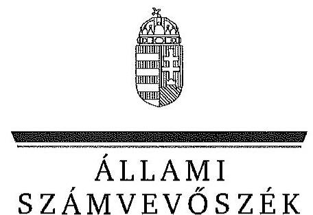
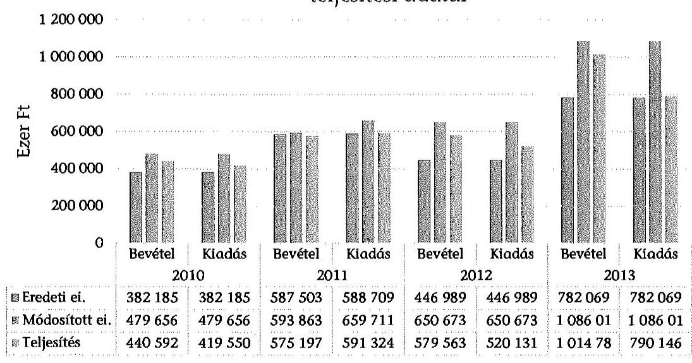
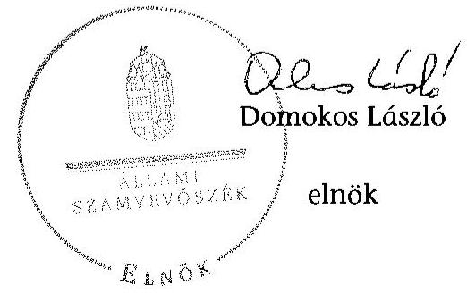
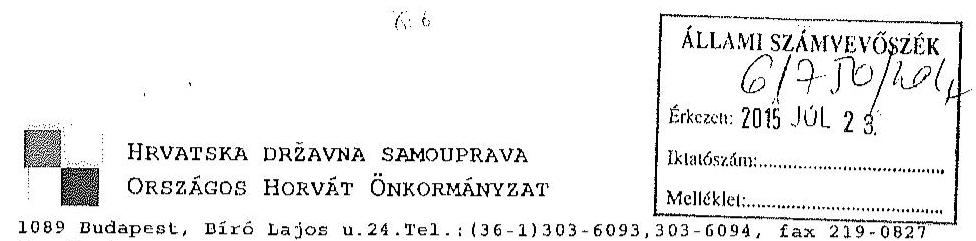
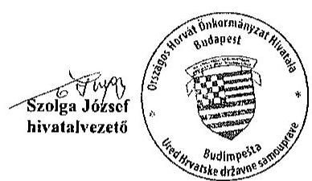
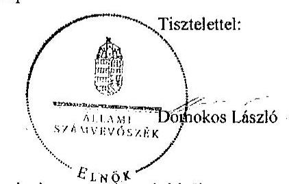

ÁLLAMI
SZÁMVEVÔSZÉK

# JELENTÉS 

Az Országos Nemzetiségi Önkormányzatok gazdálkodásának ellenőrzéséről
Országos Horvát Önkormányzat

---

# Állami Számvevőszék 

Iktatószám: V-0692-051/2015.
Témaszám: 1726
Vizsgálat-azonosító szám: V0680

## Az ellenőrzést felügyelte:

## Kisgergely István

felügyeleti vezető

## Az ellenőrzést vezette:

## Dr. Láng Ágnes Krisztina

ellenőrzésvezető
A számvevői jelentések feldolgozásában és a jelentés összeállításában közremüködtek:

## Dr. Láng Ágnes Krisztina

ellenőrzésvezető

## Turai Erzsébet

számvevő

## Az ellenőrzést végezték:

## Turai Erzsébet

számvevő

## Nagyné Lakhézi Éva

számvevő tanácsos

---

# TARTALOMJEGYZÉK 

BEVEZETÉS ..... 3
I. ÖSSZEGZŐ MEGÁLLAPÍTÁSOK, KÖVETKEZTETÉSEK, JAVASLATOK ..... 7
II. RÉSZLETES MEGÁLLAPÍTÁSOK ..... 12

1. A belső kontrollrendszer kialakításának és múködtetésének megfelelősége ..... 12
1.1. A kontrollkörnyezet kialakításának megfelelősége ..... 12
1.2. A kockázatkezelési rendszer kialakításának és múködtetésének megfelelősége ..... 14
1.3. A kontrolltevékenységek kialakításának megfelelősége ..... 14
1.4. Információs és kommunikációs rendszer kialakításának és múködtetésének megfelelősége ..... 15
1.5. Monitoring-rendszer kialakításának és működtetésének megfelelősége ..... 15
2. A gazdálkodás megfelelősége ..... 17
2.1. Pénzügyi gazdálkodás megfelelősége ..... 17
2.2. Vagyongazdálkodással kapcsolatos feladatellátás szabályszerűsége ..... 22
3. Ingyenesen juttatott vagyon kezelésének megfelelősége ..... 26
4. Egyéb feladat- és hatáskör ellátás szabályszerűsége ..... 26
5. Integritás kontrollok ..... 27
6. ÁSZ javaslatok hasznosulása ..... 27

## MELLÉKLETEK

1. számú Az Országos Horvát Önkormányzat észrevétele
2. számú Az Országos Horvát Önkormányzat észrevételére válasz

## FÜGGELÉKEK

1. számú Rövidítések jegyzéke
2. számú Az integritás kontrollok kialakítása és működtetése

---

.

---

# JELENTÉS 

## Az Országos Horvát Önkormányzat gazdálkodásának ellenőrzéséről

## BEVEZETÉS

Az Országos Horvát Önkormányzat az 1995. évben alakult, jelenlegi Elnöke a 2014. évi országos nemzetiségi választások óta látja el feladatát. Az Országos Horvát Önkormányzat intézményt, gazdasági társaságot és más szervezetet az ellenőrzött időszakban nem alapított, 2012 évben fenntartói jog átvételével az Önkormányzat irányítása alá került a Miroslav Krleza Horvát Óvoda, Általános Iskola, Gimnázium és Kollégium pécsi székhelyű nevelési-oktatási intézmény. A feladatok ellátásában hat intézmény és kettő gazdasági társaság vett részt. A 23 tagú Közgyűlés a munkája segítésére öt bizottságot hozott létre ${ }^{1}$. Az Országos Horvát Önkormányzat költségvetési beszámolója szerint a 2013. évben a módosított költségvetési bevételi és kiadási előirányzat 1086015 ezer Ft, a teljesített költségvetési bevétel 1014784 ezer Ft, a teljesített költségvetési kiadás 790146 ezer Ft volt. Az Országos Horvát Önkormányzat a 2013. évben 238186 ezer Ft államháztartásból származó támogatásban részesült. A 2014. évben a Hivatalban 5 főt foglalkoztattak.

Az Alaptörvény XXIX. cikk (1) bekezdése szerint a Magyarországon élő́ nemzetiségek államalkotó tényezők. Minden, valamely nemzetiséghez tartozó magyar állampolgárnak joga van önazonossága szabad vállalásához és megőrzéséhez. A hazánkban élő́ nemzetiségek helyi (települési és területi), valamint országos önkormányzatokat hozhatnak létre.

Az országos nemzetiségi önkormányzat gazdálkodási feladatait az önállóan múködő és gazdálkodó költségvetési szerve, a hivatal látja el. Az országos nemzetiségi önkormányzatok a 2008. évtől tartoznak az államháztartás önkormányzati alrendszerébe, azóta hivatalaik költségvetési szervként működnek. Az Alaptörvény hatálybalépését követően a 2012. évtől további jelentős jogszabályi változások határozzák meg múködésüket, gazdálkodásukat.

A nemzetiségek helyzete, támogatása mind hazai, mind EU-s szinten kiemelt figyelmet kap napjainkban. Az állam az országos nemzetiségi önkormányzatok múködéséhez, a médiaszolgáltatáshoz kapcsolódó jogaik érvényesítéséhez, valamint a kulturális önigazgatásuk érdekében alapított - közművelődési, közgyűj-

[^0]
[^0]:    ${ }^{1}$ Gazdasági, Pénzügyi és Ellenőrző Bizottság; Oktatási és Nevelési Bizottság; Jogi Bizottság; Ifjúsági és Sportbizottság; Kulturális-, Vallásúgyi Bizottság

---

teményi, tudományos - intézmények fenntartásához az éves költségvetési törvényekben nevesítetten költségvetési támogatást biztosít. Ezen kívül az országos nemzetiségi önkormányzatok közfeladataik ellátásához támogatást kapnak a fejezeti kezelésű előirányzatokból, valamint hazai és uniós pályázati forrásokat szerezhetnek.

Az ellenőrzés célja annak értékelése volt, hogy az országos nemzetiségi önkormányzat gazdálkodása, a belső kontrollrendszer kialakítása és múködése, az államháztartásból nyújtott támogatás, illetve az államháztartásból meghatározott célra ingyenesen juttatott vagyon felhasználása a jogszabályi előírásoknak megfelelően történt-e; az önkormányzat a Nek. tv.-ben és az Njtv.-ben előírt fel-adat- és hatásköröket ellátta-e; intézkedett-e az ÁSZ által a 2008-2010. évek között végzett ellenőrzések javaslatainak végrehajtásáról.

Az országos nemzetiségi önkormányzat korrupcióval szembeni veszélyeztetettségének csökkentése érdekében felmértük az integritási szemlélet érvényesülését a gazdálkodási folyamatokban.

Értékeltük az önkormányzat gazdálkodása során a belső kontrollrendszer kialakítását és működését mind az öt pillér tekintetében, ellenőriztük a gazdálkodással összefüggő feladat- és hatásköröknek, a hivatal működési, gazdálkodási rendjének jogszabályi előírásoknak való megfelelőségét; a belső kontrollok múködésének megfelelőségét az éves költségvetés, a költségvetési beszámoló és a zárszámadás készítés folyamatában; a gazdálkodás pénzügyi folyamatában kulcsszerepet betöltő (szakmai) teljesítésigazolás és 2011-ig utalvány ellenjegyzés, 2012-től érvényesítés kontrolltevékenységek működésének megfelelőségét; az önkormányzat belső ellenőrzése kialakításának és múködésének megfelelőségét.

Értékeltük továbbá az országos nemzetiségi önkormányzat gazdálkodása, ezen belül pénzügyi gazdálkodása keretében a tervezés, beszámolási, zárszámadáskészítési folyamat, az előirányzatok betartása, a könyvvezetés, a közzétételek, adatszolgáltatások, valamint az államháztartás rendszeréből jogszabály vagy megállapodás alapján céljelleggel kapott támogatások felhasználásának, elszámolásának szabályszerűségét. A vagyonnal kapcsolatos feladatellátás ellenőrzése keretében értékeltük a vagyongazdálkodás szabályozottságát, a mérleg alátámasztottságát, a leltározás, az eszközbeszerzések, a vagyonhasznosítás, a tulajdonosi joggyakorlás szabályszerűségét, kiemelten az országos nemzetiségi önkormányzat gazdasági társasága részére a vagyon tulajdonba, illetve kezelésbe, üzemeltetésbe adása, a tőkeemelés és a juttatott támogatások szabályszerűségét. Értékeltük az államháztartásból ingyenesen juttatott vagyon felhasználásának szabályszerűségét. Ellenőriztük az előírt feladat- és hatáskörök közül a véleménynyilvánítási, egyetértési jog gyakorlásával, a hatáskör átruházásokkal, az ideiglenes vagyonkezeléssel kapcsolatos feladatok ellátásának szabályszerűségét, az integritás kontrollok múködését, továbbá az előző ÁSZ ellenőrzés javaslatainak hasznosulását.

Az ellenőrzés várható hasznosulása: Az ellenőrzés eredményeként nemcsak az ellenőrzött szerv gazdálkodása javulhat, hanem átfogó képet kaphatunk az önkormányzati alrendszerbe tartozó országos nemzetiségi önkormányzatok gazdálkodásának hiányosságairól, de a jó gyakorlatokról is. Az ellenőrzés megállap-

---

pításait és javaslatait más szervezetek is hasznosíthatják a rendezett gazdálkodási keretek kialakításához. Az ellenőrzés hozadékát képezi a 2008-2010. években elvégzett ÁSZ ellenőrzés javaslatai hasznosulásának értékelése. Mind a 13 országos nemzetiségi önkormányzat ellenőrzésével teljes körűen megvalósul az országos nemzetiségi önkormányzatok ellenőrzése a megváltozott jogszabályi környezetben. Az ellenőrzés tapasztalatai alapján a jogszabályi ellentmondások, hiányosságok feltárásával, azok megszüntetésére vonatkozó javaslatokkal segítjük a jó kormányzást. Az ellenőrzéssel lehetővé tesszük, hogy az országos nemzetiségi önkormányzatok gazdálkodásáról, múködéséről a társadalom objektív képet alkothasson.

Az országos nemzetiségi önkormányzatok gazdálkodásának ellenőrzéséről szóló számvevőszéki jelentés I. fejezetének összegző része az ellenőrzés céljára adott rövid, szintetizáló összefoglalót és következtetéseket tartalmazza a II. fejezet részletes megállapításain alapulóan. A jelentés intézkedést igénylő megállapításait és javaslatait az ellenőrzés során feltárt, a jelentés II. fejezetében rögzített részletes megállapítások alapozzák meg.

Az ellenőrzés típusa: szabályszerűségi ellenőrzés.
Az ellenőrzött időszak: 2010. január 1 - 2014. június 30.
Ellenőrzött szervezet: az országos nemzetiségi önkormányzat és hivatala, továbbá azon intézmények, amelyek gazdálkodási feladatait a hivatal látja el.

Az ellenőrzés végrehajtásának jogszabályi alapját az Állami Számvevőszékről szóló 2011. évi LXVI. törvény 1. § (3) bekezdése, az 5. § (2)-(3) és (6) bekezdései, valamint az államháztartásról szóló 2011. évi CXCV. törvény 61. § (2) bekezdésének előírásai képezik.

Az ellenőrzés módszertana az ÁSZ hivatalos honlapján (www.asz.hu) közzétett szakmai szabályokon alapul, amely a Legfőbb Ellenőrző Intézmények Nemzetközi Szervezete (INTOSAI) által kiadott nemzetközi standardok (ISSAI) figyelembevételével készült.

Az ellenőrzés lefolytatásához az országos nemzetiségi önkormányzat a kimutatások és a tanúsítványok elektronikus kitöltésével, valamint az ÁSZ által kért dokumentumok elektronikus megküldésével szolgáltatott adatokat. Az így rendelkezésre bocsátott adatok, információk kontrollja és a munkalapok kitöltése az ellenőrzöttnél végzett ellenőrzés keretében történt. A pénzügyi folyamatokban kulcsszerepet betöltő (szakmai) teljesítésigazolás és érvényesítés (2011-ig utalvány ellenjegyzése) kontrollok múködésének megfelelősége értékeléséhez az egyszerű véletlen mintavétellel kiválasztott tételek ellenőrzését megfelelőségi tesztek útján végeztük.

A személyi juttatások, a dologi és felhalmozási kiadások, valamint a pénzeszközátadások felhasználásának szabályszerűségét és a gazdálkodási jogkörök gyakorlását mintavétellel ellenőriztük. A vagyonhasznosítási célú bevételek esetében tételes ellenőrzést végeztünk.

---

A jogszabályoknak és a belső előírásoknak megfelelőnek, azaz szabályszerűnek tekintettük a céljelleggel kapott támogatások felhasználásának és elszámolásának szabályszerűségét, az ellenőrzött kiadási, illetve bevételi előirányzatok felhasználását, amennyiben a minta ellenőrzésének eredménye alapján 95\%-os bizonyossággal a teljes sokaságban a hibaarány kisebb volt, mint $10 \%$, nem megfelelőnek értékeltük, ha a hibaarány a $10 \%$-ot meghaladta.

Megfelelőnek értékeltük a gazdálkodási jogkörök gyakorlását, amennyiben $95 \%$-os bizonyossággal a teljes sokaságban a hibaarány legfeljebb $10 \%$, részben megfelelőnek értékeltük, ha a hibaarány felső határa 10-30\% volt, nem megfelelőnek pedig akkor, ha a hibaarány felső határa a teljes sokaságban meghaladta a $30 \%$-ot.

Az ÁSZ a 2011. évi LXVI. törvény 29. §-a szerint a jelentéstervezetet megküldte az Országos Horvát Önkormányzat elnökének egyeztetésre. A beérkezett észrevételt és az arra adott választ a jelentés 1-2. sz. mellékletei tartalmazzák.

---

# I. ÖSSZEGZŐ MEGÁLLAPÍTÁSOK, KÖVETKEZTETÉSEK, JAVASLATOK 

Az Önkormányzatnál a 2010-2014. I. félév között a belső kontrollrendszer kialakítása és múködtetése összességében részben megfelelő volt.

A kontrollkörnyezet kialakítása megfelelt az Önkormányzat múködését meghatározó jogszabályokban foglaltaknak. Az Önkormányzat és a Hivatal rendelkezett SzMSz-szel, valamint számviteli és gazdálkodási szabályzatokkal. A Hivatali SzMSz az Ámr. és az Ávr. előírásától eltérően nem tartalmazta a költségvetési szervhez rendelt más költségvetési szervek felsorolását. Az Ügyrend ${ }_{1,2}$ az Ámr. és az Ávr. előírása ellenére nem tartalmazta a gazdasági szervezet belső és külső kapcsolattartásának rendjét. A Gazdálkodási szabályzat ${ }_{1,2}$ az Ámr. és az Ávr. előírásainak megfelelően tartalmazta az operatív gazdálkodási jogkörök gyakorlására vonatkozó eljárásrendet, az összeférhetetlenségi előírásokat. A Hivatalnál a kontrollkörnyezet kialakításának keretében meghatározták az etikai elvárásokat, a szabálytalanságok kezelésének eljárásrendjét és kialakították az ellenőrzési nyomvonalat. A Közgyűlés az Áht. ${ }_{2}$ szabályaitól eltérően 2012-től nem határozta meg és nem érvényesítette az erőforrásokkal való szabályszerű és hatékony gazdálkodáshoz szükséges követelményeket.

A Hivatalvezető az Ámr. és a Bkr. előírásainak megfelelően alakította ki és múködtette a kockázatkezelési rendszert.

A kontrolltevékenységek kialakítása és működtetése részben felelt meg az előírásoknak. Az éves költségvetés, a költségvetési beszámoló és a zárszámadás készítésének folyamatában a belső kontrolleljárásokat az Ámr. és a Bkr. rendelkezései alapján kialakították, azonban nem biztosították, hogy a 2010-2011. évi költségvetési határozatok a jogszabályokban előírt határidőben kerüljenek előterjesztésre a Közgyűlés elé. A 2010-2011. években a szakmai teljesítésigazolás és az utalvány ellenjegyzés, a teljesítésigazolás és az érvényesítés gyakorlata a 2012. évben és a 2014. I. félévben részben, a 2013. évben nem felelt meg az Ámr. illetve az Ávr. előírásainak.

Az információs és kommunikációs rendszer kialakítása és működtetése megfelelő volt. A Hivatalvezető az Info tv.-ben, illetve az Ávr.-ben előírtaknak megfelelően szabályozta a kötelezően közzéteendő adatok nyilvánosságra hozatalának rendjét, valamint a közérdekú adatok megismerésére irányuló igények teljesítésének rendjét. A Hivatalvezető az Eisztv.-ben, illetve az Info tv.-ben meghatározott kötelezettségének eleget téve gondoskodott az Önkormányzat és a Hivatal gazdálkodására vonatkozó adatok honlapon történő közzétételéről. Az iratkezelés szabályozása során az Önkormányzat biztosította az ügyintézési folyamat nyomon követhetőségét, az iratok fellelhetőségét.

Az Önkormányzat monitoring rendszerének kialakítása és működtetése részben felelt meg a jogszabályi előírásoknak. A Hivatalvezető az Áht ${ }_{1}$ és a Bkr. előírása ellenére az operatív tevékenységek keretében megvalósuló, folyamatos és

---

eseti nyomon követés rendszerét nem alakította ki. Az ellenőrzött időszakban a belső ellenőrzés kialakítása és múködtetése összességében megfelelt a jogszabályi előírásoknak. A belső ellenőrzés a szabályozási és a működési hiányosságok feltárásával, valamint a javaslataival segítette az Önkormányzat és intézményei szabályszerű gazdálkodását. A Hivatalvezető a 2010-2013. években nyilatkozatban értékelte a belső kontrollrendszer minőségét.

Az Önkormányzat pénzügyi gazdálkodása részben felelt meg az előírásoknak. Az Elnök a 2010.és 2014. évi költségvetési koncepciót a jogszabályban meghatározott határidőben terjesztette a Közgyűlés elé. A Hivatalvezető a költségvetési határozat-tervezetet egyeztette a költségvetési szervek vezetőivel és annak eredményét írásban rögzítette. A Pénzügyi Bizottság a Nek. tv.-ben és az Njtv.ben foglaltak betartásával a költségvetési határozat-tervezeteket véleményezte, azonban az Elnök a 2011. év esetében az Áht. ${ }_{1}$-ben meghatározott határidőn túl terjesztette a Közgyűlés elé. A Közgyűlés - a 2011. év kivételével - határidőben elfogadta a költségvetési határozatait. A Hivatalvezető az Ámr. előírásaival ellentétesen a 2010-2011. évi elemi költségvetéseket határidőn túl küldte meg a kisebbségpolitikáért felelős állami szervnek és határidőn túl szolgáltatott adatot a Kincstárnak. Az Önkormányzat 2010-2014. évi költségvetési határozatainak tartalma megfelelt a jogszabályi előírásoknak, azok Közgyűlés elé történő előterjesztésekor a szükséges dokumentumokat bemutatták. Az Önkormányzat az ellenőrzött időszakban nem lépte túl a módosított bevételi és kiadási előirányzatait. A 2010-2013. évi zárszámadási határozat-tervezetet a Pénzügyi Bizottság a Nek. tv. és az Njtv. előírásait betartva véleményezte. A Hivatalvezető az Áhsz. ${ }_{1}$ előírásaival ellentétesen a 2010-2013. évi elemi költségvetési beszámolót határidőn túl nyújtotta be a kisebbségpolitikáért felelős miniszternek. Az Elnök a 2010-2013. években a zárszámadási határozat-tervezetet az Áhsz. ${ }_{1,2}$ és az Áht. ${ }_{2}$ előírásainak megfelelően határidőn belül a Közgyűlés elé terjesztette és tájékoztatásul bemutatta az előírt dokumentumokat. Az Önkormányzat a 2010-2013. évi költségvetési beszámolóját az előírásoknak megfelelően közzétette, időközi költségvetési jelentéskészítési kötelezettségének részben tett eleget.

Az Önkormányzat az államháztartás rendszeréből jogszabály, illetve pályázat vagy egyedi kérelem alapján kapott támogatások felhasználása és elszámolása során betartotta a jogszabályi és szerződéses előírásokat. A kapott pénzeszközöket a támogatási előírásoknak megfelelően használták fel, azokkal szakmai és pénzügyi beszámoló keretében határidőn belül elszámoltak. A kapott önkormányzati és intézményi múködési támogatásokról 2011-2013. években, illetve azok felhasználásáról a 2014. évben az Önkormányzat nem vezetett elkülönített számviteli nyilvántartást. A médiatámogatások esetében az elkülönített nyilvántartás biztosított volt.

Az ellenőrzött időszakban az Önkormányzat által államháztartási forrás terhére pályázat, vagy kérelem alapján nyújtott céljellegú támogatások odaítéléséről a 2010. évben a Közgyűlés, a 2011-2013. évben és a 2014. év I. félévében átruházott hatáskörben az Elnök döntött. A támogatási szerződésekben megfogalmazott célok összhangban voltak a Nek. tv.-ben, illetve az Njtv.-ben meghatározott nemzetiségi feladatokkal. Az Önkormányzat előírta az elszámolási kötelezettséget és a támogatott szervezeteket beszámoltatta a támogatás felhasználásáról.

---

Az Önkormányzat vagyongazdálkodási tevékenysége részben felelt meg a jogszabályi előírásoknak. Az Önkormányzatnál az ellenőrzött időszakban a Nek. tv. és az Njtv. előírásainak megfelelően a vagyonnal való gazdálkodás szabályozásának hatálya kiterjedt a teljes vagyoni körre. Az Ötv. és az Nvtv. előírásaival összhangban meghatározták az önkormányzati feladatellátást biztosító törzsvagyon körét, elkülönítették a forgalomképtelen és a korlátozottan forgalomképes vagyonelemeket, azonban az Nvtv. hatálybalépését követő 60 napon belül nem vizsgálták felül a forgalomképtelennek minősülő törzsvagyont. A mérlegsorok alátámasztására az eszközeiket és forrásaikat leltárral támasztották alá, a leltárak kiértékelését elvégezték. A Leltározási szabályzatban foglaltak szerint a tárgyi eszközök mennyiségi felvétellel történő leltározását két-évente végezték el; amihez azonban az Áhsz. rendelkezéseitől eltérően nem rendelkeztek közgyűlési határozattal.

Az Önkormányzat az ellenőrzött időszakban kettő gazdasági társaságban rendelkezett tulajdoni résszel. Gazdasági társaságai részére a költségvetési törvényben nevesített média támogatás kivételével más támogatást nem nyújtott, tőkeemelést nem hajtott végre, vagyonkezelésbe, üzemeltetésre, illetve térítésmentesen tulajdonba vagyont nem adott át.

Az Önkormányzat az ellenőrzött időszakban ingyenes vagyonjuttatásban nem részesült. Az Önkormányzat a 2006-ban kapott egyszeri ingyenes vagyonjuttatás állományba vételét a Hivatal több éves késéssel, 2011. január 2-én végezte el, ezzel sérült a Számv. tv. szerinti teljesség alapelve.

Az Önkormányzat az ellenőrzött időszakban egy közoktatási intézmény fenntartói jogát, valamint tulajdonjogát vette át Pécs MJV Önkormányzatától. A zárszámadási határozatok vagyonkimutatás mellékleteiben valamint a Vagyongazdálkodási határozatban a korlátozottan forgalomképes vagyonelemek között szerepelt az átvett ingatlanok értéke.

Az Önkormányzat a törvényben előírt vélemény-nyilvánítási, egyetértési, közreműködési jogát az ellenőrzött időszakban gyakorolta.

Az ellenőrzött időszakban a Közgyűlés egy hatáskört ruházott át, az éves költségvetésen belül 1000 ezer Ft felhasználásáról elnöki keret címén az Elnök önállóan döntött. Az Elnök az átruházott hatáskörben hozott döntésekről az Önkormányzat közgyűlésein számolt be, a felhasználás az előírt keretet nem haladta meg.

Az ÁSZ a 2008-2010. években az Önkormányzatot érintően ellenőrzést nem végzett.

Az ÁSZ tv. 33. § (1) bekezdésében foglaltak értelmében a jelentésben foglalt megállapításokhoz kapcsolódó intézkedési tervet köteles az ellenőrzött szervezet vezetője összeállítani, és azt a jelentés kézhezvételétől számított 30 napon belül az ÁSZ részére megküldeni. Amennyiben az intézkedési tervet határidőben nem küldi meg a szervezet, vagy az nem elfogadható, az ÁSZ elnöke a hivatkozott törvény 33. § (3) bekezdés a)-b) pontjaiban foglaltakat érvényesítheti.

---

A helyszíni ellenőrzés megállapításainak hasznosítása mellett javasoljuk:

# az Elnöknek 

1. Az Elnök a 2011. évi költségvetési határozat-tervezetet - figyelemmel az Ámr. 40. § (1) bekezdésében foglaltakra - az Áht. 1 71. § (1) bekezdésében foglaltakkal ellentétesen határidőn túl terjesztette a Közgyűlés elé.
A Közgyűlés az intézményei tekintetében nem határozta meg az erőforrásokkal való szabályszerű és hatékony gazdálkodáshoz szükséges követelményeket, ezáltal az Áht. 1 91. § (1) bekezdés, valamint az Áht. 2 9. § (1) bekezdés f) pontja előírásától eltérően azokat nem érvényesítette.

Javaslat:
Gondoskodjon a költségvetési határozat-tervezetek határidőben történő Közgyűlés elé terjesztéséről, valamint az erőforrásokkal való szabályszerű és hatékony gazdálkodáshoz szükséges követelmények Közgyűlés elé terjesztéséről.

## a Hivatalvezetőnek

1. Az Önkormányzat belső kontroll rendszere tekintetében:
a) A kontrollkörnyezet kialakítása megfelelő volt, azonban a Hivatal, mint önállóan működő és gazdálkodó költségvetési szerv megalkotott SzMSz-e az Ámr. 20. § (2) bekezdés k) pontjában és Ávr. 13. § (1) bekezdés i) pontjában foglaltaktól eltérően nem tartalmazta azon költségvetési szervek felsorolását, melyek gazdálkodási feladatait a Hivatal látja el.

Az Ügyrend ${ }_{1,2}$ az Ámr. 20. § (7) bekezdése és az Ávr. 13. § (5) bekezdésének előírása ellenére nem tartalmazta a gazdasági szervezet belső és külső kapcsolattartásának szabályait.

Javaslat:
Intézkedjen a Hivatal SzMSz-ének és az Ügyrendjének kiegészítéséről.
b) A kontrolltevékenységek működése részben felelt meg a jogszabályi előírásoknak. A személyi juttatások, a dologi és felhalmozási kiadások, valamint a pénzeszközátadások teljesítése során a gazdálkodási jogkörök (szakmai teljesítésigazolás, érvényesítés és utalvány ellenjegyzés) gyakorlása a 2010-2011. években részben, a 2012-2014. I. félévben nem felelt meg az Ámr. 79. § (2) bekezdés, illetve az Ávr. 57. § (1) bekezdés 58. § (3) bekezdés előírásainak.

Javaslat:
Gondoskodjon a gazdálkodási jogkörök szabályszerű gyakorlásának érvényesítéséről.
2. A pénzügyi- és vagyongazdálkodás területén
a) A Hivatalvezető a Közgyűlés által jóváhagyott - az Önkormányzat és intézményei - 2010-2011. évi elemi költségvetését az Ámr. 52. § (4) bekezdésében foglalt

---

határidőn túl küldte meg a kisebbségért felelős állami szervnek, illetve a 20122014. évi jóváhagyott elemi költségvetéséről az Ávr. 33. §-ában foglalt határidőn túl szolgáltatott adatot a Kincstár területileg illetékes szervének.

A Hivatalvezető az Önkormányzat és az irányítása alá tartozó költségvetési szervek 2010-2013. évi elemi költségvetési beszámolóját az Áhsz. 10. § (8) bekezdésében foglaltak ellenére a határidő lejártát követően nyújtotta be a kisebbségpolitikáért felelős miniszternek.

Az Önkormányzat a 2012-2013. években az időközi költségvetés jelentéskészítési, a 2012-2014. I. félévben az időközi mérlegjelentési kötelezettségének nem tett eleget határidőben, figyelmen kívül hagyva az Ávr. 169. §-ában és a 170. § (2) bekezdésében foglaltakat.

Javaslat:
Gondoskodjon a Kincstár részére az Önkormányzat elemi költségvetésének és az elemi költségvetési beszámolójának, az adatszolgáltatás határidőben történő megküldéséről, az időközi költségvetési jelentéskészítési, illetve az időközi mérlegjelentés határidejének betartásáról.
b) A 2010-2013. évek között nem hajtották végre az ingatlanok mennyiségi felvétellel történő leltározását, figyelmen kívül hagyva az Áhsz. 37. § (3) bekezdés előírásait.

Javaslat:
Gondoskodjon az ingatlanok mennyiségi felvétellel történő leltározásának végrehajtásáról.
c) Az Njtv. 124. § (2) bekezdése alapján az Nvtv. 18. § (1) bekezdésben foglaltak ellenére az Nvtv. hatálybalépését követő 60 napon belül nem vizsgálták felül a forgalomképtelennek minősülő törzsvagyont a nemzetgazdasági szempontból kiemelt jelentőségű nemzeti vagyonná történő átminősítés céljából.

Javaslat:
Intézkedjen a forgalomképtelennek minősülő törzsvagyont felülvizsgálatáról és ennek eredményeként a törzsvagyon nemzetgazdasági szempontból kiemelt jelentőségű nemzeti vagyonná történő átminősítésről.
3. Ingyenesen juttatott vagyon kezelésének megfelelősége területén

Az Önkormányzat a kapott egyszeri ingyenes vagyonjuttatást a beszámolókban forgalomképtelen törzsvagyonként tartotta nyilván. A székház értékének számviteli nyilvántartásba vétele azonban az Njtv. 137. § (2) bekezdésében foglalt előírásokkal ellentétesen „a 121312 Korlátozottan forgalomképes egyéb épületek aktivált állománya" számlára történt.

Javaslat:
Intézkedjen a székház számviteli nyilvántartásának kijavításáról.

---

# II. RÉSZLETES MEGÁLLAPÍTÁSOK 

## 1. A BELSŐ KONTROLLRENDSZER KIALAKÍTÁSÁNAK ÉS MŰKÖDTETÉSÉNEK MEGFELELŐSÉGE

Az ellenőrzött időszakban az Önkormányzatnál a belső kontrollrendszer (a kontrollkörnyezet, a kockázatkezelési rendszer, a kontrolltevékenységek, az információs és kommunikációs rendszer, valamint a monitoring rendszer) kialakítása és múködtetése összességében részben volt megfelelő.

### 1.1. A kontrollkörnyezet kialakításának megfelelősége

A kontrollkörnyezet kialakítása megfelelt a jogszabályi előírásoknak.
Az Önkormányzat és a Hivatal az ellenőrzött időszakban a Nek. tv. és az Njtv. előírásainak megfelelően rendelkezett SzMSz-szel.

Az ellenőrzött időszak elején érvényes Önkormányzati SzMSz-t a Közgyűlés az 50/3/2007. (IV. 21.) közgyűlési határozattal fogadta el, amelyet egy alkalommal 2011. január 29-én módosított. Az Önkormányzat SzMSz-ének módosítását² a 2011. április 15-én megjelent Hivatalos Értesítőben közzétették. Az Önkormányzat SzMSz-ének az Önkormányzat honlapján történő közzétételéről a Hivatalvezető gondoskodott.

Az Önkormányzati SzMSz tartalmazta a képviselők vagyonnyilatkozat-tételi kötelezettségére vonatkozó előírást. E kötelezettségüknek a képviselők az ellenőrzött időszakban - nem minden esetben a Nek. tv. 39/H. § (1) bekezdésében, illetve az Njtv. 171. § (1) bekezdésében előírt határidőben - tettek eleget.

A Hivatali SzMSz az Önkormányzati SzMSz 3. számú mellékletét képezte. Az Ámr. 20. § (2) bekezdés k) pontjában és az Ávr. 13. § (1) bekezdés i) pontjában meghatározottak ellenére a Hivatali SzMSz nem tartalmazta a költségvetési szervhez rendelt más költségvetési szervek felsorolását (azon költségvetési szervek megnevezését, melyeknek gazdálkodási feladatait a Hivatal látja el).

A gazdálkodási feladatok ellátására kijelölt szervezet az ellenőrzött időszakban a Hivatal volt a Kulturális Központ, valamint a Keresztény Gyűjtemény tekintetében.

A 2010. évben a Hivatal és a hozzárendelt önállóan múködő intézmények (Kulturális Központ, valamint a Keresztény Gyűjtemény) közötti munkamegosztás és felelősségvállalás rendjét az Ámr. 16. § (4) bekezdése rendelkezései ellenére nem rögzítették előírt tartalmú megállapodásban. A jogszabályoknak megfelelő tartalmú megállapodásokat 2011-ben megkötötték.

[^0]
[^0]:    ${ }^{2}$ 50/3/2007. (IV. 21.) közgyűlési határozat, módosítva és egységes szerkezetbe foglalva a 9/2011. (I. 29.) sz. határozatával, hatályos 2011. január 29-től.

---

Az Önkormányzat és a Hivatal az ellenőrzött időszakban - a Számv. tv. és az Áhsz.1,2 előírásaival összhangban - rendelkezett az előírásoknak megfelelő tartalmú számviteli szabályzatokkal. (Számviteli Politika ${ }_{1,2,3}$, Számlarend $_{1,2,3}$, Leltározási szabályzat ${ }_{1,2,3}$, Értékelési szabályzat ${ }_{1,2,3}$ Pénzkezelési szabály$z^{2 t_{1,2,3}}$, Önköltség-számítási szabályzat ${ }_{1,2,3}$.) Rendelkezett a nem szükséges, illetve feleslegessé vált eszközök hasznosítására vonatkozó szabályzattal (Selejtezési szabályzat), továbbá meghatározták a bizonylatok kezelésére vonatkozó szabályokat (Bizonylati rend ${ }_{1,2}$ ) és a szervezet múködésének részletszabályait (Úgyrend ${ }_{1,2}$ ).

Az Önkormányzat és a Hivatal az Ámr. és az Ávr. előírásai szerint a Közbeszerzési szabályzat ${ }_{1,2}$-ban határozta meg a beszerzések lebonyolításának eljárásrendjét.

Az Önkormányzat az ellenőrzött időszakban - kisebb hiányosságok mellett rendelkezett az előírásoknak megfelelő tartalmú gazdálkodási szabályzatokkal.

A Gazdálkodási szabályzat ${ }_{1,2}$ az Ámr. és az Ávr. előírásainak megfelelően tartalmazta az operatív gazdálkodási jogkörök gyakorlására vonatkozó eljárásrendet, az összeférhetetlenségi előírásokat. Érvényesítésre az Ámr.-ben és az Ávr.-ben előírt pénzügyi-számviteli képesítéssel rendelkező pénzügyi ügyintéző kapott kijelölést. A Gazdálkodási szabályzat ${ }_{1,2}$ rendelkezett a kötelezettségvállalások nyilvántartásáról is.

Az Úgyrend ${ }_{1,2}$ az Ámr. 20. § (7) bekezdése, illetve az Ávr. 13. § (5) bekezdésének előírása ellenére nem tartalmazta a gazdasági szervezet belső és külső kapcsolattartásának szabályait.

Az Önkormányzat és intézményei az ellenőrzött időszakban rendelkeztek az Ámr.-ben és az Ávr.-ben előírt kiküldetési szabályzattal, reprezentációs kiadások szabályozásával, helyiségek és berendezések használatának szabályozásával, te-lefon- és gépjármúhasználatra vonatkozó szabályzattal.

A Hivatalnál a kontrollkörnyezet kialakításának keretében meghatározták az etikai elvárásokat. Az ellenőrzött időszak elejétől kialakították a Szabálytalanságok kezelésének eljárásrendjét. A Hivatalvezető gondoskodott a Hivatal múködésének irányítási és ellenőrzési folyamatai, a felelősségi és információs szintek és kapcsolatok leírását tartalmazó ellenőrzési nyomvonal elkészítéséről, aktualizálásáról.

A Hivatalvezető a hivatali dolgozók feladatait munkaköri leírásban határozta meg.

A Hivatalvezető, valamint az Önkormányzat gazdasági vezetője a jogszabályokban előírt végzettséggel, szakképesítéssel rendelkeztek.

A Közgyűlés az intézményei tekintetében nem határozta meg az erőforrásokkal való szabályszerű és hatékony gazdálkodáshoz szükséges követelményeket, ezáltal 2012. január 1-jétől az Áht. ${ }_{2}$ 9. § (1) bekezdés f) pontja előírásától eltérően azokat nem érvényesítette.

---

# 1.2. A kockázatkezelési rendszer kialakításának és múködtetésének megfelelősége 

A kockázatkezelési rendszer kialakítása és múködtetése megfelelt a jogszabályok előírásainak.

A Hivatalvezető az Ámr. 157. § (1)-(2) bekezdéseiben, valamint a Bkr. 7. § (1)(2) bekezdéseiben foglaltaknak megfelelően múködtette a kockázatkezelési rendszert. A 2010-2011. években a Kockázatkezelési szabályzatban, 2012-től a Belső kontroll kézikönyvben meghatározták a Hivatal tevékenységében, gazdálkodásában rejlő kockázatokat, az egyes kockázatokkal kapcsolatban szükséges intézkedéseket, valamint a kockázatok kezelése érdekében szükséges intézkedések teljesítésének folyamatos nyomon követési módját.

### 1.3. A kontrolltevékenységek kialakításának megfelelősége

A kontrolltevékenységek működése részben felelt meg a jogszabályi előírásoknak.

Az egyes tevékenységekhez kapcsolódóan meghatározták a folyamatba épített, előzetes, utólagos és vezetői ellenőrzés feladatait, valamint ezek módja, eszköze, ellenőrzési pontjai, a felelős szervezeti egység, személy, a feladat ellátóját, a határidőket, illetve a feladat-ellátás gyakoriságát, a keletkező dokumentum nevét és helyét. Ugyanakkor nem biztosították, hogy az éves költségvetési határozatok a jogszabályokban előírt határidőben kerüljenek előterjesztésre és jóváhagyásra.

A költségvetési beszámoló elkészítésével megbízott személy rendelkezett a Számv. tv. és az Ávr. által előírt képesítéssel.

A 2010-2011. években a személyi juttatások, a dologi és a felhalmozási kiadások, valamint a pénzeszközátadások kifizetései során a pénzügyi folyamatokban kulcsszerepet betöltő szakmai teljesítésigazolás és utalvány ellenjegyzés kontrollok működése összességében részben megfelelő volt.

A 2010-2011. években a mintatételek ellenőrzése alapján az utalvány ellenjegyzés gyakorlása során az Ámr. 79. § (2) bekezdésében foglaltak ellenére az utalvány ellenjegyzője nem győződött meg az érvényesítés megtörténtéről.

A személyi juttatások, a dologi és a felhalmozási kiadások, valamint a pénzeszközátadások kifizetései során a pénzügyi folyamatokban kulcsszerepet betöltő teljesítésigazolás és érvényesítés kontrollok múködése a 2012. évben és a-2014. I. félévben részben volt megfelelő, a 2013. évben nem volt megfelelő.

A 2012-2014. I. félévben a mintatételek ellenőrzése alapján a teljesítésigazolás és érvényesítés gyakorlása során az alábbi hiányosságok, szabálytalanságok fordultak elő:

- a teljesítésigazolás az Ávr. 57. § (1) bekezdésében foglaltak ellenére nem történt meg, így elmaradt a kiadás jogosságának, összegszerűségének és a teljesítésnek az igazolása;

---

- az érvényesítő az Ávr. 58. § (1) bekezdésében előírtak ellenére a pénztárbizonylatot nem írta alá, így aláírásával nem igazolta az összegszerűségnek, a fedezet meglétének és a belső szabályzatokban foglaltak betartásának ellenőrzését;

A részben, illetve nem megfelelően működtetett belső kontrollok korrupciós kockázatot hordoznak.

# 1.4. Információs és kommunikációs rendszer kialakításának és múködtetésének megfelelősége 

A Hivatalvezető az Info tv.-ben, illetve az Ávr.-ben előírtaknak megfelelően szabályozta a kötelezően közzéteendő adatok nyilvánosságra hozatalának rendjét, valamint az Avtv.-ben és az Info tv.-ben előírtaknak megfelelően a közérdekú adatok megismerésére irányuló igények teljesítésének rendjét.

A Hivatalvezető az Eisztv.-ben, illetve az Info tv.-ben meghatározott kötelezettségének eleget téve gondoskodott az Önkormányzat és a Hivatal gazdálkodására vonatkozó adatok honlapon történő közzétételéről.

A 2010-2011. években a Hivatalvezető nem készítette el az Avtv. 31/A. § (3) bekezdésében, illetve az Info tv. 24. § (3) bekezdésében előírtak ellenére az adatvédelmi és adatbiztonsági szabályzatot. Az Info tv. alapján a Hivatalvezető az Önkormányzatra, a Hivatalra és az önállóan múködő intézményekre kiterjedő hatállyal 2012. február 28.-án adta ki az Adatvédelmi és adatbiztonsági szabály-zat ${ }_{1}$-et, majd 2013. január 1.-jétől az Adatvédelmi és adatbiztonsági szabályzat ${ }_{2}$ -t. Az Informatikai biztonsági szabályzat ${ }_{1,2}$-t hatálya kiterjedt az Önkormányzatra, a Hivatalra és az önállóan múködő intézményekre, meghatározta az IT rendszerekkel és IT eszközökkel kapcsolatos üzemeltetési-, adatvédelmi- és állagmegóvási szabályokat, intézkedéseket.

Az iratkezelés - Ikr. előírásainak figyelembe vételével kialakított - szabályozásával és múködtetésével az Önkormányzat biztosította az ügyintézési folyamat nyomon követhetőségét, az iratok fellelhetőségét.

### 1.5. Monitoring-rendszer kialakításának és múködtetésének megfelelősége

Az Önkormányzat monitoring rendszerének kialakítása és múködtetése részben felet meg a jogszabályi előírásoknak.

A Hivatalvezető - a 2010. évben az Áht. ${ }_{1}$ 120/B.§ (2) bekezdés e) pontjában, a 2011. évben az Áht. ${ }_{1}$ 121.§ (2) bekezdés e) pontjában, a 2012-2014. I. félévben a Bkr. 3. § e) pontjában és a 10. §-ában foglalt előírások ellenére az operatív tevékenységek keretében megvalósuló, folyamatos és eseti nyomon követés rendszerét nem alakította ki.

A belső kontrollrendszer minőségét a Hivatalvezető az Ámr.-ben és az Áht. ${ }_{1}$-ben előírt, az Ámr. 21. számú melléklete szerinti, illetve a Bkr.-ben előírt, a Bkr. 1. számú melléklete szerinti nyilatkozatban a 2010-2013. évekre vonatkozóan értékelte.

---

Az Önkormányzat és intézményei belső ellenőrzését az ellenőrzött időszakban vállalkozási szerződés alapján egy korlátolt felelősségű társaság végezte. A belső ellenőrzés függetlensége biztosított volt.

A belső ellenőrzési feladatok, a belső ellenőr jogaira és kötelezettségére, felelősségére, függetlenségének biztosítására és eljárás rendjére vonatkozó előírások a Hivatali SzMSz-ben és a Belső ellenőrzési Kézikönyv ${ }_{1,2}$-ben szerepeltek. A Belső ellenőrzési kézikönyv ${ }_{1}$-et a Bkr.-ben foglalt tartalmi követelményeknek megfelelően kétévente aktualizálták.

A belső ellenőr az éves ellenőrzési terveket a Ber., illetve a Bkr. előírásainak megfelelően, határidőn belül készítette el, azokat a Közgyűlés határozattal fogadta el. Az ellenőrzési tervek megalapozására kockázatelemzés készült. Az éves ellenőrzési tervekben szereplő ellenőrzéseket maradéktalanul megvalósították. A belső ellenőr az elvégzett ellenőrzésekről a 2009-2011. években a Ber., 20122014. I. félévben a Bkr. előírásainak megfelelően nyilvántartást vezetett.

A belső ellenőrzésekről készült éves összefoglaló jelentéseket a Közgyűlés határozattal elfogadta.

Az éves összefoglaló jelentések a Bkr.-ben foglaltaknak megfelelően tartalmazták a belső kontrollrendszer öt elemének értékelését is.

Az ellenőrzött időszakban a belső ellenőrzés 17 ellenőrzést végzett. Az ellenőrzések az Önkormányzatra és intézményeire irányultak. Szerepelt közöttük átfogó és utóellenőrzés, gazdálkodási jogkörök gyakorlásának ellenőrzése, pénztárellenőrzés, leltár-ellenőrzés, beszámoló és pénzmaradvány ellenőrzés.

A belső ellenőrzés a feltárt hiányosságok alapján összesen száz javaslatot fogalmazott meg. A javaslatokra az ellenőrzött intézkedési terveket készített, melyeket a belső ellenőr elfogadott. Az intézkedési tervekben előírt intézkedések megvalósultak, egyes ellenőrzésekhez kapcsolódóan a megtett intézkedéseket a belső ellenőrzés utóellenőrzés keretében értékelte.

A belső ellenőrzés a szabályozási és a működési hiányosságok feltárásával, valamint a javaslataival elősegítette az Önkormányzat és intézményei kontrollkörnyezetének kialakítását, szabályszerű gazdálkodását.

A Kormányhivatal - éves munkaterve alapján - 2014. év első félévében az Önkormányzat belső ellenőrzésének helyzetével kapcsolatosan ellenőrzést végzett.

Az Önkormányzat és intézményei adatait összevontan tartalmazó éves pénzforgalmat, a könyvviteli mérleget és a pénzmaradványt a 2010-2013. évekre független könyvvizsgáló felülvizsgálta. A könyvvizsgálói vélemény szerint az Önkormányzat éves beszámolója a költségvetés teljesítéséről, a mérleg fordulónapján fennálló vagyoni, pénzügyi és jövedelmi helyzetéről, valamint múködésének eredményéről megbízható és valós képet mutatott az ellenőrzött időszakban.

---

# 2. A GAZDÁLKODÁs MEGFELELŐSÉGE 

### 2.1. Pénzügyi gazdálkodás megfelelősége

Az Önkormányzat 2010-2014. évi költségvetés tervezésének és jóváhagyásának folyamata, a költségvetési előterjesztések, határozat-tervezetek és határozatok tartalma megfelelit a jogszabályi előírásoknak.

Az Elnök a 2010., 2014. évi költségvetési koncepciót a jogszabályban meghatározott határidőben terjesztette a Közgyűlés elé.

A költségvetési határozat-tervezetet a Hivatalvezető a költségvetési szervek vezetőivel határidőben egyeztette és ennek eredményét írásban rögzítette.

A Pénzügyi Bizottság a 2010-2014. évi költségvetési határozat-tervezeteket a Nek. tv.-ben, illetve az Njtv.-ben foglaltak betartásával a Közgyűlés elé terjesztést megelőzően megtárgyalta, véleményezte és határozatban döntött a tervezet Közgyűlés elé terjesztésre alkalmasságáról.

Az Elnök a 2011. évi költségvetési határozat-tervezetet - figyelemmel az Ámr. 40. § (1) bekezdésében foglaltakra - az Áht. ${ }_{1} 71 . \S$ (1) bekezdésében foglaltakkal ellentétesen határidőn túl ${ }^{3}$ terjesztette a Közgyűlés elé. A 2010. és a 2012-2014. évi költségvetési határozat-tervezetek előterjesztése a jogszabályban meghatározott határidőn belül történt.

A Hivatalvezető a Közgyűlés által jóváhagyott - az Önkormányzat és az általa alapított költségvetési szervek - 2010-2011. évi elemi költségvetését az Ámr. 52. § (4) bekezdésében foglalt határidőn túl ${ }^{4}$ küldte meg a kisebbségpolitikáért felelős állami szervnek, illetve a 2012-2014. évi jóváhagyott elemi költségvetéséről az Ávr. 33. §-ában foglalt határidőn túl ${ }^{5}$ szolgáltatott adatot a Kincstár területileg illetékes szervének.

A 2010-2014. évi jóváhagyott költségvetési határozatok tartalma megfelel ́ az Ámr., az Áht. ${ }_{2}$ és az Ávr. előírásaiknak.

A 2010-2011. évi költségvetés előterjesztésekor az Ámr.-ben foglaltaknak megfelelően az Elnök a Közgyűlés elé terjesztette tájékoztatásul - szöveges indokolással együtt - az Önkormányzat bevételeit, kiadásait elkülönítve, és előirányzat-felhasználási tervet, valamint a többéves kihatással járó döntések számszerúsítését évenkénti bontásban és összesítve. A Közgyűlés elé terjesztett költségvetési hatá-rozat-tervezethez mindkét évben csatolták a könyvvizsgáló írásos jelentését. A 2012-2014. évi költségvetés előterjesztésekor az Áht. ${ }_{2}$ előírásaival megegyezően a Közgyűlés részére - szöveges indokolással együtt - bemutatták az Önkormányzat költségvetési mérlegét közgazdasági tagolásban, az előirányzat felhasználási tervet, valamint a többéves kihatással járó döntések számszerúsítését évenkénti

[^0]
[^0]:    ${ }^{3} 2010$-ben 12 nap, 2011-ben 13 nap késéssel
    ${ }^{4}$ 2010-ben 2 nap, 2011-ben 10 nap, 2012-ben 7 nap, 2013-ban 48 nap és 2014-ben 19 nap késedelemmel
    ${ }^{5}$ 2012-ben 19 nap, 2013-ban 2 nap és 2014-ben 13 nap késéssel

---

bontásban és összesítve. Az ellenőrzött időszakban az Önkormányzat nem nyújtott közvetett támogatást.

Az Önkormányzat az ellenőrzött időszakban - a kiemelt előirányzatok vonatkozásában - nem lépte túl a módosított bevételi és kiadási elöirányzatait. A Közgyűlés a 2010-2013. években évközi előirányzat módosításról döntött, Az előterjesztések és az előirányzat-módosító határozatok mellékletei az Áht. ${ }_{1,2}$ előírásainak megfelelően tartalmazták, hogy a módosítások az egyes kiemelt előirányzatokat milyen mértékben érintették.

Az Önkormányzat a 2010. és a 2012-2014. évi költségvetését egyensúlyban tervezte. A 2011. évi költségvetést költségvetési hiánnyal tervezték, amelynek belső finanszírozására az előző év pénzmaradványát tervezték és vették igénybe.

Az eredeti és módosított elöirányzatok, valamint a teljesített bevételek és kiadások az ellenőrzött időszak lezárt költségvetési éveiben az egyszerűsített éves beszámolók szerint a következőképpen alakultak ${ }^{6}$ :

Az Önkormányzat bevételi és kiadási előirányzatai és teljesítési adatai

A 2013. évi 66,9\%-os előirányzat emelkedés oka, hogy előirányzat módosítással beépítésre került a személygépkocsi eladásból származó bevétel; a 2012. évben elnyert, de 2013-ban realizálódott EMMI pályázati támogatás; a Hercegszántói Horvát Iskola fejlesztéséhez kapcsolódó DDOP pályázati támogatás és az MK Horvát Iskola sportudvarának fejlesztéséhez nyújtott EMMI, valamint anyaországi támogatás összege.

[^0]
[^0]:    ${ }^{6} \mathrm{~A}$ bevételek a pénzforgalmi bevételeket, valamint az előző évi pénzmaradványok igénybevételét tartalmazzák, míg a kiadások között a pénzforgalmi és pénzforgalom nélküli kiadásokat tüntettük fel. Az egyéb finanszírozási célú bevételek és kiadások az adatokban nem szerepelnek.

---

Az Önkormányzat 2010-2013. évi költségvetési beszámolója, zárszámadása készítésének folyamata, a zárszámadási határozat-tervezetek és a Közgyűlés által elfogadott zárszámadási határozatok tartalma és a kapcsolódó adatszolgáltatási kötelezettség teljesítése részben felelt meg a jogszabályi előírásoknak.

A 2010-2013. évi zárszámadási határozat-tervezetet a Pénzügyi Bizottság a Nek. tv és az Njtv. előírásait betartva véleményezte és határozattal elfogadásra javasolta ${ }^{7}$.

Az Elnök az ellenőrzött időszakban a zárszámadási határozat-tervezeteket az egyszerűsített éves költségvetési beszámolóval és a könyvvizsgálói jelentéssel együtt az Áhsz. ${ }_{1}$ és az Áht. ${ }_{2}$ előírásainak megfelelő határidőn belül a Közgyűlés elé terjesztette.

Az Elnök a 2010-2013. évi zárszámadási határozat-tervezet Közgyűlés elé terjesztésekor tájékoztatásul bemutatta az Ámr. és az Áht. 2 által előírt kimutatásokat és szöveges indoklást.

A Közgyűlés az Önkormányzat és az irányítása alá tartozó költségvetési szervek 2010-2013. évekről szóló éves elemi költségvetési beszámolóit az Áhsz. ${ }_{1}$ előírásai szerint határidőben elfogadta.

A Hivatalvezető az Önkormányzat és az irányítása alá tartozó költségvetési szervek 2010-2013. évi elemi költségvetési beszámolóját az Áhsz. ${ }_{1} 10 . \S$ (8) bekezdésében foglaltak ellenére a határidő lejártát követően ${ }^{8}$ nyújtotta be a kisebbségpolitikáért felelős miniszternek.

Az Önkormányzat a 2010-2013. évi költségvetési beszámolóját, egyszerűsített éves költségvetési beszámolóját - könyvvizsgálati záradékot is tartalmazó könyvvizsgálói jelentéssel együtt - az Áhsz. ${ }_{1,2}$, az Eisztv. és az Info tv. előírásainak megfelelően közzétette, valamint eleget tett a kapcsolódó letétbe helyezési és adatszolgáltatási kötelezettségének. A Kincstár részére - az Ávr. 7. számú mellékletének 26. pontjában előírt - havonta teljesítendő, a költségvetési egyenlegről főkönyvi kivonat csatolása mellett, adatszolgáltatási kötelezettségének részben tett eleget, mert az adatszolgáltatáshoz nem csatolták a főkönyvi kivonatot. A Stabilitási tv. előírásainak megfelelően a 2012-2013. években, a tárgyidőszak utolsó napján fennálló adósságot keletkeztető ügyletek aktuális állományát bemutató adatszolgáltatási kötelezettségének eleget tett. Az Önkormányzat határidöben nem tett eleget az időszaki költségvetési jelentéskészítési kötelezettségének ${ }^{9}$, valamint az időközi mérlegjelentési kötelezettségének ${ }^{10}$, figyelmen kívül hagyva ezzel az Ávr. 169. §-ában és a 170. § (2) bekezdésében foglaltakat.

[^0]
[^0]:    ${ }^{7}$ 14/2011. (IV.13.) GPEB határozat, 23/2012. (III.24.) GPEB határozat, 25/2013. (IV.13.) GPEB határozat, 25/2014. (IV.12.) GPEB határozat
    ${ }^{8} 2010$-ben 23 nap, 2011-ben 35 nap, 2012-ben 71 nap és 2013-ban 66 nap késedelemmel
    ${ }^{9}$ 2012-ben 5, 11, 2, illetve 40 napos késedelemmel; 2013-ban 5, 6, 4, illetve 21 napos csúszással és 2014-ben 52, illetve 5 napos késedelemmel
    ${ }^{10}$ 2012-ben a II., III., IV. negyedévek esetében (6, 2, 37 napos késéssel); 2013-ban az I., II. és IV. félévek esetében ( $1,5,53$ napos késéssel) és 2014-ben 1 , illetve 16 napos késéssel

---

Az Önkormányzat az államháztartás rendszeréből jogszabály, illetve megállapodás alapján kapott támogatások felhasználása és elszámolása során betartotta a jogszabályi és szerződéses előírásokat.

Az Önkormányzat a 2010-2014. években a központi költségvetésből az Önkormányzat, az intézmények és a nemzetiségi sajtó (média) múködési támogatására összesen 937900 ezer Ft-ot kapott.

A kapott pénzeszközöket a támogatási előírásoknak megfelelően használták fel, azokkal szakmai és pénzügyi beszámoló keretében határidőn belül elszámoltak.

A támogatások előírások szerinti felhasználásának értékelése az évente kiválasztott két legmagasabb összegű támogatási szerződés alapján történt.

Az Önkormányzat a támogatás felhasználásáról a 2010-2014. években elkülönített számviteli nyilvántartást vezetett. A támogató szervezet a 2010-1013. évek támogatásának elszámolását - az éves beszámoló jóváhagyásával - elfogadta. A támogató egyik évben sem állapított meg szabálytalan kifizetést, nem írt elő visszafizetési kötelezettséget.

Az Önkormányzat a médiaszolgáltatáshoz kapcsolódó tevékenységét a Croatica Nonprofit Kft. által működtetett „Rádió Croatica" és a „Hrvatski glasnik" nemzetiségi lap kiadásával teljesítette. Az Önkormányzat a feladat ellátására a költségvetési forrást a 2011-2014. években támogatási szerződés keretében biztosította a társaságnak, amelyben a kedvezményezett részére előírta az elszámolási kötelezettséget, amit a kedvezményezett minden alkalommal teljesített. Az ehhez kapcsolódó költségvetési támogatások az Önkormányzat nyilvántartásában szakfeladat és főkönyvi számla alábontással kerültek elkülönítésre a nemzetiségi sajtóhoz kapcsolódóan nyújtott támogatások estében.

A 2010. évben a médiatevékenység támogatását nem a költségvetési törvény biztosította. A támogatás lehívása a Magyarország Nemzeti és Etnikai Kisebbségekért Közalapítvány által kezelt forrásból, egyedi pályázat útján történt.

Nem vezettek elkülönített nyilvántartást a központi költségvetésből kapott múködési támogatásokról a 342/2010. (XII. 28.) Korm. rendelet 10. § (2) bekezdésében, a 28/2012. (III. 6.) Korm. rendelet 11. § (2) bekezdésében, illetve a 428/2012. (XII. 29.) Korm. rendelet 10. § (3) bekezdésében, valamint 2013. november 20ától azok felhasználásáról a 428/2012. (XII. 29.) Korm. rendelet 10. § (4) bekezdésében foglalt előírás ellenére.

A költségvetési törvényekben nevesített támogatáson felül az Önkormányzat pályázat útján, illetve egyedi kérelem alapján elnyert múködési és felhalmozási célú, központi, helyi önkormányzati és anyaországi támogatásban részesült.

A pályázat útján vagy egyedi kérelem alapján kapott céljellegú támogatások felhasználása és a felhasználásról szóló beszámolás megfelelt a jogszabályi előírásoknak.

---

Az Önkormányzat a 2010-2014. I félévben pályázat útján vagy egyedi kérelem alapján 206358 ezer $\mathrm{Ft}^{11}$ támogatásban részesült. A kiválasztott 9 támogatási szerződés esetében a kapott pénzeszközöket a pályázati kiírás és a támogatási szerződés előírásainak, valamint a támogatási előirásoknak megfelelően használták fel és azokkal határidőben számoltak el. A támogatások célja összhangban volt a horvát kisebbség nemzetiségi céljaival. A támogatások felhasználása során teljesített kiadási tételek, számlák tartalma összhangban volt a pályázati, illetve a támogatott célokkal.

Az Önkormányzat a támogatással való elszámolási kötelezettségét a támogatási szerződésben foglaltak szerint teljesítette, a támogató az elszámolást elfogadta, visszafizetési kötelezettséget nem állapított meg. Az Önkormányzat a támogatás honlapon való közzétételi kötelezettségét teljesítette.

Az ellenőrzött időszakban egy uniós forrásból származó támogatás lezárására került sor. Az ellenőrzött kifizetési kérelem esetében a teljesített kiadási tételek tartalma összhangban volt a pályázati célkitüzéssel. A támogatással való elszámolási kötelezettségét a támogatási szerződésben foglaltak szerint az Önkormányzat teljesítette, az elszámolást a támogató elfogadta, visszafizetési kötelezettséget nem írt elő. Az Önkormányzat a támogatás honlapon való közzétételi kötelezettségét teljesítette.

Az Önkormányzat által államháztartási forrás terhére nyújtott támogatások megítélése, felhasználása és elszámolása megfelelt a jogszabályi előírásoknak.

Az Önkormányzat államháztartási forrás terhére az ellenőrzött időszakban pályázat, illetve egyedi kérelem alapján 122 esetben ${ }^{12}, 12$ 209,4 ezer $\mathrm{Ft}^{13}$ támogatást nyújtott. A 2010. évben részben az Önkormányzat honlapján megjelenő, Közgyűlés által kiírt pályázat, ${ }^{14}$ részben a Közgyűlés által az Elnök részére költségvetési határozatban ${ }^{15}$ átruházott hatáskörben rendelkezésre álló 500 ezer Ftos keret biztosította a forrást. A 2011. évtől kezdődően egyedi kérelmek alapján nyújtott támogatásokat az Elnök. A támogatások forrása az Elnök részére a közgyűlési határozatokban ${ }^{16}$ biztosított 1000 ezer Ft-os keret volt, amelyet horvát önkormányzatok, önkormányzati intézmények, valamint horvát civil szervezetek részére oktatási, kulturális, közművelődési, sport célú feladatok ellátására hagytak jóvá.

[^0]
[^0]:    ${ }^{11}$ Kiemelkedő összegű, 110000 ezer Ft-os támogatást kapott 2010-ben a Hercegszántói Horvát Iskola építéséhez.
    ${ }^{12}$ 2010-ben 89; 2011-ben: 6; 2012-ben: 11; 2013-ban: 8 és 2014. I. félévében: 8 esetben
    ${ }^{13}$ 2010-ben:10559 E Ft; 2011-ben: 300 E Ft; 2012-ben: 485 E Ft; 2013-ban: 505 E Ft és 2014. I. félévében: 360 E Ft
    ${ }^{14} 15 / 2010$. (II.6.) számú OHÖ határozat
    ${ }^{15}$ 14/2010. (II.6.) számú OHÖ határozat 7.b-c) pontok
    ${ }^{16}$ 64/2011. (II.26.); 20/2012. (II.4.); 22/2013. (II.15.) és 36/2014.(II.4.) határozatok 17. pont b) Támogatási szerződés

---

Az ellenőrzésre kiválasztott támogatások esetében a támogatás célja összhangban volt a törvényben meghatározott nemzetiségi feladatokkal, az Önkormányzat betartotta az átláthatósággal kapcsolatos előírásokat, a támogatásról, a támogatás odaítéléséről az arra hatáskörrel rendelkező hozott döntést. Az Önkormányzat előírta a támogatással történő elszámolási kötelezettséget, a támogatott szervezetet beszámoltatta a támogatás felhasználásáról, ellenőrizte a támogatás felhasználását és eleget tett a támogatáshoz kapcsolódó közzétételi kötelezettségének.

# 2.2. Vagyongazdálkodással kapcsolatos feladatellátás szabályszerűsége 

Az Önkormányzat vagyongazdálkodási tevékenysége - kisebb hiányosságok mellett - szabályszerú volt.

Az Önkormányzatnál az ellenőrzött időszakban a Nek. tv. és az Njtv. előírásainak megfelelően a vagyonnal való gazdálkodás szabályozásának hatálya kiterjedt a teljes vagyoni körre. Az Nvtv. előírásaival összhangban meghatározták az önkormányzati feladatellátást biztosító törzsvagyon körét, elkülönítették a forgalomképtelen és a korlátozottan forgalomképes vagyonelemeket, azonban az Njtv. 124. § (2) bekezdése alapján az Nvtv. 18. § (1) bekezdésben foglaltak ellenére az Nvtv. hatálybalépését követő 60 napon belül nem vizsgálták felül a forgalomképtelennek minősülő törzsvagyont a nemzetgazdasági szempontból kiemelt jelentőségű nemzeti vagyonná történő átminősítés céljából.

Az Önkormányzat az Áht. ${ }_{1}$ és az Nvtv. előírásai szerint meghatározta azt az értékhatárt ${ }^{17}$, amely felett csak nyilvános pályázat útján lehet a vagyont értékesíteni, kezelésbe adni, a használat jogát átadni.

Az Njtv. 124. § (2) bekezdése alapján az Nvtv. 9. § (1) bekezdésében ${ }^{18}$ előírt középés hosszú távú vagyongazdálkodási tervet a Közgyűlés 2014. június 30 -ig nem fogadott el.

A 2011. évben a Hercegszántói Horvát Iskola diákotthona beruházásának eredményeként az Önkormányzat befektetett eszközeinek aránya (eszközök értékéhez viszonyítva) elérte a $94,3 \%$-ot, ami az előző évihez képest $8,5 \%$-os növekedést jelentett. A 2012. évben a Pécs MJV Önkormányzatától - feladatátvételhez kapcsolódóan - az MK Horvát Iskola térítésmentes átvételével az Önkormányzat vagyonában további növekedés állt be. A befektetett eszközök értéke 824534 ezer Ft-tal emelkedett, ezzel az eszközökön belüli aránya elérte a $93,7 \%$ ot. Az iskola átvételével a forgóeszközök értéke 12456 ezer Ft-tal növekedett.

Az ingatlanok aránya az Önkormányzat tárgyi eszközein belül a 2011. és a 2012. évben jelentős emelkedést mutatott, 2010-ben 15,64\%, 2011-ben 53,72\%, 2012-ben $76,11 \%$ és 2013-ban $76,06 \%$ volt. A 2011. évi növekedésnek az az oka,

[^0]
[^0]:    ${ }^{17}$ ingó vagyon esetében 5000,0 ezer Ft, ingatlan vagyon esetében 10000,0 ezer Ft
    ${ }^{18}$ Az Nvtv. nem tartalmaz konkrét határidőt a közép- és hosszú távú vagyongazdálko-
    dási terv elkészítésére vonatkozóan.

---

hogy az egyszeri ingyenes vagyonjuttatás keretében kapott ingatlan értékét 2011-ben vezették be a könyvekbe és a Hercegszántói Horvát Iskola diákotthona beruházásának aktiválása is ebben az évben történt. A 2012. évi növekedés az MK Horvát Iskola átvételének volt köszönhető.

Az Önkormányzat és intézményei a 2010-2013. évek között beszámolóikat leltárral alátámasztották, azonban a mennyiségben és értékben nyilvántartott eszközök közül - figyelmen kívül hagyva az Áhsz. 1 37. § (3) bekezdés előírásait a tárgyi eszközök esetében 2010. és 2012. években, ezen belül az ingatlanok esetében egyik évben sem biztosították a mennyiségi felvétellel történő leltározást, azok mérleg szerinti értékét az ingatlanok analitikus nyilvántartásán alapuló egyeztetésekkel támasztották alá. A mennyiségi felvétel elmaradása miatt a 2010. évben nem állapították meg, hogy az egyszeri ingyenes vagyonjuttatás keretében kapott ingatlan nem szerepelt a könyvekben.

Az Önkormányzat a Budapest, Bíró Lajos utca 24. szám alatti ingatlant egyszeri ingyenes vagyonjuttatás keretében, 2007. március 29-én vette birtokba a KVI-től. Az Önkormányzat részére a könyvviteli szolgáltatásokat 2010. december 31-éig külső vállalkozás végezte, amely az ingatlant nem szerepeltette a könyvelésben. A váltást követően áttekintésre kerültek a vagyonnyilvántartások, így az ingatlanvagyon is, amely során megállapításra került, hogy a „székház"-at nem vették nyilvántartásba. A hiányosságot 2011. január 2-ai dátummal korrigálták és az ingatlant nyilvántartásba vették.

Az Önkormányzat a Leltározási szabályzat ${ }_{1-3}$ A.) pontjában - élve az Áhsz. 1 37. § (7) bekezdésében biztosított lehetőséggel - az eszközök leltározásának gyakoriságát két évenként írta elő, azonban ehhez nem rendelkezett az Áhsz. 1 37. § (7) bekezdésében előírt önkormányzati határozattal, így a tárgyi eszközök leltározásának gyakorlata a 2010. és 2012. években nem felelt meg a jogszabályi előírásoknak.

A 2011. és 2013. években az eszközök - kivéve az ingatlanok - mennyiségi felvétellel történő leltározásához végrehajtási utasítást készítettek, amelyben a 2011. évben összevontan, a 2013. évben intézményenként megnevezték a leltározási bizottság tagjait és elnökét. A leltározás személyi és tárgyi feltételei biztosítottak voltak. Feladataik elvégzésére - a Leltározási szabályzat ${ }_{1,2}$-nek megfelelően - a leltározást végzők írásban megbízást kaptak. A leltározás során betartották a Leltározási szabályzat ${ }_{1,2}$-ben meghatározott eljárási szabályokat és időpontokat. A mennyiségi felvétel időszakában nem volt mozgás a leltározott eszközök körében.

Az Önkormányzat a 2010-2013. években a december 31-ei fordulónappal készített mérlegében kimutatott követeléseket, aktív pénzügyi elszámolásokat és a forrásokat egyeztetéssel leltározta.

A mérleg alátámasztó leltárak adattartalma megfelelt az Áhsz. ${ }_{1,2}$, illetve a Leltározási szabályzat ${ }_{1,2}$ előírásainak. A leltárak kiértékelése, eltérések kimutatása megtörtént. A kiértékelés módja megfelelt a Leltározási szabályzat ${ }_{1,2}$, illetve a végrehajtási utasítás előírásainak. A kiértékelt leltárakban eltérés nem mutatkozott.

---

Az Önkormányzat által a 2011. és a 2012. években végzett selejtezési folyamat előkészítése, végrehajtása, dokumentálása és ellenőrzése megfelelt a belső szabályzatban foglaltaknak. A selejtezett eszközöket a nyilvántartásokból kivezették.

2011-ben 12061,7 ezer Ft bruttó értékben, 2012-ben 1059,0 ezer Ft bruttó értékben selejteztek eszközöket. A leselejtezett eszközök értékesítése nem történt meg, azok jelenleg is a székház pincéjében találhatóak.

Az Önkormányzat a jogszabályi előírásoknak megfelelően elvégezte az eredményszemléletú számvitelre való áttéréshez kapcsolódó feladatokat.

Az Önkormányzat az NGM rendelet 1. §-ában meghatározott 2014. január 1-jei fordulónappal elkészítette a rendező mérleget az Önkormányzat, a Hivatal és kapcsolódó önállóan működő intézményei (Kulturális Központ és Keresztény Gyűjtemény) vonatkozásában. A rendező mérleg elkészítését megelőzően elvégezték a kötelezettségvállalások leltározását. A leltárban a kötelezettségvállalásokat költségvetési évben esedékes és költségvetési évet követő években esedékes bontásban szerepeltették. Pénzügyileg rendezték vagy bevételként, illetve kiadásként elszámolták a függő, átfutó kiadásokat és bevételeket, amelyek a keletkezésük pillanatában végleges jogcímen nem kerülhettek elszámolásra, vagy az azonosításhoz szükséges feltételek nem álltak fenn, vagy jogcíme ismeretlen volt Az NGM rendelet 4. § (1) bekezdésében előírtak szerint a 41. és 42. számlacsoport könyvviteli számláinak egyenlegét a 4922. Egyéb mérlegrendezési számlára átvezették.

Az Önkormányzatnál a beszerzések lebonyolítása szabályszerűen történt.
Az ellenőrzött mintatételek esetében az eszközök beszerzése, bekerülési értékének megállapítása, állományba vétele, az értékcsökkenés elszámolása az $\AA_{h s z_{1,2}}$ előírásainak megfelelően történt. A beszerzések során betartották a közbeszerzési szabályzatban és vagyongazdálkodási határozatban foglaltakat. A beruházások lebonyolítását a közbeszerzési szabályok figyelembevételével végezték.

Az analitikus nyilvántartásokban helyesen történt az állománynövekedés elszámolása, az eszközök bekerülési értékének meghatározása, besorolása, értékelése megfelelt a jogszabályokban és a számviteli politikában megfogalmazott követelményeknek. Az üzembe helyezés dokumentálása szabályszerű volt, az értékcsökkenési leírást az Áhsz $_{1,2}$-ben, illetve a belső számviteli szabályokban rögzített módon és mértékben határozták meg. Az eszközök a tárgyévi mérleget alátámasztó leltárban fellelhetőek voltak.

Az Önkormányzat vagyonhasznosítási tevékenység keretében az Önkormányzat tulajdonában lévő, a 2010. év nyarán megüresedett ingatlant a Közgyűlés a 336/2010. (IX.18.) számú határozatával 2010. szeptember 30-án - határozatlan időre - bérbe adta, a bérleti díjat havi 150 ezer Ft-ban (éves szinten 1800,0 ezer Ft) állapította meg, amely összeg fedezte az amortizáció költségeit.

A bérleti díjat a bérlő nem teljes körűen rendezte, így a bérleti szerződés 2012. december 30-ával történt felmondásának időpontjában 1855,1 ezer Ft tartozása volt. A bérlő a tartozását elismerte és annak kiegyenlítésére ígéretet tett, azonban a bérleti dí hátralék rendezése 2014. június 30 -ig nem történt meg.

---

Az Önkormányzat az ellenőrzött időszakban két gazdasági társaságban rendelkezett tulajdonosi részesedéssel. Az 1999. július 30-án alapított Croatica Nonprofit Kft. ${ }^{19}$ tevékenysége nemzetiségi kulturális, kiadó és információs nonprofit tevékenység ellátása, ami a Croatica Rádió működtetését és a Hrvatski glasnik nemzetiségi lap megjelentetését, nemzetiségi tankönyvek és kiadványok kiadását foglalja magában. A 2005. április 15-én alapított Zavicaj Kft. nemzetiségi kulturális, képzési és szabadidő színtér biztosítása, szálláshely szolgáltatás, ami lehetőséget ad a Magyarországon élő horvát nemzetiségű gyerekek nyelvi környezetben történő horvát nyelvtanulására, valamint a horvát nyelvtanárok nyelvi továbbképzésére.

Az Önkormányzat, mint tulajdonos számára fenntartott vagyongazdálkodásra vonatkozó jogokat, kötelezettségeket a Croatica Kft. Alapító Okirat (1999. július 30.) 2.1.1. pontjában, illetve a Zavicaj Kft. Alapító Nyilatkozat (2005. március 29.) 26. pontjában meghatározták.

A Horvát Köztársaságban bejegyzett Zavicaj Kft. esetében az Önkormányzat, mint $100 \%$-os tulajdonos a Társasági szerződésben tulajdonosi képviselőt (prokurist) jelölt ki, aki a társaság múködéséről rendszeresen beszámolt az Önkormányzatnak. Az üzleti terv elkészítésekor - a tulajdonos érdekelt képviselve közvetített a tulajdonos és az ügyvezető között. Az üzleti terv és a mérleg elfogadásához, annak alátámasztására a Közgyűlésnek tájékoztatást adott.

A Croatica Nonprofit Kft. esetében az Önkormányzat gyakorolta a tulajdonosi jogosítványokat. Az üzleti tervet - elfogadása előtt - a tulajdonosok által megbízott Felügyelő Bizottság megtárgyalta, amelyet ezt követően az Önkormányzat Közgyűlése és a Szövetség elnöksége hagyott jóvá. A társaság tevékenységéről szóló beszámolót, valamint a mérleget a Felügyelő Bizottság megtárgyalását követően a Közgyűlés és a Szövetség elnöksége elfogadta minden év május 31-ig. A beszámolóhoz minden évben csatolták a könyvvizsgálói jelentést is.

Az Önkormányzat a gazdasági társaságai részére a költségvetési törvényben nevesített média támogatás kivételével más támogatást nem nyújtott, tőkeemelést nem hajtott végre, vagyonkezelésbe, üzemeltetésre, illetve térítésmentesen tulajdonba vagyont nem adott át.

A kettő gazdasági társaságnál az ellenőrzött időszakban vagyonvesztés nem következett be, az Önkormányzat tartós részesedése vonatkozásában értékvesztés nem történt.

Az Önkormányzat az éves beszámolójában az Áhsz.: előírásainak megfelelően feltüntette a gazdasági társaságai nevét és az Önkormányzat részesedésének mértékét.

[^0]
[^0]:    ${ }^{19}$ Az Önkormányzat tulajdoni hányada 2010-ben: 51\%, 2011-2014. években: 97\%

---

# 3. INGYENESEN JUTTATOTT VAGYON KEZELÉSÉNEK MEGFELELŐSÉGE 

Az Önkormányzat az ellenőrzött időszakban ingyenes vagyonjuttatásban nem részesült. A megalakulást követően juttatott ingyenes vagyon kezelése szabályszerűen történt.

A Nek. tv. 59/A. § (1) bekezdés előírásai alapján a székhelyként funkcionáló ingatlan 2006. december 29-én egyszeri ingyenes vagyonjuttatásként, bruttó 70105 ezer Ft értéken került az Önkormányzat tulajdonába, a KVI és az Önkormányzat által megkötött Ingyenes Tulajdonba adási Szerződés alapján.

Az Önkormányzat a kapott egyszeri ingyenes vagyonjuttatás állományba vételét több éves késéssel, 2011. január 2-án végezte el. Ezzel sérült a Számv. tv. 15. § (2) bekezdésében megfogalmazott teljesség elve.

Az Önkormányzat a kapott egyszeri ingyenes vagyonjuttatást a beszámolókban és a szabályzatokban forgalomképtelen törzsvagyonként tartotta nyilván.

A székház értékének számviteli nyilvántartásba vétele a Közgyűlés döntésével és az Njtv. 137. § (2) bekezdésében foglalt elöírásokkal ellentétesen „a 121312 Korlátozottan forgalomképes egyéb épületek aktivált állománya" számlára történt.

Az Önkormányzat az ellenőrzött időszakban egy közoktatási intézmény MK Horvát Iskola - fenntartói jogát vette át Pécs MJV Önkormányzatától, amellyel együtt tulajdonjogot kapott az oktatási célokat szolgáló vagyonra. Az átadási-átvételi megállapodás tartalma megfelelt az előírásoknak. Az átvett feladat ellátása érdekében Pécs MJV Önkormányzata tulajdonában álló kettő ingatlant összesen 921300 ezer Ft értékben az Önkormányzat megállapodás keretében vette át.

A Közgyűlés határozattal elfogadta a MK Horvát Iskola alapító okiratának módosítását, valamint az egységes szerkezetű alapító okiratát. Az alapító okirat elfogadásával a Közgyűlés a vagyont a tulajdonjog megtartása mellett az intézmény használatában hagyta, az ingatlanvagyonról való rendelkezés joga a Közgyűlést illette meg. A Vagyongazdálkodási határozat a korlátozottan fogalomképes vagyon kategóriába sorolta a térítésmentesen átvett vagyont. A zárszámadási határozatok vagyonkimutatás mellékleteiben a korlátozottan forgalomképes vagyonelemek között szerepelt az átvett ingatlanok értéke.

Az Önkormányzat az EMMI-vel az átvétel után megkötötte a köznevelési szerződést.

## 4. EGYÉB FELADAT- ÉS HATÁSKÖR ELLÁTÁS SZABÁLYSZERÜSÉGE

Az Önkormányzat a Nek. tv.-ben és az Njtv.-ben előírt vélemény-nyilvánítási, egyetértési, közremüködési jogát az ellenőrzött időszakban gyakorolta. Az SzMSz meghatározta, melyik bizottsága milyen témakörben véleményez. Az Oktatási és Nevelési Bizottság a nemzetiségi neveléssel-oktatással kapcsolatos jogszabály tervezeteket, a Kulturális, Vallásügyi, Ifjúsági és Sportbizottság az if-

---

júsággal kapcsolatos jogszabálytervezeteket véleményezte. A Jogi Bizottság véleményt, javaslatot tett a horvát közösséget érintő jogszabálytervezetek vonatkozásában.

Az Önkormányzat az SzMSz-ében a Nek. tv.-ben és az Njtv.-ben foglaltaknak megfelelően rögzítette a Közgyűlését megillető feladat- és hatásköröket, valamint az Elnökre és a bizottságaira átruházható hatásköröket. Az ellenőrzött időszakban egy hatáskör átruházás történt: a Közgyülés Elnöke az éves költségvetésen belül 1000 ezer Ft felhasználásáról elnöki keret címén önálló döntési jogkört kapott.
2013. október 31-én megszűnt a Kispesti Horvát Nemzetiségi Önkormányzat. A megszűnéséhez kapcsolódó átadás-átvételi eljárásról jegyzőkönyv készült 2013. november 29-én. A megszűnt önkormányzatnak ingó és ingatlan vagyona, vagyoni értékú joga nem volt, ezért az Njtv.-ben előírt ideiglenes vagyonkezelői tevékenységet az Önkormányzatnak nem kellett ellátnia.

# 5. INTEGRITÁS KONTROLLOK 

Az ÁSZ a 2011. évtől kezdődően évente lefolytatja a közszféra intézményeit érintő, önkéntességen alapuló integritás felmérését. Az Önkormányzatot az ÁSZ az ellenőrzéssel érintett időszakban nem kérte fel az integritás felmérésben történő részvételre. Jelen ellenőrzés során a 2013. évre vonatkozóan az Önkormányzat által kitöltött tanúsítványi adatszolgáltatás alapján értékeltük a korrupciós kockázatait és az azok kezelésére kiépült kontrolltényezőket, amelynek eredményét a 2. számú függelék tartalmazza.

## 6. ÁSZ JAVASLATOK HASZNOSULÁSA

Az ÁSZ a 2008-2010. években ellenőrzést az Önkormányzatnál nem végzett.
Budapest, 2015. 06 . hó 10 . nap

Függelék: $\quad 2 \mathrm{db}$
Melléklet $\quad 2 \mathrm{db}$

---

.

---

Iktatószám: 292/7-2015

Domokos László
Elnök Úr
és
Kisgergely István
Felügyeleti vezető úr

Állami Számvevőszék
1364 Budapest 4.
Pf.: 54

Tárgy: Észrevétel az Országos Nemzetiségi Önkormányzatok gazdálkodásának ellenőrzéséről - Országos Horvát Önkormányzat címmel készített számvevőszéki jelentés tervezethez

Tisztelt Domokos László és Kisgergely István Urak!

Köszönettel vettük az Országos Horvát Önkormányzatnál végzett Állami Számvevőszéki vizsgálat keretében részünkre észrevételezésre megküldött számvevőszéki jelentés tervezetüket.

A jelentés tervezetben az Országos Horvát Önkormányzat gazdálkodására vonatkozó megállapítások döntő részével egyet értünk, de néhány megállapítással és a megállapítások minősítésével kapcsolatosan (megfelelt, részben megfelel, illetve nem megfelel) szeretnénk észrevételezéssel élni, illetve javaslatot megfogalmazni.

A számvevőszéki jelentéstervezet észrevételezéshez nélkülözhetetlennek tartjuk a kitöltött végleges Munkalapok megismerhetőségét is, illetve az egyes ellenőrzött területek minősítésének pontos szempont rendszerének ismeretét is. Utóbbit csak részlegesen ismerjük az alábbiakból:

1.) Ellenőrzési program

Az ellenőrzés szervezési és módszertani kérdései értékelések (ellenőrzési program 7. oldala második bekezdés tartalma).

---

# 2.) Számvevői jelentéstervezet - Bevezetés 

A jelentés tervezet 5. oldal utolsó elötti és az utolsó bekezdésében fogalmazzák meg, hogy az ellenőrzés tapasztalatai alapján mit ítélnek, minősítenek megfelelőnek (vagy szabályszertinek), részben megfelelőnek, illetve nem megfelelőnek, de ez csak:

- a céljelleggel kapott támogatások felhasználására és zászámolására, illetve az ellenőrzött kiadási és bevételi előirányzatok felhasználására (2.1. pont) valamint
- a gazdálkodási jogkörök gyakorlására (1.3. pont)
vonatkozik.

## 3.) Számvevői jelentéstervezet - Munkalapok

Az 1. számú Munkalap (beljükontroll rendszer 1. pont) és a 2. számú Munkalap (az országos nemzetközi önkormányzat költségvetésére, zárszámadására, továbbá a kapcsolódó adatszolgáltatás rendjére, közzétételre, letétbe helyezésre vonatkozó jogszabályi előírások és a belső szabályozás rendelkezésének betartása) tartalmazza még a vizsgált területek az elérhető és az elért pontszámokat, a minősítési százalékot és, hogy a megfeleli, a részben megfeleli, illetve a nem megfeleli minősítések hogyan jönnek ki, azt nem.

A jelentéstervezet egyes alpontjainál nem tudtuk értelmezni, miért részben megfelelő, vagy (egy esetben) nem megfelelő a minősítés, ennek részletes kritériumait a bevezetés rész, illetve a jelentés tervezet további részei nem tartalmazzák. Továbbá a minősítések alapjául szolgáló a számvevőszéki jelentéshez a két számvevő által készített Munkalapokat nem tudtuk megtekinteni, hogy a jelentés tervezetbe foglalt megállapítások a véleményünk szerint is megalapozottak-e és, hogy velük egyet tudunk-e érteni. Ez a jelentéstervezet szakmai alapokon nyugvó észrevételezéshez nélkülözhetetlen.

Javasoltuk a következőkben ezeket a dokumentumokat a megküldendő jelentéstervezetekhez mellékelni.

A fentieket az alábbi példával szeretnénk illusztrálni a jelentéstervezetre hivatkozva:

## Részletes megállapítások

A Részletes megállapítások 1.1. pontja - 11. oldal első bekezdése - a Kontrollkörnyezet kialakítása részben megfelelő minősítési tartalmaz az Országos Horvát Önkormányzatra vonatkozóan.
Az adatbekérés alapján ellenőrzött Országos Horvát Önkormányzat és Hivatalának szabályzatai a következők voltak:

1) alapító okirat (önkormányzat által alapított minden költségvetési szervekre),
2) a hivatal vezetőjének és gazdasági vezetőjének kinevezési okiratai, gazdasági vezető képzettségének igazolása,
3) az önkormányzat és a hivatal szervezeti és müködési szabályzata,

---

4) gazdasági szervezetének ügyrendje, gazdálkodási feladatokat ellátók munkaköri leírásai,
5) gazdálkodási szabályzata, ennek keretében a feladatellátásához kapcsolódó pénzgazdálkodási jogkörök (kötelezettség-vállalás, ellenjegyzés, utalványozás, (szakmai) teljesítés-igazolás, érvényesités) szabályozása, aláírás jogosultsági jegyzék, aláírás-minták,
6) számviteli politikája,
7) eszközök és források feltározási és leltárkészítési szabályzata,
8) eszközök és források értékelési szabályzata,
9) pénzkezelési szabályzata, önköltség számítási szabályzata,
10) számlarendje (számlatükör),
11) bizonylati rend,
12) önköltség számítási szabályzata,
13) eszközök hasznosítási-selejtezési szabályzata,
14) közbeszerzési szabályzata,
15) kockázatkezelési szabályzata, szabálytalanságok kezelésének eljárásrendje, a folyamatba épített elözetes, utólagos és vezetői ellenőrzés (FEUVE) szabályozása keretében az ellenőrzési nyomvonalu,
16) informatikai biztonsági szabályzata,
17) adatvédelmi és adatbiztonsági szabályzat, kötelezően közzétcendő adatok nyilvánosságra hozatalának rendje,
18) iratkezelési szabályzata,
19) belső ellenőrzési kézikönyve,
20) etikai ködese (etikai szabályzata),
21) helyiségek és berendezések,
22) gépjárművek használatával kapcsolatos szabályzat,
23) személyi számítógépek használatával kapcsolatos szabályzat,
24) faskészülékek, vezetékes és mobil telefonok, internet használatának szabályozása,
25) belső ellenőrzési szabályzat, belső ellenőrzési kézikönyv,
26) közérdekủ bejelentések, panaszok kezelésének szabályozása.
(Vastagon kiemelve azon két szabályzat, melyben 1-1-1-1 db - összesen 4 db szabályozatlanság lett a vizsgálat során megállapítva.)
Ezek a jogszabályok által kötelezően elkészítendő belső szabályzatok 10-150 oldalasak és bennük ezres nagyságrendủ tételez belső szabályozások vannak megfogalmazva. A számvevőszéki jelentés 12. oldal harmadik bekezdése megállapítja, hogy a szabályzatok megfelelő tartalmúak.

A jelentés 1.1. pontja 4 db hiányosságot (egyedi szabályozás elmaradását) tartalmaz:

- egy az SaMSz tartalmazza (hiényzik a Hivatalhoz rendelt más költségvetési szervek felsorolása - 11. oldal hatodik bekezdés), jelezzük, hogy az intézmények alapító okirata tartalmazza,
- a Köegyülés az intézményei tekintetében nem határozta meg az erőforrásokkal való szabályszertủ és hatékony gazdálkodáshoz szükséges követelményeket (12. oldal utolsó bekezdés),
- egy az Ügyrend ${ }_{1,2}$-re tartalmazza a gazdasági szervezet belső és külső kapcsolatban (12. oldal utolsó bekezdés),
- 2010. évben (az után következő évekre rendelkeztek) a Hivatal és a hozzárendelt önállóan müködő intézmények közötti munkamcgosztási megállapodással nem rendelkeztek (11. oldal utolsó előtti bekezdés).

---

A jelentés szerint a Kontrollkörnyezet kialakítása az 1. számú Munkslapon 85 pontot lehetett ebben a témakörben elérni, a jelentés részletes megállapítása (1.1. pont) 4 db falu esetében 81 pont / 85 pont $=95,3$ a megfelelési százalék. (Azt, hogy a nem értelmezhető sorokat - nem tudjuk melyek lettek ebbe sorolva - esetleg az összesen sorból le kell-e vonni, nem tudjuk, ez persze módosíthatja a kapott eredményt, illetve általunk nem ismert egyéb szempont.)

Az önkormányzat 26 darab belső szabályozása - összességében - megfelelő volt a jelentéstervezet szerint. Ezekből szabályozásokból 4 db egyedi tételes szabályozás hiányzik a jelentés szerint, akkor miért tartalmazza az 1.1. pont csak részben megfelelő minősítést (a számvevők által készített végleges 1. számú Munkslapot nem tudtak megtekinteni, csak a jelentésből tudtak a minősítésekre visszakövetkeztetni). A véleményünk szerint a Kontrollkörnyezet kialakítása tekintetében biztos, hogy a hibaarány $10 \%$ alatt van a Horvát Országos Önkormányzatnál (a megfelelőségi százaléknak $90 \%$ felett kell lennie) a részletes megállapításokban foglaltak szerint. (Ez utóbbi csak azon a feltételezésünkön alapul, hogy a jelentés 7. oldal utolsó bekezdés szerinti hibaarányok vonatkoznak a belső kontrollrendszer kialakításának és müködtetésének megfelelőségére rész összes pontjaira is nem csak az 1.3. pontra.)

A Részletes megállapítások 1.3. pontja A kontrolltevékenységek kialakításának megfelelösége alpont - 13. oldal utolsó bekezdés első felsorolási pontjában a jelentésben hiányolták, hogy elmaradt a kiadások jogosságának, összegszerüségének teljesitésigazolása. Az Állami Számvevőszék részére 2014., 2015. évben biztosított adatszolgáltatás keretében elektronikus úton szolgáltattonk adatokat a mintavételek ellenőrzéséhez. A mintavétében szereplő bizonylatok teljesitésigazolása nem az utalyányromleleteken, hanem a számlákon, illetve egyéb számviteli bizonylatokon történt (ami nem került figyelembe vételre). Tehát a számvevői jelentéstervezetben foglaltakkal ellentétben a véleményünk szerint a 2012-2014. I. félévi alap bizonylatokon a teljesitésigazolás jogszerüen megtörtént. (Az aláírás az aláírási jogkörökben meghatározott személyektől származik).

A Részletes megállapítások 1.3. pontja A kontrolltevékenységek kialakításának megfelelösége alpont - 13. oldal utolsó bekezdés második felsorolási pontjában a pénztárbizonylatok esetében a jelentésben hiányolták az érvényesítés megtörténtét (az aláírással történő igazolását). Ezzel szemben valamennyi pénztárbizonylaton - a gazdálkodási szabályzatban érvényesítésre kijelölt és a szabályzat mellékletében szereplő aláírás mintával is rendelkező személy - az érvényesítési feladatot szabályszerűen ellátta. Az érvényesítő ebben az esetben a pénztárbizonylatot kiállító pénztáros volt.

A fenti két észrevételünk elfogadása esetén, kérnénk a vonatkozó minősítések (13. oldal 1.3. pont 4. bekezdésben szereplő "részben megfelelő", 13. oldal 1.3. pont 6. bekezdésben szereplő "nem megfelelő") felülvizsgálatát.

A Részletes megállapítások 2.1. pontja Pénzügyi gazdálkodás megfelelősége alpont - 15. oldal utolsó bekezdésében a jelentéstervezet megállapítja, hogy az Önkormányzat 2010-2014. évi költségvetés tervezésének és jóváhagyásának folyamata részben volt megfelelő, mert:

1. a 2012-2013. évi költségvetési koncepciót határidőn túl terjesztette a Közgyűlés elé (16. oldal első bekezdés);

---

2. a 2011. évben a Hivatalvezető a költségvetési szervek vezetőivel a költségvetési határozattervezetet nem egyeztette (16. oldal második bekezdés);
3. a 2010-2011. évi költségvetési határozattervezet határidőn túl lett a Közgyűlés elé terjesztve (16. oldal negyedik bekezdés);
4. a Közgyűlés a 2011. évben nem hozott határozatot az átmeneti gazdálkodás szabályairól (16. oldal ötödik bekezdés).

A fenti megállapításokra az alábbi észrevételeket tesszük (azonos sorszámozással):

1. Az Országos Horvát Önkormányzat 2012. évi költségvetési koncepcióját határidőben, 2011. november 19-én terjesztette a Közgyűlés elé, melyet a Közgyűlés még aznap elfogadott. Az Áht ${ }_{1} 70 . \S$ alapján „A jegyző, főjegyzö, körjegyzö, megyei föjegyzö (a továbbiakban együtt: jegyző) által elkészített, a következő évre vonatkozó költségvetési koncepciót a polgármester, főpolgármester, a megyei közgyülés elnöke (a továbbiakban együtt: polgármester) november 30-ig - a helyi önkormányzati képriselö-testület tagjai általános választásának évében legkésőbb december 15 -ig - benyújtja a képriselö-testületnek, megyei közgyülésnek (a továbbiakban együtt: képriselö-testület)."
Véleményünk szerint a megállapításnál nem az akkor hatályos jogi szabályozást vették figyelembe.

Az Országos Horvát Önkormányzat 2013. évi költségvetési koncepcióját határidőben, 2012. november 23-án terjesztette a Közgyűlés elé, melyet a Közgyűlés még aznap elfogadott. Az Áht ${ }_{2} 24 . \S$ (1) bekezdése alapján „A jegyző, föjegyzö, körjegyzö, megyei föjegyzö (a továbbiakban együtt: jegyző) által elkészített, a következő évre vonatkozó költségvetési koncepciót a polgármester november 30 -áig - a helyi önkormányzati képriselö-testület tagjai általános választásának évében legkésőbb december 15 -éig - benyújtja a képriselötestületnek."
Véleményünk szerint nem az akkor hatályos jogszabályt vették a fenti megállapításkor.
2. A Hivatalvezető 2011. évben a költségvetési szervek vezetőivel a költségvetési határozattervezetet egyeztette, az erre vonatkozó bizonyító erejű dokumentum feltöltésre került az adatszolgáltatás során az Önök rendszerébe a kv_int_vez_2011.pdf fájlban.
3. Az Országos Horvát Önkormányzat 2010. évi költségvetési határozattervezetét határidőben, 2010. február 6-án terjesztette a Közgyűlés elé, melyet a Közgyűlés még aznap elfogadott, ami összhangban volt a hatályos Áht ${ }_{1} 71 . \S$ (1) bekezdésében foglaltakkal: „A jegyző által elkészített költségvetési rendelettervezetet a polgármester február 15-ig nyújtja be a képriselö-testületnek. Ha a költségvetési törvény kihirdetésére a költségvetési évben kerül sor a benyújtási határidő a költségvetési törvény kihirdetését követő 45. nap."
Véleményünk szerint nem az akkor hatályos jogszabályt vették figyelembe a fenti megállapításkor.

Az Országos Horvát Önkormányzat 2011. évi költségvetési határozattervezetét csak 2011. február 26-ai ülésre tudta az elnök beterjeszteni, ugyanis a költségvetési

---

# 1. SZÁMÚ MELLÉKLET 

A V-0692-051/2015. SZÁMÚ SZÁMVEVŐSZÉKI JELENTÉHEZ
év az országos nemzetiségi önkormányzatok számára a választás éve volt. Az országos önkormányzatokra speciális választási szabályok vonatkoznak. Az elektori rendszer alapján a közgyűlési tagok választására 2011. január 9-én került sor, amelyik napon 2007. évben megválasztott elnök és közgyűlési tagok mandátuma megszűnt. Az eredmények jogerőssé válását követően az Országos Választási Bizottság 2011. január 29-ére hívta össze az Országos Horvát Önkormányzat Közgyűlésének alakuló ülését, amelyen az eskütételt követően gyakorolhatták először jogosítványalkat a nemzetiségi képviselők. Az alakuló ülésen került sor az elnök és a pénzügyi bizottság megválasztására, tehát a költségvetés beterjesztéséhez szükséges jogintézmények csak ettől az időponttól láthatták el feladatukat. Az alakuló tilés és a beterjesztés közti időszak elengedhetetlenül szükséges ahhoz, hogy a költségvetés tartalmi és formai elemeit a jogszabályoknak megfelelően ki lehessen dolgozni és megalapozott tervezet kerüljön a döntéshozó testület elé. A döntéshozónak érdemi ráhatása nem volt a határidők alakulására.
A fenti tények alapján kérjük a jelentéstervezet 2011. évi költségvetés beterjesztésére vonatkozó megállapítás felülvizsgálatát és megfelelő irányú módosítását.
4. Az Álti, 76. § (1) bekezdése csak lehetőséget biztosít, az átmenti gazdálkodásról szóló határozat megalkotásáról, nem pedig kötelező érvénnyel írja elő az önkormányzat számára a megalkotását, amennyiben 2011. január 1. napjáig nem fogadta el költségvetési határozatát. Nem volt szükség az átmeneti gazdálkodásról szóló határozat megalkotására, mivel az Országos Horvát Önkormányzat elnöke jogosult volt az önkormányzat költségvetését megillető bevételeknek a hatályos jogszabályok szerinti beszedésére és az előző évi kiadási előirányzatokon belül a kiadások időarányos teljesítésére, amelyről a Közgyűlés előtt beszámolt és a teljesített bevételek és teljesített kiadások az új költségvetési határozatába beillesztésre kerültek.

A fenti észrevételek alapján kérjük az Önkormányzat 2010-2014. évi költségvetés tervezése és jóváhagyása folyamata minősitésének felülvizsgálatát szíveskedjenek megtenni.

A Részletes megállapítások 2.1. pontja Pénzügyi gazdálkodás megfelelősége alpont - 18. oldal utolsó előtti bekezdésében a jelentéstervezet megállapítja, hogy az Önkormányzat határidőben nem tett eleget az időszaki költségvetés jelentéskészítési kötelezettségének, valamint az időközi mérlegjelentési kötelezettségének, figyelmen kívül hagyva a jogszabályi előírásokat.
A megállapítással kapcsolatban észrevételezzük, hogy a központilag rendelkezésre bocsájtott internetes adatrögzítő felület a határidő állapotában nem volt alkalmas a hibátlan adatszolgáltatásra, így csak a többszöri programmódosítást követően, időben elhúzódva kerülhetett sor hibátlan adatszolgáltatásra.

A Részletes megállapítások 2.2. pontja Vagyongazdálkodással kapcsolatos feladatellátás szabályozéséhez alpont - 22. oldal harmadik bekezdése megállapítja, hogy tárgyi eszközök leltározásának gyakorlata tekintetében (eszközök leltározásának két évenkénti gyakorisága) az Önkormányzat nem rendelkezett erre vonatkozó önkormányzati határozattal. Ezzel ellentétben az Önkormányzat 337/2009.(XII.19.) OHÓ Közgyülési határozata a következőket tartalmazza:

---

„A Közgyülés tekintettel a 249/2000. (XII. 24.) Korm. rendelet 37.§ (7) bekezdésére az önkormányzat és szerveinél a két évenkénti leltározás végrehatását engedélyezi. A közgyülés feltérje a költségvetési szervek vezetői, hogy szabályzatukba az ezzel kapcsolatos rendelkezéseikei vezessék át." A határozat másolatát scannalve, ezen észrevételezésünkhöz mellékeljük.

A fenti észrevételeinket figyelembe véve kérjük, amennyiben elfogadják a jogszabályokon alapuló érveinket, a helyszíni ellenőrzés megállapításainak hasznosulását tartalmazó javaslataikat módosítani szíveskedjenek.

Budapest, 2015. július 21.

---

.

---

# SZÁMVEVÔSZÉK 

Ikt. szám: V-0692-044/2015.

## Szolga József úr

hivatalvezető
Országos Horvát Önkormányzat Hivatala

## Budapest

## Tisztelt Hivatalvezető Úr!

Az Országos Horvát Önkormányzat gazdálkodásának ellenőrzéséről készített jelentéstervezetre tett észrevételeket köszönettel megkaptam.

Az Állami Számvevőszék észrevételekre vonatkozó álláspontjáról a felügyeleti vezető által készített részletes tájékoztatást csatoltan megküldöm.

Tájékoztatom Hivatalvezető urat, hogy az Állami Számvevőszékről szóló 2011. évi LXVI. törvény (ÁSZ. tv.) 29. § (3) bekezdése alapján a számvevőszéki jelentés mellékleteként szerepeltetjük a jelentéstervezethez tett és figyelembe nem vett észrevételeket az elutasítás indokainak feltüntetésével.

Budapest, 2015. év (i) hó (i) nap

Melléklet: Tájékoztatás az elfogadott és a figyelembe nem vett észrevételekről

---

# Tájékoztatás   az elfogadott és a figyelembe nem vett észrevételekről 

Az Országos Horvát Önkormányzat gazdálkodásának ellenőrzéséről készült számvevőszéki jelentéstervezethez a hivatalvezető 2015. július 21-ei keltezésű levelében tett észrevételeket köszönettel megkaptuk.

A jelentéstervezetre tett észrevételeket áttekintettük, azok kezeléséről a következő tájékoztatást adom:

1. sz. észrevétel az ellenőrzött területek minősitésére és a számvevőszéki jelentés elkészítését segitő munkalapok megismerhetőségére vonatkozóan:

Észrevételezik, hogy ,... a minösitések alapjául szolgáló a számvevöszéki jelentéshez a két számvevö által készitett Munkalapokat nem tudtuk megtekinteni, hogy a jelentés tervezetbe foglalt megállapítások a véleményünk szerint is megalapozottak-e....", és javasolták ,,a követezőkben ezeket a dokumentumokat a megküldendő jelentéstervezetekhez mellékelni".

Tájékoztatom Hivatalvezető urat, hogy az Önkormányzat ellenőrzésének lefolytatását megalapozó ellenőrzési programot és annak 1-8. sz. mellékleteit átadtuk Önöknek. Az ellenőrzési program alapján készített ellenőrzési megállapításokat (az ellenőrzési tapasztalatok és a jogszabályi előirások összevetése) a jelentéstervezet tartalmazza. Hivatalvezető úr által a számvevőszéki jelentéstervezet 5. oldal utolsó előtti bekezdéséből beidézett, ott megfogalmazott minősitési szempontok a mintatételekben szereplő valamennyi ellenőrzött kiadási, illetve bevételi előirányzatok felhasználására vonatkoztak.

Az ÁSZ tv. 29. § (1) bekezdése oly módon biztosítja az ellenőrzött szervezetek észrevételezi jogát, hogy ,,az Állami Számvevőszék az ellenőrzési megállapításait megküldi az ellenőrzött szervezet vezetöjének vagy az általa megbizott személynek, és annak, akinek személyes felelösségét állapította meg".

Az ellenőrzést - az elfogadott nemzetközi standardokat irányadónak tekintve - az ellenőrzés szakmai szabályok és módszertanok figyelembe vételével végeztük el. Ezek a dokumentumok nyilvánosak, az Állami Számvevőszék honlapján megismerhetőek. A törvény ezen túlmenően nem ad lehetőséget a számvevői munkaanyagok és azok dokumentációjának (munkalapok) megismerésére.

Tájékoztatom Hivatalvezető urat, hogy az ellenőrzési szakaszban elkészült számvevői dokumentumok minőségének biztosítását jogi megfelelőségi elemzés és a „négy szem elvü" felülvizsgálat is támogatja.

---

2. sz. észrevétel a kontrollkörnyezet kialakításának minösítésére vonatkozóan:

Észrevételezték, hogy a „Kontrollkörnyezet kialakítása részben megfelelt minösitést tartalmaz" és a „szabályozásokból 4 db egyedi tételes szabályozás hiányzik a jelentés szerint. akkor miért tartalmazza az 1.1. pont csak részben megfelelő minösitést"

A munkalapon végzett értékelés ellenőrzése alapján megállapítottuk, hogy a „részben megfelelő" minősítést adminisztratív hiba okozta, az helyesen „megfelelő". Észrevételeik alapján az alábbiak szerint módosítjuk, illetve kiegészítjük a jelentéstervezet összefoglaló, intézkedést igénylő megállapítások és részletes megállapítások ide vonatkozó részeit.

Összegzö megállapítások (6. oldal):
„A kontrollkörnyezet kialakítása részben-felelt-meg megfelelı az Önkormányzat müködését meghatározó jogszabályokban foglaltaknak."

Intézkedést igénylő megállapítások a hivatalvezetőnek ( 9 . oldal):
,a) A kontrollkörnyezet kialakítása részben volt megfelelő volt, mivel azonban a Hivatal; mint önállóan müködő és gazdálkodó költségvetési szerv megalkotott SzMSz-e az Ámr. 20. § (2) bekezdés k) pontjában és Ávr. 13. § (1) bekezdés i) pontjában foglaltaktól eltérően nem tartalmazta azon költségvetési szervek felsorolását, melyek gazdálkodási feladotott a Hivatal látja el."
II. Részletes megállapítások (1.1. pont 11. oldal):
„A kontrollkörnyezet kialakítása részben-felelt-meg megfelelı a jogszabályi elöírásoknak."
3. sz. észrevétel a teljesítésigazolások megfelelőségére vonatkozóan:

Nem értenek egyet azzal a megállapításunkkal, hogy: „A mintavételben szereplő bizonylatok teljesitésigazolása nem az utalványrendeleteken, hanem a számlákon, illetve egyéb számviteli bizonylatokon történt (ami nem került figyelembe vételre). Tehát a számverői jelentéstervezetben foglaltakkal ellentétben a véleményünk szerint a 2012-2014. 1. fölévi alap bizonylatokon a teljesitésigazolás jogszerüen megtörtént". Kérték továbbá az észrevétel elfogadása esetén, a vonatkozó „részben megfelelő" és „nem megfelelő" minősítés felülvizsgálatát.

A jelentésben nem azt állítjuk, hogy a 2012-2014. 1. félévben a teljesítésigazolás egyáltalán nem történt meg a kifizetéseket megelőzően, hanem a teljesítésigazolás hiányát, mint az egyik hibatípust soroljuk fel. A megállapítást az ellenőrzött tételek esetében átadott, teljes dokumentáció értékelése alapján tettük, tehát a teljesítésigazolás bármely szabályos formáját megfelelőnek értékeltük. Ezek alapján a jelentéstervezetben megfogalmazott megállapításunkat továbbra is fenntartjuk.

---

4. sz. észrevétel a pénztárbizonylatokon az érvényesités megfelelőségére vonatkozóan:

Észrevételezték, hogy ,,valamennyi pénztárbizonylaton - a gazdálkodási szabályzatban érvényesitésre kijelölt és a szabályzat mellékletében szereplő aláirás mintával is rendelkezö személy - az érvényesitési feladatot szabályszerüen ellátta. Az érvényesitő ebben az esetben a pénztárbizonylatot kiállitó pénztáros volt". Kérték továbbá az észrevétel elfogadása esetén a vonatkozó „részben megfelelő" minősités felülvizsgálatát.

A pénztárbizonylatokon a pénztárbizonylatot kiállitó pénztáros aláírása kétségkívül szerepelt, mint kiállító, és mint pénztáros, azonban az érvényesitési feladat elvégzését alátámasztó, az Ávr. 58. § (3) bekezdésében elöírt feljegyzések (az érvényesitésre utaló megjelölés és a keltezés) és az Önkormányzat gazdálkodási szabályzatában elöírtak hiányában nem láttuk igazoltnak. Ezek alapján a jelentéstervezetben megfogalmazott megállapításunkat továbbra is fenntartjnk.
5. sz. észrevétel a pénzügyi gazdálkodás megfelelőségére vonatkozóan:

Nem értenek egyet azokkal a megállapításainkkal, hogy

- az Elnök ,,a 2012-2013. évi költségvetési koncepciót határidőn túl terjesztette a Közgyülés elé (16. oldal elsö bekezdés);"
- ..a 2011. évben a Hivatalvezető a költségvetési szervek vezetöivel a költségvetési határozattervezetet nem egveztette (16. oldal második bekezdés);"
- ..a 2010-2011. évi költségvetési határozattervezet határidőn túl lett a Közgyülés elé terjesztve (16. oldal negyedik bekezdés);"
- ..a Közgyülés a 2011. évben nem hozott határozatot az átmeneti gazdálkodás szabályairól (16. oldal ötödik bekezdés)."

Észrevételeik alapján az alábbiak szerint módosítjuk, illetve kiegészítjük a jelentéstervezet összegyô megállapítások, intézkedést igénylő megállapítások és javaslatok, valamint a részletes megállapítások ide vonatkozó részeit:

Összegzö megállapítások (7. oldal):
„Az Önkormányzat pénzügyi gazdálkodása részben felelt meg az elöírásoknak. Az Elnök a 2010- 2011.-és-a 2014. évi költségvetési koncepciót a jogszabályban meghatározott határidőben,-a-2012-2013. évi-költségvetési-koncepciát-az-Aht,,-ben-meghatározati-határidőn túl terjesztette a Közgyülés elé. A Hivatalvezető -a-2011. év kivételével a költségvetési határozat-tervezetet egveztette a költségvetési szervek vezetöivel és annak eredményét írásban rögzítette. A Pénzügyi Bizottság a Nek. tv.-ben és az Njiv.-ben foglaltak betartásával a költségvetési határozat-tervezeteket véleményezte, azonban az Elnök a 2010.-és 2011. év esetében az Áht, ,-ben meghatározott határidőn túl terjesztette a Közgyülés elé."

Intézkedést igénylő megállapítások és javaslatok az elnöknek (8-9. oldal):

---

Az Elnök a 2012-2013. évi költségvetési koncepciót - figyelemmel az Áht. 2-26. § (1) bekezdésében meghatározottakra az Áht. 2-24. § (1) bekezdésében meghatározott határidőn túl terjesztette a Közgyülés elé.

Az Elnök a 2010-2011. évi költségvetési határozat-tervezetet - figyelemmel az Ámr. 40. § (1) bekezdésében foglaltakra - az Áht. 1 71. § (1) bekezdésében foglaltakkal ellentétesen határidőn túl terjesztette a Közgyülés elé.

A Közgyülés az intézményei tekintetében nem határozta meg az eröforrásokkal való szabályszerű és hatékony gazdálkodáshoz szükséges követelményeket, ezáltal az Áht. 1 91. § (1) bekezdés, valamint az Áht. 2 9. § (1) bekezdés() pontja elöirásától eltérően azokat nem érvényesitette.

# Javaslat: 

Gondoskodjon a költségvetési koncepció és a költségvetési határozat-tervezetek határidőben történő Közgyülés elé terjesztéséről, valamint az erőforrásokkal való szabályszerű és hatékony gazdálkodáshoz szükséges követelmények Közgyülés elé terjesztéséről."

## II. Részletes megállapítások (15-16. oldal)

..Az Önkormányzat 2010-2014. évi költségvetés tervezésének és jóváhagyásának folyamata, részben, a költségvetési előterjesztések, határozat-tervezetek és határozatok tartalma megfelel a jogszabályi elöírásoknak.

Az Elnök a 2010-2011. és a -2014. évi költségvetési koncepciót a jogszabályban meghatározott határidőben, a 2012-2013. évi költségvetési koncepciót - figyelemmel az-Aht. 2-26. § (1) bekezdésében foglaltakra az Áht. 2-24. § (1) bekezdésében meghatározott határidőn túl terjesztette a Közgyülés elé.

A költségvetési határozat-tervezetet a Hivatalvezető - a-2011. év kivételével - a költségvetési szervek vezetőivel határidőben egyeztette és ennek eredményét írásban rögzítette. A Hivatalvezető a-2011. évben az Ámr. 36. § (3) bekezdésében és a 40. § (1) bekezdésében elöírtak ellenére az egyeztetéseket nem végezte el.

A Pénzügyi Bizottság a 2010-2014. évi költségvetési határozat-tervezeteket a Nek. tv.-ben, illetve az Njtv.-ben foglaltak betartásával a Közgyülés elé terjesztést megelőzően megtárgyalta, véleményezte és határozatban döntött a tervezet Közgyülés elé terjesztésre alkalmasságáról.

Az Elnök a 2010-2011. évi költségvetési határozat-tervezetet - figyelemmel az Ámr. 40. § (1) bekezdésében foglaltakra - az Áht. 1 71. § (1) bekezdésében foglaltakkal ellentétesen határidőn túl terjesztette a Közgyülés elé. A 2010. és a 2012-2014. évi költségvetési határozat-tervezetek előterjesztése a jogszabályban meghatározott határidőn belül történt.
A-Közgyülés a-2011. évi költségvetési határozatát 2011. január 1-jétg nem fogadta el, ennek ellenére nem élt az Áht. 1 76.§ (1) bekezdésében és az Ámr. 40. § (2) bekezdésében foglalt lehetőséggel nem hozott határozatot az átmeneti gazdálkodás szabályairól."

---

Az Elnök a 2011. évben a 2011. évi költségvetési határozat-tervezetet 2011. február 26-án terjesztette a Közgyűlés elé. Az országos nemzetiségi önkormányzat speciális választási szabályai nem érintik a költségvetés előterjesztésére előírt határidőt, a törvény nem fogalmaz meg speciális szabályokat a választás évére. Ebből adódóan az észrevétel 2011. év vonatkozásában nem megalapozott.
6. sz. észrevétel az időszaki költségvetés jelentéskészítési kötelezettségének, valamint az időközi mérlegjelentési kötelezettségének határidőben történő teljesítésével kapcsolatban:

Észrevételezik, hogy ,, a központilag rendelkezésre bocsájtott internetes adatrögzitő felület a határidő állapotában nem volt alkalmas a hibátlan adatszolgáltatásra, igy csak a többszöri programmódosítást követöen, idöben elhúzódva kerülhetett sor hibátlan adatszolgáltatásra."

Az észrevételükben foglaltak alátámasztására, illetve arra, hogy az Önkormányzat egyébként mindent megtett a határidőben történő adatszolgáltatás teljesítése érdekében, a helyszíni ellenőrzés során nem mutattak be semmilyen dokumentumot, ezért észrevételük megalapozatlan, így a jelentéstervezetben megfogalmazott megállapításunkat továbbra is fenntartjuk.
7. sz. észrevétel a vagyongazdálkodással kapcsolatos feladatellátás szabályszerűségével kapcsolatban:

Nem értenek egyet azzal a megállapításunkkal, hogy: ,,Az Önkormányzat a Leltározási szabályzatı, A.) pontjában - élve az Áhsz.; 37. § (7) bekezdésében biztositott lehetöséggel - az eszközök leltározásának gyakoriságát két évenként írta elő, azonban ehhez nem rendelkezett az Ahsz.; 37. § (7) bekezdésében elöirt önkormányzati határozattal, igy a tárgyi eszközök leltározásának gyakorlata a 2010. és 2012. években nem felett meg a jogszabályi elöirásoknak."

Észrevételükhöz csatolták az Önkormányzat 337/2009.(XII.19.) OHŐ Közgyűlési határozatát, amely a következőket tartalmazza: ,,A Közgyülés tekintettel a 249/2000. (XII. 24.) Korm. rendelet 37.§ (7) bekezdésére az önkormányzat és szerveinél a két évenkénti leltározás végrehatását engedélyezi. A közgyülés felhívja a költségvetési szervek vezetöit, hogy szabályzataikba az ezzel kapcsolatos rendelkezéseiket vezessék át."

Tájékoztatom, hogy a csatolt határozatot az adatbekérés vagy a helyszíni ellenőrzés időszaka alatt kellett volna az ÁSZ részére átadni. A teljességi nyilatkozatuk sem tartalmazott ilyen dokumentumot, ezért megállapításunkat továbbra is fenntartjuk, azonban a jelentéstervezet intézkedést igénylő megállapítások és javaslatok ide vonatkozó részét módosítjuk.

Intézkedést igénylő megállapítások és javaslatok a hivatalvezetőnek (10. oldal):
,A 2010-2013. évek között nem hajtották végre az ingatlanok mennyiségi felvétellel történő leltározását, figyelmen kivül hogyva az Áhsz.; 37. § (3) bekezdés elöirásait.

---

Az-Önkormányzat-Leltározási-szabályzata-figyelemmel-az-Álasz, 37. §-(7)-bekezdésére-az eszközök-mennyiségi-felvétellel-történö-leltározásának-gyakoriságát-két-évenként-határozta meg,-azonban-ehhez-nem-rendelkezett-az-Áhsz, 37. §-(7)-bekezdésében-clöirt-közgyülési határozattal.

Javaslat:
Gondoskodjon az ingatlanok mennyiségi felvétellel történő leltározásának évenkénti végrehajtásáról.

Gondoskodjon-a-kétévenkénti-leltározási-lehetőség-tárgyában-a-közgyülési-határozat-tervezet Köszgyülés elé terjesztéséről."

Kérem a válaszlevelemben foglaltak szíves tudomásulvételét. Tájékoztatom Hivatalvezető urat, hogy a számvevőszéki jelentés mellékleteként szerepeltetjük a jelentéstervezethez tett észrevételeit, valamint az Állami Számvevőszékről szóló 2011. évi LXVI. törvény (ÁSZ. tv.) 29. § (3) bekezdése alapján a figyelembe nem vett észrevételeket az elutasítás indokának feltüntetésével együtt.

Budapest, 2015. év 03. hó 13. nap

Kisgergely István
feltügyeleti vezető

---

.

---

# RÖVIDÍTÉSEK JEGYZÉKE 

## Törvények

Áht. 1
Áht. 2
Alaptörvény
ÁSZ tv.

Avtv.

Eisztv.

Info tv.

Nek. tv.
Njtv.
Nvtv.
Stabilitási tv.

Számv. tv.

## Rendeletek

Áhsz. 1
Áhsz. 2
Ámr.
Ávr.

Ber.
Bkr.
Ikr.
az államháztartásról szóló 1992. évi XXXVIII. törvény, hatályos 2011. december 31-ig
az államháztartásról szóló 2011. évi CXCV. törvény, hatályos 2011. december 31-étől
Magyarország Alaptörvénye, hatályos 2012. január 1-jétől az Állami Számvevőszékről szóló 2011. évi LXVI. törvény, hatályos 2011. július 1-jétől
a személyes adatok védelméről és a közérdekú adatok nyilvánosságáról szóló 1992. évi LXIII. törvény, hatályos 2012. január 1-jéig
az elektronikus információszabadságról szóló 2005. évi XC. törvény, hatályos 2012. január 1-jéig
az információs önrendelkezési jogról és az információszabadságról szóló 2011. évi CXII. törvény, hatályos 2012. január 1-jétől
a nemzeti és etnikai kisebbségek jogairól szóló 1993. évi LXXVII. törvény, hatályos 2011. december 31-ig
a nemzetiségek jogairól szóló 2011. évi CLXXIX. törvény, hatályos 2011. december 20-tól
nemzeti vagyonról szóló 2011. évi CXCVI. törvény, hatályos 2011. december 31-től
Magyarország gazdasági stabilitásáról szóló 2011. évi CXCIV. törvény, hatályos 2011. december 31-étől
a számvitelről szóló 2000 . évi C. törvény
az államháztartás szervezetei beszámolási és könyvvezetési kötelezettségének sajátosságairól szóló 249/2000. (XII. 24.) Korm. rendelet, hatályos 2013. december 31-ig
az államháztartás számviteléről szóló 4/2013. (I. 11.) Korm. rendelet, hatályos 2014. január 1-jétől
az államháztartás múködési rendjéről szóló 292/2009. (XII. 19.) Korm. rendelet, hatályos 2011. december 31-ig
az államháztartásról szóló törvény végrehajtásáról szóló 368/2011. (XII. 31.) Korm. rendelet, hatályos 2012. január 1-jétől
a költségvetési szervek belső ellenőrzéséről szóló 193/2003. (XI. 26.) Korm. rendelet, hatályos 2011. december 31-ig a költségvetési szervek belső kontrollrendszeréről és belső ellenőrzésről szóló 370/2011. (XII. 31.) Korm. rendelet, hatályos 2012. január 1-jétől
a közfeladatot ellátó szervek iratkezelésének általános követelményeiről szóló 335/2005. (XII. 29.) Korm. rendelet

---

342/2010. (XII. 28.)
Korm. rendelet

28/2012. (III. 6.) Korm. rendelet

428/2012. (XII. 29.)
Korm. rendelet

NGM rendelet

## Egyéb rövidítések

Adatvédelmi és adatbiztonsági szabályzat ${ }_{1}$

Adatvédelmi és adatbiztonsági szabályzat ${ }_{2}$
anyaország
Belső ellenőrzési kézikönyv $_{1}$

Belső ellenőrzési kézikönyv ${ }_{2}$

Belső Kontroll Kézikönyv

Bizonylati rend $_{1}$

Bizonylati rend $_{2}$
Croatica Nonprofit Kft. DDOP
Ellenőrzési nyomvonal

EMMI
Értékelési szabályzat ${ }_{1}$

Értékelési szabályzat ${ }_{2}$
a kisebbségi önkormányzatoknak a központi költségvetésből, valamint fejezeti kezelésű előirányzatból nyújtott támogatások feltételrendszeréről és elszámolásának rendjéről, hatályos 2012. március 6-ig
a nemzetiségi célú előirányzatokból nyújtott támogatások feltételrendszeréről és elszámolásának rendjéről, hatályos 2012. március 7 -től 2012. december 31-ig
a nemzetiségi célú előirányzatokból nyújtott támogatások feltételrendszeréről és elszámolásának rendjéről, hatályos 2013. január 1-jétől
36/2013. (IX. 13.) NGM rendelet az államháztartás számvitelének 2014. évi megváltozásával kapcsolatos feladatokról, hatályos 2013. szeptember 14-étől
az Országos Horvát Önkormányzat által kiadott Adatvédelmi és adatbiztonsági szabályzat, hatályos 2012. május 1-jétől 2012. december 31-ig
az Országos Horvát Önkormányzat által kiadott Adatvédelmi és adatbiztonsági szabályzat, hatályos 2013. január 1-jétől
Horvát Köztársaság
az Országos Horvát Önkormányzat és Önállóan múködő költségvetési szerveinek Belső ellenőrzési Kézikönyve, hatályos 2012. február 5-ig
az Országos Horvát Önkormányzat és Önállóan múködő költségvetési szerveinek Belső ellenőrzési Kézikönyve, hatályos 2012. február 6-tól
az Országos Horvát Önkormányzat által kiadott Belső Kontroll Kézikönyv, hatályos 2012. január 1-jétől
az Országos Horvát Önkormányzat által kiadott Bizonylati rend, hatályos 2010. január 1-jétől 2011. december 31ig
az Országos Horvát Önkormányzat által kiadott Bizonylati rend, hatályos 2012. január 1-jétől
Croatica Kulturális, Informatikai és Kiadó Nonprofit Kft. Dél-Dunántúli Operatív Program
az Országos Horvát Önkormányzat által kiadott Ellenőrzési nyomvonal, hatálya kiterjed az Önkormányzatra és az Önkormányzat Hivatalára, hatályos 2010. január 1jétől 2011. december 31-éig
Emberi Erőforrások Minisztériuma
az Országos Horvát Önkormányzat által kiadott Eszközök és források értékelési szabályzata, hatályos 2010. január 1-jétől 2011. december 31-ig
az Országos Horvát Önkormányzat által kiadott Eszközök és források értékelési szabályzata, hatályos 2012. január 1-jétől 2013. december 31-ig

---

Értékelési szabályzat ${ }_{3}$

## EU

Gazdálkodási szabály$\mathrm{zat}_{1}$

Gazdálkodási szabály$\mathrm{zat}_{2}$
Hercegszántói Horvát Iskola
Hivatal
Hivatalvezető
Hivatali SzMSz

Informatikai biztonsági szabályzat ${ }_{1}$

Informatikai biztonsági szabályzat ${ }_{2}$
INTOSAI

Kincstár
Kormányhivatal
Közbeszerzési szabály$\mathrm{zat}_{1}$
Közbeszerzési szabály$\mathrm{zat}_{2}$
Közgyülés
kulcskontroll

KVI
Leltározási szabályzat ${ }_{1}$
Leltározási szabályzat ${ }_{2}$
Leltározási szabályzat ${ }_{3}$
Keresztény gyüjtemény
Kulturális központ
Minta
MK Horvát Iskola
az Országos Horvát Önkormányzat által kiadott Eszközök és források értékelési szabályzata, hatályos 2014. január 1-jétől
Európai Unió
az Országos Horvát Önkormányzat által kiadott Gazdálkodási szabályzat, hatályos 2010. január 1-jétől 2011. december 31-ig
az Országos Horvát Önkormányzat által kiadott Gazdálkodási szabályzat, hatályos 2012. január 1-jétől
Hercegszántói Horvát Tanítási Nyelvü Óvoda, Általános Iskola és Kollégium
az Országos Horvát Önkormányzat Hivatala
az Országos Horvát Önkormányzat Hivatalának vezetője
az Országos Horvát Önkormányzat Hivatalának Szervezeti és Müködési Szabályzata
az Országos Horvát Önkormányzat Informatikai biztonsági szabályzata, hatályos 2010. január 1-jétől 2011. december 31-ig
az Országos Horvát Önkormányzat Informatikai biztonsági szabályzata, hatályos 2012. január 1-jétől
„International Organization of Supreme Audit Institutions", Legfőbb Ellenőrző Intézmények Nemzetközi Szervezete
Magyar Államkincstár
Budapest Főváros Kormányhivatala
az Országos Horvát Önkormányzat Közbeszerzési szabályzata, hatályos 2010. március 21-ig
az Országos Horvát Önkormányzat Közbeszerzési szabályzata, hatályos 2010. március 22-től
az Országos Horvát Önkormányzat Közgyűlése
az operatív gazdálkodási jogkörök közül kulcskontroll 2011-ig a szakmai teljesítésigazolás és az utalvány ellenjegyzése, 2012-től a teljesítésigazolás és az érvényesítés
Kincstári Vagyoni Igazgatóság
Leltárkészítési és leltározási szabályzat (Sz14/2010., hatályos 2010. január 1-jétől 2011. december 31-éig)
Leltárkészítési és leltározási szabályzat (Sz09/2012., hatályos 2012. január 1-jétől 2013. december 31-éig)
Leltárkészítési és leltározási szabályzat (Sz02/2014., hatályos 2014. január 1-jétől)
Magyarországi Horvátok Keresztény Gyűjteménye
Magyarországi Horvátok Kulturális, Képzési és Szabadidő Központja
az államháztartásért felelős miniszter által közzétett belső ellenőrzési kézikönyv minta
Miroslav Krleža Horvát Óvoda, Általános Iskola, Gimnázium és Kollégium

---

operatív gazdálkodási jogkör
országos nemzetiségi önkormányzat

Önkormányzat

Önkormányzati SzMSz

Önköltség számítási szabályzat ${ }_{1}$

Önköltség számítási szabályzat ${ }_{2}$

Önköltség számítási szabályzat ${ }_{3}$
Pécs MJV önkormányzata
Pénzkezelési szabályzat ${ }_{1}$

Pénzkezelési szabályzat ${ }_{2}$

Pénzkezelési szabályzat ${ }_{3}$
Pénzügyi Bizottság
Selejtezési szabályzat ${ }_{1}$

Selejtezési szabályzat ${ }_{2}$
Számlarend $_{1}$
Számlarend $_{2}$
Számlarend $_{3}$
Számviteli politika ${ }_{1}$
Számviteli politika ${ }_{2}$
kötelezettségvállalás; pénzügyi ellenjegyzés; utalványozás; érvényesítés; teljesítésigazolás jogkör
a 2010-2011. években az országos kisebbségi önkormányzat, a 2012-2013. években és 2014. év I. félévében az országos nemzetiségi önkormányzat
a 2010-2011. években az Országos Horvát Kisebbségi Önkormányzat, a 2012-2013. években és 2014. év I. félévében az Országos Horvát Önkormányzat
az Országos Horvát Önkormányzat Szervezeti és Múködési Szabályzata
az Országos Horvát Önkormányzat által kiadott Önkölt-ség-számítási szabályzat, hatályos 2010. január 1-jétől 2011. december 31-ig
az Országos Horvát Önkormányzat által kiadott Önkölt-ség-számítási szabályzat, hatályos 2012. január 1-jétől 2013. december 31-ig
az Országos Horvát Önkormányzat által kiadott Önkölt-ség-számítási szabályzat, hatályos 2014. január 1-jétől
Pécs Megyei Jogú Város Önkormányzata
az Országos Horvát Önkormányzat által kiadott Pénzkezelési szabályzat, hatályos 2010. január 1-jétől 2011. december 31-ig
az Országos Horvát Önkormányzat által kiadott Pénzkezelési szabályzat, hatályos 2012. január 1-jétől 2013. december 31-ig
az Országos Horvát Önkormányzat által kiadott Pénzkezelési szabályzat, hatályos 2014. január 1-jétől
az Önkormányzat Gazdasági, pénzügyi és ellenőrző bizottsága
az Országos Horvát Önkormányzat által kiadott Felesleges vagyontárgyak hasznosításának és selejtezésének szabályzata, hatályos 2010. január 1-jétől 2011. december 31-ig
az Országos Horvát Önkormányzat által kiadott Felesleges vagyontárgyak hasznosításának és selejtezésének szabályzata, hatályos 2012. január 1-jétől
az Országos Horvát Önkormányzat által kiadott számlarend, hatályos 2010. január 1-jétől 2011. december 31-ig
az Országos Horvát Önkormányzat által kiadott számlarend, hatályos 2012. január 1-jétől 2013. december 31-ig
az Országos Horvát Önkormányzat által kiadott számlarend, hatályos 2014. január 1-jétől
az Országos Horvát Önkormányzat által kiadott számlarend, hatályos 2010. január 1-jétől 2011. december 31-ig
az Országos Horvát Önkormányzat által kiadott számviteli politika, hatályos 2012. január 1-jétől 2013. december 31-ig

---

| Számviteli politika $_{3}$ | az Országos Horvát Önkormányzat által kiadott számviteli politika, hatályos 2014. január 1-jétől |
| :--: | :--: |
| székház | Országos Horvát Önkormányzat telephelye, 1089 Budapest, Bíró Lajos u. 24. |
| Ügyrend $_{1}$ | az Országos Horvát Önkormányzat Hivatala gazdasági szervezetének ügyrendje, hatályos 2010. január 1-jétől 2011. december 31-ig |
| Ügyrend $_{2}$ | az Országos Horvát Önkormányzat Hivatala gazdasági szervezetének ügyrendje, hatályos 2012. január 1-jétől |
| Vagyongazdálkodási határozat | az Országos Horvát Önkormányzat közgyülésének 49/2014. (IV. 12.) sz. önkormányzati határozata az önkormányzat vagyongazdálkodásáról |
| Zavicaj Kft. | Zavicaj d.o.o. |

---

.

---

# AZ INTEGRITÁS KONTROLLOK KIALAKÍTÁSA ÉS MÜKÖDTETÉSE 

Az Önkormányzatot az ÁSZ korábban nem kérte fel az integritás felmérésében történő részvételre, ezért jelen helyszíni ellenőrzés során tanúsítvány keretében mértük fel az Önkormányzat és Hivatalának korrupciós kockázatait és az azok kezelésére kiépült kontrolltényezőket.

Az Önkormányzat az ellenőrzés során az integritás szemlélet érvényesülésének értékeléséhez a 2013. évi múködésével (európai uniós támogatásokkal, közbeszerzésekkel, a közvagyonnal és a közpénzekkel, valamint a humán erőforrással való gazdálkodással, a belső szabályozottsággal, a korrupció ellenes rendszerekkel) kapcsolatos információkat, adatokat szolgáltatott, melyek összhangban vannak jelen ÁSZ ellenőrzés megállapításaival.

Az integritás szemlélet érvényesülésének ellenőrzéséhez az Önkormányzat tanúsítványon szolgáltatott adatokat. Ezen adatok értékelése alapján az eredendő veszélyeztetettségi szint alacsony, míg a kockázatokat növelő tényező szintje közepes. Emellett a szervezetnél kiépült, kockázatok kezelésére hivatott kontrollok szintje is közepes.

A korrupciós veszélyeket növelő tényező szintjét emelte, hogy az Önkormányzat a beruházásaihoz, felújításaihoz a saját erőn kívül 122000 ezer Ft európai uniós támogatásban részesült. A 2010-2013. évek között egy közbeszerzési eljárást bonyolított le. 2010-ben bérleti szerződés keretében ingatlanhasznosítás történt. Az Önkormányzat egy gazdasági társaságban többségi, egy gazdasági társaságban 100\%-os tulajdonosi részesedéssel rendelkezett.

A kockázatokat mérséklő kontroll tényező szintjét emelte, hogy a végrehajtott közigazgatási reform eredményeként, a Hivatal és az intézmények alapító okiratait, az Önkormányzati és a Hivatali SZMSZ-t aktualizálták. Az Önkormányzatnál minden munkatárs rendelkezett munkaköri leírással, az összeférhetetlenség kérdéskörét a Hivatal Etikai Kódexe szabályozta. Az álláshelyek mindegyikét pályázat útján töltötték be.

A kockázatok és a kontrollok szintje alapján megállapítható, hogy a szervezetnél jelenlévő eredendő korrupciós kockázatok, valamint a kockázatokat növelő tényezők szintje nem haladta meg az azok kezelésére kiépült kontrollok szintjét. Így a kontrollok megfelelő szinten képesek voltak kezelni a kockázatokat, illetve kellő mértékben hozzá tudtak járulni a szervezet feladatellátásához.