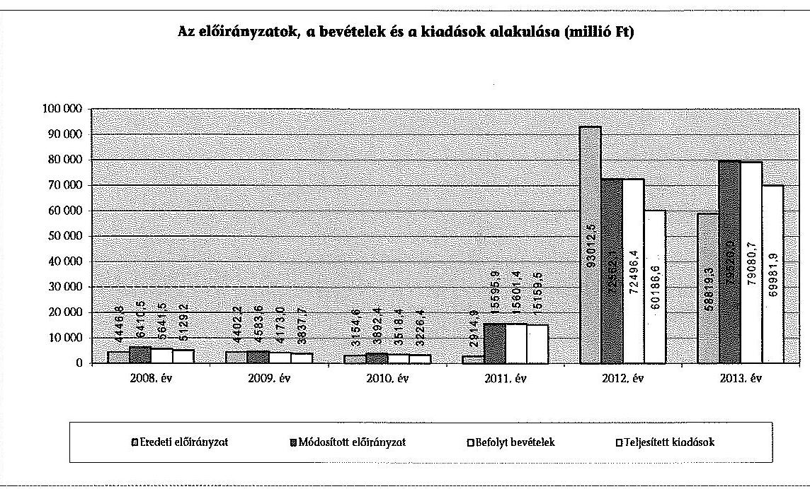
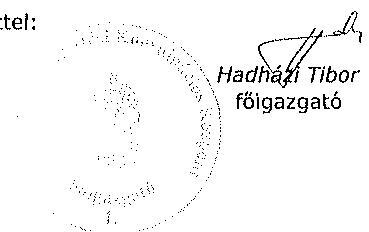
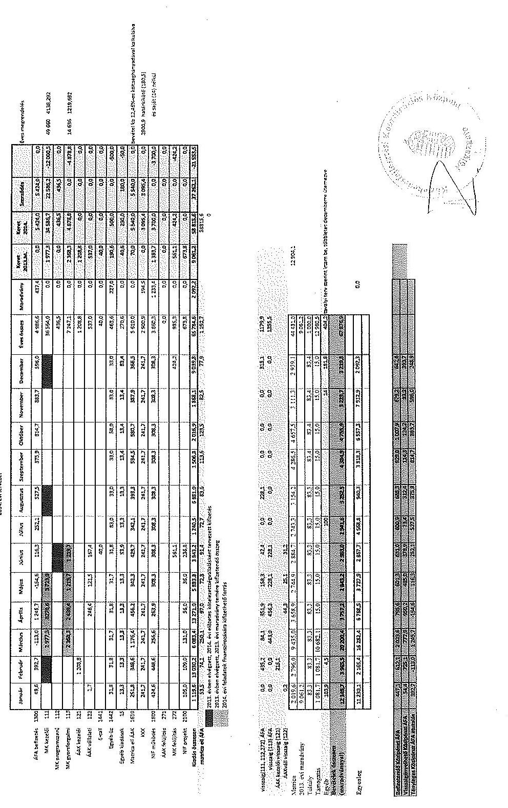
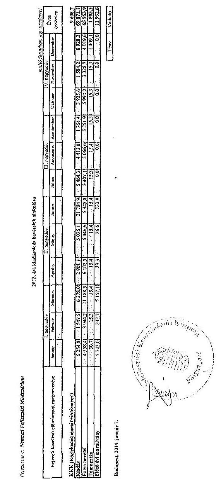
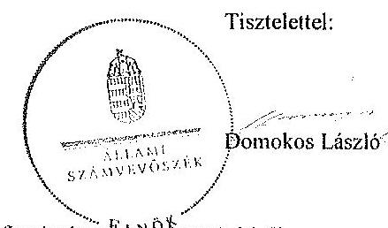

# ÁLLAMI   SZÁMVEVŐSZÉK 

## JELENTÉS

a központi alrendszer egyes intézményei pénzügyi és vagyongazdálkodásának ellenőrzéséről
Közlekedésfejlesztési Koordinációs Központ

---

# Állami Számvevőszék 

Iktatószám: V-0747-086/2015.
Témaszám: 1781
Vizsgálat-azonosító szám: V0679

## Az ellenőrzést felügyelte:

## Kisgergely István

felügyeleti vezető

## Az ellenőrzés végrehajtásáért felelős:

## Preller Zsuzsanna

ellenőrzésvezető

## A számvevői munkaanyagok feldolgozását és a Jelentéstervezet összeállítását végezték:

## Preller Zsuzsanna

ellenőrzésvezető

## Magyari Anna

számvevő tanácsos

## Orosz Diána

számvevő tanácsos

## Az ellenőrzést végezték:

Hámoriné Maróti Györgyi
számvevő vezető főtanácsos

## Magyari Anna

számvevő tanácsos

## Kovács Richárd

számvevő

## Orosz Diána

számvevő tanácsos

## A témához kapcsolódó eddig készített számvevőszéki jelentés:

## címe

Jelentés Magyarország 2012. évi központi költségvetése végrehajtásának ellenőrzéséről
Jelentés a Magyar Köztársaság 2008. évi költségvetése végrehajtásának ellenőrzéséről
Jelentés az állami közutak felújítását, javítását, karbantartását célzó intézkedések eredményességének és az állami közutak állapotára gyakorolt hatásának ellenőrzéséről
Jelentés a gyorsforgalmi úthálózattal kapcsolatban állami feladatot ellátó szervezetrendszer működtetésének ellenőrzéséről
Jelentés a kerékpárút hálózat fejlesztésére fordított pénzeszközök felhasználásának ellenőrzéséről

---

# TARTALOMJEGYZÉK 

BEVEZETÉS ..... 3
I. ÖSSZEGZŐ MEGÁLLAPÍTÁSOK, KÖVETKEZTETÉSEK, JAVASLATOK ..... 8
II. RÉSZLETES MEGÁLLAPÍTÁSOK ..... 13

1. Az Irányító szerv intézményre vonatkozó feladatellátása ..... 13
2. A belső kontrollrendszer és az integritás kontrollok kialakítása és működtetése az Intézménynél ..... 15
3. Az Intézmény pénzügyi gazdálkodása ..... 18
3.1. Az előirányzatok megállapítása és módosítása ..... 18
3.2. A kiadási előirányzatok felhasználása és a bevételi előirányzatok teljesítése ..... 20
3.3. Az előirányzat-maradványok kezelése ..... 22
3.4. A fizetőképesség alakulása ..... 23
4. Az Intézmény vagyongazdálkodása ..... 24
4.1. A vagyongazdálkodás szabályozottsága ..... 24
4.2. Az eszközök és források értékének kimutatása, az eszközök visszapótlása ..... 25
4.3. A vagyonkezelésbe adás- és vétel, a vagyonelemek hasznosítása ..... 28
4.4. Az eredményszemléletű számvitel bevezetésével kapcsolatos feladatok végrehajtása ..... 31
5. A korábbi ÁSZ ellenőrzések során tett javaslatok hasznosulása ..... 32

---

# MELLÉKLETEK 

1. számú Az Intézmény belső kontrollrendszere kialakításának és működtetésének értékelése
2. számú Az Intézmény kiadásainak, bevételeinek és létszámának alakulása
3. számú Az Intézmény eszközeinek és forrásainak alakulása
4. számú Az Intézmény tárgyi eszközeivel kapcsolatos mutatószámok alakulása
5. számú A Közlekedésfejlesztési Koordinációs Központ észrevétele
6. számú A Közlekedésfejlesztési Koordinációs Központ észrevételére válasz

## FÜGGELÉKEK

1. számú A Közlekedésfejlesztési Koordinációs Központ pénzügyi és vagyongazdálkodásának teljesítményellenőrzése
2. számú Az integritás érvényesítése érdekében kialakított és működtetett intézményi kontrollrendszer
3. számú Rövidítések és jogszabályok jegyzéke
4. számú Értelmező szótár

---

# JELENTÉS 

## a központi alrendszer egyes intézményei pénzügyi és vagyongazdálkodásának ellenőrzéséről   Közlekedésfejlesztési Koordinációs Központ

## BEVEZETÉS

A közpénzek felhasználásában és az állami vagyonnal való gazdálkodásban a központi alrendszer egyes intézményei meghatározó súlyt képviselnek. Pénzügyi- és vagyongazdálkodásuk rendszeres ellenőrzésével az ÁSZ hozzájárul a hatékony közigazgatás megteremtéséhez. Az ÁSZ Stratégiával összhangban a közvagyon védelme, a közpénzügyek átláthatóságának előmozdítása érdekében került sor az Intézmény ellenőrzésére.

Az Intézményt Útgazdálkodási és Koordinációs Igazgatóság néven a közútkezelői rendszer átalakításával kapcsolatos 15/1996. (V.7.) KHVM rendelettel 1996-ban hozták létre, 2007. január 1-jétől működik Közlekedésfejlesztési Koordinációs Központ néven. Az Intézmény működésére irányadó jogszabályok a Kkt., valamint a végrehajtásáról szóló 30/1988. (IV. 21.) MT. rendelet. Az Intézmény az országos közúthálózat vagyonkezelője, feladata a közúthálózat vagyonkezelése és vagyonnyilvántartásának vezetése, a közúthálózat finanszírozását szolgáló költségvetési előirányzatok kezelése és a közlekedési szakma koordinációja. Tudományos igényű szakmai, műszaki előkészítő és információs hátteret nyújt a közlekedésfejlesztés területén a minisztériumban, illetve az egyéb háttérintézményekben, kutatóhelyeken folyó munkához.

Az Intézmény önállóan működő és gazdálkodó költségvetési előirányzatai felett teljes jogkörrel rendelkező költségvetési szerv, irányító szerve a Nemzeti Fejlesztési Minisztérium. Az Intézmény átalakítására, vagy pénzügyi és vagyongazdálkodására hatást gyakorló átszervezésére az ellenőrzött időszakban nem került sor. Az Intézményt a főigazgató vezette, munkáját a gazdasági igazgató, valamint a műszaki igazgató segítette. Az ellenőrzött időszakban a főigazgató személyében négy, a gazdasági vezető személyében két alkalommal történt változás.

Teljesített költségvetési kiadásai a 2008. évi 5129,2 millió Ft-ról a 2013. évre több mint 13 szorosára, 69981,9 millió Ft-ra emelkedtek. A kiadási és bevételi előirányzatok jelentős módosulására került sor 2011-ben, mert az „Útpénztár" útdíj bevételeihez kapcsolódó fizetendő ÁFA-t az Intézmény költségvetésében kellett megjelentetni, ami a kiadási és bevételi előirányzat 11440 millió Ft-os növekedését eredményezte. A 2012. évtől jelentős szerkezeti változást okozott az intézmény költségvetésében, hogy a 2012. évi Kvtv. alapján az Intézmény által addig kezelt „Útpénztár" fejezeti kezelésű előirányzat megszűnt, és az országos

---

közúthálózat finanszírozási forrásai az Intézmény költségvetésében kerültek megtervezésre. Ennek következtében az Intézmény 2012. évi teljesített kiadásai az előző évhez képest, 45 027,1 millió Ft-tal, teljesített bevételei 56 895,0 millió Ft-tal, mintegy négyszeresére növekedtek. A teljesített kiadások a 2013. évben további 9795,3 millió Ft-tal, 16,3%-kal, a beszedett bevételek 6584,3 millió Ft-tal, 9,1%-kal növekedtek. A változások a teljesített kiadások esetében a dologi kiadásokat, az intézményi felújításokat és beruházásokat érintette, míg a bevételi oldalon a működési bevételek, illetve 2013-ban a központi irányító szervi támogatások és az előirányzat maradvány felhasználásának növekedését eredményezték. Az előirányzatok, a bevételek és a kiadások alakulását a következő ábra szemlélteti:

Az Intézmény vagyona - a könyvviteli mérlegben nyilvántartott eszközök értéke - a 2008. január 1-jei 6053 976,6 millió Ft-ról a 2013. évre 5416 675,3 millió Ft-ra 10,5%-kal csökkent. A csökkenést a tárgyi eszközök állományának 10,7%-os csökkenése határozta meg - a vagyonelemek összetételében a tárgyi eszközök aránya az ellenőrzött időszak minden évében meghaladta a 99,9%-ot - mert a tárgyi eszközökre elszámolt értékcsökkenés nagysága meghaladta az aktivált beruházások értékét, valamint az országos közutakból helyi úttá átminősített vagyonelemek átadására került sor az önkormányzatok részére. Az forgóeszközök állományának növekedését meghatározta, hogy a 2012. és a 2013. években a pénzeszközök állománya az Útpénztár előirányzatainak az Intézmény költségvetésébe történő bevonásával a korábbi évek pénzeszközeit többszörösen meghaladó összegben (12606,0 millió Ft illetve 9659,3 millió Ft-ban) realizálódott, ami forrásoldalon a költségvetési tartalék összegének 9369,0 millió Ft-os növekedését is eredményezte. Számottevően, több mint harmincszorosára emelkedett a 2012-2013. években szintén az Útpénztár előirányzatainak átvétele miatt a rövid lejáratú kötelezettségek összege is, ami a 2008. január 1-jei 532,3 millió Ft-ról 2012. évre 13 796,0 millió Ft-ra, 2013. évre pedig 17 109,7 millió Ft-ra (ebből az Útpénztár kötelezettsége 12 217,5 millió Ft, illetve 16 629,5 millió Ft volt) nőtt.

---

Az Intézmény engedélyezett létszámkerete a 2008. évi 157 főről a 2013. évre 5,7%-kal, 148 főre csökkent (ebből 21 fő projektek végrehajtásához rendelt határozott idejű létszám volt) a szakmai feladatellátással és a projektek megvalósításával összefüggő létszámemelések, valamint a kormányzati célkitűzésekkel kapcsolatosan végrehajtott létszámcsökkentés együttes hatásának eredményeként.

Az ellenőrzés célja annak megállapítása volt, hogy az Intézményre vonatkozó irányító szervi feladatellátás a jogszabályi előírások betartásával történt-e; az Intézménynél a belső kontrollrendszer kialakítása és működtetése szabályszerű volt-e; kialakították-e az erőforrásokkal való szabályszerű és hatékony gazdálkodáshoz szükséges követelményeket, megvalósították-e azok számon kérését, ellenőrzését; az Intézmény pénzügyi és vagyongazdálkodása megfelelt-e a jogszabályi előírásoknak és belső szabályzatainak; az Intézmény átalakításának vagy átszervezésének lebonyolítása szabályszerűen történt-e; az integritási kontrollokat kialakították-e, szabályszerűen működtetik-e; az ÁSZ korábbi ellenőrzései során megfogalmazott javaslatok, megállapítások tekintetében az ellenőrzés célja továbbá annak megítélése volt, hogy azok végrehajtása érdekében az Intézmény a szükséges intézkedéseket megtette-e.

Az ellenőrzés várható hasznosulása: A központi alrendszerbe tartozó intézmények jelentős hatást gyakorolhatnak a költségvetés egyensúlyának fenntartására, az állami vagyonnal való gazdálkodás minőségére, a kormányzati (szak)politikák végrehajtására, illetve közfeladat ellátásuk vonatkozásában az állampolgárok életminőségére, jogaik és kötelezettségeik gyakorlására. Az ellenőrzés az Intézmény pénzügyi és vagyongazdálkodása szabályosságának javításával előmozdítja a közpénzügyek átláthatóságát, rendezettségét. Eredményeként átfogó képet kaphatunk az Intézmény gazdálkodásának hiányosságairól és a jó gyakorlatokról is.

A közintézmények integritás alapú kultúrája meghatározó a belső kontrollrendszer működése szempontjából. Hozzájárulhat az elszámoltathatóság és átláthatóság érvényesítéséhez, egyben támogathatja a szervezet védettségét a korrupciós kitettséggel szemben. Az integritási kontrollok ellenőrzése az integritási szemlélet terjedését, az integritás kultúra erősítését támogatja.

A belső kontrollrendszer államháztartási törvényben rögzített célja a működés és gazdálkodás során a tevékenységek szabályszerű, gazdaságos, hatékony és eredményes végrehajtása. Az ÁSZ a központi intézmények ellenőrzését teljesítményellenőrzési modullal egészítette ki.

Az Intézmény teljesítmény-ellenőrzésének célja annak értékelése volt, hogy a gazdálkodás folyamatában a gazdaságossági, hatékonysági és eredményességi követelmények kialakítása megtörtént-e és azokat működtették-e; a költségvetési szerv belső kontrollrendszerének minőségéről kiadott vezetői nyilatkozatban a költségvetési szerv tevékenységében a hatékonyság, eredményesség, gazdaságosság követelményeinek érvényesítése helytálló volt-e. A teljesítmény-ellenőrzés a gazdálkodási feladatokra terjedt ki, a szakmai feladatellátást nem értékelte.

---

A teljesítményellenőrzés várható hasznosulása: A törvényalkotás számára támogatást nyújt a nemzeti kulcsindikátorok rendszerének kialakításához. A döntéshozók, ellenőrzöttek, irányító szervek, a társadalom számára az összehasonlítási, összemérési lehetőségek kihasználásával objektív visszajelzést ad a gazdálkodás területén végrehajtott szervezeti, szervezési, takarékossági és bürokráciacsökkentő intézkedések hatásairól, a közfeladat-ellátásnak keretet adó pénzügyi és vagyongazdálkodásban mérhető teljesítménykövetelmények kialakításáról, azok alkalmazásáról. Az ÁSZ értékteremtő elemzéseivel, tanácsadó szerepét erősítve támogatja a szervezetek önértékelő, alkalmazkodó (öntanuló) tevékenységét. Irányt mutat az ellenőrzött intézmények gazdálkodási és kapcsolódó adminisztratív folyamatainak optimalizációjához. Segíti a központi költségvetési szervek átláthatóságát, felügyelhetőségét, a „jó gyakorlatok" elterjesztésével támogatja a „jó kormányzást".

Az ellenőrzés típusa szabályszerűségi ellenőrzés, amelyet az Intézményre vonatkozó teljesítmény-ellenőrzés egészített ki.

Az ellenőrzött időszak: 2008. január 1. - 2013. december 31.
A helyszíni ellenőrzésre a szabályszerűségi ellenőrzés tekintetében az Intézménynél és az Intézmény irányító szervi feladatait ellátó Minisztériumnál, a teljesítményellenőrzés vonatkozásában az Intézménynél került sor.

Az ellenőrzés jogszabályi alapját az ÁSZ tv. 1. § (3) bekezdés, 5. § (2)(6) bekezdései, valamint Áht. 2 61. § (2) bekezdésének előírásai képezik.

A központi alrendszer intézményeinek ellenőrzése során a belső kontrollrendszer tekintetében a hangsúlyt az egyes kontrollterületek (kontrollkörnyezet, kockázatkezelési rendszer, kontrolltevékenységek, információs és kommunikációs rendszer, monitoring rendszer) kialakításának és az intézmény működési folyamataiba való beépülésének szabályszerűségére helyeztük, amelyet kizárólag jogszabályokból és intézményi belső szabályozásokból levezethető kritériumrendszer alapján ítéltünk meg.

A belső kontrollrendszer jogszabályi előírások szerinti kialakításának és működtetésének szabályszerűségét az erre irányuló ellenőrzési kérdésekre adott válaszok összesítése alapján kontrollterületenként egyedileg és összesítetten is értékeltük. A belső kontrollrendszer egyes kontrollterületei kialakítása és működtetése „szabályszerű volt", tehát a feltárt hiányosságok nem gyakoroltak lényeges hatást a kontrollok kialakítására és működtetésére, amennyiben az értékelt területen az elért és elérhető pontok százalékban kifejezett hányadosa elérte a 85%-ot, „nem volt szabályszerű", ha nem haladta meg a 60%-ot, és „részben szabályszerű volt", ha 61-84% között volt.

A belső kontrollrendszer összesített értékelése megegyezett a kontrollterületenként alkalmazott %-os értékelésekkel, a következő kiegészítéssel. A kontrollrendszer egésze esetében a „szabályszerű" értékelésnek a %-os értéken felül további feltétele volt, hogy egyik kontrollterületen sem kaphatott „nem volt szabályszerű" értékelést. A „részben szabályszerű" értékelés további feltétele volt, hogy legfeljebb egy ellenőrzött kontrollterület lehetett „nem volt szabályszerű" értékelésű. Az összesített értékelés a %-os kiértékelés eredményétől függetlenül

---

„nem volt szabályszerű", ha az ellenőrzött kontrollterületek közül több mint egynek „nem volt szabályszerű" az értékelése.

A személyi juttatások, a dologi kiadások és dologi jellegű (egyéb folyó) kiadások, a
 támogatásértékű kiadások, az átadott pénzeszközök és a felhalmozási kiadások előirányzatai felhasználásának, valamint a vagyonhasznosítási bevételi előirányzatok teljesítésének szabályszerűségét és a gazdálkodási jogkörök gyakorlását mintavétellel ellenőriztük. A jogszabályoknak és a belső előírásoknak megfelelőnek, azaz szabályszerűnek tekintettük az ellenőrzött kiadási előirányzatok felhasználását, illetve bevételi előirányzatok teljesítését, amennyiben a minta ellenőrzésének eredménye alapján 95%-os bizonyossággal a teljes sokaságban a hibás tételek aránya kisebb volt, mint 10%, nem megfelelőnek értékeltük, ha a hibás tételek aránya a 10%-ot meghaladta. Kockázatot, illetve magas kockázatot jeleztünk, amennyiben egy adott terület vonatkozásában a minta alapján a teljes sokaságban nem volt teljes körűen biztosított a jogszabályoknak és a belső szabályzatoknak megfelelő működés. A 2008-2011. éveket érintően a szakmai teljesítésigazolás és az utalvány ellenjegyzése kulcskontrollok, a 2012-2013. éveket érintően a teljesítésigazolás és az érvényesítés kulcskontrollok működését értékeltük. Megfelelőnek értékeltük a gazdálkodási jogkörök gyakorlását, amennyiben 95%-os bizonyossággal a teljes sokaságban a hibaarány legfeljebb 10%, részben megfelelőnek értékeltük, ha a hibaarány felső határa legfeljebb 30% volt, nem megfelelőnek pedig akkor, ha a sokaságbeli hibaarány felső határa meghaladta a 30%-ot.

Az ellenőrzés az INTOSAI által kiadott nemzetközi standardok (ISSAI) figyelembe vételével történt.

Az ÁSZ a 2011. évi LXVI. törvény 29. §-a szerint a jelentéstervezetet megküldte a Közlekedésfejlesztési Koordinációs Központ főigazgatójának és a Nemzeti Fejlesztési Minisztérium miniszterének részére egyeztetésre. A Nemzeti Fejlesztési Minisztérium minisztere az ÁSZ tv. 29. § (2) bekezdésében foglalt észrevételezési jogával nem élt, a törvényes határidőn belül észrevételt nem tett. A Közlekedésfejlesztési Koordinációs Központ főigazgatója által megküldött észrevételeket és az arra adott válaszokat a jelentés 5-6. sz. mellékletei tartalmazzák.

---

# I. ÖSSZEGZŐ MEGÁLLAPÍTÁSOK, KÖVETKEZTETÉSEK, JAVASLATOK 

Az Intézményre vonatkozó irányító szervi feladatellátás részben megfelelő volt. Az alapítói jogok gyakorlása szabályszerű volt, a Minisztérium az irányító szervi jogosultságait részben megfelelően gyakorolta, a közfeladatok ellátására vonatkozó, az erőforrásokkal való szabályszerű és hatékony gazdálkodáshoz szükséges követelmények előírásáról, érvényesítéséről és számon kéréséről azonban nem gondoskodott, nem tett intézkedéseket a törvényi előírás szerint az Intézmény kezelésébe tartozó vagyonelemek vagyonkezelésének és nyilvántartásának szabályszerű rendezése érdekében. Az ellenőrzött időszakban nem kerültek átadásra az Intézmény vagyonkezelésébe, a beruházó NIF Zrt. és az MK NZrt. könyveiben szereplő forgalomba helyezett gyorsforgalmi és országos közutak.

A belső kontrollrendszer kialakítása és működtetése az ellenőrzött időszak összesített értékelése alapján szabályszerű volt. A kontrollkörnyezet, a kockázatkezelési rendszer és az információs és kommunikációs rendszer kialakítása és működtetése szabályszerű volt, a feltárt hiányosságok nem gyakoroltak lényeges hatást a rendszer kialakítására és működésére. Részben volt szabályszerű a kontrolltevékenység kialakítása és működtetése a kulcskontrollok nem megfelelő működése miatt, valamint a monitoring rendszer működtetése, mert az Intézménynél a belső ellenőrzés rendszere ugyan összességében szabályszerűen működött, de a szervezet tevékenységének, a célok megvalósításának folyamatos nyomon követésére alkalmas monitoring tevékenységet dokumentáltan nem végeztek, a gazdálkodás folyamatában a gazdaságossági, hatékonysági és eredményességi követelményeket nem alakították ki és nem alkalmazták.

Az ellenőrzött időszakban az Intézmény pénzügyi és vagyongazdálkodása részben volt megfelelő. Az Intézmény elemi költségvetése, az előirányzatok megállapítása és módosítása részben felelt meg a jogszabályi előírásoknak, a kiadási előirányzatok felhasználásának elszámolása szabályszerű, a bevételi előirányzatok teljesítésének elszámolása kockázatos volt, a bevételi előirányzatok teljesítéséhez és kiadási előirányzatok felhasználásához kapcsolódó kulcskontrollok kialakítása és működése nem volt megfelelő. Az Intézmény a jogszabályi előírások ellenére előirányzat-felhasználási, a 2012. évtől kezdődően likviditási tervet nem készített. Az Intézmény fizetőképessége az ellenőrzött időszakban romlott, folyamatos fizetőképessége a 2012-2013. években nem volt biztosított.

Az ellenőrzött időszakban a vagyongazdálkodási tevékenység szabályozottsága, a könyvviteli mérlegekben kimutatott eszközök és források nyilvántartása, értékének megállapítása részben felelt meg a jogszabályokban és a belső szabályozásokban foglalt előírásoknak. A leltározások végrehajtása nem szabályszerűen történt, a mérlegben kimutatott eszközök és források állományának valódiságát a mennyiségben és értékben kimutatott leltár nem teljes körűen támasztotta alá, az eszközök és források állományának valódiságát alátámasztó dokumentumok hiányosan álltak rendelkezésre, ezért a mérlegva-

---

lódiság nem volt biztosított. Az Intézmény több esetben nem tett eleget a Számv. tv. és a belső szabályzataiban foglaltak alapján a számviteli bizonylatok megőrzési kötelezettségnek. A beszerzett, létesített tárgyi eszközök bekerülési értékének megállapítása, állományba vétele, év végi értékelése és értékcsökkenésének elszámolása a számviteli szabályoknak és a belső szabályozásoknak megfelelt, a felhalmozási kiadások azonban nem érték el a szinten tartáshoz szükséges mértéket, ami kockázatot jelent a vagyongazdálkodásra, a vagyon megőrzésére vonatkozóan. A vagyonhasznosítási tevékenység az ellenőrzött időszakban kockázatos volt, az értékesített tárgyi eszközök eladási árának meghatározása egységes szabályozás hiányában nem megfelelően történt.

Az Intézménynél az eredményszemléletű számvitel bevezetésével kapcsolatos feladatokat a jogszabályi előírásoknak megfelelően végrehajtották.

Az Intézmény kialakította és működtette a kontrollrendszert az integritás érvényesítése érdekében, azonban a bérbeadások során nem minden esetben győződtek meg az átláthatósági követelmények érvényesüléséről, valamint a közérdekű adatok hozzáférését csak részben biztosították.

Az ÁSZ tv. 33. § (1) bekezdésében foglaltak értelmében a jelentésben foglalt megállapításokhoz kapcsolódó intézkedési tervet köteles az ellenőrzött szervezet vezetője összeállítani, és azt a jelentés kézhezvételétől számított 30 napon belül az ÁSZ részére megküldeni. Amennyiben az intézkedési tervet határidőben nem küldi meg a szervezet, vagy az nem elfogadható, az ÁSZ elnöke a hivatkozott törvény 33. § (3) bekezdés a)-b) pontjaiban foglaltakat érvényesítheti.

A helyszíni ellenőrzés megállapításainak hasznosítása mellett javasoljuk:

# a nemzeti fejlesztési miniszternek: 

1. A Minisztérium az Intézménynél az Áht.1. 49. § (5) bekezdésének f) pontjában és az Áht.2. 9. § (1) bekezdésének f) pontjában foglaltak ellenére az erőforrásokkal való hatékony gazdálkodáshoz szükséges mérhető, számszerűsíthető teljesítménykövetelményeket nem határozott meg, így azok érvényesítése és számonkérés nem volt lehetséges.

Javaslat
Intézkedjen az erőforrásokkal való hatékony gazdálkodásra vonatkozó követelmények érvényesítéséről, számonkéréséről, ellenőrzéséről.

## a KKK főigazgatójának

1. Az Intézmény szabályozottsága tekintetében:

Az Eszközök és források értékelési szabályzata $_{1-6}$ a 2008-2013. években az Áhsz. 8. § (17) bekezdés a) és d) pontjában előírtak ellenére nem határozta meg egyértelműen az adósminősítés szempontjait, követeléstípusonként a kis értékű követelések meghatározásának elveit, dokumentálásának előírásait.

---

A gazdasági szervezet ügyrendje $_{2-3}$. a 2009-2013-ig terjedő időszakban, az Ámr. 1 134. § (3) bekezdésében, az Ámr. 2 72. § (13)-(14) bekezdésében, és az Ávr. 53. § (1)-(2) bekezdésében megjelölt kisösszegű kifizetések rendjét nem tartalmazta.

Az Önköltség számítási szabályzat az Áhsz. 8. § (15) és (16) bekezdéseiben foglaltak ellenére nem tartalmazta az Intézmény által végzett termékértékesítés-, illetve a közérdekű adatszolgáltatás költségtérítési összeg megállapításának szabályait, valamint a terembérlet, és a parkoló használati díjak 2011. évet követő aktualizálását.

Javaslat
Intézkedjen a szabályozottsággal összefüggésben feltárt hiányosságok megszűntetése, valamint a jogszabályok és a belső szabályzatok közötti összhang megteremtése érdekében.
2. Az intézménynél a kulcskontrollok kialakítása és működése az ellenőrzött időszakban nem volt megfelelő. A gazdálkodási jogkörgyakorlók (érvényesítő, utalvány ellenjegyző) kijelölése nem felelt meg Ámr. 1 135. § (4) bekezdése, 137. § (1) bekezdése, az Ámr. 2 77.§ (4) bekezdése és 79. § (1) bekezdése, az Ávr. 58. § (4) bekezdése előírásainak. Szabályszerű kijelölés hiányában az utalvány ellenjegyző (2011. december 31-ig), az érvényesítő (2012. január 1-jétől) jogosulatlanul látták el feladatukat.

Javaslat
a) Intézkedjen kontrolltevékenység megfelelő működtetése érdekében, továbbá gondoskodjon az érvényesítők jogszabályi előírásnak megfelelő kijelöléséről;
b) Tegyen intézkedéseket a gazdálkodási jogkörgyakorlók szabályszerű kijelölésének elmaradásával összefüggésben a feltárt hiányosságok és szabálytalanságok tekintetében a felelősség tisztázása érdekében, és szükség szerint intézkedjen a felelősség érvényesítéséről.
3. Az intézmény kockázatkezelési rendszere részben felelt meg az Ámr. 1 145/C. § (3) bekezdés, az Ámr. 2 157. § (3) és a Bkr. 7. § (2) bekezdésében rögzített elvárásoknak, mert nem határozták meg a kockázatokkal kapcsolatosan szükséges intézkedéseket, illetve 2012-től az intézkedések teljesítése folyamatos nyomon követésének módját.

Javaslat
Intézkedjen a kockázatkezelés belső szabályozása jogszabálynak megfelelő kiegészítéséről.
4. Az Intézmény tevékenységének, a célok megvalósításának, az operatív tevékenységek keretében megvalósuló folyamatos és eseti nyomon követésére az Ámr. 1 145/G. §, az Ámr. 2 160. § (1) bekezdésének, 2011. évtől az Ámr. 2 160. § (2) bekezdésének és a Bkr. 10 §-ának megfelelő monitoring tevékenységet dokumentáltan nem végeztek.

Javaslat
Intézkedjen a célok megvalósításának nyomon követésére, az operatív tevékenységek folyamatos és eseti nyomon követésére alkalmas monitoring rendszer kialakítása és működtetése érdekében.

---

5. A 2008-2013. években a teljesítésigazolás nem minden esetben felelt meg az Ámr$_{1}$. 135. § (2) bekezdésében, az Ámr$_{2}$. 76. § (1) és (3) bekezdéseiben és az Ávr. 57. § (1) és (3) bekezdéseiben foglalt előírásoknak, a 2008-2013. években a dologi kiadások közül 13, a pénzeszközátadások közül négy esetben nem történt meg a teljesítés igazolása. Az ellenőrzött időszakban a rendszeres személyi juttatások esetében a jelenléti ívek, valamint a dologi kiadásoknál egy esetben a teljesítést igazoló dokumentumok nem tartalmazták a teljesítés igazolás dátumát és a teljesítés tényére való utalást, mely ellentétes az Ámr$_{1}$. 135. § (2) bekezdésében, az Ámr. 76. § (3) bekezdésében és az Ávr. 57. § (3) bekezdésben foglalt előírásokkal;

Javaslat
Intézkedjen, hogy a teljesítésigazolás minden esetben a jogszabályi előírásoknak megfelelően történjen.
6. A 2012-2013. években az érvényesítő az Ávr. 58. § (1)-(3) bekezdések rendelkezéseit figyelmen kívül hagyva a teljesítésigazolás szabályszerűségét nem ellenőrizte és nem jelezte az utalványozónak a teljesítésigazolás elmaradását, illetve a nem szabályszerű teljesítésigazolást.

Javaslat
Intézkedjen, hogy az érvényesítő a vonatkozó jogszabályi előírásnak megfelelően tegyen eleget ellenőrzési és jelzési kötelezettségeinek.
7. Az Intézmény az éves tervezéssel egyidejűleg az Ámr. $_{1}$ 138/B § (2), az Ámr. $_{2}$ 200 § (2) bekezdéseiben előírt előirányzat-felhasználási, a 2012. évtől kezdődően az Áht. $_{2}$ 78. § (2) bekezdésében előírt likviditási tervet nem készített.

Javaslat
Intézkedjen, hogy a jogszabályi előírásoknak megfelelően likviditási terv készüljön.
8. A beszámolóban és a számviteli nyilvántartásokban kimutatott eszközök és források állományának valódiságát a mennyiségben és értékben kimutatott leltár az ellenőrzött időszakban az Áhsz. 37. § (2) bekezdés előírásainak ellenére teljes körűen nem támasztotta alá, ezért a mérlegvalódiság nem volt biztosított.

Javaslat
Intézkedjen a mérleg tételeinek alátámasztására szolgáló leltár elkészíttetéséről, amely az eszközök és források állományát tételesen és ellenőrizhető módon tartalmazza.
9. A selejtezés végrehajtása részben felelt meg a Selejtezési szabályzat $_{1-6}$-ban előírtaknak, mivel a 2009., 2011., és 2013. években szakértői dokumentáció nem támasztotta alá a selejtté válás tényét.

Javaslat
Intézkedjen, hogy a selejtezések végrehajtása során a selejtté válás ténye minden esetben a belső szabályzatokban előírtaknak megfelelően kerüljön alátámasztásra.

---

10. Az Intézmény a bérbeadások során - 2012-től a földterületek bérbeadási folyamatának kivételével - nem győződött meg az Nvtv. 3. § (1) bekezdés 1. pontja szerinti átláthatósági követelmények érvényesüléséről.

Javaslat
Intézkedjen a bérbeadások során az átláthatóság követelményének érvényesülése érdekében.
11. Az ellenőrzött időszakban az Intézmény több esetben nem tett eleget a Számv. tv. 169.
 § (1)-(2) bekezdésekben, az Iratkezelési szabályzat ${ }_{1,2,3}$-ban és a Számlarend ${ }_{1-6}$-ban foglaltak alapján a számviteli bizonylatok megőrzési kötelezettségének.

Javaslat
a) Intézkedjen, hogy a számviteli bizonylatok megőrzési kötelezettségének tegyenek eleget,
b) Tegyen intézkedéseket a számviteli bizonylatok megőrzési kötelezettségével kapcsolatosan feltárt hiányosságok és szabálytalanságok tekintetében a felelősség tisztázása érdekében, és szükség szerint intézkedjen a felelősség érvényesítéséről.
12. Az Intézmény vezetője nem gondoskodott arról, hogy tevékenységében és céljaiban a gazdaságosság, a hatékonyság és az eredményesség követelményei érvényesüljenek, mivel azokat az Áht. 94. § (1) bekezdés b) pontjában, az Áht. 261. § (1) bekezdésben, az Áht. 269. § (1) bekezdés a) pontjában és a Bkr. 4. § a) pontjában foglaltak ellenére nem alakította ki és nem alkalmazta.

Javaslat
Intézkedjen az Intézmény tevékenységére és céljára vonatkozó, mérhető hatékonysági, eredményességi és gazdaságossági követelmények kialakítása és érvényesítése érdekében.

---

# II. RÉSZLETES MEGÁLLAPÍTÁSOK 

## 1. Az Irányító szerv intézményre vonatkozó feladatellátása

Az Intézményre vonatkozó irányító szervi feladatellátás részben megfelelő volt. Az alapítói jogosultságok gyakorlása szabályszerűen történt, az alapító okiratok - egy kisebb hiányosság mellett - alakilag és tartalmilag megfeleltek az Áht. ${ }_{1,2}$, a Kt. és az Ávr. előírásainak. A Miniszter az Intézmény alapító okirataiban a szükséges - az Intézmény székhelyét, tevékenységét, szakfeladat-rendjének besorolását és irányító szervét érintő - változásokat átvezette. Az alapító okirat ${ }_{1-4}$ az Áht. ${ }_{1}88$. § (3) bekezdése, 2009. január 1-jétől a Kt. 4. § (1) bekezdés a) pontjában foglaltak ellenére az alapító székhelyét nem tartalmazta. A Minisztérium 2008-ban az alapító okirat ${ }_{3}$, 2009-ben az alapító okirat ${ }_{5}$ törzskönyvi nyilvántartásról szóló 25/2009.(XI. 18) PM rendelet 9. § b) bekezdésében foglalt határidőben történő benyújtását a Kincstár részére dokumentumokkal igazolni nem tudta.

A Minisztérium intézménnyel kapcsolatos irányító szervi jogosultságait részben megfelelően gyakorolta. Az Intézmény az ellenőrzött időszak egészében rendelkezett SZMSZ-szel, amely - kisebb hiányosságok mellett - megfelelt az Áht. ${ }_{1-2}$, az Ámr. ${ }_{1-2}$ és az Ávr. előírásainak. A 2010. évben az SZMSZ ${ }_{3}$ nem tartalmazta az Ámr. ${ }_{2}20. § (2) bekezdés i) pontjában foglaltak ellenére a költségvetési szerv szervezeti ábráját, az Ámr ${ }_{1}13/A. § (3) bekezdés e) pontjában, az Ámr. ${ }_{2}20. § (2) bekezdés e) pontjában, illetve az Ávr. 13. § (1) bekezdés e) pontjában foglaltak ellenére nem tartalmazta a 2008-tól 2011-ig terjedő időszakban az SZMSZ ${ }_{1-5}$ a szervezet és a szervezeti egységek engedélyezett létszámát, a 2012-2013. években az SZMSZ ${ }_{6}$ a szervezet engedélyezett létszámát. Az ellenőrzött időszakban a főigazgató, a gazdasági igazgató kinevezése és felmentése, továbbá a vezetői megbízások kiadása és visszavonása Áht${ }_{1,2}$ előírásainak megfelelően történt.

A Minisztérium az Áht. ${ }_{2}$ 9. § (1) bekezdés f) és h) pontjában foglalt irányító szervi hatáskörében - az Intézmény többszöri jelzése és tájékoztatása ellenére - nem kezdeményezett intézkedéseket MNV Zrt.-felé az Intézmény szabályszerű vagyongazdálkodásának érdekében. A NIF Zrt-től, mint építtetőtől az elkészült és forgalomba helyezett, valamint az MK NZrt-től a 2010-2012. években beruházás keretében megvalósított és forgalomba helyezett, a Kkt. szerint az Intézmény kezelésébe tartozó gyorsforgalmi és országos közutak vagyonkezelésbe adása és nyilvántartásának szabályszerű rendezése nem történt meg az ellenőrzött időszakban. ${ }^{1}$

[^0]
[^0]:    ${ }^{1}$ A vagyonkezelői jog átadásának elmaradásával kapcsolatos részletes megállapításokat a jelentés 4.3. pontja tartalmazza.

---

A Minisztérium az ellenőrzött időszak minden évében az Intézmény rendelkezésére bocsátotta a tervezéssel kapcsolatos irányelveket, az Intézménnyt beszámoló készítésre kötelezte. Az éves költségvetések tervezését, végrehajtását és a beszámolókat a Minisztérium dokumentáltan felülvizsgálta és elfogadta.

A Minisztérium az Intézménnyel kapcsolatos ellenőrzési jogosultságait részben gyakorolta. Az Intézmény költségvetése tervezésének és végrehajtásának ellenőrzésén túl a Minisztérium Ellenőrzési Főosztálya megbízhatósági és szabályszerűségi ellenőrzéseket végzett. A 2010. és a 2011. években az éves beszámolók megbízhatósági ellenőrzésére, 2012-ben az Útpénztár átfogó ellenőrzésére, 2013-ban a Ten-T támogatási rendszer átfogó ellenőrzésére került sor, nem végeztek azonban:

- a Kt. 8. § (2) bekezdés d) pontjában foglalt teljesítmény-ellenőrzést (a szabályozás 2009. január 1-jétől 2010. augusztus 14-éig volt hatályban);
- a 2009-2011. években az Áht. 1 2009. január 1-jétől hatályos 49. § (5) bekezdés e) pontja szerinti, az államháztartással összefüggő közérdekű és közérdekből nyilvános adatok kötelező közzétételének, illetve igényre történő szolgáltatásának végrehajtásával kapcsolatos ellenőrzést.

A közfeladatok ellátására vonatkozó, az erőforrásokkal való szabályszerű és hatékony gazdálkodáshoz szükséges követelmények előírásáról az Áht. 1 49. § (5) bekezdésének f) pontjában és az Áht. 2. 9. § (1) bekezdésének f) pontjában foglaltak ellenére a Minisztérium nem gondoskodott, a gazdálkodás hatékonyságának követelményét általánosságban előírta, mérhető, számszerűsíthető teljesítménykövetelményeket azonban nem határozott meg, így azok érvényesítése és számonkérése nem volt lehetséges.

Az ellenőrzött időszakban az Intézmény átalakulására, átszervezésére nem került sor, de az Intézmény szakmai feladatellátása három alkalommal módosult. A 2008. évben az Intézményben működő, uniós pályázati eljárásokban közreműködő KIKSZ szervezeti egységből önálló Zrt. alakult. Az NFGM, a KHEM és a PM megállapodása alapján az Intézmény és a KIKSZ Közlekedésfejlesztési Zrt. a feladat átadás-átvétel kérdéseit megállapodásban rendezte. Az NFM 2009-ben kelt kijelölő nyilatkozata alapján az Intézmény 2010. január 1-jétől ellátta a MÁV Központi Kórház és Rendelőintézet Kötelezettségrendező Szervezet megszűnéséből eredő pénzügyi-számviteli feladatokat. A 2012. évi Kvtv. alapján 2012. január 1-jével az Intézmény feladatkörébe került az országos közúthálózat működtetésének finanszírozása, amely az Intézmény által kezelt Útpénztár fejezeti kezelésű előirányzat megszűnésével az Intézményi kiadási és bevételi főösszegében került megtervezésre. A Minisztérium a feladat átadás-átvételhez kapcsolódó intézkedéseket (előirányzat átcsoportosítás, létszámkeret-módosítás) megtette.

---

# 2. A BELSŐ KONTROLLRENDSZER ÉS AZ INTEGRITÁS KONTROLLOK KIALAKÍTÁSA ÉS MŰKÖDTETÉSE AZ INTÉZMÉNYNÉL 

A belső kontrollrendszer kialakítása és működtetése az ellenőrzött időszak összesített értékelése alapján szabályszerű volt². Az Intézmény vezetője évente nyilatkozatban értékelte a belső kontrollrendszer kialakítását és működését.

A kontrollkörnyezet kialakítása és működtetése az ellenőrzött időszakban szabályszerű volt. Az Intézmény működésére vonatkozó belső szabályozottság kialakítása a szervezeti felépítésnek megfelelt, minden területre kiterjedt és lefedte a működési folyamatokat. A feladatköröket, valamint az azokhoz tartozó felelősségi- és hatásköröket az SZMSZ ${ }_{1-6}$-ban, az Ügyrend ${ }_{1-3}$-ban, a munkaköri leírásokban, a Kiadások engedélyezési szabályzata ${ }_{1-10}$-ben, valamint az Informatikai Biztonsági szabályzat ${ }_{1,2}$-ban az Ámr. ${ }_{1,2}$ és a Bkr. előírásainak megfelelően szabályozták.

Az Intézménynél a Számv. tv, az Ámr. ${ }_{1,2}$ az Ávr. és az Áhsz. előírásai szerint alakították ki a feladatellátásához, a működéshez, valamint a gazdálkodáshoz szükséges szabályzati és szabályozási kereteket. Rendelkeztek számviteli politikával, számlarenddel, valamint leltározási és leltárkészítési, selejtezési, eszközök és források értékelési, önköltség-számítási, pénzkezelési, kötelezettségvállalási és közbeszerzési szabályzattal. Az Intézmény vezetője az etikai elvárásokat az ellenőrzött időszakban az Ámr. ${ }_{1}$ és Ámr. ${ }_{2}$ előírásainak megfelelően szabályzatokban rögzítette, 2009. október 3-áig külön Etikai Kódexben is, a továbbiakban az SZMSZ ${ }_{1-6}$-ban és a rendszeresen aktualizált Közalkalmazotti szabályzat ${ }_{1-8}$-ban.

A folyamatok meghatározására és dokumentálására az intézmény az ellenőrzött időszakban az Ámr. ${ }_{1}$, az Ámr. ${ }_{2}$ és a Bkr. előírásainak megfelelően rendelkezett ellenőrzési nyomvonallal és szabálytalanságkezelési eljárásrenddel.

A kontrollkörnyezet kialakítása és működtetése vonatkozásában azonban a jogszabályi előírások nem érvényesültek maradéktalanul, de az alábbiakban felsorolt hiányosságok nem gyakoroltak lényeges hatást a kontrollkörnyezet kialakítására:

- az Eszközök és források értékelési szabályzata ${ }_{1-6}$ a 2008-2013. években nem tartalmazta teljes körűen az Áhsz. 8. § (17) bekezdés a) és d) pontjában foglaltak ellenére az adósminősítés szempontjait, követeléstípusonként és a kis értékű követelések meghatározásának elveit, dokumentálásának előírásait;
- a gazdasági szervezet ügyrendje ${ }_{2,3}$ a 2009-2013-ig terjedő időszakban, az Ámr. ${ }_{1}$ 134. § (3) bekezdésében, az Ámr. ${ }_{2}$ 72. § (13), (14) bekezdésében, 75. § (4) bekezdésében és az Ávr. 53. § (1)-(2) bekezdésében megjelölt kisösszegű kifizetések rendjét nem tartalmazta;

[^0]
[^0]:    ${ }^{2}$ A belső kontrollrendszer elemeinek évenkénti alakulását az 1. számú melléklet mutatja be.

---

- a Kiadások engedélyezési szabályzata ${ }_{1-10}$-ben a gazdálkodási jogkörgyakorlók kijelölése (utalvány ellenjegyző, érvényesítő, pénzügyi ellenjegyző) az ellenőrzött időszakban nem felelt meg az Ámr. ${ }_{1}135. § (4) bekezdése, 137. § (1) bekezdése, az Ámr. ${ }_{2}77. § (4) bekezdése és 79. § (1) bekezdése, az Ávr. 55. § (2) bekezdés a) pontja és az 58. § (4) bekezdése előírásainak.

A kockázatkezelési rendszer kialakítása és működtetése szabályszerű volt, a feltárt hiányosságok nem gyakoroltak lényeges hatást a rendszer kialakítására és működésére. Az Intézmény kockázatkezelési szabályzatát az Ámr. ${ }_{1,2}$ és a Bkr. előírásai alapján a FEUVE szabályzat ${ }_{1,2}$ és a Belső ellenőrzési kézikönyv ${ }_{1,2}$ előírásai keretében alakította ki. A 2010. évtől a kockázatkezeléshez kapcsolódó feladatokat az SZMSZ ${ }_{4-6}$-ban is szabályozták. Az Intézmény tevékenységével kapcsolatos kockázatokat meghatározták, felmérték és elemezték. Az Ámr. ${ }_{1}145/C. § (3) bekezdés, az Ámr. ${ }_{2}157. § (3) és a Bkr. 7. § (2) bekezdésében rögzített elvárásoknak ugyanakkor az intézmény kockázatkezelési rendszere részben tett eleget, mert nem határozták meg a kockázatokkal kapcsolatosan szükséges intézkedéseket, illetve 2012-től az intézkedések teljesítése folyamatos nyomon követésének módját.

A kontrolltevékenység keretében a pénzügyi és vagyongazdálkodási folyamatokhoz kapcsolódó jogosultságok és jogkörök kialakítása és működtetése részben volt szabályszerű. A felelősségi körök meghatározására az Áht. ${ }_{1,2}$-ben és a Bkr.-ben előírtak szerint került sor a gazdasági szervezet ügyrendje ${ }_{1-3}$-ban, az Iratkezelési szabályzat ${ }_{1-3}$-ban és az Informatikai biztonsági szabályzat ${ }_{1,2}$-ban, azonban az intézménynél a kulcskontrollok kialakítása és működése az ellenőrzött időszakban nem volt megfelelő. A gazdálkodási jogkörgyakorlók (utalvány ellenjegyző, érvényesítő) kijelölése nem felelt meg Ámr. ${ }_{1}135. § (4) bekezdése, 137. § (1) bekezdése, az Ámr. ${ }_{2}77. § (4) bekezdése és 79. § (1) bekezdése, az Ávr. 58. § (4) bekezdése előírásainak. Szabályszerű kijelölés hiányában az utalvány ellenjegyző (2011. december 31-ig), az érvényesítő (2012. január 1-jétől) jogosulatlanul látták el feladatukat. A kontrolltevékenység működtetésének további hiányossága volt, hogy a folyamatba épített ellenőrzés, valamint az alkalmazott kontrollok nem tárták fel a jogkörgyakorlók kijelölésével kapcsolatos hiányosságokat.

Az információs és kommunikációs rendszer kialakítása szabályszerű volt. Az Intézmény az Ámr. ${ }_{1,2}$ és a Bkr. előírásainak megfelelően szabályozta az információátadás formáit. Az SZMSZ ${ }_{1-6}$, a gazdasági szervezet ügyrendje ${ }_{1-3}$, a 2009. évtől a Kommunikációs szabályzat ${ }_{1-3}$ előírásaival és intranet alkalmazásával biztosították mind a horizontális, mind a vertikális információ átadást. A közérdekű adatok közzétételének szabályozását a Kommunikációs szabályzat ${ }_{1-3}$ tartalmazta, azonban
 az ellenőrzés időszakában az Intézmény internetes honlapján ${ }^{3}$ az Info. tv. 1. mellékletében (Általános közzétételi lista) előírt közérdekű adatok hozzáférését csak részben biztosították ${ }^{4}$.

[^0]
[^0]:    ${ }^{3}$ http://www.3k.gov.hu/
    ${ }^{4}$ A honlap „Archívum" oldalának karbantartása miatt a korábbi évekre vonatkozó, a honlapon megjelent gazdálkodási adatok nem voltak hozzáférhetőek.

---

A monitoring-rendszer kialakítása és működtetése az ellenőrzött időszakban részben volt szabályszerű. A költségvetés, az informatika és a pályázati eljárások területén az SZMSZ ${ }_{1-6}$ előírásai szabályozták a monitoring tevékenységet, az Intézmény monitoring-rendszerének keretében a belső ellenőrzés rendszere az ellenőrzött időszakban összességében szabályszerűen működött, azonban a szervezet tevékenységének, a célok megvalósításának nyomon követésére, az operatív tevékenységek keretében megvalósuló folyamatos és eseti nyomon követésre az Ámr. ${ }_{1}$ 145/G. §, az Ámr. ${ }_{2}$ 160. § (1) bekezdésének, a 2011. január 1-jétől hatályos Ámr. ${ }_{2}$ 160. § (2) bekezdésének és a Bkr. 10 §-ának megfelelő monitoring tevékenységet dokumentáltan nem végeztek. Az Intézmény vezetője nem gondoskodott arról, hogy tevékenységében és céljaiban a gazdaságosság, a hatékonyság és az eredményesség követelményei érvényesüljenek, mivel azokat az Áht. ${ }_{1}$ 94. § (1) bekezdés b) pontjában, az Áht. ${ }_{2}$ 61. § (1) bekezdésben, az Áht. ${ }_{2}$ 69. § (1) bekezdés a) pontjában és a Bkr. 4. § a) pontjában foglaltak ellenére nem alakította ki és nem alkalmazta.

A vezetői információs rendszer kialakítása és működtetése részben volt szabályszerű a döntések meghozatalához szükséges információk rendelkezésre állását és az adatszolgáltatás folyamatát, a felelősségi szinteket az SZMSZ ${ }_{1-6}$ és a gazdasági szervezet ügyrendje ${ }_{1-3}$ tartalmazták. A szervezeti egységek közötti kapcsolattartás kialakított rendje és a heti rendszerességgel megtartott vezetői értekezletek biztosították a vezetők informálását és a beszámoltatás kereteit. Az Intézmény informatikai rendszerében a különböző információs szintekhez tartozó jogosultságokat és hozzáféréseket 2010. június 15-től határozták meg az Informatikai biztonsági szabályzat ${ }_{2}$-ben. Az Iratkezelési szabályzat ${ }_{1-3}$-ban a papír alapon beérkező dokumentumok kezelésének rendjét rögzítették. A Bkr. 9. § (1) bekezdésének megfelelő, olyan vezetői információs rendszer azonban nem került kialakítására, amely biztosítja, hogy a megfelelő információk a megfelelő időben eljussanak az illetékes szervezethez, szervezeti egységhez, illetve személyekhez.

A belső ellenőrzési rendszer kialakítása és működtetése során az Intézmény összességében betartotta a Ber. és a Bkr. előírásait. A belső ellenőrzési tevékenységet a 2009-2013. években az intézményben teljes munkaidőben foglalkoztatott alkalmazottak, közvetlenül az intézmény főigazgatójának alárendelten végezték. Az SZMSZ ${ }_{1-6}$ és a gazdasági szervezet ügyrendje ${ }_{1-3}$ részben biztosították a belső ellenőrzések során a Ber. 13. §-ában és a Bkr. 25. § a-c) pontjában rögzített betekintési és hozzáférési jogosultságokat, mert ezt csak két szervezeti egységre vonatkozóan szabályozták, az ellenőrzötteknek a Ber. 17. § (a) bekezdése, illetve Bkr. 28. § a) pontja szerinti, az ellenőrzéssel kapcsolatos együttműködési kötelezettségét belső szabályzatokban nem rögzítették.

Az Intézménynél nyomon követték a belső és külső ellenőrzések által tett megállapításokra és javaslatokra készült intézkedési terveket, azok realizálódását és hasznosulását. A jelentések kézhezvételének időpontja nem volt dokumentált, ezért nem volt megállapítható, hogy az ellenőrzési megállapítások alapján készített intézkedési tervek a Ber. 29. § (1) bekezdésében, illetve a Bkr. 45. § (3) bekezdésében megállapított határidőben elkészültek-e.

Az Intézménynél a 2008-2013. években az irányítószervi ellenőrzéseken felül az ÁSZ, a KEHI, az NFÜ, az Egészségbiztosítási Pénztár és a NAV folytatott ellenőrzéseket. A belső ellenőrzési vezető a Ber. és a Bkr. rendelkezéseinek megfelelően éves nyilvántartást vezetett a külső ellenőrzésekről és az ellenőrzési jelentésekben szereplő ellenőrzési javaslatok alapján megtett intézkedések végrehajtásáról, nyomon követéséről.

Az Intézmény kialakította és működtette a kontrollrendszert az integritás érvényesítése érdekében, a 2013. évben önként részt vett az ÁSZ integritási felmérésében. Az ellenőrzés keretében - tanúsítvány formájában - egy rövidített integritás kérdőív kitöltésére került sor. Ennek eredménye alapján az Intézmény kontrollrendszerének kialakítása és működtetése az integritás érvényesítése szempontjából összességében megfelelő volt. A részletes értékelést a 2. számú függelék tartalmazza. Az ellenőrzés megállapítása szerint a bérbeadások során nem minden esetben győződtek meg az átláthatósági követelmények érvényesüléséről, valamint az Intézmény internetes honlapján a közérdekű adatok hozzáférését csak részben biztosították.

# 3. Az Intézmény pénzügyi gazdálkodása 

Az ellenőrzött időszakban az Intézmény pénzügyi gazdálkodása részben volt megfelelő.

### 3.1. Az előirányzatok megállapítása és módosítása

Az Intézmény elemi költségvetése, az előirányzatok megállapítása és módosítása részben felelt meg a jogszabályi előírásoknak és a belső szabályzatokban foglaltaknak.

Az Intézmény az ellenőrzött időszakban a költségvetési tervezés főbb szabályait és felelőseit az SZMSZ ${ }_{1-6}$-ben, a Számviteli politiká ${ }_{1-6}$-ban, a gazdasági szervezet ügyrendjé ${ }_{1-3}$-ben és a feladattal megbízottak munkaköri leírásában határozták meg. Emellett az Intézmény Ellenőrzési nyomvonala szabályozta többek között a tervezéssel összefüggő működési folyamatokat.

Az éves elemi költségvetést az ellenőrzött időszakban a Minisztérium által meghatározott keretszámok betartásával és szöveges indoklással készítették el, azonban a 2008-2012. években az elemi költségvetésekben nem szerepeltették a költségvetési feladatmutatók állományát, a teljesítménymutatókat, ami ellentétes volt az Ámr. ${ }_{1}$ 37. § d) bekezdésben, az Ámr. ${ }_{2}$ 46. § (1) c) bekezdésben, valamint az elemi költségvetésről szóló 5/2012. (III.1) NGM rendelet 2. § (1) c) bekezdésben foglaltakkal. Emellett az ellenőrzött időszakban az Intézmény nem rendelkezett az Ámr. ${ }_{1}$ 37. § e) bekezdésben, az Ámr. ${ }_{2}$ 46. § (2) bekezdésben, valamint a gazdasági szervezet ügyrend ${ }_{1-3}$-ban foglaltaknak megfelelően a kiadási és bevételi előirányzatokat megalapozó indoklásokkal, számításokkal. A kincstári és az elemi költségvetések adatai közötti egyezőség az ellenőrzött időszakban biztosított volt.

---

A kormányzati hatáskörben történt előirányzat-módosításokat elrendelő Korm. határozatok ${ }^{5}$ egyedi elszámolási kötelezettséget nem írtak elő, minden esetben tartalmazták az előirányzat növelésének vagy csökkentésének okát, a támogatás felhasználásának módját és határidejét.

Az irányító szervi hatáskörben végrehajtott 2008-2011. évekre vonatkozó előirányzat-módosításokat alátámasztó részletező kimutatásokat az Intézmény nem tudta az ellenőrzés rendelkezésére bocsátani. A 2012-2013. évi előirányzat-módosítások szabályszerűek voltak, dokumentálásuk teljes körűen megtörtént.

Az ellenőrzött időszakban az intézményi hatáskörben történt előirányzatmódosítások forrása az előző évi maradvány, a működési és felhalmozási célú átvett pénzeszköz, a többletbevétel előirányzatosítása, valamint átcsoportosítása volt. Az Intézmény a 2008-2011. évekre vonatkozóan az előirányzatmódosításokhoz kapcsolódó intézkedések alátámasztó dokumentumait nem tudta az ellenőrzés rendelkezésére bocsátani. A 2012-2013. évi saját hatáskörű előirányzat-módosítások szabályszerűek és teljes körűen dokumentáltak voltak. Az előirányzat-módosításokról a Kincstárt és a Minisztériumot az Ámr. ${ }_{1,2}$-ben és az Ávr.-ben meghatározott határidőben értesítették.

Az Intézmény az ellenőrzött időszakban rendelkezett előirányzatnyilvántartással, ennek adatai megegyeztek az éves költségvetési beszámolókkal, az előirányzat-változtatások átvezetése a számviteli nyilvántartásokon megtörtént.

A Kormány által tett, az előirányzat felhasználásához kapcsolódó évközi korlátozó intézkedések (zárolás, maradvány-tartási kötelezettség) végrehajtása a Korm. határozatok ${ }^{6}$ előírásainak megfelelően megtörtént. A zárolt bevételi és kiadási előirányzat számlának év végén nem maradt egyenlege.

Az Intézmény - a 2008-2010. években - nem tett eleget az Áht. ${ }_{1}$ 12. § (2) és (3) bekezdésében előírt, a bevételi előirányzatok teljesítési és a bevételek elmaradása esetén fennálló módosítási kötelezettségének. A 2008-2010. években a bevételek elmaradását az okozta, hogy az európai uniós forrású támogatásértékű bevételek a tervezettől eltérően, kisebb összegben realizálódtak, mert a projektek megvalósítása átadásra került az ÁAK Zrt. részére, de az ezzel kapcsolatos előirányzat módosítások nem történtek meg teljes körűen.

[^0]
[^0]:    ${ }^{5}$ 2016/2008. (II. 21.) Korm. határozat, 2062/2008. (V. 16.) Korm. határozat, 2141/2008. (X. 15.) Korm. határozat, 1005/2009. (I. 20.) Korm. határozat, 1217/2009. (XII. 21.) Korm. határozat, 1035/2010. (II. 12.) Korm. határozat, 1120/2010. (V. 13.) Korm. határozat, 1185/2011. (VI. 6.) Korm. határozat, 1445/2011. (XII. 20.) Korm. határozat
    ${ }^{6}$ 2011/2009. (X. 28.) Korm. határozat, 1132/2010. (VI. 18.) Korm. határozat, 1316/2011. (IX. 19.) Korm. határozat, 1036/2012. (II. 21.) Korm. határozat, 1156/2012. (V. 16.) Korm. határozat

---

# 3.2. A kiadási előirányzatok felhasználása és a bevételi előirányzatok teljesítése 

Az Intézménynél a kiadási előirányzatok teljesítésének elszámolása az ellenőrzött időszakban szabályszerű volt. A kiadások teljesítése során a kiemelt előirányzatainak mértékét az Intézmény - egy eset kivételével - nem lépte túl. A 2010. évben a támogatásértékű működési kiadások teljesítése 23,3 millió Ft-tal (5,3%-kal) meghaladta a módosított előirányzat mértékét, megsértve az Áht. ${ }_{1}$ 12/A § (1) bekezdésében foglaltakat. A személyi juttatások, a dologi kiadások és dologi jellegű (egyéb folyó) kiadások, a támogatásértékű kiadások, az átadott pénzeszközök és a felhalmozási kiadások előirányzatainak felhasználása - az ellenőrzött tételek alapján - megfelelt az Ámr. ${ }_{1,2}$ és az Ávr. előírásainak.

A kiadási előirányzatok felhasználásához kapcsolódó kulcskontrollok működése azonban a 2008-2013. közötti időszakban nem volt megfelelő. Az ellenőrzés az alábbi hiányosságokat tárta fel:

- a 2008-2011. években az Ámr. ${ }_{1}$ 137. § (1) bekezdése és az Ámr. ${ }_{2}$ 79. § (1) bekezdése alapján az utalvány ellenjegyzője, a 2012-2013. években az Ávr. 58. § (4) bekezdése alapján az érvényesítő nem rendelkezett a gazdasági vezető általi szabályszerű írásbeli kijelöléssel, ezért jogosulatlanul látták el ellenőrzési feladataikat;
- a rendszeres személyi juttatások tekintetében a 2009. év előtt keletkezett kinevezési okiratokon, illetve az illetményt megállapító dokumentumok közül tíz esetben, valamint a külső személyi juttatásoknál a 2008. évben egy esetben az Ámr. ${ }_{1}$ 134. § (8) bekezdésében foglaltak ellenére a kötelezettségvállalás dokumentumán nem szerepelt annak ellenjegyzése, illetve három esetben az ellenjegyzés időben nem előzte meg a kötelezettségvállalást;
- a rendszeres személyi juttatások mintatételei esetében a 2008. és a 2010. években a kifizetéseket alátámasztó jelenléti ívek közül az Intézmény négyet nem tudott az ellenőrzés rendelkezésére bocsátani. Az ellenőrzött időszakban valamennyi jelenléti ív esetében, valamint a dologi kiadásoknál egy esetben a teljesítést igazoló dokumentum nem tartalmazta a teljesítés igazolás dátumát és a teljesítés tényére való utalást, ami ellentétes az Ámr. ${ }_{1}$ 135. § (2) bekezdésében, az Ámr. ${ }_{2}$ 76. § (3) bekezdésében és az Ávr. 57. § (3) bekezdésben foglalt előírásokkal;
- a 2008-2012. években a rendszeres és nem rendszeres személyi jellegű kiadások, valamint a külső személyi juttatások utalványozásához az Ámr. ${ }_{1}$ 136. § (3) bekezdésében, az Ámr. ${ }_{2}$ 78. § (2) bekezdésében és az Ávr. 59. § (2) bekezdésében foglaltak ellenére nem készült külön írásbeli rendelkezés, a kifizetések teljesítése utalványrendelet elkészítése nélkül történt. Ennek hiányában a kifizetések előtt a 2008-2011. évben az Ámr. ${ }_{1}$ 137. § (3) bekezdésében és az Ámr. ${ }_{2}$ 79. § (2) bekezdésében előírt utalvány ellenjegyzési, a 2012.
 évben az Ávr. 58. § (3) bekezdésben előírt érvényesítési feladatok ellátása nem történt meg;
- az Ámr. ${ }_{1}$ 134. § (8) bekezdésében és az Ámr. ${ }_{2}$ 74. § (1) bekezdésében foglaltak ellenére a 2008. évben a dologi kiadások közül két esetben, a felhalmozási

---

kiadások közül egy esetben, valamint a 2011. évben a dologi kiadások közül egy esetben a kötelezettségvállalások dokumentumai nem álltak rendelkezésre, a Kiadások engedélyezési szabályzata ${ }_{1,3}$-ban foglaltak alapján a beszerzések előzetes engedélyezése megtörtént;

- a 2008-2013. években a dologi kiadások közül 13, a pénzeszközátadások közül négy esetben nem történt meg a teljesítés igazolása, így az Ámr. ${ }_{1}$ 135. § (2) bekezdésében, az Ámr. ${ }_{2}$ 76. § (3) bekezdésében és az Ávr. 57. § (3) bekezdésben foglaltak ellenére nem került sor a kifizetések jogossága, összegszerűsége és a szerződések/ellenszolgáltatások szakmai teljesítésének igazolására;
- a 2012-2013. években az érvényesítő az Ávr. 58. § (1)-(3) bekezdések rendelkezéseit figyelmen kívül hagyva a teljesítésigazolás szabályszerűségét nem ellenőrizte és nem jelezte az utalványozónak a teljesítésigazolás elmaradását, illetve a nem szabályszerű teljesítésigazolást;
- a pénzeszközátadásokra vonatkozó megállapodásokban rögzített elszámolási kötelezettség teljesítését kilenc esetben (2008. évben egy eset, 2009. évben két eset, 2012-2013. években három-három eset) az Intézmény dokumentumokkal igazolni nem tudta.

A gazdálkodási jogkörök gyakorlása során az összeférhetetlenségre vonatkozó követelményeket 2013. évben egy esetben nem érvényesítették, mert az Ávr. 60. § (1) bekezdés előírásainak ellenére a teljesítés igazoló és az érvényesítő ugyanaz a személy volt.

Az intézmény vagyonhasznosítási bevételi előirányzatai teljesítésének elszámolása az ellenőrzött tételek alapján kockázatos volt, az eladási ár meghatározása egységes belső szabályozás hiányában nem megfelelően történt. A vagyonhasznosítási bevételi előirányzatok teljesítéséhez kapcsolódó teljesítésigazolás kulcskontroll működése a 2008-2009. években ${ }^{7}$ - a szakmai teljesítésigazolásra jogosultak kijelölésének hiányában - nem felelt meg az Ámr. ${ }_{1}$ 135. § előírásainak.

Az Intézmény az ellenőrzött időszakban a Kormány és a Minisztérium által tett évközi korlátozó intézkedéseket betartotta, a maradványtartási kötelezettségének eleget tett, az elvont zárolt összeget határidőben, az előírt mértékben befizette. Az előirányzat felhasználáshoz kapcsolódó évközi korlátozó intézkedések összesen 872,7 millió Ft-ban érintették az Intézményt. Zárolásra három esetben került sor, összesen 659,7 millió Ft értékben, mely teljes mértékben elvonásra került. Maradványtartási kötelezettséget két alkalommal írtak elő az Intézmény részére, összesen 207,0 millió Ft értékben. Az Intézmény az egyensúlyjavító intézkedések keretében elrendelt egyes eszközcsoportokra vonatkozó beszerzési tilalom előírásait betartotta.

Az Intézmény az ellenőrzött időszakban összesen 1127,6 millió Ft befizetést teljesített az évenkénti költségvetési törvényekben előírt kötelezettségek alap-

[^0]
[^0]:    ${ }^{7}$ A 2010. évtől a bevételek teljesítésigazolására vonatkozóan a jogszabály nem tartalmazott kötelezettséget, ezt belső szabályzatban sem írták elő.

---

ján, mely az összes különféle költségvetési befizetés (1793,3 millió Ft) 62,9\%-át tette ki.

# 3.3. Az előirányzat-maradványok kezelése 

Az Intézmény a tárgyévi előirányzat-maradvány megállapítása és az előző évi előirányzat-maradvány felhasználása során az Ámr. ${ }_{1,2}$ és az Ávr. előírásait betartotta. Az előző évi előirányzat-maradvány felhasználással kapcsolatos adatokat a 2. számú melléklet tartalmazza.

A tárgyévi előirányzat-maradvány összege az ellenőrzött időszak egyes éveiben a következők szerint alakult:

|  |  |  |  |  |  | millió Ft |
| :--: | :--: | :--: | :--: | :--: | :--: | :--: |
| Megnevezés | 2008.év | 2009.év | 2010.év | 2011.év | 2012.év | 2013.év |
| Kiadási megtakarítás | 1281,2 | 745,9 | 666,0 | 436,4 | 12375,5 | 9538,1 |
| Bevételi elmaradás | 769,0 | 410,7 | 374,0 |  | 65,8 | 439,3 |
| Bevételi túlteljesítés |  |  |  | 5,5 |  |  |
| Előirányzat maradvány | 512,2 | 335,2 | 292,0 | 441,9 | 12309,7 | 9098,8 |

A kiadási megtakarítás és az előirányzat maradvány 2012-2013. évi nagymértékű növekedését az útkarbantartási kiadások halasztott (364 napos) fizetési konstrukcióval történő kiegyenlítése okozta, ami miatt a kiadások teljesítése a következő évre húzódott át. Az éves beszámolók 42. űrlapján, mérlegében, a kapcsolódó főkönyvi számlákon és a szöveges beszámolókban kimutatott elő-irányzat-maradvány megegyezett. A 2008-2013. években az előirányzatmaradvány levezetése szabályszerű volt, azonban a 2008-2010. években a kötelezettségvállalással terhelt maradvány dokumentumait az Intézmény nem tudta az ellenőrzés rendelkezésére bocsátani. A 2011-2013. években a kötelezettségvállalással terhelt maradvány dokumentálása megfelelt az Ámr. ${ }_{2}$ és az Ávr. előírásainak.

Az előirányzat-maradványból a központi költségvetést megillető, elvonandó előirányzat-maradvány megállapítása megfelelt az Áht. ${ }_{1}$, az Ámr. ${ }_{1,2}$ és az Ávr. előírásainak. Az Intézmény az adott év június 30-áig pénzügyileg nem teljesült tételekről, továbbá a meghiúsult kötelezettségvállalás miatt szabaddá váló elő-irányzat-maradványról az előírt adatszolgáltatási kötelezettséget teljesítette, a tételek visszahagyását a jogszabályi előírások betartásával kérelmezte, az előírt befizetési kötelezettségének minden évben határidőre eleget tett. Az Intézmény az ellenőrzött időszak minden évében rendelkezett a Minisztérium jóváhagyásával az előirányzat-maradványról.

---

# 3.4. A fizetőképesség alakulása 

Az Intézmény az éves tervezéssel egyidejúleg az Ámr. ${ }_{1}$ 138/B. §-ban, az Ámr. ${ }_{2}$ 200. §-ban előírt előirányzat-felhasználási, a 2012. évtől hatályos Áht. ${ }_{2}$ 78. § (2) bekezdésében előírt likviditási tervet nem készített. Az Intézmény fizetőképessége az ellenőrzött időszakban romlott, folyamatos fizetőképessége a 2012-2013. években nem volt biztosított.

A 2012-2013. években a kormányzati intézkedések (zárolás, rendkívüli kormányzati intézkedésekre szolgáló tartalék-felhasználása, maradványtartási kötelezettség, előirányzat-csökkentés, beszerzési tilalom) negatív hatást gyakoroltak az Intézmény gazdálkodására, mivel a beszerzési tilalom miatt informatikai és gépjármű beszerzéseket kellett későbbre halasztani. Az Intézmény működése vonatkozásában a kötelezettségek határidőben történő kiegyenlítése a szállítói számlák és az egyéb kötelezettségek esetében biztosított volt, az útfelújítás-útkarbantartás kifizetései esetében a kötelezettségek teljesítése halasztott fizetéssel történt.

Az Intézmény likviditási mutatója ${ }^{8}$, illetve pénzeszköz likviditási mutatója ${ }^{9}$ a 2008. évben, továbbá a 2012-2013. években kedvezőtlen volt. A mutatók 2012. évtől bekövetkezett jelentős romlását az Útpénztár fejezeti kezelésű előirányzat intézményi költségvetésben való megjelenése okozta, mert az országos közúthálózat működtetésével összefüggésben finanszírozási forráshiány alakult ki. A likviditás javítása érdekében az országos közúthálózat működtetésével összefüggő kiadásoknál az Intézmény halasztott fizetési konstrukciót valósított meg, ennek következtében a szállítói kötelezettség állománya jelentősen a 2008. évi 54,3 millió Ft-ról, a 2013. évre 16 717,8 millió Ft-ra növekedett.

Az ellenőrzött időszakban az Intézmény követelésállománya a 2008. évtől a 2012. évig folyamatosan emelkedett 46,7 millió Ft-ról 263,7 millió Ft-ra. A követelésállomány jelentős része a vagyonhasznosításhoz kapcsolódó bérleti és egyéb díjbevételekből származott. A nagyarányú növekedést az okozta, hogy a gazdasági válság hatására a bérlők nehéz likviditási helyzetbe kerültek, esetenként felszámolták őket. A követelésállomány behajtása érdekében az Intézmény tett intézkedéseket (fizetési felszólítások küldése, követelések jogi úton történő érvényesítése), ennek hatására a 2013. évre a követelésállomány 110,4 millió Ft-ra csökkent.

Az ellenőrzött időszakban az Intézményhez kincstári biztost, illetve költségvetési felügyelőt nem rendeltek ki. Előirányzat-keret előrehozást az ellenőrzött időszakban nem kértek.

[^0]
[^0]:    ${ }^{8}$ forgóeszközök összesen/rövid lejáratú kötelezettségek összesen
    ${ }^{9}$ pénzeszközök összesen/rövid lejáratú kötelezettségek összesen

---

# 4. Az Intézmény vagyongazdálkodása 

Az Intézmény vagyongazdálkodásának szabályszerűsége az ellenőrzött időszakban részben volt megfelelő.

### 4.1. A vagyongazdálkodás szabályozottsága

Az Intézmény vagyongazdálkodási tevékenységének szabályozottsága valamint a kapcsolódó belső kontrollok kialakítása és működése az ellenőrzött időszakban részben volt megfelelő.

Az Intézmény belső szabályzataiban ${ }^{10}$ vagyonelemekkel való gazdálkodás döntési szintjeit, továbbá feladat- és hatásköreit a Magyar Állam tulajdonát képező és az Intézmény vagyonkezelésében lévő vagyon tekintetében meghatározta, az intézményi saját vagyonelemekre vonatkozóan részben határozta meg.

Az Intézménynél az ellenőrzött időszakban a vagyongazdálkodási eljárásrend ${ }_{1}$. 4 hatálya kizárólag a Magyar Állam tulajdonában, de az Intézmény vagyonkezelésében lévő országos közúti és határkikötői ingatlanvagyonnal kapcsolatos feladatokra terjedt ki. Az intézményi (nem vagyonkezelésben lévő) vagyonnal kapcsolatosan a vagyongazdálkodási eljárásrend ${ }_{1-4}$ nem tartalmazott előírásokat, az ezzel kapcsolatos feladatok ellátásához szükséges tevékenységek esetében csak egyes részterületeket (gépjárművek, mobiltelefonok használata) szabályoztak. A térítésmentes átadás vonatkozásában kizárólag a vagyonkezelésben lévő vagyonnál rendelkeztek az önkormányzatok részére történő térítésmentes átadás feltételeiről és a követendő eljárásról ${ }^{11}$.

Nem szabályozták a vezetékes telefonok használatának rendjét a 2010. évtől az Ámr. ${ }_{2}$ 20. § (3) bekezdés h) pontjában és az Ávr. 13. § (2) bekezdés g) pontjában előírtak ellenére. Az Eszközök és források értékelési szabályzat ${ }_{1-6}$-ban a mérlegtételek értékelési szabályai esetében az Áhsz. 8. § (17) bekezdés a) és d) pontjában foglaltak ellenére nem határozták meg konkrétan az adósminősítés szempontjait, követeléstípusonként a kis értékű követelések meghatározásának elveit, dokumentálásának előírásait. Az Önköltség számítási szabályzat az Áhsz. 8. § (15) és (16) bekezdéseiben foglaltak ellenére nem tartalmazta az Intézmény által végzett termékértékesítés-, illetve a közérdekű adatszolgáltatás költségtérítési összege megállapításának szabályait, valamint a terembérlet, és a parkoló használati díjak aktualizálása a 2011. évet követő években nem történt meg.

[^0]
[^0]:    ${ }^{10}$ hatályos SZMSZ-eiben és gazdálkodásra vonatkozó szabályzataiban, főigazgatói utasításaiban
    ${ }^{11}$ A térítésmentes átadásra vonatkozó részletes megállapítás a jelentés 4.3 pontjában szerepel.

---

# 4.2. Az eszközök és források értékének kimutatása, az eszközök visszapótlása 

A 2013. december 31-i 5416 675,3 millió Ft eszközvagyon 637 301,3 millió Fttal, 10,5\%-kal kevesebb a 2008. január 1-jei értéknél, meghatározóan a tárgyi eszközök, azon belül a vagyonkezelésben lévő vagyonelemek csökkenéséből adódóan ${ }^{12}$. A vagyonfedezeti mutató ${ }^{13}$ alapján az Intézménynél a saját tőke az ellenőrzött időszak egészében teljes mértékben biztosította a fedezetet az immateriális javakra, a tárgyi eszközökre és a befektetett pénzügyi eszközökre. Az ingatlanok aránya ${ }^{14}$ a befektetett eszközökön belül az ellenőrzött időszak mindegyik évében 99,5\% felett volt az országos közutak vagyonkezelőjeként kezelt útvagyon nagysága miatt. A befektetett eszközök aránya ${ }^{15}$ és a saját tőke aránya ${ }^{16}$ az ellenőrzött évek mindegyikében közel 100\%-os volt.

Az ellenőrzött időszakban a könyvviteli mérlegekben kimutatott eszközök és források nyilvántartása, értékének megállapítása részben felelt meg a Számv. tv. 69. §-ában, az Áhsz. 37. §-ában és a belső szabályozásokban foglalt előírásoknak. A beszámolóban és a számviteli nyilvántartásokban kimutatott eszközök és források állományának valódiságát a mennyiségben és értékben kimutatott leltár az ellenőrzött időszakban az Áhsz. 37. § (2) bekezdés előírásainak ellenére teljes körűen nem támasztotta alá, ezért a mérlegvalódiság nem volt biztosított.

Az Intézménynél a 2008. évben az idegen pénzeszközök, a 2010. évben a vevő, a szállító, az egyéb követelések és a pénzeszközök, a 2011. évben a tárgyi eszközök, a vevők, a szállítók és a pénzeszközök, a 2008-2011. években a vagyonkezelésben lévő vagyonelemek kivételével a mérlegben kimutatott eszközök és források állományának valódiságát alátámasztó
 leltári dokumentumok nem álltak rendelkezésre. A 2012. és 2013. években - a tőkeváltozás, és a tartalékok mérlegsorok kivételével - a mérleget mennyiségben és értékben leltárral alátámasztották.

Az Intézmény könyveiben kimutatott vagyonelemek az ellenőrzött időszakban - az Intézmény hatáskörén kívül álló okból - nem feleltek meg teljes körűen a Kkt. 32. § (6) bekezdésében foglaltak szerinti az Intézmény vagyonkezelésébe tartozó vagyonnak a 2008-2013. évek között elkészült és forgalomba helyezett utak vagyonkezelésbe adásának elmaradása miatt ${ }^{17}$.

A mérlegben kimutatott követelések és kötelezettségek összege megegyezett az analitikus nyilvántartás összegével. A követelések és kötelezettségek állományát rögzítő számlák vezetése és a negyedévenként feladások készítése 2008. és

[^0]
[^0]:    ${ }^{12}$ A részletes adatokat a 3. számú melléklet tartalmazza.
    ${ }^{13}$ Vagyonfedezeti mutató=(Saját tőke összesen/Befektetett eszközök összesen)*100.
    ${ }^{14}$ Ingatlanok aránya=(Ingatlanok/Befektetett eszközök összesen)*100.
    ${ }^{15}$ Befektetett eszközök aránya=(Befektetett eszközök összesen/Eszközök mindösszesen)*100.
    ${ }^{16}$ Saját tőke aránya=(Saját tőke összesen/Források mindösszesen)*100.
    ${ }^{17}$ A részletes megállapítás a 4.3 pontban szerepel.

---

2009. években megtörtént. A 2010. évtől bevezetésre került integrált számviteli rendszer alkalmazásával az analitikus nyilvántartásban történő rögzítéssel egyidejűleg, automatikusan történt a főkönyvbe való könyvelés. A beszámoló készítéshez kapcsolódó zárlati műveletek során a főkönyv és az analitikus nyilvántartás egyeztetése megtörtént.

Az Intézmény az ellenőrzött időszakban - a Számv. tv. 55. § (2) bekezdésében előírtak ellenére - nem teljes körűen hajtotta végre a követelések év végi értékelését, mivel a 2008. és a 2010-2012. években a követelések egyedi értékelését az Intézmény dokumentumokkal alátámasztani nem tudta. A 2009. és a 2013. években a követelések egyedi értékelését elvégezték, melynek következtében a 2009. évben 2,6 millió Ft, a 2013. évben 13,5 millió Ft összegben került sor értékvesztés elszámolására. Az értékvesztést a felszámolás alatt lévő vevőkkel szembeni követelések esetében számolták el. A 2008-tól 2011-ig terjedő időszakra vonatkozóan a peresített (kétes) követelés és behajthatatlan követelés kivezetését igazoló dokumentumokat az Intézmény nem tudott az ellenőrzés rendelkezésére bocsátani. A 2012. évben 16,6 millió Ft, a 2013. évben 87,3 millió Ft peresített (kétes) követelés átvezetése a 0-s számlaosztályba szabályszerűen történt. A 2012. és 2013. években - az Áhsz. előírásainak megfelelően - 3,0 és 38,1 millió Ft összegű behajthatatlan követelést hitelezési veszteségként elszámoltak. Követelés elengedés az Intézmény nyilatkozata alapján az ellenőrzött időszakban nem volt.

Az egyéb aktív és passzív pénzügyi elszámolások mérlegsorok valódiságát a 2008-2011. években az Áhsz. 37. § (2) bekezdés előírásainak megfelelő leltár nem támasztotta alá. A 2012-2013. években az egyéb aktív és passzív pénzügyi elszámolásokat leltározták, a leltár szerinti érték ezekben az években megegyezett az éves beszámoló mérlegtételeinek összegével. Az elszámolások mérlegtétel tartalma, besorolása megfelelő volt.

Az ellenőrzött időszakban az előző éveket érintő hiba helyesbítésére egy alkalommal került sor. A 2012. évi beszámoló elkészítését követően tárta fel az Intézmény, hogy a beszámoló nem tartalmazta a vagyonkezelésébe tartozó közútvagyon 21721,9 millió Ft értékű befejezetlen beruházásának értékét. A feltárt hiba helyesbítése a következő évben a számviteli szabályoknak megfelelően megtörtént.

Az Intézménynél a leltározások végrehajtása az ellenőrzött időszakban nem felelt meg az Áhsz. 37. § (7) bekezdésben foglalt előírásoknak, mivel a Leltározási szabályzat ${ }_{1-6}$-ban meghatározott kétévente mennyiségi felvétellel végzett leltározás végrehajtására, az irányító szerv engedélyével nem rendelkeztek.

A Leltározási szabályzat ${ }_{1-6}$ hatálya kizárólag az intézményi (nem vagyonkezelésben lévő) vagyonelemekre terjedt ki, nem tartalmazott előírásokat az Intézmény vagyonkezelésében lévő vagyonelemek (utak, hidak stb.) leltározásának szabályaira. A vagyonkezelésben lévő vagyonelemek leltározása az ellenőrzött időszakban - szabályozás hiányában is - egyeztetéssel megtörtént, melynek dokumentumai az Áhsz. előírásának megfelelően tartalmazták a vagyonkezelésben lévő vagyont mennyiségben és értékben. Az intézményi (nem vagyonkezelésben lévő) vagyonelemek tekintetében a Leltározási szabályzat ${ }_{1-6}$-ban fog-

---

laltak szerint a leltározást minden évben egyeztetéssel végrehajtották, illetve az immateriális javak és a tárgyi eszközök esetében kétévenként a leltározás mennyiségi leltárfelvétellel történt. Az Intézmény évente szabályszerű Leltározási utasítást ${ }^{18}$ és ütemtervet készített. A leltározásban résztvevők írásbeli megbízással rendelkeztek a leltározási feladataik ellátására. Az összeférhetetlenségre vonatkozó előírásokat betartották.

A 2009. és a 2013. évi mennyiségi leltárfelvételek során a leltározási bizonylatok kiállítása nem felelt meg a Leltározási szabályzat ${ }_{3,5}$ bizonylatok kitöltésére vonatkozó előírásainak, azokban szabálytalan javítások és aláírás hiányok voltak tapasztalhatók. A 2008. évi mennyiségi leltárfelvétel dokumentumait, valamint a 2008-2012. évekre vonatkozó leltárkiértékelések dokumentumait, és a 2008-2010. évekre vonatkozó leltáreltéréseket és azok rendezését tartalmazó jegyzőkönyveket az Intézmény nem tudta az ellenőrzés rendelkezésére bocsátani. A 2011. évben feltárt leltáreltérés rendezését a Leltározási szabályzat ${ }_{4}$-ben foglaltak szerint hajtották végre. Leltáreltérések miatt személyi felelősség megállapítására - az Intézmény nyilatkozata szerint - az ellenőrzött időszakban nem került sor.

Az ellenőrzött időszakban a mennyiségi leltárfelvételek előtt minden esetben megtörtént a selejtezés végrehajtása. A selejtezés végrehajtása részben felelt meg a Selejtezési szabályzat ${ }_{1-6}$-ban előírtaknak, mivel a 2009., 2011., és 2013. években szakértői dokumentáció nem támasztotta alá a selejtté válás tényét.

A beszerzett, létesített tárgyi eszközök bekerülési értékének megállapítása, állományba vétele, az év végi értékelése és az értékcsökkenésének elszámolása - két eset kivételével - a számviteli szabályoknak és a belső szabályozásoknak megfelelően, szabályosan történt, de a felhalmozási kiadásokhoz kapcsolódó belső kontrollok nem működtek megfelelően a jogkörgyakorlók szabályszerű kijelölésének hiányosságai miatt ${ }^{19}$. Az Intézmény 2008. évben egy tétel esetében a Számv. tv. 16. § (1) bekezdésének ellenére a beszerzett tárgyi eszközök (asztali telefonok) bekerülési értékét nem egyedileg, hanem csoportosan határozta meg, illetve két kis értékű tárgyi eszköz (mobiltelefon) a Számviteli politika ${ }_{1}$-ben foglaltak ellenére a tárgyi eszközök között került aktiválásra.

Az értékcsökkenési leírási kulcsokat a bekerülési érték alapján az Áhsz. 30. § (2) bekezdésében meghatározott leírási kulcsok figyelembevételével számolták el. Az eszközök aktiválását üzembe helyezési okmánnyal alátámasztották.

A felhalmozási kiadások nem érték el a szinten tartáshoz szükséges mértéket, ami kockázatot jelent a vagyongazdálkodásra, a vagyon megőrzésére, állagmegóvására vonatkozóan. Az elszámolt értékcsökkenésnek megfelelő összegű vagyon visszapótlási kötelezettséget az ellenőrzött

[^0]
[^0]:    ${ }^{18}$ A 2008. évre vonatkozóan a Leltározási utasítás a Leltározási szabályzat ${ }_{1}$-ben foglaltaktól eltérően tételes mennyiségi leltárfelvételt írt elő.
    ${ }^{19}$ A felhalmozási kiadások ellenőrzött tételeit érintően a kontrollok működésére vonatkozó részletes megállapításokat a jelentés 3.2 pontja tartalmazza.

---

időszakban a hatályos jogszabályok az Intézmény részére nem írtak elő. Az Intézmény mérlegeiben szereplő vagyon állapotát mutató viszonyszámok azonban - használhatósági fok ${ }^{20}$, elhasználódási szint ${ }^{21}$, átlagos életkor ${ }^{22}$ - az ellenőrzött időszakban folyamatos romlást mutatnak. Az eszközök használhatósági foka az induló évi 89,2\%-ról 2013. évre 76,2\%-ra csökkent. Az egyes tárgyi eszközcsoportok használhatósági foka az ellenőrzött időszakban szintén csökkenést mutat. Az Intézmény vagyoni helyzetét jellemző főbb mutatók alakulását a 4. számú melléklet tartalmazza.

# 4.3. A vagyonkezelésbe adás- és vétel, a vagyonelemek hasznosítása 

Az Intézmény által vagyonkezelésbe átvett vagyon értéke az ellenőrzött időszakban összesen 33 368,2 millió Ft volt. Ezek egyrészt az ÁAK Zrt., mint építtető által forgalomba helyezett utakhoz kapcsolódtak, amelyek vagyonkezelése a forgalomba helyezéstől a jogszabályok ${ }^{23}$ szerint az Intézmény alapfeladatát képezte. Másrészt már az Intézmény vagyonkezelésében lévő utakon az MK NZrt., mint beruházó által megvalósított értéknövelő beruházások eredményeként létrejött vagyonnövekmény kezelésbe adását jelentette. A fenti vagyonelemek feletti rendelkezés feltételeit az Intézmény és az MNV Zrt. vagyonkezelési szerződésben rendezte.

Az Intézmény az ellenőrzött időszakban összesen 6353,5 millió Ft értékben adott át vagyonkezelésbe vagyonelemeket az önkormányzatok részére. Az átadott vagyonelemek országos közutakból helyi úttá átminősített tételeket tartalmaztak, amelyek az önkormányzatok vagyonkezelésébe tartoztak. A 2010-2013. években 1024,0 millió Ft értékben történt vagyonkezelésbe vétel önkormányzatoktól. Az átvett vagyonelemek nem helyi utakhoz kapcsolódó (körforgalom, buszöböl, kanyarodósáv, csomópont stb.) vagyonelemek voltak.

A vagyonelemek kezelői jogának térítésmentes átadás-átvétele az ellenőrzött időszak minden évét érintette. A térítésmentes átadás-átvételek szabályszerűen, megállapodásokkal, szerződésekkel alátámasztottan, a közfeladatok ellátásával összhangban valósultak meg.

Az ellenőrzött időszakban az Intézmény könyveiben nem került teljes körűen kimutatásra a Kkt. 29. § (3) bekezdésében előírtak szerint forgalomba helyezett gyorsforgalmi és országos közutak mennyiségi és értékadatai. Nem kerültek az Intézmény vagyonkezelésébe - a Kkt. hivatkozott paragrafusa ellenére - a NIF Zrt-től, mint építtetőtől az elkészült és forga-

[^0]
[^0]:    ${ }^{20}$ Használhatósági fok=Tárgyi eszköz nettóértéke*100/tárgyi eszköz bruttó értéke
    ${ }^{21}$ Elhasználódási szint=Tárgyi eszköz elszámolt értékcsökkenése*100/Tárgyi eszköz záró bruttó értéke
    ${ }^{22}$ Átlagos életkor= Elhasználódási szint %-a/ értékcsökkenési leírási kulcs %-a
    ${ }^{23}$ 2012. augusztus 6-áig a Kkt. 29. § (3), illetőleg 48. (3) b) 4. pontban foglalt felhatalmazás alapján a 122/2005. (XII. 28.), a 46/2007. (IV. 4.), a 8/2008. (III. 18.) GKM rendeletek, az 5/2010 (II. 16.) KHEM rendelet, a 40/2011. (VIII. 3.), valamint a 40/2012. (VII. 10.) NFM rendeletek, azt követően a Kkt. 32. § (6) bekezdése

---

lomba helyezett utak, valamint az MK NZrt-től a 2010-2012. években a ROPból finanszírozott beruházás keretében megvalósított és forgalomba helyezett országos közutak. A vagyonkezelésbe át nem adott vagyon értéke meghaladta a 700000 millió Ft-ot ${ }^{24}$.

A Kkt. 2012. augusztus 6-ig hatályos 29. § (3) bekezdése értelmében a NIF Zrt. az elkészült utak forgalomba helyezését követően az utakat közvetlenül átadja az MNV Zrt. részére, melyet az MNV Zrt. a kijelölt szervezet részére vagyonkezelésbe ad és azzal vagyonkezelési szerződést köt. A Kkt. 2012 augusztusától hatályos 29. § (3) bekezdése értelmében a forgalomba helyezett út a forgalomba helyezés napján az építtető vagyonkezelői jogának megszűnése mellett az Intézmény vagyonkezelésébe kerül, aki erre vonatkozóan az MNV Zrt-vel vagyonkezelői szerződést köt. A Kkt. 29. § (3e) bekezdése a NIF Zrt. részére előírta az elkészült utak forgalomba helyezését követően az „elszámolási kimutatás" elkészítését, hogy az építtető ez alapján az érintett vagyonelemeket könyveiből kivezesse, és a tulajdonosi joggyakorló (MNV Zrt.), vagy a tulajdonosi joggyakorló döntése alapján az új vagyonkezelő könyveiben nyilvántartásba vegye. A fenti jogszabályi előírások ellenére a 2012. augusztus 6. előtt forgalomba helyezett utak kezelői jogát az MNV Zrt. vagyonkezelői szerződés megkötése mellett nem adta át az Intézménynek. A 2012. augusztus után forgalomba helyezett utak esetében az építtető NIF Zrt. vagyonkezelői jogának a törvény erejénél fogva történő megszűnését követően az érintett vagyonelemekre vonatkozóan vagyonkezelési szerződés megkötésére az Intézmény és az MNV Zrt. között nem került sor, az Intézmény, mint új vagyonkezelő könyveiben ezek nem kerültek nyilvántartásba vételre.

Az Intézmény a vagyonkezelésbe vétel és a vagyonnyilvántartás
 szabályszerű megvalósítása érdekében az ellenőrzött időszakban folyamatosan állásfoglalást, illetve döntések meghozatalát kérte az MNV Zrt-től, amelyre válasz, illetve érdemi intézkedés nem történt. Emellett az Intézmény az irányító szervi feladatokat ellátó minisztériumokat (KHEM, NFM) is megkereste és tájékoztatta a vagyonkezelés átadás-átvételének problémáiról, a vagyonkezelésbe vétel szabályszerű lebonyolítása érdekében és a jogszabályok értelmezésére vonatkozóan állásfoglalásukat kérve. Az Intézmény függetlenül attól, hogy a fenti vagyonelemek vagyonkezelésbe adására nem került sor és nem szerepeltek az intézmény nyilvántartásaiban, gondoskodott ezen forgalomba helyezett utak karbantartásáról.

Az Intézmény könyveiben kimutatott vagyon az ellenőrzött időszakban tartalmazott olyan vagyonelemeket is, amelyek az NFA tv. szerint nem az Intézmény vagyonkezelésébe tartoztak. Az NFA, mint tulajdonosi joggyakorló részére nem történt meg az NFA tv. 16. § (3) bekezdése alapján 1671 darab ingatlan átadása 757,9 millió Ft összegben, ami olyan nem országos közút alatti, illetve nem a közúthoz tartozó kisajátított földterületeket érintett, amelyek a kisajátítási határozatban meghatározott határidőn belül kisajátítás céljára nem kerültek felhasználásra. Az Intézmény intézkedéseket kért az NFA-tól a földterületek vagyonkezelésének rendezésére, mivel a vagyonelemek átadás-átvételére a tulaj-

[^0]
[^0]:    ${ }^{24}$ Az Intézmény Vagyongazdálkodási Főosztálya által az MNV Zrt.-nek 2013. július 11-én készített összefoglalója alapján.

---

donosi joggyakorló szervezetek (MNV Zrt., NFA) között kerülhet sor, ami az ellenőrzött időszakban nem történt meg.

Az Intézmény az ellenőrzött időszakban az összes bevételén (164 846,1 millió Ft) belül 2531,1 millió Ft összegű (1,5%) vagyonhasznosítási bevételt realizált. ${ }^{25}$ A vagyonhasznosítási tevékenység az ellenőrzött időszakban kockázatos volt. Az intézményi vagyon ellenőrzött hasznosítási bevételeinek (mobiltelefon értékesítés és magánhasználat, gépjármű értékesítés és magánhasználat térítés, laptop értékesítés) teljesítése az egyes résztevékenységre vonatkozó szabályozásokban foglaltaknak megfelelően történt. Az ellenőrzött időszakban az értékesítés feltételeinek, árainak megállapítására vonatkozóan kizárólag a feleslegessé vált, selejtezett vagyontárgyak körére tartalmazott előírásokat a Selejtezési szabályzat 1-6. A leltározást megelőzően megtörtént a felesleges eszközök felmérése, azonban az eszközök jelentős része állapotánál fogva már nem volt értékesíthető, így azok selejtezésre, megsemmisítésre kerültek, a selejtezett vagyontárgyakból értékesítés nem történt. Az ellenőrzött időszakban tárgyi eszköz (laptop, mobiltelefon, navigációs rendszer) értékesítések a foglalkoztatottak által használt eszközökből történtek, minden esetben adásvételi szerződés alapján, azonban az eladási ár meghatározása egységes belső szabályozás hiányában nem megfelelően (az eszköz szokásos piaci értéke, az eszközök nyilvántartási értéke, hasonló eszköz internetes ára alapján) történt. Az értékesített vagyontárgyak ára egy eset kivételével meghaladta azok nyilvántartási értékét.

Az Intézmény bérbeadással kapcsolatos bevételei földterületek bérbeadásából, helyiségek rövidtávú bérbeadásából illetve az intézményi infrastruktúra magáncélú igénybevételéből származtak. Az ellenőrzött időszakban a földterületek bérbeadására vonatkozó eljárást és a díjak megállapításánál figyelembe vehető tényezőket, előírásokat a Vagyongazdálkodási eljárásrend 1-4-ben határozták meg. A földhasználati és bérleti díjbevételek jogosságát alátámasztó szerződésekkel az Intézmény rendelkezett, a szerződések megkötése és kezelése során a jogszabályokban ${ }^{26}$ foglaltak szerint jártak el. A bérbeadásra minden esetben szerződést kötöttek, amelyben a díjat 2009. évtől - egy eset kivételével - az Önköltség számítási szabályzat kiegészítésében foglaltak alapján állapították meg, mely magában foglalta az amortizáció időarányos részét, valamint az eszköz fenntartására fordított kiadásokat. Az intézményi infrastruktúra magáncélú igénybevételénél (mobiltelefon, gépjármű) az engedélyezett használatra vonatkozóan a fizetendő díjak megállapítása és teljesítése a hatályos belső szabályozásokban foglaltaknak megfelelően történt. A szerződések felülvizsgálata, és szükség szerinti módosítása a szabályozás változása esetében megtörtént. Az Intézmény a bérbeadások során - 2012-től a földterületek bérbeadási folyamatának kivételével - nem győződött meg az Nvtv. 3 § (1) bekezdés 1. pontja szerinti átláthatósági követelmények érvényesüléséről.

[^0]
[^0]:    ${ }^{25}$ Az ellenőrzött évek között az összes költségvetési bevételen belül a vagyonhasznosítási bevételek arányát nagymértékben torzította, hogy a 2012. és a 2013. évben az Intézmény bevételét képezte a korábban az NFM fejezeti kezelésű előirányzatai között elszámolt Útpénztár előirányzata és teljesítése.
    ${ }^{26}$ Vtv. és Nvt.

---

A vagyonhasznosításból származó bevételekhez kapcsolódó belső kontrollok működése a 2008. és a 2009. években nem felelt meg a jogszabályi előírásoknak, mivel az Ámr. 135. § (1) bekezdésében foglaltak ellenére a bevételek beszedésének elrendelése előtt nem történt meg a szabályszerű teljesítésigazolás.

Az ellenőrzött időszakban az Intézmény több esetben nem tett eleget a Számv. tv. 169. § (1)-(2) bekezdésekben, az Iratkezelési szabályzat 1,2,3-ban és a Számlarend 1-6-ban foglaltak alapján a számviteli bizonylatok megőrzési kötelezettségnek, ezért az alábbi dokumentumokat nem tudta az ellenőrzés rendelkezésére bocsátani, mivel ezek nem voltak fellelhetőek:

- a 2008-2011. évekre vonatkozóan az előirányzat-módosításokat alátámasztó részletező kimutatásokat;
- a mérleget alátámasztó leltárak esetében a 2008. évi idegen pénzeszközök, a 2010. évi vevő, szállító, egyéb követelések és pénzeszközök, a 2011. évi tárgyi eszközök, vevők, szállítók és pénzeszközök, a 2008-2011. években a vagyonkezelésben lévő vagyonelemek kivételével a mérlegben kimutatott eszközök és források állományának valódiságát alátámasztó leltári dokumentumokat;
- a 2012. és 2013. évekre vonatkozóan a tőkeváltozás, és a tartalékok mérlegsor valódiságát alátámasztó leltári dokumentumokat;
- a 2008-2009. évekre vonatkozóan a bevételek nyilvántartásba vételi dokumentumokat;
- a 2008. és a 2010-2012. években a követelések egyedi értékelésének, az értékvesztés elszámolásának dokumentumait;
- a 2008-2011. évekre vonatkozóan a kétes, peresített követelések és a behajthatatlan követelések kivezetését dokumentáló bizonylatokat;
- a 2008. évi mennyiségi leltárfelvétel dokumentumait;
- a 2008-2012. évekre vonatkozó leltárkiértékelések dokumentumait, és a 2008-2010. évekre vonatkozó leltáreltéréseket és azok rendezését tartalmazó jegyzőkönyveket.

# 4.4. Az eredményszemléletű számvitel bevezetésével kapcsolatos feladatok végrehajtása 

Az Intézménynél az eredményszemléletű számvitel bevezetésével kapcsolatos feladatok végrehajtása megfelelt az államháztartás számviteléről szóló 4/2013. (I. 11.) Korm. rendelet előírásainak. Az Intézmény eleget tett az eszközökre, a forrásokra, valamint a kötelezettségvállalásokra vonatkozó leltárkészítési kötelezettségének. A rendező mérleget 2013. december 31-ei mérlegfordulónappal, de a 36/2013. (IX. 13.) NGM rendelet 8. § (2) bekezdés a) pontjában előírt határidőn túl 2014. május 10-ére készítették el.

A késedelmet tovább növelte, hogy az elkészített dokumentumra a gazdasági igazgató által tett feljegyzés szerint: „A központi rendszer technikai hibája miatt a feladásra eddig nem került sor. A program javítását követően a feladás megtörténik." A

---

rendező mérleg átadására 2014. május 15-én került sor. Az átadott rendezőmérlegben egy tétel (tartósan adott kölcsönök) megbontása költségvetési évben esedékes és költségvetési évet követő években esedékes részre nem történt meg, amelyet a mérleg Kincstár általi - programproblémák miatti - újranyitása után helyesbítettek. A javított mérleg leadása 2014. szeptember 26-án megtörtént.

A kötelezettségvállalásokat az elkészített leltárban a jogszabályi előírásoknak megfelelően költségvetési évben esedékes, valamint költségvetési évet követő években esedékes bontásban szerepeltette. A befejezetlen beruházásként nyilvántartott tételekből selejtezés nem történt, mivel a befejezetlen beruházások között az európai uniós projektekkel összefüggő új tételek kerültek kimutatásra. A függő, átfutó kiadások rendezése a költségvetési év folyamán megtörtént, ennek megfelelően év végén kizárólag a munkavállalókkal kapcsolatos átfutó kiadások szerepeltek a mérlegsoron, melyek átvezetésre kerültek a foglalkoztatottaknak adott előlegek mérlegsorra. Pénzügyileg nem rendezett függő, átfutó bevétele év végén az Intézménynek nem volt. A belföldi idegen pénzeszközök számlán év végén maradt egyenleget átvezették a költségvetési pénzeszközök könyvviteli számláira. A rendező mérleg készítése során kivezették a támogatási program előleg-, és az előfinanszírozás miatti kötelezettségeket. A rendező mérleg készítésekor kimutatták azokat a követeléseket, amelyeket a 2014. évtől hatályos számviteli szabályok alapján a mérlegben szerepeltetni kell.

# 5. A KORÁBBI ÁSZ ELLENŐRZÉSEK SORÁN TETT JAVASLATOK HASZNOSULÁSA 

A 2008-2013. években az ÁSZ öt alkalommal végzett ellenőrzést az Intézménynél. Sor került a 2008. évi és a 2012. évi költségvetés végrehajtásának ellenőrzésére, valamint 2010-ben a gyorsforgalmi úthálózattal kapcsolatban állami feladatot ellátó szervezetrendszer működését, 2012-ben az állami közutak felújítását, javítását, karbantartását célzó intézkedések eredményességét és az állami közutak állapotára gyakorolt hatását, szintén 2012-ben a kerékpárút hálózat fejlesztésére fordított pénzeszközök felhasználását ellenőrizte az ÁSZ.

Az ÁSZ jelentések az Intézmény részére nem fogalmaztak meg javaslatokat, figyelemfelhívó levél az Intézmény részére nem készült. Két jelentés a Miniszter részére fogalmazott meg az Intézményt is érintően intézkedést igénylő megállapításokat, amely alapján a Minisztérium delegált feladatot az Intézmény részére. Az Intézmény a Minisztérium által előírt intézkedést megtette.

Budapest, 2015.
09. hó 04. nap

Melléklet: 6 db
Függelék: 4 db

---

A Hivatal belső kontrollrendszere kialakításának és működtetésének értékelése

|  Ssz. | Megnevezés | 2008. év | 2009. év | 2010. év | 2011. év | 2012. év | 2013. év | 2008-2013. évek együttesen  |
| --- | --- | --- | --- | --- | --- | --- | --- | --- |
|  1. | Kontrollkörnyezet | szabályszerű | szabályszerű | szabályszerű | szabályszerű | szabályszerű | szabályszerű |   |
|  2. | Kockázatkezelési rendszer | részben szabályszerű | szabályszerű | szabályszerű | szabályszerű | szabályszerű | szabályszerű |   |
|  3. | Kontrolltevékenységek | részben szabályszerű | részben szabályszerű | részben szabályszerű | részben szabályszerű | részben szabályszerű | részben szabályszerű | részben szabályszerű  |
|  4. | Információs és kommunikációs rendszer | részben szabályszerű | szabályszerű | szabályszerű | szabályszerű | szabályszerű | szabályszerű |   |
|  5. | Monitoring rendszer | részben szabályszerű | részben szabályszerű | részben szabályszerű | részben szabályszerű | részben szabályszerű | részben szabályszerű | részben szabályszerű  |
|  A belső kontrollrendszer összevont értékelése |  | részben szabályszerű | szabályszerű | szabályszerű | szabályszerű | szabályszerű | szabályszerű |   |

---

Az Östekmény kiadásainak, bevételeinek és létszámának alakulása

|  |   |   |   |   |   |   |   |   |   |   |   |   |   |   |   |   |   |   |   |   |   |   |   |   |
| --- | --- | --- | --- | --- | --- | --- | --- | --- | --- | --- | --- | --- | --- | --- | --- | --- | --- | --- | --- | --- | --- | --- | --- | --- |
|   |  |  |  |  |  |  |  |  |  |  |  |  |  |  |  |  |  |  |  |  |  |  |  |  |   |
|   | 

 |  |  |  |  |  |  |  |  |  |  |  |  |  |  |  |  |  |  |  |  |  |  |  |   |
|  E

---

Az Intézmény eszközeinek és forrásainak alakulása

|  Megnevezés | Állományi érték |  |  |  |  |  |  |  | Változás
(2013. XII. 31. - 2008. I. 1.)  |
| --- | --- | --- | --- | --- | --- | --- | --- | --- | --- |
|   | $\begin{gathered} 2008 . \ \text { I. } 1 . \end{gathered}$ | $\begin{gathered} 2008 . \ \text { XII. } 31 . \end{gathered}$ | $\begin{gathered} 2009 . \ \text { XII. } 31 . \end{gathered}$ | $\begin{gathered} 2010 . \ \text { XII. } 31 . \end{gathered}$ | $\begin{gathered} 2011 . \ \text { XII. } 31 . \end{gathered}$ | $\begin{gathered} 2012 . \ \text { XII. } 31 . \end{gathered}$ | $\begin{gathered} 2013 . \ \text { XII. } 31 . \end{gathered}$ | (2013. XII. 31. - 2008. I. 1.) |   |
|   | (millió Ft) |  |  |  |  |  |  |  | \%  |
|  I. Immateriális javak összesen | 293,0 | 278,2 | 230,1 | 168,1 | 118,9 | 69,9 | 1178,8 | 885,8 | 302,3\%  |
|  II. Tárgyi eszközök összesen | 6051263,3 | 6357164,8 | 6183430,8 | 6026261,4 | 5888458,7 | 5705897,9 | 5405375,9 | -645887,4 | -10,7\%  |
|  III. Befektetett pénzügyi eszközök összesen | 83,4 | 128,0 | 181,5 | 202,2 | 187,1 | 182,8 | 174,8 | 91,4 | 109,6\%  |
|  IV. Üzemeltetésre, kezelésre átadott, koncesszióba, vagyonkezelésbe adott, illetve vagyonkezelésbe vett eszközök | 0,0 | 0,0 | 0,0 | 0,0 | 0,0 | 0,0 | 0,0 | 0,0 | -  |
|  A) BEFEKTETETT ESZKÖZÖK ÖSSZESEN | 6051639,7 | 6357571,0 | 6183842,4 | 6026631,7 | 5888764,7 | 5706150,6 | 5406729,5 | -644910,2 | -10,7\%  |
|  I. Készletek összesen | 0,0 | 0,0 | 0,0 | 0,0 | 0,0 | 0,0 | 174,3 | 174,3 | -  |
|  II. Követelések összesen | 41,0 | 46,7 | 78,7 | 124,5 | 136,7 | 263,7 | 110,4 | 69,4 | 169,3\%  |
|  III. Értékpapírok összesen | 0,0 | 0,0 | 0,0 | 0,0 | 0,0 | 0,0 | 0,0 | 0,0 | -  |
|  IV. Pénzeszközök összesen | 2181,4 | 4167,2 | 2032,5 | 894,3 | 1225,4 | 12606,0 | 9659,8 | 7478,4 | 342,8\%  |
|  V. Egyéb aktív pénzügyi elszámolások összesen | 114,5 | 49,3 | 46,6 | 54,3 | 11,4 | 2,4 | 1,3 | -113,2 | -98,9\%  |
|  B) FORGÖESZKÖZÖK ÖSSZESEN | 2336,9 | 4263,2 | 2157,8 | 1073,1 | 1373,5 | 12872,1 | 9945,8 | 7608,9 | 325,6\%  |
|  ESZKÖZÖK ÖSSZESEN | 6053976,6 | 6361834,2 | 6186000,2 | 6027704,8 | 5890138,2 | 5719022,7 | 5416675,3 | -637301,3 | -10,5\%  |
|  I. Tartós tőke | 231,7 | 231,7 | 231,7 | 6183887,5 | 6026799,6 | 6183887,5 | 6183887,5 | 6183655,8 | 2668819,9\%  |
|  II. Tőkeváltozások | 6050947,5 | 6354739,0 | 6183655,8 | -157111,9 | -137901,0 | -491226,1 | -793932,5 | -6844880,0 | -113,1\%  |
|  III. Értékelési tartalék | 0,0 | 0,0 | 0,0 | 0,0 | 0,0 | 0,0 | 0,0 | 0,0 | -  |
|  D) SAJÁT TÖKE ÖSSZESEN | 6051179,2 | 6354970,7 | 6183887,5 | 6026775,6 | 5888898,6 | 5692661,4 | 5389955,0 | -661224,2 | -10,9\%  |
|  I. Kötségvetési tartalékok összesen | 241,6 | 512,2 | 335,3 | 292,0 | 441,9 | 12551,3 | 9610,6 | 9369,0 | 3877,9\%  |
|  II. Vállalkozási tartalékok összesen | 0,0 | 0,0 | 0,0 | 0,0 | 0,0 | 0,0 | 0,0 | 0,0 | -  |
|  E) TARTALÉKOK ÖSSZESEN | 241,6 | 512,2 | 335,3 | 292,0 | 441,9 | 12551,3 | 9610,6 | 9369,0 | 3877,9\%  |
|  I. Hosszú lejáratú kötelezettségek összesen | 0,0 | 0,0 | 0,0 | 0,0 | 0,0 | 0,0 | 0,0 | 0,0 | -  |
|  II. Rövid lejáratú kötelezettségek összesen | 532,3 | 2661,9 | 45,7 | 15,2 | 49,4 | 13796,0 | 17109,7 | 16577,4 | 3114,3\%  |
|  III. Egyéb passzív pénzügyi elszámolások összesen | 2023,5 | 3689,4 | 1731,7 | 622,0 | 748,3 | 14,0 | 0,0 | -2023,5 | -100,0\%  |
|  F) KÖTELEZETTSÉGEK ÖSSZESEN | 2555,8 | 6351,3 | 1777,4 | 637,2 | 797,7 | 13810,0 | 17109,7 | 14553,9 | 569,4\%  |
|  FORRÁSOK ÖSSZESEN | 6053976,6 | 6361834,2 | 6186000,2 | 6027704,8 | 5890138,2 | 5719022,7 | 5416675,3 | -637301,3 | -10,5\%  |

---

Az Intézmény tárgyi eszközeivel kapcsolatos mutatószámok alakulása

|  Ssz. | Megnevezés | Számítási mód | A mutató értéke |  |  |  |  | Változás 2008-ról 2013-ra  |
| --- | --- | --- | --- | --- | --- | --- | --- | --- |
|   |  |  | $\begin{gathered} 2008 . \ \text { XII. } \ 31 . \end{gathered}$ | $\begin{gathered} 2009 . \ \text { XII. } \ 31 . \end{gathered}$ | $\begin{gathered} 2010 . \ \text { XII. } \ 31 . \end{gathered}$ | $\begin{gathered} 2011 . \ \text { XII. } \ 31 . \end{gathered}$ | $\begin{gathered} 2012 . \ \text { XII. } 31 . \end{gathered}$ | $\begin{gathered} 2013 . \ \text { XII. } \ 31 . \end{gathered}$  |
|  1. | Eszközök használhatósági foka | (Nettó érték : Bruttó érték) *100 |  |  |  |  |  |   |
|  2. | - épületek és kapcsolódó vagyoni értékű jogok |  | 89,2\% | 86,7\% | 84,1\% | 81,7\% | 79,2\% | 76,2\%  |
|  3. | - építmények és kapcsolódó vagyoni értékű jogok |  | 87,5\% | 84,4\% | 81,5\% | 78,6\% | 75,7\% | 72,7\%  |
|  4. | - egyéb gépek, berendezések és felszerelések |  | 28,1\% | 20,1\% | 53,9\% | 53,9\% | 20,7\% | 16,9\%  |
|  5. | - számítástechnikai és ügyvitel technikai eszközök |  | 33,7\% | 25,6\% | 13,6\% | 5,8\% | 1,4\% | 6,2\%  |
|  6. | - járművek |  | 59,3\% | 47,0\% | 34,4\% | 34,4\% | 11,8\% | 4,6\%  |
|  7. | Eszközök elhasználódási szintje | 100\% - Elhasználódási fok (\%) |  |  |  |  |  |   |
|  8. | - épületek és kapcsolódó vagyoni értékű jogok |  | 10,8\% | 13,3\% | 15,9\% | 18,3\% | 20,8\% | 23,8\%  |
|  9. | - építmények és kapcsolódó vagyoni értékű jogok |  | 12,5\% | 15,6\% | 18,5\% | 21,4\% | 24,3\% | 27,3\%  |
|  10. | - egyéb gépek, berendezések és felszerelések |  | 71,9\% | 79,9\% | 46,1\% | 46,1\% | 79,3\% | 83,1\%  |
|  11. | - számítástechnikai és ügyvitel technikai eszközök |  | 66,3\% | 74,4\% | 86,4\% | 94,2\% | 98,6\% | 93,8\%  |
|  12. | - járművek |  | 40,7\% | 53,0\% | 65,6\% | 65,6\% | 88,2\% | 95,4\%  |
|  13. | 0-ra leírt eszközök aránya | (0-ra leírt immateriális javak és tárgyi eszközök bruttó értéke : | 0,0\% | 0,0\% | 0,0\% | 0,0\% | 0,0\% | 2,3\%  |
|  14. | - ingatlanok és kapcsolódó vagyoni értékű jogok |  | - | - | - | - | - | -  |
|  15. | - építmények és kapcsolódó vagyoni értékű jogok |  | - | - | - | - | - | -  |
|  16. | - gépek, berendezések és felszerelések |  | 46,1\% | 53,0\% | 35,7\% | 39,6\% | 16,6\% | 35,5\%  |
|  17. | - számítástechnikai és ügyvitel technikai eszközök |  | - | - | - | - | - | -  |
|  18. | - járművek |  | 8,9\% | 12,8\% | 28,2\% | 20,0\% | 11,2\% | 82,5\%  |
|  19. | Átlagos életkor (év) | Eszközök elhasználódási szintje (\%) : |  |  |  |  |  |   |
|  20. | - épületek és kapcsolódó vagyoni értékű jogok |  | 5,4 | 6,7 | 8,0 | 9,2 | 10,4 | 11,9  |
|  21. | - építmények és kapcsolódó vagyoni értékű jogok |  | 4,2 | 5,2 | 6,2 | 7,1 | 8,1 | 9,1  |
|  22. | - gépek, berendezések és felszerelések |  | 5,0 | 5,5 | 3,2 | 3,2 | 5,5 | 5,7  |
|  23. | - számítástechnikai és ügyvitel technikai eszközök |  | 2,0 | 2,2 | 2,6 | 2,8 | 3,0 | 2,8  |
|  24. | - járművek |  | 2,0 | 2,7 | 3,3 | 3,3 | 4,4 | 4,8  |

---

# KÖZLEKEDÉSFEJLESZTÉSI 

KOORDINÁCIÓS KÖZPONT
1024 Budapest, Lőzőház utca 39. $\cdot$ telefon: +36 (1) 336-8100 $\cdot$ fax: +36 (1) 336-1522 $\cdot$ e-mail: kbk@kk.gov.hu
Változónvelükben szíveskedjenek az alábbi iktatószámra hivatkozni?
IKTATÓSZÁM: V-3/000031-1/2015
HIV SZÁM./V-0747-075/2015
TÁBOY: Jelenés tervezet észrevételezése
ELŐKÖÖ NEVE:

 Deméső Andor
ELNÖK TELEFONSZÁMA: (1) 3368120
MELLEKLET: 2014. évi Vezetési terv.
Kimutatás bevételek és kiadások alakulásáról

Állami Számvevőszék
Domokos László
Elnök
Budapest
Apáczai Csere János u. 10
1052

## Tisztelt Elnök Úr!

2015. július 14-én vettük kézhez fenti számú levelükkel megküldött „A központi alrendszer egyes intézményei pénzügyi és vagyongazdálkodásának ellenőrzéséről Közlekedésfejlesztési Koordinációs Központ" címmel készített számvevőszéki jelentéstervezetüket. A dokumentumot áttekintettük, az abban foglaltakat megismertük.

Ezúton szeretnénk sajnálatunkat kifejezni, hogy az eddigi számvevőszéki vizsgálatok gyakorlatától eltérően ezúttal nem volt záró megbeszélés, melyen jó néhány kérdést bizonyára tisztázni, illetve pontosítani lehetett volna. Ezért élve az ÁSZ tv. 29. § (2) bekezdése által biztosított lehetőséggel a jelentéstervezettel kapcsolatban az alábbi kiegészítő megjegyzéseket és észrevételeket tesszük:

## Megjegyzések:

1. 16. oldal 2. bekezdés, „a kulcskontrollok kialakítása és működése az ellenőrzött időszakban nem volt megfelelő."

A megállapítás 2008. és 2009. évekre vonatkozóan megállja a helyét. 2010. évtől az volt az intézmény gazdasági vezetésének szándéka, hogy a beszerzésekhez kapcsolódó tevékenység rendje egy szabályzaton belül kerüljön megfogalmazásra. Ennek értelmében és, hogy a kijelölésekre (utalvány ellenjegyző, érvényesítő) vonatkozó jogszabályoknak is megfeleljünk az egységes főigazgatói szabályzatokat a mindenkori gazdasági vezető egyetértési záradékkal látta el. Ezt a gyakorlatot eddig nem kifogásolta senki, beleértve a megelőző időszakok ÁSZ vizsgálatait is.

---

# 2. 17. oldal 3. bekezdéshez: 

A belső ellenőrzés függetlensége, betekintési és hozzáférési jogosultsága, az ellenőrzéssel kapcsolatos együttműködési kötelezettség, stb. - részletesen és teljeskörűen, megfelelve a vonatkozó irányelveknek - a III/2008.sz. szabályzatként kiadott Belső Ellenőrzési Kézikönyvben kerülnek rögzítésre.
3. 27. oldal utolsó bekezdés, a vagyongazdálkodásra kockázatot jelentő megállapításokhoz:

Mint ahogy a megállapítás is tartalmazza, az elszámolt értékcsökkenésnek megfelelő összegű vagyon visszapótlási kötelezettséget a hatályos jogszabályok költségvetési intézmények részére nem írnak elő (csak az egyéb vagyonkezelőkre). A KKK esetében mind az intézményi költségvetés, mind (2012. évig) az előirányzatok tekintetében a rendelkezésre álló forrásokat (melyek a felhalmozási és a dologi kiadásokat is tartalmazták) a mindenkori éves költségvetési törvényben jóváhagyott értékben lehetett felhasználni. Ezen összegek nagyságára a KKK-nak érdemi ráhatása nem volt, mivel a mindenkori tervezési köriratokban előírtakat be kellett tartani. Az így rendelkezésre álló források egyáltalán nem voltak elegendőek a vagyonkezelésben lévő országos közúti vagyonelemek értékének szinten tartásához, még akkor sem, ha a dologi kiadások értékét is figyelembe vehettük volna, azonban azt a számviteli és a gazdálkodásra vonatkozó jogszabályok nem is engedték meg. Tekintettel arra, hogy az éves értékcsökkenés megközelítette a 180 Mrd Ft-os értéket, az ágazat központilag jelentősen alulfinanszírozott volt.
Az országos közutak finanszírozásának jelentős javulását hozhatta volna a 2013. július 01-vel bevezetésre került használatarányos útdíj bevétel, azonban ezt az összeget nem a KKK bevételei közé, hanem pl. a Magyarország 2014. évi központi költségvetéséről szóló 2013. évi CCXXX. törvény alapján a törvény a XLII. A költségvetés közvetlen bevételei és kiadásai Fejezet 4. Egyéb költségvetési bevétel cím 2. Központosított bevételek alcím 4. Megtett úttal arányos útdíj cím csop. számhoz irányozta elő.

Szintén a felhalmozási kiadások elmaradásához tartozik, hogy a közúti közlekedésről szóló 1988. évi I. törvény 29. § -ban meghatározott Építtetőtől (NIF Zrt.) a 2007. évtől forgalomba helyezett országos közúti vagyonelemeket tekintve egészen a 2014. év végéig nem került átadásra megközelítőleg 800 Mrd Ft értékű beruházási, felújítási érték, mely a vizsgált időszakban jelentősen csökkentette volna az elszámolt értékcsökkenés által vizsgált szinten tartás mértékének elmaradását. Ez ügyben a KKK a vizsgált időszakban minden tőle telhetőt megtett, melyet az ÁSZ jelentés is megemlít.

---

# Észrevételek: 

1. 10. oldal, javaslatok, 2. pont

Azzal az Intézményünk által alkalmazott megoldással, hogy az utalvány ellenjegyzésére és érvényesítésre jogosult személyek köre főigazgatói utasításokban került meghatározásra és az utasítások az intézmény gazdasági vezetőjének egyetértésével kerültek előkészítésre és kiadásra, álláspontunk szerint a jogkörgyakorlás nem minősíthető jogosulatlannak. Az Ámr. és Ávr. idézett pontja kizárólag a gazdasági vezető általi írásban történő kijelölést hangsúlyozza, ennek formáját nem szabályozza, így annak belső szabályzatba történő foglalása formailag is megfelelőnek tekinthető. A szabályzatban foglaltak alkalmazására vonatkozóan a helyettesítési rend is megfelelő előírásokat tartalmaz.
2. 11. oldal, javaslatok, 7. pont, és 23. oldal 3.4. pont. Likviditás alakulásához.

A megállapítás ebben a formájában nem fedi a valóságot. Az Intézmény rendszeresen elkészítette és aktualizálta a likviditási tervet, a bevételek és kiadások alakulásáról pedig az NFM által előírt formában havonta küldött kimutatásokat az NFM részére is. A likviditási terv és kimutatás mintát csatoljuk.
3. 23. oldal 3.4. pont. A fizetőképesség alakulása

Likviditási terv készítésével kapcsolatos észrevételhez lásd. előző, 2. pont.

A késedelmes kifizetésekre vonatkozó - „az útfelújítás-útkarbantartás kifizetései esetében a kötelezettségek teljesítése forráshiány miatt késedelmesen történt" - megfogalmazás nem a valós történést fedi.
A közúti alágazat évek óta alulfinanszírozott, ezt sok fórumon - köztudottan - hangoztattuk. Nem a kötelezettségek teljesítése történt késedelmesen, hanem a halasztott fizetésű számlákat egyenlítettük ki, határidőben. A kifizetési kötelezettségek teljesítése tehát nem történt késedelmesen. A tartozásállomány valóban növekedett a forráshiány miatt, azonban mivel a szerződésekben már eleve csak a teljesíthető fizetési határidők szerepeltek, a kifizetések a fizetési határidőn belül megtörténtek.
4. 27. oldal, 4.2. pont 2. bekezdés és 4.3. pont 31. oldal 2. bekezdés 8. felsorolás:
2012. évre átadásra került a Záró jegyzőkönyv a 2012. évi Leltározási utasítás végrehajtásáról. A leltáreltérések rendezését tartalmazó jegyzőkönyv nem készült, mivel a leltározás hiányt vagy többletet nem tárt fel.
2013. év vonatkozásában a leltáreltérésekről készített kimutatás, valamint a Záró jegyzőkönyv a 2013. évi Leltározási utasítás végrehajtásáról átadásra került a vizsgálatot végző kollégák számára. A leltáreltérések rendezését tartalmazó

---

jegyzőkönyv nem készült, mivel a leltározás hiányt vagy többletet nem tárt fel. Ezt támasztja alá a leltáreltérésekről készített kimutatás is, amelyben a leltárhiány és leltártöbblet értéke minden eszköz esetében nulla. A jelentéstervezetben 2013-ra megfogalmazott kifogás ellentmond az ellenőrzéshez a KKK részéről átadott Nyilatkozathoz csatolt melléklet 3.4.1 és 4. programpontokhoz kapcsolódó hiányzó dokumentumok felsorolásának 4. pontjában megfogalmazottaknak.
5. 31. oldal 4.4. pont első bekezdés: a Rendező mérleg 2013. december 31-i fordulónappal, a 36/2013. (IX. 13.) NGM rendelet 8. § (2) bekezdés a) pontjában előírt 2014. március 31-i határidőre papír alapon, pecséttel és aláírással ellátva elkészült. A KGR-K11 informatikai rendszerben is megtörtént a rögzítés, azonban a KGR-K11 rendszerben fennálló, MÁK által javítandó hibákra tekintettel a feladás nem volt lehetséges. A feladás határideje többször felfüggesztésre került, módosult, a MÁK a Rendezőmérleg ellenőrző algoritmusaiban még 2014. május 9-én és 10-én is módosításokat hajtott végre. Mindezek együttesen eredményezték, hogy a Rendező mérleg 2014. május 15-én került feladásra a KGR-K11 informatikai rendszerben. Az adatszolgáltatások minőségének javítása érdekében a Nemzetgazdasági Minisztérium kérésének megfelelően 2014. 09. 23-án a Rendezőmérleg szabályai a KGR-K11 informatikai rendszerben újra módosultak, a már lezárt példányok visszanyitásra kerültek. A szabálymódosítás miatt visszanyitott Rendezőmérlegben a rendszerhibák javításán túl egy részletező sor került pótlólagosan kitöltésre.

Fentieket a KGR-K11 programból kinyomtatott üzenetek, valamint az NFM Intézményfelügyeleti és Számviteli Főosztályával folytatott levelezések is alátámasztják.

Egyúttal szeretnénk kérni kollégái segítségét a jkv. 3.2. pont 20-21. oldalon felsorolt, kifogásolt tételek beazonosíthatóságához, a későbbi hatékony intézkedés megtétele érdekében.

Megköszönve kollégái korrekt hozzáállását,

Budapest, 2015. július  78
Üdvözlettel:

---

5. SZÁMÚ MELLÉKLET A V-0747-086/2015. SZÁMÚ SZÁMVEVŐSZÉKI JELENTÉSHEZ

---

Bozkayem, 2014.  perszes. 7

---

# Hadiuzi Tibor úr   főigazgató   Közlekedésfejlesztési Koordinációs Központ 

Budapest

## Tisztelt Főigazgató Úr!

, A központi alrendszer egyes intézményei pénzügyi és vagyongazdálkodásának ellenőrzéséről - Közlekedésfejlesztési Koordinációs Központ" ellenőrzéséről készített jelentéstervezetre tett észrevételeit köszönettel megkaptam.

Az Állami Számvevőszék észrevételekre vonatkozó álláspontjáról a felügyeleti vezető által készített részletes tájékoztatást csatoltan megküldöm.

Tájékoztatom Főigazgató urat, hogy az ÁSZ. tv. 29. § (3) bekezdése alapján a számvevőszéki jelentés mellékleteként szerepeltetjük a jelentéstervezethez tett és figyelembe nem vett észrevételeket az elutasítás indokainak feltüntetésével.

Budapest, 2015. év  hó  nap

Melléklet: Tájékoztatás az elfogadott és a figyelembe nem vett észrevételekről

---

# Tájékoztatás   az elfogadott és a figyelembe nem vett észrevételekről 

A Közlekedésfejlesztési Koordinációs Központ ellenőrzéséről készített számvevőszéki jelentéstervezethez 2015. július 28-án kelt levelében tett észrevételeit köszönettel megkaptuk.

A jelentéstervezetre tett észrevételeket áttekintettük, azok kezeléséről a következő tájékoztatást adom:

## 1. számú megjegyzés

A kulcskontrollok kialakításával és működésével kapcsolatos magyarázatát tudomásul veszem, de a számvevőszéki jelentéstervezetben az ezzel kapcsolatos megállapításunkat továbbra is fenntartjuk, mivel a gazdálkodási jogkörgyakorlók (utalvány ellenjegyző, érvényesítő) kijelölése nem felelt meg Ámr. 135. § (4) bekezdése, 137 § (1) bekezdése, az Ámr. 2 77.§ (4) bekezdése és 79 § (1) bekezdése, az Ávr. 58 § (4) bekezdése előírásainak. A hivatkozott jogszabályi rendelkezések szerint a belső szabályzatban csupán a kijelölés rendjét lehet előírni, az írásbeli kijelölésnek ezt meghaladóan kell meglennie - akár a belső szabályzat mellékleteként, akár külső írásban, a jogalkotó nem ír elő formai kötelezettséget. A kijelölés jelenthet szerződésenkénti kijelölést, vagy kötelezettségvállalások előre meghatározott csoportjához tartozó kijelölést.

## 2. számú megjegyzés

A belső ellenőrzés függetlenségével kapcsolatos megjegyzése és az ellenőrzés rendelkezésére bocsátott dokumentumok alapján a számvevőszéki jelentéstervezet 17. oldal 3. bekezdésének 3. mondata törlésre kerül:
„A 2008. évben az SZMSZ nem tartalmazta egyértelműen a belső ellenőrzés - a Ber. 6. § (2) bekezdése előírásainak megfelelő - függetlenségét, mert rögzítették, hogy a belső ellenőrzés közvetlenül az Intézmény vezetőjének alárendelve végzi feladatát."

1. számú észrevétel az utalvány ellenjegyzésére és az érvényesítésre vonatkozóan:
„Azzal, az Intézményünk által alkalmazott megoldással, hogy az utalvány ellenjegyzésére és érvényesítésre jogosult személyek köre főigazgatói utasításokban került meghatározásra és az utasítások az intézmény gazdasági vezetőjének egyetértésével kerültek előkészítésre és kiadásra, álláspontunk szerint a jogkörgyakorlás nem minősíthető jogosulatlannak."

Főigazgató úr is elismeri, valamint az ÁSZ részére átadott dokumentumok is azt támasztják alá, hogy nem a gazdasági vezető jelölte ki az utalvány ellenjegyzésre és érvényesítésre

---

jogosult személyek körét, hanem a főigazgató. A gazdasági vezető szabályzattal való egyetértése nem jelenti azt, hogy a kijelöléseket elvégezte volna. Az ellenőrzött időszak végén hatályos „19/2013. főigazgatói utasítás a KKK költségvetési kiadásainak engedélyezési folyamatáról" 3. gazdasági jogosultságok pont 6. bekezdése - a jogszabályi előírással ellentétesen - egyértelműen nevesíti, hogy: „A kötelezettségvállalásra, pénzügyi ellenjegyzésre, teljesítés igazolására, érvényesítésre, utalványozásra jogosult személyek kijelölésére kizárólag a KKK főigazgatója jogosult." Ezért a jelentéstervezetben megfogalmazott 2. sz. intézkedés igénylő megállapítást és javaslatainkat továbbra is fenntartjuk.
2. számú észrevétel a likviditási terv elkészítésére és aktualizálására vonatkozóan:

Észrevételében kifogásolja, hogy ,,A megállapítás ebben a formájában nem fedi a valóságot. Az Intézmény rendszeresen elkészítette és aktualizálta a likviditási tervet, a bevételek és kiadások alakulásáról pedig az NFM által előírt formában havonta küldött kimutatásokat az NFM részére is. A likviditási terv és kimutatás mintát csatoljuk."

Tájékoztatom főigazgató urat, hogy a csatolt likviditási terv és kimutatás mintát az adatbekérés vagy a helyszíni ellenőrzés időszaka alatt kellett volna az ÁSZ részére átadni. 2015. március 6-án a KKK gazdasági főigazgatója és főosztályvezetője az ÁSZ
 részére írásban arról nyilatkozott, hogy ,,A 3.7 programponthoz kapcsolódó hiányzó dokumentumok: „I./ Likviditási terv dokumentálása: 2./ Előirányzat felhasználási terv dokumentálása”, ezért megállapításunkat és javaslatunkat továbbra is fenntartjuk.
3. számú észrevétel a késedelmes kifizetésekre vonatkozóan:

Főigazgató úr észrevétele alapján a számvevőszéki jelentés 23. oldal 2. bekezdésének utolsó mondatát az alábbiak szerint módosítjuk: ,,Az Intézmény működése vonatkozásában a kötelezettségek határidőben történő kiegyenlítése a szállítói számlák és az egyéb kötelezettségek esetében biztosított volt, ugyanakkor az útfelújítás-útkarbantartás kifizetései esetében a kötelezettségek teljesítése forráshiány miatt késedelmesen, halasztott fizetéssel történt.”
4. számú észrevétel a leltározásra és a bizonylatmegőrzésre vonatkozóan:

Főigazgató úr észrevétele alapján a számvevőszéki jelentés 27. oldal 2. bekezdésének 2. mondatát és a 31. oldal 2. bekezdés 8. felsorolását az alábbiak szerint módosítjuk:
„A 2008. évi mennyiségi leltárfelvétel dokumentumait, valamint a 2008-2012. évekre vonatkozó leltárkiértékelések dokumentumait, és a 2008-2010. évekre vonatkozó leltáreltéréseket és azok rendezését tartalmazó jegyzőkönyveket az Intézmény nem tudta az ellenőrzés rendelkezésére bocsátani.”
„a 2008-2010. és a 2012-2013. évekre vonatkozó leltárkiértékelések dokumentumait, és a 2008-2010. évekre vonatkozó leltáreltéréseket és azok rendezését tartalmazó jegyzőkönyveket.

---

5. számú észrevétel az eredményszemléletű számvitel bevezetésével kapcsolatos feladatok végrehajtására vonatkozóan:

Főigazgató úr észrevétele, valamint az ÁSZ részére korábban átadott dokumentumok alapján a számvevőszéki jelentés 31. oldal 4.4 pont első bekezdését az alábbiak szerint módosítjuk és kiegészítjük:
A késedelmet tovább növelte, hogy az elkészített dokumentumra a gazdasági igazgató által tett feljegyzés szerint: „A központi rendszer technikai hibája miatt a feladásra eddig nem került sor. A program javítását követően a feladás megtörténik.” A rendező mérleg átadására 2014. május 15-én került sor. Az átadott rendezőmérlegben egy tétel (tartósan adott kölcsönök) megbontása költségvetési évben esedékes és költségvetési évet követő években esedékes részre nem történt meg, amelyet a mérleg Kincstár általi programproblémák miatti újranyitása után helyesbítettek. A javított mérleg leadása 2014. szeptember 26-án megtörtént.

A kifogásolt tételek beazonosíthatóságához kapcsolódóan tájékoztatom Főigazgató urat, hogy az Állami Számvevőszékről szóló 2011. évi LXVI. törvény (ÁSZ tv.) 29. § (1) bekezdése oly módon biztosítja az ellenőrzött szervezetek észrevételezési jogát, hogy „az Állami Számvevőszék az ellenőrzési megállapításait megküldi az ellenőrzött szervezet vezetőjének vagy az általa megbízott személynek és annak, akinek személyes felelősségét állapította meg”.

A törvény ezen túlmenően nem ad lehetőséget a számvevői munkaanyagok és azok dokumentációjának (munkalapok) megismerésére.

Kérem a válaszlevelemben foglaltak szíves tudomásulvételét. Tájékoztatom Főigazgató urat, hogy a számvevőszéki jelentés mellékleteként szerepeltetjük a jelentéstervezethez tett észrevételeit, valamint az ÁSZ tv. 29. § (3) bekezdése alapján a figyelembe nem vett észrevételeket az elutasítás indokának feltüntetésével együtt.

Budapest, 2015. év  OJ  hó 15. nap

Kisgergely István e felügyeleti vezető

---

# A Közlekedésfejlesztési Koordinációs Központ PÉNZÜGYI ÉS VAGYONGAZDÁLKODÁSÁNAK TELJESÍTMÉNYELLENŐRZÉSE 

Az Intézménynél a pénzügyi és vagyongazdálkodás folyamatában -dokumentumokkal igazoltan - teljesítményméréssel kapcsolatos célokat nem tűztek ki, teljesítménymérésre alkalmas gazdaságossági, hatékonysági és eredményességi követelményeket nem határoztak meg. Ennek hiányában a tevékenységgel kapcsolatos monitoring és beszámoló rendszert nem alakították ki, az indikátorok nyomon követésének feladatait nem határozták meg.
Az Intézmény főigazgatója 1,2,3,4 - vezetőváltás miatt a 2010. január 1. - 2010. június 16. közötti időszak kivételével - minden ellenőrzött évben tett vezetői nyilatkozatot a gazdaságosság, hatékonyság és eredményesség követelményeinek érvényesítéséről, azonban a kiadott vezetői nyilatkozat helytállósága nem volt biztosított, mivel:

- a pénzügyi és vagyongazdálkodás területén az Intézmény a gazdaságossági, hatékonysági és eredményességi teljesítményméréssel kapcsolatos célokat nem határozott meg, teljesítmény-követelményeket nem alakított ki;
- belső szabályzatokban, egyéb dokumentumokban a pénzügyi és vagyongazdálkodási tevékenységet érintően az intézményvezetőn kívül nem határoztak meg felelősöket, feladatokat és határidőket a gazdaságosság, hatékonyság és eredményesség követelményeinek érvényesítésére vonatkozó feladatok ellátásáról;
- az Intézmény adatszolgáltatása és nyilvántartásai alapján megállapítható, hogy a teljesítménymutatók számítására alkalmas adatokat tartalmazó nyilvántartásokkal az intézmény nem rendelkezett.
Az ellenőrzött időszakban a pénzügyi és vagyongazdálkodás folyamatában az Intézmény által tett intézkedések nem támasztották alá a vezetői nyilatkozatban foglaltakat, mert
- a pénzügyi és vagyongazdálkodás minden egyes részfolyamatát érintően az intézmény nem hozott legalább egy-egy saját intézkedést a gazdaságosság, hatékonyság javítására;
- a pénzügyi és vagyongazdálkodás területén az Intézmény a gazdaságossági, hatékonysági és eredményességi követelményeket nem alakította ki, azokat nem működtette.

---

# Az integritás érvényesítése érdekében kialakított és működtetett intézményi kontrollrendszer 

Az Intézménynél - a tanúsítványi adatszolgáltatás alapján az öt kockázati területet összességében tekintve - az integritás kontrollrendszere megfelelő volt.

Az összeférhetetlenség és etikai elvárások kontrollszintje megfelelő volt, mert meghatározták a munkavégzésre vonatkozó etikai elvárásokat, az elmúlt három évben nem indult kötelezettségszegés miatt eljárás a munkatársak ellen.
A szervezet vagyonának megvédésére tett intézkedések kontrollszintje kiváló volt.

A humánerőforrás-gazdálkodás kontrollszintje megfelelő volt, annak ellenére, hogy az új munkatársak kiválasztására nem minden esetben írtak ki álláspályázatot.

A nemkívánatos magatartások kezelése fejlesztendő, mert nem határozták meg a szervezeten belülről érkező közérdekű bejelentések eljárásrendjét, nem rendelkeztek szabályozással a bejelentést tevők védelmére.
Az integritás erősítése, annak tudatosítása, valamint a kockázatelemzések alkalmazása megfelelő volt annak ellenére, hogy az integritással kapcsolatban nem tettek intézkedéseket a 2013. évben.

---

# RÖVIDÍTÉSEK JEGYZÉKE 

| Törvények |  |
| :--: | :--: |
| Áht. 1 | Az államháztartásról szóló 1992. évi XXXVIII. törvény (hatálytalan: 2012. január 1-jétől) |
| Áht. 2 | Az államháztartásról 2011. évi CXCV. törvény (hatályos: 2012. január 1-jétől) |
| ÁSZ tv. 1 | Az Állami Számvevőszékről szóló 1989. évi XXXVIII. törvény (hatálytalan: 2011. július 1-jétől) |
| ÁSZ tv. 2 | Az Állami Számvevőszékről szóló 2011. évi LXVI. törvény (hatályos: 2011. július 1-től) |
| Info. tv. | Az információs önrendelkezési jogról és az információszabadságról szóló 2011. évi CXII. Törvény (hatályos: 2011. július 27-től) |
| Kbt. 1 | A közbeszerzésekről szóló 2003. évi CXXIX. törvény (hatálytalan: 2012. január 1-jétől) |
| Kbt. 2 | A közbeszerzésekről szóló 2011. évi CVIII. törvény (hatályos: 2012. január 1-jétől) |
| Kkt. | A közúti közlekedésről szóló 1988. évi I. törvény |
| Kktv. | A közokiratokról, a közlevéltárakról és a magánlevéltári anyag védelméről szóló 1995. évi LXVI. törvény (hatályos: 1996. január 1-jétől) |
| Ksztv. 1 | A központi államigazgatási szervekről, valamint a Kormány tagjai, valamint az államtitkárok jogállásáról szóló 2006. évi LVII. törvény (hatálytalan: 2010. május 29-től) |
| Ksztv. 2 | A központi államigazgatási szervekről, valamint a Kormány tagjai, valamint az államtitkárok jogállásáról szóló 2010. évi XLIII. törvény (hatályos: 2010. május 29-től) |
| Kt. | A költségvetési szervek jogállásáról és gazdálkodásáról szóló 2008. évi CV. törvény (hatályos: 2009. január 1-jétől 2010. augusztus 14-ig) |
| Mtv₁ | A munka törvénykönyvéről szóló 1992. évi XXII. törvény (több szakaszban hatályon kívül helyezve: 2012. december 31.) |
| Mtv₂ | A munka törvénykönyvéről szóló 2012. évi I. törvény (hatályos: 2012. augusztus 1-jétől) |
| NFA tv. | A Nemzeti Földalapról szóló 2010. évi LXXXVII. törvény |
| Nvtv. | A nemzeti vagyonról szóló 2011. évi CXCVI. törvény (hatályos: 2012. január 1-jétől) |
| Számv. tv. | A számvitelről szóló 2000. évi C. törvény (hatályos: 2000. január 1-jétől) |
| Szja tv. | A személyi jövedelemadóról szóló 1995. évi CXVII. törvény |
| Vtv. | Az állami vagyonról szóló 2007. évi CVI. törvény (hatályos 2007. október 25-től) |

---

2008. évi Kvtv.
2008. évi XX. törvény
2009. évi Kvtv.
2010. évi Kvtv.
2011. évi Kvtv.
2012. évi Kvtv.
2013. évi Kvtv.

## Kormányrendeletek

Áhsz.

Ámr. 1
Ámr. 2
Ávr.

Ber.

Bkr.

Vtvr.

## Kormányhatározatok

1316/2011. (IX. 19.)
Korm. határozat
1365/2011. (XI. 8.)
Korm. határozat

A Magyar Köztársaság 2008. évi költségvetéséről szóló 2007. évi CLXIX. törvény

A Magyar Köztársaság minisztériumainak felsorolásáról szóló 2006. évi LV. törvény módosításáról
A Magyar Köztársaság 2009. évi költségvetéséről szóló 2008. évi CII. törvény
A Magyar Köztársaság 2010. évi költségvetéséről szóló 2009. évi CXXX. törvény
A Magyar Köztársaság 2011. évi költségvetéséről szóló 2010. évi CLXIX. törvény
Magyarország 2012. évi költségvetéséről szóló 2011. évi CLXXXVIII. törvény
Magyarország 2013. évi költségvetéséről szóló 2012. évi CCIV. törvény

Az államháztartás szervezetei beszámolási és könyvvezetési kötelezettségének sajátosságairól szóló 249/2000. (XII. 24.) Korm. rendelet (hatályos: 2001. január 1-jétől)
Az államháztartás működési rendjéről szóló 217/1998. (XII. 30.) Korm. rendelet (hatálytalan: 2010. január 1-jétől)
Az államháztartás működési rendjéről szóló 292/2009. (XII. 19.) Korm. rendelet (hatályos: 2010. január 1-jétől 2011. december 31-ig)
Az államháztartásról szóló törvény végrehajtásáról szóló 368/2011. (XII. 31.) Korm. rendelet (hatályos: 2012. január 1-jétől)
A költségvetési szervek belső ellenőrzéséről szóló 193/2003. (XI. 26.) Korm. rendelet (hatálytalan: 2012. január 1-jétől)
A költségvetési szervek belső kontrollrendszeréről és belső ellenőrzésről szóló 370/2011. (XII. 31.) Korm. rendelet (hatályos: 2012. január 1-jétől)
Az állami vagyonnal való gazdálkodásról szóló 254/2007. (X. 4.) Korm. rendelet (hatályos: 2007. október 4-től)

A 2011. évi költségvetési egyensúlyt megtartó intézkedésekről szóló 1316/2011. (IX. 19.) Korm. határozat
A 2012. évi költségvetési hiánycél tartását biztosító további feladatokról szóló 1365/2011. (XI. 8.) Korm. határozat

---

1036/2012. (II. 21.) Korm. határozat

## Szórövidítések

alapító okirat₁
alapító okirat₂
alapító okirat₃
alapító okirat₄
alapító okirat₅
alapító okirat₆
alapító okirat₇
ÁAK Zrt.
ÁSZ
Belső ellenőrzési kézikönyv₁

Belső ellenőrzési kézikönyv₂
Ellenőrzési nyomvonal
Eszközök és források értékelési szabályzata₁

Eszközök és források értékelési szabályzata₂

Eszközök és források értékelési szabályzata₃

Eszközök és források értékelési szabályzata₄

Eszközök és források értékelési szabályzata₅

A 2012. és 2013. évi költségvetési hiánycél biztosításához szükséges további intézkedésekről szóló 1036/2012. (II. 21.) Korm. határozat

A Közlekedésfejlesztési Koordinációs Központ Alapító Okirata egységes szerkezetben, kelt: 2007. július 8.
A Közlekedésfejlesztési Koordinációs Központ Alapító Okirata egységes szerkezetben, kelt: 2008. július 25.
A Közlekedésfejlesztési Koordinációs Központ Alapító Okirata egységes szerkezetben, kelt: 2008. december 1.
A Közlekedésfejlesztési Koordinációs Központ Alapító Okirata egységes szerkezetben, kelt: 2009. május 31.
A Közlekedésfejlesztési Koordinációs Központ Alapító Okirata egységes szerkezetben, kelt: 2009. december 14.
A Közlekedésfejlesztési Koordinációs Központ Alapító Okirata egységes szerkezetben, kelt: 2010. október 7.
A Közlekedésfejlesztési Koordinációs Központ Alapító Okirata kelt: 2012. április 27.
Állami Autópályakezelő Zrt., 2014. november 1-jétől Nemzeti Útdíjfizetési Szolgáltató Zrt. (NÚSZ Zrt.)
Állami Számvevőszék
A KKK főigazgatója által kiadott III/2008. sz. a Belső Ellenőrzési Kézikönyvről kiadott szabályzat (hatályos: 2008. február 29-től 2013. március 30-ig)
A KKK főigazgatója által a Belső Ellenőrzési Kézikönyvről kiadott szabályzat (hatályos: 2013. április 1-jétől)
Az Intézmény XVII/2008. számú szabályzata az Ellenőrzési nyomvonalról (hatályos: 2008. november 25-től)
Az Intézmény eszközeinek és forrásainak értékelési szabályzata (a Számviteli politikáról szóló III/2007. számú szabályzat 2. számú melléklete, hatályos: 2008. május 31-ig)
Az Intézmény eszközeinek és forrásainak értékelési szabályzata (a Számviteli politikáról szóló V/2008. számú szabályzat 2. számú melléklete, hatályos: 2008. június 1-jétől 2009. május 31-ig)
Az Intézmény eszközeinek és forrásainak értékelési szabályzata (a Számviteli politikáról szóló XI/2009. számú szabályzat 2. számú melléklete, hatályos: 2009. június 1-jétől 2010. június 14-ig)
Az Intézmény eszközeinek és forrásainak értékelési szabályzata (a Számviteli politikáról szóló X/2010. számú szabályzat 2. számú melléklete,

 hatályos: 2010. június 15-től 2011. december 14-ig)
Az Intézmény eszközeinek és forrásainak értékelési szabályzata (a Számviteli politikáról szóló VIII/2011. számú

---

Eszközök és források értékelési szabályzata ${ }_{6}$

## EU

FEUVE
FEUVE szabályzat ${ }_{1}$
FEUVE szabályzat ${ }_{2}$
gazdasági szervezet ügyrendje ${ }_{1}$
gazdasági szervezet ügyrendje $_{2}$
gazdasági szervezet ügyrendje ${ }_{3}$
gépjárműhasználatra vonatkozó főigazgatói utasítás ${ }_{1}$
gépjárműhasználatra vonatkozó főigazgatói utasítás ${ }_{2}$
gépjárműhasználatra vonatkozó főigazgatói utasítás ${ }_{3}$
gépjárműhasználatra vonatkozó főigazgatói utasítás ${ }_{4}$
gépjárműhasználatra vonatkozó főigazgatói utasítás ${ }_{5}$
gépjárműhasználatra vonatkozó főigazgatói utasítás ${ }_{6}$

GKM
szabályzat 2. számú melléklete, hatályos: 2011. december 15-től 2012. december 18-ig)
Az Intézmény eszközeinek és forrásainak értékelési szabályzata (a Számviteli politikáról szóló X/2012. számú szabályzat 2. számú melléklete, hatályos 2012. december 19-től)
Európai Unió
Folyamatba épített, előzetes, utólagos és vezetői ellenőrzés (ld. 2. sz. Függelék, Értelmező szótár)
Az Intézmény X/2005. számú FEUVE szabályzata (hatályos: 2009. május 13-ig)
Az Intézmény IX/2009. számú FEUVE szabályzata (hatályos: 2009. május 14-től)
XII/2008. számú szabályzat a KKK Gazdasági Szervezete Ügyrendjéről
(hatályos: 2008. június 12-2009. május 27.)
XII/2009. számú szabályzat a KKK Gazdasági Szervezete Ügyrendjéről
(hatályos: 2009. május 28-2011. december 14-ig)
XI/2011. számú szabályzat a KKK Gazdasági Szervezete Ügyrendjéről (hatályos 2011. december 15-től)
7/2007. számú főigazgatói utasítás a Közlekedésfejlesztési Koordinációs Központ tulajdonát képező személygépjárművek használati rendjéről, (hatályos: 2008. október 13-ig)
6/2008. számú főigazgatói utasítás a Közlekedésfejlesztési Koordinációs Központ tulajdonát képező személygépjárművek használati rendjéről, (hatályos: 2008. október 13-tól - 2009. február 2-ig)
1/2009. számú főigazgatói utasítás a Közlekedésfejlesztési Koordinációs Központ tulajdonát képező személygépjárművek használati rendjéről, (hatályos: 2009. február 2-től - 2009. július 6-ig)
5/2009. számú főigazgatói utasítás a Közlekedésfejlesztési Koordinációs Központ tulajdonát képező személygépjárművek használati rendjéről, (hatályos: 2009. július 6-tól 2010. január 19-ig)
1/2010. számú főigazgatói utasítás a Közlekedésfejlesztési Koordinációs Központ tulajdonát képező személygépjárművek használati rendjéről, (hatályos: 2010. január 19-től - 2010. október 29-ig)
9/2010. számú főigazgatói utasítás a Közlekedésfejlesztési Koordinációs Központ tulajdonát képező személygépjárművek használati rendjéről, (hatályos: 2010. október 29-től)
Gazdasági és Közlekedési Minisztérium

---

Informatikai Biztonsági szabályzat ${ }_{1}$

Informatikai Biztonsági szabályzat ${ }_{2}$
Intézmény
Intézmény főigazgatója ${ }_{1}$
Intézmény főigazgatója ${ }_{2}$
Intézmény főigazgatója ${ }_{3}$
Intézmény főigazgatója ${ }_{4}$
Iratkezelési szabályzat ${ }_{1}$

Iratkezelési szabályzat ${ }_{2}$
Iratkezelési szabályzat ${ }_{3}$
KHEM
Kiadások engedélyezési szabályzata ${ }_{1}$

Kiadások engedélyezési szabályzata ${ }_{2}$

Kiadások engedélyezési szabályzata ${ }_{3}$

Kiadások engedélyezési szabályzata ${ }_{4}$

Kiadások engedélyezési szabályzata ${ }_{5}$

Kiadások engedélyezési szabályzata ${ }_{6}$

Kiadások engedélyezési szabályzata ${ }_{7}$

Kiadások engedélyezési szabályzata ${ }_{8}$

Az Intézmény X/2009. szabályzattal módosított IX/2008. számú szabályzata, hatályos: 2008. június 1-től 2010. június 14-ig
IX/2010. számú Informatikai Biztonsági Szabályzat, hatályos 2010. június 15-től
Közlekedésfejlesztési Koordinációs Központ
A Közlekedésfejlesztési Koordinációs Központ 2007. március 1-jétől kinevezett főigazgatója
A Közlekedésfejlesztési Koordinációs Központ 2008. június 2-től kinevezett főigazgatója
A Közlekedésfejlesztési Koordinációs Központ 2010. június 18-tól kinevezett főigazgatója
A Közlekedésfejlesztési Koordinációs Központ 2012. augusztus 15-től kinevezett főigazgatója
Az intézmény II/2008. számú szabályzata az egyedi iratkezelési rendről, hatályos 2008. január 1-től (kelt: 2008. január 25.)
Az intézmény XII/2010. számú Egyedi iratkezelési szabályzata, hatályos 2010. október 11-től
Az intézmény XI/2012. számú Egyedi iratkezelési szabályzata, hatályos 2012. december 3-tól
Közlekedési Hírközlési és Energiaügy Minisztérium
A 4/2007. számú Költségvetési kiadások engedélyezési folyamatáról kiadott főigazgatói utasítás, hatályos 2007. május 4-től
A 2/2009. számú Költségvetési kiadások engedélyezési folyamatáról kiadott főigazgatói utasítás, hatályos 2009. április 8-tól
A 3/2010. számú Költségvetési kiadások engedélyezési folyamatáról kiadott főigazgatói utasítás, hatályos 2010. június 15-től
A 2/2011. számú Költségvetési kiadások engedélyezési folyamatáról kiadott főigazgatói utasítás, hatályos 2011. június 30-tól
A 3/2012. számú Költségvetési kiadások engedélyezési folyamatáról kiadott főigazgatói utasítás, hatályos 2012. július 13-tól
A 4/2012. számú Költségvetési kiadások engedélyezési folyamatáról kiadott főigazgatói utasítás, hatályos 2012. augusztus 17. (módosítás)
A 5/2012. számú Költségvetési kiadások engedélyezési folyamatáról kiadott főigazgatói utasítás, hatályos 2012. december 21-től
A 7/2012. számú Költségvetési kiadások engedélyezési folyamatáról kiadott főigazgatói utasítás, hatályos 2012. december 21-től

---

Kiadások engedélyezési szabályzata ${ }_{9}$

Kiadások engedélyezési szabályzata ${ }_{10}$

KIKSZ
Kincstár
KKK
Kommunikációs szabályzat ${ }_{1}$

Kommunikációs szabályzat ${ }_{2}$

Kommunikációs szabályzat ${ }_{3}$

Kormány
KÖZOP

Közalkalmazotti szabályzat ${ }_{1}$

Közalkalmazotti szabályzat ${ }_{2}$
Közalkalmazotti szabályzat ${ }_{3}$
Közalkalmazotti szabályzat ${ }_{4}$

Közalkalmazotti szabályzat ${ }_{5}$

Közalkalmazotti szabályzat ${ }_{6}$

Közalkalmazotti szabályzat ${ }_{7}$

Közalkalmazotti szabályzat ${ }_{8}$
Közbeszerzési szabályzat ${ }_{1}$

A 2/2013. számú Költségvetési kiadások engedélyezési folyamatáról kiadott főigazgatói utasítás, hatályos 2013. január 31-től
A 19/2013. számú Költségvetési kiadások engedélyezési folyamatáról kiadott főigazgatói utasítás, hatályos 2013. december 20-tól
Közlekedésfejlesztési Integrált Közreműködő Szervezet (ld. 2. sz. Függelék, Értelmező Szótár)

Magyar Államkincstár
Közlekedésfejlesztési Koordinációs Központ
Az 1/2008. számú főigazgatói utasítás a közérdekből nyilvános adatok megismerése lehetőségének biztosításáról (hatályos 2008. május 14-től)
A 9/2009. számú főigazgatói utasítás a közérdekből nyilvános adatok megismerése lehetőségének biztosításáról (hatályos: 2009. október 24-től)
A 10/2013. számú főigazgatói utasítás a közérdekből nyilvános adatok megismerése lehetőségének biztosításáról (hatályos: 2013. szeptember 20-tól)
Magyarország Kormánya
Közlekedés Operatív Program, európai uniós támogatással megvalósuló közlekedésfejlesztést megalapozó operatív program
A KKK főigazgatója által kiadott XV/2008. számú közalkalmazotti szabályzat (2008. október 15-2010. január 19.)

A KKK főigazgatója által kiadott III/2010. számú közalkalmazotti szabályzat (2010. január 20-2010. április 30.)
A KKK főigazgatója által kiadott IV/2010. számú közalkalmazotti szabályzat (2010. május 1-december 31.)
A KKK főigazgatója által kiadott II/2011. számú közalkalmazotti szabályzatok (2011. január 1-jétől visszamenőleges hatállyal, 2012. június 18-ig)
A KKK főigazgatója által kiadott IV/2012. számú közalkalmazotti szabályzat (2012. június 19-től 2012. szeptember 28-ig)
A KKK főigazgatója által kiadott VII/2012. számú közalkalmazotti szabályzat (2012. szeptember 29-től 2013. április 15-ig)
A KKK főigazgatója által kiadott III/2013. számú közalkalmazotti szabályzat (2013. április 16-tól, és visszamenőleges hatállyal 2013. november 18-ig)
A KKK főigazgatója által kiadott X/2013. számú közalkalmazotti szabályzat (2013. november 19-től)
A KKK főigazgatójának II/2007. számú szabályzata, módosítva 2008. január 1-én és 2009. február 16-án, hatályos 2011. április 14-ig

---

Közbeszerzési szabályzat${ }_{2}$
Közbeszerzési szabályzat${ }_{3}$
Leltározási szabályzat ${ }_{1}$
Leltározási szabályzat ${ }_{2}$
Leltározási szabályzat ${ }_{3}$
Leltározási szabályzat ${ }_{4}$
Leltározási szabályzat ${ }_{5}$
Leltározási szabályzat ${ }_{6}$
Miniszter

Minisztérium
MK NZrt.
MNV Zrt.
MK Zrt.
mobiltelefon használatára vonatkozó főigazgatói utasítás ${ }_{1}$
mobiltelefon használatára vonatkozó főigazgatói utasítás ${ }_{2}$
mobiltelefon használatára vonatkozó főigazgatói utasítás ${ }_{3}$
mobiltelefon használatára vonatkozó főigazgatói utasítás ${ }_{4}$
NFA
NFM
NGM
NIF Zrt.
Nyilvánosságot kevésbé biztosító közbeszerzési eljárástípusok alkalmazásának rendje
OGY

A KKK főigazgatójának III/2011. szabályzata, hatályban 2011. április 15-től 2013. december 14-ig

A KKK főigazgatójának XV/2013. szabályzata, hatályos 2013. december 5-től

A KKK III/2007. számú szabályzat 3. számú melléklete (hatályos: 2008. május 31-ig)
A KKK V/2008. számú szabályzat 3. számú melléklete (hatályos: 2008. június 1-jétől 2009. május 31-ig)
A KKK XI/2009. számú szabályzat 3. számú melléklete (hatályos: 2009. június 1-jétől 2010. június 14-ig)
A KKK X/2010. számú szabályzat 3. számú melléklete (hatályos: 2010. június 15-től 2011. december 14-ig)
A KKK VIII/2011. számú szabályzat 3. számú melléklete (hatályos: 2011. december 15-től 2012. december 11-ig)
A KKK X/2012. számú szabályzat 3. számú melléklete (hatályos: 2012. december 12-től)
2008. május 14-ig a gazdasági és közlekedési miniszter, 2008. május 15-től 2010. május 28-ig a közlekedési, hírközlési és energiaügyi miniszter, 2010. május 29-étől a nemzeti fejlesztési miniszter
GKM 2008. május 14-ig, KHEM 2008. május 15-től 2010. május 28-ig, NFM 2010. május 29-től
Magyar Közút Nonprofit Zrt.
Magyar Nemzeti Vagyonkezelő Zrt.
Magyar Közút Zrt.
5/2007. számú, a Közlekedésfejlesztési Koordinációs Központ tulajdonában álló mobiltelefonok használatáról (hatályos: 2008. október 14-ig)
7/2008. számú, a Közlekedésfejlesztési Koordinációs Központ tulajdonában álló mobiltelefonok használatáról (hatályos: 2008. október 14-től - 2009. április 28-ig) 3/2009. számú, a Közlekedésfejlesztési Koordinációs Központ tulajdonában álló mobiltelefonok használatáról (hatályos: 2009. április 28-tól - 2013. július 30-ig) 3/2009. számú, a Közlekedésfejlesztési Koordinációs Központ tulajdonában álló mobiltelefonok használatáról (hatályos: 2013. július 30-tól)
Nemzeti Földalapkezelő Szervezet
Nemzeti Fejlesztési Minisztérium
Nemzetgazdasági Minisztérium
Nemzeti Infrastruktúra Fejlesztő Zrt.
A X/2008. számú szabályzat a nyilvánosságot kevésbé biztosító közbeszerzési eljárástípusok alkalmazásának rendjéről (hatályos: 2008. december 30-tól, nem került visszavonásra)
Országgyűlés

---

Önköltség számítási szabályzat

Panaszkezelési szabályzat

## PM

ROP
Selejtezési szabályzat ${ }_{1}$

Selejtezési szabályzat ${ }_{2}$

Selejtezési szabályzat ${ }_{3}$

Selejtezési szabályzat ${ }_{4}$

Selejtezési szabályzat ${ }_{5}$

Selejtezési szabályzat ${ }_{6}$

Számlarend $_{1}$

Számlarend $_{2}$

Számlarend $_{3}$

Számlarend $_{4}$

A XIV/2008. számú önköltség-számítási szabályzat a 2009., 2010. és 2011. évben történt kiegészítésekkel (hatályos 2008. szeptember 30-tól, kiegészítve 2009. április 6-án, 2010. évre vonatkozóan szám és dátum nélkül, 2010. október 6-án, 2011. április 18-án, 2011-ben dátum nélkül, a 2012. évre vonatkozóan)
A 10/2009. főigazgatói utasítás a közérdekből nyilvános adatok hozzáférésének, közérdekű panaszok kezelésének rendjéről, hatályos: 2009. október 29-től (nem került visszavonásra)
Pénzügyminisztérium
Regionális Operatív Program
A felesleges vagyontárgyak hasznosításának és selejtezésének szabályzata (a Számviteli politikáról szóló III/2007. számú szabályzat 4. számú melléklete, hatályos: 2008. május 31-ig)
A felesleges vagyontárgyak hasznosításának és selejtezésének szabályzata (a Számviteli politikáról szóló V/2008. számú szabályzat 4. számú melléklete, hatályos: 2008. június 1-jétől 2009. május 31-ig)
A felesleges vagyontárgyak hasznosításának és selejtezésének szabályzata (a Számviteli politikáról szóló XI/2009. számú szabályzat 4. számú melléklete, hatályos: 2009. június 1-jétől 2010. június 14-ig)
A felesleges vagyontárgyak hasznosításának és selejtezésének szabályzata (a Számviteli politikáról szóló X/2010. számú szabályzat 4. számú melléklete, hatályos: 2010. június 15-től 2011. december 14-ig)
A felesleges vagyontárgyak hasznosításának és selejtezésének szabályzata (a Számviteli politikáról szóló VIII/2011. számú szabályzat 4. számú melléklete, hatályos: 2011. december 15-től 2012. december 18-ig)
A felesleges vagyontárgyak hasznosításának és selejtezésének szabályzata (a Számviteli politikáról szóló X/2012. számú szabályzat 4. számú melléklete hatályos 2012. december 19-től)
Az Intézmény számlarendje (a Számviteli politikáról szóló III/2007. számú szabályzat 1. számú melléklete, hatályos: 2008. május 31-ig)
Az Intézmény számlarendje (a Számviteli politikáról szóló V/2008. számú szabályzat 1. számú melléklete, hatályos: 2008. június 1-től 2009. május 31-ig)

Az Intézmény számlarendje (a Számviteli politikáról szóló XI/2009. számú szabályzat 1. számú melléklete, hatályos: 2009. június 1-től 2010. június 14-ig)

Az Intézmény számlarendje (a Számviteli politikáról szóló X/2010. számú szabályzat 1. számú melléklete, hatályos: 2010. június 15-től 2011. december 14-ig)

---

| Számlarend $_{5}$ | Az Intézmény számlarendje (a Számviteli politikáról szóló VIII/2011. számú szabályzat 1. számú melléklete, hatályos: 2011. december 15-től 2012. december 18-ig) |
| :--: | :--: |
| Számlarend $_{6}$ | Az Intézmény számlarendje (a Számviteli politikáról szóló X/2012. számú szabályzat 1. számú melléklete hatályos 2012. december 19-től) |
| Számviteli politika $_{1}$ | A KKK a számviteli politikáról szóló III/2007. számú szabályzata   (hatályos: 2008. május 31-ig) |
| Számviteli politika $_{2}$ | A KKK a számviteli politikáról szóló V/2008. számú szabályzata   (hatályos: 2008. június 1-től 2009. május 31-ig) |
| Számviteli politika $_{3}$ | A KKK a számviteli politikáról szóló XI/2009. számú szabályzata   (hatályos: 2009. június 1-től 2010. június 14-ig) |
| Számviteli politika $_{4}$ | A KKK a számviteli politikáról szóló X/2010. számú szabályzata   (hatályos. 2010. június 15-től 2011. december 14-ig) |
| Számviteli politika $_{5}$ | A KKK a számviteli politikáról szóló VIII/2011. számú szabályzata   (hatályban 2011. december 15-től 2012. december 18-ig) |
| Számviteli politika $_{6}$ | A KKK a számviteli politikáról szóló X/2012. számú szabályzata   (hatályban 2012. december 19-től), módosította
 az 5/2013. főigazgatói utasítás 2013. április 29-én |
| Szerződéskötési szabályzat $_{1}$ | A szerződések előkészítésének, megkötésének és nyilvántartásának rendjéről szóló 5/2011. számú főigazgatói utasítás (hatályos: 2011. szeptember 12-től 2012. június 21-ig) |
| Szerződéskötési szabályzat $_{2}$ | A szerződések előkészítésének, megkötésének és nyilvántartásának rendjéről szóló 2/2012. számú főigazgatói utasítás (hatályos 2012. június 22-től 2013. február 25-ig) |
| Szerződéskötési szabályzat $_{3}$ | A szerződések előkészítésének, megkötésének és nyilvántartásának rendjéről szóló 3/2013. számú főigazgatói utasítás (2013. február 25-től 2013. december 31-ig) |
| SZMSZ | Szervezeti és Működési Szabályzat |
| SZMSZ $_{1}$ | A Közlekedésfejlesztési Koordinációs Központ Szervezeti és Működési Szabályzata, hatályos: 2007. február 22-től 2008. július 31-ig |
| SZMSZ $_{2}$ | A Közlekedésfejlesztési Koordinációs Központ Szervezeti és Működési Szabályzata, hatályos: 2008. augusztus 1-től 2008. november 30-ig |
| SZMSZ $_{3}$ | A Közlekedésfejlesztési Koordinációs Központ Szervezeti és Működési Szabályzatáról, hatályos: 2008. december 1-től 2010. március 31-ig |
| SZMSZ $_{4}$ | A Közlekedésfejlesztési Koordinációs Központ Szervezeti és Működési Szabályzatáról, hatályos: 2010. április 30-tól 2011. április 30-ig |

---

SZMSZ $_{5}$

SZMSZ $_{6}$

TEN-T
Vagyongazdálkodási eljárásrend $_{1}$

Vagyongazdálkodási eljárásrend $_{2}$

Vagyongazdálkodási eljárásrend $_{3}$

Vagyongazdálkodási eljárásrend $_{4}$

A Közlekedésfejlesztési Koordinációs Központ Szervezeti és Működési Szabályzatáról, hatályos: 2011. május 1-től 2012. június 30-ig

A Közlekedésfejlesztési Koordinációs Központ Szervezeti és Működési Szabályzatáról, hatályos: 2012. július 1-től
Transzeurópai közlekedési hálózat (ld. 2. sz. Függelék: Értelmező szótár)
XIX. számú szabályzat A Közlekedésfejlesztési Koordinációs Központ vagyongazdálkodási feladatainak ellátásáról (hatályos: 2009. november 9-től 2010. június 14-ig)
VIII/2010. számú szabályzat A Közlekedésfejlesztési Koordinációs Központ vagyongazdálkodási feladatainak ellátásáról (hatályos: 2010. június 14-től 2011. december 13-ig)
VI/2011. számú szabályzat A Közlekedésfejlesztési Koordinációs Központ vagyongazdálkodási feladatainak ellátásáról (hatályos: 2011. december 13-tól 2013. december 5-ig)
XIII/2013. számú szabályzat A Közlekedésfejlesztési Koordinációs Központ vagyongazdálkodási feladatainak ellátásáról (hatályos: 2013. december 5-től)

---

# ÉRTELMEZŐ SZÓTÁR 

állami vagyon
állami vagyonnak minősül:
a) az állami tulajdonban lévő ingó dolog, valamint a dolog módjára hasznosítható természeti erő,
b) az állami tulajdonban lévő termőföldekből álló, külön törvényben szabályozott Nemzeti Földalap,
c) az állami tulajdonban lévő - a b) pont hatálya alá nem tartozó - ingatlan,
d) az állami tulajdonban lévő értékpapír,
e) az államot megillető társasági részesedés és más vagyoni értékű jog.
(Forrás: Vtv. 1. § (2) bekezdés, hatálytalan 2010. június 17-étől.)
Állami vagyonnak minősül:
a) az állam tulajdonában lévő dolog, valamint a dolog módjára hasznosítható természeti erő,
b) az a) pont hatálya alá nem tartozó mindazon vagyon, amely vonatkozásában törvény az állam kizárólagos tulajdonjogát nevesíti,
c) az állam tulajdonában lévő tagsági jogviszonyt megtestesítő értékpapír, illetve az államot megillető egyéb társasági részesedés,
d) az államot megillető olyan immateriális, vagyoni értékkel rendelkező jogosultság, amelyet jogszabály vagyoni értékű jogként nevesít.
(Forrás: Vtv. 1. § (2) bekezdés, hatályos 2010. június 17-étől.)
állami vagyont az MNV Zrt. maga kezeli, vagy szerződés - így különösen bérlet, haszonbérlet, szerződésen alapuló haszonélvezet, vagyonkezelés, megbízás - alapján központi költségvetési szervnek, természetes vagy jogi személynek, vagy jogi személyiséggel nem rendelkező gazdálkodó szervezetnek hasznosításra átengedi.
(Forrás: Vtv. 2011. december 31-éig hatályos 23. § (1) bekezdése)
Az állami vagyont az MNV Zrt. maga kezeli, vagy szerződés - így különösen bérlet, haszonbérlet, megbízás - alapján központi költségvetési szervnek, természetes vagy jogi személynek, vagy jogi személyiséggel nem rendelkező gazdálkodó szervezetnek hasznosításra átengedi.
(Forrás: Vtv. 2012. január 1-jétől hatályos 23. § (1) bekezdése)
Az állami vagyonnal a tulajdonosi joggyakorló maga gazdálkodik, vagy szerződés - így különösen bérlet, haszonbérlet, megbízás - alapján hasznosításra átengedi, illetőleg vagyonkezelésbe, haszonélvezetbe adja. (Forrás: Vtv. 2013. június 28-ától hatályos 23. § (1) bekezdése)

---

átlátható szervezet
előirányzat-átcsoportosítás
előirányzat-maradvány/költségvetési maradvány
előirányzat-módosítás
előirányzat-változás
FEUVE
hatékonyság

Az állam, a költségvetési szerv, a köztestület, a helyi önkormányzat, a nemzetiségi önkormányzat, a társulás, az egyházi jogi személy, az olyan gazdálkodó szervezet, amelyben az állam vagy a helyi önkormányzat különkülön vagy együtt 100%-os részesedéssel rendelkezik, a nemzetközi szervezet, a külföldi állam, a külföldi helyhatóság, a külföldi állami vagy helyhatósági szerv és az Európai Gazdasági Térségről szóló megállapodásban részes állam szabályozott piacára bevezetett nyilvánosan működő részvénytársaság, továbbá az olyan belföldi vagy külföldi jogi személy, vagy jogi személyiséggel nem rendelkező gazdálkodó szervezet, civil szervezet és vízi-társulat, amely megfelel az Nvtv.-ben foglalt feltételeknek. (Forrás: Nvtv. 3. § (1) bekezdés 1. pont.)
Az átcsoportosítást végrehajtó költségvetésének - az Országgyűlés vagy a Kormány intézkedése, és a fejezetet irányító szervek megállapodása esetén a központi költségvetés, a fejezetet irányító szerv intézkedése esetén a fejezet, az államháztartás önkormányzati alrendszerében a költségvetési rendelet, határozat összesített kiadási előirányzatai főösszegének változatlansága mellett, a kiadási előirányzatok egyidejű csökkentésével és növelésével végrehajtott módosítás.
(Forrás: Áht. 2 2. § (1) bekezdés e) pont.)
Az államháztartás központi alrendszerébe tartozó költségvetési szerveknél a módosított bevételi és kiadási előirányzatok és azok teljesítésének a Kormány rendeletében meghatározott tételekkel korrigált különbözete.
(Forrás: Áht. 2 2. § (1) bekezdés m) pont.)
A megállapított kiadási előirányzat növelése vagy csökkentése, a bevételi előirányzatok egyidejű növelése vagy csökkentése mellett.
(Forrás: Áht. 2 2. § (1) bekezdés f) pont.)
Az előirányzat-módosítás és az előirányzat-átcsoportosítás együttvéve.
Folyamatba épített, előzetes, utólagos és vezetői ellenőrzés, a szervezeten belül a gazdálkodásért felelős szervezeti egység által folytatott első szintű pénzügyi irányítási és ellenőrzési rendszer. Szabályozása:
2004. 1. 1.-jétől: Áht $_{1}$ 121. §, Ámr. $_{1,2}$ § 62. pont
2009. 1. 1.-jétől: Áht $_{1}$ 121. §, Ámr. $_{1,2}$ § 62. pont
2010. 1. 1.-jétől: Ámr $_{2}$ 155. § (1) bek.,
2012. 1. 1.-jétől: Bkr. 8. § (2)
A hatékonyság követelménye azt jelenti, hogy az előállított termékek, nyújtott szolgáltatások, az ellátott feladat más eredményének értéke, vagy az azokból származó be-

---

|  | vétel a lehető legnagyobb mértékben haladja meg a felhasznált erőforrásokhoz kapcsolódó kiadásokat vagy ráfordításokat.   (Forrás: Áht. 91. § (1) bekezdés b) pont, Bkr. 2. § j) pont.) |
| :--: | :--: |
| integritás | Az integritás az elvek, értékek, cselekvések, módszerek, intézkedések konzisztenciáját jelenti, vagyis olyan magatartásmódot, amely meghatározott értékeknek megfelel. (Forrás: Nemzetgazdasági Minisztérium: Magyarországi államháztartási belső kontroll standardok Útmutató 1.6.1. pont, 2012. december.)   Az államigazgatási szerv működésére vonatkozó szabályoknak, valamint a hivatali szervezet vezetője és az irányító szerv által meghatározott célkitűzéseknek, értékeknek és elveknek megfelelő működése.   (Forrás: Integritásirányítási rendelet 2. § a) pont.) |
| integritási kockázat | Az államigazgatási szerv integritása sérülésének lehetősége.   (Forrás: Integritásirányítási rendelet 2. § c) pont.) |
| intézményi vagyon | Az intézmény működését szolgáló vagyonelemek összessége |
| kezelt vagyon | A Magyar Állam tulajdonában, az intézmény vagyonkezelésében lévő országos közutak és gyorsforgalmi utak és kapcsolódó vagyonelemek |
| KIKSZ | Az Intézmény Közlekedésfejlesztési Integrált Közreműködő Szervezete, közlekedésfejlesztéssel foglalkozó közreműködő szervezet, mely jogutódja a korábban a GKM keretében működő szervezeti egységnek, az általa ellátott tevékenységek és feladatok tekintetében. Feladatváltozást követően 2008. június 6-án Zrt-vé alakult (KIKSZ Közlekedésfejlesztési Zrt.) |
| kincstári költségvetés | A központi költségvetésről szóló törvény elfogadását követően a fejezetet irányító szerv az államháztartás központi alrendszerébe tartozó költségvetési szerv és a fejezeti kezelésű előirányzat kiemelt előirányzatait, valamint az elkülönített állami pénzalapok és a társadalombiztosítás pénzügyi alapjai jogszabályi előírás szerinti bevételeit és kiadásait kincstári költségvetés kiadásával állapítja meg. (Forrás: Áht. 24. § (3) bekezdés, Áht. 2 28. § (2) bekezdés.) |
| korrupciós kockázat | A jogtalan előny nyújtásának vagy megszerzésének lehetősége.   (Forrás: integritásirányítási rendelet 2. § d) pont.) |
| közfeladat | Az a feladat, amit az arra kötelezett közérdekből, jogszabályban meghatározott követelményeknek és feltételeknek megfelelve végez, ideértve a lakosság közszolgáltatásokkal való ellátását, továbbá az állam nemzetközi szerződésekben vállalt kötelezettségeiből adódó közérdekű feladatokat, valamint e feladatok ellátásához szükséges infrastruktúra biztosítását is. |

---

# (Forrás: Nvtv. 3. § (1) bekezdés 7. pont.) 

közhatalmi bevétel

A közhatalmi bevételek az igazgatási szolgáltatási díjból, a felügyeleti díjból, és a bírságbevételből származnak.
(Forrás: Ámr. $_{2}$ 3/A. § (1) bekezdés bac) pont, hatályos 2011. január 1-jétől, 2011. december 31-ig, 2012-től azt az Áht. $_{2}$ 5. § a) pont és az Ávr. 2. § c) pont)
monitoring
A monitoring általánosságban a különböző szintű szervezeti célok megvalósításának folyamatát kíséri figyelemmel, melynek során a releváns eseményekről és tevékenységekről rendszeres jelleggel, strukturált, döntéstámogató információkhoz jutnak a szervezet vezetői.
(Forrás: NGM Útmutató a költségvetési szervek monitoring rendszeréhez 2011. november.)
monitoring-rendszer
A költségvetési szerv vezetője köteles olyan monitoring rendszert működtetni, mely lehetővé teszi a szervezet tevékenységének, a célok megvalósításának nyomon követését.
(Forrás: Ámr. $_{1}$ 145/G. §, hatályos: 2009. január 1-jétől, Ámr. $_{2}$ 160. §, hatályos: 2010. január 1-jétől)
A költségvetési szerv monitoring rendszere az operatív tevékenységek keretében megvalósuló folyamatos és eseti nyomon követésből, valamint az operatív tevékenységektől függetlenül működő belső ellenőrzésből áll.
(Forrás: Ámr. $_{2}$ 160. §, hatályos 2011. január 1-jétől.)
A költségvetési szerv vezetője köteles kialakítani a szervezet tevékenységének, a célok megvalósításának nyomon követését biztosító rendszert, mely az operatív tevékenységek keretében megvalósuló folyamatos és eseti nyomon követésből, valamint az operatív tevékenységektől függetlenül működő belső ellenőrzésből áll.
(Forrás: Bkr. 10. § hatályos: 2012. január 1-jétől)
teljesítményellenőrzés
részvényes
transzeurópai közlekedési hálózat (röviden: TEN-T)

TEN-T projekt-finanszírozás

A teljesítményellenőrzés célja annak megállapítása, hogy az adott szervezet által végzett tevékenységek, programok egy jól körülhatárolható területén a működés, illetve a forrásfelhasználás gazdaságosan, hatékonyan és eredményesen valósul-e meg.
(Forrás: Ber. 2. § d) pont, Bkr. 21. § (3) bekezdés d) pont.)
Tervezett közúti, vasúti, légi és vízi közlekedési hálózat, melynek célja, hogy szolgálja az egész európai kontinenst. A TEN-T hálózat része egy tágabb rendszernek, a transzeurópai hálózatoknak (TEN), mely tartalmazza a közlekedésen kívül még a távközlési hálózatot (eTEN), az energetikai hálózatot (TEN-E). Az Európai Bizottság 1990-ben fogadta el az első cselekvési tervet a transzeurópai hálózatokról (közlekedés, energia és távközlés)
A transzeurópai hálózatok finanszírozására jelenleg az alábbi jogszabályok vonatkoznak:

- Az Európai Parlament és a Tanács 680/2007/EK rendelete (2007. június 20.) a transzeurópai közlekedési és

---

energiahálózatok területén történő közösségi pénzügyi támogatás nyújtásának általános szabályairól;

- Az Európai Parlament és a Tanács 67/2010/EK rendelete (2009. november 30.) a közösségi pénzügyi támogatás a transzeurópai hálózatok területén történő nyújtásának általános szabályairól.
A finanszírozás jelentős mértékben függ a beruházó országoktól. További finanszírozási források közé tartoznak a regionális alapok és a Kohéziós Alap, a TEN-T költségvetés, a hitelek a nemzetközi pénzügyi intézményektől (pl. az Európai Beruházási Bank), és a magánfinanszírozás. (Forrás: http://inea.ec.europa.eu/en/ten-t/tent projects/ten-t projects.htm; Wikipédia)
vagyonhasznosítási bevétel
vezetői nyilatkozat

A bérleti és lízingdíj bevételek, valamint a tárgyi eszközök és immateriális javak értékesítéséből származó bevételek együttes összege, ÁFA-val.
A költségvetési szerv vezetője köteles nyilatkozatban értékelni a költségvetési szerv belső kontrollrendszerének minőségét és azt az éves költségvetési beszámolóval együtt megküldeni az irányító szervnek. Ha a költségvetési szervnél

 év közben változás történik a szerv vezetőjének személyében, vagy a költségvetési szerv átalakul, megszűnik, a távozó vezető, illetve az átalakuló, megszűnő költségvetési szerv vezetője köteles a nyilatkozatot az addig eltelt időszak vonatkozásában kitölteni, és az új vezetőnek, illetve a jogutód költségvetési szerv vezetőjének átadni, aki azt saját nyilatkozatához mellékeli.
(Forrás: Ámr. 1 149. § (2) bekezdés c) pont, (11) bekezdés, 23. számú melléklet; Ámr. 2 217. § c) pont, 226. § (3) bekezdés, 21. számú melléklet; Bkr. 11. § (1)-(2) és (4) bekezdés, 1. számú melléklet.)
