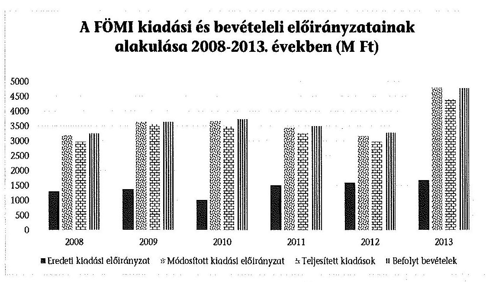
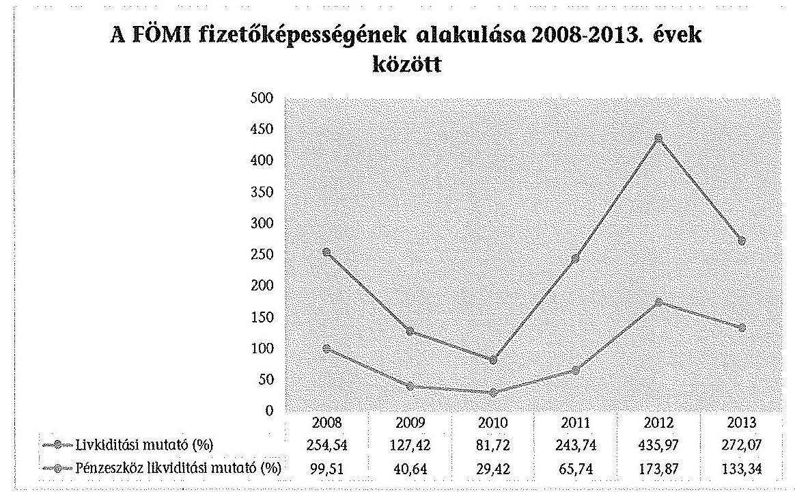
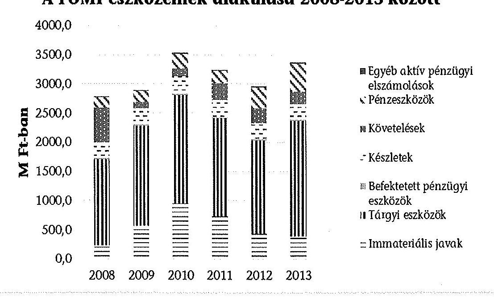
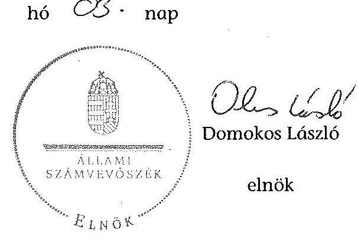
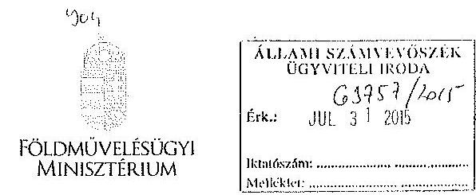
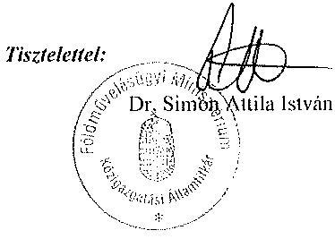
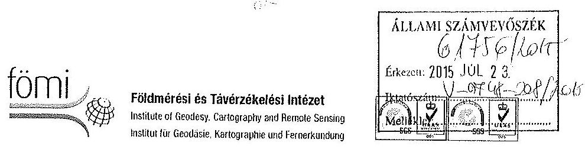
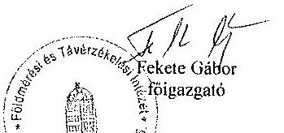
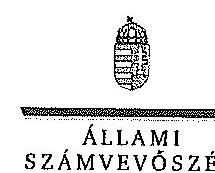

# ÁLLAMI   SZÁMVEVŐSZÉK 

## JELENTÉS

A központi alrendszer egyes intézményei pénzügyi és vagyongazdálkodásának ellenőrzéséről

Földmérési és Távérzékelési Intézet

---

# Állami Számvevőszék 

Iktatószám: V-0748-200/2015.
Témaszám: 1782
Vizsgálat-azonosító szám: V-067919

## Az ellenőrzést felügyelte:

Kisgergely István
felügyeleti vezető
Az ellenőrzést vezette és az ellenőrzés végrehajtásáért felelős:
Nemesvári-Horthy Eszter
ellenőrzésvezető
A jelentés összeállításában közreműködtek:
Eötvös Magdolna
számvevő tanácsos
Dr. Mészáros Leila
számvevő tanácsos
Jogi támogatást nyújtott:
Dr. Kővári Elvira Dr. Pálmai Gergely
számvevő tanácsos számvevő
Az ellenőrzést végezték:

| Eötvös Magdolna | Fekete Gábor | Giday Zoltán |
| :-- | :-- | :-- |
| számvevő tanácsos | számvevő tanácsos | számvevő tanácsos |
| Molnár Antal Lászlóné | Dr. Mészáros Leila |  |
| számvevő tanácsos | számvevő tanácsos |  |

Jelentéseink az Országgyűlés számítógépes hálózatán és az Interneten a www.asz.hu címen is olvashatóak.

---

# TARTALOMJEGYZÉK 

BEVEZETÉS ..... 3
I. ÖSSZEGZŐ MEGÁLLAPÍTÁSOK, KÖVETKEZTETÉSEK, JAVASLATOK ..... 8
II. RÉSZLETES MEGÁLLAPÍTÁSOK ..... 12

1. A minisztérium intézményre vonatkozó feladatellátása ..... 12
2. A belső kontrollrendszer kialakítása és működtetése ..... 14
2.1. A kontrollkörnyezet, a kockázatkezelési rendszer, a kontrolltevékenységek és az információs és kommunikációs rendszer kialakítása és működtetése ..... 14
2.2. A monitoring rendszer kialakítása és működtetése, a belső ellenőrzés, integritás szemlélet ..... 16
3. A FÖMI pénzügyi gazdálkodása ..... 17
3.1. Az előirányzatok megállapítása és módosítása ..... 17
3.2. A kiadási előirányzatok felhasználása és a bevételi előirányzatok teljesítése ..... 19
3.3. Az előirányzat-maradványok kezelése ..... 20
3.4. A fizetőképesség alakulása ..... 21
4. A FÖMI vagyongazdálkodása ..... 21
4.1. A vagyongazdálkodás szabályozottsága ..... 21
4.2. Az eszközök és források értékének kimutatása, az eszközök értékének megőrzése ..... 22
4.3. A vagyonátadás és átvétel, a vagyonelemek hasznosítása ..... 23
4.4. Az eredményszemléletű számvitel bevezetésével kapcsolatos feladatok végrehajtása ..... 24

---

# MELLÉKLETEK 

1. számú A FÖMI belső kontrollrendszere kialakításának és működtetésének értékelése a 2008-2013 közötti években
2. számú A FÖMI bevételi, kiadási előirányzatainak és teljesítésének alakulása a 2008-2013 közötti években
3. számú A FÖMI mérlegadatai és változásuk a 2008-2013 közötti években
4. számú A FÖMI tárgyi eszközeivel kapcsolatos mutatószámok alakulása a 20082013 közötti években
5. számú A Földművelésügyi Minisztérium nemleges észrevétele
6. számú A FÖMI észrevétele
7. számú A FÖMI észrevételére válasz

## FÜGGELÉKEK

1. számú A FÖMI pénzügyi és vagyongazdálkodásának teljesítményellenőrzése
2. számú Az integritás érvényesítése érdekében kialakított és működtetett intézményi kontrollrendszer
3. számú Rövidítések jegyzéke
4. számú Értelmező szótár

---

# JELENTÉS 

## A központi alrendszer egyes intézményei pénzügyi és vagyongazdálkodásának ellenőrzése   Földmérési és Távérzékelési Intézet

## BEVEZETÉS

A közpénzek felhasználásában és az állami vagyonnal való gazdálkodásban a központi alrendszer egyes intézményei meghatározó súlyt képviselnek. Pénzügyi- és vagyongazdálkodásuk rendszeres ellenőrzésével az ÁSZ hozzájárul a hatékony közigazgatás megteremtéséhez. Az ÁSZ Stratégiával összhangban a közvagyon védelme, a közpénzügyek átláthatóságának előmozdítása érdekében került sor a Földmérési és Távérzékelési Intézet (továbbiakban: FÖMI) ellenőrzésére.

A FÖMI a kormány által kijelölt földmérési és térinformatikai államigazgatási szerv, 2010. július 30-ától a földhivatali szervezet-rendszer területi, 2012. március 29-től központi szerve volt. Jogállását, tevékenységét, hatáskörét és illetékességét a 338/2006. (XII. 23.) Korm. rendelet állapította meg. Közvetlen jogelődjei a Földmérési Intézet és a MÉM FTH Gépi Adatfeldolgozó Központ voltak. A FÖMI feladatkörébe tartozott az ingatlanügyi igazgatási országos szintű adatok feldolgozása, számítógépes ingatlan-nyilvántartási rendszer kezelése (TAKARNET) szakmai információs rendszerek fejlesztése, irányítása, más számítógépes rendszerekkel a kapcsolat és a folyamatos adatcsere biztosítása; a földmérési, térképészeti és távérzékelési tudományos kutatás végzése és országos összhangjának megvalósítása. A FÖMI hazai és EU-s feladatok végrehajtásával megbízott intézményként ellátta a mezőgazdasági földterületek egyedi azonosításával (MEPAR), a szőlőültetvények térinformatikai nyilvántartásával kapcsolatos távérzékelési feladatokat (VINGIS). Az ellenőrzött időszakban feladatstruktúrája nem változott.

A FÖMI jogi személy, önállóan gazdálkodó, teljes jogkörű, 2011-től önállóan működő és gazdálkodó központi költségvetési szakigazgatási szerv volt, 2009. októbertől jogosult volt vállalkozási és kisegítő, 2010. augusztus 15-től vállalkozási tevékenység végzésére az összkiadás 20%-át meg nem haladó mértékben. A FÖMI az ellenőrzött időszakban kisegítő, illetve vállalkozási tevékenységet nem végzett, abból bevétele nem keletkezett.

Az irányító szervi feladatokat a Földművelésügyi és Vidékfejlesztési Minisztériumot vezető miniszter, 2010. május 29-étől a Vidékfejlesztési Minisztériumot vezető miniszter látta el. A FÖMI szervezeti felépítésében az ellenőrzéssel érintett

---

időszakban változás nem történt. A FÖMI-t a miniszter által kinevezett főigazgató vezette, akinek személye az ellenőrzött időszakban egy alkalommal 2010. június 21-én változott. A főigazgató munkáját az általa kinevezett főigazgatóhelyettesek segítették. A gazdasági vezető személyében változás nem történt.

Az éves költségvetési törvények 2008-ról 2013-ra a FÖMI kiadási előirányzatának főösszegét 1292,3-1666,0 M Ft-ban, közhatalmi bevételeit 453,2-1200,0 M Ft-ban, intézményi működési bevételeit 292,4-441,0 M Ft-ban, támogatás értékű működési bevételeit 510,0-10,0 M Ft-ban határozták meg. A közhatalmi bevételek zöme földmérési és térképészeti állami alapadatok szolgáltatásának, valamint ingatlan-nyilvántartási adatok szolgáltatásának eljárási díjaiból származott (közigazgatási határ adatbázis, topográfiai térkép, e-hiteles és nem hiteles tulajdoni lap másolat). Az eredeti előirányzatokat jelentős mértékben meghaladták a módosított előirányzatok, amelynek alapvető oka, hogy a FÖMI egyes feladatait átvett pénzeszközökből és támogatásértékű bevételekből látta el. A FÖMI elemi költségvetéseiben az engedélyezett létszám a 2008. évi 189 főről 2013. évre 200 főre változott.

A FÖMI költségvetési volumenének alakulását az 1. sz. ábra szemlélteti:

1. sz. ábra

A FÖMI könyvviteli mérleg szerinti vagyona a 2008. év eleji 2774,7 M Ft-ról 2013. év végére 21,3%-kal 3363,9 M Ft-ra, a befektetett eszközök mérlegértéke a 2008. év eleji 1732,2 M Ft-ról 37,5%-kal 2382,1 M Ft-ra nőtt az ellenőrzött időszakban. A 2008. év eleji értékről 2013. év végére a saját tőke 2355,8 M Ft-ról 2512,9 M Ft-ra, a tartalékok 119,1 M Ft-ról 373,4 M Ft-ra, a kötelezettségek összege a passzív pénzügyi elszámolások nélkül 238,3 M Ft-ról 360,9 M Ft-ra növekedett. A FÖMI előirányzatainak és mérlegének alakulását a 2. és 3. sz. melléklet mutatja be.

Az ellenőrzés célja annak megállapítása volt, hogy a FÖMI-re vonatkozó irányító szervi feladatellátás a jogszabályi előírások betartásával történt-e; a FÖMINél a belső kontrollrendszer kialakítása és működtetése szabályszerű volt-e; kialakították-e az erőforrásokkal való szabályszerű és hatékony gazdálkodáshoz

---

szükséges követelményeket, megvalósították-e azok számon kérését, ellenőrzését; a FÖMI pénzügyi és vagyongazdálkodása megfelelt-e a jogszabályi előírásoknak és belső szabályzatainak; a FÖMI átalakításának vagy átszervezésének lebonyolítása szabályszerűen történt-e. Amennyiben az ÁSZ korábbi ellenőrzései során javaslatokat, megállapításokat fogalmazott meg, az ellenőrzés célja, továbbá annak megítélése, hogy azok végrehajtása érdekében a FÖMI a szükséges intézkedéseket megtette-e.

A FÖMI-nél az ellenőrzött időszakban átalakítás, átszervezés nem történt. A FÖMI-t az ÁSZ korábban nem ellenőrizte.

Az ellenőrzés várható hasznosulása: A központi alrendszerbe tartozó intézmények jelentős hatást gyakorolhatnak a költségvetés egyensúlyának fenntartására, az állami vagyonnal való gazdálkodás minőségére, a kormányzati (szak)politikák végrehajtására, illetve közfeladat-ellátásuk vonatkozásában az állampolgárok életminőségére, jogaik és kötelezettségeik gyakorlására. Az ellenőrzés a FÖMI pénzügyi és vagyongazdálkodása szabályosságának javításával előmozdítja a közpénzügyek átláthatóságát, rendezettségét. Eredményeként átfogó képet kaphatunk a FÖMI gazdálkodásának hiányosságairól és a jó gyakorlatokról is.

A közintézmények integritás alapú kultúrája meghatározó a belső kontrollrendszer működése szempontjából. Hozzájárulhat az elszámoltathatóság és átláthatóság érvényesítéséhez, egyben támogathatja a szervezet védettségét a korrupciós kitettséggel szemben. Az integritási kontrollok ellenőrzése az integritási szemlélet terjedését, az integritás kultúra erősítését támogatja.

A belső kontrollrendszer államháztartási törvényben rögzített célja a működés és gazdálkodás során a tevékenységek szabályszerű, gazdaságos, hatékony és eredményes végrehajtása. Az ÁSZ a központi intézmények ellenőrzését teljesítmény-ellenőrzési modullal egészítette ki.

A FÖMI teljesítmény-ellenőrzésének célja annak értékelése volt, hogy a gazdálkodás folyamatában a gazdaságossági, hatékonysági és eredményességi követelmények kialakítása megtörtént-e, és azokat működtették-e; a belső kontrollrendszerének minőségéről kiadott vezetői nyilatkozatban a FÖMI tevékenységében a hatékonyság, eredményesség, gazdaságosság követelményeinek érvényesítése helytálló volt-e. A teljesítmény-ellenőrzés a gazdálkodási feladatokra terjedt ki, nem értékelte a szakmai feladatellátást.

A teljesítmény-ellenőrzés várható hasznosulása: A törvényalkotás számára támogatást nyújt a nemzeti kulcsindikátorok rendszerének kialakításához. A döntéshozók, ellenőrzöttek, irányító szervek, a társadalom számára az összehasonlítási, összemérési lehetőségek kihasználásával objektív visszajelzést ad a gazdálkodás területén végrehajtott szervezeti, szervezési, takarékossági és bürokráciacsökkentő intézkedések hatásairól, a közfeladat-ellátásnak keretet adó pénzügyi és vagyongazdálkodásban mérhető teljesítménykövetelmények kialakításáról, azok alkalmazásáról. Az ÁSZ értékteremtő elemzéseivel, tanácsadó szerepét erősítve támogatja a szervezetek önértékelő, alkalmazkodó (öntanuló) tevékenységét. Irányt mutat az ellenőrzött intézmények gazdálkodási és kapcso-

---

ló adminisztratív folyamatainak optimalizációjához. Segíti a központi költségvetési szervek átláthatóságát, felügyelhetőségét, a „jó gyakorlatok" elterjesztésével támogatja a „jó kormányzást".

Az ellenőrzés típusa szabályszerűségi ellenőrzés, amelyet a FÖMI-re vonatkozó teljesítmény-ellenőrzés egészített ki.

Az ellenőrzött időszak 2008. január 1-jétől 2013. december 31-ig terjedt.
A szabályszerűségi ellenőrzés a FÖMI-re és annak irányító szervi feladatait ellátó Földművelésügyi és Vidékfejlesztési Minisztériumra (2010. május 28-ig), és a Vidékfejlesztési Minisztériumra (2010. május 29-étől), a teljesítmény-ellenőrzés a FÖMI-re terjedt ki.

A helyszíni ellenőrzésre a szabályszerűségi ellenőrzés tekintetében a FÖMI-nél és a FÖMI irányító szervi feladatait ellátó Földművelésügyi Minisztériumnál került sor. A teljesítményellenőrzés vonatkozásában helyszíni ellenőrzésre a FÖMI-nél került sor.

Az ellenőrzés jogszabályi alapját az ÁSZ tv. 1. § (3) bekezdése, 5. § (2)-(6) bekezdései, valamint Áht. 2 61. § (2) bekezdésének előírásai képezik.

A központi alrendszer intézményeinek ellenőrzése során a belső kontrollrendszer tekintetében a hangsúlyt az egyes kontrollterületek (kontrollkörnyezet, kockázatkezelési rendszer, kontrolltevékenységek, információs és kommunikációs rendszer, monitoring rendszer) kialakításának és az intézmény működési folyamataiba való beépülésének szabályszerűségére helyeztük, amelyet kizárólag jogszabályokból és intézményi belső szabályozásokból levezethető kritériumrendszer alapján ítéltünk meg.

A belső kontrollrendszer jogszabályi előírások szerinti kialakításának és működtetésének szabályszerűségét az erre irányuló ellenőrzési kérdésekre adott válaszok összesítése alapján kontrollterületenként egyedileg és összesítetten is értékeltük. A belső kontrollrendszer egyes kontrollterületei kialakítása és működtetése „szabályszerű volt", tehát a feltárt hiányosságok nem gyakoroltak lényeges hatást a kontrollok kialakítására és működtetésére, amennyiben az értékelt területen az elért és elérhető pontok százalékban kifejezett hányadosa elérte a 85%-ot, „nem volt szabályszerű", ha nem haladta meg a 60%-ot, és „részben szabályszerű volt", ha 61-84% között volt.

A belső kontrollrendszer összesített értékelése megegyezett a kontrollterületenként alkalmazott %-os értékelésekkel, a következő kiegészítéssel. A kontrollrendszer egésze esetében a „szabályszerű" értékelésnek a %-os értéken felül további feltétele volt, hogy egyik kontrollterületen sem kaphatott „nem volt szabályszerű" értékelést. A „részben szabályszerű" értékelés további feltétele volt, hogy legfeljebb egy ellenőrzött kontrollterület lehetett „nem volt szabályszerű" értékelésű. Az összesített értékelés a %-os kiértékelés eredményétől függetlenül „nem volt szabályszerű", ha az ellenőrzött kontrollterületek közül több mint egynek „nem volt szabályszerű" az értékelése.

A jogszabályoknak és a belső előírásoknak megfelelőnek, azaz szabályszerűnek tekintettük a vagyonhasznosítási bevételek, a selejtezések, a vevők és szállítók

---

állományának értékelését, az előirányzat-módosítások és a kötelezettségvállalással terhelt maradványok megállapítását és felhasználását, amennyiben a minta ellenőrzésének eredménye alapján 95%-os bizonyossággal a teljes sokaságban a hibaarány kisebb volt, mint 10%, nem megfelelőnek értékeltük, ha a hibaarány a 10%-ot meghaladta.

A személyi juttatások, a dologi és felhalmozási kiadások, a pénzeszközátadások, valamint a vagyonhasznosítási
 bevételek előirányzatai felhasználásánál a gazdálkodási jogkörök gyakorlását mintavétellel ellenőriztük. A 2008-2011. éveket érintően a szakmai teljesítésigazolás és az utalvány ellenjegyzése kulcskontrollok, a 2012-2013. éveket érintően a teljesítésigazolás és az érvényesítés kulcskontrollok működését értékeltük. Megfelelőnek értékeltük a gazdálkodási jogkörök gyakorlását, amennyiben 95%-os bizonyossággal a teljes sokaságban a hibaarány legfeljebb 10%, részben megfelelőnek értékeltük, ha a hibaarány felső határa legfeljebb 30%, nem megfelelőnek pedig akkor, ha a sokaságbeli hibaarány felső határa meghaladta a 30%-ot.

Az ellenőrzés az INTOSAI által kiadott nemzetközi standardok (ISSAI) figyelembe vételével, az ellenőrzési programban foglalt értékelési szempontok szerint történt.

Az ÁSZ a 2011. évi LXVI. törvény 29. §-a szerint a jelentéstervezetet megküldte a földművelésügyi miniszternek és a FÖMI főigazgatójának. A Földművelésügyi Minisztérium közigazgatási államtitkára az ÁSZ jelentéstervezetére nemleges észrevételt tett, melyet az 5. sz. melléklet tartalmaz. A FÖMI beérkezett észrevételét és az arra adott választ a jelentés 6-7. sz. mellékletei tartalmazzák.

---

# I. ÖSSZEGZŐ MEGÁLLAPÍTÁSOK, KÖVETKEZTETÉSEK, JAVASLATOK 

#### Abstract

Az irányító szerv a FÖMI-re vonatkozó alapítói, irányító szervi és ellenőrzési jogosultságait - a feltárt hiányosságok kivételével - összességében szabályszerűen látta el. Az alapítói jogosultságok ellátása alapvetően szabályszerű volt: az Áht. ${ }_{1,2}$ előírásaival összhangban módosította a FÖMI alapító okiratát és jóváhagyta SZMSZ-ét. Az irányító szerv az irányítói jogosultságok gyakorlása során - a 2010. évi maradvány jóváhagyásának elmaradása kivételével - összességében szabályszerűen járt el. Az ellenőrzési jogosultságok körében nem alakított ki a FÖMI közfeladataihoz követelményeket, mutatószámokat, ennek hiányában az Áht. ${ }_{1,2}$ előírásaival ellentétben az erőforrásokkal való szabályszerű és hatékony gazdálkodáshoz szükséges követelmények érvényesítésével, számonkérésével és ellenőrzésével kapcsolatos irányító szervi jogosultságait sem gyakorolta. Az irányító szerv 2009-2011. években - az Áht. ${ }_{1}$ előírásai ellenére - nem ellenőrizte a közérdekű és közérdekből nyilvános adatok közzétételét, szolgáltatásának végrehajtását, azonban a 2009., 2011. és 2012. években pénzügyi ellenőrzéseket végzett a FÖMI-nél.

A FÖMI-nél a pénzügyi gazdálkodás a feltárt hibák és hiányosságok következtében nem volt szabályszerű. Ellenőrzésünk a szakmai teljesítés igazolása, a teljesítés igazolása, az utalvány ellenjegyzése, az érvényesítés gyakorlása körében tárt fel hiányosságokat, továbbá egy esetben az összeférhetetlenségi előírások be nem tartását állapította meg.

A vagyongazdálkodás - a vagyonhasznosítási bevételeknél feltárt hiányosságok kivételével - szabályszerű volt, a mérlegben kimutatott eszközök nyilvántartását, értékének megállapítását, a követelések és a kötelezettségek elszámolását a számviteli előírásoknak megfelelően végezték el. A vagyon állagának megóvásával összefüggésben fennálló kötelezettségeknek eleget tettek, de a fejlesztések elmaradásával a tárgyi eszközök használhatósági foka romlott. A vagyon hasznosítása során - az NFA-val 2012. március és 2013. december között szerződés megkötésének elmaradása kivételével - a Vtv. és az Nvtv. előírásai betartásával jártak el.

A belső kontrollrendszer kialakítását és működtetését összességében részben szabályszerűnek értékeltük. Az egyes kontrollterületek évenkénti értékelése alapján ellenőrzésünk javulást a kockázatkezelési rendszer kialakítása és működtetése területén 2011. évtől tapasztalt.

A kontrollkörnyezet részben volt szabályszerű, mert egyes szabályzatokkal a FÖMI nem rendelkezett, a meglévő szabályzatok közül a számviteli politika, a pénzkezelési szabályzat és a gazdálkodási szabályzat nem felelt meg a jogszabályi előírásoknak. Ennek következtében a kontrollkörnyezet csak részben biztosította a szabályszerű működés feltétel- és követelményrendszerét.

---

A kockázatkezelési rendszer 2008-2010 között részben volt szabályszerű, mert rendelkeztek kockázatkezelési szabályzattal, de nem működtették az Ámr. ${ }_{1,2}$ előírásai ellenére a kockázatkezelési rendszert. A kockázatkezelési rendszer 2011-2013 között szabályszerű volt, mert a FÖMI főigazgatója az Ámr. ${ }_{2}$ és a Bkr. előírásaival összhangban gondoskodott a kockázatkezelési rendszer működtetéséről, 2011-ben felmérte és megállapította a FÖMI tevékenységében és gazdálkodásában rejlő kockázatokat, és meghatározta az egyes kockázatokkal kapcsolatban szükséges intézkedéseket.

A kontrolltevékenységek kialakítása és működtetése - a megfelelő kontrollkörnyezet hiánya miatt - részben volt szabályszerű. A kiadások teljesítése folyamatában a kulcskontrollok működése nem volt megfelelő. A bevételi előirányzatok teljesítése során az ellenőrzött időszakban részben volt megfelelő a kulcskontrollok működése, mivel 2008-2009. években nem írták elő a szakmai teljesítés igazolásának módját és nem jelölték ki az annak végzésére jogosult személyeket.

Az információs és kommunikációs rendszer kialakítása és működtetése részben volt szabályszerű, mivel az Eisztv. és az Info tv. előírásaival ellentétben nem gondoskodtak a közérdekű gazdálkodási adatok nyilvánosságának biztosításáról.

A monitoring rendszer kialakítása és működtetése részben volt szabályszerű. A monitoring rendszer működtetése érdekében - az Áht. ${ }_{1}$, az Ámr. ${ }_{2}$ és a Bkr. előírásaival összhangban - kidolgozták a folyamatba épített előzetes, utólagos és vezetői ellenőrzés rendszerét, elkészítették a FEUVE-szabályzatot, a szakmai feladatellátás nyomon követésére minőségirányítási rendszert működtettek. A FÖMI főigazgatója - ellentétben az Áht. ${ }_{1,2}$ előírásaival - a FÖMI céljainak teljesítésére vonatkozóan, a gazdaságos, hatékony és eredményes gazdálkodásra vonatkozó, a szervezet egészére kiterjedő követelmények kialakításáról és alkalmazásáról nem gondoskodott. A monitoring rendszer részeként a belső ellenőrzés működését jogszabályi hiányosságok jellemezték.

A FÖMI az ellenőrzött időszakban erőfeszítéseket tett az integritás szemlélet fejlesztésére, valamint a korrupciós kockázatok csökkentésére, a 2013. évben önként részt vett az ÁSZ integritás felmérésében.

A helyszíni ellenőrzés megállapításainak hasznosítása mellett javasoljuk:

# a Földművelésügyi miniszternek: 

1. Az irányító szerv a FÖMI ellátandó közfeladataihoz követelményeket, mutatószámokat nem alakított ki, ennek hiányában az Áht. ${ }_{1}$ 49. § (5) bekezdés f) pontban és az Áht. ${ }_{2}$ 9. § (1) bekezdés f) pontban foglalt, erőforrásokkal való szabályszerű és hatékony gazdálkodáshoz szükséges követelmények érvényesítésével, számonkérésével és ellenőrzésével kapcsolatos irányító szervi jogosultságait nem gyakorolta.
Javaslat:
Intézkedjen a FÖMI közfeladatellátására vonatkozó, és az erőforrásokkal való szabályszerű és hatékony gazdálkodáshoz szükséges követelmények kialakítására, számonkérésére és ellenőrzésére.

---

# A Földmérési és Távérzékelési Intézet főigazgatójának: 

Az intézmény számlarendje az ellenőrzött időszak egészében - a Számv. tv. 161. § (2) bekezdésének d) pontja ellenére - nem tartalmazta a számlarendet alátámasztó bizonylati rendet. 2008. május 21-től 2010. május 9-ig és 2012. szeptember 1-jétől 2013. december 31-éig - az Ámr. ${ }_{1}$ 145/A. § (5) bekezdése, az Ámr. ${ }_{2}$ 161. §-a és a Bkr. 6. § (4) bekezdése ellenére - nem szabályozták a szabálytalanságok kezelésének eljárásrendjét.

A számviteli politika az ellenőrzött időszakban - az Áhsz. 8. § (5) bekezdés c), d), f) és h) pontja, 2013. március 12-étől 8. § (5) bekezdés b), c), e) és g) pontja előírásai szerint - tartalmi követelményeknek nem felelt meg. Az ellenőrzött időszakban a pénzkezelési szabályzat nem tartalmazta a Számv. tv. 14. § (8) bekezdése szerinti előírásokat.

A főigazgató a 2010-2013. évek között több esetben visszamenőleges hatállyal adta ki a pénzgazdálkodási jogkörök gyakorlására jogosultak kijelöléséről szóló főigazgatói utasítást, amellyel - az Ámr. ${ }_{2}$ 156. § (1) bekezdés b) pontjában és a Bkr. 6. § (1) bekezdés b) pontjában foglaltak ellenére - nem biztosította olyan kontrollkörnyezet kialakítását, amelyben egyértelműek a felelősségi, hatásköri viszonyok és feladatok. A kötelezettségvállalás ellenjegyzésére jogosultat 2011. január 3-ától - ellentétben az Ámr. ${ }_{2}$ 74. § (2) bekezdésének a) pontja és az Ávr. 55. § (2) bekezdés a) pontjával - nem a gazdasági vezető, hanem a főigazgató jelölte ki. Az érvényesítésre jogosult személyeket - az Ámr. ${ }_{1}$ 135. § (4) bekezdésével, az Ámr. ${ }_{2}$ 77. (4) bekezdésével, az Ávr. 58. § (4) bekezdésével ellentétben - nem a gazdasági szervezet vezetője, hanem a főigazgató jelölte ki.

Javaslat:
Intézkedjen a jogszabályi előírásoknak megfelelő kontrollkörnyezet kialakításáról.
2. Az intézmény az ellenőrzött időszakban a közérdekű gazdálkodási adatok nyilvánosságának biztosítása érdekében - az Eisztv. 6. § (1) bekezdésében és az Info tv. 37. § (1) bekezdésében foglaltak ellenére - a gazdálkodásával kapcsolatos adatokat nem tette közzé.
Javaslat:
Intézkedjen a gazdálkodásával kapcsolatos adatok közzétételéről.
3. A főigazgató nem gondoskodott arról, hogy tevékenységében és céljaiban a gazdaságosság, a hatékonyság és az eredményesség követelményei érvényesüljenek, mivel azokat az az Áht. 97. § (1) bekezdés (2008. december 31-ig), 88. § (1) bekezdés b) pontjában (2010. augusztus 14-ig), 94. § (1) bekezdés b) pontjában, az Áht. ${ }_{2}$ 61. § (1) bekezdésben, az Áht. ${ }_{2}$ 69. § (1) bekezdés a) pontjában és a Bkr. 4. § a) pontjában foglaltak ellenére nem alakította ki és nem alkalmazta.
Javaslat:
Intézkedjen a FÖMI tevékenységére vonatkozó hatékonysági, eredményességi és gazdaságossági mérhető követelmények kialakítására és érvényesítésére.

---

4. A FÖMI az ellenőrzött időszak egészében a belső ellenőrzési tevékenységét megbízási szerződés útján, külső szolgáltató bevonásával biztosította. Ez a gyakorlat 2012. július 1-jétől nem felelt meg a Bkr. 15. § (5) bekezdése előírásának, mely szerint az 50 főnél nagyobb engedélyezett létszámmal rendelkező önállóan működő és gazdálkodó költségvetési szerv esetében legalább egy fő belső ellenőrt foglalkoztatásra irányuló jogviszonyban kellett volna alkalmazni. A belső ellenőrzésekről a 2011-2013. években, a külső ellenőrzésekről 2008., 2012-2013. években a Ber. 32. § (1)-(2), valamint a Bkr. 50. § (1)-(2) bekezdéseiben foglaltak szerint nem vezettek nyilvántartást. A belső és külső ellenőrzések által tett megállapításokra és javaslatokra intézkedési tervek készültek, azonban a 2010-2011. években a Ber. 29/A. § (1)-(2) bekezdéseiben meghatározottak ellenére nem vezettek az intézkedések nyomon követésére alkalmas nyilvántartást.

Javaslat:
a) Intézkedjen legalább egy fő belső ellenőr foglalkoztatásra irányuló jogviszonyban való alkalmazásáról,
b) Intézkedjen az elvégzett ellenőrzések, valamint az intézkedések nyomon követésére alkalmas nyilvántartások kialakításáról és folyamatos vezetéséről.
5. A kiadási előirányzatok felhasználásánál a kulcskontrollok nem működtek megfelelően. A személyi juttatások és a dologi kiadások előirányzatainak felhasználásánál 2008-2013. években előfordult, hogy - ellentétben az Ámr. ${ }_{1}$ 135. § (1), az Ámr. ${ }_{2}$ 76. § (1) és az Ávr. 57. § (1) bekezdésével - nem történt meg a szakmai teljesítés/teljesítés igazolása. Az érvényesítő 2010-től - ellentétben az Ámr. ${ }_{2}$ 77. § (2) és az Ávr. 58. § (2) bekezdésével - nem jelezte az utalványozónak, hogy a megelőző ügymenetben a szakmai teljesítés/teljesítés igazolását nem végezték el. A pénzeszközátadás ellenőrzött mintatételeinél (lakáscélú kölcsönök) - ellentétben az Ámr. ${ }_{1}$ 136. § (4) bekezdés g), az Ámr. ${ }_{2}$ 78. § (2) bekezdés a) és az Ávr. 59. § (3) bekezdés g) pontjával - az utalványrendeleten nem szerepelt az utalványozásra jogosult keltezéssel ellátott aláírása.
Javaslat:
Intézkedjen a kiadások teljesítése során a gazdálkodási jogkörök jogszabályoknak megfelelő működtetéséről.

---

# II. RÉSZLETES MEGÁLLAPÍTÁSOK 

## 1. A MINISZTÉRIUM INTÉZMÉNYRE VONATKOZÓ FELADATELLÁTÁSA

Az irányító szerv a FÖMI-re vonatkozó alapítói, irányító szervi és ellenőrzési jogosultságait - a feltárt hiányosságok kivételével - összességében szabályszerűen látta el.

Az irányító szerv alapítói jogosultságait alapvetően szabályszerűen látta el. A FÖMI alapító okiratának módosítására négy alkalommal került sor. A 2009. január 1-jén hatályba lépett Kt. előírásoknak való megfeleltetés (jogszabályban meghatározott közfeladat, közvetlen jogelőd megnevezése és székhelye feltüntetése az alapító okiratban), valamint az Ámr. ${ }_{1}$
 által a szakfeladatok felsorolásának átvezetésére előírt 2009. szeptember 30-i határidőhöz képest az irányító szerv a FÖMI alapító okiratát késedelmesen 2009. október 19-én módosította. Az alapító okirat 2009-től az ellenőrzött időszak végéig - ellentétben a Kt. 4. § (2) bekezdés a) pontjával (2009. január 1-jétől), az Áht. ${ }_{1} 90 . \S$ (2) bekezdésének a) pontjával (2010. augusztus 15-étől), az Ávr. 5. § (2) bekezdés a) pontjával (2012. január 1-jétől) - nem tartalmazta a FÖMI közvetlen jogelődjének megnevezését, székhelyét.

A FÖMI szervezeti felépítését, feladatait és működési folyamatait a szervezeti és működési szabályzatában (SZMSZ) határozták meg, az ellenőrzött időszakban négy SZMSZ követte egymást. Az irányító szerv a FÖMI SZMSZ-ét jóváhagyta, amely a Hivatalos Értesítőben megjelent. A FÖMI SZMSZ-e - a feltárt hiányosságok kivételével - alapvetően megfelelt az Ámr. ${ }_{1,2}$ és az Ávr. előírásainak, hatályos alapító okiratával összhangban volt. A FÖMI SZMSZ-e 2008-ban - ellentétben az Ámr. ${ }_{1} 10 . \S$ (5) bekezdés a), d), e), g) pontjaival - nem tartalmazta az alapító okirat keltét, számát, a feladatai, tevékenységei forrását, a feladatmutatók megnevezését, körét, a költségvetés végrehajtására szolgáló számlaszámot. Az SZMSZ 2009-ben - ellentétben az Ámr. ${ }_{1} 13/$A. § (3) bekezdés b), c), d, e) és f) pontjaival - nem tartalmazta az alapító okirat keltét, azonosítóját, az ellátandó és a szakfeladatrend szerint besorolt alaptevékenységeket, rendszeresen ellátott kiegészítő, kisegítő és vállalkozási tevékenységeket, a vagyonkezelés végrehajtásáért felelős szervezeti egységet, feladatait, a vagyonkezelés rendjét, a szervezeti egységek engedélyezett létszámát, a gazdálkodás részletszabályait, kötelezettségvállalások (szerződéskötések) rendjét. Az SZMSZ 2008. január 1-jétől 2010. május 9-ig - ellentétben az Ámr. ${ }_{1} 145/$A. § (5), valamint az Ámr. ${ }_{2} 161 . \S$-ával - nem tartalmazta a szabálytalanságok kezelésének eljárásrendjét.

Az irányító szerv irányítói jogosultságát összességében szabályszerűen gyakorolta. Az Áht. ${ }_{1} 49 . \S$ (5) bekezdés b) pontja előírásaival (2009. január 1-jétől 2010. augusztus 14-ig) összhangban érvényesítette a közfeladat jellegének megfelelő finanszírozási módot, a FÖMI közhatalmi és egyéb saját bevételeire tekintettel költségvetési támogatás nélkül tervezte meg a FÖMI költségvetését. Az irányító szerv - összhangban az Áht. ${ }_{1}$ és az Ávr. előírásaival - megállapította a FÖMI költségvetését, kincstári költségvetését, jóváhagyta a létszám-előirányzatot, meghatározta a tervezett bevételi és kiadási előirányzatok értékeit. Az Áht. ${ }_{1,2}$

---

előírásai szerint figyelemmel kísérte a FÖMI költségvetésének végrehajtását, a bevételi és kiadási előirányzatokkal való gazdálkodását, gyakorolta az előirányzatokkal kapcsolatos jogköreit, azonban az Áht. ${ }_{1} 49. \S$ (5) bekezdés k) pontja ellenére nem hagyta jóvá a 2010. évi maradványt. 2011-ben és 2012-ben - az Áht. ${ }_{1,2}$, az Ámr. ${ }_{2}$ és az Ávr. rendelkezéseinek megfelelően - egy-egy megállapodást kötött a FÖMI-vel fejezeti kezelésű előirányzatból finanszírozott feladatok elvégzésére. Az irányító szerv a FÖMI részére - a tisztán saját bevételből való gazdálkodás és az előírtnál alacsonyabb létszámmal való működés előírásán túl - nem határozott meg további, az 1365/2011. (XI. 8.) Korm. határozat 2. b) pontja szerint a hatékony feladatellátáshoz követelményeket és feltételeket.

Az irányító szerv vezetője az alapító okiratban foglalt hatáskörében, összhangban a 2010. évi XLIII. törvény és a Kt. előírásaival, döntött a FÖMI főigazgatója megbízásának visszavonásáról (2010. június 17-ei hatállyal) és új főigazgató kinevezéséről (2010. június 21-től). A kinevezés visszavonása és az új kinevezés a Ktv. rendelkezéseinek megfelelt. Az irányító szerv a 2008-2011. évekre az Áht. ${ }_{1}$, 49. § (5) bekezdés t) pontjával összhangban - az Ámr. ${ }_{1} 149$. § (2) bekezdés c) pontja és az Ámr. ${ }_{2} 217 . \S$ c) pontja szerinti nyilatkozattal - beszámoltatta a FÖMI főigazgatóját. A FÖMI főigazgatója a 2012-2013. években a Bkr. 11. § (1) bekezdésében foglaltak szerinti nyilatkozattal értékelte a belső kontrollrendszer minőségét, amelyet az éves költségvetési beszámolóval egyidejűleg megküldött az irányító szervnek.

Az irányító szerv ellenőrzési jogosultságait - a feltárt hiányosságok kivételével - szabályszerűen látta el. Az irányító szerv - összhangban a 2006. LVII. törvény és a 2010. évi XLIII. törvény előírásaival - 2009., 2011. és 2012. évekre pénzügyi ellenőrzéseket végzett a FÖMI-nél.

Az irányító szerv a FÖMI ellátandó közfeladataihoz követelményeket, mutatószámokat nem alakított ki, ennek hiányában az Áht. ${ }_{1} 49$. § (5) bekezdés f) pontban és az Áht. ${ }_{2} 9$. § (1) bekezdés f) pontban foglalt, erőforrásokkal való szabályszerű és hatékony gazdálkodáshoz szükséges követelmények érvényesítésével, számonkérésével és ellenőrzésével kapcsolatos irányító szervi jogosultságait nem gyakorolta. Az irányító szerv a FÖMI felé követelményként a költségvetés tervezéséhez kiadott központi előírásokat állapította meg. A 2008-2010-re a költségvetési szervek alaptevékenységéhez igazodó létszám szigorú betartását, a személyi juttatások költségvetési szervtípus szerinti differenciált megtervezését, a bevételek növelését, a következő évekre kiható pénzügyi feszültségek elkerülését, majd 2010-ben a létszám csökkentését írta elő. 2011-re nem határozott meg szempontokat, 2012-2013-ra a költségvetési szervek mindegyikére vonatkozó, központilag meghatározott költségvetés-tervezési szempontokat közvetítette a FÖMI felé.

A FÖMI az Áht. ${ }_{1}$-ben, a Kt.-ben és az Áht. ${ }_{2}$-ben foglalt előírásnak megfelelően minden évben beszámolt az irányító szerv felé tevékenységéről, feladatainak ellátásáról. Az irányító szerv ellenőrizte és jóváhagyta a FÖMI éves beszámolóját.

Az irányító szerv - ellentétben az Áht. ${ }_{1} 49$. § (5) bekezdés e) pontjában meghatározottakkal - 2009-2011. évek között nem ellenőrizte a közérdekű és közérdekből nyilvános adatok közzététele, szolgáltatása végrehajtását.

---

# 2. A BELSŐ KONTROLLRENDSZER KIALAKÍTÁSA ÉS MŰKÖDTETÉSE 

A belső kontrollrendszer kialakítása és működtetése az ellenőrzött időszakban összességében részben volt szabályszerű. A belső kontrollrendszer egyes pillérei közül a kontrollkörnyezet, a kontrolltevékenységek kialakítása és működtetése, az információs és kommunikációs rendszer és a monitoring rendszer részben volt szabályszerű. A kockázatkezelési rendszer 2008-2010 között részben volt szabályszerű, majd 2011-től szabályszerű volt. A FÖMI belső kontrollrendszere kialakításának és működtetésének értékelését az egyes pillérenként a 2008-2013. évekre az 1. sz. melléklet mutatja be.

A FÖMI főigazgatója a 2008-2013. években az Ámr. ${ }_{1,2}$-ben és a Bkr.-ben előírtaknak megfelelően nyilatkozatban értékelte a belső kontrollrendszer kialakítását és működését. A 2010. évről tett nyilatkozatban fejlesztendő területként a digitális iratkezelés bevezetését, a belső kommunikációs rendszerek optimalizálását és az IMIR 2011. évben lejáró tanúsítványainak megújítását, a 2012-2013. évekre a belső kontrollrendszer felülvizsgálatát és aktualizálását jelölték meg.

### 2.1. A kontrollkörnyezet, a kockázatkezelési rendszer, a kontrolltevékenységek és az információs és kommunikációs rendszer kialakítása és működtetése

A kontrollkörnyezet kialakítása és működtetése az ellenőrzött időszakban - egyes szabályzatok hiánya, illetve meglévő szabályzatoknál feltárt hiányosságok miatt - részben volt szabályszerű. A FÖMI gazdasági szervezete 2011. június 1-jéig - az Ámr. ${ }_{1} 17 . \S$ (5), valamint az Ámr. ${ }_{2} 15 . \S$ (6) bekezdése ellenére - nem rendelkezett ügyrenddel, a gazdasági szervezet feladatait a FÖMI 2010. december 14-éig hatályos ügyrendje tartalmazta. A FÖMI számlarendje az ellenőrzött időszak egészében - a Számv. tv. 161. § (2) bekezdésének d) pontja ellenére - nem tartalmazta a számlarendet alátámasztó bizonylati rendet. Az egyes szabályzatokban azonban a bizonylatok tartalmi, alaki és formai elemei, valamint a bizonylatok megőrzésének ideje meghatározásra került. A FÖMI-nél 2008. május 21-től 2010. május 9-ig és 2012. szeptember 1-jétől 2013. december 31-éig - az Ámr. ${ }_{1}$ 145/A. § (5) bekezdése, az Ámr. ${ }_{2}$ 161. §-a és a Bkr. 6. § (4) bekezdése ellenére - nem szabályozták a szabálytalanságok kezelésének eljárásrendjét.

A meglévő szabályzatok - a számviteli politika, a pénzkezelési és a gazdálkodási szabályzat esetében feltárt hiányosságok kivételével - megfeleltek a jogszabályi előírásoknak. A számviteli politikában az ellenőrzött időszakban - az Áhsz. 8. § (5) bekezdés c), d), f), h) pontja, 2013. március 12-étől 8. § (5) bekezdés b), c), e) és g) pontja előírása ellenére - nem határozták meg, hogy mi tekintendő figyelembe veendő szempontnak az értékcsökkenés összegének alap- és vállalkozási tevékenység közötti megosztásánál, az alap- és vállalkozási tevékenységet terhelő, előzetesen felszámított általános forgalmi adó megosztásánál. Nem határozták meg szempontokat a raktári készletek leltározása során az eltérések kompenzálásához és a káro elszámolásához, továbbá a befektetett eszközök piaci értéken történő értékelésénél az eszközök piaci értéke és könyv szerinti értéke közötti különbözet jelentős összegének meghatározásához. Az ellenőrzött időszakban a pénzkezelési szabályzat nem tartalmazta a Számv. tv. 14. § (8) be-

---

kezdése előírása ellenére a pénzkezelés személyi és tárgyi feltételeit, a pénzkezelés felelősségi szabályait, a pénzforgalmi számlák feletti rendelkezési jog gyakorlásának feltételeit, a készpénzben és a bankszámlán tartott pénzeszközök közötti forgalom szabályait, a napi készpénz záró állomány maximális mértékét, a készpénzállomány ellenőrzésekor követendő eljárásrendet.

A pénzgazdálkodási jogkörök gyakorlásának rendjét hiányosan, esetenként az Ámr. ${ }_{1,2}$ és az Ávr. előírásaival ellentétesen szabályozták. Megállapításaink a következők:

- A FÖMI főigazgatója 2010-2013. évek között több esetben visszamenőleges hatállyal adta ki a pénzgazdálkodási jogkörök gyakorlására jogosultak kijelöléséről szóló főigazgatói utasítást, amellyel - az Ámr. ${ }_{2} 156. \S$ (1) bekezdés b) pontja és a Bkr. 6. § (1) bekezdés b) pontjában foglaltak ellenére - nem biztosította olyan kontrollkörnyezet kialakítását, amelyben egyértelműek a felelősségi, hatásköri viszonyok és feladatok.
- A kötelezettségvállalás rendjét minden ellenőrzött évben szabályozták, a kötelezettségvállalás ellenjegyzésére jogosult személyeket 2010-ben - az Ámr. ${ }_{2} 74. \S$ (2) bekezdésének a) pontja ellenére - nem jelölték ki. A kötelezettségvállalás ellenjegyzésére jogosultat 2011. január 3-ától - ellentétben az Ámr. ${ }_{2} 74. \S$ (2) bekezdésének a) pontja és az Ávr. 55. § (2) bekezdés a) pontjával - nem a gazdasági vezető, hanem a főigazgató jelölte ki.
- A 2008-2009. években - az Ámr. ${ }_{1} 135. \S$ (2) bekezdése ellenére - a főigazgató nem jelölte ki a szakmai teljesítést igazoló személyeket és nem rendelkezett a szakmai teljesítés igazolás módjáról. 2010. január 1-jétől augusztus 31-ig - az Ámr. ${ }_{2} 77. \S$ (4) (2010. augusztus 14-ig), valamint 76. § (5) bekezdése (2010. augusztus 15-től) ellenére - a főigazgató nem jelölte ki a szakmai teljesítés igazolására jogosult személyeket. A szakmai teljesítés igazolására jogosult személyeket első alkalommal a főigazgató az Ámr. ${ }_{2}$ előírásaival összhangban 2010. szeptember 1-jétől jelölte ki, azonban 2011. január 3-ig a szakmai teljesítés igazolásának végzésére jogosultak aláírás mintája - az Ámr. ${ }_{2} 80. \S$ (3) bekezdésében foglaltakkal ellentétben - nem állt rendelkezésre. A 2011. július 14-étől szakmai teljesítés igazolására újonnan felhatalmazott személyek aláírás-mintájáról - az Ámr. ${ }_{2} 80. \S$ (3) bekezdése és az Ávr. 60. § (3) bekezdése ellenére - naprakész nyilvántartást 2012. június 1-jéig nem vezettek.
- Az érvényesítésre, az utalványozásra és az utalvány ellenjegyzésére jogosult személyeket -

 belső szabályzatokban naprakész aláírás-minta csatolásával kijelölték, kijelölésüket aktualizálták. Az érvényesítésre és az utalvány ellenjegyzésére jogosult személyeket - az Ámr. 1 135. § (4) és 137. § (1) bekezdésével, az Ámr. 2 77. (4) és 79. § (1) bekezdésével, az Ávr. 58. § (4) bekezdésével ellentétben - nem a gazdasági szervezet vezetője, hanem a főigazgató bízta meg, jelölte ki.

A kockázatkezelési rendszer kialakítása és működtetése a 2008-2010. években részben, a 2011-2013. években szabályszerű volt. A FÖMI rendelkezett kockázatkezelési szabályzattal, de 2011 előtt a FÖMI főigazgatója - ellentétben az Ámr. 1 145/C. § (1)-(3) és az Ámr. 1 157. § (1)-(3) bekezdésével - a kockázatkezelési rendszert nem működtette, nem értékelték és nem kezelték a kockázatokat. 2011-2013 között az Ámr. ${ }_{2}$ és a Bkr. előírásaival összhangban a főigazgató gondoskodott a kockázatkezelési rendszer működtetéséről, felmérték, értékelték a lehetséges kockázatokat, meghatározták a kockázatokra adható válaszintézkedéseket. 2011. szeptember 30-ával hatályba lépett a kockázatkezelés szabályait is rögzítő megújított szabályzat, amely tartalmazta az egyes folyamatok aktualizált ellenőrzési nyomvonalait.

A kontrolltevékenységek kialakítása és működtetése részben volt szabályszerű. Az ellenőrzött időszakban a kötelezettségvállalást, a Kbt. ${ }_{1,2}$ és a számviteli előírások betartását, az informatikai területet támogató kontrollokat a jogszabályi előírásokban foglaltak szerint alakították ki. A számítástechnikai rendszerben (Forrás SQL) az analitikus nyilvántartás és a főkönyv kapcsolata automatikus volt, a program a főkönyvi és az analitikus könyvelés egyezőségének biztosítását támogatta. Ellenőrzésünk a pénzgazdálkodási jogkörgyakorlók kijelölésének gyakorlatánál e fejezetben a kontrollkörnyezetnél ismertetett szabálytalanságokat állapított meg. A kiadási előirányzatok felhasználása során a kulcskontrollok működése nem volt megfelelő, a bevételi előirányzatok teljesítése során részben volt megfelelő. A feltárt hiányosságokat részletesen a 3.2. fejezet mutatja be.

Az információs és kommunikációs rendszer kialakítása és működtetése részben volt szabályszerű. A FÖMI az Ámr. ${ }_{1,2}$ és a Bkr. jogszabályi előírásainak megfelelően szabályozta az információátadás formáit, a vezetők és az alkalmazottak - az Intranet segítségével - a munkavégzéshez szükséges információhoz kellő időben hozzájuthattak. A FÖMI a közérdekű gazdálkodási adatok nyilvánosságának biztosítása érdekében - az Eisztv. 6. § (1) bekezdésében és az Info tv. 37. § (1) bekezdésében foglaltak ellenére - a gazdálkodásával kapcsolatos adatokat az ellenőrzött időszakban nem tette közzé (éves beszámoló, a foglalkoztatottak létszámára és személyi juttatásaira vonatkozó összesített adatok, a vezetők és vezető tisztségviselők illetménye, munkabére és rendszeres juttatásai, valamint költségtérítése összesítve, az egyéb alkalmazottaknak nyújtott juttatások fajtája és mértéke összesítve).

# 2.2. A monitoring rendszer kialakítása és működtetése, a belső ellenőrzés, integritás szemlélet 

A monitoring rendszer kialakítása és működtetése az ellenőrzött időszak minden egyes évében részben volt szabályszerű. A monitoring rendszer működtetése érdekében - az Áht. ${ }_{1}$, az Ámr. ${ }_{2}$ és a Bkr. előírásaival összhangban - kidolgozták a folyamatba épített előzetes, utólagos és vezetői ellenőrzés rendszerét, elkészítették a FEUVE-szabályzatot, a szakmai feladatellátás nyomon követésére minőségirányítási rendszert működtettek. A FÖMI főigazgatója nem gondoskodott arról, hogy tevékenységében és céljaiban a gazdaságosság, a hatékonyság és az eredményesség követelményei érvényesüljenek, mivel azokat az Áht. ${ }_{1} 97$. § (1) bekezdés (2008. december 31-ig), 88. § (1) bekezdés b) pontjában (2010. augusztus 14-ig), 94. § (1) bekezdés b) pontjában, az Áht. ${ }_{2} 61 . \S$ (1) bekezdésben, az Áht. ${ }_{2} 69 . \S$ (1) bekezdés a) pontjában és a Bkr. 4. § a) pontjában foglaltak ellenére nem alakította ki és nem alkalmazta.

A monitoring rendszer részét képező belső ellenőrzés működésére jogszabályi hiányosságok voltak jellemzőek. A FÖMI főigazgatója az Áht. ${ }_{1,2}$ előírásai alapján gondoskodott a belső ellenőrzés szervezeti kialakításáról, a Ber. és a Bkr. előírásainak megfelelően biztosította a belső ellenőrzés funkcionális függetlenségét és feladatkörének kialakítását. A FÖMI az ellenőrzött időszak egészében a belső ellenőrzési tevékenységét megbízási szerződés útján, külső szolgáltató bevonásával biztosította. Ez a gyakorlat 2012. július 1-jétől nem felelt meg a Bkr. 15. § (5) bekezdése előírásának, mely szerint az 50 főnél nagyobb engedélyezett létszámmal rendelkező önállóan működő és gazdálkodó költségvetési szerv esetében legalább egy fő belső ellenőrt foglalkoztatásra irányuló jogviszonyban kellett volna alkalmazni. Ettől eltérni csak az irányító szerv írásos jóváhagyásával lehetett. A FÖMI az irányító szervétől erre vonatkozó írásos jóváhagyással nem rendelkezett. A belső ellenőri megbízásnál a Ber. és a Bkr. előírásainak megfelelően érvényesültek az összeférhetetlenségi előírások.

A belső ellenőrzési kézikönyv - ellentétben a Ber. 5. § (3) bekezdésének előírásával - évente nem került felülvizsgálatra, ennél fogva a jogszabályi és módszertani útmutatók változásai, illetve módosításai nem kerültek átvezetésre. A 2008., a 2009. és a 2010. évre készített éves belső ellenőrzési tervek - a Ber. 21. § (2) bekezdésének előírása ellenére - nem kockázatelemzésen alapultak. A belső ellenőröket megillető betekintési és hozzáférési jogosultságokat a Ber. és a Bkr. előírásainak megfelelően biztosították, az éves ellenőrzési jelentéseket elkészítették. A belső ellenőrzésekről a 2011-2013. években, a külső ellenőrzésekről 2008., 2012-2013. években nem vezettek a Ber. 32. § (1)-(2), valamint a Bkr. 50. § (1)(2) bekezdéseiben foglaltak szerinti nyilvántartást. A belső és külső ellenőrzések által tett megállapításokra és javaslatokra intézkedési tervek készültek, azonban a Ber. 29/A. § (1)-(2) bekezdéseiben meghatározottak ellenére a 2010-2011. évekre nem vezettek az intézkedések nyomon követésére alkalmas nyilvántartást.

A FÖMI az ellenőrzött időszakban erőfeszítéseket tett az integritás szemlélet fejlesztésére, valamint a korrupciós kockázatok csökkentésére a 2013. évben önként kitöltötte az ÁSZ integritás kérdőívét. Az ellenőrzés keretében egy rövidített - a kontrollrendszerre összpontosító - kérdőív kitöltésére került sor. A kérdőívben előzetesen meghatározott öt szempont alapján értékeltük az integritás kontrollok kiépítettségét és működtetését, az értékelést a 2. sz. függelék tartalmazza.

# 3. A FÖMI PÉNZÜGYI GAZDÁLKODÁSA 

A FÖMI pénzügyi gazdálkodása az ellenőrzött időszakban - a kulcskontrolloknál feltárt hiányosságok következtében - nem volt szabályszerű.

### 3.1. Az előirányzatok megállapítása és módosítása

A FÖMI elemi költségvetéseinek elkészítése, az előirányzatok megállapítása megfelelte az Áht.1,2, az Ámr.1,2 és az Ávr., valamint a belső szabályzatok előírásainak.

A FÖMI-nél a költségvetési tervezéssel, az előirányzatok módosításával kapcsolatos feladatokat a számviteli politikában, ügyrendekben, ellenőrzési nyomvonalban és a munkavállalók munkaköri leírásaiban rögzítették. Az elemi költségvetést az ellenőrzött időszak minden évében elkészítették.

A FÖMI eredeti kiadási előirányzata az ellenőrzéssel érintett időszakban 1007,3 M Ft és 1666,0 M Ft között változott. A módosított kiadási előirányzatok és a teljesített kiadások összege 2008-ban és 2012-ben volt a legalacsonyabb. A FÖMI előirányzatait, azok változását a 2008-2013. évek között a 2. sz. melléklet mutatja be.

A FÖMI előirányzatait kormányzati, irányító szervi és intézményi hatáskörben egyaránt módosították. A FÖMI évenkénti előirányzat-módosításait az alábbi táblázat foglalja össze:

Adatok M Ft-ban

| Előirányzat-módosítások hatáskörönként |  |  |  |  |
| :--: | :--: | :--: | :--: | :--: |
| Évek | Kormány | Irányító   szerv | Intézmény | Összesen |
| 2008. | 76,8 | 45,2 | 1772,7 | 1894,7 |
| 2009. | 20,2 | 94,1 | 2143,8 | 2258,1 |
| 2010. | 17,2 | 599,5 | 2031,8 | 2648,4 |
| 2011. | 6,6 | 184,1 | 1736,4 | 1927,1 |
| 2012. | 4,4 | 365,0 | 1189,8 | 1558,8 |
| 2013. | 2,3 | 914,9 | 2195,8 | 3113,0 |
| Összesen | $\mathbf{1 2 7 , 1}$ | $\mathbf{2 2 0 2 , 8}$ | $\mathbf{1 1 0 7 0 , 2}$ | $\mathbf{1 3 4 0 0 , 1}$ |

A kormányzati hatáskörben végrehajtott előirányzat-módosítások a kereset kiegészítéssel függtek össze, a személyi juttatások és a munkaadót terhelő járulékok előirányzatait érintették. Az irányító szervi hatáskörben végrehajtott módosítások okai megállapodásokkal kapott többlettámogatások (parlagfű elleni védekezés, K+F feladatokra), valamint 2010-2013. évek között az intézményi több-let-bevételek előirányzatosítása voltak. Az intézményi hatáskörben történt módosítás volt a legjelentősebb, amelynek forrásai az előző évi előirányzat maradvány, a működési és felhalmozási célú átvett pénzeszköz, támogatásértékű bevételek, valamint előirányzatok között saját hatáskörben végrehajtott átcsoportosítások voltak.

Az előirányzatok módosításai az ellenőrzött mintatételek alapján megfeleltek az Áht. ${ }_{1}$, Ámr. ${ }_{1,2}$ és az Ávr. előírásainak. Az előirányzat-módosítások, valamint azok főkönyvi könyvelése az Áhsz.-ben foglaltaknak megfelelően, szabályszerűen történt, az analitikus és a főkönyvi nyilvántartás, valamint a költségvetési beszámolók adatai megegyeztek. A FÖMI a saját hatáskörben végrehajtott előirányzat-módosításokról, átcsoportosításokról az intézkedés meghozatalát követően - az Ámr. ${ }_{1,2}$ és az Ávr. előírásaival összhangban - tájékoztatta a Kincstárt és a fejezetet irányító szervet (FVM, VM).

# 3.2. A kiadási előirányzatok felhasználása és a bevételi előirányzatok teljesítése 

A gazdálkodási jogkörökkel kapcsolatos kulcskontrollok működésében a kiadásoknál - a 2008-2011. években a szakmai teljesítésigazolás és az utalványozás ellenjegyzése, 2012-2013. években a teljesítésigazolás és az érvényesítés tekintetében - az alábbi hiányosságok voltak jellemzőek:

- A 2008-2009. években a szakmai teljesítés igazolását nem az arra jogosult személyek végezték, mert a FÖMI főigazgatója - ellentétben az Ámr. ${ }_{1}$ 135. § (2) bekezdésével - a szakmai teljesítés igazolásának módjáról, az azt végzők személyéről nem rendelkezett belső szabályzatban, a szakmai teljesítés igazolókat egyedileg esetenként a megkötött szerződésekben jelölték ki. 2010. január 1-jétől augusztus 31-ig a szakmai teljesítés igazolását nem az arra jogosult személyek végezték, mert a FÖMI főigazgatója - ellentétben az Ámr. 2 77. § (4) (2010. augusztus 14-ig), valamint 76. § (5) bekezdésével (2010. augusztus 15-től) - nem jelölte ki a szakmai teljesítés igazolására jogosult személyeket.
- A pénzeszközátadások (lakáscélú kölcsönök) egyes tételeinél 2008-2009. években előfordult, hogy - ellentétben az Ámr. 1 135. § (1) bekezdésével - nem történt meg a szakmai teljesítés igazolása.
- A személyi juttatások és a dologi kiadások előirányzatainak felhasználásánál 2008-2013. években előfordult, hogy - ellentétben az Ámr. 1 135. § (1), az Ámr. 2 76. § (1) és az Ávr. 57. § (1) bekezdésével - nem történt meg a szakmai teljesítés/teljesítés igazolása. Az érvényesítő 2010-től - ellentétben az Ámr. 2 77. § (2) és az Ávr. 58. § (2) bekezdésével - nem jelezte az utalványozónak, hogy a megelőző ügymenetben a szakmai teljesítés/teljesítés igazolását nem végezték el.

## Az egyéb pénzgazdálkodási jogkörök gyakorlása tekintetében az

alábbi hiányosságokat állapítottuk meg:

- A személyi juttatási előirányzatok közül a rendszeres és nem rendszeres személyi juttatásokhoz kapcsolódóan a 2008-2011. évi kinevezési okiratokon előfordult, hogy - az Áht. 1 98. § (2) bekezdés, 100/B. § (3) bekezdés (2009. január 1-jétől), 100/C. § (3) bekezdés (2011. január 1-jétől), valamint az Ámr. 1134. § (8) bekezdés, az Ámr. 2 74. § (1) bekezdés előírásaival ellentétben - a kötelezettségvállalás ellenjegyzése nem történt meg.
- A
 pénzeszközátadás ellenőrzött mintatételeinél (lakáscélú kölcsönök) - ellentétben az Ámr. 1. 136. § (4) bekezdés g), az Ámr. 2. 78. § (2) bekezdés a) és az Ávr. 59. § (3) bekezdés g) pontjával - az utalványrendeleten nem szerepelt az utalványozásra jogosult keltezéssel ellátott aláírása.
- A külső személyi juttatások ellenőrzött mintatételeinél 2013-ban egy esetben (bruttó 260 ezer Ft) előfordult, hogy - ellentétben az Ávr. 60. § (2) bekezdésével - a kötelezettségvállalás pénzügyi ellenjegyzését a gazdasági vezető közeli hozzátartozója részére végezte el.

---

A dologi és dologi jellegű, valamint a felhalmozási kiadások ellenőrzött mintatételei esetében a $\mathrm{Kbt}_{\text {.1,2 }}$ hatálya alá tartozó beszerzéseknél a közbeszerzéseket lefolytatták.

A bevételi előírásokkal beszedésének kötelezettségét betartották az ellenőrzött időszak alatt.

A vagyonhasznosítási bevételek teljesítése területén az ellenőrzött időszakban a kulcskontrollok részben működtek megfelelően, mert 2008-2009. években a kötelezettségvállaló - ellentétben az Ámr. 135. § (2) bekezdésével - belső szabályzatban nem írta elő a szakmai teljesítés igazolásának módját és nem jelölte ki a szakmai teljesítés igazolására jogosult személyeket. A FÖMI az ellenőrzött időszakban az állami vagyon hasznosításának, bérbeadásának kereteit - az NFA-val szerződés megkötésének elmaradása kivételével - bérleti szerződésekben rögzítette. A szerződésekben meghatározták a bérleti díj összegét, a bérbeadás feltételeit. A bérleti díjakról, illetve az eszközértékesítésekről a FÖMI számlát bocsátott ki, amit a vevők határidőben és a számlázott összegben kifizettek.

A FÖMI az évközi korlátozó intézkedéseket betartotta, a részére előírt befizetési kötelezettségeknek szabályszerűen eleget tett. Az irányító szerv a 2009. és a 2010. év kivételével korlátozta a kiadási előirányzatok felhasználását. A 2011. évben egy alkalommal 84,0 M Ft dologi kiadás zárolására, 2008. és 2011. években egy-egy alkalommal maradványtartási kötelezettség előírására került sor 265,0 M Ft, illetve 150,0 M Ft összegben. A FÖMI a zárolt összeget bevételei terhére a központi költségvetésbe befizette, illetve maradványtartási kötelezettségének is eleget tett. A 2012. és 2013. évi Kvtv. a FÖMI részére bevételeiből évi 94,1 M Ft befizetési kötelezettséget határozott meg, amelynek a FÖMI szintén eleget tett. A FÖMI az egyensúlyjavító intézkedések keretében elrendelt egyes eszközcsoportokra vonatkozó beszerzési tilalom előírásait betartotta (1132/2010. (VI. 18), 1136/2011. (IX. 19) és 1036/2012. (II. 21) kormányhatározatok), 2010. évben az irányító szervtől felmentést kapott a szakmai feladatellátáshoz kapcsolódó informatikai beszerzésekhez.

# 3.3. Az előirányzat-maradványok kezelése 

A FÖMI előirányzat-maradványának levezetése az ellenőrzött időszakban a jogszabályi előírásokkal összhangban történt. A FÖMI könyveiben az egyes években megállapított előirányzat-maradványként 241,9 M Ft-ot, 133,8 M Ft-ot, 257,7 M Ft-ot, 172,5 M Ft-ot, 262,5 M Ft-ot, 373,4 M Ft-ot mutattak ki, amely teljes összegben kötelezettségvállalással terhelt maradvány volt. Az éves számszaki és szöveges beszámolókban, és a kapcsolódó főkönyvi számlákon kimutatott előirányzat-maradvány megegyezett. A FÖMI előirányzat-maradványairól - az Ámr.1,2-ben, az Ávr.-ben, valamint az Áhsz.-ben - előírt tartalommal teljesítette az irányító szerv felé adatszolgáltatási kötelezettségét, az elemi költségvetési beszámoló benyújtását. A FÖMI - a 2010. év kivételével - rendelkezett az irányító szerv értesítésével az előirányzat-maradvány jóváhagyásáról. Az előirányzat-maradványok esetében a kötelezettségvállalással terhelt maradvány felhasználása a mintavételi eredmények alapján szabályszerű volt, az ellenőrzött tételek megfeleltek az Ámr.1,2 és az Ávr. előírásainak.

---

# 3.4. A fizetőképesség alakulása 

A folyamatos fizetőképesség biztosított volt, azonban a 2009-2010. években átmeneti pénzügyi nehézségek voltak. Ezeket a FÖMI a saját hatáskörben végrehajtott, a pénzügyi egyensúly fenntartására irányuló intézkedéseivel (pl.: fizetési kötelezettségek átütemezése, ingatlan-üzemeltetési kiadások csökkentése) kezelni tudta. A fizetőképesség fenntartása érdekében minden évben készítettek előirányzat-felhasználási tervet, amelyben figyelembe vették a bevételek várható teljesítését és a kiadások ütemezését. A kötelezettségek állománya, ezen belül a szállítói tartozások 2010. évben jelentős mértékben 616,4 M Ft-ra növekedtek, amelynek hátterében az állt, hogy a bevételek az ütemezettől eltérően, késedelmesen folytak be.

A FÖMI likviditási mutatója és pénzeszköz likviditási mutatója alakulását 2008-2013 között a 2. sz. ábra szemlélteti:
2. sz. ábra

## 4. A FÖMI VAGYONGAZDÁLKODÁSA

A FÖMI vagyongazdálkodása - a vagyonhasznosítási bevételeknél feltárt hiányosságok kivételével - szabályszerű volt.

### 4.1. A vagyongazdálkodás szabályozottsága

A vagyongazdálkodással kapcsolatos feladat- és hatásköröket meghatározták az SZMSZ-ekben, ügyrendben és az egyéb gazdálkodási szabályzatokban. A FÖMI gazdálkodási, leltározási, beszerzési, értékelési, selejtezési szabályzataiban, számviteli politikájában előírta a vagyonnal történő gazdálkodás - alapfeladat ellátásához rendelkezésére bocsátott vagyon nyilvántartásának, értékelésének, hasznosításának, selejtezésének - eljárási szabályait.

---

Az ellenőrzés a belső kontrollrendszer részét képező kontrollkörnyezet értékelése során a vagyongazdálkodással kapcsolatos szabályozási hiányosságokat a beszerzési szabályzat vonatkozásában állapított meg. Az ezzel kapcsolatos részletes megállapításokat a 2.1. számú fejezet tartalmazza.

# 4.2. Az eszközök és források értékének kimutatása, az eszközök értékének megőrzése 

A FÖMI eszközeinek arányát és változását az ellenőrzött időszakban a 3. sz. ábra szemlélteti:
3. sz. ábra

A FÖMI eszközeinek alakulása 2008-2013 között

A befektetett eszközök állományának értéke 2008. év január 1-je és 2013. december 31-e között 37,5%-kal, az összes eszközértékhez viszonyított aránya 62,4%-ról 70,8%-ra növekedett. Az immateriális javak állománya 2008. év január 1-je és 2013. december 31-e között 70,0%-kal, a tárgyi eszközök állományi értéke 33,4%-kal növekedett. A követelésállomány a 2008. év eleji 603,7 M Ft-ról a 2013. év végére 64,0%-kal 217,4 M Ft-ra csökkent. A FÖMI mérlegtételeinek változását a 3. számú melléklet mutatja be.

A mérlegben kimutatott eszközök nyilvántartását, értékének megállapítását - a Számv. tv. és az Áhsz. előírásainak megfelelően - szabályszerűen végezték el. A FÖMI mérlegei megbízható és valós képet mutattak az intézmény vagyoni helyzetéről. A követelések közül a vevők állományából ellenőrzött mintatételek alapján megállapítottuk, hogy az elszámolásuk megfelelt a Számv. tv. és az Áhsz. előírásainak.

Követelés elengedés az ellenőrzött években nem volt, a behajthatatlan követelések kivezetéséről gondoskodtak, az állományi számlák vezetése megfelelt az Áhsz. előírásainak. A behajthatatlan követelések összege 2013. évben volt

---

a legmagasabb, 11,4 M Ft, amely az összes követelés 5,2%-ának felelt meg. Az ellenőrzött időszakban értékvesztést nem számoltak el.

A kötelezettségek körében a szállítók ellenőrzött mintatételei alapján azok elszámolása megfelelt a Számv. tv. és az Áhsz. előírásainak.

A beszámolókban és a számviteli nyilvántartásokban kimutatott eszközök és források állományát - a Számv. tv. és az Áhsz. előírásaival összhangban - leltárakkal alátámasztották. A leltározások végrehajtása szabályszerű volt, az eszközök leltárát mennyiségi felvétel alapján készítették el. A leltározás operatív szabályaira főigazgatói utasításokat adtak ki, a leltárak kiértékelését elvégezték. Leltár eltérések 2010., valamint 2012. és 2013. években voltak, amelyeknek nettó értéke évente a 100 E Ft-ot nem haladta meg.

A selejtezések végrehajtása megfelelt a FÖMI selejtezési szabályzatában foglalt előírásoknak. A 2008-2013. évek között összesen nyolc selejtezési eljárás lebonyolítására került sor. 2008-ban érték nélkül nyilvántartott kis értékű eszközöket selejteztek, a selejtezett eszközök bruttó értéke 2009-ben 71,7 M Ft, 2010-ben 119,9 M Ft, 2011-ben 71,7 M Ft, 2012-ben 223,6 M Ft, 2013-ban 184,8 M Ft volt. A selejtezett eszközök - a 2012. évi egy eszköz kivételével (nettó 31 E Ft) - 0-ra leírt eszközök voltak.

A beszerzett, létesített immateriális javak és tárgyi eszközök bekerülési értékének megállapítása, állományba vétele, év végi értékelése és az értékcsökkenés elszámolása, valamint a belső kontrollok működése - a 3.2. fejezetben jelzett, a kulcskontrollok működésénél feltárt hiányosságok kivételével - megfelelt az Ámr.1,2, az Ávr., a Számv. tv. és az Áhsz. előírásainak.

A FÖMI-nek jogszabály által előírt vagyon-visszapótlási kötelezettsége nem volt, a vagyon állagának megóvásával kapcsolatos - a Vtv., az Nvtv., a Vtvr. alapján fennálló - kötelezettségeinek eleget tett. A FÖMI vagyona nőtt, a mérlegfőösszeg a 2008. év eleji 2774,7 M Ft-ról 2013. év végére 21,2%-kal 3363,9 M Ft-ra nőtt, amely a befektetett eszközök növekedésével áll összefüggésben. A FÖMI-nél nem volt a vagyon alakulására hatást gyakorló feladatváltozás. Az eszközök értékében és arányában bekövetkezett változást az értékcsökkenés elszámolása, a 2008-2013. évek közötti beruházások és felújítások eredményezték. A fejlesztések jellemzően a szakmai feladatellátáshoz kapcsolódtak. A tárgyi eszközök használhatósági foka (az eszközök nettó és bruttó értékének hányadosa) változó mértékben, de minden eszközcsoport tekintetében romlott. A mutatók alakulását a 4. sz. melléklet tartalmazza. Az adatok jelzik, hogy az ellenőrzött időszakban végrehajtott beruházások nem ellensúlyozták az eszközök elszámolt amortizációban megjelenő avulását.

# 4.3. A vagyonátadás és átvétel, a vagyonelemek hasznosítása 

A vagyonelemek értékesítései, bérbeadásai - a feltárt hiányosságok kivételével - megfeleltek az Áht.1,2, az Ámr.1,2, az Ávr., a Vtv., az Nvtv., továbbá a Vtvr. vonatkozó előírásainak, valamint a FÖMI vagyongazdálkodással kapcsolatos szabályzataiban foglaltaknak.

---

A vagyonelemek értékesítésének bevétele - 7 db elhasználódott gépjármű és kis értékű tárgyi eszközök értékesítéséből származott - elenyésző, a teljes hat éves időszakban összesen nettó 5,0 M Ft volt. Az eszközök értékesítésére - összhangban a Vtv. által biztosított lehetőséggel - versenyeztetés nélkül került sor. Az eladási ár megállapítása a piaci körülmények figyelembevételével történt, azonban a Vtvr. 48. § (1) bekezdésben foglaltak ellenére független szakértő véleményét nem vették igénybe. Az MNV Zrt. vagy az irányító szerv engedélyéhez kötött értékesítésre nem került sor.

A FÖMI - a vagyonkezelői szerződésben kapott felhatalmazás alapján - a székhelyéül szolgáló épület meghatározott részének vagyonkezelőjeként az ingatlan egyes helyiségeit bérbeadással hasznosította. A bérleti díjak fedezték a fenntartással és elhasználódással járó kiadásokat. Az ingatlan bérbeadás keretében, a FÖMI a Vtv. előírásainak megfelelően, zártkörű versenyeztetést követően kötött 2009-ben bérleti és üzemeltetési szerződést az étterem és büfé bérbeadására. A FÖMI 2011. évre a Nemzeti Földalapkezelő Szervezetnek (NFA) bérleti szerződés alapján biztosított iroda helyiségeket. A 2012. január, február hónapokra - az Nvtv. 11. § (14) bekezdésével, mely szerint a FÖMI az általa használt ingatlanra vonatkozóan a használatot bármely címen átengedő szerződést nem köthetett - összhangban járt el és nem kötött az NFA-val bérleti szerződést. 2012. március 1-jétől 2013. december 30-ig a FÖMI - a jogszabályi tilalom hatályon kívül helyezése (Nvtv. 11. § (14) bekezdése), a 3. § (1) bekezdésének 11. pontja és 2013. január 1-jétől a 11. § (15) bekezdés c) pontja ellenére - nem kötött bérleti szerződést az NFA-val az ingatlan használatára.

A FÖMI-nek a 2008-2013. években szerződés alapján üzemeltetésre, kezelésbe átadott vagy átvett eszközei nem voltak. A FÖMI nem adott és nem vett át térítésmentesen vagyontárgyakat az ellenőrzött időszakban.

# 4.4. Az eredményszemléletű számvitel bevezetésével kapcsolatos feladatok végrehajtása 

A FÖMI az eredményszemléletű számvitel bevezetésével kapcsolatban a 36/2013. (IX. 13.) NGM rendeletben előírt feladatokat végrehajtotta, a rendező mérleget 2013. december 31-ei mérleg-fordulónappal az előírt 2014. március 31-i határidőre elkészítették.

Budapest, 2015.

Melléklet:  7 db
Függelék:  4 db

---

A FÖMI belső kontrollrendszere kialakításának és működtetésének értékelése a 2008-2013 közötti években

|  Ssz. | Megnevezés | 2008. év | 2009. év | 2010. év | 2011. év |

 2012. év | 2013. év | 2008-2013. évek együttesen  |
| --- | --- | --- | --- | --- | --- | --- | --- | --- |
|  1. | Kontrollkörnyezet | részben szabályszerű | részben szabályszerű | részben szabályszerű | részben szabályszerű | részben szabályszerű | részben szabályszerű | részben szabályszerű  |
|  2. | Kockázatkezelési rendszer | részben szabályszerű | részben szabályszerű | részben szabályszerű | szabályszerű | szabályszerű | szabályszerű | részben szabályszerű  |
|  3. | Kontrolltevékenységek | részben szabályszerű | részben szabályszerű | részben szabályszerű | részben szabályszerű | részben szabályszerű | részben szabályszerű | részben szabályszerű  |
|  4. | Információs és kommunikációs rendszer | részben szabályszerű | részben szabályszerű | részben szabályszerű | részben szabályszerű | részben szabályszerű | részben szabályszerű | részben szabályszerű  |
|  5. | Monitoring rendszer | részben szabályszerű | részben szabályszerű | részben szabályszerű | részben szabályszerű | részben szabályszerű | részben szabályszerű | részben szabályszerű  |
|  A belső kontrollrendszer összevont értékelése |  | részben szabályszerű | részben szabályszerű | részben szabályszerű | részben szabályszerű | részben szabályszerű | részben szabályszerű | részben szabályszerű  |

---

.

---

A FŐMI bevételi, kiadási előirányzatainak és teljesítésének alakulása a 2008-2013 közötti években

|  Szé. | Megnevezés | 2008. év |  | 2009. év |  | 2010. év |  | 2011. év |  | 2012. év |  | 2013. év |  | 2015. év |  | Változás a 2008. év |   |
| --- | --- | --- | --- | --- | --- | --- | --- | --- | --- | --- | --- | --- | --- | --- | --- | --- | --- |
|   |  | Előirányzat |  | Előirányzat |  | Előirányzat |  | Előirányzat |  | Előirányzat |  | Előirányzat |  | Előirányzat |  | Előirányzat |   |
|   |  |  |  |  |  |  |  |  |  |  |  |  |  |  |  |  | 2008. évhez képest 2013. évre (kiadásoknál és bevételeknél a teljesítés változása)  |
|   |  |  |  |  |  |  |  |  |  |  |  |  |  |  |  |  | 2008. évhez képest 2013. évre (kiadásoknál és bevételeknél a teljesítés változása)  |
|   |  |  |  |  |  |  |  |  |  |  |  |  |  |  |  |  | 2008. évhez képest 2013. évre (kiadásoknál és bevételeknél a teljesítés változása)  |
|   |  |  |  |  |  |  |  |  |  |  |  |  |  |  |  |  | 2008. évhez képest 2013. évre (kiadásoknál és bevételeknél a teljesítés változása)  |
|  1. KIADÁSOK |  |  |  |  |  |  |  |  |  |  |  |  |  |  |  |  |   |
|  2. Személyi juttatások |  | 467,3 | 1165,3 | 1165,4 | 838,8 | 1198,2 | 1183,3 | 698,8 | 1111,4 | 1096,6 | 808,8 | 993,1 | 1017,7 | 835,1 | 1002,4 | 992,9 | 835,1  |
|  3. Szakszolgálati juttatások |  | 189,9 | 365,3 | 342,3 | 162,8 | 341,8 | 140,3 | 193,8 | 281,0 | 278,3 | 165,8 | 264,4 | 261,8 | 231,2 | 264,0 | 262,3 | 221,2  |
|  4. Családi kiadások |  | 365,8 | 1033,7 | 1031,3 | 667,8 | 1333,7 | 1256,2 | 311,3 | 1364,6 | 1123,0 | 805,9 | 1267,4 | 1421,0 | 908,0 | 1273,8 | 1464,7 | 278,7  |
|  5. Egyéb külföldi kiadások |  | 9,9 | 13,8 | 13,8 | 13,2 | 14,8 | 14,8 | 21,2 | 23,5 | 22,7 | 23,7 | 122,3 | 122,3 | 0,0 | 0,0 | 0,0 | 0,0  |
|  6. Főmérnökségi működési kiadások |  | 0,0 | 0,0 | 0,0 | 0,0 | 0,0 | 0,0 | 0,0 | 0,0 | 0,0 | 0,0 | 0,0 | 0,0 | 29,4 | 29,4 | 0,0 | 29,2  |
|  7. Főből évi előirányzat átadás |  | 0,0 | 0,0 | 0,0 | 0,0 | 0,0 | 0,0 | 0,0 | 2,0 | 2,0 | 0,0 | 0,0 | 0,0 | 0,0 | 0,0 | 0,0 | 0,0  |
|  8. Működési célú pénzszabályozási átadás |  | 0,0 | 0,0 | 0,0 | 0,0 | 0,0 | 0,0 | 0,0 | 0,0 | 0,0 | 0,0 | 0,0 | 0,0 | 0,0 | 0,0 | 0,0 | 1,5  |
|  9. Feltöltés |  | 0,0 | 72,0 | 70,8 | 0,0 | 16,2 | 16,2 | 0,0 | 22,5 | 13,3 | 0,0 | 5,8 | 5,8 | 0,0 | 18,8 | 8,4 | 0,0  |
|  10. Szakszolgálati kiadások ÁFA-val |  | 0,0 | 213,0 | 209,7 | 0,0 | 727,7 | 727,2 | 0,0 | 835,2 | 923,3 | 0,0 | 472,9 | 397,4 | 0,0 | 262,1 | 189,2 | 0,0  |
|  11. Lakásépítési kiadások ÁFA-val |  | 0,0 | 2,5 | 2,5 | 0,0 | 7,0 | 7,0 | 0,0 | 4,0 | 4,0 | 0,0 | 4,3 | 4,3 | 0,0 | 1,5 | 1,5 | 0,0  |
|  12. Főmérnökségi kiadások |  | 0,0 | 0,0 | 4,4 | 0,0 | 0,0 | 10,4 | 0,0 | 0,0 | 2,4 | 0,0 | 0,0 | 4,3 | 0,0 | 0,0 | 10,9 | 0,0  |
|  13. Összesen |  | 1092,3 | 3187,9 | 2921,5 | 1371,6 | 3629,7 | 3334,2 | 1007,3 | 3655,7 | 3471,6 | 1506,2 | 3423,3 | 3261,7 | 1595,3 | 3154,1 | 2955,4 | 1666,0  |
|  14. BEVÉTELEK |  |  |  |  |  |  |  |  |  |  |  |  |  |  |  |  |   |
|  15. Kiadási bevételek |  | 453,3 | 1404,6 | 1416,1 | 1016,2 | 1008,2 | 880,1 | 954,8 | 1013,2 | 1084,4 | 0,0 | 1384,6 | 1177,0 | 1080,0 | 1283,9 | 1510,0 | 1200,0  |
|  16. Szakszolgálati működési bevételek |  | 292,4 | 347,4 | 347,0 | 216,0 | 216,0 | 482,1 | 16,8 | 351,8 | 362,1 | 1506,2 | 292,1 | 308,3 | 300,3 | 625,3 | 621,4 | 441,0  |
|  17. Működési célú pénzszabályozási átvételek |  | 35,6 | 73,8 | 74,9 | 39,4 | 115,3 | 104,0 | 25,7 | 32,3 | 32,8 | 0,0 | 38,4 | 38,4 | 15,0 | 35,3 | 42,3 | 12,0  |
|  18. Felhalmozási bevételek |  | 0,0 | 0,8 | 0,9 | 0,0 | 0,0 | 0,0 | 0,0 | 0,0 | 0,0 | 0,0 | 0,0 | 0,0 | 2,0 | 0,0 | 0,0 | 0,0  |
|  19. Felhalmozási célú pénzszabályozási átvételek |  | 1,1 | 1,1 | 1,1 | 0,0 | 0,0 | 0,0 | 0,0 | 0,0 | 0,0 | 0,0 | 0,0 | 0,0 | 0,0 | 0,0 | 0,0 | 0,0  |
|  20. Felnyitott szervzeti képzési támogatás |  | 0,0 | 122,0 | 122,0 | 0,0 | 116,3 | 116,3 | 0,0 | 19,2 | 19,2 | 0,0 | 92,7 | 92,7 | 0,0 | 32,7 | 32,7 | 0,0  |
|  21. Főmérnökségi értékű működési bevétel |  | 210,0 | 533,3 | 533,3 | 0,0 | 1419,8 | 1442,6 | 0,0 | 1021,8 | 1020,1 | 0,0 | 990,3 | 990,3 | 0,0 | 336,1 | 335,1 | 10,0  |
|  22. Főmérnökségi értékű felhalmozási bevétel |  | 0,0 | 60,1 | 60,1 | 0,0 | 392,1 | 392,1 | 0,0 | 789,2 | 795,9 | 0,0 | 346,7 | 346,7 | 0,0 | 62,8 | 62,8 | 0,0  |
|  23. Főből évi maradvány átvételek |  | 0,0 | 20,8 | 20,8 | 0,0 | 11,0 | 11,0 | 0,0 | 25,8 | 25,8 | 0,0 | 20,2 | 20,2 | 0,0 | 606,4 | 606,4 | 0,0  |
|  24. Szakszolgálati maradvány felhasznosítása |  | 0,0 | 119,1 | 119,1 | 0,0 | 241,9 | 241,9 | 0,0 | 133,8 | 133,8 | 0,0 | 257,7 | 257,7 | 0,0 | 172,2 | 172,2 | 0,0  |
|  25. Lakásbérleti bevételek |  | 0,0 | 1,5 | 2,5 | 0,0 | 7,0 | 7,0 | 0,0 | 4,0 | 4,0 | 0,0 | 4,3 | 4,3 | 0,0 | 1,5 | 1,5 | 0,0  |
|  26. Főmérnökségi bevételek |  | 0,0 | 0,0 | 29,8 | 0,0 | 0,0 | -42,0 | 0,0 | 0,0 | 0,0 | 0,0 | 0,0 | 48,4 | 0,0 | 0,0 | 62,2 | 0,0  |
|  27. Összesen |  | 1092,3 | 3187,9 | 3330,7 | 1371,6 | 3629,7 | 3636,9 | 1007,3 | 3655,7 | 3735,1 | 1506,2 | 3423,3 | 3480,9 | 1595,3 | 3154,1 | 3274,2 | 1666,0  |
|  28. Szükséges bevétel engedélyezett látszathoz |  | 165 |  |  | 165 |  |  | 165 |  |

 | 235 |  |  | 200 |  |  | 210  |
| 29. Állagos átvételhez állomásos létszám |  | 216 |  |  | 245 |  |  | 215 |  |  | 221 |  |  | 212 |  |  | 223  |
|   |  |  |  |  |  |  |  |  |  |  |  |  |  |  |  |  | 211  |
|   |  |  |  |  |  |  |  |  |  |  |  |  |  |  |  |  | 212  |
|   |  |  |  |  |  |  |  |  |  |  |  |  |  |  |  |  | 213  |
|   |  |  |  |  |  |  |  |  |  |  |  |  |  |  |  |  | 214  |
|   |  |  |  |  |  |  |  |  |  |  |  |  |  |  |  |  | 215  |
|   |  |  |  |  |  |  |  |  |  |  |  |  |  |  |  |  | 216  |
|   |  |  |  |  |  |  |  |  |  |  |  |  |  |  |  |  | 217  |
|   |  |  |  |  |  |  |  |  |  |  |  |  |  |  |  |  | 218  |
|   |  |  |  |  |  |  |  |  |  |  |  |  |  |  |  |  | 219  |
|   |  |  |  |  |  |  |  |  |  |  |  |  |  |  |  |  | 220  |
|   |  |  |  |  |  |  |  |  |  |  |  |  |  |  |  |  | 221  |
|   |  |  |  |  |  |  |  |  |  |  |  |  |  |  |  |  | 222  |
|   |  |  |  |  |  |  |  |  |  |  |  |  |  |  |  |  | 223  |
|   |  |  |  |  |  |  |  |  |  |  |  |  |  |  |  |  | 224  |
|   |  |  |  |  |  |  |  |  |  |  |  |  |  |  |  |  | 225  |
|   |  |  |  |  |  |  |  |  |  |  |  |  |  |  |  |  | 226  |
|   |  |  |  |  |  |  |  |  |  |  |  |  |  |  |  |  | 227  |
|   |  |  |  |  |  |  |  |  |  |  |  |  |  |  |  |  | 228  |
|   |  |  |  |  |  |  |  |  |  |  |  |  |  |  |  |  | 229  |
|   |  |  |  |  |  |  |  |  |  |  |  |  |  |  |  |  | 230  |
|   |  |  |  |  |  |  |  |  |  |  |  |  |  |  |  |  | 231  |
|   |  |  |  |  |  |  |  |  |  |  |  |  |  |  |  |  | 232  |
|   |  |  |  |  |  |  |  |  |  |  |  |  |  |  |  |  | 233  |
|   |  |  |  |  |  |  |  |  |  |  |  |  |  |  |  |  | 234  |
|   |  |  |  |  |  |  |  |  |  |  |  |  |  |  |  |  | 235  |
|   |  |  |  |  |  |  |  |  |  |  |  |  |  |  |  |  | 236  |
|   |  |  |  |  |  |  |  |  |  |  |  |  |  |  |  |  | 237  |
|   |  |  |  |  |  |  |  |  |  |  |  |  |  |  |  |  | 238  |
|   |  |  |  |  |  |  |  |  |  |  |  |  |  |  |  |  | 239  |
|   |  |  |  |  |  |  |  |  |  |  |  |  |  |  |  |  | 240  |
|   |  |  |  |  |  |  |  |  |  |  |  |  |  |  |  |  | 241  |
|   |  |  |  |  |  |  |  |  |  |  |  |  |  |  |  |  | 242  |
|   |  |  |  |  |  |  |  |  |  |  |  |  |  |  |  |  | 243  |
|   |  |  |  |  |  |  |  |  |  |  |  |  |  |  |  |  | 244  |
|   |  |  |  |  |  |  |  |  |  |  |  |  |  |  |  |  | 245  |
|   |  |  |  |  |  |  |  |  |  |  |  |  |  |  |  |  | 246  |
|   |  |  |  |  |  |  |  |  |  |  |  |  |  |  |  |  | 247  |
|   |  |  |  |  |  |  |  |  |  |  |  |  |  |  |  |  | 248  |
|   |  |  |  |  |  |  |  |  |  |  |  |  |  |  |  |  | 249  |
|   |  |  |  |  |  |  |  |  |  |  |  |  |  |  |  |  | 250  |
|   |  |  |  |  |  |  |  |  |  |

 |  |  |  |  |  |  | 251  |
|   |  |  |  |  |  |  |  |  |  |  |  |  |  |  |  |  | 252  |
|   |  |  |  |  |  |  |  |  |  |  |  |  |  |  |  |  | 253  |
|   |  |  |  |  |  |  |  |  |  |  |  |  |  |  |  |  | 254  |
|   |  |  |  |  |  |  |  |  |  |  |  |  |  |  |  |  | 255  |
|   |  |  |  |  |  |  |  |  |  |  |  |  |  |  |  |  | 256  |
|   |  |  |  |  |  |  |  |  |  |  |  |  |  |  |  |  | 257  |
|   |  |  |  |  |  |  |  |  |  |  |  |  |  |  |  |  | 258  |
|   |  |  |  |  |  |  |  |  |  |  |  |  |  |  |  |  | 259  |
|   |  |  |  |  |  |  |  |  |  |  |  |  |  |  |  |  | 260  |
|   |  |  |  |  |  |  |  |  |  |  |  |  |  |  |  |  | 261  |
|   |  |  |  |  |  |  |  |  |  |  |  |  |  |  |  |  | 262  |
|   |  |  |  |  |  |  |  |  |  |  |  |  |  |  |  |  | 263  |
|   |  |  |  |  |  |  |  |  |  |  |  |  |  |  |  |  | 264  |
|   |  |  |  |  |  |  |  |  |  |  |  |  |  |  |  |  | 265  |
|   |  |  |  |  |  |  |  |  |  |  |  |  |  |  |  |  | 266  |
|   |  |  |  |  |  |  |  |  |  |  |  |  |  |  |  |  | 267  |
|   |  |  |  |  |  |  |  |  |  |  |  |  |  |  |  |  | 268  |
|   |  |  |  |  |  |  |  |  |  |  |  |  |  |  |  |  | 269  |
|   |  |  |  |  |  |  |  |  |  |  |  |  |  |  |  |  | 270  |
|   |  |  |  |  |  |  |  |  |  |  |  |  |  |  |  |  | 271  |
|   |  |  |  |  |  |  |  |  |  |  |  |  |  |  |  |  | 272  |
|   |  |  |  |  |  |  |  |  |  |  |  |  |  |  |  |  | 273  |
|   |  |  |  |  |  |  |  |  |  |  |  |  |  |  |  |  | 274  |
|   |  |  |  |  |  |  |  |  |  |  |  |  |  |  |  |  | 275  |
|   |  |  |  |  |  |  |  |  |  |  |  |  |  |  |  |  | 276  |
|   |  |  |  |  |  |  |  |  |  |  |  |  |  |  |  |  | 277  |
|   |  |  |  |  |  |  |  |  |  |  |  |  |  |  |  |  | 278  |
|   |  |  |  |  |  |  |  |  |  |  |  |  |  |  |  |  | 279  |
|   |  |  |  |  |  |  |  |  |  |  |  |  |  |  |  |  | 280  |
|   |  |  |  |  |  |  |  |  |  |  |  |  |  |  |  |  |  | 281  |
|   |  |  |  |  |  |  |  |  |  |  |  |  |  |  |  |  |  | 282  |
|   |  |  |  |  |  |  |  |  |  |  |  |  |  |  |  |  |  | 283  |
|   |  |  |  |  |  |  |  |  |  |  |  |  |  |  |  |  |  | 284  |
|   |  |  |  |  |  |  |  |  |  |  |  |  |  |  |  |  |  | 285  |
|   |  |  |  |  |  |  |  |  |  |  |  |  |  |  |  |  |  | 286  |
|   |  |  |  |  |  |  |  |  |  |  |  |  |  |  |  |  |  | 287  |
|   |  |  |  |  |  |  |  |  |  |  |  |  |  |  |  |  |  | 288  |
|   |  |  |  |  |  |  |  |  |  |  |  |  |  |  |  |  |  |  | 289  |
|   |  |  |  |  |  |  |  |  |  |  |  |  |  |  |  |  |  |  | 290  |
|   |  |  |  |  |  |  |  |  |  |  |  |  |  |  |  |  |  |  | 291  |
|   |  |  |  |  |  |  |  |  |  |  |  |  |  |  |  |  | 

 |  | 292  |
|   |  |  |  |  |  |  |  |  |  |  |  |  |  |  |  |  |  |  | 293  |
|   |  |  |  |  |  |  |  |  |  |  |  |  |  |  |  |  |  |  | 294  |
|   |  |  |  |  |  |  |  |  |  |  |  |  |  |  |  |  |  |  | 295  |
|   |  |  |  |  |  |  |  |  |  |  |  |  |  |  |  |  |  |  | 296  |
|   |  |  |  |  |  |  |  |  |  |  |  |  |  |  |  |  |  |  | 297  |
|   |  |  |  |  |  |  |  |  |  |  |  |  |  |  |  |  |  |  | 298  |
|   |  |  |  |  |  |  |  |  |  |  |  |  |  |  |  |  |  |  | 299  |
|   |  |  |  |  |  |  |  |  |  |  |  |  |  |  |  |  |  |  | 300  |
|   |  |  |  |  |  |  |  |  |  |  |  |  |  |  |  |  |  |  | 301  |
|   |  |  |  |  |  |  |  |  |  |  |  |  |  |  |  |  |  |  | 302  |
|   |  |  |  |  |  |  |  |  |  |  |  |  |  |  |  |  |  |  | 303  |
|   |  |  |  |  |  |  |  |  |  |  |  |  |  |  |  |  |  |  | 304  |
|   |  |  |  |  |  |  |  |  |  |  |  |  |  |  |  |  |  |  | 305  |
|   |  |  |  |  |  |  |  |  |  |  |  |  |  |  |  |  |  |  | 306  |
|   |  |  |  |  |  |  |  |  |  |  |  |  |  |  |  |  |  |  | 307  |
|   |  |  |  |  |  |  |  |  |  |  |  |  |  |  |  |  |  |  | 308  |
|   |  |  |  |  |  |  |  |  |  |  |  |  |  |  |  |  |  |  | 309  |
|   |  |  |  |  |  |  |  |  |  |  |  |  |  |  |  |  |  |  | 310  |
|   |  |  |  |  |  |  |  |  |  |  |  |  |  |  |  |  |  |  | 311  |
|   |  |  |  |  |  |  |  |  |  |  |  |  |  |  |  |  |  |  | 312  |
|   |  |  |  |  |  |  |  |  |  |  |  |  |  |  |  |  |  |  | 313  |
|   |  |  |  |  |  |  |  |  |  |  |  |  |  |  |  |  |  |  | 314  |
|   |  |  |  |  |  |  |  |  |  |  |  |  |  |  |  |  |  |  | 315  |
|   |  |  |  |  |  |  |  |  |  |  |  |  |  |  |  |  |  |  | 316  |
|   |  |  |  |  |  |  |  |  |  |  |  |  |  |  |  |  |  |  | 317  |
|   |  |  |  |  |  |  |  |  |  |  |  |  |  |  |  |  |  |  | 318  |
|   |  |  |  |  |  |  |  |  |  |  |  |  |  |  |  |  |  |  | 319  |
|   |  |  |  |  |  |  |  |  |  |  |  |  |  |  |  |  |  |  | 320  |
|   |  |  |  |  |  |  |  |  |  |  |  |  |  |  |  |  |  |  | 321  |
|   |  |  |  |  |  |  |  |  |  |  |  |  |  |  |  |  |  |  | 322  |
|   |  |  |  |  |  |  |  |  |  |  |  |  |  |  |  |  |  |  | 323  |
|   |  |  |  |  |  |  |  |  |  |  |  |  |  |  |  |  |  |  | 324  |
|   |  |  |  |  |  |  |  |  |  |  |  |  |  |  |  |  |  |  | 325  |
|   |  |  |  |  |  |  |  |  |  |  |  |  |  |  |  |  |  |  | 326  |
|   |  |  |  |  |  |  |  |  |  |  |  |  |  |  |  |  |  |  | 327  |
|   |  |  |  |  |

 |  |  |  |  |  |  |  |  |  |  |  |  |  |  |  |  |  |  | 328  |
|   |  |  |  |  |  |  |  |  |  |  |  |  |  |  |  |  |  |  |  |  |  |  |  |  | 329  |
|   |  |  |  |  |  |  |  |  |  |  |  |  |  |  |  |  |  |  |  |  |  |  |  | 330  |
|   |  |  |  |  |  |  |  |  |  |  |  |  |  |  |  |  |  |  |  |  |  |  |  | 331  |
|   |  |  |  |  |  |  |  |  |  |  |  |  |  |  |  |  |  |  |  |  |  |  |  | 332  |
|   |  |  |  |  |  |  |  |  |  |  |  |  |  |  |  |  |  |  |  |  |  |  |  | 333  |
|   |  |  |  |  |  |  |  |  |  |  |  |  |  |  |  |  |  |  |  |  |  |  |  | 334  |
|   |  |  |  |  |  |  |  |  |  |  |  |  |  |  |  |  |  |  |  |  |  |  |  | 335  |
|   |  |  |  |  |  |  |  |  |  |  |  |  |  |  |  |  |  |  |  |  |  |  |  | 336  |
|   |  |  |  |  |  |  |  |  |  |  |  |  |  |  |  |  |  |  |  |  |  |  |  | 337  |
|   |  |  |  |  |  |  |  |  |  |  |  |  |  |  |  |  |  |  |  |  |  |  |  | 338  |
|   |  |  |  |  |  |  |  |  |  |  |  |  |  |  |  |  |  |  |  |  |  |  |  | 339  |
|   |  |  |  |  |  |  |  |  |  |  |  |  |  |  |  |  |  |  |  |  |  |  |  | 340  |
|   |  |  |  |  |  |  |  |  |  |  |  |  |  |  |  |  |  |  |  |  |  |  |  | 341  |
|   |  |  |  |  |  |  |  |  |  |  |  |  |  |  |  |  |  |  |  |  |  |  |  | 342  |
|   |  |  |  |  |  |  |  |  |  |  |  |  |  |  |  |  |  |  |  |  |  |  |  | 342  |
|   |  |  |  |  |  |  |  |  |  |  |  |  |  |  |  |  |  |  |  |  |  |  |  | 343  |
|   |  |  |  |  |  |  |  |  |  |  |  |  |  |  |  |  |  |  |  |  |  |  |  | 344  |
|   |  |  |  |  |  |  |  |  |  |  |  |  |  |  |  |  |  |  |  |  |  |  |  | 345  |
|   |  |  |  |  |  |  |  |  |  |  |  |  |  |  |  |  |  |  |  |  |  |  |  | 346  |
|   |  |  |  |  |  |  |  |  |  |  |  |  |  |  |  |  |  |  |  |  |  |  |  | 347  |
|   |  |  |  |  |  |  |  |  |  |  |  |  |  |  |  |  |  |  |  |  |  |  |  | 348  |
|   |  |  |  |  |  |  |  |  |  |  |  |  |  |  |  |  |  |  |  |  |  |  |  | 349  |
|   |  |  |  |  |  |  |  |  |  |  |  |  |  |  |  |  |  |  |  |  |  |  |  | 350  |
|   |  |  |  |  |  |  |  |  |  |  |  |  |  |  |  |  |  |  |  |  |  |  |  | 351  |
|   |  |  |  |  |  |  |  |  |  |  |  |  |  |  |  |  |  |  |  |  |  |  |  | 352  |
|   |  |  |  |  |  |  |  |  |  |  |  |  |  |  |  |  |  |  |  |  |  |  |  | 352  |
|   |  |  |  |  |  |  |  |  |  |  |  |  |  |  |  |  |  |  |  |  |  |  |  | 353  |
|   |  |  |  | 

 |  |  |  |  |  |  |  |  |  |  |  |  |  |  |  |  |  |  |  |  |  |  | 354  |
|   |  |  |  |  |  |  |  |  |  |  |  |  |  |  |  |  |  |  |  |  |  |  |  |  |  |  | 355  |
|   |  |  |  |  |  |  |  |  |  |  |  |  |  |  |  |  |  |  |  |  |  |  |  |  |  |  |  | 356  |
|   |  |  |  |  |  |  |  |  |  |  |  |  |  |  |  |  |  |  |  |  |  |  |  |  |  | 357  |
|   |  |  |  |  |  |  |  |  |  |  |  |  |  |  |  |  |  |  |  |  |  |  |  |  |  | 358  |
|   |  |  |  |  |  |  |  |  |  |  |  |  |  |  |  |  |  |  |  |  |  |  |  |  |  |  |  |  |  |  |  |  |  |  |  |  |  |  |  |  |  |  |  |   |   |   |   |   |   |   |   |   |   |    |   |     |   |   |     |   |    |     |   |    |   |    |      |      |     |   |     |   |    |    |   |   |   |   |   |    |   |    |     |      |     |     |     |   |   |     |     |     |     |    |    |     |   |    |     |   |   |     |   |   |   |   |   |   |   |   |   |   |   |   |   |   |   |   |   |   |   |   |  |   |  |  |   |  |   |   |   |   |  |   |   |   |   |   |   |   |   |   |   |   |   |     |   |   |    |    |   |   |   |   |   |   |   |   |   |   |   |   |   |   |   |   |   |   |   |   |   |   |   |   |   |   |   |   |   |   |   |   |   |   |   |   |  |   |   |   |   |   |  |   |   |   |  |   |   |   |  |   |  |   |   |   |   |   |   |   |   |   |   |  |   |   |   |   |   |   |   |   |   |   |   |   |   |   |   |   |   |  |   |  |   |   |   |   |  |   |   |  |   |  |   |   |  |   |   |   |   |   |   |   |   |   |   |   |   |   |   |   |   |   |   |   |   |   |   |   |   |  |   |  |  |   |  |   |   |  |   |  |   |  |   |  |   |  |   |  |  |  |   |  |  |  |  |  |   |  |  |   |  |  |  |   |  |  |  |  |  |  |  |  |   |  |  | 

 |  |  |  |  |  |  |  |  |  |  |  |  |  |  |  |  |  |  |  |  |   |  |  |  |   |  |  |   |  |  |  |   |  |   |  |   |  |   |  |  |   |  |  |  |   |  |  |  |  |  |  |   |  |   |  |   |  |  |  |  |  |  |  |  |  |  |  |  |  |  |  |  |  |  |  |  |  |  |  |  |  |  |  |  |  |  |  |  |  |  |  |  |  |  |  |  |  |  |  |  |  |  |  |  |  |  |  |  |  |  |  |  |  |  |  |  |  |  |  |  |  |  |  |  |  |  |  |  |  |  |  |  |  |  |  |  |  |  |  |  |  |  |  |  |  |  | 

---

# **Chemistry**

## **Chemical Reactions**

### **Balancing Chemical Equations**

1. **Write the unbalanced equation:**
   - Example: $$C_3H_8 + O_2 \rightarrow CO_2 + H_2O$$

2. **Balance the equation:**
   - Example: $$2C_3H_8 + 7O_2 \rightarrow 6CO_2 + 8H_2O$$

3. **Balance the equation:**
   - Example: $$2C_3H_8 + 7O_2 \rightarrow 6CO_2 + 8H_2O$$

### **Types of Reactions**

1. **Combination Reaction:**
   - Example: $$2H_2 + O_2 \rightarrow 2H_2O$$

2. **Decomposition Reaction:**
   - Example: $$2H_2O_2 \rightarrow 2H_2O + O_2$$

3. **Single Displacement Reaction:**
   - Example: $$Zn + 2HCl \rightarrow ZnCl_2 + H_2$$

4. **Double Displacement Reaction:**
   - Example: $$AgNO_3 + NaCl \rightarrow AgCl + NaNO_3$$

5. **Combustion Reaction:**
   - Example: $$CH_4 + 2O_2 \rightarrow CO_2 + 2H_2O$$

## **Stoichiometry**

### **Mole Concept**

- **Mole (mol):** The amount of substance containing as many particles (atoms, molecules, ions) as there are atoms in exactly 12 grams of carbon-12.
- **Avogadro's Number:** $$6.022 \times 10^{23}$$ particles per mole.

### **Molar Mass**

- **Molar Mass:** The mass of one mole of a substance.
- Example: The molar mass of water ($$H_2O$$) is 18.011 g/mol.

### **Calculations**

1. **Moles to Mass:**
   - Formula: $$n = \frac{m}{M}$$
   - Example: Calculate the number of moles of $$H_2O$$ in 18 grams of water.
     - $$n = \frac{18.011 \, \text{g}}{18.011 \, \text{g/mol}} = 1 \, \text{mol}$$

2. **Moles to Mass:**
   - Formula: $$m = n \times M$$
   - Example: Calculate the mass of 2 moles of $$CO_2$$.
     - $$m = 2 \, \text{mol} \times 44.01 \, \text{g/mol} = 88.02 \, \text{g}$$

## **Gas Laws**

### **Ideal Gas Law**

- **Equation:** $$PV = nRT$$
  - P = Pressure (atm)
  - V = Volume (L)
  - n = Number of moles (mol)
  - R = Ideal gas constant (0.0821 L·atm/mol·K)
  - T = Temperature (K)

### **Boyle's Law**

- **Equation:** $$P_1V_1 = P_2V_2$$
  - P₁ = Pressure (atm)
  - V₁ = Volume (L)
  - n = Number of moles (mol)
  - R = Ideal gas constant (0.0821 L·atm/mol·K)
  - T = Temperature (K)

### **Boyle's Law**

- **Equation:** $$\frac{P_1V_1}{T_1} = \frac{P_2V_2}{T_2}$$
  - P₁ = Pressure (atm)
  - V₁ = Volume (L)
  - n = Number of moles (mol)
  - R = Ideal gas constant (0.0821 L·atm/mol·K)
  - T = Temperature (K)

## **Thermochemistry**

### **Enthalpy (H)**

- **Definition:** The heat content of a system at constant pressure.
- **Equation:** $$\Delta H = q_p$$
  - qₚ = Heat transferred at constant pressure.

### **Hess's Law**

- **Statement:** The enthalpy change for a reaction is the same whether it occurs in one step or multiple steps.
- **Equation:** $$\Delta H_{\text{reaction}} = \sum \Delta H$$

### **Hess's Law1**

- **Statement:** The enthalpy change for a reaction is the same whether it occurs in one step or multiple steps.
- **Equation:** $$\Delta H_{\text{reaction1}} = \sum \Delta H$$

## **Electrochemistry**

### **Oxidation and Reduction**

- **Oxidation:** Loss of electrons.
- **Reduction:** Gain of electrons.

### **Galvanic Cells**

- **Definition:** A cell that converts chemical energy into electrical energy.
- **Components:**
  - Anode: Oxidation occurs.
  - Cathode: Reduction occurs.
  - Salt Bridge: Connects the two half-cells.

### **Nernst Equation**

- **Equation:** $$E = E^\circ - \frac{RT}{nF} \ln Q$$
  - E = Cell potential (V)
  - R = Ideal gas constant (8.314 J/mol·K)
  - T = Temperature (K)
  - n = Number of moles of electrons transferred
  - F = Faraday constant (96,485 C/mol)
  - Q = Reaction quotient

---

A FÖMI mérlegadatai és változásuk a 2008-2013 közötti években

|  Megnevezés | 2008. I. 1. | 2008. XII. 31. | 2009. XII. 31. | 2010. XII. 31. | 2011. XII. 31. | 2012. XII. 31. | 2013. XII. 31. | Változás
(2013. XII. 31. - 2008. I. 1.) |   |
| --- | --- | --- | --- | --- | --- | --- | --- | --- | --- |
|   | (millió Ft) |  |  |  |  |  |  |  | (\%)  |
|  I. Immateriális javak összesen | 227,9 | 373,2 | 565,5 | 952,9 | 734,2 | 439,1 | 387,4 | 159,5 | 70,0\%  |
|  II. Tárgyi eszközök összesen | 1482,8 | 1789,8 | 1716,4 | 1858,9 | 1672,3 | 1595,0 | 1978,8 | 496,0 | 33,4\%  |
|  III. Befektetett pénzügyi eszközök összesen | 21,4 | 20,2 | 21,8 | 20,6 | 19,1 | 14,2 | 15,8 | -5,6 | -26,2\%  |
|  A) BEFEKTETETT ESZKÖZÖK ÖSSZESEN | 1732,2 | 2183,1 | 2303,7 | 2832,4 | 2425,6 | 2048,4 | 2382,1 | 649,9 | 37,5\%  |
|  I. Készletek összesen | 255,5 | 291,9 | 281,0 | 299,5 | 292,9 | 285,5 | 268,7 | 13,3 | 5,2\%  |
|  II. Követelések összesen | 603,7 | 228,9 | 102,2 | 134,2 | 289,4 | 243,1 | 217,4 | -386,3 | -63,9\%  |
|  III. Értékpapírok összesen | 0,0 | 0,0 | 0,0 | 0,0 | 0,0 | 0,0 | 0,0 | 0,0 | 0,0\%  |
|  IV. Pénzeszközök összesen | 180,0 | 339,3 | 188,0 | 252,7 | 219,6 | 366,0 | 481,2 | 301,3 | 167,4\%  |
|  V. Egyéb aktív pénzügyi elszámolások összesen | 3,4 | 7,8 | 18,2 | 15,6 | 12,3 | 23,1 | 14,5 | 11,2 | 330,2\%  |
|  B) FORGÓESZKÖZÖK ÖSSZESEN | 1042,5 | 867,9 | 589,4 | 702,0 | 814,3 | 917,7 | 981,8 | -60,7 | -5,8\%  |
|  ESZKÖZÖK ÖSSZESEN | 2774,7 | 3051,1 | 2893,1 | 3534,4 | 3239,9 | 2966,0 | 3363,9 | 589,2 | 21,2\%  |
|  D) SAJÁT TŐKE ÖSSZESEN | 2355,8 | 2367,0 | 2225,8 | 2409,2 | 2676,5 | 2373,0 | 2512,9 | 157,1 | 6,7\%  |
|  E) TARTALÉKOK ÖSSZESEN | 119,1 | 241,9 | 133,8 | 257,7 | 172,5 | 262,5 | 373,4 | 254,2 | 213,4\%  |
|  II. Rövid lejáratú kötelezettségek összesen | 238,3 | 341,0 | 462,6 | 859,0 | 334,1 | 210,5 | 360,9 | 122,5 | 51,4\%  |
|  III. Egyéb passzív pénzügyi elszámolások összesen | 61,4 | 101,2 | 70,9 | 8,5 | 56,8 | 120,1 | 116,8 | 55,3 | 90,1\%  |
|  FORRÁSOK ÖSSZESEN | 2774,7 | 3051,1 | 2893,1 | 3534,4 | 3239,9 | 2966,0 | 3363,9 | 589,2 | 21,2\%  |

Forrás: A FÖMI 2008-2013. évi éves beszámoló

---

.

---

A FÖMI tárgyi eszközeivel kapcsolatos mutatószámok alakulása a 2008-2013 közötti években

|  Ssz. | Megnevezés | Számítási mód | A mutató értéke | Változás  |
| --- | --- | --- | --- | --- |
|   |  |  | 2008. XII. 31. | 2009. XII. 31.  |
|  1. | Eszközök használhatósági foka |  | (%) |   |
|  2. | - épületek és kapcsolódó vagyoni értékű jogok | (Nettó érték/Bruttó érték *100) | 87,6 | 85,0  |
|  3. | - építmények és kapcsolódó vagyoni értékű jogok |  | 68,3 | 62,6  |
|  4. | - gépek, berendezések és felszerelések |  | 32,5 | 34,1  |
|  5. | - számítástechnikai és ügyviteli technikai eszközök |  | 26,3 | 12,4  |
|  6. | - járművek |  | 33,2 | 26,0  |
|  7. | Eszközök elhasználódási szintje |  |  |   |
|  8. | - épületek és kapcsolódó vagyoni értékű jogok | 100% - Elhasználódási fok (%) | 12,4 | 15,0  |
|  9. | - építmények és
 kapcsolódó vagyoni értékű jogok |  | 31,7 | 37,4  |
|  10. | - gépek, berendezések és felszerelések |  | 67,5 | 65,9  |
|  11. | - számítástechnikai és ügyviteli technikai eszközök |  | 73,7 | 87,6  |
|  12. | - járművek |  | 66,9 | 74,0  |
|  13. | Átlagos életkor (év) |  |  |   |
|  14. | - épületek és kapcsolódó vagyoni értékű jogok | Eszközök | 6,2 | 7,5  |
|  15. | - építmények és kapcsolódó vagyoni értékű jogok | elhasználódási szintje | 10,6 | 12,5  |
|  16. | - gépek, berendezések és felszerelések | (%): értékcsökkenési leírási kulcs (%) | 4,7 | 4,6  |
|  17. | - számítástechnikai és ügyviteli technikai eszközök |  | 2,2 | 2,7  |
|  18. | - járművek |  | 3,3 | 3,7  |

Forrás: A FÖMI 2008-2013. évi éves beszámolók mérleg adatai

---

.

---

DR. SIMON ATTILA ISTVÁN
Ügyiratszám: FF/36/1/2015.
Ügyintéző: Gudász Zoltán
Tel.szám: 795-2199
E-mail: zoltan.gudasz@fm.gov.hu
Hiv. szám: V-0748-204/2015.

# Domokos László 

elnök úr
részére

## Állami Számvevőszék

Budapest
Apáczai Csere János u. 10.
1052
Tárgy: a FÖMI pénzügyi és vagyongazdálkodásának ellenőrzéséhez kapcsolódó jelentéstervezet véleményezése

## Tisztelt Elnök Úr!

A dr. Fazekas Sándor miniszter úr részére megküldött, "A központi alrendszer egyes intézményei pénzügyi és vagyongazdálkodásának ellenőrzéséről - Földmérési és Távérzékelési Intézet" címú számvevőszéki jelentéstervezetet, amelyet a Földművelésügyi Minisztérium 2015. július 13-án érkeztetett, a minisztérium érintett szervezeti egységei áttanulmányozták, azzal kapcsolatban észrevételt, javaslatot nem fogalmaztak meg.

A fentiek alapján tájékoztatom, hogy a Földművelésügyi Minisztérium a jelentéstervezet megállapításaival egyetért, azzal kapcsolatban észrevételt nem tesz.

Budapest, 2015. július 25.

---

.

---

| Iktatószám: | FÖMI-4774-2/2015 |
| :-- | :-- |
| Ügyintéző: | Kulcsár Krisztina |
| Telefonszám: | $460-4022$ |
| E-mail: | kulcsar.kriszti@fomi.hu |

Domokos László részére
elnök
Állami Számvevőszék
Budapest
Apáczai Cs. J. u. 10.
1052
Tárgy: Észrevétel a V-078-203/2015. iktatószámon megküldött jelentéstervezethez

Tisztelt Elnök Úr!
Köszönettel megkaptuk a V-078-203/2015. iktatószámon megküldött „A központi alrendszer egyes intézményei pénzügyi és vagyongazdálkodásának ellenőrzéséről Földmérési és Távérzékelési Intézet" című számvevőszéki jelentéstervezetet.

Az ÁSZ tv. 29. § (2) bekezdésében foglaltaknak megfelelően az ellenőrzés megállapításaira az 1. sz. mellékletben csatolt észrevételt tesszük.

Kérem Elnök urat észrevételeik mérlegelésére és azok figyelembe vételére a számvevőszéki jelentés elkészítésénél.

Budapest, 2015. július 22.
Tisztelettel:

Melléklet: Észrevétel a V-078-203/2015. iktatószámon megküldött jelentéstervezethez
Készült: 3. példányban
Kapják: ÁSZ
GPI
Irattár

---

# 6. SZÁMÚ MELLÉKLET A V-0748-200/2015. SZÁMÚ SZÁMVEVŐSZÉKI JELENTÉSHEZ 

## 1. számú melléklet

Észrevétel a V-078-203/2015. iktatószámon megküldött jelentéstervezethez
„A központi alrendszer egyes intézményei pénzügyi és vagyongazdálkodásának ellenőrzéséről Földmérési és Távérzékelési Intézet"

## ÁSZ megállapítás:

„A FÖMI az ellenőrzött időszakban erőfeszítéseket tett az integritás szemlélet fejlesztésére, valamint a korrupciós kockázatok csökkentésére, a 2013. évben önként részt vett az ÁSZ integritás felmérésében" (9. o, 5. bekezdés)

## FÖMI észrevétel a megállapításhoz:

Köszönjük a megállapítást! Feltételezhetően a FÖMI-s személy- és feladatcserék miatt nem sikerült kommunikálni, hogy a FÖMI már a korábbi években (2011, 2012) is részt vett a felmérésekben. Szükség esetén ennek dokumentumait bemutatjuk, de valószínű, hogy az ÁSZ nyilvántartásában is fellelhető.

## ÁSZ megállapítás:

„A kötelezettségvállalás ellenjegyzésére jogosultat 2011. január 3-tól - ellentétben az ÁMR. 74. § (2) bekezdésének a) pontja és az Ávr. 55. § (2) bekezdés a) pontjával - nem a gazdasági vezető, hanem a főigazgató jelölte ki." (10. oldal, 3. bekezdés, 15. o. 4. bekezdés, 15. o, 6. bekezdés)

## FÖMI észrevétel a megállapításhoz:

A FÖMI belső szabályozási rendjében a szabályozás főigazgatói utasítások rendszerén keresztül valósul meg. Nincs sem általános főigazgató-helyettesi, sem gazdasági főigazgató-helyettesi utasítás, vagy körlevél. A főigazgatói utasításokat javaslataikkal az egyes szakterületek készítik el kiadmányozásra. Ez történt a kötelezettségvállalási főigazgatói utasítások esetében is, ahol a kiadmányozandó szabályzat és benne az ellenjegyzésre javasoltak neve a gazdasági főigazgató-helyettes kijelölése alapján került főigazgató által kiadmányozásra.

Fentiek alapján kérjük az idézett megállapítás törlését (ügyirat fedőlapjának másolata csatolva: 1. sz. csatolmány)

## ÁSZ megállapítás:

„2008-2009. években nem írták elő a szakmai teljesítés igazolásának módját és nem jelölték ki az annak végzésére jogosult személyeket." (9. o, 2. bekezdés) „2008-2009. években - az Ámr. 135. § (2) bekezdése ellenére - a főigazgató nem jelölte ki a szakmai teljesítést igazoló személyeket és nem rendelkezett a szakmai teljesítés igazolás módjáról." (15. o. 5. bekezdés) „A 2008-2009. években a szakmai teljesítés igazolását nem az arra jogosult személyek végezték, mert a FÖMI főigazgatója - ellentétben az Ámr. 135. § (2) bekezdésével - a szakmai teljesítés igazolásának módjáról, az azt végzők

---

személyéről nem rendelkezett belső szabályzatban, a szakmai teljesítésigazolókat egyedileg, esetenként a megkötött szerződésekben jelölték ki." (19. o, 2. bekezdés)

# FÖMI észrevétel a megállapításhoz: 

A FÖMI elfogadja a megállapítás azon részét, hogy a hivatkozott időszakban az Ámr. 135. § (2) bekezdésében előírt belső szabályzattal nem rendelkezett, de az ÁSZ jelentéstervezet 19. o, 2. bekezdésben foglaltaknak megfelelően írásban kijelölte az egyes kötelezettségvállalások szakmai teljesítésének igazolóit és a pénzügyi teljesítések mögött megtalálhatók a szakmai teljesítés igazolásai.

Fentiek alapján kérjük az idézett megállapítás módosítását, a megállapításhoz kapcsolódó minta átértékelését.

## ÁSZ megállapítás:

„A pénzeszközátadás ellenőrzött mintavételeinél (lakáscélú kölcsönök) - ellentétben az Ámr. 136. § (4) bekezdés g), az Ámr. 78. § (2) bekezdés a) és az Ávr. 59. § (3) bekezdés g) pontjával - az utalványrendeleten nem szerepelt az utalványozásra jogosult keltezéssel ellátott aláírása." (11. o, 4. bekezdés, 19. o, utolsó előtti bekezdés)

## FÖMI észrevétel a megállapításhoz:

A Szociális Bizottság határozatát aláírta a főigazgató úr és erről értesítettük az OTP-t. A főigazgató úr aláírását tekintettük utalványozásnak. Mivel az OTP-nél vezetett számláról az OTP továbbítja az összeget (nem a FÖMI indítja), a pénzmozgás utólagos könyvelése történik meg, utólag az utalványrendeleten már nem kerül újra utalványozásra.

Fentiek alapján kérjük az idézett megállapítás módosítását, a megállapításhoz kapcsolódó minta átértékelését.

## ÁSZ megállapítás:

„A 2012-2013. években kiállított utalványrendeleteken az - Ávr. 59. § (3) bekezdése a)-h) pontjainak előírásaiban foglaltak ellenére - az utalvány ellenjegyzőjének keltezésével ellátott aláírását is feltüntették." (19. o, utolsó előtti bekezdés)

## FÖMI észrevétel a megállapításhoz:

A megállapításból arra lehet következtetni, hogy a FÖMI jogszabályi előírást sértett, amikor az utalványrendeletet a pénzügyi ellenjegyző is aláírta. Az Ávr. 59. § (3) bekezdése a)-h) pontja valóban nem írja elő az utalvány ellenjegyzését, azonban nem is tiltja, hogy az utalványozás előtt az utalványozás ellenjegyzésére megbízott ne ellenőrizze utalványozás előtti kifizetéseket. A FÖMI a 30/41/2010. számú kötelezettségvállalás, ellenjegyzés, érvényesítés, utalványozás rendjében meghatározott belső szabályzata szerint járt el. A szabályzat VII. pontja előírta az utalvány ellenjegyzését.

Fentiek alapján kérjük az idézett megállapítás pontosítását/törlését.

---

# ÁSZ megállapítás: 

A külső személyi juttatások ellenőrzött mintavételeinél 2012-ben egy esetben (bruttó 150 ezer Ft) és 2013-ban egy esetben (bruttó 260 ezer Ft) előfordult, hogy - ellentétben az Ávr. 60. § (2) bekezdésével - a kötelezettségvállalás pénzügyi ellenjegyzését a gazdasági vezető közeli hozzátartozója végezte el." (20. o, 1. bekezdés) „Ellenőrzésünk .... két esetben az összeférhetetlenségi előírások be nem tartását állapította meg." (8. o, 2. bekezdés)

## FÖMI észrevétel a megállapításhoz:

A hivatkozott két esetből egy esetben történt ellenjegyzés (2013), a másik esetben nincs pénzügyi ellenjegyzés (2012), tehát ebben az esetben nem az összeférhetetlenség, hanem az ellenjegyzés hiánya adja a helyes tényállást. Feltehetően mindkét esetben a szabadságolás és a figyelmetlenség eredményezte a feltárt problémát. A szakmai teljesítésigazolás alapján igazolt teljesítés állt a kötelezettségvállalás hátterében.

A fentiek alapján kérjük az idézett megállapítás pontosítását.

## ÁSZ megállapítás:

„Az intézmény számlarendje az ellenőrzött időszakban egészében - a Számv. tv. 161. § (2) bekezdésének d) pontja ellenére - nem tartalmazza a számlarendet alátámasztó bizonylati rendet" (10. o, 1. bekezdés) „A FÖMI számlarendje..... nem tartalmazta a számlarendet alátámasztó bizonylati rendet." (14. o, 2. bekezdés)

## FÖMI észrevétel a megállapításhoz:

A FÖMI számlarendje valóban nem tartalmazta a számlarendet alátámasztó bizonylati rendet, de az ezen időszakokra érvényes pénzügyi-gazdálkodási szabályzatok mellékletében szabályozta le az ahhoz kapcsolódó bizonylati rendet. Ez az ellenőrzés által bekért szabályzatok dokumentációjában megtalálható.

A fentiek alapján kérjük az idézett megállapítás módosítását.

## ÁSZ megállapítás:

„A személyi juttatási előirányzatok közül a rendszeres és nem rendszeres személyi juttatásokhoz kapcsolódóan a 2008-2011. évi kinevezési okiratokon előfordult, hogy - az Áht. 98. § (2) bekezdés, 100/B. § (3) bekezdés (2009. január 1-jétől), 100/C. § (3) bekezdés (2011. január 1-jétől), valamint az Ámr. 134. (8) bekezdés, az Ámr. 74. § (1) bekezdés előírásaival ellentétben - a kötelezettségvállalás ellenjegyzése nem történt meg." (19. o, 6. bekezdés)

## FÖMI észrevétel a megállapításhoz:

A kinevezéseken 2008-2011. évben nem szerepelt a kötelezettségvállalás ellenjegyzése, viszont a Központi Illetményszámfejtéshez kapcsolódó IMI és 2011-től KIR3 rendszerből kinyert okiratot a pénzügyi ellenjegyzésre jogosult aláírta. A Magyar Államkincstár ezt az aláírt példányt fogadta be és hitelesítette. Ezen ellenjegyzés nélkül nem kerülhetett be a számfejtési rendszerbe a belépő dolgozó.

A fentiek alapján kérjük az idézett megállapítás módosítását.

---

# ÁSZ összefoglaló megállapítás a pénzügyi gazdálkodásról 

„A FÖMI-nél a pénzügyi gazdálkodás a feltárt hiányosságok következtében nem volt szabályszerű. (8. o, 2. bekezdés)"
„A FÖMI pénzügyi gazdálkodása az ellenőrzött időszakban - a kulcskontrolloknál feltárt hiányosságok következtében - nem volt szabályszerű. (17. o, 4. bekezdés)"

FÖMI észrevétel a pénzügyi gazdálkodás összefoglaló megállapításhoz:
Az előző bekezdésekben idézett ÁSZ megállapításokhoz kapcsolódó észrevételeink elfogadását, az alapján a minta és az összefoglaló megállapítás felülvizsgálatát és módosítását kérjük.

## ÁSZ megállapítás: a monitoring rendszer kialakítása és működtetése, a belső ellenőrzés, integritás szemléletről

„A FÖMI az ellenőrzött időszak egészében a belső ellenőrzési tevékenységét megbízási szerződés útján, külső szolgáltató bevonásával biztosította. Ez a gyakorlat 2012. július 1-jétől nem felelt meg a Bkr. 15. § (5) bekezdése előírásainak, mely szerint az 50 főnél nagyobb engedélyezett létszámmal rendelkező önállóan működő és gazdálkodó költségvetési szerv esetében legalább egy fő belső ellenőrt foglalkoztatásra irányuló jogviszonyban kellett volna alkalmazni." (17. o, 1. bekezdés)

FÖMI észrevétel a belső ellenőrzés működésére vonatkozó megállapításhoz
A FÖMI főigazgatóját 2010. április 13-án a Földművelésügyi és Vidékfejlesztési Minisztérium Földügyi és Térinformatika Főosztálya arról tájékoztatta, hogy a FÖMI kérelmét, amely a megüresedett belső ellenőri álláshely betöltésére irányult, a Miniszterelnöki Hivatalt vezető miniszter nem engedélyezte. A dokumentumot bemutattuk, átadtuk az ellenőrzést végző számvevőnek, észrevételezésünkhöz ismét csatoljuk. (2. sz. csatolmány)

A fentiek alapján kérjük a megállapítások pontosítását.

## ÁSZ megállapítás a belső és külső ellenőrzések nyomon követéséről

„A belső és külső ellenőrzések által tett megállapításokra és javaslatokra intézkedési tervek készültek, azonban a Ber. 29/A § (1)-(2) és a Bkr. 47. §-ában meghatározottak ellenére nem vezettek az intézkedések nyomon követésére nyilvántartást." (17. o, 2. bekezdés)

FÖMI észrevétel a belső ellenőrzés működésére vonatkozó megállapításhoz
A Ber. és a Bkr. rendelkezései értelmében az intézkedések nyilvántartását minden évben meg kellett küldeni az irányító szerv belső
 ellenőrzési vezetőjének. A külső szolgáltató az ellenőrzött időszakban a külső és belső ellenőrzések intézkedéseinek nyomon követésére alkalmas nyilvántartást vezetett azokban az években, amikor intézkedést igénylő javaslatokat fogalmazott meg az ellenőrzés. A nyilvántartás a Pénzügyminisztérium és az NGM által kiadott útmutatóban meghatározott adattartalommal készült. A FÖMI főigazgatója az intézkedésekről készült beszámolót (nyilvántartást) minden évben

---

megküldte az irányító szerv belső ellenőrzési főosztály vezetőjének. Erre vonatkozó dokumentumokat papíralapon és szkennelt formában átadtuk az ellenőrzést végző számvevőnek, feltöltöttük az ÁSZ adatbázisába. Észrevételezésünkhöz mellékeljük a 2008, 2009, 2010, 2012, 2013. évi nyilvántartást. (3. sz. csatolmány)

Kérjük az észrevételünket figyelembe véve a jelentés megállapítását pontosítani.

Összefoglalás: Köszönjük az Állami Számvevőszék munkáját! Reméljük, hogy a fenti megállapításokhoz tett észrevételeink hozzájárulnak a még pontosabb kép kialakításához és az ellenőrzési munka még jobb hasznosulásához.

# Csatolmányok: 

1. sz. 30/41/2010 Főigazgatói utasítás
2. sz. FVM XV/885/3/2010. számú levél a belső ellenőri álláshelyről
3. sz. Intézkedésekről nyilvántartás

---

ELNÖK

Ikt.szám: V-0748-210/2015.

Fekete Gábor úr
Főigazgató

Földmérési és Távérzékelési Intézet

Budapest

Tisztelt Főigazgató Úr!

„A központi alrendszer egyes intézményei pénzügyi és vagyongazdálkodásának ellenőrzéséről
Földmérési és Távérzékelési Intézet” ellenőrzéséről készített jelentéstervezetre tett
észrevételeit köszönettel megkaptam.

Az Állami Számvevőszék észrevételekre vonatkozó álláspontjáról a felügyeleti vezető által
készített részletes tájékoztatást csatoltan megküldöm.

Tájékoztatom Főigazgató urat, hogy az ÁSZ. tv. 29. § (3) bekezdése alapján a számvevőszéki
jelentés mellékleteként szerepeltetjük a jelentéstervezethez tett figyelembe nem vett
észrevételeket az elutasítás indokainak feltüntetésével.

Budapest, 2015. év 27. hó 27. nap

Tisztelettel:

Dómokos László

Melléklet: Tájékoztatás az elfogadott és a figyelembe nem vett észrevételekről

1852 BUDAPEST, AFRICZIA CZEJN. JÓNES VEGA 10. 1364 Budapest 4. P. 54 telefon: 484 8181 fax: 484 8281

---

# Tájékoztatás   az elfogadott és a figyelembe nem vett észrevételekről 

A Földmérési és Távérzékelési Intézet ellenőrzéséről készített számvevőszéki jelentéstervezethez 2015. július 21-én kelt levelében tett észrevételeit köszönettel megkaptuk.

A jelentéstervezetre tett észrevételeket áttekintettük, azok kezeléséről a következő tájékoztatást adom:

1. számú észrevétel az integritás kontrollok kialakítása és működtetése észrevételei alapján:
„....a FÖMI már a korábbi években (2011, 2012) is részt vett a felmérésekben."

A FÖMI esetében az integritás kontrolljainak működését a 2013. évre vonatkozóan kitöltött 16/B. számú tanúsítvány alapján értékeltük. A tanúsítvány kitöltési útmutatója is tartalmazta, hogy a 2013. évben az ÁSZ integritás projektben részt vevők töltik ki a rövid kérdőívet.

Fentiek alapján a jelentéstervezetben megfogalmazott megállapításainkat továbbra is fenntartjuk.
2. számú észrevétel a kötelezettségvállalás ellenjegyzésére vonatkozóan:
„A FÖMI belső szabályozási rendjében a szabályozás főigazgatói utasítások rendszerén keresztül valósul meg. Nincs sem általános főigazgató-helyettesi, sem gazdasági főigazgató-helyettesi utasítás, vagy körlevél. A főigazgatói utasításokat javaslataikkal az egyes szakterületek készítik el kiadmányozásra. Ez történt a kötelezettségvállalási főigazgatói utasítások esetében is, ahol a kiadmányozandó szabályzat és benne az ellenjegyzésre javasoltak neve a gazdasági főigazgató-helyettes kijelölése alapján került főigazgató által kiadmányozásra."

A csatolt dokumentum is azt támasztja alá, hogy nem a gazdasági vezető jelölte ki a ellenjegyzésre jogosultakat, hanem a főigazgató. A szabályzat láttamozása nem jelenti azt, hogy kijelölést az érintett elvégezte volna. Ezért a jelentéstervezetben megfogalmazott megállapításainkat továbbra is fenntartjuk.
3. számú észrevétel a szakmai teljesítésigazolásra vonatkozóan:
„A FÖMI elfogadja a megállapítás azon részét, hogy a hivatkozott időszakban az Ámr. 135. § (2) bekezdésében előírt belső szabályzattal nem rendelkezett, de az ÁSZ jelentéstervezet 19. o. 2. bekezdésben foglaltaknak megfelelően írásban kijelölte az egyes kötelezettségvállalások szakmai teljesítésének igazolóit és a pénzügyi teljesítések mögött megtalálhatók a szakmai teljesítés igazolásai."

---

Mivel a 2008-2009. években, belső szabályzatban a vonatkozó jogszabályi előírások ellenére, amelyek kifejezetten rögzítették, hogy szakmai teljesítés igazolásáról belső szabályzatban kell rendelkezni - nem írták elő a szakmai teljesítés igazolásának módját és nem jelölték ki az annak végzésére jogosult személyeket - melyet Főigazgató úr sem vitat - ezáltal megállapításainkat változatlanul fenntartjuk.
4. számú észrevétel az utalványozással kapcsolatban:
„A Szociális Bizottság határozatát aláírta a Főigazgató úr és erről értesítettük az OTP-t. A Főigazgató úr aláírását tekintettük utalványozásnak. Mivel az OTP-nél vezetett számláról az OTP továbbítja az összeget (nem a FÖMI indítja), a pénzmozgás utólagos könyvelése történik meg, utólag az utalványrendeleten már nem kerül újra utalványozásra."

A vonatkozó jogszabályok (Ámr. Ávr.) szerint a Szociális Bizottság határozata nem tekinthető utalványrendeletnek, mivel nem tartalmazta az „utalvány” szót, az utalványrendeleten pedig nem szerepelt az utalványozásra jogosult keltezéssel ellátott aláírása, ezért a jelentéstervezetben megfogalmazott megállapításainkat továbbra is fenntartjuk.
5. számú észrevétel az utalvány ellenjegyzéssel kapcsolatban:
„A megállapításból arra lehet következtetni, hogy a FÖMI jogszabályi előírást sértett, amikor az utalványrendeletet a pénzügyi ellenjegyző is aláírta. Az Ávr. 59. § (3) bekezdése al-h) pontja valóban nem írja elő az utalványellenjegyzését, azonban nem is tiltja, hogy az utalványozás előtt az utalványozás ellenjegyzésére megbízott ne ellenőrizze utalványozás előtti kifizetéseket. A FÖMI a 30/41/2010. számú kötelezettségvállalás, ellenjegyzés, érvényesítés, utalványozás rendjében meghatározott belső szabályzata szerint járt el. A szabályzat VII. pontja előírta az utalvány ellenjegyzését."

Egyetértünk abban, hogy a FÖMI 30/41/2010. számú szabályzatának VII. pontja tartalmazta az utalvány ellenjegyzésre vonatkozó rendelkezéseket, azonban az Ávr. 2012. január 1-jei hatályba lépést követően a 2012. június 10-én kiadott és hatályba léptetett 65/14/2012. főigazgatói utasítás már nem tartalmaz az utalvány ellenjegyzésére vonatkozó megállapításokat. A vonatkozó részt azonban töröljük.
6. számú észrevétel a külső személyi juttatások ellenjegyzésével kapcsolatban:
„A hivatkozott két esetből egy esetben történt ellenjegyzés (2013) a másik esetben nincs pénzügyi ellenjegyzés (2012), tehát ebben az esetben nem az összeférhetetlenség, hanem az ellenjegyzés hiánya adja a helyes tényállást. Feltehetően mindkét esetben a szabadságolás és a figyelmetlenség eredményezte a feltárt problémát. A szakmai teljesítésigazolás alapján igazolt teljesítés állt a kötelezettségvállalás hátterében.

Főigazgató úr észrevétele alapján a jelentéstervezet 8. oldalának 2. bekezdését, valamint a 20. oldal 1. bekezdését az alábbiak szerint módosítjuk:

---

Csak abban az esetben lehetne módosítani az összefoglaló megállapítást, ha a részletes megállapításaink olyan mértékben változnának, hogy ezt indokolná. Az ellenőrzés során feltárt hiányosságokat az észrevételek 2 esetben módosítják, ezért nem indokolt az összefoglaló megállapítást módosítani.
10. számú észrevétel a belső ellenőrzés működésére vonatkozóan:
„A FÖMI főigazgatóját 2010. április 13-án a Földművelésügyi és Vidékfejlesztési Minisztérium Földügyi és Térinformatika Főosztálya arról tájékoztatta, hogy a FÖMI kérelmét, amely a megüresedett belső ellenőri álláshely betöltésére irányult, a Miniszterelnöki Hivatalt vezető miniszter nem engedélyezte. A dokumentumot bemutattuk, átadtuk az ellenőrzést végző számvevőnek, észrevételezésünkhöz ismét csatoljuk. (2. sz. csatolmány)"

Tájékoztatom Főigazgató urat, hogy a Bkr. 15. § (5) bekezdése 2012. július 1-jétől írta elő az 50 főnél nagyobb engedélyezett létszámmal rendelkező önállóan működő és gazdálkodó költségvetési szerv esetében legalább egy fő belső ellenőri foglalkoztatásra irányuló jogviszonyban történő alkalmazását, ezért az észrevételéhez a 2010. április 13-ai keltezésű - a megüresedett belső ellenőri álláshely betöltésére irányuló kérelem elutasításáról szóló - 2. sz. csatolmányként beküldött FVM levelet a jogszabály végrehajtására indokként elfogadni nem tudom, így megállapításainkat a jelentéstervezetben változatlanul fenntartjuk.
11. számú észrevétel a belső és külső ellenőrzések nyomon követéséről:
„A Ber. és a Bkr. rendelkezései értelmében az intézkedések nyilvántartását minden évben meg kellett küldeni az irányító szerv belső ellenőrzési vezetőjének. A külső szolgáltató az ellenőrzött időszakban a külső és belső ellenőrzések intézkedéseinek nyomon követésére alkalmas nyilvántartást vezetett azokban az években, amikor intézkedést igénylő javaslatokat fogalmazott meg az ellenőrzés. A nyilvántartás a Pénzügyminisztérium és az NGM által kiadott útmutatóban meghatározott adattartalommal készült. A FÖMI főigazgatója az intézkedésekről készült beszámolót (nyilvántartást) minden évben megküldte az irányító szerv belső ellenőrzési főosztály vezetőjének. Erre vonatkozó dokumentumokat papíralapon és szkennelt formában átadtuk az ellenőrzést végző számvevőnek, feltöltöttük az ÁSZ adatbázisába. Észrevételezésünkhöz mellékeljük a 2008, 2009, 2010, 2013. évi nyilvántartást. (3. sz. csatolmány)"

Tájékoztatom Főigazgató urat, hogy észrevétele alapján a jelentéstervezet intézkedések nyomon követésére vonatkozó megállapításunkat az alábbiak szerint módosítjuk és kiegészítjük: „A belső és külső ellenőrzések által tett megállapításokra és javaslatokra intézkedési tervek készültek, azonban a Ber. 29/A. § (1)-(2) bekezdéseiben és a Bkr. 47. §-ában meghatározottak ellenére a 2010-2011. évekre nem vezettek az intézkedések nyomon követésére alkalmas nyilvántartást.", mivel a 3. sz. csatolmányban megküldött dokumentumok tartalma a 2006-2009., továbbá a 2012-2013. évekre vonatkozik. A megküldött „Ellenőrzésekhez kapcsolódó intézkedések nyilvántartása dátum: 2010. február 01.” tartalma a 2009. évi ellenőrzési jelentésekhez kapcsolódik, továbbá a 2011. évre vonatkozóan sem

---

küldtek az ÁSZ részére az intézkedések nyomon követéséről nyilvántartást. Tájékoztatónkat a gazdasági főigazgató-helyettes 2015. március 3-i írásbeli nyilatkozata is alátámasztja, mely szerint „a 2010., 2011. évi külső és belső intézkedések nyilvántartása nem fellelhetőek, mert a belső ellenőrzést a TEAM-PANNON Kft. mint külső szolgáltató végezte."

Kiegészítjük továbbá az intézkedést igénylő megállapítást az alábbi módon:
4. A FÖMI az ellenőrzött időszak egészében a belső ellenőrzési tevékenységét megbízási szerződés útján, külső szolgáltató bevonásával biztosította. Ez a gyakorlat 2012. július 1-jétől nem felelt meg a Bkr. 15. § (5) bekezdése előírásának, mely szerint az 50 főnél nagyobb engedélyezett létszámmal rendelkező önállóan működő és gazdálkodó költségvetési szerv esetében legalább egy fő belső ellenőrt foglalkoztatásra irányuló jogviszonyban kellett volna alkalmazni. A belső ellenőrzésekről a 2011-2013. években, a külső ellenőrzésekről 2008., 2012-2013. években a Ber. 32. § (1)-(2), valamint a Bkr. 50. § (1)-(2) bekezdéseiben foglaltak szerint nem vezettek nyilvántartást. A belső és külső ellenőrzések által tett megállapításokra és javaslatokra intézkedési tervek készültek, azonban a 2010-2011. években a Ber. 29/A. § (1)-(2) bekezdéseiben és a Bkr. 47. §-ában meghatározottak ellenére nem vezettek az intézkedések nyomon követésére alkalmas nyilvántartást.

Kérem a válaszlevelemben foglaltak szíves tudomásulvételét. Tájékoztatom Főigazgató urat, hogy a számvevőszéki jelentés mellékleteként szerepeltetjük a jelentéstervezethez tett észrevételeit, valamint az ÁSZ tv. 29. § (3) bekezdése alapján az elfogadott és a figyelembe nem vett észrevételeket az elutasítás indokának feltüntetésével együtt.

Budapest, 2015. év 6. hó 12. nap

Kisgergely István felügyeleti vezető

---

.

---

# A FÖMI pénzügyi és vagyongazdálkodásának teljesítményellenőrzése 

A FÖMI-nél a gazdálkodás folyamatában gazdaságossági, hatékonysági és eredményességi követelményeket nem alakítottak ki. Dokumentumokkal igazoltan nem tűztek ki teljesítményméréssel kapcsolatos célokat a pénzügyi és vagyongazdálkodás tekintetében, a FÖMI nem rendelkezett főbb stratégiai céljait, és ezen belül a pénzügyi és vagyongazdálkodási célkitűzéseit rögzítő dokumentummal.
Nem határoztak meg a pénzügyi és vagyongazdálkodás folyamatában mérhető teljesítménykövetelményeket, az előrehaladást jelző indikátorokat. Ennek hiányában a tevékenységgel kapcsolatos monitoring és beszámoló rendszert sem alakították ki, az indikátorok nyomon követésének feladatait nem határozták meg.
A FÖMI főigazgatója által a gazdaságosság, hatékonyság és eredményesség követelményeinek érvényesítéséről kiadott vezetői nyilatkozat valóságtartalmának ellenőrizhetősége nem volt biztosított, mert:

- a gazdaságossági, hatékonysági és eredményességi teljesítményméréssel kapcsolatos célokat nem határozták meg, teljesítménykövetelményeket nem alakítottak ki;
- belső szabályzatokban és egyéb dokumentumokban nem határoztak meg felelősöket, feladatokat és határidőket a gazdaságosság, hatékonyság és eredményesség követelményeinek érvényesítésére vonatkozó feladatok ellátásáról;
- a teljesítménymutatók számításához szükséges adatokat tartalmazó nyilvántartások - a bevételkezelés, a közbeszerzési értékhatár alatti beszerzések, a nyomtatók
 és a fénymásolók üzemeltetése, a karbantartási tevékenység kivételével – rendelkezésre álltak, azonban az adatokból mutatókat nem számoltak.
A FÖMI-nél a gazdaságosság, hatékonyság és eredményesség érvényesítése érdekében megtett intézkedések nem támasztották alá teljes körűen a vezetői nyilatkozatokban foglaltakat, mert:
- nem alakítottak ki mérhető teljesítménykövetelményeket;
- a meghozott intézkedések a pénzügyi és vagyongazdálkodás minden egyes részfolyamatát nem érintették és
a pénzügyi és vagyongazdálkodás folyamatában takarékossági intézkedéseket kizárólag az általános üzletmenet során, egyedi döntések alapján hoztak.

---

# **Chemistry**

## **Chemical Reactions**

### **Balancing Chemical Equations**

1. **Write the unbalanced equation:**
   - Example: $$C_3H_8 + O_2 \rightarrow CO_2 + H_2O$$

2. **Balance the equation:**
   - Example: $$2C_3H_8 + 7O_2 \rightarrow 6CO_2 + 8H_2O$$

3. **Balance the equation:**
   - Example: $$2C_3H_8 + 7O_2 \rightarrow 6CO_2 + 8H_2O$$

4. **Balance the equation:**
   - Example: $$2C_3H_8 + 7O_2 \rightarrow 6CO_2 + 8H_2O$$

### **Types of Chemical Reactions**

1. **Combination Reaction:**
   - Example: $$2H_2 + O_2 \rightarrow 2H_2O$$

2. **Decomposition Reaction:**
   - Example: $$2H_2O_2 \rightarrow 2H_2O + O_2$$

3. **Single Displacement Reaction:**
   - Example: $$Zn + 2HCl \rightarrow ZnCl_2 + H_2$$

4. **Double Displacement Reaction:**
   - Example: $$AgNO_3 + NaCl \rightarrow AgCl + NaNO_3$$

5. **Combustion Reaction:**
   - Example: $$CH_4 + 2O_2 \rightarrow CO_2 + 2H_2O$$

## **Stoichiometry**

### **Mole Concept**

- **Mole (mol):** The amount of substance containing as many particles (atoms, molecules, ions) as there are atoms in exactly 12 grams of carbon-12.
- **Avogadro's Number:** $$6.022 \times 10^{23}$$ particles per mole.

### **Molar Mass**

- **Molar Mass:** The mass of one mole of a substance.
- Example: The molar mass of water ($$H_2O$$) is 18.015 g/mol.

### **Calculations**

1. **Moles to Mass:**
   - Formula: $$n = \frac{m}{M}$$
   - Example: Calculate the number of moles of $$H_2O$$ in 18 grams of water.
     - $$n = \frac{18 \, \text{g}}{18.015 \, \text{g/mol}} \approx 0.999 \, \text{mol}$$

2. **Moles to Mass:**
   - Formula: $$m = n \times M$$
   - Example: Calculate the mass of 1 mole of water.
     - $$m = 1 \, \text{mol} \times 18.015 \, \text{g/mol} = 18.015 \, \text{g}$$

## **Gas Laws**

### **Ideal Gas Law**

- **Equation:** $$PV = nRT$$
- **Variables:**
  - $$P$$: Pressure (atm)
  - $$V$$: Volume (L)
  - $$n$$: Number of moles (mol)
  - $$R$$: Ideal gas constant (0.0821 L·atm/mol·K)
  - $$T$$: Temperature (K)

### **Boyle's Law**

- **Equation:** $$P_1V_1 = P_2V_2$$
- **Variables:**
  - $$P_1$$: Pressure (atm)
  - $$V_1$$: Volume (L)
  - $$P_2$$: Pressure (atm)
  - $$V_2$$: Volume (L)

### **Boyle's Law (Boyle's Law)**

- **Equation:** $$\frac{P_1V_1}{P_2V_2} = 1$$
- **Variables:**
  - $$P_1$$: Pressure (atm)
  - $$V_1$$: Volume (L)
  - $$P_2$$: Pressure (atm)
  - $$V_2$$: Volume (L)

## **Thermochemistry**

### **Enthalpy (H)**

- **Definition:** The heat content of a system at constant pressure.
- **Change in Enthalpy (ΔH):** $$ΔH = q_p$$
- **Change in Enthalpy (ΔH_2):**  The provided equation is nonsensical and cannot be corrected.
- **Change in Enthalpy (ΔH_1):** The provided equation is nonsensical and cannot be corrected.
- **Change in Enthalpy (ΔH_2H):** The provided equation is nonsensical and cannot be corrected.

### **Hess's Law**

- **Statement:** The enthalpy change for a reaction is the same whether it occurs in one step or multiple steps.
- **Equation:** The provided equation is nonsensical and cannot be corrected.
- **Statement:** The enthalpy change for a reaction is the same whether it occurs in one step or multiple steps.

### **Hess's Law (Hess's Law)**

- **Statement:** The enthalpy change for a reaction is the same whether it occurs in one step or multiple steps.
- **Equation:** The provided equation is nonsensical and cannot be corrected.
- **Statement:** The enthalpy change for a reaction is the same whether it occurs in one step or multiple steps.

## **Electrochemistry**

### **Oxidation and Reduction**

- **Oxidation:** Loss of electrons.
- **Reduction:** Gain of electrons.

### **Galvanic Cells**

- **Definition:** A cell that converts chemical energy into electrical energy.
- **Components:**
  - Anode: Oxidation occurs.
  - Cathode: Reduction occurs.
  - Salt Bridge: Connects the two half-cells.

### **Nernst Equation**

- **Equation:** $$E = E^\circ - \frac{RT}{nF} \ln Q$$
- **Variables:**
  - E: Cell potential
  - R: Ideal gas constant
  - F: Faraday constant
  - Q: Reaction quotient

---

# Az integritás érvényesítése érdekében kialakított és működtetett intézményi kontrollrendszer 

A FÖMI-nél – az intézményi adatszolgáltatás alapján az öt kockázati területet összességében tekintve – az integritás kontrollrendszere megfelelő volt.
Az összeférhetetlenség és etikai elvárások kontrollszintje kiváló volt, mert meghatározták a munkavégzésre vonatkozó etikai elvárásokat, az elmúlt három évben nem indult kötelezettségszegés miatt eljárás a munkatársak ellen.
A szervezet vagyonának megvédésére tett intézkedések kontrollszintje kiváló volt, mert történtek intézkedések az információ biztonsága érdekében.

A humánerőforrás-gazdálkodás kontrollszintje megfelelő volt, annak ellenére, hogy az új munkatársak kiválasztására szolgáló eljárást nem minden jelölt esetében alkalmazták.
A nemkívánatos magatartások kezelése megfelelő volt annak ellenére, hogy fegyelmi vagy büntető ügy nem indult egyetlen munkatárs ellen sem.
Az integritás erősítése, annak tudatosítása, valamint a kockázatelemzések alkalmazása megfelelő volt annak ellenére, hogy az integritással kapcsolatban nem tettek intézkedéseket. A FÖMI az államigazgatási szervek integritásirányítási rendszeréről és az érdekérvényesítők fogadásának rendjéről szóló 50/2013. (II.25.) Korm. rendelet 5. § (3) bekezdése alapján 2013. november 6-ától rendelkezett integritás tanácsadóval.

---

.

---

# RÖVIDÍTÉSEK JEGYZÉKE 

| Törvények |  |
| :--: | :--: |
| Áht. 1 | 1992. évi XXXVIII. törvény az államháztartásról (hatálytalan: 2012. január 1-jétől) |
| Áht. 2 | 2011. évi CXCV. törvény az államháztartásról |
| Art. | 2003. évi XCII. törvény az adózás rendjéről |
| ÁSZ tv. | 2011. évi LXVI. törvény az Állami Számvevőszékről (hatályos 2011. július 1-jétől) |
| Eisztv. | 2005. évi XC. törvény az elektronikus információszabadságról (hatálytalan 2012. január 1-jétől) |
| Info tv. | az információs önrendelkezési jogról és az információszabadságról szóló 2011. évi CXII. törvény |
| Kbt. $_{1}$ | 2003. évi CXXIX. törvény a közbeszerzésekről |
| Kbt. 2 | 2011. évi CVIII. törvény a közbeszerzésekről (hatálytalan: 2012. január 1-jétől) |
| Kt. | 2008. évi CV. törvény a költségvetési szervek jogállásáról és gazdálkodásáról (hatálytalan 2010. augusztus 15-étől) |
| Ktv. | 1992. évi XXIII. törvény a köztisztviselők jogállásáról |
| Nvtv. | 2011. évi CXCVI. törvény a nemzeti vagyonról |
| Számv. tv. | 2000. évi C. törvény a számvitelről |
| Vtv. | 2007. évi CVI. törvény az állami vagyonról |
| 2006. évi LVII. törvény | 2006. évi LVII. törvény a központi államigazgatási szervekről, valamint a Kormány tagjai és az államtitkárok jogállásáról (hatálytalan 2010. május 29-től) |
| 2010. évi XLIII. törvény | 2010. évi XLIII. törvény a központi államigazgatási szervekről, valamint a Kormány tagjai és az államtitkárok jogállásáról |
| 2012. évi Kvtv. | 2011. évi CLXXXVIII. törvény Magyarország 2012. évi központi költségvetéséről |
| 2013. évi Kvtv. | 2012. évi CCIV. törvény Magyarország 2013. évi központi költségvetéséről |
| Korm. rendeletek |  |
| Áhsz. | 249/2000. (XII. 24.) Korm. rendelet az államháztartás szervezetei beszámolási és könyvvezetési kötelezettségének sajátosságairól |
| Ámr. 1 | 217/1998. (XII. 30.) Korm. rendelet az államháztartás működési rendjéről (hatályos 2009. december 31-ig) |
| Ámr. 2 | 292/2009. (XII. 19.) Korm. rendelet az államháztartás működési rendjéről (hatályos 2010. január 1-jétől) |
| Ávr. | 368/2011. (XII. 31.) Korm. rendelet az államháztartásról szóló törvény végrehajtásáról |
| Ber. | 193/2003. (XI. 26.) Korm. rendelet a költségvetési szervek belső ellenőrzéséről |

---

Bkr.
Vtvr.
301/2006. (XII. 23.)
Korm. rendelet
338/2006. (XII. 23.)
Korm. rendelet

50/2013. (II. 25.) Korm. rendelet

## Miniszteri rendeletek

36/2013. (IX. 13.) NGM rendelet

## Korm. határozatok

1132/2010. (VI. 18.)
Korm. határozat
1136/2011. (IX. 19.)
Korm. határozat
1365/2011. (XI. 8.)
Korm. határozat

1036/2012. (II. 21.)
Korm. határozat

## Egyéb rövidítések

Alapító okirat
ÁSZ
Belső ellenőrzési kézikönyv
Belső kontroll kézikönyv
Beszerzési szabályzat
Értékelési szabályzat
FEUVE szabályzat
Forrás SQL
FÖMI
FVM

370/2011. (XII. 31.) Korm. rendelet a költségvetési szervek belső kontrollrendszeréről és belső ellenőrzésről
254/2007. (X. 4.) Korm. rendelet az állami vagyonnal való gazdálkodásról
A köztisztviselői teljesítményértékelés és jutalmazás szabályairól szóló 301/2006. (XII. 23.) Korm. rendelet 338/2006. (XII. 23.) Korm. rendelet a földhivatalokról, a Földmérési és Távérzékelési Intézetről, a Földrajzinév Bizottságról és az ingatlan-nyilvántartási eljárás részletes szabályairól
50/2013. (II. 25.) Korm. rendelet az államigazgatási szervek integritásirányítási rendszeréről és az érdekérvényesítők fogadásának rendjéről

36/2013. (IX. 13.) NGM rendelet az államháztartás számvitelének 2014. évi megváltozásával kapcsolatos feladatokról

1132/2010 (VI. 18) Kormányhatározat a 2010. évi költségvetéssel összefüggő egyes feladatokról
1136/2011 (IX. 19) Kormányhatározat a 2011. évi egyensúlyt megtartó intézkedésekről
1365/2011. (XI. 8.) Korm. határozat a 2012. évi költségvetési hiánycél tartását biztosító további feladatokról (visszavonta: 1046/2015. (II. 11.) Korm. határozat 1., 1. melléklet 163., hatálytalan: 2015. február 12-étől)
1036/2012. (II. 21.) Korm. határozat a 2012. és 2013. évi költségvetési hiánycél biztosításához szükséges további intézkedésekről

A FÖMI Alapító okirata
Állami Számvevőszék
A FÖMI Belső Ellenőrzési Kézikönyve (hatályos 2005. február 10-étől)
A FÖMI Belső Kontroll Kézikönyve (hatályos 2011. szeptember 30-ától)
A FÖMI Beszerzési Szabályzata
A FÖMI Eszközök és Források Értékelési Szabályzata
A FÖMI FEUVE Szabályzata (hatályos 2005. december 12-étől)
Integrált Ügyviteli Rendszer
Földmérési és Távérzékelési Intézet
Földművelésügyi és Vidékfejlesztési Minisztérium

---

| IMIR | Intézményi Minőség- és Információbiztonsági Irányítási Rendszer |
| :--: | :--: |
| INTOSAI | International Organisation of Supreme Audit Institutions (Legfőbb Ellenőrző Intézmények Nemzetközi Szervezete) |
| ISSAI | International Standards of Supreme Audit Institutions (A legfőbb ellenőrző intézmények nemzetközi standardjai) |
| Kincstár | Magyar Államkincstár |
| MEPAR | Mezőgazdasági Parcella Azonosító Rendszer |
| MÉM FTH | Mezőgazdasági és Élelmezésügyi Minisztérium Földmérési és Térképészeti Hivatal |
| MNV Zrt. | Magyar Nemzeti Vagyonkezelő Zrt. |
| NFA | Nemzeti Földalapkezelő Alap kezelő szerveként eljáró Nemzeti Földalapkezelő Szervezet |
| NGM | Nemzetgazdasági Minisztérium |
| Pénzkezelési szabályzat | A FÖMI Pénzkezelési Szabályzata |
| Selejtezési szabályzat | A FÖMI Felesleges Vagyontárgyak Hasznosításának Selejtezésének Szabályzata |
| Számlarend | A FÖMI Számlarendje |
| Számviteli politika | A FÖMI Számviteli politikája |
| SZMSZ | A FÖMI Szervezeti és Működési Szabályzata |
| TAKARNET | Földhivatali adatok elektronikus szolgáltató rendszere |
| Ügyrend | A FÖMI Ügyrendje |
| VINGIS | Magyarország Térinformatikai Szőlőültetvény Regisztere |
| VM | Vidékfejlesztési Minisztérium |

---

# **Chemistry**

## **Chemical Reactions**

### **Balancing Chemical Equations**

1. **Write the unbalanced equation:**
   - Example: $$C_3H_8 + O_2 \rightarrow CO_2 + H_2O$$

2. **Balance the equation:**
   - Example: $$2C_3H_8 + 7O_2 \rightarrow 6CO_2 + 8H_2O$$

3. **Balance the equation:**
   - Example: $$2C_3H_8 + 7O_2 \rightarrow 6CO_2 + 8H_2O$$

### **Types of Reactions**

1. **Combination Reaction:**
   - Example: $$2H_2 + O_2 \rightarrow 2H_2O$$

2. **Decomposition Reaction:**

  - Example: $$2H_2O_2 \rightarrow 2H_2O + O_2$$

3. **Single Displacement Reaction:**
   - Example: $$Zn + 2HCl \rightarrow ZnCl_2 + H_2$$

4. **Double Displacement Reaction:**
   - Example: $$AgNO_3 + NaCl \rightarrow AgCl + NaNO_3$$

5. **Combustion Reaction:**
   - Example: $$CH_4 + 2O_2 \rightarrow CO_2 + 2H_2O$$

## **Stoichiometry**

### **Mole Concept**

- **Mole (mol):** The amount of substance containing as many particles (atoms, molecules, ions) as there are atoms in exactly 12 grams of carbon-12.
- **Avogadro's Number:** $$6.022 \times 10^{23}$$ particles per mole.

### **Molar Mass**

- **Molar Mass:** The mass of one mole of a substance.
- Example: The molar mass of water ($$H_2O$$) is 18.015 g/mol.

### **Calculations**

1. **Moles to Mass:**
   - Formula: $$n = \frac{m}{M}$$
   - Example: Calculate the number of moles of $$H_2O$$ in 18 grams of water.
     - $$n = \frac{18 \, \text{g}}{18.015 \, \text{g/mol}} \approx 0.999 \, \text{mol}$$

2. **Moles to Mass:**
   - Formula: $$m = n \times M$$
   - Example: Calculate the mass of 2 moles of $$CO_2$$.
     - $$m = 2 \, \text{mol} \times 44.01 \, \text{g/mol} = 88.02 \, \text{g}$$

## **Gas Laws**

### **Ideal Gas Law**

- **Equation:** $$PV = nRT$$
  - **P:** Pressure (atm)
  - **V:** Volume (L)
  - **n:** Number of moles (mol)
  - **R:** Ideal gas constant (0.0821 L·atm/mol·K)
  - **T:** Temperature (K)

### **Boyle's Law**

- **Equation:** $$P_1V_1 = P_2V_2$$
  - **P:** Pressure (atm)
  - **V:** Volume (L)

### **Charles's Law**

- **Equation:** $$\frac{V_1}{T_1} = \frac{V_2}{T_2}$$
  - **V:** Volume (L)
  - **T:** Temperature (K)

 of moles (mol)
  - **R:** Ideal gas constant (0.0821 L·atm/mol·K)
  - **T:** Temperature (K)
  - **V:** Volume (L)
  - **n:** Number of moles (mol)
  - **R:** Ideal gas constant (0.0821 L·atm/mol·K)
  - **T:** Temperature (K)
  - **V:** Volume (L)
  - **n:** Number of moles (mol)
  - **R:** Ideal gas constant (0.0821 L·atm/mol·K)
  - **T:** Temperature (K)
  - **V:** Volume (L)
  - **n:** Number of moles (mol)
  - **R:** Ideal gas constant (0.0821 L·atm/mol·K)
  - **T:** Temperature (K)
  - **V:** Volume (L)
  - **n:** Number of moles (mol)
  - **R:** Ideal gas constant (0.0821 L·atm/mol·K)
  - **T:** Temperature (K)
  - **V:** Volume (L)
  - **n:** Number of moles (mol)
  - **R:** Ideal gas constant (0.0821 L·atm/mol·K)
  - **T:** Temperature (K)
  - **V:** Volume (L)
  - **n:** Number of moles (mol)
  - **R:** Ideal gas constant (0.0821 L·atm/mol·K)
  - **T:** Temperature (K)
  - **V:** Volume (L)
  - **n:** Number of moles (mol)
  - **R:** Ideal gas constant (0.0821 L·atm/mol·K)
  - **T:** Temperature (K)
  - **V:** Volume (L)
  - **n:** Number of moles (mol)
  - **R:** Ideal gas constant (0.0821 L·atm/mol·K)
  - **T:** Temperature (K)
  - **V:** Volume (L)
  - **n:** Number of moles (mol)
  - **R:** Ideal gas constant (0.0821 L·atm/mol·K)
  - **T:** Temperature (K)
  - **V:** Volume (L)
  - **n:** Number of moles (mol)
  - **R:** Ideal gas constant (0.0821 L·atm/mol·K)
  - **T:** Temperature (K)
  - **V:** Volume (L)
  - **n:** Number of moles (mol)
  - **R:** Ideal gas constant (0.0821 L·atm/mol·K)
  - **T:** Temperature (K)
  - **V:** Volume (L)
  - **n:** Number of moles (mol)
  - **R:** Ideal gas constant (0.0821 L·atm/mol·K)
  - **T:** Temperature (K)
  - **V:** Volume (L)
  - **n:** Number of moles (mol)
  - **R:** Ideal gas constant (0.0821 L·atm/mol·K)
  - **T:** Temperature (K)
  - **V:** Volume (L)
  - **n:** Number of moles (mol)
  - **R:** Ideal gas constant (0.0821 L·atm/mol·K)
  - **T:** Temperature (K)
  - **V:** Volume (L)
  - **n:** Number of moles (mol)
  - **R:** Ideal gas constant (0.0821 L·atm/mol·K)
  - **T:** Temperature (K)
  - **V:** Volume (L)
  - **n:** Number of moles (mol)
  - **R:** Ideal gas constant (0.0821 L·atm/mol·K)
  - **T:** Temperature (K)
  - **V:** Volume (L)
  - **n:** Number of moles (mol)
  - **R:** Ideal gas constant (0.0821 L·atm/mol·K)
  - **T:** Temperature (K)
  - **V:** Volume (L)
  - **n:** Number of moles (mol)
  - **R:** Ideal gas constant (0.0821 L·atm/mol·K)
  - **T:** Temperature (K)
  - **V:** Volume (L)
  - **n:** Number of moles (mol)
  - **R:** Ideal gas constant (0.0821 L·atm/mol·K)
  - **T:** Temperature (K)
  - **V:** Volume (L)
  - **n:** Number of moles (mol)
  - **R:** Ideal gas constant (0.0821 L·atm/mol·K)
  - **T:** Temperature (K)
  - **V:** Volume (L)
  - **n:** Number of moles (mol)
  - **R:** Ideal gas constant (0.0821 L·atm/mol·K)
  - **T:** Temperature (K)
  - **V:** Volume (L)
  - **n:** Number of moles (mol)
  - **R:** Ideal gas constant (0.0821 L·atm/mol·K)
  - **T:** Temperature (K)
  - **V:** Volume (L)
  - **n:** Number of moles (mol)
  - **R:** Ideal gas constant (0.0821 L·atm/mol·K)
  - **T:** Temperature (K)
  - **V:** Volume (L)
  - **n:** Number of moles (mol)
  - **R:** Ideal gas constant (0.0821 L·atm/mol·K)
  - **T:** Temperature (K)
  - **V:** Volume (L)
  - **n:** Number of moles (mol)
  - **R:** Ideal gas constant (0.0821 L·atm/mol·K)
  - **T:** Temperature (K)
  - **V:** Volume (L)
  - **n:** Number of moles (mol)
  - **R:** Ideal gas constant (0.0821 L·atm/mol·K)
  - **T:** Temperature (K)
  - **V:** Volume (L)
  - **n:** Number of moles (mol)
  - **R:** Ideal gas constant (0.0821 L·atm/mol·K)
  - **T:** Temperature (K)
  - **V:** Volume (L)
  - **n:** Number of moles (mol)
  - **R:** Ideal gas constant (0.0821 L·atm/mol·K)
  - **T:** Temperature (K)
  - **V:** Volume (L)
  - **n:** Number of moles (mol)
  - **R:** Ideal gas constant (0.0821 L·atm/mol·K)
  - **T:** Temperature (K)
  - **V:** Volume (L)
  - **n:** Number of moles (mol)
  - **R:** Ideal gas constant (0.0821 L·atm/mol·K)
  - **T:** Temperature (K)
  - **V:** Volume (L)
  - **n:** Number of moles (mol)
  - **R:** Ideal gas constant (0.0821 L·atm/mol·K)
  - **T:** Temperature (K)
  - **V:** Volume (L)
  - **n:** Number of moles (mol)
  - **R:** Ideal gas constant (0.0821 L·atm/mol·K)
  - **T:** Temperature (K)
  - **V:** Volume (L)
  - **n:** Number of moles (mol)
  - **R:** Ideal gas constant (0.0821 L·atm/mol·K)
  - **T:** Temperature (K)
  - **V:** Volume (L)
  - **n:** Number of moles (mol)
  - **R:** Ideal gas constant (0.0821 L·atm/mol·K)
  - **T:** Temperature (K)
  - **V:** Volume (L)
  - **n:** Number of moles (mol)
  - **R:** Ideal gas constant (0.0821 L·atm/mol·K)
  - **T:** Temperature (K)
  - **V:** Volume (L)
  - **n:** Number of moles (mol)
  - **R:** Ideal gas constant (0.0821 L·atm/mol·K)
  - **T:** Temperature (K)
  - **V:** Volume (L)
  - **n:** Number of moles (mol)
  - **R:** Ideal gas constant (0.0821 L·atm/mol·K)
  - **T:** Temperature (K)
  - **V:** Volume (L)
  - **n:** Number of moles (mol)
  - **R:** Ideal gas constant (0.0821 L·atm/mol·K)
  - **T:** Temperature (K)
  - **V:** Volume (L)
  - **n:** Number of moles (mol)
  - **R:** Ideal gas constant (0.0821 L·atm/mol·K)
  - **T:** Temperature (K)
  - **V:** Volume (L)
  - **n:** Number of moles (mol)
  - **R:** Ideal gas constant (0.0821 L·atm/mol·K)
  - **T:** Temperature (K)
  - **V:** Volume (L)
  - **n:** Number of moles (mol)
  - **R:** Ideal gas constant (0.0821 L·atm/mol·K)
  - **T:** Temperature (K)
  - **V:** Volume (L)
  - **n:** Number of moles (mol)
  - **R:** Ideal gas constant (0.0821 L·atm/mol·K)
  - **T:** Temperature (K)
  - **V:** Volume (L)
  - **n:** Number of moles (mol)
  - **R:** Ideal gas constant (0.0821 L·atm/mol·K)
  - **T:** Temperature (K)
  - **V:** Volume (L)
  - **n:** Number of moles (mol)
  - **R:** Ideal gas constant (0.0821 L·atm/mol·K)
  - **T:** Temperature (K)
  - **V:** Volume (L)
  - **n:** Number of moles (mol)
  - **R:** Ideal gas constant (0.0821 L·atm/mol·K)
  - **T:** Temperature (K)
  - **V:** Volume (L)
  - **n:** Number of moles (mol)
  - **R:** Ideal gas constant (0.0821 L·atm/mol·K)
  - **T:** Temperature (K)
  - **V:** Volume (L)
  - **n:** Number of moles (mol)
  - **R:** Ideal gas constant (0.0821 L·atm/mol·K)
  - **T:** Temperature (K)
  - **V:** Volume (L)
  - **n:** Number of moles (mol)
  - **R:** Ideal gas constant (0.0821 L·atm/mol·K)
  - **T:** Temperature (K)
  - **V:** Volume (L)
  - **n:** Number of moles (mol)

 of moles (mol)
  - **R:** Ideal gas constant (0.0821 L·atm/mol·K)
  - **T:** Temperature (K)
  - **V:** Volume (L)
  - **n:** Number of moles (mol)
  - **R:** Ideal gas constant (0.0821 L·atm/mol·K)
  - **T:** Temperature (K)
  - **V:** Volume (L)
  - **n:** Number of moles (mol)
  - **R:** Ideal gas constant (0.0821 L·atm/mol·K)
  - **T:** Temperature (K)
  - **V:** Volume (L)
  - **n:** Number of moles (mol)
  - **R:** Ideal gas constant (0.0821 L·atm/mol·K)
  - **T:** Temperature (K)
  - **V:** Volume (L)
  - **n:** Number of moles (mol)
  - **R:** Ideal gas constant (0.0821 L·atm/mol·K)
  - **T:** Temperature (K)
  - **V:** Volume (L)
  - **n:** Number of moles (mol)
  - **R:** Ideal gas constant (0.0821 L·atm/mol·K)
  - **T:** Temperature (K)
  - **V:** Volume (L)
  - **n:** Number of moles (mol)
  - **R:** Ideal gas constant (0.0821 L·atm/mol·K)
  - **T:** Temperature (K)
  - **V:** Volume (L)
  - **n:** Number of moles (mol)
  - **R:** Ideal gas constant (0.0821 L·atm/mol·K)
  - **T:** Temperature (K)
  - **V:** Volume (L)
  - **n:** Number of moles (mol)
  - **R:** Ideal gas constant (0.0821 L·atm/mol·K)
  - **T:** Temperature (K)
  - **V:** Volume (L)
  - **n:** Number of moles (mol)
  - **R:** Ideal gas constant (0.0821 L·atm/mol·K)
  - **T:** Temperature (K)
  - **V:** Volume (L)
  - **n:** Number of moles (mol)
  - **R:** Ideal gas constant (0.0821 L·atm/mol·K)
  - **T:** Temperature (K)
  - **V:** Volume (L)
  - **n:** Number of moles (mol)
  - **R:** Ideal gas constant (0.0821 L·atm/mol·K)
  - **T:** Temperature (K)
  - **V:** Volume (L)
  - **n:** Number of moles (mol)
  - **R:** Ideal gas constant (0.0821 L·atm/mol·K)
  - **T:** Temperature (K)
  - **V:** Volume (L)
  - **n:** Number of moles (mol)
  - **R:** Ideal gas constant (0.0821 L·atm/mol·K)
  - **T:** Temperature (K)
  - **V:** Volume (L)
  - **n:** Number of moles (mol)
  - **R:** Ideal gas constant (0.0821 L·atm/mol·K)
  - **T:** Temperature (K)
  - **V:** Volume (L)
  - **n:** Number of moles (mol)
  - **R:** Ideal gas constant (0.0821 L·atm/mol·K)
  - **T:** Temperature (K)
  - **V:** Volume (L)
  - **n:** Number of moles (mol)
  - **R:** Ideal gas constant (0.0821 L·atm/mol·K)
  - **T:** Temperature (K)
  - **V:** Volume (L)
  - **n:** Number of moles (mol)
  - **R:** Ideal gas constant (0.0821 L·atm/mol·K)
  - **T:** Temperature (K)
  - **V:** Volume (L)
  - **n:** Number of moles (mol)
  - **R:** Ideal gas constant (0.0821 L·atm/mol·K)
  - **T:** Temperature (K)
  - **V:** Volume (L)
  - **n:** Number of moles (mol)
  - **R:** Ideal gas constant (0.0821 L·atm/mol·K)
  - **T:** Temperature (K)
  - **V:** Volume (L)
  - **n:** Number of moles (mol)
  - **R:** Ideal gas constant (0.0821 L·atm/mol·K)
  - **T:** Temperature (K)
  - **V:** Volume (L)
  - **n:** Number of moles (mol)
  - **R:** Ideal gas constant (0.0821 L·atm/mol·K)
  - **T:** Temperature (K)
  - **V:** Volume (L)
  - **n:** Number of moles (mol)
  - **R:** Ideal gas constant (0.0821 L·atm/mol·K)
  - **T:** Temperature (K)
  - **V:** Volume (L)
  - **n:** Number of moles (mol)
  - **R:** Ideal gas constant (0.0821 L·atm/mol·K)
  - **T:** Temperature (K)
  - **V:** Volume (L)
  - **n:** Number of moles (mol)
  - **R:** Ideal gas constant (0.0821 L·atm/mol·K)
  - **T:** Temperature (K)
  - **V:** Volume (L)
  - **n:** Number of moles (mol)
  - **R:** Ideal gas constant (0.0821 L·atm/mol·K)
  - **T:** Temperature (K)
  - **V:** Volume (L)
  - **n:** Number of moles (mol)
  - **R:** Ideal gas constant (0.0821 L·atm/mol·K)
  - **T:** Temperature (K)
  - **V:** Volume (L)
  - **n:** Number of moles (mol)
  - **R:** Ideal gas constant (0.0821 L·atm/mol·K)
  - **T:** Temperature (K)
  - **V:** Volume (L)
  - **n:** Number of moles (mol)
  - **R:** Ideal gas constant (0.0821 L·atm/mol·K)
  - **T:** Temperature (K)
  - **V:** Volume (L)
  - **n:** Number of moles (mol)
  - **R:** Ideal gas constant (0.0821 L·atm/mol·K)
  - **T:** Temperature (K)
  - **V:** Volume (L)
  - **n:** Number of moles (mol)
  - **R:** Ideal gas constant (0.0821 L·atm/mol·K)
  - **T:** Temperature (K)
  - **V:** Volume (L)
  - **n:** Number of moles (mol)
  - **R:** Ideal gas constant (0.0821 L·atm/mol·K)
  - **T:** Temperature (K)
  - **V:** Volume (L)
  - **n:** Number of moles (mol)
  - **R:** Ideal gas constant (0.0821 L·atm/mol·K)
  - **T:** Temperature (K)
  - **V:** Volume (L)
  - **n:** Number of moles (mol)
  - **R:** Ideal gas constant (0.0821 L·atm/mol·K)
  - **T:** Temperature (K)
  - **V:** Volume (L)
  - **n:** Number of moles (mol)
  - **R:** Ideal gas constant (0.0821 L·atm/mol·K)
  - **T:** Temperature (K)
  - **V:** Volume (L)
  - **n:** Number of moles (mol)

 of moles (mol)
  - **R:** Ideal gas constant (0.0821 L·atm/mol·K)
  - **T:** Temperature (K)
  - **V:** Volume (L)
  - **n:** Number of moles (mol)
  - **R:** Ideal gas constant (0.0821 L·atm/mol·K)
  - **T:** Temperature (K)
  - **V:** Volume (L)
  - **n:** Number of moles (mol)
  - **R:** Ideal gas constant (0.0821 L·atm/mol·K)
  - **T:** Temperature (K)
  - **V:** Volume (L)
  - **n:** Number of moles (mol)
  - **R:** Ideal gas constant (0.0821 L·atm/mol·K)
  - **T:** Temperature (K)
  - **V:** Volume (L)
  - **n:** Number of moles (mol)
  - **R:** Ideal gas constant (0.0821 L·atm/mol·K)
  - **T:** Temperature (K)
  - **V:** Volume (L)
  - **n:** Number of moles (mol)
  - **R:** Ideal gas constant (0.0821 L·atm/mol·K)
  - **T:** Temperature (K)
  - **V:** Volume (L)
  - **n:** Number of moles (mol)
  - **R:** Ideal gas constant (0.0821 L·atm/mol·K)
  - **T:** Temperature (K)
  - **V:** Volume (L)
  - **n:** Number of moles (mol)
  - **R:** Ideal gas constant (0.0821 L·atm/mol·K)
  - **T:** Temperature (K)
  - **V:** Volume (L)
  - **n:** Number of moles (mol)
  - **R:** Ideal gas constant (0.0821 L·atm/mol·K)
  - **T:** Temperature (K)
  - **V:** Volume (L)
  - **n:** Number of moles (mol)
  - **R:** Ideal gas constant (0.0821 L·atm/mol·K)
  - **T:** Temperature (K)
  - **V:** Volume (L)
  - **n:** Number of moles (mol)
  - **R:** Ideal gas constant (0.0821 L·atm/mol·K)
  - **T:** Temperature (K)
  - **V:** Volume (L)
  - **n:** Number of moles (mol)
  - **R:** Ideal gas constant (0.0821 L·atm/mol·K)
  - **T:** Temperature (K)
  - **V:** Volume (L)
  - **n:** Number of moles (mol)
  - **R:** Ideal gas constant (0.0821 L·atm/mol·K)
  - **T:** Temperature (K)
  - **V:** Volume (L)
  - **n:** Number of moles (mol)
  - **R:** Ideal gas constant (0.0821 L·atm/mol·K)
  - **T:** Temperature (K)
  - **V:** Volume (L)
  - **n:** Number of moles (mol)
  - **R:** Ideal gas constant (0.0821 L·atm/mol·K)
  - **T:** Temperature (K)
  - **V:** Volume (L)
  - **n:** Number of moles (mol)
  - **R:** Ideal gas constant (0.0821 L·atm/mol·K)
  - **T:** Temperature (K)
  - **V:** Volume (L)
  - **n:** Number of moles (mol)
  - **R:** Ideal gas constant (0.0821 L·atm/mol·K)
  - **T:** Temperature (K)
  - **V:** Volume (L)
  - **n:** Number of moles (mol)
  - **R:** Ideal gas constant (0.0821 L·atm/mol·K)
  - **T:** Temperature (K)
  - **V:** Volume (L)
  - **n:** Number of moles (mol)
  - **R:** Ideal gas constant (0.0821 L·atm/mol·K)
  - **T:** Temperature (K)
  - **V:** Volume (L)
  - **n:** Number of moles (mol)
  - **R:** Ideal gas constant (0.0821 L·atm/mol·K)
  - **T:** Temperature (K)
  - **V:** Volume (L)
  - **n:** Number of moles (mol)
  - **R:** Ideal gas constant (0.0821 L·atm/mol·K)
  - **T:** Temperature (K)
  - **V:** Volume (L)
  - **n:** Number of moles (mol)
  - **R:** Ideal gas constant (0.0821 L·atm/mol·K)
  - **T:** Temperature (K)
  - **V:** Volume (L)
  - **n:** Number of moles (mol)
  - **R:** Ideal gas constant (0.0821 L·atm/mol·K)
  - **T:** Temperature (K)
  - **V:** Volume (L)
  - **n:** Number of moles (mol)
  - **R:** Ideal gas constant (0.0821 L·atm/mol·K)
  - **T:** Temperature (K)
  - **V:** Volume (L)
  - **n:** Number of moles (mol)
  - **R:** Ideal gas constant (0.0821 L·atm/mol·K)
  - **T:** Temperature (K)
  - **V:** Volume (L)
  - **n:** Number of moles (mol)
  - **R:** Ideal gas constant (0.0821 L·atm/mol·K)
  - **T:** Temperature (K)
  - **V:** Volume (L)
  - **n:** Number of moles (mol)
  - **R:** Ideal gas constant (0.0821 L·atm/mol·K)
  - **T:** Temperature (K)
  - **V:** Volume (L)
  - **n:** Number of moles (mol)
  - **R:** Ideal gas constant (0.0821 L·atm/mol·K)
  - **T:** Temperature (K)
  - **V:** Volume (L)
  - **n:** Number of moles (mol)
  - **R:** Ideal gas constant (0.0821 L·atm/mol·K)
  - **T:** Temperature (K)
  - **V:** Volume (L)
  - **n:** Number of moles (mol)
  - **R:** Ideal gas constant (0.0821 L·atm/mol·K)
  - **T:** Temperature (K)
  - **V:** Volume (L)
  - **n:** Number of moles (mol)
  - **R:** Ideal gas constant (0.0821 L·atm/mol·K)
  - **T:** Temperature (K)
  - **V:** Volume (L)
  - **n:** Number of moles (mol)
  - **R:** Ideal gas constant (0.0821 L·atm/mol·K)
  - **T:** Temperature (K)
  - **V:** Volume (L)
  - **n:** Number of moles (mol)
  - **R:** Ideal gas constant (0.0821 L·atm/mol·K)
  - **T:** Temperature (K)
  - **V:** Volume (L)
  - **n:** Number of moles (mol)
  - **R:** Ideal gas constant (0.0821 L·atm/mol·K)
  - **T:** Temperature (K)
  - **V:** Volume (L)
  - **n:** Number of moles (mol)
  - **R:** Ideal gas constant (0.0821 L·atm/mol·K)
  - **T:** Temperature (K)
  - **V:** Volume (L)
  - **n:** Number of moles (mol)
  - **R:** Ideal gas constant (0.0821 L·atm/mol·K)
  - **T:** Temperature (K)
  - **V:** Volume (L)
  - **n:** Number of moles (mol)
  - **R:** Ideal gas constant (0.0821 L·atm/mol·K)
  - **T:** Temperature (K)
  - **V:** Volume (L)
  - **n:** Number of moles (mol)

 of moles (mol)
  - **R:** Ideal gas constant (0.0821 L·atm/mol·K)
  - **T:** Temperature (K)
  - **V:** Volume (L)
  - **n:** Number of moles (mol)
  - **R:** Ideal gas constant (0.0821 L·atm/mol·K)
  - **T:** Temperature (K)
  - **V:** Volume (L)
  - **n:** Number of moles (mol)
  - **R:** Ideal gas constant (0.0821 L·atm/mol·K)
  - **T:** Temperature (K)
  - **V:** Volume (L)
  - **V:** Volume (L)
  - **V:** Volume (L)
  - **V:** Volume (L)
  - **V:** Volume (L)
  - **V:** Volume (L)
  - **V:** Volume (L)
  - **V:** Volume (L)
  - **V:** Volume (L)
  - **V:** Volume (L)
  - **V:** Volume (L)
  - **V:** Volume (L)
  - **V:** Volume (L)
  - **V:** Volume (L)
  - **V:** Volume (L)
  - **V:** Volume (L)
  - **V:** Volume (L)
  - **V:** Volume (L)
  - **V:** Volume (L)
  - **V:** Volume (L)
  - **V:** Volume (L)
  - **V:** Volume (L)
  - **V:** Volume (L)
  - **V:** Volume (L)
  - **V:** Volume (L)
  - **V:** Volume (L)
  - **V:** Volume (L)
  - **V:** Volume (L)
  - **V:** Volume (L)
  - **V:** Volume (L)
  - **V:** Volume (L)

---

# ÉRTELMEZŐ SZÓTÁR 

belső kontrollrendszer
ellenőrzési nyomvonal
előirányzat-módosítás
eredményesség

A belső kontrollrendszer a költségvetési szerv által a kockázatok kezelésére és tárgyilagos bizonyosság megszerzése érdekében kialakított folyamatrendszer, amely azt a célt szolgálja, hogy a költségvetési szerv megvalósítsa a következő fő célokat: a tevékenységeket (műveleteket) szabályszerűen, valamint a megbízható gazdálkodás elveivel (gazdaságosság, hatékonyság és eredményesség) összhangban hajtsa végre; teljesítse az elszámolási kötelezettségeket; megvédje a szervezet erőforrásait a veszteségektől (károktól) és a nem rendeltetésszerű használattól. (Forrás: Áht. ${ }_{1}$ 120/B § (1) bekezdés, hatályos: 2009. január 1-jétől 2011. december 31-ig)

A belső kontrollrendszer a kockázatok kezelése és tárgyilagos bizonyosság megszerzése érdekében kialakított folyamatrendszer, amely azt a célt szolgálja, hogy megvalósuljanak a következő célok: a működés és gazdálkodás során a tevékenységeket szabályszerűen, gazdaságosan, hatékonyan, eredményesen hajtsák végre, az elszámolási kötelezettségeket teljesítsék, és megvédjék az erőforrásokat a veszteségektől, károktól és nem rendeltetésszerű használattól. (Forrás: Áht. 69. § (1) bekezdés, hatályos: 2012. január 1-jétől)
Az ellenőrzési nyomvonal a költségvetési szerv működési folyamatainak szöveges vagy táblázatba foglalt, vagy folyamatábrákkal szemléltetett leírása, amely tartalmazza különösen a felelősségi és információs szinteket és kapcsolatokat, továbbá irányítási és ellenőrzési folyamatokat, lehetővé téve azok nyomon követését és utólagos ellenőrzését. (Forrás: Ámr ${ }_{1}$ 145/B. § (1) bekezdés, hatályos 2010. január 1-jéig, további időszakokra forrás: NGM honlapjáról elérhető Belső Kontroll kézikönyv PM 2010. 35. oldal)
Az előirányzat-módosítás a költségvetési szerv költségvetésének kiadási, illetve bevételi főösszegét és kiemelt előirányzatait is érintő előirányzat-növelés vagy -csökkentés. (Forrás: Áht. ${ }_{1}$ 97. § (2) bekezdés, hatályos: 2010. augusztus 14-ig)
Előirányzat-módosítás: a megállapított kiadási, bevételi, támogatási kiemelt előirányzat, létszám-előirányzat növelése vagy csökkentése. (Forrás Áht. ${ }_{1}$ 2/A. § (3) bekezdés k) pont, hatályos: 2011. december 31-ig)
Előirányzat-módosítás: a megállapított kiadási előirányzat növelése vagy csökkentése, a bevételi előirányzatok egyidejű növelése vagy csökkentése mellett. (Forrás: Áht. ${ }_{2}$ 2. § (1) bekezdés f) pontja, hatályos: 2012. január 1-jétől). Annak követelménye, hogy a kitűzött célok - az elfogadott módosításokat, változó körülményeket figyelembe véve -

---

megvalósuljanak, a tevékenység tervezett és tényleges hatása közötti különbség a lehető legkisebb mértékű legyen, vagy a tényleges hatás legyen kedvezőbb a tervezettnél. (Forrás: Áht. 91. § (1) bekezdés c) pontja, Bkr. 2. § g) pontja)
FEUVE
gazdaságosság
hatékonyság
integritás
intézkedési terv
irányító szerv

Folyamatba épített, előzetes, utólagos és vezetői ellenőrzés. A FEUVE a szervezeten belül a gazdálkodásért felelős szervezeti egység által folytatott első szintű pénzügyi irányítási és ellenőrzési rendszer.
A folyamatba épített előzetes és utólagos vezetői ellenőrzésre vonatkozó szabályokat Áht. ${ }_{1,2}$, valamint az Ámr. határozza meg. Kidolgozására a pénzügyminisztérium költségvetési ellenőrzéssel kapcsolatban közzétett módszertani útmutatói, illetve ajánlásai figyelembevételével került sor. (Források:
2004. I. 1.-jétől: Áht. 1 121. §, Ámr. 1 2. § 62. pont
2009. I. 1.-jétől: Áht. 1 121. §, Ámr. 1 2. § 62. pont
2010. I. 1.-jétől: Ámr. 2 155. § (1) bekezdés,
2012. I. 1.-jétől: Bkr. 8. § (2) bekezdés)
Annak követelménye, hogy az erőforrások felhasználásához kapcsolódó kiadás vagy ráfordítás az elérhető legkisebb legyen, a jogszabályban meghatározott vagy általánosan elvárható minőség mellett. (Forrás: Áht. 1 91. § (1) bekezdés a) pontja, Bkr. 2. § i) pontja)
Annak követelménye, hogy az előállított termékek, nyújtott szolgáltatások, az ellátott feladat más eredményének értéke, vagy az azokból származó bevétel a lehető legnagyobb mértékben haladja meg a felhasznált erőforrásokhoz kapcsolódó kiadásokat vagy ráfordításokat. (Forrás: Áht. 1 91. § (1) bekezdés b) pontja, Bkr. 2. § j) pontja)
Az integritás az elvek, értékek, cselekvések, módszerek, intézkedések konzisztenciáját jelenti, vagyis olyan magatartásmódot, amely meghatározott értékeknek megfelel. (Forrás: NGM Útmutató: Magyarországi államháztartási belső kontroll standardok 1.6.1. pont, 2012. december)
Az államigazgatási szerv működésére vonatkozó szabályoknak, valamint a hivatali szervezet vezetője és az irányító szerv által meghatározott célkitűzéseknek, értékeknek és elveknek megfelelő működés. (Forrás: 50/2013. (II. 25.) Korm. rendelet 2. § a) pont.)

Az ellenőrzési javaslatok alapján az ellenőrzött szervezet, szervezeti egység által készített intézkedések végrehajtásának ütemezése a végrehajtásáért felelős személyek és a vonatkozó határidők megjelölésével. (Forrás: 370/2011. (XII. 31.) Korm. rendelet 2. § (k) pontja, hatályos 2012. január 1-jétől)
A központi alrendszer egyes intézményével és annak gazdálkodásával kapcsolatos irányítási jogokkal felruházott szerv vagy személy.

---

kulcskontrollok
likviditási mutató
monitoring
pénzeszköz likviditási mutató
saját tőke aránya
tárgyi eszközök használhatósági foka
teljesítmény-ellenőrzés
vezetői nyilatkozat

A kiadások utalványozását megelőző kötelező kontrolltevékenységek. Az Ámr. ${ }_{1-2}$ a 2008-2011. években a szakmai teljesítésigazolást és az utalvány ellenjegyzését, az Ávr. a 2012-2013. években a teljesítésigazolást és az érvényesítést írta elő egyenrangú kulcskontrollként.
A mutató kifejezi, hogy a szervezet forgóeszközei milyen mértékben nyújtanak fedezetet a rövid lejáratú kötelezettségekre az éves könyvviteli mérleg adatai alapján. Számítása: Forgóeszközök összesen/ Rövid lejáratú kötelezettségek összesen.
A monitoring a különböző szintű szervezeti célok megvalósításának folyamatát kíséri figyelemmel, melynek során a releváns eseményekről és tevékenységekről (együtt: folyamatokról) rendszeres jelleggel, strukturált, döntéstámogató információkhoz jutnak a szervezet vezetői. (Forrás: NGM útmutató a költségvetési szervek monitoring rendszeréhez 3. oldal, 2011. november)
A költségvetési szerv vezetője köteles olyan monitoring rendszert működtetni, mely lehetővé teszi a szervezet tevékenységének, a célok megvalósításának nyomon követését. (Forrás: Ámr. 160. §, hatályos: 2010. január 1-jétől 2011. december 31.)

A mutató kifejezi, hogy a szervezet pénzeszközei milyen mértékben nyújtanak fedezetet a rövid lejáratú kötelezettségekre az éves könyvviteli mérleg adatai alapján. Számítása: Pénzeszközök összesen/Rövid lejáratú kötelezettségek összesen.
A mutató kifejezi, hogy a saját tőke és a tartalékok milyen arányt képviselnek az összes forráson belül. A mutató növekedése a tőkeellátottság javuló tendenciáját fejezi ki.
Az eszközgazdálkodás vizsgálatának elemzése során használt mutató. Számítása: tárgyi eszközök könyv szerinti (nettó) értéke/tárgyi eszközök bruttó (beszerzési/létesítési) értéke. A %-ban kifejezett mutató csökkenése az eszköz állagának romlására, avulására utal, ami maga után vonja az üzemeltetési és fenntartási költségek növekedését is.
A teljesítményellenőrzés célja annak megállapítása, hogy az adott szervezet által végzett tevékenységek, programok egy jól körülhatárolható területén a működés, illetve a forrásfelhasználás gazdaságosan, hatékonyan és eredményesen valósul-e meg. (Forrás: Bkr. 21. § (3) bekezdés d) pontja)
A költségvetési szerv vezetője köteles - az előírt tartalmú nyilatkozatban értékelni a költségvetési szerv belső kontrollrendszerének minőségét és azt az éves költségvetési beszámolóval együtt megküldeni az irányító szervnek. Ha a költségvetési szervnél év közben változás történik a szerv vezetője személyében, vagy a költségvetési szerv átalakul,

---

megszűnik, a távozó vezető, illetve az átalakuló, megszűnő költségvetési szerv vezetője köteles az előírt tartalmú nyilatkozatot az addig eltelt időszak vonatkozásában kitölteni, és az új vezetőnek, illetve a jogutód költségvetési szerv vezetőjének átadni, aki azt saját nyilatkozatához mellékeli. Jelen ellenőrzés során vezetői nyilatkozaton a fentebb említett nyilatkozatokban tett következő résznyilatkozatot értjük, ennek helytállóságát értékeljük a pénzügyi és vagyongazdálkodási folyamatok tekintetében: „gondoskodtam (...) a költségvetési szerv tevékenységében a hatékonyság, eredményesség és a gazdaságosság követelményeinek érvényesítéséről". (Forrás: Ámr., 149. § (1) bek. c) pontja, (11) bek., 23. számú melléklete; Ámr. 217. § c) pontja, 226. § (3) bek., 21. számú melléklete; Bkr. 11. § (1) és (4) bek., 1. számú melléklete)

---

.
